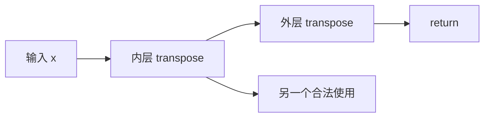

# 第 3 章：高级语言相关的分析与变换（扩充教材）

本地原文：[Ch-3.md](/opt/llvm-project/mlir/docs/Tutorials/Toy/Ch-3.md) · [本章源码](/opt/llvm-project/mlir/examples/toy/Ch3/toyc.cpp)

基准：`release/18.x` / `3b5b5c1ec4a3`。正文按官方主线译编；原文与实现不一致处，以本地代码校正并说明。C++、TableGen 与 MLIR 代码块分别标为“逐字源码”“译编”或“示意”；只有带源码锚点的逐字摘录参与逐行核对，完整实现见源码链接。

与源语言接近的方言，使许多通常只能在 AST 上做的分析和优化也能在统一 IR 框架中完成。本章聚焦局部模式重写：命令式 C++ 模式与声明式 DRR。

## 1. 用 C++ 消除双重转置

目标恒等式：

```text
transpose(transpose(x)) → x
```

对应 IR：

> 代码性质：示意（非逐字源码，未编译或运行验证）。

```mlir
toy.func @transpose_transpose(%arg0: tensor<*xf64>) -> tensor<*xf64> {
  %0 = toy.transpose(%arg0 : tensor<*xf64>) to tensor<*xf64>
  %1 = toy.transpose(%0 : tensor<*xf64>) to tensor<*xf64>
  toy.return %1 : tensor<*xf64>
}
```

Toy IR 中的意图是显式的，模式只需检查当前 `TransposeOp` 的输入是否也由 `TransposeOp` 定义：

> 代码性质：示意（非逐字源码，未编译或运行验证）。

```c++
struct SimplifyRedundantTranspose
    : public mlir::OpRewritePattern<toy::TransposeOp> {
  using OpRewritePattern::OpRewritePattern;

  LogicalResult matchAndRewrite(
      toy::TransposeOp op,
      mlir::PatternRewriter &rewriter) const override {
    auto inner = op.getOperand().getDefiningOp<toy::TransposeOp>();
    if (!inner)
      return failure();
    rewriter.replaceOp(op, inner.getOperand());
    return success();
  }
};
```

所有 IR 修改必须经由 `PatternRewriter`，框架据此维护 use-def 链等不变量。模式注册给 `TransposeOp::getCanonicalizationPatterns`，再由 canonicalizer pass 贪心、迭代地应用：

> 代码性质：示意（非逐字源码，未编译或运行验证）。

```c++
void TransposeOp::getCanonicalizationPatterns(
    RewritePatternSet &patterns, MLIRContext *ctx) {
  patterns.add<SimplifyRedundantTranspose>(ctx);
}
```

PassManager 中加入规范化 pass：

> 代码性质：示意（非逐字源码，未编译或运行验证）。

```c++
pm.addNestedPass<toy::FuncOp>(mlir::createCanonicalizerPass());
```

第一次重写后，外层转置消失，内层转置已无用户。要让死代码删除安全地移除它，必须说明 `toy.transpose` 没有副作用：

> 代码性质：示意（非逐字源码，未编译或运行验证）。

```tablegen
def TransposeOp : Toy_Op<"transpose", [Pure]> { /* ... */ }
```

最终函数可简化为直接返回 `%arg0`。这说明副作用建模不仅是文档，也决定了优化是否合法。

## 2. 用 DRR 优化 reshape

DRR（Declarative Rewrite Rules）在 TableGen 中以 DAG 描述源模式、目标模式、约束与收益。嵌套 reshape 可以写成：

> 代码性质：示意（非逐字源码，未编译或运行验证）。

```tablegen
def ReshapeReshapeOptPattern :
  Pat<(ReshapeOp (ReshapeOp $arg)), (ReshapeOp $arg)>;
```

若输入与结果类型相同，reshape 可以直接替换为输入值：

> 代码性质：示意（非逐字源码，未编译或运行验证）。

```tablegen
def TypesAreIdentical :
  Constraint<CPred<"$0.getType() == $1.getType()">>;

def RedundantReshapeOptPattern : Pat<
  (ReshapeOp:$res $arg),
  (replaceWithValue $arg),
  [(TypesAreIdentical $res, $arg)]>;
```

对常量的 reshape 可以在编译期改写常量属性。`NativeCodeCall` 允许 DRR 调用 C++ 辅助逻辑：

> 代码性质：示意（非逐字源码，未编译或运行验证）。

```tablegen
def ReshapeConstant :
  NativeCodeCall<"$0.reshape(::llvm::cast<ShapedType>($1.getType()))">;

def FoldConstantReshapeOptPattern : Pat<
  (ReshapeOp:$res (ConstantOp $arg)),
  (ConstantOp (ReshapeConstant $arg, $res))>;
```

对于：

```toy
def main() {
  var a<2,1> = [1, 2];
  var b<2,1> = a;
  var c<2,1> = b;
  print(c);
}
```

规范化会把连续 reshape 和常量 reshape 折叠为单个目标形状的常量。

## 3. 运行与观察

```bash
${TOY_BUILD}/bin/toyc-ch3 \
  /opt/llvm-project/mlir/test/Examples/Toy/Ch3/transpose_transpose.toy \
  -emit=mlir -opt

${TOY_BUILD}/bin/toyc-ch3 \
  /opt/llvm-project/mlir/test/Examples/Toy/Ch3/trivial_reshape.toy \
  -emit=mlir -opt
```

构建目录中的 `ToyCombine.inc` 展示了 DRR 自动生成的 C++，适合调试规则展开结果。

## 4. 本章结论

- C++ `OpRewritePattern` 适合复杂控制逻辑；
- DRR 适合结构清晰、可声明的 DAG 改写；
- canonicalizer 会重复应用规则并清理可证明无副作用的死操作；
- 高层 IR 保留语义，能让“看似聪明”的优化变成简单可靠的局部规则。

下一章用接口把方言特有知识提供给通用变换，避免每个方言重复实现算法。

## 5. 规则如何真正进入可执行程序

本地 [Ch3/CMakeLists.txt](/opt/llvm-project/mlir/examples/toy/Ch3/CMakeLists.txt) 对 `mlir/ToyCombine.td` 执行 `-gen-rewriters`，生成构建树中的 `ToyCombine.inc`。`ToyCombine.cpp` 在匿名命名空间包含它；随后 `ReshapeOp::getCanonicalizationPatterns()` 把 `ReshapeReshapeOptPattern`、`RedundantReshapeOptPattern`、`FoldConstantReshapeOptPattern` 三个生成类加入集合。定义规则、生成代码、注册规则、运行 pass 四步缺一不可。

实际 DRR 常量重塑表达式为 `$0.reshape(::llvm::cast<ShapedType>($1.getType()))`。`$arg` 在 ConstantOp 模式里绑定的是稠密属性，不是运行时 Tensor Value；目标 ConstantOp builder 依据这个新属性的类型产生目标形状。

Ch3 的 `toyc.cpp` 只在 `-opt` 下建立 PassManager，并只显式加入嵌套在 `mlir::toy::FuncOp` 上的 Canonicalizer。这里没有第 4 章才增加的 Inliner、ShapeInference 或单独 CSE pass。`TransposeOp` 和 `ReshapeOp` 的 `hasCanonicalizer = 1` 生成相应方法声明；`Pure` 则允许无用结果被安全清理。

规范化采用启发式贪心驱动。模式的 benefit 是规则排序用的收益指标，不是运行时间减少比例，也不保证全局最优。双重转置示例的正确性建立在 Toy 不可变值语义上；若某种转置会影响外部可见状态，不能原样套用该规则。

### 本地测试对应的结果

[transpose_transpose.toy](/opt/llvm-project/mlir/test/Examples/Toy/Ch3/transpose_transpose.toy) 检查两个转置被删除并直接返回函数实参；[trivial_reshape.toy](/opt/llvm-project/mlir/test/Examples/Toy/Ch3/trivial_reshape.toy) 检查结果常量已具有 2×1 形状，连续 reshape 消失。SSA 编号可以变化，应按操作和类型关系理解 CHECK，而不是背诵 `%0`。

## 6. 从等式到合法重写：首先证明什么不变

优化前后应保持程序可观察行为。对 Toy 的纯转置，转置会反转维度顺序；连续两次反转恢复原顺序，元素值不变。于是外层操作的结果可用最初输入替代。这个结论来自操作语义，不来自 `transpose` 这个名字的拼写。

反例是一个操作同时打印日志、修改全局计数器或具有内存可观察副作用。即使其数学结果是恒等变换，删除操作仍可能改变程序行为。因此模式证明和副作用声明必须一致。

### 6.1 重写的是 use-def 图，而不只是文本树



若内层结果还用于别处，模式只替换外层结果，内层不能删除。`rewriter.replaceOp(outer, innerInput)` 更新 outer 的所有使用并删除 outer；框架随后判断 inner 是否为可删死操作。它不是删除“匹配到的两个节点”的粗糙文本替换。

原文用树形匹配解释得很直观，但 SSA 允许共享子表达式，真实 IR 是图。编写新模式时必须逐个思考哪些节点的结果仍有用户。

## 7. PatternRewriter 的职责和匹配失败

`OpRewritePattern<TransposeOp>` 把匹配根限定为 TransposeOp，使 `matchAndRewrite` 直接拿到类型化操作。`getOperand()` 找到输入 Value；`getDefiningOp<TransposeOp>()` 同时检查它是否来自另一个转置。若输入是 Block argument，或来自其他操作，结果为空，这是普通的不匹配。

重写驱动可以尝试很多候选规则。某条模式返回 failure 不等于模块坏了，也不等于 pass 失败；只有驱动不能满足其整体目标或明确报告错误时，才是 pass failure。相反，匹配成功却返回 failure、或返回 success 却未完成预期修改，都可能破坏驱动对进展的理解。

修改应经由 rewriter，因为驱动维护候选 worklist、监听替换以及更新 use-def。常见操作包括 replaceOp、eraseOp、replaceOpWithNewOp 和 modifyOpInPlace。匹配阶段应先检查所有条件，确认能够重写后才开始修改，避免失败时留下半改的 IR。

## 8. Canonicalizer、DCE、CSE、常量折叠分别做什么

| 机制 | 典型输入 | 结果 | Toy 中的关系 |
|---|---|---|---|
| canonicalization pattern | 双重 transpose | 原始输入 | Ch3 显式注册 |
| 死代码删除 DCE | 纯操作结果无使用 | 删除操作 | canonicalizer 可清理 |
| 公共子表达式消除 CSE | 两个等价常量/计算 | 合并为一个结果 | Ch4 驱动单独加入 CSE |
| 常量折叠 folding | 常量操作数下的计算 | Attribute 或已有 Value | Ch3 reshape 经 DRR；Ch7 使用 fold 钩子 |

这些机制会互相创造机会。例如双重转置模式让内层结果变死；常量 reshape 得到两个相同常量后，CSE 又可以合并它们。解释最终输出时，应看具体流水线，不能把所有删减都归功于一条模式。

### 8.1 贪心迭代与终止方向

Canonicalizer 会反复尝试让局部 IR 变得规范，但它不是搜索所有等价程序再选全局最优。规则通常选择一个方向，例如嵌套 reshape 变成单层，而不是同时添加相反规则。规范形式给多次局部变换提供稳定落点。

本章 C++ 模式 `SimplifyRedundantTranspose` 显式传入 `benefit=1`；这个 1 不能推广为所有本地模式的收益值。DRR 在生成重写代码时，按 [Pattern::getBenefit()](/opt/llvm-project/mlir/lib/TableGen/Pattern.cpp:699) 计算“源模式中的操作节点数量 + addBenefit 增量”。这里数的是 operation 节点，不是一个操作有多少输入 operands；未指定增量时，默认 `addBenefit 0`，见 [PatternBase.td](/opt/llvm-project/mlir/include/mlir/IR/PatternBase.td:92)。

本地三个 DRR reshape 规则都没有增加额外 benefit，因此：

| 规则 | 源模式中的操作节点 | benefit |
|---|---|---:|
| `RedundantReshapeOptPattern` | 一个 ReshapeOp | 1 |
| `ReshapeReshapeOptPattern` | 外层和内层两个 ReshapeOp | 2 |
| `FoldConstantReshapeOptPattern` | ReshapeOp 与 ConstantOp | 2 |

这些数值都是模式排序使用的相对指标，不是实测加速比，也不是“删除一条指令便计 1”。较高 benefit 为匹配规则提供优先级依据，不保证所有模式都按表格顺序全局执行；匹配条件、遍历和重写产生的新 IR 仍影响结果。应优先写对顺序不敏感的规则，并使用合适的测试保护行为。

## 9. 把 DRR 逐个符号读出来

> 代码性质：示意（非逐字源码，未编译或运行验证）。

```tablegen
def ReshapeReshapeOptPattern : Pat<
  (ReshapeOp (ReshapeOp $arg)),
  (ReshapeOp $arg)>;
```

第一个 DAG 是 source pattern，根为外层 ReshapeOp；第二个 DAG 是目标。`$arg` 绑定最内层输入 Value。目标仍是 reshape，不是直接返回 x，因为最终形状可能与 x 不同；保留的是外层所要求的结果形状语义。

对 `var a<2,1> = [1,2]; var b<2,1> = a;`，原 IR 含常量 `[2]`、变成 `[2,1]` 的 reshape、另一个 `[2,1]` 的 reshape。仅把两层合为一层仍需要保留 2×1 输出，而把所有 reshape 都删除会让使用者看到 1D 数据。

### 9.1 结果绑定与条件约束

`(ReshapeOp:$res $arg)` 中 `$res` 绑定匹配操作的结果。`TypesAreIdentical $res, $arg` 比较两者 `getType()`，因此仅当输入结果类型完全相同，才能 `replaceWithValue $arg`。

这个规则展示一个模式经常需要的两类信息：图结构告诉我们谁连着谁，类型/属性约束告诉我们这次连接是否允许简化。只有结构、不看形状，很容易写出在方阵例子里看似正常、在非方阵中错误的优化。

### 9.2 NativeCodeCall 并不是运行时调用

ConstantOp 的 `$arg` 对应稠密属性，`ReshapeConstant` 中的 C++ 表达式在编译器匹配重写时运行。它返回新的属性，被目标 ConstantOp 消费，不会把一个 C++ reshape 函数调用放到用户程序中。

| 阶段 | 发生的事 |
|---|---|
| 构建编译器 | TableGen 把 DRR 展开为 C++ |
| 编译 Toy 程序 | 生成的模式匹配 IR，执行属性 reshape |
| 运行生成程序 | 使用已经确定形状的常量；不再执行 toy.reshape |

区分这三个时间点，是理解所有元编程和代码生成框架的基础。

## 10. 用测试描述规则的边界

一个好的模式测试至少包含正例和负例。双重转置正例检查返回值直接用输入；单层转置负例确保不能删除；内层存在额外使用的例子确保只删除外层；不同形状的 reshape 负例确保类型约束起作用。

FileCheck 的 `CHECK-LABEL` 定位函数，`CHECK-NEXT` 约束相邻输出，`CHECK-NOT` 约束某段不出现指定文本。它们检查的是结构预期，不是完整数学证明；若加上 JIT 数值测试，可覆盖另一层错误。

教材不要求你修改 `/opt/llvm-project` 的实现才能阅读。可以复制最小 `.toy` 或 `.mlir` 到当前工作目录，再用同章二进制做对照，这样每个实验有独立输入。

## 11. 例题与解析

**把 `transpose(transpose(x))` 替换成 x 后，还看到一个 transpose，如何判断是不是 bug？** 先查剩余转置的 uses。没有使用则检查 Pure/副作用；还有使用则必须保留。不要只按总转置数量判断。

**`reshape(reshape(x))` 可以直接返回 x 吗？** 只有最终结果类型与 x 相同且保持语义时才可直接返回；一般只能折叠为保留最终形状的一次 reshape。

**`mul(x, ones)` 可以无条件替换为 x 吗？** 不可以。至少要保证元素乘法语义、类型和形状兼容，还要考虑浮点语义允许的等价范围。教程没有实现此规则；它是要求先证明再重写的设计练习。

**为何正确性不应依赖用户打开 `-opt`？** 规范化通常不应承担语言合法性。但本 Toy 后端确实依赖若干高层操作预先消失，因此驱动在请求 lowering 时强制运行必要准备阶段。生产编译器应明确区分必需合法化和可选性能优化。
