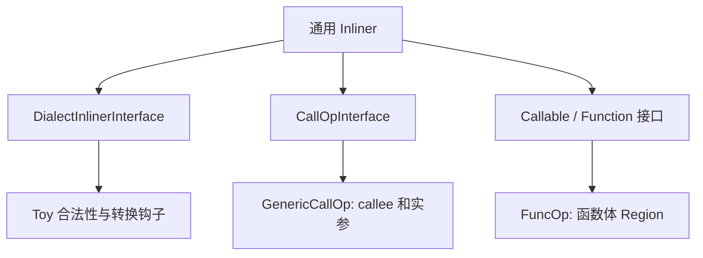
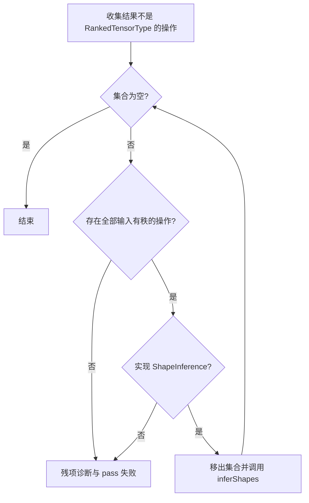

# 第 4 章：通过接口启用通用变换（扩充教材）

本地原文：[Ch-4.md](/opt/llvm-project/mlir/docs/Tutorials/Toy/Ch-4.md) · [本章源码](/opt/llvm-project/mlir/examples/toy/Ch4/toyc.cpp)

基准：`release/18.x` / `3b5b5c1ec4a3`。正文按官方主线译编；原文与实现不一致处，以本地代码校正并说明。C++、TableGen 与 MLIR 代码块分别标为“逐字源码”“译编”或“示意”；只有带源码锚点的逐字摘录参与逐行核对，完整实现见源码链接。

## 1. 可扩展 IR 带来的问题

MLIR 方言可以表达许多抽象层，但不同方言往往需要相同算法，例如内联、形状推断、常量折叠。如果每个 pass 都写死所有方言，代码会重复且无法扩展。

接口（Interface）把算法与方言知识分开：通用算法只依赖一组能力；方言或操作实现相应钩子。MLIR 主要提供方言接口和操作接口两种粒度。

本章用接口完成两件事：

1. 使用通用 inliner 展开 Toy 函数调用；
2. 使用操作接口实现函数内形状推断。

## 2. 为什么先内联再推断形状

Toy 泛型函数的形参最初是 `tensor<*xf64>`。不同调用点可能传入不同形状。教程不实现跨过程符号推断，而采用更直接的流程：

```text
展开所有调用 → 删除无用私有函数 → 在 main 内传播静态形状
```

这样跨函数问题被化为单函数内的数据流问题。

## 3. 为通用 Inliner 提供能力

### 3.1 方言接口

`DialectInlinerInterface` 回答“某次调用/某个 Region/某个操作是否允许内联”，并处理被内联的 terminator。Toy 没有复杂控制流，均可返回允许；`toy.return` 的操作数用来替换原调用结果。

> 代码性质：逐字源码（按所引路径与起始行核对；不等于独立可编译）。

[源码：Ch4/mlir/Dialect.cpp](/opt/llvm-project/mlir/examples/toy/Ch4/mlir/Dialect.cpp:48)

```c++
struct ToyInlinerInterface : public DialectInlinerInterface {
  using DialectInlinerInterface::DialectInlinerInterface;

  //===--------------------------------------------------------------------===//
  // Analysis Hooks
  //===--------------------------------------------------------------------===//

  /// All call operations within toy can be inlined.
  bool isLegalToInline(Operation *call, Operation *callable,
                       bool wouldBeCloned) const final {
    return true;
  }

  /// All operations within toy can be inlined.
  bool isLegalToInline(Operation *, Region *, bool, IRMapping &) const final {
    return true;
  }

  // All functions within toy can be inlined.
  bool isLegalToInline(Region *, Region *, bool, IRMapping &) const final {
    return true;
  }

  //===--------------------------------------------------------------------===//
  // Transformation Hooks
  //===--------------------------------------------------------------------===//

  /// Handle the given inlined terminator(toy.return) by replacing it with a new
  /// operation as necessary.
  void handleTerminator(Operation *op, ValueRange valuesToRepl) const final {
    // Only "toy.return" needs to be handled here.
    auto returnOp = cast<ReturnOp>(op);

    // Replace the values directly with the return operands.
    assert(returnOp.getNumOperands() == valuesToRepl.size());
    for (const auto &it : llvm::enumerate(returnOp.getOperands()))
      valuesToRepl[it.index()].replaceAllUsesWith(it.value());
  }

  /// Attempts to materialize a conversion for a type mismatch between a call
  /// from this dialect, and a callable region. This method should generate an
  /// operation that takes 'input' as the only operand, and produces a single
  /// result of 'resultType'. If a conversion can not be generated, nullptr
  /// should be returned.
  Operation *materializeCallConversion(OpBuilder &builder, Value input,
                                       Type resultType,
                                       Location conversionLoc) const final {
    return builder.create<CastOp>(conversionLoc, resultType, input);
  }
};
```

接口在 `ToyDialect::initialize()` 中注册。除 `main` 外的函数还应设为 `private`，通用 inliner 才能删除已无用户的定义。

### 3.2 调用相关的操作接口

Inliner 还要知道哪个操作是函数、哪个是调用：

> 代码性质：示意（非逐字源码，未编译或运行验证）。

```tablegen
include "mlir/Interfaces/CallInterfaces.td"

def FuncOp : Toy_Op<"func",
    [FunctionOpInterface, IsolatedFromAbove]> { /* ... */ }

def GenericCallOp : Toy_Op<"generic_call",
    [DeclareOpInterfaceMethods<CallOpInterface>]> { /* ... */ }
```

`FuncOp` 提供 callable Region；`GenericCallOp` 提供 callee 符号和实参范围。通用 pass 不必认识 `toy.func` 的内部实现。

#### 调用者和被调用者分别提供什么

`CallOpInterface` 描述调用者：callee 是谁、实参有哪些、怎样修改它们。`CallableOpInterface` 描述被调用者：函数体 Region 在哪里以及参数/结果信息。本地 FuncOp 声明的是 `FunctionOpInterface`，而 [FunctionInterfaces.td](/opt/llvm-project/mlir/include/mlir/Interfaces/FunctionInterfaces.td:24) 让它依赖 `CallableOpInterface`；不是把两套互不相关的调用算法并列运行。

本地 FuncOp 的 ODS 额外声明提供 `getArgumentTypes()`、`getResultTypes()` 和 `getCallableRegion()`，最后一个返回 `&getBody()`。GenericCallOp 的四个接口方法则直接连接属性和操作数：

> 代码性质：逐字源码（按所引路径与起始行核对；不等于独立可编译）。

[源码：Ch4/mlir/Dialect.cpp](/opt/llvm-project/mlir/examples/toy/Ch4/mlir/Dialect.cpp:330)

```c++
CallInterfaceCallable GenericCallOp::getCallableForCallee() {
  return (*this)->getAttrOfType<SymbolRefAttr>("callee");
}

/// Set the callee for the generic call operation, this is required by the call
/// interface.
void GenericCallOp::setCalleeFromCallable(CallInterfaceCallable callee) {
  (*this)->setAttr("callee", callee.get<SymbolRefAttr>());
}

/// Get the argument operands to the called function, this is required by the
/// call interface.
Operation::operand_range GenericCallOp::getArgOperands() { return getInputs(); }

/// Get the argument operands to the called function as a mutable range, this is
/// required by the call interface.
MutableOperandRange GenericCallOp::getArgOperandsMutable() {
  return getInputsMutable();
}
```

callee 是 SymbolRefAttr，描述对模块符号的引用；实参是 SSA operands，二者不是一回事。`getArgOperandsMutable()` 提供可变范围供通用变换更新实参，不要求算法理解 Toy 的命名访问器。只会查询 callee 而不能设置它、只会读参数而不能暴露更新接口，都不足以复现本地完整的 CallOpInterface 实现。

### 3.3 处理调用边界的类型差异

实参可能是 `tensor<2x3xf64>`，形参却是 `tensor<*xf64>`。即使两者语义兼容，内联仍需显式转换。Toy 增加 `toy.cast`：它只改变静态形状信息，不改变元素。

> 代码性质：示意（非逐字源码，未编译或运行验证）。

```tablegen
def CastOp : Toy_Op<"cast", [
    DeclareOpInterfaceMethods<CastOpInterface>,
    DeclareOpInterfaceMethods<ShapeInferenceOpInterface>,
    Pure,
    SameOperandsAndResultShape
  ]> {
  let arguments = (ins F64Tensor:$input);
  let results = (outs F64Tensor:$output);
  let assemblyFormat = "$input attr-dict `:` type($input) `to` type($output)";
}
```

`areCastCompatible` 检查输入输出都是元素类型相同的张量；若两边都有秩，形状还必须相同。`materializeCallConversion` 在需要时创建 cast。最后把通用 inliner pass 加入流水线：

> 代码性质：示意（非逐字源码，未编译或运行验证）。

```c++
pm.addPass(mlir::createInlinerPass());
```

## 4. 函数内形状推断

内联后，`main` 中仍混有静态和动态形状。形状推断 pass 不应写死 `toy.mul`、`toy.transpose` 等操作，而应询问操作本身如何推断结果。

### 4.1 声明操作接口

> 代码性质：译编（含中文改写，非逐字源码；未编译或运行验证）。

```tablegen
def ShapeInferenceOpInterface : OpInterface<"ShapeInference"> {
  let description = [{根据已知输入推断并设置操作的结果形状。}];
  let methods = [
    InterfaceMethod<"Infer result shapes", "void", "inferShapes">
  ];
}
```

需要参与推断的操作附加 `DeclareOpInterfaceMethods<ShapeInferenceOpInterface>`，并实现方法。例如逐元素乘法的输出形状与输入相同：

> 代码性质：示意（非逐字源码，未编译或运行验证）。

```c++
void MulOp::inferShapes() {
  getResult().setType(getLhs().getType());
}
```

转置实现反转整个维度列表，二维时就是交换两维；cast 实现把输入类型单向赋给结果。Add/Mul 也只把左输入类型赋给结果，没有在 `inferShapes()` 中验证两输入形状一致。

### 4.2 Worklist 算法

ShapeInferencePass 在单个 `toy.func` 上运行：

1. 将所有结果中含非 `RankedTensorType` 的操作放入 worklist；
2. 找到所有输入都是 `RankedTensorType` 的“就绪”操作；
3. 通过 `dyn_cast<ShapeInference>` 调用其 `inferShapes()`；
4. 从 worklist 移除该操作并继续；
5. 若 worklist 非空但没有操作就绪，则推断失败。

> 代码性质：译编（含中文改写，非逐字源码；未编译或运行验证）。

```c++
if (auto shapeOp = dyn_cast<ShapeInference>(op)) {
  shapeOp.inferShapes();
} else {
  op->emitError("缺少 shape inference 接口");
  return signalPassFailure();
}
```

将 pass 加入 inliner 之后：

> 代码性质：示意（非逐字源码，未编译或运行验证）。

```c++
pm.addPass(mlir::createInlinerPass());
auto &optPM = pm.nest<mlir::toy::FuncOp>();
optPM.addPass(mlir::toy::createShapeInferencePass());
optPM.addPass(mlir::createCanonicalizerPass());
optPM.addPass(mlir::createCSEPass());
```

结果中的张量可全部具体化：

> 代码性质：示意（非逐字源码，未编译或运行验证）。

```mlir
toy.func @main() {
  %0 = toy.constant dense<[[1.0, 2.0, 3.0], [4.0, 5.0, 6.0]]>
       : tensor<2x3xf64>
  %1 = toy.transpose(%0 : tensor<2x3xf64>) to tensor<3x2xf64>
  %2 = toy.mul %1, %1 : tensor<3x2xf64>
  toy.print %2 : tensor<3x2xf64>
  toy.return
}
```

## 5. 运行

```bash
${TOY_BUILD}/bin/toyc-ch4 \
  /opt/llvm-project/mlir/test/Examples/Toy/Ch4/codegen.toy \
  -emit=mlir -opt
```

接口的价值在于：算法保持通用，扩展点由方言或操作提供。下一章会利用已知静态形状，把张量计算降到 Affine、Arith 与 MemRef 方言。

## 6. 与本地 pass 的逐项核对

本地 worklist 是 `SmallPtrSet<Operation*, 16>`，不是按源码顺序排队。每轮扫描寻找输入都有秩的操作，先移出集合，再调用接口。若找不到就绪操作却还有残项，发出 `Shape inference failed`；如果操作就绪却缺少接口，发出另一条明确错误。

> 代码性质：逐字源码（按所引路径与起始行核对；不等于独立可编译）。

[源码：Ch4/mlir/ShapeInferencePass.cpp](/opt/llvm-project/mlir/examples/toy/Ch4/mlir/ShapeInferencePass.cpp:103)

```c++
  static bool allOperandsInferred(Operation *op) {
    return llvm::all_of(op->getOperandTypes(), [](Type operandType) {
      return llvm::isa<RankedTensorType>(operandType);
    });
  }
```

> 代码性质：逐字源码（按所引路径与起始行核对；不等于独立可编译）。

[源码：Ch4/mlir/ShapeInferencePass.cpp](/opt/llvm-project/mlir/examples/toy/Ch4/mlir/ShapeInferencePass.cpp:111)

```c++
  static bool returnsDynamicShape(Operation *op) {
    return llvm::any_of(op->getResultTypes(), [](Type resultType) {
      return !llvm::isa<RankedTensorType>(resultType);
    });
  }
```

`RankedTensorType` 包括 `tensor<?x3xf64>`。因此这里的函数名和注释中的“动态形状”比实际判定更宽泛：实现解决的是 Toy 示例中无秩到有秩的传播，没有求解任意动态维度。接口方法返回 void，驱动移除操作后不再检查是否真的得到了更精确类型，正确性依赖操作实现。

`CastOp::areCastCompatible` 允许至少一边无秩；若两边都有秩，要求类型完全一致。这比“所有兼容动态维都能 cast”更严格。`SameOperandsAndResultShape` 与手写检查一起构成约束，不能只按操作名解释行为。

[Ch4/toyc.cpp](/opt/llvm-project/mlir/examples/toy/Ch4/toyc.cpp:124) 仅在 `if (enableOpt)` 中构造并运行这条流水线；因此 Ch4 不加 `-opt` 时不会做内联与形状推断。开启后，显式顺序是 Module Inliner，然后 `toy.func` 上 ShapeInference → Canonicalizer → CSE。Inliner 内部可能做简化，但驱动并没有在 ShapeInference 前另外加入一个 Canonicalizer。

残留“跨过程专门化”注释的是 [ShapeInferencePass.cpp 的文件头](/opt/llvm-project/mlir/examples/toy/Ch4/mlir/ShapeInferencePass.cpp:9)，不是 toyc.cpp；同一文件的类说明和实际实现都是函数内处理。Ch5/Ch6 请求 lowering 时即使不加 `-opt` 也运行必要准备阶段，是后续驱动的行为，不应倒推到 Ch4。

[shape_inference.mlir](/opt/llvm-project/mlir/test/Examples/Toy/Ch4/shape_inference.mlir) 同时检查私有 multiply_transpose 定义与 `tensor<*xf64>` 消失。CSE 负责合并等价常量/转置等公共子表达式；因此最后 `%mul` 两个输入可以指向同一个转置结果。

## 7. 接口为何能避免为每个方言重写算法

假设我们要给 Toy、另一个张量 DSL 和一个图计算方言都实现内联。复制三套图克隆、参数替换、符号查找和清理代码，会让每次修 bug 都必须同步三处。接口把稳定的结构操作放入公共算法，把可变的语言规则留给方言。

通用算法需要知道“callee 的 Region 在哪里”“调用的实参有哪些”“返回值如何替换”“这次跨区域移动是否合法”。这些问题与具体名字无关。`toy.generic_call` 实现 CallOpInterface 后，框架按能力访问它，而不是比较字符串 `toy.generic_call`。



### 7.1 Trait 与 Interface 的精确区别

两者都可能出现在 ODS traits 列表中，因此“写在同一个列表”不意味着它们功能相同。Trait 常表示可重用的结构性质或实现；接口定义可供外部查询和调用的方法协议。例如 `Pure` 帮助回答死操作是否可安全清理，`ShapeInference` 则提供真正会被调用的 `inferShapes()`。

接口的方法可以由生成器声明，也可以有默认实现。`DeclareOpInterfaceMethods` 让操作类明确声明需要实现的方法。若接口登记了但实现没有按契约推进类型精度，通用算法依然可能产生坏结果；接口只是机制，不自动证明实现正确。

## 8. 把一次内联画成值映射

考虑 f 的入口参数 `%arg`，调用者传入 `%a`。内联不是简单把函数正文字符串贴到调用点，因为 callee 中 SSA Value 的身份必须被映射到 caller。一个概念上的映射表如下：

| Callee 中的 Value | Caller 中的对应 Value |
|---|---|
| `%arg` | `%a` 或插入的 cast 结果 |
| callee 的 transpose 结果 | 克隆后的 transpose 结果 |
| return 的操作数 | 取代 call 结果的 Value |

`IRMapping` 协助维护这种对应关系。若一个函数有多次调用，每次内联都得到自己的局部映射，之后 CSE 才可能合并等价子表达式。这与“生成一个缓存的专门化函数供多次调用复用”是两种不同实现。

### 8.1 为什么需要处理 return

callee 的 `toy.return` 结束的是 callee 的函数体。移入 main 后，直接保留它会提前终结 main，且破坏调用结果的 use-def。`handleTerminator` 取得 ReturnOp 的 operands，逐个替换原 call 结果的 uses。随后内联框架处理不再需要的调用/返回结构。

### 8.2 为什么非 main 函数设为 private

“当前模块里没有调用”并不等于“外部不会调用”。私有可见性明确说明函数不是对外接口，才允许把没有使用的函数定义清掉。`main` 保持入口；后续 FuncOpLowering 只接受 main，所以这一步既影响优化，又关系到下一阶段能否完成。

## 9. Cast 连接的是静态类型信息

调用者知道实参为 2×3，泛型函数只承诺输入是 f64 张量。显式 cast 将类型边界表达在 IR 中：

```text
实际 Value 的类型：tensor<2x3xf64>
        ↓ toy.cast
泛型函数入口期望：tensor<*xf64>
        ↓ 内联与形状传播
函数体中的结果重新变为有秩类型
```

这个 cast 不重排元素、不分配新 buffer，也不是把 f64 转成 f32。它和 reshape 不同：reshape 改变张量的形状含义，而 cast 只是改变已知形状信息，在本地两边有秩时还要求类型完全一致。

`CastOp::inferShapes()` 直接把输入类型赋给输出，表明传播方向是输入→结果。之后恒等 cast 可被折叠/规范化。教学代码可以这样做，因为其形状流和操作集合很受限；复杂的函数边界、动态维与控制流需要更完整的类型一致性处理。

## 10. 形状推断其实是数据依赖调度

以常量 A 的形状 `[2,3]` 为起点，cast、transpose、mul 的结果依次可知。worklist 只是保存尚未处理的操作，并不计算公式；公式藏在操作接口实现中。



这张图刻意写“有秩”而不是“完全静态”。在本地 `allOperandsInferred()` 中，`tensor<?x3xf64>` 也被判为就绪。后面的 Affine lowering 要求静态尺寸，所以不能把本算法当作通用动态 shape solver。

### 10.1 用表格手工执行一轮

| 操作 | 初始结果 | 何时可处理 | 推断后 |
|---|---|---|---|
| constant | `tensor<2x3xf64>` | 已知，不进 worklist | 不变 |
| cast | `tensor<*xf64>` | constant 已有秩 | `tensor<2x3xf64>` |
| transpose | `tensor<*xf64>` | cast 已有秩 | `tensor<3x2xf64>` |
| mul | `tensor<*xf64>` | 两个输入都有秩 | 左输入类型 |

因为 SmallPtrSet 不提供源码顺序保证，驱动每次重新寻找就绪项。只要依赖最终能从常量/已有秩输入传播，具体扫描顺序就不应改变正确结果。

### 10.2 推断与验证是两件事

`MulOp::inferShapes()` 只有一次 setType，它没有比较 RHS 是否相同。因此“结果能推断”不等于“输入合法”。本地 Ch4 的 Add/Mul ODS 也没有给出通用形状相等验证器。原文宣称错误形状会被静态发现，教材必须说明代码距离完整语言检查仍有差距。

相似地，操作有接口但实现忘记修改结果时，worklist 仍会把它移除。这份教学 pass 没有再次检查结果是否达到目标，也不是反复直到所有维度信息达到数学不动点的通用求解器。

## 11. PassManager 的嵌套层级

Module pass 管理整个符号空间，适合跨函数内联；ShapeInferencePass 继承 `OperationPass<toy::FuncOp>`，每次处理一个函数。C++ 驱动要把它放进 `pm.nest<mlir::toy::FuncOp>()` 的 OpPassManager，不能直接当作 Module pass 使用。

```text
Module PassManager
├── Inliner
└── nested toy.func
    ├── ShapeInference
    ├── Canonicalizer
    └── CSE
```

上图是本地 Ch4 的显式顺序。Inliner 内部也可能简化，但这是内部行为；不要据最后 IR 更简洁就推断驱动显式注册了另一个 pass。

## 12. 从一个新操作接入接口

假设要给 Toy 增加保形状的一元操作。完整步骤是定义其 ODS 操作和元素类型约束，添加 `DeclareOpInterfaceMethods<ShapeInferenceOpInterface>`，实现从输入类型构造结果类型，提供必要 verifier，再让已有 worklist 自动调度。通用 pass 不需要新增一个按操作名分派的分支。

如果新操作的结果尺寸依赖数据值，例如返回所有非零元素，单靠输入 Type 无法得到静态长度。正确做法是明确选择动态表示或不同 lowering 路线，而不是在 inferShapes 中猜一个长度来满足 worklist。

## 13. 例题与解析

**一个无操作数、结果无秩的操作会不会被判为就绪？** 会。对空 operand 集合执行 all_of 得到 true；随后它必须提供接口推断结果。Ch7 的常量形状恢复正适合这种模式。

**为什么将形状推断提前到内联之前可能失败？** 私有函数参数仍无秩，函数内的 transpose/mul 没有就绪输入。调用点的形状尚未变成该函数体中的显式值信息。

**已有 `tensor<?x3xf64>` 能否保证后续静态循环生成成功？** 不能。它有秩，但第一维 size 未知；Toy 的静态边界构造不会自动补出动态 size 查询。

**本章做的是泛型专门化吗？** 从语言效果看，计算在调用上下文中具体化；从实现看，是展开调用加函数内传播。代码没有生成并缓存按签名命名的专门化函数，阅读时应明确这个层次差别。
