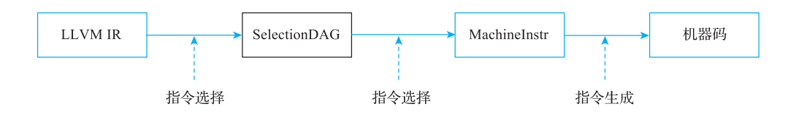
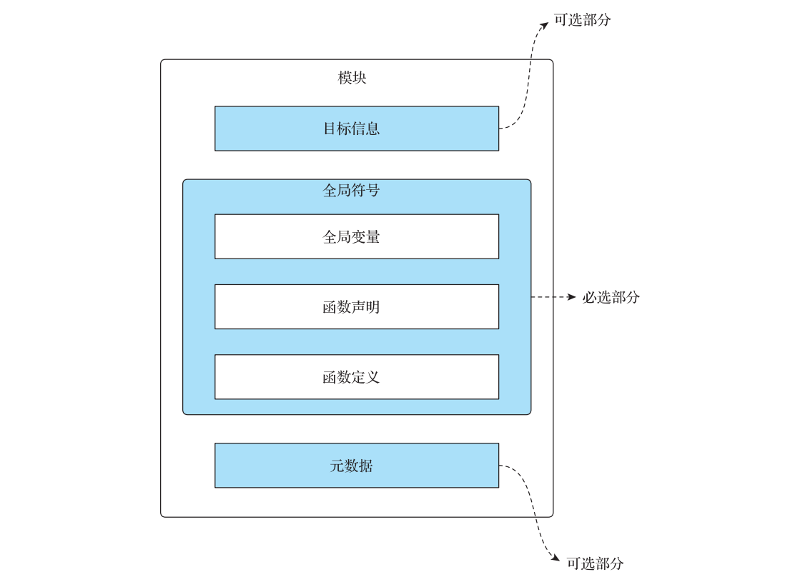
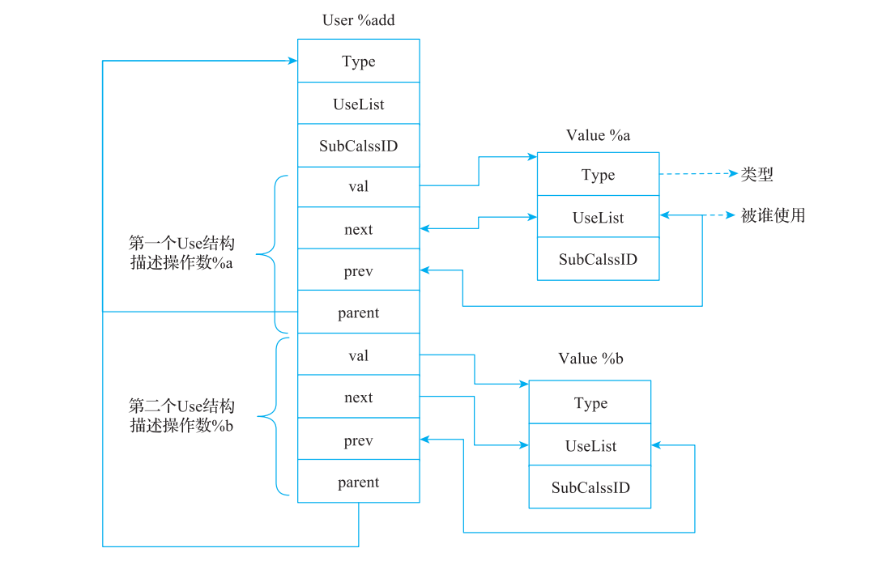
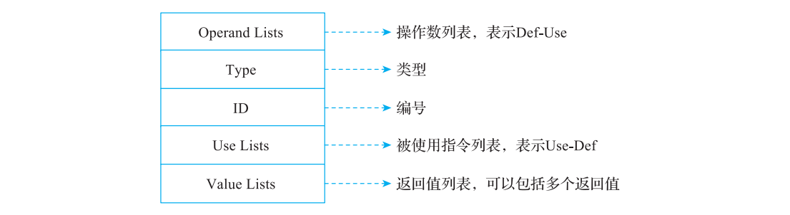
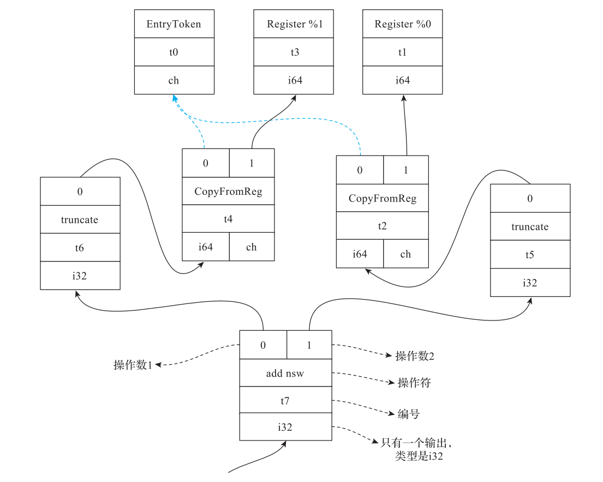
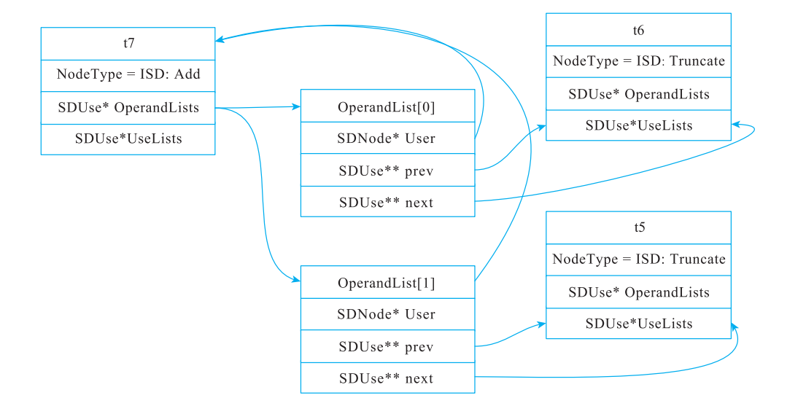
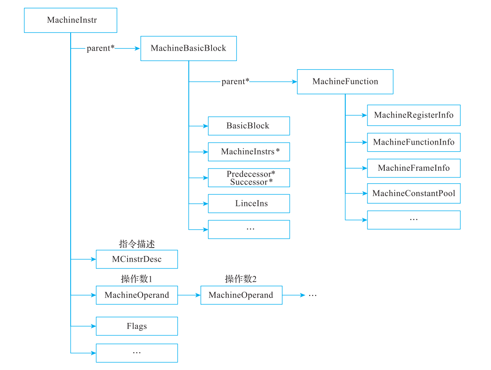

# 附录 A LLVM 的中间表示（LLVM 18.1.8 校订）

> 基于原文全文和 `/opt/llvm-project` 的 LLVM 18.1.8 静态核对；书中版本为 LLVM 15。原文见 [origin](origin/inside-llvm-codegen-appendix-a.md)，逐项记录见 [review](review/appendix-a.md)。本轮未构建、未执行 IR 或 BPF 程序。历史图和输出作为对照，修正文意以本稿为准。

Appendix A 附录 A

LLVM 的中间表示

IR 是程序的一种表示，其设计注重支持变换操作，需要保证正确性和高效性。IR 的设计一般是在各种限制条件下权衡各种利弊，然后做出的折中选择，这些选择会考虑具体问题的普遍性或者特殊性、编译器技术栈带来的组合复杂性、对各种变换的影响等。所以 IR设计通常没有普适的设计规则，但在 IR 设计过程中还是有一些良好的设计理念值得遵守。

1）IR 中的操作要具有清晰、明确的语义。

2）IR 中的操作能够相互正交（数学中的概念，表示操作相互独立且不可替代），这有助于定义标准操作，以减少变换时需要考虑的场景。

3）IR 中的信息应避免重复，防止变换过程中对重复信息进行变换而出现不一致的情况。

4）IR 实现时应尽可能地保持高层次信息，因为在 IR 降级后想要重新找回丢失的信息很难。

这些理念听起来都非常有道理，但实际实现过程中很难完全遵守，原因非常复杂，有些是基于性能考虑，有些是基于实现复杂性的考虑。早期编译器通常只使用一种 IR，但随着编译器的演进，情况变得更加复杂，通常会有多层级的 IR。例如，在 LLVM 代码生成过程中，输入为 LLVM IR，最终输出为机器码，整个过程使用了诸多中间表示，包含狭义的LLVM IR、DAG、MachineInstr（MIR）、通用 MIR、MC 等。在代码生成过程中，IR 的生命周期如图 A-1 所示。



**图 A-1 IR 生命周期**

本节简单介绍这些 IR 的设计和实现。

## A.1 狭义 LLVM IR 介绍

由于 LLVM IR 的复杂性，本书无法全面展开介绍，本节简单介绍 LLVM IR 语法，更为详细的资料读者可以参考官网学习。

### A.1.1 IR 文件布局

LLVM IR 文件以模块为基础进行存储，其布局示意图如图 A-2 所示。



**图 A-2 LLVM IR 文件布局示意图**

内容可以分为 3 部分：目标信息、全局符号和元数据，每一部分包含的主要内容分别如下。

1）目标信息包含了文件的来源、数据布局等信息。

2）全局符号主要包括全局变量、函数的定义与声明。

3）元数据使用 `!` 标识。函数/参数属性和 `attributes #N` 属性组是另一套机制，不应全部归入 Metadata。

一个简单的文件布局示例如代码清单 A-1 所示。

**代码清单 A-1 文件布局示例源码**

```text
int test(int a, int b) {
    int add = a+b;
    return add;
}
```

编译成 IR 文件后如代码清单 A-2 所示，编译命令为 clang -S -emit-llvm test.c。

**代码清单 A-2 代码清单 A-1 对应的 IR（已迁移为 ptr）**

> 本例保留原书的 Apple M1 目标、属性与 `llvm.ident` 历史元数据；它不是本机 LLVM 18 运行输出。原书跨行断开的字符串已接回。

```text
; ModuleID = 'test.c'
source_filename = "test.c"
target datalayout = "e-m:o-i64:64-i128:128-n32:64-S128"
target triple = "arm64-apple-macosx13.0.0"

; Function Attrs: noinline nounwind optnone ssp uwtable
define i32 @test(i32 %0, i32 %1) #0 {
    %3 = alloca i32, align 4
    %4 = alloca i32, align 4
    %5 = alloca i32, align 4
    store i32 %0, ptr %3, align 4
    store i32 %1, ptr %4, align 4
    %6 = load i32, ptr %3, align 4
    %7 = load i32, ptr %4, align 4
    %8 = add nsw i32 %6, %7
    store i32 %8, ptr %5, align 4
    %9 = load i32, ptr %5, align 4
    ret i32 %9
}
attributes #0 = { noinline nounwind optnone ssp uwtable "frame-pointer"="non-leaf"
"min-legal-vector-width"="0" "no-trapping-math"="true" "stack-protector-buffer-size"=
"8" "target-cpu"="apple-m1" "target-features"="+aes,+crc,+crypto,+dotprod,+fp-armv8,+fp16fml,+fullfp16,+lse,+neon,+ras,+rcpc,+rdm,+sha2,+v8.5a,+zcm,+zcz" }

!llvm.module.flags = !{!0, !1, !2, !3, !4, !5, !6, !7}
!llvm.ident = !{!8}

!0 = !{i32 1, !"wchar_size", i32 4}
!1 = !{i32 1, !"branch-target-enforcement", i32 0}
!2 = !{i32 1, !"sign-return-address", i32 0}
!3 = !{i32 1, !"sign-return-address-all", i32 0}
!4 = !{i32 1, !"sign-return-address-with-bkey", i32 0}
!5 = !{i32 7, !"PIC Level", i32 2}
!6 = !{i32 7, !"uwtable", i32 1}
!7 = !{i32 7, !"frame-pointer", i32 1}
!8 = !{!"Homebrew clang version 15.0.1"}
```

在该中间代码文件中，目标信息包含两部分，分别是数据布局和编译三元组，它们在该例中信息如下。

1）清单 A-2 的实际数据布局是 `e-m:o-i64:64-i128:128-n32:64-S128`，原书解释段误换成了另一条含 `f80:128` 的字符串。逐项对应如下：

- `e`：小端序。
- `m:o`：Mach-O 名字改写规则。
- `i64:64`、`i128:128`：相应整数类型的 ABI 对齐分别为 64、128 位。
- `n32:64`：目标自然支持的整数宽度为 32、64 位。
- `S128`：自然栈对齐为 128 位。

这不是“每个对象大小”的列表，省略的数据布局条目还使用 LLVM 规定的默认值。解释见 [LangRef 的 Data Layout](/opt/llvm-project/llvm/docs/LangRef.rst)。

2）编译三元组，即 target triple = "arm64-apple-macosx13.0.0" 表示：

- arm64：目标架构为 AArch64 架构。

- apple：供应商为 Apple。

- macosx13.0.0：目标操作系统为 macOS 13.0.0。

该例有多个元数据节点；另有函数属性组使用 #0 描述，它对应的定义为：attributes #0 = { noinline nounwind optnone ssp uwtable "frame-pointer"="non-leaf" ... }。每个函数属性都有其特定含义，LLVM 的中端和后端会使用这些属性，例如 noinline 标识函数不允许被内联；optnone 要求跳过多数可选优化，但必要的合法化与代码生成仍会执行。

全局信息比较丰富，涉及标识符、类型、函数的定义和声明、指令等，下面针对这些信息稍微展开介绍。

### A.1.2 标识符

LLVM IR 标识符分为两类：全局标识符和局部标识符，分别以符号 @ 和 % 开头。例如，全局变量、函数名等都属于全局标识符，全局标识符最终可能体现在代码生成的文件中；局部变量属于局部标识符，局部变量可能在寄存器分配过程中被消除。例如，一个全局变量和局部变量的定义如代码清单 A-3 所示。

**代码清单 A-3 全局变量和局部变量示例**

```llvm
; 全局变量在模块级定义。
@global_var = global i32 0

; load 是指令，必须放在函数基本块中。
define i32 @read_global() {
entry:
  %local_var = load i32, ptr @global_var, align 4
  ret i32 %local_var
}
```

注意：上述代码是合法的 LLVM IR，其中注释使用“;”开头。

标识符又分为命名标识符、匿名标识符，以 % 或者 @ 开头。未加引号的命名标识符可用正则表达式 `[%@][-a-zA-Z$._][-a-zA-Z$._0-9]*` 描述；这不是所有常量的文法，带引号名称另有规则，例如 %var、@gloab.123 等；匿名标识

符是以 % 或者 @ 开头，后接无符号数，例如 %12、@2 等。

### A.1.3 类型

LLVM IR 提供了丰富的类型，包括整数、浮点数、数组、结构体、向量、指针等。其中：

1）整数最为灵活，以 i 开头，其后是位宽数值（1 到 1<<23，而不是数字字符串的长度），例如i1、i4、i32 等都是合法的整数类型。

2）LLVM IR 浮点类型名包括 `half`、`bfloat`、`float`、`double`、`fp128`、`x86_fp80`、`ppc_fp128`，不能混用 TableGen/MLIR 的 `f16`、`bf16` 等拼写。

3）LLVM 18 使用 opaque pointer：`ptr`，非默认地址空间写为 `ptr addrspace(N)`。被访问的数据类型由 load/store/getelementptr 等指令显式给出。

4）数组类型使用 [] 定义，例如 [4 x i32] 表示一个包含 4 个 i32 的数组。

5）结构体使用 {} 定义，例如 `{float, ptr}` 表示结构体包含一个浮点数和一个指针。

6）向量使用 <> 定义，例如 <4 x float> 表示一个包含 4 个浮点数的向量。

### A.1.4 函数声明和定义

在源代码中函数有定义和声明，LLVM IR 中也有对应的函数定义和声明。

函数定义由 define 关键字修饰，对应的语法格式如代码清单 A-4 所示。

**代码清单 A-4 函数定义的语法骨架（尖括号与方括号为文法占位）**

```text
define [linkage] [PreemptionSpecifier] [visibility] [DLLStorageClass]
       [cconv] [ret attrs]
       <ResultType> @<FunctionName> ([argument list])
       [(unnamed_addr|local_unnamed_addr)] [AddrSpace] [fn Attrs]
       [section "name"] [partition "name"] [comdat [($name)]] [align N] [gc] [prefix Constant]
       [prologue Constant] [personality Constant] (!name !N)* { ... }
```

其中，[] 表示可选字段。上述语法表示每个函数都有以下可选参数：一个可选的链接标识（linkage），一个可选抢占符（PreemptionSpecifier），一个可选的可见性模式（visibility），一个可选的 DLL 存储类别（DLLStorageClass），一个可选的调用约定（cconv），一个可选的返回值参数属性（ret attrs），一个返回值类型（ResultType），一个函数名（FunctionName），一个（可能为空的）实参列表（每一个都带有可选的参数属性），一个可选的 unnamed_addr属性（unnamed_addr 或者 local_unnamed_addr），一个可选的地址空间（AddrSpace），一个可选的函数属性（fn Attrs），一个可选的区域（section "name"），一个可选的 comdat 区（comdat），一个可选的对齐属性（align N），一个可选垃圾回收期的名字（gc），一个可选的前缀（prefix Constant），一个可选的函数前导数据（prologue Constant，不是函数尾部后缀），一个可选的个性化常量（personality Constant），一个左花括号，一个基本块列表和一个右花括号。

其中，参数列表（argument list）是逗号分隔的参数序列，其中每个参数的形式为：

<type> [parameter Attrs] [name]。

函数真正的功能定义包含一个基本块列表，形成该函数的 CFG（控制流图）。每个基本块可以以一个标签作为起点（为基本块赋予一个符号表入口），包含指令列表，并以终止指令（如分支或函数返回）结束。如果基本块没有显式的标签，则会被赋予一个隐含的编号标签，编号使用从计数器中返回的下一个值，就像为未命名的临时对象分配编号那样。未命名参数、基本块和有结果的指令共用函数内编号序列。例如清单 A-2 的两个未命名参数占 %0、%1，入口块隐含编号为 %2，首条 alloca 才是 %3；入口块并不总是 %0。

函数声明由 declare 关键字修饰，对应的语法格式如代码清单 A-5 所示。

**代码清单 A-5 函数声明的语法骨架（非可直接执行的 IR）**

```text
declare [linkage] [visibility] [DLLStorageClass]
        [cconv] [ret attrs]
        <ResultType> @<FunctionName> ([argument list])
        [(unnamed_addr|local_unnamed_addr)] [AddrSpace] [fn Attrs]
        [align N] [gc] [prefix Constant] [prologue Constant]
```

函数声明也可以带地址空间和函数属性，例如 `declare void @f() nounwind`。LangRef 的简化 declare 语法展示不完整；这里补上 `LLParser::parseFunctionHeader()` 实际解析的 AddrSpace/fn Attrs，仍是骨架而不是完整文法。其他对应字段与函数定义含义相同，不再展开。上面也仅仅对语法格式做了简单的介绍，每个字段还有更为具体的定义，限于篇幅，本书不再介绍。

### A.1.5 指令

LLVM IR 的指令数量在 LLVM 1.0 时只有 34 个，到 LLVM 2.0 时增加至 50 个，LLVM 18 的核心 opcode 列表见 `llvm/include/llvm/IR/Instruction.def`；指令枚举数量不包含大量 intrinsic，不能据枚举数量断言 IR 不再演进。

在 LLVM 1.0 中，IR 主要分为 6 类，分别是基本块终止指令、算术指令、逻辑指令、比较指令、内存管理指令和其他指令。

1）基本块终止指令：指令位于基本块的最后，是基本块的最后一条指令。典型的终止指令有 ret、br、switch、invoke、unwind 等。

2）算术指令：用于进行数学计算的二元操作指令，例如 add、sub、mul、div、rem。

3）逻辑指令：进行逻辑运算的指令，如 and、or、xor。

4）比较指令：这段描述属于历史分类；LLVM 18 采用 `icmp`/`fcmp` 和相应谓词，不能直接把 eq、ne、lt 等当作 LLVM 18 opcode。

5）内存管理指令：进行内存分配、释放、访问的指令，如 malloc、free、alloca、load、store 和 getelementptr。

6）其他指令：不能归结到上述分类，但需要额外提供描述语言语义或者用于编译优化的指令，如 phi、cast、call、shl、shr、vaarg、userop1 和 userop2 等指令。

LLVM 2.0 中 IR 的演化主要集中在以下方面。

1）将浮点数和整数计算指令进行拆分，例如将 div 拆分为 udiv、fdiv 和 sdiv。

2）对比较指令进行整合，明确区分整数指令和浮点数指令，并且将比较结果作为条件，例如将比较指令 ne 等整合为 icmp、fcmp 指令。

3）类型转换指令的细化，引入无符号扩展、有符号扩展、浮点数和整数转换等，例如将 cast 拆分为 Truncate、ZExt 等指令。

到了 LLVM 3.0，IR 指令数为 59 个○一，IR 优化的方向仍然是类型细化，以及引入操作向量、异常处理指令，例如将 add 拆分为 add 和 fadd，引入 landingpad、resume 等指令○二；随后到 LLVM 4.0，IR 指令数变为 64 个○三。后续 IR 的演化也涉及控制流、数值及未定义值语义等，例如 LLVM 18 的 opcode 列表包含 callbr、fneg、freeze；不能将变化只归结为异常处理。

关于 IR 的含义和使用介绍可以参考 LLVM 官方文档。

LLVM IR 仍在持续演化。LLVM 15 默认启用 opaque pointer，LLVM 18 仅支持 opaque pointer；这影响多种指针相关 API，并非仅修改 getelementptr。GEP 仍显式携带用于索引计算的源元素类型。原书脚注○四所列博客链接的日期为 2021/06/02，与原文的“2012 年”不符；本轮只保留参考链接，未联网核验其历史论述。

LLVM IR 常用接近三地址码的记法，但指令不都只有两个输入和一个输出：call、phi 等可以有更多操作数，store 等没有可供使用的结果。指令包含操作码与操作数信息。除此以外，LLVM IR 是以 SSA 形式为目标，在指令实现时需要体现 Def-Use 和 Use-Def 信息，这些信息能够加速编译优化的速度。

指令在使用过程中可以分为指令的定义和指令的使用，定义好的指令可以被其他指令使用。为了区分这两个概念，LLVM IR 在实现时使用了三个类分别表示。

1）Value：LLVM IR 值的公共基类，覆盖参数、常量、指令、基本块以及全局值等。它提供类型和使用链等公共机制；并非所有 Value 都是指令结果，也并非所有 Value 都是通常意义上的运行时数据。

2）User：表示拥有操作数的 Value 子类；Instruction 是 User 的一种，某些常量也属于 User。操作数是 Value，不一定来自另一条指令。

3）Use：表示 User 的某一个操作数槽所引用的 Value，同时链接到该 Value 的使用链。同一个 User 若在两个槽引用同一 Value，就有两个不同的 Use。

最后，定义 Instruction 继承 User 类，同时让 User类继承 Value，使有结果的指令能够按 Value 接口被其他 User 引用。store、ret 等 void 类型指令没有可命名或读取的数据结果，不能把所有 Instruction 一概当作可用结果。它们的继承关系如图 A-3 所示。

图 A-3 展示 Value/User/Instruction 的继承关系，见原 PDF。仍以代码清单 A-1 为例，原书在 O2 级别观察到的简化 IR 如清单 A-6 所示。

○一 LLVM 2.6 引入了间接调整设计，请参考 https://blog.llvm.org/2010/01/address-of-label-and-indirect-branches.

html。

○二引入异常指令的详细设计请参考 https://blog.llvm.org/2011/11/llvm-30-exception-handling-redesign.html，

类型系统优化请参考 https://blog.llvm.org/2011/12/llvm-31-vector-changes.html。

○三 LLVM 3.1 引入了对向量指令的增强设计，请参考 https://blog.llvm.org/2011/12/llvm-31-vector-changes.

html。

○四请参见 https://www.npopov.com/2021/06/02/Design-issues-in-LLVM-IR.html。

**代码清单 A-6 代码清单 A-1 对应的 O2 级别优化下的 IR**

```text
define dso_local i32 @test(i32 %a, i32 %b) {
entry:
  %add = add nsw i32 %b, %a
  ret i32 %add
}
```

首先，例子中的寄存器 %b、%a 是 Value，运算结果 %add 也是 Value ；基本块符号entry 也是 Value；函数符号 test 也是 Value；元数据则有独立的 Metadata 类层级；需要在 Value 接口中使用时由 MetadataAsValue 等包装，Metadata 本身不继承 Value。

以 %add = add nsw i32 %b, %a 为例，来展示 LLVM IR 的存储结构，如图 A-4 所示。



**图 A-4 LLVM IR 的存储结构**

从图 A-4 中可以看到，add 指令有两个操作数，并通过 Use 结构进行存储。这个结构本质上就是 Use-Def 信息（从当前使用处的操作数找到被使用的 Value）。例如，要获取 Use-Def 信息，可以通过类似代码清单 A-7 所示的代码获取。

**代码清单 A-7 获取 Use-Def 信息**

```text
Instruction *Inst = ...;
for (Use &use : Inst->operands()) {
    Value *v = use.get();
    // ……
}
```

其中 operands 就是从图 A-4 中的 Use 字段获取。

反过来，可以从一个定义找到使用它的 User，即 Def-Use 信息，可以通过代码清单 A-8 所示的代码获取。

**代码清单 A-8 获取 Def-Use 信息**

```text
Function *Fun = ...;
for (User *user : Fun->users()) {
    if (Instruction *Inst = dyn_cast<Instruction>(user)) {
        errs() << "F is used in instruction:\n";
        errs() << *Inst << "\n";
    }
}
```

该示例代码展示了函数值的直接使用者中有哪些指令（可能是调用，也可能是取址、比较等其他用途；users() 不能单独构成精确调用图，经过 ConstantExpr/别名等间接引用的使用者也不会自动递归展开）。users() 沿 UseList 映射到 User，同一 User 多次使用该值时可能重复出现；若关心每个操作数槽，应遍历 uses()。

## A.2 指令选择 DAG 介绍

在 LLVM 的实现中重新设计相关的结构，分别如下。

1）SDValue：由 SDNode 指针和结果序号组成，引用某节点的一个结果；它可作为其他节点的操作数值。

2）SDNode：表示 DAG 节点，可有多个数据、chain 或 glue 结果，并维护输入和使用关系；节点不一定是一条最终机器指令。

3）SDUse：描述指令的使用关系。

SDNode（SD 是 SelectionDAG 的缩写）结构示意图如图 A-5 所示。



**图 A-5 SDNode 结构示意图**

仍然以代码清单 A-6 的 LLVM IR 为例，使用命令 llc --march=bpf -debug-only=isel test.ll可以输出 DAG 信息，结果如代码清单 A-9 所示。

**代码清单 A-9 DAG 结构示意（RET 符号按 LLVM 18 更新，节点编号和数量是历史例子）**

```text
SelectionDAG has 12 nodes:
    t0: ch = EntryToken
            t4: i64,ch = CopyFromReg t0, Register:i64 %1
      t6: i32 = truncate t4
        t2: i64,ch = CopyFromReg t0, Register:i64 %0
      t5: i32 = truncate t2
    t7: i32 = add nsw t6, t5
  t8: i64 = any_extend t7
t10: ch,glue = CopyToReg t0, Register:i64 $r0, t8
t11: ch = BPFISD::RET_GLUE t10, Register:i64 $r0, t10:1
```

可以使用图来描述上述 IR，由于整个图较大，因此这里仅仅展示从函数入口到 add 指令的 DAG，如图 A-6 所示。



**图 A-6 SDNode 示例**

最后仍然以 add 指令为例来展示指令的存储结构，如图 A-7 所示。



**图 A-7 SDNode 存储示例**

## A.3 MIR 介绍

SelectionDAG 选择器必须处理需要发射的计算，但常量、寄存器引用、chain/glue 等结构性节点并不是各自对应一条最终机器指令。不能断言所有 SDNode 都一对一匹配机器指令。因为 SDNode 的形式为图，在程序执行时还是顺序执行，因此需要将图变成线性 IR，因此在指令选择后引入了 MIR。对一个具体的后端来说，在指令选择后生成的 MIR 基本上都和具体的后端相关（例外情况：MIR 中还包括一些伪指令）。

虽然使用 MIR 描述和目标相关的指令，并且后端众多，但是必须设计一套通用的存储结构以满足所有后端指令的表示需求。

MIR 是由 MachineFunction、MachineBasicBlock 和 MachineInstr 实例组成的特定机器表示，这种表示以抽象的方式描述所有后端指令。其中，MachineFunction 描述的是一个函数（和 LLVM IR 中的 Function 对应），MachineBasicBlock 描述的是 MIR 中的基本块。（一般来说，一个 MachineBasicBlock 和一个 LLVM IR 的基本块对应，但是也可能存在几个MachineBasicBlock 对应一个 LLVM IR 基本块的情况。例如，一个基本块因为优化被拆分成几个 MBB。）而 MachineInstr（MI）描述的机器指令主要包括后端指令描述、操作数和属性。

1）指令描述：包含了指令的操作码、操作数个数、大小等信息。其中操作码是一个简单的无符号整型数，只在特定后端下才有效。所有的指令都通过 TD 文件定义，操作码的枚举值仅仅是依据这份描述文件自动生成。MachineInstr 持有 MCInstrDesc，可通过 getDesc() 和查询方法获得通用指令性质；更复杂的目标语义由 TargetInstrInfo 等接口提供。

2）操作数：操作数（Operand）描述的是 MachineInstr 中使用的操作数，它可以有多种不同的类型，如寄存器引用、立即数、基本块引用等。其中寄存器操作数区分 Def/Use：Def 定义寄存器值，Use 读取值（undef、内部读与部分定义另有规则）。立即数、块引用等非寄存器操作数不具有这组寄存器活跃性标志，不能对它们任意调用 isDef()/isUse()。

3）属性：用于描述 MachineInstr 特殊作用的标记，例如标记用于栈帧形成、销毁的 MachineInstr，在真正为函数构建栈帧时会使用。在 MIR 中还有 MI Bundle 的概念，简单来说，一个 MI Bundle 就是将一些 MachineInstr 打包在一起。这样在一些体系结构中，可以支持并行执行（例如 VLIW），通过 MI Bundle 可以对无法合法分离的顺序指令序列（例如MachineInstr 之间有数据依赖）进行模型化处理。MI Bundle

**图 A-8 MI Bundle 示意图**

示意图如图 A-8 所示。

注意：MI Bundle 并不会改变 MachineBasicBlock 和 MachineInstr 的表示， 并且所有的

MachineInstr（包括第一条的 MachineInstr 和其他打包的 MachineInstr）是通过序

列化的列表进行存储的。被打包的 MachineInstr 会被标记为 Bundled，每个 Bundle

最顶层的 MachineInstr 表示 Bundle 的开始。 将已打包的 MachineInstr 和单独的

MachineInstr（未参与打包的 MachineInstr）混合是合法的操作。

**图 A-9 是 MachineInstr、MachineOperand、MachineBasicBlock、MachineFunction 结构**

以及它们之间的关系。

MIR 本质上包含了后端相关和后端无关的内容。其中，后端相关的内容来自 TD 文件，后端无关的内容主要用于描述指令关系（操作数）。需要注意的是，MIR 中操作数的设计和 LLVM IR、SDNode 都不相同。LLVM IR 的操作数是 Value，DAG 的操作数值引用 SDNode 的某个结果，不能一概称为指令，而 MIR中的操作数（MachineOperand）是独立的结构（并非继承于 MachineInstr），因为在 MIR 中操作数会以寄存器为主（虚拟寄存器或者物理寄存器），寄存器是指令的结果而不是指令（MachineInstr 的结果也是一个操作数）。

MachineInstr 的操作数数量由目标指令描述、寻址形式、隐式寄存器和 regmask 等共同决定，不能把不超过 3 个作为通用假设。为了方便后续的实现，会对 MachineInstr 中的多个操作数进行排序，通常将显式 Def 操作数排在显式 Use 操作数之前；这只是数据布局，不代表先写寄存器再读寄存器的执行次序（这种排序和具体的体系结构无关）。例如，一条加法指令为 add %i1, %i2, %i3，意思是将 %i1 和 %i2 相加并将结果放到 %i3 中，在 MIR 的表述中，操作数的顺序却是 %i3, %i1, %i2，会将目的操作数（%i3）放在前边。这样的设计会给代码实现带来一些便利，例如在打印调试信息时，可以根据操作数的顺序直接输出指令：%r3 = add %i1, %i2。另外，在对操作数的使用情况进行判断时，一条指令可能有零个、一个或多个 Def，还可能有隐式 Def；应使用 getNumExplicitDefs()/defs() 等接口及操作数标志，不能只检查第一个操作数。



**图 A-9 MIR 结构示意图**

仍然以代码清单 A-6 的 LLVM IR 为例，经过指令选择后生成的 MIR 如代码清单 A-10所示。

**代码清单 A-10 代码清单 A-6 对应的 MIR**

```text
Function Live Ins: $r1 in %0, $r2 in %1
bb.0.entry:
    liveins: $r1, $r2
    %1:gpr = COPY $r2
    %0:gpr = COPY $r1
    %2:gpr = nsw ADD_rr %1:gpr(tied-def 0), %0:gpr
    $r0 = COPY %2:gpr
    RET implicit $r0
```

在上述代码中，加法指令 %2:gpr = nsw ADD_rr %1:gpr(tied-def 0), %0:gpr 表示 %2 是第 0 个操作数，使用了 2 号虚拟寄存器，类型为 gpr（通用寄存器 general purpose register的英文缩写）；ADD_rr 是 BPF 的操作码（加法，两个源操作数都是寄存器），分别是 %1

和 %0，其中 %1 还有一个属性 tied-def（表示 %1 和 %2 将使用同一个寄存器）。

需要再次强调一点，MIR 的显式操作数约束主要来自 TD 描述，优化还可以添加或修改隐式寄存器、regmask、符号等操作数，不能说所有操作数在指令选择时就永久确定，指令 opcode 与约束依目标而定。后端指令描述和枚举通常由 TableGen 生成到 `*GenInstrInfo.inc`。例如 BPF 后端对应的指令操作码片段如代码清单 A-11 所示。

**代码清单 A-11 BPF 后端对应的指令操作码片段**

```text
// 符号名示意；数值枚举由这一版本的 TableGen 生成，不能硬编码旧版数字。
BPF::ADD_ri
BPF::ADD_ri_32
BPF::ADD_rr
```

这里的 ADD_rr 就是 MIR 中指令描述的操作码。

注意，后端编译优化和寄存器分配主要基于 MIR 进行，由于此时 MIR 中的指令和后端相关，所以在一些优化中需要调用后端的实现，例如在优化中需要判断分支的情况，此时就需要通过后端对应的 API（例如 `TargetInstrInfo::analyzeBranch`）进行查询；目标可以不支持分析某种分支并返回失败，调用者必须处理失败，不能假定所有后端都完整实现所有分支分析。

## A.4 MC 介绍

在机器码生成阶段，LLVM 会将 MIR 转换为 MC。MC 比 MIR 更为简单，其关键字段包括操作码○一、Flags、源位置 SMLoc 和操作数 SmallVector；操作数可表示寄存器、立即数和表达式等。主要的指令描述类MCInst 结构如图 A-10 所示。


**图 A-10 MCInst 结构示意图**

因为执行 MC 是为了进行机器码生成，所以在机器码生成过程中需要考虑目标文件的格式。目标文件格式除了涉及指令外还需要涉及链接所需的信息，例如 MCSymbol、

○一一些普通目标指令在 MIR 和 MC 中沿用同一个 opcode，但伪指令可展开或消失，隐式操作数可被省略，因此不能把整个 MIR→MC 降低过程看成一一对应。

MCSection、MCExpr 等，这些信息的定义有利于机器码的生成，同时基于 MC 还可进行汇编、反汇编处理，以及实现新的 JIT○一。

以代码清单 A-10 中的 MIR 为例继续观察 MC，生成 MC 的命令为 llvm-mc --arch=bpf --show-inst A_1.s，结果如代码清单 A-12 所示。

**代码清单 A-12 原书 LLVM 15 的 MC 打印示例（数值编号不是 LLVM 18 保证值）**

```text
        .text
        .file   "dag.ll"
        .globl  test
        .p2align        3
        .type   test,@function
test:
.Ltest$local:
        .cfi_startproc
        r0 = r2                      # <MCInst #345 MOV_rr
                                     # <MCOperand Reg:1>
                                     # <MCOperand Reg:3>>
        r0 += r1                     # <MCInst #259 ADD_rr
                                     # <MCOperand Reg:1>
                                     # <MCOperand Reg:1>
                                     # <MCOperand Reg:2>>
        exit                         # <MCInst #358 RET>
.Lfunc_end0:
        .size   test, .Lfunc_end0-test
        .cfi_endproc
```

在代码清单 A-12 中，r0 += r1 指令对应的 MC 指令为 ADD_rr，原书日志中的枚举值为 259；这不是 ISA 的二进制编码，LLVM 18 的生成表可能不同。应使用 BPF::ADD_rr 符号，不依赖该整数。

## A.5 GMIR 介绍

LLVM 在全局指令选择中使用了所谓的 GMIR（通用 MIR），实际上 GMIR 和 MIR 存储结构完全相同，但是前者定义了一些通用的操作码，例如 G_CONSTANT 等。在全局指令选择过程中，生成的指令使用这些通用的操作码，并在逐步合法化、寄存器组选择和指令选择中转为目标指令。过程中可以混合通用与目标操作码；常见通用虚拟寄存器先关联 LLT，再获得寄存器组/寄存器类约束，所以本节不再展开介绍。

○一 MC 的详细介绍可以参考 LLVM 官方介绍：https://blog.llvm.org/2010/04/intro-to-llvm-mc-project.html。

## 源码依据和后续确认

- [Metadata.h](/opt/llvm-project/llvm/include/llvm/IR/Metadata.h:62)、[Value.h](/opt/llvm-project/llvm/include/llvm/IR/Value.h:376)、[User.h](/opt/llvm-project/llvm/include/llvm/IR/User.h) 对应 Value/User/Use 和元数据分类；清单 A-7/A-8 是需提供对象与上下文的 C++ 片段。
- [SelectionDAGNodes.h](/opt/llvm-project/llvm/include/llvm/CodeGen/SelectionDAGNodes.h)、[BPFISelLowering.cpp](/opt/llvm-project/llvm/lib/Target/BPF/BPFISelLowering.cpp:678) 对应 SDValue 与 `RET_GLUE`。
- [MachineInstr.h](/opt/llvm-project/llvm/include/llvm/CodeGen/MachineInstr.h:612)、[MCInst.h](/opt/llvm-project/llvm/include/llvm/MC/MCInst.h:184) 对应操作数和字段；MIR 调试打印不能自动当作完整 `.mir` 文件。
- 本地 BPF TD 文件已有用户修改；opcode 符号与指令约束同时按 `git show HEAD:llvm/lib/Target/BPF/BPFInstrInfo.td` 核对。没有生成 TableGen 输出，也没有把书中的 opcode 数字冒充本机结果。
- 待后续确认：清单 A-2/A-3/A-6 的 IR 解析及语义、指定 CPU 下 DAG/MIR 具体形态、MC 与汇编实际输出。`nsw`、目标功能和优化等级会影响这些结果。

- 交叉核对的声明解析、Use 链和非寄存器操作数规则见 [LLParser.cpp](/opt/llvm-project/llvm/lib/AsmParser/LLParser.cpp:6015)、[Use.h](/opt/llvm-project/llvm/include/llvm/IR/Use.h:72)、[MachineOperand.h](/opt/llvm-project/llvm/include/llvm/CodeGen/MachineOperand.h:379)。

## 原书逐页版面

本节保留原书页面，用于追溯图表、公式和历史输出；技术结论以校订正文及核查记录为准。
