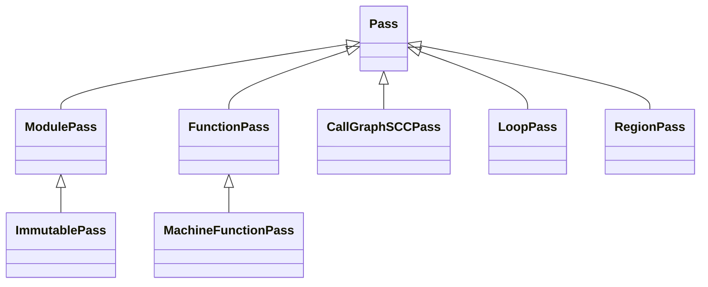
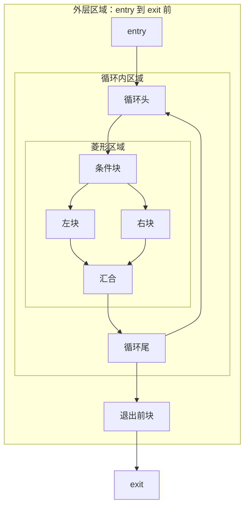
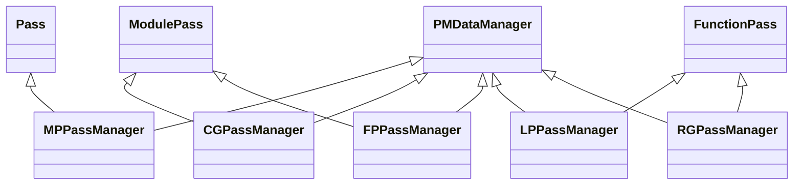
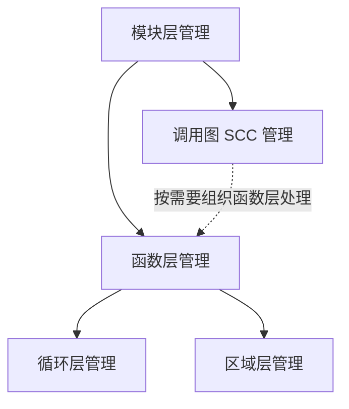

# 附录 C Pass 的分类与管理（LLVM 18.1.8 校订）

> 基于原文全文和 `/opt/llvm-project` 的 LLVM 18.1.8 静态核对；书中版本为 LLVM 15。原文见 [origin](origin/inside-llvm-codegen-appendix-c.md)，逐项记录见 [review](review/appendix-c.md)。本轮未构建、未执行 IR 或 BPF 程序。历史图和输出作为对照，修正文意以本稿为准。

附录 C Appendix C

Pass 的分类与管理

Pass 是编译器中最基础的概念之一，是对编译对象实施某项分析或变换等工作的逻辑单元；一次 Pass 执行可以反复遍历甚至迭代至不动点，不等于只扫描一次。引入 Pass 概念后，可以将复杂的编译过程分解为多个 Pass。例如在LLVM 中端优化过程中，所有的优化都是基于 LLVM IR，因此可以设计功能独立、实现简单的 Pass。根据功能和定位，通常将 Pass 分为以下几类。

1）分析 Pass ：对源码进行分析（供其他 Pass 使用），例如分析源码的支配关系、循环信息。分析 Pass 仅仅收集源码信息，并不会修改源码。

2）变换 Pass ：对源码进行优化变换，一般会使用分析 Pass 的信息。由于变换 Pass 会修改源码，因此变换后可能会导致以前的分析 Pass 的结果失效。例如，删除死代码后会导致很多分析信息失效。

3）功能 Pass ：既不属于分析 Pass 也不属于变换 Pass，一般用于提供公共功能。例如，功能 Pass 可以将中间表达进行打印 / 输出。

因为 Pass 之间存在使用依赖，所以 LLVM 通过 PassManager 对 Pass 进行管理。目前在系统中存在两套 PassManager 管理系统—LegacyPassManager 和 New PassManager，后者是 2013年开始逐步引入，在 LLVM 13 中正式使用 New PassManager○一。下面以 LegacyPassManager为例，对 LLVM 中的 Pass 和 Pass 管理系统进行分析。

○一这段历史选项应区分 Clang 中端和 LLVM 后端。`-fno-experimental-new-pass-manager` 的 `no` 表示关闭而不是启用新 PM。LLVM 18 的 Clang 中端使用新 PM，不能据此断言 LLVM 15 以后 legacy PM 已不存在：常规 `llc` 机器代码流水线在 LLVM 18 仍使用 legacy PM。见 [llc.cpp](/opt/llvm-project/llvm/tools/llc/llc.cpp) 与 [LLVMTargetMachine.cpp](/opt/llvm-project/llvm/lib/CodeGen/LLVMTargetMachine.cpp)。

## C.1 LegacyPassManager 中的 Pass

**把 Pass 的粒度理解为一次调用处理哪个对象。** 一个函数内的分析通常不需要每次遍历整个模块，因此可以围绕 Function 组织；循环变换又需要知道当前 Loop 与函数分析之间的关系；机器阶段则处理 MachineFunction。粒度规定作用对象和管理接口，不代表只能读那个对象的一行代码，也不表示所有较细粒度 Pass 都是更粗粒度类的 C++ 子类。

分析 Pass 计算可被查询的信息，例如支配树；变换 Pass 修改程序，例如删除分支。删除分支可能使之前的支配树过期，所以管理器还要处理依赖、保留与失效。如果只把 PassManager 理解成“依次调用一串函数”，就会漏掉编译正确性所依赖的分析生命周期。

针对代码处理的不同位置，LLVM 提供了 7 种 Pass。具体结构示意图如图 C-1 所示。



空心三角指向基类。图描述 legacy Pass 的类型继承，不是执行先后；New PM 不以这棵继承树作为所有 Pass 的接口。

**图 C-1 LLVM 中的 Pass 结构示意图**

其中 Pass 类为基类，其他的 7 种 Pass 主要的工作如下。

1）ModulePass 类：以一个 Module 为处理单元，该模块不一定就是整个程序。它可以访问模块内函数主体，添加和移除函数；因为其行为范围较广，管理器对它的执行安排缺少函数级 Pass 那样的局部优化空间，并非该 Pass 不能优化程序。ModulePass 可以使用函数级 Pass，例如 ModulePass 可使用函数级 Pass 的 getAnalysis接口 `getAnalysis<DominatorTreeWrapperPass>(F).getDomTree()`（F 是 Function 引用） 来获取函数的支配树分析结果；需在 getAnalysisUsage 中声明依赖，且只能请求有效定义函数对应的分析，不能把任意分析或函数声明都交给该接口。开发者通常会重写 runOnModule() 函数实现自定义功能，如果原 IR 有修改则返回True，如果只是分析，则返回 False。

2）ImmutablePass 类：该类为不用运行、不会改变状态、不需要更新的 Pass 而设计。虽然该类在变换和分析中不常用到，但能提供当前编译器的配置信息、目标机器信息，以及影响变换的静态信息。

3）FunctionPass ：这类 Pass 可独立处理程序中每个函数，并不依赖其他函数的结果，FunctionPass 不需要函数按特定顺序执行，也不会修改外部函数。FunctionPass 的 runOnFunction 只处理当前函数，不应在此增删模块中的函数、全局变量，或使一次调用依赖其他函数先前调用留下的可变结果状态。开发者通常重写函数 runOnFunction() 实现自定义功能，如果 IR在 Pass 运行过程中发生变化，则函数返回 true，否则返回 false。另外，FunctionPass 提供了 doInitialization、doFinalization 函数，可以基于模型信息对函数做相应处理。

4）MachineFunctionPass ： 这是 LLVM 后端在代码生成中用于处理 MIR 的 Pass。MachineFunctionPass 继承于 FunctionPass，所以 FunctionPass 的限制也适用于 Machine- FunctionPass。此外，MachineFunctionPass 还不能修改和创建 LLVM IR 指令、基本块、参数、函数、全局变量、模块等，只能修改当前正被处理的机器函数。开发者通常重写函数runOnMachineFunction() 实现自定义功能，如果 MIR 在 Pass 运行过程中发生变化，函数返回 true，否则返回 false。

5）CallGraphSCCPass：按调用图 SCC 自底向上遍历，通常先处理被调用者再处理调用者，递归环中的函数作为同一个 SCC 处理。CallGraphSCCPass 可以帮助构建和遍历调用图。按 legacy Pass 的契约，可检查/修改的函数限于当前 SCC 及其直接调用者、直接被调用者，不能据此访问任意其他函数；变换必须同步维护 CallGraph。开发者通常重写函数 runOnSCC() 实现自定义功能，如果 IR 在 Pass 运行过程中发生变化，函数返回 true，否则返回 false。

6）LoopPass：这类 Pass 用于遍历并处理函数中的循环。若遍历时遇到嵌套循环，则先处理内层循环，后处理外层循环。LoopPass 可以获取函数或模型级的分析信息，使用者通常重写 runOnLoop() 函数，实现自定义功能。

7）RegionPass ：和 LoopPass 类似，这类 Pass 用于遍历并处理函数的区域，其中函数的区域是由单入口 / 单出口基本块组成。图 C-2 在同一张 CFG 上用三个框标出嵌套区域。



以命名块重绘原图的嵌套单入口/单出口结构。框表示区域范围，实线表示 CFG；RegionInfo 的出口块按其定义不属于该区域，不能仅凭视觉框线推导其他分析的循环集合。

**图 C-2 CFG 和区域划分示意图**

通常 RegionPass 和 CFG 优化相关，针对某一区域进行局部优化。RegionPass 可以访问函数或模型级的分析信息。这三个区域仍属于同一函数；能查询哪些分析，应按管理器的依赖与接口约定确定。使用者通常要重写 runOnRegion() 函数，实现自定义功能。基于区域的优化并不多，LLVM 中只有几个 RegionPass，主要与 CFG 优化、多面体优化相关。

## C.2 LegacyPassManager 对 Pass 的管理

Pass 之间存在分析需求与变换顺序约束，二者不能混为一谈。例如 PHI 消除位于通用寄存器分配之前，但 LLVM 18 的 PHIElimination 对 LiveVariables 使用 addUsedIfAvailable，并保留/更新已有 SlotIndexes、LiveIntervals 等，并不强制先运行全部这些分析。需要强制获取的分析由 addRequired 等 API 声明。可以看出，Pass 之间存在依赖关系，所以需要使用 Pass 管理系统对 Pass 进行管理。除此以外，LLVM 中的变换 Pass 会导致程序发生变化，进而可能导致一些分析 Pass 失效，需要重新进行分析。所以，Pass 管理系统需要先管理 Pass 之间的依赖关系，确保被依赖的Pass 总是先于依赖 Pass 执行；之后，Pass 管理系统需要管理 Pass 结果是否失效，确保在变换 Pass 执行以后只有必要的 Pass 重新运行。为此，LegacyPassManager 设计了一些 API 用于管理分析 Pass，主要有两类。

1）用于添加依赖 Pass 的 API ：使用的 API 是 addRequired 和 addRequiredTransitive，`addRequired` 声明运行时需要的分析；`addRequiredTransitive` 还要求该依赖在当前分析仍被其他使用者需要时保持存活，适用于分析结果内部持有其他分析的引用。它不是简单的“两对象同时销毁”。见 [WritingAnLLVMPass.rst](/opt/llvm-project/llvm/docs/WritingAnLLVMPass.rst:757)。

2）用于管理 Pass 失效状态的 API ：使用的 API 主要是 addPreserved，该 API 指定的Pass 在变换 Pass 执行后不需要重新计算。（原因是，可能指定的 Pass 结果没有变化，或指定的分析结果没有发生变化，但是在变换 Pass 中已经通过局部、增量更新保证指定的 Pass结果正确。）除了 addPreserved，还可使用 setPreservesCFG 和 setPreservesAll：前者声明 CFG 结构保持，从而保留相应 CFG 分析；后者声明所有分析仍有效。保留不要求分析对象的字段字节不变，变换可以同步维护结果；这些 API 是调用者作出的正确性承诺，管理器不会自动证明。机器 Pass 中 preservesCFG 还涵盖 MachineBasicBlock CFG。

Pass 之间的依赖指的是 Pass 在运行过程中重用另一个 Pass 的运行结果。依赖关系一般可以简单分为如下三种。

1）简单依赖：例如 Pass A 依赖 Pass B，那么 Pass B 应该在 Pass A 之前执行。

2）多依赖：例如 Pass A 依赖 Pass B、Pass C，如果 Pass B 和 Pass C 之间无依赖关系，只要保证 Pass B、Pass C 在 Pass A 之前执行即可，而 Pass B 和 Pass C 则无顺序要求。

3）链式依赖：例如 Pass A 依赖 Pass B、Pass C，而 Pass C 又依赖 Pass B ；因此首次需要且尚无有效缓存时，B、C、A 按依赖先后执行；如果 B 已有有效结果，则可能直接复用，不能说每次 A 都会重新执行 B/C。

LLVM 中上述三种依赖会混合存在，所以需要管理依赖，保证 Pass 能够按照正确的顺序执行。另外，LLVM 还允许不同类型的 Pass 之间存在依赖，例如 ModulePass 依赖FunctionPass 的分析结果，要求 FunctionPass 在 ModulePass 之前执行（表示为链式依赖）。相关 legacy 管理器的实际继承关系如下，不能笼统说全部继承自 ModulePass 或 FunctionPass：

| 管理器 | 继承/作用 |
| --- | --- |
| MPPassManager | `Pass` + `PMDataManager`，管理模块级 Pass |
| CGPassManager | `ModulePass` + `PMDataManager`，遍历调用图 SCC |
| FPPassManager | `ModulePass` + `PMDataManager`，管理函数级 Pass |
| LPPassManager | `FunctionPass` + `PMDataManager`，管理循环 Pass |
| RGPassManager | `FunctionPass` + `PMDataManager`，管理区域 Pass |

外层 `legacy::PassManager` 是持有实现对象的公共接口，不等于 MPPassManager。图 C-3 按这张源码对照表重绘，区分公共接口、管理器实现与基类。



按正文已核查的 LLVM 18 继承关系重绘，尤其 MPPassManager 的基类是 Pass，而非原图暗示的 ModulePass。

**图 C-3 各种 Pass 的继承关系示意图**

Pass 管理子系统通过层级关系进行依赖管理，各种 Pass 包含关系示意图如图 C-4所示。



图表示典型管理粒度关系，不把 Region 固定画在 Loop 内部：区域与循环不是同一个概念，RGPassManager 与 LPPassManager 都在函数层衔接。

**图 C-4 各种 Pass 包含关系示意图**

下面简单介绍一下 LegacyPassManager 如何通过层级管理 Pass。

管理器通过相应的运行入口遍历所管理的 IR 单元。PMDataManager 关联顶层管理器；PMTopLevelManager 的 `activeStack` 是添加 Pass、组建嵌套流水线时使用的管理器栈，并不是“每个 FunctionPass 都进入 FPPassManager 的 activeStack”。Pass 被分配给匹配层级的管理器，由其保存并执行。

例如遇到 LoopPass 时，可创建/复用 LPPassManager；LPPassManager 本身是 FunctionPass，可放入 FPPassManager 管理。执行顺序除了层级，还受分析依赖、失效与重新计算控制，不能仅从一张固定树图推断全部执行行为。源码见 [LegacyPassManagers.h](/opt/llvm-project/llvm/include/llvm/IR/LegacyPassManagers.h:219) 和 [LegacyPassManager.cpp](/opt/llvm-project/llvm/lib/IR/LegacyPassManager.cpp:642)。

注意：Pass 的层级管理是通过枚举值完成的。但是在定义 Pass 管理子系统时并不是严格按

照层级定义的，例如 LPPassManager 和 RGPassManager 都是继承自 FunctionPass，

即它们都归 FPPassManager 管理，只是在添加 Pass 时定义了层级。为什么不直接让

RGPassManager 直接继承 LoopPass 呢？最主要的原因是循环和区域之间并无直接

的包含关系（即不符合继承的语义）。通常来说，循环可以使用区域（可能包含多个

区域）表示，但是区域并不一定是循环。

## C.3 New PassManager

**逐步看一次分析缓存失效。** 假设先查询函数 F 的支配树，AnalysisManager 计算并缓存结果；接着某变换删除一条 CFG 边；如果变换未维护支配树，却声称全部分析仍保留，后续 Pass 就可能读取旧树并作出错误变换。正确做法是只保留确实仍有效或已维护的分析，其余让管理器失效，下一次需要时重新计算。

再看嵌套粒度：模块中有 F、G 两个函数，要对每个函数运行一组函数 Pass，需要由 module-to-function adaptor 在模块层组织调用。adaptor 解决遍历与不同分析管理器之间的衔接，不是把 FunctionPass 生硬当成 ModulePass。循环层同理还有自身的适配关系与更新需求。

因此阅读流水线字符串时，先用括号看嵌套范围，再看范围内的执行顺序；阅读 C++ 实现时，再对照 PreservedAnalyses 与 analysis manager。本书 LLVM 18 的 `opt` 新 PM 流程和传统后端 codegen 管理不应直接混为同一套入口。

LLVM 中存在两套管理 Pass 的基础设施，但其接口、分析模型和支持范围并不完全相同。为什么引入新机制？主要是考虑代码实现和性能两方面的因素。

新 PM 重新组织了 Pass 调度、分析缓存和失效管理。其动机不能简化成修正类继承：原文称 LPPassManager 继承 ModulePass 且管理 FunctionPass，与实际源码相反。LPPassManager 继承 FunctionPass 并管理 LoopPass。

原清单 C-1 的 `template<class T> class Mixin : public T` 是继承参数类型的 mixin，不是 CRTP；CRTP 的特征是派生类把自身类型作为模板参数传给基类。LLVM 18 的实际形式是 `MyPass : PassInfoMixin<MyPass>`，修正示例如下。

**代码清单 C-1 示例代码**

```cpp
#include "llvm/IR/Function.h"
#include "llvm/IR/PassManager.h"
#include "llvm/Support/raw_ostream.h"

struct PrintFunctionNamePass
    : llvm::PassInfoMixin<PrintFunctionNamePass> {
  llvm::PreservedAnalyses run(llvm::Function &F,
                              llvm::FunctionAnalysisManager &) {
    llvm::errs() << F.getName() << '\n';
    return llvm::PreservedAnalyses::all(); // 只打印，不改变 IR。
  }
};
// 片段：需在调用者构造的 FunctionPassManager 中 addPass 此对象。
// 未提供注册插件或主程序，也未编译运行。
```

这个例子展示 LLVM 的 CRTP 外形和新 PM `run` 接口。`PassInfoMixin` 提供公共辅助功能，运行接口通过模板及类型擦除组合接入管理器；不能把新 PM 的所有运行分派笼统称为“CRTP 静态多态”，也不能从两个不同模板实例无法赋值就推出里氏替换原则更正确。

新 PassManager 除了使用模板对代码进行重构外，在实现上和 LegacyPassManager 有两个区别。

1）将 PassManager 和 AnalysisManager 进行了区分，然后由 AnalysisManager统一管理分析类 Pass。

2）分析需求通常通过 AnalysisManager::getResult 懒获取；分析已注册且缓存不存在/失效时运行其 run，否则复用缓存。变换 Pass 的先后顺序仍由流水线明确安排，不是所有 Pass 都改成懒执行。缓存是否有效由 PreservedAnalyses、分析自身 invalidate 逻辑及跨层级代理共同维护；分析间依赖仍然存在。

因为 LLVM 后端尚未完全使用新的 PassManager，所以本节不作详细介绍，关于新的PassManager 的更多内容，读者可以参考其他资料○三。

○一请参见 http://gsd.web.elte.hu/lectures/bolyai/2018/mixin_crtp/mixin_crtp.pdf。

○二更多关于 LLVM 为什么使用 CRTP 以及 CRTP 使用带来的各种问题可以参考其他资料，例如 https://

zhuanlan.zhihu.com/p/338837812。

○三有人对新 PassManager 做了详细的分析，例如可参考 https://homura.live/tags/LLVM/。

## LLVM 18 源码对照

- [LoopPass.h](/opt/llvm-project/llvm/include/llvm/Analysis/LoopPass.h:76)、[RegionPass.h](/opt/llvm-project/llvm/include/llvm/Analysis/RegionPass.h:87)、[LegacyPassManagers.h](/opt/llvm-project/llvm/include/llvm/IR/LegacyPassManagers.h:457) 和 [CallGraphSCCPass.cpp](/opt/llvm-project/llvm/lib/Analysis/CallGraphSCCPass.cpp:60) 给出实际继承关系。
- [PassManager.h](/opt/llvm-project/llvm/include/llvm/IR/PassManager.h:649) 的 AnalysisManager 管理缓存；Pass 返回 PreservedAnalyses 决定失效，`getResult` 需要时计算。存在跨层级限制与代理，不能假定任意内层 Pass 都可以触发任意外层分析。
- [NewPassManager.rst](/opt/llvm-project/llvm/docs/NewPassManager.rst:17) 给出了 Module、CGSCC、Function、Loop 分析管理器的构造、注册和代理配置示例。本轮核对 API 和结构，未构造或运行新的 Pass 插件。

- PHIElimination 的可选分析与保留声明见 [PHIElimination.cpp](/opt/llvm-project/llvm/lib/CodeGen/PHIElimination.cpp:137)；新 PM 的类型擦除运行包装见 [PassManagerInternal.h](/opt/llvm-project/llvm/include/llvm/IR/PassManagerInternal.h:70)。

## 原书逐页版面

本节保留原书页面，用于追溯图表、公式和历史输出；技术结论以校订正文及核查记录为准。
