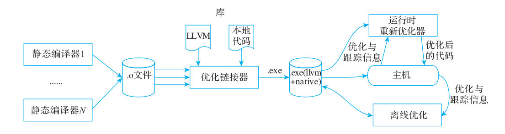
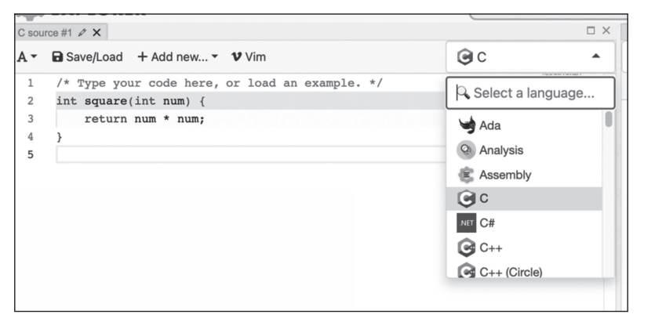
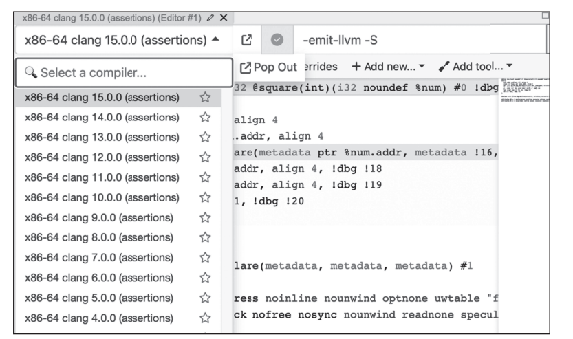
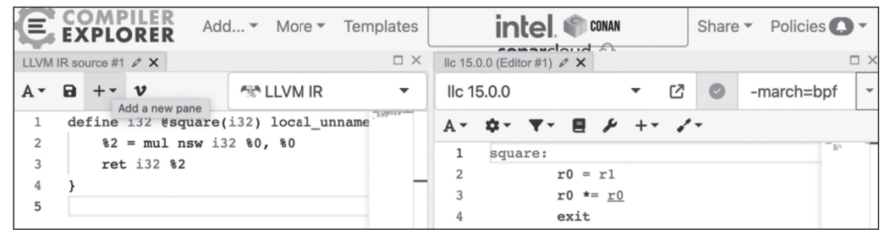
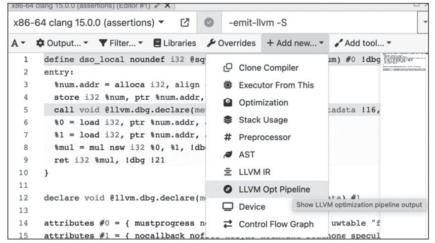
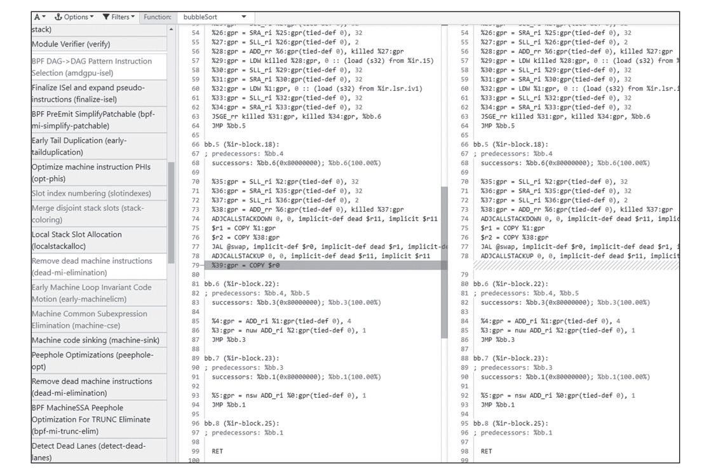

# 第 1 章绪论（LLVM 18.1.8 校订）

> 以原书全文为基础，按 `/opt/llvm-project` 的 `llvmorg-18.1.8`（提交 `3b5b5c1ec4a3095ab096dd780e84d7ab81f3d7ff`）静态核对。原书基于 LLVM 15，示例为 15.0.1。
> [未修订原文](origin/inside-llvm-codegen-ch1.md) · [逐项核查记录](review/ch1.md)。本轮未构建 LLVM、未执行编译命令或 LLVM IR 示例；历史输出与原图保留作对照，修正文意以本稿为准。

Chapter 1 第 1 章

绪论

在现代计算机系统中，编译器是必不可少的基础软件。程序员使用高级语言进行编程完成业务需求，编译器则负责将高级语言转换为底层硬件可以执行的机器指令。

编译器是计算机科学发展史中最为悠久的学科之一。现代公认的第一款编译器是 IBM于 1957 年发布的 Fortran 编译器；读者所熟知的 GCC 早在 1987 年就发布了第一个版本，距今快 40 年了；而本书讨论的 LLVM 于 2003 年正式开源，也有 20 多年的历史了。

早期编译器研究聚焦于从高级语言到机器码的转换以及优化程序满足对时间和空间的需求。随着时代的发展，应用程序执行性能和多硬件支持逐步成为编译器的主要需求，在编译器领域产生了大量的有关程序分析与转换、代码自动生成以及运行时等新知识。与早期的编译器实现相比，今天的编译算法明显更为复杂。例如，早期的编译器采用简单直观的技术对程序进行词法分析，而现代的编译器词法分析技术都是基于形式语言和自动机理论实现的，这使得编译器前端的开发更为系统化；再例如，早期编译器优化技术更多采用简单直观的技术进行依赖分析和循环变换，而现代编译器可以采用更为复杂的算法，例如多面体理论、线性规划等。

本书讨论的 LLVM 是过去 20 多年最成功的编译项目之一，它不仅被广泛用于 C/C++等传统语言的编译，更被很多新型语言作为开发基础。为什么 LLVM 能取得这么大的成就？根本原因在于 LLVM 良好的设计与实现。LLVM 为编译项目开发提供基础，程序被前端编译到 LLVM IR，再由 LLVM 后端编译至任意平台（指 LLVM 所支持的大多数主流平台），不同目标架构可以重用内置的编译优化，这极大地简化了针对某一编程语言开发编译器的过程。此外，LLVM 还提供了完备的编译相关的工具链。

本章主要探讨 LLVM 的设计思路、 发展现状， 以及 LLVM 构建和在线学习工具Compiler Explorer，方便读者在学习后续章节。

## 1.1 LLVM 设计思路分析

LLVM 项目起源于伊利诺伊大学香槟分校的研究型项目，在 2000 年由 Chris Lattner 和其导师 Vikram Adve 发起，并于 2003 年正式开源并发布 1.0 版本。2002 年，Lattner 在其硕士论文“ LLVM: AN INFRASTRUCTURE FOR MULTI-STAGE OPTIMIZATION”中详细介绍了 LLVM 的设计思路，本节将简单总结这一思路。

LLVM 的愿景是实现一个编译器的基础设施，能适配现代编程语言、硬件架构发展，它有 3 个目标。

1）具备多阶段优化能力（如过程内优化、过程间优化、剖析信息驱动的优化（profile-guided optimization）），保证程序执行性能足够高。

2）提供基础机制，方便进行编译器研发。

3）兼容标准系统编译器的行为。

为了达到这些目标，LLVM 设计了一套虚拟指令集，称为 LLVM IR。虽然 LLVM IR是低级的中间表示，但是它携带了程序的类型信息，这样的 IR 设计既方便了静态编译优化，又允许在链接时进行优化。Lattner 设想在链接优化完成后生成的二进制文件中，既可以包含可执行代码，又可以包含 IR，其中 IR 可以用于后续的 JIT 优化○一。Lattner 还设想在LLVM 中提供运行时优化，通过监控程序的执行过程来收集反馈信息（profile information）并用于指导程序优化○二。

LLVM 编译器整体架构图如图 1-1 所示。



**图 1-1 LLVM 编译器整体架构图**

图 1-1 描述了围绕“编译 – 链接 – 执行”的多阶段优化设计。具体工具链只执行其配置启用的阶段，并非每个使用 LLVM 的程序都会自动进行运行时优化。LLVM IR 使多种语言与目标能够共用分析和变换；其他编译器也使用 IR，不能把使用 IR 本身作为 LLVM 独有的特征。

○一通常静态编译器仅包含可执行代码，和操作系统的可执行文件格式兼容，但是一些特殊应用使用胖二进

制（fat binary）文件，可同时包含多种输出。

○二程序优化可以在线执行也可以离线执行，在线执行需要消耗额外的运行时资源，在一些动态语言（如

JavaScript、Java 等）虚拟机中会使用在线编译优化，而静态语言则更多使用离线优化。

1）编译时优化：各个语言的编译器前端将代码翻译成 LLVM IR，LLVM 优化器针对LLVM IR 做尽可能多的优化。编译期优化大多数属于局部优化（少量优化是过程间优化），通常包含架构无关优化和架构相关优化。

2）链接时优化：通过 LTO 在链接阶段对 LLVM IR 继续优化。ThinLTO 使用模块摘要索引支持跨模块分析和导入；不能把所有 LTO 都概括成仅对摘要进行优化。

3）运行时和离线优化：基于收集的程序执行信息，再次对应用进行优化。

在这些优化工作中，LLVM IR 是整个编译系统设计的关键，具有如下特点。

1）LLVM IR 抽象掉大部分具体机器指令、物理寄存器和流水线细节，但仍可携带目标 triple、data layout、地址空间和调用约定，不能理解为完全没有目标或 ABI 约束。

2）LLVM IR 提供无限数量的类型化虚拟寄存器，并用这些寄存器来存储基础类型（如整型、浮点型、指针类型）的值。LLVM IR 采用 SSA 形式，从而更便于进行编译优化。

3）在 LLVM IR 中提供了特有的指令，显式描述异常控制流信息。

4）LLVM IR 用 `alloca` 分配当前函数的栈对象，用 `load`、`store` 读写内存；原子读改写指令 `atomicrmw`、`cmpxchg` 以及内存 intrinsic 和函数调用也能访问内存，所以内存交换并不限于 `load`/`store`。LLVM 18 没有 `malloc`/`free` 指令，堆分配和释放通常通过运行时库函数调用实现。`alloca` 对象通常在函数返回时释放，`llvm.stacksave`/`llvm.stackrestore` 等机制还可以提前恢复栈。

5）LLVM IR 可以声明和调用 I/O、内存管理等外部运行时函数，但这些函数不是 IR 自带的一套完整系统库。LLVM IR 有文本形式、bitcode 二进制形式和内存中的 C++ 对象形式；其中内存形式是数据结构，不是第三种文件格式。

> 源码依据：[指令类别](/opt/llvm-project/llvm/include/llvm/IR/Instruction.def:123)、[语言参考](/opt/llvm-project/llvm/docs/LangRef.rst:874)、[ThinLTO 设计](/opt/llvm-project/clang/docs/ThinLTO.rst:20)。下方历史脚注保留版本沿革，不把旧指令当作 LLVM 18 的接口。

LLVM IR 提供了各种分析和变换的 Pass（Pass 是指对编译对象进行一次处理，详细内容可以参考附录 C），以及配套的工具集，如汇编、反汇编、解释器、优化器、编译器、测试套等相关工具，能帮助开发者快速入门和使用 LLVM。

## 1.2 LLVM 主要子项目

经过多年的发展，LLVM 被许多语言和工具采用，但不能据此推断现代语言与工具大多都基于 LLVM。LLVM 不仅是一款编译器，还是编译器和工具链的集合，其主要子项目如下。

1）LLVM 核心库（即平常大家提到的 LLVM）：提供了编译优化器、各种后端的代码生成，其输入为 LLVM IR，输出为编译器处理后的目标架构代码。

2）Clang ：LLVM 原生支持的 C/C++/Objective-C 编译器，其中编译优化器和代码生成模块直接使用 LLVM 核心库。Clang 主要负责从 C/C++/Objective-C 到 LLVM IR 的转换、LLVM核心库的调用，同时提供多样化的前端处理工具，例如针对代码分析的静态分析器、针对

○一 LLVM 2.7 中将 malloc、free 指令移除，堆内存管理会调用库函数 malloc、free。

代码静态检查的工具（clang-tidy）、针对代码风格的自动格式化工具（clang-format）等。

3）LLDB：基于 LLVM 核心库及 Clang 构建的调试器。

4）libc：LLVM 的 C 标准库项目；具体平台和函数的实现覆盖范围应查询该版本源码，不能据项目目标声称已完整支持所有 C/POSIX 接口。

5）libcxx：一种 C++ 标准库的实现，包括 iostreams 和 STL 等库的实现，支持 C++11、C++14 等更高版本。

6）libunwind ：提供基于 DWARF 标准的堆栈展开的辅助函数，通常用于实现 C++ 等语言的异常处理。具体链接组合由目标平台和工具链决定；GNU 工具链中常见的展开运行库是 libgcc_s，不应把它归为 glibc 的实现，也不是所有 Linux 配置都必须使用 llvm-libgcc。

7）libcxxabi：提供 C++ ABI 支持，包括异常处理、运行时类型信息与动态类型转换、局部静态对象初始化等；异常展开与平台的 unwinder 配合，不能把全部功能仅概括为 libunwind 之上的异常函数。

8）libclc：OpenCL 标准库的实现。

9）OpenMP ：一种 OpenMP 运行时的实现，OpenMP 有助于多线程编程，提供并行化处理。

10）compiler-rt ：提供独立于编程语言的支持库。compiler-rt 包含通用函数（如 32 位i386 后端的 64 位除法）、各种程序错误检测工具（sanitizers）、fuzzing 库、profiling 库、插桩库XRay 等。

11）LLD：一种链接器的实现。

12）Flang：LLVM 原生支持的 Fortran 编译器前端。

13）pstl：并行 STL 的实现。

14）POLLY：多面体编译器的实现，主要实现了自动并行、矢量化等优化。

15）MLIR ：通过定义多级 IR 框架，允许用户自定义 IR 并重用基础编译器框架。目前有许多编译器项目通过 MLIR 实现，例如 AI 编译器、Circt（EDA 编译器）等。

16）BOLT ：链接后的优化器，对链接后的二进制代码进行优化，例如通过收集运行时信息，对代码进行重新布局，从而提高执行效率。

## 1.3 LLVM 构建与调试

原书涉及的后端架构、Pass 和算法以 LLVM 15 为基础，作者提供了源码镜像。本校订固定使用已有本地 `/opt/llvm-project` 的 LLVM 18.1.8，避免依赖远端仓库默认分支。官方项目仓库为 `https://github.com/llvm/llvm-project`。

LLVM 构建比较简单，读者可以参考官方项目中的构建说明进行操作，构建完成后就可以使用 GDB 或者 LLDB 进行调试，这里仅做一个简单的介绍。下面以笔者使用的macOS 环境为例介绍构建和调试工作。

1）环境准备：在 macOS 上构建 LLVM 需要安装开发套件 CMake、git 等。

2）源码版本：本轮直接读取本地源码，已确认标签为 `llvmorg-18.1.8`。如果以后另建环境，应显式固定所需 tag；本轮不切换现有工作树，不下载、不构建。

3）构建代码：按照构建说明进行构建。本书主要以 BPF 后端为例进行说明，为了加快构建速度，可以通过命令行参数 LLVM_TARGETS_TO_BUILD 仅构建 BPF 后端。构建LLVM 工程使用的命令如代码清单 1-1 所示。

**代码清单 1-1 构建 LLVM 工程使用的命令**

```sh
# 以下命令供后续构建时使用，本轮未执行。
cmake -S /opt/llvm-project/llvm -B /opt/llvm-project/build-codegen-18 \
  -G "Unix Makefiles" \
  -DCMAKE_BUILD_TYPE=Debug \
  -DLLVM_ENABLE_ASSERTIONS=ON \
  -DLLVM_TARGETS_TO_BUILD=BPF \
  -DLLVM_ENABLE_PROJECTS=clang
cmake --build /opt/llvm-project/build-codegen-18 --parallel 8
```

4）验证：按清单 1-1 的构建目录，可执行文件位于 `/opt/llvm-project/build-codegen-18/bin/`。以 llc 命令为例，执行 llc --version 可以得到如代码清单 1-2 所示的结果。

**代码清单 1-2 原书的 LLVM 15.0.1 验证输出（历史记录，非本轮执行结果）**

```text
LLVM (http://llvm.org/):
    LLVM version 15.0.1
    DEBUG build with assertions.
    Default target: arm64-apple-darwin22.5.0
    Host CPU: cyclone

    Registered Targets:
        bpf   - BPF (host endian)
        bpfeb - BPF (big endian)
        bpfel - BPF (little endian)
```

5）调试：开发者可以使用 LLDB 调试 llc，设置断点并运行测试。例如，为了观察尾代码重复（tail duplication）的功能，通过 b TailDuplicateBase::runOnMachineFunction 命令为函数设置断点，同时设置 LLDB 运行参数 settings set -- target.run-args -mtriple=bpfel -O2 -debug -tail-dup-size=10 test.ll○一，然后执行 run 命令即可。关于 LLDB 更多使用方法可以参考 LLDB 使用文档。LLDB 调试命令示例如代码清单 1-3 所示：

**代码清单 1-3 LLDB 调试命令示例**

```text
(lldb) target create /opt/llvm-project/build-codegen-18/bin/llc
(lldb) breakpoint set --func-regex 'TailDuplicateBase::runOnMachineFunction'
(lldb) settings set -- target.run-args -mtriple=bpfel -O2 -debug -tail-dup-size=10 test.ll
(lldb) run
```

○一这里的 test.ll 可以参考代码清单 9-3。

## 1.4 LLVM 在线工具

> 本节界面和图示是原书使用 LLVM 15 时的历史演示。本轮没有访问或验证在线站点；后续复现实验应选择 LLVM 18.1.8 对应工具版本，界面布局、可选版本及 Pass 输出可能不同。

如果读者不想构建 LLVM，也可以使用在线工具 Compiler Explorer（https://godbolt.org）学习 LLVM 各种功能和代码变化。该在线工具可以直观地比较优化前后的代码变化情况，支持多种语言作为输入，也支持 LLVM IR、LLVM MIR（Machine IR）作为输入，该工具可以选择不同的编译器进行编译。

1）Compiler Explorer 初始界面如图 1-2 所示，可以选择不同的编程语言。



**图 1-2 输入代码并选择编程语言**

2）选择不同的编译器，并为编译器添加不同的编译选项，例如选择 Clang 版本，添加命令行参数 -emit-llvm -S 用于生成 LLVM IR，如图 1-3 所示。



**图 1-3 选择编译器并添加编译选项**

3）本书主要关注代码生成，对应的命令行入口是 llc。llc 使用 LLVM IR 作为输入，如果要生成 BPF 后端代码，可以在编译选项中填入 -march=bpf，如图 1-4 所示。



**图 1-4 配置编译选项**

选择 Add new 视图下的 LLVM Opt Pipeline 选项（见图 1-5），可以展示 Clang 编译过程中使用的 Pass（参见附录 C）。



**图 1-5 选择 LLVM Opt Pipeline**

得到的结果如图 1-6 所示，在 LLVM Opt Pipeline 视图中，第一列是所有 Pass，右侧两列是某一 Pass 的输入和输出。如果 IR 经过某个 Pass 处理后发生变化，在 LLVM Opt Pipeline 中使用高亮的绿色表示变化，右侧两列会提示变化的情况。（因印刷缘故，绿色、粉色都变成浅灰色，请读者注意。而在实际网页中，粉底色表示删除、绿色表示添加。）



**图 1-6 输出所有涉及的 Pass**

## 1.5 本章小结

本章简单介绍了 LLVM 的设计思路、发展现状，以及在 macOS 平台如何构建、调试LLVM，最后演示了如何通过在线工具 Compiler Explorer 学习 LLVM。

## 本章源码核对与后续验证

- 构建选项和 C++17 要求对应 [llvm/CMakeLists.txt](/opt/llvm-project/llvm/CMakeLists.txt:69)，命令已修正 shell 注释和跨行续接；并行度只是示例，应按机器资源调整。
- 断点函数仍在 [TailDuplication.cpp](/opt/llvm-project/llvm/lib/CodeGen/TailDuplication.cpp:83)，阈值选项仍在 [TailDuplicator.cpp](/opt/llvm-project/llvm/lib/CodeGen/TailDuplicator.cpp:61)。是否实际执行该 Pass 取决于优化等级和目标配置，断点地址不应照抄书中的日志。
- LLVM 18 的 legacy 后端可以通过 `llc -debug-pass=Structure` 观察 Pass 结构；选项定义见 [LegacyPassManager.cpp](/opt/llvm-project/llvm/lib/IR/LegacyPassManager.cpp:52)。本轮未执行。
- 待后续确认：构建环境、`llc --version` 实际输出、断点是否命中及指定 IR 的输出。历史性能与在线工具界面不属于本轮源码可验证的结果。

- libcxxabi 的异常、静态初始化及类型信息接口见 [cxxabi.h](/opt/llvm-project/libcxxabi/include/cxxabi.h:55) 与 [private_typeinfo.h](/opt/llvm-project/libcxxabi/src/private_typeinfo.h:68)。

## 原书逐页版面

本节保留原书页面，用于追溯图表、公式和历史输出；技术结论以校订正文及核查记录为准。
