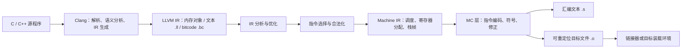

# 第 1 章 绪论与可复现的 LLVM 18 实验环境

本教材使用本地 LLVM **18.1.8**，源码提交为 `3b5b5c1ec4a3095ab096dd780e84d7ab81f3d7ff`。原书 LLVM 15 的转写保存在 [origin](origin/inside-llvm-codegen-ch1.md)。本章建立后续各章共用的环境、观察方法和验证边界；实验输入见 [experiments/ch1](experiments/ch1/sum.c)，机器可读结果见 [实验记录](review/experiments-ch1.json)。

## 1.1 LLVM 设计思路分析

LLVM 提供程序表示、分析、变换、目标代码生成和工具链组件。学习它的关键是明确一个阶段读什么、改变什么、保证什么，以及这些保证由谁检查。



这个图描述普通提前编译路径。LLVM 还可用于 JIT、LTO 等场景，但使用 LLVM 不意味着程序自动获得运行时优化。LTO 在链接阶段处理 IR；ThinLTO 用模块摘要索引组织跨模块分析、导入和并行后端任务。JIT 则还要处理内存分配、符号解析和可执行代码的生命周期。

LLVM IR 的几个约束贯穿全书：

- **SSA 约束针对 IR 值。** 一个局部 SSA 名字只定义一次，内存中的对象仍可以被多次写入。`alloca`、`load`、`store` 不是 SSA 的例外，而是在 SSA 指令中显式描述内存操作。
- **类型与目标信息共同决定语义。** `i32` 是 32 位整数；指针宽度、地址空间、ABI 和数据布局还依赖 `target triple`、`data layout` 及目标规则。任意 IR 文件不能只改 triple 就保证跨平台等价。
- **IR 值不是已经分配好的物理寄存器。** 后端可能把它折叠、复制、拆分、合并或溢出到栈。
- **三种 IR 形式表达同一层次。** `.ll` 是文本，`.bc` 是 bitcode，内存形式是 `Module`、`Function`、`BasicBlock`、`Instruction` 等 C++ 对象。`.bc` 不是目标处理器机器码。
- **外部库不是 IR 自带的执行环境。** 堆分配、I/O 等通常通过外部函数调用表达；异常控制流、原子操作和部分内存操作另有 IR 指令或 intrinsic。

LLVM 的 verifier 检查表示的结构和类型约束，例如 PHI 前驱、操作数类型及支配关系。它不证明优化前后程序等价，也不保证目标对象能通过操作系统或 BPF 装载器的检查。后续实验因此分开记录：解析/验证、变换结构、目标代码生成，以及能够实际执行的语义用例。

源码入口：[LLVM IR 指令类别](/opt/llvm-project/llvm/include/llvm/IR/Instruction.def)、[LangRef](/opt/llvm-project/llvm/docs/LangRef.rst)、[ThinLTO](/opt/llvm-project/clang/docs/ThinLTO.rst)。

## 1.2 LLVM 主要子项目

| 组件 | 在本教材中的作用 |
| --- | --- |
| LLVM 核心库 | IR、分析、优化、代码生成和 MC 层；`opt`、`llc` 等工具由此构建 |
| Clang | 把 C/C++/Objective-C 转为 LLVM IR，也可通过驱动程序调用后续编译与链接步骤 |
| MLIR | 定义方言、类型和操作，组织多层表示及转换；块参数与 LLVM PHI 的关系见第 2 章 |
| clang-tools-extra | 包含 clang-tidy 等工具；本地构建保留此项目，但它不参与本书的普通 llc 流水线 |
| LLDB | 调试工具本身；不属于 LLVM IR 优化 Pass |
| LLD | 链接器；`llc -filetype=obj` 不等于完成链接 |
| compiler-rt、libc、libc++、libc++abi、libunwind | 不同层次的运行时和库支持，具体组合依目标与工具链而定 |
| Flang、OpenMP、libclc、Polly、BOLT | 分别涉及 Fortran 前端、并行运行时、OpenCL 库、多面体优化和链接后优化等方向 |

只选择 `LLVM_TARGETS_TO_BUILD` 不会自动构建上述全部项目。反过来，启用 Clang、MLIR 也不能代替目标后端的构建。`llvm-tblgen`、`clang-tblgen`、`mlir-tblgen` 共享 TableGen 基础设施，但各自装入不同的生成器。

## 1.3 LLVM 构建与调试

各章手工实验使用 Bash，按正文顺序在同一个会话中执行；后续命令会使用前面生成的文件。先设置三个显式路径；本章的构建配置只需在工具缺失或配置不符时执行：

<!-- manual-lab:ch1-setup -->
```sh
# ${变量:-默认值}：已有非空设置就沿用，否则使用冒号后面的路径。
# export 让后面启动的 Python 等子进程也能读取这些设置。
# LLVM_SRC 是源码；LLVM_BUILD 是构建产物；BOOK_ROOT 是教材和实验输入。
export LLVM_SRC="${LLVM_SRC:-/opt/llvm-project}"
export LLVM_BUILD="${LLVM_BUILD:-/opt/llvm-project/build}"
export BOOK_ROOT="${BOOK_ROOT:-/opt/coding/mlir-toy/llvm/inside-llvm-codegen}"
```

本次配置沿用已有 Ninja 构建、Debug、断言以及 Clang/MLIR 项目。为了支持书中的跨目标实验，在 BPF 和 Native 之外启用了 X86、RISCV、Hexagon、PowerPC、ARM；Native 在当前 Apple Silicon 主机上对应 AArch64。这些后端用于交叉生成代码，不要求本机能够运行其机器指令。

**代码清单 1-1：配置和按需增量构建。** 对已有构建目录执行 CMake 会更新配置；下面只列出本教材使用的工具目标，不执行安装，也不要求构建全部示例程序。

```sh
# 查询当前 C 编译器的默认目标，给未指定 --target 的宿主实验使用。
CODEGEN_HOST_TRIPLE=$(/usr/bin/cc -dumpmachine)
# -S 指定源码目录，-B 指定构建目录；-D 设置 CMake 配置变量。
# 行末的反斜杠把多行连成一条命令，后面不能再接注释或空格。
# Debug/ASSERTIONS 支持后续调试观察；编译 12 路、链接 1 路限制并发。
cmake -G Ninja \
  -S "$LLVM_SRC/llvm" \
  -B "$LLVM_BUILD" \
  -DLLVM_ENABLE_PROJECTS="clang;mlir;clang-tools-extra" \
  -DLLVM_INCLUDE_EXAMPLES=ON \
  -DLLVM_BUILD_EXAMPLES=ON \
  -DLLVM_TARGETS_TO_BUILD="BPF;Native;X86;RISCV;Hexagon;PowerPC;ARM" \
  -DLLVM_DEFAULT_TARGET_TRIPLE="$CODEGEN_HOST_TRIPLE" \
  -DCMAKE_BUILD_TYPE=Debug \
  -DLLVM_ENABLE_ASSERTIONS=ON \
  -DLLVM_PARALLEL_COMPILE_JOBS=12 \
  -DLLVM_PARALLEL_LINK_JOBS=1 \
  -DCMAKE_EXPORT_COMPILE_COMMANDS=ON \
  -DCMAKE_C_COMPILER=/usr/bin/cc \
  -DCMAKE_CXX_COMPILER=/usr/bin/c++ \
  -DCMAKE_INSTALL_PREFIX=/opt/llvm-project/install

# 只请求这些工具目标；Ninja 会复用已有产物，并补齐必要依赖。
cmake --build "$LLVM_BUILD" --parallel 12 --target \
  clang opt llc lli llvm-as llvm-dis llvm-tblgen FileCheck \
  llvm-mc llvm-objdump llvm-readobj llvm-config mlir-opt mlir-translate
```

以上编译器路径与主机 triple 获取方式用于本次 macOS 环境；迁移平台时应选择当地可用的 C/C++ 编译器。Debug 与断言便于检查内部不变量和使用 `-debug-only`。编译资源上限属于本机设置，不是 LLVM 正确性的要求。

**代码清单 1-2：检查实际执行的工具。** CMakeCache 中的目标列表不证明现有可执行文件已经按该配置重建；要同时检查二进制。

<!-- manual-lab:ch1-tool-versions -->
```sh
# 使用完整路径，避免误用 PATH 中其他版本的 clang/llc/opt。
"$LLVM_BUILD/bin/clang" --version
"$LLVM_BUILD/bin/llc" --version
"$LLVM_BUILD/bin/opt" --version
# 查看这一套 LLVM 实际构建了哪些后端。
"$LLVM_BUILD/bin/llvm-config" --targets-built
```

本次开始时就遇到了这一情况：缓存写着 `BPF;Native`，现有 `llc` 却只注册了 BPF，默认 triple 还是空串。修复配置并重建后，再由第 1 章 runner 检查实际目标列表。后续各章仍显式给出 triple、CPU 和影响结论的 features，避免把主机默认值混入实验。

另一个构建阻碍是本地 `BPFMIChecking.cpp` 中引用了不存在的 `BPF::XOR5W32`。本次仅将这一处恢复为该分支对应的 `BPF::XORW32`，变更见 [构建修复补丁](review/build-source-fix.patch)。其余本地注释等改动予以保留；实验环境的准确源码及工具信息见 [环境记录](review/environment.json)。

观察 Pass 时，优先使用可保存的文本输出：

<!-- manual-lab:ch1-pass-registry -->
```sh
# 优化器注册的 Pass 名称及流水线观察。
"$LLVM_BUILD/bin/opt" --print-passes
# Debug 构建可结合具体用例使用 -debug-only=isel,isel-dump。
# 后端的打印停止点必须使用 llc 注册的 Pass 名称，见第 7、10 章。
```

LLDB 可用于断点、单步和查看对象，但断点名称不是稳定 API。应先在该提交源码中确认函数存在，再选择参数齐备的最小输入；不宜用大段交互调试截图代替实验输入和复现命令。本教材的自动检查不包含交互式调试器会话。

## 1.4 从源程序到目标文件的实验

本章使用完整的 [sum.c](experiments/ch1/sum.c)：`sum(10)` 计算 `0+1+…+9`，`main` 在结果为 45 时返回 0。它没有库调用；当前测试输入的有符号加法不溢出。这些前提使纯 IR 解释执行可以作为本例的语义检查。

**代码清单 1-3：显式控制各编译阶段。** 输出使用独立临时目录，不写进 LLVM 源码树。

<!-- manual-lab:ch1-compile-and-execute -->
```sh
# 每次新建一个输出目录，后面的文件名都相对于这次实验。
CODEGEN_LAB=$(mktemp -d)
# --target=bpfel 选择小端 BPF；-S -emit-llvm 组合输出文本 IR。
# -Xclang 把紧随的选项交给 Clang 前端，阻止 O0 自动添加 optnone。
# 保留值名便于对照源码；双引号保证带空格的路径仍是一个参数。
"$LLVM_BUILD/bin/clang" --target=bpfel -O0 \
  -Xclang -disable-O0-optnone -fno-discard-value-names \
  -S -emit-llvm "$BOOK_ROOT/experiments/ch1/sum.c" \
  -o "$CODEGEN_LAB/sum.ll"

# 把适合提升的局部内存变量转为 SSA 值；每个 Pass 后检查 IR 约束。
"$LLVM_BUILD/bin/opt" -passes=mem2reg -verify-each -S \
  "$CODEGEN_LAB/sum.ll" -o "$CODEGEN_LAB/sum-ssa.ll"
# llvm-as / llvm-dis 在文本 IR 与 bitcode 间转换，不生成 CPU 指令。
"$LLVM_BUILD/bin/llvm-as" "$CODEGEN_LAB/sum-ssa.ll" \
  -o "$CODEGEN_LAB/sum.bc"
"$LLVM_BUILD/bin/llvm-dis" "$CODEGEN_LAB/sum.bc" \
  -o "$CODEGEN_LAB/roundtrip.ll"
# 只验证往返得到的 IR；-disable-output 不再写出另一份模块。
"$LLVM_BUILD/bin/opt" -passes=verify -disable-output \
  "$CODEGEN_LAB/roundtrip.ll"
# 使用 O2 的默认 IR 优化流水线；引号防止 shell 把 < 和 > 当作重定向。
"$LLVM_BUILD/bin/opt" '-passes=default<O2>' -verify-each -S \
  "$CODEGEN_LAB/sum-ssa.ll" -o "$CODEGEN_LAB/sum-opt.ll"

# llc 把 IR 降到目标指令；固定 BPF v1，先输出便于阅读的汇编。
"$LLVM_BUILD/bin/llc" -mtriple=bpfel -mcpu=v1 -O2 \
  -verify-machineinstrs "$CODEGEN_LAB/sum-opt.ll" \
  -o "$CODEGEN_LAB/sum.s"
# 同一输入改为对象输出；MachineVerifier 检查机器指令阶段的约束。
"$LLVM_BUILD/bin/llc" -mtriple=bpfel -mcpu=v1 -O2 \
  -verify-machineinstrs -filetype=obj "$CODEGEN_LAB/sum-opt.ll" \
  -o "$CODEGEN_LAB/sum.o"
# readobj 看对象头；objdump -d 将对象中的指令字节反汇编为文本。
"$LLVM_BUILD/bin/llvm-readobj" --file-headers "$CODEGEN_LAB/sum.o"
"$LLVM_BUILD/bin/llvm-objdump" -d "$CODEGEN_LAB/sum.o"
# 分别解释执行优化前后 IR；main 的返回码检查 sum(10) 是否仍为 45。
# 这里执行的是 IR，尚未装载刚才生成的 BPF 对象。
"$LLVM_BUILD/bin/lli" --force-interpreter -mtriple=bpfel \
  "$CODEGEN_LAB/sum.ll"
"$LLVM_BUILD/bin/lli" --force-interpreter -mtriple=bpfel \
  "$CODEGEN_LAB/sum-opt.ll"
```

`-disable-O0-optnone` 允许本实验随后用 `opt` 变换函数；否则 Clang 在 O0 添加的 `optnone` 会使许多优化跳过函数。`mem2reg` 只提升满足条件的局部对象，不是“删除一切内存操作”。

本例检查的观察点如下：

| 阶段 | 实际检查的性质 | 不据此推断的结论 |
| --- | --- | --- |
| Clang IR | 存在局部 `alloca i32` | 这些对象必定在最终机器栈中占空间 |
| mem2reg | 可提升的 alloca 消失，循环中出现 PHI | 所有 C 变量都能被提升 |
| bitcode 往返 | 重新解析并通过 IR verifier | 文本名字、排版必定逐字不变 |
| O2 与 llc | IR 验证、机器指令验证及对象写出成功 | BPF 内核 verifier 已经接受程序 |
| readobj / objdump | 对象机器类型为 `EM_BPF`，包含函数与 BPF 指令 | `.o` 已完成链接或可以作为宿主程序直接运行 |
| lli 解释执行 | 给定输入优化前后均返回 0 | 实际 BPF 指令已在内核中运行，或所有输入均等价 |

runner 还让 Clang 按修复后的本机默认 triple 重新生成 `host.ll`，再用普通 `lli` JIT 执行并检查返回 0。这一用例验证本机后端和 JIT 的衔接；它使用重新生成的宿主 IR，并没有把 BPF 目标对象当作宿主代码运行。

<!-- manual-lab:ch1-host-jit -->
```sh
# 不指定 --target，按已配置的宿主默认 triple 重新生成一份 IR。
"$LLVM_BUILD/bin/clang" -O0 -S -emit-llvm \
  "$BOOK_ROOT/experiments/ch1/sum.c" -o "$CODEGEN_LAB/host.ll"
# 不强制解释器，让 lli 的 JIT 将宿主 IR 编译到本机并调用 main。
"$LLVM_BUILD/bin/lli" "$CODEGEN_LAB/host.ll"
```

以上命令成功时退出码均为 0；IR 解释器与宿主 JIT 的 `main` 都会自行检查求和结果。`sum.s` 是 BPF 汇编，`sum.o` 是 BPF 对象，`host.ll` 则保留宿主 triple，三者用途不同。

完整自动执行包含上述命令和断言：

```sh
python3 "$BOOK_ROOT/experiments/ch1/runner.py"
```

返回码、检查条件和日志摘要记录在 [experiments-ch1.json](review/experiments-ch1.json)。这一证据格式贯穿各章：展示可重跑的输入和结论所需的观察点，而不是依赖某次运行的虚拟寄存器编号。

## 1.5 本章小结

阅读 LLVM 后端时，先确定输入表示、目标配置和 Pass 所在阶段，再沿着源码检查其前提与行为。文本解析、IR verifier、MachineVerifier、结构断言、IR 执行和真实目标运行是不同层次的证据。后续章节会按各自问题选择相应检查，并明确哪些只是模型推导、哪些已经在本地工具上观察到。
