# 第 10 章 寄存器分配

> 本章以 LLVM 18.1.8 为准，保留寄存器分配的全部主题和清单编号，源码基准为 `3b5b5c1ec4a3095ab096dd780e84d7ab81f3d7ff`。可执行输入及运行器见 [experiments/ch10](experiments/ch10/runner.py)，完整旧文在 [origin](origin/inside-llvm-codegen-ch10.md)。

寄存器分配把虚拟寄存器的值安排到数量有限、具有别名和调用约束的物理寄存器中；无法一直保存在寄存器中的值可以溢出到栈、拆分区间或重新物化。分配器还必须保持 tied 操作数、提前写坏、固定物理寄存器和调用破坏集合等约束。

本章固定 `bpfel`、`-mcpu=generic`、`-O2`，使用 Debug/assertions 构建并开启 `-verify-machineinstrs`。Fast 使用非优化分配路径 `-optimize-regalloc=0`；Basic、Greedy、PBQP 使用优化路径。四者是各自完整分配路径的比较，不是假定前后 Pass 完全相同。MIR 清单展示实际输出中的函数体；含 YAML 头的完整文件由运行器生成。

<!-- manual-lab:ch10-setup -->

```sh
# 开启严格检查，使未处理的命令/管道失败与未定义变量尽早暴露。
set -euo pipefail
# 可提前 export 覆盖默认路径；各阶段使用同一套 LLVM 构建。
export LLVM_BUILD="${LLVM_BUILD:-/opt/llvm-project/build}"
export LLVM_SRC="${LLVM_SRC:-/opt/llvm-project}"
export BOOK_ROOT="${BOOK_ROOT:-/opt/coding/mlir-toy/llvm/inside-llvm-codegen}"
BOOK_INPUT="$BOOK_ROOT/experiments/ch10"
# 每次创建独立目录，保留前后阶段文件供比较，实验输入保持只读。
CODEGEN_LAB=$(mktemp -d)
export BOOK_INPUT CODEGEN_LAB
"$LLVM_BUILD/bin/llc" --version
printf '实验输出目录：%s\n' "$CODEGEN_LAB"
```

以下命令按正文顺序在同一个 Bash 会话运行；输入取自本章实验目录，所有新文件写入刚创建的临时目录。


下文直接列出生成日志、MIR、汇编和目标文件的命令；自动运行器另提供 `--out` 选项及 `results.json` 汇总。IR 经 assembler 和 verifier 检查，并以 `lli -force-interpreter` 验证求和与排序语义；BPF 产物经过机器指令校验、编码和反汇编。两种验证的范围不同，本章没有在内核 BPF JIT 中运行目标文件。

## 10.1 寄存器分配流程解析

寄存器分配需要依赖一些前置 Pass，按照实现中的依赖特性，可以将 4 种分配算法分为两类，其中 Fast 算法是单独一类，其他三种算法是另一类。

### 10.1.1 Fast 算法执行流程

Fast 的通用显式准备序列是 PHI Elimination → Two Address Instruction → Fast 分配与重写，随后允许目标使用 `addPostFastRegAllocRewrite()` 挂载点。图 10-2 是概览；“两个 Pass”不代表整个后端只执行这些 Pass，也不表示 Fast 不维护活跃信息。


**图 10-2 Fast 算法执行过程中的 Pass**

Fast 主要维护当前基本块的活跃值与寄存器占用，不先构建全函数 LiveIntervals；其设计优先降低编译开销。

### 10.1.2 Basic 算法执行流程

LLVM 18.1.8 通用流水线如下。下图对应 `TargetPassConfig.cpp` 的实现。分析 Pass 可由依赖插入或复用；MachineScheduler 是否实际启用、目标扩展和 EarlyLiveIntervals 取值仍受配置影响。

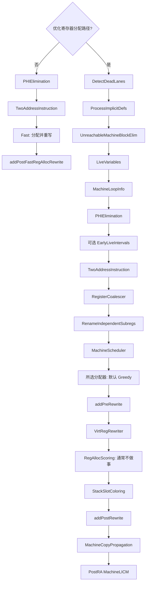

Basic、Greedy 和 PBQP 都可使用优化分配路径，区别在分配器策略及所需分析。`addOptimizedRegAlloc()` 显式安排变换，legacy PassManager 按 `getAnalysisUsage()` 提供有效分析；`INITIALIZE_PASS_DEPENDENCY` 负责初始化注册，不等于每次都重新运行全部依赖。SlotIndexes、LiveIntervals、MachineLoopInfo 等结果须由变换维护或声明保留，失效后重新计算。

前置变换、分析/数据容器、实际分配与分配后优化承担不同职责。PreRewrite 与 PostRewrite 等目标钩子允许目标在虚拟到物理寄存器重写前后补充处理。改变次序必须满足各 Pass 要求的 MIR 属性、分析有效性和目标约束；不能只根据名称随意换序。

#### 1. 前置处理与分析

通用优化分配路径的前置处理与分析包括以下步骤，其中括号内为对应的 Pass 名。

1）Dead 和 Undef 子寄存器检测（Detect Dead Lane）：在一些涉及子寄存器使用指令（Copy、Phi、Extract_SubReg、Insert_SubReg、Reg_Sequence）的场景中，指令序列可能存在寄存器死亡（Dead）或者未定义（Undef）的情况。而这些情况是寄存器合并非常重要的应用场景：死亡寄存器的活跃区间变小，更容易合并寄存器；未定义寄存器不用做额外处理，在寄存器分配时选择一个可用的物理寄存器即可。所以，寄存器分配阶段首先对指令进行分析获得子寄存器的状态。

2）隐式定义指令处理（Process Implicit Def）：把 IMPLICIT_DEF 的使用传播为 undef，递归处理可转换的 COPY-like 等指令；物理寄存器 IMPLICIT_DEF 在不能证明本块已处理其使用时可能保留。详见10.2.2。

3）不可达基本块消除（Unreachable Machine Block Elim）：对 MIR 进行不可达代码消除，消除后要保证不影响程序的正确性。不可达基本块可以通过分析 CFG 得到。

4）活跃变量分析（Live Variables Analysis）：记录活跃通过基本块、kill/dead 等信息，供 PHI 消除和二地址变换等使用。dead 结果虽无后续使用，若定义指令保留且要求寄存器操作数，仍可能需要一个物理寄存器。

5）循环信息分析（Machine Loop Info）：基于 MIR 分析函数中的循环，循环信息可用于后续的分析和优化 Pass（例如基本块频率计算等）。

6）Phi 消除（Phi Elimination）：LLVM 18 本章所用的分配流水线先把机器 PHI 转为入边复制，再进行分配。PHI 不直接对应硬件指令，但理论上也可在 SSA 形式中分配，之后再消除 PHI；这里的次序是当前实现选择，不是寄存器分配问题唯一可行的顺序。

7）活跃变量区间分析（Live Intervals Analysis）：计算活跃变量的生命周期区间，只为生命周期区间内活跃的变量分配寄存器，如果变量不在活跃区间（变量生命周期区间不连续）内，说明此时变量不活跃，不需要分配寄存器（可以将已经分配的物理寄存器重新提供其他变量使用）。

8）二地址指令变换（Two Address Instruction）：将三地址指令变换为二地址指令，为了满足具体指令的 tied 源/目的约束。注意：该 Pass 实际执行情况依赖于 TD 文件中二地址指令的定义（通过 Constraints 属性），没有 tied 操作数的指令不需要该项变换，但 Pass 还会处理 REG_SEQUENCE、INSERT_SUBREG 等；不能据此断言整个 Pass 被跳过。

9）寄存器合并（Simple Register Coalescing）：对 MIR 进行寄存器合并处理。寄存器合并指的是形如 %0 = COPY %1 这样的指令，可以尝试将虚拟寄存器 %1 和 %0 合并使用一个虚拟寄存器，从而减少指令数量和使用的寄存器。

10）独立子寄存器重命名（Rename Disconnected Independent Subregister）：针对启用子寄存器活跃区间跟踪的虚拟寄存器，找出不连通的子范围分量并拆成独立虚拟寄存器，以降低不必要的绑定和分配压力。是否有实际变换取决于目标能力及输入区间；不能仅以“存在32/64位寄存器”推出 Pass 必运行或必跳过。

11）机器指令调度（Machine Instruction Scheduler）：在保持依赖关系的前提下调度 MIR，同时权衡寄存器压力和目标调度模型。是否启用由目标子架构/Pass 配置与选项决定；不能把书中 BPF、WASM 的特定流水线观察推广为这些目标永久“不支持指令调度”，也不能用未验证的 JIT 猜测解释 LLVM 18 行为。

#### 2. 不同分配算法依赖的 Pass

下面以 Basic 算法为例介绍特定寄存器分配算法依赖的 Pass，具体如下。

1）调试信息分析（LiveDebugVariables）：一般由 `-g` 请求的调试描述不能改变程序分配结果。该组件跟踪变量位置/活跃区间，配合后续变换和寄存器重写恢复物理寄存器或栈位置的调试描述；此处不展开完整调试信息机制。

2）指令编号（Slot Index Analysis）：为指令进行编号，指令的编号在活跃区间中使用。

3）活跃变量区间分析（Live Interval Analysis）：计算活跃变量的生命周期区间，供寄存器分配使用。

4）寄存器合并（Simple Register Coalescing）：对 MIR 进行寄存器合并处理，以优化指令数量；该 Pass 主要是为了优化 φ 函数消除以及二地址指令变换过程中引入的大量 COPY指令。

5）机器指令调度（Machine Instruction Scheduler）：分析 MIR 中的数据依赖，并按照指令调度算法重新对 MIR 进行排序。

6）活跃栈变量分析（Live Stack Slot Analysis）：`LiveStacks` 提供栈槽 LiveInterval 容器，由 spiller 等维护溢出槽的活跃区间与寄存器类；虚拟寄存器到栈槽的映射由 `VirtRegMap` 管理。

7）别名分析结果使用（Alias Analysis Results Wrapper）：在寄存器分配过程中会使用别名分析的结果，确保移动后的指令正确。（如果指令使用的变量产生别名，则需要在指令移动时确保变量不冲突，否则会出现错误。）

8）支配树分析（Machine Dominator Tree）：基于 MIR 分析函数中的支配树信息，支配树不仅仅在循环信息分析中被使用，在后续的多个 Pass 中也会被使用（例如跨块移动时可用来保证定义支配用途）。

9）循环信息分析（Machine Natural Loop Analysis）：基于 MIR 分析函数中的循环，循环信息可用于后续的 Pass（如基本块频率计算等）。

10）虚拟寄存器映射（Virtual Register Map）：记录寄存器分配过程中虚拟寄存器和物理寄存器之间的映射关系，在寄存器分配完成后进行虚拟寄存器重写时会使用这个信息。该 Pass 不需要对指令进行真正的分析，仅需分配相关数据结构的内存，用于记录寄存器分配过程中虚拟寄存器和物理寄存器的映射关系。

11）活跃寄存器组合信息（Live Register Matrix）：`LiveRegMatrix` 按物理寄存器的 register unit 管理已分配虚拟区间的并集，检测 regmask、固定物理寄存器区间以及虚拟区间三类干涉。分配映射和栈槽映射主要由 `VirtRegMap` 记录。

调试信息分析不能禁止后续变换；寄存器分配本身会拆分、溢出、删除和移动指令，相关组件必须更新 LiveDebugVariables/SlotIndexes/LiveIntervals，重写后再以有效位置重建调试描述。图中重复出现的分析依赖不等于显式重复执行机器调度或合并。

12）Basic 寄存器分配算法（Basic Register Allocator）：为指令中使用的虚拟寄存器分配物理寄存器，如果遇到无法分配的情况，还需要选择合适的虚拟寄存器溢出到栈空间。

13）寄存器重写预处理（Hook point for PreRewrite）：为不同的后端提供挂载点，允许后端在寄存器映射之前做特殊的处理。

14）寄存器映射（Virtual Register Rewriter）：将虚拟寄存器映射为物理寄存器，并重写指令。

15）寄存器分配评价（Register Allocation Scoring）：通过该 Pass 对寄存器分配后的结果进行评价，评价的方式是计算寄存器分配后各种指令（如 load、store、ReMaterial、copy）的总成本，并在计算过程中为不同类型的指令设置不同的权重。该成本越小表示模型预测的分配代价较小，并不能直接证明实际运行更快。该 Pass 典型的应用场景是 MLGO（Machine-Learning Guided Optimization，机器学习指导的优化），通过机器学习不断迭代以获取最优的寄存器分配结果。

#### 3. 分配后依赖的 Pass

寄存器分配后还可以进行优化，主要包含以下 Pass。

1）栈槽着色分配（Stack Slot Coloring）：在寄存器分配过程中会遇到寄存器溢出的情况，需要使用栈空间暂存变量，在使用栈空间的过程中可以继续优化：如两个栈变量的活跃区间不重叠，则可以重用该栈槽空间。

2）寄存器分配后重写处理（Hook Point for PostRewrite）：为不同的后端提供挂载点，允许后端在寄存器映射之后进行独有的处理。

3）机器复制传播（Machine Copy Propagation）：在寄存器分配后，会引入少量的COPY 指令，这样的 COPY 指令经过复制传播优化可以消除，减少生成的指令数。

4）循环不变量外提（Machine LICM）：在寄存器分配后再次执行循环不变量外提，可能是机器复制传播等 Pass 执行后出现了新的优化机会。

#### 4. 依赖 Pass 分类

不同的后端对 Pass 的处理又有所不同，可以将寄存器分配过程中涉及的 Pass 分为两类。

1）通用框架中的 Pass：依靠目标抽象接口工作，但是否显式加入或实际改写仍由流水线和目标决定。可以进一步分为如下三类。

① 修改原始 MIR 或者生成新 MIR 的 Pass，例如 φ 函数消除、二地址指令转换等。

② 提供分析结果的 Pass，例如 SlotIndexes、LiveIntervals、MachineLoopInfo 等。COPY 可能来自 ABI 固定寄存器要求，例如将返回值复制到特定物理寄存器，并不只来源于 PHI。

③ 用于资源分配的 Pass，这些 Pass 分配的资源将在寄存器分配过程中或结束后被使用，例如 Live Stack Slot Analysis、Virtual Register Map、Live Register Matrix 等。

2）由目标能力和输入决定的 Pass：例如独立子寄存器重命名需要相应活跃子范围，MachineScheduler 依赖目标启用和调度模型。图中的 BPF/WASM 观察不能推广为 LLVM18 的永久限制。

下面将介绍寄存器分配中的主要 Pass，如果这些 Pass 依赖了其他的 Pass，也会展开介绍。

#### 5. 寄存器分配示例介绍

求和示例用于观察 PHI 消除、二地址变换、合并及物理重写，求和结果为45。为了观察这些后端步骤，直接把清单10-2送给llc，而不先用中端O2把整个循环折叠成常数。

**代码清单 10-1 从0到9求和**

```c
int sum() {
    // res 是跨迭代累加值，i 是循环计数器；后端必须保留各自到下一次使用。
    int res = 0;
    for (int i = 0; i < 10; i++) {
        res += i;
    }
    return res;
}
```

**代码清单 10-2 经mem2reg形式表达的求和IR**

```llvm
define i32 @sum() {
entry:
  br label %for.cond
for.cond:
  ; 首次进入取 0，回边取上次迭代的 %inc；PHI 的选择依据是入边。
  %i.0 = phi i32 [ 0, %entry ], [ %inc, %for.inc ]
  ; 累加器也沿回边传递；两条 PHI 表示同时选择，不能当作顺序覆盖。
  %res.0 = phi i32 [ 0, %entry ], [ %add, %for.inc ]
  %cmp = icmp slt i32 %i.0, 10
  br i1 %cmp, label %for.body, label %for.end
for.body:
  %add = add nsw i32 %res.0, %i.0
  br label %for.inc
for.inc:
  %inc = add nsw i32 %i.0, 1
  br label %for.cond
for.end:
  ret i32 %res.0
}
```

LLVM IR 寄存器始终遵循 SSA。使用 alloca/load/store 表示可变局部变量的 IR 也合法；mem2reg 提升的是内存对象。本章提供的 IR 直接写出两个循环 PHI，已由 LLVM18 verifier 接受。

清单10-3取 `-stop-after=finalize-isel`；此时 `for.body` 与 `for.inc` 还是两个块，后面的 EarlyTailDuplicate 会合并它们。

**代码清单 10-3 finalize-isel后的MIR**

以下片段中的新增中文注释用于阅读，不属于原始工具输出。

```text
bb.0.entry:
    successors: %bb.1(0x80000000)

    %4:gpr = MOV_ri 0

  bb.1.for.cond:
    successors: %bb.2(0x7c000000), %bb.4(0x04000000)

    %0:gpr = PHI %4, %bb.0, %3, %bb.3
    %1:gpr = PHI %4, %bb.0, %2, %bb.3
    ; BPF 使用 64 位 GPR；左移再算术右移，将 i32 计数器符号扩展后比较。
    %5:gpr = SLL_ri %0, 32
    %6:gpr = SRA_ri %5, 32
    JSGT_ri killed %6, 9, %bb.4
    JMP %bb.2

  bb.2.for.body:
    successors: %bb.3(0x80000000)

    %2:gpr = ADD_rr %1, %0

  bb.3.for.inc:
    successors: %bb.1(0x80000000)

    %3:gpr = ADD_ri %0, 1
    JMP %bb.1

  bb.4.for.end:
    ; %1 是虚拟累加器；R0 是 ABI 规定的物理返回寄存器。
    $r0 = COPY %1
    RET implicit $r0
```

<!-- manual-lab:ch10-sum-stages -->

```sh
# 每个停止点从同一 IR 重新编译，便于追踪 PHI、COPY、虚拟寄存器与栈偏移的变化。
for name in sum bubble; do
  "$LLVM_BUILD/bin/llvm-as" "$BOOK_INPUT/$name.ll" -o "$CODEGEN_LAB/$name.bc"
  "$LLVM_BUILD/bin/opt" -passes=verify "$CODEGEN_LAB/$name.bc" -disable-output
done
for stage in finalize-isel livevars phi-node-elimination twoaddressinstruction \
             register-coalescer virtregrewriter prologepilog; do
  "$LLVM_BUILD/bin/llc" -mtriple=bpfel -mcpu=generic -O2 -verify-machineinstrs \
    "-stop-after=$stage" "$BOOK_INPUT/sum.ll" -o "$CODEGEN_LAB/sum-$stage.mir"
done
sed -n '/^body:/,$p' "$CODEGEN_LAB/sum-phi-node-elimination.mir"
sed -n '/^body:/,$p' "$CODEGEN_LAB/sum-register-coalescer.mir"
```

按文件名比较各阶段：PHI 消除引入 COPY，合并后主要虚拟寄存器集中为 %8/%9/%6，物理重写和 PEI 快照用于后文对照。

## 10.2 寄存器分配涉及的 Pass

以 Basic 算法为例，涉及的 Pass 超过 30 个，在 BPF 后端的实现中部分 Pass 会被跳过。由于 Pass 众多，因此本节不会全部展开详细介绍，仅介绍寄存器分配过程中涉及的几个重要 Pass。

### 10.2.1 死亡和未定义子寄存器检测

该 Pass 分别传播子寄存器 lane 的 used/defined 信息，给无用定义和未定义输入添加 dead/undef 标志，帮助合并和分配。dead 表示定义值无后续需求，不等于定义指令一定可删，也不等于指令可省略必需的结果寄存器；undef 输入仍须满足寄存器类、tied 和目标约束。

下面通过代码清单 10-4 所示的代码片段来演示该 Pass 的效果。

**代码清单 10-4 死亡 / 未定义子寄存器检测示例**

> 伪 MIR，含占位符。

```text
; sub1 来自 IMPLICIT_DEF：没有确定值，不代表整个复合寄存器的 sub0 都无效。
%0 = some definition
%1 = IMPLICIT_DEF
%2 = REG_SEQUENCE %0, sub0, %1, sub1
%3 = EXTRACT_SUBREG %2, sub1
   = use %3
```

首先来看死亡信息是如何计算的。该过程使用了典型的后向数据流分析手段，识别死亡寄存器需要先识别使用中的寄存器，没有被使用的寄存器则被认为死亡。分析时从出口指令开始，例如在代码清单 10-4 中，因为 %3 被其他指令使用，所以 %3 使用的寄存器 %2也应该是活跃的。但是 %3 的定义是 EXTRACT_SUBREG %2, sub1，该指令仅使用了 %2的 sub1 部分。而 %2 由 REG_SEQUENCE 指令定义的 %0 和 %1 构成，寄存器 %0 没有被使用，则认为寄存器 %0 是死亡的。上述分析过程如图 10-4 所示。

再来看如何分析未定义寄存器的信息，这是一个典型的前向数据流分析。例如在代码清单 10-4 中，%0 操作数是显式定义的，%1 操作数是隐式定义的，%2 使用了隐式定义的操作数 %1，同样 %3 也使用了隐式定义的操作数 %2。使用了隐式定义操作数的寄存器实际上是未定义的，所以 %3 是未定义的。但是此时 %2 并不是未定义的，这是因为 %2 使用了 %0 这个被显式定义的操作数。上述分析过程如图 10-5 所示。

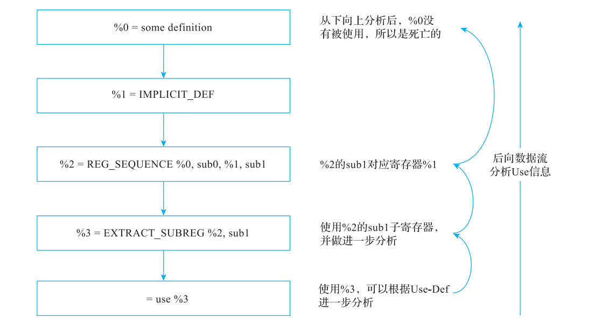

**图 10-4 寄存器使用信息分析**

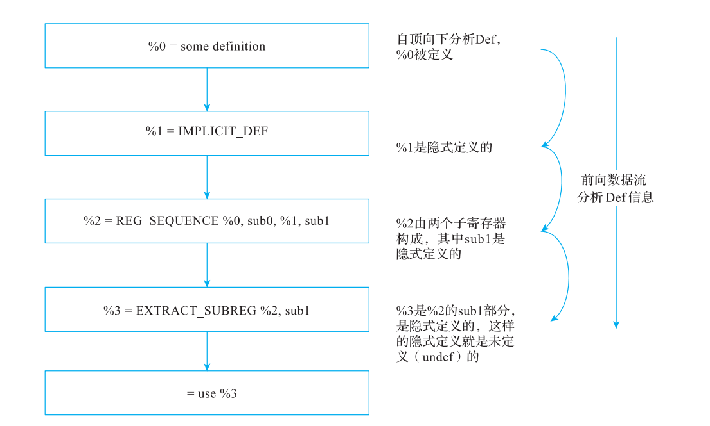

**图 10-5 寄存器定义信息分析**

分析死亡和未定义的寄存器信息的数据流方程非常简单，和 3.3.1 节及 3.3.2 节非常类似。对于大量使用子寄存器的代码，该Pass可能缩短有效活跃范围；是否提升性能取决于后续分配结果。

### 10.2.2 隐式定义指令处理

`IMPLICIT_DEF` 是表示未定义寄存器值的已定义机器伪指令，不是“未定义的指令”。它与普通机器指令上的 implicit-def 操作数标志也不同。`ProcessImplicitDefs` 按以下规则处理。

1）虚拟寄存器：将非调试 uses 标成 undef；仅当 COPY-like、INSERT_SUBREG、REG_SEQUENCE、PHI 等指令不再有读取已定义寄存器的操作数时，将使用者转成 IMPLICIT_DEF 并递归处理，删除原 IMPLICIT_DEF。

2）物理寄存器：在同一基本块向后找第一个使用或重定义重叠物理寄存器的指令，标记其中的 uses 为 undef。找到时才删除原指令；若本块没有找到，则可能有跨块使用，需要保留该 IMPLICIT_DEF 并清除多余操作数。

3）不能因为普通机器指令的所有 uses 都 undef 就删除该指令，仍须考虑副作用和指令语义。

因为隐式定义指令会被删除，而死亡和未定义子寄存器检测需要根据隐式定义信息计算出 Undef 状态的子寄存器，所以需要先执行死亡和未定义子寄存器检测，然后再执行隐式定义指令删除。例如，在代码清单 10-4 中，死亡和未定义子寄存器检测先于隐式定义指令处理，%3 可以被删除，而使用 %3 的指令被修改为处于 Undef 状态的 MO。

### 10.2.3 不可达 MBB 消除

在寄存器分配中的前置依赖 Pass 中有不可达 MBB 消除 Pass，活跃变量分析也依赖该Pass。使用该 Pass 进行死代码删除可以减少无效计算与寄存器分配等工作。

不可达 MBB 的识别非常简单，在遍历 CFG 时，只要能从 Entry 开始遍历到的 MBB 都是可达的，遍历不到的 MBB 就是不可达的。

不可达的 MBB 属于死代码，当发现不可达 MBB 时，需要将其删除。如果不可达MBB 属于循环，则删除 MBB 会影响循环结构。所以在删除不可达 MBB 时需要更新支配信息、循环结构以及影响的 φ 函数。

对代码清单 10-3 来说不存在不可达 MBB，所以本 Pass 的执行不会对 MIR 产生任何影响。

补充：`%2 = INSERT_SUBREG %0, %1, subidx` 的 `%0`、`%1` 是输入，需要各自的定义；只有刻意构造未定义输入时才用 IMPLICIT_DEF。输入不在同一条指令内定义，不表示它就是 undef。

注 在中端优化时一般会进行死代码删除优化（如中端优化的 SimplifyCFG），那么在代码生成阶段为什么还需要对该 Pass 进行优化？主要原因是后端优化可能会引入不可达 MBB，例如尾代码重复等。

### 10.2.4 活跃变量分析

后续多个 Pass 直接依赖活跃变量分析，例如寄存器分配类 Pass 只针对活跃变量进行分配。

活跃变量分析需要先找出那些在一条指令结束后立即无效（Dead）的寄存器集合，还需要找出那些在当前指令中使用，但执行这条指令后就不再使用的寄存器集合（被当前指令杀死）。简单来说，活跃变量的信息是在函数范围内对每个虚拟寄存器以及指令中使用的物理寄存器进行分析。分析结果是识别寄存器在何时死亡、何时被杀死，机器 SSA 的单定义关系可从 MachineRegisterInfo 获取，实际处理仍要扫描机器操作数的 Def/Use、PHI 边使用和物理寄存器约束。

`LiveVariables` 利用机器 SSA 的单定义性质，以 CFG 深度优先顺序扫描指令；处理虚拟寄存器 use 时，从使用块沿前驱传播活跃性，直到定义块或已标记区域。实现结合顺序扫描与稀疏后向传播，并不是传统完整集合不动点求解器，也不能归类为“只能前向的数据流分析”。

其稀疏表示和 PHI 边使用规则如下。

1）寄存器的活跃信息使用一个集合保存，在集合中存放的是 MBB，表示寄存器在整个 MBB 都是活跃的。如果寄存器在同一个 MBB 中被定义和使用，在 MBB 外也不再活跃（即被杀死），那么此寄存器不会存放在该集合中。

2）我们使用一个集合保存寄存器被杀死的信息，在集合中存放的信息形式是 MIR，表示寄存器在此 MIR 后不会再被使用。

3）如果 φ 函数是最后使用寄存器的指令，这条 φ 函数指令不会出现在保存杀死信息的集合中。相反，其前驱基本块的相关信息应该加入活跃信息集合中。

4）如果寄存器在同一个 MBB 中被定义和使用，并且仅在后继基本块的 φ 函数中被再次使用，则会出现寄存器的活跃集合为空，同时寄存器的杀死信息集合也为空（φ 函数不会更新杀死信息）的情况。这是因为寄存器在 MBB 的最后一条指令处仍然都是活跃的，但是在进入后继基本块后不再活跃。

这些规则不会使后向活跃性分析失效。LLVM 18 的实现流程可概括如下。

1）以函数为单位，从入口按 CFG 深度优先顺序处理基本块，普通虚拟寄存器定义因 SSA 支配性质先于其使用被访问；PHI 使用另按前驱边处理。

2）扫描每条非调试/伪指令的操作数，收集实际读取的 Use、Def 与 regmask，清除需重新计算的标志。对于 PHI，这一步只处理其 Def。

3）先处理 Use。虚拟寄存器的候选 kill 位置会随着本块后续使用而后移；跨块使用使活跃性沿前驱向定义块传播，并移除已被活跃传播覆盖的 kill。kill 表示当前值沿该活跃路径的最后一次使用，不是每次 use 都会杀死该值。

4）处理 regmask，例如调用破坏的物理寄存器。

5）处理 Def。虚拟寄存器定义先作为候选结束位置；若最终没有有效使用，则在定义上形成 dead，存在使用时由分析得到实际 kill/live-through 信息。物理寄存器则处理与先前值、别名和子寄存器相关的定义、使用与杀死信息。先处理输入、再处理普通输出，有助于区分同一指令读取的旧值和写入的新值；完整的 early-clobber 约束还由后续 SlotIndexes/LiveIntervals 和分配器处理。

对于机器指令中出现的物理寄存器的处理稍微有些不同。

1）函数参数、返回值和调用约定会引入固定物理寄存器需求。MBB 的 live-in 以及 terminator 的显式/隐式寄存器用途参与活跃性；块边界可作为相应区间的起止位置。不能把所有物理 live-in 仅解释为函数参数，也不存在“return 指令带一个通用 LiveOut 属性”这样的统一表示。

2）LiveVariables 对物理寄存器主要按块内状态处理，并依赖既有的块边界信息。物理值在真实程序中可以跨块活跃，不能把该分析方式误读成硬件寄存器值一定在块末失效。

3）LiveVariables 的部分物理寄存器处理跳过 MRI 标记 reserved 的寄存器；这不意味着整个代码生成过程可以忽略它们。不能把所有条件码寄存器都无条件列为 reserved，具体由目标定义。

4）物理寄存器在处理 Def、Use 时需要考虑子寄存器的情况。例如 x86 中若先定义了EAX，但是定义后不再使用 EAX，而是分别使用了其子寄存器 AH 和 AL ；或者先定义了AL 和 AH，但是未使用 AL 和 AH，而是使用了它们的父寄存器 EAX。对于这样的情况，需要处理子寄存器的活跃集合和杀死集合。

对同一输入取 `-stop-after=livevars`。此时已完成前期机器SSA优化，循环体被合并；killed 表示该值沿相应活跃路径的最后使用，而不是该寄存器编号永久失效。

**代码清单 10-5 活跃变量分析后的MIR**

```text
bb.0.entry:
    successors: %bb.1(0x80000000)

    %4:gpr = MOV_ri 0

  bb.1.for.cond:
    successors: %bb.2(0x7c000000), %bb.3(0x04000000)

    %0:gpr = PHI %4, %bb.0, %7, %bb.2
    %1:gpr = PHI %4, %bb.0, %2, %bb.2
    %5:gpr = SLL_ri %0, 32
    %6:gpr = SRA_ri killed %5, 32
    JSGT_ri killed %6, 9, %bb.3
    JMP %bb.2

  bb.2.for.body:
    successors: %bb.1(0x80000000)

    %2:gpr = ADD_rr killed %1, %0
    %7:gpr = ADD_ri killed %0, 1
    JMP %bb.1

  bb.3.for.end:
    $r0 = COPY killed %1
    RET implicit killed $r0
```

### 10.2.5 Phi 消除

硬件指令不能直接读取“刚刚从哪个CFG前驱到达”这个抽象 PHI 信息，因此后端在分配前将机器PHI转为边上的值传递。LLVM18的 PHIElimination 对每个 PHI 引入 IncomingReg，在各前驱终结指令之前复制输入值，再在目标块原PHI位置复制到目的寄存器。不同PHI使用独立临时值，保持循环回边上交换等并行赋值的语义。

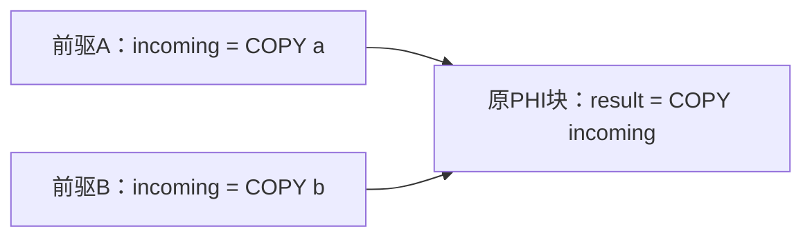

关键边不拆分也可保持这种临时值方案的正确性，但可能让 COPY 在不需要它的路径上执行并增大干涉。`SplitPHIEdges` 会结合 live-out/live-in 判断收益：输入除了PHI外仍live-out、却不是目标live-in时，拆边可能避免其他路径上的无谓干涉；输入已live-in时一般收益较少。默认避免拆分自环与指向同一循环头的回边，循环退出边仍可能有收益。`-phi-elim-split-all-critical-edges` 是更积极的选择，CFG/EH等合法性仍需满足。

插入指令及拆边后，Pass增量更新可用的LiveVariables、LiveIntervals、SlotIndexes、支配树和循环信息；不能继续使用失效分析。内部LiveIntervals的PHI值编号与机器PHI指令不同。早期 Strong PHI Elimination 的历史可在原文查阅，本章采用当前实现。

**代码清单 10-6 PHIElimination后的MIR**

```text
bb.0.entry:
    successors: %bb.1(0x80000000)

    %4:gpr = MOV_ri 0
    %8:gpr = COPY %4
    %9:gpr = COPY killed %4

  bb.1.for.cond:
    successors: %bb.2(0x7c000000), %bb.3(0x04000000)

    %1:gpr = COPY killed %9
    %0:gpr = COPY killed %8
    %5:gpr = SLL_ri %0, 32
    %6:gpr = SRA_ri killed %5, 32
    JSGT_ri killed %6, 9, %bb.3
    JMP %bb.2

  bb.2.for.body:
    successors: %bb.1(0x80000000)

    %2:gpr = ADD_rr killed %1, %0
    %7:gpr = ADD_ri killed %0, 1
    %8:gpr = COPY killed %7
    %9:gpr = COPY killed %2
    JMP %bb.1

  bb.3.for.end:
    $r0 = COPY killed %1
    RET implicit killed $r0
```

两个PHI已经消失，入口和回边定义 `%8/%9`，循环头从它们复制。此时同一虚拟寄存器可在多个块被定义，机器SSA性质结束，随后合并器尝试消除不必要的COPY。

### 10.2.6 二地址指令变换

LLVM 的机器指令不统一限制为“三地址且最多两输入一输出”。MIR 能表达多输出、多输入、隐式寄存器、regmask、变长操作数等；二地址变换针对带 tied def/use 约束的指令。

然而一些目标架构的指令集使用的是二地址码指令，即指令中定义的目的寄存器同时也是源寄存器，比如 x86 架构中一条指令形如 ADD %EAX, %EBX，其功能是将寄存器EAX 和 EBX 的值加起来，并将结果放入 EAX 中，即 %EAX = %EAX + %EBX。

在本章 LLVM 18 流水线中，TwoAddressInstructionPass 在分配前协调 tied 源/目的，必要时插入 COPY，或者选择目标允许的三地址替代。不是把整个目标的所有指令一律改为二地址形式。该 Pass 执行后，输出的MIR 就不再是 SSA 形式。比如，有一条 MIR 指令：%a = ADD %b, %c，经过该 Pass 变换后，结果如代码清单 10-7 所示的两条指令。

**代码清单 10-7 二地址指令变换结果**

> 二地址变换伪代码。

```text
; 先复制是为满足两地址约束：ADD 的结果位置必须与一个输入位置相同。
%a = COPY %b
%a = ADD %a, %c
```

该 Pass 会以函数为粒度，针对基本块中的每一条指令尝试执行二地址变换。那所有的指令是否都需要执行二地址变换？如果不是，什么样的指令才需要真正执行二地址变换？

简单的回答是，只有部分 MIR 指令才需要执行二地址变换，这一类指令都定义在 TD文件。TD 文件通过关键字 Constraints 来指定哪些指令需要变换，同时该关键字还指定了如何进行变换。以 BPF 后端中 add 指令为例，它有两种指令格式，如代码清单 10-8 所示。

**代码清单 10-8 add 指令的两种格式**

> 操作数形状示意，非真实三寄存器 eBPF 编码。

```text
add dst, src2, imm
add dst, src2, src  // 操作数形状示意；最终 dst 与 src2 必须相同
```

实际 eBPF ALU 编码只有目标寄存器、另一个寄存器或立即数。MIR 在 SSA 阶段额外显式列出旧目标值 `$src2`，用 `$dst = $src2` 约束要求它与结果共用物理寄存器。

eBPF 中 ADD 指令对应的 TD 代码片段如代码清单 10-9 所示：

**代码清单 10-9 ADD 指令对应的 TD 代码片段**

> LLVM18 TableGen 源码节选，依赖周边定义。

```tablegen
// 绑定的是操作数位置；分配器最终必须为 $dst 和 $src2 选择同一物理寄存器。
let Constraints = "$dst = $src2" in {
  let isAsCheapAsAMove = 1 in {
    defm ADD : ALU<BPF_ADD, 0, "+=", add>;
  }
}
```

其中 Constraints 字段表明 ADD 相关指令中的 dst 和 src2 共用一个寄存器。代码清单10-10 中定义了 ADD_rr 和 ADD_ri 两条指令的 TD 代码片段，解释了为什么 src2 和 dst 可以共用一个寄存器（因为 另一个输入位置是 `$src` 或 `$imm`，而 `$src2` 必须和 `$dst` 绑定）。

**代码清单 10-10 定义 ADD_rr 和 ADD_ri 两条指令的 TD 代码片段**

> LLVM18 TableGen multiclass，依赖周边定义。

```tablegen
multiclass ALU<BPFArithOp Opc, int off, string OpcodeStr, SDNode OpNode> {
  // rr 接收寄存器输入，ri 接收立即数；outs/ins 描述机器指令的数据流。
  def _rr : ALU_RR<BPF_ALU64, Opc, off,
                   (outs GPR:$dst),
                   (ins GPR:$src2, GPR:$src),
                   "$dst "#OpcodeStr#" $src",
                   [(set GPR:$dst, (OpNode i64:$src2, i64:$src))]>;
  def _ri : ALU_RI<BPF_ALU64, Opc, off,
                   (outs GPR:$dst),
                   (ins GPR:$src2, i64imm:$imm),
                   "$dst "#OpcodeStr#" $imm",
                   [(set GPR:$dst, (OpNode GPR:$src2, i64immSExt32:$imm))]>;
  // 下面改用 GPR32 与 BPF_ALU，对应 32 位运算形式。
  def _rr_32 : ALU_RR<BPF_ALU, Opc, off,
                   (outs GPR32:$dst),
                   (ins GPR32:$src2, GPR32:$src),
                   "$dst "#OpcodeStr#" $src",
                   [(set GPR32:$dst, (OpNode i32:$src2, i32:$src))]>;
  def _ri_32 : ALU_RI<BPF_ALU, Opc, off,
                   (outs GPR32:$dst),
                   (ins GPR32:$src2, i32imm:$imm),
                   "$dst "#OpcodeStr#" $imm",
                   [(set GPR32:$dst, (OpNode GPR32:$src2, i32immSExt32:$imm))]>;
}
```

对于有 Constraints 约束的指令，TableGen 在处理 TD 代码时，会为对应的指令生成TiedOperand 的属性。在指令选择阶段生成相关的指令时，会根据指令属性为对应的操作数添加 TiedOperand 属性。这样，在二地址变换阶段只要判断 MIR 指令中操作数的属性就能知道是否需要进行变换了。

注 在新的编译器后端实现中，什么情况下需要让指令支持二地址指令变换？简单地说，需要根据指令集中指令的定义来确定。以 eBPF 为例，它有自己的虚拟指令集，在指令集中定义了指令的格式，参见图 B-1。

指令只支持 src 和 dst 两个寄存器，所以对于 MIR 中有 3 个寄存器的指令都要做二地址指令变换。故除了上述介绍的 ADD 这类的 ALU 指令外，eBPF 中带 tied 操作数的移位等 ALU 指令需要变换；普通条件跳转没有结果寄存器，不因其编码含 src/dst 字段就需要该变换。

#### 1. LLVM 中二地址变换的执行流程

二地址变换的执行流程如下。

1）预处理：把 LLVM 中支持的特殊指令（如 REG_SEQUENCE）变换成 COPY 指令；对所有的 COPY 指令进行收集，便于后续处理 COPY 链指令。

2）收集 MIR 指令中存在 TiedOperand 属性的操作数：这些操作数包含了可以共用的寄存器（这意味着要插入 COPY 指令）。

3）确认是否需要进行二地址指令变换：如果目标支持合法的三地址替代，可先转换为该替代形式；保留下来的tied指令仍必须满足寄存器相同约束，不能因成本原因直接跳过。

4）变换指令：对于需要进行二地址指令变换的指令，为包含 TiedOperand 属性的操作数插入 COPY 指令，同时更新该操作数的变量活跃区间。

5）后处理：把 LLVM 中的特殊指令（如 INSERT_SUBREG）转换为 COPY 指令，并更新变量活跃区间。

#### 2. 二地址变换值得注意的问题

在二地址指令变换过程中有几个实现上的问题，值得读者注意。

1）在上述第 3 步需要判断是否可以进行二地址变换，为什么？它的主要目的是什么？

简单来说，该功能是实现二地址指令变换过程的一些小优化。主要有以下几个场景。

场景 1：在一些场景中使用三地址指令性能更好，如果几个连续的指令按照二地址指令格式进行变换反倒性能更差，那么这样的场景不应该进行变换。x86 后端的示例如代码清单 10-11 所示。

**代码清单 10-11 不应进行二地址变换的 x86 后端示例**

> 伪 MIR；r0/r1/r2 是抽象寄存器。

```text
%reg1024 = COPY r1
%reg1025 = COPY r0
%reg1026 = ADD %reg1024, %reg1025
 r2            = COPY %reg1026
```

如果按照二地址指令格式进行变换，最后获得的执行代码如代码清单 10-12 所示。

**代码清单 10-12 对代码清单 10-11 进行二地址变换后**

> x86 AT&T 汇编示例，已用 llvm-mc 组装并反汇编；没有进行硬件执行或性能测量。

以下汇编中的中文注释是阅读说明，不属于原始工具输出。

```asm
# AT&T 语法按源、目的排列；addl 覆盖 EDI，随后把结果送到返回寄存器 EAX。
addl     %esi, %edi
movl     %edi, %eax
ret
```

但代码清单 10-11 使用 LEA 可能减少指令数；具体性能依赖处理器，并且转换须保证 EFLAGS 等语义不被破坏，例如使用 leal 指令，得到执行代码如代码清单 10-13 所示。

**代码清单 10-13 代码清单 10-11 使用三地址指令（leal 指令）**

> x86 AT&T 汇编示例，已用 llvm-mc 组装并反汇编；没有进行硬件执行或性能测量。

以下汇编中的中文注释是阅读说明，不属于原始工具输出。

```asm
# LEA 只计算地址表达式的数值，不读取内存；此处可把和直接写入 EAX。
leal (%rsi,%rdi), %eax
ret
```

场景 2：输入 MIR 已符合指令描述，但 tied 的源和目的可能还是不同虚拟寄存器。交换可交换操作数，可以让更适合被覆盖的值处于 tied 输入位置，减少保留旧值所需的 COPY；转换为合法三地址指令则是另一个可选优化。`isCommutable` 和 `isConvertibleToThreeAddress` 表示目标提供相应能力，不是在修补指令选择器产生的非法 MIR。

**代码清单 10-14 在 TD 中定义是否可以进行指令变换**

> 解释属性的 TableGen 示意；LLVM18 的实际指令由 multiclass 生成，非可独立编译文件。

```tablegen
let Constraints = "$src1 = $dst",
    Defs = [EFLAGS],
    isCommutable = 1,                  // X = ADD Y,Z --> X = ADD Z,Y
    isConvertibleToThreeAddress = 1 in // 可以被转换为LEA指令
def ADD32rr  : I<0x01, MRMDestReg, (outs GR32:$dst),
                                   (ins GR32:$src1, GR32:$src2),
                 "add{l}\t{$src2, $dst|$dst, $src2}",
                 [(set GR32:$dst, (add GR32:$src1, GR32:$src2))]>;
```

当遇到 `X = ADD Y,Z`，合法交换为 `X = ADD Z,Y` 后，tied 位置换成 Z。若 Z 的旧值此后不需要，比仍需保留的 Y 更容易与 X 合并；是否交换还要结合 kill、COPY 链和目标成本。

场景 3：局部重调度可以让 tied 输入的最后使用更靠近将覆盖它的指令，从而减少不必要的复制。算法可尝试向下移动当前指令，或移动相应的使用指令；仍需检查数据、内存与物理寄存器依赖，不能简单按“最后一条 use”重新排序。图 10-9 只示意候选移动方向，实际是否合法取决于这些检查。

2）为什么在预处理时转换 REG_SEQUENCE，而在后处理时转换 INSERT_SUBREG ？这样的顺序有什么含义？

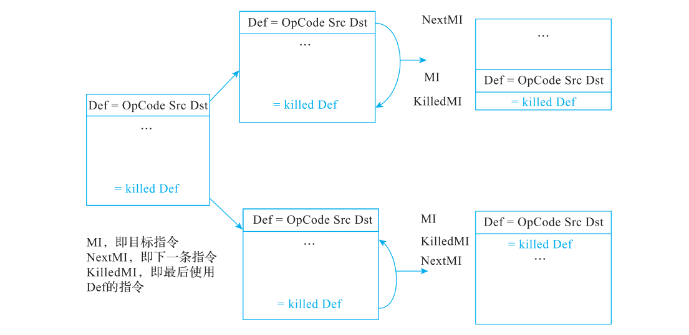

**图 10-9 二地址指令变换过程中的指令调度优化**

REG_SEQUENCE 将各输入放入目标寄存器指定的子寄存器。对于合法寄存器类、子寄存器索引与输入组合，TwoAddressInstructionPass 在退出 SSA 过程中可将其展开成一串子寄存器 COPY；例如 `%dst = REG_SEQUENCE %v1, ssub0, %v2, ssub1` 可展开为清单 10-15。

**代码清单 10-15 与 REG_SEQUENCE 等价的代码片段**

> 子寄存器伪 MIR，ssub0/ssub1 是示意名。

```text
; undef 修饰旧 %dst 的未写部分，不是说本次写入的 %v1 没有定义。
undef %dst.ssub0 = COPY %v1
%dst.ssub1 = COPY %v2
```

INSERT_SUBREG 在保留原值其他部分的基础上替换指定子寄存器。二地址变换满足其 tied 基值与目的寄存器约束后，可以将 `%reg = INSERT_SUBREG %reg, %subreg, subidx` 展开为 `%reg.subidx = COPY %subreg`；一般 SSA 形式中的不同目的和基值还需要先协调或复制。

这里第一个 COPY 的目的子寄存器 def 带 `undef`，表示此前目的寄存器没有需要保留的活跃旧值；它不表示 `%v1` 的输入或此次新定义无效，也不是“第一次使用”的通用标志。实现会跳过 undef 输入、把重复输入的 kill 推迟到最后一次使用；若没有任何有效输入，则改为 IMPLICIT_DEF，并更新活跃信息。REG_SEQUENCE 是在这些约束下展开成 COPY 序列，不能与单条 COPY 一概等同。该展开使后续二地址转换能够利用 COPY 链；INSERT_SUBREG 则先参与 tied 操作数处理，随后再消除。

注：MIR 仍可写成 `%a = ADD %a(tied-def 0), %c`。目的 def 与源 use 是两个不同的 MachineOperand，通过 tied 约束使用相同寄存器；不是一个同时带 def/use 的操作数。

#### 3. LLVM 中二地址指令变换的实现

最后再看一下针对不同的指令如何进行二地址指令变换？

1）针对形如“ vreg0 = opcode vreg1(tied), imm/vreg”的指令进行变换，添加 COPY 指令，并替换原指令中的源寄存器，最后变成如代码清单 10-16 所示的形式。

**代码清单 10-16 添加 COPY 指令并替换原指令中源寄存器**

> tied 操作数改写伪代码。

```text
; 若 vreg1 在后面还要使用，先 COPY 才能让破坏性更新不覆盖原值。
vreg0 = COPY vreg1
vreg0 = opcode vreg0, imm/vreg
```

2）针对形如“ vreg0 = opcode vreg1(tied), killed vreg2”的指令进行变换，此时 vreg2的标记为 killed，说明后面没有指令再使用 vreg2。如果后端定义了特殊实现进行指令变换，则直接使用后端的定义，若该指令允许合法 commute 且收益检查通过，则交换两个输入；不能任意交换不可交换指令。然后添加 COPY 将 vreg2 的值转入 vreg0，并替换原指令中相应的 tied 源寄存器。最后变成如代码清单 10-17 所示的形式。

**代码清单 10-17 对 killed 寄存器类型的指令进行变换后的形式**

> 可交换操作的改写伪代码。

```text
// 可交换输入时选择更合适的一方作为 tied 输入，可能减少复制或缩短活跃范围。
vreg0 = COPY vreg2
vreg0 = opcode vreg0(tied), vreg1 // 仅在 opcode 可合法交换输入时成立
```

3）针对形如“ vreg0 = opcode killed vreg1(tied), killed vreg2”的指令进行变换。由于vreg1 和 vreg2 都是 killed，这里要判断用哪个替换 vreg0 有更大收益。收益计算方式为：确定 vreg1 和 vreg2 的属性，比较它们的定义位置（较短生命周期的 vreg 更有吸引力）；满足收益条件可以进行指令变换，用一个 vreg 替换 vreg0，不满足替换收益的指令则直接放弃替换。如果后端定义了特殊实现进行指令变换，则直接使用后端的定义；否则添加 COPY指令，并替换原指令中的源寄存器。

4）后端特殊约定的指令，需要在后端中实现对原指令的特定变换。例如 x86 的后端指令“ A = SHRD16rri8 B, C, I”将被变换成“ A = SHLD16rri8 C, B, (16 – I)”，转换后的指令可以使用符号寄存器，这种转换可能带来性能优势。

#### 4. 二地址指令变换示例

取 `-stop-after=twoaddressinstruction`，可见 `%5/%6/%2/%7` 的 tied 输入已与各自定义使用相同虚拟寄存器。新增 COPY 是满足机器约束的手段，后续是否能够合并要检查值与活跃区间。

**代码清单 10-18 二地址指令变换后的MIR**

```text
bb.0.entry:
    successors: %bb.1(0x80000000)

    %4:gpr = MOV_ri 0
    %8:gpr = COPY %4
    %9:gpr = COPY killed %4

  bb.1.for.cond:
    successors: %bb.2(0x7c000000), %bb.3(0x04000000)

    %1:gpr = COPY killed %9
    %0:gpr = COPY killed %8
    %5:gpr = COPY %0
    %5:gpr = SLL_ri %5, 32
    %6:gpr = COPY killed %5
    %6:gpr = SRA_ri %6, 32
    JSGT_ri killed %6, 9, %bb.3
    JMP %bb.2

  bb.2.for.body:
    successors: %bb.1(0x80000000)

    %2:gpr = COPY killed %1
    %2:gpr = ADD_rr %2, %0
    %7:gpr = COPY killed %0
    %7:gpr = ADD_ri %7, 1
    %8:gpr = COPY killed %7
    %9:gpr = COPY killed %2
    JMP %bb.1

  bb.3.for.end:
    $r0 = COPY killed %1
    RET implicit killed $r0
```

<!-- manual-lab:ch10-x86-two-address -->

```sh
# 汇编为对象再反汇编，确认 ADD 与 LEA 的真实操作数和编码，不能只看伪指令形状。
for name in add-x86 lea-x86; do
  "$LLVM_BUILD/bin/llvm-mc" --triple=x86_64-unknown-linux-gnu --filetype=obj \
    "$BOOK_INPUT/$name.s" -o "$CODEGEN_LAB/$name.o"
  "$LLVM_BUILD/bin/llvm-objdump" -d "$CODEGEN_LAB/$name.o" \
    > "$CODEGEN_LAB/$name.dis"
  cat "$CODEGEN_LAB/$name.dis"
done
```

两份 AT&T 汇编均可编码：一份含 add/mov/ret，另一份含 lea/ret；这验证语法与编码，不是硬件速度比较。

### 10.2.7 指令编号

SlotIndexes 为机器指令、bundle与块边界提供有序位置。调试指令等不参与这个机器活跃区间编号；这并不表示必须删除调试信息。初始相邻条目距离为 `InstrDist=16`，在中间插入条目可利用空隙，空隙不足时局部重新编号。

每个条目有四个有序子槽：`B` 为块边界/指令起点，`e` 为 early-clobber 定义，`r` 为普通使用的结束与普通定义位置，`d` 为 dead 定义结束位置。例如 `[16r,32r)` 可与 `[32r,48r)` 共用资源，普通输入在32r结束后结果可占用它；若结果在32e提前写坏，则仍与32r才读完的输入干涉。

清单10-19来自 `sum-trace.stderr` 第一次机器指令打印，保留最前面的索引，用以对应下一节的区间。

**代码清单 10-19 SlotIndexes编号（节选）**

阅读提示：`16B`、`32B` 等是 SlotIndex 位置，不是机器码字节地址；寄存器定义位置与区间端点应按同一索引体系比较。

```text
# Machine code for function sum: NoPHIs, TracksLiveness, TiedOpsRewritten

0B	bb.0.entry:
	  successors: %bb.1(0x80000000); %bb.1(100.00%)

16B	  %4:gpr = MOV_ri 0
32B	  %8:gpr = COPY %4:gpr
48B	  %9:gpr = COPY %4:gpr

64B	bb.1.for.cond:
	; predecessors: %bb.0, %bb.2
	  successors: %bb.2(0x7c000000), %bb.3(0x04000000); %bb.2(96.88%), %bb.3(3.12%)

80B	  %1:gpr = COPY %9:gpr
96B	  %0:gpr = COPY %8:gpr
112B	  %5:gpr = COPY %0:gpr
128B	  %5:gpr = SLL_ri %5:gpr(tied-def 0), 32
144B	  %6:gpr = COPY %5:gpr
160B	  %6:gpr = SRA_ri %6:gpr(tied-def 0), 32
176B	  JSGT_ri %6:gpr, 9, %bb.3
192B	  JMP %bb.2
```

<!-- manual-lab:ch10-sum-debug -->

```sh
# Debug 构建把分配过程写到 stderr；汇编和轨迹分开保存，便于对照值的活跃区间。
"$LLVM_BUILD/bin/llc" -mtriple=bpfel -mcpu=generic -O2 -verify-machineinstrs \
  -debug-only=regalloc,machine-block-freq "$BOOK_INPUT/sum.ll" \
  -o "$CODEGEN_LAB/sum.s" 2> "$CODEGEN_LAB/sum-trace.log"
sed -n '1,65p' "$CODEGEN_LAB/sum-trace.log"
```

Debug 构建日志包含 SlotIndexes、LiveIntervals 及后面的分配过程；同一次命令生成的 sum.s 供物理映射小节查看。

### 10.2.8 变量活跃区间分析

LiveIntervals 为每个虚拟寄存器构造一组半开 segment，而不是只取最早定义到最晚使用的一个包围区间。`[start,end:valno)` 同时记载位置和到达值编号VNInfo；同一寄存器在PHI消除、二地址改写后可以有多个定义和内部合流值。空洞可用于安排其他值。

构造时先为定义建立值编号及最小定义范围，再从使用位置向前扩展：本块可找到到达定义时直接延伸；否则将需求传到前驱，收集到达值。如果多条前驱带来不同值，用支配信息与SSA式值合并建立内部合流值，必要时继续更新工作列表。`LiveRangeCalc`处理这种跨块扩展。子寄存器活跃性开启时，还分别构造lane子范围。物理寄存器约束则按register unit建立固定范围，并单独记录调用regmask。

因此两个虚拟区间在文本上不相交只是可共用寄存器的一个条件，还须满足寄存器类、别名、固定regunit、regmask及指令约束。提前写坏或子寄存器覆盖必须在正确槽和lane上比较。

**代码清单 10-20 初始活跃区间，spill weight尚未计算**

阅读提示：`[a,b)` 左闭右开，表示值从 a 活跃到 b 之前；冒号后的编号区分同一寄存器区间中的不同值，不能直接当作物理寄存器编号。

```text
%0 [96r,256r:0) 0@96r  weight:0.000000e+00
%1 [80r,224r:0)[336B,352r:0) 0@80r  weight:0.000000e+00
%2 [224r,240r:0)[240r,304r:1) 0@224r 1@240r  weight:0.000000e+00
%4 [16r,48r:0) 0@16r  weight:0.000000e+00
%5 [112r,128r:0)[128r,144r:1) 0@112r 1@128r  weight:0.000000e+00
%6 [144r,160r:0)[160r,176r:1) 0@144r 1@160r  weight:0.000000e+00
%7 [256r,272r:0)[272r,288r:1) 0@256r 1@272r  weight:0.000000e+00
%8 [32r,64B:0)[64B,96r:2)[288r,336B:1) 0@32r 1@288r 2@64B-phi  weight:0.000000e+00
%9 [48r,64B:0)[64B,80r:2)[304r,336B:1) 0@48r 1@304r 2@64B-phi  weight:0.000000e+00
```

例如 `%1` 在循环头到加法之间活跃，也在退出块到返回值复制之间活跃，中间有空洞。`64B-phi`是LiveIntervals内部合流值，不是残留机器PHI。

### 10.2.9 寄存器合并

PHI消除、二地址变换及ABI都可能产生COPY。RegisterCoalescer尝试将COPY两端映射为同一虚拟寄存器并删掉复制，同时重建值编号、segment和子范围。它不只是复制传播，也不只是取两个区间的集合并集。

可合并性包括寄存器类/子寄存器索引是否兼容、到达值是否一致、重叠范围是否真的保存不同值、以及目标约束。保存同一值的重叠可能合法；保存不同值的重叠不能强行合并。合并扩大活跃范围，可能增加其他区间的干涉；当前实现并不保证合并后的最终spill成本最小。

处理次序偏向循环等重要块。对普通虚拟寄存器COPY，算法可尝试同值消除、重新物化、缩短区间等方式。与物理寄存器的直接合并受更严格限制：`canJoinPhys()` 要求保留物理寄存器等条件，普通可分配物理寄存器COPY通常用作分配hint。物理-物理COPY不能通过随意重命名消除ABI要求。

清单10-21取 `-stop-after=register-coalescer`。循环计数、累加值和比较临时值分别集中在 `%8/%9/%6`，入口两个零值可以用便宜的 MOV 重新物化，返回值 COPY 仍留给分配/重写阶段处理。

**代码清单 10-21 寄存器合并后的MIR**

```text
bb.0.entry:
    successors: %bb.1(0x80000000)

    %8:gpr = MOV_ri 0
    %9:gpr = MOV_ri 0

  bb.1.for.cond:
    successors: %bb.2(0x7c000000), %bb.3(0x04000000)

    %6:gpr = COPY %8
    %6:gpr = SLL_ri %6, 32
    %6:gpr = SRA_ri %6, 32
    JSGT_ri %6, 9, %bb.3
    JMP %bb.2

  bb.2.for.body:
    successors: %bb.1(0x80000000)

    %9:gpr = ADD_rr %9, %8
    %8:gpr = ADD_ri %8, 1
    JMP %bb.1

  bb.3.for.end:
    $r0 = COPY %9
    RET implicit killed $r0
```

### 10.2.10 MBB 的频率分析

spill、拆分和代码布局都需要估计指令执行次数。块频率是相对执行频率，不是运行时计数；有profile时来自测量，没有profile时由分支概率与循环结构推导。BPI可使用循环、整数/指针比较、cold等启发式，并非每个分支都是1/2。

本例循环回边对应的估计比例为31:1，令入口频率为1，循环头频率H满足 `H=1+(31/32)H`，得到H=32，循环体频率31，退出频率1。程序实际运行10轮；该启发式没有求出精确trip count。MIR中的 `0x7c000000/0x04000000` 正是31:1。

实现以RPO编号CFG，先折叠内层循环，传播有限精度BlockMass并计算循环缩放，再展开外层到内层的频率。`ScaledNumber<uint64_t>` 保持缩放数的范围，最终转换为整数频率；循环处理次序来自循环层次，不能直接等同于单次CFG逆后序。不可归约控制流还需特殊处理。

**代码清单 10-22 冒泡排序：用于理解嵌套循环频率**

```c
void bubbleSort(int a[], int length) {
    int i, j;
    for (i = 0; i < length -1; ++i ) {
        for (j = 0; j < length - i -1; ++j) {
            if(a[j] > a[j+1]) {
                // temp 暂存被覆盖的旧元素，只在本次交换内活跃。
                int temp = a[j];
                a[j] = a[j+1];
                a[j+1] = temp;
            }
        }
    }
}
```

嵌套循环会让内层块的估计频率进一步放大。不能把同一31:1规则当作数据相关循环的真实次数。对求和例子，下面是从实际MIR分支概率按上述方程计算的相对值；整数列统一乘8，仅用于说明缩放，不声称是一次独立profile测量。

**代码清单 10-23 求和CFG的频率推导**

```text
entry      relative=1   scaled=8
for.cond   relative=32  scaled=256
for.body   relative=31  scaled=248
for.end    relative=1   scaled=8
```

### 10.2.11 寄存器分配：直接分配与间接分配

Fast边分配边改写机器操作数，使用基本块局部状态并为跨块传递安排栈副本。Basic/Greedy/PBQP主要先把分配记入VirtRegMap，再由VirtRegRewriter统一替换操作数。后者的spill/split仍会立即修改MIR，并增量维护SlotIndexes和LiveIntervals；“间接分配”不表示分析始终不变。

本章求和例子在Greedy中先安排带返回hint的 `%9` 到 `$r0`，再将 `%8` 分配到 `$r1`、`%6`到`$r2`。spill weight与Greedy队列优先级不是同一量，不能照Basic的权重顺序解释这次分配。

### 10.2.12 将虚拟寄存器映射到物理寄存器

VirtRegRewriter使用映射替换虚拟操作数，解析子寄存器、更新块live-in与kill/dead信息，并删除结果为同寄存器复制的COPY。已经完全被spill/remat消去的旧虚拟寄存器不要求再占一个物理寄存器。

`sum-virtregrewriter.mir`中的函数体不再有虚拟寄存器定义，最终汇编为：

以下片段中的新增中文注释用于阅读，不属于原始工具输出。

```asm
.text
	.file	"sum.ll"
	.globl	sum                             # -- Begin function sum
	.p2align	3
	.type	sum,@function
sum:                                    # @sum
	.cfi_startproc
# %bb.0:                                # %entry
# R1 保存 i，R0 保存 res；R2 只承担比较前的符号扩展。
	r1 = 0
	r0 = 0
LBB0_1:                                 # %for.cond
                                        # =>This Inner Loop Header: Depth=1
	r2 = r1
	r2 <<= 32
	r2 s>>= 32
	if r2 s> 9 goto LBB0_3
# %bb.2:                                # %for.body
                                        #   in Loop: Header=BB0_1 Depth=1
# 两个循环携带的值在回边前更新；最后通过 R0 返回累加结果。
	r0 += r1
	r1 += 1
	goto LBB0_1
LBB0_3:                                 # %for.end
	exit
.Lfunc_end0:
	.size	sum, .Lfunc_end0-sum
	.cfi_endproc
                                        # -- End function
```

这个例子没有spill槽；返回寄存器始终符合BPF的R0约定。

### 10.2.13 栈槽着色

栈槽着色可以简单地理解为对栈帧中局部变量进行排布，LLVM 中栈槽着色的主要目的是优化栈空间的分配。本节介绍的栈槽着色仅适用于寄存器分配过程中有寄存器溢出的场景，没有相关 spill slot 时通常无实际工作；Pass 是否被调度与是否修改函数是两回事，而 9.3 节介绍的栈槽着色主要用于分配栈变量。

栈槽着色按溢出槽访问的基本块频率累积权重，并按权重处理 LiveStacks 区间。只要活跃区间与 StackID 等约束允许，冷热槽都能重用；候选槽还须容纳所需大小和对齐。高权重不是“应避免共享”的理由；重用会减少帧空间而不必增加访问指令。

下面通过一个例子简单演示本 Pass 的作用。假设在寄存器分配过程中有三个变量发生溢出，分别溢出到三个栈槽中。为了方便介绍，用三个变量 a、b、c 表示，在寄存器分配过程中变量溢出的顺序为 a、b、c，它们占用的栈槽分别为 0、1、2。

假设变量 a、b、c 的活跃区间分别是 [0, 64)、[0, 16)、[16, 96)，溢出权重分别是 10、5和 20。首先按照溢出权重降序排序，得到 c、a、b，这个顺序是栈槽的分配顺序。然后对 c进行分配，此时栈槽为空，所以 0 号栈槽用于存放 c ；接着分配 a，因为 c 和 a 存在活跃区间冲突，所以为 a 分配一个新的栈槽：1 号；最后分配 b，由于 b 的活跃区间和 c 不冲突，即 c 和 b 可以共用一个栈槽。栈槽着色示意图如图 10-15 所示。


**图 10-15 寄存器溢出栈槽着色示意图**

注 LLVM 为不同的栈设计了不同的栈空间（用不同的 StackID 表示），例如 WASM 中的local 变量也可能溢出，和栈变量的溢出要分别对待（因为它们位于不同的栈空间）。

栈槽着色算法实现如下。

1）计算每一个栈变量的权重（包含静态权重和动态权重），并根据权重降序排序。

2）按照权重从大到小依次进行栈槽着色。在着色过程中，首先判定是否可以重用已经着色的栈槽；栈变量的活跃区间不重叠，则说明变量可以使用同一个槽位；如果不能重用槽位，则分配新的槽位。

3）根据重新分配的槽位更新原指令中操作数的信息。使用 store/load 溢出指令对栈槽进行操作。因为此时栈槽发生了变化，所以必须更新指令操作数信息。

4）删除无用的槽位信息。例如，在栈槽分配过程中发现有两个栈变量可以共用一个栈槽，那么有一个栈槽就是多余的，则可以删除多余的栈槽。

5）可以做一些更为激进的优化。例如，栈槽分配以后，COPY 指令使用的源寄存器和目的寄存器用的是同一个栈槽则可以删除，再如 load 后紧邻向同一个栈槽写回同一寄存器、访问大小也相同的 store，则 store 只是写回刚读取的原值，可以删除；相反，store 后跟 load 不意味着 store 无用。

代码清单 10-3 中的示例在寄存器分配过程中不涉及溢出，所以也不涉及栈槽着色。

### 10.2.14 复制传播

MachineCopyPropagation在物理寄存器上工作，必须跟踪别名及每次重定义，不能把普通clobber误称为early-clobber。基本块内的典型前向变换是将 `R1=COPY R0; ...; use R1` 改为使用R0：要求R0在中间未被改写，COPY定义是到达该use的值，且指令的寄存器类、子寄存器、tied等约束仍成立。

后向变换将 `R0=OP; ...; R1=COPY killed R0` 的定义改到R1，再删COPY；要求中间不读取或破坏相关的R0/R1值、结果可重命名并符合操作数约束。仅“寄存器类型相同、没有early-clobber”不足以证明安全。

相同COPY或往返COPY也可在无中间覆盖的条件下删除。调用regmask会使跟踪失效；目标定义的复制指令是否纳入由选项和钩子决定。求和例子的大多数冗余COPY在VirtRegRewriter就已删除，本Pass不必再改变函数。

### 10.2.15 循环不变量外提

LLVM 18 的 PostRA MachineLICM 主要考虑 reload 和满足限制的重新物化等指令。源码按以下条件过滤候选：

1）仍活跃的 implicit def、多个显式 def、循环内重复定义/别名 clobber 的目的寄存器会阻止外提。

2）指令需要通过副作用、内存、安全移动和必要的执行保证检查；不能把所有 load/call 简化为同一规则。

3）输入寄存器必须循环不变，目的寄存器不得与前置块 terminator 使用/破坏的寄存器冲突。

4）溢出栈槽的 reload 正是重要候选；若循环内部对该槽有 store，则不允许作为不变 reload 外提。原书“栈槽 load 不能外提”相反。

5）安全性判断涉及寄存器别名、隐式定义和 clobber，不能仅以 early-clobber 标志给出完整充要条件。

同样，可以引出问题：在此阶段执行的循环不变量外提和基于 SSA 形式执行的循环不变量外提有什么区别？简单回答如下：

1）由于此时 MIR 不再是 SSA 形式，所以在判断定义是否被多次定义时相对复杂，我们需要遍历整个循环来检查每个在 MIR 指令中定义的变量。而基于 SSA 形式的循环不变量外提则直接根据 SSA 的特性来判断：若所有输入都已循环不变，且指令可安全移动，循环内部定义的表达式本身也可以外提，外提后又会暴露新的不变量。

2）在基于 SSA 形式下进行循环不变量外提时，外提操作有可能增加寄存器压力，所以对于循环不变量是否外提会有额外的控制机制。而 PostRA 阶段必须在已经固定的物理寄存器约束下通过上述候选和安全检查，并非所有不变量都会外提。

代码清单 10-3 中并没有符合循环不变量外提优化条件的指令。

## 10.3 Fast 算法实现

Fast分配准备路径显式包含PHI消除与二地址变换，并允许目标增加后处理钩子。它以基本块为粒度进行分配，变量仅在当前基本块中活跃，跨基本块的变量都通过栈帧传递，为虚拟寄存器分配好物理寄存器以后会直接修改原来的指令。

### 10.3.1 Fast 算法实现思路

Fast 算法的思路：以基本块为粒度进行寄存器分配，为从一个基本块传递到其他基本块的活跃变量（LiveOut）插入 store 指令，并将该变量对应的寄存器存入栈中，从而无需在下游继承该虚拟值的物理寄存器映射；保留寄存器、ABI固定寄存器和指令约束仍然存在。在下游基本块中，为来自其他基本块的活跃变量（LiveIn）插入 load 指令，并将这些变量从栈中加载到寄存器。

Fast 算法的具体实现过程如下。

1）先处理 Def 寄存器。

- 如果 Def 用的是虚拟寄存器，对于首次定义的虚拟寄存器，当有可用物理寄存器时则直接分配，若没有可用的物理寄存器则进行溢出（寻找一个溢出成本最低的寄存器），然后再分配。在寄存器分配过程中，如果虚拟寄存器是跨基本块活跃的（即是当前基本块的 LiveOut 变量），需要插入 store 指令。如果虚拟寄存器在后面的指令中被使用，且后续有 reload 指令，则说明此时发生了溢出，需要插入 store 指令，最后再为虚拟寄存器分配物理寄存器。

- 如果 Def 已指定物理寄存器，不能任意把该固定 def 改成另一个同类寄存器；分配器要处理与之重叠的当前虚拟寄存器占用，通过驱逐/重载安排等满足固定寄存器约束。

2）处理指令中的 Use 寄存器。

- `undef` 是操作数标志。分配器先处理普通 uses，再处理 undef uses；例如 `OP undef %x, %x` 中两者仍须取得一致映射。没有现有映射时，可按寄存器类选取不需要有效输入值的物理寄存器，但仍受指令的 tied、子寄存器等约束。

- 对于一般的指令，如果虚拟寄存器是首次使用，试让 COPY 指令使用 Def 物理寄存器，若不能使用则进行寄存器分配；非 COPY 指令则直接进行寄存器分配（可能需要溢出）。如果已有该虚拟寄存器的活跃映射，则复用映射；这可能来自逆序扫描中已处理的其他指令，不仅是同一指令的重复使用。

3）收集源寄存器和目的寄存器中相同的 COPY 指令，为后续的优化处理做准备（寄存器全部分配完成后删除冗余指令）。

4）当寄存器全部分配完成后，对同一基本块内已随 bundle 处理的指令不重复分配虚拟寄存器，直接使用已经分配的物理寄存器。

5）处理每一个基本块的 LiveIn 变量，即插入 Load 指令将栈帧的数据重新加载到物理寄存器中。

这里遇到的第一个问题是，为什么 Fast 算法在分配变量过程中在每个基本块内部采用逆序遍历指令？这里主要有两个目的。

1）从后向前处理时能知道当前值的后续需求，便于维护局部活跃状态与 kill/dead；“非跨块”并不意味着所有 def 都 dead，也不意味着每个 use 都是 kill。

2）bundle 内部指令需要协同处理已分配的寄存器；这里指同一基本块内的 bundle，不是前驱基本块的分配映射。

当然，reload 和 spill 指令的逆序遍历处理稍微复杂。在溢出物理寄存器时，要插入reload 指令，而后在 Def 寄存器之后恰当的位置为物理寄存器插入 spill 指令。传统的处理方法是可以在溢出点执行 spill 操作，在使用点执行 reload 操作。

### 10.3.2 示例分析

同一sum.ll使用 `-O2 -regalloc=fast -optimize-regalloc=0`；这保留相同的前期SSA优化，但走Fast分配准备路径。清单10-24展示分配前入口与循环头；完整文件为 `sum-fast-regallocfast.mir`。

**代码清单 10-24 Fast分配前的MIR**

```text
bb.0.entry:
    successors: %bb.1(0x80000000)

    %4:gpr = MOV_ri 0
    %8:gpr = COPY %4
    %9:gpr = COPY %4

  bb.1.for.cond:
    successors: %bb.2(0x7c000000), %bb.4(0x04000000)

    %1:gpr = COPY %9
    %0:gpr = COPY %8
    %5:gpr = COPY %0
    %5:gpr = SLL_ri %5, 32
    %6:gpr = COPY %5
    %6:gpr = SRA_ri %6, 32
    JSGT_ri killed %6, 9, %bb.4
    JMP %bb.2

  bb.2.for.body:
    successors: %bb.1(0x80000000)

    %2:gpr = COPY %1
    %2:gpr = ADD_rr %2, %0
    %7:gpr = COPY %0
    %7:gpr = ADD_ri %7, 1
    %8:gpr = COPY %7
    %9:gpr = COPY %2
    JMP %bb.1

  bb.4.for.end:
    $r0 = COPY %1
    RET implicit $r0
```

Fast在每块内逆序分配，后续需求先被看到。以入口的两个跨块值为例，先为COPY目的值安排物理寄存器，并在其定义之后建立spill副本；复制源可使用同一物理寄存器，最终去掉自复制。进入循环头时从这些槽reload。Fast使用局部策略，因此，即使此例的三个主要值完全可以放入机器寄存器，跨块传递仍产生栈访存。

下列是PEI后实际入口；此时frame index已成为R10偏移，完整轨迹与其余块见生成文件。

```text
bb.0.entry:
    successors: %bb.1(0x80000000)

    $r1 = MOV_ri 0
    $r2 = COPY $r1
    STD killed $r2, $r10, -16
    STD killed $r1, $r10, -8
```

比较完整 `sum-fast-prologepilog.mir` 与优化路径 `sum-prologepilog.mir`，可见前者有spill对象及store/reload，后者无spill。该对比解释策略差别，不构成运行时间排名。

<!-- manual-lab:ch10-fast -->

```sh
# fast 配合 optimize-regalloc=0 使用快速分配路径；PEI 截面展示最终的栈访问。
"$LLVM_BUILD/bin/llc" -mtriple=bpfel -mcpu=generic -O2 -verify-machineinstrs \
  -regalloc=fast -optimize-regalloc=0 -stop-before=regallocfast \
  "$BOOK_INPUT/sum.ll" -o "$CODEGEN_LAB/sum-fast-regallocfast.mir"
"$LLVM_BUILD/bin/llc" -mtriple=bpfel -mcpu=generic -O2 -verify-machineinstrs \
  -regalloc=fast -optimize-regalloc=0 -stop-after=prologepilog \
  "$BOOK_INPUT/sum.ll" -o "$CODEGEN_LAB/sum-fast-prologepilog.mir"
sed -n '/^body:/,$p' "$CODEGEN_LAB/sum-fast-prologepilog.mir"
```

Fast 结果含跨块 spill/reload；与前面优化路径的 sum-prologepilog.mir 比较可见后者无 spill。

## 10.4 Basic 算法实现

LLVM 历史上采用过线性扫描分配器；现代 Basic 与 Greedy 仍使用活跃区间，但不等同于按起点排序并单次扫过指令的经典线性扫描。它们通过 RegAllocBase 队列选取区间、用 LiveRegMatrix 检测干涉，并把 spill/split 产生的区间重新入队。Basic 是展示这一基础设施的简化分配器，也适合作为算法比较基准。

### 10.4.1 算法实现思路

Basic 使用按 spill weight 排序的区间优先队列，而不是经典线性扫描的起点序列，整个算法包含两个重要的步骤：分配和溢出处理。

#### 1. 分配思路

1）寄存器分配以函数为粒度。

2）计算函数中活跃变量以及变量的活跃区间。

3）计算变量区间的权重，让权重高的变量优先分配，权重低的变量后分配，这样倾向于优先保留溢出成本高的区间，但不保证全局最低成本。

4）按照权重从高到低依次对变量的活跃区间进行分配。

① 获取所有可以被分配的物理寄存器，依次尝试为变量（指虚拟寄存器）分配物理寄存器。

- 即使没有已分配虚拟区间占用，也要检查该区间与 call regmask、固定物理 regunit 等约束；全部无干涉时才能直接分配。

- 如果物理寄存器已经被占用，则计算物理寄存器的活跃区间和待分配变量活跃区间是否冲突。

- 如果不冲突，则可以为变量分配该物理寄存器，并返回。

- 如果发生冲突则无法分配物理寄存器，且干涉类别仅为已分配虚拟区间（`IK_VirtReg`），而非 regmask 或固定 regunit 干涉，则将物理寄存器加入优先待溢出的寄存器队列中。

② 使用优先待溢出的寄存器进行分配，若该物理寄存器及其别名上的所有冲突虚拟区间均可溢出，且每个权重都不大于当前区间权重，则优先分配该物理寄存器给权重高的变量，并将已经分配了物理寄存器的活跃变量进行溢出。

③ 若没有可溢出的干涉区间，而且当前区间标记为不可溢出，则返回分配失败；“曾经由 spill 产生”不等于“不可溢出”。

④ 若当前区间可溢出，则调用 spiller 处理当前区间，并且将溢出过程中产生的新变量添加到待分配队列。

⑤ 如果发生寄存器溢出，对溢出过程中插入的代码位置进行优化，降低估算的溢出成本，不保证全局最优。

#### 2. 溢出处理思路

1）最简单的 spill 方案是在定义后存储、用途前重载。实际 InlineSpiller 会结合重物化、指令内存折叠和已有栈副本等机会，避免机械地给每个定义/用途都生成独立访问。

2）沿可利用的 COPY、同源值和区间拆分关系分析需要保存的值，尝试消除冗余 spill/reload 或让多个值共用可用的栈副本；不是所有 COPY 链都会统一在最初定义处 spill，也不是中间 COPY 都必然改成 load。

3）判断定义该值的指令能否在所需使用点合法重新物化，如果可以则无须溢出虚拟寄存器，而是重新执行指令。此时可以定义新的虚拟寄存器，这些新的虚拟寄存器在重新物化后需要重新分配；如果无法重新物化，则仍然需要溢出原来的虚拟寄存器。

4）溢出时要首先分配栈槽，并更新栈槽的活跃区间（栈槽的活跃区间在后向优化还会使用），然后遍历所有的操作数，并进行以下操作：

① 在 Def 处插入 store 指令。

② 在 Use 处先生成一个新的虚拟寄存器，再插入 load 指令（使用新的虚拟寄存器进行栈帧数据的加载），最后使用新的寄存器重写 / 替换（rewrite）原始指令的 Use 寄存器。

### 10.4.2 示例分析

为了更好地展示 Basic 算法的原理，本节构造了一个特殊的用例，这个例子借助了后端的调用约定，使得寄存器在分配过程中发生了溢出。同时，该例中也展示了重新物化的功能。示例代码如代码清单 10-25 所示。

**代码清单 10-25 Basic 算法示例的源码**

> C 示例；运行器提供swap的LLVM IR实现，用于验证语义。

```c
void swap(int *lhs, int *rhs); // 外部函数；实现应交换所指两个 int

void bubbleSort(int arr[], int n) {
    int i, j;
    for (i = 0; i < n - 1; i++) {
        // 最后 i 个元素已经放好。
        for (j = 0; j < n - i - 1; j++) {
            if (arr[j] > arr[j + 1]) {
                // 调用会破坏 caller-saved 寄存器；跨调用仍需使用的循环状态必须保住。
                swap(&arr[j], &arr[j + 1]);
            }
        }
    }
}
```

该示例把交换操作保留为外部调用，以展示跨 call 活跃区间受 ABI 的约束。BPF 用 R1～R5 传参数、R0 返回值；R0～R5 是 caller-saved，R6～R9 是可分配的 callee-saved。R10 是保留帧指针，不属于 caller-saved；LLVM 18 还使用保留的伪栈指针 R11。调用即使参数少，也可能破坏所有 ABI 允许的 caller-saved 寄存器。

下面保留原有两层循环和调用结构，将 LLVM 15 typed pointers 迁移为 LLVM 18 的 `ptr`，并将缺少原型的 `i32 (...)`/bitcast 调用改成与上面声明一致的 `void @swap(ptr, ptr)`。采用命名值/块，避免删除原 `%26` 返回值后破坏数字编号规则。这段文本已由LLVM18 assembler与verifier接受。C 示例要求数组有效，且 n 的取值使有符号减法有定义。

**代码清单 10-26 代码清单 10-25 对应的 LLVM 18 IR**

> LLVM18 opaque-pointer IR；本次通过verifier并经解释器验证排序结果。

```llvm
define dso_local void @bubbleSort(ptr %arr, i32 %n) {
entry:
  br label %outer.cond
outer.cond:
  ; 外层 i 与内层 j 各有自己的回边；不要把两个 PHI 当作同一个计数器。
  %i = phi i32 [ 0, %entry ], [ %i.next, %outer.inc ]
  %outer.limit = sub nsw i32 %n, 1
  %outer.test = icmp slt i32 %i, %outer.limit
  br i1 %outer.test, label %outer.body, label %exit
outer.body:
  br label %inner.cond
inner.cond:
  %j = phi i32 [ 0, %outer.body ], [ %j.next, %inner.inc ]
  %remaining = sub nsw i32 %n, %i
  %inner.limit = sub nsw i32 %remaining, 1
  %inner.test = icmp slt i32 %j, %inner.limit
  br i1 %inner.test, label %compare, label %inner.end
compare:
  %index = sext i32 %j to i64
  ; GEP 按 i32 元素大小计算地址，不在这一步读取数组元素。
  %lhs = getelementptr inbounds i32, ptr %arr, i64 %index
  %lhs.value = load i32, ptr %lhs, align 4
  %next = add nsw i32 %j, 1
  %next.index = sext i32 %next to i64
  %rhs = getelementptr inbounds i32, ptr %arr, i64 %next.index
  %rhs.value = load i32, ptr %rhs, align 4
  %out.of.order = icmp sgt i32 %lhs.value, %rhs.value
  br i1 %out.of.order, label %do.swap, label %after.swap
do.swap:
  %swap.index = sext i32 %j to i64
  %swap.lhs = getelementptr inbounds i32, ptr %arr, i64 %swap.index
  %swap.next = add nsw i32 %j, 1
  %swap.next.index = sext i32 %swap.next to i64
  %swap.rhs = getelementptr inbounds i32, ptr %arr, i64 %swap.next.index
  ; 调用后仍需使用 arr、n、i、j；其机器值必须满足调用的寄存器破坏约束。
  call void @swap(ptr %swap.lhs, ptr %swap.rhs)
  br label %after.swap
after.swap:
  br label %inner.inc
inner.inc:
  %j.next = add nsw i32 %j, 1
  br label %inner.cond
inner.end:
  br label %outer.inc
outer.inc:
  %i.next = add nsw i32 %i, 1
  br label %outer.cond
exit:
  ret void
}

declare dso_local void @swap(ptr, ptr)
```

明确CPU与输入后，日志中的虚拟寄存器、权重和插入位置都有可追踪的来源。以下使用新输入生成的 `basic-trace.stderr`。

`VirtRegAuxInfo::weightCalcHelper()` 遍历引用区间寄存器的非调试指令，去重后累积 def/use 频率贡献，跳过自复制与 IMPLICIT_DEF 等。不是先给每个 segment 独立赋权再简单累加。普通权重归一化为 `UseDefFreq / (Size + 25 * SlotIndex::InstrDist)`；PBQP 另有归一化重载。以下列出主要调整：

1）只有写入该寄存器、位于循环退出块、且区间 live-out 的更新，才把该条指令的权重乘以 3，用来偏向疑似循环归纳变量；不是所有循环内跨块区间一律乘 3。

2）收集并采用 COPY-derived hints 后，把总权重乘以 1.01；这是小幅调整溢出权重，Greedy 队列的物理寄存器 hint 高位优先级是另一套机制。

3）若该区间的所有有效定义经检查都可平凡重新物化，则总权重乘以 0.5；仅有某一条指令带属性不足以对整个区间折半。

**代码清单 10-27 Basic实际分配顺序与活跃区间（含spill产生的短区间）**

阅读提示：`weight` 是分配器的溢出代价权重，`INF` 在这里表示不可再按普通候选溢出的区间；日志顺序不是源码变量的声明顺序。

```text
selectOrSplit GPR:%15 [224r,240r:2)[240r,272r:0)[272r,288r:1) 0@240r 1@272r 2@224r  weight:INF w=INF
selectOrSplit GPR:%28 [768r,784r:0)[784r,800r:1) 0@768r 1@784r  weight:INF w=INF
selectOrSplit GPR:%34 [880r,912r:2)[912r,944r:0)[944r,960r:1) 0@912r 1@944r 2@880r  weight:INF w=INF
selectOrSplit GPR:%26 [496r,512r:2)[512r,720r:0)[720r,752r:1)[752r,784r:3) 0@512r 1@720r 2@496r 3@752r  weight:2.161664e+01 w=2.161664e+01
selectOrSplit GPR:%18 [432r,448r:2)[448r,480r:0)[480r,608r:1)[608r,640r:3)[640r,656r:4) 0@448r 1@480r 2@432r 3@608r 4@640r  weight:1.605641e+01 w=1.605641e+01
selectOrSplit GPR:%22 [528r,544r:2)[544r,576r:0)[576r,656r:1) 0@544r 1@576r 2@528r  weight:1.138545e+01 w=1.138545e+01
selectOrSplit GPR:%31 [800r,832r:2)[832r,864r:0)[864r,960r:1) 0@832r 1@864r 2@800r  weight:1.029643e+01 w=1.029643e+01
selectOrSplit GPR:%36 [1008r,1024r:2)[1024r,1056r:0)[1056r,1088r:1)[1088r,1120r:3) 0@1024r 1@1056r 2@1008r 3@1088r  weight:7.582891e+00 w=7.582891e+00
selectOrSplit GPR:%38 [1104r,1120r:0)[1120r,1168r:1) 0@1104r 1@1120r  weight:4.183664e+00 w=4.183664e+00
selectOrSplit GPR:%40 [352r,384B:0)[384B,1248r:2)[1248r,1344B:1) 0@352r 1@1248r 2@384B-phi  weight:2.466507e+00 w=2.466507e+00
selectOrSplit GPR:%41 [336r,384B:0)[384B,1280r:2)[1280r,1344B:1) 0@336r 1@1280r 2@384B-phi  weight:2.460708e+00 w=2.460708e+00
selectOrSplit GPR:%6 [32r,1424B:0) 0@32r  weight:8.314162e-01 w=8.314162e-01
selectOrSplit GPR:%39 [48r,96B:0)[96B,1376r:2)[1376r,1424B:1) 0@48r 1@1376r 2@96B-phi  weight:6.188670e-01 w=6.188670e-01
selectOrSplit GPR:%7 [16r,1424B:0) 0@16r  weight:5.732281e-01 w=5.732281e-01
selectOrSplit GPR:%42 [456r,480r:0) 0@456r  weight:INF w=INF
selectOrSplit GPR:%12 [128r,144r:2)[144r,176r:0)[176r,208r:1)[208r,288r:3) 0@144r 1@176r 2@128r 3@208r  weight:4.617143e-01 w=4.617143e-01
selectOrSplit GPR:%11 [64r,1424B:0) 0@64r  weight:2.915245e-01 w=2.915245e-01
selectOrSplit GPR:%43 [152r,176r:0) 0@152r  weight:INF w=INF
selectOrSplit GPR:%44 [536r,544r:0) 0@536r  weight:INF w=INF
```

初始待分配的虚拟寄存器共16个，另有W1/W2等固定regunit范围，后者不加入虚拟区间队列。按 `weight()` 选择最高权重区间，同权值的次序不是稳定接口。

`%7` 保存n，跨调用活跃，R0～R5又会被调用破坏；四个可分配CSR不足以容纳同时活跃的长区间。Basic将它保存到stack.0，在两处使用前加载，其中一处能把COPY折叠为reload。

`%11` 是常量 `-4294967296`。InlineSpiller在两处重新生成LD_imm64并删除原定义，因此该“SPILLED”候选没有再占一个栈槽。实际关键日志如下：

```text
spilling: %7 [16r,1424B:0) 0@16r  weight:5.732281e-01
Inline spilling GPR:%7 [16r,1424B:0) 0@16r  weight:5.732281e-01
From original %7
Merged spilled regs: SS#0 [16r,1424B:0) 0@x  weight:0.000000e+00
spillAroundUses %7
	folded:   16r	STD $r2, %stack.0, 0
	reload:   456r	%42:gpr = LDD %stack.0, 0
	rewrite: 480r	%18:gpr = ADD_rr %18:gpr(tied-def 0), killed %42:gpr

	folded:   128r	%12:gpr = LDD %stack.0, 0
queuing new interval: %42 [456r,480r:0) 0@456r  weight:INF
Enqueuing %42

selectOrSplit GPR:%42 [456r,480r:0) 0@456r  weight:INF w=INF
assigning %42 to $r2: W2 [456r,480r:0) 0@456r

selectOrSplit GPR:%12 [128r,144r:2)[144r,176r:0)[176r,208r:1)[208r,288r:3) 0@144r 1@176r 2@128r 3@208r  weight:4.617143e-01 w=4.617143e-01
assigning %12 to $r2: W2 [128r,144r:2)[144r,176r:0)[176r,208r:1)[208r,288r:3) 0@144r 1@176r 2@128r 3@208r

selectOrSplit GPR:%11 [64r,1424B:0) 0@64r  weight:2.915245e-01 w=2.915245e-01
spilling: %11 [64r,1424B:0) 0@64r  weight:2.915245e-01
Inline spilling GPR:%11 [64r,1424B:0) 0@64r  weight:2.915245e-01
From original %11
	remat:  152r	%43:gpr = LD_imm64 -4294967296
	        176e	%12:gpr = ADD_rr %12:gpr(tied-def 0), killed %43:gpr

	remat:  536r	%44:gpr = LD_imm64 -4294967296
	        544e	%22:gpr = ADD_rr %22:gpr(tied-def 0), killed %44:gpr

All defs dead: dead %11:gpr = LD_imm64 -4294967296
Remat created 1 dead defs.
Deleting dead def 64r	dead %11:gpr = LD_imm64 -4294967296
0 registers to spill after remat.
queuing new interval: %43 [152r,176r:0) 0@152r  weight:INF
Enqueuing %43
queuing new interval: %44 [536r,544r:0) 0@536r  weight:INF
Enqueuing %44
```

新reload区间为 `%42`，remat新值为 `%43/%44`，区别于旧版输入的编号。短区间这次权重为INF，表示不可再次溢出；不是所有reload都必然如此。分配完成后HoistSpillHelper等后处理仍可调整spill存储。最终Basic留下1个8字节spill槽、2条栈load和1条栈store，均为静态指令数。

ABI允许swap破坏R0～R5；不能根据它只有两个参数就删除R3～R5的调用干涉。精确clobber需要另有可靠的跨过程信息。

<!-- manual-lab:ch10-basic-trace -->

```sh
# 保存本章输入的临时副本；Basic 的权重选择和溢出日志可与后面的 Greedy/PBQP 比较。
cp "$BOOK_INPUT/bubble.ll" "$CODEGEN_LAB/bubble.ll"
"$LLVM_BUILD/bin/llc" -mtriple=bpfel -mcpu=generic -O2 -verify-machineinstrs \
  -regalloc=basic -optimize-regalloc=1 \
  -debug-only=regalloc,regalloc-pbqp,spill-code-placement,edge-bundles \
  "$CODEGEN_LAB/bubble.ll" -o "$CODEGEN_LAB/basic.s" \
  2> "$CODEGEN_LAB/basic-trace.log"
sed -n '1,55p' "$CODEGEN_LAB/basic-trace.log"
```

完整 basic-trace.log 包含当前区间、权重与 spiller 处理；最终 basic.s 保留一个 spill 槽、两次静态 reload。

## 10.5 Greedy 算法实现

Greedy 在直接分配之外整合了剔除、区间拆分、重着色和 spill 位置选择。它不只尝试减少发生 spill 的值的数量，还要降低动态保存/重载的成本，例如让热路径保留寄存器、冷路径经栈传递。Greedy 算法分配流程如图 10-25 所示。

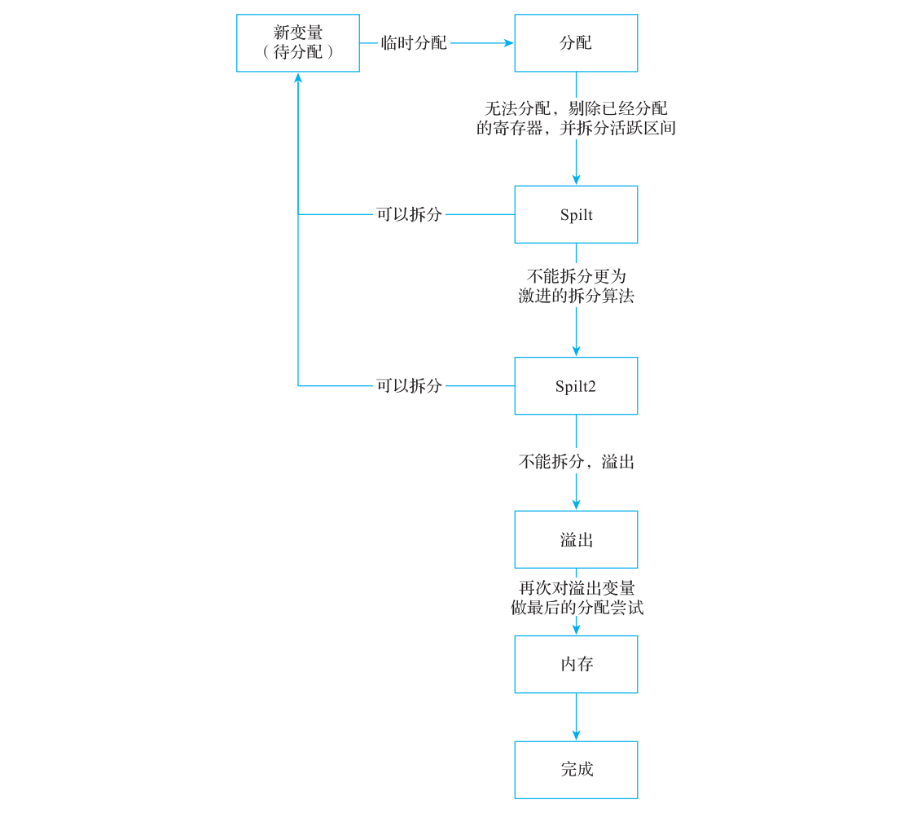

**图 10-25 Greedy 算法分配流程图**

注意图 10-25 描述的是 Greedy 算法分配中的最长路径，涉及分配、拆分、溢出等步骤，在一些简单场景中可能并不需要拆分和溢出就可以完成分配。（简单场景可能无需经过全部阶段；不能由场景简单推断 Greedy 生成代码必然较差。）

从流程图中可以看到，Greedy 算法在溢出前会尝试进行寄存器拆分（Split 和 Split2），而如何拆分也是 Greedy 算法的关键。

### 10.5.1 Greedy 算法实现思路

Greedy 算法总体思想可以总结如下。

1）计算 spill weight，供剔除/拆分/溢出成本判断使用。权重与队列优先级是不同概念，不能将权重大直接等同于 Greedy 先分配。

2）使用优先队列排序。Basic 的优先级直接比较 spill weight；Greedy 默认 advisor 区分初始局部区间、跨块区间与分配阶段，并考虑物理 hint、寄存器类优先级和 GlobalPriority。这里“局部/全局”描述活跃区间是否跨基本块，不是源程序的局部变量/全局变量分类。较大的跨块区间通常更早处理，但不能把所有区间统一按大小排序；具体布局见10.5.5。

3）Greedy 按 priority advisor 的队列顺序尝试分配，再结合 spill weight、hint、阶段、cascade 与寄存器代价选择可剔除的干涉区间；这是启发式过程。Basic 同样可能溢出较低权重的已分配干涉区间，不能说它无法分配时总是溢出自己。

Greedy 算法和 Basic 算法最大的两个区别如下。

① 剔除（evict）只是撤销已分配区间的物理寄存器映射并重新入队，本身不插入 load/store。之后该区间可能换一个寄存器、拆分，或最终溢出。

② Greedy 算法会尝试对无法分配的变量进行拆分，将一个变量变成两个或者多个变量，由此缩短变量的活跃区间，然后再分配。

4）依次从优先队列获取活跃区间进行分配，获取物理寄存器分配顺序，根据分配顺序计算每一个物理寄存器和活跃区间冲突的情况。

① 如果物理寄存器和变量活跃区间没有发生冲突，则为变量分配该物理寄存器。

② 若直接分配失败且当前阶段允许剔除，eviction advisor 判断是否能撤销一组已分配区间并将它们重新入队。权重较低只是条件之一，还需满足提示、cascade、固定寄存器及各项成本限制。

③ 首次处理区间而分配/剔除失败时，先设置为 RS_Split 并重新入队，等其他区间分配后再决定拆分；这不是简单判断“当前区间权重最低”。之后按阶段尝试局部、区域或基本块等拆分，新区间计算权重和优先级后再次进入分配。

④ 拆分仍失败时，已经到 RS_Done 或不可溢出的区间尝试有界的 last-chance recoloring。可溢出的区间最终交给 InlineSpiller；配置启用延迟溢出时还可能先转到 RS_Memory。spill 可产生 load/store，也可重新物化或折叠访存；新虚拟寄存器需要继续分配。

和 Basic 算法相比，Greedy 算法包含了额外的剔除和拆分操作。剔除比较简单，而拆分则非常复杂，这也是 Greedy 算法的核心，直接影响 Greedy 算法的分配效率。下面着重介绍一下拆分的思想。

### 10.5.2 算法实现的核心：拆分

Greedy 算法的拆分方式分为两种：局部拆分和全局拆分。其中，局部拆分主要处理活跃区间落在一个基本块的情况，需要对活跃区间或者单条指令进行拆分。全局拆分主要处理活跃区间跨基本块的情况，需要对活跃区间或者单个基本块进行拆分。

#### 1. 单基本块局部拆分

单基本块局部拆分的思路如下。

1）计算虚拟寄存器在基本块的信息，包含指令数、定义点（Def）、使用点（Use）、循环信息等。

2）局部拆分要求有足够的相关使用/定义位置以形成可选 gap。无法形成有意义连续段时不走这一策略，但仍可能有指令拆分或最终 spill 等后备路径。

3）以该区间的相关定义/使用位置划分 gap；这是相邻相关位置间的段，不是每两条任意机器指令一组。对每个候选物理寄存器，计算这些 gap 中的最大干涉权重 GapWeight，固定或 regmask 干涉会阻止相应方案。

4）估计新连续段的权重 EstWeight，结合 Hysteresis 容差与干涉权重比较，以寻找可改善分配机会的方案。比较通过不等于已经完成剔除或证明最终性能更优。

5）探索连续 gap 组成的较大候选段，权衡范围、估计权重和干涉。所选段用于更好地分配寄存器，不应称为无条件“扩大溢出区间”。

6）拆分区间需要增加新的变量，并且更新变量的区间、权重，并且重写相关指令。

7）将新的变量重新插入到待分配队列，重新进行分配。

下面通过一个简单的示例介绍一下局部拆分的思想。假设一个基本块中有 1 个 Def、3个 Use，仅仅演示一个物理寄存器 R1 和虚拟寄存器发生冲突的情况。R1 已经分配给了 2个变量：V1 和 V2。在局部拆分的时候，优先找一个权重更大的区间，然后对该区间尽可能地扩展，形成更大的区间。局部拆分是以权重作为依据，对权重最大的进行拆分。拆分还可以针对权重、区间大小选择不同的策略，会产生完全不同的拆分结果。拆分示意图如

**图 10-26 所示。**

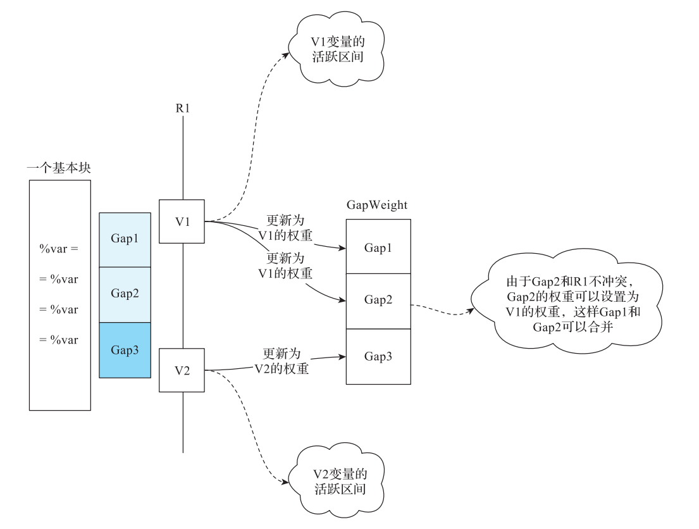

**图 10-26 局部拆分示意图**

因为图 10-26 中有 1 个 Def，3 个 Use，所以形成 3 个区间，分别记为 Gap1、Gap2、Gap3。分别计算它们的权重，并和 GapWeight（V1 和 V2 的权重）比较，如果区间的权重大于 GapWeight，说明拆分性能更好。由于 Gap2 和 R1 无冲突，因此会和前一个区间合并。

本例可考虑 Gap1 + Gap2、Gap3 等连续 gap 组合；多个候选都可能满足条件，不能断言只有一个候选权重大于干涉区间。实现按每个候选物理寄存器计算 gap 的最大干涉权重，并比较新段的估计权重（含 Hysteresis 容差）与该干涉权重，保留改进较大的合法组合；固定/regmask 干涉会阻止相应候选。假设最终选中 Gap3，则对其进行拆分。本例中的 Gap3 是最后一个区间，所以不会进一步扩展 Gap3。最后对 Gap3 所在的区间进行拆分，插入 COPY 指令，如代码清单 10-28 所示：

**代码清单 10-28 Gap3 处理后**

> 区间拆分伪 MIR，含 use 占位符。

```text
%new = COPY %var
= %new
```

在区间拆分时可能存在无限循环问题，为应对这一问题最严格的约束是，若每个新活跃区间覆盖的相关指令都严格少于原区间，则可保证该局部拆分度量取得进展。但是这样太严格，会导致很多区间无法拆分，因此使用分配阶段限制无进展的反复尝试；在 RS_Split2 及之后阶段，要求相应新段的 gap 数减小；相同规模的结果标为 RS_Split2，较小结果可回到 RS_New。这里比较各活跃区间覆盖的相关指令/gap，不是要求整个函数的机器指令总数减少。

#### 2. 指令局部拆分

指令局部拆分主要解决无法进行单基本块局部拆分的情况，仅在寄存器类型可以提升的情况下插入 COPY 指令，这将有助于进行溢出处理。

#### 3. 区域拆分

由于变量活跃区间跨多个基本块，拆分的目的是尽量生成小的活跃区间，让这些小的活跃区间能够分配到物理寄存器。但是问题在于如何划分可以使生成的总体代价最小。假设在所有的活跃区间中变量有 N 处使用，那么可选拆分布局随位置与约束组合迅速增长；具体计数依模型而定，不能泛称为 N!，显然需要寻找一个近似求解拆分的方法。

#### 4. 基本块全局拆分

基本块全局拆分主要针对无法进行区域全局拆分的情况，尝试进行基本块全局拆分，例如处理基本块中有调用、异常处理、汇编跳转等指令。在这些指令之前进行活跃区间拆分可以减少因 ABI 约定导致的冲突。

### 10.5.3 区域拆分之 Hopfield 网络详解

区域拆分以块边界上的寄存器/栈选择为核心，目标是降低按块频率加权的 COPY、reload、spill 等估计成本。Greedy 也有基本块内部的局部拆分，因此“解决冲突的粒度总是基本块”并不准确。LLVM 的 SpillPlacement 使用受 Hopfield 网络启发的迭代模型，为跨块拆分提供启发式解，而非证明全局最优拆分。

原书介绍离散 Hopfield 网络（1982）以及随后连续网络与旅行商问题的历史背景；连续与离散模型的动力学和更新方式不同，不能只用激励函数不同概括。这里用经典离散二态模型解释能量下降，再单独说明 LLVM 的三态实现。网络可以用零权重表达无连接，不必是稠密全连接图。图 10-27 是三个节点的示意。

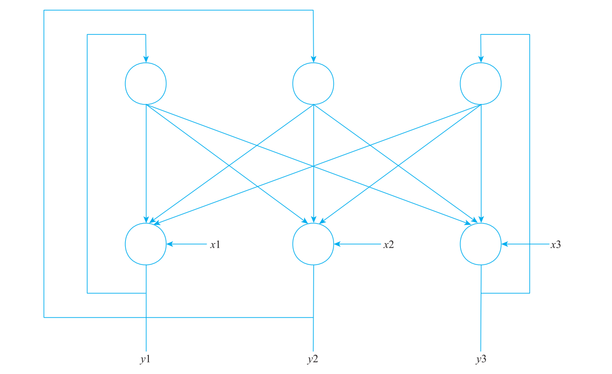

**图 10-27 3 个神经元组成的离散型 Hopfield 网络**

令神经元状态为 \(s_i\in\{-1,+1\}\)，对称连接权重满足 \(w_{ij}=w_{ji}\)、\(w_{ii}=0\)。用 \(b_i\) 表示偏置，避免将“阈值”和“加到输入中的偏置”重复计算。若采用阈值 \(\theta_i\)，可令 \(b_i=-\theta_i\)。第 i 个节点的局部输入为

\[
h_i=\sum_{j\ne i}w_{ij}s_j+b_i.
\]

每次只更新一个节点（异步更新）：当 \(h_i>0\) 时取 \(s'_i=+1\)，当 \(h_i<0\) 时取 \(s'_i=-1\)；当 \(h_i=0\) 时保留旧状态，避免无能量变化时来回翻转。注意 \(h_i\) 是加权实数输入，不是原书混用的旧二态输出。两种情况是：状态不变时 \(s'_i=s_i\)；发生翻转时 \(s'_i=-s_i\)。

定义能量

\[
E(s)=-\frac12\sum_i\sum_{j\ne i}w_{ij}s_i s_j-\sum_i b_i s_i.
\]

系数 1/2 用来消除对称边的重复计数。只改变第 i 个状态时，根据对称性可以直接得到

\[
\Delta E=E(s')-E(s)=-(s'_i-s_i)h_i.
\]

若状态不变，\(\Delta E=0\)；若翻转且 \(h_i\ne0\)，新状态与 \(h_i\) 同号，故 \(\Delta E=-2s'_i h_i<0\)。这对应原书试图构造的非负改进量 \(t=(s'_i-s_i)h_i\ge0\)，应满足同号状态不变时 \(s'_i=s_i\)，而非写成两者相反。

能量有下界，因为

\[
|E(s)|\le\frac12\sum_i\sum_{j\ne i}|w_{ij}|+\sum_i|b_i|.
\]

这里 \(|w_{ij}|\) 是单个系数的绝对值，不是矩阵行列式。更关键的是系统只有有限个二态配置，每次实际翻转使能量严格下降，在公平地检查各节点后最终到达无单点改进的稳定配置。单纯“单调有界”不足以证明有限次停止；对称权重和零自连接也不能在未说明同步/异步及平局处理时无条件保证收敛。

能量是为优化构造的势函数，零点可以任意平移，不要求在物理意义上总为负值。“只要构造能量函数就总能收敛”也不成立，必须验证更新规则确实使其下降。稳定配置通常只是相对于单点更新的局部极小，不等于全局最低成本。

本章另用 [models.py](experiments/ch10/models.py) 检查 729 个三节点二态网络的 5832 条初态轨迹：5128 次实际翻转都严格降能，但有 1280 条轨迹停在非全局最小值。同步更新反例 `(1,-1)→(-1,1)→(1,-1)` 形成二周期。这些有限检查辅助理解上述证明，不代替一般证明，也不表示测试了 LLVM 三态网络的全部行为。

LLVM 18 的具体实现位于 `SpillPlacement.cpp`。节点 `Value` 实际取 `{-1,0,+1}`，通过 `BiasP`、`BiasN`、相邻节点的正频率链接与阈值 dead zone 更新；只有 `Value>0` 被判作偏好寄存器，0 与负值最终都不选该寄存器区域。它不是把上面的二态公式逐字照搬，也不需要训练数据或反向梯度传播。10.5.4 将这个实现映射到 EdgeBundles 与拆分位置。

<!-- manual-lab:ch10-mathematical-models -->

```sh
# 检查有限 Hopfield/PBQP 数学样例；这不是在运行 LLVM 的 SpillPlacement 实现。
python3 -B "$BOOK_INPUT/models.py" > "$CODEGEN_LAB/models.json"
cat "$CODEGEN_LAB/models.json"
```

结果同时报告本节的 Hopfield 有限轨迹与 10.6.3 的 PBQP R1/R2 穷举检查；同步二周期和非全局最小终态也被保留为反例。

### 10.5.4 使用 Hopfield 网络求解拆分

使用 Hopfield 网络启发式选择区域拆分位置，可分为如下三步。

1）将变量活跃区间拆分并转换为 Hopfield 网络，定义网络连接方式、权重、能量函数。

2）对能量函数进行迭代求解，当迭代稳定时获得该启发式模型下的局部选择。

3）将求解结果再映射到寄存器拆分的位置。

下面看看 LLVM 中如何使用 Hopfield 网络实现区域拆分。

#### 1. 构建 Hopfield 网络

本节讨论跨基本块的区域拆分：直接分配及先前尝试未能解决干涉时，为候选物理寄存器建立边界偏好，搜索较低估计成本的拆分。局部拆分不要求区间跨块，也不使用同一网络。可以分为选择网络节点和选择网络边与权重两步。

（1）选择网络节点首先对变量活跃区间进行分析。

假设以 CFG 中的基本块作为网络节点，用基本块之间的控制信息作为边，网络节点有输入、输出两个字段，分别表示该基本块在输入、输出时使用寄存器或者发生溢出，如

**图 10-28 所示。**

原书参考资料（本次未联网核验）：[On the Convergence Properties of the Hopfield Model](https://authors.library.caltech.edu/30372/1/BRUprocieee90.pdf)、[CMU Hopfield 课件](https://deeplearning.cs.cmu.edu/F22/document/slides/lec25.Hopfield.pdf)。收敛条件应按10.5.3的更新方式说明，不能只引用对称/零对角条件。


**图 10-28 以基本块作为 Hopfield 网络节点**

这里会遇到一个问题，由于 CFG 存在回边，此时如果以基本块为粒度，当基本块的不同输入边状态不同时，基本块的输入状态就无法确定。所以，LLVM 引入了边束（EdgeBundle）的概念，目的是将同一个基本块的输入划分到一个边束，同一个基本块的输出划分到一个边束，然后将边束作为网络节点。边束的实现算法也比较简单，为每一个基本块定义输入、输出两个编号，两个相邻的基本块的输出等于下一个基本块的输入，由此将该基本块的输入编号和其他基本块的输出编号划分成一个等价类，并重新编号。例如对

**图 10-28 所示的 Hopfield 网络节点进行编号后，结果如图 10-29 所示。**


**图 10-29 以边束作为 Hopfield 网络节点**

进行等价类划分后，编号 0 没有等价类，假设新的编号为 #EB0 ；编号 1、编号 2 和编号 7 是等价类，假设新的编号为 #EB1 ；编号 3、编号 4 和编号 6 是等价类，假设新的编号为 #EB2；编号 5 没有等价类，假设新的编号为 #EB3。

Hopfield 网络以边束作为网络节点进行构建。从图 10-29 中可以看出基本块和边束之间存在映射关系，对以边束形成的 Hopfield 网络进行求解后得到的是边束的启发式选择，后续还需要将边束再映射到基本块。

有了边束节点，使用块频率累积偏好寄存器/栈的偏置。`BiasP`、`BiasN` 不是最终节点输出，也不是 `Threshold`；Threshold 是另行根据函数入口频率设置的 dead-zone 尺度。透明块把其入/出边束连接起来，链接权重为块频率。

为了区分选择偏好，`BiasP` 累加 PrefReg 约束的频率，`BiasN` 累加 PrefSpill 约束的频率，MustSpill 将 BiasN 饱和到最大。状态更新还取决于已连接节点的当前状态。

如何设置边束初始偏置值？还是以基本块的输入为例，将输入映射到一个边束中时，如果可以建立基本块输入时的寄存器状态（使用寄存器还是使用栈），那么就可以把该基本块的输入状态对应到边束的状态，根据状态累积偏置，阈值则单独设置。那基本块的状态该如何确定？可以通过以下规则来定义。

1）先按该区间是否 LiveIn/LiveOut 初始化入口/出口为 PrefReg，否则为 DontCare；IMPLICIT_DEF 等情形还会影响出口设置。

2）对候选物理寄存器查询干涉，按 `addSplitConstraints()` 调整边界：

- live-in 的首个干涉位置不晚于块入口时，入口为 MustSpill；晚于入口但早于该值在本块的首条相关指令时，为 PrefSpill。
- live-out 的最后干涉位置不早于允许的最后拆分点时，出口为 MustSpill；早于该拆分点但晚于本块最后相关指令时，为 PrefSpill。
- 其他内部干涉可增加估计插入指令数，而不必把块边界改成栈；合法拆分点不足时可直接拒绝候选。

这里的首/末相关指令同时涉及定义和使用，最后拆分点也不一定就是块尾。原图 10-30 可帮助理解相对位置，以这些实际边界条件为准。

上述规则可以使用图 10-30 描述。

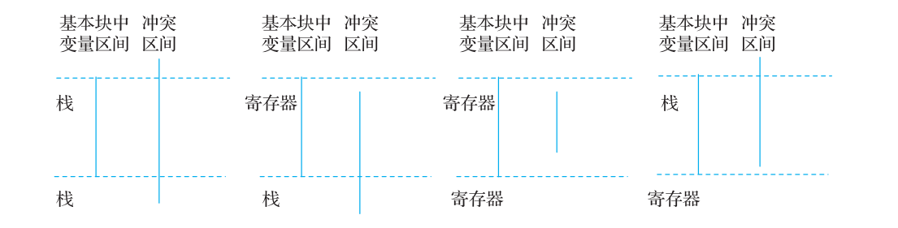

**图 10-30 冲突区间决定指令使用情况**

这里定义的状态是基本块的输入、输出状态。在基本块内部还可能存在冲突，这种冲突是局部冲突。Hopfield 网络中的优化不考虑局部冲突，而是在网络迭代完成后重新计算执行总成本（其中局部冲突会在基本块中增加额外指令，导致执行成本增加），并根据总成本来确定是否选择该网络。

为此 LLVM 定义了 5 种状态。

- DontCare：基本块不关心该变量，或者变量已经死亡。

- PrefReg：优先使用寄存器。

- PrefSpill：优先使用栈。

- PrefBoth：使用寄存器和栈都可以。

- MustSpill：必须使用栈。

根据边界约束形成偏置后，节点先以 BiasP/BiasN 初始化 SumP/SumN，再分别把 Value=+1 邻居的频率累加到 SumP、Value=-1 邻居的频率累加到 SumN，Value=0 邻居暂不贡献。若 `SumN >= SumP + Threshold`，取-1；若 `SumP >= SumN + Threshold`，取+1；否则取0。最终 `preferReg()` 只接受正值，因此0虽不同于-1，也不形成寄存器区域。

例 如 在 图 10-29 中， 基 本 块 entry 和 ret 对 应 的 边 束 为 EB0、EB1、EB2、EB3， 如

**图 10-31 所示：**

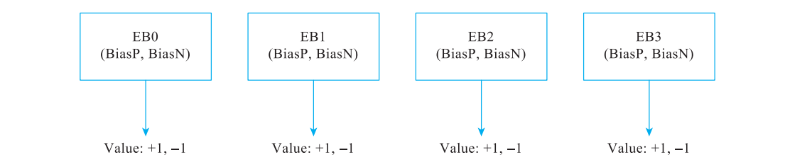

**图 10-31 图 10-29 中基本块 entry 和 ret 对应的边束信息**

（2）选择网络边、权重以边束建立了 Hopfield 的网络节点，但这些节点还是孤立的点，该如何为这些节点建立边并进行关联？

Hopfield 网络边的关联是以边束为粒度构建的，但是边束又依赖基本块，所以需要先将边束信息转换为基本块，再根据基本块的边界约束情况将基本块映射到边束，最后再为边束建立关联。通常一个边束包含多个基本块，当各个基本块的边界约束为寄存器时，说明这些基本块的边束可以和其他的基本块边束直接相连。具体方法如下。

1）根据 UsedBlocks（定义和使用基本块）中每一个块的边界约束，找到所有使用寄存器的边束（这些边束在初始情况下使用了寄存器）。

2）将边束中包含的 LiveThroughBlocks（活跃基本块，但未定义和使用）都找出来，再分析 LiveThroughBlocks 中的每个基本块和物理寄存器的区间冲突情况。

① 对于所有没有冲突的基本块，找到对应的边束，并为这些边束建立关联，同时更新频率。

② 对于有冲突的基本块，更新边束的频率。

在图 10-29 中，UsedBlock 为基本块 entry 和 ret。其中，entry 的输入、输出边界约束为 DontCare、PrefReg ；ret 输入、输出的边界约束为 PrefReg、DontCare。根据边界约束为寄存器找到边束 EB1、EB2。再根据 EB1、EB2 找到基本块 LoopCond 和 LoopBody，然后对基本块和物理寄存器的区间进行冲突分析。为了简单起见，假设基本块 LoopCond 和LoopBody 与物理寄存器不冲突，所以它们对应的边束 EB1 和 EB2 会关联。边的权重也是基本块的执行频率。

#### 2. 选择能量函数以及迭代求解极值

对应10.5.3的二态解释，可以用偏置 \(b_i=BiasP_i-BiasN_i\)、链接频率 \(f_{ij}\) 写出启发式能量形式

\[
E(X)=-\sum_i b_iX_i-\frac12\sum_{i,j}f_{ij}X_iX_j.
\]

LLVM并不显式反复计算该式和ΔE，而维护节点和工作列表。`Node::update()` 报告的是寄存器偏好是否改变；`SpillPlacement::iterate()` 从边界工作列表更新，直到列表清空或达到 `10 * NumBundles` 次更新上限。因此不能声称每次调用都证明“所有节点状态不再变化”。结果用于估算区域拆分成本，最终还须比较静态/动态候选成本，不保证全局最优。

#### 3. 将 Hopfield 网络的解映射到寄存器拆分位置

当 Hopfield 网络迭代终止，将边束的输出值映射到 LiveThroughBlocks 中的每一个基本块的边界约束上。若该候选没有正值边束，说明本次没有得到保留该寄存器的区域，仍可尝试其他候选或拆分/溢出策略。正值边束表示对应边界倾向保留寄存器，不代表该基本块内部也没有干涉或额外 COPY/load/store。

### 10.5.5 示例分析

默认priority advisor区分队列优先级和spill weight。bit31编码阶段优先级、bit30表示已知物理hint；缺省bit29是globalness、bit28～24是AllocationPriority、低24位是大小/距离。初始局部区间主要按指令位置，跨块/拆分区间主要按size；配置可交换globalness与类优先级。AllocationPriority只能是0～31，另有GlobalPriority。

**代码清单 10-29 PPC寄存器类的分配优先级（源码节选）**

```tablegen
def ACCRC : RegisterClass<"PPC", [v512i1], 128, (add ACC0, ACC1, ACC2, ACC3,
                                                      ACC4, ACC5, ACC6, ACC7)> {
  // The AllocationPriority is in the range [0, 31]. Assigned the ACC registers
  // the highest possible priority in this range to force the register allocator
  // to assign these registers first. This is done because the ACC registers
  // must represent 4 advacent vector registers. For example ACC1 must be
  // VS4 - VS7.
  // ACC 与四个向量寄存器重叠；优先分配可避免先被零散的向量区间占住。
  let AllocationPriority = 31;

  // We want to allocate these registers even before we allocate
  // global ranges.
  let GlobalPriority = true;
  let Size = 512;
}
```

对bubble.ll，先安排 `%7/%6/%40/%38/%39` 等带hint或跨块的区间。没有可用寄存器时，算法可能剔除已有区间，也可能将当前区间转入RS_Split后重新排队。不能仅按weight比较解释所有决策。

边束把每个CFG边的源块出口与目标块入口合为等价类，所有相连关系取传递闭包。对本例9个MBB，以Union-Find计算得到7个等价类；编号只是展示标签。

**代码清单 10-30 本例边束**

```text
EB0: BB.0.in
EB1: BB.0.out BB.1.in BB.7.out
EB2: BB.1.out BB.2.in BB.8.in
EB3: BB.2.out BB.3.in BB.6.out
EB4: BB.3.out BB.4.in BB.7.in
EB5: BB.4.out BB.5.in BB.5.out BB.6.in
EB6: BB.8.out
```

对 `%7` 的区域拆分，保留于R4的候选预测成本为961，低于逐块隔离的1025；R3候选为1984。实际调试日志如下。这里“动态成本”是按频率加权的模型，不是测得的CPU时间。

**代码清单 10-31 Greedy区域拆分的实际候选比较**

```text
Cost of isolating all blocks = 1025.0
$r2	static = 2016.0 worse than no bundles
$r1	static = 1025.0 worse than no bundles
$r3	static = 992.0, v=5, total = 1984.0 with bundles EB#1 EB#2 EB#3.
$r4	static = 0, v=5, total = 961.0 with bundles EB#1 EB#2 EB#3 EB#4 EB#5.
$r5	static = 0, v=5, total = 961.0 with bundles EB#1 EB#2 EB#3 EB#4 EB#5.
$r0	static = 0, v=5, total = 961.0 with bundles EB#1 EB#2 EB#3 EB#4 EB#5.
$r6	static = 1984.0 worse than $r4
$r7	no positive bundles
$r8	static = 1984.0 worse than $r4
$r9	no positive bundles
Split for $r4 in 5 bundles, intv 1.
```

算法把跨call的一小段独立出来：长区间可放R4，调用附近的值暂存另一个可用CSR。拆分本身主要生成COPY，不等于立即spill；新产生的区间仍重新入队。

```text
Single complement def at 1176r
Removing 0 back-copies.
  blit [16r,1424B:0): [16r;1176r)=1(%43):1*%bb.0>%bb.1>%bb.2>%bb.3>%bb.4>%bb.5 [1176r;1192r)=0(%42):0 [1192r;1424B)=1(%43):0*%bb.5>%bb.6>%bb.7
  rewr %bb.0	16r:1	%43:gpr = COPY $r2
  rewr %bb.3	480B:1	%18:gpr = ADD_rr %18:gpr(tied-def 0), %43:gpr
  rewr %bb.1	128B:1	%12:gpr = COPY %43:gpr
  rewr %bb.5	1192B:0	%43:gpr = COPY %42:gpr
  rewr %bb.5	1176B:1	%42:gpr = COPY %43:gpr
Main interval covers the same 8 blocks as original.
queuing new interval: %42 [1176r,1192r:0) 0@1176r  weight:2.333197e+00
Enqueuing %42
queuing new interval: %43 [16r,96B:0)[96B,384B:1)[384B,1176r:2)[1192r,1216B:3)[1216B,1344B:4)[1344B,1424B:2) 0@16r 1@96B-phi 2@384B-phi 3@1192r 4@1216B-phi  weight:1.120592e+00
Enqueuing %43
```

随后 `%39/%6/%11` 等区间继续经历剔除、拆分或remat。最终 `%6` 的调用附近部分需要spill，HoistSpillHelper把存储从调用块上提到入口。Greedy最终同样只有1个8字节槽，但只留下1条静态reload；总机器指令为56，多于Basic的53。由此可见，较少reload与较少总指令是两个不同指标，不能将一个指标当作全局性能保证。

<!-- manual-lab:ch10-greedy-trace -->

```sh
# 观察区间拆分的代价比较，区分保持寄存器与在边界插入存取的方案。
"$LLVM_BUILD/bin/llc" -mtriple=bpfel -mcpu=generic -O2 -verify-machineinstrs \
  -regalloc=greedy -optimize-regalloc=1 \
  -debug-only=regalloc,regalloc-pbqp,spill-code-placement,edge-bundles \
  "$CODEGEN_LAB/bubble.ll" -o "$CODEGEN_LAB/greedy.s" \
  2> "$CODEGEN_LAB/greedy-trace.log"
rg 'Cost of isolating|Split for|total = 961' "$CODEGEN_LAB/greedy-trace.log"
```

日志中可找到按 R4 保留区域的 961 成本和逐块隔离的 1025 成本；这些是模型成本。

## 10.6 PBQP 算法实现

一般 PBQP 优化问题是 NP-hard；其标准有界成本判定形式是 NP-complete，目前有不少方法用于获得 PBQP 最优解或者次优解。在寄存器分配过程中，可将寄存器分配问题转化为 PBQP 问题，通过求解 PBQP 获得寄存器分配方案。本节首先介绍 PBQP 以及求解方案，然后通过示例演示 LLVM 中的 PBQP 的实现。

### 10.6.1 PBQP 介绍

PBQP（Partitioned Boolean Quadratic Problem）以一组离散选择及一元/二元成本表达优化问题。设有 n 个节点，第 i 个节点有 \(k_i\) 种选择，以 one-hot 列向量 \(x_i\) 表示：

\[
x_i\in\{0,1\}^{k_i},\qquad \sum_{a=0}^{k_i-1}x_i[a]=1.
\]

仅考虑二元成本时，原书式（10-1）可写成不重复计边的形式：

\[
\min_x\sum_{(i,j)\in E}x_i^T C_{ij}x_j. \tag{10-1}
\]

\(C_{ij}\) 是 \(k_i\times k_j\) 的成本矩阵，不要求不同节点选项数相同。原书的 n 个工厂示例可以理解为：每个工厂必须从自己的若干货物/方案中选一个；i、j 两厂的组合运输成本由 \(C_{ij}\) 给出。它是帮助理解“成对选择成本”的抽象模型，不是把一般运输问题都等同于 PBQP。

再给每个节点加入构建成本向量 \(c_i\)，则 LLVM 所用图模型的完整目标为：

\[
\min_x\left(\sum_i c_i^T x_i+\sum_{(i,j)\in E}x_i^T C_{ij}x_j\right). \tag{10-2}
\]

每条无向边只计一次；反向访问矩阵时取转置。如果使用双重求和记法，必须另外避免对同一无向边重复计数。选项一旦确定，目标值就是所选节点成本与所选矩阵元素之和。PBQP 寻找的是这些离散选项的低成本组合，不是对一般方程组求连续解。

### 10.6.2 寄存器分配和 PBQP 的关系

将每个待分配虚拟寄存器作为节点，第0个选项表示溢出，其余选项是该区间允许使用的物理寄存器。因此，第 i 个节点有 \(k_i=1+|A_i|\) 个选项，其中 \(A_i\) 已按寄存器类、reserved、固定 regunit 与 call regmask 干涉过滤。不同区间可用的集合可以不同，成本矩阵也可为矩形。

有活跃区间干涉的两个虚拟寄存器，若选用相同或别名重叠的物理寄存器，该组合成本设置为无穷大；不冲突的选择为0。溢出选项与另一端任何选择通常不构成物理寄存器干涉，故干涉矩阵第0行/列为0。溢出自身的成本保存在节点向量第0项，不能因干涉矩阵第0行/列为0就认为溢出无成本。

节点成本还可以编码物理寄存器偏好，例如 callee-saved 使用成本。COPY 合并偏好通过负成本奖励相同寄存器选择：虚拟到物理 COPY 的收益加入节点向量；虚拟到虚拟 COPY 的成对收益加入边矩阵。该偏好须满足实际寄存器兼容性，不能以负成本越过无穷大的干涉约束。

若用 \(I_{ij}\) 表示干涉矩阵、\(M_{ij}\) 表示 COPY 偏好矩阵，则令 \(C_{ij}=I_{ij}+M_{ij}\)，代入式（10-2）即可统一表示分配、溢出和合并偏好。LLVM 默认 `-pbqp-coalescing=false`；这指 PBQP 图中可选的合并成本约束，不等于优化流水线前面的 RegisterCoalescer 被禁用。

### 10.6.3 PBQP 问题求解

一般 PBQP 优化是 NP-hard。若节点选项数为 k₁…kₙ，穷举有 ∏kᵢ 种组合；只有每个节点恰好 n 个选项时才是 nⁿ。单纯形法是线性规划方法，并非 LLVM PBQP 分配器的求解算法。本节采用源码实现的归约与反向选择。

在进行求解时，可以先把方程转化为图的形式，这样更容易理解。R0/R1/R2 是保持最优解的精确归约；若整张图仅通过这些规则消去，反向选择可恢复最优解。存在高阶节点时的启发式消去则不保证全局最优。这里介绍这三种精确规则，分别为零度归约、一度归约和二度归约。下面通过示例演示归约处理方法。

零度归约（也称为 R0）指的是图中节点没有边与之关联，那么可以从节点的构建成本中选择一个最小值作为节点的最小值。其节点构建成本和矩阵系数分别如图 10-41 所示，节点 0 选择成本 0、节点 1 选择成本 2。注意，这里的构建成本是向量 Si 的值。在寄存器分配中，通常该向量保存的是溢出成本和所有可使用物理寄存器的成本。


**图 10-41 零度归约的节点构建成本和矩阵系数示意图**

一度归约（也称为 R1）指的是图中节点只有一条边与其他节点关联，那么可以将节点的构建成本和系数矩阵转移到另一个节点中。例如图 10-42 中节点 0 只有一条边和节点 1关联，节点 1 则有两条边和其他节点关联。因此一度归约的关键是如何将节点 0 的成本合并到节点 1，然后移除两者之间的关联边。


**图 10-42 一度归约前的节点和边的成本状态**

根据式（10-2）可以计算节点 1 在消除节点 0 和节点 1 关联边后的成本。

固定矩阵方向为“行属于首节点、列属于次节点”，R1 的更新是

\[
c'_1[b]=c_1[b]+\min_a(c_0[a]+C_{01}[a,b]).
\]

本例两个分量分别为 `2 + min(2+2, 0+1) = 3` 与 `4 + min(2+1, 0+4) = 7`，所以新向量是 `[3,7]`。还需保留归约信息，才能在反向过程中根据节点1的选项还原节点0的选项。

进行一度归约后的成本状态如图 10-43 所示。


**图 10-43 一度归约后的节点成本状态**

二度归约（也称为 R2）指的是图中节点只有两条边与其他节点关联，那么可以将节点的构建成本和系数矩阵转移到另外两个节点中。例如在图 10-44 中，节点 1 有两条边分别与节点 0 和节点 2 关联，节点 0 和节点 2 都有三条边和其他节点关联。二度归约的关键是如何将节点 1 的成本合并到节点 0 和节点 2 之间的关联边上，然后移除原来的关联边。


**图 10-44 二度归约前的节点和边的成本状态**

根据式（10-2）可以计算节点 0 和节点 2 的关联边成本。

按前述矩阵方向，消去节点1、连接节点0和节点2的公式为

\[
D_{02}[a,c]=\min_b(c_1[b]+C_{01}[a,b]+C_{12}[b,c]).
\]

图10-44给出 `c1=[1,3]`、`C01=[[2,2],[1,4]]`、`C12=[[2,1],[1,4]]`。因此：

```text
D02[0][0] = min(1+2+2, 3+2+1) = 5
D02[0][1] = min(1+2+1, 3+2+4) = 4
D02[1][0] = min(1+1+2, 3+4+1) = 4
D02[1][1] = min(1+1+1, 3+4+4) = 3
D02 = [[5,4], [4,3]]
```

原书最后一行重复写 `C02[0][1]`，应为 `[1][1]`。本例没有原0–2边，因此新成本即D02；若原边存在，则逐项加上D02。对非对称输入矩阵，必须按行/列方向使用上述公式，不能混用转置。

消除节点 0 和节点 1、节点 1 和节点 2 之间的边，由于图 10-44 中节点 0 和节点 2 之间没有边，所以先为节点 0 和节点 2 建立关联边。如果节点 0 和节点 2 之间有边，则将新产生的成本和原来的成本相加即可。最后得到的成本状态如图 10-45 所示。


**图 10-45 二度归约后的节点和边的成本状态**

实验 `models.py` 除核对上述 R1/R2 数字，还以固定种子生成 512 个三节点实例，对每个实例穷举全部选项，核对归约后的最小成本和反向恢复选项。输入覆盖矩形矩阵、1～4 个选项、负成本、无穷及已有 0–2 边；383 例三角形有有限可行解，129 例全部组合为无穷，后者验证不可行成本仍保持。检查单次归约后穷举剩余选项及其回溯，不冒称测试了多轮归约栈。这是有限模型检查，不是 LLVM 高阶启发式全局最优的证据。

对于大于二度的节点一般可以采用启发式算法进行简化，这里以 LLVM 的实现为例介绍反向传播的处理方法。其思路也非常简单，方法如下。

1）对于关联边大于 2 的节点，首先按照一定的规则选择节点（泛化算法可以随机选择；LLVM使用自己的确定性启发式），将选择的节点放入一个栈中，然后将与节点相关联的边都删除，如果出现因为边删除而可以使用 R0、R1 和 R2 归约方法进行处理的节点，则先处理这些节点，并且将这些节点也压入栈中；如果没有可以归约的节点，则继续选择图中节点并删除相关联的边，直到最后剩余的节点可以使用 R0、R1 和 R2 归约方法进行处理。

2）此时栈顶存放的节点可以归约，然后依次从栈顶弹出节点，并且反向依次重构图，在重构时固定已选择邻居的选项，再对当前节点取条件成本最小值。若前面用了高阶启发式删除，这只是当前条件下的选择，不保证整图最优。

### 10.6.4 寄存器分配问题建模示例

假设有 4 个变量：X、Y、Z 和 W，只有两个物理寄存器 R0 和 R1，并且 X 和 Y、X 和W 活跃区间冲突，Z 和 Y、Z 和 W 活跃区间冲突，Y 和 W 活跃区间冲突。

每个变量可能有 3 种选择—溢出、R0、R1，所以每个变量的成本向量都有 3 个元素。X 使用 [X0，X1，X2] 表示溢出成本、选择 R0 的成本、选择 R1 的成本；变量 Y、Z 和 W 类似。由此可以得到每个节点的构建成本。

根据 PBQP 构建图的规则，当变量之间有冲突时，两个变量有边进行关联。接下来需要为关联边添加矩阵。由于有 2 个物理寄存器，为了便于矩阵计算，将矩阵的行和列的长度设置为物理寄存器个数加 1，即行和列都是 3，其中第一行和第一列的值都是零。接下来需要判断变量 X、Y、Z、W 可用的物理寄存器是否发生冲突。假设 X、Y、Z、W 都可以使用 R0 和 R1，此时对应的干涉矩阵如下（行列选项均为溢出、R0、R1）：

| | 溢出 | R0 | R1 |
|---|---:|---:|---:|
| 溢出 | 0 | 0 | 0 |
| R0 | 0 | ∞ | 0 |
| R1 | 0 | 0 | ∞ |

其中矩阵元素 C[1][1] 和 C[2][2] 都是∞，说明当两个变量同时使用一个物理寄存器时成本为无穷大，表示无法将两个变量同时分配到同一个物理寄存器上。类似的是，C[1][2]和 C[2][1] 都是 0，表示两个变量分别使用 R0、R1 时的成本为 0。根据以上信息，下面开始构建 PBQP 方程如图 10-46 所示。

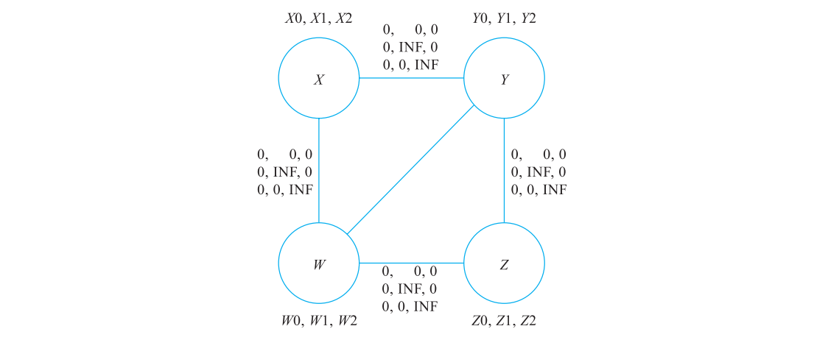

**图 10-46 4 个变量、两个物理寄存器构建的 PBQP 方程示意图**

当构建完成就可以对 PBQP 进行求解。

### 10.6.5 PBQP 实现原理以及示例分析

仍使用bubble.ll，固定 `-regalloc=pbqp -optimize-regalloc=1 -pbqp-coalescing=false`。Debug构建的 `-pbqp-dump-graphs` 将每轮图写出，运行器把输入复制到输出目录，保证所有图文件也在输出目录。

#### 1. 将寄存器分配问题映射为PBQP

先按寄存器类、保留集合、固定regunit和regmask排除不可用的物理寄存器。普通区间最多有10个物理选择再加spill；跨call区间通常只有R6～R9再加spill。选择数量可以因节点不同而不同。

**代码清单 10-32 第一轮PBQP节点成本（实际图文件）**

阅读提示：每个节点代表待分配的虚拟寄存器，选项 0 是溢出，其余选项才映射到允许的物理寄存器；节点编号本身不是硬件寄存器号。

```text
0 (GPR:%6): [ 1.332566e+01, 1.000000e+00, 1.000000e+00, 1.000000e+00, 1.000000e+00 ]
1 (GPR:%7): [ 1.171968e+01, 1.000000e+00, 1.000000e+00, 1.000000e+00, 1.000000e+00 ]
2 (GPR:%11): [ 1.087457e+01, 1.000000e+00, 1.000000e+00, 1.000000e+00, 1.000000e+00 ]
3 (GPR:%12): [ 1.323200e+01, 0.000000e+00, 0.000000e+00, 0.000000e+00, 0.000000e+00, 0.000000e+00, 1.000000e+00, 1.000000e+00, 1.000000e+00, 1.000000e+00, 0.000000e+00 ]
4 (GPR:%15): [ INF, 0.000000e+00, 0.000000e+00, 0.000000e+00, 0.000000e+00, 0.000000e+00, 1.000000e+00, 1.000000e+00, 1.000000e+00, 1.000000e+00, 0.000000e+00 ]
5 (GPR:%18): [ 1.545077e+02, 0.000000e+00, 0.000000e+00, 0.000000e+00, 0.000000e+00, 0.000000e+00, 1.000000e+00, 1.000000e+00, 1.000000e+00, 1.000000e+00, 0.000000e+00 ]
6 (GPR:%22): [ 7.831273e+01, 0.000000e+00, 0.000000e+00, 0.000000e+00, 0.000000e+00, 0.000000e+00, 1.000000e+00, 1.000000e+00, 1.000000e+00, 1.000000e+00, 0.000000e+00 ]
7 (GPR:%26): [ 1.829331e+02, 0.000000e+00, 0.000000e+00, 0.000000e+00, 0.000000e+00, 0.000000e+00, 1.000000e+00, 1.000000e+00, 1.000000e+00, 1.000000e+00, 0.000000e+00 ]
8 (GPR:%28): [ INF, 0.000000e+00, 0.000000e+00, 0.000000e+00, 0.000000e+00, 0.000000e+00, 1.000000e+00, 1.000000e+00, 1.000000e+00, 1.000000e+00, 0.000000e+00 ]
9 (GPR:%31): [ 7.177857e+01, 0.000000e+00, 0.000000e+00, 0.000000e+00, 0.000000e+00, 0.000000e+00, 1.000000e+00, 1.000000e+00, 1.000000e+00, 1.000000e+00, 0.000000e+00 ]
10 (GPR:%34): [ INF, 0.000000e+00, 0.000000e+00, 0.000000e+00, 0.000000e+00, 0.000000e+00, 1.000000e+00, 1.000000e+00, 1.000000e+00, 1.000000e+00, 0.000000e+00 ]
11 (GPR:%36): [ 6.308023e+01, 0.000000e+00, 0.000000e+00, 0.000000e+00, 0.000000e+00, 0.000000e+00, 1.000000e+00, 1.000000e+00, 1.000000e+00, 1.000000e+00, 0.000000e+00 ]
12 (GPR:%38): [ 2.673466e+01, 0.000000e+00, 0.000000e+00, 0.000000e+00, 0.000000e+00, 1.000000e+00, 1.000000e+00, 1.000000e+00, 1.000000e+00, 0.000000e+00 ]
13 (GPR:%39): [ 1.309433e+01, 1.000000e+00, 1.000000e+00, 1.000000e+00, 1.000000e+00 ]
14 (GPR:%40): [ 2.233253e+01, 1.000000e+00, 1.000000e+00, 1.000000e+00, 1.000000e+00 ]
15 (GPR:%41): [ 2.230354e+01, 1.000000e+00, 1.000000e+00, 1.000000e+00, 1.000000e+00 ]
```

节点1 `%7` 的成本为 `[11.71968,1,1,1,1]`，四个物理选项为R6～R9；节点2 `%11` 的spill成本为10.87457。PBQP的spill权重归一化不同于Basic，再加MinSpillCost=10形成图中的第0项。虚拟寄存器的打印Cost可能仍只显示LI.weight，不能混读两个数值。

候选CSR成本1表达使用偏好；它不是精确的运行时保存次数。当前图未启用PBQP COPY成本奖励，因此节点12没有旧日志中的负成本。启用pbqp-coalescing时，兼容COPY的收益可加到节点或边，前面的RegisterCoalescer则独立存在。

#### 2. 求解PBQP

求解器优先用R0/R1/R2精确归约，再处理保守可分配节点，最后选择潜在spill节点。保守可分配判定按矩阵禁止的选项数等证明还有可用选择，不是“虚拟寄存器总数小于机器寄存器数”。潜在spill选择先比较成本，同成本时比较节点度；反向恢复时固定已选邻居，最小化当前条件成本。用了高阶启发式便不保证全局最优。

#### 3. 将解映射回寄存器分配

**代码清单 10-33 第一轮PBQP分配结果**

```text
VREG %6 -> R9
VREG %7 -> SPILLED (Cost: 1.719684e+00, New vregs: %42 )
VREG %11 -> SPILLED (Cost: 8.745734e-01, New vregs: %43 %44 )
VREG %12 -> R2
VREG %15 -> R1
VREG %18 -> R3
VREG %22 -> R1
VREG %26 -> R2
VREG %28 -> R1
VREG %31 -> R2
VREG %34 -> R1
VREG %36 -> R1
VREG %38 -> R2
VREG %39 -> R8
VREG %40 -> R7
VREG %41 -> R6
```

节点1 `%7` 选择spill，节点2 `%11`进入spiller但被重新物化；`%39/%40/%41` 分别得到R8/R7/R6。

#### 4. Spill/remat后继续求解

`%7`引入reload值 `%42`；`%11`引入 `%43/%44`。有新待分配区间时重建图，本例发生第0、1两轮。第二轮完成后仍只有一个栈槽。整个流程并非“不断把所有溢出消除到零”，而是直到每个仍需寄存器的值都被合法安排，栈槽里的spill值可以保留。

<!-- manual-lab:ch10-pbqp-trace -->

```sh
# 禁用 PBQP 合并以保持本节模型一致；图中成本和选项可与最终溢出决定对应。
# PBQP 图文件名由输入模块名派生；输入副本和工作目录都设在实验临时目录。
(
  cd "$CODEGEN_LAB"
  "$LLVM_BUILD/bin/llc" -mtriple=bpfel -mcpu=generic -O2 -verify-machineinstrs \
    -regalloc=pbqp -optimize-regalloc=1 -pbqp-coalescing=false -pbqp-dump-graphs \
    -debug-only=regalloc,regalloc-pbqp,spill-code-placement,edge-bundles \
    bubble.ll -o pbqp.s 2> pbqp-trace.log
)
rg 'SPILLED|VREG' "$CODEGEN_LAB/pbqp-trace.log"
for graph in "$CODEGEN_LAB"/*.pbqpgraph; do
  printf '%s\n' "$graph"
  sed -n '1,12p' "$graph"
done
```

本例产生第 0、1 两轮图；日志区分 %7 的 spill 与 %11 的重新物化，图成本第 0 项与日志 LI.weight 不同。

## 10.7 扩展阅读：图着色分配

图着色和基于区间的分配是两类常见思路。LLVM 18 通用优化路径使用 Greedy，通过区间并集查询干涉；它与经典线性扫描不同。PBQP 可表达不规则寄存器/额外成本约束，本节用图着色作概念比较；不据本地 LLVM 源码推断其他编译器当前实现或市场使用比例。

假设有一个图，节点和边如图 10-49 所示。

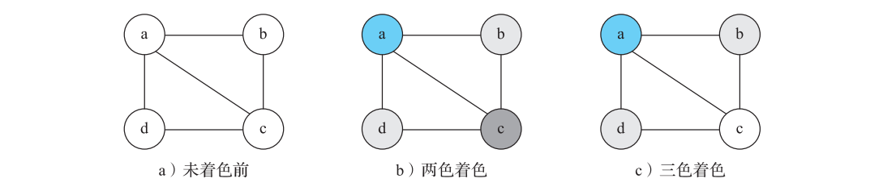

**图 10-49 图着色示意图**

现在对图进行着色，要求相邻节点不能使用同一个颜色。如果使用两种颜色对图进行着色，则无法对图进行完全着色，如图 10-49b 所示。从图 10-49b 可以发现，我们无法为节点 c 寻找一个颜色。如果使用三种颜色进行着色，则可以找到一个着色方案，保证相邻节点使用了不同颜色，如图 10-49c 所示，这个图称为三可着色图。

在统一寄存器集合、用冲突边表达不能共用寄存器等简化条件下，寄存器分配可建模为图着色；实际还包含预着色、寄存器类、别名和调用约束。将变量看作图中的节点，如果两个变量的活跃区间有冲突，则在它们之间建立边。一条边上的两个节点不能使用同一个寄存器，因此寄存器问题的抽象模型是图着色。对于图着色有很多的理论分析，也有很多教材进行了详细介绍，本节仅简单介绍基于图着色的寄存器分配方法，整理流程如图 10-50 所示。

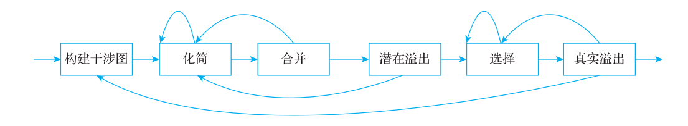

**图 10-50 图着色分配算法流程**

主要步骤简单介绍如下。

1）构建：构建指的是计算变量的活跃区间，并根据变量活跃区间构建冲突图（也称为干涉图，英文翻译为 Interference Graph）。冲突图中的节点是变量，如果两个变量的活跃区间有重叠，则两个变量之间有边相连。

2）化简：在统一 K 个寄存器的简化模型中，将度小于 K 的节点移除并压栈；暂不选择具体颜色，稍后反向恢复。这样其余图可着色时，该节点最多被 K-1 种邻居颜色限制。

注：对度小于K的节点做化简，在剩余图可K着色时可以安全恢复该节点；高阶潜在溢出选择或激进合并才可能影响最终是否需要spill。

3）合并：对由 COPY 引入的 move 偏好关系，在不破坏约束的条件下尝试将两个节点合并；move 关系与干涉边不同。合并可减少 COPY，但也可能增大干涉集合，所以要进行保守检查。

> 注：如图 10-50 所示，通常在化简和合并步骤会进行循环迭代，以尽可能简化冲突图。

4）冻结与潜在溢出：若保守合并受阻，迭代合并算法可冻结某些 move 偏好，重新允许低度节点化简。若仍无低度节点，按成本启发式选择高阶节点压栈，标为潜在溢出；这不证明原图不能 K 着色，反向恢复时仍可能找到颜色。

5）选择：从栈中弹出节点进行着色。

6）真实溢出（actual spill）：如果栈中弹出的节点无法着色，则执行真实的溢出。

图着色和区间分配是不同的工程选择。显式干涉图可能昂贵，但代价与表示、目标和输入有关，不能将“图着色必然更慢、Greedy必然质量更高”写成定理。LLVM的Greedy以LiveRegMatrix查询干涉，并将剔除、拆分和spill位置优化整合进分配循环。它仍面对同一组资源与正确性约束。

## 10.8 4种算法对比

下表来自本章runner实际编译的bubble.ll。优化级别统一O2，Fast使用其非优化分配准备路径，其他三者使用优化准备路径；PBQP图成本合并关闭。机器指令数按llvm-objdump逐条解码计数，LD_imm64算1条指令而占2个8字节槽。栈load/store是静态出现次数，运行时次数还取决于循环和路径频率。

**表10-3 LLVM18 BPF分配结果**

| 分配器 | 机器指令数 | spill槽 | 栈load | 栈store |
|---|---:|---:|---:|---:|
| Fast | 67 | 10 | 18 | 10 |
| Basic | 53 | 1 | 2 | 1 |
| Greedy | 56 | 1 | 1 | 1 |
| PBQP | 53 | 1 | 2 | 1 |

四条路径都通过 `-verify-machineinstrs` 并生成可反汇编对象。IR解释器另验证sum=45，排序含负数、重复值和0/1长度边界；求和、外部 swap 排序与内联排序的 C 清单也实际编译并通过相同检查。这不替代BPF VM的执行验证。

本章没有对宿主运行时间、编译时间或CPU缓存做基准测试。原书表10-4～10-7属于历史实验，可在origin查阅；它们不用于判断LLVM18的性能排序。可靠比较需固定输入、完整流水线、目标CPU、VM/JIT和运行环境，分别报告编译时间、代码大小、动态访存和执行时间，并说明统计与波动。

**表 10-8 4 种分配算法的实现特征（按 LLVM18 校订）**

| 分配器 | 特点与适用场景 | 局限 |
|---|---|---|
| Fast | 基本块内分配、跨块值通常经栈传递；算法直观，适合O0和编译时间优先场景，也是实际通用非优化路径默认选择。 | 较少全局优化，可能产生较多访存；不能笼统说“不适用于生产环境”。 |
| Basic | 函数级活跃区间、spill-weight队列与LiveRegMatrix；展示LLVM分配基础设施，适合算法实验和基准。 | 生产级代码质量优化较少；缺少Greedy的复杂区域拆分与剔除策略。 |
| Greedy | 优先队列、剔除、局部/区域拆分、重新物化和最终重着色等；通用优化路径默认。 | 实现与启发式复杂；区域拆分使用边束，但仍考虑块内冲突并有局部拆分，可能为某输入引入多余COPY；不保证全局最低spill成本。 |
| PBQP | 用节点/边成本表达寄存器与额外目标约束，适合建模不规则寄存器；AArch64 Cortex-A57有扩展约束实现。 | 构图和求解有开销，高阶节点需启发式；保守可分配工作集和潜在溢出工作集采用不同选择规则，后者已经比较spill cost，不能说两者都只按可用寄存器数排序。 |

<!-- manual-lab:ch10-allocator-artifacts -->

```sh
# 固定输入和目标，只切换分配器；同时保留汇编、对象与 PEI 后的栈槽信息。
for alloc in fast basic greedy pbqp; do
  if [ "$alloc" = fast ]; then optimize_ra=0; else optimize_ra=1; fi
  ALLOC_FLAGS=(-regalloc="$alloc" -optimize-regalloc="$optimize_ra")
  if [ "$alloc" = pbqp ]; then ALLOC_FLAGS+=(-pbqp-coalescing=false); fi
  for kind in asm obj mir; do
    case "$kind" in
      asm) OUTPUT_FLAGS=(-filetype=asm); suffix=s ;;
      obj) OUTPUT_FLAGS=(-filetype=obj); suffix=o ;;
      mir) OUTPUT_FLAGS=(-stop-after=prologepilog); suffix=mir ;;
    esac
    "$LLVM_BUILD/bin/llc" -mtriple=bpfel -mcpu=generic -O2 -verify-machineinstrs \
      "${ALLOC_FLAGS[@]}" "${OUTPUT_FLAGS[@]}" "$CODEGEN_LAB/bubble.ll" \
      -o "$CODEGEN_LAB/$alloc.$suffix"
  done
  "$LLVM_BUILD/bin/llvm-objdump" -d "$CODEGEN_LAB/$alloc.o" > "$CODEGEN_LAB/$alloc.dis"
done
python3 -B - "$CODEGEN_LAB" <<'PY_CHECK'
from pathlib import Path
import re, sys
out = Path(sys.argv[1])
# 四元组依次是静态指令数、spill 槽数、64 位栈加载数、64 位栈存储数；不是运行耗时。
expected = {"fast": (67,10,18,10), "basic": (53,1,2,1),
            "greedy": (56,1,1,1), "pbqp": (53,1,2,1)}
for alloc, want in expected.items():
    asm = (out / (alloc + ".s")).read_text()
    mir = (out / (alloc + ".mir")).read_text()
    dis = (out / (alloc + ".dis")).read_text()
    got = (len(re.findall(r"^\s*[0-9]+:", dis, re.M)),
           len(re.findall(r"type: spill-slot", mir)),
           len(re.findall(r"= \*\(u64 \*\)\(r10", asm)),
           len(re.findall(r"\*\(u64 \*\)\(r10[^\n]*=", asm)))
    assert got == want, (alloc, got)
    print(alloc, "instructions/spill-slots/loads/stores =", got)
PY_CHECK
```

输出四行与表 10-3 一致；循环分别生成汇编、对象文件和 PEI 后 MIR，并将反汇编写入对应 .dis 文件。

<!-- manual-lab:ch10-semantics -->

```sh
# 解释器检查有限测试输入的结果；它不执行本节生成的 BPF 机器码。
# check.ll 提供 swap 定义及 main；拼接前移除 bubble.ll 中同名声明。
{
  cat "$BOOK_INPUT/sum.ll"
  sed '/^declare dso_local void @swap(ptr, ptr)$/d' "$BOOK_INPUT/bubble.ll"
  cat "$BOOK_INPUT/check.ll"
} > "$CODEGEN_LAB/check.ll"
"$LLVM_BUILD/bin/llvm-as" "$CODEGEN_LAB/check.ll" -o "$CODEGEN_LAB/check.bc"
"$LLVM_BUILD/bin/lli" -force-interpreter "$CODEGEN_LAB/check.bc"

# 第二条路径直接编译书中的 C；给内联排序版本改名，避免重复定义。
{
  cat "$BOOK_INPUT/sum.c" "$BOOK_INPUT/bubble.c"
  sed 's/bubbleSort(/bubbleSortInline(/g' "$BOOK_INPUT/bubble-inline.c"
  cat "$BOOK_INPUT/check-c.c"
} > "$CODEGEN_LAB/check-c.c"
"$LLVM_BUILD/bin/clang" -O1 -fno-inline-functions -S -emit-llvm \
  "$CODEGEN_LAB/check-c.c" -o "$CODEGEN_LAB/check-c.ll"
"$LLVM_BUILD/bin/lli" -force-interpreter "$CODEGEN_LAB/check-c.ll"
printf 'IR 与 C 清单语义检查均返回 0\n'
```

两条路径都检查 sum=45、带负数和重复值的排序，以及 n=0/1 时数组不变；解释器成功退出时才打印最后一行。

## 10.9 本章小结

本章从活跃信息、PHI析构和二地址约束走到四种分配器，使用同一输入跟踪spill、remat与区域拆分，并比较实际生成的指令和栈访问。所有算法必须首先满足机器约束，成本模型则指导可选方案之间的取舍。

## LLVM 18.1.8 源码依据与验证范围

以下链接指向本地源码；BPF 的 TableGen 文件有未提交修改，本章使用其 `git show HEAD:...` 内容核对，链接打开时可能显示工作区差异。本章未修改 LLVM 源码；本轮统一构建修复了用户 BPFMIChecking 文件中的一个错误 opcode 拼写，详情见 [build-source-fix.patch](review/build-source-fix.patch)，其余本地差异见 [source-baseline.json](review/source-baseline.json)。

| 内容 | 源码入口 |
|---|---|
| 默认分配器、Fast/优化流水线与 hooks | [TargetPassConfig.cpp](/opt/llvm-project/llvm/lib/CodeGen/TargetPassConfig.cpp:1310) |
| PHI 消除与关键边判断 | [PHIElimination.cpp](/opt/llvm-project/llvm/lib/CodeGen/PHIElimination.cpp:269) |
| LiveVariables 的前驱传播 | [LiveVariables.cpp](/opt/llvm-project/llvm/lib/CodeGen/LiveVariables.cpp:90) |
| 二地址变换 | [TwoAddressInstructionPass.cpp](/opt/llvm-project/llvm/lib/CodeGen/TwoAddressInstructionPass.cpp:1753) |
| SlotIndex 编号与四个槽 | [SlotIndexes.h](/opt/llvm-project/llvm/include/llvm/CodeGen/SlotIndexes.h:70) |
| LiveIntervals 与干涉矩阵 | [LiveIntervals.cpp](/opt/llvm-project/llvm/lib/CodeGen/LiveIntervals.cpp:196)、[LiveRegMatrix.cpp](/opt/llvm-project/llvm/lib/CodeGen/LiveRegMatrix.cpp:146) |
| 合并与保留物理寄存器限制 | [RegisterCoalescer.cpp](/opt/llvm-project/llvm/lib/CodeGen/RegisterCoalescer.cpp:1907) |
| 分配权重与 hint | [CalcSpillWeights.cpp](/opt/llvm-project/llvm/lib/CodeGen/CalcSpillWeights.cpp:163) |
| Fast、Basic | [RegAllocFast.cpp](/opt/llvm-project/llvm/lib/CodeGen/RegAllocFast.cpp:1674)、[RegAllocBasic.cpp](/opt/llvm-project/llvm/lib/CodeGen/RegAllocBasic.cpp:212) |
| Greedy 优先级、剔除、拆分和重着色 | [RegAllocGreedy.cpp](/opt/llvm-project/llvm/lib/CodeGen/RegAllocGreedy.cpp:305)、[RegAllocEvictionAdvisor.cpp](/opt/llvm-project/llvm/lib/CodeGen/RegAllocEvictionAdvisor.cpp:151) |
| Spill、remat 与区间编辑 | [InlineSpiller.cpp](/opt/llvm-project/llvm/lib/CodeGen/InlineSpiller.cpp:1283)、[SplitKit.cpp](/opt/llvm-project/llvm/lib/CodeGen/SplitKit.cpp) |
| 边束、三态偏置与有界迭代 | [EdgeBundles.cpp](/opt/llvm-project/llvm/lib/CodeGen/EdgeBundles.cpp:41)、[SpillPlacement.cpp](/opt/llvm-project/llvm/lib/CodeGen/SpillPlacement.cpp:151) |
| PBQP 成本构造、解映射 | [RegAllocPBQP.cpp](/opt/llvm-project/llvm/lib/CodeGen/RegAllocPBQP.cpp:190) |
| PBQP 可分配判定、求解队列与归约 | [RegAllocPBQP.h](/opt/llvm-project/llvm/include/llvm/CodeGen/RegAllocPBQP.h:245)、[ReductionRules.h](/opt/llvm-project/llvm/include/llvm/CodeGen/PBQP/ReductionRules.h) |
| BPF 18 ALU off 参数 | [BPFInstrInfo.td](/opt/llvm-project/llvm/lib/Target/BPF/BPFInstrInfo.td:297)（以HEAD为准） |
| PPC ACCRC 31/GlobalPriority | [PPCRegisterInfoMMA.td](/opt/llvm-project/llvm/lib/Target/PowerPC/PPCRegisterInfoMMA.td:48) |
| PostRA 重写、栈着色与 reload 外提 | [VirtRegMap.cpp](/opt/llvm-project/llvm/lib/CodeGen/VirtRegMap.cpp:535)、[StackSlotColoring.cpp](/opt/llvm-project/llvm/lib/CodeGen/StackSlotColoring.cpp:445)、[MachineLICM.cpp](/opt/llvm-project/llvm/lib/CodeGen/MachineLICM.cpp:518) |

33个清单的输入、实测摘录或伪代码边界见 [校核记录](review/ch10.md)，本轮结果见 [实验记录](review/experiments-ch10.json)。

验证边界：已运行assembler、IR verifier、IR解释器、四分配器机器校验、目标编码和反汇编；未做BPF内核/JIT执行、跨机器性能基准或历史论文数据复测。完整日志由运行器重现，不依赖原书编号。
