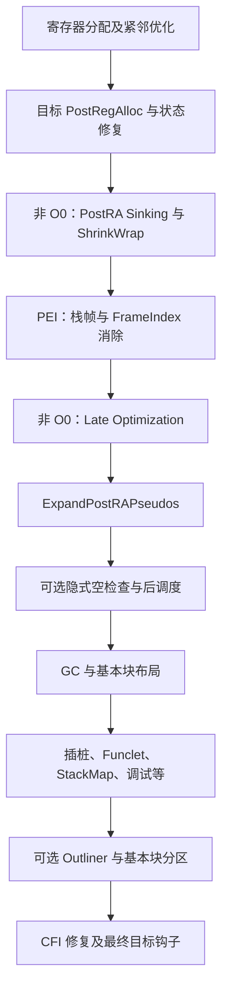
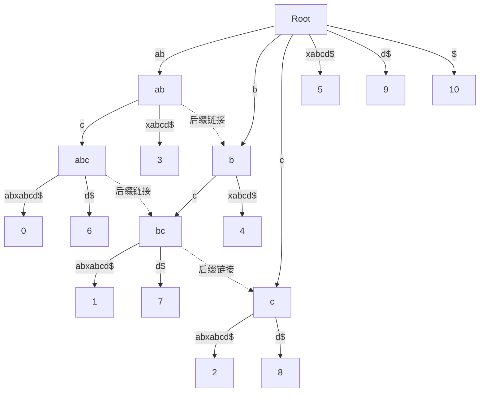

# 第 11 章 函数栈帧生成和非 SSA 形式的编译优化

> 本章以 LLVM 18.1.8、HEAD `3b5b5c1ec4a3095ab096dd780e84d7ab81f3d7ff` 的实现为基线，并用本地 Debug、Assertions 构建验证核心示例。原书 LLVM 15.0.1 全文保存在 `origin/`；本章保留主题、节次和清单编号，以新输入与输出重写旧说明。证据见 [校核记录](review/ch11.md)、[实验结果](review/experiments-ch11.json)。

寄存器分配后，MIR 主要使用物理寄存器，同一个寄存器可以在不同指令被反复定义。优化必须考虑寄存器别名、子寄存器、调用破坏和真实存储位置，不再仅靠 SSA 定义追溯。此时还未完成所有机器码发射工作：栈帧、伪指令展开、指令调度、布局和元信息均可能继续改变指令序列。

通用 `TargetPassConfig` 的主要顺序如下。图中带条件的阶段只在相关优化级别、目标或选项允许时执行；目标可以插入、替换和禁用 Pass。



本章先解释 PEI，再解释在它之前运行的下沉和范围收缩，便于理解它们为什么能减少保存/恢复。这个叙述顺序不是执行次序。复现命令如下，产物默认进入临时目录，可附加 `--out /tmp/ch11`。

```sh
LLVM_BUILD=${LLVM_BUILD:-/opt/llvm-project/build}
LLVM_SRC=${LLVM_SRC:-/opt/llvm-project}
BOOK_ROOT=/opt/coding/mlir-toy/llvm/inside-llvm-codegen
export LLVM_BUILD LLVM_SRC BOOK_ROOT
python3 "$BOOK_ROOT/experiments/ch11/runner.py"
```

## 11.1 函数栈帧生成以及相关优化

### 11.1.1 栈帧生成

PEI（Prologue/Epilogue Inserter）把抽象栈对象和调用约定要求落实成目标指令。主要任务是确定必须保存的寄存器，安排保存与恢复位置，计算对象偏移和对齐，发射前言/后序，并消除 FrameIndex 操作数。callee-saved register 的保存由目标接口实现，可能使用成对存储或其他机制，不是统一插入 COPY。

**代码清单 11-1 square.c**

```c
int square(int num) {
    return num * num;
}
```

使用 `clang --target=aarch64-unknown-linux-gnu -O0 -S square.c`，本地实际生成的函数主体如下。省略 `.cfi_*` 等汇编指令，完整输出在实验目录的 `square.s`。

**代码清单 11-2 AArch64 O0 的实际栈帧指令**

```asm
square:
    sub sp, sp, #16
    str w0, [sp, #12]
    ldr w8, [sp, #12]
    ldr w9, [sp, #12]
    mul w0, w8, w9
    add sp, sp, #16
    ret
```

局部变量只需 4 字节，但本例按目标要求建立 16 字节栈帧。前言调整 SP，后序恢复 SP；叶函数无需在这里保存返回地址。优化级别改变时可以完全不需要这个局部栈对象，因此不能把该序列当成所有 square 的固定实现。

PEI 的处理可按数据依赖理解：先识别保存/恢复块和需要保留的寄存器，为它们分配保存位置，维护各块 live-in；然后在目标约束下布局局部对象、保存区、溢出槽及对齐。目标的 frame-lowering 钩子生成调整和保存指令，frame-index elimination 将抽象对象替换为基址加偏移。超出指令寻址范围时可能需要额外计算或寄存器 scavenging。

BPF 是一个有用的反例。`frame.ll` 中有一个 8 字节 volatile 局部对象，PEI 前使用 `%stack.0`，之后使用 `R10-8`，没有 AArch64 那样的 SP 加减。本章实际验证了这一变化。通用 PEI 流程与目标栈模型必须分开理解。

### 11.1.2 代码下沉

`PostRAMachineSinking` 位于 `MachineSink.cpp`，主要尝试下沉可处理的 COPY。源/目的现在是物理寄存器，因而要检查寄存器单元：任何跨越指令对源值的破坏、对目的值的使用，以及重叠子寄存器的定义，都可能使移动非法。

候选目标是唯一需要该 COPY 结果的可下沉后继，并要求该后继只有当前块这一个前驱。典型情况是：只有一个后继且在其中活跃；有多个后继但只在一个分支需要；连续 COPY 可依赖多轮处理逐步下沉。它并不会为了下沉而任意复制到多个分支，也不会忽略共享后继的其他入边。

以下输入取自本章的 `postra-sink-a64.mir`。它与 LLVM AArch64 回归测试中的最小模式相同，并独立保存于实验目录。

```text
bb.0:
  liveins: $w0, $w1
  $w1 = SUBSWri $w1, 1, 0, implicit-def $nzcv
  renamable $w19 = COPY killed $w0
  Bcc 11, %bb.1, implicit $nzcv
  B %bb.2
bb.1:
  liveins: $w1, $w19
  $w0 = ADDWrr $w1, $w19
  RET $x0
bb.2:
  $w0 = COPY $wzr
  RET $x0
```

实测 `-run-pass=postra-machine-sink` 把 COPY 移到 bb.1，bb.1 的 live-in 从 W19 改为 W0：

```text
bb.1:
  liveins: $w0, $w1
  renamable $w19 = COPY killed $w0
  $w0 = ADDWrr $w1, $w19
  RET $x0
```

另一条分支不再写 W19，后续 ShrinkWrap 有机会缩小保存区。这里的 MIR 用于单 Pass 变换检验，不是已经建立了完整 ABI 保存区的可调用汇编程序。

实验还保留了对应 BPF 输入。BPF 在本地 LLVM 18 基线中没有开启目标 `AllowRegisterRenaming`，因此仅在文本上写 `renamable` 不足以获得目标级的可重命名语义；该例不发生下沉。这个负例说明：Pass 名字和输入外形相同，不等于所有目标的处理相同。

按层次可比较几类常见下沉：IR 层基于 SSA/内存分析移动表达式，MachineSinking 处理分配前虚拟寄存器，PostRAMachineSinking 主要处理满足物理寄存器限制的 COPY。它们的共同目的是减少不必要执行或活跃范围，输入和合法性规则不同。

### 11.1.3 栈帧范围收缩

ShrinkWrap 把保存/恢复限制在确实需要栈帧或被调用者保存寄存器的区域，避免便宜路径支付相同开销。

**代码清单 11-3 shrink.c：只有一条路径调用外部函数**

```c
extern int fun(int);
int getSqrt(int a) {
    int res = 0;
    if (a > 10) {
        res = fun(a);
    }
    return res;
}
```

本例名为 getSqrt，但它实际调用外部 `fun`，并未自行计算平方根。实验使用 AArch64 `-O2 -fno-optimize-sibling-calls`，关闭尾调用优化是为了观察普通 call 的栈帧；否则尾调用可能消除这里要研究的保存/恢复需求。

启用默认 ShrinkWrap 的主体是：

```asm
getSqrt:
    cmp w0, #11
    b.lt .LBB0_2
    stp x29, x30, [sp, #-16]!
    mov x29, sp
    bl fun
    ldp x29, x30, [sp], #16
    ret
.LBB0_2:
    mov w0, wzr
    ret
```

用 `-mllvm -enable-shrink-wrap=false` 重新生成，`stp x29,x30` 位于比较之前，两个 return 路径都有恢复。实测恢复位置从 2 处减少到 1 处，而且 a≤10 的路径完全不建立栈帧。CFI 也随之记录不同位置的栈状态，不能仅移动汇编指令而不修复展开信息。

算法将使用/定义待保存寄存器或访问栈对象等块视为需要帧的块。Save 必须支配这些需求，Restore 必须在相关路径上保证恢复，通常借助后支配树定位。LLVM 使用 RPOT、支配/后支配、循环和块频率逐步扩大或调整候选范围，并检查目标能否在候选位置生成 prologue/epilogue。

不仅 Save，Restore 的频率也要与入口频率比较；把恢复放到循环内高频位置可能抵消节省。循环中还要避免重复保存但没有对应恢复、或者绕过保存先恢复等不平衡路径。LLVM 18 的后处理可在条件允许时拆分恢复区域，让经过“需要帧”路径和未经过该路径的入边分开。这是受约束的启发式，不保证所有 CFG 都得到最小区域；无合法/有益候选时保留普通入口/出口方案。

## 11.2 MIR 优化

`addMachineLateOptimization` 的通用次序为 `MachineLateInstrsCleanup`、BranchFolder、目标允许时的 TailDuplicate、MachineCopyPropagation。要求结构化 CFG 的目标会限制尾代码重复；这些 Pass 不能被当成每个目标无条件运行的集合。PostRA MachineLICM 属于与寄存器分配紧邻的流程，不在这一段末尾。

### 11.2.1 分支折叠

BranchFolder 同时处理尾代码合并、分支化简、公共代码提升与无用跳转表清理。它利用当前物理寄存器和布局信息减少冗余，但不是硬件分支预测器，也不能保证每次减少分支都会加速。

**尾代码合并。** 两个出口含相同后缀，或多个前驱去往同一后继且尾部相同，都可能共享一份后缀。算法可拆分其中一个块，把其他块改为跳向公共尾部，再继续寻找更短的共同后缀。相比尾代码重复，它用潜在的额外跳转换取更小代码。是否值得合并还取决于共享指令数量、已有布局、冷热频率和目标规则；并不是所有出口一律合并。


合并物理寄存器指令需确认操作数及相关状态相容，维护新增块的 live-in、分支和频率。若源块中有不能自由复制/搬动的指令或异常语义，不能只做字符串后缀匹配。

**基本块和分支化简。** 常见情形及其条件如下。

| 情形 | 可采用的处理 |
|---|---|
| 空块或仅含跳转的块 | 将前驱重定向到实际目标；维护直通关系、地址引用和异常入口限制。 |
| 真、假分支都到同一目标 | 目标分支分析允许时移除条件，只保留需要的无条件跳转。 |
| 单前驱的可合并相邻块 | 拼接指令并删除中间边，更新后继和活跃性。 |
| 跳往紧邻的布局后继 | 可消除无条件跳转，使用直通。 |
| 真分支紧邻而假分支较远 | 可反转条件，让热或合适的路径直通，保持 CFG 语义。 |
| 连续跳转或分支链 | 通过目标分析简化目标或组合可等价表达的条件，不能丢掉不同路径效果。 |
| 循环条件和布局不合适 | 反转条件、移动块或选择循环旋转，降低重要路径上的转移成本。 |
| 不可达块 | 删除无前驱且无特殊保留原因的块；仅当后继也变为不可达时继续清理。 |

“另一分支为空”本身不等于可以删去整个条件：另一条路径若包含有效计算，仍需保留其条件执行语义。分支方向也没有“真分支天然预测更准”的通用规则，必须结合频率和布局。

BPF 实验 `branch.mir` 构造两个完全相同的 `R0=17; RET` 返回块。`-run-pass=branch-folder` 把 3 个块减为 2 个，共享返回序列；实际输出仍保留一个目标为紧邻公共返回块的 `JNE_ri`。这表明当前目标与该 Pass 没有把全部冗余控制流化到极限，不应把概念最终形式冒称为这次 Pass 输出。

**公共代码提升。** 若条件分支的两个后继开头含相同且安全的指令，可在分支前执行一次。必须检查两侧寄存器、内存及 flags 状态相容，移动不能破坏分支使用的条件码，也不能额外执行原本不可推测的操作。kill/dead 标记和后继 live-in 需更新；源码会做相容性与状态修复，不能把仅有不同 kill 标记视作所有情况都不可提升。

**跳表清理。** BranchFolder 标记机器操作数实际引用的跳转表，再删除未使用的整张表；不能不重写索引映射就任意删去某个 case 的表项。

### 11.2.2 尾代码重复

分配后尾代码重复仍使用 `TailDuplicator`。它把后继尾部复制进合适前驱，以减少分支并提供复制传播或布局机会。与第 9 章相比，不需创建虚拟 SSA 定义和修复 PHI，且不再统一禁止 call/return 候选。但目标 `isNotDuplicable`、收敛性、异常控制流、布局和大小阈值仍需检查。BPF 的具体 return 属性也不会因为进入 PostRA 阶段自动失效。

复制后物理寄存器仍必须获得正确的活跃状态，控制流概率和直通边仍需更新。该优化与尾代码合并在方向上相反，却分别服务不同局部成本；不能只凭“增加了代码量”认定其中一个错误。

### 11.2.3 复制传播

MachineCopyPropagation 跟踪物理寄存器 COPY 关系。如果源寄存器从复制到用途之间保持有效，且用途允许该寄存器，可以用源替代目的，并删除已经无用的 COPY。调用 regmask、隐式定义、子寄存器写入和重叠别名都会截断传播。

本章 AArch64 `copy-a64.mir` 有 X0→X1→X2 的 COPY 链，最后 `X0=ADDXri X2,3`。实测 `-run-pass=machine-cp` 删除两条 COPY，变为 `X0=ADDXri X0,3`。同样外形的 BPF 例子因目标可重命名能力限制保持原形。第 10 章附近出现过复制传播，这里再次运行是因为中间 Pass 又可能产生了新的 COPY。

## 11.3 MIR 指令变换和调度

**伪指令展开。** MIR 中 COPY、SUBREG_TO_REG 以及目标自定义 pseudo 便于优化、约束表达或延期降低。ExpandPostRAPseudos 在物理寄存器已知后，通过通用处理与目标接口把适用的伪指令变为真实指令。并非所有 pseudo 都在同一阶段消失：调用帧伪指令可能已在 PEI 被处理，某些伪指令还会在目标的后期 Pass 或 AsmPrinter 内展开。

**隐式空指针检查。** 支持相应运行时约定的编译流程，可把已有显式判空与后续内存访问改写为 `FAULTING_OP` 和故障恢复信息。必须满足元数据、选项、目标故障范围及安全移动等要求。这个 Pass 不给任意 C/C++ 程序新增空指针安全保证，也不是把所有空指针未定义行为转成语言异常。这里进行了源码核查，未建立托管运行时执行实验。

**后调度。** 通用流水线在非 O0 且目标未自行安排后调度时，选择 PostMachineScheduler 或 PostRAScheduler。目标模型和钩子进一步决定是否工作。此时已没有“为虚拟寄存器减少未来溢出”的同一压力目标，但仍要保持物理寄存器 RAW/WAR/WAW 依赖、别名、内存顺序、延迟和发射资源限制。某些实现还会利用可用寄存器消除反依赖，不能把它简化为只看两条指令是否并行。

## 11.4 MIR 信息收集及布局优化

生成可运行和可调试的对象文件还需元信息。不同功能由函数属性、目标与编译选项触发。

| 功能 | LLVM 18 中的职责 |
|---|---|
| GC | 按 GC 策略记录安全点和根位置，供运行时使用；不是编译器在每次 call 前执行回收。 |
| FEntry | 为 `__fentry__` 等跟踪入口生成目标支持的调用/补丁形式，外部实现与链接要求由使用方式决定。 |
| XRay | 生成可打补丁探针和映射，运行时通过 patch/unpatch 控制跟踪；链接运行库不意味着探针已全部激活。 |
| PatchableFunction | 依目标和函数属性预留可修改区域，不局限于一种平台。 |
| IPRA | 收集被调用函数的物理寄存器使用，形成调用 regmask，减少过于保守的破坏假设。 |
| FuncletLayout | 把属于同一异常 funclet 的机器块安排为符合异常处理要求的布局。 |
| StackMapLiveness | 为 STACKMAP/PATCHPOINT 等记录所需活跃寄存器，不是通用的全栈快照采集。 |
| LiveDebugValues 等 | 跟踪变量位置，尽力维护机器变换后的可调试性。 |
| 布局、Outliner、冷热分区 | 调整位置或共享代码，改善代码量及指令局部性，需维护展开、调试和符号信息。 |

### 11.4.1 基本块布局优化

布局改变基本块在发射地址空间里的顺序，不等于改变 CFG 边。CFG 遍历次序、内存排列次序和运行时执行次序是三个不同概念。删除或插入跳转只是为了让重排后仍执行原来的边。

链合并从每个块各自成链开始，尝试把链尾的合适后继链接到链头。LLVM 的 MachineBlockPlacement 优先处理循环结构，考虑块频率、前驱竞争、不可违背的链顺序、循环旋转和尾代码重复等细节。若有两条路径争用同一个后继作为直通目标，不能独立把它同时接到两个链尾；需比较机会成本。若热点主要在循环内，少一次循环内跳转可能比少一次仅执行一遍的入口跳转更有意义。

基本块对齐是相关但独立的选择：对齐可能改善取指，也会插入 padding 扩大代码。布局启发式不精确模拟整个 CPU cache。

只奖励直通边的简化目标可写为：

`F = Σ_(s,t) count(s,t) × I[address(s)+size(s)=address(t)]`。

这是最大化直通权重的路径排列问题，可类比最大权 Hamilton 路径；不是普通旅行商“最短回路”。ExtTSP 还奖励较近的非直通转移。LLVM 18 默认评分为：

| 转移 | 每次执行的分值 |
|---|---|
| 条件直通 | 1.0 |
| 无条件直通 | 1.05 |
| 前向非直通，距离 d≤1024 字节 | 0.1 × (1-d/1024) |
| 后向转移，距离 d≤640 字节 | 0.1 × (1-d/640) |
| 更远的转移 | 0 |

距离从源块末端到目标块起点计算；前后向由地址决定，不由块编号决定。总分是各边分值乘其 count 后求和。函数入口固定、块大小、落空属性和已知 profile 都影响评分。

**代码清单 11-4 ExtTSP 链合并的说明性伪代码**

```text
chains = one_chain_per_block()
while a legal profitable merge exists:
    best = none
    for adjacent candidate chains X, Y:
        consider X+Y and Y+X
        for permitted split X = X1+X2:
            consider permitted reorderings of X1, X2, Y
        reject candidates moving the function entry from first position
        gain = score(candidate) - score(X) - score(Y)
        remember the candidate with largest positive gain
    apply best merge and update affected scores
order remaining chains while respecting entry and layout constraints
return concatenated layout
```

这是启发式说明，不是逐行源码。LLVM 18 限制链长度（默认 512 块）、可拆分链长度（默认 128 块）及密度差，并缓存候选收益。实现不无条件枚举三个片段全部排列，也不保证找到全局最优；不能把朴素伪代码的 O(V⁵) 直接当成当前实现复杂度。

为验证评分和排序，`algorithms.cpp` 直接链接 LLVM 的 `CodeLayout` 实现，调用 `calcExtTspScore` 和 `computeExtTspLayout`，没有重新实现一个看似相同的评分器。输入有 5 块，每块 16 字节，边为 0→1:1000、0→4:500、1→2:995、1→3:5。

| 排列 | 简化直通分数 | LLVM 18 ExtTSP 分数 |
|---|---:|---:|
| 0,1,2,3,4 | 1995 | 2043.1484375 |
| 0,1,2,4,3 | 1995 | 2043.921875 |

实际 `computeExtTspLayout` 返回第二种排列。它把到高频 B4 的跳转距离从 48 字节缩短到 32 字节，同时让低频 B3 更远；ExtTSP 因而可以区分直通分数相同的两个结果。这是模型分数的验证，没有进行指令 cache miss 或硬件时间测量。

流水线选项 `enable-ext-tsp-block-placement` 的普通默认值是 false，但 SampleProfile 流程在用户未显式指定时可开启它；MachineBlockPlacement 后处理还检查块数等条件。`ext-tsp-apply-without-profile` 默认 true，所以“ExtTSP 已启用”不等于“一定有实际 profile”。

### 11.4.2 公共代码提取

MachineOutliner 把相同机器指令序列提取到共享函数，原位置用调用或尾跳转替换。收益以净代码字节评估：共享代码大小，替换点的 call/jmp，公共函数的返回、帧和对齐成本，都必须计入。出现两段相同文本只是候选，不保证提取有利。

**代码清单 11-5 outliner.c：两个函数共享结尾计算**

```c
int func1(int x) {
    int i = x;
    i = i * i;
    i += 1;
    i = i * i;
    i += 2;
    return i;
}
int func2(int x) {
    int i = x + 51;
    i = i * i;
    i += 1;
    i = i * i;
    i += 2;
    return i;
}
```

以 X86-64、`-O2` 编译，不显式启用 Outliner 时，函数内保留重复结尾。下面为实际函数主体节选。

**代码清单 11-6 未显式开启 Outliner 的实际指令**

```asm
func1:
	imull	%edi, %edi
	leal	1(%rdi), %eax
	imull	%eax, %eax
	orl	$2, %eax
	retq
func2:
	leal	51(%rdi), %eax
	imull	%eax, %eax
	incl	%eax
	imull	%eax, %eax
	orl	$2, %eax
	retq
	.section	".note.GNU-stack","",@progbits
```

共享尾部是以下三条指令。`i*i` 的值与其奇偶性约束使本例的 `+2` 降低为 `or $2`；不是所有整数加二都等价于或二。

**代码清单 11-7 实际公共尾部**

```asm
imull %eax, %eax
orl $2, %eax
retq
```

向 Clang 传入 `-mllvm -enable-machine-outliner=always`，实测生成一个公共函数，两个原函数各用一次尾跳转进入它。`always` 在这里扩大运行该 Pass 的函数范围，并不绕过目标合法性和净收益检查。

**代码清单 11-8 实际公共代码提取结果**

```asm
func1:
	imull	%edi, %edi
	leal	1(%rdi), %eax
	jmp	OUTLINED_FUNCTION_0
func2:
	leal	51(%rdi), %eax
	imull	%eax, %eax
	incl	%eax
	jmp	OUTLINED_FUNCTION_0
OUTLINED_FUNCTION_0:
	imull	%eax, %eax
	orl	$2, %eax
	retq
	.section	".note.GNU-stack","",@progbits
```

这里 `jmp OUTLINED_FUNCTION_0` 是尾调用式转移，公共函数的 `retq` 直接返回最初调用者，并不需要先返回 func1/func2。一般候选可能采用普通 call，也可能需要新的保存/恢复序列，取决于目标的 Outliner 接口。

实现把机器指令映射成整数符号，而不是把打印出来的汇编逐字符建树。可以匹配的相同指令得到相同编号；不能跨越的边界或不可提取内容使用阻隔符号。调试指令等还有专门处理。这样，查找重复机器序列转化为在整数序列中查找重复子串。

SuffixTree 找到候选后，Outliner 还要处理重叠出现、目标约束、活跃寄存器与成本。选定候选才建立新 MachineFunction、重写原位置并修复必要信息。第 11.5 节解释后缀树，特别区分理论上的所有重复子串与 LLVM 当前迭代器输出的候选集合。

### 11.4.3 函数冷热代码分离

冷热分离把较少执行的代码移出热代码密集区域，以改善局部性。代码地址可以不连续，但控制流语义、寄存器状态、展开和调试范围必须保持。MFS 和 HCS 在不同层次解决这个问题。

| 机制 | 划分层次 | 跨区域连接 |
|---|---|---|
| BasicBlockSections | 机器基本块的节/聚类机制 | 由布局和分支连接，可供链接器或外部布局工具使用。 |
| MFS（MachineFunctionSplitter） | 同一 MachineFunction 内的冷热 section | 保持一个函数的寄存器分配/栈帧，以分支往返区域。 |
| HCS（HotColdSplitting） | LLVM IR 中提取冷区域为新函数 | 传入参数、传出结果，产生新调用边和相应调用约定成本。 |

BasicBlockSections 的 All/Labels 模式不必有 profile，List 模式读取聚类描述。MFS 通常要求函数有 profile 数据，还要通过目标的函数/块可划分检查；`mfs-split-ehcode` 可依据异常区域做静态划分。插桩 profile 与采样 profile 对缺失计数的含义不同：不能把采样中未观察到一块直接当成精确的零执行。

当同时请求基本块 section 与 MFS 时，通用流水线优先前者，不把两者无条件叠加。分区之后仍可能需要 CFI 修复，不能说“已插入栈帧，所以后面都不必关心展开信息”。

**代码清单 11-9 split.ll：带明确冷热 profile 的完整 IR**

```llvm
@i = external global i32, align 4

define i32 @foo(i32 %0, i32 %1) nounwind !prof !1 {
    %3 = icmp eq i32 %0, 0
    br i1 %3, label %6, label %4, !prof !2
4:                                                ; preds = %2
    %5 =  call i32 @L1()
    br label %9
6:                                                ; preds = %2
    %7 = call i32 @R1()
    %8 = add nsw i32 %1, 1
    br label %9
9:                                                ; preds = %6, %4
    %10 = phi i32 [ %1, %4 ], [ %8, %6 ]
    %11 = load i32, ptr @i, align 4
    %12 = add nsw i32 %10, %11
    store i32 %12, ptr @i, align 4
    ret i32 %12
}

declare i32 @L1()
declare i32 @R1() cold nounwind

!1 = !{!"function_entry_count", i64 7} ; 本例显式提供profile；不是所有相关模式都要求它
!2 = !{!"branch_weights", i32 0, i32 7}
```

此输入的函数入口计数为 7，条件分支计数为 0 与 7，R1 带 cold 属性。它是一份人工 profile 教学输入，不是测量某实际程序所得的性能数据。

MFS 实验用 `llc -O2 -mtriple=x86_64-unknown-linux-gnu -enable-split-machine-functions -x86-asm-syntax=intel`，产生以下汇编。保留 section 指令以显示区域分离。

**代码清单 11-10 MFS 实际输出**

```asm
.text
	.intel_syntax noprefix
	.section	.text.foo,"ax",@progbits
	.globl	foo
	.p2align	4, 0x90
	.type	foo,@function
foo:
	push	rbx
	mov	ebx, esi
	test	edi, edi
	je	foo.cold
	call	L1@PLT
.LBB0_2:
	mov	rax, qword ptr [rip + i@GOTPCREL]
	add	ebx, dword ptr [rax]
	mov	dword ptr [rax], ebx
	mov	eax, ebx
	pop	rbx
	ret
.LBB_END0_2:
	.section	.text.split.foo,"ax",@progbits
foo.cold:
	call	R1@PLT
	inc	ebx
	jmp	.LBB0_2
.LBB_END0_3:
	.size	foo.cold, .LBB_END0_3-foo.cold
	.section	.text.foo,"ax",@progbits
.Lfunc_end0:
	.size	foo, .Lfunc_end0-foo
	.section	".note.GNU-stack","",@progbits
```

`foo.cold` 是同一函数中的冷区域标签；入口 `je` 跳入冷 section，处理后 `jmp .LBB0_2` 回到热区域，沿用 RBX 与同一个函数帧。

HCS 则先运行 `opt -passes=hotcoldsplit -hotcoldsplit-threshold=0`。阈值设为 0 是为了让这个小教学例子触发，不代表默认参数一定提取同样的短区域。输出 IR 新增 `internal void @foo.cold.1(i32,ptr)`，用输出指针传回修改后的值。随后用同一 X86 后端生成：

**代码清单 11-11 HCS 后再生成机器代码的实际结果**

```asm
.text
	.intel_syntax noprefix
	.globl	foo
	.p2align	4, 0x90
	.type	foo,@function
foo:
	push	rbx
	sub	rsp, 16
	mov	ebx, esi
	test	edi, edi
	je	.LBB0_2
	call	L1@PLT
.LBB0_3:
	mov	rax, qword ptr [rip + i@GOTPCREL]
	add	ebx, dword ptr [rax]
	mov	dword ptr [rax], ebx
	mov	eax, ebx
	add	rsp, 16
	pop	rbx
	ret
.LBB0_2:
	lea	rsi, [rsp + 12]
	mov	edi, ebx
	call	foo.cold.1
	mov	ebx, dword ptr [rsp + 12]
	jmp	.LBB0_3
.Lfunc_end0:
	.size	foo, .Lfunc_end0-foo
	.section	.text.unlikely.,"ax",@progbits
	.p2align	4, 0x90
	.type	foo.cold.1,@function
foo.cold.1:
	push	rbp
	push	rbx
	push	rax
	mov	rbx, rsi
	mov	ebp, edi
	call	R1@PLT
	inc	ebp
	mov	dword ptr [rbx], ebp
	add	rsp, 8
	pop	rbx
	pop	rbp
	ret
.Lfunc_end1:
	.size	foo.cold.1, .Lfunc_end1-foo.cold.1
	.section	".note.GNU-stack","",@progbits
```

这里可看到对 `foo.cold.1` 的普通 call、新函数自己的寄存器保存/恢复和输出值存储。MFS 的冷块与 HCS 的新函数不能仅因都带 `.cold` 名称就视为同一个机制。两者都会增加某种转移成本；是否值得由冷路径比例、额外代码和目标成本共同决定。

### 11.4.4 代码布局优化比较

编译器内的基本块布局使用 MIR 与目标信息，链接器可借 section/符号信息安排函数或基本块聚类，链接后的优化工具则在已有二进制及 profile 上分析并重写布局。信息可用程度、重新优化能力、调试/展开信息维护和构建集成成本各不相同。

LTO/ThinLTO 是在链接关联阶段使用 IR 进行跨模块优化，并不等于链接后机器码布局，也不以 profile 为必需输入。PGO/采样反馈提供频率信息，可以配合普通编译、LTO 或布局工具。BasicBlockSections/MFS 属于编译器能力，不应归到“链接后工具”本身。Propeller 一类流程可以将采样结果用于编译器/链接器的布局输入；具体外部工具版本和实际性能不在本次本地 LLVM 实验中验证。

评价布局方案应同时区分静态指令/字节、动态执行次数、局部性模型与硬件性能。前述 ExtTSP 分数、Outliner 提取次数、MFS section 变化均有可复现证据；它们不能直接转换为某个百分比的实际加速。

## 11.5 扩展阅读：后缀树构造和应用

### 11.5.1 后缀树的构造

后缀树是输入所有后缀的压缩前缀树。路径上的字符连接起来表示一个子串，叶子标明某个后缀的起点。压缩边可以代表多个字符，因此并不为每个前缀分配一个节点。内部显式节点、叶节点与边内部的隐式位置是不同概念。

若显式存下所有后缀再逐字符插入，朴素构造总工作可能为 O(n²)。压缩树通过输入上的边区间共享字符，节点数可为 O(n)；线性空间不等于朴素插入时间也线性。Ukkonen 的关键是在线扩展时复用已有匹配及后缀关系。

以 `abcabxabcd$` 为例，`$` 是一个在其他位置不会出现的终止符。LLVM 的 SuffixTree 接受 `ArrayRef<unsigned>`，不自动添加终止符。如果应用需要让每个后缀都到达显式叶子，应由调用者提供合适的唯一终止符或边界编码。

最终压缩树可表示如下，叶子编号是从 0 开始的后缀起点。边标注采用字符串，避免与源码区间端点混淆。



LLVM 18 用 `Active.Node / Active.Idx / Active.Len` 表示活跃点：所在显式内部节点、活跃边首字符在输入中的索引、沿该边已匹配的长度。它不是“当前字母、当前节点、字符串总长度”。`SuffixesToAdd` 记录尚未显式完成的后缀扩展数，初值为 0，每个新字符阶段先加 1。

边使用两端均包含的 `[StartIdx,EndIdx]`，长度为 `EndIdx-StartIdx+1`。所有叶边共享 `LeafEndIdx`，每读一个新字符只更新一次共享尾端，已有叶子自动变长。首字符 a 的边是 `[0,0]`，不是把 `[0,1]` 当作一个字符。

每个阶段可依照源码理解为以下步骤。

1. 更新共享叶尾并增加待扩展计数。若活跃长度为零，活跃边索引设为当前字符位置。
2. 如果活跃节点没有对应首字符的边，直接插入新叶；若上一轮刚创建的内部节点尚需后缀链接，将它连向适当的当前内部节点。
3. 如果已有边且活跃长度大于等于整条边长，整条跳过：前移索引、减去边长并下降到下一个内部节点。这是 skip/count，不逐字符重复扫描已匹配路径。
4. 活跃点落在边内时，比较边上下一字符与新字符。相同则增加活跃长度并结束本阶段，待扩展计数保留。这是隐式后缀树的合法状态，不需要立刻为匹配前缀分裂节点。
5. 字符不匹配则在活跃点拆边，创建内部节点，原边后半段和新字符叶分别成为其孩子，并连接连续新建内部节点的后缀链接。原叶仍作为叶子保留，不能把共享叶尾错误地变成固定内部边尾。
6. 每次真正插入后减少待扩展计数。若当前是根且活跃长度大于零，长度减一并用 `EndIdx-SuffixesToAdd+1` 更新边索引；否则沿后缀链接转到更短后缀的起点，再继续扩展。

共享叶尾、匹配时提前停止、后缀链接和 skip/count 共同保证摊还线性构造；只说“扫描输入一次”并不能证明线性。以通常对字符查找采用常数时间的模型，构造为 O(n) 时间/空间；实际哈希字典的代价和输出枚举工作应单独计算。

下面列出本例的重要阶段，帮助对照上述规则。它是源码算法的演算，不是程序额外导出的调试日志。

| 已读前缀 | 阶段结束后的关键信息 |
|---|---|
| a、ab、abc | 依次从根新建不同首字符的叶，待扩展计数回到 0。 |
| abca | 现有 a 边匹配，活跃长度 1，待扩展 1；不分裂 a 节点。 |
| abcab | 继续匹配到 ab，活跃长度 2，待扩展 2。 |
| abcabx | x 不匹配，依次拆出 ab 与 b 内部节点，再在根插入 x 叶；待扩展回到 0。 |
| abcabxa、abcabxab | 再次沿 ab 匹配，待扩展分别为 1、2。 |
| abcabxabc | 跳过整条 ab 边，在 ab 节点的 c 边匹配一个字符，待扩展 3。 |
| abcabxabcd | 拆出 abc、bc、c，沿后缀链接处理，最后根插入 d；待扩展回到 0。 |
| abcabxabcd$ | 唯一终止符建立最后的叶，所有后缀均有显式终点。 |

### 11.5.2 后缀树的应用

理论上，在构造好的树中沿字符匹配模式 P，就可判断是否为子串。匹配可能结束于压缩边内部，不要求正好到达显式节点。匹配位置下的后代叶子标明出现起点；统计所有后代叶能得到出现次数，包含重叠出现。

最长重复子串通常对应有至少两个后代叶、字符串深度最大的内部节点，深度按路径字符数计算，不是树边数。若要最长**不重叠**重复子串，还必须比较起点间距，普通后缀树深度条件不够。

两个字符串的最长公共子串可用不同终止符构建广义后缀树，按后缀起点标注叶子属于哪个源串，再找同时具有两类后代的最深路径。不能以“叶子路径含有哪个分隔符”判断来源，因为较早字符串的后缀也会经过后面的分隔符。

LLVM 18 的 `RepeatedSubstringIterator` 是专为候选枚举实现的接口，与上述通用查询不完全相同：它只检查当前内部节点的**直接叶子孩子**，至少两个这样的孩子且字符串深度至少为 2 才返回；内部孩子留待后续访问，不把其所有后代叶汇总到当前节点。它也不枚举压缩边内部的每个重复前缀。

本章 `algorithms.cpp` 实际构造 LLVM 的 `SuffixTree` 并遍历它，对 `abcabxabcd$` 获得（为方便比较已排序）：

```json
[
  {"text": "abc", "starts": [0, 6]},
  {"text": "bc", "starts": [1, 7]}
]
```

字符串 `ab` 实际在 0、3、6 出现三次，但本例迭代器不返回它：ab 节点只有一个直接叶子孩子，其余两个起点位于内部孩子 abc 之下。a、b 等单字符重复还受最短长度限制。不能根据接口注释或理论后缀树性质宣称这个迭代器列出了所有重复子串/所有出现。若要通用出现计数，需要实现相应的路径查询和后代遍历；MachineOutliner 则在它提供的候选上继续做目标和成本选择。

## 11.6 本章小结

栈帧与机器级优化必须共同维护 ABI、物理寄存器活跃性、CFG 和展开信息。本章用 AArch64 验证帧生成、范围收缩、COPY 下沉与传播，用 X86 验证 Outliner 和 MFS/HCS，并直接调用 LLVM 库核对 ExtTSP 与后缀树候选。BPF 实验补充了目标不触发优化的负例。插桩、托管运行时判空、全部调度模式及硬件性能仍属于明确的静态核查边界，没有以这些局部实验宣称全部场景已验证。

## LLVM 18 源码依据

- [llvm/lib/CodeGen/TargetPassConfig.cpp:1094](/opt/llvm-project/llvm/lib/CodeGen/TargetPassConfig.cpp:1094)：`addMachinePasses / addMachineLateOptimization`。
- [llvm/lib/CodeGen/PrologEpilogInserter.cpp:221](/opt/llvm-project/llvm/lib/CodeGen/PrologEpilogInserter.cpp:221)：`PEI::runOnMachineFunction`。
- [llvm/lib/CodeGen/MachineSink.cpp:1997](/opt/llvm-project/llvm/lib/CodeGen/MachineSink.cpp:1997)：`PostRAMachineSinking::tryToSinkCopy`。
- [llvm/lib/CodeGen/ShrinkWrap.cpp:815](/opt/llvm-project/llvm/lib/CodeGen/ShrinkWrap.cpp:815)：`performShrinkWrapping`。
- [llvm/lib/CodeGen/BranchFolding.cpp:1199](/opt/llvm-project/llvm/lib/CodeGen/BranchFolding.cpp:1199)：`OptimizeBranches / OptimizeBlock / HoistCommonCodeInSuccs`。
- [llvm/lib/CodeGen/TailDuplicator.cpp:556](/opt/llvm-project/llvm/lib/CodeGen/TailDuplicator.cpp:556)：`shouldTailDuplicate`。
- [llvm/lib/CodeGen/ImplicitNullChecks.cpp:552](/opt/llvm-project/llvm/lib/CodeGen/ImplicitNullChecks.cpp:552)：`analyzeBlockForNullChecks / rewriteNullChecks`。
- [llvm/lib/CodeGen/MachineBlockPlacement.cpp:3459](/opt/llvm-project/llvm/lib/CodeGen/MachineBlockPlacement.cpp:3459)：`ExtTSP post-processing`。
- [llvm/lib/Transforms/Utils/CodeLayout.cpp:56](/opt/llvm-project/llvm/lib/Transforms/Utils/CodeLayout.cpp:56)：`ExtTSP options and score`。
- [llvm/lib/CodeGen/MachineOutliner.cpp:579](/opt/llvm-project/llvm/lib/CodeGen/MachineOutliner.cpp:579)：`findCandidates / runOnModule`。
- [llvm/lib/CodeGen/MachineFunctionSplitter.cpp:137](/opt/llvm-project/llvm/lib/CodeGen/MachineFunctionSplitter.cpp:137)：`runOnMachineFunction`。
- [llvm/lib/CodeGen/BasicBlockSections.cpp:283](/opt/llvm-project/llvm/lib/CodeGen/BasicBlockSections.cpp:283)：`runOnMachineFunction`。
- [llvm/lib/CodeGen/FEntryInserter.cpp:34](/opt/llvm-project/llvm/lib/CodeGen/FEntryInserter.cpp:34)：`runOnMachineFunction`。
- [llvm/lib/Target/X86/X86MCInstLower.cpp:858](/opt/llvm-project/llvm/lib/Target/X86/X86MCInstLower.cpp:858)：`LowerFENTRY_CALL`。
- [llvm/lib/Support/SuffixTree.cpp:31](/opt/llvm-project/llvm/lib/Support/SuffixTree.cpp:31)：`SuffixTree / extend`。


- [llvm/lib/Support/SuffixTree.cpp:225](/opt/llvm-project/llvm/lib/Support/SuffixTree.cpp:225)：`RepeatedSubstringIterator::advance` 的直接叶子条件。
