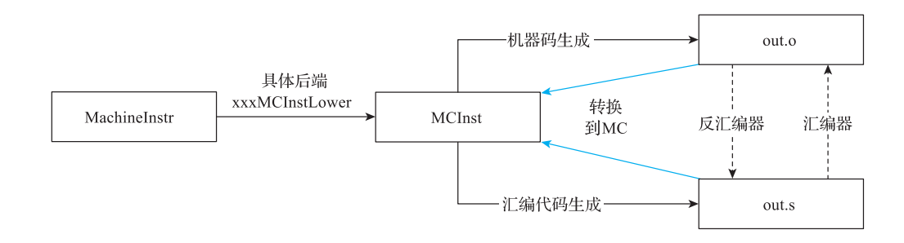
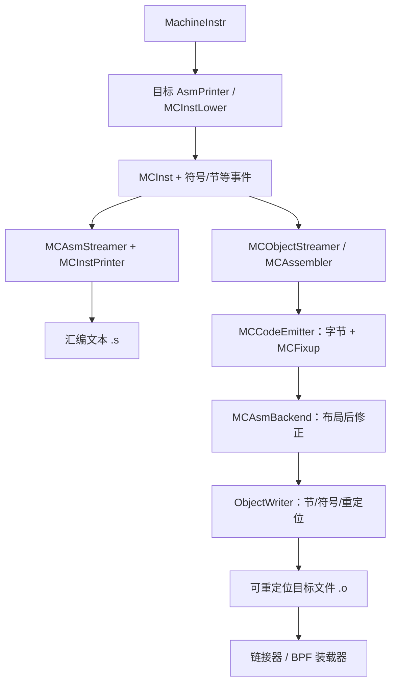
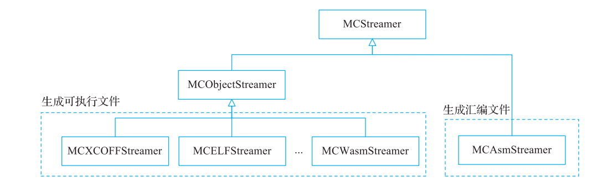
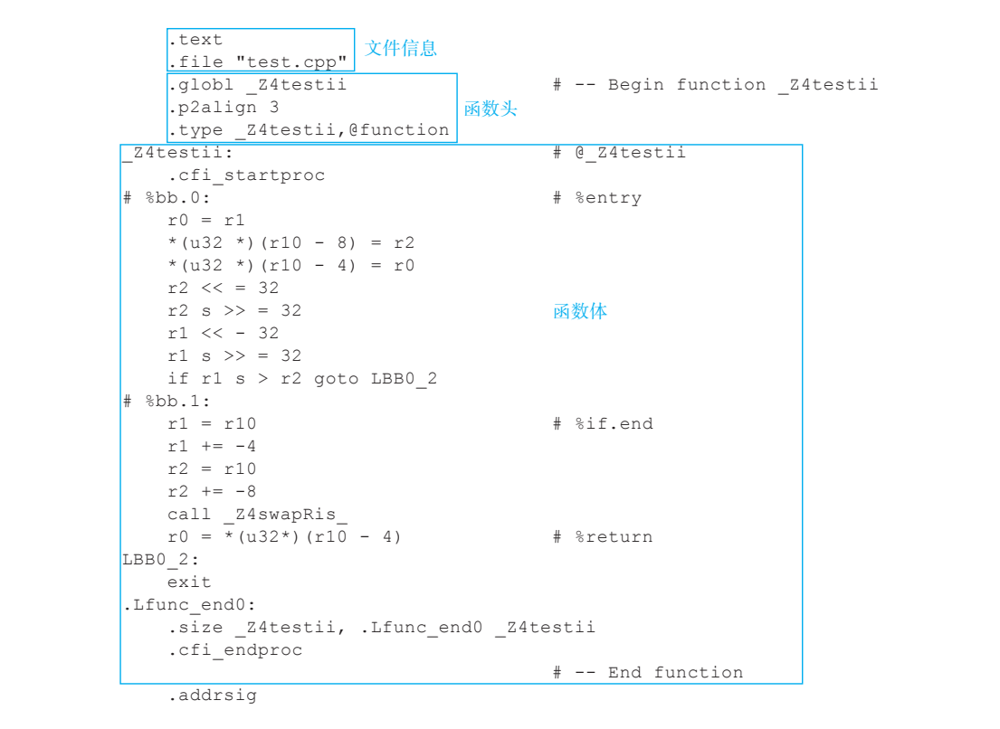
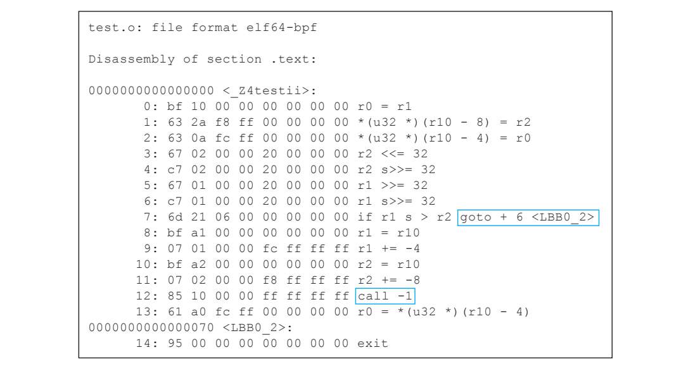
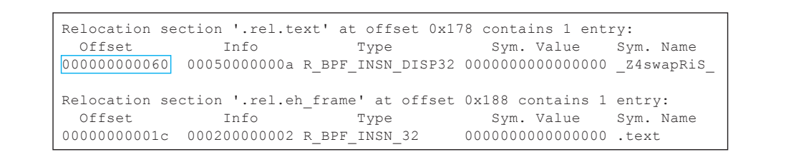

# 第 12 章生成机器码

> 校订基线：本书 LLVM 15（示例 15.0.1）；本章依据 `/opt/llvm-project` 的 LLVM 18.1.8，HEAD `3b5b5c1ec4a3095ab096dd780e84d7ab81f3d7ff` 作静态源码核查。未编译 LLVM，未执行本章 C/C++、LLVM IR、MIR 或汇编命令；具体输出与性能仍待运行确认。
> 保留原章全部章节、示例与图版。正文及文字代码按核查结果修订；原书图片和折叠页版面仅作对照，图片中的旧编号、版本结果和排印错误不代表 LLVM 18 输出。逐项记录见 [第 12 章校核记录](review/ch12.md)。

<!-- PDF page 386; printed page 373 -->

第 12 章 Chapter 12

生成机器码

完成指令选择、调度、寄存器分配等步骤后，LLVM 后端可输出汇编文本，或通过 MC 层输出通常仍需链接/装载处理的可重定位目标文件（如 `.o`）。目标文件含机器码、数据、符号和重定位，并不等同于已经可以独立执行的可执行文件。

最终运行涉及链接、装载和操作系统/运行时约定。ELF、Mach-O、PE/COFF 等格式家族既涉及目标文件也涉及可执行文件或共享库；LLVM 的 `-c` 输出不能仅因采用 ELF 就叫作可执行文件。BPF 的 ELF 对象还依赖相应的 BPF 装载/JIT 或解释执行环境。本章讨论后端目标输出，执行流程留待后续。

另外，因为机器码由 0、1 构成，没有可读性，在验证、分析编译结果时并不方便，所以编译器也提供了将编译结果生成汇编代码的功能，再由汇编器将汇编代码转换为机器码（不同的输出格式可以通过编译选项进行控制）。

机器码生成的输入为 MIR，输出为机器码或者汇编代码，在代码生成过程中还引入了新的中间表示 MC（机器代码），其过程如图 12-1 所示。


**图 12-1 引入 MC 后的代码生成过程**

<!-- PDF page 387; printed page 374 -->

本章首先介绍 MC，再介绍如何进行机器码生成。

## 12.1 MC

代码生成和后端强关联，MIR 转为 MC 由具体后端完成。例如，BPF 后端生成 MC 的功能由 BPFMCInstLower 实现，其过程如图 12-2 所示。


**图 12-2 eBPF 后端生成 MC 过程**

`MCInst` 是较轻量的机器指令表示，包含目标 opcode、操作数以及 Flags、源位置等字段；opcode 是目标指令枚举值，不是已经编码好的机器码字节。`MCOperand` 通过带种类标签的 union 表示寄存器、整数/浮点位模式、可重定位表达式等。MCInst 不保留 MachineInstr 的全部寄存器活跃性、内存别名和优化标志。

读者看到这里可能有一个问题：为什么在代码生成过程中引入 MC 而不是直接使用MIR○一？

以指令为例来看看两者的不同之处：MIR 使用 MachineInstr 描述；MC 使用 MCInst描述。

首先，相比 MachineInstr，MCInst 的结构更加简单，更关注代码生成的相关信息。

其次，在实现一个具体后端时，还需要实现相应的汇编器和反汇编工具。在汇编文件和二进制文件层面，指令信息非常有限，MCInst 作为汇编和反汇编的桥梁，其意义就体现出来了。

将二进制文件 out.o 反汇编生成 out.s 时，需要经过指令解码，生成 MCInst，然后经

**图 12-2 所示的生成 MC 的步骤，输出到汇编文件。而将文本文件 out.s 汇编成二进制文**

件 out.o 时将会经过文本解析，以生成 MCInst、指令编码，并最终输出到二进制文件。同时，这一过程对 LLVM 中的 JIT 过程非常有用（引入 MC 后就可以统一进行汇编、反汇编、JIT）。最后，在代码生成中还涉及可执行文件格式的相关信息，这些信息在 MC 中通过单独的结构（如 MCSection、MCSymbol 等）进行管理，使得代码更为清晰。引入 MC 后，反汇编和汇编工作的示意图如图 12-3 所示。

下面以一个简单的示例来看一下从 MIR 到 MC 的映射。例如一条指令对应的 MachineInstr为 $r0 = nsw ADD_ri killed $r0(tied-def 0), 1，则它对应的 MCInst 如代码清单 12-1 所示。

○一早期 LLVM 项目就是直接使用 MIR 进行机器码生成。

<!-- PDF page 388; printed page 375 -->



**图 12-3 引入 MC 后，反汇编和汇编工作示意图**

**代码清单 12-1 机器指令 ADD_ri**

> MCInst 中的 `#259` 等 opcode 数字以及寄存器内部编号来自生成的枚举，会随版本和 TD 改动变化；本章保留原书编号作历史说明，LLVM 18 核对时应优先匹配 `ADD_ri`、`MOV_rr` 等名称。

```text
r0 += 1                                # <MCInst #259 ADD_ri
                                       # <MCOperand Reg:1>
                                       # <MCOperand Reg:1>
                                       # <MCOperand Imm:1>>
```

MachineInstr 中的操作码 ADD_ri 表示寄存器和立即数相加的操作， 与 MCInst 的操作码 ADD_ri 对应；$r0 对应 <MCOperand Reg:1> ；1 是立即数， 对应 MCInst 中的<MCOperand Imm:1>。

## 12.2 机器码生成过程



该图补充原图的目标文件与可执行文件边界。汇编/反汇编工具分别从文本或字节获得 MCInst，再复用编码器/打印器；反汇编不需要重新经过 MIR lowering。

MC emission 是整条代码生成管线的最后一部分，而非从此才开始代码生成。`MCStreamer` 抽象标签、节切换、指令与数据发射等事件；汇编路径使用 MCAsmStreamer，目标文件路径使用各格式的 MCObjectStreamer/MCAssembler/ObjectWriter。图 12-4 展示基本类关系，具体目标还可提供 streamer 扩展。



**图 12-4 机器码生成实现类的继承关系**

<!-- PDF page 389; printed page 376 -->

虽然文件格式不相同，但是它们还是有一些相似部分，例如不同的文件格式可能都会包含全局变量信息、函数的链接信息等。因此代码生成过程可以总结如下。

1）生成模块全局信息：模块全局信息包括全局变量和常量池等。

2）生成函数体：函数属性信息和指令信息。其中，函数属性包括函数的可见性（即对链接器可见的特性，控制该函数是否可供其他模块链接）、链接特性（在链接时是否可以在多文件间共享）、对齐（首地址应该以一定字节数对齐）等。指令信息是指每一条指令生成的机器码。

下面将以 BPF 后端为例，通过示例演示输出到汇编文件和二进制文件的过程。机器码生成示例源码如代码清单 12-2 所示。

**代码清单 12-2 机器码生成示例源码**

```text
extern void swap(int &a, int &b);
int test(int a, int b)
{
    if (a > b) {
        return a;
    }
    swap(a, b);
    return a;
}
```

### 12.2.1 汇编代码生成

代码清单 12-2 使用 C++ 引用，后续实验命令可写为 `clang++ --target=bpfel -O2 -mllvm -print-after-all -S 12-2.cpp -o 12-2.s`。这里指定 bpfel 固定小端，与后面的字节序列一致；原书 `--target=bpf` 选择宿主端序。本次未运行该命令。

**代码清单 12-3 代码清单 12-2 对应的 MIR**

```text
# Machine code for function _Z4testii: NoPHIs, TracksLiveness, NoVRegs,
……
$r0 = MOV_rr $r1
STW $r2, $r10, -8 :: (store (s32) into %ir.b.addr, !tbaa !3)
STW $r0, $r10, -4 :: (store (s32) into %ir.a.addr, !tbaa !3)
$r2 = SLL_ri killed $r2(tied-def 0), 32
……
# End machine code for function _Z4testii.
```

通用 BPF 指令由 `BPFMCInstLower::Lower` 转为 MCInst，`BPFAsmPrinter::emitInstruction` 还先尝试 BTF 特殊 lowering。可对汇编使用 `llvm-mc --arch=bpfel --show-inst 12-2.s` 查看 MCInst，也可在汇编 emission 中通过支持的 MC 选项显示指令。这里普通指令恰好一一对应，不能推广到伪指令、指示符、隐式寄存器与所有目标。

<!-- PDF page 390; printed page 377 -->

**代码清单 12-4 MC 片段**

```text
……
    r0 = r1                                 # <MCInst #347 MOV_rr
                                        # <MCOperand Reg:1>
                                        # <MCOperand Reg:2>>
    *(u32 *)(r10 - 8) = r2                  # <MCInst #378 STW
                                        # <MCOperand Reg:3>
                                        # <MCOperand Reg:11>
                                        # <MCOperand Imm:-8>>
    *(u32 *)(r10 - 4) = r0                  # <MCInst #378 STW
                                        # <MCOperand Reg:1>
                                        # <MCOperand Reg:11>
                                        # <MCOperand Imm:-4>>
    r2 <<= 32                               # <MCInst #361 SLL_ri
                                        # <MCOperand Reg:3>
                                        # <MCOperand Reg:3>
                                        # <MCOperand Imm:32>>
……
```

输出到汇编文件后，文件内容如图 12-5 所示。

```asm
.text
.file "12-2.cpp"
.globl _Z4testii
.p2align 3
.type _Z4testii,@function
_Z4testii:
    r0 = r1
    *(u32 *)(r10 - 8) = r2
    *(u32 *)(r10 - 4) = r0
    r2 <<= 32
    r2 s>>= 32
    r1 <<= 32
    r1 s>>= 32
    if r1 s> r2 goto LBB0_2
    r1 = r10
    r1 += -4
    r2 = r10
    r2 += -8
    call _Z4swapRiS_
    r0 = *(u32 *)(r10 - 4)
LBB0_2:
    exit
.Lfunc_end0:
.size _Z4testii, .Lfunc_end0-_Z4testii
```

> 以上把原图文字排成汇编片段，修复 `<< =`、`r1 << - 32`、函数名大小写与 `.size` 差值表达式；省略非核心 CFI/辅助指示符。它仍是静态校订的历史示例，不是本次 LLVM 18 输出。



**图 12-5 汇编文件内容**

<!-- PDF page 391; printed page 378 -->

在汇编文件中，主要包含指令和指示符。

1. 指令信息

指令文本输出由目标 MCInstPrinter 实现。BPFInstPrinter 组合 TableGen 生成的打印器与手写操作数、特殊格式处理，不能把全部实现说成自动生成。与代码清单 12-3、12-4 对应的普通指令文本见代码清单 12-5。

**代码清单 12-5 与代码清单 12-3 和代码清单 12-4 逐条对应的汇编代码**

```text
……
    r0 = r1
    *(u32 *)(r10 - 8) = r2
    *(u32 *)(r10 - 4) = r0
    r2 <<= 32
```

2. 指示符信息

`.text` 切换到代码节；`.p2align 3` 表示 2³=8 字节对齐。BPF 的函数最小对齐由 BPFTargetLowering 设置。指示符本身不一定是一条机器指令，但 `.byte` 等会发射数据，`.p2align` 可插入填充，`.cfi_*` 可形成展开信息，不能说指示符通常完全不占二进制空间。

### 12.2.2 二进制代码生成

输出目标文件时，MC 层进行指令编码、片段布局、符号求值和 fixup/重定位处理，最终写出 ELF 头、节、符号、数据等结构。汇编指示符被解释为这些事件或元信息，并非每个指示符都逐字变成一种二进制指令。

1. 指令信息

每条指令都有其对应的编码方式，编码信息保存在 xxxInstrInfo.td 文件中，最终由llvm-tblgen 自动生成编码函数。一般的指令在编码阶段已经获取了编码的所有信息，包括操作码、寄存器或立即数等，可以直接完成指令编码过程。代码清单 12-3 对应的二进制汇编代码如代码清单 12-6 所示。

**代码清单 12-6 代码清单 12-3 对应的二进制汇编代码**

> 这四条普通 BPF 指令按 LLVM 18 HEAD 的 TD 字段与 BPFMCCodeEmitter 小端写出规则静态对照，字节可对应到所示操作；`LD_imm64` 等特殊指令可占两个 8 字节槽，不能把所有 BPF 指令都当一个槽。本次未实际组装该文件。

```text
bf 10 00 00 00 00 00 00   r0 = r1
63 2a f8 ff 00 00 00 00   *(u32 *)(r10 - 8) = r2
63 0a fc ff 00 00 00 00   *(u32 *)(r10 - 4) = r0
67 02 00 00 20 00 00 00   r2 <<= 32
```

以赋值指令 r0 = r1 为例，其指令编码结构在 TD 文件中定义，如代码清单 12-7 所示。

<!-- PDF page 392; printed page 379 -->

**代码清单 12-7 r0 = r1 的指令编码**

> 以下是字段赋值的说明记法，不是可直接执行的完整 TableGen 定义。`Inst{63-56}` 构成 opcode 字节，最终流中字节序由 BPFMCCodeEmitter 单独安排，不能直接对整个 64 位 `Inst` 做宿主字节序写出。

```text
Inst{63-60} = BPF_MOV(0xb)
Inst{59}    = BPF_X (0x1)
Inst{58-56} = BPF_ALU64 (0x7);
Inst{55-52} = src (1)
Inst{51-48} = dst (0)
```

其中，Inst{63-60} 表示对应 63～60 位设置的值为 0xb，其他指令编码含义与此类似。最后根据这个格式，可以得到寄存器赋值语句指令对应二进制的值：bf 10 00 00 00 00 00 00。

另外，一些指令引用了其他的符号（例如 jmp、call 指令等都需要一个目的地，这个目的地就是一个符号），当为这些指令编码时可能还不能获取全部信息（尚不知道目的地址信息），这就需要暂时将符号引用的信息保存下来，在后续获取符号信息之后再对该指令进行修正。大体上，符号引用包含函数内符号引用、函数间符号引用、模块内数据引用以及跨模块符号引用几种类型，不同的引用处理方法略有不同。

1）函数内符号引用（即引用的符号）属于该函数内部，但是在对当前指令编码的时候，被引用符号还未被处理，导致当前指令不能完成编码。例如函数内部的前向跳转指令，由于目标位置处于当前编码指令之后，只有处理到跳转目标指令处，才能计算出两条指令的相对偏移，进而实现对跳转指令的修正。

2）函数间符号引用即引用的符号不属于当前函数，但存在于当前编译的模块中。例如函数调用指令，在对当前函数进行汇编的过程中，目标函数可能存在未处理的情况。因而目标函数地址尚不能确定。

3）模块内数据和跨函数引用即使符号已定义，也可能仍需重定位：跨节相对位置、符号可抢占性、目标和对象格式语义会影响能否在汇编阶段完全求值。同一模块、甚至同一节都不能简单作为“一定可修正完毕”的条件。

4）跨模块符号引用，即引用外部符号。这里包括外部数据符号访问和外部函数符号访问。由于外部符号的具体实现在编译阶段无法获得，转而交由链接器实现符号的查找与链接。这里就涉及常说的重定位信息。即在编译阶段记录一些信息并传给链接器，以指导链接器进行指令修正。

以上按符号范围作说明，真正是否留下重定位由 MC 表达式、fixup 类型、布局与对象格式决定。MCAssembler 先求值 fixup，不能解析或目标要求保留时通知 ObjectWriter 记录 relocation，再由 AsmBackend 按需要写入当前已知值。下面的外部调用是典型例子。

编译与反汇编命令如代码清单 12-8 所示。

<!-- PDF page 393; printed page 380 -->

**代码清单 12-8 编译与反汇编命令**

```text
clang++ --target=bpfel -O2 -c 12-2.cpp -o test.o
llvm-objdump -d test.o
llvm-readobj --relocations test.o
```

反汇编后的结果如图 12-6 所示。

```text
test.o: file format elf64-bpf
Disassembly of section .text:
0000000000000000 <_Z4testii>:
0: bf 10 00 00 00 00 00 00 r0 = r1
1: 63 2a f8 ff 00 00 00 00 *(u32 *)(r10 - 8) = r2
2: 63 0a fc ff 00 00 00 00 *(u32 *)(r10 - 4) = r0
3: 67 02 00 00 20 00 00 00 r2 <<= 32
4: c7 02 00 00 20 00 00 00 r2 s>>= 32
5: 67 01 00 00 20 00 00 00 r1 <<= 32
6: c7 01 00 00 20 00 00 00 r1 s>>= 32
7: 6d 21 06 00 00 00 00 00 if r1 s > r2 goto + 6 <LBB0_2>
8: bf a1 00 00 00 00 00 00 r1 = r10
9: 07 01 00 00 fc ff ff ff r1 += -4
10: bf a2 00 00 00 00 00 00 r2 = r10
11: 07 02 00 00 f8 ff ff ff r2 += -8
12: 85 10 00 00 ff ff ff ff call -1
13: 61 a0 fc ff 00 00 00 00 r0 = *(u32 *)(r10 - 4)
0000000000000070 <LBB0_2>:
14: 95 00 00 00 00 00 00 00 exit
```



**图 12-6 反汇编后的结果**

从图 12-6 中可以看到，第 7 行的前向跳转指令 goto 已经完成了指令修正（反汇编可以看到跳转的目标地址对应的符号），但第 12 行的 call 指令的当前填充值为 –1。由于 call 指令调用外部符号，会在重定位段中有一个记录。重定位段信息如图 12-7 所示。

```text
Relocation section '.rel.text' at offset 0x178 contains 1 entry:
Offset Info Type Sym. Value Sym. Name
000000000060 00050000000a R_BPF_64_32 0000000000000000 _Z4swapRiS_
Relocation section '.rel.eh_frame' at offset 0x188 contains 1 entry:
Offset Info Type Sym. Value Sym. Name
00000000001c 000200000002 R_BPF_64_ABS32 0000000000000000 .text
```



**图 12-7 重定位段信息**

> LLVM 18 BPFELFObjectWriter 将外部 call 的 `FK_PCRel_4` 映射为 `R_BPF_64_32`（类型 10）；图中旧工具命名 `R_BPF_INSN_DISP32` 为历史显示。32 位普通数据 fixup 的命名采用 `R_BPF_64_ABS32`。`.eh_frame` 是否生成及其实际 relocation 应以所用选项和新工具输出为准。

记录的符号引用信息需要明确如下几个问题。

1）需要修正的指令位置：描述需要修正的指令在二进制中的偏移。

2）符号引用的信息：描述指令引用了什么符号。

3）指令修正方式：描述在获取了被引用符号的地址后，如何修正指令。

<!-- PDF page 394; printed page 381 -->

重定位记录的 Offset 标识它所作用的节内位置。例中 0x60=96 字节，对应第 12 个 8 字节槽的 call；Info 指向符号及重定位类型，后者决定公式和位域。MC 层的内存结构是 `MCFixup`，记录片段内偏移、表达式和种类；ELF relocation 则是写入目标文件给链接器/装载器使用的记录，二者不是同一种结构，也并非每个 fixup 都保留为重定位。

2. 指示符信息

汇编文本可交替切换 `.text`、`.data`、`.rodata`，同一 MCSection 的片段会累计到该节。ELF 中也可能有同名但属性、组或身份不同的节，不能仅凭节名相同就保证无条件合并。具体布局和重定位处理由对象格式及链接阶段决定。

## 12.3 本章小结

本章主要介绍 LLVM 机器码生成过程，简单介绍了 MC 和机器码生成。读者可以通过llvm-mc 工具研究 MC，通过 llvm-objdump 分析对应的汇编代码。读者在阅读本章时最好先自行了解可执行文件的基本格式，例如 ELF 文件格式。

## LLVM 18 静态校核依据

以下定位以本章所列 HEAD 为准；未运行验证的样例和历史性能比较不作为 LLVM 18 的复现实验结论。

- [llvm/lib/CodeGen/LLVMTargetMachine.cpp:155](/opt/llvm-project/llvm/lib/CodeGen/LLVMTargetMachine.cpp:155)：`createMCStreamer`。
- [llvm/include/llvm/MC/MCInst.h:34](/opt/llvm-project/llvm/include/llvm/MC/MCInst.h:34)：`MCOperand / MCInst`。
- [llvm/lib/Target/BPF/BPFAsmPrinter.cpp:140](/opt/llvm-project/llvm/lib/Target/BPF/BPFAsmPrinter.cpp:140)：`emitInstruction`。
- [llvm/lib/Target/BPF/BPFMCInstLower.cpp:47](/opt/llvm-project/llvm/lib/Target/BPF/BPFMCInstLower.cpp:47)：`Lower`。
- [llvm/lib/Target/BPF/MCTargetDesc/BPFInstPrinter.cpp:40](/opt/llvm-project/llvm/lib/Target/BPF/MCTargetDesc/BPFInstPrinter.cpp:40)：`printInst / printOperand`。
- [llvm/lib/Target/BPF/MCTargetDesc/BPFMCCodeEmitter.cpp:113](/opt/llvm-project/llvm/lib/Target/BPF/MCTargetDesc/BPFMCCodeEmitter.cpp:113)：`encodeInstruction`。
- [llvm/lib/Target/BPF/MCTargetDesc/BPFAsmBackend.cpp:26](/opt/llvm-project/llvm/lib/Target/BPF/MCTargetDesc/BPFAsmBackend.cpp:26)：`applyFixup / createObjectTargetWriter`。
- [llvm/lib/Target/BPF/MCTargetDesc/BPFELFObjectWriter.cpp:38](/opt/llvm-project/llvm/lib/Target/BPF/MCTargetDesc/BPFELFObjectWriter.cpp:38)：`getRelocType`。
- [llvm/lib/MC/MCAssembler.cpp:196](/opt/llvm-project/llvm/lib/MC/MCAssembler.cpp:196)：`evaluateFixup / handleFixup`。
- [llvm/include/llvm/MC/MCFixup.h:73](/opt/llvm-project/llvm/include/llvm/MC/MCFixup.h:73)：`MCFixup`。

待后续验证：使用该版本构建产物逐项解析/编译示例，检查目标、优化级别与 Pass 开关，比较 Pass 前后 IR/MIR、汇编和目标文件。此阶段仅完成文档与源码静态校对。
