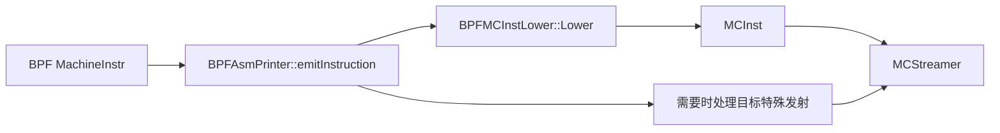
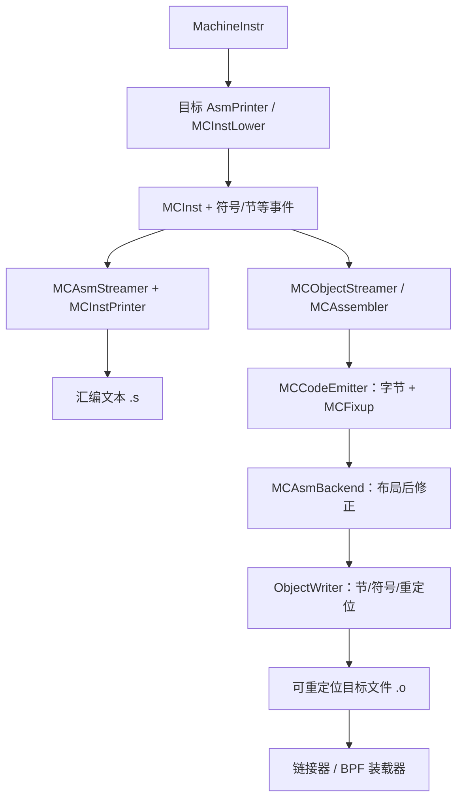
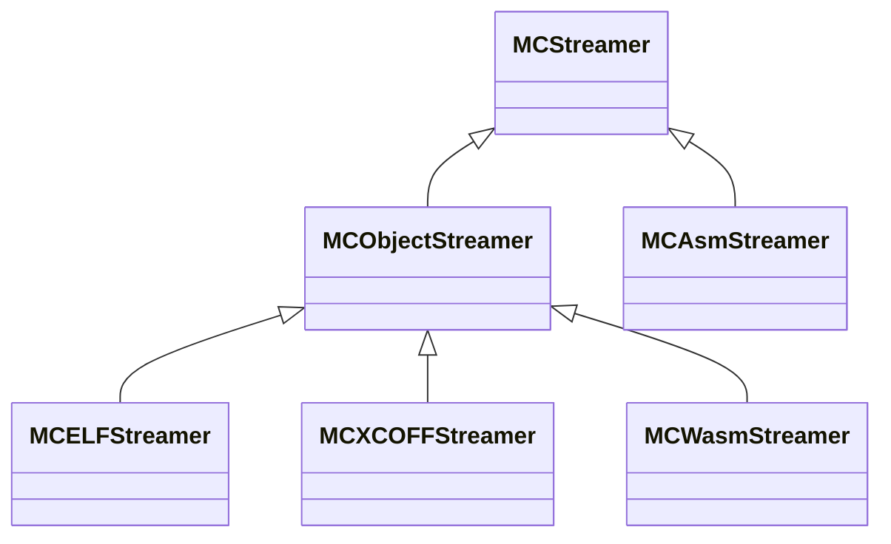
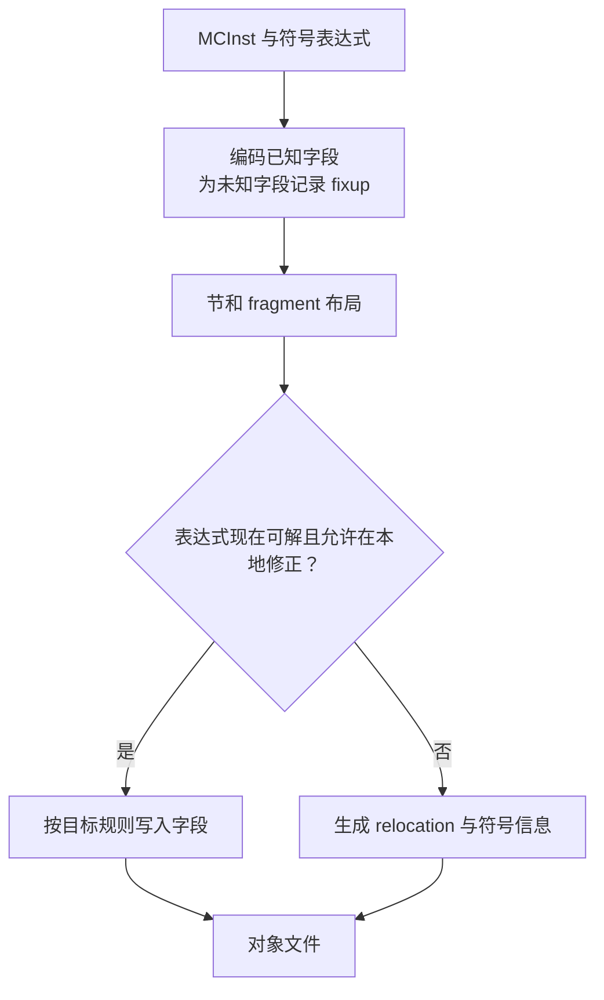

# 第 12 章生成机器码

> 本章依据LLVM18.1.8源码与实际工具输出讲解MC层，基准提交 `3b5b5c1ec4a3095ab096dd780e84d7ab81f3d7ff`。示例统一使用 `bpfel`、`-mcpu=generic`、`-O2`。源码与完整运行器见 [experiments/ch12](experiments/ch12/runner.py)，记录见 [review](review/ch12.md)。

经过寄存器分配、栈帧布局和机器优化，后端得到可发射的MachineInstr。目标AsmPrinter把它们及标签、节和符号等事件交给MC层，由MC输出汇编文本或可重定位目标文件。`.o`只是链接/装载的输入，采用ELF格式不等于已经成为可执行文件；BPF对象还需要相应装载、解释或JIT环境。

<details>
<summary>动手实验前展开：本章环境初始化（首次阅读推导可先略过）</summary>

<!-- manual-lab:ch12-setup -->

```sh
# 开启严格检查，使未处理的命令/管道失败与未定义变量尽早暴露。
set -euo pipefail
# 可提前 export 覆盖默认路径；各阶段使用同一套 LLVM 构建。
export LLVM_BUILD="${LLVM_BUILD:-/opt/llvm-project/build}"
export LLVM_SRC="${LLVM_SRC:-/opt/llvm-project}"
export BOOK_ROOT="${BOOK_ROOT:-/opt/coding/mlir-toy/llvm/inside-llvm-codegen}"
BOOK_INPUT="$BOOK_ROOT/experiments/ch12"
# 每次创建独立目录，保留前后阶段文件供比较，实验输入保持只读。
CODEGEN_LAB=$(mktemp -d)
export BOOK_INPUT CODEGEN_LAB
"$LLVM_BUILD/bin/llc" --version
printf '实验输出目录：%s\n' "$CODEGEN_LAB"
```

</details>

以下命令按正文顺序在同一个 Bash 会话运行；输入取自本章实验目录，所有新文件写入刚创建的临时目录。

下文直接生成 IR、MIR、汇编、目标文件、MC 编码、反汇编和重定位输出；自动运行器仍提供 `--out` 和 JSON 汇总。本章实测覆盖编译、组装、机器指令校验和反汇编，没有装载BPF程序到内核执行。

## 12.1 MC

**从机器指令到字节，中间还差什么。** 一条 MachineInstr 已经能说“把 R1 加到 R0”，但它可能还带活跃性、帧索引、机器基本块等编译信息。MC 层保留编码/打印需要的 opcode、寄存器、立即数、符号表达式等，把优化分析所需的信息与文件输出所需的信息分开。

最明显的差别是分支目标。编译过程中可以引用一个基本块对象；写目标文件时，需要表示它的符号及最终地址差。若符号尚不能确定，就要留下修正信息。因而 MCInst 不只是“更短的 MachineInstr”，还处在符号、节、布局和目标文件机制之中。

把过程拆成三问：目标指令如何转换成 MCInst？MCInst 如何打印为汇编或编码为字节？尚未确定的符号表达式由汇编器还是链接器解决？后面的 AsmPrinter、MCCodeEmitter、AsmBackend、ObjectWriter，分别参与这些环节，而不是四个可互相替代的文件输出函数。

代码生成和后端强关联，MIR 转为 MC 由具体后端完成。例如，BPF 后端生成 MC 的功能由 BPFMCInstLower 实现，其过程如图 12-2 所示。



箭头表示发射调用/数据流的主干，普通 lowering 与目标特殊处理按指令情形选择。

**图 12-2 eBPF 后端生成 MC 过程**

`MCInst` 是较轻量的机器指令表示，包含目标 opcode、操作数以及 Flags、源位置等字段；opcode 是目标指令枚举值，不是已经编码好的机器码字节。`MCOperand` 通过带种类标签的 union 表示寄存器、整数/浮点位模式、可重定位表达式等。MCInst 不保留 MachineInstr 的全部寄存器活跃性、内存别名和优化标志。

读者看到这里可能有一个问题：为什么在代码生成过程中引入 MC 而不是直接使用MIR？

以指令为例来看看两者的不同之处：MIR 使用 MachineInstr 描述；MC 使用 MCInst描述。

首先，相比 MachineInstr，MCInst 的结构更加简单，更关注代码生成的相关信息。

其次，在实现一个具体后端时，还需要实现相应的汇编器和反汇编工具。在汇编文件和二进制文件层面，指令信息非常有限，MCInst 作为汇编和反汇编的桥梁，其意义就体现出来了。

反汇编器从节字节中解码MCInst，再由MCInstPrinter输出文本；汇编器从文本解析MCInst，交给编码器生成字节。反汇编不重新构造MIR，也不再调用MachineInstr lowering。JIT可复用目标文件发射与装载基础设施。MCSection、MCSymbol等单独承载节、标签和可重定位表达式。

下面以一个简单的示例来看一下从 MIR 到 MC 的映射。例如一条指令对应的 MachineInstr为 $r0 = nsw ADD_ri killed $r0(tied-def 0), 1，则它对应的 MCInst 如代码清单 12-1 所示。

**代码清单 12-1 机器指令 ADD_ri**

MC opcode数字来自生成枚举，不能当作指令编码。下面是本次 `llvm-mc --triple=bpfel --show-inst add.s` 的实际输出；指令名称比枚举编号更适合跨版本对照。

以下片段中的新增中文注释用于阅读，不属于原始工具输出。

```text
# Reg:1 是 LLVM 内部的 R0 枚举值；两个相同寄存器操作数表达读后写的两地址约束。
.text
	r0 += 1                                 # <MCInst #283 ADD_ri
                                        #  <MCOperand Reg:1>
                                        #  <MCOperand Reg:1>
                                        #  <MCOperand Imm:1>>
```

MachineInstr 中的操作码 ADD_ri 表示寄存器和立即数相加的操作， 与 MCInst 的操作码 ADD_ri 对应；$r0 对应 <MCOperand Reg:1> ；1 是立即数， 对应 MCInst 中的<MCOperand Imm:1>。

<!-- manual-lab:ch12-mcinst -->

```sh
# show-inst 展示内部 opcode 和操作数；这些枚举编号本身不是目标机器码。
"$LLVM_BUILD/bin/llvm-mc" --triple=bpfel --show-inst "$BOOK_INPUT/add.s" \
  > "$CODEGEN_LAB/add-inst.txt"
cat "$CODEGEN_LAB/add-inst.txt"
```

输出展示 ADD_ri 的 MC opcode 和两个寄存器操作数，不能把枚举编号当作字节编码。

## 12.2 机器码生成过程



该图补充原图的目标文件与可执行文件边界。汇编/反汇编工具分别从文本或字节获得 MCInst，再复用编码器/打印器；反汇编不需要重新经过 MIR lowering。

MC emission 是整条代码生成管线的最后一部分，而非从此才开始代码生成。`MCStreamer` 抽象标签、节切换、指令与数据发射等事件；汇编路径使用 MCAsmStreamer，目标文件路径使用各格式的 MCObjectStreamer/MCAssembler/ObjectWriter。图 12-4 展示基本类关系，具体目标还可提供 streamer 扩展。



空心三角指向基类。MCAsmStreamer 输出汇编文本，MCObjectStreamer 的具体子类处理相应对象格式；对象输出不等于已链接的可执行文件。

**图 12-4 机器码生成实现类的继承关系**

虽然文件格式不相同，但是它们还是有一些相似部分，例如不同的文件格式可能都会包含全局变量信息、函数的链接信息等。因此代码生成过程可以总结如下。

1）生成模块全局信息：模块全局信息包括全局变量和常量池等。

2）生成函数体：函数属性信息和指令信息。其中，函数属性包括函数的可见性（即对链接器可见的特性，控制该函数是否可供其他模块链接）、链接特性（在链接时是否可以在多文件间共享）、对齐（首地址应该以一定字节数对齐）等。指令信息是指每一条指令生成的机器码。

下面将以 BPF 后端为例，通过示例演示输出到汇编文件和二进制文件的过程。机器码生成示例源码如代码清单 12-2 所示。

**代码清单 12-2 机器码生成示例源码**

```cpp
extern void swap(int &a, int &b);
int test(int a, int b)
{
    if (a > b) {
        return a;
    }
    // 引用需要参数对象的地址，且 swap 可改写 a；调用后必须读取修改后的值。
    swap(a, b);
    return a;
}
```

### 12.2.1 汇编代码生成

**同一条指令走两种输出路径。** MachineInstr 经目标 lowering 得到 MCInst 后，如果输出汇编文本，MCInstPrinter 按目标语法打印操作码、寄存器和立即数；流中还会输出标签、节切换、对齐等指令/伪指令。若直接输出对象，则 MCInst 交给编码路径，不需要先写 `.s` 再调用外部汇编器。

因此名为 AsmPrinter 的 Pass 也参与对象输出。它组织函数、符号和指令的发射，而具体 streamer 决定把这些事件变成文本还是对象内部结构。调试到 AsmPrinter，并不能据此判断本次只生成汇编。

追踪一条返回指令时，可以先在 MIR 找目标 opcode，再在目标 emitInstruction/MC lowering 看它是否展开 pseudo、如何传递操作数，然后在文本输出观察助记符。若它展开成多个 MCInst，要逐个记录；不能先假定 MIR 一行必然对应汇编一行或固定字节数。

代码清单12-2使用C++引用。运行器实际执行 `clang++ --target=bpfel -mcpu=generic -O2 -S test.cpp`，同时生成IR与目标文件；随后用llc在 `prologepilog` 后导出MIR并执行机器校验。

<!-- manual-lab:ch12-clang-and-mir -->

```sh
# PEI 后栈槽已解析为帧指针偏移，可将 MIR 的访存与最终汇编逐项对应。
"$LLVM_BUILD/bin/clang++" --target=bpfel -mcpu=generic -O2 -S \
  "$BOOK_INPUT/test.cpp" -o "$CODEGEN_LAB/test.s"
"$LLVM_BUILD/bin/clang++" --target=bpfel -mcpu=generic -O2 -S -emit-llvm \
  "$BOOK_INPUT/test.cpp" -o "$CODEGEN_LAB/test.ll"
"$LLVM_BUILD/bin/llc" -mtriple=bpfel -mcpu=generic -O2 -verify-machineinstrs \
  -stop-after=prologepilog "$CODEGEN_LAB/test.ll" -o "$CODEGEN_LAB/test.mir"
sed -n '/^body:/,$p' "$CODEGEN_LAB/test.mir"
```

MIR 中栈对象已经变为 R10-8/R10-4，外部引用参数调用的符号为 _Z4swapRiS_。

**代码清单 12-3 代码清单 12-2 对应的 MIR**

以下片段中的新增中文注释用于阅读，不属于原始工具输出。

```text
bb.0.entry:
    successors: %bb.2(0x40000000), %bb.1(0x40000000)
    liveins: $r1, $r2

    $r0 = COPY $r1
    ; R10 是 BPF 帧指针；-8 与 -4 是两个 int 的栈偏移，STW 只写 32 位。
    STW $r2, $r10, -8 :: (store (s32) into %ir.b.addr, !tbaa !3)
    STW $r0, $r10, -4 :: (store (s32) into %ir.a.addr, !tbaa !3)
    ; 先左移再算术右移，把低 32 位 int 符号扩展到 64 位后做有符号比较。
    $r2 = SLL_ri killed $r2, 32
    $r2 = SRA_ri killed $r2, 32
    $r1 = SLL_ri killed $r1, 32
    $r1 = SRA_ri killed $r1, 32
    JSGT_rr killed $r1, killed $r2, %bb.2
    JMP %bb.1

  bb.1.if.end:
    successors: %bb.2(0x80000000)

    ; 调用参数改为 a、b 的栈地址；R1/R2 此时不再保存原来的整数实参。
    $r1 = MOV_rr $r10
    $r1 = ADD_ri $r1, -4
    $r2 = MOV_rr $r10
    $r2 = ADD_ri $r2, -8
    JAL @_Z4swapRiS_, implicit-def dead $r0, implicit-def dead $r1, implicit-def dead $r2, implicit-def dead $r3, implicit-def dead $r4, implicit-def dead $r5, implicit $r11, implicit $r1, implicit $r2
    ; swap 可修改 a 且调用破坏 R0，所以返回值必须从 a 的槽重新加载。
    $r0 = LDW $r10, -4 :: (dereferenceable load (s32) from %ir.a.addr, !tbaa !3)

  bb.2.return:
    liveins: $r0

    RET implicit $r0
```

通用 BPF 指令由 `BPFMCInstLower::Lower` 转为 MCInst，`BPFAsmPrinter::emitInstruction` 还先尝试 BTF 特殊 lowering。运行器对 `encoding.s` 使用 `llvm-mc --triple=bpfel --show-inst --show-encoding` 同时查看MCInst与字节编码。这里普通指令恰好一一对应，不能推广到伪指令、指示符、隐式寄存器与所有目标。

<!-- manual-lab:ch12-mc-encoding -->

```sh
# 对同一汇编切换大小端目标，比较寄存器半字节排列、偏移与立即数字节顺序。
for triple in bpfel bpfeb; do
  "$LLVM_BUILD/bin/llvm-mc" --triple="$triple" --show-inst --show-encoding \
    "$BOOK_INPUT/encoding.s" > "$CODEGEN_LAB/encoding-$triple.txt"
done
"$LLVM_BUILD/bin/llvm-mc" --triple=bpfel --filetype=obj "$BOOK_INPUT/encoding.s" \
  -o "$CODEGEN_LAB/encoding.o"
cat "$CODEGEN_LAB/encoding-bpfel.txt"
cat "$CODEGEN_LAB/encoding-bpfeb.txt"
```

两种输出覆盖基础指令与双槽 LD_imm64；首条 MOV 在小端/大端分别以 bf 10 / bf 01 开头。

**代码清单 12-4 MC 片段**

以下片段中的新增中文注释用于阅读，不属于原始工具输出。

```text
# bpfel 每条普通指令为 8 字节；0x10 的高半字节是源 R1，低半字节是目的 R0。
r0 = r1                                 # encoding: [0xbf,0x10,0x00,0x00,0x00,0x00,0x00,0x00]
                                        # <MCInst #388 MOV_rr
                                        #  <MCOperand Reg:1>
                                        #  <MCOperand Reg:2>>
# 存储以 R10 为基址、R2 为数据源；f8 ff 是偏移 -8 的 16 位小端补码。
	*(u32 *)(r10 - 8) = r2                  # encoding: [0x63,0x2a,0xf8,0xff,0x00,0x00,0x00,0x00]
                                        # <MCInst #430 STW
                                        #  <MCOperand Reg:3>
                                        #  <MCOperand Reg:11>
                                        #  <MCOperand Imm:-8>>
	*(u32 *)(r10 - 4) = r0                  # encoding: [0x63,0x0a,0xfc,0xff,0x00,0x00,0x00,0x00]
                                        # <MCInst #430 STW
                                        #  <MCOperand Reg:1>
                                        #  <MCOperand Reg:11>
                                        #  <MCOperand Imm:-4>>
	r2 <<= 32                               # encoding: [0x67,0x02,0x00,0x00,0x20,0x00,0x00,0x00]
                                        # <MCInst #406 SLL_ri
                                        #  <MCOperand Reg:3>
                                        #  <MCOperand Reg:3>
                                        #  <MCOperand Imm:32>>
```

实际输出的函数汇编如下。

以下片段中的新增中文注释用于阅读，不属于原始工具输出。

```asm
.text
	.file	"test.cpp"
	.globl	_Z4testii                       # -- Begin function _Z4testii
	.p2align	3
	.type	_Z4testii,@function
_Z4testii:                              # @_Z4testii
# .cfi_* 描述栈展开信息，不是运行时执行的 BPF 指令。
	.cfi_startproc
# %bb.0:                                # %entry
	r0 = r1
	*(u32 *)(r10 - 8) = r2
	*(u32 *)(r10 - 4) = r0
	r2 <<= 32
	r2 s>>= 32
	r1 <<= 32
	r1 s>>= 32
	if r1 s> r2 goto LBB0_2
# %bb.1:                                # %if.end
	r1 = r10
	r1 += -4
	r2 = r10
	r2 += -8
# 外部符号尚无最终地址；生成目标文件时由调用位置对应的重定位记录保留关联。
	call _Z4swapRiS_
	r0 = *(u32 *)(r10 - 4)
LBB0_2:                                 # %return
	exit
.Lfunc_end0:
	.size	_Z4testii, .Lfunc_end0-_Z4testii
	.cfi_endproc
                                        # -- End function
	.addrsig
```

以上为本次完整函数汇编，含CFI与辅助指示符。`swap(int&,int&)`的Itanium符号为 `_Z4swapRiS_`；符号名大小写和`.size`的差值表达式都具有实际含义。

在汇编文件中，主要包含指令和指示符。

1. 指令信息

指令文本输出由目标 MCInstPrinter 实现。BPFInstPrinter 组合 TableGen 生成的打印器与手写操作数、特殊格式处理，不能把全部实现说成自动生成。与代码清单 12-3、12-4 对应的普通指令文本见代码清单 12-5。

**代码清单 12-5 与代码清单 12-3 和代码清单 12-4 逐条对应的汇编代码**

```text
……
    r0 = r1
    *(u32 *)(r10 - 8) = r2
    *(u32 *)(r10 - 4) = r0
    r2 <<= 32
```

2. 指示符信息

`.text` 切换到代码节；`.p2align 3` 表示 2³=8 字节对齐。BPF 的函数最小对齐由 BPFTargetLowering 设置。指示符本身不一定是一条机器指令，但 `.byte` 等会发射数据，`.p2align` 可插入填充，`.cfi_*` 可形成展开信息，不能说指示符通常完全不占二进制空间。

### 12.2.2 二进制代码生成

**手算一次 BPF 相对跳转，理解布局为什么重要。** 在普通 BPF 单槽指令模型中，跳转偏移按“相对于下一指令的指令槽数”计算。假设跳转在字节地址 16，下一指令地址 24，目标地址 48，则偏移为 `(48−24)/8=3`。若误用当前指令地址作基准，就会算成 4，跳错一个槽。

如果中间插入一个占两个槽的宽立即数指令，应按最终编码占用的槽数重新计算，而不是按汇编文本行数。目标地址尚未完成布局时，编码器先留下占位及 fixup；布局后能在当前汇编单元求出的表达式可直接修正，不能在这里确定的外部引用则按对象格式和目标规则生成 relocation，交后续链接/装载处理。



fixup 是汇编阶段待处理的字段修正；relocation 是对象文件交给后续阶段的记录。不是每个 fixup 都会留下 relocation，也不是只要符号在本文件就一定可以省略重定位，仍取决于对象格式和目标链接语义。下面比较对象字节、反汇编、符号表与重定位表，就是从四个角度核对同一次发射的结果。

输出目标文件时，MC 层进行指令编码、片段布局、符号求值和 fixup/重定位处理，最终写出 ELF 头、节、符号、数据等结构。汇编指示符被解释为这些事件或元信息，并非每个指示符都逐字变成一种二进制指令。

1. 指令信息

每条指令都有其对应的编码方式，编码信息保存在 xxxInstrInfo.td 文件中，最终由llvm-tblgen 自动生成编码函数。一般的指令在编码阶段已经获取了编码的所有信息，包括操作码、寄存器或立即数等，可以直接完成指令编码过程。代码清单 12-3 对应的二进制汇编代码如代码清单 12-6 所示。

**代码清单 12-6 代码清单 12-3 对应的二进制汇编代码**

以下四条指令已经由llvm-mc实际编码。另一个测试把 `r3 = 0x1122334455667788 ll` 编为 `18 03 00 00 88 77 66 55 00 00 00 00 44 33 22 11`，占两个8字节槽，说明BPF指令数与槽数不能混用。

阅读提示：每行左侧是实际字节，右侧是对应汇编；例如 `20 00 00 00` 是 32 位小端立即数 32，不是四条指令。

```text
bf 10 00 00 00 00 00 00   r0 = r1
63 2a f8 ff 00 00 00 00   *(u32 *)(r10 - 8) = r2
63 0a fc ff 00 00 00 00   *(u32 *)(r10 - 4) = r0
67 02 00 00 20 00 00 00   r2 <<= 32
```

以赋值指令 r0 = r1 为例，其指令编码结构在 TD 文件中定义，如代码清单 12-7 所示。

**代码清单 12-7 r0 = r1 的指令编码**

> 以下是字段赋值的说明记法，不是可直接执行的完整 TableGen 定义。`Inst{63-56}` 构成 opcode 字节，最终流中字节序由 BPFMCCodeEmitter 单独安排，不能直接对整个 64 位 `Inst` 做宿主字节序写出。

```text
// 这是编码字段示意：先组合目标指令位域，再由发射器按 BPF 字节布局写出。
Inst{63-60} = BPF_MOV(0xb)
Inst{59}    = BPF_X (0x1)
Inst{58-56} = BPF_ALU64 (0x7);
Inst{55-52} = src (1)
Inst{51-48} = dst (0)
```

其中，Inst{63-60} 表示对应 63～60 位设置的值为 0xb，其他指令编码含义与此类似。最后根据这个格式，可以得到寄存器赋值语句指令对应二进制的值：bf 10 00 00 00 00 00 00。

另外，一些指令引用了其他的符号（例如 jmp、call 指令等都需要一个目的地，这个目的地就是一个符号），当为这些指令编码时可能还不能获取全部信息（尚不知道目的地址信息），这就需要暂时将符号引用的信息保存下来，在后续获取符号信息之后再对该指令进行修正。大体上，符号引用包含函数内符号引用、函数间符号引用、模块内数据引用以及跨模块符号引用几种类型，不同的引用处理方法略有不同。

1）函数内符号引用（即引用的符号）属于该函数内部，但是在对当前指令编码的时候，被引用符号还未被处理，导致当前指令不能完成编码。例如函数内部的前向跳转指令，由于目标位置处于当前编码指令之后，只有处理到跳转目标指令处，才能计算出两条指令的相对偏移，进而实现对跳转指令的修正。

2）函数间符号引用即引用的符号不属于当前函数，但存在于当前编译的模块中。例如函数调用指令，在对当前函数进行汇编的过程中，目标函数可能存在未处理的情况。因而目标函数地址尚不能确定。

3）模块内数据和跨函数引用即使符号已定义，也可能仍需重定位：跨节相对位置、符号可抢占性、目标和对象格式语义会影响能否在汇编阶段完全求值。同一模块、甚至同一节都不能简单作为“一定可修正完毕”的条件。

4）跨模块符号引用，即引用外部符号。这里包括外部数据符号访问和外部函数符号访问。由于外部符号的具体实现在编译阶段无法获得，转而交由链接器实现符号的查找与链接。这里就涉及常说的重定位信息。即在编译阶段记录一些信息并传给链接器，以指导链接器进行指令修正。

以上按符号范围作说明，真正是否留下重定位由 MC 表达式、fixup 类型、布局与对象格式决定。MCAssembler 先求值 fixup，不能解析或目标要求保留时通知 ObjectWriter 记录 relocation，再由 AsmBackend 按需要写入当前已知值。下面的外部调用是典型例子。

编译与反汇编命令如代码清单 12-8 所示。

**代码清单 12-8 编译与反汇编命令**

<!-- manual-lab:ch12-object-and-relocations -->

```sh
# 反汇编查看指令字节；readobj 另查符号和重定位，补上未解析外部调用的信息。
"$LLVM_BUILD/bin/clang++" --target=bpfel -mcpu=generic -O2 -c \
  "$BOOK_INPUT/test.cpp" -o "$CODEGEN_LAB/test.o"
"$LLVM_BUILD/bin/llvm-objdump" -d "$CODEGEN_LAB/test.o" > "$CODEGEN_LAB/test.dis"
"$LLVM_BUILD/bin/llvm-readobj" --sections --symbols --relocations \
  "$CODEGEN_LAB/test.o" > "$CODEGEN_LAB/test-object.txt"
cat "$CODEGEN_LAB/test.dis"
cat "$CODEGEN_LAB/test-object.txt"
```

反汇编为 15 条指令；readobj 记录 0x60 的 R_BPF_64_32 调用重定位和 .eh_frame 的 R_BPF_64_ABS64。

反汇编得到15条指令，占120字节：

阅读提示：左侧指令号按 8 字节槽计数；槽 7 的相对偏移 6 从下一槽计算，目标是 7 + 1 + 6 = 14。`call -0x1` 仍是待重定位的占位值。

```text
test.o:	file format elf64-bpf

Disassembly of section .text:

0000000000000000 <_Z4testii>:
       0:	bf 10 00 00 00 00 00 00	r0 = r1
       1:	63 2a f8 ff 00 00 00 00	*(u32 *)(r10 - 0x8) = r2
       2:	63 0a fc ff 00 00 00 00	*(u32 *)(r10 - 0x4) = r0
       3:	67 02 00 00 20 00 00 00	r2 <<= 0x20
       4:	c7 02 00 00 20 00 00 00	r2 s>>= 0x20
       5:	67 01 00 00 20 00 00 00	r1 <<= 0x20
       6:	c7 01 00 00 20 00 00 00	r1 s>>= 0x20
       7:	6d 21 06 00 00 00 00 00	if r1 s> r2 goto +0x6 <LBB0_2>
       8:	bf a1 00 00 00 00 00 00	r1 = r10
       9:	07 01 00 00 fc ff ff ff	r1 += -0x4
      10:	bf a2 00 00 00 00 00 00	r2 = r10
      11:	07 02 00 00 f8 ff ff ff	r2 += -0x8
      12:	85 10 00 00 ff ff ff ff	call -0x1
      13:	61 a0 fc ff 00 00 00 00	r0 = *(u32 *)(r10 - 0x4)

0000000000000070 <LBB0_2>:
      14:	95 00 00 00 00 00 00 00	exit
```

第7槽的条件跳转目标是第14槽，因此offset为 `14-(7+1)=6`，编码为 `06 00`。第12槽call的imm暂为-1，外部符号还没有地址；这不能当作最终调用距离。实际重定位为：

阅读提示：重定位偏移使用字节单位，`0x60` 对应第 12 个指令槽；`.rel.eh_frame` 项服务于展开元数据，不能把它误算为第二条调用。

```text
Section (3) .rel.text {
    0x60 R_BPF_64_32 _Z4swapRiS_
  }
  Section (5) .rel.eh_frame {
    0x1C R_BPF_64_ABS64 .text
  }
```

`0x60=12×8`定位call指令，`FK_PCRel_4`对应ELF的 `R_BPF_64_32`。该名称中的32表示call相关的32位字段；MCFixup种类与最终ELF relocation编号是两层接口。当前配置的 `.eh_frame` 使用 `R_BPF_64_ABS64`，这是64位数据引用；不能沿用旧书的32位eh_frame记录。普通32位数据fixup另映射为 `R_BPF_64_ABS32`。

运行器还将生成的test.s重新组装为目标文件，并比较反汇编的每条指令，确认与clang直接生成的test.o完全相同。对象文件的辅助节、符号索引或文件元信息不要求逐字节相同。

大端实验 `--triple=bpfeb` 把 `r0=r1` 编为 `bf 01 00 00 00 00 00 00`，不仅offset/imm字段改变字节序，源/目的寄存器的半字节位置也不同。不能把小端64位指令整体反转来得到大端编码。

记录的符号引用信息需要明确如下几个问题。

1）需要修正的指令位置：描述需要修正的指令在二进制中的偏移。

2）符号引用的信息：描述指令引用了什么符号。

3）指令修正方式：描述在获取了被引用符号的地址后，如何修正指令。

重定位记录的 Offset 标识它所作用的节内位置。例中 0x60=96 字节，对应第 12 个 8 字节槽的 call；Info 指向符号及重定位类型，后者决定公式和位域。MC 层的内存结构是 `MCFixup`，记录片段内偏移、表达式和种类；ELF relocation 则是写入目标文件给链接器/装载器使用的记录，二者不是同一种结构，也并非每个 fixup 都保留为重定位。

2. 指示符信息

汇编文本可交替切换 `.text`、`.data`、`.rodata`，同一 MCSection 的片段会累计到该节。ELF 中也可能有同名但属性、组或身份不同的节，不能仅凭节名相同就保证无条件合并。具体布局和重定位处理由对象格式及链接阶段决定。

<!-- manual-lab:ch12-assembly-roundtrip -->

```sh
# 把 Clang 汇编交给 MC 再组装，检查文本发射与直接对象发射的指令是否一致。
"$LLVM_BUILD/bin/llvm-mc" --triple=bpfel --filetype=obj "$CODEGEN_LAB/test.s" \
  -o "$CODEGEN_LAB/reassembled.o"
"$LLVM_BUILD/bin/llvm-objdump" -d "$CODEGEN_LAB/reassembled.o" \
  > "$CODEGEN_LAB/reassembled.dis"
python3 -B - "$CODEGEN_LAB" <<'PY_ROUNDTRIP'
from pathlib import Path
import re, sys
out = Path(sys.argv[1])
# 排除文件名、节名等外壳文本，只比较反汇编中的指令行；这里不宣称整个 ELF 逐字节相同。
def instructions(name):
    return [line.strip() for line in (out / name).read_text().splitlines()
            if re.match(r"\s*[0-9]+:", line)]
a, b = instructions("test.dis"), instructions("reassembled.dis")
assert a == b and len(a) == 15
print("汇编再组装：15 条解码指令完全一致")
PY_ROUNDTRIP
```

比较排除了对象文件名称等头部信息，只验证每条解码指令一致；没有要求辅助节逐字节相同。

## 12.3 本章小结

本章主要介绍 LLVM 机器码生成过程，简单介绍了 MC 和机器码生成。读者可以通过llvm-mc 工具研究 MC，通过 llvm-objdump 分析对应的汇编代码。读者在阅读本章时最好先自行了解可执行文件的基本格式，例如 ELF 文件格式。

## LLVM18源码与实验依据

以下源码解释了本章实测的MIR lowering、指令编码和重定位结果。MC枚举编号与调试位置不是跨版本稳定接口。

- [llvm/lib/CodeGen/LLVMTargetMachine.cpp:155](/opt/llvm-project/llvm/lib/CodeGen/LLVMTargetMachine.cpp:155)：`createMCStreamer`。
- [llvm/include/llvm/MC/MCInst.h:34](/opt/llvm-project/llvm/include/llvm/MC/MCInst.h:34)：`MCOperand / MCInst`。
- [llvm/lib/Target/BPF/BPFAsmPrinter.cpp:140](/opt/llvm-project/llvm/lib/Target/BPF/BPFAsmPrinter.cpp:140)：`emitInstruction`。
- [llvm/lib/Target/BPF/BPFMCInstLower.cpp:47](/opt/llvm-project/llvm/lib/Target/BPF/BPFMCInstLower.cpp:47)：`Lower`。
- [llvm/lib/Target/BPF/MCTargetDesc/BPFInstPrinter.cpp:40](/opt/llvm-project/llvm/lib/Target/BPF/MCTargetDesc/BPFInstPrinter.cpp:40)：`printInst / printOperand`。
- [llvm/lib/Target/BPF/MCTargetDesc/BPFMCCodeEmitter.cpp:113](/opt/llvm-project/llvm/lib/Target/BPF/MCTargetDesc/BPFMCCodeEmitter.cpp:113)：`encodeInstruction`。
- [llvm/lib/Target/BPF/MCTargetDesc/BPFAsmBackend.cpp:26](/opt/llvm-project/llvm/lib/Target/BPF/MCTargetDesc/BPFAsmBackend.cpp:26)：`applyFixup / createObjectTargetWriter`。
- [llvm/lib/Target/BPF/MCTargetDesc/BPFELFObjectWriter.cpp:38](/opt/llvm-project/llvm/lib/Target/BPF/MCTargetDesc/BPFELFObjectWriter.cpp:38)：`getRelocType`。
- [llvm/lib/MC/MCAssembler.cpp:196](/opt/llvm-project/llvm/lib/MC/MCAssembler.cpp:196)：`evaluateFixup / handleFixup`。
- [llvm/include/llvm/MC/MCFixup.h:73](/opt/llvm-project/llvm/include/llvm/MC/MCFixup.h:73)：`MCFixup`。

已验证：C++到BPF汇编/目标文件、MIR verifier、四条基础编码、双槽立即数、大小端编码差异、外部call与eh_frame重定位、汇编再组装的指令一致性。未覆盖BPF内核装载/JIT执行和其他目标文件格式的运行实验。结果见 [experiments-ch12.json](review/experiments-ch12.json)。
