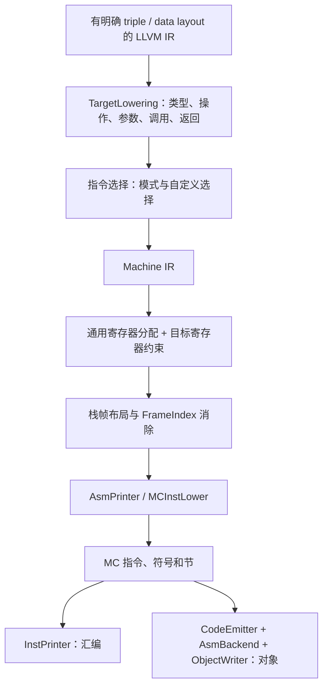

# 第 13 章 添加一个新后端：接口、最小闭环与验证

新后端的工作是把一种目标的指令、寄存器、ABI、数据布局和对象格式接入 LLVM。TableGen 描述、C++ 钩子和通用 Pass 共同完成转换；只生成几份 `.inc` 文件，或让名字出现在目标列表中，都不足以证明后端可用。

本章以 LLVM 18.1.8 的 BPF 实现说明接口边界，并提供两组实际实验：独立的 `Book.td` 描述生成，以及 BPF 从 IR 到对象文件的闭环。完整输入和 runner 位于 [experiments/ch13](experiments/ch13/runner.py)，检查结果见 [实验记录](review/experiments-ch13.json)。原书转写另存于 [origin](origin/inside-llvm-codegen-ch13.md)。

## 13.1 适配新后端的各个阶段

先确定一个可交付的最小目标：支持哪些整数宽度、算术操作、控制流、函数参数和返回值；输出汇编还是可重定位对象；运行环境如何装载和调用代码。对于尚不支持的输入，后端需要正确降级或给出诊断，不能静默生成错误代码。



图中相邻阶段之间有明确的不变量。例如，寄存器分配需要合法的寄存器类和指令约束；发射阶段需要所有应当展开的伪指令被处理；写出对象还需要合法的符号引用和目标重定位类型。性能优化可以逐步补充，这些正确性前提不能省略。

### 13.1.1 指令选择阶段的适配

采用 SelectionDAG 路线时，主要工作分为三层：

1. `TargetLowering` 声明寄存器类、类型合法性、操作动作和调用约定，并实现 `LowerFormalArguments`、`LowerCall`、`LowerReturn` 等目标钩子。
2. 公共类型/操作合法化器结合目标配置，将输入转换成可选择的 DAG；`Custom` 动作必须有相应实现。把 i32 算术提升到 i64 不允许顺带把原本的 4 字节访存扩大为 8 字节。
3. 生成的匹配表和目标 `DAGToDAGISel::Select` 把适用的节点选成机器指令。DAG 调度及 `InstrEmitter` 再产生 MIR；chain/glue 等依赖不会逐个变成机器操作数。

BPF 的入口分别是 [BPFISelLowering.cpp](/opt/llvm-project/llvm/lib/Target/BPF/BPFISelLowering.cpp)、[BPFISelDAGToDAG.cpp](/opt/llvm-project/llvm/lib/Target/BPF/BPFISelDAGToDAG.cpp) 和 [BPFInstrInfo.td](/opt/llvm-project/llvm/lib/Target/BPF/BPFInstrInfo.td)。

采用 GlobalISel 时，还要提供相应的合法化规则、寄存器银行信息、调用 lowering 和指令选择器。目标目录存在 `GISel/` 不代表它支持该目标的全部类型、操作及优化等级；必须用失败即报错的 GlobalISel 实验检验所支持的输入，第 7 章展示了这一方法。

### 13.1.2 寄存器分配相关的适配

通用分配器解决的是带目标约束的分配问题。目标至少需要提供：

| 信息或接口 | 作用 |
| --- | --- |
| 物理寄存器、寄存器类、别名、子寄存器、register units | 表达值能放在哪里以及哪些位置互相重叠 |
| 指令 def/use、隐式操作数、tied/early-clobber 约束 | 防止分配产生违反指令语义的重叠 |
| `getReservedRegs`、callee-saved 信息及 call-preserved mask | 表达保留寄存器和跨调用的保存规则 |
| `copyPhysReg` | 将必要的物理寄存器复制落实为合法目标指令 |
| `storeRegToStackSlot` / `loadRegFromStackSlot` | 将溢出和重载落实为合法访存 |
| 帧索引消除与必要的寄存器 scavenging | 在最终地址形成时满足目标寻址和临时寄存器限制 |

“有寄存器 TD 文件”只覆盖其中一部分。特别是 call-preserved mask、别名和部分寄存器写入规则出错时，简单加法可能正常，而跨函数调用或高寄存器压力的程序会被错误编译。

BPF 将 R10 作为帧指针，R11 是 LLVM 后端使用的伪栈指针；二者不应作为普通可分配寄存器。W 寄存器与相应 R 寄存器重叠，不是额外增加了一组独立的物理存储。依据见 [BPFRegisterInfo.cpp](/opt/llvm-project/llvm/lib/Target/BPF/BPFRegisterInfo.cpp) 和 [BPFInstrInfo.cpp](/opt/llvm-project/llvm/lib/Target/BPF/BPFInstrInfo.cpp)。

### 13.1.3 插入前言 / 后序

`MachineFrameInfo` 在较早阶段记录抽象对象，最终栈布局还要考虑局部对象、溢出槽、保存寄存器、调用栈空间、对齐等。PEI 组织最终布局和目标钩子调用；`eliminateFrameIndex` 将抽象对象引用转换为实际基址及偏移。

一般 CPU 可能生成 SP 调整以及保存/恢复指令，但这不是所有目标都必须出现的指令序列。LLVM 18 的 BPF `emitPrologue`、`emitEpilogue` 为空，局部栈访问通过 R10 的负偏移表达；eBPF 调用环境承担对应的调用约定。不能从通用 CPU 栈帧图推断 BPF 也会用 SP 调整或栈参数传递。

本章使用一个 `volatile` 的 8 字节栈对象，确保观察的对象不会被普通局部优化删除。生成汇编中出现基于 `r10 - 8` 的存取，是这个具体输入的实测结果。更多对象、对齐和保存规则可能改变偏移，不能把 `-8` 当作所有函数的固定槽位。

### 13.1.4 机器码生成相关的适配

| 层次 | 目标通常需要提供的内容 |
| --- | --- |
| `AsmPrinter` / 目标 MC lowering | 把 MIR 操作数、符号和适用伪指令转换为 MC 层表示 |
| `MCInstPrinter` | 指令与操作数的汇编文本 |
| `MCCodeEmitter` | 指令编码；对暂不能确定的表达式产生 fixup |
| `MCAsmBackend` | fixup 应用、目标相关布局/松弛和编码限制 |
| 目标 `MCObjectTargetWriter` | ELF/COFF/Mach-O 目标机器类型、重定位映射等 |
| `MCTargetAsmParser` / `MCDisassembler` | 从汇编读入 MC 指令、从字节解码；二者是另外的能力 |

目标代码生成器可以直接写对象，不一定先输出汇编再调用外部汇编器。反过来，CodeEmitter 也不会自动替你实现汇编解析器。对象文件包含节、符号和重定位；机器指令字节只是其中一部分。

## 13.2 添加新后端所需要的适配

### 13.2.1 定义 TD 文件

一个目标通常具有描述入口、寄存器、指令格式、指令、调用约定和可选调度模型等文件。文件划分可以不同，决定正确性的是记录之间的关系。

本章的 [Book.td](experiments/ch13/Book.td) 是可独立交给 LLVM 18 TableGen 的完整输入，描述四个 32 位寄存器和一条三地址加法。它使用 16 位指令编码：

| 位域 | 内容 |
| --- | --- |
| 15–12 | 操作码 `0001` |
| 11–10 | 目的寄存器 |
| 9–8 | 左输入寄存器 |
| 7–6 | 右输入寄存器 |
| 5–0 | 固定为 0 |

例如 `add r1, r2, r3` 按此定义得到指令字 `0x16c0`。runner 从 TableGen 输出的 JSON 记录读取每个编码位，代入寄存器编码后检查这一结果。它验证的是记录中的位域定义；将指令字写成什么字节顺序还要由实际 CodeEmitter/目标约定决定。

```sh
CODEGEN_LAB=$(mktemp -d)
for generator in register-info instr-info asm-writer emitter dag-isel; do
  "$LLVM_BUILD/bin/llvm-tblgen" \
    -I "$LLVM_SRC/llvm/include" "-gen-$generator" \
    "$BOOK_ROOT/experiments/ch13/Book.td" \
    -o "$CODEGEN_LAB/BookGen-$generator.inc"
done
```

这些生成步骤已经纳入实验。`InstructionSet`、寄存器类、操作数、模式和编码字段是相互衔接的；但生成文件还引用目标 C++ 类及钩子。因此，`Book.td` 是完整的 **TableGen 输入**，不是已经注册、可由 `llc` 选择的完整后端。将生成器通过误写成“后端已完成”会遗漏本章其余所有适配工作。

在真实 BPF 后端中，`BPFInstrInfo.td` 的 `ALU` 和 `LOAD` 参数、编码布局及 feature 条件应以当前源码为准，第 6 章已经给出相应记录实验。TableGen 名称和最终指令文字也不必相同：例如当前 BPF 中 `XORW32` 这个历史命名表示非 fetch 的原子 OR，`XXORW32` 才对应 XOR，不能只凭名字猜 opcode 语义。

### 13.2.2 指令选择处理

建议先实现一个范围明确的闭环：整数参数、整数加法和返回；再逐步加入条件分支、访存、调用及非法类型的 lowering。每增加一种能力，都要同时考虑直接支持、合法化和拒绝路径。

本章的 [backend.ll](experiments/ch13/backend.ll) 包含三个完整函数：

- `add64`：两个 i64 参数相加并返回，检查参数/返回寄存器以及加法选择。
- `call_external`：调用一个只有声明的外部函数，检查调用 lowering 与符号重定位。
- `stack_roundtrip`：通过 volatile 栈对象存取，检查寻址选择和最终帧索引消除。

```sh
"$LLVM_BUILD/bin/opt" -passes=verify -disable-output \
  "$BOOK_ROOT/experiments/ch13/backend.ll"
"$LLVM_BUILD/bin/llc" -mtriple=bpfel -mcpu=v1 -O2 \
  -verify-machineinstrs -stop-after=finalize-isel \
  "$BOOK_ROOT/experiments/ch13/backend.ll" \
  -o "$CODEGEN_LAB/selected.mir"
```

选择后检查 `ADD_rr` 等目标指令，不要求某个虚拟寄存器始终叫 `%3`。这一阶段的 MIR 仍可能包含虚拟寄存器、COPY、PHI 和 FrameIndex；其存在本身不说明选择失败。应根据停止点判断哪些不变量已经建立，哪些要由后续阶段完成。

对于新目标，不能仅靠 `add` 模式覆盖所有输入。例如 `i128` 加法可能需要拆分并传递进位，软浮点可能需要运行时调用，而目标可能不支持这种调用。在任何一条路径上，都必须保持程序语义或明确拒绝。

### 13.2.3 栈帧处理

使用上述 `stack_roundtrip` 生成完整汇编：

```sh
"$LLVM_BUILD/bin/llc" -mtriple=bpfel -mcpu=v1 -O2 \
  -verify-machineinstrs "$BOOK_ROOT/experiments/ch13/backend.ll" \
  -o "$CODEGEN_LAB/backend.s"
```

应分别确认对象大小、对齐、基址与偏移、访存宽度以及是否残留未消除的帧索引。只看到一条 store 并不能证明溢出正确；还需验证对应的重载、寄存器别名和使用位置。高压力与跨调用的例子见第 10、11 章。

ABI 的拒绝路径同样需要实验。[six-arguments.ll](experiments/ch13/six-arguments.ll) 是合法 LLVM IR，但其第六个 i64 参数会触及 LLVM 18 BPF 不支持的栈传参路径：

```sh
"$LLVM_BUILD/bin/llc" -mtriple=bpfel -mcpu=v1 \
  "$BOOK_ROOT/experiments/ch13/six-arguments.ll" \
  -o "$CODEGEN_LAB/unsupported.s"
# 此命令预期失败：stack arguments are not supported
```

runner 检查非零退出码及该诊断。TD 中出现 `CCAssignToStack` 后备规则，不表示后端已经实现栈参数的完整读写和 ABI；要继续看 `LowerFormalArguments` 和 `LowerCall` 的实际处理。这一实验不涉及 BPF 内核装载，说明的是当前 LLVM 后端的能力边界。

### 13.2.4 机器码生成处理

用同一个输入分别生成小端、大端 BPF 对象，检查目标头、重定位和反汇编：

```sh
for triple in bpfel bpfeb; do
  "$LLVM_BUILD/bin/llc" "-mtriple=$triple" -mcpu=v1 -O2 \
    -verify-machineinstrs -filetype=obj \
    "$BOOK_ROOT/experiments/ch13/backend.ll" \
    -o "$CODEGEN_LAB/$triple.o"
  "$LLVM_BUILD/bin/llvm-readobj" --file-headers --relocations \
    "$CODEGEN_LAB/$triple.o"
  "$LLVM_BUILD/bin/llvm-objdump" -d "$CODEGEN_LAB/$triple.o"
done
```

本次检查两份对象的机器类型均为 `EM_BPF`，端序分别为 `LittleEndian` 和 `BigEndian`；外部调用保留引用 `external` 的 `R_BPF_64_32` 重定位。反汇编中可以找到 `add64` 和 `exit`。这验证了当前输入从 IR、指令选择、寄存器分配到 MC 对象输出的衔接。

`external` 尚未由运行环境解析，因此这里没有声称程序已链接或实际运行。对于新架构，还需要检查重定位加数、符号绑定、分支范围、端序和适用的松弛处理，不能仅用“对象文件存在”作为验收标准。独立汇编器与编码实验见第 12 章。

### 13.2.5 添加新后端到 LLVM 框架中

目标注册不是单一函数，而是多个可独立使用的层次：

| 层次 | BPF 的对应入口 | 注册内容 |
| --- | --- | --- |
| TargetInfo | `TargetInfo/BPFTargetInfo.cpp` | 目标身份与 Triple 匹配 |
| Target | `BPFTargetMachine.cpp` | TargetMachine 工厂、代码生成配置等 |
| TargetMC | `MCTargetDesc/BPFMCTargetDesc.cpp` | 指令/寄存器/Subtarget 等 MC 工厂 |
| AsmPrinter | `BPFAsmPrinter.cpp` | 从机器函数发射汇编/MC 事件的 Pass |
| AsmParser | `AsmParser/BPFAsmParser.cpp` | 汇编解析能力 |
| Disassembler | `Disassembler/BPFDisassembler.cpp` | 字节解码能力 |

**代码清单 13-1：目标初始化接口的形状。** 下列为声明示意，实际目标函数及生成清单由其构建和实现提供。

```cpp
extern "C" void LLVMInitializeBPFTargetInfo();
extern "C" void LLVMInitializeBPFTarget();
extern "C" void LLVMInitializeBPFTargetMC();
extern "C" void LLVMInitializeBPFAsmPrinter();
extern "C" void LLVMInitializeBPFAsmParser();
extern "C" void LLVMInitializeBPFDisassembler();
```

通用调用封装见 [TargetSelect.h](/opt/llvm-project/llvm/include/llvm/Support/TargetSelect.h)，C 接口声明见 [llvm-c/Target.h](/opt/llvm-project/llvm/include/llvm-c/Target.h)。`InitializeAllTargets` 不会替代所有其他初始化函数；小型 MC 工具和完整代码生成器可以依用途初始化不同组件。

一个真正的新架构还需要按实现范围完成：

1. 添加目标目录、CMake 目标库及 TableGen 生成任务；实验目标可通过 `LLVM_EXPERIMENTAL_TARGETS_TO_BUILD` 接入。生成的 `Targets.def`、`AsmPrinters.def` 等文件不应手工修改。
2. 提供 TargetMachine、Subtarget 及上述各层注册函数，使目标库实际被工具链接和初始化。
3. 若引入新的 triple 架构名称，补充 [Triple](/opt/llvm-project/llvm/include/llvm/TargetParser/Triple.h) 的识别及相关映射。仅新增一个字符串参数不会创建架构支持。
4. 若需要从 C/C++ 开始编译，再补 Clang 的 TargetInfo、ABI、宏和驱动行为；`llc` 能处理手写 IR 不证明 Clang 已支持该架构。
5. 添加正向和负向测试，并检查 `llc --version` 的注册列表、IR 到 MIR 的转换、寄存器/栈处理、对象格式以及适用的运行环境。

在本机启用其他已有后端，只是配置并重建相应库；这是后端集成的使用过程，不是新后端实现过程。独立 `Book.td` 也没有完成第 2–4 项。本章把这条边界保留为明确的工程工作，而不提供一个实际上无法通过 llc 使用的“完整后端”假象。

## 13.3 本章小结

新后端可按“描述生成 → 最小整数函数 → 控制流/访存 → 调用/栈 → 对象及重定位 → 更广类型与优化”的顺序扩展。每一步都需要输入、停止点和可检验的不变量；拒绝不支持输入也是正确行为的一部分。

运行本章完整实验：

```sh
python3 "$BOOK_ROOT/experiments/ch13/runner.py"
```

它覆盖五类 TableGen 生成器、编码字段检查、IR verifier、选择后 MIR、完整 BPF 汇编、两种端序对象及外部调用重定位，以及栈参数拒绝。它没有修改 LLVM 来注册 Book 架构，也没有执行 BPF 内核装载。源码接口、工具生成和真实目标执行分别需要自己的证据。

进一步的接口背景可阅读本地 [WritingAnLLVMBackend.rst](/opt/llvm-project/llvm/docs/WritingAnLLVMBackend.rst)；落实到 LLVM 18 时，以具体后端源码和相应测试为准。
