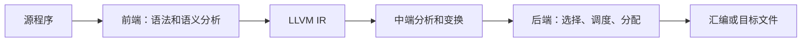
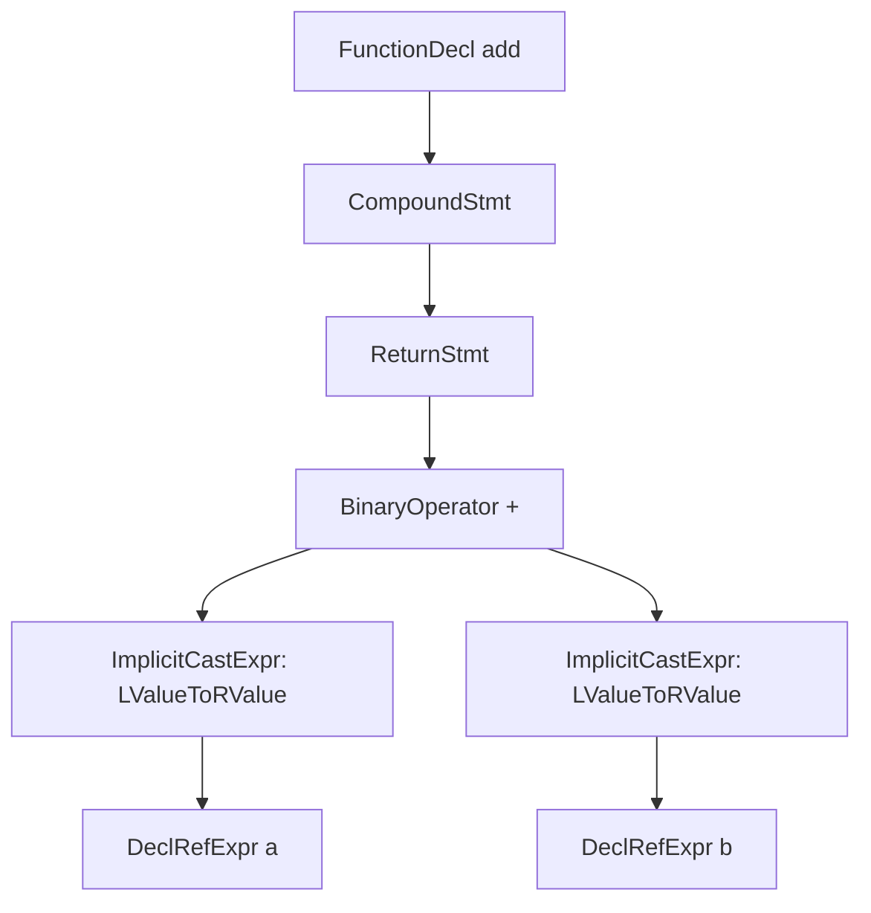
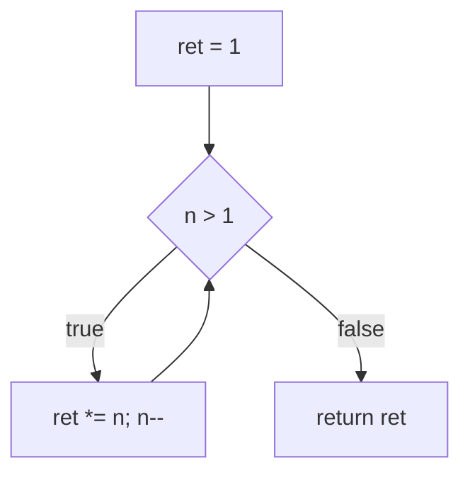
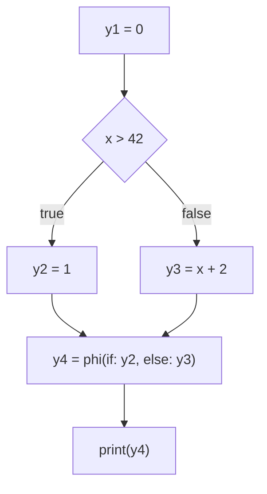
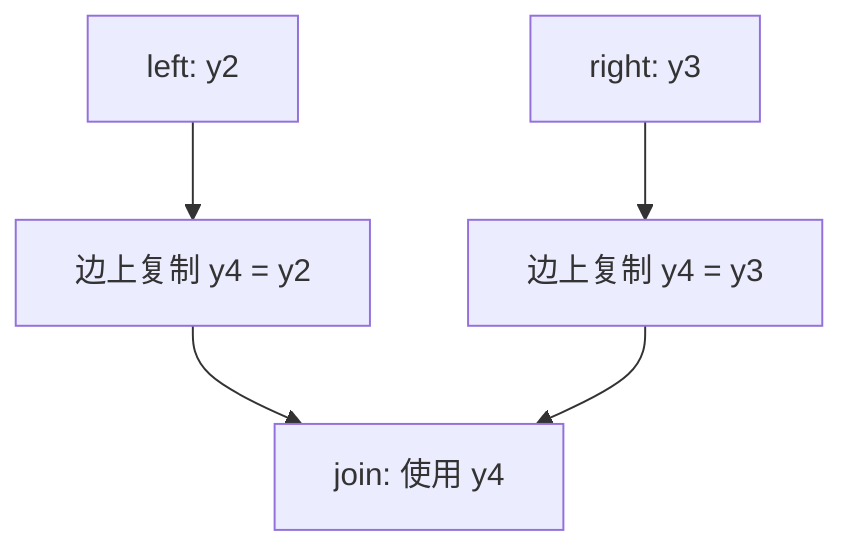
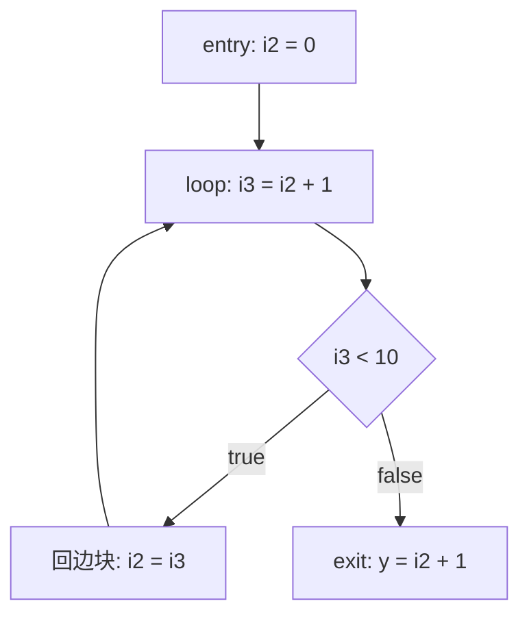

# 第 2 章 IR 基础知识（LLVM 18.1.8 校订）

> 以 LLVM 18.1.8 为基线，结合本地源码、可复现实验和实际输出重写校核。原始书稿另存 [origin](origin/inside-llvm-codegen-ch2.md)；本章以当前正文为准。
> 实验入口：[runner.py](experiments/ch2/runner.py)，记录：[源码核查](review/ch2.md) · [实验结果 JSON](review/experiments-ch2.json)。实验输入在 `experiments/ch2/`，默认把中间输出写入临时目录。

编译过程可按职责分为前端、中端和后端。前端分析源语言的词法、语法与语义，并生成适合后续处理的表示；中端在 IR 上执行常量传播、死代码消除、循环优化等变换；后端结合目标的指令集、寄存器、调用约定和成本模型，完成指令选择、调度、寄存器分配及代码发射。

**图 2-1 编译器架构示意图**



这些职责并非绝对隔离：中端可查询目标成本，后端也执行大量优化。本书后续章节正要讨论目标相关的代码生成。IR 是这些分析与变换的共同基础，本章先说明其组织方式、控制流和 SSA。

本章命令使用 **Bash**，先执行下面的准备块，再在同一 shell 中按正文顺序执行后续命令。工具应为已构建的 LLVM 18.1.8；这些步骤不会启动构建。输入只读，所有生成文件写入 `CODEGEN_LAB` 指向的新临时目录。

<!-- manual-lab:ch2-setup -->

```sh
set -euo pipefail
export LLVM_BUILD="${LLVM_BUILD:-/opt/llvm-project/build}"
export LLVM_SRC="${LLVM_SRC:-/opt/llvm-project}"
export BOOK_ROOT="${BOOK_ROOT:-/opt/coding/mlir-toy/llvm/inside-llvm-codegen}"
BOOK_INPUT="$BOOK_ROOT/experiments/ch2"
CODEGEN_LAB=$(mktemp -d)
printf '本章临时输出目录：%s\n' "$CODEGEN_LAB"
"$LLVM_BUILD/bin/opt" --version
```

预期工具报告 LLVM 18.1.8。后面的 `opt` 命令显式指定 Pass；使用解释器时，返回码 0 表示输入中 `main` 的检查通过，不表示在 BPF 内核或 JIT 上运行过。
## 2.1 IR 分类

树、线性序列和图描述 IR 的组织或观察方式，三者并不互斥。例如，一个 LLVM 函数既有基本块和指令序列，也有由 terminator 建立的 CFG，以及由 Value/Use 建立的使用—定义图。不同阶段选择适合其分析与变换的抽象层次。

### 2.1.1 树 IR

AST（Abstract Syntax Tree，抽象语法树）按源语言构造组织表达式、语句和声明。Clang 用 AST 表示经过语法、类型和语义分析的程序；语义引用还可建立树状包含关系之外的联系。以下加法函数可观察 FunctionDecl、CompoundStmt、ReturnStmt 等节点。

**代码清单 2-1 源码 add（2-1.c）**

```c
int add(int a, int b) {
    return a + b;
}
```

从完整 C 输入导出 AST，并筛选本节讨论的节点：

<!-- manual-lab:ch2-clang-ast -->

```sh
"$LLVM_BUILD/bin/clang" --target=bpfel -Xclang -ast-dump -fsyntax-only \
  "$BOOK_INPUT/examples.c" > "$CODEGEN_LAB/examples.ast.txt"
rg -n 'FunctionDecl|CompoundStmt|ReturnStmt|BinaryOperator|ImplicitCastExpr|ParmVarDecl' \
  "$CODEGEN_LAB/examples.ast.txt"
```

预期可见 add 的 FunctionDecl、函数体 CompoundStmt、ReturnStmt，以及加法的 BinaryOperator 和左值转换节点；图 2-2 仅抽取相关子树。

在图 2-2 中，函数对应 FunctionDecl，函数体对应复合语句节点（CompoundStmt），该节点包含了 return 语句的节点（ReturnStmt）。而 return 节点又是由一个二元操作节点构成（add 是二元操作的一种类型）的，二元操作节点的两个输入经 ImplicitCastExpr 完成左值到右值转换，再引用相应 DeclRefExpr。AST形式是非常自然的表达形式，它可以通过文法解析得到。

**图 2-2 AST 示例**



实际 AST 还包含 ParmVarDecl、类型与源位置。实验检查上述节点种类，不把每次变化的内存地址和打印编号当成接口。

### 2.1.2 线性 IR

线性表示按顺序列出操作，常见形式包括三地址代码和自定义指令序列。LLVM IR 在基本块内保存有序的指令列表。

LLVM 中端的许多优化操作 LLVM IR；后端还会在 Machine IR 上优化。下面先验证清单 2-2 的完整手写模块，再从 C 输入生成待优化的 IR。`-disable-O0-optnone` 允许后续 opt 变换，`-fno-discard-value-names` 保留便于观察的名称。

<!-- manual-lab:ch2-parse-and-emit-ir -->

```sh
"$LLVM_BUILD/bin/llvm-as" "$BOOK_INPUT/add.ll" -o "$CODEGEN_LAB/add.bc"
"$LLVM_BUILD/bin/opt" -passes=verify -disable-output "$CODEGEN_LAB/add.bc"
"$LLVM_BUILD/bin/clang" --target=bpfel -O0 -Xclang -disable-O0-optnone \
  -fno-discard-value-names -S -emit-llvm "$BOOK_INPUT/examples.c" \
  -o "$CODEGEN_LAB/examples.before.ll"
"$LLVM_BUILD/bin/llvm-as" "$CODEGEN_LAB/examples.before.ll" \
  -o "$CODEGEN_LAB/examples.before.bc"
"$LLVM_BUILD/bin/opt" -passes=verify -disable-output "$CODEGEN_LAB/examples.before.bc"
```

预期两个模块均通过解析和 verifier，`examples.before.ll` 中仍有局部变量的 alloca/load/store。

**代码清单 2-2 代码清单 2-1 对应的 IR（2-2.ll，LLVM 18 opaque pointer 形式）**

> LLVM 18 使用 opaque pointer：地址写为 `ptr`，数据类型由 load/store 的 `i32` 指定。下面是完整可解析模块，已以 [add.ll](experiments/ch2/add.ll) 运行 llvm-as 和 verifier；它省略 Clang 的目标信息及属性，便于阅读。

```llvm
define i32 @add(i32 %0, i32 %1) {
    %3 = alloca i32, align 4
    %4 = alloca i32, align 4
    store i32 %0, ptr %3, align 4
    store i32 %1, ptr %4, align 4
    %5 = load i32, ptr %3, align 4
    %6 = load i32, ptr %4, align 4
    %7 = add nsw i32 %5, %6
    ret i32 %7
}
```

清单 2-2 中 alloca 产生地址，store/load 访问内存，add 计算一个 SSA 结果，ret 结束函数。清单 2-3 为同一模块添加逐行解释。`nsw` 表示有符号溢出会产生 poison，不是插入运行时溢出检查；这些 C 示例的运行输入均避免有符号溢出。

**代码清单 2-3 代码清单 2-1 对应的 IR 解析**

```llvm
define i32 @add(i32 %0, i32 %1) {
    %3 = alloca i32, align 4 ; 分配一个栈变量，类型是i32，4字节对齐，用SSA 值 %3表示变量地址
    %4 = alloca i32, align 4 ; 分配一个栈变量，类型是i32，4字节对齐，用SSA 值 %4表示变量地址
    store i32 %0, ptr %3, align 4 ; 将参数%0存放在%3的栈变量中
    store i32 %1, ptr %4, align 4 ; 将参数%1存放在%4的栈变量中
    %5 = load i32, ptr %3, align 4 ; 将%3的栈变量加载到SSA 值 %5中
    %6 = load i32, ptr %4, align 4 ; 将%4的栈变量加载到SSA 值 %6中
    %7 = add nsw i32 %5, %6 ; 将两个SSA 值 %5、%6进行相加，结果放在SSA 值 %7中
    ret i32 %7 ; 返回%7
}
```

把可提升的内存变量转成 SSA，并分别执行变换前后的完整模块：

<!-- manual-lab:ch2-mem2reg -->

```sh
"$LLVM_BUILD/bin/opt" -passes=mem2reg,verify -S \
  "$CODEGEN_LAB/examples.before.ll" -o "$CODEGEN_LAB/examples.ssa.ll"
for ir in "$CODEGEN_LAB/examples.before.ll" "$CODEGEN_LAB/examples.ssa.ll"; do
  "$LLVM_BUILD/bin/lli" --force-interpreter -mtriple=bpfel "$ir"
done
rg -n ' phi i32 ' "$CODEGEN_LAB/examples.ssa.ll"
sed -n '/define.*@pruned(/,/^}/p' "$CODEGEN_LAB/examples.ssa.ll"
if rg -n 'alloca' "$CODEGEN_LAB/examples.ssa.ll"; then
  printf '本例预期所有 alloca 均已提升。\n' >&2
  exit 1
fi
```

预期两个执行命令均返回 0，SSA 文件共有 10 个 i32 PHI；打印的 pruned 函数没有 PHI，且整个模块不再含 alloca。

`experiments/ch2/runner.py` 实际生成了 C 示例的 IR，再运行 `mem2reg,verify`：本例中所有可提升的 alloca 消失，包含循环与分支的模块产生 10 个 LLVM PHI；`pruned` 函数中从未被使用的局部变量没有留下 PHI。将优化前后 IR 交给 `lli --force-interpreter -mtriple=bpfel`，阶乘、分支、循环求和等 15 项条件均成立。这里选择 BPF triple 是为了让输入目标明确，解释执行不依赖 BPF JIT。

SSA 的单赋值约束作用于 `%5` 这样的值。`store` 仍能多次修改同一内存位置，因此含 alloca/load/store 的 LLVM IR 也符合 SSA；mem2reg 是把合适的内存变量提升成 SSA 值，而不是把“不合法 IR”修成 SSA。

### 2.1.3 图 IR

图表示把程序关系显式作为边。例如 CFG 的边是可能的控制转移，use-def 图的边关联操作数与定义，SelectionDAG 还表示数据和依赖关系。边的含义不同，不能从任意一种图推断另一种图的顺序。图 2-3 给出阶乘循环的 CFG。

**图 2-3 CFG 示意图**



假设示例函数 factor 计算整数阶乘，其源码如代码清单 2-4 所示。使用有符号 int 时结果须能表示，溢出行为不能当作任意精度阶乘。

**代码清单 2-4 阶乘运算示例源码 factor**

```c
int factor(int n) {
    int ret = 1;
    while (n > 1) {
        ret *= n;
        n--;
    }
    return ret;
}
```

runner 实际用 Clang 生成 IR，并执行 `opt -passes=dot-cfg -disable-output`，得到包含 factor 的 DOT 文件。它会显示生成 IR 中的具体块名与指令；图 2-3 是其源语言层面的简化视图。

<!-- manual-lab:ch2-cfg-dot -->

```sh
(
  cd "$CODEGEN_LAB"
  "$LLVM_BUILD/bin/opt" -passes=dot-cfg -disable-output \
    "$CODEGEN_LAB/examples.ssa.ll"
)
test -s "$CODEGEN_LAB/.factor.dot"
```

预期临时目录出现 `.factor.dot` 等文件；子 shell 的 cd 保证 DOT 不写入源码目录。

**图 2-4 LLVM CFG 的查看方法**：在实验输出目录查看 `.factor.dot`。DOT 可交给 Graphviz 渲染；它表达的是基本块及 terminator 后继关系。

LLVM 后端的 SelectionDAG 路线先构造并匹配 DAG，在选择阶段末经调度和 InstrEmitter 发射 MachineInstr，组成 Machine IR；寄存器分配随后处理这些机器指令。GlobalISel 则从 IRTranslator 生成的通用机器 IR（GMIR）开始，在机器 IR 上合法化、选择寄存器组并选择指令。不能把“图变成线性指令”推迟到寄存器分配时，也不能把 SelectionDAG 的组织方式当成所有选择器的共同前提。

IR 的抽象层次影响哪些信息易于获取、哪些不变量必须保持。下面分别介绍 CFG 与 SSA，这些结构可同时出现在同一 IR 中。

## 2.2 CFG 的基本块与构建

CFG（Control Flow Graph）以基本块为节点、以可能的控制转移为有向边。图中的路径是静态可能路径；一些路径可能因条件关系而无法实际执行。

### 2.2.1 基本块

传统定义中的基本块是一段单入口、在尾部转移控制的指令序列。对 LLVM IR，应以具体规则为准：每个块最后必须有一个 terminator，其他位置不能出现 terminator；PHI 指令必须连续位于块首。入口块不得有前驱。

`br`、`switch`、`ret`、`invoke`、`callbr`、`unreachable` 等按各自语义结束块。普通 `call` 不是 terminator：它正常返回时继续执行下一条指令，也可能不返回或向调用者抛出异常。因此，“执行块首后必定执行块内所有指令一次”并不是 LLVM 基本块的一般保证。若要在函数内显式表示调用的正常与异常后继，使用 invoke 等相应结构。

在带标签和隐式直通的三地址代码上划分基本块时，可先找 leader：第一条指令、所有跳转目标，以及控制转移后的下一条指令。一个 leader 到下一 leader 之前的序列组成块。LLVM IR 已显式组织为块，不需要再凭文本位置猜测边界。

### 2.2.2 构建 CFG

对 LLVM IR，遍历每个块的 terminator 后继即可建立 CFG：无条件 br 有一个后继；条件 br 有两条后继边，两条边允许指向同一块；switch 可有多个后继；ret 与 unreachable 没有后继。invoke 等还包含显式异常路径。

LLVM IR 没有隐式 fallthrough：一个块在文本上紧接另一个块，不意味着存在控制流边。实现分析时还应区分前驱/后继“边”与不同的前驱/后继“块”，因为重复边会影响 PHI 的 incoming 项数。

## 2.3 静态单赋值

SSA（Static Single Assignment，静态单赋值）要求每个 SSA 名字只有一个静态定义点。定义位于循环中时可以被动态执行多次，因此 SSA 并不要求一个值在整个运行期间只产生一次。LLVM IR 保持 SSA；常规机器代码流水线中的虚拟寄存器也先使用 SSA，随后由 PHI 消除、二地址处理和寄存器分配等步骤逐渐降低。

“静态”指源码或 IR 中的定义位置；“单赋值”指每个 SSA 名字具有唯一的静态定义。循环重复执行这一位置，不会新增另一处定义。

清单 2-5～2-12、2-14～2-16 使用带语句编号、φ 或基本块参数的教学伪代码。完整运行输入在 experiments/ch2；清单 2-17 则改为可解析的 MLIR。

### 2.3.1 基本概念

首先来探讨单赋值这个概念，代码清单 2-5 所示是一段 C 代码，为了描述方便，在每一条语句之前增加了编号，形如“1:”表示语句 1。

**代码清单 2-5 单赋值示例代码**

```text
1：x = 1;
2：y = x +1;
3：x = 2;
4：z = x +1;
```

在这个代码片段中，变量 x 被定义 / 赋值两次（语句 1 和语句 3），不符合变量单次赋值的要求。为了让代码的形式满足 SSA 形式，需要引入变换，对多次赋值的变量进行重命名，例如在语句 3 中引入一个新的变量 t，后续所有使用 x 的语句都修改为使用变量 t。在SSA 的变换中，为了更形象地描述 x 和 t 之间是变量重命名的关系，通常是为变量引入版本信息（通过下标来描述版本），例如语句 1 和语句 2 中的 x 替换为 x1，语句 3 和语句 4 中的 x 替换为 x2，以保证语义的正确性（为什么引入版本信息，而不是使用完全无关的变量，主要是方便 SSA 构造，参见 2.3.2 节），对应的 SSA 形式如代码清单 2-6 所示。

**代码清单 2-6 SSA 示例代码**

```text
x1 = 1;
y = x1 +1;
x2 = 2;
z = x2 +1;
```

SSA 的形式看起来比较简单，但是引入了重命名的变量会带来新的问题，主要是变量汇聚问题。下面通过代码清单 2-7 所示的示例来介绍变量汇聚问题。

**代码清单 2-7 带变量汇聚的单赋值示例代码**

```text
1：y = 0；
2：if (x > 42) then {
3：   y = 1;
4：} else {
5：   y = x +2;
6：}
7：print(y);
```

在这个代码片段中，变量 y 在语句 1、语句 3 和语句 5 中共被赋值 3 次，按照变量重命名的规则，使用 3 个变量 y1、y2 和 y3 对这 3 次赋值进行替换，可得到代码清单 2-8 所示的代码：

**代码清单 2-8 带变量汇聚的 SSA 示例代码**

```text
1：y1 = 0；
2：if (x > 42) then {
3：   y2 = 1;
4：} else {
5：   y3 = x +2;
6：}
7：print(y); //这里是汇聚点
```

但是语句 7 则有新的问题，此处 y 的值既可能是 y2 也可能是 y3（取决于分支的执行路径），所以需要引入一个新的表达方式将 y2 和 y3 重新汇聚为一个变量—这个方式就是引入 φ（Phi）函数。φ 函数本质上是一个选择操作，指从不同的执行路径中选择执行结果，例如当 if 语句执行时 φ 函数的结果为 y2，当 else 语句执行时 φ 函数的结果为 y3。语句 7 的 φ函数表示如代码清单 2-9 所示。

**代码清单 2-9 φ 函数表示**

```text
y4 = φ(if:y2, else:y3);
```

这里定义一个新的变量 y4 表示 φ 函数的结果，那么语句 7 中的 y 则可以替换为 y4，结果如代码清单 2-10 所示。

**代码清单 2-10 使用 y4 表示 φ 函数结果**

```text
1：y1 = 0;
2：if (x > 42) then {
3：   y2 = 1;
4：} else {
5：   y3 = x +2;
6：}
7：y4 = φ(if:y2,else:y3);
8：print(y4);
```

实际上，汇聚信息通过 CFG 更容易被描述，CFG 中的交叉点就是汇聚点。例如，代码清单 2-10 对应的 CFG 如图 2-5 所示，在图中汇聚点可引入 φ 函数。



**图 2-5 分支语句的 SSA 形式的 CFG**

循环体现了静态定义与动态执行的区别。考虑清单 2-11 中的 do-while。

**代码清单 2-11 静态 SSA 示例源码**

```text
1：x = 0;
2：y = 0;
3：do {
4：   y = y + x;
5：   x = x +1;
6：} while (x < 10);
7：print(y);
```

在代码清单 2-11 中，x 和 y 各有两处静态定义，需要分别重命名。循环体执行 10 次并不意味着一条定义违反 SSA：SSA 限制的是静态定义点个数，执行时可以产生一系列动态值。原图 2-6 把 do-while 画成了先判断的循环；虽然这个初始化下结果可能相同，两种 CFG 的一般语义不同，正确对应清单 2-11 的形式如下。

```text
entry:
    x1 = 0
    y1 = 0
    jump loop
loop:
    x2 = phi(entry: x1, loop: x3)
    y2 = phi(entry: y1, loop: y3)
    y3 = y2 + x2
    x3 = x2 + 1
    branch (x3 < 10), loop, exit
exit:
    print(y3)
```

**图 2-6 循环 SSA 形式示意图**：以上展示 do-while 的通用 SSA 形式。它与 examples.c 中的 sum10 对应，解释执行结果为 45；这段文字采用伪代码记法，不作为 .ll 输入。

SSA 使一个使用可直接引用其唯一静态定义，LLVM 用 Value/Use 等数据结构维护这类关系。跨路径的不同定义由 PHI 汇聚，因此无需为普通 SSA 寄存器值重新求一组可能到达的定义；内存分析则仍要考虑别名与副作用。

SSA 构造主要包括插入 PHI 与重命名。降低到普通机器代码时，还须实现 PHI 的边上选择语义。在 LLVM 常规流水线中，SelectionDAG 会为跨块汇聚保留或建立机器 PHI；它们通常在寄存器分配前由 PHIElimination 消除，而不是指令选择一结束就全部消失。

### 2.3.2 SSA 构造

SSA 的构造涉及两步：变量重命名和插入 φ 函数。在代码清单 2-10 所示的例子中可以发现，插入 φ 函数后会增加新的变量定义（见图 2-5，在插入 φ 函数后引入变量 y，用于保存 φ 函数的结果），所以插入 φ 函数后需要执行变量重命名（如将 y 重命名为 y4），因此SSA 构造算法可以调整为先插入 φ 函数再执行变量重命名。

而插入 φ 函数需要找到变量的汇聚点，典型方法是通过支配边界来计算。支配边界是基本块在 CFG 中的支配关系边界，不是单独针对某个变量的集合。对一个变量，应计算其定义块集合的迭代支配边界（IDF）；新插入的 φ 定义还可能引出更多插入点（具体参见第 4 章）。由此 SSA 构造算法可以分解为 4 步。

1）遍历程序构造 CFG（参见 2.2.2 节）。

2）计算支配边界。

3）对每个原始变量，将所有定义块放入工作表。在某定义块的 DF 中需要该变量值的汇合点插入 PHI；新 PHI 也是定义，应继续求其边界，直到没有新插入点，即得到 IDF。若要求剪枝 SSA，则结合变量在块入口是否活跃，过滤无用 PHI。

4）变量重命名，并将后续使用原变量的地方修改为使用新的变量，通常可以采用栈的方式来更新后续变量的引用。

这个经典构造先收集定义，再经 IDF 放置 PHI；按需构造则可以从使用点逆向查找所需定义，并在尚未处理完的前驱上延迟完成 PHI。不同方法对 CFG 是否已完整、如何维护活跃性有不同要求。本章以可直接观察的 LLVM mem2reg 为具体实例，不把某一种 SSA 构造算法当成所有 IR 的共同实现。

### 2.3.3 SSA 析构

SSA 析构要把每条前驱边上的 PHI 选择变成普通复制，同时允许一个机器位置被多次定义。若 `join` 中有 `y4=phi(left:y2,right:y3)`，概念上需要在 left→join 边执行 `y4=y2`，在 right→join 边执行 `y4=y3`。

**图 2-7 简单 SSA 析构示意图**



复制所在位置必须只影响需要它的路径，并且必须保留同一条边上多个 PHI 同时读取旧值的语义。忽略这两点，会分别出现 Lost Copy 与 Swap 问题。

1. Lost Copy 问题及解决方法

接下来以代码清单 2-12 为例说明 Lost Copy 问题。

**代码清单 2-12 Lost Copy 问题示例代码**

```text
1：i = 0;
2：do {
3：   t = i;
4：   i = i + 1;
5：} while (i < 10);
6：y = t + 1;
```

在 SSA 中，循环头的 i2 代表本次迭代开始时的旧值，i3=i2+1 是更新值；复制传播可让 t 的使用直接引用 i2。正确的回边复制是 i2←i3，退出时却仍需旧 i2 来计算 y。

**图 2-8 Lost Copy 的错误放置**：若把 `i2=i3` 无条件放在分支之前，退出路径也会覆盖旧 i2，y 就由正确的 10 变成 11。错误来自破坏值的活跃需求，不能用源语言词法作用域来解释。

关键边指源块有多个后继、目标块有多个前驱的边。把边拆成 source→copy→target，可获得只属于这条边的执行位置。此处回边 loop→loop 就是关键边；复制应放到它的新块中。

**图 2-9 Lost Copy 的修复**



这个图是已经析构后的非 SSA 形式，所以 i2 在 entry 与回边块都可赋值。拆边也常为其他需要在特定边执行的变换提供位置；它不是要求所有编译流水线无条件拆分所有关键边。

`runner.py` 用两个独立模型复现了这个差别：只有走回边才更新循环输入时结果为 10；无条件在分支前更新时结果为 11。关键边拆分的目的就是提供只属于这一条边的执行位置。LLVM 的机器 PHI 消除还可利用新虚拟寄存器和活跃信息完成安全复制，不要求无条件拆分所有关键边。

2. Swap 问题及解决方法

除了 Lost Copy 问题外，SSA 析构时还可能出现 Swap 问题。Swap 问题是指，当一个基本块存在多个变量的汇聚时，需要为每个变量插入一个 φ 函数，从而导致存在多个 φ函数位于基本块的最前面的情况。但是多个 φ 函数之间应该按照什么样的顺序放置和执行呢？

同一基本块的多个 φ 不按书写顺序读取彼此刚更新的结果，而是在所走前驱边上按旧值同时选择各自的输入。这是语义上的并行赋值。机器通常没有直接对应的 φ 指令，析构时需把每条边上的并行复制转换成保持旧值语义的指令序列；这与 CPU 是否支持乱序或并行执行无关。例如，当多个 φ 函数定义的变量有依赖时（如两个 φ 函数定义的变量相互引用），并行 φ 函数的执行结果并不依赖于 φ 函数定义的顺序，但串行执行时 φ 函数定义的顺序将影响结果，因此串行执行 SSA 析构时会带来正确性的问题。下面给出一个简单的示例以说明Swap 问题，如代码清单 2-13 所示。

**代码清单 2-13 Swap 问题示例代码**

```c
int swap_problem(int n) {
    int x = 1, y = 2;
    for (int i = 0; i < n; ++i) {
        int temp = x;
        x = y;
        y = temp;
    }
    return x / y;
}
```

函数在 n=0、1、2、9 时分别返回 0、2、0、2，解释器已检查这些值。以下只抽取交换语义，不省略函数中实际需要的计数控制。

**图 2-10 回边上的并行复制**

```text
并行语义： x_next = old(y); y_next = old(x)
错误串行： x = y; y = x       // 第二句读到已经覆盖的 x
```

拆分关键边只解决“在哪里执行复制”，并不自动解决复制次序。

**图 2-11 用临时值打破交换环**

```text
temp = x;
x = y;
y = temp;
```

对无环复制依赖，可通过排序避免覆盖未读源；对循环依赖，可先保存一个旧值再破环。清单 2-14 展示不需要临时值的无环例子。

**代码清单 2-14 非循环依赖 φ 函数代码示例**

```text
x2 = φ(x0, x1);
y2 = φ(y0, x2);
```

如果两个 φ 位于同一循环头，在来自回边的并行复制中，右侧 `x2` 表示旧迭代的值。对应复制是 `x2 <- x1`、`y2 <- old(x2)`，必须先保存旧 x2：例如顺序 `y2 = x2; x2 = x1;`。原文“先执行 x2 再执行 y2”会覆盖尚需使用的旧值。依赖必须按具体前驱边构造，不能只按 φ 的书写顺序排序。

处理 PHI 时应为每条前驱边分别收集并行赋值。互不依赖的复制可任意排序；有依赖时，先执行不会覆盖其余源值的复制；依赖成环时，利用临时值或等价机器机制保存旧值。后面的 runner 会独立检验这一串行化过程。

3. SSA 形式变换

除了上述的解决方案，还有一种通过变换 SSA 形式来解决 Lost Copy 和 Swap 问题的方法，该方法涉及 C-SSA（Conventional SSA，常规 SSA）、T-SSA（Transformed SSA，变换 SSA）、变量活跃区间、变量冲突等概念，下面先简单介绍一下相关概念。

变量活跃区间是指变量在一个区间内活跃，当变量不在区间中时，则认为变量是死亡的。变量活跃区间示例如代码清单 2-15 所示。

**代码清单 2-15 变量活跃区间示例**

```text
1: a = 1;
2: b = a + 1;
...b...; //b被使用，说明b是活跃的
```

假设 a 在语句 2 最后一次使用，而 b 从该语句产生。不能只把两者粗记为包含“语句 2”的区间就判定干涉：应区分指令内读取旧值和定义新值的时刻。对普通指令，a 的最后读取可以先于 b 的定义，两者可能共用一个寄存器；early-clobber、固定寄存器等目标约束仍可能禁止合并。

LLVM 用 SlotIndex 划分指令位置，并用半开活跃片段表示这些范围。分支与循环还可造成区间空洞。寄存器分配所说的干涉，关注必须同时保留的值及目标约束，不是源文件中的词法作用域相交。

C-SSA（Conventional SSA）常用的判据是：同一个 φ-web 中的 SSA 值互不干涉。φ-web 由 PHI 的结果和输入之间的联系取传递闭包得到；它与非 SSA 寄存器分配中的一般 def-use web 不是同一个定义。经过复制传播等变换后，这一无干涉条件可能不再成立，这类变换后的 SSA 通常在相关文献中称为 T-SSA。

若整个 φ-web 可安全合并，就能把成员赋予同一位置并删除相应 PHI；若存在干涉，必须先在合适的输入边或 PHI 结果处插入复制、引入新名字，分开必须同时保留的值。只比较某个 PHI 的两个输入，或只改一个输入就删除整个 PHI，都不足以保证正确。

Briggs 式保守复制插入和 Sreedhar 式利用干涉信息选择复制位置，是两类经典思路。这里以“保留边上的并行赋值”和“合并前检查整个 φ-web”为算法要求，不把简化示意冒充完整论文实现。不同插入位置会改变活跃范围与后续合并机会，不能保证某一种方法在所有输入上复制更少。

LLVM 18 的实际入口是 `PHIElimination::LowerPHINode`：为 PHI 建立中间虚拟寄存器，在前驱插入相应复制，再把汇合后的值复制给原结果。复制放置、关键边处理及后续寄存器合并需共同保持语义。实验对 [machine-phi.ll](experiments/ch2/machine-phi.ll) 使用以下两个停止位置，并开启 MachineVerifier：

<!-- manual-lab:ch2-machine-phi-elimination -->

```sh
"$LLVM_BUILD/bin/llvm-as" "$BOOK_INPUT/machine-phi.ll" -o "$CODEGEN_LAB/machine-phi.bc"
"$LLVM_BUILD/bin/opt" -passes=verify -disable-output "$CODEGEN_LAB/machine-phi.bc"
for stage in before after; do
  "$LLVM_BUILD/bin/llc" -mtriple=bpfel -mcpu=v1 -O0 -verify-machineinstrs \
    "-stop-${stage}=phi-node-elimination" "$CODEGEN_LAB/machine-phi.bc" \
    -o "$CODEGEN_LAB/machine-${stage}.mir"
done
rg -n ' = PHI ' "$CODEGEN_LAB/machine-before.mir"
rg -n 'COPY' "$CODEGEN_LAB/machine-after.mir"
if rg -n ' = PHI ' "$CODEGEN_LAB/machine-after.mir"; then
  printf 'PHIElimination 后不应保留机器 PHI。\n' >&2
  exit 1
fi
```

观察到机器 PHI 数量由 2 变成 0，输出包含 COPY，两个阶段均通过机器指令验证。此实验停在分配前，不把 COPY 数量等同于最终机器复制成本。

并行复制可用以下规则安全串行化：先发射目的位置不再被其他待发射复制读取的赋值；如果不存在这种赋值，则先把一个仍需使用的旧值存到临时位置，以打破环。runner 穷举 1–4 个位置的全部 288 种赋值映射，与一次性读取全部旧值的参考语义比较，全部一致。这个有限实验覆盖交换、自复制和一个源供多个目的使用等情况；算法正确性仍以每次不覆盖未读取源值的不变量说明。

数学复制模型使用现有有限穷举入口；该脚本也会同时复跑本章 LLVM 检查，其输出放入单独子目录：

<!-- manual-lab:ch2-copy-models -->

```sh
python3 "$BOOK_INPUT/runner.py" --output-dir "$CODEGEN_LAB/model-checks"
python3 - "$CODEGEN_LAB/model-checks/results.json" <<'PYJSON'
import json, sys
checks = json.load(open(sys.argv[1]))["checks"]
for row in checks:
    if row["name"] in {"parallel_copy_exhaustive", "lost_copy_edge_placement"}:
        print(json.dumps(row, ensure_ascii=False))
PYJSON
```

预期打印 288 种赋值映射全部一致，以及 Lost Copy 正确结果 10、错误放置结果 11。

### 2.3.4 SSA 分类

SSA 可按 PHI 放置与支配等不同性质分类；最小、剪枝和严格并非三个互斥类别。

1）最小 SSA（minimal SSA）：经典构造只在不同定义的控制流需要汇合处放置 PHI，并考虑新 PHI 引出的 IDF。这里“最小”采用该构造的定义，不表示已利用活跃性删去所有死 PHI。

2）剪枝 SSA（pruned SSA）：变量在某个块入口不活跃时，不为它插入 PHI。可在放置时利用 live-in 信息过滤，也可在构造后消除无用 PHI。LLVM mem2reg 会对仅在单块中使用等情况采用快捷路径，再对一般情况计算需要的活跃区域与 IDF。

3）严格 SSA（strict SSA）：如果一个 SSA 中，每个 Use 被其 Definition 支配（如果从程序入口到一个节点 A 的所有路径都先经过节点 B，则称 A 被 B 支配，具体参见第 4 章），那么该 SSA 称为严格 SSA。PHI 的输入使用归属于相应入边，应按边上的定义可用性判断；不能把循环回边输入当作普通块内向前引用。

不同分类的 SSA 在后续优化中处理会略有不同。2.3.2 节以迭代支配边界放置 φ 的经典最小 SSA 构造，不等于所有 φ 的结果都会被使用；缺少 live-in 剪枝时仍可能生成死 φ。LLVM mem2reg 使用 live-in 信息进行剪枝，见本章源码对照。

LLVM IR 的变换必须维护 SSA 和支配约束，必要时更新 PHI、重命名或借助 SSAUpdater。源语言的类型系统并不能代替这项要求；未初始化、未绑定和异常语义应由前端按 LLVM IR 的规则显式建模。

### 2.3.5 基本块参数和 Phi 节点

基本块参数把汇聚值放在块的参数列表中，把边上传入的值放在分支操作中。LLVM IR 采用块首 PHI；MLIR 的 SSACFG 区域采用块参数。两种表示都能表达来自不同前驱的值选择，也都必须保持一条边上多个值同时绑定的语义。

块参数减少了“普通指令与 PHI 指令采用不同输入表达形式”的差别，但不会使寄存器降低时的交换或边上复制问题消失。清单 2-16 用块参数重写清单 2-11 的 do-while，仍是教学伪代码。

**代码清单 2-16 代码清单 2-11 对应的基本块参数表示**

```text
entry:
    x1 = 0；
    y1 = 0;
jump loop(x1, y1)

loop(x2,  y2):
    y3 = y2 + x2;
    x3 = x2 + 1;
    v1 = cmp lt x3, 10
    branch v1, loop(x3, y3), exit(y3)

exit(result):
    print(result)
```

loop 的参数 x2、y2 接收 entry 的初值或上一迭代的 x3、y3，exit 则接收本轮累加结果 y3。

同一条条件分支的两条边还可以传不同的值给同一目标块。清单 2-17 给出完整、可解析的 MLIR 模块；完整实验文件 [edge-values.mlir](experiments/ch2/edge-values.mlir) 另含 main，调用 true/false 两种情况。

**代码清单 2-17 同一条指令多次使用同一个基本块的示例**

```mlir
module {
  func.func @choose(%c: i1, %a: i32, %b: i32) -> i32 {
    cf.cond_br %c, ^join(%a : i32), ^join(%b : i32)
  ^join(%value: i32):
    return %value : i32
  }
}
```

`c=true` 时 value 绑定 a，否则绑定 b。这在 MLIR 中合法；但 LLVM IR 要求来自同一前驱的重复 PHI 项具有相同值，所以直接照抄为两个不同 incoming 值是不合法的。

MLIR 到 LLVM IR 的两阶段转换可直接执行：

<!-- manual-lab:ch2-mlir-edge-values -->

```sh
"$LLVM_BUILD/bin/mlir-opt" "$BOOK_INPUT/edge-values.mlir" \
  --convert-arith-to-llvm --convert-func-to-llvm --convert-cf-to-llvm \
  --reconcile-unrealized-casts -o "$CODEGEN_LAB/edge-values-llvm.mlir"
"$LLVM_BUILD/bin/mlir-translate" "$CODEGEN_LAB/edge-values-llvm.mlir" \
  --mlir-to-llvmir -o "$CODEGEN_LAB/edge-values.ll"
"$LLVM_BUILD/bin/llvm-as" "$CODEGEN_LAB/edge-values.ll" -o "$CODEGEN_LAB/edge-values.bc"
"$LLVM_BUILD/bin/opt" -passes=verify -disable-output "$CODEGEN_LAB/edge-values.bc"
"$LLVM_BUILD/bin/lli" --force-interpreter -mtriple=bpfel "$CODEGEN_LAB/edge-values.bc"
rg -n 'llvm.cond_br' "$CODEGEN_LAB/edge-values-llvm.mlir"
sed -n '/define i32 @choose(/,/^}/p' "$CODEGEN_LAB/edge-values.ll"
```

预期 LLVM 方言中仍为重复目标，导出的 choose 出现中间块与两个 PHI；解释器返回 0，表示 true/false 分别选中 1/2。

实验先运行 `mlir-opt --convert-arith-to-llvm --convert-func-to-llvm --convert-cf-to-llvm --reconcile-unrealized-casts`，LLVM 方言中仍保留同一目标的两条边。随后 `mlir-translate --mlir-to-llvmir` 调用 `LLVM::ensureDistinctSuccessors`，为第二条边新建中间块。导出结果如下（仅把数字名称改为易读名称）：

```llvm
define i32 @choose(i1 %c, i32 %a, i32 %b) {
entry:
  br i1 %c, label %join, label %edge
join:
  %value = phi i32 [ %forwarded, %edge ], [ %a, %entry ]
  ret i32 %value
edge:
  %forwarded = phi i32 [ %b, %entry ]
  br label %join
}
```

新增块中的单输入 PHI 是块参数导出的结果，此时尚未做简化。导出 IR 通过 llvm-as 和 verifier；完整模块解释执行确认 true/false 分别选中 1/2。LLVM 18 的导出处理对“带参数的重复后继”实施拆分，而不是依赖前端禁止这种控制流。

本节的重复边规则由三个最小输入直接检验：`bad-dominance.ll` 因定义不支配使用被拒绝；`bad-phi.ll` 因 PHI 缺少前驱项被拒绝；`bad-duplicate-edge.ll` 因同一前驱的重复项携带不同值被拒绝。修正版 [edge-selection.ll](experiments/ch2/edge-selection.ll) 在前驱显式 select，再把选择结果传给 PHI；true/false 两种输入分别得到 1/2，并通过 verifier 与解释执行。

负例必须显式接受失败并检查原因，不能在 `set -e` 下把错误当作成功跳过：

<!-- manual-lab:ch2-verifier-negative-and-select -->

```sh
for name in bad-dominance bad-phi bad-duplicate-edge; do
  case "$name" in
    bad-dominance) expected='does not dominate' ;;
    bad-phi) expected='PHINode should have one entry' ;;
    bad-duplicate-edge) expected='multiple entries for the same basic block' ;;
  esac
  if "$LLVM_BUILD/bin/opt" -passes=verify -disable-output "$BOOK_INPUT/$name.ll" \
      > "$CODEGEN_LAB/$name.stdout" 2> "$CODEGEN_LAB/$name.stderr"; then
    printf '负例意外通过：%s\n' "$name" >&2
    exit 1
  fi
  rg -F "$expected" "$CODEGEN_LAB/$name.stderr"
done
"$LLVM_BUILD/bin/llvm-as" "$BOOK_INPUT/edge-selection.ll" -o "$CODEGEN_LAB/edge-selection.bc"
"$LLVM_BUILD/bin/opt" -passes=verify -disable-output "$CODEGEN_LAB/edge-selection.bc"
"$LLVM_BUILD/bin/lli" --force-interpreter -mtriple=bpfel "$CODEGEN_LAB/edge-selection.bc"
```

预期三个负例分别打印上述诊断；显式 select 的修复模块解析、验证与执行均成功。

## 2.4 本章小结

本章从同一个程序的指令序列、CFG 与 use-def 关系出发，说明 SSA 的静态定义、PHI 放置、边上并行赋值和块参数。实际工具验证了合法与非法 IR 的边界、mem2reg 的剪枝、机器 PHI 消除，以及 MLIR 到 LLVM IR 的重复边处理。后续章节将在这些约束下讨论分析和代码生成。

## LLVM 18 实现对照与验证边界

- 清单 2-5～2-12、2-14～2-16 中的行号、φ 和基本块参数记法是教学伪代码；其对应的完整 C / LLVM IR、正反例和解释器断言见 experiments/ch2。清单 2-13 是有界 C 函数，2-17 是完整 MLIR 模块。数学复制模型、IR verifier、mem2reg 和机器 PHI 阶段分别验证不同层次，不能互相替代。
