# 第 2 章 IR 基础知识（LLVM 18.1.8 校订）

> 以原书全文为基础，按 `/opt/llvm-project` 的 `llvmorg-18.1.8`（提交 `3b5b5c1ec4a3095ab096dd780e84d7ab81f3d7ff`）静态核对。原书基于 LLVM 15，示例为 15.0.1。
> [未修订原文](origin/inside-llvm-codegen-ch2.md) · [逐项核查记录](review/ch2.md)。本轮未构建 LLVM、未执行编译命令或 LLVM IR 示例；历史输出与原图保留作对照，修正文意以本稿为准。

Chapter 2 第 2 章

IR 基础知识

目前流行的编译器通常采用三段式设计，分为前端、中端和后端，编译器的典型架构如图 2-1 所示。

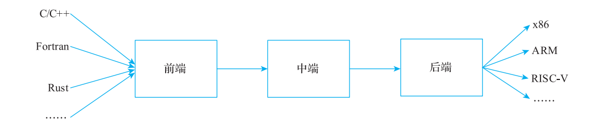

**图 2-1 编译器架构示意图**

前端：对程序进行解析，确保程序符合语言规定的词法、语法、语义规则。前端完成后通常将程序变换成另一种表示，这种新的表示一般更便于进行编译优化或者目标代码生成。

中端：目的是对程序进行优化。为了便于进行优化，通常使用 IR 来描述程序，不同的语言可以翻译成统一的 IR，这样针对 IR 进行的优化可以做到语言无关。中端常见的优化有常量传播（Constant Propagation，CP）、死代码消除（Dead Code Elimination，DCE）、循环不变代码外提（Loop Invariant Code Motion，LICM）、循环展开（Loop Unrolling，LU）等。

后端：目的是将程序翻译成目标机器可以识别的机器码。后端的工作通常包括指令选择、指令调度、寄存器分配和机器码生成。

注意：通常我们提到的优化都是指语言无关、架构无关的编译优化，但现实中也存在一些

语言相关、架构相关的优化技术，这些优化技术都是对特定问题的分析和解决，不

在本书的讨论范围内。

IR 是编译优化的基础，本章将主要讨论 IR 相关知识。

## 2.1 IR 分类

在编译器的实现中，不同的阶段会根据不同的目的使用不同的 IR 表示，常见的 IR 分类如下。

### 2.1.1 树 IR

最典型的树 IR 就是 AST（Abstract Syntax Tree，抽象语法树）。AST 通常在编译器前端实现中使用，主要原因是高级语言的语法通常都使用上下文无关的文法。使用 AST 不但可以简单、直接地表达源程序的语法，还可以使用属性文法对原程序进行翻译，以生成供中端使用的 IR。例如 Clang 中就是使用 AST 对源程序进行分析，以代码清单 2-1 中的 add源码（整型加法）为例来看看 Clang 生成的 AST。

**代码清单 2-1 源码 add（2-1.c）**

```c
int add(int a, int b) {
    return a + b;
}
```

使用 Clang○一进行编译，编译命令为 clang -Xclang -ast-dump -fsyntax-only 2-1.c，获得的 AST 如图 2-2 所示。

在图 2-2 中，函数对应 FunctionDecl，函数体对应复合语句节点（CompoundStmt），该节点包含了 return 语句的节点（ReturnStmt）。而 return 节点又是由一个二元操作节点构成（add 是二元操作的一种类型）的，二元操作节点包含了两个表达式（都是 DeclRefExpr）。AST形式是非常自然的表达形式，它可以通过文法解析得到。

**图 2-2 AST 示例**（原图见本页版面）

### 2.1.2 线性 IR

线性 IR 使用如三元组、四元组或者自定义的 IR 描述。

LLVM 中端使用的 LLVM IR 是一种线性 IR，编译优化都是基于 LLVM IR 的。使用Clang 编译代码清单 2-1 可以获得线性 IR，编译命令为 clang -S -emit-llvm 2-1.c -o 2-2.ll，对应的 IR 如代码清单 2-2 所示。

○一如果没有特殊说明，原书工具配套 LLVM 15；本校订以 LLVM 18.1.8 为准，后续运行实验时应使用同版本的 Clang/opt/llc。

**代码清单 2-2 代码清单 2-1 对应的 IR（2-2.ll，LLVM 18 opaque pointer 形式）**

> 原书采用 `i32*` typed pointer。LLVM 18 仅支持 opaque pointer，改为 `ptr`；载入/存储的数据类型仍由指令上的 `i32` 指定。这里省略目标信息和 Clang 属性，属于静态审查过的示意 IR，不是本轮编译器输出。

```llvm
define i32 @add(i32 %0, i32 %1) {
    %3 = alloca i32, align 4
    %4 = alloca i32, align 4
    store i32 %0, ptr %3, align 4
    store i32 %1, ptr %4, align 4
    %5 = load i32, ptr %3, align 4
    %6 = load i32, ptr %4, align 4
    %7 = add nsw i32 %5, %6
    ret i32 %7
}
```

线性 IR 的表达能力非常完备，每一条 IR 语句都完成一个简单的功能，例如对上述 IR功能的解析如代码清单 2-3 所示。

**代码清单 2-3 代码清单 2-1 对应的 IR 解析**

```llvm
define i32 @add(i32 %0, i32 %1) {
    %3 = alloca i32, align 4 ; 分配一个栈变量，类型是i32，4字节对齐，用虚拟寄存器%3表示变量地址
    %4 = alloca i32, align 4 ; 分配一个栈变量，类型是i32，4字节对齐，用虚拟寄存器%4表示变量地址
    store i32 %0, ptr %3, align 4 ; 将参数%0存放在%3的栈变量中
    store i32 %1, ptr %4, align 4 ; 将参数%1存放在%4的栈变量中
    %5 = load i32, ptr %3, align 4 ; 将%3的栈变量加载到虚拟寄存器%5中
    %6 = load i32, ptr %4, align 4 ; 将%4的栈变量加载到虚拟寄存器%6中
    %7 = add nsw i32 %5, %6 ; 将两个虚拟寄存器%5、%6进行相加，结果放在虚拟寄存器%7中
    ret i32 %7 ; 返回%7
}
```

### 2.1.3 图 IR

图 IR 使用图表示源程序，由于通过图可以较为方便地得到程序的控制流，这将有利于编译优化过程。CFG（Control Flow Graph，控制流图）就是典型的图IR。在某些编译器中还有一些其他的图 IR 表示，例如JVM 的 C2 编译器、V8 的 TurboFan 编译器都采用 sea-of-nodes 的图 IR。图 2-3 展示了一个 while 循环对应的CFG。

**图 2-3 CFG 示意图**（原图见本页版面）

假设示例函数 factor 计算整数阶乘，其源码如代码清单 2-4 所示。使用有符号 int 时结果须能表示，溢出行为不能当作任意精度阶乘。

**代码清单 2-4 阶乘运算示例源码 factor**

```c
int factor(int n) {
    int ret = 1;
    while (n > 1) {
        ret *= n;
        n--;
    }
    return ret;
}
```

利用 Clang 生成 LLVM IR，然后利用 opt○一工具生成 CFG。其对应的 CFG 示意图和对应的基本块（基本块将在 2.2.1 节介绍）如图 2-4 所示。

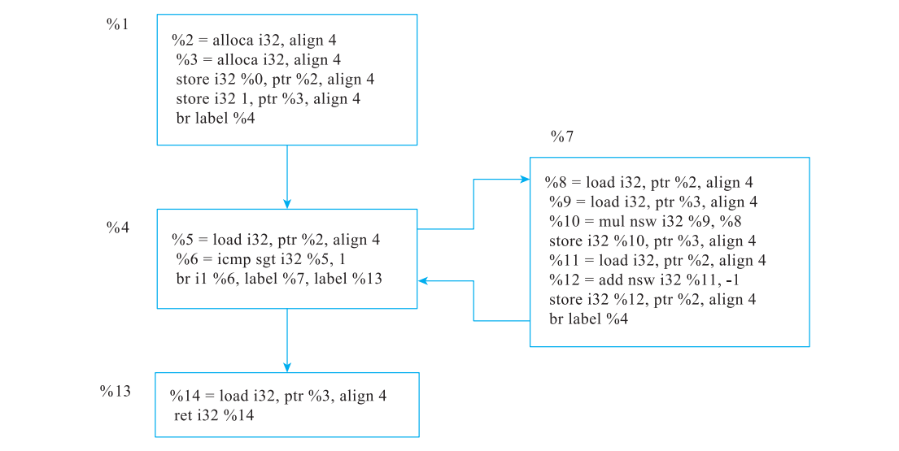

**图 2-4 CFG 示意图**

注意：LLVM 项目中主要使用线性 IR 和图 IR。LLVM 的中端主要基于线性 IR 实现语义的

表达，优化过程中很多优化会基于 CFG 进行。LLVM 的后端使用图 IR 和线性 IR，

例如在指令选择时使用图 IR，而在寄存器分配、代码生成时会将图 IR 变换成线性

IR，相关内容将在后续章节进一步介绍。

同一类型的 IR 在实现时也存在不同的实现方式，例如对线性 IR 采用静态单赋值形式能大大简化编译器的实现。现代主流的编译器基本上都是基于 CFG 和静态单赋值。2.2 节和 2.3 节将分别介绍 CFG 和静态单赋值的相关概念。

注意：为什么存在这么多 IR ？主要原因是不同 IR 的抽象程度不同，而且实现不同，同时 IR

对优化算法的实现有很大的影响。所以在实际使用中会根据不同的需求选择不同的 IR。

○一可以使用 `opt -passes=dot-cfg -disable-output factor.ll` 生成 dot 文件，再将 dot 文件可视化就可以得到 CFG。例如将 dot 文

件通过在线工具 GraphvizOnline（https://dreampuf.github.io/GraphvizOnline/）进行可视化处理，可以直接

得到 CFG。

## 2.2 CFG 的基本块与构建

CFG 使用图的方式来描述程序的执行，为了简化描述，CFG 引入了基本块（Basic Block，BB）的概念。首先把代码划分成基本块，基本块作为 CFG 的节点，CFG 中的边描述了基本块之间的执行顺序。

### 2.2.1 基本块

基本块是一段最长连续执行的指令序列，且满足以下条件。

1）只能从第一行指令开始执行（保证指令序列只有一个入口）。

2）除最后一条指令外，指令序列中不包含分支、跳转、终止指令（保证指令序列只有一个出口）。

上述是传统基本块的直观描述。对 LLVM IR，块以显式 terminator 结尾，普通 `call` 可能不返回或抛出异常，所以不能断言第一条指令执行后其余指令必然执行一次；LLVM 的 CFG 由 terminator 的显式后继定义。

通常基本块会基于 IR 进行划分，主要原因是高级语言中一行代码包含的信息比较多，需要将高级语言转化为 IR 后再划分基本块。

CFG 的生成包含两步：识别基本块、建立基本块之间的关联。

1）识别基本块的关键在于识别基本块的 leader 指令，符合以下三种情况之一的指令可以成为 leader。

① 指令序列的第一行是 leader。

② 任何条件或者非条件跳转指令的目标行指令是 leader。

③ 任意条件或者非条件跳指令的下一行指令是 leader。

2）定义基本块边界。定义基本块边界的规则如下。

① leader 是基本块的一部分。

② leader 到下一个 leader 之间的指令序列构成基本块。

基本块之间的关联非常简单，反映了基本块之间的执行顺序。当一个基本块跳转到另一个基本块时，即这两个基本块之间存在关联。

根据基本块的定义，当遇到以下指令时会产生一个新的基本块。

1）过程和函数入口点。

2）跳转或分支的目标指令。

3）条件分支之后的“直通”（fallthrough）指令。

4）在显式异常控制流 IR 中，`invoke` 等 terminator 的正常/异常后继是独立基本块；普通可能抛异常的 `call` 之后不必据此新建块。

5）异常处理程序的起始指令。

而一个基本块的结束指令可能是：

1）直接和间接的无条件和条件分支指令。

2）LLVM IR 中显式具有正常/异常后继的 `invoke`，以及其他异常处理 terminator。并非每一条可能抛异常的普通 `call` 都是块终结指令。

3）返回指令（return）。

4）不返回的普通 `call` 仍不是 terminator，通常后接 `unreachable`；`ret`、`br`、`switch`、`invoke`、`callbr` 等才按各自定义结束 LLVM 基本块。

注意：调用指令本身不是基本块的开始或者结束指令，它应该包含在基本块中。调用指令

如果正常返回会继续执行下一条指令，但也可能不返回；不能仅以动态控制流行为判定它是否是

基本块的边界指令。

### 2.2.2 构建 CFG

当确定基本块之后，再构造 CFG 就显得容易多了。CFG 是一个有向图：它以基本块作为节点，如果一个基本块 A 执行完之后，可以跳转到另一个基本块 B，则图中包含从 A节点到 B 节点的有向边，CFG 图描述了程序控制流的所有可能执行路径，具体的构建方法如下。

1）如果当前基本块以分支指令结尾，则在当前基本块与所跳转到的目标基本块之间加入一条有向边。

2）如果当前基本块以条件分支指令结尾，则在当前基本块以及跳转条件成立、不成立的目标基本块之间分别加入一条有向边（共两条边）。

3）如果当前基本块以返回指令结尾，则不需要加入新的边。

4）对支持隐式 fallthrough 的线性 IR，可按布局补直通边；LLVM IR 本身没有隐式 fallthrough。所有基本块必须以 terminator 结尾，CFG 边直接取其后继，不能靠文本邻接关系补边。`switch` 等还可能有两个以上后继。

在所有的基本块都扫描完毕后，CFG 就建立完成了。

## 2.3 静态单赋值

SSA（Static Single Assignment，静态单赋值）是三位研究员在 1988 年提出的一种 IR○一，它是目前编译优化中使用最广泛的技术，在 LLVM 代码生成中经过指令选择后的 IR 为SSA 形式，基于 SSA 有不少相关的编译优化，在寄存器分配时先析构 SSA 再完成寄存器分配。正如 SSA 的名字所示，它有以下特点。

1）静态：对代码进行静态分析，不需要考虑代码动态的执行情况。

2）单赋值：每个变量名只被赋值一次。

○一参见 Barry Rosen、Mark N. Wegman、F. Kenneth Zadeck 于 1988 年撰写的“ Global value numbers and

redundant computations”。

### 2.3.1 基本概念

首先来探讨单赋值这个概念，代码清单 2-5 所示是一段 C 代码，为了描述方便，在每一条语句之前增加了编号，形如“1:”表示语句 1。

**代码清单 2-5 单赋值示例代码**

```text
1：x = 1;
2：y = x +1;
3：x = 2;
4：z = x +1;
```

在这个代码片段中，变量 x 被定义 / 赋值两次（语句 1 和语句 3），不符合变量单次赋值的要求。为了让代码的形式满足 SSA 形式，需要引入变换，对多次赋值的变量进行重命名，例如在语句 3 中引入一个新的变量 t，后续所有使用 x 的语句都修改为使用变量 t。在SSA 的变换中，为了更形象地描述 x 和 t 之间是变量重命名的关系，通常是为变量引入版本信息（通过下标来描述版本），例如语句 1 和语句 2 中的 x 替换为 x1，语句 3 和语句 4 中的 x 替换为 x2，以保证语义的正确性（为什么引入版本信息，而不是使用完全无关的变量，主要是方便 SSA 构造，参见 2.3.2 节），对应的 SSA 形式如代码清单 2-6 所示。

**代码清单 2-6 SSA 示例代码**

```text
x1 = 1;
y = x1 +1;
x2 = 2;
z = x2 +1;
```

SSA 的形式看起来比较简单，但是引入了重命名的变量会带来新的问题，主要是变量汇聚问题。下面通过代码清单 2-7 所示的示例来介绍变量汇聚问题。

**代码清单 2-7 带变量汇聚的单赋值示例代码**

```text
1：y = 0；
2：if (x > 42) then {
3：   y = 1;
4：} else {
5：   y = x +2;
6：}
7：print(y);
```

在这个代码片段中，变量 y 在语句 1、语句 3 和语句 5 中共被赋值 3 次，按照变量重命名的规则，使用 3 个变量 y1、y2 和 y3 对这 3 次赋值进行替换，可得到代码清单 2-8 所示的代码：

**代码清单 2-8 带变量汇聚的 SSA 示例代码**

```text
1：y1 = 0；
2：if (x > 42) then {
3：   y2 = 1;
4：} else {
5：   y3 = x +2;
6：}
7：print(y); //这里是汇聚点
```

但是语句 7 则有新的问题，此处 y 的值既可能是 y2 也可能是 y3（取决于分支的执行路径），所以需要引入一个新的表达方式将 y2 和 y3 重新汇聚为一个变量—这个方式就是引入 φ（Phi）函数。φ 函数本质上是一个选择操作，指从不同的执行路径中选择执行结果，例如当 if 语句执行时 φ 函数的结果为 y2，当 else 语句执行时 φ 函数的结果为 y3。语句 7 的 φ函数表示如代码清单 2-9 所示。

**代码清单 2-9 φ 函数表示**

```text
y4 = φ(if:y2, else:y3);
```

这里定义一个新的变量 y4 表示 φ 函数的结果，那么语句 7 中的 y 则可以替换为 y4，结果如代码清单 2-10 所示。

**代码清单 2-10 使用 y4 表示 φ 函数结果**

```text
1：y1 = 0;
2：if (x > 42) then {
3：   y2 = 1;
4：} else {
5：   y3 = x +2;
6：}
7：y4 = φ(if:y2,else:y3);
8：print(y4);
```

实际上，汇聚信息通过 CFG 更容易被描述，CFG 中的交叉点就是汇聚点。例如，代码清单 2-10 对应的 CFG 如图 2-5 所示，在图中汇聚点可引入 φ 函数。

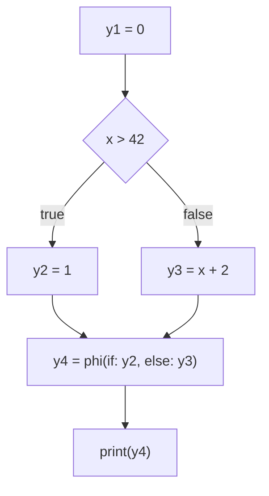

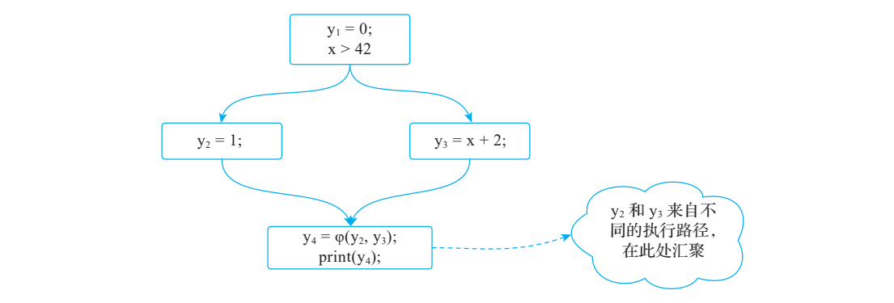

**图 2-5 分支语句的 SSA 形式的 CFG**

下面讨论 SSA 中的静态含义，例如循环中定义的变量也只考虑一次赋值，而不考虑循环的动态执行情况。考虑一个 C 代码片段，如代码清单 2-11 所示。

**代码清单 2-11 静态 SSA 示例源码**

```text
1：x = 0;
2：y = 0;
3：do {
4：   y = y + x;
5：   x = x +1;
6：} while (x < 10);
7：print(y);
```

在代码清单 2-11 中，x 和 y 各有两处静态定义，需要分别重命名。循环体执行 10 次并不意味着一条定义违反 SSA：SSA 限制的是静态定义点个数，执行时可以产生一系列动态值。原图 2-6 把 do-while 画成了先判断的循环；虽然这个初始化下结果可能相同，两种 CFG 的一般语义不同，正确对应清单 2-11 的形式如下。

```text
entry:
    x1 = 0
    y1 = 0
    jump loop
loop:
    x2 = phi(entry: x1, loop: x3)
    y2 = phi(entry: y1, loop: y3)
    y3 = y2 + x2
    x3 = x2 + 1
    branch (x3 < 10), loop, exit
exit:
    print(y3)
```

**图 2-6 循环 SSA 形式示意图**：原图保留在页快照中，循环条件位置和出口使用值以以上修正版为准。此处是通用 SSA 伪代码，非 LLVM IR 文法。

引入 SSA 形式的目的在于简化编译器的实现，每个变量名只对应一次赋值操作，在变量使用的地方要查看变量定义信息，可以直接通过 IR 得到。这意味着变量的 Use-Def（使用 – 定义）○一关系在 IR 中是显式提供的，不需要通过到达定值分析猜测定义点；LLVM 仍以 Value/Use 等实际数据结构维护 use-def 关系。这种形式使得 IR 结构变简单，将有利于编译器的实现。（特别是需要使用 Use-Def 关系的场景，将可以直接获取到这一信息。）

引入 φ 函数后，SSA 的表达能力就完备了（可以描述所有的功能），但通常硬件并没有相应的指令描述 φ 函数，所以引入 φ 函数后还需要在编译结束阶段（通常是指令生成阶段）将 φ 函数消除。另外，φ 函数有自己的特点，在编译优化时会引入新的问题，2.3.3 节将会进一步讨论。

由此可以总结使用 SSA 涉及的三种处理。

1）识别多次定义的变量，将其进行重命名。

○一 Use-Def 信息是编译优化中非常重要的信息，很多编译优化算法都会使用 Use-Def 信息。本书后续内容

介绍的相关算法会展示如何使用 Use-Def 信息。

2）在汇聚点插入 φ 函数。

3）在 LLVM 常规机器代码流水线中，由寄存器分配前的 PHIElimination 等步骤消除机器 PHI。SelectionDAG 阶段仍会为跨块汇聚生成机器 PHI，不能说一结束指令选择就已消除所有 PHI。

前两种处理用于构造 SSA，后一种处理是析构 SSA，2.3.2 节和 2.3.3 节将分别讨论相关内容。

### 2.3.2 SSA 构造

SSA 的构造涉及两步：变量重命名和插入 φ 函数。在代码清单 2-10 所示的例子中可以发现，插入 φ 函数后会增加新的变量定义（见图 2-5，在插入 φ 函数后引入变量 y，用于保存 φ 函数的结果），所以插入 φ 函数后需要执行变量重命名（如将 y 重命名为 y4），因此SSA 构造算法可以调整为先插入 φ 函数再执行变量重命名。

而插入 φ 函数需要找到变量的汇聚点，典型方法是通过支配边界来计算。支配边界是基本块在 CFG 中的支配关系边界，不是单独针对某个变量的集合。对一个变量，应计算其定义块集合的迭代支配边界（IDF）；新插入的 φ 定义还可能引出更多插入点（具体参见第 4 章）。由此 SSA 构造算法可以分解为 4 步。

1）遍历程序构造 CFG（参见 2.2.2 节）。

2）计算支配边界。

3）根据每一个基本块（记为 b）的支配边界（记为 DF(b)）确定 φ 函数的位置。DF(b)是基本块 b 所定义变量的汇聚点集合，对于基本块 b 定义的每一个变量在 DF(b) 中都放置着一个 φ 函数。注意，因为 φ 函数对变量进行了一次新的定义，所以在插入 φ 函数后可能会出现因引入了新的变量定义，而需要插入额外 φ 函数的情况。

4）变量重命名，并将后续使用原变量的地方修改为使用新的变量，通常可以采用栈的方式来更新后续变量的引用。

注意：在上述 SSA 构造算法中，为了保证放置 φ 函数的代价最小，需要计算支配树和支配

边界，根据支配边界放置 φ 函数，然后对变量进行重命名（如果要避免死 φ 函数，

需要执行活性分析或者死代码消除），因此执行成本比较高。Braun 等人优化了 SSA

构造算法，在 2013 年提出了快速、高效构造 SSA 的算法。本质上，前面介绍的算

法是沿着 CFG 前向进行操作的，即算法首先收集变量所有的定义，然后计算放置

φ 函数的位置。而 Braun 等提出的算法认为可以对 CFG 进行逆向操作，只有在使用

变量时才去处理所有涉及的定义点，更多内容参考具体论文“ Simple and Efficient

Construction of Static Single Assignment Form”○一。

### 2.3.3 SSA 析构

SSA 析构是指将 SSA 中的 φ 函数消除。从直觉上讲，SSA 析构似乎比较简单，以

○一参见 https://pp.info.uni-karlsruhe.de/uploads/publikationen/braun13cc.pdf。

图 2-7a 为例，通过赋值进行 φ 函数消除。

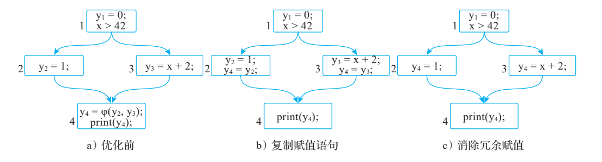

**图 2-7 简单 SSA 析构示意图**

本质上，消除 φ 函数的思路是将 φ 函数上移到前驱基本块中，并直接使用赋值语句消除 φ 函数。该方法也称为朴素（naive）算法。例如，将图 2-7a 中基本块 4 的 φ 函数 y4 =φ(y2, y3) 分别复制到基本块 2 和基本块 3 的最后，同时分别使用赋值语句更新 y4 的值：在基本块 2 中使用 y2 更新 y4，在基本块 3 中使用 y3 更新 y4，如图 2-7b 所示。然后，通过复制传播优化消除冗余赋值，可以得到图 2-7c 所示的结果。但是这样的消除方法在某些场景是不正确的，可能会引入 Lost Copy 问题和 Swap 问题。

1. Lost Copy 问题及解决方法

接下来以代码清单 2-12 为例说明 Lost Copy 问题。

**代码清单 2-12 Lost Copy 问题示例代码**

```text
1：i = 0;
2：do {
3：   t = i;
4：   i = i + 1;
5：} while (i < 10);
6：y = t + 1;
```

图 2-8a 是针对上述代码构建的 CFG 图。对图 2-8a 进行复制传播优化，可以发现：基本块 2 中的 t = i2 是冗余指令，是可以被删除的，得到优化后的 CFG 如图 2-8b 所示。按照消除 φ 函数的方法，分别将 i2 = φ(i1, i3) 分别复制到基本块 1 和基本块 2 的最后，同时分别使用赋值语句更新 i2 的值，在基本块 1 中使用 i1 更新 i2，在基本块 2 中使用 i3 更新 i2，此时得到的析构图如图 2-8c 所示。

但是此时程序的正确性发生了变化，计算得到 y 的结果和原始程序不同：原来程序 y的值为 10，消除 φ 函数后 y 的值为 11。导致这一结果的主要原因是变量的作用域发生了变化。在原始的 CFG 中变量 i1 的作用域为基本块 1，变量 i2 的作用域为基本块 2、3，在消除φ 函数后 i2 的作用域为基本块 1、2、3。

该问题称为 Lost Copy 问题，解决的方法有两种：一种是引入关键边的概念，通过对关

键边的拆分来解决该问题；另一种是通过变量冲突○一解决该问题。首先来看如何通过关键边的拆分解决该问题。SSA 析构 Lost Copy 问题的思路的示意如图 2-9 所示。

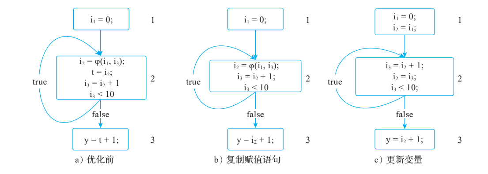

**图 2-8 代码清单 2-12 SSA 析构示意图**

先来介绍关键边的概念。关键边指的是 CFG 中边的源节点有多个后继节点，边的目的节点有多个前驱节点。例如，图 2-9a 中基本块 2 的 true 边对应的源节点是基本块 2。基本块 2 有两个后继节点：基本块 2 和基本块 3。true 边的目的节点仍然是基本块 2，基本块 2有两个前驱节点：基本块 1 和基本块 2。所以 true 边是关键边，解决这个问题的方法是拆分关键边，即引入一个新的基本块，这样就不存在关键边，如图 2-9b 所示。

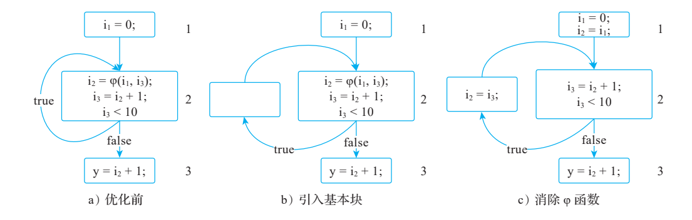

**图 2-9 Lost Copy 问题解决思路示意图**

引入关键边后再消除 φ 函数，可以得到如图 2-9c 所示的结果，该结果是正确的。

注意：关键边的作用除了在 SSA 析构中使用外，在部分冗余消除中也有使用。根本原因

是消除部分冗余后，也可能会扩大变量（或者表达式）的作用域，而通过关键边的

○一因为该问题的本质是变量的作用域发生了变化，从而引起变量活跃区间的冲突（参见本节后续介绍），所

以需要解决变量活跃区间冲突。一般的方法是先识别冲突变量，然后引入新的变量打破变量活跃区间的

冲突，通过对新变量赋值，以保证语义正确。

拆分可以解决这一问题○一。关于部分冗余消除的知识可以参考其他编译优化相关的

书籍。

2. Swap 问题及解决方法

除了 Lost Copy 问题外，SSA 析构时还可能出现 Swap 问题。Swap 问题是指，当一个基本块存在多个变量的汇聚时，需要为每个变量插入一个 φ 函数，从而导致存在多个 φ函数位于基本块的最前面的情况。但是多个 φ 函数之间应该按照什么样的顺序放置和执行呢？

同一基本块的多个 φ 不按书写顺序读取彼此刚更新的结果，而是在所走前驱边上按旧值同时选择各自的输入。这是语义上的并行赋值。机器通常没有直接对应的 φ 指令，析构时需把每条边上的并行复制转换成保持旧值语义的指令序列；这与 CPU 是否支持乱序或并行执行无关。例如，当多个 φ 函数定义的变量有依赖时（如两个 φ 函数定义的变量相互引用），并行 φ 函数的执行结果并不依赖于 φ 函数定义的顺序，但串行执行时 φ 函数定义的顺序将影响结果，因此串行执行 SSA 析构时会带来正确性的问题。下面给出一个简单的示例以说明Swap 问题，如代码清单 2-13 所示。

**代码清单 2-13 Swap 问题示例代码○二**

```c
int swap_problem(int n) {
    int x = 1;
    int y = 2;
    do {
        int temp =x;
        x = y;
        y = temp;
    } while (n > 10);
    return x/y;
}
```

对应的 CFG 图和 SSA 形式如图 2-10a 和图 2-10b 所示。在图 2-10b 中可以看到有两个φ 函数定义：x1 和 y1。

由于代码可能存在复制传播的优化○三，假设进行复制传播优化后的 SSA 形式如图 2-10c所示，其中 x1 依赖于 x0 和 y1，y1 依赖于 y0 和 x1，因此 x1 和 y1 相互依赖。

○一引入关键边以后，插入新的基本块，然后将赋值操作放入到新的基本块中，本质上就是将其作用域限制

在原有路径中，而不会引入赋值指令将其作用域扩大。

○二注意该用例构造得不够完美，存在死循环。但使用该用例不影响读者理解 Swap 问题。

○三复制传播可以这么简单地理解：假设存在形如 temp0 = x1 这样的语句，如果 temp0 没有被重新赋值，则

可以使用 x1 替代 temp0。

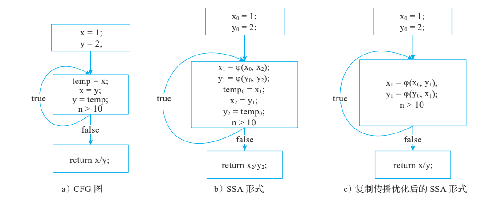

**图 2-10 SSA 析构 Swap 问题示意图**

现在对图 2-10c 进行 SSA 析构。因为图 2-10c 中存在的关键边，在析构 SSA 时可以先对关键边进行拆分，然后进行析构。当然也可以不拆分关键边，但关键边拆分后示例会更加简单，所以这里进行了关键边拆分。拆分关键边后以及进行析构 SSA 后的图分别如

图 2-11a 和图 2-11b 所示。

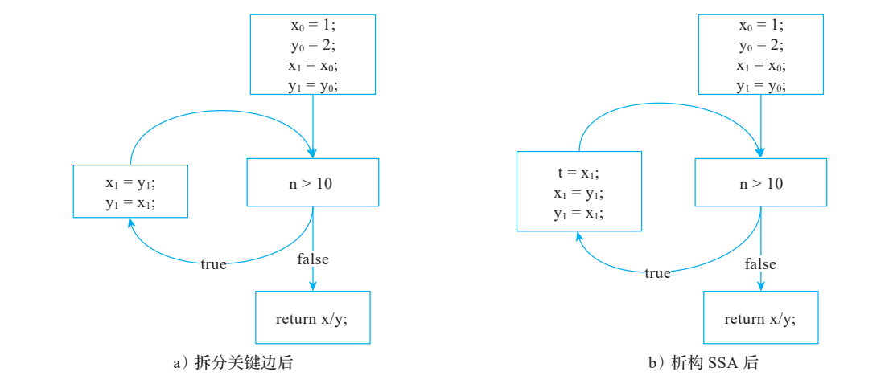

**图 2-11 关键边拆分示意图**

经过 SSA 析构后，程序逻辑发生了变化：图 2-10a 中循环是交换两个变量，但是

图 2-11b 并不会交换变量，两个变量得到同一个值，这就是“交换问题”。该问题的处理方法是，如果 φ 函数有依赖，则插入临时变量。

在析构循环体中的指令时，引入临时变量可以保证正确性（x1 和 y1 在相互赋值之前通过临时变量交换）。实际上，φ 函数依赖还可以进一步分为循环依赖和非循环依赖。对这两

种不同的依赖处理方法也有所不同。

循环依赖可以引入临时变量解决，非循环依赖可以通过变量排序解决。假设有两个非循环依赖 φ 函数，如代码清单 2-14 所示。

**代码清单 2-14 非循环依赖 φ 函数代码示例**

```text
x2 = φ(x0, x1);
y2 = φ(y0, x2);
```

如果两个 φ 位于同一循环头，在来自回边的并行复制中，右侧 `x2` 表示旧迭代的值。对应复制是 `x2 <- x1`、`y2 <- old(x2)`，必须先保存旧 x2：例如顺序 `y2 = x2; x2 = x1;`。原文“先执行 x2 再执行 y2”会覆盖尚需使用的旧值。依赖必须按具体前驱边构造，不能只按 φ 的书写顺序排序。

综合这两种依赖来看，在进行 SSA 析构时，如果一个基本块有多个 φ 函数，首先需要判断 φ 函数的依赖关系，再根据依赖关系分别进行处理：

1）如果存在循环依赖，则引入临时变量。

2）如果边上的并行复制依赖图无环，选择不会覆盖其他尚未读取源值的复制顺序；如果成环，则借助临时值破环。

3）如果不存在依赖，则进行复制析构（这种复制析构也称为朴素析构）。

在一些编译器或者虚拟机的实现中就是采用上述解决方案（例如 JVM 的 C1 编译器）来解决 Lost Copy 和 Swap 问题的。

3. SSA 形式变换

除了上述的解决方案，还有一种通过变换 SSA 形式来解决 Lost Copy 和 Swap 问题的方法，该方法涉及 C-SSA（Conventional SSA，常规 SSA）、T-SSA（Transformed SSA，变换 SSA）、变量活跃区间、变量冲突等概念，下面先简单介绍一下相关概念。

变量活跃区间是指变量在一个区间内活跃，当变量不在区间中时，则认为变量是死亡的。变量活跃区间示例如代码清单 2-15 所示。

**代码清单 2-15 变量活跃区间示例**

```text
1: a = 1;
2: b = a + 1;
...b...; //b被使用，说明b是活跃的
```

假设变量 a 在语句 2 以后不再被使用，变量 b 在语句 2 以后还会被使用，现在分析变量 a 的活跃区间。直观上看，变量 a 在语句 1 处被定义，在语句 2 处被使用，可以认为变量 a 在区间 [1，2] 活跃（区间包含语句 1 和语句 2）；而变量 b 在语句 2 处被定义，它的活跃区间是 [2, ...]。再对变量 a 和变量 b 进一步分析可以发现：虽然变量 a 和变量 b 都在语句2 处活跃，但活跃区间有所不同。变量 a 在语句 2 中最后一次被使用，即这里是其活跃区间的终点；而变量 b 在语句 2 中被定义，这里是其活跃区间的起点，故而实际上变量 a和变量 b 的活跃区间并不重叠（即可以把变量 a、b 分配到同一个寄存器中）。因此，把指令位置细分为读/写时刻后，可用半开区间表示活跃性，a 的最后读取与 b 的正常定义可以不重叠；early-clobber、固定寄存器等目标约束仍可能禁止共用寄存器。LLVM 使用 SlotIndex 等机制，不能仅用语句编号相等判断干涉。变量冲突指的是变量的活跃区间重叠，如果变量之间的活跃区间不重叠，则说明变量不

冲突。

C-SSA 和 T-SSA 可以简单地认为是对 SSA 的分类，它们是析构算法中非常重要的概念，其中 C-SSA 指的是可以通过朴素算法直接析构的 SSA 形式，而 T-SSA 不能直接采用朴素算法进行 φ 函数的析构，故而只要将 T-SSA 转换成 C-SSA，则所有 SSA 都可以通过朴素算法进行析构。那么 C-SSA 和 T-SSA 的根本区别是什么？下面通过一个例子来直观地认识这些区别，如图 2-12 所示。

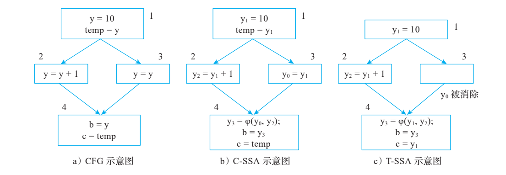

**图 2-12 C-SSA 和 T-SSA 的区别**

在图 2-12 中，T-SSA 和 C-SSA 相比，由于优化（如复制传播）的缘故而将冗余代码删除。在分支中 y0 = y1，将右侧 y1 传播替换后续使用的 y0，φ 函数变成 y3 = φ(y1, y2)，经过编译优化后的SSA 在满足一些特性后就被称为 T-SSA。在 C-SSA 中，φ 函数中引用的变量的活跃区间不冲突；而在 T-SSA 中，φ 函数引用的变量活跃区间发生了冲突。例如在图 2-12c 中，y1 和y2 在基本块 2 存在活跃区间冲突；在图 2-12b 中，y1 和 y2 在基本块 2 并不存在活跃区间冲突。所以，SSA 消除算法的核心就是将 T-SSA 变换为 C-SSA，通过变换解决 T-SSA 中 φ 函数引用参数的变量冲突问题。

注意：这里提到变量的活跃区间冲突并不准确，更为准确的说法是 web（网）的冲突。

在寄存器分配中有一个 web，一些寄存器分配算法的粒度是 web，而不是变量。web 是Def-Use（简写为 du）链中每一个 Def 或者 Use 的最大并集，即如果 du 链能关联 Use 或者Def，则 Use 和 Def 都在 du 链中，web 的具体计算方法如下。

1）计算每个变量的 du 链。

2）du 链中有公共 Def 或者 Use，说明不同的 du 链有相交的部分，求并集，则构成了web。

此处 φ-web 是通过 φ 的结果与输入之间的等价联系作传递闭包形成的集合，包含左侧结果和右侧输入。若同一 φ-web 内有成员互相干涉，则不满足 C-SSA 的无干涉条件，需要将其变换为 C-SSA。实现这一转换有两种典型的算

法，分别是 Briggs 算法和 Sreedhar 算法，其算法思想如下。

1）Briggs 算法：在 φ 函数中插入一条额外的 COPY 指令后再删除 φ 函数。首先在 φ函数的前驱节点中直接插入 COPY 指令，然后在 φ 函数定义的变量位置引入一个新的变量并插入一条 COPY 指令（而不直接重用原来 φ 函数定义的变量），通过引入新的变量解决变量活跃区间冲突。当然在插入变量时需要考虑顺序。

2）Sreedhar 算法：完全不同于 Briggs 算法，Sreedhar 算法先考察 φ 函数中使用的变量是否存在冲突：如果变量之间存在冲突，则引入新的变量，并使用 COPY 指令缩短变量的活跃区间；如果变量之间不存在冲突，则直接使用 φ 函数定义的变量替换 φ 函数使用的变量，最后删除 φ 函数。

其中 Briggs 算法非常简单（和朴素算法类似，区别在于引入了额外的变量用于缩短变量的活跃区间），但该算法最大的问题是插入过多的 COPY 指令，当然后续可以通过寄存器合并，以减少 COPY 指令。但研究证明，该算法析构 SSA 后仍有不少冗余的 COPY 指令。Sreedhar 算法稍微复杂○一，此处不展开介绍。下面通过例子来比较一下 Briggs 算法和Sreedhar 算法，原始 SSA 的代码优化示意图如图 2-13a 所示。

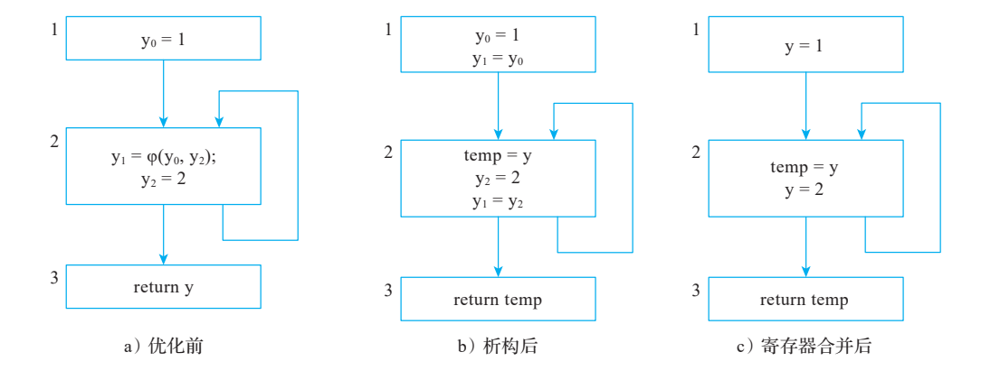

**图 2-13 Briggs 算法析构以及优化示意图**

按照 Briggs 算法对图 2-13a 中的 φ 函数进行析构。因为 φ 函数定义的变量为 y1，所以在基本块 1 中引入 y1 = y0 的 COPY 指令，在基本块 2 中引入一个新的临时变量 temp，同时引入类似 temp = y1 的 COPY 指令，之后在基本块 2 的尾部引入类似 y1 = y2 的 COPY 指令，这样就完成了 SSA 析构，得到如图 2-13b 所示的结果。由于 SSA 析构引入了大量的 COPY指令（共计 3 条 COPY 指令），可以执行寄存器合并的操作，得到如图 2-13c 所示的结果。

根据 Sreedhar 算法对图 2-13a 中的 φ 函数进行析构。首先计算变量的冲突情况，如

图 2-14a 所示，可以看到：基本块 2 中 y1 和 y2 冲突（如图中蓝色框所示），所以在基本块 2 中

○一上述算法的正确性证明以及算法性能可以参考相关文献。

直接引入新的变量 y1'，并将语句变成 y1' = φ(y0, y2) 和 y1 = y1'，如图 2-14b 所示。在图 2-14b 中，应检查包含新结果 y1' 及相关输入的整个 φ-web 内的干涉；合并使用已定义的新名字，不能引入无定义的 y。具体替换须把同一 φ-web 中可安全合并的结果与输入一致重命名，再删除对应 φ，不能只改某一个输入就删掉整个汇聚。得到析构结果如图 2-14c 所示。

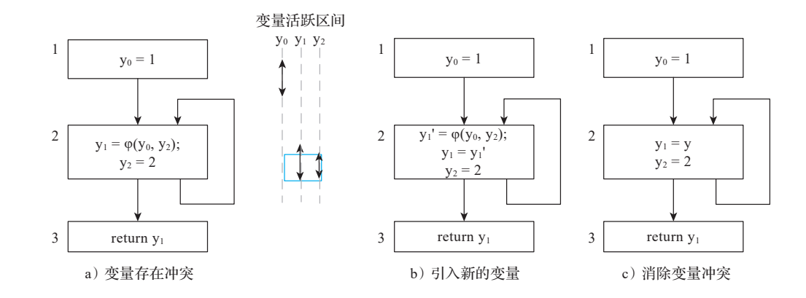

**图 2-14 Sreedhar 算法析构示意图**

在 Sreedhar 算法中，可对 φ 结果或输入做复制插入，以分离互相干涉的值。例如引入结果 y1' 并在 φ 后复制 `y1 = y1'`；或改用输入 y2'，并在对应边插入 `y2' = y2`。这是一般算法的说明，并非 LLVM PHIElimination 的逐行翻译。

从图 2-13 的简单例子看，两种方法可得到相同效果。更复杂的例子中，复制插入位置会影响干涉及后续合并机会。原始 SSA 如图 2-15（见原书第 27 页版面）所示；图中的出口变量应与到达该出口的版本一致，不能把无定义的 `return y` 视为完整合法 SSA。

**图 2-15 原始 SSA**（完整版面见原 PDF）

使用 Briggs 式复制插入分析图 2-15，可以观察图 2-16 的活跃区间干涉；是否能合并要看全部路径及使用，不能仅比较变量名字或书写位置。

采用 Sreedhar 算法对图 2-15 所示的代码进行 SSA 析构，同时分析变量的活跃区间，结果如图 2-17 所示。

从图 2-17 中可以看出，y2 和 temp 的活跃区间不重叠，所以可以合并。在这个例子中，Sreedhar 式选择复制位置留下了更好的合并机会，不能推广为所有输入都必然更好（还可以通过复制传播进一步优化，上述例子并没有体现复制传播优化的结果）。

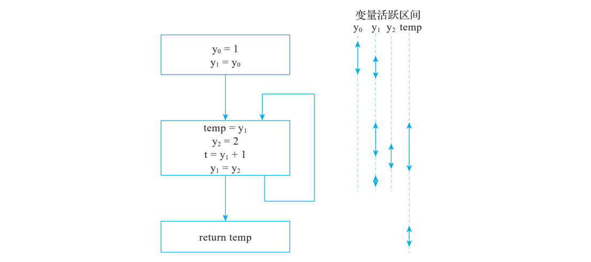

**图 2-16 Briggs 算法析构以及变量活跃区间**

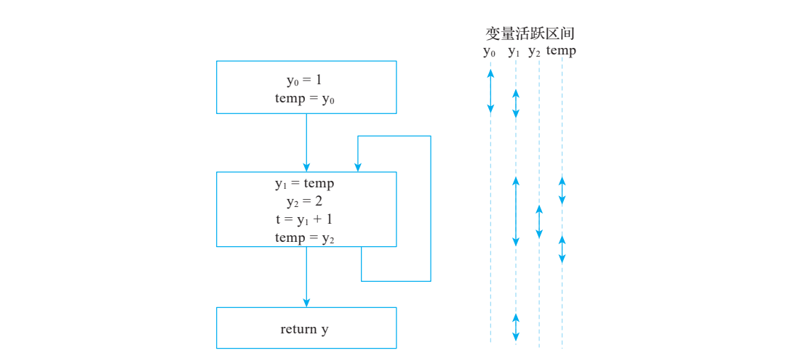

**图 2-17 Sreedhar 算法析构以及变量活跃区间**

### 2.3.4 SSA 分类

根据变量的活跃情况不同，SSA 常见的分类有最小 SSA、剪枝 SSA、严格 SSA，其定义如下。

1）最小 SSA（minimal SSA）：它的特点是，在同一原始变量的两个不同定义的路径汇合处插入一个 φ 函数，这样得到的 SSA 就是拥有最少 φ 函数数量的 SSA 形式。这里的最小不包含一些优化（比如消除死代码中可消除的 φ 函数）后的结果。

2）剪枝 SSA（pruned SSA）：指的是如果变量在基本块的入口处不是活跃（live）的，

就不必插入 φ 函数。通常有两种方法：第一种方法是在插入 φ 函数的时候进行活跃变量分析，只对活跃变量插入 φ 函数；第二种剪枝方法是在最小 SSA 上进行死代码消除，删掉多余的 φ 函数。需要注意的是，获得剪枝 SSA 的成本比较高，所以可以采用一些折中的方法，例如插入 φ 函数前先去掉仅位于同一个基本块的变量，这样既减少了变量个数也减少了计算活跃变量集的开销。

3）严格 SSA（strictly SSA）：如果一个 SSA 中，每个 Use 被其 Define 支配（如果从程序入口到一个节点 A 的所有路径都先经过节点 B，则称 A 被 B 支配，具体参见第 4 章），那么该 SSA 称为严格 SSA○一。

不同分类的 SSA 在后续优化中处理会略有不同。2.3.2 节以迭代支配边界放置 φ 的经典最小 SSA 构造，不等于所有 φ 的结果都会被使用；缺少 live-in 剪枝时仍可能生成死 φ。LLVM mem2reg 使用 live-in 信息进行剪枝，见本章源码对照。

注意：在一些编译优化过程中，由于程序的变换会导致代码不再符合 SSA 形式，因此要使

用 SSA 的特性，就必须重新构造或者重命名变量，以保持 SSA 形式。

### 2.3.5 基本块参数和 Phi 节点

在构造 SSA 形式时，目前业界主要在汇聚点使用 φ 函数表示来自不同路径的同一个变量。最近几年，学者在一些编译器（例如 MLIR、Swift 等）中使用基本块参数（basic block argument）替代 φ 函数，主要是因为 φ 函数使用比较困难，主要表现如下。

1）φ 函数必须位于基本块的头部。

2）本质上 φ 函数是并行执行的，所以在析构时要防止产生 Swap 问题。

3）前驱多会增加每个 φ 的 incoming 项数；φ 的数量取决于需要汇聚的 SSA 值数量，并不是每多一个前驱就增加一个 φ。变换算法仍须维持 φ 的并行选择语义。

基本块参数和 φ 函数本质上并无差别，只是在表现形式上略有不同。仍然以代码清单 2-11 为例，对应的基本块参数表示如代码清单 2-16 所示。

**代码清单 2-16 代码清单 2-11 对应的基本块参数表示**

```text
entry:
    x1 = 0；
    y1 = 0;
jump loop(x1, y1)

loop(x2,  y2):
    y3 = y2 + x2;
    x3 = x2 + 1;
    v1 = cmp lt x3, 10
    branch v1, loop(x3, y3), exit(y3)

exit(result):
    print(result)
```

○一一般而言，严格 SSA 是 IR 定义与支配关系的性质，不能由源语言“强类型/动态类型”推断。不同源语言的未初始化、未绑定或异常语义应由前端显式建模，生成的 LLVM IR 仍须遵守其合法性规则。

基本块 loop 有两个参数 x2 和 y2，用于接收基本块 entry 和 loop 在进入 loop 时的变量。相比 φ 函数，基本块参数只是将 φ 函数变成基本块的参数，所以两者本质上并无太大差别。基本块参数把边上传值显式放在分支中，可使一些遍历和变换更直观；参数绑定仍有并行语义，降低为寄存器复制时同样必须处理交换与边界放置问题。当然使用基本块参数也需要处理一些特殊情况，例如同一条指令多次使用同一个基本块，示例如代码清单 2-17 所示。

**代码清单 2-17 同一条指令多次使用同一个基本块的示例**

```text
entry:
    branch v12, block(v3), block(v4)

block(v20):
    ......
```

同一条分支指令的不同目的基本块都指向了同一个基本块。例如，entry 中有两个分支：block(v3) 和 block(v4)，运行时只选择其中一条边，按该边把 v3 或 v4 传入 block。MLIR 的基本块参数可以表示不同边携带不同值，这本身不构成逻辑错误。但转为 LLVM PHI 时，同一前驱的重复 incoming 项必须具有相同值；值不同则要先拆分边，或显式用 select 等形式保留选择语义。当然也可以要求前端不生成这样的 IR 形式，或者可以对这样的 IR 进行变换，可通过添加一个新的基本块来解决这一问题。

## 2.4 本章小结

本章主要介绍 IR 基础知识，涵盖 IR 的分类、控制流和基本块、SSA 相关知识（含义、构造、析构）。因为 LLVM 代码生成以及使用的 IR 主要是 SSA 形式，并且指令选择后的IR 也是 SSA 形式，所以编译器基于 SSA 会进行一系列编译优化，在寄存器分配时是先析构 SSA 再完成寄存器分配，所以本章详细讨论了 SSA。最后，本章还简单讨论了不同形式的 SSA 的实现思路，即 φ 函数和基本块参数。

## LLVM 18 实现对照与验证边界

- opaque pointer 演进见 [OpaquePointers.rst](/opt/llvm-project/llvm/docs/OpaquePointers.rst:265)。清单 2-2/2-3 已改 `ptr`，`;` 是 LLVM IR 注释符。`add nsw` 的有符号溢出结果是 poison，不生成运行时检查，见 [LangRef.rst](/opt/llvm-project/llvm/docs/LangRef.rst:4542)。
- `opt` 的新 Pass 名 `dot-cfg` 注册于 [PassRegistry.def](/opt/llvm-project/llvm/lib/Passes/PassRegistry.def:320)。若以后从 `-O0` Clang 输出运行 `mem2reg` 等优化，还应处理 `optnone` 属性；本文未执行这些工具。
- LLVM 的 `mem2reg` 使用定义块、live-in 集合和 IDF 放置 φ，见 [PromoteMemoryToRegister.cpp](/opt/llvm-project/llvm/lib/Transforms/Utils/PromoteMemoryToRegister.cpp:802)，属于剪枝构造，不能直接套用“所有汇聚块都插 φ”的教学简化。
- LLVM 机器 PHI 消除使用中间虚拟寄存器和前驱 COPY，见 [PHIElimination.cpp](/opt/llvm-project/llvm/lib/CodeGen/PHIElimination.cpp:269)。关键边拆分有活跃信息和循环布局启发式，见同文件第 675 行；LLVM 不拒绝合法的循环 φ，也不是对所有关键边都无条件拆分。
- 基本块 terminator、φ 排列、前驱和重复边值约束由 [Verifier.cpp](/opt/llvm-project/llvm/lib/IR/Verifier.cpp:2933) 检查。φ 输入的使用点按前驱边解释，严格 SSA 的支配要求不能误用为“必须在 φ 所在块之前定义所有回边值”。
- 清单 2-5～2-17 含通用 SSA/基本块参数伪代码；它们不构成可直接交给 `opt` 的 LLVM IR。后续应构造具体 IR，再检查解析、支配、变换和执行结果；本轮只完成静态语义核对。

## 原书逐页版面

本节保留原书页面，用于追溯图表、公式和历史输出；技术结论以校订正文及核查记录为准。
