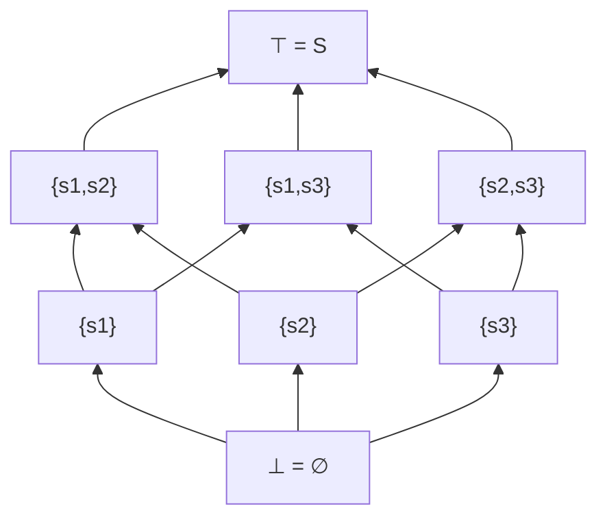
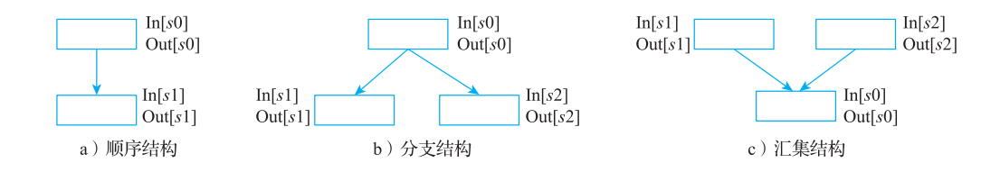
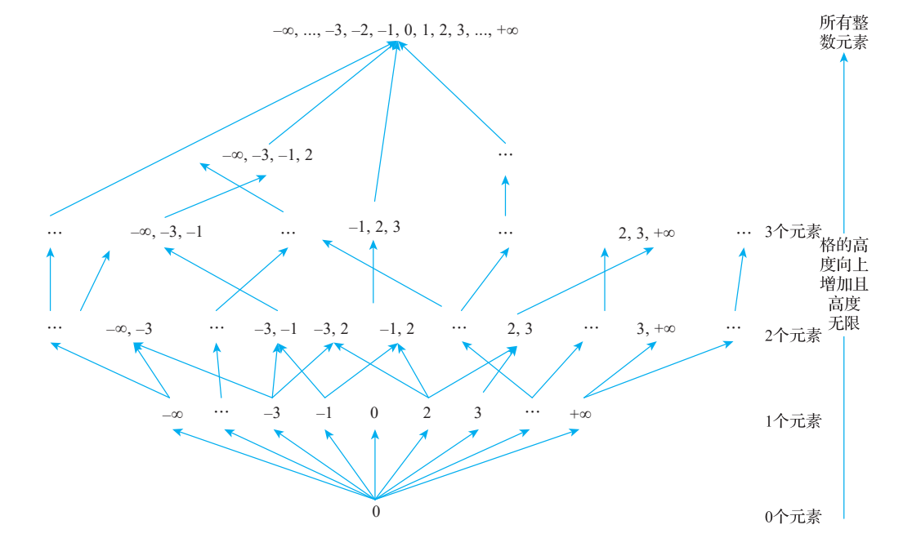
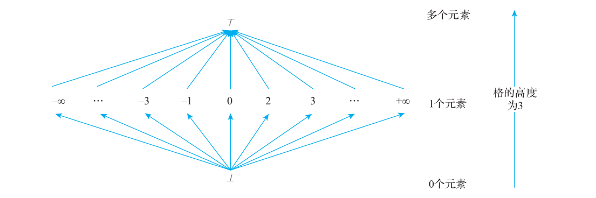
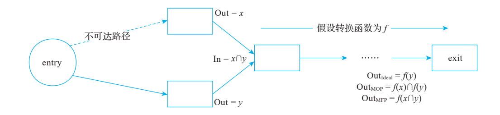
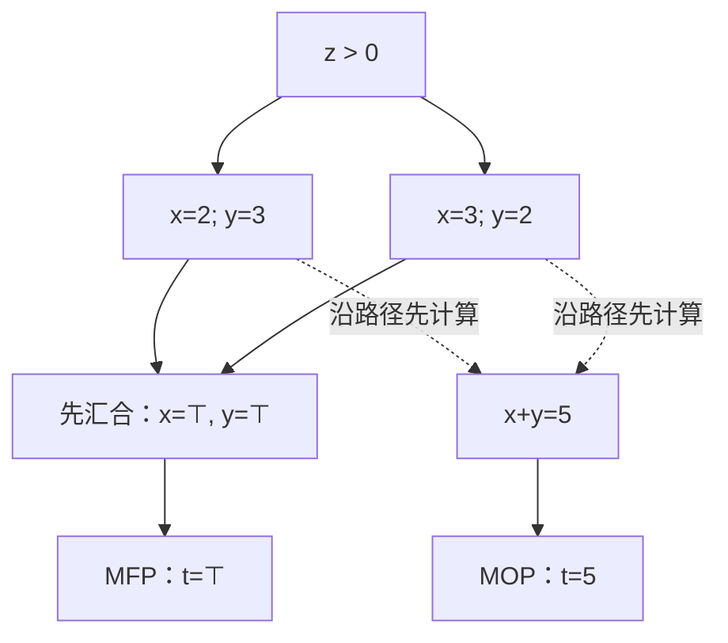
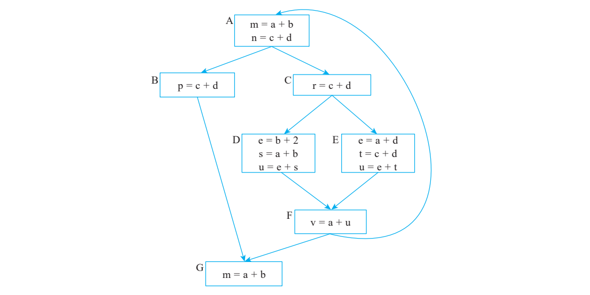
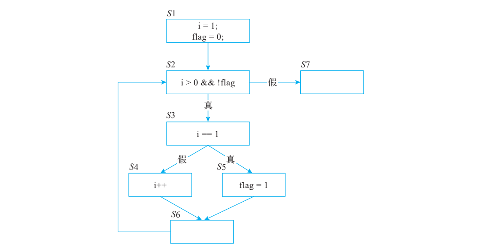

# 第 3 章数据流分析基础知识

> 校订基线：本书 LLVM 15（示例 15.0.1）；本章依据 `/opt/llvm-project` 的 LLVM 18.1.8，HEAD `3b5b5c1ec4a3095ab096dd780e84d7ab81f3d7ff` 作静态源码核查。未编译 LLVM，未执行本章 C/C++、LLVM IR、MIR 或汇编命令；具体输出与性能仍待运行确认。
> 保留原章全部章节、示例与图版。正文及文字代码按核查结果修订；原书图片和折叠页版面仅作对照，图片中的旧编号、版本结果和排印错误不代表 LLVM 18 输出。逐项记录见 [第 3 章校核记录](review/ch3.md)。

<!-- PDF page 44; printed page 31 -->

第 3 章 Chapter 3

数据流分析基础知识

数据流分析是编译优化和代码生成的重要基础。其抽象状态常构成半格或格，控制流汇合与单调转移函数构成一组约束，再通过不动点迭代求解。这里的理论对象是有序集合上的单调映射，不是一般“仿射变换一定有解”。本章介绍相应数学条件、分析原理、三类具体方程和遍历策略；历史起源说明不影响后续静态核查。

## 3.1 半格、格与不动点

本节介绍半格、格和不动点的相关定义、性质和定理。

### 3.1.1 半格和偏序集

1. 半格

交半格记为 `(S, ⊓)`，其中 `⊓: S×S→S` 是闭合的二元**运算**，不是二元关系。它满足幂等律 `x⊓x=x`、交换律 `x⊓y=y⊓x`、结合律 `x⊓(y⊓z)=(x⊓y)⊓z`。

定义 `x≤y ⇔ x⊓y=x`，便得到一个偏序。此时 `x⊓y` 是 x、y 的最大下界：`x⊓y≤x,y`，且任意共同下界 z 都满足 `z≤x⊓y`。下界条件必须允许相等，不能写成严格小于。

对偶地，并半格 `(S,⊔)` 满足同样三条代数律；定义 `x≤y ⇔ x⊔y=y`，此时 `x⊔y` 是最小上界。原 PDF 的文本转写把部分交、并和顶、底字形混同，下面统一用 `⊓`（meet）、`⊔`（join）、`⊥`（底）、`⊤`（顶）。meet 与 join 不能在同一个固定偏序下都解释为同一运算。

若存在顶和底，则 `⊤⊓x=x`、`⊥⊓x=⊥`，对偶地 `⊥⊔x=x`、`⊤⊔x=⊤`。

2. 偏序集

`(S,≤)` 中的 ≤ 是二元关系，满足自反性 `x≤x`、反对称性 `x≤y 且 y≤x ⇒ x=y`、传递性 `x≤y 且 y≤z ⇒ x≤z`。某个子集若存在最小上界或最大下界，它们各自唯一。

从交半格推出偏序的证明：幂等律给出自反性；若 `x⊓y=x`、`y⊓x=y`，由交换律得 x=y；若 `x⊓y=x`、`y⊓z=y`，则 `x⊓z=(x⊓y)⊓z=x⊓(y⊓z)=x`，所以 x≤z。反过来，每两个元素有最大下界的偏序集可构成交半格。

### 3.1.2 格

格 `(S,⊓,⊔)` 同时有 meet 和 join。两种运算各满足交换律和结合律，并满足吸收律 `x⊓(x⊔y)=x`、`x⊔(x⊓y)=x`。等价地，偏序集任意两个元素都有最大下界和最小上界。

偏序可由 `x≤y ⇔ x⊓y=x ⇔ x⊔y=y` 得到。运算本身是单调的：若 x₁≤x₂、y₁≤y₂，则 `x₁⊓y₁≤x₂⊓y₂` 且 `x₁⊔y₁≤x₂⊔y₂`。

完备格要求**每一个子集（包括空集）**都有最大下界和最小上界；有限非空格是完备格。完备性提供不动点存在定理所需的结构，并不单独保证任意迭代在有限步内结束。格的笛卡尔积仍为格，函数空间在适当逐点序下也可构成格；不能无条件说任意“加、乘、函数映射”都保持格结构。

令 `S={s1,s2,s3}`，其幂集 `P(S)` 是所有子集组成的集合：`∅,{s1},{s2},{s3},{s1,s2},{s1,s3},{s2,s3},S`。在子集包含序下，meet 是交集 ∩，join 是并集 ∪，底为 ∅，顶为 S。注意元素 `{s1}` 与元素 `s1` 的层次不同。

图 3-1 的 Hasse 图展示这一幂集格；边表示覆盖关系，仅保留不经中间元素的包含关系。校订文字统一顶底符号，原 PDF 供版面对照。



### 3.1.3 不动点

对于自映射 `f:S→S`，若 `f(x)=x`，x 就是不动点。自映射只要求输出仍在 S 内，**不要求**满射 `f(S)=S`。一般函数可能没有、只有一个或多个不动点；实数函数的图像与 y=x 的交点是直观例子，不能直接把这一图像观点推广为任意偏序上的数值比较。

若某个不动点 x 不大于所有其他不动点，它是最小不动点 lfp；若不小于所有其他不动点，它是最大不动点 gfp。这里“最小/最大”不同于仅局部的“极小/极大”。迭代记为 `f⁰=id`、`fⁿ⁺¹=f∘fⁿ`，并有 `fⁿ⁺ᵐ=fⁿ∘fᵐ`、`(fⁿ)ᵐ=fⁿᵐ`。

若从 x₀ 反复计算 xₖ₊₁=f(xₖ)，且某一步 xₖ₊₁=xₖ，就找到了不动点。但是从任意初值开始不保证会稳定。

Knaster–Tarski 定理：完备格上的单调自映射，其不动点集合在继承的偏序下构成完备格，因而存在最小和最大不动点。**这是存在性结论，不是有限步终止结论。**

上升链条件 ACC 指任意链 x₀≤x₁≤…最终稳定；下降链条件 DCC 是对偶条件。有限高度格同时满足两者。在 ACC 下，从 ⊥ 开始对单调 f 迭代，必在有限步到达 lfp；在 DCC 下，从 ⊤ 开始迭代，必在有限步到达 gfp。

通常称为 Kleene 不动点定理的版本要求适当的完备偏序与连续性，可由 `lfp(f)=sup_n fⁿ(⊥)` 求最小不动点；这个上确界可能在无限步极限才达到。有限高度下，单调性已经足以保证迭代终止，无需把连续性/有限高度/不动点存在三个条件混为一谈。

这些条件解释了数据流迭代为何常选择有限高度抽象域；无限高度域也可借 widening 等加速策略保证收敛，但结果未必是精确 lfp。

## 3.2 数据流分析原理及描述

数据流分析是一种基于格和不动点理论的技术，该技术能获取目标数据沿着程序执行路径流动后的最终数据。数据流分析获得的数据可以用在后续的编译优化等工作中。例如，某一个赋值语句的结果在任何后续的执行路径中都没有被使用，则可以把这个赋值语句当作死代码消除。而分析赋值语句是否被使用则可以通过数据流分析完成，数据流分析的第一项工作则是建立数据流方程。

程序的执行可以看作对程序状态的一系列转换。程序状态由程序中所有变量的值组成，同时包括运行时栈顶之下的各个帧栈的相关值○一。程序中每一条语句的执行都会把一个输入状态转换成一个输出状态，并且这个输出是下一条执行语句的一个输入状态。一般来说，语句关联的输入状态和处于该语句之前的程序点输出相关，而语句的输出状态和该语句之后的程序点输入相关。

当分析一个程序的行为时，首先将行为转化为程序执行过程中某一个状态的变化序列，这个变化序列可以通过程序语句执行过程中的输入、输出信息描述；其次要考虑程序执行时所有可能的执行序列（也称为路径），通常路径可以通过程序的 CFG 分析得到（执行路径可以看作程序点的集合），并根据所有可能执行路径迭代更新程序语句的输入 / 输出信息，最后得到一个稳定的结果。这个过程称为数据流分析，其步骤可以总结为：

1）基于 CFG 建立数据流方程（包含节点的输入 / 输出和转移函数），并根据分析目标来构造一个高度有限的格。

2）从满足边界条件的格底/格顶状态开始，按单调数据流方程迭代；在相应链条件或其他收敛策略下，最终得到稳定解。仅仅“域是格”不能保证终止。

> 本章经典数据流分析通常流敏感而路径不敏感：考虑语句顺序，在 CFG 汇聚处合并路径状态。数据流技术本身不排斥路径敏感分析，条件常量传播等还可利用可执行边；不能把流敏感/路径不敏感当作所有实现的定义。

○一此处提到的栈帧是程序运行时保存局部变量、寄存器溢出等所使用的空间。

<!-- PDF page 49; printed page 36 -->

下面以程序的执行为例对转移函数进行说明。程序的执行本质上是由变量的输入值以及执行的路径决定的输出，故程序的执行可以抽象为程序状态的一系列转换过程，即一条执行语句把程序从一个状态转换到另一个状态。那么可以把程序的语句看作程序状态的转移函数，其输入状态和该语句之前（即程序点）的程序关联，输出状态和该语句后的程序关联。

但是程序的执行路径是不确定的，可能存在很多条执行路径，而且路径的长度也是不固定的，可能是无穷大的。数据流分析过程不可能覆盖所有路径以及所有路径长度，所以实际操作是以 CFG 节点的所有可能出现的状态信息作为基础进行静态分析，以避免路径爆炸问题。这样的分析过程也意味着信息可能是冗余的（例如动态执行时并不会真正执行某些节点），导致计算结果不够精确（会导致本来可以进行的优化操作无法被执行）。但是和路径爆炸问题相比，计算结果精度稍差是比较容易被接受的。

单个程序点的数据流值来自抽象域；全程序状态通常是每个程序点抽象域的乘积。有限高度与单调转移配合适当初始化，保证这种迭代终止；本章的数学整数无限集合示例需要进一步抽象。

### 3.2.1 数据流方程形式化描述

在所有的数据流分析应用中，会把每个程序点和一个数据流值（data-flow value）关联起来。数据流值是在程序点可能观察到的所有程序状态的集合的抽象表示。所有可能的数据流值的集合称为这个数据流应用的域。

把每个语句（记为 s）执行之前和之后的数据流值分别记为 In[s] 和 Out[s]。把整个程序语句都转换为数据流值，并且根据语句执行的可能性建立约束。约束分为两种，具体如下。

1）语句语义通过转移函数约束 In/Out。对可能值分析，赋值 `x=10` 应把 x 的当前抽象值覆盖为 `{10}`，保留其他变量信息；不能只把 10 加到旧 x 值集合而保留被覆盖的值。分支汇合才负责合并各路径贡献。

2）基于控制流的约束：因为 CFG 中存在顺序、分支和汇聚节点，所以转移函数还需要考虑不同类型的节点是如何处理转换的。

然后对这些约束求解（这组约束限定了所有语句 s 的 In[s] 和 Out[s] 间的关系），得到的结果就是数据流问题的解。

实际上数据流分析过程是有方向的，也就是说转移函数根据求解目标的不同可以沿着控制流的方向前向传播，也可以沿着数据流逆向传播，分别称为前向分析（或者正向传播）和后向分析（或者逆向传播）。

<!-- PDF page 50; printed page 37 -->

对于前向分析，转移函数的输入是 In[s]，输出是 Out[s]，故有 Out[s] = f(In[s])。还是以收集变量所有可能值为例，这是一个典型的前向分析，从程序的入口开始执行，对每个变量的可能值进行收集，依次处理程序的语句，直到收集完变量所有可能的值，收集过程是沿着 CFG 方向的。假设收集过程执行到语句 x = 10 时，In[s] 中已经包含了 x 的一个初始值（比如 1），那么执行完 x = 10 后，Out[s] 中应该只会包含 x 的重定义的值 10。对于后向分析，转移函数的输入是 Out[s]，输出是 In[s]，故有 In[s] = f(Out[s])。

后向活跃性分析从各使用点产生需求并沿 CFG 反向传播，以定义截断旧值需求。出口边界只是方程的一部分；循环甚至可能没有正常出口，因此不能把活跃变量说成只能在程序出口才能确定。

CFG 中存在三种结构，如图 3-2 所示。



**图 3-2 CFG 中三种结构示意图**

根据 CFG 控制流的结构，不同节点之间数据可以相互影响。在前向分析中，前驱节点的输出影响后继节点的输入；在后向分析中，后续节点的输入影响前驱节点的输出。这种因控制结构导致数据间的影响也称为控制流约束。控制流的 3 种结构对应的前向分析和后向分析的控制流约束如表 3-1 所示。

**表 3-1 三种 CFG 结构的前向分析和后向分析的控制流约束**

| 结构 | 前向分析 | 后向分析 |
|---|---|---|
| 顺序 s0→s1 | In[s1]=Out[s0] | Out[s0]=In[s1] |
| 分支 s0→s1,s2 | In[s1]=In[s2]=Out[s0] | Out[s0]=In[s1] ⊔ In[s2] |
| 汇聚 s1,s2→s0 | In[s0]=Out[s1] ⊔ Out[s2] | Out[s1]=Out[s2]=In[s0] |

此处用 ⊔ 表示所选分析序下的汇合；可能性分析通常是集合并集，必然性分析也可选对偶序以集合交集作汇合。

控制流约束主要描述的是控制结构对数据流的影响，而转移函数描述的是单个语句对数据流的影响，把转移函数和控制流约束统一后就是数据流方程，如表 3-2 所示。

○一这里是传统的活跃变量分析，更为激进的活跃变量分析还可以辅以控制流分析，只有真正执行的语句中

使用的变量才是活跃变量，例如 LLVM 的中端优化 ADCE。

<!-- PDF page 51; printed page 38 -->

**表 3-2 前向分析和后向分析对应的数据流方程**

| 方程 | 前向分析 | 后向分析 |
|---|---|---|
| 块内转移 | Out[B]=f_B(In[B]) | In[B]=f_B(Out[B]) |
| 控制流汇合 | In[B]=⊔_{P∈Pred(B)}Out[P] | Out[B]=⊔_{S∈Succ(B)}In[S] |

入口/出口的边界条件另外指定。书中 Our 应为 Out。

对由全部转移与控制流约束组成的全局单调映射 F，在前述链条件下，最小不动点从 ⊥ 迭代，最大不动点从 ⊤ 迭代。格的向上/向下顺序不是 CFG 前向/后向方向，后向分析同样可以从格底求 lfp。清单 3-1 是通用数学伪代码，边界条件包含在 F 中。

**代码清单 3-1 最小不动点伪代码**

```text
v = (⊥, ⊥, ... , ⊥, ..., ⊥, ..., ⊥) //设置初值
bool change = false;
do { //迭代计算
    temp = v;
    v = F(v);
    if (temp == v) {
        change = false;
    } else {
        change = true;
    }
} while (change);
```

最大不动点的对偶迭代从 `v=(⊤,⊤,…,⊤)` 开始，并按约束处理边界。转写中顶部再次写成 ⊥ 应予修复。

接下来的一个问题是，上述迭代算法是否正确？算法能否终止？本质上算法的正确性和终止是由数据流方程决定的，那么什么样的数据流方程能保证算法正确且能被终止？

在完备格上，单调映射具有最小与最大不动点。从格底或格顶开始才能得到相应单调迭代链；从任意中间点开始不保证链单调。

有限高度是保证所有这类单调迭代有限终止的充分条件，不是每个具体实例终止的必要条件。无限高度上有的函数一步即稳定，有的会无限上升；可用 widening 等处理后者。

仍然以求整数变量可能取值为例，来看看如何设计格。示例如代码清单 3-2 所示。

**代码清单 3-2 格示例源码**

```text
int x = 0;
while (condition) {
    x++;
```

<!-- PDF page 52; printed page 39 -->

```text
}
print(x);
```

清单 3-2 是数学整数语义的伪代码；condition 和 print 是占位接口。若看作固定宽度 C/C++ 有符号 int，溢出语义不能忽略。按数学整数分析，可能值可逐步增长为 `{0}`、`{0,1}`、…，其幂集域具有无限上升链；±∞是无界的记号，不是普通整数元素。



**图 3-3 变量 x 所有取值对应的 Hasse 示意图**

将具体集合抽象为“尚无可达值”⊥、某个单一常量 c、不能确定唯一常量的 ⊤，得到平坦常量格。它有无限多个常量元素但只有三层，所以“元素有限”与“高度有限”是不同条件。⊤表示任意/多个可能值的抽象，不是“任意一个元素的元组”。

这个域有三层（若以严格边数定义高度则为 2），在所述单调迭代框架下终止。⊥表示当前尚无贡献/尚未发现值，不宜直接等同源程序未初始化变量；LLVM 的 undef/poison 另有语义。

<!-- PDF page 53; printed page 40 -->



**图 3-4 有限高度 Hasse 示意图**

### 3.2.2 数据流分析的理论描述

以下将通过迭代得到的最大或者最小不动点简称为 MFP。那么通过 MFP 求得的解是否就是最优的结果？

给定 CFG 和节点转移函数，一条路径 p=(n₁,…,nₘ) 的转移为 `f_p=f_nm∘…∘f_n1`；空路径使用恒等函数 id，不能使用 null。输入是入口抽象状态，不是 entry 节点本身。

理想路径解在语义上可执行的路径上汇合：`Ideal(n)=⊔_{p∈ExecutablePaths(entry,n)} f_p(initial)`。

MOP（Meet Over all Paths，沿用传统名称）在 CFG 的所有静态路径上汇合，可能含无法执行的路径；本章统一采用信息包含序与 join 记号，写作 `MOP(n)=⊔_{p∈CFGPaths(entry,n)} f_p(initial)`。路径数量可能因循环而无限，但具体问题是否可计算还依赖抽象域和转移。

> MOP 包括经过循环的所有静态路径。这里只忽略部分路径可执行性约束，并非简单忽略循环或只处理无环路径。

当转移和汇合是可靠的抽象时，加入不可执行路径会降低或保持精度。以可能状态的包含序来说 `Ideal≤MOP`；使用对偶 meet 序时不等号方向相反。不能把路径集合与抽象值混写成一条集合交等式。

下面通过一段代码演示理想解、MOP 的区别，示例如代码清单 3-3 所示。

**代码清单 3-3 数据流分析示意源码**

```text
int t = 10;
```

<!-- PDF page 54; printed page 41 -->

```text
if (sqr(t) >= 0) {
    x = 0;
} else {
    x = 1;
}
```

这里假设 sqr 是数学平方且对 t=10 返回 100，没有相关副作用或溢出，所以只有 if 分支执行，x=0。该清单含未定义的 sqr/x，是说明性片段。

对于 MOP 来说，暂时先不考虑实际执行路径，在代码片段执行结束时 if 分支和 else分支都可以到达结束点，所以 x 的值可能是 0 或者 1。这个例子也直观地说明 MOP 的精度更差。

而迭代算法求解的方程（以前向分析为例）为：

`Out[s]=f_s(In[s])`，`In[s]=⊔_{p∈Pred(s)}Out[p]`。

其解是最大不动点或者最小不动点，都记为 MFP。和 MOP 相比，MFP 会考虑在每一个聚合点都对路径进行聚合，而 MOP 只在路径的终点才对路径进行聚合。以图 3-5 为例进行说明。



**图 3-5 MFP、MOP 和 Ideal 解**

图 3-5 只有 y 对应的路径可执行，故 Ideal=f(y)。全静态路径给出 `MOP=f(x)⊔f(y)`，在汇合点提前合并得到 `MFP=f(x⊔y)`。

由 x≤x⊔y、y≤x⊔y 与单调性，有 `f(x)≤f(x⊔y)`、`f(y)≤f(x⊔y)`，所以 `Ideal≤MOP≤MFP`。这里序越大表示可能状态越多、越不精确。

若转移对汇合满足分配律 `f(x⊔y)=f(x)⊔f(y)`，并满足通常数据流框架的边界/不可达约定，则相应 MFP 与 MOP 相等；常量传播的非关系域通常不分配。图 3-6 的两个分支分别给 x,y 赋 (2,3) 与 (3,2)，路径末端各算 x+y 都得到 5，提前逐变量合并则丢失 x+y=5 的关联。

<!-- PDF page 55; printed page 42 -->

**图 3-6 常量传播格示意图（校订转写）**



<!-- PDF page 56; printed page 43 -->

使用 (x,y,t) 记号，非关系常量传播 MFP 得到 `(⊤,⊤,⊤)`，MOP 得到 `(⊤,⊤,5)`；原图抽取的顶/底重叠字形已按上述含义澄清。

> 对任意程序精确判定可执行路径一般不可判定。一般框架的 MOP 也可能不可计算，但有限/分配框架可以有可计算的 MOP；不能一概说 Ideal、MOP 都不可算或 MFP 总可算。本章使用可有效计算且有限高度的域和转移来保证 MFP 迭代终止。

迭代复杂度依赖节点数 n、边数 m、抽象域高度 h、转移与汇合成本，以及工作列表策略，不能仅由 n 推出统一 O(n²)。若每个节点状态最多严格更新 h 次，按受影响的边调度，常用粗略界为 O((n+m)h·C)，C 计一次相关操作成本；不同实现有不同细节。

## 3.3 数据流方程示例

本节通过 3 个例子演示如何使用数据流解决实际问题：活跃变量、到达定值（reaching definition）、常量传播。

### 3.3.1 活跃变量

变量 v 在程序点 p 活跃，指存在从 p 出发、在 v 被重新定义前先使用 v 当前值的路径。它不是按源文件位置从首次定义到最后使用的一段连续区间；循环和分支可产生多个活跃片段。

**代码清单 3-4 活跃变量示意源码**

```text
int x = 0; // 定义之后若有后续使用，x的当前值活跃
……
do {
    x++;  // x的重定义点和使用点，x在此处活跃
} while (x < 10); //x的使用点，x在此处活跃

//如果x从此以后不再被使用，则可以认为x不再活跃
```

活跃变量信息是编译优化、代码生成中最为基础的信息。例如寄存器分配时，只有活跃变量才真正需要被分配寄存器，当变量不再活跃后，意味着已经分配给该变量的寄存器可以重用，从而大大提高寄存器分配效率。

求解程序的活跃变量采用后向分析更为合适，从后向前依次分析每一条语句，得到使用的变量，然后向上找到定义点，从定义点到最后的使用点之间就是变量活跃区间。求解程序活跃变量问题是一个典型的数据流分析问题，下面以基本块为粒度计算每个基本块的

<!-- PDF page 57; printed page 44 -->

活跃变量。先来了解 4 种与基本块相关的变量集合。

1）Def 集合：是指基本块内所有被定值（definition）的变量。所谓的定值可以理解为给变量定义或者赋值，例如加法语句给目标变量定值（store 语句不给任何变量定值，load语句则会给对应目标变量定值）。

2）LiveUse 集合：是指基本块中所有在定值前就被引用过的变量，包括在这个基本块中被引用到但是没有被定值的变量。

3）LiveIn 集合：在进入基本块入口之前是活跃的变量。

4）LiveOut 集合：在离开基本块出口的时候是活跃的变量。

其中 Def 和 LiveUse 集合依赖于基本块中的指令，基本块从后往前遍历指令便可以求出。

有了这 4 个基本块集合的概念，每个基本块中活跃变量的数据流方程如下。

`LiveOut(B)=⋃_{S∈Succ(B)}LiveIn(S)`

`LiveIn(B)=LiveUse(B) ∪ (LiveOut(B) − Def(B))`

这里必须用并集 ∪；原转写的 ∩ 字形不能沿用。

该方程的含义是，一个基本块 B 的 LiveOut 集合是其所有后继基本块 Bi 的 LiveIn 集合的并集，而且 B 的 LiveIn 集合是 B 的 LiveUse 集合与去掉 Def 集合后的 LiveOut 集合的并集。

下面通过一个例子简单演示如何求解活跃变量。假设程序对应的 CFG 如图 3-7 所示。



**图 3-7 求解活跃变量的 CFG 示意图**

因为计算活跃变量是后向分析，所以是从下往上分析，先计算图 3-7 中最下面基本块 G对应的 LiveIn 和 LiveOut，然后沿着 CFG 向上传播，分别计算 LiveOut 和 LiveIn，最后计

<!-- PDF page 58; printed page 45 -->

算基本块 A 的 LiveOut 和 LiveIn。因为 CFG 存在循环，所以需要重复计算直到所有基本块的 LiveOut 和 LiveIn 都不再变化，经过迭代三次后发现，第三次迭代和第二次迭代结果一致，可以停止计算。计算结果如表 3-3 所示（第三次迭代结果和第二次相同，在表中忽略）。

**表 3-3 迭代计算活跃变量示例**

| 块 | LiveUse | Def | 稳定 LiveOut | 稳定 LiveIn |
|---|---|---|---|---|
| G | a,b | m | ∅ | a,b |
| F | a,u | v | a,b,c,d | a,b,c,d,u |
| E | a,c,d | e,t,u | a,b,c,d,u | a,b,c,d |
| D | a,b | e,s,u | a,b,c,d,u | a,b,c,d |
| C | c,d | r | a,b,c,d | a,b,c,d |
| B | c,d | p | a,b | a,b,c,d |
| A | a,b,c,d | m,n | a,b,c,d | a,b,c,d |

> 原表 E 的 e/t、D 的 e/s 在块内先定义后使用，不属于 LiveUse；上表已经更正。按照 G,F,E,D,C,B,A 的就地迭代，第一轮 F 的 Out={a,b}、In={a,b,u}，D 的 In={a,b}；第二轮达到上表状态，第三轮检查不变。LiveOut 只表示块出口活跃性，不代表块内每个程序点。原表可查阅原 PDF。

### 3.3.2 到达定值

到达定值分析是指为程序中使用的变量寻找其定义点（即查找使用的变量是在哪里定义的）。假设示例代码片段如代码清单 3-5 所示。

**代码清单 3-5 到达定值分析示例 1**

```text
s1 : y := 3
s2 : x := y
```

对 s2 而言，s1 是 y 的到达定值。再看一个例子，如代码清单 3-6 所示。

**代码清单 3-6 到达定值分析示例 2**

```text
s1 : y := 3
s2 : y := 4
s3 : x := y
```

对 s3 而言，s1 不是到达定值，因为 s2“杀死”了 y：在 s1 中定义的值无法到达 s3。

SSA 的寄存器值已有唯一显式定义，可由 use-def 关系直接追溯；内存仍需别名/MemorySSA 等处理。寄存器分配后的物理寄存器不满足 SSA，LLVM 的 ReachingDefAnalysis、BreakFalseDeps 可利用到达定义和距离信息。书中经典集合方程用于介绍概念，并非当前 ReachingDefAnalysis 数据结构的逐行实现。

<!-- PDF page 59; printed page 46 -->

ReachingDefAnalysis 算法。

求解到达定值变量采用前向分析更为合适，从前向后依次分析每一条语句，先得到定义的变量，然后向下找到使用点。对应的数据流方程如下所示：

`In(B)=⋃_{P∈Pred(B)}Out(P)`

`Out(B)=Gen(B) ∪ (In(B) − Kill(B))`

Gen 包含在块内产生且未被该块后续赋值杀死的**定义点**，Kill 包含本块覆盖的其他同变量定义点；不是变量名字集合。图 3-8 的 CFG 为 A→B、B→C/D、C/D→E、E→B/F。

**表 3-4 到达定值稳定解（校订）**

| 块 | Gen | Kill | In | Out |
|---|---|---|---|---|
| A | s1,s2,s3 | s4,s5,s6,s7,s8 | ∅ | s1,s2,s3 |
| B | s4,s5 | s1,s2,s8 | s1,s2,s3,s5,s6,s7,s8 | s3,s4,s5,s6,s7 |
| C | s6 | s3,s7 | s3,s4,s5,s6,s7 | s4,s5,s6 |
| D | s7 | s3,s6 | s3,s4,s5,s6,s7 | s4,s5,s7 |
| E | s8 | s1,s4 | s4,s5,s6,s7 | s5,s6,s7,s8 |
| F | ∅ | ∅ | s5,s6,s7,s8 | s5,s6,s7,s8 |

初值为空且按 A,B,C,D,E,F 就地迭代时，第一轮 B 的 Out 应含 s3，即 `{s3,s4,s5}`；原表漏掉 s3。第二轮达到上表，下一轮检查不变。未修改的变量定义应沿路径保留。

原图和原表完整见第 46 页快照；正文恢复了旁排图打断的含义。

最后得到每个基本块的 Out 信息就是所求结果。

### 3.3.3 常量传播

常量传播是一种最为基础的编译优化手段，它涉及识别并处理形如 int x = 5 这样的变

<!-- PDF page 60; printed page 47 -->

量定义，在后续代码中又以 x 指代该常量值的情况，正如代码清单 3-7 所示的那样。

**代码清单 3-7 常量传播示例 1**

```text
int x = 5;
int y = x + 10;
```

在编译阶段需要为 x、y 分配内存或者寄存器，而 x、y 在编译器处理时就可以确定它们是常量（分别是 5、15），如果遍历整个代码，将 x、y 直接替换为常量，则不再需要为它们分配内存或者寄存器。在代码清单 3-7 中，将 x 等于 5 这样的事实传播到其他表达式中（本例为 y = x + 10），从而减少执行的指令、分配的内存或者寄存器，达到程序优化的效果，这一过程称为常量传播。

首先可以判断常量传播是前向数据流分析，因为常量或者变量总是先定义后使用，即定义在前，使用在后。根据变量的定义可以确定其常量值从前向后传播，所以这是一个前向数据流分析。

教学用平坦常量域包含 `⊥`（尚无贡献）、各常量 c、`⊤`（不能确定单一常量），序为 `⊥≤c≤⊤`，不同常量不可比较。赋值是覆盖操作：x=C 后 x 为 C，x=y 后 x 接收 y 的抽象值，不能说所有 Kill 都为空因而旧值永远保留。

对 `x=y op z`，两个输入常量且操作合法时计算常量；有 ⊤ 时通常得到 ⊤；其余尚无贡献情形可得到 ⊥，具体处理须尊重抽象域语义和不合法运算。`i++` 不是天然非常量：若输入 i=1，输出 i=2。

汇合规则：`⊥⊔v=v`，`⊤⊔v=⊤`，`c⊔c=c`，不同常量 `c1⊔c2=⊤`。本节规则只用于说明；LLVM 18 的 ValueLatticeElement 还含 undef、constant range 等状态，不能与教学三态域一一等同。

前向分析之所以用于常量传播，是定义的信息沿 def-use 或 CFG 方向传播；这与源程序中变量一定只赋值一次无关。

假设有如代码清单 3-8 所示的常量传播示例。

**代码清单 3-8 常量传播示例 2**

```text
int i = 1;
int flag = 0;
while (i > 0 && !flag) {
    if (i == 1) {
```

<!-- PDF page 61; printed page 48 -->

```text
        flag = 1;
    } else {
        i++;
    }
}
```

针对代码清单 3-8 计算程序中变量的常量传播情况如下。

首先根据程序得到 CFG 图如图 3-9 所示，为了简单，图中用 S1、S2、…、S7 表示每一条语句。



**图 3-9 常量传播的 CFG 示意图**

用 `(i,flag)` 表示抽象状态。S1 把状态覆盖为 (1,0)，S4 对当前 i 加 1，S5 把 flag 覆盖为 1；S2/S3 不修改变量，S6 汇合。一般常量传播不能直接套一个“Kill全为空”的固定 Gen/Kill 表。

根据上述转移函数，并根据前向数据流分析公式，迭代计算每一次迭代语句的输入、输出，得到常量传播结果如表 3-5 所示。

不利用分支可执行性时，循环汇合使 i/flag 最终成为 ⊤，但 S5 的赋值仍能确定其出口 flag=1。原书宣称 S5 出口也全为非常量是错误。

<!-- PDF page 62; printed page 49 -->

**表 3-5 迭代计算的常量传播结果**

| 节点 | 稳定 In | 稳定 Out |
|---|---|---|
| S1 | 边界初值 | (1,0) |
| S2 | (⊤,⊤) | (⊤,⊤) |
| S3 | (⊤,⊤) | (⊤,⊤) |
| S4 | (⊤,⊤) | (⊤,⊤) |
| S5 | (⊤,⊤) | **(⊤,1)** |
| S6 | 汇合 S4/S5 的出口 | (⊤,⊤) |
| S7 | (⊤,⊤) | (⊤,⊤) |

按 S1→…→S7 就地迭代，首轮 S4 为 (2,0)、S5 为 (1,1)，S6 汇合成 (⊤,⊤)；第二轮达到上表。原表首轮就把 i++ 判为非常量也不正确。

> 条件常量传播可继续追踪可执行边，发现 i 始终是 1，S4 不可达，S5/S6 出口 flag=1，最终退出。这是常量传播，不是复制传播。LLVM 18 SCCPSolver 将可执行边与值格一起求解；是否由完整编译管线得到对应输出仍需后续实验。

## 3.4 扩展阅读：数据流的遍历性能分析

由于数据流方程在求解过程中需要遍历 CFG，而数据流方程又分为前向数据流和后向数据流，在求解数据流方程时如何遍历 CFG 才能让数据流快速达到不动点？

图的常见遍历包括 DFS 和 BFS，两者在邻接表表示下都是 O(V+E) 时间。内存开销与图的宽度/深度和实现有关，不能笼统说 DFS 始终更省内存或更快；本节关注 DFS 产生的前序、后序与逆后序。

在搜索的过程中，按照不同的顺序访问（操作）节点，由此又产生了不同的遍历顺序，常见的有两种。

1）前序遍历（pre-order）：在搜索过程，当节点第一次被搜索时，就访问（或操作）节点，构成的节点访问序列就是前序遍历。

2）后序遍历（post-order）：在搜索过程，当节点第一次被搜索时，不访问节点，而是先继续遍历节点的子节点，当所有子节点遍历完成后，回溯节点时再访问（或操作）节点，构成的节点访问序列就是后序遍历。

假定一个待遍历示意图，如图 3-10 所示。

按照不同的遍历算法可以得到不同的访问顺序。前序遍历得到的访问顺序为：A、B、C、

<!-- PDF page 63; printed page 50 -->

D、E、F；后序遍历得到的访问顺序为：C、B、E、F、D、A。而在实际工作中有一个常用的顺序：逆后序遍历（Reverse Post-order）。按照该顺序，

**图 3-10 中逆后序遍历的顺序为：A、D、F、E、B、C。**

对 DAG，逆后序是一种拓扑序，可保证先处理前驱再处理后继；对有循环 CFG，回边不可满足这一顺序，需要迭代。图 3-10 的具体编号取决于后继访问顺序，它不是唯一顺序，也不是满足依赖顺序的唯一算法。

> 注意：因逆后序遍历特性关系，它常用在拓扑排序（第 8 章介绍指令调度时会详细介绍）中。

在前向数据流分析中，如果采用逆后序遍历，可以加速不动点的求解速度。原因是在前序数据流分析中，后续节点的信息来自前驱节点，如果前驱节点已经访问完毕（信息已经计算完成），那么后续节点可以直接使用，从而减少循环迭代次数。更进一步可以得到以下结论：

1）对 DAG（有向无环图）来说，其实逆后序遍历就是拓扑排序。如果一个有向图没有环的话，也就是一个 DAG，以拓扑排序或者逆后序遍历顺序遍历只需要一次迭代便可以收敛，从而得到不动点。

2）CFG 可以有环也可以无环。只有含环的 CFG 才不存在普通拓扑序；逆后序仍可使多数前向信息尽早传播，降低迭代次数。

后向分析通常采用使后继先处理的顺序，例如原 CFG 后序或反向 CFG 的逆后序，并对循环迭代；仅把前序反转不具备一般的依赖保证。LLVM 的具体分析也可能按工作列表、SCC 或 SSA use-def 进行稀疏传播。

## 3.5 本章小结

本章主要介绍数据流分析相关的基础知识，包括数据流分析的理论基础、数据流方程以及通过数据流方程求解活跃变量、到达定值、常量传播的简单应用。数据流分析是编译优化最为基础的知识，例如涉及第 9 章介绍的编译优化、第 10 章介绍的寄存器分配等。

## LLVM 18 静态校核依据

以下定位以本章所列 HEAD 为准；未运行验证的样例和历史性能比较不作为 LLVM 18 的复现实验结论。

- [clang/docs/DataFlowAnalysisIntro.md:72](/opt/llvm-project/clang/docs/DataFlowAnalysisIntro.md:72)：`join-semilattice and concrete-value domain`。
- [clang/docs/DataFlowAnalysisIntro.md:278](/opt/llvm-project/clang/docs/DataFlowAnalysisIntro.md:278)：`fixpoint / finite-height termination / worklist`。
- [llvm/include/llvm/Analysis/ValueLattice.h:24](/opt/llvm-project/llvm/include/llvm/Analysis/ValueLattice.h:24)：`ValueLatticeElement state kinds`。
- [llvm/lib/Transforms/Utils/SCCPSolver.cpp:556](/opt/llvm-project/llvm/lib/Transforms/Utils/SCCPSolver.cpp:556)：`SCCPSolver / markEdgeExecutable`。
- [llvm/lib/CodeGen/LiveVariables.cpp:17](/opt/llvm-project/llvm/lib/CodeGen/LiveVariables.cpp:17)：`SSA virtual-register live analysis / PHI handling`。
- [llvm/lib/CodeGen/ReachingDefAnalysis.cpp:262](/opt/llvm-project/llvm/lib/CodeGen/ReachingDefAnalysis.cpp:262)：`getReachingDef / getGlobalReachingDefs`。
- [llvm/include/llvm/ADT/PostOrderIterator.h:295](/opt/llvm-project/llvm/include/llvm/ADT/PostOrderIterator.h:295)：`ReversePostOrderTraversal`。

待后续验证：使用该版本构建产物逐项解析/编译示例，检查目标、优化级别与 Pass 开关，比较 Pass 前后 IR/MIR、汇编和目标文件。此阶段仅完成文档与源码静态校对。
