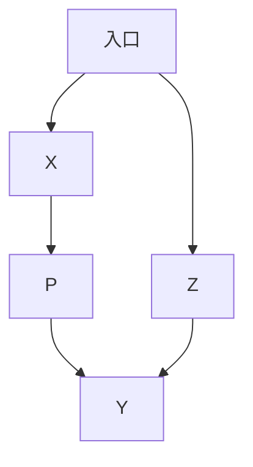
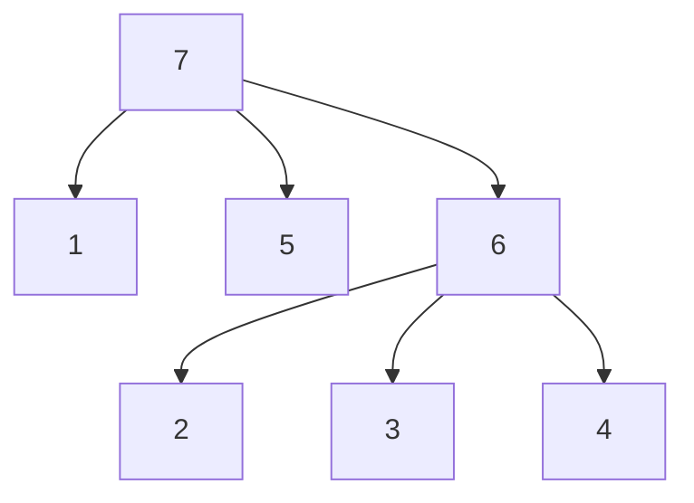
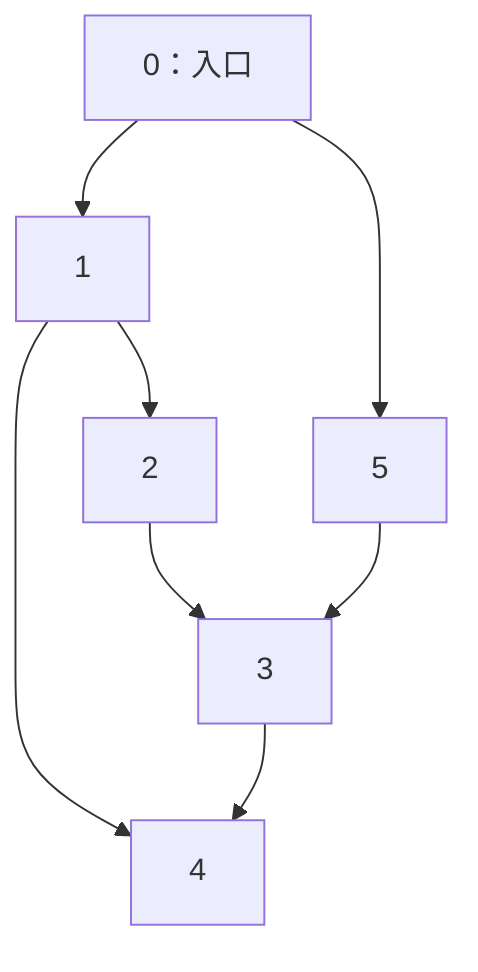

# 第 4 章支配分析

> 以 LLVM 18.1.8 为基线，结合本地源码、可复现实验和实际输出重写校核。原始书稿另存 [origin](origin/inside-llvm-codegen-ch4.md)；本章以当前正文为准。
> 实验入口：[runner.py](experiments/ch4/runner.py)，记录：[源码核查](review/ch4.md) · [实验结果 JSON](review/experiments-ch4.json)。实验输入在 `experiments/ch4/`，默认把中间输出写入临时目录。

支配关系在编译优化中非常重要，在 LLVM 中有众多分析和变换依赖于支配分析。例如中端优化 ADCE（Aggressive Dead Code Elimination，激进的死代码消除）、SimplifyCFG、BasicAliasAnalysis、LoopPass 等。本章将介绍支配相关的概念和算法。

本章命令约定如下；已有工具即可运行，runner 不触发构建。

```sh
export LLVM_BUILD="${LLVM_BUILD:-/opt/llvm-project/build}"
export LLVM_SRC="${LLVM_SRC:-/opt/llvm-project}"
export BOOK_ROOT="${BOOK_ROOT:-/opt/coding/mlir-toy/llvm/inside-llvm-codegen}"
python3 "$BOOK_ROOT/experiments/ch4/runner.py"
```

可用 `--output-dir /tmp/ch4-output` 保留一个固定输出目录；结果 JSON 包含逐项断言和命令。失败样例的非零退出码是实验预期，runner 会核对诊断，不能把它们作为合法 IR / TD 使用。

## 4.1 支配和逆支配

本节首先介绍支配、逆支配等相关定义，然后分析支配和逆支配的具体含义。

### 4.1.1 支配和逆支配相关定义

先考虑从单一入口 r 可达的有向流图 `G=(V,E,r)`。若原图有多个入口，先加虚拟入口连接它们，再讨论支配；不能把入口集合 r 当一个普通节点写入所有 Dom 集合。不可达节点需要单独约定，LLVM 查询也有专门处理。

1. 支配

支配（dominance）：如果从 r 出发到达节点 w 的每一条路径都经过节点 v，则称节点 v支配节点 w。我们使用符号 Dom(w) 来表示所有能支配节点 w 的节点所组成的集合。

对入口可达节点 w，总有 `{r,w}⊆Dom(w)`。w 自身支配 w；严格支配集合为 `SDom(w)=Dom(w)−{w}`，即严格支配者集合。半支配（semidominator）与严格支配不是同一概念，本章用 `sdom` 表示半支配。

对入口可达且不是入口的节点 w，唯一最接近 w 的严格支配节点为 `idom(w)`：它被 w 的其他严格支配者支配。入口的 idom 通常记为不存在；某些算法为方便把根的父节点设为自身，是实现约定。

使用直接支配节点构造一棵树，称为 DT（Dominator Tree，支配树），其中节点表示有向图中的节点，边表示父节点直接支配子节点，当计算得到 IDom 时就可以轻易构造出支配树。支配树用于各种优化，例如优化循环、重新排序基本块、调度指令、构建控制流等都会涉及支配树的使用。

支配关系中另一个非常重要的概念是 DF（Dominance Frontier，支配边界）。在 SSA 的构造过程中使用支配边界确定 φ 函数的位置，在 ADCE 中使用逆支配边界追溯必须保留的控制依赖。

当且仅当 X 支配 Y 的一个前驱节点，且 X 并不严格支配 Y 时，称 Y 是 X 的一个支配边界。通常 X 的支配边界包含多个节点，是节点构成的集合。

支配边界的精确定义为 `DF(X)={Y | 存在P→Y，X支配P且X不严格支配Y}`。Y≠X 时，通常可以找到绕过 X 的入口到 Y 路径；但 Y=X 也允许，例如循环头可属于自己的支配边界，此时并不存在“入口到X必绕过X”的路径。

支配边界标出定义可能汇合的位置，但不是给每个边界都无条件插 PHI。构造 SSA 通常从某变量的定义块出发计算**迭代支配边界**（IDF），并可用 live-in 信息删去不需要的 PHI。图 4-1 以一个汇合块演示这一判据。

**图 4-1 支配边界局部示意**



X 支配 P，却不支配 Y，因为存在入口→Z→Y，所以 Y∈DF(X)。

图 4-2 用一个七节点 CFG 演示支配关系和支配边界。


**图 4-2 CFG 和其对应的支配树示例**

图 4-2a 中 CFG 的入口节点是 1，入口节点支配所有节点；节点 2 支配节点 2、节点 3、节点 4 和节点 6，但是节点 2 并不支配节点 7，因为节点 7 可以通过路径 1 → 5 → 7 到达；节点 3、节点 4、节点 5、节点 6 以及节点 7 都只支配自己。基于上述描述，可以得到每个节点的支配、直接支配、支配边界集合结果，如表 4-1 所示。

**表 4-1 每个节点的支配、直接支配、支配边界集合结果**

| 节点 | Dom | idom | DF |
|---|---|---|---|
| 1 | {1} | 无 | ∅ |
| 2 | {1,2} | 1 | {7} |
| 3 | {1,2,3} | 2 | {6} |
| 4 | {1,2,4} | 2 | {6} |
| 5 | {1,5} | 1 | {7} |
| 6 | {1,2,6} | 2 | {7} |
| 7 | {1,7} | 1 | ∅ |

基于表 4-1 可以非常容易地构造支配树，如图 4-2b 所示。

[graph7.ll](experiments/ch4/graph7.ll) 完整表示图 4-2 的 CFG。实验把 LLVM `print<domtree>` 和 `print<domfrontier>` 的输出解析为集合，与表 4-1 逐项比较，完全一致。例如 idom(6)=2、DF(3)={6}、DF(6)={7}。这里比较节点关系而非树的兄弟打印次序，因为后者不是分析语义。

2. 逆支配

逆支配（post-dominance，也称为后支配）的定义是，如果从节点 w 出发到达每一个CFG 出口（CFG 可能有多个出口）的每一条路径都经过节点 v，则称节点 v 逆支配节点 w。使用符号 Post-Dom(w) 表示所有逆支配节点 w 的节点组成的集合。

在图 4-2a 的有限出口示例中，7 后支配其余所有节点，6 后支配 2、3、4；后支配同样具有自反性。图 4-3 表示其直接后支配关系。

对能到达正常出口的区域，可把 CFG 边反转并用虚拟出口连接所有真实出口；这个虚拟节点是逆图的唯一**入口**，再计算支配树。LLVM 18 的 `FindRoots` 还显式处理无法到达真实出口的无限循环区域，因此不能只反转正常出口边就认为得到完整 PDT。

**图 4-3 逆支配树示意图**



此处省略只有一个实际出口时的虚拟根，边表示直接后支配。

[postdom-roots.ll](experiments/ch4/postdom-roots.ll) 包含两个 ret 出口和一个自环 `%spin`。LLVM 实际打印的 PDT 使用 `<<exit node>>` 虚拟根，Roots 同时包含 `%exit1`、`%exit2` 和 `%spin`。这不是把“所有执行最终返回”作为前提，而是 LLVM 对无法到达真实出口区域的具体处理。

### 4.1.2 支配和逆支配含义解析

以图中 2、3、4、6 为例：2 支配 6，意味着每条从入口到 6 的路径先经过 2；6 后支配 2，意味着从 2 出发到出口的路径经过 6。不能把后者说成“到达 2 的路径已经经过 6”。二者组合有助于判断能否把 2 的计算推迟到 6，但还要检查数据依赖、副作用和异常行为。

假设有这样一个编译优化需求，将基本块 2 中的指令往下移动（假设往下移动后程序的语义逻辑仍然正确），因为基本块 2 有两条执行路径，所以为了保证程序逻辑的正确性，需要将基本块 2 的指令同时下移到基本块 3 和基本块 4。但是这样指令下移后会导致代码量（code size）变多（基本块 3、4 包含了重复指令），所以在有些场景下并不符合优化预期。但是如果将指令下移到基本块 6（而不是重复放置在基本块 3、4），这样的下移则并不会增加代码量。基本块 6 的位置就可以通过支配和逆支配快速计算得到。

根据支配信息可以计算支配边界；只有确有值需要汇聚时才在相应位置插入 PHI，不能在每个边界无条件插入。根据逆支配信息同样可以得到逆支配边界，逆支配边界是分叉点（逆支配信息是基于逆CFG 计算得到），通常也称逆支配边界控制依赖节点。根据图 4-2b，节点3、4的支配边界为节点6；若3/4定义同一源变量的不同版本，且6需要该值，则可在6放置PHI，如图 4-4a 所示。根据图 4-3所示的逆支配树得到节点 3、4 的逆支配边界为节点 2（说明节点 2 是分叉点），也称节点 3、4 控制依赖节点 2，如图 4-4b 所示。


**图 4-4 支配边界和控制依赖示意图**

> 控制依赖描述一个节点的分支选择是否影响另一节点的执行。对 CFG 边 A→S，若 B 后支配 S，却不严格后支配 A，则 B 可控制依赖于 A；这对应 A 属于 B 的后支配边界。A 支配 B 只说明“执行 B 之前执行过 A”，不说明“执行 A 一定执行 B”。控制依赖不要求 B 是 A 的直接后继，也不能任意限制为最近的分叉点。

## 4.2 支配树和支配边界的实现

LLVM 18 的通用支配树完整构建采用 Semi-NCA，增量更新使用 Depth Based Search。源码注明 Semi-NCA 最坏时间为 O(n²)，并说明其实际工程表现；这里不把历史测量当作当前编译性能。

当前实现支持单边或批量的插入/删除更新，并在需要时重建。增量成本取决于受影响区域、可达性变化与更新策略，不能把某个动态算法的公式当成每次 API 调用的无条件保证。

CFG 改变后，受影响区域可能只需局部更新，也可能需要重建。本章的插边实验在图 4-2 中增加 5→6，得到 idom(6) 从 2 变成 1；路径 1→5→6 已绕开节点 2。这个实验重新计算了结果，用来说明变化的语义，并不声称已覆盖 DomTreeUpdater 的全部增量 API。

动态维护可依据父特性与兄弟特性理解：对可达 CFG 边 v→w（不把入口作为普通后继），支配树中 w 的父节点应是 v 的祖先；同父节点的兄弟互不支配。插边可能使支配者减少，删边可能使支配者增加；真实实现还要处理可达性改变，不能只改一条树边。

LLVM 18 的构建使用 Semi-NCA，增量维护使用 Depth Based Search。CFG 是底层图，DT 是其分析结果；批量更新是一次性通知/应用一批合法的 CFG 变化，并非“不想更新CFG就只改DT”。DomTreeUpdater 支持 eager/lazy 等方式，调用者须遵守具体 API 对图状态及更新顺序的约定。

PDT 还有多出口与无限循环根选择，源码 FindRoots 专门处理，因此真实实现必须覆盖完整的根发现与更新逻辑。

本节主要关注 SLT 算法和 Semi-NCA 算法，关于支配树的其他构造算法以及性能比较可以参考 4.3 节扩展阅读的相关内容。

SLT 算法和 Semi-NCA 算法都使用了半支配节点概念，但两个算法在构造 IDom 时有所不同。

### 4.2.1 半支配节点及相关概念

给定一个 CFG，对图采用深度优先遍历，从而构成一个深度优先生成树（Depth-First- Spanning-Tree，DFST 或 DFS）。在遍历每一个节点时记录 DFS 遍历节点的序号，记为dfnum。对 dfnum 进行分析，并做以下定义。

1）DFS 树边连接发现一个新节点时使用的父子节点；非树前向边由祖先指向后代。仅 `dfnum(v)<dfnum(w)` 不足以完整定义树关系；本节区分 DFS 树祖先/后代与 CFG 中直接前驱/后继。

2）后向边从节点指向 DFS 祖先（常也允许自环）。它由一条实际图边构成，不是任意路径。

3）交叉边是实际图边，其两端不互为 DFS 祖先/后代。树边和交叉边不同，不能把 cross edge 称为树枝。

对非根节点 w，半支配节点 sdom(w) 是 DFS 先序号最小的节点 v₀，满足存在路径 `v₀,v₁,…,vₖ=w`，且**所有内部节点** `0<i<k` 都有 `dfnum(vᵢ)>dfnum(w)`。比较基准是终点 w，原书比较 v₀ 的文字定义过弱。长度为 1 的边没有内部节点，自然满足内部条件。

**图 4-5 DFS 边与半支配的关系**：半支配的定义同时使用 CFG 路径和 DFS 先序编号；“存在交叉边”本身不足以确定半支配节点。对非根 w，DFS 父节点通过一条边到 w，保证候选集合非空；最小编号候选是 w 的严格 DFS 祖先，但它未必支配 w。

**图 4-6 半支配不等于支配的可复现示例**



固定 DFS 后继访问顺序：0 先访问 1 再访问 5，1 先访问 2 再访问 4；所得先序为 0,1,2,3,4,5，DFS 父节点 parent(4)=3。边 1→4 没有内部节点，故允许 1 成为半支配候选；从 0 出发到 4 的路径却都含一个先序早于 4 的内部节点，不能让 0 成为候选。因此 sdom(4)=1。

路径 0→5→3→4 绕过 1，故 1 不支配 4，实际 idom(4)=0。runner 直接按定义求半支配，并独立求支配集合，验证了这两个结果。这里同时给出所有边和 DFS 次序，读者可完整复算，而不必依赖图片猜测未标明的编号。根的 sdom 可按算法约定设为自身，根的 idom 则不存在。

### 4.2.2 LT 算法和 Semi-NCA 的差异

两种算法都先作 DFS 并求半支配，但恢复直接支配关系的方式不同。注意，从 Dom(w) 中寻找 idom 时必须排除 w 自身；否则 DFS 编号最大的支配者就是 w，不能得到严格支配者。

LT 的标准实现用 link/eval 与 bucket 维护候选：逆 DFS 顺序求 semi 并登记 bucket，处理 bucket 时据 eval 结果得到临时 idom；再按 DFS 正序作一次修正，若临时 idom 不等于 semi，使用已确定的 idom 链修正。原书两分支公式混用了 n/u/w 且缺少 eval 候选的定义，不能直接作为可执行算法。LLVM 18 此文件没有继续采用那段 LT 公式。

Semi-NCA 的概念关系为 `idom(w)=NCA(sdom(w), parent_DFS(w))`，NCA 是最近公共祖先，并且求解依赖已构建/正在构建的**支配树关系**，不能拿原始 DFS 树的任意公共祖先代替。

LLVM 18 `SemiNCAInfo::runSemiNCA` 的实际结构：

```text
// 说明性伪代码，保留LLVM18中关键次序
用 DFS 父节点初始化每个节点的 IDom 候选
逆 DFS 顺序遍历非根节点 w:
    Semi[w] = ParentDFS[w]
    对每个反向邻居 n:
        u = eval(n, 当前处理边界)
        Semi[w] = DFS序较小的 Semi[w] 与 Semi[u]
正 DFS 顺序遍历非根节点 w:
    candidate = 先前保存的 IDom[w]
    while DFSNum[candidate] > DFSNum[Semi[w]]:
        candidate = IDom[candidate]
    IDom[w] = candidate
```

上面的 eval 仍须执行路径压缩和半支配标号维护，伪代码省略其实现，不能当完整算法直接编译。源码第 271 行起可看到两阶段和比较条件。

对图 4-6 的节点 4，两种正确算法都应得 idom(4)=0；Semi-NCA 由 DFS 父节点 3 和 sdom(4)=1 的支配祖先关系得到该结果。改变 DFS 次序可能改变 semi，但不改变真正的支配关系。

实验穷举了四个节点、没有入边指向入口的 4,096 个有向图（允许其他节点自环），其中 2,432 个节点全部入口可达。对每个可达图，删除节点法、Dom 集合迭代、按定义求 semi 后使用 NCA 三种结果相同。这是小规模交叉验证，不是任意图的数学证明。它覆盖许多循环、交叉边与不可归约小图；高效 link/eval 的路径压缩仍以 LLVM 源码为准，实验没有伪装实现整套 Semi-NCA 优化。

### 4.2.3 支配边界的实现

LLVM 18 中需要区分普通 DominanceFrontier 和 IteratedDominanceFrontier：前者在 DominanceFrontierImpl.h 根据局部边界与支配树子节点的边界递推；后者在 GenericIteratedDominanceFrontier.h 中用支配树深度优先队列求定义块的 IDF，并可依据 LiveInBlocks 剪枝。不能把“所有节点完整 DF”都说成线性时间；完整边界集合本身最坏可有二次规模。

Join 边的定义：假设 x → y 是 CFG 上的一条边（这里是指直接边），如果 x 不是 y 的直接支配节点（x ≠ idom(y)），则称边 x → y 是一条 Join 边。

根据构造的 DJ-Graph 可以得到以下信息。

1）对 Join 边 x→y，y 属于 DF(x)，但只会属于 x 的那些**不严格支配 y**的祖先的 DF；不能无条件加入所有祖先。

2）如果 y 是 x 的支配边界，可以发现 y 在支配树的层次小于等于 x 的层次（支配树的根节点层次为 0，可以参考图 4-2b）。

3）对可达图，y∈DF(x) 当且仅当存在支配树子树内节点 z（包含 x 本身），CFG 中存在 z→y 的 Join 边且 level(y)≤level(x)。下面是按定义扫描子树的伪代码，不声称它等于高效 IDF 实现或具有线性总复杂度。

由此可得到支配边界的计算方法，如代码清单 4-1 所示：

**代码清单 4-1 支配边界计算方法**

```text
DominanceFrontier(x) {
    DFx = {};
    foreach z in DomTreeSubtreeIncludingRoot(x) {
        foreach y in CFGSuccessors(z) {
            if (idom(y) != z && level(y) <= level(x))
                DFx = DFx union {y};
        }
    }
    return DFx;
}

```

清单 4-1 的子树扫描结果也与直接 DF 定义在上述 2,432 个图上逐节点一致。另一个 [join-loop.ll](experiments/ch4/join-loop.ll) 将变量 x 分别定义在两个分支，再把汇合结果带回循环：mem2reg 实际在 `%join` 和 `%header` 各插入一个 PHI。先在 join 引入定义后还要继续计算其边界，这正是 IDF 中“迭代”的含义。

## 4.3 扩展阅读：支配树相关小课堂

支配树在编译优化中使用非常广泛，其研究历史也非常久远，本节首先对求解支配树的不同算法进行介绍和比较，然后介绍如何快速判断两个节点是否存在支配关系。

### 4.3.1 支配树构造算法及比较

下面从可直接实现的定义法和集合方程出发比较构造方式；高效算法的具体边界以 LLVM 源码说明为准。

1. 定义法

根据支配树的定义，对于图 G，如果从 s 到 w 的任意一条路径都经过节点 v，则 v 支配w，那么可以得到结论：如果从图中删除节点 v，s 不能到达节点 w，那么节点 v 支配节点 w。由此可以得到算法步骤如下。

1）只考虑最初入口可达的节点集合；每次在原图副本中删除一个顶点 vi（随后恢复，不累计删除）。

2）遍历更新后的图，如果从 s 出发无法到达顶点的集合记为 {w1, w2, ..., wk}，则 vi 支配 {w1, w2, ..., wk}。

3）根据支配关系构造支配树。

2. 数据流分析法

> 初始化为 `Dom(entry)={entry}`，其他可达块为全部可达节点集合；之后取前驱交集并加自身，以单调下降求解。若把其他块初始化为空，会得到错误结果。

根据 CFG 建立的数据流方程，迭代求解每个节点的支配节点。假定 IN[B] 为基本块 B入口处的支配节点集合，OUT[B] 为基本块 B 出口处的支配节点集合，则支配节点的数据流方程的定义如下：

1）OUT[Entry] = {Entry}

2）OUT[B] = IN[B] ∪ {B}, B ≠ Entry

3）`IN[B]=⋂_{P∈Pred(B)}OUT[P]`，B≠Entry；仅处理入口可达子图。

这是一个前向数据流方程。因为数据流方程是单调的，所以通过迭代可以得到不动点。根据数据流方程的定义得出：OUT[B] 中的节点都支配 B，即 OUT[B] 就是 Dom(B)。

该迭代算法需要存储每个顶点 Dom，若顶点个数为 n，则每轮迭代计算所有节点交集的总时间为 O(mn)。由于算法最多迭代 n – 1 次，故而总的迭代时间复杂度是 O(mn²)，空间复杂度为 O(n²)。

可用 idom 链隐式表示集合：`Dom(v)={v,idom(v),idom²(v),…直到根}`，等价集合运算是逐项并集，不是与单个节点相交。保存 idom 可降低空间，迭代求 idom 的具体算法、交会操作和复杂度需分别分析。

3. 支配树小结

加上 4.2 节中介绍的 SLT 算法和 Semi-NCA 算法，共有 4 种计算支配树的算法，它们的时间和空间复杂度如表 4-2 所示，表中 m 表示边的数目，n 表示顶点个数。

**表 4-2 求解支配树不同算法的时间和空间复杂度**

| 算法 | 时间（常见粗略最坏界） | 空间与条件 |
|---|---|---|
| 删除节点再检查可达性 | O(n(n+m)) | 若仅输出idom可避免保存全部Dom；显式Dom输出可达O(n²) |
| 显式Dom集合迭代 | 朴素位/集合模型约O(mn²) | O(n²)保存全部Dom，另加图空间 |
| idom链迭代变体 | 依链交会实现与迭代次数而定 | O(m+n)，不能与显式集合版本混淆 |
| SLT | O(m log n)的简单实现界 | O(m+n) |
| Semi-NCA | LLVM源码注明最坏O(n²) | O(m+n) |

这些量级需结合集合表示与实际输入理解，原表把显式集合数据流法空间写成O(m+n)与前文矛盾，已区分两类实现。

Semi-NCA 是 LLVM 18 的工程选择，源码注释说明实践中通常优于简单 LT，但并不声称所有图上最优。极端情况下的 NCA 上溯可导致 O(n²) 最坏时间。

### 4.3.2 如何快速判断任意两个节点的支配关系

假设已知控制流图的 DT，如何快速判断任意两个节点 x 和 y 是否存在支配关系？

判断节点之间是否存在支配关系在整个编译优化中的常见操作。在 LLVM 的实现中有两种判断方法供读者参考。

1. 第一种方法

由于已知支配树，故而可以通过遍历支配树进行判断。为支配树的每一层设置一个高度，根节点的深度为 0，每沿树边增加 1；不同叶子可以有不同深度。根据支配的特性，可得到以下事实。

1）如果节点 x 支配节点 y，那么 x 的高度一定小于等于 y 的高度。

2）如果 x 的高度等于 y 的高度，且节点 x 等于节点 y，则 x 支配 y。

3）如果 x 的高度小于 y 的高度，且节点 x 等于节点 y 的 IDom，则 x 支配 y。

由上述事实可以得到第一种快速判断任意两个节点支配关系的算法，步骤如下。

1）计算节点 x 和 y 的高度，高度小的节点可能会支配另一个节点。假设 x 的高度小（高度记为 hx），节点 y 的高度大。

2）从 DT 中遍历节点 y 的 IDom，直到 IDom 的高度小于或等于 hx。

3）判断 IDom 和 x 是否相等，如果相等则说明 x 支配 y，否则 x 不支配 y。

2. 第二种方法

对支配树本身 DFS 编号，`in(x)≤in(y) 且 out(y)≤out(x)` 等价于 x 为 y 的祖先，因而等价于支配。**对 CFG 本身 DFS 得到的区间不能作此判断**；CFG DFS 祖先未必支配后代。原图 4-7a 应理解为已知 DT。

LLVM 18 先处理自身、不可达节点、直接父子和 level 等快速情形；若 DFS 区间编号有效则直接使用，否则先沿 idom 链慢查。慢查询计数超过 32 后会更新 DFS 编号。并非每次请求都立刻重跑 DFS，也不是永远二选一的独立算法。

1）父节点的 DFSNumIn 一定小于子节点的 DFSNumIn（DFS 遍历时总是先到达父节点，然后才能访问子节点）。

2）左边兄弟节点的 DFSNumIn 一定小于右边兄弟节点的 DFSNumIn（DFS 按既定后继顺序先到达该节点）。

3）子节点的 DFSNumOut 一定小于父节点的 DFSNumOut（DFS 遍历时总是要求先处理完子节点，再处理父节点）。

4）左边兄弟节点的 DFSNumOut 一定小于右边兄弟节点的 DFSNumOut（DFS 遍历时总是先完成左边节点的处理）。

综合这 4 个条件可以快速判断 x 是否支配 y，如果同时有：① x.DFSNumIn 小于等于 y.DFSNumIn ；② x.DFSNumOut 大于等于 y.DFSNumOut。则 x 支配 y。假设已知支配树如图 4-7a 所示，对支配树经过 DFS 遍历后每个节点的 DFSNumIn 和 DFSNumOut 如图 4-7b 所示。


**图 4-7 通过 DFSNumIn 和 DFSNumOut 判断支配关系**

通过上述规则可以快速判断 4 个节点的支配关系。例如节点 a 的 DFSNumIn（为 1）小于节点 b、c、d 的 DFSNumIn（分别为 2、3、5），同时 a 的 DFSNumOut（为 8）大于节点 b、c、d 的 DFSNumOut（分别为 7、4、6），则节点 a 支配节点 b、c、d。根据这一方法，可以得到节点之间的支配关系如表 4-3 所示。表中每个格子表示每行节点是否支配每列节点，如果行节点支配列节点用√表示；表中节点用类似 a(DFSNumIn, DFSNumOut) 的方式表示，例如 a(1, 8) 表示节点 a 的 DFSNumIn 是 1，DFSNumOut 是 8。

**表 4-3 图 4-7 对应的节点之间的支配关系**

| 行支配列 | a(1,8) | b(2,7) | c(3,4) | d(5,6) |
|---|---|---|---|---|
| a(1,8) | 是 | 是 | 是 | 是 |
| b(2,7) | 否 | 是 | 是 | 是 |
| c(3,4) | 否 | 否 | 是 | 否 |
| d(5,6) | 否 | 否 | 否 | 是 |

LLVM 18 编号从 0 开始，而图从 1 开始不影响区间包含判定。若CFG修改导致树或编号失效，需要正确更新/重新计算后再使用。

## 4.4 本章小结

本章主要介绍支配分析相关内容。介绍了支配、支配树、逆支配、逆支配树等基础知识，简单探讨了 LLVM 中支配树和支配边界的演化历程。4.3 节比较了 4 种求解支配树算法的差异。本章最后对 LLVM 如何快速判断两个节点的支配关系进行了介绍。

## LLVM 18 源码与实验依据

以下源码对应 LLVM 18.1.8；图关系、支配边界、IDF 放置和 PDT 根选择的实际记录见 review/experiments-ch4.json。

- [llvm/include/llvm/Support/GenericDomTreeConstruction.h:10](/opt/llvm-project/llvm/include/llvm/Support/GenericDomTreeConstruction.h:10)：`Semi-NCA and Depth Based Search overview`。
- [llvm/include/llvm/Support/GenericDomTreeConstruction.h:271](/opt/llvm-project/llvm/include/llvm/Support/GenericDomTreeConstruction.h:271)：`SemiNCAInfo::runSemiNCA`。
- [llvm/include/llvm/Support/GenericDomTreeConstruction.h:347](/opt/llvm-project/llvm/include/llvm/Support/GenericDomTreeConstruction.h:347)：`FindRoots / infinite-loop handling`。
- [llvm/include/llvm/Support/GenericDomTree.h:432](/opt/llvm-project/llvm/include/llvm/Support/GenericDomTree.h:432)：`dominates / SlowQueries`。
- [llvm/include/llvm/Support/GenericDomTree.h:747](/opt/llvm-project/llvm/include/llvm/Support/GenericDomTree.h:747)：`updateDFSNumbers`。
- [llvm/include/llvm/Analysis/DominanceFrontierImpl.h:158](/opt/llvm-project/llvm/include/llvm/Analysis/DominanceFrontierImpl.h:158)：`ForwardDominanceFrontierBase::calculate`。
- [llvm/include/llvm/Support/GenericIteratedDominanceFrontier.h:130](/opt/llvm-project/llvm/include/llvm/Support/GenericIteratedDominanceFrontier.h:130)：`IDFCalculatorBase::calculate`。
- [llvm/lib/Transforms/Utils/PromoteMemoryToRegister.cpp:730](/opt/llvm-project/llvm/lib/Transforms/Utils/PromoteMemoryToRegister.cpp:730)：`IDF and live-in PHI placement`。
- [llvm/lib/Transforms/Scalar/ADCE.cpp:493](/opt/llvm-project/llvm/lib/Transforms/Scalar/ADCE.cpp:493)：`ReverseIDFCalculator / control dependence`。

验证覆盖小图算法对照及选定 LLVM 分析输入，不包括历史编译性能百分比或全部 DomTreeUpdater 增量更新序列。数学算法的适用前提与实现复杂度已分别说明。
