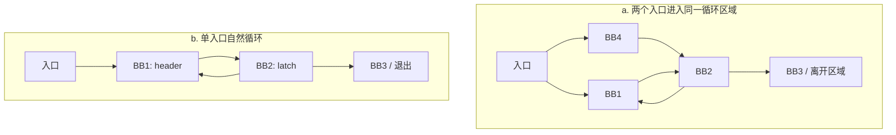
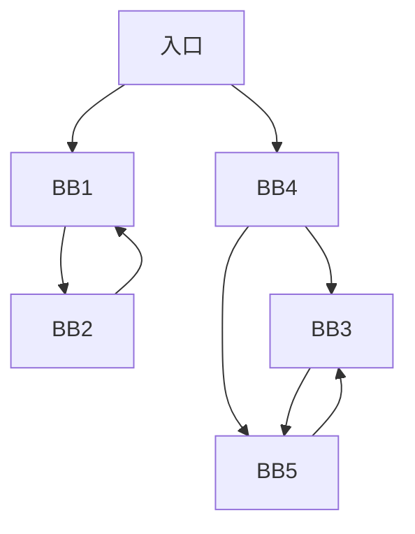
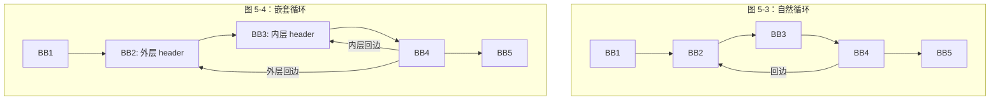
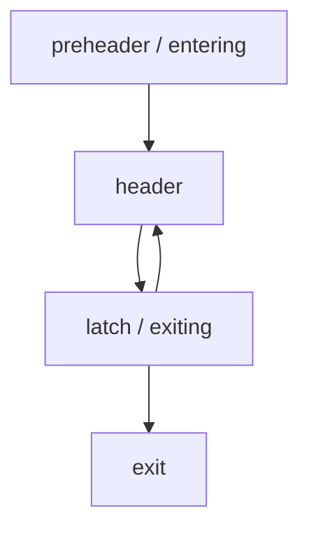
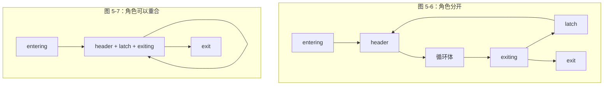
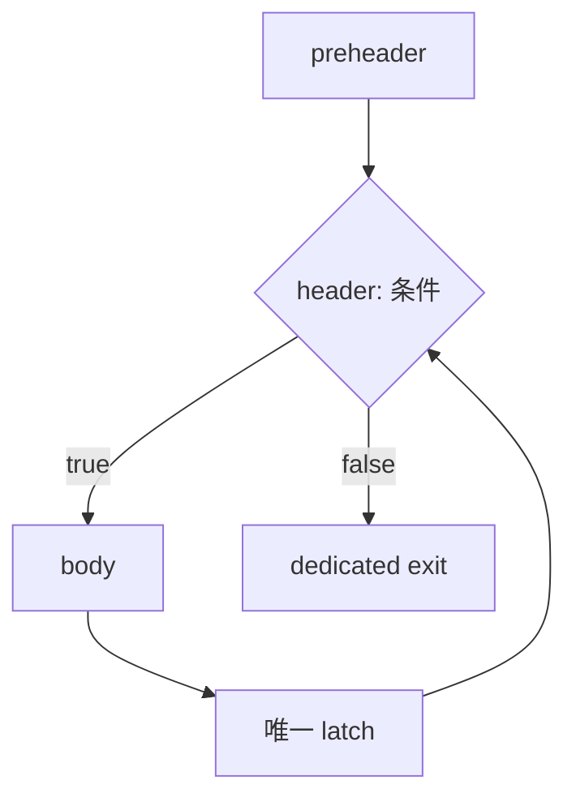
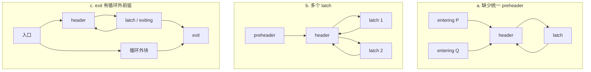
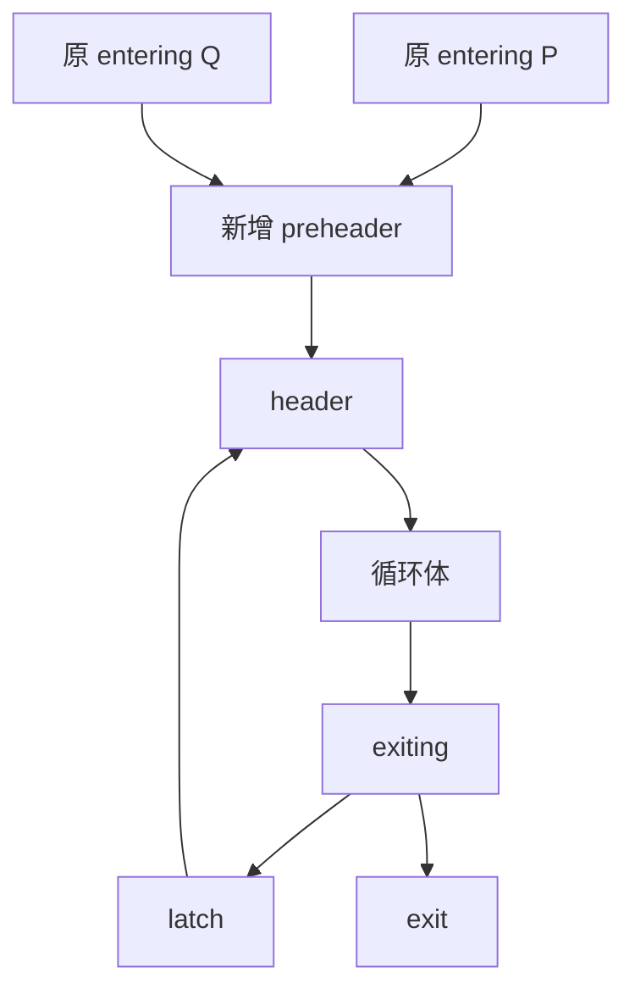
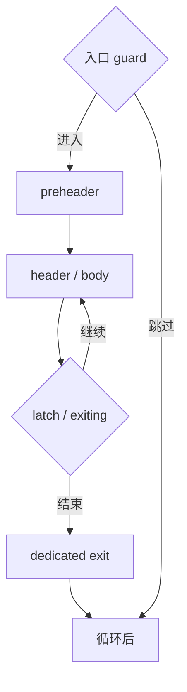
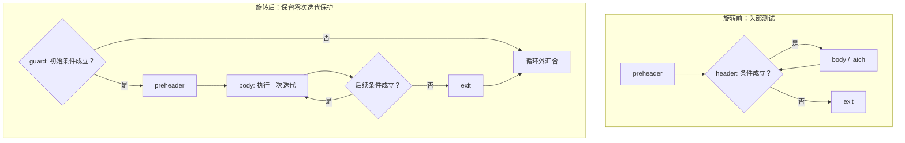

# 第 5 章 循环基本知识

> 以 LLVM 18.1.8 为基线，结合本地源码、可复现实验和实际输出重写校核。原始书稿另存 [origin](origin/inside-llvm-codegen-ch5.md)；本章以当前正文为准。
> 实验入口：[runner.py](experiments/ch5/runner.py)，记录：[源码核查](review/ch5.md) · [实验结果 JSON](review/experiments-ch5.json)。实验输入在 `experiments/ch5/`，默认把中间输出写入临时目录。

循环一般指程序中可能重复执行的指令序列。图论中，强连通表示任意两个节点之间都存在互相可达的有向路径，不要求它们之间直接有边；强连通分量（SCC）是极大的强连通子图。不同 SCC 之间可以单向到达，只是不能双向互达，否则应属于同一个 SCC。LLVM 的自然循环还要求有支配整个循环的单一入口 header，因此不能把自然循环等同于 CFG 的任意极大 SCC：内层循环可以包含于外层循环，一个没有自环的单节点 SCC 也不算循环。

控制流可区分可归约与不可归约的情形。本章用入口结构帮助理解：图 5-1a 的循环区域有多个入口，且没有一个支配整个区域的 header，因此是不可归约循环区域；图 5-1b 展示了具有单一入口的自然循环。不能只观察整个 SCC 的入口数就断言其内部所有循环结构均可归约，内部仍可能包含不可归约区域。



a 中 BB1 不能支配 BB2，因为入口可经 BB4 绕过 BB1；BB2 也不能支配 BB1，因此该双节点环没有共同 header。

**图 5-1 不可归约和可归约循环示意**

LLVM 的 LoopInfo 主要表示自然循环，不负责枚举 CFG 中所有可能的环。不可归约控制流仍是合法的 LLVM IR，也可以接受通用 CFG 或其他分析、优化；不能据此断言 LLVM 或其他现代编译器只支持自然循环。许多基于 LoopInfo 的循环变换依赖单入口和支配性质，因此本章按 LLVM 的习惯把自然循环简称为循环。下面介绍自然循环性质、LLVM 中的表示与规范化形式。

本章命令使用 **Bash**，先执行下面的准备块，再在同一 shell 中按正文顺序执行后续命令。工具应为已构建的 LLVM 18.1.8；这些步骤不会启动构建。输入只读，所有生成文件写入 `CODEGEN_LAB` 指向的新临时目录。

<details>
<summary>动手实验前展开：本章环境初始化（首次阅读推导可先略过）</summary>

<!-- manual-lab:ch5-setup -->

```sh
# -e 使普通命令失败时停止；-u 检查未定义变量，pipefail 使管道成员的失败可见。
set -euo pipefail
export LLVM_BUILD="${LLVM_BUILD:-/opt/llvm-project/build}"
export LLVM_SRC="${LLVM_SRC:-/opt/llvm-project}"
export BOOK_ROOT="${BOOK_ROOT:-/opt/coding/mlir-toy/llvm/inside-llvm-codegen}"
BOOK_INPUT="$BOOK_ROOT/experiments/ch5"
# 输入保留在 BOOK_INPUT；所有中间文件放到独立临时目录，避免覆盖样例。
CODEGEN_LAB=$(mktemp -d)
printf '本章临时输出目录：%s\n' "$CODEGEN_LAB"
"$LLVM_BUILD/bin/opt" --version
```

</details>

预期工具报告 LLVM 18.1.8。后面的 `opt` 命令显式指定 Pass；使用解释器时，返回码 0 表示输入中 `main` 的检查通过，不表示在 BPF 内核或 JIT 上运行过。
## 5.1 自然循环

**按定义收集循环节点，而不是圈住图上的闭合形状。** 设 CFG 为 P→H、H→B、B→L、L→H，且 H 还有一条退出边 H→X。H 支配 L，所以 L→H 是回边。先放入 {H,L}，从 L 沿前驱逆向找：加入 B，再遇到已在集合中的 H 就停止越过 H 的搜索，得到 {H,B,L}。P 在 H 之前，不属于循环；X 是退出后的块，也不属于循环。

逆向搜索时把 H 预先标记为已访问很关键。若继续从 H 搜索它的前驱 P，会把循环外的进入路径也错误纳入。对多个指向 H 的回边可以分别收集再合并；若内层还有自己的 header，LoopInfo 会建立嵌套关系，而不是把整个 SCC 永远当成一个扁平循环。

这个例子还区分了 latch 与 exiting：L 是 latch，因为它跳回 H；H 是 exiting，因为它能离开循环到 X。两者可能重合，但定义完全不同。阅读旋转、化简和栈帧下沉时，先标清这些角色，才能知道某条新边改变了入口、回边还是出口。

自然循环的定义有许多的描述方式，直观地描述是“只有单入口、内部基本块可以构成环的子图”。下面在入口可达 CFG 子图中，采用支配关系（参考第 4 章）来给出自然循环的正式定义。首先我们需要用支配关系定义回边（Back Edge）。

回边：如果控制流图中存在边的目的节点支配其源节点的情况，则将这条边称为回边。

我们以图 5-2 为例进行说明：假设存在一条从节点 BB2 到节点 BB1 的边，同时节点BB1 支配节点 BB2，则这条边是回边；假设存在一条节点 BB5 到节点 BB3 的边，但节点BB3 不支配节点 BB5（因为存在从节点 BB4到节点 BB5 的路径），所以这条边不是回边。

对于回边 `b → h`（h 支配 b），它的自然循环包含 h，以及所有无需经过 h 就能沿 CFG 路径到达 b 的节点。h 必须单独纳入集合；不能要求从 h 出发的路径也“不经过 h”。LLVM 将具有同一 header 的这些回边所形成的自然循环合并，得到在该 header 下最大的循环。

**图 5-2 回边示例**



我们根据这个定义就识别出哪些节点构成了自然循环。例如在图 5-3 中存在回边BB4 → BB2，则其构成的自然循环只包含 BB2、BB3 和 BB4，不包含 BB1 和 BB5。因为BB1 到 BB4 必定要经过 BB2，而 BB5 不存在到 BB4 的路径，所以 BB1 和 BB5 不属于这个循环。

通过自然循环的定义，可以在程序的控制流中找出自然循环。但当程序较为复杂的时候，会出现多个自然循环，这些循环会存在嵌套的情况，即一个循环包含另一个循环。为了区分这种包含关系的循环，通常将位于外层的循环称为外循环（outer loop），位于内层的循环称为内循环（inner loop）。如图 5-4 所示，BB3 和 BB4 组成的循环是 BB2、BB3 和BB4 组成的循环的内循环，而 BB2、BB3 和 BB4 组成的循环是 BB3 和 BB4 组成的循环的外循环。



补齐原合并图引用中容易漏掉的嵌套关系：外层集合为 {BB2,BB3,BB4}，内层为 {BB3,BB4}。

**图 5-3 自然循环识别示例 图 5-4 外循环和内循环示例**

## 5.2 LLVM 的循环实现

**规范化是为变换提供固定位置。** 如果循环头有两个循环外前驱 P、Q，想把一条每次循环都不变的计算移到循环之前，直接放在 P 会漏掉 Q 路径，放在 H 又仍会每次迭代执行。建立统一 preheader 后，可以把它放到这个专门的进入块。多个回边合成统一 latch、让退出块成为 dedicated exits，也是在减少后续变换必须分别处理的结构情况。

LCSSA 解决另一个接口问题：循环内定义的值如果被循环外使用，在退出处用 PHI 明确“从哪条循环退出边带出了哪个值”。即使某个出口 PHI 只有一个输入，仍能成为变换循环时的值边界。若优化克隆、拆分或删除一段循环，主要修复出口 PHI，就能让外部使用继续引用明确的结果。

LoopSimplify、LCSSA 与旋转不应混成一个操作。前者规范入口/回边/出口结构，LCSSA 规范跨循环边界的值，旋转改变测试与循环体的排列。尤其从入口测试的 while 变成尾部测试结构时，必须保留初始条件不满足就执行零次的路径；直接把它写成无入口保护的 do-while 会多执行一次循环体。

LLVM 的 Loop / LoopInfo 数据结构及依赖它们的许多循环变换基于自然循环；需要覆盖一般循环区域的分析可考虑 CycleInfo 等接口。不可归约控制流不能直接当成一个 LoopInfo 自然循环，但并不因此被排除在所有优化之外。下面按节点相对循环的位置介绍术语。

- header（循环头）：所有循环外入边的目的节点，支配循环内所有节点。

- latch（闩）：回边的源节点，即具有指向 header 的边的循环内节点。

- exiting（待退出）：具有循环外后继的循环内节点。

相关节点示例如图 5-5 所示。

为了便于优化，在循环外面也定义两种特殊的节点。

- entering（待进入）：header 在循环之外的前驱节点。

- exit（退出）：exiting 节点在循环外的后继节点。原书误写成 entering 的后继。

**图 5-5 header、latch、exiting 节点标记**



循环相关的 entering、exit 节点示例如图 5-6 所示。

注意：除了 header 外，这些角色的节点可能有多个；循环也可能没有退出节点。一个基本块还可以兼具多个角色，例如图 5-7 中的同一个基本块兼任 header、latch 和 exiting。



entering/exit 在循环外，header/latch/exiting 在循环内。重合取决于边的角色，不要求一个节点只对应一个术语。

**图 5-6 entering、exit 节点示例 图 5-7 循环节点合并示例**

此外，preheader（前置头）不仅要求循环仅有一个 entering 节点，还要求该节点只有一条后继边，且这条边进入 header。LLVM 18 的 `getLoopPreheader()` 还检查该节点是否允许把指令外提至其中。仅有唯一的循环外前驱，但它还可跳往其他基本块时，只能称为 loop predecessor，不能称为 preheader。

LLVM IR 和 Machine IR 的基本块 / 跳转不直接形成独立的嵌套循环对象；`llvm.loop` 等元数据可以携带循环提示，但不替代结构分析。LLVM 通过 LoopAnalysis / LoopInfo、MachineLoopInfo 等公共分析从 CFG 获取循环结构。使用者经 Pass Manager 请求和复用分析结果，变换后则必须正确更新或使其失效。

因为 LLVM 支持多种高级语言循环语法，会产生多种不同的 LLVM IR 循环形式，这不利于实现各种通用的循环优化，所以 LLVM 提供了 3 种规范化的循环形式，并实现了相应的转换算法，可以将符合要求的循环转为规范化的循环形式。下面简单介绍 LLVM 里的循环识别和循环规范化的相关概念。

### 5.2.1 循环识别

从代码控制流中识别出循环有许多种算法，一种朴素的算法思想是通过深度遍历控制流来识别。而 LLVM 需要识别出来的循环都是自然循环，所以它使用了基于支配树的算法。这个算法首先找到循环的回边，然后利用回边找到循环包含的基本块，从而构造循环。在这个过程中，还会构建出循环之间的层级关系。整个实现的详细步骤是，后序遍历（post-order）该控制流的支配树，并对支配树中的每个节点 N 进行以下操作。

1）识别出所有 N 构成的回边，即遍历 N 的所有前驱节点。如果 N 支配了某个前驱节点 P，则 N 和 P 构成一条回边。

2）如果 N 有一到多条回边，则以 N 为 header 节点构建循环，并将所有回边的源节点（latch，也就是前驱 P）放入逆向 CFG 工作链表。不能把 header 当作初始工作项，否则会立即停止而漏掉循环体。之后弹出工作项，跳过从函数入口不可达的节点，再按以下两种情况处理。

① 如果节点不属于某个循环，则设定它属于节点 N 的循环。接着判断它是否为 N，如果不是，则将节点所有的前驱节点加入工作链表；反之，则不需要处理（因为已经到达循环头）。

② 如果节点已经属于一个循环，则找到它所属的已发现最外层循环 S。如果 S 就是正在构造的循环，则跳过；否则将 S 挂到当前循环之下，并从 S 的 header 的前驱继续逆向遍历，跳过已映射到 S 的回边来源。源码在这里按 `getLoopFor(Pred) != S` 判断，而不是把循环内任意节点的所有外部前驱统统入队。

当整个支配树遍历完成之后，就识别出了入口可达控制流中 LoopInfo 所表示的自然循环；这不包括全部不可归约环。随后 `PopulateLoopsDFS` 对 CFG 作一次正向 DFS，填充循环的基本块与子循环列表，并保持稳定顺序。

本章用两份最小 IR 区分 LoopInfo 能表示的循环：[nested.ll](experiments/ch5/nested.ll) 打印出深度 1 和 2 的自然循环；[irreducible.ll](experiments/ch5/irreducible.ll) 的 left/right 构成双入口强连通区域，LoopInfo 没有为它打印自然循环。这两个输入都通过 verifier。由此可见“未出现在 LoopInfo 中”与“不是合法控制流”是两回事。

<!-- manual-lab:ch5-loopinfo -->

```sh
# 同样合法的 IR，可分别具有自然循环或不可归约环；LoopInfo 只表示前者。
for name in nested irreducible; do
  "$LLVM_BUILD/bin/llvm-as" "$BOOK_INPUT/$name.ll" -o "$CODEGEN_LAB/$name.bc"
  "$LLVM_BUILD/bin/opt" -passes=verify -disable-output "$CODEGEN_LAB/$name.bc"
  "$LLVM_BUILD/bin/opt" '-passes=print<loops>' -disable-output \
    "$CODEGEN_LAB/$name.bc" > "$CODEGEN_LAB/$name.loops.txt" 2>&1
  cat "$CODEGEN_LAB/$name.loops.txt"
done
```

预期 nested 打印深度1和2的循环，irreducible 没有 `Loop at depth` 行；两个模块都能通过 verifier。

### 5.2.2 循环规范化

自然循环的形式也是多样的，如可能会没有 Preheader，或者有多条回边等情况。如果循环具有不同形态，则后续循环相关的优化要分别适配这些形态，才能保证优化效果，这会增加循环优化算法实现的复杂度。本章重点介绍 LLVM 中 3 种常见的规范化形式：循环化简（Loop Simplify）形式、循环旋转（Loop Rotation）形式和循环封闭 SSA（Loop-Closed SSA，LCSSA）形式。将各种类型的循环尽可能转换为统一的循环形式，便于后续的循环优化。

1. 循环化简形式

循环化简后，循环的形式具有以下 3 个性质。

1）有循环前置节点，即有且只有一个 preheader 节点。

2）循环有且只有一条回边。

3）具有专用退出块（dedicated exits）：每个 exit 的所有前驱都在循环内，因此这些 exit 被 header 支配。这里的前驱条件才是直接判据，不能只检查 header 是否支配 exit。

循环化简形式示意图如图 5-8 所示，符合上述 3 个性质。

图 5-9 的 3 个循环都不是循环化简形式：图 5-9a 没有循环前置节点，因为它有多个待进入节点；图 5-9b 有多条回边；图 5-9c 的 exit 节点有来自循环外节点 BB2 的前驱边。因此3 个循环都不符合循环化简的形式。

循环化简形式比较方便于做一些循环优化，如循环不变量外提（可以直接外提到循环前置节点里）和代码下沉（将代码下沉到 exit 节点里）等。

**图 5-8 循环化简形式示意图**



preheader 只有一条后继边，只有 latch 回到 header，exit 的前驱仅来自循环内。

为了将一些不符合循环化简形式的循环尽可能地进行化简，LLVM 还专门实现了一个 Pass。这个 Pass 针对循环化简形式的性质设置了下面 3 个主要功能。每个功能点都是先判断循环是否符合对应的性质，如果不符合则执行相应的变换，并尝试让其符合。



每个子图只保留造成不规范的边：a 需统一进入位置，b 需统一回边位置，c 需专用退出块隔开循环外入边。

**图 5-9 不符合循环化简形式的 3 种情况**

1）添加循环前置节点。

2）添加专用的循环退出节点。

3）在可能时把共用 header 的循环拆成嵌套循环；否则尝试插入统一的回边块，让所有原回边汇合后仅由一条边回到 header。

此外，LoopSimplify 会清理妨碍自然循环结构的不可达前驱边等，但不是一个保证删除所有不可达基本块的通用清理 Pass。存在 indirectbr 等无法安全拆边的情况时，规范化可能不能完全成功；调用方必须检查所需形式是否成立。图 5-10 展示了为图 5-9a 插入 preheader 的情况。



P/Q 的输入如需合并，也要修复 preheader 与 header 的 PHI；只连 CFG 边并不完成整个变换。

**图 5-10 将图 5-9a 进行循环化简**

[multi-latch.ll](experiments/ch5/multi-latch.ll) 同时包含两条进入 header 的外部路径、两个 latch 和一个有外部前驱的 exit。运行 `loop-simplify,verify,verify<domtree>,verify<loops>` 后，实验从输出 CFG 重新检查三项性质：外部入口汇合成唯一 preheader，两个 latch 汇合为一条回边，exit 的循环内退出路径被隔离为 dedicated exit。原输入和规范化输出解释执行均得到 `[0,5,10,0]`，覆盖跳过循环、零次迭代和两种 latch 路径。

<!-- manual-lab:ch5-loop-simplify -->

```sh
"$LLVM_BUILD/bin/llvm-as" "$BOOK_INPUT/multi-latch.ll" \
  -o "$CODEGEN_LAB/multi-latch.bc"
"$LLVM_BUILD/bin/opt" -passes=verify -disable-output "$CODEGEN_LAB/multi-latch.bc"
# 拆分/汇合相关边以建立规范形；随后检查更新后的 IR、支配树和循环信息。
"$LLVM_BUILD/bin/opt" '-passes=loop-simplify,verify,verify<domtree>,verify<loops>' -S \
  "$CODEGEN_LAB/multi-latch.bc" -o "$CODEGEN_LAB/multi-latch.simplified.ll"
# 测试包含跳过循环与不同回边，避免只验证“循环跑起来”的一条路径。
for ir in "$BOOK_INPUT/multi-latch.ll" "$CODEGEN_LAB/multi-latch.simplified.ll"; do
  "$LLVM_BUILD/bin/lli" --force-interpreter -mtriple=bpfel "$ir"
done
sed -n '/define i32 @multi(/,/^}/p' "$CODEGEN_LAB/multi-latch.simplified.ll"
```

预期输出增加外部入口汇合块、回边汇合块和专用退出块；变换前后的 main 均返回0，检查的四个函数结果为0/5/10/0。

不要仅依据生成块名字判断成功：runner 从支配关系找回边和循环成员，再检查前驱、后继集合。本例只有普通分支，满足插入这些块的条件；带 indirectbr 等输入仍须由调用方检查变换结果。

2. 循环旋转形式

循环旋转形式指的是循环的 latch 节点同时是一个 exiting节点（即 do-while 形式的循环），其示意图如图 5-11 所示。

`Loop::isRotatedForm()` 只检查唯一 latch 是否也是 exiting 节点，这个谓词本身并不蕴含 preheader 或 dedicated exits。LoopRotate 变换则在条件允许时维护所需的循环化简结构，将循环改成 do-while 形式，并受可旋转形态、代码增长阈值等条件限制。旋转后可使进入循环后必定执行的指令更易外提，但 load 能否外提仍需满足别名、副作用和安全执行条件。若无法证明循环体至少执行一次，就必须保留或建立入口 guard，以维持零次迭代的语义；并不是所有旋转都需要新增 guard。

**图 5-11 循环旋转示意图**



循环旋转示例如代码清单 5-1 所示，其中每次迭代执行乘法和加法；变换仍须遵守 C 的整数运算语义。

**代码清单 5-1 循环旋转示例代码**

```c
int test(int n) {
    // 无溢出时每轮相当于乘以 i+1；若零次迭代，仍必须返回初值 1。
    int a = 1;
    for (int i = 0; i < n; ++i)
        a += a * i;
    return a;
}
```

图 5-12 展示代码清单 5-1 的旋转过程。图 5-12a 是循环旋转前的示意图，循环是从循环头退出，所以不是 do-while 的形式；图 5-12b 是经过旋转之后的循环，从循环尾部退出，变成了 do-while 的形式；图 5-12c 是添加 guard 后保持零次迭代语义的形式。对于 n ≤ 0 仍有可能发生的本例，图 5-12b 只是中间概念图，不能单独替换原循环；5-12c 中 guard 跳过循环后与循环 exit 在外部 BB 汇合，避免破坏 dedicated exits。



重绘保留了入口 guard，避免把“循环旋转”画成无条件至少执行一次。body 与尾部判断可以同处一个机器/IR 基本块，图中拆开只为解释顺序。

**图 5-12 循环旋转变换示意图**

[book-loop.c](experiments/ch5/book-loop.c) 包含清单 5-1 和检查入口。先用 Clang 生成 IR，经过 `mem2reg,loop-simplify,lcssa`，再运行：

<!-- manual-lab:ch5-loop-rotate -->

```sh
"$LLVM_BUILD/bin/clang" --target=bpfel -O0 -Xclang -disable-O0-optnone \
  -fno-discard-value-names -S -emit-llvm "$BOOK_INPUT/book-loop.c" \
  -o "$CODEGEN_LAB/book-loop.ll"
# 先建立 SSA 与循环边界形式，给旋转变换一个可分析的准备状态。
"$LLVM_BUILD/bin/opt" -passes=mem2reg,loop-simplify,lcssa,verify -S \
  "$CODEGEN_LAB/book-loop.ll" -o "$CODEGEN_LAB/before-rotate.ll"
# loop(...) 内执行旋转；后面的 verifier 保持在 function 层，避免 Pass 作用域混淆。
"$LLVM_BUILD/bin/opt" \
  '-passes=function(loop(loop-rotate),verify,verify<loops>,verify<domtree>)' -S \
  "$CODEGEN_LAB/before-rotate.ll" -o "$CODEGEN_LAB/rotated.ll"
# 原循环允许零次迭代，旋转后的入口 guard 必须保留同样的跳过语义。
for ir in "$CODEGEN_LAB/before-rotate.ll" "$CODEGEN_LAB/rotated.ll"; do
  "$LLVM_BUILD/bin/lli" --force-interpreter -mtriple=bpfel "$ir"
done
sed -n '/define.*@test(/,/^}/p' "$CODEGEN_LAB/rotated.ll"
```

这里显式写出函数 / 循环适配层，避免把后面的 verify 误解析成 loop pass。实际输出把 for.body 变为循环头，for.inc 同时承担 latch 和 exiting，入口增加守卫分支；守卫的跳过路径直接到 for.end，循环退出先经过独立退出块。对 n=`-1,0,1,5,8,12`，前后输出都是 `1,1,1,120,40320,479001600`，零次迭代仍返回 1。测试没有越过 C 有符号整数的可表示范围。

3. 循环封闭 SSA

循环封闭 SSA（LCSSA）在 SSA 基础上约束：循环中定义的普通值，其循环外使用必须经循环出口处的 PHI 转接。虽然 PHI 位于循环外的 exit block，但 incoming value 的使用发生在相应入边上；LCSSA 将它归于该边的循环内前驱，因此能“封闭”这个值。LLVM 的检查接口默认允许 token 值例外。本节按本地 `llvm/docs/LoopTerminology.rst` 的形式定义编写完整 IR 示例。

循环封闭 SSA 示例如代码清单 5-2 所示。

下面用完整 LLVM IR 表达相同的出口值问题，并显式处理零次迭代。`last` 初值为 7，循环每次从 10 / 20 中选择 x3；循环外返回最近的值加 4。清单 5-2 的函数保存在 [lcssa.ll](experiments/ch5/lcssa.ll)，同文件另有三个调用断言。

**代码清单 5-2 循环封闭 SSA 示例代码**

```llvm
define i32 @closed(i32 %n, i1 %c) {
entry:
  br label %header
header:
  ; PHI 按进入 header 的边取值：首次取 0，回边取上一轮的 next。
  %i = phi i32 [ 0, %entry ], [ %next, %merge ]
  ; 7 覆盖零次迭代；执行过循环体后，last 接收最近一次选择的 x3。
  %last = phi i32 [ 7, %entry ], [ %x3, %merge ]
  %cond = icmp slt i32 %i, %n
  br i1 %cond, label %body, label %exit
body:
  br i1 %c, label %left, label %right
left:
  br label %merge
right:
  br label %merge
merge:
  ; c 选择哪条分支，就由对应的入边把 10 或 20 带到 merge。
  %x3 = phi i32 [ 10, %left ], [ 20, %right ]
  %next = add i32 %i, 1
  br label %header
exit:
  ; 这是合法 SSA，但 last 从循环内部直接流到外部使用，尚未形成 LCSSA。
  %result = add i32 %last, 4
  ret i32 %result
}
```

在清单 5-2 中，`last` 在循环头定义，直接用于循环外的 add，所以尚不符合 LCSSA。x3 经循环头的 PHI 带到下一次判断；即使 n=0，last 也有来自 entry 的合法初值 7。运行 `opt -passes=lcssa,verify -S` 后，exit 增加一个转接 PHI，得到清单 5-3。

**代码清单 5-3 在循环出口处插入 φ 函数**

```llvm
; 中文为阅读注释；下列指令与所展示的 LCSSA 变换结果保持一致。
define i32 @closed(i32 %n, i1 %c) {
entry:
  br label %header
header:
  %i = phi i32 [ 0, %entry ], [ %next, %merge ]
  ; 循环携带值仍按原来的入口/回边选择，LCSSA 不改变这一计算。
  %last = phi i32 [ 7, %entry ], [ %x3, %merge ]
  %cond = icmp slt i32 %i, %n
  br i1 %cond, label %body, label %exit
body:
  br i1 %c, label %left, label %right
left:
  br label %merge
right:
  br label %merge
merge:
  %x3 = phi i32 [ 10, %left ], [ 20, %right ]
  %next = add i32 %i, 1
  br label %header
exit:
  ; 出口 PHI 接住循环值；incoming 使用归于 header→exit 边的循环内前驱。
  %last.lcssa = phi i32 [ %last, %header ]
  ; 循环外只引用这个边界定义，不再直接引用循环内部的 last。
  %result = add i32 %last.lcssa, 4
  ret i32 %result
}
```

虽然这个 φ 函数是冗余节点，但它保持原程序的值流关系，并使许多循环变换更容易实现。要求维持 LCSSA 的循环 Pass 必须保留或修复这些 PHI；在不再要求该形式的后续阶段才可由 InstCombine 等消除冗余 PHI。

例如，一些优化（如值范围分析）需要分析出在循环中定义而在循环外使用的值，刚好就是为了满足 LCSSA 而创建的 φ 函数，因此在查找循环逃逸值时可以关注出口 PHI；这不意味着值范围分析等优化不再需要分析循环内部。读者可以参考 LLVM 官网中关于 LCSSA 的一些案例（例如有关规约变量、循环变量替代等），获得更多内容。

LLVM 18 中，`LCSSAPass::run`（新 Pass Manager）及 `LCSSAWrapperPass`（旧 Pass Manager）调用 LCSSA 构造逻辑。旧管理器中的 `LCSSAVerificationPass` 主要是供 `LPPassManager` 判断哪些 Pass 要保持 LCSSA 的标记，其 `runOnFunction` 本身直接返回 false，并非独立遍历检查器；LLVM 18 的旧 `LPPassManager` 中显式逐循环 LCSSA assert 还位于 `#if 0` 中；`LCSSAWrapperPass::verifyAnalysis` 等路径另有受配置控制的检查，底层使用 `Loop::isLCSSAForm` / `isRecursivelyLCSSAForm`。这里验证的是 LCSSA 形式，不是循环不变值。本章使用新 Pass Manager，工具为启用断言的 Debug 构建。

实验验证新增的是 `%last.lcssa = phi i32 [ %last, %header ]`，而出口 add 改用该值。解释执行前后，`closed(0,true)=11`、`closed(1,false)=24`、`closed(4,true)=14`；同时覆盖零次、一次和多次迭代。PHI 只有一个 incoming 仍是合法 IR，它保留循环边界信息，不要求当前有多个入边。

<!-- manual-lab:ch5-lcssa -->

```sh
"$LLVM_BUILD/bin/llvm-as" "$BOOK_INPUT/lcssa.ll" -o "$CODEGEN_LAB/lcssa.bc"
"$LLVM_BUILD/bin/opt" -passes=verify -disable-output "$CODEGEN_LAB/lcssa.bc"
# 单输入出口 PHI 也有用途：它显式记录值跨越循环边界的位置。
"$LLVM_BUILD/bin/opt" -passes=lcssa,verify -S "$CODEGEN_LAB/lcssa.bc" \
  -o "$CODEGEN_LAB/lcssa.after.ll"
for ir in "$BOOK_INPUT/lcssa.ll" "$CODEGEN_LAB/lcssa.after.ll"; do
  "$LLVM_BUILD/bin/lli" --force-interpreter -mtriple=bpfel "$ir"
done
sed -n '/^exit:/,/^}/p' "$CODEGEN_LAB/lcssa.after.ll"
```

预期出口出现 `%last.lcssa` PHI，add 使用它；两个执行命令均返回0，三个调用结果为11/24/14。

## 5.3 本章小结

现代程序越来越复杂，针对循环的优化常能改善生成程序的性能；具体效果仍依赖目标和输入。LLVM 不仅提供了循环相关的公共分析 Pass，涉及循环表示、循环识别和循环规范化，同时提供了许多的循环优化 Pass，如循环不变量外提、代码下沉、软流水和硬件循环等。本章主要介绍循环的基本概念和循环标准形式变换，而循环优化相关的介绍读者可以参阅本书第 9 章、第11 章的内容和相关资料。

## LLVM 18 源码核查记录

核查范围覆盖本章 3 个清单、自然循环定义、LoopInfo 构建和 3 种规范化形式。主要依据如下，完整逐项记录见 [review/ch5.md](review/ch5.md)。

- `llvm/docs/LoopTerminology.rst:17`、`llvm/include/llvm/Support/GenericLoopInfoImpl.h:199`：自然循环、循环角色和 preheader 的严格条件。
- `GenericLoopInfoImpl.h:447、566`：从 latch 开始的逆向 CFG 遍历、支配树后序和循环嵌套构建。
- `llvm/lib/Transforms/Utils/LoopSimplify.cpp:481`、`llvm/lib/Transforms/Utils/LoopRotationUtils.cpp:406`：变换步骤、失败条件与旋转限制。
- `llvm/lib/Transforms/Utils/LCSSA.cpp:77、519`、`llvm/include/llvm/Analysis/LoopPass.h:124`：LCSSA 构造及验证机制。

## 实验覆盖与边界

本章已执行 LLVM IR 解析、IR / 支配树 / LoopInfo 验证、循环三项规范化性质检查、旋转与 LCSSA 前后解释执行，并区分嵌套自然循环和不可归约区域。脚本可独立重跑，结果见 review/experiments-ch5.json。实验选择普通分支与有界整数输入，不承诺每一个合法 CFG 都能规范化，也不把解释器运行结果当作目标机器性能测量。
