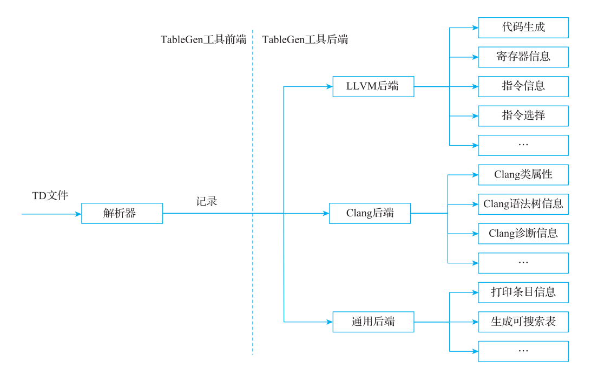
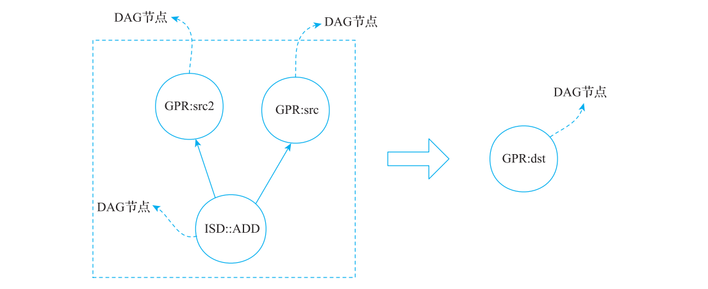

# 第 6 章 TableGen 介绍

> 以 LLVM 18.1.8 为基线，结合本地源码、可复现实验和实际输出重写校核。原始书稿另存 [origin](origin/inside-llvm-codegen-ch6.md)；本章以当前正文为准。
> 实验入口：[runner.py](experiments/ch6/runner.py)，记录：[源码核查](review/ch6.md) · [实验结果 JSON](review/experiments-ch6.json)。实验输入在 `experiments/ch6/`，默认把中间输出写入临时目录。

编译器最为基础的功能之一是将高级语言转换成可以在硬件上执行的机器码，为了支持尽可能多的硬件，通用编译器需要为每一款硬件都实现这一转换。为了更好地生成高质量的目标机器码，编译器后端开发者需要了解目标机器的指令集信息（包括具体支持哪些指令、指令有什么属性、应该使用什么寄存器、指令间存在什么样的依赖）。虽然每一款不同的硬件指令集都不相同，但都包含指令、寄存器、调用约定等信息，所以可以将这些信息进行抽象。这样编译器后端实现时就可以分为两层：具体硬件信息和与硬件无关的编译框架。不同的目标硬件都包含了丰富的指令、寄存器信息等，直接描述这些信息将会非常冗杂，并且很难做到格式统一，所以很有必要设计一种通用的后端信息描述语言，这就是目标描述语言 TableGen。

因为 TableGen 和代码生成过程密切相关，所以本章简单介绍 TableGen 的词法、语法，并且演示如何从目标描述语言转换为 C++ 代码，从而和编译器的代码生成框架结合起来。本章最后将以指令匹配为例介绍如何写 TD 文件。

本章命令使用 **Bash**，先执行下面的准备块，再在同一 shell 中按正文顺序执行后续命令。工具应为已构建的 LLVM 18.1.8；这些步骤不会启动构建。输入只读，所有生成文件写入 `CODEGEN_LAB` 指向的新临时目录。

<!-- manual-lab:ch6-setup -->

```sh
# 遇到非预期失败就停止，避免后文继续读取不完整的生成文件。
set -euo pipefail
export LLVM_BUILD="${LLVM_BUILD:-/opt/llvm-project/build}"
export LLVM_SRC="${LLVM_SRC:-/opt/llvm-project}"
export BOOK_ROOT="${BOOK_ROOT:-/opt/coding/mlir-toy/llvm/inside-llvm-codegen}"
BOOK_INPUT="$BOOK_ROOT/experiments/ch6"
# 为本次运行单独保存生成物，便于与源文件区分。
CODEGEN_LAB=$(mktemp -d)
printf '本章临时输出目录：%s\n' "$CODEGEN_LAB"
"$LLVM_BUILD/bin/llvm-tblgen" --version
```

预期工具报告 LLVM 18.1.8。后续 TableGen 命令会明确 include 目录、TD 输入与生成后端；记录解析不需要 target triple 或 CPU 参数。
## 6.1 目标描述语言

下面分别从 TableGen 的词法和语法展开介绍。

### 6.1.1 词法

TableGen 作为一门 DSL（Domain Specific Language，领域专用语言），提供了关键字、标识符、特殊运算符等信息，在词法分析阶段对 TD 文件进行分析可以得到对应的token（单词符号）。

1）数值字面量：表示 TD 文件直接给出的数值，只支持整数字面量，可以定义十进制、十六进制和二进制，其文法如代码清单 6-1 所示。

**代码清单 6-1 数值字面量文法**

```text
TokInteger     ::=  DecimalInteger | HexInteger | BinInteger
DecimalInteger ::=  ["+" | "-"] ("0"..."9")+
HexInteger     ::=  "0x" ("0"..."9" | "a"..."f" | "A"..."F")+
BinInteger     ::=  "0b" ("0" | "1")+
```

上述文法含义：TokInteger 表示整数，可以是十进制整数、十六进制整数或二进制整数；其中十进制整数以“ +”或“ –”符号开头（符号可省略），后面是一个或多个 0～9的数字；十六进制整数以“0x”开头，后面是一个或多个 0～9 的数字或 a～f / A～F 的字母；二进制整数以“0b”开头，后面是一个或多个数字 0 或者数字 1。

2）字符串字面量：表示 TD 文件中的字符串常量，其文法如代码清单 6-2 所示。

**代码清单 6-2 字符串字面量文法**

```text
TokString ::= '"' (non-'"' characters and escapes) '"'
TokCode ::= "[{" (shortest text not containing "}]") "}]"
```

TokString 用双引号界定，可以使用转义序列，例如 `\\`、`\"`、`\t`、`\n`。TokCode 用 `[{` 与 `}]` 界定，是可跨行且保留换行的字符串字面量；它本身不会在解析 TD 时作为 C++ 执行。

3）关键字：TableGen 定义了一些关键字，这些关键字都有特殊的含义。目前的关键字有 assert、bit、bits、class、code、dag、def、dump、else、false、foreach、defm、defset、defvar、field、if、in、include、int、let、list、multiclass、string、then、true。这些关键字分别描述类型、语法结构等信息，6.1.2 节将对部分重要关键字进行介绍。

4）标识符：定义了变量，其文法如代码清单 6-3 所示。

**代码清单 6-3 标识符文法**

```text
ualpha ::= "a"..."z" | "A"..."Z" | "_"
TokIdentifier ::= ("0"..."9")* ualpha (ualpha | "0"..."9")*
TokVarName ::= "$" ualpha (ualpha | "0"..."9")*
```

上述文法含义：TokIdentifier 表示标识符，以 0 个或多个 0～9 的数字开头，中间是字母或者下划线，后面是 0 个或多个字母、下划线或者数字；TokVarName 表示别名，以 $ 开头，中间是字母或者下划线，后面是 0 个或多个字母、下划线或者数字。其中标识符是大小写敏感的。另外，标识符也可以是数字开头，如果标识符只有数字，则 TableGen 会将它解释为整数字面量。

注意：TokVarName 仅仅适用于 DAG 中。

5）特殊运算符：TableGen 还提供了“ !”运算符，以“ !”开头，后跟一些运算。例如，!add 表示对多个操作数进行求和计算，“ !”运算符可以认为是 TableGen 内置的处理方式。完整运算符说明见本地 [TableGen/ProgRef.rst](/opt/llvm-project/llvm/docs/TableGen/ProgRef.rst)。

6）基本分隔符：TableGen 还提供了一些基础符号（参见 6.1.2 节），例如 –、+、[、]、{、}、(、)、<、>、:、;、.、...、 =、?、# 等，这些符号作为分界符通常要配合语法来使用，例如<> 用于定义模板参数，[] 用于定义列表数据。

7）其他词法：TableGen 提供了 include 语法，可以在本文件中引入其他的 TD 文件，并提供了预处理的功能，详细内容可以参考官网。

[language.td](experiments/ch6/language.td) 是本章的独立输入。实际 `llvm-tblgen --dump-json` 输出确认：`-42` 为有符号整数，`0x2A` 与 `0b101010` 都为 42；多行 code 字段作为字符串保留，未在 TableGen 前端执行其中的 C++ 文字。

<!-- manual-lab:ch6-language-records -->

```sh
# JSON 适合按字段检查；print-records 更适合人工阅读继承展开后的记录。
"$LLVM_BUILD/bin/llvm-tblgen" --dump-json "$BOOK_INPUT/language.td" \
  -o "$CODEGEN_LAB/language.json"
"$LLVM_BUILD/bin/llvm-tblgen" --print-records "$BOOK_INPUT/language.td" \
  -o "$CODEGEN_LAB/language.records.txt"
python3 - "$CODEGEN_LAB/language.json" <<'PYJSON'
import json, sys
# Values 是记录名；这里读取求值后的字段，不会执行 code 字符串中的 C++。
v = json.load(open(sys.argv[1]))["Values"]
for key in ("negative", "hexadecimal", "binary", "body"):
    print(key, repr(v[key]))
PYJSON
```

预期数值为 -42/42/42，body 是包含换行和 `return 1;` 的字符串；完整记录打印保存在 language.records.txt。TableGen 读取 TD，不需要设置 target triple 或 CPU。

### 6.1.2 语法

TableGen 提供的语法比较丰富，限于篇幅无法展开介绍，本节仅介绍类型（type）、值（value）和记录（record）相关的内容，其他内容请参考官网。

1. 类型

TableGen 定义了如下数据类型。

1）bit：表示布尔类型，可以取值 0 或 1。

2）int：表示 64 位有符号整数。

3）string：表示任意长度的字符串。

4）dag：表示可嵌套的 DAG。DAG 的节点由一个运算符、0 个或多个参数（即操作数）组成，节点中的运算符必须是一个实例化的记录。`!size` 对 dag 返回直接参数的数量，不递归统计嵌套节点。

5）bits<n>：表示大小为 n 的位数组（数组中的每个元素占用一位）。

6）list<type>：表示元素的数据类型为 type 的列表。列表元素的下标从 0 开始。

7）类名也可作为类型，例如 `list<Register>` 限制列表元素为派生自 Register 的记录。

注意：位数组 bits<n> 的位编号从最低位 0 开始。例如 `bits<2> val = {1, 0};` 中大括号从高位向低位书写，因此表示十进制 2。

TableGen 的 dag 值可嵌套：用另一个 dag 作为参数，就能描述树状的操作组合，用于指令匹配模式等场景。它并不是一个任意有向图的通用存储接口；共享关系和具体匹配语义由使用该数据的后端解释。

DAG 节点的语法可写作 `(operator argument1, argument2, …, argumentn)`。operator 是运算符，必须解析为记录值；参数之间以逗号分隔，可以写成 `value`、`value:$name` 或 `$name`。例如 `(add i64:$lhs, i64:$rhs)` 中 add 为运算符记录，`$lhs` / `$rhs` 为参数名称；不要漏写命名参数中的 `$`。运算符本身也可按文法带名称。

2. 值

TableGen 中的值可以通过如代码清单 6-4 所示的文法进行描述。

**代码清单 6-4 值的文法**

```text
Value         ::=  SimpleValue ValueSuffix* | Value "#" [Value]
ValueSuffix   ::=  "{" RangeList "}" | "[" SliceElements "]" | "." TokIdentifier
RangeList     ::=  RangePiece ("," RangePiece)*
RangePiece    ::=  TokInteger | TokInteger "..." TokInteger
                | TokInteger "-" TokInteger | TokInteger TokInteger
SliceElements ::=  (SliceElement ",")* SliceElement ","?
SliceElement  ::=  Value | Value "..." Value | Value "-" Value | Value TokInteger
```

值可以分为 3 类，分别是简单值、后缀值以及复合值。其中：

1）简单值（SimpleValue）可以是整数、字符串或者代码。例如字段定义 `int a = 1;` 中，1 是简单值；这条字段定义语句本身不是一个值。

2）后缀值（ValueSuffix*）可从位数组 / 列表中选取元素，或访问记录字段。`let a{1...3} = 0b110;` 是部分位赋值语句，不是给整个 a 重新赋值；它把 a 的第 1、2、3 位分别设为 1、1、0，其余位保留。例如记录内先写 `bits<4> a = 0;`，再执行该 let 才能确定 a 为 `0b0110`。没有初值时，未赋的位仍可能是 `?`。LLVM 18 仍接受原书的 `1-3` 范围写法，但文档已将连字符形式标为弃用，建议使用 `1...3`。

3）复合值（Value“ #” [Value]）表示将多个值通过连接符“ #”进行组合。例如“ let str = "12" # "ab";”表示将两个字符串连接形成一个新的值。

实验给 a 的初值设为 0，再执行 `let a{1...3}=0b110`，得到四位值 `0110`；列表 `[10,20,30]` 的切片 `[2,0]` 得到 `[30,10]`；拼接得到 `12ab`，嵌套 dag 的直接参数计数为 2。两个反例也已运行：给不存在的字段赋值、重复给同一位赋值，分别被 TableGen 诊断为 unknown field 和“more than once”。

<!-- manual-lab:ch6-values-and-negative-cases -->

```sh
python3 - "$CODEGEN_LAB/language.json" <<'PYJSON'
import json, sys
v = json.load(open(sys.argv[1]))["Values"]
# bits 的 JSON 数组按低位到高位列出，与 TD 大括号的书写方向不同。
for key in ("a", "slice", "joined", "direct_arguments"):
    print(key, v[key])
PYJSON
# 负例必须失败；把命令放进 if，才能在 set -e 下检查预期诊断。
for name in bad-field bad-bits; do
  case "$name" in
    bad-field) expected='unknown' ;;
    bad-bits) expected='more than once' ;;
  esac
  if "$LLVM_BUILD/bin/llvm-tblgen" --print-records "$BOOK_INPUT/$name.td" \
      > "$CODEGEN_LAB/$name.stdout" 2> "$CODEGEN_LAB/$name.stderr"; then
    printf '负例意外通过：%s\n' "$name" >&2
    exit 1
  fi
  rg -i -F "$expected" "$CODEGEN_LAB/$name.stderr"
done
```

预期 JSON 中 a 按低位到高位存为 `[0,1,1,0]`，slice=[30,10]、joined=12ab、direct_arguments=2；两个负例分别给出对应诊断。

3. 记录

TableGen 最主要的目的之一是生成记录，然后后端基于记录进行分析得到最终结果。记录可以被看作是有名字、有类型、具有特定属性的结构体。TableGen 分别通过 def 和class 定义记录，并在此基础上提供批量定义记录的高级语法 multiclass、defm。

1）用 def 定义一个具体的记录：非常类似于 C 语言中用 struct 定义的结构体，包含了名字、类型和属性，def 示例如代码清单 6-5 所示。

**代码清单 6-5 def 示例**

```text
// def 创建一个可被后续记录引用的具体实例，不是运行时对象分配。
def record_example {
    int a=1;
    string b="def example";
}
```

代码清单 6-5 定义了 record_example，包含 a、b 两个字段。其中，a 的类型为整型，值为 1；b 的类型为字符串型，值为 def example。

2）用 class 定义一个记录类：该记录类可以被实例化为记录，它非常类似于 C++ 中的class。来看一个 class 的应用示例，示例首先用 class 定义一个记录类，然后通过 def 来实例化记录，如代码清单 6-6 所示。

> 本例只演示字段继承与部分编码赋值。未设置的 encoding 位保留为 `?`；ADD、MUL 也未继承 LLVM Instruction，因此并不是完整可用的后端指令定义。

**代码清单 6-6 使用 class 定义记录类，使用 def 实例化记录示例**

```text
class TestInst {
    string asmname;
    // 未给初值的位仍是 ?；后面的局部赋值不会自动补零。
    bits<32> encoding;
}
// ADD 继承字段；let 在实例中指定高六位操作码。
def ADD: TestInst {
    let asmname="add";
    let encoding{31...26}=1;
}
def MUL: TestInst {
    let asmname="mul";
    let encoding{31...26}=2;
}
```

[records.td](experiments/ch6/records.td) 包含清单 6-5、6-6，实际 JSON 确认 ADD / MUL 的高六位分别编码 1 / 2，低 26 位仍未赋值。代码清单 6-6 先定义 TestInst，再通过 def 实例化 ADD 和 MUL。在实例化的过程中，要用 let 关键字对 class 中定义的字段进行赋值，例如class 中定义了 asmname，在 ADD 中通过 let asmname="add" 对 asmname 进行赋值。

<!-- manual-lab:ch6-def-class -->

```sh
"$LLVM_BUILD/bin/llvm-tblgen" --dump-json "$BOOK_INPUT/records.td" \
  -o "$CODEGEN_LAB/records.json"
"$LLVM_BUILD/bin/llvm-tblgen" --print-records "$BOOK_INPUT/records.td" \
  -o "$CODEGEN_LAB/records.txt"
cat "$CODEGEN_LAB/records.txt"
```

预期 record_example 的字段为 a=1、b="def example"；ADD/MUL 高六位分别为1/2，其余26位显示为 `?`。

我们还可以定义 class 层次，并通过继承的方式来使用（所以它非常类似于 C++ 中的class）。使用 class 可以大大简化记录的定义，将公共的信息通过 class 定义，然后通过 def进行实例化。

3）用 multiclass 和 defm 定义一组记录。指令的寄存器 / 立即数变体往往共享许多属性。multiclass 将多个记录定义组织为一个可参数化的模板，defm 实例化时展开其中的 def、defm 等，得到多个具体记录；它不是“一次定义多个 class”。代码清单 6-7 中 RegInstr 包含 rr 和 rm 两个 def 模板，实例化后都继承 Instr。

**代码清单 6-7 使用 multiclass 和 defm 同时定义多个记录示例**

```text
// 模板参数在实例化时成为字段值，生成器随后读取这些字段。
class Instr<bits<4> op, string desc> {
    bits<4> opcode = op;
    string name = desc;
}
multiclass RegInstr {
    def rr : Instr<0b1111,"rr">;
    def rm : Instr<0b0000,"rm">;
}

// defm 将前缀与内部 rr/rm 名称组合，批量生成两个具体记录。
defm MyBackend_:RegInstr;
```

可以把代码清单 6-7 中 defm 的效果理解为展开为两个具体记录定义，如代码清单 6-8 所示。这里假定 Instr 类已经定义；展开结果不是名为 rr、rm 的两个 class。

**代码清单 6-8 用 multiclass 分别定义 rr 和 rm 的伪代码**

```tablegen
// 等价展开示意：要求已经定义清单 6-7 中的 Instr 类。
// 这里只展示展开后的记录关系；它不是另一套生成指令的算法。
def MyBackend_rr : Instr<0b1111, "rr">;
def MyBackend_rm : Instr<0b0000, "rm">;
```

`defm MyBackend_ : RegInstr;` 为内部 rr、rm 名称加上前缀，得到 MyBackend_rr、MyBackend_rm。实际 JSON 的 `!instanceof.Instr` 恰好列出这两个记录，字段名是 name，分别为 rr / rm。清单 6-9 将这些已生成的字段用便于阅读的记录格式列出。

**代码清单 6-9 生成的 MyBackend_rm 和 MyBackend_rr 记录示例**

```text
------------- Classes -----------------
class Instr<bits<4> Instr:op = { ?, ?, ?, ? }, string Instr:desc = ?> {
    bits<4> opcode = { Instr:op{3}, Instr:op{2}, Instr:op{1}, Instr:op{0} };
    string name = Instr:desc;
}
------------- Defs -----------------
def MyBackend_rm {     // Instr
    bits<4> opcode = { 0, 0, 0, 0 };
    string name = "rm";
}
def MyBackend_rr {     // Instr
    bits<4> opcode = { 1, 1, 1, 1 };
    string name = "rr";
}
```

注意：`--print-records` 打印 class 与展开后的 def，不把 multiclass 当成具体记录另列。multiclass 的内部定义实际上已被 defm 展开。

<!-- manual-lab:ch6-multiclass-expansion -->

```sh
python3 - "$CODEGEN_LAB/language.json" <<'PYJSON'
import json, sys
records = json.load(open(sys.argv[1]))
# 用派生关系找记录，不依赖记录在打印文件中的先后位置。
print(records["!instanceof"]["Instr"])
for name in ("MyBackend_rm", "MyBackend_rr"):
    print(name, records[name]["name"], records[name]["opcode"])
PYJSON
```

预期只有 MyBackend_rm / MyBackend_rr 两个 Instr 实例，name 分别为 rm / rr，opcode 分别为全0 / 全1。

本节仅简单示范了 def、class、multiclass、defm 的使用，并未介绍更高级的语法的应用。希望通过本节的介绍，读者能够读懂 TD 文件，知道如何从 TD 文件生成对应的记录。关于 TableGen 还有很多内容，限于篇幅无法在本书中展开介绍，如文法的定义、使用方式等，以及一些高级功能（如 foreach、defvar、defset、assert 等语法），读者可参考官网深入了解 TableGen。

## 6.2 TableGen 工具链

LLVM 提供的工具 llvm-tblgen 可将 TD 文件转换成和 LLVM 框架配合的 C++ 代码，整个转换过程实际分成两步。

1）解析 TD 文件，完成继承、模板实例化和表达式求值，得到记录。这一前端由 TableGen 公共库提供。

2）由具体 TableGen 后端读取记录，生成 .inc、文本或其他格式。实际可用的后端由所运行的可执行工具决定：LLVM 代码生成通常使用 `llvm-tblgen`，Clang 使用 `clang-tblgen`，MLIR 使用 `mlir-tblgen`，不能把这三者都当作 llvm-tblgen 的命令选项。常见用途可分为以下 3 种。

① LLVM 后端：解析记录以生成与架构相关的一些信息，如描述架构寄存器和指令信息的头文件，或用于指导代码生成、指令选择的代码片段。

② Clang 后端：例如生成语法树、诊断、属性等信息，也包含目标相关 built-in 等用途。

③ 通用功能：例如打印记录。可搜索表生成器虽然可用于多种领域，但仍需解析特定表定义及字段，不能概括为不理解记录内容；AArch64 系统寄存器表是其中一种用途。

llvm-tblgen 工具链工作流程示意图如图 6-1 所示。



> 图 6-1 应理解为共享 TableGen 前端及领域后端的关系；Clang / MLIR 的后端分别装入 clang-tblgen / mlir-tblgen。

**图 6-1 llvm-tblgen 工具链工作流程示意图**

实际上现在 TD 的使用场景已经不局限于上面介绍的 3 种后端，其适用范围越来越广，比如 MLIR 也是基于 TD 文件设计方言（dialect）、算子（operator）等关键信息，当然 MLIR也需要实现自己的后端，以生成自己所需要的内容。

下面以 BPF 后端为例介绍如何通过 TD 文件生成和 LLVM 框架匹配的代码。

### 6.2.1 从 TD 定义到记录

如前所述，TableGen 前端解析 TD 文件后就可以得到记录。因为 LLVM 支持多种后端，所以在设计 TD 文件的记录类时又进行了抽象，将记录类分成：适用于所有后端的基类记录类、适用于某一后端的派生记录类。下面以加法指令 add 的定义为例进行介绍。首先定义指令基类，然后定义指令的派生类，最后定义具体的指令，如代码清单 6-10 所示。

> 以下按 LLVM 18.1.8 更新。InstructionEncoding / Instruction 仅摘录相关字段；后续类从对应源码摘录，仍依赖 LLVM 与 BPF 的其他定义，不能把整段当成独立 TD 文件。LLVM 18 的 ALU 模板新增 `int off` 参数，ADD 传 0。

**代码清单 6-10 BPF 中 add 指令相关的 TD 描述**

```tablegen
// Target.td 的公共基类，仅摘录本节相关字段。
class InstructionEncoding {
  int Size;
  // 其余字段见 Target.td。
}
class Instruction : InstructionEncoding {
  string Namespace = "";
  string AsmString = "";
  // 其余字段见 Target.td。
}

// BPFInstrFormats.td：标准指令编码占 8 字节。
class InstBPF<dag outs, dag ins, string asmstr, list<dag> pattern>
  : Instruction {
  // Inst 是编码位容器；位域含义由后端约定，不能按宿主整数端序猜字节布局。
  field bits<64> Inst;
  field bits<64> SoftFail = 0;
  let Size = 8;

  let Namespace = "BPF";
  let DecoderNamespace = "BPF";

  BPFOpClass BPFClass;
  let Inst{58-56} = BPFClass.Value;

  // outs/ins 声明显式 def/use；并不直接描述模式匹配的源指令和目标指令。
  dag OutOperandList = outs;
  dag InOperandList = ins;
  let AsmString = asmstr;
  // Pattern 描述要识别的 DAG 计算；当前 Instruction 记录提供生成的机器 opcode。
  let Pattern = pattern;
}

// BPFInstrInfo.td：opcode 字节 = operation(4) | source(1) | class(3)。
// ALU 与 JMP 共用这一布局，但 instruction class 的值不同。
class TYPE_ALU_JMP<bits<4> op, bits<1> srctype,
                   dag outs, dag ins, string asmstr, list<dag> pattern>
  : InstBPF<outs, ins, asmstr, pattern> {

  let Inst{63-60} = op;
  let Inst{59} = srctype;
}

// RI 为寄存器 + 立即数；RR 为寄存器 + 寄存器。
// multiclass 生成 _rr、_ri、_rr_32、_ri_32 四个记录变体。
class ALU_RI<BPFOpClass Class, BPFArithOp Opc, int off,
             dag outs, dag ins, string asmstr, list<dag> pattern>
    : TYPE_ALU_JMP<Opc.Value, BPF_K.Value, outs, ins, asmstr, pattern> {
  bits<4> dst;
  bits<32> imm;

  let Inst{51-48} = dst;
  let Inst{47-32} = off;
  let Inst{31-0} = imm;
  let BPFClass = Class;
}

class ALU_RR<BPFOpClass Class, BPFArithOp Opc, int off,
             dag outs, dag ins, string asmstr, list<dag> pattern>
    : TYPE_ALU_JMP<Opc.Value, BPF_X.Value, outs, ins, asmstr, pattern> {
  bits<4> dst;
  bits<4> src;

  let Inst{55-52} = src;
  let Inst{51-48} = dst;
  let Inst{47-32} = off;
  let BPFClass = Class;
}

multiclass ALU<BPFArithOp Opc, int off, string OpcodeStr, SDNode OpNode> {
  def _rr : ALU_RR<BPF_ALU64, Opc, off,
                   (outs GPR:$dst),
                   (ins GPR:$src2, GPR:$src),
                   "$dst "#OpcodeStr#" $src",
                   [(set GPR:$dst, (OpNode i64:$src2, i64:$src))]>;
  // 立即数模式还要求能表示为符号扩展的 32 位编码，不能匹配任意 i64 常量。
  def _ri : ALU_RI<BPF_ALU64, Opc, off,
                   (outs GPR:$dst),
                   (ins GPR:$src2, i64imm:$imm),
                   "$dst "#OpcodeStr#" $imm",
                   [(set GPR:$dst, (OpNode GPR:$src2, i64immSExt32:$imm))]>;
  // GPR32 限制 32 位寄存器形式；这是另一条记录，不是运行时分支。
  def _rr_32 : ALU_RR<BPF_ALU, Opc, off,
                   (outs GPR32:$dst),
                   (ins GPR32:$src2, GPR32:$src),
                   "$dst "#OpcodeStr#" $src",
                   [(set GPR32:$dst, (OpNode i32:$src2, i32:$src))]>;
  def _ri_32 : ALU_RI<BPF_ALU, Opc, off,
                   (outs GPR32:$dst),
                   (ins GPR32:$src2, i32imm:$imm),
                   "$dst "#OpcodeStr#" $imm",
                   [(set GPR32:$dst, (OpNode GPR32:$src2, i32immSExt32:$imm))]>;
}

// Constraints 将输出 dst 与输入 src2 绑定到同一个寄存器，表示二地址约束。
// isAsCheapAsAMove 表示成本不高于 move；不是“必定比 move 便宜”。
let Constraints = "$dst = $src2" in {
  let isAsCheapAsAMove = 1 in {
    defm ADD : ALU<BPF_ADD, 0, "+=", add>;
  }
}
```

`Inst{63-56}` 在 BPF 的 TableGen 编码值中表示首个 opcode 字节，`BPFMCCodeEmitter::encodeInstruction` 先发射它；不要把这里的位编号与内存中小端 64 位整数的低 8 位混淆。ALU/JMP 的 opcode 字节共有同一种位域布局，但 class 值区分 ALU64、ALU、JMP 等。`Constraints = "$dst = $src2"` 是 tied operand（二地址）约束，交换律属性是另一个字段 `isCommutable`。

BPF 示例固定使用提交 `3b5b5c1ec4a3095ab096dd780e84d7ab81f3d7ff`。runner 用 `git archive` 只读导出所需 include 和 BPF 目录到临时目录，再运行 TableGen，使正文生成物有固定来源，也不会修改 LLVM 源文件。实验另用当前工作树运行相同的 DAG 选择器、指令描述和编码器生成命令；本次三份输出均与基线逐字节相同，SHA-256 记录在 JSON 中。工作树有文本修改并不自动意味着这三份生成物存在语义差异。以下命令直接导出同一基线，并将记录打印和 JSON 写入本章临时目录。

**代码清单 6-11 使用 llvm-tblgen 命令将 TD 文件转换为记录**

<!-- manual-lab:ch6-bpf-source-and-records -->

```sh
BPF_BASELINE=3b5b5c1ec4a3095ab096dd780e84d7ab81f3d7ff
mkdir -p "$CODEGEN_LAB/llvm18-source"
# 只读导出固定提交，避免把本地 TD 修改混入教材基线。
git -C "$LLVM_SRC" archive --format=tar --output="$CODEGEN_LAB/llvm18-source.tar" \
  "$BPF_BASELINE" llvm/include llvm/lib/Target/BPF
tar -xf "$CODEGEN_LAB/llvm18-source.tar" -C "$CODEGEN_LAB/llvm18-source"
BPF_TD="$CODEGEN_LAB/llvm18-source/llvm/lib/Target/BPF/BPF.td"
# 用 Bash 数组保存 include 参数，路径中有空格时也不被拆分。
BPF_TD_INCLUDES=(-I "$CODEGEN_LAB/llvm18-source/llvm/include"
                 -I "$CODEGEN_LAB/llvm18-source/llvm/lib/Target/BPF")
"$LLVM_BUILD/bin/llvm-tblgen" "${BPF_TD_INCLUDES[@]}" --print-records "$BPF_TD" \
  -o "$CODEGEN_LAB/bpf.records.txt"
"$LLVM_BUILD/bin/llvm-tblgen" "${BPF_TD_INCLUDES[@]}" --dump-json "$BPF_TD" \
  -o "$CODEGEN_LAB/bpf.json"
python3 - "$CODEGEN_LAB/bpf.json" <<'PYJSON'
import json, sys
records = json.load(open(sys.argv[1]))
# 检查四个变体共享的大小和 tied 约束，而不依赖打印行号。
for name in ("ADD_rr", "ADD_ri", "ADD_rr_32", "ADD_ri_32"):
    record = records[name]
    print(name, {k: record[k] for k in ("Size", "Constraints", "isAsCheapAsAMove")})
PYJSON
```

预期四个 ADD 变体均存在，Size=8、Constraints 为 `$dst = $src2`、isAsCheapAsAMove=1。

下面以 ADD_rr 为例展示生成的记录的部分片段，如代码清单 6-12 所示。

> 清单 6-12 摘取实际记录中的相关字段，省略大量属性与编码位。runner 从完整 JSON 验证四个 ADD 变体、Size=8、绑定约束和 move 代价标记；节选不能代替完整 TD 输入。

**代码清单 6-12 生成 ADD_rr 记录的代码片段**

此记录节选已加中文阅读注释，注释不属于生成器原始输出。

```text
def ADD_rr {
    field bits<64> Inst = ...;
    int Size = 8;
    string DecoderNamespace = "BPF";
    list<Predicate> Predicates = [];
    string DecoderMethod = "";
    bit hasCompleteDecoder = 1;
    string Namespace = "BPF";
    // 显式目的和输入在这里分开；二地址重叠由 Constraints 另行描述。
    dag OutOperandList = (outs GPR:$dst);
    dag InOperandList = (ins GPR:$src2, GPR:$src);
    string AsmString = "$dst += $src";
    EncodingByHwMode EncodingInfos = ?;
    // set 的目的绑定到 $dst；同名变量把匹配到的源值带到目标指令操作数。
    list<dag> Pattern = [(set GPR:$dst, (add i64:$src2, i64:$src))];
    // Uses/Defs 是隐式物理寄存器列表；空列表不表示指令没有显式输入输出。
    list<Register> Uses = [];
    list<Register> Defs = [];
    int CodeSize = 0;
    int AddedComplexity = 0;
    ……
}

def ADD_rr_32 {
    ……
}

def ADD_ri {
    ……
}

def ADD_ri_32 {
    ……
}
```

可以看到 ADD_rr 包含机器指令的显式使用操作数列表（InOperandList）、显式定义操作数列表（OutOperandList）、选择模式（Pattern）和汇编打印格式（AsmString）。InOperandList / OutOperandList 不是模式输入 / 输出指令序列；`Pattern` 才描述源 DAG，生成器结合当前 Instruction 记录构造目标指令。

### 6.2.2 从记录到 C++ 代码

接下来需要对记录进一步处理，根据后端功能需要提取不同的信息。图 6-1 所示的后端功能非常多，不同功能需要的信息有所不同，这里以指令匹配为例介绍如何从记录提取指令匹配所需要的信息。

仍以 BPF 为例，沿用清单 6-11 的源快照和 include 目录，使用 `-gen-dag-isel` 生成 SelectionDAG 指令选择器代码。其中 MatcherTable 描述把已降低、合法化后的 SelectionDAG 匹配为目标机器节点的过程，不直接匹配 LLVM IR。清单 6-13 实际是 ISD::ADD 的整个 opcode 分支节选，包含立即数和不同位宽等候选，并非 ADD_rr 独占的匹配序列。

<!-- manual-lab:ch6-dag-isel-generator -->

```sh
# 这个生成器产出 DAG 匹配程序；不是把输入 IR 编译为目标代码。
"$LLVM_BUILD/bin/llvm-tblgen" "${BPF_TD_INCLUDES[@]}" -gen-dag-isel "$BPF_TD" \
  -o "$CODEGEN_LAB/BPFGenDAGISel.inc"
rg -n -m 8 'BPF::(FI_ri|ADD_ri|ADD_rr)' "$CODEGEN_LAB/BPFGenDAGISel.inc"
```

预期生成文件含 FI_ri、ADD_ri/ADD_rr 及相应32位候选；偏移用于阅读这一次输出，不作为稳定接口。

> 清单 6-13 取自本章实际生成的 BPFGenDAGISel.inc，展示完整 ADD opcode 分支。字节偏移只用于阅读这一次生成物，测试检查匹配动作与符号，不把偏移当成稳定接口。

**代码清单 6-13 包含 ADD_rr 的完整 ADD 匹配分支**

以下生成代码已加中文阅读注释；匹配字节码和偏移保持原样。

```cpp
// 阅读注释：以下是匹配表字节码；左侧数字是本次生成表的偏移。
/*  2518*/ /*SwitchOpcode*/ 68, TARGET_VAL(ISD::ADD),// ->2589
/*  2521*/  OPC_Scope, 11, /*->2534*/ // 2 children in Scope
// 先尝试帧索引地址模式；RecordNode 保存候选值，检查动作才决定是否匹配。
/*  2523*/   OPC_RecordNode, // #0 = $addr
/*  2524*/   OPC_CheckTypeI64,
/*  2525*/   OPC_CheckComplexPat1, /*#*/0, // SelectFIAddr:$addr #1 #2
/*  2527*/   OPC_MorphNodeTo1None, TARGET_VAL(BPF::FI_ri),
                 MVT::i64, 2/*#Ops*/, 1, 2,
             // Src: FIri:{ *:[i64] }:$addr - Complexity = 9
             // Dst: (FI_ri:{ *:[i64] } FIri:{ *:[i64] }:$addr)
/*  2534*/  /*Scope*/ 53, /*->2588*/
/*  2535*/   OPC_RecordChild0, // #0 = $src2
/*  2536*/   OPC_RecordChild1, // #1 = $imm
/*  2537*/   OPC_Scope, 30, /*->2569*/ // 3 children in Scope
/*  2539*/    OPC_MoveChild1,
/*  2540*/    OPC_CheckOpcode, TARGET_VAL(ISD::Constant),
/*  2543*/    OPC_Scope, 11, /*->2556*/ // 2 children in Scope
// 检查常量能否装入指令立即数字段，然后生成 ADD_ri。
/*  2545*/     OPC_CheckPredicate0,  // Predicate_i64immSExt32
/*  2546*/     OPC_MoveParent,
/*  2547*/     OPC_CheckTypeI64,
/*  2548*/     OPC_EmitConvertToTarget1,
/*  2549*/     OPC_MorphNodeTo1None, TARGET_VAL(BPF::ADD_ri),
                   MVT::i64, 2/*#Ops*/, 0, 2,
               // Src: (add:{ *:[i64] } GPR:{ *:[i64] }:$src2, (imm:{ *:[i64] })<<P:Predicate_i64immSExt32>>:$imm) - Complexity = 7
               // Dst: (ADD_ri:{ *:[i64] } GPR:{ *:[i64] }:$src2, (imm:{ *:[i64] }):$imm)
/*  2556*/    /*Scope*/ 11, /*->2568*/
/*  2557*/     OPC_CheckPredicate0,  // Predicate_i32immSExt32
/*  2558*/     OPC_MoveParent,
/*  2559*/     OPC_CheckTypeI32,
/*  2560*/     OPC_EmitConvertToTarget1,
/*  2561*/     OPC_MorphNodeTo1None, TARGET_VAL(BPF::ADD_ri_32),
                   MVT::i32, 2/*#Ops*/, 0, 2,
               // Src: (add:{ *:[i32] } GPR32:{ *:[i32] }:$src2, (imm:{ *:[i32] })<<P:Predicate_i32immSExt32>>:$imm) - Complexity = 7
               // Dst: (ADD_ri_32:{ *:[i32] } GPR32:{ *:[i32] }:$src2, (imm:{ *:[i32] }):$imm)
/*  2568*/    0, /*End of Scope*/
// 立即数候选失败后可继续寄存器候选；失败不等于整个指令选择失败。
/*  2569*/   /*Scope*/ 8, /*->2578*/
/*  2570*/    OPC_CheckTypeI64,
/*  2571*/    OPC_MorphNodeTo1None, TARGET_VAL(BPF::ADD_rr),
                  MVT::i64, 2/*#Ops*/, 0, 1,
              // Src: (add:{ *:[i64] } i64:{ *:[i64] }:$src2, i64:{ *:[i64] }:$src) - Complexity = 3
              // Dst: (ADD_rr:{ *:[i64] } i64:{ *:[i64] }:$src2, i64:{ *:[i64] }:$src)
/*  2578*/   /*Scope*/ 8, /*->2587*/
/*  2579*/    OPC_CheckTypeI32,
/*  2580*/    OPC_MorphNodeTo1None, TARGET_VAL(BPF::ADD_rr_32),
                  MVT::i32, 2/*#Ops*/, 0, 1,
              // Src: (add:{ *:[i32] } i32:{ *:[i32] }:$src2, i32:{ *:[i32] }:$src) - Complexity = 3
              // Dst: (ADD_rr_32:{ *:[i32] } i32:{ *:[i32] }:$src2, i32:{ *:[i32] }:$src)
/*  2587*/   0, /*End of Scope*/
/*  2588*/  0, /*End of Scope*/
```

实际生成表先尝试 FrameIndex 地址形式 FI_ri，之后尝试 i64 / i32 立即数变体，最后尝试两个寄存器变体。这说明一条源 ADD 不是只能映射到一个 ADD_rr；合法类型、常量谓词、地址模式及候选优先级共同决定匹配路径。

第 7 章会介绍如何使用指令匹配表。生成器先解析 ADD_rr 的 `Pattern = [(set GPR:$dst, (add i64:$src2, i64:$src))]`，将 add 记录关联到 ISD::ADD，并对两个输入和结果进行类型推导。这里要求 i64 DAG 值，并不要求已分配物理寄存器。`set` 描述结果的类型 / 名称关系，不是最终发射的目标指令：匹配成功时，目标结果节点由 ADD_rr 这个 Instruction 记录确定，概念上为 `dst = ADD_rr(src2, src)`。GPR 类约束来自模式和机器指令操作数；`$dst = $src2` 的绑定还会由后续二地址处理保证。图 6-2 中的 set 应按这一含义理解，而不能当作额外生成的 COPY 或真实指令。



**图 6-2 ADD_rr 记录匹配过程示意图**

TableGen 工具链根据对上述 Pattern 的解释来生成对应的匹配规则信息，在生成匹配信息时还需要对操作符、操作数的类型进行约束，必须满足完成类型推导后的约束才能匹配（如 OPC_CheckType, MVT::i64 描述的就是类型的约束），最后得到如代码清单 6-13 所示的匹配表。

上述仅是生成指令匹配表的概念化描述，但是匹配表的细节非常多，不仅需要考虑匹配能否成功，还需要考虑匹配性能（如何布局不同匹配路径的顺序、当前匹配失败后如何快速跳转到下一条匹配路径等），这个过程非常琐碎，我们不再介绍。如果读者感兴趣，可以参考相关源码。这里读者只需要了解从记录的相关字段生成匹配表的过程即可。

## 6.3 扩展阅读：如何在 TD 文件中定义匹配

6.2 节演示了通过 Instruction 记录的 Pattern 定义指令选择规则。其他需求还可使用独立的 Pat 记录、带目标 C++ 地址分解回调的 ComplexPattern，以及可复用的 PatFrag / PatLeaf 片段。这些机制一起参与匹配表生成：Pat 显式提供输入和输出模式，ComplexPattern 需出现在模式中才会被引用，PatFrag / PatLeaf 则被解析、展开并贡献匹配条件。它们不是严格分成“直接生成”与“不生成”两类。

### 6.3.1 隐式定义匹配模板

> 本节保留原书“隐式定义匹配模板”的标题以便章节对照。按 LLVM 术语，独立 `def : Pat<...>` 是显式添加的模式；Instruction 的 Pattern 通常才是由指令定义隐含给出的模式。

在 BPF 的 SelectionDAG 路径中，普通调用降低为 `BPFISD::CALL`，TD 用 BPFcall 这个 SDNode 记录描述它。直接和间接调用使用不同模式，分别可选择为 JAL 或 JALX；同一个 call 并不是必须生成这两条指令。清单 6-14 展示立即数与寄存器目标两种规则；LLVM 18 基线还存在 `tglobaladdr` / `texternalsym` 等模式，所以这里不是所有调用模式的完整列表。

**代码清单 6-14 BPFcall 节点匹配模板定义**

```text
// $dst 是匹配绑定名：源模式取得调用目标，再传给输出指令。
def : Pat<(BPFcall imm:$dst), (JAL imm:$dst)>;
def : Pat<(BPFcall GPR:$dst), (JALX GPR:$dst)>;
```

代码清单 6-14 定义了 BPFcall 的匹配规则：当目的地址为立即数时，将其匹配为 JAL 指令；当 BPFcall 的目的地址为通用寄存器类型（GPR）时，将其匹配为 JALX 指令。其中，Pat 是匹配记录，它的定义非常简单，如代码清单 6-15 所示。

**代码清单 6-15 Pat 定义**

```text
class Pattern<dag patternToMatch, list<dag> resultInstrs> {
    // 输入保存要识别的 DAG 形态，输出列表保存替换后的指令模式。
    dag PatternToMatch = patternToMatch;
    list<dag> ResultInstrs = resultInstrs;
    // 谓词用于限制适用的子目标特性或其他条件。
    list<Predicate> Predicates = [];
    int AddedComplexity = 0;
}
class Pat<dag pattern, dag result> : Pattern<pattern, [result]>;
```

从 Pat 的定义来看，它接收两个参数：第一个参数（输入）表示待匹配的形式；第二个参数（输出）表示匹配后的指令形式。

生成匹配表时，TableGen 前端遇到使用 def : Pat 定义的记录时，会生成一个匿名的记录，其中 PatternToMatch 字段是待匹配信息，ResultInstrs 是输出信息，然后工具链后端从记录中抓取相关信息，从而生成匹配信息。例如在代码清单 6-14中，两个 def : Pat 定义的记录实际会生成两个匿名记录。相应记录如代码清单 6-16 所示。

> 以下匿名记录来自本章生成的 JSON，字段以可读形式重排。匿名编号由解析顺序决定，使用规则内容识别模式，不在工具或测试中写死编号。

**代码清单 6-16 隐式模板**

```text
def anonymous_7228 {
    dag PatternToMatch = (BPFcall imm:$dst);
    list<dag> ResultInstrs = [(JAL imm:$dst)];
    list<Predicate> Predicates = [];
    int AddedComplexity = 0;
}
def anonymous_7229 {
    dag PatternToMatch = (BPFcall GPR:$dst);
    list<dag> ResultInstrs = [(JALX GPR:$dst)];
    list<Predicate> Predicates = [];
    int AddedComplexity = 0;
}
```

它们都有一个字段 PatternToMatch 用于匹配信息的生成（imm 表示立即数，GPR 表示通用寄存器），而 TableGen 后端处理则和 6.2.2 节内容相同。

不依赖匿名编号，可按模式内容查询两种调用记录：

<!-- manual-lab:ch6-call-pattern-records -->

```sh
python3 - "$CODEGEN_LAB/bpf.json" <<'PYJSON'
import json, sys
records = json.load(open(sys.argv[1]))
# 按规则内容识别调用模式，避免依赖不稳定的 anonymous 编号。
for name, record in records.items():
    if not isinstance(record, dict) or "PatternToMatch" not in record:
        continue
    source = json.dumps(record["PatternToMatch"])
    result = json.dumps(record.get("ResultInstrs", []))
    if "BPFcall" in source and ("JAL" in result or "JALX" in result):
        print(name, source, result)
PYJSON
```

预期包含清单 6-14 的立即数和寄存器规则，也会显示本基线的符号调用规则；编号变化不影响内容识别。

### 6.3.2 复杂匹配模板

有些目标地址模式更适合用程序化算法分解，单靠固定 DAG 模式不够方便。ComplexPattern 允许把匹配工作委托给目标选择器中的 C++ 方法，并返回若干目标操作数；这不意味着 TableGen 完全不能表达地址，或每条 load 都必须使用 ComplexPattern。此例在 TD 中保存方法名称，C++ 实现写在后端源文件中。

以 BPF 的 load / store 地址为例，后端要处理 FrameIndex、基址加常数等形式。`BPFDAGToDAGISel::SelectAddr` 把输入地址 SDValue 分解成 Base 和 Offset；可编码偏移为有符号 16 位，其他一般地址可退为 Base=Addr、Offset=0，尚未物化的 TargetExternalSymbol / TargetGlobalAddress 在该回调中直接拒绝。下面是 LLVM 18 的完整方法定义，需放在现有类与编译单元环境中，不是独立 C++ 程序。

**代码清单 6-17 SelectAddr 函数的定义**

```cpp
bool BPFDAGToDAGISel::SelectAddr(SDValue Addr, SDValue &Base, SDValue &Offset) {
  // if Address is FI, get the TargetFrameIndex.
  SDLoc DL(Addr);
  // 栈对象还未分配最终偏移；保留 TargetFrameIndex，交给后续栈帧阶段处理。
  if (auto *FIN = dyn_cast<FrameIndexSDNode>(Addr)) {
    Base = CurDAG->getTargetFrameIndex(FIN->getIndex(), MVT::i64);
    Offset = CurDAG->getTargetConstant(0, DL, MVT::i64);
    return true;
  }

  // 尚未物化的目标符号不能在这个地址分解回调里当作普通基址。
  if (Addr.getOpcode() == ISD::TargetExternalSymbol ||
      Addr.getOpcode() == ISD::TargetGlobalAddress)
    return false;

  // Addresses of the form Addr+const or Addr|const
  if (CurDAG->isBaseWithConstantOffset(Addr)) {
    auto *CN = cast<ConstantSDNode>(Addr.getOperand(1));
    // 只有有符号 16 位偏移才能直接进入此寻址形式。
    if (isInt<16>(CN->getSExtValue())) {
      // If the first operand is a FI, get the TargetFI Node
      if (auto *FIN = dyn_cast<FrameIndexSDNode>(Addr.getOperand(0)))
        Base = CurDAG->getTargetFrameIndex(FIN->getIndex(), MVT::i64);
      else
        Base = Addr.getOperand(0);

      Offset = CurDAG->getTargetConstant(CN->getSExtValue(), DL, MVT::i64);
      return true;
    }
  }

  // 无法拆出可编码偏移时，保留整个地址作为基址，偏移取零。
  Base = Addr;
  Offset = CurDAG->getTargetConstant(0, DL, MVT::i64);
  return true;
}
```

接下来的问题是如何把这个函数和指令匹配过程结合起来，这个时候就用到了ComplexPattern。例如，BPF 后端中定义了一个特殊的记录 ADDRri，把此模式中的地址分解委托给 SelectAddr；访问位宽、扩展方式、目标特性等仍由其他模式约束负责。ADDRri 的定义如代码清单 6-18 所示。

**代码清单 6-18 ADDRri 的定义**

```text
// 2 是回调输出的 Base/Offset 数量，不是地址 DAG 必须具有两个输入。
def ADDRri : ComplexPattern<i64, 2, "SelectAddr", [], []>;
```

ADDRri 经过 TableGen 工具解析后得到的记录如代码清单 6-19 所示。

**代码清单 6-19 ADDRri 经过 TableGen 工具解析后得到的记录**

```text
def ADDRri {
    ValueType Ty = i64;
    int NumOperands = 2;
    string SelectFunc = "SelectAddr";
    list<SDNode> RootNodes = [];
    list<SDNodeProperty> Properties = [];
    int Complexity = -1;
}
```

SelectFunc 的类型是 string，值是 C++ 方法名字符串，不是函数指针。DAGISelMatcherEmitter 读取它后生成 `CheckComplexPattern` 的 switch 分支，直接调用命名的方法。`NumOperands = 2` 表示该方法返回 Base、Offset 两个结果操作数，不是输入地址根节点一定有两个孩子。

ADDRri 本身是派生自 ComplexPattern 的记录，不是 dag 值；它可以作为其他 dag 匹配表达式中的记录叶子被引用。例如 BPF 后端定义的 LDW 记录就可以使用 ADDRri 作为其模板中的源操作数，如代码清单 6-20 所示。

> LLVM 18 的 LOAD / LOADi64 增加了 `BPFModeModifer ModOp` 参数，用于区分普通内存读与符号扩展读等模式；LDW 还受 BPFNoALU32 谓词约束。原书的三参数模板已不适用于该版本。源码类名 BPFWidthModifer / BPFModeModifer 沿用源码的拼写。

**代码清单 6-20 BPF 后端定义的 LDW 记录**

```tablegen
class LOADi64<BPFWidthModifer SizeOp, BPFModeModifer ModOp,
              string OpcodeStr, PatFrag OpNode>
  : LOAD<SizeOp, ModOp, OpcodeStr,
         [(set i64:$dst, (OpNode ADDRri:$addr))]>;

// 该记录只用于未启用 ALU32 的路径；启用时由其他记录选择。
let Predicates = [BPFNoALU32] in {
  // zextloadi32 读 32 位内存再零扩展，结果为 i64 不意味着读了 64 位。
  def LDW : LOADi64<BPF_W, BPF_MEM, "u32", zextloadi32>;
}
```

可以看到 LDW 使用了 ADDRri 记录，经过 TableGen 工具链的解析，最终得到的 LDW记录如代码清单 6-21 所示。

**代码清单 6-21 解析后得到的 LDW 记录**

此生成记录的中文注释是阅读说明，不属于原始生成文件。

```tablegen
// 实际生成记录的相关字段，其余字段省略。
def LDW {
  string Namespace = "BPF";
  list<Predicate> Predicates = [BPFNoALU32];
  dag OutOperandList = (outs GPR:$dst);
  // MEMri 地址会被展开为基址与偏移，匹配中的 ADDRri 负责分解它。
  dag InOperandList = (ins MEMri:$addr);
  string AsmString = "$dst = *(u32 *)($addr)";
  list<dag> Pattern = [(set i64:$dst, (zextloadi32 ADDRri:$addr))];
}
```

可以看到，LDW 记录本身的匹配模式（字段 Pattern）包含了 ADDRri 记录，而 ADDRri又使用了字段 SelectFunc 将其工作委托到对应的 C++ 函数中，生成器提取这些信息并生成对 SelectAddr 方法的调用。LDW 的 `zextloadi32` 读取 32 位内存、零扩展为 i64 寄存器值，不是读取 64 位内存；启用 ALU32 时会使用其他受谓词约束的模式，例如 LDW32。

查看 ComplexPattern / LDW 的实际字段，并生成另外两个后端输出：

<!-- manual-lab:ch6-complex-pattern-and-generators -->

```sh
python3 - "$CODEGEN_LAB/bpf.json" <<'PYJSON'
import json, sys
records = json.load(open(sys.argv[1]))
# 将回调名字、结果数与 LDW 的源模式关联起来阅读。
print("ADDRri", {k: records["ADDRri"][k] for k in ("SelectFunc", "NumOperands")})
print("LDW", json.dumps({k: records["LDW"][k] for k in ("Predicates", "Pattern")}))
PYJSON
# 指令描述和机器编码是两个不同生成器，均读取同一份 TD 描述。
"$LLVM_BUILD/bin/llvm-tblgen" "${BPF_TD_INCLUDES[@]}" -gen-instr-info "$BPF_TD" \
  -o "$CODEGEN_LAB/BPFGenInstrInfo.inc"
"$LLVM_BUILD/bin/llvm-tblgen" "${BPF_TD_INCLUDES[@]}" -gen-emitter "$BPF_TD" \
  -o "$CODEGEN_LAB/BPFGenMCCodeEmitter.inc"
rg -n -F 'SelectAddr(N, Result[NextRes+0].first, Result[NextRes+1].first)' \
  "$CODEGEN_LAB/BPFGenDAGISel.inc"
test -s "$CODEGEN_LAB/BPFGenInstrInfo.inc"
test -s "$CODEGEN_LAB/BPFGenMCCodeEmitter.inc"
```

预期 ADDRri 的 SelectFunc=SelectAddr、NumOperands=2；LDW 包含 BPFNoALU32 和 zextloadi32，生成选择器确实调用两个结果槽。

实际运行还生成了 BPFGenInstrInfo.inc 和 BPFGenMCCodeEmitter.inc。DAG 选择器中可直接看到以下调用：

以下调用已加阅读注释，调用语句本身来自生成文件。

```cpp
// 生成器把 SelectFunc 字符串变成直接调用，两个结果分别写入相邻槽位。
return SelectAddr(N, Result[NextRes+0].first, Result[NextRes+1].first);
```

它验证了 SelectFunc 的字符串经生成器变成命名方法调用，以及 NumOperands=2 对应两个结果槽。生成器执行成功只证明 TD 可解析且相应后端可生成代码；SelectAddr 对实际 DAG 地址的选择、最终指令编码与目标运行行为属于后续代码生成章节，不能由这一个生成结果推出。

最后比较相同生成器在固定源快照和当前工作树上的结果。两组命令的工具与选项一致，仅 TD/include 来源不同：

<!-- manual-lab:ch6-working-tree-comparison -->

```sh
bpf_modes=(-gen-dag-isel -gen-instr-info -gen-emitter)
bpf_files=(BPFGenDAGISel.inc BPFGenInstrInfo.inc BPFGenMCCodeEmitter.inc)
# 固定工具和生成选项，仅更换 TD/include 来源，比较才有明确含义。
for index in "${!bpf_modes[@]}"; do
  "$LLVM_BUILD/bin/llvm-tblgen" -I "$LLVM_SRC/llvm/include" \
    -I "$LLVM_SRC/llvm/lib/Target/BPF" "${bpf_modes[$index]}" \
    "$LLVM_SRC/llvm/lib/Target/BPF/BPF.td" \
    -o "$CODEGEN_LAB/working-tree-${bpf_files[$index]}"
  if cmp -s "$CODEGEN_LAB/${bpf_files[$index]}" \
      "$CODEGEN_LAB/working-tree-${bpf_files[$index]}"; then
    printf '相同：%s\n' "${bpf_files[$index]}"
  else
    printf '存在差异：%s；请检查本地源修改。\n' "${bpf_files[$index]}"
  fi
done
python3 - "$CODEGEN_LAB" <<'PYJSON'
import hashlib, pathlib, sys
out = pathlib.Path(sys.argv[1])
# 哈希标识本次生成文件的内容；相同不代表整个 LLVM 工作区都相同。
for name in ("BPFGenDAGISel.inc", "BPFGenInstrInfo.inc", "BPFGenMCCodeEmitter.inc"):
    for prefix in ("", "working-tree-"):
        path = out / (prefix + name)
        print(hashlib.sha256(path.read_bytes()).hexdigest(), path.name)
PYJSON
```

本次预期三份比较都显示“相同”，每对 SHA-256 一致；以后工作树修改可能产生差异，应把它作为来源变化的观察。

### 6.3.3 匹配规则支撑类

LLVM 提供 PatFrag / PatLeaf 以复用匹配片段。`PatFrag<ops, frag, pred, xform>` 定义输入参数、模式片段、可选谓词与变换，常用于封装具有额外条件的 load、store 或运算模式。本节 LOADi64 的 OpNode 类型是 PatFrag，实际传入的 zextloadi32 描述零扩展加载；ADDRri 则是 ComplexPattern，不能把它误作 PatFrag 的实例。

PatLeaf 是 `PatFrag<(ops), frag, pred, xform>` 的便捷子类，表示没有需要传入的模式参数。它仍可在 frag 中引用其他记录；“没有操作数”不等于“不能引用其他记录”。

LLVM 的 TableGen 与 GCC 的机器描述语言都用于描述目标相关信息。这里应区分编译器的描述语言、汇编输出和目标文件编码工具：是否需要另行实现汇编器，取决于目标是否已有可用工具，不能仅凭使用 MD 就断言开发者必须从零开发汇编器。本次以本地 LLVM 18 源码为核查范围，未核对 GCC 源码，故不沿用原书对 GCC 描述能力和工具链的绝对判断。

## 6.4 本章小结

本章对目标描述语言进行了简单的介绍，涵盖从目标描述语言到记录，再到 C++ 代码的生成过程。通过本章介绍希望读者可以了解目标描述语言和 LLVM 框架如何配合工作的。

本章最后对 LLVM 通过目标描述语言定义的模式匹配进行了总结，它们决定了如何生成匹配表，而匹配表是指令选择的基础。

## LLVM 18 源码核查记录

本章已覆盖清单 6-1 至 6-21。文法、记录展开、反例诊断、BPF 指令记录与三种代码生成器均已运行；C++ SelectAddr 方法按源码核对，选择表使用本章实际生成内容。完整记录见 [review/ch6.md](review/ch6.md)。

- `llvm/docs/TableGen/ProgRef.rst:164、336、916`、`llvm/lib/TableGen/TGParser.cpp:229、969、3450`：词法、位范围赋值、class / multiclass / defm 的语义。
- `llvm/include/llvm/Target/Target.td:518、569`、`llvm/utils/TableGen/CodeGenInstruction.cpp:328`：指令字段和操作数绑定。
- BPF 基线 `BPFInstrInfo.td:273、297、543、570`：ALU 的 off 参数、LOAD 的 ModOp 参数和 LDW 谓词；`BPFISelDAGToDAG.cpp:104`：SelectAddr。
- `llvm/include/llvm/Target/TargetSelectionDAG.td:933、1951、1973`、`llvm/utils/TableGen/DAGISelMatcherEmitter.cpp:1110`：Pat / PatFrag / ComplexPattern 及命名回调生成。

本地 BPF.td、BPFInstrInfo.td、BPFInstrFormats.td、BPFRegisterInfo.td 等存在用户未提交修改。本章 BPF TD 核对使用该提交的 18.1.8 内容，未修改这些文件；正文生成物取自固定源快照，runner 同时记录工作树生成物的比较。当前三种生成输出完全一致。

## 实验覆盖与边界

本章实验已关闭语法、记录字段、multiclass 展开和 BPF 生成器验证项，结果见 review/experiments-ch6.json。源快照固定到 18.1.8，实际生成的 MatcherTable、指令描述和 MC 编码器写到输出目录。目标机器最终编码、地址边界下的选择和运行性能不是 TableGen 解析实验本身的结论。
