# 第 7 章 指令选择

> LLVM 18.1.8 静态校订版。原书基于 LLVM 15.0.1；核对本地 `/opt/llvm-project`，提交 `3b5b5c1ec4a3095ab096dd780e84d7ab81f3d7ff`。
> 保留全章叙述、清单与原图；已直接修正已确认的语义、API、命令与代码错误。原图和历史调试输出用于对照，不代表 LLVM 18 重新生成的结果。未编译 LLVM，未执行 C/C++、IR、MIR 或 TableGen 示例。
> 本章原文见 [origin/inside-llvm-codegen-ch7.md](origin/inside-llvm-codegen-ch7.md)，逐清单核查记录见 [review/ch7.md](review/ch7.md)。

第 7 章 Chapter 7

指令选择

在编译器中，将高级语言映射到目标架构指令的过程称为指令选择。无论是简单的编译器（直接将高级语言转为目标架构指令），还是优化能力较强的编译器（通过 IR 进行优化后再转化为目标架构指令）都会有这样一个阶段。这是因为高级语言（或者中间表示语言）与目标架构指令之间存在着语义差异，需要通过一定的规则才能将高级语言指令转化为对应的目标架构指令。其中的转化规则有可能很简单，也可能很复杂。简单的指令选择规则可以是一对一的映射（见图 7-1），如一条高级语言的加法操作直接对应到一条目标架构的加法指令。


**图 7-1 一对一示意图**

再如，一个复杂的规则可以将多条高级语言操作生成为一条目标架构指令，如图 7-2所示。一条高级语言的“乘法”指令和一条高级语言的“加法”指令可以对应到一条目标架构的“乘加”复合指令（假设某后端存在一条乘加复合指令 mac）。此外，还有一条高级语言指令对应到多条目标架构指令等复杂情况。


**图 7-2 多对一示意图**

通过上述 2 个例子，我们可以看到指令选择的大致过程。

首先，指令选择要为一条或者多条高级语言指令序列匹配对应的目标架构指令序列。

其次，可以发现上述加法指令既可以匹配成一条目标架构的加法指令，也可以和乘法

指令一起匹配成一条乘加指令，因此具有两种匹配方法。这两种匹配都是合法的（即生成的目标指令都可以被执行○一），最终需要选择其中的一种。

最后，根据匹配结果生成目标架构指令。

根据上述描述，可以看出指令选择过程有两个子问题需要解决：

1）模式匹配：寻找所有可以匹配的指令序列。

2）模式选择：当有多个匹配序列存在的时候，根据需要从多个匹配模式中选择一个生成匹配结果。

目前已经存在许多算法来解决这两个问题。目前有 4 种主要的模式匹配方式：单指令匹配、树匹配、DAG 匹配和图匹配；而对于模式选择，当前的寻优算法基本是以最短运行时间和最小内存开销为目标定制相关的启发式规则，进而选出合适的指令序列。

针对这两个问题，实现时有两类处理方法：一类方法是将这两个问题分开处理，先找到所有可以匹配的序列，然后选择一个最优的匹配结果；另一类方法是将这两个阶段合并起来实现，通过启发式算法，一边匹配一边判断当前匹配模式是否为当前最优的选择，最终可以得到一个相对好的匹配结果，但处理时间比前一种更友好。一般化的 DAG 指令选择问题可具有 NP 困难性，求全局最优解的成本可能很高；这不等于证明每个实例都需要指数时间。实际编译器通常限制模式形式、利用目标特征并采用启发式策略，在代码质量和编译时间之间取舍。

下面主要对 LLVM 中实现的指令选择模块进行介绍，首先介绍 LLVM 指令选择模块的基本框架，然后介绍 LLVM 中实现的 3 种指令选择算法的基本原理和执行过程，最后会比较 3 种算法的差异。

## 7.1 指令选择的处理流程

在 LLVM 中指令选择模块是在后端实现的。但它并不是后端的第一个 Pass，在做指令选择之前有一些基于 LLVM IR 的准备工作要做：一方面是进一步降低 LLVM IR 与后端 IR的语义差异，方便后续进行后端 IR 的变换；另一方面是一些功能的处理，如异常处理和intrinsic（LLVM 内置函数）处理。另外，在指令选择执行完成之后，还有一个 Finalize Isel的过程来完成指令选择相关的一些事情。指令选择的整体流程图如图 7-3 所示，可以将其分为 3 个阶段：指令选择预处理阶段、指令选择阶段、指令选择后处理阶段，这 3 个阶段包含了众多 Pass，此处仅仅演示几个重要的 Pass。

**图 7-3 展示的几个 Pass 是指令选择中较为重要的 Pass，下面简单介绍一下它们的功能。**

1）PreISelIntrinsicLowering ：将两类 intrinsic 指令（LLVM 内部定义的特殊指令），以及 llvm.load.relative 和 llvm.objc.*（* 表示默认）分别转换为相应的 LLVM IR 指令。

○一 出现这种情况的原因有多种，一种最典型的场景就是目标架构既提供乘法、加法指令，又提供了一条乘

加复合指令，功能重复。目标架构提供功能重复的指令的原因也可能有多种，其中之一就是性能问题，

例如乘加复合指令比单独执行乘法和加法性能更好。

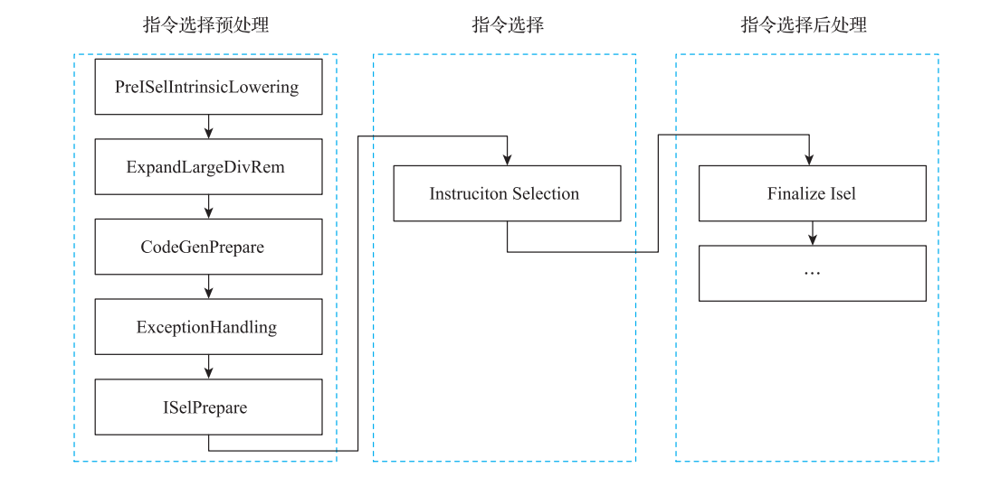

**图 7-3 指令选择 3 个阶段重要 Pass 示意图**

2）ExpandLargeDivRem ：将超过目标架构可用位数长度的除法或者取余指令展开，转换成可用位数范围内的除法或者取余替代指令。当前支持的最小除法或取余指令是 32位的。

3）CodeGenPrepare：主要用于配置元数据和对 LLVM IR 进行窥孔优化。

4）ExceptionHandling ：用于生成异常处理代码，根据不同的异常约定（如 WASM、Windows 和 Dwarf 等都有不同的异常约定）生成相应的代码。如果不需要支持异常，则此Pass 无须开启。

5）ISelPrepare ：主要是两个栈安全相关的功能实现—安全栈和栈保护，用于防止栈溢出或栈被破坏带来的安全漏洞。

6）Instruction Selection ： 指 令 选 择， 将 LLVM IR 翻 译 成 MIR。 例 如， 一 条 LLVM IR 的加法指令为 %add = add nsw i32 %a, %b，经过指令选择后就变成了 MIR 的加法指令：%2:gpr32 = nsw ADDWrr %1:gpr32, %0: gpr32（ADDWrr 是 AArch64 的指令）。

7）Finalize Isel ：指令选择之后紧跟的 Pass，有些目标架构自定义的伪指令会在这个阶段展开成机器指令。Finalize Isel 之后就是后端的各个优化类 Pass，如通用子表达式消除、寄存器分配、指令调度等，会在第 8～11 章中介绍。

由于 LLVM 迭代演进的原因，目前指令选择模块里实现了 3 套覆盖范围不同的指令选择实现，按实现的时间排序，分别是 SelectionDAGISel、FastISel 和 GlobalISel。SelectionDAGISel和 GlobalISel 两个算法的结构是相似的，它们都为了减少多后端冗余的问题做了分层设计。多后端冗余问题是由 LLVM 后端支持多种芯片指令集导致的。因为大部分指令集之间都会存在相似的指令（如算术运算指令、逻辑运算指令等），如果每个架构都独立地翻译这些指令，就有相当多的代码是重复冗余的。因此，SelectionDAGISel 和 GlobalISel 通过引入新

的中间表示（SelectionDAGIsel 的中间表示为 DAG IR，GlobalISel 的中间表示为 GMIR）将指令选择分为两个阶段：第一个阶段主要将 LLVM IR 展开成中间表示；第二个阶段将中间表示翻译成 MIR。如其名字一样，FastISel 是为了减少指令选择的时间而设计的，因此它减少了中间转化的过程，直接将 LLVM IR 展开成了 MIR。与上述两个算法相比，FastISel 相当于只做了第一阶段的展开工作。3 种指令选择算法的工作流程如图 7-4 所示。

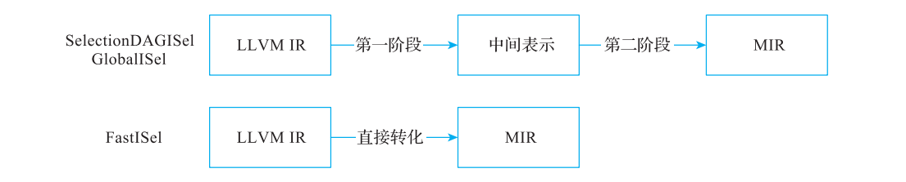

**图 7-4 3 种指令选择算法的工作流程**

对 SelectionDAGISel 和 GlobalISel 来说，第一阶段主要使用宏展开算法进行指令生成，而第二阶段主要使用了树匹配算法进行指令生成（SelectionDAGISel 是在 DAG 上完成的树匹配，而 GlobalISel 是在函数图上完成的树匹配）。宏展开（macro expansion）算法是一种简单的指令选择算法，它每次只处理一条 IR，让一条 IR 生成一条或多条更低阶的 IR 指令或机器指令。这个过程通常会产生多条指令，因此它生成的代码质量比较差。树匹配算法扩大了匹配范围，利用指令间的数据流关系，以指令树的形式处理多条 IR，让它们生成一条或多条更低阶的 IR 指令或机器指令—这个过程通常只产生一条指令，而且生成的代码质量较好。关于两个基本算法的原理，读者可以进一步阅读相关指令选择论文○一，下面将展开介绍 3 种 LLVM 算法实现的详细过程。

## 7.2 SelectionDAGISel 算法分析

SelectionDAGIsel 算法是一种局部指令选择算法，它以函数中的基本块为粒度，针对基本块内的 LLVM IR 生成最优的 MIR 指令，不考虑跨基本块间的指令处理。但是基本块中有一个特殊的指令 φ 函数需要特别处理。一方面是因为 φ 函数在后端中并没有一条指令与之对应；另一方面则是因为 φ 函数表达的是基本块之间的汇聚关系，在处理当前基本块时，编译器并不知道控制流汇聚的情况。所以 SelectionDAGIsel 实现时将指令分成两类处理。

1）以基本块为粒度，对基本块内的指令（忽略 φ 函数）进行指令选择。

2）针对 φ 函数处理基本块之间的关系，在基本块完成指令选择后，再为基本块之间重构汇聚关系（再次添加 φ 函数）。

○一 指令选择经过几十年的发展，论文变得繁多，其中有一篇综述“ Survey on Instruction Selection”整理

了指令选择技术的发展脉络，可作为学习的前置知识，供读者参考。

本节会先介绍基本块粒度的指令选择过程，再介绍 φ 函数的处理。

在指令选择过程中，基本块中每一条 LLVM IR 都会被初始化为 DAG IR，然后经过数据类型合法化、向量合法化、操作合法化等流程，进入指令选择环节和调度环节，最后被转换成 MIR。SelectionDAGISel 针对基本块进行指令选择的流程如图 7-5 所示。

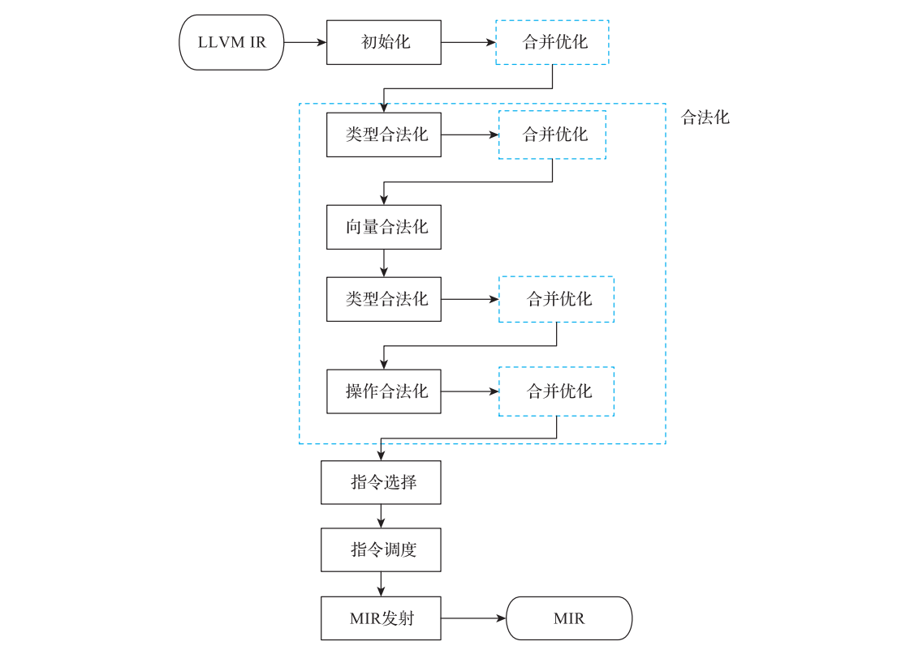

**图 7-5 SelectionDAGISel 针对基本块进行指令选择的流程**

注 在图 7-5 中可以看到，从 LLVM IR 生成 MIR 的过程中有多个合并优化环节。这些环

意

节本质上都是一些窥孔优化，目的是清理上一个环节可能产生的冗余 DAG 表达，

用单个节点替换同功能的多个节点组合，减轻下一个环节需要处理的节点数量，提

升编译器的处理效率。限于篇幅，本书不介绍合并优化，所以这部分在图 7-5 中用

虚框表示。

另外，图 7-5 中“类型合法化”操作被执行了两次：第一次是对所有的节点类

型进行处理，确保处理后的数据类型都是后端架构可以支持的，然后判断基于这些

数据类型的操作是否合法；第二次则是因为在合法化处理过程中，可能会重新产生

架构不支持的数据类型，因此需要再进行一次处理，以查缺补漏，将新产生的不合

法类型清理干净。经过此阶段后产生的节点操作类型和数据类型均应是合法的，否

则编译器会直接抛出错误。详细的处理过程将在后续介绍。

基本块之间的 φ 函数处理也比较简单，当一个基本块内的指令处理完毕后（处理到基本块的最后一条 LLVM IR，这条指令是 Terminator 指令），根据 CFG 获取后继基本块的第一条指令。如果该指令是 φ 函数，说明后继基本块中需要重构 φ 函数相关的依赖，编译器会先记录相关信息（如 φ 函数的位置、使用变量等），随后在相应基本块完成指令选择、发射和控制流更新时补齐机器 PHI。

指令选择时引入了新的数据结构（即 DAG），在 DAG 中使用 SDNode 来表示节点，它将指令格式抽象为一组操作码和操作数，以此屏蔽不同处理器架构和指令集之间的差异，避免针对每个指令进行特定、单独的处理，从而提升编译器的处理效率。

下面先了解一下 SDNode，之后介绍 LLVM IR 是如何转换成以 SDNode 构成的 DAG IR 的，如何基于 SDNode 实现指令合法化，以及编译器如何基于 DAG 进行指令选择（也称指令匹配），最终生成 MIR。

### 7.2.1 SDNode 分类

SDNode 作为 DAG 的基本单位，包含了节点的编号、操作数信息（包括操作数序列、操作数个数）、该节点的使用者序列、该节点对应的源码在源文件中的位置等信息，并提供了获取这些信息的接口。SDNode 的具体结构可以参考附录 A.2。

每个 SDNode 都可以有输入和输出，输入可以是一个叶子节点或另一个 SDNode 的输出，一般可以将 SDNode 节点的输出称为值。SDNode 的值按照功能可以分为两种类型：一类用于标识数据流，另一类用于标识控制流。

1. 标识数据流的 SDNode

标识数据流的 SDNode 值是数据运算产生的结果，比如零元运算（如常数赋值节点）、一元运算（如取反操作 neg、符号零扩展操作 sign_extend、位截断 truncate）、二元运算（如加、减、乘、除、左右位移）、多元运算（如条件选择 select）等产生的输出。如图 7-6 所示，标识数据流的 SDNode 值由数据运算操作产生，这些操作节点接收多个参数作为入参。参数可以是数据流类型的值，也可以是控制流类型的值。


**图 7-6 标识数据流的 SDNode**

2. 标识控制流的 SDNode

标识控制流的 SDNode 值用于描述节点与节点之间的关系，常见的为 chain 和 glue。chain 用于表示多个节点之间的顺序执行关系，glue 则用于表示两个节点之间不能穿插其他的节点（在本书 DAG 中 chain 关系用蓝色虚线表示，glue 关系用蓝色实线表示，这和使用LLVM 工具的输出略有不同，LLVM 工具中使用红色实线表示 glue，在印刷时无法提供红色实线，所以统一修改为蓝色实线）。

如图 7-7○一所示是一个 64 位内存空间的写（store）操作对应的 SDNode。其中 ch 为表示依赖顺序关系的 chain，是一个用于标识控制流的节点。图中其他字段在 7.2.2 节会进一步介绍。

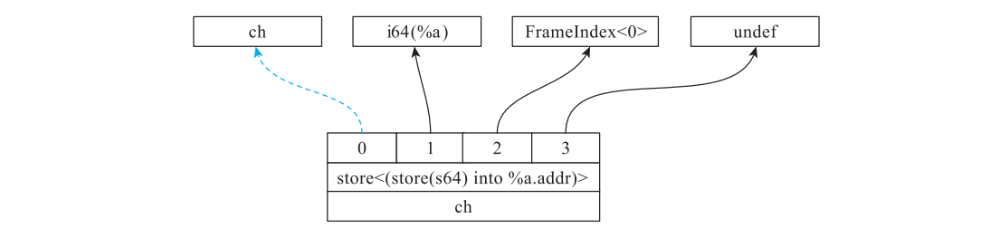

**图 7-7 64 位写操作的 SDNode**

为什么 SDNode 要引入控制流关系描述？读者可以想象这样的场景：代码片段中同时存在 load 和 store 指令，并且 load 和 store 指令总是顺序执行，如果没有 chain 的话，load和 store 都接收内存地址信息作为入参，两者之间并不存在数据上的依赖冲突。但如果要求对内存先写后读，就必须是写内存指令先被运行，然后读内存指令才能执行，否则会出现内存读取错误，所以编译器使用了参数 chain 来约束两个指令之间的顺序关系。读 / 写操作既可以使用 chain 作为入参，也会产生一个 chain 作为输出。在先写后读的指令序列中，store 指令输出的 chain 会被用作后续 load 指令的输入。像内存读写这一类对其他同类指令存在控制流顺序依赖的操作指令，必须按照固定的顺序被执行（顺序中可以插入其他无关的指令），否则会导致程序运行偏离原本的语意。这一类操作指令也被称为具有边界效应（side effect）的操作。除了内存读写外，还有函数调用、函数返回等也是类似情况。

注 在 LLVM 实现中，为了方便理解，如果操作的入参是 chain，一般将其设置为第一个

意

参数；如果 chain 是操作的输出，则一般将其作为最后一个输出。每个 DAG 都有起

始节点 entry 和结尾节点 root（也称为根节点）。起始节点一般使用 EntryToken 作为标

志，并产生一个 chain 作为输出，这个 chain 会贯穿整个 DAG 直至在根节点处终止。

在函数执行过程中可能会分叉成为多条链。在这种情况下，链与链之间是相互独立

的，不存在执行顺序上的依赖，而多条链也可能在某个节点重新汇聚成一条链。

○一 本章中的 SDNode 图用 ch 代表 chain，后续不再一一提示。

### 7.2.2 LLVM IR 到 SDNode 的转换

指令选择通常以基本块为 DAG 构建粒度，将普通 LLVM IR 转换成 SDNode。PHI 不构造成普通 DAG 节点：`FunctionLoweringInfo::set` 预先创建机器 PHI，`HandlePHINodesInSuccessorBlocks` 收集前驱值，`FinishBasicBlock` 等位置逐步补齐机器 PHI 的寄存器与前驱块操作数。并非等整个函数全部选择完毕后才创建 PHI。

从 IR 到 SDNode 的过程本质上是逐一映射的转换过程，LLVM IR 可以映射为一个或多个 SDNode。本书通过一个例子演示 LLVM IR 到 SDNode 的转换过程，LLVM IR 共计 67条指令，而对应的 SDNode 多达几百个（参考附录 A）。由于篇幅有限，我们无法介绍每一条 LLVM IR 转换到 SDNode 的过程，故仅覆盖几类 LLVM IR。这几种 LLVM IR 的介绍足以覆盖我们的例子，读者可以参考源码自行学习其余转换。本节使用的指令选择示例如代码清单 7-1 所示。

**代码清单 7-1 指令选择示例（7-1.c）**

```text
long callee(long a, long b) {
    long c = a + b;
    return c;
}
int caller() {
    long d = 1;
    long e = 2;
    int f = callee(d, e);
    return f;
}
```

在本例中有两个函数 callee 和 caller。callee 函数接收入参 a 和 b，将两者的和 c 作为输出；caller 函数对 callee 函数进行调用，传递 d 和 e 作为 callee 函数的参数，返回函数调用的结果 f。

本节以 BPF64 后端为例演示从 LLVM IR 到 SDNode 的转换过程。在 BPF64 架构的调用约定中，使用 r1～r5 寄存器进行参数传递，r0 寄存器存储函数的返回值；本节的 BPF64 示例特指未启用 ALU32 的配置（例如 `-mcpu=v1`）。LLVM 18 中，启用 ALU32 的 BPF 子目标同时注册 i32 和 i64 为合法寄存器值类型；不能将“仅 i64 合法”推广到所有 BPF 配置。

使用 Clang 编译代码 7-1.c 获得对应的 IR，如代码清单 7-2 所示（编译命令为：clang --target=bpfel -mcpu=v1 -O0 -fno-discard-value-names -S -emit-llvm 7-1.c -o 7-2.ll）。

**代码清单 7-2 代码 7-1.c 对应的 IR（7-2.ll）**

```text
define i64 @callee(i64 noundef %a, i64 noundef %b)  {
entry:
    %a.addr = alloca i64, align 8
    %b.addr = alloca i64, align 8
    %c = alloca i64, align 8
    store i64 %a, ptr %a.addr, align 8
    store i64 %b, ptr %b.addr, align 8
    %0 = load i64, ptr %a.addr, align 8
    %1 = load i64, ptr %b.addr, align 8
    %add = add nsw i64 %0, %1
    store i64 %add, ptr %c, align 8
    %2 = load i64, ptr %c, align 8
    ret i64 %2
}
define i32 @caller() {
entry:
    %d = alloca i64, align 8
    %e = alloca i64, align 8
    %f = alloca i32, align 4
    store i64 1, ptr %d, align 8
    store i64 2, ptr %e, align 8
    %0 = load i64, ptr %d, align 8
    %1 = load i64, ptr %e, align 8
    %call = call i64 @callee(i64 noundef %0, i64 noundef %1)
    %conv = trunc i64 %call to i32
    store i32 %conv, ptr %f, align 4
    %2 = load i32, ptr %f, align 4
    ret i32 %2
}
```

下面以代码清单 7-2 为例展开，在这个例子中涉及的 LLVM IR 分类主要有：

1）运算类：add。

2）类型转换类：truncate。

3）访存操作类：load 和 store。

4）函数调用和参数传递：call。

下面分别介绍。

1. 运算类 IR 到 SDNode 的转换

**代码清单 7-1 的函数 callee 中有一个加法运算：**

c = a + b，它对应的 LLVM IR 为：%add = add nsw i64 %0, %1。其中 %add 与 c 对应，%0 与 a 对应，%1与 b 对应；add 为该条 IR 的操作符，表示加法运算；`nsw` 是 No Signed Wrap 语义标志：若发生有符号溢出，该运算结果为 poison；它不要求插入运行时溢出检查，也不是符号扩展指令。

运算类 IR 的转换比较简单，只需要把 LLVM IR 指令的操作数替换成相应 SDNode 值，把指令操

**图 7-8 add 运算 SDNode 示意图**

作码映射为 SDNode 的指令操作码即可。在 DAG中用 t 指代节点序号，上述 IR 片段对应的 SDNode 表达为：t13: i64 = add nsw t11, t12，运算示意图如图 7-8 所示。

在图 7-8 中，t13 表示 add 操作的序号，结果为 i64 类型，它接收的 2 个参数分别是 a

和 b，t11 和 t12 分别是这两个参数对应的 SDNode。这里只关注 add 节点，暂时不关注参数节点 t11 和 t12 是如何形成的。add 节点转换为 SDNode 的过程相对简单，它是根据 LLVM IR 中的 add 指令直接映射得到。其他运算类 IR 到 SDNode 的转换也是做类似处理。

注 虽然在 SDNode 表达中，当前的操作节点的名字仍为 add，但这已经不是 LLVM IR

意

层面的 add 指令，而是 ISD 命名空间里的 SDNode 节点。

2. 类型转换类 IR 到 SDNode 的转换

在程序中经常涉及类型转换，如 LLVM IR 中有显式的 truncate 指令进行类型截断或者 bitcast 进行位转换。对于这类显式类型转换指令，在 SDNode 中也存在对应的节点用于映射 LLVM IR。例如在 caller 函数中调用 callee，callee 的返回值为 i64 类型，但是 caller使用 i32 类型进行返回值接收，此时 LLVM IR 会使用一个 truncate 指令将返回值进行截断：%conv = trunc i64 %call to i32。对于这样的指令，SDNode 会映射 truncate 节点与之对应。故该 IR 对应的 SDNode 为 t24: i32 = truncate t23。truncate 操作对应的 SDNode 表示如

**图 7-9 所示。**

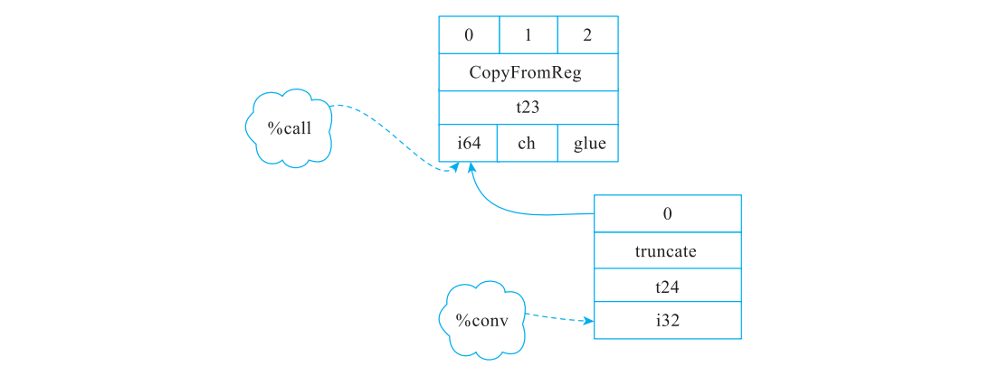

**图 7-9 truncate 操作对应的 SDNode**

在这里我们仅仅关注 trunc 这条 IR 到 SDNode 的转换，暂时不关注 t23 这个节点，下面的函数调用会介绍为什么会存在 t23。可以看到显式类型到 SDNode 的转换也是一一对应的。

除了显式类型转换外，代码执行时还存在一些隐式类型转换。例如在函数调用、返回或者 switch 的条件语句都对类型有明确的要求，此时可能会生成隐式类型转换需求，所以在 SDNode 中会增加一些类型转换节点，如 any_extend、sign_extend、zero_extend。例如本例中 caller 的 LLVM IR 返回类型仍是 i32；无 ALU32 时 BPF64 调用约定使用 i64 寄存器位置传递该值，因而在返回值降低过程中会出现从 i32 到 i64 的扩展。在 SDNode 中增加了 any_extend 指令隐式转换节点：t28: i64 = any_extend t27（any_extend 仅适用于整数类型，扩展后的数据高位是未定义的），如图 7-10 所示。

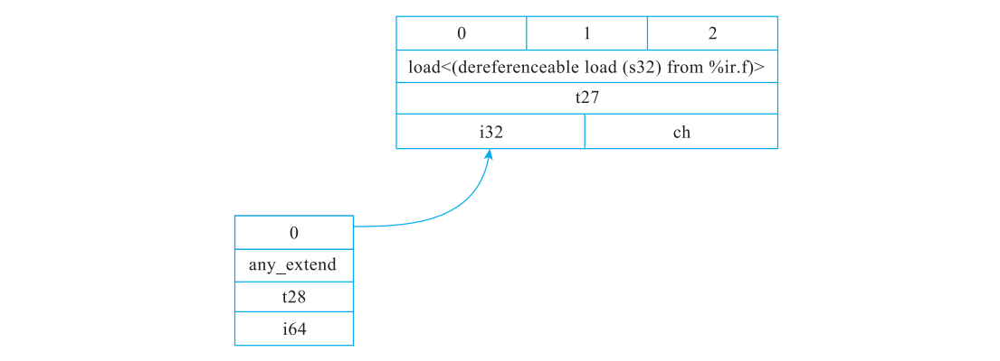

**图 7-10 any_extend 指令对应的 SDNode**

在这里我们仅关注 any_extend 这个节点，暂时不关注 t27 相关的 load 节点如何生成以及后续如何使用 t28。可以看到，t27 类型为 i32，而 t28 类型为 i64，所以使用 any_extend进行了类型提升（7.2.3 节会继续介绍）。

3. 访存类 IR 到 SDNode 的转换

在 LLVM IR 中访存指令为 load、store，这里以 store 指令为例进行介绍。以 callee 中第 一 条 store 指 令 为 例：store i64 %a, ptr %a.addr, align 8， 它 对 应 的 SDNode 为 t8: ch = store<(store (s64) into %ir.a.addr)> t0, t2, FrameIndex:i64<0>, undef:i64。store 指 令 对 应 的SDNode 如图 7-11 所示。

可以看出图 7-11 中序号为 t8 的 SDNode 节点对应着 LLVM IR 中的 store 指令，它有 4个输入：0、1、2、3，其中：

1）输入 0 是 Chain 依赖，该输入依赖 EntryToken 节点（基本块的入口），即 store 指令必须在 EntryToken 节点后才能执行。

2）输入 1 对应 LLVM IR 中的参数 %a（待赋值的值），该输入也会被转换成一个SDNode，使用 CopyFromReg 节点将 %a 转换为 t2，然后将 t2 作为 store 节点的输入。

注 为什么引入 CopyFromReg，而不是直接使用 %a ？原因是调用约定通常会要求参数

意

使用物理寄存器。在该示例中，%a 为 callee 函数的第一个入参，需要从物理寄存器

r1 中读取。此处引入 t2 这样的赋值指令可将物理寄存器赋值到虚拟寄存器中，有助

于继续保持当前 IR 的 SSA 形式，解耦指令选择和寄存器分配阶段，屏蔽大部分的

后端架构差异，这将更有利于指令选择、指令调度和寄存器分配的执行。

3）输入 2 是 store 指令的目的地址，对应 LLVM IR 中的 ptr %a.addr，因为 ptr %a.addr是一个栈变量，所以会被直接转换为 FrameIndex<0> 节点，表示栈中第 0 个槽位。

4）输入 3 是 Undef 节点，它描述的是相对目的地址（输入 2）的偏移量。默认情况下store 和 load 节点的最后一个输入都是 Undef，它仅仅是一个占位符。

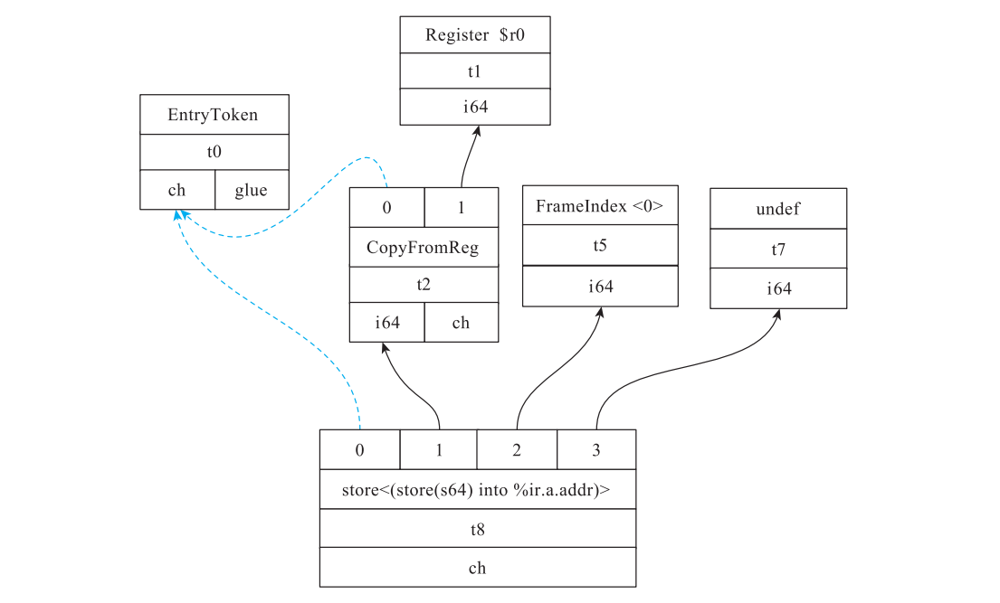

**图 7-11 store 指令对应的 SDNode**

注 引入 Undef 节点是为了在指令选择中对 store 和 load 进行优化。例如，在一些后端

意

中有 indexed load/store 的访存格式，该格式可以包括一个基地址（Baseptr）和一个

偏移量（Offset），在访存时，真实的访问地址是 Baseptr + Offset，这类格式最后一

个输入存放的就是 Offset。在默认情况下，load 和 store 都不会使用最后一个字段。

在指令选择的合并优化过程中，当编译器发现存在多条指令符合 indexed load/store

的访存方式时，会将这些指令转换成一条 indexed load/store 指令。目前只有少数几

个后端，如 ARM、PPC 等才支持这样的访存方式（这样的访存方式在 TD 文件也会

有相应的定义）。

4. 函数调用相关 IR 到 SDNode 的转换

因为函数调用的处理与后端架构设计密切相关，所以在处理函数调用相关的 LLVM IR时，各个架构需要根据自身的调用约定进行实现，这涉及 3 个方面：入参处理、函数调用、函数返回。

函数调用涉及两个函数过程之间的交互，包括从调用过程传递参数和移交控制给被调用过程，以及从被调用过程返回结果和控制给调用过程。本节仍然以代码清单 7-2 为例来演示从 caller 到 callee 整个调用过程中的 SDNode 生成。函数调用包含了 4 个步骤。

（1）callee 被调用前

需要准备参数给 callee，要将待传递参数存放在适当的寄存器或者栈单元中。使用物理寄存器来传递参数可以保证过程调用的高效性，但寄存器并不是无限的，也就不可能被随意使用，一般后端调用约定都会规定可用于传参的寄存器个数，很多架构把超出的参数放在栈上；BPF 是例外，LLVM 18 的 `LowerCall` 对超过 5 个参数或栈参数报错。代码 7-2.ll 中的函数调用对应的 LLVM IR 为 %call = call i64 @callee(i64 noundef %0, i64 noundef %1)，它传递 %0 和 %1 两个 64 位变量作为参数（%0和 %1 分别对应源码中的 d 和 e）。其 SDNode 表达为通过 CopyToReg 节点将两个变量的值分别复制到物理寄存器 r1 和 r2 中（引入 CopyToReg 节点就是为了处理调用约定），然后将 r1、r2 作为 BPFISD::CALL（BPF 架构定义的函数调用 SDNode 节点）的参数。该 call指 令 对 应 的 SDNode 表 达 为 t20: ch,glue = BPFISD::CALL t18, TargetGlobalAddress:i64<ptr @callee> 0, Register:i64 $r1, Register:i64 $r2, t18:1， 可 以 看 出 该 SDNode 节 点 直 接 依 赖TargetGlobalAddress、$r1、$r2、t18 这 4 个节点。实际上 call 类型的 SDNode 节点还会引入 TokenFactor、callseq_start、callseq_end 等伪指令节点。call 指令调用对应的 SDNode 如

**图 7-12 所示。**

在该图中有 3 类节点值得读者注意。

1）TokenFactor 节点：该节点接收多个操作数作为输入，并只产生一个操作数作为输出，将多个输入 chain 汇聚成一个输出 chain，使后继等待所有输入。它本身不证明这些操作在内存或语义上相互独立。如在上例中，TokenFactor 依赖的两个节点 t9 和 t10 为 caller 调用 callee 所需要传递的参数 d 和 e 的访存操作，表示这两个访存操作是相互独立的。一般来说，让 TokenFactor 节点依赖 call 指令的入参节点（如 t9、t10 节点），call 指令序列又依赖 TokenFactor 节点，这是为了保证在 call 指令执行前，已经全部完成其参数的处理。

2）callseq_start、callseq_end 节点：标记调用序列边界，并携带调用帧调整所需的信息；选中后可以对应 ADJCALLSTACKDOWN / ADJCALLSTACKUP 等伪指令。它们主要处理出参调用帧，不等同于 C 语言变长数组的动态栈分配。BPF 的调用栈调整通常可消除，且 LLVM 18 的 BPF `LowerDYNAMIC_STACKALLOC` 明确拒绝动态栈分配。

3）r2 和 r1 之间的依赖节点（t16 和 t18）：caller 在调用 callee 时，传递了 2 个参数，根据调用约定分别使用 r1 和 r2 传递，所以需要构建 CopyToReg 节点。但注意观察可以发现，r1 和 r2 之间有 glue 依赖，为什么会这样呢？这是为了在真正执行 callee 之前，让所有的参数都完成执行准备，在 call 指令被执行时可以直接获取到所有的参数。当然参数之间的glue 顺序并无强制要求，例如图 7-12 中 t18 依赖 t16，实际上转换两者的位置也是可以的。

注 call 指令和后端调用约定密切相关，不同的后端得到的 DAG 完全不同。例如使用

意

nvptx（英伟达后端）就会发现几乎没有相同的 SDNode 节点。在 LLVM 实现中，处

理 call 指令的功能一般被封装为一个函数 LowerCall，而每个后端在实现 call 指令

转换时都需要实现该函数，读者可以重点关注一下第 13 章的相关介绍。

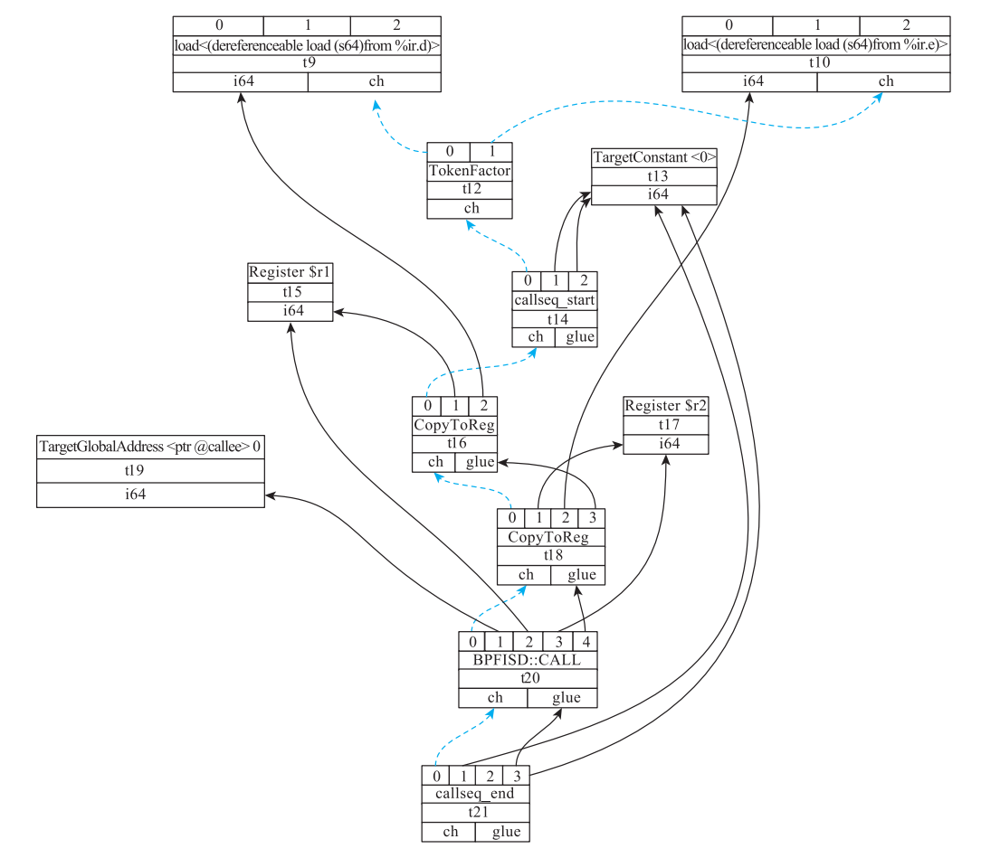

**图 7-12 call 指令调用对应的 SDNode**

（2）callee 被调用执行

callee 从相应的寄存器或者栈单元中取出参数，并开始运行。由于本例采用 O0 编译优化级别，所有的参数、局部变量都会被存放在栈内存中，编译器会使用 alloca 为变量分配独立的内存空间，例如代码 7-2.ll 中 callee 的 %a、%b、%c 三条指令。使用栈变量时需要通过 load、store 指令进行读、写。（在 O2 优化等级下，会将这些变量尽可能存入寄存器而不是内存中，省去上述的分配内存、读写内存的操作，以提升程序的执行效率，同时优化代码大小）。内存操作可参见 7.2.2 节。

（3）callee 执行结束

callee 执行结束时需要按照调用约定将返回值存放在相应的寄存器单元中，并将控制权返回给 caller。callee 中的返回指令为 ret i64 %2。与 call 指令类似，ret 指令是后端相关的（需

要在 LowerReturn 函数中实现）。本例在 BPF 后端中定义了 BPFISD::RET_GLUE 类型，生成的 SDNode 表达为 t20: ch = BPFISD::RET_GLUE t19, Register:i64 $r0, t19:1，函数调用返回对应的 SDNode 形式如图 7-13 所示。

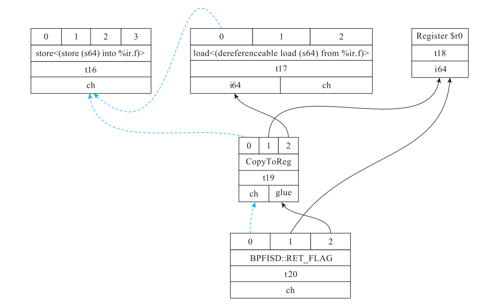

**图 7-13 函数调用返回对应的 SDNode**

从图 7-13 可以看出，callee 的返回值需要存放在物理寄存器 r0 中（BPF 后端调用约定的要求），而 callee 的计算结果 c 需要从栈（%ir.c）中进行加载（节点 t17），加载后需要将其转存到r0 中（节点 t18），所以引入了 CopyToReg 节点（节点 t19）。最后还可以看到 t19 和 t17 都依赖于 t16（chain 依赖），说明访问内存之前必须先完成写操作。

（4）callee 被调用完成

caller 重新获得控制权，从返回值寄存器单元中获取返回值，并继续执行。在代码清单 7-2 中 caller 调用指令为 %call = call i64 @callee(i64 noundef %0, i64 noundef %1)。call指令执行完成后，结果放在 %call 中，而 callee 的返回值已经放在了物理寄存器 r0 中，所以会引入 CopyFromReg 节点将物理寄存器 r0 的值赋值到虚拟寄存器中。对应的 SDNode表达为 t23: i64,ch,glue = CopyFromReg t21, Register:i64 $r0, t21:1。函数调用结束后继续执行时涉及的 SDNode 如图 7-14 所示。

至此，函数 caller 和 callee 中涉及的 LLVM IR 都已介绍完毕，以 callee 为例看看生成的 DAG 图，如图 7-15 所示。

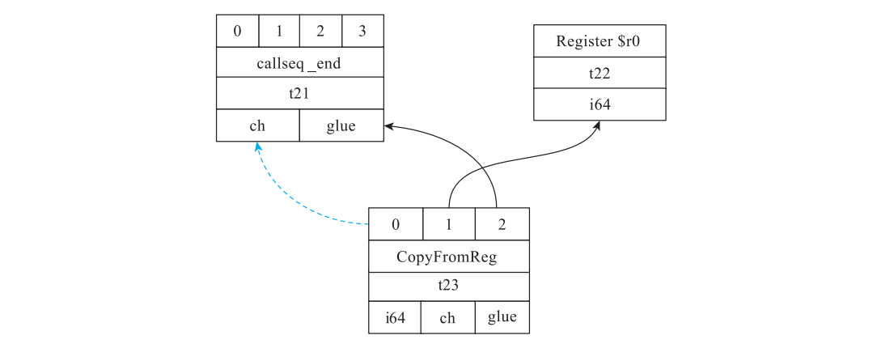

**图 7-14 函数调用结束后继续执行时涉及的 SDNode**

5. Phi 指令处理

前面以 caller、callee 为例介绍了一般指令转换为 SDNode 的过程，但是还有一个重要的指令“ φ 函数”的转换并未提及。SelectionDAGIsel 是以基本块为粒度处理 LLVM IR，所以直接处理 φ 函数可能会导致结果不正确，因为 φ 函数是基本块的汇聚点，它涉及多个基本块的信息整合。在指令选择过程中，当遍历基本块中的 IR 指令构建 DAG 时，遍历到基本块的最后一条指令时会判断当前基本块的后继基本块中是否存在 φ 函数节点。如果存在，就为 φ 函数生成对应的虚拟寄存器，同时记录和 φ 函数相关的操作数、基本块等信息。在基本块内完成指令处理后，基于这些信息为基本块间添加 φ 函数及操作数。

考虑有如下 IR 片段（见代码清单 7-3），片段中有 3 个基本块，其中基本块 if.end 是基本块 if.then 和基本块 if.else 的后继基本块，函数流程可能从 if.then 或 if.else 跳转到 if.end ；如果是从 if.then 跳转到 if.end，则变量 %0 的赋值取常量值 66，否则取常量值 77。（%0 的取值也可以是变量，为简单起见，这里使用常量进行介绍。）

> 清单 7-3 是省略函数头和其他基本块的 IR 片段，清单 7-4 是相应的机器 PHI 示意；它们均不是完整可独立解析的模块。

**代码清单 7-3 φ 函数示例**

```text
……
if.then:
br label %if.end

if.else:
br label %if.end

if.end:           ; preds = %if.else, %if.then
%0 = phi i32 [ 66, %if.then], [ 77, %if.else]
……
```

**图 7-15 callee 对应的 DAG 图（图中文字转写）**

> 图 7-15 的文字版已按 LLVM 18 修正：EntryToken 只产生 chain；BPF 返回节点为 RET_GLUE；本例局部变量名为 %ir.c。原始图见本章末尾第 107 页版面。

| 节点 | 操作或标签 | 输出类型 |
|---|---|---|
| t0 | EntryToken | ch |
| t1 | Register %0 | i64 |
| t2 | CopyFromReg | i64, ch |
| t3 | Register %1 | i64 |
| t4 | CopyFromReg | i64, ch |
| t5 | FrameIndex <0> | i64 |
| t7 | undef | i64 |
| t8 | store<(store(s64) into %ir.a.addr)> | ch |
| t9 | FrameIndex <1> | i64 |
| t10 | store<(store (s64) into %ir.b.addr)> | ch |
| t11 | load<(dereferenceable load (s64) from %ir.a.addr)> | i64, ch |
| t12 | load<(dereferenceable load (s64) from %ir.b.addr)> | i64, ch |
| t13 | add nsw | i64 |
| t14 | FrameIndex <2> | i64 |
| t15 | TokenFactor | ch |
| t16 | store<(store (s64) into %ir.c)> | ch |
| t17 | load<(dereferenceable load (s64) from %ir.c)> | i64, ch |
| t18 | Register $r0 | i64 |
| t19 | CopyToReg | ch, glue |
| t20 | BPFISD::RET_GLUE | ch |
| — | GraphRoot | — |

图中黑实线表示数据输入，蓝虚线表示 chain，蓝实线表示 glue。输入索引从 0 开始：t2=[t0,t1]；t4=[t0,t3]；t8=[t0,t2,t5,t7]；t10=[t8,t4,t9,t7]；t11=[t10,t5,t7]；t12=[t10,t9,t7]；t13=[t11,t12]；t15=[t11:ch,t12:ch]；t16=[t15,t13,t14,t7]；t17=[t16,t14,t7]；t19=[t16,t18,t17]；t20=[t19:ch,t18,t19:glue]。GraphRoot 指向 t20。

以处理基本块 if.else 为例，当基本块中的指令处理完毕后，发现后继基本块 if.end 有 φ函数，会创建一个虚拟寄存器用于存放与之对应的 φ 函数中的操作数。在代码清单 7-3 中，φ 函数的前驱基本块 if.else 对应 φ 函数的操作数为常量 77，所以在 if.else 基本块中会生成 CopyToReg 节点，表现为将 φ 函数的操作数（常量 77）赋值到分配的虚拟寄存器（例如为 %5），示意图如图 7-16 所示。

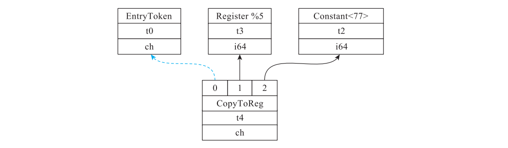

**图 7-16 基本块 if.else 为后继基本块的 φ 函数插入额外 CopyToReg**

机器 PHI 已在预处理时创建，后续逐基本块补齐其输入。首先为 φ 函数确定位置（位置信息是确定的，因为 LLVM IR 已经包含了 φ 函数的位置信息），然后为 φ 函数添加寄存器和对应的基本块作为操作数。处理完代码清单 7-3 中的 φ 函数后生成的结果如代码清单 7-4 所示。在代码清单 7-4 中，φ 函数的操作数 %bb.0 与 %bb.1 分别与代码清单 7-3 中的 %if .then 和 %if.else 基本块对应，%2 和 %5 分别是两个基本块为 φ 函数的操作数分配的虚拟寄存器（gpr 表示通用寄存器）。

**代码清单 7-4 生成 PHI 机器伪指令**

```text
bb.2.if.end:
; predecessors: %bb.0, %bb.1（分别对应IR中的%if.then和%if.else基本块）
    %0:gpr = PHI %2:gpr, %bb.0, %5:gpr, %bb.1
```

经过初始化流程后，LLVM IR 都被转换成了 SDNode，基本上每条 LLVM IR 与 SDNode逐一对应。由于 SDNode 的生成过程是为了兼容所有后端而设计的，导致生成的 DAG 中可能存在大量的冗余节点以及特定架构不支持的数据类型或操作类型。因此，SelectionDAG 初始化完成以后会先进行一次 SDNode 节点合并操作，以优化 DAG 图（见图 7-5），然后会进入合法化处理环节，以消除架构无法处理的节点，并生成可供架构进行指令选择使用的合法 DAG。下面看看如何进行合法化。

> LLVM 18 调用链：`SelectionDAGISel::CodeGenAndEmitDAG` 先执行类型合法化，再执行向量合法化；仅当向量阶段有变更时再执行一次类型合法化，最后执行普通操作合法化。原图 7-5 的版本信息应结合这一调用顺序读取。

### 7.2.3 SDNode 合法化

SDNode 合法化是 DAG 生成过程中很重要的一个环节。合法化主要包含类型合法化（type legalize）、操作合法化（action legalize）和向量合法化（vector legalize）。数据是操作

的基础，所以合法化过程中会首先根据 TD 文件，对 DAG 中各个节点的数据类型进行校验，如果遇到架构不支持的数据类型，需要对其进行处理，使之成为目标架构可以支持的数据类型。只有经过数据类型合法化的 DAG 才可以继续进入到操作合法化处理流程。向量合法化指的是对向量类型和操作进行的合法化。

1. 类型合法化

对一个目标架构而言，什么样的数据类型是合法的？这是由目标架构的设计者通过寄存器描述（在 TD 文件中）定义的。目标架构支持的数据类型可以有多种，即有多个合法类型，其中位（bit）长度是最短的，称为最小合法类型。

在数据类型合法化的处理过程中，会遍历 DAG 中的所有节点，检查节点的数据类型是否合法。LLVM 中存在 Legal、Promote、Expand、Soften 这 4 种主要的标量数据类型合法化方式。其中 Legal 表明当前数据类型是架构支持的，即合法的，不需要做额外处理。另外三种则表示可以通过特定的处理，将当前不合法的数据类型转变为合法的数据类型。若经过所有的处理都无法将非法数据类型合法化，编译器会抛出错误终止运行。除了这 4 种标量合法化方式外，还有针对向量类型的 Scalarize（将向量标量化）、Split（将向量拆分）、Widen（扩展为更长的向量）等合法化方式。

在合法化操作之前，编译器会根据 TD 文件获得该架构支持的所有合法数据类型，并计算得到 LLVM 中所有数据类型对应目标架构的合法化方式。这个流程处理的是 LLVM 支持的公共数据类型，有一些架构会定义一些独有的数据类型（不属于公共数据类型），开发者可以在该架构中手动扩展添加与之对应的合法化方式。

在一个后端中，某个数据类型的合法化方式应该被设置为 Legal、Promote、Expand 中的哪一种？总的来说要遵循以下几条规则。

1）根据 TD 文件中定义的寄存器类型，找到架构支持的最大整数类型（称为 LargestInt），如架构仅支持 32 位和 64 位的整型寄存器，则架构支持的最大整型为 64 位。

2）所有超过最大整型的类型，都使用 LargestInt 作为基础类型，标记为 Expand，意为使用多个（个数满足 2n 要求）基础类型的寄存器组合来表示。

3）所有比最大整型 LargestInt 小的数据类型，首先需要判断是否为后端支持的合法类型，如果不是就标记为 Promote，并将该类型提升为最近的一个合法类型。例如，int64 为LargestInt，int32 为一个合法类型，int16 为非法类型，会将 int16 提升到 int32 而非 int64。

4）其他的一些类别，如 f128、f64、f32 在不合法的情况下，会分别转换为 i128、i64、i32，这种合法化方式被称为 Soften。

本章以未启用 ALU32 的 BPF64 配置说明标量类型合法化：此时 i64 是合法整数值类型。启用 ALU32 时 i32 也合法，以下 Promote 过程不一定发生。类型合法性来自 `TargetLowering::addRegisterClass` 和类型属性计算，不能仅凭 TD 中出现某个寄存器类型作判断。

1）Legal ：目标架构支持的合法类型，不需要进行转换。如 i64 是合法类型，记为Legal。

2）Promote：将不合法的寄存器值类型提升到合适的合法类型。例如未启用 ALU32 的 BPF 将 i32 加法操作数和结果提升到 i64。原来的 i32 load 变为“读取 i32、扩展得到 i64”的 extload，原来的 i32 store 变为“截断 i64、写入 i32”的 truncstore；访存宽度和对象大小仍为 32 位。不能把 i32 栈槽改读写为 i64，否则可能越界或覆盖相邻对象。`any_extend` 的新增高位没有约束，后续合并可能消除显式扩展节点。图 7-17 用于展示值类型变化，不能解释成内存宽度也随之增大。

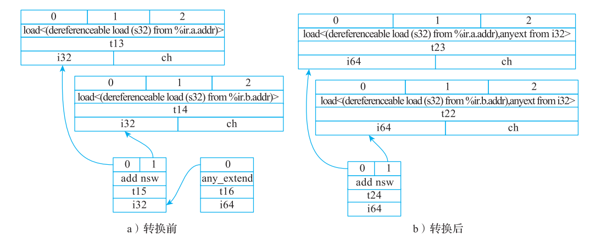

**图 7-17 类型合法化之 Promote 示例**

3）Expand ：当操作数类型大于目标架构最大合法类型时，需要进行扩展操作，用多个合法类型的组合来表示该类型。考虑有 IR 片段 %add = add nsw i128 %0, %1，其中 add 指令的两个操作数 %0 和 %1 都是 i128 类型，经过 add 操作后获得的数据类型也为 i128，转换前对应的 SDNode 节点序列如图 7-18a 所示。在类型合法化过程中，会使用两个 i64 值表示 i128 的低位与高位；只有涉及原来的 i128 内存操作时才按数据布局拆成相应访存，并非每次整数展开都需要内存。在图 7-18b 中可以看到 add 的两个操作数 t17、t18被拆成了高 64 位（t17:1、t18:1）和低 64 位（t17:0、t18:0），高低位各自进行 add 操作（低位如果产生了进位操作，需要加到高 64 位的和中），获得的两个 i64 类型数据依然被存储到内存相邻的两个 i64 长度空间中，共同组成 i128 类型的输出—t19。

4）Soften ：将浮点数类型转变为同等长度的整型。考虑有 IR 片段 %add = fadd float %0, %1，其中 fadd 指令为浮点数加法指令，其两个操作数 %0 和 %1 都是 float 类型（可以从内存中读取），经过运算后产生的输出也是 float 类型；在被初始化为 SDNode 的时候，会产生 bitcast 节点，将 float 32 位输出转换为 32 位整型，再通过 any_extend 节点将其提升为64 位整型，产生的 SDNode 节点如图 7-19a 所示。由于 BPF64 后端并不支持 f32 数据类型，

浮点类型软化保留浮点数的位模式，通过整数值传递给运行库实现，单精度加法的通用 libcall 名称为 `__addsf3`。该实现属于 compiler-rt / libgcc 一类目标运行库，并非必须写在 LLVM 后端 C++ 中。特别是 LLVM 18 的 BPF `LowerCall` 会拒绝 `ExternalSymbol` 形式的 built-in 函数调用，故图 7-19 只展示通用软化机制，不能当成 BPF 已成功生成且可以执行的软浮点代码。

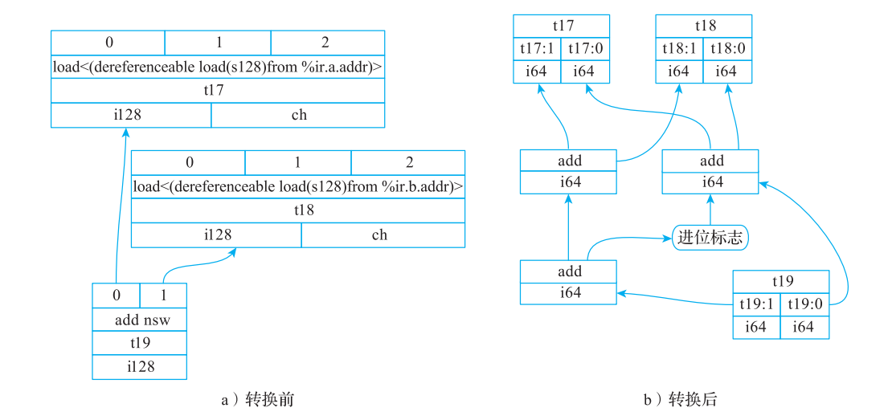

**图 7-18 类型合法化之 Expand 示例图**

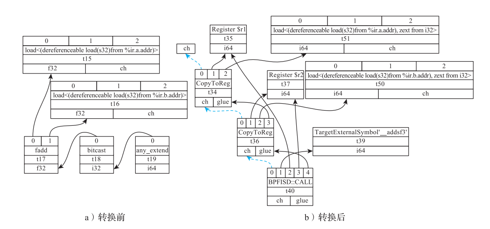

**图 7-19 类型合法化之 Soften 示例**

经过数据类型合法化处理之后的 DAG，每个节点的数据类型都应该是目标架构可处理的，在此基础上可以开始进行操作（或运算）。但是并不是所有的操作后端都能支持，操作是否合法，需要经过校验，不合法的操作也需要经过处理转变为后端可以支持的操作。

2. 操作合法化

操作合法化的过程是将所有的节点进行拓扑排序后，从后往前逆序依次处理。采取逆序遍历的主要好处是，当下层节点发生变化的时候，上层节点可以增量式更新，避免重新计算整个 DAG 图的全量节点。在对节点进行合法化操作前，首先判断是不是有别的节点使用了当前节点，如果没有任何节点使用当前节点，则说明当前节点是冗余的，会被直接删除，不参与合法化过程。在合法化过程中可能会产生一些新的节点，这些节点也需要再次经过合法化处理。通常来说，LLVM 中的操作合法化处理主要有以下几类。

1）Legal：目标架构本身就支持该操作，可以直接映射为后端指令。

2）Promote ：与数据合法化操作的 Promote 类似，表示当前数据类型不被支持，需要被提升为更大的数据类型（提升后的数据类型可能是合法的）以后才可以被正常处理。

3）Expand ：如有某个后端尚不支持的操作，尝试将该操作扩展为别的操作，如果失败就会转为 LibCall 的方式。Expand 示例如代码清单 7-5 所示。

**代码清单 7-5 Expand 示例**

```c
#include <stdint.h>

int16_t add(int16_t a, int16_t b) {
    return a + b;
}
```

其中参数和返回值类型都为 i16 类型，在生成 SDNode 的过程中，会产生 sign_extend_ inreg 节点，用于将 a + b 的 i16 类型运算结果转成 i64 类型（后续再复制到 r0 寄存器中作为返回），如图 7-20a 所示。sign_extend_inreg 的第一个操作数是经过数据类型合法化处理后，被扩展为 i64 类型的—这一信息被记录在第二个操作数 ValueType:ch:i16 中，表明其原始数据类型为非法类型（16 位长度）。但后端中并没有与 sign_extend_inreg 对应的指令操作，故会对它进行 Expand 操作，先生成 shl（左移 48 位）、再生成 sra（右移 48 位）的节点序列，通过将原操作展开为左移和算术右移操作来实现同样的功能，如图 7-20b 所示。

4）LibCall：如有某个后端尚不支持的操作，使用 LibCall（调用库函数）来完成该操作。当然 LibCall 调用的函数需要在对应的架构中有实现，否则会提示找不到该函数的实现。

考虑有如代码清单 7-6 所示的浮点数除法的代码片段。

> 清单 7-6 必须放在函数体内（C 的文件作用域不能用变量 a 初始化 b）。除以常量 4 还可能被折叠或改写，不能保证生成 `fdiv`，更不能保证在 BPF 上得到可用的 libcall。

**代码清单 7-6 LibCall 示例**

```text
double a = 3.14;
double b = a / 4;
```

上述示例生成的 LLVM IR 为 %div = fdiv double %0, 4.000000e+00。该 LLVM IR 片段会相应生成图 7-21a 所示的 SDNode 节点。由于 BPF64 架构中没有浮点除法指令，fdiv

通用软浮点降低会尝试调用双精度除法运行库函数 `__divdf3`，不是 `__divf3`；BPF 18 会拒绝这种自动生成的 built-in 调用，因此本图只作算法示意。同时因为 a 的数据类型为 double（f64），不是 BPF64 支持的合法数据类型，所以也被转变成了合法类型 i64 再使用，结果如

**图 7-21b 所示。**

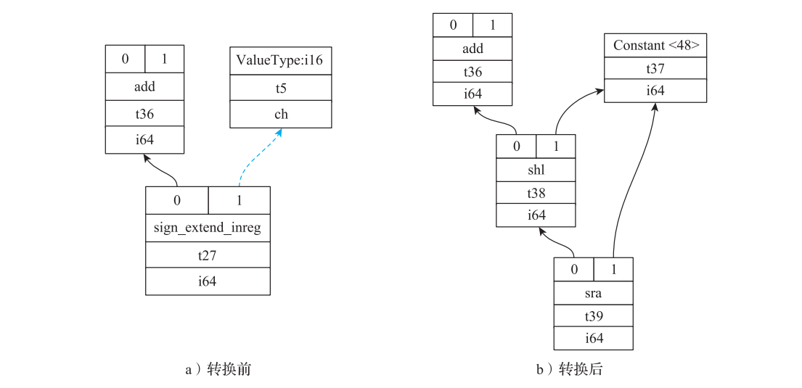

**图 7-20 操作合法化之 Expand 示例**

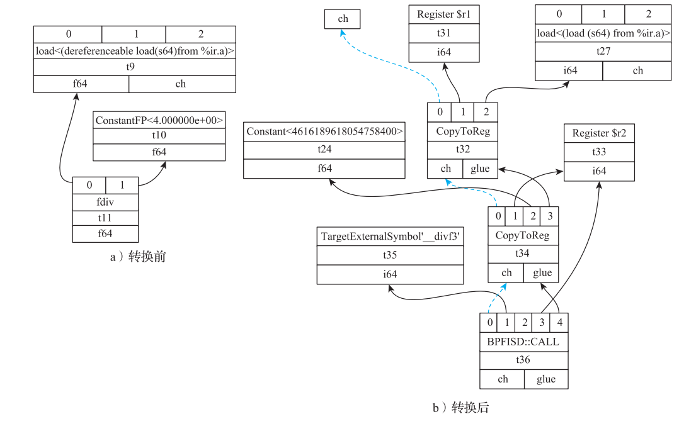

**图 7-21 操作合法化 LibCall 示意图**

5）Custom ：使用目标架构自定义的实现来完成该操作，这些实现可以是上述几种合法化操作的组合，也可以是用户自己编写的代码。在图 7-18 所示的例子 %add = add nsw i128 %0, %1 中，在合法化 128 位数据时，会将“进位标志”的处理映射成一个 setcc 节点，如图 7-22a 所示。在该节点中，t43 是两个低 64 位值的和（t40 代表了其中一个低 64位），若 t43 的值小于 t40（判断条件 t45），说明在进行加法操作的过程中发生了翻转，需要将进位标志置 1。BPF64 后端首先会将 setcc 节点扩展为 select_cc○一，得到的结果如图 7-22b所示。然后对 select_cc 进行 Custom 转换，最后得到的结果如图 7-22c 所示。可以看到，

**图 7-22b 和图 7-22c 转换前后的输入存在两个区别：一是将原有条件在交换操作数后转换成 SETUGT，并用**

Constant<10> 这个常量（见图 7-22c），这是因为在 BPF64 架构中将 setult 判断条件换成了枚举序号 10（10 是通用 `ISD::SETUGT` 的枚举值；原 SETULT 在交换两个比较操作数后转换为 SETUGT）来处理；二是操作数 0 和 1 的位置发生

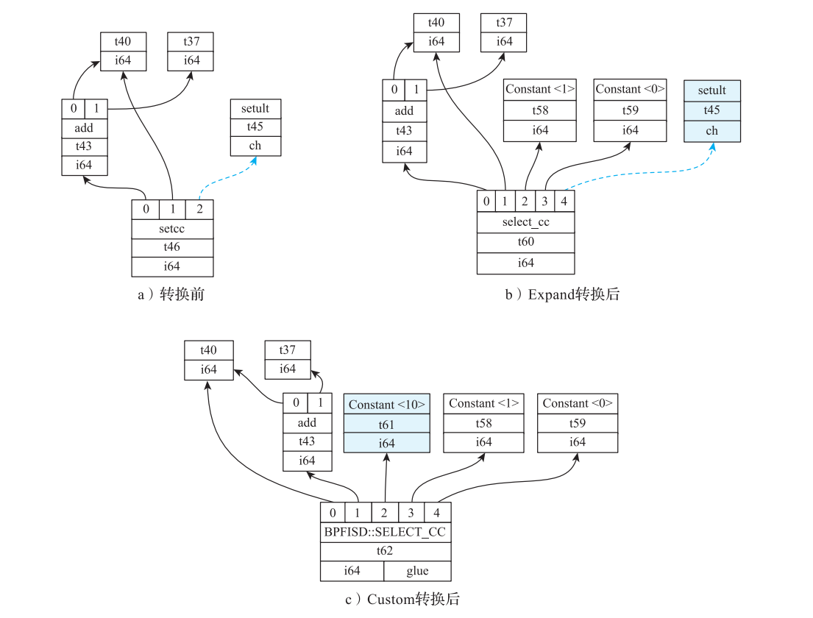

**图 7-22 操作合法化之 Custom 示例图**

○一 select_cc 的含义为，当 t43（操作数 0）和 t40（操作数 1）节点满足 t45（操作数 4）的判断条件时，返

回输入 t70（操作数 2，真值）的值，否则返回输入 1（操作数 3，假值）的值。

了互换，这是在未启用 JmpExt 的 BPF 配置下，把 `LHS <u RHS` 等价改写成 `RHS >u LHS`；启用 JmpExt 后可以保留原比较方向。这样的处理方式只有 BPF64 的架构开发者知道为什么要这么做以及怎么做，LLVM 的通用指令选择机制无法得知这样的意图，所以需要目标架构自己编写定制化的代码进行实现。

LLVM 18 的实际顺序是：第一次类型合法化 → 向量操作合法化 → 若向量合法化产生变更则再次类型合法化 → 普通操作合法化；各阶段之间按条件执行 DAG combine。第二次类型合法化位于向量操作合法化之后、普通操作合法化之前。

3. 向量合法化

LLVM 还实现了向量合法化。主要是因为一些 CPU 架构为了加速数据处理能力，推出了可以并行处理多个数据的指令—SIMD（Single Instruction Multiple Data，单指令多数据）指令。这些指令的特点在于，一条指令可以处理多个数据。如图 7-23 所示，要完成 4 组A、B 变量的加法，获得结果 C。如果使用普通加法指令，一条指令只能对两个操作数进行一次加法操作，需要 4 条加法指令才可以完成操作。而使用 SIMD 加法指令后，一条指令可以对两个向量进行加法操作，只需要一条指令即可完成操作，此时的操作数类型为 v4i64（是向量类型）。

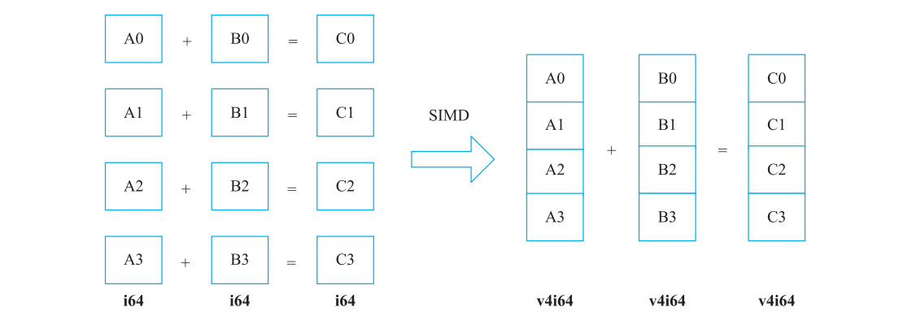

**图 7-23 向量操作示意图**

为了使能 CPU 的 SIMD 功能，在编译器中也增加了对向量数据类型的处理。与普通数据类型类似，编译器处理过程不可避免地会产生后端无法支持的向量数据类型，因此也需要对向量类型进行合法化处理。

对向量类型的合法化操作也分为类型合法化和操作合法化，视具体情况也会将不合法的向量操作转变为标量操作。总的来说，向量类型合法化的原理与标量类型的处理相似，本书不再展开介绍。

4. 合法化示例

最后我们仍然以代码清单 7-2 中的 IR 为例，来看看合法化处理后的结果。callee 函数只使用了 64 位数据类型，这对 BPF64 架构而言是合法的数据类型，所以经过数据合法化流

程后，其 DAG 不会产生变化。而 caller 将调用 callee 函数的返回值（64 位）并赋值给一个32 位的变量 f，f 又会作为 caller 的返回值，这一过程就出现了对 BPF64 架构而言不合法的数据类型，需要进行合法化处理。图 7-24 展示了 caller 函数中的合法化操作。

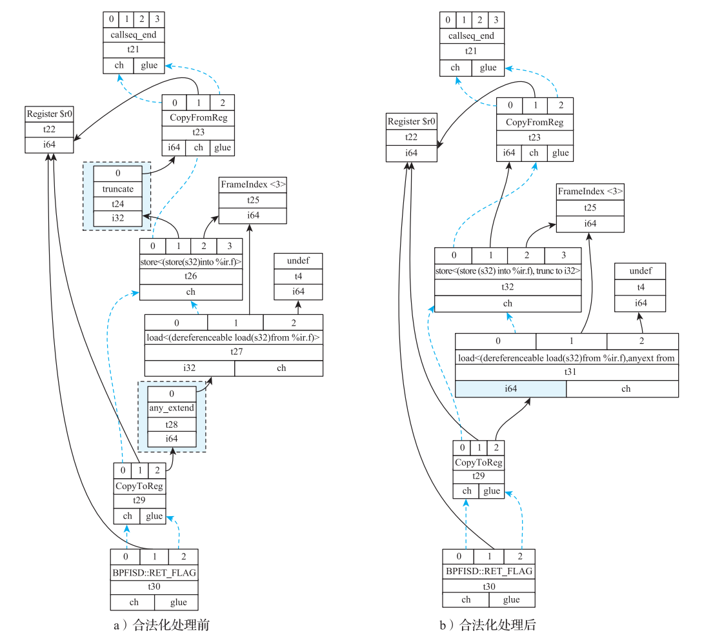

**图 7-24 caller 合法化处理前后的 DAG 图**

在图 7-24a 中，callseq_end 标志着调用 callee 函数的结束，在这之后由于函数 callee 的返回值是 64 位数据，会从物理寄存器 r0 中将返回值复制到 64 位的变量。而用于装载返回值的变量 f 的数据类型是 32 位，所以会生成截断节点 truncate，将 64 位变量截断为 32 位后，存入变量 f 的内存区域中。之后还需要将 32 位的 f 从内存中读取出来用于返回，因为BPF64 的返回类型应为 64 位，所以会生成扩展节点 any_extend，将 f 扩展为 64 位后再存入寄存器 r0 中用于返回。注意，这些节点是在初始化 DAG 时生成的。

在合法化处理中，32 位的寄存器值可提升为 i64，但变量 f 的内存对象、store / load 的内存宽度仍是 i32。存入 f 使用截断存储，读出 f 使用扩展加载；部分显式 truncate / any_extend 可被吸收到访存节点或被合并。图 7-24b 不应解读为对 i32 对象执行 64 位读写。

### 7.2.4 机器指令选择

在经过数据类型及操作合法化处理后，所有的 SDNode 只包含目标平台可以处理的操作和类型。接下来就需要为这些 SDNode 寻找与之对应的架构指令，这一过程称为“指令选择”。

SelectionDAGIsel 算法会从 DAG 的根节点开始（根节点位于 DAG 的出口），对每个SDNode 节点进行遍历处理，为其寻找对应的架构指令。从出口开始进行指令选择，意味着整个指令选择的过程是自底向上进行的。

在 LLVM 18 中，遍历时可删除死节点（DAG 根有专门的保持处理）。大部分节点通过 TableGen 匹配表选择，目标的 `Select` 还可手工处理特殊模式。多输出本身并不意味着一定无法通过表匹配；例如生成器与解释器支持多个结果的节点。

1. 匹配表介绍

在编译构建 LLVM 的过程中，LLVM 源码并不是最早开始被编译的，工程首先会构建llvm-tblgen 工具，并使用该工具将 TD 文件解析成 C/C++ 风格的 .inc 头文件。第 6 章详细介绍过 TD 到 C++ 代码的解析过程，并且以指令匹配为例介绍 LLVM 中常见的几种指令匹配的写法。这里以 BPF 后端为例，后端代码在 llvm/lib/Target/BPF 目录下的 TD 文件中，llvm-tblgen 处理这些代码以后，会在构建目录 build/lib/Target/BPF 下生成相应的 .inc 文件。指令选择过程中使用的 inc 文件名为 xxxGenDAGISel.inc（如 BPFGenDAGISel.inc），其中包含的静态表项 MatcherTable 在指令匹配选择中扮演了至关重要的角色，第 6 章为读者展示了匹配表的大概样子。本节会针对匹配表的内容继续进行介绍，同时演示如何使用匹配表完成指令的选择。

由于 MatcherTable 非常庞大，有些后端中的该 .inc 文件可以达到几十万行代码，限于篇幅无法对整个匹配表的内容进行介绍，这里仅选择匹配表的一些代码片段介绍其功能和使用。以 BPF 后端生成的 BPFGenDAGISel.inc 文件为例，匹配表 MatcherTable 代码片段如代码清单 7-7 所示。

> 清单 7-7、7-9 是原书 LLVM 15 的生成文件节选和历史日志，保留数字偏移用于讲解原图。LLVM 18 的表由对应版本 TD 与 TableGen 生成，opcode 值、intrinsic ID 和偏移均不稳定；本次未生成新表。省略号表示未展示的内容，整段不是可独立编译的 C++。

**代码清单 7-7 MatcherTable 代码片段**

```text
void DAGISEL_CLASS_COLONCOLON SelectCode(SDNode *N)
{
    // 第一部分内容：匹配表初始信息以及第一个匹配节点ISD::INTRINSIC_W_CHAIN的匹配信息
    #define TARGET_VAL(X) X & 255, unsigned(X) >> 8
    static const unsigned char MatcherTable[] = {
/* 0*/ OPC_SwitchOpcode /*36 cases */, 21|128,1/*149*/, TARGET_VAL
    (ISD::INTRINSIC_W_CHAIN),// ->154
/*     5*/  OPC_RecordNode, // #0 =‘intrinsic_w_chain’chained node
/*     6*/  OPC_Scope, 28, /*->36*/ // 4 children in Scope
/*     8*/   OPC_CheckChild1Integer, 114|128,40/*5234*/,
/*    11*/   OPC_RecordChild2, // #1 = $pseudo
/*    12*/   OPC_MoveChild2,
/*    13*/   OPC_CheckOpcode, TARGET_VAL(ISD::Constant),
...
// 第二部分内容：ISD::STORE节点的匹配信息
/*   154*/ /*SwitchOpcode*/ 114|128,1/*242*/, TARGET_VAL(ISD::STORE),// ->400
/*   158*/  OPC_RecordMemRef,
/*   159*/  OPC_RecordNode, // #0 =‘st’chained node
/*   160*/  OPC_RecordChild1, // #1 = $src
...
 // 第三部分内容：ISD::ADD节点的匹配信息
/*  2449*/ /*SwitchOpcode*/ 83, TARGET_VAL(ISD::ADD),// ->2535
/*  2452*/  OPC_Scope, 14, /*->2468*/ // 2 children in Scope
/*  2454*/   OPC_RecordNode, // #0 = $addr
/*  2455*/   OPC_CheckType, MVT::i64,
/*  2457*/   OPC_CheckComplexPat, /*CP*/1, /*#*/0, // SelectFIAddr:$addr #1 #2
/*  2460*/   OPC_MorphNodeTo1, TARGET_VAL(BPF::FI_ri), 0,
                 MVT::i64, 2/*#Ops*/, 1, 2,
             // Src: FIri:{ *:[i64] }:$addr - Complexity = 9
             // Dst: (FI_ri:{ *:[i64] } FIri:{ *:[i64] }:$addr)
/*  2468*/   /*Scope*/ 65, /*->2534*/
/*  2469*/   OPC_RecordChild0, // #0 = $src2
/*  2470*/   OPC_RecordChild1, // #1 = $imm
/*  2471*/   OPC_Scope, 38, /*->2511*/ // 3 children in Scope
/*  2473*/    OPC_MoveChild1,
/*  2474*/    OPC_CheckOpcode, TARGET_VAL(ISD::Constant),
/*  2477*/    OPC_Scope, 15, /*->2494*/ // 2 children in Scope
/*  2479*/     OPC_CheckPredicate, 0, // Predicate_i64immSExt32
/*  2481*/     OPC_MoveParent,
/*  2482*/     OPC_CheckType, MVT::i64,
/*  2484*/     OPC_EmitConvertToTarget, 1,
/*  2486*/     OPC_MorphNodeTo1, TARGET_VAL(BPF::ADD_ri), 0,
                   MVT::i64, 2/*#Ops*/, 0, 2,
               // Src: (add:{ *:[i64] } GPR:{ *:[i64] }:$src2, (imm:{ *:[i64] })
               // <<P:Predicate_i64immSExt32>>:$imm) - Complexity = 7
               // Dst: (ADD_ri:{ *:[i64] } GPR:{ *:[i64] }:$src2, (imm:{ *:[i64]
               // }):$imm)
/*  2494*/     /*Scope*/ 15, /*->2510*/
/*  2495*/     OPC_CheckPredicate, 0, // Predicate_i32immSExt32
/*  2497*/     OPC_MoveParent,
/*  2498*/     OPC_CheckType, MVT::i32,
/*  2500*/     OPC_EmitConvertToTarget, 1,
/*  2502*/     OPC_MorphNodeTo1, TARGET_VAL(BPF::ADD_ri_32), 0,
                   MVT::i32, 2/*#Ops*/, 0, 2,
               // Src: (add:{ *:[i32] } GPR32:{ *:[i32] }:$src2, (imm:{ *:[i32] })
               // <<P:Predicate_i32immSExt32>>:$imm) - Complexity = 7
               // Dst: (ADD_ri_32:{ *:[i32] } GPR32:{ *:[i32] }:$src2, (imm:{
               // *:[i32] }):$imm)
/*  2510*/     0, /*End of Scope*/
/*  2511*/     /*Scope*/ 10, /*->2522*/
/*  2512*/     OPC_CheckType, MVT::i64,
/*  2514*/     OPC_MorphNodeTo1, TARGET_VAL(BPF::ADD_rr), 0,
                  MVT::i64, 2/*#Ops*/, 0, 1,
               // Src: (add:{ *:[i64] } i64:{ *:[i64] }:$src2, i64:{ *:[i64] }:$src)
               //- Complexity = 3
               // Dst: (ADD_rr:{ *:[i64] } i64:{ *:[i64] }:$src2, i64:{ *:[i64] }:$src)
```

笔者仅仅截取了匹配表的三部分内容，第一部分是匹配表的表头信息以及第一个匹配节点。

第 一 行 表 示 从 当 前 行 一 直 到 第 154 字 节 之 前 的 内 容， 是 针 对 SDNode 节 点 ISD:: INTRINSIC_W_CHAIN 的匹配规则（匹配表中的数字表示的是字节偏移，例如 154 表示的是第 154 字节），其中：

1）/* 0*/：指元素在数组中的索引值。

2）OPC_SwitchOpcode ：数组中的第一项为 OPC_SwitchOpcode，表示这是一个处理SDNode 的匹配表。

3）/*36 cases */：表示最外层 opcode 分派共有 36 个 case，不是 INTRINSIC_W_CHAIN 单独有 36 种模式。

4）21|128,1/*149*/：表示当前 SwitchOpcode 分支匹配子表的长度（不是整张 MatcherTable 的大小），数值为 (1 << 7) + 21 = 149（字节）；上述MatcherTable 的位置 1 与位置 2 的值分别为 21|128 和 1，后面的注释信息为 149。实际上这是一种用变长的编码存储数据的方式，用最高位来表示下一个数据是否属于当前的数据一部分。比如，21|128 的最高位为 1，表示后面的数据 1 也是属于当前的数据，最终的数据为(1 << 7) + 21 = 149，刚好是注释中的内容。

5）TARGET_VAL(ISD::INTRINSIC_W_CHAIN) ：表示当前匹配表处理的 SDNode 节点为 ISD::INTRINSIC_W_CHAIN) ；它前面的 TARGET_VAL 是一个宏（占两个字节），含义是将值展开为低 8 位和高 8 位，由于 ISD::INTRINSIC_W_CHAIN 的值大于 1 字节的数据范围，因此做了展开。

6）// ->154 ：LLVM 会记录每个 SDNode 对应的匹配片段在整张匹配表中的起始位置，当指令选择流程遍历到某个 SDNode 时，就会直接跳转到其对应的匹配表中的位置并开始进行匹配。例如上述匹配表第一行的尾部给出的 154，表示从 154 字节处开始定义一个新的匹配节点。根据 154 字节处的内容得知：从 154 字节开始是针对 STORE 节点的匹配规则描述（MatcherTable 中第二部分）。代码清单 7-7 中从 2449 字节开始是针对 ADD 节点的匹配规则描述（MatcherTable 中第三部分）。

7）OPC_xxx：对应着匹配流程中的行为，如 OPC_RecordNode 用于记录当前节点，OPC_

CheckChild1Integer 用于比较索引 1（第二个）的子操作数是否为表中指定数值的常量，OPC_CheckOpcode 用于校验当前节点的指令编号。一条匹配路径中存在多个匹配行为，读者可以查阅 LLVM 手册了解每个匹配行为的功能。

因为 LOAD 和 STORE 访存类节点在匹配表中项目过多，所以本书选择较为简单的ADD 节点进行介绍。

示例中第三部分内容是 ADD 节点的匹配信息。在匹配表中，从 2449 字节开始、到下一 opcode 分支 2535 之前是此历史输出的 ADD 子表；2514 是其中一个 MorphNode 动作的位置。当开始匹配 ISD::ADD 节点时，可以查询到其匹配片段位于整张匹配表的 2452 字节处，便跳转到此处开始匹配。匹配过程会经过 OPC_ RecordNode、OPC_CheckType、OPC_CheckComplexPat 这些匹配动作，如果几个动作或校验规则都成功，说明 ISD::ADD 节点及其操作数和指令描述信息完全匹配，可以匹配到机器指令 BPF::FI_ri，本轮指令匹配成功结束，然后开始进行下一个 SDNode 节点的匹配。如果其中某一个动作或校验规则未执行成功，就会跳转到匹配表的 2468 字节处开始执行下一条匹配路径的操作。在这条路径里，先尝试 ADD_ri / ADD_ri_32 立即数模式，之后再尝试 ADD_rr / ADD_rr_32 寄存器模式 ：如果匹配过程中某个动作或规则未执行成功，则会进入到其他机器指令（ADD_ri、ADD_rr_32、ADD_ri_32）的匹配路径○一；如果所有的匹配路径都无法满足当前的 ADD 节点，则本轮指令匹配失败，编译器会抛出错误。`OPC_EmitNode` 只生成中间匹配结果，仍可能继续匹配；最终提交由 `OPC_CompleteMatch` 或成功完成的终结型 `OPC_MorphNodeTo*` 路径执行。在这类节点的处理过程中，会填充操作数（包括链等数据依赖）、操作数类型为 VTList，然后调用 getMachineNode 方法获取相应的 Machine SDNode节点，替换原来的 DAG SDNode 节点（Machine SDNode 会包含后端指令的信息）。

可以发现，整个匹配过程可画成状态图，但实现是具有作用域栈、记录状态和回溯行为的匹配字节码解释器，严格说不是普通确定性有限自动机（DFA），根据当前节点的状态，依次判断各种信息（类型、匹配模式等），所以可以直观地将 ADD 节点的匹配过程描述为如图 7-25 所示的状态机示意图（图中省略了匹配 ADD_rr、ADD_ri 等指令所需要进行的操作数校验动作）。

图 7-25 还需要结合作用域回溯理解：

匹配解释器中存储了额外的信息，用于标记当前节点匹配失败后下一个匹配的起始位置，用这些作用域记录实现回溯；传统 DFA 并没有这种回溯栈。例如 2452 这个节点记录的下一个匹配位置是 2468，即从 2452 开始匹配，如果发现不匹配，无论是匹配到 2454、2455、2457、2460 中的哪一个位置，都直接从 2468 开始新的匹配。这是因为匹配表非常大，通过这样的方式可以加速指令的匹配过程。

○一 这里指令 ADD_ 后面的 r 表示寄存器，i 表示立即数，32 表示使用的寄存器为 32 位；rr 表示两个操作

数都是寄存器；ri 表示一个操作数是寄存器，另一个是立即数。

**图 7-25 ADD 指令匹配过程对应的 DFA 示意图（图中文字转写）**

原图把 ADD_ri 的成功终点错标为 ADD_rr，且 RecordChild 本身只记录操作数，不执行匹配失败判断。下面按清单 7-7 的分支逻辑修正；此图仍使用原书模式集合，不固定 LLVM 18 生成表的偏移。

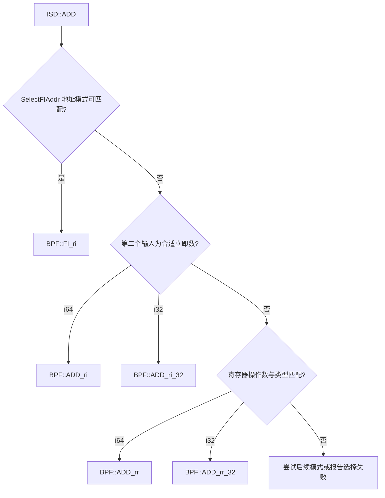
```mermaid
flowchart TD
  A[ISD::ADD] --> F{SelectFIAddr 地址模式可匹配?}
  F -->|是| FI[BPF::FI_ri]
  F -->|否| I{第二个输入为合适立即数?}
  I -->|i64| RI[BPF::ADD_ri]
  I -->|i32| RI32[BPF::ADD_ri_32]
  I -->|否| R{寄存器操作数与类型匹配?}
  R -->|i64| RR[BPF::ADD_rr]
  R -->|i32| RR32[BPF::ADD_rr_32]
  R -->|否| X[尝试后续模式或报告选择失败]
```

2. 匹配过程演示

下面通过例子简单演示 ISD::ADD 的匹配过程。假设有一段待匹配的 add SDNode 序列如代码清单 7-8 所示。

**代码清单 7-8 待匹配的 add SDNode 序列**

```text
t35: i64 = add nsw t33, t34
t36: i64,ch = load<(dereferenceable load (s64) from %ir.d.addr)> t30,
    FrameIndex:i64<3>, undef:i64
t37: i64 = add nsw t35, t36
```

以 t37: i64 = add nsw t35, t36 节点的匹配为例，该节点要匹配的 SDNode 为 ISD::ADD。该节点有两个输入操作数 t35、t36，以及一个 i64 结果 t37；输出不是输入操作数，DAG 阶段也尚未给每个值分配物理寄存器。

匹配流程如下。

1）根据操作数偏移表（OpcodeOffset）中的记录，找到 ISD::ADD 节点的匹配起始位置为 2449，从这里开始进行当前路径的匹配处理；在下一行中，/*->2468*/ 字段表明，若当前匹配路径因失败中断，需要跳转至序号 2468 进行下一路径的匹配。

2）2452、2454、2455 匹配成功，但在 2457 匹配时失败，因为以 t37 为根的地址表达式未通过 `SelectFIAddr` 的 FrameIndex 地址检查；t37 是当前结果节点，不是它的第 0 个输入，就跳转至 2468 继续；在下一行中，/*->2534*/ 字段会更新下一路径的起始位置，若当前匹配路径失败，则下一次需要跳转至 2534 继续尝试匹配。

3）2469、2470、2471、2473 匹配成功（在匹配路径执行到 2471 时，失败后的下一跳位置将从 2534 更新为 2511），在 2474 匹配失败后，因为第二个入参 t36 不是 Constant 常数类型，因此跳转至 2511 继续匹配。若失败，则跳转至 2522 继续匹配。

4）2512 匹配成功，紧接着在 2514 遇到 OPC_MorphNodeTo1，表明该节点模式匹配成功。当前匹配路径的终点是机器指令 BPF::ADD_rr，原 IR 中的 SDNode ISD::ADD 被匹配为 BPF::ADD_rr 指令，若当前节点的指令匹配成功并结束，则可以准备开始下一节点的匹配。

通过 debug 模式下编译器的处理日志，可以验证上述匹配流程。t37: i64 = add nsw t35, t36 这一节点的匹配是从匹配表的 2452 开始的，在 2457 失败后则从 2468 继续匹配，在2474 失败后又从 2511 处继续匹配，并成功匹配到 ADD_rr 指令。匹配 ADD 节点的日志如

**代码清单 7-9 所示。**

**代码清单 7-9 匹配 ADD 节点的日志**

```text
ISEL: Starting selection on root node: t37: i64 = add nsw t35, t36
ISEL: Starting pattern match
Initial Opcode index to 2452
Match failed at index 2457
Continuing at 2468
Match failed at index 2474
Continuing at 2511
Morphed node: t37: i64 = ADD_rr nsw t35, t36
ISEL: Match complete!
```

指令选择结束后，运算、访存等节点通常已被转换为 MachineSDNode，例如本例的 ADD_rr、STD、LDD；DAG 中还可以存在 EntryToken、TokenFactor、CopyFromReg、CopyToReg 等目标无关节点。它们不能一概称为将保留到 MIR 的机器伪指令：chain/glue 依赖供 DAG 调度和发射使用，InstrEmitter::EmitSpecialNode 对 EntryToken、TokenFactor 等结构节点不发射 MachineInstr。CopyToReg 则可能发射 COPY，或在源、目的相同时不发射；CopyFromReg 经 EmitCopyFromReg 建立寄存器映射，必要时发射 COPY。真正生成的 MIR COPY 后续可被合并、消除，或在寄存器分配后的目标处理过程中转换为物理寄存器复制指令。具体路径见 InstrEmitter.cpp:84、1202，而不能把 DAG 结构节点与 MIR COPY 混为一谈。

仍然以图 7-15 中的 callee 为例看一下经过指令匹配流程后被转换成的 DAG 图，如

**图 7-26 所示。**

可以看出，图 7-15 中的 add、store、load 节点，分别被成功匹配到了 BPF 架构指令集中的 ADD_rr、STD、LDD 指令。由此说明指令选择完成。

### 7.2.5 从 DAG 输出 MIR

代码表达经过机器指令匹配后仍然是 DAG 的形式，编译器需要遍历每个 SDNode 节点，生成与之对应的 MIR。实际上，在生成机器指令表达之前，会先对 DAG 的节点进行调度优化，chain 和 glue 等会在调度过程中被使用并最终消除，最后产生的 MIR 中将不携带这些信息。指令调度作为一种优化策略，不会影响从 DAG 到 MIR 的转换，相关内容读者可以阅读第 8 章。

从 SDNode 节点发射生成 MIR 分为两种情况。

1）SDNode 在指令选择阶段已经匹配了机器指令，直接生成相应的 MIR，并放入与MIR 基本块对应的 MBB（MachineBasicBlock，机器基本块）中即可。生成相应 MIR 的过程如下。

① 根据指令选择的结果新建相应的 MIR。

② 将原 SDNode 节点相关的操作数、数据结构中的节点属性等信息，相应地复制到MIR 节点和数据结构中。

③ 将 MIR 插入到 MBB 中的相应位置。

2）一些特殊节点是架构无关的且一般会存在控制流依赖，后端架构中并不能通过指令选择找到与这些节点对应的汇编指令，如表示寄存器复制的节点 CopyFromReg、CopyToReg，会被转变为 COPY 伪指令放入到 MBB 中，这些伪指令在后续的优化环节中会被消除或转换为真实的机器指令。

**图 7-26 callee 指令匹配后的 DAG（图中文字转写）**

> 图 7-26 的节点文字版已修正 EntryToken 的输出为 chain。它仍包含目标无关 DAG 节点，必须经调度和 InstrEmitter 才成为 MIR；原图见本章末尾第 124 页版面。

| 节点 | 操作或标签 | 输出类型 |
|---|---|---|
| t0 | EntryToken | ch |
| t1 | Register %0 | i64 |
| t2 | CopyFromReg | i64, ch |
| t3 | Register %1 | i64 |
| t4 | CopyFromReg | i64, ch |
| t8 | STD<Mem:(store (s64) into %ir.a.addr)> | ch |
| t10 | STD<Mem:(store (s64) into %ir.b.addr)> | ch |
| t11 | LDD<Mem:(dereferenceable load (s64) from %ir.a.addr)> | i64, ch |
| t12 | LDD<Mem:(dereferenceable load (s64) from %ir.b.addr)> | i64, ch |
| t13 | ADD_rr nsw | i64 |
| t15 | TokenFactor | ch |
| t16 | STD<Mem:(store (s64) into %ir.c)> | ch |
| t17 | LDD<Mem:(dereferenceable load (s64) from %ir.c)> | i64, ch |
| t18 | Register $r0 | i64 |
| t19 | CopyToReg | ch, glue |
| t20 | RET | ch |
| t21 | TargetFrameIndex <2> | i64 |
| t22 | TargetConstant <0> | i64 |
| t23 | TargetFrameIndex <0> | i64 |
| t24 | TargetFrameIndex <1> | i64 |
| — | GraphRoot | — |

相对图 7-15，store / load / add / 返回节点分别选成 STD / LDD / ADD_rr / RET，FrameIndex 选成 TargetFrameIndex，地址偏移使用 TargetConstant <0>。图中其余 CopyFromReg、CopyToReg、TokenFactor 和相关 chain / glue 边仍然保留。机器 store 的输入顺序为值、地址、偏移、chain；机器 load 的输入顺序为地址、偏移、chain；图中的 RET 输入顺序为返回寄存器、chain、glue。

7.2.2 节提到为基本块更新 φ 函数，即为 φ 函数添加寄存器，也是在这一阶段进行处理的。

从 SDNode 生成 MIR 过程比较简单，例如一个 SDNode 为 t8: ch = STD<Mem:(store (s64) into %ir.a.addr)> t2, TargetFrameIndex:i64<0>, TargetConstant:i64<0>, t0，则它对应的MIR 为 STD %0:gpr, %stack.0.a.addr, 0 :: (store (s64) into %ir.a.addr)。可以看出，两者几乎是一一对应翻译的，所以不再详细展开。

仍以代码清单 7-2 中的 callee 函数为例，经过指令选择后的 DAG 表达如代码清单 7-10所示。

> 清单 7-8～7-11 是 SDNode / MachineFunction 调试转储，节点编号是展示用标识。清单 7-11 的 `tied-def` 形式不是完整 MIR YAML，不能直接保存后交给 MIR parser；清单 7-8 也没有 store，后文 store 的对应关系来自完整 callee 示例。

**代码清单 7-10 经过指令选择后的 callee DAG 表达**

```text
Selected selection DAG: %bb.0 'callee:entry'
SelectionDAG has 20 nodes:
    t0: ch = EntryToken
        t4: i64,ch = CopyFromReg t0, Register:i64 %1
            t2: i64,ch = CopyFromReg t0, Register:i64 %0
        t8: ch = STD<Mem:(store (s64) into %ir.a.addr)> t2,  TargetFrameIndex:i64<0>,
            TargetConstant:i64<0>, t0
    t10: ch = STD<Mem:(store (s64) into %ir.b.addr)> t4, TargetFrameIndex:i64<1>,
            TargetConstant:i64<0>, t8
    t12: i64,ch = LDD<Mem:(dereferenceable load (s64) from %ir.b.addr)>
            TargetFrameIndex:i64<1>, TargetConstant:i64<0>, t10
    t11: i64,ch = LDD<Mem:(dereferenceable load (s64) from %ir.a.addr)>
            TargetFrameIndex:i64<0>, TargetConstant:i64<0>, t10
        t13: i64 = ADD_rr nsw t11, t12
        t15: ch = TokenFactor t11:1, t12:1
    t16: ch = STD<Mem:(store (s64) into %ir.c)> t13, TargetFrameIndex:i64<2>,
        TargetConstant:i64<0>, t15
        t17: i64,ch = LDD<Mem:(dereferenceable load (s64) from %ir.c)>
            TargetFrameIndex:i64<2>, TargetConstant:i64<0>, t16
    t19: ch,glue = CopyToReg t16, Register:i64 $r0, t17
    t20: ch = RET Register:i64 $r0, t19, t19:1
```

在经过 MIR 生成处理后，产生的 MIR 如代码清单 7-11 所示。

**代码清单 7-11 代码清单 7-10 对应的 MIR**

```text
Function Live Ins: $r1 in %0, $r2 in %1

bb.0.entry:
    liveins: $r1, $r2
    %1:gpr = COPY $r2
    %0:gpr = COPY $r1
    STD %0:gpr, %stack.0.a.addr, 0 :: (store (s64) into %ir.a.addr)
    STD %1:gpr, %stack.1.b.addr, 0 :: (store (s64) into %ir.b.addr)
    %2:gpr = LDD %stack.0.a.addr, 0 :: (dereferenceable load (s64) from %ir.a.addr)
    %3:gpr = LDD %stack.1.b.addr, 0 :: (dereferenceable load (s64) from %ir.b.addr)
    %4:gpr = nsw ADD_rr %2:gpr(tied-def 0), killed %3:gpr
    STD killed %4:gpr, %stack.2.c, 0 :: (store (s64) into %ir.c)
    %5:gpr = LDD %stack.2.c, 0 :: (dereferenceable load (s64) from %ir.c)
    $r0 = COPY %5:gpr
    RET implicit $r0

# End machine code for function callee.
```

注 当 SDNode 转换为 MIR 之后，表示控制流依赖的 chain 和 glue 等信息被完全消除，

意

所有的节点都变成了机器指令，这些机器指令“几乎”可以直接映射成机器汇编运

行。这里说“几乎”，是因为此时的机器指令虽然已经和最终的汇编指令很接近，但

大部分指令操作数使用哪些寄存器存储值还没有确定下来，这还依赖“寄存器分配”

（参见第 10 章）。此外，这一阶段的指令序列并不一定是最高效的，还需要经过后端

的优化才可以获得执行效率更高的序列，典型的优化手段参见第 9 章。

## 7.3 快速指令选择算法分析

SelectionDAGISel 算法经过了 LLVM IR 的 DAG 化、合法化、匹配表查找等复杂过程，会耗费大量时间。为了提高指令选择的速度，LLVM 实现了一个快速指令选择算法—FastISel。这一算法只适用于部分后端的 O0 优化中，通过牺牲指令选择的质量来换取编译时间。

FastISel 的原则是：尽可能快速地选择尽可能多的指令。也就意味着，FastISel 允许指令选择失败，当发生失败就会进入到 SelectionDAGIsel 指令选择流程继续选择，这也使得FastISel 可以复用一些 SelectionDAGIsel 中的逻辑，避免重复实现。

在指令选择过程中涉及的一些复杂工作，例如合法化、优化等，在 FastIsel 中并不会处理。FastIsel 只处理数据类型合法的简单操作，如常规的加减运算、位运算，并且认为其他的数据类型和指令操作会失败，所以会切换到 SelectionDAGIsel 中进行处理。

FastIsel 也使用 TableGen 工具链，将 TD 文件中的指令描述直接翻译为一个或者多个函数调用。如在使用 FastIsel 时，会将 TD 中定义的一个 ADD 指令直接翻译成 LLVM IR 指令对应的 MIR 指令序列。代码清单 7-12 所示为 AArch64 架构的 ADDXrr 指令在 TD 文件中的定义。

> 清单 7-12、7-13 是 TD 定义和展开记录的节选；省略号不属于 TableGen 语法。清单 7-14 为生成代码形态示意，已修正命名空间为 `AArch64`。

**代码清单 7-12 AArch64 架构中对 ADDXrr 指令的 TD 定义**

```text
multiclass AddSub<bit isSub, string mnemonic, string alias,
                  SDPatternOperator OpNode = null_frag> {
    let hasSideEffects = 0, isReMaterializable = 1, isAsCheapAsAMove = 1 in {
    ……
    def Xrr : BaseAddSubRegPseudo<GPR64, OpNode>;
……
}

defm ADD : AddSub<0, "add", "sub", add>;
```

经过 TableGen 工具链的第一阶段处理（参见第 6 章）后，得到的 ADDXrr 记录如代码清单 7-13 所示。

**代码清单 7-13 ADDXrr 记录**

```text
def ADDXrr {
    string Namespace = "AArch64";
    dag OutOperandList = (outs GPR64:$Rd);
    dag InOperandList = (ins GPR64:$Rn, GPR64:$Rm);
    ……
//ADDXrr指令对应的匹配模板，两个入参均为64位寄存器类型，返回值也为64位类型
    list<dag> Pattern = [(set GPR64:$Rd, (add GPR64:$Rn, GPR64:$Rm))];
……
```

再经过 TableGen 工具对记录进行提取，在 FastIsel 中仍然根据 Pattern 字段提取匹配信息，最后会生成如代码清单 7-14 所示的 ADDXrr 匹配模板校验函数。

**代码清单 7-14 由 TableGen 生成的 ADDXrr 匹配模板校验函数**

```text
unsigned fastEmit_ISD_ADD_MVT_i64_rr(MVT RetVT, unsigned Op0, unsigned Op1)
{
    if (RetVT.SimpleTy != MVT::i64)
        return 0;
    return fastEmitInst_rr(AArch64::ADDXrr, &AArch64::GPR64RegClass, Op0, Op1);
}
```

清单 7-14 展示的是生成函数的一层：上层按操作码、类型和操作数形式分派，不能只看此处的 RetVT 判断就认为没有检查输入类型。`fastEmitInst_rr` 是 `FastISel` 的公共实现，在 `llvm/lib/CodeGen/SelectionDAG/FastISel.cpp` 中约束寄存器类并通过 BuildMI 发射机器指令，并不要求每个后端重复实现。清单 7-15 为该公共函数的 LLVM 18 函数体节选。

**代码清单 7-15 AArch64 中的 fastEmitInst_rr 函数的实现**

```cpp
Register FastISel::fastEmitInst_rr(unsigned MachineInstOpcode,
                                   const TargetRegisterClass *RC, unsigned Op0,
                                   unsigned Op1) {
  const MCInstrDesc &II = TII.get(MachineInstOpcode);

  Register ResultReg = createResultReg(RC);
  Op0 = constrainOperandRegClass(II, Op0, II.getNumDefs());
  Op1 = constrainOperandRegClass(II, Op1, II.getNumDefs() + 1);

  if (II.getNumDefs() >= 1)
    BuildMI(*FuncInfo.MBB, FuncInfo.InsertPt, MIMD, II, ResultReg)
        .addReg(Op0)
        .addReg(Op1);
  else {
    BuildMI(*FuncInfo.MBB, FuncInfo.InsertPt, MIMD, II)
        .addReg(Op0)
        .addReg(Op1);
    BuildMI(*FuncInfo.MBB, FuncInfo.InsertPt, MIMD, TII.get(TargetOpcode::COPY),
            ResultReg)
        .addReg(II.implicit_defs()[0]);
  }
  return ResultReg;
}
```

目前并不是所有的架构都支持 FastISel 这种指令选择模式，除了上述提到的 AArch64

外，当前支持该模式的架构还有 ARM、MIPS、PPC、x86、WebAssembly。

## 7.4 全局指令选择算法原理与实现

SelectionDAGISel 经过了多年的发展，功能完善且可靠性高，但是它存在着 3 个主要的问题。

1）SelectionDAGISel 包含了过多的功能，比如许多的合并优化和合法化优化，以及为了降低编译时间而增加的 FastISel 的算法。这些功能大多与指令选择算法本身不是强相关，但都被放入到指令选择中，导致其代码架构越来越繁复，代码维护的成本变高。

2）它是以基本块为粒度进行指令模式匹配，导致一些跨基本块的模式无法匹配上，增加了生成最优代码的难度。

3）DAG IR 是图结构，需要一个指令调度的功能才能生成线性的 MIR，这导致了编译时间的增加。但是它的输入 LLVM IR 本身是线性结构，如果 DAG IR 不是图结构的，指令调度就可以去掉。

因为这些问题都是当前 SelectionDAGISel 架构设计相关的，无法通过简单修补进行完善，所以 LLVM 社区在 2015 年提出重新设计一套指令选择算法的想法，即全局指令选择（GlobalISel），期望能解决这些问题。

目前全局指令选择算法的主要功能都已开发完成，有一些指令架构已经在逐步适配（AArch64、x86 等）。本节接下来会以 AArch64 架构中的实现为例，介绍这个算法的基本原理和功能模块。

### 7.4.1 全局指令选择的阶段

在图 7-4 中，全局指令选择算法的实现分成两个阶段。全局指令选择算法使用了一种新的中间表示 GMIR（Generic Machine IR，通用机器中间表达）。全局指令选择第一阶段先将 LLVM IR 转成 GMIR，在第二阶段将 GMIR 转成 MIR。读者可能会问为什么要引入一种新的 IR，而不是重用 MIR ？

首先，GMIR 是线性的 IR，与 MIR 共用数据结构，除了操作码（Opcode）不同之外，指令表示方式等都是相同的（MIR 的具体结构可以参考附录 A.3）。GMIR 的操作码是一套架构无关的操作码，用于支持不同架构的指令转换。在全局指令选择的第一阶段使用宏展开的算法将 LLVM IR 转成 GMIR，接着基于 GMIR 进行指令合法化和寄存器类型分配。其次，在高优化级别的场景下，还会做一些合并类的窥孔优化。最后，全局指令选择的第二阶段会使用表驱动的算法，生成相应的 MIR。

另外，指令选择的每个阶段的算法都比较复杂，为了避免过多功能耦合在一起造成代码复杂性过高与难以维护以及功能演进困难，全局指令选择采用了多 Pass 的设计，将两个阶段涉及的功能进行解耦，每个可以独立拆分出的功能都实现为单独的 Pass。这样既使得

整体架构更为清晰，也能够方便地利用 LLVM Pass 的相关基础设施（如 dump 等功能）进行代码维护和问题分析定位。

目前 LLVM 实现将全局指令选择所必需的基本功能划分为 4 个 Pass，其中第一阶段包含 3 个 Pass，第二阶段包含 1 个 Pass。还有窥孔类的优化也会以独立 Pass 进行实现，并可以放置在 4 个基础 Pass 之间的任意位置，不同的架构可以根据需要配置一到多个这种优化Pass，全局指令选择 Pass 如图 7-27 所示。

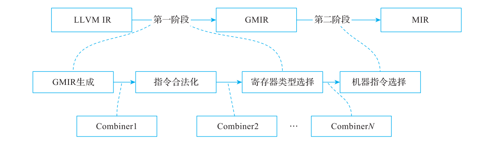

**图 7-27 全局指令选择 Pass 示意图**

第一个阶段的 3 个基础 Pass 分别如下。

T GMIR 生成（IRTranslator）：将 LLVM IR 转换为 GMIR。

T 指令合法化（Legalizer）：将 GMIR 中一些目标架构不支持的 GMIR 指令替换为目

标架构可以支持的 GMIR 指令序列。

T 寄存器类型选择（RegBankSelect）：为 GMIR 中每个寄存器操作数分配合适的目标

架构寄存器类型。

第二阶段的 Pass 是机器指令选择（InstructionSelect），它将 GMIR 转换为目标架构相关的 MIR。

除此以外，在指令选择的过程中还有一些优化类的 Pass，如图 7-27 中的 Combiner1、Combiner2、CombinerN 等，目的是完成一些窥孔类型指令的合并优化，进而提高生成代码的质量。这些优化 Pass 可以有一到多个。

下面详细介绍每个功能的原理以及实现。

### 7.4.2 GMIR 生成

GMIR 生成是全局指令选择第一阶段的第一个 Pass，主要功能是将 LLVM IR 转换为GMIR 代码。它使用的指令转换算法是宏展开算法，每次转换一条 LLVM IR。因为 GMIR的操作码具有通用性，LLVM IR 也是架构无关的中间表示，所以大部分 LLVM IR 指令转成GMIR 指令的实现都是架构无关的。另外，GMIR 还包含一些目标架构相关的信息，例如函数调用约定处理，需要将这部分 LLVM IR 转换成架构相关的 GMIR（在实现层面，不同的

目标架构需要各自实现这部分代码）。如图 7-28 所示，GMIR 生成指令可以分为架构无关和架构相关两部分，像算术运算、逻辑运算等指令都是架构无关的；而像形式参数处理、函数调用等就是架构相关的，因为它们必须知道目标架构的调用约定才能处理。


**图 7-28 GMIR 生成的概览图**

上面简单介绍了 GMIR 生成的基本功能，下面介绍 GMIR 生成的执行过程。GMIR 生成的执行过程是以函数为粒度进行的（和 SelectionDAGISel 是以基本块为粒度不同），因为函数可以分为函数头（形参信息）和函数体，函数体又有基本块等表示，所以我们按处理的函数信息不同，将执行过程分为 4 个主要的阶段。

1）基本块创建：这个阶段会遍历函数的 LLVM IR 基本块，依次为每个基本块创建对应的 GMIR 的基本块（后续根据指令情况，还可能会添加新的基本块），并且会保留相关的控制流信息，形成初始的控制流图。这个阶段还会为每个函数添加一个额外的基本块（EntryBB），作为函数入口。

2）形参处理：根据目标架构的调用约定规则处理函数的入参，为每个入参生成一条从传参寄存器到虚拟寄存器的 GMIR 复制指令，或者为入参生成一条从栈上到虚拟寄存器的GMIR 加载指令，并将生成的指令放入 EntryBB 中。

3）函数体指令转换：按 RPOT（逆后序遍历）的方式遍历函数的控制流图，以自顶向下的顺序将基本块里的每条指令转换成一组 GMIR 指令。

4）控制流图更新：在第 3 阶段的指令转换过程中，有些原本不是跳转的指令会被翻译成跳转指令（例如，跳转指令的条件码是由多条连续的逻辑运算指令生成的，此时就有可能会拆分原逻辑运算指令，生成多个跳转指令），导致原有基本块被拆分出多个新基本块，破坏原有的控制流。因此在基本块指令转换好后，需要维护好这些新基本块与原有基本块的控制流边，形成新的控制流图。此外，转换过程还可能会将 EntryBB 和函数体中的第一个基本块合并，此时控制流信息也要跟着更新。

下面通过例子来具体演示上述 4 个阶段的功能。GMIR 生成的示例源码如代码清单 7-16所示。

**代码清单 7-16 GMIR 生成的示例源码（7-16.c）**

```text
int test(int a, int b) {
    return a + b;
}
```

先用 `clang --target=aarch64-unknown-linux-gnu -O2 -S -emit-llvm -fno-discard-value-names 7-16.c -o 7-17.ll` 得到 LLVM IR。若后续要观察 IRTranslator 的 GMIR，可对该 IR 使用 `llc -mtriple=aarch64-unknown-linux-gnu -global-isel -stop-after=irtranslator 7-17.ll -o 7-17.mir`。原命令只有 `-S`，默认产生汇编，不能据此声称已输出 IR / GMIR。这些命令本次均未执行。

**代码清单 7-17 源码处理前的 IR**

```text
define dso_local noundef i32 @test(i32 noundef %a, i32 noundef %b)
    local_unnamed_addr {
entry:
    %add = add nsw i32 %b, %a
    ret i32 %add
}
```

1. 基本块创建

首先 GMIR 生成阶段会建立一个 EntryBB 作为存放入参处理指令的基本块，记为 bb.0，如代码清单 7-18 所示。

> 清单 7-18～7-23 展示 `IRTranslator::runOnMachineFunction` 内部步骤，暂存入口块和虚拟寄存器编号不构成 LLVM 18 稳定输出。COPY 与 RET_ReallyLR 已经是 MachineInstr，与 G_ADD 共用 MIR 基础设施。

**代码清单 7-18 创建基本块 EntryBB**

```text
# Machine code for function test: IsSSA, TracksLiveness
bb.0:
# End machine code for function test.
```

接着处理函数的基本块，因为该函数只有一个基本块，所以只需要建立一个 GMIR 基本块，记为 bb.1.entry，如代码清单 7-19 所示。

**代码清单 7-19 创建基本块 bb.1.entry**

```text
# Machine code for function test: IsSSA, TracksLiveness
bb.0:
    successors: %bb.1(0x80000000); %bb.1(100.00%)
bb.1.entry:
; predecessors: %bb.0
# End machine code for function test.
```

2. 形参处理

首先，为形参创建虚拟寄存器，因为本例中有两个形式参数，所以创建了两个虚拟寄存器 %0 和 %1。然后，根据目标架构的调用约定（ABI），生成复制指令或者加载指令。代码清单 7-20 所示为形参处理后的结果，AArch64 后端按照其调用约定，在 bb.0 中生成两条从物理寄存器到虚拟寄存器的 COPY 指令。

**代码清单 7-20 形参处理**

```text
# Machine code for function test: IsSSA, TracksLiveness
Function Live Ins: $w0, $w1
bb.0:
    successors: %bb.1(0x80000000); %bb.1(100.00%)
    liveins: $w0, $w1
    %0:_(s32) = COPY $w0
    %1:_(s32) = COPY $w1

bb.1.entry:
; predecessors: %bb.0
# End machine code for function test.
```

3. 指令转换

以 RPOT 方式遍历函数的每个基本块，进行指令转换。这个例子中有两条指令需要转换，分别是 add 和 ret 指令。

add 指令展开成一条 G_ADD 指令（GMIR 中定义的加法操作，和 LLVM IR 中的 add 指令对应）即可。先将两个源操作数转为虚拟寄存器，然后创建一个虚拟寄存器作为目的操作数，最后三个虚拟寄存器和 G_ADD 操作码共同组成一条 GMIR 加法指令，如代码清单 7-21所示。

**代码清单 7-21 源操作数处理**

```text
# Machine code for function test: IsSSA, TracksLiveness
Function Live Ins: $w0, $w1
bb.0:
    successors: %bb.1(0x80000000); %bb.1(100.00%)
    liveins: $w0, $w1
    %0:_(s32) = COPY $w0
    %1:_(s32) = COPY $w1
bb.1.entry:
; predecessors: %bb.0
    %2:_(s32) = nsw G_ADD %1:_, %0:_
# End machine code for function test.
```

接着处理 ret 指令，需要展开成返回值处理指令和返回指令，此处根据目标架构调用约定判断返回值应该被放入物理寄存器还是栈上。首先获得返回值的虚拟寄存器，这里只有一个 i32 的返回值，根据 AArch64 的调用约定，可以直接放入 w0 这个物理寄存器，所以只需要一条复制指令即可。然后生成一条 ret 的返回指令，如代码清单 7-22 所示。

**代码清单 7-22 ret 处理**

```text
# Machine code for function test: IsSSA, TracksLiveness
Function Live Ins: $w0, $w1
bb.0:
    successors: %bb.1(0x80000000); %bb.1(100.00%)
    liveins: $w0, $w1
    %0:_(s32) = COPY $w0
    %1:_(s32) = COPY $w1
bb.1.entry:
; predecessors: %bb.0
    %2:_(s32) = nsw G_ADD %1:_, %0:_
    $w0 = COPY %2:_(s32)
    RET_ReallyLR implicit $w0
# End machine code for function test.
```

4. 控制流更新

**代码清单 7-22 中的用例没有额外的新增基本块，故不需要进行函数体控制流的调整。**

但是 bb.0 到下一个基本块（bb.1.entry）没有分支，所以可以将 bb.0 直接合并到下一个基本块，最后得到的 GMIR 如代码清单 7-23 所示。

**代码清单 7-23 基本块合并**

```text
# Machine code for function test: IsSSA, TracksLiveness
Function Live Ins: $w0, $w1
bb.1.entry:
    liveins: $w0, $w1
    %0:_(s32) = COPY $w0
    %1:_(s32) = COPY $w1
    %2:_(s32) = nsw G_ADD %1:_, %0:_
    $w0 = COPY %2:_(s32)
    RET_ReallyLR implicit $w0
# End machine code for function test.
```

### 7.4.3 指令合法化

经过 IRTranslator 的转换，以 LLVM IR 表示的函数已经变成了 GMIR 表示的函数。虽然IRTranslator 转换后引入了部分架构相关的信息，但是大部分转换生成的 GMIR 指令还是架构无关的，因此有部分 GMIR 指令会存在目标架构不支持的情况。比如，16 位字长的目标架构无法直接表示单条 64 位的加法，如果 IRTranslator 生成了 64 位 GMIR 加法指令，这对 16位字长的目标架构来说就是非法指令。为了处理非法 GMIR 指令，全局指令选择实现了一个独立的 Pass。这个 Pass 会引入目标架构相关的指令信息，并根据这些指令信息将函数中非法的 GMIR 指令一一替换成合法的 GMIR 指令（即目标架构可以支持的指令）。

指令合法化的处理过程也是以函数为粒度进行的，按 RPOT 的方式从函数入口开始依次遍历函数中的每个基本块，在基本块中自顶向下地遍历指令，逐条识别指令是否为非法指令，如果发现非法指令会将它转换为合法指令，直到将所有的非法指令都转换为合法指令后，指令合法化工作就结束了。

指令合法化的处理过程实际上包含了两个关键子问题的处理。

T 非法指令识别问题：判断一条 GMIR 指令是否是非法指令。

T 非法指令转换问题：将一条非法的 GMIR 指令转换成一条或者一组合法的 GMIR

指令。

指令合法化的工作流程也比较简单，输入是函数初始 GMIR（由 GMIR 生成阶段生成，或者开发者手写得到），然后经过非法指令识别和非法指令合法化两个阶段的处理，最终生成合法的 GMIR。

1. 非法指令识别

非法指令识别的基本原则是：在非法指令中，存在寄存器操作数的数据类型无法被目标架构寄存器直接表示的情况，直观上看就是一个寄存器操作数无法被一个目标架构的寄存器表示。例如，如果目标架构只允许 64 位的加法指令，则 64 位的 GMIR 加法指令是合法的；对应的，32 位的 GMIR 加法指令是不合法的。依据这个原则，每个架构都会根据自己的指令集信息，设置每个 GMIR 操作码在哪些类型上是合法的，同时给出将不合法类型指令转换成合法指令的方法。所以当一个目标架构指令集确定后，就可以设置每个 GMIR操作码的合法化属性，根据这个属性，就可以判断出一条 GMIR 指令是否合法，以及不合法时需要选择的合法化操作。目前合法化属性有如下 12 种。

T Legal：表示指令已经是合法的，无须操作。

T NarrowScalar：以多个较低位数的指令来实现一个较高位数的指令。

T WidenScalar：以一个较高位数的指令来实现一个较低位数的指令（将高位丢弃）。

T FewerElements：将向量操作拆分成多个小的向量操作。

T MoreElements：以一个较大的向量操作来实现一个小的向量操作。

T Bitcast：换成等价大小的类型操作。

T Lower：以一组简单的操作实现一个复杂的操作。

T Libcall：通过调用库函数的方式来实现操作。

T Custom：定制化操作。

T Unsupported：操作在后端架构上无法支持。

T NotFound：没有找到对应的合法化操作。

T UseLegacyRules：适配老版本合法化的选项。

2. 非法指令合法化

非法指令合法化的主要思路就是将非法 GMIR 指令替换掉，处理方式可以分为三类。

T 将不合法指令类型向上扩展或者向下拆分，用一组新的 GMIR 替换掉原来的

GMIR。

T 通过调用 lib 库函数的方式来实现非法 GMIR 指令的功能。

T 针对目标架构进行定制化实现，直接替换一组 MIR 指令。

全局指令选择的合法化处理过程和 SelectionDAG 算法中的合法化处理过程是很相似的，关于这一部分本书不再做详细的展开。

3. 指令合法化示例分析

下面以代码清单 7-5 中的加法计算为例来说明指令合法化的基本过程，其目标架构是

AArch64。代码需要进行 16 位的加法计算，而目标架构 AArch64 后端整型寄存器只支持32 位和 64 位，所以经过 GMIR 生成之后多了一些类型转换指令（TRUNC、ANYEXT），具体 GMIR 如代码清单 7-24 所示，该代码片段将作为指令合法化的输入。

**代码清单 7-24 指令合法化输入的 GMIR**

```text
# Machine code for function test: IsSSA, TracksLiveness
Function Live Ins: $w0, $w1

bb.1.entry:
    liveins: $w0, $w1
    %2:_(s32) = COPY $w0
    %0:_(s16) = G_TRUNC %2:_(s32)
    %3:_(s32) = COPY $w1
    %1:_(s16) = G_TRUNC %3:_(s32)
    %4:_(s16) = G_ADD %1:_, %0:_
    %5:_(s32) = G_ANYEXT %4:_(s16)
    $w0 = COPY %5:_(s32)
    RET_ReallyLR implicit $w0

# End machine code for function test.
```

首先指令合法化会过滤掉不需要处理的指令（伪指令或者架构相关的指令，如上例中的 COPY 指令，RET_ReallyLR 指令）。对于需要进行指令合法化处理的指令，会按类型转换指令和实际指令两类进行区分处理。类型转换等 artifact 会优先交给 LegalizationArtifactCombiner 合并，但无法合并的 artifact 仍需进入合法化 / 重试工作表，最终必须合法；不能假定所有类型转换都会被无条件删除。实际指令指的是真实功能指令，例如 G_ADD 指令“ _(s16) = G_ADD %1:_, %0:_”就是一个真实的指令；类型转换指令用于处理类型的扩展或者降低，例如代码清单 7-24 中的“ %0:_(s16) = G_TRUNC %2:_(s32)”和“ %5:_(s32) = G_ANYEXT %4:_(s16)”分别将数据类型从 32 位降低到 16 位、将 16 位提升到 32 位。

（1）实际指令处理

指令合法化阶段会获取每个实际指令的合法类型，然后按照类型进行处理。代码清单 7-24 只有一条实际指令 add，因为它是 16 位的加法，而 AArch64 只支持 32 位或 64 位加法，所以该 16 位加法在 AArch64 里是不合法的。因为 add 的合法类型是 WidenScalar（向上提升类型），所以将它变成 32 位加法指令。

具体的操作是使用扩展指令扩展每个源操作数位到 32 位，然后使用截断指令将新得到的 32 位目的操作数截断成 16 位操作数，得到的指令如代码清单 7-25 所示。

**代码清单 7-25 16 位加法运算合法化处理后的 GMIR**

```text
# Machine code for function test: IsSSA, TracksLiveness
Function Live Ins: $w0, $w1

bb.1.entry:
    liveins: $w0, $w1
    %2:_(s32) = COPY $w0
    %0:_(s16) = G_TRUNC %2:_(s32)
    %3:_(s32) = COPY $w1
    %1:_(s16) = G_TRUNC %3:_(s32)
    %6:_(s32) = G_ANYEXT %1:_(s16)
    %7:_(s32) = G_ANYEXT %0:_(s16)
    %8:_(s32) = G_ADD %6:_, %7:_
    %4:_(s16) = G_TRUNC %8:_(s32)
    %5:_(s32) = G_ANYEXT %4:_(s16)
    $w0 = COPY %5:_(s32)
    RET_ReallyLR implicit $w0

# End machine code for function test.
```

当然由于新增加了 32 位加法指令，该新增指令也会被放入工作列表中，进行合法化处理。由于 AArch64 是支持 32 位加法的，即它的合法类型是 Legal，不需要进行合法化处理。

（2）类型转换指令处理

可以看出代码清单 7-24 中多了许多类型转换指令，其中有些是冗余的。如先进行 G_ TRUNC（截断）再进行 G_ANYEXT（扩展）的这种模式可以在保留低位语义的前提下折叠，如代码清单 7-26所示。

**代码清单 7-26 先 G_TRUNC 再 G_ANYEXT**

```text
%1:_(s16) = G_TRUNC %3:_(s32)
%6:_(s32) = G_ANYEXT %1:_(s16)
```

在代码清单 7-26 中，先将 32 位类型截断为 16 位类型，再将 16 位类型提升至 32 位类型，其低 16 位与原值相同，ANYEXT 的高位无约束，故可选择原 i32 值作为合法替代；若换成 ZEXT 或 SEXT，则一般不能直接作同样替换。合并删除这些冗余指令后，可以得到合法化的输出。

**代码清单 7-25 所示的代码经过类型合法化处理后得到的结果如代码清单 7-27 所示。**

**代码清单 7-27 冗余指令优化后**

```text
# Machine code for function test: IsSSA, TracksLiveness
Function Live Ins: $w0, $w1

bb.1.entry:
    liveins: $w0, $w1
    %2:_(s32) = COPY $w0
    %3:_(s32) = COPY $w1
    %8:_(s32) = G_ADD %3:_, %2:_
    $w0 = COPY %8:_(s32)
    RET_ReallyLR implicit $w0

# End machine code for function test.
```

### 7.4.4 寄存器类型选择

虽然指令合法化引入了目标架构指令信息，将 GMIR 生成阶段生成的 GMIR 变成了目标架构合法的 GMIR，但指令合法化处理后的 GMIR 指令仍然没有目标架构寄存器信息。指令里的虚拟寄存器操作数只有一个数据类型，用于表示其类型（指针、标量还是向量）和位数大小。比如指令“%2:_(s32) = nsw G_ADD %1:_, %0:_”中操作数 %2 只有一个 s32 类型，表示它是一个 32 位标量的虚拟寄存器操作数。而一个 32 位标量的虚拟寄存器操作数在特定的目标架构上可能会有多种寄存器类型表示，例如可以是 32 位的整型寄存器类型，也可以是 32 位的浮点寄存器类型。这两种寄存器类型又可以根据使用场景的不同进行细分，如 32 位整型寄存器类型可以分为 32 位整型通用寄存器类型和栈指针类型等。由于没有为 32 位标量的虚拟寄存器操作数明确指定一个寄存器类型，G_ADD 指令无法确定后续可以使用的物理寄存器。所以，全局指令选择模块需要为生成的 GMIR 决定待分配寄存器类型的功能，即寄存器类型选择。

寄存器类型选择是全局指令选择模块的第三个基本 Pass，它会利用目标架构的寄存器信息，为合法化后的 GMIR 指令中的虚拟寄存器操作数分配合适的寄存器类型，并且它还可以利用 GMIR 指令之间的关系选取一个较优的寄存器类型。这也是不能直接在 GMIR 生成处理中直接指定寄存器类型的原因之一。在 GMIR 生成阶段，LLVM IR 还没有全部转换成 GMIR，无法利用指令之间的关系进行寄存器类型择优。在寄存器类型选择阶段之后，每个虚拟寄存器操作数就有对应的寄存器类型了，如上述例子中的 G_ADD 指令变为“ %2:gpr(s32) = nsw G_ADD %1:gpr, %0:gpr”。下面来看看寄存器类型选择的实现原理。

寄存器类型选择的处理方式和指令合法化类似，它也是以函数为粒度进行处理的，并按 RPOT 的方式从函数入口开始依次遍历函数中的每个基本块，然后在基本块中自顶向下遍历指令，给每一条指令的每个虚拟寄存器操作数分配寄存器类型。寄存器类型分配好后就重写指令，为指令的每个虚拟寄存器操作数填上相应的寄存器类型。当然，过程中可能会出现虚拟寄存器操作数分配的寄存器类型和定义的类型不一致的情况，这时候要重新生成一个新类型的虚拟寄存器操作数，替换掉指令原来的虚拟寄存器操作数，并插入一条COPY 指令将原来的虚拟寄存器操作数复制给新的虚拟寄存器操作数。指令重写完成后，一条指令的寄存器类型分配就完成了，然后继续下一条指令的寄存器分配，直到分配完成，寄存器类型选择的整个过程就完成了。

寄存器类型选择功能在实现时被划分成了 3 个子模块，分别是寄存器类型管理模块、指令寄存器操作数类型分配模块和指令重写模块。

1. 寄存器类型管理模块

寄存器类型管理模块用于管理寄存器类型选择阶段引入的目标架构寄存器类型信息，并提供通过数据类型获取寄存器类型的接口。此处 GMIR 新增了一个新的寄存器类型概念—RegBank，它比 MIR 的 RegisterClass 寄存器类型概念更粗粒度，只会对目标

架构寄存器进行简单的划分，因此一个 RegisterBank 表示的寄存器类型可能会对应一到多个 RegisterClass 表示的寄存器类型。以 AArch64 架构的寄存器信息为例（见表 7-1），RegBank 表示的寄存器类型只被分为三类，而 RegisterClass 表示的寄存器类型则超过了十几种（具体数量随目标描述演进，不固定为原书的 46 类）。

**表 7-1 AArch64 的寄存器分类**

寄存器类型 寄存器分类

RegBank GPRRegBank、FPRRegBank、CCRegBank

GPR32common、 GPR64common、 GPR32、 GPR64、 GPR32sp、 GPR64sp、

RegisterClass

GPR32sponly、GPR64sponly、GPR32arg、FPR64arg、FPR8、FPR16、CCR 等

寄存器类型管理模块 RegBankSelect 不直接使用 RegisterClass，因为 GMIR 和 MIR 对寄存器类型的要求是不同的。GMIR 期望寄存器类型简单，这样可以做到相对架构无关，能够匹配与架构无关的 GMIR 操作码，避免因为寄存器类型而限制了 GMIR 指令可转换的MIR 指令类型，保证后面生成的 MIR 指令质量。而 MIR 的指令基本是架构相关的，不同指令使用的寄存器可能是不相同的，因此需要更细致的寄存器类型，保证指令的寄存器操作数使用的寄存器类型所包含的寄存器都是指令可用的。故而，通过新增 RegBank 来表示GMIR 的寄存器类型，可以解决 GMIR 与 MIR 在需求上的矛盾。本节中的“寄存器类型”都特指 RegBank 表示的类型。

2. 指令寄存器操作数类型分配模块

指令寄存器操作数类型分配模块利用寄存器管理模块中的寄存器类型信息，为每条GMIR 指令的虚拟寄存器操作数分配寄存器类型。完成寄存器类型分配后，每条 GMIR 指令就会有一个与之对应的寄存器类型组，这个寄存器类型组中的寄存器类型与指令的虚拟寄存器操作数是一一对应的。如上述的 G_ADD 指令经过分配模块之后就会有一个与之关联的寄存器类型组（gpr、gpr、gpr），即三个虚拟寄存器都被分配了 gpr 的类型。

为了适配编译器的不同优化场景，这个模块实现了两种分配算法。

T Fast：只寻找指令的默认可用的寄存器组合，所以其运行时间很快。

T Greedy ：先寻找指令的默认可用的寄存器组合，然后找目标架构允许的其他所有可

用组合，最后计算每个组合的成本，从中选出一组成本最低的组合。

3. 指令重写模块

指令重写模块会根据之前获得的寄存器类型组重写 GMIR 指令，并逐个判断寄存器操作数是否含有寄存器类型，如果没有则直接填上对应的寄存器类型；如果已经有寄存器类型，则判断寄存器类型是否一致：一致则不变；不一致则根据寄存器组的类型信息生成一个新寄存器操作数，然后替换指令中原有的操作数，并生成一条将旧操作数复制到新操作数的指令。

4. 寄存器类型选择示例分析

下面结合一个简单的用例详细阐述寄存器类型选择的整个流程和各个模块的功能，示例源码如代码清单 7-28 所示。

**代码清单 7-28 寄存器类型选择的示例源码**

```text
int test(int a, int b) {
    return a | b;
}
```

以 AArch64 为目标架构，从编译一直到指令合法化处理后的 GMIR 如代码清单 7-29所示。

**代码清单 7-29 寄存器类型选择的示例源码对应的 GMIR**

```text
Function Live Ins: $w0, $w1

bb.1.entry:
    liveins: $w0, $w1
    %0:_(s32) = COPY $w0
    %1:_(s32) = COPY $w1
    %2:_(s32) = G_OR %1:_, %0:_
    $w0 = COPY %2:_(s32)
    RET_ReallyLR implicit $w0

# End machine code for function test.
```

**代码清单 7-29 里有三个变量（%0、%1、%2）需要分配寄存器类型。首先需要知道**

AArch64 里有哪些寄存器组可以用。AArch64 根据数据类型不同进行寄存器组区分，定义的寄存器组有 3 个，分别用于表示整型、浮点和标志寄存器。因为没有区分数据大小，所以不同数据大小的虚拟寄存器只要数据类型相同，就可以使用同一个寄存器组进行表示，比如 GPRRegBank 既可以表示 32 位也可以表示 64 位的整型寄存器。GPRRegBank 等寄存器对应的 TD 描述如代码清单 7-30 所示。

**代码清单 7-30 GPRRegBank 等寄存器的 TD 描述**

```text
// 通用目的寄存器: W、X
def GPRRegBank : RegisterBank<"GPR", [XSeqPairsClass]>;

// 浮点/向量寄存器: B、H、S、D、Q.
def FPRRegBank : RegisterBank<"FPR", [QQQQ]>;

// 条件寄存器: NZCV
def CCRegBank : RegisterBank<"CC", [CCR]>;
```

**代码清单 7-29 中的三个虚拟寄存器都是 s32 类型的，可以被映射到 GPRRegBank，也**

可以被映射到 FPRRegBank，所以接下来要确定每个虚拟寄存器具体可以使用的类型。虚

拟寄存器类型是以指令为粒度确定的，即每次确定一条指令里所有虚拟寄存器的寄存器类型。此处获取寄存器组合有 Fast 和 Greedy 两种方式，因为 Greedy 基本包含了 Fast 的过程，这里仅演示 Greedy 的处理方式。下面依次处理每条指令如下。

（1）第一条指令：%0:_(s32) = COPY $w0

此条指令是 COPY 指令，它将一个整型物理寄存器 $w0 复制到 %0 上。先查找它的默认寄存器类型组合，因为它的源操作数是整型，所以默认的寄存器类型组合是 GPRRegBank。因为 AArch64 上没有 COPY 指令可用的其他寄存器类型组合，所以只有上述一种寄存器类型组合可用。接着计算指令使用 GPRRegBank 的成本，由于只有一个组合，故该组合就是最优的。最后需要改写指令，给指令的 %0 操作数添加 GPRRegBank 类型。最终得到的结果为 %0:gpr(s32) = COPY $w0。

（2）第二条指令：%1:_(s32) = COPY $w1

此条指令也是 COPY 指令，步骤同上，选择的也是 GPRRegBank，改写指令之后的GMIR 为 %1:gpr(s32) = COPY $w1。

（3）第三条指令：%2:_(s32) = G_OR %1:gpr, %0:gpr

此 条 指 令 是 G_OR 指 令， 由 于 它 的 两 个 源 操 作 数 %0 和 %1 在 前 面 已 经 被 分 配为 GPRRegBank， 因 此 找 到 的 默 认 寄 存 器 组 合 为 %2:GPRRegBank、%1:GPRRegBank和 %0:GPRRegBank，三个均为整型寄存器。

另外，因为 AArch64 具有“整型或”指令和“浮点 / SIMD 寄存器中的按位或”指令，所以也给 G_OR 指令提供了两种额外的寄存器类型组合，分别表示整型和浮点的寄存器，具体如代码清单 7-31所示。

**代码清单 7-31 GPRRegBank 和 FPRRegBank**

```text
%2:GPRRegBank, %1:GPRRegBank, %0:GPRRegBank
%2:FPRRegBank, %1:FPRRegBank, %0:FPRRegBank
```

因此，合在一起共计有三种寄存器使用组合，其中第一种和第二种是相同的。接着依次计算每一种的成本，此处有一个计算公式：

Cost( 寄存器组合 ) = LocalCost * LocalFreq + NonLocalCost其中 LocalCost 的计算方法为：

LocalCost = Cost( 当前指令 ) + Cost( 复制指令 ) * 新增复制指令数

其中，LocalFreq 表示指令所在基本块的执行频率（参见第 2 章），而 NonLocalCost 表示导致其他基本块产生复制指令的开销。另外，AArch64 设定“或”指令的成本为 1，从整型 bank 复制到浮点 / SIMD bank 的成本为 4（反方向在此模型中为 5），当前基本块的 LocalFreq 为 8，NonLocalCost 为 0（三种组合都没有在其他基本块产生复制指令）。根据这些公式和指令信息，我们可以计算出上述三种组合的成本分别是 8、8、72，详细计算过程如代码清单 7-32 所示。

> 这里的 8、8、72 是对当前 G_OR 候选映射、假定块频率 8 的局部成本演算；`copyCost(Dst, Src, Size)` 有方向性。它不等于真实 CPU 周期，也不包含未来全部指令的全局成本。

**代码清单 7-32 三种组合的成本计算**

```text
8 * 1 + 0 = 8
8 * 1 + 0 = 8
8 * (1 + 4 + 4) + 0 = 72(因为基本块内产生了两条复制指令，所以有两个4)
```

第一种的成本最低，所以使用第一种寄存器组合改写指令，得到 GMIR 为 %2:gpr(s32) = G_OR %1:gpr, %0:gpr。

（4）第四条指令：$w0 = COPY %2:gpr

此条指令也是 COPY 指令，源操作数 %2 已经确定寄存器类型，且目的操作数是 GPR bank 中的 32 位物理寄存器，所以无须任何操作。

当上面 4 条指令都改写好后，虚拟寄存器就都确定了类型。经过寄存器类型选择后得到的 GMIR 如代码清单 7-33 所示。

> LLVM 18 的寄存器组打印为 `gpr(s32)`，其中 `gpr` 是 bank、`s32` 是 LLT；`gpr32` 则是后续指令选择约束得到的寄存器类，两个阶段不能混用。

**代码清单 7-33 寄存器类型选择后得到的 GMIR**

```text
Function Live Ins: $w0, $w1

bb.1.entry:
    liveins: $w0, $w1
    %0:gpr(s32) = COPY $w0
    %1:gpr(s32) = COPY $w1
    %2:gpr(s32) = G_OR %1:gpr, %0:gpr
    $w0 = COPY %2:gpr
    RET_ReallyLR implicit $w0

# End machine code for function test.
```

### 7.4.5 机器指令选择

经过了全局指令选择第一阶段（GMIR 生成、指令合法化和寄存器类型选择）的处理后，LLVM IR 已经被转换成合法的（目标架构支持的）GMIR，并且具有了调用约定、寄存器类型等目标架构相关的信息，接着就可以进行第二阶段的工作—将 GMIR 转换成目标架构相关的 MIR。第二阶段的工作是由一个 Pass 实现的，即机器指令选择。经过机器指令选择处理后，整个全局指令选择工作就完成了，后续的 Pass 都是基于 MIR 进行分析和优化（寄存器分配、指令调度和窥孔优化等）的。下面简单介绍一下机器指令选择的基本原理和处理过程。

机器指令选择是以函数为单位进行的，使用的是基于树覆盖的指令选择算法。目前实现了两种树覆盖的方式：一种是基于表驱动的自动状态机进行的自动覆盖方式；另一种是基于固定模式的手动覆盖方式。这两种覆盖方式在每次覆盖的时候都只会产生一种成功匹配的树模式，因此可以直接生成对应的 MIR 指令序列。机器指令选择的功能可以划分为三个模块。

1）自动匹配模块：构建状态机，并利用自动状态机生成指令可以匹配的树模式。

2）手动匹配模块：目标架构会内置一些固定的树模式，依次执行每个内置的固定树模式，判断指令是否可以匹配其中的一个树模式。

3）指令生成模块：根据指令匹配上的树模式生成对应的 MIR 指令序列。

下面看一下机器指令选择的执行过程。首先，对于一个给定函数的 GMIR，它会按控制流图的后序遍历（post_order）访问可达机器基本块，在基本块里自底向上处理每一条 GMIR 指令。然后，判断待处理的GMIR 指令是否已经生成过 MIR 指令：如果已经生成过则不再处理，否则就以这条指令为根节点，执行上述的自动匹配模块和手动匹配模块，进行树覆盖匹配。匹配成功后就生成 MIR 指令，匹配失败通过 reportGISelFailure 标记失败，由配置决定诊断 / 中止或回退到 SelectionDAG。最后，迭代执行直到报错或者所有的GMIR 指令都被转换成功为止。

在模式匹配的过程中，自动匹配模块和手动匹配模块都可以生成 MIR 指令，但是只需要一个生成 MIR 指令即可。两个模块的执行顺序是由目标架构设定的，比如AArch64 会将手动匹配模块拆分为两个子模块，构成如图 7-29 所示的执行顺序。在匹配时会先执行手动匹配模块一，如果匹配不成功再执行自动匹配模块，如果还不成功就再执行手动匹配模块二。 图 7-29 AArch64 全局指令选择中的指令匹配流程

1. 自动匹配模块

自动匹配模块分为两个阶段：第一个阶段是构建自动匹配状态机，它是在编译器生成的时候由 TableGen 构建的；第二阶段是使用自动匹配状态机。这个构建和使用的过程与SelectionDAGISel 里的自动匹配状态机是一样的，可以参考 7.2.4 节的介绍，此处不再赘述。这里介绍一下全局指令选择在 TD 文件中定义的一个新记录—GINodeEquiv，如代码清单 7-34 所示。

> 清单 7-34 仅截取 GINodeEquiv 的两个核心字段，LLVM 18 还包含原子内存检查、扩展加载及浮点 / convergent 映射字段；清单并非该类的完整定义。

**代码清单 7-34 全局指令选择在 TD 中定义的新记录 GINodeEquiv**

```text
class GINodeEquiv<Instruction i, SDNode node> {
    Instruction I = i;
    SDNode Node = node;
};
```

定义 GINodeEquiv 是为了减少从 SelectionDAGISel 迁移到全局指令选择阶段的工作量，通过它可以将 TargetOpcode 和 SelectionDAGISel 的 ISD 操作码关联起来，从而可以复用对应 ISD 操作码的模式。例如，要复用 AArch64 在 SelectionDAGISel 加法指令的模式，就可以把 G_ADD 和对应的 ISD 操作码—add 关联起来，如代码清单 7-35 所示。

**代码清单 7-35 把 G_ADD 和 add 关联**

```text
def : GINodeEquiv<G_ADD, add>;
```

然后 TableGen 就可以根据 add 的模式来获得 G_ADD 的模式，从而生成相应的匹配状态机。

2. 手动匹配模块

手动匹配模块需要通过手动编写 C++ 函数的形式，编写每个待匹配树模式匹配目标架构指令的实现代码。这些代码需要目标架构各自定制化地在它们相关的文件里补充实现。通常情况下，手动编写主要针对 TD 无法配置的树模式，如多输出的指令模式，或者需要手动选择才能最优的树模式。当然，如果在开发过程中觉得模式不容易理解，也可以先全部手写函数来实现匹配过程。手写匹配模块中的树匹配模式放到自动匹配之前还是之后调用，通常根据能否生成质量较优的代码指令而定的。

以当前 AArch64 为例，它在自动选择之前原书 LLVM 15 示例对 7 种操作符（G_DUP、G_SEXT、G_ SHL、G_CONSTANT、G_ADD、G_OR、G_FENCE）的一些场景进行了手写生成。比如在G_CONSTANT 的立即数为零的时候，通过手写方式生成一条从零寄存器（XZR、WZR）复制的指令，否则就回到自动匹配的流程上，其他的操作符也是类似的处理过程。但自动选择之后，会为许多特殊的操作符（如 G_PTR_ADD、G_SELECT、G_VASTART 等）都提供手写匹配过程，保证它们都可以匹配上。

### 7.4.6 合并优化

在完成了 GMIR 生成、指令合法化、寄存器类型选择、机器指令选择的 Pass 处理之后，已经可以将 LLVM IR 转成 MIR。对汇编代码生成质量要求不高的场景，只要目标架构有这 4 个 Pass 就够了。但是对性能要求高的场景只用上述 4 个 Pass 生成的代码质量还是不够的。之所以会有代码质量较差的问题，是因为全局指令选择过程本质上还是在图（函数本身构成了一个图）上实施的一种基于树匹配模式的算法。自动树模式的覆盖能力受到共享节点、多输出和控制流的限制，但 GlobalISel 框架可以通过手写选择、合法化和合并处理相关情况，比如两棵树共用的多输出的节点，不能简单断言 GlobalISel 必须复制共用节点；框架保留 SSA use-def 关系，是否折叠或复制取决于合法性和所选模式，此时就会产生冗余指令，影响代码的生成质量。因此，全局指令选择允许在每个基础 Pass 之后添加一个或多个合并优化 Pass，通过这些 Pass 去掉树匹配过程中无法处理的指令模式，从而产生质量更高的汇编代码。

全局指令选择提供了一个优化调用框架，它大致可以划分为三个部分：基础设施、优

化模式匹配规则和优化模式重写。

T 基础设施：主要实现了待优化 GMIR 指令的遍历以及所有可以优化模式的管理。

T 优化模式匹配规则：定义了每个优化模式的匹配规则，待优化指令需要满足特定优

化模式的规则才能使用该模式。

T 优化模式重写：将待优化的指令改写成特定优化模式对应的指令序列。

其中，基础设施代码以及一部分通用优化模式的匹配实现是架构无关的。而特定目标架构的优化 Pass 可以实现自己的优化模式，也可以选用上述公共的优化模式。

合并优化 Pass 的优化过程是基于工作链表（worklist）的算法，目标架构将可以进行合并优化的指令都放入工作链表中，然后遍历工作链表为每条指令选择可以做的合并优化，之后将新产生的指令放入工作链表中，依次迭代直到没有新指令产生且工作链表为空，则优化结束。

特定目标架构实现的优化 Pass 可以选择基于上述的工作链表算法进行，也可以直接基于 Pass 框架自行实现待优化指令的遍历和相应的优化过程。因为添加的合并优化 Pass 数量和位置，以及每个 Pass 的合并优化类型都是架构相关的，所以下面以 AArch64 为参考，研究一下特定目标架构的合并优化 Pass 的配置情况。

LLVM 18 的 AArch64 GlobalISel 流水线不是固定的“4 个基础 Pass 加 6 个优化 Pass”。O0 仍会运行 O0PreLegalizerCombiner、Localizer 和 PostLegalizerLowering；优化等级非 O0 时还按配置加入其他 combiner、LoadStoreOpt 与 PostSelectOptimize。图 7-30 保留原书顺序，LLVM 18 的实际配置如下：

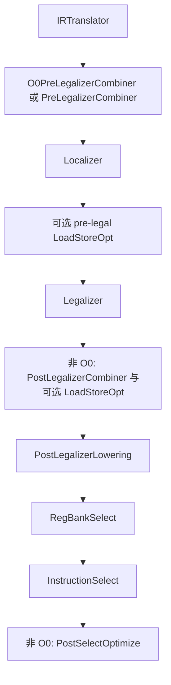
```mermaid
flowchart TD
  I[IRTranslator] --> P[O0PreLegalizerCombiner 或 PreLegalizerCombiner]
  P --> L[Localizer]
  L --> O[可选 pre-legal LoadStoreOpt]
  O --> Z[Legalizer]
  Z --> C[非 O0: PostLegalizerCombiner 与可选 LoadStoreOpt]
  C --> W[PostLegalizerLowering]
  W --> R[RegBankSelect]
  R --> S[InstructionSelect]
  S --> F[非 O0: PostSelectOptimize]
```

下面简单介绍 6 个优化 Pass 的工作。

1）AArch64PreLegalizerCombiner ：是基于工作链表优化框架实现的，该 Pass 实现了 3个主要的优化模式（见表 7-2），还有一些小优化不再一一列举。此外，它还使用了一些公共的优化模式。

**表 7-2 合法化前的指令合并优化**

优化模式 原始指令 优化后的指令

将浮点常量按位表示为整数常量（不是把向量变标量） G_FCONSTANT G_CONSTANT

消除冗余的 G_TRUNC G_ICMP(G_TRUNC, 0) G_ICMP(reg, 0)

全局地址偏移折叠 G_GLOBAL_VALUE/G_PTR_ADD G_GLOBAL_VALUE

2）LoadStoreOpt ：基于 Pass 框架的优化，该 Pass 遍历函数的每条指令，例如将多条store 指令合并成一条 store 指令的合并优化。

3）AArch64PostLegalizerCombiner ：基于工作链表进行框架优化，原书列举了 5 种优化模式，分别针对 G_EXTRACT_VECTOR_ELT、G_MUL、G_MERGE_VALUE、G_ANYEXT 和 G_ STORE 这 5 类指令。此外还使用了一部分公共优化模式，由于优化模式太多就不再一一展开介绍。

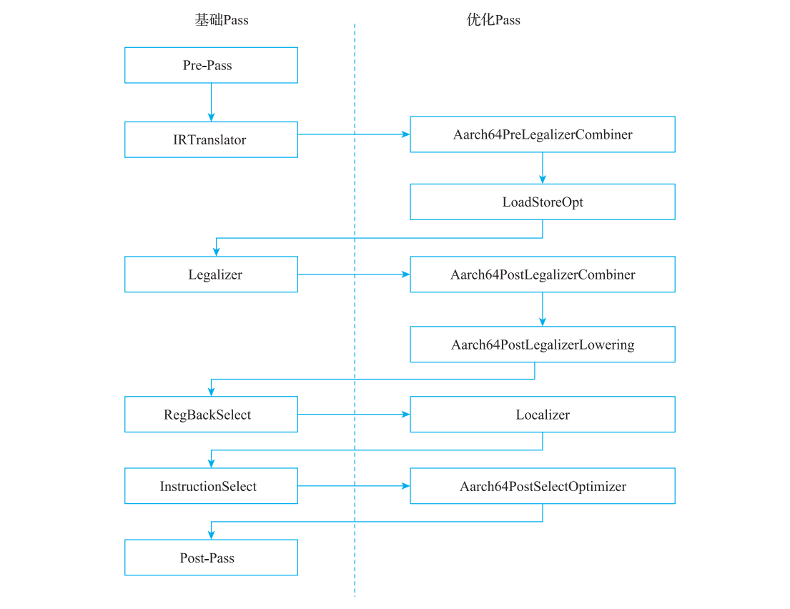

**图 7-30 AArch64 指令选择全部 Pass 示意图**

4）AArch64PostLegalizerLowering ：是基于工作链表来优化框架的，原书列举了 14 种优 化 模 式， 主 要 针 对 G_SHUFFLE_VECTOR、G_EXT、G_ASHR、G_LSHR、G_ICMP、G_BUILD_VECTOR 和 G_STORE 这 7 类指令进行优化。

5）Localizer：基于 Pass 框架的优化，主要针对移动指令，让指令尽可能地靠近它的第一个使用点，从而缩短寄存器的生命周期。

6）AArch64PostSelectOptimizer：是基于 Pass 框架的优化，主要是简化浮点比较指令的使用。

通常来说，一些简单的优化都是表示成模式，然后通过通用框架直接完成优化；而比较复杂的优化则通过直接自行编写 Pass 遍历过程完成的。

通过上述的介绍可以看出，全局指令选择将 SelectionDAGISel 中原本耦合在一起的功能提取出来，成为多个独立的 Pass，实现了高内聚低耦合的设计。同时，GMIR 的引入既避免了 DAG IR 和 MIR 因语法形式差异大所产生的转换成本，又因为 GMIR 与 MIR 共用基础设施数据结构，进一步降低了代码维护的成本。当然，因为全局指令选择的诞生时间

还比较短，该算法还不够完善，书中所引测试的汇编代码质量比较针对相应历史版本与测试配置，不能据此断言 LLVM 18 的所有目标上都不如 SelectionDAGISel○一，且当前支持的目标架构也还不够丰富，所以全局指令选择还需要基于各个目标架构进一步开发和完善。

> 表 7-3 的“快 / 慢、好 / 差、开发周期”等为原书定性经验，不是本次 LLVM 18 的性能评测。FastISel 同时使用 TableGen 生成规则和手写代码，不能把其执行方式只归为手动匹配。

## 7.5 本章小结

本章主要介绍了 LLVM 中实现的 3 种指令选择算法的基本原理和实现细节。我们可以大致看出 3 种算法具有一些相似性，同时也有许多不同。因此，本节定性地给出 3 个算法的差异情况和使用场景。

首先是相同点。3 个算法都是基于规则（指令模式）的指令选择算法。因此，适配一个新架构时，工程师需要熟悉新架构的特性和指令集，然后根据这些信息编写 LLVM IR 到新架构指令的映射关系（规则）。

其次是不同点。由于算法本身的复杂度和应用场景的多样性，可以比较的维度是比较多的，我们选取了实现和使用编译器时比较常用的 8 个维度进行简单比较，如表 7-3 所示。

**表 7-3 LLVM 中实现的三种指令选择算法比较**

指令选择算法 中间表示 匹配范围 覆盖方式 执行方式

编译 生成代 开发 可维

时间 码质量 周期 护性

FastISel 无 单指令 单指令覆盖 手动匹配 快 差 短 一般

SelectionDAGISel DAGIR 基本块 树覆盖○二 自动匹配和 慢 极好 长 一般

手动匹配

自动匹配和

GlobalISel GMIR 函数 树覆盖 慢 好 极长 好

手动匹配

最后是使用场景。根据笔者个人经验，对于编译时间有高要求的场景，一般优先使用FastISel ；对于性能和开发周期有要求的场景，一般优先使用 SelectionDAGISel 算法；从发展的角度看，使用 GlobalISel 算法可能同时具有 FastISel 和 SelectionDAGISel 的优点。

○一 相关的测试数据可以参考： https://llvm.org/devmtg/2021-11/slides/2021-BringingupGlobalISelForOptimize

daarch64codegen.pdf 和 https://llvm.org/devmtg/2019-10/slides/SandersKeles-GeneratingOptimizedCodewit

hGlobalISel.pdf。

○二 除了多输出指令可以构成 DAG 形式的覆盖，LLVM 中实现的大部分指令都只能构建成树模式的覆盖形

式，因此本章将 SelectionDAGISel 和 GlobalISel 的覆盖方式都称为树覆盖形式。

## LLVM 18 源码核查记录

- SelectionDAG 主链：[`SelectionDAGISel.cpp:844`](/opt/llvm-project/llvm/lib/CodeGen/SelectionDAG/SelectionDAGISel.cpp:844)、[`FunctionLoweringInfo.cpp:272`](/opt/llvm-project/llvm/lib/CodeGen/SelectionDAG/FunctionLoweringInfo.cpp:272)、[`LegalizeIntegerTypes.cpp:854`](/opt/llvm-project/llvm/lib/CodeGen/SelectionDAG/LegalizeIntegerTypes.cpp:854)。
- BPF 调用与 Custom 降低：[`BPFISelLowering.cpp:404`](/opt/llvm-project/llvm/lib/Target/BPF/BPFISelLowering.cpp:404)、[`BPFCallingConv.td:14`](/opt/llvm-project/llvm/lib/Target/BPF/BPFCallingConv.td:14)。BPFCallingConv.td 的用户工作区存在改动，此处结论使用上列提交的 HEAD 文件，不代表工作区自定义调用约定。
- FastISel 公共发射：[`FastISel.cpp:2026`](/opt/llvm-project/llvm/lib/CodeGen/SelectionDAG/FastISel.cpp:2026)。
- GlobalISel：[`IRTranslator.cpp:3634`](/opt/llvm-project/llvm/lib/CodeGen/GlobalISel/IRTranslator.cpp:3634)、[`AArch64RegisterBanks.td:13`](/opt/llvm-project/llvm/lib/Target/AArch64/AArch64RegisterBanks.td:13)、[`AArch64TargetMachine.cpp:698`](/opt/llvm-project/llvm/lib/Target/AArch64/AArch64TargetMachine.cpp:698)。
- 完整覆盖清单 7-1～7-35；逐项证据和结论见 [review/ch7.md](review/ch7.md)。

### 留待后续运行验证

1. 用 LLVM 18 工具解析完整 C / LLVM IR 示例，确认特定 triple、CPU、优化等级、ABI 下的 IR 与 GMIR；不得把历史节点编号、寄存器编号当作断言。
2. 在已有工具可用时重新生成 TableGen 匹配表、DAG / MIR 输出；本次没有构建 LLVM 或运行示例。
3. 在未启用 / 启用 ALU32 的 BPF 配置分别观察合法化；软浮点 built-in 拒绝路径已由源码确认，不将图中的假设结果当作成功执行。
4. 指令性能和三类选择器的代码质量比较需要固定测试环境；本次只核对静态实现。
