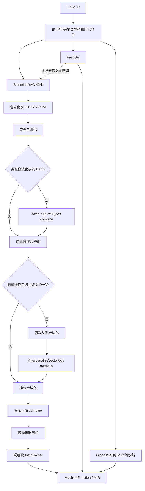
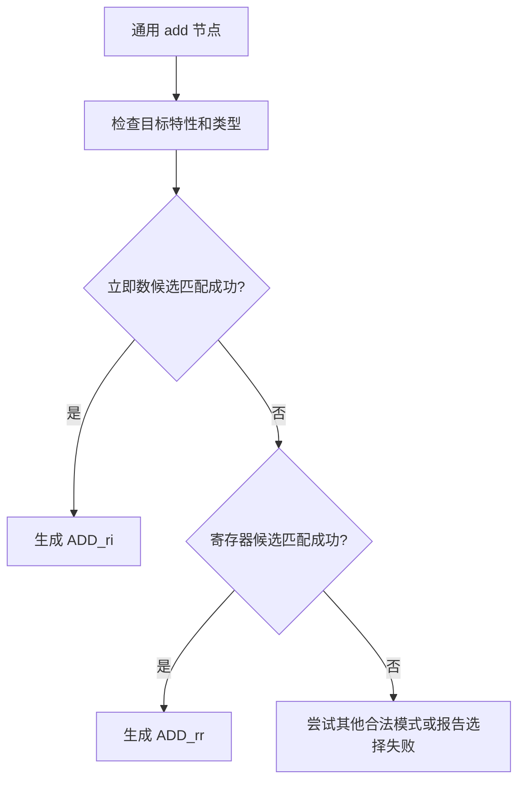
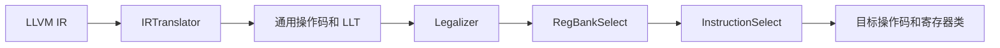
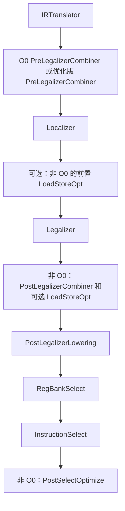

# 第 7 章 指令选择

本章以 LLVM 18.1.8 的源码和实际工具输出为准，沿用原书 LLVM 15.0.1 的主题、节号和清单编号，重写有误或无法复现的说明。原始转写见 [origin](origin/inside-llvm-codegen-ch7.md)。实验输入与完整命令在 [experiments/ch7](experiments/ch7/README.md)，检查记录见 [review/ch7.md](review/ch7.md) 和 [运行结果](review/experiments-ch7.json)。

本章的 C、LLVM IR 和完整 MIR 文件用途不同：C/IR 输入能直接交给对应工具；正文只展示 MIR 的 `body` 或调试日志时，它们是阅读用节选，完整 YAML 在 runner 的输出目录。源码节选依赖 LLVM 内部上下文，不是独立程序。BPF 的结果使用本地工作区构建，结果 JSON 记录其相对上游提交的修改文件。我们验证了 IR、机器指令约束和生成过程，没有在目标处理器上执行生成的程序。

本章命令使用 **Bash**。先执行下面的初始化，再在同一个 Bash 会话中按正文顺序执行后续命令；输出目录会保留，便于比较各阶段文件。需要 LLVM 18.1.8 的 Debug/assertions 工具和本章涉及的后端，以及 Python 3。

<!-- manual-lab:ch7-setup -->

```sh
# 后文按顺序复用中间文件；非预期失败后不要继续读取旧结果。
set -euo pipefail
export LLVM_BUILD="${LLVM_BUILD:-/opt/llvm-project/build}"
export LLVM_SRC="${LLVM_SRC:-/opt/llvm-project}"
export BOOK_ROOT="${BOOK_ROOT:-/opt/coding/mlir-toy/llvm/inside-llvm-codegen}"
BOOK_INPUT="$BOOK_ROOT/experiments/ch7"
CODEGEN_LAB=$(mktemp -d)
# 实际二进制的目标列表比 CMakeCache 更能说明当前工具支持什么。
"$LLVM_BUILD/bin/llc" --version > "$CODEGEN_LAB/llc-version.txt"
cat "$CODEGEN_LAB/llc-version.txt"
printf '本章输出目录：%s\n' "$CODEGEN_LAB"
```

确认版本为 18.1.8，并在注册目标中找到 BPF、AArch64。本章所有输出都写入 `$CODEGEN_LAB`，`$BOOK_INPUT` 中的输入文件只读。

## 7.1 指令选择的处理流程

LLVM IR 描述计算语义；机器指令还要符合目标的操作码、操作数形式、寄存器约束和调用约定。指令选择可能把多个 IR 运算合成一条机器指令，也可能把一个运算拆成多条指令或运行库调用。“选择”因此包括必要的表示转换和合法化，并非简单查找一张 IR opcode 对机器 opcode 的表。

LLVM 18 有三条主要实现路径：SelectionDAGISel 以局部 DAG 做合法化、合并和模式匹配；FastISel 以较少分析快速生成机器指令，失败时可与 SelectionDAG 配合；GlobalISel 在 MachineFunction 上使用通用机器指令，依次合法化、选择寄存器 bank、选择目标指令。是否启用某条路径取决于目标、优化级别及显式选项，不能仅凭 `-O0` 推断一定使用 FastISel 或 GlobalISel。



图中展示 SelectionDAG 的阶段关系，实际 `CodeGenAndEmitDAG` 还根据“是否发生改变”控制部分 combine 和再次合法化。IR 准备阶段也并非固定只有几个 Pass：通用配置和目标钩子共同决定；`CodeGenPrepare` 可以改写计算和控制流，并不只是修改元数据。

通用 DAG 覆盖和带成本约束的选择问题很复杂；这不表示 LLVM 必须为每个函数枚举全部组合。TableGen 预先生成匹配程序，运行时按既定模式顺序尝试，目标还能增加手写选择逻辑。局部匹配成功不是全函数最优代码的数学证明。

## 7.2 SelectionDAGISel 算法分析

### 7.2.1 SDNode 分类

`SDNode` 保存操作码、操作数和各结果的类型；`SDValue` 是“节点指针 + 结果编号”。同一个节点可以有多个结果，例如 load 同时产生加载的值和 chain。节点结果不是它的第零个输入，输入编号从实际操作数开始。

| 内容 | 典型节点 / 类型 | 作用 |
|---|---|---|
| 计算值 | `add`、`load`；`i64` 等 EVT | 运算结果之间的数据依赖 |
| chain | `MVT::Other`，日志显示 `ch` | 有副作用操作之间的顺序依赖 |
| glue | `MVT::Glue` | 将有紧密调度关系的节点连接起来，如某些调用约定和返回序列 |
| 目标相关中间节点 | `BPFISD::RET_GLUE` 等 | 表达通用 ISD 尚不能直接表达的目标语义 |
| 机器节点 | `BPF::ADD_rr`、`BPF::RET` 等 | 已选定的目标机器操作码 |
| 叶节点 / 描述节点 | `Constant`、`Register`、`FrameIndex`、`BasicBlock` | 描述立即数、寄存器、栈对象或控制流目标 |

chain 保持所需顺序，不应把所有 load 人为串联；独立读操作可以分叉，之后用 `TokenFactor` 汇合。glue 的约束比普通数据依赖更紧，调度器通常把相关节点作为一个调度单元处理。它们都不是在目标硬件上存储数据的寄存器。

必须区分 EntryToken 节点与其常用返回值：LLVM 18 的 `SelectionDAG` 构造器用 `getVTList(MVT::Other, MVT::Glue)` 创建 EntryToken，因此日志确实显示 `t0: ch,glue = EntryToken`；`getEntryNode()` 返回的是结果 0，即 chain。不能由这个访问器推导 EntryToken 只有一个结果。

### 7.2.2 LLVM IR 到 SDNode 的转换

下面使用 BPF 小函数观察调用约定、栈对象和数据流。指定 `bpfel` 后，示例中的 `long` 是 64 位，`int` 是 32 位。函数名 `callee` 是被调用者，`caller` 是调用者。

**代码清单 7-1　完整 C 输入 callee.c**

```c
// 在本章固定的 BPF 数据模型中 long 为 64 位，返回值仍需遵守调用约定。
long callee(long a, long b) {
  long c = a + b;
  return c;
}
int caller(void) {
  long d = 1;
  long e = 2;
  // 故意转为 32 位 int，便于观察窄结果与四字节内存对象。
  int f = callee(d, e);
  return f;
}
```

从清单 7-1 对应的完整文件生成 IR，并验证其结构：

<!-- manual-lab:ch7-clang-callee -->

```sh
# 固定 BPF v1 和 O0，保留局部栈对象，避免宿主 ABI 或优化掩盖 lowering。
"$LLVM_BUILD/bin/clang" --target=bpfel -mcpu=v1 -O0 \
  -fno-discard-value-names -S -emit-llvm "$BOOK_INPUT/callee.c" \
  -o "$CODEGEN_LAB/callee.ll"
"$LLVM_BUILD/bin/opt" -passes=verify -disable-output "$CODEGEN_LAB/callee.ll"
sed -n '/^define /,/^}/p' "$CODEGEN_LAB/callee.ll"
```

输出中 `callee` 使用 i64，`caller` 返回 i32，四字节 `%f` 对象的 store/load 没有被改成 i64；下面展示的是同一生成文件中的函数节选。

**代码清单 7-2　Clang 18 生成的两个函数（属性定义见完整 callee.ll）**

下面的生成 IR 节选已加中文阅读注释，指令与属性保持原样。

```llvm
define dso_local i64 @callee(i64 noundef %a, i64 noundef %b) #0 {
entry:
  ; 阅读注释：这些是 IR 内存对象，最终是否占用机器栈要看后续变换。
  %a.addr = alloca i64, align 8
  %b.addr = alloca i64, align 8
  %c = alloca i64, align 8
  store i64 %a, ptr %a.addr, align 8
  store i64 %b, ptr %b.addr, align 8
  %0 = load i64, ptr %a.addr, align 8
  %1 = load i64, ptr %b.addr, align 8
  ; nsw 表示有符号溢出得到 poison，不要求插入硬件溢出检查。
  %add = add nsw i64 %0, %1
  store i64 %add, ptr %c, align 8
  %2 = load i64, ptr %c, align 8
  ret i64 %2
}

define dso_local i32 @caller() #0 {
entry:
  %d = alloca i64, align 8
  %e = alloca i64, align 8
  %f = alloca i32, align 4
  store i64 1, ptr %d, align 8
  store i64 2, ptr %e, align 8
  %0 = load i64, ptr %d, align 8
  %1 = load i64, ptr %e, align 8
  %call = call i64 @callee(i64 noundef %0, i64 noundef %1)
  ; 截断定义返回给 int 的低 32 位；后面的访存也保持 i32 宽度。
  %conv = trunc i64 %call to i32
  store i32 %conv, ptr %f, align 4
  %2 = load i32, ptr %f, align 4
  ret i32 %2
}
```

runner 使用 `clang --target=bpfel -mcpu=v1 -O0 -fno-discard-value-names -S -emit-llvm`，再以 `llc -mtriple=bpfel -mcpu=v1 -O0 -fast-isel=false` 选择指令。参数 `a/b` 按 BPF 调用约定来自 `$r1/$r2`，结果通过 `$r0` 返回。`caller` 在 IR 中仍返回 `i32`；把结果放进 64 位物理寄存器不会改变函数签名。

C 的有符号加法产生 `add nsw`：若发生有符号溢出，IR 结果为 poison；这不是插入溢出检查的请求。`%f` 是四字节对象，`trunc` 和 i32 访存必须保持其语义。实际 v1 机器指令使用 `STW/LDW`，内存操作数仍是 `(s32)`；合法化不能以“BPF 有 64 位寄存器”为由覆盖相邻四字节。

SelectionDAG 通常围绕一个基本块构建，跨块值通过虚拟寄存器连接。PHI 是很好的例子：`FunctionLoweringInfo` 先为非死 PHI 创建机器 PHI，处理前驱基本块时记录需要导出的值，最后补齐“寄存器、前驱块”操作数。它不是在普通 DAG 中等待匹配的一种计算节点。

以下完整 IR 用 volatile load 保留两个分支，避免过早折叠成同一个计算块。

**代码清单 7-3　selection.ll 中的跨块 PHI 输入**

```llvm
define i64 @choose(i1 %cond, ptr %p, ptr %q) {
entry:
  br i1 %cond, label %yes, label %no
; volatile 用于保留两条分支上的可观察读取，方便检查跨块值。
yes:
  %a = load volatile i64, ptr %p, align 8
  br label %join
no:
  %b = load volatile i64, ptr %q, align 8
  br label %join
join:
  ; 每次只取实际进入 join 的那个前驱所对应的输入。
  %r = phi i64 [ %a, %yes ], [ %b, %no ]
  ret i64 %r
}
```

为包含寄存器加法、立即数加法、i32 访存和 PHI 的共同输入生成 BPF v1 MIR，同时保留各 DAG 阶段与匹配日志：

<!-- manual-lab:ch7-bpf-v1-selection -->

```sh
"$LLVM_BUILD/bin/opt" -passes=verify -disable-output "$BOOK_INPUT/selection.ll"
# finalize-isel 观察选择后的 MIR；禁用 FastISel，确保这里走 SelectionDAG。
"$LLVM_BUILD/bin/llc" -mtriple=bpfel -mcpu=v1 -O0 \
  -fast-isel=false -verify-machineinstrs -stop-after=finalize-isel \
  -debug-only=isel,isel-dump "$BOOK_INPUT/selection.ll" \
  -o "$CODEGEN_LAB/bpf-v1.mir" 2> "$CODEGEN_LAB/bpf-v1.log"
python3 - "$CODEGEN_LAB/bpf-v1.mir" "$CODEGEN_LAB/bpf-v1.log" <<'PYCODE'
import pathlib, re, sys
mir, log = (pathlib.Path(p).read_text() for p in sys.argv[1:])
# 从完整 YAML 中按函数取 body，避免把别的函数的 opcode 当成本例证据。
bodies = dict(re.findall(r'^name:\s+(\S+).*?^body:\s+\|\n(.*?)(?=^\.\.\.)', mir, re.M | re.S))
assert 'ADD_rr' in bodies['add_reg']
assert 'ADD_ri' in bodies['add_imm'] and ', 42' in bodies['add_imm']
assert 'PHI' in bodies['choose']
# EntryToken 节点有两个结果；常用的 getEntryNode() 只取结果 0 的 chain。
assert 'ch,glue = EntryToken' in log
print(bodies['choose'])
print('ADD_rr / ADD_ri 42 / PHI / EntryToken 两结果检查通过')
PYCODE
```

`choose` 的机器 PHI 仍在。日志 `$CODEGEN_LAB/bpf-v1.log` 还会供 7.2.4 的匹配过程分析使用，不能只保存最终汇编来代替这些阶段信息。

**代码清单 7-4　finalize-isel 后 choose 的实际 MIR body**

下面 MIR 节选中的 `;` 中文注释为阅读说明，不属于工具原始输出。

```yaml
bb.0.entry:
    successors: %bb.1(0x40000000), %bb.2(0x40000000)
    liveins: $r1, $r2, $r3

    ; $rN 是 ABI 物理寄存器，%N:gpr 仍是待分配的虚拟寄存器。
    %5:gpr = COPY $r3
    %4:gpr = COPY $r2
    %3:gpr = COPY $r1
    %6:gpr = AND_ri %3, 1
    JEQ_ri killed %6, 0, %bb.2
    JMP %bb.1

  bb.1.yes:
    successors: %bb.3(0x80000000)

    %0:gpr = LDD %4, 0 :: (volatile load (s64) from %ir.p)
    JMP %bb.3

  bb.2.no:
    successors: %bb.3(0x80000000)

    %1:gpr = LDD %5, 0 :: (volatile load (s64) from %ir.q)
    JMP %bb.3

  bb.3.join:
    ; 每对操作数是“输入寄存器、前驱块”；这条 PHI 尚未被消除。
    %2:gpr = PHI %1, %bb.2, %0, %bb.1
    $r0 = COPY %2
    ; 返回值的读取是隐式操作数，虽然不打印成普通显式参数，依赖仍需保留。
    RET implicit $r0
```

PHI 在此阶段仍存在。后续 PHI 消除会在 CFG 边上实现相应赋值；单条 PHI 的某个 incoming 值由实际经过的前驱决定，不能把不同前驱的输入都当成顺序执行的赋值。

### 7.2.3 SDNode 合法化

“类型合法”与“操作合法”必须分开。一个目标可以有合法的 i64 寄存器类型，但缺少某个 i64 运算；也可以支持 32 位内存读写，却需要用更宽的寄存器承载运算。`TargetLowering` 的类型转换策略和按 opcode/type 查询的 `LegalizeAction` 共同决定改写。

| 操作合法化动作 | 含义 | 限制 |
|---|---|---|
| `Legal` | 目标支持这个运算形式 | 仍可能经过后续 combine / selection |
| `Promote` | 用目标允许的类型实现 | 必须维护原位宽、符号和内存语义 |
| `Expand` | 分解为其他操作 | 不意味着所有 Expand 都产生相同指令数 |
| `LibCall` | 改为运行库调用 | 目标必须能生成相应调用 |
| `Custom` | 调用目标实现进行 lowering | 输出还要满足后续阶段的要求 |

类型合法化还有整数拆分、向量标量化、向量拆分或加宽等专门策略。不能把类型动作列表与上述操作动作列表合并成一个枚举。

本实验的 `add32` 在 BPF v1 中把两个 i32 值加载到 `gpr`，执行 `ADD_rr`，然后以 `STW` 保存低 32 位；`LDW/STW` 的内存宽度仍是 32 位。在 v3 中，同一输入可得到 `gpr32`、`LDW32`、`ADD_rr_32`、`STW32`。这个差别由 CPU 特性控制，不是 LLVM 版本号单独决定的。

有符号窄整数也要考虑 ABI。下面给参数和返回值明确添加 `signext`，使符号扩展的义务可见；只写一个模 2^16 的加法，并不能要求所有上下文都保留相同扩展序列。

在同一输入上切换到 v3，再单独生成 i16、i128 和向量合法化用例。所有运行都禁止 FastISel，以便固定 SelectionDAG 路径：

<!-- manual-lab:ch7-bpf-type-legalization -->

```sh
# 只改变 CPU 特性即可对照 ALU32，不能把差异误归因于 IR 访存类型改变。
"$LLVM_BUILD/bin/llc" -mtriple=bpfel -mcpu=v3 -O0 \
  -fast-isel=false -verify-machineinstrs -stop-after=finalize-isel \
  "$BOOK_INPUT/selection.ll" -o "$CODEGEN_LAB/bpf-v3.mir"
"$LLVM_BUILD/bin/opt" -passes=verify -disable-output "$BOOK_INPUT/legalization.ll"
"$LLVM_BUILD/bin/llc" -mtriple=bpfel -mcpu=v1 -O0 \
  -fast-isel=false -verify-machineinstrs -stop-after=finalize-isel \
  "$BOOK_INPUT/legalization.ll" -o "$CODEGEN_LAB/bpf-legalization.mir"
python3 - "$CODEGEN_LAB" <<'PYCODE'
import pathlib, re, sys
out = pathlib.Path(sys.argv[1])
def bodies(name):
    return dict(re.findall(r'^name:\s+(\S+).*?^body:\s+\|\n(.*?)(?=^\.\.\.)', (out/name).read_text(), re.M | re.S))
v1, v3, legal = (bodies(n) for n in ['bpf-v1.mir', 'bpf-v3.mir', 'bpf-legalization.mir'])
assert 'ADD_rr ' in v1['add32'] and 'ADD_rr_32' not in v1['add32']
# 检查三个内存操作仍是 s32，排除“寄存器提升导致访存扩大”的误解。
assert v1['add32'].count('(s32)') == 3
assert all(op in v3['add32'] for op in ['LDW32', 'ADD_rr_32', 'STW32'])
assert all(op in legal['add16_signed'] for op in ['SLL_ri', 'SRA_ri', ', 48'])
# 计数之外还检查比较/PHI 进位路径，避免只看到两个半字就漏掉进位。
wide = legal['add128']
assert wide.count('LDD ') == 4 and wide.count('STD ') == 2
assert wide.count('ADD_rr ') == 3 and 'JUGT_rr ' in wide and 'PHI ' in wide
assert legal['vector_add'].count('ADD_rr ') == 2 and legal['vector_add'].count('STD ') == 2
for name, value in [('v1 add32', v1['add32']), ('v3 add32', v3['add32']), ('i16 signext', legal['add16_signed']), ('i128', wide)]:
    print(name, value, sep='\n')
print('向量标量化为两条 ADD_rr 的检查通过')
PYCODE
```

v1 的计算寄存器变宽而 `(s32)` 访存保持不变；v3 选择 ALU32 形式。i16 的两次移位、i128 的进位路径和向量两个 lane 的独立加法都可以在完整 MIR 中检查。

**代码清单 7-5　合法化实验中的 i16 输入及 v1 实际输出**

```text
define signext i16 @add16_signed(i16 signext %a, i16 signext %b) {
entry:
  %r = add i16 %a, %b
  ret i16 %r
}

; 以下是 MIR body 节选
bb.0.entry:
    liveins: $r1, $r2

    %1:gpr = COPY $r2
    %0:gpr = COPY $r1
    %2:gpr = ADD_rr %0, %1
    %3:gpr = SLL_ri %2, 48
    %4:gpr = SRA_ri %3, 48
    $r0 = COPY %4
    RET implicit $r0
```

左移 48 位再算术右移 48 位，把低 16 位解释为有符号值并扩展到 64 位。移位用的是机器语义；不要直接把这段变成可能触发 C 有符号溢出的表达式。

同一个 `legalization.ll` 还验证了两个情况：i128 加法拆成两半，生成四条 i64 load 和两条 i64 store。实际 MIR 用 `JUGT_rr` 比较低半加数与低半和，PHI 选择 0/1，随后把该进位加到高半和中；`<2 x i64>` 加法标量化为两条 `ADD_rr`。这些输入都通过 IR verifier 和 machine verifier。i128 的进位不能丢失，向量每个 lane 的加法也不能串成一个带进位的 128 位加法。

BPF 没有普通浮点除法指令。我们使用两个变量作为除数和被除数，避免常量折叠掩盖合法化问题。

**代码清单 7-6　软浮点输入与预期失败诊断**

```llvm
; Variable divisor avoids folding division by a constant into multiplication.
define double @divide(double %x, double %y) {
entry:
  ; 变量除数使运算不能仅靠除常量的折叠而消失，才能观察 libcall 拒绝路径。
  %r = fdiv double %x, %y
  ret double %r
}


; llc 返回码 1，诊断关键内容：
; A call to built-in function '__divdf3' is not supported.
```

`__divdf3` 是双精度浮点除法对应的运行库名字。通用合法化尝试生成这个调用，但 BPF `LowerCall` 拒绝此种内建外部符号调用；因此本例证明“会走到 libcall 路径并诊断不支持”，不证明 BPF 可以执行软件浮点。已命名的 IR 外部函数调用与合法化产生的 builtin `ExternalSymbol` 也不能一概等同。

`Custom` 的例子可以查看 `BPFISelLowering` 对 `SELECT_CC`、比较或某些除法的处理。分支能力随 JmpExt/Jmp32 等特性变化；通用 `ISD::CondCode` 的数字不是 BPF 自定义比较指令编码。描述这类变换应写出条件和操作数，而不依赖某个十进制常量的偶然显示。

运行软浮点负例时，显式接住预期失败；这样在 `set -e` 下也不会把“不支持”误当成整个实验提前结束：

<!-- manual-lab:ch7-bpf-softfloat-negative -->

```sh
"$LLVM_BUILD/bin/opt" -passes=verify -disable-output "$BOOK_INPUT/softfloat.ll"
# 该输入预期失败：if 捕获退出状态，避免 set -e 提前中断诊断检查。
if "$LLVM_BUILD/bin/llc" -mtriple=bpfel -mcpu=v1 -O0 -fast-isel=false \
    "$BOOK_INPUT/softfloat.ll" -o "$CODEGEN_LAB/softfloat.s" \
    > "$CODEGEN_LAB/softfloat.stdout" 2> "$CODEGEN_LAB/softfloat.log"; then
  printf '%s\n' '错误：软浮点负例意外成功' >&2
  exit 1
else
  softfloat_status=$?
  test "$softfloat_status" -eq 1
fi
python3 - "$CODEGEN_LAB/softfloat.log" <<'PYCODE'
import pathlib, sys
text = pathlib.Path(sys.argv[1]).read_text()
# 同时检查运行库符号和“不支持”消息，不能把任意失败都算作验证成功。
assert '__divdf3' in text and 'not supported' in text
print(text)
PYCODE
```

预期返回码为 1，且诊断明确指向 `__divdf3`。这里得到的是目标拒绝路径，不是一个可运行的 BPF 软件浮点实现。

### 7.2.4 机器指令选择

`llvm-tblgen -gen-dag-isel` 读取目标的 TableGen 模式，生成 `MatcherTable`。这是一种供 `SelectCodeCommon` 解释执行的匹配字节码。本例实际表的 ADD 分支先尝试 `FI_ri` 的 frame-index 地址模式，之后才是 `ADD_ri/ADD_ri_32/ADD_rr/ADD_rr_32`。表中的整数有多种含义：匹配 opcode、跳过 scope 的长度、记录槽位、类型编号以及机器 opcode 的编码；不能把每个整数都理解为节点序号。

下面截取本地 BPF 表中 ADD 分支。runner 每次实际生成该文件，并记录哈希；表的偏移和布局随模式集合改变，教材不要求固定偏移。

直接运行 TableGen，并对照之前保存的实际 ADD 匹配日志：

<!-- manual-lab:ch7-tablegen-dag-matcher -->

```sh
# TableGen 生成匹配程序，llc 日志则证明给定 DAG 实际走过哪条候选。
"$LLVM_BUILD/bin/llvm-tblgen" -gen-dag-isel \
  -I "$LLVM_SRC/llvm/include" -I "$LLVM_SRC/llvm/lib/Target/BPF" \
  "$LLVM_SRC/llvm/lib/Target/BPF/BPF.td" \
  -o "$CODEGEN_LAB/BPFGenDAGISel.inc"
python3 - "$CODEGEN_LAB/BPFGenDAGISel.inc" "$CODEGEN_LAB/bpf-v1.log" <<'PYCODE'
import pathlib, re, sys
table, log = (pathlib.Path(p).read_text() for p in sys.argv[1:])
assert 'MatcherTable' in table and 'BPF::ADD_ri' in table
for line in table.splitlines():
    if any(op in line for op in ['BPF::FI_ri', 'BPF::ADD_ri', 'BPF::ADD_rr']):
        print(line)
# 用运算形态定位日志，不把当前节点号或表偏移写死。
match = re.search(r'ISEL: Starting selection on root node: t\d+: i64 = add .*?ISEL: Match complete!', log, re.S)
assert match is not None
print(match[0])
PYCODE
```

生成文件列出 `FI_ri` 和各 ADD 候选；实际 `add_reg` 日志最终出现 `ADD_rr`。输出偏移只属于当前生成表，不能作为跨版本的固定接口。

**代码清单 7-7　实际生成的 ADD matcher 子表（节选）**

下面生成的 C++ 匹配表已加中文阅读注释，字节码内容未改动。

```cpp
// 阅读注释：这是生成的匹配字节码，不是按源代码顺序执行的机器指令。
/*  2518*/ /*SwitchOpcode*/ 68, TARGET_VAL(ISD::ADD),// ->2589
/*  2521*/  OPC_Scope, 11, /*->2534*/ // 2 children in Scope
/*  2523*/   OPC_RecordNode, // #0 = $addr
/*  2524*/   OPC_CheckTypeI64,
/*  2525*/   OPC_CheckComplexPat1, /*#*/0, // SelectFIAddr:$addr #1 #2
/*  2527*/   OPC_MorphNodeTo1None, TARGET_VAL(BPF::FI_ri),
                 MVT::i64, 2/*#Ops*/, 1, 2,
             // Src: FIri:{ *:[i64] }:$addr - Complexity = 9
             // Dst: (FI_ri:{ *:[i64] } FIri:{ *:[i64] }:$addr)
/*  2534*/  /*Scope*/ 53, /*->2588*/
// 保存两个源操作数供成功候选使用；记录本身不是立即数合法性检查。
/*  2535*/   OPC_RecordChild0, // #0 = $src2
/*  2536*/   OPC_RecordChild1, // #1 = $imm
/*  2537*/   OPC_Scope, 30, /*->2569*/ // 3 children in Scope
/*  2539*/    OPC_MoveChild1,
/*  2540*/    OPC_CheckOpcode, TARGET_VAL(ISD::Constant),
/*  2543*/    OPC_Scope, 11, /*->2556*/ // 2 children in Scope
// 只有符号扩展 32 位立即数满足约束，才能选这一 ADD_ri 形式。
/*  2545*/     OPC_CheckPredicate0,  // Predicate_i64immSExt32
/*  2546*/     OPC_MoveParent,
/*  2547*/     OPC_CheckTypeI64,
/*  2548*/     OPC_EmitConvertToTarget1,
/*  2549*/     OPC_MorphNodeTo1None, TARGET_VAL(BPF::ADD_ri),
                   MVT::i64, 2/*#Ops*/, 0, 2,
               // Src: (add:{ *:[i64] } GPR:{ *:[i64] }:$src2, (imm:{ *:[i64] })<<P:Predicate_i64immSExt32>>:$imm) - Complexity = 7
               // Dst: (ADD_ri:{ *:[i64] } GPR:{ *:[i64] }:$src2, (imm:{ *:[i64] }):$imm)
/*  2556*/    /*Scope*/ 11, /*->2568*/
/*  2557*/     OPC_CheckPredicate0,  // Predicate_i32immSExt32
/*  2558*/     OPC_MoveParent,
/*  2559*/     OPC_CheckTypeI32,
/*  2560*/     OPC_EmitConvertToTarget1,
/*  2561*/     OPC_MorphNodeTo1None, TARGET_VAL(BPF::ADD_ri_32),
                   MVT::i32, 2/*#Ops*/, 0, 2,
               // Src: (add:{ *:[i32] } GPR32:{ *:[i32] }:$src2, (imm:{ *:[i32] })<<P:Predicate_i32immSExt32>>:$imm) - Complexity = 7
               // Dst: (ADD_ri_32:{ *:[i32] } GPR32:{ *:[i32] }:$src2, (imm:{ *:[i32] }):$imm)
/*  2568*/    0, /*End of Scope*/
/*  2569*/   /*Scope*/ 8, /*->2578*/
/*  2570*/    OPC_CheckTypeI64,
// 成功时将 add 根节点改成目标机器节点，并使用前面记录的两个操作数。
/*  2571*/    OPC_MorphNodeTo1None, TARGET_VAL(BPF::ADD_rr),
                  MVT::i64, 2/*#Ops*/, 0, 1,
              // Src: (add:{ *:[i64] } i64:{ *:[i64] }:$src2, i64:{ *:[i64] }:$src) - Complexity = 3
              // Dst: (ADD_rr:{ *:[i64] } i64:{ *:[i64] }:$src2, i64:{ *:[i64] }:$src)
/*  2578*/   /*Scope*/ 8, /*->2587*/
/*  2579*/    OPC_CheckTypeI32,
/*  2580*/    OPC_MorphNodeTo1None, TARGET_VAL(BPF::ADD_rr_32),
                  MVT::i32, 2/*#Ops*/, 0, 1,
              // Src: (add:{ *:[i32] } i32:{ *:[i32] }:$src2, i32:{ *:[i32] }:$src) - Complexity = 3
              // Dst: (ADD_rr_32:{ *:[i32] } i32:{ *:[i32] }:$src2, i32:{ *:[i32] }:$src)
/*  2587*/   0, /*End of Scope*/
/*  2588*/  0, /*End of Scope*/
```

**代码清单 7-8　add_reg 的实际 DAG 计算节点**

阅读提示：`i64,ch` 是同一个 CopyFromReg 的两个结果；加法只读取值结果，chain 另外维护必要顺序。

```text
t2: i64,ch = CopyFromReg t0, Register:i64 %0
t4: i64,ch = CopyFromReg t0, Register:i64 %1
t5: i64 = add t2, t4
```

**代码清单 7-9　实际运行的 ADD 匹配日志**

```text
ISEL: Starting selection on root node: t5: i64 = add t2, t4
ISEL: Starting pattern match
  Initial Opcode index to 2521
  Match failed at index 2525
  Continuing at 2534
  Match failed at index 2540
  Continuing at 2569
  Morphed node: t5: i64 = ADD_rr t2, t4
ISEL: Match complete!
```

`RecordChild` 记录某个操作数，通常不负责判断它是不是立即数；`CheckOpcode/CheckType/CheckPredicate` 等负责条件检查。某个 scope 失败后恢复记录状态，尝试后续候选。`MorphNodeTo` 可以把匹配根改成机器节点并完成匹配；其他模式可能先 `EmitNode`，再以 `CompleteMatch` 提交替换。

`add_reg` 的右操作数不是常量，实际得到 `ADD_rr`；`add_imm` 的 42 满足这个目标的立即数模式，实际得到 `ADD_ri`。立即数合法性、特性谓词、类型检查缺一不可，不能把“存在常量”当成必选立即数指令的充分条件。



### 7.2.5 从 DAG 输出 MIR

完成选择后，调度器给可发射节点确定顺序，`InstrEmitter` 根据机器节点创建 `MachineInstr`，为结果分配或复用虚拟寄存器，并维护跨块导出值。chain/glue 用于安排这个过程，通常不会作为机器指令的显式寄存器操作数保留下来。

`EntryToken` 和 `TokenFactor` 不发射真实 MI；`CopyToReg/CopyFromReg` 在需要时产生 `COPY`，也可能直接复用已有寄存器映射。机器节点和最终指令也不是无条件一一对应，目标伪指令还可能在后续展开。

使用 7.2.2 生成的 `callee.ll`，保存选择完成的 DAG 和 MIR：

<!-- manual-lab:ch7-dag-to-mir -->

```sh
# 同时保存 DAG 和 MIR，才能对照 chain/glue 约束如何在发射时被消化。
"$LLVM_BUILD/bin/llc" -mtriple=bpfel -mcpu=v1 -O0 \
  -fast-isel=false -verify-machineinstrs -stop-after=finalize-isel \
  -debug-only=isel,isel-dump "$CODEGEN_LAB/callee.ll" \
  -o "$CODEGEN_LAB/callee-finalize.mir" 2> "$CODEGEN_LAB/callee-finalize.log"
python3 - "$CODEGEN_LAB/callee-finalize.mir" "$CODEGEN_LAB/callee-finalize.log" <<'PYCODE'
import pathlib, re, sys
mir, log = (pathlib.Path(p).read_text() for p in sys.argv[1:])
bodies = dict(re.findall(r'^name:\s+(\S+).*?^body:\s+\|\n(.*?)(?=^\.\.\.)', mir, re.M | re.S))
assert all(op in bodies['caller'] for op in ['STW ', 'LDW ', '(s32)'])
# 只提取“选择完成”阶段；初始 DAG 与最终 MIR 的对象不是同一层表示。
selected = re.search(r'Selected selection DAG:.*?(?=Total amount of phi nodes)', log, re.S)
assert selected is not None
print(selected[0])
print(bodies['callee'])
print('caller 的四字节栈对象仍使用 STW / LDW')
PYCODE
```

输出对应清单 7-10、7-11；`caller` 的四字节对象也经过独立断言。完整 MIR YAML 可以留给后续 Pass 继续处理，正文的 body 节选则只供阅读。

**代码清单 7-10　callee 的实际 Selected DAG**

阅读提示：`tN:1` 选择节点的第 1 号结果；chain 表示顺序，glue 表示紧密调度关系，均不是硬件数据寄存器。日志文本保持原样。

```text
Selected selection DAG: %bb.0 'callee:entry'
SelectionDAG has 20 nodes:
  t0: ch,glue = EntryToken
    t4: i64,ch = CopyFromReg t0, Register:i64 %1
      t2: i64,ch = CopyFromReg t0, Register:i64 %0
    t8: ch = STD<Mem:(store (s64) into %ir.a.addr)> t2, TargetFrameIndex:i64<0>, TargetConstant:i64<0>, t0
  t10: ch = STD<Mem:(store (s64) into %ir.b.addr)> t4, TargetFrameIndex:i64<1>, TargetConstant:i64<0>, t8
  t12: i64,ch = LDD<Mem:(dereferenceable load (s64) from %ir.b.addr)> TargetFrameIndex:i64<1>, TargetConstant:i64<0>, t10
  t11: i64,ch = LDD<Mem:(dereferenceable load (s64) from %ir.a.addr)> TargetFrameIndex:i64<0>, TargetConstant:i64<0>, t10
    t13: i64 = ADD_rr nsw t11, t12
    t15: ch = TokenFactor t11:1, t12:1
  t16: ch = STD<Mem:(store (s64) into %ir.c)> t13, TargetFrameIndex:i64<2>, TargetConstant:i64<0>, t15
    t17: i64,ch = LDD<Mem:(dereferenceable load (s64) from %ir.c)> TargetFrameIndex:i64<2>, TargetConstant:i64<0>, t16
  t19: ch,glue = CopyToReg t16, Register:i64 $r0, t17
  t20: ch = RET Register:i64 $r0, t19, t19:1
```

**代码清单 7-11　callee 的实际 MIR body**

此 MIR 输出节选已加阅读注释，`%stack.N` 和 `%N` 等原始操作数未修改。

```yaml
bb.0.entry:
    liveins: $r1, $r2

    %1:gpr = COPY $r2
    %0:gpr = COPY $r1
    ; %stack.N 是抽象帧对象，此时不能把它当成已经确定的物理栈偏移。
    STD %0, %stack.0.a.addr, 0 :: (store (s64) into %ir.a.addr)
    STD %1, %stack.1.b.addr, 0 :: (store (s64) into %ir.b.addr)
    %2:gpr = LDD %stack.0.a.addr, 0 :: (dereferenceable load (s64) from %ir.a.addr)
    %3:gpr = LDD %stack.1.b.addr, 0 :: (dereferenceable load (s64) from %ir.b.addr)
    ; gpr 是寄存器类约束；%N 还不是选定的硬件寄存器。
    %4:gpr = nsw ADD_rr %2, killed %3
    STD killed %4, %stack.2.c, 0 :: (store (s64) into %ir.c)
    %5:gpr = LDD %stack.2.c, 0 :: (dereferenceable load (s64) from %ir.c)
    $r0 = COPY %5
    RET implicit $r0
```

`%stack.N` 此时引用栈对象，具体帧偏移由后续栈帧布局决定。`gpr` 是寄存器类约束，`%N` 仍是虚拟寄存器；出现这些名字不表示已完成物理寄存器分配。完整 YAML 与调试 pretty-printer 也不同：调试日志里的 `(tied-def 0)` 等说明不能直接复制成任意 MIR 文法。

## 7.3 快速指令选择算法分析

FastISel 减少构建和优化 DAG 的工作，常用于强调编译速度的配置。它既有 TableGen 生成的简单模式，也有目标手写处理，例如调用、加载和转换。支持范围有限不等于“只能处理整数加法”。在允许回退的配置下，它可以在部分选择后把剩余工作交给 SelectionDAG，而不是每遇到一个难点都重做整个函数。

AArch64 的 `ADDXrr` 来自 `AddSub` 多重类实例化，继承 `BaseAddSubRegPseudo`，此阶段本身是供代码生成使用的伪指令；之后才展开成可编码形式。以下是源码入口和生成记录的关键字段，均是节选；独立运行应使用整个 `AArch64.td`，不能只编译这几行。

**代码清单 7-12　AArch64 ADD 的 TableGen 定义入口**

```tablegen
// AddSub 多重类会展开出多种操作数形式；这里把通用 add 节点传给加法模式。
defm ADD : AddSub<0, "add", "sub", add>;
defm SUB : AddSub<1, "sub", "add">;
```

**代码清单 7-13　ADDXrr 记录的关键语义字段（阅读用投影）**

```text
Namespace = "AArch64"
OutOperandList = (outs GPR64:$Rd)
InOperandList = (ins GPR64:$Rn, GPR64:$Rm)
Pattern = [(set GPR64:$Rd, (add GPR64:$Rn, GPR64:$Rm))]
isPseudo = 1
```

**代码清单 7-14　重新生成的 i64 ADD fast emitter**

以下生成的发射器已加中文阅读注释，函数语句保持原样。

```cpp
unsigned fastEmit_ISD_ADD_MVT_i64_rr(MVT RetVT, unsigned Op0, unsigned Op1) {
  // 上层已按输入类型分派；这里再检查所需结果类型能否由该模式产生。
  if (RetVT.SimpleTy != MVT::i64)
    return 0;
  // 生成器确定 opcode 与结果寄存器类，具体 MachineInstr 由公共辅助函数构造。
  return fastEmitInst_rr(AArch64::ADDXrr, &AArch64::GPR64RegClass, Op0, Op1);
}
```

**代码清单 7-15　LLVM 18 公共 FastISel::fastEmitInst_rr 实现**

```cpp
Register FastISel::fastEmitInst_rr(unsigned MachineInstOpcode,
                                   const TargetRegisterClass *RC, unsigned Op0,
                                   unsigned Op1) {
  const MCInstrDesc &II = TII.get(MachineInstOpcode);

  // 为结果申请虚拟寄存器；此时尚未进行物理寄存器分配。
  Register ResultReg = createResultReg(RC);
  // 输入也要满足目标指令的寄存器类，不能只给结果标一个类名。
  Op0 = constrainOperandRegClass(II, Op0, II.getNumDefs());
  Op1 = constrainOperandRegClass(II, Op1, II.getNumDefs() + 1);

  // 有显式 def 时直接接收结果；否则从指令的隐式定义复制结果。
  if (II.getNumDefs() >= 1)
    BuildMI(*FuncInfo.MBB, FuncInfo.InsertPt, MIMD, II, ResultReg)
        .addReg(Op0)
        .addReg(Op1);
  else {
    BuildMI(*FuncInfo.MBB, FuncInfo.InsertPt, MIMD, II)
        .addReg(Op0)
        .addReg(Op1);
    BuildMI(*FuncInfo.MBB, FuncInfo.InsertPt, MIMD, TII.get(TargetOpcode::COPY),
            ResultReg)
        .addReg(II.implicit_defs()[0]);
  }
  return ResultReg;
}
```

上层按输入类型和操作数形态分派到生成函数；生成函数检查返回类型并选择 opcode/寄存器类，公共函数约束输入寄存器类、构造指令并返回结果寄存器。生成文件里的 `AArch64::` 是 C++ 命名空间，不是可以替换成字符串 `AArch64` 的日志标签。

runner 对 `fastisel.ll` 的 i32/i64 加法显式设置 `-global-isel=false -fast-isel=true -fast-isel-abort=3`。级别 3 不允许 FastISel 静默回退，因此成功且出现 `ADDWrr/ADDXrr` 才能作为这两个输入确实走过 FastISel 的证据。这个检查不证明其他输入、其他优化级别或其他目标也有同样支持范围。

下面先重新生成 FastISel 发射器，再用禁止回退的配置处理完整输入：

<!-- manual-lab:ch7-fastisel -->

```sh
"$LLVM_BUILD/bin/llvm-tblgen" -gen-fast-isel \
  -I "$LLVM_SRC/llvm/include" -I "$LLVM_SRC/llvm/lib/Target/AArch64" \
  "$LLVM_SRC/llvm/lib/Target/AArch64/AArch64.td" \
  -o "$CODEGEN_LAB/AArch64GenFastISel.inc"
"$LLVM_BUILD/bin/opt" -passes=verify -disable-output "$BOOK_INPUT/fastisel.ll"
# abort=3 禁止 FastISel 静默回退；成功才可归因于本例的 FastISel 支持。
"$LLVM_BUILD/bin/llc" -mtriple=aarch64-unknown-linux-gnu -mcpu=generic -O0 \
  -global-isel=false -fast-isel=true -fast-isel-abort=3 \
  -verify-machineinstrs -stop-after=finalize-isel -debug-only=isel \
  "$BOOK_INPUT/fastisel.ll" -o "$CODEGEN_LAB/fastisel.mir" \
  2> "$CODEGEN_LAB/fastisel.log"
python3 - "$CODEGEN_LAB/AArch64GenFastISel.inc" "$CODEGEN_LAB/fastisel.mir" <<'PYCODE'
import pathlib, re, sys
inc, mir = (pathlib.Path(p).read_text() for p in sys.argv[1:])
assert 'fastEmit_ISD_ADD' in inc and 'AArch64::ADDXrr' in inc
# 同时看两个整数宽度的目标 opcode，而不是把退出码当作唯一路径证据。
assert 'ADDWrr' in mir and 'ADDXrr' in mir
print(re.search(r'unsigned fastEmit_ISD_ADD_MVT_i64_rr\(.*?^}', inc, re.M | re.S)[0])
for body in re.findall(r'^body:\s+\|\n(.*?)(?=^\.\.\.)', mir, re.M | re.S):
    print(body)
PYCODE
```

TableGen 发射器和最终 MIR 分别给出 `ADDXrr`，i32 用例产生 `ADDWrr`；退出成功且 `-fast-isel-abort=3` 未触发，表明这两个用例没有回退。

## 7.4 全局指令选择算法原理与实现

### 7.4.1 全局指令选择的阶段

GlobalISel 在同一个 `MachineFunction/MachineBasicBlock/MachineInstr` 框架中工作。GMIR 是尚含 `G_*` 通用操作码的 MIR；它不是与 MIR 完全不同的对象模型。一个函数内也可以同时存在 `G_ADD` 和目标返回伪指令。



`LLT` 表示低层形状和位宽，例如 `s32`、`p0`、固定或可扩展向量。`s32` 是 32 位标量，不能单凭它区分 IR 的 i32 与 float：运算语义由 `G_ADD/G_FADD` 等 opcode 决定。RegBankSelect 选择 GPR/FPR 等 bank；InstructionSelect 再约束到 GPR32/GPR64 等具体寄存器类。bank 选择不是物理寄存器分配。

下面固定 AArch64 Linux、generic CPU、`-O0 -global-isel=true -global-isel-abort=1`。各阶段使用 `-stop-after=irtranslator/legalizer/regbankselect/instruction-select` 保存完整 MIR。禁止 GI 失败后回退，避免把 SelectionDAG 的结果误记为 GI 成功。

### 7.4.2 GMIR 生成

这里使用最小的加法，关注参数、计算和返回。`globalisel.c` 中的两个 C 函数也经 Clang 和 IR verifier 检查；实验中的完整手写 IR 固定了所需输入形式，避免前端优化差异。

**代码清单 7-16　与 add32 对应的完整 C 函数**

```c
int add32(int a, int b) { return a + b; }
```

**代码清单 7-17　globalisel.ll 中的 add32 输入**

```llvm
define i32 @add32(i32 %a, i32 %b) {
entry:
  ; 源语言的有符号加法约束会继续传入 G_ADD 和所选机器指令。
  %r = add nsw i32 %a, %b
  ret i32 %r
}
```

`IRTranslator::runOnMachineFunction` 先建立临时入口块用于参数和常量，再按 IR 布局建立机器基本块；翻译时按 CFG 逆后序访问块，块内按 IR 顺序处理指令。最后补齐 PHI，并把临时入口的指令合并到真正入口。下面清单 7-18～7-22 是根据源码拆开的构造步骤，使用符号块名和虚拟寄存器名，属于算法示意，不是 `-stop-after` 能单独观察的五个 Pass，也不是独立 MIR 文件。

**代码清单 7-18　创建临时入口（过程示意）**

```text
MachineFunction add32:
  temporary_entry:  # 放置形参和需要集中物化的常量
```

**代码清单 7-19　建立对应于 IR 的块（过程示意）**

```text
temporary_entry -> entry
entry:  # 对应 IR entry，尚未逐条翻译
```

**代码清单 7-20　降低形参（过程示意）**

```text
temporary_entry:
  liveins: $w0, $w1
  %a:_(s32) = COPY $w0
  %b:_(s32) = COPY $w1
```

**代码清单 7-21　翻译计算（过程示意）**

```text
entry:
  %sum:_(s32) = nsw G_ADD %a, %b
```

**代码清单 7-22　降低返回（过程示意）**

```text
entry:
  %sum:_(s32) = nsw G_ADD %a, %b
  $w0 = COPY %sum
  RET_ReallyLR implicit $w0
```

先验证教材 C 示例，再用固定的 `globalisel.ll` 观察 IRTranslator。两份 IR 分别保存，后续阶段始终以手写输入为起点：

<!-- manual-lab:ch7-gi-irtranslator -->

```sh
# C 示例单独生成 IR 并做结构验证；下面四个阶段统一从固定的手写 IR 重放。
"$LLVM_BUILD/bin/clang" --target=aarch64-unknown-linux-gnu -mcpu=generic -O1 \
  -S -emit-llvm "$BOOK_INPUT/globalisel.c" -o "$CODEGEN_LAB/globalisel-from-c.ll"
"$LLVM_BUILD/bin/opt" -passes=verify -disable-output "$CODEGEN_LAB/globalisel-from-c.ll"
"$LLVM_BUILD/bin/opt" -passes=verify -disable-output "$BOOK_INPUT/globalisel.ll"
# GlobalISel 失败即报错，避免将回退后的 SelectionDAG 输出误认成 GMIR 结果。
"$LLVM_BUILD/bin/llc" -mtriple=aarch64-unknown-linux-gnu -mcpu=generic -O0 \
  -global-isel=true -global-isel-abort=1 -verify-machineinstrs \
  -stop-after=irtranslator "$BOOK_INPUT/globalisel.ll" \
  -o "$CODEGEN_LAB/gi-irtranslator.mir"
sed -n '/^name:/p; /^body:/,/^\.\.\.$/p' "$CODEGEN_LAB/gi-irtranslator.mir"
```

输出包括带 `s32` 的 add32、带 `s16` 的 add16，以及尚未选择 bank 的 G_OR；临时入口已经合并。

**代码清单 7-23　IRTranslator 完成后 add32 的实际 MIR**

此 MIR 输出节选已加阅读注释，用来区分 LLT、bank 与目标操作码。

```yaml
bb.1.entry:
    liveins: $w0, $w1

    ; _(s32) 表示已有低层类型但尚无 bank；ABI 寄存器 COPY 已是目标相关信息。
    %0:_(s32) = COPY $w0
    %1:_(s32) = COPY $w1
    ; 计算仍用通用 opcode，和目标 RET 伪指令同时存在是正常的中间状态。
    %2:_(s32) = nsw G_ADD %0, %1
    $w0 = COPY %2(s32)
    RET_ReallyLR implicit $w0
```

实际输出只有合并后的入口块，寄存器以 `%0/%1/...` 编号。参数 COPY 和 `RET_ReallyLR` 已受目标调用约定约束，计算仍是 `G_ADD`。`nsw` 从 IR 传播，不会因为换成 GMIR 就变成硬件溢出检测。

### 7.4.3 指令合法化

AArch64 的整数 G_ADD 合法类型包括 s32/s64；s16 可以通过 WidenScalar 加宽到 s32。Legalizer 以工作表跟踪要处理的指令，新引入的指令也必须检查，不能认为“某条原指令改写一次后所有结果自动合法”。

完整 `add16` 输入不带 `nsw`，要求模 2^16 加法。先看真实 IRTranslator 输出。

**代码清单 7-24　add16 在合法化前的实际 MIR**

此 MIR 输出节选已加阅读注释，便于辨认 ABI 扩展与实际运算位宽。

```yaml
bb.1.entry:
    liveins: $w0, $w1

    %2:_(s32) = COPY $w0
    ; ABI 在 w 寄存器上传值，截断恢复 IR 所要求的低 16 位。
    %0:_(s16) = G_TRUNC %2(s32)
    %3:_(s32) = COPY $w1
    %1:_(s16) = G_TRUNC %3(s32)
    %4:_(s16) = G_ADD %0, %1
    ; 返回载体较宽；ANYEXT 没有要求高位按零或符号扩展。
    %5:_(s32) = G_ANYEXT %4(s16)
    $w0 = COPY %5(s32)
    RET_ReallyLR implicit $w0
```

将停止点移到 Legalizer，直接对比前后 add16：

<!-- manual-lab:ch7-gi-legalizer -->

```sh
# 仍从同一 IR 开始，只将停止点后移，从而观察 Legalizer 带来的变化。
"$LLVM_BUILD/bin/llc" -mtriple=aarch64-unknown-linux-gnu -mcpu=generic -O0 \
  -global-isel=true -global-isel-abort=1 -verify-machineinstrs \
  -stop-after=legalizer "$BOOK_INPUT/globalisel.ll" \
  -o "$CODEGEN_LAB/gi-legalizer.mir"
python3 - "$CODEGEN_LAB/gi-irtranslator.mir" "$CODEGEN_LAB/gi-legalizer.mir" <<'PYCODE'
import pathlib, re, sys
before, after = [dict(re.findall(r'^name:\s+(\S+).*?^body:\s+\|\n(.*?)(?=^\.\.\.)', pathlib.Path(p).read_text(), re.M | re.S))['add16'] for p in sys.argv[1:]]
assert '(s16)' in before and 'G_ADD' in before
# 按结果 LLT 检查宽加法，避免仅发现 G_ADD 就误判 s16 已合法化。
assert re.search(r'\(s32\) = .*G_ADD', after)
assert not re.search(r'\(s16\) = .*G_ADD', after)
print('IRTranslator:', before, 'Legalizer:', after, sep='\n')
PYCODE
```

s16 加法被 s32 加法替代，转换 artifact 的清理可以在同一函数的前后 body 中看到。

**代码清单 7-25　add16 完成 Legalizer 后的实际 MIR**

此 MIR 输出节选已加阅读注释；生成器原始输出没有这些中文行。

```yaml
bb.1.entry:
    liveins: $w0, $w1

    %2:_(s32) = COPY $w0
    %3:_(s32) = COPY $w1
    ; 宽加法保留原来的低 16 位结果，往返扩展/截断已被 artifact 清理。
    %8:_(s32) = G_ADD %2, %3
    $w0 = COPY %8(s32)
    RET_ReallyLR implicit $w0
```

合法化可能先创建 ANYEXT、宽加法和 TRUNC，再通过 artifact combiner 清理转换。ANYEXT 只约束原低位，高位没有指定的扩展值；因此它不能替换要求高位为零的 ZEXT 或要求符号复制的 SEXT。LLVM 的 poison/undef 语义仍要由具体指令和变换条件维护。

为了理解清理规则，用以下阅读用 GMIR 表示一个局部往返。该示意不声称某次实际合法化一定产生相同编号或完全相同的中间序列。

**代码清单 7-26　低位截断后 ANYEXT 的局部关系（语义示意）**

```text
%small:_(s16) = G_TRUNC %wide(s32)
%again:_(s32) = G_ANYEXT %small(s16)
```

低 16 位必须与 `%wide` 相同；高 16 位允许任意扩展结果。因此满足相应类型和使用条件时，combiner 可以用原宽值消除这种往返。如果第二条是 `G_ZEXT`，原宽值高位非零时就不能直接替代；若是 `G_SEXT`，原宽值高位不等于低位符号扩展时也不能替代。

**代码清单 7-27　往返清理的位级检查（完整 Python 片段）**

```python
# 这里只比较有限位向量的低位关系，不模拟 LLVM 的完整 poison/undef 语义。
mask = (1 << 16) - 1
for wide in [0, 0x7fff, 0x8000, 0xffff, 0x12348000, 0xffff1234]:
    small = wide & mask
    assert (wide & mask) == small
    zero_extended = small
    sign_extended = (small if small < 0x8000 else small - 0x10000) & 0xffffffff
    # 高位受约束的两种扩展一般不等于 wide。
    if wide == 0x12348000:
        assert zero_extended != wide and sign_extended != wide
```

runner 同时检查实际 s16 G_ADD 消失而 s32 G_ADD 存在。位级示意说明允许的低位关系；实际某个 artifact 能否删除还依赖目标合法类型、使用者及 LLVM combiner 的实现，不能仅靠这段 Python 决定。

### 7.4.4 寄存器类型选择

本节的“类型选择”特指 register bank selection。下面按位或操作可由整数或 SIMD 寄存器路径实现；使用 FPR bank 不等于把按位或解释成浮点算术。

**代码清单 7-28　or32 的 C 语义**

```c
int or32(int a, int b) { return a | b; }
```

**代码清单 7-29　寄存器 bank 选择前的实际 or32**

此 MIR 输出节选已加阅读注释，当前阶段仍未选择 bank。

```yaml
bb.1.entry:
    liveins: $w0, $w1

    %0:_(s32) = COPY $w0
    %1:_(s32) = COPY $w1
    ; s32 说明值的位宽，不能据此判断已经分配了 GPR bank。
    %2:_(s32) = G_OR %0, %1
    $w0 = COPY %2(s32)
    RET_ReallyLR implicit $w0
```

**代码清单 7-30　AArch64 RegisterBank 定义**

```tablegen
// bank 把相关寄存器类组织到同一寄存器存储域，不为虚拟寄存器选具体硬件编号。
def GPRRegBank : RegisterBank<"GPR", [XSeqPairsClass]>;

/// Floating Point/Vector Registers: B, H, S, D, Q.
def FPRRegBank : RegisterBank<"FPR", [QQQQ]>;

/// Conditional register: NZCV.
def CCRegBank : RegisterBank<"CC", [CCR]>;
```

AArch64 为符合条件的 32/64 位 `G_OR` 提供两个替代映射。映射描述全部三个操作数的 bank，成本是选择启发式使用的单位，不是实测周期。带额外 implicit 操作数或其他类型的 G_OR 未必走这个候选分支。

**代码清单 7-31　两个 G_OR 候选（源码语义投影）**

```text
ID 1: Cost 1, [result: GPR, lhs: GPR, rhs: GPR]
ID 2: Cost 1, [result: FPR, lhs: FPR, rhs: FPR]
```

候选的局部成本相同不代表总代价相同。若参数和返回已在 GPR，把运算搬到 FPR 可能需要两次 GPR→FPR 和一次 FPR→GPR。`copyCost(目的 bank, 来源 bank, 大小)` 的方向尤其容易读反：LLVM 18 AArch64 当前启发式为 GPR→FPR 4，FPR→GPR 5。

以下演算明确假设所有 COPY 都不能消除、路径频率相同且仅计这四项。它用来解释映射修复的成本，不是对 RegBankSelect 完整搜索策略或调试日志的仿真；尤其不能把原书某次日志的 8/8/72 固定成常量。

**代码清单 7-32　给定假设下的成本演算（完整 Python）**

```python
# 固定所有操作频率相同且 COPY 无法消除，才能使用这个简化成本和。
frequency = 1
gpr_cost = frequency * 1
fpr_cost = frequency * (1 + 2 * 4 + 5)
assert (gpr_cost, fpr_cost) == (1, 14)
```

运行 bank 选择并执行清单 7-27、7-32 对应的教学模型：

<!-- manual-lab:ch7-gi-register-bank -->

```sh
# 此停止点验证 bank 选择；还不能期待 G_OR 已换成目标 opcode。
"$LLVM_BUILD/bin/llc" -mtriple=aarch64-unknown-linux-gnu -mcpu=generic -O0 \
  -global-isel=true -global-isel-abort=1 -verify-machineinstrs \
  -stop-after=regbankselect "$BOOK_INPUT/globalisel.ll" \
  -o "$CODEGEN_LAB/gi-regbankselect.mir"
python3 - "$CODEGEN_LAB/gi-regbankselect.mir" <<'PYCODE'
import pathlib, re, sys
mir = pathlib.Path(sys.argv[1]).read_text()
body = dict(re.findall(r'^name:\s+(\S+).*?^body:\s+\|\n(.*?)(?=^\.\.\.)', mir, re.M | re.S))['or32']
# 同时保留通用 opcode 和 bank/LLT 信息，确认观察的是正确阶段。
assert 'gpr(s32)' in body and 'G_OR' in body
print(body)
PYCODE
python3 "$BOOK_INPUT/models.py" > "$CODEGEN_LAB/teaching-models.json"
cat "$CODEGEN_LAB/teaching-models.json"
```

实际 MIR 仍含 `G_OR`，但寄存器有 `gpr(s32)` bank/LLT 信息。模型另报告六个低位检查和假设成本 1/14；这不是 RegBankSelect 完整成本日志。

**代码清单 7-33　RegBankSelect 后实际选择的 GPR bank**

此 MIR 输出节选已加阅读注释，bank 与寄存器类需分阶段阅读。

```yaml
bb.1.entry:
    liveins: $w0, $w1

    ; gpr 是 bank，s32 是 LLT；下一阶段才会收紧成 gpr32 寄存器类。
    %0:gpr(s32) = COPY $w0
    %1:gpr(s32) = COPY $w1
    %2:gpr(s32) = G_OR %0, %1
    $w0 = COPY %2(s32)
    RET_ReallyLR implicit $w0
```

此时打印 `gpr(s32)`：bank 是 gpr，LLT 是 s32。选择目标指令后会看到 `gpr32` 等寄存器类；再往后才给虚拟寄存器选择具体物理寄存器。RegBankSelect 的 fast/greedy 模式、已有 bank、跨块频率和修复操作都会影响选择，不能从一个输入推广成“任何 G_OR 都优先 GPR”。

### 7.4.5 机器指令选择

InstructionSelect 在 CFG 后序中访问基本块，在块内从后向前选择，便于从使用者出发匹配 producer。它使用目标指令选择器及可导入的 TableGen 模式，把 `G_*` 改成目标 opcode 并约束寄存器类。选择失败如何处理由配置控制：可报告错误，也可标记失败后重置 MachineFunction 并走其他选择路径；本章显式禁止 GI 回退。

GlobalISel 能通过 `GINodeEquiv` 复用一部分 SelectionDAG 模式。这个记录给出 opcode 对应关系和必要的附加条件，不能据此断言任意 SDNode 模式都能无损导入。内存扩展、原子性、谓词、复杂操作数和 renderer 都可能需要专门支持。

**代码清单 7-34　LLVM 18 的 GINodeEquiv（完整类定义）**

```tablegen
class GINodeEquiv<Instruction i, SDNode node> {
  // 记录两套表示的 opcode 对应，供模式导入器生成 GlobalISel 匹配逻辑。
  Instruction I = i;
  SDNode Node = node;

  // SelectionDAG has separate nodes for atomic and non-atomic memory operations
  // (ISD::LOAD, ISD::ATOMIC_LOAD, ISD::STORE, ISD::ATOMIC_STORE) but GlobalISel
  // stores this information in the MachineMemoryOperand.
  // opcode 对应还不够：内存原子性等条件需要额外检查。
  bit CheckMMOIsNonAtomic = false;
  bit CheckMMOIsAtomic = false;

  // SelectionDAG has one node for all loads and uses predicates to
  // differentiate them. GlobalISel on the other hand uses separate opcodes.
  // When this is true, the resulting opcode is G_LOAD/G_SEXTLOAD/G_ZEXTLOAD
  // depending on the predicates on the node.
  Instruction IfSignExtend = ?;
  Instruction IfZeroExtend = ?;

  // SelectionDAG has one setcc for all compares. This differentiates
  // for G_ICMP and G_FCMP.
  Instruction IfFloatingPoint = ?;

  // SelectionDAG does not differentiate between convergent and non-convergent
  // intrinsics. This specifies an alternate opcode for a convergent intrinsic.
  Instruction IfConvergent = ?;
}
```

最后观察目标指令选择后的寄存器类和 opcode：

<!-- manual-lab:ch7-gi-instruction-select -->

```sh
# 最后观察目标选择后的 opcode；仍保留禁止 GI 回退的开关。
"$LLVM_BUILD/bin/llc" -mtriple=aarch64-unknown-linux-gnu -mcpu=generic -O0 \
  -global-isel=true -global-isel-abort=1 -verify-machineinstrs \
  -stop-after=instruction-select "$BOOK_INPUT/globalisel.ll" \
  -o "$CODEGEN_LAB/gi-instruction-select.mir"
python3 - "$CODEGEN_LAB/gi-instruction-select.mir" <<'PYCODE'
import pathlib, re, sys
mir = pathlib.Path(sys.argv[1]).read_text()
bodies = dict(re.findall(r'^name:\s+(\S+).*?^body:\s+\|\n(.*?)(?=^\.\.\.)', mir, re.M | re.S))
# 对同一函数同时检查目标 opcode 出现和通用 opcode 消失。
assert 'ADDWrr' in bodies['add32'] and 'G_ADD' not in bodies['add32']
print(bodies['add32'])
print(bodies['or32'])
PYCODE
```

add32 变成 `ADDWrr`，or32 变成 `ORRWrr`，操作数被约束到具体寄存器类。四个命令都是从相同 IR 重放完整前缀，只改变停止点，不把缺少 YAML 头的 body 当作输入。

**代码清单 7-35　G_ADD 对应声明及实际选择结果**

下面 TD 声明及 MIR 节选已加阅读注释，中文注释不属于生成输出。

```text
// 这是 TableGen 的模式对应声明，不是在运行时重新创建 SelectionDAG。
def : GINodeEquiv<G_ADD, add>;

// 以下是 instruction-select 后 add32 的 MIR body
bb.1.entry:
    liveins: $w0, $w1

    ; gpr32 已是具体寄存器类；%0 依然是虚拟寄存器，不是物理 w0。
    %0:gpr32 = COPY $w0
    %1:gpr32 = COPY $w1
    %2:gpr32 = nsw ADDWrr %0, %1
    $w0 = COPY %2
    RET_ReallyLR implicit $w0
```

`G_ADD` 对应 `add` 使已有的 ADD 模式可供导入；实际生成 `ADDWrr` 还依赖类型和寄存器约束。它不是在运行时把一个 SDNode 对象重新塞进 GMIR，也不意味着 GlobalISel 内部重新构建 SelectionDAG。

### 7.4.6 合并优化

IRTranslator、Legalizer、RegBankSelect、InstructionSelect 是核心阶段，目标还能在它们之间和之后插入 combiner、Localizer 和 lowering。AArch64 LLVM 18 的配置如下，图中注明的可选部分受优化级别及开关控制。



O0 仍有目标要求的 combine/lowering，不能简化成“四个 Pass 无优化”。Localizer 主要把适合局部物化的值放到使用位置附近；减少跨块活跃范围可能有助于压力，但它不是全函数最优寄存器分配。合法化前后合并也要尊重各阶段保证：已合法化后的 combiner 不应随意引入不合法形式。

## 7.5 本章小结

指令选择的关键是保持语义并满足目标约束：DAG 的值、chain、glue 表达不同依赖；合法化必须区分寄存器类型与内存宽度；TableGen 模式是可执行的匹配程序；GlobalISel 的 LLT、bank、寄存器类处于不同阶段。FastISel 和 GlobalISel 的实验必须说明回退配置，才能据输出判断实际路径。

本章各阶段可按前面的命令直接运行。需要额外生成汇总 JSON 时，也可执行 `python3 "$BOOK_INPUT/runner.py"`。

输出默认写入新临时目录，包含完整 IR/MIR、DAG 日志、生成的 TableGen 文件和 `results.json`；`--output` 可指定目录，`--summary` 可另存 JSON。`--bpf-only` 仅供部分后端尚未构建时探索，不能当作全章完成报告。

本章已验证解析、类型合法化、选择结果和具体路径；未做编译耗时比较、机器程序性能测量或目标硬件执行。教学位级演算只检查声明的简化性质，未替代 LLVM 的 poison、异常控制流或 ABI 测试。

## LLVM 18 源码依据

- [SelectionDAG 构造器：EntryToken 的两个结果](/opt/llvm-project/llvm/lib/CodeGen/SelectionDAG/SelectionDAG.cpp:1319)、[CodeGenAndEmitDAG](/opt/llvm-project/llvm/lib/CodeGen/SelectionDAG/SelectionDAGISel.cpp:778)、[SelectCodeCommon](/opt/llvm-project/llvm/lib/CodeGen/SelectionDAG/SelectionDAGISel.cpp:3051)。
- [PHI 预创建](/opt/llvm-project/llvm/lib/CodeGen/SelectionDAG/FunctionLoweringInfo.cpp:272)、[InstrEmitter](/opt/llvm-project/llvm/lib/CodeGen/SelectionDAG/InstrEmitter.cpp:971)、[特殊节点发射](/opt/llvm-project/llvm/lib/CodeGen/SelectionDAG/InstrEmitter.cpp:1202)。
- [BPF lowering](/opt/llvm-project/llvm/lib/Target/BPF/BPFISelLowering.cpp:77)、[FastISel 公共发射器](/opt/llvm-project/llvm/lib/CodeGen/SelectionDAG/FastISel.cpp:2026)。
- [IRTranslator](/opt/llvm-project/llvm/lib/CodeGen/GlobalISel/IRTranslator.cpp:3634)、[Legalizer artifact](/opt/llvm-project/llvm/lib/CodeGen/GlobalISel/Legalizer.cpp:99)、[AArch64 Legalizer](/opt/llvm-project/llvm/lib/Target/AArch64/GISel/AArch64LegalizerInfo.cpp:125)。
- [AArch64 bank 映射和复制成本](/opt/llvm-project/llvm/lib/Target/AArch64/GISel/AArch64RegisterBankInfo.cpp:218)、[InstructionSelect](/opt/llvm-project/llvm/lib/CodeGen/GlobalISel/InstructionSelect.cpp:140)、[AArch64 GI Pass 配置](/opt/llvm-project/llvm/lib/Target/AArch64/AArch64TargetMachine.cpp:698)。
