# 第 8 章 指令调度

> LLVM 18.1.8 静态校订版。原书基于 LLVM 15.0.1；核对本地 `/opt/llvm-project`，提交 `3b5b5c1ec4a3095ab096dd780e84d7ab81f3d7ff`。
> 保留全章叙述、清单与原图；已直接修正已确认的语义、API、命令与代码错误。原图和历史调试输出用于对照，不代表 LLVM 18 重新生成的结果。未编译 LLVM，未执行 C/C++、IR、MIR 或 TableGen 示例。
> 本章原文见 [origin/inside-llvm-codegen-ch8.md](origin/inside-llvm-codegen-ch8.md)，逐清单核查记录见 [review/ch8.md](review/ch8.md)。

第 8 章 Chapter 8

指令调度

为什么需要指令调度？这和现代 CPU 架构相关。现代 CPU 一般都是流水线工作，例如在一个典型的流水线中单条指令的执行至少包括取指令、译码、执行、回写 4 个阶段。假设每个阶段的执行时间是一个时钟周期，功能单元串行执行，那么一条指令的执行时间就是 4 个周期，如图 8-1 所示。在 CPU 执行指令的 4 个时钟周期里，取指令单元只在第一个时钟周期里工作，且取指令单元工作时其余 3 个时钟周期都处于空闲状态，其他 3 个执行单元工作时也是如此，因此 CPU 总体执行效率很低。

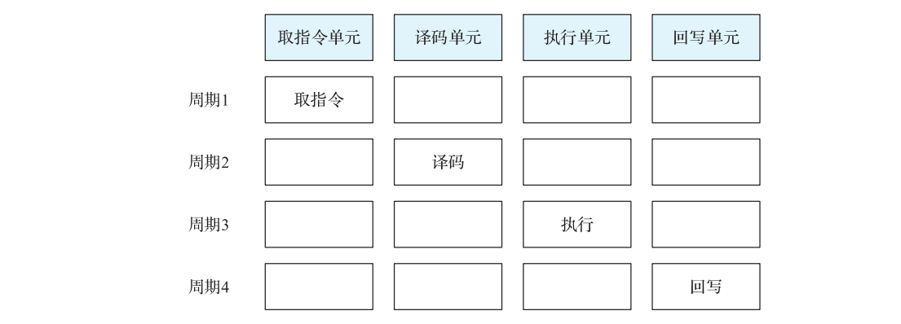

**图 8-1 CPU 单条指令执行过程**

一条 CPU 流水线工作示意图如图 8-2 所示。引入流水线工作模式后，后 3 个工作单元除了在前 3 个时钟周期可以偷懒外，其余的时间都不能闲着。从第 2 个时钟周期开始，当译码单元在翻译指令 1 时，取指令单元要接着去取指令 2。从第 3 个时钟周期开始，当执行

单元执行指令 1 时，译码单元也不能闲着，要接着去翻译指令 2，而取指令单元要去取指令3。从第 4 个时钟周期开始，每个电路单元都会进入满荷负载工作状态，源源不断地执行一条条指令。

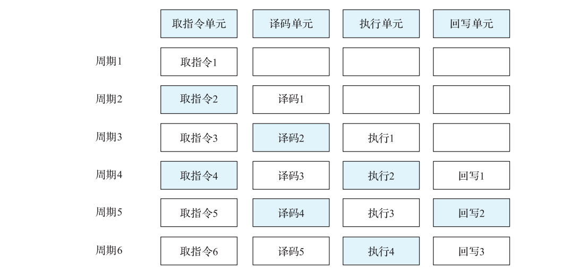

**图 8-2 一条 CPU 流水线工作示意图**

引入流水线后，虽然每一条指令执行流程不变，还是需要 4 个时钟周期，但是从整条流水线的输出看，差不多平均每个时钟周期都能执行一条指令。原来执行一条指令需要 4个时钟周期，现在平均只需要 1 个时钟周期，CPU 性能提升了近 3 倍。

流水线的本质其实是用空间换时间。将每条指令分解为多步来执行，指令的每一步都由独立的电路来执行，让不同指令的各步并行操作，从而实现几条指令并行处理，加快程序的运行。

但利用流水线并行的前提是指令之间没有依赖关系，如果相邻的两条指令存在数据依赖，则消费者必须等生产者的数据可用；有旁路 / 转发时不一定等待回写完成，这会使流水线停顿，从而影响程序的执行效率。指令之间的依赖通常分为结构依赖（也称为结构冲突，指不同指令使用相同的硬件资源导致流水线停顿）、数据依赖（也称为数据冲突，指的是指令间的数据有依赖）、控制依赖（也称为控制冲突，指的是由跳转指令确定下一条要执行的指令）。在LLVM 中常见依赖关系（属性）有 3 种。

> 此处的 data / chain / glue 是 SelectionDAG 表达依赖的方式。MIR 调度图中的 `SDep::Kind` 另分 Data、Anti、Output、Order，并有 Barrier / Artificial 等 Order 子类型，不要把两套分类混为一谈。

1）data（数据依赖）：如果下一条指令的操作数为前一条指令的输出结果，那么这两条指令就存在数据依赖。

2）chain（链依赖）：当前指令调度时不能被移到所依赖的指令之前。通常处于相同内存的访存操作指令序列可以用这种依赖来固定访存操作的顺序。

3）glue（铰链依赖）：指令序列在调度时不能被分开。

注 从直观上看，本章仅讨论了数据依赖，实际上结构依赖在出现指令时延时有所涉及，

意

而控制依赖在进行编译优化时有所涉及。

指令调度的作用就是通过调整指令的顺序，减少指令间依赖对流水线的影响，使得程序在拥有指令流水线的中央处理器上能够高效运行。

根据调度发生的阶段可以将指令调度分为动态调度和静态调度。本书仅讨论静态调度。

1）动态调度：发生在运行时，需要相应的硬件支持。处理器会在运行时对指令序列进行重排，并乱序地发送到处理器功能单元，以便处理器能够同时处理更多的指令。

2）静态调度：在编译阶段对指令重排，在保持必要语义依赖的前提下隐藏等待时延、提升指令并行度，从而利用流水线的空闲周期执行没有依赖冲突的其他指令。

根据指令调度的工作范围，通常可以将指令调度分为 3 类。

1）局部调度：针对单基本块进行调度。最典型的算法是 List Scheduling 算法（也称为表调度），这一类算法采用不同的启发式方法选择合适的指令，比如考虑停滞周期（stall cycles）○一、指令时延、寄存器压力等。论文“ A comparision of List Scheduling Heuristics in LLVM Targeting POWER8”○二将影响调度算法的启发式因素细分为 24 种，我们将在后文介绍具体的算法时详细描述算法所涉及的启发式因素。

2）全局调度：跨多个基本块进行调度。通常有 Trace Scheduling（识别频率高的执行路径，并根据路径调度多个基本块）、Superblock Scheduling（通常是选择一些具有单入口、多出口属性的基本块进行调度）、Hyperblock Scheduling（使用 If-Conversion 算法移除条件分支，获得超大基本块后进行调度）等调度算法。

3）循环调度：针对循环体内的基本块进行指令调度优化，从而提升循环执行的并行性能，这主要是针对软流水的优化。

本书讨论的指令调度算法主要是局部调度和循环调度。其中局部调度适用于所有的后端，而循环调度目前仅适用于 ARM、PPC 和 Hexagon 后端。

## 8.1 LLVM 指令调度

指令调度和寄存器分配会相互影响，所以 LLVM 实现了基于 MIR 的寄存器分配前指令调度和寄存器分配后指令调度，同时还提供了基于 SelectionDAG（DAG IR）的调度，FastISel、GlobalISel 没有 SelectionDAG 内部调度阶段，但它们生成的 MachineInstr 同样可以经过寄存器分配前后的 MIR 调度。本节首先对 LLVM 中实现的调度算法（也称为调度器）进行介绍，然后介绍指令调度中使用的拓扑排序算法。

○一 本书统一翻译为停滞周期，但该词也不算特别贴切，所以笔者这里简单解释其含义：它是指在指令执行

过程中，由于存在依赖冲突、结构冲突等导致的 CPU 流水线停顿。

○二 在线论文地址为 https://lup.lub.lu.se/luur/download?func=downloadFile&recordOld=9079542&fileOld=9079543。

### 8.1.1 指令调度算法

LLVM 实现了多种指令调度的算法，基本的思路都是构建指令间的依赖图，基于依赖图进行拓扑排序。调度算法可以在 LLVM 后端的不同阶段实施。在图 8-3 中的①、②、③阶段都可以配置调度算法。

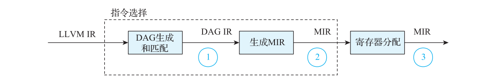

**图 8-3 调度算法实施阶段**

为什么要在多个阶段配置调度算法？根本原因是指令调度和寄存器分配（第 10 章介绍）会相互影响。指令调度会调整寄存器的位置，影响寄存器的生命周期，从而影响寄存器分配；同理，寄存器分配选择物理寄存器会影响指令依赖，从而影响指令调度。所以 LLVM设计了 3 个可以配置调度算法的阶段，具体如下。

阶段①：基于 SelectionDAG 进行调度，Linearize、Fast、BURR List、Source List、Hybrid List 这些调度算法都在此阶段完成指令调度优化。

阶段②：基于寄存器分配前的 MIR 进行调度，调度算法包括 Pre-RA-MISched。这个阶段的指令调度会着重考虑指令顺序对寄存器分配压力的影响。另外，LLVM 的循环调度SMS（Swing Modulo Scheduling，摇摆模调度）也处于这个阶段。

阶段③：基于寄存器分配后的 MIR 进行调度，调度算法包括 Post-RA-TDList 和 Post- RA-MISched。

阶段③寄存器分配后的调度算法主要考虑影响指令并行性能的启发式因素，而阶段①、

②寄存器分配前的调度算法除了考虑并行性能之外，还要综合考虑寄存器分配压力等多种启发式因素。

虽然这三个阶段配置的调度算法实现略有不同（原因是输入不同，如图 8-3 所示），但算法原理相似，有很多代码可以复用。针对不同阶段和具体算法，LLVM 实现的调度类UML 如图 8-4 所示。

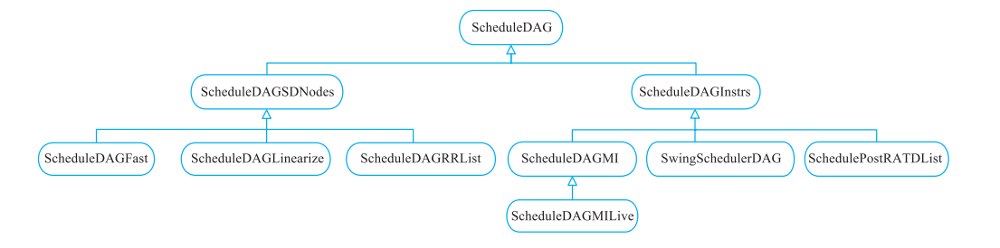

**图 8-4 调度类的 UML**

这些不同调度算法对应的实现作用于不同的 IR 输入，如表 8-1 所示。

**表 8-1 调度算法在 LLVM 中对应的实现**

调度器 基于 IR 输入 实现类 和寄存器分配的关系

Linearize SelectionDAG ScheduleDAGLinearize pre-RA（寄存器分配前，下同）

Fast SelectionDAG ScheduleDAGFast pre-RA

BURR List SelectionDAG ScheduleDAGRRList pre-RA

Source List SelectionDAG ScheduleDAGRRList pre-RA

Hybrid List SelectionDAG ScheduleDAGRRList pre-RA

Pre-RA-MISched MachineInstr ScheduleDAGMILive pre-RA

SMS MachineInstr SwingSchedulerDAG pre-RA

Post-RA-MISched MachineInstr ScheduleDAGMI post-RA（寄存器分配后，下同）

Post-RA-TDList MachineInstr SchedulePostRATDList post-RA

这些调度算法将在后续章节一一展开介绍。

### 8.1.2 拓扑排序算法

指令调度的算法都是以拓扑排序为基础，每条指令按照依赖关系构成了 DAG 的节点，因此本节简要介绍一下拓扑排序算法。

对于一个 DAG，记为 G<E, V>，拓扑排序是将 G 中所有的顶点排成一个线性序列，对于图中任意一对顶点 u 和 v(u, v ∈ V)，如果边 <u, v> ∈ E(G)，则 u 出现在 v 之前。这样的线性序列被称为满足拓扑次序的序列，寻找线性序列的过程称为拓扑排序。拓扑排序的实现常常需要借助队列，步骤大致如下。

1）遍历图中所有的节点，将入度为 0 的节点放入队列。

2）从队列中选出一个节点，并消费该节点（从图 G 中删除节点），之后更新节点所指向的相邻节点的入度（减 1），如果相邻节点的入度为 0，则将该相邻节点放入队列。

3）重复以上步骤，直到队列为空。

**图 8-5 展示了一个拓扑排序的完整过程。假设原始 DAG 如图 8-5a 所示，因为其中只**

有 a 的入度为 0，所以 a 会被最先消费并从 DAG 中删除，然后更新相邻节点 b、c、d 的入度，得到结果如图 8-5b 所示。重复该过程，依次消费节点 c、b、f、d，分别如图 8-5c～

**图 8-5f 所示。整个图拓扑排序的最终结果为 acbfde。**

指令调度算法会在拓扑排序的基础上进行增强，主要是在拓扑排序的第二步通过多种启发式因素计算出队列中调度优先级最高的节点，然后将该节点作为调度结果。

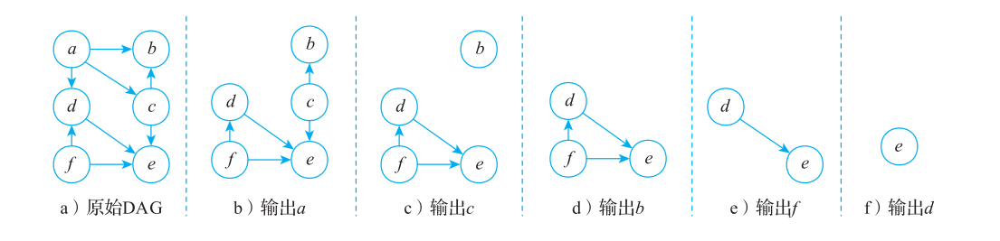

**图 8-5 拓扑排序过程**

## 8.2 Linearize 调度器

Linearize 调度器是 LLVM 中实现最简单的调度器，后续章节介绍的一些调度器都是基于它来增强实现。Linearize 调度器是以基本块为调度单元，对 SelectionDAG 的 SDNode 做了一次自底向上的拓扑排序，生成 SDNode 的序列。调度算法的实现步骤如下。

1) 构造 SDNode 依赖图。

2) 根据依赖图，按照深度优先遍历的方法对依赖图进行拓扑排序，依赖图中具有 glue属性的节点序列会被当作一个整体进行调度，从而保证具有 glue 属性的节点序列不会被拆开。

3) 重复以上步骤，直到所有节点调度完成。

Linearize 调度器实现非常简单，没有考虑任何启发式因素。在 LLVM 中通过编译选项 -pre-RA-sched=linearize 来选择使用 Linearize 调度器。下面通过一个示例演示 Linearize的实现过程，假设有一段经过指令选择后的示例代码如代码清单 8-1 所示。

> 清单 8-1 是复杂 X86 用例的历史 DAG 调试片段，缺少完整输入，不能作为 LLVM IR / MIR 文件直接解析。已修正 EntryToken 只产生 chain，并规范代码中的全角标点。表 8-2、8-10、8-22 保留历史编号，克隆节点需视为新节点而非重复定义同一 t46。LLVM 18 源码还明确提醒 Linearize 可能无法正确处理物理寄存器依赖；涉及 EFLAGS 的本例不能当作使用 Linearize 安全性的证明。

**代码清单 8-1 调度前的 SelectionDAG 示例代码**

```text
t0: ch = EntryToken
t12:i64,ch = CopyFromReg t0,Register:i64 %24
t2:i64,ch = CopyFromReg t0,Register:i64 %35
t5:i64,i32 = SAR64ri exact t2,TargetConstant:i8<3>
t8:i64 = MOV32ri64 TargetConstant:i64<1>
t59:i64,i32 = SUB64ri8 t5,TargetConstant:i64<2>
t67:ch,glue = CopyToReg t0,Register:i32 $eflags,t59:1
t62:i64 = CMOV64rr t8,t5,TargetConstant:i8<3>,t67:1
t46:i64,i32 = ADD64rr t62,t5
t49:i64,i32 = SUB64rrt46,t12
t66:ch,glue = CopyToReg t0,Register:i32 $eflags,t49:1
t52:i64 = CMOV64rr t46,t12,TargetConstant:i8<7>,t66:1
t65:ch,glue = CopyToReg t0,Register:i32 $eflags,t46:1
t48:i64 = CMOV64rr t52,t12,TargetConstant:i8<2>,t65:1
t7:ch = CopyToReg t0,Register:i64 %36,t5
t20:ch = CopyToReg t0,Register:i64 %37,t48
t21:i64 = SUBREG_TO_REGTargetConstant:i64<0>,MOV32r0:i32,i32,TargetConstant:i32<6>
t25:ch = CopyToReg t0,Register:i64 %137,t21
t27:ch = TokenFactor t7,t20,t25
t43:i32 = TEST64rr t48,t48
t64:ch,glue = CopyToReg t27,Register:i32 $eflags,t43
t45:ch = JCC_1 BasicBlock:ch<_ZNst12_Vector_allocate.i.i.i 0x55556eb245c0>,
    TargetConstant:i8<4>,t64,t64:1
t30:ch = JMP_1 BasicBlock:ch<_ZNst16allocator_exit.i.i.i.i 0x55556eb244c0>,t45
```

该代码片段来自一个复杂的工程，下面以此为例来看看经过 Linearize 后生成的SDNode 序列是什么样子。

### 8.2.1 构造依赖图

为 SelectionDAG 中的 SDNode 构造依赖图，并计算各个 SDNode 的入度。其过程为自上向下依次遍历 SelectionDAG 的指令，根据指令之间的依赖关系在依赖图中添加相关依赖，并计算入度。

**图 8-6 展示了基于代码清单 8-1 所构造的依赖图。以指令 t49 ：i64, i32 = SUB64rr, t46,**

t12 为例，它的操作数分别为 t46、t12，且都是数据依赖关系，因此需要为 t49 和 t46、t12建立数据依赖，并且 t49 的操作数 0 指向 t46，t49 的操作数 1 指向 t12，同时分别增加 t46、t12 的入度。

图中的 Graph Root 是可视化标记；Linearize 实现直接从 `DAG->getRoot().getNode()` 开始，没有为其额外创建一条可调度指令。图的箭头由使用者指向操作数，与常见 producer → consumer 调度依赖图的方向相反；这里所称“入度”实际记录的是未处理使用者计数。

为了展示不同的依赖关系，我们使用蓝色虚线表示 chain 依赖边，用蓝色实线表示 glue依赖边，黑色实线表示数据依赖边。最后得到的依赖图如图 8-6 所示。

注 这和 LLVM 工具的输出略有不同，主要是为满足印刷排版所需进行了细微的调整。

意

另外，从 LLVM 工具输出的依赖图中还可能包括 EntryToken 节点，它是一个特殊

节点，但不影响调度顺序，为了简化依赖图，故未在图中体现。EntryToken 节点的

相关内容可以参考第 7 章。

### 8.2.2 对依赖图进行调度

第 1 步，对普通节点进行调度，并按照深度优先对依赖图进行拓扑排序。

从 Graph Root 节点出发，自底向上按深度优先进行拓扑排序。Graph Root 指向 t30，而 t30 是 DAG 的实际根节点；它没有待处理的使用者，故首先收集 t30，将调度结果存入一个数组（这里使用 Sequence 表示）中，同时将 t30从图 8-6 所示依赖图中移除，并更新 t30 依赖节点的入度，即将 t45 的入度减 1。此时，t30调度后的局部依赖图如图 8-7 所示。

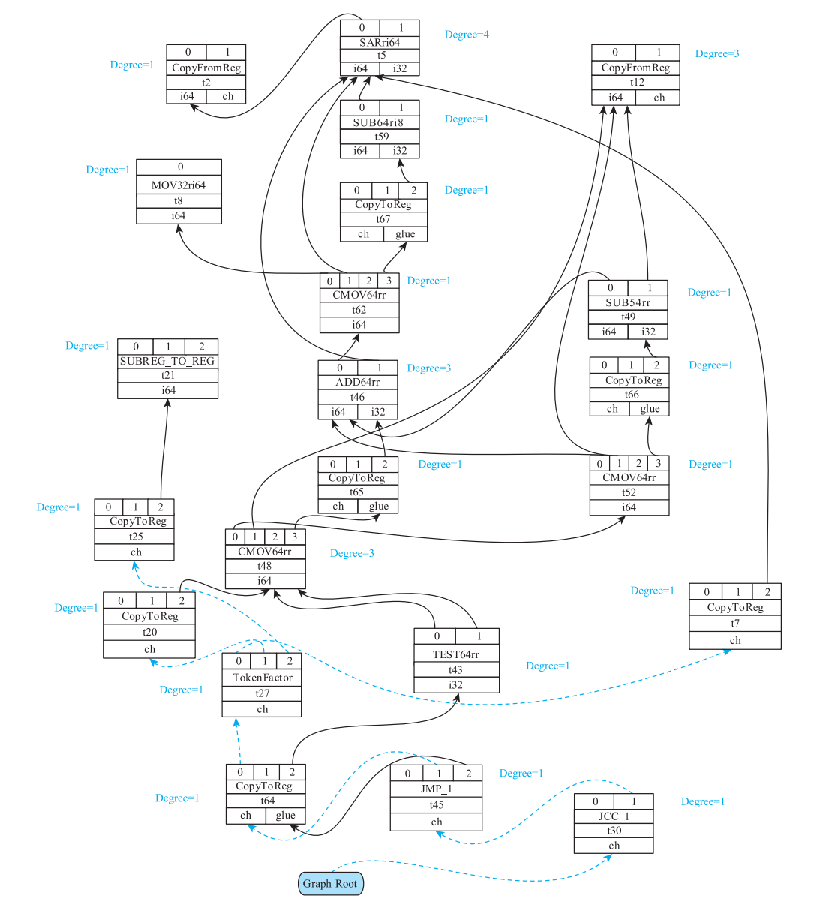

**图 8-6 SelectionDAG 基本块依赖图**

此时，Sequence 中的调度结果为 t30。

第 2 步，处理具有 glue 属性的节点序列。

接下来需要调度 t45，但是 t45 和 t64 具有 glue 属性。此时，t64 仅被 t45 依赖，因为具有 glue 属性的节点序列必须作为整体被调度，所以将 t45、t64 的调度结果放入 Sequence 数

组。从右向左遍历 t64 的操作数，首先是处理节点 t43，并将 t43 的入度设置为 0，然后处理节点 t27，得到的局部依赖图如图 8-8 所示。

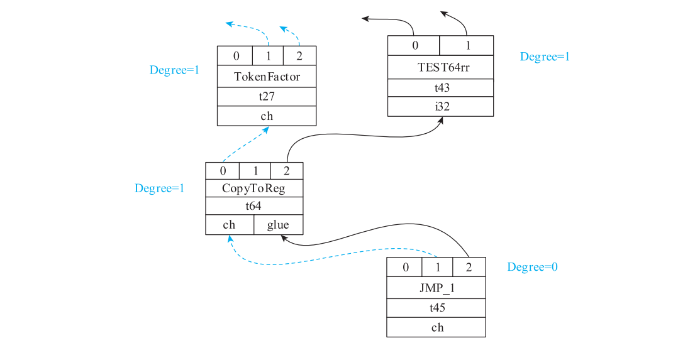

**图 8-7 t30 调度后的局部依赖图**


**图 8-8 t45、t64 调度后的局部依赖图**

此时，Sequence 中的调度结果为 t30、t45、t64。

重复第 1 步和第 2 步，直到所有节点完成调度。最后得到的调度结果为：t30，t45，t64，t43，t27，t25，t21，t20，t48，t65，t52，t66，t49，t12，t46，t62，t67，t59，t8，t7，t5，t2。

上面列出的是自底向上收集的 Sequence；`ScheduleDAGLinearize::EmitSchedule` 按反序发射它，反转后才是机器指令的执行顺序。我们来比较一下使用 Linearize 调度前后的指令执行顺序，如表 8-2 所示，主要的变化是 t7 和t12 的执行顺序。Linearize 的调度中并未引入任何启发式因素，因此调度结果对执行性能的影响也是不确定的，但是可以看到 t7 放在了 t5 的后面、t12 放在了 t49 的前面。结果显示，t7、t12 和它们依赖者或者被依赖者距离更近。

**表 8-2 使用 Linearize 算法调度前后的效果比较**

调度前 调度后

t0: ch = EntryToken t0: ch = EntryToken

t12：i64，ch = CopyFromReg t0，Register：i64 %24 t2：i64，ch = CopyFromReg t0，Register：i64 %35

t2：i64，ch = CopyFromReg t0，Register：i64 %35 t5 ：i64，i32 = SAR64ri exact t2，TargetConstant ：

t5 ：i64，i32 = SAR64ri exact t2，TargetConstant ： i8<3>

i8<3> t7：ch = CopyToReg t0，Register：i64 %36，t5

t8：i64 = MOV32ri64 TargetConstant：i64<1> t8：i64 = MOV32ri64 TargetConstant：i64<1>

t59 ：i64，i32 = SUB64ri8 t5，TargetConstant ： t59 ：i64，i32 = SUB64ri8 t5，TargetConstant ：

i64<2> i64<2>

t67：ch，glue = CopyToReg t0，Register：i32 $eflags， t67：ch，glue = CopyToReg t0，Register：i32 $eflags，

t59：1 t59：1

t62 ：i64 = CMOV64rr t8，t5，TargetConstant ： t62 ：i64 = CMOV64rr t8，t5，TargetConstant ：

i8<3>，t67：1 i8<3>，t67：1

t46：i64，i32 = ADD64rr t62，t5 t46：i64，i32 = ADD64rr t62，t5

t49：i64，i32 = SUB64rr，t46，t12 t12：i64，ch = CopyFromReg t0，Register：i64 %24

t66：ch，glue = CopyToReg t0，Register：i32 $eflags， t49：i64，i32 = SUB64rr，t46，t12

t49：1 t66：ch，glue = CopyToReg t0，Register：i32 $eflags，

t52 ：i64 = CMOV64rr t46，t12，TargetConstant ： t49：1

i8<7>，t66：1 t52 ：i64 = CMOV64rr t46，t12，TargetConstant ：

t65：ch，glue = CopyToReg t0，Register：i32 $eflags， i8<7>，t66：1

t46：1 t65：ch，glue = CopyToReg t0，Register：i32 $eflags，

t48 ：i64 = CMOV64rr t52，t12，TargetConstant ： t46：1

i8<2>，t65：1 t48 ：i64 = CMOV64rr t52，t12，TargetConstant ：

t7：ch = CopyToReg t0，Register：i64 %36，t5 i8<2>，t65：1

t20：ch = CopyToReg t0，Register：i64 %37，t48 t20：ch = CopyToReg t0，Register：i64 %37，t48

t21 ：i64 = SUBREG_TO_REG，TargetConstant ： t21 ：i64 = SUBREG_TO_REG，TargetConstant ：

i64<0>，MOV32r0：i32，i32，TargetConstant：i32<6> i64<0>，MOV32r0：i32，i32，TargetConstant：i32<6>

t25：ch = CopyToReg t0，Register：i64 %137，t21 t25：ch = CopyToReg t0，Register：i64 %137，t21

t27：ch = TokenFactor t7，t20，t25 t27：ch = TokenFactor t7，t20，t25

t43：i32 = TEST64rr t48，t48 t43：i32 = TEST64rr t48，t48

t64：ch，glue = CopyToReg t27，Register：i32 $eflags， t64 ：ch，glue = CopyToReg t27，Register ：i32

t43 $eflags，t43

t45 ：ch = JCC_1 BasicBlock ：ch<_ZNst12_Vector_ t45：ch = JCC_1 BasicBlock：ch<_ZNst12_Vector_

allocate.i.i.i 0x55556eb245c0>，TargetConstant ：i8<4>， allocate.i.i.i 0x55556eb245c0>，TargetConstant ：

t64，t64：1 i8<4>，t64，t64：1

t30 ：ch = JMP_1 BasicBlock ：ch<_ZNst16allocator_ t30：ch = JMP_1 BasicBlock：ch<_ZNst16allocator_

exit.i.i.i.i 0x55556eb244c0>，t45 exit.i.i.i.i 0x55556eb244c0>，t45

## 8.3 Fast 调度器

Fast 调度器和 Linearize 调度器一样都遵循自底向上的深度优先拓扑排序规则。和Linearize 调度器相比，Fast 调度器在实现上有 3 点不同。

1）Fast 调度器用 SUnit 封装了 SDNode，并以 SUnit 为节点来构造指令的依赖图。

2）LLVM 18 的 Fast::Schedule 直接调用 BuildSchedGraph(nullptr)，不能把访存 glue 合并视为该调度器必经的前置步骤；访存聚类与 glue 是否出现取决于目标及相关图变换。

3）Fast 调度器对物理寄存器依赖场景做了特殊处理，笔者理解这是为了减小该物理寄存器的活跃区间范围。

LLVM 通过编译选项 -pre-RA-sched=fast 来使用 Fast 调度器，调度算法实现放在 Schedule- DAGFast 类。

### 8.3.1 Fast 调度器实现

从 Fast 调度器开始，本章后面介绍的局部调度器都会用 SUnit 来封装 SDNode 或者MIR。SUnit 类中有两个字段，分别是 SDNode 指针类型的 Node 和 MachineInstr 指针类型的 Instr，分别保存对应 SelectionDAG 形式的 SDNode 节点和 MIR 节点。例如，Fast 调度器中的 SUnit 是基于 SDNode 构造的，而 8.7 节介绍的算法的 SUnit 是基于 MIR 构造的。Fast 调度器算法的实现步骤如下。

1）以 SUnit 为节点构造依赖图，SUnit 由两类 SDNode 构成。第一类是具有 glue 属性的 SDNode 序列，这些 SDNode 将被合并成一个 SUnit ；第二类是没有 glue 属性的 SDNode，如 果 SDNode 包 含 机 器 操 作 数， 则 为 该 SDNode 生 成 一 个 SUnit。 另 外，SUnit 引 入 了NumSuccsLeft 字段来描述其入度。

2）基于依赖图进行调度。

3）重复以上步骤，直到所有节点调度完成。

注 为什么 LLVM 用 SUnit 封装 SDNode 或者 MIR ？笔者的理解是将影响指令调度的

意

启发式因素提取出来，封装在 SUnit 中，从而避免在 SDNode 和 MIR 中重复定义和

实现。

下面依然以代码清单 8-1 的 SelectionDAG 为例，Fast 调度器构造的 SUnit 依赖图如

**图 8-9 所示。示例中的 SUnit 标识了其对应的 SDNode 节点，比如 SUnit[6] 对应的是 t2。**

SUnit 的依赖边有两种类型：蓝色虚线的边是 Barrier 类型（SDNode 之间的 chain 依赖关系就是 Barrier 类型），黑色实线的边是 data 依赖类型。和 SDNode 依赖图相比，SUnit 依赖图的节点数量略有减少，主要是它把具有 glue 属性的 SDNode 序列合成为一个 SUnit 节点，比如图 8-9 中 SUnit[3] 节点表示具有 glue 属性的 t48 和 t65 的序列。

建立依赖图后，Fast 调度器从 Graph Root 出发，自底向上地对依赖图执行拓扑排序。当SUnit 节点的 NumSuccsLeft 为 0 时，表明该节点的所有后继节点都已调度完成，可以添加该节点到待调度队列。这里 `NumSuccsLeft` 是未调度后继数量，不是常规 producer → consumer 图的入度。Fast 调度器与后面介绍的更复杂的调度器都会使用 AvailableQueue 队列。在 Fast 调度器中 AvailableQueue 是普通的队列，每个 SUnit 的优先级都是一样的，但在后面介绍的调度器中它是一个优先级队列，会根据启发式因素来决定队列中节点的优先级。

因为 Fast 调度器在调度过程中对物理寄存器的依赖场景进行了特殊处理，所以下面先介绍物理寄存器依赖场景的相关内容。

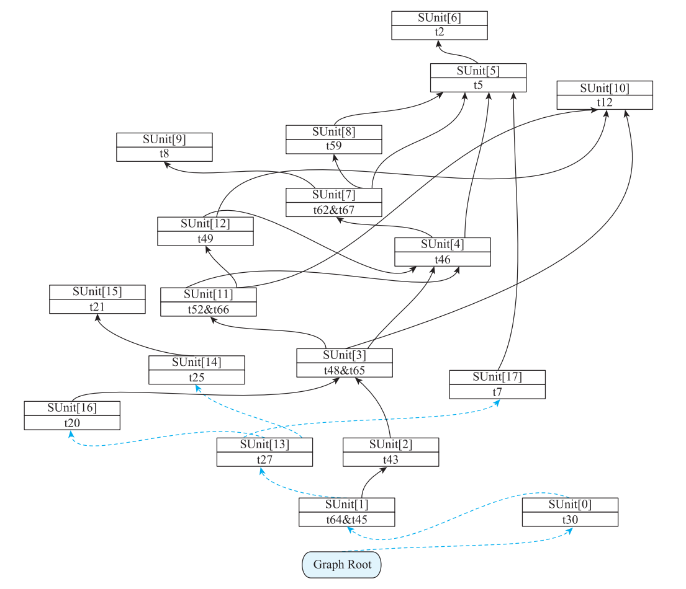

**图 8-9 Fast 调度器算法构造的 SUnit 依赖图**

### 8.3.2 物理寄存器依赖场景的处理

所谓物理寄存器依赖场景，是两条或多条指令读写同一物理寄存器，调度必须避免将另一个定义插入仍需使用旧值的区间。图 8-10 用 rx 举例；LLVM 18 Fast 调度器维护 `LiveRegDefs`（当前活跃物理值的定义）与 `LiveRegCycles`，不维护本节图示的 `LiveRegGens` 字段。`LiveRegGens` 仍见于 RRList 实现。图 8-11 的数组仅保留为原书解释图，不能按该名称直接查 Fast 的字段。

③ ② ① r r r x x x = = = a a a d d d d d d c c . . r r . x x L L i i v v e e R R e e g g G D e e n fs s [ [ r r x x ] ] = = ③ ①


**图 8-10 物理寄存器依赖示例**


**图 8-11 存放物理寄存器指令的索引数组结构**

在图 8-10 中，LiveRegDefs[rx] 存放指令③的索引，LiveRegGens[rx] 存放指令①的索引。

当所有候选都被活跃物理寄存器冲突阻塞时，Fast 调度器有两种方法修复调度合法性；它们会改变活跃区间，但主要目的不是任意优化寄存器压力或性能。这两种方法分别是 CopyAndMoveSuccessors 和InsertCopiesAndMoveSuccs。

T CopyAndMoveSuccessors：通过插入重复指令的方式来缩短活跃区间，这和第 10 章

介绍的重新物化概念一致。

T InsertCopiesAndMoveSuccs：通过插入 COPY 指令的方式来缩短活跃区间。

1. CopyAndMoveSuccessors

物理寄存器依赖示例如图 8-12 所示，指令 LiveRegGens[reg]、CurSU、LiveRegDefs[reg]对物理寄存器 reg 存在依赖。假设当前指令调度已经进行到 CurSU 节点，则表明 LiveReg- Gens[reg] 和 S2 节点已经被调度过，其余的节点还未被调度。下面以图 8-12 为例来描述CopyAndMoveSuccessors 的大体步骤。

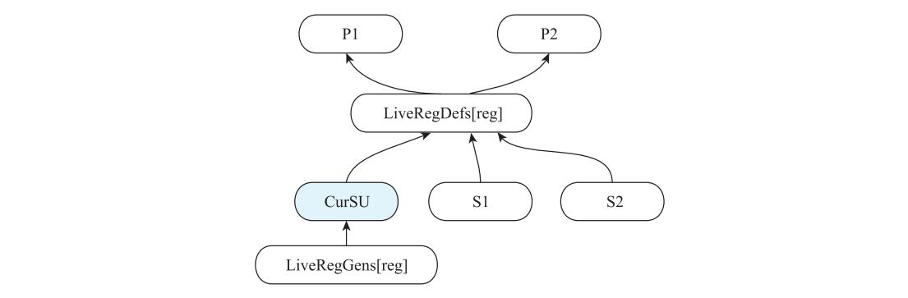

**图 8-12 物理寄存器依赖示例**

第 1 步：把 LiveRegDefs[reg] 节点复制一份存放到新的节点，新的节点记为 clone of LRDef，并将 LiveRegDefs[reg] 节点的前驱节点 P1、P2 设置为 clone of LRDef 节点的前驱节点，如图 8-13 所示。

第 2 步：将 LiveRegDefs[reg] 的后继节点中已经调度过的节点指向 clone of LRDef 节点，这里将 S2 指向 clone of LRDef。将 CurSU 设置为 clone of LRDef 的前驱节点，其依赖

类型为 SDep::Artificial，也就是说要先调度 clone of LRDef，才能调度 CurSU，如图 8-14所示。这样就把物理寄存器 reg 的活跃区间从 [LiveRegDefs[reg], LiveRegGens[reg]] 分解成了两段：[clone of LRDef, LiveRegGens[reg]] 以及 [LiveRegDefs[reg], CurSU]。

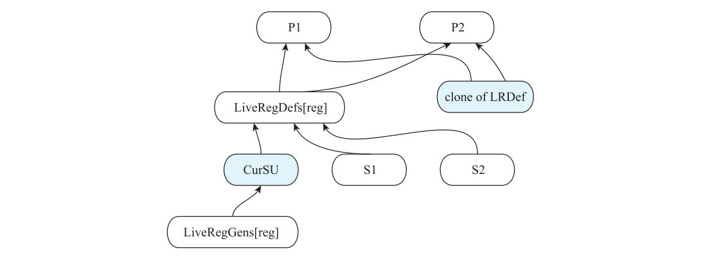

**图 8-13 复制新节点并设置其前驱节点**

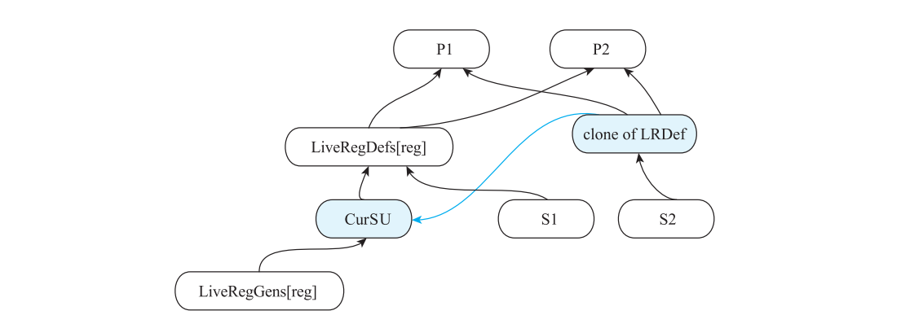

**图 8-14 将 CurSU 设置为 clone of LRDef 的前驱节点**

2. InsertCopiesAndMoveSuccs

依然以图 8-12 为例，描述一下 InsertCopiesAndMoveSuccs 的大致步骤。

第 1 步：插入 CopyToSU 和 CopyFromSU 两个 SUnit 节点。CopyFromSU 就是将 Live- Reg-Defs[reg] 节点的 reg 保存到可供复制的寄存器类所容纳的临时值（后续发射使用虚拟寄存器，不是此时随意占用另一个物理寄存器 reg1）。CopyToSU 将 CopyFromSU 节点的 reg1 重新赋给 reg，将 CopyFromSU 节点的前驱节点设置为 LiveRegDefs[reg] 节点，把 LiveRegDefs[reg] 的后继节点中已经调度的节点 S2 指向 CopyToSU 节点，如图 8-15所示。

第 2 步：CopyToSU 增加对 CopyFromSU 节点的数据依赖边。将 CopyToSU 指向 CurSU，依赖边类型为 SDep::Artificial，将 CurSU 节点的前驱节点设置为 CopyFromSU，其依赖类型

为 SDep::Artificial。也就是说先调度 CopyToSU，然后是 CurSU，最后才是 CopyFromSU，即 CopyToSU 增加了对 CopyFromSU 节点的数据依赖边，如图 8-16 所示。这样就把节点LiveRegGens[reg]、CurSU、LiveRegDefs[reg] 的物理寄存器 reg 的活跃区间 [LiveRegDefs[reg], LiveRegGens[reg]] 分解成了 [CopyToSU, LiveRegGens[reg]] 以及 [LiveRegDefs[reg], CurSU]这两段。但该方法插入了两条新的指令 CopyFromSU 和 CopyToSU，会带来额外的开销。

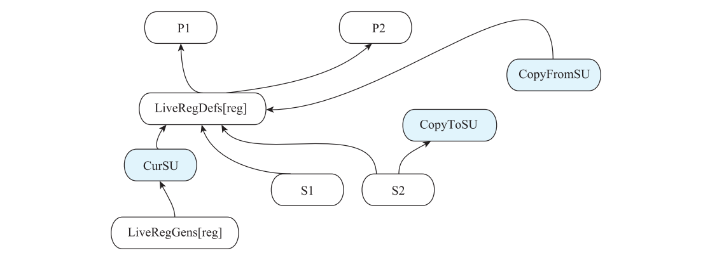

**图 8-15 S2 指向 CopyToSU 节点**

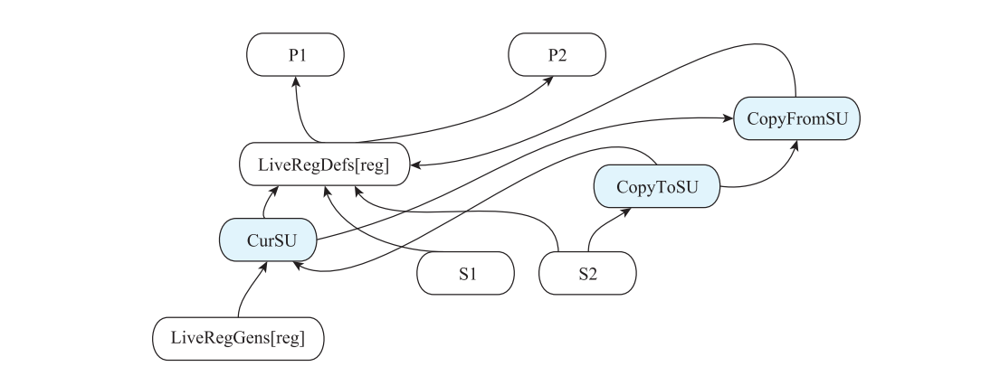

**图 8-16 CopyToSU 增加了对 CopyFromSU 节点的数据依赖边**

LLVM 18 先查询 `getCrossCopyRegClass(RC)`：若可直接在同类中复制，则不尝试复制定义节点；只有复制昂贵或不可复制时才尝试 `CopyAndMoveSuccessors`。克隆还必须通过副作用、glue 等条件检查；克隆不成时尝试插入保存 / 恢复 COPY，若二者均不支持会报错。因此不能概括为“总是优先克隆以减少指令数”。

### 8.3.3 示例分析

依然以代码清单 8-1 为例说明 Fast 调度器如何调度指令序列。Fast 调度器使用了 3 个辅助数据结构，分别是 AvailableQueue、NotReady 和 Sequence。Sequence 数组存放调度的指令结果。队列 AvailableQueue 存放入度为 0 且可以被调度的指令序列，底层 `SmallVector` 使用 push_back / pop_back_val，遵循后进先出（LIFO）原则。NotReady 数组用来存放因为物理寄存器依赖被干扰暂时无法被调度的 SUnit 节点，比如图 8-12 中的 CurSU。NotReady 中的节点在本轮选择后会重新加入 AvailableQueue；当本轮所有候选都因冲突延期、无法选择 CurSU 时，才触发冲突修复，处理方法就是 8.3.2 节介绍的 CopyAndMoveSuccessors 或者 InsertCopiesAndMoveSuccs方法。

为基本块的 SDNode 构建对应的 SUnit 的依赖图，结果如图 8-9 所示。

从 Graph Root 开始，此时 NotReady 和 Sequence 序列为空。选择入度为 0 的 SU[0]○一节点存入 AvailableQueue 中，从 Graph Root 开始调度后，Fast 调度器的运行结果如表 8-3所示。

**表 8-3 从 Graph Root 开始调度后 Fast 调度器的运行结果**

调度器数据结构 数据结构中的元素

AvailableQueue SU[0]

NotReady 空

Sequence 空

从 AvailableQueue 中选择可调度节点 SU[0] 存入 Sequence，将 SU[0] 的前驱节点 SU[1]的入度设置为 0，将 SU[1] 存入 AvailableQueue 中，Fast 调度器的运行结果如表 8-4 所示。

**表 8-4 调度 SU[0] 后 Fast 调度器的运行结果**

调度器数据结构 数据结构中的元素

AvailableQueue SU[1]

NotReady 空

Sequence SU[0]

按照拓扑排序的方式依次调度 SUnit 依赖图，直到出现 SU[3]。SU[3] 入度为 0，存入 Sequence 中，并将 SU[3] 的前驱节点 SU[11] 的入度减 1，变为 0 后存入 AvailableQueue中。SU[3] 的前驱节点 SU[4] 定义了 reg 为 28 的物理寄存器（为 EFLAGS，如图 8-9 所示，SU[3]、SU[4] 分别对应 t48&t65、t46 节点）。SU[3] 使用了物理寄存器 EFLAGS，此时将LiveRegDefs[28] 设置为 SU[4]。调度 SU[3] 后 Fast 调度器的运行结果如表 8-5 所示。

○一 为简便描述起见，后续正文和表格中的 SUnit[…] 形式的表述均简写为 SU[…]，例如 SUnit[0] 将简写为

SU[0] 形式。

**表 8-5 调度 SU[3] 后 Fast 调度器的运行结果**

调度器数据结构 数据结构中的元素

AvailableQueue SU[17],SU[11]

NotReady 空

Sequence SU[0],SU[1],SU[2],SU[13],SU[14],SU[15],SU[16],SU[3]

LiveRegDefs[28] SU[4]

从 AvailableQueue 中选择 SU[11]。SU[11] 的前驱节点 SU[12] 定义了 EFLAGS 且 SU[12]不是 LiveRegDefs[28] 的值（其值为 SU[4]，参见表 8-5），故存在对物理寄存器 EFLAGS 的依赖，此时将 SU[11] 存入 NotReady 队列中。调度 SU[11] 后 Fast 调度器的运行结果如表 8-6所示。

**表 8-6 调度 SU[11] 后 Fast 调度器的运行情况**

调度器数据结构 数据结构中的元素

AvailableQueue SU[17]

NotReady SU[11]

Sequence SU[0],SU[1],SU[2],SU[13],SU[14],SU[15],SU[16],SU[3]

LiveRegDefs[28] SU[4]

继续调度 AvailableQueue 中的元素，直到其中的元素为空。此时，将 SU[11] 从 NotReady序列存入 AvailableQueue 中。调度 SU[17] 后，Fast 调度器的运行结果如表 8-7 所示。

**表 8-7 调度 SU[17] 后 Fast 调度器的运行结果**

调度器数据结构 数据结构中的元素

AvailableQueue SU[11]

NotReady 空

Sequence SU[0],SU[1],SU[2],SU[13],SU[14],SU[15],SU[16],SU[3],SU[17]

LiveRegDefs[28] SU[4]

此时 SU[11]、SU[4]、SU[3] 便构成了对物理寄存器 EFLAGS 的依赖，采用 CopyAnd- MoveSuccessors 方 法 来 处 理。 将 SU[4] 复 制 出 一 份， 得 到 SU[4]-clone， 并 利 用 SU[11]、SU[12]、SU[3]、SU[4] 构造如图 8-17 所示的局部依赖图。SU[4]-clone 的前驱节点继承自 SU[4]，即 SU[5]、SU[7]，因此将 SU[5]、SU[7] 的入度加 1，并将 SU[4]-clone 设置为SU[11] 的后继节点。此时，SU[11] 的入度加 1，并将 LiveRegDefs[28] 更新为 SU[4]-clone。处理物理寄存器依赖后，Fast 调度器的运行结果如表 8-8 所示。

![图 8-17 对 SU[4] 进行复制后的依赖图](origin/assets/figures/p177-8-17.png)

**图 8-17 对 SU[4] 进行复制后的依赖图**

**表 8-8 处理物理寄存器依赖后 Fast 调度器的运行结果**

调度器数据结构 数据结构中的元素

AvailableQueue SU[4]-clone

NotReady SU[11]

Sequence SU[0],SU[1],SU[2],SU[13],SU[14],SU[15],SU[16],SU[3],SU[17]

LiveRegDefs[28] SU[4]-clone

继续按照深度优先的拓扑排序进行调度，直到 AvailableQueue、NotReady 序列都为空，最终结果存储在 Sequence 序列中，所有 SU 节点调度完成后，Fast 调度器的运行结果如表 8-9所示。

**表 8-9 所有 SU 节点调度完成后 Fast 调度器的运行结果**

调度器数据结构 数据结构中的元素

AvailableQueue 空

NotReady 空

Sequence SU[0],SU[1],SU[2],SU[13],SU[14],SU[15],SU[16],SU[3],SU[17],SU[4]-clone,SU[11],

SU[12],SU[10],SU[4],SU[7],SU[8],SU[5],SU[6],SU[9],

LiveRegDefs[28] 空

把自底向上的 Sequence 反转，再把 SUnit 节点转换成 SDNode 后，调度前后的结果如表 8-10 所示。除了指令顺序外，最显著的差异是克隆了 t46；表中第二个 t46 只是原书复用的显示标签，应理解为 t46_clone。物理寄存器 EFLAGS 的干扰通过 t46 的重新计算消解：t52 使用 t49 产生的 EFLAGS，t48 使用 t46_clone 重新产生的 EFLAGS，不能把 [t46, t52] 视为同一个 EFLAGS 值的活跃区间。

**表 8-10 使用 Fast 调度器调度前后的效果比较**

调度前 调度后

t0: ch = EntryToken t0: ch = EntryToken

t12：i64，ch = CopyFromReg t0，Register：i64 %24 t8：i64 = MOV32ri64 TargetConstant：i64<1>

t2：i64，ch = CopyFromReg t0，Register：i64 %35 t2：i64，ch = CopyFromReg t0，Register：i64 %35

t5 ：i64，i32 = SAR64ri exact t2，TargetConstant ： t5：i64，i32 = SAR64ri exact t2，TargetConstant：i8<3>

i8<3> t59 ：i64，i32 = SUB64ri8 t5，TargetConstant ：

t8：i64 = MOV32ri64 TargetConstant：i64<1> i64<2>

t59 ：i64，i32 = SUB64ri8 t5，TargetConstant ： t67：ch，glue = CopyToReg t0，Register：i32 $eflags，

i64<2> t59：1

t67：ch，glue = CopyToReg t0，Register：i32 $eflags， t62 ：i64 = CMOV64rr t8，t5，TargetConstant ：

t59：1 i8<3>，t67：1

t62 ：i64 = CMOV64rr t8，t5，TargetConstant ： t46：i64，i32 = ADD64rr t62，t5

i8<3>，t67：1 t12：i64，ch = CopyFromReg t0，Register：i64 %24

t46：i64，i32 = ADD64rr t62，t5 t49：i64，i32 = SUB64rr，t46，t12

t49：i64，i32 = SUB64rr，t46，t12 t66：ch，glue = CopyToReg t0，Register：i32 $eflags，

t66：ch，glue = CopyToReg t0，Register：i32 $eflags， t49：1

t49：1 t52 ：i64 = CMOV64rr t46，t12，TargetConstant ：

t52 ：i64 = CMOV64rr t46，t12，TargetConstant ： i8<7>，t66：1

i8<7>，t66：1 t46：i64，i32 = ADD64rr t62，t5

t65：ch，glue = CopyToReg t0，Register：i32 $eflags， t7：ch = CopyToReg t0，Register：i64 %36，t5

t46：1 t65：ch，glue = CopyToReg t0，Register：i32 $eflags，

t48 ：i64 = CMOV64rr t52，t12，TargetConstant ： t46：1

i8<2>，t65：1 t48 ：i64 = CMOV64rr t52，t12，TargetConstant ：

t7：ch = CopyToReg t0，Register：i64 %36，t5 i8<2>，t65：1

t20：ch = CopyToReg t0，Register：i64 %37，t48 t20：ch = CopyToReg t0，Register：i64 %37，t48

t21 ：i64 = SUBREG_TO_REG，TargetConstant ： t21 ：i64 = SUBREG_TO_REG，TargetConstant ：

i64<0>，MOV32r0：i32，i32，TargetConstant：i32<6> i64<0>，MOV32r0：i32，i32，TargetConstant：i32<6>

t25：ch = CopyToReg t0，Register：i64 %137，t21 t25：ch = CopyToReg t0，Register：i64 %137，t21

t27：ch = TokenFactor t7，t20，t25 t27：ch = TokenFactor t7，t20，t25

t43：i32 = TEST64rr t48，t48 t43：i32 = TEST64rr t48，t48

t64：ch，glue = CopyToReg t27，Register：i32 $eflags， t64：ch，glue = CopyToReg t27，Register：i32 $eflags，

t43 t43

t45 ：ch = JCC_1 BasicBlock ：ch<_ZNst12_Vector_ t45 ：ch = JCC_1 BasicBlock ：ch<_ZNst12_Vector_

allocate.i.i.i 0x55556eb245c0>，TargetConstant ：i8<4>， allocate.i.i.i 0x55556eb245c0>，TargetConstant ：

t64，t64：1 i8<4>，t64，t64：1

t30：ch = JMP_1 BasicBlock：ch<_ZNst16allocator_ t30：ch = JMP_1 BasicBlock：ch<_ZNst16allocator_

exit.i.i.i.i 0x55556eb244c0>，t45 exit.i.i.i.i 0x55556eb244c0>，t45

注 这里演示的是通过复制 t46 指令（本节使用克隆方法，第 10 章将使用重新物化方法）

意

来解决指令依赖的问题。需要注意的是，因为引入了额外的重复指令，执行成本增

加了，所以一般在决定是否进行指令复制时都会进行收益分析，而本节并未进行收

益分析。

## 8.4 BURR List 调度器

BURR List 调度器和 Fast 调度器类似，也会先构造基于 SUnit 节点的依赖图，但它不再单纯基于深度优先进行拓扑排序来调度指令。BURR List 调度器在进行拓扑排序时会将所有可以被调度的指令节点存放在 AvailableQueue 中，然后综合考虑多种因素来计算它们的优先级，选择优先级最高的指令。

LLVM 通过 -pre-RA-sched=list-burr 选项来设置使用 BURR List 调度器，其调度算法实现在 ScheduleDAGRRList 类。

因为 BURR List 调度器在选择调度节点时会考虑多种因素，所以下面先介绍哪些因素会影响指令调度以及它们为什么会影响指令调度，然后介绍 BURR List 调度器的详细实现。

> 本节属性是启发式输入，不能把每条“越大 / 越小越优先”当成单独成立的排序规则。实际比较顺序与比较器返回值语义以 `BURRSort`、`BUCompareLatency` 为准；下文表格是原书模型下的演算，不是 LLVM 18 新运行的测量。

### 8.4.1 影响指令调度的关键因素

在 BURR List 调度器中，指令调度优先级主要考虑的因素有 SUnit 节点的后继节点数量（NumSuccsLeft）、前驱节点数量（NumPredsLeft）、SUnit 指令的时延（Latency），以及在依赖图中的高度（Height）和深度（Depth）、Sethi-Ullman 数值○一。

1）NumSuccsLeft ：依赖图中当前 SUnit 节点尚未调度的后继节点数量，即 SUnit 节点的输出被其他节点使用的数量。以图 8-9 中的 SU[5] 为例，其 NumSuccsLeft 的值为 4。在相同条件下，该值越小越应该先调度，因为调度后可能会缩小寄存器的活跃区间。

2）NumPredsLeft ：依赖图中当前节点 SUnit 尚未调度的前驱节点数量，即该节点使用其他节点的数量。以图 8-9 中的 SU[5] 为例，其 NumPredsLeft 的值为 1。在相同条件下，该值越大越应该先调度，因为调度后可能会缩小寄存器的活跃区间。

3）Latency：节点的指令时延。带有机器操作数的 SDNode 节点，一般默认时延的值为1，有一些特殊的 SDNode 则不是这样，比如图 8-6 中 t27 的操作码为 TokenFactor，其时延值为 0。相同条件下，时延越大应该越先调度，因为调度后可以充分利用流水线的能力。

4）Height ：指按照自底向上的方式从 ExitEntry 到达当前 SUnit 节点的最长路径，其计算方法是遍历当前 SUnit 节点的后继节点，对每个后继节点的 Height 与连接到该后继的依赖边时延求和，取最大值。在相同前置优先级下，BURR 的相关后备比较倾向较小 Height（该属性的意义须结合自底向上收集方向理解），因为调度后可以充分利用流水线的能力。以图 8-18 为例，SU 的后继节点 SuccSU1、SuccSU2、SuccSU3的 Height 值与 Latency 值相加，结果分别为 2、3、4，则 SU 的 Height 值为 4。 图 8-18 Height 属性计算方法

○一 具体请参见 https://en.wikipedia.org/wiki/Sethi-Ullman_algorithm。

Height 使用边时延计算：

```text
Height(u) = max({0} ∪ {Height(v) + Latency(u,v) | v ∈ Succ(u)})
```

5）Depth ：Depth 是指按照自顶向下的方式，从开始节点到达当前 SUnit 节点的最长路径，其计算方法是遍历当前 SUnit 节点的前驱节点，对每个前驱节点的 Depth 和连接该前驱的依赖边时延求和，取最大值。在相同前置优先级下，BURR 的相关后备比较倾向较大 Depth，因为调度后可以充分利用流水线的能力。以图 8-19 为例，SU 的 前 驱 节 点 PredSU1、PredSU2、PredSU3 的 Depth 值与 Latency 值相加分

**图 8-19 Depth 属性计算方法**

别为 2、3、4，则 SU 的 Depth 值为 4。

Depth 使用边时延计算：

```text
Depth(u) = max({0} ∪ {Depth(v) + Latency(v,u) | v ∈ Pred(u)})
```

6）Sethi-Ullman 数值：这个概念来自 Ravi Sethi 和 Jeffrey D.Ullman 提出的 Sethi-Ullman算法，该算法用来帮助编译器在将抽象语法树转换成机器指令时，尽可能少地使用寄存器。调度器把它作为评判寄存器压力的指标来选择合适的指令，以期减少寄存器分配的压力。其计算方法涉及下面两种场景。

① 当前 SUnit 节点的所有数据依赖关系的前驱节点的 Sethi-Ullman 数值里存在唯一的最大值 x，此时其 Sethi-Ullman 数值就等于 x。以图 8-20 为例，假设 SU 节点的三个前驱 PredSU1、PredSU2、PredSU3的 Sethi-Ullman 分别为 1、1、2，则 SU 的 Sethi-Ullman 数值为 2。

② SUnit 的所有前驱的 Sethi-Ullman数值中存在 n 个相同的最大值 x，且 n > 1，此时其 Sethi-Ullman 数值就等于 x + n –1。以图 8-21 为例，假设 SU 的三个前驱PredSU1、PredSU2、PredSU3 的 Sethi-Ullman 数值分别为 2、2、1，则 SU 的 Sethi-Ullman 数值为 2 + 2 – 1 = 3。

Sethi-Ullman 数值根据数据依赖前驱的递归值计算，并非仅由动态 `NumPredsLeft` 数量决定。而 Preds- NumLeft 本身就能粗略反映当前节点被调度后带来的寄存器压力影响。即 SU 被调度后，指

令中使用的寄存器都会形成新的活跃区间，活跃区间越小对于寄存器分配越友好。按照上述方法，图 8-9 中各个 SUnit 节点的各项属性计算结果如表 8-11 所示。

**表 8-11 图 8-9 中各个 SUnit 节点相关的调度属性**

调度属性

SUnit

节点 Preds Succs SUnit 指令 依赖图中的 依赖图中的 Sethi-Ullman

NumberLeft NumberLeft 时延 深度 高度 数值

SU[0]/t30 1 0 1 10 0 1

SU[1]/t64 2 1 1 9 1 4

SU[2]/t43 1 1 1 8 2 4

SU[3]/t48 3 2 1 7 3 4

SU[4]/t46 2 3 1 4 6 3

SU[5]/t5 1 4 1 1 9 1

SU[6]/t2 0 1 1 0 10 1

SU[7]/t62 3 1 1 3 7 3

SU[8]7/t59 1 1 1 2 8 1

SU[9]/t8 0 1 1 0 8 1

SU[10]/t12 0 3 1 0 6 1

SU[11]/t52 3 1 1 6 4 4

SU[12]/t49 2 1 1 5 5 3

SU[13]/t27 3 1 0 9 1 1

SU[14]/t25 1 1 1 2 2 1

SU[15]/t21 0 1 1 1 3 1

SU[16]/t20 1 1 1 8 2 4

SU[17]/t7 1 1 1 2 2 1

不同的调度算法在实现时会关注不同的影响因素，当同时存在多个影响因素时，需要按照一定的规则选择一个最优的节点。

> LLVM 18 的 `SUnit::ComputeHeight / ComputeDepth` 使用依赖边的 `SDep::getLatency()`。因此原式应读作 `Height(u)=max(Height(v)+Latency(u,v))`（v 为后继），`Depth(u)=max(Depth(v)+Latency(v,u))`（v 为前驱）；无相应边时为 0，不能一般地用节点时延代替边时延。

### 8.4.2 指令优先级计算方法

BURR List 调度器在调度时会在考虑多个影响因素的情况下对可调度节点进行排序，排序工作由 BURRSort 函数实现。BURR List 算法指令优先级选择如图 8-22 所示，图中略去了算法的细枝末节（如对特殊指令 CopyFromReg、CopyToReg、Call 的处理）。算法实现会依次比较两个 SUnit 节点的 HasRegDef、Priority、ClosetSucc、MaxScratches、Height、Depth、Latency、NodeQueueID 属性。这些属性的含义如下。

1）HasRegDef ：如果 SUnit 节点定义了物理寄存器，则值为 true，否则值为 false。该属性的含义可以理解为在按照自底向上顺序调度指令时，会优先选择定义了物理寄存器的SUnit 节点，这样可以减少该寄存器的活跃区间。

2）Priority ：SUnit 的 Priority 属性就是 SUnit 节点的 Sethi-Ullman 数值。但存在特殊的 SUnit 节点，比如 TokenFactor、CopyToReg、Extract_SubReg 的 priority 为 0。

3）ClosestSucc ：基于 NumSuccsLeft 计算得出，用于描述寄存器的活跃区间，优先选择使寄存器活跃区间变小的 SUnit。

4）MaxScratches：基于 NumPredsLeft 计算得出，用于描述寄存器的活跃区间，优先选择使寄存器活跃区间变小的 SUnit。

5）Height、Depth、Latency ：即 8.4.1 节所描述的 SUnit 的 Height、Depth、Latency 的值。这里可以理解为优先调度处于最长关键路径上的节点，以提升指令的并行性能。

6）NodeQueueID ：表示 SUnit 存入 AvailableQueue 的序号（ID），越早存入 Available- Queue 的 ID 数值越小。

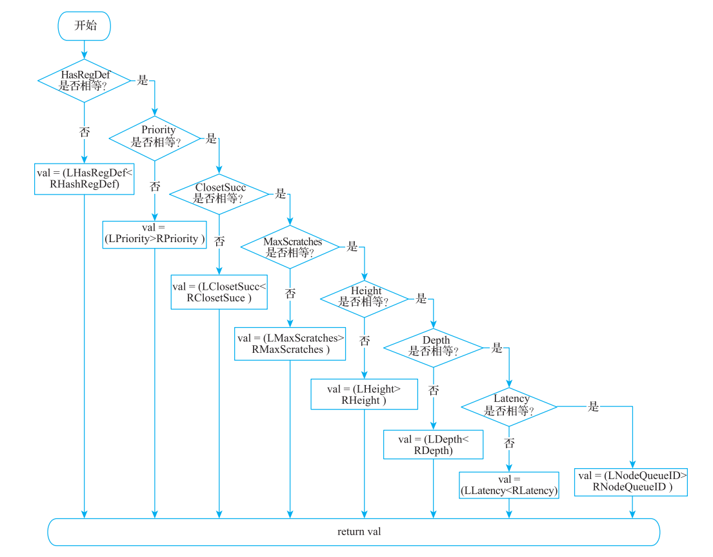

**图 8-22 BURR List 算法指令优先级选择**

### 8.4.3 示例分析

仍然以代码清单 8-1 为例来介绍 BURR List 调度器如何调度指令序列，SUnit 对应的依赖图如图 8-9 所示。BURR List 调度器用 Sequence 数组存放调度的指令结果，用优先级队列 AvailableQueue 来存放入度为 0 且可以被调度的执行序列，用 BURRSort 函数从AvailableQueue 中选出优先级最高的 SUnit。调度过程描述如下。

从 Graph Root 开始，依次调度 SU[0]、SU[1]，在这个过程中，AvailableQueue 始终最多只有一个元素，不需要做比较、选择。SU[1] 被调度后，AvailableQueue 会存入 SU[2] 和SU[13]。调度 SU[1] 后，BURR List 调度器的运行结果如表 8-12 所示。

**表 8-12 调度 SU[1] 后 BURR List 调度器的运行结果**

调度器数据结构 数据结构中的元素

AvailableQueue SU[2],SU[13]

Sequence SU[0],SU[1]

因为 AvailableQueue 中有多个 SU 节点，需要选择最优节点进行调度，所以比较 SU[2]和 SU[13] 的优先级，SU[13] 的操作码是 TokenFactor，故优先选择 SU[13]。将入度为 0 的SU[17]、SU[16]、SU[14] 存入 AvailableQueue 中。调度 SU[13] 后，BURR List 调度器的运行结果如表 8-13 所示。

**表 8-13 调度 SU[13] 后 BURR List 调度器的运行结果**

调度器数据结构 数据结构中的元素

AvailableQueue SU[2],SU[17],SU[16],SU[14]

Sequence SU[0],SU[1],SU[13]

同样，需要比较 AvailableQueue 中的 4 个 SUnit 的优先级。SU[2] 定义了物理寄存器， 故 SU[2] 优 先 级 最 高， 将 SU[2] 存 入 Sequence。 继 续 比 较 剩 余 的 3 个 SUnit 的 优先级，SU[16] 的 Depth 值最大，故优先调度 SU[16]。此时，SU[3] 入度为 0，将其存入AvailableQueue。得到的结果如表 8-14 所示。

**表 8-14 调度 SU[2]、SU[16] 后 BURR List 调度器的运行结果**

调度器数据结构 数据结构中的元素

AvailableQueue SU[17],SU[14],SU[3]

Sequence SU[0],SU[1],SU[13],SU[2],SU[16]

再次比较 AvailableQueue 中 3 个 SUnit 的优先级，SU[17] 的 NodeQueueID 小于 SU[14]且 Priority 值小于 SU[3]，故优先调度 SU[17]。继续比较 SU[14] 和 SU[3]，SU[14] 的优先级较小，所以调度 SU[14]，并将入度为 0 的 SU[15] 存入 AvailableQueue 中。调度 SU[17]、

SU[14] 后，BURR List 调度器的运行结果如表 8-15 所示。

**表 8-15 调度 SU[17]、SU[14] 后 BURR List 调度器的运行结果**

调度器数据结构 数据结构中的元素

AvailableQueue SU[3],SU[15]

Sequence SU[0],SU[1],SU[13],SU[2],SU[16],SU[17],SU[14]

继续比较 SU[3] 和 SU[15]，SU[15] 的 Priority 的值较小，依次调度 SU[15]、SU[3]，因 为 SU[11] 的 入 度 为 0， 所 以 存 入 AvailableQueue 中。 调 度 SU[15]、SU[3] 后，BURR List 调度器的运行结果如表 8-16 所示。

**表 8-16 调度 SU[15]、SU[3] 后 BURR List 调度器的运行结果**

调度器数据结构 数据结构中的元素

AvailableQueue SU[11]

Sequence SU[0],SU[1],SU[13],SU[2],SU[16],SU[17],SU[14],SU[15],SU[3]

此时，SU[3]、SU[11]、SU[4] 构成了物理寄存器依赖，采用 Fast 调度器中的 CopyAnd- MoveSuccessors 方法来处理。将 SU[4] 复制出一份，得到 SU[4]-clone，将依赖图构造成

**图 8-17 所 示 的 形 态， 依 次 调 度 SU[4]-clone、SU[11]、SU[12]， 其 中 入 度 为 0 的 SU[4]、**

SU[10] 会 存 入 AvailableQueue 中。 重 复 SU[4] 并 调 度 SU[4]-clone、SU[11]、SU[12] 后，BURR List 调度器的运行结果如表 8-17 所示。

**表 8-17 复制 SU[4] 并调度 SU[4]-clone、SU[11]、SU[12] 后 BURR List 调度器的运行结果**

调度器数据结构 数据结构中的元素

AvailableQueue SU[4],SU[10]

SU[0],SU[1],SU[13],SU[2],SU[16],SU[17],SU[14],SU[15],SU[3],SU[4]-

Sequence

clone,SU[11],SU[12]

SU[4] 定义了物理寄存器，优先调度 SU[4]，将入度为 0 的 SU[7] 存入 AvailableQueue中。调度 SU[4] 后，BURR List 调度器的运行结果如表 8-18 所示。

**表 8-18 调度 SU[4] 后 BURR List 调度器的运行结果**

调度器数据结构 数据结构中的元素

AvailableQueue SU[10],SU[7]

SU[0],SU[1],SU[13],SU[2],SU[16],SU[17],SU[14],SU[15],SU[3],SU[4]-

Sequence

clone,SU[11],SU[12],SU[4]

因为 SU[10] 的 Priority 值较小，因此先调度 SU[10]，然后调度 SU[7]，同时将入度为0 的 SU[9] 和 SU[8] 存入 AvailableQueue 中。调度 SU[10]、SU[7] 后，BURR List 调度器的

运行结果如表 8-19 所示。

**表 8-19 调度 SU[10]、SU[7] 后，BURR List 调度器的运行结果**

调度器数据结构 数据结构中的元素

AvailableQueue SU[9],SU[8]

SU[0],SU[1],SU[13],SU[2],SU[16],SU[17],SU[14],SU[15],SU[3],SU[4]-clone,SU[11],

Sequence

SU[12],SU[4],SU[10],SU[7]

由于 SU[8] 中含有物理寄存器的定义，故优先调度 SU[8]，并将入度为 0 的 SU[5] 存入AvailableQueue 中。调度 SU[8] 后，BURR List 调度器的运行结果如表 8-20 所示。

**表 8-20 调度 SU[8] 后 BURR List 调度器的运行结果**

调度器数据结构 数据结构中的元素

AvailableQueue SU[9],SU[5]

SU[0],SU[1],SU[13],SU[2],SU[16],SU[17],SU[14],SU[15],SU[3],SU[4]-clone,SU[11],

Sequence

SU[12],SU[4],SU[10],SU[7],SU[8]

SU[9] 的优先级较小要先调度，用同样的方法调度 SU[5]、SU[6]，所有节点全部调度完毕，得到的运行结果如表 8-21 所示。

**表 8-21 全部节点调度后，BURR List 调度器的运行结果**

调度器数据结构 数据结构中的元素

AvailableQueue

SU[0],SU[1],SU[13],SU[2],SU[16],SU[17],SU[14],SU[15],SU[3],SU[4]-clone,SU[11],

Sequence

SU[12],SU[4],SU[10],SU[7],SU[8],SU[9],SU[5],SU[6]

将 Sequence 中 SU 节点换成 SDNode 并倒序后得到指令的执行顺序如表 8-22 所示，其中 t12、t21、t43 节点调度顺序受到调度器的多种启发式因素影响而发生了变化。

**表 8-22 使用 BURR List 调度前后的效果比较**

调度前 调度后

t0: ch = EntryToken t0: ch = EntryToken

t12：i64，ch = CopyFromReg t0，Register：i64 %24 t2：i64，ch = CopyFromReg t0，Register：i64 %35

t2：i64，ch = CopyFromReg t0，Register：i64 %35 t5 ：i64，i32 = SAR64ri exact t2，TargetConstant ：

t5：i64，i32 = SAR64ri exact t2，TargetConstant：i8<3> i8<3>

t8：i64 = MOV32ri64 TargetConstant：i64<1> t8：i64 = MOV32ri64 TargetConstant：i64<1>

t59 ：i64，i32 = SUB64ri8 t5，TargetConstant ： t59 ：i64，i32 = SUB64ri8 t5，TargetConstant ：

i64<2> i64<2>

t67：ch，glue = CopyToReg t0，Register：i32 $eflags， t67：ch，glue = CopyToReg t0，Register：i32 $eflags，

t59：1 t59：1

t62 ：i64 = CMOV64rr t8，t5，TargetConstant ： t62 ：i64 = CMOV64rr t8，t5，TargetConstant ：

i8<3>，t67：1 i8<3>，t67：1

（续）

调度前 调度后

t46：i64，i32 = ADD64rr t62，t5 t12：i64，ch = CopyFromReg t0，Register：i64 %24

t49：i64，i32 = SUB64rr，t46，t12 t46：i64，i32 = ADD64rr t62，t5

t66：ch，glue = CopyToReg t0，Register：i32 $eflags， t49：i64，i32 = SUB64rr，t46，t12

t49：1 t66：ch，glue = CopyToReg t0，Register：i32 $eflags，

t52 ：i64 = CMOV64rr t46，t12，TargetConstant ： t49：1

i8<7>，t66：1 t52 ：i64 = CMOV64rr t46，t12，TargetConstant ：

t65：ch，glue = CopyToReg t0，Register：i32 $eflags， i8<7>，t66：1

t46：1 t46：i64，i32 = ADD64rr t62，t5

t48 ：i64 = CMOV64rr t52，t12，TargetConstant ： t65：ch，glue = CopyToReg t0，Register：i32 $eflags，

i8<2>，t65：1 t46：1

t7：ch = CopyToReg t0，Register：i64 %36，t5 t48 ：i64 = CMOV64rr t52，t12，TargetConstant ：

t20：ch = CopyToReg t0，Register：i64 %37，t48 i8<2>，t65：1

t21 ：i64 = SUBREG_TO_REG，TargetConstant ： t21 ：i64 = SUBREG_TO_REG，TargetConstant ：

i64<0>，MOV32r0 ：i32，i32，TargetConstant ： i64<0>，MOV32r0 ：i32，i32，TargetConstant ：

i32<6> i32<6>

t25：ch = CopyToReg t0，Register：i64 %137，t21 t25：ch = CopyToReg t0，Register：i64 %137，t21

t27：ch = TokenFactor t7，t20，t25 t7：ch = CopyToReg t0，Register：i64 %36，t5

t43：i32 = TEST64rr t48，t48 t20：ch = CopyToReg t0，Register：i64 %37，t48

t64：ch，glue = CopyToReg t27，Register：i32 $eflags， t43：i32 = TEST64rr t48，t48

t43 t27：ch = TokenFactor t7，t20，t25

t45 ：ch = JCC_1 BasicBlock ：ch<_ZNst12_Vector_ t64：ch，glue = CopyToReg t27，Register：i32 $eflags，

allocate.i.i.i 0x55556eb245c0>，TargetConstant ： t43

i8<4>，t64，t64：1 t45 ：ch = JCC_1 BasicBlock ：ch<_ZNst12_Vector_

t30：ch = JMP_1 BasicBlock：ch<_ZNst16allocator_ allocate.i.i.i 0x55556eb245c0>，TargetConstant ：i8<4>，

exit.i.i.i.i 0x55556eb244c0>，t45 t64，t64：1

t30：ch = JMP_1 BasicBlock：ch<_ZNst16allocator_

exit.i.i.i.i 0x55556eb244c0>，t45

注 这里并没有给出调度前后直观的性能数据，8.11 节会统一介绍不同调度算法的性能

意

数据。

## 8.5 Source List 调度器

Source List 调度器和 BURR List 调度器共用 ScheduleDAGRRList 类。它和 BURR List调度器类似，仅在计算 AvailableQueue 中可调度的 SUnit 的优先级时略有差异。Source List调度器会优先比较与 SUnit 节点对应的 LLVM IR 的顺序，优先调度在源码中比较靠前的指令（因此被称为 Source List）。如果无法比较出优先级，它会继续使用 BURR List 调度器的算法 BURRSort 来选择优先级高的指令。由于该算法和 BURR List 调度器中的基本一样，因此这里不再展开介绍。

LLVM 通过选项 -pre-RA-sched=source 来设置使用 Source List 调度器。

## 8.6 Hybrid List 调度器

Hybrid List 调度器和 BURR List 调度器共用 ScheduleDAGRRList 类。它也和 BURR List 调度器类似，区别在于计算 AvailableQueue 中可调度的 SUnit 的优先级的方法有差异。它会先比较 SUnit 节点是否会造成比较高的寄存器压力，自底向上地优先选择没有造成高寄存器压力的指令。如果无法比较出优先级，只有双方都未触发高寄存器压力时才调用 `BUCompareLatency(..., checkPref=true)`，综合就绪状态、路径与时延比较，不能简化为只选 Latency 较小的指令；如果仍然无法区分优先级，它会继续使用 BURR List 调度器的算法BURRSort 来选择优先级高的指令。由于该算法和 BURR List 调度器中的基本一样，因此不再展开介绍。

LLVM 通过选项 -pre-RA-sched=list-hybrid 来使能 Hybrid List 调度器。

## 8.7 Pre-RA-MISched 调度器

8.2 节～8.6 节介绍的调度器都是基于 SelectionDAG 进行指令调度的，从本节开始介绍的调度器都是基于 MIR 指令进行调度的。Pre-RA-MISched 调度器支持自顶向下、自底向上以及双向拓扑三种调度顺序，本节介绍的示例是按照自底向上进行拓扑排序的。

LLVM 通过选项 -enable-misched 来使能 Pre-RA-MISched 调度器，该调度器由 Schedule- DAGMILive 类实现。

### 8.7.1 Pre-RA-MISched 调度器实现

Pre RA 指的是在寄存器分配前进行调度，此时，MIR 中包含了虚拟寄存器和物理寄存器。这个阶段的指令调度，在特定的场景下（调度指令数量至少超过可分配寄存器数量的50%）会优先考虑调度后带来的寄存器压力，要尽量减小寄存器分配的压力。此外，还要考虑指令并行的性能（此时会用到 8.4.2 节提到的 Latency 属性，本节会详细介绍如何基于 TD文件的描述计算 MIR 指令的时延）。需要注意的是，和基于 SelectionDAG 实现的调度算法不同，基于 MIR 的调度算法不再以基本块为调度单元，而是以调度区域为调度单元，通常一个基本块可以划分为一个或多个调度区域。

调度过程还是基于拓扑排序完成的。在进行拓扑排序时，入度为 0 的可调度指令也不是全部存入 AvailableQueue 中，会通过 Use-Def 依赖边的时延计算各个节点最快执行需要等待的指令周期。如果这个时延超过一定的阈值，也就说明该指令的 Stall Cycles 比较大，会将它存入 Pending 队列中。若候选的就绪周期不大于当前调度周期且无相关 hazard，则放入 AvailableQueue。这里的阈值对应调度边界 CurrCycle；其推进还考虑发射宽度、微操作、资源和 hazard，并非节点时延的简单累加。调度算法会遍历 Pending 序列中的指令，把时延小于当前阈值的指令移到 AvailableQueue 中，然后遍历 AvailableQueue 中所有的指令，根据启发式的影响因素，选择优先级最高的指令。

> `SchedBoundary::releaseNode / releasePending` 判断的是候选 ReadyCycle 相对于 CurrCycle 及 hazard / buffer 状态是否可调度。CurrCycle 是模型中的调度周期，并不总是“已调度指令条数”或全部节点 Latency 的简单总和。

### 8.7.2 调度区域的划分

调度区域的划分就是按照顺序遍历基本块的指令，遇到边界指令则生成一个新的调度区域。一个基本块可以包含多个调度区域，如

**图 8-23 所示。**

读者可能有疑惑：为什么调度算法使用调度区域而不是基本块来调度指令？因为一些指令会给程序执行时延、寄存器压力等带来不确定性，所以要将这些指令识别出来，作为调度边界，从而形成调度区域。调度区域的边界涉及 3 类指令。

1）基 本 块 的 边 界 指 令， 比 如 ret、branch、jmp 等。

2）函数调用指令，比如 call，因为指令调度不能跨函数调用。

3）修改堆栈指针的指令。 图 8-23 调度区域的划分示意图

### 8.7.3 影响 Pre-RA-MISched 调度器的关键因素

在 Pre-RA-MISched 调度器中影响优先级的因素包括指令节点是否包含物理寄存器（BiasPhysReg）、指令的时延、寄存器压力、停滞周期（Stall Cycles）等。

1）物理寄存器：根据指令是否包含物理寄存器来设置指令调度的优先级，目的是获得更小的物理寄存器活跃区间。

2）时延：一般使用 SUnit 节点的 Depth 和 Height 属性表示（参见 8.4.1 节）。SUnit 节点中的 SDNode 指令的时延多数默认为 1，而 SUnit 节点中的 MIR 指令的时延需要根据 TD文件的描述计算得到，8.7.4 节会详细介绍计算方法。

3）寄存器压力：每个 SUnit 节点都有 Pressure Diff 属性，以描述当前指令被调度时产生的寄存器压力变化。基于 Pressure Diff 通过 Excess、CriticalMax 和 CurrentMax 来描述指令被调度后产生的寄存器压力的变化。8.7.5 节会详细介绍寄存器压力的计算过程。

4）停滞周期：候选指令相对当前调度边界的就绪周期及资源限制导致的等待，可来自数据依赖、执行资源等，不限于访存，也不等于内存访问自身的总时延。

### 8.7.4 MIR 指令时延的计算

LLVM 指令调度里的时延有多种计算方式，总结起来大致分为：基于 SUnit 节点的时延计算和基于 Use-Def 依赖边的时延计算。前者一般用于 SDNode 或 MIR 生成 SUnit 节点的时候，它在一定程度上反映了指令执行消耗的时钟周期；后者用于构建 SUnit 节点的依赖关系的时候，会计算有 Use-Def 依赖边的调度时延，它反映了数据从 Def 节点流向 Use 节

点所需的时钟周期。我们分别来看看这两种场景下的时延计算过程。

1. 基于 SUnit 节点的时延计算

LLVM 实现了两种 SUnit 节点的时延计算方法，分别为基于指令行程模型的计算方法（InstrItinerary）以及基于指令调度模型的计算方法（MCSchedModel）。

（1）指令行程模型

指令的行程模型信息由 TD 文件描述，例如有 TD 代码片段如代码清单 8-2 所示。

**代码清单 8-2 指令行程模型的 TD 描述**

```text
// 目标描述片段:II_CSRrr、ISSUE、ALU、CSR 需由目标定义。
def : InstrItinData<II_CSRrr,
    [InstrStage<1, [ISSUE], 0>,
     InstrStage<1, [ALU], 2>,
     InstrStage<1, [CSR], 0>],
    [4, 4]>;
```

清单 8-2 描述三个 stage，使用 ISSUE、ALU、CSR 功能单元。

三个 stage 各占用 1 个周期。`TimeInc` 是“当前 stage 的开始到下一 stage 开始”的间隔：ISSUE 在 0 开始，ALU 也在 0 开始（TimeInc=0），CSR 在 2 开始（ALU 的 TimeInc=2），于 3 结束。因此 stage 行程长度为 3，2 不是在 ALU 执行结束后额外等待的周期数。OperandCycles 的 [4,4] 是另一组操作数使用 / 产生周期，不能与 stage 行程长度混为一个字段。图 8-24 应按上述时间轴理解。

（2）指令调度模型

指令调度模型的信息也由 TD 文件描述的，例如有 TD 代码片段如代码清单 8-3 所示，它描述调度写类型（SchedWrite）的结果可用时延和所占用的处理器资源。ALUOut / MULOut 是写类型，UnitALU 才是资源，二者不等同。

> 清单 8-2、8-3、8-5 是教学性目标描述片段，需在完整目标中定义所引用的 InstrItinClass、SchedWrite、ProcResource，并给指令配置 Itinerary / SchedRW。清单 8-3 只定义 EXIn 并不会自动影响 MUL；必须让 MUL 的相关读操作引用 EXIn。

**代码清单 8-3 指令调度模型的 TD 描述**

```text
def  :  WriteRes<ALUOut,    [UnitALU]>    {  let  Latency = 2; }
def  :  WriteRes<MULOut,    [UnitALU]>    {  let  Latency = 4; }
def  EXIn  :  SchedReadAdvance<1>;
```

清单 8-3 描述 ALUOut 写类型的 Latency 为 2，MULOut 写类型的 Latency 为 4。

LLVM 按选中的调度类获取写结果时延，通常取所有写延迟的最大值作为指令时延。仅当乘法指令的 SchedRW 使用 MULOut 时，才可从此示例得到乘法的模型时延为 4；不能把写结果类型称作独立硬件执行单元。

2. 基于 Use-Def 依赖边的时延计算

和 SUnit 节点时延的计算方式一样，基于 Use-Def 依赖边的时延计算方法也分为指令行程模型计算方法以及指令调度模型计算方法。

（1）指令行程模型

根据 TD 文件中描述的指令行程信息，获取 Def 寄存器的 DefCycle 属性和 Use 寄存器的 UseCycle 属性，常见情况下计算 `max(0, DefCycle - UseCycle + 1)` 得到操作数依赖时延，并考虑 bypass 等目标修正。例如有如代码清

单 8-4 所示的代码片段。

**代码清单 8-4 指令行程模型示例**

```text
ADD  r3,  r3,  r2
MUL  r4,  r3,  r2
```

以寄存器 r3 为例，Def 和 Use 指令分别对应 ADD 和 MUL 指令，因此 ADD、MUL 存在依赖关系。另外，ADD 和 MUL 都是 TD 中的 ALUrr 定义的指令。其中，ALUrr 指令行程信息的 TD 描述如代码清单 8-5 所示。

**代码清单 8-5 ALUrr 指令行程信息的 TD 描述**

```text
// II_ALUrr、ISSUE、ALU 由目标定义,ADD 与 MUL 的 Itinerary 指向 II_ALUrr。
def : InstrItinData<II_ALUrr,
    [InstrStage<1, [ISSUE]>, InstrStage<1, [ALU]>],
    [2, 2, 2]>;
```

在代码清单 8-5 中，数组 [2, 2, 2] 描述了各个寄存器索引对应的时钟周期，ADD 指令中的 r3 对应的是数组中索引为 0 的元素，即 DefCycles = 2，MUL 指令中 r3 对应数组中索引为 1 的元素，即 UseCycles = 2， 所以 ADD 和 MUL 的依赖边的时延为 2 – 2 + 1 = 1。

（2）指令调度模型

指令调度模型的计算方法为，Def 操作数写延迟减去匹配该写资源和 Use 索引的 ReadAdvance，必要时向 0 截断。其中，ReadAdvance 可以理解为 Use 指令何时需要 Def 指令的输出，ADD 和MUL 两条指令的调度模型信息的 TD 描述如代码清单 8-3 所示。以代码清单 8-4 为例，ADD 和 MUL 通过 r3 存在依赖关系。Def 指令 ADD 所需的 WriteRes 的时延为 2，MUL 指令的 ReadAdvance 的时延为 1（来自代码清单 8-3 中的 EXIn），因此它们的依赖边时延为2 – 1 = 1。

### 8.7.5 寄存器压力的计算

寄存器压力的计算主要由 RegPressureTracker 类来实现，它的计算过程分别实现在调度算法中的两个阶段，即构造 SUnit 节点的依赖图和调度指令。接下来我们将详细介绍在这两个阶段如何计算寄存器压力。

1. 构建依赖图并计算相关属性

构造依赖图时按照自底向上的顺序计算每条指令被调度时造成的寄存器压力变化值（即 PressureDiff）、寄存器压力（CurrentSetPressure）以及调度到当前指令时出现过的最大寄存器压力（MaxSetPressure）。下面以代码清单 8-6 为例详细介绍 PressureDiff、CurrentSetPressure、MaxSetPressure 是如何计算的。

**代码清单 8-6 寄存器压力示例源码（8-6.cpp）**

```text
void test(int a, int *x, int *y) {
    int b = a * x[0] + y[0];
    int c = b + x[1];
    int d = c * y[1];
    y[2] = b + c + d;
}
```

通过 clang++ --target=riscv32-unknown-elf -march=rv32im -mabi=ilp32 -O2 -S -emit-llvm 8-6.cpp -o 8-6.ll 命令，可先生成代码清单 8-6 对应的 LLVM IR；再从后端的 Pre-RA-MISched 入口观察 MIR，如代码清单 8-7 所示。

> 上面的 Clang 命令只生成 LLVM IR。后续可用 `llc -mtriple=riscv32-unknown-elf -mattr=+m -enable-misched -stop-before=machine-scheduler 8-6.ll -o 8-7.mir` 观察真实 MIR。本书原清单写的是 RV32，却使用 RV64 专属 ADDW / MULW；以下已按 RV32 改为 ADD / MUL。SU 标签与省略的 MIR 头、内存操作数等仍是解释性标注，不是完整 MIR 文件。本次未运行命令，具体编号和调度模型参数待验证。

**代码清单 8-7 与代码清单 8-6 对应的 MIR（8-7.mir）**

```text
bb.0.entry
    liveins: $x10, $x11, $x12
    SU[0]    %2:gpr = COPY $x12
    SU[1]    %1:gpr = COPY $x11
    SU[2]    %0:gpr = COPY $x10
    SU[3]    %3:gpr = LW %1:gpr, 0
    SU[4]    %4:gpr = MUL %3:gpr, %0:gpr
    SU[5]    %5:gpr = LW %2:gpr, 0
    SU[6]    %6:gpr = ADD %4:gpr, %5:gpr
    SU[7]    %7:gpr = LW %1:gpr, 4
    SU[8]    %8:gpr = ADD %6:gpr, %7:gpr
    SU[9]    %9:gpr = LW %2:gpr, 4
    SU[10]   %10:gpr = MUL %8:gpr, %9:gpr
    SU[11]   %11:gpr = ADD %8:gpr, %6:gpr
    SU[12]   %12:gpr = ADD %11:gpr, %10:gpr
    SU[13]   SW %12:gpr, %2:gpr, 8
            PseudoRET
```

这是 RV32 的示意指令序列。寄存器压力按照 target 定义的 pressure set 统计，不等同于 RegisterClass 个数，一个寄存器可能影响多个 pressure set。`CurrentSetPressure` / `MaxSetPressure` 由实际 pressure set 数量决定；LLVM 18 的 `PressureDiff` 是最多 16 个条目的稀疏变化摘要，不是同样长度的稠密数组。寄存器压力 weight 由目标寄存器单位及类权重决定，不能通用地认定 64 位一定等于两个 32 位权重。下面保留原书 11 列作为当时配置的教学投影，仅演示自底向上的活跃集变化。

首先看第一条指令 SU[13]：SW %12:gpr, %2:gpr, 8。

该指令没有 Def 寄存器，有两个 Use 虚拟寄存器，它们的寄存器压力变化值 Weight都为 1，只影响 GPR 类型的寄存器，因此所有寄存器造成的压力影响值之和（用 PDiff 表示）PDiff[GPR] = 1 + 1 = 2。每个寄存器的当前压力值○一CurrentSetPressure[GPR] = Current- SetPressure[GPR] + PDiff[GPR]，故 CurrentSetPressure[GPR] 为 2。最大寄存器压力○二MaxSet-

○一 表中用 CurrenSet 表示。

○二 表中用 MaxSet 表示。

PdiffPressure[GPR] = max(MaxSetPressure[GPR], CurrentSetPressure[GPR])，因此MaxSetPressure[GPR] 也为 2。处理 SU[13] 后各寄存器的压力值结果如表 8-23 所示。

> 表 8-23～8-29 的列名与数字保留原书模型用于演算；LLVM 18 当前 pressure-set 列表和限制值需从选定子目标生成后核对。`ScheduleDAGMILive::updatePressureDiffs` 在活跃性变化时会更新候选摘要，不能将静态 PDiff 始终当作真实 CurrentSet 增量。

**表 8-23 处理 SU[13] 后 11 种寄存器类型的压力值、当前值、最大值**

寄存器

压力指标 FPR- VRM8-

GPRX0 SP VCSR GPRC VMV0 GPRTC FPR16 GPR VM

32C NoV0

PDiff 0 0 0 0 0 0 0 0 0 2 0

CurrentSet 0 0 0 0 0 0 0 0 0 2 0

MaxSet 0 0 0 0 0 0 0 0 0 2 0

依此类推，第二条指令 SU[12] ：%12:gpr = ADD %11:gpr, %10:gpr。%12 在此处定义，其 Weight 值为 –1。新增两个 Use 寄存器（%11 和 %10），其 Weight 值都为 1。计算PDiff[GPR] = 1 + 1 – 1 = 1，CurrentSetPressure[GPR] = 3，MaxSetPressure[GPR] = 3，得到结果如表 8-24 所示。

**表 8-24 处理 SU[12] 后 11 种寄存器类型的压力值、当前值、最大值**

寄存器

压力指标 FPR- VRM8-

GPRX0 SP VCSR GPRC VMV0 GPRTC FPR16 GPR VM

32C NoV0

PDiff 0 0 0 0 0 0 0 0 0 1 0

CurrentSet 0 0 0 0 0 0 0 0 0 3 0

MaxSet 0 0 0 0 0 0 0 0 0 3 0

同样处理指令 SU[11]：%11:gpr = ADD %8:gpr, %6:gpr，得到的结果如表 8-25 所示。

**表 8-25 处理 SU[11] 后 11 种寄存器类型的压力值、当前值、最大值**

寄存器

压力指标 FPR- VRM8-

GPRX0 SP VCSR GPRC VMV0 GPRTC FPR16 GPR VM

32C NoV0

PDiff 0 0 0 0 0 0 0 0 0 1 0

CurrentSet 0 0 0 0 0 0 0 0 0 4 0

MaxSet 0 0 0 0 0 0 0 0 0 4 0

接下来处理指令 SU[10] ：%10:gpr = MUL %8:gpr, %9:gpr。寄存器 %8 和上条指令中的 %8 具有相同的 Def，它作为 Use 寄存器时对 CurrentSetPressure 和 MaxSetPressure 的影响已经包含在上条指令中了（也就是说 %8 不产生新的寄存器活跃区间），只有 %10 和 %9会影响 CurrentSetPressure 和 MaxSetPressure。这里值得注意的是，PDiff 描述的是当前指

令导致的寄存器压力变化情况，所以它的计算只受当前指令影响。该指令使用 %8、%9 增加了寄存器压力，定义 %10 减小了寄存器压力，所以得到的 PDiff 为 1。处理 SU[10] 后各寄存器类型的压力值结果如表 8-26 所示。

**表 8-26 处理 SU[10] 后 11 种寄存器类型的压力值、当前值、最大值**

寄存器

压力指标 FPR- VRM8-

GPRX0 SP VCSR GPRC VMV0 GPRTC FPR16 GPR VM

32C NoV0

PDiff 0 0 0 0 0 0 0 0 0 1 0

CurrentSet 0 0 0 0 0 0 0 0 0 4 0

MaxSet 0 0 0 0 0 0 0 0 0 4 0

接下来处理 SU[9]：%9:gpr = LW %2:gpr, 4。指令使用的 %2 对 CurrentSetPressure 和MaxSetPressure 的影响已经包含在第一条指令（SU[13]）计入对 CurrentSetPressure 和MaxSetPressure 的影响。该指令定义了 %9，所以 CurrentSetPressure 需要减 1。该指令分别定义和使用了相同数量的寄存器，故 PDiff 为 0。处理 SU[9] 后各寄存器的压力值结果如表 8-27 所示。

**表 8-27 处理 SU[9] 后 11 种寄存器类型的压力值、当前值、最大值**

寄存器

压力指标 FPR- VRM8-

GPRX0 SP VCSR GPRC VMV0 GPRTC FPR16 GPR VM

32C NoV0

PDiff 0 0 0 0 0 0 0 0 0 0 0

CurrentSet 0 0 0 0 0 0 0 0 0 3 0

MaxSet 0 0 0 0 0 0 0 0 0 4 0

用同样的方式依次处理其他指令，最后得到的结果如表 8-28 所示。

**表 8-28 处理完所有指令后，11 种寄存器类型的压力值、当前值、最大值**

寄存器

压力指标 FPR- VRM8-

GPRX0 SP VCSR GPRC VMV0 GPRTC FPR16 GPR VM

32C NoV0

PDiff 0 0 0 0 1 0 1 0 0 0 0

CurrentSet 0 0 0 0 3 0 3 0 0 3 0

MaxSet 0 0 0 0 3 0 3 0 0 4 0

至此，所有寄存器的压力变化值都计算完成了。在这个过程还需要处理当前调度区间的 LiveIn 和 LiveOut 寄存器集合对压力值的影响。比如我们按照自底向上的顺序调度指令时，需要处理 LiveOut 寄存器的影响，它们会作为 Use 寄存器而计算初始化的压力值；按

照自顶向下的顺序调度指令时，则需要将 LiveIn 寄存器作为 Use 寄存器计算初始化的压力值。当前的示例中的 LiveOut 恰好为空，我们就不在此具体叙述了，过程和上述的指令压力值计算类似。

压力阈值由目标寄存器信息和 RegisterClassInfo 提供，并考虑保留寄存器等限制，不固定为表 8-29 的旧值。`RegionCriticalPSets` 是稀疏列表：只加入该调度区间原始 MaxSetPressure 超过 limit 的 pressure set，随后跟踪这些集合的最大压力；并非长度 11 的“超载量数组”。本例假设没有超限集合时，该列表为空，原表的全 0 一行只表示无超限。

**表 8-29 寄存器压力参考阈值**

寄存器

压力指标 FPR- VRM8-

GPRX0 SP VCSR GPRC VMV0 GPRTC FPR16 GPR VM

32C NoV0

Limit 2 2 3 8 8 8 16 24 32 32 32

MaxSet 0 0 0 0 3 0 3 0 0 4 0

RegionCriticalPSet 0 0 0 0 0 0 0 0 0 0 0

接下来将介绍如何使用本节计算的每条指令的寄存器压力变化值以及 RegionCriticalPSet进行指令调度。

2. 指令调度

在自底向上调度依赖图中节点，如果 AvailableQueue 中出现多个可调度的节点，寄存器压力将作为计算指令优先级的重要因素。注意，每个节点被调度后，依然需要计算当前调度过程中的 CurrentSet 和 MaxSet 的变化，计算过程和前面介绍的方法类似。LLVM 定义了如下 3 种指标来描述 MIR 指令被调度后对寄存器压力的影响。

1）RegPressureDelta.Excess ：用于描述该指令被调度后，CurrentSet 是否超出了参考阈值。

2）RegPressureDelta.CriticalMax ：用于描述该指令被调度后，MaxSet 是否超出了RegionCriticalPSet 相关索引对应的值。

3）RegPressureDelta.CurrentMax ：用于描述该指令调度后是否超出了默认顺序遍历过程中出现的最大的寄存器压力值。

### 8.7.6 示例分析

Pre-RA-MISched 算法按照 BiasPhysReg、RegPressure、停滞周期、指令时延依次比较AvailableQueue 中可调度节点的优先级，选择优先级最高的节点。我们依然以代码清单 8-7

为例来演示整个调度区间的指令经过该调度算法处理后，如何形成新的指令序列。调度过程仍然使用 AvailableQueue 存储当前可调度的节点，并用 Pending 存储时延超过阈值的可调度节点，用 CurCycle 来表示当前的阈值。指令调度步骤如下。

1）构造依赖图，过程和 8.3.1 节介绍的一样，得到结果如图 8-25 所示。

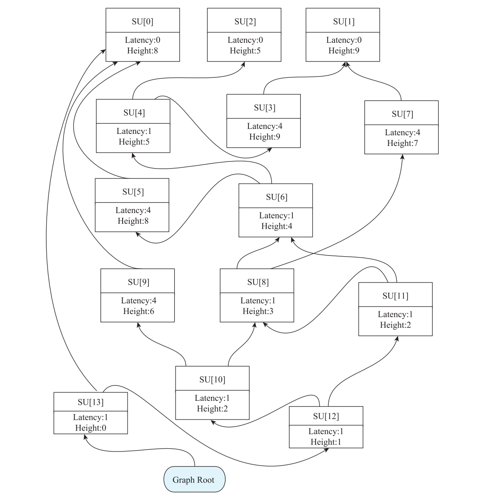

**图 8-25 基于 SUnit 构造依赖图**

2） 从 Graph Root 出 发， 按 照 拓 扑 排 序 的 方 式， 依 次 调 度 入 度 为 0 的 节 点 SU[13]、

SU[12]。此时 SU[10] 和 SU[11] 入度为 0，阈值 CurCycle 更新为 2。SU[10] 和 SU[11] 的调度时延的计算方法为：SU[12] 的调度时延 1 加上 SU[12] 的节点时延 1（图 8-25 节点中的 Latency的值），等于 2。没有超过阈值，因此存入 AvailableQueue。得到的运行结果如表 8-30 所示。

**表 8-30 调度 SU[13]、SU[12] 后的运行结果**

调度器数据结构 数据结构中的元素

result SU[13],SU[12]

AvailableQueue SU[10],SU[11]

Pending

CurCycle 2

3）此时，AvailableQueue 中存在 SU[10] 和 SU[11] 两个节点，比较 SU[10] 和 SU[11]的优先级，它们的 BiasPhysReg、RegPressure、停滞周期、调度时延都相等，因此按照指令顺序依次调度 SU[11]、SU[10]，并更新阈值为 4。此时 SU[8]、SU[9] 入度为 0，SU[8] 的调度时延为 SU[10] 的调度时延 3 加上 SU[10] 的节点时延 1，等于 4，没有超过阈值，存入AvailableQueue。同理，SU[9] 的调度时延为 7，超过阈值意味着该指令存在较大的停滞周期，因此降低它的优先级，将它存入 Pending。得到的运行结果如表 8-31 所示。

**表 8-31 调度 SU[11]、SU[10] 后的运行结果**

调度器数据结构 数据结构中的元素

result SU[13],SU[12],SU[11],SU[10]

AvailableQueue SU[8]

Pending SU[9]

CurCycle 4

4）因为此时 SU[9] 的调度时延为 7，超过时延阈值 4，因此优先调度 AvailableQueue中的 SU[8]，并更新阈值为 5。此时，SU[6] 和 SU[7] 入度为 0。计算得到 SU[6] 的调度时延为 5，SU[7] 的调度时延为 8，所以将 SU[6] 存入 AvailableQueue，将 SU[7] 存入 Pending中。得到的运行结果如表 8-32 所示。

**表 8-32 调度 SU[8] 后的运行结果**

调度器数据结构 数据结构中的元素

result SU[13],SU[12],SU[11],SU[10],SU[8]

AvailableQueue SU[6]

Pending SU[9],SU[7]

CurCycle 5

5）此时，Pending 中所有节点的调度时延都超过阈值 5，所以先调度 SU[6]，阈值更新为 6。SU[4] 与 SU[5] 的调度时延分别为 6 和 9。将 SU[4] 存入 AvailableQueue，将 SU[5]存入 Pending。得到的运行结果如表 8-33 所示。

**表 8-33 调度 SU[6] 后的运行结果**

调度器数据结构 数据结构中的元素

result SU[13],SU[12],SU[11],SU[10],SU[8],SU[6]

AvailableQueue SU[4]

Pending SU[9],SU[7],SU[5]

CurCycle 6

6）此时，Pending 中所有节点的调度时延都超过阈值 6，所以先调度 SU[4]，阈值更新为 7。SU[3] 与 SU[2] 的调度时延分别为 10 和 6，将 SU[2] 存入 AvailableQueue，将 SU[3]存入 Pending。得到的运行结果如表 8-34 所示。

**表 8-34 调度 SU[4] 后的运行结果**

调度器数据结构 数据结构中的元素

result SU[13],SU[12],SU[11],SU[10],SU[8],SU[6],SU[4]

AvailableQueue SU[2]

Pending SU[9],SU[7],SU[5],SU[3]

CurCycle 7

7）Pending 中只有 SU[9] 的调度时延为 7，但没超过当前阈值 7，将 SU[9] 存入 Available- Queue。得到的运行结果如表 8-35 所示。

**表 8-35 SU[9] 存入 AvailableQueue 后的运行结果**

调度器数据结构 数据结构中的元素

result SU[13],SU[12],SU[11],SU[10],SU[8],SU[6],SU[4]

AvailableQueue SU[2],SU[9]

Pending SU[7],SU[5],SU[3]

CurCycle 7

8）比较 SU[9] 和 SU[2] 的优先级。SU[2] 的操作数包含物理寄存器 $x10，NumPredsLeft为 0，计算得到 BiasPhysReg 为 –1 ；而 SU[9] 不包含物理寄存器，因此优先调度 SU[9]，阈值更新为 8，得到的运行结果如表 8-36 所示。

9）依此类推，调度 SU[7]、SU[5]、SU[3]，阈值更新为 11。得到的运行结果如表 8-37所示。

**表 8-36 调度 SU[9] 后的运行结果**

调度器数据结构 数据结构中的元素

result SU[13],SU[12],SU[11],SU[10],SU[8],SU[6],SU[4],S（U续[9）]

AvailableQueue SU[2]

Pending SU[7],SU[5],SU[3]

CurCycle 8

**表 8-37 调度 SU[7]、SU[5]、SU[3] 后的运行结果**

调度器数据结构 数据结构中的元素

result SU[13],SU[12],SU[11],SU[10],SU[8],SU[6],SU[4],SU[9],SU[7],SU[5],SU[3]

AvailableQueue SU[2],SU[0],SU[1]

Pending

CurCycle 11

10）AvailableQueue 中的 SU[2]、SU[0]、SU[1] 三条指令的 BiasPhysReg、RegPressure、停滞周期、调度时延都相等。按照默认的顺序依次调度 SU[2]、SU[1] 和 SU[0]。将最终的调度结果做一次逆序变换，得到的指令顺序为 SU[0]、SU[1]、SU[2]、SU[3]、SU[5]、SU[7]、SU[9]、SU[4]、SU[6]、SU[8]、SU[10]、SU[11]、SU[12]、SU[13]。

最后来看一下 Pre-RA-MISched 调度器的调度结果，如表 8-38 所示。和默认顺序相比最大的区别是，在停滞周期内较大的访存指令 SU[3]、SU[5]、SU[7]、SU[9] 被移到更靠前的位置执行了，这样能充分利用 CPU 的流水线能力。

**表 8-38 使用 Pre-RA-MISched 调度前后的效果比较**

调度前 调度后

SU[0] %2:gpr = COPY $x12 SU[0] %2:gpr = COPY $x12

SU[1] %1:gpr = COPY $x11 SU[1] %1:gpr = COPY $x11

SU[2] %0:gpr = COPY $x10 SU[2] %0:gpr = COPY $x10

SU[3] %3:gpr = LW %1:gpr, 0 SU[3] %3:gpr = LW %1:gpr, 0

SU[4] %4:gpr = MUL %3:gpr, %0:gpr SU[5] %5:gpr = LW %2:gpr, 0

SU[5] %5:gpr = LW %2:gpr, 0 SU[7] %7:gpr = LW %1:gpr, 4

SU[6] %6:gpr = ADD %4:gpr, %5:gpr SU[9] %9:gpr = LW %2:gpr, 4

SU[7] %7:gpr = LW %1:gpr, 4 SU[4] %4:gpr = MUL %3:gpr, %0:gpr

SU[8] %8:gpr = ADD %6:gpr, %7:gpr SU[6] %6:gpr = ADD %4:gpr, %5:gpr

SU[9] %9:gpr = LW %2:gpr, 4 SU[8] %8:gpr = ADD %6:gpr, %7:gpr

SU[10] %10:gpr = MUL %8:gpr, %9:gpr SU[10] %10:gpr = MUL %8:gpr, %9:gpr

SU[11] %11:gpr = ADD %8:gpr, %6:gpr SU[11] %11:gpr = ADD %8:gpr, %6:gpr

SU[12] %12:gpr = ADD %11:gpr, %10:gpr SU[12] %12:gpr = ADD %11:gpr, %10:gpr

SU[13] SW %12:gpr, %2:gpr, 8 SU[13] SW %12:gpr, %2:gpr, 8

## 8.8 Post-RA-TDList 调度器

Post-RA-TDList 调度器作用于寄存器分配后，它采用自顶向下的拓扑排序方式，着重考虑通过最长关键路径（Depth、Height）提升指令重排后的流水线性能。

### 8.8.1 Post-RA-TDList 调度器实现

LLVM 通过选项 -post-RA-scheduler 来启用 Post-RA-TDList 调度器，该调度器由 Schedule- PostRATDList 类实现。调度器用 AvailableQueue 存储当前可调度的节点指令，用 Pending存储时延超过阈值的可调度节点，用 CurCycle 来表示当前的阈值，用 Sequence 存储调度后的指令序列。

### 8.8.2 示例分析

我们以代码清单 8-8 为示例来演示 Post-RA-TDList 调度器是如何调度指令的。

**代码清单 8-8 Post-RA-TDList 调度器示例（8-8.cpp）**

```text
int g_val = 1;
int MUL(int x, int y) {
    int a = y * x;
    int z = g_val * x;
    int q = x + a;
    return z * q;
}
```

为保持 RV32 与指令一致，可先用 `clang++ --target=riscv32-unknown-elf -march=rv32im -mabi=ilp32 -O2 -S -emit-llvm 8-8.cpp -o 8-8.ll`；若后续要观察旧式 Post-RA 调度入口，再用 `llc -mtriple=riscv32-unknown-elf -mattr=+m -post-RA-scheduler=true -enable-post-misched=false -stop-before=post-RA-sched 8-8.ll -o 8-9.mir`。原命令只有 enable-misched，不能据此证明启用了 Post-RA-TDList。命令本次未执行，目标流水线与调试输出仍需验证。

> 清单 8-9 是带 SU 编号的示意性转储；已补全 hi / lo relocation 标记与返回值 implicit 标记，并统一 RV32 操作码。后面的时延与周期表仍按原书假设模型演算，不保证 LLVM 18 默认 generic-rv32 会产生同一调度。

**代码清单 8-9 与代码清单 8-8 对应的 MIR**

```text
liveins:  $x10,  $x11
SU[0]:    $x12 = LUI target-flags(riscv-hi) @g_val
SU[1]:    $x12 = LW $x12, target-flags(riscv-lo) @g_val
SU[2]:    $x11 = MUL $x11, $x10
SU[3]:    $x11 = ADD $x11, $x10
SU[4]:    $x10 = MUL $x11, $x10
SU[5]:    $x10 = MUL $x10, $x12
        PseudoRET implicit $x10
```

指令调度步骤如下。

1）按照调度区间的粒度构建 SUnit 节点的依赖图，构造过程和 8.3.1 节介绍的相同，如图 8-26 所示。

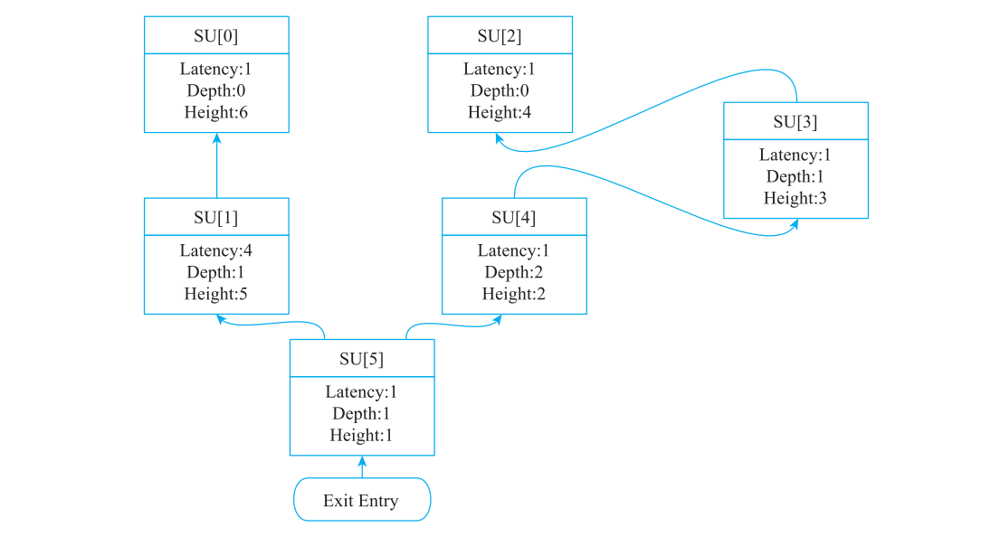

**图 8-26 基于 SUnit 构建的依赖图**

2）对依赖图中的指令自顶向下进行调度。初始化阈值 CurCycle 为 0，将入度为 0 的SU[0]、SU[2] 存入 AvailableQueue 中。得到的运行结果如表 8-39 所示。

**表 8-39 初始调度将 SU[0]、SU[2] 存入 AvailableQueue 中**

调度器数据结构 数据结构中的元素

Sequence

AvailableQueue SU[0],SU[2]

Pending

CurCycle 0

3）比较 AvailableQueue 中 SU[0] 和 SU[2] 的 Height 值，显然 SU[0] 的 Height 值更大，所以优先调度 SU[0]。此时，入度为 0 的 SU[1] 的 Depth 值为 1，大于阈值，将 SU[1] 存入Pending 中。得到的运行结果如表 8-40 所示。

**表 8-40 调度 SU[0] 后的运行结果**

调度器数据结构 数据结构中的元素

Sequence SU[0]

AvailableQueue SU[2]

Pending SU[1]

CurCycle 0

4）接着调度 AvailableQueue 中的 SU[2]。此时，入度为 0 的 SU[3] 的 Depth 值为 1，大于阈值，因此将 SU[3] 存入 Pending 中。得到的运行结果如表 8-41 所示。

**表 8-41 调度 SU[2] 后的运行结果**

调度器数据结构 数据结构中的元素

Sequence SU[0],SU[2]

AvailableQueue

Pending SU[1],SU[3]

CurCycle 0

5）此时，AvailableQueue 中没有元素，将阈值 CurCycle 加 1。Pending 中的 SU[1]、SU[3]的 Depth 值都和阈值相等，将它们存入 AvailableQueue 中。得到的运行结果如表 8-42所示。

**表 8-42 更新 AvailableQueue 状态后的运行结果**

调度器数据结构 数据结构中的元素

Sequence SU[0],SU[2]

AvailableQueue SU[1],SU[3]

Pending

CurCycle 1

6）因为 SU[1] 的 Height 值大于 SU[3]，所以优先调度 SU[1]。依次调度完 SU[1]、SU[3]后，将入度为 0 的 SU[4]（其 Depth 为 2，大于阈值）存入 Pending。得到的运行结果如表 8-43所示。

**表 8-43 调度 SU[1]、SU[3] 后的运行结果**

调度器数据结构 数据结构中的元素

Sequence SU[0],SU[2],SU[1],SU[3]

AvailableQueue

Pending SU[4]

CurCycle 1

7）此时，AvailableQueue 中没有元素，阈值加 1 后为 2。Pending 中 SU[4] 的 Depth 值等于阈值，因此将它存入 AvailableQueue 中。调度 SU[4]。将阈值不断加 1 直到等于 SU[5]的 Depth，调度 SU[5]。得到的运行结果如表 8-44 所示。

**表 8-44 调度 SU[4]、SU[5] 后的运行结果**

调度器数据结构 数据结构中的元素

Sequence SU[0],SU[2],SU[1],SU[3],SU[4],SU[5]

AvailableQueue

Pending

CurCycle 5

最后得到的调度结果为，SU[0]、SU[2]、SU[1]、SU[3]、SU[4]、SU[5]，如表 8-45 所示。

从最终的效果来看，SU[1] 和 SU[2] 指令发生了调换。这里需要注意的是，SU[1] 作为一条访存指令的时延较长，调度后的性能未必会比调度前的性能更好。

**表 8-45 使用 Post-RA-TDList 调度前后的效果比较**

调度前 调度后

liveins: $x10, $x11 liveins: $x10, $x11

SU[0]: $x12 = LUI target-flags(riscv-hi) @g_val SU[0]: $x12 = LUI target-flags(riscv-hi) @g_val

SU[1]: $x12 = LW $x12, target-flags(riscv-lo) @g_val SU[2]: $x11 = MUL $x11, $x10

SU[2]: $x11 = MUL $x11, $x10 SU[1]: $x12 = LW $x12, target-flags(riscv-lo) @g_val

SU[3]: $x11 = ADD $x11, $x10 SU[3]: $x11 = ADD $x11, $x10

SU[4]: $x10 = MUL $x11, $x10 SU[4]: $x10 = MUL $x11, $x10

SU[5]: $x10 = MUL $x10, $x12 SU[5]: $x10 = MUL $x10, $x12

PseudoRET implicit $x10 PseudoRET implicit $x10

## 8.9 Post-RA-MISched 调度器

Post-RA-MISched 调度器也是作用于寄存器分配后，它和 Post-RA-TDList 调度器一样自顶向下调度指令。Post-RA-TDList 调度器使用了 SUnit 的 Depth 和 Height 属性，Post- RA-MISched 调度器则增加了更多的启发式因素来计算 AvailableQueue 中可调度指令的优先级，包括停滞周期、关键资源（Critical Resources）、必需资源（Demanded Resources）。其中停滞周期的含义参考 8.7.3 的介绍，Critical / Demanded Resources 分别统计候选指令对当前策略指定的 ReduceResIdx / DemandResIdx 处理器资源的占用，用于减少瓶颈占用和资源平衡。它们不是“区间内访问”和“跨区间访问”的区别，也不等同于指令结果时延。Post-RA-MISched 的总体调度过程和 Post-RA-TDList 比较相似，本节不再用具体示例演示了，读者可以自行阅读 LLVM 相关的代码实现。

LLVM 通 过 选 项 -enable-post-misched 启 用 Post-RA-MISched 调 度 器， 调 度 算 法 由ScheduleDAGMI 类实现。

## 8.10 循环调度

循环调度是针对循环体进行的指令调度，在 LLVM 中被称为 SMS。

### 8.10.1 循环调度算法实现

SMS 是针对循环实现的与架构无关的软流水（Software Pipelining）指令调度框架。如果我们将每次循环的指令称为一次迭代，那么 SMS 的目的是通过将不同迭代的指令同时发射来提升并行度。考虑有如代码清单 8-10 所示的 SMS 处理前的伪代码，不考虑跳转指令，该循环一次迭代需要独立发射三条指令（指令之间相互依赖）。

**代码清单 8-10 SMS 处理前的伪代码**

```text
# 伪代码:固定迭代次数 N >= 0；不同 i 的操作无跨迭代依赖。
for i = 0 .. N-1:
    A1[i] = op1(A0[i])  # ①
    A2[i] = op2(A1[i])  # ②
    A3[i] = op3(A2[i])  # ③
```

如果将其改变为代码清单 8-11 所示，在不存在跨迭代数据 / 内存依赖、并且硬件资源允许时，本次迭代的③与下次迭代的①可以独立执行；同次迭代的①→②→③仍有传递依赖。因而，所以可以将本次迭代的指令③与下次迭代的指令①放在同一时刻发射，提高并行度。这便是 SMS 调度的一个简单示例。

**代码清单 8-11 SMS 处理后的伪代码**

```text
# 伪代码:保留准确的迭代次数,parallel 表示可并行发射。
if N > 0:
    A1[0] = op1(A0[0])           # prologue
    for i = 0 .. N-2:
        A2[i] = op2(A1[i])
        parallel:
            A3[i] = op3(A2[i])
            A1[i+1] = op1(A0[i+1])
    A2[N-1] = op2(A1[N-1])      # epilogue
    A3[N-1] = op3(A2[N-1])
```

目 前 LLVM 中 的 SMS 是 基 于 文 档“ An Implementation of Swing Modulo Scheduling with Extensions for Superblocks”○一的描述实现的，现在支持 PPC、ARM 和 Hexagon 三种后端，大致步骤如下。

> 以下是通用 SMS 算法说明。LLVM 18 是否添加该 Pass 以及是否支持特定循环，取决于目标配置、优化级别、循环分析 hook、资源模型和扩展器；原书列举的架构不构成所有配置都可用的保证。

步骤 1：判断循环是否可以做软流水调度

完全满足以下条件才会继续进行指令调度。

1）循环里的基本块数量为 1。

2）函数没有被标记为不可做软流水调度。

3）循环可以被分析出分支信息。

○一 请参见 https://llvm.org/pubs/2005-06-17-LattnerMSThesis.html。

4）循环可以被分析出循环指令等信息。

5）循环需要有 PreHeader 基本块。

步骤 2：构建依赖图并计算相关属性

为循环体中基本块包含的指令构建依赖关系，过程和前几节中的构建依赖图类似，但需要增加跨迭代过程的指令依赖。比如在图 8-27 所示的依赖图示例中，假设指令 A 和 F 都是对同一内存的访问操作，A 读内存，F 写内存，那么下个循环迭代中的 A 指令必须等待前一个迭代中的 F 指令执行完。因此 A 和 F 存在一个Anti 类型的依赖关系，图中用蓝色虚线表示。依此类推，G 和 M 也属于这样的情况。

步骤 3：计算调度所需的启发式属性 图 8-27 依赖构建跨循环迭代示意图

1）ResMII（Resource Minimum Initiation Interval，资源最小启动间隔）：用来描述硬件资源限制下的循环基本块指令的最小间隔。常用资源下界是对每类资源计算 `ceil(每次迭代的占用量 / 可用资源单元数)`，再结合 `ceil(微操作数 / 发射宽度)` 取最大值。LLVM 18 的 `ResourceManager::calculateResMII` 按 UseDFA 选择 DFA 或基于调度模型的资源计数实现。以下描述其中的 DFA 路径：用 DFA（Deterministic Finite Automation，确定性有限自动机）模拟 CPU使用硬件资源执行指令的过程来计算 ResMII，过程如下。

① 将基本块指令按照使用硬件关键资源（比如 ALU 单元）的数量由高到低排序，也就是说使用关键资源多的指令优先执行。

② 按步骤①中的指令顺序调用 DFA 以保存关键资源。

③ 如果 DFA 不够○一，则新增 DFA。

④ 迭代步骤②、③，直到所有的指令都有 DFA 来保存资源。

⑤ 最终 DFA 的数量就是 ResMII，即 ResMII 等于 DFA 的数量。

2）RecMII（Recurrence Minimum Initiation Interval，循环依赖最小启动间隔）：如果循环基本块中存在跨迭代的依赖，比如图 8-27 中的 A 和 F 指令，我们称之为依赖图中存在循环依赖，而 {A，C，D，F} 便为一个循环依赖的集合。为了保证两次循环迭代的循环依赖集合中的指令依赖满足执行的顺序，我们用 RecMII 来描述循环基本块中所有循环依赖集合的最小启动间隔。计算过程如下。

① 通过约翰逊电路算法（Johnson’s circuit algorithm）○二找到循环基本块中所有的循环依赖集合。

② 遍历循环依赖集合，计算每个循环依赖的执行间隔 II = ceil(delay / distance)。其中

○一 笔者理解 DFA 描述了硬件拥有的资源，所谓 DFA 不够指的是当前资源已经被使用，需要等待相应硬件

执行完才会空出。

○二 请参见 Donald B. Johnson. Finding all the elementary circuits of a directed graph. SIAM Journal on Computing,

4(1): 77–84, March 1975.

distance 表示循环携带依赖跨越的迭代距离，不是循环总次数；此处 LLVM 18 的 calculateRecMII 实现仍用 Distance=1 作相应估计，delay 表示循环依赖集合中指令执行的时钟周期。

③ 选择最大的循环依赖集合的 II 作为 RecMII。

3）MII（Minimum Initiation Interval，最小启动间隔）：MII 描述了每次循环迭代执行的最小启动间隔，取 ResMII 和 RecMII 的最大值，MII = max(ResMII, RecMII)。

4）ASAP（最早调度时间）：设 `L(v,u)` 是依赖边时延，`d(v,u)` 是跨迭代距离，边约束为 `t(u) >= t(v) + L(v,u) - d(v,u) * MII`。LLVM 18 在适用的拓扑遍历中按以下方式更新（按实现过滤忽略的依赖）：

```text
ASAP(u) = max({0} ∪ {ASAP(v) + L(v,u) - d(v,u)*MII | v ∈ Pred(u)})
```

5）ALAP（最迟调度时间）：令 `T = max_u ASAP(u)`，从后向前沿后继约束计算。原书的“前驱 / max / 无前驱时为 0”公式有误；源码以 T 初始化再取最小值：

```text
ALAP(u) = min({T} ∪ {ALAP(v) - L(u,v) + d(u,v)*MII | v ∈ Succ(u)})
```

这里 d 无量纲，表示迭代距离，L 才以周期为单位；不能将二者都称作依赖边时延。

6）MOV：MOV 表示指令允许被调度的时间区间，一般 MOV 越大说明该指令的调度窗口越大，越容易被调度。指令 u 的 MOV 的计算方法为：MOVu = ALAPu – ASAPu。

7）Depth：含义参考 8.4.1 节里的介绍。

8）Height：含义参考 8.4.1 节里的介绍。

下面以图 8-28 所示的指令依赖图为例计算相关属性。 图 8-28 指令依赖图

假设 λa = λb = λc = λd = 1，δa,b = δa,c = δa,d = δb,e = δc,e = δd,e = 0，MII = 1，则节点属性的计算结果如表 8-46 所示。

**表 8-46 循环调度相关属性的计算结果**

节点

属性

a b c d e

ASAP 0 1 1 1 2

ALAP 0 1 1 1 2

MOV 0 0 0 0 0

Depth 0 1 1 1 2

Height 2 1 1 1 0

步骤 4：节点排序

为什么要给节点排序呢？理想的调度结果达成两个目标：一是循环迭代执行周期（II）

尽可能小；二是单次迭代中保持寄存器活跃区间（MaxLive）最小。前者要求我们能按顺序对一条链路进行调度，如果指令的前驱节点和后继节点都被调度，它很容易失去调度的时间窗口。后者要求我们尽可能减小寄存器的生命周期，也就是节点尽可能紧跟着它的前驱节点调度。排序算法大致步骤如下。

1）将循环基本块中所有的递归集合按照 RecMII 由高到低进行排序。

2）按照步骤 1 中的顺序遍历递归集合，对递归集合中的指令按照启发式因素 Depth、Height、MOV 进行排序，存入列表中。如果节点出现在多个递归中，则由 RecMII 最高的递归处理一次即可，其他的递归不再处理该节点。

3）处理没有出现在任何递归集合中的节点，按照步骤 2 的启发式因素排序，直到所有节点都被遍历过并存入列表中。

步骤 5：调度

调度过程就是根据上一步生成的指令序列依次处理每一条指令。调度过程着重考虑将当前节点尽可能靠近已经被调度过的前驱节点或者后继节点，从而减少寄存器压力。算法流程大致如下。

1）将 II（执行间隔）设置为 MII，初始化二维数组存放的调度结果，横坐标为指令被调度的时钟周期，纵坐标为在该时钟周期中被调度的指令序列。

2）如果当前节点 u 没有任何相邻的前驱节点或者后继节点被调度过，则该指令的可调度时间区间为 [Early_Startu, Early_Startu + II – 1]，其中 Early_Startu = ASAPu。

3）如果当前节点 u 只有相邻的前驱节点被调度过，没有后继节点被调度过，则其调度区间为 [Early_Startu, Early_Startu + II – 1]。其中 Early_Startu = max_{v∈PSP(u)}(tv + λv – δv,u ×II)，tv 是节点 v 的调度时钟周期，λv 是节点 v 的时延，δv,u 是依赖的迭代距离；λ 应取相应依赖边时延，PSP(u) 是在与节点 u 相邻的前驱节点中被调度过的节点集合。

4）如果当前节点 u 只有相邻的后继节点被调度过，没有前驱节点被调度过，则其调度区间为 [Late_Startu, Late_Startu – II + 1]。其中 Late_Startu = min_{v∈PSS(u)}(tv – L(u,v) + δu,v× II)，PSS(u) 是在与节点 u 相邻的后继节点中被调度过的节点集合。

5）如果 u 的前驱和后继都已有节点被调度，需要同时满足上下界：搜索 `[Early_Start, min(Late_Start, Early_Start + II - 1)]`，并与已有 SchedStart / SchedEnd 约束取交集；对 PHI 等节点实现可能逆向搜索这个区间。原书 `[Late_Start, Early_Start + II - 1]` 缺少必要下界和上界约束。

6）如果上述过程有节点找不到合适的调度区间，则将 II 加 1，重新开始从步骤 1 执行，在允许的 II 搜索范围内重试；超过限制或仍无合法调度时放弃该循环的流水化。

步骤 6：生成并行化循环

根据调度结果重新构造循环指令，该操作生成 prologue、kernel、epilogue 三个逻辑部分；多阶段调度可能生成多个 prologue / epilogue 基本块，还需要短循环保护和 PHI 更新：

1）Prologue：充当新的循环结构中的 PreHeader 基本块。

2）Kernel：充当新的循环结构中的循环体基本块。

3）Epilogue：充当新的循环结构中循环退出的基本块。

LLVM 根据每条指令被调度后所属的流水阶段（不是硬件执行单元）来决定哪些指令需要被放入 Prologue、

Kernel 或者 Epilogue 基本块中。每条指令的执行单元计算方法为：stage = floor((cycle - FirstCycle) / II)（若 FirstCycle=0 则为 floor(cycle / II)），其中 cycle 为该指令被调度的时钟周期，II 为步骤 5 中调度成功的执行间隔。图 8-29 展示了一个简单的示例，原始的循环体内有两条指令 op1 和 op2，假设 op1 的 stage 为 0，op2 的stage 为 1。经过完整的调度后，将 stage 为 0的 op1 复制到 Prologue 基本块中，将 stage 为1 的 op2 复制到 Epilogue 基本块中，最终生成的基本块 Prologue 的指令为 op1，Kernel的指令为 op2、op1，Epilogue 的指令为 op2。当然还要重命名迭代间依赖的指令操作数并更新各个基本块的控制流指令分支。

**图 8-29 并行化循环示意图**

### 8.10.2 示例分析

下面通过一段 LLVM IR 示例代码来大致描述 SMS 是如何对指令进行调度的，我们主要关注其中涉及的循环语句基本块 b7（蓝色字体）在调度过程中的变化，如代码清单 8-12 所示。

> 已找到此完整例子的 LLVM 18 上游文件 `llvm/test/CodeGen/Hexagon/swp-bad-sched.ll`。下面 IR 与该文件中的函数、声明、属性和 TBAA 元数据静态对照；这是代码来源核对，不是本次测试已通过。该测试的 RUN 还指定 `-pipeliner-experimental-cg=true`，其检查主要约束生成的 Hexagon 指令包，不固定后文的虚拟寄存器号。

**代码清单 8-12 SMS 示例 IR（8-12.ll）**

```llvm
; Function Attrs: nounwind
define void @f0(ptr nocapture %a0, i32 %a1, ptr nocapture %a2) #0 {
b0:
  %v0 = icmp sgt i32 %a1, 0
  br i1 %v0, label %b1, label %b9

b1:                                               ; preds = %b0
  %v1 = icmp ugt i32 %a1, 3
  %v2 = add i32 %a1, -3
  br i1 %v1, label %b2, label %b5

b2:                                               ; preds = %b1
  br label %b3

b3:                                               ; preds = %b3, %b2
  %v3 = phi i32 [ %v48, %b3 ], [ 0, %b2 ]
  %v4 = phi i32 [ %v46, %b3 ], [ 0, %b2 ]
  %v5 = phi i32 [ %v49, %b3 ], [ 0, %b2 ]
  %v6 = getelementptr inbounds [576 x i32], ptr %a0, i32 0, i32 %v5
  %v7 = load i32, ptr %v6, align 4, !tbaa !0
  %v8 = getelementptr inbounds [576 x i32], ptr %a0, i32 1, i32 %v5
  %v9 = load i32, ptr %v8, align 4, !tbaa !0
  %v10 = add nsw i32 %v9, %v7
  store i32 %v10, ptr %v6, align 4, !tbaa !0
  %v11 = sub nsw i32 %v7, %v9
  store i32 %v11, ptr %v8, align 4, !tbaa !0
  %v12 = tail call i32 @llvm.hexagon.A2.abs(i32 %v10)
  %v13 = or i32 %v12, %v4
  %v14 = tail call i32 @llvm.hexagon.A2.abs(i32 %v11)
  %v15 = or i32 %v14, %v3
  %v16 = add nsw i32 %v5, 1
  %v17 = getelementptr inbounds [576 x i32], ptr %a0, i32 0, i32 %v16
  %v18 = load i32, ptr %v17, align 4, !tbaa !0
  %v19 = getelementptr inbounds [576 x i32], ptr %a0, i32 1, i32 %v16
  %v20 = load i32, ptr %v19, align 4, !tbaa !0
  %v21 = add nsw i32 %v20, %v18
  store i32 %v21, ptr %v17, align 4, !tbaa !0
  %v22 = sub nsw i32 %v18, %v20
  store i32 %v22, ptr %v19, align 4, !tbaa !0
  %v23 = tail call i32 @llvm.hexagon.A2.abs(i32 %v21)
  %v24 = or i32 %v23, %v13
  %v25 = tail call i32 @llvm.hexagon.A2.abs(i32 %v22)
  %v26 = or i32 %v25, %v15
  %v27 = add nsw i32 %v5, 2
  %v28 = getelementptr inbounds [576 x i32], ptr %a0, i32 0, i32 %v27
  %v29 = load i32, ptr %v28, align 4, !tbaa !0
  %v30 = getelementptr inbounds [576 x i32], ptr %a0, i32 1, i32 %v27
  %v31 = load i32, ptr %v30, align 4, !tbaa !0
  %v32 = add nsw i32 %v31, %v29
  store i32 %v32, ptr %v28, align 4, !tbaa !0
  %v33 = sub nsw i32 %v29, %v31
  store i32 %v33, ptr %v30, align 4, !tbaa !0
  %v34 = tail call i32 @llvm.hexagon.A2.abs(i32 %v32)
  %v35 = or i32 %v34, %v24
  %v36 = tail call i32 @llvm.hexagon.A2.abs(i32 %v33)
  %v37 = or i32 %v36, %v26
  %v38 = add nsw i32 %v5, 3
  %v39 = getelementptr inbounds [576 x i32], ptr %a0, i32 0, i32 %v38
  %v40 = load i32, ptr %v39, align 4, !tbaa !0
  %v41 = getelementptr inbounds [576 x i32], ptr %a0, i32 1, i32 %v38
  %v42 = load i32, ptr %v41, align 4, !tbaa !0
  %v43 = add nsw i32 %v42, %v40
  store i32 %v43, ptr %v39, align 4, !tbaa !0
  %v44 = sub nsw i32 %v40, %v42
  store i32 %v44, ptr %v41, align 4, !tbaa !0
  %v45 = tail call i32 @llvm.hexagon.A2.abs(i32 %v43)
  %v46 = or i32 %v45, %v35
  %v47 = tail call i32 @llvm.hexagon.A2.abs(i32 %v44)
  %v48 = or i32 %v47, %v37
  %v49 = add nsw i32 %v5, 4
  %v50 = icmp slt i32 %v49, %v2
  br i1 %v50, label %b3, label %b4

b4:                                               ; preds = %b3
  br label %b5

b5:                                               ; preds = %b4, %b1
  %v51 = phi i32 [ 0, %b1 ], [ %v49, %b4 ]
  %v52 = phi i32 [ 0, %b1 ], [ %v48, %b4 ]
  %v53 = phi i32 [ 0, %b1 ], [ %v46, %b4 ]
  %v54 = icmp eq i32 %v51, %a1
  br i1 %v54, label %b9, label %b6

b6:                                               ; preds = %b5
  br label %b7

b7:                                               ; preds = %b7, %b6
  %v55 = phi i32 [ %v67, %b7 ], [ %v52, %b6 ]
  %v56 = phi i32 [ %v65, %b7 ], [ %v53, %b6 ]
  %v57 = phi i32 [ %v68, %b7 ], [ %v51, %b6 ]
  %v58 = getelementptr inbounds [576 x i32], ptr %a0, i32 0, i32 %v57
  %v59 = load i32, ptr %v58, align 4, !tbaa !0
  %v60 = getelementptr inbounds [576 x i32], ptr %a0, i32 1, i32 %v57
  %v61 = load i32, ptr %v60, align 4, !tbaa !0
  %v62 = add nsw i32 %v61, %v59
  store i32 %v62, ptr %v58, align 4, !tbaa !0
  %v63 = sub nsw i32 %v59, %v61
  store i32 %v63, ptr %v60, align 4, !tbaa !0
  %v64 = tail call i32 @llvm.hexagon.A2.abs(i32 %v62)
  %v65 = or i32 %v64, %v56
  %v66 = tail call i32 @llvm.hexagon.A2.abs(i32 %v63)
  %v67 = or i32 %v66, %v55
  %v68 = add nsw i32 %v57, 1
  %v69 = icmp eq i32 %v68, %a1
  br i1 %v69, label %b8, label %b7

b8:                                               ; preds = %b7
  br label %b9

b9:                                               ; preds = %b8, %b5, %b0
  %v70 = phi i32 [ 0, %b0 ], [ %v52, %b5 ], [ %v67, %b8 ]
  %v71 = phi i32 [ 0, %b0 ], [ %v53, %b5 ], [ %v65, %b8 ]
  %v72 = load i32, ptr %a2, align 4, !tbaa !0
  %v73 = or i32 %v72, %v71
  store i32 %v73, ptr %a2, align 4, !tbaa !0
  %v74 = getelementptr inbounds i32, ptr %a2, i32 1
  %v75 = load i32, ptr %v74, align 4, !tbaa !0
  %v76 = or i32 %v75, %v70
  store i32 %v76, ptr %v74, align 4, !tbaa !0
  ret void
}

; Function Attrs: nounwind readnone
declare i32 @llvm.hexagon.A2.abs(i32) #1

attributes #0 = { nounwind }
attributes #1 = { nounwind readnone }

!0 = !{!1, !1, i64 0}
!1 = !{!"int", !2}
!2 = !{!"omnipotent char", !3}
!3 = !{!"Simple C/C++ TBAA"}
```

通过命令 llc -march=hexagon -enable-pipeliner -enable-aa-sched-mi -pipeliner-experimental-cg=true 8-12.ll 本次未执行；若要观察 b7 在 SMS 调度前的 MIR，需要另用 `-stop-before=pipeliner` 或调试转储，原命令默认输出汇编。原书对应的 MIR 示例，如代码清单 8-13 所示。其中，bb.5.b6 为 PreHeader 基本块，bb.6.b7 为循环体基本块，bb.7.b9 为循环退出基本块。

> 清单 8-13、8-14 保留原书机器函数局部输出；它们引用未展示的基本块、虚拟寄存器和模块信息，因此不是独立可解析 MIR。表 8-47、8-48 的 RecMII、II、节点序号与阶段是原书结果，待 LLVM 18 在固定 CPU / 模型下重现；不能由源码存在这段测试推导这些数字仍逐一相同。

**代码清单 8-13 SMS 调度前的 MIR**

```text
bb.5.b6:
; predecessors: %bb.4
    successors: %bb.6(0x80000000); %bb.6(100.00%)

    %13:intregs = A2_sub %26:intregs, %10:intregs
    %14:intregs = S2_addasl_rrri %25:intregs, %10:intregs, 2
    %71:intregs = COPY %13:intregs
    J2_loop0r %bb.6, %71:intregs, implicit-def $lc0, implicit-def $sa0, implicit-
        def $usr

bb.6.b7 (machine-block-address-taken):
; predecessors: %bb.5, %bb.6

successors: %bb.7(0x04000000), %bb.6(0x7c000000); %bb.7(3.12%), %bb.6(96.88%)

    %15:intregs = PHI %14:intregs, %bb.5, %22:intregs, %bb.6
    %17:intregs = PHI %11:intregs, %bb.5, %20:intregs, %bb.6
    %18:intregs = PHI %12:intregs, %bb.5, %19:intregs, %bb.6
    %63:intregs = L2_loadri_io %15:intregs, 0 :: (load (s32) from %ir.lsr.iv1,
        !tbaa !0)
    %64:intregs = L2_loadri_io %15:intregs, 2304 :: (load (s32) from %ir.cgep23,
        !tbaa !0)
    %65:intregs = nsw A2_add %64:intregs, %63:intregs
    S2_storeri_io %15:intregs, 0, %65:intregs :: (store (s32) into %ir.lsr.iv1,
        !tbaa !0)
    %66:intregs = nsw A2_sub %63:intregs, %64:intregs
    S2_storeri_io %15:intregs, 2304, %66:intregs :: (store (s32) into %ir.cgep23,
        !tbaa !0)
    %67:intregs = A2_abs %65:intregs
    %19:intregs = A2_or %67:intregs, %18:intregs
    %68:intregs = A2_abs %66:intregs
    %20:intregs = A2_or %68:intregs, %17:intregs
    %22:intregs = A2_addi %15:intregs, 4
    ENDLOOP0 %bb.6, implicit-def $pc, implicit-def $lc0, implicit $sa0, implicit $lc0
    J2_jump %bb.7, implicit-def dead $pc

bb.7.b9:
; predecessors: %bb.4, %bb.6, %bb.8

    %23:intregs = PHI %28:intregs, %bb.8, %11:intregs, %bb.4, %20:intregs, %bb.6
    %24:intregs = PHI %28:intregs, %bb.8, %12:intregs, %bb.4, %19:intregs, %bb.6
    L4_or_memopw_io %27:intregs, 0, %24:intregs :: (store (s32) into %ir.a2,
        !tbaa !0), (load (s32) from %ir.a2, !tbaa !0)
    L4_or_memopw_io %27:intregs, 4, %23:intregs :: (store (s32) into %ir.cgep25,
        !tbaa !0), (load (s32) from %ir.cgep25, !tbaa !0)
    PS_jmpret $r31, implicit-def dead $pc
```

循环调度步骤如下。

1）将循环体基本块 bb.6.b7 的指令序列按照指令顺序编号为 SU[0]～SU[13]，并构建依赖图，如图 8-30 所示。其中虚线为跨迭代的 Anti 类型依赖，实线为访存操作的依赖边。

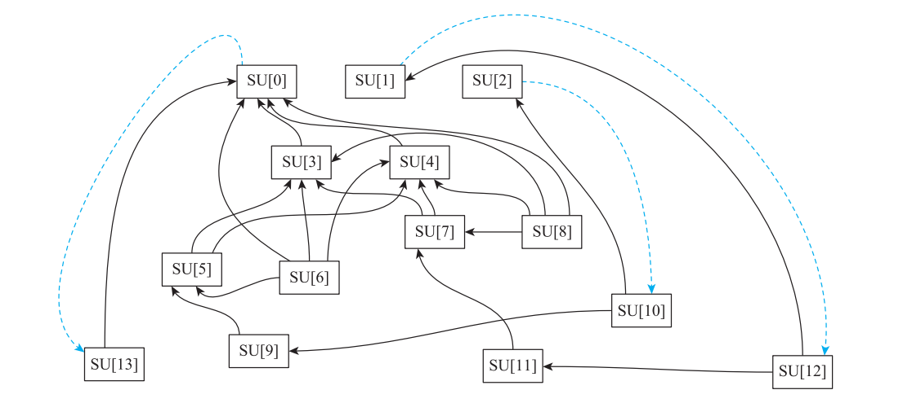

**图 8-30 针对循环指令建立的 SUnit 依赖图**

2）使用约翰逊电路算法，找到依赖图中所有的递归（Recurrence）集合。这个实例中的递归集合为 {{SU[0], SU[13]}, {SU[1], SU[12]}, {SU[2], SU[10]}, {SU[3], SU[7],SU[8]}}。

3）计算 ResMII、RecMII 以及各节点的属性。其中 ResMII = 3，RecMII = 2，II = 3。各个 SUnit 节点的属性如表 8-47 所示。

**表 8-47 各个 SUnit 节点的属性值**

属性

SUnit

ASAP ALAP MOV Depth Height

SU[0] 0 0 0 0 3

SU[1] 0 3 3 0 1

SU[2] 0 3 3 0 1

SU[3] 0 0 0 0 3

SU[4] 0 0 0 0 3

SU[5] 1 1 0 1 2

SU[6] 1 3 2 1 0

SU[7] 1 1 0 1 2

SU[8] 1 3 2 1 0

SU[9] 2 2 0 2 1

SU[10] 3 3 0 3 0

SU[11] 2 2 0 2 1

SU[12] 3 3 0 3 0

SU[13] 0 3 3 1 0

4）将递归的集合按照 RecMII 从大到小排序。将递归集合没有包含的节点或存入已存在的递归集合中，或存入新的递归集合中，结果为 {{SU3, SU7, SU8}, {SU1, SU12, SU11}, {SU2, SU10, SU9, SU5}, {SU0, SU13, SU4}, {SU6}}。对所有的节点排序，结果为 {SU8, SU7, SU3, SU11, SU12, SU1, SU5, SU9, SU10, SU2, SU4, SU0, SU13, SU6}。

5）按照步骤 4 的排序结果进行指令调度。调度成功时 II = 3，整个基本块的指令处于 0和 1 两个阶段。表 8-48 显示了各个节点所处的不同阶段。

**表 8-48 调度阶段划分**

阶段 时钟周期 节点

0 SU3, SU4, SU0

0 1 SU8, SU7, SU5, SU13

2 SU11, SU9, SU6

1 3 SU12, SU1, SU10, SU2

6）根据步骤 5 的结果生成的并行化循环结果如代码清单 8-14 所示。其中，bb.9.b7 为Prologue 基本块，bb.10.b7 为 Kernel 基本块，bb.11 为 Epilogue 基本块。从结果可以看出，位于阶段 1 的 SU12 和 SU10（蓝色字体）被复制到 Epilogue 基本块中，其余节点被复制到Prologue 基本块中，并且 SU12 和 SU10 被移到了 Kernel 基本块开始的位置。此外，指令操作数和 φ 函数也被更新。

**代码清单 8-14 SMS 调度后的 MIR**

```text
bb.9.b7:
; predecessors: %bb.5

successors: %bb.10(0x40000000), %bb.11(0x40000000); %bb.10(50.00%), %bb.11(50.00%)

    %74:intregs = L2_loadri_io %14:intregs, 0 :: (load (s32) from %ir.lsr.iv1,
        !tbaa !0)
    %75:intregs = L2_loadri_io %14:intregs, 2304 :: (load (s32) from %ir.cgep23,
        !tbaa !0)
    %76:intregs = nsw A2_add %75:intregs, %74:intregs
    S2_storeri_io %14:intregs, 0, %76:intregs :: (store (s32) into %ir.lsr.iv1,
        !tbaa !0)
    %77:intregs = nsw A2_sub %74:intregs, %75:intregs
    S2_storeri_io %14:intregs, 2304, %77:intregs :: (store (s32) into %ir.cgep23,
        !tbaa !0)
    %78:intregs = A2_abs %76:intregs
    %79:intregs = A2_abs %77:intregs
    %80:intregs = A2_addi %14:intregs, 4
    %102:predregs = C2_cmpgtui %71:intregs, 1
    %103:intregs = A2_addi %71:intregs, -1
    J2_loop0r %bb.10, %103:intregs, implicit-def $lc0, implicit-def $sa0,
        implicit-def $usr
    J2_jumpf %102:predregs, %bb.11, implicit-def $pc
    J2_jump %bb.10, implicit-def $pc

bb.10.b7:
; predecessors: %bb.9, %bb.10

successors: %bb.11(0x04000000), %bb.10(0x7c000000); %bb.11(3.12%), %bb.10(96.88%)

    %90:intregs = PHI %80:intregs, %bb.9, %87:intregs, %bb.10
    %91:intregs = PHI %11:intregs, %bb.9, %81:intregs, %bb.10
    %92:intregs = PHI %12:intregs, %bb.9, %82:intregs, %bb.10
    %93:intregs = PHI %78:intregs, %bb.9, %89:intregs, %bb.10
    %94:intregs = PHI %79:intregs, %bb.9, %88:intregs, %bb.10
    %81:intregs = A2_or %94:intregs, %91:intregs
    %82:intregs = A2_or %93:intregs, %92:intregs
    %83:intregs = L2_loadri_io %90:intregs, 0 :: (load (s32) from %ir.lsr.iv1 + 4,
        !tbaa !0)
    %84:intregs = L2_loadri_io %90:intregs, 2304 :: (load (s32) from %ir.cgep23
        + 4, !tbaa !0)
    %85:intregs = nsw A2_sub %83:intregs, %84:intregs
    S2_storeri_io %90:intregs, 2304, %85:intregs :: (store (s32) into %ir.cgep23
        + 4, !tbaa !0)
    %86:intregs = nsw A2_add %84:intregs, %83:intregs
    %87:intregs = A2_addi %90:intregs, 4
    %88:intregs = A2_abs %85:intregs
    %89:intregs = A2_abs %86:intregs
    S2_storeri_io %90:intregs, 0, %86:intregs :: (store (s32) into %ir.lsr.iv1 + 4,
        !tbaa !0)
    ENDLOOP0 %bb.10, implicit-def $pc, implicit-def $lc0, implicit $sa0, implicit
        $lc0
    J2_jump %bb.11, implicit-def $pc

bb.11:
; predecessors: %bb.10, %bb.9
    successors: %bb.7(0x80000000); %bb.7(100.00%)

    %98:intregs = PHI %11:intregs, %bb.9, %81:intregs, %bb.10
    %99:intregs = PHI %12:intregs, %bb.9, %82:intregs, %bb.10
    %100:intregs = PHI %78:intregs, %bb.9, %89:intregs, %bb.10
    %101:intregs = PHI %79:intregs, %bb.9, %88:intregs, %bb.10
    %95:intregs = A2_or %100:intregs, %99:intregs
    %96:intregs = A2_or %101:intregs, %98:intregs
    J2_jump %bb.7, implicit-def $pc

bb.7.b9:
......
```

> 本节引述的 SPEC / POWER8 性能数字属于原书引用论文的历史实验，本次未联网重新审查论文，也未做 LLVM 18 性能测试，不作为当前调度器选择的测量依据。

## 8.11 扩展阅读：调度算法的影响因素

寄存器分配前（Pre-RA）和分配后（Post-RA）的指令调度需要考虑的指令优先级的影

响因素有较大的差异。寄存器分配后的调度算法主要关注指令的流水性能，因此影响其调度优先级的因素主要包括关键路径（高度、深度、时延、关键资源、必需资源）、停滞周期。而寄存器分配前的调度算法除了要考虑指令的流水性能外，还需要关注寄存器分配的压力（寄存器压力值、Sethi-Ullman 数值、BiasPhysReg、NumPredsLeft）。

读者可能会比较关心在实际的开发构建过程中，到底该选择什么样的调度算法，从而让自己的软件达到最优性能？

寻找最优的指令调度是一个 NP（非确定性多项式时间）完全问题。就笔者经验而言，一般在编译器后端的设计过程中，寄存器分配前的调度算法会优先考虑重排的指令序列对寄存器分配压力的影响，寄存器分配后的调度算法则会专注于指令的流水性能。但因为不同的调度算法的计算指令优先级差异，在不同的场景中效果也有差异。开发者可以直接选择 LLVM 中不同的调度算法及组合来验证自己的场景，也可以基于 LLVM 的框架选择适合自己场景的启发式因素来实现新的调度算法。

有学者将影响调度算法的启发式因素细分为 24 种，并基于 LLVM 在 SPEC CPU 2017整型和浮点类型的基准测试集上进行了实验，论文为“ A Comparision of List Scheduling Heuristics in LLVM Targeting POWER8”。这 24 种启发式因素中有一些已经在本章介绍LLVM 调度算法时使用，比如寄存器分配压力相关的 rp max、rp critical、rp excess 等，也有一些是作者自己设计的，比如 dispatch、rb、slack、delaySucc 等，这些启发式因素的含义及具体的计算方法可以参考论文的详细介绍，这里就不展开了。我们直接引用论文中的实验数据和结论。

**图 8-31 为 SPEC 2017 整型基准测试的结果，图 8-32 为 SPEC 2017 浮点型基准测试的**

结果。其中，generic 是 LLVM 提供的调度信息，它组合了其他的因素。纵坐标为影响指令调度的 24 个启发式因素，横坐标为采用某种启发式因素进行指令调度后的性能和基线性能的对比（百分比）。结果为负则表明调度后性能比基线性能差。这里的基线性能就是程序按照默认指令顺序执行的性能。

在整型基准测试结果中，只有反映寄存器分配压力的 rp critical 和 rp excess 因素会让指令调度后的性能稍微超过基线。使用反映寄存器分配压力的 rp max 和指令流水的 dispatch作为启发式因素调度后，性能接近基线性能。使用其余的启发式因素则比基线性能下降2%～6%。

浮点型基准测试结果有些超越了基线性能，有些则比基线性能差。和整型基准测试结果相比，几乎所有的启发式因素在浮点型基准测试集中表现更好。

另外，作者还对这 24 种启发式因素试验了 22 种组合的调度性能。本书中同样直接引用了论文的结论：总体而言，寄存器分配压力、关键路径、停滞行为（Stall Behavior）在整型和浮点型的基准测试中有比较好的性能表现，其他的启发因素在整型基准测试中的性能表现出色，但在浮点型的基准测试中反而性能较差，反之亦然。

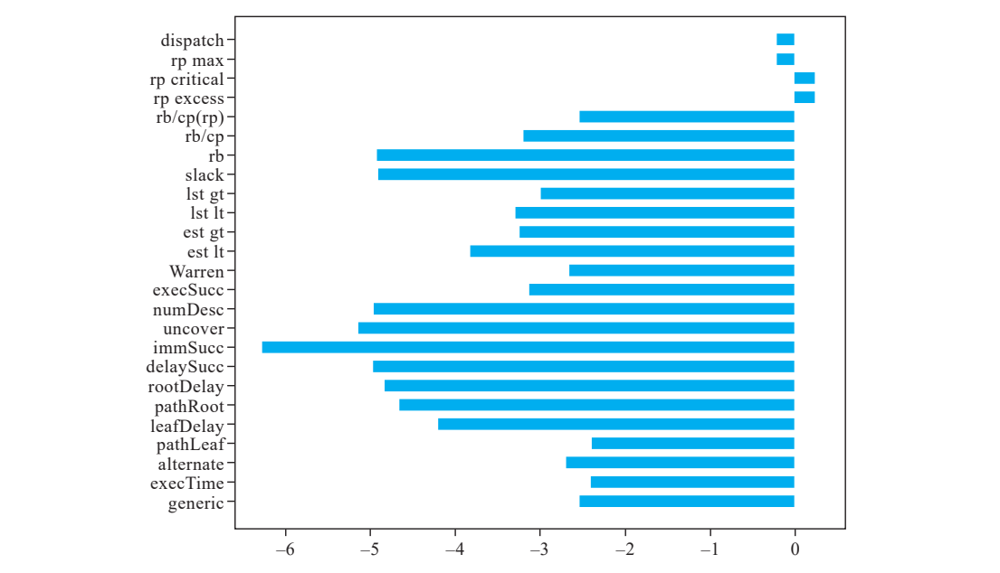

**图 8-31 SPEC 2017 整型基准测试的结果**

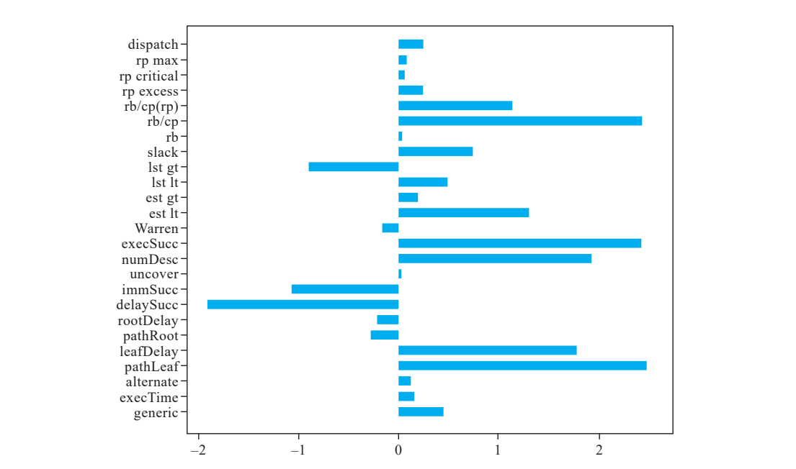

**图 8-32 SPEC 2017 浮点型基准测试的结果**

## 8.12 本章小结

本章着重介绍了 LLVM 中指令调度相关的不同算法的原理和实现，包括 Linearize 调度 器、Fast 调 度 器、BURR List 调 度 器、Source List 调 度 器、Hybrid 调 度 器、Pre-RA- MISched 调度器、Post-RA-TDList 调度器、Post-RA-MISched 调度器，并在最后对影响调度算法的因素进行了简单的介绍。

## LLVM 18 源码核查记录

- Linearize / Fast：[`ScheduleDAGFast.cpp:47`](/opt/llvm-project/llvm/lib/CodeGen/SelectionDAG/ScheduleDAGFast.cpp:47)、[`ScheduleDAGFast.cpp:670`](/opt/llvm-project/llvm/lib/CodeGen/SelectionDAG/ScheduleDAGFast.cpp:670)。确认 LIFO、逆序发射、活跃物理寄存器冲突修复。
- BURR / Source / Hybrid：[`ScheduleDAGRRList.cpp:2541`](/opt/llvm-project/llvm/lib/CodeGen/SelectionDAG/ScheduleDAGRRList.cpp:2541)。比较器、调用特殊情况和边时延参与排序，不能只按单一节点属性概括。
- MIR 调度与资源 / 压力：[`MachineScheduler.cpp:3492`](/opt/llvm-project/llvm/lib/CodeGen/MachineScheduler.cpp:3492)、[`RegisterPressure.h:140`](/opt/llvm-project/llvm/include/llvm/CodeGen/RegisterPressure.h:140)、[`TargetSchedule.cpp:173`](/opt/llvm-project/llvm/lib/CodeGen/TargetSchedule.cpp:173)。
- SMS：[`MachinePipeliner.cpp:1814`](/opt/llvm-project/llvm/lib/CodeGen/MachinePipeliner.cpp:1814)、[`MachinePipeliner.cpp:2412`](/opt/llvm-project/llvm/lib/CodeGen/MachinePipeliner.cpp:2412)、[`swp-bad-sched.ll:17`](/opt/llvm-project/llvm/test/CodeGen/Hexagon/swp-bad-sched.ll:17)。
- 完整读完本章并覆盖清单 8-1～8-14，逐项见 [review/ch8.md](review/ch8.md)。

### 留待后续运行验证

1. 使用已有 LLVM 18 工具解析与生成 RV32IM、Hexagon 示例；当前只核对语法形态、目标指令定义与源码调用链，没有执行示例。
2. 固定 triple、CPU、特性、优化级别、调度器选择和流水线入口，重新观察完整 MIR / DAG；原书所有 SUnit 编号、阶段编号、具体时延、pressure-set 数量和最终顺序仍是历史示例。
3. 运行 Hexagon 上游测试及必要的短循环 / 循环携带依赖用例，再讨论流水化正确性和实际速度；本次未运行 lit、FileCheck 或 LLVM 构建。
4. 图 8-31 / 8-32 的论文基准结果只作原文资料，不能代替当前目标的性能验证。
