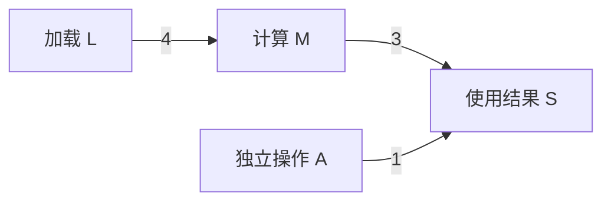
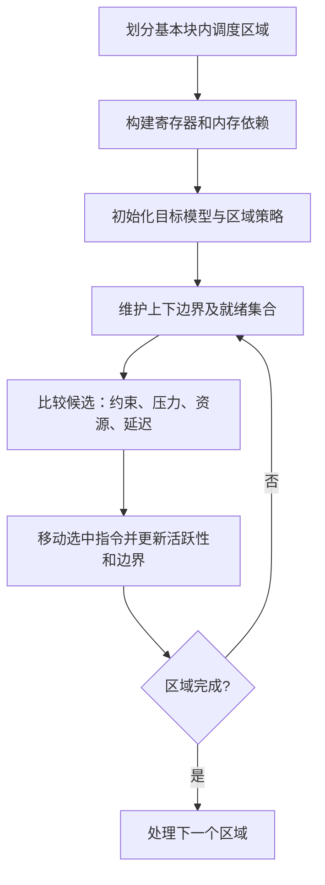
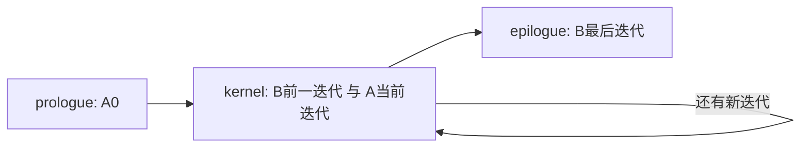

# 第 8 章 指令调度

本章依据 LLVM 18.1.8 源码和可重复实验重新编写，保留原书的节号及清单 8-1～8-14，替换没有完整输入或已不准确的历史转储。原文见 [origin](origin/inside-llvm-codegen-ch8.md)，完整输入和 runner 见 [experiments/ch8](experiments/ch8/README.md)，证据索引见 [review/ch8.md](review/ch8.md)，实际结果见 [experiments-ch8.json](review/experiments-ch8.json)。

实验包括六种 SelectionDAG 调度器、MIR 的数据/内存/输出依赖、RISC-V 分配前后调度、Hexagon 软件流水线和显式假设下的数学模型。机器指令通过 verifier，Hexagon 输出还通过所附回归测试的 FileCheck；我们没有在这些目标硬件上运行程序或测量周期。所有“延迟、发射周期、压力”都要先说明所属模型。

本章命令使用 **Bash**。先执行下面的初始化，再在同一个 Bash 会话中按正文顺序执行后续命令；输出目录会保留，便于比较各阶段文件。需要 LLVM 18.1.8 的 Debug/assertions 工具和本章涉及的后端，以及 Python 3。

<!-- manual-lab:ch8-setup -->

```sh
# 各节复用前面生成的输入；非预期错误后停止，避免误读旧文件。
set -euo pipefail
export LLVM_BUILD="${LLVM_BUILD:-/opt/llvm-project/build}"
export LLVM_SRC="${LLVM_SRC:-/opt/llvm-project}"
export BOOK_ROOT="${BOOK_ROOT:-/opt/coding/mlir-toy/llvm/inside-llvm-codegen}"
BOOK_INPUT="$BOOK_ROOT/experiments/ch8"
CODEGEN_LAB=$(mktemp -d)
"$LLVM_BUILD/bin/llc" --version > "$CODEGEN_LAB/llc-version.txt"
cat "$CODEGEN_LAB/llc-version.txt"
printf '本章输出目录：%s\n' "$CODEGEN_LAB"
```

确认版本为 18.1.8，并在注册目标中找到 BPF、RISC-V、Hexagon。本章所有输出都写入 `$CODEGEN_LAB`，`$BOOK_INPUT` 中的输入文件只读。

## 8.1 LLVM 指令调度

指令调度是在依赖和资源约束下选择机器指令的顺序。把较早可执行的独立操作放进长延迟链之间，可能减少停顿；但过早产生很多值，又可能增加寄存器压力，使后续分配需要 spill。调度因而有多个目标，不能用“始终把最长指令放前面”替代算法。

调度出现于不同阶段，输入也不同：

| 阶段 | 输入与入口 | 主要约束 |
|---|---|---|
| SelectionDAG 调度 | 选择完成的 DAG；`-pre-RA-sched=...` | 值、chain、glue、少量固定物理寄存器，以及目标调度信息 |
| 分配前 MIR 调度 | MachineScheduler，通常使用 `ScheduleDAGMILive` | 数据、内存、物理寄存器约束、活跃范围和压力 |
| 分配后 MIR 调度 | PostRASchedulerList 或 PostMachineScheduler | 已确定物理寄存器的 RAW/WAR/WAW、资源和延迟 |
| 循环软件流水线 | MachinePipeliner | 跨迭代依赖、资源复用、迭代间隔及展开后的控制流 |

这些 Pass 是否加入流水线由通用配置、目标和优化级别共同决定。`-pre-RA-sched` 只选择 DAG 调度器，不选择 MIR 的 MachineScheduler；“pre-RA”这个词在多个位置出现，并不表示它们是同一个 Pass。

### 8.1.1 指令调度算法

常见列表调度维护一个就绪集合，每步挑选一项并更新依赖。自顶向下调度从生产者向消费者推进；自底向上从消费者向生产者推进，最终发射顺序需与构造方向相适应。双向调度同时维护两条边界，比较候选后把它放入上方或下方序列。

`SUnit` 是调度单元，`SDep` 是调度依赖边。一个 SUnit 不必只对应一个原始 DAG 节点：例如 glue 连起的节点可能被合成一组；MIR 调度中的边界节点也不是普通机器指令。

| 依赖 | 例子 | 意义 |
|---|---|---|
| 数据 RAW | 定义 r，再读 r | 消费者需等生产者结果可用 |
| 反依赖 WAR | 先读 r，后覆盖 r | 防止读到后一次定义的值 |
| 输出依赖 WAW | 两次写同一 r | 保持最终可见定义和必要顺序 |
| 内存 / 顺序 | 可能别名的 load/store、屏障 | 保持内存语义；不是寄存器数据边 |
| 人工 / 弱约束 | 边界、聚类偏好 | 用于特定调度或代码质量目的，语义不能一概等同 RAW |

即使还没分配物理寄存器，MIR 也可能已经过 TwoAddressInstruction 改写，不再是 SSA；同一个虚拟寄存器多次定义会引入输出和反依赖。反过来，寄存器分配后的 anti-dependence 有时可以通过安全重命名消除，但前提是目标和活跃性允许。

### 8.1.2 拓扑排序算法

拓扑顺序只保证生产者先于消费者，没有保证隔了足够周期，也没有保证发射资源可用。考虑边 `L→M` 延迟 4，`M→S` 延迟 3，独立操作 `A→S` 延迟 1。在单发射、没有其他资源约束的模型中，按 `[L,M,A,S]` 调度的开始周期是 `[0,4,5,7]`，并不是 `[0,1,2,3]`。这个结果由 `models.py` 实际计算。



把 A 放在等待 M 的空档可能得到另一个合法安排。是否更好还取决于发射宽度、功能单元、旁路、寄存器压力，以及硬件是否能乱序执行。教材中的拓扑箭头不应冒充精确流水线模拟。

执行本章教学模型，将后续压力、延迟和软件流水边界的计算结果集中保存：

<!-- manual-lab:ch8-teaching-models -->

```sh
# 教学模型穷举小图并检查迭代边界，不模拟目标硬件执行时间。
python3 "$BOOK_INPUT/models.py" > "$CODEGEN_LAB/models.json"
python3 - "$CODEGEN_LAB/models.json" <<'PYCODE'
import json, pathlib, sys
r = json.loads(pathlib.Path(sys.argv[1]).read_text())
# 这里的压力只按单位权重 SSA 临时值计算，不能与目标 pressure set 直接等同。
p = r['ssa_boundary_pressure']
print('拓扑顺序数、最小/最大边界压力：', p['all_topological_orders'], p['minimum'], p['maximum'])
print('单发射开始周期：', r['single_issue_edge_latency']['issue_cycles'])
print('递归依赖下界：', r['recurrence'])
print('流水结构验证的 N 数量：', len(r['software_pipeline']['tested_lengths']))
PYCODE
```

结果为 80 个拓扑顺序、压力范围 3～4、开始周期 0/4/5/7；递归依赖 II=1/2 不可行、3/4 可行，流水结构覆盖 N=0～64。它们是显式模型的计算结果。

## 8.2 Linearize 调度器

### 8.2.1 构造依赖图

Linearize 是简单 DAG 线性化器，注册名 `linearize`，不是 MachineScheduler 的一种策略。它用节点的 use 计数记录尚未处理的使用关系，把 glue 使用者合并到相应代表节点，并从 `DAG->getRoot()` 开始。DAG 的实际根与普通数据图“没有前驱的源点”不是同一个概念：根通常代表需要保留的最终副作用链。

### 8.2.2 对依赖图进行调度

它先记录当前节点，然后释放相应操作数节点的未处理使用计数；当计数归零时递归处理该操作数。glue 操作数有专门路径以保持紧邻关系，EntryToken 和部分被动节点不需要发射 MI。构造出来的 `Sequence` 是消费者在前的顺序，`EmitSchedule` 逆序遍历后发射。

应把“逆序发射”与“把数据依赖方向改了”区分开：最终机器指令仍需先产生值再使用值。LLVM 源码明确警告 Linearize 不适于某些物理寄存器依赖场景；它适合观察机制和调试，不宜据名字认定它是所有目标的安全默认策略。

本章使用下面完整输入比较调度器。三个指针没有 `noalias`，读可以彼此交换，但写回 p 时必须保持潜在别名关系。没有把省略输入的 X86 历史 DAG 当作可复现例子。

**代码清单 8-1　dependencies.ll：六种 DAG 调度器共同的完整输入**

```llvm
; Independent loads can move relative to one another, while store/result
; dependencies must be preserved. No noalias premise is needed to move the
; loads past one another; they are not moved across the final store to %p.
define i64 @schedule(ptr %p, ptr %q, ptr %r) {
entry:
  ; 三条普通 load 可互相换序；最后的 store 仍需满足数据和潜在别名约束。
  %a = load i64, ptr %p, align 8
  %b = load i64, ptr %q, align 8
  %c = load i64, ptr %r, align 8
  ; x 与 y 两条计算链暂时独立，调度器可在它们之间穿插执行。
  %x = mul i64 %a, 7
  %y = add i64 %b, 11
  %z = xor i64 %x, %y
  %out = add i64 %z, %c
  store i64 %out, ptr %p, align 8
  ret i64 %out
}
```

运行形态为 `llc -mtriple=bpfel -mcpu=v1 -O2 -fast-isel=false -pre-RA-sched=linearize -verify-machineinstrs -stop-after=finalize-isel`。换成 `fast/list-burr/source/list-hybrid/list-ilp` 即可比较其他实现。runner 检查六个输出都有三个 LDD、一个写回及返回，并保留各自完整 MIR 和调试日志；不依赖易变的 SUnit 编号。

以下循环显式调用六种 DAG 调度器，固定输入、CPU 和停止点，分别保存 MIR 与日志：

<!-- manual-lab:ch8-six-dag-schedulers -->

```sh
"$LLVM_BUILD/bin/opt" -passes=verify -disable-output "$BOOK_INPUT/dependencies.ll"
# 固定输入、v1、O2 与停止点，只改变策略，比较才有明确对象。
for scheduler in linearize fast list-burr source list-hybrid list-ilp; do
  "$LLVM_BUILD/bin/llc" -mtriple=bpfel -mcpu=v1 -O2 -fast-isel=false \
    "-pre-RA-sched=$scheduler" -verify-machineinstrs \
    -debug-only=pre-RA-sched -stop-after=finalize-isel \
    "$BOOK_INPUT/dependencies.ll" -o "$CODEGEN_LAB/dag-$scheduler.mir" \
    2> "$CODEGEN_LAB/dag-$scheduler.log"
done
python3 - "$CODEGEN_LAB" <<'PYCODE'
import pathlib, re, sys
out = pathlib.Path(sys.argv[1])
for name in ['linearize', 'fast', 'list-burr', 'source', 'list-hybrid', 'list-ilp']:
    text = (out/f'dag-{name}.mir').read_text()
    # 去掉 YAML 元信息，仅检查实际机器指令 body 中的访存和返回。
    body = re.search(r'^body:\s+\|\n(.*?)(?=^\.\.\.)', text, re.M | re.S)[1]
    assert body.count('LDD ') == 3 and 'STD ' in body and 'RET' in body
    print(name, '三个 LDD、STD 和 RET 检查通过')
print((out/'dag-linearize.mir').name)
PYCODE
sed -n '/^body:/,/^\.\.\.$/p' "$CODEGEN_LAB/dag-linearize.mir"
```

六个配置均成功生成机器指令并通过 verifier；`dag-linearize.mir` 展示逆序发射后的合法指令顺序，其余文件供下面各小节比较。

## 8.3 Fast 调度器

### 8.3.1 Fast 调度器实现

Fast DAG 调度器使用自底向上的列表调度，优先快速构造合法序列。源码中的 `FastPriorityQueue` 以 `SmallVector` 存储，push 后从末尾 pop，因此是 LIFO，不能按类名中的 queue 推导成 FIFO。一个节点的必要后继处理完成后，才成为反向调度的就绪候选。

这与第 7 章的 FastISel 是两个部件：FastISel 选择指令，Fast 调度器安排已经选择的 DAG 节点。启用 `-pre-RA-sched=fast` 不等于启用 FastISel。

### 8.3.2 物理寄存器依赖场景的处理

调用、返回、隐式状态寄存器或某些指令固定的物理操作数，使分配前 DAG 也可能出现物理寄存器冲突。Fast 调度器维护 `LiveRegDefs/LiveRegCycles` 等状态，判断候选是否会破坏已安排节点需要的物理值。

冲突不能简单通过“这条指令就绪，所以照常发射”解决。实现会结合目标是否允许复制到另一寄存器类、节点是否可克隆、是否可展开 folded load 等条件，尝试重排、克隆或插入 COPY。不是所有节点都能克隆：有副作用的操作尤其需要保证语义，也不能断言每次冲突都优先克隆。

### 8.3.3 示例分析

清单 8-1 中的算术和访存可以直接比较六种合法顺序，不需要引入难以稳定重现的物理状态寄存器冲突。Fast 输出同样通过 machine verifier。验证器有助于发现寄存器约束和活跃性不一致，但它不证明生成程序在所有输入上的语义等价，也不证明某一顺序最快。

实际选择 DAG 中 EntryToken 显示 `ch,glue` 两个结果，通常引用其 chain 结果 0。glue 相关的 CopyToReg/RET 被作为紧密关系处理；EntryToken 自身不变成硬件指令。这里修正了旧稿“EntryToken 不含 glue”的错误。

直接查看上一节已经生成的 Fast 输出，不需要改动输入：

<!-- manual-lab:ch8-inspect-fast -->

```sh
sed -n '/^body:/,/^\.\.\.$/p' "$CODEGEN_LAB/dag-fast.mir"
```

比较 load 与算术的相对位置；完整调度细节在同目录 `dag-fast.log`，这一用例没有专门覆盖所有物理寄存器冲突修复分支。

## 8.4 BURR List 调度器

### 8.4.1 影响指令调度的关键因素

BURR 的名字来自 bottom-up register reduction。它在自底向上列表调度中偏向控制寄存器需求，同时处理物理寄存器约束、依赖、调用及就绪状态。典型因素包括尚未调度的前驱/后继数、Sethi-Ullman 类寄存器需求估计、路径高度/深度和目标相关成本。

经典 Sethi-Ullman 树算法在“二元表达式树、结果占一个寄存器、可交换子树求值顺序”等假设下递推：叶子标号为 1；两个子树号相等时父号加 1，不等时取最大值；先算寄存器需求更大的子树。这是理解压力的入门模型。LLVM 的图可能共享子表达式、有多个结果、固定寄存器和副作用，不能直接把树算法当作完整 BURR 实现。

Height 和 Depth 也不是无权图中的层数。对于数据依赖边 `u→v`、边延迟 L，常见递推为：

```text
Depth(v)  = max(Depth(u) + L(u,v))      对前驱 u 取最大
Height(u) = max(Height(v) + L(u,v))     对后继 v 取最大
```

没有相应前驱/后继时基值为 0。边时延可能受 producer、consumer、操作数索引和旁路共同影响，不等于每个节点固定加一。

### 8.4.2 指令优先级计算方法

`BURRSort` 是一系列有次序的比较规则。特殊节点、物理寄存器和调用等情况可能先决定结果；寄存器需求和路径信息用于后续比较，最后还需要确定性的次序。不能抽出某一个 Height/Depth 比较，就写成“所有时候优先最大 Height”。

列表调度中的就绪状态是动态的：选择一个节点后，前驱/后继的剩余计数、寄存器活跃情况和候选优先级都可能改变。初始化的表只描述某一时刻，不能直接作为每轮不变的排序键。

### 8.4.3 示例分析

`models.py` 穷举了一个小 SSA 图的全部 80 个拓扑顺序：四个独立定义 a/b/c/d，`m=a+b`、`n=c+d`、`r=m+n`，最后 store r。只计这七个 SSA 临时值、每个权重为 1、不计地址和 live-in 的前提下：

| 顺序 | 最大边界活跃值数 |
|---|---:|
| a, b, c, d, m, n, r, store | 4 |
| a, b, m, c, d, n, r, store | 3 |

穷举结果的最小值为 3、最大值为 4。它证明合法拓扑顺序可以有不同的压力，不证明 LLVM BURR 一定找到全局最小值，也不代表任意目标寄存器类的真实压力权重。

对照实际 BURR 输出和教学模型中的两条压力轨迹：

<!-- manual-lab:ch8-inspect-burr -->

```sh
sed -n '/^body:/,/^\.\.\.$/p' "$CODEGEN_LAB/dag-list-burr.mir"
python3 - "$CODEGEN_LAB/models.json" <<'PYCODE'
import json, pathlib, sys
pressure = json.loads(pathlib.Path(sys.argv[1]).read_text())['ssa_boundary_pressure']
# 每个集合是该指令之前仍需保留的值，不是为指令分配的物理寄存器表。
for label in ['broad', 'compact']:
    print(label)
    for step in pressure[label]:
        print(step['before'], step['live'])
PYCODE
```

轨迹展示每条指令之前的活跃值集合；它解释压力为何随顺序变化，不把 BPF 的真实 pressure set 简化成这个单位权重模型。

## 8.5 Source List 调度器

Source 调度器注册名 `source`，在依赖允许的范围内偏向源码/原始节点顺序，同时仍使用 RRList 调度框架处理其他约束。它不保证最终汇编逐行对应 C 的书写顺序：IR 优化、DAG combine、指令选择早已改变表达式形态，调度也不能违反依赖。

观察清单 8-1 的 `dag-source.mir` 可以比较最终 load 和算术指令的相对位置。用它定位“调度是否改变了顺序”很方便，但不能把保留较多源码顺序等同于保持更强的程序语义。

查看同一输入在 Source 策略下的完整机器指令 body：

<!-- manual-lab:ch8-inspect-source -->

```sh
sed -n '/^body:/,/^\.\.\.$/p' "$CODEGEN_LAB/dag-source.mir"
```

与 `dag-linearize.mir` 和 `dag-list-burr.mir` 比较可观察排序差别；并非要求所有策略在这个小例子中都产生不同序列。

## 8.6 Hybrid List 调度器

`list-hybrid` 在 RRList 框架中结合寄存器压力与延迟启发式；`list-ilp` 是另一个偏向指令级并行的策略。它们都不是逐节点按 Latency 数字排序：还要考虑依赖路径、就绪性、可用指令和寄存器约束。

本章六种调度器共用同一输入、CPU 和停止点；调试日志中的算法名称可以确认所选策略。结果相同不代表选项无效，可能只是这个小图在多个启发式下给出了相同选择。不同结果也只能说明调度决策不同，性能仍需要目标模型或硬件实验。

对照 Hybrid 与 ILP 两个已经生成的结果：

<!-- manual-lab:ch8-inspect-hybrid-ilp -->

```sh
for scheduler in list-hybrid list-ilp; do
  printf '%s\n' "$scheduler"
  sed -n '/^body:/,/^\.\.\.$/p' "$CODEGEN_LAB/dag-$scheduler.mir"
done
```

这些是特定启发式的排序结果，不是吞吐率或运行周期的测量。

## 8.7 Pre-RA-MISched 调度器

### 8.7.1 Pre-RA-MISched 调度器实现

MachineScheduler 在 MachineFunction 上建立调度 DAG。分配前实现通常用 `ScheduleDAGMILive` 保持活跃性并评估压力；策略接口负责挑选候选，通用实现为 `GenericScheduler`，目标可以替换或调整策略。



选择策略可以只从顶部、只从底部或双向工作。源码默认偏向 bottom-up，目标和 `-misched-topdown/-misched-bottomup` 可覆盖。`ReadyCycle/CurrCycle` 是调度模型中的可用时间和边界时间，不是“已经排了几条指令”的计数器；多发射、资源占用和 hazard 都会影响它们。

现在改在 MIR 阶段显式启用 MachineScheduler，保存依赖边、策略和压力信息：

<!-- manual-lab:ch8-bpf-machine-scheduler -->

```sh
# 显式启用 MIR 调度，与前面的 -pre-RA-sched 所选 DAG 调度器区分开。
"$LLVM_BUILD/bin/llc" -mtriple=bpfel -mcpu=v1 -O2 -fast-isel=false \
  -enable-misched=true -verify-machineinstrs -debug-only=machine-scheduler \
  -stop-after=machine-scheduler "$BOOK_INPUT/dependencies.ll" \
  -o "$CODEGEN_LAB/bpf-misched.mir" 2> "$CODEGEN_LAB/bpf-misched.log"
python3 - "$CODEGEN_LAB/bpf-misched.log" <<'PYCODE'
import pathlib, re, sys
log = pathlib.Path(sys.argv[1]).read_text()
# 查数据、内存和输出依赖，避免只用 def-use 边解释所有重排限制。
assert all(x in log for x in ['Data Latency=', 'Memory', 'Out  Latency=', 'Pressure'])
for line in log.splitlines():
    if any(x in line for x in ['RegionPolicy:', 'Max Pressure:', 'Data Latency=', 'Out  Latency=', 'Memory']):
        print(line)
print('数据边的延迟集合：', sorted(set(map(int, re.findall(r'Data Latency=(\d+)', log)))))
PYCODE
```

日志可见 Data、Memory、Out 三类关系；该输入的数据边模型值含 0、1、4，区域还报告压力追踪策略。不要把它与 DAG 日志中的节点延迟混用。

### 8.7.2 调度区域的划分

区域通常位于单个机器基本块中，不能直接越过边界自由搬动指令。`TargetInstrInfo::isSchedulingBoundary` 及目标覆盖决定边界；调用、terminator、position 指令、`INLINEASM_BR`、栈指针定义等都可能相关。这不是“只有 call、branch、return 三类”的封闭清单。

boundary SUnit 表示区域外的使用或定义，不能把它当作最后一条普通算术指令。类似地，调试信息和不参与调度的伪指令需要在移动过程中保持正确位置。

### 8.7.3 影响 Pre-RA-MISched 调度器的关键因素

`GenericScheduler::tryCandidate` 先考虑物理寄存器偏好，再避免压力超额及关键压力集最大值增长；随后根据是否比较同一边界、循环延迟限制、stall、聚类和弱边等条件，比较资源和延迟，并用原顺序打破平局。具体顺序影响结果，不能把这些因素写成无序列表后声称“综合分数最大者获胜”。

压力追踪也并非总开着。通用启发式只在区域指令数大于可分配整数寄存器数的一半时启用；目标可覆盖，`-misched-regpressure=false` 可以关掉。显式写 `true` 并不能自动越过这个区域大小判断。

本轮实际发现，原书压力示例在固定 RV32 配置下只有 14 条区域指令，日志为 `ShouldTrackPressure=0`；因此不能给它编造一张所谓 LLVM 18 实测压力表。我们另加四项点积输入扩大区域，实际观察 `ShouldTrackPressure=1`，并保留日志中的真实 pressure set 数值。

### 8.7.4 MIR 指令时延的计算

LLVM 支持 itinerary 和较新的调度模型。旧 itinerary 用阶段、功能单元、操作数周期及旁路描述机器；新模型通过 `SchedWrite/SchedRead`、资源和 `ReadAdvance` 描述生产者结果与消费者读取需求。目标可以只提供其中一部分，缺失信息时使用目标的默认延迟；不能从“没有表”推断延迟全为零。

下面所有 TD 片段都取自可独立解析的 `schedule-model.td`。runner 用 llvm-tblgen 解析完整文件并检查记录；该教学 target 没有注册成 LLVM 后端，也不是可执行处理器模拟器。

把完整教学 target 交给 TableGen，检查操作数与 ReadAdvance 记录的关联：

<!-- manual-lab:ch8-tablegen-schedule-model -->

```sh
# 解析完整教学 target，单独的 WriteRes 片段没有足够上下文。
"$LLVM_BUILD/bin/llvm-tblgen" -I "$LLVM_SRC/llvm/include" -dump-json \
  "$BOOK_INPUT/schedule-model.td" -o "$CODEGEN_LAB/schedule-model.json"
python3 - "$CODEGEN_LAB/schedule-model.json" <<'PYCODE'
import json, pathlib, sys
records = json.loads(pathlib.Path(sys.argv[1]).read_text())
# SchedRW 按定义和使用操作数关联记录，确认 EXIn 确实用于 MUL 的输入。
rw = [x['def'] for x in records['DemoMUL']['SchedRW']]
advance = [v for v in records.values() if isinstance(v, dict) and 'ReadAdvance' in v.get('!superclasses', []) and v.get('Cycles') == 1]
assert rw == ['MULOut', 'EXIn', 'OrdinaryRead']
# ReadAdvance 只针对匹配的生产者写记录，不能套到所有数据依赖上。
assert any(v['ValidWrites'][0]['def'] == 'ALUOut' for v in advance)
print('DemoMUL SchedRW:', rw)
print('EXIn 对 ALUOut 的 ReadAdvance=1；假设选用该模型时边延迟 max(0, 2-1)=1')
PYCODE
```

解析和关联检查通过的是完整 TD 记录。下面清单只是该输入的节选，不能各自单独替代 `schedule-model.td`。

**代码清单 8-2　旧 itinerary 的阶段定义（完整文件中的节选）**

```tablegen
def II_CSRrr : InstrItinClass;
def ISSUE : FuncUnit;
def ALU : FuncUnit;
def CSR : FuncUnit;
// DemoItineraries 中的一项：
// TimeInc 从当前阶段开始计时；0 可表示下一阶段与本阶段同周期开始。
InstrItinData<II_CSRrr,
  [InstrStage<1, [ISSUE], 0>, InstrStage<1, [ALU], 2>,
   InstrStage<1, [CSR], 0>], [4, 4]>
```

`InstrStage<Cycles, Units, TimeInc>` 的 `TimeInc` 从本阶段开始计算下一阶段的起点；省略时按本阶段 Cycles 推进。上例 ISSUE 从 0 开始、ALU 也从 0 开始、CSR 从 2 开始；不能把三个 stage 的 Cycles 简单求和，作为所有数据边的时延。`[4,4]` 是操作数周期信息，与阶段占用的作用不同。

下面的教学模型让 ADD 结果写延迟为 2，MUL 结果写延迟为 4；MUL 的第一个输入使用 EXIn，并对来自 ALUOut 的结果提前 1 周期读取。

**代码清单 8-3　WriteRes、ReadAdvance 及资源模型**

```tablegen
// 写记录描述结果何时可用；读记录描述消费者何时需要某个输入。
def ALUOut : SchedWrite;
def MULOut : SchedWrite;
def EXIn : SchedRead;
def OrdinaryRead : SchedRead;
def DemoModel : SchedMachineModel {
  // 这是教学机器每周期可发射的微操作数约束，不是指令结果延迟。
  let IssueWidth = 1;
  let CompleteModel = 0;
}
let SchedModel = DemoModel in {
  def UnitALU : ProcResource<1>;
  def : WriteRes<ALUOut, [UnitALU]> { let Latency = 2; }
  def : WriteRes<MULOut, [UnitALU]> { let Latency = 4; }
  // 只对 ALUOut 生产的结果允许提前一周期读取，相当于描述一种旁路。
  def : ReadAdvance<EXIn, 1, [ALUOut]>;
  def : ReadAdvance<OrdinaryRead, 0>;
}
```

**代码清单 8-4　ADD 到 MUL 的依赖及 SchedRW 关联**

```text
// 伪汇编：仅表达数据依赖，不是某目标可汇编语法
r3 = ADD r1, r2
r5 = MUL r3, r4

// 完整教学 TD 中的关联：
// SchedRW 先写后读；MUL 的 EXIn 只关联第一个显式输入。
def DemoADD : BinOp<[ALUOut, OrdinaryRead, OrdinaryRead]>;
def DemoMUL : BinOp<[MULOut, EXIn, OrdinaryRead]>;
```

若新调度模型选中了这两个写/读记录，ADD 到 MUL 第一个输入的边时延为 `max(0, 2 - 1) = 1`。不是 `MUL` 的写延迟 4 减 1；4 描述 MUL 自己产生结果所需的时间。第二个 MUL 输入采用 OrdinaryRead，没有这个 advance。实际计算还依赖 producer 的 def 索引、consumer 的 use 索引、选中的调度类和 WriteID。

`TargetSchedModel::computeOperandLatency` 对新模型用写延迟减 ReadAdvance 并防止负值；negative ReadAdvance 反而增加延迟。若走 itinerary 路径则查询对应 operand cycle/bypass；没有有效模型时再使用目标的默认值。

**代码清单 8-5　ALUrr itinerary 对照项**

```tablegen
def II_ALUrr : InstrItinClass;
// DemoItineraries 中的一项：
// 省略 TimeInc 时按当前阶段 Cycles 前进；操作数周期表另行描述值可用时间。
InstrItinData<II_ALUrr,
  [InstrStage<1, [ISSUE]>, InstrStage<1, [ALU]>], [2, 2, 2]>
```

本章 BPF 同一输入就展示了区分模型的必要性：DAG RRList 日志的 load 数据边可为 1，而强制启用 MIR MachineScheduler 后，load 的数据边为 4，算术边为 1，COPY 边为 0。这里记录的是这两个调度阶段采用的 LLVM 模型，不是实测 BPF 指令周期；BPF 名字下还可能有不同 JIT/硬件执行环境。

### 8.7.5 寄存器压力的计算

寄存器压力按 target 定义的 pressure set 统计，不等于“活跃虚拟寄存器的个数”，也不等于“每个 RegisterClass 对应一个数组格子”。一个寄存器类可能影响多个压力集，权重来自目标定义；物理寄存器别名、子寄存器 lane、live-in/live-out、early-clobber 和 dead def 都会影响计算。

沿指令序列向后追踪时，概念上先从 live-after 移除本指令定义，再加入它读取的值，得到 live-before。这个简单集合公式适合普通 SSA 边界模型；LLVM 的 tracker 还处理子寄存器和指令执行时的瞬时压力。因此只看两个边界的活跃值数，未必覆盖一条有 early-clobber 的指令执行过程中的峰值。

`PressureDiff` 是描述某个调度动作对压力变化的稀疏摘要，不是一张固定“11 类寄存器”的完整向量。`RegPressureDelta` 把候选对超额压力、关键集最大值和当前区域最大值的影响交给策略；“增加压力”也不是无条件禁止，必要的数据依赖可能要求这么做。

清单 8-1 在 BPF MIR 调度中真实报告 `Max Pressure: GPR32=4`。这里的 `GPR32` 是压力集名字；函数使用 i64 值和 `gpr` 寄存器类，不能因名字含 32 就认定值被截成 32 位。实验 JSON 同时保存 MIR 和日志，方便核对。

### 8.7.6 示例分析

首先保留原书计算式，用 C 获取不带 C++ 名字修饰的函数，固定 RV32IM/ilp32。

**代码清单 8-6　完整压力示例 pressure.c**

```c
void test(int a, int *x, int *y) {
  // b 后面被多次使用；调度改变其产生和最后使用之间的距离，就会影响活跃范围。
  int b = a * x[0] + y[0];
  int c = b + x[1];
  int d = c * y[1];
  y[2] = b + c + d;
}
```

前端与后端都指定 E31，保存原压力示例在 MIR 调度前后的状态：

<!-- manual-lab:ch8-rv32-small-pressure -->

```sh
# 前端 IR 带 target-cpu 属性；前后端都固定 E31，避免只改 llc 参数却仍使用另一模型。
"$LLVM_BUILD/bin/clang" --target=riscv32-unknown-elf -march=rv32im \
  -mabi=ilp32 -mcpu=sifive-e31 -O2 -fno-discard-value-names \
  -S -emit-llvm "$BOOK_INPUT/pressure.c" -o "$CODEGEN_LAB/pressure.ll"
"$LLVM_BUILD/bin/opt" -passes=verify -disable-output "$CODEGEN_LAB/pressure.ll"
for stop in before after; do
  "$LLVM_BUILD/bin/llc" -mtriple=riscv32-unknown-elf -mcpu=sifive-e31 \
    -mattr=+m -O2 -enable-misched=true -verify-machineinstrs \
    -debug-only=machine-scheduler "-stop-$stop=machine-scheduler" \
    "$CODEGEN_LAB/pressure.ll" -o "$CODEGEN_LAB/rv32-pre-$stop.mir" \
    2> "$CODEGEN_LAB/rv32-pre-$stop.log"
done
python3 - "$CODEGEN_LAB" <<'PYCODE'
import pathlib, re, sys
out = pathlib.Path(sys.argv[1])
for stop in ['before', 'after']:
    text = (out/f'rv32-pre-{stop}.mir').read_text()
    body = re.search(r'^body:\s+\|\n(.*?)(?=^\.\.\.)', text, re.M | re.S)[1]
    assert 'MUL ' in body and 'MULW' not in body and 'ADDW' not in body
log = (out/'rv32-pre-after.log').read_text()
# 先检查区域策略是否启用压力追踪，不能为未追踪的区域编造压力统计。
assert 'ShouldTrackPressure=0' in log
print('\n'.join(x for x in log.splitlines() if 'RegionPolicy:' in x or 'RegionInstrs:' in x))
PYCODE
```

原例使用 RV32 的 `MUL/ADD`，区域为 14 条指令且 `ShouldTrackPressure=0`；下面的 MIR 是该次生成的实际结果。

**代码清单 8-7　RV32 machine-scheduler 后的实际 MIR body**

此 MIR 输出节选已加中文阅读注释，原指令顺序和操作数保持不变。

```yaml
bb.0.entry:
    liveins: $x10, $x11, $x12

    ; 这是分配前 MIR：%N 仍为虚拟寄存器，本例 $xN 来自 ABI 参数寄存器。
    %1:gpr = COPY $x11
    %3:gpr = LW %1, 0 :: (load (s32) from %ir.x, !tbaa !6)
    %0:gpr = COPY $x10
    %4:gpr = nsw MUL %3, %0
    %2:gpr = COPY $x12
    %5:gpr = LW %2, 0 :: (load (s32) from %ir.y, !tbaa !6)
    %6:gpr = nsw ADD %4, %5
    %7:gpr = LW %1, 4 :: (load (s32) from %ir.arrayidx2, !tbaa !6)
    ; 此 load 与前面的独立计算可以穿插，但其使用者必须等待值可用。
    %9:gpr = LW %2, 4 :: (load (s32) from %ir.arrayidx4, !tbaa !6)
    %8:gpr = nsw ADD %6, %7
    %10:gpr = nsw MUL %8, %9
    ; %6 仍在这里使用，因此不能在上一次使用后就认定它已不再活跃。
    %11:gpr = nsw ADD %8, %6
    %12:gpr = nsw ADD %11, %10
    SW %12, %2, 8 :: (store (s32) into %ir.arrayidx8, !tbaa !6)
    PseudoRET
```

输入使用 `clang --target=riscv32-unknown-elf -march=rv32im -mabi=ilp32 -mcpu=sifive-e31 -O2 -S -emit-llvm`。本例前端和后端都指定 SiFive E31。IR 内的 target 属性与 llc 配置共同生效；本例明确给出所有命令，不能只看 llc 的 `-mcpu` 就忽略函数属性。RV32 使用 `ADD/MUL`，RV64 的 `ADDW/MULW` 不应出现在这里。

此输入的日志不启用压力追踪。补充输入 `pressure-large.c` 是四项 i32 点积，完整源码如下：

```c
int dot4(const int *x, const int *y) {
  // 增加独立计算可扩大调度区域，但也可能让更多中间结果同时活跃。
  int a = x[0] * y[0];
  int b = x[1] * y[1];
  int c = x[2] * y[2];
  int d = x[3] * y[3];
  return a + b + c + d;
}
```

它增加了区域大小，触发默认压力追踪。下面是这次执行的实际区域和初始最大压力摘要（调度开始前的扫描结果，不是最终调度峰值）；不同 CPU、参数和输入变化后要重新读取，不能从原书表格推导。

```text
 RegionInstrs: 18
GenericScheduler RegionPolicy:  ShouldTrackPressure=1 OnlyTopDown=0 OnlyBottomUp=1
Max Pressure: GPRC=2
GPRC_with_SR07=2
GPRTC=2
GPR=6
```

通过对比 `rv32-pre-before.mir/rv32-pre-after.mir` 可以观察排序变化；通过 `rv32-pressure-large.log` 可以观察策略和压力。若某个输出顺序变了，应该回到依赖图解释它为什么合法，而不是仅给 SUnit 编号排列。

对四项点积使用相同 ISA、ABI 和 CPU，让更大的区域触发压力追踪：

<!-- manual-lab:ch8-rv32-large-pressure -->

```sh
"$LLVM_BUILD/bin/clang" --target=riscv32-unknown-elf -march=rv32im \
  -mabi=ilp32 -mcpu=sifive-e31 -O2 -fno-discard-value-names \
  -S -emit-llvm "$BOOK_INPUT/pressure-large.c" -o "$CODEGEN_LAB/pressure-large.ll"
"$LLVM_BUILD/bin/opt" -passes=verify -disable-output "$CODEGEN_LAB/pressure-large.ll"
# CPU 与原例相同，仅扩大输入区域，观察压力追踪的大小启发式。
"$LLVM_BUILD/bin/llc" -mtriple=riscv32-unknown-elf -mcpu=sifive-e31 \
  -mattr=+m -O2 -enable-misched=true -verify-machineinstrs \
  -debug-only=machine-scheduler -stop-after=machine-scheduler \
  "$CODEGEN_LAB/pressure-large.ll" -o "$CODEGEN_LAB/rv32-pressure-large.mir" \
  2> "$CODEGEN_LAB/rv32-pressure-large.log"
python3 - "$CODEGEN_LAB/rv32-pressure-large.log" <<'PYCODE'
import pathlib, re, sys
log = pathlib.Path(sys.argv[1]).read_text()
assert 'ShouldTrackPressure=1' in log and 'Max Pressure:' in log
print('\n'.join(x for x in log.splitlines() if 'RegionPolicy:' in x or 'RegionInstrs:' in x))
# 此 Max Pressure 来自调度开始前的扫描，不是最终输出序列的实测峰值。
print(re.search(r'Max Pressure:.*?(?=Live In:)', log, re.S)[0])
PYCODE
```

18 条区域指令启用追踪；这里打印的是调度开始前扫描得到的最大压力摘要。完整日志中的后续 Bottom Pressure 是另一观察点。

## 8.8 Post-RA-TDList 调度器

### 8.8.1 Post-RA-TDList 调度器实现

PostRASchedulerList 在寄存器分配之后对机器指令做自顶向下列表调度。此时寄存器已被具体分配，调度需维护物理寄存器数据、反依赖和输出依赖，同时处理资源/hazard。它的主要任务不再是为未来分配减少虚拟寄存器压力，而是改善既定物理寄存器约束下的指令顺序。

`-post-RA-scheduler=true` 可显式请求这个路径。是否在目标默认流水线中启用另有配置。反依赖打破由 `-break-anti-dependencies=critical/all/none` 控制，LLVM 18 此选项默认 none；即使选择 all，也不是所有反依赖都能安全删除。重命名必须遵守寄存器类、保留寄存器和活跃范围。

### 8.8.2 示例分析

下面保留原计算，源语言有符号溢出仍受 C 规则约束。

**代码清单 8-8　postra.c 的完整输入**

```c
int g_val = 1;
// 跨多个乘法保留 x，便于观察优化后表达式与物理寄存器使用之间的关系。
int MUL(int x, int y) {
  int a = y * x;
  int z = g_val * x;
  int q = x + a;
  return z * q;
}
```

先生成 `postra.c` 的 IR，再只启用 PostRASchedulerList 这一种 post-RA 调度器：

<!-- manual-lab:ch8-postra-tdlist -->

```sh
"$LLVM_BUILD/bin/clang" --target=riscv32-unknown-elf -march=rv32im \
  -mabi=ilp32 -mcpu=sifive-e31 -O2 -fno-discard-value-names \
  -S -emit-llvm "$BOOK_INPUT/postra.c" -o "$CODEGEN_LAB/postra.ll"
"$LLVM_BUILD/bin/opt" -passes=verify -disable-output "$CODEGEN_LAB/postra.ll"
# 两个 post-RA 实现互斥启用，便于把结果归因于所选调度器。
"$LLVM_BUILD/bin/llc" -mtriple=riscv32-unknown-elf -mcpu=sifive-e31 \
  -mattr=+m -O2 -post-RA-scheduler=true -enable-post-misched=false \
  -verify-machineinstrs -debug-only=post-RA-sched,machine-scheduler \
  -stop-after=post-RA-sched "$CODEGEN_LAB/postra.ll" \
  -o "$CODEGEN_LAB/rv32-post-tdlist.mir" 2> "$CODEGEN_LAB/rv32-post-tdlist.log"
python3 - "$CODEGEN_LAB/rv32-post-tdlist.mir" <<'PYCODE'
import pathlib, re, sys
mir = pathlib.Path(sys.argv[1]).read_text()
body = re.search(r'^body:\s+\|\n(.*?)(?=^\.\.\.)', mir, re.M | re.S)[1]
# 只检查 body，确认分配已完成；模块内的 IR 文本仍可能合法包含 %N。
assert '$x10' in body and 'MUL ' in body and not re.search(r'%\d', body)
print(body)
PYCODE
```

最终 body 只有物理寄存器，不再出现 `%N` 虚拟寄存器；保存的日志允许区分此前的 pre-RA 阶段与实际 post-RA 调度。

**代码清单 8-9　显式 PostRASchedulerList 后的实际 RV32 MIR**

此 MIR 输出节选已加阅读注释，便于辨认物理寄存器和隐式返回依赖。

```yaml
bb.0.entry:
    liveins: $x10, $x11

    ; 高/低重定位片段共同形成全局地址，必须连同符号一起理解。
    renamable $x12 = LUI target-flags(riscv-hi) @g_val
    renamable $x12 = LW killed renamable $x12, target-flags(riscv-lo) @g_val :: (dereferenceable load (s32) from @g_val, !tbaa !6)
    renamable $x11 = ADDI killed renamable $x11, 1
    ; 同一个物理寄存器既读又写；重排必须保留旧值读取和新值定义的顺序。
    renamable $x10 = MUL killed renamable $x10, renamable $x10
    renamable $x11 = MUL killed renamable $x11, killed renamable $x12
    renamable $x10 = MUL killed renamable $x10, killed renamable $x11
    ; 返回值通过隐式使用保活，不能因没有显式输入列表就删掉最终定义。
    PseudoRET implicit $x10
```

Clang O2 与后端合并已把源表达式变为等价于 `g_val * (y+1) * x*x` 的计算形式；只有在原 C 执行有定义的输入范围内要求保持结果，不能把 `nsw` 忽略后要求任意有符号溢出仍与 C 对照。这里出现 `$x10` 等物理寄存器，虚拟 `%N` 已消失。地址形成、全局符号重定位标记、调用约定返回操作数都是实际输出的一部分，不能只保留算术三行后宣称它是完整可解析 MIR。

runner 分开生成 `rv32-post-tdlist.mir` 和 `rv32-post-misched.mir`，避免两个 post-RA 实现同时启用时归因混乱。两种结果都通过 machine verifier，但不由这些小输入得出吞吐性能结论。

## 8.9 Post-RA-MISched 调度器

PostMachineScheduler 复用 MachineScheduler 框架和 `ScheduleDAGMI`，策略通常为 GenericPostRAScheduler。和使用 `ScheduleDAGMILive` 的分配前阶段相比，它重点依赖已经确定的物理寄存器关系以及资源/延迟模型，不进行同样的虚拟寄存器压力优化。

实验使用 `-post-RA-scheduler=false -enable-post-misched=true -stop-after=postmisched`，另一组使用 `-post-RA-scheduler=true -enable-post-misched=false -stop-after=post-RA-sched`。停止点和选项同时记录在 JSON 中。

通用资源策略中的 CriticalResources/DemandedResources 与瓶颈资源、需求和候选的资源增量有关；它们不是“区间内资源”和“跨区间资源”的分类。若具体 CPU 模型缺失或有 no-model 默认项，调度行为可能更多依赖默认延迟，不能凭资源策略的名字假定已模拟完整硬件。

复用上一节的 `postra.ll`，关闭 TDList 并显式启用 PostMachineScheduler：

<!-- manual-lab:ch8-postra-misched -->

```sh
# 使用同一份 postra.ll，仅切换到 PostMachineScheduler 及其停止点。
"$LLVM_BUILD/bin/llc" -mtriple=riscv32-unknown-elf -mcpu=sifive-e31 \
  -mattr=+m -O2 -post-RA-scheduler=false -enable-post-misched=true \
  -verify-machineinstrs -debug-only=post-RA-sched,machine-scheduler \
  -stop-after=postmisched "$CODEGEN_LAB/postra.ll" \
  -o "$CODEGEN_LAB/rv32-post-misched.mir" 2> "$CODEGEN_LAB/rv32-post-misched.log"
python3 - "$CODEGEN_LAB/rv32-post-misched.mir" <<'PYCODE'
import pathlib, re, sys
mir = pathlib.Path(sys.argv[1]).read_text()
body = re.search(r'^body:\s+\|\n(.*?)(?=^\.\.\.)', mir, re.M | re.S)[1]
assert '$x10' in body and 'MUL ' in body and not re.search(r'%\d', body)
print(body)
PYCODE
```

两种 post-RA 输出现在可直接比较；成功生成并验证不等于已经比较了它们的硬件性能。

## 8.10 循环调度

### 8.10.1 循环调度算法实现

软件流水线把不同迭代的操作交错执行。迭代间隔 II（Initiation Interval）表示稳态下相邻迭代启动的间隔；单次迭代自身可能跨多个 II 才完成。prologue 建立流水，kernel 重复稳态安排，epilogue 排空尚未完成的操作。

LLVM 的 MachinePipeliner 实现 Swing Modulo Scheduling（SMS）。它先检查目标和循环是否支持：典型条件包括合适的单基本块循环、preheader、可分析的循环分支、目标循环信息和 pragma/选项限制。仅有一个 backedge 并不能保证软件流水线一定成功。

依赖边必须同时带延迟 L 和迭代距离 d。若 u 在某迭代的开始偏移为 t(u)，v 在相距 d 次迭代的偏移为 t(v)，约束是：

```text
t(v) - t(u) >= L(u,v) - d(u,v) * II
```

距离是迭代数，不能与周期时延混为一谈。对循环依赖环求和，偏移抵消，得到 recurrence 下界：

```text
RecMII = max_cycle ceil(sum(edge_latency) / sum(iteration_distance))
```

这里只对总距离为正的依赖环使用该分式；总距离零且总正延迟的环不允许这种有限调度。`models.py` 用 u(i)→v(i) 延迟 2、v(i)→u(i+1) 延迟 1 的两节点例子，穷举偏移验证 II=1/2 不可行，II=3/4 可行，RecMII=3。

上述分式是一般理论。LLVM 18 当前实现有更具体的限制：`getDistance` 仅把指向 PHI 的 anti-dependence 识别为距离 1，其余返回 0；`calculateRecMII` 对构造的 recurrence NodeSet 使用其累计 latency，并把 Distance 设为 1。它没有在这里实现任意数组跨多次迭代距离的通用精确分析，不能把一般公式的表达能力当作已实现能力。

资源下界 ResMII 由稳态每次迭代需求和资源容量决定，还受微操作数/IssueWidth 下界约束。LLVM 18 有 DFA 与调度资源模型两种计算路径，不应把实现限定成一张手画的占用表。初始 MII 通常取 `max(RecMII, ResMII)`；即使两个下界都满足，也可能没有同时满足依赖和资源的安排，算法会在有界 II 范围内尝试，不保证总能找到最优解。

SMS 为候选 II 计算节点 ASAP/ALAP 和相关优先级。忽略需要特殊处理的依赖后，核心形式是：

```text
ASAP(v) = max(0, max_pred(ASAP(u) + L(u,v) - d(u,v)*II))
ALAP(u) = min(maxASAP, min_succ(ALAP(v) - L(u,v) + d(u,v)*II))
MOV(u)  = ALAP(u) - ASAP(u)
```

ALAP 对后继取最小值，不是最大值。LLVM 还按 recurrence 集合、拓扑关系、零延迟深度/高度等组织节点顺序；它不会只按 MOV 排序一次就结束。调度一个节点时，已排的前驱给出下界，已排的后继给出上界，二者同时存在时必须取窗口交集，并在 modulo resource table 中检查资源占用。

stage 根据选定开始周期相对调度首周期计算，不能无条件取“绝对周期除以 II”。最后展开需要处理 PHI、跨 stage 值、循环计数、短迭代路径和别名关系；prologue/epilogue 可能有多个块。

用两阶段、无跨迭代依赖的教学模型看最小展开。A_i 计算 `x[i]+1`，B_i 计算 `2*A_i`；假定两个独立可流水单元，发射宽度至少为 2，A→B 延迟为 1。下面 Python 只验证值和迭代次数，不模拟指令发射硬件。

**代码清单 8-10　串行版本（完整 Python 函数）**

```python
def serial(x):
    # 每个元素对应一次独立迭代，用作流水结构的结果基准。
    return [2 * (v + 1) for v in x]
```

**代码清单 8-11　保持迭代次数的软件流水结构（完整 Python 函数）**

```python
def pipelined(x):
    n = len(x)
    result = [None] * n
    # 空输入不执行 prologue，避免额外访问 x[0]。
    if n:
        a = x[0] + 1                  # prologue: A_0
        # 先消费上一迭代的 a 再更新它；Python 这里验证值关系，并不实际并行发射。
        for i in range(1, n):
            result[i - 1] = 2 * a     # kernel: B_(i-1)
            a = x[i] + 1              # kernel: A_i
        result[n - 1] = 2 * a         # epilogue: B_(n-1)
    return result
```

在硬件假设允许时，kernel 的 B_(i−1) 与 A_i 可以同周期执行；Python 顺序运行只是表达其数据关系。runner 对 N=0～64 比较两种结果，特别覆盖空循环和一次迭代。漏掉 `if n` 或把排空次数写错，都可能凭空多做一次访问。



### 8.10.2 示例分析

实际 LLVM 软件流水实验采用本地回归测试 `llvm/test/CodeGen/Hexagon/swp-bad-sched.ll`，完整复制到实验目录，保留函数、声明、属性、TBAA 和 FileCheck 条件。指定 Hexagon v60 并启用 `-enable-pipeliner -enable-aa-sched-mi -pipeliner-experimental-cg=true`。下面给出完整计算函数及支持定义，检查模式见随附文件；这些元数据与声明不能从可运行输入中随意删除。

**代码清单 8-12　Hexagon 软件流水完整 IR 输入（省略顶部 RUN/CHECK 注释）**

```llvm
; Function Attrs: nounwind
define void @f0(ptr nocapture %a0, i32 %a1, ptr nocapture %a2) #0 {
b0:
  %v0 = icmp sgt i32 %a1, 0
  br i1 %v0, label %b1, label %b9

b1:                                               ; preds = %b0
  %v1 = icmp ugt i32 %a1, 3
  %v2 = add i32 %a1, -3
  br i1 %v1, label %b2, label %b5

b2:                                               ; preds = %b1
  br label %b3

; 四份展开工作共享这个回边；PHI 同时接收初值与上次迭代的累计值。
b3:                                               ; preds = %b3, %b2
  %v3 = phi i32 [ %v48, %b3 ], [ 0, %b2 ]
  %v4 = phi i32 [ %v46, %b3 ], [ 0, %b2 ]
  %v5 = phi i32 [ %v49, %b3 ], [ 0, %b2 ]
  %v6 = getelementptr inbounds [576 x i32], ptr %a0, i32 0, i32 %v5
  %v7 = load i32, ptr %v6, align 4, !tbaa !0
  ; 第一个下标 1 前进一个完整的 [576 x i32] 对象，不是只前进一个 i32。
  %v8 = getelementptr inbounds [576 x i32], ptr %a0, i32 1, i32 %v5
  %v9 = load i32, ptr %v8, align 4, !tbaa !0
  %v10 = add nsw i32 %v9, %v7
  store i32 %v10, ptr %v6, align 4, !tbaa !0
  %v11 = sub nsw i32 %v7, %v9
  store i32 %v11, ptr %v8, align 4, !tbaa !0
  %v12 = tail call i32 @llvm.hexagon.A2.abs(i32 %v10)
  %v13 = or i32 %v12, %v4
  %v14 = tail call i32 @llvm.hexagon.A2.abs(i32 %v11)
  %v15 = or i32 %v14, %v3
  %v16 = add nsw i32 %v5, 1
  %v17 = getelementptr inbounds [576 x i32], ptr %a0, i32 0, i32 %v16
  %v18 = load i32, ptr %v17, align 4, !tbaa !0
  %v19 = getelementptr inbounds [576 x i32], ptr %a0, i32 1, i32 %v16
  %v20 = load i32, ptr %v19, align 4, !tbaa !0
  %v21 = add nsw i32 %v20, %v18
  store i32 %v21, ptr %v17, align 4, !tbaa !0
  %v22 = sub nsw i32 %v18, %v20
  store i32 %v22, ptr %v19, align 4, !tbaa !0
  %v23 = tail call i32 @llvm.hexagon.A2.abs(i32 %v21)
  %v24 = or i32 %v23, %v13
  %v25 = tail call i32 @llvm.hexagon.A2.abs(i32 %v22)
  %v26 = or i32 %v25, %v15
  %v27 = add nsw i32 %v5, 2
  %v28 = getelementptr inbounds [576 x i32], ptr %a0, i32 0, i32 %v27
  %v29 = load i32, ptr %v28, align 4, !tbaa !0
  %v30 = getelementptr inbounds [576 x i32], ptr %a0, i32 1, i32 %v27
  %v31 = load i32, ptr %v30, align 4, !tbaa !0
  %v32 = add nsw i32 %v31, %v29
  store i32 %v32, ptr %v28, align 4, !tbaa !0
  %v33 = sub nsw i32 %v29, %v31
  store i32 %v33, ptr %v30, align 4, !tbaa !0
  %v34 = tail call i32 @llvm.hexagon.A2.abs(i32 %v32)
  %v35 = or i32 %v34, %v24
  %v36 = tail call i32 @llvm.hexagon.A2.abs(i32 %v33)
  %v37 = or i32 %v36, %v26
  %v38 = add nsw i32 %v5, 3
  %v39 = getelementptr inbounds [576 x i32], ptr %a0, i32 0, i32 %v38
  %v40 = load i32, ptr %v39, align 4, !tbaa !0
  %v41 = getelementptr inbounds [576 x i32], ptr %a0, i32 1, i32 %v38
  %v42 = load i32, ptr %v41, align 4, !tbaa !0
  %v43 = add nsw i32 %v42, %v40
  store i32 %v43, ptr %v39, align 4, !tbaa !0
  %v44 = sub nsw i32 %v40, %v42
  store i32 %v44, ptr %v41, align 4, !tbaa !0
  %v45 = tail call i32 @llvm.hexagon.A2.abs(i32 %v43)
  %v46 = or i32 %v45, %v35
  %v47 = tail call i32 @llvm.hexagon.A2.abs(i32 %v44)
  %v48 = or i32 %v47, %v37
  %v49 = add nsw i32 %v5, 4
  %v50 = icmp slt i32 %v49, %v2
  br i1 %v50, label %b3, label %b4

b4:                                               ; preds = %b3
  br label %b5

; 合并大循环与直接进入尾循环的路径，恢复剩余迭代的起点和累计状态。
b5:                                               ; preds = %b4, %b1
  %v51 = phi i32 [ 0, %b1 ], [ %v49, %b4 ]
  %v52 = phi i32 [ 0, %b1 ], [ %v48, %b4 ]
  %v53 = phi i32 [ 0, %b1 ], [ %v46, %b4 ]
  %v54 = icmp eq i32 %v51, %a1
  br i1 %v54, label %b9, label %b6

b6:                                               ; preds = %b5
  br label %b7

; 尾部循环每次处理一项；它与前面的展开循环要分别判断软件流水是否成功。
b7:                                               ; preds = %b7, %b6
  %v55 = phi i32 [ %v67, %b7 ], [ %v52, %b6 ]
  %v56 = phi i32 [ %v65, %b7 ], [ %v53, %b6 ]
  %v57 = phi i32 [ %v68, %b7 ], [ %v51, %b6 ]
  %v58 = getelementptr inbounds [576 x i32], ptr %a0, i32 0, i32 %v57
  %v59 = load i32, ptr %v58, align 4, !tbaa !0
  %v60 = getelementptr inbounds [576 x i32], ptr %a0, i32 1, i32 %v57
  %v61 = load i32, ptr %v60, align 4, !tbaa !0
  %v62 = add nsw i32 %v61, %v59
  store i32 %v62, ptr %v58, align 4, !tbaa !0
  %v63 = sub nsw i32 %v59, %v61
  store i32 %v63, ptr %v60, align 4, !tbaa !0
  %v64 = tail call i32 @llvm.hexagon.A2.abs(i32 %v62)
  %v65 = or i32 %v64, %v56
  %v66 = tail call i32 @llvm.hexagon.A2.abs(i32 %v63)
  %v67 = or i32 %v66, %v55
  %v68 = add nsw i32 %v57, 1
  %v69 = icmp eq i32 %v68, %a1
  br i1 %v69, label %b8, label %b7

b8:                                               ; preds = %b7
  br label %b9

; 把不同退出路径上的累计值合并后写回，不能只检查循环内的算术。
b9:                                               ; preds = %b8, %b5, %b0
  %v70 = phi i32 [ 0, %b0 ], [ %v52, %b5 ], [ %v67, %b8 ]
  %v71 = phi i32 [ 0, %b0 ], [ %v53, %b5 ], [ %v65, %b8 ]
  %v72 = load i32, ptr %a2, align 4, !tbaa !0
  %v73 = or i32 %v72, %v71
  store i32 %v73, ptr %a2, align 4, !tbaa !0
  %v74 = getelementptr inbounds i32, ptr %a2, i32 1
  %v75 = load i32, ptr %v74, align 4, !tbaa !0
  %v76 = or i32 %v75, %v70
  store i32 %v76, ptr %v74, align 4, !tbaa !0
  ret void
}

; Function Attrs: nounwind readnone
declare i32 @llvm.hexagon.A2.abs(i32) #1

attributes #0 = { nounwind }
attributes #1 = { nounwind readnone }

!0 = !{!1, !1, i64 0}
!1 = !{!"int", !2}
!2 = !{!"omnipotent char", !3}
!3 = !{!"Simple C/C++ TBAA"}
```

runner 在 `pipeliner` 前后保存完整 MIR，还生成最终汇编并执行 FileCheck。下面的清单展示实际调度前后 MIR，寄存器和基本块编号仅属于本次输出。

验证完整 Hexagon 输入，并分别停在 pipeliner 前、后。CPU、别名分析和 experimental codegen 选项与回归实验一致：

<!-- manual-lab:ch8-hexagon-pipeliner-mir -->

```sh
"$LLVM_BUILD/bin/opt" -passes=verify -disable-output "$BOOK_INPUT/swp-bad-sched.ll"
# 固定 v60 及实验性展开器，前后快照才对应本章已验证的同一次流水线配置。
for stop in before after; do
  "$LLVM_BUILD/bin/llc" -mtriple=hexagon -mcpu=hexagonv60 -O2 \
    -enable-pipeliner -enable-aa-sched-mi -pipeliner-experimental-cg=true \
    -verify-machineinstrs -debug-only=pipeliner "-stop-$stop=pipeliner" \
    "$BOOK_INPUT/swp-bad-sched.ll" -o "$CODEGEN_LAB/hexagon-sms-$stop.mir" \
    2> "$CODEGEN_LAB/hexagon-sms-$stop.log"
done
python3 - "$CODEGEN_LAB/hexagon-sms-before.mir" "$CODEGEN_LAB/hexagon-sms-after.mir" <<'PYCODE'
import pathlib, re, sys
bodies = [re.search(r'^body:\s+\|\n(.*?)(?=^\.\.\.)', pathlib.Path(p).read_text(), re.M | re.S)[1] for p in sys.argv[1:]]
# MIR 变化只是变换发生的证据；最终 packet 布局还要用下一块 FileCheck 检查。
assert bodies[0] != bodies[1]
print('pipeliner 前后 body 行数：', len(bodies[0].splitlines()), len(bodies[1].splitlines()))
PYCODE
```

两个完整 YAML 文件保留在临时目录，body 确实变化。下面的清单展示同一输入的前后状态，后续还要检查最终汇编与实际 II 日志。

**代码清单 8-13　pipeliner 前的实际 Hexagon MIR body**

此 MIR 输出节选已加阅读注释，原块名、指令与依赖操作数未改动。

```yaml
bb.0.b0:
    successors: %bb.1(0x50000000), %bb.8(0x30000000)
    liveins: $r0, $r1, $r2

    %27:intregs = COPY $r2
    %26:intregs = COPY $r1
    %25:intregs = COPY $r0
    %29:predregs = C2_cmpgti %26, 0
    J2_jumpt %29, %bb.1, implicit-def $pc

  bb.8:
    successors: %bb.7(0x80000000)

    %28:intregs = A2_tfrsi 0
    J2_jump %bb.7, implicit-def $pc

  bb.1.b1:
    successors: %bb.2(0x40000000), %bb.4(0x40000000)

    %32:predregs = C2_cmpgtui %26, 3
    %31:intregs = A2_tfrsi 0
    J2_jumpf %32, %bb.4, implicit-def dead $pc
    J2_jump %bb.2, implicit-def dead $pc

  bb.2.b2:
    successors: %bb.3(0x80000000)

    %1:intregs = A2_addi %25, 2316
    %34:intregs = A2_tfrsi 0
    %72:intregs = S2_lsr_i_r %26, 2
    %73:intregs = COPY %72
    J2_loop0r %bb.3, %73, implicit-def $lc0, implicit-def $sa0, implicit-def $usr

  ; 展开循环：多个读写及累计 PHI 共同限制了可调度空间。
  bb.3.b3 (machine-block-address-taken):
    successors: %bb.3(0x7c000000), %bb.4(0x04000000)

    %2:intregs = PHI %1, %bb.2, %9, %bb.3
    %3:intregs = PHI %34, %bb.2, %7, %bb.3
    %4:intregs = PHI %34, %bb.2, %6, %bb.3
    %5:intregs = PHI %34, %bb.2, %8, %bb.3
    %35:intregs = L2_loadri_io %2, -2316 :: (load (s32) from %ir.cgep14, !tbaa !0)
    %36:intregs = L2_loadri_io %2, -12 :: (load (s32) from %ir.cgep15, !tbaa !0)
    %37:intregs = nsw A2_add %36, %35
    S2_storeri_io %2, -2316, %37 :: (store (s32) into %ir.cgep14, !tbaa !0)
    %38:intregs = nsw A2_sub %35, %36
    S2_storeri_io %2, -12, %38 :: (store (s32) into %ir.cgep15, !tbaa !0)
    %39:intregs = A2_abs %37
    %40:intregs = A2_abs %38
    %41:intregs = L2_loadri_io %2, -2312 :: (load (s32) from %ir.cgep16, !tbaa !0)
    %42:intregs = L2_loadri_io %2, -8 :: (load (s32) from %ir.cgep17, !tbaa !0)
    %43:intregs = nsw A2_add %42, %41
    S2_storeri_io %2, -2312, %43 :: (store (s32) into %ir.cgep16, !tbaa !0)
    %44:intregs = nsw A2_sub %41, %42
    S2_storeri_io %2, -8, %44 :: (store (s32) into %ir.cgep17, !tbaa !0)
    %45:intregs = A2_abs %43
    %46:intregs = M4_or_or %45, killed %39, %4
    %47:intregs = A2_abs %44
    %48:intregs = M4_or_or %47, killed %40, %3
    %49:intregs = L2_loadri_io %2, -2308 :: (load (s32) from %ir.cgep18, !tbaa !0)
    %50:intregs = L2_loadri_io %2, -4 :: (load (s32) from %ir.cgep19, !tbaa !0)
    %51:intregs = nsw A2_add %50, %49
    S2_storeri_io %2, -2308, %51 :: (store (s32) into %ir.cgep18, !tbaa !0)
    %52:intregs = nsw A2_sub %49, %50
    S2_storeri_io %2, -4, %52 :: (store (s32) into %ir.cgep19, !tbaa !0)
    %53:intregs = A2_abs %51
    %54:intregs = A2_abs %52
    %55:intregs = L2_loadri_io %2, -2304 :: (load (s32) from %ir.cgep20, !tbaa !0)
    %56:intregs = L2_loadri_io %2, 0 :: (load (s32) from %ir.lsr.iv5, !tbaa !0)
    %57:intregs = nsw A2_add %56, %55
    S2_storeri_io %2, -2304, %57 :: (store (s32) into %ir.cgep20, !tbaa !0)
    %58:intregs = nsw A2_sub %55, %56
    S2_storeri_io %2, 0, %58 :: (store (s32) into %ir.lsr.iv5, !tbaa !0)
    %59:intregs = A2_abs %57
    %6:intregs = M4_or_or %59, killed %53, killed %46
    %60:intregs = A2_abs %58
    %7:intregs = M4_or_or %60, killed %54, killed %48
    %8:intregs = nsw A2_addi %5, 4
    %9:intregs = A2_addi %2, 16
    ENDLOOP0 %bb.3, implicit-def $pc, implicit-def $lc0, implicit $sa0, implicit $lc0
    J2_jump %bb.4, implicit-def dead $pc

  bb.4.b5:
    successors: %bb.7(0x40000000), %bb.5(0x40000000)

    %10:intregs = PHI %31, %bb.1, %8, %bb.3
    %11:intregs = PHI %31, %bb.1, %7, %bb.3
    %12:intregs = PHI %31, %bb.1, %6, %bb.3
    %62:predregs = C2_cmpeq %26, %10
    J2_jumpt killed %62, %bb.7, implicit-def dead $pc
    J2_jump %bb.5, implicit-def dead $pc

  bb.5.b6:
    successors: %bb.6(0x80000000)

    %13:intregs = A2_sub %26, %10
    %14:intregs = S2_addasl_rrri %25, %10, 2
    %71:intregs = COPY %13
    J2_loop0r %bb.6, %71, implicit-def $lc0, implicit-def $sa0, implicit-def $usr

  ; 每次处理一项的尾循环；其 PHI 携带跨迭代依赖，是本次成功流水化的对象。
  bb.6.b7 (machine-block-address-taken):
    successors: %bb.7(0x04000000), %bb.6(0x7c000000)

    %15:intregs = PHI %14, %bb.5, %22, %bb.6
    %17:intregs = PHI %11, %bb.5, %20, %bb.6
    %18:intregs = PHI %12, %bb.5, %19, %bb.6
    ; intregs 是寄存器类，%N 仍是虚拟寄存器；此时还不是最终硬件分配。
    %63:intregs = L2_loadri_io %15, 0 :: (load (s32) from %ir.lsr.iv1, !tbaa !0)
    %64:intregs = L2_loadri_io %15, 2304 :: (load (s32) from %ir.cgep23, !tbaa !0)
    %65:intregs = nsw A2_add %64, %63
    S2_storeri_io %15, 0, %65 :: (store (s32) into %ir.lsr.iv1, !tbaa !0)
    %66:intregs = nsw A2_sub %63, %64
    S2_storeri_io %15, 2304, %66 :: (store (s32) into %ir.cgep23, !tbaa !0)
    %67:intregs = A2_abs %65
    %19:intregs = A2_or killed %67, %18
    %68:intregs = A2_abs %66
    %20:intregs = A2_or killed %68, %17
    %22:intregs = A2_addi %15, 4
    ENDLOOP0 %bb.6, implicit-def $pc, implicit-def $lc0, implicit $sa0, implicit $lc0
    J2_jump %bb.7, implicit-def dead $pc

  bb.7.b9:
    %23:intregs = PHI %28, %bb.8, %11, %bb.4, %20, %bb.6
    %24:intregs = PHI %28, %bb.8, %12, %bb.4, %19, %bb.6
    L4_or_memopw_io %27, 0, %24 :: (store (s32) into %ir.a2, !tbaa !0), (load (s32) from %ir.a2, !tbaa !0)
    L4_or_memopw_io %27, 4, %23 :: (store (s32) into %ir.cgep25, !tbaa !0), (load (s32) from %ir.cgep25, !tbaa !0)
    PS_jmpret $r31, implicit-def dead $pc
```

**代码清单 8-14　pipeliner 后的实际 Hexagon MIR body**

此 MIR 输出节选已加阅读注释；新增块的角色是解释，不是原始工具打印的注释。

```yaml
bb.0.b0:
    successors: %bb.1(0x50000000), %bb.8(0x30000000)
    liveins: $r0, $r1, $r2

    %27:intregs = COPY $r2
    %26:intregs = COPY $r1
    %25:intregs = COPY $r0
    %29:predregs = C2_cmpgti %26, 0
    %75:intregs = IMPLICIT_DEF
    J2_jumpt %29, %bb.1, implicit-def $pc

  bb.8:
    successors: %bb.7(0x80000000)

    %28:intregs = A2_tfrsi 0
    J2_jump %bb.7, implicit-def $pc

  bb.1.b1:
    successors: %bb.2(0x40000000), %bb.4(0x40000000)

    %32:predregs = C2_cmpgtui %26, 3
    %31:intregs = A2_tfrsi 0
    J2_jumpf %32, %bb.4, implicit-def dead $pc
    J2_jump %bb.2, implicit-def dead $pc

  bb.2.b2:
    successors: %bb.3(0x80000000)

    %1:intregs = A2_addi %25, 2316
    %34:intregs = A2_tfrsi 0
    %72:intregs = S2_lsr_i_r %26, 2
    %73:intregs = COPY %72
    J2_loop0r %bb.3, %73, implicit-def $lc0, implicit-def $sa0, implicit-def $usr

  bb.3.b3 (machine-block-address-taken):
    successors: %bb.3(0x7c000000), %bb.4(0x04000000)

    %2:intregs = PHI %1, %bb.2, %9, %bb.3
    %3:intregs = PHI %34, %bb.2, %7, %bb.3
    %4:intregs = PHI %34, %bb.2, %6, %bb.3
    %5:intregs = PHI %34, %bb.2, %8, %bb.3
    %35:intregs = L2_loadri_io %2, -2316 :: (load (s32) from %ir.cgep14, !tbaa !0)
    %36:intregs = L2_loadri_io %2, -12 :: (load (s32) from %ir.cgep15, !tbaa !0)
    %37:intregs = nsw A2_add %36, %35
    S2_storeri_io %2, -2316, %37 :: (store (s32) into %ir.cgep14, !tbaa !0)
    %38:intregs = nsw A2_sub %35, %36
    S2_storeri_io %2, -12, %38 :: (store (s32) into %ir.cgep15, !tbaa !0)
    %39:intregs = A2_abs %37
    %40:intregs = A2_abs %38
    %41:intregs = L2_loadri_io %2, -2312 :: (load (s32) from %ir.cgep16, !tbaa !0)
    %42:intregs = L2_loadri_io %2, -8 :: (load (s32) from %ir.cgep17, !tbaa !0)
    %43:intregs = nsw A2_add %42, %41
    S2_storeri_io %2, -2312, %43 :: (store (s32) into %ir.cgep16, !tbaa !0)
    %44:intregs = nsw A2_sub %41, %42
    S2_storeri_io %2, -8, %44 :: (store (s32) into %ir.cgep17, !tbaa !0)
    %45:intregs = A2_abs %43
    %46:intregs = M4_or_or %45, %39, %4
    %47:intregs = A2_abs %44
    %48:intregs = M4_or_or %47, %40, %3
    %49:intregs = L2_loadri_io %2, -2308 :: (load (s32) from %ir.cgep18, !tbaa !0)
    %50:intregs = L2_loadri_io %2, -4 :: (load (s32) from %ir.cgep19, !tbaa !0)
    %51:intregs = nsw A2_add %50, %49
    S2_storeri_io %2, -2308, %51 :: (store (s32) into %ir.cgep18, !tbaa !0)
    %52:intregs = nsw A2_sub %49, %50
    S2_storeri_io %2, -4, %52 :: (store (s32) into %ir.cgep19, !tbaa !0)
    %53:intregs = A2_abs %51
    %54:intregs = A2_abs %52
    %55:intregs = L2_loadri_io %2, -2304 :: (load (s32) from %ir.cgep20, !tbaa !0)
    %56:intregs = L2_loadri_io %2, 0 :: (load (s32) from %ir.lsr.iv5, !tbaa !0)
    %57:intregs = nsw A2_add %56, %55
    S2_storeri_io %2, -2304, %57 :: (store (s32) into %ir.cgep20, !tbaa !0)
    %58:intregs = nsw A2_sub %55, %56
    S2_storeri_io %2, 0, %58 :: (store (s32) into %ir.lsr.iv5, !tbaa !0)
    %59:intregs = A2_abs %57
    %6:intregs = M4_or_or %59, %53, %46
    %60:intregs = A2_abs %58
    %7:intregs = M4_or_or %60, %54, %48
    %8:intregs = nsw A2_addi %5, 4
    %9:intregs = A2_addi %2, 16
    ENDLOOP0 %bb.3, implicit-def $pc, implicit-def $lc0, implicit $sa0, implicit $lc0
    J2_jump %bb.4, implicit-def dead $pc

  bb.4.b5:
    successors: %bb.7(0x40000000), %bb.5(0x40000000)

    %10:intregs = PHI %31, %bb.1, %8, %bb.3
    %11:intregs = PHI %31, %bb.1, %7, %bb.3
    %12:intregs = PHI %31, %bb.1, %6, %bb.3
    %62:predregs = C2_cmpeq %26, %10
    J2_jumpt %62, %bb.7, implicit-def dead $pc
    J2_jump %bb.5, implicit-def dead $pc

  bb.5.b6:
    successors: %bb.9(0x80000000)

    %13:intregs = A2_sub %26, %10
    %14:intregs = S2_addasl_rrri %25, %10, 2
    %71:intregs = COPY %13
    %114:intregs = A2_addi %71, -1

  ; 新增的前置块先准备流水需要的值，并处理迭代数较少的路径。
  bb.9.b7:
    successors: %bb.6(0x40000000), %bb.11(0x40000000)

    %87:intregs = L2_loadri_io %14, 0 :: (load (s32) from %ir.lsr.iv1, !tbaa !0)
    %88:intregs = L2_loadri_io %14, 2304 :: (load (s32) from %ir.cgep23, !tbaa !0)
    %89:intregs = nsw A2_sub %87, %88
    S2_storeri_io %14, 2304, %89 :: (store (s32) into %ir.cgep23, !tbaa !0)
    %90:intregs = nsw A2_add %88, %87
    %91:intregs = A2_addi %14, 4
    %92:intregs = A2_abs %89
    %93:intregs = A2_abs %90
    S2_storeri_io %14, 0, %90 :: (store (s32) into %ir.lsr.iv1, !tbaa !0)
    %113:predregs = C2_cmpgtui %71, 1
    J2_loop0r %bb.6, %114, implicit-def $lc0, implicit-def $sa0, implicit-def $usr
    J2_jumpf %113, %bb.11, implicit-def $pc
    J2_jump %bb.6, implicit-def $pc

  ; 稳态循环：新增 PHI 保存不同流水阶段之间传递的值。
  bb.6.b7 (machine-block-address-taken):
    successors: %bb.11(0x04000000), %bb.6(0x7c000000)

    %74:intregs = PHI %92, %bb.9, %68, %bb.6
    %76:intregs = PHI %11, %bb.9, %20, %bb.6
    %77:intregs = PHI %93, %bb.9, %67, %bb.6
    %78:intregs = PHI %12, %bb.9, %19, %bb.6
    %79:intregs = PHI %91, %bb.9, %22, %bb.6
    %20:intregs = A2_or %74, %76
    %19:intregs = A2_or %77, %78
    %63:intregs = L2_loadri_io %79, 0 :: (load (s32) from %ir.lsr.iv1, !tbaa !0)
    %64:intregs = L2_loadri_io %79, 2304 :: (load (s32) from %ir.cgep23, !tbaa !0)
    %66:intregs = nsw A2_sub %63, %64
    S2_storeri_io %79, 2304, %66 :: (store (s32) into %ir.cgep23, !tbaa !0)
    %65:intregs = nsw A2_add %64, %63
    %22:intregs = A2_addi %79, 4
    %68:intregs = A2_abs %66
    %67:intregs = A2_abs %65
    S2_storeri_io %79, 0, %65 :: (store (s32) into %ir.lsr.iv1, !tbaa !0)
    ENDLOOP0 %bb.6, implicit-def $pc, implicit-def $lc0, implicit $sa0, implicit $lc0
    J2_jump %bb.11, implicit-def $pc

  ; 离开稳态循环后，合并最后一轮值与短路径值，为排空和最终结果做准备。
  bb.11.b7:
    successors: %bb.10(0x80000000)

    %99:intregs = PHI %68, %bb.6, %92, %bb.9
    %100:intregs = PHI %20, %bb.6, %11, %bb.9
    %101:intregs = PHI %67, %bb.6, %93, %bb.9
    %102:intregs = PHI %19, %bb.6, %12, %bb.9
    %104:intregs = A2_or %99, %100
    %105:intregs = A2_or %101, %102
    J2_jump %bb.10, implicit-def $pc

  ; 在汇入原退出块前完成剩余累计值；不能把新增块视为多执行一次原循环。
  bb.10.b7:
    successors: %bb.7(0x80000000)

    J2_jump %bb.7, implicit-def $pc

  bb.7.b9:
    %23:intregs = PHI %28, %bb.8, %11, %bb.4, %104, %bb.10
    %24:intregs = PHI %28, %bb.8, %12, %bb.4, %105, %bb.10
    L4_or_memopw_io %27, 0, %24 :: (store (s32) into %ir.a2, !tbaa !0), (load (s32) from %ir.a2, !tbaa !0)
    L4_or_memopw_io %27, 4, %23 :: (store (s32) into %ir.cgep25, !tbaa !0), (load (s32) from %ir.cgep25, !tbaa !0)
    PS_jmpret $r31, implicit-def dead $pc
```

前后文本发生变化以及出现硬件 loop 指令，仍不能单独证明软件流水正确。这里额外使用上游针对这个案例的 FileCheck 模式核对关键 packet/循环布局，并启用 machine verifier。它们检查的是这条回归测试关心的性质，未覆盖所有运行时输入，也不能直接作为性能测量。

本轮实际 SMS 的下界/尝试信息如下，取自 `hexagon-sms.stderr`；不沿用原书的数字只有在对应循环的实际日志支持时才使用。

```text
MII = 3 MAX_II = 13 (rec=2, res=3)
Schedule Found? 1 (II=3)
MII = 10 MAX_II = 20 (rec=2, res=10)
Schedule Found? 0 (II=20)
No schedule found, return
```

本次小循环（IR `b7`，流水化前 MIR `bb.6.b7`）得到 `rec=2, res=3`，并在 II=3 找到安排。较大的展开循环（IR `b3`）下界为 10，尝试至 20 仍未找到安排，保留普通循环。这是有界启发式搜索失败，不证明不存在可行安排。

分析前后代码时，应先定位本次被流水化的循环，再确认其 prologue、kernel 和 epilogue 及跨块 PHI。这个输入有不止一个循环，不能把一段日志的 MII 贴到整个函数上；同样不能把第一次尝试的下界当作最终成功 II。

继续生成完整汇编，执行输入文件自带的 FileCheck，再核对两个循环的实际尝试结果：

<!-- manual-lab:ch8-hexagon-filecheck -->

```sh
"$LLVM_BUILD/bin/llc" -mtriple=hexagon -mcpu=hexagonv60 -O2 \
  -enable-pipeliner -enable-aa-sched-mi -pipeliner-experimental-cg=true \
  -verify-machineinstrs -debug-only=pipeliner "$BOOK_INPUT/swp-bad-sched.ll" \
  -o "$CODEGEN_LAB/hexagon-sms.s" 2> "$CODEGEN_LAB/hexagon-sms.log"
# 使用输入自带的模式检查关键汇编布局，不要求所有寄存器号和排版逐字相同。
"$LLVM_BUILD/bin/FileCheck" "$BOOK_INPUT/swp-bad-sched.ll" \
  --input-file "$CODEGEN_LAB/hexagon-sms.s"
python3 - "$CODEGEN_LAB/hexagon-sms.s" "$CODEGEN_LAB/hexagon-sms.log" <<'PYCODE'
import pathlib, sys
asm, log = (pathlib.Path(p).read_text() for p in sys.argv[1:])
assert 'loop0(' in asm and 'endloop0' in asm
# 分别检查两个循环的成功/失败记录，不能把某个 II 推广到整个函数。
assert 'Schedule Found? 1 (II=3)' in log
assert 'Schedule Found? 0 (II=20)' in log
for line in log.splitlines():
    if any(x in line for x in ['MII =', 'Schedule Found?', 'No schedule found']):
        print(line)
print('FileCheck 通过；硬件循环起始数量：', asm.count('loop0('))
PYCODE
```

小循环在 II=3 成功，较大循环尝试到 II=20 失败，最终汇编通过该回归测试的检查。这里的两个结果是正、负调度尝试，整个 llc 命令本身应成功退出。

## 8.11 扩展阅读：调度算法的影响因素

选择调度策略时要同时看依赖、目标模型和编译阶段。分配前更容易通过改变生产/消费距离影响压力；分配后物理寄存器已固定，更侧重延迟与资源、可安全消除的反依赖。过早发射 load 有时隐藏延迟，有时把活跃范围拉长；过度串行化又可能牺牲并行性。

内存别名信息影响调度自由度：能证明不别名的访问可以少一些顺序边，不能证明时应保守。volatile、atomic、屏障和异常/控制流条件各有语义，不能为了得到更漂亮的图而删除约束。循环中还要区分同迭代依赖和跨迭代依赖。

乱序处理器可以在编译器生成的顺序基础上动态安排部分执行，但仍受到窗口大小、寄存器重命名、分支预测和内存系统限制；编译期调度并非因此无用。顺序/VLIW 目标更直接依赖正确的静态模型。无论哪类目标，调度模型的周期数都要与测量分开报告。

本章记录了固定 LLVM 版本和参数下的可观察结果，没有复刻原书论文图的性能柱状图。若要比较策略，至少应固定工作负载、优化流水线、CPU/JIT/运行环境、测量方式和统计口径；更短的 MIR 文本或更小的某个 Height 不是性能证据。

## 8.12 本章小结

调度首先要满足依赖，再在资源、延迟和寄存器需求之间作选择。拓扑关系、LLVM 模型周期、硬件实测周期是三个不同层次；pressure set、寄存器类和活跃值个数也不同。可复现的输入和明确的停止点，比一张脱离配置的 SUnit 编号表更能帮助理解调度。

按上面的命令可以逐阶段复现；另需汇总 JSON 时可执行 `python3 "$BOOK_INPUT/runner.py"`。

默认输出到新临时目录，包含各策略 MIR、stderr 调度日志、TableGen JSON、Hexagon 汇编和结果报告。`--output` 指定保存位置，`--summary` 另存 JSON；`--bpf-only` 是部分环境下的探索入口，不代表 RISC-V/Hexagon 部分通过。

## LLVM 18 源码依据

- [FastPriorityQueue 与 DAG Fast 调度](/opt/llvm-project/llvm/lib/CodeGen/SelectionDAG/ScheduleDAGFast.cpp:46)、[Linearize 调度及逆序发射](/opt/llvm-project/llvm/lib/CodeGen/SelectionDAG/ScheduleDAGFast.cpp:670)。
- [BURRSort / Source / Hybrid](/opt/llvm-project/llvm/lib/CodeGen/SelectionDAG/ScheduleDAGRRList.cpp:2541)、[MachineScheduler 区域划分](/opt/llvm-project/llvm/lib/CodeGen/MachineScheduler.cpp:497)、[候选比较](/opt/llvm-project/llvm/lib/CodeGen/MachineScheduler.cpp:3492)。
- [区域压力策略](/opt/llvm-project/llvm/lib/CodeGen/MachineScheduler.cpp:3241)、[PressureDiff](/opt/llvm-project/llvm/include/llvm/CodeGen/RegisterPressure.h:140)、[TargetSchedModel::computeOperandLatency](/opt/llvm-project/llvm/lib/CodeGen/TargetSchedule.cpp:173)。
- [PostRASchedulerList 选项](/opt/llvm-project/llvm/lib/CodeGen/PostRASchedulerList.cpp:54)、[PostMachineScheduler 注册](/opt/llvm-project/llvm/lib/CodeGen/MachineScheduler.cpp:277)。
- [MachinePipeliner 筛选循环](/opt/llvm-project/llvm/lib/CodeGen/MachinePipeliner.cpp:353)、[ASAP / ALAP](/opt/llvm-project/llvm/lib/CodeGen/MachinePipeliner.cpp:1814)、[资源下界](/opt/llvm-project/llvm/lib/CodeGen/MachinePipeliner.cpp:1536)、[Hexagon 回归测试](/opt/llvm-project/llvm/test/CodeGen/Hexagon/swp-bad-sched.ll:1)。
