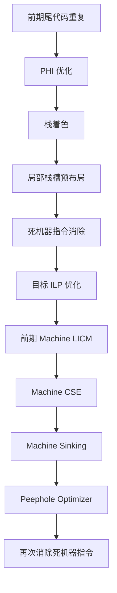
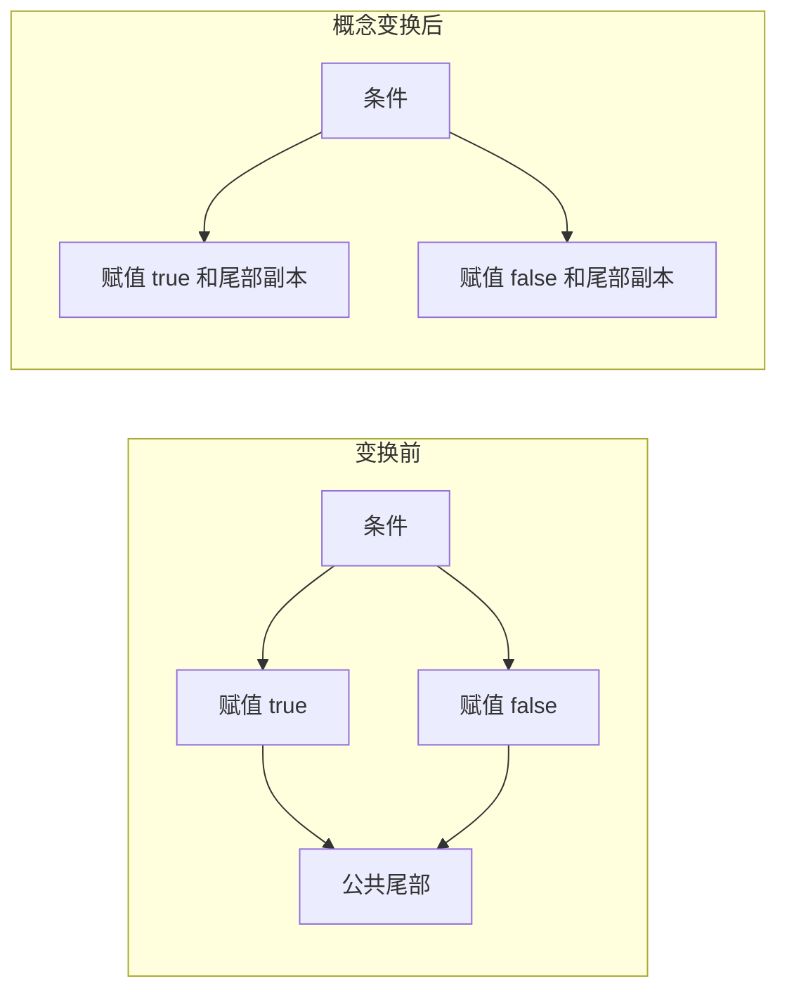

# 第 9 章 基于 SSA 形式的编译优化

> 本章以 LLVM 18.1.8（源码 HEAD `3b5b5c1ec4a3095ab096dd780e84d7ab81f3d7ff`）的实现和本地实验为准。原书 LLVM 15.0.1 全文留在 `origin/`；本章保留节次和清单编号，重写过时推导与输出。实验使用 Debug、Assertions 构建，MIR 命令启用 `-verify-machineinstrs`，结果见 [校核记录](review/ch9.md) 和 [实验结果](review/experiments-ch9.json)。

机器级优化处理的是已经选成目标指令的 MIR。寄存器分配前的这一组 Pass 通常使用虚拟寄存器 SSA：每个虚拟寄存器只有一个定义，控制流汇聚处使用机器 PHI。SSA 简化了追溯定义、判定等价和移动指令的工作，但没有消除内存别名、物理寄存器副作用或目标约束。寄存器分配准备阶段会销毁 PHI、转换两地址指令，届时 MIR 不再具有同样的 SSA 性质。

`TargetPassConfig::addMachinePasses` 在优化级别不是 `None` 时调用 `addMachineSSAOptimization`。通用顺序如下；`addILPOpts` 是目标钩子，目标还可以替换或禁用 Pass。



`-O0` 不运行整个序列，但通用路径仍会加入局部栈槽分配。是否真正处理栈槽，还取决于目标是否需要虚拟基址寄存器。本章的例子刻意分别测试一个 Pass，避免把后续 Pass 的效果误归给当前算法。

复现实验只需运行以下命令，输出默认进入新临时目录；可用 `--out /tmp/ch9` 指定目录。所有输入位于 [experiments/ch9](experiments/ch9/runner.py)。

```sh
LLVM_BUILD=${LLVM_BUILD:-/opt/llvm-project/build}
LLVM_SRC=${LLVM_SRC:-/opt/llvm-project}
BOOK_ROOT=/opt/coding/mlir-toy/llvm/inside-llvm-codegen
export LLVM_BUILD LLVM_SRC BOOK_ROOT
python3 "$BOOK_ROOT/experiments/ch9/runner.py"
```

## 9.1 前期尾代码重复

### 9.1.1 尾代码重复原理

尾代码重复把公共后继块的指令复制到合适的前驱末尾，消除原先到该块的跳转。它可能增加静态代码量，却缩短热路径并为常量传播、PHI 化简和布局提供机会。是否更快需要测量，不能从少了一条 `jmp` 直接推出。

**代码清单 9-1 两个分支汇聚后返回的 C++ 例子**

```cpp
bool isEven(int x) {
    bool result;
    if (x % 2 == 0)
        result = true;
    else
        result = false;
    return result;
}
```

在概念 CFG 中，可以把共同的返回块复制到两个赋值块末尾。但这个示意不保证由优化后的 Clang 产生：前端或中端可能直接把函数化简为一次比较。还必须区分概念变换与 EarlyTailDuplicate 的实际限制——LLVM 18 的寄存器分配前路径拒绝包含 return 的候选。



已有直通关系、能直接合并的相邻块和必须跳转才能到达的公共尾块，具有不同收益。不能仅以两个块是否相邻决定能否重复；`TailDuplicator` 还会询问目标的分支分析接口，并考虑是否处于基本块布局阶段。

### 9.1.2 尾代码收益判断

LLVM 18 的 `shouldTailDuplicate` 先判定结构和指令是否合法，再估算大小。需要掌握以下约束。

- 不展开自循环，也不随意处理异常入口、地址被引用或不可分析的控制流。
- `-tail-dup-size` 默认值是 2。未显式覆盖时，面向最小代码量的限制通常更紧；寄存器分配前以间接跳转结束的块另有 `TailDupIndirectBranchSize`，默认 20。它们是候选成本限制，不是“最多复制多少个基本块”。
- 指令带 `isNotDuplicable`、`isConvergent`，或属于不能安全重复的内联汇编分支等情况，会被拒绝。收敛性约束与多执行通道之间的会合有关，不能把它等同于普通控制依赖。
- 分配前还拒绝 call、return 等候选，避免调用引起的寄存器压力和后续保存/恢复代码膨胀。分配后取消的是这项阶段限制，指令自身的不可重复属性仍有效。
- 复制到某个前驱必须保持该前驱的其他出边语义。前驱只有一个后继、存在可消除的无条件跳转，是最容易理解的情况；源码还有布局与合并的专门处理。

大小满足阈值只是必要检查之一。分支概率、寄存器压力、直通关系和目标能力都可能改变收益。

### 9.1.3 执行尾代码重复优化

分配前复制一条定义虚拟寄存器的指令时，必须为副本创建新虚拟寄存器，并重写副本内的数据依赖。PHI 的值由所复制到的前驱入边决定，不能把原 PHI 原封不动放进前驱。算法相应生成 COPY、移除旧 PHI 入边，并使用 SSA 更新机制修复流向其他块的用途。最后更新后继、前驱和概率；只有原块确实无须保留时才删除它。循环中的 PHI 尤其要按变换后的 CFG 入边重新建立，不能沿用原基本块编号。

**代码清单 9-2 用于保留控制流的 C++ 说明**

```cpp
bool isEven(int x, int y) {
    bool result = false;
    if (x % 2 == 0) result = true;
    else result = false;
    if (y % 3 == 0) result = true;
    else result = false;
    return result;
}
```

这个函数的最终返回值只依赖 `y % 3 == 0`：第二组赋值覆盖了第一组。它是控制流教学输入，名称不能被当成函数真实语义。为了稳定观察后端，实验直接提供以下 IR，未先运行能删去第一组分支的中端流水线。

**代码清单 9-3 tail.ll：尾代码重复的完整 IR**

```llvm
define dso_local noundef zeroext i1 @isEven(i32 noundef %x, i32 noundef %y) {
entry:
    %x.addr = alloca i32, align 4
    %y.addr = alloca i32, align 4
    %returnValue = alloca i8, align 1
    store i32 %x, ptr %x.addr, align 4
    store i32 %y, ptr %y.addr, align 4
    store i8 0, ptr %returnValue, align 1
    %0 = load i32, ptr %x.addr, align 4
    %rem = srem i32 %0, 2
    %cmp = icmp eq i32 %rem, 0
    br i1 %cmp, label %if.then, label %if.else

if.then:                                          ; preds = %entry
    store i8 1, ptr %returnValue, align 1
    br label %if.end

if.else:                                          ; preds = %entry
    store i8 0, ptr %returnValue, align 1
    br label %if.end

if.then3:                                         ; preds = %if.end
    store i8 1, ptr %returnValue, align 1
    br label %if.end5
if.else4:                                        ; preds = %if.end
    store i8 0, ptr %returnValue, align 1
    br label %if.end5

if.end:                                          ; preds = %if.else, %if.then
    %1 = load i32, ptr %y.addr, align 4
    %rem1 = srem i32 %1, 3
    %cmp2 = icmp eq i32 %rem1, 0
    br i1 %cmp2, label %if.then3, label %if.else4

if.end5:                                         ; preds = %if.else4, %if.then3
    %2 = load i8, ptr %returnValue, align 1
    %tobool = trunc i8 %2 to i1
    ret i1 %tobool
}
```

实验指定 `bpfel`、`-mcpu=v4`、`-O2`。这里使用 v4 是因为输入含有符号余数，不把 generic BPF 的指令能力当成前提。分别在 `early-tailduplication` 前后截取 MIR：默认阈值保留 7 个块；增加 `-tail-dup-size=10` 后为 6 个块，公共 `if.end` 尾部复制到两条前驱路径。阈值变大后仍不会强迫所有块被复制，特别是 return 约束仍然成立。

## 9.2 PHI 优化

`OptimizePHIs` 解决两类问题：单值 PHI/COPY 环和死 PHI 环。单值环的所有外部输入都可追溯到同一个值，因此整个环不需要真正的合流。例如 `R2 = PHI(R1,R1)` 可以用 R1 代替；`R2 = PHI(R1,R2)` 中的自引用也不引入另一个外部值。多个 PHI 相互引用时，算法需在访问集合中避免无限递归，并追过可处理的 COPY；不能只逐条比较输入寄存器编号。

```text
R2 = PHI(R0, R1)
R0 = PHI(R1, R2)
# 若该 PHI 环的唯一外部值为 R1，则环内结果都可替换为 R1。
```

死环则不需要有共同外部值。只要环内定义的结果除了调试用途和相互引用，没有真正流向外部的计算，就可删除。反过来，看到“PHI 形成环”不能立刻判死，循环归纳变量也常形成这样的依赖环。

实验 `phi.mir` 构造一个菱形 CFG，汇聚处 `%1 = PHI %0, %bb.1, %0, %bb.2`。运行 `-run-pass=opt-phis` 后 PHI 消失，返回值直接 `COPY %0`。这验证了最简单的单值情形；循环情形的判定边界以上述源码为准。

## 9.3 栈着色

栈着色合并生命周期不重叠的局部栈对象，让它们共享物理存储。它处理的是局部对象；第 10 章的 StackSlotColoring 主要处理寄存器分配产生的溢出槽，两者所处阶段和输入不同。

**代码清单 9-4 局部数组生命周期示例**

```c
void bar(char *, int);
void foo(int var) {
A: {
        char z[4096];
        bar(z, 0);
    }

    char *p;
    char x[4096];
    char y[4096];
    if (var) {
        p = x;
    } else {
        bar(y, 1);
        p = y + 1024;
    }
B:
    bar(p, 2);
}
```

z 的作用域在 A 后结束；x、y 中有一个地址经 p 到达 B，因此不能在 `if` 结束处随意结束两者生命周期。若只按真实访问路径想象复用空间，可写出下面的存储复用示意。

**代码清单 9-5 在额外语义前提下的理想存储复用示意**

```c
void foo(int var) {
    char storage[4096];
    char *p;
    bar(storage, 0);
    if (var) p = storage;
    else {
        bar(storage, 1);
        p = storage + 1024;
    }
    bar(p, 2);
}
```

这不是对任意外部 `bar` 的通用源码等价变换证明。地址逃逸、保存地址后的比较以及对象生命周期的合同，均会影响可证明性。机器栈着色依据 IR 的有效生命周期合同和实际用途工作，不以这段手改 C 代替证明。

用本章 Clang 18 AArch64 命令生成的 IR 仍只给 z 添加了 lifetime intrinsic。下面保留完整可解析的 IR，包括 bar/intrinsic 声明和属性组；runner 同时输出这一 `stack.ll` 文件。

**代码清单 9-6 Clang 18 实际生成的完整 stack.ll**

```llvm
; ModuleID = '/opt/coding/mlir-toy/llvm/inside-llvm-codegen/experiments/ch9/stack.c'
source_filename = "/opt/coding/mlir-toy/llvm/inside-llvm-codegen/experiments/ch9/stack.c"
target datalayout = "e-m:e-i8:8:32-i16:16:32-i64:64-i128:128-n32:64-S128"
target triple = "aarch64-unknown-linux-gnu"

; Function Attrs: nounwind uwtable
define dso_local void @foo(i32 noundef %var) local_unnamed_addr #0 {
entry:
  %z = alloca [4096 x i8], align 1
  %x = alloca [4096 x i8], align 1
  %y = alloca [4096 x i8], align 1
  call void @llvm.lifetime.start.p0(i64 4096, ptr nonnull %z) #3
  call void @bar(ptr noundef nonnull %z, i32 noundef 0) #3
  call void @llvm.lifetime.end.p0(i64 4096, ptr nonnull %z) #3
  %tobool.not = icmp eq i32 %var, 0
  br i1 %tobool.not, label %if.else, label %B

if.else:                                          ; preds = %entry
  call void @bar(ptr noundef nonnull %y, i32 noundef 1) #3
  %add.ptr = getelementptr inbounds i8, ptr %y, i64 1024
  br label %B

B:                                                ; preds = %entry, %if.else
  %p.0 = phi ptr [ %add.ptr, %if.else ], [ %x, %entry ]
  call void @bar(ptr noundef nonnull %p.0, i32 noundef 2) #3
  ret void
}

; Function Attrs: mustprogress nocallback nofree nosync nounwind willreturn memory(argmem: readwrite)
declare void @llvm.lifetime.start.p0(i64 immarg, ptr nocapture) #1

declare void @bar(ptr noundef, i32 noundef) local_unnamed_addr #2

; Function Attrs: mustprogress nocallback nofree nosync nounwind willreturn memory(argmem: readwrite)
declare void @llvm.lifetime.end.p0(i64 immarg, ptr nocapture) #1

attributes #0 = { nounwind uwtable "frame-pointer"="non-leaf" "no-trapping-math"="true" "stack-protector-buffer-size"="8" "target-cpu"="generic" "target-features"="+fp-armv8,+neon,+v8a,-fmv" }
attributes #1 = { mustprogress nocallback nofree nosync nounwind willreturn memory(argmem: readwrite) }
attributes #2 = { "frame-pointer"="non-leaf" "no-trapping-math"="true" "stack-protector-buffer-size"="8" "target-cpu"="generic" "target-features"="+fp-armv8,+neon,+v8a,-fmv" }
attributes #3 = { nounwind }

!llvm.module.flags = !{!0, !1, !2, !3, !4}
!llvm.ident = !{!5}

!0 = !{i32 1, !"wchar_size", i32 4}
!1 = !{i32 8, !"PIC Level", i32 2}
!2 = !{i32 7, !"PIE Level", i32 2}
!3 = !{i32 7, !"uwtable", i32 2}
!4 = !{i32 7, !"frame-pointer", i32 1}
!5 = !{!"clang version 18.1.8 (https://github.com/llvm/llvm-project.git 3b5b5c1ec4a3095ab096dd780e84d7ab81f3d7ff)"}
```

`llvm.lifetime.start/end` 是 IR intrinsic，在指令选择后成为 MIR 的 `LIFETIME_START/END`。栈着色识别标记，结合 CFG 计算对象活跃范围，寻找互不重叠的对象；通常先处理较大的槽，采用启发式合并，不能保证得到最小帧。合并时需维护 FrameIndex、内存操作数、别名及调试信息。对应 IR alloca 的用途也可能被重映射，但不能说原 alloca 一定全部删除。最后清除已处理的机器生命周期伪指令。

清单 9-6 的实验在栈着色前后都保留 3 个大小为 4096 的槽。仅看到某个 pass 消除了 lifetime 伪指令，不意味着发生了空间合并。下面为 x/y 提供明确有效的生命周期边界，用独立 IR 测试这些信息的影响。

**代码清单 9-7 stack-marked.ll：显式添加 x/y 生命周期**

```llvm
define dso_local void @foo(i32 noundef %var) local_unnamed_addr {
entry:
  %z = alloca [4096 x i8], align 1
  %x = alloca [4096 x i8], align 1
  %y = alloca [4096 x i8], align 1
  call void @llvm.lifetime.start.p0(i64 4096, ptr nonnull %z)
  call void @bar(ptr noundef nonnull %z, i32 noundef 0)
  call void @llvm.lifetime.end.p0(i64 4096, ptr nonnull %z)
  call void @llvm.lifetime.start.p0(i64 4096, ptr %x)
  call void @llvm.lifetime.start.p0(i64 4096, ptr %y)
  %tobool.not = icmp eq i32 %var, 0
  br i1 %tobool.not, label %if.else, label %B

if.else:                                          ; preds = %entry
  call void @bar(ptr noundef nonnull %y, i32 noundef 1)
  %add.ptr = getelementptr inbounds i8, ptr %y, i64 1024
  br label %B

B:                                                ; preds = %entry, %if.else
  %p.0 = phi ptr [ %add.ptr, %if.else ], [ %x, %entry ]
  call void @bar(ptr noundef nonnull %p.0, i32 noundef 2)
  call void @llvm.lifetime.end.p0(i64 4096, ptr %x)
  call void @llvm.lifetime.end.p0(i64 4096, ptr %y)
  ret void
}

declare void @bar(ptr, i32)
declare void @llvm.lifetime.start.p0(i64 immarg, ptr nocapture)
declare void @llvm.lifetime.end.p0(i64 immarg, ptr nocapture)
```

在 AArch64 上，这份输入的 x 槽合并进 z，MIR 中保留 `%stack.0.z` 与 `%stack.2.y` 两个对象。原来的 12288 字节对象容量变成 8192 字节；这是局部对象容量，不等于包含保存区、对齐等项目的整个函数帧大小。x/y 的地址和 PHI 用途导致分析保留其重叠可能性，不能从两条分支互斥推出本实现必然合并成一个 4096 字节槽。

更小的正例 `lifetime.ll` 含两个顺序使用、各 64 字节的对象，每个对象的使用完整位于自己的 lifetime.start/end 之间。BPF 栈着色实测把两个槽合为一个，PEI 后访问相对 R10 的 -64 偏移。这个正例隔离了生命周期复用机制，也避免把 AArch64 大栈帧套用到 BPF。

**代码清单 9-8 生命周期和实际使用必须同时建模的算法示意**

```text
entry:
    address1 = address_of(stack_object_1)
    address2 = address_of(stack_object_2)
    branch condition, loop, exit
loop:
    lifetime_start(stack_object_1)
    use(address1)
    lifetime_end(stack_object_1)
    use(address2)
    branch more, loop, exit
exit:
    ...
```

清单 9-8 是算法说明，`address_of/use` 不是可编译语法。栈对象的地址计算可能被移动，且循环回边会带来跨块活跃性，文件行号区间不能代替 CFG 数据流。LLVM 18 使用前向数据流，并可把生命周期开始推迟到首次使用；对象逃逸和生命周期外实际使用又可能迫使分析采用更保守的范围。这里的“使用”及逃逸依据实现中的 frame-index、内存操作数等信息判定，并不等于所有指针地址计算都立即读取对象。错误合并会使两个仍活跃对象互相覆盖，因此不确定时保留独立槽。

## 9.4 栈槽分配

`LocalStackSlotPass` 在 `TargetRegisterInfo::requiresVirtualBaseRegisters(MF)` 为真且存在局部对象时，预先安排局部对象相对布局。它通过 `needsFrameBaseReg` 等接口判断某些引用是否需要虚拟基址寄存器。如果需要，就在寄存器分配前引入基址计算，使后续分配器统一处理这个寄存器，并让多个访问有机会共享基址。

这解决的是寻址范围问题。例如 AArch64 32 位 LDP/STP 的有符号 7 位立即数按 4 字节缩放，字节偏移为 -256 到 252；超范围访问不能原样编码。实际目标可能采用其他 load/store 形式，或者在 PEI 阶段用临时寄存器展开。不同寻址形式的立即数范围不能混为一谈。

本 Pass 不完成最终栈帧，也不负责证明所有最终访问已经合法。寄存器分配还可能新增溢出槽，PEI 才掌握最终保存区和对象偏移。预布局需遵守增长方向、对齐和栈保护分组等约束；仅当确实插入了基址寄存器时才设置使用局部预分配块的状态，否则 PEI 仍可重新布局。不能把原书对某目标保存区的固定字节估计推广到所有函数。

## 9.5 死指令消除

一条指令的所有结果都不再需要，并且该指令没有必须保留的副作用，才可能删除。普通无用加法与 volatile 访问、调用、返回、栅栏不同：后几类不能仅按寄存器用途计数判死。物理寄存器也有隐式定义、别名和保留寄存器限制。

`DeadMachineInstructionElim` 在基本块内部反向扫描，跟踪物理寄存器活跃性，并查询虚拟寄存器的非调试用途。删除一个消费者后，它的输入定义可能成为新的死指令；函数级处理重复进行，直至一轮不再删除。传播方向是从已删除用途追溯到其定义，不能先删除仍被使用的定义。

实验 `dce.mir` 输入的核心如下：

```text
%0:gpr = COPY $r1
%1:gpr = ADD_ri %0, 7
%2:gpr = COPY %1
$r0 = COPY %0
RET implicit $r0
```

`-run-pass=dead-mi-elimination` 删除 `%2` 的 COPY 和 `%1` 的 ADD，只留下从 R1 到 R0 的返回路径。验证器通过，但这不代表 DCE 可以任意删除任一没有显式输出的指令。

## 9.6 ILP 优化之 If-Conversion

If-Conversion 把分支控制依赖变为数据选择或谓词执行。它可能减少错误预测和跳转，却会执行原先只在某一分支上执行的计算，并延长某些值的活跃期。因此安全性与收益必须分别检查。

**代码清单 9-9 原始控制流的伪代码**

```text
if (A) { z = S1(); q = S2(); }
else   { z = S3(); q = S4(); }
use(z, q);
```

**代码清单 9-10 显式分支形式**

```text
if (!A) goto False;
z = S1(); q = S2();
goto Join;
False:
z = S3(); q = S4();
Join:
use(z, q);
```

**代码清单 9-11 可安全推测执行时的数据选择形式**

```text
zt = S1(); qt = S2();
zf = S3(); qf = S4();
z = select(A, zt, zf);
q = select(A, qt, qf);
use(z, q);
```

清单 9-11 不适用于任意 S1～S4。未选择一侧若会写内存、发起调用、触发不可接受的故障或破坏物理寄存器状态，不能无条件执行。EarlyIfConverter 的 `SSAIfConv` 检查菱形/三角形结构、分支可分析性、PHI、目标 `canInsertSelect` 能力以及待移动指令是否可安全推测执行，再用关键路径等模型评估收益。“目标有谓词指令”与“目标能够生成所需 select”是不同接口条件。

**代码清单 9-12 if-conversion.cpp：可复现的整数计算例子**

```cpp
int MUL(int x, int y, bool flag) {
    int aaa = y * x;
    int z = 0;
    int q = 0;
    if (flag) {
        z = y * x;
        q = x * aaa;
    } else {
        z = y + x;
        q = x + aaa;
    }
    return z * q;
}
```

实验先以 `-O0 -Xclang -disable-O0-optnone` 生成 IR，再单独运行 `mem2reg`，保留菱形 CFG。直接使用 Clang `-O2` 可能在进入这个机器 Pass 前已改变输入。以 X86-64 generic 为例，Pass 前 MIR 的 body 为：

**代码清单 9-13 EarlyIfConverter 之前的实际 MIR**

```text
bb.0.entry:
    successors: %bb.1(0x40000000), %bb.2(0x40000000)
    liveins: $edi, $esi, $edx

    %9:gr32 = COPY $edx
    %8:gr32 = COPY $esi
    %7:gr32 = COPY $edi
    %0:gr32 = nsw IMUL32rr %8, %7, implicit-def dead $eflags
    TEST32rr %9, %9, implicit-def $eflags
    JCC_1 %bb.2, 4, implicit $eflags
    JMP_1 %bb.1

  bb.1.if.then:
    successors: %bb.3(0x80000000)

    %1:gr32 = nsw IMUL32rr %8, %7, implicit-def dead $eflags
    %2:gr32 = nsw IMUL32rr %7, %0, implicit-def dead $eflags
    JMP_1 %bb.3

  bb.2.if.else:
    successors: %bb.3(0x80000000)

    %3:gr32 = nsw ADD32rr %8, %7, implicit-def dead $eflags
    %4:gr32 = nsw ADD32rr %7, %0, implicit-def dead $eflags

  bb.3.if.end:
    %5:gr32 = PHI %3, %bb.2, %1, %bb.1
    %6:gr32 = PHI %4, %bb.2, %2, %bb.1
    %10:gr32 = nsw IMUL32rr %5, %6, implicit-def dead $eflags
    $eax = COPY %10
    RET 0, $eax
```

LLVM 18 X86 的 `enableEarlyIfConversion()` 同时要求 CMOV 能力和 `-x86-early-ifcvt` 开关。该开关默认 false：默认实验前后都是 4 个基本块。显式打开后，本例无需 `-stress-early-ifcvt` 就能变换。以下两步是对实际算法的分解说明，不是额外的 Pass 截图。

**代码清单 9-14 把可推测的两个分支计算移到 Head：概念中间态**

```text
Head:
    aaa = y * x
    z_false = y + x
    q_false = x + aaa
    z_true  = y * x
    q_true  = x * aaa
    test(flag)
    # 此时还需将 Tail 的 PHI 改为选择，不能直接删去所有控制流。
```

**代码清单 9-15 把两个 PHI 替换为条件选择：实际指令片段**

```text
TEST32rr %9, %9, implicit-def $eflags
%5:gr32 = CMOV32rr %1, %3, 4, implicit $eflags
%6:gr32 = CMOV32rr %2, %4, 4, implicit $eflags
```

条件码 4 在这里表示等于零，因而 flag 为零时选择 false 一侧。必须在算术指令之后重新设置 flags，不能让先前的 ADD/IMUL 随意覆盖 select 依赖的状态。删除冗余分支并合并汇聚块后，得到下面的实际结果：

**代码清单 9-16 显式启用 -x86-early-ifcvt 后的实际 MIR**

```text
bb.0.entry:
    liveins: $edi, $esi, $edx

    %9:gr32 = COPY $edx
    %8:gr32 = COPY $esi
    %7:gr32 = COPY $edi
    %0:gr32 = nsw IMUL32rr %8, %7, implicit-def dead $eflags
    %3:gr32 = nsw ADD32rr %8, %7, implicit-def dead $eflags
    %4:gr32 = nsw ADD32rr %7, %0, implicit-def dead $eflags
    %1:gr32 = nsw IMUL32rr %8, %7, implicit-def dead $eflags
    %2:gr32 = nsw IMUL32rr %7, %0, implicit-def dead $eflags
    TEST32rr %9, %9, implicit-def $eflags
    %5:gr32 = CMOV32rr %1, %3, 4, implicit $eflags
    %6:gr32 = CMOV32rr %2, %4, 4, implicit $eflags
    %10:gr32 = nsw IMUL32rr %5, %6, implicit-def dead $eflags
    $eax = COPY %10
    RET 0, $eax
```

四块变成一块，包含两条 `CMOV32rr`，而分支两侧算术都保留。本实验验证结构变化；未运行 X86 硬件性能测试，也不把条件选择假定为恒定优于分支。

## 9.7 循环不变量外提

循环不变指令的输入在循环内不变，因而可能只计算一次。一个值“只有一个 SSA 定义”并不足以证明循环不变：由循环 PHI 或随迭代变化的加载计算出的值，每次动态执行仍可能不同。

**代码清单 9-17 外提循环不变乘法的 C 说明**

```c
void fill(long *out, long a, long b) {
    for (int i = 0; i != 10; ++i)
        out[i] = a * b;
}
```

这里忽略 C 中有符号乘法溢出的调用输入；MIR 实验 `licm.mir` 直接指定机器整数计算以隔离外提。BPF `early-machinelicm` 把循环体内的 `MUL_rr` 移到前置块，循环里的 store 和归纳变量更新保留。

MachineLICM 按循环层次寻找候选，判断所有输入定义是否来自循环外或已证明不变的指令，并检查可移动性、内存别名、调用和物理寄存器影响。加载还需证明循环内不会改变所读内存。可能陷阱或不可安全推测执行的操作，要证明移动不会引入原先不执行的行为；不能把“支配每个循环退出”当成全部合法指令的统一必要条件。安全乘法可以从条件执行路径外提，而会故障的加载可能不行。

外提位置通常为循环 preheader，并且必须保持对所有用途的支配关系；没有可用 preheader 时，能否创建或采用其他位置取决于实现与目标。外提也可能延长活跃区间，导致溢出。因此 LLVM 18 还评估寄存器压力、廉价重算和收益，并非找到不变量就移动。

## 9.8 公共子表达式消除

公共子表达式消除用可复用的早先结果替代冗余计算。对 SSA 虚拟寄存器，单个寄存器本身不会在后面被重新定义；但内存、物理寄存器和指令 flags 仍可能改变等价性。LLVM 的 MachineCSE 使用支配树范围内的表达式表，处理可交换操作数和 COPY 等机会，并通过目标信息检查合法性。

消除一个定义会减少计算，却可能延长另一个值的活跃区间。所以 CSE 不保证降低寄存器压力，也不保证所有输入都更快。跨块替换还要求早先结果支配该用途，不能因两条文本相同就从不相关分支直接复用。

**代码清单 9-18 cse.ll：跨基本块的重复计算**

```llvm
define void @cse(i32 %x, i32 %y, ptr %p1, ptr %p2, i1 %cond) {
bb.0:
    %a = add i32 %x, %y
    store i32 %a, ptr %p1
    %b = zext i32 %a to i64
    store i64 %b, ptr %p2
    br i1 %cond, label %bb.1, label %bb.2

bb.1:
    %c = add i32 %y, %x
    store i32 %c, ptr %p1
    %d = zext i32 %a to i64
    store i64 %d, ptr %p2
    br label %bb.2

bb.2:
    ret void
}
```

以 RISCV64 generic、`-O2` 在 `machine-cse` 前后截取 MIR，ADDW/SLLI/SRLI 总数从 6 条变为 3 条。第二块的交换输入加法复用 `%0`，零扩展结果复用 `%10`；4 条 store 都仍然存在。这个 Pass 消除的是值计算，不据此认定有副作用的写操作也可删除。

```text
# 优化前 bb.1 中的核心计算
%11:gpr = ADDW %7, %6
SW killed %11, %3, 0
%12:gpr = SLLI %0, 32
%13:gpr = SRLI killed %12, 32
SD killed %13, %4, 0

# 优化后 bb.1 中只剩下复用结果的存储
SW %0, %3, 0
SD %10, %4, 0
```

独立的 `cse.mir` 还验证了 BPF 同块内两次 `ADD_ri %0,7` 合并为一次，后续加法使用同一结果两次。MachineCSE 属于机器级 Pass；IR 层的 GVN 等算法也能消除冗余计算，但它们的输入和机会不同。

## 9.9 代码下沉

下沉推迟计算，使不需要结果的路径有机会完全不执行该指令。它也可能缩短结果的活跃区间。与 LICM 相反方向的移动并不矛盾：二者依赖不同的控制流与频率条件。

实验 `sink.mir` 的入口有 `%2 = ADD_ri %0,7`，但结果只在 bb.1 返回路径使用。运行 `machine-sink` 后，该 ADD 位于 bb.1，另一条返回零的路径无需计算它。其余控制流保持，验证器确认移动后的定义/用途合法。

通用算法需要同时考虑下列事项。

- 可处理 COPY 时先尝试消除中转，但须满足寄存器类和数据流限制。
- 移动必须安全，不能跨越影响其内存或寄存器语义的指令；收敛操作、目标禁止移动的指令和隐式空检查相关条件也会限制下沉。
- 找到的目标块必须支配所有真正用途。PHI 的使用位置在对应入边上，不能把它当作汇聚块中普通的使用。候选除直接后继，还可能包含特定支配树子节点。
- 若同块中还有必须保留的用途，不能只把定义单独移动到其他块。算法可能分轮下沉依赖链，但每次移动都须维持定义可达性。
- 目标不后支配原块，意味着有路径可能避开执行；目标循环深度更浅、活跃范围缩短等也可能带来收益。后支配、频率和压力是收益分析要素，不是无条件的速度保证。
- 关键边可能需要先计划拆分，更新 CFG、PHI 入边和频率，再执行移动；不能在共享后继的入口无条件插入一条只属于某条入边的计算。

`sink-insts-to-avoid-spills` 所关联的循环内压力优化还有额外候选规则，不能将其与所有普通下沉混成一套必要充分条件。每次选择的插入点还需位于 PHI 等块入口特殊指令之后，并保持调试信息有效。

## 9.10 窥孔优化

PeepholeOptimizer 对机器指令模式进行局部改写，但搜索范围不等于严格相邻两条指令。它以目标钩子和虚拟寄存器数据流为基础，改善后续合并与代码生成。通用实现的主要模式如下。

| 模式 | 目的与边界 |
|---|---|
| 可交换的循环递归指令 | 当运算和循环 PHI 形成递归关系，交换可交换的源，使未来两地址约束与 PHI 值更容易共用寄存器；必须是合法交换。 |
| 非合并友好的伪指令 | 追踪 REG_SEQUENCE、INSERT_SUBREG、EXTRACT_SUBREG、位转换等值来源，把能证明的中转化为更易合并的 COPY；并非每条此类指令都可删除。 |
| 比较优化 | 目标可复用先前运算产生的条件码时，消除冗余比较；必须检查 flags 语义和中间破坏。 |
| 选择优化 | 通过目标 `optimizeSelect` 简化 select；可能使用逻辑或条件指令，不保证统一变成与/或。 |
| 条件跳转优化 | 通过 `optimizeCondBranch` 把测试和分支合成目标形式，如适用的按位测试跳转；掩码、位宽和分支方向都需吻合。 |
| COPY 来源重写 | 绕过跨寄存器类的中转，在合法寄存器类/子寄存器范围内寻找更直接来源。 |
| 冗余 COPY 消除 | 重用已存在的完整或子寄存器复制，正确维护各 lane，不能把部分定义视为整个寄存器定义。 |
| 扩展结果复用 | 已扩展值的子寄存器有机会替代原输入的其他用途，帮助后续寄存器合并。 |
| 立即数折叠 | 目标支持立即数操作数时，将常量定义折入消费者；仍受编码范围和定义用途约束。 |
| 加载折叠 | 目标有等价寄存器—内存形式时，将独立 load 合入消费者；要求内存顺序、volatile/atomic、别名和使用次数等条件都允许。 |

例如 `load p; add x,loaded` 不能仅凭目标存在内存 add 就合并：两条指令间若有可能写 p 的操作，移动读取时间便可能改变值。合并后若 load 还有其他用途，也不能直接删除它。类似地，比较和算术不只是结果数值一致，条件码的定义必须一致。

一些模式通过改写输入而暂时留下无用定义，因此通用 SSA 流水线在 PeepholeOptimizer 后再运行一次 DCE。目标还可加入自己的机器窥孔 Pass，例如 AArch64 的目标专用简化；它们并不是本表中通用 Pass 的同义名。本节按源码核查模式，没有把全部架构专用模式逐一构造为运行样例。

## 9.11 本章小结

机器 SSA 优化围绕定义—用途、CFG、生命周期和目标能力展开。合并与复制、外提与下沉都可能合理，关键是语义保持和具体收益。本章实测覆盖尾代码阈值、单值 PHI、死链清除、局部及全局 CSE、LICM、下沉、栈着色和 If-Conversion；局部栈槽预布局及窥孔各子模式以静态源码边界说明。机器验证器证明的是输入/输出结构满足机器 IR 约束，不能替代所有输入的语义等价证明或硬件性能测量。

## LLVM 18 源码依据

- [llvm/lib/CodeGen/TargetPassConfig.cpp:1094](/opt/llvm-project/llvm/lib/CodeGen/TargetPassConfig.cpp:1094)：`addMachinePasses / addMachineSSAOptimization`。
- [llvm/lib/CodeGen/TailDuplicator.cpp:556](/opt/llvm-project/llvm/lib/CodeGen/TailDuplicator.cpp:556)：`shouldTailDuplicate`。
- [llvm/lib/CodeGen/OptimizePHIs.cpp:96](/opt/llvm-project/llvm/lib/CodeGen/OptimizePHIs.cpp:96)：`IsSingleValuePHICycle / IsDeadPHICycle`。
- [llvm/lib/CodeGen/StackColoring.cpp:475](/opt/llvm-project/llvm/lib/CodeGen/StackColoring.cpp:475)：`applyFirstUse / remapInstructions / runOnMachineFunction`。
- [llvm/lib/CodeGen/LocalStackSlotAllocation.cpp:112](/opt/llvm-project/llvm/lib/CodeGen/LocalStackSlotAllocation.cpp:112)：`LocalStackSlotPass::runOnMachineFunction`。
- [llvm/lib/CodeGen/DeadMachineInstructionElim.cpp:105](/opt/llvm-project/llvm/lib/CodeGen/DeadMachineInstructionElim.cpp:105)：`runOnMachineFunction / eliminateDeadMI`。
- [llvm/lib/CodeGen/EarlyIfConversion.cpp:199](/opt/llvm-project/llvm/lib/CodeGen/EarlyIfConversion.cpp:199)：`SSAIfConv::canSpeculateInstrs / canConvertIf`。
- [llvm/lib/CodeGen/MachineLICM.cpp:1006](/opt/llvm-project/llvm/lib/CodeGen/MachineLICM.cpp:1006)：`IsLICMCandidate / IsProfitableToHoist`。
- [llvm/lib/CodeGen/MachineCSE.cpp:938](/opt/llvm-project/llvm/lib/CodeGen/MachineCSE.cpp:938)：`runOnMachineFunction / isProfitableToCSE`。
- [llvm/lib/CodeGen/MachineSink.cpp:1043](/opt/llvm-project/llvm/lib/CodeGen/MachineSink.cpp:1043)：`isProfitableToSinkTo / SinkInstruction`。
- [llvm/lib/CodeGen/PeepholeOptimizer.cpp:689](/opt/llvm-project/llvm/lib/CodeGen/PeepholeOptimizer.cpp:689)：`optimizeSelect / optimizeCondBranch`。


- [llvm/lib/Target/X86/X86Subtarget.cpp:373](/opt/llvm-project/llvm/lib/Target/X86/X86Subtarget.cpp:373)：X86 EarlyIfConversion 的目标开关。
