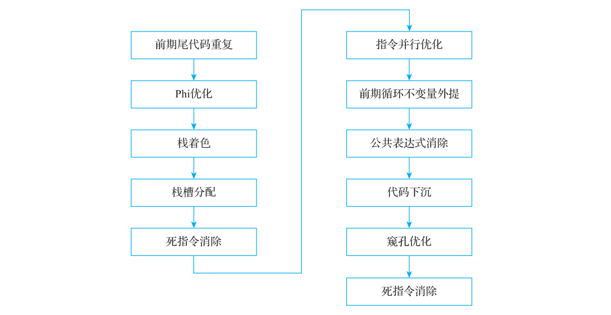
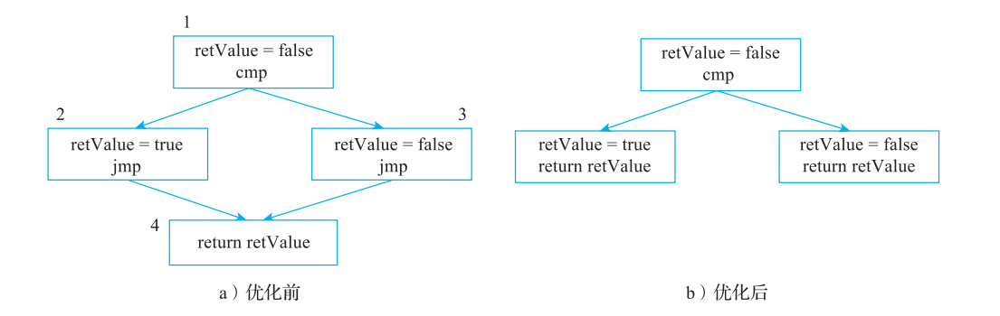
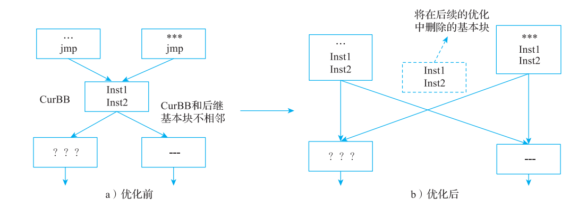
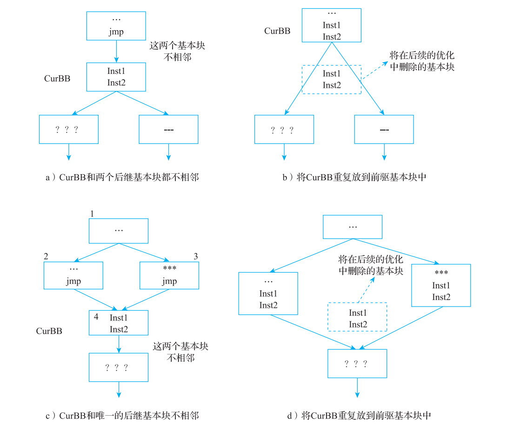
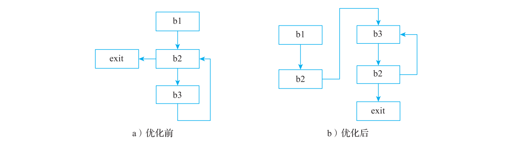
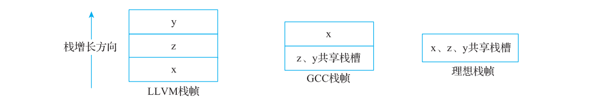
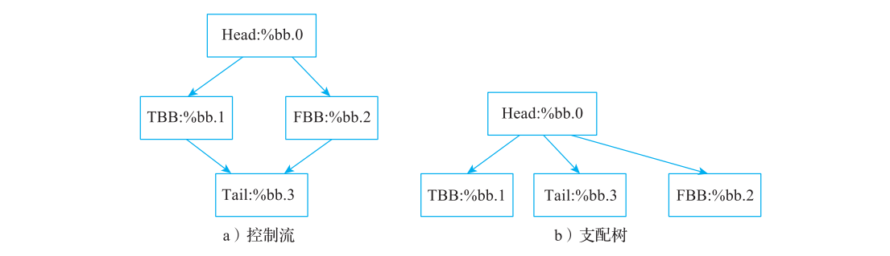
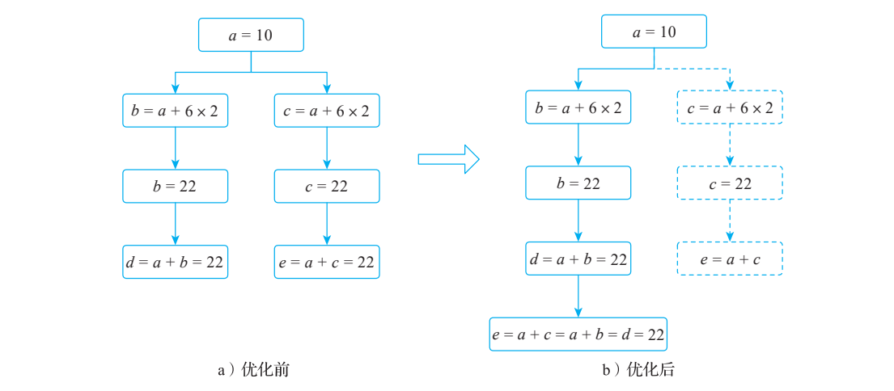
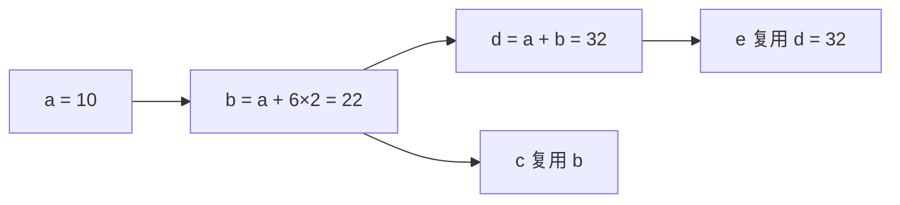

# 第 9 章基于 SSA 形式的编译优化

> 校订基线：本书 LLVM 15（示例 15.0.1）；本章依据 `/opt/llvm-project` 的 LLVM 18.1.8，HEAD `3b5b5c1ec4a3095ab096dd780e84d7ab81f3d7ff` 作静态源码核查。未编译 LLVM，未执行本章 C/C++、LLVM IR、MIR 或汇编命令；具体输出与性能仍待运行确认。
> 保留原章全部章节、示例与图版。正文及文字代码按核查结果修订；原书图片和折叠页版面仅作对照，图片中的旧编号、版本结果和排印错误不代表 LLVM 18 输出。逐项记录见 [第 9 章校核记录](review/ch9.md)。

<!-- PDF page 217; printed page 204 -->

Chapter 9 第 9 章

基于 SSA 形式的编译优化

在代码生成过程中也会进行编译优化，分别是在寄存器分配前和寄存器分配后进行。其中寄存器分配前的优化主要是基于 SSA 形式的优化，寄存器分配后的优化是基于非 SSA形式的优化，本章主要介绍寄存器分配前的优化，第 11 章会介绍寄存器分配后的优化。

目前基于 SSA 形式的机器指令优化主要包括尾代码重复、Phi 优化、栈着色等优化，具体如图 9-1 所示。



**图 9-1 基于 SSA 形式的机器指令优化**

<!-- PDF page 218; printed page 205 -->

每个优化的 Pass 功能如下。

1）前期尾代码重复（early tail duplication）：用于消除跳转指令。由于寄存器分配前后都会进行尾代码重复的优化，因此这里使用“前期”与寄存器分配后的尾代码重复优化进行区分。

2）Phi 优化：消除没有非调试实际用途的死 PHI 环，以及能够追溯到同一个外部输入值的 PHI/COPY 环；后一类也包括源等于目的的自引用。并非只检查所有源、目的是否相同。

3）栈着色（stack coloring）：优化局部变量的布局，减少栈空间的使用○一。

4）栈槽分配（local stack slot allocation）：在目标需要时预布局局部栈对象并引入虚拟基址寄存器，最终帧索引消除仍由寄存器分配后的 PEI 完成。

5）死指令消除（dead machine instruction elim）：根据基本块中 LiveIn、LiveOut 信息，从后向前依次遍历 MI 指令，将死指令删除。

6）ILP（指令级并行，Instruction-Level Parallelism）优化：依赖特定后端架构的特性进行并行指令优化。例如GPU、AArch64、x86 都可以使用 If-Conversion 将控制依赖变成数据依赖。

7）前期循环不变量外提（early machine LICM）：将循环不变量提出循环体，优化循环执行效率，加“前期”是为了与寄存器分配后的 LICM 进行区别。

8）公共表达式消除（machine CSE）：消除代码中的公共表达式，以减少不必要的计算。

9）代码下沉（machine sinking）：将分支节点的代码下沉到不同的分支中，本质上是将代码执行向后推迟，可能会因为分支不执行而获得执行收益。

10）窥孔优化（peephole optimizer）：对相邻指令进行局部优化。注意，因为窥孔优化可能产生新的死代码，所以会再次执行死指令消除操作。

本章将对上述优化逐一介绍。

## 9.1 前期尾代码重复

> LLVM 18 流水线：`TargetPassConfig::addMachinePasses` 在优化级别不是 `None` 时调用 `addMachineSSAOptimization`，默认次序与本章各节一致，末尾再次运行 DCE。`addILPOpts` 是目标钩子；不是每个目标都会加入 EarlyIfConverter。`-O0` 通用路径仍加入 LocalStackSlotAllocation，但该 Pass 还检查目标是否需要虚拟基址寄存器。

本节将对（前期）尾代码重复优化的原理、如何判断优化收益、如何执行优化进行介绍。

### 9.1.1 尾代码重复原理

尾代码重复的基本原理是，如果两个基本块之间存在跳转指令，那么将后继基本块里的代码提升到前驱基本块中可以移除跳转指令，示例如代码清单 9-1 所示。

**代码清单 9-1 两个基本块之间存在跳转指令示例**

```text
bool isEven(int x, int y)
{
```

○一参考论文的地址为 https://gcc.gnu.org/pub/gcc/summit/2003/Optimal%20Stack%20Slot%20Assignment.pdf。

<!-- PDF page 219; printed page 206 -->

```text
    bool retValue = false;
    if (x % 2 == 0)
        retValue = true;
    else
        retValue = false;
    return retValue;
}
```

该代码片段对应的 CFG 如图 9-2a 所示。在图 9-2a 中，基本块 4 是基本块 2 和基本块3 的汇聚节点，基本块 2 和基本块 3 通常都会通过一个无条件跳转指令（图 9-2a 中的 jmp指令）到达基本块 4。当然也可以进行基本块布局优化，让其中一个基本块和基本块 4 相邻，这样可以节约一个 jmp 指令，这就是第 11 章要介绍的分支折叠。为了追求更高性能，可以将基本块 4 的代码重复放到基本块 2 和基本块 3 的尾部，然后删除基本块 4，从而得到

**图 9-2b 所示的 CFG。这就是尾代码重复优化的整个过程。**



**图 9-2 尾代码重复示意图**

比较图 9-2a 和图 9-2b 可以看出，图 9-2b 将 jmp 指令消除，执行效率更高，但是由于要将基本块 4 的代码重复放到基本块 2 和基本块 3 中，当基本块 4 的代码比较大时会增加代码量。为了控制代码量，LLVM 提供了参数 tail-dup-size 来控制最大重复的指令数。

目前 LLVM 尾代码优化主要在后端实现，包括寄存器分配前优化和寄存器分配后优化。在寄存器分配前进行的优化需要考虑优化对寄存器分配的影响。直观上看，将两个基本块的代码合并到一个基本块可能会增大变量的活跃区间，从而导致更多的寄存器冲突（参见第10 章）。所以尾代码重复优化会对重复代码进行更多的限制，例如包含 call、ret 指令的代码片段（这些指令对寄存器分配影响更大）不允许重复。

另外，因为尾代码重复会影响控制流，对于一些场景来说和第 11 章介绍的分支折叠优化效果相同，所以在进行尾代码优化时对基本块的布局有一定的要求（基本块之间一定存在跳转指令到达的情况）。典型的尾代码重复优化场景有如下两类。

1. 冗余 jmp 指令优化

基本块 CurBB 和前驱基本块之间存在 jmp 指令（见图 9-3a），并且这两个基本块不相邻

<!-- PDF page 220; printed page 207 -->

（11.2.1 节介绍的分支折叠也无法优化这种情况，必须调整基本块的布局后才可能通过分支折叠消除相邻基本块之间的 jmp 指令），可以将 CurBB 代码重复放到前驱基本块中，得到的结果如图 9-3b 所示。



**图 9-3 尾代码重复场景：冗余 jmp 指令优化**

2. 汇聚基本块优化

如果基本块作为汇聚节点，且基本块和后继基本块不相邻，则当基本块重复有收益时（例如不超过允许的最大重复指令数）会进行尾代码重复。例如在图 9-4a 中，CurBB 和两个后继基本块都不相邻，可以将 CurBB 重复放到前驱基本块中，得到的结果如图 9-4b 所示；或者在图 9-4c 中，CurBB 和唯一的后继基本块不相邻，可以将 CurBB 重复放到前驱基本块中，得到的结果如图 9-4d 所示。

> 尾代码重复用更大的静态代码量换取减少跳转和后续优化机会，收益取决于目标与运行路径。

SSA 形式的尾代码重复实现比较复杂，主要原因是优化后还要保持 SSA 形式；非 SSA形式的尾代码优化相对简单（参见 11.2.2 节），两者原理相同（主要区别是 MIR 性质不同，优化时限制不同）。

尾代码重复优化一般先判断是否有收益，只有在有收益的情况下才会进行优化。

### 9.1.2 尾代码收益判断

是否可以对基本块进行尾代码重复优化，可以从以下方面来考虑。

1）只有特定的基本块结构才能进行尾代码重复优化，在一些场景下不能进行优化，例如单基本块循环不能进行优化（如果优化，则会导致无限循环重复）。

2）确定最大重复的指令数，可以通过参数设置 `-tail-dup-size`（对应 `TailDuplicateSize`，默认值为 2）实现。当要求代码量最小化时，最大重复指令数为 1。如果优化发生在寄存器分配之前，且基本块最后

<!-- PDF page 221; printed page 208 -->

一条指令为间接跳转指令，则最大允许重复的指令数为 TailDupIndirectBranchSize（默认值为 20）。



**图 9-4 尾代码重复：汇聚基本块优化**

3）如果有指令明确不可以重复，则放弃执行尾代码重复优化。在 TD 文件中设置指令属性 isNotDuplicable = 1，表示指令不可重复（例如 BPF 后端中 ret 指令不可重复）。

4）如果指令带有 `isConvergent` 属性，则放弃尾代码重复。该属性约束与执行它的其他线程/执行通道的会合关系，不能简单理解为所有场合都不可复制；这里是 TailDuplicator 为保证语义采用的保守禁止规则。

5）如果优化发生在寄存器分配之前，且基本块中包含 ret、call 等指令，则放弃执行尾代码重复优化。ret 指令重复后可能会导致更多的代码“膨胀”（例如在 PEI 中，在 ret 指令之前通常会插入额外的 CSR（Callee Saved Register，被调用者保存寄存器）指令），而 call

<!-- PDF page 222; printed page 209 -->

指令重复可能会导致更多的寄存器溢出。

6）如果基本块中指令有汇编指令，且包含分支指令，则放弃优化。因为在一些场景中重复会导致逻辑错误（例如无法为 φ 函数准确寻找插入位置）。

7）如果基本块中所有指令数超过最大重复的指令数，则放弃优化。

8）通常只有能将待复制代码直接拼接到末尾的前驱才可接收复制。LLVM 18 会综合前驱后继数、分支可分析性、是否直通、布局模式、基本块可合并性等条件；不要把这几个说明性条件理解为完整的必要充分判定。

9）如果所有的前驱基本块的最后一条指令不是无条件跳转指令，则放弃优化。

### 9.1.3 执行尾代码重复优化

尾代码重复优化实现思路如下。

1）对基本块的每一个前驱基本块都尝试进行尾代码合并。当前驱基本块只有一个后继基本块且最后一条指令为无条件跳转指令时开始执行代码重复优化，这分为以下两步。

① 删除前驱基本块最后一条无条件跳转指令。

② 将基本块中的每条指令重复放到前驱基本块中。如果是 φ 函数，指令重复操作本质上是在进行 φ 函数析构（执行方式为在前驱基本块最后位置增加 COPY 指令，并移除 φ 函数中对应前驱基本块的操作数）；如果是一般指令，则进行代码重复时要保证 SSA 属性；最后更新 CFG 图，即移除原来的后继基本块，并增加新的后继基本块。

2）如果基本块被重复放到了其全部前驱基本块中，则尝试将基本块也放到其相邻基本块中，之后就可以将基本块移除。

3）对循环场景做特殊处理可能需要重构 φ 函数，如图 9-5 所示。在图 9-5a 的基础上，对基本块 b2 进行尾代码重复优化，分别在基本块 b1 和 b3 后重复 b2 的代码，可以得到

**图 9-5b 所示的结果。对比图 9-5a 和图 9-5b 可以发现除了放置重复代码外，还需要考虑基**

本块 b3 中 φ 函数的变化，图 9-5a 中 φ 函数的源寄存器主要来自 b1 和 b3，图 9-5b 中 φ 函数的源寄存器也很可能来自 b2 和 b3，所以在 b3 中要重构 φ 函数。



**图 9-5 尾代码重复：循环场景的特殊处理**

下面构造一个简单的尾代码重复优化示例，如代码清单 9-2 所示。

<!-- PDF page 223; printed page 210 -->

**代码清单 9-2 尾代码重复优化示例**

```text
bool isEven(int x, int y)
{
    bool returnValue = false;
    if (x % 2 == 0)
        returnValue = true;
    else
        returnValue = false;

    if (y % 3 == 0)
        returnValue = true;
    else
        returnValue = false;

    return returnValue;
}
```

下面的 IR 是为观察机器级尾代码重复而调整了基本块文本顺序的输入示例：将 if.end 放到 if.then3、if.else4 后，制造不相邻布局。它本身并非尾代码重复优化的输出；实际优化作用于后续的 MIR。代码中的第一个 if 结果随后被覆盖，在其他优化组合下可能先被中端消除，因此仅改变文本顺序并不能保证 LLVM 18 一定触发此 Pass。

**代码清单 9-3 为观察尾代码重复准备的 LLVM IR 输入**

```text
define dso_local noundef zeroext i1 @isEven(i32 noundef %x, i32 noundef %y) {
entry:
    %x.addr = alloca i32, align 4
    %y.addr = alloca i32, align 4
    %returnValue = alloca i8, align 1
    store i32 %x, ptr %x.addr, align 4
    store i32 %y, ptr %y.addr, align 4
    store i8 0, ptr %returnValue, align 1
    %0 = load i32, ptr %x.addr, align 4
    %rem = srem i32 %0, 2
    %cmp = icmp eq i32 %rem, 0
    br i1 %cmp, label %if.then, label %if.else

if.then:                                          ; preds = %entry
    store i8 1, ptr %returnValue, align 1
    br label %if.end

if.else:                                          ; preds = %entry
    store i8 0, ptr %returnValue, align 1
    br label %if.end

if.then3:                                         ; preds = %if.end
    store i8 1, ptr %returnValue, align 1
    br label %if.end5
```

<!-- PDF page 224; printed page 211 -->

```text
if.else4:                                        ; preds = %if.end
    store i8 0, ptr %returnValue, align 1
    br label %if.end5

if.end:                                          ; preds = %if.else, %if.then
    %1 = load i32, ptr %y.addr, align 4
    %rem1 = srem i32 %1, 3
    %cmp2 = icmp eq i32 %rem1, 0
    br i1 %cmp2, label %if.then3, label %if.else4

if.end5:                                         ; preds = %if.else4, %if.then3
    %2 = load i8, ptr %returnValue, align 1
    %tobool = trunc i8 %2 to i1
    ret i1 %tobool
}
```

原书实验使用 `-tail-dup-size=5`，并通过 Compiler Explorer 观察图 9-6 中的 MIR 变化。该阈值数的是 TailDuplicator 处理的机器指令，而不是 LLVM IR 文本行；IR 基本块这里有 4 条指令，不能由行数推出阈值。LLVM 18 是否触发、需要多大阈值，需在固定目标和优化流水线后比较 Pass 前后 MIR。

**图 9-6 尾代码重复优化前后的区别**

<!-- PDF page 225; printed page 212 -->

## 9.2 Phi 优化

Phi 优化主要针对两种场景进行。

1. φ 函数的多个源都使用的是同一个寄存器

φ 函数的多个源使用的是同一个寄存器（即在 SSA 形式中并不需要真正的 φ 函数），主要有以下三种形式。

1）形式 1：φ 函数的源寄存器完全相同。例如，φ 函数的两个源寄存器相同，都是 R1。

R2 = φ(R1, R1)

2）形式 2 ：φ 函数有多个源寄存器，其中一个或者多个源寄存器使用了目的寄存器，且除目的寄存器外，其他的源寄存器都完全相同。例如，下面 φ 函数中的两个源寄存器分别是 R1 和 R2，其中 R2 是目的寄存器。

R2 = φ(R1, R2)

3）形式 3 ：多个 φ 函数相互为源，构成循环，并且除了循环的源寄存器外，所有 φ 函数使用的源寄存器都相同。例如，多个 φ 函数中 R2 和 R0 相互使用，并且都还使用了相同的源寄存器，即 R2 中的两个源寄存器分别是 R1 和 R0，R0 中的两个源寄存器分别是 R1 和R2。

R2 = φ(R0, R1)

…

R0 = φ(R1, R2)

上述三种形式都可以删除 R2，并且将使用 R2 的地方直接替换为 R1。

当然在实际代码优化中还可能会遇到一些变形，如一些 φ 函数中的源寄存器使用COPY 指令进行中转：

R0 = COPY R1

R2 = φ(R0, R1)

在该例中，R2 可以使用 R1 进行替换，并删除 R2。但 R0 = COPY R1 的指令并不会被删除，而是在后续的简单寄存器合并中进行处理。

2. φ 函数定义的寄存器只在其他 φ 函数中使用

第二个优化场景是 φ 函数定义的寄存器只在其他 φ 函数中使用，并且这些 φ 函数相互使用彼此定义的寄存器，最后形成环，符合这样条件的 φ 函数是死代码，如下所示。

R2 = φ(R0, R1)

…

R0 = φ(R1, R2)

<!-- PDF page 226; printed page 213 -->

…

R1 = φ(R0, R2)

R0，R1，R2 使用 φ 函数定义，并且这三个 φ 函数形成了循环，说明是无效的 φ 函数定义，可以将这三个 φ 函数都删除。

## 9.3 栈着色

LLVM 3.2 中正式引入栈着色实现，栈着色主要是优化栈变量的分配，减少栈空间的使用。下面通过例子来看栈着色的作用，例子对应的 C 代码如代码清单 9-4 所示。

**代码清单 9-4 栈着色示例的 C 代码**

```text
void bar(char *, int);
void foo(int var) {
A: {
        char z[4096];
        bar(z, 0);
    }

    char *p;
    char x[4096];
    char y[4096];
    if (var) {
        p = x;
    } else {
        bar(y, 1);
        p = y + 1024;
    }
B:
    bar(p, 2);
}
```

在上述代码中，z 的生命周期在代码块 A 后结束，空间有机会被随后使用的 x、y 复用。x、y 在两条控制流路径中被选择，但在汇聚块 B 仍通过 p 访问其中一个数组；不能说 if 后完全不再使用数组。按路径推导的理想空间复用可以得到代码清单 9-5 的示意，但真实编译器需要生命周期、别名与逃逸分析证明安全。

**代码清单 9-5 代码清单 9-4 最为理想的优化结果**

```text
void foo(int var) {
    char x[4096];
    char *p;
    bar(x, 0);
    if (var) {
        p = x;
```

<!-- PDF page 227; printed page 214 -->

```text
    } else {
        bar(x, 1);
        p = x + 1024;
    }
    bar(p, 2);
}
```

原书在其 GCC/LLVM 版本与实验配置下观察到图 9-7 的不同栈布局。这是历史实验结果；本次未运行 LLVM 18，不能据图宣称当前 GCC 或 LLVM 必然无法生成某种布局。



**图 9-7 LLVM 栈布局、GCC 栈布局、理想栈布局**

> 原书图 9-7 描述其历史实验布局，p 有机会保存在寄存器中；当前是否溢出到栈由分配结果决定。LLVM 18 通过生命周期标记、实际使用与 CFG 数据流分析重叠，不是只比较词法作用域。x/y 的复用和原书与 GCC 的比较仍需指定版本后实测。

LLVM 的机器级栈着色依赖 LIFETIME_START/LIFETIME_END 等生命周期信息。Clang 在 LLVM IR 层生成的是 `llvm.lifetime.start`、`llvm.lifetime.end` intrinsic；在指令选择中它们可降低为 MIR 的生命周期伪指令。不能把前端 IR intrinsic 和机器伪指令混为一层。下面保留原书由 Clang 15 获得的输入示例。

**代码清单 9-6 与代码清单 9-4 对应的历史 LLVM IR 示例**

```text
define dso_local void @foo(i32 noundef %var) local_unnamed_addr {
entry:
    %z = alloca [4096 x i8], align 16
    %x = alloca [4096 x i8], align 16
    %y = alloca [4096 x i8], align 16
    call void @llvm.lifetime.start.p0(i64 4096, ptr nonnull %z)
    call void @bar(ptr noundef nonnull %z, i32 noundef 0)
    call void @llvm.lifetime.end.p0(i64 4096, ptr nonnull %z)
    %tobool.not = icmp eq i32 %var, 0
    br i1 %tobool.not, label %if.else, label %B
```

<!-- PDF page 228; printed page 215 -->

```text
if.else:                                          ; preds = %entry
    call void @bar(ptr noundef nonnull %y, i32 noundef 1)
    %add.ptr = getelementptr inbounds i8, ptr %y, i64 1024
    br label %B

B:                                                ; preds = %entry, %if.else
    %p.0 = phi ptr [ %add.ptr, %if.else ], [ %x, %entry ]
    call void @bar(ptr noundef nonnull %p.0, i32 noundef 2)
    ret void
}
```

其中 llvm.lifetime.start.p0、llvm.lifetime.end.p0 在指令选择时会变成伪指令 LIFETIME_ START、LIFETIME_END。

栈着色的基本思路如下。

1）识别 MIR 中所有的伪指令 LIFETIME_START、LIFETIME_END。由于栈着色会合并栈变量，因此当伪指令个数较少时就没必要执行栈着色优化，例如伪指令个数少于 2 个。

2）识别活跃变量，计算变量的活跃区间（死变量的活跃区间为空）。

3）根据变量的活跃区间判断是否可以合并。如果变量的活跃区间不冲突（即不重叠），则说明变量可以共享同一个栈槽，而共享同一个栈槽的变量可以合并它们的活跃区间。实际上要做到合并最优的变量活跃区间是非常困难的，该优化是一个 NP 难题，目前采用的是Greedy 算法。合并时会先对栈变量活跃区间进行排序（按照栈变量的存储空间从大到小排序），即最终目的是优先合并存储空间大的栈变量，并记录合并的栈变量信息。

根据合并栈变量信息对 MIR 进行修改，这会涉及如下几种情况。

① 对被合并槽关联的 AllocaInst 更新 IR 用途，以维护后续别名分析。必要时把目标 alloca 移到源 alloca 之前；不兼容指针类型会走 bitcast 分支（LLVM 18 一般使用不透明指针）。`remapInstructions` 明确保留原 alloca 指令，并非删除所有源 alloca 后只留一个。

② 在所有使用栈变量的 Alloca 指令合并前，栈槽的指令都要替换为合并后的栈槽。

③ 更新内存指令中别名信息。如果栈变量合并后仍然可以得到合并后变量的别名信息，则更新合并后栈变量的别名信息；如果无法计算得到别名信息，则将合并后的栈变量的别名信息清空。

4）删除 MIR 中所有的 LIFETIME_START、LIFETIME_END 伪指令。

在原书 IR 中只有 z 有生命周期 intrinsic，因此 x、y 的可复用范围缺少同样精细的标记。这能解释优化机会受限，但不能仅据这段裁剪后的 IR 断定 Clang 有错误。代码清单 9-7 显式添加标记，用于讨论它们怎样影响栈着色；这属于手写实验输入，LLVM 18 的实际结果留待验证。

<!-- PDF page 229; printed page 216 -->

**代码清单 9-7 为栈变量 x 和 y 显式增加伪指令**

```text
0 define dso_local void @foo(i32 noundef %var) local_unnamed_addr {
1 entry:
2   %z = alloca [4096 x i8], align 16
3   %x = alloca [4096 x i8], align 16
4   %y = alloca [4096 x i8], align 16
5   call void @llvm.lifetime.start.p0(i64 4096, ptr nonnull %z)
6   call void @bar(ptr noundef nonnull %z, i32 noundef 0)
7   call void @llvm.lifetime.end.p0(i64 4096, ptr nonnull %z)
8   %tobool.not = icmp eq i32 %var, 0
9   call void @llvm.lifetime.start.p0(i64 4096, ptr nonnull %x)
10   br i1 %tobool.not, label %if.else, label %B

11 if.else:                                          ; preds = %entry
12   call void @llvm.lifetime.start.p0(i64 4096, ptr nonnull %y)
13   call void @bar(ptr noundef nonnull %y, i32 noundef 1)
14   %add.ptr = getelementptr inbounds i8, ptr %y, i64 1024
15   br label %B

16 B:                                                ; preds = %entry, %if.else
17   %p.0 = phi ptr [ %add.ptr, %if.else ], [ %x, %entry ]
18   call void @bar(ptr noundef nonnull %p.0, i32 noundef 2)
19   call void @llvm.lifetime.end.p0(i64 4096, ptr nonnull %x)
20   call void @llvm.lifetime.end.p0(i64 4096, ptr nonnull %y)
21   ret void
22 }
```

按本例标记的文本位置可直观记作 z[5,7]、x[9,19]、y[12,20]，但 CFG 活跃性不能直接等同于文件行号区间。LLVM 18 会进行跨块数据流分析，并默认使用 `stackcoloring-lifetime-start-on-first-use=true` 的首次使用优化；必须按实现形成的 LiveInterval 判断是否重叠。

z 在标记层面先结束，因而有与 x 或 y 复用槽的机会；x、y 是否还能复用要看按 CFG 建立的活跃区间、首次使用处理及逃逸信息。本次不把原书声称的 llc 结果当作 LLVM 18 的既成输出。

在栈着色中要特别注意活跃变量分析。在 LLVM 3.9 之前，活跃变量分析使用的是后向数据流分析（参见 3.3.1 节），但是从 LLVM 3.9 开始使用的是前向数据流分析。之所以有这样的变化主要是因为在一些场景下基于后向数据流分析会得出不正确的结果，例如一些编译优化可能会导致栈变量在分配空间之前被使用。代码清单 9-8 演示了一个简单的例子。

**代码清单 9-8 活跃变量分析示例**

```text
int bar() {
    char b1[1024], b2[1024];
    if (...) {
        <uses of b2>
        return y;
    } else {
        <uses of b1>
        while (...) {
            char b3[1024];
```

<!-- PDF page 230; printed page 217 -->

```text
            <uses of b3>
        }
    }
}
```

代码清单 9-8 是含省略号和占位语句的算法示意，不能直接编译。优化移动栈地址计算或生命周期相关指令后，实际使用与声明的生命周期边界可能不再简单对应。风险是把真实重叠的栈对象误合并而相互覆盖，并非固定大小栈对象一定到循环内才真正分配物理空间。

因此栈着色必须结合生命周期标记、对象实际使用和 CFG 数据流建立活跃区间。LLVM 18 的 `calculateLocalLiveness`、`calculateLiveIntervals`、`applyFirstUse` 共同完成这一过程；启用保护逃逸对象的选项时还会排除不安全范围。这里的历史版本演进仅作背景，不把“上移至定义位置”当作 LLVM 18 的完整实现规则。

## 9.4 栈槽分配

`LocalStackSlotPass` 首先检查 `TargetRegisterInfo::requiresVirtualBaseRegisters(MF)`；若目标不要求或没有局部对象，直接返回。它计算局部对象的相对偏移，通过 `needsFrameBaseReg` 等目标接口决定是否插入虚拟基址寄存器，帮助后续满足寻址范围。它不负责一次性证明所有最终栈访问合法，也不会在这里完成整个函数栈帧的最终布局。栈对象的方向、对齐和栈保护分组仍须被遵守。

栈槽分配是在 LLVM 2.8 中首次引入，最初该功能的实现放在 PEI（即前言 / 后序插入，参见 11.1 节）中。从 PEI 分离出该功能主要是为了解决在寄存器分配后一些栈变量访问指令可能仍然不合法的问题。例如 AArch64 对 load/store 指令有多种寻址模式：偏移寻址（offset addressing）、前变址寻址（pre-indexed addressing）、后变址寻址（post-indexed addressing）。而这些寻址模式又支持不同类型的数据访问，一些指令使用立即数作为偏移值，而偏移的范围在指令中有对应的约束。例如在 load/store 指令对中，32 位 LDP/STP 的立即数编码为有符号 7 位，按 4 字节缩放；编码范围为 [–64，63]，对应字节偏移为 [–256，252]○一，如果相对于基寄存器（base-register，通常为 FP）的栈变量偏

○一关于 load/store 指令格式可以参考 ARM 官方文档：https://developer.arm.com/documentation/ddi0596/2020-

12/Index-by-Encoding/Loads-and-Stores。

<!-- PDF page 231; printed page 218 -->

移超过该范围，需要对指令进行改写（通常是引入一个新的寄存器，将原来指令变换成基于寄存器的访存指令）。这一操作在 PEI 阶段的执行性能较差○一，而将该工作调整至寄存器分配前，只需引入一个新的虚拟寄存器（由寄存器分配阶段统一完成虚拟寄存器到物理寄存器的映射）然后改写指令。

> 预分配阶段引入虚拟基址寄存器，可由后续寄存器分配统一处理，多个栈访问也可能共享基址。PEI 在分配之后掌握更多最终帧信息；LocalStackSlotPass 只有实际插入了基址寄存器才设置 UseLocalStackAllocationBlock，否则 PEI 可重新布局以获得更好的对齐。原书列举的 AArch64 CSR/溢出字节估计不是所有函数或 LLVM 18 目标固定遵守的常量。

## 9.5 死指令消除

死指令消除（也称为死代码消除）是编译优化中最基础的优化。

死指令消除的思想可以简单概括为：如果变量 V 没有被使用（即除了定义变量 V 的指令外，没有任何指令使用变量 V），并且定义 V 的指令没有任何负面影响（指的是指令有volatile 属性，或者 call 等特殊指令），则可以删除定义变量 V 的指令。

一个说明性方法是为变量记录非调试用途计数：删除 `V = COPY E` 后，E 的用途减少，可能进一步使定义 E 的指令成为死指令。依赖传播的方向是从删除的使用指令追溯其输入定义，而不是先删除仍被 COPY 使用的 E 再减少 V 的计数。

LLVM 的实现更为简单，其中有几个要点。

1）从后向前处理基本块的指令，能够更为准确、快速地完成死指令的删除（参见3.3.1 节）。

○一 PEI 在寄存器分配后才执行，因为此时寄存器已经分配完成，所以需要较为复杂的算法才能找到一个合

适的寄存器完成指令变换，算法的复杂度为 O(n2)。

<!-- PDF page 232; printed page 219 -->

2）检测指令中使用的变量（指虚拟寄存器），指令中直接使用或者跨基本块的活跃变量（或者一些保留的物理寄存器）都需要识别。

3）对于没有被使用的变量，删除定义该变量的指令。

4）LLVM 18 的 `runOnMachineFunction` 反复调用 `eliminateDeadMI`，直到一轮不再删除指令。因此包含 COPY 在内的死依赖链也能逐步被清除；不能说该 Pass 不会进行递归/迭代清理。

## 9.6 ILP 优化之 If-Conversion

ILP 优化和后端密切相关，本节介绍 ILP 优化中使用较为广泛的 If-Conversion 算法。If-Conversion 算法用于消除跳转指令，并将控制依赖转换成数据依赖。本节主要介绍LLVM 后端基于 MIR 的算法实现—EarlyIfConverter，它在寄存器分配之前执行。

下面先看一段简单的 if-else 代码，如代码清单 9-9 所示。假设代码生成后的指令分别为 S1、S2、S3、S4。

**代码清单 9-9 if-else 代码**

```text
if (A) {
    B = 1;    // 指令S1
    C = 2;    // 指令S2
} else {
    B = 3;    // 指令S3
    C = 4;    // 指令S4
}
```

如果不进行 ILP 优化，当 A 为 true 时会执行 S1、S2，当 A 为 false 时会执行 S3、S4。生成的汇编代码如代码清单 9-10 所示，可以看到 goto 指令会根据 A 的值进行跳转。

**代码清单 9-10 使用 goto 进行跳转**

```text
if (!A) goto Else;
mov B, 1;  // S1
mov C, 2;  // S2
goto End;
Else:
mov B, 3;  // S3
mov C, 4;  // S4
End:

```

我们可以通过 If-Conversion 算法消除汇编指令中的 goto 指令（当然，执行该优化要求后端支持 select 指令）。假设用 p0 表示 A = true 时会执行 S1、S2，用 p1 表示 A = false 时会执行 S3、S4，最后得到的伪代码如代码清单 9-11 所示。

**代码清单 9-11 goto 被消除的伪代码效果**

```text
(p0)  mov    B, 1; // S1
(p0)  mov    C, 2; // S2
(p1)  mov    B, 3; // S3
(p1)  mov    C, 4; // S4
```

<!-- PDF page 233; printed page 220 -->

以下说明寄存器分配前 `EarlyIfConverter`/`SSAIfConv` 的主要过程。代码清单 9-9～9-11 是控制流与谓词执行的说明性伪代码；后端是否具有谓词指令，与 `canInsertSelect` 能否生成条件选择是相关但不同的能力。

1）后序遍历当前函数的支配树基本块节点。

2）检查当前基本块是否可以进行 If- Conversion 优化，如果不符合优化约束条件，则跳过。LLVM 检查的约束条件非常严格，它只支持非常特定的场景下的优化，此处列举了比较重要的约束条件。

① 控制流形态：只有满足特定控制流形态的代码才能执行优化，当前只支持对图 9-8 能够执行 If-Conversion 的两种控制流形态如图 9-8 所示的两种控制流形态做优化。

② Head 的条件分支需要由 `TargetInstrInfo::analyzeBranch` 分析，并由目标接口确认可产生选择指令；并不要求所有架构都具有像 x86 EFLAGS 那样独立的条件码寄存器。

③ 硬件支持 select 指令：Tail 中的 φ 函数需要被重写为 select 指令，以便将控制流转换成顺序指令。

④ TBB 和 FBB 不能有活跃入参（Liveins）的物理寄存器：TBB、FBB 和 Head 基本块之间的指令依赖只能是虚拟寄存器间的数据依赖关系。

⑤ TBB 和 FBB 不能有访存指令：TBB 和 FBB 指令会被移入 Head 基本块中，访存指令的移动可能会影响之后的访存一致性。

下面以代码清单 9-12 中所示的源码为例，来看看 LLVM 中 If-Conversion 的优化过程。

**代码清单 9-12 If-Conversion 的优化过程**

```text
int MUL(int x, int y, bool flag) {
    int aaa = y * x;
    int z = 0;
    int q = 0;
    if (flag) {
        z = y * x;
        q = x * aaa;
    } else {
        z = y + x;
        q = x + aaa;
    }
    return z * q;
}
```

当编译器执行到 If-Conversion 的 Pass 前时，代码清单 9-12 对应的 MIR 如代码清单 9-13所示。

**代码清单 9-13 与代码清单 9-12 对应的 MIR（If-Conversion 优化前）**

> 下面几个 MIR 清单用于展示变换，省略 YAML 头与部分元信息，不能直接当完整 `.mir` 文件输入。已修复物理寄存器 `$edi`、JCC 对 `$eflags` 的使用属性和最终单块 CFG 的陈旧 successors。具体寄存器编号和目标选择仍待 LLVM 18 实测。

```text
Function Live Ins: $edi in %6, %esi in %7, $edx in %8
bb.0.entry:
```

<!-- PDF page 234; printed page 221 -->

```text
successors: %bb.1, %bb.2;
    liveins: $edi, $esi, $edx
    %8:gr32 = COPY $edx
    %7:gr32 = COPY $esi
    %6:gr32 = COPY $edi
    %0:gr32 = nsw IMUL32rr %7:gr32, %6:gr32, implicit-def dead $eflags
    TEST32rr %8:gr32, %8:gr32, implicit-def $eflags
    JCC_1 %bb.2, 4, implicit $eflags
    JMP_1 %bb.1

bb.1.if.then:
; Predecessors: %bb.0
 successors: %bb.3
    %1:gr32 = nsw IMUL32rr %0:gr32, %6:gr32, implicit-def dead $eflags
    JMP_1 %bb.3

bb.2.if.else:
; Predecessors: %bb.0
 successors: %bb.3
    %2:gr32 = nsw ADD32rr %7:gr32, %6:gr32, implicit-def dead $eflags
    %3:gr32 = nsw ADD32rr %0:gr32, %6:gr32, implicit-def dead $eflags

bb.3.if.end:
; Predecessors: %bb.2, %bb.1
    %4:gr32 = PHI %2:gr32, %bb.2, %0:gr32, %bb.1
        %5:gr32 = PHI %3:gr32, %bb.2, %1:gr32, %bb.1
    %9:gr32 = nsw IMUL32rr %4:gr32, %5:gr32, implicit-def dead $eflags
    $eax = COPY %9:gr32
    RET 0, $eax
```

此时的控制流和支配树分别如图 9-9a 和图 9-9b 所示。



**图 9-9 代码清单 9-12 对应的控制流和支配树**

If-Conversion 执行步骤如下。

1）按照支配树进行后序遍历，依次判断出节点 %bb.1、%bb.2、%bb.3 都不符合 If- Conversion 的优化形态。

2）继续遍历，直至 Head = %bb.0，TBB = %bb.1，FBB = %bb.2，Tail = %bb.3。

<!-- PDF page 235; printed page 222 -->

3）从后向前遍历基本块 Head 指令，在 Head 中找到指令插入位置，以便能将基本块TBB 和 FBB 的指令移到 Head 中，插入位置为指令 TEST32rr %8:gr32, %8:gr32 之前。

4）将 TBB 和 FBB 中除 Terminate 以外的指令移入 Head 中。此时，函数的 MIR 如代码清单 9-14 所示，移动的指令使用蓝色标出。

**代码清单 9-14 将 TBB 和 FBB 中除 Terminate 以外的指令移入 Head 中**

```text
Function Live Ins: $edi in %6, %esi in %7, $edx in %8
bb.0.entry:
successors: %bb.1, %bb.2;
    liveins: $edi, $esi, $edx
    %8:gr32 = COPY $edx
    %7:gr32 = COPY $esi
    %6:gr32 = COPY $edi
    %0:gr32 = nsw IMUL32rr %7:gr32, %6:gr32, implicit-def dead $eflags
    %2:gr32 = nsw ADD32rr %7:gr32, %6:gr32, implicit-def dead $eflags
    %3:gr32 = nsw ADD32rr %0:gr32, %6:gr32, implicit-def dead $eflags
    %1:gr32 = nsw IMUL32rr %0:gr32, %6:gr32, implicit-def dead $eflags
    TEST32rr %8:gr32, %8:gr32, implicit-def $eflags
    JCC_1 %bb.2, 4, implicit $eflags
    JMP_1 %bb.1

bb.1.if.then:
; Predecessors: %bb.0
    successors: %bb.3
    JMP_1 %bb.3

bb.2.if.else:
; Predecessors: %bb.0
    successors: %bb.3

bb.3.if.end:
; Predecessors: %bb.2, %bb.1
    %4:gr32 = PHI %2:gr32, %bb.2, %0:gr32, %bb.1
        %5:gr32 = PHI %3:gr32, %bb.2, %1:gr32, %bb.1
    %9:gr32 = nsw IMUL32rr %4:gr32, %5:gr32, implicit-def dead $eflags
    $eax = COPY %9:gr32
    RET 0, $eax
```

将基本块 Tail 中的 φ 函数用选择（select）指令（本例中是 CMOV32rr）进行重写替换，将相应的选择指令插入 TEST32rr %8:gr32, %8:gr32 之后，并删除原先的 φ 函数，如代码清单 9-15 所示。

**代码清单 9-15 将 select 指令插入 Test32rr 后**

```text
Function Live Ins: $edi in %6, %esi in %7, $edx in %8
bb.0.entry:
successors: %bb.1, %bb.2;
    liveins: $edi, $esi, $edx
```

<!-- PDF page 236; printed page 223 -->

```text
    %8:gr32 = COPY $edx
    %7:gr32 = COPY $esi
    %6:gr32 = COPY $edi
    %0:gr32 = nsw IMUL32rr %7:gr32, %6:gr32, implicit-def dead $eflags
    %2:gr32 = nsw ADD32rr %7:gr32, %6:gr32, implicit-def dead $eflags
    %3:gr32 = nsw ADD32rr %0:gr32, %6:gr32, implicit-def dead $eflags
    %1:gr32 = nsw IMUL32rr %0:gr32, %6:gr32, implicit-def dead $eflags
    TEST32rr %8:gr32, %8:gr32, implicit-def $eflags
    %4:gr32 = CMOV32rr %0:gr32, %2:gr32, 4, implicit $eflags
    %5:gr32 = CMOV32rr %1:gr32, %3:gr32, 4, implicit $eflags
    JCC_1 %bb.2, 4, implicit $eflags
    JMP_1 %bb.1

bb.1.if.then:
; Predecessors: %bb.0
successors: %bb.3
    JMP_1 %bb.3

bb.2.if.else:
; Predecessors: %bb.0
 successors: %bb.3

bb.3.if.end:
; Predecessors: %bb.2, %bb.1
    %9:gr32 = nsw IMUL32rr %4:gr32, %5:gr32, implicit-def dead $eflags
    $eax = COPY %9:gr32
    RET 0, $eax
```

删除基本块 TBB、FBB 以及基本块 Head 中的跳转指令，并将 Tail 和 Head 合并成一个基本块，最终经 If-Conversion 优化后的 MIR 如代码清单 9-16 所示。

**代码清单 9-16 与代码清单 9-12 对应的 MIR（If-Conversion 优化后）**

```text
Function Live Ins: $edi in %6, %esi in %7, $edx in %8
bb.0.entry:
    liveins: $edi, $esi, $edx
    %8:gr32 = COPY $edx
    %7:gr32 = COPY $esi
    %6:gr32 = COPY $edi
    %0:gr32 = nsw IMUL32rr %7:gr32, %6:gr32, implicit-def dead $eflags
    %2:gr32 = nsw ADD32rr %7:gr32, %6:gr32, implicit-def dead $eflags
    %3:gr32 = nsw ADD32rr %0:gr32, %6:gr32, implicit-def dead $eflags
    %1:gr32 = nsw IMUL32rr %0:gr32, %6:gr32, implicit-def dead $eflags
    TEST32rr %8:gr32, %8:gr32, implicit-def $eflags
    %4:gr32 = CMOV32rr %0:gr32, %2:gr32, 4, implicit $eflags
        %5:gr32 = CMOV32rr %1:gr32, %3:gr32, 4, implicit $eflags
    %9:gr32 = nsw IMUL32rr %4:gr32, %5:gr32, implicit-def dead $eflags
    $eax = COPY %9:gr32
    RET 0, $eax
```

<!-- PDF page 237; printed page 224 -->

最后还要更新支配树和循环分析结果，由于细节较多，限于篇幅，这里不再展开。最后提一点，LLVM 实现的 If-Conversion 算法是一个简化版本，比较复杂的 If-Conversion 算法可以参考论文“On Predicated Execution”○一。

## 9.7 循环不变量外提

> LLVM 18 的 MachineLICM 除循环不变性外，还检查移动安全性、内存别名、是否保证执行、寄存器压力及收益。下列经典条件是保守算法说明，并非实现的必要充分条件：可安全推测执行的表达式即使不支配每个退出点也可能外提。示例中的 `cout`/`endl` 需在完整 C++ 程序中加入头文件和命名空间。

LICM（循环不变量外提）优化通过减少不必要的重复运算，达到减少执行指令的目的。以代码清单 9-17 中的代码为例，每次循环迭代都为 tmp 变量赋一个常量值。实际上，赋值操作可以提到循环外面，这样仅需要进行一次赋值即可。

**代码清单 9-17 循环不变量外提示例**

```text
void test()
{
    for (int i = 0; i < 10; ++i) {
        int tmp = 100;
        cout << tmp + i << endl;
    }
}
```

循环不变量外提优化的基本步骤如下。

1）识别自然循环（参考第 5 章）。

2）识别自然循环中的循环不变量。在自然循环中，若表达式仅被定义了一次，且这个定义在循环过程中是不变的，那么这个表达式就是循环不变的。

3）判断循环不变量是否可以外提。若要外提，则表达式需要满足如下条件。

① 表达式支配所有循环退出点。

② 循环中表达式是唯一的定义点。

③ 定义点支配所有使用点。

4）将满足条件的循环不变量提到循环外，将可外提的表达式提到一个新的基本块中，并将该块放在循环之前，调整相应的跳转逻辑。

## 9.8 公共子表达式消除

在编译优化过程中，如果存在一个表达式 E 之前被计算过，且从之前的计算点到当前程序的执行点，E 用到的所有变量的值都没有发生过变化，那么 E 就被称为公共子表达式。E 的值不需要再进行重复运算，可直接重用，这种优化称为公共子表达式消除（即 CSE）。如果优化的范围仅在基本块内，则称为局部公共子表达式消除（local common subexpression

○一具体请参见 https://web.eecs.umich.edu/~mahlke/courses/583f12/reading/HPL-91-58.pdf。

<!-- PDF page 238; printed page 225 -->

elimation）；如果优化范围在函数范围内覆盖了多个基本块，则称为全局公共子表达式消除（global common subexpression elimination）。

公共子表达式消除为编译器提供了以下收益。

1）优化代码大小：消除了冗余的代码序列，直接减少代码量。

2）减少代码执行时间：减少了重复的运算，可以让程序的执行效率得到提升。

3）助力其他优化：消除了无用的表达式，可以简化数据流、控制流的分析过程；消除冗余指令也让编译器可以更充分地使用指令的并发特性，以优化 CPU 的资源利用。

4）对寄存器压力的影响需评估：消除一个定义可能减少指令和临时值，但复用较早的计算也可能延长其活跃区间、增大压力。LLVM 18 的 `isProfitableToCSE` 因而包含相关收益限制。

如图 9-10a 所示，在左侧的表达式序列中，b 和 c 有相同的表达式：a + 6×2。在计算从 b 到 c 的过程中，变量 a 的值没有发生变化，所以 c 直接复用 b 的计算结果即可。因此，可以消除表达式 c = a + 6×2，将 e = a + c 替换为 e = a + b。进一步，d 和 e 产生了相同的表达式，且在计算从 d 到 e 的过程中，变量 a 和 b 的值没有发生过变化，因此可继续消除表达式 e = a + c，e 直接复用 d 的计算结果。公共子表达式消除的示意图如图 9-10b所示。



**图 9-10 公共子表达式消除示意图**

> 原图算术值有误：a=10，b=c=22，因此 d=e=32。上述转写和下面校订图采用正确值。



考虑有代码清单 9-18 所示的 IR 片段，该片段中 cse 函数接受 5 个入参，函数体内存在3 个基本块。其中，基本块 bb.0 中的 %a 与基本块 bb.1 中的 %c 都以 %x 和 %y 作为输入进行加法运算，但两个输入的顺序不同，而 %b 和 %d 的表达式完全相同。该 IR 片段将用于演示基本块之间的公共子表达式消除，即全局公共子表达式消除。

**代码清单 9-18 公共子表达式消除示例**

```text
define void @cse(i32 %x, i32 %y, ptr %p1, ptr %p2, i1 %cond) {
bb.0:
    %a = add i32 %x, %y
```

<!-- PDF page 239; printed page 226 -->

```text
    store i32 %a, ptr %p1
    %b = zext i32 %a to i64
    store i64 %b, ptr %p2
    br i1 %cond, label %bb.1, label %bb.2

bb.1:
    %c = add i32 %y, %x
    store i32 %c, ptr %p1
    %d = zext i32 %a to i64
    store i64 %d, ptr %p2
    br label %bb.2

bb.2:
    ret void
}
```

这里使用 RISC-V-64 架构进行说明，启动该架构的编译选项为：llc -mtriple=riscv64。在 Compiler Explorer 中可以看到，经过公共子表达式消除优化前后的 MIR 变化如图 9-11 所示。

**图 9-11 公共子表达式消除优化前后 MIR 变化**

在公共子表达式消除优化前的 MIR 中，%1～%5 分别对应函数的 5 个入参。可以看到，%0 与 %11 的表达式中，操作数顺序不同，但由于它们的 MIR 操作为加法指令 ADDW，加法指令的两个操作数交换位置不影响结果（加法交换律），故而 %11:gpr = ADDW %7:gpr, %6:gpr 等价于 %11:gpr = ADDW %6:gpr, %7:gpr，又因为 %6 复制了 %1，%7 复制了 %2，从 %7 和 %6 被赋值一直执行到当前 %11 节点的过程中，%1 和 %2 未发生变化，所以可将 %11 进一步转换为 %11:gpr = ADDW %1:gpr, %2:gpr。该转换结果与 %0 节

<!-- PDF page 240; printed page 227 -->

点的表达式完全相同，所以 %11 将被作为公共子表达式消除，后面用到 %11 的地方都会用 %0 替代。同理，%9 和 %12 表达式相同，%12 被消除并用 %9 替代，%13 节点被转换为 %13:gpr = SRLI killed %9:gpr, 32，转换结果与 %10 节点处的表达式相同，所以 %13 也会被消除，并使用 %10 替代。最终生成如图 9-11 中右侧所示的序列。

> 注意：公共子表达式消除优化不仅可以作用于 MIR，也可以作用于 LLVM IR 上。

## 9.9 代码下沉

代码下沉是为了减少执行的代码，例如定义的变量只在一个分支语句中使用，那么将变量定义下沉到分支中可以有效减少执行的代码。代码下沉的示意图如图 9-12 所示。


**图 9-12 代码下沉示意图**

在图 9-12 左侧的图中，变量 v1 只在一个分支中使用，故将 v1 的定义下沉到使用它的分支中，得到如图 9-12 右侧图所示的结果。

代码下沉通过寻找较合适的后继/支配子节点减少执行或活跃区间。LLVM 18 的候选并不限于直接 CFG 后继，具体还需下列安全与收益检查。

1）针对 COPY 指令进行优化（即进行 COPY 指令合并）。对于 dst = COPY src 这样的指令，如果 src 不是通过 COPY 指令定义，并且 src 和 dst 寄存器类型相同，则可以将所有的 dst 替换为 src，从而优化 COPY 指令。

2）对于一般的指令：

① 后端允许下沉，例如 ARM 后端对 CMP 指令有特殊约定，在一些情况下不能下沉。

② 不能移动的指令，不允许下沉。

③ 收敛指令（convergent instruction），不允许下沉。

④ 用于保证实现 NULL Check（判空校验的指令）功能，不允许下沉。

⑤ 如果定义和使用寄存器的指令在同一个基本块中，不允许下沉（仅仅下沉定义寄存器指令，而不下沉使用寄存器的指令会导致程序逻辑错误）。

⑥ LLVM 18 的候选集合不仅包括 CFG 直接后继，也包括某些以当前块为直接支配者的支配树子节点。目标块必须正确支配所有用途（PHI 用途按入边处理），并满足安全与收益要求。

⑦ 只有存在收益的场景才能下沉，收益场景主要如下。

<!-- PDF page 241; printed page 228 -->

- 目标块不后支配原块时，部分路径可避免执行该指令，因此作为收益机会；这并非对实际动态次数的严格保证。

- 指令下沉前位于内部循环，下沉后位于外部循环。下沉后指令执行次数能大幅减少，若执行次数不能大幅减少则不能下沉。

- 下沉的基本块逆支配指令下沉前的基本块，如果下沉后指令定义的寄存器是用在 φ函数中的，则可以继续下沉。

- 下沉的基本块逆支配指令下沉前的基本块，同时指令还可以再下沉并且有收益，则继续下沉。

> 注意：下沉的基本块逆支配指令下沉前的基本块，但指令不属于循环，则不能下沉。

- 下沉的基本块逆支配指令下沉前的基本块，并且当前指令属于循环，下沉后指令中操作数的活跃区间变小或者寄存器压力没有增加则可以下沉。○一

⑧ 若下沉后的基本块存在关键边，判断是否可以拆分关键边：能拆分则规划如何拆分关键边，不能拆分关键边则不能下沉。

⑨ 计算下沉指令的位置（通常是 φ 函数后的第一条指令），并下沉代码。

⑩ 拆分关键边，并更新拆分边后的频率。

3）进行循环的特别情况处理，如果参数 SinkInstsIntoCycle 为 True（默认为 False），则进行下沉处理。

在循环中，候选的下沉指令必须同时满足：

- 是循环不变量。

- 可以安全移动。

- 不能下沉 GOT、常量。

- 不是收敛指令（convergent instruction）。

- 只有一处定义。

> 注意：下沉循环指令需要满足支配属性，否则逻辑不正确。

## 9.10 窥孔优化

> 此节按典型模式解释通用 PeepholeOptimizer。`optimizeSelect`、`optimizeCompareInstr`、`optimizeLoadInstr` 等通过目标钩子实施，不能保证所有选择都变成逻辑运算或所有 load 都可折叠。加载折叠除寄存器用途外还受内存依赖、volatile/atomic、副作用与目标合法性约束；该 Pass 的搜索也不限于严格相邻两条指令。

窥孔优化主要是做一些琐碎的、细粒度的优化，优化策略和优化模式会随着目标架构的指令特征的变化而变化。窥孔优化的基本过程如下。遍历每一条待优化指令，然后判断每一条待优化指令与相关指令组成的指令序列是否存在可以优化的模式。如果是，则将匹配的指令序列转换成更高效的新指令序列；如果没有匹配上，则不做优化。因为窥孔优化

○一例如，使用和定义寄存器的指令位于同一循环，但是寄存器压力没有超过预定义的阈值—寄存器压力

模型并不准确，仅仅是一种估计方法。

<!-- PDF page 242; printed page 229 -->

需要遍历每条指令，所以它的时间复杂度随着需要匹配的指令序列的复杂度增加而增加。此外，因为窥孔优化针对特定指令场景，所以通用性不高。如果待编译代码具有较多的可优化指令序列，则优化效果明显；反之则效果一般。

LLVM 在后端提供了一个多架构共用的窥孔优化 Pass，里面有 10 个左右的子优化项，下面简单介绍一下每个子优化项进行优化的条件和效果。

1）操作数可交换指令优化：这个优化是为了在寄存器分配之后消除循环依赖产生的冗余复制指令而做的前置优化，主要是将循环里一些满足条件的三元操作数指令的两个源操作数交换位置。具体优化条件如下。

条件 1：三元操作数指令和循环头里的 φ 函数形成了循环数据依赖（即 φ 函数用到了三元操作数指令的目的寄存器，三元操作数指令也使用了 φ 函数的目的寄存器）。

条件 2 ：三元操作数的目的操作数和其中一个源操作数共用寄存器（即指令汇编形如add r1, r1, r2）。

条件 3：三元操作数指令的两个源操作数是可交换的。

条件 4 ：在使用三元操作数指令时，φ 函数的目的操作数不是条件 2 中共用寄存器的源操作数。

如图 9-13 所示，ADD 指令满足上述条件，所以优化后 ADD 指令的 %2 和 %1 两个操作数就互换位置了。


**图 9-13 操作数可交换指令优化示意图**

2）寄存器合并不友好指令优化：旨在识别和处理一些伪指令和拆分指令（如 REG_ SEQUENCE、INSERT_SUBREG 和 EXTRACT_SUBREG）以及 Bitcast 指令。因为通过这些指令无法看出寄存器的使用情况，寄存器合并优化不会对它们进行处理，所以将它们称为寄存器合并不友好指令。此优化就是为了识别出这些指令，然后在满足一定条件的情况下，可将这些指令转换为 COPY 指令，从而提高后续寄存器的合并优化（该优化是主要针对 COPY 指令）的效果。

3）比较指令优化：如果目标架构减法指令具有直接设置条件码的特性，则可用带条件码的减法指令替代一部分比较指令，因此在比较指令与减法指令相邻且操作数相关的时候，可以将两者合并，从而消除冗余的比较指令。

4）选择指令优化：将选择指令优化成与或、异或等逻辑运算指令。

5）条件跳转指令优化：将条件跳转指令和其他的指令合并，生成另一种形式的条件跳转指令，从而删除冗余的指令。例如在 AArch64 后端可以将 and 和 cbnz 合并成 tbnz，如

<!-- PDF page 243; printed page 230 -->

**图 9-14 所示。**


**图 9-14 将 and 和 cbnz 指令合并示意图**

6）寄存器合并友好指令优化：将目的操作数和源操作数不同的寄存器类型的 COPY 指令优化成相同的寄存器类型的 COPY 指令，便于后面进行寄存器合并优化。如图 9-15 所示，可以将第二条 COPY 指令变成从 A 复制的 COPY 指令，从而避免了跨寄存器的复制操作。


**图 9-15 COPY 指令优化示意图**

7）删除冗余复制优化：对于连续的 COPY 指令，如果第二个 COPY 指令的源寄存器是第一个 COPY 指令中源寄存器的子寄存器，则可以删除第二条 COPY 指令，并将用到第二条 COPY 指令的目的寄存器的地方替换为第一条 COPY 指令中目的寄存器的子寄存器，用例如图 9-16 所示。


**图 9-16 删除冗余复制优化示意图**

8）位扩展指令优化：当位扩展指令的源操作数寄存器还有其他使用点时，在满足数据流正确的情况下，将其他使用点替换为使用 COPY 位扩展指令的目的操作数寄存器。完成这个优化后，后续可以进一步做寄存器合并优化。

9）常量折叠优化：做立即数的常量折叠。

10）load 指令优化：这个优化针对的是“寄存器 – 内存”架构指令集中的内存加载指令（即 load 指令），因为这种指令集中的指令大部分都是可以直接操作内存的，所以在一些场景下可以将 load 指令折叠到运算指令里，从而减少生成代码的指令数。优化的主要过程如下。

① 遍历函数中的每条 load 指令，并判断 load 指令是否满足以下条件。

- load 指令具有可折叠属性（在指令信息中描述）。

- 有一条指令 I 使用了 load 指令加载结果寄存器，并且这条指令 I 具有等价的可以直接操作内存的指令 I'。

- load 指令到指令 I 之间没有其他指令会改变 load 指令结果寄存器中的值。

② 如果满足①中的条件，则将指令 I 转变成指令 I' 的形式，并且如果 load 指令没有其

<!-- PDF page 244; printed page 231 -->

他使用点，就可以直接将其删除。

除了上述的通用优化外，不同的目标架构也会根据自身架构特征新增一个或多个窥孔优化 Pass，如 AArch64 新增了 Aarch64MIPeephole Pass。因为这类 Pass 都是架构相关的，只有用到特定架构的时候才会用到它们，此处不再过多描述，读者可以根据需要阅读相关代码。

## 9.11 本章小结

本章主要介绍 LLVM 代码生成过程中基于 SSA 形式的编译优化，涵盖尾代码重复、栈槽分配、If-Conversion、代码下沉等优化算法，并通过示例演示了各算法的主要功能。

## LLVM 18 静态校核依据

以下定位以本章所列 HEAD 为准；未运行验证的样例和历史性能比较不作为 LLVM 18 的复现实验结论。

- [llvm/lib/CodeGen/TargetPassConfig.cpp:1094](/opt/llvm-project/llvm/lib/CodeGen/TargetPassConfig.cpp:1094)：`addMachinePasses / addMachineSSAOptimization`。
- [llvm/lib/CodeGen/TailDuplicator.cpp:556](/opt/llvm-project/llvm/lib/CodeGen/TailDuplicator.cpp:556)：`shouldTailDuplicate`。
- [llvm/lib/CodeGen/OptimizePHIs.cpp:96](/opt/llvm-project/llvm/lib/CodeGen/OptimizePHIs.cpp:96)：`IsSingleValuePHICycle / IsDeadPHICycle`。
- [llvm/lib/CodeGen/StackColoring.cpp:475](/opt/llvm-project/llvm/lib/CodeGen/StackColoring.cpp:475)：`applyFirstUse / remapInstructions / runOnMachineFunction`。
- [llvm/lib/CodeGen/LocalStackSlotAllocation.cpp:112](/opt/llvm-project/llvm/lib/CodeGen/LocalStackSlotAllocation.cpp:112)：`LocalStackSlotPass::runOnMachineFunction`。
- [llvm/lib/CodeGen/DeadMachineInstructionElim.cpp:105](/opt/llvm-project/llvm/lib/CodeGen/DeadMachineInstructionElim.cpp:105)：`runOnMachineFunction / eliminateDeadMI`。
- [llvm/lib/CodeGen/EarlyIfConversion.cpp:199](/opt/llvm-project/llvm/lib/CodeGen/EarlyIfConversion.cpp:199)：`SSAIfConv::canSpeculateInstrs / canConvertIf`。
- [llvm/lib/CodeGen/MachineLICM.cpp:1006](/opt/llvm-project/llvm/lib/CodeGen/MachineLICM.cpp:1006)：`IsLICMCandidate / IsProfitableToHoist`。
- [llvm/lib/CodeGen/MachineCSE.cpp:938](/opt/llvm-project/llvm/lib/CodeGen/MachineCSE.cpp:938)：`runOnMachineFunction / isProfitableToCSE`。
- [llvm/lib/CodeGen/MachineSink.cpp:1043](/opt/llvm-project/llvm/lib/CodeGen/MachineSink.cpp:1043)：`isProfitableToSinkTo / SinkInstruction`。
- [llvm/lib/CodeGen/PeepholeOptimizer.cpp:689](/opt/llvm-project/llvm/lib/CodeGen/PeepholeOptimizer.cpp:689)：`optimizeSelect / optimizeCondBranch`。

待后续验证：使用该版本构建产物逐项解析/编译示例，检查目标、优化级别与 Pass 开关，比较 Pass 前后 IR/MIR、汇编和目标文件。此阶段仅完成文档与源码静态校对。
