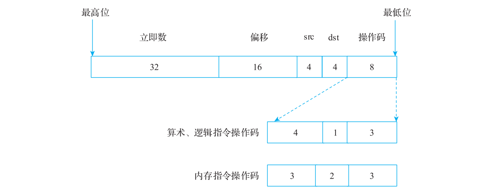
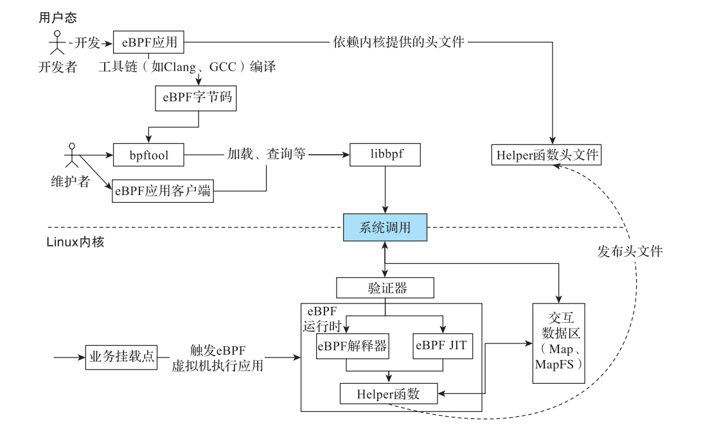

# 附录 B BPF 介绍

> 原文转写，未经技术修订。来源：[原 PDF](../pdf/inside-llvm-codegen.pdf)，PDF 第 420–425 页。书中基线为 LLVM 15（示例 15.0.1）。
> 保留原文观点、命令及排印错误；代码缩进按 PDF 坐标恢复。保留原图裁剪及页码标记，图表、公式或特殊字体可对照原 PDF 读取。

<!-- PDF page 420; printed page 407 -->

附录 B Appendix B

BPF 介绍

BPF 是类 UNIX 系统数据链路层的一种原始接口，提供原始链路层包的收发。1992 年，Steven McCanne 和 Van Jacobson 写了一篇名为“ The BSD Packet Filter: A New Architecture for User-level Packet Capture”的论文，描述了如何在 UNIX 内核实现网络数据包过滤的新技术，该技术比当时最先进的数据包过滤技术快 20 倍，即 BPF 的雏形。

现在谈论的 BPF 主要是指 Linux 3.17 之后引入的 eBPF（extended BPF）。eBPF 主要是新增了指令集、支持将 C 代码编译为伪机器码，以及引入了 Map 机制等，性能、易用性得到了显著提升，且兼容传统的 BPF。有时会将传统的 BPF 称为 classical BPF（cBPF）。

eBPF 的核心是定义了一套通用的 RISC 指令集，并基于这套指令集实现了一个 eBPF虚拟机，由该虚拟机执行 eBPF 指令。在 eBPF 虚拟机的基础上，Linux 内核进行了扩展以支持 eBPF 应用。eBPF 在 Linux 中之所以得到快速发展，主要原因是 eBPF 提供了一种新的内核可编程模式，不需要修改内核，编写或编译内核模块。同时，eBPF 程序强调安全性和稳定性，每个 eBPF 应用都可被视为一个内核模块，由 eBPF 虚拟机在内核执行 eBPF 程序，并且程序的安全与稳定，不会造成内核崩溃。由于 eBPF 的灵活、开放，它已经渗透到操作系统的方方面面，比较常见的场景有网络、系统观测、安全等场景。

下面先介绍 eBPF 基础知识，然后以 Linux 为例，介绍一个 eBPF 应用从开发到执行的整个流程。

## B.1 eBPF 基础

由于 eBPF 提供了指令集，只要符合 eBPF 指令集规范，程序都可以被执行。eBPF 中的指令格式如图的 B-1 所示。

<!-- PDF page 421; printed page 408 -->

**图 B-1 eBPF 指令格式**

eBPF 指令采用固定的 64 位格式。其中，最低 8 位为操作码，可以被解析为算术逻辑操作、内存操作指令○一。接着的 dst 和 src 是寄存器编号，分别占 4 位。再接下来的是偏移（例如地址偏移，与具体的指令进行配合）。最高 32 位表示立即数（具体含义也需要结合指令解读）。

### B.1.1 指令介绍

eBPF 的指令比较简单，主要包含 4 类。

1）算术指令：包含加、减、乘、除、移位、与、或、非运算等。

2）逻辑跳转指令：包含跳转、调用，以及各种比较后的跳转指令等。

3）内存指令：包含内存读、写、原子读、原子写等。

4）字节序指令：大小端字节转换指令，从操作码角度看，字节序指令也属于算术指令。

eBPF 指令信息如表 B-1 所示。

**表 B-1 eBPF 指令信息**

类型 值 描述 指令分类

BPF_LD 0x00 将立即数赋值给寄存器，后续可能会被扩展 内存指令

BPF_LDX 0x01 从内存加载至寄存器 内存指令

BPF_ST 0x02 将立即数写入内存 内存指令

BPF_STX 0x03 将寄存器写入内存 内存指令

BPF_ALU 0x04 32 位算术指令 算术指令

○一 依赖于操作码的编码，算术指令和逻辑指令又将这 8 位操作码分成 4 位、1 位和 3 位。其中，高 4 位表

示不同的指令，中间 1 位表示指令中操作数的类型，最后 3 位是指令的类型。

<!-- PDF page 422; printed page 409 -->

（续）

类型 值 描述 指令分类

BPF_JMP 0x05 64 位跳转指令 逻辑跳转指令

BPF_JMP32 0x06 32 位跳转指令 逻辑跳转指令

BPF_ALU64 0x07 64 位算术指令 算术指令

### B.1.2 寄存器介绍

eBPF 后端定义了 11 个 64 位寄存器和一个程序计数器（Program Counter，简称 PC，PC 对外不可见）。寄存器以 r0～r10 命名，其中：

1）r0：用于存储函数返回值以及 eBPF 应用的返回值。

2）r1～r5 ：用于在函数调用时的参数传递，当参数超过 5 个时，需要通过栈访问其他参数。

3）r6～r9：一般作为通用寄存器，通常由被调用函数使用，但使用前需要保存。

4）r10：作为栈帧寄存器，用于访问栈。

指令集是 eBPF 的基础，更多信息可以参考相关资料○一。因为 eBPF 应用运行在 Linux 内核中，所以需要有一些特殊的设计和实现，下面看看 eBPF 应用在 Linux 中的运行过程，以及一些相关设计。

## B.2 Linux 如何运行 eBPF

因为 eBPF 指令集属于低级指令，虽然基于 eBPF 指令可以直接开发 eBPF 应用，但是效率比较低，所以更为合适的方式是使用高级语言编写 eBPF 应用，然后通过编译器将高级语言编译成 eBPF 指令。例如可以使用 C 语言编写，通过编译器（如 GCC、Clang 等）将程序编译为 eBPF 字节码。之后在 Linux 内核中实现一个 eBPF 虚拟机，将编译后的 eBPF 字节码加载到 Linux 内核，并通过 eBPF 虚拟机执行 eBPF 应用。eBPF 应用执行的整个流程如图 B-2 所示。

由于 eBPF 在内核中执行，出于安全性考虑，因此在进行 eBPF 开发和执行时应该有一些特别的考虑。

### B.2.1 eBPF 虚拟机实现

因为 eBPF 指令集简单，所以 eBPF 虚拟机也较为简洁，最简单的实现是对字节码进行解释执行，但执行效率低，所以在 eBPF 虚拟机的实现中通常都会增加一个 JIT 编译器，将

○一 请参见 https://www.kernel.org/doc/html/latest/bpf/instruction-set.html。

<!-- PDF page 423; printed page 410 -->

eBPF 字节码编译成可以在目标硬件直接运行的机器码。当然因为 Linux 可以运行在不同的硬件平台上，所以 eBPF 的 JIT 编译器也需要支持不同的硬件平台。

**图 B-2 eBPF 执行示意图**

### B.2.2 验证器

验证器是 Linux 内核能够顺利执行 eBPF 应用的关键组件，以保证 eBPF 应用合法、有效，不会破坏内核，不会产生安全问题。因为 eBPF 应用所做的操作都可以通过正常的内核模块来处理，所以直接进行内核编程是一件非常危险的事情，可能会导致系统锁定、内存损坏和进程崩溃，进而导致安全漏洞和其他意外，特别是在生产环境中直接运行 eBPF 应用的风险更大。因此，通过一个安全的虚拟机来运行解释器或者 JIT 编译的代码对安全监控、沙盒隔离、网络过滤、程序跟踪、性能分析和调试等任务都是非常有价值的。这些工作都由验证器完成，简单来说验证器包含两大核心功能。

1）静态验证：由于 eBPF 应用运行在内核空间，只能使用有限资源，不能执行指令数过多的应用，因此可以对 eBPF 应用进行静态分析，确保 eBPF 应用执行前满足一些静态规则。

2）模拟执行验证：静态规则不能完全检测 eBPF 应用是否存在死循环或者非法内存访问等问题，所以需要一个模拟执行机制来检测。一般可以通过程序分析手段（例如抽象解释、模拟执行等方法）来约束程序执行的行为。

<!-- PDF page 424; printed page 411 -->

由于验证器的存在，会导致一些程序无法执行，因此可以认为 eBPF 应用是不完备的。

### B.2.3 eBPF 应用交互

eBPF 应用运行在内核态，运行结果可能需要提供给用户态的应用。所以，eBPF 设计了 Map 机制用于缓存 eBPF 应用的执行结果。

### B.2.4 eBPF 提供 Helper 函数

eBPF 应用开发时不能随意使用库函数，原因有两点。第一，一般的库函数在内核环境不存在（如 libc 中的函数），因此 eBPF 无法直接调用。这是因为 eBPF 应用运行在内核态，与用户态的库函数不直接兼容。第二，即便是内核存在的库函数也不能随意提供给 eBPF 应用使用，因为那些 API 可能存在不安全的行为。例如，eBPF 应用不能使用内核的 kmalloc函数，因为 eBPF 应用随意分配内存可能会引发内核资源不足等非安全行为。所以内核为eBPF 应用设计了 Helper 函数，只有这些函数才能被 eBPF 应用使用。常见的 Helper 函数可以参考 Linux 头文件，一般位于 bpf.h 中。

### B.2.5 eBPF 应用加载

eBPF 应用通过 API 加载到内核。在加载的过程中，内核需要对 eBPF 进行解析，并为它分配资源（指 Map 资源，Map 是 eBPF 和外部交互的渠道）。这和一般的应用执行有所不同，相当于实现了简单的应用加载机制。可以这样类比，Map 资源分配和一般应用执行时的数据区初始化类似。Helper 函数是通过 ID 进行链接的，ID 被编译在字节码中（和一般应用执行时的动态链接、静态链接不完全相同）。

### B.2.6 eBPF 应用执行

当 eBPF 应用完成加载后，内核将特定 Hook 点和 eBPF 应用关联起来（Hook 也称为 eBPF 应用的钩子）。当内核 Hook 点被访问时，取出对应 eBPF 应用，并通过虚拟机执行 eBPF 应用。内核 Hook 点都是提前定义的，主要根据业务定义。例如，可以在系统调用、函数进入 / 退出、内核 tracepoints、网络事件等地方挂载 eBPF 应用。再如，若在某个 kprobe 探测点的内核地址附加了一段 eBPF 应用，当内核执行到这个地址时会发生陷入，进而唤醒 kprobe 的回调函数，该回调函数又会触发并执行附加的 eBPF 应用。

### B.2.7 eBPF 应用开发

开发 eBPF 应用和开发一般的 C 应用基本类似，但是有两个主要的区别点。

1）eBPF 应用只能使用 Helper 函数，不能使用库函数；Helper 函数在内核中实现，提供头文件供开发者使用，头文件中只定义了 Helper 函数的原型以及 Helper 函数 ID，编译

<!-- PDF page 425; printed page 412 -->

时通过 Helper 函数 ID 访问 Helper 函数。

2）eBPF 应用一般运行在特定的 Hook 点，Hook 点有其特定的上下文，eBPF 应用只能访问上下文信息，不能随意访问其他内存。

除此以外，eBPF 应用还受到验证器的约束。例如，需要满足循环约束，eBPF 早期版本不支持循环，如果有循环必须对循环进行展开，或者通过编译器选项将其展开。现在eBPF 的较新版本支持有界循环，但仍需满足 eBPF 字节码条数的上限约束条件。

所以经常遇到的问题是 eBPF 应用通过编译器编译生成了 eBPF 字节码，但是验证器拒绝执行 eBPF 字节码（发现潜在的不安全问题），需要应用开发者重新修改 eBPF 应用。关于应用开发的限制可以参考 BCC 的一些资料○一。

### B.2.8 eBPF 的交互工具或应用

eBPF 社区提供了 bpftool 工具，便于用户态和内核态的 eBPF 应用进行交互。例如，可以通过 bpftool 加载 eBPF 应用到内核，也可以通过 bpftool 访问 eBPF 应用创建的 Map。

除此以外，开发者或者运维工程师可以基于 libbpf 库开发用户态应用，libbpf 通过系统调用和内核态进行交互。

○一 请参见 https://docs.cilium.io/en/latest/bpf/#llvm。
