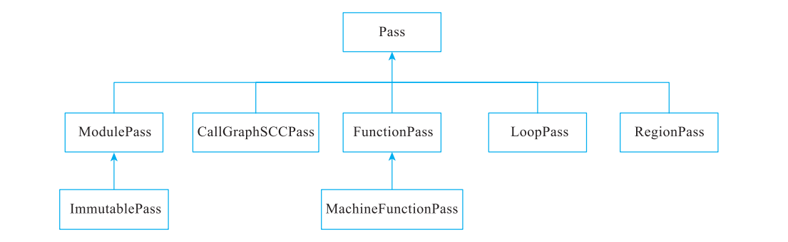
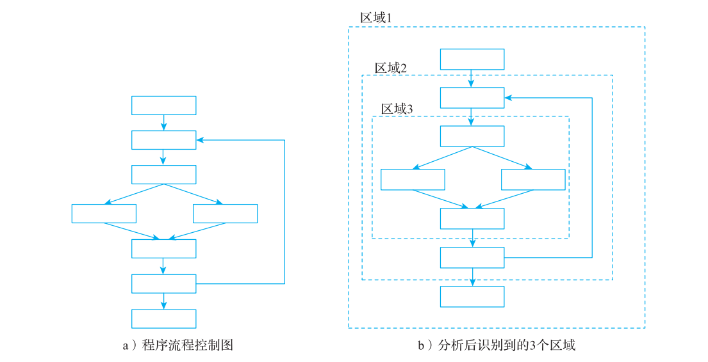
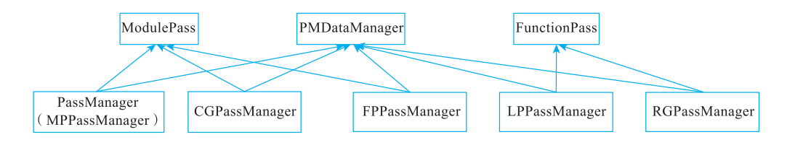
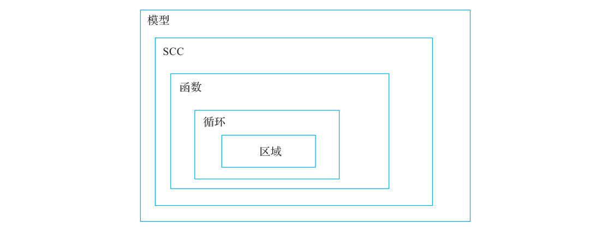

# 附录 C Pass 的分类与管理

> 原文转写，未经技术修订。来源：[原 PDF](../pdf/inside-llvm-codegen.pdf)，PDF 第 426–431 页。书中基线为 LLVM 15（示例 15.0.1）。
> 保留原文观点、命令及排印错误；代码缩进按 PDF 坐标恢复。保留原图裁剪及页码标记，图表、公式或特殊字体可对照原 PDF 读取。

<!-- PDF page 426; printed page 413 -->

附录 C Appendix C

Pass 的分类与管理

Pass 是编译器中最基础的概念之一，指的是对编译对象进行一次扫描处理（可以是分析或者优化处理）。引入 Pass 概念后，可以将复杂的编译过程分解为多个 Pass。例如在LLVM 中端优化过程中，所有的优化都是基于 LLVM IR，因此可以设计功能独立、实现简单的 Pass。根据功能和定位，通常将 Pass 分为以下几类。

1）分析 Pass ：对源码进行分析（供其他 Pass 使用），例如分析源码的支配关系、循环信息。分析 Pass 仅仅收集源码信息，并不会修改源码。

2）变换 Pass ：对源码进行优化变换，一般会使用分析 Pass 的信息。由于变换 Pass 会修改源码，因此变换后可能会导致以前的分析 Pass 的结果失效。例如，删除死代码后会导致很多分析信息失效。

3）功能 Pass ：既不属于分析 Pass 也不属于变换 Pass，一般用于提供公共功能。例如，功能 Pass 可以将中间表达进行打印 / 输出。

因为 Pass 之间存在使用依赖，所以 LLVM 通过 PassManager 对 Pass 进行管理。目前在系统中存在两套 PassManager 管理系统—LegacyPassManager 和 New PassManager，后者是 2013年开始逐步引入，在 LLVM 13 中正式使用 New PassManager○一。下面以 LegacyPassManager为例，对 LLVM 中的 Pass 和 Pass 管理系统进行分析。

○一 在 LLVM 5 到 LLVM 12 版本中，可以通过 -fno-experimental-new-pass-manager 启用 NewPassManager ；

在 LLVM13、14 中，可以通过 -flegacy-pass-manager 启用 LegacyPassManager ；LLVM 15 以后的版本无

法启用 LegacyPassManager。

<!-- PDF page 427; printed page 414 -->

## C.1 LegacyPassManage 中的 Pass

针对代码处理的不同位置，LLVM 提供了 7 种 Pass。具体结构示意图如图 C-1 所示。



**图 C-1 LLVM 中的 Pass 结构示意图**

其中 Pass 类为基类，其他的 7 种 Pass 主要的工作如下。

1）ModulePass 类：最常用的一类 Pass，该类将整个程序当作一个单元，可以随意引用函数主体，添加和移除函数。由于不知道 ModulePass 子类的行为，因此不能对其进行优化。ModulePass 可以使用函数级 Pass，例如 ModulePass 可使用函数级 Pass 的 getAnalysis接口 getAnalysis<DominatorTree>(llvm::Function *) 来获取函数的支配者 dominators 分析结果。开发者通常会重写 runOnModule() 函数实现自定义功能，如果原 IR 有修改则返回True，如果只是分析，则返回 False。

2）ImmutablePass 类：该类为不用运行、不会改变状态、不需要更新的 Pass 而设计。虽然该类在变换和分析中不常用到，但能提供当前编译器的配置信息、目标机器信息，以及影响变换的静态信息。

3）FunctionPass ：这类 Pass 可独立处理程序中每个函数，并不依赖其他函数的结果，FunctionPass 不需要函数按特定顺序执行，也不会修改外部函数。FunctionPass 只能分析和修改当前被处理的函数；不能从当前模型增减函数、全局变量多个 runOnFunction 调用之间不能保持全局变量的状态。开发者通常重写函数 runOnFunction() 实现自定义功能，如果 IR在 Pass 运行过程中发生变化，则函数返回 true，否则返回 false。另外，FunctionPass 提供了 doInitialization、doFinalization 函数，可以基于模型信息对函数做相应处理。

4）MachineFunctionPass ： 这 是 LLVM 后 端 在 代 码 生 成 中 用 于 处 理 MIR 的 Pass。MachineFunctionPass 继承于 FunctionPass，所以 FunctionPass 的限制也适用于 Machine- FunctionPass。此外，MachineFunctionPass 还不能修改和创建 LLVM IR 指令、基本块、参数、函数、全局变量、模块等，只能修改当前正被处理的机器函数。开发者通常重写函数runOnMachineFunction() 实现自定义功能，如果 MIR 在 Pass 运行过程中发生变化，函数返回 true，否则返回 false。

<!-- PDF page 428; printed page 415 -->

5）CallGraphSCCPass ：在调用图上从后往前遍历程序。CallGraphSCCPass 可以帮助构建和遍历调用图。CallGraphSCCPass 只能分析和修改当前 SCC（Strong Connection CallGraph，强连通图）、SCC 的直接的调用者和被调用者均不能分析和修改其他函数。开发者通常重写函数 runOnSCC() 实现自定义功能，如果 IR 在 Pass 运行过程中发生变化，函数返回 true，否则返回 false。

6）LoopPass：这类 Pass 用于遍历并处理函数中的循环。若遍历时遇到嵌套循环，则先处理内层循环，后处理外层循环。LoopPass 可以获取函数或模型级的分析信息，使用者通常重写 runOnLoop() 函数，实现自定义功能。

7）RegionPass ：和 LoopPass 类似，这类 Pass 用于遍历并处理函数的区域，其中函数的区域是由单入口 / 单出口基本块组成。图 C-2a 是一个程序的控制流图，图 C-2b 是分析该流程图后识别到的 3 个区域。



**图 C-2 CFG 和区域划分示意图**

通常 RegionPass 和 CFG 优化相关，针对某一区域进行局部优化。RegionPass 可以访问函数或模型级的分析信息。注意，因为图 C-2b 的 3 个区域是函数的子区域，所以可以使用全局信息。使用者通常要重写 runOnRegion() 函数，实现自定义功能。基于区域的优化并不多，LLVM 中只有几个 RegionPass，主要与 CFG 优化、多面体优化相关。

## C.2 LegacyPassManager 对 Pass 的管理

由于 Pass 之间存在依赖，例如在寄存器分配前需要执行 φ 函数消除，φ 函数消除依赖

<!-- PDF page 429; printed page 416 -->

活跃变量分析、指令编号、变量活跃区间分析等，其中变量活跃区间分析又依赖其他的分析。可以看出，Pass 之间存在依赖关系，所以需要使用 Pass 管理系统对 Pass 进行管理。除此以外，LLVM 中的变换 Pass 会导致程序发生变化，进而可能导致一些分析 Pass 失效，需要重新进行分析。所以，Pass 管理系统需要先管理 Pass 之间的依赖关系，确保被依赖的Pass 总是先于依赖 Pass 执行；之后，Pass 管理系统需要管理 Pass 结果是否失效，确保在变换 Pass 执行以后只有必要的 Pass 重新运行。为此，LegacyPassManager 设计了一些 API 用于管理分析 Pass，主要有两类。

1）用于添加依赖 Pass 的 API ：使用的 API 是 addRequired 和 addRequiredTransitive，两者的区别是，前者表示被依赖 Pass 的生命周期不随着依赖 Pass 变化，后者是当依赖的Pass 消亡，被依赖 Pass 也会消亡。

2）用于管理 Pass 失效状态的 API ：使用的 API 主要是 addPreserved，该 API 指定的Pass 在变换 Pass 执行后不需要重新计算。（原因是，可能指定的 Pass 结果没有变化，或指定的分析结果没有发生变化，但是在变换 Pass 中已经通过局部、增量更新保证指定的 Pass结果正确。）除了使用 addPreserved 外，还可以使用 setPreservesCFG 和 setPreservesAll，分别是指保证 CFG 不变或者所有结果都不变。

Pass 之间的依赖指的是 Pass 在运行过程中重用另一个 Pass 的运行结果。依赖关系一般可以简单分为如下三种。

1）简单依赖：例如 Pass A 依赖 Pass B，那么 Pass B 应该在 Pass A 之前执行。

2）多依赖：例如 Pass A 依赖 Pass B、Pass C，如果 Pass B 和 Pass C 之间无依赖关系，只要保证 Pass B、Pass C 在 Pass A 之前执行即可，而 Pass B 和 Pass C 则无顺序要求。

3）链式依赖：例如 Pass A 依赖 Pass B、Pass C，而 Pass C 又依赖 Pass B ；那么 Pass的执行顺序一定是 Pass B、Pass C 和 Pass A。

LLVM 中上述三种依赖会混合存在，所以需要管理依赖，保证 Pass 能够按照正确的顺序执行。另外，LLVM 还允许不同类型的 Pass 之间存在依赖，例如 ModulePass 依赖FunctionPass 的分析结果，要求 FunctionPass 在 ModulePass 之前执行（表示为链式依赖）。为此，LLVM 的 LegacyPassManager 中定义了 5 个 Pass 管理子系统，分别是 PassManager、CGPassManager、FPPassManager、LPPassManager、RGPassManager，它们继承自 ModulePass、FunctionPass、PMDataManager。意味着这些 Pass 管理系统分别作为 ModulePass 或者FunctionPass 运行，同时它们又管理所有的 Pass，如图 C-3 所示。



**图 C-3 各种 Pass 的继承关系示意图**

<!-- PDF page 430; printed page 417 -->

Pass 管理子系统通过层级关系进行依赖管理，各种 Pass 包含关系示意图如图 C-4所示。



**图 C-4 各种 Pass 包含关系示意图**

下面简单介绍一下 LegacyPassManager 如何通过层级管理 Pass。

首先，这 5 个 Pass 管理子系统继承自 ModulePass 或者 FucntionPass，所以它们都会重写 runOnModule 或者 runOnFunction 函数，从而得到执行。

其 次， 这 5 个 Pass 管 理 子 系 统 继 承 自 PMDataManager， 在 PMDataManager 中 有 一个成员变量 PMTopLevelManager，在 PMTopLevelManager 中包含一个当前 Pass 管理子系统栈（activeStack），用于管理该层级中所有的 Pass。如果发现管理的 Pass 中有下一层级的 Pass，则会创建下一层级的 Pass 管理子系统，然后将 Pass 添加至下一层级的 Pass 管理子系统中。例如，当然层级为 FPPassManager，可以管理所有的 FunctionPass，遇到FunctionPass 都会添加到 FPPassManager 的 activeStack 中，如果遇到 LoopPass，则先创建LPPassManager， 将 LPPassManager 添 加 至 FPFunctionPass（因 为 LPPassManager 继 承 自FunctionPass，所以可以被 FPPassManager 管理），同时将 LoopPass 添加至 LPPassManager。至此，所有的 Pass 本质上形成了一棵树，通过深度遍历树就能得到所有 Pass 的正确执行顺序。

注 Pass 的层级管理是通过枚举值完成的。但是在定义 Pass 管理子系统时并不是严格按

意

照层级定义的，例如 LPPassManager 和 RGPassManager 都是继承自 FunctionPass，

即它们都归 FPPassManager 管理，只是在添加 Pass 时定义了层级。为什么不直接让

RGPassManager 直接继承 LoopPass 呢？最主要的原因是循环和区域之间并无直接

的包含关系（即不符合继承的语义）。通常来说，循环可以使用区域（可能包含多个

区域）表示，但是区域并不一定是循环。

<!-- PDF page 431; printed page 418 -->

## C.3 New PassManager

LLVM 中提供了两套功能一样的 Pass 管理机制，为什么呢？主要是考虑代码实现和性能两方面的因素。

在 LegacyPassManager 的实现中有一个比较大的问题：以继承为主，表现 Pass 管理子系统的关系。例如，LPPassManager 继承自 ModulePass，但本质上它仅仅是为了管理FunctionPass，并不具有 ModulePass 的语义。所以新的 PassManager 管理系统引入了 CRTP（Curiously Recurring Template Pattern，奇异递归模板模式），让继承真正符合继承语义。下面来看一下使用 CRTP 的好处，示例代码片段如清单 C-1 所示。

**代码清单 C-1 示例代码**

```text
class Base { ... };
class Derived : public Base { ... };
template <class T> class Mixin : public T { ... };
Base b;
Derived d;
Mixin<Base> mb;
Mixin<Derived> md;
b = d // 能赋值
mb = md; // 不能赋值会报错
```

示例显示 Base 和 Derived 有继承关系，但是当它们都通过 CRTP 实例化以后，可以发现 Mixin<Derived> 和类 Mixin<Base> 之间并无任何关系。这样的代码更加符合里氏替换原则○一。另外，通过 CRTP○二可以将公共代码放置在模板中，可以非常容易地实现静态多态。

新 PassManager 除了使用模板对代码进行重构外，在实现上和 LegacyPassManager 有两个区别。

1）将 PassManager 和 AnalysisPassManager 进行了区分，然后由 AnalysisPassManager统一管理分析类 Pass。

2）不再依赖调度管理 Pass 的依赖关系，而是使用懒执行的方式，直接获取分析 Pass的结果：如果分析 Pass 结果不存在或者无效，则执行分析类 Pass ；否则，直接重用分析类Pass 的结果（通过缓存机制）。这么做的主要原因是分析类 Pass 不会修改代码，所以只需要考虑结果是否可用即可。

因为 LLVM 后端尚未完全使用新的 PassManager，所以本节不作详细介绍，关于新的PassManager 的更多内容，读者可以参考其他资料○三。

○一 请参见 http://gsd.web.elte.hu/lectures/bolyai/2018/mixin_crtp/mixin_crtp.pdf。

○二 更多关于 LLVM 为什么使用 CRTP 以及 CRTP 使用带来的各种问题可以参考其他资料，例如 https://

zhuanlan.zhihu.com/p/338837812。

○三 有人对新 PassManager 做了详细的分析，例如可参考 https://homura.live/tags/LLVM/。
