# 第 10 章 寄存器分配

> 原文转写，未经技术修订。来源：[原 PDF](../pdf/inside-llvm-codegen.pdf)，PDF 第 245–342 页。书中基线为 LLVM 15（示例 15.0.1）。
> 保留原文观点、命令及排印错误；代码缩进按 PDF 坐标恢复。保留原图裁剪及页码标记，图表、公式或特殊字体可对照原 PDF 读取。

<!-- PDF page 245; printed page 232 -->

Chapter 10 第 10 章

寄存器分配

为什么需要寄存器分配？要回答这个问题需要回顾一下计算机存储层次结构相关知识。由于不同存储介质成本和访问速度不同，为了让计算机既能高速访问存储又能保持高性价比，通常都会使用层次化存储结构，成本和访问速度如图 10-1 所示。

一般来说，程序中定义的访存变量个数远远大于寄存器的个数。大多数硬件体系结构在程序执行时总是需要将变量放入寄存器，但因为寄存器价格昂贵且个数较少，所以需要设计和实现高效的算法，将程序执行过程中的访存变量都映射到寄存器中。这个过程称为寄存器分配。 图 10-1 存储结构和空间示意图

在 LLVM 中，寄存器分配阶段的目的就是将 MIR 中使用的虚拟寄存器（一般来说虚拟寄存器对应用户程序中的变量）映射到目标机器的物理寄存器上。因为硬件的物理寄存器数量总是有限的，用户开发的应用程序中使用的变量总是大于物理寄存器的个数，所以寄存器分配最主要的两个工作可以总结为：

1）当存在可用的物理寄存器时，将变量映射到物理寄存器中。

2）当没有可用的物理寄存器时，将已经分配寄存器的变量重新放入内存中，得到一个空闲的寄存器，并为当前变量分配该寄存器，这一过程称为溢出（spill）。

通过简单的寄存器分配描述，可以看到寄存器分配的复杂性在于：选择合适的寄存器进行溢出处理。因为溢出过程需要引入额外的内存操作指令，所以寄存器分配衡量的目标之一就是整体溢出成本最低（遗憾的是，寄存器分配已经被证明为 NP 问题）。

在 LLVM 中，寄存器分配共有 4 种分配算法，分别是 Fast、Basic、Greedy 和 PBQP

<!-- PDF page 246; printed page 233 -->

（Partitioned Boolean Quadratic Problem，划分布尔二次问题）。

1）Fast ：默认在 O0 优化级编译下使用，以函数为粒度进行寄存器分配，每个基本块都可以使用全部的物理寄存器。在寄存器分配时并不会考虑变量的活跃区间，遇到变量无法分配的情况则溢出。

2）Basic：实验性质的寄存器分配，以函数为粒度进行寄存器分配。基于变量活跃区间进行寄存器分配，首先对活跃区间按照权重进行排序，按照权重从高到低逐一分配。在寄存器分配时：如果可以为虚拟寄存器分配物理寄存器，则直接分配；如果不可以为虚拟寄存器分配物理寄存器，则选择将虚拟寄存器暂存在栈中，并将使用虚拟寄存器的地方重新插入加载指令（从栈中加载数据）。通常该分配算法并不会在生产环境中使用，而是用于性能基准分析和比较新型寄存器分配算法的优劣。

3）Greedy ：这是 LLVM 中默认的分配器，以函数为粒度进行寄存器分配。和 Basic 算法相比，Greedy 在寄存器溢出实现上更为复杂，因为它要努力生成最小溢出成本的代码。

4）PBQP ：基于 PBQP 实现的寄存器分配器，以函数为粒度进行寄存器分配。这个分配器通过构造一个 PBQP 来表示寄存器分配问题（将活跃变量区间等约束转换为方程组），然后通过对 PBQP 求解来获得结果，再将求解结果映射回寄存器分配。

寄存器分配和编译优化密切相关，可以设置 -regalloc 的值（basic、fast、pbqp、greedy）选择寄存器分配算法。

## 10.1 寄存器分配流程解析

寄存器分配需要依赖一些前置 Pass，按照实现中的依赖特性，可以将 4 种分配算法分为两类，其中 Fast 算法是单独一类，其他三种算法是另一类。

### 10.1.1 Fast 算法执行流程

Fast 算法依赖非常简单，仅仅依赖 PHI Elimination 和 Two Address Instruction 两个 Pass，如图 10-2 所示。


**图 10-2 Fast 算法执行过程中的 Pass**

Fast 算法本身比较简单，不需要依赖变量的生命周期进行高质量的寄存器分配。

### 10.1.2 Basic 算法执行流程

相比 Fast 算法，其他三种算法较为复杂，这里以 Basic 算法为例介绍寄存器分配的执行过程。Greedy 与 PBQP 的执行过程和 Basic 基本相同，唯一的区别是算法本身实现不同，

<!-- PDF page 247; printed page 234 -->

导致依赖的 Pass 稍有区别，如图 10-3 所示。

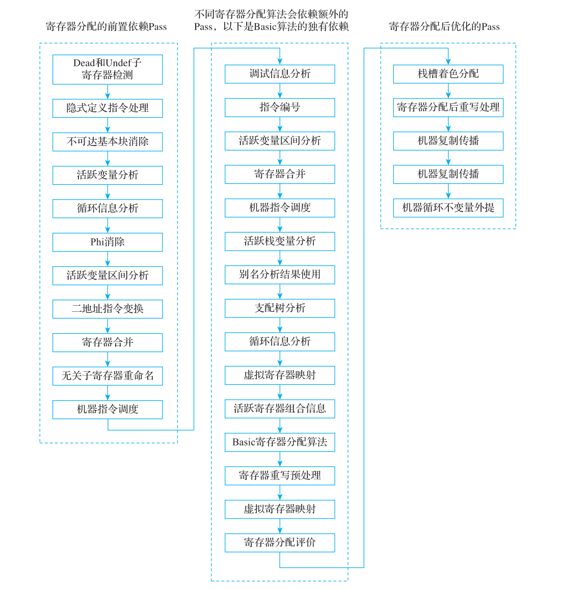

**图 10-3 Basic 算法执行分配寄存器的过程**

**图 10-3 有几个需要说明的地方。**

1）图中使用三个虚框将整个寄存器分配过程中的 Pass 分为 3 类。

① 图 10-3 左侧的 Pass 是所有寄存器分配算法都需要的。

② 特定寄存器算法依赖的 Pass 以及寄存器分配算法 Pass，这里显示的是 Basic 算法相

<!-- PDF page 248; printed page 235 -->

关依赖，Greedy 和 PBQP 的依赖有所不同。

③ 寄存器分配后的优化 Pass，例如执行复制传播、循环变量外提。

2）图 10-3 只画出了部分执行 Pass，这些 Pass 是 Basic 算法直接依赖的 Pass，而这些依赖的 Pass 还会依赖其他的 Pass，因篇幅有限，所以并未出现在图中。例如 Simple Register Coalescer 会依赖其他的 Pass，如 Slot Index Analysis、Live Interval Analysis、MachineInfoLoop 等，虽然这些 Pass 并未出现在图中，但也是寄存器分配中的关键步骤，会被执行。例如，Slot Index Analysis 可能在流程中被重复调用—既直接服务于 Basic 算法，也间接通过 Simple Register Coalescer 发挥作用。关于这些 Pass 的详细作用与执行顺序，将在 10.2 节深入讲解。

3）有些 Pass 会出现多次，原因可能有多种：有些 Pass 在使用后结果发生了变化，所以需要重新计算；有些 Pass 是被依赖的 Pass，在后续某些 Pass 被显式地调用；有些 Pass是变换 Pass，因为执行其他的 Pass 带来优化机会，故重新运行。注意，当分析 Pass 出现多次时，如果分析 Pass 的结果没有变化，则不会重新运行分析 Pass（对变换 Pass 不适用）。

4）寄存器分配算法框架中还提供了两个挂载点—寄存器重写预处理（PreRewrite）和虚拟寄存器映射（PostRewrite），用于在寄存器分配后为不同的后端提供额外的功能，允许后端在虚拟寄存器和物理寄存器映射过程中进行特殊的处理。

**图 10-2 和图 10-3 给出了不同寄存器分配算法的全景图，根据全景图还需要回答两个**

问题。

1）这些 Pass 在寄存器分配中起到的作用是什么？如果在寄存器分配过程中不引入相关的 Pass 是否可行，为什么？

2）这些 Pass 之间的顺序是否必须按照图中顺序执行，是否可以调整 Pass 的执行顺序？如果允许调整 Pass 顺序，调整的位置是否有约束，约束是什么？

为了回答上面两个问题，首先看一看每个 Pass 的主要功能是什么，然后再对每个 Pass进行深入的分析。

1. 前置依赖分析 Pass

通用寄存器分配的前置依赖分析包括以下步骤，其中括号内为对应的 Pass 名。

1）Dead 和 Undef 子寄存器检测（Detect Dead Lane）：在一些涉及子寄存器使用指令（Copy、Phi、Extract_SubReg、Insert_SubReg、Reg_Sequence）的场景中，指令序列可能存在寄存器死亡（Dead）或者未定义（Undef）的情况。而这些情况是寄存器合并非常重要的应用场景：死亡寄存器的活跃区间变小，更容易合并寄存器；未定义寄存器不用做额外处理，在寄存器分配时选择一个可用的物理寄存器即可。所以，寄存器分配阶段首先对指令进行分析获得子寄存器的状态。

2）隐式定义指令处理（Process Implicit Def）：将所有用到隐式定义的指令的地方设置为 Undef（未定义），并且删除该指令；在寄存器分配阶段简化设置为 Undef 的寄存器的分配过程。

3）不可达基本块消除（Unreachable Machine Block Elim）：对 MIR 进行不可达代码消

<!-- PDF page 249; printed page 236 -->

除，消除后要保证不影响程序的正确性。不可达基本块可以通过分析 CFG 得到。

4）活跃变量分析（Live Variables Analysis）：在寄存器分配阶段仅对活跃变量进行分配，不活跃变量不需要进行寄存器分配。

5）循环信息分析（Machine Loop Info）：基于 MIR 分析函数中的循环，循环信息可用于后续的分析和优化 Pass（例如基本块频率计算等）。

6）Phi 消除（Phi Elimination）：因为此时 MIR 是 SSA 形式，在汇聚节点存在 φ 函数，但是没有硬件支持 φ 函数，所以需要将 φ 函数消除才能进行寄存器分配。

7）活跃变量区间分析（Live Intervals Analysis）：计算活跃变量的生命周期区间，只为生命周期区间内活跃的变量分配寄存器，如果变量不在活跃区间（变量生命周期区间不连续）内，说明此时变量不活跃，不需要分配寄存器（可以将已经分配的物理寄存器重新提供其他变量使用）。

8）二地址指令变换（Two Address Instruction）：将三地址指令变换为二地址指令，因为一些硬件架构不支持三地址指令。注意：该 Pass 实际执行情况依赖于 TD 文件中二地址指令的定义（通过 Constraints 属性），如果没有指令定义相关属性，该 Pass 会被跳过。

9）寄存器合并（Simple Register Coalescing）：对 MIR 进行寄存器合并处理。寄存器合并指的是形如 %0 = COPY %1 这样的指令，可以尝试将虚拟寄存器 %1 和 %0 合并使用一个虚拟寄存器，从而减少指令数量和使用的寄存器。

10）无关子寄存器重命名（Rename Disconnected Independent Subregister）：在 MIR 中可能存在独立使用的多个子寄存器（即子寄存器不会组合在一起使用），可以将子寄存器对应的虚拟寄存器重命名，以减少寄存器分配压力（为子寄存器分配不同的物理寄存器，可以减少寄存器溢出的概率）。该优化只适用于部分后端，只有在后端支持子寄存器，且子寄存器有联合使用的场景才有意义。一些后端（例如 BPF）支持 64 位、32 位寄存器，虽然 32位寄存器和 64 位寄存器的低位相同，但是 64 位寄存器的高 32 位不是子寄存器，所以 BPF后端不会真正执行该 Pass。

11）机器指令调度（Machine Instruction Scheduler）：分析 MIR 中的数据依赖，并按照指令调度算法重新对 MIR 进行排序，此处该 Pass 的主要目的是减少寄存器分配的压力。注意，有些后端不支持指令调度，如 BPF 和 WASM 后端。在 WASM 的实现中提到，指令调度影响了寄存器分配的性能；对 BPF 后端来说，笔者猜测是因为指令调度的效果依赖于虚拟机的 JIT 实现。

2. 不同分配算法依赖的 Pass

下面以 Basic 算法为例介绍特定寄存器分配算法依赖的 Pass，具体如下。

1）调试信息○一分析（Debug Variables Analysis）：调试信息不应该影响寄存器分配，所以

○一 调试指令的生成依赖于编译选项，在编译过程中是通过参数“ -g”生成调试指令的。由于调试本身知识

也非常复杂，限于篇幅，本书不展开介绍。

<!-- PDF page 250; printed page 237 -->

在寄存器分配时不会处理调试相关的指令，但编译出来的文件中会有一些需要额外处理的调试信息，以确保调试信息和指令正确关联。在寄存器分配之前找到调试指令，并记录调试指令的作用域（即指令的活跃区间），然后删除调试指令。在寄存器分配结束后，根据原调试指令的作用域重新插入调试指令（新插入的调试指令会使用已经分配的物理寄存器替换原指令的虚拟寄存器）○一。

2）指令编号（Slot Indexe Analysis）：为指令进行编号，指令的编号在活跃区间中使用。

3）活跃变量区间分析（Live Interval Analysis）：计算活跃变量的生命周期区间，供寄存器分配使用。

4）寄存器合并（Simple Register Coalescing）：对 MIR 进行寄存器合并处理，以优化指令数量；该 Pass 主要是为了优化 φ 函数消除以及二地址指令变换过程中引入的大量 COPY指令。

5）机器指令调度（Machine Instruction Scheduler）：分析 MIR 中的数据依赖，并按照指令调度算法重新对 MIR 进行排序。○二

6）活跃栈变量分析（Live Stack Slot Analysis）：在寄存器分配过程中，栈变量是指在寄存器溢出后被临时存入栈空间的变量。该 Pass 不需要真正地分析活跃变量，仅需分配数据结构，并记录寄存器溢出后虚拟寄存器和栈变量的映射信息即可。

7）别名分析结果使用（Alias Analysis Results Wrapper）：在寄存器分配过程中会使用别名分析的结果，确保移动后的指令正确。（如果指令使用的变量产生别名，则需要在指令移动时确保变量不冲突，否则会出现错误。）

8）支配树分析（Machine Dominator Tree）：基于 MIR 分析函数中的支配树信息，支配树不仅仅在循环信息分析中被使用，在后续的多个 Pass 中也会被使用（例如在移动指令时一定会使用支配树信息）。

9）循环信息分析（Machine Natural Loop Analysis）：基于 MIR 分析函数中的循环，循环信息可用于后续的 Pass（如基本块频率计算等）。

10）虚拟寄存器映射（Virtual Register Map）：记录寄存器分配过程中虚拟寄存器和物理寄存器之间的映射关系，在寄存器分配完成后进行虚拟寄存器重写时会使用这个信息。该 Pass 不需要对指令进行真正的分析，仅需分配相关数据结构的内存，用于记录寄存器分配过程中虚拟寄存器和物理寄存器的映射关系。

11）活跃寄存器组合信息（Live Register Matrix）：记录寄存器分配过程中虚拟寄存器的

○一 根据调试信息分析的说明，我们可以得到两个有用的信息：第一，该 Pass 会记录调试指令的作用域，

如果在该 Pass 运行后，指令被修改、删除或者位置发生变化，可能会影响后续重新插入的调试指令的准

确性，这意味着最好在该 Pass 执行以后不要修改指令；第二，重新插入的调试指令必须在寄存器重新执

行完之后才能执行，此时才能准确获得调试指令中使用的物理寄存器信息。

○二 注意，如果图 10-3 中的三个虚线框从左到右分别代表三个阶段，我们可以发现第二阶段和第一阶段都存

在活跃变量区间、机器指令调度等 Pass，笔者猜测第二阶段中的 Pass 和分配算法密切相关，而第一阶段

则是为了执行三种算法。如果在第一阶段运行后的前置依赖 Pass 没有修改，在第二阶段也不会真正执行。

<!-- PDF page 251; printed page 238 -->

分配信息，包含了虚拟寄存器和物理寄存器的映射、虚拟寄存器溢出的栈位置等信息，供寄存器分配使用后，还可以供虚拟寄存器重写使用。

12）Basic 寄存器分配算法（Basic Register Allocator）：为指令中使用的虚拟寄存器分配物理寄存器，如果遇到无法分配的情况，还需要选择合适的虚拟寄存器溢出到栈空间。

13）寄存器重写预处理（Hook point for PreRewrite）：为不同的后端提供挂载点，允许后端在寄存器映射之前做特殊的处理。

14）寄存器映射（Virtual Register Rewritter）：将虚拟寄存器映射为物理寄存器，并重写指令。

15）寄存器分配评价（Register Allocation Scoring）：通过该 Pass 对寄存器分配后的结果进行评价，评价的方式是计算寄存器分配后各种指令（如 load、store、ReMaterial、copy）的总成本，并在计算过程中为不同类型的指令设置不同的权重。由此计算得到的总成本越小，说明寄存器分配后的性能越高。该 Pass 典型的应用场景是 MLGO（Machine-Learning Guided Optimization，机器学习指导的优化），通过机器学习不断迭代以获取最优的寄存器分配结果。

3. 分配后依赖的 Pass

寄存器分配后还可以进行优化，主要包含以下 Pass。

1）栈槽着色分配（Stack Slot Coloring）：在寄存器分配过程中会遇到寄存器溢出的情况，需要使用栈空间暂存变量，在使用栈空间的过程中可以继续优化：如两个栈变量的活跃区间不重叠，则可以重用该栈槽空间。

2）寄存器分配后重写处理（Hook Point for PostRewrite）：为不同的后端提供挂载点，允许后端在寄存器映射之后进行独有的处理。

3）机器复制传播（Machine Copy Propagation）：在寄存器分配后，会引入少量的COPY 指令○一，这样的 COPY 指令经过复制传播优化可以消除，减少生成的指令数。

4）循环不变量外提（Machine LICM）：在寄存器分配后再次执行循环不变量外提，可能是机器复制传播等 Pass 执行后出现了新的优化机会。

4. 依赖 Pass 分类

不同的后端对 Pass 的处理又有所不同，可以将寄存器分配过程中涉及的 Pass 分为两类。

1）适用于所有后端的 Pass ：基于寄存器分配算法和后端架构抽象的 Pass。可以进一步分为如下三类。

① 修改原始 MIR 或者生成新 MIR 的 Pass，例如 φ 函数消除、二地址指令转换等。

② 为寄存器分配算法运行提供用于数据分析的 Pass，例如 Slot Index Analysis、Live

○一 形如 ax = COPY bx 的指令。原因可能有多种，例如某些后端 ABI 要求在函数返回时需要使用特定的寄

存器，对于这样的情况会产生额外的 COPY 指令。

<!-- PDF page 252; printed page 239 -->

Interval Analysis 等。

③ 用于资源分配的 Pass，这些 Pass 分配的资源将在寄存器分配过程中或结束后被使用，例如 Live Stack Slot Analysis、Virtual Register Map、Live Register Matrix 等。

2）适用于部分后端的 Pass ：部分后端支持的功能比较简单，或者某些特性并不适用于这些后端。例如 Rename Disconnected Independet Subregister、Machine Instruction Scheduler，它们并不适用于 BPF、WASM 后端。

下面将介绍寄存器分配中的主要 Pass，如果这些 Pass 依赖了其他的 Pass，也会展开介绍。

5. 寄存器分配示例介绍

为了演示方便，本章统一采用代码清单 10-1 所示的示例代码演示寄存器分配，该代码实现了从 0～9 求和的运算。

**代码清单 10-1 从 0～9 进行求和运算的源码**

```text
int sum() {
    int res = 0;
    for (int i = 0; i < 10; i++) {
        res += i;
    }
    return res;
}
```

使用命令生成 LLVM IR，而 IR 可以是包含 φ 函数的 SSA 形式，也可以是不包含 φ 函数的 SSA 形式○一。一般来说，中端优化、后端优化都是基于包含 φ 函数的 SSA 形式 IR 进行的。在中端优化时可以通过 opt -mem2reg 将不包含 φ 函数的 SSA 形式的 IR 转化为包含 φ函数的 SSA 形式的 IR，代码清单 10-1 对应的未经优化的 SSA 形式的 IR 如代码清单 10-2所示。

**代码清单 10-2 代码清单 10-1 对应的 SSA 形式的 IR（未经优化）**

```text
define i32 @sum() {
entry:
    br label %for.cond

for.cond:                     ; preds = %for.inc, %entry
    %i.0 = phi i32 [ 0, %entry ], [ %inc, %for.inc ]
    %res.0 = phi i32 [ 0, %entry ], [ %add, %for.inc ]
    %cmp = icmp slt i32 %i.0, 10
    br i1 %cmp, label %for.body, label %for.end

for.body:                     ; preds = %for.cond
```

○一 不包含 φ 函数的 SSA 形式的 IR 并没有违反 SSA 的语义，只不过变量都放在内存中，访问都是通过

Load/Store 指令完成的，所以是在聚合点直接访存而不是通过 φ 函数。

<!-- PDF page 253; printed page 240 -->

```text
    %add = add nsw i32 %res.0, %i.0
    br label %for.inc

for.inc:                     ; preds = %for.body
    %inc = add nsw i32 %i.0, 1
    br label %for.cond

for.end:                     ; preds = %for.cond
    ret i32 %res.0
}
```

注 意 LLVM 后端也可以基于不包含 φ 函数的 SSA IR 生成代码，这里不展开讨论○一。

经过指令选择后，此时输出的 MIR 如代码清单 10-3 所示。

**代码清单 10-3 代码清单 10-1 对应的 MIR**

```text
# Machine code for function sum: IsSSA, TracksLiveness

bb.0.entry:
    successors: %bb.1(0x80000000); %bb.1(100.00%)

    %4:gpr = MOV_ri 0

bb.1.for.cond:
; predecessors: %bb.0, %bb.2
    successors: %bb.2(0x7c000000), %bb.4(0x04000000); %bb.2(96.88%), %bb.4(3.12%)

    %0:gpr = PHI %4:gpr, %bb.0, %7:gpr, %bb.2
    %1:gpr = PHI %4:gpr, %bb.0, %2:gpr, %bb.2
    %5:gpr = SLL_ri %0:gpr(tied-def 0), 32
    %6:gpr = SRA_ri %5:gpr(tied-def 0), 32
    JSGT_ri killed %6:gpr, 9, %bb.4
    JMP %bb.2

bb.2.for.body:
; predecessors: %bb.1
    successors: %bb.1(0x80000000); %bb.1(100.00%)

    %2:gpr = nsw ADD_rr %1:gpr(tied-def 0), %0:gpr
    %7:gpr = nsw ADD_ri %0:gpr(tied-def 0), 1
    JMP %bb.1

bb.4.for.end:
; predecessors: %bb.1
```

○一 不包含 φ 函数的 SSA IR 在指令选择阶段会引入额外的内存访问，例如将局部变量放在帧对象中，用于

将 load/store 指令转化为栈帧操作。

<!-- PDF page 254; printed page 241 -->

```text
$r0 = COPY %1:gpr
RET implicit $r0
```

注 这里所说的指令选择是指整个指令选择阶段及随后进行的一些优化，而不是单指

意

“指令选择”。实际上，在“指令选择”后还会执行一些优化（例如前期尾代码重复

优化会将一些基本块进行合并），更多内容可参考第 9 章。

## 10.2 寄存器分配涉及的 Pass

以 Basic 算法为例，涉及的 Pass 超过 30 个，在 BPF 后端的实现中部分 Pass 会被跳过。由于 Pass 众多，因此本节不会全部展开详细介绍，仅介绍寄存器分配过程中涉及的几个重要 Pass。

### 10.2.1 死亡和未定义子寄存器检测

该 Pass 的主要目的是分析处于 Dead、Undef 状态的子寄存器，识别这些寄存器将有助于寄存器分配，识别到的死亡寄存器可以不再分配物理寄存器；而未定义的寄存器则可以使用任意一个物理寄存器。

下面通过代码清单 10-4 所示的代码片段来演示该 Pass 的效果。

**代码清单 10-4 死亡 / 未定义子寄存器检测示例**

```text
%0 = some definition
%1 = IMPLICIT_DEF
%2 = REG_SEQUENCE %0, sub0, %1, sub1
%3 = EXTRACT_SUBREG %2, sub1
   = use %3
```

首先来看死亡信息是如何计算的。该过程使用了典型的后向数据流分析手段，识别死亡寄存器需要先识别使用中的寄存器，没有被使用的寄存器则被认为死亡。分析时从出口指令开始，例如在代码清单 10-4 中，因为 %3 被其他指令使用，所以 %3 使用的寄存器 %2也应该是活跃的。但是 %3 的定义是 EXTRACT_SUBREG %2, sub1，该指令仅使用了 %2的 sub1 部分。而 %2 由 REG_SEQUENCE 指令定义的 %0 和 %1 构成，寄存器 %0 没有被使用，则认为寄存器 %0 是死亡的。上述分析过程如图 10-4 所示。

再来看如何分析未定义寄存器的信息，这是一个典型的前向数据流分析。例如在代码清单 10-4 中，%0 操作数是显式定义的，%1 操作数是隐式定义的，%2 使用了隐式定义的操作数 %1，同样 %3 也使用了隐式定义的操作数 %2。使用了隐式定义操作数的寄存器实际上是未定义的，所以 %3 是未定义的。但是此时 %2 并不是未定义的，这是因为 %2 使用

<!-- PDF page 255; printed page 242 -->

了 %0 这个被显式定义的操作数。上述分析过程如图 10-5 所示。


**图 10-4 寄存器使用信息分析**


**图 10-5 寄存器定义信息分析**

<!-- PDF page 256; printed page 243 -->

分析死亡和未定义的寄存器信息的数据流方程非常简单，和 3.3.1 节及 3.3.2 节非常类似。对于大量使用子寄存器的代码（例如 GPU），在寄存器分配过程中使用该类 Pass，性能会有提升。

### 10.2.2 隐式定义指令处理

后端除了显式定义一些寄存器外，还可能隐式定义一些寄存器。隐式定义的寄存器指令一般是 MIR 中未定义的指令○一，在寄存器分配时需要将这些隐式定义指令删除，避免被其他指令使用，所以需要对 Def-Use 链中的操作数进一步处理。基本思路如下。

1）如果隐式定义指令定义的寄存器为虚拟寄存器，则将 Def-Use 链中 Use 的 MO（Machine Operand，机器指令操作数）设置为 Undef 状态，同时对类 COPY 指令（COPY、PHI、SUB_REGSEQUENCE、EXTRACT_SUBREG）进行复制传播优化（即递归处理 MO的定义寄存器），然后删除该隐式定义指令。

2）如果隐式定义指令定义的寄存器为物理寄存器，如 Def-Use 链中 Use 的寄存器是Def 的寄存器或其子寄存器，则将 Use 的寄存器设置为 Undef 状态，然后删除该指令。

3）如果机器指令中的所有 MO 都是未定义的，则删除该指令。

因为隐式定义指令会被删除，而死亡和未定义子寄存器检测需要根据隐式定义信息计算出 Undef 状态的子寄存器，所以需要先执行死亡和未定义子寄存器检测，然后再执行隐式定义指令删除。例如，在代码清单 10-4 中，死亡和未定义子寄存器检测先于隐式定义指令处理，%3 可以被删除，而使用 %3 的指令被修改为处于 Undef 状态的 MO。

### 10.2.3 不可达 MBB 消除

在寄存器分配中的前置依赖 Pass 中有不可达 MBB 消除 Pass，活跃变量分析也依赖该Pass。使用该 Pass 进行死代码删除可以减少无效计算与寄存器分配等工作。

不可达 MBB 的识别非常简单，在遍历 CFG 时，只要能从 Entry 开始遍历到的 MBB 都是可达的，遍历不到的 MBB 就是不可达的。

不可达的 MBB 属于死代码，当发现不可达 MBB 时，需要将其删除。如果不可达MBB 属于循环，则删除 MBB 会影响循环结构。所以在删除不可达 MBB 时需要更新支配信息、循环结构以及影响的 φ 函数。

对代码清单 10-3 来说不存在不可达 MBB，所以本 Pass 的执行不会对 MIR 产生任何影响。

○一 例如 LLVM 中有一个典型的指令 INSERT_SUBREG，它使用方式形如“ %2 = INSERT_SUBREG %0,

%1, subidx”的指令。该指令是将 %1 插入 %0 中编号为 subidx 的子寄存器中，并返回为 %2。因为 %1

在这个指令中没有定义，所以 %1 被设置为隐式定义指令。

<!-- PDF page 257; printed page 244 -->

注 在中端优化时一般会进行死代码删除优化（如中端优化的 SimplifyCFG），那么在代

意

码生成阶段为什么还需要对该 Pass 进行优化？主要原因是后端优化可能会引入不可

达 MBB，例如尾代码重复等。

### 10.2.4 活跃变量分析

后续多个 Pass 直接依赖活跃变量分析，例如寄存器分配类 Pass 只针对活跃变量进行分配。

活跃变量分析需要先找出那些在一条指令结束后立即无效（Dead）的寄存器集合，还需要找出那些在当前指令中使用，但执行这条指令后就不再使用的寄存器集合（被当前指令杀死）。简单来说，活跃变量的信息是在函数范围内对每个虚拟寄存器以及指令中使用的物理寄存器进行分析。分析结果是识别寄存器在何时死亡、何时被杀死，活跃变量分析中不需要计算寄存器的 Def 和 Use 信息，主要是因为 MIR 是 SSA 形式的，天然包含这些信息。

LLVM 在计算活跃变量时也采用了不动点算法，但是和传统的不动点算法有所不同，这是一个前向数据流分析，在第 3 章介绍数据流分析示例时提到活跃变量分析通常采用后向数据流分析。

为什么这里采用了前向数据流分析？其主要原因是 LLVM 中收集的信息以及对信息的定义稍微有些复杂，大概的规则如下。

1）寄存器的活跃信息使用一个集合保存，在集合中存放的是 MBB，表示寄存器在整个 MBB 都是活跃的。如果寄存器在同一个 MBB 中被定义和使用，在 MBB 外也不再活跃（即被杀死），那么此寄存器不会存放在该集合中。

2）我们使用一个集合保存寄存器被杀死的信息，在集合中存放的信息形式是 MIR，表示寄存器在此 MIR 后不会再被使用。

3）如果 φ 函数是最后使用寄存器的指令，这条 φ 函数指令不会出现在保存杀死信息的集合中。相反，其前驱基本块的相关信息应该加入活跃信息集合中。

4）如果寄存器在同一个 MBB 中被定义和使用，并且仅在后继基本块的 φ 函数中被再次使用，则会出现寄存器的活跃集合为空，同时寄存器的杀死信息集合也为空（φ 函数不会更新杀死信息）的情况。这是因为寄存器在 MBB 的最后一条指令处仍然都是活跃的，但是在进入后继基本块后不再活跃。

基于这些规则，后向数据流分析并不适用，只能使用前向数据流分析，实现大概可以总结如下。

1）以函数为粒度，依次处理每个 MBB 中的基本块。

2）遍历 MBB 中每条机器指令，收集指令中的 Def 和 Use 寄存器，如果是 φ 函数，仅仅收集 Def 寄存器。

3）对所有的 Use 寄存器进行处理：需要通过不动点方式遍历虚拟寄存器前驱基本块，

<!-- PDF page 258; printed page 245 -->

将其前驱基本块加入寄存器的活跃集合中，直到遍历完所有的前驱基本块；物理寄存器的处理稍微有些麻烦，还需要额外处理其子寄存器。

4）对所有的 EC○一寄存器进行处理：处理物理寄存器可能发生 EC 的情况。

5）对所有的 Def 寄存器进行处理：虚拟寄存器默认先定义后使用，使用以后寄存器会被杀死（所以需要先处理 Use 寄存器，这样就可以保证最后杀死的信息总是指向最后一条指令）；物理寄存器也需要类似地处理其子寄存器。

对于机器指令中出现的物理寄存器的处理稍微有些不同。

1）在指令选择过程会生成 MBB 的 LiveIn 和 LiveOut，这里的 LiveIn 和 LiveOut 主要是物理寄存器。LiveIn 值通常是放置在寄存器中的函数参数，LiveOut 值是放在寄存器中的返回值。在活动区间分析时，我们通常会设定一个虚拟指令来定义 LiveIn 值；如果某个基本块的最后一条指令是 return，那么它将被标记为具有 LiveOut 属性。LiveIn 和 LiveOut 集合会影响活跃变量的计算。

2）假设物理寄存器只在单一的基本块中存活，这种分析相对简单，是针对局部的分析。

3）有些物理寄存器不是可分配的（例如栈指针寄存器或条件码寄存器），这些寄存器不会被分析（它们在指令选择阶段进行构建，以保证其正确性）。

4）物理寄存器在处理 Def、Use 时需要考虑子寄存器的情况。例如 x86 中若先定义了EAX，但是定义后不再使用 EAX，而是分别使用了其子寄存器 AH 和 AL ；或者先定义了AL 和 AH，但是未使用 AL 和 AH，而是使用了它们的父寄存器 EAX。对于这样的情况，需要处理子寄存器的活跃集合和杀死集合。

对代码清单 10-3 中的 MIR 执行活跃变量分析后，活跃变量信息打印如代码清单 10-5所示，其中 killed（加粗部分）表示在此指令以后虚拟寄存器不会再被使用。

**代码清单 10-5 活跃变量分析后**

```text
# Machine code for function sum: IsSSA, TracksLiveness

bb.0.entry:
    successors: %bb.1(0x80000000); %bb.1(100.00%)

    %4:gpr = MOV_ri 0

bb.1.for.cond:
; predecessors: %bb.0, %bb.2
successors: %bb.2(0x7c000000), %bb.3(0x04000000); %bb.2(96.88%), %bb.3(3.12%)

    %0:gpr = PHI %4:gpr, %bb.0, %7:gpr, %bb.2
    %1:gpr = PHI %4:gpr, %bb.0, %2:gpr, %bb.2
    %5:gpr = SLL_ri %0:gpr(tied-def 0), 32
```

○一 EC 是 Early-Clobber 的缩写，指的是寄存器内容在指令执行后被破坏。

<!-- PDF page 259; printed page 246 -->

```text
    %6:gpr = SRA_ri killed %5:gpr(tied-def 0), 32
    JSGT_ri killed %6:gpr, 9, %bb.3
    JMP %bb.2

bb.2.for.body:
; predecessors: %bb.1
    successors: %bb.1(0x80000000); %bb.1(100.00%)

    %2:gpr = nsw ADD_rr killed %1:gpr(tied-def 0), %0:gpr
    %7:gpr = nsw ADD_ri killed %0:gpr(tied-def 0), 1
    JMP %bb.1

bb.3.for.end:
; predecessors: %bb.1

    $r0 = COPY killed %1:gpr
    RET implicit killed $r0
```

### 10.2.5 Phi 消除

第 2 章详细介绍了 SSA 析构算法，主要有关键边拆分、Briggs、Sreedhar 等 SSA 析

构算法。关键边拆分带来的可能问题是在循环内部产生了额外跳转，这有可能降低性能（LLVM 支持关键边拆分，会对循环中的关键边进行特殊处理）。Briggs 算法可能产生较多的COPY 指令，而 Sreedhar 算法实现较为复杂。LLVM 采用的是 Briggs 算法，但是其实现还有一些地方值得我们进一步讨论，例如：

1）LLVM 的 φ 函数消除和标准的 Briggs 算法稍有不同，标准的 Briggs 算法解决了Swap 问题，而 LLVM 并没有考虑 Swap 问题。原因是 LLVM IR 不接受 φ 函数存在循环依赖○一的情况，LLVM 后端会拒绝为这样的 IR 生成代码，这也意味着 SSA 析构时不需要考虑Swap 问题。

2）LLVM 也尝试了实现 Sreedhar 算法，称为 Strong Phi Elimination，在 LLVM 2.9 版本中引入，但是在 LLVM 3.3 版本中又将其移除，最主要的原因是经过较长时间的尝试后，该算法还是不够稳定，并且缺乏维护者○二。

3）在 φ 函数析构的实现中，通过参数选项来控制是否执行关键边拆分。这引出了两个问题：第一，在编译器中端优化过程中，通常会执行一些优化（例如部分冗余消除、循环优化等）来进行关键边拆分，那么此处还有必要进行关键边拆分吗？第二，从算法的正确性来说，LLVM 为什么提供选项控制关键边拆分（是否不拆分关键边，也不会影响正确性）？

① 对于第一个问题，有两种情况需要考虑：首先，因为 LLVM 后端可以接收没有优化的 IR 作为输入，所以此时的 IR 仍然可能有关键边，也有可能已经执行的优化中没有进行

○一 关于这个问题更多的讨论可以参见 https://github.com/llvm/llvm-project/issues/27092。

○二 关于 Sreedhar 算法可以参考 https://lists.llvm.org/pipermail/llvm-dev/2012-June.txt。

<!-- PDF page 260; printed page 247 -->

关键边拆分。在这两种情况下，作为后端输入的 IR 可能仍存在关键边。其次，在指令选择阶段完成后会执行尾代码重复优化，该优化会改变 CFG 结构，在这个过程中可能会引入新的关键边。

② 第二个问题的答案是，进行关键边拆分可以 基本块 1 x0 = 1减少寄存器分配过程中的溢出。我们可以通过一个简单的例子比较一下关键边拆分和不进行关键边拆分对寄存器分配的影响。假设一个程序对应的待析 基本块 2 x x 1 2 = = φ x (x 1 0 + , x 1 2 ; ); true构 CFG 如图 10-6 所示。 n > 10

采用 Briggs 算法进行 SSA 析构过程如图 10-7a false所示； 析构 完成后 的结 果如图 10-7b 所示。在 图10-7b 基 本 块 2 中，x 和 x1 存 在 冲 突， 即 x 和 x1 需

基本块 3 return x1;要两个不同的寄存器。 图 10-6 待析构的 CFG

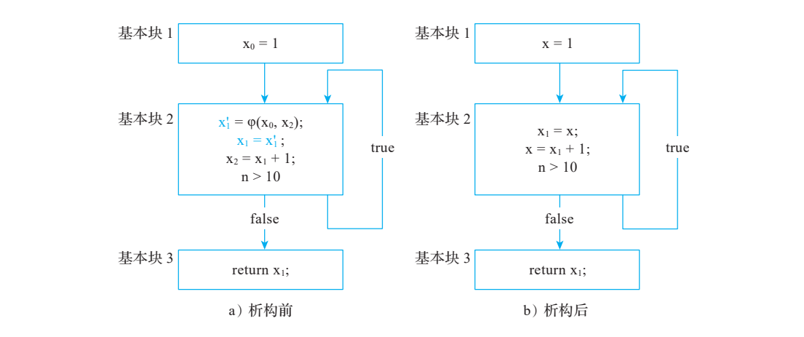

**图 10-7 Briggs 析构过程和结果示意图**

进行关键边拆分后再执行 Briggs 算法，析构过程如图 10-8a 所示；析构完成后的结果如图 10-8b 所示。在图 10-8b 的基本块 2 中，x 和 y 不冲突，可以占用同一个寄存器，这减少了寄存器分配的压力。

LLVM 中的 φ 函数消除实现会依赖其他的 Pass（主要是活跃变量），但是在 φ 函数消除过程中新增了 COPY 指令，等价于引入了新的变量。这意味着执行 φ 函数消除后很多之前的分析都会变得无效，例如活跃变量、指令编号、变量活跃区间、支配树信息、循环信息等。为了减少重复计算、分析这些信息，在 φ 函数消除过程中插入 COPY 指令可以增量更新这些分析信息。

φ 函数消除的第一步是尝试进行关键边拆分，在拆分过程中有几个值得注意的地方。

1）LLVM 并不处理循环体中的关键边，原因主要是循环关键边拆分后会引入新的跳转

<!-- PDF page 261; printed page 248 -->

指令，对代码布局不友好。

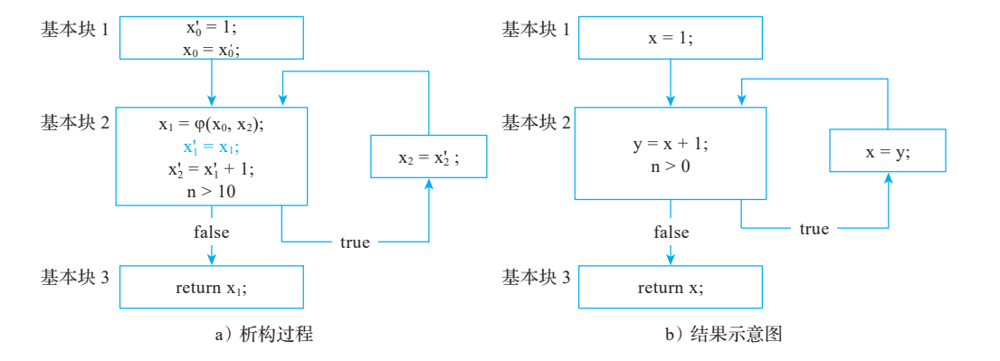

**图 10-8 进行关键边拆分后再执行 Briggs 算法示意**

2）在非循环的关键边拆分过程中，如果 φ 函数引用的变量在关键边对应的前驱基本块的 LiveOut 中，则不需要拆分关键边。主要原因是，如果变量位于前驱基本块的 LiveOut中，则说明变量除 φ 函数外还被其他指令使用（φ 函数不会影响变量的活跃区间），即便对关键边进行拆分产生 COPY 指令仍不会有助于寄存器合并。（关键边拆分后，引入新的基本块，在新的基本块中插入 COPY 指令，会发现该 COPY 指令定义的变量是活跃的，不能执行寄存器合并。）

3）如果 φ 函数中引用的变量不在当前基本块的 LiveIn 中，说明变量仅仅在其他前驱基本块中活跃。除特殊情况外，这样的关键边无须拆分，因为变量的活跃区间并不冲突；只有不可归约的循环才需要进行关键边拆分。

4）如果 φ 函数中引用的变量在当前基本块的 LiveIn 中，则进行关键边拆分。

5）如果执行了关键边拆分，则需要更新活跃变量和活跃变量的活跃区间。

当执行 φ 函数消除时，根据 Briggs 算法进行析构，析构后更新相关分析信息。唯一需要注意的是变量活跃区间的计算，在消除一个前驱基本块时可能无法准确计算（因为其他前驱基本块可能会定义活跃变量区间），所以需要进行特殊处理（最典型的场景就是循环体中的关键边）。

对代码清单 10-3 所示的 MIR 执行 φ 函数消除后，得到的结果如代码清单 10-6 所示。

**代码清单 10-6 执行 φ 函数消除后的结果**

```text
# Machine code for function sum: NoPHIs, TracksLiveness

bb.0.entry:
    successors: %bb.1(0x80000000); %bb.1(100.00%)

    %4:gpr = MOV_ri 0
    %8:gpr = COPY %4:gpr
```

<!-- PDF page 262; printed page 249 -->

```text
    %9:gpr = COPY killed %4:gpr

bb.1.for.cond:
; predecessors: %bb.0, %bb.2
successors: %bb.2(0x7c000000), %bb.3(0x04000000); %bb.2(96.88%), %bb.3(3.12%)

    %1:gpr = COPY killed %9:gpr
    %0:gpr = COPY killed %8:gpr
    %5:gpr = SLL_ri %0:gpr(tied-def 0), 32
    %6:gpr = SRA_ri killed %5:gpr(tied-def 0), 32
    JSGT_ri killed %6:gpr, 9, %bb.3
    JMP %bb.2

bb.2.for.body:
; predecessors: %bb.1
    successors: %bb.1(0x80000000); %bb.1(100.00%)

    %2:gpr = nsw ADD_rr killed %1:gpr(tied-def 0), %0:gpr
    %7:gpr = nsw ADD_ri killed %0:gpr(tied-def 0), 1
    %8:gpr = COPY killed %7:gpr
    %9:gpr = COPY killed %2:gpr
    JMP %bb.1

bb.3.for.end:
; predecessors: %bb.1

    $r0 = COPY killed %1:gpr
    RET implicit killed $r0
```

注 该 Pass 是寄存器分配必需的，无论使用哪一种寄存器分配算法都需要用该 Pass，因

意

为目前尚没有后端可以直接支持 φ 函数生成机器代码。

### 10.2.6 二地址指令变换

除了一些很特别的情况（比如函数调用、Phi 指令）外，机器指令都是三地址码。这意味着：每一条指令最多使用两个源寄存器并定义一个目的寄存器。

然而一些目标架构的指令集使用的是二地址码指令，即指令中定义的目的寄存器同时也是源寄存器，比如 x86 架构中一条指令形如 ADD %EAX, %EBX，其功能是将寄存器EAX 和 EBX 的值加起来，并将结果放入 EAX 中，即 %EAX = %EAX + %EBX。

为了正确处理这种指令集，LLVM 后端必须将三地址码指令变换为二地址码指令，这个 Pass 也是寄存器分配所必需的，必须在寄存器分配之前执行。该 Pass 执行后，输出的MIR 就不再是 SSA 形式。比如，有一条 MIR 指令：%a = ADD %b, %c，经过该 Pass 变换后，结果如代码清单 10-7 所示的两条指令。

<!-- PDF page 263; printed page 250 -->

**代码清单 10-7 二地址指令变换结果**

```text
%a = COPY %b
%a = ADD %a, %c
```

该 Pass 会以函数为粒度，针对基本块中的每一条指令尝试执行二地址变换。那所有的指令是否都需要执行二地址变换？如果不是，什么样的指令才需要真正执行二地址变换？

简单的回答是，只有部分 MIR 指令才需要执行二地址变换，这一类指令都定义在 TD文件。TD 文件通过关键字 Constraints 来指定哪些指令需要变换，同时该关键字还指定了如何进行变换。以 BPF 后端中 add 指令为例，它有两种指令格式，如代码清单 10-8 所示。

**代码清单 10-8 add 指令的两种格式**

```text
add dst，src2，imm
add dst，src2, src1
```

因为 add 指令的第二个参数可以是立即数也可以是寄存器，当第二个参数是立即数时意味着目的寄存器和源寄存器无法共用，所以在设计时让第一个寄存器和目的寄存器相同，以实现寄存器的共用。

eBPF 中 ADD 指令对应的 TD 代码片段如代码清单 10-9 所示：

**代码清单 10-9 ADD 指令对应的 TD 代码片段**

```text
let Constraints = "$dst = $src2" in {
let isAsCheapAsAMove = 1 in {
    defm ADD : ALU<BPF_ADD, "+=", add>;
    ……
}
```

其中 Constraints 字段表明 ADD 相关指令中的 dst 和 src2 共用一个寄存器。代码清单10-10 中定义了 ADD_rr 和 ADD_ri 两条指令的 TD 代码片段，解释了为什么 src2 和 dst 可以共用一个寄存器（因为 src1 的位置可能是寄存器，也可能是一个立即数）。

**代码清单 10-10 定义 ADD_rr 和 ADD_ri 两条指令的 TD 代码片段**

```text
multiclass ALU<BPFArithOp Opc, string OpcodeStr, SDNode OpNode> {
    def _rr : ALU_RR<BPF_ALU64, Opc,
                   (outs GPR:$dst),
                   (ins GPR:$src2, GPR:$src),
                   "$dst "#OpcodeStr#" $src",
                   [(set GPR:$dst, (OpNode i64:$src2, i64:$src))]>;
    def _ri : ALU_RI<BPF_ALU64, Opc,
                   (outs GPR:$dst),
                   (ins GPR:$src2, i64imm:$imm),
                   "$dst "#OpcodeStr#" $imm",
                   [(set GPR:$dst, (OpNode GPR:$src2, i64immSExt32:$imm))]>;
    ……
}
```

<!-- PDF page 264; printed page 251 -->

对于有 Constraints 约束的指令，TableGen 在处理 TD 代码时，会为对应的指令生成TiedOperand 的属性。在指令选择阶段生成相关的指令时，会根据指令属性为对应的操作数添加 TiedOperand 属性。这样，在二地址变换阶段只要判断 MIR 指令中操作数的属性就能知道是否需要进行变换了。

注 在新的编译器后端实现中，什么情况下需要让指令支持二地址指令变换？简单地说，

意

需要根据指令集中指令的定义来确定。以 eBPF 为例，它有自己的虚拟指令集，在

指令集中定义了指令的格式，参见图 B-1。

指令只支持 src 和 dst 两个寄存器，所以对于 MIR 中有 3 个寄存器的指令都要

做二地址指令变换。故除了上述介绍的 ADD 这类的 ALU 指令外，eBPF 中的跳转、

移位等指令都需要执行变换。

1. LLVM 中二地址变换的执行流程

二地址变换的执行流程如下。

1）预处理：把 LLVM 中支持的特殊指令（如 REG_SEQUCENCE）变换成 COPY 指令；对所有的 COPY 指令进行收集，便于后续处理 COPY 链指令。

2）收集 MIR 指令中存在 TiedOperand 属性的操作数：这些操作数包含了可以共用的寄存器（这意味着要插入 COPY 指令）。

3）确认是否需要进行二地址指令变换：在一些场景中，如果不进行指令变换可能取得更好的性能，对于这样的场景可以放弃进行二地址指令变换。

4）变换指令：对于需要进行二地址指令变换的指令，为包含 TiedOperand 属性的操作数插入 COPY 指令，同时更新该操作数的变量活跃区间。

5）后处理：把 LLVM 中的特殊指令（如 INSERT_REG）转换为 COPY 指令，并更新变量活跃区间。

2. 二地址变换值得注意的问题

在二地址指令变换过程中有几个实现上的问题，值得读者注意。

1）在上述第 3 步需要判断是否可以进行二地址变换，为什么？它的主要目的是什么？

简单来说，该功能是实现二地址指令变换过程的一些小优化。主要有以下几个场景。

场景 1：在一些场景中使用三地址指令性能更好，如果几个连续的指令按照二地址指令格式进行变换反倒性能更差，那么这样的场景不应该进行变换。x86 后端的示例如代码清单 10-11 所示。

**代码清单 10-11 不应进行二地址变换的 x86 后端示例**

```text
%reg1024 = COPY r1
%reg1025 = COPY r0
%reg1026 = ADD %reg1024, %reg1025
 r2            = COPY %reg1026
```

<!-- PDF page 265; printed page 252 -->

如果按照二地址指令格式进行变换，最后获得的执行代码如代码清单 10-12 所示。

**代码清单 10-12 对代码清单 10-11 进行二地址变换后**

```text
addl     %esi, %edi
movl     %edi, %eax
ret
```

但代码清单 10-11 使用三地址指令可以获得更高的执行性能，例如使用 leal 指令，得到执行代码如代码清单 10-13 所示。

**代码清单 10-13 代码清单 10-11 使用三地址指令（leal 指令）**

```text
leal (%rsi,%rdi), %eax
ret
```

场景 2 ：能够进行二地址指令转换的 MIR 必须和 TD 中定义的格式一致，但是指令生成阶段产生的 MIR 可能和 TD 文件中定义的不完全一致。如果能对 MIR 做一些变换，且变换后满足二地址指令变换的要求，那么也将获得收益。要使用该功能，必须在后端对应的 TD 文件中对指令进行定义。TD 文件基于指令的 isCommutable 属性和 isConvertibleToThreeAddress的值来确定是否可以进行二地址指令变换或者三地址指令变换，如代码清单 10-14 所示。

**代码清单 10-14 在 TD 中定义是否可以进行指令变换**

```text
let Defs = [EFLAGS],
    isCommutable = 1,                  // X = ADD Y,Z --> X = ADD Z,Y
    isConvertibleToThreeAddress = 1 in // 可以被转换为LEA指令
def ADD32rr  : I<0x01, MRMDestReg, (outs GR32:$dst),
                                   (ins GR32:$src1, GR32:$src2),
                 "add{l}\t{$src2, $dst|$dst, $src2}",
                 [(set GR32:$dst, (add GR32:$src1, GR32:$src2))]>;
```

上述代码片段是指，当遇到指令“X = ADD Y, Z”时，如果变换为“X = ADD Z, Y”（调整 Y 和 Z 的顺序），则可以继续进行二地址指令变换。

场景 3 ：判断是否有利于指令调度优化，从而减少 COPY 指令生成。例如将待转换的指令（会产生 COPY 指令）和最后一条使用该指令中的 Def 寄存器的指令放在一起，这样对寄存器合并更加友好。策略有两种（见图 10-9）：将待转换的指令向下移动到最后一条使用 Def 状态寄存器的指令（killed 指令）前面，或将最后一条使用 Def 状态寄存器的指令（killed 指令）向上移动，直到当前指令的后面。

这两种策略有一些共同的地方：当指令移动时需要考虑指令之间的依赖性不变，否则移动后的结果不正确。两者不同的地方在于：指令向下移动时还可以再做一些激进的优化，例如可以将指令与直接相邻的 COPY 指令一起向下移动。

2）为什么在预处理时转换 REG_SEQUENCE，而在后处理时转换 INSERT_SUBREG ？这样的顺序有什么含义？

<!-- PDF page 266; printed page 253 -->


**图 10-9 二地址指令变换过程中的指令调度优化**

REG_SEQUENCE 通过一系列子寄存器生成一个新的寄存器，例如“ %dst = REG_ SEQUENCE %v1, ssub0, %v2, ssub1”，执行效果等价于代码清单 10-15。

**代码清单 10-15 与 REG_SEQUENCE 等价的代码片段**

```text
undef %dst:ssub0 = COPY %v1
%dst:ssub1 = COPY %v2
```

INSERT_SUBREG 则对原来寄存器的一部分进行重新赋值，例如“ %reg = INSERT_ SUBREG %reg, %subreg, subidx”，等价于“%reg:subidx = COPY %subreg”。

REG_SEQUENCE 本质上是在重构一个新的寄存器（所以第一次使用时有 Undef 的标志），而 INSERT_SUBREG 只是把原来的寄存器进行部分改写。这意味 REG_SEQUENCE本质上等价于 COPY 指令，这些 COPY 指令可以用于判断是否需要进行指令转换，而INSERT_SUBREG 不会影响指令转换。

注 在 LLVM 的实现中，经过变换的第二条指令的 %a 必须表示为 ADD %a[def/use],

意

%c，表示寄存器操作数 %a 既作为指令的目的操作数（Def），也作为指令的源操作

数（Use）。

3. LLVM 中二地址指令变换的实现

最后再看一下针对不同的指令如何进行二地址指令变换？

1）针对形如“ vreg0 = opcode vreg1(tied), imm/vreg”的指令进行变换，添加 COPY 指令，并替换原指令中的源寄存器，最后变成如代码清单 10-16 所示的形式。

<!-- PDF page 267; printed page 254 -->

**代码清单 10-16 添加 COPY 指令并替换原指令中源寄存器**

```text
vreg0 = COPY vreg1
vreg0 = opcode vreg0, imm/vreg
```

2）针对形如“ vreg0 = opcode vreg1(tied), killed vreg2”的指令进行变换，此时 vreg2的标记为 killed，说明后面没有指令再使用 vreg2。如果后端定义了特殊实现进行指令变换，则直接使用后端的定义，否则会用 verg2 替换 vreg0，然后添加 COPY 指令，并替换原本指令中的源寄存器。最后变成如代码清单 10-17 所示的形式。

**代码清单 10-17 对 killed 寄存器类型的指令进行变换后的形式**

```text
vreg0 = COPY vreg2
vreg0 = opcode vreg1(tied), vreg0 //这里一般会调整verg0和verg1的位置
```

3）针对形如“ vreg0 = opcode killed vreg1(tied), killed vreg2”的指令进行变换。由于verg1 和 vreg2 都是 killed，这里要判断用哪个替换 verg0 有更大收益。收益计算方式为：确定 vreg1 和 vreg2 的属性，比较它们的定义位置（较短生命周期的 vreg 更有吸引力）；满足收益条件可以进行指令变换，用一个 vreg 替换 vreg0，不满足替换收益的指令则直接放弃替换。如果后端定义了特殊实现进行指令变换，则直接使用后端的定义；否则添加 COPY指令，并替换原指令中的源寄存器。

4）后端特殊约定的指令，需要在后端中实现对原指令的特定变换。例如 x86 的后端指令“ A = SHRD16rri8 B, C, I”将被变换成“ A = SHLD16rri8 C, B, (16 – I)”，转换后的指令可以使用符号寄存器，这种转换可能带来性能优势。

4. 二地址指令变换示例

对代码清单 10-3 执行二地址指令变换的结果如代码清单 10-18 所示。

**代码清单 10-18 代码清单 10-3 经二地址指令变换后的结果**

```text
%5:gpr = SLL_ri %0:gpr(tied-def 0), 32
prepend: %5:gpr = COPY %0:gpr
rewrite to: %5:gpr = SLL_ri %5:gpr(tied-def 0), 32
%6:gpr = SRA_ri killed %5:gpr(tied-def 0), 32
prepend: %6:gpr = COPY %5:gpr
rewrite to: %6:gpr = SRA_ri %6:gpr(tied-def 0), 32
%2:gpr = nsw ADD_rr killed %1:gpr(tied-def 0), %0:gpr
prepend: %2:gpr = COPY %1:gpr
rewrite to: %2:gpr = nsw ADD_rr %2:gpr(tied-def 0), %0:gpr
%7:gpr = nsw ADD_ri killed %0:gpr(tied-def 0), 1
prepend: %7:gpr = COPY %0:gpr
rewrite to: %7:gpr = nsw ADD_ri %7:gpr(tied-def 0), 1
```

<!-- PDF page 268; printed page 255 -->

### 10.2.7 指令编号

寄存器分配是基于活跃变量的生命周期，在计算生命周期之前需要给每一条指令（MIR）进行编号，之后基于编号计算变量的活跃区间。

指令编号本身的逻辑非常简单，对 MachineFunction 中的基本块进行遍历，对基本块中的每一条 MIR 进行编号。在实现中有以下几个小的技巧。

1）特殊机器指令处理：在寄存器分配时会将调试指令等特殊指令删除，所以这些指令不需要进行编号。而 MIR 中的 MBB 承担了管理数据结构的责任，为 MBB 赋值一个编号，可以方便计算其他机器指令的范围。

2）指令编号间隔：通常为每一条机器指令编号时，一般按照顺序增量编号，但在后续的编译优化、指令调度等处理中可能会添加新的机器指令。假设为每一条机器指令顺序编号，则每次添加指令以后都会导致重新计算指令编号（因为遍历的活跃区间是根据指令编号计算得到的）。为了尽可能地减少添加指令、重新计算指令编号的影响，在指令编号时并不是顺序编号，而是间隔一定的数量，在实现中每两条指令的间隔为 4，当要插入新的指令时总是从中间开始插入，所以这个间隔能保证插入的两条新指令都不会与原来指令编号冲突（通常来说这样已经足够）。另外，在插入超过两条新指令后，可以从相邻的指令开始调整指令编号，而不是从第一条指令开始调整。

3）指令状态：LLVM 实现为每条指令设置了 4 种状态：Slot_Block、Slot_EarlyClobber、Slot_Register、Slot_Dead，分别表示基本块、Clobber（定义完成前使用）、寄存器和死亡（在指令输出时分别用 B、E、R、D 代替）。由于每一条指令都有 4 种状态，再假设指令编号间隔为 4，所以实际上在 Pass 执行完后，每一条指令之间的编号间隔可扩展为 16（16 = 4×4，即间隔 4 条指令，每条指令都可能有 4 种状态）。

以代码清单 10-3 中的 IR 为例，经过指令编号后，输出如代码清单 10-19 所示（考虑篇幅原因，仅截取部分输出内容）。

**代码清单 10-19 代码清单 10-3 经指令编号后**

```text
# Machine code for function sum: NoPHIs, TracksLiveness, TiedOpsRewritten

0B   bb.0.entry:
     successors: %bb.1(0x80000000); %bb.1(100.00%)

16B  %4:gpr = MOV_ri 0
32B  %8:gpr = COPY %4:gpr
48B  %9:gpr = COPY killed %4:gpr

64B  bb.1.for.cond:
    ; predecessors: %bb.0, %bb.2
    successors: %bb.2(0x7c000000), %bb.3(0x04000000); %bb.2(96.88%), %bb.3(3.12%)

80B  %1:gpr = COPY killed %9:gpr
```

<!-- PDF page 269; printed page 256 -->

```text
……
208B  bb.2.for.body:
    ; predecessors: %bb.1
    successors: %bb.1(0x80000000); %bb.1(100.00%)

224B    %2:gpr = COPY killed %1:gpr
……
336B    bb.3.for.end:
    ; predecessors: %bb.1

352B    $r0 = COPY killed %1:gpr
368B    RET implicit killed $r0
```

### 10.2.8 变量活跃区间分析

变量活跃区间分析是计算变量的活跃区间，在寄存器分配阶段通过变量的活跃区间判定两个（或多个）虚拟寄存器能否使用同一个物理寄存器。具体的思路是：如果两个变量的活跃区间完全不相同，则它们可以使用同一个物理寄存器，因为在一个时刻只有一个变量活跃，所以两个变量可以交替使用同一个物理寄存器；如果两个变量的活跃区间重叠或者部分重叠，则它们不能使用同一个物理寄存器。在寄存器分配过程中所有的物理寄存器都分配完毕（映射一个变量），此时如果有新的变量需要分配寄存器，但是该变量和所有已经分配寄存器的变量都产生活跃区间的重叠或者部分重叠，则无法为新变量分配寄存器（这种情况称为寄存器冲突），必须在已经分配的寄存器中挑选一个并将其值暂存放在栈中，这个过程称为寄存器溢出。由此可见，变量活跃区间分析是寄存器分配中重要的前置工作之一。

LLVM 设计了一些数据结构来存储变量活跃区间，并且实现了较为复杂的算法来计算活跃区间，限于篇幅对算法不再展开介绍。

以代码清单 10-3 为例，经过活跃区间分析后得到的结果如代码清单 10-20 所示。

**代码清单 10-20 经活跃区间分析后得到的结果**

```text
%0 [96r,256r:0)  0@96r weight:0.000000e+00
%1 [80r,224r:0)[336B,352r:0)  0@80r weight:0.000000e+00
%2 [224r,240r:0)[240r,304r:1)  0@224r 1@240r weight:0.000000e+00
%4 [16r,48r:0)  0@16r weight:0.000000e+00
%5 [112r,128r:0)[128r,144r:1)  0@112r 1@128r weight:0.000000e+00
%6 [144r,160r:0)[160r,176r:1)  0@144r 1@160r weight:0.000000e+00
%7 [256r,272r:0)[272r,288r:1)  0@256r 1@272r weight:0.000000e+00
%8 [32r,64B:0)[64B,96r:2)[288r,336B:1)  0@32r 1@288r 2@64B-phi weight:0.000000e+00
%9 [48r,64B:0)[64B,80r:2)[304r,336B:1)  0@48r 1@304r 2@64B-phi weight:0.000000e+00
```

### 10.2.9 寄存器合并

在寄存器分配过程中为了提高分配性能和效率，可以进行分配前优化，其中一个关键

<!-- PDF page 270; printed page 257 -->

的动作就是寄存器合并。寄存器合并指的是，对形如 %1 = %2 这样的赋值语句中的寄存器进行合并，MIR 中使用伪指令 COPY 描述这样的赋值语句。这里实际上存在两个问题。

1）为什么 IR 中会有形如 %1 = %2 这样的代码？

在寄存器分配过程中，可能会因为一些操作产生额外的复制指令，例如在 φ 函数消除过程中，需要将 φ 函数转化为复制指令；在二地址指令变换中也会产生大量的复制指令；此外在一些后端中，对参数函数值的处理通常会增加复制指令，例如 x86 后端根据 ABI 约定，函数返回值需要使用 EAX 返回，一般会产生 EAX = %i 这样的指令，可将计算结果 %i赋值到 EAX 中。

2）如何合并以及合并后的影响是什么？

对于这样的赋值指令最直接的做法就是删除它们，并将其他 IR 指令中使用 %1 寄存器的地方全部替换为 %2 寄存器。这一过程看起来和中端编译优化的复制传播优化一样，但实际并不相同。在寄存器合并时，需要考虑能否合并寄存器，如果寄存器的活跃区间冲突，即源寄存器和目的寄存器同时活跃，一般来说它们不能合并（有一些特殊场景可以解决寄存器区间冲突，让它们尽量合并）。另外，由于寄存器合并后会导致寄存器的活跃区间变大，这可能会导致寄存器分配过程中产生更多的冲突（区间变大后，和其他寄存器活跃区间重叠的概率会变高），进而导致在寄存器分配过程中发生溢出。

传统的寄存器合并算法主要使用启发式推断来决定是否可以合并寄存器，启发式推断的依据是寄存器合并后是否会导致溢出。在 LLVM 中，寄存器合并称为简单寄存器合并，主要原因是在寄存器合并时并不考虑可能导致的溢出问题。但 LLVM 的实现也有自己的特色，下面稍微介绍一下其实现思路：如果 COPY 指令中的源寄存器和目的寄存器的活跃区间不冲突，则进行寄存器合并；如果指令中源寄存器和目的寄存器活跃区间存在冲突，则尝试消除冲突，对于能消除冲突的 COPY 指令也进行合并。另外由于此时的 MIR 经过了指令选择，指令中既存在物理寄存器也存在虚拟寄存器，在实现中需要对物理寄存器和虚拟寄存器分别进行处理。具体的过程大致如下所示。

1）对基本块进行排序，优先处理循环内的基本块。本步的目的是保证执行频率高的指令能够优先获得执行机会○一。显然对循环内的基本块执行寄存器合并（减少指令）获得的收益更高，所以实际上会按照循环的层次对基本块进行排序。

2）如果源寄存器和目的寄存器都是物理寄存器，则寄存器不能合并。原因是此时指令中使用的物理寄存器是指令选择阶段为满足 ABI 约定指定的寄存器，如果合并相关寄存器则会导致指令无法满足 ABI 约定，所以此时不能合并。

3）如果源寄存器和目的寄存器中有一个是物理寄存器、另一个是虚拟寄存器，此时可以尝试进行合并，只要物理寄存器和虚拟寄存器的活跃区间不冲突即可，LLVM 会使用物

○一 这是由于寄存器合并后变量活跃区间会变大，先合并的寄存器发生冲突的概率小、后合并的寄存器发生

冲突的概率大。

<!-- PDF page 271; printed page 258 -->

理寄存器替代虚拟寄存器。

注 意 虚拟寄存器和物理寄存器合并后并不会修改物理寄存器的活跃区间。

4）如果源寄存器和目的寄存器都是虚拟寄存器，当两个寄存器的活跃区间不冲突，则可以直接合并；当两个寄存器的活跃区间冲突，在满足一些条件时仍然可以进行合并，例如：

① 源寄存器和目的寄存器可以复制使用，主要指的是：源寄存器和目的寄存器相同，源寄存器和目的寄存器使用了子寄存器且子寄存器相同。

② 两条不同的 COPY 指令使用了相同的源寄存器，且两个目的寄存器的活跃区间相同，则可以删除一条 COPY 指令（本质上就是两个目的寄存器进行了合并）。

③ 定义了 Implicit-Def 属性的 φ 函数可以移除虚拟寄存器，所以需要执行寄存器合并操作。

④ 其他一些复杂场景，例如由于子寄存器导致的活跃区间冲突，但是子寄存器没有使用等场景下也可以合并寄存器。

虚拟寄存器合并的方法也很简单：将目的寄存器用源寄存器替代，同时更新源寄存器的活跃区间。

下面介绍寄存器合并的过程，首先对基本块进行排序。

找到 COPY 指令然后判定是否可以合并。例如在指令“ %1:gpr = COPY %9:gpr”（参考代码清单 10-6）中，尝试将该指令的 %1 合并到 %9，由于 %1 和 %9 都是虚拟寄存器，所以需要判断两个寄存器的活跃区间是否冲突，其中 %1 与 %9 的活跃区间分别是 [80r, 224r:0)、[336B, 352r:0) 和 [48r, 64B:0)、[64B, 80r:2)、[304r, 336B:1)（参考代码清单 10-20）。可以看出 %1 和 %9 的活跃区间并不冲突，所以可以合并 %1 和 %9。合并动作包含三步：①删除该 COPY 指令；②使用 %9 替换所有使用 %1 的指令，例如使用 %1 的指令为“ %2:gpr = COPY %1:gpr”，需要将指令中的 %1 替换为 %9，最后指令变成“%2:gpr = COPY %9:gpr”；

③ 更 新 %9 的 活 跃 区 间。 最 后 %9 的 活 跃 区 间 为 [48r, 64B:0)、[64B, 224r:2)、[304r, 336B:1)、[336B, 352r:2)。注意区间合并并不是简单地进行集合并集，除了完成集合的合并外还会尝试将区间集合中的区间进行合并，例如 %1 中的区间 [80r, 224r:0) 和 %9 中的区间[64B, 80r:2) 最后合并成 [64B, 224r:2)）。类似地处理其他 COPY 指令，在该例中还有以下COPY 指令，如代码清单 10-21 所示。

**代码清单 10-21 对代码清单 10-20 中的 COPY 指令进行活跃区间合并**

```text
%0:gpr = COPY %8:gpr
%5:gpr = COPY %8:gpr //原始指令为“%5:gpr = COPY %0:gpr”，由于%0和%8进行了合并
%6:gpr = COPY %5:gpr
%2:gpr = COPY %9:gpr //原始指令为“%2:gpr = COPY %1:gpr”，由于%1和%9进行了合并
%7:gpr = COPY %8:gpr //原始指令为“%7:gpr = COPY %0:gpr”，由于%0和%8进行了合并
```

<!-- PDF page 272; printed page 259 -->

```text
%8:gpr = COPY %4:gpr
%9:gpr = COPY %8:gpr //原始指令为“%9:gpr = COPY %2:gpr”，由于%2和%9进行了合并
$r0 = COPY %9:gpr    //原始指令为“$r0 = COPY %1:gpr”，由于%1和%9进行了合并
%6:gpr = COPY %8:gpr //原始指令为“%5:gpr = COPY %0:gpr”，由于%0和%8进行了合并、%5和
                       %6进行了合并
```

其中有些 COPY 指令可以合并，有些因为活跃区间冲突不可以合并。例如 %0 可以和 %8 合并；而 %5 和 %8 存在活跃区间冲突无法合并；%5 和 %6 可以合并，这里是 %5合并到 %6，原因是合并时总是期望把活跃区间小的合并到活跃区间大的虚拟寄存器；%2和 %9 可以合并；%7 和 %8 可以合并；%8 和 %4 可以合并；%9 和 %8 活跃区间冲突不可以合并，但是会继续尝试进行优化处理，由于“ %8:gpr = MOV_ri 0”的执行成本和 COPY指令相比可能更低，其属性为可重新物化（isReMaterializable）；r0 和 %9 无法合并（因为r0 并不保留寄存器，而是进行参数传递，不符合合并规则；%6 和 %8 存在冲突无法合并。合并后删除了 %0、%1、%2、%3、%4、%5、%7 以及相关的 COPY 指令，最后只剩下 %6、%8和 %9 三个虚拟寄存器，剩下的寄存器在合并后需要更新其活跃区间。

提 可重新物化指在寄存器中重新生成如常数之类的值的过程，重新计算这些值会比溢

示

出寄存器再取回更有效，在寄存器分配时会详细介绍这一属性的使用。由于具有该

属性，所以上述示例会将 COPY 指令修改为 MOV 指令，即“%9:gpr = MOV_ri 0”，

修改以后可以对 %8 的活跃区间进行优化缩减，这样更有利于寄存器分配。

### 10.2.10 MBB 的频率分析

寄存器分配过程中不可避免地涉及寄存器溢出。LLVM 中的“溢出成本”依赖于指令的执行频率，其设计出发点是指令执行的频率越高，说明涉及的变量越应该保留在寄存器中，那么程序执行的效率将越高。指令的执行的频率和 MBB 的执行频率完全一致（根据MBB 的定义，一个基本块中的指令会顺序依次全部执行），所以问题转化为求解 MBB 的执行频率。

求解 MBB 的执行频率大概分为两种方式。

1）通过 perf 等工具为 LLVM IR 添加元数据，元数据中包括了分支、循环指令执行的频率，用元数据中的数据计算出 MBB 的执行频率。该方法通常需要得到更为精确的执行频率，但是需要额外执行程序并收集数据，然后将收集的数据转换为元数据注入 LLVM IR中，过程稍显冗长。

2）根据程序的结构，设计启发式算法“猜测”MBB 的执行频率。该方法比较简单，但是“猜测”的结果可能与实际执行的结果有较大的误差。

这里以启发式算法为例介绍 LLVM 如何计算 MBB 的频率，CFG 如图 10-10 所示。

<!-- PDF page 273; printed page 260 -->

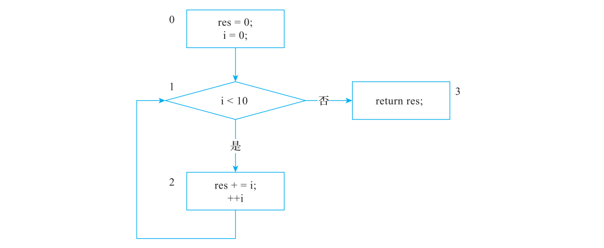

**图 10-10 MBB 频率计算示例的 CFG**

在静态预测中，主要根据程序的结构来“猜测”边的权重，然后通过权重的比值转换边的执行频率，而程序的结构可以分为以下 3 种。

1）顺序：顺序执行的基本块权重一致，例如图 10-10 中边 0 → 1 这样的边。

2）分支：主要有 if 和 switch 两种，以 if 分支为例，静态预测并不知道两个分支执行的概率情况，所以会认为两个分支的执行概率相同，那么两个分支会均分父节点（if 节点）的权重。本例中没有独立的分支（图 10-11 中的分支作为循环的一部分），而 switch/case 中每个 case 从句的概率也是均等的。

3）循环：一般来说，循环体执行的次数更多，所以循环体应该有更高的权重，在静态预测中，统一设置循环体的权重是循环退出边权重的 31 倍。循环还需要考虑嵌套循环的处理，内部循环指令的权重比外部循环指令权重要高。

在 LLVM 的实现中，质量（这里使用 Mass 表示，在分支概率计算时使用 Weight 表示）的计算有一个特点，即每一层所有分支的质量总和等于父节点的质量。在实现过程中初始MBB（图 10-11 中为 0#）的质量为 0x FFFF FFFF FFFF FFFF（32 位无符号数的最大值），按照顺序、分支、循环三种结构依次处理并计算质量，据此得到上述示例质量计算示意图如图 10-11 所示。

注 意 Mass1# = Mass2# + Mass3#，且 Mass2# = 31 * Mass3#。

每个基本块的质量计算完成后再将质量转换为频率。这个转换算法比较简单，但是其实现并不直观，涉及移位、取整（饱和计算○一）、不同类型边的处理等，这里不展开介绍数学

○一 饱和计算指的是在四则运算的基础上增加取整操作，即当计算结果发生溢出时（包括向上、向下溢出），

用计算结果取数据类型的上限或者下限。

<!-- PDF page 274; printed page 261 -->

处理过程，在处理完成后，MBB 的频率信息如图 10-12 所示。

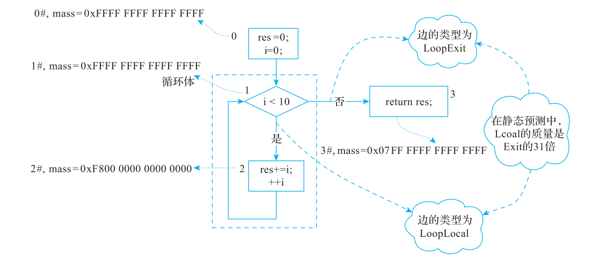

**图 10-11 MBB 质量计算示意图**

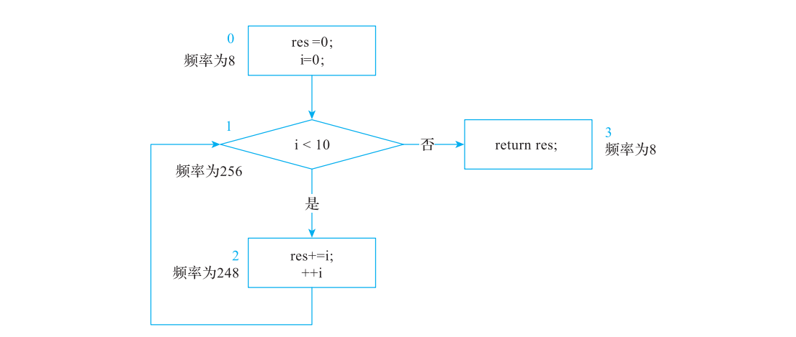

**图 10-12 MBB 频率计算示意图**

注 静态预测的结果和实际情况有所出入。本例代码中循环的次数是常量，为 10 次，即

意

循环体执行 10 次，循环退出执行 1 次，两者的比值为 10 : 1。而静态预测采用固定

的比值，默认为 31 倍。当然读者也可以优化这一逻辑，例如通过分析循环信息来尝

试计算已知的循环次数。

另外，在处理过程中还需要考虑嵌套循环，保证嵌套循环中的内部频率更高。我们看另外一个典型的冒泡排序的示例，如代码清单 10-22 所示。

<!-- PDF page 275; printed page 262 -->

**代码清单 10-22 冒泡排序**

```text
void bubbleSort(int a[], int length) {
    int i, j;
    for (i = 0; i < length -1; ++i ) {
        for (j = 0; j < length - i -1; ++j) {
            if(a[j] > a[j+1]) {
                int temp = a[j];
                a[j] = a[j+1];
                a[j+1] = temp;
            }
        }
    }
}
```

代码片段对应的 CFG 如图 10-13 所示。

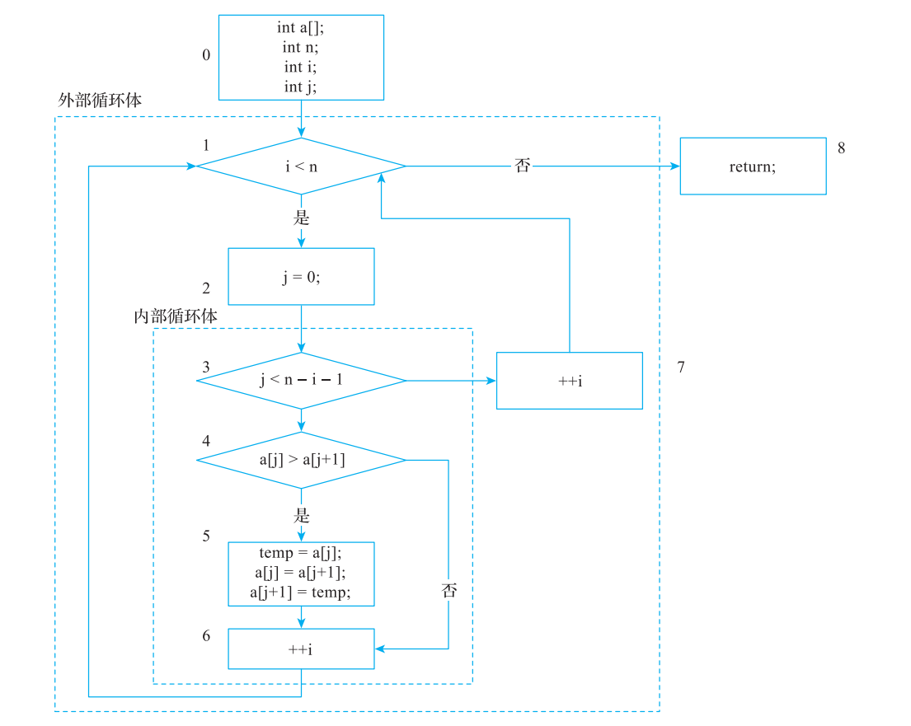

**图 10-13 冒泡排序 CFG**

<!-- PDF page 276; printed page 263 -->

按照静态预测的计算方法得到 MBB 的频率如图 10-14 所示。

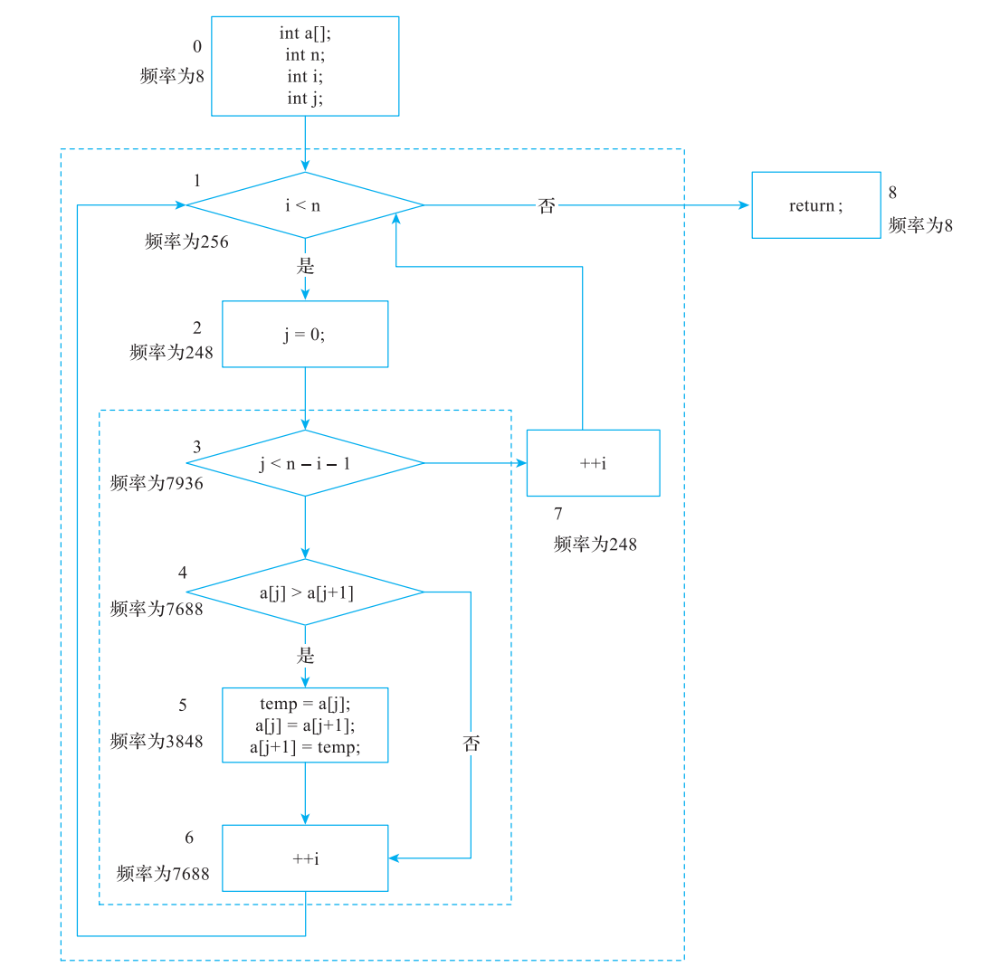

**图 10-14 MBB 的频率**

**图 10-15 中的内部循环的执行频率明显高于外部循环的执行频率。其中，#3 的频率为**

#2 的频率乘以 32 ；而 #4 为内部循环的执行体，所以执行频率是 #7 的执行频率的 31 倍；而 #5 因为分支缘故，其执行频率为 #4 的 1/2 ；#6 是汇聚点，所以执行频率为真 / 假两个分支的和。

为了体现内部循环的重要性，LLVM 实现了稍微有点复杂的算法，算法的大概步骤

<!-- PDF page 277; printed page 264 -->

如下。

1）针对待处理的函数体，以 RPOT（逆后序遍历）的顺序处理 MBB，主要是给 MBB进行编号，确保遍历的执行顺序，同时初始化一些数据结构。

2）初始化循环信息，对函数中的循环信息进行提取。注意，嵌套循环会使用嵌套的数据结构来维持嵌套信息。

3）计算循环中 MBB 的质量，分别计算循环体和循环退出边的质量。在计算过程中会使用预测分支概率或真实分支概率体现不同分支的权重。因为按照逆后序遍历的顺序访问MBB，所以在处理嵌套循环时先处理内部循环，后处理外部循环。在处理循环时，需要把循环头的质量按照循环的结构传播到后继基本块中。内部循环处理完成后，折叠为外部循环的一个节点，同时保持一个折叠循环的缩放因子，用缩放因子表示内部循环不同分支的频率比值○一。

4）计算函数体中非循环结构 MBB 的质量。

5）计算所有节点的频率，此时遍历是按照后序遍历的顺序。此时先处理外部循环，后处理内部循环。在遍历过程中会展开循环，将外部循环的缩放因子作为内部循环缩放因子的放大系数，并更新内部循环的缩放因子。在计算过程中为了保证频率相对分散，设置了频率的最小值为 8。

6）将频率归一化到整数进行保存。上面的步骤因为使用了乘法、移位、除法等运算，所以计算结果为 float，此时将 float 转化为 int 数据保存。

以代码清单 10-3 为例，该 Pass 输出的日志如代码清单 10-23 所示。

**代码清单 10-23 MBB 频率分析输出的日志**

```text
block-frequency: sum
====================
reverse-post-order-traversal // 逆后序遍历顺序
 - 0: BB0[entry]
 - 1: BB1[for.cond]
 - 2: BB4[for.end]
 - 3: BB2[for.body]
loop-detection
 - loop = BB1[for.cond]
 - loop = BB1[for.cond]: member = BB2[for.body]
compute-mass-in-loop: BB1[for.cond]* // 计算循环的质量
 - node: BB1[for.cond]
  => [ local  ] weight = 2080374784, succ = BB2[for.body]
  => [  exit  ] weight = 67108864, succ = BB4[for.end]
  => mass:  ffffffffffffffff
  => assign 07ffffffffffffff (f800000000000000) [exit] to BB4[for.end]
  => assign f800000000000000 (0000000000000000) to BB2[for.body]
 - node: BB2[for.body]
```

○一 注意：该方法处理在不可归约时存在一些缺点，具体可以参考代码注释。

<!-- PDF page 278; printed page 265 -->

```text
  => [ local  ] weight = 2147483648, succ = BB1[for.cond]
  => mass:  f800000000000000
  => assign f800000000000000 (0000000000000000) to BB1[for.cond]
compute-loop-scale: BB1[for.cond]*  // 质量计算完成后会计算分支缩放因子
 - exit-mass = 07ffffffffffffff (ffffffffffffffff - f800000000000000)
 - scale = 32.0
packaging-loop: BB1[for.cond]* // 将循环体折叠为一个节点，如果有外部循环则继续处理
 - node: BB2[for.body]
compute-mass-in-function // 计算非循环节点的质量
 - node: BB0[entry]
  => [ local  ] weight = 2147483648, succ = BB1[for.cond]
  => mass:  ffffffffffffffff
  => assign ffffffffffffffff (0000000000000000) to BB1[for.cond]
 - node: BB1[for.cond]
  => [ local  ] weight = 576460752303423487, succ = BB4[for.end]
  => mass:  ffffffffffffffff
  => assign ffffffffffffffff (0000000000000000) to BB4[for.end]
 - node: BB4[for.end]
  => mass:  ffffffffffffffff
unwrap-loop-package: BB1[for.cond]*: mass = ffffffffffffffff, scale = 32.0
// 计算频率，展开循环
  => combined-scale = 32.0
 - BB1[for.cond]: 1.0 => 32.0
 - BB2[for.body]: 0.96875 => 31.0
float-to-int: min = 1.0, max = 32.0, factor = 8.0
 - BB0[entry]: float = 1.0, scaled = 8.0, int = 8
 - BB1[for.cond]: float = 32.0, scaled = 256.0, int = 256
 - BB4[for.end]: float = 1.0, scaled = 8.0, int = 8
 - BB2[for.body]: float = 31.0, scaled = 248.0, int = 248
block-frequency-info: sum  // 将频率转化为整数
 - BB0[entry]: float = 1.0, int = 8
 - BB1[for.cond]: float = 32.0, int = 256
 - BB2[for.body]: float = 31.0, int = 248
 - BB4[for.end]: float = 1.0, int = 8
```

### 10.2.11 寄存器分配：直接分配与间接分配

做完寄存器分配前相关的准备工作后就可以进行寄存器分配了。

直接分配中除了需要完成寄存器的映射外，还需要在分配过程中处理溢出的情况（溢出通常需要考虑插入 store/load 的位置）。也就是说，直接分配把寄存器映射和溢出放在一起处理，从这个角度来看需要一次性处理的工作稍多。

而间接分配本质上是将寄存器映射和寄存器溢出分开。一方面在寄存器分配过程中仅仅保留虚拟寄存器到物理寄存器的直接映射，并没有修改原指令；另一方面在处理溢出时考虑最优方案。例如放置 store/load 的位置，由于原指令没有变化，因此整个 IR 中相关分析都可以直接使用，一旦将虚拟寄存器替换为物理寄存器后，一些分析信息就会发生变化。

<!-- PDF page 279; printed page 266 -->

**代码清单 10-3 中的代码经过寄存器合并后有三个虚拟寄存器 %6、%8、%9。使用**

Basic 算法对三个虚拟寄存器进行分配，在分配之前首先对三个虚拟寄存器的活跃区间计算权重（参见 10.3 节），然后按照权重从高到低依次进行分配，顺序为 %6、%8、%9。

BPF 后端共有 10 个可以分配的物理寄存器：r0～r9。本例指令相对比较简单，不涉及寄存器溢出，唯一值得注意的是示例中有一个返回值必须使用 r0，所以 %9 应该尽量使用r0。在分配的时候根据寄存器的活跃区间进行分配，即依次为 %6、%8、%9 进行分配，最后得到的结果是 r1、r2 和 r0（参见 10.4 节）。

### 10.2.12 将虚拟寄存器映射到物理寄存器

经过寄存器分配后，所有虚拟寄存器都会映射一个物理寄存器。除此之外，在合适的位置插入 store/load 指令已处理寄存器溢出。所以，此时只需将指令中的虚拟寄存器替换成物理寄存器即可。

经过寄存器分配后，%6、%8、%9 分别映射到物理寄存器 r1、r2 和 r0。所以只需要依次遍历指令并替换虚拟寄存器即可。除此以外，该 Pass 还会执行几个额外的操作，例如：

1）更新基本块 LiveIn 信息：根据活跃区间的覆盖范围计算基本块 LiveIn 的物理寄存器（后续的 Pass 会使用）。

2）更新指令的属性：对于使用子寄存器的指令，在替换为物理寄存器后需要重新更新指令中操作数的属性。因为在寄存器分配时，可能为虚拟寄存器分配更大的物理寄存器单元。

3）删除冗余 COPY 指令：在物理寄存器完成替换后可能产生一些形如 $r0 = COPY $r0的指令，这样的 COPY 指令是冗余的，是可以删除的。

以代码清单 10-3 为例，虚拟寄存器相关指令需要被替换为物理寄存器，例如对于指令“ %8:gpr = MOV_ri 0”来说，在寄存器分配阶段已经知道使用 r2 替换 %8，所以经过本Pass 处理后，指令变成为“$r2 = MOV_ri 0”，其他指令都是进行类似处理。

### 10.2.13 栈槽着色

栈槽着色可以简单地理解为对栈帧中局部变量进行排布，LLVM 中栈槽着色的主要目的是优化栈空间的分配。本节介绍的栈槽着色仅适用于寄存器分配过程中有寄存器溢出的场景，如果没有发生寄存器溢出则本 Pass 不会执行，而 9.3 节介绍的栈槽着色主要用于分配栈变量。

栈槽着色的主要思路和 9.3 节基本相同，唯一的区别是此处栈槽着色时需要考虑变量的权重。其中，权重包含静态权重和动态权重：静态权重指的是在寄存器分配过程中溢出变量的权重；动态权重是根据变量的执行频率计算得到。静态权重越大说明变量溢出的成本越高，动态权重越大说明执行过程中变量使用的次数越多。由此可见应尽量少对权重大的

<!-- PDF page 280; printed page 267 -->

变量栈槽做额外的处理，例如让两个变量重用同一个栈槽。

下面通过一个例子简单演示本 Pass 的作用。假设在寄存器分配过程中有三个变量发生溢出，分别溢出到三个栈槽中。为了方便介绍，用三个变量 a、b、c 表示，在寄存器分配过程中变量溢出的顺序为 a、b、c，它们占用的栈槽分别为 0、1、2。

假设变量 a、b、c 的活跃区间分别是 [0, 64)、[0, 16)、[16, 96)，溢出权重分别是 10、5和 20。首先按照溢出权重降序排序，得到 c、a、b，这个顺序是栈槽的分配顺序。然后对 c进行分配，此时栈槽为空，所以 0 号栈槽用于存放 c ；接着分配 a，因为 c 和 a 存在活跃区间冲突，所以为 a 分配一个新的栈槽：1 号；最后分配 b，由于 b 的活跃区间和 c 不冲突，即 c 和 b 可以共用一个栈槽。栈槽着色示意图如图 10-15 所示。


**图 10-15 寄存器溢出栈槽着色示意图**

注 LLVM 为不同的栈设计了不同的栈空间（用不同的 StackID 表示），例如 WASM 中的

意

local 变量也可能溢出，和栈变量的溢出要分别对待（因为它们位于不同的栈空间）。

栈槽着色算法实现如下。

1）计算每一个栈变量的权重（包含静态权重和动态权重），并根据权重降序排序。

2）按照权重从大到小依次进行栈槽着色。在着色过程中，首先判定是否可以重用已经着色的栈槽；栈变量的活跃区间不重叠，则说明变量可以使用同一个槽位；如果不能重用槽位，则分配新的槽位。

3）根据重新分配的槽位更新原指令中操作数的信息。使用 store/load 溢出指令对栈槽进行操作。因为此时栈槽发生了变化，所以必须更新指令操作数信息。

4）删除无用的槽位信息。例如，在栈槽分配过程中发现有两个栈变量可以共用一个栈槽，那么有一个栈槽就是多余的，则可以删除多余的栈槽。

5）可以做一些更为激进的优化。例如，栈槽分配以后，COPY 指令使用的源寄存器和目的寄存器用的是同一个栈槽则可以删除，再如 store 指令以后执行的 load 指令都使用同一个栈槽，表明 store 指令是死代码，可以删除。

**代码清单 10-3 中的示例在寄存器分配过程中不涉及溢出，所以也不涉及栈槽着色。**

### 10.2.14 复制传播

可以简单地认为，复制传播是针对 COPY 指令的窥孔优化。在执行寄存器分配前一般

<!-- PDF page 281; printed page 268 -->

都会执行复制传播，此处和前面的复制传播有一个明显的不同：此处指令不再是 SSA 形式，所以实现会更复杂。

复制传播主要通过后向传播和前向传播实现。

1. 后向传播

后向传播的实现思想：针对基本块从后向前扫描，满足条件的 MIR 可以被删除。后向传播主要处理 Def 操作数，当找到 COPY 指令，且 COPY 指令符合 R1 = COPY R0 形式，则该指令是有机会删除的。其中 R0、R1 是指物理寄存器。当满足以下条件时，COPY 指令可以删除：

1）两条 MIR 之间没有指令对操作数使用过提前占用（early clobber）操作。

2）R1 和 R0 使用相同的寄存器类型。

删除 COPY 指令示意图如图 10-16 所示。


**图 10-16 后向传播删除 COPY 指令示意图**

2. 前向传播

前向传播的实现思路是：针对基本块从前向后扫描，满足条件的 MIR 可以被删除，主要用于处理 Use 操作数。可能的场景如下。

1）当遇到两条相同的 COPY 指令，且中间没有操作对源寄存器进行覆盖（clobber）；或者存在两条构成循环的 COPY 指令，这些指令在执行过程中没有提前占用源寄存器，如

**图 10-17 所示。**


**图 10-17 对两条相同的 COPY 指令或循环的 COPY 指令进行前向传播处理**

2）当找到 COPY 指令后，在满足一定条件时可以替换寄存器。替换的条件主要要求源寄存器没有发生过提前占用，源寄存器和目的寄存器类型相同，且目的寄存器是唯一的定义点，如图 10-18 所示。


**图 10-18 对没有提前占用的 COPY 指令进行前向传播处理**

<!-- PDF page 282; printed page 269 -->

**代码清单 10-3 中并没有符合复制传播条件而需要进行优化的 COPY 指令。**

### 10.2.15 循环不变量外提

不能进行循环不变量外提的情况如下。

1）隐式定义的寄存器，并且不是死亡的，不能外提。

2）定义的寄存器可以安全移动，且不能有负面影响，例如不包含 volatile store/load、call 指令。或者 load 指令所在的基本块被所有循环中的必经节点支配（必经节点可以通过支配树得到），否则不能外提。

3）指令定义的寄存器在循环（多个基本块）中被重复定义，则该指令不能外提。

4）从栈槽中进行读操作的 load 指令不能外提。

5）early clobber 定义的指令不能外提。

同样，可以引出问题：在此阶段执行的循环不变量外提和基于 SSA 形式执行的循环不变量外提有什么区别？简单回答如下：

1）由于此时 MIR 不再是 SSA 形式，所以在判断定义是否被多次定义时相对复杂，我们需要遍历整个循环来检查每个在 MIR 指令中定义的变量。而基于 SSA 形式的循环不变量外提则直接根据 SSA 的特性来判断：在循环中定义的变量若非常量，则不能外提。

2）在基于 SSA 形式下进行循环不变量外提时，外提操作有可能增加寄存器压力，所以对于循环不变量是否外提会有额外的控制机制。而此时只要识别到循环不变量都会外提。

**代码清单 10-3 中并没有符合循环不变量外提优化条件的指令。**

## 10.3 Fast 算法实现

Fast 算法仅有两个必需的 Pass，分别是 φ 函数消除和二地址指令变换。它以基本块为粒度进行分配，变量仅在当前基本块中活跃，跨基本块的变量都通过栈帧传递，为虚拟寄存器分配好物理寄存器以后会直接修改原来的指令。

### 10.3.1 Fast 算法实现思路

Fast 算法的思路：以基本块为粒度进行寄存器分配，为从一个基本块传递到其他基本块的活跃变量（LiveOut）插入 store 指令，并将该变量对应的寄存器存入栈中，从而确保下游基本块中所有的物理寄存器都是可分配的。在下游基本块中，为来自其他基本块的活跃变量（LiveIn）插入 load 指令，并将这些变量从栈中加载到寄存器。

Fast 算法的具体实现过程如下。

1）先处理 Def 寄存器。

T 如果 Def 用的是虚拟寄存器，对于首次定义的虚拟寄存器，当有可用物理寄存器时

<!-- PDF page 283; printed page 270 -->

则直接分配，若没有可用的物理寄存器则进行溢出（寻找一个溢出成本最低的寄存

器），然后再分配。在寄存器分配过程中，如果虚拟寄存器是跨基本块活跃的（即

是当前基本块的 LiveOut 变量），需要插入 store 指令。如果虚拟寄存器在后面的指

令中被使用，且后续有 reload 指令，则说明此时发生了溢出，需要插入 store 指令，

最后再为虚拟寄存器分配物理寄存器。

T 如果 Def 用的是物理寄存器，则直接分配。（如果指定的物理寄存器被占用，会尝

试寻找下一个同类的物理寄存器；否则将发生溢出。）

2）处理指令中的 Use 寄存器。

T 对于特殊的指令，例如指令处于 Undef 状态，则进行特殊处理，只需要取任意一个

符合分配类型要求的物理寄存器即可，无须考虑物理寄存器是否空闲。例如，对于

形如 op undef %x, %x 的这类指令，我们可以选择一个物理寄存器。

T 对于一般的指令，如果虚拟寄存器是首次使用，试让 COPY 指令使用 Def 物理寄存

器，若不能使用则进行寄存器分配；非 COPY 指令则直接进行寄存器分配（可能需

要溢出）。如果虚拟寄存器不是首次使用，则说明本指令中使用了两次该虚拟寄存

器，直接使用已经分配的物理寄存器即可。

3）收集源寄存器和目的寄存器中相同的 COPY 指令，为后续的优化处理做准备（寄存器全部分配完成后删除冗余指令）。

4）当寄存器全部分配完成后，不再为前驱基本块的 Bundle 指令分配虚拟寄存器，直接使用已经分配的物理寄存器。

5）处理每一个基本块的 LiveIn 变量，即插入 Load 指令将栈帧的数据重新加载到物理寄存器中。

这里遇到的第一个问题是，为什么 Fast 算法在分配变量过程中采用逆序遍历基本块？这里主要有两个目的。

1）从后向前处理，为后续可能的优化提供帮助。如果 Def 寄存器不是跨基本块活跃，则一定是 dead 状态；如果 Use 寄存器不发生溢出、不跨基本块活跃，则一定是 killed 状态。由此可见，逆序遍历处理方便设置寄存器的活跃区间。

2）方便处理 Bundle 指令。已经为前驱基本块中 Bundle 指令相关的虚拟寄存器分配了物理寄存器，不需要再次分配。

当然，reload 和 spill 指令的逆序遍历处理稍微复杂。在溢出物理寄存器时，要插入reload 指令，而后在 Def 寄存器之后恰当的位置为物理寄存器插入 spill 指令。传统的处理方法是可以在溢出点执行 spill 操作，在使用点执行 reload 操作。

### 10.3.2 示例分析

本节仍然以代码清单 10-3 为例演示寄存器分配。在寄存器分配前，代码清单 10-3 对应的 MIR 如代码清单 10-24 所示。

<!-- PDF page 284; printed page 271 -->

**代码清单 10-24 寄存器分配前对应的 MIR**

```text
# Machine code for function sum: NoPHIs, TracksLiveness, TiedOpsRewritten

bb.0.entry:
    successors: %bb.1(0x80000000); %bb.1(100.00%)

    %4:gpr = MOV_ri 0
    %7:gpr = COPY %4:gpr
    %8:gpr = COPY %4:gpr
    JMP %bb.1

bb.1.for.cond:
; predecessors: %bb.0, %bb.3
successors: %bb.2(0x7c000000), %bb.4(0x04000000); %bb.2(96.88%), %bb.4(3.12%)

    %1:gpr = COPY %8:gpr
    %0:gpr = COPY %7:gpr
    %5:gpr = COPY %0:gpr
    %5:gpr = SLL_ri %5:gpr(tied-def 0), 32
    %6:gpr = COPY %5:gpr
    %6:gpr = SRA_ri %6:gpr(tied-def 0), 32
    JSGT_ri killed %6:gpr, 9, %bb.4
    JMP %bb.2

bb.2.for.body:
; predecessors: %bb.1
    successors: %bb.3(0x80000000); %bb.3(100.00%)

    %2:gpr = COPY %1:gpr
    %2:gpr = nsw ADD_rr %2:gpr(tied-def 0), %0:gpr
    JMP %bb.3

bb.3.for.inc:
; predecessors: %bb.2
    successors: %bb.1(0x80000000); %bb.1(100.00%)

    %3:gpr = COPY %0:gpr
    %3:gpr = nsw ADD_ri %3:gpr(tied-def 0), 1
    %7:gpr = COPY %3:gpr
    %8:gpr = COPY %2:gpr
    JMP %bb.1

bb.4.for.end:
; predecessors: %bb.1

    $r0 = COPY %1:gpr
    RET implicit $r0
```

由于篇幅缘故，不能对所有指令的寄存器分配过程进行演示，这里仅仅针对 bb.0.entry

<!-- PDF page 285; printed page 272 -->

和 bb.1.for.cond 这两个基本块进行演示，但通过这两个基本块的演示能完全覆盖 Fast 算法的主要知识点，例如寄存器分配、寄存器溢出、寄存器重新加载等。

对基本块 bb.0.entry 利用 Fast 算法进行寄存器分配，示意图如图 10-19 所示。

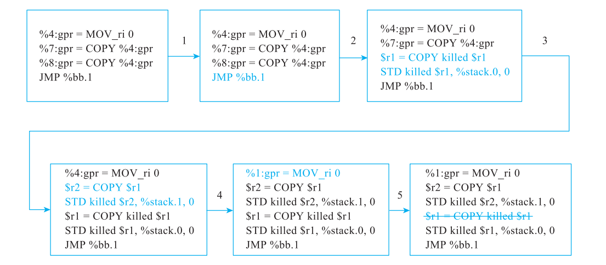

**图 10-19 基本块 bb.0.entry 的寄存器分配**

**图 10-20 中共计 5 步操作，分别演示了 4 条指令的分配以及对冗余指令删除的过程。**

Fast 算法是自下向上依次遍历指令进行寄存器分配的，下面看看处理过程。

1）处理指令“JMP %bb.1”。因为 JMP 不需要寄存器分配，所以无须进行额外处理。

2）处理指令“ %8:gpr = COPY %4:gpr”。先为 Def 寄存器 %8 分配物理寄存器，在分配过程中会根据 TD 文件定义的分配顺序依次选择物理寄存器。由于 BPF 后端定义的 GPR寄存器为 11 个，可用于分配的寄存器为 r0～r9，但是 r0 比较特殊—用于传递返回值，所以 TD 文件定义寄存器分配的实际顺序为 r1～r5、r0、r6～r9。

此时所有的物理寄存器都可用，故为 %8 选择 r1。因为 %8 在后续基本块（如在基本块 bb.1.for.cond）中被使用，所以需要对 %8 进行特殊处理—将 r1 存储到栈中，在后续活跃的基本块中使用时再加载到寄存器。紧接着插入一条 store 指令—STD killed $r1, %stack.0, 0 ；同时，在此指令以后不再使用 r1，所以将 r1 设置 killed 状态，这也意味着 r1可以被再次分配。

接下来为 MIR 指令中的 Use 寄存器 %4 分配物理寄存器，因为这是一条 COPY 指令，在后续的优化中很可能会删除冗余指令，而此时 r1 是可以被分配的，所以优先为 %4 分配寄存器 r1。另外，因为后续基本块不使用 4%，即在此指令后新分配的 r1 不再活跃，所以可以为分配的 r1 设置 killed 状态，因此产生最终的指令序列为：

```text
$r1 = COPY killed $r1
STD killed $r1, %stack.0, 0
```

<!-- PDF page 286; printed page 273 -->

注 意 此处跨基本块活跃变量的处理和寄存器溢出的处理完全相同。

3）处理指令“ %7:gpr = COPY %4:gpr”。同样先为 Def 寄存器 %7 分配物理寄存器，由于 r1 分配给了 %4，因此从剩余可用的物理寄存器中为 %7 分配 r2。同样，由于 %7 在后续基本块中被使用，需要将 r2 存储到栈中（通过插入 store 指令“ STD killed $r2, %stack.1, 0”实现），r2 自此以后可以被再次分配。

类似的是，为指令中的 Use 寄存器 %4 分配寄存器，因为 %4 已经分配了 r1，所以无须再次分配。此时产生的最终指令序列为：

```text
$r2 = COPY $r1
STD killed $r2, %stack.1, 0
```

注 意 “$r2 = COPY $r1”中的 r1 不能被设置 killed 状态，因为它在后续的指令中会被使用。

4）处理指令“ %4:gpr = MOV_ri 0”。同样先为 Def 寄存器 %4 分配物理寄存器，因为 %4 已经分配了 r1，所以也无须再执行寄存器分配，此时产生的指令为：

```text
$r1 = MOV_ri 0
```

5）删除冗余的 COPY 指令：经过前面 4 步处理，基本块的所有指令中的虚拟寄存器都已经分配完成了。但是整个基本块中仍然有冗余 COPY 指令，需要进行删除。冗余 COPY指令指的是源寄存器和目的寄存器相同的 COPY 指令，例如“ $r1 = COPY $r1”这样的指令。至此，基本块 bb.0.entry 完成了寄存器分配。

基于 Fast 算法对基本块 bb.1.for.cond 进行寄存器分配的示意图如图 10-20 所示。

基本块 bb.1.for.cond 共 8 条指令，图 10-20 中共 10 步。其中，8 步演示了指令的寄存器分配，1 步演示了基本块如何处理活跃变量流入的情况，还有 1 步演示了删除冗余指令。寄存器分配是自下向上依次进行指令遍历的，下面看看处理过程。

1）处理指令“JMP %bb.2”。因为 JMP 不需要寄存器分配，所以无须进行寄存器分配处理。

2）处理指令“ JSGT_ri killed %6:gpr, 9, %bb.4”。指令的 Use 虚拟寄存器为 %6，此时所有的物理寄存器都可用，因为活跃区间涉及的其他基本块的寄存器都会被存储到栈中，所以为 %6 选择物理寄存器 r1。由于此后 r1 不再使用，故而将 r1 设置为 killed 状态。产生的指令序列为：

```text
JSGT_ri killed $r1, 9, %bb.4
```

3） 处 理 指 令“ %6:gpr = SRA_ri %6:gpr(tied-def 0), 32”。 指 令 的 Def 虚 拟 寄 存 器为 %6，因为已经为 %6 选择物理寄存器 r1，所以得到分配的结果如下。

```text
$r1 = SRA_ri $r1(tied-def 0), 32
```

<!-- PDF page 287; printed page 274 -->

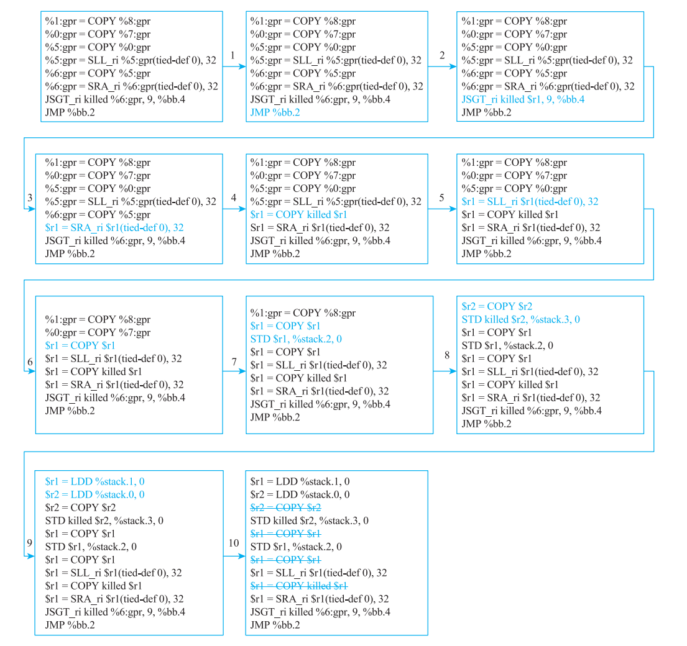

**图 10-20 基于 Fast 算法对基本块 bb.1.for.cond 进行寄存器分配**

注 虽然此处 %6 是一个 Def 寄存器，但是 %6 不在其他基本块中使用，所以无须插入

意

store 指令。

4）处理指令“ %6:gpr = COPY %5:gpr”。指令的 Def 寄存器为 %6，因为 %6 已经分配了物理寄存器 r1，继续处理 Use 寄存器 %5。因为该指令是 COPY 指令，所以尽量尝试为 %5 分配 r1；同时因为 %5 不在其他基本块中活跃（此处 %5 是最后出现的位置），所以将r1 设置为 killed 状态。产生的指令序列为：

<!-- PDF page 288; printed page 275 -->

```text
$r1 = COPY killed $r1
```

5）处理指令“ %5:gpr = SLL_ri %5:gpr(tied-def 0), 32”。依次处理指令中的 Def 寄存器 %5 和 Use 寄存器 %5，发现 %5 已经分配了物理寄存器 r1，故而产生的指令序列为：

```text
$r1 = SLL_ri $r1(tied-def 0), 32
```

6）处理指令“ %5:gpr = COPY %0:gpr”。指令的 Def 寄存器为 %5，因为 %5 已经分配了物理寄存器 r1，继续处理 Use 寄存器 %0。因为该指令是 COPY 指令，所以尽量尝试为 %0 分配 r1 ；又因为 %0 在其他基本块中活跃，所以不会设置 r1 为 killed 状态。产生的指令序列为：

```text
$r1 = COPY $r1
```

7）处理指令“ %0:gpr = COPY %7:gpr”。指令的 Def 寄存器为 %0，因为 %0 已经分配了物理寄存器 r1。继续处理 Use 寄存器 %7，因为该指令是 COPY 指令，所以尽量尝试为 %7 分配 r1。又因为 %7 在其他基本块中活跃，所以为 r1 执行 store 指令。产生的指令序列为：

```text
$r1 = COPY $r1
STD $r1, %stack.2, 0
```

8）处理指令“ %1:gpr = COPY %8:gpr”。指令中的 Def 寄存器为 %1，需要从可分配的寄存器中选择一个物理寄存器，按照分配顺序，为 %1 分配 r2。继续处理 Use 寄存器 %8，因为该指令是 COPY 指令，所以尽量尝试为 %8 分配 r2。又因为 %8 在其他基本块中活跃，所以需要为 r2 插入 store 指令。同时，因为 %1 寄存器没有被使用，所以 store 指令中 r2 被设置了 killed 状态，产生的指令序列为：

```text
$r2 = COPY $r2
STD killed $r2, %stack.3, 0
```

9）处理基本块流入的活跃变量。最后需要处理从其他基本块流入的活跃变量（本例插入 store 指令的是 bb.0.entry）。基本块中活跃的寄存器在插入 store 指令时会记录虚拟寄存器和其对应的槽位信息，所以此时只需要根据虚拟寄存器重新从栈中加载对应的槽位即可。产生的指令序列为：

```text
$r1 = LDD %stack.1, 0
$r2 = LDD %stack.0, 0
```

注 此处产生的指令和基本块 bb.0.entry 中的 store 指令是完全对应的，包括使用的虚拟

意

寄存器、栈槽点位置等信息。例如在 bb.0.entry 中，%8 插入的槽位是 %stack.0.0，

此时为 %8 分配了 r2，所以需要从栈中的 stack.0.0 槽位读取数据到 r2 ；%7 插入的

槽位是 %stack.1.0，此时为 %7 分配了 r1，所以需要从栈中的 stack.10 槽位为 r1 加

载数据。

<!-- PDF page 289; printed page 276 -->

10）删除冗余的 COPY 指令。删除源寄存器和目的寄存器中相同的 COPY 指令。

## 10.4 Basic 算法实现

以线性扫描为基础的寄存器分配算法是 LLVM 中最重要的分配算法。LLVM 3.0 以前的版本实现了基础的线性扫描算法，从 LLVM 3.0 版本开始对线性扫描算法进行了优化，实现了 Basic 算法和 Greedy 算法。两种算法都是以线性扫描为基础，只不过 Basic 算法的实现较为简单，但是它展示了如何基于 LLVM 变量活跃区间实现寄存器分配。另外，通常也把Basic 算法作为寄存器分配算法性能的基准。本节着重介绍 Basic 算法的原理，通过示例演示寄存器分配、溢出等过程。读者通过本节的学习，可以了解 Basic 算法的主要思想。

### 10.4.1 算法实现思路

Basic 算法基本上以线性扫描算法为基础，但是做了少许的修改，整个算法包含两个重要的步骤：分配和溢出处理。

1. 分配思路

1）寄存器分配以函数为粒度。

2）计算函数中活跃变量以及变量的活跃区间。

3）计算变量区间的权重，让权重高的变量优先分配，权重低的变量后分配，这样能保证寄存器溢出时整体溢出成本最低。

4）按照权重从高到低依次对变量的活跃区间进行分配。

① 获取所有可以被分配的物理寄存器，依次尝试为变量（指虚拟寄存器）分配物理寄存器。

T 如果物理寄存器还没有被占用，则可以直接分配。

T 如果物理寄存器已经被占用，则计算物理寄存器的活跃区间和待分配变量活跃区间

是否冲突。

T 如果不冲突，则可以为变量分配该物理寄存器，并返回。

T 如果发生冲突则无法分配物理寄存器，并且该物理寄存器不是 ABI 约定的寄存器，

则将物理寄存器加入优先待溢出的寄存器队列中。

② 使用优先待溢出的寄存器进行分配，如果发现当前变量活跃区间的权重大于优先待溢出物理寄存器的权重，则优先分配该物理寄存器给权重高的变量，并将已经分配了物理寄存器的活跃变量进行溢出。

③ 如果当前变量已经溢出，则说明无法完成寄存器分配。

④ 当前变量尚未溢出，则溢出当前变量，并且将溢出过程中产生的新变量添加到待分配队列。

<!-- PDF page 290; printed page 277 -->

⑤ 如果发生寄存器溢出，对溢出过程中插入的代码位置进行优化，保证溢出代码的成本最低。

2. 溢出处理思路

1）在 Def 寄存器处直接添加 store 指令，在 Use 寄存器前添加 load 指令。

2）找到真正需要溢出的虚拟寄存器。主要是考虑 COPY 指令，直接溢出最初定义处的虚拟寄存器，中间的 COPY 指令都变成 load 指令，这样可以有效缩短变量的活跃区间。

3）判断使用虚拟寄存器的指令是否可以重新物化，如果可以则无须溢出虚拟寄存器，而是重新执行指令。此时可以定义新的虚拟寄存器，这些新的虚拟寄存器在重新物化后需要重新分配；如果无法重新物化，则仍然需要溢出原来的虚拟寄存器。

4）溢出时要首先分配栈槽，并更新栈槽的活跃区间（栈槽的活跃区间在后向优化还会使用），然后遍历所有的操作数，并进行以下操作：

① 在 Def 处插入 store 指令。

② 在 Use 处先生成一个新的虚拟寄存器，再插入 load 指令（使用新的虚拟寄存器进行栈帧数据的加载），最后使用新的寄存器重写 / 替换（rewrite）原始指令的 Use 寄存器。

### 10.4.2 示例分析

为了更好地展示 Basic 算法的原理，本节构造了一个特殊的用例，这个例子借助了后端的调用约定，使得寄存器在分配过程中发生了溢出。同时，该例中也展示了重新物化的功能。示例代码如代码清单 10-25 所示。

**代码清单 10-25 Basic 算法示例的源码**

```text
void bubbleSort(int arr[], int n)
{
    int i, j;
    for (i = 0; i < n - 1; i++)
    {
        // 最后一个 i 元素已经放好了
        for (j = 0; j < n - i - 1; j++)
        {
            if (arr[j] > arr[j + 1])
            {
                swap(&arr[j], &arr[j + 1]);
            }
        }
    }
}
```

这是一段用于完成冒泡排序的示例代码，该示例为了完成两个变量的交换调用了函数swap。按照 eBPF 的调用约定，函数调用时使用 r1～r5 传递参数、r0 传递返回值、r10 传递栈帧基地址。在调用函数 swap 时会占用上述寄存器。这些寄存器在调用过程中即使没有被

<!-- PDF page 291; printed page 278 -->

真正使用也会被占用，这是编译器根据调用约定决定的，这些寄存器属于 Caller-Saved（调用者保存）寄存器。这样构造的用例可以占用更多的通用寄存器，这是为了方便演示寄存器不足而需要进行栈溢出的场景。对应的 LLVM IR 如代码清单 10-26 所示。

**代码清单 10-26 代码清单 10-25 对应的 LLVM IR**

```text
define dso_local void @bubbleSort(i32* %0, i32 %1) {
    br label %3
3:                                                ; preds = %31, %2
    %.01 = phi i32 [ 0, %2 ], [ %32, %31 ]
    %4 = sub nsw i32 %1, 1
    %5 = icmp slt i32 %.01, %4
    br i1 %5, label %6, label %33
6:                                                ; preds = %3
    br label %7
7:                                                ; preds = %28, %6
    %.0 = phi i32 [ 0, %6 ], [ %29, %28 ]
    %8 = sub nsw i32 %1, %.01
    %9 = sub nsw i32 %8, 1
    %10 = icmp slt i32 %.0, %9
    br i1 %10, label %11, label %30
11:                                               ; preds = %7
    %12 = sext i32 %.0 to i64
    %13 = getelementptr inbounds i32, i32* %0, i64 %12
    %14 = load i32, i32* %13, align 4
    %15 = add nsw i32 %.0, 1
    %16 = sext i32 %15 to i64
    %17 = getelementptr inbounds i32, i32* %0, i64 %16
    %18 = load i32, i32* %17, align 4
    %19 = icmp sgt i32 %14, %18
    br i1 %19, label %20, label %27
20:                                               ; preds = %11
    %21 = sext i32 %.0 to i64
    %22 = getelementptr inbounds i32, i32* %0, i64 %21
    %23 = add nsw i32 %.0, 1
    %24 = sext i32 %23 to i64
    %25 = getelementptr inbounds i32, i32* %0, i64 %24
    %26 = call i32 bitcast (i32 (...)* @swap to i32 (i32*, i32*)*)(i32* %22, i32* %25)
          br label %27
27:                                               ; preds = %20, %11
    br label %28
28:                                               ; preds = %27
    %29 = add nsw i32 %.0, 1
    br label %7
30:                                               ; preds = %7
    br label %31
31:                                               ; preds = %30
    %32 = add nsw i32 %.01, 1
    br label %3
33:                                               ; preds = %3
```

<!-- PDF page 292; printed page 279 -->

```text
    ret void
}

declare dso_local i32 @swap(...)
```

该代码片段经过指令选择、优化后生成的 MIR 用于寄存器分配。因为 MIR 篇幅较大，不在本书中直接提供，读者可以将上述 LLVM IR 直接使用 llc 命令编译（如果没有编译环境也可以通过 Compiler Explorer 网站查看生成的 MIR 结果），或者通过本书提供的源码获得。

这里再稍微介绍一下计算变量活跃区间权重的思路。首先变量活跃区间可能由多个区间组成，所以会先计算每一个区间的权重，然后将变量的多个区间权重进行累加，最后进行归一化处理。不同的分配算法权重计算方法略有差别，但是大体思路相同。算法会根据基本块执行的频率作为权重计算的依据。为每一条 Def/Use 寄存器指令计算权重（此时权重和基本块执行频率相同），在计算过程中除了执行频率外，还会根据一些情况调整权重的计算方式，主要包括如下情况。

1）如果发现指令位于循环内并且变量活跃区间跨越基本块，会将权重提升 3 倍（说明需要优先分配虚拟寄存器）。

2）如果指令是 COPY 指令，且在分配过程中有提示，可以稍微提升分配的优先级，将权重提高 1%。有分配提示的虚拟寄存器，应该尽量满足提示的要求，性能会更好。

3）如果指令有可重新物化属性，则将权重减少 50%。因为可重新物化属性表示指令可以重新以低成本加载，所以虚拟寄存器分配可以放在后面，即便是发生了溢出，成本也会比较低。

当变量活跃区间权重计算完毕并经过归一化处理后，会将权重按照从高到低进行排序，并依次进行分配。本例共有 18 个寄存器，它们的活跃区间和权重如代码清单 10-27 所示。

**代码清单 10-27 活跃区间和权重**

```text
W1 [0B,32r:0)[1152r,1184r:2)[1184r,1184d:1) 0@0B-phi 1@1184r 2@1152r
W2 [0B,16r:0)[1168r,1184r:2)[1184r,1184d:1) 0@0B-phi 1@1184r 2@1168r
%6 [32r,1424B:0) 0@32r  weight:8.314162e-01
%7 [16r,1424B:0) 0@16r  weight:5.732281e-01
%11 [64r,1424B:0) 0@64r  weight:2.915245e-01
%12 [128r,144r:2)[144r,176r:0)[176r,208r:1)[208r,288r:3) 0@144r 1@176r 2@128r
    3@208r  weight:4.617143e-01
%15 [224r,240r:2)[240r,272r:0)[272r,288r:1) 0@240r 1@272r 2@224r  weight:INF（INF
    表示无穷大）
%18 [432r,448r:2)[448r,480r:0)[480r,608r:1)[608r,640r:3)[640r,656r:4) 0@448r
    1@480r 2@432r 3@608r 4@640r  weight:1.605641e+01
%22 [528r,544r:2)[544r,576r:0)[576r,656r:1) 0@544r 1@576r 2@528r
    weight:1.138545e+01
%26 [496r,512r:2)[512r,720r:0)[720r,752r:1)[752r,784r:3) 0@512r 1@720r 2@496r
    3@752r  weight:2.161664e+01
```

<!-- PDF page 293; printed page 280 -->

```text
%28 [768r,784r:0)[784r,800r:1) 0@768r 1@784r  weight:INF
%31 [800r,832r:2)[832r,864r:0)[864r,960r:1) 0@832r 1@864r 2@800r
    weight:1.029643e+01
%34 [880r,912r:2)[912r,944r:0)[944r,960r:1) 0@912r 1@944r 2@880r  weight:INF
%36 [1008r,1024r:2)[1024r,1056r:0)[1056r,1088r:1)[1088r,1120r:3) 0@1024r 1@1056r
    2@1008r 3@1088r  weight:7.582891e+00
%38 [1104r,1120r:0)[1120r,1168r:1) 0@1104r 1@1120r  weight:4.183664e+00
%40 [48r,96B:0)[96B,1376r:2)[1376r,1424B:1) 0@48r 1@1376r 2@96B-phi
    weight:6.188670e-01
%41 [352r,384B:0)[384B,1248r:2)[1248r,1344B:1) 0@352r 1@1248r 2@384B-phi
    weight:2.466507e+00
%42 [336r,384B:0)[384B,1280r:2)[1280r,1344B:1) 0@336r 1@1280r 2@384B-phi
    weight:2.460708e+00
```

对活跃区间进行排序时，排序的主要依据是权重，当权重相同时根据区间顺序，下面依次来看这 16 个虚拟寄存器是如何进行分配的。

注 本例中有两个物理寄存器 W1 和 W2（W1 和 W2 是 BPF 后端中 32 位的寄存器，在

意

64 位后端中实际是 r1 和 r2），它们不需要分配，所以不用参与排序。虚拟寄存器排

序完成后的顺序为 %15、%28、%34、%26、%18、%22、%31、%36、%38、%41、%42、%6、

%40、%7、%12、%11。

首先对 %15 进行分配，在分配前先确定可以使用的物理寄存器以及物理寄存器的分配顺序（主要在 TD 中定义，代码中也可以略作调整，例如按照寄存器参数的使用进行调整）。BPF 后端物理寄存器的分配顺序为 r1、r2、r3、r4、r5、r0、r6、r7、r8、r9。为了演示方便，我们先按照 ABI 约定计算物理寄存器已经使用的情况，如图 10-21a 所示。

从图 10-21 中可以看出，r1、r2、r3、r4、r5、r0 在一些区间中都被占用。例如，r1、r2 主要是被入参 W1 和 W2 占用，而 r3、r4、r5、r0 则是被 swap 函数占用。接下来对 %15进行分配，由于 %15 有三个活跃区间：[224r, 240r:2)、[240r, 272r:0)、[272r,288r:1)，按照分配顺序优先使用 r1，此时 r1 的区间已经分配给 W1，所以 r1 和 W1 区间相同，而 W1 的区间为 [0B, 32r:0)、[1152r, 1184r:2)、[1184r, 1184d:1)，可以发现 %15 的区间和 r1 的区间并不冲突，所以可以将 r1 分配给 %15，如图 10-21b 中蓝色的方框所示，同时将 %15 的活跃区间更新到 r1 中，如图 10-21b 所示。

按照这种方法依次为 %28、%34、%26、%18、%22、%31、%36、%38、%41、%42、%6、%40、% 7、%12、%11 分配寄存器。所有虚拟寄存器在分配时都是按照物理寄存器的可用分配顺序逐一检查是否冲突：如果不冲突则直接分配；如果冲突，则尝试分配下一个物理寄存器。按照这样的方式，虚拟寄存器 %28、%34、%26、%18、%22、%31、%36、%38、%41、%42、%6、%40都可以找到一个物理寄存器，如图 10-22a 所示。

<!-- PDF page 294; printed page 281 -->


**图 10-21 初始状态下及分配 %15 后的物理寄存器使用情况示意图**

<!-- PDF page 295; printed page 282 -->

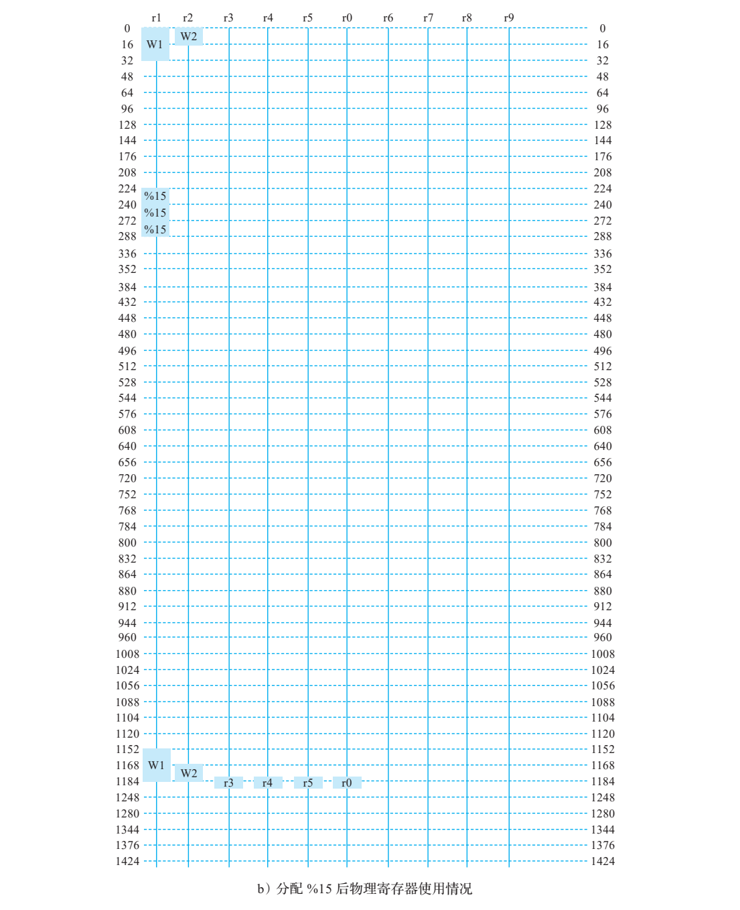

**图 10-21 初始状态下及分配 %15 后的物理寄存器使用情况示意图（续）**

<!-- PDF page 296; printed page 283 -->

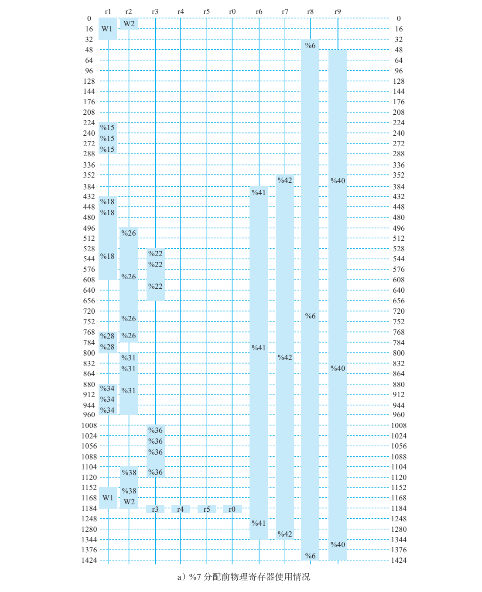

**图 10-22 %7 分配前后物理寄存器使用情况示意图**

<!-- PDF page 297; printed page 284 -->

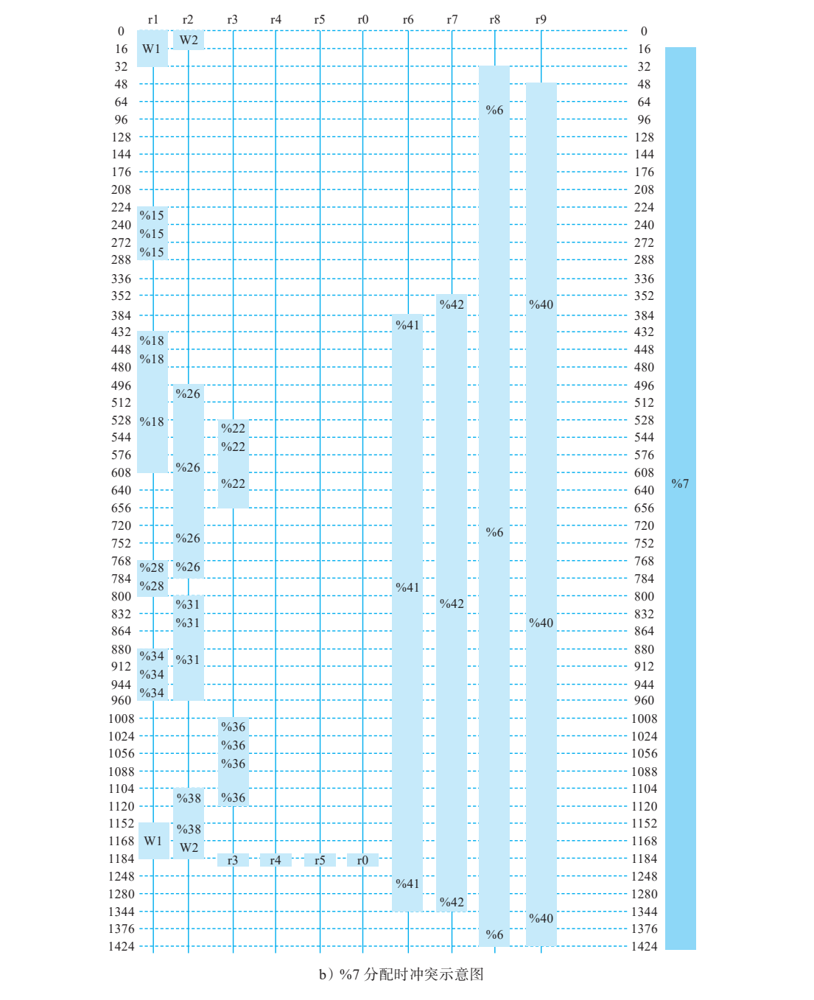

**图 10-22 %7 分配前后物理寄存器使用情况示意图（续）**

<!-- PDF page 298; printed page 285 -->

在为 %7 分配时出现了问题。因为 %7 寄存器的活跃区间和所有的物理寄存器 r0～r9都有冲突（见图 10-22b 中蓝色矩形块），所以无法为 %7 分配物理寄存器。此时需要进行寄存器溢出操作。LLVM 实现的溢出称为 InlineSpiller，其含义是在溢出处理中直接插入 store指令和 load 指令，而不是先暂存溢出指令，最后进行指令插入和替换。对 %7 的溢出处理是先找到定义 %7 的指令—%7:gpr = COPY $r2。之后，在溢出时将 r2 的值放入栈中，后续在使用 %7 的地方增加 load 指令从栈中加载数据即可。所以指令被替换为 STD $r2, %stack.0, 0，同时该栈槽需要与虚拟寄存器 %7 保持同样的活跃区间（本节提及的指令可参见本书 GitHub 上的网站提供的源码 10-26.mlir）。

接下来处理所有使用 %7 的指令。第一条指令是“ %18:gpr = ADD_rr %18:gpr(tied-def

0), %7:gpr”。对于这样的指令需要将栈槽中的数据加载到寄存器，然后再使用。简单的做法是：将栈槽中的数据加载到一个新的虚拟寄存器，在本例中下一个虚拟寄存器编号为 43，所以可以在本指令之前插入 %43:gpr = LDD %stack.0, 0，然后将原来指令中使用 %7 的地方替换为 %43，指令更新为 %18:gpr = ADD_rr %18:gpr(tied-def 0), killed %43:gpr。

使 用 %7 的 第 二 条 指 令 是“ %12:gpr = COPY %7:gpr”。 按 照 上 述 逻 辑， 可 以 插入 %44:gpr = LDD %stack.0, 0，然后将第二条指令中的 %7 替换为 %44，更新为“ %12:gpr = COPY killed %44:gpr”。看到这里读者会发现，这里使用的新寄存器 %44 可以通过复制传播进行消除，这样的 COPY 指令可以直接从栈槽中加载，而不是通过新的临时寄存器进行中转。所以最终生成的指令为“%12:gpr = LDD %stack.0, 0”。

当所有使用 %7 的指令处理完成后，将新增的虚拟寄存器重新插入到待分配队列中。当然对于新增的虚拟寄存器还要注意：新增寄存器的权重非常大（无穷大），因为这个寄存器是用于从栈中重新加载数据，该虚拟寄存器不可以再次被溢出。如果该虚拟寄存器可以再次被溢出，会导致死循环。另外，由于指令之间的编号默认间隔为 16，当新插入一个指令时，其编号通常是足够的，无须重新为指令进行编号（指令的活跃区间都不需要更新）。新增的寄存器 %43 的活跃区间为 [456r, 480r)，其权重为无穷大，并将 %43 插入到待分配队列（插入过程会根据活跃区间重新排序）。

因为 %43 的权重最大，所以接下来就是为 %43 分配物理寄存器，按照活跃区间冲突的分析，可以为 %43 分配 r2。得到的结果如图 10-23 所示。

简单总结一下：由于 %7 活跃区间过长，和所有物理寄存器都发生了冲突，所以将 %7的定义替换为 store 指令。在使用 %7 的地方，用 load 指令将数据加载到一个新的虚拟寄存器，并替换原来使用的操作数。从逻辑上看，%7 的活跃区间根据使用的情况进行了划分，活跃区间的划分将可以大大减少活跃区间的冲突，从而完成寄存器分配。

另外，在 store 指令中需要同步记录原始虚拟寄存器的活跃区间，目的是在后续的优化Pass 栈槽着色中进一步优化栈空间的分配。

接下来继续为虚拟寄存器 %12 分配物理寄存器，由于 %12 的区间为 [128r, 144r:2)、[144r, 176r:0)、[176r, 208r:1)、[208r,288r:3)，和 r1 冲突，但和 r2 不冲突，所以为 %12 分

<!-- PDF page 299; printed page 286 -->

配物理寄存器 r2，本步示意图略。

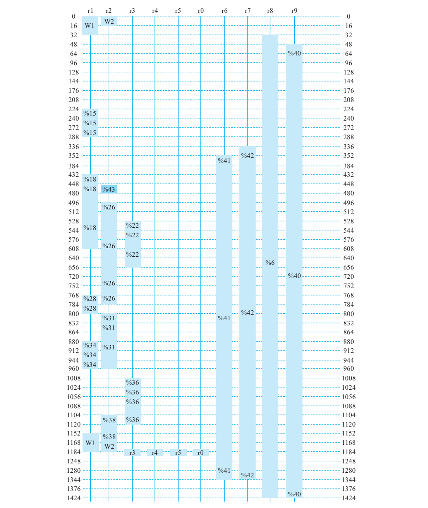

**图 10-23 %7 溢出后新增 %43 和 %44，优先为 %43 分配寄存器**

<!-- PDF page 300; printed page 287 -->

再接下来需要为 %11 分配物理寄存器，因为 %11 的活跃区间为 [64r, 1424B:0)，和所有的物理寄存器产生冲突，所以需要溢出 %11。同样，先处理定义 %11 的指令再处理使用 %11 的指令。但是定义 %11 的指令为 %11:gpr = LD_imm64 -4294967296。这条指令非常特殊，因为 BPF 后端文件对 LD_imm64 指令做了标记，设置了重新物化属性，如 let isReMaterializable = 1, isAsCheapAsAMove = 1 in { def LD_imm64 : LD_IMM64<0,“ =”>。设置该属性的含义是，如果发现该指令定义的虚拟寄存器发生溢出，可以再次直接调用该指令，而不是采用寄存器溢出的方式，因为直接调用该指令的成本可能更低。因为定义 %11 的指令存在重新物化属性，所以暂时不处理该指令，而是先处理两条使用 %11 的指令 —%12:gpr = ADD_rr %12:gpr(tied-def 0), %11:gpr 和 %22:gpr = ADD_rr %22:gpr(tied- def 0), %11:gpr。重新物化的处理方式也非常简单：申请一个新的虚拟寄存器，并直接再次运行该指令（本例中为 LD_imm64，即插入一条新的 LD_imm64 指令），然后将原指令中使用 %11 虚拟寄存器的地方替换为使用新的虚拟寄存器。

指 令“ %12:gpr = ADD_rr %12:gpr(tied-def 0), %11:gpr” 经 过 变 换 后 为：%44:gpr = LD_imm64 -4294967296，%12:gpr = ADD_rr %12:gpr(tied-def 0), killed %44:gpr。

指令“ %22:gpr = ADD_rr %22:gpr(tied-def 0), %11:gpr”经过变换后，变成：%45:gpr = LD_imm64 -4294967296，%22:gpr = ADD_rr %22:gpr(tied-def 0), killed %45:gpr。

经过重新物化处理以后引入了新的虚拟寄存器，所以同样需要将新的虚拟寄存器插入到待分配队列进行分配。其中 %44 和 %45 的活跃区间分别为 [152r, 176r:0) 和 [536r,544r:0)，权重都为无穷大（下一轮优先分配），将 %44、%45 重新插入到待分配队列中。

最后再对定义 %11 的指令进行删除，因为没有任何指令再使用 %11。

接下来为 %44、%45 分配物理寄存器，方法同上。其中，r1 分配给 %44，r4 分配给 %45，示意图如图 10-24 所示。

至此，所有的虚拟寄存器都完成了分配。

值得一提的是，Basic 算法的最后还有一个优化过程，针对溢出指令进行优化。优化的思路主要是在保证正确的前提下（这样的优化主要是基于支配树进行的，以确保执行路径正确），将溢出产生的 store 指令移动到执行频率低的基本块中。本例不涉及指令移动，所以不再展开介绍。

最后再来回顾一下 LLVM 中实现的 Basic 算法是否存在不足？根据图 10-21a 发现，虽然 r3、r4、r5 和 r0 为满足 Caller-Saved 的约定被占用了，但是并没有被使用。而实际上，swap 函数仅仅有两个参数，按照 ABI 约定仅传递 r1 和 r2 即可，即 r3、r4、r5、r0 在此处仅仅为了满足 Caller-Saved 的约定，导致后续的 %7、%11 在分配时都产生了寄存器溢出，而这些溢出动作本质上是可以避免的。为此可以对 Caller-Saved 的机制进行优化，典型的优化就是 Caller-Saved 和 Callee-Saved 混合机制。目前在 LLVM 的过程间寄存器分配中实现，可以参考 Inter-Procedural Register Allocation，即 IPRA 的相关实现。

<!-- PDF page 301; printed page 288 -->

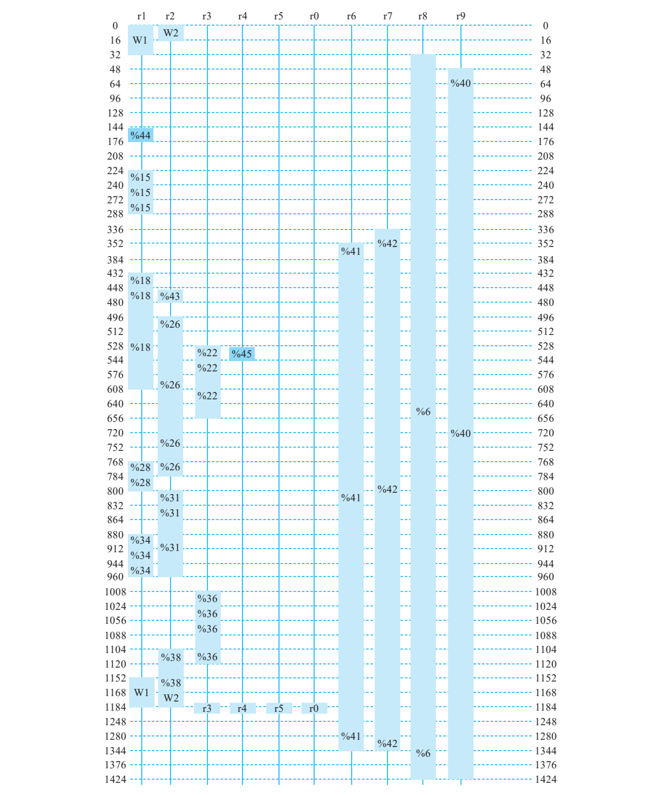

**图 10-24 为 %44 和 %45 分配物理寄存器**

<!-- PDF page 302; printed page 289 -->

## 10.5 Greedy 算法实现

由于寄存器分配算法（例如图着色、线性扫描等算法）在设计之初的关注点是如何设计算法，能够使所有的变量都分配到寄存器中（尽可能少地溢出）。实际上，寄存器在分配过程中会产生大量的溢出（特别是针对大型应用）。因此，LLVM 将设计重心进行了微调，主要关注如何高效溢出，这是 Greedy 算法的起源。Greedy 算法分配流程如图 10-25 所示。


**图 10-25 Greddy 算法分配流程图**

注意图 10-25 描述的是 Greddy 算法分配中的最长路径，涉及分配、拆分、溢出等步骤，在一些简单场景中可能并不需要拆分和溢出就可以完成分配。（简单场景使用 Greedy 算法效果并不好，也不是本书讨论的重点。）

<!-- PDF page 303; printed page 290 -->

从流程图中可以看到，Greedy 算法在溢出前会尝试进行寄存器拆分（Split 和 Split2），而如何拆分也是 Greedy 算法的关键。

### 10.5.1 Greedy 算法实现思路

Greedy 算法总体思想可以总结如下。

1）计算活跃区间的权重，计算方法在 Basic 算法中已经介绍过。简单总结：权重越大，活跃区间优先级越高；区间的优先级越高，则溢出的概率越低。

2）对活跃区间进行排序（和 Basic 算法相同，使用优先队列自动完成排序）。在优先队列中，优先级高的活跃区间先分配，优先级低的活跃区间后分配。Basic 算法使用活跃区间的权重作为优先级，而 Greedy 算法以活跃区间覆盖范围为基础，再辅以执行状态进行调整，最后以得到的结果作为优先级。Greedy 优先级的设计思路：活跃区间覆盖范围越广的变量（例如全局变量）越优先分配，因为活跃区间越大则发生冲突的概率越大，优先分配可以减少大范围活跃区间溢出的概率；覆盖范围越小（例如局部变量）越后分配，因为发生冲突的概率小。

3）Greedy 算法在分配时首先按照优先队列的顺序对活跃区间依次进行分配，当发生溢出时通过活跃区间的权重挑选合适的变量（溢出成本最小的变量）进行溢出。例如循环中使用的变量，其活跃区间可能比较小，但是其权重比较大（在计算权重时会对循环中的活跃区间进行权重放大）；在寄存器分配时，如果发现无法为循环变量分配寄存器，则应该选择一个权重比循环变量低的进行溢出，这样就能保证整体分配成本低。Basic 算法按照权重从高到低依次分配变量，如果变量无法分配时，则总是溢出当前变量。

Greedy 算法和 Basic 算法最大的两个区别如下。

① Greedy 算法将已经分配变量的溢出过程称为剔除。

② Greedy 算法会尝试对无法分配的变量进行拆分，将一个变量变成两个或者多个变量，由此缩短变量的活跃区间，然后再分配。

4）依次从优先队列获取活跃区间进行分配，获取物理寄存器分配顺序，根据分配顺序计算每一个物理寄存器和活跃区间冲突的情况。

① 如果物理寄存器和变量活跃区间没有发生冲突，则为变量分配该物理寄存器。

② 如果所有的物理寄存器和变量活跃区间发生了冲突，比较变量活跃区间和物理寄存器已经分配变量活跃区间的权重。

T 如果物理寄存器中活跃区间权重低，则剔除已经分配的变量，并将已经分配的变量

重新加入到分配队列，并为待分配变量分配物理寄存器。

T 如果待分配变量权重最低，则重新计算待分配变量的优先级，并将待分配变量标记

为拆分状态，重新插入到分配队列中。

③ 如果待分配变量是拆分状态，计算对变量拆分是否有收益。

T 如果有收益，则选择合适的算法进行拆分，将一个变量拆分成两个或者多个变量，

<!-- PDF page 304; printed page 291 -->

同时先计算每一个变量活跃区间的权重，然后计算变量的队列优先级，再将变量插

入到待分配队列中，然后重复分配过程。

T 如果没有收益，则进行溢出，在 Def 处插入 store 指令，并在使用处插入 load 指令。

执行 load 指令插入操作会引入新的虚拟寄存器（store 无须引入新的虚拟寄存器），

需要重新计算活跃区间、队列优先级，并将新的虚拟寄存器插入到待分配队列，然

后重复分配过程。

和 Basic 算法相比，Greedy 算法包含了额外的剔除和拆分操作。剔除比较简单，而拆分则非常复杂，这也是 Greedy 算法的核心，直接影响 Greedy 算法的分配效率。下面着重介绍一下拆分的思想。

### 10.5.2 算法实现的核心：拆分

Greedy 算法的拆分方式分为两种：局部拆分和全局拆分。其中，局部拆分主要处理活跃区间落在一个基本块的情况，需要对活跃区间或者单条指令进行拆分。全局拆分主要处理活跃区间跨基本块的情况，需要对活跃区间或者单个基本块进行拆分。

1. 单基本块局部拆分

单基本块局部拆分的思路如下。

1）计算虚拟寄存器在基本块的信息，包含指令数、定义点（Def）、使用点（Use）、循环信息等。

2）如果基本块中 Use 的数量小于 2，则不会进行局部拆分。只有一条 Def-Use 链的情况也无须进行局部拆分，因为强行拆分会导致成本变高。

3）以虚拟寄存器的 Def、Use 为依据，假设每两条指令形成一个拆分区间，计算区间已经分配变量的权重，该权重记为 GapWeight。

4）针对待分配变量的新区间权重（记为 EstWeight），如果 EstWeight 权重大于已经分配的 GapWeight，则说明该区间可以拆分，也意味着可以把已经分配的变量剔除。

5）尽可能地扩大溢出区间。如果连续多个区间的权重都大于已经分配变量的权重（GapWeight），说明连续区间可以放在一起拆分。

6）拆分区间需要增加新的变量，并且更新变量的区间、权重，并且重写相关指令。

7）将新的变量重新插入到待分配队列，重新进行分配。

下面通过一个简单的示例介绍一下局部拆分的思想。假设一个基本块中有 1 个 Def、3个 Use，仅仅演示一个物理寄存器 R1 和虚拟寄存器发生冲突的情况。R1 已经分配给了 2个变量：V1 和 V2。在局部拆分的时候，优先找一个权重更大的区间，然后对该区间尽可能地扩展，形成更大的区间。局部拆分是以权重作为依据，对权重最大的进行拆分。拆分还可以针对权重、区间大小选择不同的策略，会产生完全不同的拆分结果。拆分示意图如

**图 10-26 所示。**

<!-- PDF page 305; printed page 292 -->


**图 10-26 局部拆分示意图**

因为图 10-26 中有 1 个 Def，3 个 Use，所以形成 3 个区间，分别记为 Gap1、Gap2、Gap3。分别计算它们的权重，并和 GapWeight（V1 和 V2 的权重）比较，如果区间的权重大于 GapWeight，说明拆分性能更好。由于 Gap2 和 R1 无冲突，因此会和前一个区间合并。

本例会形成两个可能拆分的区间（Gap1 + Gap2、Gap3），这两个区间只可能有一个权重比 R1 中 V1 或 V2 的权重大。如果权重都比 V1 和 V2 大，可以将 V1 和 V2 同时剔除，那么 R1 就可以分配给变量 %var。假设 Gap3 权重更大，按照同样的思路，对依次可分配的物理寄存器进行分析，最后找到一个比 R1 更大的权重且能溢出 Gap3 的物理寄存器，尝试进一步扩展 Gap3 的区间。本例中的 Gap3 是最后一个区间，所以不会进一步扩展 Gap3。最后对 Gap3 所在的区间进行拆分，插入 COPY 指令，如代码清单 10-28 所示：

**代码清单 10-28 Gap3 处理后**

```text
%new = COPY %var
= %new
```

<!-- PDF page 306; printed page 293 -->

在区间拆分时可能存在无限循环问题，为应对这一问题最严格的约束是，若拆分前的指令数大于拆分后的指令数，则拆分过程一定是可以收敛的。但是这样太严格，会导致很多区间无法拆分，所以设计了一个状态 Split2，只允许 Split2 之前的状态进行拆分；在Split2 状态下，只允许接受拆分后产生更少指令数的处理。

2. 指令局部拆分

指令局部拆分主要解决无法进行单基本块局部拆分的情况，仅在寄存器类型可以提升的情况下插入 COPY 指令，这将有助于进行溢出处理。

3. 区域拆分

由于变量活跃区间跨多个基本块，拆分的目的是尽量生成小的活跃区间，让这些小的活跃区间能够分配到物理寄存器。但是问题在于如何划分可以使生成的总体代价○一最小。假设在所有的活跃区间中变量有 N 处使用，那么拆分的方法有 N!（N 的阶乘）种，显然需要寻找一个近似求解拆分的方法。

4. 基本块全局拆分

基本块全局拆分主要针对无法进行区域全局拆分的情况，尝试进行基本块全局拆分，例如处理基本块中有调用、异常处理、汇编跳转等指令。在这些指令之前进行活跃区间拆分可以减少因 ABI 约定导致的冲突。

### 10.5.3 区域拆分之 Hopfield 网络详解

区域拆分是 Greedy 算法中最重要的环节，也是体现“贪婪”的关键所在。本节首先通过简单的示例演示 Greedy 算法的思想，然后介绍 Greedy 在 LLVM 中的实现逻辑，最后通过一个具体的示例演示 Hopfield 网络 LLVM 中的实现。

Greedy 算法解决冲突的粒度是基本块，当一个基本块中有多个冲突点时可以合并成一个冲突点，所以问题就变成了寻找一个合适的基本块进行溢出。如何寻找最合适进行溢出的基本块？首先需要定义“合适”的意义，最有效的方法是评估溢出后总体执行成本最低（溢出发生后增加了 store 或者 load 指令，因此执行成本会增加）。而执行成本可以通过基本块的执行频率进行估算。例如循环体的执行频率高，在循环体中溢出会导致执行成本增加。

因为判断最佳基本块非常困难，所以 LLVM 采用了 Hopfield 网络求解极值来作为最值。

Hopfield 网络于 1982 年提出，它是一个全连接网络（每一个神经元都和其他所有神经元相连接），属于离散型神经网络。1985 年，作者又提出连续型神经网络并解决了 TSP 问题（Travelling Salesman Problem，旅行商问题）。离散型神经网络和连续型神经网络的区别

○一 总体代价可以定量分析，例如插入 load/store 指令数最少，或者是执行插入 load/store 指令数最少。例

如，在循环中插入 load/store 指令和在循环外插入 load/store 指令的执行成本明显不同。

<!-- PDF page 307; printed page 294 -->

在于激励函数不同。LLVM 中使用的是离散型神经网络，下面仅关注离散型神经网络。离散型神经网络是二值神经网络，神经元的输出值只取（1，0）或者（+1，–1）。由 3 个神经元组成的离散型 Hopfield 网络如图 10-27 所示。


**图 10-27 3 个神经元组成的离散型 Hopfield 网络**

原始的论文中 y1、y2、y3 的取值为（1，0），本书取值采用（+1，–1）。下面尝试对Hopfield 网络进行简单的推导，首先定义激励函数 f (x) 如下：

+1, x≥θ

f (x) = 

−1, x <θ

激励函数是符号函数，其含义：如果神经元的输出信息大于阈值 θ，那么神经元的输出取值为 +1；如果神经元的输出信息小于阈值 θ，则神经元的输出取值为 –1。根据网络模型，可以得到每个神经元的输出，记为 y'，例如第一个神经元 y1' 的值为：

y1' = w

11

y

1

+ w

21

y

2

+ w

31

y

3

++ w

n1

y

n

计算得到神经元输出后，需要通过激励函数计算真正的输出 y1，为 y1 = f(y1' + θ1)。那么所有的 yi 都可以通过如下公式描述：

y i = f    ∑ j n =1 w ji y j +θ i   

其中，wji 是 Hopfield 网络边的权重，θi 是神经元输出节点的阈值。由于 Hopfield 网络

<!-- PDF page 308; printed page 295 -->

是反馈型神经网络（输出是下一次的输入），如果没有对网络加以约束，该神经网络会一直迭代运算下去。假设网络存在一个停止条件：神经元的状态都不再改变，此时就是 Hopfield网络的稳定状态。Hopfield 的稳定状态可以通过如下公式表示：

Y ={y

1

, y

2

, y

3

,, y

n

}

Hopfield 网络最关键的工作是证明 yi 经过迭代能够收敛，并且 yi 收敛于极小值或者最小值。Hopfield 的原始论文对矩阵 w 约束为：矩阵 w 是以 i = j 为对角线的对称矩阵，且 wii为 0，则可以证明 Hopfield 网络经过有限次迭代后一定可以收敛。因此可以将输出 yi 修正如下：

y i = f    ∑ j n ≠i w ji y j +θ i   

下面对 Hopfield 网络的收敛性进行简单的证明。假设第 i 个神经元的输入为 yi'，输出为 yi。对于 yi' 和 yi 来说只有两种可能：

1）两者符号相同（都是 +1 或者 –1），例如输入 yi' 为 –1，输出 yi 也是 –1，即 yi' = yi。

2） 两 者 符 号 不 相 同（一 个 是 +1， 另 一 个 是 –1）， 例 如 输 入 yi' 为 –1， 输 出 yi 是

n +1， 即 yi' = –yi。 根 据 符 号 函 数 的 定 义， 当 ∑w

ji

y

j

+θ

i

> 0 时， 输 出 yi 是 1， 所 以 有

j=1 y i    ∑ j n =1 w ji y j +θ i    > 0 ；当 ∑ j n =1 w ji y j +θ i < 0 时，输出 yi 是 –1，所以也有 y i    ∑ j n =1 w ji y j +θ i    > 0 。

因此可以构造一个函数 t，记为：

t = y i    ∑ j n =1 w ji y j +θ i    − yi'    ∑ j n =1 w ji y i +θ i   则一定有 t ≥ 0，证明非常简单。如果两者符号相同，则 t = 0，因为 yi' = –yi。说明差值 t 不发生变化；如果两者符号不相同，则有 t = 2y i    ∑ j n =1 w ji y j +θ i    ，由于 y i    ∑ j n =1 w ji y j +θ i    > 0 ，故t > 0。

假设一个 Hopfield 网络所有节点的和定义如下：

 

Sum = ∑ i y i   ∑ j≠i w ji y i +θ i   = i ∑ ,j≠i w ji y i y j + ∑ i θ i y i

对于 Sum 可以证明其有上界，其值为：

Sum = ∑| w | +∑|θ |

max ji i

i,j≠i i

原因是 y 的取值为（+1，–1），那么 yiyj 的值不超过 1。|wji| 表示矩阵的行列式的绝对值，|θ| 表示阈值的绝对值，因此 Summax 存在上界。

另外，用∆ Sum 表示两次迭代之间的变动，由于∆ Sum ≥ 0，说明每次迭代计算得到的和总是增加的，同时和也存在上界，所以经过有限次迭代后，和最终能达到一个稳定值，

<!-- PDF page 309; printed page 296 -->

因此可以说 Sum 是收敛的。

而 Hopfield 网络在提出的时候是通过能量进行求解，并且获得稳定的解。能量来自物理学概念，在自旋玻璃态（也称为磁无序）中，系统的能量可以表达为：

E = − 1 ∑w x x − ∑θx

2 ij ji i j i i i

能量在物理学中是一个负值，有具体的物理含义。简单来说，能量是在一个相对的坐标系中计算得到，因为将无穷远处定义为坐标的原点，由此计算得到的能量为负值。自旋玻璃态的系统能量最终收敛于一个稳定的值○一。物理学中能量总是趋于稳定的，也就是说只要构造能量函数，就总是可以得到 Hopfield 网络的一个稳定的解○二。

可以看出通过构造 Hopfield 网络、设计相应的系数矩阵、对能量进行迭代求解，经过有限次迭代后，网络能量最后达到一个极值或者最值。而寄存器分配过程中的拆分也是在计算一个最合适的拆分位置，也是一个求最值的过程，因此可以近似地将 Hopfield 的极值（最值）解作为寄存器拆分的最优解。

### 10.5.4 使用 Hopfield 网络求解拆分

要使用 Hopfield 网络求解最佳拆分位置，需要如下三步。

1）将变量活跃区间拆分并转换为 Hopfield 网络，定义网络连接方式、权重、能量函数。

2）对能量函数进行迭代求解，当网络收敛时获得极值或者最值。

3）将求解结果再映射到寄存器拆分的位置。

下面看看 LLVM 中如何使用 Hopfield 网络实现区域拆分。

1. 构建 Hopfield 网络

进入寄存器拆分阶段的前提是，变量活跃区间一定是跨基本块，且和所有可使用的物理寄存器都发生了冲突。那么该如何构建 Hopfield 网络，并借助 Hopfield 网络完成最优的拆分？可以分为选择网络节点和选择网络边与权重两步。

（1）选择网络节点

首先对变量活跃区间进行分析。

假设以 CFG 中的基本块作为网络节点，用基本块之间的控制信息作为边，网络节点有输入、输出两个字段，分别表示该基本块在输入、输出时使用寄存器或者发生溢出，如

**图 10-28 所示。**

○一 论文“ On the Convergence Properties of the Hopfield Model”证明了系数矩阵 w 满足对称性（wij= wji），

且下对角线为 0（wii = 0）的网络经过迭代，最后是可以收敛的。具体请参考：https://authors.library.

caltech.edu/30372/1/BRUprocieee90.pdf。

○二 关于 Hopfield 网络的更多信息可以参考 CMU 课件：https://deeplearning.cs.cmu.edu/F22/document/slides/

lec25.Hopfield.pdf。

<!-- PDF page 310; printed page 297 -->


**图 10-28 以基本块作为 Hopfield 网络节点**

这里会遇到一个问题，由于 CFG 存在回边，此时如果以基本块为粒度，当基本块的不同输入边状态不同时，基本块的输入状态就无法确定。所以，LLVM 引入了边束（EdgeBundle）的概念，目的是将同一个基本块的输入划分到一个边束，同一个基本块的输出划分到一个边束，然后将边束作为网络节点。边束的实现算法也比较简单，为每一个基本块定义输入、输出两个编号，两个相邻的基本块的输出等于下一个基本块的输入，由此将该基本块的输入编号和其他基本块的输出编号划分成一个等价类，并重新编号。例如对

**图 10-28 所示的 Hopfield 网络节点进行编号后，结果如图 10-29 所示。**


**图 10-29 以边束作为 Hopfield 网络节点**

进行等价类划分后，编号 0 没有等价类，假设新的编号为 #EB0 ；编号 1、编号 2 和编号 7 是等价类，假设新的编号为 #EB1 ；编号 3、编号 4 和编号 6 是等价类，假设新的编号为 #EB2；编号 5 没有等价类，假设新的编号为 #EB3。

Hopfield 网络以边束作为网络节点进行构建。从图 10-29 中可以看出基本块和边束之间存在映射关系，对以边束形成的 Hopfield 网络进行求解后得到的是边束的最优值，后续还需要将边束再映射到基本块。

有了网络节点，接下来需要考虑如何对节点进行连接以形成边。网络是以边束进行构建，首先需要定义每个边束节点的阈值。以基本块的频率作为阈值，因为边束节点包含多个基本块，所以应该将边束中所有基本块的频率都累加到边束的阈值中。

<!-- PDF page 311; printed page 298 -->

为了区别边束使用寄存器还是栈，设计两个阈值（也称为偏置）分别记为 BiasP、BiasN。当节点使用寄存器时将频率累加到 BiasP，当节点使用栈时将频率累加到 BiasN。

如何设置边束初始偏置值？还是以基本块的输入为例，将输入映射到一个边束中时，如果可以建立基本块输入时的寄存器状态（使用寄存器还是使用栈），那么就可以把该基本块的输入状态对应到边束的状态，根据状态来更新阈值。那基本块的状态该如何确定？可以通过以下规则来定义。

1）如果变量从一个基本块流出到另一个基本块，对于流出的基本块或者流入的基本块来说，使用寄存器可以获得较好的性能。

2）如果变量和物理寄存器发生冲突，那么可以根据基本块指令的定义、使用情况来确定状态：

T 冲突区间指令开始位置在基本块开始之前，使用栈。

T 冲突区间指令开始位置在基本块指令定义之前，推荐使用栈。

T 冲突区间指令结束位置在基本块结束指令后，使用栈。

T 冲突区间指令结束位置在基本块指令使用之后，推荐使用栈。

T 其他情况使用寄存器。

上述规则可以使用图 10-30 描述。


**图 10-30 冲突区间决定指令使用情况**

这里定义的状态是基本块的输入、输出状态。在基本块内部还可能存在冲突，这种冲突是局部冲突。Hopfield 网络中的优化不考虑局部冲突，而是在网络训练完成后重新计算执行总成本（其中局部冲突会在基本块中增加额外指令，导致执行成本增加），并根据总成本来确定是否选择该网络。

为此 LLVM 定义了 5 种状态。

T DontCare：基本块不关心该变量，或者变量已经死亡。

T PrefReg：优先使用寄存器。

T PrefSpill：优先使用栈。

T PrefBoth：使用寄存器和栈都可以。

T MustSpill：必须使用栈。

<!-- PDF page 312; printed page 299 -->

根据边界约束更新 BiasP 或者 BiasN ：当边界约束为 PrefReg 时，将基本块的执行频率更新到 BiasP；当边界约束为 PrefSpill 时，将基本块的执行频率更新到 BiasN；当边界约束为 MustSpill 时，将 BiasN 设置为最大。这样，边束输出值 Value 依赖 BiasN 和 BiasP ：如果 BiasP 大于 BiasN，则为 +1 ；如果 BiasN 大于 BiasP，则为 –1。（实际上 Value 值还有 0，主要是为了防止迭代过程的误差放大，在最后 0 也是被当作 –1 对待。）

例 如 在 图 10-29 中， 基 本 块 entry 和 ret 对 应 的 边 束 为 EB0、EB1、EB2、EB3， 如

**图 10-31 所示：**


**图 10-31 图 10-29 中基本块 entry 和 ret 对应的边束信息**

（2）选择网络边、权重

以边束建立了 Hopfield 的网络节点，但这些节点还是孤立的点，该如何为这些节点建立边并进行关联？

Hopfield 网络边的关联是以边束为粒度构建的，但是边束又依赖基本块，所以需要先将边束信息转换为基本块，再根据基本块的边界约束情况将基本块映射到边束，最后再为边束建立关联。通常一个边束包含多个基本块，当各个基本块的边界约束为寄存器时，说明这些基本块的边束可以和其他的基本块边束直接相连。具体方法如下。

1）根据 UsedBlocks（定义和使用基本块）中每一个块的边界约束，找到所有使用寄存器的边束（这些边束在初始情况下使用了寄存器）。

2）将边束中包含的 LiveThroughBlocks（活跃基本块，但未定义和使用）都找出来，再分析 LiveThroughBlocks 中的每个基本块和物理寄存器的区间冲突情况。

① 对于所有没有冲突的基本块，找到对应的边束，并为这些边束建立关联，同时更新频率。

② 对于有冲突的基本块，更新边束的频率。

在图 10-29 中，UsedBlock 为基本块 entry 和 ret。其中，entry 的输入、输出边界约束为 DontCare、PrefReg ；ret 输入、输出的边界约束为 PrefReg、DontCare。根据边界约束为寄存器找到边束 EB1、EB2。再根据 EB1、EB2 找到基本块 LoopCond 和 LoopBody，然后对基本块和物理寄存器的区间进行冲突分析。为了简单起见，假设基本块 LoopCond 和LoopBody 与物理寄存器不冲突，所以它们对应的边束 EB1 和 EB2 会关联。边的权重也是基本块的执行频率。

<!-- PDF page 313; printed page 300 -->

2. 选择能量函数以及迭代求解极值

根据 Hopfield 网络的定义，能量函数如下：

E = −∑θX − 1 ∑∑ X X Feq

i i i 2 i j i j ij

其中 Xi 为 Hopfield 网络的节点，Feqij 是 Hopfield 网络中节点 Xi 和节点 Xj 之间边的执行频率。

那接下来就需要对能量函数进行迭代，求解极值。通常迭代的方法是，每次根据能量函数公式计算 E 和 ∆E（两次迭代间的能量变动），如果 ∆E 满足一定条件，则终止迭代。LLVM 采用的是工业界常见的迭代求解方法，记录所有边束节点的状态，迭代计算每个节点的输出，当所有节点输出不再变化时，说明迭代可以终止，能量收敛于极小值（意味着执行成本最小）○一。当迭代终止时，节点输出值表示边束节点使用寄存器或者溢出。

3. 将 Hopfield 网络的解映射到寄存器拆分位置

当 Hopfield 网络迭代终止，将边束的输出值映射到 LiveThroughBlocks 中的每一个基本块的边界约束上。如果所有边束节点的输出都不是寄存器，说明无法进行贪婪分配；如果存在边束节点的输出为寄存器，说明有基本块的输入或者输出直接使用寄存器，不需要溢出。

### 10.5.5 示例分析

和 Basic 算法相同，本节使用代码清单 10-25 的示例。由于 Basic 算法和 Greedy 算法前置依赖也相同，因此都会计算活跃变量、变量活跃区间、支配树、基本块执行频率等信息，这里不再赘述。

Greedy 首先也需要计算活跃区间的权重，计算方法和计算结果在 Basic 算法中已经介绍过。Greedy 算法会计算变量（指虚拟寄存器）的优先级，然后按照优先级的顺序进行分配。变量优先级的计算方式是以活跃区间的范围为基础，当遇到拆分等情况，会调整变量优先级的计算方式。例如，虚拟寄存器 %7 的活跃区间为 [16r, 1424B)，其优先级 为 1424 – 16 = 1408 ；%36 活 跃 区 间 为 [1008r, 1024r:2)、[1024r, 1056r:0)、[1056r, 1088r:1)、[1088r, 1120r:3)， 其 优 先 级 为 1024 – 1008 + 1056 – 1024 + 1088 – 1056 + 1120 – 1088 = 112。依此类推，计算所有虚拟寄存器的优先级，并将虚拟寄存器加入分配队列（和 Basic 算法使用的分配队列相同，都是 PriorityQueue，会基于优先级自动进行排序）中。本例中所有虚拟寄存器的优先级计算完成后，插入待分配队列的顺序为 %7、%6、%41、%38、%40、%11、%42、%26、%12、%15、%18、%22、%28、%31、%34、%36，

○一 该方法可以减少计算 E 和∆ E的成本，但该方法是收敛的充分条件，而非必要条件。即通过该方法一定

可以确定 Hopfield 网络能量可收敛，但也可以使用其他的数学函数，只要能保证结果收敛，这里只是寻

找一个能量函数作为优化目标。

<!-- PDF page 314; printed page 301 -->

这也是进行寄存器分配的顺序。

在分配之前，按照 ABI 约定，r1、r2、r3、r4、r5、r0 存在活跃区间，初始状态和Basic 算法的初始状态完全相同，如图 10-21a 所示。

首先分配 %7。注意，Basic 算法会关注 COPY 指令是否存在分配提示。由于 %7 被用在 COPY 指令（%7:gpr = COPY $r2）中，且来源于物理寄存器 r2，所以在分配 %7 时也会优先为 %7 分配物理寄存器 r2。但是 %7 的活跃区间与 r1、r2、r3、r4、r5、r0 都冲突，按照物理寄存器分配顺序，r6 和 %7 不冲突，所以先临时为 %7 分配 r6。在 Greedy 算法中，已经分配的物理寄存器还可能被剔除，所以这里是“临时”分配。%7 分配后，物理寄存器的使用情况如图 10-32 所示。

类似地，依次为 %6、%41、%38、%40 分配物理寄存器。临时分配结果如图 10-33 所示。

接下来为虚拟寄存器 %11 分配物理寄存器。%11 的活跃区间为 [64r, 1424B:0)，和所有的物理寄存器都发生了冲突。注意，这里 %11 的优先级为 1360，远大于 %6、%41、%38、%40的优先级，但是为什么 %11 放在 %6、%41、%38、%40 后面分配？原因是 %6、%41、%38、%40都有寄存器提示，所以会提升其优先级。此时需要判断 %11 的权重，如果权重大于已经分配的虚拟寄存器的权重，则可以剔除已经分配的虚拟寄存器；否则，只能暂时将 %11 重新插回到待分配队列，在重新插回待分配队列的过程中需要修改 %11 的优先级，否则下一个仍然选择 %11，导致无限循环。为此，Greedy 算法引入了一些状态，例如将重新插入待分配队列的虚拟寄存器状态设置为 Split。根据不同的状态来调整优先级，对于拆分状态的虚拟寄存器，其优先级会降低。本例中 %11 的权重小于 %7、%6、%41、%38、%40，所以无法为 %11 分配物理寄存器，修改并重新计算 %11 的优先级，并重新插回待分配队列。

上面提到的优先级是每个虚拟寄存器的值，优先级的布局示意图如图 10-34 所示。

图 10-34a 和图 10-34b 的不同点在于跨基本块的活跃区间和分配策略的优先级。图 10-34a是跨基本块的活跃区间优先级更高，优先分配；图 10-34b 是分配策略优先级更高，优先分配。可以通过参数 GreedyRegClassPriorityTrumpsGlobalness 指定两者的优先级，默认是跨基本块的优先级更高。

分配策略的默认值为 0，可以为每一个寄存器类型指定其分配策略，如代码清单 10-29所示。

**代码清单 10-29 为每一个寄存器类型指定其分配策略**

```text
def ACCRC : RegisterClass<"PPC", [v512i1], 128, (add ACC0, ACC1, ACC2, ACC3,
    ACC4, ACC5, ACC6, ACC7)>
{
    let AllocationPriority = 63;
    let Size = 512;
}
```

<!-- PDF page 315; printed page 302 -->


**图 10-32 %7 分配物理寄存器后的使用情况**

<!-- PDF page 316; printed page 303 -->

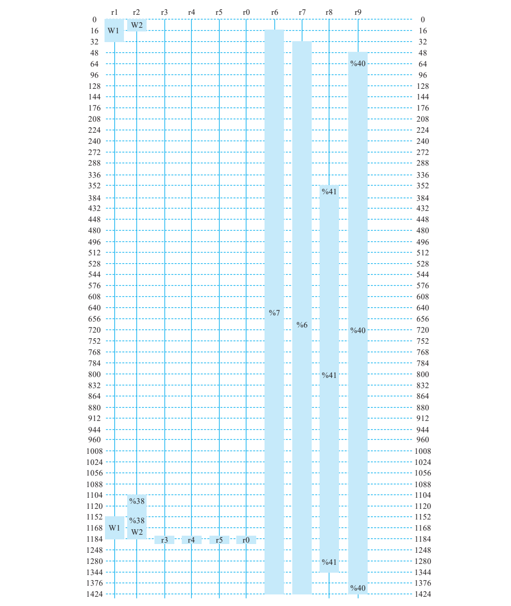

**图 10-33 %6、%41、%38、%40 分配物理寄存器后的使用情况**

<!-- PDF page 317; printed page 304 -->

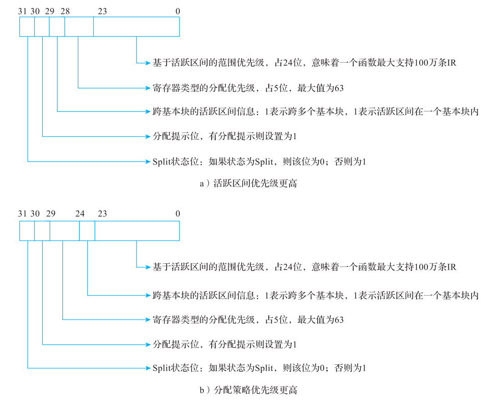

**图 10-34 优先级的布局**

接 下 来 分 配 寄 存 器 %42， 其 活 跃 区 间 为 [336r, 384B:0)、[384B, 1280r:2)、[1280r, 1344B:1)。经过计算发现，它也和所有的物理寄存器发生冲突。判断 %42 是否需要剔除其他寄存器，参见代码清单 10-27 可知，由于 %42 的权重为 2.460708，比 %7 的权重大（%7 的权重为 0.5732281），因此要将分配给 %7 的物理寄存器撤回，即从 r6 中剔除已经分配的 %7，并且将 r6 分配给 %42，如图 10-35 所示。然后，将 %7 重新插入到待分配队列（将 %7 的状态设置为 Split，重新计算优先级）。

注 此时尚不会更新 %7 的状态，因为虽然 %7 被剔除，但是当再次为 %7 分配寄存器

意

时，仍然可能分配成功。

需要再次选择一个高优先级的活跃区间，此时 %7 最大，但是 %7 和所有的物理寄存器发生冲突。然后判断是否需要为 %7 剔除其他虚拟寄存器。通过权重计算发现 %7 的权重最小，所以将 %7 的状态修改为 Split，重新插入到待分配队列。

<!-- PDF page 318; printed page 305 -->

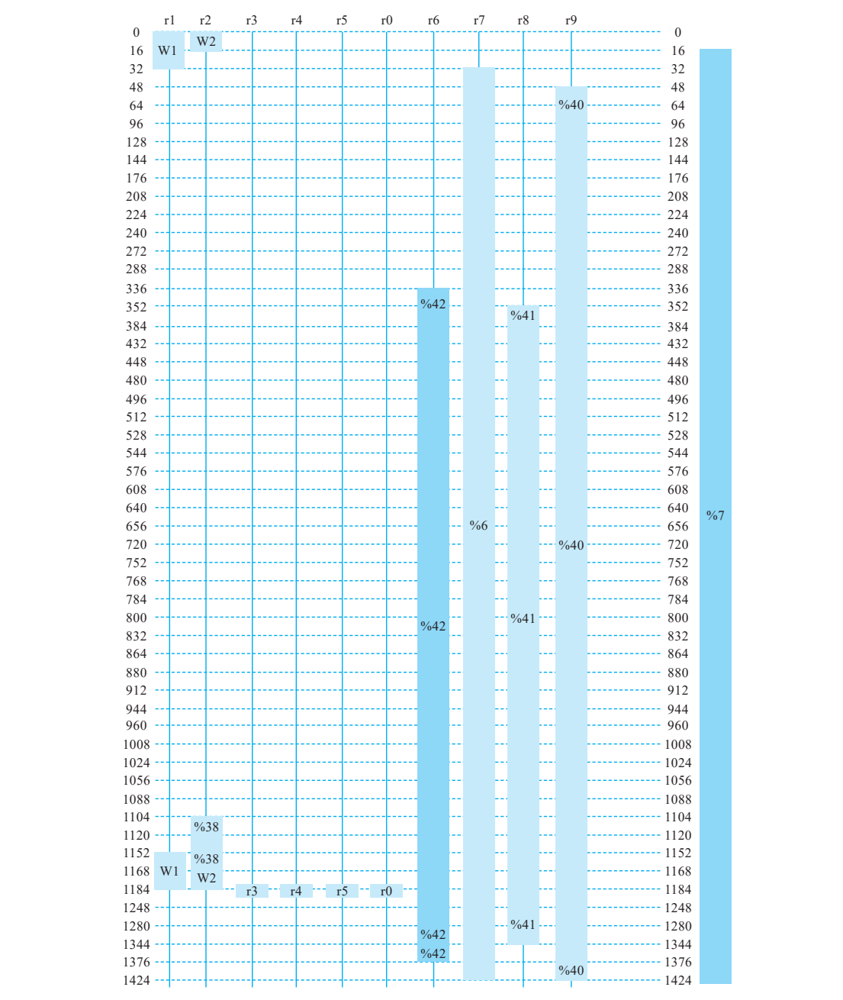

**图 10-35 %42 将 %7 逐出并使用 r6**

接着继续分配 %26、%12、%14、%18、%22、%28、%31、%36，这些虚拟寄存器分

<!-- PDF page 319; printed page 306 -->

配时都没有发生冲突，因此能为它们找到一个合适的物理寄存器，如图 10-36 所示。

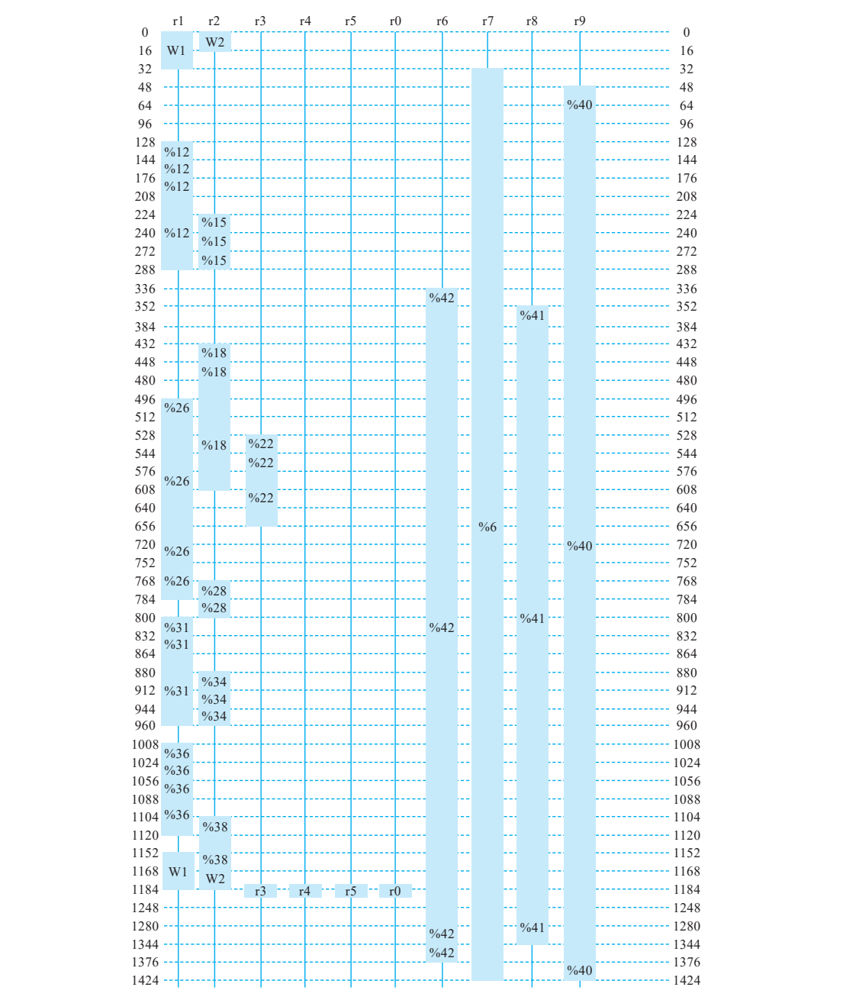

**图 10-36 %26、%12、%14、%18、%22、%28、%31、%36 分配寄存器后的使用情况**

<!-- PDF page 320; printed page 307 -->

然后继续分配，此时 %7 是最高优先级的虚拟寄存器，并且此时 %7 的状态为 Split，表示需要对 %7 进行拆分，然后再分配寄存器。

再次选择 %7，并为 %7 分配物理寄存器。首先对 %7 的活跃区间进行分析，为了便于理解，来看 %7 定义、使用情况的 CFG，如图 10-37 所示。

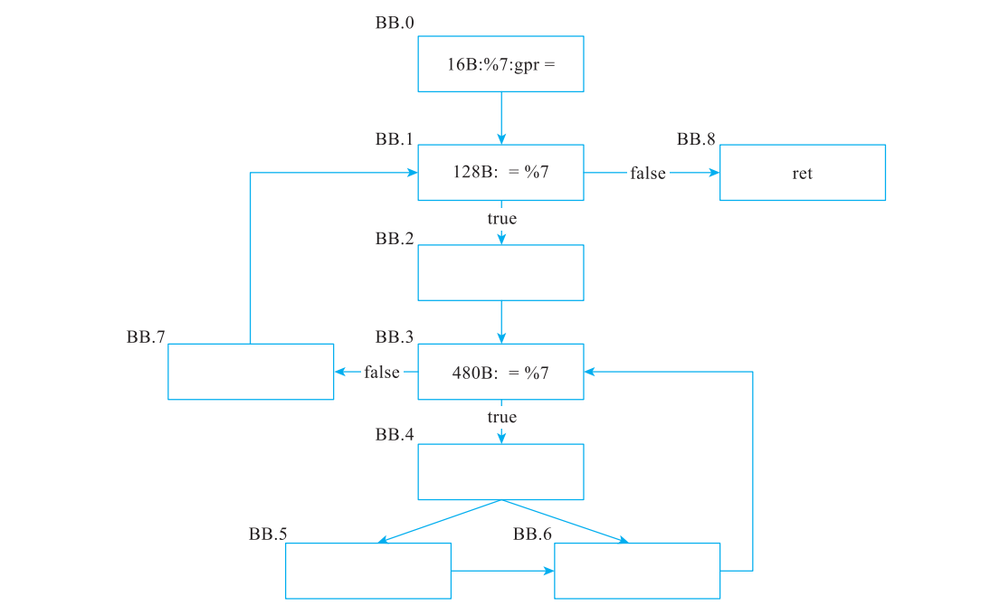

**图 10-37 %7 定义、使用情况**

根据 CFG 可以得到：

T UsedBlocks：基本块 0、1、3（BB.0 即为基本块 0，后续表述与此类似，不再提示）。

T LiveThroughBlocks：基本块 2、4、5、6、7。

为了构建 Hopfield 网络，需要根据 CFG 建立边束，如图 10-38 所示。

得到的边束信息如代码清单 10-30 所示。

**代码清单 10-30 边束信息**

```text
#0: BB.0
#1: BB.0.out BB.1.in  BB.7.out
#2: BB.1 BB.2 BB.8
#3: BB.2 BB.3  BB.6
#4: BB.3 BB.4 BB.7.in
#5: BB.4 BB.5 BB.6
#6: BB.8
```

<!-- PDF page 321; printed page 308 -->

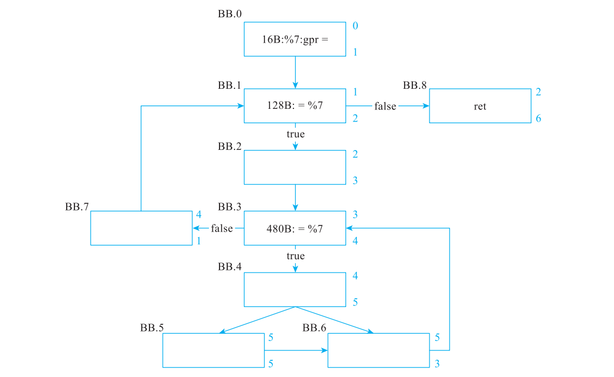

**图 10-38 边束建立情况**

%7 和所有的物理寄存器都冲突，那么应该选择哪个物理寄存器对 %7 进行区间拆分呢？需要寻找一个成本最优的物理寄存器，所以要为每个物理寄存器建立一个 Hopfield 网络，然后计算执行成本，最后从中选择一个执行成本最低的选项。在真正开始拆分之前，首先计算静态执行成本（称为初始静态成本）。静态执行成本是根据 UsedBlocks 中基本块的执行频率计算得到的，本例计算得到的初始静态执行成本为 1025。后续物理寄存器拆分时也会计算其静态执行成本，只有物理寄存器拆分的静态成本小于初始静态成本时才会构建Hopfield 网络来动态计算成本。

依次使用物理寄存器 r2、r1、r3、r4、r5、r0、r6、r7、r8、r9 计算拆分 %7 后的成本，最后选择拆分后成本最小的物理寄存器。

注 因为 %7 存在 COPY 指令，涉及物理寄存器 r2 和 r1，会优先将 %7 分配到 r2、r1

意

中，所以它们的顺序更靠前。

优先使用 r2 拆分 %7，根据图 10-36 知道 r2 已经被 6 个虚拟寄存器使用：%15、%18、%28、%34、%38 和入参 W2。

首先计算拆分前的静态执行成本，根据 UsedBlocks 中每个基本块的 Def、Use 指令和r2 已经分配的区间确定冲突的存在情况。如果存在冲突，则需要分别增加一条 store、load指令，而增加一条指令会导致其所在的基本块相应地根据其执行频率增加静态执行成本。

<!-- PDF page 322; printed page 309 -->

本例中基本块 1 与基本块 3 分别和 r2 中已经分配的 %15 及 %18 冲突，因此需要增加额外指令，经过计算 r2 的静态执行成本为 2016，大于初始静态执行成本 1025，所以放弃考虑 r2。

同样，在分析 r1 时，发现其静态执行成本为 1025，所以放弃考虑 r1。

下面分析 r3。首先计算静态执行成本，由于 r3 和 UsedBlocks 中的基本块 0、1 没冲突，和基本块 3 有冲突，计算得到静态执行成本为 992，小于 1025，所以可以继续计算动态成本。

UsedBlocks 为 0、1、3，为这 3 个基本块初始化边界约束，基本块的边界约束的计算方式在前面已经介绍过，得到的结果如图 10-39 所示。


**图 10-39 三个基本块边束初始状态**

建立边束，根据图 10-38，得到基本块 0、1、3 的边束为 0、1、2、3、4，并根据基本块的频率为边束初始化 BiasP 和 BiasN。由于边束 0 的边界约束为 DontCare，表示边束并不影响 Hopfield 网络，所以边束 0 在 Hopfield 网络构建中被忽略；基本块 3 的输出边束为 4，但是其边界约束为 MustSpill，所以边束 4 也在 Hopfield 网络构建中被忽略。边束1、2、3、4 分别覆盖的基本块为 0、1、7，1、2、8，2、3、6。只有基本块 7、2、6 属于LiveThroughBlocks，所以 Hopfield 网络的边束会以这三个基本块为基础。因为物理寄存器r3 已经被部分占用，所以需要判断 r3 和基本块 7、2、6 的冲突情况，从而决定是否添加边束的关联：

T 边束 7 和 r3 不冲突，对应的边束为 EB1 和 EB4，所以它们之间可以建立关联，其

权重本质上是基本块的执行频率。

T 边束 2 和 r3 不冲突，对应的边束为 EB2 和 EB3，所以它们之间可以建立关联，其

权重本质上是基本块的执行频率。

T 边束 6 和 r3 不冲突，对应的边束为 EB3 和 EB5，所以它们之间可以建立关联，其

权重本质上是基本块的执行频率。

最终得到的 Hopfield 网络的初始状态如图 10-40 所示。

对 Hopfield 网络进行迭代，迭代本质上就是计算能量（在实现中是跟踪是否有节点发生状态变化），最后得到一个稳定的结果，EB1、EB2 和 EB3 输出结果为 +1（表示这些边束对应基本块的输入、输出使用了寄存器）。由此动态成本为 992，最后得到总成本为 1984。

然后依次计算 r4、r5、r0、r6、r7、r8、r9 的成本，最后发现 r4 的总成本最低，所以选择 r4 对 %7 进行拆分。r4 形成的 Hopfield 网络稳定后，得出 EB1、EB2、EB3、EB4 和

<!-- PDF page 323; printed page 310 -->

EB5 的输出结果为 +1。

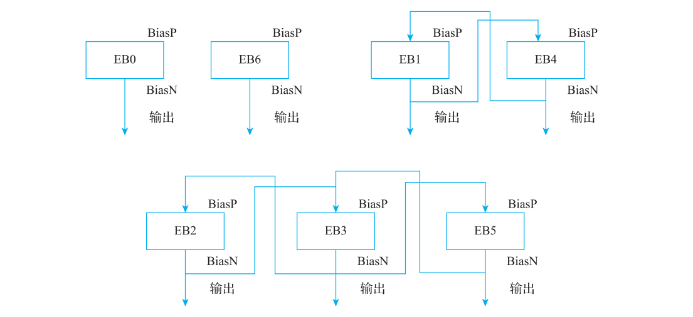

**图 10-40 Hopfield 网络的初始状态**

根据最优结果开始拆分 %7，过程如下。

1）对 UsedBlocks 进行拆分（本质上对应了静态执行成本）。基本块 0、1、3 和 r4 都不冲突，所以可以使用 r4。为了能够统一处理，先引入一个新的虚拟寄存器，再将虚拟寄存器插入到待分配队列，最后为该虚拟寄存器分配 r4。

2）对 LiveThroughBlocks 进行拆分（本质上对应了动态成本），选择输出结果为 +1 的边束，再将这些边束映射到基本块。本例中基本块 7、2、6、4、5 在边界（基本块的 LiveIn和 LiveOut）都使用了寄存器，所以要做的就是在和 r4 的区间发生冲突的基本块内插入store、load 指令。因为基本块 7、2、6、4 和 r4 已经分配的区间都不冲突，所以不会插入额外指令。而基本块 5 的活跃区间是 [992B, 1216B)，和 r4 在区间 [1184r, 1184d) 有冲突（这里有 call 指令，采用 Caller-Saved 的寄存器分配），所以需要在基本块 5 中插入 store、load指令。

因为在 call 指令之前和之后分别插入一条指令，此时还不知道插入的指令使用的虚拟寄存器是否需要溢出（因为这个活跃区间特别小，可能存在一个可用的物理寄存器），所以更通用的做法是引入新的虚拟寄存器并插入 COPY 指令（后续再为虚拟寄存器分配物理寄存器）。在基本块编号 1184（对应 call 指令的位置）之前，新声明一个虚拟寄存器 %43，并执行 %43= COPY %44 以保存 %44 的值。在编号 1184 之后再使用 COPY 恢复 %44（%44 = COPY %43），同时需要为新的指令进行编号。

最后使用新引入的虚拟寄存器重新更新指令，然后把虚拟寄存器加入待分配队列，再为新的虚拟寄存器分配物理寄存器。

为了方便读者理解寄存器拆分的过程，下面截取执行 %7 拆分时的日志，对日志进行简

<!-- PDF page 324; printed page 311 -->

单的分析，见代码清单 10-31。

**代码清单 10-31 对 %7 进行拆分的日志**

```text
// 对%7进行分配
selectOrSplit GPR:%7 [16r,1424B:0) 0@16r  weight:5.732281e-01 w=5.732281e-01
// %7优先分配到r2、r1中，这是因为%7来自参数，而该参数使用r2传递
hints: $r2 $r1
// 由于前面已分配过%7，所以此时%7的状态为RS_Split
RS_Split Cascade 1
// 对%7的活跃区间进行分析，Def、Use指令分别在三个基本块0、1、3中，基本块2、4、5、6、7
// 属于LiveThrough Blocks
Analyze counted 3 instrs in 3 blocks, through 5 blocks.
// 本节并没有介绍压缩的概念，它涉及使用UsedBlocks和LiveThroughBlocks直观构建Hopfield
// 网络（暂时不考虑物理寄存器的具体分配）。通过Hopfield网络的迭代计算，理论上能够促进CFG的结构
// 简化或“压缩”。尽管这并非其直接目的，而是一种潜在效应。本例并不会真正地执行压缩步骤。
Compact region bundles, v=4, none.
// 计算%7的初始静态执行成本（仅仅依赖于UsedBlocks所在的基本块的频率）
Cost of isolating all blocks = 1025.0
// 用r2拆分%7，首先计算静态执行成本，依赖于UsedBlocks和r2是否冲突。如果冲突，说明要插入新
// 的指令，由此计算静态执行成本，为2016，大于初始静态成本，所以不会选择r2拆分（因此也不会进一
// 步构建Hopfield网络）
$r2     static = 2016.0 worse than no bundles
// 用r1拆分%7，静态执行成本为1025，也不会使用r1拆分%7
$r1     static = 1025.0 worse than no bundles
// 用r3拆分%7，静态执行成本为992，进一步构建Hopfield网络，然后计算总执行成本为1984
// Hopfield网络的输出边束为EB1、EB2和EB3，输出结果为+1。r3总成本大于1025，所以也不会使用
// r3拆分%7
$r3     static = 992.0, v=5, total = 1984.0 with bundles EB#1 EB#2 EB#3.
// 用r4拆分%7，静态执行成本为0，进一步构建Hopfield网络，然后计算总执行成本为961，Hopfield
// 网络的输出边束为EB1、EB2、EB3、EB4和EB5，输出结果为+1。r4总成本大于961，所以r4是拆分
// %7的候选之一
$r4     static = 0.0, v=5, total = 961.0 with bundles EB#1 EB#2 EB#3 EB#4 EB#5.
// 用r5拆分%7，和r4的过程相同。r5也是拆分%7的候选之一
$r5     static = 0.0, v=5, total = 961.0 with bundles EB#1 EB#2 EB#3 EB#4 EB#5.
// 用r0拆分%7，和r4的过程相同。r0也是拆分%7的候选之一
$r0     static = 0.0, v=5, total = 961.0 with bundles EB#1 EB#2 EB#3 EB#4 EB#5.
// 用r6拆分%7，其静态执行成本过大，不会成为候选寄存器
$r6     static = 1984.0 worse than $r4
// 用r7拆分%7，在构建Hopfield网络过程中发现所有边束的输出都是-1，说明使用r7拆分也不会取得
// 更好的收益
$r7     no positive bundles
// 用r8拆分%7，其静态执行成本过大，不会成为候选寄存器
$r8     static = 1984.0 worse than $r4
// 用r9拆分%7，在构建Hopfield网络过程中发现所有边束的输出结果都是-1，r9也不会成为候选寄存器
$r9     no positive bundles
// 因为r4是第一个候选寄存器，并且总体执行成本最低，所以选择r4来拆分%7
Split for $r4 in 5 bundles, intv 1.
// 拆分后会引入一两个新的活跃区间
splitAroundRegion with 2 globals.
// 因为基本块0和r4不冲突，所以不会引入新的指令
```

<!-- PDF page 325; printed page 312 -->

```text
%bb.0 [0B;96B), uses 16r-16r, reg-out 1, enter after invalid, defined in block
    after interference.
    selectIntv 1 -> 1
    useIntv [16r;96B): [16r;96B):1
// 基本块1和r4不冲突，所以不会引入新的指令
%bb.1 [96B;320B) intf invalid-invalid, live-through 1 -> 1, straight through.
    selectIntv 1 -> 1
    useIntv [96B;320B): [16r;320B):1
// 因为基本块3和r4不冲突，所以不会引入新的指令
%bb.3 [384B;688B) intf invalid-invalid, live-through 1 -> 1, straight through.
    selectIntv 1 -> 1
    useIntv [384B;688B): [16r;320B):1 [384B;688B):1
// 因为基本块7和r4不冲突，所以不会引入新的指令
%bb.7 [1344B;1424B) intf invalid-invalid, live-through 1 -> 1, straight through.
    selectIntv 1 -> 1
    useIntv [1344B;1424B): [16r;320B):1 [384B;688B):1 [1344B;1424B):1
// 因为基本块2和r4不冲突，所以不会引入新的指令
%bb.2 [320B;384B) intf invalid-invalid, live-through 1 -> 1, straight through.
    selectIntv 1 -> 1
    useIntv [320B;384B): [16r;688B):1 [1344B;1424B):1
// 因为基本块6和r4不冲突，所以不会引入新的指令
%bb.6 [1216B;1344B) intf invalid-invalid, live-through 1 -> 1, straight through.
    selectIntv 1 -> 1
    useIntv [1216B;1344B): [16r;688B):1 [1216B;1424B):1
// 因为基本块4和r4不冲突，所以不会引入新的指令
%bb.4 [688B;992B) intf invalid-invalid, live-through 1 -> 1, straight through.
    selectIntv 1 -> 1
    useIntv [688B;992B): [16r;992B):1 [1216B;1424B):1
// 因为基本块5和r4冲突，所以需要在基本块中引入新的指令。冲突位置是[1184r;1184d)，
// 所以会插入新的虚拟寄存器，插入位置在1176r（1184编号对应call指令，前面一条指令的编号为1168，
// 所以插入新的指令编号是1184和1168之间的位置：1176）
%bb.5 [992B;1216B) intf 1184r-1184d, live-through 1 -> 1, create local intv for
    interference.
    selectIntv 1 -> 1
    enterIntvAfter 1184d: valno 0
    useIntv [1192r;1216B): [16r;992B):1 [1192r;1424B):1
    selectIntv 1 -> 1
    leaveIntvBefore 1184r: valno 0
    useIntv [992B;1176r): [16r;1176r):1 [1192r;1424B):1
Single complement def at 1176r
// 因支配关系优化而插入的COPY指令，在本例中不涉及该类指令的优化
Removing 0 back-copies.
// 重写指令，将原来%7替换为Index虚拟寄存器%44，并新插入%43用于解决冲突
    blit [16r,1424B:0): [16r;1176r)=1(%44):1*%bb.0>%bb.1>%bb.2>%bb.3>%bb.4>%bb.5
    [1176r;1192r)=0(%43):0 [1192r;1424B)=1(%44):0*%bb.5>%bb.6>%bb.7
    rewr %bb.0    16r:1   %44:gpr = COPY $r2
    rewr %bb.3    480B:1  %18:gpr = ADD_rr %18:gpr(tied-def 0), %44:gpr
    rewr %bb.1    128B:1  %12:gpr = COPY %44:gpr
    rewr %bb.5    1192B:0 %44:gpr = COPY %43:gpr
    rewr %bb.5    1176B:1 %43:gpr = COPY %44:gpr
```

<!-- PDF page 326; printed page 313 -->

```text
Main interval covers the same 8 blocks as original.
// 将新的虚拟寄存器%43、%44重新入栈，用于后续分配
queuing new interval: %43 [1176r,1192r:0) 0@1176r  weight:2.333197e+00
Enqueuing %43
queuing new interval: %44 [16r,96B:0)[96B,384B:1)[384B,1176r:2)[1192r,1216B:3)
    [1216B,1344B:4)[1344B,1424B:2) 0@16r 1@96B-phi 2@384B-phi 3@1192r 4@1216B-phi
    weight:1.120592e+00
Enqueuing %44
```

## 10.6 PBQP 算法实现

PBQP 是一个 NP 完全优化问题，目前有不少方法用于获得 PBQP 最优解或者次优解。在寄存器分配过程中，可将寄存器分配问题转化为 PBQP 问题，通过求解 PBQP 获得寄存器分配方案。本节首先介绍 PBQP 以及求解方案，然后通过示例演示 LLVM 中的 PBQP 的实现。

### 10.6.1 PBQP 介绍

PBQP 起源于运筹学中的二次分配问题，可以形式化地定义为如式（10-1）所示的形式：

min    ∑ i= n 1 ∑ j n =1 X i TC ij X j    （10-1）

其中 Xi 和 Xj 分别表示两个向量，Cij 表示 Xi 和 Xj 之间的系数矩阵，并且对于 Xi 和 Xj有：任意的元素其值域只能是 0 或者 1，并且整个向量的和为 1，可形式化表示为：

X ∈{0,1}且

∑n

X =1

ij ij

j=1

该方程是对现实问题的抽象，可以通过一个简单的例子来解释该公式。假设有 n 个工厂，工厂之间需要运输货物，不同货物的运输成本不同。有任意两个工厂 i 和 j，它们之间运输成本使用矩阵 Cij 表示，运输的货物分别使用 Xi 和 Xj 表示，那么工厂 i 和 j 之间的最小成本是：

min(XTC X )

i ij j

推广到 n 个工厂之间的最小成本则如式（10-1）所示。

矩阵 Cij 中的成本值可为任意数，分为三种情况。

1）大于 0，表示两个工厂之间的运输成本。

2）小于 0，一般情况下两个工厂之间的运输成本不会为负数，但可以考虑这样的一种特殊情况：假设两个工厂合并成一个工厂后产生的货物不变，但因规模效益导致成本降低。此时进行工厂合并可获得的收益更大。这种情况下可以将工厂之间的运输成本设置为负数。

<!-- PDF page 327; printed page 314 -->

3）∞，表示两个工厂间无法进行运输。

对式（10-1）再做一个扩展，假设每个节点本身都有构建成本，第 i 个节点的成本用 Si表示，那么再考虑节点的构建成本后，最小成本公式如式（10-2）所示：

min    ∑ i= n 1 ∑ j n =1 X i TC ij X j + ∑ i= n 1 S i X i    （10-2）

### 10.6.2 寄存器分配和 PBQP 的关系

使用 PBQP 求解寄存器分配首先需要将寄存器分配问题转化成 PBQP 方程。在寄存器分配过程中有三个场景，分别是分配、溢出和寄存器合并。

首先来看分配。两个变量能否使用一个物理寄存器的前提是：两个变量的活跃区间是否冲突，如果冲突，则它们无法使用同一个寄存器；否则说明它们可以使用同一个寄存器。如果无法使用同一个物理寄存器，则说明它们之间的成本为无穷大∞；如果变量可以使用寄存器，则成本为 0。因此可以根据变量活跃区间情况构建成本矩阵，矩阵的维度为物理寄存器的个数，假设物理寄存器有 k 个，则任意两个变量之间的成本矩阵为 Ckk。

接下来考虑溢出。由于每个变量都可能溢出，可以根据基本块的执行频率等情况计算溢出成本，假设记为 C0。通过数学变换，将溢出成本设计成 k + 1 长度的向量，记为Si(C0, 0, ..., 0)。同时将分配成本矩阵 Ckk 变换为 Ck+1k+1（并且成本矩阵的第一行和第一列都是 0），这样溢出成本和分配矩阵维度相同，可以进行矩阵运算。

最后考虑寄存器合并问题。在寄存器分配过程中除了考虑溢出外，还需要考虑寄存器合并（10.2.9 节介绍了简单的寄存器合并）。这里提到的合并是指在分配过程中的寄存器合并，本节不展开讨论为什么在寄存器分配过程中需要合并。寄存器合并的本质是将两个变量分配到同一个物理寄存器，如果发生了寄存器合并，则意味着可以减少指令数，从而减少分配成本。因此，当发生寄存器合并时，可以设计一个合并矩阵，记为 Mk+1k+1，然后将矩阵中可以发生合并的物理寄存器的位置记为负值。

结合这 3 种情况，最后寄存器分配的成本可以表示为：

min    ∑ i= n 1 ∑ j n =1 X i T(C ij + M ij )X j + ∑ i= n 1 S i X i   

合并 Cij 和 Mij（变量 i、j 的合并矩阵）后，上述公式和式（10-2）相同，因此寄存器分配问题可以转化为 PBQP 问题进行求解。

### 10.6.3 PBQP 问题求解

因为 PBQP 问题是 NP 完全问题，穷举法的时间复杂度为 O(nn)，所以一般都是采用启发式算法获得近似最优解，例如经典的单纯形算法，但是该算法复杂性比较高。本节介绍通过归约（reduction）和反向传播（back propagation）求解 PBQP 的方法。

<!-- PDF page 328; printed page 315 -->

在进行求解时，可以先把方程转化为图的形式，这样更容易理解。归约的方式总是能得到最优解，只有三种情况可以进行归约，分别为零度归约、一度归约和二度归约。下面通过示例演示归约处理方法。

零度归约（也称为 R0）指的是图中节点没有边与之关联，那么可以从节点的构建成本中选择一个最小值作为节点的最小值。其节点构建成本和矩阵系数分别如图 10-41 所示，节点 0 选择成本 0、节点 1 选择成本 2。注意，这里的构建成本是向量 Si 的值。在寄存器分配中，通常该向量保存的是溢出成本和所有可使用物理寄存器的成本。


**图 10-41 零度归约的节点构建成本和矩阵系数示意图**

一度归约（也称为 R1）指的是图中节点只有一条边与其他节点关联，那么可以将节点的构建成本和系数矩阵转移到另一个节点中。例如图 10-42 中节点 0 只有一条边和节点 1关联，节点 1 则有两条边和其他节点关联。因此一度归约的关键是如何将节点 0 的成本合并到节点 1，然后移除两者之间的关联边。


**图 10-42 一度归约前的节点和边的成本状态**

根据式（10-2）可以计算节点 1 在消除节点 0 和节点 1 关联边后的成本。

节点 1 的成本计算方式如下：

2+ min(2+ 2,0+1) 3

 4+ min(2+1,0+ 4)   =  7  

进行一度归约后的成本状态如图 10-43 所示。


**图 10-43 一度归约后的节点成本状态**

二度归约（也称为 R2）指的是图中节点只有两条边与其他节点关联，那么可以将节点

<!-- PDF page 329; printed page 316 -->

的构建成本和系数矩阵转移到另外两个节点中。例如在图 10-44 中，节点 1 有两条边分别与节点 0 和节点 2 关联，节点 0 和节点 2 都有三条边和其他节点关联。二度归约的关键是如何将节点 1 的成本合并到节点 0 和节点 2 之间的关联边上，然后移除原来的关联边。


**图 10-44 二度归约前的节点和边的成本状态**

根据式（10-2）可以计算节点 0 和节点 2 的关联边成本。

C02[0][0] = min(S10 + C01[0][0] + C12[0][0], S11 + C01[0][1] + C12[0][1]) = 5

C02[0][1] = min(S10 + C01[0][0] + C12[1][0], S11 + C01[0][1] + C12[1][1]) = 4

C02[1][0] = min(S10 + C01[1][0] + C12[0][0], S11 + C01[1][1] + C12[0][1]) = 4

C02[0][1] = min(S10 + C01[1][0] + C12[1][0], S11 + C01[1][1] + C12[1][1]) = 3

其中 C01、C02、C12 分别表示节点 0 和节点 1、节点 0 和节点 2、节点 1 和节点 2 之间的成本矩阵。S10 和 S11 分别表示节点 1 的构建成本向量的第一个和第二个元素，最后得到 C02如下：

5 4

C 02 =  4 3  

消除节点 0 和节点 1、节点 1 和节点 2 之间的边，由于图 10-44 中节点 0 和节点 2 之间没有边，所以先为节点 0 和节点 2 建立关联边。如果节点 0 和节点 2 之间有边，则将新产生的成本和原来的成本相加即可。最后得到的成本状态如图 10-45 所示。


**图 10-45 二度归约后的节点和边的成本状态**

对于大于二度的节点一般可以采用启发式算法进行简化，这里以 LLVM 的实现为例介绍反向传播的处理方法。其思路也非常简单，方法如下。

1）对于关联边大于 2 的节点，首先按照一定的规则选择节点（也可以随机选择），将选择的节点放入一个栈中，然后将与节点相关联的边都删除，如果出现因为边删除而可以使用 R0、R1 和 R2 归约方法进行处理的节点，则先处理这些节点，并且将这些节点也压入栈中；如果没有可以归约的节点，则继续选择图中节点并删除相关联的边，直到最后剩余的

<!-- PDF page 330; printed page 317 -->

节点可以使用 R0、R1 和 R2 归约方法进行处理。

2）此时栈顶存放的节点可以归约，然后依次从栈顶弹出节点，并且反向依次重构图，在重构的过程中根据已经处理的节点计算栈顶节点的成本，从而得到最小成本。

### 10.6.4 寄存器分配问题建模示例

假设有 4 个变量：X、Y、Z 和 W，只有两个物理寄存器 R0 和 R1，并且 X 和 Y、X 和W 活跃区间冲突，Z 和 Y、Z 和 W 活跃区间冲突，Y 和 W 活跃区间冲突。

每个变量可能有 3 种选择—溢出、R0、R1，所以每个变量的成本向量都有 3 个元素。X 使用 [X0，X1，X2] 表示溢出成本、选择 R0 的成本、选择 R1 的成本；变量 Y、Z 和 W 类似。由此可以得到每个节点的构建成本。

根据 PBQP 构建图的规则，当变量之间有冲突时，两个变量有边进行关联。接下来需要为关联边添加矩阵。由于有 2 个物理寄存器，为了便于矩阵计算，将矩阵的行和列的长度设置为物理寄存器个数加 1，即行和列都是 3，其中第一行和第一列的值都是零。接下来需要判断变量 X、Y、Z、W 可用的物理寄存器是否发生冲突。假设 X、Y、Z、W 都可以使用 R0 和 R1，此时对应的系数矩阵如下：

0 0 0

 0 ∞ 0  

0 0 ∞

其中矩阵元素 C[1][1] 和 C[2][2] 都是∞，说明当两个变量同时使用一个物理寄存器时成本为无穷大，表示无法将两个变量同时分配到同一个物理寄存器上。类似的是，C[1][2]和 C[2][1] 都是 0，表示两个变量分别使用 R0、R1 时的成本为 0。根据以上信息，下面开始构建 PBQP 方程如图 10-46 所示。


**图 10-46 4 个变量、两个物理寄存器构建的 PBQP 方程示意图**

<!-- PDF page 331; printed page 318 -->

当构建完成就可以对 PQBP 进行求解。

### 10.6.5 PBQP 实现原理以及示例分析

本节使用代码清单 10-25 进行 PBQP 实现原理讲解。由于 Basic 和 PBQP 算法前置依赖也相同，都会计算活跃变量、变量活跃区间、支配树、基本块执行频率等信息，这里不再赘述。

使用 PBQP 方法求解寄存器分配问题可以分为 4 步。

1. 将寄存器分配问题映射为 PBQP

首先计算节点的构建成本，由于 BPF 后端可以使用的物理寄存器为 r0～r9 共计 10 个，再加上一个溢出成本，所以构建成本向量的长度为 11。

但是在 LLVM 实现中对构建成本向量做了优化，如果发现变量的活跃区间和物理寄存器发生了冲突，说明永远不可能将物理寄存器分配给该变量，所以构建成本以及相关系数矩阵都可以移除该物理寄存器相关的信息。

对本节的例子来说，有共计 16 个虚拟寄存器需要分配（2 个物理寄存器无须处理，相当于它们已经完成了分配），对应的构建成本如代码清单 10-32 所示。

**代码清单 10-32 节点的构建成本**

```text
0 (GPR:%6): [ 1.332566e+01, 1.000000e+00, 1.000000e+00, 1.000000e+00, 1.000000e+00 ]
1 (GPR:%7): [ 1.171968e+01, 1.000000e+00, 1.000000e+00, 1.000000e+00, 1.000000e+00 ]
2 (GPR:%11): [ 1.087457e+01, 1.000000e+00, 1.000000e+00, 1.000000e+00, 1.000000e+00 ]
3 (GPR:%12): [ 1.323200e+01, 0.000000e+00, 0.000000e+00, 0.000000e+00, 0.000000e+00,
  0.000000e+00, 1.000000e+00, 1.000000e+00, 1.000000e+00, 1.000000e+00, 0.000000e+00 ]
4 (GPR:%15): [ INF, 0.000000e+00, 0.000000e+00, 0.000000e+00, 0.000000e+00,
  0.000000e+00, 1.000000e+00, 1.000000e+00, 1.000000e+00, 1.000000e+00, 0.000000e+00 ]
5 (GPR:%18): [ 1.545077e+02, 0.000000e+00, 0.000000e+00, 0.000000e+00, 0.000000e+00,
  0.000000e+00, 1.000000e+00, 1.000000e+00, 1.000000e+00, 1.000000e+00, 0.000000e+00 ]
6 (GPR:%22): [ 7.831273e+01, 0.000000e+00, 0.000000e+00, 0.000000e+00, 0.000000e+00,
  0.000000e+00, 1.000000e+00, 1.000000e+00, 1.000000e+00, 1.000000e+00, 0.000000e+00 ]
7 (GPR:%26): [ 1.829331e+02, 0.000000e+00, 0.000000e+00, 0.000000e+00, 0.000000e+00,
  0.000000e+00, 1.000000e+00, 1.000000e+00, 1.000000e+00, 1.000000e+00, 0.000000e+00 ]
8 (GPR:%28): [ INF, 0.000000e+00, 0.000000e+00, 0.000000e+00, 0.000000e+00,
  0.000000e+00, 1.000000e+00, 1.000000e+00, 1.000000e+00, 1.000000e+00, 0.000000e+00 ]
9 (GPR:%31): [ 7.177857e+01, 0.000000e+00, 0.000000e+00, 0.000000e+00, 0.000000e+00,
  0.000000e+00, 1.000000e+00, 1.000000e+00, 1.000000e+00, 1.000000e+00, 0.000000e+00 ]
10 (GPR:%34): [ INF, 0.000000e+00, 0.000000e+00, 0.000000e+00, 0.000000e+00,
  0.000000e+00, 1.000000e+00, 1.000000e+00, 1.000000e+00, 1.000000e+00, 0.000000e+00 ]
11 (GPR:%36): [ 6.308023e+01, 0.000000e+00, 0.000000e+00, 0.000000e+00, 0.000000e+00,
  0.000000e+00, 1.000000e+00, 1.000000e+00, 1.000000e+00, 1.000000e+00, 0.000000e+00 ]
12 (GPR:%38): [ 2.673466e+01, -4.805000e+02○一, 0.000000e+00, 0.000000e+00,
```

○一 注意，负值表示发生了寄存器合并，在 PBQP 算法中默认不启用寄存器合并，可以通过设置参数 pbqp-

coalescing 启动。

<!-- PDF page 332; printed page 319 -->

```text
  0.000000e+00, 1.000000e+00, 1.000000e+00, 1.000000e+00, 1.000000e+00, 0.000000e+00 ]
13 (GPR:%40): [ 1.309433e+01, 1.000000e+00, 1.000000e+00, 1.000000e+00, 1.000000e+00 ]
14 (GPR:%41): [ 2.233253e+01, 1.000000e+00, 1.000000e+00, 1.000000e+00, 1.000000e+00 ]
15 (GPR:%42): [ 2.230354e+01, 1.000000e+00, 1.000000e+00, 1.000000e+00, 1.000000e+00 ]
```

其中虚拟寄存器 %6、%7、%11、%40、%41 和 %42 的活跃区间与物理寄存器 r0～r5冲突，只有 r6、r7、r8 和 r9 这 4 个物理寄存器可用，所以它们的长度为 5。虚拟寄存器 %38的长度为 10，原因是 %38 和物理寄存器 r1 冲突，所以 r1 不可用，即 r2～r9、r0 共计 9 个物理寄存器可用，再加上溢出操作，故它的长度为 10 ；其他虚拟寄存器则可以使用 r0～r9共计 10 个物理寄存器，再加上溢出操作，故长度为 11。

这里以 %42 为例，介绍一下其构建成本。如代码清单 10-32 最后一行所示，42% 的构建成本为 [2.230354e+01, 1.000000e+00, 1.000000e+00, 1.000000e+00, 1.000000e+00]，其中第一个元素的值为 22.30354。这个值基本上是根据基本块的执行频率计算得到，该值越大说明溢出成本越高；后面的 4 个元素都是 1，这是为了区分物理寄存器中的 Caller-Saved、Callee-Saved（将 Calllee-Saved 寄 存 器 成 本 设 置 为 1， 从 而 保 证 PBQP 优 先 使 用 Caller- Saved 寄存器）类型。

注 意， 虚 拟 寄 存 器 %38 的 成 本 为 [2.673466e+01, –4.805000e+02, 0.000000e+00, 0.000000e+00, 0.000000e+00, 1.000000e+00, 1.000000e+00, 1.000000e+00, 1.000000e+00, 0.000000e+00]，第一个元素是溢出成本，第二个元素的值为 –480.5，因为存在指令 $r2 = COPY %38，所以 %38 对应 r2 的成本减去基本块的执行频率（说明了 %38 优先选择 r2）。接下来是 r3～r9、r0（%38 不能使用 r1 是因为它们之间有冲突），这个顺序和物理寄存器的分配一致。注意，如果 COPY 指令的目的寄存器和源寄存器都是虚拟寄存器，会将成本计算到系数矩阵中。

接下来根据变量的活跃区间为 16 个变量构建 PBQP 图。如果两个变量之间有冲突，则它们之间存在关联边。例如 %42 的活跃区间为 [336r, 384B)、[384B, 1280r)、[1280r, 1344B)，除了 %12（活跃区间为 [128r, 144r)、[144r, 176r)、[176r, 208r)、[208r, 288r)）、%1（5 活跃区间为 [224r, 240r)、[240r, 272r)、[272r, 288r)）外，%42 和 %6、%7、%11 等共计 13 个虚拟寄存器都有冲突（区间有部分重叠）。因此 %42 有共计 13 条边，有 13 个节点存在关联，根据冲突关系构建 PBQP 图如图 10-47 所示（共计 78 条边）。

在构建 PBQP 图的过程中，需要同步构建关联边的系数矩阵，仍然以 %42 为例。%42和 %6 成本向量的长度都是 5，它们都可以用 r6～r9，因此边 %42 和 %6 之间的系数矩阵是5 行、5 列，如表 10-1 所示。

<!-- PDF page 333; printed page 320 -->

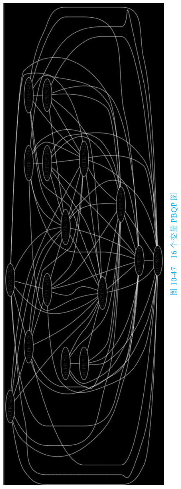

)22%:RPG(6

)82%:RPG(8

)43%:RPG(01

)83%:RPG(21

)62%:RPG(7

)13%:RPG(9

)63%:RPG(11

)81%:RPG(5

)14%:RPG(41

)51%:RPG(4

)24%:RPG(51

)21%:RPG(3

)11%:RPG(2

)04%:RPG(31

)6%:RPG(0 )7%:RPG(1

图PQBP量变个61

74-01图

<!-- PDF page 334; printed page 321 -->

**表 10-1 %42 和 %6 的系数矩阵**

%6

%42

溢出 r6 r7 r8 r9

溢出 0.000000E+00 0.000000E+00 0.000000E+00 0.000000E+00 0.000000E+00

r6 0.000000E+00 INF 0.000000E+00 0.000000E+00 0.000000E+00

r7 0.000000E+00 0.000000E+00 INF 0.000000E+00 0.000000E+00

r8 0.000000E+00 0.000000E+00 0.000000E+00 INF 0.000000E+00

r9 0.000000E+00 0.000000E+00 0.000000E+00 0.000000E+00 INF

%42 和 %38 的成本向量长度分别是 5 和 10，因此边 %42 和 %38 之间的系数矩阵是 10行、5 列，如表 10-2 所示。

**表 10-2 %42 和 %38 的系数矩阵**

%42

%38

溢出 r6 r7 r8 r9

溢出 0.000000E+00 0.000000E+00 0.000000E+00 0.000000E+00 0.000000E+00

r2 0.000000E+00 0.000000E+00 0.000000E+00 0.000000E+00 0.000000E+00

r3 0.000000E+00 0.000000E+00 0.000000E+00 0.000000E+00 0.000000E+00

r4 0.000000E+00 0.000000E+00 0.000000E+00 0.000000E+00 0.000000E+00

r5 0.000000E+00 0.000000E+00 0.000000E+00 0.000000E+00 0.000000E+00

r6 0.000000E+00 INF 0.000000E+00 0.000000E+00 0.000000E+00

r7 0.000000E+00 0.000000E+00 INF 0.000000E+00 0.000000E+00

r8 0.000000E+00 0.000000E+00 0.000000E+00 INF 0.000000E+00

r9 0.000000E+00 0.000000E+00 0.000000E+00 0.000000E+00 INF

r0 0.000000E+00 0.000000E+00 0.000000E+00 0.000000E+00 0.000000E+00

2. 求解 PBQP

求解过程需要按照一定的顺序，具体为：

（1）处理图中节点度小于 3 的可归约节点

在处理可归约节点时，首先将节点压入栈中，然后进行归约计算，更新成本或者系数矩阵。由于在图 10-47 中，初始阶段没有任何节点的度小于 3，所以不会进行归约。

（2）处理可分配节点

可分配节点是 LLVM 实现中的一种优化方案。以 BPF 后端为例，它有 10 个物理寄存器可以使用，因此前 10 个变量总是可以优先使用物理寄存器。在处理可分配节点时，首先将节点压入栈中，然后将节点相关的边从图中删除，并对关联节点进行状态更新，如果发

<!-- PDF page 335; printed page 322 -->

现节点的度小于 3，则将节点加入可归约节点中，等待处理。

在本例中，由于变量节点 3～节点 12（对应的变量如图 10-47 所示）可分配的物理寄存器更多，所以将节点 3～节点 12 依次压入栈中，并且在图中将关联边删除。此时栈中的元素为节点 3～节点 12。

（3）处理溢出节点

当变量超过后端允许的最大物理寄存器个数后，后续的变量都需要进行溢出处理。在处理可分配节点时，首先选择一个溢出成本最低的节点进行处理，先将节点压入栈中，然后将节点相关的边从图中删除，并对关联节点进行状态更新。如果发现节点的度小于 3，则将节点加入可归约节点中，等待处理。

节点 0、1、2、13、14、15 是溢出节点（这 6 个节点可分配的物理寄存器个数更少），按照溢出权重依次处理，溢出权重从小到大顺序为节点 2、1、0、13、14、15，所以节点 2、1、0 会被依次压入栈中，在图中删除关联边。此时，图中只剩下节点 13、14、15，这三个节点的度都小于 3，所以它们会被作为可归约节点进行处理。此时栈中元素为节点 3～节点12、节点 2、1、0、13、14、15。

（4）进行反向传播

这一步会依次访问栈中元素，重构图，并计算、更新节点的成本。

1）根据栈先进后出的特性，栈顶元素为 15，并且 15 已经进行了归约计算，所以为节点 15 选择第一个可用的寄存器，即 r6。之后，依次处理栈元素 14、13，分别选择寄存器r7、r8。

2）处理节点 0，首先重构图，将与节点 0 相关联的边都重新添加上，此时节点 0 和节点13、14、15 建立关联边，因为节点 13、14、15 都已经选择了寄存器，其边的系数都已经计算完成，所以可以计算节点 0 的系数矩阵，并且进行构建成本求和，选择最小的元素作为节点 0的物理寄存器。由于 r9 尚未使用，计算完成后 r9 对应的成本最小，所以为节点 0 选择 r9。

3）处理节点 1，以和步骤 2 同样的方式重构图，此时节点 1 和节点 13、14、15、0 都建立了关联边，计算节点 1 的构建成本，得到第 0 个元素（表示溢出）的成本最小，所以选择溢出。以同样的方式处理节点 2，最后节点 2 也会溢出。

4）依此类推，处理栈中其他元素。

对节点 1 进行反向传播的示意图如图 10-48 所示。

节点 1 的成本计算方法如下：

[11.71968, 1, 1, 1, 1] + M1–0[Node0.Selection] + M1–13[Node13.Selection] +

M1–14[Node14.Selection] + M1–15[Node15.Selection]

其中，Node0.Selection 指的是节点 0 选择寄存器对应的行，矩阵 M1–0 表示节点 0 和节点 1 之间的系数矩阵。可以根据矩阵找到对应的向量，由于节点 0 选择了物理寄存器 r9（r9对应系数矩阵的第 4 行），而系数矩阵中 M1–0[4] 的向量为 [0, 0, 0, 0, ∞]。类似地，节点 13选择物理寄存器 r8，而系数矩阵中 M1–13[3] 的向量为 [0, 0, 0, ∞, 0] ；节点 14 选择物理寄存

<!-- PDF page 336; printed page 323 -->

器 r7，而系数矩阵中 M1–14[2] 的向量为 [0, 0, ∞, 0, 0] ；节点 15 选择物理寄存器 r6，而系数矩阵中 M1–15[1] 的向量为 [0, ∞, 0, 0, 0]。因此，节点 1 的构建成本为 [11.71968, ∞, ∞, ∞, ∞]，此时第 0 个元素对应的成本最低，而索引 0 表示溢出。

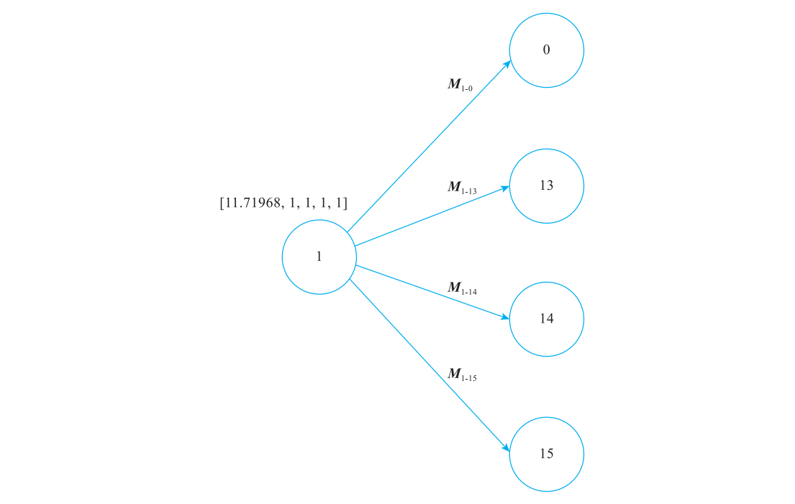

**图 10-48 对节点 1 进行反向传播示意图**

3. 将 PBQP 求解得到的结果映射为寄存器分配的结果

在求解 PBQP 的过程中已经为每个虚拟寄存器分配一个物理寄存器或者进行溢出，所以直接使用求解 PBQP 的结果即可。

4. 如果需要执行寄存器溢出，插入 store、load 指令

在本例中，节点 1 和节点 2 发生溢出，分别对应虚拟寄存器 %7 和 %11，PBQP 的溢出和 Basic 算法一致，可以参考 Basic 算法中的溢出处理。%7 会真正地发生溢出，%11 会使用物化指令进行替代，它们分别引入了新的虚拟寄存器。

因为如果发生了溢出，就意味着增加 store、load 指令时会引入新的虚拟寄存器，所以出现溢出时还会继续迭代执行上述过程，直到 PBQP 求解过程不再出现溢出，则迭代终止。

本例经过第一轮迭代后得到的分配结果如代码清单 10-33 所示。

**代码清单 10-33 第一轮迭代后得到的分配结果**

```text
VREG %6 -> R9
```

<!-- PDF page 337; printed page 324 -->

```text
VREG %7 -> SPILLED (Cost: 1.719684e+00, New vregs: %43 )
VREG %11 -> SPILLED (Cost: 8.745734e-01, New vregs: %44 %45 )
VREG %12 -> R2
VREG %15 -> R1
VREG %18 -> R3
VREG %22 -> R1
VREG %26 -> R2
VREG %28 -> R1
VREG %31 -> R2
VREG %34 -> R1
VREG %36 -> R1
VREG %38 -> R2
VREG %40 -> R8
VREG %41 -> R7
VREG %42 -> R6
```

所以本例会继续执行上述过程直到没有溢出，不再赘述。

## 10.7 扩展阅读：图着色分配

目前生产环境中使用最广泛的寄存器分配方法主要有两类：图着色、线性扫描。LLVM以线性扫描为主，PBQP 适用于 DSP 等具有不规则寄存器的场景；GCC 则以图着色为主。本节将简单介绍图着色算法。

假设有一个图，节点和边如图 10-49 所示。


**图 10-49 图着色示意图**

现在对图进行着色，要求相邻节点不能使用同一个颜色。如果使用两种颜色对图进行着色，则无法对图进行完全着色，如图 10-49b 所示。从图 10-49b 可以发现，我们无法为节点 c 寻找一个颜色。如果使用三种颜色进行着色，则可以找到一个着色方案，保证相邻节点使用了不同颜色，如图 10-49c 所示，这个图称为三可着色图。

寄存器分配问题可以等价于图着色。将变量看作图中的节点，如果两个变量的活跃区间有冲突，则在它们之间建立边。一条边上的两个节点不能使用同一个寄存器，因此寄存器问题的抽象模型是图着色。对于图着色有很多的理论分析，也有很多教材进行了详细介绍，本节仅简单介绍基于图着色的寄存器分配方法，整理流程如图 10-50 所示。

<!-- PDF page 338; printed page 325 -->


**图 10-50 图着色分配算法流程**

主要步骤简单介绍如下○一。

1）构建：构建指的是计算变量的活跃区间，并根据变量活跃区间构建冲突图（也称为干涉图，英文翻译为 Interference Graph）。冲突图中的节点是变量，如果两个变量的活跃区间有重叠，则两个变量之间有边相连。

2）化简：化简指的是在冲突图中有一些变量边的个数比较少，可以直接优先进行着色，将这些节点放入待着色栈中进行着色。

注 化简是有风险的，可能会造成原本可以着色的节点因为化简而溢出，因此有乐观化

意

简和悲观化简的方法。

3）合并：合并指的是在冲突图中有一些变量边是由 COPY 指令引入的，通过合并可以减少指令数，合并也可能减少边的个数，从而使得冲突图可以直接着色。

注 意 如图 10-50 所示，通常在化简和合并步骤会进行循环迭代，以尽可能简化冲突图。

4）潜在溢出：化简和合并结束时，有两种可能：第一，所有节点都可以使用 K 个寄存器进行着色（通过节点边的个数可以判断是否可以着色）；第二，有节点无法进行 K 着色，所以需要标记为潜在溢出。

5）选择：从栈中弹出节点进行着色。

6）真实溢出（actual spill）：如果栈中弹出的节点无法着色，则执行真实的溢出。

最后读者可以思考一个问题，为什么 LLVM 不采用图着色算法？ Jakob 给出了解释：图着色算法是目前已知算法中效率最高的算法。但是该算法过于复杂，主要表现在：

T 构造干涉图太耗时。

T 算法更多关注如何进行溢出、如何实现通用性，而非关注如何高效地分配。

T 对于寄存器类型需要建模，比较复杂。

不难发现，不使用图着色算法的根本原因是图着色算法要先构造好完整的干涉图，才能在图上着色，而干涉图的构造代价太过高昂。应该说，图着色过程中的大部分开销都集中在干涉图的构造阶段。因此，虽然图着色生成的代码质量很高，但是对讲究编译效率的

○一 更多知识请参考 CMU 课件：http://www.cs.cmu.edu/afs/cs/academic/class/15745-s06/web/handouts/15745-

registeralloc.pdf。

<!-- PDF page 339; printed page 326 -->

现代编译器来说，其时间成本是不可忽视的。对编译时间更加敏感的 JIT 编译器来说，则更是如此。

除此之外，人们在实际的编译工作中发现了另外一个问题。由于在目前所有的硬件架构中，寄存器的数目都是有限的，因此对于大型程序来说，寄存器不够用可以说是必然存在的情况。换句话说，大型程序一定会产生大量溢出。问题就在这里—图着色算法把重点放在解决“如何把所有的程序变量尽可能地分配到寄存器中”，但如果程序一定会大量产生溢出，那么关注“如何高效地溢出”将会比关注“如何尽量减少溢出”更有价值。例如，可以关注如何选择溢出的变量，以达到尽可能减少对性能的影响这一问题。这一着重点的改变，就是目前 LLVM 中 Greedy 算法进行寄存器分配的中心思想。

## 10.8 4 种算法对比

本章着重介绍了 LLVM 中寄存器分配相关算法的原理和实现，不同的算法有其独特的作用，本节对相关算法做一个简单的总结。

读者可能关心的第一个问题是哪种算法性能最好？

不同的算法因为特点不同，在不同的场景中表现的效果 表 10-3 4 种寄存器分配算法不同。以本章使用的代码清单 10-25 为例，来看一下哪种算 生成的指令数比较法生成的指令数最少。4 种寄存器分配算法生成的指令数比 算法 指令数较如表 10-3 所示。 Fast 73

明显 Fast 算法生成的指令数最多，Basic 算法和 PBQP Basic 58算法生成的指令数最少，Greedy 算法居中。 Greedy 60

那是否可以说 Greedy 算法并没有 Basic 和 PBQP 算法 PBQP 58优秀？答案是否定的，因为众多测试表明 Greedy 算法优于Basic 算法，那为什么不适用于冒泡排序？原因是 Basic 算法进行冒泡排序只有很少的溢出，而 Greedy 算法是以面向溢出进行优化的，使用冒泡排序作为评估用例对 Greedy 算法并不公平，单单依靠指令数并不能判断哪种算法最好。也有学者对 LLVM 实现的寄存器分配算法进行了分析，Xavier 在 2012 年发表的论文“ A Detailed Analysis of the LLVM’s Register Allocators”○一比较了 LLVM 的 4 种寄存器分配算法效果，这里直接引用论文的数据（或者根据论文的原始数据简单地求平均值）。

论文使用 LLVM 项目附带的测试套件（llvm-test-suit○二）进行基准测试，分别对运行性能、编译时间、溢出和高速缓存（Cache）进行了比较，下面看一下论文的结论。

○一 请参考论文：“A Detailed Analysis of the LLVM’s Register Allocators”。

○二 测试套件地址为 https://github.com/llvm/llvm-test-suite。

<!-- PDF page 340; printed page 327 -->

（1）运行性能

对论文中的原始测试用例的数据进行了平均，两两比较了分配算法的效果，如表 10-4所示。

**表 10-4 4 种分配算法运行性能效果比较（单位为 %）**

参照组

比较组

Basic 算法 Fast 算法 Greedy 算法 PBQP 算法

Basic 算法 — –1.78751 –1.88257 –0.58114

Fast 算法 — — –0.06629 1.803714

Greedy 算法 — — — 1.573143

在表 10-4 中，数值小于 0 表示所在行的算法优于列的算法，反之则是列的算法优于行的算法。例如，第一行表示相比 Fast、Greedy、PBQP 算法，Basic 算法性能分别提升1.78751%、1.88257% 和 0.58114%。

单从运行性能看，Basic 算法和 Fast 算法优于 Greedy 算法、PBQP 算法。但是进一步分析，还是可以发现偏离度（即方差）比较大。例如，相比 Fast、Greedy、PBQP 算法，Basic 算法在某些测试用例中，性能最大提升 35%，而在另外一些测试用例中，性能下降达到 14%。

（2）编译时间

对论文中的原始测试用例的数据进行了平均，两两比较了分配算法的效果，如表 10-5所示。

**表 10-5 4 种分配算法编译时间的效果比较（单位为 %）**

参照组

比较组

Basic 算法 Fast 算法 Greedy 算法 PBQP 算法

Basic 算法 — –3.02886 –1.25171 7.307429

Fast 算法 — — –2.221143 10.66057

Greedy 算法 — — — 8.339429

从平均值来看，Basic 算法、Fast 算法编译时间快，Greedy 算法和 PBQP 算法编译时间慢，而 PBQP 算法最慢。

1）溢出次数：因为作者并未提供详细的子项数据，所以无法提供平均值，这里根据作者图表中的 3 个例子，可以得到结论 Greedy 算法平均溢出次数最少，PBQP 算法和 Basic算法基本相同，Fast 算法最多。

2）高速缓存访问命令和失效次数：作者统计了 4 种算法高速缓存的表现情况，如

**表 10-6 所示。**

<!-- PDF page 341; printed page 328 -->

**表 10-6 4 种分配算法高速缓存的效果比较（单位为次）**

访存状态 Basic 算法 Fast 算法 Greedy 算法 PBQP 算法

#L1 accesses 1.6271e11 1.6557e11 1.6143e11 1.6234e11

#L2 accesses 1.7575e09 1.7588e09 1.7626e09 1.7554e09

#L3 accesses 4.3266e08 4.3283e08 4.3158e08 4.3396e08

#L1 misses 1.2042e09 1.2072e09 1.2103e09 1.2055e09

#L2 misses 4.1910e08 4.1942e08 4.2158e08 4.2065e08

#L3 misses 2.5694e08 2.5148e08 2.4788e08 2.5172e08

从高速缓存角度看，Greedy 算法并不占优。

从运行性能、编译时间、高速缓存数据来看，大家公认的 Greedy 算法似乎并不占优。最后作者比较了指令数、执行时钟周期和 CPU 停滞的次数，如表 10-7 所示。

**表 10-7 4 种分配算法的指令数、执行时钟周期、CPU 停滞次数的效果比较（单位为个数）**

对比角度 Basic 算法 Fast 算法 Greedy 算法 PBQP 算法

指令数 174.6408e11 173.2006e11 169.7774e11 174.8864e11

执行时钟周期 162.7124e9 165.569e9 161.426e9 162.345e9

CPU 停滞次数 969.983e8 941.754e8 936.860e8 952.324e8

**表 10-7 是所有测试项的累计，而不是平均。从总的累计数据上看，Greedy 算法明显占**

优，这也说明对于复杂的系统，更推荐使用 Greedy 算法。

注 作者在论文中并未提及使用的 LLVM 版本，论文发表的时间为 2012 年，据此推测

意

LLVM 的版本为 3.0。由于最近 10 余年来，这 4 种算法变动不太大，所以该测试结

果仍然具有参考意义。

最后，将 4 种算法的优劣稍微总结一下，便于读者进一步理解，如表 10-8 所示。

**表 10-8 4 种分配算法的对比小结**

分配算法 优点 不足

简单，以基本块为粒度的分配算法，跨基

Fast 本块之间的变量都会通过栈传递，是学习寄 不适用于生产环境

存器分配的入门算法

实现了以变量活跃区间评估优先级的分配

Basic 方式，以函数为粒度，是研究 LLVM 寄存 不适用于生产环境

器分配算法的基础

<!-- PDF page 342; printed page 329 -->

（续）

分配算法 优点 不足

算法复杂，在 Hopfield 网络优化时以基本块为粒

以寄存器溢出优化为核心，尝试通过

Greedy 度进行位置拆分。如果不考虑基本块内部情况，在一

Hopfield 网络将溢出成本降至最低

些场景中基本块内部会出现大量冗余的 COPY 指令

在 LLVM 的实现中，有一些地方还可以根据场景

非常适合不规则寄存器的分配，直接构造 进一步优化，例如 PBQP 求解过程中设计了三个变

PBQP 方程即可。在 LLVM 的实现中允许 量处理队列，分别是可归约、可分配和溢出，在处

PBQP

后端扩展寄存器分配约束，例如 ARM 后端 理可分配和溢出队列时，它们的顺序由变量可用的

A57 的分配中为一些指令增加分配约束 物理寄存器个数决定，实际上设计并不完全合理，

例如可尝试根据溢出成本决定顺序

## 10.9 本章小结

本章对 LLVM 寄存器分配的 4 种算法进行了详细介绍，并在最后对这 4 种算法从性能和编译时间等维度进行了对比，解析了这些算法各自的优点和不足。
