# 第 11 章 函数栈帧生成和非 SSA 形式的编译优化

> 原文转写，未经技术修订。来源：[原 PDF](../pdf/inside-llvm-codegen.pdf)，PDF 第 343–385 页。书中基线为 LLVM 15（示例 15.0.1）。
> 保留原文观点、命令及排印错误；代码缩进按 PDF 坐标恢复。保留原图裁剪及页码标记，图表、公式或特殊字体可对照原 PDF 读取。

<!-- PDF page 343; printed page 330 -->

Chapter 11 第 11 章

函数栈帧生成和非 SSA 形式的编译优化

本章主要讨论编译器在寄存器分配后、代码生成前所做的工作，可以概括为以下 4部分。

1）函数栈帧的生成以及相关的优化，包括 MIR 下沉、栈帧范围收缩、栈帧前言 / 后序的插入（Prologue/Epilogue Inserter）。

2）针对 MIR 的编译优化，包括分支折叠（Branch Folder）、尾代码重复、复制传播。

3）指令变换和调度，包括隐式空检查（Implicit Null Check）、指令调度（PostRA Machine Scheduler 或者 PostRA Scheduler）。

4）机器码生成前优化，包括基本块位置调整（Block Placement）、XRay 插桩（XRay Instrument）、函数布局（Funclet Layout）、栈活跃性分析（Stack Map Liveness）、公共函数提取（Machine Outliner）。

本章执行的一些优化算法和前面章节介绍的相关优化算法非常类似，如第 9 章的前期尾代码重复与本章的尾代码重复属于同一算法；第 8 章的 PreRA Scheduler 与本章的 PostRA Scheduler 非常类似。那么本章和前面章节介绍的算法的区别是什么？简单来说可以总结为以下两点。

1）都是针对 MIR 进行优化，但是 MIR 属性不同。第 8 章、第 9 章介绍的优化算法针对的 MIR 具有 SSA 属性，而本章介绍的算法针对的 MIR 不再具有 SSA 属性，因此导致算法实现不同。

2）算法实现时考虑的重心有所不同。例如第 8 章的 PreRA Scheduler 需要考虑在调度过程中如何避免增加寄存器的压力，如果指令调度增加了寄存器压力，编译器可能会放弃指令调度，而本章介绍的指令调度则无须考虑寄存器压力（因为此时寄存器已经分配完毕）。

由于部分算法在前面章节已经介绍，因此本章在介绍相关算法时更侧重算法实现的不

<!-- PDF page 344; printed page 331 -->

同点，下面对这 4 部分工作分别进行介绍。

## 11.1 函数栈帧生成以及相关优化

函数栈帧生成指的是为满足后端调用约定，在函数调用时为函数生成执行栈，以便保证程序执行的正确性。

在函数栈帧最终确定之前还可以对生成的函数栈帧进行优化，在 LLVM 实现中主要有代码下沉和栈帧范围收缩优化。为了便于读者理解代码下沉和栈帧范围收缩，本节先介绍栈帧生成。

### 11.1.1 栈帧生成

栈帧生成中最重要的工作有以下 3 个。

1）对 CSR 进行处理：这是达成调用约定所需的最主要工作之一。

2）完成栈帧布局：在栈帧布局确定之前，通过栈索引来访问栈对象（假定栈对象存放在一个数组中）；当栈帧布局确定后，可基于栈寄存器的偏移来访问栈对象。

3）函数前言 / 后序生成：前言通常是为函数建立新的栈帧，后序则是为了销毁函数栈帧。

首先来看函数前言和后序。假设有一个代码片段—求平方运算 square 函数，如代码清单 11-1 所示。

**代码清单 11-1 求平方运算：square 函数**

```text
int square(int num) {
    return num * num;
}
```

在 AArch64 系统生成的 square 函数的相应汇编代码如代码清单 11-2 所示（编译级别为O0）。

**代码清单 11-2 square 函数对应的 AArch64 汇编代码**

```text
square:                                 // @square
        sub     sp, sp, #16
        str     w0, [sp, #12]
        ldr     w8, [sp, #12]
        ldr     w9, [sp, #12]
        mul     w0, w8, w9
        add     sp, sp, #16
        ret
```

该代码片段中第一条指令（sub sp, sp, #16）和倒数第二条指令（add sp, sp, #16）分别是函数的前言和后序代码。

<!-- PDF page 345; printed page 332 -->

栈帧生成的主要工作可以总结如下。

1）计算 Save、Restore 的位置，默认 Save 和 Restore 分别位于函数的入口和函数的出口（函数的出口可能有多个，所以每个出口位置都需要进行栈帧销毁）。当栈帧范围收缩时，可以重新调整 Save、Restore 的位置，后续章节会介绍。

2）根据后端约定计算函数使用的 CSR（需要遍历函数，函数中修改的 CSR 才需要保存）以及为 CSR 分配的对应栈槽，如果函数没有使用 CSR 则不需要分配栈槽。

3）在 Save 和 Restore 基本块中为需要保存的 CSR 插入 COPY 指令，用于保存和恢复CSR，同时更新路径中 CSR 影响到的基本块。基本块中需要记录 LiveIn 和 LiveOut 寄存器，它们是基本块的入口和出口寄存器。

4）根据栈使用的方向、对齐粒度等，为栈对象计算真实的偏移值。

5）插入函数的前言和后序代码，主要是为了保存和恢复栈寄存器。

6）将栈对象的偏移值和栈寄存器关联，这样所有的栈对象都可以通过栈寄存器访问得到。

### 11.1.2 代码下沉

此处执行的代码下沉指的是寄存器分配后的下沉优化。实际上 LLVM 共计有 4 个代码下沉相关的优化，分别是在中端执行的下沉（有两种下沉优化），基于 SSA 形式的 MIR 进行的寄存器分配前下沉和基于非 SSA 形式的 MIR 进行的寄存器分配后下沉。由于中端相关优化不在本书覆盖范围内，因此本节仅仅简单比较不同实现的差异。

在寄存器分配后的下沉优化中，LLVM 仅会尝试下沉 COPY 指令，在 COPY 指令下沉后，可能会在后续的栈帧范围收缩或者复制传播环节带来的新优化机会。下沉优化的实现也有诸多限制，仅能针对有限场景进行优化。

1. 允许代码下沉场景

假设基本块（MBB）A 中有一个 COPY 指令，当遇到下面的情况之一可以进行下沉，如图 11-1 所示。


**图 11-1 寄存器分配后代码下沉的三种情况**

1）在图 11-1a 中，由于 B 是 A 的唯一后继基本块，当 COPY 指令定义的寄存器在 B中活跃时，则可以将 COPY 指令下沉。

<!-- PDF page 346; printed page 333 -->

2）在图 11-1b 中，基本块 A 有两个后继节点 B、C，当 COPY 指令定义的寄存器在 B或者 C 中活跃时，则可以将 COPY 指令下沉到该寄存器唯一活跃的基本块中。

3）在图 11-1c 中，基本块 A 有两个后继节点 B、C，同时 C 的后继节点是 A，该情况和图 11-1b 的情况相同，只有 COPY 指令定义的寄存器在 B 或者 C 中活跃才能下沉 COPY指令。

2. 禁止代码下沉场景

基本块 A 中的 COPY 指令不可以下沉的情况可以分为 3 种，如图 11-2 所示。


**图 11-2 寄存器分配后不能代码下沉的三种情况**

1）在图 11-2a 中，基本块 A 有两个后继节点 B、C，如果 COPY 指令定义的寄存器在B 和 C 中同时活跃，则不能下沉（如果下沉，将产生额外的 COPY 指令）。

2）在图 11-2b 中，基本块 A 有两个后继节点 B、C，如果 COPY 指令定义的寄存器在B 和 C 中都不活跃，但是在其汇聚节点 D 中活跃，也不能下沉。通常这种情况会在中端下沉优化环节处理。

3）在图 11-2c 中，基本块 A 和 C 都有后继节点 B，COPY 指令定义的寄存器在 B 中活跃，也不能下沉指令到基本块 B 中。因为程序执行路径可能从基本块 C 到基本块 B，直接将 COPY 指令下沉到基本块中会导致逻辑错误。PreRA Machine Sinking（寄存器分配前）会使用边分割来处理这样的场景。

3. 代码下沉算法

代码下沉（即 PostRA Machine Sinking，发生在寄存器分配后）算法主要针对函数中的每一个基本块进行如下处理。

1）从下向上依次遍历基本块的指令，当遇到 Call 指令时终止下沉（原因是无法确定Call 之前的指令是否会受到 Call 指令的影响），然后处理下一个基本块。

2）当指令不是 COPY 时，通过记录指令定义和使用的寄存器来处理下一条指令。

3）如果是 COPY 指令，当 COPY 定义的寄存器不可以重命名时（不可重命名的寄存器一般是为了满足后端约束而指定的寄存器），通过记录指令定义和使用的寄存器来处理下一条指令。

4）判断 COPY 指令是否和已经遍历的指令存在寄存器依赖，如果当前 COPY 指令中

<!-- PDF page 347; printed page 334 -->

定义的寄存器被后续的指令（已经遍历过的指令）使用或者重新定义（modified），则不能下沉，需要转而处理下一条指令。

5）经过前面 4 步处理后，现在 COPY 指令可能可以下沉了，还需要为下沉的 COPY指令寻找一个基本块。对 COPY 指令定义的寄存器进行分析，按照图 11-1 和图 11-2 中可以下沉、不可下沉的情况进行判定：如果可以寻找到一个合适的基本块，则进行下沉；否则，处理下一条指令。注意，COPY 指令下沉时，需要下沉到和当前所在基本块不同的基本块，否则下沉没有意义。

6）当 COPY 指令可以下沉时，需要从下沉的基本块中为 COPY 指令寻找一个插入位置。一般来说，将 COPY 指令放到下沉基本块的第一条指令处，但是对一些特殊后端可能需要进行特殊处理。例如，如果存在调用约定前序指令，那么下沉 COPY 指令不能和相关指令的寄存器存在读写依赖。

7）COPY 指令下沉后需要更新下沉基本块的 LiveIn 信息，将 COPY 指令定义的寄存器从 LiveIn 中删除（此寄存器会在下沉基本块中重新定义），并将 COPY 指令使用的寄存器增加到 LiveIn 中。

4. 中后端代码下沉比较

实际上 LLVM 除了一般的代码下沉，还有专门针对循环的代码下沉，下面简单地比较一下 LLVM 实现的 4 种下沉功能，如表 11-1 所示。○一

**表 11-1 LLVM 中 4 种代码下沉功能比较**

下沉方式 功 能

属于中端优化，针对有多个后继节点的基本块（分支和循环）进行下沉优化。

代码下沉后，有的分支可能不再被执行，从而达到减少代码执行的效果。

除了特殊指令（指 φ 函数、边界指令、异常指令等）外，其他代码在中端优化

Sink

都可以进行下沉，下沉时寻找一个位置，该位置能支配所有 Use 下沉指令。

目前，在 LLVM 中执行中端代码下沉时，如果目的基本块中存在关键边，则不会

对关键边进行拆分（如果不进行关键边拆分，则会导致代码错误），直接放弃下沉

属于中端优化，针对循环进行代码下沉。是和中端优化 LICM 相反的优化动

作。在对循环代码下沉时，为了保证进行中的代码下沉不增加代码的执行成本，

Loop Sink

只会选择执行频率低的基本块作为下沉目的地，同时要求下沉目的地的执行成本

小于循环头的执行成本，否则不会进行下沉

属于后端优化，针对有多个后继节点的基本块（分支和循环）进行下沉。通过

Machine Sinking 代码下沉，有的分支可能不再被执行，从而可以减少代码的执行。它并不是中端

优化 Sink 的替代，而是其补充

属于后端优化，仅仅针对 COPY 指令下沉，以帮助复制传播和栈帧收缩产生

PostRA Machine Sinking

新的优化机会

○一 注意，代码下沉可能会导致寄存器压力变大，例如假设有 x = y + z 这样的指令进行代码下沉，变量 x 的

生命周期变短，而 y 和 z 的生命周期变长，可能会增加寄存器压力。目前 LLVM 的中端优化不考虑寄存

器分配，所以暂未考虑这样的情况。

<!-- PDF page 348; printed page 335 -->

### 11.1.3 栈帧范围收缩

栈帧范围收缩指的是优化函数前言和后序的位置，以便降低执行成本。11.1.1 节简单提到过函数前言和后序默认的插入位置，函数的前言一般位于 entry 基本块中，而后序一般位于函数返回基本块中（函数可能有多个返回基本块，每个返回基本块都需要插入后序）。

以这样方式插入函数前言和后序是否最优？答案是否定的，那该如何进行优化？下面分析一个简单的例子—getSqrt 函数分析（见代码清单 11-3），看看如何优化函数前言和后序的插入。

**代码清单 11-3 优化函数前言和后序插入的代码示例**

```text
int getSqrt(int a) {
    int res = 0;
    if (a > 10) {
        res = fun(a);
    }
    return res;
}
```

针对上述代码片段，函数栈帧生成时需要在 entry 基本块中添加前言，在函数返回基本块中添加后序。以 x86-32 系统为例，产生的伪代码所构成的 CFG 如图 11-3 所示。

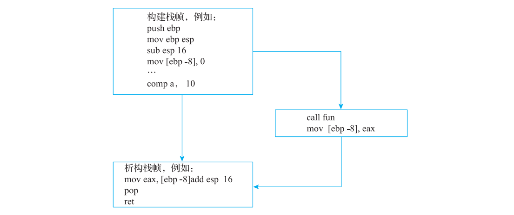

**图 11-3 函数 getSqrt 对应的栈帧示例图**

从图 11-3 中可以看出，函数前言和后序在一些执行路径中是冗余的，例如参数 a 小于10 时，程序流是不会走右侧分支的，此时函数直接返回 0。在右侧分支中使用了栈对象，如果将函数前言和后序放在右侧分支中，那么当右侧分支不执行时将会有较好的性能提升。优化示意图如图 11-4 所示。

优化后发现，当右侧分支不执行时，和优化前相比执行的指令数得以大大减少，这种优化称为栈帧收缩。目前 LLVM 的实现可以简单总结如下。

<!-- PDF page 349; printed page 336 -->

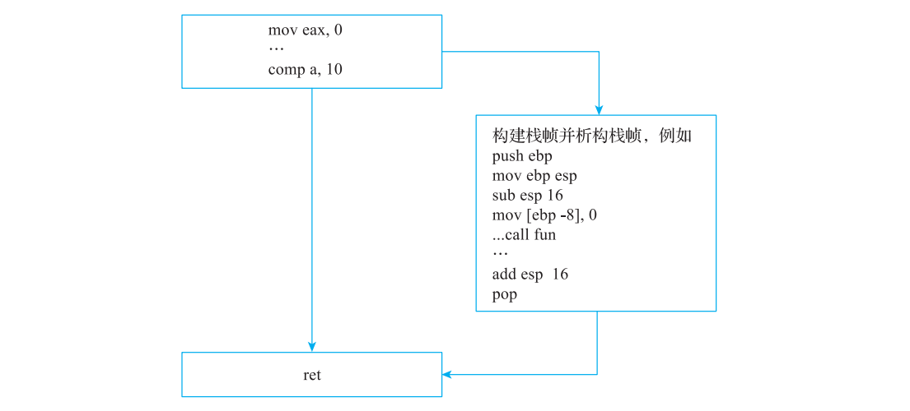

**图 11-4 函数 getSqrt 栈帧生成位置优化情况**

1）针对函数的基本块，以 PROT 顺序遍历（PROT 顺序将保证优先遍历叶子节点）基本块中的每一条指令：

① 如果指令没有使用 CSR 或者栈对象，则处理下一条指令。

② 否则说明基本块是候选的函数前言 / 后序的插入位置，可以尝试更新 save、restore变量的位置（save 和 restore 保存基本块的位置）。但是能否更新 save 和 restore 指令的位置，依赖于以下判定。

T save 应该支配基本块，所以 save 会更新为支配当前基本块和原来 save 的基本块

（第一次执行 save 为空时，直接赋值为当前基本块）。

T restore 应该逆支配基本块，所以 restore 会更新为逆支配当前基本块和原来 restore

的基本块（第一次执行 restore 为空时，直接赋值为当前基本块）。

T save 也应该支配 restore，否则 save 应该更新为支配原来 save 和 restore 的基本块。

T restore 应该逆支配 save，否则 restore 应该更新为逆支配 save 和原来 restore 的基

本块。

T 如果 save 和 restore 处于循环中，它们应该位于同一个循环体，而非不同的循环体。

2）当处理完所有的基本块后，得到最后的 save 和 restore，save 和 restore 的执行成本应该低于 entry 基本块、exit 基本块的执行成本（执行成本通过执行频率计算），否则需要再更新一次 save 和 restore，更新的方法是：

① 如果 save 的基本块的执行成本高于 entry 基本块的执行成本，将 save 中的基本块更新为支配所有前驱的基本块，同时要求基本块执行成本低于 entry 基本块的执行成本。

② 如果 restore 的基本块的执行成本高于 exit 基本块的执行成本，将 restore 中的基本块更新为逆支配所有后驱的基本块，同时要求基本块执行成本低于 exit 基本块的执行成本。

<!-- PDF page 350; printed page 337 -->

注 第 4 章介绍了支配和逆支配的概念，当支配成立时说明执行当前基本块一定会执行

意

save 变量保存的基本块；当逆支配成立时，执行当前基本块也一定会执行 restore 变

量保存的基本块；反之都不成立。

上述算法当前的实现有一些限制，例如：

1）算法尽可能地寻找唯一的 save/restore 执行点，分别用于存放函数前言和后序，复杂的函数结构计算得到的 save 和 restore 中保存的基本块与 entry/exit 基本块的执行成本相同。

2）算法并未针对 CSR、栈操作分别处理，也导致丧失了一些优化机会。

栈帧范围收缩也有一些进一步优化的论文，例如 Chow Fred 基于数据流分析来优化函数前言和后序插入位置的论文○一。LLVM 在早期也实现了该算法，但由于没有使用也没有测试，因此在 2009 年又被移除。

## 11.2 MIR 优化

在寄存器分配完成后执行的 MIR 优化有 3 个，分别是分支折叠、尾代码重复和复制传播。它们的主要功能如下。

1）分支折叠：通过优化跳转基本块的位置、MIR 指令提升等来消除跳转指令。

2）尾代码重复：将基本块中的代码提升到前驱基本块中，以便消除额外的跳转指令。

3）复制传播：对 COPY 指令进行优化，以消除冗余复制。

下面主要介绍分支折叠和尾代码重复。

### 11.2.1 分支折叠

分支折叠最早出现在硬件设计中，其目的是避免流水线被中断，通过将一些分支指令进行重排，从而达到消除跳转指令或者重排指令后不再中断流水线执行的效果。例如有两条指令，第二条指令为无条件跳转指令，可以将无条件跳转指令的目标折叠到第一条指令的后面，然后将无条件跳转指令删除，从而避免 CPU 执行过程中流水线的中断（参见第8 章）。

在当前的 LLVM 实现中，分支折叠完成的工作不仅仅是单纯地对无跳转指令进行优化，还包括了其他优化，可以分为：

1）尾代码合并（Tail Merge Block）：和尾代码重复（参见第 9 章）做相反的优化动作。该优化能否执行依赖于后端。一般来说，如果后端允许修改 CFG 则可以执行，否则不能执行（例如 GPU 可能不允许修改 CFG）。

○一 论文参考链接：https://dl.acm.org/doi/pdf/10.1145/960116.53999。

<!-- PDF page 351; printed page 338 -->

2）基本块优化：除了传统意义上的分支折叠，还包括死基本块删除、空基本块消除、相同分支基本块合并等。

3）代码提升：将公共代码向上提升，减少代码大小。

4）跳表优化：针对跳表进行优化。

下面对这 4 种分类分别进行介绍。

1. 尾代码合并

尾代码合并主要有 2 种情况。

（1）将函数中所有没有后继基本块的基本块进行合并

执行该优化的逻辑：如果函数中存在没有后继基本块的基本块（即作为出口），当有多个出口时，可以将公共指令合并到一个新的基本块中，这样可以减少代码量。例如，三个基本块 A、B、C 的尾部有部分代码相同，首先在所有可以合并的基本块中寻找尾代码重复最多的基本块，然后进行合并。示意图如图 11-5 所示。


**图 11-5 所有出口基本块的尾代码合并前示意图**

基本块 A 和 B 尾部有 4 条指令相同，所以将 A 和 B 的尾代码进行合并，一般来说合并时会创建一个新的基本块，将相同代码放置在新的基本块中。实际上，编译器会选择一个基本块（本例中为基本块 A），从 A 拆分出基本块 D，并在 B 中添加一条无条件跳转指令（图 11-6 中为 jmp D），将基本块 D 设置为 A 的后继基本块（本质上要求拆分后的 A 和 D 直通）。得到的结果如图 11-6 所示。

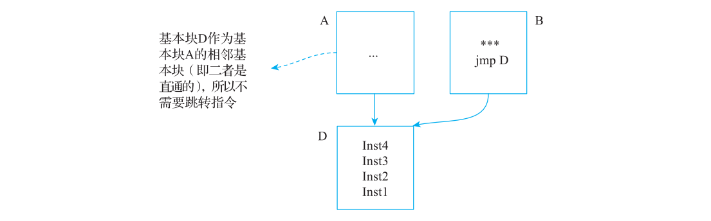

**图 11-6 基本块 A 和 B 进行尾代码合并示意图**

在图 11-6 中，基本块 C 和新创建的基本块 D 仍然有 3 条指令相同，所以还可以进行一

<!-- PDF page 352; printed page 339 -->

轮新的尾代码合并，最终的结果如图 11-7 所示。

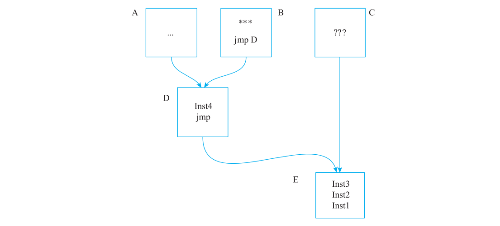

**图 11-7 基本块 C 和 D 进行尾代码合并示意图**

在图 11-7 中，假设选择基本块 C 进行分拆，由于基本块 C 和基本块 E 相邻，因此基本块 D 会添加一条无条件跳转指令 jmp。

（2）将基本块的多个前驱基本块进行合并

当一个基本块有多个前驱基本块时，可以尝试把多个前驱基本块的尾部代码进行合并。例如，假设有三个基本块 A、B、CurBB（表示当前正在处理的基本块），基本块 CurBB 的前驱为 A 和 B，A 和 B 有部分代码相同，可以将A 和 B 的尾部代码合并到一个新的基本块中。示意图如图 11-8 所示。

尾代码合并时会创建一个新的基本块 D，假设 D 分别与 A、CurBB 相邻，得到的结果如

**图 11-9 所示。**

**图 11-8 多个前驱基本块存在重复代码示意图**

除了上述基本块的组织关系外，还有另外的场景。假设基本块 A 中有一个无条件跳转指令到基本块 CurBB，基本块 B 的结尾是条件跳转指令，CurBB 不是基本块 B 的直通基本块（即基本块 B 到基本块 CurBB 是通过条件跳转完成），另外基本块 A 和基本块 B 自底向上（除了最后的跳转指令外）存在部分相同指令序列，初始基本块示意图如图 11-10 所示。

<!-- PDF page 353; printed page 340 -->

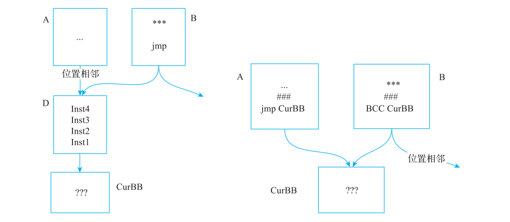

**图 11-9 多个前驱基本块尾代码合 图 11-10 条件跳转基本块和目标基本块位置不**

并示意图 相邻示意图

可以尝试调整基本块 B 和基本块 CurBB 的位置，使它们相邻，由于基本块 B 中包含一个跳转到 CurBB（BCC CurBB）的条件指令，可以将条件逻辑进行反转，使该跳转指令跳转到另外一个基本块 D（Reverse BCC D）。将基本块 A 和基本块 B 中相同的指令合并到基本块 AB 中，合并后的示意图如图 11-11 所示。

实际上，在尾代码合并过程中还有很多细节，例如：

1）在计算基本块是否可以合并时，不仅仅考虑相同指令数，还会考虑其他的因素，用于判断

**图 11-11 对图 11-10 中的基本块排布进行**

合并后是否有收益，收益可以通过针对场景的分

合并优化析得到，例如：

① 两个基本块有部分相同的指令，同时一个基本块被另一个基本块包含（有后继关系，且后继基本块的指令完全包含在另外一个基本块中），进行代码合并不仅可以减少代码，还不需要创建新的基本块。

② 当代码合并开启后，如果待合并的相同指令数较少时（通常阈值为两条指令，可以通过设置参数来执行激进的合并，以减少代码），会要求两个基本块都在冷路径中。因为如果基本块都在热路径中，为热路径增加跳转指令会影响执行效率。

2）对于要划分的基本块，目前是找一个执行成本最低的基本块进行划分（这样做相对公平），图 11-6 和图 11-8 演示了对基本块 A 进行的划分，新产生的基本块应该继承所有前

<!-- PDF page 354; printed page 341 -->

驱基本块的执行频率。

3）更新新增的基本块的 LiveIn 等信息。

2. 基本块优化

基本块优化包括优化基本块和删除死基本块。而基本块优化又可以进一步细分为多种优化，包括空基本块消除、相同分支基本块合并、分支折叠等。下面简单介绍一下相关优化。

（1）空基本块消除

空基本块可以被移除，初始 CFG 如图 11-12a 所示，优化后的结果如图 11-12b 所示。

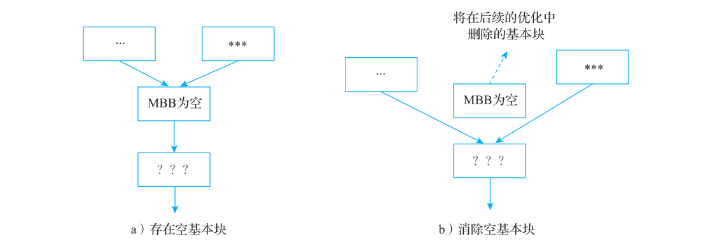

**图 11-12 空基本块消除示意图**

在空基本块消除过程中不需要引入额外的指令，但要保证基本块的相邻关系，否则优化会出错。

（2）相同分支基本块合并

如果基本块中的条件分支指令的两个分支的目的地是同一个基本块，可以将它们合并。示意如图 11-13 所示。

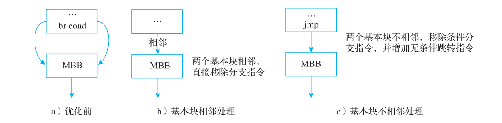

**图 11-13 相同分支的基本块优化分支指令**

在图 11-13a 中，两个条件分支指向同一个基本块，可以将条件分支移除，如果两个基本块相邻，则直接删除分支指令（见图 11-13b）。如果两个基本块不相邻，则增加一条无条件跳转指令（见图 11-13c，在后续的分支折叠中还可以尝试移除该指令）。

<!-- PDF page 355; printed page 342 -->

（3）基本块压缩

如果两个基本块相邻，且后继节点的前驱基本块只有一个，那么可以将后继节点和前驱基本块进行合并。基本块压缩的示意如图 11-14 所示。

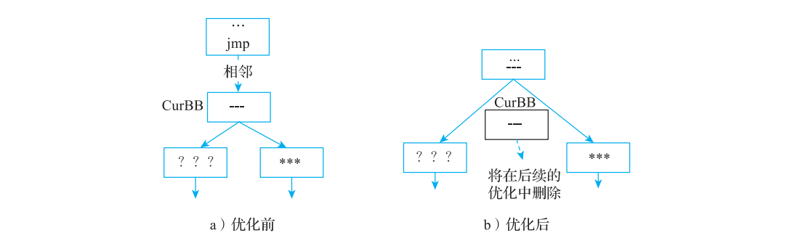

**图 11-14 基本块压缩示意图**

在图 11-14a 中，基本块 CurBB 和其前驱基本块相邻，可以将 CurBB 的指令完全移入到前驱基本块中，CurBB 基本块在后续的优化中可以被删除，得到的结果如图 11-14b 所示。

（4）条件分支移除

如果在基本块中，条件分支指令只在一个分支中存在，而另一个分支为空，则可以移除分支指令或者将其替换为无条件跳转指令，如图 11-15 所示。

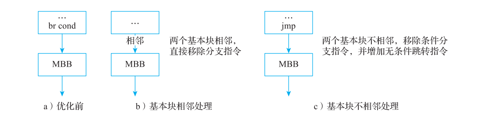

**图 11-15 条件分支移除示意图**

（5）条件分支的条件化简或反转

基本块 prevBB 中条件分支指令的两个分支同时存在，如果有一个分支和 MBB 相邻，则可以根据情况进行条件化简或者条件反转。如果 prevBB 的假分支为 MBB，且 MBB 和prevBB 相邻，则进行条件化简；如果 prevBB 的真分支为 MBB，且 MBB 和 prevBB 相邻，则进行条件反转。条件分支的条件化简示意图如 11-16 所示。

如图 11-16a 所示，基本块 MBB 的前驱基本块 prevBB 的最后指令是条件分支指令，如果假分支指向 MBB，并且 MBB 和 prevBB 是相邻基本块，可以忽略指向 MBB 的跳转指令，将条件分支化简，只需要保留条件分支中指向真分支的条件，得到的结果如图 11-16b所示。如果真分支指向 MBB，并且 MBB 和 prevBB 是相邻基本块，则忽略指向 MBB 的跳

<!-- PDF page 356; printed page 343 -->

转指令，为此将条件分支逆转直接指向其假分支，得到的结果如图 11-16c 所示。

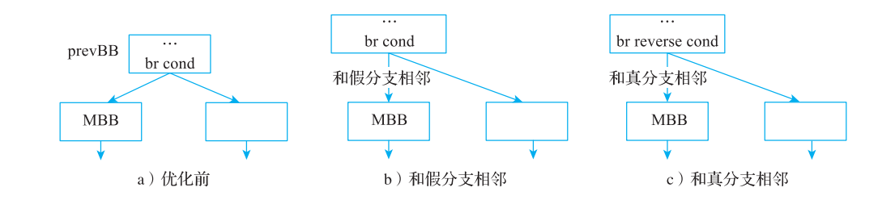

**图 11-16 条件分支的条件化简示意图**

如果 MBB 没有后继基本块，并且基本块 MBB 的后续基本块的相邻基本块是 prevBB的真分支，可以反转基本块 prevBB 中的条件分支跳转指令，即将假分支变成真分支，并且让反转后的假分支和基本块 prevBB 相邻。条件分支反转示意图如图 11-17 所示。


**图 11-17 条件分支反转示意图**

因为 MBB 没有后续基本块，所以 MBB 一定是出口（正常出口或者异常出口），可以将MBB 移至函数尾部。典型的场景是在一个循环中，如果 MBB 属于异常处理，那么将 MBB移至函数尾部将有利于冷热代码分离。在本例中，如果 prevBB 和 MBB 相邻，首先将条件分支反转，让假分支和 prevBB 相邻（由于分支条件反转，反转以后原来的假分支变成了真分支），然后将 MBB 移至函数尾部。

（6）连续跳转指令合并

如果基本块和前驱基本块组成的指令序列存在连续分支跳转，则在一定条件下可以将连续跳转指令进行合并，如图 11-18 所示。

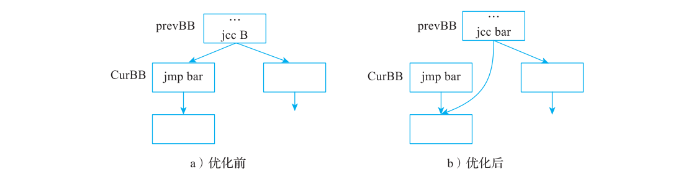

**图 11-18 连续跳转指令合并示意图**

<!-- PDF page 357; printed page 344 -->

在图 11-18a 中，prevBB 和 CurBB 两个基本块中存在特殊的序列。例如，x86 后端可以尝试将 jcc C; jmp bar 这样的特殊序列优化为一条跳转指令：jcc bar。变换后基本块 CurBB可能进一步被优化，如果没有其他基本块到达基本块 CurBB，则 CurBB 可以作为死基本块删除。

该优化执行时约束比较多，主要的原因是该优化可能有副作用。例如，当基本块CurBB 是热路径时，经过这样的优化后会影响后续代码布局，从而导致性能问题。目前仅仅 x86 后端支持该优化，且只在优化代码量的场景中才会执行该优化。

（7）循环中条件分支的条件反转

对循环中的分支进行优化，将条件分支中的真分支作为循环体，因为真分支预测执行的效率更高，可以获得较高的执行性能收益。如果循环中条件分支的假分支执行指向循环体，则对条件分支进行反转。循环条件反转示意图如图 11-19 所示。

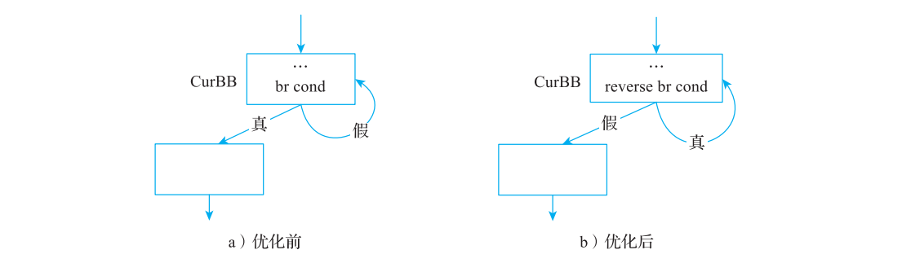

**图 11-19 循环条件反转示意图**

图 11-19a 的真分支指向循环结束的基本块，假分支指向循环体。将条件分支中的条件进行反转，得到的结果如图 11-19b 所示。假设图 11-19a 对应的代码为 Loop: xxx; jcc Out; jmp Loop，可以发现真分支为 Out，假分支指向循环体，将条件分支的条件反转，结果为Loop: xxx; jncc Loop; jmp Out。循环执行时一般预测在真分支执行，将整个循环体和循环跳转排布在一起可以提高执行效率。

（8）无条件跳转指令移除

如果基本块中仅包含无条件跳转指令，则考虑将跳转指令移除。无条件跳转指令移除示意图如 11-20 所示。

因为基本块 CurBB 只包含无条件跳转指令，所以可以将指令删除，同时将所有前驱基本块的后继基本块都替换为跳转指令的目标基本块。这类优化要注意是否需要为前驱基本块增加无条件跳转指令，本例中只有一个前驱基本块增加了无条件跳转指令。假设有一个基本块 A 不是 CurBB 的前驱基本块，且 A 的分支都没有跳转到 CurBB，但是 A 和基本块CurBB 相邻，则需要重构 A 最后的分支指令，让分支指令可以跳转到真实的后续基本块，否则在运行时可能会发生从 A 指令出口直通 CurBB 的情况。

<!-- PDF page 358; printed page 345 -->

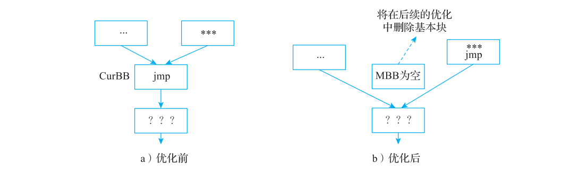

**图 11-20 无条件跳转指令移除示意图**

（9）调整基本块相邻位置

如果遍历基本块的顺序（遍历顺序可以认为是代码生成的顺序，即执行的顺序），发现存在优化的机会，则可以调整基本块的位置，以消除分支指令。基本块位置调整示意图如

**图 11-21 所示。**

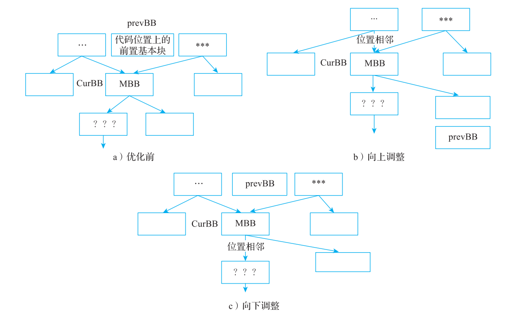

**图 11-21 基本块位置调整示意图**

假设原始 CFG 如图 11-21a 所示，基本块 CurBB 的代码位置上的前置基本块为 prevBB，但是 prevBB 基本块不需要相邻基本块（例如 prevBB 是出口基本块），那么可以将 CurBB的位置进行调整，让 CurBB 和它真正相邻的基本块放在一起。可以向上调整 CurBB，让

<!-- PDF page 359; printed page 346 -->

CurrBB 和其中的一个前驱基本块放在一起，得到的结果如图 11-21b 所示。也可以向下调整CurBB，让 CurBB 和其中一个后继基本块放在一起，得到的结果如图 11-21c 所示。如果允许，还可以将 prevBB 放到函数的最后。

调整的目的就是让基本块其中的一个分支直接和 CurBB 相邻，这样就可以减少一条分支指令。

（10）删除死基本块

死基本块是指没有前驱基本块的基本块（除了 entry 基本块外都应该有前驱基本块），说明基本块不可达，可以删除。删除死基本块不仅删除它自身，还会删除其后继基本块。

3. 代码提升

针对条件分支指令的场景，当基本块有多个后继基本块，尝试从后继节点提取公共代码，并将公共代码提升（上移）。假设有三个基本块 A、B、C，其 CFG 如图 11-22a 所示。

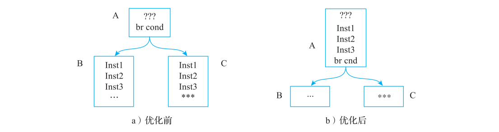

**图 11-22 代码提升示意图**

基本块 A 有两个分支基本块 B 和基本块 C，且基本块 B 和 C 有 3 条公共指令，那么可以将基本块 B 和 C 中的公共指令提升至基本块 A 中，提升后的结果如图 11-22b 所示。

代码提升的逻辑比较简单，但在实现过程中有许多细节，比如：

1）代码提升一定会放在基本块的条件分支指令之前，否则提升的代码可能不会被执行，这时就会产生逻辑错误。因为可能存在多条跳转指令（例如连续存在无条件跳转和条件跳转指令），所以代码提升后的位置必须在所有的跳转指令之前；同时由于跳转指令可能会使用、修改寄存器，如果提升的代码和跳转指令的寄存器存在依赖关系，那么代码是不能进行提升的。

2）代码提升不仅要求两个分支基本块中的指令相同，还要求指令的一些属性也应该相同，例如 dead、killed 状态会影响寄存器的生命周期。如果不同，则对后续指令的影响也不同，不能提升。

3）被提升的指令还需要更新指令的状态，例如要保证指令的 killed 状态设置正确（特别是和分支指令存在关联的情况下）。

4）被提升的指令应该是可以安全移动的（例如移动 volatile 类型的内存访问指令一般是不安全的，call 指令的移动一般也是不安全的）。

<!-- PDF page 360; printed page 347 -->

5）代码提升后，还需要保证两个分支基本块中 LiveIn 等信息仍是正确的。

4. 跳表优化

跳表优化是针对 switch-case 进行的优化，每一个 case 分支都有一个跳表项与之对应，可以将没有使用的跳表项移除。

### 11.2.2 尾代码重复

虽然尾代码重复会增加代码量，但是可能会带来一定的执行效率提升，并且为其他的优化提供更多可能（这里主要指 11.2.3 节介绍的复制传播）。同时，此时执行的尾代码重复限制更少，可以处理 call、ret 指令。例如图 11-23a 所示的情况在前期尾代码重复阶段不能被优化（存在 return 指令），而在此时可以被优化成如图 11-23b 的形式。

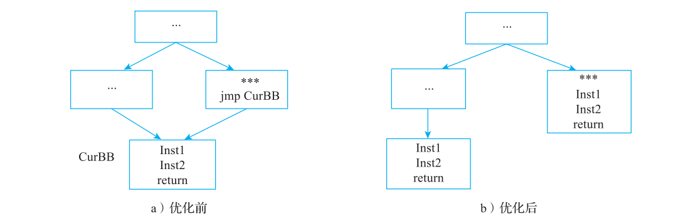

**图 11-23 尾代码重复示意图**

此处执行的尾代码重复优化和 9.1 节介绍的原理一致，主要区别是此时的约束更少（指可以处理 call、ret 指令），同时不再要求 MIR 保持 SSA 形式，实现更为简单，故不再展开介绍。

### 11.2.3 复制传播

这里执行的复制传播和 10.2.14 节中介绍的复制传播完全相同，只不过在后端进行其他优化的过程中会产生额外的 COPY 指令，出现了新的优化机会，所以会再次执行复制传播优化，具体内容不再介绍。

## 11.3 MIR 指令变换和调度

MIR 指令变换主要是针对 MIR 做变化处理，包括伪指令处理、隐式空指针检查、指令调度。

<!-- PDF page 361; printed page 348 -->

（1）伪指令处理

在指令选择以及寄存器分配完成后，理论上所有的 MIR 指令在后端中都有与之对应的指令。但是 LLVM 在 MIR 层面定义了伪指令，这些伪指令并不是真实的后端指令。所以需要一个额外的 Pass 将伪指令转变为后端对应的指令。常见的伪指令有 COPY、SUBREG_TO_REG 等。除此之外，各个后端也可以定义自己的伪指令（在 TD 文件中通过 isPseudo 进行定义）。为什么要定义伪指令？其目的是便于后端处理，例如 MIR 中定义了 ADJCALLSTACKDOWN、ADJCALLSTACKUP 伪指令，是为了便于在栈帧处理以前统一设置基于偏移的栈对象访问；MIR 中定义的 COPY 伪指令是为了将不同后端的复制、移动指令进行统一，方便优化和调度。有些伪指令在其他的优化过程已经处理，这里处理的是剩余的伪指令，不同后端的处理过程不同，例如 COPY 指令在不同的后端需要分别进行实现。

（2）隐式空指针检查

一些动态语言（例如 Java、JavaScript 等）在代码执行时都会进行额外的安全检查，其中空指针检查非常常见。空指针检查引入了隐式检查机制，如果指针对象为空，则进行异常处理（通常是 NullPointerException 异常）。该 Pass 就是为代码插入额外的空指针检查以及进行对应的异常处理。

（3）指令调度

经过寄存器分配后的 MIR 再次进行指令调度优化，此时仅考虑指令的并行性，不用考虑寄存器压力。

伪指令处理比较简单，本节不再介绍，而隐式空指针检查主要涉及动态语言，不在本书的讲解范围内，指令调度相关内容可以参考第 8 章。

## 11.4 MIR 信息收集及布局优化

在完成 MIR 变换以后，会针对 MIR 进行信息分析（用于过程间优化），并进行基本块粒度和函数粒度的优化。这些功能有垃圾回收信息收集、基本块布局优化、支持静态或者动态插桩、寄存器使用分析、异常基本块布局优化、动态栈布局信息收集、调试指令分析、公共代码提取等，对它们的主要功能描述如下。

1）垃圾回收信息收集：为了支持运行时进行垃圾回收，需要两类信息。第一类信息是在哪些地方（也称为安全点）可以执行垃圾回收动作，目前 LLVM 将函数调用视为安全点，会在函数调用前执行垃圾回收动作。第二类信息是识别栈中哪些对象是垃圾回收的根节点（通过 Tracing 算法遍历栈，从而识别堆空间中哪些对象是活跃的）。

2）基本块布局优化：根据基本块的关系、执行频率等信息，将基本块按照一定算法原则进行组织，从而达到较高的缓存利用率，实现高效率的分支跳转。

3）支持静态或动态插桩：编译器支持插桩是为了动态修改编译后的代码。目前 LLVM

<!-- PDF page 362; printed page 349 -->

支持 3 种插桩，分别是 FEntry、XRay 和 PatchableFunction。

① FEntry 插桩是允许外部提供 __entry__ 的函数实现，在链接时将外部 __entry__ 链接到二进制文件中，典型的应用是 Linux 的 ftrace 模块实现。FEntry 在函数头中预留了调用__entry__ 的指令，若外部实现了该函数，则可以实现一些特殊的功能。

② XRay 是 LLVM 提供的对函数调用进行追踪的功能，在函数入口、出口插入记录运行时信息的函数。插桩阶段主要在函数入口、出口生成一些辅助指令，当运行时发现链接了 compiler-rt 库后，这些辅助指令会被替换为一段功能代码（跳转并执行相关的函数），类似于动态打补丁的功能。如果没有链接 compiler-rt 库，这些辅助函数的功能基本等价于NOP 指令（空指令）。XRay 需要配合 compiler-rt 库使用。当然，还可以自定义相关的运行时函数以重写 compiler-rt 中相关的库函数。

③ PatchableFunction 允许通过参数控制，在函数头预留一定数量的空指令（类似于XRay 的实现）或者通过插桩让函数跳转到别的地方执行（目前仅 x86-64 平台支持）。另外，可以通过外部工具（例如 ftrace）对 NOP 指令打补丁，从而实现一些额外的功能。

4）寄存器使用分析：旨在收集函数中的寄存器使用信息，用于过程间寄存器分配优化。处理思路是收集函数中的 Mask 寄存器（即在 callee 中未被保存的 CSR 寄存器）和 Clobber寄存器信息。在 caller 侧分配时，这些信息都可以帮助识别 Mask 寄存器，从而让 caller 有更多可用的寄存器（callee 中没有使用的 CSR 可以在 caller 中使用）。

5）异常基本块布局优化：将异常处理基本块放在非异常基本块的后面（因为异常通常属于冷代码），从而提高执行效率。

6）动态栈布局信息收集：代码支持插桩操作，当执行插桩操作以后，可能需要使用栈布局信息，所以要收集栈布局信息。

7）调试指令分析：对活跃调试指令（DBG_VALUE）进行分析，计算调试指令的范围。

8）公共代码提取：将不同函数中的公共代码提取出来，生成新的函数，然后将公共代码删除，通过 call 指令访问新的函数。该优化主要是为了减少代码量。

9）函数中冷热代码分离：识别函数中冷、热代码后，将热代码放在一起、冷代码放在一起，提高指令缓存（Instruction Cache，iCache）和 TLB 的命中率，从而提升程序的执行性能。注意，由于该优化会将一个函数中的代码分离存放，为了保证正确性需要增加额外的跳转指令、函数栈信息、调试信息等，会导致代码量变多。

代码布局相关优化是近些年的研究热点，相关的优化方向包括基本块布局、公共代码提取、函数冷热代码分离。下面会介绍一下这 3 个方向的优化算法，本节涉及的其他优化相对简单，不再展开介绍。

### 11.4.1 基本块布局优化

基本块布局一般是指以 CFG 为基础将执行路径中执行频率高的基本块放在一起，重排基本块的顺序，以提高指令缓存的命中率。优化算法通常将 CFG 图中的基本块抽象为顶点

<!-- PDF page 363; printed page 350 -->

（记为 V），将基本块之间可达关系抽象为边（例如两个基本块间有边，表示可以从一个基本块到达另一个基本块，记为 E），基本块边的执行频率表示边的权重（记为 W），因此形成一个图 G = <V, E, W>，然后对图 G 进行优化。

当前 LLVM 的基本块布局优化不仅包含了基本块布局功能，还包含了基本块对齐功能。基本块对齐旨在让生成的代码尽量与缓存行对齐，从而提高执行效率。但是基本块对齐可能会导致代码量变大，因为在基本块对齐的过程中会插入用于对齐的 NOP 指令，因此这里仅讨论基本块布局，不再讨论基本块对齐。

目前 LLVM 有两种算法用于基本块布局优化：一种是基于链合并的思路，另一种是基于 ExtTSP（扩展 TSP）的思路。默认情况下并不会执行 ExtTSP 算法，如果要使用 ExtTSP算法，需要在命令行设置参数 enable-ext-tsp-block-placement 为 true。

1. 链合并算法介绍

基本块布局优化最为典型的算法就是链合并，源自 20 世纪 90 年代 Pettis 和 Hansen 的论文“Profile guided code positioning”。链合并的思路并不复杂，可以简单总结如下。

1）将每一个基本块都初始化为一个链。

2）根据 CFG 和执行的频率尝试将链进行合并，为链（记为 C1）的最后一个基本块寻找一条合并后效果最好的链（记为 C2），并将 C2 的第一个基本块接在 C1 的最后一个基本块后面，从而形成一条新的链。

3）将不能进行合并的链（例如无法找到合并效果最好的链）按照一定的顺序（例如CFG 的遍历顺序）进行合并，最后形成基本块的布局。

4）在合并链的过程中，如果发现基本块的位置发生了变化（例如原来是相邻或者直通的基本块，现在不再相邻），可能需要插入无条件跳转指令来保证正确性。

LLVM 在实现中基本没有脱离上述思路，但针对循环做了特殊处理（优先合并循环构成的链），同时考虑了很多优化细节。目前该实现非常复杂，本节仅简单进行介绍，更多信息可以参考其他资料○一。其实现流程大概可以总结如下。

1）为每一个顶点初始化一个链。

2）针对循环优化进行链合并，内层循环优先级更高。在合并时先尝试重新确定循环链的顺序，通过调整循环中基本块的顺序以减少循环中的跳转次数。另外，在合并的时候不仅考察当前链，还会比较其他链和当前链的交叉基本块的情况，然后做出最优的选择，最后在合并的时候还会尝试进行尾代码重复优化，即将整个基本块在不同的链中重复以减少跳转次数。

3）根据 CFG 图，进行链合并。

4）将还没有合并的链，按照 CFG 遍历顺序进行合并。

○一 例如在 YouTube 上有一个介绍基本块放置的视频，链接地址为 https://www.youtube.com/watch?v=

s9KDITTI0Ro。

<!-- PDF page 364; printed page 351 -->

可以看到 LLVM 中的实现主要有几个增强点，下面分别介绍这几个增强点。

循环调整的目的是调整循环的基本块顺序，从而减少循环体中的跳转次数，示例的 CFG 如图 11-24 所示。

**图 11-24 所示的基本块可能有不同的布局，假设**

BB1 到 BB3 分支执行频率更高，那么布局可能是 BB0 →BB1 → BB3 → BB2 → BB4 → BB5。如果是这样的布局，可以发现 BB1 → BB2 不相邻，需要一条条件跳转指令；BB3 → BB4 不相邻，所以需要一条无条件跳转指令；同理，BB4 → BB1 不相邻，也需要一条无条件跳转指令。因此，需要两条无条件跳转指令、一条条件跳转指令。如果将程序的布局修正为：BB0 → BB3 → BB4 → BB1 →

**图 11-24 待进行基本块布局的 CFG**

BB2 → BB5，可以发现 BB0 → BB1 不相邻，需要一条无条件跳转指令；BB1 → BB3 不相邻，需要一条条件跳转指令；BB4 → BB5 不相邻，也需要一条无条件跳转指令；BB2 → BB4 不相邻，需要一条无条件跳转指令。这样的布局需要三条无条件跳转指令、一条条件跳转指令。看起来后者多一条无条件跳转指令，应该不是最优的指令布局，但是继续分析一下，仅仅关注循环体，可以发现在前者的循环体中有三条跳转指令，分别是 BB1 → BB2、BB3 → BB4、BB4 → BB1（其中包含了 BB1 的分支指令、BB4 的分支指令），后者的循环体中有两条跳转指令 BB1 → BB3、BB2 → BB4（仅仅包含 BB1 的分支指令），所以后者对循环更为友好（如果循环执行次数更多，那么后者明显执行效率更高）。因此 LLVM 中首先对循环进行变换，变换后对循环构建链，关于循环变换更多示例可以参考 LLVM 代码○一。

链路合并优化会考虑链路交叉的情况。假设有三个链 C1、C2、C3。其中 C1 是当前正在处理的链，C1 的最后一个基本块为 BB，BB 的后继基本块为链 C3 的开头基本块 Succ，而基本块 Succ 的前驱基本块除了 BB外还有 SuccPred（位于链 C2 中），如图 11-25 所示。

当尝试将链 C1 和其他链合并时，可以将 C1 中最后一个基本块 BB 的后继基本块 Succ 所在的链 C3 作为和 C1 合并的候选链。但是 Succ 不仅仅是 BB 的后继基本块，也是 SuccPred 的后继基本块，所以需要考虑将 图 11-25 链合并交叉示意图Succ 所在的链 C3 和 C1 放在一起，还是和 C2 放在一起。链合并时需要比较两个分支BB → Succ 和 SuccPred → Succ 的执行频率，如果 BB → Succ 的执行频率比 SuccPred → Succ的执行频率高，那么 C1 和 C3 应该放在一起，反之则 C2 和 C3 应该放在一起。这样的处理

○一 在 LLVM 代码提交中有更多变换示例：https://reviews.llvm.org/D43256。

<!-- PDF page 365; printed page 352 -->

在一般的链合并方法中也会使用。但是 LLVM 还处理了更为复杂的情况，如图 11-26 所示。

**图 11-26 中同样假设 C1 是当前正在处理的**

链，其最后的基本块为 BB，而 BB 有两个后继基本块，分别为 S1、S2，而 S1、S2 同样分别有两个前驱基本块，分别为 BB、SuccPred。

对图 11-26 来说，不仅仅要考虑 BB → S1、BB → S2 的执行频率，还需要考虑 SuccPred →S1、SuccPred → S2 的执行频率，即要考虑 4 条路径的执行频率，并计算得到最优的结果。虽然是 4 条路径，但是可以归结为两种组合，分别是

**图 11-26 链合并多个链相互交叉示意图**

BB → S1、SuccPred → S2（当 BB 和 S1 相邻时，SuccPred 不可能再和 S1 相邻，所以只能选择和 S2 相邻）和 BB → S2、SuccPred → S1，那么只要计算两种组合的执行频率，如果组合 BB → S1、SuccPred → S2 的执行频率更高，那么就选择 C1 和 C3 相邻、C2 和 C4 相邻。

最后 LLVM 实现的基本块布局优化还会判定是否可以进行尾代码重复，并根据重复的情况为不同的分支安排不同的基本块布局。在图 11-27 中，BB->Succ 相邻（图中用蓝色边表示），BB 还有其他的分支，最后其他分支经过基本块 C' 也达到 Succ（即 C' → Succ），但是 Succ 后面还有分支指令跳转到基本块 V 和 E，如图 11-27 所示。

假设路径 BB → Succ 到基本块 V 的执行概率更高，而路径 C' → Succ 到基本块 E 的执行概率也高。对于这样的情况，如果可以把基本块 Succ 进行尾代码重复优化，那么在不同的路径就可以进行不同的布局，如图 11-28 所示。

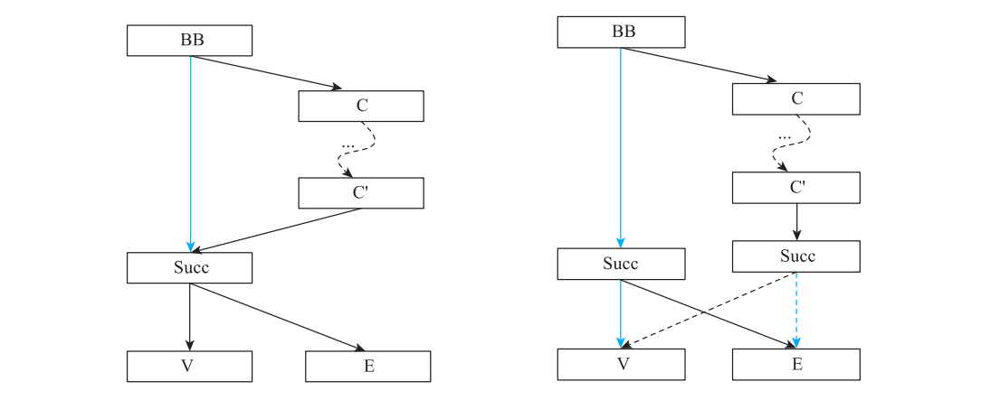

**图 11-27 基本块布局进行尾代码 图 11-28 基本块布局进行尾代**

重复前示意图 码重复优化后示意图

这样的布局既可以满足路径 BB → Succ → V 的执行效率，也能满足路径 BB → C →…

<!-- PDF page 366; printed page 353 -->

→ C' → E 的执行效率。但是需要考虑 Succ 能否进行尾代码重复优化，只有 Succ 满足优化条件才能做这样的优化，另外还需要考虑优化以后该如何布局，即比较不同路径的执行概率。

2. ExtTSP 算法介绍

基本块布局优化问题可以抽象为 TSP（旅行商问题）模型，假设存在 CFG 图 G = <V, E, W>，求一个最大值（F），该最大值用下面的公式表示：

F = ∑ w(s, t)×   1, 如果len(s, t) = 0

(s, t) 0, 如果len(s, t) > 0

其中 s，t 表示基本块，(s, t) 表示从基本块 s 到基本块 t 有一条边，w(s, t) 是边的权重（执行频率，而 len(s, t) 表示基本块 s 到基本块 t 的指令长度，如果基本块 s、t 相邻则长度为 0，如果基本块 s、t 之间存在指令，则指令长度大于 0。

求取指令长度和 TSP 求最大值是完全相同的，早期基本块布局的优化都是以 TSP 模型为基础求解最优基本块布局。在不同基本块的布局和性能关系的研究中，数据表明通过TSP 模型得到的基本块布局展现出卓越的性能水平。（统计数据表明，优化结果和预测结果具有非常高的相关系数。）但是在 TSP 模型中存在个别数据和预测值有较大的偏差的情况，通过进一步分析，发现 TSP 模型主要考虑了执行频率高的基本块，但是并没考虑基本块中跳转指令的影响。假 设 CFG 有 5 个 基 本 块：B0、B1、B2、B3、B4，其执行频率如图 11-29 所示。 图 11-29 基本块执行频率示意图

在图 11-29 中，B0 到 B1 的执行频率为 1000，B0 到 B4 的执行频率为 500，所以优先将 B0 和 B1 排列在一起。同理，B1 到 B2 的执行频率为 995，B1 到 B3 的执行频率为 5，所以将 B1 和 B2 排列在一起。此时，基本块排列的顺序为 B0、B1 和 B2，而 B3、B4 无法同时和 B2 相邻（只有一个可以作为 B2 的后继基本块，因为 B2 已经有前驱基本块 B1），也无法同时和 B0 相邻（只有一个可以作为 B0 的前驱基本块，因为 B0 已经存在后继基本块B1），B3、B4 是随机布局。假设 B3、B4 排在最后，可以得到两种布局方法，如图 11-30所示。

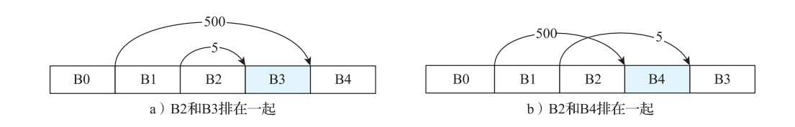

**图 11-30 两种基本块布局示意图**

<!-- PDF page 367; printed page 354 -->

按图 11-30a 和图 11-30b 所示的布局计算得到的 TSP 值是相同的。也就是说，这两个结果都被认为是最优的 TSP 结果。但是在实际情况中 TSP 结果可能并不相同，例如缓存行大小为 64B。为了分析方便，假设每个基本块都占有 16B，所以一条缓存行最多存放 4 个基本块。在图 11-30a 中，B0、B1、B2、B3 在一条缓存行中；而在图 11-30b 中，B0、B1、B2、B4 在一条缓存行中。B0 到 B4 的执行频率为 500（B0 到 B1 的执行频率 1000，B0 到B4 的执行频率为 500，所以 B0 有 1/3 的概率执行到 B4），当程序执行 B0 到 B4 时，图 11-30a所示的布局需要两条缓存行，图 11-30b 只需要一条缓存行，这意味着图 11-30a 所示的布局的高速缓存命中概率要比图 11-30b 所示的布局的更高。

因此有学者又提出了扩展 TSP（Extended-TSP，ExtTSP）模型，在 ExtTSP 中不仅仅考虑基本块的执行频率，还考虑跳转的方向和跳转的距离，最后得到修正的 ExtTSP 模型如下所示：

1, 如果len(s, t) = 0



F = ∑ w(s, t)×  0.1×    1− le 1 n 0 ( 2 s, 4 t)    , 如果0 < len(s, t)≤ 1024, 并且s < t

(s, t)  0.1×    1− len 6 ( 4 s 0 , t)    , 如果0 < len(s, t)≤ 640, 并且t < s



0, 其其他他情情况

LLVM 14.0 中引入了 ExtTSP 算法，代码清单 11-4 所示为该算法实现的伪代码。算法输入为图 G = <V, E, W>，输出为排序序列。假设函数的入口基本块为 Entry。

**代码清单 11-4 ExtTSP 算法的伪代码**

```text
Function ReorderBasicBlocks
    for v ∈ V do // 为每一个定点生成一个链，完成后，每个链仅仅包含一个定点
    Chains ← Chains ∪ (v);
    // 当链的个数大于1则进行链合并，最后只有一条链，这个链就是排序后的结果
    while |Chains| > 1 do
        for ci, cj ∈ Chains do // 在所有链中选取两个链，计算合并后的分值
            gain[ci, cj ] ← ComputeMergeGain(ci, cj );
        // 选择合并分值最高的两条链进行合并
        src, dst ← max gain[ci, cj ];
        // 合并两条链为新的链，并将原来的两条链删除
        Chains ← Chains ∪ Merge(src, dst) - {src, dst};
    // 只有一条链，链中基本块的顺序就是最后的顺序
    return ordering given by the remaining chain;

Function ComputeMergeGain(src, dst) // 计算两条链所有可能合并的分值，并选取分值最大的两条链合并
    // 将链dst合并到链src中。链src中的每一个基本块都要作为链dst的插入位置，以计算最大分值
    for i = 1 to blocks(src) do
        // 按照基本块的执行顺序将src拆分成s1和s2，在序号i处打断链
        s1 ← src[1 : i];
        s2 ← src[i + 1 : blocks(src)];
```

<!-- PDF page 368; printed page 355 -->

```text
            EExxttTTSSPP((ss11,, sd2s,t,dsst2)),,iiff EEnnttrryy∉∉ddsstt

scorei = max EExxttTTSSPP((ss22,, sd1s,t,dsst1)),,iiff EEnnttrryy∉∉ss11,, ddsstt

            EExxttTTSSPP((ddsstt,, ss12,, ss21)),,iiff EEnnttrryy∉∉ssrrcc

// 返回合并两条链后的净收益
    return max(scorei)− ExtTSP(src) − ExtTSP(dst);
```

在算法中，函数 ComputeMergeGain 仅仅拆分了链 src，然后计算两条链合并后的分值，并没有以 dst 为目标重新计算分值，算法也不是针对所有基本块布局构成的全空间进行搜索，所以得到的也只是最大可能的最优解（通常求不出最大值，所以只能求最优解）。在计算分值时，将 src 分成两个子链 s1、s2，和链 dst 进行排列组合布局，共计有 6 种可能的布局，然后分别计算分值，选取最大的分值作为拆分的最优解，最后根据所有的拆分子链，取最大的分值作为两条链合并的分值。注意算法将 Entry 基本块进行了排除，因为 Entry 基本块只能在最开头的位置。

相比 TSP 算法（LLVM 实现了该算法），ExtTSP 效果更优，因为 TSP 算法在计算分值时并不会拆分链，仅在链的头部、尾部计算合并后的分值，而 TSP 算法将 src 链进行拆分，之后和链 dst 进行位置布局组合取最优解，所以 ExtTSP 效果会更好，但是 ExtTSP 的计算量也明显更大，上述算法的复杂度为 O(V5)。关于 ExtTSP 的更多内容可以参考原始论文○一。

### 11.4.2 公共代码提取

公共代码提取指的是将多个函数中的公共代码片段提取成一个新函数，然后将多个函数中的公共代码片段删除，再调用新函数。可以看到，该优化和函数内联刚好相反，所以称为外联。和内联的作用相反，该优化通常会降低性能（由于增加了函数调用，因此在函数调用中还可能需要生成函数栈帧相关指令），但是会减少代码，所以该优化通常是 Os 优化等级的组合选项之一，也可以通过 enable-machine-outline=always 在其他编译级别中启用。

首先通过示例看看公共代码提取到底做了什么工作。假设有两个函数 func1、func2，如代码清单 11-5 所示。

**代码清单 11-5 公共代码提取示例源码**

```text
int func1(int x) {
    int i = x;
    i = i * i;
    i += 1;
    i = i * i;
    i += 2;
    return i;
}
```

○一 请参见 A Newell and S. Pupyrev, Improved Basic Block Reordering，于 2020 年发表在 IEEE Transactions

on Computers 期刊上。

<!-- PDF page 369; printed page 356 -->

```text
int func2(int x) {
    int i = x + 51;
    i = i * i;
    i += 1;
    i = i * i;
    i += 2;
    return i;
}
```

以 x86-64 平台为例，默认情况下生成的汇编代码如代码清单 11-6 所示。

**代码清单 11-6 代码清单 11-5 对应的汇编代码**

```text
func1:                                  # @func1
        imul    edi, edi
        lea     eax, [rdi + 1]
        imul    eax, eax
        add     eax, 2
        ret
func2:                                  # @func2
        lea     eax, [rdi + 51]
        imul    eax, eax
        inc     eax
        imul    eax, eax
        add     eax, 2
        ret
```

可以看到 func1、func2 生成的汇编代码有相同的片段，如代码清单 11-7 所示。

**代码清单 11-7 公共代码片段**

```text
imul    eax, eax
add     eax, 2
ret
```

如果可以将代码片段提取到一个公共函数，让 func1、func2 调用公共函数，就可以减少代码。在 Clang 或者 llc 中添加参数 -enable-machine-outliner=always，启用公共代码提取功能，以自动提取公共代码，得到结果如代码清单 11-8 所示。

**代码清单 11-8 公共代码提取后**

```text
func1:                                  # @func1
        imul    edi, edi
        lea     eax, [rdi + 1]
        jmp     OUTLINED_FUNCTION_0             # TAILCALL
func2:                                  # @func2
        lea     eax, [rdi + 51]
        imul    eax, eax
        inc     eax
```

<!-- PDF page 370; printed page 357 -->

```text
        jmp     OUTLINED_FUNCTION_0             # TAILCALL
OUTLINED_FUNCTION_0:                    # @OUTLINED_FUNCTION_0
        imul    eax, eax
        add     eax, 2
        ret
```

可以看到编译器将 func1、func2 中的公共代码被提取成一个新的函数，名字为 OUT- LINED_FUNCTION_0，同时将 func1、func2 中的公共代码片段删除，并改成调用函数OUTLINED_FUNCTION_0（这里使用 jmp 指令而非 call 指令，是进行了尾代码合并优化）。

没有使用公共代码提取功能产生的汇编指令共计 11 条，使用公共代码提取功能后产生的汇编指令是 10 条，所以使用公共代码提取后代码量可以减少。

因为公共代码提取优化需要寻找多个函数的公共代码片段，代码本质上可以看成字符串，将多个函数组合成一个大的字符串，然后在这个大字符串中寻找重复的代码片段，而代码片段实际上是一个子串，所以该问题就变成在字符串中寻找公共子串。假设一个函数为字符串 abc，另一个函数为字符串 ab，将两个字符串 abc、ab 组成一个新的字符串 abcab，只需要针对字符串 abcab 找出所有的公共子串 a、b 和 ab 即可。其中，a 分别位于第 1、4 位，b 分别位于第 2、5 位，ab 起始于第 1、4 位。

有许多方法求解该问题，例如暴力求解、动态规划、后缀树等，其中后缀树的查询性能表现非常优异，但是需要较多的内存空间。另外，构造后缀树难度也比较高，最简单的构造方法的复杂度为 O(n2)，而 Ukkonen 设计了线性的构造方法，本节不讨论构造后缀树的方法，感兴趣的读者可以参考 11.5 节。

下面先来认识一下后缀树，然后了解如何通过后缀树快速找到公共子串，最后学习LLVM 如何将多个函数中的公共代码提取转换为后缀树，以及将求解结果再转换为函数的过程。

1. 后缀树

后缀树是指所有字符串后缀子串构成的树形数据结构。假设有一个字符串 "abcab"，其后缀分别是 abcab（字符串本身）、bcab、cab、ab、b 共计 5 个子串。

注 意 子串 bca、bc、ca 等并不是字符串 abcab 的后缀。

为了演示方便，为每一个字符串添加一个显式的结束标记符号 $，这样可以让多个字符串共享存储空间，并且非常容易区分两个字符串。例如两个字符串 abc、ab，前者包含后者，当两个字符串共享存储空间时，由于 ab 被 abc 包含，只需要存储字符串 abc 即可，但是当遍历 abc 时无法确定它包含了字符串 ab。如果为它们添加字符串结束标记就变成了 abc$、ab$，当两者共享存储空间后，还能确定每一个独立的字符串。上述 5 个字符串用树表示如

**图 11-31 所示。**

<!-- PDF page 371; printed page 358 -->

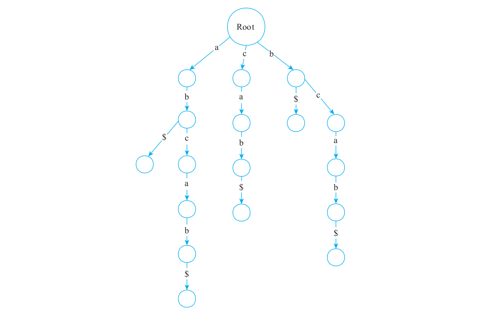

**图 11-31 字符串 abcab 后缀树示意图**

图中后缀树共计有 5 个分支，其中字符串的前缀相同时则共享其存储空间，例如字符串 ab$、abcab$ 共享 ab 的存储空间，在图中表现形式为使用相同的节点。

由于图 11-31 中大量的节点仅仅包含一个输入边和输出边，可以将这些节点进行压缩，形成的后缀树如图 11-32 所示。

压缩的后缀树在寻找字符串的公共子串时有非常好的效果。在后缀树中，从 Root 节点到任意一个中间节点构成的字符串都是公共子串。将图中后缀树的中间节点用蓝色节点表示，如图 11-33 所示。

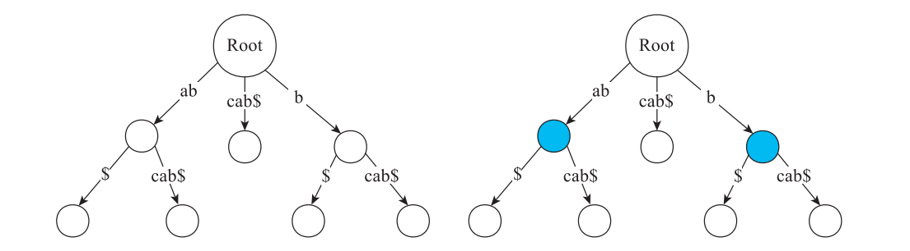

**图 11-32 压缩的后缀树示意图 图 11-33 后缀树表示中的公共子串示意图**

<!-- PDF page 372; printed page 359 -->

**图 11-33 中有两个公共子串，分别是 ab 和 b，而 ab 是字符串 ab$、abcab$ 的公共子串，**

b 是字符串 b$、bcab$ 的公共子串。

注 实际上字符串 ab$、abcab$ 的公共子串除了 ab 外还有 a，因为 ab 已经是公共子串，

意

a 当然也是公共子串，所以 a 被 ab 包含，在压缩树中 a 被压缩到 ab 中。

当构造好后缀树后，只需要寻找从根节点到中间节点的路径就可以找到公共子串。如果在使用后缀树后再辅以字符的位置信息，则不仅可以找到公共子串，还能很容易地为每个公共子串找到对应的位置信息。

2. 为多个函数的指令构造后缀树

后缀树以字符串为基础进行构建，如果直接以函数代码作为字符串构造后缀树，性能会比较差，主要原因是函数代码中的一条指令包含多个字符。例如上面提到的 func1、func2中的公共代码片段只有两条指令，而每一条指令包含了多个字符，直接以指令字符串为基础构造后缀树会产生大量的冗余，导致构造的后缀树性能很差。LLVM 中的公共代码提取会首先对指令进行处理：为每一条指令进行编号，将指令序列变成指令编号序列，同时用一个 < 指令 , 编号 > 二元组保存，在为指令编码时首先查询指令是否已经编号，如果已经编号则直接使用编号，这也意味着该指令和前面已经完成编号的指令重复。

例如上面的例子中，LLVM 将 func1、func2 编码后的序列为 0、1、2、3、4、–3、5、2、6、2、3、4、–2。其中 –3、–2 表示这些指令不能作为公共指令，例如函数栈帧相关的操作指令。然后基于编号构建后缀树，寻找公共子串。本例中的指令编号序列 2、3、4 是公共子串，需要进行公共代码提取。

注 代码提取后不仅要在原来的位置插入额外的 call 指令或者 jmp 指令，可能还需要在

意

提取的新函数中插入函数栈帧、ret 指令等，所以公共代码提取一定要判断收益，否

则代码量可能变大。

接下来将公共代码变成函数，并设置函数属性，活跃寄存器信息（LiveIn、LiveOut）、函数栈帧构建、调试信息等。最后在原来函数中删除公共子代码片段，并使用 call 指令调用新函数或者使用 jmp 指令直接跳转至新函数。

### 11.4.3 函数冷热代码分离

目 前 LLVM 关 于 冷 热 代 码 分 离 有 两 个 相 关 的 实 现， 分 别 是 BasicBlockSection 和MachineFunctionSplitter，二者都依赖 Profile 信息。

1）BasicBlockSection 依赖 PMU（Performance Monitoring Unit，性能监控单元）信息，通过收集到的信息进行变化，再将变化后的信息作为编译输入，从而对基本块按照冷热进行分离。虽然该功能已经合并到 LLVM 主仓代码中，但是使用该功能还需要额外的 Profile

<!-- PDF page 373; printed page 360 -->

信息（一般是通过 perf 工具抓取原始信息后再进行处理），以前谷歌维护了开源的工具，但是目前该工具已经被谷歌删除○一。

2）MachineFunctionSplitter（以下简称 MFS）则是依赖 Profile 信息，根据基本块对应的 Profile 信息判断基本块是否冷热，然后按照三个类型进行分区：热、冷、异常。

下面以 MFS 为例介绍如何进行函数代码的冷、热布局。假设有函数 foo 和 bar，其CFG 如图 11-34 所示。

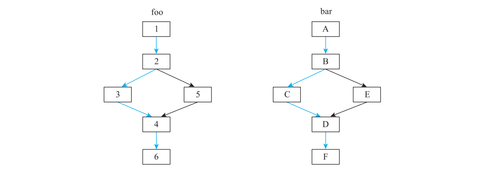

**图 11-34 待进行冷、热布局的函数**

假定函数 foo 和 bar 基本块热路径如图中蓝色路径所示，即函数 foo 中基本块 5 所在的分支执行频率比较低，函数 bar 中基本块 E 所在的分支执行频率也比较低。那么按照基本块布局优化，将一个函数中热路径上的基本块放在一起，冷基本块放在热基本块的后面。因此函数 foo 和 bar 的代码布局都是先放置热基本块再放置冷基本块：foo 函数的 1、2、3、4、6 基本块会放在前面，而 5 基本块放在后面，同时为了保障代码执行的正确性，会在相应基本块末端放置跳转指令。类似地，bar 函数也是一样。为了显示冷、热基本块的不同，基本块 5 和 E 使用灰色底色，此时得到的代码布局如图 11-35 所示。


**图 11-35 进行基本块布局优化的两个函数示意图**

而 MFS 则是更进一步优化代码布局，把多个函数中的热代码放置在一起、冷代码放置在一起。此时得到的代码布局如图 11-36 所示。

为了区别冷、热代码，通常将热代码放在一个分区（指的是 ELF○二中的分区，这里用

○一 参考 https://github.com/google/llvm-propeller。

○二 可执行与可链接格式。

<!-- PDF page 374; printed page 361 -->

text.hot 表示）、冷代码放在另一个分区（用 text.unlikely 表示），在链接时再进行处理。

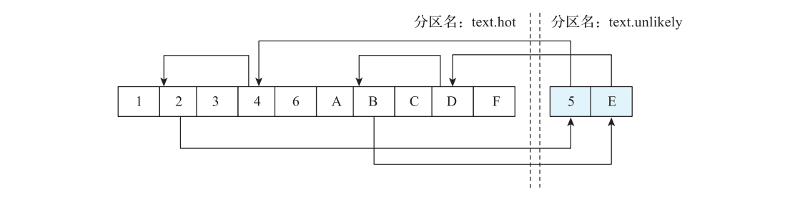

**图 11-36 使用 MFS 优化的函数基本块布局示意图**

简单来说，函数冷热代码分离功能实现主要包括：

1）通过编译优化 Pass 识别基本块的冷热信息，并设置基本块的冷、热标记。

2）根据冷、热标记对基本块进行冷、热分区划分，然后为一些基本块添加跳转指令（除了跳转指令外并不会添加函数栈帧等信息），并保留所有的执行路径。

3）在机器码生成时根据冷、热标记生成对应的机器码，生成的机器码会统一放在热代码的最后。

值得注意的是，在 LLVM 中端优化中有一个过程间优化 HCS（Hot-Cold Splitting，热 –冷代码分离），作用也是分离冷、热代码，作用和基于机器码的代码分离非常类似。但是两者的效果有所不同，主要表现在如下方面。

1）HCS 能够处理的函数必须是满足 SESE（Single-Entry-Single-Exit，单入口 – 单出口）的代码片段。每一个 SESE 区域独立处理；MFS 则是跨函数进行布局。

2）HCS 会将分离的冷代码生成一个函数，并考虑函数调用时的参数和返回值传递；MFS 并不会将冷代码提取为独立函数，而是将多个函数的冷代码集中存放在一起，并添加了跳转指令，实现较为简单。

3）HCS 位于中端优化中，其他的优化（内联、CFG 简化等）会影响 IR，所以 HCS和其他的优化需要考虑联动效果，而且一般要找到一个最为合适的 Pass 顺序是非常难的。MFS 是代码生成中优化的最后一步，优化机会大，且不需要和其他优化 Pass 协同（仅依赖于 Profile 信息）。

注 在 Google 的评估中，使用 HCS 后代码增加较多，使用 MFS 后代码略微增加；使

意

用 HCS 性能并未明显提升，使用 MFS 性能明显提升（来自 iTLB 或者指令高速缓

存收益）○一。

Google 工程师同时给出了一个例子演示 HCS 和 MFS 的区别，如代码清单 11-9 所示。

○一 请参考 https://groups.google.com/g/llvm-dev/c/RUegaMg-iqc/m/wFAVxa6fCgAJ。

<!-- PDF page 375; printed page 362 -->

**代码清单 11-9 HCS 和 MFS 的区别**

```text
@i = external global i32, align 4

define i32 @foo(i32 %0, i32 %1) nounwind !prof !1 {
    %3 = icmp eq i32 %0, 0
    br i1 %3, label %6, label %4, !prof !2
4:                                                ; preds = %2
    %5 =  call i32 @L1()
    br label %9
6:                                                ; preds = %2
    %7 = call i32 @R1()
    %8 = add nsw i32 %1, 1
    br label %9
9:                                                ; preds = %6, %4
    %10 = phi i32 [ %1, %4 ], [ %8, %6 ]
    %11 = load i32, i32* @i, align 4
    %12 = add nsw i32 %10, %11
    store i32 %12, i32* @i, align 4
    ret i32 %12
}

declare i32 @L1()
declare i32 @R1() cold nounwind

!1 = !{!"function_entry_count", i64 7} //注意：要是有MFS或者HCS都必须有Profile数据
!2 = !{!"branch_weights", i32 0, i32 7}
```

这里以 x86-64 系统为例，通过命令行 clang -c -O2 -S -mllvm --enable-split-machine- functions -x ir 来对 11-9.ll 进行 MFS 处理，得到的结果如代码清单 11-10 所示。

**代码清单 11-10 MFS 处理后的 11-9.ll**

```text
foo:                                    # @foo
        push    rbx
        mov     ebx, esi
        test    edi, edi
        je      .LBB0_3 //跳转到冷代码基本块
        call    L1@PLT
.LBB0_2:
        mov     rax, qword ptr [rip + i@GOTPCREL]
        add     ebx, dword ptr [rax]
        mov     dword ptr [rax], ebx
        mov     eax, ebx
        pop     rbx
        ret
.LBB0_3:
        call    R1@PLT
        inc     ebx //直接对ebx进行自增，冷、热基本块属于同一个函数，只不过冷代码位置布局在最后
        jmp     .LBB0_2
```

<!-- PDF page 376; printed page 363 -->

同样以 x86-64 系统为例，通过命令行 clang -c -O2 -S -mllvm --hot-cold-split -mllvm --hot- coldsplit-threshold=0 -x ir 来对 11-9.ll 进行 HCS 处理，得到的结果如代码清单 11-11 所示。

**代码清单 11-11 HCS 处理后的 11-9.ll**

```text
foo:                                    # @foo
        push    rbx
        sub     rsp, 16
        mov     ebx, esi
        test    edi, edi
        je      .LBB0_2
        call    L1@PLT
.LBB0_3:
        mov     rax, qword ptr [rip + i@GOTPCREL]
        add     ebx, dword ptr [rax]
        mov     dword ptr [rax], ebx
        mov     eax, ebx
        add     rsp, 16
        pop     rbx
        ret
.LBB0_2:                                # %codeRepl
        lea     rsi, [rsp + 12]
        mov     edi, ebx //准备函数参数
        call    foo.cold.1 //调用函数
        mov     ebx, dword ptr [rsp + 12] //处理返回值
        jmp     .LBB0_3
foo.cold.1:                             # @foo.cold.1
        push    rbp
        push    rbx
        push    rax
        mov     rbx, rsi
        mov     ebp, edi
        call    R1@PLT
        inc     ebp
        mov     dword ptr [rbx], ebp
        add     rsp, 8
        pop     rbx
        pop     rbp
        ret
```

基本块 6 是冷代码，HCS 会将其变换成一个新的函数。当然新函数不仅要构造函数栈帧，还需要进行读取参数、执行冷代码、处理返回值等一系列操作，通过代码清单 11-10 和

**代码清单 11-11 可以清楚地看出 MFS 和 HCS 的不同之处。**

### 11.4.4 代码布局优化比较

近年来代码布局相关优化是编译优化的热点方向之一，和代码布局相关的优化方法主要有：局部优化、PGO（基于 Profile 的优化，Profile Guided Optimization）、LTO（链接时优化，

<!-- PDF page 377; printed page 364 -->

Link Time Optimization）、PLO（链接后优化，Post Link Optimization）。有些优化方法不仅仅在 LLVM 中端优化中存在，在后端优化中还存在；有些优化方法不仅仅在 LLVM 中存在，还在工具链中存在（例如 BOLT）。本节将对相关优化做一个简单的总结。为了便于读者理解PGO、LTO、PLO 等相关概念，首先来看一下各类代码布局优化执行的时机，如图 11-37 所示。


**图 11-37 编译阶段和优化方法**

**图 11-37 描述的是程序编译、执行过程，在编译阶段可以叠加 PGO，在链接阶段可以**

使用 LTO，在链接后针对二进制文件可以使用 PLO○一，在运行时还可以使用 JIT 动态优化（JIT 不在本书的讨论范围内）。就代码布局来说，优化方法列举如下。

1）局部优化：主要指的是 LLVM 中端或者后端针对单个函数进行优化，比如 MBP 根据执行频率调整基本块顺序（执行频率可以来自 PGO，也可以来自静态预测数据）、提取公共代码。

2）PGO ：通常有两种 PGO 实现：一种方法是对源代码进行插桩（插桩代码主要收集分支执行情况），然后编译、运行，可以得到分支执行情况，并根据分支执行情况对代码进行编译优化；另一种方法是借助硬件、操作系统的能力，最为典型的是通过 PMU 获取程序执行情况，借助执行信息进行编译优化。PGO 主要指的是编译阶段的优化，例如 MBP 可以基于 PGO 做更合适的代码布局优化。

3）LTO ：通常也需要 Profile 信息，将 Profile 信息用于链接时优化，在链接时对函数、基本块进行优化，包括函数布局、基本块布局、函数拆分等。例如 LLVM 中的 Call Graph Sort、HCS 等都属于 LTO 优化。

4）PLO ：在链接完成后，再次根据 Profile 信息对二进制文件进行优化，例如 LLVM中的 BasicBlockSectionl、MFS 等都属于 PLO。除此以外，BOLT 也属于 PLO。

注 LTO、PLO 都是针对二进制文件进行的优化：一是二进制文件生成前进行的优化，

意

二是二进制文件生成后的优化，两者使用的优化方法也很类似。为什么 PLO 还

能作为流行的优化手段？ Facebook 的研究团队在 2018 年发表的论文“ BOLT: A

Practical Binary Optimizer for Data Centers and Beyond”中介绍了为什么 PLO 在叠

加 PGO、LTO 后还有较好优化效果。BOLT 项目针对二进制文件做了更多优化，例

如针对代码布局实现了一系列算法—HFSort、C3、CodeSitechar、PH、PH.BB、

TSP、ExtTSP 等，读者可以尝试使用 BOLT。

○一 LLVM 中也实现了 PLO，被称为 Propeller，它和 BOLT 的作用基本一致，由谷歌的工程师发起该项目，

目前已经合并到 LLVM 主干中。重新实现一个 PLO 的原因是 BOLT 是一个独立的工具，在使用过程需

要额外的命令使能（使用稍微麻烦），最主要的原因是 BOLT 内存消耗比较多，且生成的代码较大，且存

在冗余。

<!-- PDF page 378; printed page 365 -->

## 11.5 扩展阅读：后缀树构造和应用

虽然后缀树在求解很多字符串问题时表现优异，但是后缀树的构造比较复杂，直接基于后缀子串进行后缀树构造的时间与空间复杂度都很高（均为 O(n2)）。对于大型字符串来说使用简单的算法构造后缀树不可接受，直到 1995 年 Ukkonen 实现了对字符串从左到右遍历一次构造后缀树的算法，使得后缀树有了广泛的应用，11.4 节提到的公共代码提取就是基于 Ukkonen 提出的后缀树实现。本节着重介绍 Ukkonen 后缀树的构造原理。

### 11.5.1 后缀树的构造

Ukkonen 算法比较难以理解，我们先介绍更为直观的构造算法，然后再介绍 Ukkonen进行的优化工作。

1. 直观构造后缀树算法

构造后缀树的算法中引入了几个概念，分别是显式节点、隐式节点、尾部链表。

1）显式节点：所有后缀树中的节点，包含了叶子节点和内部节点（非叶子节点）。通常叶子节点是后缀字符串，非叶子节点是多个后缀字符串的共享公共字符串。

2）隐式节点：后缀字符串，但不是后缀树的叶子节点，而是后缀树的内部节点。

3）尾部链表：表示当前“尾部”节点构成的链表，在构造后缀树时会直接在尾部节点添加字符，并更新后缀树。

下面以 abcabxabcd$ 为例构造后缀树。从左至右依次遍历字符串，增量构造后缀树。

首先处理字符 a，因为字符串为 a，所以对应的后缀字符串也是 a，形成的后缀树如图 11-38 所示。

为了表示当前正在处理的节点位置，后缀树使用蓝色链表（就是上面提到的尾部链表，并将蓝色线关联至 Root

**图 11-38 单字符 a 构成的后缀树**

节点）来表示，当有新的字符添加至后缀树时，需要沿着尾部链表进行插入。在当前的后缀树中，可以继续添加字符的尾部节点为 a 和 Root，用蓝色链表链接起来（当处理新的字符时，后缀字符串会自动更新，即需要分别更新 a 节点和Root 节点）。

接着处理字符 b，此时字符串为 ab，后缀字符串为 ab、b。在当前的后缀树中，根据尾部链表的位置来更新后缀树，首先在节点 a 处添加字符 b，形成节点 ab ；在链表指向的Root 节点处，添加字符 b，形成一个新的节点 b。在后缀树中，可以继续添加字符的尾部节点为 ab、b 和 Root，用蓝色链表链接起来，如图 11-39 所示。

继续处理字符 c，直接在尾部链表依次添加字符 c，得到的后缀树如图 11-40 所示。

继续处理字符 a，直接在尾部链表依次添加字符 a，但是对 Root 节点来说已经有一个

<!-- PDF page 379; printed page 366 -->

从 Root 节点出发的路径 abca，因为要在后缀树中共享字符 a，所以需要特殊处理。处理方式为分裂公共节点，即为字符 a 生成一个新的内部节点，这样 a 和 abca 就能共享字符 a，得到的后缀树如图 11-41 所示。

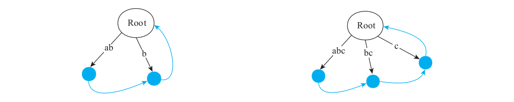

**图 11-39 字符 ab 构成的后缀树 图 11-40 字符串 abc 构成的后缀树**

继续处理下一个字符 b，直接在尾部链表依次添加字符 b，需要在内部节点判断是新增叶子节点还是往下移动字符串，重新产生新的隐式节点。在本例中，因为内部节点后面的一个字符为 b，所以向下移动字符。同时，在 bcab 路径上也要分裂节点 b，最后得到的后缀树如图 11-42 所示。

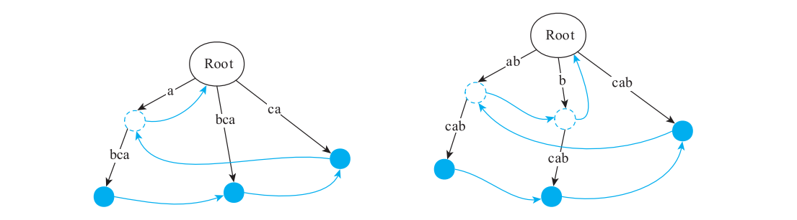

**图 11-41 字符串 abca 构成的后缀树 图 11-42 字符串 abcab 构成的后缀树**

接着处理下一个字符 x，直接在尾部链表继续添加字符 x，在原来的隐式节点新增叶子节点，最后得到的后缀树如图 11-43 所示。


**图 11-43 字符串 abcabx 构成的后缀树**

<!-- PDF page 380; printed page 367 -->

按照同样的方法继续处理剩余的字符串 abcd，得到的后缀树如图 11-44 所示。

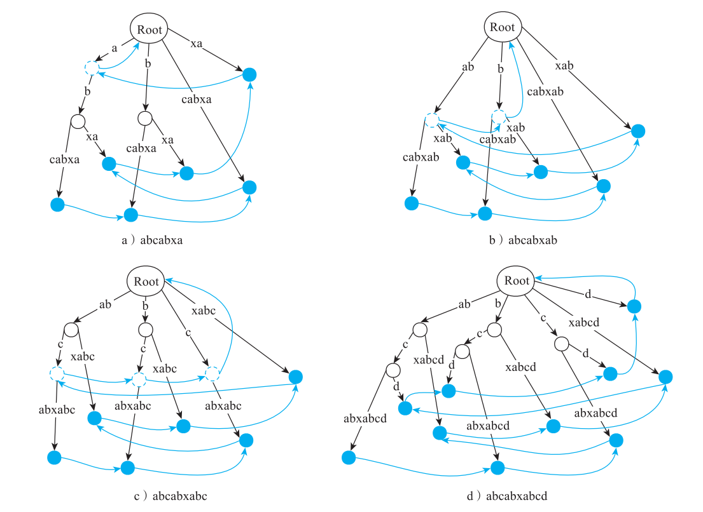

**图 11-44 不同字符串构成的后缀树**

上述算法构造后缀树过程相对比较直观，通过尾部链表跟踪插入位置，遍历一次字符串就可以构造后缀树，但是在构造过程中每次添加新的字符串都需要遍历尾部链表，而随着字符越来越多，链表长度也随之增加，所以整体算法复杂度仍然是 O(n2)。

2. Ukkonen 构造后缀树算法

Ukkonen 在基础算法上做了进一步优化，移除了尾部链表，引入了活跃点和计数器。

1）活跃点（active point）：这是一个三元组，包含了三个信息（活跃位置，活跃边，活跃半径）。活跃位置表示后缀树构建的起点位置；活跃边表示从起点位置出发由字符串形成的后缀字符串；活跃半径指活跃边的长度，和活跃边一起构成了一个后缀字符串，通常这是隐式节点。后缀树构造时的初始值为 (Root, '\0x', 0)，代表活跃位置是根节点，没有活跃边时活跃半径为 0。

2）计数器（remainder）：记录了在当前处理字符之前，尚未正式添加到后缀树的字符个数。因为每次处理字符串的一个字符都会在后缀树中增加新的叶子节点，所以计数器也

<!-- PDF page 381; printed page 368 -->

表示尚未添加到后缀树的叶子节点数。后缀树在构造时的初始值为 1，每处理一个字符时，该计数器会增加 1，每当为后缀树新增一个叶子节点，该计数器减少 1。

为了构建后缀树，Ukkonen 定义了 3 种构造后缀树的规则。

① 规则一：在活跃点为根节点时插入字符。

T 插入叶子节点之后，活跃节点依旧为根节点。

T 如果存在活跃边，且活跃半径大于 1 时，活跃边更新为接下来要更新的后缀首字母

（可以通过计数器计算得到，下面会通过例子进一步介绍），并将活跃半径减１。

② 规则二：添加后缀链接。当处理一个新的字符时，可能需要回溯尚未处理的字符。在回溯过程中，会在后缀树中添加新的叶子节点。如果在插入叶子节点的过程中需要新的内部节点，当插入多个内部节点时，需要将内部节点链接起来，这种链接称为后缀链接（suffix link）。

③ 规则三：在活跃点不为根节点时插入字符。如果当前活跃点不是根节点，从活跃点新增一个叶子节点之后，就要沿着后缀链接到达新的点，并更新活跃节点信息；如果不存在后缀链接，将活跃节点更新为根节点，活跃半径以及活跃边不变。

仍然以字符串 abcabxabcd 为例，建立后缀树。初始时活跃点三元组为（Root, '\0x', 0），计数器为 1。

处理字符 a（在字符串的位置是 0），根据活跃点信息从 Root 节点寻找是否存在活跃半径为 0 的边（包含字符 a），因为此时后缀树为空，所以根据规则一直接插入叶子节点。在构造过程中使用“ #”表示当前位置，在后缀树插入叶子节点，边上的信息使用 [0, #] 表示，得到的后缀树如图 11-45 左侧所示。而由于字符 a 已经处理过了，接着处理下一个字符，并将“ #”更新为 1，所以此时 [0, #] 等价于 [0, 1]，刚好表示字符 a，所以等价的后缀树如图 11-45 右侧所示。 图 11-45 直接构造单字符 a 的

处理完字符 a 后，三元组为（Root, '\0x', 0），计数器为 后缀树0。接着处理第二个字符 b，计数器增加 1（为 1）。由于从 Root 只有一条边是字符 a，所以根据规则一在 Root 下插入叶子节点。处理完字符 b 后，三元组为（Root, '\0x', 0），计数器为 0。接着处理第三个字符 c，计数器增加 1（为 1）。同理在 Root 下插入叶子节点。处理完字符 c 后，三元组为（Root, '\0x', 0），计数器为 0。此时得到的后缀树如图 11-46 左侧所示，根据位置信息，实际上后缀树如图 11-46 右侧所示。

接下来处理下一个字符 a，三元组为（Root, '\0x', 0），计数器增加至 1。由于 Root 有三条边，分别是 a、b、c 开头，此时仅仅更新三元组为（Root, 'a', 1），计数器为 1。此时后缀树如图 11-47 所示。

实际上在后缀树中体现了当前字符子串（abca）的三个后缀 abca、bca、ca，但是并没有体现后缀串 a，它是一个隐式节点，使用活跃点和计数器表示（计数器为 1 表示后缀树还

<!-- PDF page 382; printed page 369 -->

需要插入一个叶子节点）。接下来处理下一个字符 b，三元组为（Root, 'a', 1），计数器增加至 2。此时要比较从 Root 节点出发的边 a 是否继续包含 b，如果包含 b 则继续保持后缀树不变。刚好后缀树中有一条边为 abca，包含了字符串 ab，所以仅更新活跃点和计数器，活跃点为（Root, 'a', 2），计数器为 2。此时的后缀树如图 11-48 所示。

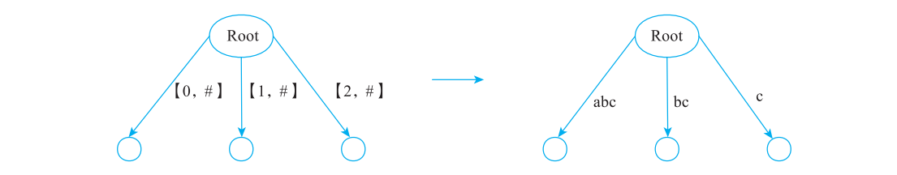

**图 11-46 直接构造字符串 abc 的后缀树**

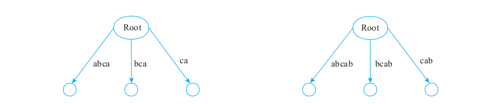

**图 11-47 直接构造字符串 abca 的后缀树 图 11-48 直接构造字符串 abcab 的后缀树**

同理可以发现后缀树尚有两个字符未处理（计数器为 2），即后缀树还需要插入两个叶子节点。接下来处理下一个字符 x，三元组为（Root, 'a', 2），计数器增加至 3。由于从 Root 出发没有一条边包含 abx，所以需要拆分边，拆分位置由活跃点信息确定（从 Root 出发的边 a，活跃半径为 2，即字符 ab），在分割位置插入叶子节点，得到的后缀树如图 11-49 所示。

此时活跃点向前移动到下一个后缀字符 b，所以三元组为（Root, 'b', 1），计数器降至 2。由于从 Root 出发存在边 b，但是也没有边包含 bx，所以需要对边 b 进行拆分，得到的后缀树如图 11-50 所示。

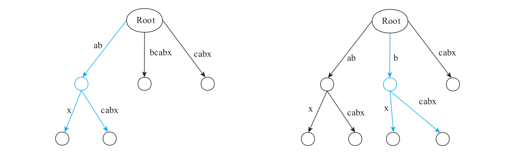

**图 11-49 直接构造字符串 abcabx 的 图 11-50 直接构造字符串 abcabx 的**

后缀树对边 abcab 进行拆分 后缀树对边 bcab 进行拆分

<!-- PDF page 383; printed page 370 -->

此时，在边 ab 和边 b 都创建了内部节点，根据规则二需要为它们创建后缀链接（通过后缀链接可以快速找到需要插入叶子节点的位置），如图 11-51 所示。

让活跃点向前移动，下一个后缀字符为空，所以三元组为（Root, '\0x', 0），计数器降至 1。从 Root 出发没有边 x，所以直接在 Root 下插入叶子节点，得到的后缀树如图 11-52所示。

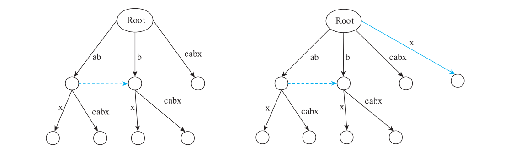

**图 11-51 直接构造字符串 abcabx 的后 图 11-52 直接构造字符串 abcabx 的后缀树并**

缀树并建立后缀链接示意图 在 Root 节点插入叶子节点示意图

此时三元组为（Root, '\0x', 0），计数器为 0。接下来处理第 7 个字符 a，由于从 Root 出发有边 a，所以仅更新活跃点和计数器信息，活跃点为（Root, 'a', 1），计数器为 1，后缀树不变。同样处理第 8 个字符 b，仅更新活跃点和计数器信息，活跃点为（Root, 'a', 2），计数器为 2，后缀树不变。接下来从 Root 沿着边 a 出发，活跃半径为 2，到达一个内部节点，所以将活跃点更新为当前内部节点，记为（node1, '\0x', 0），计数器为 2。注意，此时 node1是后缀链接的起始点。处理第 9 个字符 c，仅更新活跃点和计数器信息，活跃点为（node1, 'c', 1），计数器为 3，后缀树不变。最后处理第 10 个字符 d，此时活跃点为（node1, 'c', 1），计数器信息计数器为 4。根据活跃点信息，由于此时没有一条边包含 cd，所以需要拆分边 c，并插入叶子节点，得到的后缀树如图 11-53 所示。

由于当前活跃点不是 Root， 根据规则三沿着后缀链接继续处理，同时活跃点更新到后缀链接节点，假设节点记为 node2，则活跃点信息为（node2, 'c', 1），计数器降至 3。由于这时活跃点没有一条边包含cd，所以需要拆分边，并插入叶子节点， 图 11-53 直接构造字符串 abcabxabcd 的后缀树对得到的后缀树如图 11-54 所示。 边 abcabxabcd 进行拆分

<!-- PDF page 384; printed page 371 -->

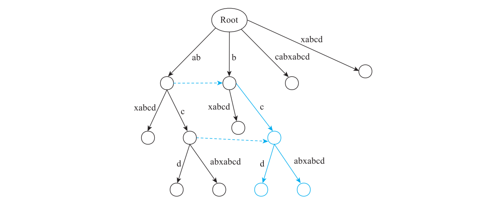

**图 11-54 直接构造字符串 abcabxabcd 的后缀树对边 bcabxabcd 拆分示意图**

继续沿着后缀链接寻找下一个插入叶子节点的位置，发现没有新的后缀链接，所以转至 Root 节点，活跃点信息为（Root, 'c', 1），计数器降至 2。根据活跃点信息，有一条边包含 c，但没有边包含 cd，所以需要先插入内部节点，增加后缀链接，然后再拆分边 c，并插入叶子节点，得到的后缀树如图 11-55 所示。

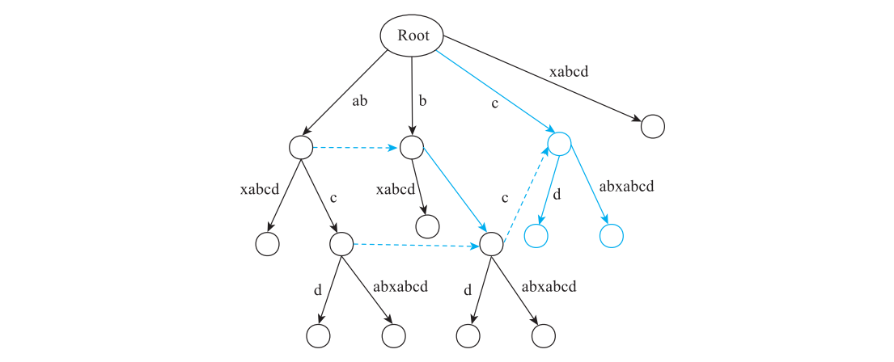

**图 11-55 直接构造字符串 abcabxabcd 的后缀树对边 cabxabcd 进行拆分示意图**

此时的活跃点信息为（Root, '\0x', 0），计数器降至 1。没有边包含字符 d，所以在 Root增加叶子节点，得到的后缀树如图 11-56 所示。

至此后缀树构造完成。本节后缀树构造过程参考了 StackOver 示例○一。

○一 参见 https://stackoverflow.com/questions/9452701/ukkonens-suffix-tree-algorithm-in-plain-english。

<!-- PDF page 385; printed page 372 -->

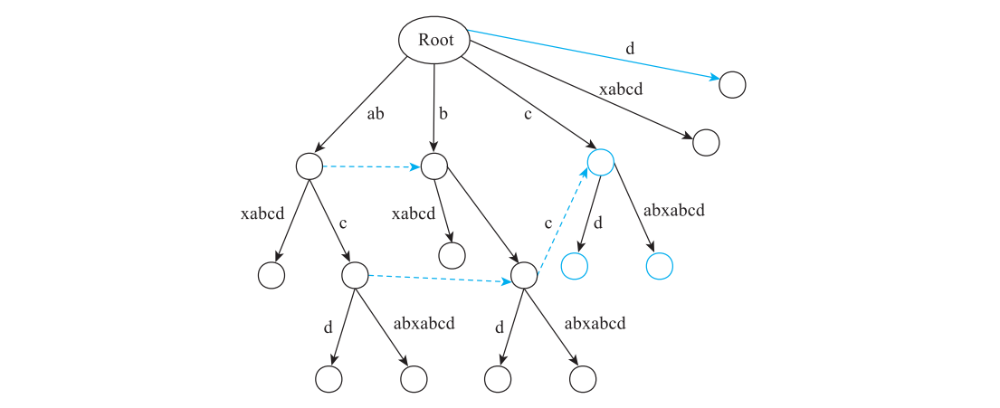

**图 11-56 在根节点插入叶子节点示意图**

### 11.5.2 后缀树的应用

后缀树在字符串处理中使用非常广泛，例如一些典型的字符串处理。

1）查找字符串是否在另一个字符串中，即一个字符串是否为另一个字符串的子串。假设查询字符串 s1 是否为 s2 的子串，解决方法是，用 s2 构造后缀树，在后缀树中搜索字串s1 即可。原理是，若 s1 在 s2 中，则 s1 必然是 s2 的某个后缀的前缀。例如，s2 为 leconte、s1 为 con，判断 s2 是否包含 s1，s1(con) 必然是 s2(leconte) 的后缀之一“conte”的前缀。

2）求解字符串 s1 在字符串 s2 中的重复次数。解决方法是，用 s2+'$' 构造后缀树，搜索后缀树中 s1 节点下的叶节点个数，即可得到重复次数。原理是，如果 s1 在 s2 中重复了两次，则 s2 应该有两个后缀以 s1 为前缀，重复次数自然就统计出来了。

3）查找字符串 s2 中的最长重复子串。解决方法是，用 s2+'$' 构造后缀树，搜索后缀树中最深的非叶子节点。最深是指从 Root 所经历过的字符个数，最深非叶子节点所经历的字符连起来就是最长重复子串。

4）查找两个字符串 s1、s2 的最长公共部分。解决方法是，将 s1#s2$ 作为字符串构造后缀树，找到最深的非叶子节点，且该节点的叶子节点既有 #，也有 $。

## 11.6 本章小结

本章主要介绍 LLVM 进行寄存器分配的一些处理，包括：函数栈帧生成、代码下沉、栈帧范围收缩，以及基于非 SSA 形式的编译优化，如分支折叠、尾代码重复、代码布局等。本章详细介绍了代码布局相关的算法，例如基本块布局、公共代码提取、冷热代码分离等，最后还对公共代码提取中使用的后缀树构造进行了详细介绍。
