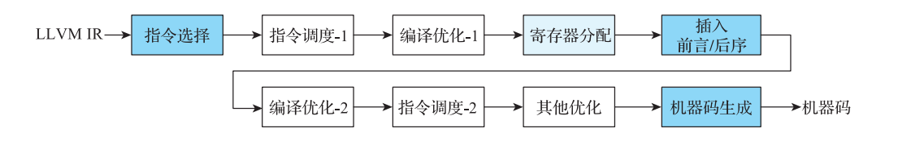
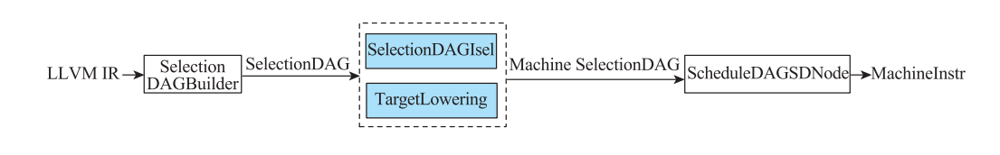
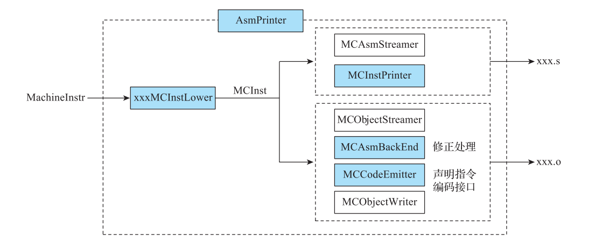
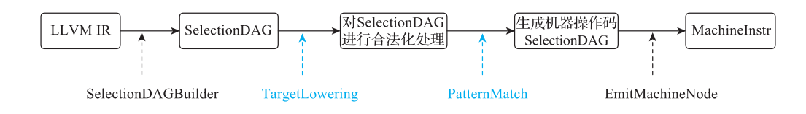

# 第 13 章 添加一个新后端

> 原文转写，未经技术修订。来源：[原 PDF](../pdf/inside-llvm-codegen.pdf)，PDF 第 395–402 页。书中基线为 LLVM 15（示例 15.0.1）。
> 保留原文观点、命令及排印错误；代码缩进按 PDF 坐标恢复。保留原图裁剪及页码标记，图表、公式或特殊字体可对照原 PDF 读取。

<!-- PDF page 395; printed page 382 -->

Chapter 13 第 13 章

添加一个新后端

由于 LLVM 的结构化设计和实现，当为它添加新的后端时，一般来说只需要对后端指令集、ABI○一（Application Binary Interface，程序二进制接口）进行处理即可。新后端只需要实现相关接口就可以把自己注册到 LLVM 代码生成的框架中。但现实情况是，一些后端会定义独有的数据类型、指令等，LLVM 框架通常不能处理，此时需要添加特殊处理功能，否则就会出错。此外，为了生成高质量的后端代码，LLVM 还会针对后端进行一些特有的优化。为了让读者能够更直观地理解，本章将首先介绍在 LLVM 代码生成的全过程中哪些阶段是添加新后端时必须进行适配的。随后，我们将以 BPF 后端为例介绍如何添加一个新的后端。

## 13.1 适配新后端的各个阶段

下面将根据代码生成的过程介绍哪些阶段必须进行新后端的适配，示意图如图 13-1所示。



**图 13-1 必须适配新后端的阶段**

○一 ABI 主要是指程序运行在后端需要遵守的运行约定，例如调用时参数传递、返回值处理等。

<!-- PDF page 396; printed page 383 -->

在图 13-1 中，浅蓝色框（寄存器分配）和蓝色框（指令选择、插入前言 / 后序、机器码生成）共同展示了代码生成过程必须适配的阶段。其中，蓝色框表示需要为新后端实现相关功能，和代码生成框架一起才能完成；浅蓝色框表示新后端仅需要定义描述文件，不需要实现代码；白色框内的优化步骤不是代码生成过程的必要工作，实现这些优化只会影响最后生成的代码质量，而不会影响代码生成。下面将针对每个步骤，简要介绍其基本工作过程。

### 13.1.1 指令选择阶段的适配

指令选择阶段的工作是将 LLVM IR 转换成目标相关的后端 IR 表达 MachineInstr。具体步骤如图 13-2 所示。



**图 13-2 从 LLVM IR 到目标相关的后端 IR 的转换示意图**

从 IR 结构上来区分，指令选择包含 3 个阶段：SelectionDAG 构建、Machine SelectionDAG匹配目标相关的指令操作和 MachineInstr 生成，它们适配后端的情况分别如下。

1）SelectionDAG 构建阶段将输入的 LLVM IR 转换为 SelectionDAG，为后续的匹配过程做准备，这个过程是后端无关的，所以不需要适配。

2）SelectionDAG 匹配目标相关的操作指令过程是指令选择的核心部分，该过程将目标无关的 SelectionDAG 转换成具体目标支持的类型与操作。主要涉及两个类，如图 13-2 中的蓝色框所示。SelectionDAGIsel 类作为一个 Pass，组织管理整个指令选择过程，其中有一些方法，需要具体后端继承该类并实现其中的方法。TargetLowering 类用来处理目标机器不支持的操作和类型、当前函数的入参和返回值，以及函数调用语句的入参准备等。其中，入参准备及函数返回值处理过程涉及调用约定（calling convention）。因此，该过程都是目标相关的，所涉及的类需要具体后端继承并实现相关方法。该步骤生成的 IR 仍然是SelectionDAG 的格式。

3）SelectionDAG 线性化过程是将 SelectionDAG 按照一定规则平铺开来，生成 MIR 形式。该过程也是后端无关的，所以也不需要适配。

### 13.1.2 寄存器分配相关的适配

寄存器分配阶段的输入与输出 IR 都是 MachineInstr。其中，输入的 IR 寄存器类型通常为虚拟寄存器。经过寄存器分配后，虚拟寄存器被分配到具体后端支持的物理寄存器或者栈上。寄存器分配算法的具体实现可以参考第 10 章。LLVM 高度抽象了寄存器分配算法，让算法和具体后端无关。但是在寄存器分配的过程中，需要知道后端定义了哪些寄存器、

<!-- PDF page 397; printed page 384 -->

寄存器类型、个数等信息，这些信息是通过 TD 文件呈现。所以新后端只需要定义寄存器文件就可以自动适配寄存器分配，如图 13-3 所示。


**图 13-3 寄存器分配阶段的适配后端示意图**

### 13.1.3 插入前言 / 后序

在函数的开始和结束位置插入前言 / 后序，以方便调整栈的位置，具体操作由TargetFrameLowering 类实现。TargetFrameLowering 类描述了基本的栈帧布局信息，包括栈的增长方向、栈帧对齐规则、栈帧布局状态等信息。TargetFrameLowering 类声明了一些接口，需要具体后端继承该类并实现相应的接口。

### 13.1.4 机器码生成相关的适配

机器码生成阶段会将 MachineInstr 输出到汇编文件或二进制文件中。文件输出涉及的相关类如图 13-4 所示。



**图 13-4 机器码生成阶段的适配示意图**

其中，每个类的主要工作如下。

1）AsmPrinter ：AsmPrinter 是一个组织、管理文件输出过程的 Pass，不同的后端通常

<!-- PDF page 398; printed page 385 -->

需要定义该文件，一般需要适配。

2）xxxMCInstLower ：输入的 MachineInstr 经处理后先转换为 MCInst，然后依据编译选项决定输出到汇编文件还是二进制文件。该过程和后端密切相关，一般需要适配。

3）MCAsmStreamer/MCObjectStreamer：这两个类是 MCStreamer 的子类，实现了文件输出的相关方法，分别用于输出 MCInst 到汇编文件和二进制文件，这是机器码生成的框架部分，一般不需要适配。

4）MCInstPrinter ：MCStreamer 借助该类实现指令的文本格式输出，MCInstPrinter 和具体后端相关，一般需要适配。

5）MCAsmBackEnd：声明指令修正相关的接口，和具体后端相关，一般需要适配。

6）MCCodeEmitter：声明指令编码接口，和具体后端相关，一般需要适配。

7）MCObjectWriter ：声明写二进制文件的接口，和具体的文件格式相关，但和后端无关，一般不需要适配。

注意，图 13-4 中的蓝色方框的内容一般都是需要适配的。

## 13.2 添加新后端所需要的适配

添加新后端需要的步骤可以总结如下。

1）创建 TD 文件：通过 TD 文件定义指令格式、具体指令、寄存器等基础信息。

2）添加指令选择的目标特例化处理（IselDAGToDAG）：后端定义的指令和指令使用的数据类型与 LLVM 提供的类型可能并不完全一致，此时需要在指令选择过程中将操作和数据进行合法化处理。

3）添加目标调用约定的目标特例化处理（TargetLower）：每个后端都有自己的 ABI 约定，需要根据 ABI 约定实现调用、参数传递、返回值、寄存器保存等功能。

4）添加栈帧的目标特例化处理（FrameLower）：栈空间是基于栈帧基址的中间代码，需要根据 ABI 约定转化为基于寄存器的中间代码。

5）添加后端的汇编输出（AsmPrinter）：处理后端相关的指令，将机器指令转化为 MC。

6）添加后端机器码输出（CodeEmitter）：根据后端定义的指令格式生成对应的汇编、二进制格式（例如 Linux 中 ELF 格式的目标文件），并提供反汇编支持。

7）添加后端特殊处理：如果后端对生成的机器码有特殊的要求，则需要进行实现。

8）添加后端特有优化：对机器码还可以进一步优化，例如窥孔优化，进一步提高生成的机器码指令质量。

9）添加新的目标后端结构，并将目标后端注册到 LLVM 后端框架中，添加成功后可以通过 -target 参数使用新后端；为目标后端添加 TargetMachine 类，通过 TargetMachine 类添加 SubTarget、后端自定义优化 Pass、后端指令选择处理功能等。

接下来以 BPF 后端为例，除了第 7、8 步，其他步骤在 BPF 后端中都有体现。我们将

<!-- PDF page 399; printed page 386 -->

上述工作总结为 5 个方面：定义 TD 文件、指令选择处理、栈帧处理、机器码生成处理和添加新后端到 LLVM 框架中（即添加新后端）。

### 13.2.1 定义 TD 文件

以 BPF 后端为例，需要实现的 TD 文件如下。

1）BPF.td：描述 BPF 后端相关特性（该 TD 文件实际上仅仅描述了下面的 TD 文件）。

2）BPFTargetInstrFormats.td 与 BPFTargetInstrInfo.td ：描述了指令集信息，包括指令的输入 / 输出操作数、指令汇编字符串、指令编码、指令模式等信息。通常，指令集描述文件会包含一个 TargetInstrInfo 的子类，用于一些内容的补充描述，比如 BPF 后端定义的BPFInstrInfo 类。

3）BPFRegisterInfo.td ：BPF 架构所支持的寄存器，用文件 BPFRegisterInfo.td 描述，经 TableGen 生成具体类。BPFRegisterInfo.td 描述了 Callee-Saved 寄存器、保留寄存器（即有特殊用途的寄存器，如帧指针和栈指针）等。

4）BPFCallingConv.td ：为了充分利用有限的寄存器，函数调用过程需要协调好 caller和 callee 所使用的寄存器资源。使两者之间形成一种规则，即调用约定。即 BPF 调用约定，通常包含如下几个方面。

① 传参寄存器：明确哪些寄存器是用于在函数调用过程中传递参数的，比如整型寄存器和浮点型寄存器。

② 返回值寄存器：用来存放函数返回值的寄存器，如指定返回放置浮点类型和整数类型的寄存器。

③ callee-saved 寄存器（被调用函数保存的寄存器）：寄存器的数量有限且珍贵。因此在调用过程中，调用函数和被调函数可能使用相同的寄存器资源，可能导致的问题就是跨函数调用破坏了调用函数的寄存器现场。为了解决这样的矛盾，需要在 TD 文件中约定哪些寄存器需要由被调函数进行保护，从而使得在跨函数调用中，这些寄存器的值保持不变。寄存器的保存是通过栈进行的，即进入被调函数后让 callee-Saved 寄存器入栈，在被调函数结束的位置将其出栈。

④ 参数类型晋升规则：硬件寄存器是有位数的，通常支持 32 位或 64 位的操作，这意味着小于寄存器位数的参数，需要明确其晋升规则，比如 8 位或 16 的参数需要晋升到32 位。

⑤ 栈帧对齐规则：对于参数数量多于传参寄存器的函数，剩余的参数需要通过栈传参，这里需要明确栈的对齐要求。

### 13.2.2 指令选择处理

LLVM 在 指 令 选 择 阶 段 用 SelectionDAG 表 达 LLVM IR 指 令。 指 令 选 择 的 实 现 在BPFISelDAGToDAG.cpp 中，主要完成模式匹配和指令选择，具体步骤如图 13-5 所示。

<!-- PDF page 400; printed page 387 -->



**图 13-5 指令选择适配**

由 于 不 同 的 目 标 机 器 所 支 持 的 数 据 类 型 以 及 操 作 不 同， 指 令 选 择 过 程 需 要 对SelectionDAG 的类型及操作进行合法化处理。比如 ARM32 不支持 64 位整数的操作，要求对 SelectionDAG 层面的 64 位整型数据操作进行处理。该过程需要遍历描述 SDNode 操作类型的枚举值（即 ISDOpcode），明确目标机器不支持的操作和类型，通过 TargetLowering中的 setOperationAction 和 addResisterClass 设置相应的处理方式，这些逻辑应在目标机器的 TargetLowering 子类中实现，如 BPF 后端的实现要放在 BPFTargetLowering.cpp 文件中。对于不支持的操作类型，要在 BPFIselLowering 中添加相应的回调函数 setOperationAction。action 的类型决定了处理方式。Custom 与 LowerOperations 配合，LowerOperations 中应实现所有指定为 Custom 类型的处理。

合法化后，对 SelectionDAG 进行模式匹配。模式匹配的核心逻辑体现在指令描述文件中。比如 BPF 后端，需要编写 BPFInstrInfo.td 文件。

### 13.2.3 栈帧处理

栈通常用两个指针来描述：一个帧指针用于指向栈底，另一个栈指针指向栈顶。LLVM使用 MachineFrameInfo 描述一个抽象的栈帧。TargetFrameLowering 用于处理栈帧布局，包括描述栈增长方向、栈帧对齐方式、局部变量在栈帧中的偏移等。

根据作用，栈帧空间可以划分为不同的区域，包括CSR 区、局部变量区、寄存器分配时的溢出寄存器区、函数调用参数区等。eBPF 平台下的栈帧布局如图 13-6 所示。注意，尽管 BPF 规范支持通过栈传递超出传参寄存器（r1～r5）数量的参数，但在 LLVM 15.x 版本，BPF 后端还未支持通过栈传递参数。

栈帧的基本布局确定下来以后，其具体的偏移在寄存器分配之后才能确定下来。原因是在寄存器分配之前，函数所使用的 callee-saved 寄存器尚不能确定。在寄存器分配之后，所有信息在栈中的偏移均已确定，在插入前言和后序时，可以为 callee-saved 寄存器的入栈和恢复插入相应指令。

在实现一个新后端时，需要添加一个 xxxTargetFrame- Lower 类，以继承 TargetFrameLower 类，并至少实现里面声明的接口。 图 13-6 eBPF 栈帧布局示意图

<!-- PDF page 401; printed page 388 -->

### 13.2.4 机器码生成处理

文件输出所涉及的类在图 13-4 中已经做了一些说明。其中，有些类是需要目标后端继承并实现的，对应到 BPF 后端分别如下。

1）BPFAsmPrinter：实现指令输出函数 emitInstruction 和获取 Pass 名称函数 getPassName。

2）BPFMCInstLower：实现从 MachineInstr 到 MCInst 转换的相关接口。

3）BPFInstPrinter：实现输出 MCInst 到汇编文件的接口。

4）BPFAsmBackEnd：实现 BPF 指令修正的接口。在输出 MCInst 到二进制文件的过程中，用于对存在符号引用的指令进行修复。相关说明请参考 13.2.2 节。

5）BPFMCCodeEmitter：实现指令编码接口，用于在输出 MCInst 到二进制文件的过程中获取指令编码。

### 13.2.5 添加新后端到 LLVM 框架中

在 llvm/lib/Target 目录下，每个后端有一个对应的文件夹。添加一个新的后端需要新建一个文件夹，并将上述实现的目标相关类所在的文件添加到该文件夹中。接下来需要修改一些配置文件，以实现目标后端的注册。

此外，llvm/include/llvm-c/Target.h 定义了目标后端中一些与初始化相关的必要接口，如代码清单 13-1 所示。可参考已经实现的后端，将这些函数实现在相应的文件中。

**代码清单 13-1 在 Target.h 中定义的目标后端初始化接口**

```text
// 声明所有有效的后端初始化函数
#define LLVM_TARGET(TargetName) \
    void LLVMInitialize##TargetName##TargetInfo(void); // 注册新后端，指定新后端的名称
#include "llvm/Config/Targets.def"
#undef LLVM_TARGET

#define LLVM_TARGET(TargetName) void LLVMInitialize##TargetName##Target(void);
    //注册后端优化Pass
#include "llvm/Config/Targets.def"
#undef LLVM_TARGET

#define LLVM_TARGET(TargetName) \
    void LLVMInitialize##TargetName##TargetMC(void);
    // 注册MC层依赖信息，如指令打印入口、输出流等信息
#include "llvm/Config/Targets.def"
#undef LLVM_TARGET
……
```

<!-- PDF page 402; printed page 389 -->

## 13.3 本章小结

本章主要介绍如何为 LLVM 添加一个新后端。本章以 BPF 为例介绍在添加新后端时有哪些工作是必需的。此过程通常需要定义一些基本信息，例如指令信息、寄存器信息、调用约定信息，还需要实现指令选择的适配工作，如根据调用约定生成对应的 SelectionDAG、完成 SelectionDAG 的合法化工作。另外，需要根据后端约定处理栈帧，生成相应的 MC 和机器码，并将新后端注册到 LLVM 框架中。
