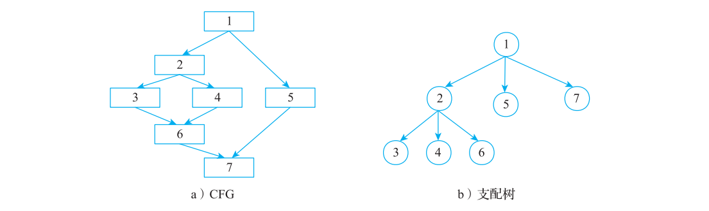
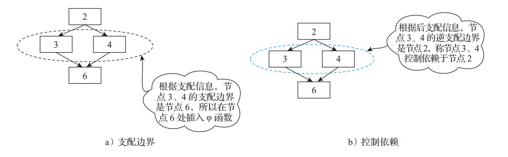
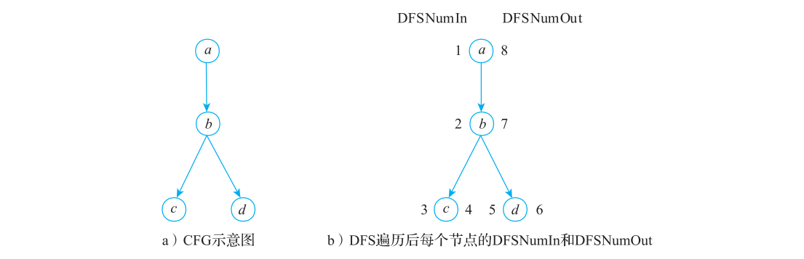

# 第 4 章 支配分析

> 原文转写，未经技术修订。来源：[原 PDF](../pdf/inside-llvm-codegen.pdf)，PDF 第 64–75 页。书中基线为 LLVM 15（示例 15.0.1）。
> 保留原文观点、命令及排印错误；代码缩进按 PDF 坐标恢复。保留原图裁剪及页码标记，图表、公式或特殊字体可对照原 PDF 读取。

<!-- PDF page 64; printed page 51 -->

第 4 章 Chapter 4

支配分析

支配关系在编译优化中非常重要，在 LLVM 中有众多分析和变换依赖于支配分析。例如中端优化 ADCE（Aggressive Dead Code Elimination，激进的死代码消除）、SimplifyCFG、BasicAliasAnalysis、LoopPass 等。本章将介绍支配相关的概念和算法。

## 4.1 支配和逆支配

本节首先介绍支配、逆支配等相关定义，然后分析支配和逆支配的具体含义。

### 4.1.1 支配和逆支配相关定义

给定有向图 G = <V, E, r>，其中 V 表示图的顶点集合，E 表示图的边集合，r 表示图的起始节点集合（或者称为根节点集合、入口节点集合），如果在 G 中存在一条从 r 到节点 v的路径，则称 v 是可达的；反之，如果不存在任何一条从 r 到 v 的路径，则称 v 是不可达的。基于可达或者不可达可以计算图中节点的支配和逆支配关系。

1. 支配

支配（dominance）：如果从 r 出发到达节点 w 的每一条路径都经过节点 v，则称节点 v支配节点 w。我们使用符号 Dom(w) 来表示所有能支配节点 w 的节点所组成的集合。

根据支配关系的定义，对于一个可达的节点 w，根集合 r 和节点 w 一定存在支配节点w，即 Dom(w) ⊇ {r, w}。以可达节点 w 为例，在支配关系中，支配节点 r 和 w 一般称为无价值支配节点（trivial dominator），而 Dom(w) – w 构成的节点集合称为节点 w 的完美支配节点（proper dominator）或者严格支配节点（Strictly Dominators，SDom）。因为在支配中

<!-- PDF page 65; printed page 52 -->

还有半支配节点的概念，其缩写也为 SDom，所以本书不使用严格支配节点的概念，统一使用完美支配节点）。如果存在节点 w 的支配节点 v，满足 v ≠ w 且 v 被 {Dom(w) – w} 中所有的节点支配，则称节点 v 为节点 w 的 IDom（Immediate Dominator，直接支配节点）。

使用直接支配节点构造一棵树，称为 DT（Dominator Tree，支配树），其中节点表示有向图中的节点，边表示父节点直接支配子节点，当计算得到 IDom 时就可以轻易构造出支配树。支配树用于各种优化，例如优化循环、重新排序基本块、调度指令、构建控制流等都会涉及支配树的使用。

支配关系中另一个非常重要的概念是 DF（Dominance Frontier，支配边界）。在 SSA 的构造过程中使用支配边界确定 φ 函数的位置，在 ADCE 中使用逆支配边界来确定控制依赖，从而确定活跃变量。

当且仅当 X 支配 Y 的一个前驱节点，且 X 并不完美支配 Y 时，称 Y 是 X 的一个支配边界。通常 X 的支配边界包含多个节点，是节点构成的集合。

从支配边界的定义可以看出，对于节点 X 的支配边界 Y，一定存在别的路径可以不经过 X 达到 Y（否则 X 就支配 Y），这对 X 来说就意味着，支配边界

X 和 P 之Y 一定是汇聚节点（join point）。根据支配边界的这 X 间可能有一特性可以得到一个重要的结论：如果节点 X 中的 多个节点活跃变量在支配边界 Y 包含的节点中也活跃，那么该 P活跃变量可能来自其他路径，即 Y 中的这些节点是该

X 的支配活跃变量的汇聚节点。在 SSA 的构造过程中，需要 Y1 Y2 边界为汇聚节点插入额外的 φ 函数。因此在 SSA 的构造过程中，首先计算节点的支配边界，然后根据支配边界 图 4-1 支配边界示意图插入 φ 函数。假设 X 支配 P，但 X 不支配 Y1 和 Y2，则 Y1 和 Y2 都是 X 的支配边界，如图 4-1所示。

**图 4-2 为 CFG 及其对应的支配树，该图直观地演示了支配边界的概念。下面使用一个**

例子来演示如何计算支配关系。



**图 4-2 CFG 和其对应的支配树示例**

<!-- PDF page 66; printed page 53 -->

图 4-2a 中 CFG 的入口节点是 1，入口节点支配所有节点；节点 2 支配节点 2、节点 3、节点 4 和节点 6，但是节点 2 并不支配节点 7，因为节点 7 可以通过路径 1 → 5 → 7 到达；节点 3、节点 4、节点 5、节点 6 以及节点 7 都只支配自己。基于上述描述，可以得到每个节点的支配、直接支配、支配边界集合结果，如表 4-1 所示。

**表 4-1 每个节点的支配、直接支配、支配边界集合结果**

节点序号 Dom 支配结果 IDom 支配结果 DF 支配结果

1 1 Ø Ø

2 1、2 1 7

3 1、2、3 2 6

4 1、2、4 2 6

5 1、5 1 7

6 1、2、6 2 7

7 1、7 1 Ø

基于表 4-1 可以非常容易地构造支配树，如图 4-2b 所示。

2. 逆支配

逆支配（post-dominance，也称为后支配）的定义是，如果从节点 w 出发到达每一个CFG 出口（CFG 可能有多个出口）的每一条路径都经过节点 v，则称节点 v 逆支配节点 w。使用符号 Post-Dom(w) 表示所有逆支配节点 w 的节点组成的集合。

仍然以图 4-2a 为例，基本块 7 逆支配基本块 6、5、1，基本块 6 逆支配基本块 2、3、4。得到逆支配树如图 4-3 所示。

逆支配树的计算方式和支配树的计算方式非常类似，通常是将 CFG 进行反转，但因为 CFG 可能存在多个出口，所以一般会引入一个虚拟的出口节点。虚拟出口节点连接原来所有的出口节点，这样构造的逆 CFG 就有一个唯一的出口，

**图 4-3 逆支配树示意图**

进而可以使用计算支配树的算法来计算逆支配树。

### 4.1.2 支配和逆支配含义解析

支配和逆支配在编译技术中是非常重要的概念，但是仅仅知道定义是不够的。下面通过简单的例子来进一步解析其作用。以图 4-2a 中的基本块 2、3、4、6 为例，在表 4-1 中可以看到基本块 2 支配基本块 2、3、4、6，但是基本块 3、4 并不支配基本块 6 ；在逆支配树中，基本块 6 逆支配基本块 2、3、4、6，但是基本块 3、4 并不逆支配基本块 6。结合图 4-2b和图 4-3 可以得到基本块 2 支配基本块 6、基本块 6 逆支配基本块 2，说明到达基本块 2 的所有路径都经过基本块 6。

<!-- PDF page 67; printed page 54 -->

假设有这样一个编译优化需求，将基本块 2 中的指令往下移动（假设往下移动后程序的语义逻辑仍然正确），因为基本块 2 有两条执行路径，所以为了保证程序逻辑的正确性，需要将基本块 2 的指令同时下移到基本块 3 和基本块 4。但是这样指令下移后会导致代码量（code size）变多（基本块 3、4 包含了重复指令），所以在有些场景下并不符合优化预期。但是如果将指令下移到基本块 6（而不是重复放置在基本块 3、4），这样的下移则并不会增加代码量。基本块 6 的位置就可以通过支配和逆支配快速计算得到。

根据支配信息可以计算支配边界，因为支配边界是汇聚点，所以在汇聚点处插入 φ 函数。根据逆支配信息同样可以得到逆支配边界，逆支配边界是分叉点（逆支配信息是基于逆CFG 计算得到），通常也称逆支配边界控制依赖节点。根据图 4-2b 所示的支配树得到节点3、4 的支配边界为节点 6，所以节点 6 便是插入 φ 函数的位置，如图 4-4a 所示。根据图 4-3所示的逆支配树得到节点 3、4 的逆支配边界为节点 2（说明节点 2 是分叉点），也称节点 3、4 控制依赖节点 2，如图 4-4b 所示。



**图 4-4 支配边界和控制依赖示意图**

注 控制依赖研究的是一个基本块的执行是否依赖于另一个基本块的执行。例如两个基

意

本块 A 和 B，基本块 A 能否控制基本块 B 的执行？如果基本块 A 支配基本块 B，

那么基本块 A 执行一定会导致基本块 B 也执行（根据支配定义，所有经过基本块 A

的路径都经过基本块 B），所以基本块 A 不控制基本块 B。但是如果基本块 A 有路

径到达出口，而不用经过基本块 B，则说明基本块 B 控制依赖基本块 A，因此基本

块 A 一定存在多个后继节点。基本块 B 只是其中一个后继节点（基本块 A 相当于一

个控制是否执行基本块 B 的开关），并且基本块 B 不能逆支配基本块 A（即从基本

块 A 出发有其他路径达到出口），同时基本块 A 还应该是距离基本块 B 最近的节点。

（应该将那些较远的节点视为控制基本块 A 的执行，而不应该视为控制基本块 B 的

执行。）综合这些发现，逆支配边界信息刚好就是控制依赖信息。

<!-- PDF page 68; printed page 55 -->

## 4.2 支配树和支配边界的实现

LLVM 中 支 配 树 的 实 现 经 历 过 2 个 版 本， 在 LLVM 8.0 以 前 是 基 于 SLT（Simple Lengauer-Tarjan） 算 法， 在 2017 年 重 新 将 SLT 算 法 实 现 为 Semi-NCA（SemiDominator- Nearest Common Ancestor）算法。其主要原因如下。

1）在静态构建 DT 时，在统计意义上，Semi-NCA 较 SLT 算法有优势（有时会出现Semi-NCA 时间复杂度更高的极端场景）。Google 测试数据显示，如果在 LTO（Link Time Optimization）场景中较多使用了 DT，则性能提升会在 2%～20%。

2）在动态增量构建 DT 时，Semi-NCA 算法可以通过批操作合并多次插入和删除边的操作，以 O(m * min{k, n}+k * n) 的时间复杂度完成 DT 的构建（其中 m 是边的个数，n 是顶点个数，k 表示插入 / 删除边的次数）。

注 Semi-NCA 算 法 在 2004 年 由 Loukas Georgiadis 等 人 提 出（参 见 论 文“ Finding

意

dominators revisited”）。增量构建 DT 是在 2012 年提出，并在 2016 年更新了该算

法（参见论文“An Experimental Study of Dynamic Dominators”）。2017 年，谷歌的

工程师实现了该算法，并用其替换了 SLT 算法。

为什么增量构建 DT 如此重要？首先，在 LLVM 中有众多 Pass 都依赖 DT，同

时很多优化会修改 CFG，这意味着 DT 发生了变化，所以必须在优化后重新构建 DT

或者增量构建 DT。Google 工程师在使用 LTO 针对一些基准测试（如 Clang、SQLite

等）验证时发现，重构 DT 耗时占比达到 3%。而增量构建 DT 在过去数十年又一直

是难点，传统的增量构建算法在插入一条边或者删除一条边时，重新构造支配树的

复杂度为 O(n)，由此可见 m 次修改的时间复杂度为 O(mn)。而 Georgiadis 等人基于

Semi-NCA 算法，证明了 k 次边操作只需要 O(m *min{k, n} + k * n) 的时间复杂度完

成 DT 的增量构建，这对编译器来说非常具有吸引力。在论文中，增量构建 DT 依

赖于 DT 的两个特性：父特性（parent property）和兄弟特性（sibling property）。其中

父特性指的是 DT 中所有从一个可达顶点 v 出发的边，记为 (v，w)，t(w) 是 v 的祖

先，其中 t(w) 是指 w 的父节点；兄弟特征指的是如果节点 v 和节点 w 是兄弟，则节

点 v 不支配节点 w。同时满足父特性和兄弟特性的树是 DT。（相关证明可以参考论文

“ Dominator tree certification and divergent spanning trees”。）通过观察和证明，可以

得出结论：边插入只会影响父特性的变化、边删除只会影响兄弟特性的变化，由此

可知边插入和删除时哪些节点会受到影响，只需要在 DT 中更新这些受到影响的节点

即可。增量更新依赖节点 DFS 遍历时的深度，而 Semi-NCA 天然会保存其深度，所

以使用 NCA 可以快速计算得出受影响的节点以及更新后的支配关系。

另外，增量构建 DT 是批处理算法，当多次更新 CFG 时，每一次更新都是先更新

CFG 后更新 DT，如果不想每次更新 CFG，可以将多次 DT 的更新合并成批量进行（基

<!-- PDF page 69; printed page 56 -->

于最初的 CFG）。另外，谷歌的工程师还增强了原始论文中并未提及的逆支配树（Post

Domianter Tree，PDT）的增量更新，原因是逆支配树中可能会遇到无限循环，需要对

无限循环进行特殊处理，以便准确计算 PDT，更多详细信息可以参考相关资料○一。

本节主要关注 SLT 算法和 Semi-NCA 算法，关于支配树的其他构造算法以及性能比较可以参考 4.3 节扩展阅读的相关内容。

SLT 算法和 Semi-NCA 算法都使用了半支配节点概念，但两个算法在构造 IDom 时有所不同。

### 4.2.1 半支配节点及相关概念

给定一个 CFG，对图采用深度优先遍历，从而构成一个深度优先生成树（Depth-First- Spanning-Tree，DFST 或 DFS）。在遍历每一个节点时记录 DFS 遍历节点的序号，记为dfnum。对 dfnum 进行分析，并做以下定义。

1）前向边（forwarding edge）：在 DFS 中有一条从根节点出发的路径，且路径能从节点v 到达节点 w。如果 dfnum(v) < dfnum(w)，并且节点 w 是 v 的后继节点，则称 v 到 w 有一个前向边。

2）后向边（back edge）：在 DFS 中有一条从根节点出发的路径，且路径可从节点 v 到达节点 w，如果 dfnum(v) > dfnum(w)，并且节点 w 是 v 的祖先，则称 v 到 w 有一个后向边。

3）树枝或交叉边（cross edge）：在 DFS 中有一条从节点 v 到节点 w 的路径，如果dfnum(v) > dfnum(w)，并且 w 既不是 v 的后继节点也不是 v 的祖先节点，则称 v 到 w 有一个树枝（此时 v 和 w 位于 DFS 的不同子树中）。

对于一个节点 U，若存在节点 V 能够通过一些节点 Vi（不包含 V 和 U）到达节点 U，且对于任意节点 Vi 都有 dfnum(Vi) > dfnum(V)，在所有满足条件的 V 中，能使 dfnum(V) 最小的 V 称为 U 的半支配节点，记为 sdom[U] = V。半支配节点的形式化描述为： s

dfnum(

s

v

d

i

o

)

m

>

(

d

v

f

)

n u

=

m (

m

v)

i

，

n{

当

v0

0

| 存

<

在

i <

路

k

径

时

v

成

0,

立

v1,

}

..., vk = v，使得

u 1 按 编号 照 如 D 图 FS 所 遍 示 历 。 后，节点

在 CFG 的 DFS 访问中，如果有一个边 (t，w)，并 节点 w（编号 3）是汇聚

节点，说明从 s 出发到且 dfnum(t) > dfnum(w)，说明边 (t，w) 不是前向边，这意 x 2 t 4 节点 w 有路径，边 (t，w)味着 w 是一个汇聚点（除了前向边外，还有一个交叉 汇聚在节点 w 处，同时

说明 s → w 的路径中有边同时达到节点 w），也意味着在由前向边构成的路径 分叉点 u（编号 1）（从更早遍历的节点 s 到 w）中一定有一个分叉点 u，使 w 3得从分叉点 u 起，有一条路径到达节点 w，此时称 u 为w 的半支配节点，如图 4-5 所示。 图 4-5 半支配节点示意图

○一 请参见 https://llvm.org/devmtg/2017-10/slides/Kuderski-Dominator_Trees.pdf。

<!-- PDF page 70; printed page 57 -->

注 s 到 w 路径中的分叉点 u 可能并不支配 w（即并不属于 Dom(w)），所以称 u 为 w 的

意

半支配节点。例如图 4-6a 为 CFG 图，图 4-6b 中蓝色路径是 DFS 的边。

在图 4-6a 中，节点 0、1、2、3、5 的 sdom 节点和 IDom 节点相同，分别是 0、0、1、0、0，可以通过 sdom 公式计算得到。而对节点 4 来说，从图 4-6b中很容易找到对应的 sdom(4) = 1（节点 1 有分叉节点4，它满足半支配节点定义），但是节点 1 并不支配节点 4（从节点 5 可以达到节点 3 再到节点 4，所以节点1 并不支配节点 5）。

小结：半支配节点隐含了 sdom(n) = u，表示 u 位于前向边构成的一条路径中，而 n 的直接支配节点也一定存在于前向边构成的路径中。但是 u 可能不支配 n，所以 u 是 IDom(n) 的候选节点，如果 u 不是IDom(n)，说明在 u 之上可能还有分叉路径，所以只需要找到分叉点即可（这是一个递归过程）。 图 4-6 分叉点不支配后续节点示意图

### 4.2.2 LT 算法和 Semi-NCA 的差异

现在寻找支配分叉点 u（u 是 w 的半支配节点，记为 sdom）的一个节点 n，n 是 Dom(w)中 dfnum 最大的节点。因为 n 支配节点 w，所以 n 是 Dom(w) 中的一个元素，并且 dfnum 最大，说明节点 n 距离节点 w 最近，那么 n 就是 w 的直接支配节点。又因为 IDom(w) 此时也是未知的，所以需要进一步根据以下规则计算。（LT 和 Semi-NCA 区别就是计算 IDom 的方法不同。）

sdom(w)，如果sdom(w)等于sdom(u)

对 LT 算法来说： IDom(w) =  。

IDom(u)，如果sdom(n)不等于sdom(u)

在 LT 算法中，如果 sdom(w) 等于 sdom(u)，则说明此时 u 就是 n 的直接支配节点，即sdom(w) 等于 u，故有 IDom(w) 等于 sdom(w) ；如果 sdom(w) 不等于 sdom(u)，则说明还需要进一步向上递归查找，查找 sdom(u)、sdom(w) 中 dfnum 小的节点的直接支配节点，即 w的直接支配节点，在递归实现中一般将 w 更新为 sdom(w)，u 更新为 sdom(u) 即可。

对 Semi-NCA 算法来说：IDom(v) = NCA(parent(v), sdom(w))，其中 NCA 是指两个节点的公共节点，parent(v) 是 v 的父节点。

在 Semi-NCA 算法中，假设 w 的父节点为 v，只需要找到 v 和 sdom(w) 的一个公共节点，这个公共节点就是 w 的直接支配节点。

仍然以图 4-6b 的节点 4 为例，求节点 4 的直接支配节点，此时 LT 和 Semi-NCA 区别在于：

<!-- PDF page 71; printed page 58 -->

1）LT 算法：比较 sdom(1) 和 sdom(4) 是否相同，如果不相同则继续比较，最后得到节点 0 是节点 4 的直接支配节点。

2）Semi-NCA 算法：寻找节点 3 和 sdom(4) 的公共节点，即节点 0。

### 4.2.3 支配边界的实现

虽然可以根据定义可以直接求解支配边界，但是算法的复杂度比较高，所以 LLVM 在实现时采用了论文“ A linear time algorithm for placing φ-nodes”○一的算法，该算法的时间复杂度为 O(n)。这个算法的思想和实现都不复杂，它是以支配树为基础构造 DJ-Graph（在支配树的基础上加上 Join 边，支配树中的边称为 D-edge），然后基于 DJ-Grapch 直接计算支配边界。

Join 边的定义：假设 x → y 是 CFG 上的一条边（这里是指直接边），如果 x 不是 y 的直接支配节点（x ≠ idom(y)），则称边 x → y 是一条 Join 边。

根据构造的 DJ-Graph 可以得到以下信息。

1）对 Join 边来说，假设边 x → y，则 y 是 x 的支配边界集合元素，同时 y 也是 x 祖先的支配边界集合元素。

2）如果 y 是 x 的支配边界，可以发现 y 在支配树的层次小于等于 x 的层次（支配树的根节点层次为 0，可以参考图 4-2b）。

3）如果 y 是 x 的支配边界，当且仅当 x 存在一个子树 subTree(x) 记为 z，则 z → y 是Join 边，且 y 的层次小于等于 x 的层次。

由此可得到支配边界的计算方法，如代码清单 4-1 所示：

**代码清单 4-1 支配边界计算方法**

```text
DomFronter(x) {
    DFx =
    foreach z ∈ subTree(x) do
        if ( z→y == Jion-edge) && (y.level <= x.level)
            DFx = DFx U y
}
```

## 4.3 扩展阅读：支配树相关小课堂

支配树在编译优化中使用非常广泛，其研究历史也非常久远，本节首先对求解支配树的不同算法进行介绍和比较，然后介绍如何快速判断两个节点是否存在支配关系。

○一 具体请参考论文 https://dl.acm.org/doi/pdf/10.1145/199448.199464。

<!-- PDF page 72; printed page 59 -->

### 4.3.1 支配树构造算法及比较

本节内容主要来自 Henrik 于 2016 年的论文“ Algorithms for Finding Dominators in Directed Graphs”，更多详情可以参考原始论文○一。

1. 定义法

根据支配树的定义，对于图 G，如果从 s 到 w 的任意一条路径都经过节点 v，则 v 支配w，那么可以得到结论：如果从图中删除节点 v，s 不能到达节点 w，那么节点 v 支配节点 w。由此可以得到算法步骤如下。

1）依次删除图中的顶点 vi。

2）遍历更新后的图，如果从 s 出发无法到达顶点的集合记为 {w1, w2, ..., wk}，则 vi 支配 {w1, w2, ..., wk}。

3）根据支配关系构造支配树。

2. 数据流分析法

根据 CFG 建立的数据流方程，迭代求解每个节点的支配节点。假定 IN[B] 为基本块 B入口处的支配节点集合，OUT[B] 为基本块 B 出口处的支配节点集合，则支配节点的数据流方程的定义如下：

1）OUT[Entry] = {Entry}

2）OUT[B] = IN[B] ∩ {B}, B ≠ Entry

3）In(B) =  Out(P), B ≠ Entry

P∈Pred(B)

这是一个前向数据流方程。因为数据流方程是单调的，所以通过迭代可以得到不动点。根据数据流方程的定义得出：OUT[B] 中的节点都支配 B，即 OUT[B] 就是 Dom(B)。

该迭代算法需要存储每个顶点 Dom，若顶点个数为 n，则每轮迭代计算所有节点交集的总时间为 O(mn)。由于算法最多迭代 n – 1 次，故而总的迭代时间复杂度是 O(mn2)，空间复杂度为 O(n2)。

除了上述的数据流方程外，还有其他研究者构建了不同的数据流方程，不断优化基础数据流方程。例如可以直接基于 IDom 来构建，即 Dom(v) = {v} ∩ IDom(v) ∩ IDom(IDom(v)) ∩IDom(IDom...(v))。其中 IDom 可以通过 NCA 算法来计算，总的迭代时间复杂度是 O(mn2)，空间复杂度为 O(m + n)。虽然时间复杂度不变，但是实际效率更高。

3. 支配树小结

加上 4.2 节中介绍的 SLT 算法和 Semi-NCA 算法，共有 4 种计算支配树的算法，它们的时间和空间复杂度如表 4-2 所示，表中 m 表示边的数目，n 表示顶点个数。

○一 该论文是 Henrik Knakkegaard Christensen 于 2016 年发表的硕士论文，其中详细介绍了各种构造支配树的

方法以及方法的性能，具体可以参考链接：https://users-cs.au.dk/gerth/advising/thesis/henrik-knakkegaard-

christensen.pdf。

<!-- PDF page 73; printed page 60 -->

**表 4-2 求解支配树不同算法的时间和空间复杂度**

算法类别 时间复杂度 空间复杂度

定义法 O(mn) O(m + n)

数据流分析法 O(mn2) O(m + n)

SLT O(mlogn) O(m + n)

Semi-NCA O(n2) O(m + n)

当然支配算法还有很多可以挖掘的细节，但是 Semi-NCA 算法看起来是当前比较稳定的最优选择算法。

### 4.3.2 如何快速判断任意两个节点的支配关系

假设已知控制流图的 DT，如何快速判断任意两个节点 x 和 y 是否存在支配关系？

判断节点之间是否存在支配关系在整个编译优化中的常见操作。在 LLVM 的实现中有两种判断方法供读者参考。

1. 第一种方法

由于已知支配树，故而可以通过遍历支配树进行判断。为支配树的每一层设置一个高度，根节点的高度为 0，叶子节点高度最大。根据支配的特性，可得到以下事实。

1）如果节点 x 支配节点 y，那么 x 的高度一定小于等于 y 的高度。

2）如果 x 的高度等于 y 的高度，且节点 x 等于节点 y，则 x 支配 y。

3）如果 x 的高度小于 y 的高度，且节点 x 等于节点 y 的 IDom，则 x 支配 y。

由上述事实可以得到第一种快速判断任意两个节点支配关系的算法，步骤如下。

1）计算节点 x 和 y 的高度，高度小的节点可能会支配另一个节点。假设 x 的高度小（高度记为 hx），节点 y 的高度大。

2）从 DT 中遍历节点 y 的 IDom，直到 IDom 的高度小于或等于 hx。

3）判断 IDom 和 x 是否相等，如果相等则说明 x 支配 y，否则 x 不支配 y。

2. 第二种方法

第一种方法总是需要遍历 IDom，然后访问高度数据，最后再判断。对高性能场景来说效率略低，故而 LLVM 设计了第二种方法，具体如下：首先对 DT 重新进行 DFS 遍历，同时为每个节点增加 2 个属性，分别为 DFSNumIn 和 DFSNumOut，其中 DFSNumIn 记录的是对 DT 进行 DFS 遍历时第一次被访问节点的序号，而 DFSNumOut 记录的是对 DT 进行DFS 遍历时最后一次被访问节点的序号，可以得到如下结论。

1）父节点的 DFSNumIn 一定小于子节点的 DFSNumIn（DFS 遍历时总是先到达父节点，然后才能访问子节点）。

2）左边兄弟节点的 DFSNumIn 一定小于右边兄弟节点的 DFSNumIn（DFS 遍历时总是

<!-- PDF page 74; printed page 61 -->

先达到左边的节点）。

3）子节点的 DFSNumOut 一定小于父节点的 DFSNumOut（DFS 遍历时总是要求先处理完子节点，再处理父节点）。

4）左边兄弟节点的 DFSNumOut 一定小于右边兄弟节点的 DFSNumOut（DFS 遍历时总是先完成左边节点的处理）。

综合这 4 个条件可以快速判断 x 是否支配 y，如果同时有：① x.DFSNumIn 小于等于 y.DFSNumIn ；② x.DFSNumOut 大于等于 y.DFSNumOut。则 x 支配 y。假设有 CFG 如图 4-7a 所示，经过 DFS 遍历后每个节点的 DFSNumIn 和 DFSNumOut 如图 4-7b 所示。



**图 4-7 通过 DFSNumIn 和 DFSNumOut 判断支配关系**

通过上述规则可以快速判断 4 个节点的支配关系。例如节点 a 的 DFSNumIn（为 1）小于节点 b、c、d 的 DFSNumIn（分别为 2、3、5），同时 a 的 DFSNumOut（为 8）大于节点 b、c、d 的 DFSNumOut（分别为 7、4、6），则节点 a 支配节点 b、c、d。根据这一方法，可以得到节点之间的支配关系如表 4-3 所示。表中每个格子表示每行节点是否支配每列节点，如果行节点支配列节点用√表示；表中节点用类似 a(DFSNumIn, DFSNumOut) 的方式表示，例如 a(1, 8) 表示节点 a 的 DFSNumIn 是 1，DFSNumOut 是 8。

**表 4-3 图 4-7 对应的节点之间的支配关系**

支配节点

被支配节点

a(1, 8) b(2, 7) c(3, 4) d(5, 6)

a(1, 8) √ √ √ √

b(2, 7) √ √ √

c(3, 4) √

d(5, 6) √

<!-- PDF page 75; printed page 62 -->

## 4.4 本章小结

本章主要介绍支配分析相关内容。介绍了支配、支配树、逆支配、逆支配树等基础知识，简单探讨了 LLVM 中支配树和支配边界的演化历程。4.3 节比较了 4 种求解支配树算法的差异。本章最后对 LLVM 如何快速判断两个节点的支配关系进行了介绍。
