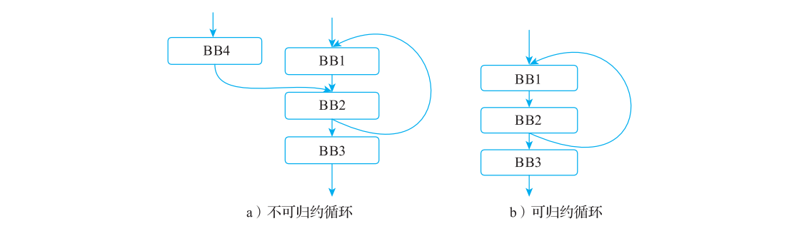
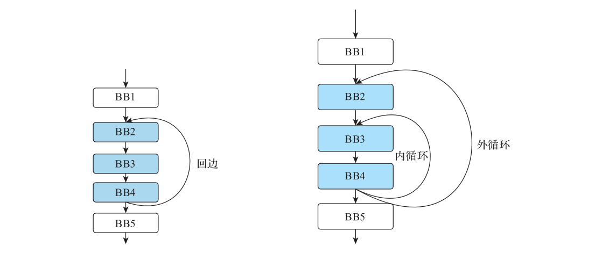
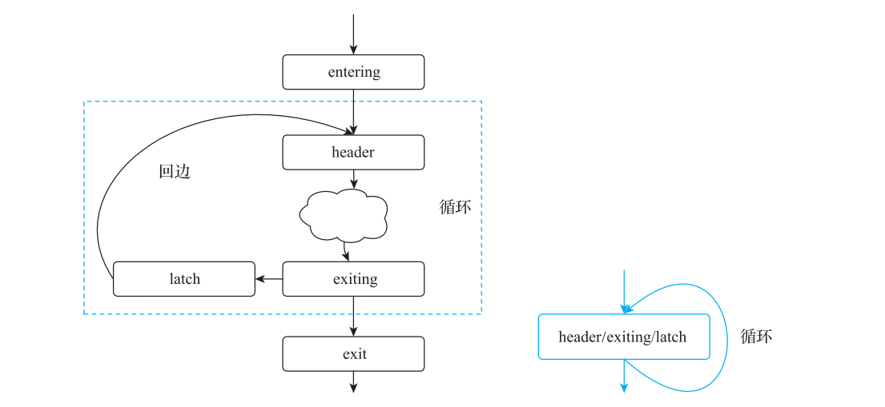
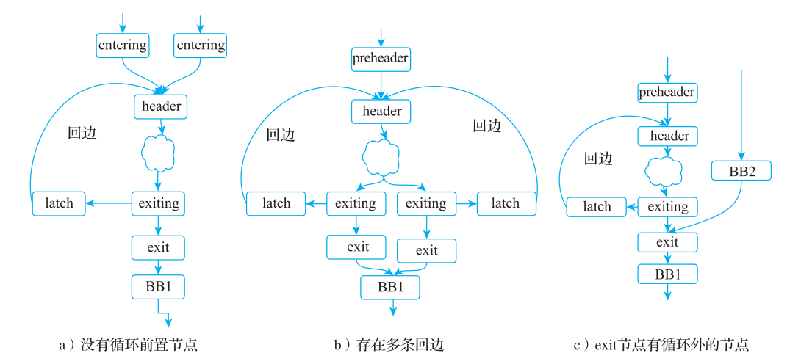
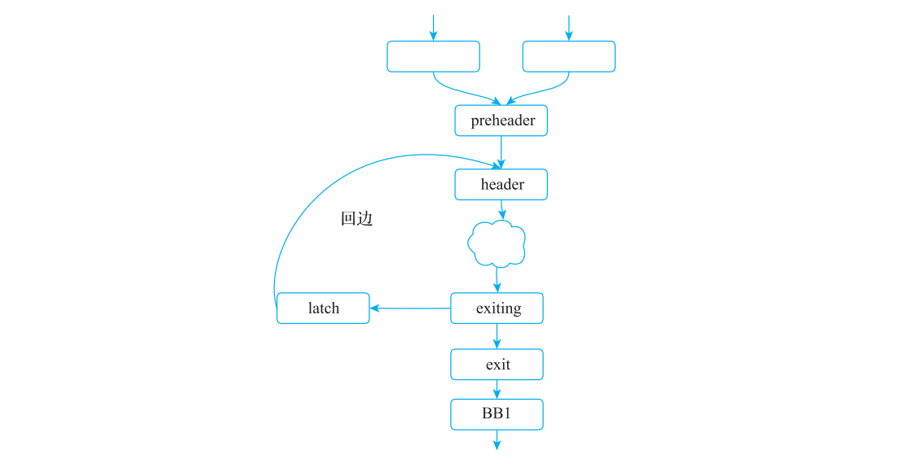
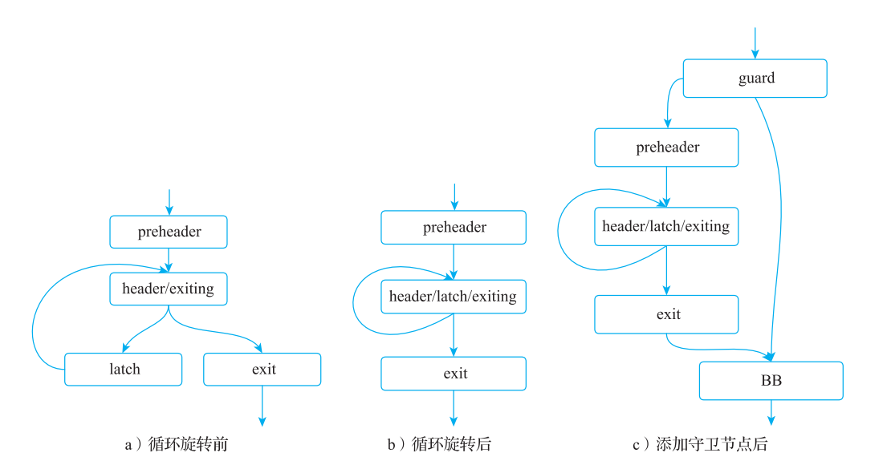

# 第 5 章 循环基本知识

> 原文转写，未经技术修订。来源：[原 PDF](../pdf/inside-llvm-codegen.pdf)，PDF 第 76–84 页。书中基线为 LLVM 15（示例 15.0.1）。
> 保留原文观点、命令及排印错误；代码缩进按 PDF 坐标恢复。保留原图裁剪及页码标记，图表、公式或特殊字体可对照原 PDF 读取。

<!-- PDF page 76; printed page 63 -->

第 5 章 Chapter 5

循环基本知识

循环一般指程序中重复执行的指令序列，从程序的控制流图看，循环是 CFG 中的一个强连通分量子图。强连通指的是有向图中两个顶点存在有向边，可以相互到达；强连通分量子图是有向图中的“极大”强连通子图。“极大”的含义是指把图划分为若干强连通分量后，强连通分量之间不可以相互到达。

根据循环优化的便利性将循环分为两类：可归约循环和不可归约循环。两者的正式定义区分可以参见论文○一，本章简单地根据循环是否具有多个入口节点进行区分。有多个入口节点的是不可归约循环，如图 5-1a 所示；只有一个入口节点的循环是可归约循环，如图 5-1b 所示。



**图 5-1 不可归约和可归约循环示意**

单入口可归约循环又称为自然循环，LLVM 编译器里实现的循环就特指自然循环，其他的现代编译器（如 GCC 等）基本上也只支持自然循环。主要的原因是大部分循环优化方

○一 请参考论文“Characterization of Reducible Flow Graphs”（M.S. Hecht, 1974）。

<!-- PDF page 77; printed page 64 -->

法仅适用于自然循环，不适用于不可归约循环（通常对不可归约循环不做优化）。本章主要介绍 LLVM 实现的循环，只会涉及自然循环的相关内容，因此在没有特别说明的情况下，本章会按照 LLVM 的习惯把自然循环简称为循环。下面首先介绍自然循环的性质，然后介绍 LLVM 实现的循环形态和特性，最后会对本章进行简单总结。

## 5.1 自然循环

自然循环的定义有许多的描述方式，直观地描述是“只有单入口、内部基本块可以构成环的子图”。下面采用支配关系（参考第 4 章）来给出自然循环的正式定义。首先我们需要用支配关系定义回边（Back Edge）。

回边：如果控制流图中存在边的目的节点支配其源节点的情况，则将这条边称为回边。

我们以图 5-2 为例进行说明：假设存在一条从节点 BB2 到节点 BB1 的边，同时节点BB1 支配节点 BB2，则这条边是回边；假设存在一条节点 BB5 到节点 BB3 的边，但节点BB3 不支配节点 BB5（因为存在从节点 BB4到节点 BB5 的路径），所以这条边不是回边。

根据回边的含义，可以定义自然循环为：假 设 一 条 从 节 点 b 到 节 点 h 的 回 边（记 为b → h），其中 h 支配 b，则可以形成一个可归

**图 5-2 回边示例**

约循环；如果节点 x 属于这个自然循环，则满足 h 支配 x，且存在一条可以从 x 直接到 b 的路径且路径不经过 h。

我们根据这个定义就识别出哪些节点构成了自然循环。例如在图 5-3 中存在回边BB4 → BB2，则其构成的自然循环只包含 BB2、BB3 和 BB4，不包含 BB1 和 BB5。因为BB1 到 BB4 必定要经过 BB2，而 BB5 不存在到 BB4 的路径，所以 BB1 和 BB5 不属于这个循环。

通过自然循环的定义，可以在程序的控制流中找出自然循环。但当程序较为复杂的时候，会出现多个自然循环，这些循环会存在嵌套的情况，即一个循环包含另一个循环。为了区分这种包含关系的循环，通常将位于外层的循环称为外循环（outer loop），位于内层的循环称为内循环（inner loop）。如图 5-4 所示，BB3 和 BB4 组成的循环是 BB2、BB3 和BB4 组成的循环的内循环，而 BB2、BB3 和 BB4 组成的循环是 BB3 和 BB4 组成的循环的外循环。

<!-- PDF page 78; printed page 65 -->



**图 5-3 自然循环识别示例 图 5-4 外循环和内循环示例**

## 5.2 LLVM 的循环实现

LLVM 中实现的循环数据结构和循环相关的优化都是基于自然循环，不可规约的循环被当成基本的控制流处理（一般不会被优化）。为了便于后续分析和变换，会根据节点相对循环回边的位置，对一些特定位置节点用特定的术语来命名。主要有：

T header（循环头）节点：回边的目的节点。

T latch（闩）节点：回边的源节点。

T exiting（待退出）节点：可以跳出循环的节点，即它

有不在循环里的后继节点。

相关节点示例如图 5-5 所示。

为了便于优化，在循环外面也定义两种特殊的节点。

T entering（待进入）节点：header 节点在循环之外的

前驱称为 entering 节点。

T exit（退出）节点：entering 节点在循环外的后继

节点。 图 5-5 header、latch、exiting

循环相关的 entering、exit 节点示例如图 5-6 所示。 节点标记

注 在上述示例图中，这些特殊节点都只画了一个。除了 header 节点外，循环中的特殊

意

节点可能会有多个，而且还存在一个节点可以表示多个特殊节点的情况。例如，在

如图 5-7 所示的循环中，它的 3 个特殊节点都是同一个节点。

<!-- PDF page 79; printed page 66 -->



**图 5-6 entering、exit 节点示例 图 5-7 循环节点合并示例**

此外，如果循环的待进入节点只有一个的话，也可以将其称为 preheader 节点（前置头）。

因为 LLVM IR（包括后端 IR）本身不保存循环信息，所以 LLVM 将从控制流中获取循环信息的功能作为一个公共分析 Pass（记为循环识别 Pass），当其他 Pass 需要循环信息的时候，只要调用循环识别 Pass 即可获得。因此大部分循环优化 Pass 都可以抽象成两步，即先调用循环识别 Pass 获取循环信息，然后对获得的循环进行优化。

因为 LLVM 支持多种高级语言循环语法，会产生多种不同的 LLVM IR 循环形式，这不利于实现各种通用的循环优化，所以 LLVM 提供了 3 种规范化的循环形式，并实现了相应的转换算法，可以将符合要求的循环转为规范化的循环形式。下面简单介绍 LLVM 里的循环识别和循环规范化的相关概念。

### 5.2.1 循环识别

从代码控制流中识别出循环有许多种算法，一种朴素的算法思想是通过深度遍历控制流来识别。而 LLVM 需要识别出来的循环都是自然循环，所以它使用了基于支配树的算法。这个算法首先找到循环的回边，然后利用回边找到循环包含的基本块，从而构造循环。在这个过程中，还会构建出循环之间的层级关系。整个实现的详细步骤是，逆序遍历待控制流对应的支配树，并对支配树中的每个节点 N 进行以下操作。

1）识别出所有 N 构成的回边，即遍历 N 的所有前驱节点。如果 N 支配了某个前驱节点 P，则 N 和 P 构成一条回边。

2）如果 N 有一到多条回边，则以 N 为 header 节点构建循环，并将所有回边的 header节点放入一个工作链表（worklist，是一个数据结构）中。之后遍历这个工作链表的节点，

<!-- PDF page 80; printed page 67 -->

判断节点是否属于某个循环，并分为如下两种情况处理。

① 如果节点不属于某个循环，则设定它属于节点 N 的循环。接着判断它是否为 N，如果不是，则将节点所有的前驱节点加入工作链表；反之，则不需要处理（因为已经到达循环头）。

② 如果节点已经属于一个循环 L，则找到它所在的最外层循环，如果最外层循环是 N的循环，则不需要进一步处理；反之，则将节点所在的最外层循环作为循环 N 的子循环，并将所有不在循环 L 里的前驱节点加入工作链表。

当整个支配树遍历完成之后，就找到了控制流中的所有循环，后续主要是填充各个基本块和循环间的映射信息。

### 5.2.2 循环规范化

自然循环的形式也是多样的，如可能会没有 Preheader，或者有多条回边等情况。如果循环具有不同形态，则后续循环相关的优化要分别适配这些形态，才能保证优化效果，这会增加循环优化算法实现的复杂度。因此，LLVM 实现了 3 种规范化循环形式：循环化简（Loop Simplify）形式、循环旋转（Loop Rotation）形式和循环封闭 SSA（Loop-Closed SSA，LCSSA）形式。将各种类型的循环尽可能转换为统一的循环形式，便于后续的循环优化。

1. 循环化简形式

循环化简后，循环的形式具有以下 3 个性质。

1）有循环前置节点，即有且只有一个 preheader 节点。

2）循环有且只有一条回边。

3）循环专用的 exit 节点可以被循环的 header 节点支配，所有 exit 节点的前驱节点都是循环内的节点。

循环化简形式示意图如图 5-8 所示，符合上述 3 个性质。

**图 5-9 的 3 个循环都不是循环化简形式，图 5-9a 没有循**

环前置节点，因为它有多个待进入节点；图 5-9b 有多条回边；图 5-9c 的 exit 节点有循环外的节点（BB2 节点）。因此3 个循环都不符合循环化简的形式。

循环化简形式比较方便于做一些循环优化，如循环不变量外提（可以直接外提到循环前置节点里）和代码下沉（将代码下沉到 exit 节点里）等。为了将一些不符合循环化简形 图 5-8 循环化简形式示意图式的循环尽可能地进行化简，LLVM 还专门实现了一个 Pass。这个 Pass 针对循环化简形式的性质设置了下面 3 个主要功能。每个功能点都是先判断循环是否符合对应的性质，如果不符合则执行相应的变换，并尝试让其符合。

<!-- PDF page 81; printed page 68 -->



**图 5-9 不符合循环化简形式的 3 种情况**

1）添加循环前置节点。

2）添加专用的循环退出节点。

3）拆分多回边共用头节点的循环。

此外，该 Pass 还具有删除循环中所有不可达基本块等功能，这主要也是为简化循环服务的。更具体的内容读者可以参阅代码了解，这里不再赘述。例如，将图 5-9a 进行循环化简，如图 5-10 所示。



**图 5-10 将图 5-9a 进行循环化简**

<!-- PDF page 82; printed page 69 -->

2. 循环旋转形式

循环旋转形式指的是循环的 latch 节点同时是一个 exiting节点（即 do-while 形式的循环），其示意图如图 5-11 所示。

因为循环旋转形式比循环化简形式更加规范化，所以它也满足循环化简形式。循环旋转形式擅长外提循环中的“ load 指令”，同时它也擅长进行循环向量化。LLVM 提供了一个 Pass尝试将循环化简形式变换成循环旋转形式。该 Pass 迭代地旋转循环中的指令位置，直到将循环变成 do-while 形式，或者无法再进行位置旋转为止。（这也是循环旋转形式的由来。）此外，为了保证与原始循环语义相同（例如循环体一次都没有执行的情况），会添加一个用于判定循环执行次数的节点，称为 guard（守卫）节点。

循环旋转示例如代码清单 5-1 所示。该示例中有一个循环，

**图 5-11 循环旋转示意图**

该循环执行一条乘法和加法的语句。

**代码清单 5-1 循环旋转示例代码**

```text
int test(int n) {
    int a = 1;
    for (int i = 0; i < n; ++i)
        a += a * i;
    return a;
}
```

**图 5-12 展示了对代码清单 5-1 中的循环进行旋转变换的状态变化。其中，图 5-12a 是**

循环旋转前的示意图，循环是从循环头退出，所以不是 do-while 的形式；图 5-12b 是经过旋转之后的循环，从循环尾部退出，变成了 do-while 的形式；图 5-12c 是添加了 guard 节点后的最终形式。

3. 循环封闭 SSA

如果 LLVM IR 中存在循环，则为循环增加额外的约束：循环中定义的值只在循环中使用，如果循环中定义的值逃逸到循环外，则在循环出口处的基本块中插入 φ 函数。满足这种约束的 LLVM IR 称为循环封闭 SSA（即 LCSSA）。本节示例来自 LLVM 官网○一。

循环封闭 SSA 示例如代码清单 5-2 所示。

**代码清单 5-2 循环封闭 SSA 示例代码**

```text
c = …;
for (…) {
    if (c)
```

○一 请参见 https://llvm.org/docs/LoopTerminology.html。

<!-- PDF page 83; printed page 70 -->

```text
        X1 = …
    else
        X2 = …
    X3 = phi(X1, X2);  // X3在循环内定义
}

… = X3 + 4; // X3在循环外被使用
```



**图 5-12 循环旋转变换示意图**

在代码清单 5-2 中，X3 在循环外被使用，所以不符合循环封闭 SSA 的形式。为了满足循环封闭 SSA 的形式，在循环出口处插入 φ 函数。因为本例中的循环出口刚好和 X3 的使用点位于同一基本块，所以插入 φ 函数后得到的结果如代码清单 5-3 所示。

**代码清单 5-3 在循环出口处插入 φ 函数**

```text
c = …;
for (…) {
    if (c)
        X1 = …
    else
        X2 = …
    X3 = phi(X1, X2);
}

X4 = phi(X3);  // 为X3增加phi函数

… = X4 + 4;
```

<!-- PDF page 84; printed page 71 -->

虽然这个 φ 函数是冗余节点，但是完全不影响程序的正确性，而且这些冗余节点可以在后续的优化中删除，但是额外引入的 φ 函数让许多循环优化更加简单。

例如，一些优化（如值范围分析）需要分析出在循环中定义而在循环外使用的值，刚好就是为了满足 LCSSA 而创建的 φ 函数，所以就不用分析和关注循环了，只需要关注循环出口基本块的 φ 函数即可。读者可以参考 LLVM 官网中关于 LCSSA 的一些案例（例如有关规约变量、循环变量替代等），获得更多内容。

LLVM 的实现中有一个 Pass（rewrite into loop closed SSA）用来将 SSA 形式的 IR 重写为 LCSSA 形式，还有一个 Pass（verify loop closed SSA）是用来检查 LCSSA 的循环不变性。读者也可以自行验证，此处不再赘述。

## 5.3 本章小结

现代程序越来越复杂，其中针对循环的优化是提高编译器性能的关键。LLVM 不仅提供了循环相关的公共分析 Pass，涉及循环表示、循环识别和循环规范化，同时提供了许多的循环优化 Pass，如循环不变量外提、代码下沉、软流水和硬件循环等。本章主要介绍循环的基本概念和循环标准形式变换，而循环优化相关的介绍读者可以参阅本书第 9 章、第11 章的内容和相关资料。
