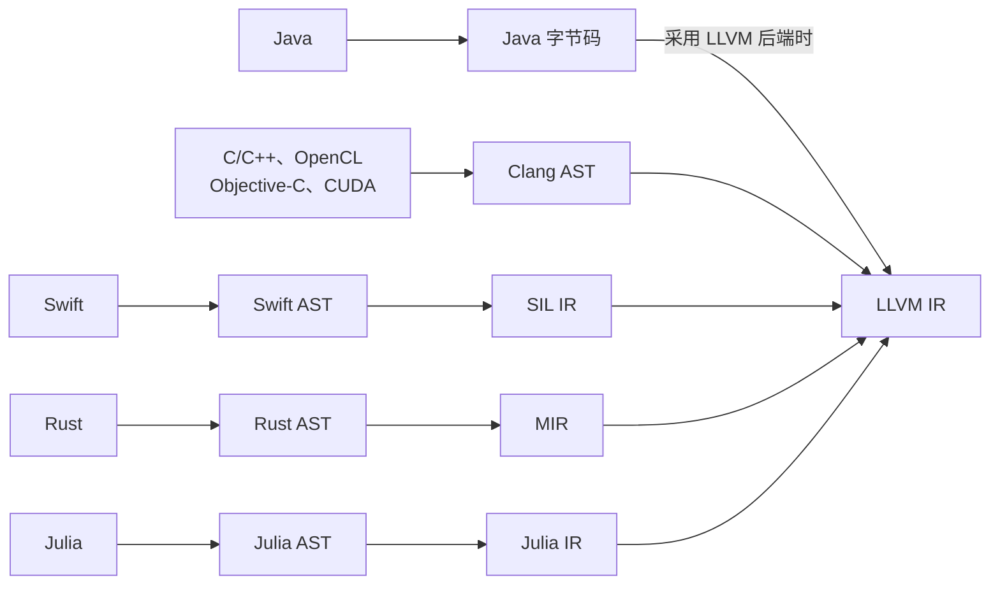
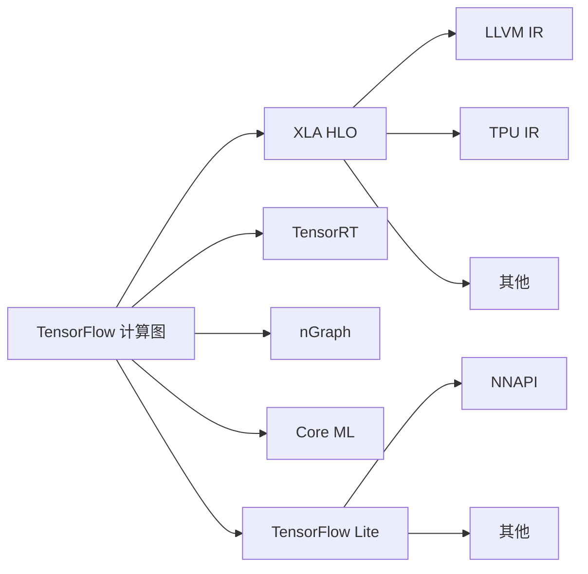
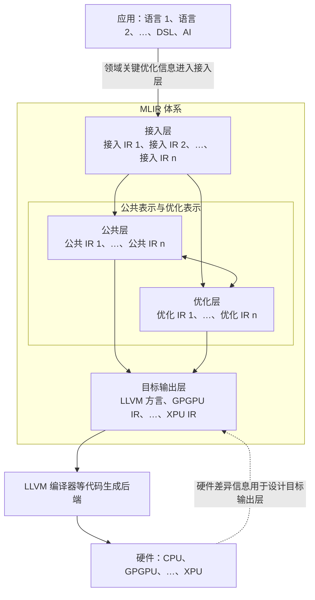
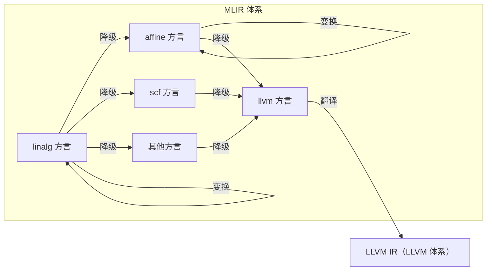

# 第1章 绪论

> 校订说明：依据更新后的14页扫描完整转写；项目背景按原书约2024–2025年的资料归属，代码和机制以本地 LLVM 18.1.8 为核对基准。原书省略的常量数据不作猜测，示例与验证副本的边界见[校订记录](issues/ch1.md)。

<!-- source: insider-compiler-ch1.pdf, PDF p. 1 -->

MLIR 是 LLVM 项目的一个顶级子项目，于 2019 年正式开源。甫一发布，MLIR 便吸引了编译领域从业者的广泛关注，其中一个原因是 Chris Lattner 参与主导了这一项目。Lattner 在编译领域成就斐然，曾主导 LLVM、Clang、Swift 等多个与编译相关的重要项目。他期望借由 MLIR 攻克编译过程中的一大难题：在将高级语言转换为 IR 时，尽可能保留优化所需的语义信息，以便在合适的抽象层次开展优化。MLIR 已在 TensorFlow、Triton、IREE 等项目中得到应用。按原书写作时的时间范围，经过近6年的发展，其应用场景日益丰富，主要集中在以下四个方面。

1）**新硬件支持**：MLIR 能够帮助编译器表达和利用新硬件的特定功能。以 mlir-aie 项目[^ch1-aie]为例，它为 AMD 的 AI Engine 等硬件提供编译基础设施，通过映射多核计算、组织数据传输和近存储访问来提高硬件利用效率。此外，tpu-mlir 项目[^ch1-tpu]也展示了 MLIR 在专用 TPU 硬件适配方面的应用。编译框架不会凭空给硬件增加功能，实际性能收益仍取决于硬件、应用和优化实现。

2）**AI 场景应用**：通过 MLIR 可以构建 AI 编译器。例如，TensorFlow 与 XLA/OpenXLA 生态可使用 MLIR 表达和转换计算图，StableHLO[^ch1-stablehlo]提供面向机器学习计算的操作集；具体是否经过 StableHLO 取决于版本和所选流程，不能概括成“TensorFlow 2.0 总会先转换为 StableHLO”。IREE 项目[^ch1-iree]则利用 MLIR 构建支持端侧等部署场景的编译与运行时系统。

3）**新语言支持**：MLIR 可用于开发特定编程语言的编译器。例如，新 Flang 编译器使用基于 MLIR 的 FIR 等表示实现 Fortran 降级，

<!-- source: insider-compiler-ch1.pdf, PDF p. 2 -->

Firefly 项目[^ch1-firefly]也曾利用 MLIR 将 Erlang 源码编译为后端代码。

4）**领域优化助力**：MLIR 能够为特定领域的优化提供支撑。例如，open-earth-compiler 项目[^ch1-earth]是 HPC（High-Performance Computing，高性能计算）领域的编译器项目，它利用 MLIR 实现面向 stencil 计算的编译功能；Triton[^ch1-triton]同样借助 MLIR 构建 AI 算子编译器，作为领域编译器，降低了算子开发的难度。

## 1.1 当前编译器的发展现状与面临的问题

为什么要引入 MLIR？要解答这个问题，需要先回顾编译器的发展现状。

LLVM 是广泛使用的编译基础设施之一，在多种编译器中得到应用。一个主要原因是 LLVM 框架提供大量基于 LLVM IR 的优化功能，并能把 LLVM IR 编译成多种后端机器码。LLVM 的中端优化与后端代码生成紧密围绕 LLVM IR 展开，这为编译器开发者提供了便利。例如，要支持一种新语言，可以先把它编译成 LLVM IR，再复用 LLVM 的中端优化和后端代码生成能力，从而减少开发工作。

然而，越来越多的应用表明，单靠 LLVM IR 这一层表示还不足以满足所有编译需求，主要有两个问题。

一是，越来越多的编程语言在接入 LLVM IR 之前，都需要先实现自己的前端或中层 IR。一方面，这便于处理语言特有的优化需求；另一方面，也有助于逐步降低抽象层次并转换到 LLVM IR。例如，对于 C/C++，Clang 会先构建 AST（Abstract Syntax Tree，抽象语法树），再生成 LLVM IR；对于 Rust、Swift 和 Julia 等语言，编译器还会使用语言特定的中间表示。图 1-1 概括了多种语言接入 LLVM IR 的途径。

每种编程语言都有相应的语法和语义表示。除了 AST，许多语言还使用自己的 IR，以便开展与语言特性相关的优化。这些专属表示常被称为中层 IR；采用 LLVM 后端的实现最终会接入 LLVM IR，复用代码生成能力并面向不同硬件运行。不同语言的 IR 在某些分析和优化功能上存在重复，但它们的数据结构与基础设施不同，代码很难直接复用，因而容易产生重复开发。倘若能够构建一个框架，既统一可共享的 IR 基础设施和优化，又支持语言特有的语义和优化，就能加快编译器开发。

校订注：这里的“单层”指 LLVM IR 本身的抽象层次，并不是说整个 LLVM 后端只有一种表示；后端还使用 Machine IR 等结构。图中的 Java 路线也仅表示采用 LLVM 后端的实现，并非所有 JVM 都经过 LLVM。

<!-- source: insider-compiler-ch1.pdf, PDF p. 3 -->

**图 1-1** 多语言编译至 LLVM IR 的具体过程（概括示意）



图中省略了各编译器可能存在的其他阶段；例如 Rust 的 AST 与 MIR 之间还有其他表示，不能把这张示意图当成所有版本的完整流水线。

二是，随着技术发展，新型硬件不断出现，它们往往面向特定领域，编译器或编译框架需要适配多种硬件。这些领域也经常引入 DSL。在优化 DSL 时，除了传统编译知识，通常还需要领域专业知识；相关的高层结构一旦降到 LLVM IR，往往不容易再识别和有效优化。以 TensorFlow 为例，它可以面向 CPU、TPU（Tensor Processing Unit，张量处理单元）以及移动设备等不同环境，但资源受限的设备需要不同的部署处理。原书概括的历史编译和部署流程[^ch1-tf-history]如图 1-2 所示。

**图 1-2** TensorFlow 的编译流程（原书所述历史生态示意）



这里保留原图全部分支和连接关系。它概括多种工具与部署接口的集成选择，不表示这些项目都是 TensorFlow 内部的 pass，也不表示它们在所有版本仍采用相同路线。

执行一个 TensorFlow 计算图时，可以选择不同途径，具体如下。

<!-- source: insider-compiler-ch1.pdf, PDF p. 4 -->

1）由 TensorFlow Executor 调用预先实现的算子函数。在 AI 领域中，这类算子实现通常称为 kernel。

2）把适合编译的计算图或子图转换成 XLA HLO[^ch1-hlo]，再通过相应后端生成 CPU 或 GPU 代码；面向 TPU 时使用其专用编译路径。不同后端并不保证完全经过相同的 IR 序列。

3）针对特定后端硬件，通过 TensorRT，或原书所举的 nGraph 等工具的集成路径进行编译和执行。

4）转换为 TensorFlow Lite 模型，在支持的设备和版本中，通过 NNAPI（Neural Networks Application Programming Interface，神经网络应用程序编程接口）等委托机制执行推理。调用 NNAPI 只是其中一种选择。

由此可见，为适配不同运行环境，TensorFlow 需要完成大量工作，其中一部分存在重复。由于后端实现和中间表示多样，这些工作往往难以直接复用。MLIR 项目希望通过可扩展的多层 IR 和共享基础设施缓解上述问题。

## 1.2 引入 MLIR 后的变化

引入 MLIR 后，如何改善这些问题？可以从以下三个方面理解。

### （1）多语言接入

针对不同编程语言，包括 DSL，设计能够表达其语义的专属 IR，即领域 IR，再把这些领域 IR 转换到合适的社区公共方言。开发者可以把精力集中在领域 IR 的设计、语言特定优化，以及如何接入共享基础设施上。这些 IR 通常具有较高抽象层次，保留相应语言的语义信息，有助于实现语言接入。图 1-1 所示的语言特定 IR 可以借鉴这种分层方式，但图本身不意味着那些现有编译器已经全部改用 MLIR。

### （2）公共 IR 和编译优化

MLIR 提供多种社区方言，既有相对高层的表示，也有通用的结构化表示和更接近硬件的表示。一般而言，高层表示有利于衔接领域 IR，中层表示便于复用分析和优化，低层表示用于描述更具体的执行方式和代码生成。这些层次是本书介绍时采用的组织方式，并非 MLIR 强制规定的一条固定层级链。

### （3）特定硬件的代码生成

LLVM 提供统一的代码生成基础设施，为支持新硬件带来便利；但要充分发挥硬件特性，仍可能需要大量工作。LLVM IR 的抽象层次较低，高层矩阵计算、数据布局或并行结构在降级后可能被拆散，需要复杂的分析和模式识别才能重新匹配硬件执行方式。LLVM IR **已有向量类型、向量运算和各类目标 intrinsic**，不能说它完全缺乏描述向量或矩阵硬件的手段；问题在于高层结构过早丢失后不容易恢复。

<!-- source: insider-compiler-ch1.pdf, PDF p. 5 -->

MLIR 允许把硬件特性也表示为专门的 IR。在适用场景下，可以从较高层或公共 IR 直接转换到相应硬件方言，保留转换需要的信息，减少从低层代码重新推断结构的工作，覆盖更多优化场景。

简单来说，MLIR 提供共享的 IR 基础设施和优化机制，允许应用程序通过自定义 IR 保留领域关键信息，也允许硬件厂商设计专用表示，把硬件关键信息纳入编译流程，便于在合适层次实施编译和优化。引入多层 IR 后，一种基于 MLIR 的编译器架构如图 1-3 所示。

**图 1-3** 基于 MLIR 框架的编译器架构



原图用框的排列概括各层，这里用箭头说明可以发生的转换；不要求每种编译器都经过全部节点。目标输出层中原标注“LLVM IR”改为 MLIR 的 LLVM 方言，以区别随后导出的 LLVM IR；原图的 LLVM 编译器路径保留，同时注明其他硬件也可能使用不同代码生成后端。

接入层、公共层、优化层和目标输出层都可包含多种表示。总体趋势是逐步降低抽象层次，但同一分类中的 IR 并不天然具有固定先后顺序，也不能笼统断言其中永远不存在层次关系。为适配应用和优化需求，一种表示可以转换成另一种表示，有时多个抽象层次还会共存于同一模块中。

引入多层 IR 后，开发者可以重点实现高层到低层的逐步转换，即 lowering。如果相邻表示的**抽象差距**过大，可以增加中间表示，使每一步转换更易处理；这不表示可以任意改变程序的可观察语义。

此外，开发者可依据每层 IR 的特性实施优化，避免过早降低到 LLVM IR 后丢失有用结构。当然，多层 IR 也引入了新的概念，需要开发者理解。

<!-- source: insider-compiler-ch1.pdf, PDF p. 6 -->

本书后续章节将详细介绍这些概念。本章先借助一个例子，让读者初步感受 MLIR 的基本操作流程。

## 1.3 MLIR 使用示例

本节先提供一个用 Python 编写的 PyTorch 模型，再展示把它表示成 tosa（Tensor Operator Set Architecture，张量操作集架构）、linalg、affine 和 llvm 等方言的过程。这个例子用于观察从高层模型逐步降低抽象层次、最终衔接 LLVM IR 的方式。

### 1.3.1 高层抽象模型

假设有一个 PyTorch 模型，如代码清单 1-1 所示。这里补齐原书省略的导入；`torch_mlir.compile` 和 `OutputType.TOSA` 沿用原书使用的前端接口，需要与之匹配的 torch-mlir 版本。本次验证所用的 Python 环境未安装 torch 和 torch-mlir，因此该 Python 清单仅做语法检查，不声称本轮已执行模型导入。

**代码清单 1-1** PyTorch 模型示例

```python
import torch
from torch import nn
import torch_mlir

class Linear(nn.Module):
    def __init__(self):
        super(Linear, self).__init__()
        self.linear = nn.Linear(16, 10)

    def forward(self, x):
        return self.linear(x)

linear = Linear()
mlir_module = torch_mlir.compile(
    linear, torch.ones(1, 16), output_type=torch_mlir.OutputType.TOSA
)
```

代码清单 1-1 用 Linear 类构建一个全连接层。它对输入变量 (x) 进行运算：

```text
y = x Aᵀ + b
```

矩阵 (A) 与偏置向量 (b) 是模型参数。这里 (A) 的形状为 (10\times16)，PyTorch 中 (b) 的实际参数形状为 `(10,)`；面对形状为 (1\times16) 的输入，偏置会广播到 (1\times10)。原书将其直接写成 (1\times10) 向量，容易混淆参数本身与广播后的形状。训练时这些参数可通过学习得到；推理时使用已经确定的参数。本例只构造了层，没有展示训练或加载训练好的权重。

编译器开发者希望模型快速执行，因此可以采用编译方式生成更适合目标设备的代码，并在编译过程中进行优化。原文“Python 默认为逐行解释执行”只是粗略说法：常见 CPython 会先编译成字节码再执行，PyTorch 张量运算还会调用已编译的底层实现。在采用编译模式时，AI 框架可以使用高层 IR（HIR）和低层 IR（LIR），分别保留计算图和算子实现等层次的信息，再生成可执行代码；具体流程随框架和配置变化。除编译优化外，还需要为不同后端设备生成适配代码。

<!-- source: insider-compiler-ch1.pdf, PDF p. 7 -->

MLIR 的核心理念之一是通过多层 IR 表达不同层次的功能特性，让编译器能够复用表示及相关基础设施，开发者也可以针对各层特性进行优化，以改善模型性能。

### 1.3.2 接入 MLIR 体系

MLIR 社区提供 tosa 方言，可以作为本例接入张量计算表示的一层。借助合适的前端，可以把上述受支持的 PyTorch 模型转换成 tosa 操作序列（参见第8章），如代码清单 1-2 所示。这里不是说 tosa 能直接表示任意 Python 程序。

**常量省略说明**：清单 1-2～1-7 的 `dense<"0xC44B...">` 和 `dense<"0xA270...">` 是原书故意截断的权重和偏置数据，不是合法的完整十六进制常量。保留它们是为了忠实呈现原示例，不能直接复制这些模板运行。本次另外用明确、非训练所得的完整参数生成验证副本，验证解析和后续转换；这些参数不冒充原书遗失的数据。`tosa.reshape` 的 `new_shape` 已按 LLVM 18 改为 `array<i64: ...>`。

**代码清单 1-2** 从 Python 模型降级到 tosa 方言（常量数据省略）

```mlir
func.func @forward(%arg0: tensor<1x16xf32>) -> tensor<1x10xf32> {
  %0 = "tosa.const"() {value = dense<"0xC44B..."> : tensor<1x16x10xf32>} : () -> tensor<1x16x10xf32>
  %1 = "tosa.const"() {value = dense<"0xA270..."> : tensor<1x10xf32>} : () -> tensor<1x10xf32>
  %2 = "tosa.reshape"(%arg0) {new_shape = array<i64: 1, 1, 16>} : (tensor<1x16xf32>) -> tensor<1x1x16xf32>
  %3 = "tosa.matmul"(%2, %0) : (tensor<1x1x16xf32>, tensor<1x16x10xf32>) -> tensor<1x1x10xf32>
  %4 = "tosa.reshape"(%3) {new_shape = array<i64: 1, 10>} : (tensor<1x1x10xf32>) -> tensor<1x10xf32>
  %5 = "tosa.add"(%4, %1) : (tensor<1x10xf32>, tensor<1x10xf32>) -> tensor<1x10xf32>
  return %5 : tensor<1x10xf32>
}
```

这里暂不展开 Python 模型如何转换成这段 IR，先看如何解读它。

1）形如 `dialect.operation` 的名称表示方言命名空间与操作名。方言管理相关操作、类型和属性，操作描述特定功能。例如 `func.func` 是 func 方言中的函数定义操作；本例函数的**符号名**为 `forward`，操作名仍是 `func.func`。函数签名指定参数与返回类型，函数体放在其区域内。函数形参是入口块的块参数，返回值由 `func.return` 传出；它们不能统称为 `func.func` 操作本身的 operands。此处函数操作本身没有这些 SSA 操作数或 SSA 结果。

2）`%arg0: tensor<1x16xf32>` 中，`%arg0` 是一个 SSA 值的名字，这里表示函数形参；`tensor<1x16xf32>` 是它的类型。该 tensor 有两个维度，长度分别为1和16，元素类型 `f32` 表示32位单精度浮点数。

3）`%0 = "tosa.const"() {value = dense<...> : tensor<1x16x10xf32>} : () -> tensor<1x16x10xf32>` 中，`%0` 是 `tosa.const` 产生的结果。`value` 是存放常量元素的属性，具体使用 `DenseElementsAttr`；其类型为相应的 ranked tensor 类型，属性的**值**是那些常量元素。`dense` 不是一种运行时张量类型，也不能仅由该属性断言运行时张量必须采用某种连续内存布局。该操作结果的类型同样为 `tensor<1x16x10xf32>`。

对代码清单 1-2 加上注释后，如代码清单 1-3 所示。

<!-- source: insider-compiler-ch1.pdf, PDF p. 8 -->

**代码清单 1-3** 对代码清单 1-2 进行注释解读

```mlir
// 定义符号名为 forward 的函数，参数为 1×16 的 f32 张量，返回 1×10 张量。
func.func @forward(%arg0: tensor<1x16xf32>) -> tensor<1x10xf32> {
  // 用 tosa.const 创建权重常量。value 是 DenseElementsAttr，携带 1×16×10 个 f32 元素。
  %0 = "tosa.const"() {value = dense<"0xC44B..."> : tensor<1x16x10xf32>} : () -> tensor<1x16x10xf32>
  // 创建偏置常量；此处为广播到 1×10 形状后的表示。
  %1 = "tosa.const"() {value = dense<"0xA270..."> : tensor<1x10xf32>} : () -> tensor<1x10xf32>
  // 改变 arg0 的形状：1×16 → 1×1×16；元素数和元素类型不变。
  %2 = "tosa.reshape"(%arg0) {new_shape = array<i64: 1, 1, 16>} : (tensor<1x16xf32>) -> tensor<1x1x16xf32>
  // 批矩阵乘：1×1×16 乘以 1×16×10，结果为 1×1×10。
  %3 = "tosa.matmul"(%2, %0) : (tensor<1x1x16xf32>, tensor<1x16x10xf32>) -> tensor<1x1x10xf32>
  // 改变乘积的形状：1×1×10 → 1×10。
  %4 = "tosa.reshape"(%3) {new_shape = array<i64: 1, 10>} : (tensor<1x1x10xf32>) -> tensor<1x10xf32>
  // 逐元素加偏置，两个输入和输出均为 1×10 的 f32 张量。
  %5 = "tosa.add"(%4, %1) : (tensor<1x10xf32>, tensor<1x10xf32>) -> tensor<1x10xf32>
  // 返回计算结果。
  return %5 : tensor<1x10xf32>
}
```

从注释可以看出，这个 tosa 操作序列表达了清单 1-1 中线性层所对应的计算结构：矩阵乘、形状调整与偏置相加。只有前端正确导入相同参数，并满足所需的数值语义约束时，才能将其当作原模型的实现。

tosa 操作抽象层次较高，还需继续降级以描述具体实现。例如，矩阵乘可以降成循环、向量或硬件矩阵指令，也可以调用库函数；并非每种目标都必须最终保留显式的标量循环。

### 1.3.3 使用线性代数描述代码

MLIR 社区提供 linalg 方言，即线性代数方言（参见9.1节）。它包含命名操作和通用操作，能够承接高层代码转换，支持相关优化，并继续降低到更接近执行方式的表示。代码清单 1-4 展示一种用 linalg 表达本例计算的方法。

清单 1-4 先用零初始化矩阵乘结果，完成归约后再逐元素加偏置，与前面的 TOSA 计算结构一致。原书把偏置作为归约初值，会改变浮点舍入顺序，已在正文中改正。这里采用便于解读的二维 `linalg.generic` 形式；本地 TOSA 转换实际使用 `linalg.batch_matmul` 等操作，不会逐字产生此清单。修正依据与原版差异见[归约次序校订](issues/ch1.md#ch1-numerics)。

**代码清单 1-4** 从 tosa 计算结构改写为 linalg 方言（先矩阵乘、后加偏置）

```mlir
#map0 = affine_map<(d0, d1, d2) -> (d0, d2)>
#map1 = affine_map<(d0, d1, d2) -> (d2, d1)>
#map2 = affine_map<(d0, d1, d2) -> (d0, d1)>
#map3 = affine_map<(d0, d1) -> (d0, d1)>
func.func @forward(%arg0: tensor<1x16xf32>) -> tensor<1x10xf32> {
  %cst = arith.constant dense<"0xA270..."> : tensor<1x10xf32>
  %cst_0 = arith.constant dense<"0xC44B..."> : tensor<16x10xf32>
  %zero = arith.constant dense<0.0> : tensor<1x10xf32>
  %0 = linalg.generic {
      indexing_maps = [#map0, #map1, #map2],
      iterator_types = ["parallel", "parallel", "reduction"]
    } ins(%arg0, %cst_0 : tensor<1x16xf32>, tensor<16x10xf32>)
      outs(%zero : tensor<1x10xf32>) {
  ^bb0(%arg1: f32, %arg2: f32, %arg3: f32):
    %1 = arith.mulf %arg1, %arg2 : f32
    %2 = arith.addf %arg3, %1 : f32
    linalg.yield %2 : f32
  } -> tensor<1x10xf32>
  %result = linalg.generic {
      indexing_maps = [#map3, #map3],
      iterator_types = ["parallel", "parallel"]
    } ins(%cst : tensor<1x10xf32>)
      outs(%0 : tensor<1x10xf32>) {
  ^bb0(%bias: f32, %product: f32):
    %sum = arith.addf %product, %bias : f32
    linalg.yield %sum : f32
  } -> tensor<1x10xf32>
  return %result : tensor<1x10xf32>
}
```

<!-- source: insider-compiler-ch1.pdf, PDF p. 9 -->

代码清单 1-4 中有两类需要说明的表示：`affine_map` 和 `linalg.generic`。`#map0 = affine_map<(d0, d1, d2) -> (d0, d2)>` 定义一个从三个维度坐标到两个结果表达式的仿射映射。在本例中，三个映射把同一迭代坐标分别映射到输入、权重和输出的下标；它们本身不独立给出循环的全部取值范围，迭代范围还与操作数的形状等信息有关。

`linalg.generic` 描述结构化的逐元素或归约计算。它使用仿射索引映射、迭代种类、输入与输出初值，并在内嵌区域中定义单次迭代执行的标量计算。第一个 generic 中，两个 parallel 维度对应输出坐标，reduction 维度对应矩阵乘的累加方向；第二个 generic 只遍历输出坐标，用二维恒等映射 `#map3` 读取偏置和已完成的矩阵乘积。

对代码清单 1-4 加以注释后，如代码清单 1-5 所示。

**代码清单 1-5** 对代码清单 1-4 进行注释解读

```mlir
// 前三个映射用于矩阵乘；第四个是逐元素加偏置所用的二维恒等映射。
#map0 = affine_map<(d0, d1, d2) -> (d0, d2)>
#map1 = affine_map<(d0, d1, d2) -> (d2, d1)>
#map2 = affine_map<(d0, d1, d2) -> (d0, d1)>
#map3 = affine_map<(d0, d1) -> (d0, d1)>
func.func @forward(%arg0: tensor<1x16xf32>) -> tensor<1x10xf32> {
  %cst = arith.constant dense<"0xA270..."> : tensor<1x10xf32>
  %cst_0 = arith.constant dense<"0xC44B..."> : tensor<16x10xf32>
  // 矩阵乘从全零张量开始归约，不把偏置并入归约初值。
  %zero = arith.constant dense<0.0> : tensor<1x10xf32>
  // indexing_maps 映射访问下标；outs 提供初始累加张量。
  %0 = linalg.generic {
      indexing_maps = [#map0, #map1, #map2],
      iterator_types = ["parallel", "parallel", "reduction"]
    } ins(%arg0, %cst_0 : tensor<1x16xf32>, tensor<16x10xf32>)
      outs(%zero : tensor<1x10xf32>) {
  // 块参数为两个输入元素及当前累加值；它们仍是 SSA 值。
  ^bb0(%arg1: f32, %arg2: f32, %arg3: f32):
    // 将输入元素相乘，再加到当前累加值中。
    %1 = arith.mulf %arg1, %arg2 : f32
    %2 = arith.addf %arg3, %1 : f32
    // 把一次标量计算得到的新累加值交回 linalg.generic。
    linalg.yield %2 : f32
  } -> tensor<1x10xf32>
  // 所有归约完成后，另一个只有 parallel 迭代的操作逐元素加偏置。
  %result = linalg.generic {
      indexing_maps = [#map3, #map3],
      iterator_types = ["parallel", "parallel"]
    } ins(%cst : tensor<1x10xf32>)
      outs(%0 : tensor<1x10xf32>) {
  // outs 中的矩阵乘积作为当前输出元素读入；结果是新的张量值。
  ^bb0(%bias: f32, %product: f32):
    %sum = arith.addf %product, %bias : f32
    linalg.yield %sum : f32
  } -> tensor<1x10xf32>
  return %result : tensor<1x10xf32>
}
```

清单 1-5 展示一种实现形式：矩阵乘的乘法与归约加法位于第一个 `linalg.generic` 的同一基本块中，加偏置则在第二个 `linalg.generic` 中完成。

<!-- source: insider-compiler-ch1.pdf, PDF p. 10 -->

本例用两个结构化操作分别计算矩阵乘积和加偏置，也可以选用适合的命名 linalg 操作表达这些步骤。它们不是同一个 linalg.generic 中任意添加的两个基本块，因为 generic 的区域受单块结构等约束。具体如何降级和融合，需要考虑数值语义、优化目标及硬件，后续章节将进一步介绍。保持这里的偏置加入阶段，并不意味着任意前端、归约调度或目标指令实现都已得到逐位等价验证。

### 1.3.4 使用仿射描述代码

linalg.generic 已经规定索引、迭代种类和标量计算，但尚未决定完整的循环调度、存储分配或目标指令实现。可以继续采用 affine 方言（仿射，参见9.2节）显式描述循环与访问。代码清单 1-6 给出一种由清单 1-4 进一步形成的 affine 表示。

此处还有一个重要步骤：原来的 tensor 值已通过**缓冲化**变成 memref；返回张量改成调用者传入的输出缓冲区。只有处理了缓冲区分配、初值设置、参数约定及生存期等问题，才能从张量形式得到这种接口，不能只把方言名称替换掉。此处输入与输出缓冲区应互不重叠，以免写入结果破坏仍待读取的输入。

**代码清单 1-6** 从 linalg 计算结构降级为 affine 方言（常量数据省略）

```mlir
memref.global "private" constant @__constant_16x10xf32 : memref<16x10xf32> = dense<"0xC44B...">
memref.global "private" constant @__constant_1x10xf32 : memref<1x10xf32> = dense<"0xA270...">
func.func @forward(%arg0: memref<1x16xf32>, %arg1: memref<1x10xf32>) {
  %0 = memref.get_global @__constant_1x10xf32 : memref<1x10xf32>
  %1 = memref.get_global @__constant_16x10xf32 : memref<16x10xf32>
  %zero = arith.constant 0.0 : f32
  affine.for %arg2 = 0 to 10 {
    affine.store %zero, %arg1[0, %arg2] : memref<1x10xf32>
    affine.for %arg3 = 0 to 16 {
      %2 = affine.load %arg0[0, %arg3] : memref<1x16xf32>
      %3 = affine.load %1[%arg3, %arg2] : memref<16x10xf32>
      %4 = affine.load %arg1[0, %arg2] : memref<1x10xf32>
      %5 = arith.mulf %2, %3 : f32
      %6 = arith.addf %4, %5 : f32
      affine.store %6, %arg1[0, %arg2] : memref<1x10xf32>
    }
    %product = affine.load %arg1[0, %arg2] : memref<1x10xf32>
    %bias = affine.load %0[0, %arg2] : memref<1x10xf32>
    %sum = arith.addf %product, %bias : f32
    affine.store %sum, %arg1[0, %arg2] : memref<1x10xf32>
  }
  return
}
```

清单 1-6 在每个输出列的归约前写入零，内层循环完成全部乘积累加后，再加载偏置、相加并写回一次。它比高层张量操作更接近具体执行过程，但仍保留结构化循环和多维内存访问，并不是传统汇编。memref 类型描述带有形状、布局及内存空间信息的缓冲区引用，`affine.for` 表示循环，`affine.load` 和 `affine.store` 分别按仿射下标加载和存储数据。

对代码清单 1-6 加上注释后，得到代码清单 1-7。

**代码清单 1-7** 对代码清单 1-6 进行注释解读

```mlir
// memref.global 定义两个只读全局缓冲区并提供初始数据。
memref.global "private" constant @__constant_16x10xf32 : memref<16x10xf32> = dense<"0xC44B...">
memref.global "private" constant @__constant_1x10xf32 : memref<1x10xf32> = dense<"0xA270...">
func.func @forward(%arg0: memref<1x16xf32>, %arg1: memref<1x10xf32>) {
  %0 = memref.get_global @__constant_1x10xf32 : memref<1x10xf32>
  %1 = memref.get_global @__constant_16x10xf32 : memref<16x10xf32>
  // 与张量版一致，归约初值为零。
  %zero = arith.constant 0.0 : f32
  // 外层遍历输出列，下界 0、上界 10（不含），默认步长 1。
  affine.for %arg2 = 0 to 10 {
    // 在处理本列的归约之前，将其输出元素置零。
    affine.store %zero, %arg1[0, %arg2] : memref<1x10xf32>
    // 内层遍历归约维，下界 0、上界 16（不含），默认步长 1。
    affine.for %arg3 = 0 to 16 {
      // 按仿射下标加载输入、权重和累加值，进行乘加，再存回输出。
      %2 = affine.load %arg0[0, %arg3] : memref<1x16xf32>
      %3 = affine.load %1[%arg3, %arg2] : memref<16x10xf32>
      %4 = affine.load %arg1[0, %arg2] : memref<1x10xf32>
      %5 = arith.mulf %2, %3 : f32
      %6 = arith.addf %4, %5 : f32
      affine.store %6, %arg1[0, %arg2] : memref<1x10xf32>
    }
    // 本列的矩阵乘归约完成后，只加一次偏置并写回。
    %product = affine.load %arg1[0, %arg2] : memref<1x10xf32>
    %bias = affine.load %0[0, %arg2] : memref<1x10xf32>
    %sum = arith.addf %product, %bias : f32
    affine.store %sum, %arg1[0, %arg2] : memref<1x10xf32>
  }
  return
}
```

<!-- source: insider-compiler-ch1.pdf, PDF p. 11 -->

### 1.3.5 接入 LLVM 体系

使用 affine 表示的代码可以通过一系列转换接入 LLVM。在导出真正的 LLVM IR 之前，通常先把 affine、scf、memref、arith、func 等操作转换成 MLIR 的 LLVM 方言。代码清单 1-8 是原书节选的低层代码，包含条件分支、循环回边，以及向量形式的带掩码加载和存储。

**节选边界**：原书省略函数入口、地址计算、掩码和部分操作数定义，并出现了向量操作；没有提供完整的向量化及降级命令，因此不能将其声称为只运行“affine→llvm”就必然产生的输出。这里恢复分行和控制流，按 LLVM 18 使用不透明指针 `!llvm.ptr`，保留原节选的操作和计算关系。它仍须补齐上下文才能验证，也没有列出新版清单 1-6 中归约完成后加偏置的步骤，不能作为该完整函数的等价输出。先前补建的独立夹具仅检查这些操作及控制流的合法性；新版清单 1-6 的完整参数版本已另行实际降级并运行，见[当前验证记录](issues/evidence/reading-edition/ch1/README.md)。

**代码清单 1-8** 从 affine 方言降级到 llvm 方言的原书节选（按 LLVM 18 校订）

```mlir
// 节选：函数签名、入口块和其他值的定义在原书中省略。
^bb1(%20: i64):  // 前驱：入口块和 ^bb4
  %21 = llvm.icmp "slt" %20, %5 : i64
  llvm.cond_br %21, ^bb2(%4 : i64), ^bb5
^bb2(%22: i64):  // 前驱：^bb1、^bb3
  %23 = llvm.icmp "slt" %22, %7 : i64
  llvm.cond_br %23, ^bb3, ^bb4
^bb3:  // 前驱：^bb2
  // 原书在此省略地址、掩码和向量操作数的准备过程。
  %46 = llvm.intr.masked.load %45, %36, %0 {alignment = 4 : i32} : (!llvm.ptr, vector<2xi1>, vector<2xf32>) -> vector<2xf32>
  %47 = llvm.fmul %30, %41 : vector<2xf32>
  %48 = llvm.fadd %46, %47 : vector<2xf32>
  llvm.intr.masked.store %48, %45, %36 {alignment = 4 : i32} : vector<2xf32>, vector<2xi1> into !llvm.ptr
  %49 = llvm.add %22, %8 : i64
  llvm.br ^bb2(%49 : i64)
^bb4:  // 前驱：^bb2
  %50 = llvm.add %20, %6 : i64
  llvm.br ^bb1(%50 : i64)
^bb5:  // 前驱：^bb1
  llvm.return
```

<!-- source: insider-compiler-ch1.pdf, PDF p. 12 -->

虽然清单 1-8 使用的是 LLVM 方言而非 LLVM IR，熟悉 LLVM IR 的读者仍能识别其中的比较、分支和浮点运算。但二者的语法、类型表示以及块参数/PHI 的表达并不相同，**不能仅删除 `llvm.` 前缀就完成转换**。导出需要 LLVM IR 翻译接口，相关过程见11.1节。本节不再逐条解读该节选，也不展开如何链接运行时并生成可执行文件；原书另给出参考材料。[^ch1-pytorch-rtl]

### 1.3.6 MLIR 使用示例小结

通过上述例子，可以了解以下两点。

1）MLIR 可以通过多个方言逐步降低代码的抽象层次。正确的转换应保留其约定的语义，而这需要转换实现和合法性条件保证；例如本节保留了先完成矩阵乘、再加偏置的计算阶段，不能仅凭代数表达式相同就任意把偏置提前加入归约。

2）一段代码中可以同时包含多个方言。例如清单 1-4 同时出现 func、arith 和 linalg。多种抽象能够共存，是 MLIR 多层表示能力的一部分。

这个例子还没有展开 MLIR 的其他能力，例如：

1）社区方言为相关分析和优化提供了方便的结构。以 affine 为例，其受约束的循环与访存表示便于开展多面体分析[^ch1-polyhedral]和循环优化，但 affine 方言本身不等于完整的多面体编译系统。

2）降级路径并不唯一，可以根据目标硬件、程序结构和优化意图选择。将 linalg 转成 affine 有利于某些 CPU 循环优化；面向 GPGPU（General-Purpose Computing on Graphics Processing Units，图形处理器通用计算）时，还需要合适的并行映射、存储布局和硬件指令选择。不能笼统说经过 affine 就无法充分利用 GPU，也不能说某条路径必然获得最优性能。

后续章节将逐步介绍这些问题。回顾整个过程，可以看到模型经 tosa、linalg、affine 等表示逐步降低抽象层次。图 1-4 着重画出 linalg 之后的若干路径。

**图 1-4** 代码逐步降级示意图



这些箭头表示概念上的转换路径，中间可以包含多步 pass。例如本地 LLVM 18 的 affine 路径先降到 scf、arith、memref 等表示，再继续转换到 LLVM 方言。

<!-- source: insider-compiler-ch1.pdf, PDF p. 13 -->

> **注意**：图 1-4 使用三个动作名称：降级、变换和翻译，分别表示这里所述的降低抽象层次、IR 内部变换，以及 MLIR 与 LLVM IR 表示之间的导出过程。原书用方言间/方言内来区分前两项是一种教学概括，实际 lowering 与 transformation 的含义不完全由是否跨方言决定；第2章会进一步介绍。

## 1.4 MLIR 的不足

MLIR 有许多优点，也有学习和工程上的成本。原书结合写作时的经验，讨论以下五方面不足。

### （1）新事物带来的兼容性与稳定性问题

MLIR 发展较快，使用它的项目可能需要持续跟随接口和实现变化进行调整，增加维护成本。原书以并发编程语言 Verona[^ch1-verona]为例，称其早期采用 MLIR，而后于2021年前后转向其他实现，并把这一变化部分归因于接口变动和适配成本。这个例子应作为原书对特定项目历史的叙述，不能据此断定所有项目都遇到相同问题；具体时间与负责人原话的确认边界见[背景校订](issues/ch1.md#ch1-context)。语言语义与框架能力是否适合，也会影响实现难度，不能未经证据把可能原因当作已知事实。

### （2）抽象层次高，概念理解困难

原书估计 MLIR 代码量约为70万行，但没有给出版本和统计口径，这个数字不宜当作当前源码规模。其核心概念包括操作、类型、属性和方言；框架还提供 Pass 管理、贪婪模式重写、方言转换等机制，借助约束、特质、验证器和接口来表达合法性条件并复用公共能力。社区方言覆盖语言接入、结构与数据表示、优化和硬件相关功能，方便业务利用共享基础设施，但理解这些概念、方言和优化之间的关系需要时间。

### （3）数学知识门槛较高

MLIR 的某些部分涉及较专业的数学知识。例如 affine 方言与多面体分析、仿射和半仿射表达式有关；开发者需要理解允许的表达式、整数约束以及求解算法的边界。对于常数正除数，floor/ceil division 和 mod 可以通过额外整数变量及线性约束表达；这不意味着任意符号除法、变量乘法都属于同一可判定理论。原书“这一部分知识目前尚无相关论文”的说法不成立，相关理论和算法已有长期研究。

求解相关约束时，框架会使用单纯形等算法，但有理可行性与整数可行性不是同一个问题，不能仅用普通线性规划替代所有整数分析。算法的数学性质、正确性边界和实际效率都需要考虑。普通 MLIR 使用者也不必先掌握全部 Presburger 库实现才能使用无关方言。参见[数学说明校订](issues/ch1.md#ch1-context)。

### （4）部分设计有待优化

原书以 TableGen 的 TD 描述为例，认为用它定义操作、类型、属性和方言，再与框架 C++ 代码衔接，会增加阅读生成代码和理解实现的难度。这是实际存在的学习成本；同时，TD 也减少了重复样板代码，并集中表达部分约束。MLIR 并不要求所有定义都只能用 TD，手写 C++ 定义和动态扩展也有相应机制。因此，应把这里理解为作者对设计取舍的评价，而非框架只能采用一种实现方式。

### （5）生态碎片化

MLIR 的可扩展架构允许开发者创建自定义方言和扩展，方便满足领域需求，但也可能出现相似需求重复实现、接口不兼容或工作未能回馈上游的情况。原书认为项目交付压力等因素可能促使开发者选择独立实现，

<!-- source: insider-compiler-ch1.pdf, PDF p. 14 -->

进而增加生态碎片化的风险。原书进一步声称“从2024年起各大公司对MLIR框架的贡献日益减少”，但未提供统计数据、公司范围或衡量口径，本次也未取得足以支持这一趋势判断的证据，故不把它当作已经确认的事实。关于贡献动机和整个社区“日益分裂”的推论同样需要谨慎。社区协作、可复用接口和治理机制可以帮助降低重复建设的成本，但不能据本章材料认定已有单一解决方案。

原书展望，随着 MLIR 持续发展，更多成熟功能有望以方言和共享基础设施的形式进入社区，改善稳定性与开发便利性。这是作者的期待，实际进展仍需结合具体版本和项目观察。

## 1.5 本章小结

MLIR 提供可扩展的编译器基础设施，通过逐步降低抽象层次，减少部分编译器实现的重复工作，并为在适当层次开展优化提供条件。新技术在带来优势的同时，也会有局限性和工程成本。本章重点介绍引入 MLIR 的动机、优势和一个使用示例，并在1.4节概述了兼容性、学习成本与生态等问题；这些问题背后的设计思路和实现机制还没有充分展开。第2章将介绍 MLIR 的基本概念，后续章节再深入讨论相关机制。

[^ch1-aie]: [Xilinx/AMD mlir-aie](https://github.com/Xilinx/mlir-aie)，原书注明2025年4月访问。

[^ch1-tpu]: [Sophgo tpu-mlir](https://github.com/sophgo/tpu-mlir)，原书注明2025年4月访问。这里的项目面向相应厂商的处理器，不应与 Google TPU 产品直接等同。

[^ch1-stablehlo]: [OpenXLA StableHLO](https://github.com/openxla/stablehlo)，原书注明2025年4月访问。StableHLO与TensorFlow 2.0的时间和流程不能混为一谈，详见[背景校订](issues/ch1.md#ch1-context)。

[^ch1-iree]: [IREE](https://github.com/iree-org/iree)，原书注明2025年4月访问。

[^ch1-firefly]: [Firefly](https://github.com/GetFirefly/firefly)，原书注明2025年4月访问；本章保留其作为历史应用例子，不据此推断项目当前维护状态。

[^ch1-earth]: [Open Earth Compiler](https://github.com/spcl/open-earth-compiler)，原书注明2025年4月访问。

[^ch1-triton]: [Triton](https://github.com/triton-lang/triton)，原书注明2025年4月访问。

[^ch1-tf-history]: 原书注：这是截至作者写作时概括的流程，TensorFlow社区正在向MLIR方向改进。本次保留其历史归属；不同项目的集成和接口各有版本范围，图不作为当前完整部署指南。

[^ch1-hlo]: XLA（Accelerated Linear Algebra，加速线性代数）是OpenXLA生态中的机器学习编译器；HLO（High Level Operations，高层操作）是其高层计算表示。HLO与StableHLO相关，但不是可以不分版本直接互换的同一名称。

[^ch1-pytorch-rtl]: 原书给出的[《从PyTorch到RTL：基于MLIR的高层次综合技术》](https://file.elecfans.com/web2/M00/7E/0E/poYBAGOC6bKAZAQyADt7O8jLZCE607.pdf)，叶汉辰，2022年11月27日；原书注明2024年7月访问。本次链接已打开并核到标题和日期，未把其中较早版本的代码直接当作LLVM18/20的当前接口。

[^ch1-polyhedral]: 原书关于多面体编译的说明应以**循环归纳变量**为主，而非把所有循环索引称为归约变量。在适当的仿射循环边界和条件限制下，多重循环的整数迭代点可用多面体/整数集建模，并用于分析与变换。并非所有循环都满足该模型。原书将在第14章展开讨论。

[^ch1-verona]: [Microsoft Verona](https://github.com/microsoft/verona)，原书注明2024年7月访问。关于其采用和停止采用MLIR的具体历史及原因，见[校订记录](issues/ch1.md#ch1-context)。

