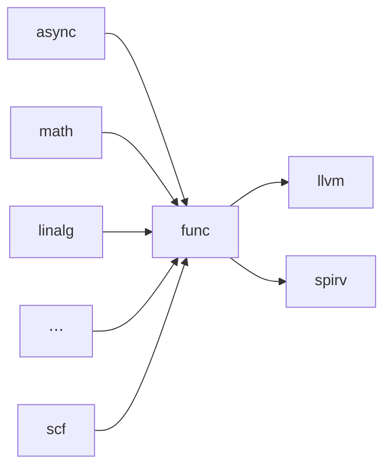
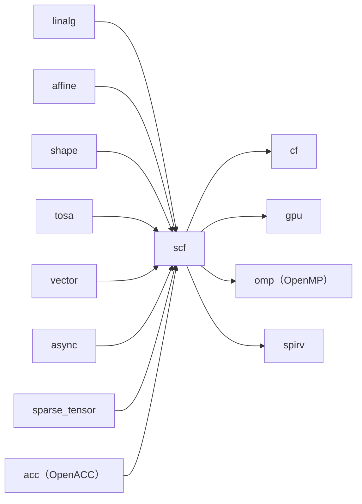
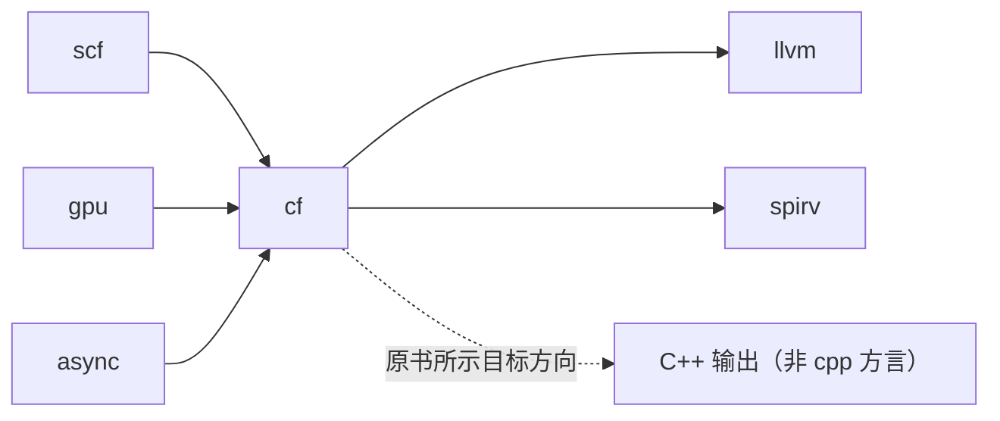
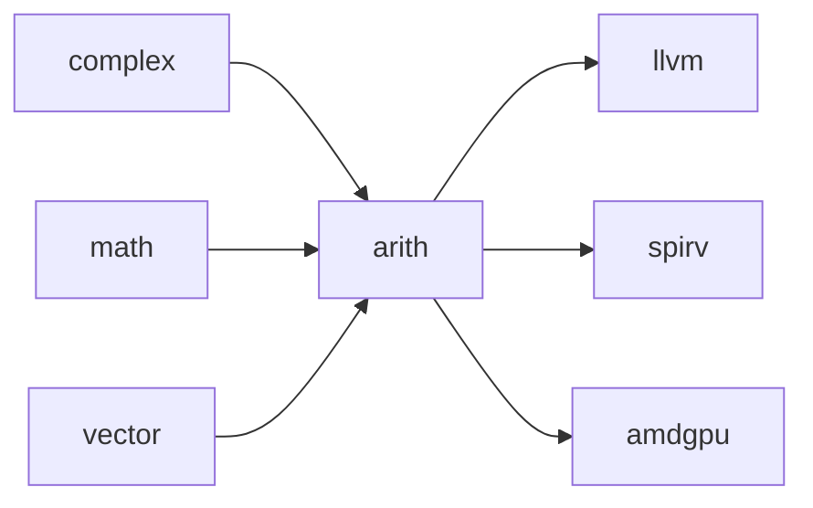
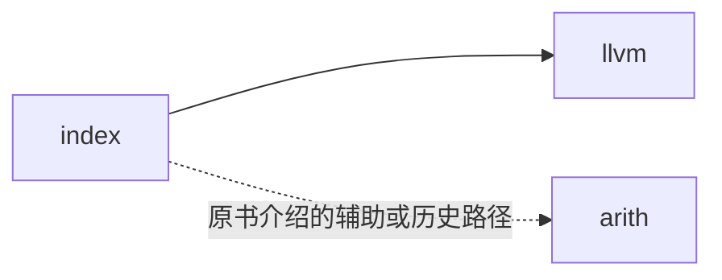
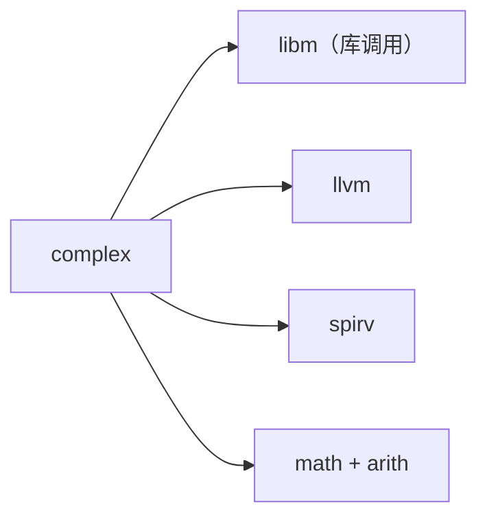
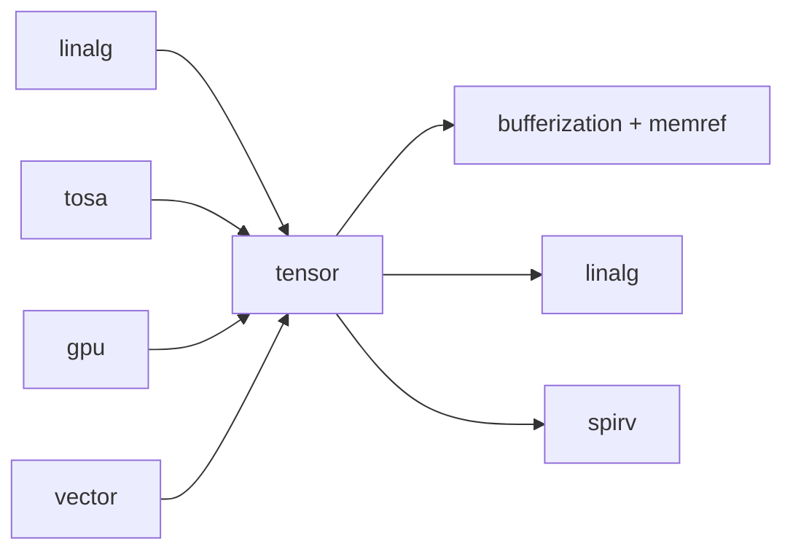
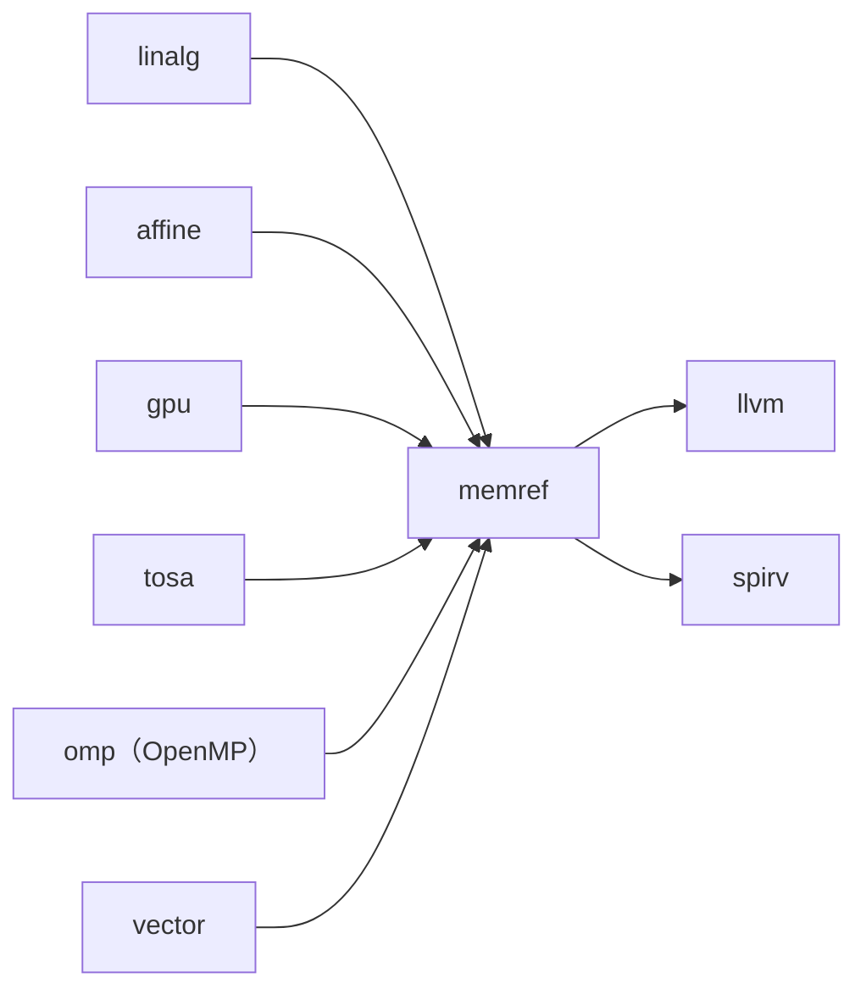
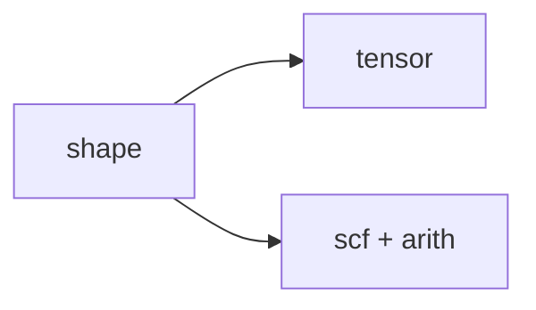
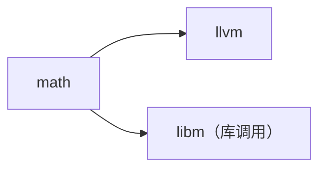

# 第10章 结构方言与数据方言

> 校订基准：本章按扫描件完整转写，并以本地 LLVM 18.1.8（提交 `3b5b5c1ec4a3095ab096dd780e84d7ab81f3d7ff`）核对。原书主要参考 LLVM 20；本地不存在的 Pass、Transform 操作及较大的行为差异均在正文注明，详细依据与可复现实验见 [第10章校订记录](issues/ch10.md)。图中箭头表示本书关注的转换或依赖关系，不是方言能力的穷举。

<!-- source: insider-compiler-ch7-ch10.pdf, PDF p. 81 -->

一个完整的程序表达离不开程序结构、常见的数据类型以及相关操作。本章重点介绍 MLIR 社区所提供的与结构和数据相关的方言。其中，结构方言主要用于描述程序的架构，以及程序执行的先后顺序；而数据方言则用于描述程序中的数据类型、数据的操作方式以及对相关数据操作的优化。

MLIR 中定义的结构方言主要包括 func（函数）、scf（结构化控制流）以及 cf（控制流），常见的数据方言主要有 builtin（内建）、arith（算术）、complex（复数）、index（索引）、tensor（张量）、sparse_tensor（稀疏张量）、shape（形状）、memref（内存引用）以及 math（数学函数）等。

从宽泛意义上说，许多 MLIR 方言都涉及数据及其操作；但并非每个方言都定义自己的数据类型，也并非每个方言都提供专门的优化 Pass。本章介绍的数据方言主要是 MLIR 社区提供的公共方言，用于描述常见的数据类型和操作。对于那些具有高层或底层含义、适用于特殊场景的数据类型和操作，后续本书将进行专门介绍。

## 10.1 结构方言

要完整地表达一个程序，首先需描述程序的结构。例如，结构化程序可借助循环、分支和顺序这3种语句来实现。此外，为实现代码复用，MLIR 还引入了函数。

MLIR 提供的结构方言如下。

- **func**：用于描述函数定义、函数调用等操作。
- **scf**：通过定义结构化控制流的操作来描述程序，直接保留循环和条件分支的结构。

<!-- source: insider-compiler-ch7-ch10.pdf, PDF p. 82 -->

  但这不意味着使用 scf 的整个程序必然没有非结构化控制流，例如 `scf.execute_region` 可以容纳多个基本块和内部的 cf 分支。
- **cf**：用于描述基本块之间的控制流，也能够表达非结构化控制流，以补充单靠结构化操作不便直接表达的程序结构。

### 10.1.1 func 方言

#### 1. 概述

func 方言提供了针对函数的一系列操作，具体说明如下。

- `call`：执行直接函数调用。
- `call_indirect`：通过一个函数类型的 SSA 值执行间接调用。这里的值并不等同于已经分配的硬件寄存器。
- `func`：用于定义或声明函数。
- `return`：函数的返回操作，同时是函数体基本块的终止操作。
- `constant`：用于定义函数类型的常量，通过它可以引用已定义的函数。

在 func 方言中，构造函数调用的接口可以接受多种形式的输入。

1. 可通过符号（即函数名，由符号表解析到相应函数操作）构造直接调用。
2. C++ builder 可以直接接受 `func::FuncOp` 对象；间接调用则通过 `func.call_indirect` 接受函数类型的 SSA 值，例如 `func.constant` 的结果。
3. C++ builder 也可通过字符串形式的函数名构造直接调用。

上述符号、函数操作对象和字符串是构造直接调用的不同接口形式；最终的 `func.call` 均使用符号引用，并不是三种具有不同验证强度的运行时调用机制。直接调用会检查符号指向的函数以及参数、结果类型；`func.call_indirect` 也会根据被调用 SSA 值的函数类型验证参数与结果类型，不能借此绕开类型检查。

例如，一个使用 func 方言进行函数定义和调用的简单示例如代码清单10-1所示。清单保留原书的函数定义和调用语法片段；实际执行的调用应放在调用者函数体中。

**代码清单10-1 使用 func 方言进行函数定义和调用的简单示例**

```mlir
// 定义一个函数，函数名为 my。
func.func @my() -> () {
  return
}

// 调用该函数的语法如下；实际程序中应放在调用者函数体内。
func.call @my() : () -> ()
```

> **注意**：func 方言本身不包含函数类型的定义，函数类型 `FunctionType` 定义在 builtin 方言中。builtin 是默认加载的基础方言，`MLIRContext` 会自动加载它，因而这些内建类型和操作可以直接使用，无须用户再次手动加载该方言。这使通用的函数类型可以供不同方言复用；函数类型与函数操作分别归属 builtin、func。

#### 2. 上下游关系

func 方言提供了函数定义与调用操作，这些操作可用于多种优化场景。

<!-- source: insider-compiler-ch7-ch10.pdf, PDF p. 83 -->

例如，当将外部代码中的函数接入到 MLIR 社区方言中时，该函数可以被降级为 func 方言的形式；又如，对循环代码执行 outlining，将整段循环提取为函数时，scf 相关变换会为外提代码创建一个函数，此时可将 scf 视为 func 的上游。这里的函数提取不同于循环不变量外提。

func 方言常见的下游包括 llvm 方言和 spirv 方言。例如，`func.func` 会被降级为 `llvm.func`。图10-1保留原书关注的这两条主要降级路径；图示范围不限制其他编译系统自行设计转换目标。



**图10-1 func 方言的上下游关系**

> **注意**：图10-1展示的是本书关注的上下游关系，并不排除 func 方言被转换为其他方言。原书以 IREE 为例，说明编译系统可将函数中的计算划分为不同函数或调度单元，并分别面向 CPU、GPGPU 等后端生成代码，以支持异构计算。这一思路具有价值；至于相关功能是否会从 IREE 融入 MLIR 社区，属于作者在书稿写作时的展望，不是本地 LLVM 源码能够证明的既有功能或计划。

#### 3. 优化和变换

原书选取了一种优化方式和两种 Transform 变换，具体说明如下。它们并不构成 func 相关变换的完整清单。

**（1）优化**

`duplicate-function-elimination` 旨在消除重复的函数定义，而不是删除单个函数体内的冗余语句。它根据函数的类型、属性（包括可见性等 properties）、函数体及操作对应关系识别结构等价的函数，忽略符号名和位置信息，选择代表函数，更新直接调用，再删除重复定义；它并不证明结构不同的两个函数在数学上等价。

**（2）变换**

- `transform.apply_conversion_patterns.func.func_to_llvm`：允许程序开发者通过 Transform IR 将 func 到 LLVM 的转换模式加入类型转换流程。该操作要求 LLVM 类型转换器，它本身是转换模式的描述，须置于相应的转换流程中；也可通过 `convert-func-to-llvm` Pass 进行降级。
- `transform.func.cast_and_call`：用于在目标 IR 中插入函数调用，必要时转换输入、输出类型，并以调用结果替换指定值。原书省略了 `transform.` 前缀。该变换只替换指定输出的使用，不自动删除原操作，也不证明函数调用与被替换计算语义等价；使用者须保证前提成立。

此外，编译器开发者可以通过实现并注册相关接口，扩展函数内联以及 mesh 分片等变换所需的方言行为。内联依赖相应的方言内联接口；mesh 的分片接口属于其自身的变换体系，不能将它们理解为 func 方言内两项统一的“优化开关”。

> **注意**：本地 LLVM 18 仍提供 `func-bufferize` Pass，主要处理 `func.func`、`func.call` 等函数边界，将 ranked/unranked tensor 类型转换为相应的 memref 类型，为后续内存访问和分配处理作准备。必要时会插入 `bufferization.to_tensor`、`bufferization.to_memref` 等边界操作。
>
<!-- source: insider-compiler-ch7-ch10.pdf, PDF p. 84 -->
>
> 该过程会改变函数签名，因此必须在模块级更新所有受影响的函数调用，并处理相关的基本块参数、返回值等类型。它不等同于 `one-shot-bufferize`：后者还执行基于接口的整体分析，决定张量操作的原地执行与复制等行为。原书“新版本已删除”属于版本相关说明，不能套用到本地 LLVM 18；“功能等价”应予纠正。这里讨论的是缓冲化（bufferization），不是 CPU 缓存优化。详情可参考9.4节。

#### 4. 降级示例

func 方言可以降级为 llvm 方言。鉴于 llvm 方言与 LLVM IR 基本对应，且 llvm 方言同样具备函数定义、调用等功能，将 func 方言的相关操作降级为 llvm 方言相对直接。MLIR 提供了 `convert-func-to-llvm` Pass。例如，仅对代码清单10-1中的 `@my` 函数定义执行该 Pass，本地输出如代码清单10-2所示。原书的输出同样只展示了定义，没有展示调用。

**代码清单10-2 代码清单10-1中函数定义降级为 llvm 方言后的结果**

```mlir
module {
  // func 方言中的 func 操作降级为 llvm 方言中的 func 操作。
  llvm.func @my() {
    llvm.return
  }
}
```

> **注意**：代码清单10-2中的函数定义与代码清单10-1看起来非常类似，主要因为本例没有涉及参数和结果的类型转换。实际场景中可能有较大差异：`llvm.func` 不直接接受 memref 等高级类型，它们需要转换为 LLVM IR 可接受的表示。例如，ranked memref 通常用包含指针、偏移、尺寸和步长的描述符结构体表示；函数参数还可能按调用约定展开为多个参数。类型转换因此可能改变函数签名，第11章会详细介绍。

### 10.1.2 scf 方言

#### 1. scf 方言概述

要理解 scf 方言，不妨先回顾结构化编程。结构化编程通常通过分支、循环与顺序语句组织程序，避免直接使用 goto 语句。这类结构可通过形式化的归约规则进行分析：给定一段代码，依据特定规则归约其控制流结构，以判断能否将其组织为结构化代码。[^ch10-1] 单入口单出口（Single Entry Single Exit，SESE）的组织方式有助于减少资源释放等方面的错误，也便于优化。[^ch10-2]

基于此，MLIR 社区设计了 scf 方言，专门用于表达结构化控制流。引入 scf 方言具有如下优点。

[^ch10-1]: 原书说明结构化编程与非结构化编程可以相互转化，包含 goto 的代码可通过相应方法消除 goto。转换可能需要增加状态变量或更复杂的结构，但代码复杂度并非在每个例子中都必然很高。
[^ch10-2]: 例如，两个循环即使上下界相同，若其中一个包含提前退出的 break，而另一个不包含，也通常不能直接合并；否则，合并后的提前退出可能改变原本没有 break 的循环的语义。

<!-- source: insider-compiler-ch7-ch10.pdf, PDF p. 85 -->

- **结构清晰**：通过 `if`、`while`、`for` 等特定操作表达程序结构，既清晰传达语义，也便于遍历其中嵌套的操作。
- **后继关系明确**：操作本身定义了区域之间的控制流关系，配合相关接口，可以计算区域的后继和执行依赖。
- **支持 SESE 结构**：结构化区域便于分析支配关系与逆支配关系。
- **明确的循环回边**：`scf.for` 等操作直接表达循环的回边语义，有利于计算循环信息；不能据此断言所有 scf 操作都只有一个内部回边。
- **隐含区域控制信息**：区域嵌套与操作语义为数据流分析提供便利，具体支配关系仍应遵循相应区域的语义。

然而，部分程序的控制流不便仅用这些结构化操作直接表达。MLIR 因此还提供 cf 方言，补充基本块之间的分支跳转。

> **注意**：原书提到，社区在书稿写作时考虑引入新方言或扩展 scf，以更方便地支持 SEME（Single Entry Multiple Exit，单入口多出口）结构。此处保留该历史说明；不将它视为本地 LLVM 18 已实现或已承诺的功能。

本地 scf 方言提供12个操作。沿用原书的讲解方式，可将其分为便于上层接入与便于进一步降级的两组；这并不是框架强制规定的分类。

**（1）对上接入操作**

- `if`、`index_switch`、`for`、`while`：分别表达条件分支、多路选择、计数循环和条件循环，作用与 C 语言中的相关结构相近，但必须遵守各自的类型、区域及循环边界约束。例如，`scf.for` 的步长应为正，终止上界不包含在迭代范围内。
- `condition`：用于 `scf.while` 的条件判断及值传递。
- `yield`：终止当前区域中的基本块，并将值交还给所属操作。它不表示整个程序从此不再执行其他操作。
- `forall`：表示可并行执行的多维迭代空间，并支持共享输出与设备映射等信息。
- `forall.in_parallel`：作为 `scf.forall` 的终止操作，组织并行迭代结果的合并。原书简称 `in_parallel`。
- `execute_region`：定义一个执行一次的区域，该区域可以包含多个基本块及内部 cf 控制流。

**（2）对下降级操作**

为表示可并行执行的循环，scf 定义了 `parallel` 操作。它可以用于 GPU，也可用于 CPU 等目标；最终如何并行执行取决于后续降级与目标运行环境。`parallel` 可通过 `reduce` 对各次迭代产生的值进行归约，`reduce.return` 则终止相应的归约区域。这里的归约是组合迭代值，并不是把高维循环简单地降为低维循环。

> **注意**：`scf.condition` 并不替代布尔类型，它的条件本身就是 `i1`。`scf.while` 有 before、after 两个区域：before 区域以 `scf.condition` 结束，将条件及一组值传给 after 区域，或在条件为假时作为循环结果返回；after 区域以 `scf.yield` 将值传回下一次 before 区域。专门的终止操作把条件分支和循环的值传递规则一起表达出来。

#### 2. 上下游关系

scf 方言在 MLIR 社区中占据重要地位：一方面，它可作为多种方言降级的目标；另一方面，它保留了有利于循环优化的结构信息。其主要上下游关系如图10-2所示。

<!-- source: insider-compiler-ch7-ch10.pdf, PDF p. 86 -->



**图10-2 scf 方言的上下游关系**

基于 scf 所提供的操作，不难理解为何众多方言选择将部分计算降级为 scf。其中，进一步降级为 cf，是因为 cf 与 LLVM 的基本块控制流更接近；降级为 gpu、OpenMP、spirv 等，则服务于不同的并行执行模型和目标。OpenMP 同样支持 CPU，并不能把这些路径统称为“非 CPU 场景”。

#### 3. 优化和变换

**（1）优化**

原书列举了11种循环处理方式。下面保留各项，并标明本地 LLVM 18 的可用性及适用范围。

- `scf-for-loop-canonicalization`：对循环相关结构执行归一化和跨方言化简，方便后续优化。例如，若能证明循环携带张量或 memref 的形状保持不变，可以把循环体中 `tensor.dim`、`memref.dim` 对循环携带参数的不必要依赖，改成对循环外初始值的依赖；在循环边界等信息足够时，也可化简 `affine.min`、`affine.max`。它并不是把所有 `for`、`forall`、`parallel` 的迭代空间都统一改写为固定的范围形式。
- `scf-for-loop-peeling`：处理 `for` 的循环边界，可把循环拆为主循环和处理剩余范围的尾部。上界剥离使主范围的长度 `upperBound - lowerBound` 能被步长整除，尾部处理剩余迭代，必要时引入条件判断；不是要求“迭代次数能被步长整除”。本地还提供从前端剥离迭代的选项。
- `scf-for-loop-specialization`：当循环边界由含常量的 `affine.min` 给出时，可加入 `if`，检查实际边界是否等于该常量。真分支采用常量边界，便于向量化等处理；假分支保留原循环。
- `scf-parallel-loop-fusion`：对符合条件的兄弟 `parallel` 操作执行融合。实现会检查迭代空间、嵌套结构以及内存访问之间的依赖，要求融合不改变语义；不能只根据两个循环相邻或上下界相同就进行融合。
- `test-scf-parallel-loop-collapsing`：用于测试多维并行循环的维度折叠，将源迭代维度按最多三个输出索引组归并，至少保留一维。这类处理可用于匹配 GPGPU 的执行维度；“最多三层”限制的是测试接口提供的输出分组，不是源循环最多只能有三维。
- `scf-parallel-loop-specialization`：类似于 `scf-for-loop-specialization`，当 `parallel` 的上界使用含常量的 `affine.min` 时，加入条件判断，在满足条件的分支把边界替换为常量，以便后续优化。

<!-- source: insider-compiler-ch7-ch10.pdf, PDF p. 87 -->

- `scf-parallel-loop-tiling`：对并行循环进行分块；本地 Pass 对最内层的 `parallel` 操作执行此处理。
- `scf-for-loop-range-folding`：尝试将循环归纳变量上的加法或乘法吸收到循环范围与步长中。对于正整数常量 `k`，在运算不溢出、归纳变量的使用均可相应改写等合法性条件下，把 `j = k*i` 折叠到循环范围中，需要同时将下界、上界和步长乘以 `k`。例如，`i = 1 to 4 step 1` 对索引 `2*i` 写入，应改成 `j = 2 to 8 step 2` 并对索引 `j` 写入；两者访问的索引都是 `2, 4, 6`。本地 LLVM 18.1.8 的该 Pass 存在遗漏乘法下界更新的缺陷，不能直接用于这一非零下界示例，详见[实现差异与反例](issues/ch10.md#ch10-range-folding)。
- `scf-forall-to-for`：原书介绍的将 `forall` 转为 `for` 的 Pass；本地 LLVM 18 没有该名称的 Pass。相关能力由 `transform.loop.forall_to_for` 等接口提供，仍需检查共享输出、映射等限制，不能无条件抹去并行语义。
- `scf-forall-to-parallel`：原书介绍的将 `forall` 转为 `parallel` 的 Pass；本地 LLVM 18 没有该名称的 Pass，应作为版本差异保留。
- `scf-for-to-while`：将 `for` 的控制流和循环携带值改写为等价的 `while` 形式。原书以“while 对 CPU 流水线更友好”解释此转换，但源码没有提供这种普遍的性能保证；实际效果取决于后续优化和目标。

以上内容涉及多种 scf 循环，并非 `scf.for` 自身拥有的11项完整优化。还可以研究 unswitching、splitting 等传统循环变换，感兴趣的读者可结合合法性分析自行实现。

> **注意**：本地 LLVM 18 仍保留 `scf-bufferize` Pass，用于对 scf 操作中的 tensor 值进行缓冲化。它与 One-Shot Bufferize 的整体分析和原地复用策略不等价；不能把原书“后续版本已删除”的说法直接套到本地版本。有关缓冲化的更多内容，可参考9.4节。

**（2）变换**

原书列出11种 Transform 变换。以下使用其完整操作名。

- `transform.loop.forall_to_for`：将符合条件的 `forall` 转为顺序的 `for` 嵌套。本地实现不支持共享输出等情况，应检查操作的约束。
- `transform.loop.forall_to_parallel`：原书介绍的将 `forall` 转为 `parallel` 的变换；本地 LLVM 18 没有这一 Transform 操作。
- `transform.loop.outline`：将目标结构提取为一个函数，把外部使用值转换为参数，并在原处插入调用。它常用于循环，但实现并不要求所有目标都一定是循环。
- `transform.loop.peel`：对选中的循环进行剥离，与上述循环 peeling 属于相同一类处理。
- `transform.loop.pipeline`：实现循环软件流水，以重排不同迭代中的操作来改善执行效率，仍须满足变换的调度约束。
- `transform.loop.promote_if_one_iteration`：若循环仅执行一次，将循环体提升出来并移除循环结构。
- `transform.loop.unroll`：按指定因子展开句柄选中的 `scf.for` 或 `affine.for`。展开外层循环会复制其中的嵌套结构，但不等于自动将每个内层循环也独立完全展开。展开可能增大代码量，需要结合性能和代码尺寸选择因子。
- `transform.loop.unroll_and_jam`：原书介绍的外层展开并合并内层循环的变换；本地 LLVM 18 没有该名称的 Transform 操作，应与已有的底层循环工具函数区分。
- `transform.loop.coalesce`：合并符合条件的完美循环嵌套，将多个迭代维度展平。目标由最外层循环句柄指定。这是一种有明确用途的变换；是否有利于性能需要结合后续映射与目标评估，不能据此说算法本身不合理。
- `transform.scf.take_assumed_branch`：在使用者已知某一分支必然执行时，保留所选分支并移除条件结构，常用于依赖额外前提的专门化变换。它不会自动验证该前提；若假设错误，就会改变程序语义。[^ch10-3]

<!-- source: insider-compiler-ch7-ch10.pdf, PDF p. 88 -->

- `transform.loop.fuse_sibling`：融合兄弟循环。本地只支持满足范围、映射等条件的 `scf.forall`；循环独立性由使用者保证，并不自动完成任意兄弟 `for` 循环的依赖合法性证明。

> **注意**：本地的 `transform.loop.unroll`、`transform.loop.coalesce` 可处理 scf 和 affine 的相应 `for` 结构，两者在算法思路上有相似之处，但各自使用的边界表达和信息不同。原书同时列出的 `transform.loop.unroll_and_jam` 在本地不存在，不能将这3项都宣称为本地已注册的 Transform 操作。Affine 往往能提供更强的仿射约束信息，便于相关分析。

Affine 中的一些循环融合、分块等优化可以使用仿射约束分析；scf 本身也有上面列举的融合、分块等优化，因此外部应用直接接入 scf 并不会失去全部循环优化机会。不过，把适合的 scf 循环提升为 affine，可以获得依赖仿射信息的进一步优化机会。原书以 Polygeist 为例：它将 C/C++ 程序接入 MLIR，使用与源程序循环结构较接近的 scf 表达循环，并提供提升到 affine 的流程，从而复用 affine 的优化功能。此处保留项目示例，未把外部项目的具体流程当成本地 LLVM 已验证的实现。

#### 4. 降级示例

如图10-2所示，scf 可以降级为多个方言。由于篇幅所限，下面仅演示将 `scf.for` 降级为 cf 的过程，输入如代码清单10-3所示。

**代码清单10-3 将 scf 方言中的 for 操作降级为 cf 方言的输入**

```mlir
func.func @simple_std_for_loop(%arg0: index, %arg1: index, %arg2: index) {
  scf.for %i0 = %arg0 to %arg1 step %arg2 {
    %c1 = arith.constant 1 : index
  }
  return
}
```

使用 `mlir-opt --convert-scf-to-cf` 处理后，结果如代码清单10-4所示。该清单在扫描件中跨至下一页。

[^ch10-3]: 原书用此例区分优化和变换：优化通常自动选择满足条件的机会，Transform 则允许根据目标 IR 上下文进行定制。两者都必须遵守语义前提；不能把“优化可用于任意场景”理解为无需合法性检查。

<!-- source: insider-compiler-ch7-ch10.pdf, PDF p. 89 -->

**代码清单10-4 代码清单10-3降级后的结果**

```mlir
module {
  func.func @simple_std_for_loop(%arg0: index, %arg1: index, %arg2: index) {
    cf.br ^bb1(%arg0 : index)
  ^bb1(%0: index):  // 2 preds: ^bb0, ^bb2
    %1 = arith.cmpi slt, %0, %arg1 : index
    cf.cond_br %1, ^bb2, ^bb3
  ^bb2:  // pred: ^bb1
    %c1 = arith.constant 1 : index
    %2 = arith.addi %0, %arg2 : index
    cf.br ^bb1(%2 : index)
  ^bb3:  // pred: ^bb1
    return
  }
}
```

对比可见，`scf.for` 已被降级为 `cf.br`、`cf.cond_br` 以及循环边界比较、归纳变量递增等操作。

### 10.1.3 cf 方言

程序中可能出现多个出口、多个回边、多个循环条件以及 goto 等情况，仅用 scf 的结构化操作不一定能直接便捷地表达。MLIR 因此提供 cf 方言来描述基本块级控制流。

cf 提供4个操作：`br`（分支）、`cond_br`（条件分支）、`switch`（多路分支）和 `assert`（断言）。前三者的跳转目标是基本块；scf 的对应结构则在操作内部通过区域表达控制逻辑。这些 cf 分支已经接近 LLVM IR，在 llvm 方言中有相应的操作。`cf.assert` 表示断言条件必须成立；它与 C 的断言用途相似，但 C 的 `assert` 通常是宏，不是普通库函数。其默认 LLVM 降级会生成条件分支，以及失败路径上的消息输出和 `abort` 等操作。

> **注意**：scf 和 cf 可以共同表达程序控制流。例如，简单的 if 可直接使用 `scf.if`，更复杂的 goto、break 等结构可能需要重构区域、传递退出状态，或降为基本块控制流。`cf.br` 的目标必须与其位于同一 Region，不能直接从嵌套的 `scf.if` 内跨区域跳到外层基本块。

#### 1. 上下游关系

cf 位于较低的控制流抽象层，它既接收 scf 等方言的降级，也会被 gpu、async 等方言的变换作为辅助控制流使用。原书关注的上下游关系如图10-3所示。图中的 C++ 表示目标输出方向，不是名为 `cpp` 的本地方言；本地 C/C++ 输出设施与 EmitC 有关，但不能据此推断存在通用的 CFToEmitC Pass。



**图10-3 cf 方言的上下游关系**

> **注意**：cf 的降级和优化也会依赖 arith 等方言，以生成维持语义所需的辅助计算。按照本书区分主要降级目标与辅助操作的画图习惯，这里没有将 arith 单独列为 cf 的下游；这不是框架层面的依赖限制。

<!-- source: insider-compiler-ch7-ch10.pdf, PDF p. 90 -->

#### 2. 优化

cf 处于较低层级，已经失去部分结构化信息，但仍可对 `br`、`cond_br`、`switch` 执行归一化。例如，在满足控制流及参数条件时，可以合并只作跳转的基本块、简化条件或折叠不必要的中间跳转。[^ch10-4] 此外，还可以消除或简化不必要的基本块参数。

> **注意**：为了重新利用结构化控制流所携带的信息，可以研究将 CFG 提升为结构化控制流的技术。原书给出了相关论文[^ch10-5]和2024年 LLVM 峰会的分享[^ch10-6]。本地已经提供 `lift-cf-to-scf` Pass：对于只有一种 return-like 终止方式的区域，可完成其支持范围内的控制流提升；存在多种返回式终止方式时，可能保留一条分派用的 `cf.switch`。无限循环等情况还有父操作方面的限制，因此不能将其理解为对任意区域都无条件消除全部 cf 操作。

#### 3. 降级示例

如图10-3所示，cf 可服务于多种目标，常见的是降级为 llvm。对代码清单10-4使用 `mlir-opt --convert-cf-to-llvm`，本地 LLVM 18.1.8 的实际输出如代码清单10-5所示。

**代码清单10-5 代码清单10-4在本地单独执行 CFToLLVM 后的结果**

```mlir
module {
  func.func @simple_std_for_loop(%arg0: index, %arg1: index, %arg2: index) {
    cf.br ^bb1(%arg0 : index)
  ^bb1(%0: index):  // 2 preds: ^bb0, ^bb2
    %1 = arith.cmpi slt, %0, %arg1 : index
    llvm.cond_br %1, ^bb2, ^bb3
  ^bb2:  // pred: ^bb1
    %c1 = arith.constant 1 : index
    %2 = arith.addi %0, %arg2 : index
    cf.br ^bb1(%2 : index)
  ^bb3:  // pred: ^bb1
    return
  }
}
```

与原书不同，本地单独执行该 Pass 只转换了无需传递块参数的条件分支。仍携带 `index` 块参数的 `cf.br` 要等待父操作和块参数的类型转换，因此保留下来。配合 `convert-arith-to-llvm`、`convert-func-to-llvm`，再执行 `reconcile-unrealized-casts`，可在此例中得到完整的 LLVM 方言函数。

原书的清单则先把块参数转换为 `i64`，使两条分支也成为 `llvm.br`，并在仍使用 `index` 的算术操作附近插入 `builtin.unrealized_conversion_cast`。这种操作是部分类型转换期间的桥接标记，本身没有实现实际的数据转换。`reconcile-unrealized-casts` 只能清理可调和的转换链，不能代替缺失的方言和类型降级；`convert-to-llvm` 也需要相应的转换接口已注册。原书输出与本地行为的差异及完整流程已保存到校订证据。

[^ch10-4]: 原书提示 LLVM 后端还有许多针对分支指令的窥孔优化，可参考《深入理解 LLVM：代码生成》第11章。
[^ch10-5]: 原书参考链接：[相关控制流结构化论文](https://static.googleusercontent.com/media/research.google.com/zh-CN//pubs/archive/43246.pdf)，原书访问时间为2025年4月。
[^ch10-6]: 原书参考链接：[Lifting CFGs，2024年 LLVM 峰会幻灯片](https://llvm.org/devmtg/2024-04/slides/TechnicalTalks/Bock-LiftingCFGs.pdf)，原书访问时间为2025年4月。

<!-- source: insider-compiler-ch7-ch10.pdf, PDF p. 91 -->

## 10.2 数据方言

要完整表达一个程序，除控制逻辑外，数据亦是关键要素。MLIR 社区提供了一系列与数据相关的方言，用于描述程序的数据类型、数据运算及优化。本节简要介绍 builtin、arith、index、complex、tensor、sparse_tensor、memref、shape 和 math 这几种典型的数据方言。这些方言常使用 MLIR 的基础数据类型，并通过不同的表示转换逐步降级；面向 LLVM 的流程最终要采用 LLVM 可接受的类型。类型降级的相关内容将在第11章介绍。

### 10.2.1 builtin 方言

builtin 方言中定义的类型、属性及操作已在3.4.4节介绍，此处进一步补充其使用上的特殊之处。

builtin 定义了整个体系通用的基础类型以及一些常用操作，许多其他方言都依赖它。其代码位置与一般方言不同：一般方言的声明与定义分别位于 LLVM 项目的 `mlir/include/mlir/Dialect`、`mlir/lib/Dialect` 中，而 builtin 的相关文件位于 `mlir/include/mlir/IR`、`mlir/lib/IR` 中。

builtin 的命名方式也有不同。在 C++ 中，其他方言的类通常位于 `mlir::某方言` 命名空间，而内建类型如 `IntegerType`、`FunctionType` 直接位于 `mlir::` 命名空间。这里的 C++ 命名空间应与文本 IR 的方言前缀区分：内建类型有 `i32` 等简洁语法，但内建操作的完整名字仍是 `builtin.module`、`builtin.unrealized_conversion_cast` 等；自定义打印形式可能省略部分前缀。

> **注意**：按照本书画图的约定，一般不会因为某方言使用了 builtin 类型或属性，就把它列为 builtin 的上游。内建类型和属性常贯穿多个转换阶段。但原书据此得出“builtin 不存在降级情形”并不准确：内建的 index、complex、tensor、memref 等类型会按具体流程转换，`unrealized_conversion_cast` 需要调和或消除；`builtin.module` 作为容器被 LLVM IR 翻译器处理，也不意味着其中任意高级操作都可直接翻译。

### 10.2.2 arith 方言

#### 1. arith 方言概述

arith 主要处理标量、向量、张量的基本算术和逻辑运算，支持的具体元素类型由各操作约束决定，可包括整数和浮点数。所提供的运算大致可分为5类。

- **算术运算**：加、减、乘、除、取模或求余等基本运算。
- **位运算**：与、或、异或及移位等操作；按位取反可用相应的位操作组合表达。
- **逻辑运算**：比较、选择等操作。

<!-- source: insider-compiler-ch7-ch10.pdf, PDF p. 92 -->

- **最值运算**：求两个值或对应元素的最大值、最小值。原书称为“聚合函数”，但这些操作本身并不是对整个张量执行归约。
- **类型转换**：扩展、截断及数值转换等操作。

一种数学运算可以根据类型和所需语义由多个操作表达，例如加法相关操作包括 `addf`、`addi`、`addui_extended`。这些操作共同构成 arith 的核心。其逻辑虽然清晰，实现却需要仔细处理类型及边界情况。例如，多数整数 arith 操作使用 signless 整数类型，有符号和无符号的解释由操作本身决定；整数溢出还与操作语义及 `nsw`、`nuw` 等标志有关。浮点运算需要考虑 NaN、无穷大、舍入、除零等情况，但不能把这些情况一律理解为触发运行时异常。

原书提到社区曾讨论是否应让 arith 支持张量操作。以本地 LLVM 18 源码为准，适用的 arith 操作具有明确的逐元素语义和张量类型约束，不能笼统称为“张量语义尚不明确”。使用时应检查具体操作支持的元素类型、形状约束和浮点标志，避免把逐元素算术误解为矩阵乘法或归约。

#### 2. 上下游关系

arith 是基础方言，大多数方言在降级或优化时都可能使用它。例如，将某些 tosa 操作降级为 linalg 时，会借助 arith 表达标量计算。按照作者的画图习惯，这种辅助依赖未必单独算作一个“下游”；另一种画法则会把所有生成 arith 操作的路径都画出来。两者只是图示范围的选择，不影响实际转换能力。

沿用本书的主要关系，可以把 complex、math、vector 列为 arith 的上游，把 llvm、spirv 和 amdgpu 列为其下游，如图10-4所示。



**图10-4 arith 方言的上下游关系**

complex 在降级时借助 arith 表达实部、虚部等计算；math 可降级为库调用，也可通过 arith 等操作组合实现；vector 的部分变换同样使用 arith。arith 向 llvm、spirv 的转换较为直接，部分操作也可转换为 amdgpu 的特定操作，以利用目标的专用能力。转换为某个目标操作不自动保证所有程序都更快，实际效果仍依赖目标与上下文。

<!-- source: insider-compiler-ch7-ch10.pdf, PDF p. 93 -->

> **注意**：作者曾在一个项目中把 arith 的部分操作转换为 ARM 后端的 SVE/SME 指令，即 `arm_sve`、`arm_sme` 方言中的操作，以利用相应的硬件能力。此处保留作者的项目经验；原文中的 SME 及方言拼写已校正，未对该外部项目作构建验证。

#### 3. 优化

arith 提供归一化和局部化简模式。原书另外选取了6个 Pass，具体说明如下。

- `arith-emulate-unsupported-floats`：利用 `arith.extf`、`arith.truncf` 将目标不支持的浮点类型上的运算改写到受支持类型，并处理相应的舍入转换。
- `arith-emulate-wide-int`：借助 N 位整数操作模拟 2N 位整数操作；本地实现目前要求所处理的位宽满足其2的幂等约束。
- `arith-expand`：展开某些 arith 操作，使其能继续转换为 LLVM；并不是把原本语义不规范的 IR “修正确”。
- `arith-int-narrowing`：根据整数值的已知范围等信息，在保证结果一致时缩小运算位宽。原书写作 `arith-int-range-narrowing`；本地注册的 Pass 名为 `arith-int-narrowing`。
- `arith-unsigned-when-equivalent`：当范围分析能证明有符号与无符号解释等价时，使用对应的无符号操作替换有符号操作。
- `int-range-optimizations`：根据整数范围分析的结果执行优化，例如把已知真假的比较折叠为常量。

#### 4. 降级示例

面向使用 LLVM 的目标时，arith 可降级为 llvm；在其他流程中也可选择不同的目标方言。下面简单展示 arith 到 llvm 的降级，输入如代码清单10-6所示。

**代码清单10-6 arith 方言到 llvm 方言的待降级代码**

```mlir
func.func @test_scalar_bf16(%arg0: bf16, %arg1: bf16) -> bf16 {
  %0 = "arith.addf"(%arg0, %arg1) : (bf16, bf16) -> bf16
  return %0 : bf16
}
```

使用 `mlir-opt --convert-arith-to-llvm`，将 `arith.addf` 转换为 `llvm.fadd`。双方均能表达 bf16，因此这一步不需要改变元素类型，结果如代码清单10-7所示。IR 能表达 bf16 不代表每个最终硬件都直接支持相应指令。

**代码清单10-7 代码清单10-6降级后的结果**

```mlir
module {
  func.func @test_scalar_bf16(%arg0: bf16, %arg1: bf16) -> bf16 {
    %0 = llvm.fadd %arg0, %arg1 : bf16
    return %0 : bf16
  }
}
```

<!-- source: insider-compiler-ch7-ch10.pdf, PDF p. 94 -->

### 10.2.3 index 方言

#### 1. index 方言概述

要理解 index 方言，首先需要了解 builtin 的 `index` 类型。它用于表达与目标架构指针位宽相关的整数值，常见用途包括循环边界、向量下标以及张量的维度长度。在本地 LLVM 类型转换流程中，位宽的选择主要有以下两种情况。

- 若通过相应转换选项显式覆盖 index 位宽，就使用指定值，例如 `convert-index-to-llvm` 的 `index-bitwidth` 选项。
- 否则，从目标的数据布局取得相应位宽；具体采用哪份布局由转换上下文决定。

原书把第一种情况称为操作上的 `IndexBitWidth` 属性，但不能把它当成所有操作共同支持的标准属性。它还提到2022年9月引入 index 方言的历史；本地源码可以验证该方言的目标与当前行为，却不能证明原书所述的全部历史过程。特别是，不能认为此前每个使用 index 的操作都必须先插入 `arith.index_cast`：arith 本身可以处理 index，类型转换器也可以直接转换其表示。

index 提供算术、比较、位运算等操作，与 arith 的一部分操作相似，但专门围绕标量 index 设计，折叠时还要考虑最终位宽可能不同。index 是 signless 类型，不等于无符号整数类型；对于除法、比较、移位等需要区分符号解释的操作，方言分别提供有符号和无符号版本。主体算术操作处理 index，比较结果为 `i1`，类型转换等操作还会涉及其他整数类型，因而“所有操作只能接收 index”也需要按具体操作理解。

#### 2. 上下游关系

许多方言都使用 index 来表示边界、下标或维度，但使用 index 类型并不必然使用 index 方言，例如 `arith.addi` 同样可以处理 index 值。按照本书的图示习惯，未显式列出其上游；原书的关系如图10-5所示。



**图10-5 index 方言的上下游关系**

本地的主要直接降级路径是 IndexToLLVM。原书还介绍了借助 arith 表达辅助算术及类型转换的思路，但本地 `ceildivs`、`ceildivu`、`floordivs` 的 IndexToLLVM 模式直接构造 LLVM 方言操作，不需要先转为一个 arith 版本。原文简称的 ceil、floor 也应与 index 中这些整数除法操作的实际名称区分。

#### 3. 优化

本地 index 主要提供折叠与归一化能力，没有单独的 Index 优化 Pass 集合。其折叠规则特别注意32位、64位目标间的一致性，而不仅是把 index 当成固定64位整数任意计算。

#### 4. 降级示例

下面展示 index 到 llvm 的降级，输入如代码清单10-8所示。

<!-- source: insider-compiler-ch7-ch10.pdf, PDF p. 95 -->

**代码清单10-8 index 方言到 llvm 方言的待降级代码**

```mlir
func.func @trivial_ops(%a: index, %b: index) {
  %0 = index.add %a, %b
  return
}
```

使用 `mlir-opt --convert-index-to-llvm` 后，本地输出如代码清单10-9所示。

**代码清单10-9 代码清单10-8降级后的结果**

```mlir
module {
  func.func @trivial_ops(%arg0: index, %arg1: index) {
    %0 = builtin.unrealized_conversion_cast %arg0 : index to i64
    %1 = builtin.unrealized_conversion_cast %arg1 : index to i64
    %2 = llvm.add %0, %1 : i64
    return
  }
}
```

其中 `index.add` 已成为 `llvm.add`，但函数参数仍然是 index，所以出现了临时的 `builtin.unrealized_conversion_cast`。还需要转换函数边界等剩余结构，再清理可调和的转换；本地实测对清单10-9单独运行 `reconcile-unrealized-casts` 会失败，不能依靠它补做缺失的类型转换。使用已配置好相关接口的 `convert-to-llvm` 等完整转换流程也可完成剩余步骤。

大部分 index 操作与 llvm 的操作直接对应，而 `ceildivs`、`ceildivu`、`floordivs` 的展开较复杂，需要组合除法、余数、比较等操作，以满足有符号或无符号的取整语义。这些操作常用于循环边界和仿射式相关的计算。

### 10.2.4 complex 方言

针对 complex 类型，MLIR 提供 complex 方言，定义了 `add`、`sub`、`mul`、`div` 等复数运算，以及 `abs`、`log`、`exp`、`sin`、`cos`、`tan` 等函数操作。

#### 1. 上下游关系

complex 通常直接对接应用中的复数计算，因此本书未显式列出其上游。下游包括 llvm、spirv，以及常配合使用的 math 和 arith。此外，它还可转换为对 libm 的调用；libm 是运行库，不是方言。主要关系如图10-6所示。



**图10-6 complex 方言的上下游关系**

<!-- source: insider-compiler-ch7-ch10.pdf, PDF p. 96 -->

complex 既能直接转换为 llvm，也能先转换为 math、arith 等操作。为什么要保留两条路径？可以从降级所需的操作组合来理解。

1. **可直接转换的操作**：本地 ComplexToLLVM 包括 `create`、`constant`、`im`、`re`、`abs`、`add`、`sub`、`mul`、`div`。通过结构体字段提取与组合，以及 `llvm.fadd`、`llvm.fsub`、`llvm.fmul`、`llvm.fdiv`、`llvm.intr.sqrt` 等操作实现这些功能。使用 `mlir-opt --convert-complex-to-llvm` 即可应用这组模式；原书写作 fsqrt 的地方应为相应的 LLVM 平方根内建操作。
2. **需要分解的操作**：可以先把较复杂的函数分解为 complex、arith、math 中更基础的操作，再由其他 Pass 继续降级。例如，复数正弦可用指数关系表示。扫描件中 OCR 漏失的公式如下：

   $$
   \sin(x+iy)=-0.5i\left(\exp\bigl(i(x+iy)\bigr)-\exp\bigl(-i(x+iy)\bigr)\right).
   $$

   据此可组合复数的乘法、减法、指数等运算，进一步分解为实数算术和数学函数。`abs`、`angle`、`atan2`、`eq`、`neq`、`conj`、`mul`、`div`、`exp` 等也有相应的分解模式；原书写作 atan 的地方在本地对应的操作名为 `complex.atan2`。使用 `--convert-complex-to-standard` 可应用这类分解，但最终仍需继续降级其生成的其他方言操作。

`add`、`sub`、`mul`、`div` 等操作可以出现在两种转换方案中。使用 `convert-complex-to-llvm` 会直接构造 LLVM 方言表示；使用 `convert-complex-to-standard` 则倾向于保留 arith、math 等更高层的基础操作，以便复用后续变换。

以加法为例，两条路径表达的数学语义相同：分别相加两个复数的实部和虚部。区别在于目标表示及实现层次，不是“一种遵循 complex 语义，另一种遵循数学语义”。原书还介绍了先实现直接 LLVM 转换、后加入 standard 分解的演化背景；当前实际使用时，应根据涉及的操作选择流程。可以先执行 `convert-complex-to-standard`，再转换剩余 complex 及生成的 arith、math 操作，但这不是所有输入都必须遵循的唯一顺序。转换代码长度、生成 IR 的多少与最终性能也不是同一件事，应通过目标上的验证评估。

对于 `cos`、`tanh`、`pow`、`sqrt`、`abs`、`sin`、`conj`、`log`、`angle` 等操作，还可通过 `convert-complex-to-libm` 转换为库函数调用。本地也包含 `tan` 的这一转换。前提是目标运行环境提供兼容的库函数及调用约定；生成了调用 IR 不等于已经完成库链接。

#### 2. 优化

本地 complex 主要提供折叠、归一化及转换模式，没有单独的 Complex 优化 Pass 集合。

#### 3. 降级示例

下面展示 complex 到 llvm 的降级，输入如代码清单10-10所示。

**代码清单10-10 complex 方言到 llvm 方言的待降级代码**

```mlir
func.func @complex_mul(%lhs: complex<f32>, %rhs: complex<f32>) -> complex<f32> {
  %mul = complex.mul %lhs, %rhs : complex<f32>
  return %mul : complex<f32>
}
```

<!-- source: insider-compiler-ch7-ch10.pdf, PDF p. 97 -->

使用 `mlir-opt --convert-complex-to-llvm` 后，本地输出如代码清单10-11所示。原书的部分独立操作顺序与 SSA 编号不同，但复数乘法的数据依赖关系相同。

**代码清单10-11 代码清单10-10降级后的结果**

```mlir
module {
  func.func @complex_mul(%arg0: complex<f32>, %arg1: complex<f32>) -> complex<f32> {
    %0 = builtin.unrealized_conversion_cast %arg0 : complex<f32> to !llvm.struct<(f32, f32)>
    %1 = builtin.unrealized_conversion_cast %arg1 : complex<f32> to !llvm.struct<(f32, f32)>
    %2 = llvm.extractvalue %0[0] : !llvm.struct<(f32, f32)>
    %3 = llvm.extractvalue %0[1] : !llvm.struct<(f32, f32)>
    %4 = llvm.extractvalue %1[0] : !llvm.struct<(f32, f32)>
    %5 = llvm.extractvalue %1[1] : !llvm.struct<(f32, f32)>
    %6 = llvm.mlir.undef : !llvm.struct<(f32, f32)>
    %7 = llvm.fmul %4, %2 : f32
    %8 = llvm.fmul %5, %3 : f32
    %9 = llvm.fsub %7, %8 : f32
    %10 = llvm.fmul %3, %4 : f32
    %11 = llvm.fmul %2, %5 : f32
    %12 = llvm.fadd %10, %11 : f32
    %13 = llvm.insertvalue %9, %6[0] : !llvm.struct<(f32, f32)>
    %14 = llvm.insertvalue %12, %13[1] : !llvm.struct<(f32, f32)>
    %15 = builtin.unrealized_conversion_cast %14 : !llvm.struct<(f32, f32)> to complex<f32>
    return %15 : complex<f32>
  }
}
```

`complex.mul` 已分解为 `llvm.fmul`、`llvm.fsub`、`llvm.fadd` 等操作。LLVM 方言没有直接承载该内建 complex 类型的对应值表示，因此将它转换为含实部、虚部两个字段的结构体，分别提取、计算，再组合结果。

两个字段具有相同的元素类型，是因为 MLIR 的 `ComplexType` 本来就只带一个元素类型；并不是 LLVM 结构体不允许异构字段。像“实部为 int、虚部为 float”的混合字段结构并非该复数类型的定义，但可以由另外的结构体类型表达。由于此处函数边界尚未转换，清单保留了 complex 与 LLVM 结构体之间的桥接操作。

### 10.2.5 tensor 方言

#### 1. tensor 方言概述

tensor 主要处理张量值。内建张量类型分为 ranked tensor 和 unranked tensor：前者的秩（维度个数）已知，每维长度可为静态常量或动态未知值，类型中用 `?` 表示动态长度，具体长度在运行时由值及相关操作提供，不能把 SSA 变量直接写进类型；后者的秩未知，通常用 `*` 表示。

<!-- source: insider-compiler-ch7-ch10.pdf, PDF p. 98 -->

下文若未特别说明，tensor 泛指这两类张量值；各操作是否接受 unranked tensor，仍以具体约束为准。

tensor 方言的操作主要围绕张量的数据结构与形状展开，逐元素四则运算等可由 arith 表达。相关操作具体如下。

1. **张量的创建与变换**：`bitcast` 按位重新解释元素类型，须满足元素位宽等约束；`concat` 沿指定维度连接多个张量；`empty` 生成给定形状、内容未指定的张量，并不是自动生成零元素或全零张量；`from_elements` 将标量元素组合为张量；`generate` 通过区域内的计算生成元素；`pad` 对张量进行填充；`splat` 将同一个标量填到张量各处；`yield` 则是 `generate`、`pad` 等区域的终止操作。
2. **信息查询**：`dim` 获取某一维的长度，`rank` 获取维度数量。
3. **形状变换**：`cast` 在形状兼容的张量类型之间转换，增减静态已知的形状信息，不会重新排列元素或任意改变实际形状；`collapse_shape` 合并维度以降低秩；`expand_shape` 拆分维度以增加秩；`reshape` 根据给出的形状重新组织同样的元素。`reshape` 与 `cast` 的语义不同，不只是语法不同。
4. **提取和插入**：`extract` 读取一个标量元素，结果不是一个新张量；`extract_slice` 按偏移、大小、步长取出张量切片；`gather` 根据索引张量收集元素或切片；`insert` 把标量插入张量，返回更新后的张量值；`insert_slice` 将一个张量切片插入目标张量；`parallel_insert_slice` 表达并行合并中的切片插入，父操作须实现 `ParallelCombiningOpInterface`；`scatter` 根据索引将更新内容分散到目标张量中。

#### 2. 上下游关系

tensor 的上下游关系与类型使用密切相关。linalg、tosa 等高级方言常围绕张量值展开变换，即使它们所表达的业务并不等于 tensor 方言中某个操作，本书仍将其列作主要上游。

张量采用不可变的值语义：更新操作产生新值。这与“类型对象本身不可变”是两个概念。常见的 LLVM 路径先通过 bufferization 将张量计算转换为可读写的 memref 及相应操作，再继续降级。可使用 `one-shot-bufferize`；本地也仍保留较早的 `tensor-bufferize` Pass。缓冲化需要考虑别名、读写冲突和是否能够原地执行，不能简化为一次普通的类型强制转换。其他目标还可以采用不同的表示路径。主要关系如图10-7所示。



**图10-7 tensor 方言的上下游关系**

<!-- source: insider-compiler-ch7-ch10.pdf, PDF p. 99 -->

#### 3. 优化

原书着重介绍 `fold-tensor-subset-ops`，它将张量子集操作折叠到相邻的生产者或消费者中。本地主要包括两种情况：把 `tensor.extract_slice` 折叠到 `vector.transfer_read` 中，以及把 `vector.transfer_write` 折叠到 `tensor.insert_slice` 中。除此之外，tensor 操作还有自身的折叠、归一化及变换接口，不能把一个命名 Pass 等同于全部优化能力。

#### 4. 降级示例

tensor 可以通过缓冲化转换为 memref 计算，部分操作也能转为 linalg。许多张量访问操作在 memref 中有对应的内存访问形式，但二者采用不同的值语义和类型。若函数边界仍保留张量类型，`bufferization.to_memref` 可作为张量与缓冲区表示之间的边界操作；完整缓冲化还可能涉及分配、复制和别名分析。`generate`、`pad`、`splat` 等也可通过 linalg 的相应构造继续表达。

下面展示 tensor 到 memref 的降级，输入如代码清单10-12所示。

**代码清单10-12 tensor 方言到 memref 方言的待降级代码**

```mlir
func.func @tensor.extract(%arg0: tensor<?xf32>, %arg1: index) -> f32 {
  %0 = tensor.extract %arg0[%arg1] : tensor<?xf32>
  return %0 : f32
}
```

使用 `mlir-opt --one-shot-bufferize` 后，本地输出如代码清单10-13所示。此时没有开启函数边界缓冲化，所以函数的张量参数保留，并通过 `to_memref` 接到内部的读取操作。

**代码清单10-13 代码清单10-12降级后的结果**

```mlir
module {
  func.func @tensor.extract(%arg0: tensor<?xf32>, %arg1: index) -> f32 {
    %0 = bufferization.to_memref %arg0 : memref<?xf32, strided<[?], offset: ?>>
    %1 = memref.load %0[%arg1] : memref<?xf32, strided<[?], offset: ?>>
    return %1 : f32
  }
}
```

原书的 `to_memref` 类型注释写法与本地不同，此处采用 LLVM 18 实际打印的语法。

### 10.2.6 sparse_tensor 方言

sparse_tensor 为稀疏张量处理提供编码、操作及变换支持。随着模型规模增大，很多计算中的张量具有较高稀疏度；选择合适的稀疏表示，有机会减少存储及避免不必要的计算，但收益取决于格式、稀疏分布和计算方式。

TACO（Tensor Algebra Compiler，张量代数编译器）已经探索了稀疏张量编译。[^ch10-7] MLIR 的稀疏张量编译借鉴相关思路，以支持更高效的稀疏计算。

[^ch10-7]: 原书参考链接：[TACO 项目](http://tensor-compiler.org)，原书访问时间为2025年3月。

<!-- source: insider-compiler-ch7-ch10.pdf, PDF p. 100 -->

设计稀疏张量编译时，需要同时考虑两方面：一是存储或压缩方式，如 COO（Coordinate，坐标格式）、CSB（Compressed Sparse Block，压缩稀疏块）、CSR（Compressed Sparse Row，压缩稀疏行）等；二是相应的运算与优化。列出这些格式并不意味着本地对每种格式都提供完全相同的现成功能。

sparse_tensor 的许多操作用于构建、转换、压缩、连接或提取稀疏表示。原书称它“没有定义稀疏运算，只能依赖 arith 取元素计算”，这一说法不完整：本地还定义了 `sparse_tensor.unary`、`binary`、`reduce`、`select` 等操作，并可配合带稀疏编码张量的 linalg 计算，通过 sparsification 生成遍历和标量计算。arith 可用于最终的标量算术，但它并不独自承担稀疏数据结构的遍历与调度。

sparse_tensor 提供一系列优化及降级能力，其中 `sparse-tensor-codegen` 负责相关表示与操作的一部分代码生成；它不是完整稀疏编译流程的代名词。鉴于该方言面向专门场景，本节不展开其全部实现，但这并不意味着它不重要。感兴趣的读者可参考稀疏张量编译器的相关文献。[^ch10-8]

### 10.2.7 memref 方言

memref 定义了与内存引用和内存访问有关的操作。内建 memref 类型可分为 ranked memref 和 unranked memref：前者的秩已知，每维长度可以静态已知，也可以动态；后者的秩未知，使用 `*` 表示。

unranked memref 的一个重要用途是与不关心具体秩的外部接口互操作。例如，一个外部函数可以接受统一的未知秩表示，再在运行时查询具体维度。

> **注意**：原书“MLIR 内部仅允许 ranked memref、不允许 unranked memref”的说法不成立。本地 `memref.rank`、`memref.dim`、`memref.cast` 等明确支持相应的 unranked memref 用法。许多高层变换要求秩已知，通常应尽早恢复 ranked 表示，但这不是整个 MLIR 对 unranked memref 的禁令。

#### 1. 分类

本地 memref 方言包含原书列出的31个操作，可按用途分为以下几类。

**（1）原子操作**

- `atomic_rmw`：对指定元素执行原子的读—修改—写。
- `generic_atomic_rmw`：通过区域描述对一个元素的原子更新计算。区域中的操作须满足无副作用等约束，不能把它当成允许任意代码的通用临界区。
- `atomic_yield`：原子更新区域的终止操作，返回要写入的值。

**（2）内存分配与访问**

- `copy`：从一个 memref 指向的内存复制元素到另一个 memref。

[^ch10-8]: 原书引用 Fredrik Berg Kjolstad 于2020年发表的博士论文 [Sparse Tensor Algebra Compilation](https://tensor-compiler.org/files/kjolstad-phd-thesis-taco-compiler.pdf)，原书访问时间为2025年3月。

<!-- source: insider-compiler-ch7-ch10.pdf, PDF p. 101 -->

- `load`：按索引读取一个元素。
- `alloc`：分配内存，动态维度通过相应的 SSA 操作数提供；布局中的符号操作数与动态维度操作数应区分。
- `alloca`：在自动分配作用域中分配局部内存，常见 LLVM 降级使用栈分配。
- `alloca_scope`：显式建立自动分配的生命周期作用域，不是指定新的地址空间。
- `alloca_scope.return`：终止相应作用域的区域，并返回结果。
- `dealloc`：释放由分配操作创建的内存，通常与 `alloc` 配合，不能任意释放别名视图。
- `dma_start`：启动非阻塞 DMA 传输。
- `dma_wait`：等待相应 DMA 传输完成。
- `get_global`：取得对全局 memref 的引用。
- `global`：声明或定义一个全局 memref。
- `prefetch`：给出预取提示；与 `load` 不同，它不返回读取的元素值。
- `realloc`：重新分配一维 memref 的空间，并保留允许范围内的旧数据。它有元素类型、秩、布局及内存空间等约束，行为类似 C 的 `realloc`，但不能把所有 ISO C 库函数细节直接套用到此操作。
- `store`：按索引写入一个元素。

**（3）信息查询**

- `dim`：获取某一维的长度。
- `extract_aligned_pointer_as_index`：提取底层的对齐指针并以 index 值表示。ranked memref 的典型 LLVM 描述符包含 allocated pointer、aligned pointer、offset、sizes、strides 五类字段；其中 aligned pointer 用于数据寻址，allocated pointer 用于管理原始分配，二者不能混为一谈。第11章会详细介绍。
- `extract_strided_metadata`：提取基缓冲区、偏移、各维长度和步长。基缓冲区结果是一个零秩 memref，而不是直接返回原始指针；它让布局元数据能在较高层 IR 中显式计算，再配合 `reinterpret_cast` 等操作重建视图。
- `rank`：取得维度数量。

**（4）转换操作**

- `cast`：在兼容的 memref 类型间转换，例如增减静态形状信息或在 ranked、unranked 表示间转换。静态不兼容会被验证器拒绝；不能把动态形状前提理解为自动插入运行时失败检查。
- `collapse_shape`：合并连续维度，得到较低秩的视图，须满足布局等约束。
- `reshape`：根据给出的形状重解释元素的维度组织。
- `expand_shape`：拆分维度，得到较高秩的视图。
- `memory_space_cast`：转换同一底层内存的地址空间表示，须遵守源、目标类型及目标平台的地址空间语义。

<!-- source: insider-compiler-ch7-ch10.pdf, PDF p. 102 -->

- `reinterpret_cast`：保留源描述符中的 allocated、aligned 指针，使用给定的新 offset、sizes、strides 创建描述符。新的偏移以底层对齐指针为基础，而不是简单叠加到源视图的已有偏移上。
- `transpose`：通过交换形状与步长等元数据得到转置视图，本身不复制和搬移全部元素。
- `view`：从连续、一维、零偏移的 i8 memref 创建新视图，可指定字节偏移、形状及新的元素类型，结果与原对象共享底层内存。
- `subview`：按偏移、尺寸与步长取得子视图，结果与原 memref 共享底层存储。

**（5）其他操作**

- `assume_alignment`：向编译器提供内存满足指定对齐的假设。它不返回布尔判断，也不执行对齐检查；若假设不成立，行为未定义。

#### 2. 上下游关系

memref 的上游包括处理张量或显式内存访问的多种方言，常见下游为 llvm、spirv。原书关注的关系如图10-8所示。



**图10-8 memref 方言的上下游关系**

#### 3. 优化

原书介绍了8种变换或优化方式。

- `expand-realloc`：将 `realloc` 展开为条件分配与复制等操作。当需要增长容量时，分配新内存，取得子视图并复制旧数据，默认还释放旧分配；当原空间已经足够时，可用 `reinterpret_cast` 复用原空间并调整尺寸。是否生成释放操作由相关选项控制。
- `expand-strided-metadata`：把修改尺寸、偏移和步长等元数据的操作展开为更显式、便于分析的操作序列。本地支持的对象包括 `collapse_shape`、`expand_shape`、`extract_aligned_pointer_as_index`、`extract_strided_metadata` 和 `subview`。

<!-- source: insider-compiler-ch7-ch10.pdf, PDF p. 103 -->

- `fold-memref-alias-ops`：将对子视图等别名对象的 load、store 或相关访问，折叠为对原始 memref 的访问及组合后的索引，从而减少不必要的别名操作。
- `memref-emulate-wide-int`：通过组合较窄整数表示模拟较宽整数的内存访问，例如把2N位整数拆为两个N位部分。本地实现使用相应的 vector 等表示，主要处理 `alloc`、`load`、`store` 等操作，并要求所处理位宽满足实现约束。
- `memref-expand`：展开不便直接降级的原子或 reshape 操作。例如，可将某些 `atomic_rmw` 改写为 `generic_atomic_rmw`；对于符合条件的 `reshape`，显式计算所需的尺寸、步长，再用 `reinterpret_cast` 构造目标视图。
- `normalize-memrefs`：把非平凡的仿射布局归一化为恒等布局，并同步改写使用处的索引，以保留访问语义。它是跨函数的变换，可以更新函数边界和调用点，但要求有关操作支持所需的归一化。
- `resolve-ranked-shaped-type-result-dims`：当 `dim` 查询的值由实现 `ReifyRankedShapedTypeOpInterface` 的操作产生时，通过 `reifyResultShapes()` 将该结果的尺寸表达为与输入有关的值。接口由操作实现，不是由 SSA 值本身实现；“解析尺寸”也不必然意味着最终得到编译期常量。
- `resolve-shaped-type-result-dims`：类似地，利用生产者操作的 `ReifyRankedShapedTypeOpInterface` 或 `InferShapedTypeOpInterface`，通过 `reifyResultShapes()`、`reifyReturnTypeShapes()` 等接口，把结果维度查询表达为可进一步分析的形状计算。

#### 4. 降级示例

下面展示 memref 到 llvm 的降级，输入如代码清单10-14所示。

**代码清单10-14 memref 方言到 llvm 方言的待降级代码**

```mlir
func.func @mixed_alloc(%arg0: index, %arg1: index) -> memref<?x42x?xf32> {
  %0 = memref.alloc(%arg0, %arg1) : memref<?x42x?xf32>
  return %0 : memref<?x42x?xf32>
}
```

使用 `mlir-opt --finalize-memref-to-llvm` 后，结果如代码清单10-15所示。该清单在扫描件中跨页，下面保留为完整代码块；本地空指针使用 `llvm.mlir.zero`，原书的 `llvm.mlir.null` 已按实际操作名修正。

<!-- source: insider-compiler-ch7-ch10.pdf, PDF p. 104 -->

**代码清单10-15 代码清单10-14降级后的结果**

```mlir
module {
  llvm.func @malloc(i64) -> !llvm.ptr
  func.func @mixed_alloc(%arg0: index, %arg1: index) -> memref<?x42x?xf32> {
    %0 = builtin.unrealized_conversion_cast %arg0 : index to i64
    %1 = builtin.unrealized_conversion_cast %arg1 : index to i64
    %2 = llvm.mlir.constant(42 : index) : i64
    %3 = llvm.mlir.constant(1 : index) : i64
    %4 = llvm.mul %1, %2 : i64
    %5 = llvm.mul %4, %0 : i64
    %6 = llvm.mlir.zero : !llvm.ptr
    %7 = llvm.getelementptr %6[%5] : (!llvm.ptr, i64) -> !llvm.ptr, f32
    %8 = llvm.ptrtoint %7 : !llvm.ptr to i64
    %9 = llvm.call @malloc(%8) : (i64) -> !llvm.ptr
    %10 = llvm.mlir.undef : !llvm.struct<(ptr, ptr, i64, array<3 x i64>, array<3 x i64>)>
    %11 = llvm.insertvalue %9, %10[0] : !llvm.struct<(ptr, ptr, i64, array<3 x i64>, array<3 x i64>)>
    %12 = llvm.insertvalue %9, %11[1] : !llvm.struct<(ptr, ptr, i64, array<3 x i64>, array<3 x i64>)>
    %13 = llvm.mlir.constant(0 : index) : i64
    %14 = llvm.insertvalue %13, %12[2] : !llvm.struct<(ptr, ptr, i64, array<3 x i64>, array<3 x i64>)>
    %15 = llvm.insertvalue %0, %14[3, 0] : !llvm.struct<(ptr, ptr, i64, array<3 x i64>, array<3 x i64>)>
    %16 = llvm.insertvalue %2, %15[3, 1] : !llvm.struct<(ptr, ptr, i64, array<3 x i64>, array<3 x i64>)>
    %17 = llvm.insertvalue %1, %16[3, 2] : !llvm.struct<(ptr, ptr, i64, array<3 x i64>, array<3 x i64>)>
    %18 = llvm.insertvalue %4, %17[4, 0] : !llvm.struct<(ptr, ptr, i64, array<3 x i64>, array<3 x i64>)>
    %19 = llvm.insertvalue %1, %18[4, 1] : !llvm.struct<(ptr, ptr, i64, array<3 x i64>, array<3 x i64>)>
    %20 = llvm.insertvalue %3, %19[4, 2] : !llvm.struct<(ptr, ptr, i64, array<3 x i64>, array<3 x i64>)>
    %21 = builtin.unrealized_conversion_cast %20 : !llvm.struct<(ptr, ptr, i64, array<3 x i64>, array<3 x i64>)> to memref<?x42x?xf32>
    return %21 : memref<?x42x?xf32>
  }
}
```

### 10.2.8 shape 方言

#### 1. shape 方言概述

shape 为形状推导和形状计算提供专用类型与操作。例如，针对含动态维度或秩未知的张量，可依据上下文推导已知形状，或者生成运行时的形状计算，以支持后续静态优化及动态执行。它不只用于把所有未知量变为编译期常量。

shape 定义4种专用类型：`!shape.shape` 表示具体、未知、部分未知或无效的形状；`!shape.size` 表示非负尺寸，同时支持未知、无效状态，并非只表示未知或无效值；`!shape.value_shape` 组合一个值和对应的形状信息；`!shape.witness` 表示约束成立的证据及有关执行次序依赖，而不是普通运行时布尔数据。

<!-- source: insider-compiler-ch7-ch10.pdf, PDF p. 105 -->

shape 定义的操作较多，大致可分为6类。

1. **计算**：`add` 执行加法，`concat` 连接形状，`div` 执行除法，`mul` 执行乘法，`max`、`min` 取得相应的最值，`meet` 组合兼容的形状或尺寸信息，得到最具体的共同约束；它不只是普通集合的交集运算。
2. **创建和转换**：`any` 组合多个输入形状或 extent tensor 中的维度信息，输入的秩或共同已知的长度冲突时结果未定义；`broadcast` 生成两个或多个形状广播后的形状；`const_shape`、`const_size`、`const_witness` 分别创建相应常量；`from_extent_tensor` 从维度长度张量构造 shape，`from_extents` 从标量尺寸构造 shape；`index_to_size`、`size_to_index` 在 index 与 size 之间转换；`to_extent_tensor` 将形状转换为一维 index 张量；`shape_of` 查询一个值或 shaped 类型操作数的形状，结果可为 shape 或 extent tensor；`split_at` 在指定位置分割形状；`value_as_shape` 把值中的维度信息作为形状解释；`with_shape` 将值与形状组合为 value_shape；`reduce` 遍历形状的维度长度并执行区域定义的归约计算。
3. **查询和判断**：`dim` 从 shaped 输入取得指定维的长度；`get_extent` 从 shape 或 extent tensor 取得指定维的长度，并不是“获取张量的索引”；`rank` 取得秩；`is_broadcastable` 判断形状是否可广播，返回 `i1`；`num_elements` 计算形状各维长度的乘积，得到所描述张量的元素总数；`shape_eq` 判断形状是否相等，返回 `i1`；`value_of` 取得 value_shape 中的值。
4. **函数与区域**：`func` 定义形状函数，`return` 终止形状函数并返回结果；`yield` 用于形状归约等区域，不是 `shape.func` 的通用返回操作；`function_library` 容纳一组形状函数及操作到形状函数的映射属性，而不是仅封装一个函数和一个额外的映射操作。
5. **证据处理**：`assuming` 表示其区域依赖输入 witness 所代表的约束已经成立，不是普通的“若为真则执行，否则跳过”的运行时 if；`assuming_all` 合并多个 witness 的约束；`assuming_yield` 终止 assuming 区域；`cstr_broadcastable` 产生广播约束的证据；`cstr_eq` 产生形状相等的约束证据；`cstr_require` 表达一个 `i1` 条件必须为真并产生 witness。运行时仍无法静态解决的约束需要由后续流程落实为相应的断言逻辑。
6. **其他操作**：`debug_print` 用于测试、调试或验证时输出形状或尺寸信息。

> **注意**：除非明确说明，以形状为输入并返回形状的操作，在任一输入为无效形状时会传播无效形状。这有助于避免同一个验证失败引发多个重复错误；具体如何组合错误信息并未由方言统一规定。

#### 2. 上下游关系

shape 操作可以由外部输入产生，也可以由编译变换插入，以推导或计算形状。它常进一步转换为 tensor，以及 scf、arith 的组合，如图10-9所示。



**图10-9 shape 方言的上下游关系**

<!-- source: insider-compiler-ch7-ch10.pdf, PDF p. 106 -->

#### 3. 优化

原书介绍了3种变换，具体如下。

1. `outline-shape-computation`：把主计算中显式的形状计算提取到独立的 `shape.func`，并保存形状计算与目标值之间的映射。这样可以在一些尚未考虑形状计算的 Pass 运行时，暂时从主计算中移出这部分逻辑；当后续方言缺少原操作所具有的形状 reification 能力时，也可以复用已保存的形状计算，而不必重新推导。它是保存并提取计算，并不是不顾依赖地删除必要的运行时计算。
2. `remove-shape-constraints`：本地把 `shape.cstr_broadcastable`、`shape.cstr_eq` 替换为常量真 witness，而不是“求出并替换为实际结论”。使用它意味着调用方已经确保相关约束可以被省略；它不会证明任意输入都满足约束。本地也并非删除所有 `cstr_` 操作，例如 `cstr_require` 会保留。
3. `shape-to-shape-lowering`：执行 shape 内部的展开，使其更容易继续降级。本地主要把 `shape.num_elements` 改写为 `shape.reduce` 与乘法等操作；它本身并不直接把整个 shape 方言转换为 arith、scf。

#### 4. 降级示例

下面展示 shape 到 arith 的降级，输入如代码清单10-16所示。

**代码清单10-16 shape 方言到 arith 方言的待降级代码**

```mlir
func.func @binary_ops(%lhs: index, %rhs: index) {
  %sum = shape.add %lhs, %rhs : index, index -> index
  %product = shape.mul %lhs, %rhs : index, index -> index
  return
}
```

使用 `mlir-opt --convert-shape-to-std` 后，结果如代码清单10-17所示。

**代码清单10-17 代码清单10-16降级后的结果**

```mlir
module {
  func.func @binary_ops(%arg0: index, %arg1: index) {
    %0 = arith.addi %arg0, %arg1 : index
    %1 = arith.muli %arg0, %arg1 : index
    return
  }
}
```

### 10.2.9 math 方言

math 为数值计算提供基础的数学函数操作集合，包括 `absf`、`absi`、`asin`、`atan`、`cttz` 等；原书简称的 abs、ctz 已按本地实际操作名展开。相应操作可处理其约束支持的标量、向量或张量类型；向量和张量形式通常按元素计算。

#### 1. 上下游关系

math 的操作可被 complex 等方言的复杂操作在分解或降级时使用。其常见转换目标包括 LLVM 内建操作，以及 libm 库调用。图10-10只画出本书这一示例关注的两条路径，不是所有 Math 转换能力的完整清单。

<!-- source: insider-compiler-ch7-ch10.pdf, PDF p. 107 -->



**图10-10 math 方言的上下游关系**

#### 2. 优化

原书介绍了两种变换。

- `math-legalize-to-f32`：使低精度浮点数上的数学函数能够在 f32 上计算，再转换回原类型。许多目标不直接提供 f16、bf16 或某些8位浮点类型上的数学函数，因此该 Pass 插入 `arith.extf`、`arith.truncf` 操作对。它特意保留 `math.fma`，因为许多目标具有低精度 FMA 能力。原书的名称 `math-extend-to-supported-types` 在本地不可用，本地对应名称为 `math-legalize-to-f32`。
- `math-uplift-to-fma`：将符合条件的 `arith.mulf` 与 `arith.addf` 组合为 `math.fma`。本地要求两者均允许 `contract` 浮点收缩；普通的分步乘加与一次舍入的 FMA 不总是逐位等价，不能无条件替换。

#### 3. 降级示例

math 可以降级为 llvm 操作或库函数调用，输入如代码清单10-18所示。

**代码清单10-18 待降级的示例代码**

```mlir
func.func @log1p(%arg0: f32) -> f32 {
  %0 = math.log1p %arg0 : f32
  func.return %0 : f32
}
```

若执行环境提供兼容的 libm，可通过 `mlir-opt --convert-math-to-libm` 将其转换为对 `log1pf` 的调用，结果如代码清单10-19所示。这里生成了函数声明及调用，实际链接与运行仍由后续工具链负责。

**代码清单10-19 代码清单10-18转换为 libm 库调用后的结果**

```mlir
module {
  func.func private @log1pf(f32) -> f32 attributes {llvm.readnone}
  func.func @log1p(%arg0: f32) -> f32 {
    // log1pf 由运行库提供。
    %0 = call @log1pf(%arg0) : (f32) -> f32
    return %0 : f32
  }
}
```

另一条路径是使用 `mlir-opt --convert-math-to-llvm`，将其展开为 LLVM 方言操作。不能因此保证完全不需要运行库，因为 LLVM 内建函数在具体目标上仍可能被后端实现为库调用。

<!-- source: insider-compiler-ch7-ch10.pdf, PDF p. 108 -->

本地默认结果如代码清单10-20所示。

**代码清单10-20 代码清单10-18转换为 llvm 方言后的结果**

```mlir
module {
  func.func @log1p(%arg0: f32) -> f32 {
    %0 = llvm.mlir.constant(1.000000e+00 : f32) : f32
    %1 = llvm.fadd %0, %arg0 : f32
    // LLVM 方言提供 log 内建操作，可继续交由目标后端处理。
    // 对没有直接内建表示的功能，则需要组合其他操作或采用库调用。
    %2 = llvm.intr.log(%1) : (f32) -> f32
    return %2 : f32
  }
}
```

这一步采用 `log(1+x)` 近似 `log1p(x)`，本地 `convert-math-to-llvm` 的 `approximate-log1p` 选项默认开启。数学恒等式不代表浮点精度相同：例如 f32 的 `x=1e-8`，`1+x` 会舍入为1，使展开式返回0，而 `log1pf(x)` 仍给出接近 `1e-8` 的非零结果。若需要避免这种近似，应关闭该选项并选择能实现所需精度的其他降级路径，例如合适的 libm 实现。此处保留原书清单的实际展开方式，并补足其数值精度限制。

## 10.3 本章小结

本章介绍了 MLIR 方言体系中的结构方言（func、scf、cf）以及数据方言（builtin、arith、index、complex、tensor、sparse_tensor、memref、shape、math），分析了它们的主要上下游关系与优化能力，并通过示例展示了方言降级的过程。使用这些流程时，还需要结合具体版本的操作定义、类型转换规则和变换前提，确保结构、数据表示及数值语义都得到正确处理。
