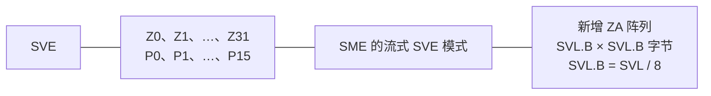
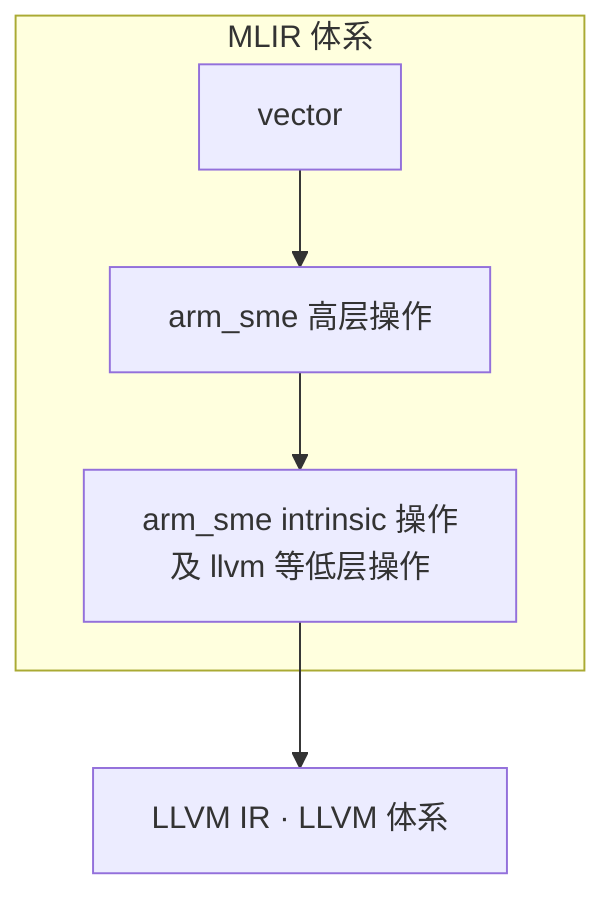
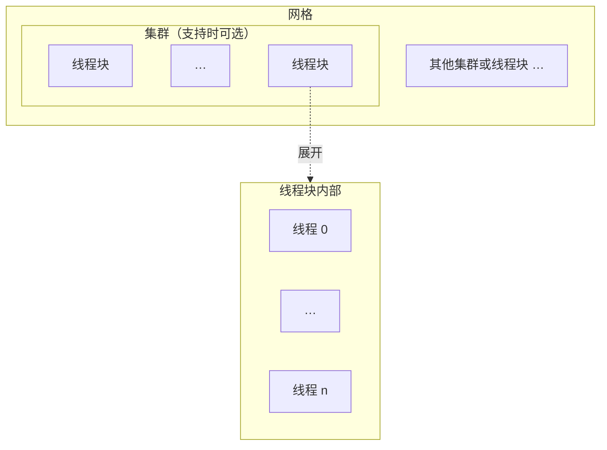
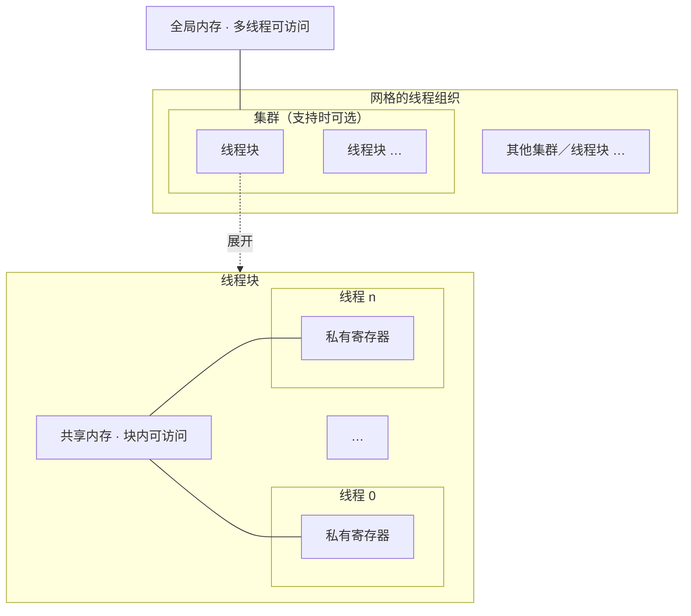
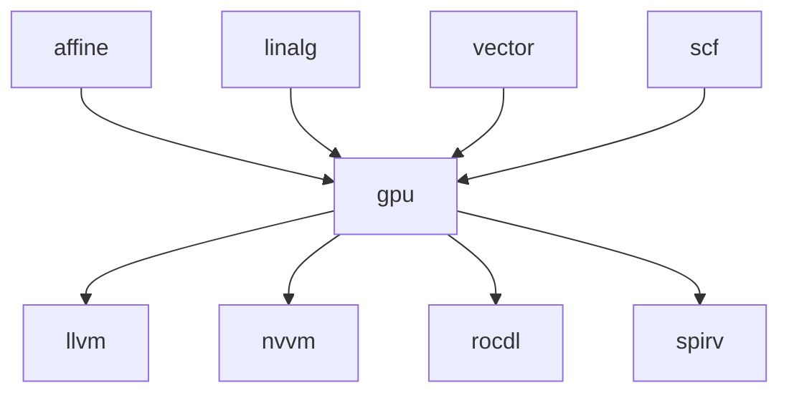
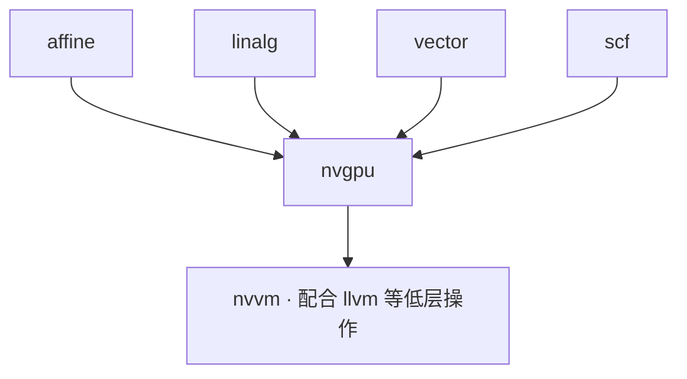
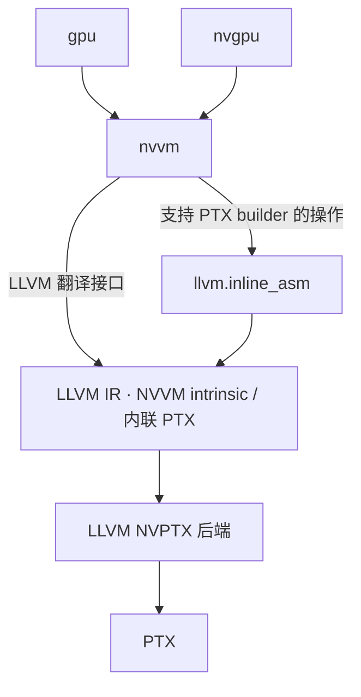

# 第11章 目标输出方言

> 校订基准：本地 LLVM 18.1.8，提交 `3b5b5c1ec4a3095ab096dd780e84d7ab81f3d7ff`。原书以 LLVM 20 为背景；正文保留原节次、论述及图表清单，修正识别错误，并在版本或技术差异处注明。核验依据、原书重要差异及可复现示例见[第11章校订记录](issues/ch11.md)。

<!-- source: insider-compiler-ch11-ch13.pdf, PDF p. 1 -->

目前，MLIR 常见的目标输出包括 C/C++ 代码、LLVM IR 和 SPIR-V 代码。针对这些输出，MLIR 定义了一系列相关方言。例如，`emitc` 方言用于输出 C/C++ 代码，可用于验证或将计算交给现有 C/C++ 工具链；它的用途并不限于测试，不能据此断言其很少用于生产环境。`spirv` 方言用于表示并输出 SPIR-V，这是一种面向图形与并行计算的标准中间表示，通常由支持相应执行环境的驱动或工具链继续处理，并不要求硬件直接执行 SPIR-V。原书把名称末尾的 V 展开成 Vulkan 不准确，SPIR-V 也并非只服务于 Vulkan。

LLVM IR 则可以由多个 MLIR 方言共同翻译生成。生成的 LLVM IR 可作为 LLVM 编译器的输入，借助其中端优化和后端代码生成，得到目标架构的代码，再由相应工具链链接为可执行产物。本书仅关注 LLVM IR 的生成。

这些输出既包括一般的 LLVM IR 指令，也包括调用硬件相关 intrinsic（内建函数）的 LLVM IR。intrinsic 同样属于 LLVM IR 的表达方式。下面分别介绍直接对应一般 LLVM IR 的方言和硬件相关方言。

## 11.1 llvm 方言

`llvm` 方言位于 MLIR 较低的抽象层级，主要职责是对接 LLVM IR。MLIR 提供把该方言翻译为 LLVM IR 的支持，也提供从 LLVM IR 导入到 `llvm` 方言的支持；具体可支持的构造以各方向的实现为准。

本书只讨论从 MLIR 到 LLVM IR 的翻译过程。由于多个方言可以直接参与 LLVM IR 的生成，MLIR 提供 `LLVMTranslationDialectInterface` 接口。其中的 `convertOperation()` 方法用于把方言操作翻译为 LLVM IR。若开发者的方言需要直接参与 LLVM IR 翻译，可派生此接口并实现 `convertOperation()`，再为相应方言注册该接口。接口还允许通过 `amendOperation()` 处理附着在操作上的方言属性。

<!-- source: insider-compiler-ch11-ch13.pdf, PDF p. 2 -->

此外，其他方言在降级到 `llvm` 方言时存在一些共性，例如需要把自身类型转换为 LLVM 兼容类型。为此，MLIR 定义了 `ConvertOpToLLVMPattern`：它继承 `ConvertToLLVMPattern`，后者继承 `ConversionPattern`，而不是 `OpConversionPattern`。开发者可以继承这一模板类实现转换模式，复用 LLVM 类型转换器及相关辅助方法，简化降级工作。

从 MLIR 过渡到 LLVM IR 时，还需要处理二者在 IR 设计上的差异。例如，MLIR 用基本块参数表示控制流汇合处传入的值，而 LLVM IR 使用 `phi` 指令；MLIR 方言通常用 `constant` 操作产生常量 SSA 值，而 LLVM IR 具有常量对象，但没有与这些常量操作一一对应的运行时指令。这些差异需要在翻译中解决。

MLIR 方言有类型、属性和操作三个基本概念，接下来分别介绍。

### 11.1.1 类型

`llvm` 方言的类型设计主要服务于 MLIR 类型到 LLVM IR 类型的映射。因此，当其他方言降级到 `llvm` 方言时，需要把类型转换为它能够接受的 LLVM 兼容类型。

#### 1. 降级要处理的4种类型

**（1）二者原生支持的类型**

若 MLIR 中的类型可以直接对应到 LLVM IR，例如支持的整数和浮点类型，通常不需要重新设计表示，可将它们翻译成相应的 LLVM IR 类型。

**（2）MLIR 中的“高级”类型**

MLIR 中存在复数、张量等较高层的类型，它们有助于清晰地表达程序，而 LLVM IR 没有完全对应的类型。降级时，需要为它们选择 LLVM IR 能够表达的表示。例如，复数通常转换为包含实部、虚部的结构体；张量可以先经过缓冲化变成 `memref`，然后将 `memref` 转换为结构体描述符。这是常见的内存表示路径，并非所有张量降级都必须经过 `memref`。

**（3）含义不同的类型**

有些类型在 MLIR 和 LLVM IR 中都存在，但约束不同，降级时需要特殊处理。例如，MLIR 函数可以有多个输入和多个返回值，而 LLVM IR 函数最多返回一个值。因此，`llvm` 方言定义了相应的函数类型，并在转换函数签名时处理这些差异，主要包括以下两点。

- 函数复合参数处理：根据所采用的转换及调用约定，复合参数可以保留为结构体，也可以展开为多个基础类型参数。例如，默认 `memref` 参数转换会展开描述符字段，裸指针调用约定则有额外限制；这不是一个对所有结构体参数都统一生效的展开开关。
- 函数返回值处理：无返回值时使用 LLVM 的 `void` 返回类型；一个返回值通常直接转换；多个返回值通常封装进一个结构体，作为 LLVM IR 函数的单一返回值。

<!-- source: insider-compiler-ch11-ch13.pdf, PDF p. 3 -->

**（4）需要由 llvm 方言补充的类型**

LLVM IR 还使用 `void`、指针等类型，这些不属于这里讨论的 MLIR builtin 类型集合，因而需要由 `llvm` 方言提供相应表示。例如，LLVM IR 中 `load` 的地址操作数和 `store` 的目标地址操作数具有指针类型。[^ch11-pointer] 因此，`llvm` 方言也定义了指针类型，以表示相关操作的输入、输出；不能说 MLIR 整个系统“没有指针类型”，因为方言本身正是 MLIR 的组成部分。

基于上述原则，`llvm` 方言中主要定义了 `void`、pointer、array、function、struct、fixed vector、scalable vector 等类型；本地版本还包括目标扩展类型等。它也复用 LLVM 兼容的 builtin 标量和一维向量类型，并非所有输入类型都要改成带 `!llvm` 前缀的类型。接下来以 `vector` 和 `memref` 为例介绍转换。

#### 2. 类型降级示例

**（1）vector 类型降级**

向量的转换结果取决于维度。对于固定长度向量，在元素类型 `T` 已转换为 LLVM 兼容类型的前提下，可以分为以下三种情况。

- 0 维向量：`vector<T>` 转换为 `vector<1xT>`。
- 1 维向量：`vector<axT>` 仍使用相应的一维向量表示。
- n 维向量（n > 1）：`vector<ax…xjxkxT>` 转换为嵌套数组，最内层为一维向量，即 `!llvm.array<a x … array<j x vector<kxT>>…>`。数组层数为 n − 1。

可伸缩向量还受到可伸缩维度位置以及 LLVM 类型约束的限制，不能把上述固定长度向量规则无条件推广到任意可伸缩形状。

**（2）memref 类型降级**

`memref` 类型的处理稍复杂。首先，TableGen 定义记录了形状、元素类型、布局和地址空间等信息，概念伪代码如代码清单 11-1 所示。形状是一个维度列表，不能写成单个 `int64_t`。

**代码清单 11-1** memref 类型在 TD 文件中对应的伪代码

```cpp
// 概念伪代码，不是可直接编译的 TableGen 定义。
struct MemRefTypeParameters {
  ArrayRef<int64_t> shape;
  Type elementType;
  MemRefLayoutAttrInterface layout;
  Attribute memorySpace;
};
```

TableGen 定义会生成相应的 C++ 支持代码。例如，可以调用 `getShape()` 获取 `memref` 类型的形状。采用默认描述符转换时，有秩、可表示为 strided 布局的 `memref` 会转换成结构体，概念布局如代码清单 11-2 所示。

**代码清单 11-2** memref 类型降级为结构体对应的伪代码

```cpp
// Elem 为转换后的元素类型，Index 为所选索引整数类型。
// 这里用 C 风格指针解释字段含义；LLVM 18 实际使用 opaque pointer。
struct MemRefDescriptor {
  Elem *allocatedPtr; // 原始分配或外部提供的基址，用于需要时释放存储。
  Elem *alignedPtr;   // 满足访问对齐要求的基址。
  Index offset;      // 从 alignedPtr 起算的元素偏移。
  Index sizes[Rank]; // 各维长度；Rank == 0 时不包含此字段。
  Index strides[Rank]; // 各维以元素为单位的步长；Rank == 0 时省略。
};
```

[^ch11-pointer]: 原书脚注把这些操作数概括为“指向一块内存地址的虚拟寄存器”。更准确地说，地址操作数是指针值，可指向堆、栈、全局存储等；`store` 的待存值并不一定是指针，LLVM IR 中的指针值也不必来自虚拟寄存器，例如可直接使用全局符号。描述符的 `allocatedPtr` 同样不限定来自 `malloc()`。

<!-- source: insider-compiler-ch11-ch13.pdf, PDF p. 4 -->

代码清单 11-2 中的尺寸、步长数组在秩为 0 时省略。`alignedPtr` 可能由原始分配地址按对齐要求调整得到，也可能与 `allocatedPtr` 相同。`offset` 指明访问起点，各个 `stride` 则描述相应维度移动一个元素位置所需的线性步长。

表 11-1 展示不同 `memref` 类型转换后的结构体。此表采用地址空间 0 和 64 位索引；实际索引位宽可以由数据布局或转换选项决定，地址空间也随类型及转换规则变化。无秩 `memref<*xT>` 使用另一种含秩及描述符指针的表示，不属于本表范围。

**表 11-1** 不同 memref 类型对象降级为 llvm 方言后的结构体

| memref 类型对象 | 降级后的结构体 |
| --- | --- |
| `memref<f32>` | `!llvm.struct<(ptr, ptr, i64)>` |
| `memref<1xf32>` | `!llvm.struct<(ptr, ptr, i64, array<1 x i64>, array<1 x i64>)>` |
| `memref<?xf32>` | `!llvm.struct<(ptr, ptr, i64, array<1 x i64>, array<1 x i64>)>` |
| `memref<10x42x42x43x123xf32>` | `!llvm.struct<(ptr, ptr, i64, array<5 x i64>, array<5 x i64>)>` |
| `memref<10x?x42x?x123xf32>` | `!llvm.struct<(ptr, ptr, i64, array<5 x i64>, array<5 x i64>)>` |
| `memref<1x?xvector<4xf32>>` | `!llvm.struct<(ptr, ptr, i64, array<2 x i64>, array<2 x i64>)>` |

### 11.1.2 属性

属性可以作为操作的附属信息，但并非没有格式和规范：属性类、ODS 定义、接口以及 verifier 都可以约束属性的表示和合法值。为了对接 LLVM IR，`llvm` 方言定义或使用了相应的属性，表示 comdat、调用约定（`cconv`）、链接类型（`linkage`）、循环信息、调试信息、内联汇编、fast-math 标志、原子操作及内存序等信息。

其他方言降级到 `llvm` 方言时，需要按目标操作和属性的语义转换这些信息。上下层可以复用兼容的属性表示以减少工作，但 MLIR 属性对象并不因此与 LLVM IR 的属性、枚举或元数据对象完全相同；最终导出仍由翻译逻辑建立对应关系。参见[类型、属性与操作的校订依据](issues/ch11.md#llvm-model)。

### 11.1.3 操作

`llvm` 方言中的操作大体可以分为以下三类。

**（1）与 LLVM IR 指令直接对应的操作**

`llvm` 方言通常为 LLVM IR 指令提供对应操作。例如，整数加法指令 `add` 和浮点加法指令 `fadd` 分别对应 `llvm.add`、`llvm.fadd`。在《深入理解 LLVM：代码生成》的附录中，LLVM IR 指令被划分为算术、逻辑、比较、基本块终止、内存管理和其他指令六类。这些类别中的许多指令都有直接对应操作，但不能据类别断言全部严格一一对应。

<!-- source: insider-compiler-ch11-ch13.pdf, PDF p. 5 -->

例如，`phi` 没有对应的 `llvm.phi` 操作，因为它的作用体现在 MLIR 基本块参数中。翻译时，非入口基本块的参数会转换成 LLVM IR 的 `phi`，各前驱传递的参数建立相应 incoming 边；函数入口块参数则对应函数参数。无须先在 MLIR 中额外构造一个 `phi` 操作。与一般 LLVM IR 指令对应的操作通常使用 `llvm.` 前缀。

**（2）用于衔接两种 IR 表示差异的操作**

MLIR 和 LLVM IR 的核心抽象并不完全一致。例如，MLIR 通常用常量操作定义常量 SSA 值，而 LLVM IR 用常量对象表示常量，没有专门的常量指令。这个差异首先源于 IR 的设计，不能简单归因于“硬件指令都直接支持常量”。`llvm` 方言因而提供常量等特殊操作，并在导出时建立相应 LLVM 常量。

全局变量、全局构造函数列表等也不是普通的 LLVM IR 基本块指令，需要翻译成模块级全局对象或其他对应构造。此外，`undef` 和 `poison` 是 LLVM IR 中具有特定语义的值，并非简单的“指令状态”。`llvm` 方言为它们提供产生相应值的操作，最终导出为 LLVM IR 的相应值。这类衔接操作常使用 `llvm.mlir.` 前缀，例如 `llvm.mlir.constant`、`llvm.mlir.global`、`llvm.mlir.undef` 和 `llvm.mlir.poison`。

**（3）内建操作**

LLVM 定义了一系列 intrinsic，用来表达普通指令不能充分表达的语义，也用于支持优化、目标硬件特性及运行时机制。例如，正弦、余弦计算可通过相应 intrinsic 表达。intrinsic 由编译器识别并按目标及优化策略处理，可能被展开、映射为目标指令或降级为运行库调用；不能将其一概解释为“LLVM 库实现的函数”。

`llvm` 方言把许多 intrinsic 封装成操作，以便在导出 LLVM IR 时生成相应调用。这类操作常使用 `llvm.intr.` 前缀。

### 11.1.4 降级示例

假设有一段包含 `llvm` 方言操作的代码，如代码清单 11-3 所示。

**代码清单 11-3** 包含 llvm 方言操作的待降级代码

```mlir
module attributes {llvm.data_layout = ""} {
  llvm.func @test_scalar(%arg0: f32, %arg1: f32) -> f32 {
    %0 = llvm.fadd %arg0, %arg1 : f32
    llvm.return %0 : f32
  }
}
```

使用 `mlir-translate --mlir-to-llvmir` 可以将它翻译为 LLVM IR。这里的步骤是从 MLIR 导出 LLVM IR，不再是 MLIR 方言之间的转换。代码清单 11-4 给出相应输出。

**代码清单 11-4** 翻译后的 LLVM IR

```llvm
; ModuleID = 'LLVMDialectModule'
source_filename = "LLVMDialectModule"

define float @test_scalar(float %0, float %1) {
  %3 = fadd float %0, %1
  ret float %3
}

!llvm.module.flags = !{!0}
!0 = !{i32 2, !"Debug Info Version", i32 3}
```

<!-- source: insider-compiler-ch11-ch13.pdf, PDF p. 6 -->

代码清单 11-4 中的 LLVM IR 可以交给 LLVM 工具链进一步优化和生成代码。原书还列出了 `malloc`、`free` 的声明；本地导出结果不包含这两个无关声明。清单已按实际输出校订，复现结果见[清单验证记录](issues/ch11.md#verification)。

> **注意**：通常情况下，MLIR 在转换为 LLVM IR 后会复用 LLVM 的优化和后端代码生成。原书引用 Mojo 项目报告，称 LLVM 部分占编译时间的 60%～80%，并指出作者项目中也有相近现象。这是特定工作负载和测量口径下的观察，不能当作所有 MLIR 项目的固定比例，也需要区分 LLVM 中端优化与狭义后端代码生成。
>
> 实际工作中，可以协调 MLIR 和 LLVM 两层的优化，避免不必要的重复工作，以缩短编译时间并改善产物。例如，可在 MLIR 层完成适合高层语义的循环优化、跨过程优化，把全局值编号（GVN）、加载／存储优化、循环强度消减（LSR）和部分标量优化交给 LLVM。这里许多优化属于 LLVM 中端，而非都属于后端。内联也可能在两层安排，但是否两层都执行应由收益、代码大小和编译时间共同决定，不是必须遵守的规则。更多背景见原书引用资料。[^ch11-mojo]

[^ch11-mojo]: 原书参考资料：[What We Learned Building the Mojo Optimization Pipeline](https://llvm.org/devmtg/2024-10/slides/techtalk/Weiwei-What-We-Learned-Building-Mojo-OptimizationPipeline.pdf)，原书记载 2026 年 1 月访问。

## 11.2 硬件方言

### 11.2.1 硬件方言概述

把 MLIR 方言降级到 `llvm` 方言，再翻译为 LLVM IR，是一种通用的编译路径。不过，若在这一过程中丢失了高层结构、数据布局或硬件特性信息，最后生成的代码未必充分利用目标硬件。LLVM 本身支持多种 CPU、GPU 及特殊指令集；硬件方言的价值并不意味着 LLVM 普遍缺少这些后端，而是可以在合适的抽象层明确表达相关计算和约束，为优化及代码生成提供更多信息。

与硬件相关的方言包括 `gpu`、`nvgpu`、`amdgpu`、`nvvm`、`rocdl`、`amx`、`x86vector`、`arm_sve`、`arm_sme` 等。原书还介绍了较新版本中的 `xegpu`。下面沿用原书的十项顺序介绍；原书称 `avx`、`sve` 的两项在本地源码中分别名为 `x86vector`、`arm_sve`。

**（1）gpu 方言**

`gpu` 方言对 GPU 计算建模，提供相对独立于厂商的操作和类型，表达内核启动、内存分配、主机与设备间的数据传输、线程同步和线程层次结构等概念。将高层方言降级到 `gpu` 方言，有助于复用 MLIR 的转换基础设施，生成面向 GPU 的代码。

<!-- source: insider-compiler-ch11-ch13.pdf, PDF p. 7 -->

这种抽象有助于构建异构编译流程，但具体操作能否支持某一厂商或设备，仍取决于转换路径、运行时和目标能力，不能理解为每个操作都适用于任意 GPU。

**（2）nvgpu 方言**

`nvgpu` 是面向 NVIDIA GPU 的方言，用于表达 Tensor Core、异步内存操作、屏障等硬件特性。高层方言可以通过适当的转换生成这些操作，从而在较高抽象层利用 NVIDIA 的特性。

**（3）amdgpu 方言**

`amdgpu` 面向 AMD GPU，并提供向 `rocdl` 等较低层表示的转换支持。在实际使用中，它可以与 `gpu` 方言协作。为了表达设备内存和线程同步等功能，本地方言定义了 `raw_buffer_load`、`raw_buffer_store`、`raw_buffer_atomic_fadd`、`lds_barrier` 等操作。转换实现是否覆盖某个具体操作或目标，需要按版本检查，不能把存在转换目录等同于所有情况均已完整支持。

**（4）xegpu 方言**

原书介绍 `xegpu` 为面向 Intel Xe 架构 GPU 的方言，目标包括支持高性能通用矩阵乘法等计算密集操作。本地 LLVM 18.1.8 源码尚无此方言；这里保留原书的介绍，作为版本差异记录，不把本地缺项判定为 LLVM 20 中不存在。

**（5）nvvm 方言**

`nvvm` 表达 NVIDIA GPU 的低层操作，许多操作对应 LLVM NVVM intrinsic，或通过内联 PTX 实现。PTX（Parallel Thread Execution）是 NVIDIA GPU 工具链使用的虚拟指令集表示，可进一步汇编为特定 GPU 架构的机器码。常见流程是 `gpu`、`nvgpu` 转换为 `nvvm` 和 `llvm` 的组合，翻译成 LLVM IR，再经 LLVM NVPTX 后端生成 PTX，最后由相应工具链生成可执行设备代码。

**（6）rocdl 方言**

`rocdl` 提供面向 AMD GPU 的低层操作表示，主要衔接 LLVM AMDGPU intrinsic 等构造。`gpu`、`amdgpu` 的相关操作可以向它转换，再通过 LLVM 工具链生成 AMD GPU 代码。它本身不是完整机器指令集的逐条枚举。

**（7）amx 方言**

`amx` 面向 Intel Advanced Matrix Extensions（AMX，高级矩阵扩展），主要用于分块矩阵乘法等计算。方言还提供配套的初始化、加载、存储及相关类型支持。原书缩写“AME”已改为 AMX。

**（8）x86vector 方言（原书称 avx）**

本地源码中该方言名为 `x86vector`，用于表示部分 x86 向量指令集特性。高层 `vector` 操作可以经过相应转换，生成目标相关操作并最终映射到 LLVM intrinsic 或机器指令。这有助于表达特定 SIMD 能力，但 `x86vector` 本身并不负责机器寄存器分配，也不是全部 AVX、AVX2、AVX-512 指令和所有 x86 微架构优化的统一实现；这些工作还依赖 LLVM 后端及具体转换路径。

**（9）arm_sve 方言（原书称 sve）**

本地源码中该方言名为 `arm_sve`，用于表示 Arm SVE（Scalable Vector Extension，可伸缩向量扩展）的相关操作。

<!-- source: insider-compiler-ch11-ch13.pdf, PDF p. 8 -->

SVE 指令集支持可伸缩向量，架构允许的向量长度为 128～2048 bit，以 128 bit 为增量。它使程序能够采用向量长度无关的方式编写，为高性能计算和科学计算提供 SIMD 并行能力。`arm_sve` 可衔接高层向量计算和 SVE 特有操作，为运行时有效向量长度下的计算提供表示与转换支持；这并不是在编译时自动获知所有目标机器的实际向量位宽。

**（10）arm_sme 方言**

`arm_sme` 面向 Arm SME（Scalable Matrix Extension，可伸缩矩阵扩展）。SME 是指令集扩展，而 `arm_sme` 是其 MLIR 表示，二者应区分。借助 `vector` 等上层表示到 SME 操作的转换，可以将适合的矩阵计算映射到 SME 硬件能力，并在适当的分块和循环结构下处理动态大小矩阵，为机器学习、科学计算等负载生成代码。

这些硬件方言通过操作、类型、属性及相应转换，表达目标能力；较低层操作常能翻译成 LLVM intrinsic，但不能把所有硬件方言功能都概括成“管理内建函数”。对于向量或矩阵数据，人们通常希望从 `vector`、`affine`、`arith`，甚至 `linalg` 出发，生成适合硬件的计算。具体路径有时需要多步转换、布局选择或目标约束检查，社区支持的覆盖范围也随版本和硬件而不同。本地已有 VectorToArmSME、VectorToGPU 等转换，因此不能笼统断言大多数硬件方言都没有高层降级路径。

硬件方言数量众多，本书不逐一展开。可以按目标大致分为 CPU 相关方言和 GPU 相关方言两类。CPU 方面选择介绍 `arm_sme`；GPU 方面选择介绍 `gpu`、`nvgpu`、`nvvm`，其中 `gpu` 保持跨厂商抽象，后两者面向 NVIDIA。作者选择 SME 的原因包括其社区实现和作者在 SVE、SME 上的工作经验；选择 GPU 则与 GPGPU 在 AI 等领域的应用有关，希望帮助读者在实际项目中使用相关技术。

### 11.2.2 arm_sme 方言

`arm_sme` 是为 SME 设计的方言。理解这一方言，需要先了解 SME 的硬件基础。

#### 1. SME 硬件概述

如图 11-1 所示，SME 在可伸缩向量计算基础上增加了矩阵运算能力。从功能角度看，SVE 支持加、减、乘、除以及 gather/scatter 等向量操作，SME 则增加了矩阵外积累加和 tile 加载／存储等功能，以支持矩阵运算。

SVE 使用 `Z0`～`Z31` 向量寄存器及 `P0`～`P15` 谓词寄存器。SME 的流式 SVE 模式继续使用 Z、P 寄存器的架构表示，并增加 ZA 存储阵列。需要区分非流式向量长度和流式向量长度 SVL：二者可以不同，不能把所有 SVE Z 寄存器长度都不加区分地称为 SVL。

<!-- source: insider-compiler-ch11-ch13.pdf, PDF p. 9 -->

ZA 是二维的架构存储阵列。若 SVL 以 bit 为单位，ZA 的字节阵列尺寸是 `(SVL/8) × (SVL/8)`，而不是单位不明的“SVL × SVL”。SME 使用谓词控制向量与矩阵操作的生效范围，在这些架构状态的基础上支持矩阵计算。图中表示架构概念的关系，不推断具体处理器内部的物理硬件复用方式。

**图 11-1** SME 结构示意图



下面展开介绍 ZA 存储阵列与 P 寄存器。

**（1）ZA 存储阵列**

ZA 为矩阵计算提供直接存储 tile 数据的架构状态，可减少某些向量与矩阵计算中的数据重组。例如，`FMOPA` 把两个向量的外积累加到 ZA tile，这对实现矩阵乘法、卷积等计算很有用。但任意完整矩阵乘法仍需按矩阵大小和归约维度执行相应的多步计算，不能说 ZA 用单条指令完成整个矩阵运算。

ZA 支持按照元素宽度组织 tile，以及水平、垂直切片访问。`ZA[m][n]` 可用作解释二维数据的概念索引，但不是通用的 SME 汇编子矩阵寻址语法，也不能据此假定任意 4×4 或 8×8 子矩阵均有直接对应的指令操作。ZA 与 Z 寄存器协作，例如先把向量加载到 Z 寄存器，再把外积结果累加进 ZA，以提高数据复用。

**（2）P 寄存器**

`P0`～`P15` 是谓词（predicate）寄存器。谓词用于控制相应向量元素是否参与操作；矩阵外积指令可分别用谓词控制两个输入向量，从而控制 tile 中受影响的行和列。这不等于为 ZA 每个元素提供任意独立的掩码位。

不活跃元素的行为取决于指令：切片加载的 `/Z` 形式将相应目的元素清零，切片移动的 `/M` 形式保留原值；受谓词控制的存储不写对应的内存位置，受掩码控制的外积累加保留未更新的累加元素。原书将“加载时保持不变”作为统一规则，已据架构说明修正。

谓词控制有助于处理未填满硬件 tile 的边缘块，避免无效区域参与访问和计算，并可表达条件更新。对于非规则形状，程序仍须构造正确的谓词和循环边界；硬件不会自动识别任意矩阵边界。

<!-- source: insider-compiler-ch11-ch13.pdf, PDF p. 10 -->

通过屏蔽无效部分，程序可以减少显式填充数据及逐元素分支的需要。P 寄存器与 ZA 协同，为实际应用中非规则、动态尺寸矩阵的分块计算提供支持。上述架构修正及官方依据见[硬件独立核对](issues/evidence/hardware-review.md)。

#### 2. arm_sme 方言概述

在正式介绍操作前，先回顾矩阵分块。矩阵分块把大型矩阵划分为较小的子矩阵（块、子块），以便安排计算。这主要有助于处理两个问题。

- 内存墙问题：大矩阵无法整体放入高速缓存，频繁访问较慢的存储会降低性能。
- 并行度问题：需要把计算合理分配到多个计算单元。例如，多核 CPU 上可以让不同核心并行处理不同任务，单条矩阵指令本身并不会自动把整个程序分配到所有核心。

将矩阵切分为适合缓存的块，可以在高速存储中重复使用数据；将不同块分配给不同执行单元，还可以提高并行度。缓存分块与 SME 的架构 tile 不是同一个层级，但可以共同参与计算安排。SME 提供访问 ZA tile 和切片的方法，详细说明可参考原书引用的官方资料。[^ch11-sme]

**（1）部分操作概述**

`arm_sme` 操作可以按用途分为以下几类。较新接口与本地 LLVM 18 的名称差异一并说明。

1. 子块管理：`get_tile` 分配一个内容未定义的虚拟 tile，作为后续操作的输入；它不是简单查询一个已经选定的物理 ZA 子块。`zero` 创建清零 tile。物理 tile ID 由后续分配过程确定。
2. 子块与向量之间的数据传输：原书列出 `insert_tile_slice`、`extract_tile_slice`、`copy_tile`。本地相应的切片传输操作名为 `move_vector_to_tile_slice`、`move_tile_slice_to_vector`；在本地未发现 `copy_tile`，因而不能据本地实现确认“ZA 内部搬运无需任何中转”的说法。
3. 矩阵运算：`outerproduct` 表达外积，并可带累加值。原书还列出 `fmopa_2way`、`fmops_2way` 及 `sumopa_4way`、`sumops_4way` 等较新操作名，本地没有这些同名操作。它们所涉及的多路外积、输入元素宽度、有符号与无符号组合必须按具体版本定义解释，不能简单归为“FP32 双路”或全部“有符号 int8 四路”。这些条目的原文和待核版本范围见[SME 接口差异](issues/ch11.md#sme-api)。
4. 环境查询：`streaming_vl` 查询按指定元素宽度计量的流式向量长度，不用于设置长度。ZA 容量与 tile 元素数量还取决于所采用的单位和元素宽度。

[^ch11-sme]: 原书参考资料：[Arm Scalable Matrix Extension introduction](https://community.arm.com/arm-community-blogs/b/architectures-and-processors-blog/posts/arm-scalable-matrix-extension-introduction) 及[第二部分](https://community.arm.com/arm-community-blogs/b/architectures-and-processors-blog/posts/arm-scalable-matrix-extension-introduction-p2)，原书记载 2025 年 7 月访问。

<!-- source: insider-compiler-ch11-ch13.pdf, PDF p. 11 -->

**（2）上下游关系**

`arm_sme` 的一个主要上游是 `vector`。其较高层操作经转换和 tile 分配后，可以生成 SME intrinsic 操作及其他低层操作，再翻译成 LLVM IR。图 11-2 表示这一路径。

**图 11-2** arm_sme 方言的上下游关系



例如，本地转换可以把适合的 `vector.insert` 转成 `arm_sme.move_vector_to_tile_slice`，把 `vector.outerproduct` 转成 `arm_sme.outerproduct`。原书的 `vector.outproduct` 是操作名拼写错误。

> **注意**：本地提供 `convert-arm-sme-to-scf`，将 `tile_load`、`tile_store` 等操作展开成循环及 SME 切片操作。因此，其转换结果是 `scf` 与 `arm_sme` 等方言的组合，`scf` 确实属于这一中间转换步骤的目标方言。图 11-2 为了突出最终导出路径省略了这些循环，不能据此否定这一步的上下游关系，也不能把所有展开都直接等同于性能优化。

**（3）优化和变换**

原书介绍三项 Pass，并按启用流式模式、外积融合、向量合法化的顺序说明它们的配合。这里保留三项功能讨论，同时区分本地可执行项与版本差异。

1. `enable-arm-streaming`：本地存在。它为 `func.func` 添加函数级流式模式、ZA 使用方式相关属性，供后续转换和代码生成使用。它本身不直接执行状态切换，也不验证所有属性组合的架构合法性。
2. `arm-sme-outer-product-fusion`：原书将其用于识别并融合外积计算，以减少指令和中间存储。本地没有这一 Pass，不能用本地工具验证其具体融合规则，更不能把它直接描述为已经生成最终机器指令。
3. `arm-sme-vector-legalization`：原书将其用于把不适合单个 SME tile 的向量操作重写为符合目标约束的形式。本地没有这一 Pass。合法化与性能优化相关，但首先处理的是表示和目标约束，不能保证所有剩余操作都会因此获得完整硬件支持。

原书给出的顺序首先运行 `enable-arm-streaming`，标注采用 SME 流式模式的函数及相应 ZA 属性；之后安排外积相关变换，再处理其他向量操作。

<!-- source: insider-compiler-ch11-ch13.pdf, PDF p. 12 -->

在原书的流程说明中，外积融合阶段负责识别外积模式并形成更适合 SME 的计算；向量合法化阶段处理加载／存储、向量与 tile 的传递、初始化和其他非外积操作。这个顺序只能作为相应版本和 pipeline 的说明，不能直接照搬到 LLVM 18。本地可执行的示例需要明确运行 tile 分配和 ArmSMEToLLVM 转换，见下文。

#### 3. 降级示例

下面展示 `arm_sme` 高层操作到 SME intrinsic 及 LLVM 地址计算的转换。输入如代码清单 11-5 所示。

**代码清单 11-5** 待降级的 arm_sme 代码

```mlir
func.func @arm_sme_load_tile(%src: memref<?x?xf16>,
                            %mask: vector<[8]xi1>,
                            %tile_slice_index: index) {
  %c0 = arith.constant 0 : index
  %tile = arm_sme.get_tile : vector<[8]x[8]xf16>
  %tile_update = arm_sme.load_tile_slice %src[%c0], %mask, %tile, %tile_slice_index
      : memref<?x?xf16>, vector<[8]xi1>, vector<[8]x[8]xf16>
  "test.some_use"(%tile_update) : (vector<[8]x[8]xf16>) -> ()
  return
}
```

`test.some_use` 是用于保留结果的测试占位操作，不代表可执行硬件操作。使用本地 `mlir-opt` 时，应允许未注册测试方言，并先为虚拟 tile 分配物理 ID：

```sh
mlir-opt listing-11-5.mlir --allow-unregistered-dialect \
  --pass-pipeline='builtin.module(func.func(allocate-arm-sme-tiles,convert-arm-sme-to-llvm,cse,canonicalize))'
```

原书命令缺少本地需要的 tile 分配步骤，也未说明测试方言条件。代码清单 11-6 给出本地实际输出。

**代码清单 11-6** 降级后的结果

```mlir
module {
  func.func @arm_sme_load_tile(%arg0: memref<?x?xf16>, %arg1: vector<[8]xi1>,
                              %arg2: index) attributes {arm_sme.tiles_in_use = 43690 : i32} {
    %c0 = arith.constant 0 : index
    %0 = builtin.unrealized_conversion_cast %arg0 : memref<?x?xf16>
        to !llvm.struct<(ptr, ptr, i64, array<2 x i64>, array<2 x i64>)>
    %1 = builtin.unrealized_conversion_cast %c0 : index to i64
    %2 = arm_sme.materialize_ssa_tile : vector<[8]x[8]xf16>
    %3 = llvm.extractvalue %0[1]
        : !llvm.struct<(ptr, ptr, i64, array<2 x i64>, array<2 x i64>)>
    %4 = llvm.extractvalue %0[4, 0]
        : !llvm.struct<(ptr, ptr, i64, array<2 x i64>, array<2 x i64>)>
    %5 = llvm.mul %1, %4 : i64
    %6 = llvm.getelementptr %3[%5] : (!llvm.ptr, i64) -> !llvm.ptr, f16
    %7 = arith.index_castui %arg2 : index to i32
    "arm_sme.intr.ld1h.horiz"(%arg1, %6, %7) <{tile_id = 0 : i32}>
        : (vector<[8]xi1>, !llvm.ptr, i32) -> ()
    "test.some_use"(%2) : (vector<[8]x[8]xf16>) -> ()
    return
  }
}
```

<!-- source: insider-compiler-ch11-ch13.pdf, PDF p. 13 -->

清单 11-5 用 `arm_sme.load_tile_slice` 完成切片加载，隐藏了底层地址计算，并使用 `memref` 和向量类型。它已明确依赖 SME，因此不能称为架构无关。清单 11-6 则通过 `builtin.unrealized_conversion_cast` 衔接 `memref` 与 LLVM 描述符，显式计算地址，再调用 `arm_sme.intr.ld1h.horiz`，暴露出更多实现细节。这里的转换桥接并不代表真正的运行时类型转换；输出仍包含 `func`、`arith`、测试操作及 SME 占位值，尚不能整体直接导出为可执行 LLVM IR。原书输出中的 `get_tile {tile_id = 0}` 在本地变为 `materialize_ssa_tile`，详见[校订记录](issues/ch11.md#sme-example)。

### 11.2.3 GPU 相关知识概述

随着异构计算的发展，GPU 已从图形渲染扩展到通用并行计算。GPU 编程仍需面对指令集、硬件特性及平台兼容性差异。MLIR 的 `gpu` 方言为这类计算提供共同的中间表示，使前端领域语言和不同后端之间可以复用部分编译流程，并在各抽象层实施适合目标的转换。

这有助于降低某些代码与单一工具链的耦合，但不能保证抹平所有平台差异。CUDA 面向 NVIDIA，而 OpenCL 本身就是跨平台标准，也不宜把二者一并视为相同的平台锁定机制。

#### 1. GPU 执行模型

以 NVIDIA GPU 为例，计算通常由网格（grid）、线程块（block）和线程（thread）组织；支持线程块集群的架构还可选用 cluster 层级。图 11-3 按原图展开这四个层次，cluster 不是所有 GPU 都具有的必选层级。

**图 11-3** NVIDIA GPU 的组织结构



各层分别说明如下。

**（1）线程**

线程是 GPU 编程模型中的基本执行单元，类似流水线上的工人。一个内核的许多线程运行同一程序，并根据索引处理不同数据，例如图像像素或矩阵元素。NVIDIA 采用 SIMT（Single Instruction, Multiple Threads，单指令多线程）执行模型，线程可发生控制流分歧，不能理解为全 GPU 的全部线程始终执行同一条指令。

<!-- source: insider-compiler-ch11-ch13.pdf, PDF p. 14 -->

GPU 可以调度大量线程，但总共启动的线程数与同时驻留、同时执行的线程数不同。硬件在可驻留的线程束之间安排执行，有助于隐藏访存等延迟；不能将此概括为任意线程创建、切换都没有成本。

**（2）线程块**

线程块把线程组织成协作团队，类似生产小组。块内线程可以使用共享内存，并通过显式同步协调进度。例如，图像滤波中相邻像素的计算可借助共享内存复用数据。一个块可以少于 32 个线程；常用硬件每块最多支持 1024 个线程，但实际限制还应查询设备属性，而不是把“32～1024”写成统一范围。

**（3）集群**

线程块集群是支持该功能的 NVIDIA 架构所提供的可选层级，计算能力 9.0 起引入。集群让若干线程块进行协作，可使用集群同步和分布式共享内存。例如，在需要交换边界数据的模拟计算中，集群为块间通信提供了额外手段。具体程序仍需使用正确的地址空间、同步和生命周期规则，不能把所有跨块全局内存交换都自动替换为集群通信。

**（4）网格**

一次内核启动的线程块共同组成网格。使用集群时，这些块还可以按集群组织；不使用集群时，网格直接由线程块组成。对于可以按块扩展的算法，增大数据规模时可增加块数，并保留合适的块大小，但仍受网格维度、资源和算法约束。

各层次的同步需要按程序语义安排。线程自身按相应执行语义运行，线程间通信则不能单靠“硬件自动维护”保证安全。块内可以显式使用屏障，集群内使用适当的集群同步；网格内的跨块同步并不会由运行时自动插入。协作网格同步需要满足设备和启动条件，并显式调用相应操作，例如 `grid.sync()`。这些修正依据固定版本的 [CUDA 12.6 编程指南](https://docs.nvidia.com/cuda/archive/12.6.0/cuda-c-programming-guide/index.html)。

#### 2. 内存层次建模

为了缓解计算速度与内存访问速度不匹配的问题，GPU 采用多层次存储结构。下面按原书顺序介绍。

**（1）寄存器**

线程的局部值通常优先放在寄存器中。寄存器靠近计算单元、访问成本低，但数量有限。编译器会根据活跃值、目标约束和优化策略分配寄存器；寄存器压力过大时，可能将部分值溢出到本地内存。访问延迟取决于架构和依赖关系，不能统一指定为 1～2 个周期。

**（2）共享内存**

共享内存支持同一线程块内线程交换和复用数据，通常具有较低延迟。在矩阵乘法、图像卷积等计算中，可以先把所需全局数据搬到共享内存，再由线程合作计算，最后写回结果，从而减少重复全局访问。共享内存的容量、带宽、bank 冲突和访问模式共同影响性能；它并不普遍比整个寄存器文件更大，也不能统一认为其访问只需 2～5 个周期。

**（3）全局内存**

全局内存通常提供较大的设备存储容量，访问成本受到缓存命中、访问模式和具体硬件影响。原书的“400～800 周期、16～80 GB”没有指定型号和条件，故仅作为原书数值保留在[问题记录](issues/ch11.md#hardware)，不作为通用规范。

为提高带宽利用率，应尽量形成合并访问：线程束中线程访问相邻且满足对齐条件的地址时，硬件可以用较少的内存事务服务这些请求。

<!-- source: insider-compiler-ch11-ch13.pdf, PDF p. 15 -->

这并不保证所有请求只发生一次传输；实际事务数还取决于元素大小、访问范围和对齐。过于分散的访问通常会降低有效传输效率。

**（4）常量内存和纹理内存**

常量和纹理访问具有针对特定读取模式优化的路径。常量内存适合核函数中只读的参数，同一线程束读取相同地址时可受益于广播。纹理访问支持图形采样等功能，并有相应的缓存特性。它们不是简单等同的两块“永远只读”的物理存储：应区分核函数的访问限制、宿主端更新方式以及所用资源类型。

**（5）本地内存**

本地内存中的“本地”表示线程私有，而不是物理上靠近计算核心。它通常位于设备内存中，可以存放寄存器溢出值以及不适合寄存器表示的局部对象。其访问可能经过缓存，因而不能简单说每次访问都和一次未命中的全局访问一样慢，但应避免不必要的本地内存流量。

图 11-4 表示 NVIDIA 编程模型中的存储可见范围。它不是芯片的物理布局，也不意味着全局内存只属于某一次网格启动。

**图 11-4** NVIDIA GPU 的硬件存储结构



现代 GPU 还有 L1、L2 等缓存。L1 可缓存某些全局、本地等访问；在部分架构中它与共享内存共用可配置的片上容量，但共享内存不是“被 L1 缓存”的对象。L2 是多个计算单元共享的缓存层，可减少访问设备内存的流量。

理解这些层次对优化很重要。以矩阵转置为例，直接在全局内存中按一方连续、另一方跨行的方式访问，可能产生低效事务；通过共享内存 tile 调整访问布局，可让全局读写都更容易合并，同时还要处理共享内存 bank 冲突。

#### 3. 计算原语支持

“矩阵计算优化”和“数据重排”等术语，对应着 GPU 为常见计算模式提供的专门能力。理解这些能力，有助于为负载选择合适的实现。

<!-- source: insider-compiler-ch11-ch13.pdf, PDF p. 16 -->

**（1）矩阵计算优化**

矩阵计算是 GPU 加速的重要对象，尤其常见于 AI 训练。专用矩阵计算单元，例如 NVIDIA Tensor Core，可以高吞吐量执行支持的矩阵乘加。原书“单周期完成 4×4 矩阵乘加”的描述对应特定的 Volta Tensor Core 背景，不能推广为所有代际、所有形状或者整条 warp 级矩阵指令的延迟。[NVIDIA CUDA 9 Tensor Core 介绍](https://developer.nvidia.com/blog/programming-tensor-cores-cuda-9/) 给出了该背景。

深度学习框架可能调用 cuBLAS 等库完成矩阵计算，但是否选用 Tensor Core，取决于数据类型、算法、硬件及调用条件。混合精度也是重要手段，例如使用较低精度乘法与较高精度累加；支持的类型组合依具体指令而定。

**（2）数据重排**

数据布局直接影响访问效率。如果布局不适合线程访问模式，程序可能花费大量时间搬运数据。GPU 既通过硬件指令支持某些数据交换、矩阵加载／存储模式，也通过语言 intrinsic 和库接口暴露这些能力。例如，CUDA 的 `__shfl_sync` 允许线程束内参与线程交换寄存器值，不需要先经过共享内存。它是暴露硬件能力的 intrinsic，不应简单称为一个通用函数库。

原书从三个方面介绍数据重排支持。

1. 线程间交换指令：shuffle 可在线程束内按指定模式交换数据，参与者不限于物理上或编号上相邻的线程。
2. 共享内存寻址：程序可以通过安排写入和读取顺序实现转置、分块等。例如，按行写入共享 tile，再按列读取，以适应后续布局；需要同时考虑 bank 冲突及同步。
3. 专用硬件能力：不同 GPU 提供矩阵加载、存储和计算指令，可参与布局转换。原书关于“AMD CDNA 矩阵存储指令”和“Intel Ponte Vecchio 矩阵引擎自动识别数据重排模式”的概括未给出具体指令或资料；本次不把它们扩写为已证实的通用机制，原说法保留在[问题记录](issues/ch11.md#hardware)。

### 11.2.4 gpu 方言

`gpu` 方言的设计可从三个方面理解：提供相对独立于硬件厂商的并行计算抽象；在 LLVM IR 等低层表示之上保留可验证、可优化的中间层；通过模块化转换衔接 `spirv`、`nvvm` 等目标表示。这样可以在逐步降级时保留有用的计算结构、同步和存储信息，但具体支持范围仍由实现决定。

在容器层，`gpu.module` 和 `gpu.func` 用于组织设备代码，带 `kernel` 标记的函数表示内核入口。在内存层，`#gpu.address_space<global/workgroup/private>` 等地址空间属性，以及 `gpu.memcpy` 等操作表达存储与传输；本地地址空间枚举并没有独立的 `constant` 项。在执行层，`gpu.block_dim`、`gpu.thread_id` 等是查询操作，不是属性，用于读取线程组织信息；支持集群时还有相应查询。

<!-- source: insider-compiler-ch11-ch13.pdf, PDF p. 17 -->

这些抽象表达了程序和目标之间的约束，使高层转换可以复用通用表示，并在后续映射到具体架构。

#### 1. 部分操作概述

对应前节的执行、存储和计算能力，下面沿用原书的三个类别介绍操作。这里是便于阅读的分类，并非 ODS 对操作的严格分组；尤其稀疏计算部分包含运行库描述符接口，不全是设备指令。

**（1）执行模型操作**

这些操作表达并行任务、线程索引、同步及启动等行为。它们为开发者提供控制手段，但不会自动避免所有数据竞争。

- `all_reduce`：在同一 workgroup／线程块内归约，可以使用内建归约种类或自定义归约 region；不是跨线程块归约。
- `barrier`：同步同一 workgroup 内的线程，并按操作语义建立相应内存可见性。
- `binary`：保存序列化的 GPU 二进制对象及其目标信息；不是定义加、乘等二元运算。
- `block_dim`：查询当前线程块在指定维度的大小，对应 `blockDim.x/y/z` 一类信息。
- `block_id`：查询当前线程块在网格指定维度的索引。
- `cluster_block_id`：原书列为查询当前块在集群内指定维度的索引；本地无此同名 GPU 操作，属于需要核对目标版本的条目。
- `cluster_dim_blocks`：原书列为查询集群在指定维度所包含的线程块数；本地无此同名 GPU 操作。
- `cluster_dim`：本地 GPUToNVVM 实现将它转换为网格在指定维度的集群数查询。`GPUOps.td` 中的说明却写成集群内线程块数，二者不一致；这里按实际映射及转换实测说明，见[校订记录](issues/ch11.md#gpu-ops)。
- `cluster_id`：查询当前集群在网格指定维度的索引。
- `func`：定义 GPU 设备函数；内核入口还需 `kernel` 标记。
- `module`：封装设备函数、内核等 GPU 代码。
- `global_id`：查询线程在指定维度的全局索引，概念上是 `block_id * block_dim + thread_id`；不是自动将三维索引线性化为一个全局唯一整数。
- `grid_dim`：查询网格在指定维度的线程块数。
- `host_register`：注册宿主内存，以便设备访问；对应运行时支持固定／注册内存的方式。
- `host_unregister`：取消上述注册。
- `lane_id`：查询线程在 subgroup 中的编号。NVIDIA warp 为 32 个线程时范围是 0～31，通用 GPU 方言不把所有目标固定为 32。
- `launch_func`：按给定启动维度、依赖及参数启动指定内核函数。
- `launch`：在一个操作中同时表达启动维度、动态共享内存大小等配置和设备执行 region。
- `num_subgroups`：查询 workgroup 中的 subgroup 数量。
- `printf`：表达设备端格式化输出，需要相应目标和运行时支持。
- `return`：结束 `gpu.func`，返回给调用者。
- `set_default_device`：设置后续 GPU 操作使用的默认设备索引。
- `subgroup_id`：查询当前 subgroup 在 workgroup 内的索引。
- `subgroup_reduce`：在 subgroup 内执行指定种类的归约。
- `subgroup_size`：查询 subgroup 的大小。

<!-- source: insider-compiler-ch11-ch13.pdf, PDF p. 18 -->

subgroup 是适于共同执行某些同步或集体操作的线程组，NVIDIA 中对应 warp，AMD 中对应 wavefront。它的具体大小和约束由目标决定。线程虽然共用硬件资源池，但每个线程的寄存器值仍是私有的，不能理解为无需显式交换就能读取其他线程的寄存器。

- `terminator`：终止 `gpu.launch` 的设备 region；不是 `gpu.module` 或 `gpu.func` 的通用终止符。后两者分别使用模块终止机制及 `gpu.return`。
- `thread_id`：查询线程在线程块指定维度的索引。
- `wait`：等待异步 GPU 操作或构造相应异步依赖。
- `warp_execute_on_lane_0`：在 lane 0 执行 region，通过指定的 warp 大小和参数／结果规则表达与其他 lane 的数据分配关系，不只是无条件跳过其余线程的普通条件块。
- `yield`：从需要它的 GPU region 返回结果，例如归约或 `warp_execute_on_lane_0`；并非通用 GPU 循环的“继续执行”指令。

**（2）内存操作**

这类操作管理内存分配、传输、初始化和释放。

- `alloc`：分配内存，通常用于设备存储，也有宿主共享等选项；是否支持由运行时决定。
- `dynamic_shared_memory`：取得本次内核启动所提供的动态共享内存，以一维动态字节 `memref` 表示，再按需构建视图。
- `memcpy`：复制相应内存，可表达宿主与设备间或设备内部传输，并支持异步依赖。
- `memset`：以给定元素值填充目标 `memref`。
- `dealloc`：释放由相应分配操作获得的内存。

**（3）硬件原语及计算库操作**

本组包括稀疏／稠密计算描述符、库调用和 subgroup 矩阵计算。描述符的建立和销毁通常不等于分配、释放其引用的数据缓冲区。

- `create_2to4_spmat`：建立 2:4 结构化稀疏矩阵描述符。
- `create_bsr`：建立块压缩行（BSR）格式稀疏矩阵描述符。
- `create_coo_aos`：建立使用结构数组（AoS）布局的 COO 稀疏矩阵描述符。
- `create_coo`：建立 COO 描述符，引用非零元素的行、列和值数组。
- `create_csc`：建立压缩稀疏列（CSC）格式矩阵描述符。
- `create_csr`：建立压缩稀疏行（CSR）格式矩阵描述符。
- `create_dn_tensor`：为已有稠密张量数据建立描述符，不是自动分配并初始化张量元素。
- `destroy_dn_tensor`：销毁稠密张量描述符及其内部管理资源，不承担任意外部数据缓冲区的释放。
- `destroy_sp_mat`：销毁稀疏矩阵描述符，其引用的数据数组需要按各自所有权管理。
- `sddmm_buffer_size`：查询采样稠密—稠密矩阵乘法（SDDMM）需要的临时缓冲区大小。
- `sddmm`：执行按稀疏结构采样的稠密矩阵乘积等相应计算。
- `set_csr_pointers`：更新 CSR 描述符中的行指针、列索引和值数组引用。原书 `set_cst_pointers` 为拼写错误。

<!-- source: insider-compiler-ch11-ch13.pdf, PDF p. 19 -->

- `shuffle`：在 subgroup 内通过相应交换模式传递值。
- `spgemm_copy`：完成稀疏矩阵乘法流程中的结果复制阶段，将结果写入输出矩阵数据结构；不是复制描述符对象。
- `spgemm_create_descr`：建立 SpGEMM 算法描述符。
- `spgemm_destroy_descr`：销毁 SpGEMM 算法描述符。
- `spmm_buffer_size`：查询稀疏矩阵—稠密矩阵乘法（SpMM）的临时缓冲区大小。
- `spmm`：执行稀疏矩阵与稠密矩阵乘法等相应计算。
- `spmv_buffer_size`：查询稀疏矩阵—向量乘法（SpMV）的临时缓冲区大小。
- `spmv`：执行稀疏矩阵与向量乘法等相应计算。
- `spmat_get_size`：查询稀疏矩阵行数、列数及非零元素数。
- `subgroup_mma_compute`：执行 subgroup 级矩阵乘法累加（MMA）。
- `subgroup_mma_constant_matrix`：生成每个元素由标量常量值填充的 MMA 矩阵表示，并不意味着从内存加载整块常量矩阵。
- `subgroup_mma_elementwise`：在支持的 MMA 矩阵表示上执行逐元素操作，不限于某一条 MMA 的直接结果。
- `subgroup_mma_load_matrix`：从内存协作加载适合 subgroup MMA 使用的矩阵片段。
- `subgroup_mma_store_matrix`：将相应矩阵片段协作存入内存。

#### 2. 上下游关系

`gpu` 的上游可以来自 `linalg`、`affine`、`vector`、`scf`，下游包括 `llvm`、`nvvm`、`rocdl` 和 `spirv`，如图 11-5 所示。箭头概括编译路径，不表示任意上游操作都存在单步直接转换。

**图 11-5** gpu 方言的上下游关系



例如，`linalg` 的矩阵乘法、卷积可经过分块、向量化、线程映射等转换，形成 GPU 计算；适合的向量收缩可转成 `gpu.subgroup_mma_compute` 等操作。不存在原书所写的通用 `gpu.subgroup_mma` 操作。循环也可在满足转换条件后映射到 GPU，例如将适合的 affine 或 scf 循环转换为 `gpu.launch` 中的并行执行。

与平台无关的标量操作通常可转换为 `llvm` 操作，设备特有操作则可转换为 `nvvm` 或 `rocdl`。另一条路径是转换到 `spirv` 并生成 SPIR-V，供 Vulkan、OpenCL 等适用执行环境使用；SPIR-V 本身不是直接的硬件机器码。

<!-- source: insider-compiler-ch11-ch13.pdf, PDF p. 20 -->

#### 3. 优化和变换

GPU 相关优化和变换涉及并行映射、内存访问和目标适配。下面介绍原书选取的两个 Pass。

1. `gpu-launch-sink-index-computations` 将适合的、没有副作用的计算复制或下沉到 `gpu.launch` 内，以减少不必要的内核参数依赖。本地判断包括常量、`memref.dim`、`arith.select`、`arith.cmpi`，并检查是否会增加新的内核参数。这不是把原本在宿主执行的 `gpu.thread_id`、`gpu.block_id` 搬到设备，也不保证减少总计算量：下沉可能复制计算，其收益需要结合参数传递和后续优化判断。
2. `gpu-kernel-outlining` 把 `gpu.launch` 内的设备代码提取为独立的 `gpu.func` 内核，置于 `gpu.module` 中，并以宿主侧 `gpu.launch_func` 调用替换原启动操作。它使原先内联于启动 region 的设备逻辑成为显式的内核函数。

#### 4. 降级示例

下面展示 `gpu` 到 `nvvm` 及 `llvm` 的转换。清单 11-7 保留原书计算 128×256 与 256×512 矩阵乘积的算法，并修正线程坐标：块起点必须乘实际 `block_dim`，不能直接乘整个输出的 128 和 512。否则要覆盖一个输出矩阵就隐含要求单块包含 128×512 个线程，远超该编程模型的块容量。这里补上 `kernel` 标记，块可取 16×16，网格对应为 8×32；这只是正确覆盖的一种启动配置，并不是高性能矩阵乘法实现。

**代码清单 11-7** gpu 方言到 nvvm 方言的待降级代码

```mlir
gpu.module @matmul_kernel {
  gpu.func @matmul(%A: memref<128x256xf32>,
                   %B: memref<256x512xf32>,
                   %C: memref<128x512xf32>) kernel {
    // 定义 index 常量。
    %c0 = arith.constant 0 : index
    %c1 = arith.constant 1 : index
    %c128 = arith.constant 128 : index
    %c256 = arith.constant 256 : index
    %c512 = arith.constant 512 : index
    // 获取线程、块编号及实际块维度。
    %tid_x = gpu.thread_id x
    %tid_y = gpu.thread_id y
    %block_x = gpu.block_id x
    %block_y = gpu.block_id y
    %block_dim_x = gpu.block_dim x
    %block_dim_y = gpu.block_dim y
    // 计算输出矩阵坐标。
    %row_base = arith.muli %block_x, %block_dim_x : index
    %row = arith.addi %row_base, %tid_x : index
    %col_base = arith.muli %block_y, %block_dim_y : index
    %col = arith.addi %col_base, %tid_y : index
    %row_lt = arith.cmpi slt, %row, %c128 : index
    %col_lt = arith.cmpi slt, %col, %c512 : index
    %in_bounds = arith.andi %row_lt, %col_lt : i1
    scf.if %in_bounds {
      // 初始化累加器，沿归约维计算内积。
      %sum_init = arith.constant 0.0 : f32
      %final_sum = scf.for %k = %c0 to %c256 step %c1
          iter_args(%sum_iter = %sum_init) -> (f32) {
        %a_val = memref.load %A[%row, %k] : memref<128x256xf32>
        %b_val = memref.load %B[%k, %col] : memref<256x512xf32>
        %product = arith.mulf %a_val, %b_val : f32
        %new_sum = arith.addf %sum_iter, %product : f32
        scf.yield %new_sum : f32
      }
      memref.store %final_sum, %C[%row, %col] : memref<128x512xf32>
    }
    gpu.return
  }
}
```

<!-- source: insider-compiler-ch11-ch13.pdf, PDF p. 21 -->

使用本地工具时，Pass 名为 `convert-gpu-to-nvvm`，并运行于 `gpu.module`：

```sh
mlir-opt listing-11-7.mlir \
  --pass-pipeline='builtin.module(gpu.module(convert-gpu-to-nvvm))'
```

代码清单 11-8 是这一命令的完整输出，采用本地字段构造顺序及 `llvm.mlir.undef`。原书不同的构造顺序、`poison` 和新版本 GEP 标志不能直接照搬为 LLVM 18 输出。

**代码清单 11-8** 降级为 nvvm 和 llvm 操作后的结果

为对应扫描跨页，以下三个代码块连续组成同一个清单，需拼接后解析。

```mlir
module {
  gpu.module @matmul_kernel {
    llvm.func @matmul(%arg0: !llvm.ptr, %arg1: !llvm.ptr, %arg2: i64, %arg3: i64, %arg4: i64, %arg5: i64, %arg6: i64, %arg7: !llvm.ptr, %arg8: !llvm.ptr, %arg9: i64, %arg10: i64, %arg11: i64, %arg12: i64, %arg13: i64, %arg14: !llvm.ptr, %arg15: !llvm.ptr, %arg16: i64, %arg17: i64, %arg18: i64, %arg19: i64, %arg20: i64) attributes {gpu.kernel, nvvm.kernel} {
      %0 = llvm.mlir.undef : !llvm.struct<(ptr, ptr, i64, array<2 x i64>, array<2 x i64>)>
      %1 = llvm.insertvalue %arg0, %0[0] : !llvm.struct<(ptr, ptr, i64, array<2 x i64>, array<2 x i64>)> 
      %2 = llvm.insertvalue %arg1, %1[1] : !llvm.struct<(ptr, ptr, i64, array<2 x i64>, array<2 x i64>)> 
      %3 = llvm.insertvalue %arg2, %2[2] : !llvm.struct<(ptr, ptr, i64, array<2 x i64>, array<2 x i64>)> 
      %4 = llvm.insertvalue %arg3, %3[3, 0] : !llvm.struct<(ptr, ptr, i64, array<2 x i64>, array<2 x i64>)> 
      %5 = llvm.insertvalue %arg5, %4[4, 0] : !llvm.struct<(ptr, ptr, i64, array<2 x i64>, array<2 x i64>)> 
      %6 = llvm.insertvalue %arg4, %5[3, 1] : !llvm.struct<(ptr, ptr, i64, array<2 x i64>, array<2 x i64>)> 
      %7 = llvm.insertvalue %arg6, %6[4, 1] : !llvm.struct<(ptr, ptr, i64, array<2 x i64>, array<2 x i64>)> 
      %8 = llvm.mlir.undef : !llvm.struct<(ptr, ptr, i64, array<2 x i64>, array<2 x i64>)>
      %9 = llvm.insertvalue %arg7, %8[0] : !llvm.struct<(ptr, ptr, i64, array<2 x i64>, array<2 x i64>)> 
      %10 = llvm.insertvalue %arg8, %9[1] : !llvm.struct<(ptr, ptr, i64, array<2 x i64>, array<2 x i64>)> 
      %11 = llvm.insertvalue %arg9, %10[2] : !llvm.struct<(ptr, ptr, i64, array<2 x i64>, array<2 x i64>)> 
      %12 = llvm.insertvalue %arg10, %11[3, 0] : !llvm.struct<(ptr, ptr, i64, array<2 x i64>, array<2 x i64>)> 
      %13 = llvm.insertvalue %arg12, %12[4, 0] : !llvm.struct<(ptr, ptr, i64, array<2 x i64>, array<2 x i64>)> 
      %14 = llvm.insertvalue %arg11, %13[3, 1] : !llvm.struct<(ptr, ptr, i64, array<2 x i64>, array<2 x i64>)> 
      %15 = llvm.insertvalue %arg13, %14[4, 1] : !llvm.struct<(ptr, ptr, i64, array<2 x i64>, array<2 x i64>)> 
      %16 = llvm.mlir.undef : !llvm.struct<(ptr, ptr, i64, array<2 x i64>, array<2 x i64>)>
      %17 = llvm.insertvalue %arg14, %16[0] : !llvm.struct<(ptr, ptr, i64, array<2 x i64>, array<2 x i64>)> 
      %18 = llvm.insertvalue %arg15, %17[1] : !llvm.struct<(ptr, ptr, i64, array<2 x i64>, array<2 x i64>)> 
      %19 = llvm.insertvalue %arg16, %18[2] : !llvm.struct<(ptr, ptr, i64, array<2 x i64>, array<2 x i64>)> 
      %20 = llvm.insertvalue %arg17, %19[3, 0] : !llvm.struct<(ptr, ptr, i64, array<2 x i64>, array<2 x i64>)> 
      %21 = llvm.insertvalue %arg19, %20[4, 0] : !llvm.struct<(ptr, ptr, i64, array<2 x i64>, array<2 x i64>)> 
      %22 = llvm.insertvalue %arg18, %21[3, 1] : !llvm.struct<(ptr, ptr, i64, array<2 x i64>, array<2 x i64>)> 
      %23 = llvm.insertvalue %arg20, %22[4, 1] : !llvm.struct<(ptr, ptr, i64, array<2 x i64>, array<2 x i64>)> 
```

<!-- source: insider-compiler-ch11-ch13.pdf, PDF p. 22 -->

```mlir
      %24 = llvm.mlir.constant(0.000000e+00 : f32) : f32
      %25 = llvm.mlir.constant(0 : index) : i64
      %26 = builtin.unrealized_conversion_cast %25 : i64 to index
      %27 = llvm.mlir.constant(1 : index) : i64
      %28 = builtin.unrealized_conversion_cast %27 : i64 to index
      %29 = llvm.mlir.constant(128 : index) : i64
      %30 = llvm.mlir.constant(256 : index) : i64
      %31 = builtin.unrealized_conversion_cast %30 : i64 to index
      %32 = llvm.mlir.constant(512 : index) : i64
      %33 = nvvm.read.ptx.sreg.tid.x : i32
      %34 = llvm.sext %33 : i32 to i64
      %35 = nvvm.read.ptx.sreg.tid.y : i32
      %36 = llvm.sext %35 : i32 to i64
      %37 = nvvm.read.ptx.sreg.ctaid.x : i32
      %38 = llvm.sext %37 : i32 to i64
      %39 = nvvm.read.ptx.sreg.ctaid.y : i32
      %40 = llvm.sext %39 : i32 to i64
      %41 = nvvm.read.ptx.sreg.ntid.x : i32
      %42 = llvm.sext %41 : i32 to i64
      %43 = nvvm.read.ptx.sreg.ntid.y : i32
      %44 = llvm.sext %43 : i32 to i64
      %45 = llvm.mul %38, %42  : i64
      %46 = llvm.add %45, %34  : i64
      %47 = llvm.mul %40, %44  : i64
      %48 = llvm.add %47, %36  : i64
      %49 = llvm.icmp "slt" %46, %29 : i64
      %50 = llvm.icmp "slt" %48, %32 : i64
      %51 = llvm.and %49, %50  : i1
      scf.if %51 {
        %52 = scf.for %arg21 = %26 to %31 step %28 iter_args(%arg22 = %24) -> (f32) {
          %58 = builtin.unrealized_conversion_cast %arg21 : index to i64
          %59 = llvm.extractvalue %7[1] : !llvm.struct<(ptr, ptr, i64, array<2 x i64>, array<2 x i64>)> 
```

<!-- source: insider-compiler-ch11-ch13.pdf, PDF p. 23 -->

```mlir
          %60 = llvm.mlir.constant(256 : index) : i64
          %61 = llvm.mul %46, %60  : i64
          %62 = llvm.add %61, %58  : i64
          %63 = llvm.getelementptr %59[%62] : (!llvm.ptr, i64) -> !llvm.ptr, f32
          %64 = llvm.load %63 : !llvm.ptr -> f32
          %65 = llvm.extractvalue %15[1] : !llvm.struct<(ptr, ptr, i64, array<2 x i64>, array<2 x i64>)> 
          %66 = llvm.mlir.constant(512 : index) : i64
          %67 = llvm.mul %58, %66  : i64
          %68 = llvm.add %67, %48  : i64
          %69 = llvm.getelementptr %65[%68] : (!llvm.ptr, i64) -> !llvm.ptr, f32
          %70 = llvm.load %69 : !llvm.ptr -> f32
          %71 = llvm.fmul %64, %70  : f32
          %72 = llvm.fadd %arg22, %71  : f32
          scf.yield %72 : f32
        }
        %53 = llvm.extractvalue %23[1] : !llvm.struct<(ptr, ptr, i64, array<2 x i64>, array<2 x i64>)> 
        %54 = llvm.mlir.constant(512 : index) : i64
        %55 = llvm.mul %46, %54  : i64
        %56 = llvm.add %55, %48  : i64
        %57 = llvm.getelementptr %53[%56] : (!llvm.ptr, i64) -> !llvm.ptr, f32
        llvm.store %52, %57 : f32, !llvm.ptr
      }
      llvm.return
    }
  }
}
```

清单中 `gpu.thread_id`、`gpu.block_id` 和 `gpu.block_dim` 已变成读取 PTX 特殊寄存器的操作，`memref` 参数则展开为描述符字段。输出仍保留 `scf.if`、`scf.for` 和转换桥接，所以这一步是部分降级，尚不是可直接导出 LLVM IR 的最终模块。完整流程还需要处理 SCF、剩余函数和转换桥接，以及设备模块的翻译和目标配置。

### 11.2.5 nvgpu 方言

`nvgpu` 是面向 NVIDIA GPU 的 MLIR 表示，可与通用 `gpu` 方言配合，以表达更具体的硬件能力。例如，它提供 Tensor Core 和 TMA（Tensor Memory Accelerator，张量内存加速器）相关操作，帮助高层转换生成适合硬件的计算与数据传输。原书将 TMA 展开为 Tensor Memory Access，已据 NVIDIA 术语改正。本节介绍其操作、上下游关系及优化方法。

<!-- source: insider-compiler-ch11-ch13.pdf, PDF p. 24 -->

#### 1. 部分操作概述

按原书的六个类别分别介绍如下。

1. 异步内存：`device_async_copy` 表达设备侧异步复制，主要衔接全局内存到共享内存的相关传输；`device_async_create_group` 将操作组织成组；`device_async_wait` 等待相应操作组。
2. 内存屏障：`mbarrier.create` 创建屏障表示，`mbarrier.init` 初始化到达计数；`mbarrier.arrive.*` 表达相应到达行为，`mbarrier.test.wait` 检查屏障阶段是否完成。原书的 `mbarrier.ini` 已修正为 `mbarrier.init`。
3. Tensor Core 矩阵运算：`mma.sync` 表达同步矩阵乘加；`mma.sp.sync` 表达支持结构化稀疏性的矩阵乘加。支持的输入片段布局、类型和形状受到约束。
4. TMA：`tma.create.descriptor` 建立 tensor map 描述符；`tma.prefetch.descriptor` 预取描述符；`tma.async.load`、`tma.async.store` 表达相应异步传输。
5. 特殊数学运算：原书在这里列出近似倒数 `rcp`。本地 `nvgpu` 没有这个操作，相关低层操作是 `nvvm.rcp.approx.ftz.f`，故按实际命名区分，不将其列为已验证的本地 NVGPU API。
6. 数据加载：`ldmatrix` 从共享内存加载矩阵片段，形成后续计算使用的寄存器片段表示。

#### 2. 上下游关系

`nvgpu` 可以接收由 `affine`、`linalg`、`vector`、`scf` 等高层计算逐步转换而来的操作，并继续降级为 `nvvm` 等低层表示，如图 11-6。这里表示整体路径，不意味着与 `gpu` 有完全相同的转换集合，也不意味着所有 `affine` 或 `linalg` 操作直接转换到 `nvgpu`。

**图 11-6** nvgpu 方言的上下游关系



#### 3. 优化和变换

原书着重介绍 `nvgpu-optimize-shared-memory`，它调整可识别的共享内存访问，以减少特定模型下的 bank 冲突。共享内存划分为多个 bank；一组访问请求若落在同一 bank 的不同地址上，可能被拆成多次服务，降低有效带宽。对同一地址的读取还可能使用广播，不能只凭“同一个 bank”就判定所有情况都冲突。

本地 Pass 使用 XOR swizzle，改变列索引而保持 `memref` 形状。它并不执行原书所述的“第二维填充 8 个元素，再把列乘 8”。原清单还把 `gpu.dynamic_shared_memory` 写成二维静态类型并使用非合法的 `load` 写法。为使示例可实际复现，清单 11-9 改用本地 Pass 能识别的共享内存 `memref.alloc`，同时提供读、写两端。这是索引改写测试函数，不是完整 GPU 启动程序；假定行、列都在 `[0, 128)` 内。

**代码清单 11-9** 待使用 nvgpu-optimize-shared-memory 优化的代码（校订后的可复现输入）

```mlir
// Index-rewrite fixture; no GPU performance measurement is implied.
func.func @shared_memory(%value: f32, %row: index, %col: index) -> f32 {
  %smem = memref.alloc() : memref<128x128xf32, 3>
  memref.store %value, %smem[%row, %col] : memref<128x128xf32, 3>
  %result = memref.load %smem[%row, %col] : memref<128x128xf32, 3>
  memref.dealloc %smem : memref<128x128xf32, 3>
  return %result : f32
}
```

<!-- source: insider-compiler-ch11-ch13.pdf, PDF p. 25 -->

原书以 128×128 的 `f32` 数组解释冲突：若同一 warp 中 x 连续、y 固定，各线程访问相邻行的同一列，则在线性行主序布局中相隔 128 个 4-byte 字。按 32 个 bank 的模型，这些不同地址会落到同一 bank。这一冲突原因是成立的。

但原书所提修改并不能消除冲突。若行长变为 136、列索引乘 8，则 bank 编号为 `(136*x + 8*y) mod 32`，只有四种取值；而原 y ≥ 17 时，新列 `8*y` 已超过 136 列范围。原论证还把“x 连续、y 固定”和“相邻线程列地址变化”混在一起。因此下面使用本地 Pass 的真实结果。

```sh
mlir-opt bank-before.mlir \
  --pass-pipeline='builtin.module(func.func(nvgpu-optimize-shared-memory))'
```

**代码清单 11-10** 经 nvgpu-optimize-shared-memory 优化后的结果（本地实际输出）

```mlir
module {
  func.func @shared_memory(%arg0: f32, %arg1: index, %arg2: index) -> f32 {
    %alloc = memref.alloc() : memref<128x128xf32, 3>
    %c31 = arith.constant 31 : index
    %0 = arith.andi %arg1, %c31 : index
    %c2 = arith.constant 2 : index
    %1 = arith.shli %0, %c2 : index
    %2 = arith.xori %arg2, %1 : index
    memref.store %arg0, %alloc[%arg1, %2] : memref<128x128xf32, 3>
    %c31_0 = arith.constant 31 : index
    %3 = arith.andi %arg1, %c31_0 : index
    %c2_1 = arith.constant 2 : index
    %4 = arith.shli %3, %c2_1 : index
    %5 = arith.xori %arg2, %4 : index
    %6 = memref.load %alloc[%arg1, %5] : memref<128x128xf32, 3>
    memref.dealloc %alloc : memref<128x128xf32, 3>
    return %6 : f32
  }
}
```

对比两段代码，分配的形状仍然是 128×128。读、写使用相同的 `newCol = col XOR ((row AND 31) << 2)`，保证布局变换一致。最低两位保持不变，适合源码采用的 128-bit 访问模型。该重排并不保证消除任意访问模式的全部冲突：在这里固定列、32 个线程各读一个标量的模型中只会分散到 8 个 bank；在所检验的 8 个对齐 128-bit 向量访问模型中，其 32 个组成字可分散到 32 个 bank。实际 GPU 性能仍需针对硬件和访问方式测量。原书伪代码、算术反例及复现依据见[共享内存校订记录](issues/ch11.md#bank-swizzle)。

#### 4. 降级示例

下面展示 `nvgpu` 到 `nvvm` 的转换，输入见代码清单 11-11。

**代码清单 11-11** nvgpu 方言到 nvvm 方言的待降级代码

```mlir
func.func @nvgpu_matmul(%arg0: vector<4x2xf16>, %arg1: vector<2x2xf16>, %arg2: vector<2x2xf16>) -> vector<2x2xf16> {
  %d = nvgpu.mma.sync (%arg0, %arg1, %arg2) {mmaShape = [16, 8, 16]} : (vector<4x2xf16>, vector<2x2xf16>, vector<2x2xf16>) -> vector<2x2xf16>
  return %d : vector<2x2xf16>
}
```

这些向量是每个参与线程所持有的矩阵片段，不表示单个线程独自完成 16×8×16 的矩阵乘法。使用 `mlir-opt --convert-nvgpu-to-nvvm` 后，得到代码清单 11-12。

**代码清单 11-12** 降级后的结果

```mlir
module {
  func.func @nvgpu_matmul(%arg0: vector<4x2xf16>, %arg1: vector<2x2xf16>, %arg2: vector<2x2xf16>) -> vector<2x2xf16> {
    %0 = builtin.unrealized_conversion_cast %arg0 : vector<4x2xf16> to !llvm.array<4 x vector<2xf16>>
    %1 = builtin.unrealized_conversion_cast %arg1 : vector<2x2xf16> to !llvm.array<2 x vector<2xf16>>
    %2 = builtin.unrealized_conversion_cast %arg2 : vector<2x2xf16> to !llvm.array<2 x vector<2xf16>>
    %3 = llvm.extractvalue %0[0] : !llvm.array<4 x vector<2xf16>> 
    %4 = llvm.extractvalue %0[1] : !llvm.array<4 x vector<2xf16>> 
    %5 = llvm.extractvalue %0[2] : !llvm.array<4 x vector<2xf16>> 
    %6 = llvm.extractvalue %0[3] : !llvm.array<4 x vector<2xf16>> 
    %7 = llvm.extractvalue %1[0] : !llvm.array<2 x vector<2xf16>> 
    %8 = llvm.extractvalue %1[1] : !llvm.array<2 x vector<2xf16>> 
    %9 = llvm.extractvalue %2[0] : !llvm.array<2 x vector<2xf16>> 
    %10 = llvm.extractvalue %2[1] : !llvm.array<2 x vector<2xf16>> 
    %11 = nvvm.mma.sync A[%3, %4, %5, %6]  B[%7, %8]  C[%9, %10]  {layoutA = #nvvm.mma_layout<row>, layoutB = #nvvm.mma_layout<col>, shape = #nvvm.shape<m = 16, n = 8, k = 16>} : (vector<2xf16>, vector<2xf16>, vector<2xf16>) -> !llvm.struct<(vector<2xf16>, vector<2xf16>)>
    %12 = llvm.extractvalue %11[0] : !llvm.struct<(vector<2xf16>, vector<2xf16>)> 
    %13 = llvm.extractvalue %11[1] : !llvm.struct<(vector<2xf16>, vector<2xf16>)> 
    %14 = llvm.mlir.undef : !llvm.array<2 x vector<2xf16>>
    %15 = llvm.insertvalue %12, %14[0] : !llvm.array<2 x vector<2xf16>> 
    %16 = llvm.insertvalue %13, %15[1] : !llvm.array<2 x vector<2xf16>> 
    %17 = builtin.unrealized_conversion_cast %16 : !llvm.array<2 x vector<2xf16>> to vector<2x2xf16>
    return %17 : vector<2x2xf16>
  }
}
```

<!-- source: insider-compiler-ch11-ch13.pdf, PDF p. 26 -->

清单 11-11 使用 `nvgpu.mma.sync` 隐藏较低层的寄存器片段打包细节，参数采用二维向量。清单 11-12 把这些向量转换为包含一维向量的 LLVM 数组，再提取各片段供 `nvvm.mma.sync` 使用，并把结果重组回来。这不表示 MLIR 已完成机器寄存器分配。输出仍包含 `func` 和 `unrealized_conversion_cast`，因此也是部分转换结果。原书使用 `poison` 初始化聚合值，本地实际输出是 `undef`；这里采用本地结果并保留全部片段重组步骤。

### 11.2.6 nvvm 方言

`nvvm` 为 NVIDIA GPU 特性提供低层表示，覆盖特殊寄存器访问、异步内存、同步和矩阵计算等。许多操作通过 LLVM NVVM intrinsic 翻译，再由 NVPTX 后端生成 PTX；另一些支持通过 `llvm.inline_asm` 表达内联 PTX。因此不能笼统说每个操作都必须先转换为 `llvm` 方言，或由 `nvvm` 方言自身直接输出机器码。

#### 1. 部分操作概述

按原书的六个类别逐项介绍。下列名称中，`*`、斜线及 `[x/y/z]` 表示一组名称，不是可直接输入解析器的操作名。本地未定义的条目明确标注，避免把 PTX 指令、LLVM intrinsic 和 MLIR 操作混为一谈。

**（1）线程控制与调度**

这类操作用于相应线程范围内的同步、交换和条件判断。

- `barrier0`／`barrier`：原书并列这两个名字；本地存在 `nvvm.barrier0`，用于线程块级屏障，并没有相同语义的通用 `nvvm.barrier` 操作。参与者须满足该屏障的控制流和同步规则。
- `bar.warp.sync`：同步成员掩码指定的线程束内参与线程，不宜简写为自动同步“全部当前活动线程”。

<!-- source: insider-compiler-ch11-ch13.pdf, PDF p. 27 -->

- 投票：原书统称 `vote.sync`，并举 `all`、`any` 判断全部或任一参与线程满足条件。本地操作名是 `vote.ballot.sync`，返回谓词投票的位掩码，并没有同名通用 `vote.sync` 操作。
- `shfl.sync`：在成员掩码及模式所指定的线程束参与者之间交换或广播值，不需要共享内存中转；具体性能取决于使用方式。
- `match.sync`：原书用于比较参与线程的值，并得到匹配线程的掩码等结果。本地未提供这个同名 NVVM 操作，不能视为本地 API。
- `redux.sync`：在参与线程之间执行支持的归约，例如加法、最小值、最大值及位运算，类型和归约种类有对应约束。
- `elect.sync`：在成员集合中一致选出一个参与线程；不能依赖它总是选择编号最小的活动线程。
- `exit`：原书列为终止当前线程执行的操作。PTX 有相应概念，但本地未定义 `nvvm.exit`。
- `breakpoint`：原书列为调试断点。本地未定义 `nvvm.breakpoint`，不要因此假定可直接用该名字构造本地操作。

**（2）内存访问与一致性管理**

这一组涉及加载、存储、预取及同步，尤其是全局与共享内存间的异步复制。

- `cp.async.shared.global`：表达从全局内存到共享内存的异步复制。
- `cp.async.commit.group`／`cp.async.wait.group`：提交相应异步复制组，或等待已提交的组达到指定完成条件；等待参数不一定要求所有历史组都完成。
- `cp.async.bulk.*`：原书用通配名称概括批量异步复制，包括支持的全局／共享内存路径和相关组管理。本地具有 tensor bulk load/store 等操作，但并非所有 PTX bulk 变体都有独立方言操作。
- `mbarrier.init`／`mbarrier.init.shared`：初始化屏障对象。两者主要区别是传入 generic pointer 或 shared pointer；屏障对象仍在共享内存中，不是在寄存器中创建屏障。
- `mbarrier.arrive`／`mbarrier.arrive.shared`：记录到达并更新屏障相应状态，常与异步操作配合。
- `mbarrier.arrive.expect_tx`／`mbarrier.arrive.expect_tx.shared`：在到达时增加预期事务计数。事务单位由跟踪的操作定义，bulk copy 的 `bytes` 形式计字节，不是统一计“异步复制操作数”。
- `mbarrier.test.wait`／`mbarrier.test.wait.shared`：检查所跟踪的屏障阶段是否已经完成，返回判断结果；不能只把它理解成等待全部复制的通用阻塞函数。
- `mbarrier.try_wait.parity`／`mbarrier.try_wait.parity.shared`：按阶段奇偶性检查／等待屏障；本地 PTX builder 会生成相应等待循环，具体行为应看所用操作和展开。
- `mbarrier.inval`／`mbarrier.inval.shared`：使屏障对象失效。
- `fence.proxy`／`fence.sc.cluster`：分别表达特定代理间的内存栅栏和集群范围的相应顺序约束。代理、作用域和 acquire/release 等修饰必须按具体指令定义使用，并非可以任意组合。

<!-- source: insider-compiler-ch11-ch13.pdf, PDF p. 28 -->

- `prefetch`：原书泛指预取数据。本地对应的具体操作包括 `nvvm.prefetch.tensormap`，用于预取 tensor map 描述符，而不是通用的同名 `nvvm.prefetch`。
- `st.bulk`：原书列出的批量存储名称；本地未定义 `nvvm.st.bulk`，这里保留其功能类别，实际使用需核对版本和 PTX 变体。

**（3）数值计算与矩阵运算**

这一组表达专用数值运算，尤其是 Tensor Core 矩阵乘加。

- `mma.sync`：表达 `D = A × B + C` 等支持的矩阵乘加，具有受约束的形状、类型和线程片段布局。
- `wgmma.mma_async`：Hopper 引入的 warpgroup 级异步矩阵乘加。一个 warpgroup 包含 4 个 warp、128 个线程；它不是由多个线程块组成的 cluster，也不是把工作提交给所谓“Tensor Core 集群”。
- `wgmma.commit.group.sync.aligned`／`wgmma.wait.group.sync.aligned`／`wgmma.fence.aligned`：管理相应异步矩阵操作组、等待及操作前的顺序约束。这里的 aligned 还涉及参与线程的一致执行条件，不能只解释成内存地址对齐。
- `wmma.load`／`wmma.store`／`wmma.mma`：warp 级矩阵片段加载、存储和乘加，支持范围依目标和类型而定。`mma.sync` 与 WMMA 具有不同的接口、片段及约束，不能简单说它是所有 WMMA 操作的通用替代版本。
- `ldmatrix`：从共享内存协作加载矩阵片段，以供支持的矩阵计算使用。
- `stmatrix`：协作将矩阵片段存回共享内存，要求目标支持对应指令。
- `dot.accumulate.2way`／`dot.accumulate.4way`：原书列出多路点积累加名称；本地没有这些同名 NVVM 操作，其类型和符号语义需按目标版本核对。
- `rcp.approx.ftz.f`：计算 `f32` 的近似倒数，并带相应 flush-to-zero 语义。
- `convert.*`：原书用通配名称概括 TF32、FP8、BF16 等格式转换。本地没有一个覆盖这些格式的统一 `nvvm.convert.*` 操作族；具体转换可能通过其他操作、LLVM intrinsic 或后续版本接口表达。

**（4）执行环境信息获取**

这些查询用于读取线程、块、集群及其他设备状态。读取到的信息及其稳定性应以对应特殊寄存器定义为准。

- `read.ptx.sreg.tid.[x/y/z]`：线程在块内相应维度的索引。
- `read.ptx.sreg.ntid.[x/y/z]`：线程块在相应维度的线程数。
- `read.ptx.sreg.ctaid.[x/y/z]`：块在网格中相应维度的索引。
- `read.ptx.sreg.nctaid.[x/y/z]`：网格在相应维度的块数。
- `read.ptx.sreg.laneid`：线程在 NVIDIA warp 中的 lane 编号，范围 0～31。
- `read.ptx.sreg.warpid`：原书列出的硬件 warp 编号查询，本地未定义此同名操作。PTX 中的该编号也不应当成稳定的逻辑任务标识。
- `read.ptx.sreg.warpsize`：读取 warp 大小；NVIDIA CUDA warp 为 32 个线程。
- `read.ptx.sreg.cluster.ctarank`／`read.ptx.sreg.cluster.nctarank`：分别读取块在集群内的线性 rank，以及集群中的块总数，不是集群 ID 或整个网格的集群数。后两者由 `clusterid.[x/y/z]`、`nclusterid.[x/y/z]` 一类查询表达。
- `read.ptx.sreg.cluster.ctaid.[x/y/z]`：块在集群内相应维度的索引。

<!-- source: insider-compiler-ch11-ch13.pdf, PDF p. 29 -->

- `read.ptx.sreg.cluster.nctaid.[x/y/z]`：集群在相应维度的块数。
- `read.ptx.sreg.smid`／`read.ptx.sreg.nsmid`：原书列出的 SM 标识查询，本地未定义这两个同名操作。PTX `%nsmid` 表示 SM 标识空间的范围，编号可能不连续，因此它可能大于物理 SM 数，不能直接当作设备拥有的 SM 数量。
- `read.ptx.sreg.clock`／`read.ptx.sreg.clock64`：读取相应宽度的时钟计数，不等同跨所有 SM 同步的绝对时间。
- `read.ptx.sreg.envreg*`：原书列出的环境寄存器查询，本地未提供这个同名操作族；具体含义还取决于执行环境。

**（5）集群及网格依赖操作**

集群同步用于支持它的目标。原书还在此类别中列出网格依赖控制，两者作用范围不同。

- `cluster.arrive`／`cluster.arrive.relaxed`：参与线程宣告到达集群屏障，relaxed 形式的内存顺序保证较弱；仍需满足参与线程及块的一致执行条件。
- `cluster.wait`：等待相应集群屏障完成。
- `griddepcontrol.wait`：原书用于等待相关网格依赖满足；本地未定义这一同名 NVVM 操作。
- `griddepcontrol.launch.dependents`：原书用于依赖网格的后续启动控制；它不是由这条指令任意创建新内核。使用需满足相应的预先建立依赖及运行时条件，本地无此同名操作。

**（6）特殊功能与调试支持**

- `inline_ptx`：原书描述为直接嵌入 PTX 的操作。本地没有 `nvvm.inline_ptx`；可以用 `llvm.inline_asm` 表达内联 PTX，或由实现 `BasicPtxBuilderOpInterface` 的 NVVM 操作转换生成。
- `setmaxregister`：在运行时调整执行 warp 每个线程的寄存器额度，映射到 `setmaxnreg.inc/dec`。它不同于编译期函数属性 `nvvm.maxnreg`，不是单纯提示编译器限制寄存器数量。
- `breakpoint`：原书在此再次列出调试断点；本地仍无这个同名 NVVM 操作。
- `tcgen05.*`：原书列出分配、提交、复制、加载、存储、等待和栅栏等第五代 Tensor Core 相关操作。本地没有该操作族。PTX 将其支持范围列为 `sm_100a` 等对应目标，不能归为 Hopper 指令；每种操作的目标要求还应分别核对。

上述架构层级、屏障及寄存器语义依据本地定义与 [NVIDIA PTX ISA](https://docs.nvidia.com/cuda/parallel-thread-execution/index.html)。版本缺项和原书术语错误分别记录在[校订记录](issues/ch11.md#nvvm-ops)，不把“本地未定义”直接推断成“LLVM 20 不存在”。

#### 2. 上下游关系

`nvvm` 的主要上游包括 `gpu` 和 `nvgpu`。其下游需要区分两条路径：支持 PTX builder 的操作可以先转成 `llvm.inline_asm`；其他许多操作通过 NVVM 的 LLVM 翻译接口直接生成 LLVM intrinsic。图 11-7 补全这一差别。

**图 11-7** nvvm 方言的上下游关系



<!-- source: insider-compiler-ch11-ch13.pdf, PDF p. 30 -->

#### 3. 优化和变换

本地 NVVM 方言没有独立的一套通用优化 Pass；这不表示相关代码完全不优化。优化可发生在上层 GPU／NVGPU、通用 MLIR、LLVM IR 及后端阶段。`convert-nvvm-to-llvm` 则是一个转换 Pass，用于为支持 PTX builder 的操作生成内联汇编，不是所有 NVVM 操作的统一优化器。

#### 4. 降级示例

代码清单 11-13 使用 TMA 异步复制操作，演示 `nvvm` 到 `llvm.inline_asm` 的转换。

**代码清单 11-13** nvvm 方言到 llvm 方言的待降级代码

```mlir
func.func @tma_load(%tmaDescriptor: !llvm.ptr, %dest: !llvm.ptr<3>, %barrier: !llvm.ptr<3>, %crd0: i32, %crd1: i32, %crd2: i32, %crd3: i32, %off0: i16, %off1: i16, %ctamask: i16, %cacheHint: i64, %p: i1) {
  nvvm.cp.async.bulk.tensor.shared.cluster.global %dest, %tmaDescriptor, %barrier, box[%crd0, %crd1, %crd2] im2col[%off0] multicast_mask = %ctamask l2_cache_hint = %cacheHint : !llvm.ptr<3>, !llvm.ptr
  nvvm.cp.async.bulk.tensor.shared.cluster.global %dest, %tmaDescriptor, %barrier, box[%crd0, %crd1, %crd2] im2col[%off0] multicast_mask = %ctamask l2_cache_hint = %cacheHint predicate = %p : !llvm.ptr<3>, !llvm.ptr
  return
}
```

输入保留原书的未使用参数 `%crd3` 和 `%off1`。这是展示单条操作编码的片段式函数：调用者需提供合法的 tensor map、地址、屏障状态和相关目标环境，并在完整程序中安排必要的初始化、同步及等待。不能把两条复制直接理解为完整、可独立运行且无竞争的数据传输程序。

本地 Pass 的准确名字为 `convert-nvvm-to-llvm`：

```sh
mlir-opt listing-11-13.mlir --convert-nvvm-to-llvm
```

**代码清单 11-14** 降级为 llvm 方言后的结果

```mlir
module {
  func.func @tma_load(%arg0: !llvm.ptr, %arg1: !llvm.ptr<3>, %arg2: !llvm.ptr<3>, %arg3: i32, %arg4: i32, %arg5: i32, %arg6: i32, %arg7: i16, %arg8: i16, %arg9: i16, %arg10: i64, %arg11: i1) {
    llvm.inline_asm has_side_effects asm_dialect = att "cp.async.bulk.tensor.3d.shared::cluster.global.mbarrier::complete_tx::bytes.im2col.multicast::cluster.L2::cache_hint [$0], [$1, {$2,$3,$4} ], [$5],{$6}, $7, $8;", "r,l,r,r,r,r,h,h,l" %arg1, %arg0, %arg3, %arg4, %arg5, %arg2, %arg7, %arg9, %arg10 : (!llvm.ptr<3>, !llvm.ptr, i32, i32, i32, !llvm.ptr<3>, i16, i16, i64) -> ()
    llvm.inline_asm has_side_effects asm_dialect = att "@$9 cp.async.bulk.tensor.3d.shared::cluster.global.mbarrier::complete_tx::bytes.im2col.multicast::cluster.L2::cache_hint [$0], [$1, {$2,$3,$4} ], [$5],{$6}, $7, $8;", "r,l,r,r,r,r,h,h,l,b" %arg1, %arg0, %arg3, %arg4, %arg5, %arg2, %arg7, %arg9, %arg10, %arg11 : (!llvm.ptr<3>, !llvm.ptr, i32, i32, i32, !llvm.ptr<3>, i16, i16, i64, i1) -> ()
    return
  }
}
```

代码清单 11-13 的 NVVM 操作封装了 TMA 复制，隐藏了 PTX 文本的具体拼接。代码清单 11-14 通过 `llvm.inline_asm` 暴露了指令字符串、寄存器约束及操作数编号。第二条指令由 `%p` 决定是否执行；字符串里的 `@$9` 对应第十个输入约束，不能被 OCR 改写成普通字符或漏掉谓词。

<!-- source: insider-compiler-ch11-ch13.pdf, PDF p. 31 -->

继续处理 `func.func` 等剩余构造后，代码可以通过 LLVM IR 导出进入 LLVM 工具链，并在适当的 NVPTX 目标配置下生成 PTX。当前清单保留 `func.func`，所以还不是不加其他步骤即可直接导出的最终模块。本次已验证该转换，以及进一步转换函数后导出 LLVM IR 并通过 LLVM verifier。本机 `llc` 仅构建了 BPF 目标，未验证 PTX 生成；设备执行和性能也不在验证范围内。

## 11.3 本章小结

本章介绍了 MLIR 的目标输出相关方言，主要包括 `llvm` 以及硬件相关方言。硬件部分选择了 `arm_sme`、`gpu`、`nvgpu` 和 `nvvm` 四种方言，分析它们的上下游关系、优化和转换能力，并通过示例展示降级过程。各方言与 LLVM IR、PTX 的边界应按实际转换和翻译接口理解；使用示例时，还需要关注版本、目标能力和代码片段所省略的执行环境。
