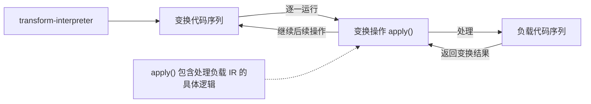
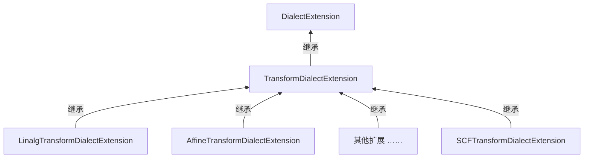

# 第 12 章 元编程方言

> 校订说明：本章依据扫描书页 267–283（PDF 第 32–48 页）转写，正文按本地 LLVM 18.1.8（提交 `3b5b5c1ec4a3095ab096dd780e84d7ab81f3d7ff`）校订。原书以 LLVM 20 为参考，不能直接适用于本地版本的内容已就地说明；较大差异、源码依据与示例验证范围见 [第 12 章校订记录](issues/ch12.md)。

<!-- source: insider-compiler-ch11-ch13.pdf, PDF p. 32 -->

元编程方言是 MLIR 为编译器开发者提供的高级抽象工具，旨在通过声明式与可编程方法，简化编译器的构建与优化过程。本章将系统性地介绍三大类元编程方言：①用于高级编译流程编排与扩展的 transform 方言；②专注于自动化模式匹配与重写的 pdl 与 pdl_interp 方言；③致力于降低新方言定义门槛的 irdl 方言。这些工具共同构成了 MLIR 灵活而强大的元编程层，提升了编译器开发的效率与可维护性。

## 12.1 transform 方言

### 12.1.1 transform 方言概述

transform 方言与 Pass 优化机制颇为相似，然而也存在差异。常见的 Pass 面向通用场景：例如，一个循环优化 Pass 往往遍历其作用范围内所有符合条件的循环。而 transform 方言通过显式选择目标操作和组织变换序列，方便地表达针对特定场景的细粒度优化。这里的区别在于变换的表达与编排方式；Pass 本身也能限制作用范围、筛选特定操作，并非只能执行全局优化。

transform 方言的使用具有独特性：它通过一组由 transform 方言中的操作构成的 IR（即变换 IR）对一段 MLIR 代码（称为负载 IR）实施变换。其中，变换 IR 描述变换逻辑；负载 IR 则是被变换的目标代码。这种分离使得变换过程具有可编程性和可组合性，提升了编译器变换的表达能力与灵活性。例如，代码清单 12-1 中就同时存在变换 IR 和负载 IR。

<!-- source: insider-compiler-ch11-ch13.pdf, PDF p. 33 -->

**代码清单 12-1** transform 方言使用示例

```mlir
// 负载 IR，共计 3 个函数。
func.func @basic_cast_and_call() {
  "test.foo"() : () -> ()
  func.return
}

func.func @second() {
  "test.bar"() : () -> ()
  func.return
}

func.func private @third()

// 变换 IR，入口为 __transform_main。
module attributes {transform.with_named_sequence} {
  transform.named_sequence @__transform_main(%arg0: !transform.any_op) {
    // 在 %arg0 中查找所有 func.func，得到 3 个函数定义或声明。
    %funcs = transform.structured.match ops{["func.func"]} in %arg0
      : (!transform.any_op) -> !transform.any_op
    // 将查找结果拆分为 3 个具体函数，对应 %f#0、%f#1、%f#2。
    %f:3 = transform.split_handle %funcs
      : (!transform.any_op) ->
        (!transform.any_op, !transform.any_op, !transform.any_op)
    // 在 %f#0 中查找 test.foo 操作。
    %foo = transform.structured.match ops{["test.foo"]} in %f#0
      : (!transform.any_op) -> !transform.any_op
    // 在查找位置之前插入 second 函数调用；该变换返回调用的句柄。
    transform.func.cast_and_call @second before %foo
      : (!transform.any_op) -> !transform.any_op
    // 在查找位置之后插入 %f#2（即 third）的调用。
    transform.func.cast_and_call %f#2 after %foo
      : (!transform.any_op, !transform.any_op) -> !transform.any_op
    // 完成变换序列。
    transform.yield
  }
}
```

使用 `mlir-opt --transform-interpreter` 执行代码清单 12-1 中的变换后，得到代码清单 12-2。这里执行的是变换程序，尚未将负载程序编译为机器代码。

**代码清单 12-2** 经过 transform-interpreter 执行后的结果

```mlir
module {
  func.func @basic_cast_and_call() {
    // 与变换前相比，此处增加了 second 函数调用。
    call @second() : () -> ()
    "test.foo"() : () -> ()
    // 与变换前相比，此处增加了 third 函数调用。
    call @third() : () -> ()
    return
  }
  func.func @second() {
    "test.bar"() : () -> ()
    return
  }
  func.func private @third()
  module attributes {transform.with_named_sequence} {
    transform.named_sequence @__transform_main(%arg0: !transform.any_op) {
      %0 = transform.structured.match ops{["func.func"]} in %arg0
        : (!transform.any_op) -> !transform.any_op
      %1:3 = transform.split_handle %0
        : (!transform.any_op) ->
          (!transform.any_op, !transform.any_op, !transform.any_op)
      %2 = transform.structured.match ops{["test.foo"]} in %1#0
        : (!transform.any_op) -> !transform.any_op
      %3 = transform.func.cast_and_call @second before %2
        : (!transform.any_op) -> !transform.any_op
      %4 = transform.func.cast_and_call %1#2 after %2
        : (!transform.any_op, !transform.any_op) -> !transform.any_op
      transform.yield
    }
  }
}
```

<!-- source: insider-compiler-ch11-ch13.pdf, PDF p. 34 -->

由代码清单 12-1 可知，要使用 transform 方言，需根据业务代码（即负载 IR）编写变换 IR，而变换代码作用的对象正是业务代码。鉴于变换代码同样属于 MLIR 代码，因而也需能被 MLIR 工具链读取与识别。为此，MLIR 框架提供了专门的 Pass——`transform-interpreter`。MLIR 解析器先读取变换 IR，随后该 Pass 对其解释执行，驱动负载 IR 的修改。

transform 方言的执行原理如图 12-1 所示。



**图 12-1** transform 方言的执行原理

从代码清单 12-1 还能够看出，transform 方言的核心使用方式是编写 MLIR 代码，对目标代码进行优化。为了表述方便，原书引入了“锚点操作”这一称呼，用来讨论匹配或查找的目标。需要区分：例中变换 IR 内负责查找的是 `transform.structured.match`；字符串 `"func.func"` 指定要匹配的负载操作名称，匹配到的 `func.func` 位于负载 IR 中，并不是变换 IR 中的一个 `func.func` 操作。

变换 IR 可能用到不同种类的目标，主要包括操作和 SSA 值，后者既可以是操作结果，也可以是基本块参数；它们分别以操作句柄和值句柄表示。此外，变换过程中还会用到参数，参数以属性表示。例如，语句 `%0 = transform.structured.match ops{["func.func"]} in %arg0 : (!transform.any_op) -> !transform.any_op` 中，`%arg0`、`%0` 均为操作句柄。

<!-- source: insider-compiler-ch11-ch13.pdf, PDF p. 35 -->

若某个操作句柄 `%producer` 关联的负载操作具有结果，可以通过 `%r = transform.get_result %producer[0] : (!transform.any_op) -> !transform.any_value` 获取其第一个结果的值句柄。负载值可以用作负载函数调用的参数或其他操作的操作数。原书将此例直接写成 `transform.get_result %0[0]`，但前面的 `%0` 关联的是 `func.func`；`func.func` 自身没有 SSA 结果，不能用这种方式取得函数返回值。

由于 transform 方言能够提供细粒度控制，因此其应用范围也愈发广泛。除了前面提到的针对特定场景的优化，MLIR 社区文档还提供了基于 transform 方言的代码调度实现[^ch12-1]；该方言也可用于调试、分析等场景，感兴趣的读者可参考相关资料[^ch12-2]。

### 12.1.2 transform 方言的扩展实现

MLIR 框架在设计之初就考虑到如何为下游编译器开发者提供便利，使其能够更轻松地扩展上游社区代码。3.4.2 节已详细介绍方言扩展的具体原理，transform 方言正是基于该机制允许编译器开发者进行扩展。

transform 方言提供基类模板 `TransformDialectExtension`。该类定义了一些方法，便于为 transform 方言添加操作和类型，注册过程也会检查相应接口要求及定义冲突。注册相同实现与注册名称冲突的不同实现不能混为一谈，不能简单理解为任何重复注册都会报错。其他希望对操作进行细粒度优化的方言，可以继承 `TransformDialectExtension` 来实现自身的变换操作。MLIR 社区已有多种方言这样实现专用变换，例如 `LinalgTransformDialectExtension` 为 transform 方言添加了一系列 linalg 专用变换。其继承关系如图 12-2 所示，模板细节在图中略去。



**图 12-2** transform 方言扩展的继承示意图

> **注意**：为何各个方言借助扩展机制将变换操作定义在 transform 方言中，而非放入自身方言，或者另建一个方言来管理？
>
> 变换操作通过 Transform 的接口与解释器协议执行。将其作为 transform 方言的扩展，可以复用注册、类型、接口检查以及 `transform-interpreter` 等已有设施。这是 MLIR 推荐和广泛采用的组织方式；解释器的核心执行契约是接口，不能仅从解释执行这一点推导出“其他命名空间中的操作绝不可能参与”。
>
> 对于非变换操作，下游通常也可以定义一个新的方言来组织扩展操作，使自研代码清晰整洁，并表达与被扩展方言的关系，便于跟进上游代码。这是代码组织选择，不是所有扩展都必须另建方言的限制。

### 12.1.3 变换机制实现的难点

<!-- source: insider-compiler-ch11-ch13.pdf, PDF p. 36 -->

transform 方言提供一系列操作，用于查询负载 IR 中的操作，以及调用相关变换对目标操作进行重写。在此过程中，有两个问题需要仔细斟酌：错误处理与副作用管理。

#### 1. 错误处理

在图 12-1 中，`transform-interpreter` 按变换 IR 表达的顺序处理负载 IR。变换操作调用 `apply()` 时可能成功，也可能失败。返回状态区分成功、可静默失败（silenceable failure）与确定失败（definite failure）。前者常用于“不满足匹配或变换前提”，可由外层序列按其错误处理策略抑制或者传播；后者表示不能继续正常执行当前变换，应向上层报告失败。

原书将这两类失败称为“可恢复错误”和“不可恢复错误”。需要澄清：可静默失败本身不保证恢复原来的 IR，也不会自动触发回滚。是否尝试替代分支、是否能够撤销变换，取决于外围操作的实现。无法抑制或处理的失败可以继续传播；确定失败通常导致当前解释或 Pass 失败，而不必然使整个宿主进程立即退出。

错误主要来自以下三个方面。

① 类型、关联对象和句柄有效性约束不满足。变换的静态 IR 验证与解释执行时的检查共同发挥作用；输入句柄关联的负载对象在执行前检查，结果关联对象还需在建立映射时检查，不能把结果检查也全部归到 `apply()` 之前。使用失效句柄会产生错误。当一个操作句柄被**消费**时，关联同一负载操作的其他操作句柄、关联其嵌套操作的句柄，以及关联这些操作结果或其区域内基本块参数的值句柄，都可能失效。当一个值句柄被消费时，关联同一值的其他值句柄会失效；若值是操作结果，还会使关联其定义操作及嵌套操作的句柄失效；若值是基本块参数，则涉及该基本块内的操作。这里只涉及被消费句柄及相关负载对象的关联，普通读取不会消费句柄，也不会使之失效；Transform 参数属性也不能与负载基本块参数混为一谈。

② 变换操作执行 `apply()` 时，其自身实现可能报告失败，例如变换前提不成立、找不到合适目标或无法完成重写。

③ 操作声明的特质、接口约定可能不满足验证要求。副作用接口提供解释器判断句柄读取、产生和消费的依据，解释器据此维护状态并检查非法使用；并不是每个接口都在执行时自行开展一遍通用状态验证。

#### 2. 副作用管理

transform 方言中的操作可以创建、修改或删除负载操作，因此需要描述变换对句柄映射和负载 IR 的影响。MLIR 将它们分别建模为 `TransformMappingResource` 和 `PayloadIRResource` 两类资源。

对句柄映射而言，读取已有句柄是 `Read`；消费句柄通常以 `Read` 加 `Free` 表达；产生结果句柄以 `Allocate` 加 `Write` 表达。对负载 IR 而言，查询通常是 `Read`，修改通常以 `Write` 表达。这些是变换操作对编译器 IR 的效果，与负载程序运行时的内存效果属于不同层次。负载操作自身当然也可能分配或释放内存，不能说它们只有读写效果。

这种区分让系统能够追踪已经失效的关联，拒绝随后访问。可以将它理解为对句柄状态及其与负载 IR 关系的持续维护。消费句柄也不等于删除其关联的负载操作：例如 `apply_registered_pass` 会消费输入句柄并返回关联同一目标操作的新句柄，因为 Pass 可能任意修改目标内部的 IR。

以 `foreach` 为例，它逐一处理输入句柄关联的负载对象。只有循环体消费迭代参数时，它才消费相应输入句柄；循环体产出的关联通过 `yield` 汇集到结果中，并不保证每次都会创建新的负载操作。若循环体修改负载 IR，就需要相应地声明负载效果并保持程序语义。

<!-- source: insider-compiler-ch11-ch13.pdf, PDF p. 37 -->

在遍历过程中，负载程序本身的副作用仍须按相应变换的语义正确保留。`foreach` 的失败不会自动回滚已经完成的迭代。

### 12.1.4 关键操作

transform 方言提供的操作可分为以下几类。以下名称均省略公共前缀 `transform.`。

#### （1）发现操作

- `match.operation_empty`：判断操作句柄的关联列表是否为空，而不是判断某个负载操作内部是否为空。
- `match.operation_name`：根据字符串形式的操作名称，检查关联的单个负载操作是否匹配。
- `match.param.cmpi`：对两个整数参数列表中的对应属性执行有符号比较，按比较是否全部满足而成功或失败，并不返回筛选后的操作列表。
- `get_consumers_of_result`：查找使用指定操作结果的消费者操作。
- `get_defining_op`：获取值句柄中各负载值的定义操作；基本块参数没有定义操作。
- `get_operand`：获取目标操作的指定操作数，返回值句柄。
- `get_parent_op`：获取目标操作的父操作。
- `get_producer_of_operand`：查找生成目标操作指定操作数的操作。
- `get_result`：获取目标操作指定结果的值句柄。
- `get_type`：获取值句柄所关联负载值的类型，以 `TypeAttr` 参数表示。
- `collect_matching`：在目标操作中遍历查找，收集满足被引用匹配序列条件的负载操作。
- `select`：根据名称筛选输入句柄已经关联的负载操作，而不是自行展开一次嵌套遍历。

#### （2）优化操作

- `foreach_match`：寻找匹配项，并对匹配结果执行对应的自定义变换序列。
- `foreach`：逐个处理句柄关联的负载对象，执行循环体中的变换。
- `apply_patterns.canonicalization`：提供归一化模式描述，供外围 `apply_patterns` 使用；它不是独立执行归一化的 Pass。
- `apply_cse`：对目标负载 IR 执行公共子表达式消除。
- `apply_conversion_patterns`：对目标负载 IR 执行方言转换模式。
- `apply_dce`：执行死代码消除。
- `apply_licm`：执行循环不变量外提。
- `apply_patterns`：以贪婪方式，对给定目标负载 IR 执行所提供的模式匹配与重写。
- `apply_registered_pass`：对目标操作执行已注册的指定 Pass 或命名 Pass pipeline。
- `apply_conversion_patterns.dialect_to_llvm`：通过方言接口提供转换到 llvm 方言的模式，配合外围转换操作使用。

#### （3）转换序列操作

- `alternatives`：提供多个候选变换区域，尝试能够成功的分支；如果所有分支均失败，整体仍会失败，并不保证必有一个成功。
- `include`：引用一个命名变换序列，并指定错误处理方式。
- `named_sequence`：定义带名字的变换序列。
- `sequence`：定义变换序列。

#### （4）句柄操作

- `annotate`：向目标负载操作附加属性，因此会修改负载 IR。
- `cast`：改变操作句柄的类型表达及相应约束，不执行负载值类型的转换。
- `merge_handles`：将多个句柄的关联合并到一个句柄。
- `split_handle`：将一个操作句柄的关联列表拆分成多个句柄。
- `num_associations`：返回句柄关联的操作数目、值数目，或参数包含的属性数目。
- `replicate`：依据另一组关联的数量重复句柄或参数中的关联，不克隆负载操作。

#### （5）其他操作

- `param.constant`：产生具有常量属性的 Transform 参数，不在负载 IR 中生成常量操作。
- `print`：打印目标关联的负载操作等信息。
- `verify`：验证目标负载操作。
- `yield`：作为相应变换区域的终止操作，传递结果关联。

这些操作构成 transform 的通用操作及常用扩展，提供目标发现、负载处理、变换序列组织与公共优化实施等机制。

<!-- source: insider-compiler-ch11-ch13.pdf, PDF p. 38 -->

针对其他方言的特定优化，通常通过方言扩展机制定制实现，而不是全部直接定义在 transform 核心操作文件中。

### 12.1.5 transform 方言的应用与扩展

#### 1. transform 方言的应用

下面通过一个简单示例展示 transform 方言的应用。假设需要优化一个迭代次数较多的循环，以充分发挥硬件性能。具体方法为：首先拆分成两个循环，使第一个循环的迭代次数能被某个与硬件特性相关的数值（例如 8）整除，剩余部分构成第二个循环；随后对第一个循环分块，对第二个循环展开。

用通用 Pass 组合来表达这种需求时，需要处理三个问题：①分块和展开依赖前一步拆分的结果；②拆分后需要区分两个循环，分别处理；③三种优化各有参数，顺序与组合的增多会增加组织和维护成本。单独编写一个 C++ Pass 当然也可以实现这一逻辑；Transform 的价值是让选择、结果传递和调度以可组合的 IR 显式表达。

代码清单 12-3 给出原书的伪代码。

**代码清单 12-3** 使用 transform 方言实现复合诉求的伪代码

```text
%parts:2 = transform.loop.split %loop (upper_bound_divisible_by = 8)
transform.loop.tile %parts#0 (tile_sizes = [8])
transform.loop.unroll %parts#1 (full)
```

该示意契合细粒度代码优化的需求，体现了 transform 方言的价值。它不是本地可直接解析的 MLIR：LLVM 18.1.8 没有这里所写的 `transform.loop.split` 和 `transform.loop.tile` 操作，实际展开操作也有具体的语法及适用条件。实现时应选择与负载循环种类相匹配的现有变换，或者定义自己的扩展，不能直接复制这份伪代码运行。

#### 2. 自定义变换操作

transform 方言定义了以下五个接口，便于开发者基于 Transform 机制实现自定义变换。

- `TransformOpInterface`：绝大多数实际执行变换的操作都实现此接口。它的核心方法为 `DiagnosedSilenceableFailure apply(TransformRewriter &rewriter, TransformResults &results, TransformState &state)`。通常通过 `state` 获取负载对象，通过 `rewriter` 修改 IR，并将结果关联写入 `results`。终止操作以及某些模式描述操作不直接处理负载 IR，因而不必实现这个执行接口。
- `MatchOpInterface`：继承 `TransformOpInterface`，用于表达对负载 IR 只读的匹配操作。部分变换（例如 `collect_matching`）要求所引用匹配序列中的操作满足这种契约；并不是任何只读操作都必须因此实现该接口。
- `TransformHandleTypeInterface`：定义**操作句柄类型**的约束，通过 `checkPayload()` 检查关联的负载 `Operation *` 列表。它可以用于变换操作的输入和输出类型，检查对象不是负载操作的返回值。

<!-- source: insider-compiler-ch11-ch13.pdf, PDF p. 39 -->

- `TransformParamTypeInterface`：定义 Transform 参数类型的约束，通过 `checkPayload()` 检查关联的属性列表。
- `TransformValueHandleTypeInterface`：定义值句柄类型的约束，通过 `checkPayload()` 检查关联的 `mlir::Value` 列表，包括负载操作结果和基本块参数。

### 12.1.6 辅助接口与特质

开发者扩展 transform 操作时，可以借助框架提供的以下特质和接口。

- `AtMostOneOpMatcher`：提供 `apply()` 的公共实现，检查操作句柄最多关联一个负载操作，再调用具体操作实现的 `matchOperation()`。
- `SingleOpMatcher`：要求操作句柄恰好关联一个负载操作，并调用 `matchOperation()`。
- `SingleValueMatcher`：要求值句柄恰好关联一个负载值，并调用 `matchValue()`；这里不是 `matchOperation()`，检查的也不是负载操作数量。
- `NavigationTransformOpTrait`：提供副作用声明的公共实现，读取输入句柄映射和负载 IR，并为结果产生新句柄；它本身不修改负载 IR。
- `TransformEachOpTrait`：提供 `TransformOpInterface` 的公共执行逻辑，逐个处理输入句柄关联的负载操作，调用具体操作的 `applyToOne()`，再汇总各次产生的结果关联。
- `FunctionalStyleTransformOpTrait`：提供副作用声明，消费输入句柄、产生结果句柄，并声明对负载 IR 的读取和修改。
- `Transform_AnyHandleType`：一个类型约束，接受操作句柄和值句柄；它不是新的具体类型。
- `Transform_AnyHandleOrParamType`：接受操作句柄、值句柄以及参数类型的约束。
- `ParamProducerTransformOpTrait`：声明读取输入关联、产生结果参数的效果，结果应为参数类型，而不是任意的新操作句柄。
- `ReportTrackingListenerFailuresOpTrait`：标记该操作要求报告重写跟踪监听器的失败，例如无法为已替换的负载对象维护正确的句柄关联。它不是把任意验证错误转发给上层的占位符。
- `FindPayloadReplacementOpInterface`：允许负载操作通过 `getNextOperands()` 指定寻找替代对象时应继续追踪的操作数，例如跳过只承载元数据的包装操作。它具有实际的方法契约，与上一项的错误报告标记不同。
- `PatternDescriptorOpInterface`：要求实现 `populatePatterns()` 或支持状态的 `populatePatternsWithState()` 等方法，用于提供贪婪重写所需的匹配模式；它不等同于方言转换模式接口。
- `ConversionPatternDescriptorOpInterface`：通过 `populatePatterns()` 收集方言转换模式，与转换配置和类型转换器协同工作。

<!-- source: insider-compiler-ch11-ch13.pdf, PDF p. 40 -->

- `TypeConverterBuilderOpInterface`：要求提供 `getTypeConverter()`、`getTypeConverterType()` 等方法，用于构造并标识方言转换使用的类型转换器。

### 12.1.7 方言扩展说明

在实际使用中，MLIR 方言扩展常见的三种途径是：①为方言添加新的操作、属性或类型，例如 transform 的扩展；②为方言添加接口；③通过外部模型为已知操作提供接口实现。下面分别说明。

#### 1. 为方言添加新的操作、属性和类型

需要为 irdl 方言的 IR 增加变换支持时，可以扩展 transform 方言，注册操作 irdl IR 的变换操作。原书代码清单 12-4 展示这一机制。它扩展的是 **transform 方言**，并声明依赖 irdl 方言，而不是直接向 irdl 注册新操作。

**代码清单 12-4** 为 irdl IR 提供变换支持的扩展示意

```cpp
namespace {
// 扩展类继承 TransformDialectExtension。
class IRDLExtension
    : public transform::TransformDialectExtension<IRDLExtension> {
public:
  MLIR_DEFINE_EXPLICIT_INTERNAL_INLINE_TYPE_ID(IRDLExtension)

  void init() {
    // 将自定义变换操作注册到 transform 方言中。
    registerTransformOps<
#define GET_OP_LIST
#include "mlir/Dialect/Transform/IRDLExtension/IRDLExtensionOps.cpp.inc"
        >();
    // 声明扩展需要使用的方言。
    declareDependentDialect<irdl::IRDLDialect>();
  }
};
} // namespace

// 将扩展注册到方言注册表。
void mlir::transform::registerIRDLExtension(
    DialectRegistry &dialectRegistry) {
  dialectRegistry.addExtensions<IRDLExtension>();
}
```

校订注：本地 LLVM 18.1.8 中没有 `Transform/IRDLExtension` 目录及该生成文件，因此保留它作为原书所参考版本的扩展示意，未把它当作本地可编译的完整实现。本地 `Transform/LoopExtension/LoopExtension.cpp` 使用相同的注册机制。`declareDependentDialect` 声明扩展自身所依赖的方言，与声明变换可能生成哪些方言的 `declareGeneratedDialect` 用途不同。

#### 2. 为方言添加接口

11.1 节介绍过，需要转换到 llvm 方言的方言，可以实现 `ConvertToLLVMPatternInterface`，为框架提供相关转换模式及依赖方言。接口是汇集转换实现的途径，仍需模式和类型转换实际覆盖目标 IR，不能仅添加接口就保证任意操作都能降级。arith 方言的实现如代码清单 12-5 所示，按本地源码列出。

<!-- source: insider-compiler-ch11-ch13.pdf, PDF p. 41 -->

**代码清单 12-5** 在 arith 方言中添加方言接口的实现

```cpp
namespace {
struct ArithToLLVMDialectInterface : public ConvertToLLVMPatternInterface {
  using ConvertToLLVMPatternInterface::ConvertToLLVMPatternInterface;

  // 加载转换所依赖的方言。
  void loadDependentDialects(MLIRContext *context) const final {
    context->loadDialect<LLVM::LLVMDialect>();
  }

  // 填充降级模式。
  void populateConvertToLLVMConversionPatterns(
      ConversionTarget &target, LLVMTypeConverter &typeConverter,
      RewritePatternSet &patterns) const final {
    arith::populateArithToLLVMConversionPatterns(typeConverter, patterns);
  }
};
} // namespace

void mlir::arith::registerConvertArithToLLVMInterface(
    DialectRegistry &registry) {
  registry.addExtension(+[](MLIRContext *ctx, arith::ArithDialect *dialect) {
    dialect->addInterfaces<ArithToLLVMDialectInterface>();
  });
}
```

校订注：原书在填充模式时，还先调用了 `arith::populateCeilFloorDivExpandOpsPatterns(patterns)`。这个辅助函数在本地存在，但本地上述接口实现没有这次调用，故按实际实现删去，版本差异留在校订记录中。

#### 3. 为方言中的已知操作提供外部接口实现

如 4.3.2 节所述，可以通过 `ExternalModel` 机制为已知操作提供接口实现。以 arith 方言的 `select` 操作为例，代码清单 12-6 为其提供缓冲区释放阶段的所有权处理接口。

**代码清单 12-6** arith 方言 select 操作的外部接口实现

```cpp
namespace {
// BufferDeallocationOpInterface 提供 process 和
// materializeUniqueOwnershipForMemref 等接口方法。
struct SelectOpInterface
    : public BufferDeallocationOpInterface::ExternalModel<
          SelectOpInterface, arith::SelectOp> {
  FailureOr<Operation *> process(
      Operation *op, DeallocationState &state,
      const DeallocationOptions &options) const {
    return op; // 此阶段无需额外处理。
  }

  std::pair<Value, Value> materializeUniqueOwnershipForMemref(
      Operation *op, DeallocationState &state,
      const DeallocationOptions &options, OpBuilder &builder,
      Value value) const {
    auto selectOp = cast<arith::SelectOp>(op);
    assert(value == selectOp.getResult() &&
           "Value not defined by this operation");

    Block *block = value.getParentBlock();
    if (!state.getOwnership(selectOp.getTrueValue(), block).isUnique() ||
        !state.getOwnership(selectOp.getFalseValue(), block).isUnique())
      return state.getMemrefWithUniqueOwnership(
          builder, value, value.getParentBlock());

    Value ownership = builder.create<arith::SelectOp>(
        op->getLoc(), selectOp.getCondition(),
        state.getOwnership(selectOp.getTrueValue(), block).getIndicator(),
        state.getOwnership(selectOp.getFalseValue(), block).getIndicator());
    return {selectOp.getResult(), ownership};
  }
};
} // namespace

// 为 arith.select 附加外部接口模型。
void mlir::arith::registerBufferDeallocationOpInterfaceExternalModels(
    DialectRegistry &registry) {
  registry.addExtension(+[](MLIRContext *ctx, ArithDialect *dialect) {
    SelectOp::attachInterface<SelectOpInterface>(*ctx);
  });
}
```

<!-- source: insider-compiler-ch11-ch13.pdf, PDF p. 42 -->

这个模型在两个分支的所有权均唯一时，构造另一条 `arith.select` 选择相应的所有权指示值；否则调用通用机制取得具有唯一所有权的 memref。它实现的是 `BufferDeallocationOpInterface`，不是 `BufferizableOpInterface`，也不是在程序运行时替换 `select` 的机器代码。

## 12.2 pdl 与 pdl_interp 方言及 pdll

MLIR 框架提供 pdl 和 pdl_interp 两个方言，便于编译器开发者定义并实现匹配与重写模式。

### 12.2.1 pdl 方言

pdl 方言是 MLIR 社区为模式开发者打造的方言，用于定义匹配和重写规则。6.1 节已经介绍如何借助 C++ 和 TD 文件中的 `Pat` 实现匹配与重写，本节则介绍另一种途径。

在 pdl 方言中，可以通过 `pattern` 操作定义匹配规则，通过 `rewrite` 描述相应的 IR 重写逻辑。pdl 有四种核心的标量类型：`attribute`、`operation`、`value` 和 `type`，分别对应 `mlir::Attribute`、`mlir::Operation *`、`mlir::Value` 和 `mlir::Type`；另外还有表达这些对象序列的 `range` 类型。代码清单 12-7 展示一个模式示例。

**代码清单 12-7** 使用 pdl 方言定义的模式示例

```mlir
// pdl.pattern 对应一份匹配与重写模式。
pdl.pattern : benefit(1) {
  // 用 pdl.type 描述结果类型，并约束输入值也具有同一类型。
  %resultType = pdl.type
  %inputOperand = pdl.operand : %resultType
  %root = pdl.operation "foo.op"(%inputOperand : !pdl.value)
    -> (%resultType : !pdl.type)
  pdl.rewrite %root {
    pdl.replace %root with (%inputOperand : !pdl.value)
  }
}
```

<!-- source: insider-compiler-ch11-ch13.pdf, PDF p. 43 -->

代码清单 12-7 使用操作的第一个操作数替换其唯一结果，并删除原操作。示例假定 `foo.op` 在业务语义上确实可以这样消除。校订时补全了本地 PDL 要求的类型标注，并让输入和结果共用 `%resultType` 约束，避免把结果类型不同的操作误替换为输入值。模式匹配成功本身并不能证明这种改写对任意同名操作都保持语义。

pdl 方言定义的 15 个操作如下，名称省略 `pdl.` 前缀。

- `apply_native_constraint`：将注册的 C++ 约束函数应用于指定对象。
- `apply_native_rewrite`：调用注册的 C++ 重写函数。
- `attribute`：描述属性，可指定属性常量，也可表示待匹配的属性及其类型约束。
- `erase`：删除负载操作，类似 `PatternRewriter` 的删除操作。
- `operand`：描述单个外部输入操作数，可附加类型约束。
- `operands`：描述一组外部输入操作数。
- `operation`：描述模式中的操作节点，在匹配区用于匹配，在重写区可用于创建操作。
- `pattern`：定义完整的匹配与重写规则。
- `range`：把同类对象及对象范围组合成一个范围，并非对每个对象自动执行某种批量重写。
- `replace`：用一个操作的结果或一组值替换原操作的结果，类似 `PatternRewriter` 的替换操作。
- `result`：从模式或重写区域内的操作对象提取一个结果。
- `results`：从操作对象提取一组或全部结果。
- `rewrite`：定义模式重写部分，位于 `pattern` 中，可以包含内联重写规则，也可以调用外部重写函数。
- `type`：描述单个类型，可指定具体类型或表示待匹配的类型。
- `types`：描述一组类型。

### 12.2.2 pdl_interp 方言

在 MLIR 方言体系中，pdl_interp 的层次比 pdl 更低，用来表达匹配器及重写器的控制流程，供后续解释执行。它优化的是模式实现的组织与执行，不是直接优化“pdl 生成的业务程序”。冻结模式集时，框架可以进一步将这种表示编译为私有的模式解释器字节码。

原书报告：相较于 C++ 编写的模式，相关方案在特定评测中执行性能可提升 15 倍，编译后二进制代码量可减少 90%。这里保留原书引用的性能数据，但它依赖测试模式、基线与构建环境，本次未复现该基准，不能将其视为任意 PDL 模式的普遍保证。原书将优化原因概括为以下几点。

- 自动转换机制：在启用 PDL 模式匹配支持的构建中，`FrozenRewritePatternSet` 会利用专门的转换 Pass，把 PDL 模式降低为 pdl_interp 表示。

<!-- source: insider-compiler-ch11-ch13.pdf, PDF p. 44 -->

- 匹配树与自动机构建：多个模式可以共享一套判定结构，将重复检查合并到匹配器控制流中。本地实现使用最佳分支算法安排多根模式的根匹配顺序[^ch12-3]；这不意味着整棵匹配树对所有输入都达到全局最优。
- 紧凑的字节码存储：`FrozenRewritePatternSet` 构造模式解释器使用的字节码，紧凑存储匹配与重写指令。这里的“压缩”主要指紧凑表示与共享匹配结构，不应理解为对普通二进制文件另外运行一个通用压缩算法。

> **注意**：`FrozenRewritePatternSet` 的主要功能是冻结模式集。它组织按根操作分组的原生模式、可匹配任意操作的原生模式，以及 PDL 模式字节码。它还可以根据模式名称或标签过滤原生模式，指定禁用项或保留的启用项。进入启用集合只代表具备参与匹配的资格，并不保证该模式一定匹配成功或必须运行。

这里的模式解释器字节码与通用的 MLIR 字节码文件规范[^ch12-4]是两套不同机制；前者用于紧凑存储并执行匹配、重写指令。关于相关优化，可参考原书所引资料[^ch12-5]。鉴于 pdl_interp 多用于 MLIR 内部，一般开发者较少直接涉及，本书不再展开。

### 12.2.3 pdll

MLIR 社区还提供 `mlir-pdll` 工具。PDLL[^ch12-6] 是编写模式匹配与重写规则的语言。可以先把它理解为比 PDL IR 更方便书写的 DSL，再由工具生成 PDL；更准确地说，它还提供名称绑定、类型检查、约束与重写函数等语言设施，以解决直接书写 PDL 或 TD 中 `Pat` 模式时的部分困难。

例如，在 TD 文件中处理操作区域、多个返回结果和变参等情况，会暴露描述能力或书写便利性方面的限制，可能需要复杂描述或 C++ 辅助实现。新的 DSL 为模式开发者提供更方便的表达方式，但不能因此断言 PDLL 已完整支持任意区域的结构匹配。代码清单 12-8 是一个简单示例。

**代码清单 12-8** 使用 pdll 开发的简单模式匹配示例

```pdll
Pattern ReplaceTenWithEleven {
  // 匹配规则。
  let constant = op<arith.constant> {value = attr<"10 : i32">};
  // 如果有必要，还可以添加约束关系；本例没有额外约束。
  // 重写规则。
  rewrite constant with {
    let newConst = op<arith.constant> {value = attr<"11 : i32">};
    replace constant with newConst;
  };
}
```

<!-- source: insider-compiler-ch11-ch13.pdf, PDF p. 45 -->

这段规则匹配值为 10 的 i32 常量，再将其重写为值为 11 的 i32 常量。首先借助 `mlir-pdll -x=mlir` 生成 PDL IR；接着，可使用 `mlir-opt --convert-pdl-to-pdl-interp` 将其降低为 pdl_interp IR。这个命令输出的仍是 MLIR 文本；在冻结 PDL 模式集的后续步骤中，才构造私有模式字节码。匹配与重写驱动器随后通过解释器执行这些字节码规则。

代码清单 12-9 为本地工具生成的 PDL。为保证清单可以独立解析，补全原书省略的位置别名定义；位置文件名简写为 `replace.pdll`。本例没有引入 arith 的 ODS 信息，`mlir-pdll` 会提醒检查新建操作的返回类型能否推导。这里 arith 常量确实支持所需推导，本地也已实际执行 10 → 11 的重写。

**代码清单 12-9** 编译后生成的 pdl 方言代码

```mlir
module {
  pdl.pattern @ReplaceTenWithEleven : benefit(0) {
    %0 = operands loc(#loc1)
    %1 = attribute = 10 : i32 loc(#loc2)
    %2 = types loc(#loc1)
    %3 = operation "arith.constant"(%0 : !pdl.range<value>)
      {"value" = %1} -> (%2 : !pdl.range<type>) loc(#loc1)
    rewrite %3 {
      %4 = attribute = 11 : i32 loc(#loc4)
      %5 = operation "arith.constant" {"value" = %4} loc(#loc5)
      replace %3 with %5 loc(#loc6)
    } loc(#loc3)
  } loc(#loc)
} loc(#loc)
#loc = loc("replace.pdll":1:1)
#loc1 = loc("replace.pdll":3:18)
#loc2 = loc("replace.pdll":3:46)
#loc3 = loc("replace.pdll":6:3)
#loc4 = loc("replace.pdll":7:48)
#loc5 = loc("replace.pdll":7:20)
#loc6 = loc("replace.pdll":8:5)
```

也可以通过 `mlir-pdll -x=cpp` 直接生成 C++ 包装代码，见代码清单 12-10。这个包装仍然嵌入 PDL 文本并构造 `PDLPatternModule`，并不是把匹配器直接变成原生 C++ `RewritePattern` 实现。

**代码清单 12-10** 编译后生成的 C++ 代码片段

```cpp
namespace {
struct ReplaceTenWithEleven : ::mlir::PDLPatternModule {
  template <typename... ConfigsT>
  ReplaceTenWithEleven(::mlir::MLIRContext *context, ConfigsT &&...configs)
      : ::mlir::PDLPatternModule(
            ::mlir::parseSourceString<::mlir::ModuleOp>(
R"mlir(pdl.pattern @ReplaceTenWithEleven : benefit(0) {
  %0 = operands loc("replace.pdll":3:18)
  %1 = attribute = 10 : i32 loc("replace.pdll":3:46)
  %2 = types loc("replace.pdll":3:18)
  %3 = operation "arith.constant"(%0 : !pdl.range<value>) {"value" = %1}
    -> (%2 : !pdl.range<type>) loc("replace.pdll":3:18)
  rewrite %3 {
    %4 = attribute = 11 : i32 loc("replace.pdll":7:48)
    %5 = operation "arith.constant" {"value" = %4} loc("replace.pdll":7:20)
    replace %3 with %5 loc("replace.pdll":8:5)
  } loc("replace.pdll":6:3)
} loc("replace.pdll":1:1)
)mlir", context), std::forward<ConfigsT>(configs)...) {}
};
} // end namespace
```

<!-- source: insider-compiler-ch11-ch13.pdf, PDF p. 46 -->

PDLL 可以简化模式开发流程，其生成模式也可以受益于共享匹配结构和紧凑字节码，因此原书建议实际项目优先考虑 PDLL。具体选型仍应结合模式的表达需求、工具链支持，以及实际测得的编译器运行时间和体积，而不能仅凭前述性能数字一概断定其优于 C++。

## 12.3 irdl 方言

### 12.3.1 概述

irdl 是基于 SSA 形式表达方言定义的元方言。它自身是 MLIR 中由 C++ 实现并注册的方言，用它描述的方言、操作、属性及类型可以由 IRDL 加载器动态注册。原书称它为“动态方言”，容易混淆这两个层次。IRDL 支持声明式定义及验证器的结构化描述，强调方便工具生成与分析，而不单以人工书写和阅读便利性为目标。

在 irdl 中，可通过 `dialect` 定义方言、`operation` 定义操作、`type` 定义类型、`attribute` 定义属性。代码清单 12-11 给出使用示例。

**代码清单 12-11** irdl 方言的使用示例（LLVM 18.1.8 适配版）

```mlir
irdl.dialect @cmath {
  irdl.type @complex {
    %0 = irdl.is f32
    %1 = irdl.is f64
    %2 = irdl.any_of(%0, %1)
    irdl.parameters(%2)
  }
  irdl.operation @mul {
    %0 = irdl.is f32
    %1 = irdl.is f64
    %2 = irdl.any_of(%0, %1)
    %3 = irdl.parametric @complex<%2>
    irdl.operands(%3, %3)
    irdl.results(%3)
  }
}
```

此例定义了 cmath 方言、complex 类型、mul 操作，以及相应约束。complex 的参数必须是 f32 或 f64。mul 的两个操作数与结果重复使用同一个 SSA 约束 `%3`，因而三者必须是**同一个具体 complex 类型**，不能一边为 `!cmath.complex<f32>`、另一边为 `!cmath.complex<f64>`。

校订注：本地语法尚不接受原书 `elem: %2`、`args: %3`、`re: %3` 这样的命名形式，故使用按位置排列的约束。类型符号引用也改为加载器能够在此作用域解析的 `@complex`；原书的 `@cmath::@complex` 在本地会导致动态加载失败。原写法保留在校订记录和证据输入中。

IRDL 的约束以 SSA 值表示；其运行时验证机制使用 `mlir::Attribute` 保存被验证或绑定的对象。为了统一处理 `mlir::Type`，类型对象会包装成 `mlir::TypeAttr`。不能由此将一般 MLIR SSA 值本身说成 C++ 的属性对象。

<!-- source: insider-compiler-ch11-ch13.pdf, PDF p. 47 -->

### 12.3.2 关键操作

irdl 方言定义的 17 个关键操作如下，名称省略 `irdl.` 前缀。

- `all_of`：组合约束，要求类型或属性满足全部输入约束。
- `any`：通配约束，允许任意类型或属性。
- `any_of`：选择约束，满足任意一个分支即可；本地动态加载器对分支重叠另有限制，见下一节。
- `attribute`：为方言定义属性种类。
- `attributes`：为操作的属性字典提供名称及相应约束。
- `base`：根据类型或属性的种类建立约束，不要求它等于某个具体实例。
- `c_pred`：以 C++ 表达式描述谓词约束。本地定义明确指出，含这种约束的 IRDL 方言不能通过运行时加载器注册；它不是运行时任意执行 C++ 字符串的机制。
- `dialect`：定义一个方言。
- `is`：要求等于给定的具体属性或类型。
- `operands`：声明操作的操作数约束及可变长形式。
- `operation`：为方言定义操作。
- `parameters`：按顺序指定类型或属性的参数约束；本地版本不使用原书所写的命名参数语法。
- `parametric`：根据类型或属性定义及其各参数的约束，构造参数化约束。
- `region`：构造一个区域约束，可对基本块数量和参数等作要求，本身不是直接给负载操作创建一个区域。
- `regions`：将区域约束附加到操作定义。
- `results`：声明操作的结果约束及可变长形式。
- `type`：为方言定义类型。

### 12.3.3 应用示例

利用 3.4 节介绍的可扩展方言设施，MLIR 可以将开发者用 IRDL 描述的方言、操作和类型注册到运行时上下文中，从而使用这些自定义定义。动态定义也带来验证器实现与性能方面的取舍。

原书将较高的验证成本解释为“动态注册后才能获得信息，因此验证必须回溯”。这不是本地实现的必然性质：回溯需求来自约束的选择分支及共享变量，而非仅仅来自注册时机。LLVM 18.1.8 的 IRDL 动态加载器采用贪婪验证，并在注册前限制 `any_of` 分支的形式，以避免某些需要回溯的情况。

为说明一般约束求解中的回溯问题，代码清单 12-12 保留原书的示意写法。这不是本地 IRDL 可直接解析的代码，其中 `constraint_var` 和模板式 `AnyOf<T, vector<T>>` 不属于本地语法。

**代码清单 12-12** irdl 类型约束的概念示意

```text
irdl.operation test {
  irdl.constraint_var(T: !Any)
  irdl.operands(op: AnyOf<T, vector<T>>)
  irdl.results(res: T)
}
```

<!-- source: insider-compiler-ch11-ch13.pdf, PDF p. 48 -->

按照这份示意约束，考虑 `%res = test(%op) : (vector<f32>) -> f32` 能否被接受。这里的操作与类型写法都用于说明约束关系。假设输入为 `vector<f32>`，其约束为 `AnyOf<T, vector<T>>`。若选择第一个分支，则 T 绑定为 `vector<f32>`，因而结果也应为 `vector<f32>`，与声明的 f32 冲突；若选择第二个分支，则 T 可以绑定为 f32，结果约束随之满足。

在支持这种非确定选择的一般约束求解器中，可能需要撤销第一次绑定，再尝试第二个分支，也就是回溯。回溯可能增加验证成本。但不能将这一过程描述成本地 IRDL 运行时实际采用的算法：本地加载器要求可判定的 `any_of` 分支形式，会拒绝包含这类重叠通配分支的定义，而不会注册后再用通用回溯解决。本次用 `irdl.any` 与向量基类型构造的最小重叠示例，已经实际观察到加载失败。

原书还介绍了研究工作中的 `irdlssa` 与 `irdlinterp` 等方言，用来静态分析和优化约束，减少验证时的回溯开销。这些属于所引研究方案，不能当作本地 LLVM 18.1.8 已注册的方言。进一步内容可参考原书引用的资料[^ch12-7]。

## 12.4 本章小结

本章介绍了四种元编程方言。其中以 transform 方言为核心，阐述其概念、使用场景，以及通过扩展定义自有变换操作的方法，并比较了 MLIR 三种常见方言扩展机制的实现差异。此外，还介绍了用于模式匹配与重写的 pdl、pdl_interp 方言及 PDLL 语言，以及用于定义方言的 irdl 方言。

[^ch12-1]: 原书参考：[Transform 教程](https://mlir.llvm.org/docs/Tutorials/transform/)，2025 年 3 月访问。
[^ch12-2]: 原书参考：[ACM 文献，DOI 10.1145/3696443.3708922](https://dl.acm.org/doi/pdf/10.1145/3696443.3708922)，2025 年 3 月访问。
[^ch12-3]: 原书说明：该算法由两位中国学者于 1965 年最早提出；参考 [Edmonds 算法](https://en.wikipedia.org/wiki/Edmonds%27_algorithm)，2025 年 3 月访问。这里保留原书的算法背景引用，本地源码将其用于多根模式的根顺序规划。
[^ch12-4]: 原书参考：[MLIR 字节码格式](https://mlir.llvm.org/docs/BytecodeFormat/)，2025 年 3 月访问。
[^ch12-5]: 原书参考：[Google Slides 演示文稿](https://docs.google.com/presentation/d/1U3AHtvn_ONR2D4-ENbghYjqsgocu0VPw_2LLYj_A7Sc/edit#slide=id.g7bb0231ec8_1_105)，2025 年 3 月访问。链接按扫描件重建，本次访问未取得内容；长标识中 `0`/`O` 等字符及资料可访问性仍待核实，见校订记录。
[^ch12-6]: 原书参考：[PDLL 文档](https://mlir.llvm.org/docs/PDLL/)，2025 年 3 月访问。
[^ch12-7]: 原书参考：[IRDL: A Dialect for Dialects](https://llvm.org/devmtg/2022-11/slides/TechTalk17-IRDL-ADialectForDialects.pdf)，2025 年 3 月访问。
