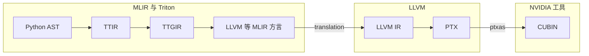
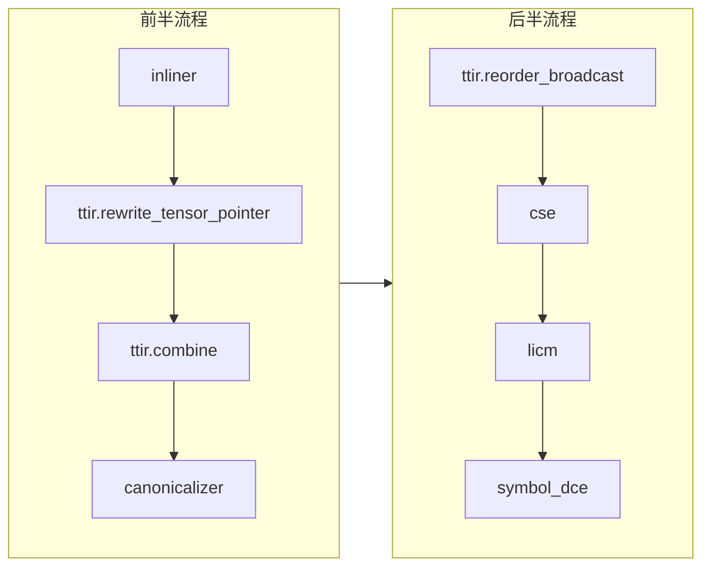
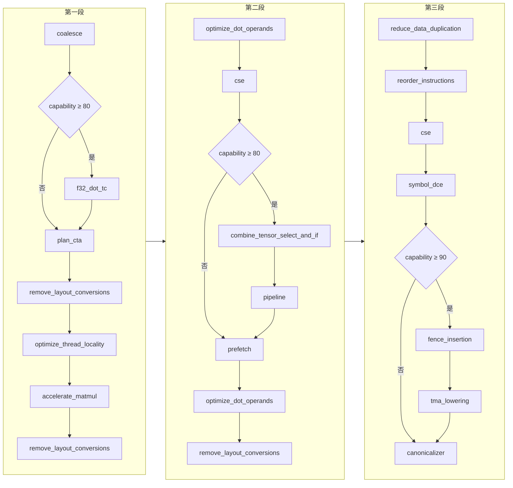
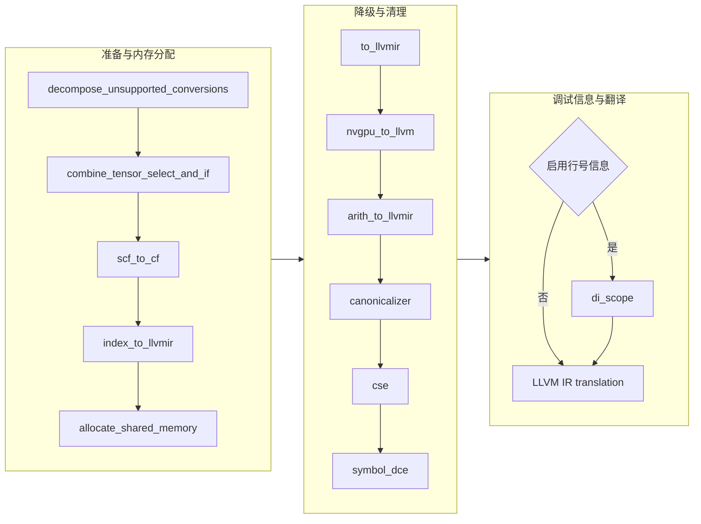
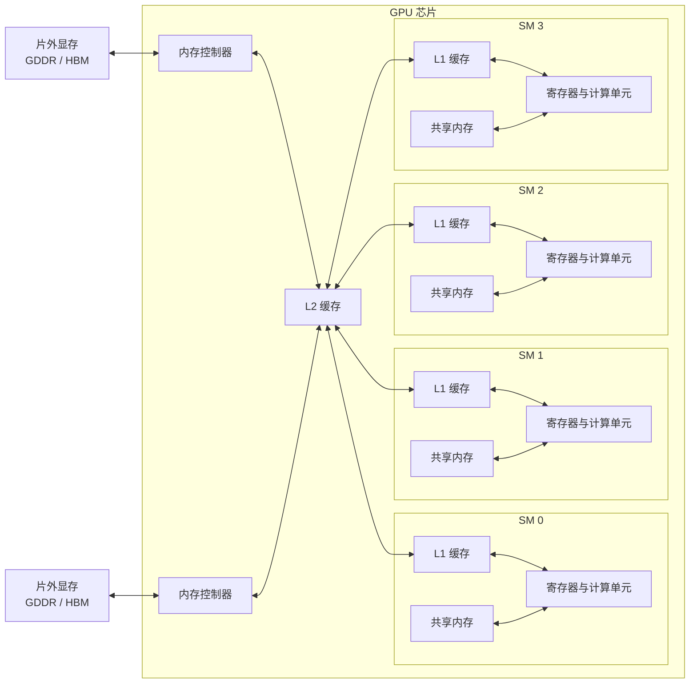
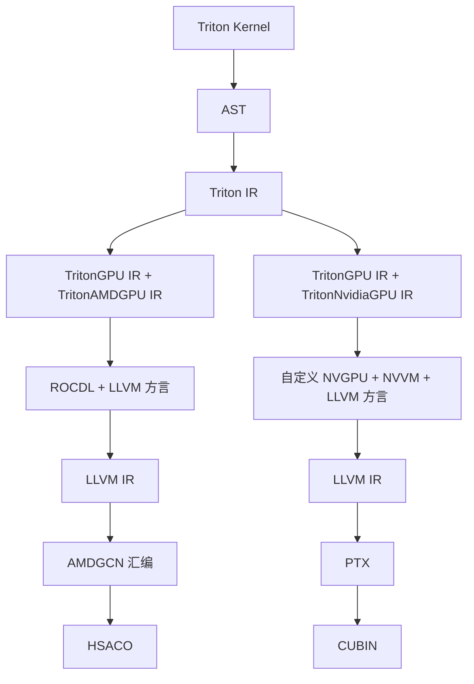

# 第13章 Triton DSL 的设计与编译优化

> 校订基准：本章按扫描件逐页转写，Triton 实现以原书指定提交 `47fc046ff29c9ea2ee90e987c39628a540603c8f` 为主要参照；涉及 MLIR 公共接口时，另核对本地 LLVM 18.1.8。两者的配套版本不可混用。内容修订、重要原文差异和验证范围见[第13章校订记录](issues/ch13.md)。

<!-- source: insider-compiler-ch11-ch13.pdf, PDF p. 50 -->

传统上，面向 NVIDIA GPU 的高性能 AI 算子开发主要依赖 CUDA 编程，要求开发者理解 GPU 体系结构及相关接口。Triton 旨在降低 GPU 算子开发的复杂性，提供基于 Python 的领域专用语言（DSL）。开发者用该语言描述算子逻辑，再由编译器将其逐步转换为 GPU 代码。Triton 的编译流程基于 MLIR 等基础设施，具有模块化和可扩展性。本章分析其实现机制，帮助编译器从业者理解如何设计与实现领域专用编译器。

## 13.1 GPU 优化挑战与 Triton DSL 设计思路

### 1. GPU 优化面临的挑战

11.2 节介绍硬件相关方言时已经讨论过 GPU 架构。要在 GPU 上实现高性能计算，需要协调内存、调度和指令三个方面。对程序员来说，主要有以下挑战。

- **内存访问优化**：对齐并合并对 DRAM（Dynamic Random Access Memory，动态随机存取存储器）的访问，减少无效内存事务及带宽浪费。这需要规划数据布局，使同一线程束的访存请求能被有效合并。例如，NVIDIA H100 的一个 warp 包含 32 个线程；这不是说整个 H100 只有 32 个线程。
<!-- source: insider-compiler-ch11-ch13.pdf, PDF p. 51 -->

- **共享内存管理**：合理利用共享内存，让频繁使用的数据块在需要时保留于该存储层，减少对全局内存的重复访问，同时避免不利的 bank 冲突。[^ch13-bank]
- **寄存器分配**：寄存器是 GPU 的重要低延迟存储资源，但容量有限。需要结合算法控制值的活跃区间、复用计算结果，并避免过大的寄存器需求导致溢出或限制并发驻留。
- **线程束调度**：通过足够的可执行 warp 隐藏延迟，并权衡并行度、寄存器和共享内存占用。对于 NVIDIA CUDA，warp 大小由体系结构规定，通常是 32，不是开发者可以任意调整的参数；可调的是线程块规模、warp 数量等。提高 occupancy 是手段，并不意味着占用率越高性能就必然越好。
- **指令优化**：GPU 的指令有不同延迟、吞吐量和执行资源。应匹配运算与数据类型，在适用时利用 Tensor Core 等专用计算单元，并协调指令与访存的执行。

对机器学习工程师而言，编写 CUDA 内核颇具挑战。即使是有经验的 CUDA 程序员，开发高度优化的内核也需要投入较多精力，这可能影响新算法和模型的实现及迭代速度。

为降低 GPU 优化门槛，学术界和工业界探索了多种编程模型和自动优化技术。原书列举 Google 的 XLA、Facebook 的 Tensor Comprehensions，以及起源于华盛顿大学等机构研究工作的 TVM 等项目。它们提供比直接手写 CUDA 更高层的计算表达或编译接口，再将张量运算转换为适合目标的代码。不同项目的前端并不都属于类似 Python 的同一种 DSL；易用性、灵活性和性能也随工作负载及实现变化，不能把某一项缺点概括为这些项目的全部能力。

### 2. Triton DSL 设计思路

Triton 面向张量计算与高性能 GPU 内核开发，算子融合是其中的重要用法，但不是唯一用途。它通过较高层的数据块编程接口，减少用户手工指定线程级细节的工作，使编译器有机会生成接近手工优化的实现。是否达到这一效果，仍取决于算子、目标硬件、参数与生成代码。

用户通常围绕 tile 组织计算，选择块大小等参数，编译器再决定数据在线程、寄存器及共享内存等资源之间的布局与移动。因此，tile 不是“只存在于共享内存”的对象。相比直接编写 CUDA C++，Python 接口可以使开发更方便；但这不意味着 PyTorch 的现有算子不能利用 GPU，也不意味着 Triton 因为没有直接暴露全部寄存器控制而无法进行寄存器复用。原书由此推导“始终无法将硬件性能挖掘至理论最大值”的结论缺少依据。[编程模型与硬件表述校订](issues/ch13.md#ch13-programming-model)。

Triton 不是 TensorFlow、PyTorch 那样的端到端深度学习框架，而主要提供张量内核编写和编译能力。它以 Python 库形式使用，可以与上层框架结合，为其中的计算提供自定义内核。

Triton DSL 函数可用 `triton.jit` 装饰，通过 JIT（Just-in-Time，即时编译）机制在给定参数、编译期常量和目标配置下编译。代码清单 13-1 展示向量加法内核。

[^ch13-bank]: 原书关于共享内存 bank 冲突的注释：共享内存按 bank 组织，线程束内对同一 bank 不同字的访问可能需要分多次处理，降低有效带宽。原注把“4 字节 bank 宽度”仅限定为 Ampere 之前不准确；现代 NVIDIA 架构也需按其实际 bank 数、字宽和访问事务分析。多个线程读取同一字可使用广播等机制，不能把它与访问同一 bank 的不同字混淆。[硬件依据](issues/ch13.md#ch13-programming-model)。

<!-- source: insider-compiler-ch11-ch13.pdf, PDF p. 52 -->

**代码清单 13-1 使用 Triton DSL 实现的向量加法算子**

```python
import triton
import triton.language as tl


@triton.jit
def add_kernel(
    x_ptr,                     # 第一个输入向量的指针
    y_ptr,                     # 第二个输入向量的指针
    output_ptr,                # 输出向量的指针
    n_elements,                # 向量元素总数
    BLOCK_SIZE: tl.constexpr,  # 每个 program 实例处理的元素数
                              # constexpr 表示编译期已知的值，也可表达形状参数
):
    pid = tl.program_id(axis=0)  # 本例使用一维启动网格
    block_start = pid * BLOCK_SIZE
    offsets = block_start + tl.arange(0, BLOCK_SIZE)
    mask = offsets < n_elements
    x = tl.load(x_ptr + offsets, mask=mask)
    y = tl.load(y_ptr + offsets, mask=mask)
    output = x + y
    tl.store(output_ptr + offsets, output, mask=mask)
```

> 校订注：原书代码的 `//` 注释改为 Python 的 `#`，补齐导入。BLOCK_SIZE 是一个 program 实例的块大小，不是每个硬件线程的元素数。这里只给出内核定义；还需分配合适的输入输出存储，并以覆盖全部元素的网格启动。BLOCK_SIZE 要符合 `tl.arange` 等操作的约束，末块通过 mask 保护有效范围。

由此可见，Triton 使用基于 tile 的编程模型，让用户围绕张量子块组织计算。程序在一个启动网格上实例化，每个实例通过 `program_id` 获取相应轴上的编号，再处理所分配的数据块。`program_id` 并不是给每个函数静态附加“一组实例对象”；它是内核运行时查询网格坐标的接口。tile 内部计算如何映射到线程及存储层，主要由 Triton 编译器处理，因此用户能够更多地关注块级逻辑。

Triton 继续编译 DSL，生成目标机器的代码；取得高性能还需要合适的内核结构、参数以及后续目标优化。

## 13.2 Triton DSL 的编译

Triton 将 DSL 转换为自身方言和 MLIR 社区方言，并在这些表示上实施多层优化，最终生成目标代码。

### 13.2.1 Triton 中的方言

#### 1. Triton 中的七类方言

原书介绍 Triton、TritonGPU、TritonNvidiaGPU、TritonAMDGPU、NVVM、NVWS、Proton 七类相关方言。它们属于不同抽象层和功能模块，不能将项目自有定义与所使用的上游方言一概说成由 Triton 从头实现。

- **Triton**：承接 DSL 的张量计算语义。一个 DSL 算子可能展开成多个 IR 操作，也可能复用 arith 等社区操作，并非所有 DSL 算子与该方言操作严格一一对应。
- **TritonGPU**：为 GPU 上的计算和数据分布增加布局等信息，表达多种 GPU 目标可共用的机制；具体优化和转换仍可能有目标相关限制。

<!-- source: insider-compiler-ch11-ch13.pdf, PDF p. 53 -->

- **TritonNvidiaGPU**：描述 NVIDIA GPU 的专有能力，补充 TritonGPU 的通用表达，以便在编译时使用目标硬件特性。
- **TritonAMDGPU**：描述 AMD GPU 的专有能力，为 AMD 后端提供相应表达。固定提交已包含 AMD 后端，但不能据此认定其目录和方言划分与原书后续版本完全相同。
- **NVVM**：MLIR 上游提供的 NVIDIA 目标方言，用于表达 NVVM intrinsics 等目标能力；它不是 PTX 指令集的完整逐条表示。固定提交的 Triton 还自定义了 NVIDIA 后端的 **NVGPU** 方言，不能与 NVVM 混为一谈。
- **NVWS**：原书介绍为准备承载 warp specialization（线程束专门化）优化的方言，并称当时尚未投入使用、相关功能仍位于 TritonGPU，未来可能迁入。固定提交没有该方言定义，故此处作为原书所描述的后续演化保留。
- **Proton**：提供性能采样和分析能力。固定提交有 Proton 分析工具，但不能把这个工具直接等同于当时已定义的同名 MLIR 方言。

> 校订注：原书的“七种方言”与指定提交并不完全对应。[方言及版本范围](issues/ch13.md#ch13-dialects)。其中，以下重点介绍 Triton 和 TritonGPU。

#### 2. Triton 方言

Triton 方言用于表达计算逻辑，尚未固定线程和寄存器布局，因而比后续 TritonGPU IR 更独立于具体硬件。它定义的操作用于承接 DSL，把 Python 前端接入 MLIR。其表达已经包含 SPMD 等 GPU 编程概念，也为相应优化提供条件。

原书把操作按用途分成以下八类。这里的 `cast`、`pointer_arith`、`shape_manipulation`、`spmd` 是分类名称，不是四个可直接书写的 Triton 操作。

1. **类型转换类**：例如 `tt.int_to_ptr`、`tt.ptr_to_int`、`tt.bitcast`、`tt.fp_to_fp`，表达相应类型之间的显式转换；一些常规数值转换使用 `arith` 操作。
2. **指针运算类**：例如 `tt.addptr` 和 `tt.advance`，执行指针或张量指针的地址推进。
3. **数据存取类**：`tt.load`、`tt.store` 分别加载和存储数据；`tt.atomic_rmw`、`tt.atomic_cas` 表达原子操作。原子性不等于自动满足任意程序所需的全部内存顺序。
4. **形状操作类**：例如 `tt.reshape`、`tt.trans`、`tt.expand_dims`、`tt.broadcast`，改变张量形状或维度表达。
5. **并行计算类**：`tt.get_program_id` 等支持 SPMD（Single Program, Multiple Data，单程序多数据）模型；`tt.dot` 表达矩阵乘加；`tt.reduce` 表达由组合区域定义的归约，如求和或最大值；`tt.scan` 表达前缀扫描。此版本的 `tt.dot` 不应笼统解释为任意向量点积接口。
6. **外部与内联操作类**：`tt.extern_elementwise` 调用外部定义的逐元素函数；`tt.elementwise_inline_asm` 以内联汇编实现逐元素计算。
7. **范围与张量构造类**：`tt.make_range` 生成整数序列；`tt.make_tensor_ptr` 根据父张量的形状、步长、偏移及块形状等构造张量指针。
8. **统计与调试类**：`tt.histogram` 计算直方图；`tt.print` 在设备端输出调试信息；`tt.assert` 表达运行时断言。

操作的详细定义见固定提交的 [`include/triton/Dialect/Triton/IR/TritonOps.td`](https://github.com/triton-lang/triton/blob/47fc046ff29c9ea2ee90e987c39628a540603c8f/include/triton/Dialect/Triton/IR/TritonOps.td)。原书列出的 `TritonAttrDefs.td` 定义属性，不能作为这些操作的定义文件。

#### 3. TritonGPU 方言

<!-- source: insider-compiler-ch11-ch13.pdf, PDF p. 54 -->

TritonGPU 方言进一步表达 GPU 计算，增加硬件相关的操作、类型和布局信息。原书重点介绍以下几类操作。

**（1）异步操作类**

1. `async_wait`：等待一定范围内的异步复制完成。在相应 NVIDIA 降级路径中可对应 `cp.async.wait_group`，其参数决定允许尚未完成的组数，不能一概解释为等待全部异步工作。
2. `async_commit_group`：把此前尚未提交分组的异步复制归入一个组，以便之后按组等待。它不是对任意异步任务执行队列的通用提交接口。
3. `async_copy_global_to_local`：把数据从全局内存异步复制到共享内存，使访存与计算有机会重叠。

**（2）共享内存管理类**

1. `local_alloc`：分配共享内存缓冲区并返回描述符；存在输入张量时还用其初始化缓冲区。
2. `local_dealloc`：显式结束共享内存缓冲区的生存期，此后使用该缓冲区属于未定义行为。该操作在此版本中是可选的；缺省生存期由编译器根据使用关系推断，并不是缺少它就会发生运行时堆内存泄漏。
3. `local_load`：从共享内存描述符加载数据，得到分布于线程的张量。
4. `local_store`：将分布式张量存入共享内存缓冲区。

**（3）数据视图与布局类**

1. `memdesc_subview`：构造描述缓冲区子视图的新描述符，可以降低秩；它不改变底层内存，也不只是返回一个未经类型描述的裸地址。
2. `convert_layout`：在不同布局之间转换张量的表示，是 TritonGPU 类型及布局系统的关键操作。

异步操作主要用于本章后面介绍的流水线与数据预取优化。定义见 [`TritonGPUOps.td`](https://github.com/triton-lang/triton/blob/47fc046ff29c9ea2ee90e987c39628a540603c8f/include/triton/Dialect/TritonGPU/IR/TritonGPUOps.td)，布局属性见同目录的 `TritonGPUAttrDefs.td`。与 NVIDIA 专有功能相关的操作还可参阅 [`TritonNvidiaGPUOps.td`](https://github.com/triton-lang/triton/blob/47fc046ff29c9ea2ee90e987c39628a540603c8f/include/triton/Dialect/TritonNvidiaGPU/IR/TritonNvidiaGPUOps.td)。[操作定义及生存期校订](issues/ch13.md#ch13-dialects)。

#### 4. Triton 使用的社区方言

Triton 还依赖 MLIR 社区的方言，原书按用途概括为四类。

1. **数据类型类**：如 `builtin`，提供张量、整数、浮点数等内建类型。
2. **数学操作类**：如 `arith`，提供整数和浮点算术等操作；更广泛的数学函数也会涉及其他方言。
3. **控制流类**：如 `scf`，提供结构化的 `if`、`for` 等操作。
4. **特定功能类**：例如 `nvvm` 提供线程标识及多种 NVIDIA 目标相关操作，范围并非“少量底层操作”；`gpu` 中有 `gpu.printf` 等调试相关操作，但不能据此把整个 GPU 方言只理解为调试接口。

### 13.2.2 Triton 的编译过程

以 NVIDIA GPU 为例，可把 Triton 的编译过程概括为六步。

1. **算子解析和 Triton IR 生成**：将 Python 算子解析为 AST，再生成包含 Triton 方言等操作的 IR，简称 TTIR。

<!-- source: insider-compiler-ch11-ch13.pdf, PDF p. 55 -->

2. **TTIR 优化及 TritonGPU IR 生成**：对 TTIR 优化，再加入线程等布局信息，得到简称 TTGIR 的表示。
3. **TTGIR 优化与降级**：优化 TTGIR，再把 Triton 自定义操作逐步转换为 LLVM、NVVM 等社区方言表示。该过程也会经过 NVIDIA 后端的自定义中间方言，不能假设一次转换就全部成为社区操作。
4. **生成 LLVM IR**：通过 MLIR 的 LLVM IR translation 等机制，得到 LLVM 原生 IR，并实施 LLVM 优化。
5. **生成 PTX**：调用 LLVM NVPTX 后端，把 LLVM IR 编译成 PTX。
6. **生成 CUBIN**：调用 NVIDIA 的 `ptxas`，将 PTX 汇编为 GPU 可执行的 CUBIN。

**图 13-1 Triton 的主要编译流程**



> 校订注：PTX 由此路径中的 LLVM NVPTX 后端生成，不能因后续调用第三方工具而把整个 PTX 生成阶段归入 `ptxas`。[固定提交的后端流程](issues/ch13.md#ch13-pipelines)。

## 13.3 Triton DSL 的编译与优化

### 13.3.1 编译过程概述

Triton 的优化可从 TTIR、TTGIR 和后续降级三个层面理解。以下先介绍各层的主要优化，再详细分析代表性步骤。

#### 1. TTIR 上的优化

这一阶段主要简化计算表达，暂不为张量分配具体 GPU 布局。图 13-2 按固定提交 NVIDIA 后端 `make_ttir` 的实际顺序绘制。图 13-2～13-4 为便于阅读按流程分组：各组内部自上而下执行，完成一组后再从下一组顶部继续；横向连线连接整组流程。

**图 13-2 Triton IR 的优化顺序（固定提交校订）**



原书图中另含 `rewrite_tensor_descriptor_to_pointer`、`loop_unroll`，且顺序不同；这些节点及原图顺序完整保留在[流程版本差异](issues/ch13.md#ch13-pipelines)，不作为固定提交已经执行的 pass。原图用虚线表示硬件相关优化，但本版本在此处直接加入 tensor pointer rewrite，未按图中含义附加该条件。

<!-- source: insider-compiler-ch11-ch13.pdf, PDF p. 56 -->

> **注意**：图中的 `ttir`、`ttgpuir`、`ttnvgpuir` 是 Python pass 绑定的模块名，分别用于组织 TTIR、TTGIR 及 NVIDIA GPU 相关的 pass。它们并不总等于 IR 中的操作前缀。后面图 13-3、图 13-4 也采用这一类标记；原书此处把图 13-4 误写成“图 14-4”。

原书重点说明以下七种优化。

1. **Inliner**：在符合内联条件时把被调用函数的函数体接入调用处，减少调用开销并暴露跨函数优化机会。
2. **TritonRewriteTensorPointer**：将张量指针及相关访问改写为元素指针张量和必要的地址、边界计算，为后续转换提供更基础的表达。
3. **Canonicalizer**：利用操作折叠及规范化模式简化 IR，如消除冗余表达、常量折叠等。具体变换取决于已注册操作的实现。
4. **TritonCombineOps**：组合满足条件的 Triton 操作，减少冗余计算或生成更合适的表达。
5. **TritonReorderBroadcast**：在合法时把逐元素运算移到 broadcast、splat 或 expand_dims 之前，缩小进行运算的形状。`elementwise` 在此描述操作特性，不是名为 `tt.elementwise` 的通用操作。
6. **CSE**：公共子表达式消除，复用在相应支配和副作用条件下等价的计算结果。
7. **SymbolDCE**：删除不可达的符号定义，例如没有被引用且允许删除的私有函数。

固定提交另外加入 **LICM**（Loop-Invariant Code Motion，循环不变代码外提），将满足安全条件的循环不变计算移出循环；原书上述七项说明没有覆盖这一项。

#### 2. TTGIR 上的优化

TTGIR 带有线程、寄存器以及共享内存等布局信息，可以根据这些信息实施更具体的 GPU 优化。图 13-3 按固定提交展示实际顺序；条件对应 NVIDIA compute capability。

1. **TritonGPUCoalesce**：利用访存连续性、对齐等信息选择布局，改善同一 warp 的访存合并；目的并非把所有访问无条件合成一个操作。
2. **TritonNvidiaGPUPlanCTA**：CTA 是 **Cooperative Thread Array**，相当于 CUDA 的线程块。此优化规划一个 CTA cluster 内的数据划分和相关布局，尤其影响 `num_ctas` 大于 1 的情况；不能简单等同为决定任意线程块的全部执行行为。
3. **TritonGPURemoveLayoutConversions**：传播布局信息并消除能够避免的 `convert_layout`，降低布局转换开销。

<!-- source: insider-compiler-ch11-ch13.pdf, PDF p. 57 -->

**图 13-3 TTGIR 上的优化流程（固定提交校订）**



原书大图中的描述符优化、Tensor Memory、warp specialization、多种嵌套循环路径等节点不属于固定提交的这段 pipeline；原图全部节点及分支保留在[校订记录](issues/ch13.md#ch13-pipelines)。图中省略了绑定模块名前缀，以便阅读；例如 `plan_cta`、`fence_insertion`、`tma_lowering` 来自 NVIDIA 绑定，其余多数来自 `ttgpuir`，`cse` 等来自公共 pass。

4. **TritonGPUOptimizeThreadLocality**：调整满足条件的张量布局，让更多计算能够在线程内完成，减少跨线程通信。
5. **TritonGPUAccelerateMatmul**：为矩阵乘法选择可用的目标加速指令及对应 MMA 布局。能否使用 Tensor Core 取决于架构、形状、元素类型和精度条件。
6. **CSE**：同样用于消除优化过程中出现的可复用计算。
<!-- source: insider-compiler-ch11-ch13.pdf, PDF p. 58 -->

7. **TritonGPUPrefetch**：对适用的矩阵乘循环安排共享内存到寄存器等数据的预取，让数据在使用前准备好。它与后述从全局内存到共享内存的软件流水线有关联，但不是同一个 pass。
8. **TritonGPUPipeline**：对满足条件的循环安排软件流水线，使不同逻辑迭代的加载和计算重叠，以隐藏访存延迟。
9. **TritonGPUOptimizeDotOperands**：针对 dot 操作数的布局和相关计算实施模式重写，减少不必要的转换或调整转换的位置。
10. **TritonGPUReduceDataDuplication**：减少布局转换中可以避免的重复数据处理；在适用模式中显式利用共享内存路径，具体见后文。
11. **TritonGPUReorderInstructions**：依据依赖关系和启发式规则重新安排指令，缩短部分值的活跃区间或更好地衔接访存与使用。
12. **SymbolDCE**：删除无用符号。
13. **Canonicalizer**：通过规范化模式进一步清理和简化 IR。
14. **TritonGPUDecomposeUnsupportedNVIDIAConversions**：把 NVIDIA 后端无法直接支持的布局转换拆成可支持的中间步骤。固定提交在后续 `make_llir` 开始时执行它，原书将它一并列在 TTGIR 优化说明中。
15. **TritonGPUCombineTensorSelectAndIf**：合并满足条件的张量 select 与 if，改变其结果和操作数的组织方式，使后续转换更易处理。

#### 3. 降级和后续优化

经过 TTIR 和 TTGIR 优化后，编译器逐步把 Triton 自定义操作转换为目标相关的 MLIR 表示，再翻译成 LLVM IR。图 13-4 展示固定提交的主要 MLIR pass。

**图 13-4 TTGIR 向 LLVM IR 转换的主要 pass（固定提交校订）**



这里既有 Triton 自定义降级，也有社区提供的控制流、索引及算术转换，不能把图中的每个 pass 都称为“社区优化”。原书图中的 `lower_mma`、Tensor Memory 分配、warp specialization 等后续版本节点也已保留在[流程差异记录](issues/ch13.md#ch13-pipelines)。

<!-- source: insider-compiler-ch11-ch13.pdf, PDF p. 59 -->

这一阶段值得关注的步骤是 `TritonGPUAllocateSharedMemory`（绑定名 `ttgpuir.allocate_shared_memory`），它分析并安排共享内存分配，产生后续降级所需的布局、偏移和总量等信息。下面详细讨论编译中的主要步骤及代表性优化。

### 13.3.2 Python 代码解析与 Triton IR 生成

Triton DSL 嵌入 Python。编译器解析 Python 代码形成 AST，再遍历 AST 生成 Triton IR。这与一般编译器前端的结构类似，这里不再逐项展开，改用矩阵乘法内核 `matmul_kernel` 展示。原书清单 13-2 只计算从输入指针起始位置开始的一个输出块，没有使用 `program_id` 来覆盖整个矩阵，也没有尾块 mask；以下保留这一示例的范围，并明确其前提。

**代码清单 13-2 使用 Triton DSL 实现 matmul_kernel 算子**

```python
import triton  # 引入 Triton
import triton.language as tl  # tl. 开头的接口来自 Triton language


@triton.jit
def matmul_kernel(
    a_ptr, b_ptr, c_ptr,
    stride_am, stride_ak,
    stride_bk, stride_bn,
    stride_cm, stride_cn,
    M: tl.constexpr, N: tl.constexpr, K: tl.constexpr,  # 原书示例 M=N=K=1024
    BLOCK_M: tl.constexpr, BLOCK_N: tl.constexpr, BLOCK_K: tl.constexpr,
):  # 原书示例 BLOCK_M=BLOCK_N=BLOCK_K=32
    offs_m = tl.arange(0, BLOCK_M)
    offs_n = tl.arange(0, BLOCK_N)
    offs_k = tl.arange(0, BLOCK_K)
    a_ptrs = a_ptr + offs_m[:, None] * stride_am + offs_k[None, :] * stride_ak
    b_ptrs = b_ptr + offs_k[:, None] * stride_bk + offs_n[None, :] * stride_bn
    accumulator = tl.zeros((BLOCK_M, BLOCK_N), dtype=tl.float32)
    for k in range(0, K, BLOCK_K):
        a = tl.load(a_ptrs)
        b = tl.load(b_ptrs)
        accumulator += tl.dot(a, b)
        a_ptrs += BLOCK_K * stride_ak
        b_ptrs += BLOCK_K * stride_bk
    c_ptrs = c_ptr + offs_m[:, None] * stride_cm + offs_n[None, :] * stride_cn
    tl.store(c_ptrs, accumulator)
```

本例假定 `M >= BLOCK_M`、`N >= BLOCK_N`，`K` 是 `BLOCK_K` 的非负整数倍，所有被访问地址都有效，并且每次只启动一个 program。若要由调用者处理多个块，需分别偏移输入输出指针并分别启动；同一次多 program 网格中的参数不会自动按块偏移。它不是完整的多块矩阵乘法实现。

原书接着给出前端 IR，见清单 13-3。该 IR 使用 `128×256×64` 的块尺寸、运行时 K，并把部分步长特化为 1；它与清单 13-2 注释中的 `32×32×32` 配置及全部 M/N/K 为 constexpr 的签名不一致。因此它应作为**另一组参数配置的前端 IR 示例**阅读，不能称两份清单“完全相同”。为保留原有操作，下面保留原 SSA 编号和冗余计算，省去原书未给定义的 `loc(#locN)` 调试位置，并补齐被调用的零初始化函数。原来的位置引用及差异见[前端示例校订](issues/ch13.md#ch13-frontend)。

**代码清单 13-3 Python 前端生成的 MLIR 形式示例（块尺寸 128×256×64）**

```mlir
module {
  tt.func public @matmul_kernel(
      %arg0: !tt.ptr<f16> {tt.divisibility = 16 : i32},
```

<!-- source: insider-compiler-ch11-ch13.pdf, PDF p. 60 -->

```mlir
      %arg1: !tt.ptr<f16> {tt.divisibility = 16 : i32},
      %arg2: !tt.ptr<f16> {tt.divisibility = 16 : i32},
      %arg3: i32 {tt.divisibility = 16 : i32},
      %arg4: i32 {tt.divisibility = 16 : i32},
      %arg5: i32 {tt.divisibility = 16 : i32},
      %arg6: i32 {tt.divisibility = 16 : i32},
      %arg7: i32 {tt.divisibility = 16 : i32},
      %arg8: i32 {tt.divisibility = 16 : i32}) attributes {noinline = false} {
    // 此例 arg5=K，arg6=stride_am，arg7=stride_bk，arg8=stride_cm；
    // arg3、arg4 未使用，stride_ak/stride_bn/stride_cn 已特化为 1。
    %0 = tt.make_range {end = 128 : i32, start = 0 : i32} : tensor<128xi32>
    %1 = tt.make_range {end = 256 : i32, start = 0 : i32} : tensor<256xi32>
    %2 = tt.make_range {end = 64 : i32, start = 0 : i32} : tensor<64xi32>
    %3 = tt.expand_dims %0 {axis = 1 : i32} : tensor<128xi32> -> tensor<128x1xi32>
    %4 = tt.splat %arg6 : i32 -> tensor<128x1xi32>
    %5 = arith.muli %3, %4 : tensor<128x1xi32>
    %6 = tt.splat %arg0 : !tt.ptr<f16> -> tensor<128x1x!tt.ptr<f16>>
    %7 = tt.addptr %6, %5 : tensor<128x1x!tt.ptr<f16>>, tensor<128x1xi32>
    %8 = tt.expand_dims %2 {axis = 0 : i32} : tensor<64xi32> -> tensor<1x64xi32>
    %c1_i32 = arith.constant 1 : i32
    %cst = arith.constant dense<1> : tensor<1x64xi32>
    %9 = arith.muli %8, %cst : tensor<1x64xi32>
    %10 = tt.broadcast %7 : tensor<128x1x!tt.ptr<f16>> -> tensor<128x64x!tt.ptr<f16>>
    %11 = tt.broadcast %9 : tensor<1x64xi32> -> tensor<128x64xi32>
    %12 = tt.addptr %10, %11 : tensor<128x64x!tt.ptr<f16>>, tensor<128x64xi32>
    %13 = tt.expand_dims %2 {axis = 1 : i32} : tensor<64xi32> -> tensor<64x1xi32>
    %14 = tt.splat %arg7 : i32 -> tensor<64x1xi32>
    %15 = arith.muli %13, %14 : tensor<64x1xi32>
    %16 = tt.splat %arg1 : !tt.ptr<f16> -> tensor<64x1x!tt.ptr<f16>>
    %17 = tt.addptr %16, %15 : tensor<64x1x!tt.ptr<f16>>, tensor<64x1xi32>
    %18 = tt.expand_dims %1 {axis = 0 : i32} : tensor<256xi32> -> tensor<1x256xi32>
    %c1_i32_0 = arith.constant 1 : i32
    %cst_1 = arith.constant dense<1> : tensor<1x256xi32>
    %19 = arith.muli %18, %cst_1 : tensor<1x256xi32>
    %20 = tt.broadcast %17 : tensor<64x1x!tt.ptr<f16>> -> tensor<64x256x!tt.ptr<f16>>
    %21 = tt.broadcast %19 : tensor<1x256xi32> -> tensor<64x256xi32>
    %22 = tt.addptr %20, %21 : tensor<64x256x!tt.ptr<f16>>, tensor<64x256xi32>
    %23 = tt.call @"zeros__0cconstexpr_(constexpr_128_,_constexpr_256_)__1cconstexpr_fp32_"()
        : () -> tensor<128x256xf32>
    %c0_i32 = arith.constant 0 : i32
    %c64_i32 = arith.constant 64 : i32
    %24 = arith.bitcast %c0_i32 : i32 to i32
    %25 = arith.bitcast %arg5 : i32 to i32
    %26 = arith.bitcast %c64_i32 : i32 to i32
```

<!-- source: insider-compiler-ch11-ch13.pdf, PDF p. 61 -->

```mlir
    %27 = llvm.mlir.undef : i32
    %28:3 = scf.for %arg9 = %24 to %25 step %26
        iter_args(%arg10 = %23, %arg11 = %12, %arg12 = %22)
        -> (tensor<128x256xf32>, tensor<128x64x!tt.ptr<f16>>,
            tensor<64x256x!tt.ptr<f16>>) : i32 {
      %40 = tt.load %arg11 : tensor<128x64x!tt.ptr<f16>>
      %41 = tt.load %arg12 : tensor<64x256x!tt.ptr<f16>>
      %cst_4 = arith.constant 0.000000e+00 : f32
      %cst_5 = arith.constant dense<0.000000e+00> : tensor<128x256xf32>
      %42 = tt.dot %40, %41, %cst_5, inputPrecision = tf32
          : tensor<128x64xf16> * tensor<64x256xf16> -> tensor<128x256xf32>
      %43 = arith.addf %arg10, %42 : tensor<128x256xf32>
      %c64_i32_6 = arith.constant 64 : i32
      %cst_7 = arith.constant dense<64> : tensor<128x64xi32>
      %44 = tt.addptr %arg11, %cst_7 : tensor<128x64x!tt.ptr<f16>>, tensor<128x64xi32>
      %c64_i32_8 = arith.constant 64 : i32
      %45 = arith.muli %arg7, %c64_i32_8 : i32
      %46 = tt.splat %45 : i32 -> tensor<64x256xi32>
      %47 = tt.addptr %arg12, %46 : tensor<64x256x!tt.ptr<f16>>, tensor<64x256xi32>
      scf.yield %43, %44, %47 : tensor<128x256xf32>,
          tensor<128x64x!tt.ptr<f16>>, tensor<64x256x!tt.ptr<f16>>
    }
    %29 = tt.expand_dims %0 {axis = 1 : i32} : tensor<128xi32> -> tensor<128x1xi32>
    %30 = tt.splat %arg8 : i32 -> tensor<128x1xi32>
    %31 = arith.muli %29, %30 : tensor<128x1xi32>
    %32 = tt.splat %arg2 : !tt.ptr<f16> -> tensor<128x1x!tt.ptr<f16>>
    %33 = tt.addptr %32, %31 : tensor<128x1x!tt.ptr<f16>>, tensor<128x1xi32>
    %34 = tt.expand_dims %1 {axis = 0 : i32} : tensor<256xi32> -> tensor<1x256xi32>
    %c1_i32_2 = arith.constant 1 : i32
    %cst_3 = arith.constant dense<1> : tensor<1x256xi32>
    %35 = arith.muli %34, %cst_3 : tensor<1x256xi32>
    %36 = tt.broadcast %33 : tensor<128x1x!tt.ptr<f16>> -> tensor<128x256x!tt.ptr<f16>>
    %37 = tt.broadcast %35 : tensor<1x256xi32> -> tensor<128x256xi32>
    %38 = tt.addptr %36, %37 : tensor<128x256x!tt.ptr<f16>>, tensor<128x256xi32>
    %39 = arith.truncf %28#0 : tensor<128x256xf32> to tensor<128x256xf16>
    tt.store %38, %39 : tensor<128x256x!tt.ptr<f16>>
    tt.return
  }
  // 校订补充：原书省略了被调用函数的定义。
  tt.func private @"zeros__0cconstexpr_(constexpr_128_,_constexpr_256_)__1cconstexpr_fp32_"()
      -> tensor<128x256xf32> {
    %zero = arith.constant dense<0.0> : tensor<128x256xf32>
    tt.return %zero : tensor<128x256xf32>
  }
}
```

清单 13-3 不止包含 `tt` 和 `arith` 两种方言：外层 `module` 属于 `builtin`，循环属于 `scf`，未使用的 `undef` 属于 `llvm`。主要张量和地址操作使用 Triton 方言，基础算术使用 MLIR 社区的 `arith`。两份清单可以用来比较 Python 语句与这些 IR 操作的对应关系，但必须考虑前述特化参数差异。接下来讨论 TTIR 的编译优化。

<!-- source: insider-compiler-ch11-ch13.pdf, PDF p. 62 -->

### 13.3.3 Triton IR 的优化

TTIR 优化主要处理尚未固定硬件布局的表示，其中有不少第 7 章已经介绍的通用优化，这里不再重复。本节介绍与 Triton 类型及操作有关的三个专用优化。

#### 1. TritonRewriteTensorPointer 优化

Triton DSL 的 `tl.make_block_ptr` 允许开发者创建指向张量局部数据块的指针，再对该块实施访存。它对应 Triton 方言中的 `tt.make_tensor_ptr`。结果类型可写成 `!tt.ptr<tensor<8x8xf16>>`，表示张量指针；父张量的形状、步长、偏移等元信息由构造操作的操作数携带，而不是全部编码在这个指针类型中。张量类型的基础知识见 3.4.4 节。

`TritonRewriteTensorPointer` 消除这种高层张量指针表达，改为显式的偏移计算、元素指针张量以及必要的边界 mask。对于 `advance`、`load`、`store` 等使用者，它重建相应地址或访问。**这并不消除对内存的指针访问**，更不是把外部内存数据凭空变成无需加载的张量值。清单 13-4 展示 `make_tensor_ptr` 和 `advance`。

**代码清单 13-4 包含 make_tensor_ptr、advance 操作的待优化示例**

```mlir
tt.func public @asm_in_loop(%arg0: !tt.ptr<bf16> {tt.divisibility = 16 : i32})
    attributes {noinline = false} {
  %c0_i32 = arith.constant 0 : i32
  %c1_i32 = arith.constant 1 : i32
  %c0_i64 = arith.constant 0 : i64
  %c128_i64 = arith.constant 128 : i64
  // 生成 0 至 15 的 i32 元素，start 包含在内，end 不包含在内。
  %0 = tt.make_range {end = 16 : i32, start = 0 : i32} : tensor<16xi32>
  // 基址、父张量形状、步长、偏移，以及 order 属性。
  // 此例第二维步长为 0，两个偏移也都为 0，不是通常的稠密二维存储。
  %1 = tt.make_tensor_ptr %arg0, [%c128_i64, %c128_i64],
      [%c128_i64, %c0_i64], [%c0_i32, %c0_i32] {order = array<i32: 0, 1>}
      : <tensor<128x128xbf16>>
  %2:1 = scf.for %arg1 = %c0_i32 to %c1_i32 step %c1_i32
      iter_args(%arg2 = %1) -> (!tt.ptr<tensor<128x128xbf16>>) : i32 {
    // 汇编文本是测试占位符，不是可交给 PTX 汇编器执行的真实指令。
    %3:2 = tt.elementwise_inline_asm "asm_multiple_results"
        {constraints = "=r,=r,r", packed_element = 1 : i32, pure = true}
        %0 : tensor<16xi32> -> tensor<16xi16>, tensor<16xi16>
    // 以各维偏移更新张量指针；本例两个增量都是 0。
    %4 = tt.advance %arg2, [%c0_i32, %c0_i32] : <tensor<128x128xbf16>>
    scf.yield %4 : !tt.ptr<tensor<128x128xbf16>>
  }
```

<!-- source: insider-compiler-ch11-ch13.pdf, PDF p. 63 -->

```mlir
  tt.return
}
```

该优化可分两步理解。

**（1）收集张量指针信息**

编译器提取并重建 `make_tensor_ptr` 的基址、父形状、步长和各维偏移，显式保存，供后续使用者的重写使用。`advance` 依赖已有张量指针的元信息，只改变各维偏移，保留基址、形状和步长等信息。因此处理 `advance` 时，可以在已有状态上计算新偏移，而不必保留原来的高层指针操作。

**（2）利用信息重写使用者**

清单 13-4 中，`%1` 是 `scf.for` 的初始迭代参数；`%4` 是 `scf.yield` 的操作数，会进入下一次迭代的区域参数。编译器把这个张量指针状态改写为其各维偏移，并同步调整循环的输入、区域参数、yield 及结果。

对这个特定示例，循环只推进张量指针而不实际加载或存储数据，所以用两个偏移值即可表示所需变化。对一般的张量指针访存，还需要基址、步长、形状等信息来重建地址，不能概括为“`scf.for` 仅依赖偏移”。

原书给出的命令形式如下。需要与固定提交配套构建的 `triton-opt`；本次环境未运行该命令，清单 13-5 是按原书与源码校核的变换展示。

```sh
triton-opt 13-4.mlir -triton-rewrite-tensor-pointer
```

**代码清单 13-5 张量指针重写后的结果**

```mlir
module {
  tt.func public @asm_in_loop(%arg0: !tt.ptr<bf16> {tt.divisibility = 16 : i32})
      attributes {noinline = false} {
    %c0_i32 = arith.constant 0 : i32
    %c1_i32 = arith.constant 1 : i32
    %c0_i64 = arith.constant 0 : i64
    %c128_i64 = arith.constant 128 : i64
    %0 = tt.make_range {end = 16 : i32, start = 0 : i32} : tensor<16xi32>
    %1 = arith.extsi %c0_i32 : i32 to i64
    %2 = arith.extsi %c0_i32 : i32 to i64
    %3:2 = scf.for %arg1 = %c0_i32 to %c1_i32 step %c1_i32
        iter_args(%arg2 = %1, %arg3 = %2) -> (i64, i64) : i32 {
      %4:2 = tt.elementwise_inline_asm "asm_multiple_results"
          {constraints = "=r,=r,r", packed_element = 1 : i32, pure = true}
          %0 : tensor<16xi32> -> tensor<16xi16>, tensor<16xi16>
      %5 = arith.extsi %c0_i32 : i32 to i64
      %6 = arith.addi %arg2, %5 : i64
```

<!-- source: insider-compiler-ch11-ch13.pdf, PDF p. 64 -->

```mlir
      %7 = arith.extsi %c0_i32 : i32 to i64
      %8 = arith.addi %arg3, %7 : i64
      scf.yield %6, %8 : i64, i64
    }
    tt.return
  }
}
```

二维张量指针具有两个偏移分量，所以清单 13-5 的 `%1`、`%2` 对应初始偏移，`%5`、`%7` 对应 `advance` 的两个增量，`%6`、`%8` 是相加后的新偏移。这里更新的是地址计算状态，尚未取得“新的张量数据”。继续做规范化还可折叠本例中的零增量和其他无用计算。

固定提交对包含张量指针的 `scf.for` **及 `scf.if`** 提供重写，尚不支持相同用途的 `scf.while`、`cf.br`、`cf.cond_br` 等。原书“仅支持 for”遗漏了 if。遇到 while 不能机械地改为 for；应先保证循环语义能够等价表达，再考虑该版本的支持范围。[张量指针校订及源码](issues/ch13.md#ch13-tensor-pointer)。

#### 2. TritonCombineOps 优化

`TritonCombineOps` 合并满足特定模式的操作，简化计算序列。原书按用途归为表 13-1 的五类；实际 C++/TableGen 模式名带有 `Combine` 等前缀，dot-add 又分整数、浮点和操作数反序等多个模式，因此“五类”不是实际注册模式类数量。

**表 13-1 TritonCombineOps 的五类组合模式**

| 原书模式简称 | 描述及限制 |
| --- | --- |
| DotAddPattern | 在满足零初始累加器等条件时，把 dot 和 add 合并为以加数为累加器的 dot；浮点变换还受相应精度/融合条件约束。 |
| SelectMaskedLoadPattern | 在 mask 等条件匹配时，把 load 后的 select 合入 masked load 的替代值。 |
| AddPtrPattern | 把能够组合的连续 `addptr` 合成一次地址推进。 |
| BroadcastConstantPattern | 将常量的 broadcast 折叠为结果形状的常量。 |
| BroadcastMulReducePattern | 将符合形状、轴、类型等限制的 broadcast、乘法、归约组合识别为 dot。 |

以 dot-add 模式为例，待优化代码如下。

**代码清单 13-6 DotAddPattern 对应的组合示例**

```mlir
tt.func @test_combine_dot_add_pattern() -> tensor<128x128xf32> {
  %a = arith.constant dense<1.0> : tensor<128x128xf32>
  %b = arith.constant dense<2.0> : tensor<128x128xf32>
  %zero = arith.constant dense<0.0> : tensor<128x128xf32>
  %d = arith.constant dense<3.0> : tensor<128x128xf32>
  %dot_out = tt.dot %a, %b, %zero
      : tensor<128x128xf32> * tensor<128x128xf32> -> tensor<128x128xf32>
  %res = arith.addf %dot_out, %d : tensor<128x128xf32>
  tt.return %res : tensor<128x128xf32>
}
```

<!-- source: insider-compiler-ch11-ch13.pdf, PDF p. 65 -->

`%dot_out` 与 `%res` 对应的 dot、addf 序列满足本例的组合条件。使用配套的 `triton-opt` 并传递 `-triton-combine`，可将加数接入 dot 的累加器操作数，得到清单 13-7 所示形式。

**代码清单 13-7 操作组合后的结果**

```mlir
tt.func @test_combine_dot_add_pattern() -> tensor<128x128xf32> {
  %cst = arith.constant dense<1.000000e+00> : tensor<128x128xf32>
  %cst_0 = arith.constant dense<2.000000e+00> : tensor<128x128xf32>
  %cst_1 = arith.constant dense<3.000000e+00> : tensor<128x128xf32>
  %0 = tt.dot %cst, %cst_0, %cst_1
      : tensor<128x128xf32> * tensor<128x128xf32> -> tensor<128x128xf32>
  tt.return %0 : tensor<128x128xf32>
}
```

两条操作合为一条 dot。不过，浮点加法融合并不能在任意输入上被无条件视为严格逐位等价，判断优化适用性应以具体模式检查及 Triton 的浮点语义为准。[组合模式的实际定义](issues/ch13.md#ch13-ttir-combine)。

#### 3. TritonReorderBroadcast 优化

该优化主要重写两类序列。

**（1）splat 与逐元素操作**

`splat` 将一个标量复制到张量各元素。对于适用的逐元素操作，可以把

```text
elementwise(splat(a), splat(b), …)
```

变为

```text
splat(elementwise(a, b, …))
```

这样先对标量计算，再展开结果，减少的是**逐元素运算的工作量**，并可减少重复 splat；不能说性能一定提高或把主要收益仅归结为 splat 运算量。

**（2）broadcast 与逐元素操作**

`broadcast` 把已有张量中长度为 1 的维度扩展到所需长度；在 Triton 这类表达中一般保持秩，增加维度通常由 `expand_dims` 完成。满足形状及语义要求时，可以把

```text
elementwise(broadcast(a), broadcast(b), …)
```

变为

```text
broadcast(elementwise(a, b, …))
```

从而在更小的张量上先执行逐元素计算，再广播结果。

**（3）示例的重写过程**

可把 splat 情况分为三步理解。

1. **模式匹配**：检查逐元素操作及其操作数来源，识别可用标量替代的 splat 或适用的 splat 常量；还需检查副作用、区域、类型等合法性条件，而不是只看“有一个输入来自 splat”。
2. **指令变换**：生成相应的标量操作，再用 splat 把其结果恢复为原张量形状。
3. **重构依赖**：将原操作的使用者接到新结果，删除已经无用且可安全删除的旧操作。

<!-- source: insider-compiler-ch11-ch13.pdf, PDF p. 66 -->

**代码清单 13-8 待重排的 splat 与逐元素操作**

```mlir
tt.func @test_splat_elementwise_pattern(%arg0: f32)
    -> (tensor<128x128xf32>, tensor<128x128x!tt.ptr<f32>>) {
  %c1 = arith.constant 1 : i64
  %a = arith.constant dense<1.0> : tensor<128x128xf32>
  %b = tt.splat %arg0 : f32 -> tensor<128x128xf32>
  %add = arith.addf %a, %b : tensor<128x128xf32>
  %c1_t = tt.splat %c1 : i64 -> tensor<128x128xi64>
  %ptr = tt.int_to_ptr %c1_t : tensor<128x128xi64> -> tensor<128x128x!tt.ptr<f32>>
  tt.return %add, %ptr : tensor<128x128xf32>, tensor<128x128x!tt.ptr<f32>>
}
```

按原书从后向前观察这个例子，`tt.return` 是终结操作，不是待移动的逐元素操作。再看 `%ptr = tt.int_to_ptr %c1_t`，其输入 `%c1_t` 来自 `tt.splat %c1`，可以先将标量 `%c1` 转换为指针，再 splat 为指针张量。

**代码清单 13-9 新操作插入后的中间示意**

```mlir
module {
  tt.func @test_splat_elementwise_pattern(%arg0: f32)
      -> (tensor<128x128xf32>, tensor<128x128x!tt.ptr<f32>>) {
    %c1_i64 = arith.constant 1 : i64
    %cst = arith.constant dense<1.000000e+00> : tensor<128x128xf32>
    %0 = tt.splat %arg0 : f32 -> tensor<128x128xf32>
    %1 = arith.addf %cst, %0 : tensor<128x128xf32>
    %2 = tt.splat %c1_i64 : i64 -> tensor<128x128xi64>
    %3 = tt.int_to_ptr %c1_i64 : i64 -> !tt.ptr<f32>
    %4 = tt.splat %3 : !tt.ptr<f32> -> tensor<128x128x!tt.ptr<f32>>
    %5 = tt.int_to_ptr %2 : tensor<128x128xi64> -> tensor<128x128x!tt.ptr<f32>>
    tt.return %1, %4 : tensor<128x128xf32>, tensor<128x128x!tt.ptr<f32>>
  }
}
```

清单 13-9 保留旧操作，便于观察新旧依赖；它不是声称重写器一定会对外打印这样的中间快照。此时 `%5` 已无使用者，进一步清理会删除 `%5` 及相应的无用 `%2`。继续处理浮点加法后，传递 `-triton-reorder-broadcast` 可得到清单 13-10 的形式。

**代码清单 13-10 广播重排及清理后的结果**

```mlir
module {
  tt.func @test_splat_elementwise_pattern(%arg0: f32)
      -> (tensor<128x128xf32>, tensor<128x128x!tt.ptr<f32>>) {
    %c1_i64 = arith.constant 1 : i64
    %cst = arith.constant 1.000000e+00 : f32
```

<!-- source: insider-compiler-ch11-ch13.pdf, PDF p. 67 -->

```mlir
    %0 = arith.addf %arg0, %cst : f32
    %1 = tt.splat %0 : f32 -> tensor<128x128xf32>
    %2 = tt.int_to_ptr %c1_i64 : i64 -> !tt.ptr<f32>
    %3 = tt.splat %2 : !tt.ptr<f32> -> tensor<128x128x!tt.ptr<f32>>
    tt.return %1, %3 : tensor<128x128xf32>, tensor<128x128x!tt.ptr<f32>>
  }
}
```

这里仅转换并返回数值为 1 的指针，没有解引用该地址；不能把这一测试片段直接改成真实内存访问。TTIR 优化完成后，编译器继续将其转换为带布局信息的 TTGIR。

### 13.3.4 TritonGPU IR 中的数据布局

#### 1. TritonGPU IR 概述

TritonGPU IR 在计算表达中携带 GPU 相关的信息，以便继续优化。其中最关键的是布局：它描述张量元素如何分布在线程、寄存器以及其他存储资源中。清单 13-11 是一种抽象映射。

**代码清单 13-11 一个张量布局映射示例**

```text
L(0, 0) = (0, 4)
L(0, 1) = (1, 5)
L(1, 0) = (2, 6)
L(1, 1) = (3, 7)
```

它表示以下关系。

- `Tensor[0, 0]` 由线程 0 和线程 4 持有。
- `Tensor[0, 1]` 由线程 1 和线程 5 持有。
- `Tensor[1, 0]` 由线程 2 和线程 6 持有。
- `Tensor[1, 1]` 由线程 3 和线程 7 持有。

这是元素到拥有者的映射，允许复制。它与张量在内存中的字节排列相关，但不是同一概念。对于一个 m 行 n 列矩阵

$$
A=\begin{pmatrix}
A_{11}&A_{12}&\cdots&A_{1n}\\
A_{21}&A_{22}&\cdots&A_{2n}\\
\vdots&\vdots&\ddots&\vdots\\
A_{m1}&A_{m2}&\cdots&A_{mn}
\end{pmatrix},
$$

常见的稠密内存排列有列优先与行优先：

```text
列优先：A11, A21, …, Am1, A12, A22, …, Am2, …, A1n, A2n, …, Amn
行优先：A11, A12, …, A1n, A21, A22, …, A2n, …, Am1, Am2, …, Amn
```

GPU 上也可以使用带步长、分块或其他排列，不能把所有张量存储布局限定为这两种。

<!-- source: insider-compiler-ch11-ch13.pdf, PDF p. 68 -->

在介绍布局之前，先看 GPU 上的数据移动。设备的 GDDR/HBM 通常作为显存，SM 内有寄存器、共享内存及缓存等片上资源，设备还具有 L2 缓存。数据通过存储系统在这些层次之间移动。CPU 主存与 GPU 显存之间还涉及 PCIe、NVLink 或具体平台提供的互连；不能概括为“片外 CPU DDR 与片上共享内存需要通过 DRAM 交换”。共享内存由程序显式管理，L1/L2 则是缓存，即使部分架构的 L1 和共享内存共用物理资源，也不等于二者具有相同语义。[存储层次校订](issues/ch13.md#ch13-layouts)。

**图 13-5 GPU 存储层次示意（校订）**



这是存储层次示意，并不规定每种加载都必须经过图中全部资源，也没有画出所有互连。原图把“核心（共享内存）”、L1 SRAM、L2 SRAM 并列，容易把共享内存与缓存、寄存器混淆，已分别标明。

#### 2. 数据布局

布局优化需要同时考虑全局内存访问、共享内存访问和线程寄存器中的数据分布。原书介绍以下六类布局信息；这不是说固定提交只有六个相互独立、可任意交换的编码类型。

**（1）CTA 布局**

CTA 布局描述张量在 CTA cluster（代码中称 CGA）中的分布。原书重点列出两个参数，实际还包含顺序参数。

- `CTAsPerCGA`：cluster 内 CTA 的多维排列形状，其乘积给出 CTA 数量。
- `CTASplitNum`：张量各维被切分的份数；当某维 CTA 数量大于对应切分份数时，可能存在数据复制。
- `CTAOrder`：CTA 编号在各维上的展开顺序，固定提交的布局定义中确有此参数。

对于 `tt.dot(A, B, C)`，原书用以下小矩阵说明切分与复制。

- A（2×1）：`CTAsPerCGA = [2, 3]`，`CTASplitNum = [2, 1]`。
- B（1×3）：`CTAsPerCGA = [2, 3]`，`CTASplitNum = [1, 3]`。
- C（2×3）：`CTAsPerCGA = [2, 3]`，`CTASplitNum = [2, 3]`。

**表 13-2 张量 A、B、C 的 CTA 分布示意**

| 布局组合 | CTA[*, 0] | CTA[*, 1] | CTA[*, 2] |
| --- | --- | --- | --- |
| CTA[0, *] | A[0, 0]、B[0, 0]、C[0, 0] | A[0, 0]、B[0, 1]、C[0, 1] | A[0, 0]、B[0, 2]、C[0, 2] |
| CTA[1, *] | A[1, 0]、B[0, 0]、C[1, 0] | A[1, 0]、B[0, 1]、C[1, 1] | A[1, 0]、B[0, 2]、C[1, 2] |

这里保留原书的 2×3 抽象分布说明；它不构成已经验证可在某个 NVIDIA 目标上运行的六 CTA dot 内核，实际 cluster 配置、布局及矩阵指令形状还需满足后端限制。

<!-- source: insider-compiler-ch11-ch13.pdf, PDF p. 69 -->

**（2）blocked 布局**

`blocked` 描述张量元素在 CTA 内各线程寄存器中的分布，可用来改善全局内存访问的连续性。它不表示数据“就存放在 DRAM”，其主要参数如下。

- `sizePerThread`：每个线程所持基本元素块的各维尺寸。
- `threadsPerWarp`：一个 warp 的线程在各维上的排列。乘积须匹配目标的 warp 大小；NVIDIA 示例通常为 32。原书 `[2, 2]` 只适合作为四线程的抽象二维排列，不能用来描述 NVIDIA 的完整 warp。
- `warpsPerCTA`：CTA 内 warp 的多维排列。
- `order`：维度从最先连续变化到最后变化的顺序。二维中 `[0, 1]` 对应第 0 维优先，`[1, 0]` 对应第 1 维优先；它不自行决定全局内存指针的实际步长。

对于 16×16 张量，设 `sizePerThread = [2, 2]`、`threadsPerWarp = [8, 4]`、`warpsPerCTA = [1, 2]`、`order = [1, 0]`，映射如表 13-3。原表省略中间行，这里保留相同省略范围。

**表 13-3 blocked 布局中的元素拥有者（表内为 CTA 内线程 ID）**

| 行 | warp0：列 0–7 | warp1：列 8–15 |
| --- | --- | --- |
| 0 | 0, 0, 1, 1, 2, 2, 3, 3 | 32, 32, 33, 33, 34, 34, 35, 35 |
| 1 | 0, 0, 1, 1, 2, 2, 3, 3 | 32, 32, 33, 33, 34, 34, 35, 35 |
| 2 | 4, 4, 5, 5, 6, 6, 7, 7 | 36, 36, 37, 37, 38, 38, 39, 39 |
| 3 | 4, 4, 5, 5, 6, 6, 7, 7 | 36, 36, 37, 37, 38, 38, 39, 39 |
| … | … | … |
| 14 | 28, 28, 29, 29, 30, 30, 31, 31 | 60, 60, 61, 61, 62, 62, 63, 63 |
| 15 | 28, 28, 29, 29, 30, 30, 31, 31 | 60, 60, 61, 61, 62, 62, 63, 63 |

该张量映射到两个 warp，共 64 个线程。一个线程持有 2×2 个元素。

**（3）shared 布局**

`shared` 描述张量在共享内存中的排列，可能通过 swizzling（地址重排）改善具体访问模式的 bank 冲突。[^ch13-swizzle] 它不对应 L2 缓存。对于这里讨论的 NVIDIA 架构，共享内存有 32 个 bank，连续 32-bit 字循环映射到这些 bank；“每个 bank 占 4 字节”应理解为该映射的字粒度，不是整个 bank 的容量只有 4 字节。并非每个共享内存张量都必须 swizzle，也不能保证任意 swizzle 对任意访问都无冲突。

- `vec`：连续多少个元素作为重排的基本组，组内次序保持不变。
- `perPhase`：连续多少行共享同一个 phase 值。
- `maxPhase`：phase 值循环的周期；phase 并不是一个天然“无 bank 冲突的线程子集”。
- `order`：共享内存布局的维度顺序，二维的 `[0, 1]`、`[1, 0]` 分别以第 0、1 维为连续维。

[^ch13-swizzle]: 原书注：这里介绍的是 shared 布局的一种带参数实现形式。

<!-- source: insider-compiler-ch11-ch13.pdf, PDF p. 70 -->

以行优先存储的 16×16 FP32 矩阵为例，假定起始地址按此映射对齐，A[0, 0]～A[0, 15] 对应 bank 0～15，A[1, 0]～A[1, 15] 对应 bank 16～31。如果一个 warp 的 32 个线程依次读取这两行的连续 32 个元素，没有不同字竞争同一 bank 的问题。如果线程 0、1、2、3 分别访问 A[0, 0]、A[2, 0]、A[4, 0]、A[6, 0]，它们会访问 bank 0 中的不同字，从而发生冲突。

**表 13-4 待布置到共享内存中的张量 A**

| 行 | 列 0–7 | 列 8–15 |
| --- | --- | --- |
| 0 | A[0,0], A[0,1], A[0,2], A[0,3], A[0,4], A[0,5], A[0,6], A[0,7] | A[0,8], A[0,9], A[0,10], A[0,11], A[0,12], A[0,13], A[0,14], A[0,15] |
| 1 | A[1,0], A[1,1], A[1,2], A[1,3], A[1,4], A[1,5], A[1,6], A[1,7] | A[1,8], A[1,9], A[1,10], A[1,11], A[1,12], A[1,13], A[1,14], A[1,15] |
| … | … | … |
| 15 | A[15,0], A[15,1], A[15,2], A[15,3], A[15,4], A[15,5], A[15,6], A[15,7] | A[15,8], A[15,9], A[15,10], A[15,11], A[15,12], A[15,13], A[15,14], A[15,15] |

若 `perPhase = 2`、`maxPhase = 8`、`vec = 2`，则每两行取一个 phase 值，16 行对应 8 个 phase；每行相邻两个元素为一个 vec 组。

**表 13-5 张量 A 的 vec 与 phase 划分**

| 行 / vec 组 | 0 | 0 | 1 | 1 | 2 | 2 | … | 7 | phase 编号 |
| --- | --- | --- | --- | --- | --- | --- | --- | --- | --- |
| 0 | A[0,0] | A[0,1] | A[0,2] | A[0,3] | A[0,4] | A[0,5] | … | A[0,15] | 0 |
| 1 | A[1,0] | A[1,1] | A[1,2] | A[1,3] | A[1,4] | A[1,5] | … | A[1,15] | 0 |
| … | … | … | … | … | … | … | … | … | … |
| 15 | A[15,0] | A[15,1] | A[15,2] | A[15,3] | A[15,4] | A[15,5] | … | A[15,15] | 7 |

原表右端的“vec 编号”应是 phase 编号。对于这个普通的二维、无 leading offset 的 swizzle，正确列坐标为：

```text
phase = (row // perPhase) % maxPhase
col_swizzled = ((col // vec) ^ phase) * vec + (col % vec)
```

`//` 为整数除法，`^` 为按位异或。原书公式遗漏组内偏移 `col % vec`，也没有明确乘法与异或的括号；对奇数列会给出错误结果。例如 A[2,0] 的 phase 为 1，其列坐标变成 `((0 // 2) ^ 1) * 2 + 0 = 2`；A[2,1] 则变成第 3 列，而不是同样变成第 2 列。

**表 13-6 swizzle 后各 bank 对应的元素（原表所列行与列）**

| phase | bank 0 | bank 1 | bank 2 | bank 3 | bank 4 | bank 5 | bank 6 | bank 7 | bank 8 | … | bank 30 | bank 31 |
| --- | --- | --- | --- | --- | --- | --- | --- | --- | --- | --- | --- | --- |
| 0 | A[0,0] | A[0,1] | A[0,2] | A[0,3] | A[0,4] | A[0,5] | A[0,6] | A[0,7] | A[0,8] | … | A[1,14] | A[1,15] |
| 1 | A[2,2] | A[2,3] | A[2,0] | A[2,1] | A[2,6] | A[2,7] | A[2,4] | A[2,5] | A[2,10] | … | A[3,12] | A[3,13] |
| 2 | A[4,4] | A[4,5] | A[4,6] | A[4,7] | A[4,0] | A[4,1] | A[4,2] | A[4,3] | A[4,12] | … | A[5,10] | A[5,11] |
| 3 | A[6,6] | A[6,7] | A[6,4] | A[6,5] | A[6,2] | A[6,3] | A[6,0] | A[6,1] | A[6,14] | … | A[7,8] | A[7,9] |
| … | … | … | … | … | … | … | … | … | … | … | … | … |
| 7 | A[14,14] | A[14,15] | A[14,12] | A[14,13] | A[14,10] | A[14,11] | A[14,8] | A[14,9] | A[14,6] | … | A[15,0] | A[15,1] |

表中每一行对应一对矩阵行占据的 32 个连续 FP32 字。公式和表的对应关系已用独立脚本检查，见[布局计算证据](issues/ch13.md#ch13-layouts)。

<!-- source: insider-compiler-ch11-ch13.pdf, PDF p. 71 -->

**（4）MMA 布局**

MMA 布局描述矩阵乘加中累加器及输出张量在寄存器中的分布，例如 `D = tt.dot(A, B, C)` 的 D。具体指令施加了约束，但跨 warp 的分块仍由编译器选择，不能说整个布局完全由硬件自动决定。

- `versionMajor`：固定提交中的 NVIDIA MMA 编码版本，1 对应 Volta，2 用于 Turing/Ampere 路径，3 用于 Hopper 路径。它不是市场资料中的 Tensor Core 硬件代数：Hopper 不应称为“第三代 Tensor Core”。
- `versionMinor`：版本内的进一步区分，例如此实现区分 Turing 与 Ampere，以及 Volta 的若干布局状态。
- `warpsPerCTA`、`instrShape`：实际属性中的 warp 分布及指令形状信息；还包含 CTA 布局。原书的 `warperTileSize/blockTileSize` 是拼写或概念性描述，不是该编码中两个同名的可写参数。

**（5）slice 布局**

给定 `parent` 布局与维度 `dim`，`slice` 从父布局的坐标中去除该维，得到降一秩张量的元素分布。二维情况下 `dim = 0` 去掉行维、保留列坐标，`dim = 1` 去掉列维、保留行坐标。不同父元素可映射到相同的剩余坐标，所以可能带来复制；它并不是通过这个属性本身执行归约计算。

**（6）dotOperand 布局**

`dotOperand` 描述矩阵乘法 A 或 B 操作数的分布，其 `parent` 与累加器/输出布局相关。

- `opIdx`：0 表示 A，1 表示 B。
- `parent`：对应 dot 累加器及结果的布局。
- `kWidth`：固定提交中还存在这一参数，用来表达相应 dot 操作数在 K 维的组织信息；原书参数列表遗漏，但随后示例已使用它。

在 NVIDIA 的相关 MMA 指令中，传统 warp 级路径通常从寄存器提供 A/B。Hopper 的 **WGMMA** 路径允许相应形式的 A 位于寄存器或共享内存，B 来自共享内存；此时共享内存操作数用 memdesc 及 shared 布局表达，不能把所有这些共享内存操作数都叫作 dotOperand 编码，也不能把 WGMMA 的规则推广到 Hopper 上执行的每一种 dot 路径。[MMA 与布局属性校订](issues/ch13.md#ch13-layouts)。

#### 3. 数据布局之间的转换

不同布局服务于不同访问或运算要求，因此编译中可能需要布局转换或存储层之间的数据移动。以下清单 13-12～13-19 按原书保留为**操作片段**：其中的 SSA 输入需要由所在函数定义，不能单独当作完整模块运行。对缺少的 memory space 等类型信息已补齐。

1. 使用 `triton_gpu.local_alloc` 分配共享内存并用 blocked 张量初始化，得到带 shared 布局的 memdesc。

**代码清单 13-12 从 blocked 张量到 shared 缓冲区**

```mlir
// blocked 布局。
#AL = #triton_gpu.blocked<{sizePerThread = [1, 4], threadsPerWarp = [4, 8],
    warpsPerCTA = [4, 1], order = [1, 0]}>
// A 的共享内存布局。
#A_SHARED = #triton_gpu.shared<{vec = 2, perPhase = 2, maxPhase = 4, order = [1, 0]}>
%2 = triton_gpu.local_alloc %1 : (tensor<16x16xf16, #AL>)
    -> !tt.memdesc<16x16xf16, #A_SHARED, #triton_gpu.shared_memory>
```

<!-- source: insider-compiler-ch11-ch13.pdf, PDF p. 72 -->

2. 使用 `triton_gpu.local_load` 从共享内存加载到 blocked 分布式张量。其结果通常由线程寄存器持有，**不是从共享内存加载到 DRAM**。

**代码清单 13-13 从 shared 缓冲区到 blocked 张量**

```mlir
#AL = #triton_gpu.blocked<{sizePerThread = [1, 4], threadsPerWarp = [4, 8],
    warpsPerCTA = [4, 1], order = [1, 0]}>
#A_SHARED = #triton_gpu.shared<{vec = 2, perPhase = 2, maxPhase = 4, order = [1, 0]}>
%2 = triton_gpu.local_load %a
    : !tt.memdesc<16x16xf16, #A_SHARED, #triton_gpu.shared_memory>
    -> tensor<16x16xf16, #AL>
```

3. 使用 `triton_gpu.convert_layout` 把 blocked 张量转换为以 MMA 为 parent 的 dotOperand 张量。原书此处标题与导语误写“从 shared 布局”，代码输入实际上是 `#AL` blocked；它与清单 13-17 是同类例子。

**代码清单 13-14 从 blocked 布局到 dotOperand 布局的显式转换**

```mlir
#AL = #triton_gpu.blocked<{sizePerThread = [1, 4], threadsPerWarp = [4, 8],
    warpsPerCTA = [4, 1], order = [1, 0]}>
#C = #triton_gpu.nvidia_mma<{versionMajor = 2, versionMinor = 0, warpsPerCTA = [4, 1]}>
#A_DOT = #triton_gpu.dot_op<{opIdx = 0, parent = #C, kWidth = 2}>
%a = triton_gpu.convert_layout %a_ : tensor<128x32xf16, #AL>
    -> tensor<128x32xf16, #A_DOT>
```

4. 使用 `triton_gpu.local_store` 把 blocked 张量存入已有的可变共享内存缓冲区。

**代码清单 13-15 从 blocked 张量存储到 shared 缓冲区**

```mlir
#blocked = #triton_gpu.blocked<{sizePerThread = [1], threadsPerWarp = [32],
    warpsPerCTA = [4], order = [0]}>
#shared = #triton_gpu.shared<{vec = 1, perPhase = 1, maxPhase = 1, order = [0],
    hasLeadingOffset = false}>
triton_gpu.local_store %arg0, %0 : tensor<1xf32, #blocked>
    -> !tt.memdesc<1xf32, #shared, #triton_gpu.shared_memory, mutable>
```

5. 使用 `triton_gpu.local_load` 将 shared 缓冲区的数据加载为以 MMA 为 parent 的 dotOperand 张量。该操作本身显式出现在 IR 中，原书的“隐式转换”是说没有另用 `convert_layout` 表达这次布局移动。

**代码清单 13-16 从 shared 缓冲区到 dotOperand 张量**

```mlir
#A = #triton_gpu.shared<{vec = 2, perPhase = 2, maxPhase = 4, order = [1, 0]}>
#C = #triton_gpu.nvidia_mma<{versionMajor = 2, versionMinor = 0, warpsPerCTA = [4, 1]}>
#A_OP = #triton_gpu.dot_op<{opIdx = 0, parent = #C, kWidth = 2}>
%a_op_ = triton_gpu.local_load %a
    : !tt.memdesc<128x16xf8E5M2, #A, #triton_gpu.shared_memory>
    -> tensor<128x16xf8E5M2, #A_OP>
```

6. 再举一个 `convert_layout` 从 blocked 转为 MMA-parent dotOperand 的片段。

<!-- source: insider-compiler-ch11-ch13.pdf, PDF p. 73 -->

**代码清单 13-17 从 blocked 布局到 dotOperand 布局的转换**

```mlir
#AL = #triton_gpu.blocked<{sizePerThread = [1, 4], threadsPerWarp = [4, 8],
    warpsPerCTA = [4, 1], order = [1, 0]}>
#C = #triton_gpu.nvidia_mma<{versionMajor = 2, versionMinor = 0, warpsPerCTA = [4, 1]}>
#A_DOT = #triton_gpu.dot_op<{opIdx = 0, parent = #C, kWidth = 2}>
%a = triton_gpu.convert_layout %a_ : tensor<128x32xf16, #AL>
    -> tensor<128x32xf16, #A_DOT>
```

7. 使用 `triton_gpu.convert_layout` 把 MMA 编码张量转换为 blocked 编码张量。

**代码清单 13-18 从 MMA 布局到 blocked 布局的显式转换**

```mlir
#blocked = #triton_gpu.blocked<{sizePerThread = [1, 1], threadsPerWarp = [32, 1],
    warpsPerCTA = [1, 4], order = [0, 1]}>
#mma = #triton_gpu.nvidia_mma<{versionMajor = 2, versionMinor = 0, warpsPerCTA = [2, 2]}>
%13 = triton_gpu.convert_layout %12 : tensor<32x32xf32, #mma>
    -> tensor<32x32xf32, #blocked>
```

8. 使用 `triton_gpu.local_alloc` 分配共享内存并用 MMA 编码张量初始化。

**代码清单 13-19 从 MMA 张量到 shared 缓冲区**

```mlir
#shared = #triton_gpu.shared<{vec = 8, perPhase = 1, maxPhase = 8, order = [1, 0],
    hasLeadingOffset = true}>
#mma = #triton_gpu.nvidia_mma<{versionMajor = 3, versionMinor = 0,
    warpsPerCTA = [4, 1], instrShape = [16, 128, 16]}>
%b = triton_gpu.local_alloc %a {allocation.offset = 0 : i32}
    : (tensor<128x128xf16, #mma>)
    -> !tt.memdesc<128x128xf16, #shared, #triton_gpu.shared_memory, mutable>
```

#### 4. Triton 到 TritonGPU IR 的降级

此转换使用类型转换和操作重写，把无布局的张量转为带布局的类型，并按各操作的要求插入转换。例如 `arith.constant` 的张量结果会得到 blocked 编码。

原书用以下命令指定 NVIDIA `cuda:80` 目标和 2 个 warp：

```sh
triton-opt 13-20.mlir -split-input-file \
  -convert-triton-to-tritongpu='target=cuda:80 num-warps=2'
```

**代码清单 13-20 Triton IR 到 TritonGPU IR 的降级输入**

```mlir
// 校订：原书把部分 module attributes 错排进函数体，现移回属性字典。
module attributes {"triton_gpu.num-ctas" = 1 : i32,
    "triton_gpu.num-warps" = 2 : i32, triton_gpu.target = "cuda:80",
    "triton_gpu.threads-per-warp" = 32 : i32} {
  tt.func @ops() {
    %a = arith.constant dense<1.00e+00> : tensor<128x32xf16>
```

<!-- source: insider-compiler-ch11-ch13.pdf, PDF p. 74 -->

```mlir
    %b = arith.constant dense<2.00e+00> : tensor<32x128xf16>
    %c = arith.constant dense<3.00e+00> : tensor<128x128xf32>
    %0 = tt.dot %a, %b, %c
        : tensor<128x32xf16> * tensor<32x128xf16> -> tensor<128x128xf32>
    tt.return
  }
}
```

先转换 `%a` 的类型，使其成为带二维 blocked 布局的 `tensor<128x32xf16, ...>`，再用新类型创建常量。这里所有布局数组的长度应与秩 2 一致；原书说明中一度写成 `[1]`、`[32]` 等一维数组，与随后代码不符。其余两个常量同样处理，但不同形状可产生不同的 warp 分布。

对 dot，转换插入 A、B 的 `convert_layout`，使其成为以 dot 结果布局为 parent 的 dotOperand 张量；累加器 C 也要转成该结果布局。输出的结果是 blocked 编码，不能说“最后又把 dot 的两个输入都改回 blocked”。本例在初始 TTGIR 转换阶段尚未选择 MMA Tensor Core 布局。

**代码清单 13-21 降级后的结果形式**

```mlir
#blocked = #triton_gpu.blocked<{sizePerThread = [1, 1], threadsPerWarp = [1, 32],
    warpsPerCTA = [2, 1], order = [1, 0]}>
#blocked1 = #triton_gpu.blocked<{sizePerThread = [1, 1], threadsPerWarp = [1, 32],
    warpsPerCTA = [1, 2], order = [1, 0]}>
#blocked2 = #triton_gpu.blocked<{sizePerThread = [4, 4], threadsPerWarp = [1, 32],
    warpsPerCTA = [2, 1], order = [1, 0]}>
module attributes {"triton_gpu.num-ctas" = 1 : i32,
    "triton_gpu.num-warps" = 2 : i32, triton_gpu.target = "cuda:80",
    "triton_gpu.threads-per-warp" = 32 : i32} {
  tt.func @ops() {
    %cst = arith.constant dense<1.000000e+00> : tensor<128x32xf16, #blocked>
    %cst_0 = arith.constant dense<2.000000e+00> : tensor<32x128xf16, #blocked1>
    %cst_1 = arith.constant dense<3.000000e+00> : tensor<128x128xf32, #blocked1>
    %0 = triton_gpu.convert_layout %cst : tensor<128x32xf16, #blocked>
        -> tensor<128x32xf16, #triton_gpu.dot_op<{opIdx = 0, parent = #blocked2}>>
    %1 = triton_gpu.convert_layout %cst_0 : tensor<32x128xf16, #blocked1>
        -> tensor<32x128xf16, #triton_gpu.dot_op<{opIdx = 1, parent = #blocked2}>>
    %2 = triton_gpu.convert_layout %cst_1 : tensor<128x128xf32, #blocked1>
        -> tensor<128x128xf32, #blocked2>
    %3 = tt.dot %0, %1, %2
        : tensor<128x32xf16, #triton_gpu.dot_op<{opIdx = 0, parent = #blocked2}>>
        * tensor<32x128xf16, #triton_gpu.dot_op<{opIdx = 1, parent = #blocked2}>>
        -> tensor<128x128xf32, #blocked2>
    tt.return
  }
}
```

<!-- source: insider-compiler-ch11-ch13.pdf, PDF p. 75 -->

### 13.3.5 TritonGPU IR 的优化

TritonGPU 提供多种利用 GPU 特性的优化。本节以 NVIDIA 后端为例，相关 IR 可能同时含有 TritonGPU 和 TritonNvidiaGPU 操作；后者补充 NVIDIA 专有能力，并不是要求前者的全部操作最终都转成后者。

#### 1. TritonGPUCoalesce 优化

该优化为内存访问选择更合适的线程布局，包括 `tt.load`、`tt.store`、`tt.atomic_rmw`、`tt.atomic_cas` 等适用操作。固定实现主要处理元素指针张量形式的访问，并先运行 AxisInfo 分析。可分为以下步骤。

1. 遍历适用内存操作，根据指针的连续性、对齐/整除信息、元素位宽、张量形状、warp 数等选择新布局 L2。它是启发式布局选择，不是求解全局最优布局。
2. 用 L2 构造相应张量类型。
3. 为需要转换的张量操作数插入 `convert_layout`，把旧布局 L1 转为 L2。
4. 用转换后的操作数构造新的内存操作。
5. 对具有张量结果且结果类型变化的操作，将结果转换回旧布局，满足原使用者的类型要求；没有结果的 store 不需要此步骤。
6. 替换旧结果的使用并删除旧操作；后续清理还可消除冗余转换。

原书命令中的输入名“14-22.mlir”应改为本章的“13-22.mlir”：

```sh
triton-opt 13-22.mlir -split-input-file -tritongpu-coalesce
```

**代码清单 13-22 待进行 TritonGPUCoalesce 优化的代码**

```mlir
#blocked = #triton_gpu.blocked<{sizePerThread = [1], threadsPerWarp = [32],
    warpsPerCTA = [4], order = [0]}>
module attributes {"triton_gpu.num-ctas" = 1 : i32,
    "triton_gpu.num-warps" = 4 : i32, "triton_gpu.threads-per-warp" = 32 : i32} {
  tt.func public @load_tensors_two_types(
      %arg0: !tt.ptr<f32> {tt.divisibility = 16 : i32},
      %arg1: !tt.ptr<f16> {tt.divisibility = 16 : i32},
      %arg2: !tt.ptr<f16> {tt.divisibility = 16 : i32}, %arg3: i32)
      attributes {noinline = false} {
    %c1024_i32 = arith.constant 1024 : i32
    %0 = tt.get_program_id x : i32
    %1 = arith.muli %0, %c1024_i32 : i32
    %2 = tt.make_range {end = 1024 : i32, start = 0 : i32} : tensor<1024xi32, #blocked>
    %3 = tt.splat %1 : i32 -> tensor<1024xi32, #blocked>
    %4 = arith.addi %3, %2 : tensor<1024xi32, #blocked>
    %5 = tt.splat %arg3 : i32 -> tensor<1024xi32, #blocked>
    %6 = arith.cmpi slt, %4, %5 : tensor<1024xi32, #blocked>
    %7 = tt.splat %arg0 : !tt.ptr<f32> -> tensor<1024x!tt.ptr<f32>, #blocked>
    %8 = tt.addptr %7, %4 : tensor<1024x!tt.ptr<f32>, #blocked>, tensor<1024xi32, #blocked>
    %9 = tt.load %8, %6 : tensor<1024x!tt.ptr<f32>, #blocked>
    %10 = tt.splat %arg1 : !tt.ptr<f16> -> tensor<1024x!tt.ptr<f16>, #blocked>
    %11 = tt.addptr %10, %4 : tensor<1024x!tt.ptr<f16>, #blocked>, tensor<1024xi32, #blocked>
```

<!-- source: insider-compiler-ch11-ch13.pdf, PDF p. 76 -->

```mlir
    %12 = tt.load %11, %6 : tensor<1024x!tt.ptr<f16>, #blocked>
    %13 = arith.extf %12 : tensor<1024xf16, #blocked> to tensor<1024xf32, #blocked>
    %14 = arith.addf %9, %13 : tensor<1024xf32, #blocked>
    %15 = tt.splat %arg2 : !tt.ptr<f16> -> tensor<1024x!tt.ptr<f16>, #blocked>
    %16 = tt.addptr %15, %4 : tensor<1024x!tt.ptr<f16>, #blocked>, tensor<1024xi32, #blocked>
    %17 = arith.truncf %14 : tensor<1024xf32, #blocked> to tensor<1024xf16, #blocked>
    tt.store %16, %17, %6 : tensor<1024x!tt.ptr<f16>, #blocked>
    tt.return
  }
}
```

本例有两个 load 和一个 store。以 `%9` 的 f32 load 为例：张量有 1024 个元素，1 个 CTA 内有 4 个 warp，每个 warp 有 32 个线程，因此平均每个线程对应 8 个元素。但**平均元素数只是布局选择的一项上界**。实际代码还考虑连续性、对齐以及相关访存的共同次序。本例混合 f32/f16，依赖切片中的 f16 访问使共同候选达到 8，固定提交的回归测试明确期望使用 `sizePerThread = [8]`。不能把 `1024 / (1×4×32) = 8` 当作所有访存的通用最优公式。[Coalesce 实现及测试依据](issues/ch13.md#ch13-coalesce)。

创建新布局后，指针张量 `%8` 和 mask `%6` 都需要转换。`%6` 是布尔掩码，**不是 load 的目的操作数，也不是结果的存放位置**；加载结果是该操作定义的新 SSA 值。

**代码清单 13-23 为 load 的指针及 mask 插入布局转换（片段）**

```mlir
%9 = triton_gpu.convert_layout %8
    : tensor<1024x!tt.ptr<f32>, #triton_gpu.blocked<{sizePerThread = [1],
        threadsPerWarp = [32], warpsPerCTA = [4], order = [0]}>>
    -> tensor<1024x!tt.ptr<f32>, #triton_gpu.blocked<{sizePerThread = [8],
        threadsPerWarp = [32], warpsPerCTA = [4], order = [0]}>>
%10 = triton_gpu.convert_layout %6
    : tensor<1024xi1, #triton_gpu.blocked<{sizePerThread = [1],
        threadsPerWarp = [32], warpsPerCTA = [4], order = [0]}>>
    -> tensor<1024xi1, #triton_gpu.blocked<{sizePerThread = [8],
        threadsPerWarp = [32], warpsPerCTA = [4], order = [0]}>>
%11 = tt.load %9, %10
    : tensor<1024x!tt.ptr<f32>, #triton_gpu.blocked<{sizePerThread = [8],
        threadsPerWarp = [32], warpsPerCTA = [4], order = [0]}>>
```

原来的加载结果被加法使用，而加法仍采用旧布局，因此还需把新 load 的结果转回旧布局。

<!-- source: insider-compiler-ch11-ch13.pdf, PDF p. 77 -->

**代码清单 13-24 为新 load 的结果插入布局转换（片段）**

```mlir
%12 = triton_gpu.convert_layout %11
    : tensor<1024xf32, #triton_gpu.blocked<{sizePerThread = [8],
        threadsPerWarp = [32], warpsPerCTA = [4], order = [0]}>>
    -> tensor<1024xf32, #triton_gpu.blocked<{sizePerThread = [1],
        threadsPerWarp = [32], warpsPerCTA = [4], order = [0]}>>
```

随后 `%12` 代替原 `%9` 接入加法。按照类似方式处理另一个 load 和 store，清单 13-22 得到以下形式；原书此处引用“清单 13-20”应是“清单 13-22”。

**代码清单 13-25 访存布局转换后的结果**

```mlir
#blocked = #triton_gpu.blocked<{sizePerThread = [1], threadsPerWarp = [32],
    warpsPerCTA = [4], order = [0]}>
#blocked1 = #triton_gpu.blocked<{sizePerThread = [8], threadsPerWarp = [32],
    warpsPerCTA = [4], order = [0]}>
module attributes {"triton_gpu.num-ctas" = 1 : i32,
    "triton_gpu.num-warps" = 4 : i32, "triton_gpu.threads-per-warp" = 32 : i32} {
  tt.func public @load_tensors_two_types(
      %arg0: !tt.ptr<f32> {tt.divisibility = 16 : i32},
      %arg1: !tt.ptr<f16> {tt.divisibility = 16 : i32},
      %arg2: !tt.ptr<f16> {tt.divisibility = 16 : i32}, %arg3: i32)
      attributes {noinline = false} {
    %c1024_i32 = arith.constant 1024 : i32
    %0 = tt.get_program_id x : i32
    %1 = arith.muli %0, %c1024_i32 : i32
    %2 = tt.make_range {end = 1024 : i32, start = 0 : i32} : tensor<1024xi32, #blocked>
    %3 = tt.splat %1 : i32 -> tensor<1024xi32, #blocked>
    %4 = arith.addi %3, %2 : tensor<1024xi32, #blocked>
    %5 = tt.splat %arg3 : i32 -> tensor<1024xi32, #blocked>
    %6 = arith.cmpi slt, %4, %5 : tensor<1024xi32, #blocked>
    %7 = tt.splat %arg0 : !tt.ptr<f32> -> tensor<1024x!tt.ptr<f32>, #blocked>
    %8 = tt.addptr %7, %4 : tensor<1024x!tt.ptr<f32>, #blocked>, tensor<1024xi32, #blocked>
    %9 = triton_gpu.convert_layout %8 : tensor<1024x!tt.ptr<f32>, #blocked>
        -> tensor<1024x!tt.ptr<f32>, #blocked1>
    %10 = triton_gpu.convert_layout %6 : tensor<1024xi1, #blocked> -> tensor<1024xi1, #blocked1>
    %11 = tt.load %9, %10 : tensor<1024x!tt.ptr<f32>, #blocked1>
    %12 = triton_gpu.convert_layout %11 : tensor<1024xf32, #blocked1> -> tensor<1024xf32, #blocked>
    %13 = tt.splat %arg1 : !tt.ptr<f16> -> tensor<1024x!tt.ptr<f16>, #blocked>
    %14 = tt.addptr %13, %4 : tensor<1024x!tt.ptr<f16>, #blocked>, tensor<1024xi32, #blocked>
    %15 = triton_gpu.convert_layout %14 : tensor<1024x!tt.ptr<f16>, #blocked>
        -> tensor<1024x!tt.ptr<f16>, #blocked1>
    %16 = triton_gpu.convert_layout %6 : tensor<1024xi1, #blocked> -> tensor<1024xi1, #blocked1>
```

<!-- source: insider-compiler-ch11-ch13.pdf, PDF p. 78 -->

```mlir
    %17 = tt.load %15, %16 : tensor<1024x!tt.ptr<f16>, #blocked1>
    %18 = triton_gpu.convert_layout %17 : tensor<1024xf16, #blocked1> -> tensor<1024xf16, #blocked>
    %19 = arith.extf %18 : tensor<1024xf16, #blocked> to tensor<1024xf32, #blocked>
    %20 = arith.addf %12, %19 : tensor<1024xf32, #blocked>
    %21 = tt.splat %arg2 : !tt.ptr<f16> -> tensor<1024x!tt.ptr<f16>, #blocked>
    %22 = tt.addptr %21, %4 : tensor<1024x!tt.ptr<f16>, #blocked>, tensor<1024xi32, #blocked>
    %23 = arith.truncf %20 : tensor<1024xf32, #blocked> to tensor<1024xf16, #blocked>
    %24 = triton_gpu.convert_layout %22 : tensor<1024x!tt.ptr<f16>, #blocked>
        -> tensor<1024x!tt.ptr<f16>, #blocked1>
    %25 = triton_gpu.convert_layout %23 : tensor<1024xf16, #blocked> -> tensor<1024xf16, #blocked1>
    %26 = triton_gpu.convert_layout %6 : tensor<1024xi1, #blocked> -> tensor<1024xi1, #blocked1>
    tt.store %24, %25, %26 : tensor<1024x!tt.ptr<f16>, #blocked1>
    tt.return
  }
}
```

#### 2. TritonGPUPlanCTA 优化

固定提交中的实际 pass 名为 `TritonNvidiaGPUPlanCTA`。它为 NVIDIA 后端规划 `tt.dot`、`tt.reduce`、`tt.store` 等相关操作的 CTA 布局，更新 `CTAsPerCGA`、`CTASplitNum`、`CTAOrder` 等信息，并相应调整 `sizePerThread`、`threadsPerWarp`、`warpsPerCTA`。参数含义见 13.3.4 节。

可分两步理解。

1. 根据张量形状、CTA 数量和计算关系等确定 CTA 切分与复制，选择 `CTASplitNum`、`CTAsPerCGA` 等信息。
2. 在所选 CTA 划分上组织 CTA 内的线程和 warp 布局。

清单 13-26 展示包含 dot 的输入。它是 pass 结构测试：末尾把同一标量指针 splat、broadcast 后用于整个输出，缺少实际矩阵元素的地址偏移，不能作为正确矩阵存储内核执行。

**代码清单 13-26 包含 tt.dot 的 CTAPlan 结构示例**

```mlir
#blocked = #triton_gpu.blocked<{sizePerThread = [1, 4], threadsPerWarp = [2, 16],
    warpsPerCTA = [1, 4], order = [1, 0], CTAsPerCGA = [2, 1],
    CTASplitNum = [1, 1], CTAOrder = [1, 0]}>
#shared = #triton_gpu.shared<{vec = 1, perPhase = 1, maxPhase = 1,
    order = [1, 0], CTAsPerCGA = [2, 1], CTASplitNum = [1, 1], CTAOrder = [1, 0]}>
#dot_operand_a = #triton_gpu.dot_op<{opIdx = 0, parent = #blocked}>
#dot_operand_b = #triton_gpu.dot_op<{opIdx = 1, parent = #blocked}>
module attributes {"triton_gpu.num-ctas" = 2 : i32, "triton_gpu.num-warps" = 4 : i32} {
  tt.func @matmul_fmadot(%ptr: !tt.ptr<f32> {tt.divisibility = 16 : i32},
      %a: !tt.memdesc<32x32xf32, #shared, #triton_gpu.shared_memory>,
```

<!-- source: insider-compiler-ch11-ch13.pdf, PDF p. 79 -->

```mlir
      %b: !tt.memdesc<32x32xf32, #shared, #triton_gpu.shared_memory>) {
    %cst = arith.constant dense<0.000000e+00> : tensor<32x32xf32, #blocked>
    %a_mat = triton_gpu.local_load %a
        : !tt.memdesc<32x32xf32, #shared, #triton_gpu.shared_memory>
        -> tensor<32x32xf32, #dot_operand_a>
    %b_mat = triton_gpu.local_load %b
        : !tt.memdesc<32x32xf32, #shared, #triton_gpu.shared_memory>
        -> tensor<32x32xf32, #dot_operand_b>
    %28 = tt.dot %a_mat, %b_mat, %cst, inputPrecision = ieee
        : tensor<32x32xf32, #dot_operand_a> * tensor<32x32xf32, #dot_operand_b>
        -> tensor<32x32xf32, #blocked>
    %30 = tt.splat %ptr : !tt.ptr<f32> -> tensor<32x1x!tt.ptr<f32>, #blocked>
    %36 = tt.broadcast %30 : tensor<32x1x!tt.ptr<f32>, #blocked>
        -> tensor<32x32x!tt.ptr<f32>, #blocked>
    tt.store %36, %28 : tensor<32x32x!tt.ptr<f32>, #blocked>
    tt.return
  }
}
```

原书命令的输入名“14-26.mlir”同样修正为“13-26.mlir”：

```sh
triton-opt 13-26.mlir -split-input-file -triton-nvidia-gpu-plan-cta
```

**代码清单 13-27 CTAPlan 优化后的结果形式**

```mlir
#blocked = #triton_gpu.blocked<{sizePerThread = [1, 4], threadsPerWarp = [8, 4],
    warpsPerCTA = [4, 1], order = [1, 0], CTAsPerCGA = [1, 2],
    CTASplitNum = [1, 2], CTAOrder = [1, 0]}>
#blocked1 = #triton_gpu.blocked<{sizePerThread = [1, 4], threadsPerWarp = [2, 16],
    warpsPerCTA = [1, 4], order = [1, 0], CTAsPerCGA = [2, 1],
    CTASplitNum = [1, 1], CTAOrder = [1, 0]}>
#shared = #triton_gpu.shared<{vec = 1, perPhase = 1, maxPhase = 1, order = [1, 0],
    CTAsPerCGA = [2, 1], CTASplitNum = [1, 1], CTAOrder = [1, 0], hasLeadingOffset = false}>
module attributes {"triton_gpu.num-ctas" = 2 : i32, "triton_gpu.num-warps" = 4 : i32} {
  tt.func @matmul_fmadot(%arg0: !tt.ptr<f32> {tt.divisibility = 16 : i32},
      %arg1: !tt.memdesc<32x32xf32, #shared, #triton_gpu.shared_memory>,
      %arg2: !tt.memdesc<32x32xf32, #shared, #triton_gpu.shared_memory>) {
    %cst = arith.constant dense<0.000000e+00> : tensor<32x32xf32, #blocked>
    %0 = triton_gpu.local_load %arg1
        : !tt.memdesc<32x32xf32, #shared, #triton_gpu.shared_memory>
        -> tensor<32x32xf32, #triton_gpu.dot_op<{opIdx = 0, parent = #blocked1}>>
    %1 = triton_gpu.local_load %arg2
        : !tt.memdesc<32x32xf32, #shared, #triton_gpu.shared_memory>
        -> tensor<32x32xf32, #triton_gpu.dot_op<{opIdx = 1, parent = #blocked1}>>
    %2 = triton_gpu.convert_layout %0
        : tensor<32x32xf32, #triton_gpu.dot_op<{opIdx = 0, parent = #blocked1}>>
        -> tensor<32x32xf32, #triton_gpu.dot_op<{opIdx = 0, parent = #blocked}>>
    %3 = triton_gpu.convert_layout %1
        : tensor<32x32xf32, #triton_gpu.dot_op<{opIdx = 1, parent = #blocked1}>>
        -> tensor<32x32xf32, #triton_gpu.dot_op<{opIdx = 1, parent = #blocked}>>
    %4 = tt.dot %2, %3, %cst, inputPrecision = ieee
        : tensor<32x32xf32, #triton_gpu.dot_op<{opIdx = 0, parent = #blocked}>>
```

<!-- source: insider-compiler-ch11-ch13.pdf, PDF p. 80 -->

```mlir
        * tensor<32x32xf32, #triton_gpu.dot_op<{opIdx = 1, parent = #blocked}>>
        -> tensor<32x32xf32, #blocked>
    %5 = tt.splat %arg0 : !tt.ptr<f32> -> tensor<32x1x!tt.ptr<f32>, #blocked>
    %6 = tt.broadcast %5 : tensor<32x1x!tt.ptr<f32>, #blocked>
        -> tensor<32x32x!tt.ptr<f32>, #blocked>
    tt.store %6, %4 : tensor<32x32x!tt.ptr<f32>, #blocked>
    tt.return
  }
}
```

原输入的 `threadsPerWarp = [2, 16]`、`warpsPerCTA = [1, 4]`、`CTAsPerCGA = [2, 1]`、`CTASplitNum = [1, 1]`，在新 dot 布局中分别成为 `[8, 4]`、`[4, 1]`、`[1, 2]`、`[1, 2]`；`sizePerThread = [1, 4]` 和顺序保持不变。为保持类型一致，在 dot 前加入两次转换，把旧 parent 布局的操作数转到新 parent 布局。原书输出漏写输入中的 `inputPrecision = ieee`，已补回，布局规划不能顺便改变这一数值精度设置。[CTAPlan 校订](issues/ch13.md#ch13-cta-plan)。

#### 3. TritonGPURemoveLayoutConversions 优化

此 pass 不只是相邻操作的简单合并，还包含布局传播、代价选择、重物化和清理。原书列出表 13-7 的常见局部化简。`cvt` 表示 `convert_layout`，`alloc` 在这里指共享内存 `local_alloc`；每种模式都需要满足形状、布局及相关操作的合法性条件。

**表 13-7 与布局转换消除有关的常见局部序列**

| 变换前 | 变换后 | 说明 |
| --- | --- | --- |
| `cvt(reshape)` | `reshape` | 在允许选择目标布局等条件下将转换并入 reshape。 |
| `cvt(histogram)` | `histogram` | 调整 histogram 的结果布局。 |
| `cvt(local_load)` | `local_load` | 直接从共享内存加载为目标布局。 |
| `cvt(cat)` | `cat` | 在可行时调整 cat 的布局。 |
| `cvt(type1, splat(type2, x))` | `splat(type1, x)` | 直接构造目标布局的 splat。 |
| `cvt(type1, make_range(type2, x))` | `make_range(type1, x)` | 直接构造目标布局的 range。 |
| `cvt(type, constant)` | `constant` | 折叠为相同逻辑元素、目标布局的常量。 |
| `alloc(cvt)` | `alloc` | 消去分配初始化路径中可避免的转换。 |
| `reshape(cvt)` | `reshape` | 在合法性条件允许时并入 reshape。 |
| `histogram(cvt)` | `histogram` | 消去 histogram 输入侧可避免的转换。 |
| `local_store(cvt)` | `local_store` | 直接将适用源布局的张量存入共享内存。 |

下面以 `cvt(type, constant)` 为例，其余序列可按各自的模式实现阅读。表格是模式用途概括，不能据此把任意常量、任意 reshape 的布局转换无条件删掉。

<!-- source: insider-compiler-ch11-ch13.pdf, PDF p. 81 -->

**代码清单 13-28 常量后接布局转换的输入**

```mlir
#layout0 = #triton_gpu.blocked<{sizePerThread = [1], threadsPerWarp = [32],
    warpsPerCTA = [4], order = [0]}>
#layout1 = #triton_gpu.blocked<{sizePerThread = [4], threadsPerWarp = [32],
    warpsPerCTA = [4], order = [0]}>
module attributes {"triton_gpu.num-warps" = 4 : i32, "triton_gpu.num-ctas" = 1 : i32} {
  tt.func @cst() -> tensor<1024xi32, #layout1> {
    %cst = arith.constant dense<0> : tensor<1024xi32, #layout0>
    %1 = triton_gpu.convert_layout %cst : tensor<1024xi32, #layout0>
        -> tensor<1024xi32, #layout1>
    tt.return %1 : tensor<1024xi32, #layout1>
  }
}
```

命令如下：

```sh
triton-opt 13-28.mlir -split-input-file -tritongpu-remove-layout-conversions
```

在这个 splat 常量例子中，可以直接创建目标布局的零常量。

**代码清单 13-29 布局转换消除后的常量**

```mlir
#blocked = #triton_gpu.blocked<{sizePerThread = [4], threadsPerWarp = [32],
    warpsPerCTA = [4], order = [0]}>
module attributes {"triton_gpu.num-ctas" = 1 : i32, "triton_gpu.num-warps" = 4 : i32} {
  tt.func @cst() -> tensor<1024xi32, #blocked> {
    %cst = arith.constant dense<0> : tensor<1024xi32, #blocked>
    tt.return %cst : tensor<1024xi32, #blocked>
  }
}
```

#### 4. TritonGPUOptimizeThreadLocality 优化

这个 pass 可调整允许重排的 reshape 布局，也能对符合特定模式的循环归约重新组织计算，让循环内更多归约在线程本地完成，减少重复的跨线程通信。原书把清单 13-30 称为“包含 reshape 和 reduce”，但输入实际只有 reduce；reshape 是后面优化加入的。

**代码清单 13-30 待优化的循环乘法归约**

```mlir
#blocked = #triton_gpu.blocked<{sizePerThread = [1, 2], threadsPerWarp = [1, 32],
    warpsPerCTA = [4, 1], order = [1, 0]}>
#blocked1 = #triton_gpu.blocked<{sizePerThread = [1], threadsPerWarp = [32],
    warpsPerCTA = [4], order = [0]}>
module attributes {triton_gpu.target = "cuda:80", "triton_gpu.num-ctas" = 1 : i32,
    "triton_gpu.num-warps" = 4 : i32, "triton_gpu.threads-per-warp" = 32 : i32} {
  tt.func public @mul_reduce(
      %arg0: !tt.ptr<f32> {tt.divisibility = 16 : i32},
      %arg1: !tt.ptr<f32> {tt.divisibility = 16 : i32},
      %arg2: i32 {tt.divisibility = 16 : i32, tt.max_divisibility = 8 : i32},
```

<!-- source: insider-compiler-ch11-ch13.pdf, PDF p. 82 -->

```mlir
      %18: tensor<32x128x!tt.ptr<f32>, #blocked> {tt.divisibility = 16 : i32},
      %11: i32 {tt.divisibility = 16 : i32},
      %25: tensor<32x!tt.ptr<f32>, #blocked1> {tt.divisibility = 16 : i32})
      attributes {noinline = false} {
    %cst = arith.constant dense<1.000000e+00>
        : tensor<32xf32, #triton_gpu.slice<{dim = 1, parent = #blocked}>>
    %c128_i32 = arith.constant 128 : i32
    %1 = tt.get_program_id y : i32
    %2 = tt.get_num_programs y : i32
    %12 = tt.make_range {end = 128 : i32, start = 0 : i32}
        : tensor<128xi32, #triton_gpu.slice<{dim = 0, parent = #blocked}>>
    %19 = scf.for %arg3 = %1 to %11 step %2 iter_args(%arg4 = %cst)
        -> (tensor<32xf32, #triton_gpu.slice<{dim = 1, parent = #blocked}>>) : i32 {
      %27 = arith.muli %arg3, %c128_i32 : i32
      %28 = tt.splat %27 : i32
          -> tensor<128xi32, #triton_gpu.slice<{dim = 0, parent = #blocked}>>
      %29 = arith.addi %28, %12
          : tensor<128xi32, #triton_gpu.slice<{dim = 0, parent = #blocked}>>
      %30 = tt.expand_dims %29 {axis = 0 : i32}
          : tensor<128xi32, #triton_gpu.slice<{dim = 0, parent = #blocked}>>
          -> tensor<1x128xi32, #blocked>
      %31 = tt.broadcast %30 : tensor<1x128xi32, #blocked> -> tensor<32x128xi32, #blocked>
      %32 = tt.addptr %18, %31
          : tensor<32x128x!tt.ptr<f32>, #blocked>, tensor<32x128xi32, #blocked>
      %33 = tt.load %32 : tensor<32x128x!tt.ptr<f32>, #blocked>
      %34 = "tt.reduce"(%33) <{axis = 1 : i32}> ({
      ^bb0(%arg5: f32, %arg6: f32):
        %36 = arith.mulf %arg5, %arg6 : f32
        tt.reduce.return %36 : f32
      }) : (tensor<32x128xf32, #blocked>)
          -> tensor<32xf32, #triton_gpu.slice<{dim = 1, parent = #blocked}>>
      %35 = arith.mulf %arg4, %34
          : tensor<32xf32, #triton_gpu.slice<{dim = 1, parent = #blocked}>>
      scf.yield %35 : tensor<32xf32, #triton_gpu.slice<{dim = 1, parent = #blocked}>>
    }
    %26 = triton_gpu.convert_layout %19
        : tensor<32xf32, #triton_gpu.slice<{dim = 1, parent = #blocked}>>
        -> tensor<32xf32, #blocked1>
    tt.store %25, %26 : tensor<32x!tt.ptr<f32>, #blocked1>
    tt.return
  }
}
```

这个 IR 片段把指针张量直接作为函数参数，调用环境及地址构造未展示，所有 load 的地址应由调用方保证有效。分析步骤如下。

1. 识别循环中的归约及与循环累加器相连的更新模式。本例归约输入采用二维 `#blocked`，`sizePerThread = [1, 2]`、`threadsPerWarp = [1, 32]`、`warpsPerCTA = [4, 1]`。
2. 根据线程内持有的数据，把归约维拆分，形成三维布局：`sizePerThread = [1, 1, 2]`、`threadsPerWarp = [1, 32, 1]`、`warpsPerCTA = [4, 1, 1]`、`order = [2, 1, 0]`。

<!-- source: insider-compiler-ch11-ch13.pdf, PDF p. 83 -->

3. 更新相应数据流、循环参数与结果类型，使循环中先归约线程内的部分，循环结束后再做剩余归约。

```sh
triton-opt 13-30.mlir -split-input-file \
  -tritongpu-optimize-thread-locality -canonicalize
```

**代码清单 13-31 线程局部性优化后的结果形式**

```mlir
#blocked = #triton_gpu.blocked<{sizePerThread = [1, 2], threadsPerWarp = [1, 32],
    warpsPerCTA = [4, 1], order = [1, 0]}>
#blocked1 = #triton_gpu.blocked<{sizePerThread = [1], threadsPerWarp = [32],
    warpsPerCTA = [4], order = [0]}>
#blocked2 = #triton_gpu.blocked<{sizePerThread = [1, 1, 2], threadsPerWarp = [1, 32, 1],
    warpsPerCTA = [4, 1, 1], order = [2, 1, 0]}>
module attributes {"triton_gpu.num-ctas" = 1 : i32, "triton_gpu.num-warps" = 4 : i32,
    triton_gpu.target = "cuda:80", "triton_gpu.threads-per-warp" = 32 : i32} {
  tt.func public @mul_reduce(
      %arg0: !tt.ptr<f32> {tt.divisibility = 16 : i32},
      %arg1: !tt.ptr<f32> {tt.divisibility = 16 : i32},
      %arg2: i32 {tt.divisibility = 16 : i32, tt.max_divisibility = 8 : i32},
      %arg3: tensor<32x128x!tt.ptr<f32>, #blocked> {tt.divisibility = 16 : i32},
      %arg4: i32 {tt.divisibility = 16 : i32},
      %arg5: tensor<32x!tt.ptr<f32>, #blocked1> {tt.divisibility = 16 : i32})
      attributes {noinline = false} {
    %cst = arith.constant dense<1.000000e+00>
        : tensor<32x32xf32, #triton_gpu.slice<{dim = 2, parent = #blocked2}>>
    %c128_i32 = arith.constant 128 : i32
    %0 = tt.get_program_id y : i32
    %1 = tt.get_num_programs y : i32
    %2 = tt.make_range {end = 128 : i32, start = 0 : i32}
        : tensor<128xi32, #triton_gpu.slice<{dim = 0, parent = #blocked}>>
    %3 = scf.for %arg6 = %0 to %arg4 step %1 iter_args(%arg7 = %cst)
        -> (tensor<32x32xf32, #triton_gpu.slice<{dim = 2, parent = #blocked2}>>) : i32 {
      %6 = arith.muli %arg6, %c128_i32 : i32
      %7 = tt.splat %6 : i32
          -> tensor<128xi32, #triton_gpu.slice<{dim = 0, parent = #blocked}>>
      %8 = arith.addi %7, %2
          : tensor<128xi32, #triton_gpu.slice<{dim = 0, parent = #blocked}>>
      %9 = tt.expand_dims %8 {axis = 0 : i32}
          : tensor<128xi32, #triton_gpu.slice<{dim = 0, parent = #blocked}>>
          -> tensor<1x128xi32, #blocked>
      %10 = tt.broadcast %9 : tensor<1x128xi32, #blocked> -> tensor<32x128xi32, #blocked>
      %11 = tt.addptr %arg3, %10
          : tensor<32x128x!tt.ptr<f32>, #blocked>, tensor<32x128xi32, #blocked>
      %12 = tt.load %11 : tensor<32x128x!tt.ptr<f32>, #blocked>
      %13 = tt.reshape %12 {allow_reorder = true, efficient_layout}
          : tensor<32x128xf32, #blocked> -> tensor<32x32x4xf32, #blocked2>
      %14 = "tt.reduce"(%13) <{axis = 2 : i32}> ({
      ^bb0(%arg8: f32, %arg9: f32):
        %16 = arith.mulf %arg8, %arg9 : f32
        tt.reduce.return %16 : f32
```

<!-- source: insider-compiler-ch11-ch13.pdf, PDF p. 84 -->

```mlir
      }) : (tensor<32x32x4xf32, #blocked2>)
          -> tensor<32x32xf32, #triton_gpu.slice<{dim = 2, parent = #blocked2}>>
      %15 = arith.mulf %arg7, %14
          : tensor<32x32xf32, #triton_gpu.slice<{dim = 2, parent = #blocked2}>>
      scf.yield %15 : tensor<32x32xf32, #triton_gpu.slice<{dim = 2, parent = #blocked2}>>
    }
    %4 = "tt.reduce"(%3) <{axis = 1 : i32}> ({
    ^bb0(%arg6: f32, %arg7: f32):
      %6 = arith.mulf %arg6, %arg7 : f32
      tt.reduce.return %6 : f32
    }) : (tensor<32x32xf32, #triton_gpu.slice<{dim = 2, parent = #blocked2}>>)
        -> tensor<32xf32, #triton_gpu.slice<{dim = 1,
            parent = #triton_gpu.slice<{dim = 2, parent = #blocked2}>}>>
    %5 = triton_gpu.convert_layout %4
        : tensor<32xf32, #triton_gpu.slice<{dim = 1,
            parent = #triton_gpu.slice<{dim = 2, parent = #blocked2}>}>>
        -> tensor<32xf32, #blocked1>
    tt.store %arg5, %5 : tensor<32x!tt.ptr<f32>, #blocked1>
    tt.return
  }
}
```

转换涉及三处重要更新。

1. 把 **scf.for** 的累加器初始化从清单 **13-30** 中的 `tensor<32xf32, slice<dim=1,...>>` 变为 `tensor<32x32xf32, slice<dim=2,...>>`，本例乘法的中性值为 1。原书分别误写为 `scf.if` 和清单 13-20。
2. 在循环中的 reduce 前插入 **tt.reshape**，把 `32×128` 拆为 `32×32×4`，采用新布局。原书 `tt.shape` 是错误操作名。
3. 循环只累积局部归约结果，结束后再沿剩余轴归约，得到原来的一维输出，而不是每次迭代都进行完整的跨线程归约。

本例改变浮点乘法的结合顺序；浮点舍入、上溢、下溢及特殊值可能使结果不逐位相同。Triton 的并行归约本来就不承诺唯一的串行结合顺序，不能把这一变换描述为对任意 IEEE 浮点程序都无条件严格等价。[线程局部性优化及数值边界](issues/ch13.md#ch13-thread-locality)。

#### 5. TritonGPUAccelerateMatmul 优化

NVIDIA 路径会根据 compute capability、操作数类型、矩阵形状和支持情况选择 MMA 编码。**只有选中 Hopper 的 MMA v3 路径时**才把适用的 `tt.dot` 改成 `triton_nvidia_gpu.warp_group_dot`。Ampere 使用相应的 warp 级 MMA 路径，不能说该 pass 在 Ampere 与 Hopper 上都生成 warp-group dot。

**代码清单 13-32 TritonGPUAccelerateMatmul 的结构测试输入**

```mlir
#blocked = #triton_gpu.blocked<{sizePerThread = [4, 4], threadsPerWarp = [1, 32],
    warpsPerCTA = [32, 1], order = [1, 0], CTAsPerCGA = [1, 1],
    CTASplitNum = [1, 1], CTAOrder = [1, 0]}>
module attributes {triton_gpu.target = "cuda:90", "triton_gpu.num-ctas" = 1 : i32,
    "triton_gpu.num-warps" = 32 : i32, "triton_gpu.threads-per-warp" = 32 : i32} {
  tt.func @check_instrShape_per_warps(%arg0: !tt.ptr<f32> {tt.divisibility = 16 : i32}) {
    %mask = arith.constant dense<true> : tensor<128x128xi1, #blocked>
```

<!-- source: insider-compiler-ch11-ch13.pdf, PDF p. 85 -->

```mlir
    %zero_f32 = arith.constant dense<0.000000e+00> : tensor<128x128xf32, #blocked>
    %a = arith.constant dense<0.000000e+00>
        : tensor<128x128xf16, #triton_gpu.dot_op<{opIdx = 0, parent = #blocked}>>
    %b = arith.constant dense<0.000000e+00>
        : tensor<128x128xf16, #triton_gpu.dot_op<{opIdx = 1, parent = #blocked}>>
    %result = tt.dot %a, %b, %zero_f32
        : tensor<128x128xf16, #triton_gpu.dot_op<{opIdx = 0, parent = #blocked}>>
        * tensor<128x128xf16, #triton_gpu.dot_op<{opIdx = 1, parent = #blocked}>>
        -> tensor<128x128xf32, #blocked>
    %result_ptr = tt.splat %arg0 : !tt.ptr<f32> -> tensor<128x128x!tt.ptr<f32>, #blocked>
    tt.store %result_ptr, %result, %mask : tensor<128x128x!tt.ptr<f32>, #blocked>
    tt.return
  }
}
```

该例为了测试 warp 数与指令形状选择，使用大量零常量及重复的输出地址；它不是完整矩阵乘内核，不能据其 store 推断正确的矩阵结果存储方式。命令形式如下。

```sh
triton-opt 13-32.mlir -split-input-file -tritongpu-accelerate-matmul
```

**代码清单 13-33 选择 Hopper MMA v3 后的结果形式**

```mlir
#blocked = #triton_gpu.blocked<{sizePerThread = [4, 4], threadsPerWarp = [1, 32],
    warpsPerCTA = [32, 1], order = [1, 0]}>
#mma = #triton_gpu.nvidia_mma<{versionMajor = 3, versionMinor = 0,
    warpsPerCTA = [8, 4], instrShape = [16, 32, 16]}>
#shared = #triton_gpu.shared<{vec = 8, perPhase = 1, maxPhase = 8,
    order = [1, 0], hasLeadingOffset = true}>
module attributes {"triton_gpu.num-ctas" = 1 : i32, "triton_gpu.num-warps" = 32 : i32,
    triton_gpu.target = "cuda:90", "triton_gpu.threads-per-warp" = 32 : i32} {
  tt.func @check_instrShape_per_warps(%arg0: !tt.ptr<f32> {tt.divisibility = 16 : i32}) {
    %cst = arith.constant dense<0.000000e+00>
        : tensor<128x128xf16, #triton_gpu.dot_op<{opIdx = 1, parent = #blocked}>>
    %cst_0 = arith.constant dense<true> : tensor<128x128xi1, #blocked>
    %cst_1 = arith.constant dense<0.000000e+00> : tensor<128x128xf32, #blocked>
    %cst_2 = arith.constant dense<0.000000e+00>
        : tensor<128x128xf16, #triton_gpu.dot_op<{opIdx = 0, parent = #blocked}>>
    %0 = triton_gpu.local_alloc %cst_2
        : (tensor<128x128xf16, #triton_gpu.dot_op<{opIdx = 0, parent = #blocked}>>)
        -> !tt.memdesc<128x128xf16, #shared, #triton_gpu.shared_memory>
    %1 = triton_gpu.local_alloc %cst
        : (tensor<128x128xf16, #triton_gpu.dot_op<{opIdx = 1, parent = #blocked}>>)
        -> !tt.memdesc<128x128xf16, #shared, #triton_gpu.shared_memory>
    %2 = triton_gpu.convert_layout %cst_1 : tensor<128x128xf32, #blocked>
        -> tensor<128x128xf32, #mma>
    %3 = triton_nvidia_gpu.warp_group_dot %0, %1, %2
        : !tt.memdesc<128x128xf16, #shared, #triton_gpu.shared_memory>
        * !tt.memdesc<128x128xf16, #shared, #triton_gpu.shared_memory>
        -> tensor<128x128xf32, #mma>
    %4 = triton_gpu.convert_layout %3 : tensor<128x128xf32, #mma> -> tensor<128x128xf32, #blocked>
    %5 = tt.splat %arg0 : !tt.ptr<f32> -> tensor<128x128x!tt.ptr<f32>, #blocked>
```

<!-- source: insider-compiler-ch11-ch13.pdf, PDF p. 86 -->

```mlir
    tt.store %5, %4, %cst_0 : tensor<128x128x!tt.ptr<f32>, #blocked>
    tt.return
  }
}
```

清单 13-32 的 dot 被替换成 warp-group dot，同时产生 shared 和 MMA 编码。A/B 通过 `local_alloc` 进入适用的共享内存缓冲区，累加器通过 `convert_layout` 变为 MMA 编码，计算结果再转换回原布局，供后续 store 使用。[矩阵加速路径校订](issues/ch13.md#ch13-accelerate-matmul)。

#### 6. TritonGPUPrefetch 优化

Prefetch 针对适用 dot 的操作数，提前从共享内存加载到寄存器。可以分成三步。

1. **init**：分析循环和候选 dot。原书列出“循环内有且仅有一个 dot、结果为 MMA 布局”两项，实际固定提交还检查布局具体版本、输入路径、K 维宽度及循环携带关系等；不能把这两项当作充分条件。
2. **emitPrologue**：在循环前对初始共享内存状态生成 `memdesc_subview`、`local_load`，并复制所需的逐元素类型转换。
3. **createNewForOp**：创建新的循环，把预取的寄存器值加入迭代参数；在循环中安排下一轮的预取并更新 yield。

以下通过清单 13-34 观察这一过程。对应命令形式为：

```sh
triton-opt 13-34.mlir -split-input-file -tritongpu-prefetch -canonicalize
```

> 校订注：该示例来自固定提交的结构测试，原书及源测试都错误地把下一轮 B 的 `local_alloc` 接回循环外旧 `%b_`。下面三份清单统一改为新加载的 B。原句与源测试位置见[Prefetch 校订记录](issues/ch13.md#ch13-prefetch)。示例使用 splat 指针、全真 mask，并在循环前及末尾读取数据；它用于说明变换结构，调用者必须保证所有实际及额外预取地址有效，不能直接当作完整矩阵乘内核执行。

**代码清单 13-34 TritonGPUPrefetch 的输入示例（修复 B 的更新）**

```mlir
#AL = #triton_gpu.blocked<{sizePerThread = [1, 4], threadsPerWarp = [4, 8],
    warpsPerCTA = [4, 1], order = [1, 0]}>
#BL = #triton_gpu.blocked<{sizePerThread = [1, 4], threadsPerWarp = [1, 32],
    warpsPerCTA = [4, 1], order = [1, 0]}>
#A = #triton_gpu.shared<{vec = 2, perPhase = 2, maxPhase = 4, order = [1, 0]}>
#B = #triton_gpu.shared<{vec = 2, perPhase = 2, maxPhase = 4, order = [1, 0]}>
#C = #triton_gpu.nvidia_mma<{versionMajor = 2, versionMinor = 0, warpsPerCTA = [4, 1]}>
#A_OP = #triton_gpu.dot_op<{opIdx = 0, parent = #C, kWidth = 2}>
#B_OP = #triton_gpu.dot_op<{opIdx = 1, parent = #C, kWidth = 2}>
// 使用 4 个 warp；矩阵形状为 128×16 乘 16×128，结果 128×128。
module attributes {"triton_gpu.num-warps" = 4 : i32} {
  tt.func @matmul_loop_mixed(%lb: index, %ub: index, %step: index,
      %A: !tt.ptr<f8E5M2>, %B: !tt.ptr<f16>) -> tensor<128x128xf32, #C> {
    %a_ptr_init = tt.splat %A : !tt.ptr<f8E5M2> -> tensor<128x16x!tt.ptr<f8E5M2>, #AL>
```

<!-- source: insider-compiler-ch11-ch13.pdf, PDF p. 87 -->

```mlir
    %b_ptr_init = tt.splat %B : !tt.ptr<f16> -> tensor<16x128x!tt.ptr<f16>, #BL>
    %a_mask = arith.constant dense<true> : tensor<128x16xi1, #AL>
    %a_other = arith.constant dense<0.00e+00> : tensor<128x16xf8E5M2, #AL>
    %b_mask = arith.constant dense<true> : tensor<16x128xi1, #BL>
    %b_other = arith.constant dense<0.00e+00> : tensor<16x128xf16, #BL>
    %c_init = arith.constant dense<0.00e+00> : tensor<128x128xf32, #C>
    %a_off = arith.constant dense<4> : tensor<128x16xi32, #AL>
    %b_off = arith.constant dense<4> : tensor<16x128xi32, #BL>
    %a_ = tt.load %a_ptr_init, %a_mask, %a_other : tensor<128x16x!tt.ptr<f8E5M2>, #AL>
    %a_init = triton_gpu.local_alloc %a_ : (tensor<128x16xf8E5M2, #AL>)
        -> !tt.memdesc<128x16xf8E5M2, #A, #triton_gpu.shared_memory>
    %b_ = tt.load %b_ptr_init, %b_mask, %b_other : tensor<16x128x!tt.ptr<f16>, #BL>
    %b_init = triton_gpu.local_alloc %b_ : (tensor<16x128xf16, #BL>)
        -> !tt.memdesc<16x128xf16, #B, #triton_gpu.shared_memory>
    %loop:5 = scf.for %iv = %lb to %ub step %step
        iter_args(%a_ptr = %a_ptr_init, %b_ptr = %b_ptr_init,
            %a = %a_init, %b = %b_init, %prev_c = %c_init)
        -> (tensor<128x16x!tt.ptr<f8E5M2>, #AL>, tensor<16x128x!tt.ptr<f16>, #BL>,
            !tt.memdesc<128x16xf8E5M2, #A, #triton_gpu.shared_memory>,
            !tt.memdesc<16x128xf16, #B, #triton_gpu.shared_memory>, tensor<128x128xf32, #C>) {
      %a_op_ = triton_gpu.local_load %a
          : !tt.memdesc<128x16xf8E5M2, #A, #triton_gpu.shared_memory>
          -> tensor<128x16xf8E5M2, #A_OP>
      %a_op = tt.fp_to_fp %a_op_ : tensor<128x16xf8E5M2, #A_OP> -> tensor<128x16xf16, #A_OP>
      %b_op = triton_gpu.local_load %b
          : !tt.memdesc<16x128xf16, #B, #triton_gpu.shared_memory>
          -> tensor<16x128xf16, #B_OP>
      %c = tt.dot %a_op, %b_op, %prev_c
          : tensor<128x16xf16, #A_OP> * tensor<16x128xf16, #B_OP> -> tensor<128x128xf32, #C>
      %next_a_ptr = tt.addptr %a_ptr, %a_off
          : tensor<128x16x!tt.ptr<f8E5M2>, #AL>, tensor<128x16xi32, #AL>
      %next_b_ptr = tt.addptr %b_ptr, %b_off
          : tensor<16x128x!tt.ptr<f16>, #BL>, tensor<16x128xi32, #BL>
      %next_a_ = tt.load %next_a_ptr, %a_mask, %a_other : tensor<128x16x!tt.ptr<f8E5M2>, #AL>
      %next_a = triton_gpu.local_alloc %next_a_ : (tensor<128x16xf8E5M2, #AL>)
          -> !tt.memdesc<128x16xf8E5M2, #A, #triton_gpu.shared_memory>
      %next_b_ = tt.load %next_b_ptr, %b_mask, %b_other : tensor<16x128x!tt.ptr<f16>, #BL>
      %next_b = triton_gpu.local_alloc %next_b_ : (tensor<16x128xf16, #BL>)
          -> !tt.memdesc<16x128xf16, #B, #triton_gpu.shared_memory>
      scf.yield %next_a_ptr, %next_b_ptr, %next_a, %next_b, %c
          : tensor<128x16x!tt.ptr<f8E5M2>, #AL>, tensor<16x128x!tt.ptr<f16>, #BL>,
            !tt.memdesc<128x16xf8E5M2, #A, #triton_gpu.shared_memory>,
            !tt.memdesc<16x128xf16, #B, #triton_gpu.shared_memory>, tensor<128x128xf32, #C>
    }
    tt.return %loop#4 : tensor<128x128xf32, #C>
  }
}
```

<!-- source: insider-compiler-ch11-ch13.pdf, PDF p. 88 -->

第二步，为循环初始的共享内存值生成预取。原书把它们称为清单 13-34 的 `%3` 和 `%5`，但这些是重新编号后的名字；在输入中相应值为 `%a_init`、`%b_init`。清单 13-35 展示插入前序操作、尚未把它们接入新循环的中间形式。

**代码清单 13-35 emitPrologue 后的中间结果示意**

```mlir
// 将原书反复内联的相同布局写成别名；没有省略操作或布局参数。
#AL = #triton_gpu.blocked<{sizePerThread = [1, 4], threadsPerWarp = [4, 8],
    warpsPerCTA = [4, 1], order = [1, 0]}>
#BL = #triton_gpu.blocked<{sizePerThread = [1, 4], threadsPerWarp = [1, 32],
    warpsPerCTA = [4, 1], order = [1, 0]}>
#S = #triton_gpu.shared<{vec = 2, perPhase = 2, maxPhase = 4,
    order = [1, 0], hasLeadingOffset = false}>
#C = #triton_gpu.nvidia_mma<{versionMajor = 2, versionMinor = 0,
    warpsPerCTA = [4, 1], instrShape = []}>
#A_OP = #triton_gpu.dot_op<{opIdx = 0, parent = #C, kWidth = 2}>
#B_OP = #triton_gpu.dot_op<{opIdx = 1, parent = #C, kWidth = 2}>
module attributes {"triton_gpu.num-warps" = 4 : i32} {
  tt.func @matmul_loop_mixed(%arg0: index, %arg1: index, %arg2: index,
      %arg3: !tt.ptr<f8E5M2>, %arg4: !tt.ptr<f16>) -> tensor<128x128xf32, #C> {
    %cst = arith.constant dense<4> : tensor<16x128xi32, #BL>
    %cst_0 = arith.constant dense<4> : tensor<128x16xi32, #AL>
    %cst_1 = arith.constant dense<0.000000e+00> : tensor<128x128xf32, #C>
    // 原书此行误写成 16×16，按使用者修复为 16×128。
    %cst_2 = arith.constant dense<0.000000e+00> : tensor<16x128xf16, #BL>
    %cst_3 = arith.constant dense<true> : tensor<16x128xi1, #BL>
    %cst_4 = arith.constant dense<0.000000e+00> : tensor<128x16xf8E5M2, #AL>
    %cst_5 = arith.constant dense<true> : tensor<128x16xi1, #AL>
    %0 = tt.splat %arg3 : !tt.ptr<f8E5M2> -> tensor<128x16x!tt.ptr<f8E5M2>, #AL>
    %1 = tt.splat %arg4 : !tt.ptr<f16> -> tensor<16x128x!tt.ptr<f16>, #BL>
    %2 = tt.load %0, %cst_5, %cst_4 : tensor<128x16x!tt.ptr<f8E5M2>, #AL>
    %3 = triton_gpu.local_alloc %2 : (tensor<128x16xf8E5M2, #AL>)
        -> !tt.memdesc<128x16xf8E5M2, #S, #triton_gpu.shared_memory>
    %4 = tt.load %1, %cst_3, %cst_2 : tensor<16x128x!tt.ptr<f16>, #BL>
    %5 = triton_gpu.local_alloc %4 : (tensor<16x128xf16, #BL>)
        -> !tt.memdesc<16x128xf16, #S, #triton_gpu.shared_memory>
```

<!-- source: insider-compiler-ch11-ch13.pdf, PDF p. 89 -->

```mlir
    %c0_i32 = arith.constant 0 : i32
    %c0_i32_6 = arith.constant 0 : i32
    %6 = triton_gpu.memdesc_subview %3[%c0_i32, %c0_i32_6]
        : !tt.memdesc<128x16xf8E5M2, #S, #triton_gpu.shared_memory>
        -> !tt.memdesc<128x16xf8E5M2, #S, #triton_gpu.shared_memory>
    %7 = triton_gpu.local_load %6
        : !tt.memdesc<128x16xf8E5M2, #S, #triton_gpu.shared_memory>
        -> tensor<128x16xf8E5M2, #A_OP>
    %8 = tt.fp_to_fp %7 : tensor<128x16xf8E5M2, #A_OP> -> tensor<128x16xf16, #A_OP>
    %c0_i32_7 = arith.constant 0 : i32
    %c0_i32_8 = arith.constant 0 : i32
    %9 = triton_gpu.memdesc_subview %5[%c0_i32_7, %c0_i32_8]
        : !tt.memdesc<16x128xf16, #S, #triton_gpu.shared_memory>
        -> !tt.memdesc<16x128xf16, #S, #triton_gpu.shared_memory>
    %10 = triton_gpu.local_load %9
        : !tt.memdesc<16x128xf16, #S, #triton_gpu.shared_memory> -> tensor<16x128xf16, #B_OP>
    %11:5 = scf.for %arg5 = %arg0 to %arg1 step %arg2
        iter_args(%arg6 = %0, %arg7 = %1, %arg8 = %3, %arg9 = %5, %arg10 = %cst_1)
        -> (tensor<128x16x!tt.ptr<f8E5M2>, #AL>, tensor<16x128x!tt.ptr<f16>, #BL>,
            !tt.memdesc<128x16xf8E5M2, #S, #triton_gpu.shared_memory>,
            !tt.memdesc<16x128xf16, #S, #triton_gpu.shared_memory>, tensor<128x128xf32, #C>) {
      %12 = triton_gpu.local_load %arg8
          : !tt.memdesc<128x16xf8E5M2, #S, #triton_gpu.shared_memory>
          -> tensor<128x16xf8E5M2, #A_OP>
      %13 = tt.fp_to_fp %12 : tensor<128x16xf8E5M2, #A_OP> -> tensor<128x16xf16, #A_OP>
      %14 = triton_gpu.local_load %arg9
          : !tt.memdesc<16x128xf16, #S, #triton_gpu.shared_memory> -> tensor<16x128xf16, #B_OP>
```

<!-- source: insider-compiler-ch11-ch13.pdf, PDF p. 90 -->

```mlir
      %15 = tt.dot %13, %14, %arg10
          : tensor<128x16xf16, #A_OP> * tensor<16x128xf16, #B_OP> -> tensor<128x128xf32, #C>
      %16 = tt.addptr %arg6, %cst_0
          : tensor<128x16x!tt.ptr<f8E5M2>, #AL>, tensor<128x16xi32, #AL>
      %17 = tt.addptr %arg7, %cst
          : tensor<16x128x!tt.ptr<f16>, #BL>, tensor<16x128xi32, #BL>
      %18 = tt.load %16, %cst_5, %cst_4 : tensor<128x16x!tt.ptr<f8E5M2>, #AL>
      %19 = triton_gpu.local_alloc %18 : (tensor<128x16xf8E5M2, #AL>)
          -> !tt.memdesc<128x16xf8E5M2, #S, #triton_gpu.shared_memory>
      // 校订：保留下一轮 B 的加载，并用其结果初始化共享缓冲区。
      %next_b = tt.load %17, %cst_3, %cst_2 : tensor<16x128x!tt.ptr<f16>, #BL>
      %20 = triton_gpu.local_alloc %next_b : (tensor<16x128xf16, #BL>)
          -> !tt.memdesc<16x128xf16, #S, #triton_gpu.shared_memory>
      scf.yield %16, %17, %19, %20, %15
          : tensor<128x16x!tt.ptr<f8E5M2>, #AL>, tensor<16x128x!tt.ptr<f16>, #BL>,
            !tt.memdesc<128x16xf8E5M2, #S, #triton_gpu.shared_memory>,
            !tt.memdesc<16x128xf16, #S, #triton_gpu.shared_memory>, tensor<128x128xf32, #C>
    }
    tt.return %11#4 : tensor<128x128xf32, #C>
  }
}
```

第三步，新建循环，为 dot 加入预取操作数，更新迭代参数和 yield，再删除冗余指令。本例 K=16，恰好与预取宽度相同，所以每轮只需一个 dot；一般更大的 K 可能拆为多个 dot。清单 13-36 保留原书的全部运算，使用布局别名减少重复，并同步修复 B 的更新。

**代码清单 13-36 TritonGPUPrefetch 及规范化后的结果形式**

```mlir
#blocked = #triton_gpu.blocked<{sizePerThread = [1, 4], threadsPerWarp = [1, 32],
    warpsPerCTA = [4, 1], order = [1, 0]}>
```

<!-- source: insider-compiler-ch11-ch13.pdf, PDF p. 91 -->

```mlir
#blocked1 = #triton_gpu.blocked<{sizePerThread = [1, 4], threadsPerWarp = [4, 8],
    warpsPerCTA = [4, 1], order = [1, 0]}>
#mma = #triton_gpu.nvidia_mma<{versionMajor = 2, versionMinor = 0,
    warpsPerCTA = [4, 1], instrShape = []}>
#shared = #triton_gpu.shared<{vec = 2, perPhase = 2, maxPhase = 4,
    order = [1, 0], hasLeadingOffset = false}>
#A_OP = #triton_gpu.dot_op<{opIdx = 0, parent = #mma, kWidth = 2}>
#B_OP = #triton_gpu.dot_op<{opIdx = 1, parent = #mma, kWidth = 2}>
module attributes {"triton_gpu.num-warps" = 4 : i32} {
  tt.func @matmul_loop_mixed(%arg0: index, %arg1: index, %arg2: index,
      %arg3: !tt.ptr<f8E5M2>, %arg4: !tt.ptr<f16>) -> tensor<128x128xf32, #mma> {
    %c0_i32 = arith.constant 0 : i32
    %cst = arith.constant dense<4> : tensor<16x128xi32, #blocked>
    %cst_0 = arith.constant dense<4> : tensor<128x16xi32, #blocked1>
    %cst_1 = arith.constant dense<0.000000e+00> : tensor<128x128xf32, #mma>
    %0 = tt.splat %arg3 : !tt.ptr<f8E5M2> -> tensor<128x16x!tt.ptr<f8E5M2>, #blocked1>
    %1 = tt.splat %arg4 : !tt.ptr<f16> -> tensor<16x128x!tt.ptr<f16>, #blocked>
    %2 = tt.load %0 : tensor<128x16x!tt.ptr<f8E5M2>, #blocked1>
    %3 = triton_gpu.local_alloc %2 : (tensor<128x16xf8E5M2, #blocked1>)
        -> !tt.memdesc<128x16xf8E5M2, #shared, #triton_gpu.shared_memory>
    %4 = tt.load %1 : tensor<16x128x!tt.ptr<f16>, #blocked>
    %5 = triton_gpu.local_alloc %4 : (tensor<16x128xf16, #blocked>)
        -> !tt.memdesc<16x128xf16, #shared, #triton_gpu.shared_memory>
    %6 = triton_gpu.memdesc_subview %3[%c0_i32, %c0_i32]
        : !tt.memdesc<128x16xf8E5M2, #shared, #triton_gpu.shared_memory>
        -> !tt.memdesc<128x16xf8E5M2, #shared, #triton_gpu.shared_memory>
    %7 = triton_gpu.local_load %6
        : !tt.memdesc<128x16xf8E5M2, #shared, #triton_gpu.shared_memory>
        -> tensor<128x16xf8E5M2, #A_OP>
    %8 = tt.fp_to_fp %7 : tensor<128x16xf8E5M2, #A_OP> -> tensor<128x16xf16, #A_OP>
    %9 = triton_gpu.memdesc_subview %5[%c0_i32, %c0_i32]
        : !tt.memdesc<16x128xf16, #shared, #triton_gpu.shared_memory>
        -> !tt.memdesc<16x128xf16, #shared, #triton_gpu.shared_memory>
    %10 = triton_gpu.local_load %9
        : !tt.memdesc<16x128xf16, #shared, #triton_gpu.shared_memory>
        -> tensor<16x128xf16, #B_OP>
    %11:5 = scf.for %arg5 = %arg0 to %arg1 step %arg2
        iter_args(%arg6 = %0, %arg7 = %1, %arg8 = %cst_1, %arg9 = %8, %arg10 = %10)
        -> (tensor<128x16x!tt.ptr<f8E5M2>, #blocked1>,
            tensor<16x128x!tt.ptr<f16>, #blocked>, tensor<128x128xf32, #mma>,
            tensor<128x16xf16, #A_OP>, tensor<16x128xf16, #B_OP>) {
      %12 = tt.addptr %arg6, %cst_0
          : tensor<128x16x!tt.ptr<f8E5M2>, #blocked1>, tensor<128x16xi32, #blocked1>
      %13 = tt.addptr %arg7, %cst
          : tensor<16x128x!tt.ptr<f16>, #blocked>, tensor<16x128xi32, #blocked>
      %14 = tt.load %12 : tensor<128x16x!tt.ptr<f8E5M2>, #blocked1>
      %15 = triton_gpu.local_alloc %14 : (tensor<128x16xf8E5M2, #blocked1>)
          -> !tt.memdesc<128x16xf8E5M2, #shared, #triton_gpu.shared_memory>
      %next_b = tt.load %13 : tensor<16x128x!tt.ptr<f16>, #blocked>
      %16 = triton_gpu.local_alloc %next_b : (tensor<16x128xf16, #blocked>)
          -> !tt.memdesc<16x128xf16, #shared, #triton_gpu.shared_memory>
      %17 = triton_gpu.memdesc_subview %15[%c0_i32, %c0_i32]
          : !tt.memdesc<128x16xf8E5M2, #shared, #triton_gpu.shared_memory>
          -> !tt.memdesc<128x16xf8E5M2, #shared, #triton_gpu.shared_memory>
```

<!-- source: insider-compiler-ch11-ch13.pdf, PDF p. 92 -->

```mlir
      %18 = triton_gpu.local_load %17
          : !tt.memdesc<128x16xf8E5M2, #shared, #triton_gpu.shared_memory>
          -> tensor<128x16xf8E5M2, #A_OP>
      %19 = tt.fp_to_fp %18 : tensor<128x16xf8E5M2, #A_OP> -> tensor<128x16xf16, #A_OP>
      %20 = triton_gpu.memdesc_subview %16[%c0_i32, %c0_i32]
          : !tt.memdesc<16x128xf16, #shared, #triton_gpu.shared_memory>
          -> !tt.memdesc<16x128xf16, #shared, #triton_gpu.shared_memory>
      %21 = triton_gpu.local_load %20
          : !tt.memdesc<16x128xf16, #shared, #triton_gpu.shared_memory>
          -> tensor<16x128xf16, #B_OP>
      %22 = tt.dot %arg9, %arg10, %arg8
          : tensor<128x16xf16, #A_OP> * tensor<16x128xf16, #B_OP>
          -> tensor<128x128xf32, #mma>
      scf.yield %12, %13, %22, %19, %21
          : tensor<128x16x!tt.ptr<f8E5M2>, #blocked1>,
            tensor<16x128x!tt.ptr<f16>, #blocked>, tensor<128x128xf32, #mma>,
            tensor<128x16xf16, #A_OP>, tensor<16x128xf16, #B_OP>
    }
    tt.return %11#2 : tensor<128x128xf32, #mma>
  }
}
```

#### 7. Pipeline 优化

Pipeline 优化通过调度和重组循环体内的指令，使计算与内存操作尽可能重叠，提高指令并行度与硬件利用率。具体过程如下。

1）为循环体中的指令制定调度计划：

①扫描并识别 `tt.dot`，查找其操作数直接或间接由 `tt.load` 定义的情形，为点积和加载安排调度阶段。

②为符合条件的 `tt.load` 创建 `triton_gpu.local_alloc`，在共享内存中分配具有 shared 布局的多缓冲区，供预取使用。缓冲区数量由生产与使用之间的阶段距离等因素确定，并不恒等于总调度阶段数；后例三个阶段使用两个缓冲槽。

③将相应的 `tt.load` 改写为异步拷贝及预取相关操作，包括 `triton_gpu.async_copy_global_to_local`、`triton_gpu.async_commit_group`、`triton_gpu.async_wait`、`triton_gpu.memdesc_subview` 等，并为新操作安排阶段。此转换还受目标硬件、数据宽度、布局等合法性条件约束，并非所有加载都无条件异步化。

④为与已调度操作存在 Use-Def 依赖的其他操作安排阶段。

⑤为循环中尚未调度的剩余操作安排阶段。

⑥为前述 `triton_gpu.local_alloc` 配置相应的 `triton_gpu.local_dealloc`，并保证释放前需要等待的异步工作已经完成。

2）生成前言（Prologue）代码：按调度计划复制早期阶段的操作到循环外，处理启动阶段，并在需要时加上迭代范围谓词。

3）根据调度计划重新组织循环体，调整操作顺序、跨迭代的值传递和循环携带参数。

4）处理流水线排空阶段。通用的软件流水线可以生成后序（Epilogue）；也可以保留原循环范围，依靠谓词关闭越界的预取等操作。后者是下文所参考 Triton 实现的配置，不能把它简单说成“处理后继基本块中的指令”。

先看一个三个调度阶段的教学模型。阶段编号为 0、1、2，最大阶段编号 `maxStage` 为 2。代码清单 13-37 中，`S0(I)` 表示原循环第 I 次迭代中调度阶段为 0 的指令集，`S1`、`S2` 类似。为了明确半开边界，下面用伪代码表达步长为 1 的 `0 <= I < N` 循环。

<!-- source: insider-compiler-ch11-ch13.pdf, PDF p. 93 -->

**代码清单 13-37** Pipeline 优化前的代码（伪代码）

```text
// Pipeline 前；伪代码，0 <= I < N，步长为 1。
for I in [0, N) {
  S0(I)
  S1(I)
  S2(I)
}
```

经过 Pipeline 优化，教学模型可重组为前言、Pipelined Kernel 和后序三部分，如代码清单 13-38。这里假定 N ≥ 2；少于两次迭代时可回退执行原循环，或使用额外的谓词保护。

**代码清单 13-38** Pipeline 优化后的代码（剥离后序的教学模型）

```text
// 前言；这里假定 N >= 2。
S0(0); S0(1); S1(0);
// Pipelined Kernel。
for I in [0, N - 2) {
  S0(I + 2); S1(I + 1); S2(I);
}
// 后序。
S1(N - 1); S2(N - 2); S2(N - 1);
```

校订注：原书后序写成 `S1(N) S2(N-1) S2(N)`，与 `scf.for` 的半开上界不一致。这里改为 `S1(N-1) S2(N-2) S2(N-1)`，使每个阶段的每次原迭代恰好执行一次。后续 Triton 示例配置为 `peelEpilogue = false`，采用谓词处理排空阶段，不必产生这份教学模型中的显式后序。

下面以代码清单 13-39 为例，分步展示 Pipeline 优化。原书使用命令 `triton-opt 13-39.mlir -split-input-file -tritongpu-pipeline`。所参考 Triton 快照的 `num-stages` 默认值是 3，也可以显式写成 `-tritongpu-pipeline=num-stages=3`。下列中间打印不是仅运行一次普通命令就会依次输出的完整日志，观察内部步骤通常还需调试打印或插桩。

本机 `/opt/llvm-project` 为 LLVM 18.1.8，未包含 Triton 方言或可用的 `triton-opt`。本节按扫描恢复完整代码，并对照 Triton 源码解释，未将这些长清单冒称为本机重跑产生的结果。原例只演示调度，矩阵结果没有返回或写回，指针也每轮仅偏移 4 个元素；它不是完整可用的矩阵乘内核。

**代码清单 13-39** Pipeline 优化示例代码

```mlir
#AL = #triton_gpu.blocked<{sizePerThread = [1, 4], threadsPerWarp = [4, 8], warpsPerCTA = [4, 1], order = [1, 0]}>
#BL = #triton_gpu.blocked<{sizePerThread = [1, 4], threadsPerWarp = [1, 32], warpsPerCTA = [4, 1], order = [1, 0]}>
#ALs0 = #triton_gpu.slice<{parent = #AL, dim = 0}>
#BLs0 = #triton_gpu.slice<{parent = #BL, dim = 0}>
#C = #triton_gpu.nvidia_mma<{versionMajor = 2, warpsPerCTA = [4, 1]}>
#A = #triton_gpu.dot_op<{opIdx = 0, parent = #C, kWidth = 2}>
#B = #triton_gpu.dot_op<{opIdx = 1, parent = #C, kWidth = 2}>
module attributes {"triton_gpu.num-ctas" = 1 : i32, "triton_gpu.num-warps" = 4 : i32} {
  tt.func @matmul_loop(%lb: index, %ub: index, %step: index,
      %A: !tt.ptr<f16> {tt.divisibility = 16 : i32},
      %B: !tt.ptr<f16> {tt.divisibility = 16 : i32}) {
    %a_ptr_splat = tt.splat %A : !tt.ptr<f16> -> tensor<128x32x!tt.ptr<f16>, #AL>
    %a_tmp0 = tt.make_range {end = 32 : i32, start = 0 : i32} : tensor<32xi32, #ALs0>
    %a_tmp1 = tt.expand_dims %a_tmp0 {axis = 0 : i32} : tensor<32xi32, #ALs0> -> tensor<1x32xi32, #AL>
    %a_offs = tt.broadcast %a_tmp1 : tensor<1x32xi32, #AL> -> tensor<128x32xi32, #AL>
    %a_ptr_init = tt.addptr %a_ptr_splat, %a_offs : tensor<128x32x!tt.ptr<f16>, #AL>, tensor<128x32xi32, #AL>
    %b_ptr_splat = tt.splat %B : !tt.ptr<f16> -> tensor<32x128x!tt.ptr<f16>, #BL>
    %b_tmp0 = tt.make_range {end = 128 : i32, start = 0 : i32} : tensor<128xi32, #BLs0>
    %b_tmp1 = tt.expand_dims %b_tmp0 {axis = 0 : i32} : tensor<128xi32, #BLs0> -> tensor<1x128xi32, #BL>
    %b_offs = tt.broadcast %b_tmp1 : tensor<1x128xi32, #BL> -> tensor<32x128xi32, #BL>
```

<!-- source: insider-compiler-ch11-ch13.pdf, PDF p. 94 -->

```mlir
    %b_ptr_init = tt.addptr %b_ptr_splat, %b_offs : tensor<32x128x!tt.ptr<f16>, #BL>, tensor<32x128xi32, #BL>

    %a_mask = arith.constant dense<true> : tensor<128x32xi1, #AL>
    %a_other = arith.constant dense<0.00e+00> : tensor<128x32xf16, #AL>
    %b_mask = arith.constant dense<true> : tensor<32x128xi1, #BL>
    %b_other = arith.constant dense<0.00e+00> : tensor<32x128xf16, #BL>
    %c_init = arith.constant dense<0.00e+00> : tensor<128x128xf32, #C>
    %a_off = arith.constant dense<4> : tensor<128x32xi32, #AL>
    %b_off = arith.constant dense<4> : tensor<32x128xi32, #BL>

    scf.for %iv = %lb to %ub step %step iter_args(
        %a_ptr = %a_ptr_init, %b_ptr = %b_ptr_init, %prev_c = %c_init)
        -> (tensor<128x32x!tt.ptr<f16>, #AL>, tensor<32x128x!tt.ptr<f16>, #BL>, tensor<128x128xf32, #C>) {
      // 原书加粗的候选加载。
      %a_ = tt.load %a_ptr : tensor<128x32x!tt.ptr<f16>, #AL>
      %a = triton_gpu.convert_layout %a_ : tensor<128x32xf16, #AL> -> tensor<128x32xf16, #A>
      %b_ = tt.load %b_ptr, %b_mask, %b_other : tensor<32x128x!tt.ptr<f16>, #BL>
      %b = triton_gpu.convert_layout %b_ : tensor<32x128xf16, #BL> -> tensor<32x128xf16, #B>
      // 原书加粗的点积根操作。
      %c = tt.dot %a, %b, %prev_c : tensor<128x32xf16, #A> * tensor<32x128xf16, #B> -> tensor<128x128xf32, #C>
      %next_a_ptr = tt.addptr %a_ptr, %a_off : tensor<128x32x!tt.ptr<f16>, #AL>, tensor<128x32xi32, #AL>
      %next_b_ptr = tt.addptr %b_ptr, %b_off : tensor<32x128x!tt.ptr<f16>, #BL>, tensor<32x128xi32, #BL>
      scf.yield %next_a_ptr, %next_b_ptr, %c : tensor<128x32x!tt.ptr<f16>, #AL>, tensor<32x128x!tt.ptr<f16>, #BL>, tensor<128x128xf32, #C>
    }
    tt.return
  }
}
```

第 1 步：扫描循环体内符合条件的加载与点积。原书加粗的是 `%a_ = tt.load %a_ptr`、`%b_ = tt.load %b_ptr, %b_mask, %b_other` 和 `%c = tt.dot %a, %b, %prev_c`；正文清单用合法注释标出这些调度对象。为它们安排阶段后，结果如代码清单 13-40：两个 `tt.load` 位于阶段 0，`tt.dot` 位于阶段 2，阶段 1 此时为空。

**代码清单 13-40** 为 tt.dot 和 tt.load 设置调度阶段

```text
---- Ops in stage 0 // stage 0 的操作
cluster: 1:
%13 = tt.load %arg7, %cst_1, %cst_2 : tensor<32x128x!tt.ptr<f16>, #triton_gpu.blocked<{sizePerThread = [1, 4], threadsPerWarp = [1, 32], warpsPerCTA = [4, 1], order = [1, 0]}>>
cluster: 1:
%11 = tt.load %arg6 : tensor<128x32x!tt.ptr<f16>, #triton_gpu.blocked<{sizePerThread = [1, 4], threadsPerWarp = [4, 8], warpsPerCTA = [4, 1], order = [1, 0]}>>
```

<!-- source: insider-compiler-ch11-ch13.pdf, PDF p. 95 -->

```text
---- Ops in stage 1
---- Ops in stage 2
cluster: 0:
%15 = tt.dot %12, %14, %arg8 : tensor<128x32xf16, #triton_gpu.dot_op<{opIdx = 0, parent = #triton_gpu.nvidia_mma<{versionMajor = 2, versionMinor = 0, warpsPerCTA = [4, 1], instrShape = []}>, kWidth = 2}>> * tensor<32x128xf16, #triton_gpu.dot_op<{opIdx = 1, parent = #triton_gpu.nvidia_mma<{versionMajor = 2, versionMinor = 0, warpsPerCTA = [4, 1], instrShape = []}>, kWidth = 2}>> -> tensor<128x128xf32, #triton_gpu.nvidia_mma<{versionMajor = 2, versionMinor = 0, warpsPerCTA = [4, 1], instrShape = []}>>
```

第 2 步：为第 1 步中的加载创建 `triton_gpu.local_alloc`，为预取准备 shared 布局缓冲区，见代码清单 13-41。两个 memdesc 的最外层大小都是 2，分别保存 A 与 B 的两个缓冲槽。

**代码清单 13-41** 为 tt.load 创建 triton_gpu.local_alloc 后的代码

```mlir
module attributes {"triton_gpu.num-ctas" = 1 : i32, "triton_gpu.num-warps" = 4 : i32} {
  tt.func @matmul_loop(%arg0: index, %arg1: index, %arg2: index,
      %arg3: !tt.ptr<f16> {tt.divisibility = 16 : i32},
      %arg4: !tt.ptr<f16> {tt.divisibility = 16 : i32}) {
    %0 = tt.splat %arg3 : !tt.ptr<f16> -> tensor<128x32x!tt.ptr<f16>, #triton_gpu.blocked<{sizePerThread = [1, 4], threadsPerWarp = [4, 8], warpsPerCTA = [4, 1], order = [1, 0]}>>
    %1 = tt.make_range {end = 32 : i32, start = 0 : i32} : tensor<32xi32, #triton_gpu.slice<{dim = 0, parent = #triton_gpu.blocked<{sizePerThread = [1, 4], threadsPerWarp = [4, 8], warpsPerCTA = [4, 1], order = [1, 0]}>}>>
    %2 = tt.expand_dims %1 {axis = 0 : i32} : tensor<32xi32, #triton_gpu.slice<{dim = 0, parent = #triton_gpu.blocked<{sizePerThread = [1, 4], threadsPerWarp = [4, 8], warpsPerCTA = [4, 1], order = [1, 0]}>}>> -> tensor<1x32xi32, #triton_gpu.blocked<{sizePerThread = [1, 4], threadsPerWarp = [4, 8], warpsPerCTA = [4, 1], order = [1, 0]}>>
    %3 = tt.broadcast %2 : tensor<1x32xi32, #triton_gpu.blocked<{sizePerThread = [1, 4], threadsPerWarp = [4, 8], warpsPerCTA = [4, 1], order = [1, 0]}>> -> tensor<128x32xi32, #triton_gpu.blocked<{sizePerThread = [1, 4], threadsPerWarp = [4, 8], warpsPerCTA = [4, 1], order = [1, 0]}>>
    %4 = tt.addptr %0, %3 : tensor<128x32x!tt.ptr<f16>, #triton_gpu.blocked<{sizePerThread = [1, 4], threadsPerWarp = [4, 8], warpsPerCTA = [4, 1], order = [1, 0]}>>, tensor<128x32xi32, #triton_gpu.blocked<{sizePerThread = [1, 4], threadsPerWarp = [4, 8], warpsPerCTA = [4, 1], order = [1, 0]}>>
    %5 = tt.splat %arg4 : !tt.ptr<f16> -> tensor<32x128x!tt.ptr<f16>, #triton_gpu.blocked<{sizePerThread = [1, 4], threadsPerWarp = [1, 32], warpsPerCTA = [4, 1], order = [1, 0]}>>
    %6 = tt.make_range {end = 128 : i32, start = 0 : i32} : tensor<128xi32, #triton_gpu.slice<{dim = 0, parent = #triton_gpu.blocked<{sizePerThread = [1, 4], threadsPerWarp = [1, 32], warpsPerCTA = [4, 1], order = [1, 0]}>}>>
    %7 = tt.expand_dims %6 {axis = 0 : i32} : tensor<128xi32, #triton_gpu.slice<{dim = 0, parent = #triton_gpu.blocked<{sizePerThread = [1, 4], threadsPerWarp = [1, 32], warpsPerCTA = [4, 1], order = [1, 0]}>}>> -> tensor<1x128xi32, #triton_gpu.blocked<{sizePerThread = [1, 4], threadsPerWarp = [1, 32], warpsPerCTA = [4, 1], order = [1, 0]}>>
```

<!-- source: insider-compiler-ch11-ch13.pdf, PDF p. 96 -->

```mlir
    %8 = tt.broadcast %7 : tensor<1x128xi32, #triton_gpu.blocked<{sizePerThread = [1, 4], threadsPerWarp = [1, 32], warpsPerCTA = [4, 1], order = [1, 0]}>> -> tensor<32x128xi32, #triton_gpu.blocked<{sizePerThread = [1, 4], threadsPerWarp = [1, 32], warpsPerCTA = [4, 1], order = [1, 0]}>>
    %9 = tt.addptr %5, %8 : tensor<32x128x!tt.ptr<f16>, #triton_gpu.blocked<{sizePerThread = [1, 4], threadsPerWarp = [1, 32], warpsPerCTA = [4, 1], order = [1, 0]}>>, tensor<32x128xi32, #triton_gpu.blocked<{sizePerThread = [1, 4], threadsPerWarp = [1, 32], warpsPerCTA = [4, 1], order = [1, 0]}>>
    %cst = arith.constant dense<true> : tensor<128x32xi1, #triton_gpu.blocked<{sizePerThread = [1, 4], threadsPerWarp = [4, 8], warpsPerCTA = [4, 1], order = [1, 0]}>>
    %cst_0 = arith.constant dense<0.000000e+00> : tensor<128x32xf16, #triton_gpu.blocked<{sizePerThread = [1, 4], threadsPerWarp = [4, 8], warpsPerCTA = [4, 1], order = [1, 0]}>>
    %cst_1 = arith.constant dense<true> : tensor<32x128xi1, #triton_gpu.blocked<{sizePerThread = [1, 4], threadsPerWarp = [1, 32], warpsPerCTA = [4, 1], order = [1, 0]}>>
    %cst_2 = arith.constant dense<0.000000e+00> : tensor<32x128xf16, #triton_gpu.blocked<{sizePerThread = [1, 4], threadsPerWarp = [1, 32], warpsPerCTA = [4, 1], order = [1, 0]}>>
    %cst_3 = arith.constant dense<0.000000e+00> : tensor<128x128xf32, #triton_gpu.nvidia_mma<{versionMajor = 2, versionMinor = 0, warpsPerCTA = [4, 1], instrShape = []}>>
    %cst_4 = arith.constant dense<4> : tensor<128x32xi32, #triton_gpu.blocked<{sizePerThread = [1, 4], threadsPerWarp = [4, 8], warpsPerCTA = [4, 1], order = [1, 0]}>>
    %cst_5 = arith.constant dense<4> : tensor<32x128xi32, #triton_gpu.blocked<{sizePerThread = [1, 4], threadsPerWarp = [1, 32], warpsPerCTA = [4, 1], order = [1, 0]}>>
    %10 = triton_gpu.local_alloc : () -> !tt.memdesc<2x128x32xf16, #triton_gpu.shared<{vec = 8, perPhase = 2, maxPhase = 4, order = [1, 0], hasLeadingOffset = false}>, #triton_gpu.shared_memory, mutable>
    %11 = triton_gpu.local_alloc : () -> !tt.memdesc<2x32x128xf16, #triton_gpu.shared<{vec = 8, perPhase = 1, maxPhase = 8, order = [1, 0], hasLeadingOffset = false}>, #triton_gpu.shared_memory, mutable>
    %12:3 = scf.for %arg5 = %arg0 to %arg1 step %arg2 iter_args(
        %arg6 = %4, %arg7 = %9, %arg8 = %cst_3) -> (tensor<128x32x!tt.ptr<f16>, #triton_gpu.blocked<{sizePerThread = [1, 4], threadsPerWarp = [4, 8], warpsPerCTA = [4, 1], order = [1, 0]}>>, tensor<32x128x!tt.ptr<f16>, #triton_gpu.blocked<{sizePerThread = [1, 4], threadsPerWarp = [1, 32], warpsPerCTA = [4, 1], order = [1, 0]}>>, tensor<128x128xf32, #triton_gpu.nvidia_mma<{versionMajor = 2, versionMinor = 0, warpsPerCTA = [4, 1], instrShape = []}>>) {
      %13 = tt.load %arg6 : tensor<128x32x!tt.ptr<f16>, #triton_gpu.blocked<{sizePerThread = [1, 4], threadsPerWarp = [4, 8], warpsPerCTA = [4, 1], order = [1, 0]}>>
      %14 = triton_gpu.convert_layout %13 : tensor<128x32xf16, #triton_gpu.blocked<{sizePerThread = [1, 4], threadsPerWarp = [4, 8], warpsPerCTA = [4, 1], order = [1, 0]}>> -> tensor<128x32xf16, #triton_gpu.dot_op<{opIdx = 0, parent = #triton_gpu.nvidia_mma<{versionMajor = 2, versionMinor = 0, warpsPerCTA = [4, 1], instrShape = []}>, kWidth = 2}>>
```

<!-- source: insider-compiler-ch11-ch13.pdf, PDF p. 97 -->

```mlir
      %15 = tt.load %arg7, %cst_1, %cst_2 : tensor<32x128x!tt.ptr<f16>, #triton_gpu.blocked<{sizePerThread = [1, 4], threadsPerWarp = [1, 32], warpsPerCTA = [4, 1], order = [1, 0]}>>
      %16 = triton_gpu.convert_layout %15 : tensor<32x128xf16, #triton_gpu.blocked<{sizePerThread = [1, 4], threadsPerWarp = [1, 32], warpsPerCTA = [4, 1], order = [1, 0]}>> -> tensor<32x128xf16, #triton_gpu.dot_op<{opIdx = 1, parent = #triton_gpu.nvidia_mma<{versionMajor = 2, versionMinor = 0, warpsPerCTA = [4, 1], instrShape = []}>, kWidth = 2}>>
      %17 = tt.dot %14, %16, %arg8 : tensor<128x32xf16, #triton_gpu.dot_op<{opIdx = 0, parent = #triton_gpu.nvidia_mma<{versionMajor = 2, versionMinor = 0, warpsPerCTA = [4, 1], instrShape = []}>, kWidth = 2}>> * tensor<32x128xf16, #triton_gpu.dot_op<{opIdx = 1, parent = #triton_gpu.nvidia_mma<{versionMajor = 2, versionMinor = 0, warpsPerCTA = [4, 1], instrShape = []}>, kWidth = 2}>> -> tensor<128x128xf32, #triton_gpu.nvidia_mma<{versionMajor = 2, versionMinor = 0, warpsPerCTA = [4, 1], instrShape = []}>>
      %18 = tt.addptr %arg6, %cst_4 : tensor<128x32x!tt.ptr<f16>, #triton_gpu.blocked<{sizePerThread = [1, 4], threadsPerWarp = [4, 8], warpsPerCTA = [4, 1], order = [1, 0]}>>, tensor<128x32xi32, #triton_gpu.blocked<{sizePerThread = [1, 4], threadsPerWarp = [4, 8], warpsPerCTA = [4, 1], order = [1, 0]}>>
      %19 = tt.addptr %arg7, %cst_5 : tensor<32x128x!tt.ptr<f16>, #triton_gpu.blocked<{sizePerThread = [1, 4], threadsPerWarp = [1, 32], warpsPerCTA = [4, 1], order = [1, 0]}>>, tensor<32x128xi32, #triton_gpu.blocked<{sizePerThread = [1, 4], threadsPerWarp = [1, 32], warpsPerCTA = [4, 1], order = [1, 0]}>>
      scf.yield %18, %19, %17 : tensor<128x32x!tt.ptr<f16>, #triton_gpu.blocked<{sizePerThread = [1, 4], threadsPerWarp = [4, 8], warpsPerCTA = [4, 1], order = [1, 0]}>>, tensor<32x128x!tt.ptr<f16>, #triton_gpu.blocked<{sizePerThread = [1, 4], threadsPerWarp = [1, 32], warpsPerCTA = [4, 1], order = [1, 0]}>>, tensor<128x128xf32, #triton_gpu.nvidia_mma<{versionMajor = 2, versionMinor = 0, warpsPerCTA = [4, 1], instrShape = []}>>
    }
    tt.return
  }
}
```

第 3 步：将第 1 步中的 `tt.load` 替换为 `triton_gpu.async_copy_global_to_local` 及数据预取相关操作，结果如代码清单 13-42。提交操作产生组令牌；等待操作和令牌关联表达异步完成要求，随后从共享内存装载并转换到点积操作数布局。

**代码清单 13-42** 用异步拷贝和预取相关操作替换 tt.load 后的代码

```mlir
module attributes {"triton_gpu.num-ctas" = 1 : i32, "triton_gpu.num-warps" = 4 : i32} {
  tt.func @matmul_loop(%arg0: index, %arg1: index, %arg2: index,
      %arg3: !tt.ptr<f16> {tt.divisibility = 16 : i32},
      %arg4: !tt.ptr<f16> {tt.divisibility = 16 : i32}) {
    %0 = tt.splat %arg3 : !tt.ptr<f16> -> tensor<128x32x!tt.ptr<f16>, #triton_gpu.blocked<{sizePerThread = [1, 4], threadsPerWarp = [4, 8], warpsPerCTA = [4, 1], order = [1, 0]}>>
    %1 = tt.make_range {end = 32 : i32, start = 0 : i32} : tensor<32xi32, #triton_gpu.slice<{dim = 0, parent = #triton_gpu.blocked<{sizePerThread = [1, 4], threadsPerWarp = [4, 8], warpsPerCTA = [4, 1], order = [1, 0]}>}>>
    %2 = tt.expand_dims %1 {axis = 0 : i32} : tensor<32xi32, #triton_gpu.slice<{dim = 0, parent = #triton_gpu.blocked<{sizePerThread = [1, 4], threadsPerWarp = [4, 8], warpsPerCTA = [4, 1], order = [1, 0]}>}>> -> tensor<1x32xi32, #triton_gpu.blocked<{sizePerThread = [1, 4], threadsPerWarp = [4, 8], warpsPerCTA = [4, 1], order = [1, 0]}>>
```

<!-- source: insider-compiler-ch11-ch13.pdf, PDF p. 98 -->

```mlir
    %3 = tt.broadcast %2 : tensor<1x32xi32, #triton_gpu.blocked<{sizePerThread = [1, 4], threadsPerWarp = [4, 8], warpsPerCTA = [4, 1], order = [1, 0]}>> -> tensor<128x32xi32, #triton_gpu.blocked<{sizePerThread = [1, 4], threadsPerWarp = [4, 8], warpsPerCTA = [4, 1], order = [1, 0]}>>
    %4 = tt.addptr %0, %3 : tensor<128x32x!tt.ptr<f16>, #triton_gpu.blocked<{sizePerThread = [1, 4], threadsPerWarp = [4, 8], warpsPerCTA = [4, 1], order = [1, 0]}>>, tensor<128x32xi32, #triton_gpu.blocked<{sizePerThread = [1, 4], threadsPerWarp = [4, 8], warpsPerCTA = [4, 1], order = [1, 0]}>>
    %5 = tt.splat %arg4 : !tt.ptr<f16> -> tensor<32x128x!tt.ptr<f16>, #triton_gpu.blocked<{sizePerThread = [1, 4], threadsPerWarp = [1, 32], warpsPerCTA = [4, 1], order = [1, 0]}>>
    %6 = tt.make_range {end = 128 : i32, start = 0 : i32} : tensor<128xi32, #triton_gpu.slice<{dim = 0, parent = #triton_gpu.blocked<{sizePerThread = [1, 4], threadsPerWarp = [1, 32], warpsPerCTA = [4, 1], order = [1, 0]}>}>>
    %7 = tt.expand_dims %6 {axis = 0 : i32} : tensor<128xi32, #triton_gpu.slice<{dim = 0, parent = #triton_gpu.blocked<{sizePerThread = [1, 4], threadsPerWarp = [1, 32], warpsPerCTA = [4, 1], order = [1, 0]}>}>> -> tensor<1x128xi32, #triton_gpu.blocked<{sizePerThread = [1, 4], threadsPerWarp = [1, 32], warpsPerCTA = [4, 1], order = [1, 0]}>>
    %8 = tt.broadcast %7 : tensor<1x128xi32, #triton_gpu.blocked<{sizePerThread = [1, 4], threadsPerWarp = [1, 32], warpsPerCTA = [4, 1], order = [1, 0]}>> -> tensor<32x128xi32, #triton_gpu.blocked<{sizePerThread = [1, 4], threadsPerWarp = [1, 32], warpsPerCTA = [4, 1], order = [1, 0]}>>
    %9 = tt.addptr %5, %8 : tensor<32x128x!tt.ptr<f16>, #triton_gpu.blocked<{sizePerThread = [1, 4], threadsPerWarp = [1, 32], warpsPerCTA = [4, 1], order = [1, 0]}>>, tensor<32x128xi32, #triton_gpu.blocked<{sizePerThread = [1, 4], threadsPerWarp = [1, 32], warpsPerCTA = [4, 1], order = [1, 0]}>>
    %cst = arith.constant dense<true> : tensor<128x32xi1, #triton_gpu.blocked<{sizePerThread = [1, 4], threadsPerWarp = [4, 8], warpsPerCTA = [4, 1], order = [1, 0]}>>
    %cst_0 = arith.constant dense<0.000000e+00> : tensor<128x32xf16, #triton_gpu.blocked<{sizePerThread = [1, 4], threadsPerWarp = [4, 8], warpsPerCTA = [4, 1], order = [1, 0]}>>
    %cst_1 = arith.constant dense<true> : tensor<32x128xi1, #triton_gpu.blocked<{sizePerThread = [1, 4], threadsPerWarp = [1, 32], warpsPerCTA = [4, 1], order = [1, 0]}>>
    %cst_2 = arith.constant dense<0.000000e+00> : tensor<32x128xf16, #triton_gpu.blocked<{sizePerThread = [1, 4], threadsPerWarp = [1, 32], warpsPerCTA = [4, 1], order = [1, 0]}>>
    %cst_3 = arith.constant dense<0.000000e+00> : tensor<128x128xf32, #triton_gpu.nvidia_mma<{versionMajor = 2, versionMinor = 0, warpsPerCTA = [4, 1], instrShape = []}>>
    %cst_4 = arith.constant dense<4> : tensor<128x32xi32, #triton_gpu.blocked<{sizePerThread = [1, 4], threadsPerWarp = [4, 8], warpsPerCTA = [4, 1], order = [1, 0]}>>
    %cst_5 = arith.constant dense<4> : tensor<32x128xi32, #triton_gpu.blocked<{sizePerThread = [1, 4], threadsPerWarp = [1, 32], warpsPerCTA = [4, 1], order = [1, 0]}>>
```

<!-- source: insider-compiler-ch11-ch13.pdf, PDF p. 99 -->

```mlir
    %10 = triton_gpu.local_alloc : () -> !tt.memdesc<2x128x32xf16, #triton_gpu.shared<{vec = 8, perPhase = 2, maxPhase = 4, order = [1, 0], hasLeadingOffset = false}>, #triton_gpu.shared_memory, mutable>
    %11 = triton_gpu.local_alloc : () -> !tt.memdesc<2x32x128xf16, #triton_gpu.shared<{vec = 8, perPhase = 1, maxPhase = 8, order = [1, 0], hasLeadingOffset = false}>, #triton_gpu.shared_memory, mutable>
    %c-1_i32 = arith.constant -1 : i32
    %c0_i32 = arith.constant 0 : i32
    %c1_i32 = arith.constant 1 : i32
    %c2_i32 = arith.constant 2 : i32
    %c0_i32_6 = arith.constant 0 : i32
    %c0_i32_7 = arith.constant 0 : i32
    %12:5 = scf.for %arg5 = %arg0 to %arg1 step %arg2 iter_args(
        %arg6 = %4, %arg7 = %9, %arg8 = %cst_3, %arg9 = %c-1_i32,
        %arg10 = %c-1_i32) -> (tensor<128x32x!tt.ptr<f16>, #triton_gpu.blocked<{sizePerThread = [1, 4], threadsPerWarp = [4, 8], warpsPerCTA = [4, 1], order = [1, 0]}>>, tensor<32x128x!tt.ptr<f16>, #triton_gpu.blocked<{sizePerThread = [1, 4], threadsPerWarp = [1, 32], warpsPerCTA = [4, 1], order = [1, 0]}>>, tensor<128x128xf32, #triton_gpu.nvidia_mma<{versionMajor = 2, versionMinor = 0, warpsPerCTA = [4, 1], instrShape = []}>>, i32, i32) {
      %13 = arith.addi %arg9, %c1_i32 : i32
      %14 = arith.cmpi slt, %13, %c2_i32 : i32
      %15 = arith.select %14, %13, %c0_i32 : i32
      %16 = arith.addi %arg10, %c1_i32 : i32
      %17 = arith.cmpi slt, %16, %c2_i32 : i32
      %18 = arith.select %17, %16, %c0_i32 : i32
      %19 = triton_gpu.memdesc_subview %10[%15, %c0_i32_6, %c0_i32_6] : !tt.memdesc<2x128x32xf16, #triton_gpu.shared<{vec = 8, perPhase = 2, maxPhase = 4, order = [1, 0], hasLeadingOffset = false}>, #triton_gpu.shared_memory, mutable> -> !tt.memdesc<128x32xf16, #triton_gpu.shared<{vec = 8, perPhase = 2, maxPhase = 4, order = [1, 0], hasLeadingOffset = false}>, #triton_gpu.shared_memory, mutable>
      %20 = triton_gpu.async_copy_global_to_local %arg6, %19 : tensor<128x32x!tt.ptr<f16>, #triton_gpu.blocked<{sizePerThread = [1, 4], threadsPerWarp = [4, 8], warpsPerCTA = [4, 1], order = [1, 0]}>> -> <128x32xf16, #triton_gpu.shared<{vec = 8, perPhase = 2, maxPhase = 4, order = [1, 0], hasLeadingOffset = false}>, #triton_gpu.shared_memory, mutable>
      %21 = triton_gpu.async_commit_group %20
      %22 = triton_gpu.async_wait %21 {num = 0 : i32}
      %23 = triton_gpu.memdesc_subview %10[%18, %c0_i32_6, %c0_i32_6] : !tt.memdesc<2x128x32xf16, #triton_gpu.shared<{vec = 8, perPhase = 2, maxPhase = 4, order = [1, 0], hasLeadingOffset = false}>, #triton_gpu.shared_memory, mutable> -> !tt.memdesc<128x32xf16, #triton_gpu.shared<{vec = 8, perPhase = 2, maxPhase = 4, order = [1, 0], hasLeadingOffset = false}>, #triton_gpu.shared_memory, mutable>
      %24 = triton_gpu.local_load %23 token %22 : !tt.memdesc<128x32xf16, #triton_gpu.shared<{vec = 8, perPhase = 2, maxPhase = 4, order = [1, 0], hasLeadingOffset = false}>, #triton_gpu.shared_memory, mutable> -> tensor<128x32xf16, #triton_gpu.blocked<{sizePerThread = [1, 4], threadsPerWarp = [4, 8], warpsPerCTA = [4, 1], order = [1, 0]}>>
      %25 = triton_gpu.convert_layout %24 : tensor<128x32xf16, #triton_gpu.blocked<{sizePerThread = [1, 4], threadsPerWarp = [4, 8], warpsPerCTA = [4, 1], order = [1, 0]}>> -> tensor<128x32xf16, #triton_gpu.dot_op<{opIdx = 0, parent = #triton_gpu.nvidia_mma<{versionMajor = 2, versionMinor = 0, warpsPerCTA = [4, 1], instrShape = []}>, kWidth = 2}>>
```

<!-- source: insider-compiler-ch11-ch13.pdf, PDF p. 100 -->

```mlir
      %26 = triton_gpu.memdesc_subview %11[%15, %c0_i32_7, %c0_i32_7] : !tt.memdesc<2x32x128xf16, #triton_gpu.shared<{vec = 8, perPhase = 1, maxPhase = 8, order = [1, 0], hasLeadingOffset = false}>, #triton_gpu.shared_memory, mutable> -> !tt.memdesc<32x128xf16, #triton_gpu.shared<{vec = 8, perPhase = 1, maxPhase = 8, order = [1, 0], hasLeadingOffset = false}>, #triton_gpu.shared_memory, mutable>
      %27 = triton_gpu.async_copy_global_to_local %arg7, %26 mask %cst_1 other %cst_2 : tensor<32x128x!tt.ptr<f16>, #triton_gpu.blocked<{sizePerThread = [1, 4], threadsPerWarp = [1, 32], warpsPerCTA = [4, 1], order = [1, 0]}>> -> <32x128xf16, #triton_gpu.shared<{vec = 8, perPhase = 1, maxPhase = 8, order = [1, 0], hasLeadingOffset = false}>, #triton_gpu.shared_memory, mutable>
      %28 = triton_gpu.async_commit_group %27
      %29 = triton_gpu.async_wait %28 {num = 0 : i32}
      %30 = triton_gpu.memdesc_subview %11[%18, %c0_i32_7, %c0_i32_7] : !tt.memdesc<2x32x128xf16, #triton_gpu.shared<{vec = 8, perPhase = 1, maxPhase = 8, order = [1, 0], hasLeadingOffset = false}>, #triton_gpu.shared_memory, mutable> -> !tt.memdesc<32x128xf16, #triton_gpu.shared<{vec = 8, perPhase = 1, maxPhase = 8, order = [1, 0], hasLeadingOffset = false}>, #triton_gpu.shared_memory, mutable>
      %31 = triton_gpu.local_load %30 token %29 : !tt.memdesc<32x128xf16, #triton_gpu.shared<{vec = 8, perPhase = 1, maxPhase = 8, order = [1, 0], hasLeadingOffset = false}>, #triton_gpu.shared_memory, mutable> -> tensor<32x128xf16, #triton_gpu.blocked<{sizePerThread = [1, 4], threadsPerWarp = [1, 32], warpsPerCTA = [4, 1], order = [1, 0]}>>
      %32 = triton_gpu.convert_layout %31 : tensor<32x128xf16, #triton_gpu.blocked<{sizePerThread = [1, 4], threadsPerWarp = [1, 32], warpsPerCTA = [4, 1], order = [1, 0]}>> -> tensor<32x128xf16, #triton_gpu.dot_op<{opIdx = 1, parent = #triton_gpu.nvidia_mma<{versionMajor = 2, versionMinor = 0, warpsPerCTA = [4, 1], instrShape = []}>, kWidth = 2}>>
      %33 = tt.dot %25, %32, %arg8 : tensor<128x32xf16, #triton_gpu.dot_op<{opIdx = 0, parent = #triton_gpu.nvidia_mma<{versionMajor = 2, versionMinor = 0, warpsPerCTA = [4, 1], instrShape = []}>, kWidth = 2}>> * tensor<32x128xf16, #triton_gpu.dot_op<{opIdx = 1, parent = #triton_gpu.nvidia_mma<{versionMajor = 2, versionMinor = 0, warpsPerCTA = [4, 1], instrShape = []}>, kWidth = 2}>> -> tensor<128x128xf32, #triton_gpu.nvidia_mma<{versionMajor = 2, versionMinor = 0, warpsPerCTA = [4, 1], instrShape = []}>>
      %34 = tt.addptr %arg6, %cst_4 : tensor<128x32x!tt.ptr<f16>, #triton_gpu.blocked<{sizePerThread = [1, 4], threadsPerWarp = [4, 8], warpsPerCTA = [4, 1], order = [1, 0]}>>, tensor<128x32xi32, #triton_gpu.blocked<{sizePerThread = [1, 4], threadsPerWarp = [4, 8], warpsPerCTA = [4, 1], order = [1, 0]}>>
      %35 = tt.addptr %arg7, %cst_5 : tensor<32x128x!tt.ptr<f16>, #triton_gpu.blocked<{sizePerThread = [1, 4], threadsPerWarp = [1, 32], warpsPerCTA = [4, 1], order = [1, 0]}>>, tensor<32x128xi32, #triton_gpu.blocked<{sizePerThread = [1, 4], threadsPerWarp = [1, 32], warpsPerCTA = [4, 1], order = [1, 0]}>>
      scf.yield %34, %35, %33, %15, %18 : tensor<128x32x!tt.ptr<f16>, #triton_gpu.blocked<{sizePerThread = [1, 4], threadsPerWarp = [4, 8], warpsPerCTA = [4, 1], order = [1, 0]}>>, tensor<32x128x!tt.ptr<f16>, #triton_gpu.blocked<{sizePerThread = [1, 4], threadsPerWarp = [1, 32], warpsPerCTA = [4, 1], order = [1, 0]}>>, tensor<128x128xf32, #triton_gpu.nvidia_mma<{versionMajor = 2, versionMinor = 0, warpsPerCTA = [4, 1], instrShape = []}>>, i32, i32
    }
```

<!-- source: insider-compiler-ch11-ch13.pdf, PDF p. 101 -->

```mlir
    tt.return
  }
}
```

接着为循环体中的新操作安排阶段，得到代码清单 13-43。这里是调度表的打印，表内列举顺序不等同于最终可执行 IR 的先后顺序，所以可以看到提交操作列在其拷贝定义之前。

**代码清单 13-43** 为循环体中新操作设置调度阶段后的结果

```text
---- Ops in stage 0
cluster: 1:
%21 = triton_gpu.async_commit_group %20
cluster: 1:
%28 = triton_gpu.async_commit_group %27
cluster: 1:
%20 = triton_gpu.async_copy_global_to_local %arg6, %19 : tensor<128x32x!tt.ptr<f16>, #triton_gpu.blocked<{sizePerThread = [1, 4], threadsPerWarp = [4, 8], warpsPerCTA = [4, 1], order = [1, 0]}>> -> <128x32xf16, #triton_gpu.shared<{vec = 8, perPhase = 2, maxPhase = 4, order = [1, 0], hasLeadingOffset = false}>, #triton_gpu.shared_memory, mutable>
cluster: 1:
%27 = triton_gpu.async_copy_global_to_local %arg7, %26 mask %cst_1 other %cst_2 : tensor<32x128x!tt.ptr<f16>, #triton_gpu.blocked<{sizePerThread = [1, 4], threadsPerWarp = [1, 32], warpsPerCTA = [4, 1], order = [1, 0]}>> -> <32x128xf16, #triton_gpu.shared<{vec = 8, perPhase = 1, maxPhase = 8, order = [1, 0], hasLeadingOffset = false}>, #triton_gpu.shared_memory, mutable>
---- Ops in stage 1
cluster: 2:
%22 = triton_gpu.async_wait %21 {num = 0 : i32}
cluster: 2:
%30 = triton_gpu.memdesc_subview %11[%18, %c0_i32_7, %c0_i32_7] : !tt.memdesc<2x32x128xf16, #triton_gpu.shared<{vec = 8, perPhase = 1, maxPhase = 8, order = [1, 0], hasLeadingOffset = false}>, #triton_gpu.shared_memory, mutable> -> !tt.memdesc<32x128xf16, #triton_gpu.shared<{vec = 8, perPhase = 1, maxPhase = 8, order = [1, 0], hasLeadingOffset = false}>, #triton_gpu.shared_memory, mutable>
cluster: 2:
%29 = triton_gpu.async_wait %28 {num = 0 : i32}
cluster: 2:
%23 = triton_gpu.memdesc_subview %10[%18, %c0_i32_6, %c0_i32_6] : !tt.memdesc<2x128x32xf16, #triton_gpu.shared<{vec = 8, perPhase = 2, maxPhase = 4, order = [1, 0], hasLeadingOffset = false}>, #triton_gpu.shared_memory, mutable> -> !tt.memdesc<128x32xf16, #triton_gpu.shared<{vec = 8, perPhase = 2, maxPhase = 4, order = [1, 0], hasLeadingOffset = false}>, #triton_gpu.shared_memory, mutable>
---- Ops in stage 2
cluster: 0:
%33 = tt.dot %25, %32, %arg8 : tensor<128x32xf16, #triton_gpu.dot_op<{opIdx = 0, parent = #triton_gpu.nvidia_mma<{versionMajor = 2, versionMinor = 0, warpsPerCTA = [4, 1], instrShape = []}>, kWidth = 2}>> * tensor<32x128xf16, #triton_gpu.dot_op<{opIdx = 1, parent = #triton_gpu.nvidia_mma<{versionMajor = 2, versionMinor = 0, warpsPerCTA = [4, 1], instrShape = []}>, kWidth = 2}>> -> tensor<128x128xf32, #triton_gpu.nvidia_mma<{versionMajor = 2, versionMinor = 0, warpsPerCTA = [4, 1], instrShape = []}>>
```

<!-- source: insider-compiler-ch11-ch13.pdf, PDF p. 102 -->

第 4 步：为与已调度操作存在 Use-Def 依赖的相关操作安排阶段，结果如代码清单 13-44。原书称“至此循环中所有指令都已被设置了合适的调度阶段”，但下面的打印尚未列出两个 `tt.addptr` 以及终止操作；最终调度还需处理剩余操作与循环携带依赖，不能仅凭这份部分表断言全部覆盖。

**代码清单 13-44** 为存在 Use-Def 依赖的相关操作设置调度阶段

```text
---- Ops in stage 0
cluster: 2:
%21 = triton_gpu.async_commit_group %20
cluster: 2:
%15 = arith.select %14, %13, %c0_i32 : i32
cluster: 2:
%13 = arith.addi %arg9, %c1_i32 : i32
cluster: 2:
%28 = triton_gpu.async_commit_group %27
cluster: 2:
%14 = arith.cmpi slt, %13, %c2_i32 : i32
cluster: 2:
%20 = triton_gpu.async_copy_global_to_local %arg6, %19 : tensor<128x32x!tt.ptr<f16>, #triton_gpu.blocked<{sizePerThread = [1, 4], threadsPerWarp = [4, 8], warpsPerCTA = [4, 1], order = [1, 0]}>> -> <128x32xf16, #triton_gpu.shared<{vec = 8, perPhase = 2, maxPhase = 4, order = [1, 0], hasLeadingOffset = false}>, #triton_gpu.shared_memory, mutable>
cluster: 2:
%19 = triton_gpu.memdesc_subview %10[%15, %c0_i32_6, %c0_i32_6] : !tt.memdesc<2x128x32xf16, #triton_gpu.shared<{vec = 8, perPhase = 2, maxPhase = 4, order = [1, 0], hasLeadingOffset = false}>, #triton_gpu.shared_memory, mutable> -> !tt.memdesc<128x32xf16, #triton_gpu.shared<{vec = 8, perPhase = 2, maxPhase = 4, order = [1, 0], hasLeadingOffset = false}>, #triton_gpu.shared_memory, mutable>
cluster: 2:
%27 = triton_gpu.async_copy_global_to_local %arg7, %26 mask %cst_1 other %cst_2 : tensor<32x128x!tt.ptr<f16>, #triton_gpu.blocked<{sizePerThread = [1, 4], threadsPerWarp = [1, 32], warpsPerCTA = [4, 1], order = [1, 0]}>> -> <32x128xf16, #triton_gpu.shared<{vec = 8, perPhase = 1, maxPhase = 8, order = [1, 0], hasLeadingOffset = false}>, #triton_gpu.shared_memory, mutable>
cluster: 2:
%26 = triton_gpu.memdesc_subview %11[%15, %c0_i32_7, %c0_i32_7] : !tt.memdesc<2x32x128xf16, #triton_gpu.shared<{vec = 8, perPhase = 1, maxPhase = 8, order = [1, 0], hasLeadingOffset = false}>, #triton_gpu.shared_memory, mutable> -> !tt.memdesc<32x128xf16, #triton_gpu.shared<{vec = 8, perPhase = 1, maxPhase = 8, order = [1, 0], hasLeadingOffset = false}>, #triton_gpu.shared_memory, mutable>
---- Ops in stage 1
cluster: 3:
%18 = arith.select %17, %16, %c0_i32 : i32
```

<!-- source: insider-compiler-ch11-ch13.pdf, PDF p. 103 -->

```text
cluster: 3:
%16 = arith.addi %arg10, %c1_i32 : i32
cluster: 3:
%22 = triton_gpu.async_wait %21 {num = 0 : i32}
cluster: 3:
%17 = arith.cmpi slt, %16, %c2_i32 : i32
cluster: 3:
%30 = triton_gpu.memdesc_subview %11[%18, %c0_i32_7, %c0_i32_7] : !tt.memdesc<2x32x128xf16, #triton_gpu.shared<{vec = 8, perPhase = 1, maxPhase = 8, order = [1, 0], hasLeadingOffset = false}>, #triton_gpu.shared_memory, mutable> -> !tt.memdesc<32x128xf16, #triton_gpu.shared<{vec = 8, perPhase = 1, maxPhase = 8, order = [1, 0], hasLeadingOffset = false}>, #triton_gpu.shared_memory, mutable>
cluster: 3:
%29 = triton_gpu.async_wait %28 {num = 0 : i32}
cluster: 3:
%23 = triton_gpu.memdesc_subview %10[%18, %c0_i32_6, %c0_i32_6] : !tt.memdesc<2x128x32xf16, #triton_gpu.shared<{vec = 8, perPhase = 2, maxPhase = 4, order = [1, 0], hasLeadingOffset = false}>, #triton_gpu.shared_memory, mutable> -> !tt.memdesc<128x32xf16, #triton_gpu.shared<{vec = 8, perPhase = 2, maxPhase = 4, order = [1, 0], hasLeadingOffset = false}>, #triton_gpu.shared_memory, mutable>
---- Ops in stage 2
cluster: 1:
%32 = triton_gpu.convert_layout %31 : tensor<32x128xf16, #triton_gpu.blocked<{sizePerThread = [1, 4], threadsPerWarp = [1, 32], warpsPerCTA = [4, 1], order = [1, 0]}>> -> tensor<32x128xf16, #triton_gpu.dot_op<{opIdx = 1, parent = #triton_gpu.nvidia_mma<{versionMajor = 2, versionMinor = 0, warpsPerCTA = [4, 1], instrShape = []}>, kWidth = 2}>>
cluster: 1:
%33 = tt.dot %25, %32, %arg8 : tensor<128x32xf16, #triton_gpu.dot_op<{opIdx = 0, parent = #triton_gpu.nvidia_mma<{versionMajor = 2, versionMinor = 0, warpsPerCTA = [4, 1], instrShape = []}>, kWidth = 2}>> * tensor<32x128xf16, #triton_gpu.dot_op<{opIdx = 1, parent = #triton_gpu.nvidia_mma<{versionMajor = 2, versionMinor = 0, warpsPerCTA = [4, 1], instrShape = []}>, kWidth = 2}>> -> tensor<128x128xf32, #triton_gpu.nvidia_mma<{versionMajor = 2, versionMinor = 0, warpsPerCTA = [4, 1], instrShape = []}>>
cluster: 1:
%25 = triton_gpu.convert_layout %24 : tensor<128x32xf16, #triton_gpu.blocked<{sizePerThread = [1, 4], threadsPerWarp = [4, 8], warpsPerCTA = [4, 1], order = [1, 0]}>> -> tensor<128x32xf16, #triton_gpu.dot_op<{opIdx = 0, parent = #triton_gpu.nvidia_mma<{versionMajor = 2, versionMinor = 0, warpsPerCTA = [4, 1], instrShape = []}>, kWidth = 2}>>
cluster: 1:
%24 = triton_gpu.local_load %23 token %22 : !tt.memdesc<128x32xf16, #triton_gpu.shared<{vec = 8, perPhase = 2, maxPhase = 4, order = [1, 0], hasLeadingOffset = false}>, #triton_gpu.shared_memory, mutable> -> tensor<128x32xf16, #triton_gpu.blocked<{sizePerThread = [1, 4], threadsPerWarp = [4, 8], warpsPerCTA = [4, 1], order = [1, 0]}>>
cluster: 1:
%31 = triton_gpu.local_load %30 token %29 : !tt.memdesc<32x128xf16, #triton_gpu.shared<{vec = 8, perPhase = 1, maxPhase = 8, order = [1, 0], hasLeadingOffset = false}>, #triton_gpu.shared_memory, mutable> -> tensor<32x128xf16, #triton_gpu.blocked<{sizePerThread = [1, 4], threadsPerWarp = [1, 32], warpsPerCTA = [4, 1], order = [1, 0]}>>
```

<!-- source: insider-compiler-ch11-ch13.pdf, PDF p. 104 -->

第 5 步：为前面第 2 步创建的 `triton_gpu.local_alloc` 补上对应的 `triton_gpu.local_dealloc`，结果如代码清单 13-45。原书此处误指为“第 3 步”创建；释放前插入 `async_wait {num = 0}`，等待未完成的异步组。

**代码清单 13-45** 创建对应 triton_gpu.local_dealloc 后的结果

```mlir
module attributes {"triton_gpu.num-ctas" = 1 : i32, "triton_gpu.num-warps" = 4 : i32} {
  tt.func @matmul_loop(%arg0: index, %arg1: index, %arg2: index,
      %arg3: !tt.ptr<f16> {tt.divisibility = 16 : i32},
      %arg4: !tt.ptr<f16> {tt.divisibility = 16 : i32}) {
    %0 = tt.splat %arg3 : !tt.ptr<f16> -> tensor<128x32x!tt.ptr<f16>, #triton_gpu.blocked<{sizePerThread = [1, 4], threadsPerWarp = [4, 8], warpsPerCTA = [4, 1], order = [1, 0]}>>
    %1 = tt.make_range {end = 32 : i32, start = 0 : i32} : tensor<32xi32, #triton_gpu.slice<{dim = 0, parent = #triton_gpu.blocked<{sizePerThread = [1, 4], threadsPerWarp = [4, 8], warpsPerCTA = [4, 1], order = [1, 0]}>}>>
    %2 = tt.expand_dims %1 {axis = 0 : i32} : tensor<32xi32, #triton_gpu.slice<{dim = 0, parent = #triton_gpu.blocked<{sizePerThread = [1, 4], threadsPerWarp = [4, 8], warpsPerCTA = [4, 1], order = [1, 0]}>}>> -> tensor<1x32xi32, #triton_gpu.blocked<{sizePerThread = [1, 4], threadsPerWarp = [4, 8], warpsPerCTA = [4, 1], order = [1, 0]}>>
    %3 = tt.broadcast %2 : tensor<1x32xi32, #triton_gpu.blocked<{sizePerThread = [1, 4], threadsPerWarp = [4, 8], warpsPerCTA = [4, 1], order = [1, 0]}>> -> tensor<128x32xi32, #triton_gpu.blocked<{sizePerThread = [1, 4], threadsPerWarp = [4, 8], warpsPerCTA = [4, 1], order = [1, 0]}>>
    %4 = tt.addptr %0, %3 : tensor<128x32x!tt.ptr<f16>, #triton_gpu.blocked<{sizePerThread = [1, 4], threadsPerWarp = [4, 8], warpsPerCTA = [4, 1], order = [1, 0]}>>, tensor<128x32xi32, #triton_gpu.blocked<{sizePerThread = [1, 4], threadsPerWarp = [4, 8], warpsPerCTA = [4, 1], order = [1, 0]}>>
    %5 = tt.splat %arg4 : !tt.ptr<f16> -> tensor<32x128x!tt.ptr<f16>, #triton_gpu.blocked<{sizePerThread = [1, 4], threadsPerWarp = [1, 32], warpsPerCTA = [4, 1], order = [1, 0]}>>
    %6 = tt.make_range {end = 128 : i32, start = 0 : i32} : tensor<128xi32, #triton_gpu.slice<{dim = 0, parent = #triton_gpu.blocked<{sizePerThread = [1, 4], threadsPerWarp = [1, 32], warpsPerCTA = [4, 1], order = [1, 0]}>}>>
    %7 = tt.expand_dims %6 {axis = 0 : i32} : tensor<128xi32, #triton_gpu.slice<{dim = 0, parent = #triton_gpu.blocked<{sizePerThread = [1, 4], threadsPerWarp = [1, 32], warpsPerCTA = [4, 1], order = [1, 0]}>}>> -> tensor<1x128xi32, #triton_gpu.blocked<{sizePerThread = [1, 4], threadsPerWarp = [1, 32], warpsPerCTA = [4, 1], order = [1, 0]}>>
    %8 = tt.broadcast %7 : tensor<1x128xi32, #triton_gpu.blocked<{sizePerThread = [1, 4], threadsPerWarp = [1, 32], warpsPerCTA = [4, 1], order = [1, 0]}>> -> tensor<32x128xi32, #triton_gpu.blocked<{sizePerThread = [1, 4], threadsPerWarp = [1, 32], warpsPerCTA = [4, 1], order = [1, 0]}>>
    %9 = tt.addptr %5, %8 : tensor<32x128x!tt.ptr<f16>, #triton_gpu.blocked<{sizePerThread = [1, 4], threadsPerWarp = [1, 32], warpsPerCTA = [4, 1], order = [1, 0]}>>, tensor<32x128xi32, #triton_gpu.blocked<{sizePerThread = [1, 4], threadsPerWarp = [1, 32], warpsPerCTA = [4, 1], order = [1, 0]}>>
```

<!-- source: insider-compiler-ch11-ch13.pdf, PDF p. 105 -->

```mlir
    %cst = arith.constant dense<true> : tensor<128x32xi1, #triton_gpu.blocked<{sizePerThread = [1, 4], threadsPerWarp = [4, 8], warpsPerCTA = [4, 1], order = [1, 0]}>>
    %cst_0 = arith.constant dense<0.000000e+00> : tensor<128x32xf16, #triton_gpu.blocked<{sizePerThread = [1, 4], threadsPerWarp = [4, 8], warpsPerCTA = [4, 1], order = [1, 0]}>>
    %cst_1 = arith.constant dense<true> : tensor<32x128xi1, #triton_gpu.blocked<{sizePerThread = [1, 4], threadsPerWarp = [1, 32], warpsPerCTA = [4, 1], order = [1, 0]}>>
    %cst_2 = arith.constant dense<0.000000e+00> : tensor<32x128xf16, #triton_gpu.blocked<{sizePerThread = [1, 4], threadsPerWarp = [1, 32], warpsPerCTA = [4, 1], order = [1, 0]}>>
    %cst_3 = arith.constant dense<0.000000e+00> : tensor<128x128xf32, #triton_gpu.nvidia_mma<{versionMajor = 2, versionMinor = 0, warpsPerCTA = [4, 1], instrShape = []}>>
    %cst_4 = arith.constant dense<4> : tensor<128x32xi32, #triton_gpu.blocked<{sizePerThread = [1, 4], threadsPerWarp = [4, 8], warpsPerCTA = [4, 1], order = [1, 0]}>>
    %cst_5 = arith.constant dense<4> : tensor<32x128xi32, #triton_gpu.blocked<{sizePerThread = [1, 4], threadsPerWarp = [1, 32], warpsPerCTA = [4, 1], order = [1, 0]}>>
    %10 = triton_gpu.local_alloc : () -> !tt.memdesc<2x128x32xf16, #triton_gpu.shared<{vec = 8, perPhase = 2, maxPhase = 4, order = [1, 0], hasLeadingOffset = false}>, #triton_gpu.shared_memory, mutable>
    %11 = triton_gpu.local_alloc : () -> !tt.memdesc<2x32x128xf16, #triton_gpu.shared<{vec = 8, perPhase = 1, maxPhase = 8, order = [1, 0], hasLeadingOffset = false}>, #triton_gpu.shared_memory, mutable>
    %c-1_i32 = arith.constant -1 : i32
    %c0_i32 = arith.constant 0 : i32
    %c1_i32 = arith.constant 1 : i32
    %c2_i32 = arith.constant 2 : i32
    %c0_i32_6 = arith.constant 0 : i32
    %c0_i32_7 = arith.constant 0 : i32
    %12:5 = scf.for %arg5 = %arg0 to %arg1 step %arg2 iter_args(
        %arg6 = %4, %arg7 = %9, %arg8 = %cst_3, %arg9 = %c-1_i32,
        %arg10 = %c-1_i32) -> (tensor<128x32x!tt.ptr<f16>, #triton_gpu.blocked<{sizePerThread = [1, 4], threadsPerWarp = [4, 8], warpsPerCTA = [4, 1], order = [1, 0]}>>, tensor<32x128x!tt.ptr<f16>, #triton_gpu.blocked<{sizePerThread = [1, 4], threadsPerWarp = [1, 32], warpsPerCTA = [4, 1], order = [1, 0]}>>, tensor<128x128xf32, #triton_gpu.nvidia_mma<{versionMajor = 2, versionMinor = 0, warpsPerCTA = [4, 1], instrShape = []}>>, i32, i32) {
      %14 = arith.addi %arg9, %c1_i32 : i32
      %15 = arith.cmpi slt, %14, %c2_i32 : i32
      %16 = arith.select %15, %14, %c0_i32 : i32
      %17 = arith.addi %arg10, %c1_i32 : i32
      %18 = arith.cmpi slt, %17, %c2_i32 : i32
      %19 = arith.select %18, %17, %c0_i32 : i32
      %20 = triton_gpu.memdesc_subview %10[%16, %c0_i32_6, %c0_i32_6] : !tt.memdesc<2x128x32xf16, #triton_gpu.shared<{vec = 8, perPhase = 2, maxPhase = 4, order = [1, 0], hasLeadingOffset = false}>, #triton_gpu.shared_memory, mutable> -> !tt.memdesc<128x32xf16, #triton_gpu.shared<{vec = 8, perPhase = 2, maxPhase = 4, order = [1, 0], hasLeadingOffset = false}>, #triton_gpu.shared_memory, mutable>
```

<!-- source: insider-compiler-ch11-ch13.pdf, PDF p. 106 -->

```mlir
      %21 = triton_gpu.async_copy_global_to_local %arg6, %20 : tensor<128x32x!tt.ptr<f16>, #triton_gpu.blocked<{sizePerThread = [1, 4], threadsPerWarp = [4, 8], warpsPerCTA = [4, 1], order = [1, 0]}>> -> <128x32xf16, #triton_gpu.shared<{vec = 8, perPhase = 2, maxPhase = 4, order = [1, 0], hasLeadingOffset = false}>, #triton_gpu.shared_memory, mutable>
      %22 = triton_gpu.async_commit_group %21
      %23 = triton_gpu.async_wait %22 {num = 0 : i32}
      %24 = triton_gpu.memdesc_subview %10[%19, %c0_i32_6, %c0_i32_6] : !tt.memdesc<2x128x32xf16, #triton_gpu.shared<{vec = 8, perPhase = 2, maxPhase = 4, order = [1, 0], hasLeadingOffset = false}>, #triton_gpu.shared_memory, mutable> -> !tt.memdesc<128x32xf16, #triton_gpu.shared<{vec = 8, perPhase = 2, maxPhase = 4, order = [1, 0], hasLeadingOffset = false}>, #triton_gpu.shared_memory, mutable>
      %25 = triton_gpu.local_load %24 token %23 : !tt.memdesc<128x32xf16, #triton_gpu.shared<{vec = 8, perPhase = 2, maxPhase = 4, order = [1, 0], hasLeadingOffset = false}>, #triton_gpu.shared_memory, mutable> -> tensor<128x32xf16, #triton_gpu.blocked<{sizePerThread = [1, 4], threadsPerWarp = [4, 8], warpsPerCTA = [4, 1], order = [1, 0]}>>
      %26 = triton_gpu.convert_layout %25 : tensor<128x32xf16, #triton_gpu.blocked<{sizePerThread = [1, 4], threadsPerWarp = [4, 8], warpsPerCTA = [4, 1], order = [1, 0]}>> -> tensor<128x32xf16, #triton_gpu.dot_op<{opIdx = 0, parent = #triton_gpu.nvidia_mma<{versionMajor = 2, versionMinor = 0, warpsPerCTA = [4, 1], instrShape = []}>, kWidth = 2}>>
      %27 = triton_gpu.memdesc_subview %11[%16, %c0_i32_7, %c0_i32_7] : !tt.memdesc<2x32x128xf16, #triton_gpu.shared<{vec = 8, perPhase = 1, maxPhase = 8, order = [1, 0], hasLeadingOffset = false}>, #triton_gpu.shared_memory, mutable> -> !tt.memdesc<32x128xf16, #triton_gpu.shared<{vec = 8, perPhase = 1, maxPhase = 8, order = [1, 0], hasLeadingOffset = false}>, #triton_gpu.shared_memory, mutable>
      %28 = triton_gpu.async_copy_global_to_local %arg7, %27 mask %cst_1 other %cst_2 : tensor<32x128x!tt.ptr<f16>, #triton_gpu.blocked<{sizePerThread = [1, 4], threadsPerWarp = [1, 32], warpsPerCTA = [4, 1], order = [1, 0]}>> -> <32x128xf16, #triton_gpu.shared<{vec = 8, perPhase = 1, maxPhase = 8, order = [1, 0], hasLeadingOffset = false}>, #triton_gpu.shared_memory, mutable>
      %29 = triton_gpu.async_commit_group %28
      %30 = triton_gpu.async_wait %29 {num = 0 : i32}
      %31 = triton_gpu.memdesc_subview %11[%19, %c0_i32_7, %c0_i32_7] : !tt.memdesc<2x32x128xf16, #triton_gpu.shared<{vec = 8, perPhase = 1, maxPhase = 8, order = [1, 0], hasLeadingOffset = false}>, #triton_gpu.shared_memory, mutable> -> !tt.memdesc<32x128xf16, #triton_gpu.shared<{vec = 8, perPhase = 1, maxPhase = 8, order = [1, 0], hasLeadingOffset = false}>, #triton_gpu.shared_memory, mutable>
      %32 = triton_gpu.local_load %31 token %30 : !tt.memdesc<32x128xf16, #triton_gpu.shared<{vec = 8, perPhase = 1, maxPhase = 8, order = [1, 0], hasLeadingOffset = false}>, #triton_gpu.shared_memory, mutable> -> tensor<32x128xf16, #triton_gpu.blocked<{sizePerThread = [1, 4], threadsPerWarp = [1, 32], warpsPerCTA = [4, 1], order = [1, 0]}>>
      %33 = triton_gpu.convert_layout %32 : tensor<32x128xf16, #triton_gpu.blocked<{sizePerThread = [1, 4], threadsPerWarp = [1, 32], warpsPerCTA = [4, 1], order = [1, 0]}>> -> tensor<32x128xf16, #triton_gpu.dot_op<{opIdx = 1, parent = #triton_gpu.nvidia_mma<{versionMajor = 2, versionMinor = 0, warpsPerCTA = [4, 1], instrShape = []}>, kWidth = 2}>>
```

<!-- source: insider-compiler-ch11-ch13.pdf, PDF p. 107 -->

```mlir
      %34 = tt.dot %26, %33, %arg8 : tensor<128x32xf16, #triton_gpu.dot_op<{opIdx = 0, parent = #triton_gpu.nvidia_mma<{versionMajor = 2, versionMinor = 0, warpsPerCTA = [4, 1], instrShape = []}>, kWidth = 2}>> * tensor<32x128xf16, #triton_gpu.dot_op<{opIdx = 1, parent = #triton_gpu.nvidia_mma<{versionMajor = 2, versionMinor = 0, warpsPerCTA = [4, 1], instrShape = []}>, kWidth = 2}>> -> tensor<128x128xf32, #triton_gpu.nvidia_mma<{versionMajor = 2, versionMinor = 0, warpsPerCTA = [4, 1], instrShape = []}>>
      %35 = tt.addptr %arg6, %cst_4 : tensor<128x32x!tt.ptr<f16>, #triton_gpu.blocked<{sizePerThread = [1, 4], threadsPerWarp = [4, 8], warpsPerCTA = [4, 1], order = [1, 0]}>>, tensor<128x32xi32, #triton_gpu.blocked<{sizePerThread = [1, 4], threadsPerWarp = [4, 8], warpsPerCTA = [4, 1], order = [1, 0]}>>
      %36 = tt.addptr %arg7, %cst_5 : tensor<32x128x!tt.ptr<f16>, #triton_gpu.blocked<{sizePerThread = [1, 4], threadsPerWarp = [1, 32], warpsPerCTA = [4, 1], order = [1, 0]}>>, tensor<32x128xi32, #triton_gpu.blocked<{sizePerThread = [1, 4], threadsPerWarp = [1, 32], warpsPerCTA = [4, 1], order = [1, 0]}>>
      scf.yield %35, %36, %34, %16, %19 : tensor<128x32x!tt.ptr<f16>, #triton_gpu.blocked<{sizePerThread = [1, 4], threadsPerWarp = [4, 8], warpsPerCTA = [4, 1], order = [1, 0]}>>, tensor<32x128x!tt.ptr<f16>, #triton_gpu.blocked<{sizePerThread = [1, 4], threadsPerWarp = [1, 32], warpsPerCTA = [4, 1], order = [1, 0]}>>, tensor<128x128xf32, #triton_gpu.nvidia_mma<{versionMajor = 2, versionMinor = 0, warpsPerCTA = [4, 1], instrShape = []}>>, i32, i32
    }
    %13 = triton_gpu.async_wait {num = 0 : i32}
    triton_gpu.local_dealloc %10 : !tt.memdesc<2x128x32xf16, #triton_gpu.shared<{vec = 8, perPhase = 2, maxPhase = 4, order = [1, 0], hasLeadingOffset = false}>, #triton_gpu.shared_memory, mutable>
    triton_gpu.local_dealloc %11 : !tt.memdesc<2x32x128xf16, #triton_gpu.shared<{vec = 8, perPhase = 1, maxPhase = 8, order = [1, 0], hasLeadingOffset = false}>, #triton_gpu.shared_memory, mutable>
    tt.return
  }
}
```

第 6 步：生成前言代码，把阶段小于 `maxStage` 的相应指令实例复制到循环外。此例 `maxStage = 2`：先生成阶段 0 的第一批操作，再生成阶段 0 的下一批及阶段 1 的相应操作，见代码清单 13-46。原书加粗的前言范围对应 `%c0`、`%12` 至 `%54` 以及其中的常量定义，清单中已用注释标出。该清单是仅生成前言、尚未完成原循环重接的内部快照；不能单独运行它来验证与原程序等价。

**代码清单 13-46** 生成前言后的代码（编译器内部中间快照）

```mlir
module attributes {"triton_gpu.num-ctas" = 1 : i32, "triton_gpu.num-warps" = 4 : i32} {
  tt.func @matmul_loop(%arg0: index, %arg1: index, %arg2: index,
      %arg3: !tt.ptr<f16> {tt.divisibility = 16 : i32},
      %arg4: !tt.ptr<f16> {tt.divisibility = 16 : i32}) {
    %0 = tt.splat %arg3 : !tt.ptr<f16> -> tensor<128x32x!tt.ptr<f16>, #triton_gpu.blocked<{sizePerThread = [1, 4], threadsPerWarp = [4, 8], warpsPerCTA = [4, 1], order = [1, 0]}>>
    %1 = tt.make_range {end = 32 : i32, start = 0 : i32} : tensor<32xi32, #triton_gpu.slice<{dim = 0, parent = #triton_gpu.blocked<{sizePerThread = [1, 4], threadsPerWarp = [4, 8], warpsPerCTA = [4, 1], order = [1, 0]}>}>>
    %2 = tt.expand_dims %1 {axis = 0 : i32} : tensor<32xi32, #triton_gpu.slice<{dim = 0, parent = #triton_gpu.blocked<{sizePerThread = [1, 4], threadsPerWarp = [4, 8], warpsPerCTA = [4, 1], order = [1, 0]}>}>> -> tensor<1x32xi32, #triton_gpu.blocked<{sizePerThread = [1, 4], threadsPerWarp = [4, 8], warpsPerCTA = [4, 1], order = [1, 0]}>>
```

<!-- source: insider-compiler-ch11-ch13.pdf, PDF p. 108 -->

```mlir
    %3 = tt.broadcast %2 : tensor<1x32xi32, #triton_gpu.blocked<{sizePerThread = [1, 4], threadsPerWarp = [4, 8], warpsPerCTA = [4, 1], order = [1, 0]}>> -> tensor<128x32xi32, #triton_gpu.blocked<{sizePerThread = [1, 4], threadsPerWarp = [4, 8], warpsPerCTA = [4, 1], order = [1, 0]}>>
    %4 = tt.addptr %0, %3 : tensor<128x32x!tt.ptr<f16>, #triton_gpu.blocked<{sizePerThread = [1, 4], threadsPerWarp = [4, 8], warpsPerCTA = [4, 1], order = [1, 0]}>>, tensor<128x32xi32, #triton_gpu.blocked<{sizePerThread = [1, 4], threadsPerWarp = [4, 8], warpsPerCTA = [4, 1], order = [1, 0]}>>
    %5 = tt.splat %arg4 : !tt.ptr<f16> -> tensor<32x128x!tt.ptr<f16>, #triton_gpu.blocked<{sizePerThread = [1, 4], threadsPerWarp = [1, 32], warpsPerCTA = [4, 1], order = [1, 0]}>>
    %6 = tt.make_range {end = 128 : i32, start = 0 : i32} : tensor<128xi32, #triton_gpu.slice<{dim = 0, parent = #triton_gpu.blocked<{sizePerThread = [1, 4], threadsPerWarp = [1, 32], warpsPerCTA = [4, 1], order = [1, 0]}>}>>
    %7 = tt.expand_dims %6 {axis = 0 : i32} : tensor<128xi32, #triton_gpu.slice<{dim = 0, parent = #triton_gpu.blocked<{sizePerThread = [1, 4], threadsPerWarp = [1, 32], warpsPerCTA = [4, 1], order = [1, 0]}>}>> -> tensor<1x128xi32, #triton_gpu.blocked<{sizePerThread = [1, 4], threadsPerWarp = [1, 32], warpsPerCTA = [4, 1], order = [1, 0]}>>
    %8 = tt.broadcast %7 : tensor<1x128xi32, #triton_gpu.blocked<{sizePerThread = [1, 4], threadsPerWarp = [1, 32], warpsPerCTA = [4, 1], order = [1, 0]}>> -> tensor<32x128xi32, #triton_gpu.blocked<{sizePerThread = [1, 4], threadsPerWarp = [1, 32], warpsPerCTA = [4, 1], order = [1, 0]}>>
    %9 = tt.addptr %5, %8 : tensor<32x128x!tt.ptr<f16>, #triton_gpu.blocked<{sizePerThread = [1, 4], threadsPerWarp = [1, 32], warpsPerCTA = [4, 1], order = [1, 0]}>>, tensor<32x128xi32, #triton_gpu.blocked<{sizePerThread = [1, 4], threadsPerWarp = [1, 32], warpsPerCTA = [4, 1], order = [1, 0]}>>
    %cst = arith.constant dense<true> : tensor<128x32xi1, #triton_gpu.blocked<{sizePerThread = [1, 4], threadsPerWarp = [4, 8], warpsPerCTA = [4, 1], order = [1, 0]}>>
    %cst_0 = arith.constant dense<0.000000e+00> : tensor<128x32xf16, #triton_gpu.blocked<{sizePerThread = [1, 4], threadsPerWarp = [4, 8], warpsPerCTA = [4, 1], order = [1, 0]}>>
    %cst_1 = arith.constant dense<true> : tensor<32x128xi1, #triton_gpu.blocked<{sizePerThread = [1, 4], threadsPerWarp = [1, 32], warpsPerCTA = [4, 1], order = [1, 0]}>>
    %cst_2 = arith.constant dense<0.000000e+00> : tensor<32x128xf16, #triton_gpu.blocked<{sizePerThread = [1, 4], threadsPerWarp = [1, 32], warpsPerCTA = [4, 1], order = [1, 0]}>>
    %cst_3 = arith.constant dense<0.000000e+00> : tensor<128x128xf32, #triton_gpu.nvidia_mma<{versionMajor = 2, versionMinor = 0, warpsPerCTA = [4, 1], instrShape = []}>>
    %cst_4 = arith.constant dense<4> : tensor<128x32xi32, #triton_gpu.blocked<{sizePerThread = [1, 4], threadsPerWarp = [4, 8], warpsPerCTA = [4, 1], order = [1, 0]}>>
    %cst_5 = arith.constant dense<4> : tensor<32x128xi32, #triton_gpu.blocked<{sizePerThread = [1, 4], threadsPerWarp = [1, 32], warpsPerCTA = [4, 1], order = [1, 0]}>>
```

<!-- source: insider-compiler-ch11-ch13.pdf, PDF p. 109 -->

```mlir
    %10 = triton_gpu.local_alloc : () -> !tt.memdesc<2x128x32xf16, #triton_gpu.shared<{vec = 8, perPhase = 2, maxPhase = 4, order = [1, 0], hasLeadingOffset = false}>, #triton_gpu.shared_memory, mutable>
    %11 = triton_gpu.local_alloc : () -> !tt.memdesc<2x32x128xf16, #triton_gpu.shared<{vec = 8, perPhase = 1, maxPhase = 8, order = [1, 0], hasLeadingOffset = false}>, #triton_gpu.shared_memory, mutable>
    %c-1_i32 = arith.constant -1 : i32
    %c0_i32 = arith.constant 0 : i32
    %c1_i32 = arith.constant 1 : i32
    %c2_i32 = arith.constant 2 : i32
    %c0_i32_6 = arith.constant 0 : i32
    %c0_i32_7 = arith.constant 0 : i32
    // 原书加粗部分：流水线前言中的复制与谓词保护。
    %c0 = arith.constant 0 : index
    %12 = arith.muli %arg2, %c0 : index
    %13 = arith.addi %arg0, %12 : index
    %14 = arith.cmpi slt, %13, %arg1 : index
    %c0_8 = arith.constant 0 : index
    %15 = arith.muli %arg2, %c0_8 : index
    %16 = arith.addi %arg0, %15 : index
    %17 = arith.addi %c-1_i32, %c1_i32 : i32
    %18 = arith.cmpi slt, %17, %c2_i32 : i32
    %19 = arith.select %18, %17, %c0_i32 : i32
    %20 = triton_gpu.memdesc_subview %10[%19, %c0_i32_6, %c0_i32_6] : !tt.memdesc<2x128x32xf16, #triton_gpu.shared<{vec = 8, perPhase = 2, maxPhase = 4, order = [1, 0], hasLeadingOffset = false}>, #triton_gpu.shared_memory, mutable> -> !tt.memdesc<128x32xf16, #triton_gpu.shared<{vec = 8, perPhase = 2, maxPhase = 4, order = [1, 0], hasLeadingOffset = false}>, #triton_gpu.shared_memory, mutable>
    %21 = tt.splat %14 : i1 -> tensor<128x32xi1, #triton_gpu.blocked<{sizePerThread = [1, 4], threadsPerWarp = [4, 8], warpsPerCTA = [4, 1], order = [1, 0]}>>
    %22 = triton_gpu.async_copy_global_to_local %4, %20 mask %21 : tensor<128x32x!tt.ptr<f16>, #triton_gpu.blocked<{sizePerThread = [1, 4], threadsPerWarp = [4, 8], warpsPerCTA = [4, 1], order = [1, 0]}>> -> <128x32xf16, #triton_gpu.shared<{vec = 8, perPhase = 2, maxPhase = 4, order = [1, 0], hasLeadingOffset = false}>, #triton_gpu.shared_memory, mutable>
    %23 = triton_gpu.async_commit_group %22
    %24 = triton_gpu.memdesc_subview %11[%19, %c0_i32_7, %c0_i32_7] : !tt.memdesc<2x32x128xf16, #triton_gpu.shared<{vec = 8, perPhase = 1, maxPhase = 8, order = [1, 0], hasLeadingOffset = false}>, #triton_gpu.shared_memory, mutable> -> !tt.memdesc<32x128xf16, #triton_gpu.shared<{vec = 8, perPhase = 1, maxPhase = 8, order = [1, 0], hasLeadingOffset = false}>, #triton_gpu.shared_memory, mutable>
    %25 = tt.splat %14 : i1 -> tensor<32x128xi1, #triton_gpu.blocked<{sizePerThread = [1, 4], threadsPerWarp = [1, 32], warpsPerCTA = [4, 1], order = [1, 0]}>>
    %26 = arith.andi %25, %cst_1 : tensor<32x128xi1, #triton_gpu.blocked<{sizePerThread = [1, 4], threadsPerWarp = [1, 32], warpsPerCTA = [4, 1], order = [1, 0]}>>
    %27 = triton_gpu.async_copy_global_to_local %9, %24 mask %26 other %cst_2 : tensor<32x128x!tt.ptr<f16>, #triton_gpu.blocked<{sizePerThread = [1, 4], threadsPerWarp = [1, 32], warpsPerCTA = [4, 1], order = [1, 0]}>> -> <32x128xf16, #triton_gpu.shared<{vec = 8, perPhase = 1, maxPhase = 8, order = [1, 0], hasLeadingOffset = false}>, #triton_gpu.shared_memory, mutable>
```

<!-- source: insider-compiler-ch11-ch13.pdf, PDF p. 110 -->

```mlir
    %28 = triton_gpu.async_commit_group %27
    %c1 = arith.constant 1 : index
    %29 = arith.muli %arg2, %c1 : index
    %30 = arith.addi %arg0, %29 : index
    %31 = arith.cmpi slt, %30, %arg1 : index
    %c1_9 = arith.constant 1 : index
    %32 = arith.muli %arg2, %c1_9 : index
    %33 = arith.addi %arg0, %32 : index
    %34 = tt.addptr %4, %cst_4 : tensor<128x32x!tt.ptr<f16>, #triton_gpu.blocked<{sizePerThread = [1, 4], threadsPerWarp = [4, 8], warpsPerCTA = [4, 1], order = [1, 0]}>>, tensor<128x32xi32, #triton_gpu.blocked<{sizePerThread = [1, 4], threadsPerWarp = [4, 8], warpsPerCTA = [4, 1], order = [1, 0]}>>
    %35 = tt.addptr %9, %cst_5 : tensor<32x128x!tt.ptr<f16>, #triton_gpu.blocked<{sizePerThread = [1, 4], threadsPerWarp = [1, 32], warpsPerCTA = [4, 1], order = [1, 0]}>>, tensor<32x128xi32, #triton_gpu.blocked<{sizePerThread = [1, 4], threadsPerWarp = [1, 32], warpsPerCTA = [4, 1], order = [1, 0]}>>
    %36 = arith.addi %19, %c1_i32 : i32
    %37 = arith.cmpi slt, %36, %c2_i32 : i32
    %38 = arith.select %37, %36, %c0_i32 : i32
    %39 = triton_gpu.memdesc_subview %10[%38, %c0_i32_6, %c0_i32_6] : !tt.memdesc<2x128x32xf16, #triton_gpu.shared<{vec = 8, perPhase = 2, maxPhase = 4, order = [1, 0], hasLeadingOffset = false}>, #triton_gpu.shared_memory, mutable> -> !tt.memdesc<128x32xf16, #triton_gpu.shared<{vec = 8, perPhase = 2, maxPhase = 4, order = [1, 0], hasLeadingOffset = false}>, #triton_gpu.shared_memory, mutable>
    %40 = tt.splat %31 : i1 -> tensor<128x32xi1, #triton_gpu.blocked<{sizePerThread = [1, 4], threadsPerWarp = [4, 8], warpsPerCTA = [4, 1], order = [1, 0]}>>
    %41 = triton_gpu.async_copy_global_to_local %34, %39 mask %40 : tensor<128x32x!tt.ptr<f16>, #triton_gpu.blocked<{sizePerThread = [1, 4], threadsPerWarp = [4, 8], warpsPerCTA = [4, 1], order = [1, 0]}>> -> <128x32xf16, #triton_gpu.shared<{vec = 8, perPhase = 2, maxPhase = 4, order = [1, 0], hasLeadingOffset = false}>, #triton_gpu.shared_memory, mutable>
    %42 = triton_gpu.async_commit_group %41
    %43 = triton_gpu.memdesc_subview %11[%38, %c0_i32_7, %c0_i32_7] : !tt.memdesc<2x32x128xf16, #triton_gpu.shared<{vec = 8, perPhase = 1, maxPhase = 8, order = [1, 0], hasLeadingOffset = false}>, #triton_gpu.shared_memory, mutable> -> !tt.memdesc<32x128xf16, #triton_gpu.shared<{vec = 8, perPhase = 1, maxPhase = 8, order = [1, 0], hasLeadingOffset = false}>, #triton_gpu.shared_memory, mutable>
    %44 = tt.splat %31 : i1 -> tensor<32x128xi1, #triton_gpu.blocked<{sizePerThread = [1, 4], threadsPerWarp = [1, 32], warpsPerCTA = [4, 1], order = [1, 0]}>>
    %45 = arith.andi %44, %cst_1 : tensor<32x128xi1, #triton_gpu.blocked<{sizePerThread = [1, 4], threadsPerWarp = [1, 32], warpsPerCTA = [4, 1], order = [1, 0]}>>
    %46 = triton_gpu.async_copy_global_to_local %35, %43 mask %45 other %cst_2 : tensor<32x128x!tt.ptr<f16>, #triton_gpu.blocked<{sizePerThread = [1, 4], threadsPerWarp = [1, 32], warpsPerCTA = [4, 1], order = [1, 0]}>> -> <32x128xf16, #triton_gpu.shared<{vec = 8, perPhase = 1, maxPhase = 8, order = [1, 0], hasLeadingOffset = false}>, #triton_gpu.shared_memory, mutable>
    %47 = triton_gpu.async_commit_group %46
```

<!-- source: insider-compiler-ch11-ch13.pdf, PDF p. 111 -->

```mlir
    %48 = arith.addi %c-1_i32, %c1_i32 : i32
    %49 = arith.cmpi slt, %48, %c2_i32 : i32
    %50 = arith.select %49, %48, %c0_i32 : i32
    %51 = triton_gpu.async_wait %23 {num = 0 : i32}
    %52 = triton_gpu.memdesc_subview %10[%50, %c0_i32_6, %c0_i32_6] : !tt.memdesc<2x128x32xf16, #triton_gpu.shared<{vec = 8, perPhase = 2, maxPhase = 4, order = [1, 0], hasLeadingOffset = false}>, #triton_gpu.shared_memory, mutable> -> !tt.memdesc<128x32xf16, #triton_gpu.shared<{vec = 8, perPhase = 2, maxPhase = 4, order = [1, 0], hasLeadingOffset = false}>, #triton_gpu.shared_memory, mutable>
    %53 = triton_gpu.async_wait %28 {num = 0 : i32}
    %54 = triton_gpu.memdesc_subview %11[%50, %c0_i32_7, %c0_i32_7] : !tt.memdesc<2x32x128xf16, #triton_gpu.shared<{vec = 8, perPhase = 1, maxPhase = 8, order = [1, 0], hasLeadingOffset = false}>, #triton_gpu.shared_memory, mutable> -> !tt.memdesc<32x128xf16, #triton_gpu.shared<{vec = 8, perPhase = 1, maxPhase = 8, order = [1, 0], hasLeadingOffset = false}>, #triton_gpu.shared_memory, mutable>
    // 原循环尚未完成重写；此处是编译器内部的中间快照。
    %55:5 = scf.for %arg5 = %arg0 to %arg1 step %arg2 iter_args(
        %arg6 = %4, %arg7 = %9, %arg8 = %cst_3, %arg9 = %c-1_i32,
        %arg10 = %c-1_i32) -> (tensor<128x32x!tt.ptr<f16>, #triton_gpu.blocked<{sizePerThread = [1, 4], threadsPerWarp = [4, 8], warpsPerCTA = [4, 1], order = [1, 0]}>>, tensor<32x128x!tt.ptr<f16>, #triton_gpu.blocked<{sizePerThread = [1, 4], threadsPerWarp = [1, 32], warpsPerCTA = [4, 1], order = [1, 0]}>>, tensor<128x128xf32, #triton_gpu.nvidia_mma<{versionMajor = 2, versionMinor = 0, warpsPerCTA = [4, 1], instrShape = []}>>, i32, i32) {
      %57 = arith.addi %arg9, %c1_i32 : i32
      %58 = arith.cmpi slt, %57, %c2_i32 : i32
      %59 = arith.select %58, %57, %c0_i32 : i32
      %60 = arith.addi %arg10, %c1_i32 : i32
      %61 = arith.cmpi slt, %60, %c2_i32 : i32
      %62 = arith.select %61, %60, %c0_i32 : i32
      %63 = triton_gpu.memdesc_subview %10[%59, %c0_i32_6, %c0_i32_6] : !tt.memdesc<2x128x32xf16, #triton_gpu.shared<{vec = 8, perPhase = 2, maxPhase = 4, order = [1, 0], hasLeadingOffset = false}>, #triton_gpu.shared_memory, mutable> -> !tt.memdesc<128x32xf16, #triton_gpu.shared<{vec = 8, perPhase = 2, maxPhase = 4, order = [1, 0], hasLeadingOffset = false}>, #triton_gpu.shared_memory, mutable>
      %64 = triton_gpu.async_copy_global_to_local %arg6, %63 : tensor<128x32x!tt.ptr<f16>, #triton_gpu.blocked<{sizePerThread = [1, 4], threadsPerWarp = [4, 8], warpsPerCTA = [4, 1], order = [1, 0]}>> -> <128x32xf16, #triton_gpu.shared<{vec = 8, perPhase = 2, maxPhase = 4, order = [1, 0], hasLeadingOffset = false}>, #triton_gpu.shared_memory, mutable>
      %65 = triton_gpu.async_commit_group %64
      %66 = triton_gpu.async_wait %65 {num = 0 : i32}
      %67 = triton_gpu.memdesc_subview %10[%62, %c0_i32_6, %c0_i32_6] : !tt.memdesc<2x128x32xf16, #triton_gpu.shared<{vec = 8, perPhase = 2, maxPhase = 4, order = [1, 0], hasLeadingOffset = false}>, #triton_gpu.shared_memory, mutable> -> !tt.memdesc<128x32xf16, #triton_gpu.shared<{vec = 8, perPhase = 2, maxPhase = 4, order = [1, 0], hasLeadingOffset = false}>, #triton_gpu.shared_memory, mutable>
      %68 = triton_gpu.local_load %67 token %66 : !tt.memdesc<128x32xf16, #triton_gpu.shared<{vec = 8, perPhase = 2, maxPhase = 4, order = [1, 0], hasLeadingOffset = false}>, #triton_gpu.shared_memory, mutable> -> tensor<128x32xf16, #triton_gpu.blocked<{sizePerThread = [1, 4], threadsPerWarp = [4, 8], warpsPerCTA = [4, 1], order = [1, 0]}>>
```

<!-- source: insider-compiler-ch11-ch13.pdf, PDF p. 112 -->

```mlir
      %69 = triton_gpu.convert_layout %68 : tensor<128x32xf16, #triton_gpu.blocked<{sizePerThread = [1, 4], threadsPerWarp = [4, 8], warpsPerCTA = [4, 1], order = [1, 0]}>> -> tensor<128x32xf16, #triton_gpu.dot_op<{opIdx = 0, parent = #triton_gpu.nvidia_mma<{versionMajor = 2, versionMinor = 0, warpsPerCTA = [4, 1], instrShape = []}>, kWidth = 2}>>
      %70 = triton_gpu.memdesc_subview %11[%59, %c0_i32_7, %c0_i32_7] : !tt.memdesc<2x32x128xf16, #triton_gpu.shared<{vec = 8, perPhase = 1, maxPhase = 8, order = [1, 0], hasLeadingOffset = false}>, #triton_gpu.shared_memory, mutable> -> !tt.memdesc<32x128xf16, #triton_gpu.shared<{vec = 8, perPhase = 1, maxPhase = 8, order = [1, 0], hasLeadingOffset = false}>, #triton_gpu.shared_memory, mutable>
      %71 = triton_gpu.async_copy_global_to_local %arg7, %70 mask %cst_1 other %cst_2 : tensor<32x128x!tt.ptr<f16>, #triton_gpu.blocked<{sizePerThread = [1, 4], threadsPerWarp = [1, 32], warpsPerCTA = [4, 1], order = [1, 0]}>> -> <32x128xf16, #triton_gpu.shared<{vec = 8, perPhase = 1, maxPhase = 8, order = [1, 0], hasLeadingOffset = false}>, #triton_gpu.shared_memory, mutable>
      %72 = triton_gpu.async_commit_group %71
      %73 = triton_gpu.async_wait %72 {num = 0 : i32}
      %74 = triton_gpu.memdesc_subview %11[%62, %c0_i32_7, %c0_i32_7] : !tt.memdesc<2x32x128xf16, #triton_gpu.shared<{vec = 8, perPhase = 1, maxPhase = 8, order = [1, 0], hasLeadingOffset = false}>, #triton_gpu.shared_memory, mutable> -> !tt.memdesc<32x128xf16, #triton_gpu.shared<{vec = 8, perPhase = 1, maxPhase = 8, order = [1, 0], hasLeadingOffset = false}>, #triton_gpu.shared_memory, mutable>
      %75 = triton_gpu.local_load %74 token %73 : !tt.memdesc<32x128xf16, #triton_gpu.shared<{vec = 8, perPhase = 1, maxPhase = 8, order = [1, 0], hasLeadingOffset = false}>, #triton_gpu.shared_memory, mutable> -> tensor<32x128xf16, #triton_gpu.blocked<{sizePerThread = [1, 4], threadsPerWarp = [1, 32], warpsPerCTA = [4, 1], order = [1, 0]}>>
      %76 = triton_gpu.convert_layout %75 : tensor<32x128xf16, #triton_gpu.blocked<{sizePerThread = [1, 4], threadsPerWarp = [1, 32], warpsPerCTA = [4, 1], order = [1, 0]}>> -> tensor<32x128xf16, #triton_gpu.dot_op<{opIdx = 1, parent = #triton_gpu.nvidia_mma<{versionMajor = 2, versionMinor = 0, warpsPerCTA = [4, 1], instrShape = []}>, kWidth = 2}>>
      %77 = tt.dot %69, %76, %arg8 : tensor<128x32xf16, #triton_gpu.dot_op<{opIdx = 0, parent = #triton_gpu.nvidia_mma<{versionMajor = 2, versionMinor = 0, warpsPerCTA = [4, 1], instrShape = []}>, kWidth = 2}>> * tensor<32x128xf16, #triton_gpu.dot_op<{opIdx = 1, parent = #triton_gpu.nvidia_mma<{versionMajor = 2, versionMinor = 0, warpsPerCTA = [4, 1], instrShape = []}>, kWidth = 2}>> -> tensor<128x128xf32, #triton_gpu.nvidia_mma<{versionMajor = 2, versionMinor = 0, warpsPerCTA = [4, 1], instrShape = []}>>
      %78 = tt.addptr %arg6, %cst_4 : tensor<128x32x!tt.ptr<f16>, #triton_gpu.blocked<{sizePerThread = [1, 4], threadsPerWarp = [4, 8], warpsPerCTA = [4, 1], order = [1, 0]}>>, tensor<128x32xi32, #triton_gpu.blocked<{sizePerThread = [1, 4], threadsPerWarp = [4, 8], warpsPerCTA = [4, 1], order = [1, 0]}>>
      %79 = tt.addptr %arg7, %cst_5 : tensor<32x128x!tt.ptr<f16>, #triton_gpu.blocked<{sizePerThread = [1, 4], threadsPerWarp = [1, 32], warpsPerCTA = [4, 1], order = [1, 0]}>>, tensor<32x128xi32, #triton_gpu.blocked<{sizePerThread = [1, 4], threadsPerWarp = [1, 32], warpsPerCTA = [4, 1], order = [1, 0]}>>
      scf.yield %78, %79, %77, %59, %62 : tensor<128x32x!tt.ptr<f16>, #triton_gpu.blocked<{sizePerThread = [1, 4], threadsPerWarp = [4, 8], warpsPerCTA = [4, 1], order = [1, 0]}>>, tensor<32x128x!tt.ptr<f16>, #triton_gpu.blocked<{sizePerThread = [1, 4], threadsPerWarp = [1, 32], warpsPerCTA = [4, 1], order = [1, 0]}>>, tensor<128x128xf32, #triton_gpu.nvidia_mma<{versionMajor = 2, versionMinor = 0, warpsPerCTA = [4, 1], instrShape = []}>>, i32, i32
    }
```

<!-- source: insider-compiler-ch11-ch13.pdf, PDF p. 113 -->

```mlir
    %56 = triton_gpu.async_wait {num = 0 : i32}
    triton_gpu.local_dealloc %10 : !tt.memdesc<2x128x32xf16, #triton_gpu.shared<{vec = 8, perPhase = 2, maxPhase = 4, order = [1, 0], hasLeadingOffset = false}>, #triton_gpu.shared_memory, mutable>
    triton_gpu.local_dealloc %11 : !tt.memdesc<2x32x128xf16, #triton_gpu.shared<{vec = 8, perPhase = 1, maxPhase = 8, order = [1, 0], hasLeadingOffset = false}>, #triton_gpu.shared_memory, mutable>
    tt.return
  }
}
```

第 7 步：根据阶段重建循环体和跨迭代值传递，再进行归一化，原书展示的最终结果如代码清单 13-47。变化不限于调整指令顺序：循环携带参数从 5 个变为 11 个，包括预取的共享内存视图和令牌；循环保留原上界，`%40` 控制提前两次迭代的拷贝是否仍在合法范围内；等待组数量改为 2 以允许较新的组继续在途。原书称结果经过 `canonicalize`，但没有给出生成该快照的确切版本和全部选项，本次仅恢复其打印并核对结构，未声称可逐字复现该输出。

**代码清单 13-47** 重建循环并进行归一化后的代码

```mlir
module attributes {"triton_gpu.num-ctas" = 1 : i32, "triton_gpu.num-warps" = 4 : i32} {
  tt.func @matmul_loop(%arg0: index, %arg1: index, %arg2: index,
      %arg3: !tt.ptr<f16> {tt.divisibility = 16 : i32},
      %arg4: !tt.ptr<f16> {tt.divisibility = 16 : i32}) {
    %c2 = arith.constant 2 : index
    %c2_i32 = arith.constant 2 : i32
    %c1_i32 = arith.constant 1 : i32
    %c0_i32 = arith.constant 0 : i32
    %cst = arith.constant dense<4> : tensor<32x128xi32, #triton_gpu.blocked<{sizePerThread = [1, 4], threadsPerWarp = [1, 32], warpsPerCTA = [4, 1], order = [1, 0]}>>
    %cst_0 = arith.constant dense<4> : tensor<128x32xi32, #triton_gpu.blocked<{sizePerThread = [1, 4], threadsPerWarp = [4, 8], warpsPerCTA = [4, 1], order = [1, 0]}>>
    %cst_1 = arith.constant dense<0.000000e+00> : tensor<128x128xf32, #triton_gpu.nvidia_mma<{versionMajor = 2, versionMinor = 0, warpsPerCTA = [4, 1], instrShape = []}>>
    %cst_2 = arith.constant dense<0.000000e+00> : tensor<32x128xf16, #triton_gpu.blocked<{sizePerThread = [1, 4], threadsPerWarp = [1, 32], warpsPerCTA = [4, 1], order = [1, 0]}>>
    %0 = tt.splat %arg3 : !tt.ptr<f16> -> tensor<128x32x!tt.ptr<f16>, #triton_gpu.blocked<{sizePerThread = [1, 4], threadsPerWarp = [4, 8], warpsPerCTA = [4, 1], order = [1, 0]}>>
    %1 = tt.make_range {end = 32 : i32, start = 0 : i32} : tensor<32xi32, #triton_gpu.slice<{dim = 0, parent = #triton_gpu.blocked<{sizePerThread = [1, 4], threadsPerWarp = [4, 8], warpsPerCTA = [4, 1], order = [1, 0]}>}>>
    %2 = tt.expand_dims %1 {axis = 0 : i32} : tensor<32xi32, #triton_gpu.slice<{dim = 0, parent = #triton_gpu.blocked<{sizePerThread = [1, 4], threadsPerWarp = [4, 8], warpsPerCTA = [4, 1], order = [1, 0]}>}>> -> tensor<1x32xi32, #triton_gpu.blocked<{sizePerThread = [1, 4], threadsPerWarp = [4, 8], warpsPerCTA = [4, 1], order = [1, 0]}>>
```

<!-- source: insider-compiler-ch11-ch13.pdf, PDF p. 114 -->

```mlir
    %3 = tt.broadcast %2 : tensor<1x32xi32, #triton_gpu.blocked<{sizePerThread = [1, 4], threadsPerWarp = [4, 8], warpsPerCTA = [4, 1], order = [1, 0]}>> -> tensor<128x32xi32, #triton_gpu.blocked<{sizePerThread = [1, 4], threadsPerWarp = [4, 8], warpsPerCTA = [4, 1], order = [1, 0]}>>
    %4 = tt.addptr %0, %3 : tensor<128x32x!tt.ptr<f16>, #triton_gpu.blocked<{sizePerThread = [1, 4], threadsPerWarp = [4, 8], warpsPerCTA = [4, 1], order = [1, 0]}>>, tensor<128x32xi32, #triton_gpu.blocked<{sizePerThread = [1, 4], threadsPerWarp = [4, 8], warpsPerCTA = [4, 1], order = [1, 0]}>>
    %5 = tt.splat %arg4 : !tt.ptr<f16> -> tensor<32x128x!tt.ptr<f16>, #triton_gpu.blocked<{sizePerThread = [1, 4], threadsPerWarp = [1, 32], warpsPerCTA = [4, 1], order = [1, 0]}>>
    %6 = tt.make_range {end = 128 : i32, start = 0 : i32} : tensor<128xi32, #triton_gpu.slice<{dim = 0, parent = #triton_gpu.blocked<{sizePerThread = [1, 4], threadsPerWarp = [1, 32], warpsPerCTA = [4, 1], order = [1, 0]}>}>>
    %7 = tt.expand_dims %6 {axis = 0 : i32} : tensor<128xi32, #triton_gpu.slice<{dim = 0, parent = #triton_gpu.blocked<{sizePerThread = [1, 4], threadsPerWarp = [1, 32], warpsPerCTA = [4, 1], order = [1, 0]}>}>> -> tensor<1x128xi32, #triton_gpu.blocked<{sizePerThread = [1, 4], threadsPerWarp = [1, 32], warpsPerCTA = [4, 1], order = [1, 0]}>>
    %8 = tt.broadcast %7 : tensor<1x128xi32, #triton_gpu.blocked<{sizePerThread = [1, 4], threadsPerWarp = [1, 32], warpsPerCTA = [4, 1], order = [1, 0]}>> -> tensor<32x128xi32, #triton_gpu.blocked<{sizePerThread = [1, 4], threadsPerWarp = [1, 32], warpsPerCTA = [4, 1], order = [1, 0]}>>
    %9 = tt.addptr %5, %8 : tensor<32x128x!tt.ptr<f16>, #triton_gpu.blocked<{sizePerThread = [1, 4], threadsPerWarp = [1, 32], warpsPerCTA = [4, 1], order = [1, 0]}>>, tensor<32x128xi32, #triton_gpu.blocked<{sizePerThread = [1, 4], threadsPerWarp = [1, 32], warpsPerCTA = [4, 1], order = [1, 0]}>>
    %10 = triton_gpu.local_alloc : () -> !tt.memdesc<2x128x32xf16, #triton_gpu.shared<{vec = 8, perPhase = 2, maxPhase = 4, order = [1, 0], hasLeadingOffset = false}>, #triton_gpu.shared_memory, mutable>
    %11 = triton_gpu.local_alloc : () -> !tt.memdesc<2x32x128xf16, #triton_gpu.shared<{vec = 8, perPhase = 1, maxPhase = 8, order = [1, 0], hasLeadingOffset = false}>, #triton_gpu.shared_memory, mutable>
    %12 = arith.cmpi slt, %arg0, %arg1 : index
    %13 = triton_gpu.memdesc_subview %10[%c0_i32, %c0_i32, %c0_i32] : !tt.memdesc<2x128x32xf16, #triton_gpu.shared<{vec = 8, perPhase = 2, maxPhase = 4, order = [1, 0], hasLeadingOffset = false}>, #triton_gpu.shared_memory, mutable> -> !tt.memdesc<128x32xf16, #triton_gpu.shared<{vec = 8, perPhase = 2, maxPhase = 4, order = [1, 0], hasLeadingOffset = false}>, #triton_gpu.shared_memory, mutable>
    %14 = tt.splat %12 : i1 -> tensor<128x32xi1, #triton_gpu.blocked<{sizePerThread = [1, 4], threadsPerWarp = [4, 8], warpsPerCTA = [4, 1], order = [1, 0]}>>
    %15 = triton_gpu.async_copy_global_to_local %4, %13 mask %14 : tensor<128x32x!tt.ptr<f16>, #triton_gpu.blocked<{sizePerThread = [1, 4], threadsPerWarp = [4, 8], warpsPerCTA = [4, 1], order = [1, 0]}>> -> <128x32xf16, #triton_gpu.shared<{vec = 8, perPhase = 2, maxPhase = 4, order = [1, 0], hasLeadingOffset = false}>, #triton_gpu.shared_memory, mutable>
    %16 = triton_gpu.async_commit_group %15
    %17 = triton_gpu.memdesc_subview %11[%c0_i32, %c0_i32, %c0_i32] : !tt.memdesc<2x32x128xf16, #triton_gpu.shared<{vec = 8, perPhase = 1, maxPhase = 8, order = [1, 0], hasLeadingOffset = false}>, #triton_gpu.shared_memory, mutable> -> !tt.memdesc<32x128xf16, #triton_gpu.shared<{vec = 8, perPhase = 1, maxPhase = 8, order = [1, 0], hasLeadingOffset = false}>, #triton_gpu.shared_memory, mutable>
```

<!-- source: insider-compiler-ch11-ch13.pdf, PDF p. 115 -->

```mlir
    %18 = tt.splat %12 : i1 -> tensor<32x128xi1, #triton_gpu.blocked<{sizePerThread = [1, 4], threadsPerWarp = [1, 32], warpsPerCTA = [4, 1], order = [1, 0]}>>
    %19 = triton_gpu.async_copy_global_to_local %9, %17 mask %18 other %cst_2 : tensor<32x128x!tt.ptr<f16>, #triton_gpu.blocked<{sizePerThread = [1, 4], threadsPerWarp = [1, 32], warpsPerCTA = [4, 1], order = [1, 0]}>> -> <32x128xf16, #triton_gpu.shared<{vec = 8, perPhase = 1, maxPhase = 8, order = [1, 0], hasLeadingOffset = false}>, #triton_gpu.shared_memory, mutable>
    %20 = triton_gpu.async_commit_group %19
    %21 = arith.addi %arg0, %arg2 : index
    %22 = arith.cmpi slt, %21, %arg1 : index
    %23 = tt.addptr %4, %cst_0 : tensor<128x32x!tt.ptr<f16>, #triton_gpu.blocked<{sizePerThread = [1, 4], threadsPerWarp = [4, 8], warpsPerCTA = [4, 1], order = [1, 0]}>>, tensor<128x32xi32, #triton_gpu.blocked<{sizePerThread = [1, 4], threadsPerWarp = [4, 8], warpsPerCTA = [4, 1], order = [1, 0]}>>
    %24 = tt.addptr %9, %cst : tensor<32x128x!tt.ptr<f16>, #triton_gpu.blocked<{sizePerThread = [1, 4], threadsPerWarp = [1, 32], warpsPerCTA = [4, 1], order = [1, 0]}>>, tensor<32x128xi32, #triton_gpu.blocked<{sizePerThread = [1, 4], threadsPerWarp = [1, 32], warpsPerCTA = [4, 1], order = [1, 0]}>>
    %25 = triton_gpu.memdesc_subview %10[%c1_i32, %c0_i32, %c0_i32] : !tt.memdesc<2x128x32xf16, #triton_gpu.shared<{vec = 8, perPhase = 2, maxPhase = 4, order = [1, 0], hasLeadingOffset = false}>, #triton_gpu.shared_memory, mutable> -> !tt.memdesc<128x32xf16, #triton_gpu.shared<{vec = 8, perPhase = 2, maxPhase = 4, order = [1, 0], hasLeadingOffset = false}>, #triton_gpu.shared_memory, mutable>
    %26 = tt.splat %22 : i1 -> tensor<128x32xi1, #triton_gpu.blocked<{sizePerThread = [1, 4], threadsPerWarp = [4, 8], warpsPerCTA = [4, 1], order = [1, 0]}>>
    %27 = triton_gpu.async_copy_global_to_local %23, %25 mask %26 : tensor<128x32x!tt.ptr<f16>, #triton_gpu.blocked<{sizePerThread = [1, 4], threadsPerWarp = [4, 8], warpsPerCTA = [4, 1], order = [1, 0]}>> -> <128x32xf16, #triton_gpu.shared<{vec = 8, perPhase = 2, maxPhase = 4, order = [1, 0], hasLeadingOffset = false}>, #triton_gpu.shared_memory, mutable>
    %28 = triton_gpu.async_commit_group %27
    %29 = triton_gpu.memdesc_subview %11[%c1_i32, %c0_i32, %c0_i32] : !tt.memdesc<2x32x128xf16, #triton_gpu.shared<{vec = 8, perPhase = 1, maxPhase = 8, order = [1, 0], hasLeadingOffset = false}>, #triton_gpu.shared_memory, mutable> -> !tt.memdesc<32x128xf16, #triton_gpu.shared<{vec = 8, perPhase = 1, maxPhase = 8, order = [1, 0], hasLeadingOffset = false}>, #triton_gpu.shared_memory, mutable>
    %30 = tt.splat %22 : i1 -> tensor<32x128xi1, #triton_gpu.blocked<{sizePerThread = [1, 4], threadsPerWarp = [1, 32], warpsPerCTA = [4, 1], order = [1, 0]}>>
    %31 = triton_gpu.async_copy_global_to_local %24, %29 mask %30 other %cst_2 : tensor<32x128x!tt.ptr<f16>, #triton_gpu.blocked<{sizePerThread = [1, 4], threadsPerWarp = [1, 32], warpsPerCTA = [4, 1], order = [1, 0]}>> -> <32x128xf16, #triton_gpu.shared<{vec = 8, perPhase = 1, maxPhase = 8, order = [1, 0], hasLeadingOffset = false}>, #triton_gpu.shared_memory, mutable>
    %32 = triton_gpu.async_commit_group %31
    %33 = triton_gpu.memdesc_subview %10[%c0_i32, %c0_i32, %c0_i32] : !tt.memdesc<2x128x32xf16, #triton_gpu.shared<{vec = 8, perPhase = 2, maxPhase = 4, order = [1, 0], hasLeadingOffset = false}>, #triton_gpu.shared_memory, mutable> -> !tt.memdesc<128x32xf16, #triton_gpu.shared<{vec = 8, perPhase = 2, maxPhase = 4, order = [1, 0], hasLeadingOffset = false}>, #triton_gpu.shared_memory, mutable>
```

<!-- source: insider-compiler-ch11-ch13.pdf, PDF p. 116 -->

```mlir
    %34 = triton_gpu.async_wait %20 {num = 2 : i32}
    %35 = triton_gpu.memdesc_subview %11[%c0_i32, %c0_i32, %c0_i32] : !tt.memdesc<2x32x128xf16, #triton_gpu.shared<{vec = 8, perPhase = 1, maxPhase = 8, order = [1, 0], hasLeadingOffset = false}>, #triton_gpu.shared_memory, mutable> -> !tt.memdesc<32x128xf16, #triton_gpu.shared<{vec = 8, perPhase = 1, maxPhase = 8, order = [1, 0], hasLeadingOffset = false}>, #triton_gpu.shared_memory, mutable>
    %36:11 = scf.for %arg5 = %arg0 to %arg1 step %arg2 iter_args(
        %arg6 = %23, %arg7 = %24, %arg8 = %cst_1, %arg9 = %c1_i32,
        %arg10 = %c0_i32, %arg11 = %33, %arg12 = %34, %arg13 = %35,
        %arg14 = %34, %arg15 = %28, %arg16 = %32)
        -> (tensor<128x32x!tt.ptr<f16>, #triton_gpu.blocked<{sizePerThread = [1, 4], threadsPerWarp = [4, 8], warpsPerCTA = [4, 1], order = [1, 0]}>>, tensor<32x128x!tt.ptr<f16>, #triton_gpu.blocked<{sizePerThread = [1, 4], threadsPerWarp = [1, 32], warpsPerCTA = [4, 1], order = [1, 0]}>>, tensor<128x128xf32, #triton_gpu.nvidia_mma<{versionMajor = 2, versionMinor = 0, warpsPerCTA = [4, 1], instrShape = []}>>, i32, i32, !tt.memdesc<128x32xf16, #triton_gpu.shared<{vec = 8, perPhase = 2, maxPhase = 4, order = [1, 0], hasLeadingOffset = false}>, #triton_gpu.shared_memory, mutable>, !triton_gpu.async.token, !tt.memdesc<32x128xf16, #triton_gpu.shared<{vec = 8, perPhase = 1, maxPhase = 8, order = [1, 0], hasLeadingOffset = false}>, #triton_gpu.shared_memory, mutable>, !triton_gpu.async.token, !triton_gpu.async.token, !triton_gpu.async.token) {
      %38 = arith.muli %arg2, %c2 : index
      %39 = arith.subi %arg1, %38 : index
      %40 = arith.cmpi slt, %arg5, %39 : index
      %41 = triton_gpu.local_load %arg11 token %arg12 : !tt.memdesc<128x32xf16, #triton_gpu.shared<{vec = 8, perPhase = 2, maxPhase = 4, order = [1, 0], hasLeadingOffset = false}>, #triton_gpu.shared_memory, mutable> -> tensor<128x32xf16, #triton_gpu.blocked<{sizePerThread = [1, 4], threadsPerWarp = [4, 8], warpsPerCTA = [4, 1], order = [1, 0]}>>
      %42 = triton_gpu.convert_layout %41 : tensor<128x32xf16, #triton_gpu.blocked<{sizePerThread = [1, 4], threadsPerWarp = [4, 8], warpsPerCTA = [4, 1], order = [1, 0]}>> -> tensor<128x32xf16, #triton_gpu.dot_op<{opIdx = 0, parent = #triton_gpu.nvidia_mma<{versionMajor = 2, versionMinor = 0, warpsPerCTA = [4, 1], instrShape = []}>, kWidth = 2}>>
      %43 = triton_gpu.local_load %arg13 token %arg14 : !tt.memdesc<32x128xf16, #triton_gpu.shared<{vec = 8, perPhase = 1, maxPhase = 8, order = [1, 0], hasLeadingOffset = false}>, #triton_gpu.shared_memory, mutable> -> tensor<32x128xf16, #triton_gpu.blocked<{sizePerThread = [1, 4], threadsPerWarp = [1, 32], warpsPerCTA = [4, 1], order = [1, 0]}>>
      %44 = triton_gpu.convert_layout %43 : tensor<32x128xf16, #triton_gpu.blocked<{sizePerThread = [1, 4], threadsPerWarp = [1, 32], warpsPerCTA = [4, 1], order = [1, 0]}>> -> tensor<32x128xf16, #triton_gpu.dot_op<{opIdx = 1, parent = #triton_gpu.nvidia_mma<{versionMajor = 2, versionMinor = 0, warpsPerCTA = [4, 1], instrShape = []}>, kWidth = 2}>>
      %45 = tt.dot %42, %44, %arg8 : tensor<128x32xf16, #triton_gpu.dot_op<{opIdx = 0, parent = #triton_gpu.nvidia_mma<{versionMajor = 2, versionMinor = 0, warpsPerCTA = [4, 1], instrShape = []}>, kWidth = 2}>> * tensor<32x128xf16, #triton_gpu.dot_op<{opIdx = 1, parent = #triton_gpu.nvidia_mma<{versionMajor = 2, versionMinor = 0, warpsPerCTA = [4, 1], instrShape = []}>, kWidth = 2}>> -> tensor<128x128xf32, #triton_gpu.nvidia_mma<{versionMajor = 2, versionMinor = 0, warpsPerCTA = [4, 1], instrShape = []}>>
```

<!-- source: insider-compiler-ch11-ch13.pdf, PDF p. 117 -->

```mlir
      %46 = tt.addptr %arg6, %cst_0 : tensor<128x32x!tt.ptr<f16>, #triton_gpu.blocked<{sizePerThread = [1, 4], threadsPerWarp = [4, 8], warpsPerCTA = [4, 1], order = [1, 0]}>>, tensor<128x32xi32, #triton_gpu.blocked<{sizePerThread = [1, 4], threadsPerWarp = [4, 8], warpsPerCTA = [4, 1], order = [1, 0]}>>
      %47 = tt.addptr %arg7, %cst : tensor<32x128x!tt.ptr<f16>, #triton_gpu.blocked<{sizePerThread = [1, 4], threadsPerWarp = [1, 32], warpsPerCTA = [4, 1], order = [1, 0]}>>, tensor<32x128xi32, #triton_gpu.blocked<{sizePerThread = [1, 4], threadsPerWarp = [1, 32], warpsPerCTA = [4, 1], order = [1, 0]}>>
      %48 = arith.addi %arg9, %c1_i32 : i32
      %49 = arith.cmpi slt, %48, %c2_i32 : i32
      %50 = arith.select %49, %48, %c0_i32 : i32
      %51 = triton_gpu.memdesc_subview %10[%50, %c0_i32, %c0_i32] : !tt.memdesc<2x128x32xf16, #triton_gpu.shared<{vec = 8, perPhase = 2, maxPhase = 4, order = [1, 0], hasLeadingOffset = false}>, #triton_gpu.shared_memory, mutable> -> !tt.memdesc<128x32xf16, #triton_gpu.shared<{vec = 8, perPhase = 2, maxPhase = 4, order = [1, 0], hasLeadingOffset = false}>, #triton_gpu.shared_memory, mutable>
      %52 = tt.splat %40 : i1 -> tensor<128x32xi1, #triton_gpu.blocked<{sizePerThread = [1, 4], threadsPerWarp = [4, 8], warpsPerCTA = [4, 1], order = [1, 0]}>>
      %53 = triton_gpu.async_copy_global_to_local %46, %51 mask %52 : tensor<128x32x!tt.ptr<f16>, #triton_gpu.blocked<{sizePerThread = [1, 4], threadsPerWarp = [4, 8], warpsPerCTA = [4, 1], order = [1, 0]}>> -> <128x32xf16, #triton_gpu.shared<{vec = 8, perPhase = 2, maxPhase = 4, order = [1, 0], hasLeadingOffset = false}>, #triton_gpu.shared_memory, mutable>
      %54 = triton_gpu.async_commit_group %53
      %55 = triton_gpu.memdesc_subview %11[%50, %c0_i32, %c0_i32] : !tt.memdesc<2x32x128xf16, #triton_gpu.shared<{vec = 8, perPhase = 1, maxPhase = 8, order = [1, 0], hasLeadingOffset = false}>, #triton_gpu.shared_memory, mutable> -> !tt.memdesc<32x128xf16, #triton_gpu.shared<{vec = 8, perPhase = 1, maxPhase = 8, order = [1, 0], hasLeadingOffset = false}>, #triton_gpu.shared_memory, mutable>
      %56 = tt.splat %40 : i1 -> tensor<32x128xi1, #triton_gpu.blocked<{sizePerThread = [1, 4], threadsPerWarp = [1, 32], warpsPerCTA = [4, 1], order = [1, 0]}>>
      %57 = triton_gpu.async_copy_global_to_local %47, %55 mask %56 other %cst_2 : tensor<32x128x!tt.ptr<f16>, #triton_gpu.blocked<{sizePerThread = [1, 4], threadsPerWarp = [1, 32], warpsPerCTA = [4, 1], order = [1, 0]}>> -> <32x128xf16, #triton_gpu.shared<{vec = 8, perPhase = 1, maxPhase = 8, order = [1, 0], hasLeadingOffset = false}>, #triton_gpu.shared_memory, mutable>
      %58 = triton_gpu.async_commit_group %57
      %59 = arith.addi %arg10, %c1_i32 : i32
      %60 = arith.cmpi slt, %59, %c2_i32 : i32
      %61 = arith.select %60, %59, %c0_i32 : i32
      %62 = triton_gpu.memdesc_subview %10[%61, %c0_i32, %c0_i32] : !tt.memdesc<2x128x32xf16, #triton_gpu.shared<{vec = 8, perPhase = 2, maxPhase = 4, order = [1, 0], hasLeadingOffset = false}>, #triton_gpu.shared_memory, mutable> -> !tt.memdesc<128x32xf16, #triton_gpu.shared<{vec = 8, perPhase = 2, maxPhase = 4, order = [1, 0], hasLeadingOffset = false}>, #triton_gpu.shared_memory, mutable>
      %63 = triton_gpu.async_wait %arg16 {num = 2 : i32}
      %64 = triton_gpu.memdesc_subview %11[%61, %c0_i32, %c0_i32] : !tt.memdesc<2x32x128xf16, #triton_gpu.shared<{vec = 8, perPhase = 1, maxPhase = 8, order = [1, 0], hasLeadingOffset = false}>, #triton_gpu.shared_memory, mutable> -> !tt.memdesc<32x128xf16, #triton_gpu.shared<{vec = 8, perPhase = 1, maxPhase = 8, order = [1, 0], hasLeadingOffset = false}>, #triton_gpu.shared_memory, mutable>
```

<!-- source: insider-compiler-ch11-ch13.pdf, PDF p. 118 -->

```mlir
      scf.yield %46, %47, %45, %50, %61, %62, %63, %64, %63, %54, %58 : tensor<128x32x!tt.ptr<f16>, #triton_gpu.blocked<{sizePerThread = [1, 4], threadsPerWarp = [4, 8], warpsPerCTA = [4, 1], order = [1, 0]}>>, tensor<32x128x!tt.ptr<f16>, #triton_gpu.blocked<{sizePerThread = [1, 4], threadsPerWarp = [1, 32], warpsPerCTA = [4, 1], order = [1, 0]}>>, tensor<128x128xf32, #triton_gpu.nvidia_mma<{versionMajor = 2, versionMinor = 0, warpsPerCTA = [4, 1], instrShape = []}>>, i32, i32, !tt.memdesc<128x32xf16, #triton_gpu.shared<{vec = 8, perPhase = 2, maxPhase = 4, order = [1, 0], hasLeadingOffset = false}>, #triton_gpu.shared_memory, mutable>, !triton_gpu.async.token, !tt.memdesc<32x128xf16, #triton_gpu.shared<{vec = 8, perPhase = 1, maxPhase = 8, order = [1, 0], hasLeadingOffset = false}>, #triton_gpu.shared_memory, mutable>, !triton_gpu.async.token, !triton_gpu.async.token, !triton_gpu.async.token
    }
    %37 = triton_gpu.async_wait {num = 0 : i32}
    triton_gpu.local_dealloc %10 : !tt.memdesc<2x128x32xf16, #triton_gpu.shared<{vec = 8, perPhase = 2, maxPhase = 4, order = [1, 0], hasLeadingOffset = false}>, #triton_gpu.shared_memory, mutable>
    triton_gpu.local_dealloc %11 : !tt.memdesc<2x32x128xf16, #triton_gpu.shared<{vec = 8, perPhase = 1, maxPhase = 8, order = [1, 0], hasLeadingOffset = false}>, #triton_gpu.shared_memory, mutable>
    tt.return
  }
}
```

#### 8. TritonGPUOptimizeDotOperands 优化

TritonGPUOptimizeDotOperands 优化针对矩阵乘操作数的布局转换、转置和逐元素计算调整指令序列。它支持表 13-8 所示的四类变换。表中的 `cvt`、`alloc`、`trans` 和 `dot` 是模式简写，不是可直接解析的完整 IR；匹配还需满足操作种类、布局、类型和使用关系等条件。

**表 13-8** TritonGPUOptimizeDotOperands 优化支持的四类指令序列变换

| 优化前 | 优化后 | 说明 | 优化作用 |
| --- | --- | --- | --- |
| `cvt(trans(src)) #dot_operand` | `cvt(local_load(trans(local_alloc(src)))) #dot_operand`，冗余转换可继续折叠 | 为转置引入带 swizzle 的共享内存布局；此处 `trans` 可作用于内存描述符 | 让转置使用共享内存描述符，并选择适合 dot 操作数的共享布局 |
| `cvt(elementwise(x)) #dot_operand` | `elementwise(cvt(x, #dot_operand))` | 将满足条件的 `triton_gpu.convert_layout` 移到逐元素操作之前 | 让布局转换靠近原始加载，争取消除经共享内存往返的额外转换 |
| `dot(alloc(trans(src), #shared1), rhs)` | `dot(trans(alloc(src, #shared2)), rhs)` | 交换 `tt.trans` 与 `triton_gpu.local_alloc` 的次序，并重新计算共享布局 | 为 Hopper MMA v3 的可融合转置准备操作数 |
| `dot(alloc(lhs #mma, #shared), rhs) #mma` | `dot(cvt(lhs #mma, #dot_operand), rhs) #mma` | 对支持快捷转换的 MMA v3 左操作数，以寄存器中的 dot 布局代替共享内存操作数 | 让 `triton_nvidia_gpu.warp_group_dot` 使用受支持的寄存器左操作数 |

校订注：原表把后两项也笼统写作 `tt.dot`，并把第一项解释为只分解成两个操作。这里保留四种模式的意图，补明共享描述符、MMA v3 和额外匹配条件；第二项也不是任意 elementwise 操作都能移动。参见[四种 dot 操作数变换](issues/ch13.md#ch13-tail-dot)。

<!-- source: insider-compiler-ch11-ch13.pdf, PDF p. 119 -->

以第二类变换为例，代码清单 13-48 展示优化前的代码。加载 A 后，先执行 `tt.bitcast` 和 `tt.fp_to_fp`，再把结果转换成 dot 操作数布局。

**代码清单 13-48** 待执行 TritonGPUOptimizeDotOperands 优化的代码

```mlir
#Cv2 = #triton_gpu.nvidia_mma<{versionMajor = 2, warpsPerCTA = [4, 1]}>
#Av2k1 = #triton_gpu.dot_op<{opIdx = 0, parent = #Cv2, kWidth=1}>
#Bv2k1 = #triton_gpu.dot_op<{opIdx = 1, parent = #Cv2, kWidth=1}>
#Av2k2 = #triton_gpu.dot_op<{opIdx = 0, parent = #Cv2, kWidth=2}>
#Bv2k2 = #triton_gpu.dot_op<{opIdx = 1, parent = #Cv2, kWidth=2}>
#Av2k4 = #triton_gpu.dot_op<{opIdx = 0, parent = #Cv2, kWidth=4}>
#Bv2k4 = #triton_gpu.dot_op<{opIdx = 1, parent = #Cv2, kWidth=4}>
#Cv1 = #triton_gpu.nvidia_mma<{versionMajor = 1, warpsPerCTA = [4, 1]}>
#Av1 = #triton_gpu.dot_op<{opIdx = 0, parent = #Cv1}>
#Bv1 = #triton_gpu.dot_op<{opIdx = 1, parent = #Cv1}>
#ALR = #triton_gpu.blocked<{sizePerThread = [1, 4], threadsPerWarp = [4, 8], warpsPerCTA = [4, 1], order = [1, 0]}>
#ALC = #triton_gpu.blocked<{sizePerThread = [1, 4], threadsPerWarp = [4, 8], warpsPerCTA = [4, 1], order = [0, 1]}>
#BLR = #triton_gpu.blocked<{sizePerThread = [1, 4], threadsPerWarp = [1, 32], warpsPerCTA = [4, 1], order = [1, 0]}>
#BLC = #triton_gpu.blocked<{sizePerThread = [1, 4], threadsPerWarp = [1, 32], warpsPerCTA = [4, 1], order = [0, 1]}>

module attributes {"triton_gpu.num-warps" = 4 : i32, "triton_gpu.target" = "cuda:80"} {

tt.func @push_elementwise(
                   %pa: tensor<16x16x!tt.ptr<i8>, #ALR> {tt.divisibility=16: i32, tt.contiguity=2 : i32},
                   %pb: tensor<16x16x!tt.ptr<f16>, #BLC> {tt.divisibility=16: i32, tt.contiguity=2 : i32},
                   %c: tensor<16x16xf32, #Cv2>) -> tensor<16x16xf32, #Cv2>{
  %ai8 = tt.load %pa : tensor<16x16x!tt.ptr<i8>, #ALR>
  %b = tt.load %pb : tensor<16x16x!tt.ptr<f16>, #BLC>
  %af8 = tt.bitcast %ai8: tensor<16x16xi8, #ALR> -> tensor<16x16xf8E5M2, #ALR>
  %a = tt.fp_to_fp %af8: tensor<16x16xf8E5M2, #ALR> -> tensor<16x16xf16, #ALR>
  %dota = triton_gpu.convert_layout %a : tensor<16x16xf16, #ALR> -> tensor<16x16xf16, #Av2k4>
  %dotb = triton_gpu.convert_layout %b : tensor<16x16xf16, #BLC> -> tensor<16x16xf16, #Bv2k4>
  %newc = tt.dot %dota, %dotb, %c : tensor<16x16xf16, #Av2k4> * tensor<16x16xf16, #Bv2k4> -> tensor<16x16xf32, #Cv2>
  tt.return %newc : tensor<16x16xf32, #Cv2>
}
}
```

使用以下命令进行优化：

```sh
triton-opt 13-48.mlir -split-input-file -tritongpu-optimize-dot-operands
```

结果如代码清单 13-49 所示，A 的布局转换移到 `tt.bitcast`、`tt.fp_to_fp` 之前。这两个逐元素操作随后直接处理 dot 布局的数据。下列输出按原扫描转写并与固定提交的测试断言核对；本机没有配套 `triton-opt`，未将它标为本轮实际运行输出。

**代码清单 13-49** 执行 TritonGPUOptimizeDotOperands 优化后的结果

```mlir
#blocked = #triton_gpu.blocked<{sizePerThread = [1, 4], threadsPerWarp = [4, 8], warpsPerCTA = [4, 1], order = [1, 0]}>
```

<!-- source: insider-compiler-ch11-ch13.pdf, PDF p. 120 -->

代码清单 13-49（续；与上段代码连续）：

```mlir
#blocked1 = #triton_gpu.blocked<{sizePerThread = [1, 4], threadsPerWarp = [1, 32], warpsPerCTA = [4, 1], order = [0, 1]}>
#mma = #triton_gpu.nvidia_mma<{versionMajor = 2, versionMinor = 0, warpsPerCTA = [4, 1], instrShape = []}>
module attributes {"triton_gpu.num-warps" = 4 : i32, "triton_gpu.target" = "cuda:80"} {
  tt.func @push_elementwise(
      %arg0: tensor<16x16x!tt.ptr<i8>, #blocked> {tt.contiguity = 2 : i32, tt.divisibility = 16 : i32},
      %arg1: tensor<16x16x!tt.ptr<f16>, #blocked1> {tt.contiguity = 2 : i32, tt.divisibility = 16 : i32},
      %arg2: tensor<16x16xf32, #mma>) -> tensor<16x16xf32, #mma> {
    %0 = tt.load %arg0 : tensor<16x16x!tt.ptr<i8>, #blocked>
    %1 = tt.load %arg1 : tensor<16x16x!tt.ptr<f16>, #blocked1>
    %2 = triton_gpu.convert_layout %0 : tensor<16x16xi8, #blocked> -> tensor<16x16xi8, #triton_gpu.dot_op<{opIdx = 0, parent = #mma, kWidth = 4}>>
    %3 = tt.bitcast %2 : tensor<16x16xi8, #triton_gpu.dot_op<{opIdx = 0, parent = #mma, kWidth = 4}>> -> tensor<16x16xf8E5M2, #triton_gpu.dot_op<{opIdx = 0, parent = #mma, kWidth = 4}>>
    %4 = tt.fp_to_fp %3 : tensor<16x16xf8E5M2, #triton_gpu.dot_op<{opIdx = 0, parent = #mma, kWidth = 4}>> -> tensor<16x16xf16, #triton_gpu.dot_op<{opIdx = 0, parent = #mma, kWidth = 4}>>
    %5 = triton_gpu.convert_layout %1 : tensor<16x16xf16, #blocked1> -> tensor<16x16xf16, #triton_gpu.dot_op<{opIdx = 1, parent = #mma, kWidth = 4}>>
    %6 = tt.dot %4, %5, %arg2 : tensor<16x16xf16, #triton_gpu.dot_op<{opIdx = 0, parent = #mma, kWidth = 4}>> * tensor<16x16xf16, #triton_gpu.dot_op<{opIdx = 1, parent = #mma, kWidth = 4}>> -> tensor<16x16xf32, #mma>
    tt.return %6 : tensor<16x16xf32, #mma>
  }
}
```

#### 9. TritonGPUReduceDataDuplication 优化

TritonGPUReduceDataDuplication 将满足条件的 `triton_gpu.convert_layout` 转换为 `triton_gpu.local_alloc` 和 `triton_gpu.local_load`，通过适合 dot 操作数的 shared 布局中转数据，减少布局转换中的冗余。这里讨论一个 GPU 内线程协作的数据布局转换，不能将此 pass 解释为减少多个 GPU 之间的数据传输。

其主要匹配条件如下：

1. 原操作数不是 shared 布局。
2. 输出布局是 dot operand。

此外，实现还跳过部分 NVIDIA MMA 和 AMD MFMA 布局的快捷转换；这两个条件并非完整的充分条件。三维张量还会调整共享布局的维度次序。具体边界见[数据冗余优化校订](issues/ch13.md#ch13-tail-duplication)。

代码清单 13-50 给出待优化的示例。

**代码清单 13-50** 待执行 TritonGPUReduceDataDuplication 优化的代码

```mlir
#blocked = #triton_gpu.blocked<{sizePerThread = [1, 1], threadsPerWarp = [16, 2], warpsPerCTA = [1, 4], order = [0, 1]}>
#mma = #triton_gpu.nvidia_mma<{versionMajor = 2, versionMinor = 0, warpsPerCTA = [1, 4], instrShape = [16, 8]}>
module attributes {"triton_gpu.target" = "cuda:80", "triton_gpu.num-ctas" = 1 : i32, "triton_gpu.num-warps" = 4 : i32, "triton_gpu.threads-per-warp" = 32 : i32} {
```

<!-- source: insider-compiler-ch11-ch13.pdf, PDF p. 121 -->

代码清单 13-50（续；与上段代码连续）：

```mlir
  tt.func @apply_swizzle(%arg0: tensor<16x256xf16, #blocked>) {
    %0 = triton_gpu.convert_layout %arg0 : tensor<16x256xf16, #blocked> -> tensor<16x256xf16, #triton_gpu.dot_op<{opIdx = 0, parent = #mma, kWidth = 4}>>
    tt.return
  }
}
```

对上述代码执行以下命令，结果如代码清单 13-51 所示：

```sh
triton-opt 13-50.mlir -split-input-file -tritongpu-reduce-data-duplication
```

原布局转换分解为一次共享内存分配及初始化和一次加载。示例中的转换结果未被使用，这是用于观察单个 pass 的测试输入；若另外运行死代码删除，结果可能不同。

**代码清单 13-51** 执行 TritonGPUReduceDataDuplication 优化后的结果

```mlir
#blocked = #triton_gpu.blocked<{sizePerThread = [1, 1], threadsPerWarp = [16, 2], warpsPerCTA = [1, 4], order = [0, 1]}>
#mma = #triton_gpu.nvidia_mma<{versionMajor = 2, versionMinor = 0, warpsPerCTA = [1, 4], instrShape = [16, 8]}>
#shared = #triton_gpu.shared<{vec = 8, perPhase = 8, maxPhase = 2, order = [0, 1], hasLeadingOffset = false}>
module attributes {"triton_gpu.num-ctas" = 1 : i32, "triton_gpu.num-warps" = 4 : i32, "triton_gpu.target" = "cuda:80", "triton_gpu.threads-per-warp" = 32 : i32} {
  tt.func @apply_swizzle(%arg0: tensor<16x256xf16, #blocked>) {
    %0 = triton_gpu.local_alloc %arg0 : (tensor<16x256xf16, #blocked>) -> !tt.memdesc<16x256xf16, #shared, #triton_gpu.shared_memory>
    %1 = triton_gpu.local_load %0 : !tt.memdesc<16x256xf16, #shared, #triton_gpu.shared_memory> -> tensor<16x256xf16, #triton_gpu.dot_op<{opIdx = 0, parent = #mma, kWidth = 4}>>
    tt.return
  }
}
```

#### 10. TritonGPUReorderInstructions 优化

TritonGPUReorderInstructions 对基本块和循环附近的指令进行重排，缩短部分临时值的活跃区间，减少不必要的寄存器或共享内存压力。原书将名称写为 `TritonGPURecorderInstructions`，实际名称是 `ReorderInstructions`。

该优化包含以下五类调整。表 13-9～表 13-13 都是省略类型、循环控制量及无关操作的顺序示意，不能独立解析；`xxx` 表示可跨越的无关操作。

1）将 `triton_gpu.convert_layout` 下沉到本块中首次使用或首次使用祖先操作之前、所遇到的最后一个 `triton_gpu.local_dealloc` 之后。这样可避免过早产生转换所需的临时值，改善共享内存生存期安排；并不保证消除所有所谓“内存碎片”。

**表 13-9** triton_gpu.convert_layout 与 triton_gpu.local_dealloc 操作重排

| 优化前 | 优化后 |
| --- | --- |
| `%1 = triton_gpu.convert_layout %0`<br>`xxx`<br>`triton_gpu.local_dealloc %2`<br>`%3 = triton_gpu.convert_layout %1` | `xxx`<br>`triton_gpu.local_dealloc %2`<br>`%1 = triton_gpu.convert_layout %0`<br>`%3 = triton_gpu.convert_layout %1` |

2）对于 `triton_gpu.local_load`，或产生 dot operand 布局的 `triton_gpu.convert_layout`，如果它只有一个使用者，且使用者与该操作所属的最近 `scf.for` 不同，则把操作移动到使用者之前。典型情况是将循环外的加载或布局转换移入使用它的循环，减少跨循环保持的寄存器值。原文误写为移动 `tt.dot` 本身。

<!-- source: insider-compiler-ch11-ch13.pdf, PDF p. 122 -->

**表 13-10** triton_gpu.local_load、dot 操作数布局转换与循环操作重排

| 优化前 | 优化后 |
| --- | --- |
| `%1 = triton_gpu.local_load %0`<br>`scf.for ... {`<br>`  triton_gpu.local_dealloc %tmp`<br>`  %3 = triton_gpu.convert_layout %1`<br>`}` | `scf.for ... {`<br>`  triton_gpu.local_dealloc %tmp`<br>`  %1 = triton_gpu.local_load %0`<br>`  %3 = triton_gpu.convert_layout %1`<br>`}` |

这里 `%0` 是在循环中保持有效的共享内存描述符，`%tmp` 是另一份、在本次迭代中最后使用后结束生存期的临时内存描述符。原表的 `local_dealloc %1` 不合法：`%1` 是加载所得张量，不能作为该操作的内存描述符参数。表中因此更正为 `%tmp`，不表示释放仍在使用的 `%0`。

3）将 `triton_gpu.local_alloc` 移到其初始化源值的定义之后。例如源值来自 `tt.load`，就把分配及初始化移到该加载之后，如表 13-11 所示。实现并不限于 `tt.load` 这一种定义操作。

**表 13-11** tt.load 操作与 triton_gpu.local_alloc 操作重排

| 优化前 | 优化后 |
| --- | --- |
| `%1 = tt.load %0`<br>`xxx`<br>`%2 = triton_gpu.local_alloc %1` | `%1 = tt.load %0`<br>`%2 = triton_gpu.local_alloc %1`<br>`xxx` |

4）将 `tt.trans` 移到操作数的定义操作之后，如表 13-12 所示。

**表 13-12** tt.trans 操作重排

| 优化前 | 优化后 |
| --- | --- |
| `%1 = tt.load %0`<br>`xxx`<br>`%2 = tt.trans %1` | `%1 = tt.load %0`<br>`%2 = tt.trans %1`<br>`xxx` |

5）如果 `tt.dot` 的左、右操作数均由 `triton_gpu.local_load` 产生，右操作数加载只有这一个使用者，且它原本支配左操作数加载，则把 `opIdx = 1` 的加载移到 `opIdx = 0` 的加载之后，如表 13-13 所示。`opIdx` 在表中标注结果布局，并非真实的附加操作语法；累加器记为 `%acc`。

**表 13-13** tt.dot 操作数的加载顺序重排

| 优化前 | 优化后 |
| --- | --- |
| `%1 = triton_gpu.local_load %0  // opIdx = 1`<br>`xxx`<br>`%3 = triton_gpu.local_load %2  // opIdx = 0`<br>`%4 = tt.dot %3, %1, %acc` | `xxx`<br>`%3 = triton_gpu.local_load %2  // opIdx = 0`<br>`%1 = triton_gpu.local_load %0  // opIdx = 1`<br>`%4 = tt.dot %3, %1, %acc` |

校订注：原表 13-11 的标题把 `local_alloc` 写成 `local_load`；原表 13-13 把 dot 的左右操作数颠倒，并漏写累加器。已修正，五种移动的源码边界见[指令重排校订](issues/ch13.md#ch13-tail-reorder)。

#### 11. DecomposeUnsupportedNVIDIAConversions 优化

DecomposeUnsupportedNVIDIAConversions 将一些 NVIDIA 后端不能直接降级的布局转换拆为受支持的序列。下面介绍其中一个模式：当 `triton_gpu.local_load` 从 `hasLeadingOffset = true` 的 shared 布局加载到 dot operand 布局时，先加载为默认 blocked 布局，再分配另一种共享布局，最后加载为 dot operand 布局。

因此，一次原始 `local_load` 在此模式中替换成 **`local_load → local_alloc → local_load` 三个操作**，而不是原文所说的两个操作。该模式常见于 TMA 使用的共享布局与 MMA v2 操作数布局衔接，额外往返也可能带来性能代价。该 pass 还执行其他不支持布局转换的分解，并不只处理这一种情况。

对代码清单 13-52 执行以下命令，得到代码清单 13-53 所示结果：

```sh
triton-opt 13-52.mlir -decompose-unsupported-nvidia-conversions
```

<!-- source: insider-compiler-ch11-ch13.pdf, PDF p. 123 -->

**代码清单 13-52** 待执行 DecomposeUnsupportedNVIDIAConversions 优化的代码

```mlir
#C = #triton_gpu.nvidia_mma<{versionMajor = 2, warpsPerCTA = [4, 1]}>
#shared = #triton_gpu.shared<{vec = 8, perPhase = 1, maxPhase = 8, order = [1, 0], hasLeadingOffset = true}>
#dot_op = #triton_gpu.dot_op<{opIdx = 0, parent = #C, kWidth = 2}>
#blocked1 = #triton_gpu.blocked<{sizePerThread = [1, 1], threadsPerWarp = [2, 16], warpsPerCTA = [4, 1], order = [1, 0]}>
module attributes {"triton_gpu.target" = "cuda:80", "triton_gpu.num-ctas" = 1 : i32, "triton_gpu.num-warps" = 4 : i32, "triton_gpu.threads-per-warp" = 32 : i32} {
  tt.func public @kernel_() -> tensor<16x16xf32, #dot_op> {
    %cst_0 = arith.constant dense<0.0> : tensor<16x16xf32, #blocked1>
    %1 = triton_gpu.local_alloc %cst_0 : (tensor<16x16xf32, #blocked1>) -> !tt.memdesc<16x16xf32, #shared, #triton_gpu.shared_memory>
    %2 = triton_gpu.local_load %1 : !tt.memdesc<16x16xf32, #shared, #triton_gpu.shared_memory> -> tensor<16x16xf32, #dot_op>
    tt.return %2 : tensor<16x16xf32, #dot_op>
  }
}
```

下面把原输出中反复展开的同一布局提取为别名，保留全部操作、属性与类型内容。`%0` 是原有分配，`%1`、`%2`、`%3` 是分解后的三个操作。

**代码清单 13-53** 执行 DecomposeUnsupportedNVIDIAConversions 优化后的结果

```mlir
#blocked = #triton_gpu.blocked<{sizePerThread = [1, 1], threadsPerWarp = [2, 16], warpsPerCTA = [4, 1], order = [1, 0]}>
#mma = #triton_gpu.nvidia_mma<{versionMajor = 2, versionMinor = 0, warpsPerCTA = [4, 1], instrShape = []}>
#dot = #triton_gpu.dot_op<{opIdx = 0, parent = #mma, kWidth = 2}>
#shared = #triton_gpu.shared<{vec = 8, perPhase = 1, maxPhase = 8, order = [1, 0], hasLeadingOffset = true}>
#shared1 = #triton_gpu.shared<{vec = 8, perPhase = 4, maxPhase = 2, order = [1, 0], hasLeadingOffset = false}>
module attributes {"triton_gpu.num-ctas" = 1 : i32, "triton_gpu.num-warps" = 4 : i32, "triton_gpu.target" = "cuda:80", "triton_gpu.threads-per-warp" = 32 : i32} {
  tt.func public @kernel_() -> tensor<16x16xf32, #dot> {
    %cst = arith.constant dense<0.0> : tensor<16x16xf32, #blocked>
    %0 = triton_gpu.local_alloc %cst : (tensor<16x16xf32, #blocked>) -> !tt.memdesc<16x16xf32, #shared, #triton_gpu.shared_memory>
    %1 = triton_gpu.local_load %0 : !tt.memdesc<16x16xf32, #shared, #triton_gpu.shared_memory> -> tensor<16x16xf32, #blocked>
    %2 = triton_gpu.local_alloc %1 : (tensor<16x16xf32, #blocked>) -> !tt.memdesc<16x16xf32, #shared1, #triton_gpu.shared_memory>
    %3 = triton_gpu.local_load %2 : !tt.memdesc<16x16xf32, #shared1, #triton_gpu.shared_memory> -> tensor<16x16xf32, #dot>
```

<!-- source: insider-compiler-ch11-ch13.pdf, PDF p. 124 -->

代码清单 13-53（续；与上段代码连续）：

```mlir
    tt.return %3 : tensor<16x16xf32, #dot>
  }
}
```

#### 12. TritonGPUCombineTensorSelectAndIf 优化

TritonGPUCombineTensorSelectAndIf 合并使用相同条件的 `arith.select` 与 `scf.if`，让 if 的分支结果直接替代 select 的结果，减少冗余选择操作。除条件相同外，二者须处于同一基本块，select 必须支配 if，if 又必须支配 select 的所有使用者，才能保证改写后仍符合 SSA 的支配规则。

待优化的示例如代码清单 13-54 所示，其中 `%sel` 与 `scf.if` 都使用 `%cnd`。

**代码清单 13-54** 待执行 TritonGPUCombineTensorSelectAndIf 优化的代码

```mlir
#blocked = #triton_gpu.blocked<{sizePerThread = [1], threadsPerWarp = [32], warpsPerCTA = [4], order = [0]}>
module attributes {"triton_gpu.num-ctas" = 1 : i32, "triton_gpu.num-warps" = 4 : i32, "triton_gpu.target" = "cuda:90", "triton_gpu.threads-per-warp" = 32 : i32} {
  tt.func public @select_if_combine(%arg0: tensor<64xf32, #blocked>, %dst_ptr: tensor<64x!tt.ptr<f32>, #blocked>, %cnd: i1) attributes {noinline = false} {
    %cst = arith.constant dense<0.0> : tensor<64xf32, #blocked>
    %cst_1 = arith.constant dense<1.0> : tensor<64xf32, #blocked>
    %sel = arith.select %cnd, %cst, %cst_1 : tensor<64xf32, #blocked>
    scf.if %cnd {
      tt.store %dst_ptr, %arg0 : tensor<64x!tt.ptr<f32>, #blocked>
    }
    tt.store %dst_ptr, %sel : tensor<64x!tt.ptr<f32>, #blocked>
    tt.return
  }
}
```

具体优化过程如下。

1）遍历 `arith.select`，按条件的使用关系寻找同一块内的 `scf.if`，并检查上述支配条件。对每个可以合并的 if，记录对应的 select。

2）新建一个 `scf.if`，保留旧 if 的结果类型，并为每个被合并的 select 增加一个结果。将旧 if 的分支体**移动**到新 if；原来没有 else 时补建 else 及其 `scf.yield`。刚移动分支体时的调试快照如代码清单 13-55 所示。

**中间快照说明**：清单 13-55、13-56 保留原书展示的改写过程，不是可独立验证的完成态 IR。清单 13-55 的新 if 已声明一个结果，但 yield 尚未添加对应值；旧 if 的分支体也已被移走。清单 13-56 虽已更新新 if 的 yield，旧 if 仍未删除。故这两份清单用 `text` 围栏标注，不将临时不一致误当成合法 pass 输出。为便于阅读，反复展开的张量类型提取为 `!T`、`!P`，完整函数和存储属性保留。

**代码清单 13-55** 创建新的 scf.if 并移动分支体后的中间快照

```text
#blocked = #triton_gpu.blocked<{sizePerThread = [1], threadsPerWarp = [32], warpsPerCTA = [4], order = [0]}>
!T = tensor<64xf32, #blocked>
!P = tensor<64x!tt.ptr<f32>, #blocked>
"builtin.module"() ({
  "tt.func"() <{function_type = (!T, !P, i1) -> (), sym_name = "select_if_combine", sym_visibility = "public"}> ({
```

<!-- source: insider-compiler-ch11-ch13.pdf, PDF p. 125 -->

代码清单 13-55（续；与上段代码连续）：

```text
  ^bb0(%arg0: !T, %arg1: !P, %arg2: i1):
    %0 = "arith.constant"() <{value = dense<0.0> : !T}> : () -> !T
    %1 = "arith.constant"() <{value = dense<1.0> : !T}> : () -> !T
    %2 = "arith.select"(%arg2, %0, %1) : (i1, !T, !T) -> !T
    %3 = "scf.if"(%arg2) ({
      "tt.store"(%arg1, %arg0) <{boundaryCheck = array<i32>, cache = 1 : i32, evict = 1 : i32}> : (!P, !T) -> ()
      "scf.yield"() : () -> ()
    }, {
      "scf.yield"() : () -> ()
    }) : (i1) -> !T
    "scf.if"(%arg2) ({
    }, {
    }) : (i1) -> ()
    "tt.store"(%arg1, %2) <{boundaryCheck = array<i32>, cache = 1 : i32, evict = 1 : i32}> : (!P, !T) -> ()
    "tt.return"() : () -> ()
  }) {noinline = false} : () -> ()
}) {"triton_gpu.num-ctas" = 1 : i32, "triton_gpu.num-warps" = 4 : i32, "triton_gpu.target" = "cuda:90", "triton_gpu.threads-per-warp" = 32 : i32} : () -> ()
```

3）取每个 `arith.select` 的 true、false 值，分别追加到新 if 的 then、else 分支的 `scf.yield` 操作数中。这里更新的是 yield 的操作数，并非把常量定义移动进分支。结果如代码清单 13-56 所示，`%0`、`%1` 分别成为两个分支的返回值。

**代码清单 13-56** 为新 scf.if 的两个分支添加 yield 操作数后的中间快照

```text
#blocked = #triton_gpu.blocked<{sizePerThread = [1], threadsPerWarp = [32], warpsPerCTA = [4], order = [0]}>
!T = tensor<64xf32, #blocked>
!P = tensor<64x!tt.ptr<f32>, #blocked>
"builtin.module"() ({
  "tt.func"() <{function_type = (!T, !P, i1) -> (), sym_name = "select_if_combine", sym_visibility = "public"}> ({
```

<!-- source: insider-compiler-ch11-ch13.pdf, PDF p. 126 -->

代码清单 13-56（续；与上段代码连续）：

```text
  ^bb0(%arg0: !T, %arg1: !P, %arg2: i1):
    %0 = "arith.constant"() <{value = dense<0.0> : !T}> : () -> !T
    %1 = "arith.constant"() <{value = dense<1.0> : !T}> : () -> !T
    %2 = "arith.select"(%arg2, %0, %1) : (i1, !T, !T) -> !T
    %3 = "scf.if"(%arg2) ({
      "tt.store"(%arg1, %arg0) <{boundaryCheck = array<i32>, cache = 1 : i32, evict = 1 : i32}> : (!P, !T) -> ()
      "scf.yield"(%0) : (!T) -> ()
    }, {
      "scf.yield"(%1) : (!T) -> ()
    }) : (i1) -> !T
    "scf.if"(%arg2) ({
    }, {
    }) : (i1) -> ()
    "tt.store"(%arg1, %2) <{boundaryCheck = array<i32>, cache = 1 : i32, evict = 1 : i32}> : (!P, !T) -> ()
    "tt.return"() : () -> ()
  }) {noinline = false} : () -> ()
}) {"triton_gpu.num-ctas" = 1 : i32, "triton_gpu.num-warps" = 4 : i32, "triton_gpu.target" = "cuda:90", "triton_gpu.threads-per-warp" = 32 : i32} : () -> ()
```

4）用新 if 的相应结果替换旧 if 的结果和各 select 的所有使用，删除原来的 `arith.select` 与旧 `scf.if`，得到代码清单 13-57。原文及原清单标题中的 `tt.select` 应为 `arith.select`。该例中最后一次 `tt.store` 使用 `%0`，即新 if 的结果。

**代码清单 13-57** 删除原有 scf.if 和 arith.select 后的优化结果

```mlir
#blocked = #triton_gpu.blocked<{sizePerThread = [1], threadsPerWarp = [32], warpsPerCTA = [4], order = [0]}>
module attributes {"triton_gpu.num-ctas" = 1 : i32, "triton_gpu.num-warps" = 4 : i32, "triton_gpu.target" = "cuda:90", "triton_gpu.threads-per-warp" = 32 : i32} {
```

<!-- source: insider-compiler-ch11-ch13.pdf, PDF p. 127 -->

代码清单 13-57（续；与上段代码连续）：

```mlir
  tt.func public @select_if_combine(%arg0: tensor<64xf32, #blocked>, %arg1: tensor<64x!tt.ptr<f32>, #blocked>, %arg2: i1) attributes {noinline = false} {
    %cst = arith.constant dense<0.0> : tensor<64xf32, #blocked>
    %cst_0 = arith.constant dense<1.0> : tensor<64xf32, #blocked>
    %0 = scf.if %arg2 -> (tensor<64xf32, #blocked>) {
      tt.store %arg1, %arg0 : tensor<64x!tt.ptr<f32>, #blocked>
      scf.yield %cst : tensor<64xf32, #blocked>
    } else {
      scf.yield %cst_0 : tensor<64xf32, #blocked>
    }
    tt.store %arg1, %0 : tensor<64x!tt.ptr<f32>, #blocked>
    tt.return
  }
}
```

此过程的支配条件、`takeBody` 移动语义及中间 IR 的边界见[select 与 if 合并校订](issues/ch13.md#ch13-tail-select)。

### 13.3.6 基于 MLIR 社区方言的优化与降级

在 Triton 中，将 Triton IR、TritonGPU IR 和 TritonNvidiaGPU IR 降级为 LLVM IR 是一个关键步骤。这个过程不仅涉及方言转换，还会在转换过程中进行优化，以生成适合 NVIDIA GPU 的代码。Triton 使用 MLIR 的 `ConvertOpToLLVMPattern` 等转换模式基础设施构建这些降级；原文的模板名称 `ConvertOpToLLVM` 不准确，相关机制可参考第 11.1 节。先得到 LLVM 等 MLIR 方言，再导出真正的 LLVM IR，应区分这两个阶段。

这一过程中还有用于安排共享内存的 AllocateSharedMemory。它利用模块内的共享内存分配分析，为相关操作设置 `allocation.offset`，并在 module 上设置 `triton_gpu.shared`，记录所需的共享内存字节数。原书提及较新版本将其改名为 `ttg.shared`；这里沿用固定提交的 `triton_gpu.shared`，不能混用不同版本的拼写。

分析会处理显式共享内存缓冲区，以及 `tt.reduce`、`tt.scan`、`tt.histogram`、`triton_gpu.convert_layout`、`tt.atomic_rmw`、`tt.atomic_cas`、`tt.call` 等操作可能需要的临时空间。它既考虑类型和布局，也考虑生存期、对齐及调用关系，不能只把所有操作的张量大小简单相加。这个字节数为运行时启动内核提供动态共享内存需求；NVIDIA 后端将它读入 `metadata["shared"]`，再传给 CUDA 启动接口。共享地址空间会在降级中表达为 LLVM/PTX 的共享存储，**不是把一个 MLIR 整数属性直接改名为 CUDA 的 `__shared__` 声明**。

下面看一个示例。待执行 AllocateSharedMemory 优化的代码片段如代码清单 13-58 所示。

**代码清单 13-58** 待执行 AllocateSharedMemory 优化的代码片段

```mlir
#blocked = #triton_gpu.blocked<{sizePerThread = [1, 2], threadsPerWarp = [4, 8], warpsPerCTA = [4, 1], order = [1, 0], CTAsPerCGA = [1, 1], CTASplitNum = [1, 1], CTAOrder = [0, 1]}>
#mma = #triton_gpu.nvidia_mma<{versionMajor = 2, versionMinor = 0, warpsPerCTA = [4, 1], CTAsPerCGA = [1, 1], CTASplitNum = [1, 1], CTAOrder = [1, 0], instrShape = [16, 8]}>
module attributes {"triton_gpu.target" = "cuda:80", "triton_gpu.num-ctas" = 1 : i32, "triton_gpu.num-warps" = 4 : i32, "triton_gpu.threads-per-warp" = 32 : i32} {
  tt.func public @dont_divide_0() attributes {noinline = false} {
    %zero = arith.constant dense<0.000000e+00> : tensor<16x1xf32, #mma>
    %cvt = triton_gpu.convert_layout %zero : tensor<16x1xf32, #mma> -> tensor<16x1xf32, #blocked>
```

<!-- source: insider-compiler-ch11-ch13.pdf, PDF p. 128 -->

代码清单 13-58（续；与上段代码连续）：

```mlir
    tt.return
  }
}
```

执行以下命令，得到代码清单 13-59 所示结果：

```sh
triton-opt 13-58.mlir -split-input-file -allocate-shared-memory
```

结果给 module 增加 `triton_gpu.shared = 128 : i32`，并把布局转换的 `allocation.offset` 设为 0。这里的元素类型是 **f32，位宽为 32**。源码先求该转换所需的临时形状：本例有效重复形状为 `[16, 1]`，输入和输出向量化宽度都受到第二维长度 1 的限制，为 1；再在连续维增加 1 个元素的 padding，得到 `[16, 2]`。因此临时数据大小为：

\[
16 \times (1 + 1) \times \frac{32}{8} = 128\ \text{字节}。
\]

原文用 `shape * 64 / 8 = 16 × 64 / 8 = 128` 推导，数值碰巧相同，但错误地使用了 64 位元素大小，并漏掉布局转换的 padding。实现中的 64 位常量专用于指针元素，本例不适用。相关源码和独立算术检查见[共享内存分配校订](issues/ch13.md#ch13-tail-allocation)。

**代码清单 13-59** 执行 AllocateSharedMemory 优化后的结果

```mlir
#blocked = #triton_gpu.blocked<{sizePerThread = [1, 2], threadsPerWarp = [4, 8], warpsPerCTA = [4, 1], order = [1, 0]}>
#mma = #triton_gpu.nvidia_mma<{versionMajor = 2, versionMinor = 0, warpsPerCTA = [4, 1], instrShape = [16, 8]}>
module attributes {"triton_gpu.num-ctas" = 1 : i32, "triton_gpu.num-warps" = 4 : i32, triton_gpu.shared = 128 : i32, "triton_gpu.target" = "cuda:80", "triton_gpu.threads-per-warp" = 32 : i32} {
  tt.func public @dont_divide_0() attributes {noinline = false} {
    %cst = arith.constant dense<0.0> : tensor<16x1xf32, #mma>
    %0 = triton_gpu.convert_layout %cst {allocation.offset = 0 : i32} : tensor<16x1xf32, #mma> -> tensor<16x1xf32, #blocked>
    tt.return
  }
}
```

## 13.4 Triton 的未来发展趋势

本节按原书截至 2025 年 5 月引用的资料，介绍当时的进展与展望。

Triton 作为一种算子开发框架，已被 PyTorch、vLLM、SGLang 等 AI 框架和推理系统采用。这主要得益于两方面：一方面，它降低了算子的开发难度；[^ch13-tail-performance] 另一方面，其编译器能够面向不同硬件后端。最迟在 **2024 年 3 月**，AMD 官方已经披露 AMD GPU 支持合入上游并可供使用；原书写成“2024 年 9 月正式加入”不能作为首次上游支持时间。[AMD 官方公告](https://www.amd.com/en/blogs/2024/unleashing-the-open-source-power-of-ai-through-amd.html)。

与此同时，多家厂商正在推动 Triton 对其他硬件平台的适配：Intel 为 Xe GPU 提供 Triton 后端，[^ch13-tail-intel] Microsoft 的 `triton-shared` 探索可复用的中间降级层，以支持不同硬件后端，[^ch13-tail-shared] 寒武纪通过 `triton-linalg` 等工作适配自研 NPU，[^ch13-tail-cambricon]

<!-- source: insider-compiler-ch11-ch13.pdf, PDF p. 129 -->

Meta 也开展了 Triton 对 **MTIA** 硬件的支持工作。[^ch13-tail-mtia] 原书印作 `MITA`，这里更正硬件名称。

例如，前面介绍的 TritonGPUAccelerateMatmul 针对 NVIDIA 硬件进行加速，但相关优化放在 TritonGPU 的变换实现中。支持 AMD 等其他后端时，还需要对应硬件的矩阵指令和布局优化，例如 AMD 后端的 AccelerateMatmul。固定提交中它位于 `third_party/amd` 的变换实现，而不能仅凭 pass 名就认定都属于同一个公共方言层。关于 Triton 在 AMD 硬件上的编译过程，可参考 AMD 的相关资料。[^ch13-tail-amd]

综合 NVIDIA 和 AMD 后端的支持机制，图 13-6 展示主要编译过程。图以本章固定提交的两个后端为准，把原图中的历史或不同版本节点单独列出，避免把它们画成固定版本必经的降级步骤。

**图 13-6** Triton 多后端支持现状和编译流程（按固定提交校订）



原图另有一条虚线 `Triton IR → nvws → NVIDIA 低层方言` 路径，并把 NVIDIA 低层节点写作 `triton::nvvm + nvvm + llvm`；固定提交未找到 NVWS 方言定义，实际还使用自定义 NVGPU。原图全部节点和差异保存在[多后端图校订](issues/ch13.md#ch13-tail-backends)。图中的 AMDGCN 是该编译器阶段/目标汇编的名称，不应据此把所有适配硬件都限定为早期 GCN 微架构。

理想的分层是让 TritonGPU 处理可共享的 GPU 优化，各硬件厂商再扩展或提供对应变换，加入硬件特定优化。这里表达的是组织编译器实现的方向，并不意味着不同硬件已能共用所有布局和矩阵计算优化。

<!-- source: insider-compiler-ch11-ch13.pdf, PDF p. 130 -->

值得关注的是，Intel 研究人员在 2025 年发表的论文[^ch13-tail-paper]提出一种基于 GPU 硬件层次结构的优化方法，即沿工作组（workgroup）、warp 和硬件 intrinsic 等层次进行优化。论文在 Intel Data Center GPU Max 1550（PVC）及其指定的软件环境中，以 XeTLA 为基线，报告多个 LLM 相关算子类别的几何平均性能接近或超过 95%；其中 memory-bound GEMM 正文报告约 94%，不能理解为每个算子都达到 95%。这些结果说明，持续改进 Triton 后，某些场景有望减少手工开发专门算子库的工作，但仍不能推出所有算子和硬件都无需传统算子库。

## 13.5 本章小结

Triton 为开发者提供一套基于 Python 的 DSL，并通过 MLIR 框架将其编译成适合目标硬件的 AI 算子。在优化层面，除了 `cse`、`symbol-dce`、`canonicalize`、循环不变量外提等通用优化，还针对 GPU 微架构提供以下三类优化：

1. **面向 GPU 体系结构的张量分析和切片、布局优化**，如 TritonGPUCoalesce、TritonGPUPlanCTA、TritonGPUOptimizeThreadLocality 等。
2. **计算操作的融合与变换优化**，如 TritonGPURemoveLayoutConversions、TritonGPUOptimizeDotOperands 等。
3. **调度、计算与数据加载的流水线优化**，如 TritonGPUPrefetch、Pipeline、TritonGPUReorderInstructions 等。

这些名称沿用本章讨论的各项机制，具体版本是否提供相同 pass 及其所在层次，须按前述固定源码范围判断。本章所述 Triton 编译优化主要围绕内核内部的函数、循环和基本块展开；应用模型层面的全局计算图通常由 PyTorch、Inductor 等上层系统处理。Triton 内部仍可使用调用图、符号分析等跨函数信息，不能把“以局部优化为主”理解为完全没有模块或跨函数分析。

[^ch13-tail-performance]: 原书引用 PyTorch 博客 [CUDA-free inference for LLMs](https://pytorch.org/blog/cuda-free-inference-for-llms/)，2025 年 5 月访问。约 80% 指文中 Llama 3 8B、Granite 8B 在 H100/A100 上特定配置的历史端到端推理实验，不能当作所有 Triton 单算子相对 CUDA 手工算子的固定性能比。具体口径见[脚注核验](issues/evidence/ch13-tail/future-review.md)。

[^ch13-tail-intel]: [Intel XPU Backend for Triton](https://github.com/intel/intel-xpu-backend-for-triton)，原书注明 2025 年 5 月访问。

[^ch13-tail-shared]: [Microsoft triton-shared](https://github.com/microsoft/triton-shared)，原书注明 2025 年 5 月访问。

[^ch13-tail-cambricon]: [Cambricon triton-linalg](https://github.com/Cambricon/triton-linalg)，原书注明 2025 年 5 月访问。

[^ch13-tail-mtia]: 原书引用 [Google Slides 幻灯片](https://docs.google.com/presentation/d/1Cd-X30A7c4sdjoK20GdEsDV3qHm9jglD/edit#slide=id.p13)，注明 2025 年 5 月访问。链接按扫描最佳目视结果转写，长标识仍可能有易混字符，本次未能取得其内容。已核到固定提交的 [2023 年开发者会议议程](https://github.com/triton-lang/triton/blob/47fc046ff29c9ea2ee90e987c39628a540603c8f/docs/meetups/dev-meetup-2023.md) 包含 Meta 作者的 MTIA 议题，可佐证名称和已有工作，但不能替代对原幻灯片全文的核对。原链接候选与未确认范围保留在[校订记录](issues/ch13.md#ch13-tail-future)。

[^ch13-tail-amd]: 原书引用 AMD 博客 [Unlock Peak Performance on AMD GPUs with Triton Kernel Optimizations](https://rocm.blogs.amd.com/software-tools-optimization/kernel-development-optimizations-with-triton-on-/README.html)，注明 2025 年 5 月访问。其关于 AMD 编译流程的介绍与本节相关；2024 年 3 月已合入上游的时间依据来自正文另引的 AMD 官方公告。

[^ch13-tail-paper]: [ML-Triton, A Multi-Level Compilation and Language Extension to Triton GPU Programming](https://arxiv.org/abs/2503.14985v1)，原书注明 2025 年 5 月访问；本次按 2025 年 3 月的论文版本核对。硬件、软件、几何平均及具体类别的结果边界见[脚注核验](issues/evidence/ch13-tail/future-review.md)。
