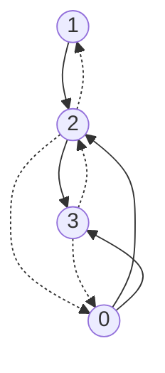

# 第14章 多面体编译理论概述

> 校订说明：本章对应扫描件 PDF 第2–25页（书页368–391），按原章结构完整转写。实现核对基于本地 LLVM 18.1.8，提交 `3b5b5c1ec4a3095ab096dd780e84d7ab81f3d7ff`。数学定义、依赖矩阵和示例中影响理解的错误已修正；较大差异、原文和验证边界见[第14章校订记录](issues/ch14.md)。

<!-- source: insider-compiler-ch14-end.pdf, PDF p. 2 -->

多面体编译并非新技术，在20世纪90年代已形成广泛研究和应用。传统编译器中也采用了这类技术，例如 GCC 的 Graphite，以及 LLVM 生态中的 Polly。这里的多面体建模与优化方法有更早的数学和编译研究基础，不能把全部起源限定在20世纪90年代。

在多面体方法广泛用于循环优化以前，编译器已经使用一些经典方法分析循环和数组访问，例如 GCD Test（Greatest Common Divisor Test，最大公约数测试），以判断是否可能存在内存依赖。假设有一个待分析的代码片段，如代码清单14-1所示。

**代码清单 14-1** 待执行内存依赖分析的代码片段

```c
for (i = 1; i <= 100; i++) {
  X[2 * i + 3] = X[2 * i] + 50;
}
```

在某些循环优化场景中，需要判断 `X[2 * i + 3]` 与 `X[2 * i]` 的访问是否存在依赖。[^ch14-1] 若所有相关访问之间均不存在阻碍重排的依赖，就可能实现循环并行、分块等优化。然而，循环中数组访问的依赖分析并不简单，GCD Test 是其中一种经典方法。

把两个访问写成 `X[a * i + b]` 和 `X[c * j + d]`，其中 `a`、`b`、`c`、`d` 是整数，`i`、`j` 是源访问与目标访问各自的**循环归纳变量**。两个访问要命中同一数组元素，必须满足

$$
ai+b=cj+d,\qquad ai-cj=d-b.
$$

当 `a`、`c` 不同时为0时，忽略循环上下界，这个二元线性丢番图方程存在整数解，当且仅当 `gcd(a, c)` 整除 `d-b`。[^ch14-2] 加上有限循环边界和执行顺序以后，整除只是存在实际依赖的**必要条件**，不能直接当成充分条件。若不整除，则可以排除该访问对的依赖。

<!-- source: insider-compiler-ch14-end.pdf, PDF p. 3 -->

以代码清单14-1为例，`a=2`、`c=2`、`b=3`、`d=0`，所以 `gcd(a,c)=2`，而 `d-b=-3` 不能被2整除。因此，写访问 `X[2*i+3]` 与读访问 `X[2*j]` 不会访问同一个元素。不同迭代的写访问也互不相同，在数组有效范围足够且没有其他相关副作用的前提下，这个循环可并行执行。

GCD Test 的局限在于，它本身没有纳入循环边界，也不直接给出依赖方向和距离。在许多情况下，访问系数的最大公约数为1，测试无法排除依赖，因此结果趋于保守：它只表示“可能依赖”，实际有界访问仍可能完全没有冲突。

多面体编译技术用数学关系分析循环是否能够并行、分块、融合等。在 MLIR 中，Affine 方言及其分析、变换基础设施为这类优化提供了表达与实现手段（详见[9.2节](insider-compiler-ch9.md)）。因此，本章重点介绍 Affine 方言涉及的数学基础，使读者能够理解其工作原理以及可实现的优化。

## 14.1 仿射集、凸集、锥与多面体的定义

### 1. 仿射集

设 `S` 是欧氏空间 $\mathbb R^n$ 中的一个集合，若对于任意 $x,y\in S$ 以及任意实数 $\alpha$，都有

$$\alpha x+(1-\alpha)y\in S,$$

则称 `S` 为一个仿射集。

例如，欧氏空间中的一条直线是仿射集。对于该直线上的任意两点 `x`、`y` 以及任意实数 `α`，组合 `αx+(1-α)y` 仍位于这条直线上。在一维空间中，整条实数轴就是这样的例子。

> **注意：** 按照惯例，空集也被视为凸集。应用中应结合问题背景判断集合是否非空；为严谨起见，涉及可行性或最优解存在性的结论通常需要明确非空等前提。

### 2. 凸集

设 `S` 是 $\mathbb R^n$ 中的一个集合，若对于任意 $x,y\in S$ 及任意 $\alpha\in[0,1]$，都有

$$\alpha x+(1-\alpha)y\in S,$$

则称 `S` 为一个凸集。

例如，一维空间中的任意线段都是凸集。对于线段上的任意两点 `x`、`y` 及任意 `α∈[0,1]`，组合 `αx+(1-α)y` 仍在线段上。

### 3. 锥

设 `S` 是 $\mathbb R^n$ 中的一个集合，若对于任意 $x\in S$ 及任意非负实数 $\alpha$，都有 $\alpha x\in S$，则称 `S` 为一个锥。

例如，包含原点的一条射线是锥。对于射线上的任意点 `x` 和非负实数 `α`，点 `αx` 仍在射线上。单独的锥定义不要求凸性；同时满足凸集定义时，才称为凸锥。

<!-- source: insider-compiler-ch14-end.pdf, PDF p. 4 -->

### 4. 多面体

有限个线性等式和非严格线性不等式的实数解集称为多面体，其一般形式为

$$P=\{x\in\mathbb R^n\mid Ax\le b,\ Cx=d\}.$$

其中，$x=(x_1,x_2,\ldots,x_n)^T$ 是列向量，矩阵和向量的尺寸为

$$
A=\begin{pmatrix}a_1^T\\a_2^T\\\vdots\\a_m^T\end{pmatrix}\in\mathbb R^{m\times n},\quad
C=\begin{pmatrix}c_1^T\\c_2^T\\\vdots\\c_p^T\end{pmatrix}\in\mathbb R^{p\times n},\quad
b\in\mathbb R^m,\quad d\in\mathbb R^p.
$$

`Ax≤b` 表示 `Ax` 的每一个分量均不大于 `b` 的对应分量。多面体是凸集，可直接根据凸集定义证明，本书略去证明过程。

> **注意：** 等式约束可以改写成不等式，但不能直接删除。例如 `k=1` 等价于 `k≤1` 且 `k≥1`。因此，`Cx=d` 可以用 `Cx≤d` 和 `−Cx≤−d` 代替，并统一纳入不等式约束。

## 14.2 凸集的保凸运算

对凸集实施某些运算后，所得结果仍是凸集，这类运算称为保凸运算。常见的运算如下。

1. **交集。** 若 `S₁` 和 `S₂` 为凸集，则交集 `S₁∩S₂` 仍为凸集。此结论可推广至任意多个凸集的交集。
2. **仿射映射。** 若函数 $f:\mathbb R^n\to\mathbb R^m$ 可写成 $f(x)=Ax+b$，其中 $A\in\mathbb R^{m\times n}$、$b\in\mathbb R^m$，则称 `f` 为仿射函数。若 `S` 为凸集，其仿射像 $f(S)=\{f(x)\mid x\in S\}$ 仍为凸集。根据定义即可证明，此处省略。

伸缩和平移是仿射变换的特例。设 $S\subseteq\mathbb R^m$ 为凸集，则对实数常量 `α` 和固定向量 $\beta\in\mathbb R^m$，集合 `αS` 与 `S+β` 都是凸集。

> **注意：** 研究凸集有两方面的便利。第一，当可行域为凸集，且是在其上**最小化凸函数**时，任何局部最小解也是全局最小解；仅有凸可行域并不足够。证明要点是：如果局部最小点 `x` 之外还有更优点 `y`，那么连接二者的线段位于可行域内，凸性又使靠近 `x` 的线段点取得更小的目标值，与局部最小性矛盾。不能以“任一点都可由另外两点表示”代替证明，因为凸集还可能有极点。第二，凸集经过交集、仿射映射等保凸运算后仍为凸集，这有利于构造和分析问题。

## 14.3 凸函数的保凸运算

<!-- source: insider-compiler-ch14-end.pdf, PDF p. 5 -->

若 `C` 是 $\mathbb R^n$ 中的凸集，且函数 $f:C\to\mathbb R$ 满足

$$
f(\alpha x+(1-\alpha)y)\le\alpha f(x)+(1-\alpha)f(y),
\qquad \forall x,y\in C,\ \forall\alpha\in[0,1],
$$

则称 `f` 为凸函数。

> **注意：** 在此定义中，定义域 `C` 为凸集是必要前提。因此，提及某函数为凸函数时，通常默认其定义域为凸集。

凸函数也存在相应的保凸运算，即实施这些运算后，所得函数仍然为凸函数。常见的运算如下。

### （1）非负加权和运算

若 $w_i\ge0$，且各 $f_i$ 在共同的凸定义域上为凸函数，则

$$\sum_{i=1}^{m}w_i f_i$$

是凸函数。这里要求权重非负，不能推广为任意线性组合。

### （2）复合仿射运算

假设函数 $f:\mathbb R^n\to\mathbb R$ 为凸函数，$A\in\mathbb R^{n\times m}$、$b\in\mathbb R^n$。定义

$$g(x)=f(Ax+b),\qquad \operatorname{dom}g=\{x\in\mathbb R^m\mid Ax+b\in\operatorname{dom}f\},$$

则 `g` 也是凸函数。[^ch14-3]

> **注意：** 选用凸函数的便利在于其局部最小解也是全局最小解，以及非负加权和、与仿射映射复合等运算可以保持凸性。凸函数**不保证存在唯一最优解**：常数函数可能有多个最优解，`f(x)=x` 在实数域上没有最小值；严格凸性只保证最优解至多一个，存在性还需另外的条件。循环变换可用仿射映射组合来表示，但每次重排仍须保持依赖关系，不能仅凭凸函数的组合性质保证多次优化合法。

如果能将可行域建模为凸集，并把目标函数表示为凸函数，就能利用这些数学特性分析最优性。要保证最优值能够取得，还须满足适当的存在性条件，例如可行域非空紧致、目标函数连续。

循环优化中的迭代通常取整数值，有时可通过平移将有界的负下界移到非负范围。但**整数点集本身通常不是凸集**，例如整数1和2的中点1.5不是整数。多面体编译通常用实数多面体 `P` 的整数点集 $P\cap\mathbb Z^n$ 描述迭代域，并通过仿射访问映射、调度和整数关系运算进行分析。连续凸优化的性质不能不加区分地直接套在整数可行性问题上。[原文差异及反例](issues/ch14.md#math-foundations)。

## 14.4 一般优化与凸优化问题

在实际应用中，许多问题可以归结为在给定约束条件下求解一个优化目标，这就是一般优化问题。连续凸优化是其中的特殊情形：最小化的目标函数和不等式约束函数为凸函数，共同定义域为凸集，等式约束则要求为仿射等式。

<!-- source: insider-compiler-ch14-end.pdf, PDF p. 6 -->

### 14.4.1 一般优化问题的形式

一般优化问题可以写成

$$
\begin{aligned}
\operatorname{minimize}\quad & f_0(x)\\
\operatorname{subject\ to}\quad & f_i(x)\le0,\quad i=1,2,\ldots,m,\\
&h_j(x)=0,\quad j=1,2,\ldots,p.
\end{aligned}
$$

其中，`f₀(x)` 为目标函数，`fᵢ(x)` 为不等式约束函数，`hⱼ(x)` 为等式约束函数。所有条件还应在这些函数的共同定义域内理解。

设可行域为 `F`，问题的**最优值**记为

$$p^*=\inf\{f_0(x)\mid x\in F\}.$$

`inf` 表示下确界，即最大下界；它不要求某个可行点实际取得该值。若存在 $x^*\in F$ 满足 $f_0(x^*)=p^*$，`x*` 才是最优解。在目标函数于可行点上取有限实数值的约定下，`p*=+∞` 表示可行域为空，`p*=−∞` 表示目标在可行域上无下界。即使 `p*` 有限，也不保证存在取得它的最优解。

另一类问题是可行性问题：给定约束，判断是否存在可行点。其形式为

$$
\begin{aligned}
\operatorname{find}\quad &x\\
\text{s.t.}\quad &f_i(x)\le0,\quad i=1,2,\ldots,m,\\
&h_j(x)=0,\quad j=1,2,\ldots,p.
\end{aligned}
$$

其中，`s.t.` 是 `subject to` 的缩写。可行性问题也可以写为目标函数恒等于0的优化问题：

$$
\begin{aligned}
\min\quad &0\\
\text{s.t.}\quad &f_i(x)\le0,\quad i=1,2,\ldots,m,\\
&h_j(x)=0,\quad j=1,2,\ldots,p.
\end{aligned}
$$

> **注意：** MLIR 中的许多优化分析，尤其是内存依赖分析，包含判断约束是否有可行解的问题。

### 14.4.2 凸优化问题的形式

在凸可行域上最小化凸目标函数，可以利用凸函数和凸集的性质简化问题分析。连续凸优化的一般形式为

$$
\begin{aligned}
\min\quad & f_0(x)\\
\text{s.t.}\quad & f_i(x)\le0,\quad i=1,2,\ldots,m,\\
&Ax=b.
\end{aligned}
$$

其中，目标函数 `f₀` 和不等式约束函数 `fᵢ` 均为凸函数，`Ax=b` 是仿射等式约束。本书后续涉及的连续线性规划属于凸优化；但用于精确表示循环迭代的整数规划还要求 $x\in\mathbb Z^n$，不能一概归入连续凸优化。

<!-- source: insider-compiler-ch14-end.pdf, PDF p. 7 -->

## 14.5 循环优化

循环优化可以把迭代域、访问映射及执行顺序转为多面体或整数关系，通过约束求解分析变换是否合法，再据此构造优化后的循环。

其中一个关键问题是：两个内存访问之间是否存在依赖？若存在，其方向或距离是什么？前面已介绍 GCD Test，下面先说明如何用多面体约束表达内存依赖，再介绍并行、融合和分块。

MLIR 中 Affine 和 SCF 都能表示循环。Affine 对循环边界和访问施加仿射限制，便于静态分析；SCF 可表示更一般的结构化控制流。Affine 也可以降级到 SCF。本节基于 Affine 方言展开。

### 14.5.1 循环中的内存依赖分析

代码清单14-2展示待分析的两组嵌套循环。`%M`、`%N`、`%K` 是符号，`%v0` 是待存储值，`%m` 是二维 memref；这些值来自外围作用域。

**代码清单 14-2** 待进行内存依赖分析的示例

```mlir
// 第一组循环向 %m 写入。
affine.for %i0 = 0 to 100 {
  affine.for %i1 = 0 to 50 {
    %a00 = affine.apply affine_map<(d0, d1)[s0, s1] ->
        (d0 * 2 - d1 * 4 + s1)>(%i0, %i1)[%M, %N]
    %a01 = affine.apply affine_map<(d0, d1)[s0, s1] ->
        (d1 * 3 - s0)>(%i0, %i1)[%M, %N]
    affine.store %v0, %m[%a00, %a01] : memref<?x?xf32>
  }
}
// 第二组循环从 %m 读取。
affine.for %i2 = 0 to 100 {
  affine.for %i3 = 0 to 50 {
    %a10 = affine.apply affine_map<(d0, d1)[s0, s1] ->
        (d0 * 7 + d1 * 9 - s1)>(%i2, %i3)[%K, %M]
    %a11 = affine.apply affine_map<(d0, d1)[s0, s1] ->
        (d1 * 11 + s0)>(%i2, %i3)[%K, %M]
    %v1 = affine.load %m[%a10, %a11] : memref<?x?xf32>
  }
}
```

> 校订注：原书的多结果 `affine.apply` 和未声明符号的 map 不符合本地语法，现拆成单结果操作并补全符号声明；原 `memref<4x4xf32>` 无法容纳完整访问范围，现改为动态形状。此处是**依赖分析片段**，调用方仍必须保证符号和实际形状使全部访问在界内，并提供有效初值；并非无需前提即可执行的数值程序。[完整解析输入及原文问题](issues/ch14.md#access-example)。

第一组循环写 `%m`，第二组循环读 `%m`。分析这两组循环的读写是否存在依赖，可以为后续优化提供依据。例如，若它们的全部跨循环内存访问和其他相关副作用都允许重排，就可能把两组循环安排为并发执行。内存依赖分析因此是一项重要技术。

#### 1. 第一个循环的约束建模

9.2节介绍了 Affine 方言的基本语法，下面进一步说明上述代码。

<!-- source: insider-compiler-ch14-end.pdf, PDF p. 8 -->

**代码清单 14-3** 代码清单14-2中第一个循环的具体含义

```mlir
// 外层归纳变量 %i0 的取值为 0～99。
affine.for %i0 = 0 to 100 {
  // 内层归纳变量 %i1 的取值为 0～49。
  affine.for %i1 = 0 to 50 {
    // AccessMap 以归纳变量和符号为输入，给出两个访问坐标：
    // a00 = 2*i0 - 4*i1 + N；a01 = 3*i1 - M。
    %a00 = affine.apply affine_map<(d0, d1)[s0, s1] ->
        (d0 * 2 - d1 * 4 + s1)>(%i0, %i1)[%M, %N]
    %a01 = affine.apply affine_map<(d0, d1)[s0, s1] ->
        (d1 * 3 - s0)>(%i0, %i1)[%M, %N]
    // 向 %m 的指定坐标写入数据。
    affine.store %v0, %m[%a00, %a01] : memref<?x?xf32>
  }
}
```

因此，第一组循环对 `%m` 的访问可由以下约束描述。

1. 外层归纳变量：$0\le i_0\le99$。
2. 内层归纳变量：$0\le i_1\le49$。
3. 第一维访问下标 `mem_dim0`：$\mathrm{mem\_dim0}=2i_0-4i_1+N$。
4. 第二维访问下标 `mem_dim1`：$\mathrm{mem\_dim1}=3i_1-M$。

> **注意：** 对 memref 的有效访问需要满足每维 `0≤index<size`；即使 memref 通过视图或 offset 指向分配区的中间，其逻辑下标的有效范围仍按该 memref 的形状定义。动态维度表示运行时才知道大小，不意味着没有边界。这里为专门展示依赖关系，只列循环域和访问等式，不额外加入内存有效范围约束；不能据此证明访问安全。本地 `MemRefAccess::getAccessRelation` 同样是访问关系分析，不是通用越界检查器。

实现中通常分开保存等式与不等式。等式可参与高斯消元，不等式可使用第15章介绍的傅里叶—莫茨金消元等方法。为简化实现，常将不等式统一为“大于或等于0”；若原式方向相反，可以两边同乘 `−1`。整数求解还必须保留整除条件等信息，不能把普通实数消元直接视为精确整数求解。

第一组循环的约束可统一写为

$$
\begin{gathered}
i_0\ge0,\quad-i_0+99\ge0,\quad i_1\ge0,\quad-i_1+49\ge0,\\
2i_0-4i_1-\mathrm{mem\_dim0}+N=0,\\
3i_1-\mathrm{mem\_dim1}-M=0.
\end{gathered}
$$

<!-- source: insider-compiler-ch14-end.pdf, PDF p. 9 -->

将这些约束以系数表呈现，得到表14-1。每行的系数乘以表头变量，再加常数项，与最后一列的0比较。

**表 14-1** 代码清单14-2中第一个循环的约束

| 序号 | `i0` | `i1` | `mem_dim0` | `mem_dim1` | `N` | `M` | 常数项 | 关系 |
| --- | --- | --- | --- | --- | --- | --- | --- | --- |
| 1 | 2 | -4 | -1 | 0 | 1 | 0 | 0 | =0 |
| 2 | 0 | 3 | 0 | -1 | 0 | -1 | 0 | =0 |
| 3 | 1 | 0 | 0 | 0 | 0 | 0 | 0 | ≥0 |
| 4 | -1 | 0 | 0 | 0 | 0 | 0 | 99 | ≥0 |
| 5 | 0 | 1 | 0 | 0 | 0 | 0 | 0 | ≥0 |
| 6 | 0 | -1 | 0 | 0 | 0 | 0 | 49 | ≥0 |

#### 2. 第二个循环的约束建模

用相同方法，得到第二组循环的约束：

$$
\begin{gathered}
i_2\ge0,\quad-i_2+99\ge0,\quad i_3\ge0,\quad-i_3+49\ge0,\\
\mathrm{mem\_dim0}=7i_2+9i_3-M,\\
\mathrm{mem\_dim1}=11i_3+K.
\end{gathered}
$$

**表 14-2** 代码清单14-2中第二个循环的约束

| 序号 | `i2` | `i3` | `mem_dim0` | `mem_dim1` | `M` | `K` | 常数项 | 关系 |
| --- | --- | --- | --- | --- | --- | --- | --- | --- |
| 1 | 7 | 9 | -1 | 0 | -1 | 0 | 0 | =0 |
| 2 | 0 | 11 | 0 | -1 | 0 | 1 | 0 | =0 |
| 3 | 1 | 0 | 0 | 0 | 0 | 0 | 0 | ≥0 |
| 4 | -1 | 0 | 0 | 0 | 0 | 0 | 99 | ≥0 |
| 5 | 0 | 1 | 0 | 0 | 0 | 0 | 0 | ≥0 |
| 6 | 0 | -1 | 0 | 0 | 0 | 0 | 49 | ≥0 |

> 校订注：原表第2行 `K` 的系数误为 `−1`，第4行常数项印为 `00`，现分别按访问式和循环上界改为 `+1`、`99`。

要分析两个循环的访问是否可能命中同一内存元素，首先要求各次访问满足自己所在循环的约束。

<!-- source: insider-compiler-ch14-end.pdf, PDF p. 10 -->

此外，两次访问的第一维下标必须相等，第二维下标也必须相等。于是得到共同约束：

$$
\begin{gathered}
2i_0-4i_1+N=7i_2+9i_3-M,\\
3i_1-M=11i_3+K,\\
i_0\ge0,\quad-i_0+99\ge0,\quad i_1\ge0,\quad-i_1+49\ge0,\\
i_2\ge0,\quad-i_2+99\ge0,\quad i_3\ge0,\quad-i_3+49\ge0.
\end{gathered}
$$

**表 14-3** 代码清单14-2中两个循环的共同约束

| 序号 | `i0` | `i1` | `i2` | `i3` | `M` | `N` | `K` | 常数项 | 关系 |
| --- | --- | --- | --- | --- | --- | --- | --- | --- | --- |
| 1 | 2 | -4 | -7 | -9 | 1 | 1 | 0 | 0 | =0 |
| 2 | 0 | 3 | 0 | -11 | -1 | 0 | -1 | 0 | =0 |
| 3 | 1 | 0 | 0 | 0 | 0 | 0 | 0 | 0 | ≥0 |
| 4 | -1 | 0 | 0 | 0 | 0 | 0 | 0 | 99 | ≥0 |
| 5 | 0 | 1 | 0 | 0 | 0 | 0 | 0 | 0 | ≥0 |
| 6 | 0 | -1 | 0 | 0 | 0 | 0 | 0 | 49 | ≥0 |
| 7 | 0 | 0 | 1 | 0 | 0 | 0 | 0 | 0 | ≥0 |
| 8 | 0 | 0 | -1 | 0 | 0 | 0 | 0 | 99 | ≥0 |
| 9 | 0 | 0 | 0 | 1 | 0 | 0 | 0 | 0 | ≥0 |
| 10 | 0 | 0 | 0 | -1 | 0 | 0 | 0 | 49 | ≥0 |

> 校订注：原表第2行 `K` 的系数误为 `+1`，现按 `3i1−M−11i3−K=0` 改为 `−1`。

#### 3. 约束求解

这个系统描述在给定符号参数下，两次访问命中同一位置的条件。两组循环顺序执行，第一组写在第二组读之前，因此若系统存在满足有效访问前提的整数解，就存在相应的写后读依赖；若不存在整数解，就不存在该访问对的依赖。

熟悉线性规划的读者会发现系数表与单纯形表相似。但普通单纯形法解决的是有理数或实数线性规划：有理可行不能直接证明整数可行。第15章会介绍相关求解方法。本地 Affine 依赖检查实际调用 `IntegerRelation::isEmpty()`，结合消元、GCD 和无效约束检查来排除依赖；未能判空时保守报告可能依赖，不等同于完整整数采样成功。[实现边界](issues/ch14.md#dependence-analysis)。

<!-- source: insider-compiler-ch14-end.pdf, PDF p. 11 -->

> **注意：** 第一组循环使用 `i0`、`i1`，第二组使用 `i2`、`i3`，共同系统因此有4个迭代变量。即使代码中两组循环使用相同文本名称，在构造依赖关系时也应使用独立变量，分别表示源访问和目标访问的迭代实例。

构造约束时，除了归纳变量，还可能需要引入局部整数变量处理以下情形。

##### （1）循环步长不为1

设循环下界为 `lb`，正整数步长为 `step`，归纳变量为 `iv`。迭代点满足

$$ (iv-lb)\bmod step=0.$$

可引入整数 `q` 将其显式表示为

$$iv-lb-step\cdot q=0,\qquad q\in\mathbb Z.$$

再与循环上下界结合，就能准确描述迭代点。本地 `addAffineForOpDomain` 在非单位步长且下界为常数时，会引入局部变量并加入此同余条件；下界非常数时，则保守近似迭代域。应区分数学建模能力与具体实现的支持范围。

##### （2）仿射表达式中含有特殊除法操作

`floordiv`、`ceildiv` 等也可以通过额外的整数变量表示。例如

$$q=\left\lfloor\frac{i+j}{4}\right\rfloor\quad\Longleftrightarrow\quad4q\le i+j\le4q+3,\qquad q\in\mathbb Z.$$

这两个不等式精确表示该向下取整操作，对负整数同样成立。向上取整可类似转换。把循环访问转为整数关系以后，便可利用约束求解分析优化的可行性。下面给出具体示例。

### 14.5.2 循环并行

循环并行是把原本串行执行的循环，在分析和优化后安排到多个线程、进程或其他并行执行单元上。Affine 的受限表达形式有利于这类静态分析。

9.2节提到，`affine.parallel` 可表达并行循环。因此，这里的目标是分析普通 `affine.for`，在满足条件时将其转为 `affine.parallel`，主要步骤为：

1. 分析循环结构、跨迭代 SSA 依赖和内存依赖。
2. 若当前循环层没有阻碍并行的依赖，并且归约及其他副作用符合要求，则执行转换。

下面以代码清单14-4为例。原书的局部分配在首次加载前未初始化；此处补充每个输出元素的零初始化，并在示例结束时释放分配。函数仍只展示优化结构，保留原来未使用的 `%arg2`，不作为向调用者返回矩阵乘结果的接口。

**代码清单 14-4** `affine.for` 的并行化转换示例

```mlir
func.func @max_nested_1(%arg0: memref<4096x4096xf32>,
                        %arg1: memref<4096x4096xf32>,
                        %arg2: memref<4096x4096xf32>) {
  %0 = memref.alloc() : memref<4096x4096xf32>
  %zero = arith.constant 0.0 : f32
  affine.for %arg3 = 0 to 4096 {
    affine.for %arg4 = 0 to 4096 {
      affine.store %zero, %0[%arg3, %arg4] : memref<4096x4096xf32>
      affine.for %arg5 = 0 to 4096 {
        %1 = affine.load %arg0[%arg3, %arg5] : memref<4096x4096xf32>
        %2 = affine.load %arg1[%arg5, %arg4] : memref<4096x4096xf32>
        %3 = affine.load %0[%arg3, %arg4] : memref<4096x4096xf32>
        %4 = arith.mulf %1, %2 : f32
        %5 = arith.addf %3, %4 : f32
        affine.store %5, %0[%arg3, %arg4] : memref<4096x4096xf32>
      }
    }
  }
  memref.dealloc %0 : memref<4096x4096xf32>
  return
}
```

<!-- source: insider-compiler-ch14-end.pdf, PDF p. 12 -->

#### 1. 并行分析

并行分析用于判断 `affine.for` 能否并行执行，可分为循环结构分析和内存依赖分析。

##### （1）循环结构分析

`affine.for` 可以携带循环迭代参数 `iter_args`，表示跨迭代传递的 SSA 状态。归约是其中一类常见用途，但 `iter_args` 不仅限于归约。识别可并行归约时，需要检查组合操作的种类、使用链和副作用等。[^ch14-4] 若符合要求，可将其表达为 `affine.parallel` 的归约种类；这里使用 `AtomicRMWKind` 枚举描述归约语义，并不表示此时必然生成硬件原子指令。

本地 `affine-parallelize` 默认不并行化带归约参数的循环；设置 `parallel-reductions=true` 后才尝试识别支持的归约。若发现不受支持的跨迭代 SSA 依赖，则停止对此循环的并行化。浮点归约还应考虑改变计算结合顺序对结果的影响。

代码清单14-4没有 `iter_args`，所以从这部分结构条件看具有并行可能，接下来仍需分析内存依赖。

##### （2）内存依赖分析

内存依赖分析基于14.5.1节：识别循环中的仿射读写操作，建立访问关系与顺序约束，判断当前循环层是否携带依赖。还必须拒绝无法安全分析的副作用。这里所说的“没有依赖”是**没有阻碍当前层不同迭代并发的依赖**，而不是循环体内部完全没有读写关系。

可以先排除确定不会访问同一分配对象的访问。例如，`%arg0` 指向调用方传入的内存，而 `%0` 是函数中新建的独立分配，它们之间不会别名。一般情形不能仅由不同 SSA 名字推出不同底层内存；本地该 Affine 分析接口确实直接跳过不同 memref 值，但不构成一个通用别名分析器。

通常不必把普通读—读对视为阻碍并行的内存依赖，因为二者都不改变内存。这里关心读—写、写—读和写—写依赖。清单中 `%3 = affine.load %0[...]` 和累加后的 `affine.store` 访问同一缓冲区，是下面推导的代表性访问对；实现还会检查反向访问对、`store` 与自身不同迭代之间的写—写对，以及补入的初始化写操作，不能只检查这一对语句。

执行顺序同样重要。这两个代表性操作位于三层嵌套循环中，因此需要针对各个循环深度分别分析。

<!-- source: insider-compiler-ch14-end.pdf, PDF p. 13 -->

为方便说明，把加载 `%0[%arg3,%arg4]` 的操作记为 `src`，把最内层写入 `%0[%arg3,%arg4]` 的操作记为 `dst`。这里 `src`、`dst` 表示当前分析对的源和目标，不限定二者一定是生产者和消费者；该读—写对可以体现反依赖。

**1）为 src 构建约束。** 三层循环的归纳变量为 `%arg3`、`%arg4`、`%arg5`，从外到内排列，取值均为 `[0,4095]`。访问关系的定义域有3个迭代维，值域有2个访问坐标 `%y1`、`%y2`，其中 `%y1=%arg3`、`%y2=%arg4`。于是得到8个约束。

**表 14-4** src 的约束

| 序号 | `%arg3` | `%arg4` | `%arg5` | `%y1` | `%y2` | 常数项 | 关系 | 备注 |
| --- | --- | --- | --- | --- | --- | --- | --- | --- |
| 1 | 1 | 0 | 0 | -1 | 0 | 0 | =0 | `%y1=%arg3`，第一维访问坐标 |
| 2 | 0 | 1 | 0 | 0 | -1 | 0 | =0 | `%y2=%arg4`，第二维访问坐标 |
| 3 | 1 | 0 | 0 | 0 | 0 | 0 | ≥0 | `%arg3≥0` |
| 4 | -1 | 0 | 0 | 0 | 0 | 4095 | ≥0 | `%arg3≤4095` |
| 5 | 0 | 1 | 0 | 0 | 0 | 0 | ≥0 | `%arg4≥0` |
| 6 | 0 | -1 | 0 | 0 | 0 | 4095 | ≥0 | `%arg4≤4095` |
| 7 | 0 | 0 | 1 | 0 | 0 | 0 | ≥0 | `%arg5≥0` |
| 8 | 0 | 0 | -1 | 0 | 0 | 4095 | ≥0 | `%arg5≤4095` |

**2）为 dst 构建约束。** `dst` 同样位于这三层循环内，迭代变量范围相同，访问下标也只使用 `%arg3` 和 `%arg4`，因此同样得到8个约束。

**表 14-5** dst 的约束

| 序号 | `%arg3` | `%arg4` | `%arg5` | `%y1` | `%y2` | 常数项 | 关系 | 备注 |
| --- | --- | --- | --- | --- | --- | --- | --- | --- |
| 1 | 1 | 0 | 0 | -1 | 0 | 0 | =0 | `%y1=%arg3`，第一维访问坐标 |
| 2 | 0 | 1 | 0 | 0 | -1 | 0 | =0 | `%y2=%arg4`，第二维访问坐标 |
| 3 | 1 | 0 | 0 | 0 | 0 | 0 | ≥0 | `%arg3≥0` |
| 4 | -1 | 0 | 0 | 0 | 0 | 4095 | ≥0 | `%arg3≤4095` |
| 5 | 0 | 1 | 0 | 0 | 0 | 0 | ≥0 | `%arg4≥0` |
| 6 | 0 | -1 | 0 | 0 | 0 | 4095 | ≥0 | `%arg4≤4095` |
| 7 | 0 | 0 | 1 | 0 | 0 | 0 | ≥0 | `%arg5≥0` |
| 8 | 0 | 0 | -1 | 0 | 0 | 4095 | ≥0 | `%arg5≤4095` |

<!-- source: insider-compiler-ch14-end.pdf, PDF p. 14 -->

**3）组合 src 和 dst 的依赖关系。** `src` 的访问关系从源迭代映射到内存坐标，`dst` 的访问关系从目标迭代映射到内存坐标。把后者取逆，再与前者复合，就得到访问同一位置的源、目标迭代对。这里是**关系复合**，不要求逆关系为单值函数，也不要求两个访问的整个值域完全相同；只需相关访问实例的坐标相等。

> **注意：** 设 $R_1\subseteq A\times B$、$R_2\subseteq B\times C$。关系复合定义为
>
> $$R_2\circ R_1=\{(a,c)\in A\times C\mid\exists b\in B:\ (a,b)\in R_1\land(b,c)\in R_2\}.$$

在约束实现中，可将 `src` 的迭代变量作为新关系的定义域，`dst` 的迭代变量作为值域，把共同内存坐标放入局部变量，随后消去。为区分访问实例，将 `%arg3`、`%arg4`、`%arg5` 分别重命名为 `%src_arg3`、`%src_arg4`、`%src_arg5` 和 `%dst_arg3`、`%dst_arg4`、`%dst_arg5`。

为使后续宽表易于阅读，表中使用 `s3/s4/s5` 和 `t3/t4/t5`，分别代表上述三组 `src` 和 `dst` 变量；`y1/y2` 代表共同内存下标 `%y1/%y2`，不省略任何系数。

**表 14-6** src 和 dst 的16个共同约束

| 序号 | `s3` | `s4` | `s5` | `t3` | `t4` | `t5` | `y1` | `y2` | 常数项 | 关系 | 备注 |
| --- | --- | --- | --- | --- | --- | --- | --- | --- | --- | --- | --- |
| 1 | 1 | 0 | 0 | 0 | 0 | 0 | -1 | 0 | 0 | =0 | `y1=s3` |
| 2 | 0 | 1 | 0 | 0 | 0 | 0 | 0 | -1 | 0 | =0 | `y2=s4` |
| 3 | 0 | 0 | 0 | 1 | 0 | 0 | -1 | 0 | 0 | =0 | `y1=t3` |
| 4 | 0 | 0 | 0 | 0 | 1 | 0 | 0 | -1 | 0 | =0 | `y2=t4` |
| 5 | 1 | 0 | 0 | 0 | 0 | 0 | 0 | 0 | 0 | ≥0 | `s3≥0` |
| 6 | -1 | 0 | 0 | 0 | 0 | 0 | 0 | 0 | 4095 | ≥0 | `s3≤4095` |
| 7 | 0 | 1 | 0 | 0 | 0 | 0 | 0 | 0 | 0 | ≥0 | `s4≥0` |
| 8 | 0 | -1 | 0 | 0 | 0 | 0 | 0 | 0 | 4095 | ≥0 | `s4≤4095` |
| 9 | 0 | 0 | 1 | 0 | 0 | 0 | 0 | 0 | 0 | ≥0 | `s5≥0` |
| 10 | 0 | 0 | -1 | 0 | 0 | 0 | 0 | 0 | 4095 | ≥0 | `s5≤4095` |
| 11 | 0 | 0 | 0 | 1 | 0 | 0 | 0 | 0 | 0 | ≥0 | `t3≥0` |
| 12 | 0 | 0 | 0 | -1 | 0 | 0 | 0 | 0 | 4095 | ≥0 | `t3≤4095` |
| 13 | 0 | 0 | 0 | 0 | 1 | 0 | 0 | 0 | 0 | ≥0 | `t4≥0` |
| 14 | 0 | 0 | 0 | 0 | -1 | 0 | 0 | 0 | 4095 | ≥0 | `t4≤4095` |
| 15 | 0 | 0 | 0 | 0 | 0 | 1 | 0 | 0 | 0 | ≥0 | `t5≥0` |
| 16 | 0 | 0 | 0 | 0 | 0 | -1 | 0 | 0 | 4095 | ≥0 | `t5≤4095` |

<!-- source: insider-compiler-ch14-end.pdf, PDF p. 15 -->

**4）优化组合后的约束关系。** 可消去局部变量并删除冗余约束。表14-6的第1、3行共同使用 `y1`，第2、4行共同使用 `y2`。消去这两个变量后，得到 `s3=t3`、`s4=t4`，并保留两侧迭代边界，共14个约束，如表14-7所示。它是方便展示的消元结果，并不意味着已经达到唯一或绝对最简的约束表示。

**表 14-7** 优化组合后的共同约束

| 序号 | `s3` | `s4` | `s5` | `t3` | `t4` | `t5` | 常数项 | 关系 | 备注 |
| --- | --- | --- | --- | --- | --- | --- | --- | --- | --- |
| 1 | -1 | 0 | 0 | 1 | 0 | 0 | 0 | =0 | `s3=t3` |
| 2 | 0 | -1 | 0 | 0 | 1 | 0 | 0 | =0 | `s4=t4` |
| 3 | 1 | 0 | 0 | 0 | 0 | 0 | 0 | ≥0 | `s3≥0` |
| 4 | -1 | 0 | 0 | 0 | 0 | 0 | 4095 | ≥0 | `s3≤4095` |
| 5 | 0 | 1 | 0 | 0 | 0 | 0 | 0 | ≥0 | `s4≥0` |
| 6 | 0 | -1 | 0 | 0 | 0 | 0 | 4095 | ≥0 | `s4≤4095` |
| 7 | 0 | 0 | 1 | 0 | 0 | 0 | 0 | ≥0 | `s5≥0` |
| 8 | 0 | 0 | -1 | 0 | 0 | 0 | 4095 | ≥0 | `s5≤4095` |
| 9 | 0 | 0 | 0 | 1 | 0 | 0 | 0 | ≥0 | `t3≥0` |
| 10 | 0 | 0 | 0 | -1 | 0 | 0 | 4095 | ≥0 | `t3≤4095` |
| 11 | 0 | 0 | 0 | 0 | 1 | 0 | 0 | ≥0 | `t4≥0` |
| 12 | 0 | 0 | 0 | 0 | -1 | 0 | 4095 | ≥0 | `t4≤4095` |
| 13 | 0 | 0 | 0 | 0 | 0 | 1 | 0 | ≥0 | `t5≥0` |
| 14 | 0 | 0 | 0 | 0 | 0 | -1 | 4095 | ≥0 | `t5≤4095` |

<!-- source: insider-compiler-ch14-end.pdf, PDF p. 16 -->

**5）增加顺序约束。** 顺序约束描述 `src` 和 `dst` 访问实例的执行先后。对于三层嵌套循环，可分别考察由第1、第2和第3层携带的依赖；需要按从外到内的字典序解释，而不是任意选一维来代表整体顺序。

- **最外层，深度1：** 增加 `t3≥s3+1`，表示目标发生在更晚的外层迭代，内层变量不要求相等。
- **中间层，深度2：** 增加 `t3=s3` 和 `t4≥s4+1`，表示外层相同而中间层向后推进。
- **最内层，深度3：** 增加 `t3=s3`、`t4=s4` 和 `t5≥s5+1`，表示前两层相同而最内层向后推进。

> **注意：** 约束数从外到内逐渐增加，是因为较深层携带依赖要求更外层迭代相等；这不是由遍历顺序本身造成的数学性质。本地并行化 Pass 确实采用前序遍历以控制外层并行数量，但不能因此把 `%arg3` 解释为最内层。原书此处把“最内层”和“整个三层循环”对应的深度写反，现按实际变量和实现修正。

例如，考察**最外层**携带的依赖时，增加1个顺序约束，得到15个约束。

**表 14-8** 最外层循环相关的15个约束（原表标题“最内层”有误）

| 序号 | `s3` | `s4` | `s5` | `t3` | `t4` | `t5` | 常数项 | 关系 | 备注 |
| --- | --- | --- | --- | --- | --- | --- | --- | --- | --- |
| 1 | -1 | 0 | 0 | 1 | 0 | 0 | 0 | =0 | `s3=t3` |
| 2 | 0 | -1 | 0 | 0 | 1 | 0 | 0 | =0 | `s4=t4` |
| 3 | 1 | 0 | 0 | 0 | 0 | 0 | 0 | ≥0 | `s3≥0` |
| 4 | -1 | 0 | 0 | 0 | 0 | 0 | 4095 | ≥0 | `s3≤4095` |
| 5 | 0 | 1 | 0 | 0 | 0 | 0 | 0 | ≥0 | `s4≥0` |
| 6 | 0 | -1 | 0 | 0 | 0 | 0 | 4095 | ≥0 | `s4≤4095` |
| 7 | 0 | 0 | 1 | 0 | 0 | 0 | 0 | ≥0 | `s5≥0` |
| 8 | 0 | 0 | -1 | 0 | 0 | 0 | 4095 | ≥0 | `s5≤4095` |
| 9 | 0 | 0 | 0 | 1 | 0 | 0 | 0 | ≥0 | `t3≥0` |
| 10 | 0 | 0 | 0 | -1 | 0 | 0 | 4095 | ≥0 | `t3≤4095` |
| 11 | 0 | 0 | 0 | 0 | 1 | 0 | 0 | ≥0 | `t4≥0` |
| 12 | 0 | 0 | 0 | 0 | -1 | 0 | 4095 | ≥0 | `t4≤4095` |
| 13 | 0 | 0 | 0 | 0 | 0 | 1 | 0 | ≥0 | `t5≥0` |
| 14 | 0 | 0 | 0 | 0 | 0 | -1 | 4095 | ≥0 | `t5≤4095` |
| 15 | -1 | 0 | 0 | 1 | 0 | 0 | -1 | ≥0 | 顺序：`t3≥s3+1` |

<!-- source: insider-compiler-ch14-end.pdf, PDF p. 17 -->

而考察**最内层（深度3）**携带的依赖时，增加3个顺序约束，共17行，如表14-9所示。前两条顺序等式恰好与访问相等条件重复；保留它们是为了展示添加顺序约束的过程。

**表 14-9** 三层嵌套中最内层依赖相关的17个约束

| 序号 | `s3` | `s4` | `s5` | `t3` | `t4` | `t5` | 常数项 | 关系 | 备注 |
| --- | --- | --- | --- | --- | --- | --- | --- | --- | --- |
| 1 | -1 | 0 | 0 | 1 | 0 | 0 | 0 | =0 | 访问：`s3=t3` |
| 2 | 0 | -1 | 0 | 0 | 1 | 0 | 0 | =0 | 访问：`s4=t4` |
| 3 | -1 | 0 | 0 | 1 | 0 | 0 | 0 | =0 | 顺序：`s3=t3` |
| 4 | 0 | -1 | 0 | 0 | 1 | 0 | 0 | =0 | 顺序：`s4=t4` |
| 5 | 1 | 0 | 0 | 0 | 0 | 0 | 0 | ≥0 | `s3≥0` |
| 6 | -1 | 0 | 0 | 0 | 0 | 0 | 4095 | ≥0 | `s3≤4095` |
| 7 | 0 | 1 | 0 | 0 | 0 | 0 | 0 | ≥0 | `s4≥0` |
| 8 | 0 | -1 | 0 | 0 | 0 | 0 | 4095 | ≥0 | `s4≤4095` |
| 9 | 0 | 0 | 1 | 0 | 0 | 0 | 0 | ≥0 | `s5≥0` |
| 10 | 0 | 0 | -1 | 0 | 0 | 0 | 4095 | ≥0 | `s5≤4095` |
| 11 | 0 | 0 | 0 | 1 | 0 | 0 | 0 | ≥0 | `t3≥0` |
| 12 | 0 | 0 | 0 | -1 | 0 | 0 | 4095 | ≥0 | `t3≤4095` |
| 13 | 0 | 0 | 0 | 0 | 1 | 0 | 0 | ≥0 | `t4≥0` |
| 14 | 0 | 0 | 0 | 0 | -1 | 0 | 4095 | ≥0 | `t4≤4095` |
| 15 | 0 | 0 | 0 | 0 | 0 | 1 | 0 | ≥0 | `t5≥0` |
| 16 | 0 | 0 | 0 | 0 | 0 | -1 | 4095 | ≥0 | `t5≤4095` |
| 17 | 0 | 0 | -1 | 0 | 0 | 1 | -1 | ≥0 | 顺序：`t5≥s5+1` |

<!-- source: insider-compiler-ch14-end.pdf, PDF p. 18 -->

**6）约束求解。** 对精确整数模型而言，有整数解表示存在满足所分析顺序的冲突访问，无整数解则排除这种依赖。本地实现如前述会保守判定。本例不需要复杂求解就能看出：深度1的 `s3=t3` 与 `t3≥s3+1` 矛盾；深度2的 `s4=t4` 与 `t4≥s4+1` 矛盾；深度3则存在解，例如源迭代 `(0,0,0)` 与目标迭代 `(0,0,1)`。本地 API 实跑分别返回无依赖、无依赖、有依赖，并输出与表14-9完全相同的17行系数。

**7）计算方向向量。** 若依赖可能存在，可以进一步分析目标迭代与源迭代之差，计算距离或方向分量。这对于分块等变换有用；本地并行判断只需判断当前深度能否排除依赖，不必计算完整方向向量。

> **注意：** 对某一循环的跨迭代分析，可以排除在该循环内部新分配、因而各次迭代独立拥有的内存；本地还递归识别相应的视图来源。不能推广成“所有在循环内部定义的局部变量都不用分析”。本例 `%0` 分配在三层循环外，必须参与三层循环的依赖检查。

#### 2. 代码并行变换

分析后可知，最外面两层循环没有阻碍并行的跨迭代内存依赖，而最内层反复读写相同的输出元素，存在顺序累加依赖。因此可并行化前两层，保留最内层串行。初始化写对不同外层迭代访问不同元素，不改变这个结论。

对无 `iter_args` 的本例，转换主要将符合条件的 `affine.for` 替换成 `affine.parallel` 并保留相应循环体。后续如何映射到线程和硬件由进一步的降级决定。执行 `mlir-opt --affine-parallelize` 后，得到代码清单14-5。

**代码清单 14-5** 代码清单14-4执行循环并行后的结果

```mlir
func.func @max_nested_1(%arg0: memref<4096x4096xf32>,
                        %arg1: memref<4096x4096xf32>,
                        %arg2: memref<4096x4096xf32>) {
  %alloc = memref.alloc() : memref<4096x4096xf32>
  %cst = arith.constant 0.000000e+00 : f32
  affine.parallel (%arg3) = (0) to (4096) {
    affine.parallel (%arg4) = (0) to (4096) {
      affine.store %cst, %alloc[%arg3, %arg4] : memref<4096x4096xf32>
      affine.for %arg5 = 0 to 4096 {
        %0 = affine.load %arg0[%arg3, %arg5] : memref<4096x4096xf32>
        %1 = affine.load %arg1[%arg5, %arg4] : memref<4096x4096xf32>
        %2 = affine.load %alloc[%arg3, %arg4] : memref<4096x4096xf32>
        %3 = arith.mulf %0, %1 : f32
        %4 = arith.addf %2, %3 : f32
        affine.store %4, %alloc[%arg3, %arg4] : memref<4096x4096xf32>
      }
    }
  }
  memref.dealloc %alloc : memref<4096x4096xf32>
  return
}
```

<!-- source: insider-compiler-ch14-end.pdf, PDF p. 19 -->

### 14.5.3 循环融合

#### 1. 循环融合概述

循环融合是把两个或多个循环合并，以改善循环执行过程。它的常见收益包括改善数据局部性、复用缓存中的数据和减少中间缓冲区的容量。例如，两组循环访问同一段内存，将相关迭代放在一起，可以缩短生产和消费之间的时间。不过，具体性能仍受工作集、硬件和后续优化影响，不能保证缓存命中率或运行速度必然提高。

代码清单14-6是一个简单示例。

**代码清单 14-6** 待执行循环融合的简单示例代码

```mlir
func.func @should_fuse_raw_dep_for_locality() {
  %m = memref.alloc() : memref<10xf32>
  %cf7 = arith.constant 7.0 : f32
  affine.for %i0 = 0 to 10 {
    affine.store %cf7, %m[%i0] : memref<10xf32>
  }
  affine.for %i1 = 0 to 10 {
    %v0 = affine.load %m[%i1] : memref<10xf32>
  }
  return
}
```

两个循环都访问 `%m`，前者生产数据，后者消费数据。融合后，生产一个元素就能立即读取它，中间缓冲区可从10个元素缩为1个。执行 `mlir-opt --affine-loop-fusion` 的结果如下。

**代码清单 14-7** 执行循环融合后的结果

```mlir
module {
  func.func @should_fuse_raw_dep_for_locality() {
    %alloc = memref.alloc() : memref<1xf32>
    %cst = arith.constant 7.000000e+00 : f32
    affine.for %arg0 = 0 to 10 {
      affine.store %cst, %alloc[0] : memref<1xf32>
      %0 = affine.load %alloc[0] : memref<1xf32>
    }
    return
  }
}
```

这些代码用于展示变换，读出的值没有继续使用，也没有组成实际性能测试。后续死代码删除可能进一步消除无效工作。

对本例这种**生产者—消费者融合**，读写依赖提供了数据复用机会；但“必须存在写相关内存依赖”不是所有循环融合的首要条件。本地还支持 sibling fusion，即融合读取同一数据的同级循环。因此，循环融合的根本要求是**变换保持语义并符合收益选择条件**，不应与“并行必须无依赖、融合必须有依赖”画上简单等号。

此外，还需要考虑多重循环的融合位置、收益评估，以及循环边界不一致时如何提取并融合所需的计算切片。

<!-- source: insider-compiler-ch14-end.pdf, PDF p. 20 -->

#### 2. 循环融合的步骤

循环融合同样使用14.5.1节的内存依赖分析。不过，并行化关注某层是否有阻碍并发的跨迭代依赖，而融合要在保留必要依赖顺序的前提下重组计算；生产者—消费者融合还需要求出生产者中被消费者使用的迭代切片。下面用代码清单14-8说明具体流程。

**代码清单 14-8** 用于说明执行循环融合具体流程的示例

```mlir
func.func @should_fuse_with_slice_union() {
  %a = memref.alloc() : memref<100xf32>
  %c0 = arith.constant 0 : index
  %cf0 = arith.constant 0.0 : f32
  affine.for %i0 = 0 to 100 {
    affine.store %cf0, %a[%i0] : memref<100xf32>
  }
  affine.for %i1 = 10 to 20 {
    %v0 = affine.load %a[%i1] : memref<100xf32>
    affine.for %i2 = 15 to 25 {
      %v1 = affine.load %a[%i2] : memref<100xf32>
    }
  }
  return
}
```

##### （1）构建内存依赖图

本地 `MemRefDependenceGraph` 针对一个基本块建图，节点代表块中的顶层操作或以顶层 `affine.for` 为根的循环嵌套；不是把每个含访存的基本块本身作为一个节点。图中既包含内存访问引起的依赖，也包含 SSA 定义到使用的依赖。

本例中 `%c0` 未被使用，不形成有效生产者节点；`%a` 的分配、浮点常量、生产循环和消费循环形成4个节点，如表14-10所示。表中采用打印后的 `%alloc`、`%cst` 等变量名，与输入的 `%a`、`%cf0` 对应。

**表 14-10** 代码清单14-8对应的内存依赖图节点

| 节点 | 语句 |
| --- | --- |
| node 0 | `%alloc = memref.alloc() : memref<100xf32>` |
| node 1 | `%cst = arith.constant 0.000000e+00 : f32` |
| node 2 | `affine.for %arg0 = 0 to 100 {`<br>　`affine.store %cst, %alloc[%arg0] : memref<100xf32>`<br>`}` |
| node 3 | `affine.for %arg0 = 10 to 20 {`<br>　`%0 = affine.load %alloc[%arg0] : memref<100xf32>`<br>　`affine.for %arg1 = 15 to 25 {`<br>　　`%1 = affine.load %alloc[%arg1] : memref<100xf32>`<br>　`}`<br>`}` |

<!-- source: insider-compiler-ch14-end.pdf, PDF p. 21 -->

构建的依赖图如图14-1所示。

**图 14-1** 代码清单14-8中的示例构建的内存依赖图



图注：实线由被依赖的节点指向依赖它的节点；虚线保留原图的反向查询关系，表示同一依赖的另一种观察方向，**不表示必须同时满足的反向执行顺序**。节点0、1的出边包含 SSA 定义—使用关系；节点2到3还包含对同一 memref 的写—读关系。

##### （2）判断循环融合的可行性

根据图筛选可能融合的循环，再进行更精细的访问、顺序和融合位置检查。对生产者—消费者融合，发现写—读关系只是候选条件；还需保证把生产切片移到消费者处不会破坏其他访问和使用者的语义。具体依赖分析方法与14.5.1节相同。

##### （3）计算融合后新循环的边界

节点2的 `affine.store` 位于取值 `0～99` 的循环中，节点3包含两个 `affine.load`。分别分析源写和这两个读，可以确定其依赖关系，并进一步计算融合位置和所需生产切片。

先看节点3的第一个读：`i1` 的取值为 `10～19`，整个外层消费循环需要源循环中 `10～19` 的数据。若在单次消费迭代内只考虑该读，精确需求是对应的一个源迭代 `i0=i1`；以下代码为便于展示，以覆盖全部外层消费取值的区间 `10～19` 作示意。它并非最终 Pass 输出。

> **注意：** 此处文字中的 `10～19` 等范围包含两端；MLIR 中 `affine.for ... to 20` 的上界20仍然不包含在内。新切片的边界由访问关系、目标插入深度和消元／投影等运算求出，第15章将介绍相关求解基础。

**代码清单 14-9** 第一个依赖分析后的融合效果示意

```mlir
func.func @should_fuse_with_slice_union() {
  %a = memref.alloc() : memref<100xf32>
  %c0 = arith.constant 0 : index
  %cf0 = arith.constant 0.0 : f32
  // 示意阶段保留原生产循环；真正删除前还需检查所有使用者。
  affine.for %i0 = 0 to 100 {
    affine.store %cf0, %a[%i0] : memref<100xf32>
  }
  affine.for %i1 = 10 to 20 {
    // 为第一个读取展示的覆盖区间，并非实际最终切片。
    affine.for %i3 = 10 to 20 {
      affine.store %cf0, %a[%i3] : memref<100xf32>
    }
    %v0 = affine.load %a[%i1] : memref<100xf32>
    affine.for %i2 = 15 to 25 {
      %v1 = affine.load %a[%i2] : memref<100xf32>
    }
  }
  return
}
```

<!-- source: insider-compiler-ch14-end.pdf, PDF p. 22 -->

接着考虑第二个读，它的访问下标为 `i2`，范围为 `15～24`。**单看这个读的地址需求，下界是15，不会仅因它处于双重循环中就变成10。** 将两个读的需求共同纳入同一插入位置的切片，并用区间包围／合并后，得到覆盖 `10～24` 的生产区间。原书将这个合并结果提前说成第二个依赖单独给出的范围，现作区分。

经过两次依赖分析并合并需求后的示意如代码清单14-10所示。它仍保留原生产循环，只用于显示新插入计算的位置和范围，并非实际最终融合结果。

**代码清单 14-10** 第二个依赖分析后的融合效果示意

```mlir
func.func @should_fuse_with_slice_union() {
  %a = memref.alloc() : memref<100xf32>
  %c0 = arith.constant 0 : index
  %cf0 = arith.constant 0.0 : f32
  // 示意阶段保留原循环，尚未执行最终删除和缓冲区缩减。
  affine.for %i0 = 0 to 100 {
    affine.store %cf0, %a[%i0] : memref<100xf32>
  }
  affine.for %i1 = 10 to 20 {
    // 覆盖两个读取共同需求的新生产区间。
    affine.for %i3 = 10 to 25 {
      affine.store %cf0, %a[%i3] : memref<100xf32>
    }
    %v0 = affine.load %a[%i1] : memref<100xf32>
    affine.for %i2 = 15 to 25 {
      %v1 = affine.load %a[%i2] : memref<100xf32>
    }
  }
  return
}
```

<!-- source: insider-compiler-ch14-end.pdf, PDF p. 23 -->

> **注意：** 多个读写对的切片必须在兼容的插入位置上合并；合并的是所需计算范围及其上下界，而不只是某一个上界。本例可以把两个读取需要的生产切片放在节点3第一层循环内第一个读取之前，最后形成代码清单14-10展示的覆盖区间。具体实现可能用包围关系进行保守近似，不能把每次合并都理解成任意非凸集合的精确并集。

##### （4）评估循环融合的收益

确定合法的融合位置后，还要判断是否实施。此处的本地实现主要使用计算成本和内存占用估计。

1. **计算成本。** 使用循环执行次数和循环体操作数，粗略估计动态操作数量。融合可能减少计算，也可能通过重复计算换取更小的工作集；不能要求计算量必然下降。额外计算比例需低于配置的阈值，才能进入收益候选。[^ch14-5]
2. **内存占用成本。** 根据访问区域和切片估计中间数据的空间占用，优先选择存储区域缩减较好的方案，并进一步评估融合后的内存足迹。这衡量的是所需存储区域／工作集大小，不是累计写入字节数或带宽效率。

对代码清单14-8运行本地融合 Pass，得到与书中数值一致的调试信息，如代码清单14-11所示。注释按实际含义校订。

**代码清单 14-11** 对融合成本进行估计后得到的信息

```text
// 在 node 3 第一层循环内插入 node 2 的切片，目标深度为 1。
evaluating fusion profitability at depth : 1
  additional compute fraction: 23.81%  // (260 - 210) / 210
  storage reduction factor: 6.67x     // 源写区域 / 切片写区域 = 400 / 60
  fused nest cost: 260                // 融合后估计的动态操作成本
  src write region size: 400          // 100 个不同 f32 元素，100 * 4 字节
  slice write region size: 60         // 一个切片覆盖 15 个 f32 元素，15 * 4 字节
LoopFusion fusion stats:
  best loop depth: 1
  src loop nest compute cost: 100
  dst loop nest compute cost: 110
  fused loop nest compute cost: 260
```

源循环执行100次写，成本为100。目标循环外层迭代10次，每次包含一次外层读和内层循环的10次读，成本为 `10×(1+10)=110`。融合后，外层每次迭代又执行15次生产写，故成本为 `10×(15+1+10)=260`；原来的100次生产循环可以删除。相对原总成本 `100+110=210`，净增加50，约为23.81%。

切片的存储区域从100个元素缩为15个元素，即400字节降为60字节，比例约6.67。**动态写操作却从100次增加到150次**，对应累计写入量从400字节增加到600字节。因此不能把这个结果解释为“写入效率提高6.67倍”。该示例的额外计算在默认阈值内，且模型估计的内存占用有收益，最终会融合。[完整日志及计算说明](issues/ch14.md#fusion-cost)。

<!-- source: insider-compiler-ch14-end.pdf, PDF p. 24 -->

##### （5）执行融合操作

执行时，需要判断源循环是否仍有必须保留的使用者，能否在融合后删除；还要根据访问范围和其他条件，判断能否为融合后的计算创建更小的私有缓冲区。随后在选定位置插入源循环的切片，调整访问下标和依赖图，并在安全时删除原生产循环。并非所有融合都无条件删除整个源循环，也不要求私有分配一定放进新循环体内。

本例可以删去原生产循环，把中间缓冲区缩为15个 `f32` 元素，并将原下标减去10。实际运行结果如下。

**代码清单 14-12** 执行循环融合后的结果

```mlir
module {
  func.func @should_fuse_with_slice_union() {
    %alloc = memref.alloc() : memref<15xf32>
    %c0 = arith.constant 0 : index
    %cst = arith.constant 0.000000e+00 : f32
    affine.for %arg0 = 10 to 20 {
      affine.for %arg1 = 10 to 25 {
        affine.store %cst, %alloc[%arg1 - 10] : memref<15xf32>
      }
      %0 = affine.load %alloc[%arg0 - 10] : memref<15xf32>
      affine.for %arg1 = 15 to 25 {
        %1 = affine.load %alloc[%arg1 - 10] : memref<15xf32>
      }
    }
    return
  }
}
```

这里介绍了循环融合的主要实现过程。实际 Pass 还提供融合模式、额外计算容忍度、最大化融合及缓冲区内存空间等选项，可通过本地 `mlir-opt --help` 和 Affine Pass 定义进一步了解。

### 14.5.4 循环分块

循环分块把多维循环的迭代范围划分为较小的块，使工作集更好地适配缓存。这是一种常见的改善数据局部性、开发并行性的技术。

本节讨论的 `affine-loop-tile` 主要处理**完美嵌套循环**：除最内层计算体和必要终结操作外，每一外层循环体只包含下一层循环，不夹杂其他计算。不能将此限制泛化为 MLIR 的所有分块接口。

实施矩形分块时必须保持依赖顺序。在按块坐标和块内坐标字典序递增执行的常见调度下，如果所有相关依赖距离分量都非负，那么这是合法性的一个充分条件，**零分量也允许**；“所有分量严格为正”过强，也不是某个特定块大小是否合法的必要条件。

迭代向量由一次动态迭代的循环归纳变量构成。下面用代码清单14-13说明迭代向量、依赖距离和方向的关系。

**代码清单 14-13** 循环迭代向量和迭代方向的示例代码

```c
for (int i = 1; i <= 4; ++i) {
  for (int j = 1; j <= 4; ++j) {
    A[i][j] = A[i - 1][j - 1] * 2 + 3;
  }
}
```

<!-- source: insider-compiler-ch14-end.pdf, PDF p. 25 -->

例如，迭代 `(3,3)` 读取 `A[2][2]` 并写入 `A[3][3]`。该次读取所需的数据由此前的**迭代 `(2,2)`** 写入，因此相关依赖的源、目标迭代向量为 `v₁=(2,2)`、`v₂=(3,3)`，距离向量为

$$d=v_2-v_1=(1,1).$$

两个分量都为正，按源迭代分量与目标迭代分量比较的记法，方向向量为 `D=(<,<)`。本例的写访问恰好为恒等下标映射，所以写入位置与生产迭代的坐标相同；一般情况下，**数组下标不是迭代向量**，必须通过访问映射寻找访问同一位置的两个迭代实例。

若没有阻碍重排的依赖，分块不会因这些访问产生顺序问题。若有依赖且各距离分量非负，则源迭代所在块不会排在目标块之后；同块时原有顺序也能保留，因此上述矩形分块调度可保持依赖。

某个分量为负不等于“依赖未来尚未执行的迭代”。原程序的有效依赖通常按整体字典序指向后续执行，例如距离 `(1,−1)` 的源迭代在外层更早、内层坐标更大。分块可能改变这种先后关系，因而需要检查变换后的调度，而不能只看一个分量推断原程序已不正确。

> 校订注：本地 LLVM 18.1.8 的 `checkTilingLegality` 与其注释存在实现差异。它以 `lb<ub && ub<0` 拒绝某些负方向，却漏掉固定负分量 `lb==ub<0`。对距离 `(1,−1)` 的示例，实际 Pass 接受了错误的 `2×2` 分块；原生执行中一个元素由正确结果2变成1。这个问题是**本地版本的真实合法性漏检**，不能把该条件当成正确的数学准则，也不能据此断言 LLVM 20 是否已有相同问题。[完整输入、输出及原生反例](issues/ch14.md#tiling)。

本地分块 Pass 的主要步骤包括：

1. **识别完美嵌套循环。** 找到符合所用变换结构要求的循环带。
2. **进行依赖分析。** 分析循环中的相关读写访问。
3. **计算依赖方向信息。** 根据源、目标迭代差值判断分块顺序是否允许；应注意上述实现缺陷。
4. **计算分块参数。** 使用显式块大小，或基于内存足迹等信息选择参数。
5. **执行循环分块。** 构造块间循环和块内循环，并调整边界。
6. **分离完整块与部分块。** 在启用相应选项时，将完整块和边界上的不完整块分开；这不是无条件执行的步骤。

此处不再展开另一份完整的分块清单。读者可以构造访问和边界均明确的例子，检查分块前后调度与数据依赖的关系。

## 14.6 本章小结

本章首先介绍多面体编译涉及的基础概念，包括仿射集、凸集、凸函数和凸优化，再详细说明循环内存依赖的建模，并介绍循环并行、融合和分块的实现。使用这些方法时，要区分连续多面体与整数迭代点、精确数学结论与保守分析，以及理论合法性与具体版本的实现边界。

MLIR 中并非所有循环优化都统一使用多面体依赖分析。例如，本地 SCF 流水化工具由调用方提供调度，并检查 SSA 定义—使用及受支持的跨迭代依赖；它没有在该工具内部自动完成通用的仿射内存依赖分析和最优流水调度。因此，不能笼统说“循环流水完全没有依赖分析”，但把更精确的内存依赖信息与流水调度结合，仍是可以进一步研究的方向。

[^ch14-1]: 此处讨论普通内存依赖：相关访问命中同一内存位置，且至少一次访问为写，并符合所分析的执行顺序。只有读—读关系通常不阻止并行，单纯“数组名相同”也不足以判断依赖。

[^ch14-2]: 可把两个访问分别看作整数迭代到数组坐标的映射 `y₁=a*i+b`、`y₂=c*j+d`。要求 `y₁=y₂` 得到 `a*i−c*j=d−b`，其中 `i`、`j` 是独立变量。原脚注把它们误写为同一个 `i`，再用两条直线相交解释 GCD 条件；这是两个不同问题。整除保证的是无界二元整数方程存在解，还需另行检查循环边界与顺序。

[^ch14-3]: 若 `f` 为凹函数，与仿射映射复合得到的 `g` 也为凹函数。凹函数定义为：在凸域 `C` 上，对任意 `x,y∈C`、`α∈[0,1]`，有 `f(αx+(1−α)y)≥αf(x)+(1−α)f(y)`。但原书“非凸非凹函数复合后仍非凸非凹”的结论不成立，例如 `f(x,y)=x²−y²` 限制到 `(t,0)` 后成为凸函数 `t²`。

[^ch14-4]: 实现会检查归约使用链，识别支持的单一组合操作以及相应归约类型，并要求没有不允许的副作用等。归约结果通过循环终结操作传入下一次迭代。不能仅因代码中有一个加法，就认定任意 `iter_args` 都可以并行化。

[^ch14-5]: 本地选项名为 `fusion-compute-tolerance`，成员为 `computeToleranceThreshold`，默认值 `0.30f`。通常候选选择使用的是 `additionalComputeFraction < computeToleranceThreshold`，因此准确说是额外计算比例**低于**默认约30%的阈值；它衡量动态操作成本估计，并非源码文本体积，最大化融合等模式还可能采用不同的选择策略。
