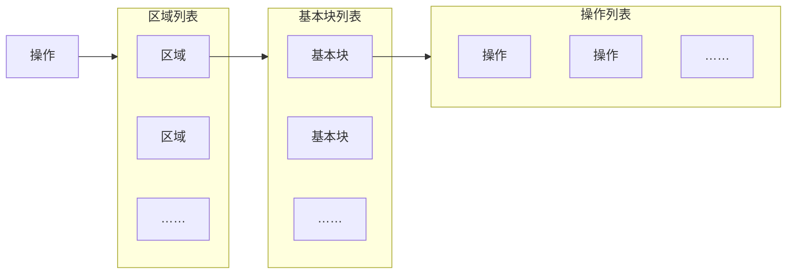

# 第 2 章 MLIR 概述

> 本章据扫描件 `insider-compiler-ch2-ch3.pdf` 的 PDF 第 1–9 页（书页 16–24）逐页转写、目视校对。正文保留原章结构、论述、示例、图号及脚注，修正 OCR 和能够据源码确认的技术错误。校订基准为本地 LLVM **18.1.8**，提交 `3b5b5c1ec4a3095ab096dd780e84d7ab81f3d7ff`；原书参考 LLVM 20，不能仅因版本不同就判定原书有误。技术修正、示例验证及版本说明见[第 2 章校订记录](issues/ch2.md)。

<!-- source: insider-compiler-ch2-ch3.pdf, PDF p. 1 -->

MLIR 作为一款编译器框架，支持对 IR 进行定义，包括操作、与操作关联的类型以及操作属性，并通过方言管理这些信息。此外，MLIR 框架还提供了操作优化、IR 转换以及编译过程调试等功能，这些共同构成了 MLIR 成功的基础。

本章主要介绍 MLIR 的各类概念，具体如下。

- **IR 的组成、结构与存储**：包含操作、类型、属性、方言、IR 结构以及存储格式等内容。
- **谓词、约束、特质与接口机制**：用于保障 IR 的正确性，并提供通用能力。
- **匹配与重写机制**：便于开发者对操作进行优化。
- **Pass 与 Pass 管理机制**：助力开发者实现自定义优化。
- **其他功能**：如文档生成、IR 解析、IR 打印、位置信息处理、多线程编译以及 Pass 管理等。

## 2.1 IR 的组成、结构与存储

IR 是编译器的中间表示。MLIR 的 IR 与传统基于 SSA 形式的三地址码有相似之处，同时支持多层抽象和嵌套结构，以便对特殊问题进行处理。借助 MLIR 框架，开发者可顺利完成代码的表示、分析、优化以及高性能目标代码的生成。

<!-- source: insider-compiler-ch2-ch3.pdf, PDF p. 2 -->

### 2.1.1 组成

IR 的关键组成是操作、类型、属性和方言。

#### 1. 操作

操作是 MLIR 中最为基础的单元，其含义丰富多样。例如，当用操作来表述高级语义时，操作可能是函数定义、函数调用、缓冲区分配、缓冲区切片、进程创建等；而在表述低级语义时，操作则可能是与目标架构无关的算术运算、与目标架构相关的指令描述、寄存器信息或者电路信息。MLIR 的相关工作基本围绕操作展开。

以编译器开发者对矩阵乘法运算的处理为例，他们会将矩阵乘法抽象为一个操作，记作 `matmul`。通常，`matmul` 通过多重循环实现，循环又可抽象为一个操作，记作 `for`。普通二维矩阵乘法的朴素实现通常使用三层循环，批量等变体可能引入更多循环。由此可见，`matmul` 操作可通过 `for` 操作来实现。这个例子表明，可以将信息处理过程抽象为操作。

MLIR 允许开发者定义自己的操作，甚至还支持对上游社区的操作进行扩展，这极大地提升了代码的表达能力。

#### 2. 类型

操作通常关联着特定的数据类型。以 `matmul` 操作为例，它处理的是矩阵，可以使用 `tensor` 类型表示。张量可以具有二维、三维乃至更多维度；矩阵是二维张量，普通 `linalg.matmul` 的两个输入和输出均为二维。

比如，我们可以用 `tensor<2x3xf32>` 这样的形式来描述一个具体类型，它代表一个 2 行 3 列的矩阵，并且每个矩阵元素的数据类型为 32 位浮点数 `f32`。如此一来，就能够利用 `matmul` 操作对特定数据类型进行矩阵乘法运算了。例如，`matmul(t1: tensor<2x3xf32>, t2: tensor<3x4xf32>)` 表示输入为两个矩阵，一个是 2 行 3 列的矩阵 `t1`，另一个是 3 行 4 列的矩阵 `t2`。两者相乘后会得到一个 2 行 4 列的矩阵，可记为 `tensor<2x4xf32>`。整理后的示意代码如下：

```text
t3: tensor<2x4xf32> = matmul(t1: tensor<2x3xf32>, t2: tensor<3x4xf32>)
```

> 校订注：这里保留原书的数学运算示意写法，它不是可直接解析的 MLIR 汇编。实际 `linalg.matmul` 采用 `ins` / `outs` 语法并需要初始输出值，其计算包含向初始输出累加；见[校订记录中的可运行示例](issues/ch2.md#矩阵乘法示意与验证)。

MLIR 赋予开发者自定义类型的能力，以便描述操作所需处理的信息。当然，MLIR 社区也预先定义了诸多类型，像 `tensor`、`memref`、`vector`、整数类型等，开发者可以直接使用这些类型（这些类型被称作内建类型，3.4.4 节会详细介绍）。

#### 3. 属性

开发者在定义操作与类型时，可以为其添加属性，以指定操作或类型的额外信息。例如，上面提到的 `tensor<2x3xf32>` 类型表示一个矩阵。然而，在某些场景下，若矩阵中的大多数元素值为 0，便可以对矩阵采用压缩存储方式。一种直观的思路是为 `tensor<2x3xf32>` 添加一个属性，用于表明压缩格式。比如，示意写法 `tensor<2x3xf32, encoding>` 中的 `encoding` 应替换为实际的编码属性；它可描述稀疏存储等额外信息，但并不限于压缩方式。

同理，对操作也可添加属性，从而增强操作的表达能力。

<!-- source: insider-compiler-ch2-ch3.pdf, PDF p. 3 -->

#### 4. 方言

由于开发者能够自由定义操作以及与操作相关联的类型和属性，因此可以用这些内容构建自定义 IR。为了更有效地管理自定义 IR，MLIR 框架引入了方言机制，用于管理操作、属性和类型（方言类似于容器或命名空间）。借助方言机制，可以将相关的操作、类型和属性归置于特定的方言中，用于表达某一领域或某一抽象层次的 IR；方言与抽象层次不必严格一一对应。

例如，在上述例子中，`matmul` 操作可由已有的 `linalg` 方言管理，即 `linalg.matmul`。而 `matmul` 操作展开后所使用的循环可用 `for` 操作表示。例如，`affine.for` 定义在 `affine` 方言中，`scf.for` 则定义在 `scf` 方言中。

不同方言可以从不同抽象层次表达同一计算，也可以面向不同领域，因此它们所提供的优化能力也有所不同。MLIR 框架以操作为核心，通过变换（transform）机制对操作进行优化。例如，当通过 `matmul` 操作处理大量输入数据时，可采用数据并行处理方式，经典做法是将矩阵分块进行乘法运算，这个针对 `matmul` 操作的优化过程即称为变换。当基于高层方言的优化完成后，可将高层方言转换为低层方言，比如将 `linalg` 方言的操作转换为 `affine` 方言的操作，这一过程一般称为转换（convert）。

此外，MLIR 框架集成了 LLVM 的代码生成能力，可以将 MLIR 中适合导出的 IR 翻译为 LLVM IR。也就是说，在采用 LLVM 作为后端的编译流程中，需要从 MLIR 领域过渡到 LLVM IR 领域，这一过程称为翻译（translate）。之后，便可基于 LLVM 进行优化和代码生成。

简单来讲，转换指的是从一种方言到另一种方言的处理过程。在 MLIR 中，最常见的情况是将高级抽象方言转换为相对低级抽象的方言，因此本书中常以降级替代转换。然而，转换也可以是从低级抽象方言到高级抽象方言的处理，此时通常用提升（raising 或 lifting）替代转换。在基于 MLIR 的编译器开发过程中，通常需要使用一种或多种方言，所以转换一般必不可少。而变换通常用于优化，属于可选操作。此外，为生成目标代码，通常还需将 MLIR 翻译为其他低级表示，如 LLVM IR 或源码，因此翻译一般也是必要步骤。在 MLIR 中，变换和降级通常通过 Pass 与 Pass 管理机制组织执行。为方便编译器的调试与开发，MLIR 提供了 `mlir-opt` 工具，用于处理变换和降级；还提供了 `mlir-translate` 工具，用于处理翻译过程。

#### 5. MLIR 应用示例

代码清单 2-1 是一个 MLIR 代码示意，展示了方言、操作、类型和属性的使用方法。

**代码清单 2-1 MLIR 核心概念代码示例**

```mlir
%value_definition = "dialect.operation"(%value_use) ({
^block(%block_argument : !dialect.argument_type):
  "dialect.further_operation"() [^successor] : () -> ()
^successor:
  ...
}) {attribute_name = #dialect.attr_kind<"value">}
  : (!dialect.operand_type) -> !dialect.result_type<"may_be_parameterized">
```

> 校订注：按本地 LLVM 18 的通用操作语法，将属性字典移至区域列表之后，并为方言类型、属性补上方言前缀。`%value_use` 的定义、方言注册和 `...` 省略的操作不在此示意中，所以这段骨架不是独立的完整程序。完整验证补例见[校订记录](issues/ch2.md#通用操作示例与验证)。

对代码清单 2-1 进行注释解读后，如代码清单 2-2 所示。

**代码清单 2-2 对代码清单 2-1 进行注释解读**

<!-- source: insider-compiler-ch2-ch3.pdf, PDF p. 4 -->

```mlir
// value_definition 表示一个值，由 dialect.operation 定义。
// 其中 dialect 为方言名，operation 为操作名，操作的输入为 value_use。
// 操作有一个属性，名字为 attribute_name，属性值为
// #dialect.attr_kind<"value">，属性字典采用键-值对形式。
// 输入 value_use 的类型是 !dialect.operand_type；
// “!” 开始类型语法，这里使用方言类型的写法。
// 输出类型为 !dialect.result_type<"may_be_parameterized">。
%value_definition = "dialect.operation"(%value_use) ({
  // 这里的“{”开始一个区域；区域包含操作所携带的嵌套内容。
  // 区域中的显式块标签以“^”开头，block 为第一个块的名字；
  // block_argument 是块参数，类型为 !dialect.argument_type。
^block(%block_argument : !dialect.argument_type):
  // 此块包含另一个操作 dialect.further_operation。
  // () -> () 表示零个输入和零个结果，不表示输入/输出的类型为 void。
  // 它声明 successor 为后继块；具体控制流语义须由操作定义给出。
  "dialect.further_operation"() [^successor] : () -> ()
  // 定义名为 successor 的块，它没有参数。
^successor:
  // 后续可能包含其他操作，此处省略。
  ...
}) {attribute_name = #dialect.attr_kind<"value">}
  : (!dialect.operand_type) -> !dialect.result_type<"may_be_parameterized">
```

综上，`dialect.operation` 定义的值 `value_definition` 可供其他代码引用。操作内部还可以内嵌其他操作，不过内嵌操作需依照特定格式进行组织。

当然，上述只是操作使用的简单示例。在实际应用中，操作可能更为复杂，如返回值可能不止一个，并可以附加调试信息等内容。这些将在第 3 章进一步介绍。

### 2.1.2 结构

操作定义了抽象的信息处理过程，并且操作自身还能够携带具体的处理过程。用于表达实际计算、并作为变换对象的 IR 可称作负载 IR（payload IR；在 Transform 方言中，该名称用于与描述变换的 IR 区分）。MLIR 的 IR 结构除了所定义的操作之外，还包含区域和基本块[^ch2-block]这两种基本单元。其中，操作可以包含区域，区域进而可以包含基本块，而基本块又能够包含操作。这 3 种基本单元通过递归定义的方式共同构成了 IR 的结构层次，如图 2-1 所示。



**图 2-1 IR 的结构层次图**

[^ch2-block]: MLIR 中统一使用“块”，而不是“基本块”。本书为了方便读者理解使用“基本块”这一术语，只有在特别语境下才会使用“块”这一术语，请读者注意区分。

<!-- source: insider-compiler-ch2-ch3.pdf, PDF p. 5 -->

#### 1. 区域

MLIR LangRef[^ch2-langref] 中指出，区域由若干基本块构成。基本块内包含若干操作，但区域这一通用结构本身不规定操作的执行语义，具体语义由包含区域的操作定义。这是因为区域是 MLIR 特别引入的单元，当前存在 SSACFG（Static Single Assignment Control Flow Graph，静态单赋值控制流图）和图两种区域类型[^ch2-region-rfc]。

SSACFG 区域内操作的执行顺序有约束，与常见的 CFG（Control Flow Graph，控制流图）语义相符，并且可由多个基本块组成。图区域不由操作的文本排列顺序规定执行先后，甚至变量使用可先于其定义；具体计算语义仍由包含区域的操作规定。在本地 LLVM 18 中，图区域只能包含一个块[^ch2-graph-block]。

那么，MLIR 为何要引入区域，而不是直接采用操作加基本块的两层结构呢？主要原因有两个。

1. **提升抽象级别**：三层结构能够保留更高层的信息，为加快编译过程、改进代码优化并表达执行并行性提供条件。
2. **提供明确边界**：便于进行编译优化，还能开展一些原本属于函数间的优化。

不过，引入区域也带来了新问题，例如值的支配关系需要考虑嵌套结构，导致支配计算比传统平坦 CFG 更为复杂。MLIR 提供层次化的支配关系分析，既支持块之间的查询，也支持操作之间以及值到操作的查询；分析会考虑包含关系和区域种类。在 SSACFG 区域内采用控制流支配规则，在图区域内则采用相应的非 SSA 支配规则。

> 校订注：原书“目前仅计算基本块之间的支配关系”与 LLVM 18 的 `DominanceInfo` 接口及实现不符，已按源码改正；详见[区域与支配关系校订](issues/ch2.md#区域与支配关系)。

此外，区域还有一些特殊要求，比如区域自身不能携带类型和属性，区域内定义的 SSA 值不能直接逃逸到区域外，即区域增加了作用域的概念。

#### 2. 基本块

基本块由一组连续执行的操作构成，与传统基本块定义大致相同（此处不讨论图区域中的块）。但在 MLIR 中，基本块与传统基本块最大的区别在于：它接收参数，而不使用 Phi 指令。Phi 指令用于在不同执行路径的汇合处选择对应路径上的值。同一源程序变量在不同路径被赋值时，在汇合点可引入 Phi 指令，从而将不同路径上产生的 SSA 值汇合为一个新的 SSA 值，以满足 SSA 要求。

从这样的设计可以看出，MLIR 代码本质上是一个图，图中的节点表示操作，边表示 SSA 值的定义与使用关系。值可以是操作结果，也可以是基本块参数，且每个值都有对应的类型[^ch2-structure]。

### 2.1.3 存储

MLIR 提供了 3 种 IR 表示形式。

1. **文本格式**：通过文本汇编形式表示 IR。MLIR 框架具备读取和解析字符串的能力，并能据此生成相应的对象。
2. **内存格式**：在 MLIR 编译时所采用的内存对象形式。
3. **字节码格式**：用于存储与传输 IR 的紧凑二进制序列化格式。

[^ch2-langref]: 参见 [MLIR Language Reference](https://mlir.llvm.org/docs/LangRef/)，原书标注 2024 年 7 月访问。本次核对采用本地同版本 `mlir/docs/LangRef.md`。
[^ch2-region-rfc]: 原书附注：MLIR 中引入区域后导致了一些问题，社区正在讨论引入一种新的区域，但尚未形成最后结论。具体可参见 [[RFC] Region-based control flow with early exits in MLIR](https://discourse.llvm.org/t/rfc-region-based-control-flow-with-early-exits-in-mlir/76998)，2024 年 7 月访问。此处保留原书的历史性注释，不将其中“正在讨论”视为当前社区状态。
[^ch2-graph-block]: 特别提示：这里是说块而非基本块，原因是块里面的操作执行顺序和传统意义上基本块内的执行顺序不一致。
[^ch2-structure]: 参见 [Understanding the IR Structure](https://mlir.llvm.org/docs/Tutorials/UnderstandingTheIRStructure/)，原书标注 2024 年 7 月访问。本次核对采用本地同版本文档。

<!-- source: insider-compiler-ch2-ch3.pdf, PDF p. 6 -->

这 3 种形式可以通过解析、打印和字节码读写等机制相互转换。编译过程中操作的是内存中的 IR 对象，文本是其一种表示形式，而且 MLIR 框架允许用户为操作定义自定义汇编格式。

> **注意**：为何 IR 要提供文本形式？它又有哪些优势与不足呢？文本形式便于阅读、编辑、调试和测试，开发者也可以自定义操作的汇编格式。然而，可自定义语法并不自动保证 IR 语义正确。为此，MLIR 提供了约束、特质和验证器等功能来保障 IR 的正确性。这些语义检查也适用于通过 API 构建的 IR，而不只适用于文本输入。

## 2.2 关键功能

本节将介绍 MLIR 的关键功能。

### 2.2.1 谓词、约束、特质和接口

MLIR 借助谓词、约束、特质等关键功能来描述和检查 IR 的正确性。相关检查发生于编译器对 IR 的解析、构建与处理过程，可从以下 3 个方面理解。

- **IR 解析**：确保 IR 格式正确。一旦输入不符合所定义的 IR 文法，在 IR 解析阶段就会被检测出来。
- **IR 构建**：对于格式正确的 IR，系统需能构建出相应的 IR 对象（如操作、类型等）。即便 IR 格式正确，其语义也可能不符合要求，MLIR 框架通过验证器等机制发现此类错误；通过 API 构建 IR 时，也应在适当时机进行验证。
- **IR 处理过程中的验证**：构建的 IR 对象在变换后仍应满足规定的不变量。例如，PassManager 可在 Pass 执行后调用验证器，以发现变换产生的非法 IR。这是编译器运行时的 IR 检查，不是对最终目标程序运行行为的自动验证。

为达成上述目标，MLIR 提供了谓词（predicate）、约束（constraint）和特质（trait）等机制。谓词描述一个布尔条件；TableGen 中的约束包装谓词及其说明文字，用于生成验证代码或匹配代码。二者有关联，但在本地 LLVM 18 中仍是不同的定义。特质则用于为一类 IR 实体附加共同的不变量、性质或行为，也可以包含验证逻辑。因此，不能将谓词和特质分别等同于“静态约束”和“目标程序运行时的动态约束”。

特质通常通过 C++ 模板继承机制实现，使具体操作类获得相应的行为（即函数）以及可供查询的性质。然而，在实际应用场景中，有时需要通过统一抽象访问不同操作的能力。为此，MLIR 框架提供了接口功能，以满足对操作行为进行动态分派及扩展实现等要求。这部分内容将在第 4 章详细展开。

> 校订注：本节修正了原书将验证阶段划分为“IR 运行前／运行时”、将特质当成动态约束，以及据此混同谓词和约束的表述。依据与原文差异见[谓词、约束、特质与验证](issues/ch2.md#谓词约束特质与验证)。

### 2.2.2 匹配与重写

MLIR 的设计以操作为核心，其中一项重要功能是以操作为中心的匹配／重写机制，这也是 MLIR 降级的关键所在。该机制对操作进行匹配，并在匹配成功后提供重写新 IR、替换或删除旧 IR 等辅助功能。开发者只需聚焦于如何定义操作匹配规则，并关注替换、插入或删除操作等业务相关内容即可。

<!-- source: insider-compiler-ch2-ch3.pdf, PDF p. 7 -->

MLIR 的降级框架还提供了递归处理嵌套操作的功能。其中，方言降级与常规的匹配／重写机制有所差异：常规重写也可以改变操作及其类型，但需要自行保持所有相关 IR 的一致性；方言转换框架则进一步提供目标合法性、类型转换和操作数映射等机制，因此能系统地处理更复杂的转换。

以 `matmul` 操作为例，如果其输入类型为 `tensor`，在将 `linalg` 操作最终降级为基于缓冲区的 `affine` 循环代码时，需要把张量语义转换为 `memref` 缓冲区语义。在本地 LLVM 18 的常见流程中，先进行缓冲化，再将具有纯缓冲区语义的 `linalg.matmul` 降级为循环；`affine.for` 本身并不是一个“接收类型变为 `memref`”的矩阵运算，其循环体中的访存操作使用 `memref`。这说明完整流程需要同时考虑操作变化和类型变化。若有其他操作使用原 `matmul` 的结果，结果的表示或类型变化就必须同步处理这些使用处，否则会产生类型不匹配或非法 IR。为解决此类问题，MLIR 提供了独立的方言转换机制及类型转换支持，参见第 6 章。

特别需要指出的是，MLIR 不仅提供多层 IR，还具有混合 IR 的特点，即多个层级的 IR 能够共存。在匹配／重写机制和方言降级过程中需要充分考虑这一特点，以确保正确性。因此，MLIR 的方言转换框架提供了部分转换和完全转换：部分转换允许原本存在且未被显式标记为非法的操作保持未转换；完全转换要求所有被转换范围内的操作都满足目标合法性。两种模式均可保留多个合法方言，不以“是否只剩某一个方言”区分。

匹配／重写机制通常通过 Pass 组织使用，而 Pass 由 PassManager 管理，PassManager 也是 MLIR 的基础框架。第 5 章将介绍如何定义 Pass 和 PassManager，以及如何利用 Pass 机制实现一些通用的优化能力。

> 校订注：本节对缓冲化与循环降级的先后关系、部分／完全转换的判据作了技术修正；详见[匹配、缓冲化与转换](issues/ch2.md#匹配缓冲化与转换)。

### 2.2.3 调试

MLIR 提供了丰富的调试功能，这也是它能够取得成功的原因之一。典型的调试方法有 4 种，具体说明如下。

1. **在 Pass 运行前后打印 IR 机制**：MLIR 设有 Pass，并提供了与 LLVM 类似的功能，可在 Pass 运行前后打印 IR，方便开发者观察 Pass 的运行效果及 Pass 对 IR 的影响（Pass 执行前后 IR 的变化）。该功能主要通过 `--mlir-print-ir-before`、`--mlir-print-ir-after` 等选项实现，也提供 `--mlir-print-ir-before-all`、`--mlir-print-ir-after-all` 等选项，并依赖 Pass 的插桩机制。
2. **Action 机制**：该机制提供了细粒度的调试与追踪能力，可以在 Pass 执行、模式应用等被包装成 Action 的处理步骤前后进行观察，并控制是否执行这些步骤。例如，当需要定位一连串 IR 变换中哪一次应用引入了问题时，仅获取日志再进行文本分析往往较为烦琐；借助 Action 机制可以更直接地控制和追踪相关处理。目前，MLIR 框架中的 Debug Counter 功能允许开发者按 Action 标签指定跳过多少次、再执行多少次，进而限制相应 Action 的执行，方便对复杂 IR 处理流程进行调试。它控制的是 Action 是否执行，不是指定 Pass 在某些次数才输出 IR。
3. **Reduce 机制**：为助力开发者在 Pass 运行时定位问题，MLIR 社区提供了 `mlir-reduce` 工具[^ch2-reduce]。当 Pass 运行过程中出现错误或结果不符合预期时，可利用该工具配合判断问题是否仍然存在的测试，缩减相关的 IR。`mlir-reduce` 会根据归约策略搜索更小、且仍满足测试条件的 IR 片段。通过获取较小的复现用例，开发者能够更高效地分析问题，缩小问题排查范围；这一过程并不保证找到所有可能表示中的全局最小 IR。

[^ch2-reduce]: 开发者也可以定义自己的 reduce 工具，以便进行问题定位，如 IREE 项目中的 `iree-reduce` 工具。

<!-- source: insider-compiler-ch2-ch3.pdf, PDF p. 8 -->

4. **错误捕捉与复现机制**：针对 Pass 运行，`mlir-opt` 工具提供了 `--mlir-pass-pipeline-crash-reproducer` 选项，用于生成包含 IR 和 Pass 流水线等配置信息的复现文件，以帮助重放发生崩溃或 Pass 失败的编译过程。这使得开发者能够获得复现问题所需的 IR 与流水线上下文，有助于快速定位和解决问题。

### 2.2.4 表描述语言及工具

MLIR 作为 LLVM 项目的一部分，同样采用 TableGen（TD）来描述操作、类型、方言等内容。由于 MLIR 对 TD 赋予了自身特定的语义，因此 MLIR 框架专门提供了 `mlir-tblgen` 工具，用于将 TD 文件转化为 C++ 相关代码。`mlir-tblgen` 工具的转化过程分为两步：首先将 TD 转化为记录，然后将记录转化为 C++ 代码。最终生成的 C++ 代码能够与 MLIR 框架无缝集成，供上层调用。

这一过程与 `llvm-tblgen` 工具极为相似。《深入理解 LLVM：代码生成》的第 6 章详细介绍了 TD 文件的文法以及转化过程。尽管 `mlir-tblgen` 生成的最终代码与 `llvm-tblgen` 生成的代码在目的上存在差异，但二者的转化过程基本一致。鉴于此，本书不再对该过程进行详细阐述。在后续章节中，若涉及 TD 的使用，将直接描述对应的 C++ 代码。倘若读者对这一过程尚不熟悉，可参考《深入理解 LLVM：代码生成》。

## 2.3 其他功能

除了上述常用功能，MLIR 还提供了位置追踪、文档生成、并行编译和 Python 交互等功能。

### 1. 位置追踪

在编译过程中，操作的来源（包括其原始位置与变换后的位置）应具备极高的可追溯性。这个原则旨在解决复杂编译系统中存在的透明性缺失问题。在这类系统里，要全面了解最终表示是如何从原始表示构建而成的完整过程，难度较大。尤其是在编译安全性至关重要的应用程序时，这一问题更为突出。

在一些场景中，跟踪降级与优化步骤是软件认证程序的关键环节。当处理安全代码（如加密协议）或对隐私敏感数据进行操作的算法时，编译器常遇到一些看似冗余或烦琐的计算。这些计算可能承担防止关键信息泄露、强化代码安全性、抵御网络攻击与故障攻击等作用，需要在源程序或 IR 语义中准确表达，避免被误当作冗余计算删除。而将高层次信息准确传播至较低层次，其间接目的便是助力实现安全且可追溯的编译过程。

MLIR 提供了位置信息的表示形式，并倡导在整个编译过程中对位置信息进行处理与传播。位置信息可用于留存生成操作的源程序堆栈踪迹，进而生成调试信息。借助位置信息，甚至能让编译器生成诊断信息的方式达到标准化，这些信息还可应用于各类测试工具。此外，位置信息具有可扩展性，允许编译器引用自定义的位置跟踪系统、AST 节点信息、LLVM 风格的文件—行—列信息、DWARF（Debugging With Attributed Record Formats，带属性的记录格式调试）信息以及任何其他满足高质量编译需求的信息。

<!-- source: insider-compiler-ch2-ch3.pdf, PDF p. 9 -->

### 2. 文档生成

MLIR 框架具备自动文档生成功能。只要在 TD 中定义方言、操作、接口等内容时包含概述、详细描述、参数、返回值等信息，MLIR 所提供的 `mlir-tblgen` 工具便能直接提取这些信息并自动生成文档。这是一种典型的“代码即文档”敏捷开发模式。

### 3. 并行编译

MLIR 的一个重要需求是借助多核计算机来提升编译速度。PassManager 支持在适当的操作边界上并发执行嵌套 Pass 流水线，这一功能依赖于操作的“与上方隔离”（`IsolatedFromAbove`）特质所提供的不变量。该特质规定，操作所包含的区域不能隐式捕获定义在这些区域之外的 SSA 值，从而在数据结构层面形成可用于并行处理的边界。值可以通过外围操作的操作数和区域入口块参数按该操作的语义显式传入。配合 Pass 不得任意访问或修改当前操作以外 IR 等规则，不同的隔离操作及其内部 IR 才能够被安全地并行处理。

这一要求也解释了为何 MLIR 避免用跨隔离边界的全局 SSA Use-Def 链表示所有引用。在 MLIR 中，对全局对象的引用通常通过符号引用属性与符号表实现；常量则常由常量操作产生 SSA 结果，具体常量值由其属性或属性存储机制表示。隔离区域可以拥有自己的常量操作，以避免通过 SSA 值隐式捕获区域外的定义。

需要注意的是，尽管 MLIR 支持并行编译，但在其内部实现中仍存在部分多线程共享的数据。所以在并行编译过程中某些操作需要加锁，这就导致并行编译不能据此保证完全线性扩展[^ch2-performance]。

> 校订注：原书将 `IsolatedFromAbove` 称作属性，并把边界描述为“该操作所在的区域”，容易与普通值作用域混淆。这里按特质定义及 PassManager 的约束改正；详见[隔离、常量与并行编译](issues/ch2.md#隔离常量与并行编译)。

### 4. Python 交互

为便于 Python 开发者使用 MLIR 完成开发工作，MLIR 项目专门实现了支持 Python 与 C++ 交互的模块。本地 LLVM 18 的该模块基于 pybind11 实现。鉴于 Python 与 C++ 的交互方式以及 pybind11 的使用方法相对独立，本书不再赘述此部分内容，感兴趣的读者可查阅其他相关文档进行学习。

## 2.4 本章小结

本章概述了 MLIR 的核心概念，首先介绍了 IR 的组成、结构和存储格式；接着描述了 MLIR 的常用机制，包括谓词、约束、特质、接口、匹配、重写以及调试机制；最后简要阐述了 MLIR 提供的位置追踪、文档生成与并行编译等功能。

[^ch2-performance]: 参见 [How Slow Is MLIR?](https://llvm.org/devmtg/2024-04/slides/Keynote/Amini-Niu-HowSlowIsMLIR.pdf)，原书标注 2024 年 7 月访问。此处保留原书的参考资料；正文不据此推断当前版本的具体性能。
