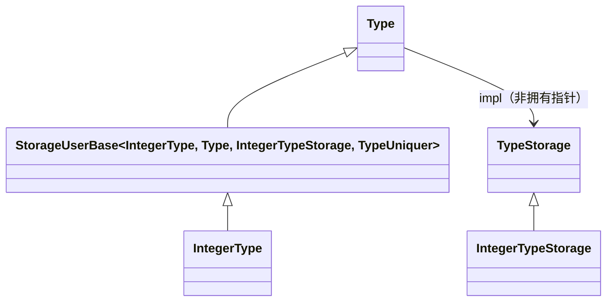
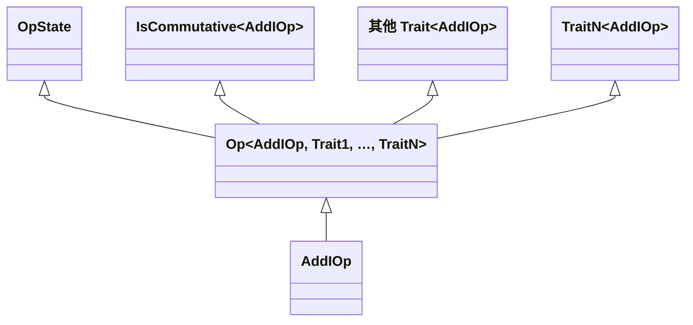
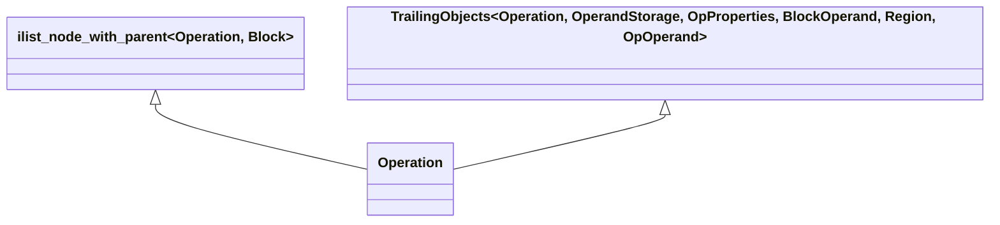
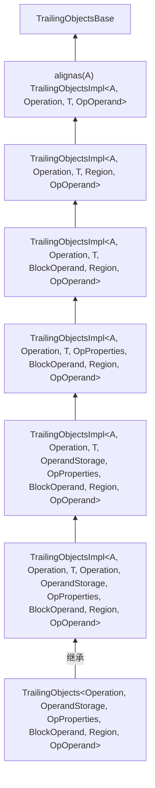
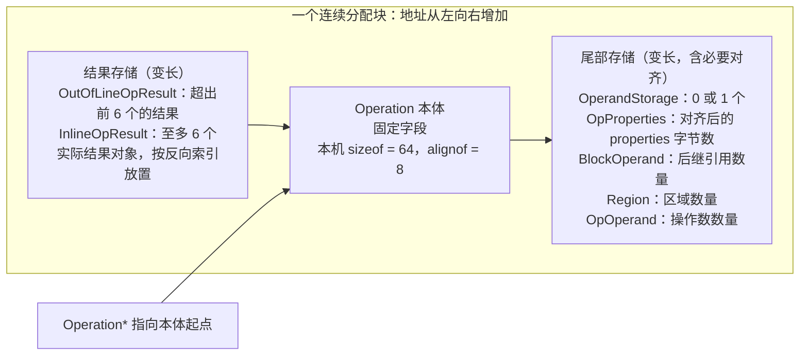
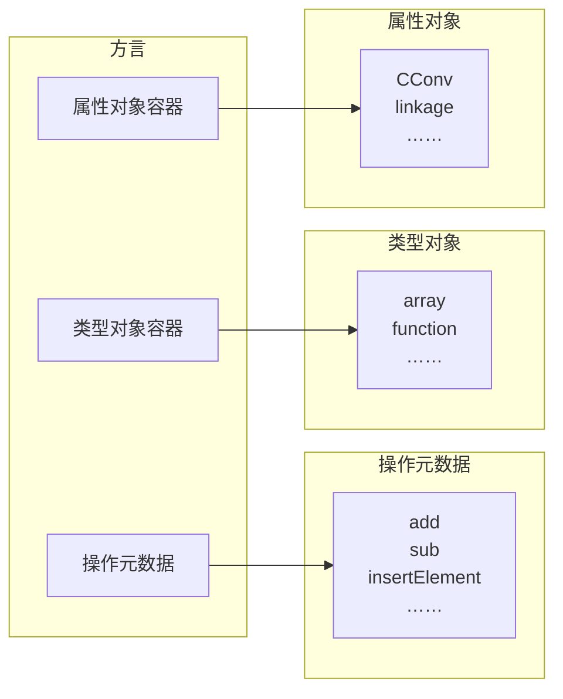
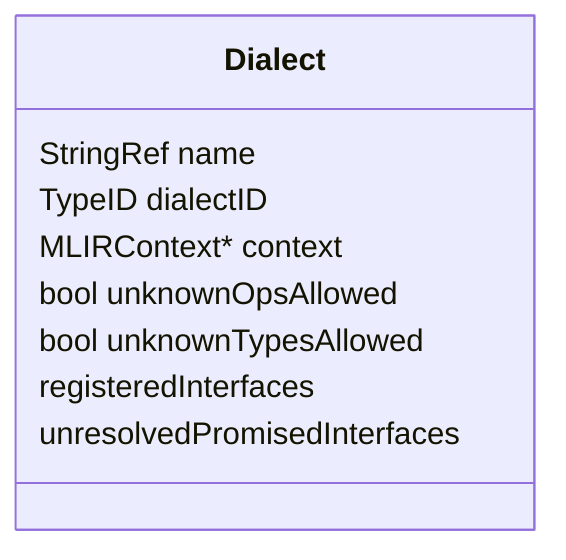
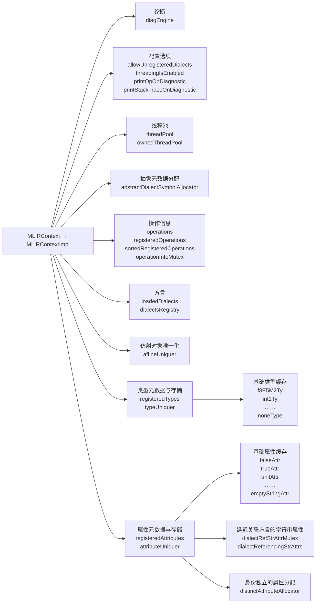

# 第 3 章 类型、属性、操作和方言详解

> 本章据 `insider-compiler-ch2-ch3.pdf` 的 PDF 第 10–50 页（书页 25–65）逐页转写与目视校对。正文以本地 LLVM 18.1.8（提交 `3b5b5c1ec4a3095ab096dd780e84d7ab81f3d7ff`）的实际代码为准，保留原章结构、代码清单编号、图表及脚注。代码中的省略号表示原书已删节的内容，不表示完整可独立编译文件。较大的原文错误、版本差异和验证记录见[第 3 章校订记录](issues/ch3.md)。

<!-- source: insider-compiler-ch2-ch3.pdf, PDF p. 10 -->

第 2 章简要介绍了 MLIR 的基础知识，本章将深入探讨方言、操作、类型和属性的相关知识。

**操作**是 MLIR 中最为基础的概念，变换、降级、分析等操作均围绕它展开；**类型**作用于操作的操作数或者返回值；**属性**为操作、类型等提供额外信息；**方言**用于组织和注册类型、属性以及操作的元数据，而不直接拥有所有操作实例。需要说明的是，类型和属性的存储通常在同一 `MLIRContext` 内按种类及参数唯一化，方言负责关联其定义及行为；操作则可多次实例化生成不同的操作对象。因此，不能将类型和属性的唯一性理解为整个进程的全局单例。

本章最后介绍了 MLIR 框架提供的 `MLIRContext`。它用于管理已加载方言、类型与属性的唯一化存储、操作注册信息等。开发者可借助 `MLIRContext` 访问方言及相关元数据，并通过构造接口创建操作对象。

## 3.1 类型

在 MLIR 中，类型与操作紧密相关，操作的结果、操作数以及操作内嵌基本块的参数等都具有特定类型。类型主要分为两类：内建类型和自定义类型。

内建类型是 MLIR 提供的常见类型，包括 `bfloat16`（汇编拼写为 `bf16`）[^ch3-type-name]、整数类型、`complex`、`vector`、`tensor`、`memref` 等。开发者可直接使用这些内建类型。当内建类型无法满足需求时，开发者也可以自定义类型。MLIR 框架给予了开发者较大的定义空间，但类型仍须满足类型基础设施、存储唯一化和所属方言等方面的要求。

[^ch3-type-name]: 原书说明：这里所有的类型都使用小写字母开头，主要是为了和 MLIR 代码保持一致。它们在对应的 C++ 代码中通常以大写字母开头。校订补充：概念名不一定就是汇编拼写，例如 `bfloat16` 对应 `bf16`，整数类型使用 `i32`、`si32`、`ui32` 等形式。

<!-- source: insider-compiler-ch2-ch3.pdf, PDF p. 11 -->

MLIR 框架提供了许多内建类型的转换支持。例如，在向 LLVM 方言及 LLVM IR 降级的适当流程中，类型转换器可以将支持的类型转换为目标可接受的表示。但是，不能认为所有内建类型都会自动一步降级为 LLVM IR 类型；例如张量通常还需要缓冲化等前置处理。对于自定义类型，开发者需提供相应的类型转换规则，否则可能导致降级失败。

在同一 `MLIRContext` 中，类型通常按具体种类及参数具有唯一性。类型可用于约束操作的操作数或结果，多个操作可共享相同类型，因此同一组类型参数只需要一份唯一化存储。当约束不同时，应使用不同的类型描述。类型的 C++ 对象通常是指向存储的轻量句柄，复制句柄并不意味着重新分配一份类型存储；存储由 context 管理，并关联其方言。

### 3.1.1 定义与注册

MLIR 框架提供了 3 种类型的定义方法，分别是通过 C++ 代码直接定义、通过 `irdl` 方言定义以及通过 TD 定义。

1. **通过 C++ 代码直接定义类型**：这种方式直接实现类型类、存储及相关行为，也可以配合 TD 中的类型约束使用。此类类型能够成为操作的操作数或结果类型。例如，`LLVMStructType` 表示 LLVM 方言中的结构体类型，`llvm.extractvalue`、`llvm.insertvalue` 等操作可显式处理结构体值。当代码从 MLIR 体系降级到 LLVM 体系时，MLIR 中某些类型在 LLVM 中缺乏直接对应，也可以用 `LLVMStructType` 描述转换所需的聚合表示。
2. **通过 `irdl` 方言定义类型**：这是以 MLIR 操作来描述方言、类型、属性及操作约束的机制，可以支持动态方言定义；不能将其等同于“本质上基于 TD 定义类型”。相关概念将在 12.3 节简要介绍。
3. **通过 TD 定义类型**：这是最为常见的类型定义形式，也是本节的重点。在使用 TD 文件定义类型时，需借助 `mlir-tblgen` 工具，先将 TD 文件解析为记录，再把记录翻译为 C++ 类。同时，`mlir-tblgen` 工具还会生成一些胶水代码，用于将类型注册到方言中，方便开发者在方言中使用该类型。

> 校订注：本节开头关于“全局唯一”“内建类型自动转换”“C++ 类型不能被操作采用”及 IRDL 的原说法已按本地实现修正，详见[类型基础概念校订](issues/ch3.md#类型基础概念)。

下面以内建整数类型为例，介绍类型的定义与使用方法。

#### 1. 在 TD 中定义类型

在 TD 中定义整数类型的记录名为 `Builtin_Integer`，如代码清单 3-1 所示。

**代码清单 3-1 在 TD 中定义 integer 类型的记录**

```tablegen
def Builtin_Integer : Builtin_Type<"Integer", "integer"> {
  let summary = "Integer type with arbitrary precision up to a fixed limit";
  let description = [{
    ...
  }];
  let parameters = (ins "unsigned":$width,
                        "SignednessSemantics":$signedness);
  let builders = [
    // 构造参数为 width 和 signedness。
    // CArg 为 signedness 指定 C++ 类型及默认实参 Signless。
    TypeBuilder<(ins "unsigned":$width,
                     CArg<"SignednessSemantics", "Signless">:$signedness)>
  ];

  // IntegerType 自定义存储类，用紧凑布局节约空间。
  let genStorageClass = 0;
  let skipDefaultBuilders = 1;
  let genVerifyDecl = 1;
  let extraClassDeclaration = [{
    // 定义整数的符号语义。
    enum SignednessSemantics : uint32_t {
      Signless, // 整数没有符号语义
      Signed,   // 有符号整数
      Unsigned, // 无符号整数
    };
    // 其他信息省略。
    ...
  }];
}
```

<!-- source: insider-compiler-ch2-ch3.pdf, PDF p. 12 -->

为节省篇幅，笔者删减了记录 `Builtin_Integer` 中的两个字段 `description` 和 `extraClassDeclaration`（后续类似情况不再赘述）。其中，`description` 字段用于描述整数类型，主要在生成文档时使用；`extraClassDeclaration` 字段则用于描述开发者需在 C++ 类中为整数类型额外添加的类型定义与函数声明／实现。

以下对整数类型的实现进行简要介绍，各主要字段含义如下。

- **summary / description**：这两个字段用于描述整数类型的概要和详细信息，主要作用是辅助生成文档。
- **parameters**：整数类型在 MLIR 中可接收两个参数，即位宽与符号语义。通常，`mlir-tblgen` 工具会依据该字段生成类型构造接口，此过程需与 `skipDefaultBuilders` 字段配合使用。
- **builders**：这是开发者自定义的、用于获取或构建整数类型对象的构造器描述。
- **genStorageClass**：该字段用于表明是否为整数类型自动生成存储类。存储类用于定义类型参数的内存布局，当该值为 0 时，表示不会自动生成存储类，需要开发者自行实现。整数类型的存储类为 `IntegerTypeStorage`，本地实现位于 `mlir/lib/IR/TypeDetail.h`。生成器可推导其类名并生成相应引用，但该存储类的定义不是自动生成的。
- **skipDefaultBuilders**：此参数决定是否跳过生成默认构造接口，若值为 1，则跳过。它需与 `parameters` 字段和 `builders` 配合使用。
- **genVerifyDecl**：该参数用于确定是否为整数类型生成 `verify` 函数声明，若值为 1，则生成。`verify` 函数用于校验构造参数是否满足类型要求；其具体实现还需提供，并非该字段自动生成全部验证逻辑。

<!-- source: insider-compiler-ch2-ch3.pdf, PDF p. 13 -->

- **extraClassDeclaration**：此参数用于在类型类的声明中添加额外的 C++ 内容，例如成员函数、嵌套类型与静态成员。应避免因此在轻量类型句柄中重复存放本应由唯一化存储持有的参数。

此外，`Builtin_Integer` 记录继承自记录基类 `Builtin_Type`，其定义如代码清单 3-2 所示。

**代码清单 3-2 基类 Builtin_Type 的定义**

```tablegen
class Builtin_Type<string name, string typeMnemonic, list<Trait> traits = [],
                   string baseCppClass = "::mlir::Type">
    : TypeDef<Builtin_Dialect, name, traits, baseCppClass> {
  let mnemonic = ?;
  let typeName = "builtin." # typeMnemonic;
}
```

可以看到，`Builtin_Type` 是 `TypeDef` 的封装类，默认指定生成类型类使用的 C++ 基类为 `::mlir::Type`。本地 LLVM 18 的定义还接收 `typeMnemonic` 并设置 `typeName`；这与原书删节代码存在差异，代码清单 3-1、3-2 已同步采用本地写法。

当开发者自定义类型时，通常会直接继承自 `TypeDef`。当然，也可参照整数类型的处理方法，先封装一个记录基类（即此处的 `Builtin_Type`）。设计 `Builtin_Type` 的主要原因在于：MLIR 框架提供了多个内建类型，它们共享方言、命名等设置，常以 `::mlir::Type` 为基类，也可以显式指定其他基类。因此，封装一个记录基类有助于减少代码量。

#### 2. 从 TD 到记录

使用 `mlir-tblgen` 工具解析 TD 文件，将记录定义展开为记录信息。整数类型对应的记录及解读如代码清单 3-3 所示。

**代码清单 3-3 integer 类型对应的记录及解读**

```tablegen
def Builtin_Integer { // Constraint TypeConstraint Type DialectType
                      // AttrOrTypeDef TypeDef Builtin_Type
  // 上述注释为记录输出中的继承信息；以下解释为书中添加的注释。
  // 可作为类型约束使用，其谓词来自 TypeDef。
  Pred predicate = anonymous_7;
  string summary = "Integer type with arbitrary precision up to a fixed limit";
  // 自动生成的 C++ 类名。
  string cppClassName = "IntegerType";
  code description = [{
    ...
  }];
  string builderCall = "";
  // 关联 Builtin_Dialect。
  Dialect dialect = Builtin_Dialect;
  // 指定生成 C++ 类所使用的基类。
  string cppBaseClassName = "::mlir::Type";
  // 存储类及命名空间。
  string storageClass = "IntegerTypeStorage";
  string storageNamespace = "detail";
  bit genStorageClass = 0;
  bit hasStorageCustomConstructor = 0;
  dag parameters = (ins "unsigned":$width, "SignednessSemantics":$signedness);
  list<AttrOrTypeBuilder> builders = [anonymous_346];
  list<Trait> traits = [];
  string mnemonic = ?;
  // 声明式汇编格式；此内建类型未通过这个字段定义其汇编语法。
  string assemblyFormat = ?;
  bit hasCustomAssemblyFormat = 0;
  bit genAccessors = 1;
  bit skipDefaultBuilders = 1;
  bit genVerifyDecl = 1;
  code extraClassDeclaration = [{
    ...
  }];
  code extraClassDefinition = [{}];
  string cppType = "::mlir::IntegerType";
  string typeName = "builtin.integer";
}

// CArg 描述构造函数的 C++ 参数类型与默认值，不是类型谓词约束。
def anonymous_345 { // CArg
  string type = "SignednessSemantics";
  string defaultValue = "Signless";
}

// 自定义构造器描述。
def anonymous_346 { // AttrOrTypeBuilder TypeBuilder
  // dagParams 描述两个构造参数。
  dag dagParams = (ins "unsigned":$width, anonymous_345:$signedness);
  string body = "";
  string returnType = "";
  bit hasInferredContextParam = 0;
}
```

[^ch3-record-comments]: 记录首行的继承信息是 `mlir-tblgen` 输出中的原有内容，后续解释性注释为笔者添加。后面章节还会出现类似情况，不再赘述。

以上清单保留了原书对记录继承信息的说明[^ch3-record-comments]。匿名记录编号依输入和版本而变化，本次采用本地实际生成的 `anonymous_7`、`anonymous_345`、`anonymous_346`；它们不是稳定 API。

<!-- source: insider-compiler-ch2-ch3.pdf, PDF p. 14 -->

这一步骤与 `llvm-tblgen` 工具生成记录的过程并无太大差异。唯一需要特别留意的是 MLIR 类型的关键字段，笔者已在代码清单 3-3 中进行了解释。至于如何生成记录，可参考《深入理解 LLVM：代码生成》的第 6 章。

#### 3. 从记录到 C++ 代码

使用 `mlir-tblgen` 工具从记录中提取信息，生成 C++ 类。前文提到，整数类型需要自定义 `IntegerTypeStorage` 类，即定义整数类型使用的存储布局，如代码清单 3-4 所示。

**代码清单 3-4 存储类 IntegerTypeStorage**

```cpp
// IntegerType 的存储结构，定义类型参数的内存布局以及唯一化键。
struct IntegerTypeStorage : public TypeStorage {
  IntegerTypeStorage(unsigned width,
                     IntegerType::SignednessSemantics signedness)
      : width(width), signedness(signedness) {}

  // 定义用于哈希唯一化的键类型。
  using KeyTy = std::tuple<unsigned, IntegerType::SignednessSemantics>;
  // 省略 hashKey、operator== 等代码。
  // ...

  static IntegerTypeStorage *construct(TypeStorageAllocator &allocator,
                                       KeyTy key) {
    return new (allocator.allocate<IntegerTypeStorage>())
        IntegerTypeStorage(std::get<0>(key), std::get<1>(key));
  }
  KeyTy getAsKey() const { return KeyTy(width, signedness); }

  // 位宽与符号语义使用位域紧凑存储。
  unsigned width : 30;
  IntegerType::SignednessSemantics signedness : 2;
};
```

<!-- source: insider-compiler-ch2-ch3.pdf, PDF p. 15 -->

原书说明，`IntegerType` 的参数包括整数位宽和符号语义，通过位域可将这两项参数紧凑地放入一个 32 位存储单元，避免分别使用两个 32 位字段。这解释了不使用默认生成存储类的原因；这里所说的 32 位仅指这两个参数的位域，并非包含基类和对齐在内的整个 `IntegerTypeStorage` 对象大小。

`IntegerTypeStorage` 类的主要作用是存储整数类型的参数，使 `IntegerType` 保持为轻量句柄，并将实际参数移至 `IntegerTypeStorage` 中。

`mlir-tblgen` 工具生成的整数类型对应的 C++ 代码如代码清单 3-5 所示。

**代码清单 3-5 integer 类型对应的 C++ 代码**

```cpp
class IntegerType
    : public ::mlir::Type::TypeBase<IntegerType, ::mlir::Type,
                                    detail::IntegerTypeStorage> {
public:
  using Base::Base;
  // 来自 extraClassDeclaration 的枚举及成员函数等省略。
  // ...

  static constexpr ::llvm::StringLiteral name = "builtin.integer";
  // get 获取唯一化类型；getChecked 验证参数，失败时返回空句柄。
  using Base::getChecked;
  static IntegerType get(::mlir::MLIRContext *context, unsigned width,
                         SignednessSemantics signedness = Signless);
  static IntegerType getChecked(
      ::llvm::function_ref<::mlir::InFlightDiagnostic()> emitError,
      ::mlir::MLIRContext *context, unsigned width,
      SignednessSemantics signedness = Signless);

  // 自动生成声明；具体验证实现校验参数是否合法。
  static ::mlir::LogicalResult verify(
      ::llvm::function_ref<::mlir::InFlightDiagnostic()> emitError,
      unsigned width, SignednessSemantics signedness);
  // 自动生成参数访问接口。
  unsigned getWidth() const;
  SignednessSemantics getSignedness() const;
};
```

从代码清单 3-5 中可以看到，类 `IntegerType` 继承自 `TypeBase` 指定的基类。`TypeBase` 的定义如代码清单 3-6 所示。

<!-- source: insider-compiler-ch2-ch3.pdf, PDF p. 16 -->

**代码清单 3-6 基类 TypeBase 的定义**

```cpp
class Type {
public:
  // 辅助类型定义。
  template <typename ConcreteType, typename BaseType, typename StorageType,
            template <typename T> class... Traits>
  using TypeBase = detail::StorageUserBase<
      ConcreteType, BaseType, StorageType, detail::TypeUniquer, Traits...>;

  // Type 层的存储接口类型为 TypeStorage；派生模板再细化存储类型。
  using ImplType = TypeStorage;
  using AbstractTy = AbstractType;

  constexpr Type() = default;
  /* implicit */ Type(const ImplType *impl)
      : impl(const_cast<ImplType *>(impl)) {}
  // ...
protected:
  ImplType *impl{nullptr};
};
```

代码清单 3-6 中的 `TypeBase` 是 `StorageUserBase` 模板特化的别名，其定义如代码清单 3-7 所示。

**代码清单 3-7 基类 StorageUserBase 的定义**

```cpp
template <typename ConcreteT, typename BaseT, typename StorageT,
          typename UniquerT, template <typename T> class... Traits>
class StorageUserBase : public BaseT, public Traits<ConcreteT>... {
public:
  // 供生成的具体类型类使用。
  using Base = StorageUserBase<ConcreteT, BaseT, StorageT, UniquerT, Traits...>;
  // ...

  // 获取已有的唯一化类型，或分配新存储并返回相应类型句柄。
  template <typename... Args>
  static ConcreteT get(MLIRContext *ctx, Args &&...args) {
    assert(succeeded(
        ConcreteT::verify(getDefaultDiagnosticEmitFn(ctx), args...)));
    // UniquerT 是唯一化访问辅助类，不是具体存储类。
    return UniquerT::template get<ConcreteT>(
        ctx, std::forward<Args>(args)...);
  }
  // ...
};
```

至此，读者应能推测出，各具体类中自动生成的 `get()` 函数通常会调用 `StorageUserBase` 类中的 `get()` 函数。某些常用内建类型还设置了快速缓存，以减少通用唯一化查找的开销；通用唯一化机制本身也会避免对同一种参数重复构建存储对象。`IntegerType` 中 `get()` 函数的实现如代码清单 3-8 所示。

**代码清单 3-8 IntegerType 中 get() 函数的实现**

```cpp
IntegerType IntegerType::get(MLIRContext *context, unsigned width,
                             IntegerType::SignednessSemantics signedness) {
  // 首先查询常用整数类型缓存。
  if (auto cached = getCachedIntegerType(width, signedness, context))
    return cached;
  // 调用 StorageUserBase 中的 get()。
  return Base::get(context, width, signedness);
}
```

<!-- source: insider-compiler-ch2-ch3.pdf, PDF p. 17 -->

关于如何通过 `StorageUserBase` 类中的 `get()` 函数获取类型对象，将在 3.1.3 节展开说明。

综上所述，在 MLIR 框架中，为方便管理类型对象，其实现被分为两部分。

1. **类型（Type）**：提供常见的 API。例如，`get()` 函数用于获取类型对象；`getChecked()` 函数用于返回验证通过的类型对象，若验证不通过则返回空对象。
2. **类型存储（TypeStorage）**：无参数类型在同一 context 内只需一份对应存储，可以直接使用基础存储类而无需额外参数字段。对于带参数的类型，需要借助参数加以区分，可以为其设计具体存储类，在存储中保存参数；相同参数共享存储，不同参数使用不同存储。随后，通过类型句柄及其统一 API 访问相应的类型对象。无参数类型也仍有基础存储，并不是完全“不需要类型存储”。

通过上述代码可以得到整数类型在 C++ 中的表示：`IntegerType`。`IntegerType` 类的结构如图 3-1 所示。



**图 3-1 IntegerType 类的结构图**

注：原图以菱形箭头表示关联关系。本图按实际代码使用普通关联箭头，表示 `Type` 句柄通过 `impl` 引用由 context 管理的存储，避免将其误读为句柄独占存储的组合关系；模板参数中的 `TypeUniquer` 也补齐为实际定义。

类型定义完成后，需要将类型注册到方言中，这样注册类型才能被正常构造与使用。

#### 4. 将类型注册到方言中

假设我们在 `Types.td` 文件中定义了自定义类型，并在 `MyDialect` 方言中使用。通过 `mlir-tblgen` 工具生成 C++ 代码时，构建规则通常把类型定义输出命名为 `Types.cpp.inc`；该文件名由生成命令或 CMake 规则指定，并非工具默认强制生成。在 `MyDialect` 中，我们通常会定义一个初始化方法 `initialize()`，并在这个方法中调用 `addTypes()` 函数，将类型注册到方言中。生成的方言构造函数会调用 `initialize()`，开发者也可在手写构造函数中安排初始化。`MyDialect` 方言的 `initialize()` 方法如代码清单 3-9 所示。

<!-- source: insider-compiler-ch2-ch3.pdf, PDF p. 18 -->

**代码清单 3-9 MyDialect 方言的 initialize 方法**

```cpp
void MyDialect::initialize() {
  // 将已定义的类型类注册到方言关联的 context 中。
  addTypes<
    // GET_TYPEDEF_LIST 是生成文件识别的预处理开关。
    // 启用后包含文件会展开为逗号分隔的类型名列表，供模板实参使用；
    // 这不是类型的前向声明。
#define GET_TYPEDEF_LIST
#include "MyDialect/Types.cpp.inc"
  >();
}
```

`addTypes()` 带有一个模板参数包，能够接收多个类型，并将这些类型全部注册到方言中。其注册信息最终进入 `MLIRContext` 中的映射结构，具体类型实例存储则由唯一化机制管理（具体方式将在 3.4 节详述）。

内建类型可以由同一 context 中的不同操作共享，其存储由 `MLIRContext` 管理。`MLIRContext` 在一个编译任务中常作为共享上下文使用，起着管理各类资源的关键作用，但它不是整个进程唯一的单例；程序可以创建多个独立的 context。

### 3.1.2 文法

代码清单 3-3 中有两个字段，分别是 `assemblyFormat` 和 `hasCustomAssemblyFormat`。`assemblyFormat` 用于定义类型的声明式汇编格式，`hasCustomAssemblyFormat` 则用于要求声明由开发者实现的自定义解析与打印接口。通过对汇编格式的解析，系统能够获取类型对象；反之，也可将类型对象打印为汇编格式。

MLIR 框架为类型、属性和操作定义了相应的汇编语法。方言类型的具体内容仍需通过声明式格式或手写解析／打印等方式定义。通常，自定义格式是为了提高代码的可读性。

整数类型并未通过上述两个字段设置格式，而是由内建解析器与打印器直接支持其语法。为了精确表述格式定义，MLIR 文档采用 EBNF（Extended Backus–Naur Form，扩展巴科斯–诺尔范式）来进行形式化描述。MLIR 中类型的文法定义如代码清单 3-10 所示。

**代码清单 3-10 MLIR 中类型的文法定义**

```ebnf
// 类型的文本表示可以是别名、方言类型或内建类型。
type ::= type-alias | dialect-type | builtin-type

// 类型列表中，各元素通过逗号隔开。
type-list-no-parens ::= type (`,` type)*
type-list-parens ::= `(` `)` | `(` type-list-no-parens `)`

// SSA 值与类型通过冒号隔开。
ssa-use-and-type ::= ssa-use `:` type
ssa-use ::= value-use
ssa-use-and-type-list ::= ssa-use-and-type (`,` ssa-use-and-type)*

// 函数类型的输入必须带括号；单个非函数结果类型可省略括号。
function-type ::= type-list-parens `->` function-result-type
function-result-type ::= type-list-parens | non-function-type
// non-function-type 表示由非函数类型解析入口处理的类型，见下文校订注。

// 类型别名以 ! 开头。
type-alias-def ::= `!` alias-name `=` type
type-alias ::= `!` alias-name

dialect-namespace ::= bare-id
// 方言类型有 opaque 和 pretty 两种外层拼写形式。
dialect-type ::= `!` (opaque-dialect-type | pretty-dialect-type)
opaque-dialect-type ::= dialect-namespace dialect-type-body
pretty-dialect-type ::= dialect-namespace `.` pretty-dialect-type-lead-ident
                                              dialect-type-body?
pretty-dialect-type-lead-ident ::= `[A-Za-z][A-Za-z0-9._]*`

dialect-type-body ::= `<` dialect-type-contents+ `>`
dialect-type-contents ::= dialect-type-body
                       | `(` dialect-type-contents+ `)`
                       | `[` dialect-type-contents+ `]`
                       | `{` dialect-type-contents+ `}`
                       | [^\[<({\]>)}\0]+
```

<!-- source: insider-compiler-ch2-ch3.pdf, PDF p. 19 -->

MLIR 框架实现了上述类型外层格式的解析。以自定义方言 `MyDialect` 为例，如果其类型解析器接受 `String` 这一内容，那么可写为 `!MyDialect<String>`；若定义了相应的简写格式，也可能写为 `!MyDialect.String`。不能仅凭 C++ 类型类名为 `String` 就认定解析器自动支持这两种写法。

> 校订注：原书及本地 `LangRef.md` 的概述文法允许函数输入不带括号，但实际 `parseFunctionType()` 要求 `type-list-parens`。例如 `(i32) -> i32` 可解析，`i32 -> i32` 不可解析。`non-function-type` 对应 `parseNonFunctionType()` 处理的形式，排除直接以括号开始的函数类型写法；函数类型作为结果时应包在结果列表中，例如 `() -> ((i32) -> i32)`。详见[文法核验](issues/ch3.md#operation-grammar)。

除了自定义方言中的类型，每一个内建类型在 MLIR 框架中同样有其专属的汇编格式。例如，整数类型的汇编格式所对应的文法如代码清单 3-11 所示。

**代码清单 3-11 integer 类型的汇编格式所对应的文法**

```ebnf
// si、ui、i 分别表示有符号、无符号、无符号语义的整数类型。
// 后面的十进制数字表示位宽，数值还必须不超过 IntegerType::kMaxWidth。
// 本地解析实现也接受 0 和前导零。
signed-integer-type ::= `si` [0-9]+
unsigned-integer-type ::= `ui` [0-9]+
signless-integer-type ::= `i` [0-9]+
integer-type ::= signed-integer-type
              | unsigned-integer-type
              | signless-integer-type
```

例如，可以用 `i18` 表示位宽为 18 位、没有符号语义的整数类型。

> 校订注：原书及 `BuiltinTypes.td` 中的文法将第一位限制为 1～9；本地词法器及类型验证器实际接受 `i0`、`si0`、`ui0` 和带前导零的 `i032`。此处按实际接受范围改写，`i032` 打印后为 `i32`。解析成功不意味着所有方言操作或向 LLVM IR 的转换都支持零位宽整数。

MLIR 框架为内建类型提供了字符串解析以及类型打印功能。比如，整数类型打印为文本的代码片段如代码清单 3-12 所示。

**代码清单 3-12 integer 类型序列化的代码片段**

```cpp
void AsmPrinter::Impl::printTypeImpl(Type type) {
  TypeSwitch<Type>(type)
      // 其他 Case 省略。
      // ...
      .Case<IntegerType>([&](IntegerType integerTy) {
        if (integerTy.isSigned())
          os << 's';
        else if (integerTy.isUnsigned())
          os << 'u';
        os << 'i' << integerTy.getWidth();
      })
      // ...
      // 未被前面分支处理的类型交由方言类型打印逻辑。
      .Default([&](Type type) { return printDialectType(type); });
}
```

<!-- source: insider-compiler-ch2-ch3.pdf, PDF p. 20 -->

### 3.1.3 使用方式

当完成类型定义并通过胶水代码将类型注册到方言中后，即可使用该类型。常见的使用方式有两种。

1. **在 C++ 代码中使用**：此方式较为简单。类型已由 C++ 类实现并注册后，开发者可调用该类型的 `get()` 等接口获取所需的类型对象，例如 `IntegerType::get(context, 32)`。
2. **在 TD 定义中使用**：类型记录可以作为操作数、结果等的类型约束参与操作定义，并用于生成验证和构造等代码。实际文本 IR 中的类型字符串由运行中的解析器解析，再与相应 SSA 值关联；TD 约束定义与文本 IR 的解析是相关但不同的步骤。

需要明确的是，类型类及注册的抽象类型描述属于类型定义的元信息，具体参数所确定的实例则通过类型对象表示。类型对象较为特殊，用于描述操作结果或操作数的类型。尽管这些类型属于程序的静态信息，但在编译器运行过程中仍须借助具体对象来表示。无参数类型在同一 context 中可以只需一份存储，而参数化类型会根据参数形成多种具体类型。例如，整数类型可接收位宽和符号信息，`si16` 表示 16 位有符号整数，`ui32` 表示 32 位无符号整数。单个具体整数类型无法同时描述这两种类型，通常的实现方式是让 `IntegerType` 接收参数，并根据不同参数获取不同的整数类型对象。

值得一提的是，对于同一种类型类，若参数不同，所产生的具体类型也不同；在同一 context 中，基于相同参数获取的类型则共享同一存储。例如，`si16` 和 `ui32` 是不同的类型，而多次获取 `si16` 得到的句柄引用同一存储。

下面以 `IntegerType` 为例，介绍如何创建类型对象。

代码清单 3-8 提供了获取整数类型对象的入口，未命中常用类型缓存时会调用代码清单 3-7 中的 `get()` 函数。在代码清单 3-7 中可以看到，`get()` 函数会调用 `TypeUniquer` 中的 `get()` 函数。`TypeUniquer` 的代码片段如代码清单 3-13 所示。

**代码清单 3-13 TypeUniquer 的代码片段**

```cpp
struct TypeUniquer {
  // 获取 context 内相应种类与参数的唯一化类型实例。
  template <typename T, typename... Args>
  static T get(MLIRContext *ctx, Args &&...args) {
    return getWithTypeID<T, Args...>(ctx, T::getTypeID(),
                                    std::forward<Args>(args)...);
  }

  template <typename T, typename... Args>
  static std::enable_if_t<
      !std::is_same<typename T::ImplType, TypeStorage>::value, T>
  getWithTypeID(MLIRContext *ctx, TypeID typeID, Args &&...args) {
    // 省略调试构建中对类型是否注册的检查。
    // 调用 MLIRContext 持有的 StorageUniquer。
    return ctx->getTypeUniquer().get<typename T::ImplType>(
        [&, typeID](TypeStorage *storage) {
          storage->initialize(AbstractType::lookup(typeID, ctx));
        },
        typeID, std::forward<Args>(args)...);
  }

  // 省略 singleton 查询及其他代码。
  // ...

  // 注册参数化存储类型；不在此创建所有参数组合的实例。
  template <typename T>
  static std::enable_if_t<
      !std::is_same<typename T::ImplType, TypeStorage>::value>
  registerType(MLIRContext *ctx, TypeID typeID) {
    ctx->getTypeUniquer()
        .registerParametricStorageType<typename T::ImplType>(typeID);
  }

  // 注册无参数的单例存储类型；唯一性范围仍是当前 context。
  template <typename T>
  static std::enable_if_t<
      std::is_same<typename T::ImplType, TypeStorage>::value>
  registerType(MLIRContext *ctx, TypeID typeID) {
    ctx->getTypeUniquer().registerSingletonStorageType<TypeStorage>(
        typeID, [&ctx, typeID](TypeStorage *storage) {
          storage->initialize(AbstractType::lookup(typeID, ctx));
        });
  }
};
```

<!-- source: insider-compiler-ch2-ch3.pdf, PDF p. 21 -->

在 `MLIRContext` 中，实际持有的类型唯一化器是 `StorageUniquer`，`detail::TypeUniquer` 则是类型侧的访问辅助类。可以把唯一化过程直观理解为按类型种类与参数查找的散列表：当存在对应的键时，获取与之关联的存储；当键不存在时，构建相应存储并将其加入容器。这一功能的关键代码位于 `StorageUniquer::get()`，如代码清单 3-14 所示。

**代码清单 3-14 StorageUniquer 的 get() 函数**

```cpp
class StorageUniquer {
  // ...
public:
  template <typename Storage, typename... Args>
  Storage *get(function_ref<void(Storage *)> initFn, TypeID id,
               Args &&...args) {
    // 根据输入参数构造键；IntegerType 的键为位宽和符号语义。
    // 键类型由代码清单 3-4 中的 KeyTy 定义。
    auto derivedKey = getKey<Storage>(std::forward<Args>(args)...);
    // 哈希值用于查找，还需结合键相等比较处理哈希碰撞。
    unsigned hashValue = getHash<Storage>(derivedKey);

    auto isEqual = [&derivedKey](const BaseStorage *existing) {
      return static_cast<const Storage &>(*existing) == derivedKey;
    };

    // 为未命中的情况提供存储构造函数。
    // IntegerTypeStorage::construct 即代码清单 3-4 中的函数。
    auto ctorFn = [&](StorageAllocator &allocator) {
      auto *storage = Storage::construct(allocator, std::move(derivedKey));
      if (initFn)
        initFn(storage);
      return storage;
    };

    return static_cast<Storage *>(
        getParametricStorageTypeImpl(id, hashValue, isEqual, ctorFn));
  }
  // ...
};
```

<!-- source: insider-compiler-ch2-ch3.pdf, PDF p. 22 -->

最后需要说明的是，代码清单 3-9 中的 `addTypes()` 函数最终会调用代码清单 3-13 中的 `registerType()` 函数。对于参数化类型，注册函数准备该类型对应的唯一化存储基础设施，使随后执行 `get()` 时能够按参数查找或创建具体实例，而不是预先创建一个不带参数的 `IntegerType` 对象。具体 `IntegerTypeStorage` 是否已存在，要依据输入参数来确定。

> 校订注：类型句柄、存储、注册元数据与唯一化器在原书若干段落中混用，以上已分别说明。代码清单 3-14 原书没有给出最终查找调用与函数收尾，本次据源码补齐；详见[类型存储与构造](issues/ch3.md#类型存储与构造)。

## 3.2 属性

在 MLIR 中，属性用于为操作和类型增添额外的语义表达，其定义和使用方式与类型颇为相似。依据属性提供者的不同，MLIR 框架中的属性可分为内建属性与自定义属性。

对于内建属性（如 `FloatAttr`、`IntegerAttr`、`AffineMapAttr` 等），MLIR 框架负责完成属性的定义、格式解析等工作，开发者可以直接使用这些内建属性。当内建属性无法满足开发者的需求时，开发者便可以自定义属性。MLIR 对属性可表达的领域语义给予较大自由，但自定义属性仍需遵守属性基础设施与存储等要求。

MLIR 还提供了 properties，用于存放直接隶属于操作的额外数据。为加以区分，本书将 Attribute 译为**属性**，将 Property 译为**特性**。两者是相关但不同的表示机制，特性不是 `Attribute` 类的一个子类；其详细区别见 3.2.3 节。

### 3.2.1 定义与注册

属性与类型极为相似，下面借助内建属性 `IntegerAttr` 来快速介绍属性的定义与使用。`IntegerAttr` 在 TD 中的定义如代码清单 3-15 所示。

**代码清单 3-15 IntegerAttr 在 TD 中的定义**

```tablegen
def Builtin_IntegerAttr : Builtin_Attr<"Integer", "integer",
                                      [TypedAttrInterface]> {
  let summary = "An Attribute containing a integer value";
  let description = [{
    ...
  }];
  let parameters = (ins AttributeSelfTypeParameter<"">:$type, "APInt":$value);
  let builders = [
    ...
  ];
  let extraClassDeclaration = [{
    ...
  }];
  let genVerifyDecl = 1;
  let skipDefaultBuilders = 1;
}
```

<!-- source: insider-compiler-ch2-ch3.pdf, PDF p. 23 -->

从定义方式上看，`IntegerAttr` 与 `IntegerType` 非常相似，但其基类、参数及语义不同：前者表示某个类型下的具体整数值，后者表示位宽及符号语义。同样，`mlir-tblgen` 工具会先将 TD 文件解析为记录，再将记录转换为 C++ 代码。`IntegerAttr` 对应的 C++ 类与 `IntegerType` 采用相似的句柄和唯一化存储模式，此处不再赘述。

最后，属性也需像类型那样注册到方言中，二者处理方式基本一致，注册属性类时应使用 `addAttributes<...>()`。`addAttributes` 带有模板参数包，可接收多个属性类，并将它们全部注册。属性注册信息进入 context 的映射结构，属性实例通过其唯一化存储管理；具体代码在此不再给出。

### 3.2.2 文法

同样，属性也存在序列化与反序列化过程，也就是将属性打印为字符串，或者把字符串解析为属性对象。与类型类似，属性同样采用 EBNF 描述文法，对应的文法如代码清单 3-16 所示。

**代码清单 3-16 属性文法**

```ebnf
// 命名属性条目包含属性名和属性值，中间用等号隔开。
attribute-entry ::= (bare-id | string-literal) `=` attribute-value
// 属性值可写为别名、方言属性或内建属性。
attribute-value ::= attribute-alias | dialect-attribute | builtin-attribute
attribute-alias-def ::= `#` alias-name `=` attribute-value
attribute-alias ::= `#` alias-name

dialect-namespace ::= bare-id
// 方言属性以 # 开头，外层形式与方言类型相似。
dialect-attribute ::= `#` (opaque-dialect-attribute | pretty-dialect-attribute)
opaque-dialect-attribute ::= dialect-namespace dialect-attribute-body
pretty-dialect-attribute ::= dialect-namespace `.` pretty-dialect-attribute-lead-ident
                                                  dialect-attribute-body?
pretty-dialect-attribute-lead-ident ::= `[A-Za-z][A-Za-z0-9._]*`

dialect-attribute-body ::= `<` dialect-attribute-contents+ `>`
dialect-attribute-contents ::= dialect-attribute-body
                            | `(` dialect-attribute-contents+ `)`
                            | `[` dialect-attribute-contents+ `]`
                            | `{` dialect-attribute-contents+ `}`
                            | [^\[<({\]>)}\0]+
```

<!-- source: insider-compiler-ch2-ch3.pdf, PDF p. 24 -->

在 MLIR 框架中，每一个内建属性都拥有专属的汇编格式。例如，`IntegerAttr` 汇编格式对应的 EBNF 如代码清单 3-17 所示。

**代码清单 3-17 IntegerAttr 汇编格式对应的 EBNF 格式**

```ebnf
// 常见样式为“整数值 : 类型”、省略类型的整数值、true、false。
integer-attribute ::= (integer-literal (`:` (index-type | integer-type))?)
                    | `true` | `false`
```

与内建类型类似，内建属性的序列化和反序列化工作同样由 MLIR 框架完成。读者若有兴趣深入了解，可参考相关源码自行研究。

### 3.2.3 特性

在讨论操作的属性时，可以按其语义来源区分固有属性与可丢弃属性。特性（properties）是操作拥有的存储机制，可以承载固有属性，也可以承载其他操作专用数据。

1. **固有属性**：是指操作定义中为确保语义完整性而携带的属性。对于固有属性，操作本身需验证其一致性。以 MLIR 框架中 `arith` 方言的 `cmpi` 操作为例，其汇编格式可示意为：

   ```text
   operation ::= `arith.cmpi` $predicate `,` $lhs `,` $rhs attr-dict `:` type($lhs)
   ```

   在该操作中，`predicate` 是一个固有属性，其取值范围有限，包括 `eq`、`ne`、`slt`、`sle`、`sgt`、`sge`、`ult`、`ule`、`ugt`、`uge`。这些取值决定了具体的比较行为，是 `cmpi` 操作不可或缺的部分，故称为固有属性。
2. **可丢弃属性**：其语义由操作本身以外的机制定义，但必须与操作语义兼容。它们通常采用带方言前缀的属性名，由相应方言验证，例如 `gpu.container_module`。不能仅根据“是否经常使用”或“是否提供额外信息”来判断其类别。

在 MLIR 的演进中，操作可以选择将固有属性移至专属的 properties 存储。采用 properties 后，操作顶层属性字典只保留可丢弃属性，固有数据则由该操作的 properties 保存。尚未采用 properties 的操作，仍可在顶层属性字典中保存固有属性。properties 与 context 中唯一化的 `Attribute` 存储不同，归具体操作拥有，并可转换为属性形式进行通用打印；不能把这一变化归因于“方言是全局唯一、所以固有属性都是全局数据”。

> 校订注：本节按 LLVM 18 已有的 properties 机制修正 Attribute 与 Property 的关系，详见[属性与特性](issues/ch3.md#属性与特性)。

## 3.3 操作

第 2 章已对操作进行了简单介绍，本节将着重阐述操作的定义、文法以及内存布局。

### 3.3.1 定义

下面以 `arith` 方言中的 `addi` 操作为例来介绍操作的定义、构建与使用。

<!-- source: insider-compiler-ch2-ch3.pdf, PDF p. 25 -->

#### 1. 在 TD 中定义操作

`addi` 操作在 TD 中的定义如代码清单 3-18 所示。

**代码清单 3-18 addi 操作在 TD 中的定义**

```tablegen
// arith 方言操作的公共记录基类。
class Arith_Op<string mnemonic, list<Trait> traits = []> :
    Op<Arith_Dialect, mnemonic,
       traits #
       [DeclareOpInterfaceMethods<VectorUnrollOpInterface>, NoMemoryEffect] #
       ElementwiseMappable.traits>;

// 为此类算术操作要求操作数与结果类型相同。
class Arith_ArithOp<string mnemonic, list<Trait> traits = []> :
    Arith_Op<mnemonic, traits # [SameOperandsAndResultType]>;

// 二元算术操作的通用汇编格式。
class Arith_BinaryOp<string mnemonic, list<Trait> traits = []> :
    Arith_ArithOp<mnemonic, traits> {
  let assemblyFormat = "$lhs `,` $rhs attr-dict `:` type($result)";
}

// 无符号语义的整数类二元操作：两个操作数、一个结果，支持整数范围推导。
class Arith_IntBinaryOp<string mnemonic, list<Trait> traits = []> :
    Arith_BinaryOp<mnemonic, traits #
      [DeclareOpInterfaceMethods<InferIntRangeInterface>]>,
    Arguments<(ins SignlessIntegerLike:$lhs, SignlessIntegerLike:$rhs)>,
    Results<(outs SignlessIntegerLike:$result)>;

// Pure 包括无内存副作用及可安全推测执行等性质。
class Arith_TotalIntBinaryOp<string mnemonic, list<Trait> traits = []> :
    Arith_IntBinaryOp<mnemonic, traits # [Pure]>;

// 本地 LLVM 18 的 addi 使用支持溢出标记的基类。
class Arith_IntBinaryOpWithOverflowFlags<string mnemonic,
                                       list<Trait> traits = []> :
    Arith_BinaryOp<mnemonic, traits #
      [Pure, DeclareOpInterfaceMethods<InferIntRangeInterface>,
       DeclareOpInterfaceMethods<ArithIntegerOverflowFlagsInterface>]>,
    Arguments<(ins SignlessIntegerLike:$lhs, SignlessIntegerLike:$rhs,
      DefaultValuedAttr<Arith_IntegerOverflowAttr,
        "::mlir::arith::IntegerOverflowFlags::none">:$overflowFlags)>,
    Results<(outs SignlessIntegerLike:$result)> {
  let assemblyFormat = [{ $lhs `,` $rhs (`overflow` `` $overflowFlags^)?
                          attr-dict `:` type($result) }];
}

// Commutative 表示两个操作数可交换。
def Arith_AddIOp : Arith_IntBinaryOpWithOverflowFlags<"addi", [Commutative]> {
  let summary = "integer addition operation";
  let description = [{
    // ...
  }];
  let hasFolder = 1;
  let hasCanonicalizer = 1;
}
```

> 校订注：原书将 `Arith_AddIOp` 定义在 `Arith_TotalIntBinaryOp` 之上，未含溢出标记。本地 LLVM 18 已使用 `Arith_IntBinaryOpWithOverflowFlags`，因此代码清单 3-18 至 3-21 同步补入 `overflowFlags` 及对应接口。原书列出的公共基类仍保留，便于理解其组织方式。详见[addi 及生成代码差异](issues/ch3.md#addi-及生成代码差异)。

该示例主要涉及以下 7 个字段，各字段含义如下。

- **arguments**：由记录类 `Arguments` 设置，用于描述操作的参数。在本示例中，`addi` 接收 `lhs`、`rhs` 两个 SSA 操作数，其类型满足 `SignlessIntegerLike` 约束，例如无符号语义的整数、索引及相应元素类型的向量或张量；此外，本地版本还定义了默认值为 `none` 的 `overflowFlags` 固有属性。`Signless` 指“不携带有符号／无符号语义”，不等于 `Unsigned`。
- **results**：由记录类 `Results` 设置，用于描述操作的结果。本示例中 `addi` 有一个满足 `SignlessIntegerLike` 的结果，名为 `result`，并受同类型特质约束。

<!-- source: insider-compiler-ch2-ch3.pdf, PDF p. 26 -->

- **summary**：对操作的简单描述。
- **description**：对操作的详细描述。
- **hasFolder**：表明 `mlir-tblgen` 工具会为该操作生成名为 `fold` 的函数声明，开发者需自行实现具体逻辑。`fold()` 可进行常量折叠，也可进行折叠到已有值等局部简化。
- **hasCanonicalizer**：表明 `mlir-tblgen` 工具会为该操作生成名为 `getCanonicalizationPatterns` 的函数声明，开发者需自行实现相应模式。该函数用于提供归一化优化模式。例如，对于可交换的加法操作，若存在一个变量操作数和一个常量操作数，将变量放在前、常量放在后，是归一化的一种做法；具体规范化行为也可能由通用折叠设施提供，不必都写在该操作自己的模式中。
- **assemblyFormat**：表示操作的声明式汇编格式。

实际上，操作还可定义其他一些字段，例如 `hasVerifier` 用于表示需要开发者提供自定义验证器，`extraClassDeclaration` 用于声明 C++ 类需要的额外内容。对于未显式设置的字段，会继承记录定义中的默认值，生成器据字段语义决定生成哪些代码；不能笼统认为未设置字段就不生成代码。

#### 2. 从 TD 到记录

使用 `mlir-tblgen` 工具解析 TD 文件，并将其展开为记录信息。`addi` 操作对应的记录如代码清单 3-19 所示。

**代码清单 3-19 addi 操作对应的记录**

```tablegen
def Arith_AddIOp { // Op Arith_Op Arith_ArithOp Arith_BinaryOp
                  // Arguments Results Arith_IntBinaryOpWithOverflowFlags
  Dialect opDialect = Arith_Dialect;        // 所属方言
  string opName = "addi";                  // 操作名称
  string cppNamespace = "::mlir::arith";   // C++ 命名空间
  string summary = "integer addition operation";
  code description = [{
    // 详细描述省略。
    ...
  }];
  OpDocGroup opDocGroup = ?;               // 文档分组
  // 构造器所需参数；包含两个 SSA 操作数与一个固有属性。
  dag arguments = (ins SignlessIntegerLike:$lhs, SignlessIntegerLike:$rhs,
                       anonymous_458:$overflowFlags);
  dag results = (outs SignlessIntegerLike:$result);
  dag regions = (region);                 // 无区域
  dag successors = (successor);            // 无后继块
  list<OpBuilder> builders = ?;            // 自定义构造器
  bit skipDefaultBuilders = 0;
  code assemblyFormat = [{ $lhs `,` $rhs (`overflow` `` $overflowFlags^)?
                          attr-dict `:` type($result) }];
  bit hasCustomAssemblyFormat = 0;
  bit hasVerifier = 0;                     // 无自定义 verify()，仍有生成验证器
  bit hasRegionVerifier = 0;               // 无自定义 verifyRegions()
  bit hasCanonicalizer = 1;
  bit hasCanonicalizeMethod = 0;
  bit hasFolder = 1;
  bit useCustomPropertiesEncoding = 0;
  list<Trait> traits = [Commutative, Pure, anonymous_442, anonymous_457,
    SameOperandsAndResultType, anonymous_441, NoMemoryEffect, Elementwise,
    Scalarizable, Vectorizable, Tensorizable];
  string extraClassDeclaration = ?;
  string extraClassDefinition = ?;
}

// 与向量展开相关的接口描述，其他字段省略。
def anonymous_441 { // DeclareInterfaceMethods Interface Trait NativeTrait
                    // InterfaceTrait OpInterfaceTrait OpInterface
                    // DeclareOpInterfaceMethods
  // ...
  string cppInterfaceName = "VectorUnrollOpInterface";
  // ...
}

// 用于整数范围推导的接口描述，其他字段省略。
def anonymous_442 { // DeclareInterfaceMethods Interface Trait NativeTrait
                    // InterfaceTrait OpInterfaceTrait OpInterface
                    // DeclareOpInterfaceMethods
  // ...
  string cppInterfaceName = "InferIntRangeInterface";
  // ...
}

// 本地版本额外包含的溢出接口与默认属性约束：
// anonymous_457 对应 ArithIntegerOverflowFlagsInterface；
// anonymous_458 对应默认值为 IntegerOverflowFlags::none 的 overflowFlags。
```

<!-- source: insider-compiler-ch2-ch3.pdf, PDF p. 27 -->

在代码清单 3-19 中，字段的含义已在代码中通过注释进行了说明。本章主要关注操作的定义以及与解析相关的字段，其他字段的使用将在后续章节介绍。匿名编号采用本地实际记录输出，它们会随版本和输入变化。

#### 3. 从记录到 C++ 代码

使用 `mlir-tblgen` 工具从记录中提取信息，并生成 C++ 类。以代码清单 3-19 为例，生成的 `addi` 操作对应的 C++ 类如代码清单 3-20 所示。

**代码清单 3-20 addi 操作对应的 C++ 类**

```cpp
// 以下类位于 mlir::arith 命名空间中；外层 namespace 省略。
// Adaptor 用于封装不同来源的操作数，方言转换中会使用它。
namespace detail {
class AddIOpGenericAdaptorBase {
  // 包括 Properties、属性与区域等访问支持，此处省略。
  // ...
};
}
template <typename RangeT>
class AddIOpGenericAdaptor : public detail::AddIOpGenericAdaptorBase {
  // ...
};

class AddIOpAdaptor : public AddIOpGenericAdaptor<::mlir::ValueRange> {
public:
  using AddIOpGenericAdaptor::AddIOpGenericAdaptor;
  AddIOpAdaptor(AddIOp op);
  ::mlir::LogicalResult verify(::mlir::Location loc);
};

// 保留主要结构，完整特质列表见生成头文件。
class AddIOp : public ::mlir::Op<AddIOp, ::mlir::OpTrait::ZeroRegions,
                               /* 其他特质省略 */> {
public:
  using Op::Op;
  using Op::print;
  using Adaptor = AddIOpAdaptor;
  template <typename RangeT>
  using GenericAdaptor = AddIOpGenericAdaptor<RangeT>;
  // fold() 使用以 Attribute 范围为基础的 FoldAdaptor。
  using FoldAdaptor = GenericAdaptor<::llvm::ArrayRef<::mlir::Attribute>>;
  using Properties = FoldAdaptor::Properties;

  static ::llvm::ArrayRef<::llvm::StringRef> getAttributeNames() {
    static ::llvm::StringRef attrNames[] = {"overflowFlags"};
    return ::llvm::ArrayRef(attrNames);
  }
  static constexpr ::llvm::StringLiteral getOperationName() {
    return ::llvm::StringLiteral("arith.addi");
  }

  // 获取操作数及结果，底层存储由 Operation 提供。
  std::pair<unsigned, unsigned> getODSOperandIndexAndLength(unsigned index);
  ::mlir::Operation::operand_range getODSOperands(unsigned index);
  ::mlir::Value getLhs();
  ::mlir::Value getRhs();
  ::mlir::OpOperand &getLhsMutable();
  ::mlir::OpOperand &getRhsMutable();
  std::pair<unsigned, unsigned> getODSResultIndexAndLength(unsigned index);
  ::mlir::Operation::result_range getODSResults(unsigned index);
  ::mlir::Value getResult();

  ::mlir::arith::IntegerOverflowFlagsAttr getOverflowFlagsAttr();
  ::mlir::arith::IntegerOverflowFlags getOverflowFlags();
  void setOverflowFlagsAttr(::mlir::arith::IntegerOverflowFlagsAttr attr);
  void setOverflowFlags(::mlir::arith::IntegerOverflowFlags attrValue);
  // Properties 与 Attribute 间转换、字节码读写等附加接口省略。

  // 构造接口向 OperationState 填充信息，不直接返回 Operation 对象。
  static void build(::mlir::OpBuilder &odsBuilder,
                    ::mlir::OperationState &odsState, ::mlir::Type result,
                    ::mlir::Value lhs, ::mlir::Value rhs,
                    ::mlir::arith::IntegerOverflowFlags overflowFlags =
                        ::mlir::arith::IntegerOverflowFlags::none);
  static void build(::mlir::OpBuilder &odsBuilder,
                    ::mlir::OperationState &odsState,
                    ::mlir::Value lhs, ::mlir::Value rhs,
                    ::mlir::arith::IntegerOverflowFlags overflowFlags =
                        ::mlir::arith::IntegerOverflowFlags::none);
  static void build(::mlir::OpBuilder &odsBuilder,
                    ::mlir::OperationState &odsState,
                    ::mlir::TypeRange resultTypes,
                    ::mlir::Value lhs, ::mlir::Value rhs,
                    ::mlir::arith::IntegerOverflowFlags overflowFlags =
                        ::mlir::arith::IntegerOverflowFlags::none);
  static void build(::mlir::OpBuilder &, ::mlir::OperationState &odsState,
                    ::mlir::TypeRange resultTypes, ::mlir::ValueRange operands,
                    ::llvm::ArrayRef<::mlir::NamedAttribute> attributes = {});
  static void build(::mlir::OpBuilder &odsBuilder,
                    ::mlir::OperationState &odsState,
                    ::mlir::ValueRange operands,
                    ::llvm::ArrayRef<::mlir::NamedAttribute> attributes = {});
  // 另有接收 IntegerOverflowFlagsAttr 的三个 build 重载，见下一清单。

  ::mlir::LogicalResult verifyInvariantsImpl();
  ::mlir::LogicalResult verifyInvariants();
  static void getCanonicalizationPatterns(::mlir::RewritePatternSet &results,
                                          ::mlir::MLIRContext *context);
  ::mlir::OpFoldResult fold(FoldAdaptor adaptor);
  static ::mlir::LogicalResult inferReturnTypes(
      ::mlir::MLIRContext *context, ::std::optional<::mlir::Location> location,
      ::mlir::ValueRange operands, ::mlir::DictionaryAttr attributes,
      ::mlir::OpaqueProperties properties, ::mlir::RegionRange regions,
      ::llvm::SmallVectorImpl<::mlir::Type> &inferredReturnTypes);
  void inferResultRanges(::llvm::ArrayRef<::mlir::ConstantIntRanges> argRanges,
                         ::mlir::SetIntRangeFn setResultRanges);
  // 汇编输入解析及文本输出接口由 assemblyFormat 生成。
  static ::mlir::ParseResult parse(::mlir::OpAsmParser &parser,
                                   ::mlir::OperationState &result);
  void print(::mlir::OpAsmPrinter &_odsPrinter);
  // NoMemoryEffect 的接口实现不添加内存效果，参见 4.2.3 节。
  void getEffects(::llvm::SmallVectorImpl<
      ::mlir::SideEffects::EffectInstance<::mlir::MemoryEffects::Effect>>
                      &effects);
};

// 在命名空间外声明具体操作类的 TypeID。
MLIR_DECLARE_EXPLICIT_TYPE_ID(::mlir::arith::AddIOp)
// 相应实现文件中还有：
// MLIR_DEFINE_EXPLICIT_TYPE_ID(::mlir::arith::AddIOp)
```

<!-- source: insider-compiler-ch2-ch3.pdf, PDF p. 28 -->

以上清单保留了原书展示的适配器、命名、操作数和结果访问、构造、验证、折叠、类型推导、解析打印及内存效果接口。`GenericAdaptor` 提供通用适配器形式，`FoldAdaptor` 是折叠时使用的特化。为什么引入 Adaptor 类型？这里先留下一个疑问，在代码清单 6-12 中会有解释。

> 校订注：原书在 `AddIOp` 的清单中误写返回 `"arith.andi"`，并在末尾 TypeID 宏中误用 `AndIOp`，已改为 `"arith.addi"` 与 `AddIOp`。本地版本的 `getAttributeNames()` 还包含 `overflowFlags`，不能继续写为空列表。上述清单仍是结构摘录，省略特质的位置并非完整可编译模板实参列表。

<!-- source: insider-compiler-ch2-ch3.pdf, PDF p. 29 -->

代码清单 3-20 中 `addi` 操作自动生成的 `build()`、`verifyInvariantsImpl()` 函数实现，如代码清单 3-21 所示。

**代码清单 3-21 addi 操作自动生成的 build()、verifyInvariantsImpl() 函数实现**

```cpp
// 通过 getOperation() 获取底层 Operation，再访问操作数区间。
::mlir::Operation::operand_range AddIOp::getODSOperands(unsigned index) {
  auto valueRange = getODSOperandIndexAndLength(index);
  return {std::next(getOperation()->operand_begin(), valueRange.first),
          std::next(getOperation()->operand_begin(),
                    valueRange.first + valueRange.second)};
}

// 构造准备：暂存在 OperationState，尚未分配最终 Operation。
void AddIOp::build(::mlir::OpBuilder &odsBuilder,
                  ::mlir::OperationState &odsState, ::mlir::Type result,
                  ::mlir::Value lhs, ::mlir::Value rhs,
                  ::mlir::arith::IntegerOverflowFlagsAttr overflowFlags) {
  odsState.addOperands(lhs);
  odsState.addOperands(rhs);
  if (overflowFlags)
    odsState.getOrAddProperties<Properties>().overflowFlags = overflowFlags;
  odsState.addTypes(result);
}

// 未显式提供结果类型时，调用 inferReturnTypes 推导。
void AddIOp::build(::mlir::OpBuilder &odsBuilder,
                  ::mlir::OperationState &odsState,
                  ::mlir::Value lhs, ::mlir::Value rhs,
                  ::mlir::arith::IntegerOverflowFlagsAttr overflowFlags) {
  odsState.addOperands(lhs);
  odsState.addOperands(rhs);
  if (overflowFlags)
    odsState.getOrAddProperties<Properties>().overflowFlags = overflowFlags;

  ::llvm::SmallVector<::mlir::Type, 2> inferredReturnTypes;
  if (::mlir::succeeded(AddIOp::inferReturnTypes(
          odsBuilder.getContext(), odsState.location, odsState.operands,
          odsState.attributes.getDictionary(odsState.getContext()),
          odsState.getRawProperties(), odsState.regions, inferredReturnTypes)))
    odsState.addTypes(inferredReturnTypes);
  else
    ::llvm::report_fatal_error("Failed to infer result type(s).");
}

// 验证器在 IR 验证流程中被调用，构造动作本身不保证执行完整验证。
::mlir::LogicalResult AddIOp::verifyInvariantsImpl() {
  auto tblgen_overflowFlags = getProperties().overflowFlags;
  if (::mlir::failed(__mlir_ods_local_attr_constraint_ArithOps1(
          *this, tblgen_overflowFlags, "overflowFlags")))
    return ::mlir::failure();
  {
    unsigned index = 0;
    auto valueGroup0 = getODSOperands(0);
    for (auto v : valueGroup0) {
      // 此辅助函数由 TableGen 生成，验证第一个操作数的类型约束。
      // 验证成功只代表该项约束满足，并不等同于整个操作已验证完毕。
      if (::mlir::failed(__mlir_ods_local_type_constraint_ArithOps1(
              *this, v.getType(), "operand", index++)))
        return ::mlir::failure();
    }
    // 其余操作数的验证省略。
    // ...
  }
  // 结果类型的验证省略。
  // ...
  return ::mlir::success();
}
```

<!-- source: insider-compiler-ch2-ch3.pdf, PDF p. 30 -->

`addi` 操作（在 C++ 中用 `AddIOp` 类描述）继承自 `Op` 类，而 `Op` 类又继承自 `OpState` 以及多种特质。此处不再展示详细代码，直接给出类结构图，如图 3-2 所示。

<!-- source: insider-compiler-ch2-ch3.pdf, PDF p. 31 -->



**图 3-2 AddIOp 类的继承关系图**

`OpState` 的实例数据仅包含一个 `Operation *` 指针。`Operation` 类的继承关系如图 3-3 所示。



**图 3-3 Operation 类的继承关系图**

`Operation` 类继承自模板类 `TrailingObjects`。为帮助读者更好地理解 `Operation` 类，有必要对 `TrailingObjects` 类进行简要介绍。`TrailingObjects` 是 LLVM 中一个实用的辅助模板，用于在目标对象之后的同一次内存分配中安排变长尾部对象，并提供尺寸计算与寻址。例如，`Operation` 使用它管理 `OperandStorage`、`OpProperties`、`BlockOperand`、`Region`、`OpOperand` 这 5 类尾部数据；模板本身使用可变参数，并不普遍限制为 5 类。每一类可有零个或多个元素，数量在为具体 `Operation` 分配内存时确定。借助 `TrailingObjects` 提供的辅助函数，能够便捷地找到每类尾部数据的位置。

`TrailingObjects` 为实现此功能，会将这些模板类型参数通过递归继承展开，计算各段尾部对象的大小与对齐。其继承关系如图 3-4 所示。

`TrailingObjects` 为 `Operation` 提供了变长尾部存储的能力，但并不会在运行时改变 C++ 类的成员声明或 `sizeof(Operation)`。其模板继承展开过程较为复杂，若读者对这一过程感兴趣，可通过其他资料[^ch3-trailing] 查看详细内容。3.3.2 节还将从对象内存布局的角度进一步介绍 `TrailingObjects` 的功能。

> **注意**：图 3-2 中 `addi` 操作采用这样的类结构设计，主要有两方面原因：一方面，通过 CRTP（Curiously Recurring Template Pattern，奇异递归模板模式），特质可以获得具体操作类型并提供静态多态行为，无须为这些行为强制引入 C++ 虚函数分派。CRTP 本身仍采用模板继承，不能解释为“不使用继承”或“具体操作类会互相影响”。关于 CRTP，可参考《深入理解 LLVM：代码生成》一书的附录 C。另一方面，具体操作的访问和创建过程包含需要抽象的公共功能，因此设计了 `Op` 类。3.3.2 节将对此进行更深入的介绍。

[^ch3-trailing]: 参见原书提供的 [C++ Insights 示例](https://cppinsights.io/s/789b1c66)，原书标注 2025 年 4 月访问。本次校订依据本地 `llvm/include/llvm/Support/TrailingObjects.h`，不假定外链示例与本地版本相同。

<!-- source: insider-compiler-ch2-ch3.pdf, PDF p. 32 -->



**图 3-4 TrailingObjects 类的继承关系**

图中 `T` 代表最下方完整的 `TrailingObjects` 特化，`A` 为尾部类型所需的最大对齐。本机 LLVM 18 的实测对齐为 8；原图固定写作 4，并画出 `TrailingObjectsAligner<4>`，与本地代码不符。本地递归终点使用 `alignas(A)` 并继承 `TrailingObjectsBase`，已按源码修正。

#### 4. 将操作注册到方言中

操作定义完成后，还需要将操作注册到方言中，才能获得其注册定义及相应验证等功能。以 `arith` 方言为例，其操作注册代码如代码清单 3-22 所示。

**代码清单 3-22 arith 方言的操作注册代码**

```cpp
void arith::ArithDialect::initialize() {
  // addOperations 接收操作类的模板参数包。
  addOperations<
    // GET_OP_LIST 使生成文件展开为逗号分隔的操作类名列表。
    // 这是模板实参列表，不是操作类的前向声明。
#define GET_OP_LIST
#include "mlir/Dialect/Arith/IR/ArithOps.cpp.inc"
  >();
  // 属性注册等其他初始化代码省略。
  // ...
}
```

添加操作使用模板函数 `addOperations()`，该函数接收多个操作类作为模板实参。在注册操作时，`initialize()` 函数不会实例化具体 `Operation` 对象，而是将操作元数据注册到 context，并关联其方言，以便此后多次实例化操作。

MLIR 框架设计了 `RegisteredOperationName` 类，用于访问注册操作类的标识符、名称及行为接口等信息。

<!-- source: insider-compiler-ch2-ch3.pdf, PDF p. 33 -->

这些注册信息存储在 `MLIRContext` 中。通过具体操作类的 `OpBuilder::create<OpTy>()` 构造操作时，框架先查询 `RegisteredOperationName`，确认当前 context 已注册该操作，然后构造操作对象。这里说的是带具体操作类型的构建接口；允许未注册方言时，也可以通过通用接口构造没有注册定义的操作。

### 3.3.2 内存布局

#### 1. create() 函数

MLIR 框架自动生成的代码表面上看较为简单，理解时却需要结合框架实现。例如，操作类自动生成的 `build()` 函数看似用于生成操作对象，但实际只是向已有的 `OperationState` 填入构造参数，并不创建真正的 `Operation`。真正的操作对象由 MLIR 框架根据 `OperationState` 生成。这部分逻辑位于 `OpBuilder` 的 `create()` 函数中，其定义如代码清单 3-23 所示。

**代码清单 3-23 通过调用 build() 函数准备并创建操作对象**

```cpp
template <typename OpTy, typename... Args>
OpTy create(Location location, Args &&...args) {
  OperationState state(location,
                       getCheckRegisteredInfo<OpTy>(location.getContext()));
  // 调用生成的 build()，向 state 填入信息；build() 的返回类型是 void。
  OpTy::build(*this, state, std::forward<Args>(args)...);
  // 由 state 创建底层 Operation，并插入 builder 的当前位置。
  auto *op = create(state);
  // 例如将 Operation* 转换为 AddIOp 值句柄。
  auto result = dyn_cast<OpTy>(op);
  assert(result && "builder didn't return the right type");
  return result;
}
```

图 3-2 和图 3-3 分别展示了 `AddIOp` 与 `Operation` 的继承关系。`AddIOp` 是具体操作的访问句柄，其操作数据实际保存在 `Operation` 及其关联存储中。`Operation` 借助 `TrailingObjects` 管理尾部变长存储，例如区域和操作数；区域数量等计数字段则保存在 `Operation` 本体中。

通常，类定义完成后，`sizeof` 给出的对象大小是固定的。但不同操作的操作数、返回结果、属性等各不相同，`sizeof(Operation)` 无法反映某个操作需要的全部存储。因此，需要动态计算的是包含前置结果存储、`Operation` 本体和尾部对象的整个分配块大小；C++ 类本身的大小并不随实例改变。

为此，MLIR 框架使用 `OperationState` 保存操作数、返回结果类型、属性等构造信息。填充该对象的 `build()` 函数既可以由 `mlir-tblgen` 根据操作定义生成，也可以由开发者自行提供。之后，框架再依据这些信息动态分配内存并构造真正的操作对象。

代码清单 3-23 中的 `create()` 函数体现了这一设计思路。它最终调用 `Operation::create()`：先分配内存，再依次初始化操作对象的各部分。

<!-- source: insider-compiler-ch2-ch3.pdf, PDF p. 34 -->

`Operation::create()` 的具体实现如代码清单 3-24 所示。这里按本地 LLVM 18 补齐了原清单遗漏的操作私有特性参数、空间计算和初始化步骤；使用 `NamedAttrList` 的另一重载先补充默认属性，再委托给下面接受 `DictionaryAttr` 的重载。

**代码清单 3-24 create() 函数的具体实现**

```cpp
Operation *Operation::create(Location location, OperationName name,
                             TypeRange resultTypes, ValueRange operands,
                             DictionaryAttr attributes,
                             OpaqueProperties properties, BlockRange successors,
                             unsigned numRegions) {
  assert(llvm::all_of(resultTypes, [](Type t) { return t; }) &&
         "unexpected null result type");

  // 本地实现前 6 个结果使用 InlineOpResult，超过 6 个的部分使用
  // OutOfLineOpResult。两者都位于 Operation 本体之前。
  unsigned numTrailingResults = OpResult::getNumTrailing(resultTypes.size());
  unsigned numInlineResults = OpResult::getNumInline(resultTypes.size());
  // 后继引用数量，不是操作所包含的基本块数量。
  unsigned numSuccessors = successors.size();
  unsigned numOperands = operands.size();
  unsigned numResults = resultTypes.size();
  int opPropertiesAllocSize = llvm::alignTo<8>(name.getOpPropertyByteSize());

  // 已知操作没有操作数时，可以不分配 OperandStorage。
  bool needsOperandStorage =
      operands.empty() ? !name.hasTrait<OpTrait::ZeroOperands>() : true;

  // 包含 Operation 本体及 5 类尾部存储。OpProperties 是字节单位类型，
  // 所以第二个数量是对齐后的 properties 字节数，并非 0 或 1。
  size_t byteSize =
      totalSizeToAlloc<detail::OperandStorage, detail::OpProperties,
                       BlockOperand, Region, OpOperand>(
          needsOperandStorage ? 1 : 0, opPropertiesAllocSize, numSuccessors,
          numRegions, numOperands);
  // 计算并对齐前置结果存储。
  size_t prefixByteSize = llvm::alignTo(
      Operation::prefixAllocSize(numTrailingResults, numInlineResults),
      alignof(Operation));
  char *mallocMem = reinterpret_cast<char *>(malloc(byteSize + prefixByteSize));
  // 返回的 Operation* 指向本体，并非 malloc 分配块的起点。
  void *rawMem = mallocMem + prefixByteSize;

  Operation *op = ::new (rawMem) Operation(
      location, name, numResults, numSuccessors, numRegions,
      opPropertiesAllocSize, attributes, properties, needsOperandStorage);

  assert((numSuccessors == 0 || op->mightHaveTrait<OpTrait::IsTerminator>()) &&
         "unexpected successors in a non-terminator operation");

  // 在分配的存储中直接构造结果对象，不是分配结果指针数组。
  auto resultTypeIt = resultTypes.begin();
  for (unsigned i = 0; i < numInlineResults; ++i, ++resultTypeIt)
    new (op->getInlineOpResult(i)) detail::InlineOpResult(*resultTypeIt, i);
  for (unsigned i = 0; i < numTrailingResults; ++i, ++resultTypeIt) {
    new (op->getOutOfLineOpResult(i))
        detail::OutOfLineOpResult(*resultTypeIt, i);
  }

  // 初始化区域存储。
  for (unsigned i = 0; i != numRegions; ++i)
    new (&op->getRegion(i)) Region(op);

  // 初始化操作数存储。
  if (needsOperandStorage) {
    new (&op->getOperandStorage()) detail::OperandStorage(
        op, op->getTrailingObjects<OpOperand>(), operands);
  }

  // 初始化后继基本块引用，不是在此构造基本块本身。
  auto blockOperands = op->getBlockOperands();
  for (unsigned i = 0; i != numSuccessors; ++i)
    new (&blockOperands[i]) BlockOperand(op, successors[i]);

  // 必须在 properties 初始化完成后设置属性。
  op->setAttrs(attributes);
  return op;
}
```

<!-- source: insider-compiler-ch2-ch3.pdf, PDF p. 35 -->

根据代码清单 3-24，具体操作的分配块可以分为三部分：返回值存储、`Operation` 本体的固定字段，以及由 `TrailingObjects` 管理的尾部存储。其中结果存储与尾部存储的大小取决于具体操作。图 3-5 按本地实现重绘了这一布局。



**图 3-5 具体操作对象的内存布局示意图**

原图对本体字段给出了偏移。为保留这部分信息，下面列出本机 LLVM 18、64 位 ABI 的编译器布局结果；字节偏移相对于 `Operation*`。这些数值不是 MLIR 跨平台的接口保证。

| 字节偏移 | 字段 | 说明 |
| --- | --- | --- |
| 0 | `PrevAndSentinel` | 链表基类中的前驱指针及哨兵位包装；原图简称 `prev` |
| 8 | `Next` | 链表基类中的后继指针；原图写作 `next` |
| 16 | `block` | 所属基本块指针 |
| 24 | `location` | 位置信息句柄 |
| 32 | `orderIndex` | 操作在基本块中的顺序索引；原图遗漏 |
| 36 | `numResults` | 返回结果数量 |
| 40 | `numSuccs` | 后继引用数量 |
| 44，第 0～22 位 | `numRegions` | 23 位的区域计数，跨字节存储 |
| 46，第 7 位 | `hasOperandStorage` | 是否包含操作数存储 |
| 47 | `propertiesStorageSize` | 编码后的操作私有特性存储大小 |
| 48 | `name` | 操作名称句柄 |
| 56 | `attrs` | 字典属性句柄 |

结果存储中至多有 6 个 `InlineOpResult`；更多结果使用 `OutOfLineOpResult`。尾部的 `BlockOperand`、`Region` 和 `OpOperand` 可以有零个或多个；`OperandStorage` 为零个或一个。`OpProperties` 在此是大小为 1 字节的占位类型，其数量等于操作私有特性所需字节数向 8 对齐后的值，不能理解为零个或一个指针。没有相应对象时不为其分配对象存储，但整个布局仍须满足对齐要求。

> 校订注：原图把结果及尾部对象标成了 `...*`，遗漏 `orderIndex`，且将 properties 数量概括为 0 或 1，均已修正。本机 `InlineOpResult` 与 `OutOfLineOpResult` 分别为 16 和 24 字节；`Operation` 本体为 64 字节。前 6 个结果内联这一点原书正确，本地 `Operation.h` 中“前 5 个”的概述注释已经过时。详见[布局、源码与实测记录](issues/ch3.md#operation-layout)。

<!-- source: insider-compiler-ch2-ch3.pdf, PDF p. 36 -->

#### 2. 类型转换

`Operation::create()` 返回的类型是 `Operation*`。要通过某个具体操作类型的接口访问它，需要构造该类型的句柄。例如，代码清单 3-23 中，若 `OpTy` 是 `AddIOp`，则 `dyn_cast<OpTy>(op)` 实际执行 `dyn_cast<AddIOp>(op)`，返回 `AddIOp` 值句柄，而不是 `AddIOp*`。

再次回顾图 3-2，可以发现 `Operation` 与 `AddIOp` 并无继承关系；后者通过 `OpState` 保存一个 `Operation*`。那么，为何能够使用 `dyn_cast` 完成转换呢？这涉及 LLVM 提供的可定制动态转换机制，其实现与标准 C++ 的 `dynamic_cast` 有所区别。

在 C++ 中，使用 `dynamic_cast` 进行需要运行时检查的基类到派生类转换，要求源类型是多态类型，也就是具有虚函数。这种检查依赖运行时类型信息（Run-Time Type Information，RTTI）；常见 ABI 使用虚表等结构支持 RTTI。没有虚函数的基类不能用于这种运行时向下转换，但这不意味着所有 `dynamic_cast` 都要求虚函数，例如无歧义的向上转换不需要这一条件。

LLVM 使用自有的类型标识和 `classof()` 等机制支持类似的类型检查，从而避免依赖上述 C++ RTTI 方案。该机制还允许通过 `CastInfo` 定制并无继承关系的类型之间的转换。下面以 `Operation*` 到 `AddIOp` 句柄的转换为例介绍 `dyn_cast`。入口实现如代码清单 3-25 所示。

**代码清单 3-25 使用 dyn_cast 进行类型转换**

```cpp
template <typename To, typename From>
[[nodiscard]] inline decltype(auto) dyn_cast(From *Val) {
  assert(detail::isPresent(Val) && "dyn_cast on a non-existent value");
  return CastInfo<To, From *>::doCastIfPossible(Val);
}
```

从代码清单 3-25 可以看出，`dyn_cast` 依赖 `CastInfo` 中的 `doCastIfPossible()`。MLIR 为 `Operation` 定义的 `CastInfo` 特化，以及它使用的 LLVM 辅助模板，如代码清单 3-26 所示。

**代码清单 3-26 MLIR 为 Operation 定义的 CastInfo 及相关模板**

```cpp
// 以下模板位于 llvm 命名空间；合并展示相关定义。
template <typename T>
struct CastInfo<T, ::mlir::Operation *>
    : public ValueFromPointerCast<T, ::mlir::Operation,
                                  CastInfo<T, ::mlir::Operation *>> {
  // 使用具体操作类的 classof() 判断是否可转换。
  static bool isPossible(::mlir::Operation *op) { return T::classof(op); }
};

template <typename To, typename From, typename Derived = void>
struct ValueFromPointerCast
    : public CastIsPossible<To, From *>,
      public NullableValueCastFailed<To>,
      public DefaultDoCastIfPossible<
          To, From *,
          detail::SelfType<Derived, ValueFromPointerCast<To, From>>> {
  // 从 From* 构造 To 值句柄，例如调用 AddIOp(Operation*)。
  static inline To doCast(From *f) { return To(f); }
};

template <typename To, typename From, typename Derived>
struct DefaultDoCastIfPossible {
  static To doCastIfPossible(From f) {
    if (!Derived::isPossible(f))
      return Derived::castFailed();
    return Derived::doCast(f);
  }
};
```

<!-- source: insider-compiler-ch2-ch3.pdf, PDF p. 37 -->

代码清单 3-26 先判断是否可以从 `Operation*` 转换为具体操作句柄；若可以，则调用 `To(f)` 构造句柄，否则返回空句柄。这里不分配新的底层 `Operation`。具体操作类由 `mlir-tblgen` 自动生成，而所有具体操作都需要这种检查和句柄构造功能，因此 MLIR 将共用逻辑放在模板类 `Op` 中。它的 `classof()` 函数和构造函数如代码清单 3-27 所示。

**代码清单 3-27 模板类 Op 中的 classof() 函数及构造函数**

```cpp
template <typename ConcreteType, template <typename T> class... Traits>
class Op : public OpState, public Traits<ConcreteType>... {
public:
  static bool classof(Operation *op) {
    // 使用注册元数据比较底层操作与目标具体操作类的 TypeID。
    if (auto info = op->getRegisteredInfo())
      return TypeID::get<ConcreteType>() == info->getTypeID();
#ifndef NDEBUG
    if (op->getName().getStringRef() == ConcreteType::getOperationName())
      llvm::report_fatal_error(
          "classof on '" + ConcreteType::getOperationName() +
          "' failed due to the operation not being registered");
#endif
    return false;
  }
  // ...
  // 此构造函数由 cast 系列接口使用，保存现有的 Operation*。
  explicit Op(Operation *state) : OpState(state) {}
  // nullptr_t 重载只构造空句柄，不负责上述转换。
  Op(std::nullptr_t) : OpState(nullptr) {}
  // ...
};
```

至此，底层操作的创建及具体操作类型句柄的构造过程已经完整。原清单用 `Op(std::nullptr_t)` 解释 `Operation*` 转换，但真正参与该转换的是 `Op(Operation*)`，此处已补正。

> **注意**：创建操作时使用 `build()` 准备状态，再由 `create()` 创建底层操作；类型和属性通常通过 `get()` 获取。同样是获取对象，为何使用不同名称？类型和属性的不可变存储在同一 `MLIRContext` 内按类型及参数唯一化，相同键的 `get()` 返回共享存储的句柄。操作则随着 IR 的构造不断创建，即使参数相同，多次 `create()` 通常也会产生不同的操作对象。这些接口名称表达了不同的生命周期与唯一化语义，并非单靠函数名称就能保证对象是否相同。

<!-- source: insider-compiler-ch2-ch3.pdf, PDF p. 38 -->

### 3.3.3 文法

操作也有序列化与反序列化过程，即将操作对象打印为文本，或从文本解析出操作对象。与类型和属性类似，操作文法可以用 EBNF 表示，如代码清单 3-28 所示。

**代码清单 3-28 操作文法**

```ebnf
// 操作包括可选结果、通用或自定义形式，以及可选位置信息。
operation             ::= op-result-list? (generic-operation | custom-operation)
                          trailing-location?
// 通用操作依次包含名称、操作数，以及可选的后继、特性、区域和属性，
// 最后以冒号和函数类型标明输入、输出类型。
generic-operation     ::= string-literal `(` value-use-list? `)` successor-list?
                          dictionary-properties? region-list? dictionary-attribute?
                          `:` function-type
// 自定义格式由操作的解析、打印逻辑定义。
custom-operation      ::= bare-id custom-operation-format
// 多个结果绑定用逗号分隔。
op-result-list        ::= op-result (`,` op-result)* `=`
// 冒号后的整数表示这组绑定的结果数量；访问组内结果使用 #索引。
op-result             ::= value-id (`:` integer-literal)?
// 通用形式的后继列表仅列出基本块标识符。
successor-list        ::= `[` successor (`,` successor)* `]`
successor             ::= caret-id
// 操作私有特性以 <{...}> 表示。
dictionary-properties ::= `<` dictionary-attribute `>`
// 区域以逗号分隔，整个区域列表外有一对小括号。
region-list           ::= `(` region (`,` region)* `)`
// 字典属性以大括号包围，条目间用逗号分隔。
dictionary-attribute  ::= `{` (attribute-entry (`,` attribute-entry)*)? `}`
// 位置信息写作 loc(...)。
trailing-location     ::= `loc` `(` location `)`
```

> 校订注：原书及本地 `LangRef.md` 的 `successor` 规则都额外写了 ``(`:` block-arg-list)?``，但本地通用操作解析器只接受基本块标识符。传给后继的值包含在操作数列表中，具体映射由操作定义；如 `cf.br ^bb1(%x : i32)` 这样的参数语法则属于自定义格式。此处以解析器为准，详见[文法核验](issues/ch3.md#operation-grammar)。

第 2.1.2 节提到，操作结构是嵌套的：操作包含区域，区域又包含基本块。区域和基本块的文法如代码清单 3-29 所示。

**代码清单 3-29 区域和基本块的文法**

```ebnf
// 区域以大括号包围，可包含零个或多个基本块，首块是入口基本块。
region      ::= `{` entry-block? block* `}`
// 不带标号的入口基本块至少包含一个操作。
entry-block ::= operation+
// 有标号的基本块由标号及操作组成。
block       ::= block-label operation+
// 基本块标号由基本块 ID 和基本块参数组成，并以符号“:”结尾。
block-label ::= block-id block-arg-list? ':'
// 基本块 ID 以符号“^”开始。
block-id ::= caret-id
caret-id ::= '^' suffix-id
value-id-and-type ::= value-id ':' type
/* 基本块参数以“(”开头，以“)”结束，中间为参数列表，
   参数列表中的参数以“,”间隔。 */
value-id-and-type-list ::= value-id-and-type (',' value-id-and-type)*
block-arg-list ::= '(' value-id-and-type-list? ')'
```

<!-- source: insider-compiler-ch2-ch3.pdf, PDF p. 39 -->

基于上述文法，MLIR 框架能够较为轻松地完成序列化和反序列化操作。

## 3.4 方言

方言作为操作、类型和属性的管理者，首要任务是定义自身，随后将操作、类型以及属性注册到该方言中，以达到管理目的。本节先以 `arith` 方言为例介绍方言定义，再以内建方言为例，对具体定义的类型、属性和操作展开介绍。

### 3.4.1 定义

下面以 `arith` 方言为例，对方言的定义展开介绍。

#### 1. 在 TD 中定义方言

`arith` 方言在 TD 中的定义如代码清单 3-30 所示。

**代码清单 3-30 arith 方言在 TD 中的定义**

```tablegen
def Arith_Dialect : Dialect {
  let name = "arith";                       // 方言名
  let cppNamespace = "::mlir::arith";        // C++ 代码的命名空间
  let description = [{                     // 描述信息
    ...
  }];
  let hasConstantMaterializer = 1;          // 生成常量操作的钩子声明
  let useDefaultAttributePrinterParser = 1; // 默认属性解析、打印支持
}
```

代码清单 3-30 的说明如下。

- `name`：方言名称，是方言所管理的操作、类型和属性的命名空间。例如，`arith` 方言中的操作 `op` 可使用形如 `arith.op` 的名称。
- `cppNamespace`：生成 C++ 代码时所使用的命名空间。
- `description`：`arith` 方言的描述信息。
- `hasConstantMaterializer`：表明 `mlir-tblgen` 工具会为 `arith` 方言生成一个名为 `materializeConstant` 的函数声明，开发者需要自行实现此函数。其目的在于生成常量操作对象，比如在常量折叠过程中，就需要借助此函数生成一个新的常量操作。

<!-- source: insider-compiler-ch2-ch3.pdf, PDF p. 40 -->

- `useDefaultAttributePrinterParser`：表明 `mlir-tblgen` 工具会为 `arith` 方言生成 `parseAttribute` 和 `printAttribute` 两个函数声明，分别用于解析和输出属性；相应的默认分派实现由属性定义生成器产生，转交给各个属性的解析和打印函数。

#### 2. 从 TD 到记录

使用 `mlir-tblgen` 工具解析 TD 文件，并将其翻译为记录。`arith` 方言对应的记录如代码清单 3-31 所示。

**代码清单 3-31 arith 方言对应的记录**

```tablegen
def Arith_Dialect { // Dialect
  string name = "arith";
  string summary = ?;
  code description = [{
    ...
  }];
  list<string> dependentDialects = [];          // 该方言依赖的其他方言，此处为空
  string cppNamespace = "::mlir::arith";
  string extraClassDeclaration = "";            // 为方言对应的类添加额外声明
  bit hasConstantMaterializer = 1;
  bit hasNonDefaultDestructor = 0;              // 是否提供非默认的析构函数
  bit hasOperationAttrVerify = 0;               // 是否添加操作属性验证函数
  bit hasRegionArgAttrVerify = 0;               // 是否添加区域参数属性验证函数
  bit hasRegionResultAttrVerify = 0;            // 是否添加区域结果属性验证函数
  bit hasOperationInterfaceFallback = 0;        // 是否提供操作接口后备查询钩子
  bit useDefaultAttributePrinterParser = 1;     // 是否使用默认属性解析、打印支持
  bit useDefaultTypePrinterParser = 0;          // 是否使用默认类型解析、打印支持
  bit hasCanonicalizer = 0;                     // 是否提供方言级规范化模式
  bit isExtensible = 0;                         // 是否为可扩展方言
  bit usePropertiesForAttributes = 1;          // 是否将 ODS 固有属性存储为 properties
}
```

对比代码清单 3-30 的 TD 文件与该记录，不难发现，在 TD 文件中能够为方言定义诸多字段，这些字段各自有着特殊用途。在此，需要留意的字段是 `dependentDialects`，它用于表明该方言构造时需要加载的其他方言。例如，该方言自身的规范化模式或接口会使用其他方言的操作时，就应声明这种依赖，否则可能因所需方言尚未加载而引发错误。独立降级或变换 Pass 所需的方言，则通常由 Pass 的 `getDependentDialects` 声明，不能一概要求加入源方言的 `dependentDialects`。

> 校订注：本地实际生成的记录将 `[{ ... }]` 形式的 `description` 打印为 `code`，这里保留该输出形式。原文把 `hasNonDefaultDestructor` 解释为“是否提供默认析构函数”，并将 `usePropertiesForAttributes` 的存储方向写反，均已按源码修正。

#### 3. 从 TD 到 C++ 代码

使用 `mlir-tblgen` 工具从记录中提取信息，进而生成 C++ 类。对于代码清单 3-31，利用 `mlir-tblgen` 工具生成的 C++ 类如代码清单 3-32 所示，此即 `arith` 方言对应的头文件。

**代码清单 3-32 arith 方言对应的 C++ 类代码**

```cpp
namespace mlir {
namespace arith {
class ArithDialect : public ::mlir::Dialect {
  // arith 方言的显式构造函数。
  explicit ArithDialect(::mlir::MLIRContext *context);
  // 方言的初始化函数，用于注册方言管理的操作、类型和属性。
  void initialize();
  friend class ::mlir::MLIRContext;

public:
  ~ArithDialect() override;
  // 方言名。
  static constexpr ::llvm::StringLiteral getDialectNamespace() {
    return ::llvm::StringLiteral("arith");
  }
  // 方言中属性的解析。
  ::mlir::Attribute parseAttribute(::mlir::DialectAsmParser &parser,
                                   ::mlir::Type type) const override;
  // 方言中属性的输出。
  void printAttribute(::mlir::Attribute attr,
                      ::mlir::DialectAsmPrinter &os) const override;
  // 创建方言中的常量操作对象。
  ::mlir::Operation *materializeConstant(::mlir::OpBuilder &builder,
                                       ::mlir::Attribute value,
                                       ::mlir::Type type,
                                       ::mlir::Location loc) override;
};
} // namespace arith
} // namespace mlir
// arith 方言对应的 ID。
MLIR_DECLARE_EXPLICIT_TYPE_ID(::mlir::arith::ArithDialect)
```

<!-- source: insider-compiler-ch2-ch3.pdf, PDF p. 41 -->

在这段 C++ 代码中，开发者需要实现 `initialize()` 函数。由 3.1.1 节与 3.3.1 节的介绍可知，该函数用于将类型、属性以及操作注册到方言中。`initialize()` 函数会被 `arith` 方言的构造函数调用，而 `arith` 方言的构造函数由 `mlir-tblgen` 工具自动生成，如代码清单 3-33 所示。此外，前面启用的 `materializeConstant` 等非默认钩子仍需提供实现。

**代码清单 3-33 arith 方言对应的构造函数**

```cpp
// 以下定义位于 mlir::arith 命名空间中。
ArithDialect::ArithDialect(::mlir::MLIRContext *context)
    : ::mlir::Dialect(getDialectNamespace(), context,
                      ::mlir::TypeID::get<ArithDialect>()) {
  // 调用 initialize() 函数。
  initialize();
}
```

那么，剩下的问题便是：`arith` 方言何时被初始化？初始化对象又放置在何处？简单来说，MLIR 框架通过 `DialectRegistry` 类来管理方言的注册信息。该类包含一个 `map` 结构，其中 key 是方言的名字，value 包含方言的 `TypeID` 和构造器。当开发者调用 `DialectRegistry` 对象的 `insert()` 函数时，会将方言的注册信息添加到 `DialectRegistry` 对象中。需要按名称加载 `arith` 方言时，系统会通过这个映射找到构造器，并由上下文完成方言对象的实例化。

MLIR 框架使用 `MLIRContext` 对象来管理编译所需的共享状态。`MLIRContext` 中有一个 `DialectRegistry` 对象，用于保存已注册方言的信息。当需要使用方言时，可通过 `getOrLoadDialect()` 函数获取方言。首次加载方言时需进行实例化，然后由该上下文缓存方言对象以供后续使用。

> 校订注：注册只使方言可供加载，不会立刻构造所有方言。`MLIRContext` 也不是进程“全局”唯一对象；同一进程可以创建多个上下文，各自拥有方言实例与唯一化存储。

<!-- source: insider-compiler-ch2-ch3.pdf, PDF p. 42 -->

#### 4. 方言接口

MLIR 框架允许为方言定义接口，以便对方言进行统一处理。与 LLVM 和目标硬件相关的方言包括 `llvm`（用于表达 LLVM IR 对应的操作）、`arm_sve`（用于表达 ARM CPU 的 SVE 指令相关操作），以及描述 GPU 并行执行与运行时抽象的 `gpu` 等，这些方言将在第 11 章详细介绍。在将支持 LLVM IR 翻译的方言转为 LLVM IR 的过程中，可通过定义接口对不同方言进行统一处理。目前，MLIR 框架针对这一翻译过程定义的接口是 `LLVMTranslationDialectInterface`。该接口提供了 `convertOperation()` 函数，其作用是将当前方言中受支持的操作翻译为 LLVM IR。

MLIR 框架还定义了 `DialectInlinerInterface` 接口，用于判断 call 调用、操作以及区域是否可以内联，并提供有关内联处理的钩子。各个需要支持内联的方言可据此实现自身的内联逻辑。例如，`affine`、`bufferization`、`arith`、`cf`、`func` 等方言都可依据自身业务特点，决定哪些内联合法。同时，MLIR 框架提供了 Inliner Pass，利用收集的方言内联接口分析调用关系，并在内联调用、移动操作和处理终结操作等步骤中分派到相应方言的实现。

> 校订注：原文的 `sve`、`DialectInlineInterface`、`InlineInterface` 已按本地名称修正。`gpu` 是较高层的 GPU 抽象，并不意味着其全部操作都能由 LLVM 翻译接口直接处理；Inliner Pass 也不是简单地“对各方言依次执行一次内联”。

### 3.4.2 扩展

MLIR 框架赋予了方言较强的扩展能力。借助这一能力，我们可以对社区现有的方言加以扩展，以满足自定义需求。此外，对于 `transform` 方言（这是 MLIR 社区提供的一种方言，将在 12.1 节介绍），我们还可增添新的操作来处理变换任务。所有这些功能均可借助方言扩展机制实现。

从本质上讲，方言扩展用于为待扩展的方言及其操作、类型或属性增添额外能力，例如新的接口；对于提供相应注册支持的方言，也可以增添操作。这些新增的操作和接口在适用范围内可与原有定义一同使用。需要区分通用的 `DialectExtension` 与 `ExtensibleDialect` 支持的动态操作、类型等机制：普通方言并不会仅因注册一个扩展就自动获得任意动态定义能力。

`MLIRContext` 的 `DialectRegistry` 除使用 `map` 结构保存常规方言的注册信息外，还使用 `extensions` 字段（其类型为 `vector`）来存储扩展对象。扩展对象的目的在于对方言进行扩充，其基类如代码清单 3-34 所示。

**代码清单 3-34 方言扩展的基类**

```cpp
// 所有方言扩展的基类。
class DialectExtensionBase {
public:
  virtual ~DialectExtensionBase();
  // 扩展所依赖的方言。
  ArrayRef<StringRef> getRequiredDialects() const { return dialectNames; }
  /* 第一个参数为编译上下文；第二个参数是所需方言的数组，
     因而一个扩展可以同时依赖多个方言并为其添加功能。 */
  virtual void apply(MLIRContext *context,
                     MutableArrayRef<Dialect *> dialects) const = 0;
  virtual std::unique_ptr<DialectExtensionBase> clone() const = 0;

protected:
  DialectExtensionBase(ArrayRef<StringRef> dialectNames)
      : dialectNames(dialectNames.begin(), dialectNames.end()) {}

private:
  SmallVector<StringRef> dialectNames;
};

// 第一个模板参数为扩展类，其余模板参数为所需方言。
template <typename DerivedT, typename... DialectsT>
class DialectExtension : public DialectExtensionBase {
public:
  // 扩展类需要实现 apply()；参数与基类 apply() 不同。
  virtual void apply(MLIRContext *context, DialectsT *...dialects) const = 0;

  std::unique_ptr<DialectExtensionBase> clone() const final {
    return std::make_unique<DerivedT>(static_cast<const DerivedT &>(*this));
  }

protected:
  DialectExtension()
      : DialectExtensionBase(
            ArrayRef<StringRef>({DialectsT::getDialectNamespace()...})) {}

  // 覆盖基类的 apply()，再分派到具体扩展实现的带类型参数的 apply()。
  void apply(MLIRContext *context,
             MutableArrayRef<Dialect *> dialects) const final {
    unsigned dialectIdx = 0;
    auto derivedDialects = std::tuple<DialectsT *...>{
        static_cast<DialectsT *>(dialects[dialectIdx++])...};
    // 此处调用派生类定义的 apply()。
    std::apply([&](DialectsT *...dialect) { apply(context, dialect...); },
               derivedDialects);
  }
};
```

<!-- source: insider-compiler-ch2-ch3.pdf, PDF p. 43 -->

`DialectExtension` 类中的 `apply()` 方法接收 `MLIRContext` 和方言作为参数。`apply()` 方法的作用是对特定方言进行扩展；扩展实现可以在此把接口等内容附加到相应方言或其构造上。`apply()` 方法的调用由框架完成。`DialectRegistry` 中还定义了 `applyExtensions()` 方法，它会对注册器自身 `extensions` 字段中适用的扩展对象调用 `apply()`，以此实现对方言的扩展。

换言之，要进行方言扩展，开发者可以定义自身的扩展类，使其继承 `DialectExtension`，实现 `apply()` 方法，再将扩展注册到 `DialectRegistry` 并加入上下文。所有要求的方言都已加载时，框架便能执行该扩展。如果所需方言列表为空，则扩展会分别作用于每一个已加载的方言。

例如，在 MLIR 中可为方言添加一个接口，用于表明方言具备相同的能力。以 `arith` 方言为例，需要为其添加一个提供向 LLVM 方言转换模式的接口（关于接口的详细内容将在第 4 章讨论），则动态添加方言接口的具体实现如代码清单 3-35 所示。

**代码清单 3-35 为 arith 方言动态添加方言接口的具体实现**

```cpp
// 为 arith 方言新增一个接口。
void mlir::arith::registerConvertArithToLLVMInterface(
    DialectRegistry &registry) {
  // addExtension 的参数为一个函数指针。
  registry.addExtension(+[](MLIRContext *ctx, arith::ArithDialect *dialect) {
    dialect->addInterfaces<ArithToLLVMDialectInterface>();
  });
}
```

> 校订注：这里的 `ArithToLLVMDialectInterface` 实现的是 `ConvertToLLVMPatternInterface`，提供 `arith` 到 LLVM **方言**的转换模式；与前述最终生成 LLVM IR 的 `LLVMTranslationDialectInterface` 是两个阶段。代码清单 3-34 中 `std::tuple` 按本地源码使用花括号初始化，以保证参数包展开中的 `dialectIdx++` 按顺序求值。

<!-- source: insider-compiler-ch2-ch3.pdf, PDF p. 44 -->

在代码清单 3-35 中，`addExtension()` 函数把回调封装为扩展对象，并将其注册到 `DialectRegistry` 的 `extensions` 字段中。函数指针重载会转交给接受 `std::function` 的重载，后者内部定义了一个局部 `Extension` 类。该类继承自 `DialectExtension`，并且实现了 `apply()` 函数。`apply()` 函数会调用传入的回调，具体代码如代码清单 3-36 所示。

**代码清单 3-36 addExtension() 函数的具体代码**

```cpp
template <typename... DialectsT>
void addExtension(
    std::function<void(MLIRContext *, DialectsT *...)> extensionFn) {
  using ExtensionFnT = std::function<void(MLIRContext *, DialectsT *...)>;
  // 定义局部类 Extension，将开发者定义的回调封装到 apply() 中。
  struct Extension : public DialectExtension<Extension, DialectsT...> {
    Extension(const Extension &) = default;
    Extension(ExtensionFnT extensionFn)
        : extensionFn(std::move(extensionFn)) {}
    ~Extension() override = default;

    // 这里的 apply() 会被代码清单 3-34 中的分派函数调用。
    void apply(MLIRContext *context, DialectsT *...dialects) const final {
      // 此处调用开发者传递的回调。
      extensionFn(context, dialects...);
    }
    ExtensionFnT extensionFn;
  };
  // 将局部类 Extension 实例化，并保存到 DialectRegistry 的 extensions 中。
  addExtension(std::make_unique<Extension>(std::move(extensionFn)));
}
```

MLIR 框架会在恰当的时机调用并执行 `extensions` 中扩展对象的 `apply()` 函数，例如在 `getOrLoadDialect()` 加载方言、且该扩展所需方言均已加载时，以实现方言的扩展。

> 注意：为操作或方言附加接口不需要改变既有 C++ 类的对象布局，但会更新已注册接口等内部状态。原文“不会改变原始对象本身”不应理解为完全不修改对象状态。另需区分此处的单数 `addExtension()` 与接收扩展类模板参数包的 `addExtensions()`。

### 3.4.3 管理操作、类型和属性

类型、属性和操作被注册到方言中后，由方言完成相应的注册与逻辑管理。鉴于类型和属性通常按“种类和参数”在同一上下文中唯一化，而操作对象会随着编译器创建、变换和删除 IR 而产生和消亡，所以需要对类型、属性与操作进行区别管理。

类型可分为两种：一类能够接收参数，进而表示不同的具体类型；另一类没有参数，属于上下文内的单例类型。对于后者，注册其存储类型时就会创建相应的单例存储；对于有参数的类型，处理方式略有差异。如 3.1 节所述，`Type` 是对 `TypeStorage` 的轻量引用，具体参数由存储对象承载。方言构造时注册 `AbstractType` 元数据与对应的存储类型，并不为每种可能的参数组合预先创建实例。只有在真正请求某个参数化类型时，才依据参数查找或构造相应的 `TypeStorage`，再返回引用它的类型包装对象。顾名思义，无参数类型在一个上下文中只有一份相应存储；参数类型在参数相同时复用同一份存储，只有参数不同时才会产生不同的类型实例。这些实例通过上下文的唯一化设施进行管理。

<!-- source: insider-compiler-ch2-ch3.pdf, PDF p. 45 -->

通常属性的管理方式和类型一致；具有专门身份语义的 `DistinctAttr` 则使用独立分配器，不能把“按值唯一化”无条件推广到所有属性。

操作的管理则有所不同。由于具体操作对象随着编译器中 MLIR 代码的构造与修改而产生或消亡，因此方言注册的是操作元数据，而非每个操作实例本身。MLIR 框架设计了 `RegisteredOperationName` 类来访问已注册操作的元数据。这些元数据涵盖操作定义的各类信息，框架可以据此创建、验证、解析或打印操作对象。操作实例由 IR 的所有权关系管理，例如基本块拥有其中的操作。

方言管理操作、类型和属性的示意图如图 3-6 所示。



**图 3-6 方言管理操作、类型和属性的示意图**

> 注意：图 3-6 表达的是方言与操作、类型、属性之间的逻辑管理关系，并非真实存储结构图。“类型对象容器”和“属性对象容器”是原图的概念名称，并不表示 `Dialect` 对象具有这两个实体字段。真实的存储组织将在 3.5 节介绍。

### 3.4.4 方言示例：内建方言

内建方言是 MLIR 框架中最为基础的方言，为整个 MLIR 框架中的其他方言提供可直接使用的基本类型、属性和操作。下面简要介绍内建方言的类型、属性和操作。由于内建方言是最基础的方言，因此它默认会被加载到 `MLIRContext` 中。

> 校订注：内建方言中的操作同样可以参与匹配与变换。例如，`builtin.unrealized_conversion_cast` 本身就是类型转换基础设施使用的过渡操作，不能说内建方言“不参与方言变换、操作匹配等工作”。

> 注意：其他方言如何使用内建方言定义的类型？
>
> 从 3.4.1 节方言的定义可知，方言通常有对应的 C++ 命名空间，例如 `arith` 方言对应的命名空间为 `::mlir::arith`。同样，其他方言也常遵循类似格式。内建类型位于 `::mlir` 命名空间，供各个方言方便地引用。但命名空间只组织名称，并不构成跨方言的访问权限限制；其他方言定义的类型，也可以在包含相应声明、注册或加载所需方言并满足操作类型约束的前提下，由另一个方言使用。因此，原文“只有内建方言定义的类型能被其他方言使用”以及“不同命名空间的类型相互不可见”的解释不成立。

<!-- source: insider-compiler-ch2-ch3.pdf, PDF p. 46 -->

#### 1. 类型

内建方言中的类型通常也被称作内建类型，按是否需要参数可分为两类。

1. 无参数类型：对于同一 `MLIRContext`，每种类型只有一份存储，如 `bf16`、`f32`、`index`，以及具有明确格式名称的 `f8E5M2` 等浮点类型。
2. 参数化类型：同一种类型类可以根据不同参数得到多个不同实例。例如，`IntegerType` 接收位宽与符号性，可以表示 `i7`、`i1`、`i8`、`i16`、`i32`、`i64` 等整数类型；它们都是 `IntegerType` 的实例，不是分别继承 `IntegerType` 的子类。又如 `complex` 类型，可以接收浮点或整数类型作为元素类型；再如 `function` 类型，其内建表示由输入类型列表和结果类型列表构成，结果列表可以包含多个类型。此外，还有一些高级类型，如 `memref`、`tensor` 以及 `vector` 类型等。

> 校订注：原文把常见位宽的整数列为全局单例，并将它们与 `IntegerType` 解释为父子类关系。实际上它们仍是参数化整数类型，只是上下文缓存了部分常用实例；唯一化范围也不是整个进程。本地语法中没有不区分格式的通用 `f8` 类型名称。

无参数类型相对简单，基本与读者熟悉的编程语言中的类型一致。参数化类型的表示细节较为丰富，在此稍作展开介绍。

`memref` 类型和 `tensor` 类型实际上还可以进一步划分为有秩与无秩类型，对应 C++ 类分别为 `MemRefType`、`UnrankedMemRefType`、`RankedTensorType`、`UnrankedTensorType`，在文本 IR 中分别使用 `memref` 与 `tensor` 关键字表示。以有秩的 `MemRefType` 为例，它用于描述秩已知的内存区域。为了区分不同的内存区域类型，其类型定义包含 4 个字段，如表 3-1 所示。

**表 3-1 有秩 MemRefType 的 4 个字段**

| 字段 | 类型 | 含义 |
| --- | --- | --- |
| `shape` | `::llvm::ArrayRef<int64_t>` | 内存区域的形状。例如 `memref<1x0xf32>` 表示二维内存区域，第一维长度为 1，第二维长度为 0，此时存储两个数 `[1, 0]`；`memref<0xf32>` 表示一维内存区域，长度为 0，此时存储一个数 `[0]`。0 是零长度，动态维度用 `?` 表示。 |
| `elementType` | `Type` | 表示元素类型。 |
| `layout` | `MemRefLayoutAttrInterface` | 内存区域的布局，例如行优先的布局方式。 |
| `memorySpace` | `Attribute` | 内存区域的地址空间。 |

类似的是，`RankedTensorType`、`VectorType` 也包含 `shape` 信息。这意味着秩在编译阶段已知，但不能据此推断所有维度长度、内存占用以及访问方式都已完全确定。`memref<?xf32>`、`tensor<?xf32>` 都是有秩且包含动态维度的类型；向量还可以具有可伸缩维度。

`UnrankedMemRefType`、`UnrankedTensorType` 不包含已知的 `shape` 信息，类型中保留元素类型，而无秩 memref 还保留地址空间。开发者可以根据是否有秩区分 ranked 与 unranked，但要判断形状是否静态，还必须检查各个维度，不能仅依据有无 `shape` 字段。

<!-- source: insider-compiler-ch2-ch3.pdf, PDF p. 47 -->

> 注意：对于部分类型而言，除了可通过 `get()` 函数获取类型对象外，在代码中还能看到 `clone()` 或 `cloneWith()` 函数，其作用是以现有类型为基础，替换某些参数并获取相应类型。`get()` 便于与自动代码生成框架相结合，而开发者在进行某些优化时，常需要从原始类型变换得到另一种类型，因而框架也提供这些便捷函数。一个典型场景是在优化过程中改变形状：当新形状定义的类型与原始类型不同时，可以使用相应克隆函数得到新的类型值。但这些函数仍通过唯一化机制取回存储，相同参数对应的存储可能已经存在，不保证每次都新分配。
>
> 通常情况下，类型对象一经创建便不会再发生变化，例如前面提及的 `complex`、`memref` 等。但有些类型具有受控的可变状态，例如 LLVM 方言中按名称标识的结构体，可以先创建身份，再设置其成员类型列表，以表示递归结构。针对这种情况，在实现类型对象时应注意两点：一方面，唯一化键只能包含不变的部分；另一方面，MLIR 框架提供了受保护的 `mutate()` 基础设施，用于在类型明确声明可变特性并实现相应存储逻辑后更新可变状态。开发者通常应使用具体类型公开的接口，例如设置结构体 body 的方法，而不能对任意类型随意调用 `mutate()` 或修改其唯一化键。原文用“子类型改变导致父类型自动改变”来解释这一机制不够准确。

每一个通常按值唯一化的类型实例，都需要在同一上下文内保证相同种类与相同参数复用同一份存储。因此，在创建类型实例时，首先要确定它是否已存在。为实现这一目的，框架使用 `TypeUniquer` 对接上下文内的 `StorageUniquer`，由后者保存和管理存储对象。另外，为加速查找，通常要求在实现参数化类型时提供键、相等性判断与哈希计算方式，以便进行查找、插入等操作。底层既有按类型标识建立的映射，也有各存储类型的哈希集合，不宜笼统理解为只用一张 `DenseMap` 保存全部类型值。

#### 2. 属性

内建方言中提供的属性主要分为两类，分别是位置属性和一般属性。

**（1）位置属性**

位置属性主要用于提供源码的位置信息，并与操作相关联，以便进行调试等工作。MLIR 提供了多种位置类型，包括 `CallSiteLoc`（函数调用位置信息）、`FileLineColLoc`（文件行列号信息）、`FusedLoc`（复合位置信息，可由多种位置信息组合而成）、`NameLoc`（命名位置）、`OpaqueLoc`（对 MLIR 不透明的外部位置信息）、`UnknownLoc`（未知的位置信息）。

**（2）一般属性**

一般属性用于为操作提供额外信息，包括 `AffineMapAttr`（仿射映射属性）、`ArrayAttr`（数组属性）、`DenseArrayAttr`（稠密数组属性，与 `ArrayAttr` 的区别在于其元素是同一种整数或浮点标量，而 `ArrayAttr` 可以包含任意属性）、`DenseIntOrFPElementsAttr`（具有 tensor 或 vector 类型的多维整数或浮点元素属性）、`DenseResourceElementsAttr`（外部资源支持的元素属性，要求资源按一定格式存储和读取）、`DenseStringElementsAttr`（具有 tensor 或 vector 类型的多维字符串元素属性）、`DictionaryAttr`（键值对形式的属性字典）、`FloatAttr`（浮点数属性）、`IntegerAttr`（整数属性）、`IntegerSetAttr`（整数集属性，可由仿射等式与不等式约束描述）、`OpaqueAttr`（以不透明形式保存方言属性数据）、`SparseElementsAttr`（具有 tensor 或 vector 类型的稀疏元素属性，不限于二维矩阵）、`StringAttr`（字符串属性）、`SymbolRefAttr`（符号引用属性）、`TypeAttr`（类型属性）、`UnitAttr`（单元属性）、`StridedLayoutAttr`（由偏移量和各维步长描述的跨步布局属性）。

属性的使用方式与类型非常类似。

<!-- source: insider-compiler-ch2-ch3.pdf, PDF p. 48 -->

#### 3. 操作

本地 LLVM 18.1.8 的内建方言定义了两个操作，分别是 `ModuleOp` 和 `UnrealizedConversionCastOp`。

1. `ModuleOp`：通常用于组织 IR 的顶层操作。其包含的区域为 Graph 区域，因此不施加 SSACFG 区域中的 SSA 支配要求，可以出现先使用后定义的文本顺序。不过，它仍使用 SSA 值和定义—使用关系，不能将“不要求 SSA 支配”理解为“完全不采用 SSA 形式”。其他操作经常作为 `ModuleOp` 的负载 IR 嵌套在其中，但 MLIR 允许以其他操作作为 IR 根节点，并不要求任意操作的顶级祖先都是 `ModuleOp`。
2. `UnrealizedConversionCastOp`：在方言转换等过程中，暂时连接尚未完成协调的不同类型的值。它没有运行时转换语义，是用于衔接类型转换过程的过渡操作，之后应根据目标要求被消解或合法化；其用途并不是“补上缺失的类型”。

## 3.5 编译上下文管理

MLIR 框架借助 `MLIRContext` 来管理方言、内建类型、内建属性等共享状态，而方言负责操作、类型和属性的逻辑归属与注册。一个上下文拥有自己的这些对象，进程内可以同时存在多个上下文。方言的主要数据成员如图 3-7 所示。



| 字段 | 含义 |
| --- | --- |
| `name` | 方言名称。 |
| `dialectID` | 方言的类型 ID，用于标记方言。 |
| `context` | 指向拥有该方言的 `MLIRContext` 的指针。 |
| `unknownOpsAllowed` | 方言是否支持没有注册的操作。 |
| `unknownTypesAllowed` | 方言是否支持没有注册的类型；这类类型由 `OpaqueType` 表示。 |
| `registeredInterfaces` | 方言中已注册的方言接口，通过键值映射存储，键为接口 ID。 |
| `unresolvedPromisedInterfaces` | 已承诺由该方言或其操作、类型、属性等实现，但尚未提供实现的接口集合。 |

**图 3-7 方言内存布局图（主要成员示意，名称按本地源码校订）**

3.1.1 节与 3.3.1 节中提到需将类型、操作注册到方言里。然而，方言并没有对应的专门容器来直接存储这些注册元数据与全部类型值。实际上，它们被存储到了 `MLIRContext` 的内部实现中。`MLIRContext` 的主要存储组织如图 3-8 所示。

从图 3-8 可以看出，内建类型的常用实例（如 `int1Ty`、`f32Ty`）以及内建属性的常用实例（如 `falseAttr`、`unitAttr`）均缓存在 `MLIRContext` 中。注册到方言里的操作元数据通过 `registeredOperations` 等字段管理，具体类型存储由 `typeUniquer` 管理，通常属性的存储由 `attributeUniquer` 管理。`registeredTypes` 与 `registeredAttributes` 保存的则分别是 `AbstractType`、`AbstractAttribute` 元数据，不能与具体参数对应的存储实例混为一谈。

> 注意：这些注册元数据通常会存在于 `MLIRContext` 的整个生命周期。即便某些方言后来不再被使用，相关元数据也不会因此自动卸载或单独释放。但“`MLIRContext` 在单个编译线程内唯一”的说法也不准确：上下文可以支持多线程共享使用，同一线程也可以创建多个上下文，其数量与使用方式由应用决定。

<!-- source: insider-compiler-ch2-ch3.pdf, PDF p. 49 -->



| 图中字段 | 含义（按本地 LLVM 18.1.8 校订） |
| --- | --- |
| `diagEngine` | 诊断信息引擎。 |
| `allowUnregisteredDialects` | 是否允许使用未注册方言的 IR 构造，并非是否允许动态加载已注册方言。 |
| `threadingIsEnabled` | 是否启用多线程支持。 |
| `printOpOnDiagnostic` | 是否在有关诊断中附带操作详细信息。 |
| `printStackTraceOnDiagnostic` | 是否在诊断中附带堆栈跟踪信息。以上四项是配置选项，原图合称“可选字段”。 |
| `threadPool` | 当前使用的线程池指针，可能指向外部提供的线程池，也可能指向上下文拥有的线程池。 |
| `ownedThreadPool` | 当上下文拥有线程池时，管理该线程池的生命周期。 |
| `abstractDialectSymbolAllocator` | 用于分配 `AbstractType` 与 `AbstractAttribute` 元数据的分配器。 |
| `operations` | 所有已知操作名称对应的信息，包括已注册与未注册操作。这里只是操作信息，不是具体操作实例；未注册操作也不等于已动态注册的操作。 |
| `registeredOperations` | 所有已注册操作的信息。 |
| `sortedRegisteredOperations` | 排序后的已注册操作集合，使 `getRegisteredOperations` 枚举结果确定且高效。 |
| `loadedDialects` | 所有已加载的方言对象，由上下文拥有。 |
| `dialectsRegistry` | 方言注册器，保存可用方言的构造器与扩展，支持按需加载。 |
| `operationInfoMutex` | 访问操作信息时使用的读写锁，在需要加锁的多线程场景中协调并发访问。 |
| `affineUniquer` | 仿射表达式、映射和整数集等对象的唯一化设施。 |
| `registeredTypes` | 已注册类型种类的 `AbstractType` 元数据，不是所有具体类型实例。 |
| `typeUniquer` | 类型存储的唯一化设施，支持按需获取参数化类型的存储。 |
| `f8E5M2Ty` | 缓存的 `f8E5M2` 类型实例。 |
| `int1Ty` | 缓存的 signless（不携带有符号或无符号语义）`i1` 类型实例。 |
| `……`（基础类型） | 其他常用内建类型缓存，如 `bf16Ty`、`f32Ty`、`indexTy`、`int32Ty` 等。 |
| `noneType` | 缓存的 `NoneType` 实例。 |
| `registeredAttributes` | 已注册属性种类的 `AbstractAttribute` 元数据，不是所有具体属性值。 |
| `attributeUniquer` | 通常属性存储的唯一化设施，支持按需获取参数化属性的存储。 |
| `falseAttr` | 缓存的 `false` 布尔属性。 |
| `trueAttr` | 缓存的 `true` 布尔属性。 |
| `unitAttr` | 缓存的单元属性。 |
| `……`（基础属性） | 未知位置属性 `unknownLocAttr`、空字典属性 `emptyDictionaryAttr` 等缓存。 |
| `emptyStringAttr` | 缓存的空字符串属性。 |
| `dialectRefStrAttrMutex` | 保护 `dialectReferencingStrAttrs` 访问的锁。 |
| `dialectReferencingStrAttrs` | 保存引用尚未加载方言的字符串属性存储，供方言加载后建立关联。 |
| `distinctAttributeAllocator` | 独立身份属性的专用分配器；每次分配产生不同的存储地址作为身份，不是字典属性管理器。 |

**图 3-8 MLIRContext 的内存布局示意图**

> 校订注：本图是原图主要字段的逻辑重建，并非 ABI 字节偏移图。真正的数据成员位于采用 pImpl 方式实现的 `MLIRContextImpl` 中。本地版本还包含 `actionHandler`、`nameToType`、`nameToAttribute` 等图中未展开的字段，且调试构建存在额外字段；不能据此推断完整布局或对象大小。

最后，简单总结一下一般开发者开发 MLIR 方言的方式，示例如代码清单 3-37 所示。

**代码清单 3-37 方言开发示例代码**

```cpp
// 定义 DialectRegistry 对象。
DialectRegistry registry;
// 注册需要使用的方言，这里使用 OpenACC、affine 等。
registry.insert<acc::OpenACCDialect,
                affine::AffineDialect,
                amdgpu::AMDGPUDialect,
                amx::AMXDialect,
                arith::ArithDialect
                /* 还可以继续列出其他需要的方言 */>();
// 注册方言扩展，以便扩展社区方言。
// MyDialectExtension 代表开发者已定义的具体扩展类。
registry.addExtensions<MyDialectExtension>();
// 将注册器中的方言注册信息与扩展加入 MLIRContext。
MLIRContext context(registry);
// 后续按需加载方言，再创建和使用相应的操作、类型、属性。
```

<!-- source: insider-compiler-ch2-ch3.pdf, PDF p. 50 -->

> 校订注：代码中的 `MyDialectExtension` 是对原书占位符 `***DialectExtension` 的可读替换，不是 MLIR 内建类。`MLIRContext context(registry)` 会预先加载内建方言，但不会立即加载注册器中的所有方言；例如可通过 `context.getOrLoadDialect<arith::ArithDialect>()` 显式加载 `arith`，也可由解析器按需加载已注册方言。

## 3.6 本章小结

本章主要围绕类型、属性、操作以及方言的定义展开介绍，阐述了如何借助 `mlir-tblgen` 工具将 TD 定义转化为记录以及 C++ 代码，介绍了操作的内存布局以及操作的类型转换机制；然后讲解了编译上下文管理相关内容，包括方言对操作、类型和属性的逻辑管理方式，以及方言受 `MLIRContext` 管理的具体情形。

当通过 `MLIRContext` **加载**方言时，会调用方言的构造函数，将类型、属性和操作的相关信息注册到上下文中。对于类型和属性而言，无参数类型的单例存储通常在注册相应存储类型时创建，参数化类型和属性的具体存储则在请求相应参数组合时查找或构造；通常相同种类、相同参数的值在同一个 `MLIRContext` 中共享一份存储。就操作来说，操作的注册元数据由 `MLIRContext` 负责管理。当需要具体操作对象时，编译器创建操作并利用相关元数据；操作实例的生命周期随 IR 的创建、变换和删除而变化，而不是随着目标程序执行而产生和消亡。
