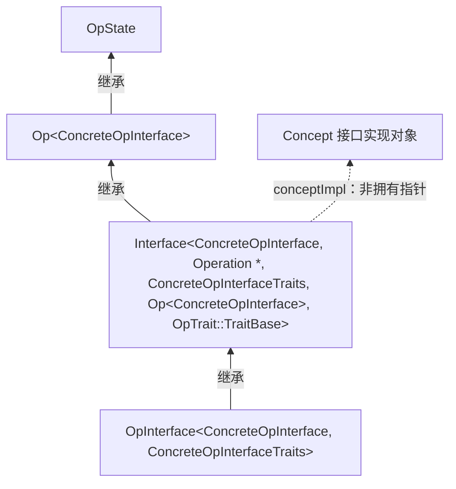
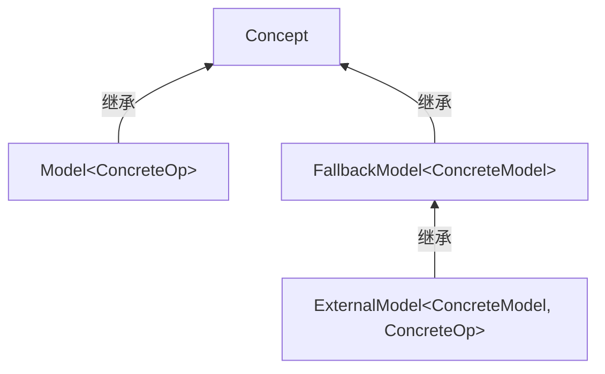

# 第 4 章 谓词、特质和接口

> 校订说明：本章逐页转写自扫描件，保留原节次、代码清单、图号和脚注。原书以 LLVM 20 为背景；本次校订以本地 LLVM **18.1.8**（提交 `3b5b5c1ec4a3095ab096dd780e84d7ab81f3d7ff`）的实际代码为依据。原书中的省略代码仍以 `...` 表示；有实质改动处附校订注，完整核对记录见 [第 4 章校订问题记录](issues/ch4.md)。

<!-- source: insider-compiler-ch4.pdf, PDF p. 1 -->

2.2 节已经介绍过，MLIR 框架借助谓词、特质为操作、类型、属性设置约束条件，以最大程度地确保操作、属性、类型的正确性；接口则通过特质实现对操作、属性、类型的动态处理。本章着重介绍谓词、特质、接口的实现机制和使用方式。

## 4.1 谓词

### 4.1.1 谓词概述

#### 1. 谓词与约束

谓词用于对操作或方言所使用的类型、属性等加以限制。谓词在 TableGen 中描述约束，并生成编译器运行时执行的验证代码；原书将这种声明式约束称作“静态约束”。MLIR 框架中还有约束这一概念，它包含一个谓词，并且为谓词增添了描述字段，能够提供更为优质的错误提示。鉴于谓词与约束在功能上高度相似，本书不对约束展开单独介绍。谓词之间可通过 `And`（交集，即多个谓词需同时满足）、`Or`（并集，即多个谓词至少满足其一）、`Concat`（在一个子谓词的表达式前后拼接字符串）、`Neg`（非，对原谓词条件进行逻辑否定）、`SubstLeaves`（替代，将谓词树叶节点表达式中的字符串替换为新字符串）等方式组合成复合谓词。

> 校订注：`Constraint` 并不继承 `Pred`；它以 `Pred predicate` 字段包含谓词。谓词生成的检查也不是 C++ 编译期检查。原书对 `Concat` 的解释和组合器名称已依源码修正。

MLIR 框架定义了最为基础（或原子）的谓词 `CPred`，其定义如代码清单 4-1 所示。

<!-- source: insider-compiler-ch4.pdf, PDF p. 2 -->

**代码清单 4-1 谓词 CPred 的定义**

```tablegen
class CPred<code pred> : Pred {
  // 谓词的真正实现代码（C++ 代码）
  code predExpr = "(" # pred # ")";
}
```

`CPred` 传递的类型是 TD 中定义的 `code` 类型。`CPred` 允许在参数中传递特定的占位符，并将占位符与执行上下文相关联。例如，操作可使用的占位符有 `$_builder`、`$_op`、`$_self` 等，这些占位符会由 `mlir-tblgen` 工具替换为对应的运行时对象。比如，`$_builder` 会被替换为 `mlir::Builder` 的实例（用于对象构造），`$_op` 表示当前的操作，而 `$_self` 则会依据上下文被替换为当前的对象。又如，一个简单的谓词可定义为 `CPred<"::llvm::isa<::mlir::Float32Type>($_self)">`，用于判断当前类型是否为 `Float32Type`。TD 约束 `F32` 对应这一种浮点类型；使用该谓词可以约束操作数或结果的类型。

> 校订注：原书的 `::mlir::F32` 不是实际 C++ 类型名，且原谓词缺少 `isa` 的实参。此处改为可生成有效 C++ 的表达式。

MLIR 框架所提供的谓词可对类型、属性、区域和后继基本块进行约束。其中，区域和后继约束作用于操作的负载 IR 结构，类型约束主要作用于操作的操作数和结果，属性约束则作用于操作中的属性。这里的操作后继是 `Block *`，不泛指区域或指令。

#### 2. 类型约束的定义与实现

在 MLIR 中，对每一种类型进行验证时，都会在 TD 中定义相应的类。例如，若要验证类型是否为 `Float16Type`，TD 会定义 `F16` 的类型约束，如代码清单 4-2 所示。

**代码清单 4-2 F16 类型约束的 TD 描述**

```tablegen
class Constraint<Pred pred, string desc = ""> {
  // 谓词，用于描述约束条件
  Pred predicate = pred;
  // 具体描述信息
  string summary = desc;
}
// 类型约束类
class TypeConstraint<Pred predicate, string summary = "",
                     string cppClassNameParam = "::mlir::Type"> :
    Constraint<predicate, summary> {
  // 对应的 C++ 类型类名；未知时使用基类 ::mlir::Type
  string cppClassName = cppClassNameParam;
}
// 类型的约束，在 TD 中用 Type 表示（节选）
class Type<Pred condition, string descr = "",
           string cppClassName = "::mlir::Type"> :
    TypeConstraint<condition, descr, cppClassName> {
  string description = "";
  string builderCall = ""; // 构造 C++ 中类型对象的表达式
}
class BuildableType<code builder> {
  code builderCall = builder;
}
// 在 TD 中可用的浮点约束记录类，以 F 开头，后跟数字
class F<int width>
    : Type<CPred<"$_self.isF" # width # "()">,
           width # "-bit float", "::mlir::FloatType">,
      BuildableType<"$_builder.getF" # width # "Type()"> {
  int bitwidth = width;
}
// F16 示例
def F16 : F<16>;
```

<!-- source: insider-compiler-ch4.pdf, PDF p. 3 -->

使用 `mlir-tblgen` 工具对代码清单 4-2 进行处理，展开 `F16` 对应的完整记录，如代码清单 4-3 所示。

**代码清单 4-3 F16 对应的完整记录**

```tablegen
// F16 的记录（节选；匿名记录编号随输入变化）
def F16 { /* Constraint TypeConstraint Type BuildableType F，继承记录信息 */
  Pred predicate = anonymous_35;                    // 谓词对应的记录
  string summary = "16-bit float";                 // 简单描述
  string cppClassName = "::mlir::FloatType";         // C++ 类名
  string description = "";                         // 描述信息
  string builderCall = "$_builder.getF16Type()";    // 类型对象构造表达式
  int bitwidth = 16;                               // 浮点数位宽
}
// F16 的谓词
def anonymous_35 {
  // 该谓词用于判断当前类型是否为 16 位浮点数类型
  string predExpr = "($_self.isF16())";
}
```

再如，`MyOperation` 操作可直接应用 `F16`、`F32`、`F64` 等类型约束。`MyOperation` 具有 `arguments` 和 `results` 字段，分别代表 `MyOperation` 的输入与输出。`MyOperation` 操作的示例代码如代码清单 4-4 所示。

**代码清单 4-4 MyOperation 操作的示例代码**

```tablegen
// 在 MyDialect 中定义操作 MyOperation
def MyOperation : MyDialect_Op<"MyOperation", [Pure]> {
  // 操作数有两个，分别是 lhs 和 rhs，类型约束分别为 F16 和 F32
  let arguments = (ins F16:$lhs, F32:$rhs);
  // 操作的返回值，类型约束为 F64
  let results = (outs F64:$result);
}
```

`arguments` 字段表明 `MyOperation` 操作拥有两个参数，分别为 `lhs` 和 `rhs`，它们的类型约束分别是 `F16` 和 `F32`[^ch4-float]；`results` 字段表示 `MyOperation` 的输出变量为 `result`，类型约束为 `F64`。

[^ch4-float]: `F16` 和 `F32` 是 MLIR 社区定义的浮点数类型约束，其记录中的 `cppClassName` 为 `::mlir::FloatType`，位宽分别为 16 位和 32 位；具体 C++ 类型分别为 `Float16Type` 和 `Float32Type`。

#### 3. 验证机制的生成与执行

利用 `mlir-tblgen` 工具对代码清单 4-4 进行处理，生成的 C++ 代码与 3.3 节中的 `addi` 操作类似。

<!-- source: insider-compiler-ch4.pdf, PDF p. 4 -->

`MyOperation` 对应的 C++ 代码包含两个函数：`verifyInvariants()` 和 `verifyInvariantsImpl()`。函数 `verifyInvariantsImpl()` 负责对输入、输出类型进行验证[^ch4-verification]，验证规则源自 TD 的定义。`F16`、`F32`、`F64` 等类型的验证规则依据字段 `predExpr` 生成相应代码，如代码清单 4-3 中 `F16` 类型谓词的字段 `predExpr` 在生成代码时，会将其中的 `$_self` 替换为 `MyOperation` 中对应参数的类型。例如，针对 `F16` 和 `F32` 的验证规则生成的代码如代码清单 4-5 所示。

**代码清单 4-5 针对 F16 和 F32 的验证规则生成的代码（校订）**

```cpp
static ::mlir::LogicalResult
__mlir_ods_local_type_constraint_MyOperationOps0(
    ::mlir::Operation *op, ::mlir::Type type,
    ::llvm::StringRef valueKind, unsigned valueIndex) {
  // lhs 的类型必须为 F16。
  if (!type.isF16()) {
    return op->emitOpError(valueKind) << " #" << valueIndex
        << " must be 16-bit float, but got " << type;
  }
  return ::mlir::success();
}

static ::mlir::LogicalResult
__mlir_ods_local_type_constraint_MyOperationOps1(
    ::mlir::Operation *op, ::mlir::Type type,
    ::llvm::StringRef valueKind, unsigned valueIndex) {
  // rhs 的类型必须为 F32。
  if (!type.isF32()) {
    return op->emitOpError(valueKind) << " #" << valueIndex
        << " must be 32-bit float, but got " << type;
  }
  return ::mlir::success();
}
```

> 校订注：原书在这里生成一个 `type.isF16() || type.isF32()` 检查，这与代码清单 4-4 的两个独立约束不符。这样的析取检查对应 `AnyTypeOf<[F16, F32]>`，并不能保证 `lhs` 是 `F16`、`rhs` 是 `F32`。正文改为各自检查，`F64` 结果另有相应检查；自动生成函数名的后缀由输入文件和约束顺序决定。

验证规则所对应的代码会在 `MyOperation` 类中的 `verifyInvariantsImpl()` 函数中被调用。

在构建操作对象之后，可以对该对象进行验证。具体而言，调用 `mlir::verify()`、解析器的验证流程或 Pass 管线验证流程时，会进入注册操作的 `verifyInvariants` 验证链，最终执行具体的类型验证逻辑，也就是代码清单 4-5 中相应的局部类型约束函数，以保证 `MyOperation` 对象的输入和输出均为合法类型。

> 校订注：普通 `OpBuilder::create` / `Operation::create` 不会无条件立即调用完整 verifier。原书“创建操作对象后会调用”的表述已修正。

除了 `mlir-tblgen` 工具自动生成的类型、属性、区域、后继等信息的验证之外，MLIR 框架还支持开发者自定义验证函数。只需在操作定义中设置 `let hasVerifier = 1`，`mlir-tblgen` 工具便会生成 `verify()` 函数的声明，函数的具体实现则需要开发者来完成。具体可参考 3.3 节的介绍。

> **注意**：谓词和编译器中类型系统的异同点有哪些？类型系统的主要功能可以归纳为以下 4 点：①正确性，通过类型检查技术检测和避免运行时错误；②优化，将有效信息传递给编译器，方便进行优化；③抽象，提供抽象能力，让开发者能够关注高层业务设计；④可读性，通过明确类型，提高代码的可读性。

#### 4. 谓词的自定义和使用

MLIR 社区定义了众多谓词，足以满足大多数场景的使用需求。当开发者面临一些需要额外约束的场景时，也可自定义谓词。例如，若要约束操作的操作数个数，可定义谓词：

```tablegen
class CheckNumOperands<int i>
    : CPred<"$_op.getNumOperands() == " # i>;
```

定义完成后，即可在 TD 中直接使用该谓词。`mlir-tblgen` 工具会将此谓词转换为相应代码。不过需注意的是，此谓词属于功能谓词，并非类型或属性，可通过 `PredOpTrait` 机制来使用（4.2 节将进行介绍）。

[^ch4-verification]: 验证内容不仅涵盖输入、输出类型，还涉及区域个数、后继基本块信息、属性以及谓词特质信息。

<!-- source: insider-compiler-ch4.pdf, PDF p. 5 -->

### 4.1.2 MLIR 中的常见谓词

MLIR 框架定义了众多基础谓词，方便开发者直接使用。按照谓词的作用对象进行划分，可将谓词分为类型谓词和属性谓词。鉴于谓词数量较多，下面仅列举几个常见谓词，其他谓词读者可参考源码。

#### 1. 类型谓词

类型谓词用于对类型进行约束，常见的约束如下。

**（1）基础类型约束**

以内建方言所涉及的类型为例，每种类型都有相应约束。比如对于无符号性（signless）整数类型，提供的约束有 `I1`、`I8`、`I16`、`I32`、`I64`、`I128`，分别表示长度为 1、8、16、32、64、128 位的整数；对于无符号（unsigned）和有符号（signed）整数类型，提供的约束分别为 `UI1`、`UI8`、`UI16`、`UI32`、`UI64` 以及 `SI1`、`SI8`、`SI16`、`SI32`、`SI64`。原书同时列出的 `UI128`、`SI128` 在本地未预定义，需要时可使用 `UI<128>`、`SI<128>` 定义相应记录。对于浮点数类型，提供的约束有 `AnyFloat`、`F16`、`F32`、`F64`、`F80`、`F128`、`BF16`、`TF32`、`F8E4M3FN`、`F8E5M2`、`F8E4M3FNUZ`、`F8E4M3B11FNUZ`、`F8E5M2FNUZ`。原书还列举了 `F8E4M3`、`F8E3M4`，本地 LLVM 18.1.8 的 `CommonTypeConstraints.td` 中没有这两个定义，已作为版本相关差异记录。

当然，`index`、`complex`、`memref`、`tensor` 等类型也都有对应的约束，如 `Index`、`AnyComplex`、`0DTensorOf`、`1DTensorOf`、`2DTensorOf`、`3DTensorOf`、`4DTensorOf`、`AnyMemRef`、`AnyNon0RankedMemRef`、`I1MemRef`、`I8MemRef`、`I16MemRef`、`I32MemRef`、`I64MemRef`、`BF16MemRef`、`F16MemRef`、`F32MemRef`、`F64MemRef` 等。

**（2）复合类型约束**

复合类型约束方便对操作接收多种类型作为参数的情况进行约束。例如，`SignlessIntegerLike` 表示任意位宽的无符号性整数或者索引类型，以及以这些类型为元素的向量、张量。实际上它是 `AnySignlessIntegerOrIndex` 与相应 `VectorOf`、`TensorOf` 约束的组合。类似还有 `FloatLike`、`SignlessIntegerOrFloatLike`、`SignlessIntegerLikeOfAnyRank`、`BoolLikeOfAnyRank` 等复合类型约束。

> 校订注：原书将 signless 误称为“有符号”，并漏掉向量、张量容器；`SignlessIntegerLike` 不能解释为 `SI1`、`SI8` 等 signed 类型的组合。

#### 2. 属性谓词

与类型谓词类似，属性谓词也可分为两类。

**（1）基础属性约束**

同样以内建方言所涉及的属性为例，大多数属性都有相应约束。例如对于无符号性整数属性，提供的约束有 `I1Attr`、`I8Attr`、`I16Attr`、`I32Attr`、`I64Attr`，分别表示长度为 1、8、16、32、64 位的整数；对于无符号和有符号整数属性，提供的约束分别为 `UI1Attr`、`UI8Attr`、`UI16Attr`、`UI32Attr`、`UI64Attr` 以及 `SI1Attr`、`SI8Attr`、`SI16Attr`、`SI32Attr`、`SI64Attr`。原书同时列举的 `I128Attr`、`UI128Attr`、`SI128Attr` 在本地 LLVM 18.1.8 中并非预定义记录；需要 128 位属性约束时，可使用对应的整数属性基类定义。除此之外，还有针对浮点数属性、字符串属性、单元属性、字典属性的约束，如 `F32Attr`、`F64Attr`、`StrAttr`、`UnitAttr`、`DictionaryAttr` 等。

**（2）复合属性约束**

复合属性约束方便设置操作接收满足多种条件的属性。例如，若要求一个属性输入为整数数组，且第 N 个元素的值必须等于一个确定的值，可将整数数组类型约束与 MLIR 已定义的 `IntArrayNthElemEq` 属性约束组合使用；后者的 `index` 参数从 0 开始。类似的复合属性约束还有很多，读者可参考源码进一步了解。

<!-- source: insider-compiler-ch4.pdf, PDF p. 6 -->

## 4.2 特质

特质是一种抽象机制的实现，用于对属性、操作和类型进行修饰，主要具备两个作用：一是实现不同属性、不同操作或不同类型之间的公共能力复用，二是对属性、操作和类型施加约束。目前 MLIR 主要提供了以下 4 种特质。

- **NativeTrait**：提供一种途径，将 C++ 的声明和定义映射为一个特质，用于在 TD 中修饰对象。
- **ParamNativeTrait**：继承自 `NativeTrait`，旨在定义一个带参数的嵌套特质。
- **GenInternalTrait**：不存在与之直接对应的 C++ 特质类，用于影响 `mlir-tblgen` 自动生成代码。
- **PredTrait**：包含谓词的特质，借助该特质能够访问对应的谓词。例如，`mlir-tblgen` 工具会为 `PredTrait` 自动生成验证代码。它与谓词的常见用法有所区别：类型、属性谓词一般用于单实体约束，而 `PredTrait` 通常用于多实体约束。操作对应的 TD 特化类是 `PredOpTrait`。

### 4.2.1 特质的用途

特质作为一种基础能力，在 MLIR 中应用广泛。可以通过操作的 `hasTrait()` 成员函数来判断操作是否具备相应的特质。例如，若操作为 `op`，特质为 `MyTrait`，那么判断该操作是否具有此特质，可通过 `op->hasTrait<MyTrait>()` 来完成。目前，特质在 MLIR 中有 3 种典型用途。

**（1）辅助代码生成**

`mlir-tblgen` 工具在自动生成代码的过程中会利用操作定义的特质。例如，`SameVariadicOperandSize`、`AttrSizedOperandSegments` 等特质为操作中的操作数提供额外约束，`mlir-tblgen` 工具会据此为操作生成额外代码，处理操作数分组、访问和验证。其中 `SameVariadicOperandSize` 继承自 `GenInternalOpTrait`，而 `AttrSizedOperandSegments` 继承自 `NativeOpTrait`，并标记为 `StructuralOpTrait`；不能将两者都归为 `GenInternalTrait`。

**（2）作为标记符**

在 MLIR 框架中，特质可作为标记符，并通常将其视为一组操作所具备的公共能力。例如，MLIR 内置的特质 `IsolatedFromAbove` 用于修饰操作，表示该操作的区域与其外部 SSA 值定义隔离，即区域内不能隐式捕获外部定义的 SSA 值。这类特质主要用于 MLIR 框架中的公共代码。例如，针对定义了 `IsolatedFromAbove` 的操作，MLIR 框架会利用这一隔离边界来约束跨区域优化（如代码提升）。

**（3）运行时验证**

特质用于运行时验证时，除了定义该特质本身，还需提供具体的验证实现。一般而言，特质可以实现静态函数 `verifyTrait(Operation *)`；需要在嵌套区域验证之后执行的检查可实现 `verifyRegionTrait(Operation *)`。

> **注意**：通常情况下，定义特质的目的可以仅在于声明操作具有某种语义属性，无须提供成员函数。操作直接继承自特质模板，特质中的成员函数通常不是虚函数；若特质提供了实现，操作就能继承该公共实现。特质既可用作标记，也可用于复用实现。

<!-- source: insider-compiler-ch4.pdf, PDF p. 7 -->

> 通过模板继承的方式，也能让操作实现自身特有的功能。例如，可在特质的 `verifyTrait` 中将操作转换为具体类型，再调用开发者自行约定的 `verifyTraitImpl()`，实现静态多态。原书称这为统一要求，实际上 MLIR 并不要求操作实现名为 `verifyTraitImpl()` 的方法；此名称仅能作为自定义模式。具体的模板实现方法可参考《深入理解 LLVM：代码生成》一书的附录 C。

### 4.2.2 特质的定义和使用

下面以自定义特质为例，阐述如何定义与使用特质。

#### 1. 定义特质

由于特质的用途各异，其定义与实现方式也不尽相同。对于 4.2.1 节描述的 3 种用途，影响代码生成的内部特质由 TableGen 后端识别处理；纯标记性质的原生特质仍需对应的 C++ 特质类，但其类体可以为空；运行时验证特质还需在 C++ 文件中实现相关验证函数。

**（1）在 TD 中定义特质**

特质分为 4 类，其中 `NativeTrait`、`ParamNativeTrait` 以及 `GenInternalTrait` 均可作为特质定义的基类。设定义两个特质 `MyTrait`、`MyParametricTrait`，其示例代码如代码清单 4-6 所示。

**代码清单 4-6 特质 MyTrait、MyParametricTrait 的示例代码（校订）**

```tablegen
// 定义特质 MyTrait
def MyTrait : NativeOpTrait<"MyTrait">;

// 定义带参数特质 MyParametricTrait。
// 第一个参数为 C++ 类名，第二个参数为传给该类的模板实参文本。
class MyParametricTrait<int prop>
    : ParamNativeOpTrait<"MyParametricTrait", !cast<string>(prop)>;
```

这两个特质分别继承自 `NativeOpTrait`、`ParamNativeOpTrait`，表明它们是专门针对操作的特质。

> 校订注：原书第二条错误地使用 `NativeOpTrait`，并引用未定义的 `parameters`。`NativeOpTrait` 的第二个参数是依赖特质列表，不能传模板参数字符串；此处使用 `ParamNativeOpTrait`，生成 `MyParametricTrait<10>::Impl` 的继承项。

**（2）在 C++ 中实现特质**

在 TD 中定义特质后，借助 `mlir-tblgen` 工具先生成记录，进而生成使用该特质的 C++ 操作代码。鉴于前文已对从 TD 到记录，再到 C++ 代码的生成过程进行了详尽介绍，本节便不再赘述这一流程。开发者可根据需要实现 `verifyTrait` 和 `foldTrait`，它们均不是强制要求，框架会检测是否存在这些方法。TD 中原生特质的声明不会替开发者自动定义 C++ 特质类或生成这些钩子的声明。代码清单 4-6 中的特质 `MyTrait`、`MyParametricTrait` 的具体实现框架如代码清单 4-7 所示。

**代码清单 4-7 特质 MyTrait、MyParametricTrait 的具体实现代码**

```cpp
// 以下定义位于 namespace mlir::OpTrait 内。
// 特质 MyTrait 的实现
template <typename ConcreteType>
class MyTrait : public TraitBase<ConcreteType, MyTrait> {
public:
  // 为具体操作提供 verifyTrait()，用于验证具体操作的正确性。
  static LogicalResult verifyTrait(Operation *op) {
    ...
  }
  // 为单结果操作提供 foldTrait，用于执行操作折叠。
  static OpFoldResult foldTrait(Operation *op,
                                ArrayRef<Attribute> operands) {
    ...
  }
  // 另一种 foldTrait 签名，适用于一般操作。
  // 实际实现时按需要选择上述或下述签名。
  static LogicalResult foldTrait(Operation *op, ArrayRef<Attribute> operands,
                                 SmallVectorImpl<OpFoldResult> &results) {
    ...
  }
};

// 特质 MyParametricTrait 的实现
template <int Parameter>
class MyParametricTrait {
public:
  template <typename ConcreteType>
  class Impl : public TraitBase<ConcreteType, Impl> {
    // 嵌套类 Impl 可以访问外层模板参数 Parameter。
    ...
  };
};
```

<!-- source: insider-compiler-ch4.pdf, PDF p. 8 -->

#### 2. 关联特质

特质定义完成后即可投入使用，既可以在 TD 中直接使用，也可以在 C++ 代码中直接使用。下面给出在 TD 和 C++ 代码中使用特质的示例。

**（1）在 TD 中使用特质**

在 TD 中使用特质较为简便。MLIR 中的操作、类型、属性等均有参数，用于传递特质。例如，定义一个操作 `OpWithInferTypeInterfaceOp`，该操作使用 `MyTrait` 和 `MyParametricTrait` 两种特质，它在 TD 中对应的定义如代码清单 4-8 所示。

**代码清单 4-8 OpWithInferTypeInterfaceOp 在 TD 中对应的定义**

```tablegen
def OpWithInferTypeInterfaceOp
    : Op<..., [MyTrait, MyParametricTrait<10>]> { ... }
```

**（2）在 C++ 代码中使用特质**

在 C++ 中使用特质也极为便捷。当在 C++ 中定义属性、操作和类型时，它们同样都能够继承模板类，并且每个模板类中都包含一个参数列表，用于接收特质。属性 `MyAttr`、操作 `MyOp` 和类型 `MyType` 的定义形式如代码清单 4-9 所示，其中分别使用适用于相应实体的普通特质和参数化特质。

**代码清单 4-9 属性 MyAttr、操作 MyOp 和类型 MyType 的定义（示意）**

```cpp
// AttrBase 包含变长模板参数，用于接收属性特质。
class MyAttr
    : public Attribute::AttrBase<MyAttr, ..., MyAttrTrait,
                                 MyParametricAttrTrait<10>::Impl> {};
// Op 包含变长模板参数，用于接收操作特质。
class MyOp
    : public Op<MyOp, MyTrait, MyParametricTrait<10>::Impl> {};
// TypeBase 包含变长模板参数，用于接收类型特质。
class MyType
    : public Type::TypeBase<MyType, ..., MyTypeTrait,
                            MyParametricTypeTrait<10>::Impl> {};
```

> 校订注：原书在三个实体上都写 `MyTrait`，但清单 4-7 的 `MyTrait` 继承的是 `OpTrait::TraitBase`，不能不加区分地直接用作属性、类型特质。此处明确改用各实体的特质名称；属性、类型示例还省略了相应基类和存储类，因此均为定义形式示意。

<!-- source: insider-compiler-ch4.pdf, PDF p. 9 -->

### 4.2.3 MLIR 中的常见特质

MLIR 框架中定义了众多特质，下面对一些使用较为频繁的特质进行简要说明。

- **AttrSizedOperandSegments**：用于描述操作各个操作数组的实际长度。一些操作会使用 `Variadic` 参数，因此需要借助该特质进行约束，以明确各组参数的真实长度。对于这个特质，`mlir-tblgen` 工具会为操作生成访问分组信息的代码。长度保存在名为 `operandSegmentSizes` 的固有属性中，其属性形式为 `DenseI32ArrayAttr`；启用操作 Properties 时可使用相应生成的存储字段。该数组包含每个 ODS 操作数组的长度，而非只包含变长组。
- **AttrSizedResultSegments**：描述的是操作各个结果组的实际长度，与 `AttrSizedOperandSegments` 极为相似。对应的固有属性名为 `resultSegmentSizes`，属性形式同样为 `DenseI32ArrayAttr`，用于存储各结果组的真实长度。
- **IsolatedFromAbove**：表明该操作的区域不能隐式捕获区域外定义的 SSA 值。“Above” 指嵌套层次之外，不是文本中“之前”的区域。使用这一特质可以建立独立的 SSA 作用域边界。例如，`func::FuncOp` 定义了该特质，函数内的值不能直接引用其他函数或外围区域定义的 SSA 值；外部数据需要通过函数参数、操作数与区域参数的显式传递机制等进入内部，符号引用则可通过属性表达。操作提升变换也需尊重隔离边界。在 MLIR 框架中，有不少机制依赖此特质，如 `OpPassManager` 锚定的操作就必须满足该特质要求。
- **RegionKindInterface**：用于描述操作中的区域种类，主要分为 `SSACFG` 和 `Graph` 两种。其中，`SSACFG` 意味着区域中的定义、使用和控制流遵循相应 SSA 支配规则，例如 `func.func` 的函数体就是典型的 `SSACFG` 区域；而 `Graph` 表示区域中的操作不通过文本顺序表达执行先后关系。需要注意的是，在本地实现中，`Graph` 区域至多包含一个基本块。例如，`builtin.module` 就是典型的具有 `Graph` 区域的操作，其内部所包含的操作并无文本执行顺序方面的要求。
- **ConstantLike**：表明操作表示常量。它须无操作数、具有一个结果，并能折叠为属性。MLIR 框架会利用该特质进行优化，例如识别、物化和复用常量。
- **ConditionallySpeculatable**：是一个操作接口（`OpInterface`）。由于接口可以作为操作特质附加，因此也列于此处，用于确定操作是否可以推测执行，即额外执行它是否可能引入未定义行为或无限循环。例如，`arith` 方言中的整数除法操作需运用此接口，因为它可能出现溢出、除零等未定义行为；又如，针对数组、向量、张量等的访存操作，越界可能导致未定义行为。一般而言，定义了该接口的操作需实现 `getSpeculatability()` 函数，依据操作的参数、属性等判断可推测性。结果可能为 `Speculation::NotSpeculatable`（不能保证安全推测执行）、`Speculation::Speculatable`（可推测执行）、`Speculation::RecursivelySpeculatable`（需要进一步依据操作所包含的子操作判断）这 3 种。

<!-- source: insider-compiler-ch4.pdf, PDF p. 10 -->

> 校订注：上一页原书将 `NotSpeculatable` 解释为“产生未定义行为”。它只表示不能安全地推测执行，并不证明原程序实际会发生未定义行为；内存效果还需通过其他接口单独分析。

- **AlwaysSpeculatableImplTrait**：定义了默认的可推测行为，具体表现为定义 `getSpeculatability()` 函数并默认返回 `Speculatable` 结果。
- **RecursivelySpeculatableImplTrait**：同样定义了默认的可推测行为，具体表现为定义 `getSpeculatability()` 函数并默认返回 `RecursivelySpeculatable` 结果。
- **AlwaysSpeculatable**：是 `ConditionallySpeculatable` 与 `AlwaysSpeculatableImplTrait` 这两个特质的结合体。在实际应用中，也可以使用后续提到的 `Pure` 特质同时表达可推测性与无内存效果。
- **RecursivelySpeculatable**：由 `ConditionallySpeculatable` 和 `RecursivelySpeculatableImplTrait` 两个特质组合而成。例如，`affine` 方言中的 `if` 操作以及 `parallel` 操作就直接采用了此特质。
- **MemoryEffectsOpInterface**：是一个 `OpInterface`，其作用是查询操作的内存效果，包括分配、释放、读取和写入，不能仅理解为是否修改内存。TD 名称为 `MemoryEffectsOpInterface`，生成的 C++ 接口名称为 `MemoryEffectOpInterface`。
- **MemoryEffect**：继承自 `SideEffect<MemoryEffectsOpInterface, ...>`，用于描述操作对某种内存资源的具体影响。为便于使用，系统预定义了多种内存行为，如 `Allocate`（分配）、`Free`（释放）、`Read`（读取）、`Write`（写入）等基础行为，并进一步封装出 `MemAlloc`、`MemAllocAt`、`MemFree`、`MemFreeAt`、`MemRead`、`MemReadAt`、`MemWrite`、`MemWriteAt` 等具体效果类型。
- **MemoryEffects**：接收 `MemoryEffect` 类型的列表作为参数，并且继承自 `SideEffectsTraitBase`。其作用是把效果列表转换为可供 `mlir-tblgen` 生成内存效果接口实现的操作特质。
- **NoMemoryEffect**：定义为 `MemoryEffects<[]>`，传递空效果列表，表示具备此特质的操作自身没有内存效果。
- **RecursiveMemoryEffects**：用于表明需要递归处理操作所包含的子操作，以计算嵌套操作带来的内存效果；对应 C++ 特质名为 `HasRecursiveMemoryEffects`。
- **Pure**：是 `AlwaysSpeculatable` 与 `NoMemoryEffect` 两个特质的结合体。它表示具有此特质的操作既不存在内存效果，也不会因额外执行而产生未定义行为或无限循环，所以这类操作在满足 SSA 数据依赖等条件时可以被提升或者下沉。
- **AffineScope**：主要用于界定 affine 维度和符号有效性的作用域。以 `func.func` 为例，当它定义了 `AffineScope` 时，就建立了相关作用域。在此范围内，作用域顶层定义的值可以在满足 affine 规则时被后续操作（如 `affine.for`、`affine.load`、`affine.store` 等）使用；支配该作用域且能合法被内部引用的值，以及该区域的参数，也可能成为有效符号。仍需满足各自类型、支配和隔离等限制。
- **AutomaticAllocationScope**：用于标记自动分配内存的作用域。例如，`memref.alloca` 分配的内存会在离开最近的此类作用域时释放。若 `func.func` 设定了该特质，便可以为函数内的临时变量提供这样的生存期边界。在 Bufferization 等过程中，栈分配策略也可寻找相应作用域安排临时缓冲区。特质自身不是一个执行分配或释放的函数。
- **IsTerminator**：表明当前操作是其所在基本块的终结操作，必须位于该基本块末尾。

> 校订注：原书将 `MemoryEffect` 写成直接继承内存效果接口，将 `affine.func` 当作操作名称，并将 `IsTerminator` 限定为“区域最后一个基本块中的最后一个操作”，均已依本地源码修正。

<!-- source: insider-compiler-ch4.pdf, PDF p. 11 -->

- **NoTerminator**：允许操作所拥有的单基本块区域没有终结操作；它并不禁止区域中出现终结操作，也不表示仅“最后一个基本块”可以省略终结操作。
- **NoRegionArguments**：表示操作中的区域不含有区域入口参数，主要用于相关验证工作。
- **ReturnLike**：表明操作具有类似函数 `return` 的含义，主要应用于控制流场景，表示从当前区域返回。不过它与函数中的 `return` 操作有所区别，`ReturnLike` 的约束更为通用。因此，像 `return` 操作、`yield` 操作都可以定义 `ReturnLike` 特质。在编译优化过程中，可依据此特质处理区域返回行为；若进行转换，仍需遵循相应操作语义，不能仅凭此标记任意替换为函数 `return`。
- **SymbolTable**：意味着操作为直接嵌套在其单基本块区域中的符号操作提供符号表作用域。嵌套符号表进一步形成各自的作用域，而不是让一个符号表无条件收录所有深层嵌套符号。
- **Symbol**：在 TD 中表示 `SymbolOpInterface`，使操作能够定义一个符号。符号通常作为操作插入拥有符号表特质的父操作区域中，并由该父操作的符号表管理；操作即使自身也有符号表，其自身符号仍由外层符号表管理。若没有合适的符号表作用域，就不能用该作用域的符号表插入、查找机制管理它。
- **MemRefsNormalizable**：说明操作所使用或产生的 `memref` 类型的变量可以进行规范化处理，具体可参考 10.2 节的介绍。
- **SingleBlock**：要求操作的每个非空区域仅包含一个基本块；该特质本身允许空区域。
- **SingleBlockImplicitTerminator**：要求非空区域中的单基本块以指定类型的终结操作结束，该类型由特质的模板参数确定。使用该特质时，可以在构建或自定义解析过程中调用 `ensureTerminator()`，在需要时补上终结操作。例如，`affine.for`（`AffineForOp`）定义中的 `SingleBlockImplicitTerminator<"AffineYieldOp">` 表明其区域内的基本块以 `AffineYieldOp` 作为终结操作。该函数的作用是保证 IR 中存在相应终结操作，并非“显式指定操作包含 Terminator 属性”。
- **TypesMatchWith**：用于约束给定参数的类型之间满足指定变换关系。它接收 5 个参数，分别为 `summary`、`lhsArg`、`rhsArg`、`transform` 以及 `comparator`。其执行逻辑是：用左侧参数的类型替换 `transform` 中的 `$_self`，然后运用 `comparator` 将变换后的类型与右侧参数的类型进行比较，最终要求比较成立。默认比较器为 `std::equal_to<>()`；不一定要求变换前的两个类型完全相同。
- **HasParent**：用于约束操作的直接父操作必须属于指定的 C++ 操作类型。通过该特质可以指定操作的嵌套结构；它不是对任意祖先的字符串搜索。

## 4.3 接口

特质用于对一组属性、操作或类型执行通用操作，而非仅针对单个属性、操作或类型，其处理对象便是这一组元素。在实现过程中，特质会被一组操作、类型或属性直接继承。这便引出一个问题：能否为具有同一接口能力的操作、类型或属性赋予动态绑定能力，而非仅局限于完全的静态绑定呢？

<!-- source: insider-compiler-ch4.pdf, PDF p. 12 -->

接口正是基于这一需求诞生的。

接口与特质存在相似之处，实际上操作、类型和属性接口的功能是基于特质实现的。接口可对方言、操作、类型及属性进行定义。鉴于方言接口的使用方式较为特殊，本节依据使用方式将接口分为两类：方言接口以及操作、属性与类型接口。下面进行详细介绍。

### 4.3.1 方言接口

在 MLIR 中，每一种方言都代表着一组具有特定语义的 IR 构件，不同方言承担着不同的功能。尽管如此，不同方言之间仍可能存在某些共性。例如，内联这种优化方式能够适用于多种方言，但不同方言对内联的处理方式各有差异。

针对这种情况，为满足实际需求，MLIR 定义了一个方言接口，即 `DialectInlinerInterface`。打算接入通用内联框架的方言可实现该接口中的相关 API，从而通过动态绑定接入统一的优化框架。

#### 1. 接口定义

MLIR 框架定义了方言接口基类模板别名 `DialectInterface::Base<>`，开发者自定义的方言接口需继承自该基类。不同的方言可通过定义方言接口的派生实现类来实现方言特定的处理逻辑。例如，方言内联接口的定义如代码清单 4-10 所示。

**代码清单 4-10 方言内联接口的定义（节选，按本地签名校订）**

```cpp
// 方言的内联接口
class DialectInlinerInterface
    : public DialectInterface::Base<DialectInlinerInterface> {
public:
  DialectInlinerInterface(Dialect *dialect) : Base(dialect) {}

  // 如果区域 src 能够内联到区域 dest 中则返回 true。
  // wouldBeCloned 表示将克隆 src；false 表示原地移动。
  // valueMapping 包含 src 中需要重映射的值，
  // 可用于检查哪些值将替代 src 的入口基本块参数。
  virtual bool isLegalToInline(Region *dest, Region *src,
                               bool wouldBeCloned,
                               IRMapping &valueMapping) const {
    return false;
  }
};
```

依据内联接口，不同方言能够进行特例化实现。比如，`affine` 方言内联接口的实现如代码清单 4-11 所示。

**代码清单 4-11 affine 方言内联接口的实现（节选）**

```cpp
struct AffineInlinerInterface : public DialectInlinerInterface {
  using DialectInlinerInterface::DialectInlinerInterface;
  // affine 方言有特殊的内联约束，这里忽略具体实现。
  bool isLegalToInline(Region *dest, Region *src, bool wouldBeCloned,
                       IRMapping &valueMapping) const final {
    ...
  }
};
// 方言实现接口后，需要将接口注册到方言中。
// 本地 LLVM 18.1.8 的 affine 方言在 initialize() 中完成注册。
void AffineDialect::initialize() {
  ... // 其他注册代码
  addInterfaces<AffineInlinerInterface>();
}
```

<!-- source: insider-compiler-ch4.pdf, PDF p. 13 -->

> 校订注：原书两处 `isLegalToInline` 均漏掉本地 API 中的 `bool wouldBeCloned`，已补齐，并将注册位置改为实际源码中的 `initialize()`。

#### 2. 使用方法

在使用方言接口时，需依据方言获取与之对应的接口，随后便可借助该接口来调用接口相关的 API，具体使用方式示例见代码清单 4-12。

**代码清单 4-12 方言接口具体使用方式示例**

```cpp
// 获取方言
Dialect *dialect = ...;
// 查询方言实现的接口
if (DialectInlinerInterface *interface =
        dyn_cast<DialectInlinerInterface>(dialect)) {
  // 查询成功，说明该方言实现了相关接口，可调用相关接口方法。
  ...
}
```

方言与方言接口之间并不存在继承关系。实际上，这里是借助 `dyn_cast` 的定制实现从方言对象查询接口对象。这一过程与从 `Operation *` 到具体操作的类型转换（参见 3.3.2 节）颇为相似，不同之处在于方言对象本身已包含注册好的接口。所以在执行 `dyn_cast` 时无须构造接口对象，只需在已注册的接口对象中查询是否包含目标接口。若查询到，直接返回该接口对象；若未查询到，则返回空值。

此外，MLIR 框架还提供一个集合类模板 `DialectInterfaceCollection`。内联框架使用它管理相关方言接口。该集合类能够便捷地找到操作所属的方言接口，方便开发者通过集合对象统一访问方言接口。感兴趣的读者可查阅源码，了解详细信息。

#### 3. 常见的方言接口

如 4.3.1 节所述，方言接口通过 C++ 代码实现，开发者可按需为方言增添接口。在 MLIR 社区中，常用的方言接口如下。

- **OpAsmDialectInterface**：此接口有两个用途，一是提供属性、类型等的别名信息，二是支持 IR 汇编格式中的资源解析、声明和输出。
- **DialectInlinerInterface**：该接口为方言提供内联能力的支持，其中定义了多个关键函数。`isLegalToInline()` 用于界定哪些操作或区域可进行内联，`handleTerminator()` 则用于定义内联时终结操作的处理方式。
- **LLVMTranslationDialectInterface**：该接口用于支持将 MLIR 方言中的操作转换为 LLVM IR。它的重要函数包括 `convertOperation()` 和 `amendOperation()`，前者用于转换操作，后者用于根据方言属性补充或修正转换结果。
- **DataLayoutDialectInterface**：此接口主要用于处理以方言字符串标识符为键的数据布局条目，并提供验证与合并功能。它与 `dlti` 所承载的数据布局规范配合使用，不应与定义类型布局的类型接口或 `DataLayoutSpecInterface` 混为一谈。

<!-- source: insider-compiler-ch4.pdf, PDF p. 14 -->

除上述方言接口外，更为常见的一种方式是开发者基于方言扩展机制为方言自定义接口。读者可参考 3.4.2 节与 12.1 节了解相关内容。

### 4.3.2 操作接口

MLIR 框架为操作、属性以及类型也提供了接口，这 3 类接口在实现方式与使用方法上近乎相同。本节以操作接口为例展开介绍。

#### 1. 接口定义

在编译优化过程中，常需评估操作在运行时计算所花费的成本，进而依据该成本实施优化。例如，可将计算密集型的任务调度至 GPGPU 上执行。由于不同操作的计算成本各不相同，并且计算成本可能还依赖于输入（如 `scf` 方言中的 `for` 操作），而且对于不同的输入，其计算成本也会有所差异。为此，我们定义了一个接口，所有需要计算成本的操作都通过这个接口来提供统一能力。该自定义接口对应的 TD 描述如代码清单 4-13 所示。

**代码清单 4-13 自定义接口对应的 TD 描述**

```tablegen
// 定义接口 ComputationCostInterface，继承自 OpInterface 基类。
def ComputationCostInterface : OpInterface<"ComputationCostInterface"> {
  // 描述信息：获取操作的计算成本
  let description = [{ get Op computation cost }];
  let cppNamespace = "::mlir"; // 命名空间
  let methods = [
    // 定义接口方法
    InterfaceMethod<
      /*desc=*/[{}],                          // 方法描述
      /*retType=*/"int64_t",                  // 方法的返回值
      /*methodName=*/"getComputationCost",    // 方法名
      /*args=*/(ins)                          // 输入参数：无
    >,
  ];
}
```

利用 `mlir-tblgen` 工具可将代码清单 4-13 先转换为记录，再转译为 C++ 代码。在此过程中，我们暂且不关注记录相关内容，仅聚焦于生成的 C++ 代码。鉴于生成的 C++ 代码相对复杂，理解起来颇具难度，因此接下来先介绍一些操作接口的基础知识。

#### 2. 操作接口的 C++ 实现

在 C++ 编程环境下，为便于实现自定义接口，MLIR 框架为操作接口提供了 `OpInterface` 基类；属性、类型分别使用 `AttributeInterface` 和 `TypeInterface`，共同复用 `detail::Interface` 机制。操作接口的继承结构图如图 4-1 所示。

<!-- source: insider-compiler-ch4.pdf, PDF p. 15 -->



**图 4-1 OpInterface 类的继承结构图**

> 图示校订：保留扫描图中的四层继承和 `Concept` 关联；将原图的实心菱形组合关系改为非拥有指针关联。`Interface` 包装对象不负责释放 `Concept`，其模型通常由注册信息中的 `InterfaceMap` 管理。

3.3 节已经介绍过 `OpState` 类，它包含一个 `Operation *` 类型的字段。而模板类 `Op`、`Interface` 以及 `OpInterface` 在此基础上分别提供了不同的通用能力，尤其是 `Interface` 类，它实现了接口的动态绑定能力。下面对这 3 个类进行更深入的介绍。

操作接口直接继承自 `OpInterface`，其定义如代码清单 4-14 所示。

**代码清单 4-14 OpInterface 的定义（节选）**

```cpp
// 模板参数分别为具体操作接口类和接口实现结构集合。
template <typename ConcreteType, typename Traits>
class OpInterface
    : public detail::Interface<ConcreteType, Operation *, Traits,
                               Op<ConcreteType>, OpTrait::TraitBase> {
public:
  // 定义辅助类型，简化代码编写。
  using Base = OpInterface<ConcreteType, Traits>;
  using InterfaceBase =
      detail::Interface<ConcreteType, Operation *, Traits,
                        Op<ConcreteType>, OpTrait::TraitBase>;
  using InterfaceBase::InterfaceBase;

protected:
  // 根据给定操作返回对应的接口模型对象。
  // 此函数也是将操作转换为接口的关键，dyn_cast 会使用它。
  static typename InterfaceBase::Concept *getInterfaceFor(Operation *op) {
    OperationName name = op->getName();
    // 本节省略 debug 构建中对未兑现接口承诺的检查。
    // 根据操作名获取存放在 MLIRContext 中的操作元数据。
    if (std::optional<RegisteredOperationName> rInfo =
            name.getRegisteredInfo()) {
      // 元数据中包含该操作接口时，直接返回接口模型。
      if (auto *opIface = rInfo->getInterface<ConcreteType>())
        return opIface;
      // 否则允许方言为该操作提供接口回退实现。
      return rInfo->getDialect().getRegisteredInterfaceForOp<ConcreteType>(
          op->getName());
    }
    // 如果没有已注册操作元数据，则尝试方言提供的回退实现。
    if (Dialect *dialect = name.getDialect())
      return dialect->getRegisteredInterfaceForOp<ConcreteType>(name);
    return nullptr;
  }
  friend InterfaceBase;
};
```

<!-- source: insider-compiler-ch4.pdf, PDF p. 16 -->

代码清单 4-14 的注释表明代码中最为关键的函数是 `getInterfaceFor()`。该函数旨在针对给定的操作获取其操作接口实现，或方言为该操作提供的接口回退实现。借助此函数，开发者能够便捷地从操作对象获取其接口对象，而 `dyn_cast` 会使用这一查询机制。不过，需要注意的是，在 `dyn_cast` 执行类型转换的过程中，本质上是用 `Operation *` 构造一个具体操作接口的轻量包装对象，而不是重新创建操作或模型对象。这一构造能力由 `OpInterface` 继承的模板类 `Interface` 提供。`Interface` 类具有一个至关重要的 `Concept *` 字段，指向接口模型，也是实现动态绑定的关键所在。`Interface` 的实现如代码清单 4-15 所示。

**代码清单 4-15 Interface 的实现（节选）**

```cpp
template <typename ConcreteType, typename ValueT, typename Traits,
          typename BaseType,
          template <typename, template <typename> class> class BaseTrait>
class Interface : public BaseType {
public:
  using Concept = typename Traits::Concept;
  ...
  // 基于给定值显式构造 Interface 实例。
  // 在构造函数内部调用 getInterfaceFor() 获取具体接口模型。
  explicit Interface(ValueT t = ValueT())
      : BaseType(t),
        conceptImpl(t ? ConcreteType::getInterfaceFor(t) : nullptr) {
    assert((!t || conceptImpl) &&
           "expected value to provide interface instance");
  }
  // 另一种构造方式：显式提供已知的模型。
  Interface(ValueT t, const Concept *conceptImpl)
      : BaseType(t), conceptImpl(const_cast<Concept *>(conceptImpl)) {
    assert(!t || ConcreteType::getInterfaceFor(t) == conceptImpl);
  }
  ...
private:
  // conceptImpl 指针指向真正的接口模型对象。
  Concept *conceptImpl;
};
```

代码清单 4-14 中定义了 `getInterfaceFor()` 函数，代码清单 4-15 为 `Interface` 定义了构造函数。当开发者运用 `dyn_cast<ConcreteInterface>(operation)` 将具体操作对象转换为接口时，会通过这些构造函数建立接口包装对象。

> 校订注：接受 `ValueT` 的构造函数是 `explicit`，原书“直接赋值就会调用该显式构造函数”并不准确。实际源码另有接受已实现接口特质的具体操作类型的模板构造函数。

在模板类 `Interface` 中，最为关键的是 `Concept *` 字段，它指向操作接口的真实实现。当针对不同操作提供不同的模型并将其注册到对应操作的接口映射中时，就能实现接口的动态绑定功能。

<!-- source: insider-compiler-ch4.pdf, PDF p. 17 -->

用于操作接口的模板类 `Interface` 以 `Op` 类作为其 `BaseType`，这样做的目的是建立具体操作与接口之间的关联。模板类 `Op` 的实现在 3.3 节已介绍，此处不再赘述。

#### 3. 接口框架机制

模板类 `Interface` 中的 `Concept` 指针是实现接口动态绑定的关键所在，接下来一同探究其实现方式。以代码清单 4-13 为例，接口 `ComputationCostInterface` 定义了一个函数 `getComputationCost()`，该函数允许开发者提供实现。若使用传统 C++ 虚函数表达这一需求，可写成代码清单 4-16 所示的形式。

**代码清单 4-16 用虚函数类比 ComputationCostInterface 中的 getComputationCost()（非 MLIR 生成代码）**

```cpp
class ComputationCostInterface {
public:
  virtual ~ComputationCostInterface() = default;
  virtual int64_t getComputationCost() const = 0;
};
```

这一传统机制是在接口 `ComputationCostInterface` 中设置一个虚函数，然后让具体的类继承该接口并对相关 API 进行重写。如此一来，当实例化不同的派生类时，便实现了动态绑定的功能。然而，在 MLIR 的操作、属性、类型轻量包装对象上，接口并不采用这种每个具体对象继承虚函数接口的方案，而是使用一套函数指针模型来实现派发。

> 校订注：原书“MLIR 框架中对象不允许存在虚函数”过于绝对。前述 `DialectInlinerInterface` 就使用虚函数。本段只是在解释操作等接口的实现选择。

> **注意**：常见 C++ ABI 会借助虚函数表实现虚调用：虚函数表包含供派发使用的函数地址或相关条目，而非虚函数通常不需要在此存储；派生类重写虚函数后，相应条目会指向派生类实现，否则沿用继承的实现。实例对象可包含指向相应表的指针，通常称为 `vptr`。通过基类指针进行虚调用时，可由对象中的 `vptr` 找到实际函数。以上为单继承情况下的简化说明，并非 C++ 标准规定的布局：表中还可能包含 RTTI、偏移等信息，虚析构函数可能对应多个条目，多重继承对象也可能含多个相关指针；编译器还可进行去虚化优化。关于具体虚函数的派发过程，感兴趣的读者可参考相关资料。

为了模拟虚函数的执行过程，需要一种能够替代虚函数表并支持不同实现的方法。基于此，MLIR 框架引入了 `Concept` 的概念，即模板类 `Interface` 中的 `Concept` 指针所指向的接口模型。这意味着一个接口可以有多种实现方式。例如，`ComputationCostInterface` 接口通过 `mlir-tblgen` 工具生成的 C++ 代码如代码清单 4-17 所示。

**代码清单 4-17 接口 ComputationCostInterface 对应的 C++ 代码**

```cpp
namespace mlir {
class ComputationCostInterface;
namespace detail {
// 包含操作接口的 Concept 和各类模型。
struct ComputationCostInterfaceInterfaceTraits {
  // Concept 包含函数指针成员，用于模拟接口的派发表。
  struct Concept {
    // 此非静态接口方法的派发函数额外接收两个参数：
    // Concept * 指向模型对象，Operation * 指向被查询的操作。
    int64_t (*getComputationCost)(const Concept *impl,
                                  ::mlir::Operation *);
  };

  // Model 适用于在具体操作上实现接口方法的情况。
  // 它是转发层，不会自动替操作计算成本。
  template <typename ConcreteOp>
  class Model : public Concept {
  public:
    using Interface = ::mlir::ComputationCostInterface;
    // 通过构造基类，设置 Concept 中的函数指针。
    Model() : Concept{getComputationCost} {}
    static inline int64_t getComputationCost(
        const Concept *impl, ::mlir::Operation *tablegen_opaque_val);
  };

  // FallbackModel 将调用转发到独立模型对象上。
  // 可用于方言提供的回退实现，包含未注册操作等场景；
  // 并不要求使用动态方言。
  // 此模板参数虽然名为 ConcreteOp，实际指具体模型实现类。
  template <typename ConcreteOp>
  class FallbackModel : public Concept {
  public:
    using Interface = ::mlir::ComputationCostInterface;
    FallbackModel() : Concept{getComputationCost} {}
    static inline int64_t getComputationCost(
        const Concept *impl, ::mlir::Operation *tablegen_opaque_val);
  };

  // ExternalModel 是面向指定操作类型的外部接口模型基类。
  // 本例接口没有 defaultImplementation，开发者仍须实现方法。
  // 两个参数分别是具体模型类和适用的操作类型。
  template <typename ConcreteModel, typename ConcreteOp>
  class ExternalModel : public FallbackModel<ConcreteModel> {
  public:
    using ConcreteEntity = ConcreteOp;
  };
};

template <typename ConcreteOp>
struct ComputationCostInterfaceTrait;
} // namespace detail

// 定义接口类。
class ComputationCostInterface
    : public ::mlir::OpInterface<
          ComputationCostInterface,
          detail::ComputationCostInterfaceInterfaceTraits> {
public:
  using ::mlir::OpInterface<
      ComputationCostInterface,
      detail::ComputationCostInterfaceInterfaceTraits>::OpInterface;

  // 通过 ComputationCostInterface::Trait 可访问接口特质。
  // 该特质使操作定义能用与其他特质相同的方式附加接口。
  template <typename ConcreteOp>
  struct Trait : public detail::ComputationCostInterfaceTrait<ConcreteOp> {};

  // 接口对外提供的 API。
  int64_t getComputationCost();
};

// 接口特质的定义：本例没有额外的方法实现。
namespace detail {
template <typename ConcreteOp>
struct ComputationCostInterfaceTrait
    : public ::mlir::OpInterface<
          ComputationCostInterface,
          detail::ComputationCostInterfaceInterfaceTraits>::Trait<ConcreteOp> {
};
} // namespace detail
} // namespace mlir

// Model 和 FallbackModel 中的接口转发实现。
namespace mlir {
// Model 不使用 Concept * 参数，而是将 Operation * 转换为具体操作，
// 再调用该操作的 API 实现。
template <typename ConcreteOp>
int64_t detail::ComputationCostInterfaceInterfaceTraits::Model<
    ConcreteOp>::getComputationCost(
    const Concept *impl, ::mlir::Operation *tablegen_opaque_val) {
  return llvm::cast<ConcreteOp>(tablegen_opaque_val).getComputationCost();
}

// FallbackModel 则通过 Concept * 调用模型对象上的 API。
// 该对象由注册机制提供，支持独立于操作类的接口实现。
template <typename ConcreteOp>
int64_t detail::ComputationCostInterfaceInterfaceTraits::FallbackModel<
    ConcreteOp>::getComputationCost(
    const Concept *impl, ::mlir::Operation *tablegen_opaque_val) {
  // impl 的静态类型是 Concept *，实际指向具体模型对象，
  // 所以此处可以按模型类型进行 static_cast。
  return static_cast<const ConcreteOp *>(impl)->getComputationCost(
      tablegen_opaque_val);
}
} // namespace mlir

// 接口 API 通过 getImpl() 获取构造时查得的真实模型，
// 并调用模型中保存的函数指针。
int64_t mlir::ComputationCostInterface::getComputationCost() {
  return getImpl()->getComputationCost(getImpl(), getOperation());
}
```

<!-- source: insider-compiler-ch4.pdf, PDF p. 18 -->

<!-- source: insider-compiler-ch4.pdf, PDF p. 19 -->

> 校订注：`Model`、`FallbackModel` 在本例中提供的是调用转发，不是缺少实现时仍能工作的业务默认值。`ExternalModel` 也只有在接口定义提供默认方法体时才会获得对应默认实现。清单补全了原书省略处所需的特质前向声明，并按本地 `mlir-tblgen` 的实际输出核对。

一方面，接口定义会自动生成特质，因此可将接口作为特质附加到操作；另一方面，接口通过定义 `Concept` 类结构来支持动态派发，该类的继承结构图如图 4-2 所示。



**图 4-2 Concept 类的继承结构图**

<!-- source: insider-compiler-ch4.pdf, PDF p. 20 -->

它允许开发者提供不同的接口实现方式，并将这些接口实现注册到操作的元数据中，实现接口的动态绑定。

#### 4. 操作接口的定义、注册和使用

操作接口的定义与使用相对复杂，这是因为在操作接口的定义过程中会生成特质以及接口实现类，导致操作接口中包含较多与多态派发相关的结构性信息。为帮助读者理解，下面先介绍 TD 中操作接口的定义与注册方式，最后阐述如何使用操作接口。

**（1）操作接口的定义**

代码清单 4-13 展示了一个简单的接口定义示例，借助 `mlir-tblgen` 工具将其展开为记录后，自定义操作接口 `ComputationCostInterface` 对应的记录如代码清单 4-18 所示。

**代码清单 4-18 自定义操作接口 ComputationCostInterface 对应的记录（节选）**

```tablegen
def ComputationCostInterface {
  // Interface Trait NativeTrait InterfaceTrait OpInterfaceTrait OpInterface
  code description = [{ get Op computation cost }];
  string cppInterfaceName = "ComputationCostInterface";
  string cppNamespace = "::mlir";
  list<InterfaceMethod> methods = [...]; // 接口成员函数和静态函数
  string extraClassDeclaration = "";
  string extraSharedClassDeclaration = "";
  string extraClassOf = "";
  list<Interface> baseInterfaces = [];
  string trait = "ComputationCostInterface::Trait";
  code extraConcreteClassDeclaration = [{}];
  code extraConcreteClassDefinition = [{}];
  string extraTraitClassDeclaration = "";
  code verify = [{}];
  bit verifyWithRegions = 0;
  list<Trait> dependentTraits = [];
}
```

代码清单 4-18 中所展示的字段尽管当前可能为空，但在诸多场景中被广泛应用，具体说明如下。

- **extraClassDeclaration**：此字段用于为接口定义 C++ 代码，这些代码会出现在接口类中，如代码清单 4-17 里的 `ComputationCostInterface`。它们不是经 `Concept` 派发的可重写接口方法。通常会把接口包装层通用且不变的代码声明在 `extraClassDeclaration` 中。当具体操作被转换为该接口时，便能够使用这些代码。具体操作继承的是接口特质，并不直接继承接口包装类。
- **extraTraitClassDeclaration**：该字段用于为接口对应的特质定义 C++ 代码，此代码仅会出现在特质中，如代码清单 4-17 中的 `ComputationCostInterfaceTrait`。当接口以特质的形式附加到操作时，可通过此字段注入特定代码实现。
- **extraSharedClassDeclaration**：由于 TD 中的接口定义会自动生成特质类和接口类，因此该字段所定义的 C++ 代码会出现在二者中。

<!-- source: insider-compiler-ch4.pdf, PDF p. 21 -->

例如，代码清单 4-17 中的 `ComputationCostInterface` 和 `ComputationCostInterfaceTrait` 都会获得 `extraSharedClassDeclaration` 中的代码。只有在代码需要被特质和接口共同使用时，才会用到该字段。

- **methods**：用于定义接口的 API 方法，其中既包含一般的成员函数，也涵盖静态函数。成员函数的派发效果类似于虚函数，在 TD 中通过 `InterfaceMethod` 定义，静态方法通过 `StaticInterfaceMethod` 定义。在定义非静态方法体时，可以使用 `$_op` 这样的占位符来指代当前操作。在 `mlir-tblgen` 工具自动生成的模型派发代码中，非静态方法除模型指针外还会接收一个操作参数。

下面以成员函数为例来介绍相关字段。成员函数指的是在 TD 中使用 `InterfaceMethod` 定义的函数，其参数和记录字段如下。

- **description**：用于对成员函数进行描述。
- **returnType**：表示成员函数的返回值类型。
- **methodName（参数）/ name（字段）**：成员函数的名称。
- **arguments**：成员函数的参数。因为函数可能没有参数，所以该字段可以使用空的 `(ins)`。
- **methodBody（参数）/ body（字段）**：成员函数的模型实现部分，可以为空。若提供了此内容，在 `mlir-tblgen` 工具自动生成的代码中，它会出现在 `Model` 的方法实现处，不再转发到具体操作上同名的方法。因此，在使用该 `Model` 的操作上重新定义同名方法不会替换这一路径。此规则描述的是模型转发的选择，不是 C++ 层面禁止定义同名函数。
- **defaultImplementation（参数）/ defaultBody（字段）**：成员函数的默认实现体，也可以为空。若提供了此内容，生成代码会在接口特质中提供默认方法，例如代码清单 4-17 中的 `ComputationCostInterfaceTrait`；因为特质被具体操作继承，这相当于为操作提供默认成员函数实现。生成器也会为 `ExternalModel` 生成对应默认方法，开发者可以按需要在具体操作或模型类中重写。

**（2）操作接口的注册方式**

要使用操作接口，首先需要注册接口模型。操作接口依赖操作元数据：每种操作在上下文中的元数据包含一个 `InterfaceMap`，而不是每个 `Operation` 实例单独持有一个映射。顾名思义，它以键值对的形式存储操作所实现的接口，其中键为接口的 ID，值为接口的实现模型。

当需要为已注册操作附加外部模型时，可调用模板基类 `Op` 的静态方法 `attachInterface()`，将模型注册到操作元数据中。在注册过程中，首先构造模型对象，然后将其插入操作元数据的接口映射。

对于在 TD 中附加了接口特质的操作，MLIR 在通过 `addOperations<...>()` 注册操作、创建元数据时，会由操作的特质列表构建 `InterfaceMap`，并把 `Model<ConcreteOp>` 注册为接口实现。这一路径并不是再调用 `attachInterface()`；模型负责转发到操作的方法，或者执行接口给出的 `methodBody`。当开发者定义了继承自 `ExternalModel` 的自定义接口模型时，才通常需要在使用接口前通过 `attachInterface()` 将其附加到具体操作类型。

在本地实现中，同一个操作接口 ID 的重复注册不会覆盖已有实现，后注册的模型会被忽略并释放。也就是说，对于一个具体操作，若在 TD 中显式指定了某接口，那么相应 `Model` 已经注册。因此，实际中常见的做法是为具体操作补充其定义中尚未提供的接口，通过实现 `ExternalModel` 并将其附加到操作上。

<!-- source: insider-compiler-ch4.pdf, PDF p. 22 -->

所以，通常通过 `ExternalModel` 为操作动态注册或延迟注册接口，注册前可能存在接口尚未实现的情况。但这存在一个潜在风险，即开发者可能忘记附加这些需要动态注册的接口，从而在运行时出错。在规范开发过程中，可以在方言上针对具体操作和接口调用 `declarePromisedInterface<ConcreteOp, ConcreteInterface>()`，将需要实现但尚未实现的接口记录到方言的 `unresolvedPromisedInterfaces` 结构中。这样，未兑现的接口被使用时，debug 构建中的检查便能准确指出哪些接口尚未实现。

**（3）操作接口的使用**

当接口定义完成后，便可以在操作定义过程中运用此接口。假设 `Conv2D1`、`Conv2D2` 和 `Conv2D3` 这三个操作需要使用接口 `ComputationCostInterface`，其实现方式如代码清单 4-19 所示。关于操作定义更详尽的介绍，可参考 3.3 节。

**代码清单 4-19 在操作定义中使用接口 ComputationCostInterface（校订）**

```tablegen
// 定义操作 Conv2D1、Conv2D2 和 Conv2D3，假设方言为 Uniform。
// 第一种：直接将接口附加为特质，并自行提供操作方法的声明。
def Uniform_Conv2D1Op
    : Uniform_Op<"Conv2D1", [ComputationCostInterface]> {
  let extraClassDeclaration = [{ int64_t getComputationCost(); }];
}

// 第二种：使用 DeclareOpInterfaceMethods，自动生成所需方法声明。
def Uniform_Conv2D2Op
    : Uniform_Op<"Conv2D2", [
        DeclareOpInterfaceMethods<ComputationCostInterface>]>;

// 第三种：同时指定需要强制生成声明的方法列表。
def Uniform_Conv2D3Op
    : Uniform_Op<"Conv2D3", [
        DeclareOpInterfaceMethods<ComputationCostInterface,
                                  ["getComputationCost"]>]>;
```

代码清单 4-19 定义了 3 种不同的接口使用方式，这 3 种方式所产生的效果略有差异。

第一种使用方式将接口作为特质附加，具体操作会继承 `ComputationCostInterface::Trait`，并注册真正可派发的接口模型，接口功能不会退化为普通标记。区别在于生成器不自动给操作补出接口方法声明。若接口没有 `methodBody` 或可继承的默认实现，开发者必须自行声明并实现该方法，例如清单中的 `extraClassDeclaration`。

第二种使用方式通过 `DeclareOpInterfaceMethods` 修饰接口，表示在操作生成的 C++ 代码中添加所需接口成员函数的声明，这些成员函数的实现需要开发者自己完成。需要注意的是，对于已经通过 `methodBody` 提供固定模型方法体，或通过 `defaultImplementation` 提供默认实现的方法，默认不会重新声明。

第三种使用方式在通过 `DeclareOpInterfaceMethods` 修饰接口的同时，还指定了要强制生成声明的方法列表。该列表主要用于重写已有 `defaultImplementation` 的方法：生成器会为具体操作添加该方法的声明，开发者再提供实现，不会同时生成一套额外的“重载函数”。本例的 `getComputationCost()` 没有默认实现，因此第二、三种方式的效果相同；为该方法加入默认实现后才能体现这一区别。具有 `methodBody` 的方法仍不会因此生成操作方法声明。关于接口更详尽的使用方法，可参考官网[^ch4-interfaces-doc]。

> 校订注：原书第三种写法把字符串直接传给第二个参数，但该参数类型是 `list<string>`，必须写为 `["getComputationCost"]`。三种写法都需要操作方法或模型方法的实际实现，本章示例并未给出卷积成本计算公式。

[^ch4-interfaces-doc]: 接口使用介绍可参考官网 [MLIR Interfaces](https://mlir.llvm.org/docs/Interfaces/)，原书标注 2024 年 8 月访问。本次以本地 `mlir/docs/Interfaces.md` 及生成器源码核对。

#### 5. 常见的操作、属性和类型接口

MLIR 框架中定义了众多接口。原书称可跨多个方言使用的接口“约有 21 个”，该数量依版本和统计口径而变化，不能当作接口总数。

<!-- source: insider-compiler-ch4.pdf, PDF p. 23 -->

除此之外，各方言还可定义仅适用于自身的操作接口、属性接口以及类型接口。鉴于无法对所有接口逐一介绍，在此仅挑选几个较为常用的接口进行简要说明。

- **FunctionOpInterface**：这是一个 `OpInterface`，其中定义了诸多与函数相关的 API，如 `getFunctionType`、`getFunctionBody`、`getBlocks`、`getArguments`、`getArgAttrs` 等信息获取操作，以及用于插入、删除参数或基本块等的编辑操作。
- **RegionKindInterface**：同样是一个 `OpInterface`，它定义了 `getRegionKind()`、`hasSSADominance()` 等函数，其主要作用是区分不同种类的区域。
- **OpAsmOpInterface**：也是一个 `OpInterface`，通过该接口可与 `AsmPrinter`、`AsmParser` 的 IR 文本处理交互。它定义了 `getAsmResultNames`、`getAsmBlockArgumentNames`、`getAsmBlockNames`、`getDefaultDialect` 这 4 个 API。其中，前 3 个 API 更多用于定制 IR 输出中的名称，最后一个 API 返回区域解析所用的默认方言名称。例如，`arith` 方言中的 `ConstantOp` 实现了 `getAsmResultNames()`。当常量结果的类型为 `i1` 时，它为 1 和 0 对应的 SSA 结果建议名称 `true` 和 `false`，打印时可表现为 `%true`、`%false`；它并非直接改写常量属性的打印格式。
- **CallOpInterface**：同样属于 `OpInterface`，描述类似函数调用的操作，控制流可转移到被调用的子程序，例如直接函数调用、间接函数调用。它提供了 `getCallableForCallee`、`setCalleeFromCallable`、`getArgOperands`、`getArgOperandsMutable`、`resolveCallable` 这 5 个相关 API。该接口主要应用于跨函数分析场景，如内联、数据流分析等过程中对调用者的统一处理。
- **CallableOpInterface**：这是一个 `OpInterface`，主要用于描述函数等可调用对象。它提供了 `getCallableRegion`、`getArgumentTypes`、`getResultTypes`、`getArgAttrsAttr`、`getResAttrsAttr`、`setArgAttrsAttr`、`setResAttrsAttr`、`removeArgAttrsAttr`、`removeResAttrsAttr` 等相关 API。例如，`FunctionOpInterface` 以它为基础接口之一，表明 `FuncOp` 可作为被调用对象。此接口在内联、数据流分析以及调用图等场景中应用广泛。
- **CastOpInterface**：同样是一个 `OpInterface`，描述能够将一组输入类型转换为一组输出类型的 cast 类操作。它提供了 `areCastCompatible()` 接口方法，用于判断输入和输出类型是否适合该转换。其特质中的 `foldTrait()` 还会调用实现辅助函数 `impl::foldCastInterfaceOp()`，在输入类型与输出类型一一相同等条件下尝试折叠操作。后者不是接口直接对外声明的方法。
- **BranchOpInterface**：这是一个 `OpInterface`，用于描述基本块间分支、跳转类操作。例如，`br`、`cond_br`、`switch` 等操作便能够运用该接口。借助它，能够识别分支操作及其后继、操作数传递等信息，在优化过程中作用显著。例如，在 CFG 处理场景中，可借助它查找分支并展开深入分析。
- **RegionBranchOpInterface**：同样是一个 `OpInterface`，用于描述父操作与所包含区域之间，以及这些区域彼此之间的控制流转移。

<!-- source: insider-compiler-ch4.pdf, PDF p. 24 -->

比如，`for` 或 `if` 操作就存在这种区域层面的控制流行为。该接口定义了 `getEntrySuccessorOperands`、`getEntrySuccessorRegions`、`getSuccessorRegions`、`getRegionInvocationBounds`、`areTypesCompatible`、`isRepetitiveRegion` 等 API，主要用于分析和优化。例如，在 Bufferization 相关分析中，可利用这些控制流信息理解值在区域之间的传递；结合 `BranchOpInterface`、`RegionBranchOpInterface`、`RegionBranchTerminatorOpInterface` 以及相关缓冲区分析，能够分析缓冲区的依赖和生存期，选择合适的位置。再如，在代码下沉优化中，可将接口给出的后继区域作为候选位置，但仍需检查支配关系、内存效果及操作数可用性。

- **DestinationStyleOpInterface**：这是一个用于描述目标传递风格（Destination-Passing Style）的接口，标明操作中作为目标的初始化操作数（DPS inits）及其与结果的对应关系。在 Bufferization 等过程中，这一关系可用于判断结果是否能够复用相应目标缓冲区；是否能原地复用仍需冲突分析，不能仅凭接口保证任意输入和输出都共用内存。
- **InferIntRangeInterface**：此接口表示操作支持对整数结果范围的推断。例如，对于 `arith` 方言中的 `addi` 操作，当输入范围确定时，便可以推断出结果的范围。如果计算可能溢出，实现会保守地放宽相应有符号或无符号范围，必要时使用该类型的完整范围，而不是把最终范围设为 `Null`。要实现此功能，操作需实现 `inferResultRanges()`。该接口主要用于数据流分析中的整数范围推断。
- **InferTypeOpInterface**：该接口表明操作支持对结果类型的推断。
- **LoopLikeOpInterface**：此接口表示相关操作属于循环类操作，如 `for` 操作。该接口定义了一系列 API，可用于循环相关分析和优化。
- **PromotableAllocationOpInterface**：此接口描述能够提供可提升内存槽的分配操作，供 Mem2Reg 将内存槽的读写转换为 SSA 值流。例如，`llvm` 方言中的 `alloca` 操作实现了该接口。优化会借助支配关系、到达定义和块参数等机制消除内存访问；这里的“提升”不是简单移动 `alloca` 的分配位置。
- **PromotableMemOpInterface**：该接口描述对内存槽的完整值读写操作，并提供将读写转换为 SSA 值的能力。`llvm` 方言中的 `load`、`store` 操作实现了此接口。
- **PromotableOpInterface**：表示某些使用内存槽地址的操作可以在提升过程中改写或删除，从而消除阻碍提升的使用。例如，`llvm` 方言中的 `bitcast`、`addrspacecast`、`getelementptr` 操作都可使用该接口。
- **DestructurableAllocationOpInterface**：表示分配操作可支持 SROA（Scalar Replacement of Aggregates，聚合体标量替换），将一个聚合内存槽拆为多个子槽。例如，`llvm` 方言中的 `alloca` 操作以及 `memref` 方言中的 `alloca` 操作都在此列。
- **SafeMemorySlotAccessOpInterface**：该接口用于检查对指定内存槽的访问是否满足类型安全及边界条件，并给出需要进一步验证的子槽，为内存槽拆分等优化提供依据。例如，`llvm` 方言中的 `load`、`store`、`getelementptr` 操作实现了该接口。它不是对所有内存访问安全的无条件承诺。
- **DestructurableAccessorOpInterface**：此接口描述访问可拆分内存槽子元素的操作，能够在拆分后把访问重新连接到生成的子槽。比如，`llvm` 方言中的 `getelementptr` 操作以及 `memref` 方言中的 `load`、`store` 操作均可使用此接口。“Destructurable” 在这里是可拆分，而非执行 C++ 对象析构。
- **DestructurableTypeInterface**：这是一个类型接口，表示类型能够分解为可索引的子元素类型。例如，`llvm` 方言中的 `LLVMArrayType` 可以分解为元素类型来处理；`array` 在此是类型，不是操作。

<!-- source: insider-compiler-ch4.pdf, PDF p. 25 -->

## 4.4 本章小结

在 MLIR 中，操作通常通过 TableGen 的文本描述来定义，这种方式极为灵活且实用。然而，这种灵活性也伴随着隐患，开发者能够定义各种操作及其输入与输出。倘若不对输入、输出以及操作本身加以约束，问题便可能遗留到后续编译或程序运行阶段。故而，MLIR 社区提供了针对输入、输出以及操作本身的约束机制，这主要通过谓词和特质来实现。

谓词主要对输入、输出等进行约束，这些约束涵盖类型、属性、方言等诸多限制。例如，可要求输入类型为向量类型。此类约束在 TD 中描述，并生成由编译器验证 IR 时执行的检查，用于验证操作是否合法；普通操作构造不保证自动执行全部验证。

特质用于对操作、类型和属性施加约束或提供公共能力，表明操作、类型和属性应具备的性质。例如，操作具备 `Pure` 特质，表示它没有内存效果且可安全推测执行，在满足 SSA 依赖等正确性条件的前提下，操作可在代码中前后移动。特质既可影响代码生成，也可在编译器运行时的验证、分析和优化中发挥作用。

接口通常借助特质为操作、属性和类型赋予动态处理能力，使其能够参与 MLIR 框架中的多态行为与通用算法。
