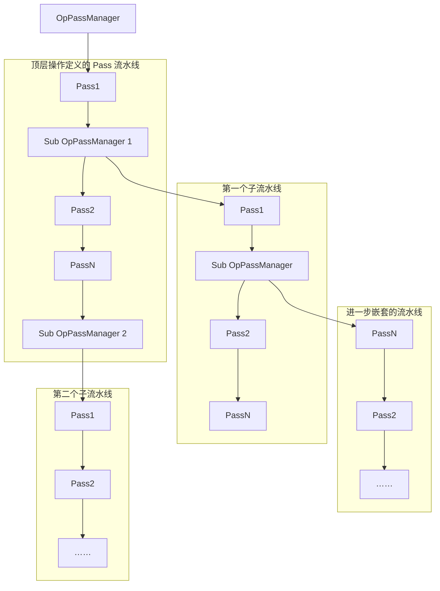
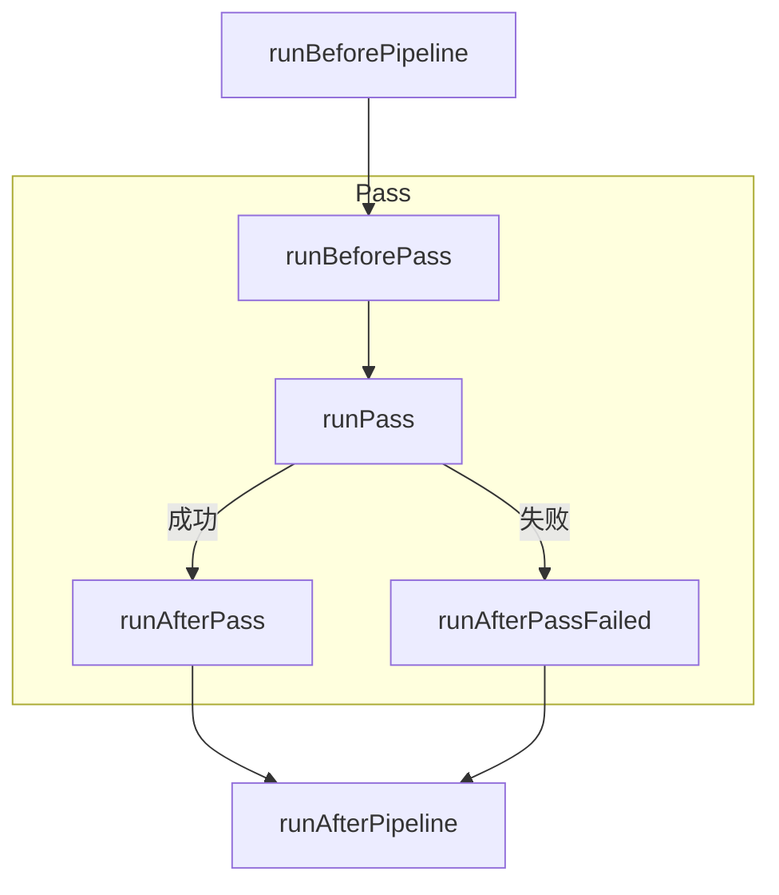

<!-- source: insider-compiler-ch5-ch6.pdf, PDF p. 1 -->

# 第5章 Pass 系统的工作流程

> 校订说明：本章按扫描件逐页转写，保留正文、节次、代码清单、图号与脚注；正文中的技术修正以本地 LLVM 18.1.8（提交 `3b5b5c1ec4a3095ab096dd780e84d7ab81f3d7ff`）为依据。原书以 LLVM 20 为背景，版本差异及重要勘误详见 [第5章校订记录](issues/ch5.md)。代码清单中的 `...` 表示原书省略的内容，不能直接作为完整程序编译。

MLIR 中引入了变换与分析这两个重要概念。所谓变换，指的是对 IR 进行处理，从而生成新的 IR，包括优化以及方言降级等。方言降级主要将较高层的操作转变为一个或多个较低层的操作，并可能伴随类型转换；它不一定以优化为目的。而分析则是为优化过程提供相关信息。

本章将重点探讨变换 Pass，并简要介绍 Pass 的分析与管理机制。

> 注意：MLIR 中的分析与 LLVM 中的分析在组织方式上有所区别。在 LLVM 的旧 Pass Manager 中，分析以 Pass 的形式存在，并且能够穿插于各种变换之间；LLVM 的新 Pass Manager 则通过 AnalysisManager 按需计算与缓存分析结果。在 MLIR 中，分析以独立的类呈现，由 AnalysisManager 按需计算、缓存并处理失效。不同方言的语义可能使某些分析只能适用于特定 IR，但基于通用操作结构、接口或特质的分析，也可以用于多种方言。不能据此认为 MLIR 的分析仅提供多种 IR 之间的数据共享能力。[校订依据](issues/ch5.md#ch5-analysis-model)

## 5.1 Pass、PassManager 与 Pass Pipeline 的应用

MLIR 框架提供了 Pass、Pass Pipeline、OpPassManager 以及 PassManager 等功能，方便开发者进行优化工作或 IR 变换操作。其中，Pass 主要用于定义针对操作的具体变换；Pass Pipeline 则侧重于将多个 Pass 进行合理组合与排布，进而按序执行；PassManager 承担着管理 Pass 和 Pass Pipeline 的职责。

为实现对 Pass 和 Pass Pipeline 的统一管理，MLIR 将 Pass Pipeline 设计为针对单个操作的

<!-- source: insider-compiler-ch5-ch6.pdf, PDF p. 2 -->

多个 Pass 有序序列，并通过 OpPassManager 结构进行管理。PassManager 实际上继承自 OpPassManager 类，增加了运行流水线等顶层管理能力。

因此，OpPassManager 同样会针对单个操作进行管理，并且一个普通的 Pass 也是针对单个操作。这就意味着它们在功能对象层面地位相同，因此可以进一步组合成一个新的 Pass Pipeline，由父操作对应的 OpPassManager 统一管理。以此类推，所有的 Pass 能够构成一个树状结构。实现中，嵌套的 OpPassManager 通过适配器 Pass 接入父流水线。[校订依据](issues/ch5.md#ch5-manager)

假设存在一个最顶层操作，我们为其配备一个 Pass Pipeline，并由一个 OpPassManager 进行管理。在此 Pass Pipeline 中，设有两个子 Pass Pipeline，如图 5-1 中的 Sub OpPassManager 1 和 Sub OpPassManager 2 所示。这两个子 Pass Pipeline 分别负责处理顶层操作的负载 IR（参见 2.1.2 节）。其中 Sub OpPassManager 1 所处理的负载操作还能够进一步包含负载 IR，基于此，便可以进一步设计 Pass Pipeline。该顶层操作所对应的 Pass 执行顺序与结构布局如图 5-1 所示。



**图 5-1 Pass、Pass Pipeline 和 PassManager 结构示意图**

图中说明：Sub OpPassManager 也是一个 Pass 流水线，它针对的是顶级操作中内嵌的操作。此外，Sub OpPassManager 还可以进一步定义 Sub OpPassManager，形成多层级的 Pass 管理结构。针对某一特定操作所定义的 Pass，可以与相应的 Sub OpPassManager 共同组织在同一个 Pass 流水线中。这里的 Sub OpPassManager 是指面向任意操作或特定操作的子级 Pass 流水线。

本节将对 Pass、Pass Pipeline 和执行框架等进行展开介绍。

### 5.1.1 Pass 介绍

在 MLIR 中，变换以操作为基础。因此，框架定义了基类 OperationPass，方便开发者针对特定操作定义 Pass。所有面向操作的 Pass 均继承自该基类。

OperationPass 具有以下特性。

- **操作过滤机制**：针对特定的操作展开处理。对于普通 Pass 而言，若未指定操作类型，则属于通用操作 Pass，可用于满足调度条件的不同操作类型；Pass Pipeline 既可指定目标操作类型，也可通过 `nestAny()` 等方式创建通用操作流水线。
- **调度判断接口**：提供接口 `canScheduleOn`，用于判定 Pass 是否能够在特定操作上运行。
- **分析结果获取接口**：提供接口 `getAnalysis`，用于获取分析结果。

> 校订注：原书称 Pass Pipeline 必须指定操作类型，这与后文 `nestAny()` 示例及本地实现不符；通用流水线仍受注册状态、`IsolatedFromAbove` 特质以及各 Pass 的静态过滤条件约束。[校订依据](issues/ch5.md#ch5-scheduling)

<!-- source: insider-compiler-ch5-ch6.pdf, PDF p. 3 -->

借助基类 OperationPass，能够便捷地过滤需要处理的操作。这构成了一种过滤条件，即只有操作类型满足要求，才会执行 Pass。MLIR 框架中还存在其他过滤条件。例如，MLIR 框架提供了另一个基类 InterfacePass，该 Pass 仅作用于某些接口限定的操作。若操作没有对应的接口，相关 Pass 将不会执行。

> 注意：`canScheduleOn` 表示操作类型的静态调度约束。对于通用操作流水线，只有当其中所有 Pass 都允许在某种操作类型上运行时，该流水线才会在此类操作上执行，而非仅跳过其中不适用的 Pass。对于指定操作类型的流水线，若其中某个 Pass 不支持其锚点类型，框架会在准备流水线时报告错误。[校订依据](issues/ch5.md#ch5-scheduling)

### 5.1.2 在 TD 中定义 Pass

#### 1. PassBase 和 Pass 的相关代码

在 TD 文件中可对 Pass 进行定义，称为自定义 Pass。TD 内有名为 PassBase 的记录，用于描述自定义 Pass 所涉及的参数。通常，自定义 Pass 继承自记录 Pass，记录 Pass 继承自 PassBase。PassBase 和 Pass 相关的代码片段如代码清单 5-1 所示。

**代码清单 5-1 PassBase 和 Pass 相关的代码片段**

```tablegen
class PassBase<string passArg, string base> {
  // Pass 的名字，在 mlir-opt 命令行中使用。
  string argument = passArg;
  // 定义的 Pass 基类，这个基类指的是 C++ 类。
  string baseClass = base;
  // Pass 的简单描述，使用 mlir-opt --help 命令可输出该描述。
  string summary = "";
  // Pass 的完整描述，这个描述会出现在自动生成的文档中。
  string description = "";
  // 用于构造 Pass 的 C++ 调用。为空时生成默认的构造辅助函数。
  code constructor = "";
  /* 声明 Pass 可能创建实体且不能保证已加载的方言。
     该字段对应 getDependentDialects()，由它向 DialectRegistry 注册依赖，
     PassManager 在 Pass 执行前将这些方言加载到 MLIRContext 中。
     创建未加载方言中的操作、类型或属性会出错。 */
  list<string> dependentDialects = [];
  // Pass 的参数列表。
  list<Option> options = [];
  /* Pass 的统计信息。在 TD 文件中定义变量名和描述后，
     还需由 Pass 的实现更新计数器，例如统计变换次数。
     可通过 PassManager 的 enableStatistics() 启用统计功能，
     并在 Pass 执行结束后输出信息。
     mlir-opt 中可通过 mlir-pass-statistics 参数使用该功能。 */
  list<Statistic> statistics = [];
}

// Pass 类继承自 PassBase 类，对应的 C++ 实现基类为 OperationPass。
class Pass<string passArg, string operation = "">
    : PassBase<passArg, "::mlir::OperationPass<" # operation # ">">;
```

> 校订注：依赖列表不是方言使用的白名单；统计项也不会在声明后自动统计 Pass 执行次数。此处同时修正原书及 OCR 中的 TableGen 关键字大小写。[校订依据](issues/ch5.md#ch5-tablegen)

<!-- source: insider-compiler-ch5-ch6.pdf, PDF p. 4 -->

读者或许会对代码清单 5-1 中的 `dependentDialects` 字段心存疑惑：为何要在 Pass 中显式定义所依赖的方言，而不是直接在 MLIRContext 中加载方言呢？[^ch5-dialects]

首先需要明确，Pass 中创建方言实体之前，相应方言必须已经在 MLIRContext 中加载。若方言尚未加载就贸然使用，便会报错（提示找不到对应方言）。

然而，确定 MLIRContext 中已加载的方言并非易事。由于方言降级路径并非唯一，使得 MLIRContext 中加载的方言具有不确定性，因此通常会在 Pass 中显式声明其所依赖的方言，由框架在执行前加载。如果方言已在 MLIRContext 中加载，就不会再重复加载。当然，若能确定所有进入该 Pass 的路径都已加载了相关方言，那么 Pass 便可以忽略对方言的加载。例如，若有一个 Pass 要处理 linalg 方言中的操作，且无论通过何种路径进入该 Pass 时 linalg 方言都已加载，那么这个 Pass 就无须再次添加依赖来加载 linalg 方言。

另外，因为方言加载可能发生在多线程执行环境中，为避免出现“并发运行错误和不安全运行错误”，所以方言加载工作应置于 Pass 真正运行之前。

#### 2. Pass 的定义

下面以 affine 方言中的循环不变量外提为例简要介绍 Pass 的定义。循环不变量外提即将循环不变量提升至循环体外部，以提高执行效率。AffineLoopInvariantCodeMotion 的定义如代码清单 5-2 所示。

**代码清单 5-2 AffineLoopInvariantCodeMotion 的定义**

```tablegen
// 定义 Pass，生成的 C++ 基类为 AffineLoopInvariantCodeMotionBase。
// Pass 名称为 affine-loop-invariant-code-motion。
// 该 Pass 仅适用于操作类型为 func::FuncOp 的场景。
def AffineLoopInvariantCodeMotion
    : Pass<"affine-loop-invariant-code-motion", "func::FuncOp"> {
  // summary 是简单描述。
  let summary = "Hoist loop invariant instructions outside of affine loops";
  // Pass 的构造器，可通过下面的函数构造 C++ 对象。
  let constructor = "mlir::affine::createAffineLoopInvariantCodeMotionPass()";
}
```

> 校订注：原书本清单的构造器缺少 `affine::`，与下一清单及本地源码不一致，已补齐。

通过工具 `mlir-tblgen` 对代码清单 5-2 进行翻译，得到 AffineLoopInvariantCodeMotion 的完整记录，如代码清单 5-3 所示。

**代码清单 5-3 AffineLoopInvariantCodeMotion 的完整记录**

```tablegen
def AffineLoopInvariantCodeMotion { // 记录的基类为 PassBase、Pass。
  string argument = "affine-loop-invariant-code-motion";
  string baseClass = "::mlir::OperationPass<func::FuncOp>";
  string summary = "Hoist loop invariant instructions outside of affine loops";
  string description = "";
  code constructor = "mlir::affine::createAffineLoopInvariantCodeMotionPass()";
  list<string> dependentDialects = [];
  list<Option> options = [];
  list<Statistic> statistics = [];
}
```

[^ch5-dialects]: 毕竟，MLIR 框架提供的 `mlir-opt`、`mlir-translate` 等工具在开始执行前都会初始化 MLIRContext 并注册相应的方言，主要原因有两个：其一，这些工具在解析 IR 时依赖对应的方言，若缺少相应方言且未允许未注册方言，便无法识别操作，进而报错；其二，在进行变换或方言降级操作时同样常常依赖其他方言，这是由于在变换和降级过程中会生成其他方言中的操作。注册到 DialectRegistry 与实际加载到 MLIRContext 是不同的步骤。

<!-- source: insider-compiler-ch5-ch6.pdf, PDF p. 5 -->

继续使用工具 `mlir-tblgen`，对原始 TD 定义选择 `-gen-pass-decls` 生成器，便能得到 AffineLoopInvariantCodeMotion 对应的 C++ 文件，其中与 Pass 定义相关的头文件如代码清单 5-4 所示。

> 校订注：代码清单 5-3 是展开后的记录展示；生成器应读取含有 Pass 继承关系的原始 TD 定义，不能把此记录展示当成等价的生成输入。[校订依据](issues/ch5.md#ch5-tablegen)

**代码清单 5-4 AffineLoopInvariantCodeMotion 对应的 C++ 文件代码片段**

```cpp
template <typename DerivedT>
class AffineLoopInvariantCodeMotionBase
    : public ::mlir::OperationPass<func::FuncOp> {
public:
  using Base = AffineLoopInvariantCodeMotionBase;
  // 辅助类，用于定义 Pass。
  AffineLoopInvariantCodeMotionBase()
      : ::mlir::OperationPass<func::FuncOp>(::mlir::TypeID::get<DerivedT>()) {}
  AffineLoopInvariantCodeMotionBase(
      const AffineLoopInvariantCodeMotionBase &other)
      : ::mlir::OperationPass<func::FuncOp>(other) {}

  // Pass 名字，在命令行通过该名字关联 Pass。
  static constexpr ::llvm::StringLiteral getArgumentName() {
    return ::llvm::StringLiteral("affine-loop-invariant-code-motion");
  }
  // ...
  // 支持 LLVM 开发体系中的 dyn_cast 功能。
  static bool classof(const ::mlir::Pass *pass) {
    return pass->getTypeID() == ::mlir::TypeID::get<DerivedT>();
  }
  // ...
  // Pass 依赖的方言，此处为空。
  void getDependentDialects(::mlir::DialectRegistry &registry) const override {}
  // 定义 C++ 类型的 ID 宏，用于标识类型。
  MLIR_DEFINE_EXPLICIT_INTERNAL_INLINE_TYPE_ID(
      AffineLoopInvariantCodeMotionBase<DerivedT>)
};
```

代码清单 5-4 表明，C++ 代码会为自定义 Pass 生成一个基类（即 AffineLoopInvariantCodeMotionBase），它显式继承自 C++ 模板类 `mlir::OperationPass`，这充分说明了在 MLIR 中，变换是以操作为基础的，故而框架中定义了模板类 OperationPass。该模板类构成了 MLIR 中 Pass 执行的基础框架部分。

#### 3. 定义通用操作的 Pass

在 TD 文件中定义通用操作的 Pass（即不限制某一种操作类型的 Pass）也颇为简便。以 MLIR 框架中的 cse（公共子表达式消除）Pass 为例，其定义如代码清单 5-5 所示。

<!-- source: insider-compiler-ch5-ch6.pdf, PDF p. 6 -->

**代码清单 5-5 cse Pass 定义**

```tablegen
// 定义 CSE，只有 Pass 名字，没有指定操作类型过滤参数。
def CSE : Pass<"cse"> {
  // ...
}
```

同样，通过工具 `mlir-tblgen` 对代码清单 5-5 进行翻译，忽略记录信息，可以看到 cse Pass 对应的 C++ 代码如代码清单 5-6 所示。

**代码清单 5-6 cse Pass 对应的 C++ 代码片段**

```cpp
template <typename DerivedT>
class CSEBase : public ::mlir::OperationPass<> {
public:
  // ...
};
```

在代码清单 5-6 中，CSEBase 继承自 `mlir::OperationPass<>`。这是一个较为特殊的类，它等价于 `mlir::OperationPass<void>`。在 MLIR 社区中，该类被用于匹配不同类型的操作，这类不限定具体类型的锚点也被称作 any 操作，仍需满足 Pass 框架的调度约束。

#### 4. Pass Pipeline

为了实现对 Pass 更有效的管理，MLIR 社区还提供了 Pass Pipeline。代码清单 5-7 展示了一个简单的 Pass Pipeline 实现样例。

**代码清单 5-7 Pass Pipeline 实现样例**

```cpp
void pipelineBuilder(OpPassManager &pm) {
  pm.addPass(std::make_unique<MyPass>());
  pm.addPass(std::make_unique<MyOtherPass>());
}
```

从代码清单 5-7 中不难看出，Pass Pipeline 本质上由一个 OpPassManager 表示，Pass 与 Pass Pipeline 的管理及执行工作由顶层的 PassManager 负责。PassManager 首先会把所有 Pass 以及 Pass Pipeline 中定义的依赖方言全部加载进来，创建这些方言的实体时需要相应方言已经加载。

当 PassManager 中存在多个 Pass 时，通常会依照 Pass 添加的先后顺序执行。因此，读者在定义 Pass Pipeline 时，务必考虑好 Pass 的执行顺序，否则可能引发一些错误。[^ch5-order] Pass 的组织由使用者决定，框架不会自动推导所需的优化和降级顺序。不过，对于连续多个嵌套 Pass Pipeline 并存的情况，系统会尝试合并其适配器；有调度冲突时不会合并。合并后排序的是所管理的子 OpPassManager，遵循“特定操作的流水线优先、通用操作的流水线在后”的原则，同一流水线内部 Pass 的执行次序仍予保留。

> 校订注：原书把适配器合并后的子管理器排序概括为 Pass 排序，范围过宽；并不是将用户添加的普通 Pass 随意重排。[校订依据](issues/ch5.md#ch5-order)

[^ch5-order]: 最常见的问题出现在方言降级过程中，这部分内容将在第6章介绍。方言降级同样基于 Pass 框架实现，这一过程需要考虑类型因素，而不同的 Pass 执行顺序可能导致类型或操作未被转换为后续 Pass 所要求的形式，进而导致降级失败。类型本身不会仅因 Pass 的排序而从 MLIRContext 中消失。

<!-- source: insider-compiler-ch5-ch6.pdf, PDF p. 7 -->

### 5.1.3 注册 Pass 与 Pass Pipeline

#### 1. Pass 的注册

若需通过命令行名字或文本流水线使用 Pass 和 Pass Pipeline，需先将它们注册到进程全局注册表中。Pass 和 Pipeline 的注册信息分别由一个全局 Map 负责管理；它们不属于 MLIRContext。Pass 和 Pipeline 会调用框架中的函数 `mlir::registerPass()` 和 `mlir::registerPassPipeline()`，将注册信息加入全局变量。在解析命令行或文本流水线时，系统使用这些注册信息构造 Pass 和 Pipeline，并在运行前初始化相关 Pass。直接通过 C++ 工厂函数创建 Pass 后调用 `addPass()` 则不要求注册名字。[校订依据](issues/ch5.md#ch5-registration)

使用 `mlir-tblgen` 处理前述 TD 定义时，除生成代码清单 5-4 的内容外，还会生成用于注册 Pass 的辅助代码，如代码清单 5-8 所示。

**代码清单 5-8 注册 Pass 的辅助代码**

```cpp
// 注册 LICM Pass。
inline void registerAffineLoopInvariantCodeMotion() {
  ::mlir::registerPass([]() -> std::unique_ptr<::mlir::Pass> {
    return mlir::affine::createAffineLoopInvariantCodeMotionPass();
  });
}
```

在代码清单 5-8 中，函数 `mlir::registerPass()` 本质上通过一个全局变量来管理所有注册的 Pass。该变量采用 Map 结构，其中键为 TD 文件中的 `passArg`，代表 Pass 的名字；而值是包含名字、描述及构造等信息的注册项。其中，`passArg` 与键相同；`description` 用于对 Pass 进行描述；`functor` 则是 `mlir::registerPass()` 函数中的参数，该参数是一个可调用对象，会调用 Pass 的构造器，其类型为 `PassAllocatorFunction`，并不局限于原始函数指针。

除代码清单 5-8 外，工具 `mlir-tblgen` 还会生成用于注册 TD 文件中定义的所有 Pass 的辅助函数。这类辅助函数的名称形如 `register + groupName + Passes()`。例如，对于方言 affine 中的所有 Pass，其对应的辅助函数为 `registerAffinePasses()`。`registerAffinePasses()` 函数会调用每一个 Pass 的注册函数，比如会调用 `registerAffineLoopInvariantCodeMotion()`，如代码清单 5-9 所示。

**代码清单 5-9 registerAffinePasses() 函数的代码片段**

```cpp
// 注册 affine 方言中所有的 Pass。
inline void registerAffinePasses() {
  // ...
  registerAffineLoopInvariantCodeMotion();
  // ...
}
```

除了自动生成的代码，开发者还需实现 Pass 的构造函数，以构造 Pass 对象。在实现过程中通常会定义一个类，使其继承自上述自动生成的类。例如，LoopInvariantCodeMotion 继承自代码清单 5-4 中的 AffineLoopInvariantCodeMotionBase，并在 Pass 的构造函数中完成对象的

<!-- source: insider-compiler-ch5-ch6.pdf, PDF p. 8 -->

实例化，如代码清单 5-10 所示。

**代码清单 5-10 构造 LoopInvariantCodeMotion Pass 的代码片段**

```cpp
// Pass 对应的具体类，开发者实现 runOnOperation() 函数即可。
// runOnOperation() 函数由 MLIR 框架调用。
struct LoopInvariantCodeMotion
    : public affine::impl::AffineLoopInvariantCodeMotionBase<
          LoopInvariantCodeMotion> {
  void runOnOperation() override;
  // ...
};

// 创建 Pass 对象的函数。
std::unique_ptr<OperationPass<func::FuncOp>>
mlir::affine::createAffineLoopInvariantCodeMotionPass() {
  return std::make_unique<LoopInvariantCodeMotion>();
}
```

在代码清单 5-10 中，最为关键的函数是 `runOnOperation()`。此函数是 OperationPass 从基类 Pass 继承的纯虚函数，需要开发者予以实现，以实现 Pass 真正的工作内容。

借助工具 `mlir-tblgen`，我们能够将 Pass 的定义、注册与 MLIR 框架紧密结合起来。如此一来，开发者仅需将相应的 Pass 加入流水线并运行，便能够触发其执行。而 MLIR 框架届时会调用开发者所实现的 `runOnOperation()` 函数，进而执行用户自定义的代码。

#### 2. Pass Pipeline 的注册

与 Pass 类似，MLIR 社区同样提供了 Pass Pipeline 的注册机制，该机制通过 `PassPipelineRegistration` 完成 Pipeline 的注册操作。注册完成后，Pipeline 的注册信息同样通过全局变量进行管理。例如，一个 Pass Pipeline 的注册示例如代码清单 5-11 所示。

**代码清单 5-11 Pass Pipeline 的注册示例**

```cpp
void registerMyPasses() {
  // PassPipelineRegistration 接收一个函数对象，该对象定义一个 Pass Pipeline。
  PassPipelineRegistration<>(
      "argument", "description", [](OpPassManager &pm) {
        pm.addPass(std::make_unique<MyPass>());
        pm.addPass(std::make_unique<MyOtherPass>());
      });
}
```

完成 Pass、Pass Pipeline 的注册后，便可以通过注册名字调用 Pass 或者 Pass Pipeline 了。以 `mlir-opt` 工具的实现为例，若要使用该工具执行 Pass，首先需将 Pass 注册到 `mlir-opt` 工具中（即本节介绍的相关注册函数），之后便可借助 `mlir-opt` 工具执行 Pass 了。例如，MLIR 框架提供的 `mlir-opt` 工具会调用 `registerAffinePasses()`，这意味着所有与 affine 方言相关且已注册的 Pass 都可通过 `mlir-opt` 工具来使用。用户输入 `mlir-opt -affine-loop-invariant-code-motion` 命令并提供适用的 IR，即可触发相关的 Pass，并执行代码清单 5-10 中的 `runOnOperation()` 函数。

<!-- source: insider-compiler-ch5-ch6.pdf, PDF p. 9 -->

### 5.1.4 Pass 的执行顺序

定义 Pass 时通常会约定要处理的操作，此操作也被称作 Pass 的锚点。Pass 的工厂函数可以返回模板类 OperationPass 与对应操作的派生实例的智能指针（如 `std::unique_ptr<OperationPass<func::FuncOp>>`），这类 Pass 被称为特定操作 Pass。此外，还有一些 Pass 能够处理不同类型的操作，例如 CSE，它继承自 `mlir::OperationPass<>`，这类 Pass 被叫作通用操作 Pass，它们的构造函数通常会返回一个基类 Pass 的智能指针。

对于以锚点为导向的 Pass 而言，只需处理事先约定的操作，其他无关操作无须理会。在 MLIR 中，操作具有层级结构。使 Pass Pipeline 对应操作的嵌套层次，并对同一操作连续执行多个 Pass，有助于减少反复调度与改善缓存局部性。因此，管理 Pass 的 PassManager 所对应的 Pass Pipeline 也应当体现 IR 的结构。官网给出了 Pass 执行 MLIR 代码的示例，如代码清单 5-12 所示。

> 校订注：这种组织不能保证“执行效率达到最高”，也不能保证整个编译过程中 IR 只遍历一次；各 Pass 内部仍可能多次遍历 IR。以下 SPIR-V 示例已按本地解析器修正，并补出最小终结操作。[校订依据](issues/ch5.md#ch5-spirv)

**代码清单 5-12 Pass 执行 MLIR 代码的示例**

```mlir
module {
  spirv.module Logical GLSL450 {
    spirv.func @foo() "None" {
      spirv.Return
    }
  }
}
```

代码清单 5-12 所示的 IR 层级如代码清单 5-13 所示。

**代码清单 5-13 代码清单 5-12 中的 IR 层级**

```text
builtin.module
  spirv.module
    spirv.func
```

针对代码清单 5-13 的 Pass Pipeline 同样遵循这样的 IR 层级结构。官网提供了一个示例，如代码清单 5-14 所示。

**代码清单 5-14 Pass Pipeline 和 IR 层级的对应关系示例**

```cpp
// 定义顶层 ModuleOp 的 PassManager。
auto pm = PassManager::on<ModuleOp>(ctx);
// 为顶层 PassManager 添加 Pass。
pm.addPass(std::make_unique<MyModulePass>());
// 定义子 Pass Pipeline。
OpPassManager &nestedModulePM = pm.nest<spirv::ModuleOp>();
nestedModulePM.addPass(std::make_unique<MySPIRVModulePass>());
// 为子 Pass Pipeline 再定义子 Pass Pipeline。
OpPassManager &nestedFunctionPM = nestedModulePM.nest<spirv::FuncOp>();
nestedFunctionPM.addPass(std::make_unique<MyFunctionPass>());
OpPassManager &nestedAnyPM = nestedModulePM.nestAny();
nestedAnyPM.addPass(createCanonicalizerPass());
nestedAnyPM.addPass(createCSEPass());
```

<!-- source: insider-compiler-ch5-ch6.pdf, PDF p. 10 -->

代码清单 5-14 对应的 Pass 层次结构如代码清单 5-15 所示。MyFunctionPass 在此示例中应支持 `spirv::FuncOp`。

**代码清单 5-15 代码清单 5-14 对应的 Pass 层次结构**

```text
OpPassManager<ModuleOp>                 // 最顶层的 Pass Pipeline，只处理 ModuleOp
  MyModulePass
  OpPassManager<spirv::ModuleOp>        // 中间层 Pass Pipeline
    MySPIRVModulePass
    OpPassManager<spirv::FuncOp>        // 最内层的特定操作 Pass Pipeline
      MyFunctionPass
    OpPassManager<>                    // 同级的通用操作 Pass Pipeline
      Canonicalizer
      CSE
```

> 校订注：本清单使用 `OpPassManager<...>` 作为层级示意记法，实际 C++ 类 OpPassManager 不是模板。原书把 `nestAny()` 的结果误缩进到函数流水线内部，并将 `spirv::FuncOp` 写成 `func::FuncOp`；同时将实际的 `createCanonicalizerPass()` 误写成 `createCanonicalizePass()`，均已修正。[校订依据](issues/ch5.md#ch5-spirv)

例如，图 5-1 描述的就是一种层次化的 Pass Pipeline。

> 注意：默认情况下，PassManager 的顶层锚点是 `builtin.module`，而 `mlir-opt` 默认也会给输入添加隐式的顶层 module。若文本流水线的顶层锚点与实际顶层操作不一致，例如用 `func.func(...)` 流水线处理隐式 module，会报错，报错信息形如 `can't run 'func.func' pass manager on 'builtin.module' op`。可通过在命令行中添加完整的操作层级来解决该问题，例如 `-pass-pipeline='builtin.module(func.func(passname))'`。输入文件直接以 `func.func` 开头，本身并不必然导致这个错误。[校订依据](issues/ch5.md#ch5-anchor)

由于 Pass 的执行流程与 IR 结构相对应，因此可在遍历 IR 结构的过程中运行 Pass。若操作是该流水线可处理的操作，则运行流水线，否则跳过该操作。关于 Pass 执行顺序的约定如下。

- 对于某一操作，将按序执行该 Pass Pipeline 下的所有 Pass。也就是说，对于两个类型相同的操作，串行执行时会依次完成各自的流水线；多线程执行时则可并行处理这两个操作。[^ch5-locality]
- 若当前 Pass 是承载嵌套 OpPassManager 的适配器，则对操作中的区域、基本块进行遍历，随后针对遍历到的直接子操作寻找对应的 Pass Pipeline 并执行；更深层级由进一步嵌套的流水线处理。
- Pass 支持多线程执行。因为执行时可能依赖分析结果，框架会为操作准备对应的分析管理器，并按需构造分析。当多个并行执行的任务中有一个失败，便认定并行执行失败。

### 5.1.5 Pass 的约束

在 Pass 执行过程中，所有处理都是针对操作进行的。因 Pass 框架从设计伊始就设定了可多线程执行的特性，所以 Pass 的实现必须遵循一定规则，主要限制如下。

- **操作状态检查限制**：禁止检查当前操作的同级操作状态，也不允许访问嵌套在这些同级操作之下的操作。这是因为其他线程可能正在并行修改这些操作，但允许

[^ch5-locality]: 这种设计有利于同一操作在不同 Pass 之间实现数据复用。当然，另一种可能的方案是按 Pass 遍历操作，即依次对每个 Pass 执行所有适用操作。此方案虽可行，但可能对缓存不太友好。

<!-- source: insider-compiler-ch5-ch6.pdf, PDF p. 11 -->

  检查祖先或父操作的状态。
- **操作状态修改限制**：不得修改、删除当前操作下嵌套操作以外的操作状态，包括从祖先或父块添加、修改或删除其他操作的情况，同样是考虑到其他线程可能同时在对这些操作进行处理。唯一的例外是当前操作的属性可自由修改，这是修改当前操作自身的唯一途径。
- **可变状态维护限制**：多次 `runOnOperation()` 函数调用之间不得维护可变 Pass 状态。这是因为同一个 Pass 可能会在众多不同操作上运行，且执行时并无严格的顺序保障。尤其在多线程处理时，特定的 Pass 实例甚至可能不会在 IR 内的所有操作上执行。所以，一个 Pass 的运行不应依赖于它此前处理过哪些操作，也不应依赖于同一实例会处理所有操作。
- **全局可变状态限制**：禁止为 Pass 维护任何全局可变状态，包括使用静态变量。所有可变状态均应由 Pass 的实例来维护。
- **可复制构造要求**：Pass 必须具备可复制构造性，因为 PassManager 可能会创建 Pass 的多个实例，以便并行处理操作。
- **操作类型要求**：Pass 所针对的操作类型必须满足特定条件，即操作必须已注册且被标记为 `IsolatedFromAbove` 特质。[^ch5-isolated]

尽管 Pass 的这些约束至关重要，但对开发者而言不太友好，在实现 Pass 的过程中可能会因违反约束而导致运行失败。为此，MLIR 框架提供了便于操作匹配的重写机制，其中定义了诸多辅助函数，如添加、删除、修改等函数，方便开发者实现相关功能。这部分内容将在第6章进一步介绍。使用这些重写辅助函数时，仍必须遵守 Pass 的修改范围与并发约束。

### 5.1.6 Pass 的插桩机制

为便于跟踪 Pass 的执行，MLIR 框架提供了专门的插桩机制。这是一个极为灵活且可定制的插桩框架，借助 PassInstrumentation 类来监控 Pass 以及分析计算的执行情况。PassInstrumentation 类提供了针对 PassManager 对象的钩子函数，用于观察各类事件。这些钩子函数如下。

- **`runBeforePipeline()`**：此钩子函数在执行 Pass Pipeline 之前运行。
- **`runAfterPipeline()`**：无论 Pass Pipeline 执行成功与否，该钩子函数都会在 Pass Pipeline 执行完毕后即刻运行。
- **`runBeforePass()`**：该钩子函数在执行 Pass 之前运行。
- **`runAfterPass()`**：此钩子函数在 Pass 成功执行后马上运行。若该钩子函数被触发执行，那么另一个钩子函数 `runAfterPassFailed()` 将不会执行。

[^ch5-isolated]: 若违反此要求，将会出现类似 `trying to schedule a pass on an operation not marked as IsolatedFromAbove` 的错误。该约束避免嵌套变换意外修改或遍历上层 SSA 值的使用链。它并不表示“Pass Pipeline 中的 Pass 不能实现跨 Pass 优化”；多个 Pass 可以通过 IR 变换及正确保留的分析结果协作，需要更大修改范围的优化应选择合适的上层锚点。读者需要知晓 Pass 的要求，并非任意操作都能作为 Pass 的锚点。[校订依据](issues/ch5.md#ch5-constraints)

<!-- source: insider-compiler-ch5-ch6.pdf, PDF p. 12 -->

- **`runAfterPassFailed()`**：此钩子函数在 Pass 执行失败后立即运行。若该钩子函数被触发执行，另一个钩子函数 `runAfterPass()` 则不会执行。
- **`runBeforeAnalysis()`**：该钩子函数在进行分析计算之前运行。倘若分析需要另一个分析作为依赖项，那么在当前分析的 `runBeforeAnalysis` / `runAfterAnalysis` 回调对之间，可能嵌套出现依赖分析的对应回调对。这些回调由框架触发，不应通过手动调用它们来计算依赖分析。
- **`runAfterAnalysis()`**：此钩子函数在分析计算完成后即刻运行。

与 Pass、Pass Pipeline 相关的 API 会融入 Pass 的执行流程中。例如，若 PassManager 中仅包含单个 Pass，则 PassManager 的顶层为 Pass Pipeline。对 Pass 进行插桩后，其执行过程如图 5-2 所示。



**图 5-2 Pass 进行插桩后的执行过程示意图**

开发者完成自定义 Pass 插桩的实现后，借助 PassManager 的 `addInstrumentation` 接口，就能将插桩注册到 PassManager 中，并在相应的调用点执行插桩中的回调函数。当然，开发者也可注册多个 Pass 插桩，这些 Pass 插桩在 PassManager 中以类似堆栈的方式运作：`runBefore*` 钩子按照注册顺序执行，对应的 `runAfter*` 钩子按照注册顺序的逆序执行。因此，最后执行 `runBefore*` 的插桩会最先执行对应的 `runAfter*`。框架通过 PassInstrumentor 对回调加锁，确保钩子函数以线程安全的方式执行，因此仅由这些回调访问的状态无须额外的同步操作。

> 校订注：原书称最后注册的插桩，其 before 和 after 钩子都会最先执行；其中 before 的顺序写反。锁由 PassInstrumentor 提供，不能据此认为任何外部共享状态都自动安全。[校订依据](issues/ch5.md#ch5-instrumentation)

代码清单 5-16 给出了一个 Pass 插桩的示例，用来统计支配信息的计算次数。鉴于支配信息计算属于分析过程，所以该 Pass 插桩需要对分析相关的钩子函数进行实现。

**代码清单 5-16 Pass 插桩的示例**

```cpp
// 自定义 Pass 插桩。
struct DominanceCounterInstrumentation : public PassInstrumentation {
  // 设计一个计数器，用于存储支配信息计算的次数。
  unsigned &count;
  DominanceCounterInstrumentation(unsigned &count) : count(count) {}
  // 分析计算后调用该钩子函数。如果分析类型是支配信息，则累加计数器。
  void runAfterAnalysis(llvm::StringRef, TypeID id, Operation *) override {
    if (id == TypeID::get<DominanceInfo>())
      ++count;
  }
};

// Pass 插桩的使用示例，使用前需要找到对应的上下文。
MLIRContext *ctx = /* ... */;
PassManager pm(ctx);
// 将 Pass 插桩注册到 PassManager 中。
unsigned domInfoCount = 0;
pm.addInstrumentation(
    std::make_unique<DominanceCounterInstrumentation>(domInfoCount));
// 遍历操作，运行 PassManager。
ModuleOp m = /* ... */;
if (failed(pm.run(m))) {
  // ... 处理失败。
}
// 运行完成后可通过 domInfoCount 获取全部支配信息的计算次数。
llvm::errs() << "DominanceInfo was computed " << domInfoCount << " times!\n";
```

<!-- source: insider-compiler-ch5-ch6.pdf, PDF p. 13 -->

> 校订注：计数器必须初始化为 `0`，否则首次递增或读取未初始化变量会产生错误；此外，本段省略了向 pm 添加实际使用支配分析的 Pass 的代码，若不添加任何 Pass，则计数结果为 `0`。占位部分需由调用环境提供。[校订依据](issues/ch5.md#ch5-instrumentation)

### 5.1.7 标准插桩

Pass 插桩是 MLIR 框架中一项极为有用的功能。MLIR 社区提供了三个基于 Pass 插桩的实用实现，分别为时间统计、IR 打印以及 Pass 失败捕获与重放机制。

#### 1. 时间统计

实际应用中常常存在统计 Pass 执行时间的需求。为此，MLIR 框架在 PassManager 类中提供了一个名为 `enableTiming()` 的函数，使开发者能够统计 Pass 的执行信息。例如，`mlir-opt` 工具便利用此函数实现了 Pass 信息统计功能。在使用时，只需给 `mlir-opt` 传递参数 `-mlir-timing` 即可。这一功能是基于 Pass 插桩功能实现的，通过定义继承自 PassInstrumentation 的 PassTiming 类，并在其中实现相应的钩子函数。具体来说，在 `runBefore*` 这类钩子函数中记录起始时间，在 `runAfter*` 这类钩子函数中获取结束时间。这样，当 PassManager 运行结束后，便可输出 Pass 的执行时间统计报告。

需要注意的是，Pass 执行信息在串行执行和并行执行时的输出有所不同。读者若想深入了解时间统计的具体格式和含义，可参考官网相关内容（本地对应文档为 `/opt/llvm-project/mlir/docs/PassManagement.md` 的 Pass Timing 部分）。

#### 2. IR 打印

IR 打印同样基于 Pass 插桩功能实现，具体方式是定义继承自 PassInstrumentation 的 IRPrinterInstrumentation 类，通过实现 `runBeforePass()`、`runAfterPass()`、`runAfterPassFailed()` 等函数来截获执行的操作，并输出对应的 IR 内容。基于这一 Pass 插桩机制，MLIR 框架实现了与 LLVM 类似的 IR 输出功能。

为方便读者聚焦于所关注的 IR 部分，MLIR 社区提供了一系列参数来控制 IR 打印的范围。常见的命令参数如下。

- **`mlir-print-ir-before`**：在指定 Pass 运行之前打印 IR。

<!-- source: insider-compiler-ch5-ch6.pdf, PDF p. 14 -->

- **`mlir-print-ir-before-all`**：在每个 Pass 运行之前都打印 IR。
- **`mlir-print-ir-after`**：在指定 Pass 运行之后打印 IR。
- **`mlir-print-ir-after-all`**：在每个 Pass 运行之后都打印 IR。
- **`mlir-print-ir-after-change`**：若 Pass 改变了 IR，则在 Pass 执行后打印 IR。该选项需与 `mlir-print-ir-after` 或者 `mlir-print-ir-after-all` 配合使用。
- **`mlir-print-ir-after-failure`**：在 Pass 执行失败后打印 IR，用于分析 Pass 执行失败的原因。
- **`mlir-print-ir-module-scope`**：将当前操作所处的顶层操作整体打印出来。使用该参数时需要禁用 Pass 并发执行，即设置 `mlir-disable-threading`。

#### 3. Pass 失败捕获与重放机制

Pass 执行过程中极有可能出现错误。想要精准定位错误的具体位置难度极大。这是由于编译系统的输入通常包含大量操作，并且在编译过程中会运用多种 Pass 组合方式。一旦在编译过程中有某一个 Pass 执行失败，要准确找出究竟是哪个 Pass 在处理什么操作时出错，往往十分困难。为此，MLIR 框架提供了 Pass 失败捕获机制与重放机制。

失败捕获机制的实现原理相对简单，它同样是基于 Pass 的插桩机制达成的。该机制通过定义继承自 PassInstrumentation 的 CrashReproducerInstrumentation 类，并实现 `runBeforePass()`、`runAfterPass()`、`runAfterPassFailed()` 函数来截获执行的操作。当 Pass 执行失败时，系统会调用 `runAfterPassFailed()` 函数，将 Pass 执行失败的信息记录下来。为了精确记录 Pass 执行失败的信息，还需记录 Pass 执行的上下文信息。因此，失败捕获机制还会实现 Pass 插桩中的 `runBeforePass()` 和 `runAfterPass()` 函数。`runBeforePass()` 函数会记录相关上下文信息，主要涵盖即将执行的 Pass 以及对应的操作；当 Pass 成功运行时，`runAfterPass()` 函数会删除该上下文信息。

捕获回放机制则用于在 Pass 执行失败时，将操作以及 Pass Pipeline 执行情况记录下来。在 Pass 执行过程中，可以使用不同参数来控制信息记录范围。例如，使用 `mlir-pass-pipeline-crash-reproducer=<文件名>` 可记录完整 Pass Pipeline 及用于重放的输入 IR，而额外启用 `mlir-pass-pipeline-local-reproducer` 则仅记录失败前最后一段局部 Pass Pipeline 及其输入。`mlir-pass-pipeline-local-reproducer` 要求 Pass 执行不能并行进行（可通过参数 `mlir-disable-threading` 进行设置），原因在于并行执行时，最新记录的 Pass 上下文信息可能与失败 Pass 的信息不一致；完整流水线的 crash reproducer 则支持 Pass 并发执行。

一个捕获回放机制的示例如代码清单 5-17 所示。为记录 Pass 执行失败的信息，在 Pass 执行时需传递参数 `mlir-pass-pipeline-crash-reproducer=<文件名>`。

**代码清单 5-17 捕获回放机制的示例**

```mlir
// 通过失败捕获机制得到的两个 func 操作 IR。
func.func @foo() {
  %0 = arith.constant 0 : i32
  return
}
func.func @bar() {
  return
}
// 以下为回放配置，使用 --run-reproducer 可以重新执行记录的流水线。
{-#
  external_resources: {
    mlir_reproducer: {
      verify_each: true,
      pipeline: "builtin.module(func.func(cse,canonicalize{max-iterations=1 max-num-rewrites=-1 region-simplify=false top-down=false}))",
      disable_threading: true
    }
  }
#-}
```

<!-- source: insider-compiler-ch5-ch6.pdf, PDF p. 15 -->

同时，MLIR 社区还提供了重放机制。例如，在 `mlir-opt` 工具中，通过参数 `-run-reproducer` 可以重新运行指定的操作和 Pass Pipeline。该功能的实现相对简便，只需从 `mlir_reproducer` 资源中获取 Pass Pipeline 等信息，然后针对相应的操作执行 Pass 即可。

> 校订注：该代码展示重放文件格式，不保证仅凭这两个简单函数就能重现失败；本地 LLVM 18.1.8 执行该示例成功，未使用的常量被删除。原书的选项按本地工具保留为 `region-simplify=false`，其他版本应以对应工具接受的选项为准。[实测及版本边界](issues/ch5.md#ch5-reproducer)

## 5.2 分析与分析管理

与变换过程相仿，分析同样是一个关键概念。它在概念层面与变换过程类似，不同之处在于分析仅计算特定操作的相关信息，并不对其进行修改。

在 MLIR 中，分析并非 Pass，而是独立的类。这些分析类按需延迟计算，并对结果进行缓存，以避免不必要的重新计算。也就是说，在 MLIR 中进行分析时，需先定义一个分析类，用于描述分析过程与分析结果。在变换 Pass 中，通过 `getAnalysis<AnalysisT>()` 等接口请求分析，由管理器按需构造分析对象并调用分析过程。为方便使用，MLIR 引入了 AnalysisManager，专门负责管理分析对象。

在 MLIR 中，分析操作有明确限制，即不得对操作进行修改。当前，MLIR 框架构造分析对象的方式有两种：一是使用单一的参数 `Operation *`；二是使用参数组 `(Operation *, AnalysisManager &)`。其中，AnalysisManager 参数用于查询分析依赖。针对具体操作类型查询分析时，也支持以该操作的 C++ 包装类型作为构造参数。

此外，分析类可能会提供额外的钩子函数，以控制各类行为。例如，钩子函数 `bool isInvalidated(const AnalysisManager::PreservedAnalyses &)` 用于判断某项分析是否失效。若该分析应被视为失效，`isInvalidated()` 函数将返回 `true`。这一机制使得即使分析结果未被显式标记为保留，系统也能够按照分析自己定义的规则处理失效情况。在实际使用中，可以依据其他属性或其他分析的保留状态，动态决定当前分析的保存或失效状态。特别地，当一个分析依赖于另一个分析的结果时，那么它必须检查所依赖的分析是否仍然有效。

分析管理主要提供两种结果处理方式：查询分析结果与保存分析结果。

查询分析结果对应的 API 主要如下。

<!-- source: insider-compiler-ch5-ch6.pdf, PDF p. 16 -->

- **`getAnalysis`**：对当前操作进行分析，若有必要则构建分析对象，一般在构建分析对象的过程中会同步进行分析。
- **`getCachedAnalysis`**：获取当前操作已有的分析结果。
- **`getCachedParentAnalysis`**：获取给定父操作（祖先操作）已有的分析结果，不会触发重新计算；调用者需注意父分析可能已经过时。
- **`getCachedChildAnalysis`**：获取给定子操作已有的分析结果。
- **`getChildAnalysis`**：获取给定子操作的分析结果，若有必要则构建分析对象。

保存分析结果是指通过分析查询 API 获取结果后，将其缓存起来供后续使用，这样做是为了避免再次使用时进行不必要的计算。然而，为防止使用过时的分析结果，框架在每个 Pass 执行后依据该 Pass 声明保留的分析集合执行失效处理；没有显式保留、且没有自定义失效规则判定为有效的分析，默认会被清除。因此，若需要在后续 Pass 中复用仍然有效的分析结果，必须在当前 Pass 中明确标记出需要保留的分析项。相关 API 说明如下。

- **`markAllAnalysesPreserved`**：用于声明保留所有分析结果。
- **`markAnalysesPreserved`**：声明保留指定类型的分析结果。

> 校订注：原书称分析结果“经过一次使用后都被默认无效”，失效时点不准确。在同一次 Pass 执行中，重复查询通常返回缓存；但若 Pass 自己修改了 IR，也不能假设已缓存的分析自动更新。保留标记表示开发者确认结果仍然有效，不会重新计算或修复分析结果。[校订依据](issues/ch5.md#ch5-analysis-model)

## 5.3 本章小结

本章系统阐述了 Pass 与 PassManager 的工作流程与核心机制，首先介绍了 Pass 与 Pass Pipeline 的定义与注册方法，详细说明了开发 Pass 时必须遵循的约束条件；然后深入介绍了 Pass 插桩机制的设计原理与实现方式，阐述了时间统计、IR 打印以及失败捕获与重放这三种典型应用场景；最后对分析管理机制进行了简要介绍。
