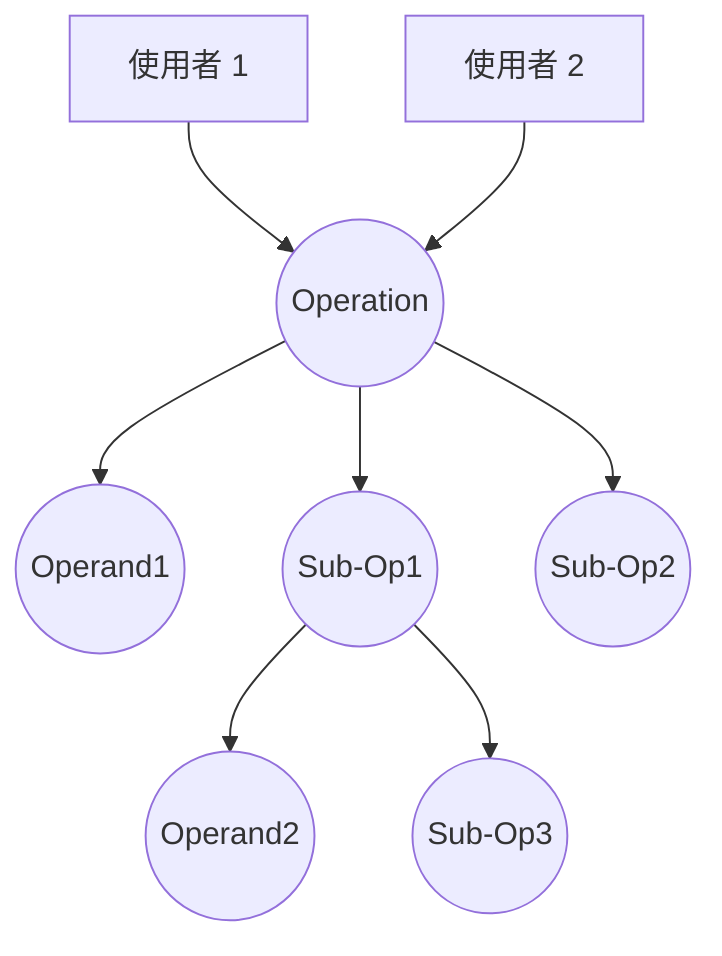
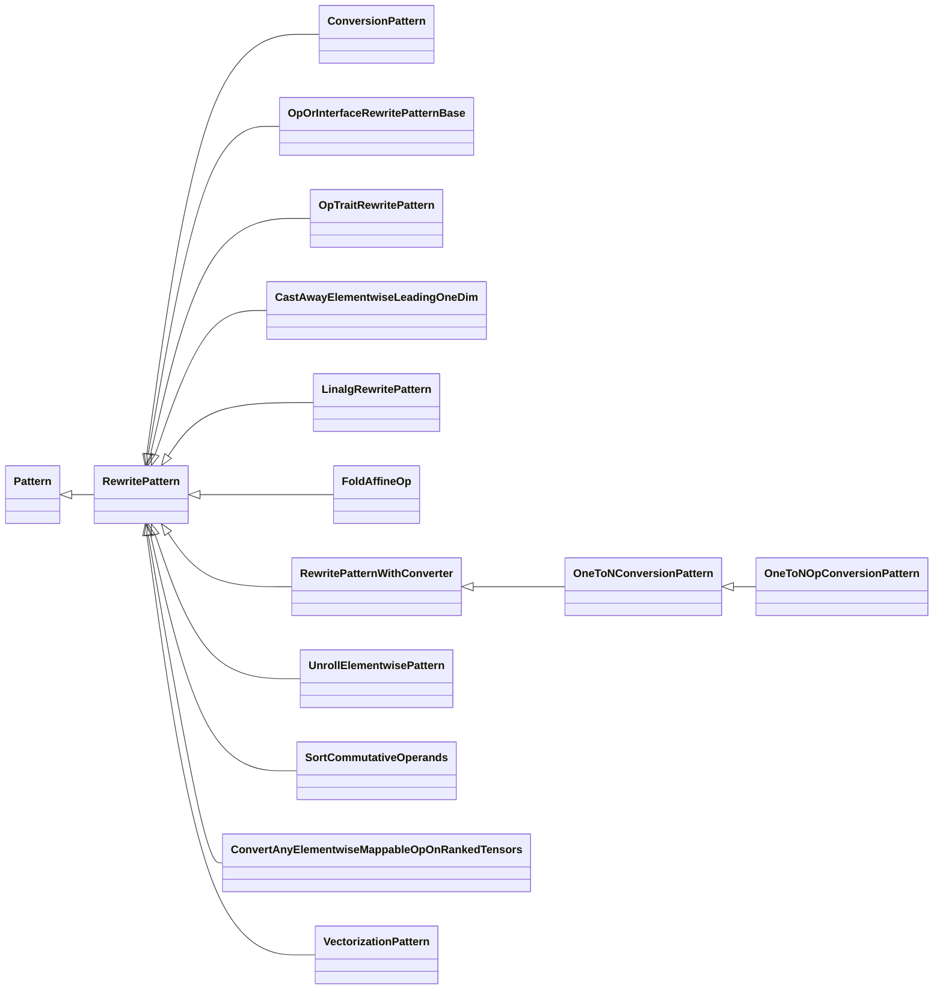
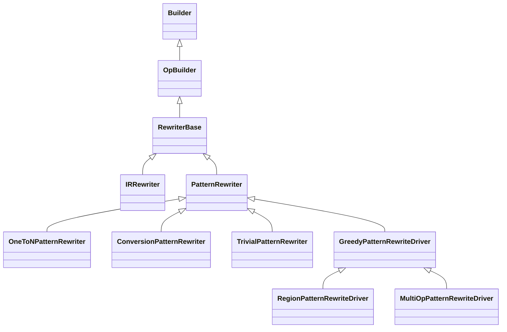
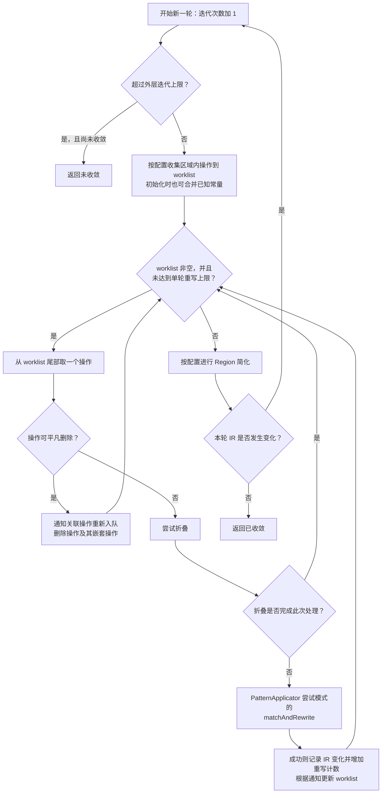

<!-- source: insider-compiler-ch5-ch6.pdf, PDF p. 17 -->

# 第6章 操作匹配与重写机制

> 校订说明：本章保留扫描件的全部节次、正文、14 个代码清单、4 张图、表 6-1 和脚注，并按本地 LLVM 18.1.8（提交 `3b5b5c1ec4a3095ab096dd780e84d7ab81f3d7ff`）核对与修正。原书引用 LLVM 20 的实现，与本地差异较大的片段及详细勘误见 [第6章校订记录](issues/ch6.md)。原书省略代码仍标记为 `...`；带有自定义操作、类型和 Pass 的片段不是独立程序。

操作匹配与重写堪称 MLIR 中最为核心的概念，MLIR 借助它们得以实现方言降级与操作变换。

匹配问题在编译原理中极为常见，例如编译器后端所实现的指令匹配。常见的匹配方法包含宏展开、树匹配、DAG（有向无环图）匹配等。其中，DAG 匹配能够表达树之外的共享子表达式，在编译器中得到广泛应用。由第2章可知，每个操作中 CFG 区域[^ch6-regions]的 IR 均满足 SSA 特性。依据 SSA 特性，Use-Def 关系极易获取，而不含循环依赖的局部表达式常能表示为 DAG。因此，构建一套基于操作和子图的匹配与重写机制，能够满足 MLIR 编译优化的许多场景需求。

> 校订注：整个程序的 SSA 数据依赖关系不保证无环，循环和块参数可能形成循环依赖；不能把“SSA”直接等同于“整个程序是 DAG”。[校订依据](issues/ch6.md#ch6-foundations)

MLIR 的操作匹配与重写机制汲取了其他编译项目的长处，通过一套专门针对操作的匹配与重写框架，赋予了多种针对操作的模式匹配能力。该框架支持操作的一对一、一对多、多对一匹配重写。MLIR 的匹配与重写机制常在 Pass 中使用，也可独立于 Pass 调用。在 Pass 运行过程中，一旦找到操作锚点，便可将其作为待处理范围，针对操作内嵌的负载 IR，进行子图匹配与重写。为灵活应对匹配的优先级问题，该框架提供了匹配成本模型，开发者可借助此模型定义模式匹配的顺序。

此外，在匹配过程中，常量折叠等优化具有较高的优先级。MLIR 框架原生支持对操作进行折叠，开发者在定义操作时指定其折叠的具体实现后，调用相应驱动或折叠接口时即可尝试执行折叠过程。

[^ch6-regions]: 虽然 MLIR 中的区域可分为 CFG（控制流图，亦称 SSACFG）和图两种类型，但许多常见区域属于 CFG 区域。图区域适用于对操作执行顺序无严格要求的场景，例如顶级模块（module）操作。在该模块中，所包含的 global（全局定义）和 func（函数）等子操作之间并无由文本先后次序确定的执行依赖关系，因此 builtin.module 使用 Graph 类型的区域。符号引用等联系仍然可以存在。

<!-- source: insider-compiler-ch5-ch6.pdf, PDF p. 18 -->

然而，目前 MLIR 框架提供的操作匹配与重写机制并非万能，并不适合所有类型的操作优化都按逐操作模板来实现。以 CSE（公共子表达式消除）为例，该类优化虽然能广泛应用于各类操作，但若为每种操作分别编写匹配模板，在实际中并不理想。因此，在 MLIR 社区中，此类优化通过通用的 Pass 实现，利用操作等价性、支配关系及副作用等信息，并不要求为每个操作编写专属模式。同时，MLIR 中的 Pass 机制要求作为锚点的操作具备 `IsolatedFromAbove` 特质，该特质禁止嵌套区域隐式捕获外部 SSA 值；在 Pass 内使用匹配与重写机制时，还需遵循 5.1.5 节介绍的修改范围和并发约束。

> 校订注：`IsolatedFromAbove` 不会“切断全部 Def-Use 联系”，也不表示所有优化只能局限于基本块。处理范围由所选锚点、区域和驱动配置决定；需要更大范围的优化可选择更上层的合适锚点。[校订依据](issues/ch6.md#ch6-foundations)

本章首先分析 MLIR 中操作匹配的设计与实现，随后介绍 MLIR 中操作变换与方言降级的实现方式，并介绍 MLIR 为开发者提供的三种模式编写方法。

## 6.1 操作匹配的设计与实现

MLIR 的匹配与重写机制围绕操作展开，其核心包含三个部分，即模式、重写和应用。

**（1）模式**

模式聚焦于为操作定义匹配模式，涵盖待匹配操作、操作约束（如操作的接口或特质）、匹配后生成的操作以及操作匹配的成本模型等信息。此外，模式还提供了匹配和重写函数，这些函数既能够借助 `mlir-tblgen` 工具自动生成，也可由开发者自行实现。

**（2）重写**

重写用于实现操作的添加、删除、移动、替换等，同时包含相关变化的通知功能。通知机制堪称框架的核心特征，借助这一机制对变化的操作进行跟踪，进而实现 6.2 节所介绍的贪婪匹配与方言降级。

**（3）应用**

作为将模式和重写相结合的驱动环节，应用允许定义多个匹配模式、重写实现以及成本模型。针对多个匹配模式，每次匹配时会依据成本模型优先尝试收益较高的匹配模式，随后执行匹配与重写操作。匹配过程中可能出现多种不同类型的模式，如匹配特定操作的原生模式、匹配任意操作的原生模式，以及 pdl（Pattern Descriptor Language，模式描述语言）方言模式。当多种类型模式并存且匹配条件重叠时，首先比较收益；收益相同时，特定操作的原生模式优先于任意操作的原生模式，后者优先于 PDL 模式。

> 校订注：类别顺序只是收益相同情况下的选择规则，不是无条件“常规、任意、PDL”依次执行。本地实现会先运行 PDL 字节码收集匹配候选，再与原生候选比较收益并决定重写。[校订依据](issues/ch6.md#ch6-applicator)

接下来详细介绍这三个部分的具体实现。

### 6.1.1 模式

在 MLIR 中，子图匹配通过模式来识别图中的节点，此过程需反映操作的结构特征与约束条件。实际上，可以以一个操作为锚点，描述其操作数定义、使用关系及其他约束，实现相应子图的匹配。

例如，对于要匹配的操作 Operation，假设它被另外两个操作所使用，且自身拥有三个操作数。其中，第一个操作数为常量，记为 Operand1；第二个和第三个操作数分别是另外两个

<!-- source: insider-compiler-ch5-ch6.pdf, PDF p. 19 -->

操作的输出，其定义操作分别记为 Sub-Op1 与 Sub-Op2。进一步假设 Sub-Op1 也有两个操作数，分别为 Operand2 和 Sub-Op3 的结果。若要匹配该锚点操作，本质上就是在整个图中匹配相应子图，如图 6-1 所示。



**图 6-1 待匹配操作的结构示意图**

图中的箭头沿使用者到操作数定义的方向，表示匹配时追溯依赖，并非程序执行次序；原图顶部的两个无标签使用者以“使用者 1、2”补明。

MLIR 定义了 Pattern 类来描述模式。其中，Pattern 类所包含的数据成员主要为匹配所需的基础信息，涵盖匹配成本、待匹配目标以及匹配后生成的操作。在此基础上，MLIR 进一步派生出了 RewritePattern 类，该类扩展了 `match()`、`rewrite()`、`matchAndRewrite()` 等成员函数。此外，为便于社区开发者使用，MLIR 还定义了 ConversionPattern（继承自 RewritePattern）、OpRewritePattern、OpInterfaceRewritePattern、OpTraitRewritePattern 等专用模式类，分别用于支持类型转换、匹配具体操作、匹配拥有特定接口的操作以及匹配具备某种特质的操作。目前，Pattern 类的部分继承结构如图 6-2 所示。



**图 6-2 Pattern 类的继承结构图**

模式定义有三种方式，本节重点介绍通过 C++ 代码定义模式的方法，其余两种方法将在后续内容介绍。假设要定义一个名为 MyPattern 的模式，其实现如代码清单 6-1 所示。

**代码清单 6-1 MyPattern 模式定义实现示例**

```cpp
// 定义模式 MyPattern。
class MyPattern : public RewritePattern {
public:
  // 定义 MyPattern 的构造方式，模式匹配的操作为 MyOp。
  MyPattern(PatternBenefit benefit, MLIRContext *context)
```

<!-- source: insider-compiler-ch5-ch6.pdf, PDF p. 20 -->

代码清单 6-1（续）：

```cpp
      : RewritePattern(MyOp::getOperationName(), benefit, context) {}

  /* 除定义匹配锚点操作的模式外，也可定义匹配任意操作的模式。
     MatchAnyOpTypeTag 是标记这种构造方式的标签，而非操作类型。 */
  MyPattern(MatchAnyOpTypeTag tag, PatternBenefit benefit,
            MLIRContext *context)
      : RewritePattern(tag, benefit, context) {}

  /* 重载 match()，根据模式的锚点操作进一步检查匹配条件，
     例如操作数、属性、定义操作的特质或接口等。 */
  LogicalResult match(Operation *op) const override;

  /* 匹配成功后调用 rewrite() 完成操作重写，
     可根据业务需要删除、更新操作，或者添加新的操作。 */
  void rewrite(Operation *op, PatternRewriter &rewriter) const override;

  /* 基类 matchAndRewrite() 默认先调用 match()，成功后调用 rewrite()。
     可以实现上面两个函数，也可以改为直接重载下面的组合入口。 */
  // LogicalResult matchAndRewrite(Operation *op,
  //                              PatternRewriter &rewriter) const override;
};
```

> 校订注：本地任意操作构造器的参数顺序是标签、收益、上下文；原书缺上下文且顺序错误。`rewrite` 与 `matchAndRewrite` 的重载必须带 `const`，本清单显式添加 `override` 以便编译器检查。[校订依据](issues/ch6.md#ch6-pattern-api)

当然，开发者若要指定匹配操作，可直接让 MyPattern 继承自模板类 OpRewritePattern，该模板类接收操作类型作为参数。例如，可将模式定义为 `struct MyPattern : public OpRewritePattern<MyOp>`，如此一来，MyPattern 便仅以 MyOp 操作为匹配根。

> 注意：第5章介绍的 Pass 机制同样能够筛选操作，那为何此处还需定义匹配模式来实现操作匹配呢？简而言之，Pass 框架通过操作类型以及接口等静态条件选择运行锚点；而匹配模式能够进一步定义复杂的匹配规则，实现子图的匹配。通常的做法是先使用 Pass 机制定位到对应的锚点操作，然后针对锚点操作的嵌套 IR，运用匹配模式进行子图匹配，以实现两种机制的协同。Pass 的实现本身也可包含任意适用的分析与匹配逻辑，并不限于字符串比较。

目前，MLIR 社区提供了三种模式的编写方式，具体如下。

- **通过 C++ 代码直接实现模式匹配**：如代码清单 6-1 所示。
- **通过 DRR（Declarative Rewrite Rules，声明式重写规则）实现**：采用 TableGen 描述；原书称为 TDRR（Table-driven Declarative Rewrite，表格驱动的声明式重写），将在 6.1.2 节的示例中具体展示其使用方法。
- **通过 PDLL（PDL Language）实现**：PDL 提供表示模式的方言，PDLL 则提供面向模式编写的语言，支持 `include`、`constraint` 等特性。这部分内容将在第12章详细介绍。

这三种模式定义方式均能实现模式匹配与转换。其中，DRR 和 PDLL 可方便地描述许多匹配与重写场景；一些复杂规则无法直接在 TD 中实现时，可以通过编写 C++ 代码来实现，或结合原生约束与重写函数。

### 6.1.2 重写

MLIR 社区提供了重写机制的基础能力，支持操作的修改、添加、更新和删除等。开发者仅需依据匹配结果，调用重写机制中的相关 API 即可完成业务操作。当前，社区中实现重写

<!-- source: insider-compiler-ch5-ch6.pdf, PDF p. 21 -->

功能的类结构图如图 6-3 所示。



**图 6-3 Rewriter 类的继承结构图**

> 注意：代码清单 6-1 的 `rewrite()` 方法需要使用 PatternRewriter 的 API 对操作进行更新、插入、删除等处理，不能绕过驱动的通知机制直接修改 IR。Rewriter 不仅执行操作修改，还将相关变化告知其他组件，确保工作列表、回滚记录等状态正确。原书称 Operation 继承自 OpBuilder，这不成立；继承 OpBuilder 的是 RewriterBase。[校订依据](issues/ch6.md#ch6-rewriters)

图 6-3 中有几处值得留意的地方。

- **IRRewriter 与 PatternRewriter 的区别**：图中除 IRRewriter 外，其他专用重写类均派生自 PatternRewriter。IRRewriter 用于模式驱动之外的普通 IR 修改；PatternRewriter 则用于模式驱动内部，使驱动能够跟踪模式的修改行为。IRRewriter 自身不执行匹配，也不限制重写次数；PatternRewriter 自身同样不决定是否采用贪婪迭代，迭代策略由驱动实现。
- **ConversionPatternRewriter 的用途**：ConversionPatternRewriter 主要用于方言降级场景，它提供了方言降级过程中所需的一些功能，如基本块参数类型转换以及可回滚的重写记录等。
- **GreedyPatternRewriteDriver 的作用**：GreedyPatternRewriteDriver 主要用于优化变换，它提供了贪婪算法，用于重复处理操作的匹配与重写。它有 RegionPatternRewriteDriver 和 MultiOpPatternRewriteDriver 两个派生类，分别用于对区域内嵌套操作以及指定的一组操作进行匹配与重写。

下面通过 TD 描述的方式演示如何定义一个模式的匹配与重写。

首先定义两个操作：OpN 和 OpP，如代码清单 6-2 所示。

**代码清单 6-2 OpN 和 OpP 操作的定义**

```tablegen
// 该代码片段来自社区。
/* 在 test 方言中定义操作 OpN，该操作继承自 TEST_Op 记录，
   包含两个 I32 类型的操作数，输出为 I32 类型。 */
def OpN : TEST_Op<"op_n"> {
```

<!-- source: insider-compiler-ch5-ch6.pdf, PDF p. 22 -->

代码清单 6-2（续）：

```tablegen
  let arguments = (ins I32, I32);
  let results = (outs I32);
}
// 定义 OpP 操作，包括六个 I32 类型的操作数，输出为 I32 类型。
def OpP : TEST_Op<"op_p"> {
  let arguments = (ins I32, I32, I32, I32, I32, I32);
  let results = (outs I32);
}
/* 定义匹配操作 OpN 的模式。第一个操作数为变量 b；第二个操作数
   为 OpP 定义的值，OpP 的 I32 结果可作为 OpN 的输入。
   OpP 包含 a、b、c、d、e、f 六个操作数，其中 b 必须与外层 b 相同。
   重写规则使用变量 b 替换整个 OpN 操作的结果。 */
def TestNestedOpEqualArgsPattern :
    Pat<(OpN $b, (OpP $a, $b, $c, $d, $e, $f)),
        (replaceWithValue $b)>;
```

通过 `mlir-tblgen` 工具将代码清单 6-2 编译为 C++ 代码，如代码清单 6-3 所示。

**代码清单 6-3 代码清单 6-2 编译后对应的 C++ 代码片段**

```cpp
/* 定义 TestNestedOpEqualArgsPattern，继承 RewritePattern。
   根操作为 test.op_n，默认收益为 2，因为源模式包含 OpN 和 OpP
   两个操作；只有一个操作的源模式默认收益为 1。 */
struct TestNestedOpEqualArgsPattern : public ::mlir::RewritePattern {
  TestNestedOpEqualArgsPattern(::mlir::MLIRContext *context)
      : ::mlir::RewritePattern("test.op_n", 2, context, {}) {}
  ::mlir::LogicalResult matchAndRewrite(
      ::mlir::Operation *op0,
      ::mlir::PatternRewriter &rewriter) const override {
    // 创建七个临时变量，用于存储 OpN 和 OpP 的操作数。
    ::mlir::Operation::operand_range d(op0->getOperands());
    ::mlir::Operation::operand_range a(op0->getOperands());
    ::mlir::Operation::operand_range c(op0->getOperands());
    ::mlir::Operation::operand_range e(op0->getOperands());
    ::mlir::Operation::operand_range f(op0->getOperands());
    ::mlir::Operation::operand_range b(op0->getOperands());
    ::mlir::Operation::operand_range b0(op0->getOperands());
    ::llvm::SmallVector<::mlir::Operation *, 4> tblgen_ops;

    // OpP 定义 OpN 的第二个操作数，两个 b 必须相同。
    tblgen_ops.push_back(op0);
    auto castedOp0 = ::llvm::dyn_cast<::test::OpN>(op0);
    (void)castedOp0;
    // 本地生成器将外层的第一个操作数记为 b。
    b = castedOp0.getODSOperands(0);
    {
      auto *op1 = (*castedOp0.getODSOperands(1).begin()).getDefiningOp();
      if (!op1) {
        return rewriter.notifyMatchFailure(
            castedOp0, [&](::mlir::Diagnostic &diag) {
              diag << "There's no operation that defines operand 1 of castedOp0";
            });
      }
      auto castedOp1 = ::llvm::dyn_cast<::test::OpP>(op1);
      (void)castedOp1;
      if (!castedOp1) {
        return rewriter.notifyMatchFailure(op1, [&](::mlir::Diagnostic &diag) {
          diag << "castedOp1 is not ::test::OpP type";
        });
      }
      a = castedOp1.getODSOperands(0);
```

<!-- source: insider-compiler-ch5-ch6.pdf, PDF p. 23 -->

代码清单 6-3（续）：

```cpp
      b0 = castedOp1.getODSOperands(1);
      c = castedOp1.getODSOperands(2);
      d = castedOp1.getODSOperands(3);
      e = castedOp1.getODSOperands(4);
      f = castedOp1.getODSOperands(5);
      tblgen_ops.push_back(op1);
    }
    // 要求 OpN 的第一个操作数和 OpP 的第二个操作数相同。
    if (!(*b.begin() == *b0.begin())) {
      return rewriter.notifyMatchFailure(op0, [&](::mlir::Diagnostic &diag) {
        diag << "Operands 'b' and 'b0' must be equal";
      });
    }
    // 重写：用 b 替换 OpN 的结果。
    auto odsLoc = rewriter.getFusedLoc(
        {tblgen_ops[0]->getLoc(), tblgen_ops[1]->getLoc()});
    (void)odsLoc;
    ::llvm::SmallVector<::mlir::Value, 4> tblgen_repl_values;
    for (auto v : ::llvm::SmallVector<::mlir::Value, 4>{b}) {
      tblgen_repl_values.push_back(v);
    }
    rewriter.replaceOp(op0, tblgen_repl_values);
    return ::mlir::success();
  }
};
```

> 校订注：以上按本地生成结果补全原书省略的捕获变量及空定义检查。原书 `b` / `b0` 的命名顺序与本地生成结果相反，但要求两个 SSA 值相等并以 b 替换 OpN 的语义一致，属于生成细节差异。[校订依据](issues/ch6.md#ch6-drr)

使用 TD 方式与开发者直接编写自定义 C++ 代码的方式在本质上具有一致性，但两者在灵活性及功能完备性方面存在差别。生成的模式和手写 C++ 模式最终可以进入同一应用框架，下面进一步介绍。

### 6.1.3 应用

开发者定义好匹配模式与重写机制后，便可将二者组合使用。为支持这种组合，MLIR 社区提供了 PatternApplicator 机制。该机制通过整合以下三类信息来运作。

- **定义好的模式集合**：其中每个模式都明确了操作的匹配与重写方式。
- **自定义的重写机制**：若社区提供的 PatternRewriter 无法满足开发者需求，开发者可自行实现，并传给 PatternApplicator。
- **自定义的模式成本模型**：该模型允许开发者重新为模式定义收益。

基于这三类信息，PatternApplicator 就可以对操作进行匹配和重写了。对于具体操作，通过调用其 `matchAndRewrite()` 函数来实现匹配与重写。

一个典型的模式匹配与重写使用示例如代码清单 6-4 所示。

**代码清单 6-4 模式匹配与重写使用示例**

```cpp
// 定义匹配模式 MyPattern，用于匹配 MyOp。
class MyPattern : public RewritePattern {
public:
```

<!-- source: insider-compiler-ch5-ch6.pdf, PDF p. 24 -->

代码清单 6-4（续）：

```cpp
  MyPattern(PatternBenefit benefit, MLIRContext *context)
      : RewritePattern(MyOp::getOperationName(), benefit, context) {}
  // 假设开发者实现了 match() 和 rewrite() 函数，此处忽略具体定义。
  LogicalResult match(Operation *op) const override;
  void rewrite(Operation *op, PatternRewriter &rewriter) const override;
};

// 将所有待匹配的模式收集到一个集合中。这里只有一个 MyPattern。
void collectMyPatterns(RewritePatternSet &patterns, MLIRContext *ctx) {
  patterns.add<MyPattern>(/*benefit=*/1, ctx);
}

// 自定义重写机制。
class MyPatternRewriter : public PatternRewriter {
public:
  MyPatternRewriter(MLIRContext *ctx) : PatternRewriter(ctx) {}
  // 根据需要实现重写相关的通知与状态维护。
};

// 针对操作定义驱动。
void applyMyPatternDriver(Operation *op,
                          const FrozenRewritePatternSet &patterns) {
  // 初始化 PatternRewriter。
  MyPatternRewriter rewriter(op->getContext());
  // 创建应用并为应用定义模式的成本模型。
  PatternApplicator applicator(patterns);
  applicator.applyCostModel([](const Pattern &pattern) {
    /* 成本模型的输入为模式，输出为模式的收益。
       此处直接使用模式的收益，也可根据需要重新调整收益。 */
    return pattern.getBenefit();
  });
  // 对操作进行匹配和重写。
  LogicalResult result = applicator.matchAndRewrite(op, rewriter);
  if (failed(result)) {
    // 若没有任何模式成功匹配与重写，可输出必要的信息并返回。
    return;
  }
  // 若模式匹配和重写成功，也可输出必要的信息并返回。
}
```

借助应用将匹配与重写机制加以组合，能够更为便捷地实现针对操作的匹配和重写。

## 6.2 MLIR 框架中的两种典型应用

MLIR 框架中提供了两种典型的匹配和重写应用，分别是贪婪匹配和方言降级，其中贪婪匹配主要用于操作变换。

### 6.2.1 贪婪匹配

贪婪匹配主要应用于匹配、重写操作后需再次运行模式的场景。本节将简要介绍其实现方式，并通过一个示例来演示匹配、重写的运行过程。

<!-- source: insider-compiler-ch5-ch6.pdf, PDF p. 25 -->

#### 1. 实现方式

在操作变换过程中，系统主要围绕操作展开匹配与重写工作。在这一过程中，可能会出现新增相同类型操作或者需要对现有操作进行修改、删除的情况，而且这些新增或修改后的操作依旧具备待优化处理的特征。所以需要一种合理机制，能够对已匹配过的操作再次实施匹配，这便是贪婪匹配的由来。

MLIR 社区提供了 GreedyPatternRewriteDriver 重写机制，专门用于贪婪匹配操作，并且依据操作匹配范围的差异实现了 RegionPatternRewriteDriver 和 MultiOpPatternRewriteDriver 这两种不同应用。其中，RegionPatternRewriteDriver 针对一个锚点操作所包含的区域内嵌套操作开展贪婪匹配，而 MultiOpPatternRewriteDriver 则以多个指定操作为初始集合进行贪婪匹配。

**（1）RegionPatternRewriteDriver 的实现**

下面先来了解 RegionPatternRewriteDriver 的实现。它主要由函数 `applyPatternsAndFoldGreedily()` 驱动，执行流程大致如下。

1. 判断区域的父操作是否包含 `OpTrait::IsIsolatedFromAbove` 特质。该特质限制隐式捕获上层 SSA 值，使区域内重写不致通过外部使用链影响上层操作；可参考 4.2 节、5.1.5 节内容。
2. 依据配置确定是自底向上匹配还是自顶向下匹配，收集区域中的内嵌操作[^ch6-traversal]，进而确定待处理的操作，并将其添加到 worklist 中。
3. 依次从 worklist 中取出操作，直至 worklist 为空，或达到配置的单轮重写次数上限。具体包括以下处理：处理死亡操作，若操作可平凡删除，则将受影响的操作数定义等操作重新加入工作列表，并删除该操作；对尚存操作尝试折叠；执行模式匹配与重写，按通知将需要重新处理的新操作、修改后的操作或其他关联操作加入 worklist。
4. 根据配置针对区域开展简化，包括删除不可达基本块、消除无效代码以及合并基本块等。
5. 若 IR 发生变化，则跳转至步骤 2 再次处理区域，直到嵌套 IR 不再发生变化，或达到外层迭代次数上限。

上述处理过程会反复迭代。如果开发者未能妥善实现自己的 `matchAndRewrite()` 方法，极有可能导致死循环。因此，框架除提供工作列表终止条件外，还提供外层最大迭代次数 `maxIterations` 和单轮模式重写次数 `maxNumRewrites` 配置。该过程的执行流程图如图 6-4 所示。

> 校订注：本地默认外层迭代上限为 10，单轮重写次数默认 `-1` 表示无限制。因此外层上限不能保证阻止在单个工作列表循环中无限生成新操作的错误模式，模式本身仍需保证终止。[校订依据](issues/ch6.md#ch6-greedy)

另外需要注意的是，同一个操作可能存在多个可同时匹配的模式，因此在应用过程中，系统会对开发者注册的模式进行排序，并按照模式收益优先级依次尝试。若收益相同，则特定操作的原生模式优先，随后是任意操作的原生模式，再是 PDL 模式。原生模式通过 C++ 编写，或由 TableGen 中的 `Pat` 规则生成 C++；这里不存在名为 `pat` 的方言。PDL 方言将在第12章介绍。在匹配过程

[^ch6-traversal]: 默认采用自底向上的初始遍历方式，因为这种方式可能匹配到更大的模式；自顶向下的遍历通常有利于降低编译开销。具体结果和速度取决于 IR、模式集合及驱动配置，不能保证某一种方式总是更好。

<!-- source: insider-compiler-ch5-ch6.pdf, PDF p. 26 -->

中，系统对一个操作按上述顺序尝试相关候选模式，直到某个模式成功，或者所有候选模式均失败，然后返回驱动处理后续工作。



**图 6-4 贪婪匹配的执行流程图**

> 校订注：原图将 worklist 条件写成“或”，并将死亡操作删除分支接反；本图按实际实现改为“工作列表非空且未达到重写上限”，死亡操作删除后继续处理下一项。初始遍历顺序与栈式出队共同决定实际访问顺序，不存在为了 Def-Use 而一律自顶向下匹配的要求；工作列表也不会无条件加入超出作用域的全部祖先。[原图问题及源码依据](issues/ch6.md#ch6-greedy)

**（2）MultiOpPatternRewriteDriver 的实现**

MultiOpPatternRewriteDriver 的实现主要由 `applyOpPatternsAndFold()` 函数驱动，其执行流程与 `applyPatternsAndFoldGreedily()` 函数极为相似，主要区别在于前者能够接收一组操作作为匹配输入。这些操作可能位于同一个区域，也可能分属不同区域。当它们同属一个区域时，在添加、删除、修改操作时可以继续处理该作用域内的关联操作；若它们分属不同区域而未指定 scope，框架会寻找公共祖先区域作为作用域。哪些已有操作、新增操作能够继续进入工作列表，还取决于 scope 和 strictMode 配置，并非只因直接父区域不同就停止贪婪匹配。

下面通过一个例子来演示贪婪匹配的工作原理，如代码清单 6-5 所示。

**代码清单 6-5 贪婪匹配的工作原理**

```mlir
func.func @f(%arg0: i1) {
  %0 = arith.constant 0 : i32
  %if = scf.if %arg0 -> (i32) {
    scf.yield %0 : i32
  } else {
    scf.yield %0 : i32
  }
  %dead_leaf = arith.addi %if, %if : i32
  return
}
```

为对贪婪匹配机制进行测试，MLIR 社区专门定义了 test 方言以及一些相关模式，不过本示例中并未用到这些具体模式。若想深入了解贪婪匹配的详细工作过程，可借助 debug

<!-- source: insider-compiler-ch5-ch6.pdf, PDF p. 27 -->

参数将匹配过程进行输出，具体命令格式如下。

```sh
mlir-opt '-test-patterns=top-down=true' -debug-only=greedy-rewriter 6-5.mlir
```

执行该命令后得到的日志片段如代码清单 6-6 所示。

**代码清单 6-6 执行贪婪匹配后得到的日志片段**

> 以下保留原书带解释注释的示意日志，并修正遍历和依赖说明。`The initial op ...` 及操作列表不是本地上游驱动的原样输出；地址仅为原书运行的示意。实际 LLVM 18.1.8 完整日志见 [自顶向下日志](issues/evidence/ch6-greedy-top-down.log)。

```text
// 第一轮处理：对函数及其内嵌 IR 进行模式匹配。
The initial op to be processed at 1 times
// 自顶向下：先以前序收集操作，再反转 worklist；从尾部取出时按前序处理。
// 下列为从列表头到列表尾的存放顺序，并非实际处理顺序。
func.return, arith.addi, scf.yield, scf.yield, scf.if, arith.constant, func.func,
// 首先匹配 func 操作，未找到匹配模式。
Processing operation : 'func.func'(0x555567e0bfc0) {
} -> failure : pattern failed to match
Processing operation : 'arith.constant'(0x555567e08e70) {
  %0 = "arith.constant"() <{value = 0 : i32}> : () -> i32
} -> failure : pattern failed to match
Processing operation : 'scf.if'(0x555567e0b9d0) {
} -> failure : pattern failed to match
Processing operation : 'scf.yield'(0x555567e0b870) {
  "scf.yield"(%0) : (i32) -> ()
} -> failure : pattern failed to match
Processing operation : 'scf.yield'(0x555567e0b940) {
  "scf.yield"(%0) : (i32) -> ()
} -> failure : pattern failed to match
// 处理 addi 操作，发现它是死代码，因此删除。
Processing operation : 'arith.addi'(0x555567e0bad0) {
  %2 = "arith.addi"(%1, %1) : (i32, i32) -> i32
  ** Erase : 'arith.addi'(0x555567e0bad0)
} -> success : operation is trivially dead
Processing operation : 'func.return'(0x555567e08fc0) {
  "func.return"() : () -> ()
} -> failure : pattern failed to match
// 删除 addi 后，%if 没有使用者，整个无副作用的 if 可以删除。
// 两个 yield 使用的是 %0；它们作为 if 的内嵌操作一起删除。
** Erase : 'scf.yield'(0x555567e0b940)
** Erase : 'scf.yield'(0x555567e0b870)
** Erase : 'scf.if'(0x555567e0b9d0)
// 第一轮结束，IR 结构变化，开始第二轮。
The initial op to be processed at 2 times
// 此时剩余三个操作。
func.return, arith.constant, func.func,
Processing operation : 'func.func'(0x555567e0bfc0) {
} -> failure : pattern failed to match
// constant 此时也是死代码，因此删除。
Processing operation : 'arith.constant'(0x555567e08e70) {
  %0 = "arith.constant"() <{value = 0 : i32}> : () -> i32
  ** Erase : 'arith.constant'(0x555567e08e70)
} -> success : operation is trivially dead
Processing operation : 'func.return'(0x555567e08fc0) {
  "func.return"() : () -> ()
} -> failure : pattern failed to match
```

<!-- source: insider-compiler-ch5-ch6.pdf, PDF p. 28 -->

代码清单 6-6（续）：

```text
// 第二轮结束，IR 结构变化，开始第三轮。
The initial op to be processed at 3 times
// 此时只剩下两个操作。
func.return, func.func,
Processing operation : 'func.func'(0x555567e0bfc0) {
} -> failure : pattern failed to match
Processing operation : 'func.return'(0x555567e08fc0) {
  "func.return"() : () -> ()
} -> failure : pattern failed to match
// IR 结构不再变化，最终优化结果如下。
module {
  func.func @f(%arg0: i1) {
    return
  }
}
```

为方便读者理解模式匹配过程中自底向上的效果，现使用如下命令对代码清单 6-5 执行贪婪匹配，运行后得到的日志片段如代码清单 6-7 所示。

```sh
mlir-opt '-test-patterns=top-down=false' -debug-only=greedy-rewriter 6-5.mlir
```

**代码清单 6-7 自底向上执行贪婪匹配后得到的日志片段**

> 以下同样是保留原书注释结构的示意日志。实际完整输出见 [自底向上日志](issues/evidence/ch6-greedy-bottom-up.log)。

```text
// 第一轮模式匹配。
The initial op to be processed at 1 times
/* 自底向上的初始遍历使用后序收集，worklist 从尾部取出。
   addToWorklist 的祖先入队、去重和已知常量处理会影响存放位置。
   下面列表从头到尾列出，不是实际处理顺序。 */
arith.constant, func.func, scf.yield, scf.if, scf.yield, arith.addi, func.return,
// 先处理 return，未找到适用模式。
Processing operation : 'func.return'(0x555567e08fc0) {
  "func.return"() : () -> ()
} -> failure : pattern failed to match
/* 本例从末尾开始处理，有利于较早发现死代码。
   操作结果未使用还需结合副作用等条件，才能认定操作可删除。 */
Processing operation : 'arith.addi'(0x555567e0bad0) {
  %2 = "arith.addi"(%1, %1) : (i32, i32) -> i32
  ** Erase : 'arith.addi'(0x555567e0bad0)
} -> success : operation is trivially dead
/* 删除 addi 后，if 结果不再使用；删除 if 时也删除其内嵌的 yield。
   yield 本身并不是因为没有 SSA 使用者就可独立删除的普通操作。 */
Processing operation : 'scf.yield'(0x555567e0b940) {
  "scf.yield"(%0) : (i32) -> ()
} -> failure : pattern failed to match
Processing operation : 'scf.if'(0x555567e0b9d0) {
  ** Erase : 'scf.yield'(0x555567e0b940)
  ** Erase : 'scf.yield'(0x555567e0b870)
  ** Erase : 'scf.if'(0x555567e0b9d0)
} -> success : operation is trivially dead
...
// 第一轮结束，IR 结构变化，开始第二轮，此时只剩两个操作。
```

<!-- source: insider-compiler-ch5-ch6.pdf, PDF p. 29 -->

代码清单 6-7（续）：

```text
The initial op to be processed at 2 times
func.return, func.func,
...
// 第二轮匹配代码未发生变化，因此终止匹配。
```

从本示例可以看出，自底向上的匹配在迭代次数方面更具优势。相较于自顶向下匹配，自底向上仅需两轮便可完成。此外需要指出的是，尽管本示例中自底向上与自顶向下的匹配结果一致，但在其他场景下，二者的结果未必完全相同。自底向上可能匹配到更大的模式，不能据此推断所有场景中优化结果或总运行速度都更好。

> 实测：本地工具的两种配置均成功，最终只保留 `func.func @f(%arg0: i1) { return }`。自顶向下共处理 12 次操作，跨三轮；自底向上共处理 8 次操作，跨两轮。这里比较的是处理次数，未作运行时间基准测试。[实测说明](issues/ch6.md#ch6-logs)

#### 2. 应用示例

假设有一段待匹配代码片段，如代码清单 6-8 所示。

**代码清单 6-8 待匹配代码片段**

```text
Op {
  %0 = Op0 %arg0
  %1 = Op1 %arg1
  %2 = Op2 %arg2
  %3 = Op3 %1 %2
}
```

在代码清单 6-8 中，假设 Op1 存在两个匹配模式，Op2 存在一个匹配模式，Op3 有 n 个匹配模式，则所有匹配模式集合 PatternSet 为 `Pop1_1`、`Pop1_2`、`Pop2_1`、`Pop3_1`、`Pop3_2`、…、`Pop3_n`。执行自底向上的贪婪匹配时，待匹配操作集合 worklist 包含这些操作，可按 Op3、Op2、Op1、Op0 的顺序取出处理。

在匹配过程中，系统依次从 worklist 中取出操作进行匹配。首先处理 Op3，但 Op3 存在 n 个匹配模式，分别为 `Pop3_1`、`Pop3_2`、…、`Pop3_n`，此时该如何进行匹配呢？

简单来讲，匹配是依据模式的收益优先级依次开展的，高优先级的模式会优先执行匹配操作。若高优先级的模式因操作数、属性或结构等条件不满足而无法匹配，则会选取下一个次高优先级的模式继续尝试匹配，直至遇到一个匹配成功的模式。如果所有模式都匹配失败，系统会从 worklist 中取出下一个操作 Op2 进行匹配。当某个操作没有对应的匹配模式时，模式匹配阶段会跳过它，继续处理下一个操作。例如，Op0 没有对应的匹配模式，所以在该阶段被忽略，但驱动仍可对其尝试死代码消除或折叠。

假设 Op3 被某个模式成功匹配，系统就会执行重写操作。在重写过程中，可以创建新操作、修改现有操作或删除已有操作；存活且受影响的操作会根据通知和作用域要求加入 worklist，以便再次执行匹配。例如，若 Op3 被模式 `Pop3_2` 匹配，在重写过程中可能生成一些新的 Op3 操作（比如与原来的 Op3 相比，操作数从复合表示变为简单表示）。这些新生成的 Op3 需要继续进行匹配，因此它们会被添加到 worklist 中。已经删除的操作不会重新加入工作列表。

当 worklist 中的所有操作都处理完成后，如果本轮 IR 或区域结构仍发生了变化，区域贪婪匹配驱动会启动新一轮迭代。这是因为变化可能产生新的匹配机会，从而触发进一步重写。所以，贪婪匹配能否终止在很大程度上取决于操作和匹配模式。若匹配模式的实现存在问题，就有可能导致死循环。框架提供迭代和重写次数限制，但应结合前述配置边界使用，不能代替模式自身的终止性设计。

<!-- source: insider-compiler-ch5-ch6.pdf, PDF p. 30 -->

### 6.2.2 方言降级

在 MLIR 社区中，另一个匹配与重写的应用是方言降级。方言降级与贪婪匹配存在三个显著差异，具体如下。

1. **类型处理**：许多优化不改变类型，而方言降级常需将高一级方言的操作和类型替换为低一级方言的操作与类型。哪些源操作和类型可以保留，由转换目标的合法性规则决定，并非每次转换都必须更改所有类型。在匹配与重写过程中，直接改变生产者结果类型可能使消费者暂时不符合原操作的类型约束，进而影响后续操作的匹配与重写。
2. **匹配完备度设计**：贪婪匹配通常致力于将原始代码转换为更合适或性能更优的代码；方言降级除关注性能外，还需兼顾合法化要求、正确性及效率，确保必须转换的操作最终都满足目标约束。完整转换与部分转换对此有不同要求。
3. **降级事务性设计**：本地的方言转换驱动具有回滚机制。尝试某个模式及其生成操作的合法化失败时，可以撤销这次尝试并尝试其他模式；整体转换失败时会撤销已记录的重写。成功时提交延迟的替换、删除等动作。若降级失败却留下部分不兼容 IR，后续处理可能出错；允许回滚也有助于尝试其他合法化路径。

接下来对这三个特点展开进一步介绍。

#### 1. 类型处理

**（1）同步变换面临的挑战**

在变换过程中，若采用贪婪匹配和重写的方式来处理操作，常见模式可以保持结果类型不变。然而，当类型与操作必须同时进行变换时，直接替换的方式就需要额外处理消费者类型一致性。例如，代码清单 6-9 所示的待降级代码片段就属于这种情况。

**代码清单 6-9 待降级的代码片段**

```text
%1 = dialect_a.bar {id = 0 : i32} : !dialect_a.bar
dialect_a.baz(%1) : (!dialect_a.bar) -> ()
```

我们希望对 `dialect_a.bar` 操作进行匹配，并将其变换为 `dialect_b.bar` 操作，同时将变换后的结果类型从 `!dialect_a.bar` 转变为 `!dialect_b.bar`；接着对 `dialect_a.baz` 操作也进行匹配，并将其变换为 `dialect_b.baz` 操作，且其操作数类型应调整为 `!dialect_b.bar`。降级后的最终结果如代码清单 6-10 所示。

**代码清单 6-10 dialect_a.bar 降级后的最终结果**

```text
%2 = dialect_b.bar {id = 0 : i32} : !dialect_b.bar
dialect_b.baz(%2) : (!dialect_b.bar) -> ()
```

以上两段为假设方言的自定义语法示意，需要相应方言定义方可解析。

我们来分析一下操作变换的过程。当对 `dialect_a.bar` 操作进行变换时，需将其转换为 `dialect_b.bar` 操作，这一过程本身相对简单。但需要留意的是，`%1` 的结果类型为 `!dialect_a.bar`，

<!-- source: insider-compiler-ch5-ch6.pdf, PDF p. 31 -->

所以变换操作时，还需对类型进行相应转换。

若 `dialect_a.bar` 变换后立即把所有 `%1` 的使用改为 `%2`，原本的 `dialect_a.baz(%1) : (!dialect_a.bar) -> ()` 就会成为消费 `!dialect_b.bar` 的 `dialect_a.baz(%2)`。而为 `dialect_a.baz` 编写的操作验证或匹配条件可能仍要求原始类型，因此这类直接替换可能破坏后续匹配或 IR 的合法性。

鉴于此，方言降级需要专门设计。一种关键机制是延迟替换：成功匹配并重写 `dialect_a.bar` 后，暂不把消费者的原始操作数直接改写为新值，而先记录替换关系，待转换成功后统一提交。另一种关键机制是值映射：维护旧 SSA 值与转换后 SSA 值之间的映射，使后续消费者模式可以获取新的操作数，同时仍通过原操作读取源类型、属性及结构信息。这两种机制可配合使用；值映射不是仅记录新旧类型的对照表。

**（2）MLIR 的降级机制**

结合方言降级需考虑事务性这一特点，MLIR 同时使用延迟替换、值映射及可回滚的修改记录。社区为降级提供了名为 ConversionPattern 的匹配模式，以及负责重写状态管理的 ConversionPatternRewriter。后者重载或实现重写相关事件处理，记录操作变换前后的信息，并配合类型转换处理操作数和块参数。

与此同时，ConversionPattern 定义了用于降级的 `matchAndRewrite()` 方法，此方法额外提供一个参数 `operands`，表示经过值映射和必要的类型物化后供目标操作使用的操作数。我们可以定义一个适用于方言降级的匹配类 MyConversionPattern，具体实现如代码清单 6-11 所示。

**代码清单 6-11 适用于方言降级的匹配类 MyConversionPattern**

```cpp
struct MyConversionPattern : public ConversionPattern {
  using ConversionPattern::ConversionPattern;
  /* 与一般的 RewritePattern 相比，额外的 operands 参数
     提供转换后应使用的 SSA 值。 */
  LogicalResult matchAndRewrite(
      Operation *op, ArrayRef<Value> operands,
      ConversionPatternRewriter &rewriter) const override;
};
```

为何要传递一个额外的参数呢？这是因为在对操作进行匹配与重写的过程中，可能会用到已经降级后的操作数。例如，当一个操作被降级为多个低一级方言的操作时，可能需要新增一些操作，而这些新增操作会使用原操作降级后的操作数。

MLIR 社区在方言降级中封装了类型转换工具 TypeConverter，以便进行类型转换操作。为处理降级过程中需要连接不同类型值的情形，TypeConverter 提供了如下几个方法。

- **`addArgumentMaterialization()`**：注册基本块参数转换时使用的物化函数，在参数签名变换过程中创建必要的转换操作，以连接转换前后的参数表示。
- **`addSourceMaterialization()`**：可将合法的目标类型值转换回原始源类型。例如，若 OperationA 已经降级，其结果为合法的目标类型，但仍有保留的操作需要 OperationA 的原始类型，此时就需要将目标表示转换为原始表示，从而满足这些使用者的类型要求。

<!-- source: insider-compiler-ch5-ch6.pdf, PDF p. 32 -->

- **`addTargetMaterialization()`**：将源类型的值转换为合法目标类型的值。比如在降级过程中，当需要使用转换后的操作数却只有源类型的值时，便可以通过已注册的物化函数创建必要的转换操作。

**（3）应用示例**

下面给出一个简单示例，演示如何实现方言降级。[^ch6-toy] 其中，自定义匹配模式 AddOpPat 的实现如代码清单 6-12 所示。

**代码清单 6-12 自定义匹配模式 AddOpPat 的实现**

> 示例依赖原书未列出的 MyAddOp、ToyIntegerType、其他转换模式及生成的 Pass 基类。本清单保留其结构，补出空操作数检查、类型恒等转换和合法性要求；仍需结合相应自定义方言实现使用，未作为完整 Toy 编译器构建。

```cpp
// 为自定义操作 MyAddOp 定义降级模式。
struct AddOpPat : OpConversionPattern<MyAddOp> {
  using OpConversionPattern<MyAddOp>::OpConversionPattern;
  LogicalResult matchAndRewrite(
      MyAddOp op, MyAddOpAdaptor adaptor,
      ConversionPatternRewriter &rewriter) const override {
    auto inputs = llvm::to_vector(adaptor.getInputs());
    if (inputs.empty())
      return rewriter.notifyMatchFailure(op, "expected at least one input");
    Value result = inputs[0];
    // MyAddOp 的验证器及类型转换须保证输入是相同的合法整数类型。
    for (size_t i = 1; i < inputs.size(); ++i) {
      assert(inputs[i]);
      /* 创建目标操作时使用转换后的操作数。
         此处 inputs 来自 adaptor，不是原 op 的旧操作数。 */
      result = rewriter.create<arith::AddIOp>(
          op->getLoc(), result, inputs[i]).getResult();
    }
    rewriter.replaceOp(op, ValueRange(result));
    return success();
  }
};

// 定义转换 Pass。
struct ConvertToyToArithPass
    : toy::impl::ConvertToyToArithBase<ConvertToyToArithPass> {
  using toy::impl::ConvertToyToArithBase<
      ConvertToyToArithPass>::ConvertToyToArithBase;

  // 设置 Pass 依赖的方言；其他模式若生成其他方言，也需在此声明。
  void getDependentDialects(DialectRegistry &registry) const final {
    registry.insert<arith::ArithDialect>();
  }

  void runOnOperation() final {
    ConversionTarget target(getContext());
    // 将 arith 方言标记为合法，不表示其他所有操作自动非法。
    target.addLegalDialect<arith::ArithDialect>();
    // 必须降级的自定义操作应显式标记非法。
    target.addIllegalOp<MyAddOp>();
    // 其他必须移除的 Toy 操作也应在此标记为非法，或标记整个源方言。

    TypeConverter converter;
    // 合法性检查覆盖操作数及结果；块参数和函数签名单独检查。
    auto checkValid = [&](Operation *op) {
      return converter.isLegal(op);
    };
```

[^ch6-toy]: 具体代码可以参考原书所引 [mlir-tutorial 历史版本](https://github.com/KEKE046/mlir-tutorial/tree/833cd57278d92ba1bb0b627db7cf4ebacc669144)。原书注明“2024 年 9 月访问”。本次核对的是本地 LLVM API，不保证该外部项目可直接在本地版本构建。

<!-- source: insider-compiler-ch5-ch6.pdf, PDF p. 33 -->

代码清单 6-12（续）：

```cpp
    // ReturnOp、CallOp、FuncOp 指原示例选定的具体操作类型。
    target.addDynamicallyLegalOp<ReturnOp, CallOp>(checkValid);

    // 先注册一般规则，保留已经合法的非 Toy 类型。
    // TypeConverter 按注册顺序的逆序尝试转换回调。
    converter.addConversion([](Type type) { return type; });
    // 将 ToyIntegerType 转换为 IntegerType。
    converter.addConversion([&](ToyIntegerType type)
                                -> std::optional<IntegerType> {
      return IntegerType::get(&getContext(), type.getWidth());
    });
    // 函数签名及其块参数也必须完成相应转换。
    target.addDynamicallyLegalOp<FuncOp>([&](FuncOp op) {
      return converter.isSignatureLegal(op.getFunctionType()) &&
             converter.isLegal(&op.getBody());
    });

    // 定义目标物化：创建 UnrealizedConversionCastOp 连接转换前后的值。
    converter.addTargetMaterialization(
        [](OpBuilder &builder, Type resultType, ValueRange inputs,
           Location loc) -> std::optional<Value> {
          return builder.create<UnrealizedConversionCastOp>(
              loc, resultType, inputs).getResult(0);
        });
    target.addLegalOp<UnrealizedConversionCastOp>();

    // 将所有匹配模式收集起来，方便进行降级。
    RewritePatternSet patterns(&getContext());
    patterns.add<AddOpPat, SubOpPat, ConstantOpPat, ReturnOpPat, CallOpPat>(
        converter, &getContext());
    populateFunctionOpInterfaceTypeConversionPattern<FuncOp>(
        patterns, converter);
    // 部分转换必须合法化显式非法的操作，允许未显式非法的未知操作保留。
    if (failed(applyPartialConversion(
            getOperation(), target, std::move(patterns))))
      signalPassFailure();
  }
};
```

> 校订注：此处没有给出全部 Toy 操作定义及其他模式，因而无法验证它们的签名、源/目标方言对应关系和完整可转换性。若保留的消费者需要源类型，或块参数转换需要特定物化，还须注册相应的 source / argument materialization；`UnrealizedConversionCastOp` 只是类型连接占位，需要后续消解或降低。不能把添加目标物化理解为已经完成所有类型转换。[校订依据及边界](issues/ch6.md#ch6-conversion-example)

在方言降级的匹配与重写阶段，框架通过保留原操作以及延迟替换等方式，使后续模式仍可读取所需的源 IR 信息。若仔细审视代码清单 6-12，会留意到代码借助 rewriter 的 `replaceOp()`、`create()`、`eraseOp()` 等函数表达原操作替换、新操作创建和原操作删除。那么，这些操作对象究竟何时发生变化呢？本地实现中，新操作的创建会立即插入 IR 并记录下来，替换和删除等动作可延迟到成功提交时完成；原位更新则保存旧状态以支持撤销。这正是后文降级事务性设计所要阐述的内容，并非所有重写动作都只记录而不实际执行。

#### 2. 匹配完备度设计

方言降级过程中还需考虑降级完备度。在进行贪婪匹配时，系统依据收益尝试模式，主要寻求局部适用的重写；这不保证所有操作都能满足某个转换目标。方言降级必须同时考虑新生成的操作能否继续合法化，否则即使当前模式匹配成功，也可能留下无法转换的非法操作。

在方言降级中，可以根据一个模式可能生成的操作名称，建立合法化依赖关系。若某模式产生的操作尚不合法，就需要有其他模式继续合法化这些生成操作。框架据此构建合法化图，估计模式到达合法操作的深度，并在排序时优先选择较浅的合法化路径，再比较收益。

具体而言，这个图描述模式根操作与可能生成的操作种类之间的关系，依据的是模式的 `getGeneratedOps()` 等信息；它不是程序中具体 SSA 值的生产者、消费者依赖树。运行时还需逐一尝试模式及其生成操作的合法化，静态图本身不能保证模式的全部动态条件都能满足。

<!-- source: insider-compiler-ch5-ch6.pdf, PDF p. 34 -->

下面通过示例来帮助读者理解。假设有一个高级方言 HighDialect 和一个低级方言 LowDialect，其中 HighDialect 包含操作 OpA、OpB 和 OpC。

下面定义三个降级模式，其中 Pattern1 用于匹配 OpA 并将其降级为 LowDialect 中的 OpA′，Pattern2 用于匹配 OpB 并将其降级为 LowDialect 中的 OpB′，Pattern3 用于匹配 OpC 并将其降级为 LowDialect 中的 OpC′。同时假设 OpC 的输入依赖于 OpA 的输出。

此时，OpA 与 OpC 存在 SSA 数据依赖，但不能据此将 Pattern1 与 Pattern3 认定为合法化图中的依赖模式。如果 OpA′、OpB′、OpC′ 都已合法，那么这三个模式各自都能直接到达合法操作；OpC 模式可通过映射后的 operands 获取 OpA 转换后的值。

实际驱动按操作的结构顺序及前向支配顺序遍历，并递归合法化新生成的操作；不保证仅因 OpC 使用 OpA，就一定按照“Pattern1、Pattern3、Pattern2”的顺序执行。只有当一个模式生成了需要另一个模式继续处理的操作种类时，才形成这里讨论的合法化路径依赖。最终能否成功，还取决于全部必须合法化的操作是否有适用路径。

> 校订注：原书此例把 SSA 数据依赖与模式合法化依赖混为一谈，导致遍历顺序及完备性结论不正确。已保留原例的全部操作和模式，并按实际合法化图机制重述；原说法及源码证据见 [重要勘误](issues/ch6.md#ch6-legalization)。

#### 3. 降级事务性设计

事务性的实现借助于重写类中的相关函数，如 `replaceOp()`、`create()` 等。一部分动作立即执行并保存撤销信息，例如新操作插入和原位更新；另一部分动作延迟到提交时执行，例如结果替换与源操作删除。所有必要操作合法化成功后，提交延迟动作；若失败，则根据保存的记录回滚已经发生的修改，并丢弃未提交的动作。

不同 LLVM 版本在实现上有所差异。原书以 LLVM 20 为例列出统一的 11 种行为枚举；本地 LLVM 18.1.8 使用多组记录以及状态快照，下面的代码清单 6-13 改列本地的对应实现。原书的完整 11 项枚举保留在 [版本差异记录](issues/ch6.md#ch6-transaction-version) 中，不能当作本地可用的 API。

**代码清单 6-13 方言降级重写的状态记录（本地 LLVM 18.1.8 对应实现）**

```cpp
// 获取当前记录边界，以便撤销一次模式尝试产生的修改。
RewriterState ConversionPatternRewriterImpl::getCurrentState() {
  return RewriterState(
      createdOps.size(),                   // 已创建的操作
      unresolvedMaterializations.size(),  // 尚未解决的类型物化
      replacements.size(),                // 延迟的结果替换
      argReplacements.size(),             // 块参数替换
      blockActions.size(),                // 基本块动作
      ignoredOps.size(),                  // 忽略的操作
      rootUpdates.size());                // 原位更新及旧状态
}
```

例如，当操作已经插入 IR 后会调用 `notifyOperationInserted()` 钩子函数。在方言降级场景下，该钩子函数记录新操作，以便后续合法化或失败回滚。其本地实现如代码清单 6-14 所示。

**代码清单 6-14 钩子函数 notifyOperationInserted() 的实现**

```cpp
void ConversionPatternRewriter::notifyOperationInserted(Operation *op) {
```

<!-- source: insider-compiler-ch5-ch6.pdf, PDF p. 35 -->

代码清单 6-14（续，本地 LLVM 18.1.8）：

```cpp
  LLVM_DEBUG({
    impl->logger.startLine()
        << "** Insert  : '" << op->getName() << "'(" << op << ")\n";
  });
  impl->createdOps.push_back(op);
}
```

原书此处的函数位于 `ConversionPatternRewriterImpl`，还接收 `OpBuilder::InsertPoint previous`，以区分创建与移动，分别追加 `CreateOperationRewrite` 和 `MoveOperationRewrite`。本地没有这个签名，不能仅通过修正 OCR 来适配；原书完整代码及差异说明见 [版本差异记录](issues/ch6.md#ch6-transaction-version)。

所有必须转换的操作合法化并完成收尾检查后，框架通过 `applyRewrites()` 提交延迟替换和删除。若失败，则通过 `discardRewrites()` 撤销先前修改。这里记录的不只是将来要执行的动作，还包括已经发生、必要时必须撤销的动作。

#### 4. 降级的三种方法

方言降级是 MLIR 框架提供的核心功能之一。在进行降级操作时，需要兼顾类型处理、匹配完备性以及事务性机制。此外，在方言降级过程中，既可以选择允许部分未知操作保留，也可以要求全部剩余操作均合法。为此，MLIR 社区提供了三种降级方法，具体如下。

**（1）applyPartialConversion()**

`applyPartialConversion()` 允许部分转换。驱动会尽可能合法化操作，但只有显式标记为非法且最终无法合法化的操作必然导致失败；未被显式标记非法的未知操作可以保留。该方法适合逐步转换、多方言混合的流水线。一些操作无需进一步分解时，可将它们标记为合法，而不是为了使用部分转换就忽略合法性设计。

**（2）applyFullConversion()**

`applyFullConversion()` 要求转换结束后所有剩余操作均被目标认定为合法；已经合法的操作可以保持原样，并非每个操作都必须重写。它可用于检查某一阶段的完整合法化，例如要求 IR 只含下个编译阶段允许的操作。

在将 MLIR 降低到 LLVM 体系时，需要区分两个步骤：转换到 MLIR 的 LLVM 方言，以及把该方言和其他支持翻译的方言翻译为 LLVM IR。`applyFullConversion()` 属于前一类操作合法化框架，并不直接生成 LLVM IR，也不是每种方言的 LLVM IR 翻译接口都必须调用的函数。多个方言可以通过相应的翻译接口共同生成 LLVM IR，第11章将对此进行更详细介绍。

**（3）applyAnalysisConversion()**

`applyAnalysisConversion()` 用于分析哪些操作可以合法化。它会试运行匹配、重写和合法化过程，收集可合法化操作，然后撤销试运行产生的修改，使输入 IR 保持不变。它并不是“从不执行重写”；返回成功也不表示所有操作都可转换，应检查返回或填充的可合法化操作集合。

在降级过程中，对于操作是否合法的判断，除了采用静态方法外，还可以进行动态判断。静态判断可以基于操作名或方言完成，而动态判断则额外检查类型、属性或其他条件。只有在满足这些条件的情况下，操作才会被认定为合法。这种动态判断在某些场景中极为有效。例如，同一种操作在特定类型下可直接保留，而在其他类型下必须转换；此时，将合

<!-- source: insider-compiler-ch5-ch6.pdf, PDF p. 36 -->

法性判断设置为动态方式就显得尤为重要。

### 6.2.3 常量折叠与模式匹配机制

#### 1. 常量折叠

需要特别指出的是，在应用（无论是贪婪匹配还是方言降级）的执行过程中，系统会尝试折叠。这主要是因为它能够简化后续匹配，并可能生成更优的代码。

在 3.3 节介绍操作时曾提到，每个操作都可显式提供 `fold()` 方法，目的是允许开发者实现自定义折叠。例如，若某一操作的操作数包含常量，在某些情况下，可将该常量作为操作的返回结果，这便是一种折叠的实现方式。由于常量折叠与操作紧密相关（既依赖于方言对常量的定义，又依赖于折叠的语义），经过常量折叠后的代码通常更加简单。MLIR 的 fold 也能表达返回已有 SSA 值、原位简化等情形，并不只限于所有输入都是常量的情况。

按照常规思路，可将常量折叠实现为独立的 Pass，并在 Pass Pipeline 中进行合理排布。然而，通常情况下，执行完操作优化和方言降级后往往仍存在折叠机会。因此，MLIR 社区将这一功能整合到贪婪匹配和方言降级的执行过程中。贪婪驱动对可处理操作先检查死代码，再尝试折叠，然后尝试模式；方言转换驱动则先判断操作是否已经合法，对于需要合法化的操作才尝试折叠及转换模式。不能把两者概括为对所有操作始终首先执行折叠。

最后需要简要说明的是，折叠虽然嵌入操作优化与降级过程中，但其实现具有一定特殊性。操作的 `fold()` 方法本身提供受约束的折叠结果，而驱动可能据此替换使用者、物化常量并删除被替换的原操作。因此，“执行常量折叠并不会删除任何操作节点”的说法不准确；工作列表和回滚记录的正确性仍依靠重写通知维护。

#### 2. 贪婪匹配与方言降级比较

在 MLIR 框架中，除了贪婪匹配和方言降级方式外，开发者还可以通过遍历操作并基于接口进行匹配与重写。这种方式可以选择仅遍历一次，以减少驱动开销，但是否重复处理由具体实现决定。不过在实际工作中，贪婪匹配和方言降级是两种常见方案。贪婪匹配和方言降级的主要异同点如表 6-1 所示。

**表 6-1 贪婪匹配和方言降级的主要异同点**

| 对比项 | 贪婪匹配 | 方言降级 |
| --- | --- | --- |
| 匹配方式 | 对配置作用域内的操作尝试模式，跟踪新增、修改、替换和删除带来的相关操作变化，持续处理至收敛或达到限制。 | 已合法操作可跳过；对需要合法化的操作尝试折叠和模式，对模式新产生的操作递归合法化。部分转换允许未显式非法的未知操作保留。 |
| 类型处理 | 无专门的类型转换管理；模式可以处理类型，但必须自行保持 IR 及使用者一致性。 | 提供 TypeConverter、值映射及类型物化；需要类型转换时由这些机制协同处理，并非每次方言转换都必须改变类型。 |
| 回滚 | 不提供整个重写过程的通用回滚。 | 本地转换驱动提供事务性回滚，记录并撤销失败尝试，成功后提交延迟动作。 |
| 遍历顺序 | 可配置初始自顶向下或自底向上顺序；合法模式须保持语义正确，但最终 IR、匹配机会和收敛行为可能不同。 | 结构前序遍历并结合前向支配顺序；新生成操作递归合法化，模式选择同时考虑合法化深度和收益。 |
| 顺带执行优化 | 可进行折叠和死代码消除，并按配置简化区域。 | 在合法化过程中可尝试折叠。 |
| 执行过程中成功和失败的定义及对应行为 | 模式 `matchAndRewrite` 的成功表示成功匹配且实施了重写；失败表示该模式不适用，不能留下修改。驱动的公开返回值表示是否收敛，并非“成功就继续迭代”。错误地不修改却报告成功可能导致反复匹配，修改后却报告失败也违反模式契约。 | 单个模式成功不代表完整合法化成功，还要检查生成操作及收尾物化；整个转换成功表示满足所选转换模式的合法性要求，失败时回滚。分析转换成功后同样丢弃修改。 |

<!-- source: insider-compiler-ch5-ch6.pdf, PDF p. 37 -->

表 6-1（续）：

| 对比项 | 贪婪匹配 | 方言降级 |
| --- | --- | --- |
| 重写模式 | 模式中的 IR 修改必须通过驱动提供的 PatternRewriter API 通知驱动；绕过通知可能破坏工作列表、导致错误或崩溃，不能保证一定立刻崩溃。 | 转换模式通过 ConversionPatternRewriter 修改 IR，遵守其延迟替换、回滚和类型映射约束；绕过通知可能使转换状态错误或导致崩溃，约束更严格。 |

> 校订注：本表区分了单个模式的返回值、工作列表是否发生变化、公开驱动是否收敛三个层次，并修正了原表“只处理非法操作”“必须改变类型”及“否则一定崩溃”等绝对化说法。[逐项依据](issues/ch6.md#ch6-comparison)

在 2024 年 10 月召开的 LLVM 开发者大会上，Matthias Springer 介绍了当时模式匹配的现状，对贪婪匹配和方言降级进行了比较，并展望了未来的发展方向。感兴趣的读者可参考相关资料。[^ch6-springer]

## 6.3 本章小结

本章主要围绕操作模式的匹配、重写及其应用展开介绍，其中着重阐述了两种应用场景：贪婪匹配与方言降级。贪婪匹配主要用于优化，而方言降级则主要用于将高级方言降级为低级方言。需要说明的是，本书侧重于方言降级，但实际上方言转换既包括将高级方言降级为低级方言，也包括将低级方言提升至高级方言。相较于贪婪匹配，方言转换框架还提供了类型转换支持、合法化要求检查以及转换过程中的事务性设计。

[^ch6-springer]: 参见 [Pattern-Based IR Rewriting in MLIR](https://llvm.org/devmtg/2024-10/slides/techtalk/Springer-Pattern-Based-IR-Rewriting-in-MLIR.pdf)。原书注明“2025 年 4 月访问”。
