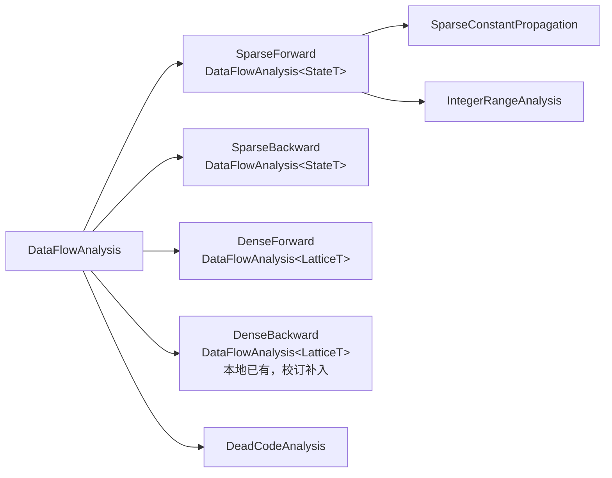
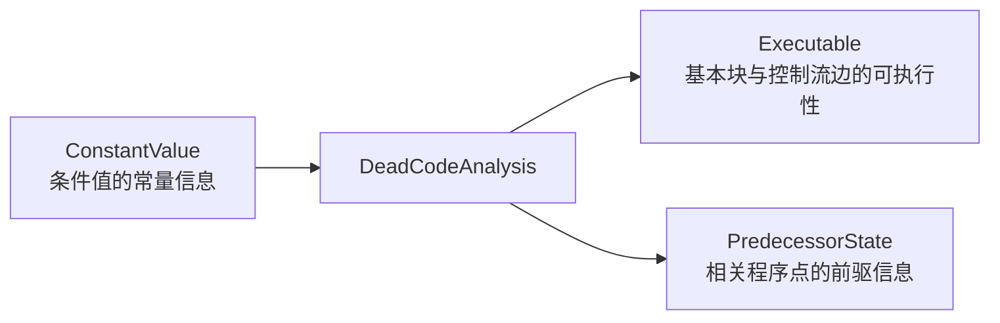
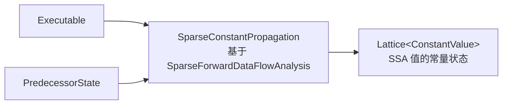
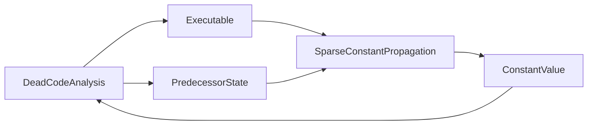

# 第 7 章 MLIR 中常见的通用优化技术

> 本章由扫描件逐页转写并校订，覆盖 PDF 第 1–17 页（书页 128–144）。技术内容以本地 LLVM **18.1.8**（提交 `3b5b5c1ec4a3095ab096dd780e84d7ab81f3d7ff`）为核验基准；原书以 LLVM 20 为背景。重要修正、版本差异、原文及可复现验证见 [第 7 章校订记录](issues/ch7.md)。代码清单保留原编号；输出中的 SSA 名称和排版作了便于比较的统一。

<!-- source: insider-compiler-ch7-ch10.pdf, PDF p. 1 -->

一般而言，优化是针对具体的 IR 展开的。鉴于 MLIR 框架采用多层 IR 设计，各层 IR 存在差异，故需要为每一层 IR 制定不同的优化策略。然而，确实存在部分优化方法[^ch7-passnames]，可以借助 IR 结构以及操作提供的特质、接口和语义约束跨方言工作，这些方法共同构成了 MLIR 的通用优化集合。常见的通用优化与辅助 Pass 包括 `canonicalize`（IR 归一化）、`control-flow-sink`（控制流下沉）、`cse`（公共子表达式消除）、`remove-dead-values`（删除死值）、`inline`（内联）、`snapshot-op-locations`（生成 IR 位置信息）、`loop-invariant-code-motion`（循环不变量外提）、`loop-invariant-subset-hoisting`（循环不变子集外提）、`mem2reg`（内存到寄存器转换）、`print-op-stats`（操作统计输出）、`sccp`（稀疏条件常量传播）、`sroa`（聚合类型的标量替换）、`strip-debuginfo`（删除调试信息）、`symbol-dce`（死符号删除）、`symbol-privatize`（符号私有化）、`view-op-graph`（生成操作图）和 `topological-sort`（拓扑排序）。原书还列出 `composite-fixed-point-pass`（复合不动点 Pass），本地 LLVM 18.1.8 未提供该 Pass。

> 校订注：通用优化仍然依赖操作语义，不能仅凭结构进行任意变换。原书列出的 `inliner`、`licm` 是内联器与算法的名称，本地命令行选项分别为 `--inline`、`--loop-invariant-code-motion`；统计、位置快照和图显示等属于辅助工具。[依据与版本说明](issues/ch7.md#pass-names)。

此外，MLIR 框架中还存在一些有重要意义但尚未正式以通用 Pass 形式对外提供的优化方法，如操作数位置排序。

本章简要介绍部分优化方法。

## 7.1 操作数位置排序

当操作指定 `Commutative` 特质时，表明其操作数可相互交换，但操作数位置并不固定。为此，MLIR 框架提供了用于操作数排序的辅助模式，可通过 `populateCommutativityUtilsPatterns` 添加到模式集合中。排序首先按照基本块参数、非常量操作的结果、常量操作的结果的顺序比较。对于操作结果，还会比较其定义操作的名称。若这些信息仍无法确定顺序，则会继续比较其操作数所形成的祖先信息。

<!-- source: insider-compiler-ch7-ch10.pdf, PDF p. 2 -->

这一比较使用**广度优先遍历**。倘若比较结果仍然相同，则通过稳定排序保留操作数原有的相对顺序。假设有一段待排序的操作数，如代码清单 7-1 所示。

**代码清单 7-1 待排序的操作数**

```text
%1 = foo.const 0
%2 = foo.mul <block argument>, <block argument>
%3 = foo.mul %2, %1
%4 = foo.add %2, %1
%5 = foo.commutative %1, %2, %3, %4
```

此处为示意代码，省略了类型和操作定义；假定 `foo.const` 具有 `ConstantLike` 特质，`foo.commutative` 具有 `Commutative` 特质。假设 `foo` 方言的 `commutative` 操作接收 4 个操作数，如代码清单 7-1 中 `%5 = foo.commutative %1, %2, %3, %4` 所示，其中部分实参是其他操作的运算结果。按照本地实现排序后，可得到：

```text
%5 = foo.commutative %4, %2, %3, %1
```

`foo.add` 的名称排在 `foo.mul` 之前；两个 `foo.mul` 结果之间，`%2` 的祖先首先是基本块参数，因此排在 `%3` 之前；常量 `%1` 排在最后。

提供这一优化的目的是为后续一些优化的执行提供便利，尤其是 DAG 模式匹配。

> 校订注：原书写成“深度优先”，并将结果排为 `%4, %3, %2, %1`。本地辅助函数的注释也保留了同样的错误示例，但实际算法与可运行的测试均得到上述顺序。[排序核验](issues/ch7.md#operand-sorting)。

## 7.2 IR 归一化

MLIR 提供了针对算子的归一化机制，支持自定义归一化操作，这使得 IR 归一化的实现更为便捷。当 IR 完成归一化后，后续的优化工作将更容易开展。

目前，框架提供了两类常用机制，分别为 `RewritePattern` 和 `fold`，具体说明如下。

### （1）RewritePattern

`RewritePattern` 用于定义匹配模式并对 IR 进行重写。在 TD 文件中，可通过设置 `let hasCanonicalizer = 1` 或者 `let hasCanonicalizeMethod = 1`，为算子生成相应的方法声明，即 `getCanonicalizationPatterns()` 和 `canonicalize()`。这两个方法的参数存在差异：`getCanonicalizationPatterns()` 可向集合中添加多个模式，而 `canonicalize()` 直接对该算子执行一次匹配和重写。在 `mlir-tblgen` 处理 TD 文件、生成代码时，`hasCanonicalizeMethod` 对应的 `canonicalize()` 会被包装为一个模式，并由默认生成的 `getCanonicalizationPatterns()` 加入模式集。从这个角度看，**这一默认包装**只添加了一个模式；自行实现的 `getCanonicalizationPatterns()` 则不受此限制。

### （2）fold

`fold` 用于定义折叠操作。它不能直接创建新的操作，但可以返回已有的 SSA 值或表示常量的属性，也可以按约定原地简化操作；常量属性可由折叠框架物化为常量操作。在 TD 文件中，可通过设置 `let hasFolder = 1` 为算子生成相应的方法声明，即单结果操作常用的 `fold(FoldAdaptor adaptor)`，或者多结果操作常用的 `fold(FoldAdaptor adaptor, SmallVectorImpl<OpFoldResult> &results)`。

`canonicalize` Pass 会利用 `getCanonicalizationPatterns()` 提供的模式和 `fold()` 钩子。折叠机制也可由 `OpBuilder::createOrFold` 等其他入口使用。MLIR 所提供的归一化 Pass 能够对操作进行归一化处理。在 `mlir-opt` 工具中，可通过参数 `--canonicalize` 使用归一化功能。鉴于该优化方法可处理许多不同种类的操作，在使用时需依据 IR 结构合理安排 Pass。开发者也可在代码中创建 `PassManager`，并将 `createCanonicalizerPass()` 返回的 Pass 通过 `addPass()` 加入管理器。

归一化功能依赖于方言和操作所定义的归一化模式。方言和操作均能定义 `getCanonicalizationPatterns()`。

<!-- source: insider-compiler-ch7-ch10.pdf, PDF p. 3 -->

操作上的函数原型为：

```cpp
static void getCanonicalizationPatterns(::mlir::RewritePatternSet &results,
                                       ::mlir::MLIRContext *context);
```

方言上的接口则是成员函数，原型为：

```cpp
virtual void getCanonicalizationPatterns(RewritePatternSet &results) const;
```

在该函数中，开发者需要提供用于归一化的匹配模式。例如，`arith` 方言中针对 `AndIOp` 实现的 `getCanonicalizationPatterns()` 方法如代码清单 7-2 所示。

**代码清单 7-2 `getCanonicalizationPatterns()` 方法**

```cpp
void arith::AndIOp::getCanonicalizationPatterns(RewritePatternSet &patterns,
                                              MLIRContext *context) {
  patterns.add<AndOfExtUI, AndOfExtSI>(context);
}
```

从代码清单 7-2 中可以看出，`getCanonicalizationPatterns()` 函数为匹配模式集添加了两个归一化模式：`AndOfExtUI` 和 `AndOfExtSI`，二者对应的模式定义如代码清单 7-3 所示。

**代码清单 7-3 `AndOfExtUI` 和 `AndOfExtSI` 对应的模式定义**

```tablegen
// 对两个 extui 或两个 extsi 的结果执行 and 时，可先对原始值执行 and：
// and(extui(x), extui(y)) -> extui(and(x, y))
// and(extsi(x), extsi(y)) -> extsi(and(x, y))
def AndOfExtUI :
    Pat<(Arith_AndIOp (Arith_ExtUIOp $x), (Arith_ExtUIOp $y)),
        (Arith_ExtUIOp (Arith_AndIOp $x, $y)),
        [(Constraint<CPred<"$0.getType() == $1.getType()">> $x, $y)]>;

def AndOfExtSI :
    Pat<(Arith_AndIOp (Arith_ExtSIOp $x), (Arith_ExtSIOp $y)),
        (Arith_ExtSIOp (Arith_AndIOp $x, $y)),
        [(Constraint<CPred<"$0.getType() == $1.getType()">> $x, $y)]>;
```

在执行归一化处理时，如果遇到 `arith` 方言的 `AndIOp`，且它符合上述两种匹配模式之一，代码就会被重写。[归一化接口与示例核验](issues/ch7.md#canonicalization)。

## 7.3 控制流下沉

控制流下沉（即 `control-flow-sink`）利用 `RegionBranchOpInterface` 接口寻找具有区域间控制流的操作。在使用 `mlir-opt` 工具时，可通过参数 `--control-flow-sink` 启用控制流下沉功能。实现接口的是提供候选目标区域的操作，待下沉的计算本身不必实现该接口。

该优化需满足以下条件。

- 分支区域最多执行一次，这些区域为代码下沉的目的地。例如，`scf.if` 中的 `then` 和 `else` 分支最多执行一次，因此两个分支均有可能成为代码下沉的目的地。
- 针对区域展开处理。若区域外部定义的操作，其结果仅在该区域内部被使用，且移动满足依赖与支配关系要求，那么可将该操作的定义下沉至区域内部。

<!-- source: insider-compiler-ch7-ch10.pdf, PDF p. 4 -->

本地 Pass 还要求待下沉的操作通过 `isMemoryEffectFree` 检查，不能仅凭使用位置就移动有内存副作用的操作。

假设有一个待执行控制流下沉的代码片段，如代码清单 7-4 所示。

**代码清单 7-4 待执行控制流下沉的代码片段**

```mlir
func.func @test_scf_if_sink(%arg0: i1, %arg1: i32) -> i32 {
  %0 = arith.addi %arg1, %arg1 : i32
  %1 = arith.muli %arg1, %arg1 : i32
  %result = scf.if %arg0 -> i32 {
    scf.yield %0 : i32
  } else {
    scf.yield %1 : i32
  }
  return %result : i32
}
```

代码清单 7-4 经控制流下沉优化后，结果如代码清单 7-5 所示。

**代码清单 7-5 代码清单 7-4 执行控制流下沉优化后的结果**

```mlir
func.func @test_scf_if_sink(%arg0: i1, %arg1: i32) -> i32 {
  %result = scf.if %arg0 -> i32 {
    %0 = arith.addi %arg1, %arg1 : i32
    scf.yield %0 : i32
  } else {
    %1 = arith.muli %arg1, %arg1 : i32
    scf.yield %1 : i32
  }
  return %result : i32
}
```

对比代码清单 7-4 和代码清单 7-5 不难发现，代码清单 7-4 中定义 `%0`、`%1` 的操作分别被下沉到 `then` 和 `else` 分支中。之所以如此，是因为这两个结果各自仅在一个分支中被使用，且相应计算满足移动条件。

## 7.4 公共子表达式消除

公共子表达式消除（即 CSE）旨在删除冗余操作。该优化遍历操作内的嵌套区域和操作。本地实现暂不将**自身带有多基本块区域的操作**作为公共子表达式进行合并；这不意味着整个 Pass 只能处理单基本块函数，多基本块区域仍可通过支配树遍历处理。

那么，哪些操作可以被消除呢？通常而言，如果一个操作的结果未被使用，且满足 `isOpTriviallyDead` 等可安全删除条件，那么这个操作便可以被消除。内存副作用涉及读取、写入、分配、释放等，未知副作用也必须保守处理，不能只检查结果是否有使用者。

此外，当存在等价操作且替代值满足支配等条件时，也可尝试消除重复操作，具体分为以下两种情形。

1. 操作具有可分析的内存效果：对于不是完全无内存副作用、但通过 `MemoryEffectOpInterface` 声明只有读取效果的操作，本地实现还支持有限的冗余读取消除。重复读取必须位于同一基本块，且两次读取之间没有可能写入内存的操作；不能确定效果的操作会阻止该变换。

<!-- source: insider-compiler-ch7-ch10.pdf, PDF p. 5 -->

2. 操作可被证明没有内存副作用：可以按操作等价性尝试消除。证明可能来自接口或递归副作用语义；**没有实现 `MemoryEffectOpInterface` 并不自动意味着没有副作用**，未知操作不能因此直接消除。

判断多个操作能否被合并的前提是它们按 CSE 使用的规则等价。在 CSE 中使用哈希表保存已知操作。为加快判断速度，系统会计算每个操作的散列（俗称哈希）值。等价性比较忽略源码位置，但会比较操作名称、相关属性与 properties、操作数、结果类型以及需要比较的区域结构等。这里并不要求两个操作产生同一个 SSA 结果对象。对于具有可交换特质的操作，相应的操作数交换也可被识别为等价。

假设有一个待执行 CSE 优化的代码片段，如代码清单 7-6 所示。

**代码清单 7-6 待执行 CSE 优化的代码片段**

```mlir
func.func @check_cummutative_cse(%a: i32, %b: i32) -> i32 {
  %1 = arith.addi %a, %b : i32
  %2 = arith.addi %b, %a : i32
  %3 = arith.muli %1, %2 : i32
  return %3 : i32
}
```

代码清单 7-6 经 CSE 优化后，结果如代码清单 7-7 所示。

**代码清单 7-7 代码清单 7-6 执行 CSE 优化后的结果**

```mlir
func.func @check_cummutative_cse(%a: i32, %b: i32) -> i32 {
  %1 = arith.addi %a, %b : i32
  %3 = arith.muli %1, %1 : i32
  return %3 : i32
}
```

对比代码清单 7-6 和代码清单 7-7 不难发现，代码清单 7-6 中产生重复结果 `%2` 的操作被删除，其使用被替换为 `%1`。[CSE 规则与未知操作反例](issues/ch7.md#cse)。

## 7.5 IR 验证器

此处的 IR 验证器指在原始 IR 中针对操作插入**运行时验证代码**，对应 Pass 为 `generate-runtime-verification`。这一变换得以实施的前提是，操作实现 `RuntimeVerifiableOpInterface` 接口，并实现该接口定义的 `generateRuntimeVerification()` 函数。这个函数生成需要在程序运行时执行的检查，主要用于静态验证无法满足的场景；它不是调用静态 IR verifier，也不一定会提升程序运行速度。

## 7.6 循环不变量外提

循环不变量外提（LICM）将循环中的不变计算提升至循环外部，本地 Pass 名称为 `loop-invariant-code-motion`。循环操作必须实现 `LoopLikeOpInterface`，以便优化识别其循环体、外部值和移动位置；被提升的普通计算不必实现循环接口。

本地 LICM 对候选计算的主要要求为：①所依赖的值在循环外部定义，或随先前的外提已变得可用；②计算没有内存副作用；③计算可安全推测执行（`isSpeculatable`），避免在循环原本不执行时引入非法行为。操作内部嵌套的计算和依赖也需要满足相应条件。候选计算原本位于循环内部，不能将条件误写为“该计算已在循环外定义”。

<!-- source: insider-compiler-ch7-ch10.pdf, PDF p. 6 -->

假设有一段待执行 LICM 优化的代码片段，如代码清单 7-8 所示。

**代码清单 7-8 待执行 LICM 优化的代码片段**

```mlir
func.func @nested_loops_both_having_invariant_code() {
  %m = memref.alloc() : memref<10xf32>
  %cf7 = arith.constant 7.0 : f32
  %cf8 = arith.constant 8.0 : f32
  affine.for %arg0 = 0 to 10 {
    %v0 = arith.addf %cf7, %cf8 : f32
    affine.for %arg1 = 0 to 10 {
      %v1 = arith.addf %v0, %cf8 : f32
      affine.store %v0, %m[%arg0] : memref<10xf32>
    }
  }
  return
}
```

代码清单 7-8 经 LICM 优化后，结果如代码清单 7-9 所示。

**代码清单 7-9 代码清单 7-8 执行 LICM 优化后的结果**

```mlir
func.func @nested_loops_both_having_invariant_code() {
  %m = memref.alloc() : memref<10xf32>
  %cf7 = arith.constant 7.0 : f32
  %cf8 = arith.constant 8.0 : f32
  %v0 = arith.addf %cf7, %cf8 : f32
  %v1 = arith.addf %v0, %cf8 : f32
  affine.for %arg0 = 0 to 10 {
    affine.for %arg1 = 0 to 10 {
      affine.store %v0, %m[%arg0] : memref<10xf32>
    }
  }
  return
}
```

对比代码清单 7-9 不难发现，代码清单 7-8 中 `affine.for` 内定义 `%v0` 和 `%v1` 的操作，经过优化后被提到了两个循环外面。本地 Pass 由内向外处理嵌套循环；仅运行此 Pass 时，未使用的 `%v1` 仍会保留，后续归一化或死代码消除可继续清理。[移动条件与验证结果](issues/ch7.md#motion-and-verification)。

## 7.7 内存到寄存器转换

内存到寄存器转换（`mem2reg`）的核心是将可提升内存槽的读写转化为对 SSA 值的直接使用及传递。通过该优化，不仅能够移除开销较大的内存访问，还能使后续的分析与优化工作更为便捷。这里说的内存形式并不是 LLVM 的 `MemorySSA` 分析对象；原始指针或 memref 本身已经是 SSA 值，尚未显式化为 SSA 数据流的是其指向的存储内容。

<!-- source: insider-compiler-ch7-ch10.pdf, PDF p. 7 -->

此优化在 LLVM 项目中得到了广泛应用。原书将这里讨论的 MLIR 通用实现追溯到 Polygeist[^ch7-polygeist]，并记载其于 2023 年整合进社区；这段历史不应理解为 LLVM 的 `mem2reg` 算法直到 2023 年才出现。

该优化算法可细分为 4 个步骤。这 4 个步骤又进一步分为两个阶段：分析阶段与修改阶段。其中，前两个步骤属于分析阶段，后两个步骤属于修改阶段。

1. **收集可转换的内存相关操作。** 例如，利用 `alloca` 操作分配栈内存空间，对于 `load`、`store` 这样直接访问内存的操作，可以尝试用被存储内容的 SSA 值替代其数据传递。`alloca` 的返回值是内存槽的引用，并不是将要替代存储内容的“虚拟寄存器”。本地实现通过 `PromotableAllocationOpInterface`、`PromotableMemOpInterface` 和 `PromotableOpInterface` 等接口，判断内存槽及其使用是否可提升。一般而言，直接读写可提升内存槽的操作可以参与转换，但也存在间接使用等特殊情况；必要时还需分析相关操作链。因此，算法会借助 `getForwardSlice()` 收集与阻塞使用有关的前向依赖，并检查这些使用是否可被安全移除或处理。
2. **收集变量汇聚点。** 在构建 SSA 形式时，通常需要添加 Phi 函数来处理汇聚变量。在 MLIR 中，虽不采用 Phi 指令，而是借助基本块参数来处理汇聚变量，但同样需要收集变量的汇聚点。计算汇聚点采用迭代支配边界（Iterated Dominance Frontier，IDF）算法。此过程需要提供定义基本块，例如包含 `store` 的基本块，以及该内存槽的活入基本块。并非每个包含 `load` 的基本块都必然活入，还要考虑块内先写后读等情况。然后通过 IDF 算法计算需要传递汇聚值的位置，具体可参考《深入理解 LLVM：代码生成》第 4 章。计算完汇聚点后，在所需基本块中添加基本块参数。
3. **定位操作定义。** 对于涉及内存读取的操作，需要确定该位置可到达的存储值，利用它替换后续读取所产生的值。如果该值来自基本块参数，就需要同步更新基本块参数及其前驱分支传递的操作数。这一步也负责沿控制流传播最新的定义。
4. **替换与删除操作。** 使用上述 SSA 值替换内存读取结果，并按接口协议删除可移除的内存访问、阻塞使用和分配操作。处理依赖关系时采用适当的逆序，保证重写过程合法。

假设有一段待执行 `mem2reg` 优化的代码片段，如代码清单 7-10 所示。

**代码清单 7-10 待执行 `mem2reg` 优化的代码片段**

```mlir
func.func @cycle(%arg0: i64, %arg1: i1, %arg2: i64) {
  %alloca = memref.alloca() : memref<i64>
  memref.store %arg2, %alloca[] : memref<i64>
  cf.cond_br %arg1, ^bb1, ^bb2
^bb1:
  %use = memref.load %alloca[] : memref<i64>
  call @use(%use) : (i64) -> ()
  memref.store %arg0, %alloca[] : memref<i64>
  cf.br ^bb2
^bb2:
  cf.br ^bb1
}
func.func @use(%arg: i64) { return }
```

代码清单 7-10 经 `mem2reg` 优化后，结果如代码清单 7-11 所示。

<!-- source: insider-compiler-ch7-ch10.pdf, PDF p. 8 -->

**代码清单 7-11 代码清单 7-10 执行 `mem2reg` 优化后的结果**

```mlir
func.func @use(%arg0: i64) {
  return
}
func.func @cycle(%arg0: i64, %arg1: i1, %arg2: i64) {
  cf.cond_br %arg1, ^bb1(%arg2 : i64), ^bb2(%arg2 : i64)
^bb1(%0: i64):  // 2 preds: ^bb0, ^bb2
  call @use(%0) : (i64) -> ()
  cf.br ^bb2(%arg0 : i64)
^bb2(%1: i64):  // 2 preds: ^bb0, ^bb1
  cf.br ^bb1(%1 : i64)
}
```

对比代码清单 7-11 不难发现，经过优化后，代码清单 7-10 中与 `%alloca` 相关的使用均被消除了。清单保留原书的函数排列顺序；本地工具输出时仍将 `@cycle` 放在 `@use` 前面，两者不影响这一转换的含义。[内存槽提升核验](issues/ch7.md#mem2reg)。

## 7.8 拓扑排序

拓扑排序（`topological-sort`）是指依据操作之间的定义与使用依赖，对代码进行排序。在 MLIR 中，某些区域的操作顺序不受 SSA 支配规则限制。例如，在图区域中，操作可以先使用后定义；对于无环依赖，执行拓扑排序能够将其整理为先定义后使用的顺序，便于后续处理。这是一种结构整理，不能将其等同于为任意图保证程序执行正确性；存在依赖环时也不可能得到满足所有边的线性拓扑序。

假设有一段待执行拓扑排序的代码片段，如代码清单 7-12 所示。

**代码清单 7-12 待执行拓扑排序的代码片段**

```mlir
test.graph_region {
  %0 = "test.foo"() {selected} : () -> i32
  "test.bar"(%1, %0) {selected} : (i32, i32) -> ()
  %1 = "test.baz"() {selected} : () -> i32
}
```

代码清单 7-12 经拓扑排序后，结果如代码清单 7-13 所示。

**代码清单 7-13 代码清单 7-12 经拓扑排序后的结果**

```mlir
module {
  test.graph_region {
    %0 = "test.foo"() {selected} : () -> i32
    %1 = "test.baz"() {selected} : () -> i32
    "test.bar"(%1, %0) {selected} : (i32, i32) -> ()
  }
}
```

对比代码清单 7-13 不难发现，代码清单 7-12 中的代码已按照拓扑顺序重新进行了排布。这里的 `test` 方言是 MLIR 测试方言，运行示例需要工具注册它；本地构建具备这一条件。

<!-- source: insider-compiler-ch7-ch10.pdf, PDF p. 9 -->

## 7.9 聚合类型的标量替换

### 7.9.1 应用示例

聚合类型的标量替换（`sroa`）是针对聚合类型（一般指数组、结构体）所进行的优化。其核心是把可分解的聚合内存槽拆成独立的子槽，使后续优化能够分别处理这些部分。特别是当代码只使用聚合类型的一部分时，可以仅保留实际使用的子槽，而无须保留整个聚合对象。

在 MLIR 中，`llvm` 方言和 `memref` 方言中的相关分配操作是这一优化的典型对象。在 `llvm` 方言中，`alloca` 可用于申请数组和结构体等类型的存储；在 `memref` 方言中，`alloca` 可用于申请 memref。通用算法依赖可分解内存槽等接口，其扩展范围并不限于这两个方言中名为 `alloca` 的操作。

假设有一段待执行 `sroa` 优化的代码片段，如代码清单 7-14 所示。

**代码清单 7-14 待执行 `sroa` 优化的代码片段**

```mlir
llvm.func @basic_array() -> i32 {
  %0 = llvm.mlir.constant(1 : i32) : i32
  %1 = llvm.alloca %0 x !llvm.array<10 x i32> {alignment = 8 : i64}
      : (i32) -> !llvm.ptr
  %2 = llvm.getelementptr inbounds %1[0, 2]
      : (!llvm.ptr) -> !llvm.ptr, !llvm.array<10 x i32>
  %3 = llvm.load %2 : !llvm.ptr -> i32
  llvm.return %3 : i32
}
```

可以看到，代码清单 7-14 中声明了一个长度为 10 的数组，但实际仅访问数组索引为 `2` 的元素，即**第 3 个元素**，因此可以将数组存储拆为单个元素的存储。代码清单 7-14 经过 `sroa` 优化后，得到的结果如代码清单 7-15 所示。

**代码清单 7-15 代码清单 7-14 执行 `sroa` 优化后的结果**

```mlir
module {
  llvm.func @basic_array() -> i32 {
    %0 = llvm.mlir.constant(1 : i32) : i32
    %1 = llvm.alloca %0 x i32 : (i32) -> !llvm.ptr
    %2 = llvm.load %1 : !llvm.ptr -> i32
    llvm.return %2 : i32
  }
}
```

对比代码清单 7-15 不难发现，代码清单 7-14 中的数组分配已被替换为针对单个元素的分配操作。此示例没有在读取之前初始化内存，只用于展示 IR 结构变换，不应据此推断函数返回某个确定的整数值。

### 7.9.2 实现过程

在 MLIR 框架中，`sroa` 的实现过程大致如下。

<!-- source: insider-compiler-ch7-ch10.pdf, PDF p. 10 -->

#### 1. 寻找可替换的聚合类型

**（1）操作可替换性判断**

`sroa` 要先确定相关操作是否具备可分解性。若不可分解，后续操作便无意义。聚合内存槽的起始点是分配操作，例如 `alloca`。为了快速甄别哪些分配可参与优化，MLIR 引入了 `DestructurableAllocationOpInterface` 接口。实现该接口的分配操作能够提供候选内存槽，并在转换时创建对应的子槽。

**（2）分配类型分析**

对于确定可分解的分配操作，还需进一步剖析其分配的类型。在 `llvm` 方言中，典型聚合类型为数组和结构体；在 `memref` 方言中，需要分析相应 memref 类型。`DestructurableTypeInterface` 接口用来提供类型的子元素信息，帮助分配接口枚举可分解的部分。

**（3）元素类型信息收集**

1. 字段访问操作分析。对访问子元素的操作展开分析，并收集其使用的索引。MLIR 通过 `DestructurableAccessorOpInterface` 接口描述能够重接到子槽的访问操作，例如 `llvm` 方言中的 GEP，以及适用的 memref 访问操作。对于 GEP 等操作产生的进一步访问，还需考虑这些内存访问是否安全；为此，MLIR 引入 `SafeMemorySlotAccessOpInterface`，由操作判断能否安全访问并继续追踪相关子槽。
2. 整体聚合类型 IR 分析。直接使用整个内存槽的操作也必须纳入分析。若不能将其安全重接到子槽，便可能成为阻止分解的使用，需要继续判断是否能够移除。
3. 前向切片（Forward Slice）分析。对于上述阻塞使用，收集前向使用依赖。相关操作需通过 `PromotableOpInterface` 等协议证明这些阻塞使用可以被安全移除。这里不是要求分配结果的所有使用者都实现 `PromotableOpInterface`：可重接访问和安全访问具有各自的接口及检查路径。只有所有相关使用均可处理时，才进行分解。

#### 2. 替换聚合类型

**（1）为实际使用的子槽创建分配**

依据收集到的子元素索引，调用分配操作的 `destructure` 接口创建子槽。例如，对于仅访问一个数组元素的情形，可新增该元素对应的分配，并将原有访问重接到新分配。这里是把数组分配拆成元素分配，**不是用 `alloca` 替换 `load`**，也不是为每次读取各建一个独立的分配。

**（2）使用点的拓扑排序与重写**

对需要处理的访问和阻塞使用进行拓扑排序，然后逆向遍历，以满足操作间的依赖关系。按照前面得到的分析结果，重接可分解访问，移除可消除的阻塞使用，删除相应操作，最后由接口完成原分配的清理。[SROA 接口名称及算法修正](issues/ch7.md#sroa)。

## 7.10 内联

### 7.10.1 应用示例

内联是优化过程中极为重要的一种手段，不仅能够降低函数调用所产生的开销，还能为后续优化创造更多契机。本地 `mlir-opt` 的选项为 `--inline`。

<!-- source: insider-compiler-ch7-ch10.pdf, PDF p. 11 -->

假设有一段待执行内联优化的代码片段，如代码清单 7-16 所示。

**代码清单 7-16 待执行内联优化的代码片段**

```mlir
func.func @foo(%a: memref<10x10xf32>, %b: memref<10xf32>, %c: memref<10xf32>) {
  func.call @foo_0(%a, %b) : (memref<10x10xf32>, memref<10xf32>) -> ()
  func.call @foo_1(%b, %c) : (memref<10xf32>, memref<10xf32>) -> ()
  return
}
func.func private @foo_0(%a: memref<10x10xf32>, %b: memref<10xf32>) {
  affine.for %i0 = 0 to 10 {
    affine.for %i1 = 0 to 10 {
      %v0 = affine.load %b[%i0] : memref<10xf32>
      %v1 = affine.load %a[%i0, %i1] : memref<10x10xf32>
      %v3 = arith.addf %v0, %v1 : f32
      affine.store %v3, %b[%i0] : memref<10xf32>
    }
  }
  return
}
func.func private @foo_1(%b: memref<10xf32>, %c: memref<10xf32>) {
  affine.for %i2 = 0 to 10 {
    %v4 = affine.load %b[%i2] : memref<10xf32>
    affine.store %v4, %c[%i2] : memref<10xf32>
  }
  return
}
```

代码清单 7-16 经内联优化后，结果如代码清单 7-17 所示。

**代码清单 7-17 代码清单 7-16 执行内联优化后的结果**

```mlir
module {
  func.func @foo(%a: memref<10x10xf32>, %b: memref<10xf32>, %c: memref<10xf32>) {
    affine.for %i = 0 to 10 {
      affine.for %j = 0 to 10 {
        %0 = affine.load %b[%i] : memref<10xf32>
        %1 = affine.load %a[%i, %j] : memref<10x10xf32>
        %2 = arith.addf %0, %1 : f32
        affine.store %2, %b[%i] : memref<10xf32>
      }
    }
    affine.for %i = 0 to 10 {
      %0 = affine.load %b[%i] : memref<10xf32>
      affine.store %0, %c[%i] : memref<10xf32>
    }
    return
  }
}
```

对比代码清单 7-17 不难发现，代码清单 7-16 中的函数 `foo_0()` 和 `foo_1()` 均被内联至函数 `foo()` 中。

<!-- source: insider-compiler-ch7-ch10.pdf, PDF p. 12 -->

### 7.10.2 实现过程

内联的实现过程并非简单之事。在 MLIR 中，内联以 SCC（Strongly Connected Component，强连通分量）为粒度开展。SCC 的处理略显复杂，例如，当调用图形成 `A → B → C → A` 的循环结构时，对该结构进行内联就颇为棘手。因为在内联过程中不仅需要确保转换后的语义正确性，还得保证内联能够在有限步骤内终止。

内联器以自底向上的顺序处理调用图中的 SCC。对于一个递归 SCC，可以用原书的过程理解递归展开：假设依次处理 C、B、A，并且相应调用允许内联，先把 A 的实现内联到 C 中，可得到 C 调用 B；再把 C 的实现内联到 B 中，可出现 B 调用 B；最后把 B 的实现内联到 A 中，可得到 A 调用 B。这是说明递归调用关系如何变化的示意，不能把 `C、B、A` 视为 SCC 内必定采用的遍历顺序，也不能把上述关系视为真实内联器对任意输入都保证产生的最终结果。

为防止无限递归展开，内联过程会记录调用点的内联历史，检查候选目标是否已在该调用点的祖先内联链中出现；还会限制 SCC 的迭代次数。它不是全局规定“一个函数只允许被内联一次”。

具体算法过程如下。

**（1）构建调用图和强连通分量**

调用图和 SCC 的构建依赖操作提供的 `CallOpInterface`、`CallableOpInterface` 以及符号相关接口和符号表信息。

**（2）计算可内联的调用**

1. 确定被调用者（callee）。实现 `CallableOpInterface` 的操作可以提供可调用体。还需检查调用目标能否解析、是否有可内联的定义，以及方言接口给出的合法性等条件。同时分析符号的使用情况，判断其在内联后能否安全删除。外部可见的函数仍可被内联，但其定义通常必须保留供外部调用。
2. 收集可内联调用。在调用图的各节点内收集候选调用点，并解析相应目标，后续对这些调用点执行内联。

**（3）进行内联准备**

1. 预处理优化。默认情况下，内联器使用归一化作为可调用体的优化流水线。
2. 内联准备。以 SCC 为粒度进行处理，并在此过程中计算调用操作、调用点、目标节点及使用关系。

**（4）执行内联操作**

1. 避免递归重复展开。使用 `InlineHistory` 记录内联形成的调用点祖先链，阻止在同一展开链上重复引入相同目标。
2. 代码重构。处理调用实参与形参、返回值及终止操作，将被调用体的基本块或操作接入调用者的相应区域。根据目标是否只有一个使用且可安全删除，选择移动或克隆被调用体；并非总要在调用点新建一个包裹区域。
3. 清理与更新。删除已被替换的调用操作，在满足可删除条件时清理不再使用的被调用者，并更新使用关系、调用图和 SCC 等信息。

内联优化可由不同方言的可调用操作和调用操作共同参与。在 MLIR 中，方言通过 `DialectInlinerInterface` 提供一组钩子，包括 `isLegalToInline`、`handleTerminator`、`materializeCallConversion`、`handleArgument`、`handleResult`、`processInlinedCallBlocks` 等。它们是一个方言接口上的方法，并非多个独立接口。参与内联的方言需要提供适用的合法性判断；被调用体终止操作的方言还需提供相应的终止操作处理，必要时实现类型转换、参数及返回值等钩子。

那么，为什么要把这些策略放在方言接口中呢？内联需要协调跨操作、跨区域乃至跨方言的语义，将共同的内联策略集中到方言接口中便于统一处理。

<!-- source: insider-compiler-ch7-ch10.pdf, PDF p. 13 -->

操作接口仍然承担重要职责，例如描述具体操作的调用与被调用行为；操作接口的作用范围并不天然局限于单个区域。[内联合法性、递归处理及公开符号反例](issues/ch7.md#inlining)。

## 7.11 稀疏条件常量传播

在 MLIR 中，稀疏条件常量传播（即 `sccp`）基于数据流分析实现。不过，MLIR 中的 SCCP 与传统实现（可参考《深入理解 LLVM：代码生成》第 3 章）在框架组织上存在差异，其实现更为复杂，主要体现在以下 3 个方面。

1. **IR 结构差异导致的分析复杂性。** MLIR 的 IR 由操作、区域和基本块构成嵌套层次，这与传统 IR 不同，例如 LLVM IR 不包含 MLIR 式的嵌套区域。特别地，MLIR 的区域之间也可能存在分支和汇聚。因此，进行数据流分析时不仅要考虑基本块的分支和汇聚，还需顾及区域之间的控制流，这使得分析更复杂。
2. **分析框架带来的复杂性。** MLIR 提供了数据流分析框架，支持对多种分析进行编排，即通过分析组合实现一个功能。例如，SCCP 是死代码分析（Dead Code Analysis，DCA）与稀疏常量传播的组合。这种方式要求实现处理各分析之间的状态依赖。
3. **跨过程分析带来的复杂性。** 本地数据流框架默认启用跨过程分析，需要处理由调用操作构成的调用图，将参数、返回值和控制流信息在过程间传递。这并不意味着 SCCP 是“流不敏感”的：它依赖可执行路径，并依据各程序点和 SSA 值传播信息。不能将跨过程、上下文敏感性和流敏感性混为一谈。

接下来简要介绍 MLIR 数据流分析框架和 SCCP 的实现。

### 7.11.1 MLIR 数据流分析框架

2022 年之前，MLIR 社区虽已存在数据流分析框架，但其实现方式不够简洁。后来，Jeff Niu 提出了一种新的数据流分析框架，该框架的主要特点在于引入了可组合的分析架构。

#### 1. 新型数据流分析框架的理论基础

对于从程序点 \(p\) 到程序点 \(q\) 的一条传播关系，单调前向数据流迭代可以示意为：

\[
S_{i+1}(q)=S_i(q)\sqcup f_{\mathrm{op}}\bigl(S_i(p)\bigr).
\]

式中，\(S_i\) 表示第 \(i\) 次迭代的抽象状态；\(f_{\mathrm{op}}\) 是相应操作的转移函数；\(p\)、\(q\) 表示程序点；\(\sqcup\) 表示该抽象状态域上的合并运算（join）。具有多个前驱时，需要合并各相关前驱的贡献，边界状态也需单独给定。数据流的终止条件是达到不动点，即对所有相关程序点均有 \(S_{i+1}(q)=S_i(q)\)。

在 MLIR 框架中，设计目标之一是支持多种数据流分析的组合。假定存在两种分析，它们产生的状态数量非常庞大，可以将全部分析状态组织成一个复合状态，例如：

\[
S'(p)=\bigl(S^a(p),S^b(p),\ldots\bigr).
\]

相应的转移函数 \(f_a\)、\(f_b\) 只读取各自需要的状态，也可以读取其他分析产生的相关状态。对于某个分析无意义的状态应被忽略，而不能把所有分析的转移函数简单地做集合交运算。用 \(\mathrm{deps}(a,q)\) 表示分析 \(a\) 在 \(q\) 处依赖的状态，其更新可以示意为：

\[
S^a_{i+1}(q)
=S^a_i(q)\sqcup_a
f_a\!\left(S_i\big|_{\mathrm{deps}(a,q)}\right).
\]

这里的依赖可以位于不同程序点；求解器记录这些依赖，当某个状态发生变化时，再安排读取它的分析继续计算。这样便可把多种分析组合到同一不动点求解过程中。

> 校订注：原书把不同分析的转移函数写成集合交，并在首个传播公式中混用了源程序点和目标程序点。这里改为抽象域上的合并及依赖驱动的组合；原公式完整保留在 [数学表述校订](issues/ch7.md#dataflow-math) 中。

<!-- source: insider-compiler-ch7-ch10.pdf, PDF p. 14 -->

#### 2. 新型数据流分析框架的实现

MLIR 对新的数据流分析框架进行了抽象，主要涵盖以下内容。

**（1）程序点**

程序点刻画数据流分析所关联的基本单元。在本地实现中，`ProgramPoint` 可以表示 `Operation *`、`Value`、`Block *`，以及自定义的 `GenericProgramPoint *`。以死代码分析为例，基本块可以作为程序点，控制流边也可以用自定义程序点表示。程序点提供相应对象的识别、打印及代码位置信息；`GenericProgramPoint` 是扩展机制，而不是所有程序点的唯一表示。

**（2）分析状态**

分析状态以 `AnalysisState` 为基类，用于描述某程序点关联的分析结果，并记录依赖这些结果的分析任务。不同分析具有不同的状态域。例如，死代码分析的 `Executable` 记录某个块或控制流边是否已被证明可执行；常量传播的 `ConstantValue` 则区分未初始化、已知常量和未知常量值。

状态合并需依据具体抽象域定义。格论中的 meet 为交（最大下界），join 为并（最小上界），不能不加区别地理解为普通集合的交、并。LLVM 18.1.8 的 `AnalysisState` 基类本身不再统一声明虚函数 `meet`、`join`；具体 lattice 类或其他分析状态提供其所需的更新方法。状态发生变化时，框架利用依赖关系通知相关分析重新处理。

**（3）转移函数**

`DataFlowAnalysis` 是分析的基类。一个分析实现初始化、访问程序点及更新状态等逻辑，其中包含针对特定操作或指令的转移规则。因此，它代表一个完整分析的实现，而不是一个孤立的数学转移函数。

**（4）不动点求解器**

`DataFlowSolver` 负责协调多种分析，不断处理工作队列并更新各程序点的状态，直至队列清空，各参与分析达到共同的不动点。

MLIR 提供的相关分析类别如图 7-1 所示。图中沿用原书的分类结构，将名称展开为本地类名，并补入本地已有的稠密后向分析基类；中间的抽象基类与模板细节省略，连线表示所属分析类别，不是完整 C++ 直接继承图。



**图 7-1 MLIR 已支持的分析类（按本地实现校订）**

各个分析类说明如下。

- `DeadCodeAnalysis`：死代码分析类。它依据分支条件等信息对控制流展开分析，输出可执行性信息与前驱信息。
- `SparseForwardDataFlowAnalysis`：稀疏前向数据流分析基类，沿 SSA 定义—使用关系传播抽象状态，并处理跨块、跨区域及适用的跨过程信息。开发者可通过继承该模板类实现自定义分析。
- `SparseBackwardDataFlowAnalysis`：稀疏后向数据流分析基类，同样基于 SSA 值组织分析，沿相反方向传播状态。

<!-- source: insider-compiler-ch7-ch10.pdf, PDF p. 15 -->

  开发者可通过继承该类实现自定义的后向数据流分析。
- `SparseConstantPropagation`：稀疏常量传播类，基于稀疏前向分析，使用操作折叠来推导 SSA 值的常量信息；实际 IR 替换由使用分析结果的优化完成。
- `IntegerRangeAnalysis`：整数范围求解类，基于稀疏前向分析，推导整数 SSA 值可能处于的范围。
- `DenseForwardDataFlowAnalysis`：稠密前向数据流分析基类，将抽象状态关联到操作等程序点，适合描述无法仅归附于单个 SSA 值的信息。例如，Flang 中与数组存储有关的分析可以考虑使用这种形式。“稠密”并不意味着输入 IR 不采用 SSA，也不意味着必须无条件强制更新所有程序点；仍由转移规则、控制流及状态依赖推动迭代。开发者可通过继承该类实现相应分析。本地还提供对称的 `DenseBackwardDataFlowAnalysis`。

### 7.11.2 SCCP 的实现

#### 1. 死代码分析

死代码分析是一种利用条件值信息的数据流分析，在分析过程中会考虑程序的控制流。当分支条件为常量时，便可确定哪些路径可执行，从而更准确地识别不可执行路径。此外，在跨过程分析启用时，它还会考虑调用与返回关系。

死代码分析主要产生两类信息。

1. **可执行性信息（`Executable`）。** 主要描述基本块和控制流边是否已被证明可执行。控制流边由基本块之间的跳转关系形成，`BranchOpInterface` 等接口使分析能够理解相应分支操作。原书此处将“控制流边”写成了“控制流图”，两者应加区分。
2. **前驱信息（`PredecessorState`）。** 记录到达相关程序点的已知前驱及前驱是否完全已知，供区域之间和调用之间的信息传递使用。`RegionBranchOpInterface` 描述的区域跳转，以及调用、返回等跨过程关系都会用到这类状态。普通 CFG 边的可执行性则由前一类状态记录，不能把所有不同的前驱处理混为同一对象。

在死代码分析过程中，分析器记录状态与依赖它们的分析访问之间的关系，并为相关基本块建立可执行性状态。在不动点迭代过程中，随着分支条件等信息的变化，算法会更新基本块和控制流边的可执行性。

死代码分析的工作示意图如图 7-2 所示。



**图 7-2 死代码分析的工作示意图**

图中的常量信息帮助分析选择分支；并不是把所有变量都初始化为某个已知常量。分析还会处理未知条件、入口、调用和区域控制流。

<!-- source: insider-compiler-ch7-ch10.pdf, PDF p. 16 -->

#### 2. 稀疏常量传播

稀疏常量传播基于可执行性信息和前驱信息传播常量，依据 IR 结构和抽象状态域执行必要的合并。本地常量传播使用 `Lattice<ConstantValue>`：未初始化状态可以接受后来得到的信息；相同的已知常量合并后保持不变；冲突常量或无法确定的值合并为未知常量值。这里的主要合并操作是该常量格上的 join，不能把 meet、join 当作可互换的名称。

稀疏常量传播的工作示意图如图 7-3 所示。



**图 7-3 稀疏常量传播的工作示意图**

#### 3. SCCP

死代码分析利用常量信息，输出可执行性信息和前驱信息；稀疏常量传播利用这些信息，输出常量信息。因此，将它们组合，便可以实现 SCCP。SCCP 的工作示意图如图 7-4 所示。



**图 7-4 SCCP 的工作示意图**

本地 SCCP Pass 将这两项分析装入同一个 `DataFlowSolver`，在求解完成后物化已知常量、替换使用并清理相应的无用操作。可执行性分析能够排除不可能路径对常量合并的影响，但仅运行 `--sccp` 不保证把所有不可达基本块从 IR 中删除，后续仍可安排控制流或归一化清理。

原书援引 RFC[^ch7-rfc] 报告：某些测试在采用新数据流分析框架后，性能提升了 5% 以上。这是原书转述的特定测试结论，本次未复现该性能数据，也未能从可访问的 RFC 页面确认其测试范围，因此不作为新框架在任意场景下都会更快的保证。

然而，新的数据流分析框架并非十全十美，也存在一些不足，其中典型问题如下。

1. **实现难度较大。** 该框架较为抽象，增加了实现难度。例如，开发者需要定义分析状态和转移规则，其中转移规则及跨分析依赖的实现颇具挑战。
2. **迭代顺序的控制有限。** 本地求解器使用队列安排待处理任务，没有通用的可插拔优先级调度接口。这在某些场景中可能限制优化空间：如果依赖图结构能够提供有利的访问顺序，调整调度策略可能有助于更快达到不动点。
3. **抽象会带来运行时开销。** 状态存储、程序点识别和依赖维护等通用机制需要一定成本，实际影响需要结合具体分析和输入衡量。

尽管数据流分析框架已经历多次迭代，未来仍有可能发生较大变动。新型数据流框架的起源可追溯至 2022 年，Jeff Niu 在社区发起 RFC（Request for Comments，请求评议），讨论 MLIR 可组合数据流分析框架。该提案引发了社区讨论，其设计细节有助于理解分析组合与依赖驱动求解，感兴趣的读者可参考相关 RFC。

<!-- source: insider-compiler-ch7-ch10.pdf, PDF p. 17 -->

此外，在 2023 年 5 月的 EuroLLVM 会议上，Jeff Niu 和 Tom Eccles 介绍了数据流分析框架与 SCCP，详细内容可查阅演讲资料[^ch7-dataflow-talk]。原书此处写作 4 月，演讲资料标示为 5 月 10 日。[数据流 API、图示和性能说法核验](issues/ch7.md#dataflow-implementation)。

## 7.12 本章小结

本章重点介绍了 MLIR 所提供的各类优化功能，如归一化、控制流下沉、循环不变量外提、内联以及数据流分析等。鉴于 MLIR 广泛采用 SSA 形式，多数优化在基本思想上与传统优化算法相近。然而，MLIR 的多层 IR 和区域结构使通用分析需要开展额外工作，例如处理区域之间的控制流和嵌套关系。此外，MLIR 的数据流框架将分析组合及其依赖管理作为核心能力，使不同分析可以相互提供信息，共同达到不动点。分析组合并非此前理论或其他编译器中从未出现过的概念，本章强调的是 MLIR 对它的具体抽象和支持。

> **注意：** 区域的引入需要支配关系分析考虑区域层次及区域语义。本地 MLIR 的 `DominanceInfo` 已处理区域嵌套，并区分 SSA 支配与图区域等情况，不能说 MLIR “忽略了这一点”。原书引用的《Multiple-Exit MLIR Blocks》讨论多出口结构等表达与分析问题，不等同于现有 MLIR 完全未处理区域支配关系。感兴趣的读者可参考该资料[^ch7-multiexit] 及 [支配关系校订记录](issues/ch7.md#region-dominance)。

[^ch7-passnames]: 原书说明本章所提优化方法名为小写的 Pass 控制选项名。本稿按本地 `Passes.td` 修正了选项名，算法简称与版本差异另作标注。
[^ch7-polygeist]: [Polygeist 项目](https://github.com/llvm/Polygeist)，原书记载访问时间为 2025 年 5 月。
[^ch7-rfc]: [RFC: A Dataflow Analysis Framework](https://discourse.llvm.org/t/rfc-a-dataflow-analysis-framework/63340)，原书记载访问时间为 2024 年 5 月。
[^ch7-dataflow-talk]: [Tom Eccles、Jeff Niu：MLIR Dataflow Analysis](https://llvm.org/devmtg/2023-05/slides/TechnicalTalks-May10/07-TomEccles-JeffNiu-MLIRDataflowAnalysis.pdf)，原书记载访问时间为 2024 年 5 月。
[^ch7-multiexit]: [Multiple-Exit MLIR Blocks，EuroLLVM 2023](https://llvm.org/devmtg/2023-05/slides/QuickTalks-May10/01%20-Multiple-Exit%20MLIR%20Blocks-EuroLLVM%202023.pdf)，原书记载访问时间为 2024 年 5 月。
