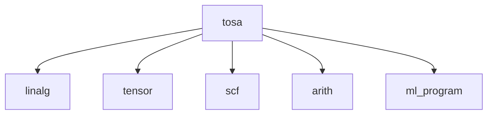

<!-- source: insider-compiler-ch7-ch10.pdf, PDF p. 21 -->

# 第 8 章 业务接入方言

> 校订基准：本章以 `/opt/llvm-project` 的 LLVM 18.1.8 实现为准。扫描书稿涉及其他版本接口之处保留说明；较大差异、源码依据和验证证据见 [第 8 章校订记录](issues/ch8.md)。

本章将介绍具体的业务接入方言。

## 8.1 业务接入方言概述

本章将以下 5 种方言归为业务接入方言，具体如下。

- `tosa`：最初由 ARM 公司提议，是对接机器学习而引入的张量操作标准集合。引入 `tosa` 方言，能够方便不同 AI 框架运用 MLIR。
- `ml_program`：用于定义机器学习程序的结构、全局状态等公共抽象。它不以定义张量计算算子为主要目的，因此与 `tosa` 方言形成互补关系。
- `mpi`：定义 MPI 消息传递的相关操作，从而将 MPI 程序接入 MLIR 体系。
- `acc`：定义 OpenACC 并行编程所使用的操作，从而将 OpenACC 程序接入 MLIR 体系。
- `omp`：定义 OpenMP 并行编程所使用的操作，从而将 OpenMP 程序接入 MLIR 体系。

上述方言中，与机器学习接入相关的有 `tosa` 和 `ml_program`，其余 3 个方言（`mpi`、`acc`、`omp`）用于对接传统并行编程。它们仍处于持续演化的过程中。`ml_program` 方言可作为 `tosa` 的补充；本地已有 `mlprogram-pipeline-globals` 等优化，但其完整后续降级仍需结合具体编译器项目实现。

> 校订注：“业务接入方言”是本书的分类，并非 MLIR 只存在这些接入方式。原文将 `mpi` 误写为 `mcp`，已修正。本地 LLVM 18.1.8 源码未包含 MPI 方言，保留该项作为书稿所述方言；不能直接用本地工具验证。原文“尚未实现 `ml_program` 优化”的判断与本地已有 Pass 不符。

<!-- source: insider-compiler-ch7-ch10.pdf, PDF p. 22 -->

本书不再对 `ml_program` 方言[^ch8-1]展开介绍，本章仅聚焦于 `tosa` 方言。

## 8.2 tosa 方言

`tosa` 方言作为张量操作的标准集合，在其设计过程中主要追求以下 3 个目标。

1. **操作集合功能完备**：`tosa` 方言中的操作并非随意定义。标准制定者在对一些框架的模型进行分析后，统计各类操作的使用频率，并选取常用操作构建一套公共操作集，期望通过这套操作覆盖相关模型。`tosa` 方言中的操作可分为计算、归约、逐元素计算、比较、控制流等几类。
2. **单个操作功能最小化**：为便于 `tosa` 方言适配不同的硬件平台，操作应尽量保持功能最小化，避免不必要的复合功能；复合功能可通过编译器的融合操作来实现。这样既有利于硬件平台的代码生成与优化，也减少了大量冗余操作的定义。为确保操作集的最小化，标准制定者对众多硬件平台展开了分析。
3. **明确计算精度规范**：计算精度在机器学习中至关重要，是模型量化以及评估数值行为的重要依据。TOSA 规范对精度、饱和、缩放等数值行为作出约定，并随规范版本继续演化。

我们探讨设计原则时，表述往往较为简单，期望所设计的操作能够保持正交性，以达成理论上近乎完美的设计。然而，现实情况错综复杂，在设计过程中还需兼顾其他诸多因素，如模型接入 `tosa` 方言的难易程度、序列化后的大小以及模型的还原度等。

`tosa` 方言旨在提供一组面向张量的操作，使这些操作能够在不同硬件上实现，并满足规定的精度与兼容性要求。同时，`tosa` 兼顾 AI 模型执行所需的一些控制逻辑操作。例如，部分 AI 模型需要条件判断（`cond_if`）和循环结构（`while_loop`）等操作，因此 `tosa` 方言中也配备了此类操作，其主要目的在于表达模型中的相应逻辑。TOSA 的规范文档[^ch8-2]详细阐述了其支持的数据类型、操作集合以及一致性要求。

`tosa` 方言提供的操作数量较多，接近 80 个；本地两份操作定义文件合计定义了 75 个操作。其中，部分操作层级较高，基本可与 AI 模型的算子直接对接，像 `conv2d`/`conv3d`（卷积操作）、`avg_pool2d`/`max_pool2d`（平均池化/最大池化）、`sigmoid`（激活函数）等；另一类操作主要是为方便与 AI 模型进行对接，如 `argmax`（沿指定维度求最大值所在的索引）、`clamp`（将数值限制到上下界之间，可用于 ReLU 等激活函数的降级）、`matmul`（矩阵乘法）、`fft2d`/`rfft2d`（二维傅里叶变换/实数傅里叶变换）、`transpose`（转置）等；还有部分操作聚焦于张量运算，如 `abs`（逐元素取绝对值）、`add`/`sub`/`mul`/`div`（逐元素加减乘和整数除法，书中整数除法写作 `int_div`）、`bitwise_and`/`bitwise_not`/`bitwise_or`/`bitwise_xor`（逐元素进行逐位逻辑操作）、`logical_and`/`logical_not`/`logical_or`/`logical_xor`（逐元素布尔逻辑操作）、`logical_left_shift`/`logical_right_shift`（逐元素逻辑移位）、`log`/`exp`/`pow`/

[^ch8-1]: 若将 AI 模型接入 `ml_program` 方言，仍需为目标执行环境补齐或集成后续降级实现。对该方言感兴趣的读者可参考 [IREE 项目](https://github.com/iree-org/iree)。原书指出该项目提供 `ml_program` 降级示例，标注“2025 年 3 月访问”；本次未具备该历史版本的完整本地源码，不将该外部示例记为已编译验证。
[^ch8-2]: 参见 [TOSA 规范入口](https://www.mlplatform.org/tosa/tosa_spec.html)，原书标注“2025 年 3 月访问”。规范独立版本化，使用时应匹配所用 MLIR 实现，而不是直接套用当前最新规范。

<!-- source: insider-compiler-ch7-ch10.pdf, PDF p. 23 -->

`tanh`/`ceil`/`floor`（逐元素执行函数运算）等。原书此处还列出了 `sin`/`cos`，本地 LLVM 18.1.8 的 TOSA 操作定义中未包含这两项。由于本书难以逐一介绍所有操作，建议读者参考与实现版本相匹配的 TOSA 规范文档。

> 校订注：原文的平均池化名称 `arg_pool2d` 已改为 `avg_pool2d`；`argmax` 返回索引，而不是返回最大值本身。`int_div` 与本地 `tosa.div` 的拼写差异、`sin`/`cos` 的本地缺失均保留说明。

### 8.2.1 上下游关系

`tosa` 方言通常作为 AI 模型的接入层，其上游要么是 AI 模型，要么是其他自定义的高级方言。`tosa` 方言的下游主要是 `linalg` 方言，因为 `linalg` 的命名操作与通用操作能够表达 `tosa` 方言中大量操作的计算。不过仍有部分操作需要降级为其他方言，包括 `arith`、`scf`、`ml_program` 和 `tensor` 方言。`tosa` 方言的上下游关系如图 8-1 所示。



**图 8-1 tosa 方言的上下游关系**

`tosa` 依据操作，可以降级为以下方言。

- `arith` 方言处理 `tosa.apply_scale` 操作，通过 `ApplyScaleGenericOpConverter` 和 `ApplyScale32BitOpConverter` 实现降级。相关转换还可将 `tosa.const` 转换为 `arith.constant`。
- `scf` 方言处理 `tosa.cond_if`、`tosa.scatter` 和 `tosa.while_loop` 操作的降级，对应 C++ 类为 `IfOp`、`ScatterOp` 和 `WhileOp`。
- `ml_program` 方言处理 `tosa.variable`、`tosa.variable.write` 以及 `tosa.variable.read` 操作的降级，分别生成全局变量、存储和加载操作。
- `tensor` 方言处理 `tosa.concat`、`tosa.pad`、`tosa.reshape` 和 `tosa.slice` 操作的降级。
- `linalg` 方言处理其他许多受支持的计算操作，可能同时产生 `arith`、`tensor` 等辅助操作。此处不是保证任意 TOSA 操作都能由单个转换 Pass 无条件完成降级。

### 8.2.2 优化

本书介绍以下 6 种 TOSA 优化或验证策略；其可用性随 MLIR 版本变化，下面标明本地实现情况。

1. **`tosa-infer-shapes`**：该 Pass 旨在对使用 `tosa` 方言的操作进行形状推导，力求获取更多静态形状信息。其实现与 10.2.8 节所讨论的 `shape` 方言有所区别。其思路主要基于以下事实：内建 tensor 类型可以通过 `ShapedType` 相关接口获取秩和维度信息；`tosa` 方言中的 `cond_if`、`while_loop` 等操作，在接入或变换过程中可能保留了未知形状，而这些信息有时可以通过分支或循环中的约束继续推导；部分操作实现了 `InferShapedTypeOpInterface`，可调用 `inferReturnTypeComponents` 推导返回类型的形状组成信息，据此更新结果类型。

   > 校订注：原文“tensor 类型继承自 shape 类型”混淆了 `ShapedType` 抽象与 `shape` 方言定义的类型。源码中的局部变量 `shapeInterface` 实际类型是 `InferShapedTypeOpInterface`，并非名为 `shapeInterface` 的接口类。

2. **`tosa-layerwise-constant-fold`**：此优化针对 `tosa` 方言中的特定操作（如 `transpose` 操作、

<!-- source: insider-compiler-ch7-ch10.pdf, PDF p. 24 -->

   `reduce` 系列操作等）执行常量折叠，以减少计算量。在某些操作的常量折叠过程中，有可能生成新的常量张量。
3. **`tosa-make-broadcastable`**：当受支持操作的输入张量秩不一致时，该优化通过插入 `reshape`，在较低秩输入的形状前补大小为 1 的维度，使输入具有相同的秩，以便执行广播。此优化通常用于二元操作；它不负责任意元素类型转换，也不能把本来不兼容的尺寸自动变成合法广播。
4. **`tosa-optional-decompositions`**：此优化会将一些较高级的操作分解为其他操作。例如，对于 `conv2d`，当卷积核为 `1×1`、步长为 1 且满足实现要求时，可转换为 `reshape → fully_connected → reshape` 等操作，以便后续优化。不能只根据卷积核大小断定所有情况都能分解，也不能漏掉其中实际执行计算的全连接操作。
5. **`tosa-reduce-transposes`**：原书介绍此优化用于减少 `transpose` 操作的数量，通过分析转置操作的使用链（通常在 `reshape` 处停止分析）进行合并与优化，在 NHWC 和 NCHW 等布局转换场景中尤为有用。**本地 LLVM 18.1.8 未提供这一 Pass 名称或对应实现**，此处保留书稿描述作为版本差异，不把它列为本地可运行命令。
6. **`tosa-validate`**：这是验证 Pass，用于按选定的 TOSA profile、level 以及严格规范对齐选项检查相应要求。它不是优化变换，也不代替解析器和各操作自身的 verifier；不能把一次执行概括为证明所有语法与语义完全正确。

### 8.2.3 降级示例

`tosa` 方言作为接入方言，已在众多项目中得到应用。例如，TensorFlow 的一份早期文档[^ch8-3]就介绍了 TensorFlow 算子与 TOSA 操作之间的映射关系。本节使用代码清单 8-1 所示的简单示例来演示 `tosa` 方言的降级过程。

**代码清单 8-1 tosa 方言的降级过程（LLVM 18.1.8 校订版）**

```mlir
func.func @matmul(%arg0: tensor<1x5x3xf32>,
                  %arg1: tensor<1x3x6xf32>) -> tensor<1x5x6xf32> {
  // 为保留原例后续的死代码清理演示，暂时保留这两个零常量。
  // 本地版本的 matmul 不把它们作为操作数。
  %a_zp = "tosa.const"() <{value = dense<0.0> : tensor<1xf32>}>
      : () -> tensor<1xf32>
  %b_zp = "tosa.const"() <{value = dense<0.0> : tensor<1xf32>}>
      : () -> tensor<1xf32>
  %0 = tosa.matmul %arg0, %arg1
      : (tensor<1x5x3xf32>, tensor<1x3x6xf32>) -> tensor<1x5x6xf32>
  return %0 : tensor<1x5x6xf32>
}
```

代码清单 8-1 的功能较为简单，即对两个 tensor 类型的参数 `%arg0`、`%arg1` 执行 `matmul` 运算。`tosa.matmul` 有着自身的实现规范：本地版本接收两个三维张量操作数，形状分别为 `N×H×C`、`N×C×W`，结果形状为 `N×H×W`。量化信息通过可选的 `quantization_info` 属性携带，其中 `a_zp` 和 `b_zp` 是两个输入的量化零点，不是数据类型标志。零点表示量化整数中对应实数零的位置，可以为零；不能说只要输入为 int8，零点就一定非零。

> 校订注：扫描清单给出四操作数形式，额外传入两个一元素零点张量，并将常量属性写为 `values`。本地实现使用两个输入加可选量化属性，常量属性名为单数 `value`。核对官方 LLVM 20.1.8 定义后，其 `matmul` 也仍是两输入形式，因此不能将书中形式简单归因于“LLVM 20 与 LLVM 18 的差异”。扫描清单的完整目视转写及两阶段报错见 [校订记录](issues/ch8.md) 和 [原例证据](issues/evidence/ch8/book-8-1.mlir)。

[^ch8-3]: 原书链接为 [TensorFlow TOSA legalization 文档的 Fossies 镜像](https://fossies.org/linux/tensorflow/tensorflow/compiler/mlir/tosa/g3doc/legalization.md)，标注“2025 年 3 月访问”。该历史文档仅作为原书参考保留；本次未复现外部 TensorFlow 工程的接入流程。

<!-- source: insider-compiler-ch7-ch10.pdf, PDF p. 25 -->

同时，TOSA 规范还约定输入、累加和输出的数据类型组合，涉及类型提升的计算规则。例如，原书列举了 f16 输入采用 f16 累加、输出 f16，以及 f16 输入采用 f32 累加、输出 f32 的组合。本地 `tosa.matmul` 没有单独的 `acc_type` 参数；本节转换实现根据声明的结果元素类型创建零初始化的累加张量。已分别验证 f16 输入、f16 结果，以及 f16 输入、f32 结果的两个本地示例可以转换为 `linalg.batch_matmul`。这说明这些具体 IR 能通过所测转换，不等于验证了所有版本 TOSA 规范中的精度约束。

鉴于 `linalg` 方言中的 `batch_matmul` 能够完成这种批量矩阵乘法（参见第 9 章），因此可以将 `tosa.matmul` 降级为 `linalg.batch_matmul`。

使用 `mlir-opt` 将代码清单 8-1 降级为 `linalg` 方言，参数为：

```sh
/opt/llvm-project/build/bin/mlir-opt matmul.mlir \
  --pass-pipeline='builtin.module(func.func(tosa-to-linalg-named))'
```

得到的结果如代码清单 8-2 所示。

**代码清单 8-2 代码清单 8-1 从 tosa 方言降级为 linalg 方言后的结果**

```mlir
module {
  func.func @matmul(%arg0: tensor<1x5x3xf32>,
                    %arg1: tensor<1x3x6xf32>) -> tensor<1x5x6xf32> {
    %0 = "tosa.const"() <{value = dense<0.000000e+00> : tensor<1xf32>}>
        : () -> tensor<1xf32>
    %1 = "tosa.const"() <{value = dense<0.000000e+00> : tensor<1xf32>}>
        : () -> tensor<1xf32>
    // 构造结果张量并将其填充为零；此处尚未决定物理缓冲区分配。
    %cst = arith.constant 0.000000e+00 : f32
    %2 = tensor.empty() : tensor<1x5x6xf32>
    %3 = linalg.fill ins(%cst : f32) outs(%2 : tensor<1x5x6xf32>)
        -> tensor<1x5x6xf32>
    // 使用 batch_matmul 完成 matmul 操作。
    %4 = linalg.batch_matmul
        ins(%arg0, %arg1 : tensor<1x5x3xf32>, tensor<1x3x6xf32>)
        outs(%3 : tensor<1x5x6xf32>) -> tensor<1x5x6xf32>
    return %4 : tensor<1x5x6xf32>
  }
}
```

在代码清单 8-2 中，输入矩阵和输出矩阵的元素类型均为 f32，未携带量化信息，因此该操作被降级为 `linalg.batch_matmul`。在本地实现中，是否使用 `linalg.quantized_batch_matmul` 的直接判断依据是有无 `quantization_info` 属性，而不是单独检查输入是否为 int8。对于带有该属性的 int8 输入示例，转换会生成 i32 零点标量，并生成量化批量矩阵乘法操作；例如两个零点都为零时，也仍可使用这条转换路径。

> 注意：代码清单 8-2 中的 `%0`、`%1` 属于死代码，可以在转换后添加 `cse` 将其消除。虽然 CSE 的主要功能是公共子表达式消除，本地实现也会删除无用途、无副作用的操作；本例已实际验证两个常量均被删除。

最后，我们对 `tosa.matmul` 与 `linalg.batch_matmul` 的设计稍作比较，借此讨论这两个方言的设计理念。`tosa.matmul` 用于处理输入的三维 tensor。在实际计算中，可以将其理解为对 N 对二维矩阵分别执行矩阵乘法，这与常见 AI 业务中的批量计算相符。

`linalg` 方言中存在多个与 `matmul` 相关的操作。其中，`batch_matmul` 针对批量矩阵进行乘法运算，`matmul` 用于二维矩阵乘法，还有面向转置输入等形式的命名变体。这些操作称为命名操作，针对特定输入实现特定计算，可视为结构化通用计算的特例，而 `linalg.generic` 提供了以索引映射、迭代器类型和标量计算区域描述完美嵌套循环的通用抽象。

<!-- source: insider-compiler-ch7-ch10.pdf, PDF p. 26 -->

由此，我们可得出一个简要结论：`tosa` 方言的设计目标是服务于机器学习框架，因此其操作应便于表达机器学习框架的算子；`linalg.generic` 则着重表达适合变换的结构化计算。它可处理多种秩的 tensor，以及符合要求的 memref 等操作数，但仍需满足索引映射、秩和迭代空间等约束，不能由“通用”推断为支持任意未知秩或任意程序逻辑。此外，为便于使用和优化，`linalg` 还提供了一些命名操作。因此，`linalg` 方言的设计更强调保留便于优化的结构信息。

## 8.3 本章小结

本章简要介绍了 `tosa` 方言。TOSA 拥有独立版本化的规范文件，对每个操作的输入、输出和数值行为作出约定；MLIR 中的 `tosa` 方言实现相应规范，并提供到其他方言的转换实现。

为帮助读者理解，本章给出了一个简单示例，展示了从 `tosa.matmul` 降级至 `linalg` 方言的过程。若读者想了解更多关于降级的详细内容，可参考与所用版本一致的 MLIR 实现。
