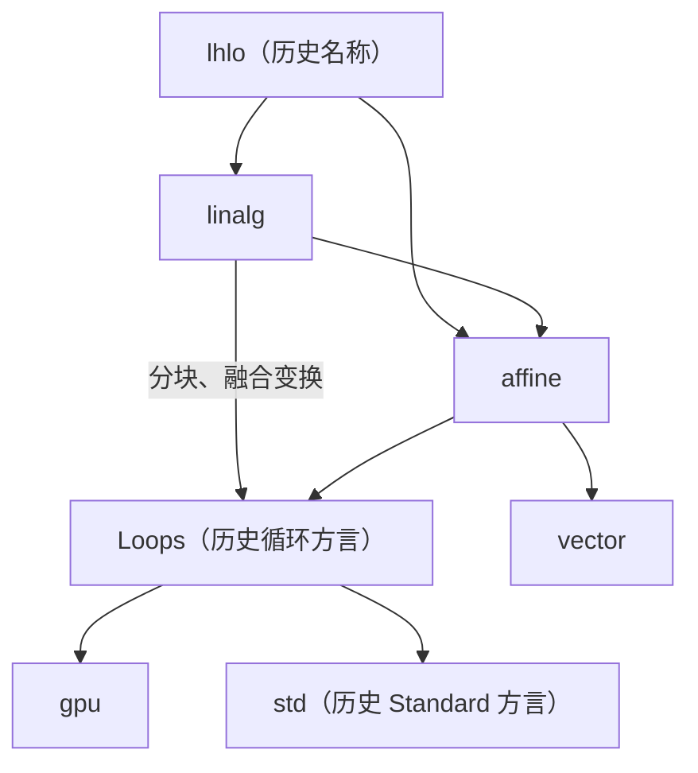
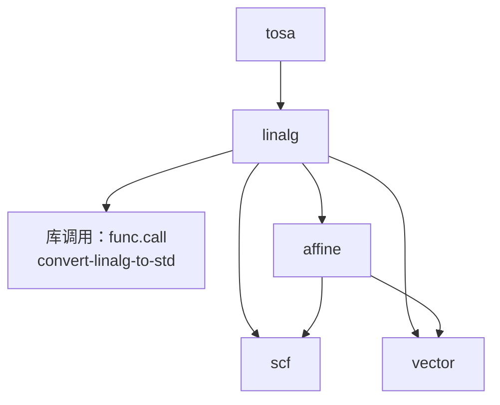
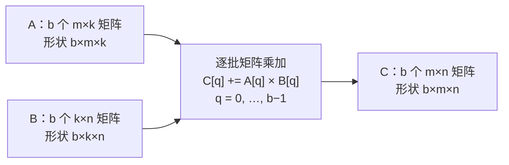
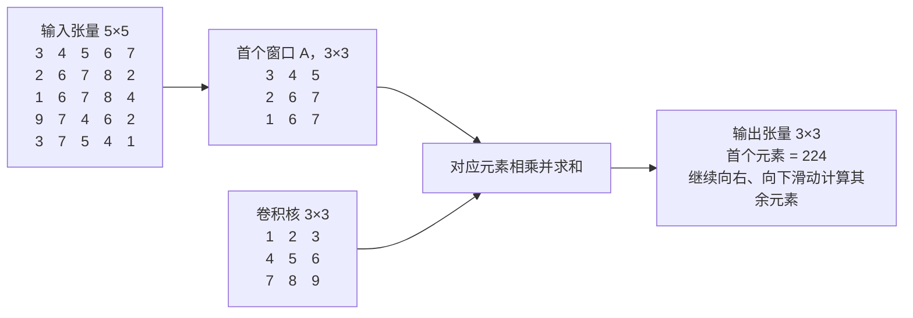
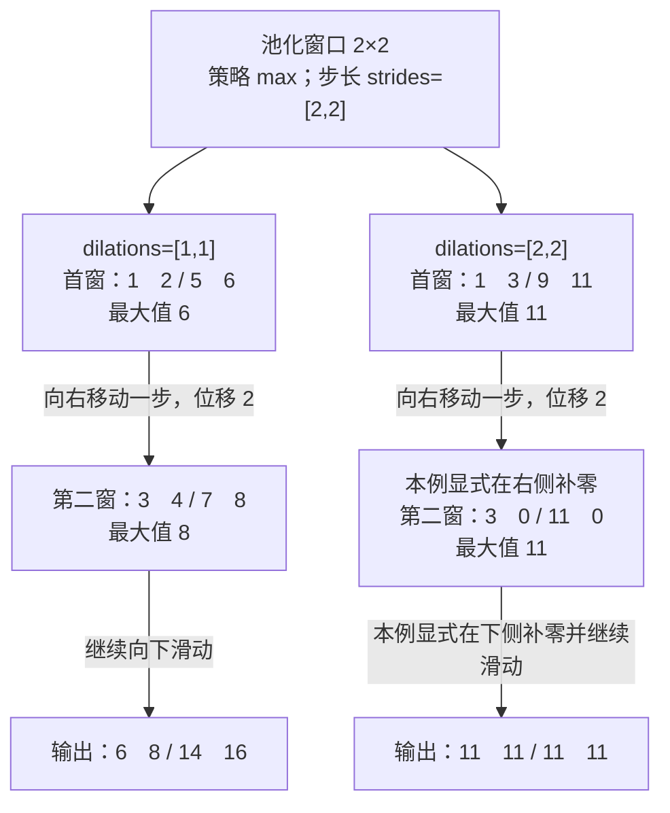
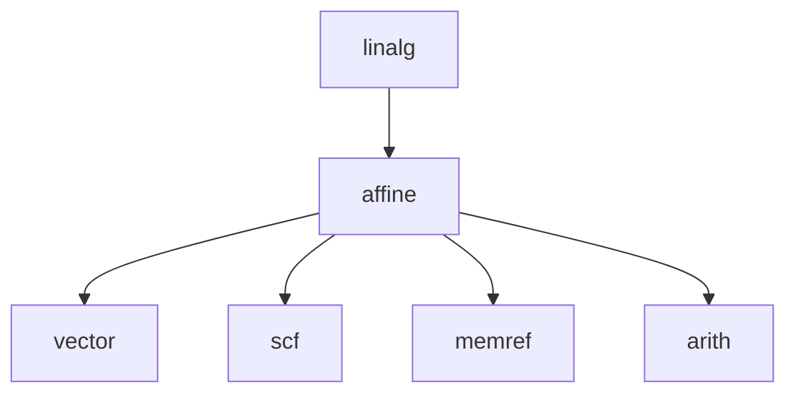
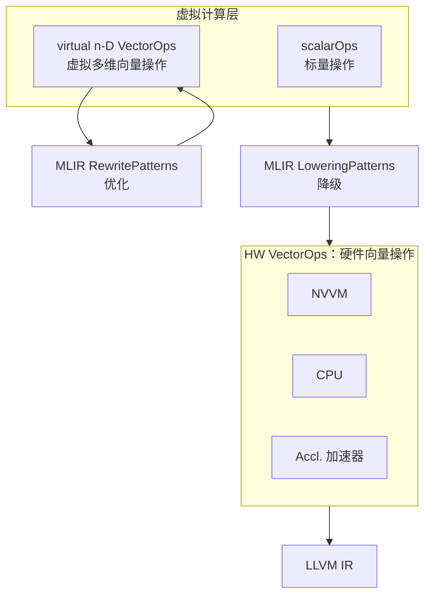
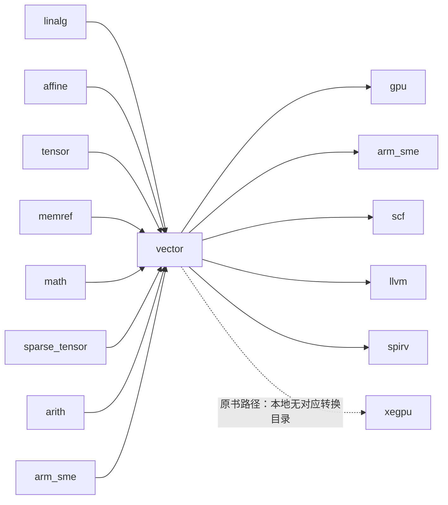
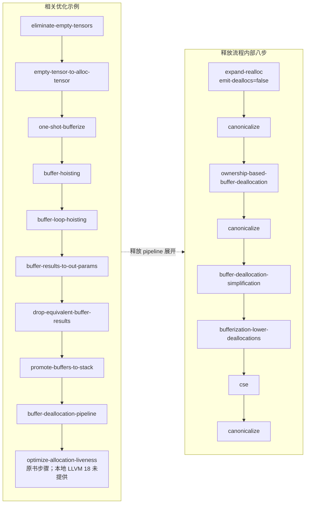

# 第9章 优化方言

> 校订基准：原书参考 LLVM 20；本章对照本地 LLVM 18.1.8（提交 `3b5b5c1ec4a3095ab096dd780e84d7ab81f3d7ff`）修正 OCR、接口与语义。版本差异、原书重要错例和实际验证见[第9章校订记录](issues/ch9.md)。代码保留原清单编号；需要替换为本地等价实现的位置另加说明。

<!-- source: insider-compiler-ch7-ch10.pdf, PDF p. 27 -->

在 MLIR 框架中，优化方言扮演着承上启下的关键角色，它们将不同领域中共用的优化逻辑进行标准化抽象，既降低了跨领域优化的实现成本，也显著提升了编译器优化的可复用性与可扩展性。

本章介绍 linalg、affine、vector 与 bufferization 这 4 种优化相关方言，详细讨论它们的使用与实现。

## 9.1 linalg 方言

线性代数是代数学的一个重要分支，主要研究向量空间（或线性空间）及其上的线性映射（也称线性变换）。所谓线性关系，是指满足叠加性和齐次性的映射关系，即对于任意向量 $x$、$y$ 和标量 $a$，有：

$$
f(x+y)=f(x)+f(y),\qquad f(ax)=af(x)
$$

这类映射 $f$ 被称为线性算子或线性映射。需要注意的是，实数域上一元线性映射 $f(x)=ax$ 的一阶导数为常数，但“一阶导数为常数”并非线性映射的充分条件：$f(x)=ax+b$ 在 $b\ne0$ 时是仿射函数，不满足线性映射所要求的 $f(0)=0$。在线性代数的抽象框架中，线性性由上述两个代数性质严格刻画。通俗来说，一元线性映射意味着输入与输出成比例，其图像为过原点的直线。

原书回顾，在 EuroLLVM 2019 会议上，来自 Google 的 Mehdi Amini 和 Alex Zinenko 等人展示了线性代数计算的例子。他们从低级方言中识别出高级抽象模式，将 affine 方言中的循环矩阵乘法识别为线性代数运算，并向上抽象为 linalg 方言。这一模式匹配和高性能算子库替换方案在

<!-- source: insider-compiler-ch7-ch10.pdf, PDF p. 28 -->

HPC（High Performance Computing，高性能计算）中颇具成效，由此奠定了 linalg 方言的基础。

### 9.1.1 目标与定位

在设计伊始，linalg 方言涵盖矩阵乘法、卷积运算、逐元素运算等基础计算。通过从低级方言中识别出这些高级运算，系统得以调用高性能的现有线性代数库，进而提升计算性能。这里“线性代数运算”是计算领域的分类，并不意味着其中每个运算对所有输入联合构成数学上的线性映射。

伴随 MLIR 核心基础设施的演进，linalg 方言的设计亦持续发展，不过始终秉持对代码生成友好的原则。linalg 方言所采用的方法被拓展为结构化操作抽象，linalg 方言也成为结构化操作抽象在张量与缓冲区处理领域的重要实现范例。随后，开发者在 vector 方言中对结构化操作抽象进行了进一步完善。也正因如此，vector 方言与 linalg 方言在设计原则和理念上展现出相似性：vector 方言在将运算降级为一维向量的过程中，保留针对多维向量的高阶操作。vector 方言的具体内容将在 9.3 节详细展开讨论。

linalg 方言的发展并非无源之水，而是汲取了过去几十年众多优秀项目的长处逐渐演化而来。为阐明其设计思路，表 9-1 将 linalg 方言与参考项目进行了简要对比。

**表 9-1 linalg 方言与参考项目的比较**

> 下表保留原书对设计背景的比较视角，“改进点”是 linalg 设计所关注的取舍，不能据此断定各项目当前缺少这些能力。诸如性能高低、实现复杂度和学习门槛均取决于具体实现与任务；Halide IR 并非只支持标量，多面体算法也并非一律具有指数复杂度。[校订说明](issues/ch9.md#ch9-background)

| 参考项目 | 优点 | 改进点与设计取舍 |
|---|---|---|
| ONNX | 操作定义明确，语义清晰，便于直接表达机器学习模型。 | ① 操作数量较多；为了控制数量，需要尽可能让操作的功能正交。② 操作主要关注功能表达，优化与变换的显式表示是另一层设计问题。 |
| LIFT | ① 使用局部重写机制完成变换。② 变换基于附加在 IR 上的信息进行。③ 支持稀疏张量运算。 | ① 变换应该独立于计算逻辑，方便性能评估。② 操作粒度可以更细，通过组合实现复杂功能。 |
| XLA | ① 实现了标量到向量的代码变换。② 自动分离 host、device 代码。③ 发挥 XPU 的性能和节能特点。 | ① HLO 中操作较多，原书希望增加其可配置性。② 基于具体操作语义的变换之外，还需要基于 IR 的通用变换能力。③ 多层表示之间可能出现功能重复代码，统一基础设施有助于重用。 |
| Halide / TVM | ① 可生成高性能代码。② 提供包含前端 / 中端优化和后端代码生成的完整编译框架。 | ① Halide 的低层循环 IR 主要显式表达标量和向量计算；部分张量级变换需要恢复更高层结构信息。② TVM 提供计算、调度分离，但复杂调度的实现与使用有一定门槛。 |
| Tensor Comprehensions | 通过组合 Halide 和多面体编译实现张量编译器，发挥两者的优点。 | ① 若只利用 Halide 完成形状推导，引入的基础设施可能较重。② 系统需要处理多种 IR，框架整合较复杂。 |
| Polyhedral Compiler | 使用成熟的数学变换技术，在适用场景下可以生成高性能代码。 | ① 变换后的代码可能难以理解。② 某些分析与优化问题具有较高的最坏情况复杂度。③ 其集合、关系等表示与主流 SSA IR 不同，跨框架功能重用需要衔接。 |
| affine 方言 | 以 SSA 形式承载仿射循环与多面体分析所需的信息。 | ① 相对张量算子抽象层次较低，常用于语言接入。② 内存依赖分析及循环变换受可分析形式限制，复杂控制流会增加循环倾斜、自动分块等变换的难度。③ 必须证明变换保持语义；这一正确性要求也适用于其他方言的变换。 |

<!-- source: insider-compiler-ch7-ch10.pdf, PDF p. 29 -->

在充分借鉴这些优秀项目的优点并深入剖析其不足的基础上，linalg 方言在设计过程中确立了以下几个关键要点。

1. **转换正确和易用性优先**：linalg 方言要构建一组具有适用性的操作和转换规则，准确表达所覆盖的底层算子行为，保证抽象结果的正确性。这是因为线性代数计算在设计之初就旨在解决高性能计算的实际场景问题，因此必须兼顾工程实现的友好性。
2. **最大限度保留变换过程中的信息**：在过去 20 年中，DSL（Domain Specific Language，特定领域语言）快速发展，并在诸多应用领域取得了显著成果。这些语言成功的共性在于其结构中蕴含的信息比通用控制流更为丰富，有力支撑了应用优化。然而，实际情况是，这些结构信息在转换为 LLVM IR 时，若过早降低到统一的低层表达，往往会丢失一部分特定的优化语义信息，导致错失优化的机会。因此，linalg 方言的设计采用渐进式降级的策略，以避免信息的急剧丢失。
3. **可组合以及声明式变换支持**：linalg 方言旨在提供易于编写和维护的变换原语，且允许它们通过组合来完成复杂的优化。
4. **兼容基于机器学习的调优**：为发挥机器学习在自动调优方面的作用，linalg 方言在设计上注重提供便于搜索的 IR 和转换机制，以便利用机器学习方法探索高性能代码。

基于上述原则，linalg 方言已不再局限于密集张量的线性计算，它不仅能够保留关键信息，还能通过控制降级的粒度防止信息过度丢失。linalg 方言已突破狭义线性代数操作的范畴，表现力大幅提升，并提供了对并行、归约及滑窗计算等模式的结构化表达。这赋予它超越传统密集线性代数的潜力，使其能够与稀疏张量、密集张量以及各类缓冲区的处理配合使用。滑窗计算可用索引映射与归约维度表达；本地迭代器类型并没有独立的 `window` 枚举。

linalg 方言的核心目标已拓展为解决 MLIR 中的高级优化问题。linalg 方言通过抽象屏蔽底层硬件特性，具备完美循环的结构化特征，使得数据流分析以及高级算子融合、算法优化等与硬件无关的高级优化策略得以在该层次实施。此外，linalg 操作通常可以通过下层方言的操作组合实现，这一特征支持其逐步向硬件相关方言转换，从而使优化策略适配不同硬件架构。

### 9.1.2 上下游关系

#### 1. 上下游关系概述

2019 年，Alex Zinenko 等人展示了从 linalg 方言到 affine 方言和循环方言的降级设计方案。[^ch9-design-slides] 在降级过程中，该方案通过循环优化技术实现了运算分块、运算融合等关键转换，其流程如图 9-1 所示。

[^ch9-design-slides]: 原书所引[结构化操作设计演示文稿](https://docs.google.com/presentation/d/1P-j1GrH6Q5gLBjao0afQ-GfvcAeF-QU4GXXeSy0eJ9I/edit#slide=id.g75bf83a268_3_225)，原书注明“2025 年 6 月访问”。文稿 ID 根据本地 Linalg 文档中的同一设计文稿链接核对；这里保留历史参考，不据此推断 LLVM 18 的全部现状。

<!-- source: insider-compiler-ch7-ch10.pdf, PDF p. 30 -->



**图 9-1 linalg 方言最初设计时的降级路线**

其中，linalg 方言的上游是历史设计中的 lhlo 方言。作为高层次抽象中更接近硬件的表达形式，lhlo 使用内存形式表达数据。下游则主要是循环方言（其后发展为 scf）和 affine 方言。循环可进一步映射到具体硬件的执行结构（如 gpu 方言），相关运算也可通过库函数调用实现；affine 方言则可先进行优化，再降级为 scf 方言或 vector 方言。这一渐进式降级设计思想自提出后持续发展演变，仍是 MLIR 优化体系的重要组成部分。

本地 LLVM 18 中，tosa 是 linalg 方言的上游之一，下游包括库函数调用、affine、scf 和 vector 方言，如图 9-2 所示。历史上的 Standard（std）确实是一个方言，并非算法标准库；其职责已拆分到 arith、func、cf、memref 等方言。仍保留名称的 `convert-linalg-to-std` Pass 在本地生成 `func.call`，指向声明的外部库函数。这类函数可由已有高性能库或开发者自定义算法库提供，编译器并不会自动包含其实现。[校订依据](issues/ch9.md#ch9-linalg-lowering)



**图 9-2 linalg 方言的上下游关系（按本地实现校订）**

开发者可通过工具 `mlir-opt` 的 `--tosa-to-linalg` 参数将支持的 tosa 操作降级为 linalg 方言；对于 linalg 方言，则可以通过 `--convert-linalg-to-std`、`--convert-linalg-to-affine-loops` 和 `--convert-linalg-to-loops`，将其进一步转换为不同的下层表达。接下来分别介绍这几种转换。

> **注意**：开发者可以调用 `mlir-opt --convert-elementwise-to-linalg`，将符合逐元素接口及类型约束的 arith 等操作转换为 linalg 方言中的逐元素循环处理；或通过 `--convert-tensor-to-linalg` 将可支持的 `tensor.pad` 转换为填充目标张量并插入原张量的操作组合。填充值条件不同，生成形式也可能不同，不能把任意 pad 都理解为单独一条 `linalg.fill`。上述转换建立了功能等价的结构化表达，

<!-- source: insider-compiler-ch7-ch10.pdf, PDF p. 31 -->

> 原书因未把它们视作严格的抽象层次下降而没有在图中列出 arith 和 tensor；这是一种绘图分类，不能否认这些转换路径。社区项目中的 StableHLO、ONNX 等高级方言也有通向 linalg 的转换工作，但具体覆盖范围及支持程度应以相应项目与版本为准。

#### 2. 降级为库调用（原书称“降级为 std 方言”）

将 linalg 方言的操作降级为自定义算子库，也是实际中常用的一种优化手段。代码清单 9-1 展示了这一转换，代码中包含一个 `linalg.dot`（点积）操作。

**代码清单 9-1 linalg 方言转换为库调用的例子**

```mlir
func.func @dot(%arg0: memref<?xf32, strided<[1], offset: ?>>,
               %arg1: memref<?xf32, strided<[1], offset: ?>>,
               %arg2: memref<f32>) {
  linalg.dot ins(%arg0, %arg1 : memref<?xf32, strided<[1], offset: ?>>,
                              memref<?xf32, strided<[1], offset: ?>>)
             outs(%arg2 : memref<f32>)
  return
}
```

调用 `mlir-opt --convert-linalg-to-std` 对代码清单 9-1 进行处理后，`linalg.dot` 操作被降级为对函数 `linalg_dot_viewsxf32_viewsxf32_viewf32` 的调用，结果如代码清单 9-2 所示。此类被调用函数通常由开发者或专用高性能函数库提供。点积也具有累加语义：输出缓冲区的初值参与计算，计算纯点积前需要将该标量初始化为零。

**代码清单 9-2 转换为库调用后的结果**

```mlir
module {
  func.func private @linalg_dot_viewsxf32_viewsxf32_viewf32(memref<?xf32, strided<[?], offset: ?>>, memref<?xf32, strided<[?], offset: ?>>, memref<f32, strided<[], offset: ?>>) attributes {llvm.emit_c_interface}
  func.func @dot(%arg0: memref<?xf32, strided<[1], offset: ?>>, %arg1: memref<?xf32, strided<[1], offset: ?>>, %arg2: memref<f32>) {
    %cast = memref.cast %arg0 : memref<?xf32, strided<[1], offset: ?>> to memref<?xf32, strided<[?], offset: ?>>
    %cast_0 = memref.cast %arg1 : memref<?xf32, strided<[1], offset: ?>> to memref<?xf32, strided<[?], offset: ?>>
    %cast_1 = memref.cast %arg2 : memref<f32> to memref<f32, strided<[], offset: ?>>
    call @linalg_dot_viewsxf32_viewsxf32_viewf32(%cast, %cast_0, %cast_1) : (memref<?xf32, strided<[?], offset: ?>>, memref<?xf32, strided<[?], offset: ?>>, memref<f32, strided<[], offset: ?>>) -> ()
    return
  }
}
```

#### 3. 降级为 affine 方言和 scf 方言

类似地，通过调用 `mlir-opt` 并传入 `--convert-linalg-to-affine-loops`、`--convert-linalg-to-loops`、`--convert-linalg-to-parallel-loops` 参数，可以把 linalg 方言中的操作降级为不同形式的循环结构，分别对应 affine 方言和 scf 方言中的循环操作。以代码清单 9-3 为例，该代码片段的主要功能是实现二维矩阵乘加，核心算子为 `linalg.matmul`。该代码片段使用上述 3 个参数处理后会出现不一样的结果。

<!-- source: insider-compiler-ch7-ch10.pdf, PDF p. 32 -->

**代码清单 9-3 二维矩阵乘法示例**

> 校订注：原书的 A、B、C 三个视图都从同一字节缓冲区的偏移 0 开始，输入输出重叠，不能作为独立矩阵乘法的正确存储示例。这里改用三个独立缓冲区，保留 `memref.view` 的教学目的。调用者必须保证分配大小、对齐和视图范围有效，并把 C 初始化为所需累加初值；纯矩阵乘法应使用零初值。[原写法及依据](issues/ch9.md#ch9-matmul-storage)

```mlir
func.func @matmul(%bufferA: memref<?xi8>, %bufferB: memref<?xi8>,
                  %bufferC: memref<?xi8>, %M: index, %N: index, %K: index) {
  %c0 = arith.constant 0 : index
  %c1 = arith.constant 1 : index
  %A = memref.view %bufferA[%c0][%M, %K] : memref<?xi8> to memref<?x?xf32>
  %B = memref.view %bufferB[%c0][%K, %N] : memref<?xi8> to memref<?x?xf32>
  %C = memref.view %bufferC[%c0][%M, %N] : memref<?xi8> to memref<?x?xf32>
  linalg.matmul ins(%A, %B : memref<?x?xf32>, memref<?x?xf32>)
                outs(%C : memref<?x?xf32>)
  return
}
```

通过调用 `mlir-opt --convert-linalg-to-affine-loops` 对代码清单 9-3 进行处理，得到的结果如代码清单 9-4 所示。在该代码中，原本的 `linalg.matmul` 算子被降级为三重 `affine.for` 操作。

**代码清单 9-4 经 convert-linalg-to-affine-loops 参数处理后的结果**

```mlir
module {
  func.func @matmul(%arg0: memref<?xi8>, %arg1: memref<?xi8>, %arg2: memref<?xi8>, %arg3: index, %arg4: index, %arg5: index) {
    %c0 = arith.constant 0 : index
    %view = memref.view %arg0[%c0][%arg3, %arg5] : memref<?xi8> to memref<?x?xf32>
    %view_0 = memref.view %arg1[%c0][%arg5, %arg4] : memref<?xi8> to memref<?x?xf32>
    %view_1 = memref.view %arg2[%c0][%arg3, %arg4] : memref<?xi8> to memref<?x?xf32>
    affine.for %arg6 = 0 to %arg3 {
      affine.for %arg7 = 0 to %arg4 {
        affine.for %arg8 = 0 to %arg5 {
          %0 = affine.load %view[%arg6, %arg8] : memref<?x?xf32>
          %1 = affine.load %view_0[%arg8, %arg7] : memref<?x?xf32>
          %2 = affine.load %view_1[%arg6, %arg7] : memref<?x?xf32>
          %3 = arith.mulf %0, %1 : f32
          %4 = arith.addf %2, %3 : f32
          affine.store %4, %view_1[%arg6, %arg7] : memref<?x?xf32>
        }
      }
    }
    return
  }
}
```

通过调用 `mlir-opt --convert-linalg-to-loops` 对代码清单 9-3 进行处理，可以得到如代码清单 9-5 所示的结果。其中，原本的 `linalg.matmul` 算子被降级为三重 `scf.for` 操作。

**代码清单 9-5 经 convert-linalg-to-loops 参数处理后的结果**

```mlir
module {
  func.func @matmul(%arg0: memref<?xi8>, %arg1: memref<?xi8>, %arg2: memref<?xi8>, %arg3: index, %arg4: index, %arg5: index) {
    %c1 = arith.constant 1 : index
    %c0 = arith.constant 0 : index
    %view = memref.view %arg0[%c0][%arg3, %arg5] : memref<?xi8> to memref<?x?xf32>
    %view_0 = memref.view %arg1[%c0][%arg5, %arg4] : memref<?xi8> to memref<?x?xf32>
    %view_1 = memref.view %arg2[%c0][%arg3, %arg4] : memref<?xi8> to memref<?x?xf32>
    scf.for %arg6 = %c0 to %arg3 step %c1 {
      scf.for %arg7 = %c0 to %arg4 step %c1 {
        scf.for %arg8 = %c0 to %arg5 step %c1 {
          %0 = memref.load %view[%arg6, %arg8] : memref<?x?xf32>
          %1 = memref.load %view_0[%arg8, %arg7] : memref<?x?xf32>
          %2 = memref.load %view_1[%arg6, %arg7] : memref<?x?xf32>
          %3 = arith.mulf %0, %1 : f32
          %4 = arith.addf %2, %3 : f32
          memref.store %4, %view_1[%arg6, %arg7] : memref<?x?xf32>
        }
      }
    }
    return
  }
}
```

<!-- source: insider-compiler-ch7-ch10.pdf, PDF p. 33 -->

通过调用 `mlir-opt --convert-linalg-to-parallel-loops` 对代码清单 9-3 进行处理，可以得到如代码清单 9-6 所示的结果。在该代码中，原本的 `linalg.matmul` 算子被降级为两层 scf 循环：内层为 `scf.for`，执行归约维度的累加；外层为二维 `scf.parallel`，迭代输出矩阵的两个维度。

**代码清单 9-6 经 convert-linalg-to-parallel-loops 参数处理后的结果**

```mlir
module {
  func.func @matmul(%arg0: memref<?xi8>, %arg1: memref<?xi8>, %arg2: memref<?xi8>, %arg3: index, %arg4: index, %arg5: index) {
    %c1 = arith.constant 1 : index
    %c0 = arith.constant 0 : index
    %view = memref.view %arg0[%c0][%arg3, %arg5] : memref<?xi8> to memref<?x?xf32>
    %view_0 = memref.view %arg1[%c0][%arg5, %arg4] : memref<?xi8> to memref<?x?xf32>
    %view_1 = memref.view %arg2[%c0][%arg3, %arg4] : memref<?xi8> to memref<?x?xf32>
    scf.parallel (%arg6, %arg7) = (%c0, %c0) to (%arg3, %arg4) step (%c1, %c1) {
      scf.for %arg8 = %c0 to %arg5 step %c1 {
        %0 = memref.load %view[%arg6, %arg8] : memref<?x?xf32>
        %1 = memref.load %view_0[%arg8, %arg7] : memref<?x?xf32>
        %2 = memref.load %view_1[%arg6, %arg7] : memref<?x?xf32>
        %3 = arith.mulf %0, %1 : f32
        %4 = arith.addf %2, %3 : f32
        memref.store %4, %view_1[%arg6, %arg7] : memref<?x?xf32>
      }
      scf.reduce 
    }
    return
  }
}
```

可以看到，上述 linalg 方言的循环降级采用逐元素处理方式，在此 IR 层次表达标量运算；这并不排除后续编译阶段再次向量化。如今许多硬件都已具备向量化运算能力，因此 linalg 的降级过程也可以直接适配这一特性。通过调用 `mlir-opt '--test-linalg-transform-patterns=test-linalg-to-vector-patterns'`，可尝试将支持的 linalg 操作进行向量化处理。如代码清单 9-7 所示，该代码片段实现一维卷积。

**代码清单 9-7 一维卷积操作示例**

```mlir
func.func @conv1d_nwc_4x2x8_memref(%input: memref<4x6x3xf32>,
                                 %filter: memref<1x3x8xf32>,
                                 %output: memref<4x2x8xf32>) {
  linalg.conv_1d_nwc_wcf
    {dilations = dense<1> : tensor<1xi64>, strides = dense<3> : tensor<1xi64>}
    ins(%input, %filter : memref<4x6x3xf32>, memref<1x3x8xf32>)
    outs(%output : memref<4x2x8xf32>)
  return
}
```

<!-- source: insider-compiler-ch7-ch10.pdf, PDF p. 34 -->

通过上述测试 Pass 对代码清单 9-7 进行处理后，linalg 操作被转换为 vector 操作，结果如代码清单 9-8 所示。其中，原本的 `linalg.conv_1d_nwc_wcf` 操作被转换为向量读取、切片、收缩和写回操作，这样原本大量的循环逐元素运算被若干向量运算表示所代替（9.1.4 节还会详细介绍向量化优化）。高阶 vector 操作仍需进一步降低，不能直接按这些 IR 操作的条数计算最终机器指令数。

**代码清单 9-8 linalg 方言降级为 vector 方言后的结果**

```mlir
#map = affine_map<(d0, d1, d2, d3) -> (d0, d1, d3)>
#map1 = affine_map<(d0, d1, d2, d3) -> (d3, d2)>
#map2 = affine_map<(d0, d1, d2, d3) -> (d0, d1, d2)>
module {
  func.func @conv1d_nwc_4x2x8_memref(%arg0: memref<4x6x3xf32>, %arg1: memref<1x3x8xf32>, %arg2: memref<4x2x8xf32>) {
    %c0 = arith.constant 0 : index
    %cst = arith.constant 0.000000e+00 : f32
    %0 = vector.transfer_read %arg0[%c0, %c0, %c0], %cst {in_bounds = [true, true, true]} : memref<4x6x3xf32>, vector<4x4x3xf32>
    %1 = vector.transfer_read %arg1[%c0, %c0, %c0], %cst {in_bounds = [true, true, true]} : memref<1x3x8xf32>, vector<1x3x8xf32>
    %2 = vector.transfer_read %arg2[%c0, %c0, %c0], %cst {in_bounds = [true, true, true]} : memref<4x2x8xf32>, vector<4x2x8xf32>
    %3 = vector.extract_strided_slice %0 {offsets = [0, 0, 0], sizes = [4, 1, 3], strides = [1, 1, 1]} : vector<4x4x3xf32> to vector<4x1x3xf32>
    %4 = vector.extract_strided_slice %0 {offsets = [0, 3, 0], sizes = [4, 1, 3], strides = [1, 1, 1]} : vector<4x4x3xf32> to vector<4x1x3xf32>
    %5 = vector.extract %1[0] : vector<3x8xf32> from vector<1x3x8xf32>
    %6 = vector.extract_strided_slice %2 {offsets = [0, 0, 0], sizes = [4, 1, 8], strides = [1, 1, 1]} : vector<4x2x8xf32> to vector<4x1x8xf32>
    %7 = vector.extract_strided_slice %2 {offsets = [0, 1, 0], sizes = [4, 1, 8], strides = [1, 1, 1]} : vector<4x2x8xf32> to vector<4x1x8xf32>
    %8 = vector.contract {indexing_maps = [#map, #map1, #map2], iterator_types = ["parallel", "parallel", "parallel", "reduction"], kind = #vector.kind<add>} %3, %5, %6 : vector<4x1x3xf32>, vector<3x8xf32> into vector<4x1x8xf32>
    %9 = vector.contract {indexing_maps = [#map, #map1, #map2], iterator_types = ["parallel", "parallel", "parallel", "reduction"], kind = #vector.kind<add>} %4, %5, %7 : vector<4x1x3xf32>, vector<3x8xf32> into vector<4x1x8xf32>
    %10 = vector.insert_strided_slice %8, %2 {offsets = [0, 0, 0], strides = [1, 1, 1]} : vector<4x1x8xf32> into vector<4x2x8xf32>
    %11 = vector.insert_strided_slice %9, %10 {offsets = [0, 1, 0], strides = [1, 1, 1]} : vector<4x1x8xf32> into vector<4x2x8xf32>
    vector.transfer_write %11, %arg2[%c0, %c0, %c0] {in_bounds = [true, true, true]} : vector<4x2x8xf32>, memref<4x2x8xf32>
    return
  }
}
```

<!-- source: insider-compiler-ch7-ch10.pdf, PDF p. 35 -->

### 9.1.3 重要操作

#### 1. 通用操作

在 linalg 方言中，操作可以划分为结构化计算操作和用于支持这些计算的其他操作。

结构化操作通过类型约束和声明式编程模型来明确指定计算语义，并为编译器优化提供结构化信息。结构化的线性代数计算操作实现了 `LinalgOp` 接口，并且具有统一的中间表示结构。

- 每个操作隐式包含完美循环嵌套，且每个循环都有显式定义的迭代类型，如并行循环、归约循环。
- 如果操作采用张量语义，每个结果对应一个 `outs` 目标张量操作数，用于提供结果形状以及需要时的初值；若区域不读取旧输出元素，该张量只提供形状。如果采用缓冲区语义，操作不返回张量结果，而直接读写 `outs` 指定的缓冲区。
- 每个输入 / 输出操作数都关联一个访问映射，用以指定在隐式嵌套循环中如何访问该操作数的元素。
- 操作的具体计算逻辑定义在区域中，具有较强的灵活性。

原书列出的两种辅助操作如下（这不是整个方言中所有非 `LinalgOp` 操作的穷举）：

- `linalg.index`：用于取得某个循环维度的迭代索引。
- `linalg.yield`：用于给出 linalg 计算区域的结果。

在这些结构化操作中，`linalg.generic` 是最基础也是最核心的通用计算操作。许多具有固定语义的操作被称为命名操作（named op），可以展开成对应的 `linalg.generic` 形式。命名操作的优势不只在于语法简写，还在于保留明确的运算语义和专用约束。

`linalg.generic` 用于表达完美嵌套循环。完美嵌套循环具有以下特征。

- 内层循环的整个主体完全包含在外层循环的迭代体内。
- 循环之间没有其他计算语句；计算体位于最内层。

代码清单 9-9 展示了一个典型的完美循环结构。如果在两层 for 循环之间插入非循环计算语句，这段代码就会变成不完美嵌套循环。

**代码清单 9-9 完美循环示例**

```c
for (i = 0; i < N; i++) {
  for (j = 0; j < M; j++) {
    A[i][j] = B[i][j] + C[i][j];
  }
}
```

<!-- source: insider-compiler-ch7-ch10.pdf, PDF p. 36 -->

`linalg.generic` 的语法轮廓如代码清单 9-10 所示。

**代码清单 9-10 linalg.generic 的语法**

```text
linalg.generic #trait_attribute
    ins(%A, %B : memref<?x?xf32, stride_specification>,
                 memref<?x?xf32, stride_specification>)
    outs(%C : memref<?x?xf32, stride_specification>)
    attrs = {other-optional-attributes}
    {region}
```

这里的 `stride_specification`、`other-optional-attributes`、`region` 是语法说明中的占位符，不能作为实际 MLIR 输入。`#trait_attribute` 中可以包含以下信息。

- `doc`：文档字符串，可选。
- `indexing_maps`：`AffineMapAttr` 列表。每个输入 / 输出操作数都有一个映射，用于指示如何从循环迭代索引得到该操作数的元素索引；属性名是复数 `indexing_maps`。
- `library_call`：库调用，可选。一个字符串，表示该 `linalg.generic` 操作所映射的外部库函数。通过 `--convert-linalg-to-std` 进行转换时，系统可将操作转换为对该库函数的调用。是否能链接到相应库，须由构建环境保证；也可选择 `--convert-linalg-to-loops` 将 `linalg.generic` 降级为循环，这并非链接失败后的自动回退。
- `iterator_types`：迭代器类型列表，**每个循环维度对应一个类型**，而不是每个输入 / 输出操作数对应一个类型。本地 LLVM 18.1.8 支持 `parallel`、`reduction` 两种类型；滑窗计算使用索引映射等结构表达。本地文档说明仍有 `window` 的历史文字，但实际枚举没有它。[源码差异](issues/ch9.md#ch9-structured-ops)

#### 2. 二维矩阵乘法

`linalg.matmul` 用于计算两个二维矩阵的乘积并累加到目标矩阵。例如，给定两个二维输入矩阵，A 是 $m\times k$ 矩阵，B 是 $k\times n$ 矩阵，则结果矩阵 C 的形状为 $m\times n$，且第 $i$ 行、第 $j$ 列元素为：

$$
C_{ij}^{\mathrm{out}}=C_{ij}^{\mathrm{init}}+\sum_{t=1}^{k}A_{it}B_{tj}
$$

式中，$t$ 是求和索引。将目标矩阵初始化为零时，得到通常意义上的矩阵乘积。

`linalg.matmul` 的语法轮廓如代码清单 9-11 所示。左右矩阵和目标矩阵均以操作数形式传递，数据类型可以是 tensor，也可以是 memref。张量语义还要写出结果类型并接收新的 SSA 结果。本地命名 `matmul` 的索引映射由操作定义固定；原书通过 `indexing_maps` 直接配置命名 `matmul` 的转置 / 广播写法不适用于本地版本，应使用相应的转置命名操作或 `linalg.generic`。[原写法和本地诊断](issues/ch9.md#ch9-matmul-maps)

**代码清单 9-11 linalg.matmul 操作的语法（本地形式）**

```text
// 缓冲区形式：
linalg.matmul ins(%arg0, %arg1 : memref<MxKxT>, memref<KxNxT>)
              outs(%arg2 : memref<MxNxT>)
// 张量形式：
%result = linalg.matmul ins(%arg0, %arg1 : tensor<MxKxT>, tensor<KxNxT>)
                       outs(%arg2 : tensor<MxNxT>) -> tensor<MxNxT>
```

`M`、`N`、`K`、`T` 同样是形状和元素类型的说明性占位符。

<!-- source: insider-compiler-ch7-ch10.pdf, PDF p. 37 -->

矩阵乘法应用示例如代码清单 9-12 所示。原书第一个操作数的索引映射为 `(d0, d1, d2) -> (d2, d0)`，表示以转置后的方式读取左矩阵。具体而言，输入 `%arg0` 的物理形状为 $5\times3$，计算中将其解释为 $3\times5$ 的左矩阵，与 $5\times7$ 的右矩阵相乘，得到 $3\times7$ 的结果。索引映射本身并不要求先分配和物理转置一份矩阵。

**代码清单 9-12 linalg.matmul 应用示例 1：操作数转置（本地等价操作）**

```mlir
func.func @transpose(%arg0: memref<5x3xf32>, %arg1: memref<5x7xf32>,
                     %arg2: memref<3x7xf32>) {
  linalg.matmul_transpose_a
    ins(%arg0, %arg1 : memref<5x3xf32>, memref<5x7xf32>)
    outs(%arg2 : memref<3x7xf32>)
  return
}
```

另一个矩阵乘法应用示例如代码清单 9-13 所示。代码中设置了操作数广播：第一个操作数是一维、长度为 5 的向量，在计算中沿行维度复用，逻辑上构成 $3\times5$ 的左矩阵，再与 $5\times7$ 的右矩阵相乘，得到 $3\times7$ 的结果。原书输入写为 `memref<3xf32>`，与归约维度 5 不一致，已改为 `memref<5xf32>`；同时将本地不支持的可配置命名 `matmul` 改写为保留相同索引映射的 `linalg.generic`。

**代码清单 9-13 linalg.matmul 应用示例 2：操作数广播（本地等价实现）**

```mlir
func.func @broadcast(%arg0: memref<5xf32>, %arg1: memref<5x7xf32>,
                     %arg2: memref<3x7xf32>) {
  linalg.generic {
    indexing_maps = [affine_map<(i, j, k) -> (k)>,
                     affine_map<(i, j, k) -> (k, j)>,
                     affine_map<(i, j, k) -> (i, j)>],
    iterator_types = ["parallel", "parallel", "reduction"]}
    ins(%arg0, %arg1 : memref<5xf32>, memref<5x7xf32>)
    outs(%arg2 : memref<3x7xf32>) {
  ^bb0(%a: f32, %b: f32, %c: f32):
    %p = arith.mulf %a, %b : f32
    %v = arith.addf %c, %p : f32
    linalg.yield %v : f32
  }
  return
}
```

由此可见，矩阵乘法有多种操作变体，例如：

- `linalg.matmul_transpose_a`：以左矩阵转置的语义进行矩阵乘加。
- `linalg.matmul_transpose_b`：以右矩阵转置的语义进行矩阵乘加。

#### 3. 批量矩阵乘法

`linalg.batch_matmul` 用于进行批量矩阵乘法计算，在深度学习、HPC 等领域应用广泛。相较于 `matmul`，`batch_matmul` 新增了 batch（批次）维度，可以对该维度中每个元素对应的矩阵分别执行矩阵乘法，即表达多个独立矩阵乘法。批量矩阵乘法是处理批量数据的关键操作，在深度学习领域尤为常见。例如，Transformer 架构中的自注意力计算可以用批量矩阵乘法表达。在 GPU 环境下，合理的批量实现能够利用并行计算特性，同时处理批次内多个矩阵对，提升资源利用率；但不能笼统断言它在任何形状下都比 `matmul` 快，其效果取决于矩阵大小、批量大小和后端实现。

对于两个批矩阵，A 的形状为 $(b,m,k)$，B 的形状为 $(b,k,n)$，计算后 C 的形状为 $(b,m,n)$，如图 9-3 所示。与普通 `matmul` 相同，目标 C 的初值参与累加。

<!-- source: insider-compiler-ch7-ch10.pdf, PDF p. 38 -->



**图 9-3 linalg.batch_matmul 的操作示意图**

与 `matmul` 类似，`batch_matmul` 的循环和操作数访问也由仿射映射描述；本地命名操作的映射由其定义给定。有一些相关操作，具体说明如下。

- `linalg.batch_matmul_transpose_a`：以每批左矩阵转置的语义进行矩阵乘加。
- `linalg.batch_matmul_transpose_b`：以每批右矩阵转置的语义进行矩阵乘加。
- `linalg.batch_matvec`：执行批量矩阵和向量乘加，左操作数为矩阵，右操作数为向量。
- `linalg.batch_mmt4d`：执行分块矩阵乘加；不计批次时，矩阵以四维分块形式表示，加上批次维度后为五维。与 `linalg.batch_matmul` 的区别在于操作数使用外层块索引与块内索引，并以适当转置的排列表示右操作数；不是一般意义上任意四维张量的矩阵乘法。
- `linalg.batch_reduce_matmul`：输入为两个三维批矩阵，除乘法的收缩维度外还对批次维度进行归约，输出为二维矩阵。
- `linalg.batch_vecmat`：执行批量向量和矩阵乘加，左操作数为向量，右操作数为矩阵。

#### 4. 卷积

卷积是数学、信号处理和图像处理等领域中的一种重要运算，主要用于描述两个函数之间的关系。其核心思想是，通过将一个函数与另一个经过翻转和平移的函数相乘后再进行积分，从而描述两个函数之间的组合关系。

在数学形式上，卷积分为连续卷积和离散卷积。其中，两个连续函数 $f(t)$ 和 $g(t)$ 的卷积表达为（以 $*$ 代表卷积运算）：

$$
(f*g)(t)=\int_{-\infty}^{\infty}f(\tau)g(t-\tau)\,d\tau
$$

两个离散序列 $x[n]$ 和 $h[n]$ 的卷积表达为：

$$
(x*h)[n]=\sum_{k=-\infty}^{\infty}x[k]h[n-k]
$$

<!-- source: insider-compiler-ch7-ch10.pdf, PDF p. 39 -->

在深度学习领域，通常称作“卷积”的运算让卷积核（滤波器）在图像上滑动，通过计算局部像素的加权和提取局部特征。若没有翻转卷积核，从严格数学定义看它是互相关；本节的 linalg 卷积示例采用这种索引方式。二维示意图如图 9-4 所示。



**图 9-4 二维卷积示意图**

在图 9-4 中，使用一个形状为 $3\times3$ 的卷积核（通常称为 filter 或 kernel）在原始输入张量上滑动。首先选取一个 $3\times3$ 的矩阵 A，A 与卷积核对应位置上的元素相乘并累加，得到输出张量第一个元素的值：

$$
3\times1+4\times2+5\times3+2\times4+6\times5+7\times6+
1\times7+6\times8+7\times9=224
$$

然后卷积核继续向右或向下平移，与选定范围内的子矩阵进行同样的计算，进而得到输出张量的其他元素。

linalg 方言支持一维、二维、三维卷积操作，如代码清单 9-14 所示。以下是分别位于不同上下文中的操作片段，其 `%in`、`%filter`、`%out` 需要由所在函数提供。

**代码清单 9-14 linalg 方言中的一维、二维、三维卷积操作**

```mlir
linalg.conv_1d ins(%in, %filter : memref<?xf32>, memref<?xf32>)
               outs(%out : memref<?xf32>)
linalg.conv_2d ins(%in, %filter : memref<?x?xf32>, memref<?x?xf32>)
               outs(%out : memref<?x?xf32>)
linalg.conv_3d ins(%in, %filter : memref<?x?x?xf32>, memref<?x?x?xf32>)
               outs(%out : memref<?x?x?xf32>)
```

卷积的执行效率与数据在内存中的存储方式紧密相关。常见格式包括 NHWC 和 NCHW，其中 N 代表批大小，H 代表特征图高度，W 代表宽度，C 代表通道数。采用通常的连续行主序存储时，NHWC 将同一像素的多个通道值连续存放，方便按像素处理通道；NCHW 则将同一通道的空间像素连续存放。两者都用于卷积，性能取决于硬件与算子实现，不能仅凭名称判断哪个格式总是更适合卷积。

基于 NHWC 和 NCHW 衍生出了许多变体。例如，当 NHWC 中高度维度为 1 且允许去除该维度时，可简化为 NWC；再如，把 NCHW 的通道维度划分为大小为 4 的块，不足部分补齐，物理存储形状为 $N\times\lceil C/4\rceil\times H\times W\times4$，通常称为 NC4HW4。最内层的 4 个通道连续存放，有助于适配某些向量化指令。若 C 恰好能被 4 整除，块数才可直接写作 $C/4$。

不同内存布局可以相互转换，但可能产生数据重排开销。因此，linalg 中衍生出针对不同布局的卷积操作，如 `linalg.conv_1d_ncw_fcw`（只有一个空间维度）、`linalg.conv_3d_ncdhw_fcdhw`（包含深度 Depth 维度）。有兴趣的读者可查阅相应操作定义进一步了解。

<!-- source: insider-compiler-ch7-ch10.pdf, PDF p. 40 -->

#### 5. 池化

池化是深度学习中的一种局部归约操作，常用于降采样，以减少数据的空间维度（如图像的高和宽），同时保留局部特征。池化示意图如图 9-5 所示。



**图 9-5 池化示意图**

假定有形状为 $4\times4$ 的输入矩阵如下所示：

$$
\begin{pmatrix}
1&2&3&4\\5&6&7&8\\9&10&11&12\\13&14&15&16
\end{pmatrix}
$$

若池化窗口为 $2\times2$，步长为 $[2,2]$（水平和竖直方向步长都为 2），膨胀系数为 1（不膨胀），池化策略为最大池化，即在窗口范围内取最大值，则第一个窗口 $\begin{pmatrix}1&2\\5&6\end{pmatrix}$ 得到 6；水平移动一步后，第二个窗口 $\begin{pmatrix}3&4\\7&8\end{pmatrix}$ 得到 8。以此类推，最终得到：

$$
\begin{pmatrix}6&8\\14&16\end{pmatrix}
$$

<!-- source: insider-compiler-ch7-ch10.pdf, PDF p. 41 -->

当膨胀系数为 2 时，窗口内相邻采样点的索引间距变为 2，第一个采样窗口为 $\begin{pmatrix}1&3\\9&11\end{pmatrix}$，最大值为 11；水平移动一步（步长为 2）后，采样范围超出了原输入矩阵。本图**额外假定在右侧和下侧补零**，于是第二个窗口为 $\begin{pmatrix}3&0\\11&0\end{pmatrix}$，最大值仍为 11。以此类推，结果为：

$$
\begin{pmatrix}11&11\\11&11\end{pmatrix}
$$

> 校订注：linalg 池化操作不会在越界时自动补零。必须预先显式填充输入或限制输出范围；不填充时，本例有效的完整窗口只有左上角一个。最大池化对一般负数输入通常使用负无穷作为填充值或初始归约值，零填充并非普遍正确的选择。[池化校订](issues/ch9.md#ch9-pooling)

linalg 方言的池化策略包括取最大值、取最小值、求和。最大池化操作的示例如代码清单 9-15 所示。

**代码清单 9-15 linalg max 池化操作的示例**

```mlir
func.func @generalize_pooling_nwc_max_f32(%input: tensor<1x16x1xf32>,
                                         %shape: tensor<2xf32>,
                                         %output: tensor<1x4x1xf32>)
    -> tensor<1x4x1xf32> {
  %0 = linalg.pooling_nwc_max
    {dilations = dense<[2]> : tensor<1xi64>, strides = dense<[4]> : tensor<1xi64>}
    ins(%input, %shape : tensor<1x16x1xf32>, tensor<2xf32>)
    outs(%output : tensor<1x4x1xf32>) -> tensor<1x4x1xf32>
  return %0 : tensor<1x4x1xf32>
}
```

此操作读取 `outs` 的原始元素参与最大值归约；纯最大池化应把 `%output` 初始化为适当的单位元，例如浮点负无穷。`%shape` 的形状提供窗口尺寸，其元素数值不参与最大值计算。

调用以下命令处理代码清单 9-15，可得到代码清单 9-16 的结果：

```sh
mlir-opt input.mlir --linalg-generalize-named-ops \
  --one-shot-bufferize --convert-linalg-to-loops
```

**代码清单 9-16 降级为 scf 循环后的结果**

```mlir
#map = affine_map<(d0, d1) -> (d0 * 4 + d1 * 2)>
module {
  func.func @generalize_pooling_nwc_max_f32(%arg0: tensor<1x16x1xf32>, %arg1: tensor<2xf32>, %arg2: tensor<1x4x1xf32>) -> tensor<1x4x1xf32> {
    %c2 = arith.constant 2 : index
    %c4 = arith.constant 4 : index
    %c1 = arith.constant 1 : index
    %c0 = arith.constant 0 : index
    %0 = bufferization.to_memref %arg0 : memref<1x16x1xf32, strided<[?, ?, ?], offset: ?>>
    %1 = bufferization.to_memref %arg2 : memref<1x4x1xf32, strided<[?, ?, ?], offset: ?>>
    %alloc = memref.alloc() {alignment = 64 : i64} : memref<1x4x1xf32>
    memref.copy %1, %alloc : memref<1x4x1xf32, strided<[?, ?, ?], offset: ?>> to memref<1x4x1xf32>
    scf.for %arg3 = %c0 to %c1 step %c1 {
      scf.for %arg4 = %c0 to %c4 step %c1 {
        scf.for %arg5 = %c0 to %c1 step %c1 {
          scf.for %arg6 = %c0 to %c2 step %c1 {
            %3 = affine.apply #map(%arg4, %arg6)
            %4 = memref.load %0[%arg3, %3, %arg5] : memref<1x16x1xf32, strided<[?, ?, ?], offset: ?>>
            // 输入位置：第 0 批、第 0 通道，宽度为 0,2,4,6,8,10,12,14。
            %5 = memref.load %alloc[%arg3, %arg4, %arg5] : memref<1x4x1xf32>
            %6 = arith.maximumf %5, %4 : f32
            memref.store %6, %alloc[%arg3, %arg4, %arg5] : memref<1x4x1xf32>
          }
        }
      }
    }
    %2 = bufferization.to_tensor %alloc : memref<1x4x1xf32>
    return %2 : tensor<1x4x1xf32>
  }
}
```

<!-- source: insider-compiler-ch7-ch10.pdf, PDF p. 42 -->

输出位置为 `[0, w, 0]`，其中 $w=0,1,2,3$；每个输出元素被加载、比较和写回两次，分别处理窗口的两个采样点。原书注释“取 4 个数、存 4 个数”是在说不同的位置数，不是动态执行的加载 / 存储次数。

综上，使用形状为 `tensor<2xf32>` 的窗口对 `tensor<1x16x1xf32>` 进行池化，窗口步长为 4，膨胀系数为 2。窗口内元素间隔采样，可用 `|A|O|A|` 表示两个有效位置，其中 A 表示采样位置，O 表示跳过的位置。窗口在输入上移动，实际采样宽度索引为 `[0,2,4,6,8,10,12,14]`。其中 `[0,2]` 对应的元素取最大值，`[4,6]` 对应的元素取最大值，以此类推，最后生成 `tensor<1x4x1xf32>` 的结果张量。

#### 6. 其他操作

linalg 方言中定义了诸多基础运算，如取绝对值、加法等。这些操作能够作用于多维张量。例如，`linalg.abs` 对输入张量的每个元素取绝对值，`linalg.add` 将两个输入张量对应位置上的元素相加。在后续降级处理中，这些运算会被转化为标量或向量操作，其逐元素运算逻辑不变。

原书按功能将操作分为以下几类。下面保留全部名称，同时标明本地版本未提供同名独立操作的项目；“一元、二元”指主要计算输入，不计目标操作数，并非严格的 ODS 操作数数量分类。[完整版本核对](issues/ch9.md#ch9-operation-catalog)

1. **一元及单输入结构运算**：`abs`（取绝对值）、`broadcast`（广播）、`ceil`（向上取整）、`erf`（误差函数，本地无同名 linalg 操作）、`exp`（指数函数）、`floor`（向下取整）、`log`（取对数）、`negf`（浮点取反）、`reciprocal`（倒数，本地无同名操作）、`reduce`（归约，可有多个输入）、`round`（取整，本地无同名操作）、`rsqrt`（平方根倒数，本地无同名操作）、`sqrt`（平方根，本地无同名操作）、`square`（平方，本地无同名操作）、`tanh`（双曲正切，本地无同名操作）、`transpose`（转置）。缺少的逐元素命名操作可用 `linalg.generic` 或 `linalg.map` 搭配 math / arith 运算表达。
2. **二元及收缩运算**：`add`（加法）、`contract`（张量收缩，本地无同名 linalg 操作）、`div` / `div_unsigned`（除法）、`dot`（点积）、`matvec`（矩阵和向量乘法）、`max`（最大值）、`min`（最小值，本地可用 `elemwise_binary` 指定 min 函数）、`mul`（乘法）、`powf`（幂运算，本地无同名 linalg 操作）、`quantized_batch_matmul`（量化批量矩阵乘法）、`quantized_matmul`（量化二维矩阵乘法）、`sub`（减法）、`vecmat`（向量和矩阵乘法）。量化操作还包含零点等参数，不能只按“两输入”理解其完整签名。
3. **功能性操作**：`copy`（复制）、`elementwise`（按指定函数逐元素计算；本地对应 `elemwise_unary` / `elemwise_binary`）、`fill`（用指定值填充）、`softmax`（归一化指数函数）、`index`（取得迭代索引）、`pack`（分块并增加块内维度；本地为 `tensor.pack`）、`unpack`（解除分块；本地为 `tensor.unpack`）、`map`（逐元素映射）、`select`（条件选择，本地无同名 linalg 操作）、`winograd_xxx_transform`（Winograd 卷积变换操作族，本地未提供原书所列同名操作）、`yield`（给出区域结果）。

需要留意的是，上述操作并非完全相互独立。例如，通用逐元素运算与 `linalg.map` 为部分计算提供了简洁表达。代码清单 9-17 的四种写法都表示两个张量逐元素相加；为使其确实可比较，已统一形状、操作数和结果类型，并补全通用操作的必需属性。

<!-- source: insider-compiler-ch7-ch10.pdf, PDF p. 43 -->

**代码清单 9-17 linalg 方言中张量逐元素加法的 4 种写法**

```mlir
func.func @add_forms(%A: tensor<?x?xf32>, %B: tensor<?x?xf32>,
                     %C: tensor<?x?xf32>)
    -> (tensor<?x?xf32>, tensor<?x?xf32>, tensor<?x?xf32>, tensor<?x?xf32>) {
  %add0 = linalg.generic {
    indexing_maps = [affine_map<(i, j) -> (i, j)>,
                     affine_map<(i, j) -> (i, j)>,
                     affine_map<(i, j) -> (i, j)>],
    iterator_types = ["parallel", "parallel"]}
    ins(%A, %B : tensor<?x?xf32>, tensor<?x?xf32>)
    outs(%C : tensor<?x?xf32>) {
  ^bb0(%a: f32, %b: f32, %c: f32):
    %d = arith.addf %a, %b : f32
    linalg.yield %d : f32
  } -> tensor<?x?xf32>
  %add1 = linalg.add ins(%A, %B : tensor<?x?xf32>, tensor<?x?xf32>)
                    outs(%C : tensor<?x?xf32>) -> tensor<?x?xf32>
  %add2 = linalg.elemwise_binary {fun = #linalg.binary_fn<add>}
    ins(%A, %B : tensor<?x?xf32>, tensor<?x?xf32>)
    outs(%C : tensor<?x?xf32>) -> tensor<?x?xf32>
  %add3 = linalg.map { arith.addf }
    ins(%A, %B : tensor<?x?xf32>, tensor<?x?xf32>)
    outs(%C : tensor<?x?xf32>)
  return %add0, %add1, %add2, %add3 :
    tensor<?x?xf32>, tensor<?x?xf32>, tensor<?x?xf32>, tensor<?x?xf32>
}
```

以上 `%add0` 使用 `linalg.generic` 与 `arith.addf` 组合；`%add1` 使用 `linalg.add`；`%add2` 使用本地 `linalg.elemwise_binary` 并指定 `add`（对应原书的 `linalg.elementwise` 写法）；`%add3` 使用 `linalg.map` 映射 `arith.addf`。动态维度的实际大小必须一致；该示例并不进行隐式形状广播。

### 9.1.4 优化与变换

在线性代数计算层可以开展大量优化工作。本地实现提供多种 linalg 优化 Pass、变换模式和 Transform 操作。本节主要介绍常见策略，如算子融合、向量化、数据分块等，并简要介绍其他优化。

#### 1. 算子融合

算子融合是深度学习编译中的一种关键优化手段，其核心是将多个计算算子组合成一个更大的计算单元，从而争取减少中间结果存储和访问开销，提高代码的整体运行效率。

在 MLIR 中，算子融合可以在多个层级开展：高抽象层可以基于高级语义进行宏观融合，低抽象层可以开展与硬件相关的精细融合。linalg 将循环结构与运算 / 访存关系抽象成显式属性与区域，因此在这一层进行融合有利于算子依赖分析与合并的实施。

`--linalg-fuse-elementwise-ops` 是在高抽象层进行融合的典型示例。该 Pass 以 `linalg.generic` 为消费者候选，尝试将符合条件的生产者计算融入消费者。并非任意两个 generic 都可融合，仍需满足张量语义、迭代器和索引映射等前提。其主要构造流程如下。

1. 识别作为消费者的 `linalg.generic`，根据其操作数找到对应的生产者。
2. 识别生产者哪些结果仍需保留，例如还在消费者以外被使用的结果。
3. 收集融合后的输入操作数、各操作数对应的索引映射、输出操作数及输出类型，

<!-- source: insider-compiler-ch7-ch10.pdf, PDF p. 44 -->

   为新操作构造所需的四组数据。
4. 创建融合后的 `linalg.generic` 操作及区域。
5. 由于消费者和生产者的循环结构可能不同，需要建立迭代空间之间的映射，使生产者的计算能在消费者的迭代空间中表达。
6. 根据前面获得的信息确定操作数和访问模式，维护原 SSA 值与新 SSA 值的映射，克隆生产者、消费者区域中的计算，并建立融合后要返回的结果；适用的清理模式还会去除冗余操作数。SSA 值映射与索引的仿射映射是不同的概念。

**（1）基础融合**

代码清单 9-18 是一个基础融合示例，其中存在两个 `linalg.generic`：第一个执行逐元素加法（`addf`），第二个执行逐元素乘法（`mulf`）。在这种情况下，生产者 generic 的结果仅被消费者 generic 使用。

**代码清单 9-18 linalg 算子基础融合示例**

```mlir
#map0 = affine_map<(d0, d1) -> (d0, d1)>

func.func @add_mul_fusion(%arg0: tensor<?x?xf32>, %arg1 : tensor<?x?xf32>, %arg2 : tensor<?x?xf32>) -> tensor<?x?xf32>
{
  %c0 = arith.constant 0 : index
  %c1 = arith.constant 1 : index
  %0 = tensor.dim %arg0, %c0 : tensor<?x?xf32>
  %1 = tensor.dim %arg0, %c1 : tensor<?x?xf32>
  %2 = tensor.empty(%0, %1) : tensor<?x?xf32>
  %3 = linalg.generic {indexing_maps = [#map0, #map0, #map0], iterator_types = ["parallel", "parallel"]}
      ins(%arg0, %arg1 : tensor<?x?xf32>, tensor<?x?xf32>)
      outs(%2 : tensor<?x?xf32>) {
    ^bb0(%arg3: f32, %arg4: f32, %arg5: f32):
      %4 = arith.addf %arg3, %arg4 : f32
      linalg.yield %4 : f32
  } -> tensor<?x?xf32>
  %4 = linalg.generic {indexing_maps = [#map0, #map0, #map0], iterator_types = ["parallel", "parallel"]}
      ins(%3, %arg2 : tensor<?x?xf32>, tensor<?x?xf32>)
      outs(%2 : tensor<?x?xf32>) {
    ^bb0(%arg5: f32, %arg6: f32, %arg7: f32):
      %5 = arith.mulf %arg5, %arg6 : f32
      linalg.yield %5 : f32
    } -> tensor<?x?xf32>
  return %4 : tensor<?x?xf32>
}
```

通过调用 `mlir-opt --linalg-fuse-elementwise-ops` 进行融合，得到代码清单 9-19 所示的结果。可以看到，两个 `linalg.generic` 被合并为一个 generic，区域内先加后乘。

<!-- source: insider-compiler-ch7-ch10.pdf, PDF p. 45 -->

**代码清单 9-19 融合后的结果**

```mlir
#map = affine_map<(d0, d1) -> (d0, d1)>
module {
  func.func @add_mul_fusion(%arg0: tensor<?x?xf32>, %arg1: tensor<?x?xf32>, %arg2: tensor<?x?xf32>) -> tensor<?x?xf32> {
    %c0 = arith.constant 0 : index
    %c1 = arith.constant 1 : index
    %dim = tensor.dim %arg0, %c0 : tensor<?x?xf32>
    %dim_0 = tensor.dim %arg0, %c1 : tensor<?x?xf32>
    %0 = tensor.empty(%dim, %dim_0) : tensor<?x?xf32>
    %1 = linalg.generic {indexing_maps = [#map, #map, #map, #map], iterator_types = ["parallel", "parallel"]} ins(%arg0, %arg1, %arg2 : tensor<?x?xf32>, tensor<?x?xf32>, tensor<?x?xf32>) outs(%0 : tensor<?x?xf32>) {
    ^bb0(%in: f32, %in_1: f32, %in_2: f32, %out: f32):
      %2 = arith.addf %in, %in_1 : f32
      %3 = arith.mulf %2, %in_2 : f32
      linalg.yield %3 : f32
    } -> tensor<?x?xf32>
    return %1 : tensor<?x?xf32>
  }
}
```

经过算子融合，两个隐式循环计算被合并为一个，可以避免单独物化第一个 generic 的中间结果，从而减少相应的存储开销。

> **注意**：原书提到社区可能减少使用甚至废弃这种无目标成本模型的融合 Pass。本地 LLVM 18.1.8 仍提供 `linalg-fuse-elementwise-ops`，不能把该展望写成已废弃的事实。融合效果依赖融合前后算子在目标硬件上的开销，更完整的策略需要对计算、访存、重算和资源占用进行建模。[融合校订](issues/ch9.md#ch9-fusion)

**（2）激进融合**

上述优化主要针对逐元素计算进行基础融合。所谓逐元素，是指张量上的计算可以按对应位置的元素分别完成，再组合结果。对于复杂情况，开发者还可以实施更进一步的融合策略，如代码清单 9-20 所示。

代码清单 9-20 包含两组计算：第一组是 `linalg.matmul`，其结果 `%t0` 先由 `tensor.extract_slice` 提取切片，再被第二组 `scf.for` 嵌套最内层的另一个 linalg 操作消费。前面的逐元素融合 Pass 无法直接处理这一矩阵乘法切片融合；本地测试 Pass `--test-linalg-greedy-fusion` 演示了将生产者分块并融合到消费者所在循环中的方式。

> 这个来自上游变换测试的片段没有写通用的尾块处理，不能直接用于任意动态形状。按原有两次使用 `%arg1` 的计算，调用者须保证 A 为 $M\times K$、B 为 $K\times K$、C 为 $M\times K$，并使 M 为 2 的倍数、K 为 12 的倍数，所有切片都在范围内。它计算 $C+(AB+C)B$ 的分块形式；不是单次普通矩阵乘法。这里保留原例以说明融合结构，生产代码需要显式处理这些前提或尾块。[边界说明](issues/ch9.md#ch9-fusion)

**代码清单 9-20 linalg 算子激进融合示例**

```mlir
func.func @matmul_tensors(%arg0: tensor<?x?xf32>, %arg1: tensor<?x?xf32>, %arg2: tensor<?x?xf32>) -> tensor<?x?xf32> {
  %t0 = linalg.matmul ins(%arg0, %arg1: tensor<?x?xf32>, tensor<?x?xf32>)
                     outs(%arg2: tensor<?x?xf32>)
    -> tensor<?x?xf32>

  %c4 = arith.constant 4 : index
  %c2 = arith.constant 2 : index
  %c0 = arith.constant 0 : index
  %c3 = arith.constant 3 : index
  %c1 = arith.constant 1 : index
  %0 = tensor.dim %t0, %c0 : tensor<?x?xf32>
  %1 = tensor.dim %t0, %c1 : tensor<?x?xf32>
  %2 = tensor.dim %arg1, %c1 : tensor<?x?xf32>
  %3 = scf.for %arg3 = %c0 to %0 step %c2 iter_args(%arg4 = %arg2) -> (tensor<?x?xf32>) {
    %4 = scf.for %arg5 = %c0 to %2 step %c3 iter_args(%arg6 = %arg4) -> (tensor<?x?xf32>) {
      %5 = scf.for %arg7 = %c0 to %1 step %c4 iter_args(%arg8 = %arg6) -> (tensor<?x?xf32>) {
        %6 = tensor.extract_slice %t0[%arg3, %arg7][%c2, 4][1, 1] : tensor<?x?xf32> to tensor<?x4xf32>
        %7 = tensor.extract_slice %arg1[%arg7, %arg5][4, %c3][1, 1] : tensor<?x?xf32> to tensor<4x?xf32>
        %8 = tensor.extract_slice %arg8[%arg3, %arg5][%c2, %c3][1, 1] : tensor<?x?xf32> to tensor<?x?xf32>
        %9 = linalg.matmul ins(%6, %7 : tensor<?x4xf32>, tensor<4x?xf32>) outs(%8 : tensor<?x?xf32>) -> tensor<?x?xf32>
        %10 = tensor.insert_slice %9 into %arg8[%arg3, %arg5] [%c2, %c3] [1, 1]  : tensor<?x?xf32> into tensor<?x?xf32>
        scf.yield %10 : tensor<?x?xf32>
      }
      scf.yield %5 : tensor<?x?xf32>
    }
    scf.yield %4 : tensor<?x?xf32>
  }
  return %3 : tensor<?x?xf32>
}
```

<!-- source: insider-compiler-ch7-ch10.pdf, PDF p. 46 -->

经 `--test-linalg-greedy-fusion` 处理后，得到代码清单 9-21。第一组 linalg 计算被按消费者所需切片重新构造到第二组 scf 循环中，形成包含两个局部 matmul 的循环体。这个过程结合了数据分块和生产者融合，并不意味着两条 matmul 已被合成单条 matmul。

**代码清单 9-21 激进融合后的结果**

```mlir
module {
  func.func @matmul_tensors(%arg0: tensor<?x?xf32>, %arg1: tensor<?x?xf32>, %arg2: tensor<?x?xf32>) -> tensor<?x?xf32> {
    %c1 = arith.constant 1 : index
    %c3 = arith.constant 3 : index
    %c0 = arith.constant 0 : index
    %c2 = arith.constant 2 : index
    %c4 = arith.constant 4 : index
    %dim = tensor.dim %arg2, %c0 : tensor<?x?xf32>
    %dim_0 = tensor.dim %arg2, %c1 : tensor<?x?xf32>
    %dim_1 = tensor.dim %arg1, %c1 : tensor<?x?xf32>
    %dim_2 = tensor.dim %arg0, %c1 : tensor<?x?xf32>
    %dim_3 = tensor.dim %arg1, %c0 : tensor<?x?xf32>
    %0 = scf.for %arg3 = %c0 to %dim step %c2 iter_args(%arg4 = %arg2) -> (tensor<?x?xf32>) {
      %extracted_slice = tensor.extract_slice %arg0[%arg3, 0] [2, %dim_2] [1, 1] : tensor<?x?xf32> to tensor<2x?xf32>
      %1 = scf.for %arg5 = %c0 to %dim_1 step %c3 iter_args(%arg6 = %arg4) -> (tensor<?x?xf32>) {
        %2 = scf.for %arg7 = %c0 to %dim_0 step %c4 iter_args(%arg8 = %arg6) -> (tensor<?x?xf32>) {
          %extracted_slice_4 = tensor.extract_slice %arg8[%arg3, %arg5] [2, 3] [1, 1] : tensor<?x?xf32> to tensor<2x3xf32>
          %extracted_slice_5 = tensor.extract_slice %arg1[%arg7, %arg5] [4, 3] [1, 1] : tensor<?x?xf32> to tensor<4x3xf32>
          %extracted_slice_6 = tensor.extract_slice %arg2[%arg3, %arg7] [2, 4] [1, 1] : tensor<?x?xf32> to tensor<2x4xf32>
          %extracted_slice_7 = tensor.extract_slice %arg1[0, %arg7] [%dim_3, 4] [1, 1] : tensor<?x?xf32> to tensor<?x4xf32>
          %3 = linalg.matmul ins(%extracted_slice, %extracted_slice_7 : tensor<2x?xf32>, tensor<?x4xf32>) outs(%extracted_slice_6 : tensor<2x4xf32>) -> tensor<2x4xf32>
          %4 = linalg.matmul ins(%3, %extracted_slice_5 : tensor<2x4xf32>, tensor<4x3xf32>) outs(%extracted_slice_4 : tensor<2x3xf32>) -> tensor<2x3xf32>
          %inserted_slice = tensor.insert_slice %4 into %arg8[%arg3, %arg5] [2, 3] [1, 1] : tensor<2x3xf32> into tensor<?x?xf32>
          scf.yield %inserted_slice : tensor<?x?xf32>
        }
        scf.yield %2 : tensor<?x?xf32>
      }
      scf.yield %1 : tensor<?x?xf32>
    }
    return %0 : tensor<?x?xf32>
  }
}
```

<!-- source: insider-compiler-ch7-ch10.pdf, PDF p. 47 -->

该示例仅是融合策略的一部分。为实现更高收益，开发者除采用融合常见计算模式、减少中间存储等策略外，还应结合硬件开展性能分析。例如，上例可能在不同消费者列块中重复计算相同的生产者切片；是否划算需要权衡重算成本与存储成本，再设计定制化策略。

#### 2. 向量化

linalg 可以降级为循环处理模式，转换后循环体的核心计算往往是逐元素标量运算。在支持单指令多数据（Single Instruction Multiple Data，SIMD）的硬件上，如果这些运算最终仍保持标量形式，可能无法充分利用向量计算能力。为提高计算吞吐量，可以直接在 linalg 层进行向量化，或在后续循环层实施向量化。

本地用于演示 linalg 到 vector 变换的测试入口是 `--test-linalg-transform-patterns=test-linalg-to-vector-patterns`；`test-linalg-to-vector-patterns` 是该测试 Pass 的选项，不是独立的生产 Pass 名称。以本节一维卷积为例，主要过程如下。

1. 获取该卷积形式的步长、膨胀系数和形状信息。具体操作的属性与默认值由操作定义决定；没有显式步长的简单 `conv_1d` 对应单位步长的索引计算。
2. 使用 `vector.transfer_read` 从输入、卷积核以及输出初值张量中取得向量。根据布局不同，此过程还可能需要转置等处理。

<!-- source: insider-compiler-ch7-ch10.pdf, PDF p. 48 -->

3. 从输入向量提取相应切片。在下面的例子中，每个切片包含 8 个输出位置所需的输入值，切片起始偏移依次为 0、1、2、3；不是每次提取与卷积核宽度相等的 4 个元素。一般的步长和膨胀系数会影响这些索引。
4. 从卷积核提取各个位置的系数。下面的例子得到 4 个标量系数，而不是沿输入滑动步长重复截取卷积核。
5. 使用 `vector.outerproduct` 等向量操作把切片与相应系数相乘，并累加到已有输出。令 $L_r$ 为第 r 个输入切片、$R_r$ 为第 r 个卷积核系数，可写为 $O_{r+1}=L_rR_r+O_r$，其中 $O_0$ 是传入的输出初值；只有显式初始化为零时才有 $O_0=0$。这里的乘法是向量乘标量，完整的求和才表达卷积。其他卷积形式也可能使用 `vector.contract`，如清单 9-8。
6. 使用 `vector.transfer_write` 将累加结果写回目标缓冲区，或产生更新后的张量结果。

**（1）标量循环降级分析**

代码清单 9-22 是 linalg 向量化的另一个示例，实现一维卷积。其中，输入为 `tensor<11xf32>`，卷积核为 `tensor<4xf32>`，输出为 `tensor<8xf32>`。

**代码清单 9-22 linalg 操作向量化示例**

```mlir
func.func @conv1d_8_tensor(%input: tensor<11xf32>, %filter: tensor<4xf32>,
                          %output: tensor<8xf32>) -> tensor<8xf32> {
  %0 = linalg.conv_1d ins(%input, %filter : tensor<11xf32>, tensor<4xf32>)
                      outs(%output : tensor<8xf32>) -> tensor<8xf32>
  return %0 : tensor<8xf32>
}
```

调用 `mlir-opt --one-shot-bufferize --convert-linalg-to-loops` 处理后，可得到代码清单 9-23 的两层 `scf.for`。外层循环 8 次，内层循环 4 次，共有 32 次内层迭代。每次内层迭代执行 3 次 memref 读取、2 次标量算术、1 次 memref 写入；仅计这些操作，动态执行次数为 $32\times6=192$。这不是“192 条机器指令”：还未计索引计算、循环控制等工作，后续编译也可能合并、消除或向量化这些操作。

**代码清单 9-23 降级为 scf 方言后的结果**

```mlir
#map = affine_map<(d0, d1) -> (d0 + d1)>
module {
  func.func @conv1d_8_tensor(%arg0: tensor<11xf32>, %arg1: tensor<4xf32>, %arg2: tensor<8xf32>) -> tensor<8xf32> {
    %c4 = arith.constant 4 : index
    %c1 = arith.constant 1 : index
    %c8 = arith.constant 8 : index
    %c0 = arith.constant 0 : index
    %0 = bufferization.to_memref %arg1 : memref<4xf32, strided<[?], offset: ?>>
    %1 = bufferization.to_memref %arg0 : memref<11xf32, strided<[?], offset: ?>>
    %2 = bufferization.to_memref %arg2 : memref<8xf32, strided<[?], offset: ?>>
    %alloc = memref.alloc() {alignment = 64 : i64} : memref<8xf32>
    memref.copy %2, %alloc : memref<8xf32, strided<[?], offset: ?>> to memref<8xf32>
    scf.for %arg3 = %c0 to %c8 step %c1 {
      scf.for %arg4 = %c0 to %c4 step %c1 {
        %4 = affine.apply #map(%arg3, %arg4)
        %5 = memref.load %1[%4] : memref<11xf32, strided<[?], offset: ?>>
        %6 = memref.load %0[%arg4] : memref<4xf32, strided<[?], offset: ?>>
        %7 = memref.load %alloc[%arg3] : memref<8xf32>
        %8 = arith.mulf %5, %6 : f32
        %9 = arith.addf %7, %8 : f32
        memref.store %9, %alloc[%arg3] : memref<8xf32>
      }
    }
    %3 = bufferization.to_tensor %alloc : memref<8xf32>
    return %3 : tensor<8xf32>
  }
}
```

<!-- source: insider-compiler-ch7-ch10.pdf, PDF p. 49 -->

**（2）向量化优化效果**

对代码清单 9-22 使用 `--test-linalg-transform-patterns=test-linalg-to-vector-patterns`，可得到代码清单 9-24。

**代码清单 9-24 向量化优化后的结果**

```mlir
module {
  func.func @conv1d_8_tensor(%arg0: tensor<11xf32>, %arg1: tensor<4xf32>, %arg2: tensor<8xf32>) -> tensor<8xf32> {
    %c0 = arith.constant 0 : index
    %cst = arith.constant 0.000000e+00 : f32
    %0 = vector.transfer_read %arg0[%c0], %cst {in_bounds = [true]} : tensor<11xf32>, vector<11xf32>
    %1 = vector.transfer_read %arg1[%c0], %cst {in_bounds = [true]} : tensor<4xf32>, vector<4xf32>
    %2 = vector.transfer_read %arg2[%c0], %cst {in_bounds = [true]} : tensor<8xf32>, vector<8xf32>
    %3 = vector.extract_strided_slice %0 {offsets = [0], sizes = [8], strides = [1]} : vector<11xf32> to vector<8xf32>
    %4 = vector.extract_strided_slice %0 {offsets = [1], sizes = [8], strides = [1]} : vector<11xf32> to vector<8xf32>
    %5 = vector.extract_strided_slice %0 {offsets = [2], sizes = [8], strides = [1]} : vector<11xf32> to vector<8xf32>
    %6 = vector.extract_strided_slice %0 {offsets = [3], sizes = [8], strides = [1]} : vector<11xf32> to vector<8xf32>
    %7 = vector.extract %1[0] : f32 from vector<4xf32>
    %8 = vector.extract %1[1] : f32 from vector<4xf32>
    %9 = vector.extract %1[2] : f32 from vector<4xf32>
    %10 = vector.extract %1[3] : f32 from vector<4xf32>
    %11 = vector.outerproduct %3, %7, %2 {kind = #vector.kind<add>} : vector<8xf32>, f32
    %12 = vector.outerproduct %4, %8, %11 {kind = #vector.kind<add>} : vector<8xf32>, f32
    %13 = vector.outerproduct %5, %9, %12 {kind = #vector.kind<add>} : vector<8xf32>, f32
    %14 = vector.outerproduct %6, %10, %13 {kind = #vector.kind<add>} : vector<8xf32>, f32
    %15 = vector.transfer_write %14, %arg2[%c0] {in_bounds = [true]} : vector<8xf32>, tensor<8xf32>
    return %15 : tensor<8xf32>
  }
}
```

<!-- source: insider-compiler-ch7-ch10.pdf, PDF p. 50 -->

由结果可见，显式循环体被替换为 `%0` 至 `%15` 共 16 个 vector 方言操作。这些操作在后续编译中会进一步转换为适合目标的向量计算或访存；它们不与机器指令一一对应，也不能仅根据“192 与 16”的比较推算加速比。充分利用向量硬件有望提升性能，但实际收益需要在目标设备上测量。

#### 3. 数据分块

本例使用 Transform 方言中的测试操作 `transform.test.tile_using_forall` 对矩阵乘法进行数据分块，并生成 `scf.forall` 表达分块之间的并行性。它是测试入口，支持具备适当 `TilingInterface` 实现的操作，并非只作用于矩阵乘法，也不是一个 linalg 方言操作。使用时需要显式指定目标，主要步骤如下。

1. 根据目标操作已实现或注册的 `TilingInterface` 查询迭代域及分块实现能力，而不是在遍历时为任意操作凭空创建接口。根据开发者设置的选项确定分块大小、偏移、循环上下界和步长。
2. 构造只处理目标切片的计算。对于本例，运算仍是 `linalg.matmul`，输出块尺寸通常为 $10\times20$；边界块可能更小。
3. 用 `scf.forall` 的共享输出和 `tensor.parallel_insert_slice` 把各个互不重叠的结果切片组合成新的张量结果，再替换原操作结果。

代码清单 9-25 展示这一过程。示例中的 `linalg.matmul` 输入为动态二维张量；Transform 程序匹配该操作，把两个并行维度的块大小设为 10 和 20。

**代码清单 9-25 linalg 分块示例**

```mlir
func.func @simple_matmul(%arg0: tensor<?x?xf32>, %arg1: tensor<?x?xf32>,
                         %arg2: tensor<?x?xf32>) -> tensor<?x?xf32> {
  %0 = linalg.matmul ins(%arg0, %arg1 : tensor<?x?xf32>, tensor<?x?xf32>)
                     outs(%arg2 : tensor<?x?xf32>) -> tensor<?x?xf32>
  return %0 : tensor<?x?xf32>
}
module attributes {transform.with_named_sequence} {
  transform.named_sequence @__transform_main(
      %root: !transform.any_op {transform.readonly}) {
    %matmul = transform.structured.match ops{["linalg.matmul"]} in %root
      : (!transform.any_op) -> !transform.any_op
    %a, %b = transform.test.tile_using_forall %matmul [10, 20]
      mapping [#gpu.block<y>, #gpu.block<x>]
      : (!transform.any_op) -> (!transform.any_op, !transform.any_op)
    transform.yield
  }
}
```

> 校订注：本地该测试操作的语法是 `mapping [...]`，原书的 `mapping = [...]` 在此处无法解析。计算 IR 上的 `scf.forall` 属性字典仍使用 `mapping = [...]`，两处语法不可混淆。测试操作需启用测试扩展的工具构建；本地工具已提供它。

调用 `mlir-opt --transform-interpreter` 后，分块结果如代码清单 9-26 所示。

**代码清单 9-26 分块后的结果**

```mlir
#map = affine_map<(d0)[s0] -> (10, -d0 + s0)>
#map1 = affine_map<(d0)[s0] -> (20, -d0 + s0)>
#map2 = affine_map<(d0) -> (d0 - 1)>
#map3 = affine_map<()[s0] -> (s0 - 1)>
module {
  func.func @simple_matmul(%arg0: tensor<?x?xf32>, %arg1: tensor<?x?xf32>, %arg2: tensor<?x?xf32>) -> tensor<?x?xf32> {
    %c0 = arith.constant 0 : index
    %dim = tensor.dim %arg0, %c0 : tensor<?x?xf32>
    %c1 = arith.constant 1 : index
    %dim_0 = tensor.dim %arg0, %c1 : tensor<?x?xf32>
    %c0_1 = arith.constant 0 : index
    %dim_2 = tensor.dim %arg1, %c0_1 : tensor<?x?xf32>
    %c1_3 = arith.constant 1 : index
    %dim_4 = tensor.dim %arg1, %c1_3 : tensor<?x?xf32>
    %c0_5 = arith.constant 0 : index
    %dim_6 = tensor.dim %arg2, %c0_5 : tensor<?x?xf32>
    %c1_7 = arith.constant 1 : index
    %dim_8 = tensor.dim %arg2, %c1_7 : tensor<?x?xf32>
    %0 = scf.forall (%arg3, %arg4) = (0, 0) to (%dim, %dim_4) step (10, 20) shared_outs(%arg5 = %arg2) -> (tensor<?x?xf32>) {
      %1 = affine.min #map(%arg3)[%dim]
      %2 = affine.min #map1(%arg4)[%dim_4]
      %3 = affine.apply #map2(%1)
      %4 = affine.apply #map2(%2)
      %5 = affine.apply #map3()[%dim_0]
      %6 = affine.apply #map2(%1)
      %7 = affine.apply #map3()[%dim_0]
      %8 = affine.apply #map3()[%dim_0]
      %9 = affine.apply #map2(%2)
      %10 = affine.apply #map2(%1)
      %11 = affine.apply #map2(%2)
      %extracted_slice = tensor.extract_slice %arg0[%arg3, 0] [%1, %dim_0] [1, 1] : tensor<?x?xf32> to tensor<?x?xf32>
      %extracted_slice_9 = tensor.extract_slice %arg1[0, %arg4] [%dim_0, %2] [1, 1] : tensor<?x?xf32> to tensor<?x?xf32>
      %extracted_slice_10 = tensor.extract_slice %arg5[%arg3, %arg4] [%1, %2] [1, 1] : tensor<?x?xf32> to tensor<?x?xf32>
      %12 = linalg.matmul ins(%extracted_slice, %extracted_slice_9 : tensor<?x?xf32>, tensor<?x?xf32>) outs(%extracted_slice_10 : tensor<?x?xf32>) -> tensor<?x?xf32>
      %13 = affine.apply #map2(%1)
      %14 = affine.apply #map2(%2)
      %15 = affine.apply #map3()[%dim_0]
      %16 = affine.apply #map2(%1)
      %17 = affine.apply #map2(%2)
      scf.forall.in_parallel {
        tensor.parallel_insert_slice %12 into %arg5[%arg3, %arg4] [%1, %2] [1, 1] : tensor<?x?xf32> into tensor<?x?xf32>
      }
    } {mapping = [#gpu.block<y>, #gpu.block<x>]}
    return %0 : tensor<?x?xf32>
  }
  module attributes {transform.with_named_sequence} {
    transform.named_sequence @__transform_main(%arg0: !transform.any_op {transform.readonly}) {
      %0 = transform.structured.match ops{["linalg.matmul"]} in %arg0 : (!transform.any_op) -> !transform.any_op
      %tiled_op, %loops = transform.test.tile_using_forall %0 [10, 20] mapping [#gpu.block<y>, #gpu.block<x>] : (!transform.any_op) -> (!transform.any_op, !transform.any_op)
      transform.yield 
    }
  }
}
```

<!-- source: insider-compiler-ch7-ch10.pdf, PDF p. 51 -->

<!-- source: insider-compiler-ch7-ch10.pdf, PDF p. 52 -->

最后保留的嵌套 module 是 Transform 程序本身；本地解释器执行后不会自动从输出中删除它。前面分块计算中部分未使用的 `affine.apply` 是这一测试路径生成的中间计算，可由后续清理处理。

在代码清单 9-25 中，`linalg.matmul` 表达一组独立的循环计算，之后可降级到 scf 或 vector。动态形状并不妨碍产生运行时边界的标量循环，但会增加固定宽度向量化和调度的难度。分块后，代码清单 9-26 用 `tensor.dim` 查询维度，并用 `affine.min` 取块上限和剩余元素数的较小者，因此尾块不一定恰好为 $10\times20$。不同输出块可以并行计算和写回，为映射到多个执行单元提供结构信息。`#gpu.block` 在此只是映射属性，仍需后续转换生成实际 GPU 执行结构，不能把一次分块变换说成已经启动了 GPU 线程。

#### 4. 其他优化

除上述几类关键优化外，linalg 层还提供许多变换。原书称“50 多个优化 Pass”，但本地实现包含 Pass、模式、辅助函数、Transform 操作等多种入口，不能把它们一概计为独立 Pass。受篇幅所限，本书不再逐项展开，下面分成计算效率增强和访存效率增强两类，读者可结合源码进一步了解。

**（1）计算效率增强类型的优化**

这类优化通过模式匹配或循环变换集中计算，减少不必要的计算、搬运或存储，尽可能利用硬件计算能力。常见例子如下。

- **常量折叠（constant folding）**：与编译器其他层次的常量折叠类似，在输入已知且符合折叠条件时尝试提前求值，例如把可静态计算的转置结果变成常量，以减少运行时工作。它不是只属于 LLVM 后端的优化，也不是任意 transpose 都能折叠。
- **循环外提（Hoisting）**：在保持依赖和副作用语义的前提下，把不随迭代变化的计算移到循环外。对满足条件的读写组合，也可以把读取提前、把最终写回后移，以减少循环内访存；不能无条件把任意 load / store 移出循环。
- **冗余消除（EraseUnusedOperandsAndResults）**：识别未使用的操作数或返回结果，在仍能保持迭代域及计算语义时移除它们，减少冗余计算与接口数据。
- **标量内联（InlineScalarOperands）**：把符合条件的标量操作数在区域内直接使用，清理冗余的 generic 参数与索引映射。这是 IR 的简化，不等同于一定减少机器级函数参数传递。

**（2）访存效率增强类型的优化**

这类优化通过存储布局、数据搬运和分块等变换，使所访问的数据更适合硬件指令或存储层次。常见例子如下。

- **内存操作提升（Promotion）**：主要针对 memref 子视图。子视图用步长、偏移和大小描述大缓冲区的一部分；promotion 可为该部分分配临时缓冲区并复制数据，必要时把计算结果复制回去。结合目标硬件的内存空间和自定义分配方式，可利用更快或更适合局部访问的存储。这有利于后续

<!-- source: insider-compiler-ch7-ch10.pdf, PDF p. 53 -->

  内存分块与访问优化，但还需要权衡复制和分配成本。
- **数据分块（Tiling）**：把原计算的迭代空间划分为块，调整各次计算所访问的数据区域，以匹配存储层次和计算单元能力。独立块还可分发到多个计算单元，利用系统并行性。
- **矩阵乘法操作分块（BlockPackMatmul）**：原书以此名称概括矩阵乘法的打包布局优化。例如，两个 `tensor<128x128xf32>` 可以分别打包为 `tensor<4x2x32x64xf32>` 和 `tensor<8x2x16x64xf32>`；后者按右矩阵转置的块排列解释，可配合 `mmt4d` 一类操作。打包会增加表示的秩，但不增加原有有效元素数量。`BlockPackMatmul` 在本地不是独立注册的同名 Pass；相关能力由 pack、分块及命名计算变换组合提供。
- **数据填充（Padding）**：把数据填充到合适的固定边界或块大小，使某些动态或不规则尾块的处理更规则，有利于固定宽度向量化等优化。它可能减少边界分支，也可能增加计算量和内存占用；任意无界动态形状不能仅靠 padding 就成为一个已知的静态形状。

## 9.2 affine 方言

### 9.2.1 affine 方言概述

affine 方言承载适合多面体分析与变换的循环结构，主要用于循环优化。许多循环优化依赖内存依赖分析；分析通常把数组下标表达为循环**归纳变量**和符号参数的函数。结合迭代域约束及两个访问是否指向同一内存位置的条件，可以把“是否存在相关依赖”转化为整数约束系统的可行性问题。这里是判断满足条件的迭代对是否存在，并不一定需要一个数值优化目标函数。

接下来通过代码清单 9-27 的简单例子说明内存依赖分析。

**代码清单 9-27 待进行内存依赖分析的代码片段**

```c
// 示意片段：X、A、B、N 由所在程序提供，数组访问需在有效范围内。
void simple_example(/* ... */) {
  for (int i = 0; i < N; i += 2) {       // S1
    for (int j = 0; j < N; ++j) {        // S2
      float temp = X[i][j];              // S3
      A[i][j] = temp + 1;                // S4
      B[i][j] = temp * 42;               // S5
    }
  }
}
```

假设要并行化 S1，即使其不同迭代同时执行，关键问题是这些迭代之间是否存在必须保持的依赖。存在循环携带的依赖时，不能直接把所有迭代无约束并行执行；有些特殊依赖（例如可处理的归约）还可能采用专门算法。

S1 循环体中实际访问数组内存的是 S3 对 X 的读取、S4 对 A 的写入和 S5 对 B 的写入。i、j 是归纳变量；`temp` 是每次迭代内的局部标量，不是数组。S4、S5 都依赖 S3 产生的标量值，这是同一迭代内的数据依赖，不妨碍不同 i 的迭代并行。若能证明不同迭代对数组的访问不存在冲突，

<!-- source: insider-compiler-ch7-ch10.pdf, PDF p. 54 -->

并且循环中不存在其他妨碍并行执行的依赖，就可以并行处理。

因此，优化问题转变为对内存依赖的分析。在本例中，需要结合数组的别名关系和下标，判断不同迭代的访问是否可能指向同一内存位置。可取两次迭代 `(i, j)`、`(i', j')`，分析其中至少一次为写入的访问对。对于 S1 的并行化，还须要求两次迭代的 i 不同。问题可大致描述如下。

- **可行性问题**：是否存在不同外层迭代，使有顺序要求的两个访问发生内存冲突？若证明不存在这样的迭代对，才排除了相关循环携带的依赖。
- **变量**：两次迭代的归纳变量 i、j、i′、j′；必要时还有用于表示约束的辅助整数变量。
- **约束条件**：每次迭代都满足 `i >= 0`、`i < N`、`j >= 0`、`j < N`、`i % 2 == 0`，其中最后一项来自 `i += 2`。此外还要加入访问同址、迭代顺序等条件。若 X、A、B 互不别名，则本例各数组的 `(i, j)` 下标足以区分不同迭代的元素。

这里仅给出一个简单建模示例，帮助读者理解 affine 方言涉及的思想。第 14 章将介绍规划问题，以及如何把循环优化映射为规划问题；第 15 章介绍具体求解方法。

示例问题与线性规划密切相关，但循环变量只能取整数，因此不能仅凭线性规划的实数解判断依赖。对线性等式或不等式中的变量要求取整数，得到的是整数线性约束问题。线性表达式一般是多个变量的常系数线性组合加常量，而不只是单个变量的 `c0 * x + c1`。若出现两个变量相乘的 `i * j`，便超出了线性约束的范围；它是二次项，但不宜直接把整个依赖问题称为通常意义上的二次规划问题。

与正整数常量进行 `mod`、`ceildiv`、`floordiv` 运算时，可以引入辅助整数变量及线性约束建模。这些运算并非普通线性组合；MLIR 的 affine 表达式允许这类可由 Presburger 算术处理的扩展。第 15 章会进一步讨论 Presburger 算术。

为便于描述上述问题，MLIR 提供 affine 方言及其操作来表示循环结构，并提供仿射表达式和仿射映射，用于表达循环归纳变量、符号参数及常量之间的关系。这些表达式通常用作 tensor、memref 等对象的索引。

> **校订说明**：原文将归纳变量写成“归约变量”，把局部标量 `temp` 当成数组，并以“存在无依赖的迭代”为并行化条件；上述建模已修正为判断是否存在冲突的迭代对。[依据与原文问题](issues/ch9.md#ch9-affine-model)。

### 9.2.2 仿射表达式与半仿射表达式

#### 1. 仿射表达式

仿射表达式用于描述维度变量、符号参数和整数常量之间的关系。它支持加减、整数常量乘法，以及除数为正整数常量的向上取整除、向下取整除和取余。代码清单 9-28 给出语法片段；映射属性及其别名的写法按本地解析器校正。

**代码清单 9-28 仿射表达式的语法定义**

```ebnf
// +、- 的两端都可以是仿射表达式；乘法的一端为整数常量。
// ceildiv、floordiv、mod 的右操作数必须为正整数常量。
affine-expr ::= '(' affine-expr ')'
              | affine-expr '+' affine-expr
              | affine-expr '-' affine-expr
              | '-'? integer-literal '*' affine-expr
              | affine-expr 'ceildiv' integer-literal
              | affine-expr 'floordiv' integer-literal
              | affine-expr 'mod' integer-literal


              | '-' affine-expr
              | bare-id
              | '-'? integer-literal

// 多维表达式，每个结果都是一个仿射表达式。
multi-dim-affine-expr ::= '(' ')'
                        | '(' affine-expr (',' affine-expr)* ')'

// 输入列表区分维度变量和符号参数，结果中的标识符来自输入列表。
affine-map-inline ::= dim-and-symbol-value-lists '->' multi-dim-affine-expr
affine-map-id ::= '#' suffix-id

// affine_map<...> 是映射属性；#map = affine_map<...> 定义属性别名。
affine-map-attribute ::= 'affine_map' '<' affine-map-inline '>'
affine-map-def ::= affine-map-id '=' affine-map-attribute
affine-map ::= affine-map-id | affine-map-attribute
```

<!-- source: insider-compiler-ch7-ch10.pdf, PDF p. 55 -->

例如，`affine_map<(d0, d1) -> (d0 + d1, d1 + 16, 32)>` 定义从二维输入到三维输出的映射。输入为 d0、d1，输出依次为 d0 + d1、d1 + 16、32；每个输出都是输入的线性组合加常量偏移。

#### 2. 半仿射表达式

MLIR 还提供半仿射表达式。普通仿射表达式本来就允许符号参数参与加减；半仿射表达式进一步允许符号参数出现在乘法的一端，以及 `mod`、`ceildiv`、`floordiv` 的右端。因此，两者的区别并不是“能否使用符号变量”。其语法定义如代码清单 9-29 所示。

**代码清单 9-29 半仿射表达式的语法定义**

```ebnf
// mod、ceildiv、floordiv 的右操作数可为符号参数或常量。
semi-affine-expr ::= '(' semi-affine-expr ')'
                   | semi-affine-expr '+' semi-affine-expr
                   | semi-affine-expr '-' semi-affine-expr
                   | symbol-or-const '*' semi-affine-expr
                   | semi-affine-expr 'ceildiv' symbol-or-const
                   | semi-affine-expr 'floordiv' symbol-or-const
                   | semi-affine-expr 'mod' symbol-or-const
                   | bare-id
                   | '-'? integer-literal
symbol-or-const ::= '-'? integer-literal | symbol-id
multi-dim-semi-affine-expr ::=
    '(' semi-affine-expr (',' semi-affine-expr)* ')'


semi-affine-map-inline ::=
    dim-and-symbol-value-lists '->' multi-dim-semi-affine-expr
semi-affine-map-id ::= '#' suffix-id
semi-affine-map ::= semi-affine-map-id | semi-affine-map-inline
```

<!-- source: insider-compiler-ch7-ch10.pdf, PDF p. 56 -->

例如，原书给出的 `affine_map<(d0, d1)[s0] -> (d0, d1 + s0, d1 - s0 - 1, 4 * d0 + d1)>` 将两个维度变量和一个符号参数映射为四个结果，依次为 d0、d1 + s0、d1 − s0 − 1、4d0 + d1。这个例子实际上已经属于普通仿射映射；半仿射映射包含普通仿射映射，但它没有展示半仿射新增的能力。`affine_map<(d0)[s0] -> (d0 * s0)>` 才用到了符号乘法扩展。

符号参数可以是常量、符合支配关系要求的值、某些维度查询的结果等，必须满足 affine 作用域的有效性规则；“在循环外定义”只是常见情形，并不是充分、完整的定义。[语法和符号规则校订](issues/ch9.md#ch9-affine-expr)。

#### 3. 应用示例

仿射映射和半仿射映射主要用于 affine 方言的操作。例如，`affine.for` 用仿射映射定义循环边界。代码清单 9-30 展示不带迭代参数的基本语法片段，包含归纳变量、上下界、步长以及循环体。

**代码清单 9-30 affine.for 循环操作的语法定义**

```ebnf
operation ::= 'affine.for' ssa-id '=' lower-bound 'to' upper-bound
              ('step' integer-literal)? '{' op* '}'

// 映射有多个结果时，循环下界取最大值，上界取最小值。
lower-bound ::= 'max'? affine-map-attribute dim-and-symbol-use-list
                | shorthand-bound
upper-bound ::= 'min'? affine-map-attribute dim-and-symbol-use-list
                | shorthand-bound
shorthand-bound ::= ssa-id | '-'? integer-literal
```

下界包含在迭代范围内，上界不包含在内，步长必须为正整数常量，省略时为 1。`max`、`min` 用于组合映射的多个结果，不是三元条件表达式。完整操作还支持 `iter_args` 等形式。

### 9.2.3 部分操作分类与说明

原书列出 16 个操作，分为三类。本地 LLVM 18.1.8 没有其中的 `affine.linearize_index`，其余操作均可在本地定义中找到；下文保留原书条目并标明差异。

#### 1. 循环结构表达

此类操作用于构建和控制执行流程，包括以下四种。

- **for**：仿射循环，支持常量步长和循环携带的值。
- **if**：根据整数集描述的仿射约束选择执行路径。
- **parallel**：表示多维并行循环，并可包含受支持的归约。
- **yield**：区域终止操作。例如，for、if、parallel 的区域以 yield 结束；无操作数时常可省略其文本打印。

<!-- source: insider-compiler-ch7-ch10.pdf, PDF p. 57 -->

#### 2. 仿射映射处理

原书将以下五种操作归为此类。

- **apply**：将单结果仿射映射应用于维度和符号操作数，产生一个 index 值。
- **linearize_index**：把多维索引按给定基数线性化为一维索引。本地 18.1.8 尚无此操作，不能直接使用原书所列名称。
- **delinearize_index**：根据基数将一维索引分解为多维索引值；结果是索引值，不是仿射映射属性。
- **max**：计算仿射映射各结果中的最大值。
- **min**：计算仿射映射各结果中的最小值。

#### 3. 面向 memref 和 vector 类型的仿射存取

此类操作通过仿射索引进行内存访问或数据传输，包括以下七种。

- **load**：按仿射索引从 memref 加载一个元素。
- **prefetch**：向实现提供 memref 数据预取提示，不产生 load 那样的元素结果。
- **store**：按仿射索引向 memref 写入一个元素。
- **vector_load**：按仿射索引从 memref 加载一个向量，是标量 load 的向量形式。
- **vector_store**：按仿射索引把向量写入 memref，是标量 store 的向量形式。
- **dma_start**：启动非阻塞 DMA（Direct Memory Access，直接内存访问）传输，将数据从一个 memref 传到另一个 memref，并使用标记对象跟踪完成状态。
- **dma_wait**：等待对应 DMA 传输完成。

### 9.2.4 上下游关系

affine 的上游通常是 linalg；某些前端也可直接把程序中的合适循环表示为 affine。下游包括 vector、scf、memref 和 arith，如图 9-6 所示。



**图 9-6 affine 方言的上下游关系**

<!-- source: insider-compiler-ch7-ch10.pdf, PDF p. 58 -->

四种下游方言分别承担以下降级任务。

- **scf**：承接 for、if、parallel 和 yield 的结构化控制流。
- **arith**：承接 apply 的索引计算，以及 min、max 所需的比较与选择等标量计算。原文把比较操作归入 scf，应归入 arith。
- **memref**：承接 load、store、prefetch、dma_start、dma_wait。
- **vector**：承接 vector_load、vector_store。

索引线性化和逆线性化操作可以先展开为更基础的运算。本地 `affine-expand-index-ops` 处理 `affine.delinearize_index`；原书还提到 `affine.linearize_index` 和 `affine-expand-index-ops-as-affine`，它们在本地均不存在。[版本差异及源码位置](issues/ch9.md#ch9-affine-ops)。

### 9.2.5 优化与变换

原书列举以下 15 种优化方式，本地注册其中 14 种；缺少的条目已注明。

- **affine-data-copy-generate**：在适当的循环深度生成数据复制，把数据暂存到快速内存中，再配合 load、store 或 DMA 等方式传输，改善局部访问。
- **affine-expand-index-ops**：把索引分解展开为更基础的计算。本地实现处理 delinearize_index，不能据原书推断也存在 linearize_index 的处理。
- **affine-expand-index-ops-as-affine**：原书介绍为用 affine.apply 和仿射映射表达索引的线性化、逆线性化；本地 18.1.8 没有这个 Pass。
- **affine-loop-coalescing**：把满足条件、边界互不依赖的嵌套循环合并为一个循环，并重建原来的索引。
- **affine-loop-fusion**：在依赖及合法性条件允许时融合循环，例如生产者与消费者循环；并非任意相邻循环都能融合。
- **affine-loop-invariant-code-motion**：在安全条件允许时把循环不变的计算移到循环外。
- **affine-loop-normalize**：规范化 for、parallel 等循环，例如改写为下界 0、步长 1，并相应调整上界及原归纳变量的使用。
- **affine-loop-tile**：对满足条件的完美嵌套 affine.for 循环进行分块。
- **affine-loop-unroll**：展开 affine.for 循环，可通过参数指定展开因子等。
- **affine-loop-unroll-jam**：展开所选外层循环，再将复制出的对应内层循环融合；需满足相关合法性条件。

<!-- source: insider-compiler-ch7-ch10.pdf, PDF p. 59 -->

- **affine-parallelize**：证明合法时将 affine.for 转为 affine.parallel，支持并行执行。
- **affine-pipeline-data-transfer**：在 affine.for 中利用双缓冲等方式使 DMA 数据传输与计算流水化。
- **affine-scalrep**：在保证正确性的前提下，将已知 store 的值转发给对应 load，并消除冗余 load 等内存访问。
- **affine-simplify-structures**：简化仿射映射、整数集等结构，并规范化相关访问。
- **affine-super-vectorize**：把适合并行执行的 affine.for 循环计算改写为向量形式。

部分优化（例如分块、融合、并行化）的分析可涉及整数约束求解；不能把每个变换步骤都等同于求解一个整数规划。第 14、15 章会进一步讨论有关技术。

此外，transform 方言还提供 `transform.affine.simplify_bounded_affine_ops`。它根据用户给出的值域边界，简化目标 affine.min、affine.max 中的表达式。原书省略了操作名的完整命名空间。

### 9.2.6 降级示例

待降级的 affine 代码如代码清单 9-31 所示。

**代码清单 9-31 待进行降级操作的 affine 代码片段**

```mlir
func.func @simple_loop() {
  affine.for %i = 1 to 42 {
    func.call @body(%i) : (index) -> ()
  }
  return
}
func.func private @body(index) -> ()
```

用 `mlir-opt --lower-affine` 降级，结果如代码清单 9-32 所示。本地工具已验证此例。

**代码清单 9-32 经过降级处理后的结果**

```mlir
module {
  func.func @simple_loop() {
    %c1 = arith.constant 1 : index
    %c42 = arith.constant 42 : index
    %c1_0 = arith.constant 1 : index
    scf.for %arg0 = %c1 to %c42 step %c1_0 {
      func.call @body(%arg0) : (index) -> ()
    }
    return
  }


  func.func private @body(index)
}
```

<!-- source: insider-compiler-ch7-ch10.pdf, PDF p. 60 -->

对比两份代码可见，affine.for 已变为 scf.for，上下界和步长改用 index 类型的 SSA 常量。两者的循环体结构保持相似。

### 9.2.7 扩展阅读：affine 方言与传统多面体编译的异同

affine 方言使用一种简化的多面体表示，把循环和条件结构直接保留在 IR 中；它没有为程序单独维护完整的调度树。

传统多面体编译的优化流程通常包含四个部分。

- **建模抽象**：根据程序和优化目标，提取迭代域、访问函数等可供调度变换使用的信息。
- **依赖分析**：分析访存依赖及相关方向、距离等信息。
- **调度变换**：在保证依赖关系的前提下，计算适合一个或多个优化目标的执行调度，以利用目标硬件资源。
- **代码生成**：把变换后的表示转换为可执行的循环等代码。

传统多面体实现可用调度树表达调度。它是一种树结构，常见节点包括 domain、band、filter、sequence、set 等。domain 描述程序实例的迭代域，位于根部；但在 ISL 的完整模型中，根也可以是 extension，因此“根必定为 domain”过于绝对。band 描述一组调度维度，这些维度按字典序共同确定实例的部分调度；它常可直观对应一组嵌套循环，其每个成员对应一个调度维度，不能简单解释成“描述父节点的执行关系”。[ISL 调度树定义](https://libisl.sourceforge.io/user.html)。

树发生分叉时，filter 限制子树所包含的计算实例。sequence 为各 filter 子节点规定先后顺序；set 不规定其子节点之间的顺序。这种“不规定顺序”并不等同于硬件的乱序执行。band 的多个成员常用于表达连续嵌套的调度维度，但具体生成的循环还取决于迭代域、过滤条件及代码生成过程。

affine 使用 for、if 等直接表达循环和条件结构，把迭代空间与执行顺序共同体现在 IR 中。它**存在执行顺序**：循环迭代顺序以及块中语句的顺序都有意义；只是没有把调度单独保存为一棵调度树。

两种表示仍有以下共性。

- 对共同支持的仿射循环计算，可以表达相同任务。
- 可以进行相应的依赖分析，但具体可分析范围及精度取决于实现。
- 寻找最优的变换组合或代码序列都具有难度。
- 都能紧凑表达包括超矩形在内的迭代空间；各自的结构限制有所不同。

<!-- source: insider-compiler-ch7-ch10.pdf, PDF p. 61 -->

affine 的设计有以下便利之处。

- **代码生成**：可以按已有结构直接降级到下层方言，避免在最后才从任意调度集合重建全部循环结构。复杂传统表示的代码生成可能更困难，但不能把所有传统多面体代码生成统一断言为指数级复杂度。
- **代码变换**：可直接使用具体循环优化，也可组合这些优化表达调度策略；这种设计便于实现和控制特定变换，但不意味着在所有变换上都优于调度树。
- **建模**：显式循环、仿射索引及结构化控制流使若干变换所需的建模更直接。
- **SSA 语义**：便于与现代编译器的值分析和其他 IR 变换结合。

affine 并未提供一个覆盖所有目标、能自动寻找完整最优调度的机制。使用者可以组合 affine 的优化 Pass 或 transform 操作来实现所需策略。MLIR 社区对这种表示的理论取舍有专门说明，可进一步阅读相关资料。[^ch9-affine-rationale]

> **校订说明**：本节保留原书的比较层次，修正了调度树根节点、band/set 含义及“affine 不表达调度顺序”等表述，避免把设计取舍写成普遍的复杂度或性能结论。[校订依据](issues/ch9.md#ch9-affine-schedule)。

[^ch9-affine-rationale]: 原书参考：[Rationale: Simplified Polyhedral Form](https://mlir.llvm.org/docs/Rationale/RationaleSimplifiedPolyhedralForm/)，原书标注 2025 年 3 月访问。本地对应 `mlir/docs/Rationale/RationaleSimplifiedPolyhedralForm.md`。

## 9.3 vector 方言

### 9.3.1 vector 方言概述

#### 1. vector 方言的设计思路

MLIR 的向量类型面向 CPU、GPGPU、XPU 等现代硬件的计算需求。这些硬件提供一维向量、二维矩阵等不同的原生计算能力。统一的多维向量抽象能让高层计算逐步映射到这些硬件，也为其他形状的向量计算保留表示空间。引入 vector 方言的核心目的，是支持多维向量在多目标架构下的优化和代码生成；实际支持范围及性能仍取决于目标和降级实现。

其设计从以下两个方向展开。

**（1）自底向上的抽象**

- **方便降级到 LLVM IR**：设计类型和操作时考虑 LLVM IR 的数据结构、指令与内建函数，使向量表示便于继续降级。
- **适配多种硬件向量（Hardware Vector，HWV）能力**：兼顾 NVIDIA GPU 的 NVVM、加速器专用张量单元，以及 CPU 的 SVE、SME、AVX 等扩展，通过不同目标的表示和转换利用硬件能力。
- **提供虚拟向量（Virtual Vector，VV）操作**：这些操作不直接绑定某种硬件指令，但其优化策略仍受硬件成本影响。例如，自动向量化需考虑向量宽度、寄存器组容量等因素。原文“寄存器的文件大小”应为寄存器组的容量。

<!-- source: insider-compiler-ch7-ch10.pdf, PDF p. 62 -->

**（2）自顶向下的优化和降级**

- **支持多目标优化与降级**：在虚拟向量之间进行操作改写，实现 VV → VV 优化；将虚拟向量转换为硬件相关操作，实现 VV → HWV 降级。
- **实现分层降级机制**：对不同硬件提供相应模式，并尽可能使硬件相关表示到 LLVM IR 的机械转换自动化，从而利用硬件向量单元。这是设计方向，不意味着所有转换都已自动生成。

这一向量编译体系包含虚拟多维向量层和硬件向量层，如图 9-7 所示。硬件向量操作通常由目标方言承载，并不都属于 `vector` 这一方言。



**图 9-7 vector 方言的功能示意图**

#### 2. vector 方言的实现

设计思路直观，实现却涉及许多取舍。一个关键问题是如何在 LLVM IR 中表示多维向量，这直接影响向 llvm 方言降级的方式。

设一个 n 维固定长度向量的各维大小为 s0、s1、…、s(n−1)。MLIR 向量类型使用 `x` 分隔维度，例如 `vector<2x3x4xf32>`，而不是以 `*` 书写类型。降低维度时，可以组合 LLVM 的聚合类型与一维向量，主要有以下两种表示。

- **嵌套向量表示法**：用 n−1 层数组包裹最内层的一维向量。例如，`vector<2x3x4xf32>` 对应 LLVM IR 的 `[2 x [3 x <4 x float>]]`，在 LLVM 方言中表示为 `!llvm.array<2 x array<3 x vector<4xf32>>>`。这里外层是数组，不是 LLVM 的“向量套向量”。
- **平铺向量表示法**：将所有维度展开为一个一维向量。例如，上述类型可平铺为 `vector<24xf32>`，对应 LLVM IR 的 `<24 x float>`。长度为各维大小之积。

两种表示影响索引和后续优化，各自的优缺点见表 9-2。

<!-- source: insider-compiler-ch7-ch10.pdf, PDF p. 63 -->

**表 9-2 嵌套向量表示法和平铺向量表示法的优缺点比较**

| 表示方法 | 优点 | 缺点 |
| --- | --- | --- |
| 嵌套向量表示法 | 自然保留 n 维结构，无需先将所有下标线性化；可用 LLVM 的 insertvalue、extractvalue 访问表示子向量的聚合元素 | insertvalue、extractvalue 的聚合索引为静态索引。动态访问外层维度需要其他展开、选择或内存方案，可能增加成本；不能一概断言必须复制到内存 |
| 平铺向量表示法 | 可用 insertelement、extractelement 处理动态元素索引，也可用 shufflevector 进行静态重排 | 通常需要线性化多维索引；若不另行保留形状信息，较难识别原来的多维结构，可能妨碍某些局部优化。shufflevector 的掩码是静态的，不能与前两者一样描述为动态索引操作 |

本地 LLVM 类型转换器采用嵌套数组包裹一维向量的方案。这保留了部分形状结构，并能让 MLIR 在降级前做较明确的向量变换。它仍依赖 LLVM 后端进行寄存器分配、指令选择与调度等工作；遇到动态外层索引或不适合目标的向量形状，也可能需要额外改写、临时存储或优化 Pass。不能据此保证没有内存复制，或不再依赖后端优化。[表示与索引校订依据](issues/ch9.md#ch9-vector-types)。

> **注意**：某些通用优化在特定阶段可能破坏后续向量模式。例如，过早展开循环，或改写加载、存储及值重用方式，可能使预期的硬件向量指令不再容易匹配。应协调优化顺序，并在目标上验证效果；这并不意味着使用 vector 时应当普遍禁止循环优化。

### 9.3.2 常用操作

原书将常用 vector 操作分为九类。以下保留全部条目，对本地不存在的操作明确标注，并修正操作数、结果和访存语义。

**（1）硬件信息获取**

此类主要为 **vscale**，获取可伸缩向量的运行时长度因子，与 LLVM 的 vscale 含义对应。它可转换到 LLVM 方言的相应内建操作；向量类型的可伸缩维度及目标对 vscale 的假设也必须一致。

**（2）向量变换**

包括 bitcast、broadcast、splat、shape_cast、type_cast。

- **bitcast**：按位重新解释向量元素类型，保持所表示的总位数，而不是进行数值类型转换。
- **broadcast**：把标量或适当的低秩向量广播到目标向量。
- **splat**：把一个整数、index 或浮点标量复制到向量的所有元素。
- **shape_cast**：在元素总数等约束下改变向量形状。
- **type_cast**：把 memref 重新解释为以向量为元素的 memref 等兼容形式；这是引用表示的转换，不是加载后逐元素转换数值。

**（3）掩码**

包括 constant_mask、create_mask。

<!-- source: insider-compiler-ch7-ch10.pdf, PDF p. 64 -->

- **constant_mask**：根据静态范围属性创建布尔掩码向量。
- **create_mask**：根据每一维的 index 类型 SSA 操作数创建布尔掩码向量，在指定超矩形范围内为 true，其余为 false。输入是各维有效范围，不是“符号和多维向量”。

**（4）矩阵乘法**

原书把 contract、matrix_multiply、fma、outerproduct 归于此类，其中也包括更一般的向量乘加运算。

- **contract**：按索引映射及 parallel、reduction 迭代维度计算向量收缩，默认把乘积加到累加器中。归约维度不出现在结果中；并行维度决定批次或自由维度。通过不同映射可表达点积、矩阵乘法、外积以及逐元素乘加等。结果不一定比输入秩低，且“展开并递归执行 contract”属于某些降级实现，不是操作语义本身；还可指定受支持的组合种类。
- **matrix_multiply**：把两个一维向量解释为给定行列大小的平铺矩阵，执行矩阵乘法，并将结果平铺返回。本地可转换为 `llvm.intr.matrix.multiply`；LLVM 内建函数名为 `llvm.matrix.multiply`，两者的文本名称不能混淆。
- **fma**：执行融合乘加，浮点融合语义与分开的乘法、加法不同。
- **outerproduct**：计算两个向量的外积，或向量与标量的乘积，可带累加器。

**（5）抽取和插入**

包括 extractelement、extract、extract_strided_slice、scalable.extract、insertelement、insert、insert_strided_slice、scalable.insert。原书的 `scalable_extract`、`scalable_insert` 按本地实际操作名改用点号。

- **extractelement**：从零维或一维向量抽取一个标量元素。
- **extract**：从 n 维向量抽取子向量或标量。
- **extract_strided_slice**：按 offsets、sizes、strides 属性抽取子向量；本地要求 strides 全为 1。
- **scalable.extract**：从一维可伸缩向量中抽取固定长度或可伸缩子向量，并满足位置等约束。这里的一维限制属于该操作，不能推广为所有可伸缩向量的类型限制。
- **insertelement**：把标量插入零维或一维向量，返回更新后的向量。
- **insert**：把标量或子向量插入 n 维目标向量，结果始终是目标向量类型，不是标量。
- **insert_strided_slice**：按 offsets、strides 插入子向量，大小由源向量形状确定，无需另传 sizes；本地步长也受单位步长限制。
- **scalable.insert**：将固定长度或可伸缩的一维子向量插入一维可伸缩目标向量，返回目标向量类型。

**（6）转置**

包括 flat_transpose、transpose。

- **flat_transpose**：把一维向量解释成给定行列大小的矩阵，转置后以一维平铺形式返回。
- **transpose**：根据排列属性重排 n 维向量的各维，输入和输出的秩相同；

<!-- source: insider-compiler-ch7-ch10.pdf, PDF p. 65 -->

  二维时可表达常见矩阵转置，多维时则是一般的维度排列。

**（7）读写**

包括 compressstore、maskedload、maskedstore、load、store、transfer_read、transfer_write、expandload、scatter 等。

- **compressstore**：将一维向量中掩码为 true 的元素，按原顺序紧凑地写入 memref 的连续位置。目的地是内存，不是向量。
- **maskedload**：根据一维 mask 从 memref 加载一维向量。掩码为 true 的位置读内存，为 false 的位置使用 pass_thru 向量中的对应元素。
- **maskedstore**：根据一维 mask 将一维向量写入 memref。只有 true 的位置发生写入，false 的位置不执行内存写入。此操作没有 pass_thru 操作数；原文将它写成“false 时改写另一个值”是不正确的。
- **load**：从 memref 加载向量，结果为 vector 类型；零维向量也仍然不是标量类型。
- **store**：将 vector 类型的值存入 memref。标量存储应使用 memref.store 等操作。
- **transfer_read**：从 memref 或 tensor 读取向量，支持排列映射、边界及填充值等机制；映射须符合该操作的限制，并非任意仿射映射都可接受。
- **transfer_write**：将向量写入 memref，或产生写入后的新 tensor 值；支持相应的映射和边界信息。
- **expandload**：从 memref 连续读取元素并按掩码展开到一维向量。遇到 true，读取下一个内存元素；遇到 false，使用 pass_thru 的对应元素，且不推进内存读取位置。base 是 memref，不是第二个向量。
- **scatter**：按索引向量和掩码，将源向量中的元素分散写入 memref 的指定位置。

**（8）向量构造**

原书列出 deinterleave、interleave、from_elements、gather、multi_reduction、reduction、scan、shuffle、step，其中也包括归约和访存操作。

- **deinterleave**：原书介绍为把向量拆成偶数位置和奇数位置两个结果向量。本地 18.1.8 未定义 `vector.deinterleave`。
- **interleave**：原书介绍为交错合并两个向量，使结果偶数位置来自第一个输入、奇数位置来自第二个输入。本地未定义 `vector.interleave`。
- **from_elements**：原书介绍为由标量元素构造向量。本地没有 `vector.from_elements`；不要与已有的 tensor.from_elements 混淆。
- **gather**：按索引向量从 memref 或 ranked tensor 收集元素。掩码为 true 时访问 base 所指对象，

<!-- source: insider-compiler-ch7-ch10.pdf, PDF p. 66 -->

  为 false 时使用 pass_thru 向量对应的元素。base 不是与 pass_thru 并列的“基础向量”。
- **multi_reduction**：归约多维向量中选定的维度，返回其余维度构成的向量；全部维度归约时也可以返回标量。
- **reduction**：对一维向量执行 add、mul、适当的 min/max、and、or 等归约，产生标量。
- **scan**：沿某一维执行包含或不包含当前元素的前缀扫描。给定初值后，返回扫描向量以及最后的累积结果。
- **shuffle**：根据静态掩码，从两个输入向量的组合中选取元素或子向量，组成结果向量。
- **step**：原书列为生成 index 向量的操作，应理解为产生索引递增序列，而不是“把原向量按索引展开”。本地 18.1.8 没有 `vector.step`，不能直接使用该名称。

**（9）其他**

包括 print、yield 等。

- **print**：打印向量、标量等内容，用于调试和测试。
- **yield**：终止 vector 方言中某些操作定义的区域，并按要求产生区域结果。

> **校订说明**：目录中的缺失操作作为版本差异保留；maskedstore、compressstore、expandload、create_mask 等语义错误已在正文改正。[原文差异与操作定义](issues/ch9.md#ch9-vector-ops)。

### 9.3.3 上下游关系

vector 可承接 linalg、tensor、affine 等高层操作的向量化和降级；下游包括 gpu、arm_sme、scf、llvm、spirv 等。图 9-8 保留原书涉及的全部方言节点，表示可能的协作方向，并不是本地每条边都对应一个完整、独立的转换 Pass。



**图 9-8 vector 方言与上下游方言之间的关系**

其中若干下游仅承接特定转换。

- **gpu**：可将适合的 contract，以及 transfer_read、transpose 等组合转换为 GPU 矩阵计算相关操作。
- **scf**：可把 transfer_read、transfer_write 等改写为循环和更细粒度的向量操作。
- **arm_sme**：对满足形状等约束的 broadcast、splat、outerproduct、load、store、transpose、transfer_read、transfer_write、extract、insert 等，转换为与 SME（Scalable

<!-- source: insider-compiler-ch7-ch10.pdf, PDF p. 67 -->

  Matrix Extension，可伸缩矩阵扩展）硬件相关的 arm_sme 操作。
- **llvm**：通过渐进改写与转换，承接受支持的向量操作。部分高秩 transfer 等需要先由 VectorToSCF 或其他变换处理，不能保证一个 Pass 将所有 vector 操作直接一一转换。
- **spirv**：承接受支持且符合目标类型、能力限制的向量操作。本地模式仅覆盖部分操作，原书“所有操作均可降级为对应操作”的说法应予收窄。

> **注意**：affine 位于 vector 的上游并不矛盾。循环优化与向量化需要协调顺序，而非一概禁止循环变换。affine 的自动向量化可以把合适的循环体及 load、store 等转为向量计算和 transfer_read、transfer_write，利用 vector 方言继续优化和降级。

### 9.3.4 优化与变换

**（1）优化**

原书列出两种优化方式。

- **lower-vector-mask**：降低包裹 transfer_read、transfer_write、gather 等操作的 vector.mask 区域，将其掩码含义转移到支持的操作形式中。消除 mask 包装不等于忽略掩码语义。
- **lower-vector-multi-reduction**：原书以此 Pass 名称描述多维归约的分解，可涉及 transpose、reduction 等更基础的操作。本地没有该名称的 Pass；有相应的多维归约降级模式和下述 transform 描述操作。

本地 vector 的 Pass 定义还包括 vector-bufferize。因此，原书的“两种”不是本地优化能力的完整清单。

**（2）变换**

原书列举 28 个变换名称。多数是 `transform.apply_patterns.vector.*` 下的模式描述操作，`vector_to_llvm` 则属于 `transform.apply_conversion_patterns.vector.*`，它们不都是可直接传给 mlir-opt 的独立 Pass。本地缺少六个同名描述操作，下文保留其原书用途并注明。[完整名称、缺失条目与行为校订](issues/ch9.md#ch9-vector-transforms)。

- **cast_away_vector_leading_one_dim**：为匹配的 insert、extract、transfer、contract、mask 及逐元素操作去掉前导单位维度，必要时用 shape_cast 保持外部类型一致，暴露更容易消除的插入/抽取或读写组合。
- **drop_unit_dims_with_shape_cast**：原书介绍为针对 scf.for、vector.transpose、逐元素操作等，通过 shape_cast 去掉单位维度。本地没有此同名 transform 描述操作。
- **fold_arith_extension**：将 contract 两个输入前的类型扩展折叠入收缩操作，以便具有混合精度能力的后端处理。本地实现具体匹配两侧 arith.extf，不支持原书同时声称的 extsi 情形。
- **elementwise_to_vector**：原书介绍为把满足特定广播等模式的逐元素乘法改写为 outerproduct；一般逐元素乘法与外积并不等价，不能任意转换。本地没有此同名 transform 描述操作。

<!-- source: insider-compiler-ch7-ch10.pdf, PDF p. 68 -->

- **interleave_to_shuffle**：原书介绍为在适合的一维固定长度等情形下，把交错合并改写为 shuffle。本地没有此同名描述操作，也没有 vector.interleave。
- **lower_bitcast**：原书介绍为把较高秩 bitcast 分解为更细粒度的向量操作。本地没有此同名描述操作；这不等于本地完全不能降级 bitcast。
- **lower_broadcast**：把 broadcast 降低为更细粒度的向量原语，常用于最终目标降级前。
- **lower_contraction**：按选定策略分解 contract，例如改写为 outerproduct 等更细粒度形式。
- **lower_create_mask**：把 create_mask 分解为更基础的掩码构造操作。
- **lower_gather**：把 gather 降低为更细粒度的向量操作。
- **lower_interleave**：原书介绍为分解 interleave、deinterleave。本地没有此同名描述操作及上述两个 vector 操作。
- **lower_masked_transfers**：降低包裹 transfer_read、transfer_write、gather 的 vector.mask。原文的 masked_transfer_read、masked_transfer_write、masked_gather 是对模式的描述，不是本地真实的 vector 操作名。
- **lower_masks**：把 create_mask、constant_mask 降低为更基础的向量原语。
- **lower_multi_reduction**：按策略把 multi_reduction 分解为更细粒度的向量归约等操作。
- **lower_outerproduct**：把 outerproduct 改写为更基础的向量计算。
- **lower_scan**：将 scan 分解为更细粒度的向量原语，保留前缀扫描及累积值语义。
- **lower_shape_cast**：用更基础的插入、抽取等操作实现 shape_cast，并不只是把结果类型的秩减小。
- **lower_transfer**：对满足条件的 transfer_read、transfer_write 使用 load、store 等更基础的向量操作；可限制处理的 transfer 秩。
- **lower_transpose**：按选定策略实现 transpose，例如用更细粒度的向量操作或目标相关形式。
- **materialize_masks**：将掩码构造落实为更基础的算术等计算，通常用于降级的末期。它不只是把原文列出的访问操作“从高维转为低维”。
- **rank_reducing_subview_patterns**：针对具有单位维度的 transfer_read、transfer_write，

<!-- source: insider-compiler-ch7-ch10.pdf, PDF p. 69 -->

  使用 memref.subview 构造降低秩的访问形式，并配合 shape_cast 折叠简化计算。
- **rewrite_narrow_types**：重写窄整数类型相关的位转换和扩展等模式，使其更适合后续硬件映射。本地模式具体包含 bitcast/trunci 和 extui/extsi 的组合；不能据原文推断它统一把所有操作数扩宽，也不能声称覆盖 sitofp、uitofp。此组本地模式只适用于小端目标。
- **sink_ops**：原书介绍为重排逐元素运算与 transpose、类型转换与 broadcast、逐元素运算与 broadcast/splat 等组合，以暴露其他局部优化。本地没有此同名描述操作；部分相关重排模式由其他模式集合提供。
- **split_transfer_full_partial**：将可能部分越界的 transfer 分为完整访问快路径和部分访问慢路径，可生成运行时边界判断。慢路径按策略使用临时缓冲或其他复制方式；`in_bounds` 不是简单的“false 就一定越界”判据。
- **transfer_permutation_patterns**：把 transfer 的排列映射改写成较小维度连续访问的形式，并显式生成 transpose、必要的 broadcast 等操作。这是把排列从访问映射中分离出来，不是保证没有数据移动或必然更快。
- **transfer_to_scf**：使用 scf.for 和更细粒度的向量操作实现 transfer，可按选项展开循环；与适用于较简单访问的 lower_transfer 互补。
- **reduction_to_contract**：把匹配的多维归约等组合改写为 contract，并结合相关广播、转置和类型转换重排模式。
- **vector_to_llvm**：收集 vector 到 LLVM 方言的转换模式，需要 LLVMTypeConverter，并可配置浮点归约重结合、索引位宽等选项。它是转换模式描述，不保证无需预处理就覆盖所有 vector 操作。

### 9.3.5 降级示例

MLIR 的 vector 类型不允许像 `tensor<?xf32>` 那样用 `?` 表示任意动态维度；各维度要有静态的基本大小。但它支持可伸缩维度，例如 `vector<[4]xf32>` 的实际长度是 4 × vscale，因此“只能表示完全固定的运行时形状”并不准确。本例选用固定长度向量，并通过 broadcast 逐步构造二维向量，如代码清单 9-33 所示。该函数没有参数，向量来自函数内的常量广播。

**代码清单 9-33 vector 方言降级示例**

```mlir
func.func @vect() -> vector<4x16xf32> {
  %10 = arith.constant 0.0 : f32
  %11 = vector.broadcast %10 : f32 to vector<16xf32>
  %12 = vector.broadcast %11 : vector<16xf32> to vector<4x16xf32>
  return %12 : vector<4x16xf32>
}
```

使用 mlir-opt，传递 `--convert-vector-to-llvm` 参数进行转换。

<!-- source: insider-compiler-ch7-ch10.pdf, PDF p. 70 -->

从 `vector` 方言转换到 LLVM 方言相关操作后，得到的结果如代码清单 9-34 所示。

**代码清单 9-34 降级后的结果**

```mlir
func.func @vect() -> vector<4x16xf32> {
  %cst = arith.constant dense<0.000000e+00> : vector<16xf32>
  %cst_0 = arith.constant dense<0.000000e+00> : vector<4x16xf32>
  %0 = builtin.unrealized_conversion_cast %cst_0
      : vector<4x16xf32> to !llvm.array<4 x vector<16xf32>>
  %1 = llvm.insertvalue %cst, %0[0] : !llvm.array<4 x vector<16xf32>>
  %2 = llvm.insertvalue %cst, %1[1] : !llvm.array<4 x vector<16xf32>>
  %3 = llvm.insertvalue %cst, %2[2] : !llvm.array<4 x vector<16xf32>>
  %4 = llvm.insertvalue %cst, %3[3] : !llvm.array<4 x vector<16xf32>>
  %5 = builtin.unrealized_conversion_cast %4
      : !llvm.array<4 x vector<16xf32>> to vector<4x16xf32>
  return %5 : vector<4x16xf32>
}
```

代码清单 9-33 中跨维度的 `vector.broadcast` 被降级为 LLVM 方言的 `insertvalue` 操作。值得注意的是，代码清单 9-34 中有降级过程插入的 `builtin.unrealized_conversion_cast`。这些操作用于衔接尚未完成转换的类型，并不自动表示类型处理发生错误。在本示例中，依次使用 `--convert-vector-to-llvm --convert-to-llvm --reconcile-unrealized-casts`，可继续转换函数签名、常量等操作，并消除这些桥接转换。本地实际输出见 [向量降级核验](issues/ch9.md#tail-vector-lowering)。

## 9.4 bufferization 方言

### 9.4.1 bufferization 方言概述

#### 1. bufferization 方言简介

`bufferization` 方言是为从 tensor 值语义表示向 memref 缓冲区表示的转换提供支持而引入的。这个过程称为**缓冲化**，需要分析缓冲区分配、复用和复制等问题；它不是 CPU 缓存机制，也不是只提高类型转换本身的执行效率。与把整个 tensor 方言简单转换到某一个下游方言不同，缓冲化可以跨多个方言处理使用 tensor 的操作。

在缓冲化之前，tensor 计算通常使用 SSA 值表达不同的张量内容。若每产生一个 tensor 结果就分配一块新的 memref 存储，并依靠内存复制保留旧值，会引入较多分配和复制成本。因此，引入缓冲化机制的主要目标有两个：①尽可能减少内存占用；②尽可能降低内存复制开销。这里 tensor 值语义和底层存储可变性应加以区别，不能把图区域简化为完全“不使用 SSA”的例外。

缓冲化的重要优化是让若干不同的 tensor 值在合法时复用同一缓冲区，而不是给每个结果都分配独立存储。MLIR 借助 DPS[^ch9-dps]（Destination-Passing Style，目标传递风格）为这类复用提供明确的候选目标。

<!-- source: insider-compiler-ch7-ch10.pdf, PDF p. 71 -->

在函数式编译的 DPS 中，调用者可预先分配结果存储，并将其传给被调用者。这有助于组织内存分配和释放，减少一般性内存管理的成本。在 MLIR 的操作级 DPS 中，关键是由操作数显式提供与结果对应的 destination；这不要求所有函数都已经采用调用者分配输出的 ABI。若 destination 的底层存储可以安全复用，操作的结果就无须另外分配缓冲区。

下面通过简单示例了解 DPS 在 MLIR 中的运用：

```mlir
%r = tensor.insert %f into %t[%idx] : tensor<5xf32>
```

这条语句将标量 `%f` 放到张量 `%t` 的 `%idx` 位置，得到新的 tensor 值 `%r`，其类型为 `tensor<5xf32>`。如果对每个结果都单独分配，则需为 `%r` 创建新的缓冲区。采用缓冲化分析后，需要判断这次分配是否必要。在此示例中，DPS 的目标是 `%t`。若没有其他语句需要保留 `%t` 的旧内容，或者虽然还有使用，但与这次写入不存在冲突，并且目标缓冲区可写等条件也满足，那么 `%r` 可复用 `%t` 的缓冲区；反之，可能需要新分配并复制原有内容。

DPS 缓冲化分析的关键是识别原地写入是否破坏 tensor 值语义。传统内存依赖中，Read after Write（RaW）为**写后读**，Write after Write（WaW）为写后写，Write after Read（WaR）为**读后写**。原书颠倒了 RaW、WaR 的中文名称。

在 tensor SSA 层面，每次更新产生新值；当把这些不同值映射到同一可变缓冲区时，如果对新值的原地写入改变了后来对旧值的读取结果，就产生缓冲化所关注的 RaW 冲突。因此，One-Shot 分析必须检查这种冲突。不能由 tensor 使用 SSA 就推论所有底层存储都没有其他依赖，也不能把任意正常的“写后读取新值”一律视为不可原地缓冲化。若必须保留旧内容，框架可通过新分配和适当复制打断冲突；是否需要复制整个内容还取决于操作是否会读取 destination。[DPS 与冲突修正](issues/ch9.md#tail-bufferization-semantics)。

#### 2. 操作概述

本地 `bufferization` 方言包含以下 7 种操作。

- **`alloc_tensor`**：产生指定形状的 tensor 值，作为新缓冲区分配的锚点，缓冲化时始终创建新的存储。其结果仍为 tensor 类型；可选的 `copy` 操作数指定初始内容，没有它时内容未初始化。
- **`clone`**：克隆一个 memref 所表示的内容，返回值仍为 memref 类型。其合法实现可以返回别名，也可以真正分配并复制；因此不能说它“仅创建输入和输出的别名”。操作契约还规定，克隆之后修改源或结果会导致未定义行为。
- **`dealloc`**：结合待释放 memref、条件和需要保留的 memref 的别名关系，决定是否释放底层分配，并返回相应的所有权信息。它不是简单地检查某个 SSA memref 是否还有其他使用者。
- **`dealloc_tensor`**：释放给定 tensor 的底层存储。它可用于手工管理 tensor 层面的释放；稠密 tensor 缓冲化后对应 memref 的释放，稀疏 tensor 则需要释放其存储格式。`ownership-based-buffer-deallocation` 插入的是 `bufferization.dealloc`，不是该操作。
- **`materialize_in_destination`**：把源 tensor 的内容物化到指定的 tensor 或 memref destination 中。若不能直接在目标上计算，通常需要复制，例如最终生成内存复制操作；destination 并不必然是新分配的对象。
- **`to_memref`**：由已有 tensor 提供对应的 memref 表示，用于衔接 tensor 与缓冲区语义。
- **`to_tensor`**：由已有 memref 提供 tensor 表示，同样用于衔接两种语义；使用时还需满足其别名、可写性等相关约定。

### 9.4.2 优化与变换

#### 1. 优化

原书介绍了以下 12 种优化 Pass。本文保留全部条目，同时标明本地 LLVM 18.1.8 的可用范围；这并不是该版本缓冲化相关 Pass 的穷举列表。

<!-- source: insider-compiler-ch7-ch10.pdf, PDF p. 72 -->

- **`buffer-deallocation-simplification`**：聚焦于 `bufferization.dealloc` 本身，减少生成高效释放代码所需的运行时工作。`dealloc` 包含待释放 memref 列表、条件列表和需要保留的 memref 列表；可利用静态分析简化这些操作数以及别名检查。避免重复释放和释放仍需保留的存储，本来就是 `dealloc` 的语义要求，不能把它归为只有执行此优化才具有的正确性保证。
- **`buffer-hoisting`**：在保持依赖、支配和生命周期合法的条件下，把分配移动到更合适的外层位置，减少不必要的重复分配等开销。该 Pass 的输入应当已经是合法 IR；它不负责修复使用逃出定义作用域、定义不支配使用等无效 IR。
- **`buffer-loop-hoisting`**：在条件允许时，将循环内部的分配提升到循环外部，减少循环中反复分配的开销。
- **`buffer-results-to-out-params`**：将函数的 memref 结果转换为追加的输出参数，并同步修改函数签名、函数体中的返回以及全部相关调用点。原结果属性会转移到新增参数；不是必须另外添加一个统一的新标记属性。调用者负责为输出分配存储，被调用者将结果写入输出参数，后续优化可以继续消除多余分配和复制，但该变换本身不保证一定减少分配。本地实现要求相应结果具有静态形状，并满足支持的布局条件，才能在调用点创建输出缓冲区。通常在缓冲化完成后执行，以一致地处理已经从 tensor 转成 memref 的结果。
- **`bufferization-lower-deallocations`**：降低 `bufferization.dealloc`，生成 `memref.dealloc` 以及必要的条件、别名判断和辅助逻辑，可能涉及 `arith`、`scf`、`func` 等方言。它属于释放处理的后期步骤，但本地完整 pipeline 在其后还执行 CSE 和归一化。
- **`drop-equivalent-buffer-results`**：当函数返回的 memref 与某个输入参数等价时，删除冗余返回结果，并修改调用点直接使用对应实参。该 Pass 主要面向缓冲区结果；本地实现还能够识别剥离 `memref.cast` 后与形参完全相同的值，并未在所有相等性检查处都强制要求 memref 类型。
- **`eliminate-empty-tensors`**：沿 tensor 的反向定义—使用链寻找 `tensor.empty`，判断能否将计算直接接到已有 destination。在适用的 `tensor.insert_slice` 等场景中，可用 destination 的 `tensor.extract_slice` 替代该 `empty`，从而避免不必要的中间分配。并不是只要链顶有 `empty` 就无条件替换。通常在 `one-shot-bufferize` 之前执行。
- **`empty-tensor-to-alloc-tensor`**：将 `tensor.empty` 转换为 `bufferization.alloc_tensor`，为缓冲化标出需要分配的存储。因此通常放在 `eliminate-empty-tensors` 之后、`one-shot-bufferize` 之前。
- **`one-shot-bufferize`**：分析并缓冲化实现 `BufferizableOpInterface` 的操作，尽可能复用合适的缓冲区；无法安全复用时，按操作语义创建新存储并执行必要复制。其支持范围取决于接口模型及配置，不是无需条件就能转换所有方言。
- **`optimize-allocation-liveness`**：原书描述为分析函数内分配对象的最后使用位置，将释放尽量放在其后，以缩短存储的活跃区间；通常在缓冲化和释放处理的后期使用。

<!-- source: insider-compiler-ch7-ch10.pdf, PDF p. 73 -->

  **本地 LLVM 18.1.8 未提供这个 Pass**：源码和 `mlir-opt --help` 中均未找到对应定义，不能直接使用此选项。原书将 `alloc`、`alloca` 都列为有 Allocate 效果的例子；显式释放与作用域自动回收仍须区别处理。
- **`ownership-based-buffer-deallocation`**：分析缓冲区所有权，在需要释放或转移所有权的位置插入相应操作。不能简单理解为无条件给每条分配加一个独立析构；函数边界、别名和控制流都会影响释放。
- **`promote-buffers-to-stack`**：将满足条件的堆分配 `alloc` 替换为栈分配 `alloca`。前提包括分配规模符合限制、该分配没有已定义的显式释放，以及能找到合适的自动分配作用域，且别名不能逃出它。通常应在插入显式释放之前安排该优化，避免违反栈存储的生命周期。

#### 2. 变换

Transform 方言的 Bufferization 扩展提供以下 4 种变换操作；原书误写成了 Vector 方言。它们的完整名称带有 `transform.bufferization.` 前缀。

- **`buffer_loop_hoisting`**：与 `buffer-loop-hoisting` Pass 提供相应的循环缓冲区提升能力。
- **`eliminate_empty_tensors`**：与 `eliminate-empty-tensors` Pass 提供相应的空 tensor 消除能力。
- **`empty_tensor_to_alloc_tensor`**：与 `empty-tensor-to-alloc-tensor` Pass 提供相应转换。
- **`one_shot_bufferize`**：通过 Transform 操作调用 One-Shot 缓冲化，并提供相应的参数配置。

#### 3. one-shot-bufferize 与 ownership-based-buffer-deallocation

在上述优化中，`one-shot-bufferize` 和 `ownership-based-buffer-deallocation` 的实现较为复杂。下面分别介绍。

**（1）one-shot-bufferize**

在早期实现中，MLIR 为不同方言分别提供缓冲化 Pass，例如 `linalg-bufferize`、`tensor-bufferize`、`finalizing-bufferize` 等。这种方式需要为各方言安排相应转换，使用者也要组合多个 Pass，增加实现和流水线组织的复杂度。

MLIR 后来提供统一的接口驱动机制，通过 `one-shot-bufferize` 分析并缓冲化多个方言中的操作。原书记载 LLVM 19 统一了相关流程，并移除旧的方言专用缓冲化 Pass；本地 LLVM 18.1.8 仍同时保留一些旧 Pass，因此本文不把该历史描述写成本地现状。One-Shot 具有以下特点。

- **统一框架**：统一分析和改写使用 tensor 的操作，无须为每个方言单独安排整套分析流程；具体操作的转换仍由接口模型实现。
- **扩展性**：自定义操作可以实现或通过外部模型提供 `BufferizableOpInterface`，描述读写、别名和重写行为，接入该框架。
- **整体分析**：围绕 tensor 的 SSA 定义—使用链，分析操作数能否原地缓冲化，并维护跨操作的别名、等价关系；“One-Shot”不应被理解成整个实现绝不重新访问任何节点。
- **两阶段**：首先进行原地缓冲化分析，然后依据结果改写 IR；必要的 tensor 复制等准备工作由相应实现处理。
- **多种分析顺序**：本地支持自底向上和自顶向下的启发顺序，默认自底向上；测试选项 `analysis-fuzzer-seed` 还可用于随机化顺序。原书列出的“从终结符开始自底向上”不是本地可用的配置。这些顺序可能影响贪心决策及最终复制数量，可与第 6 章对匹配顺序的讨论联系起来理解。

<!-- source: insider-compiler-ch7-ch10.pdf, PDF p. 74 -->

- **函数体与函数边界处理**：可对函数体中的操作执行分析，也可启用函数边界缓冲化，进一步处理 tensor 实参、返回值及调用关系。本地的模块级函数边界分析不支持递归调用图，这一限制应在组织跨函数优化时考虑。

开发者若想在自定义操作中利用该优化，需要为 `BufferizableOpInterface` 提供相应方法。以下列出主要能力，不是接口的完整成员清单。

- **`bufferizesToMemoryRead()`**：描述给定 tensor 操作数缓冲化后是否会读取内存内容。
- **`bufferizesToMemoryWrite()`**：描述给定 tensor 操作数缓冲化后是否会写入内存内容；这里不是说原来的 tensor SSA 值被原地修改。
- **`getAliasingValues()` / `getAliasingOpOperands()`**：查询给定操作数和结果等值之间可能的缓冲区别名关系。本地名称替代原书的 `getAliasingOpResult()`。
- **别名关系信息**：本地通过别名条目中的 `relation`、`isDefinite` 等信息描述关系，没有原书列出的独立 `bufferRelation` 钩子。`BufferRelation::Equivalent` 表示更强的等价缓冲区关系，包括对应的大小、偏移和步长；`Unknown` 表示没有足够信息证明这种等价关系，不能解释成“不别名”。实现可保守地多报潜在别名，不能漏报真实的可能别名。
- **`bufferize()`**：实际重写操作，创建所需的 memref 表示，按分析结果复用目标或新建缓冲区。

此外，MLIR 还提供分析、调试等选项，可参考官方文档[^ch9-bufferization-doc]。本地文档中的部分旧 API 名称也已落后于接口 TD 定义，使用具体 API 时以代码为准。[接口与版本差异](issues/ch9.md#tail-bufferization-api)。

**（2）ownership-based-buffer-deallocation**

`ownership-based-buffer-deallocation` 的工作看似是为分配添加对应释放，但实现需要处理控制流和别名，并遵守函数边界约定。本地默认约定主要如下。

- memref 输入参数按借用处理，被调用者不接管其所有权；调用者保有释放责任。
- memref 返回值将所有权转移给调用者，由调用者负责后续释放。
- 返回缓冲区的底层分配不能与输入参数的底层分配别名，不仅仅是要求两个 SSA 值名称不同。

这些是默认函数 ABI 约定。启用 `private-function-dynamic-ownership` 后，可在私有函数间通过附加参数和结果显式传递动态所有权信息，从而支持不同的处理方式。

在优化过程中，需要识别 memref 的所有权。所有权状态构成一个格，包含 `uninitialized`、`unique`、`unknown` 三类。`unique` 表示所有权可以由单个 SSA `i1` 指示值表达；它不等于“这个缓冲区没有任何别名”，该指示值也可以在运行时决定是否拥有释放责任。`unknown` 表示当前不能用这样一个唯一指示值表示所有权，必要时需要生成进一步的处理。相关状态传播和合并属于数据流分析，更多背景可参考《深入理解 LLVM：代码生成》第 4 章；具体状态规则可查阅官方文档[^ch9-ownership-doc]。

在 2023 年 LLVM 开发者会议上，Matthias Springer 和 Martin Erhart 介绍了 One-Shot 缓冲化与基于所有权的释放处理，读者可参考演讲资料[^ch9-bufferization-talk]，进一步了解其设计。

`bufferization` 相关 Pass 的一种使用流程如图 9-9 所示。外围优化应按输入和目标选用，并非每个项目都必须全部串联；右侧展开的是本地 `buffer-deallocation-pipeline` 的固定八步流程。该 pipeline 的输入不应已经包含其他显式释放操作，`realloc` 的专门处理除外。

<!-- source: insider-compiler-ch7-ch10.pdf, PDF p. 75 -->



**图 9-9 bufferization 方言中优化 Pass 的使用流程**

> 校订注：图中内部八步顺序与本地 `BufferizationPipelines.cpp` 及实际打印的 pipeline 一致；不要按本地概要文档中遗漏第一个 `canonicalize` 的简表删减它。虚线连接左右两组，表示释放 pipeline 的展开说明。[释放与流程核验](issues/ch9.md#tail-deallocation)。

### 9.4.3 降级示例

假设有一段待降级的 `bufferization` 方言代码，如代码清单 9-35 所示。

**代码清单 9-35 bufferization 方言待降级代码示例**

```mlir
func.func @conversion_static(%arg0: memref<2xf32>) -> memref<2xf32> {
  %0 = bufferization.clone %arg0 : memref<2xf32> to memref<2xf32>
  memref.dealloc %arg0 : memref<2xf32>
  return %0 : memref<2xf32>
}
```

此清单显式释放输入参数，因此它假定调用方已将该分配的释放责任交给函数；不能直接套用上一节默认“输入仅借用”的所有权约定，也不应把这种已有显式释放的示例直接送入上述所有权释放 pipeline。

使用 `mlir-opt` 并传入 `--convert-bufferization-to-memref` 进行转换后，得到的结果如代码清单 9-36 所示。

**代码清单 9-36 降级后的结果**

```mlir
module {
  func.func @conversion_static(%arg0: memref<2xf32>) -> memref<2xf32> {
    %alloc = memref.alloc() : memref<2xf32>
    memref.copy %arg0, %alloc : memref<2xf32> to memref<2xf32>
    memref.dealloc %arg0 : memref<2xf32>
    return %alloc : memref<2xf32>
  }
}
```

<!-- source: insider-compiler-ch7-ch10.pdf, PDF p. 76 -->

对比代码清单 9-36 不难发现，本次转换把代码清单 9-35 的 `bufferization.clone` 降为 `memref.alloc` 和 `memref.copy`。这是该转换的实际实现，不能据此把 `clone` 的抽象语义缩小为唯一一种实现。

## 9.5 应用示例

### 1. 降级策略

本节以代码清单 9-37 所示的矩阵乘法为例，演示对 `linalg` 操作进行分块和向量化的过程。分块使用 `scf.for` 表示循环，使用 Affine 操作计算部分索引和边界，随后生成 Vector 操作；不是先把整个程序转换为 Affine 方言再整体转换为 Vector 方言。

**代码清单 9-37 从 linalg 方言降级为 vector 方言的矩阵乘法示例**

```mlir
module {
  func.func @matmul(%arg0: tensor<1024x512xf32>,
                    %arg1: tensor<512x2000xf32>,
                    %arg2: tensor<1024x2000xf32>) -> tensor<1024x2000xf32> {
    %0 = linalg.matmul
        ins(%arg0, %arg1 : tensor<1024x512xf32>, tensor<512x2000xf32>)
        outs(%arg2 : tensor<1024x2000xf32>) -> tensor<1024x2000xf32>
    return %0 : tensor<1024x2000xf32>
  }
}
```

这里计算的是在初始输出 `%arg2` 上累加矩阵乘积；若希望得到不带初始累加项的普通矩阵乘法，应将该输出初始化为零。

为代码清单 9-37 编写的 Transform 变换规则如代码清单 9-38 所示。规则主要包含两步：先对原始 `linalg.matmul` 分块，再对分块后的 `linalg.matmul` 执行向量化。

**代码清单 9-38 编写 Transform 变换规则**

```mlir
module attributes {transform.with_named_sequence} {
  transform.named_sequence @__transform_main(
      %arg0: !transform.any_op {transform.readonly}) {
    // 步骤 1：对 linalg.matmul 进行分块。
    %0 = transform.structured.match ops{["linalg.matmul"]} in %arg0
        : (!transform.any_op) -> !transform.any_op
    %tiled_linalg_op, %loops:3 =
        transform.structured.tile_using_for %0 [8, [16], 1]
        : (!transform.any_op) -> (!transform.any_op,
            !transform.op<"scf.for">, !transform.op<"scf.for">,
            !transform.op<"scf.for">)
    // 步骤 2：对分块后的 linalg.matmul 执行向量化。
    %1 = transform.structured.match ops{["linalg.matmul"]} in %tiled_linalg_op
        : (!transform.any_op) -> !transform.any_op
    transform.structured.vectorize %1 vector_sizes [8, [16], 1]
        : !transform.any_op
    transform.yield
  }
}
```

> 校订注：本地 `tile_using_for` 在目标句柄后直接接受尺寸列表，原书此处的 `tile_sizes` 关键字不能通过本地解析，已移除。将清单 9-37 和 9-38 放到同一输入中，用 `--transform-interpreter` 即可运行；真实输入和输出已保存。后两份输出清单保留原书合法的常量与索引计算排布，本地工具在 SSA 命名、常量位置、`affine.min` 所处循环层次等方面有所不同，见 [完整实测与版本对照](issues/ch9.md#tail-matmul)。

### 2. 分块

清单 9-38 指定分块大小为 `[8, [16], 1]`。其中，`[16]` 的方括号表示这一维为可伸缩维度，相应步长是 `16 * vscale`，具体长度取决于目标的可伸缩向量配置。

<!-- source: insider-compiler-ch7-ch10.pdf, PDF p. 77 -->

原始 `linalg.matmul` 被放入三重循环中，循环步长依次为 `8`、`16 * vscale`、`1`。矩阵的整体规模通常远大于单条向量指令能够直接处理的范围；分块将计算划分为较小单元，便于后续映射到向量指令和组织数据复用。一个 IR 向量块是否恰好由单条硬件指令完成，仍取决于目标架构及后续降级，不能仅由块大小断言。

只执行步骤 1，得到的分块代码如代码清单 9-39 所示。

**代码清单 9-39 分块处理后的结果**

```mlir
#map = affine_map<(d0)[s0] -> (-d0 + 2000, s0)>
module {
  func.func @matmul(%arg0: tensor<1024x512xf32>,
                    %arg1: tensor<512x2000xf32>,
                    %arg2: tensor<1024x2000xf32>) -> tensor<1024x2000xf32> {
    %c16 = arith.constant 16 : index
    %vscale = vector.vscale
    %c16_vscale = arith.muli %c16, %vscale : index
    %c0 = arith.constant 0 : index
    %c1024 = arith.constant 1024 : index
    %c2000 = arith.constant 2000 : index
    %c512 = arith.constant 512 : index
    %c8 = arith.constant 8 : index
    %c1 = arith.constant 1 : index
    %0 = scf.for %arg3 = %c0 to %c1024 step %c8
        iter_args(%arg4 = %arg2) -> (tensor<1024x2000xf32>) {
      %1 = scf.for %arg5 = %c0 to %c2000 step %c16_vscale
          iter_args(%arg6 = %arg4) -> (tensor<1024x2000xf32>) {
        %2 = scf.for %arg7 = %c0 to %c512 step %c1
            iter_args(%arg8 = %arg6) -> (tensor<1024x2000xf32>) {
          %3 = affine.min #map(%arg5)[%c16_vscale]
          %extracted_slice = tensor.extract_slice %arg0[%arg3, %arg7]
              [8, 1] [1, 1] : tensor<1024x512xf32> to tensor<8x1xf32>
          %extracted_slice_0 = tensor.extract_slice %arg1[%arg7, %arg5]
              [1, %3] [1, 1] : tensor<512x2000xf32> to tensor<1x?xf32>
          %extracted_slice_1 = tensor.extract_slice %arg8[%arg3, %arg5]
              [8, %3] [1, 1] : tensor<1024x2000xf32> to tensor<8x?xf32>
          %4 = linalg.matmul
              ins(%extracted_slice, %extracted_slice_0
                  : tensor<8x1xf32>, tensor<1x?xf32>)
              outs(%extracted_slice_1 : tensor<8x?xf32>) -> tensor<8x?xf32>
          %inserted_slice = tensor.insert_slice %4 into %arg8[%arg3, %arg5]
              [8, %3] [1, 1] : tensor<8x?xf32> into tensor<1024x2000xf32>
          scf.yield %inserted_slice : tensor<1024x2000xf32>
        }
        scf.yield %2 : tensor<1024x2000xf32>
      }
      scf.yield %1 : tensor<1024x2000xf32>
    }
    return %0 : tensor<1024x2000xf32>
  }
}
```

该变换过程中构建了仿射映射。代码中的 `%3 = affine.min #map(%arg5)[%c16_vscale]` 用于处理第二个维度的边界。

<!-- source: insider-compiler-ch7-ch10.pdf, PDF p. 78 -->

在大小为 2000 的维度上，取剩余元素数 `2000 - %arg5` 与步长 `16 * vscale` 的较小值，作为本轮迭代实际处理的元素数。因此每轮最多处理 `16 * vscale` 个元素，最后一轮可以更短；两者相等时也适用同一个最小值公式。

### 3. 向量化

继续执行步骤 2 后，向量化结果如代码清单 9-40 所示。

**代码清单 9-40 进行向量化变换后的结果**

```mlir
#map = affine_map<(d0)[s0] -> (-d0 + 2000, s0)>
#map1 = affine_map<(d0) -> (d0 - 1)>
#map2 = affine_map<(d0, d1) -> (d0, 0, d1)>
#map3 = affine_map<(d0, d1) -> (0, d1, d0)>
module {
  func.func @matmul(%arg0: tensor<1024x512xf32>,
                    %arg1: tensor<512x2000xf32>,
                    %arg2: tensor<1024x2000xf32>) -> tensor<1024x2000xf32> {
    %c16 = arith.constant 16 : index
    %vscale = vector.vscale
    %c16_vscale = arith.muli %c16, %vscale : index
    %c0 = arith.constant 0 : index
    %c0_0 = arith.constant 0 : index
    %c0_1 = arith.constant 0 : index
    %c1024 = arith.constant 1024 : index
    %c2000 = arith.constant 2000 : index
    %c512 = arith.constant 512 : index
    %c8 = arith.constant 8 : index
    %c1 = arith.constant 1 : index
    %0 = scf.for %arg3 = %c0 to %c1024 step %c8
        iter_args(%arg4 = %arg2) -> (tensor<1024x2000xf32>) {
      %1 = scf.for %arg5 = %c0_0 to %c2000 step %c16_vscale
          iter_args(%arg6 = %arg4) -> (tensor<1024x2000xf32>) {
        %2 = scf.for %arg7 = %c0_1 to %c512 step %c1
            iter_args(%arg8 = %arg6) -> (tensor<1024x2000xf32>) {
          %c2000_2 = arith.constant 2000 : index
          %3 = affine.min #map(%arg5)[%c16_vscale]
          %4 = affine.apply #map1(%3)
          %5 = affine.apply #map1(%3)
          %6 = affine.apply #map1(%3)
          %extracted_slice = tensor.extract_slice %arg0[%arg3, %arg7]
              [8, 1] [1, 1] : tensor<1024x512xf32> to tensor<8x1xf32>
          %extracted_slice_3 = tensor.extract_slice %arg1[%arg7, %arg5]
              [1, %3] [1, 1] : tensor<512x2000xf32> to tensor<1x?xf32>
          %extracted_slice_4 = tensor.extract_slice %arg8[%arg3, %arg5]
              [8, %3] [1, 1] : tensor<1024x2000xf32> to tensor<8x?xf32>
          %c8_5 = arith.constant 8 : index
          %c1_6 = arith.constant 1 : index
          %dim = tensor.dim %extracted_slice_3, %c1_6 : tensor<1x?xf32>
          %c1_7 = arith.constant 1 : index
          %c0_8 = arith.constant 0 : index
          %cst = arith.constant 0.000000e+00 : f32
          %7 = vector.transfer_read %extracted_slice[%c0_8, %c0_8], %cst
              {permutation_map = #map2} : tensor<8x1xf32>, vector<8x[16]x1xf32>
          %cst_9 = arith.constant 0.000000e+00 : f32
          %8 = vector.create_mask %c1_7, %dim : vector<1x[16]xi1>
          %9 = vector.mask %8 {
            vector.transfer_read %extracted_slice_3[%c0_8, %c0_8], %cst_9
                {in_bounds = [true, true, true], permutation_map = #map3}
                : tensor<1x?xf32>, vector<8x[16]x1xf32>
          } : vector<1x[16]xi1> -> vector<8x[16]x1xf32>
          %cst_10 = arith.constant 0.000000e+00 : f32
          %10 = vector.create_mask %c8_5, %dim : vector<8x[16]xi1>
          %11 = vector.mask %10 {
            vector.transfer_read %extracted_slice_4[%c0_8, %c0_8], %cst_10
                {in_bounds = [true, true]}
                : tensor<8x?xf32>, vector<8x[16]xf32>
          } : vector<8x[16]xi1> -> vector<8x[16]xf32>
          %12 = arith.mulf %7, %9 : vector<8x[16]x1xf32>
          %13 = vector.create_mask %c8_5, %dim, %c1_7 : vector<8x[16]x1xi1>
          %14 = vector.mask %13 {
            vector.multi_reduction <add>, %12, %11 [2]
                : vector<8x[16]x1xf32> to vector<8x[16]xf32>
          } : vector<8x[16]x1xi1> -> vector<8x[16]xf32>
          %c0_11 = arith.constant 0 : index
          %15 = vector.mask %10 {
            vector.transfer_write %14, %extracted_slice_4[%c0_11, %c0_11]
                {in_bounds = [true, true]}
                : vector<8x[16]xf32>, tensor<8x?xf32>
          } : vector<8x[16]xi1> -> tensor<8x?xf32>
          %16 = affine.apply #map1(%3)
          %17 = affine.apply #map1(%3)
          %inserted_slice = tensor.insert_slice %15 into %arg8[%arg3, %arg5]
              [8, %3] [1, 1] : tensor<8x?xf32> into tensor<1024x2000xf32>
          scf.yield %inserted_slice : tensor<1024x2000xf32>
        }
        scf.yield %2 : tensor<1024x2000xf32>
      }
      scf.yield %1 : tensor<1024x2000xf32>
    }
    return %0 : tensor<1024x2000xf32>
  }
}
```

<!-- source: insider-compiler-ch7-ch10.pdf, PDF p. 79 -->

清单 9-40 保留了完整输出，没有删去未使用的 `affine.apply` 等计算；后续归一化可以继续清理它们。

可以看到，代码清单 9-39 中的 `linalg.matmul` 被转换成了带掩码的向量运算：先通过 `vector.transfer_read` 读取并广播分块后的操作数，形成 `vector<8x[16]x1xf32>` 等向量值；随后结合 `arith.mulf` 与 `vector.multi_reduction <add>` 完成乘法和累加；最后由 `vector.transfer_write` 将结果写回对应的 tensor 切片。`vector.create_mask` 根据实际有效元素数限制最后一块的读写和计算，从而处理可伸缩维度的边界。

这些向量操作可以在支持相应能力的硬件上进一步映射到高效指令，为性能优化提供机会。是否获得性能提升还需要具体目标的后续降级、代码生成和测量；本例验证了 IR 变换，没有运行完整矩阵乘法的硬件性能测试。

## 9.6 本章小结

本章详细介绍了 MLIR 提供的 4 类与优化密切相关的方言：`linalg`、`affine`、`vector` 和 `bufferization`。它们常用于承接外部应用或 TOSA 等方言转换得到的计算，在 MLIR 内部表达和实施优化，再进一步降级。这是常见使用位置，并不意味着所有编译流水线都必须经过同一条固定的方言链。

<!-- source: insider-compiler-ch7-ch10.pdf, PDF p. 80 -->

围绕这 4 种方言，本章分别从其作用、操作、上下游关系等方面展开阐述，并给出了简单的降级示例。

不过，由于篇幅限制，本章仅选取了部分典型用例展示方言的降级过程，未对所有优化示例进行详细介绍。原书说明，相关完整用例将发布在作者维护的技术博客中，供感兴趣的读者进一步参考；扫描件此处未给出具体博客地址。

[^ch9-dps]: 原书引用 Shaikhha 等人在 ACM SIGPLAN FHPC 2017 发表的 *Destination-passing style for efficient memory management*，并给出 [DPS 稿件链接](https://www.microsoft.com/en-us/research/wp-content/uploads/2016/11/dps-submitted.pdf)，记载访问时间为 2025 年 3 月。该链接所载稿件的标题为 *Using Destination-Passing Style to Compile a Functional Language into Efficient Low-Level Code*；书目标题与链接版本不同，见校订记录。
[^ch9-bufferization-doc]: [Bufferization 官方文档](https://mlir.llvm.org/docs/Bufferization/)，原书记载访问时间为 2025 年 3 月；本章 API 以本地 LLVM 18.1.8 源码为准。
[^ch9-ownership-doc]: [Ownership-based Buffer Deallocation 官方文档](https://mlir.llvm.org/docs/OwnershipBasedBufferDeallocation/)，原书记载访问时间为 2025 年 3 月。
[^ch9-bufferization-talk]: [Matthias Springer、Martin Erhart：LLVM Dev Meeting Bufferization](https://m-sp.org/downloads/llvm_dev_2023.pdf)，原书记载访问时间为 2025 年 3 月。
