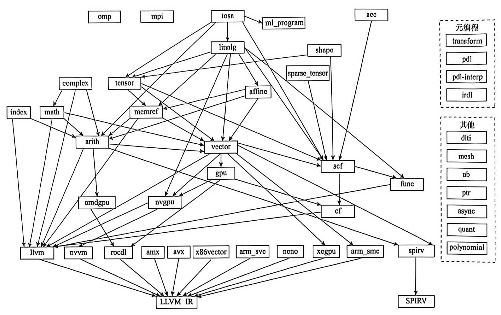
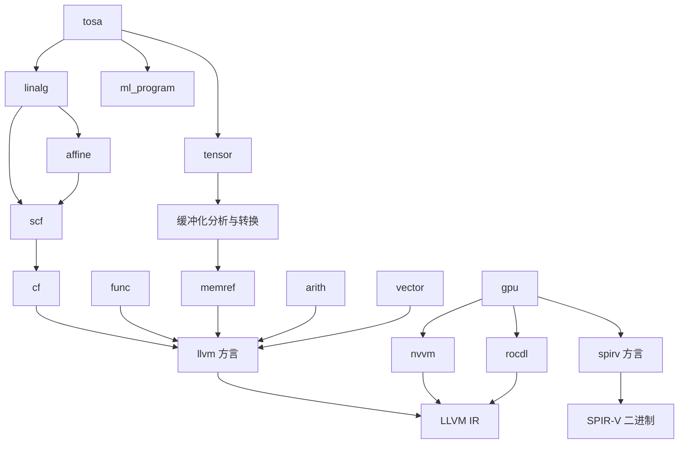

# 第二部分 MLIR 方言详解

> 来源：`insider-compiler-ch7-ch10.pdf` 第 18–20 页，原书第二部分扉页及导读。扉页未印页码，按前后页序推定为第 145 页，后两页为第 146–147 页。技术校订以本地 LLVM 18.1.8 为准；[校订记录](issues/part2.md)说明图示与版本差异。

<!-- source: insider-compiler-ch7-ch10.pdf, PDF p. 18 -->

MLIR 之所以流行，原因之一在于它提供了一套基础方言体系，涵盖硬件处理、优化处理、内存管理以及高级业务处理等。与此同时，MLIR 框架提供了大量方言降级与优化设施。MLIR 的使用者可以将自身业务代码接入合适的高级方言，复用这些设施构建基础编译器，随后依据领域特性实施相关优化，满足高性能编译器的应用需求。原书以 TensorFlow 2.0 中引入 MLIR 构建 AI 编译器为例。

原书在成书时将方言数量概括为“接近 50 个”，并给出下面的功能全景图。方言集合随版本和项目变化；数量不是固定的接口契约。接入一种方言也不意味着自动完成全部编译工作，仍需按目标配置转换流程、运行时和相应支持。

<!-- source: insider-compiler-ch7-ch10.pdf, PDF p. 19 -->

**方言功能全景图（原书未编号）**

原图连线密集，且混合了不同版本的方言、转换以及目标表示。这里保留直接从扫描 PDF 渲染的原图，便于核对每个标签和箭头：

下面的 Mermaid 图重绘本地源码中可对应的几条主要路径。箭头表示相应转换设施提供的路径，可能需要多个 Pass 及配套类型转换；它不是一个可按所有箭头一次执行的完整流水线，也不表示源方言的所有操作都能转换。原图其他标签在后表保留。

| 原图标签组 | 保留的标签与本地对应关系 |
| --- | --- |
| 接入与结构化计算 | `omp`、`mpi`、`tosa`、`ml_program`、`acc`、`linalg`；本地有除 `mpi` 外的这些方言 |
| 数据、计算与控制流 | `shape`、`sparse_tensor`、`complex`、`tensor`、`affine`、`index`、`math`、`memref`、`arith`、`vector`、`scf`、`func`、`cf`；均可在本地对应 |
| GPU 与目标相关 | `gpu`、`amdgpu`、`nvgpu`、`llvm`、`nvvm`、`rocdl`、`amx`、`avx`、`x86vector`、`arm_sve`、原图拼作 `neno` 的标签、`xegpu`、`arm_sme`、`spirv`；本地使用 `arm_neon` 表示 Arm Neon，没有独立的 `avx`、`xegpu` 方言 |
| 元编程 | `transform`、`pdl`、原图 `pdl-interp`、`irdl`；实际方言命名空间为 `pdl_interp` |
| 其他 | `dlti`、`mesh`、`ub`、`ptr`、`async`、`quant`、`polynomial`；本地没有 `ptr`、`polynomial` 方言 |
| 目标表示 | `LLVM IR`、原图 `SPIRV`；后者规范写作 SPIR-V，不是 LLVM IR |

在原图中，方言之间的连线代表方言降级，但没有呈现某些涉及方言提升的优化。鉴于方言降级过程复杂，原图也只列出部分路径。原书在第 8 至 12 章介绍各方言的上下游关系。为便于讲解，这里把方言大致分为 6 类；这是一种介绍方式，并非 MLIR 要求的互斥分类。

## （1）业务接入方言

业务接入方言用于将业务代码接入 MLIR 的方言体系，[第 8 章](insider-compiler-ch8.md)介绍这部分内容。以 AI 编译器为例，还可以分为：

1. 深度学习框架中间层：包括 `tosa`、`stablehlo`、`ml_program` 相关方言。其中，`tosa` 和 `ml_program` 在本地 MLIR 源码中；`stablehlo` 属于 OpenXLA 项目，不在本地 LLVM 仓库中。
2. 深度学习框架上层：原书列举 `torch`、`xla-hlo` 相关方言，作为相应框架或模型接入 MLIR 的表示。它们属于外部项目，本地源码没有这些方言，不能据此假定其接口或转换路径。

对于传统应用，原书列举 `acc`、`mpi`、`omp`。本地 LLVM 18.1.8 提供 OpenACC（`acc`）和 OpenMP（`omp`）方言，没有 MPI 方言；这里保留原书的范围，并明确本地可用性。

## （2）优化方言

优化方言提供可复用的优化能力，[第 9 章](insider-compiler-ch9.md)详细介绍，主要包括：

1. 循环优化：`affine` 方言以仿射约束表达循环及访存，为多面体分析与变换提供基础。
2. 向量化及分块：`vector` 方言表达向量计算、传输等，支持向量化、分块和逐步降级；其用途不只限于数据分块。
3. 结构化线性代数：`linalg` 方言保留迭代空间、索引映射及输入输出关系，支持分块、融合等结构化变换。
4. 其他优化：例如 `bufferization` 相关设施把 tensor 值语义计算转换为使用 memref 缓冲区的计算，分析能否复用存储，减少不必要的分配与复制。

> 校订：原书把 bufferization 称为“缓存优化”，容易与 CPU cache 混淆，正文统一使用“缓冲化”。

## （3）结构方言与数据方言

结构方言与数据方言用于表示程序控制流、数据及内存处理，以及基础类型和运算功能，[第 10 章](insider-compiler-ch10.md)详细介绍。

<!-- source: insider-compiler-ch7-ch10.pdf, PDF p. 20 -->

1. 结构相关方言：包括 `scf`（**结构化控制流**）、`cf`（控制流）以及 `func`。`scf` 用循环、分支等结构化操作表达控制流，抽象程度较高；`cf` 主要用基本块之间的分支表达控制流，抽象程度较低，`scf` 常被降级为 `cf`；`func` 用于表达函数定义及函数调用。
2. 数据相关方言：`tensor`、`memref`、`sparse_tensor`、`shape`、`math`、`arith` 等用于描述高级或基础数据结构及运算。原文 `spare_tensor` 修正为 `sparse_tensor`。

## （4）目标输出方言

目标输出方言及相关转换设施用于把 MLIR 表示逐步降级到目标可处理的形式，原书第 11 章详细介绍。

1. `llvm` 方言在 MLIR 内表示接近 LLVM IR 的结构，再通过翻译生成真正的 LLVM IR。
2. `gpu`、`nvgpu`、`nvvm`、`arm_sme`、`amdgpu` 等表达 GPU 或特定硬件的操作，并沿相应路径降级，其中一部分通过 LLVM 内建函数表示。原书还列举 `avx512`，本地应查阅 `x86vector` 等方言及相关转换，不能将 `avx512` 当作本地独立方言名。
3. 原图中的 `spirv` 路径生成 SPIR-V，目标并非 LLVM IR。并非每个硬件方言都会直接翻译为 LLVM IR；有的需要先转换为其他 MLIR 方言。

## （5）元编程方言

元编程相关方言为构建和控制 MLIR 变换提供便利，原书第 12 章详细介绍。

1. 模式及方言定义：`pdl` 用于表达模式匹配与重写；`pdl_interp` 为执行 PDL 模式提供解释器层次的表示；`irdl` 用 MLIR 表达方言、类型、属性和操作等定义。**PDLL 是编写模式的前端语言，不是 `pdll` 方言**，可与 PDL 相关设施配合使用。
2. 变换控制与扩展：`transform` 方言通过变换 IR、句柄和相应接口，描述对目标 IR（payload IR）执行的变换。开发者可通过扩展机制增加变换操作；这不等同于“基于动态方言给已有方言扩充模式匹配”，其功能也不限于模式匹配。

## （6）其他方言

除上述 5 类外，原书把一些方言归为其他方言，主要列举 `dlti`、`mesh`、`ub`、`ptr`、`async`、`quant` 和 `polynomial`，并安排在附录介绍。其中 `ptr`、`polynomial` 未出现在本地 LLVM 18.1.8 的方言定义及注册列表中；其余名称可在本地对应。

本部分还会涵盖方言降级（convert）、变换（transform），以及 MLIR 到 LLVM IR 的翻译（translate）。

从功能角度，原书还提出另一种粗略划分：一类与应用业务相关，例如 AI 领域的 `tosa`、`ml_program`；另一类提供公共能力，例如 `scf`、`cf`、`memref`、`affine`。作者据此主张，业务领域方言应由特定编译器项目维护，而不是纳入基础框架。这是作者的架构观点，本地 MLIR 实际仍包含 TOSA 和 MLProgram，不能把该观点视为上游已执行的排除规则。原文进一步将这一观点与社区管理组织的变化联系起来，但本次本地源码核验不能支持该历史因果说法，原说法与核验边界另存于[校订记录](issues/part2.md)。
