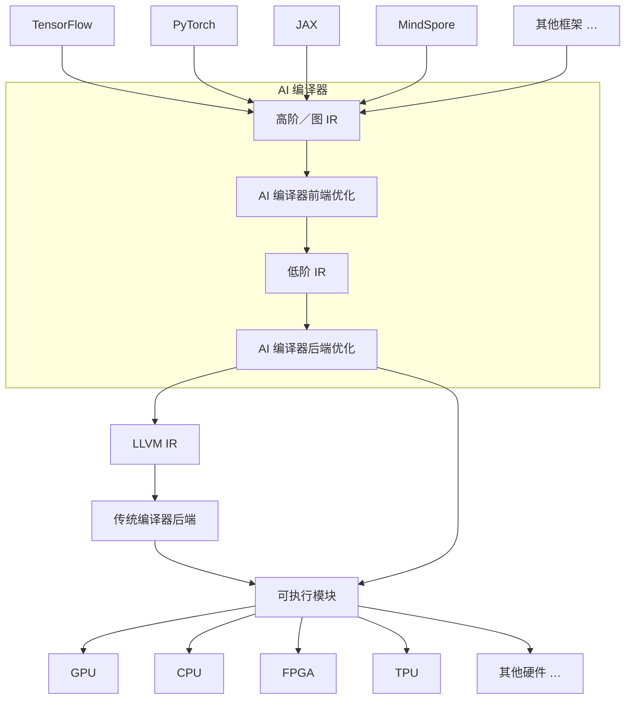
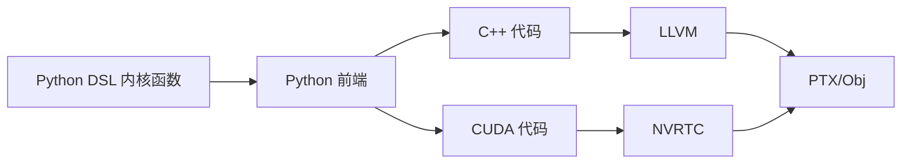
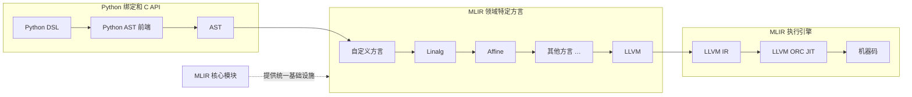

# 第 1 章 AI 编译器的演进与变革

> 本章依据本地 `pdf/mlir-ch1.pdf`，使用 macOS Apple Vision 的准确模式 OCR（简体中文、英文）识别，并对全部 13 页逐页目视复核。PDF 第 1 页为章扉页，第 2～13 页为原书正文第 2～13 页；正文、Warp 示例及图 1-1～图 1-5 的标签和关系均已保留。整理格式参照[第 2 章](mlir-ch2.md)，合并跨页断行、删除页眉页码，修复 OCR 和可直接依据上下文确认的笔误；原书的生态判断与技术叙述保留，必要的范围说明另列校订注。未执行 Warp/CUDA 示例。

## 目录

- [1.1 AI 编译器的核心作用](#11-ai-编译器的核心作用)
- [1.2 AI 编译器的发展与挑战](#12-ai-编译器的发展与挑战)
  - [1.2.1 面向 GPU 编程的 Python DSL](#121-面向-gpu-编程的-python-dsl)
  - [1.2.2 基于分块的编程模型](#122-基于分块的编程模型)
- [1.3 MLIR 的优势与价值](#13-mlir-的优势与价值)

人工智能（Artificial Intelligence，AI）技术的发展已经深刻地改变了人们的日常生活。从智能手机语音助手、电商平台的个性化推荐，到自动驾驶技术，人工智能正以前所未有的速度渗透进社会的各个领域。在这些应用背后是不断发展、日益复杂和庞大的 AI 模型在发挥着核心作用。然而，如何高效地将这些在 PyTorch、TensorFlow 等深度学习框架中构建的模型部署到各种各样的硬件平台（如 CPU、GPU 和专用 AI 加速器）上是一个巨大的挑战。这些模型通常以高层次的抽象语言描述，与底层硬件的指令集和架构存在巨大的鸿沟。为了解决这一难题，AI 编译器应运而生。AI 编译器旨在弥合 AI 模型与目标硬件之间的差距。通过抽象底层细节并进行多层次的优化与转换，AI 编译器能够将高层次模型描述转换为可在目标硬件上高效执行的代码。

AI 技术的迅猛发展带来的一个副作用是 AI 框架软件生态系统出现了严重的碎片化现象。各种 AI 框架层出不穷，每种框架都重新设计了复杂的中间表示（IR）层次和操作集合，但又彼此相互隔离地应用类似思路在不同硬件平台上追求性能优化。这导致 AI 编译技术复杂性迅速膨胀，开发者面对诸多权衡与取舍不知所措。

从 AI 编译器的发展历程来看，初代 AI 框架（如 TensorFlow 和早期 PyTorch）主要依赖大量手写算子库。虽然这一设计在深度学习的早期阶段能够满足需求，但在面对当今以生成式 AI 为代表的复杂工作负载时，逐渐暴露出扩展性不足的问题。后继 AI 编译器（如 XLA 和 TVM）试图通过自动化编译等方法提升性能与可移植性，并在处理由固定预定义算子组成的传统模型方面取得了一定成果。然而，这种策略在提升性能的同时牺牲了灵活性，而灵活性恰恰是现代生成式 AI 模型（如大语言模型和基于注意力机制的网络）所高度依赖的特性。随着模型规模增长、内存访问模式复杂化，以及新的注意力机制的出现，软硬件协同设计和优化已成为关键。然而，现有编译器体系尚未做好准备。同时，AI 编译器生态也出现了明显的碎片化趋势：XLA 深度绑定 TPU，TVM 则被割裂成多个供应商定制版本。这种割裂的演进路径未能发展出通用的、可广泛适配各类加速硬件的 AI 编译器。

上述问题使业界开始意识到，现有的 AI 编译技术与策略难以适应新一代 AI 模型在动态性、算子表达能力，以及硬件多样性方面的要求。为了应对这一挑战，亟须构建一种兼顾灵活性与高性能、具备良好可扩展性的通用编译基础设施，使得硬件后端的适配变得更加模块化，并可以在多个层次上进行高效优化。这一新型的编译器架构，不仅能够在多个目标平台之间提供一致的高效支持，还能通过更加灵活的抽象推动硬件和软件的深度协同，为 AI 模型创新与性能突破提供强有力的支持。

本章 1.1 节首先介绍了 AI 编译器在现代深度学习系统中的核心作用，特别是 AI 编译器设计架构与传统编译流程的衔接关系。1.2 节探讨了 AI 编译器的发展历程与面临的主要挑战，并从基于分块的 Python DSL 计算框架视角，重点探讨了编程语言易用性与性能优化之间的矛盾。最后，1.3 节总结了 MLIR（Multi-Level Intermediate Representation）在新一代编译体系中的创新价值，阐明其通过多层中间表示和可扩展方言体系，有望解决上述矛盾并为 AI 编译提供统一的基础设施。

## 1.1 AI 编译器的核心作用

AI 编译器在 AI 模型的训练和部署过程中发挥着核心作用。为了充分理解 AI 编译器的重要性，首先应了解 AI 编译器的工作方式。

作为一种针对特定领域的编译器，AI 编译器采用与传统编译器类似的前端-中间表示-后端的分层设计架构。但与传统编译器以源代码为输入不同，AI 编译器以深度学习框架定义的计算图及其算子为输入，通过多层次 IR 的抽象与优化，最终将深度学习计算任务转换为可在 GPU 或其他 AI 硬件平台上高效执行的代码。

多层次 IR 设计和针对 AI 模型的特定优化设计是 AI 编译器的独特之处。AI 模型被 AI 编译器转换为多层次 IR。其中，高阶 IR（也称为图 IR）用于 AI 编译器前端，表示与硬件无关的计算和控制流。低阶 IR 用于 AI 编译器后端。AI 编译器前端基于高阶 IR 执行硬件无关的转换和优化，AI 编译器后端基于低阶 IR 执行硬件相关的编译、优化和代码生成。AI 编译器后端生成的代码可能是针对专用 AI 加速器硬件的可执行代码，也可能是传递给传统编译后端的 LLVM IR 或其他中间表示形式。

图 1-1 描述了从 AI 模型抽象到硬件执行的全流程优化路径，尤其是 AI 编译器设计架构与传统编译流程的衔接关系。这种分层式的设计使得 AI 编译器既能保持框架级的灵活性，又能充分利用传统编译技术的稳健性与通用性。



图 1-1　AI 模型编译流程。AI 编译器后端既可以输出 LLVM IR，交由传统编译器后端继续处理，也可以直接生成可执行模块；图中的两条输出路径均予以保留。

AI 编译器不仅承担着模型结构到计算表示的转换任务，还需要在不同层次上执行针对性的优化。在这一分层体系中，优化贯穿始终，是连接高层模型语义与底层硬件性能的关键环节。

AI 编译器前端从深度学习框架中获取 AI 模型作为输入，并通过模型导入接口，将深度学习模型的高级规范转换为 AI 编译器的高阶/图 IR。图 IR 通常采用有向无环图形式。其中的节点代表计算操作，边代表操作间张量类型的数据依赖关系。在 AI 编译器的前端优化阶段，编译器主要针对模型结构和计算图进行优化。为了实现跨框架支持，此阶段的优化通常不限于特定框架的输入模型，而是发生在计算图的高层语义层次，并与特定的模型架构密切相关，例如，在 Transformer 等模型中执行针对性的算子融合、图剪枝或张量重组等操作。此阶段优化可作用于图节点、数据流及块级计算单元。

而在 AI 编译器的后端优化阶段，编译器的关注点转向硬件实现细节层面。为了实现跨设备支持，此阶段的优化可能不会特定于具体硬件，但仍需充分考虑目标设备的体系结构与资源特性，优化内容主要包括算子到硬件单元的 intrinsic 映射策略、内存分配与访存调度、延迟隐藏、循环展开及并行化等。与此同时，自动调优机制也常在此阶段引入，通过参数搜索与性能建模实现硬件级优化的自适应调整，从而在不同硬件平台上获得最优执行性能。优化后的低阶 IR 通过 JIT（Just In Time）或 AOT（Ahead Of Time）编译，生成针对不同硬件目标的可执行代码。

## 1.2 AI 编译器的发展与挑战

深度学习框架的发展显著提升了模型的开发效率。然而，随着 AI 模型规模的不断扩大，以及异构硬件的日益多样化，AI 系统的性能不仅取决于算法本身，也越来越受到编译器与运行时系统的影响。开发者希望用简单直观的编程语言构建模型，同时又期望这些模型能在 GPU、TPU，以及其他专用 AI 加速器上实现接近手写 CUDA/C++ 算子库的执行效率。

为了弥合语言表达性与模型性能之间的差距，在保持开发效率与编程体验的同时不牺牲底层性能和可控性，AI 编译器系统正逐步演进为一种结构清晰、分层解耦的编译技术栈。这一新型架构通过高层领域特定语言（Domain Specific Language，DSL）提供语义抽象，提升 GPU 程序开发效率，通过基于分块（tile-based）的编程模型实现并行优化和编译器调度能力，最终通过面向多硬件后端的低层指令映射与执行机制，将高层表示转化为可在不同硬件上运行的高性能机器码。

### 1.2.1 面向 GPU 编程的 Python DSL

DSL 是一类专为特定问题领域设计的编程语言，其以领域惯用的表达方式为基础，使开发者能够以更高效、直观的方式表达复杂的概念和操作，从而专注于问题的核心逻辑，而尽量避开烦琐细节，达到降低开发复杂度的目的。与通用编程语言相比，DSL 通常语法更简洁、抽象层次更高，能够在特定应用场景中有效提升开发效率和代码可维护性。

DSL 分为内部 DSL 和外部 DSL 两类。内部 DSL 依托于宿主语言，本身并不是一种独立语言，不需要重新发明语法，而是利用其宿主语言的语法特性定义专用语法并构建抽象语义。这类 DSL 充分利用了宿主语言的灵活性和表达能力，因此相对易于实现。而外部 DSL 定义了独立于宿主语言的语法和词法规则，不依赖任何宿主语言的结构。这类 DSL 需要专用的解析器和解释器来正确处理语言的解析和执行。外部 DSL 的优点是设计者对语言设计有完全控制力，可以构造任何想要的语法和执行模型，但缺点是实现成本和复杂度较高。

在 AI 模型领域，Python DSL 是最具代表性的高层 DSL 形式。根据上述定义，Python DSL 属于内部 DSL。使用 Python DSL 有诸多优势。首先，Python 语言是 AI 建模领域事实上的主流编程语言，Python 语言的灵活性和表达能力使其成为 DSL 的理想选择。开发者将 Python 作为宿主语言，通过装饰器（decorator）、抽象语法树（Abstract Syntax Tree，AST）改写等方式，在其中嵌入可编译语义子集，使开发者能够以自然直观的方式编写高性能代码，并将其扩展为各种深度学习框架的高层编程接口，或面向特定硬件的领域语言，解决主流 AI 模型开发中高层编程工具或语言易用性与底层性能优化需求之间的矛盾。

在深度学习框架中，模型的核心是一个由算子节点和张量数据流边组成的有向无环图（DAG）。而 Python DSL 则提供了构建这些算子的语言语义。Python DSL 是构建计算图的源语言，计算图是 DSL 程序的语义展开。此外，Python 丰富的库和工具生态为专业化 DSL 的发展提供了坚实的应用基础，使其能够与现有代码库无缝集成，从而加快模型迭代速度、简化原型设计，并降低在 GPU 上进行模型开发的学习曲线。

然而，Python 语言本身并不具备直接在 GPU 上执行的能力。为解决这一问题，开发者需要借助编译器技术将 Python DSL 代码映射为底层 GPU 程序。通过这种方式，既保留了 Python 语言的简洁和开发效率，又能实现对 GPU 的深度性能优化，使开发者在不必深入掌握分布式系统、GPU 编程或底层编译技术细节的情况下，也能获得接近手写 CUDA/C++ 执行效率的模型实现，从而降低模型开发的门槛。

将高层抽象与底层优化相结合的设计理念，正在被越来越多的 AI 编译器系统所采用。这种思路在保持良好开发者体验的同时，能够最大限度发挥底层硬件性能潜力。在这一趋势下，涌现出一批面向 GPU 编程的 Python DSL，如 NVIDIA Warp、cuTile、CuteDSL 等，它们正在重塑 GPU 编程范式，为开发者提供兼具高性能与高生产力的新型编程方式。

面向 GPU 编程的 Python DSL 是一种专注于 GPU 计算问题领域的 DSL。这类 DSL 通常采用基于块（block）或分块（tile）的编程模型，允许开发者以 Python 语法描述并行计算，并利用编译技术（如 MLIR 或 TVM）生成高度优化的 GPU 内核（kernel），可以做到 Python 语言的高层表达能力与底层 GPU 编程的性能需求相结合。现有的各种 Python DSL 设计虽然都基于类似的出发点，但在解决 GPU 可编程性方面各自采用了独特的方法。

NVIDIA Warp 作为一种面向 Python 开发者的、支持 GPU 加速的开源计算框架，通过其内部实现的 Python DSL 提供对 GPU 内核编程的高级抽象，使开发者能够构建和加速诸如数据生成、空间计算（spatial computing）和物理模拟等任务。Warp 尤其适用于仿真 AI、机器人技术、图形处理、几何计算和机器学习等领域。开发者可以使用熟悉的 Python 语言编写函数，Warp 框架通过 JIT 编译将这些函数转换为高效 CPU 或 GPU 可执行代码。此外，Warp 框架还提供丰富的计算原语，支持空间计算与几何处理，其内核具备可微分性，可无缝集成到 PyTorch、JAX、NVIDIA Omniverse 等机器学习与仿真平台中，成为构建 3D 仿真工作流和 AI 训练管道的强大工具。

在 NVIDIA GTC 2025 上，英伟达发布了据称是 2007 年推出 CUDA 编程模型以来最重大的扩展——cuTile 与 Tile IR。

与 Warp 类似，cuTile 既是一种计算框架，也可被视为一种面向 GPU 编程的 Python DSL。cuTile 可以帮助开发者以更高层次的抽象方式编写基于 Tile IR 的 GPU 程序，并灵活操作数据分块，从而避免直接管理复杂的线程组织和内存映射，也可减轻对开发者深入理解硬件底层细节的负担。

Tile IR 是为 CUDA 平台设计引入的一种专门用于密集线性代数计算的灵活抽象。Tile IR 扩展了 CUDA 的最底层软件栈，开发者只需将数据划分为分块，并直接以分块为单位进行编程，编译器即可自动推导出底层线程与内存映射关系。通过提升编程抽象层级，cuTile 将使更多开发者能够直接访问 GPU 加速计算资源，获得以往只有专家才能实现的高性能计算体验。

### 1.2.2 基于分块的编程模型

众所周知，GPU 作为一种大规模并行处理器，其核心在于将大规模数据并行操作拆分为多个小型 GPU 内核函数，并通过大量线程的同步或协作实现并行执行。这种执行模式是隐藏内存访问延迟、提高计算效率的关键。同时，为支持高效的并行执行，GPU 提供了大量的片内和片外硬件资源。

从 CUDA（或 OpenCL）等传统 GPU 编程模型的角度来看，GPU 线程具有层次化的组织结构，并与存储层级结构相对应。在 CUDA 中，采用了线程（thread）-线程块（thread block）-网格（grid）的层级模型；而在 OpenCL 中，对应的术语分别为工作项目（work item）-工作组（work group）-NDRange。在这类模型中，线程是最小的并行执行单元，每个线程通常可以访问若干个寄存器（一般为 255 个左右）。线程块内的线程数量受到具体硬件架构的限制，同一线程块中的线程运行在同一个流多处理器（SM）上，可共享一块共享内存（shared memory）区域，并通过共享内存和同步栅栏（barrier）实现通信与协作。

在运行时，一个线程块被划分为若干个线程束（warp 或 wavefront），每个线程束通常包含 32 个线程（英伟达 GPU 架构）或 64 个线程（AMD GPU 架构）。这些线程由 SM 内部的调度器统一调度，并在处理子单元（sub-core）中以单指令多线程（Single Instruction, Multiple Threads，SIMT）方式执行，即多个线程在不同数据上并行执行相同的指令。

多个线程块共同组成一个网格，代表设备中一次活跃的 CUDA 内核函数执行实例。一个网格中的所有线程块具有相同数量的线程。设备上的所有线程，不论属于哪个线程块，都可以访问全局内存（global memory）。虽然全局内存容量最大，但其访问延迟较高，吞吐率相对较低，因此通常需要结合共享内存与寄存器优化访问效率。

为了实现大规模数据运算到并行硬件的映射，可以选择三种不同层次的并行模型：网格级模型、分块级模型和线程级模型。在网格级模型中，由系统完成大部分工作，开发者只需描述整体操作（比如矩阵乘法、向量运算等），由系统完成数据的分块及分块后的计算任务到线程的映射；在分块级模型中，由开发者完成数据分块，由系统完成分块后的计算任务到线程的映射；在线程级模型中，由开发者完成大部分工作，包括数据分块和任务分配。图 1-2 总结了三种并行模式的特点。

| 并行模型 | 开发者负责 | 系统负责 |
| --- | --- | --- |
| 网格级模型 | 描述整体操作 | 数据分块和任务分配 |
| 分块级模型 | 数据分块 | 任务分配 |
| 线程级模型 | 数据分块和任务分配 | 提供执行环境 |

图 1-2　网格级模型、分块级模型和线程级模型及其特点。

以 CUDA 为代表的传统 GPU 编程范式，虽然具备对 GPU 并行计算行为的线程级、细粒度控制能力，能够充分挖掘 GPU 的性能优化潜力，但同时也对开发者提出了更高的专业要求，开发者需要深入理解诸如线程索引计算、共享内存管理、线程同步机制，以及底层资源管理等复杂细节，这显著增加了 GPU 内核程序开发与维护的成本。因此，传统 GPU 编程范式并非缺乏并行能力，而是如何以更自然、更高效的方式组织与调度并行计算资源，在保持性能的同时降低开发复杂度。

GPU 编程模型实现并行计算的核心在于将计算任务数据划分为可独立处理的单元，并通过多层次的线程结构对其进行调度与执行。尽管线程级并行控制提供了很好的控制力，但在实际开发过程中，并不总是需要深入至线程级的细粒度操作。与此同时，GPU 硬件架构也在不断演进，已经从单纯的 SIMT 执行模型，发展到如今高度依赖协作计算机制以提升整体效率的体系结构，张量核（Tensor Core）数学单元在 GPU 整体计算中所占比例不断提升。因此，在实际开发中，开发者往往将计算任务数据划分为具有逻辑结构的数据块，以便更好地适应现代 GPU 的计算特性，实现高效的并行调度与资源利用。

在生成式 AI 等具有典型数据并行特性的计算场景中，这些数据块通常表现为结构化数据形式，如数组、向量或张量等，具备明确的空间组织和访问模式。在这种情况下，介于线程级和网格级之间的基于分块的编程模型（tile-based programming model），在开发效率与执行性能之间展现出理想的平衡。这种编程范式可以充分利用数据块的结构特性（如维度、内存布局等），使编译器能够通过静态分析对程序进行优化，并自动将其计算操作映射到适合的硬件资源上，如专门用于张量计算的张量核。编译器在实现操作到硬件的映射时应具备良好的可移植性，以便针对不同 GPU 架构选择最优的映射方式。

Warp、cuTile 和 CuteDSL 等计算框架在传统 GPU 编程模型基础上，进一步扩展了基于分块的编程范式，使开发者能够在分块级别明确地表示多线程协同执行的计算操作，简化了传统 GPU 编程中常见的索引计算、共享内存管理与显式指针操作，降低了程序复杂度与出错风险。在这种范式中，分块被提升为一级对象（first-class objects），成为表达并行语义的核心概念。每个分块对应于计算任务数据中具有固定形状、结构良好的子区域，通常由线程束、线程块或其他等效的并行单元持有与处理。由此，基于分块的编程范式兼具线程级编程的控制力，以及网格级编程的高效与可移植性，成为目前 GPU 编程的重要发展方向。

下面以一个 Warp 内核函数为例，简要说明面向 GPU 编程的 Python DSL 在分块层面对计算过程进行封装后，如何通过编译工具链将计算过程映射为底层代码。Warp 的分块原语涵盖分块构造、分块加载与存储、线性代数计算，以及其他辅助操作。以下内核函数示例 `gemm_tiled()` 借助这些原语实现了基于分块的矩阵乘累加计算，其完整代码如下：

```python
import warp as wp

TILE_M = wp.constant(32)
TILE_N = wp.constant(64)
TILE_K = wp.constant(64)


@wp.kernel
def gemm_tiled(
    A: wp.array2d(dtype=float),
    B: wp.array2d(dtype=float),
    C: wp.array2d(dtype=float),
):
    i, j = wp.tid()
    sum = wp.tile_zeros(shape=(TILE_M, TILE_N), dtype=float)
    count = int(K / TILE_K)

    for k in range(count):
        a = wp.tile_load(
            A,
            shape=(TILE_M, TILE_K),
            offset=(i * TILE_M, k * TILE_K),
        )
        b = wp.tile_load(
            B,
            shape=(TILE_K, TILE_N),
            offset=(k * TILE_K, j * TILE_N),
        )
        wp.tile_matmul(a, b, sum)

    wp.tile_store(C, sum, offset=(i * TILE_M, j * TILE_N))


M, N, K = 1024, 1024, 1024
A = wp.ones((M, K), dtype=float)
B = wp.ones((K, N), dtype=float)
C = wp.empty((M, N), dtype=float)

wp.launch_tiled(
    gemm_tiled,
    dim=(int(M // TILE_M), int(N // TILE_N)),
    inputs=[A, B, C],
    block_dim=128,
)
```

> 代码说明：保留原书的变量、API、参数和计算顺序，仅修复 OCR 与排版。示例使用可整除的固定尺寸，没有展示一般尺寸下的边界处理；`sum` 从零开始累加，最后覆盖写入 `C`，并不读取 `C` 的原值。本次只核对转写、Python 语法及分块尺寸关系，未执行 Warp/CUDA 编译或 GPU 运行测试。

在 Warp 计算框架中，内核函数被定义为 Python 函数并以 `@wp.kernel` 装饰器标注。装饰器是 Python 中用于在函数定义时注入额外逻辑的一种语法结构。如果开发者使用 `@wp.kernel` 标注某函数，则该函数不会作为普通 Python 函数执行，而是由 Warp 框架接管并解析为 GPU 内核函数，由后续的 JIT 编译、调度和执行。

Warp 计算框架中的分块是一种用于表达并行计算数据单元的二维数组结构，可以使用 `wp.tile_zeros()` 等 NumPy 风格的原语构建。分块中的元素类型可以是标量、向量、矩阵或结构化数据类型。与 Warp 数组或 PyTorch 张量不同，分块的维度（如示例中的 `TILE_M × TILE_N`）必须是编译时已确定的常量，而后者的维度可以是动态的，并在运行时指定。

`gemm_tiled()` 内核函数循环遍历全局内存中的二维数据分块，调用 Warp 提供的全局内存加载原语 `wp.tile_load()`，根据指定偏移量，以分块形式从全局内存加载分块数据 a 和 b，分块大小分别为 `TILE_M × TILE_K` 和 `TILE_K × TILE_N`，并调用乘法累加原语 `wp.tile_matmul()`，根据元素类型、矩阵大小和数据布局，将计算映射到合适的张量核指令。最终计算结果保存在分块 sum 中，并通过全局内存存储原语 `wp.tile_store()` 写回全局内存。

图 1-3 展示了 `gemm_tiled()` 内核函数实现基于分块的矩阵乘累加计算过程。整个计算过程在分块层面对矩阵乘累加的加载、计算与存储进行了封装，并由线程块中的线程协同执行，实现了基于编译期常量块尺寸的并行计算映射与执行，开发者无须手动编写线程索引计算、共享内存管理等细节代码。

原图将矩阵 A 放在左下方，B 放在右上方，C 放在右下方：A 中分块 `a` 所在的行带与 C 中 `sum` 的行带对齐，B 中分块 `b` 所在的列带与 `sum` 的列带对齐。虚线表示这些行、列的对应关系。

```text
                                    B (K x N = 1024 x 1024)
                                    +-----------------------+
                                    |      j * TILE_N       |
                                    |        +-------+      |
                                    |        |   b   |      | <- k * TILE_K
                                    |        +-------+      |
                                    +-----------------------+
                                             :       :
    A (M x K = 1024 x 1024)          C (M x N = 1024 x 1024)
    +-----------------------+       +-----------------------+
    |      k * TILE_K       |       |        :       :      |
    |        +-------+      |       |        +-------+      |
    |        |   a   | . . . . . . . . . . . |  sum  |      | <- i * TILE_M
    |        +-------+      |       |        +-------+      |
    +-----------------------+       +-----------------------+
```

| 对象 | 形状 | 本例大小 | 在所属矩阵中的起始偏移（行，列） |
| --- | --- | --- | --- |
| A | `M × K` | `1024 × 1024` | — |
| B | `K × N` | `1024 × 1024` | — |
| C | `M × N` | `1024 × 1024` | — |
| 分块 `a` | `TILE_M × TILE_K` | `32 × 64` | `(i * TILE_M, k * TILE_K)` |
| 分块 `b` | `TILE_K × TILE_N` | `64 × 64` | `(k * TILE_K, j * TILE_N)` |
| 分块 `sum` | `TILE_M × TILE_N` | `32 × 64` | `(i * TILE_M, j * TILE_N)` |

固定输出分块索引 `(i, j)` 后，`k` 沿 K 维遍历 16 个分块，每次执行 `sum += a @ b`，最后将 `sum` 存入 C 的对应区域。输出分块网格为 `32 × 16`，每个线程块使用 128 个线程。

图 1-3　基于分块的矩阵乘累加计算。

> 图示校订：原图将 B 中分块 `b` 的横向尺寸标成 `TILE_K = 64`。按前页代码 `shape=(TILE_K, TILE_N)`、本页正文及矩阵维度关系，横向应为 `TILE_N = 64`。本例两个常量恰好都为 64，数值相同，但维度含义不同；上表已据此修正。

`warp.launch_tiled(kernel, [M, N], inputs=[...], block_dim)` 原语用于在 GPU 上以分块为计算单元启动二维网格形式的内核函数，其参数 `[M, N]` 指定了组成二维网格的线程块形状（示例中为 32 × 16），参数 block_dim 指定了每个线程块的线程数量（示例中为 128）。在内核函数内部，`wp.tid()` 返回当前分块在二维网格中的二维索引 `(i, j)`，该索引决定了该分块在输入输出矩阵中的计算位置和数据处理范围。线程块中的 block_dim 个线程在分块内分配，以并行处理分块内的数据元素，协同完成该分块对应矩阵区域的计算任务。

> 参数说明：原书在这里用 `[M, N]` 泛指分块网格的两个维度，不是直接传入前面两个值为 1024 的矩阵尺寸。示例的实际参数是 `dim=(M // TILE_M, N // TILE_N)`，即 `(32, 16)`；`block_dim=128` 才是每个线程块中的线程数。上面的调用形式是原书的接口示意，完整调用语法见代码块。

当 `wp.launch_tiled()` 或 `wp.launch()` 首次调用内核函数时，将触发实际编译过程。Warp 框架采用 JIT 编译机制，其编译过程采用 Python → C++/CUDA → PTX/Obj → Python 调用形式的编译模型，并以 C++/CUDA 作为中间表示语言。

Warp 框架在首次调用内核函数时，通过 Python 标准库中的 `inspect.getsource()` 接口提取该 Python 内核函数源代码，并通过 `ast.parse()` 接口将源代码解析为 AST，以捕捉其中的操作、控制流和数据依赖结构。然后，Warp 框架的代码生成模块对 AST 进行遍历与分析，解析其结构与逻辑，并在此基础上引入必要的内建头文件（包含 Array、Math、Geometry 等常用结构定义和工具函数），将 Python 函数转换为 `.cpp`（用于 CPU）和 `.cu`（用于 GPU）文件。在此过程中，所有函数输入参数均需具备静态类型声明，以支持目标代码生成。

接下来，生成的源代码由编译工具链的 LLVM 和 NVRTC 分别编译为可在 CPU 和 GPU 上执行的 `.obj` 或 `.ptx` 文件，并被打包成可供 Python 调用的动态库。当开发者在 Python 代码中调用 `wp.launch_tiled()` 或 `wp.launch()` 时，Warp 会加载对应的动态库，并执行编译后的 GPU 内核函数。Warp 框架的编译流程如图 1-4 所示。



图 1-4　Warp 框架的编译流程。原图以同一输出框表示两条编译路径的产物，其中 C++／LLVM 对应 CPU 路径，CUDA／NVRTC 对应 GPU 路径。

为了提升后续启动效率，Warp 将编译结果缓存。当再次调用相同内核函数时，若检测到源码未发生变化，则会直接复用缓存编译结果而无须重新编译，以此提升启动效率。

诸如 Warp、cuTile 等基于 Python DSL 的 GPU 计算框架在简化开发流程的同时，可有效屏蔽线程级编程的复杂性，同时保留了 GPU 在粗粒度和细粒度并行计算方面的灵活性与高性能潜力。通过将基于 Python DSL 的 GPU 计算框架作为编程语言和核心组件深度集成至编程模型，可以使 GPU 程序在代码可移植性和跨代兼容性方面具备天然优势。这意味着，开发者在计算框架上实现基于分块表达的模型后，可将其无缝运行于各类 GPU 架构上，而无须手动调整线程级调度与同步等与底层硬件相关特性，降低了并行程序设计的复杂性。

## 1.3 MLIR 的优势与价值

如前所述，AI 编译器面临着一个核心矛盾：一方面，为了提升编程语言易用性和可扩展性，AI 编译器需要通过高层抽象屏蔽底层实现细节；另一方面，当前主流的生成式 AI 的工作负载高度依赖对底层硬件的精细控制和灵活编程能力，以实现最优性能。如何在抽象与性能之间取得平衡，成为 AI 编译器设计中的关键挑战。

目前，最有潜力打破 AI 编译框架碎片化与混乱局面，并为不同硬件制造商的计算能力提供统一基础平台的是 MLIR。MLIR 是 LLVM 项目的子项目，在 LLVM 社区的推动下发展起来，并深受 LLVM 设计理念的影响。虽然 MLIR 是相对较新的项目，但其设计充分借鉴了 LLVM 的许多成功经验，例如，模块化、可重用设计等。

LLVM 已经由最初的编译器框架发展成为一个模块化的编译器工具链集合，涵盖前端（如 Clang C/C++ 编译器）、中间表示（LLVM IR）和后端（面向不同硬件平台的代码生成器）。其中，LLVM IR 是一种接近机器指令的低层中间表示，主要关注代码优化和目标代码生成。而 MLIR 则进一步向上扩展，既是一种支持多级抽象的通用中间表示，也是一种灵活、模块化的编译器基础设施。其设计目标是在保持可扩展性的同时，支持各类特定领域编译器的构建，从而更好地应对传统编译器在复杂模型和硬件生态系统、特别是异构计算环境中面临的挑战。

MLIR 的新颖之处在于其“方言优先”的设计理念。通过模块化架构，MLIR 将特定领域的语义表达与核心编译基础架构解耦，实现了高度的灵活性与可组合性。MLIR 不再强制开发者使用统一的中间表示，而是支持按需定义专属的操作、类型和语义，使得多个抽象层级能够并存、互转并协同工作。这种模块化架构不仅增强了系统的可扩展性和重用性，还赋予开发者对底层硬件的精细控制能力，在抽象与性能之间取得了新的平衡。凭借多级抽象特性，MLIR 能够在不同层次上表达模型，从而连接不同 AI 框架和硬件平台，支持从高层 DSL 到硬件指令的逐级转换和优化，在提升编程语言易用性的同时，为生成式 AI 工作负载提供了底层可编程性与强大的优化能力。

然而，要让 MLIR 真正成为统一 AI 编译生态的核心基础仍面临挑战。随着人工智能，尤其是生成式 AI 技术的迅猛发展，业界迫切需要一种能够实现从主流深度学习框架到多样化硬件平台端到端映射的编译系统。但目前 MLIR 内置 AI 相关方言（dialect）仍存在各种不足，尚未形成可直接支撑完整 AI 工作负载的端到端参考实现，开发者仍需付出大量精力才能完成 MLIR 与其他框架的集成。此外，MLIR 的各下游系统也在不同方向上各自演进，在一定程度上削弱了其统一 AI 编译框架的努力。更重要的是，统一各种编译框架不是一个单纯的技术挑战，还涉及企业间相互竞争的 AI 生态系统、对开源软件控制权的争夺，甚至是开源社区的价值观共识与文化差异。凡此种种，都说明要真正推动 MLIR 在 AI 编译器领域的广泛落地和深度应用，仍需在可用性、可集成性和应用生态方面持续努力与改进。

尽管面临诸多不确定因素，MLIR 迄今已取得了显著成果。MLIR 已嵌入几乎所有主流的 AI 编译软件栈，成为其核心中间表示基础。据 MLIR 官方用户（Users of MLIR）页面统计，TensorFlow 和 XLA 将 MLIR 作为其图优化和代码生成的主要机制；IREE 构建在 MLIR 之上，实现了面向多种后端的高性能推理；Torch-MLIR 为 PyTorch 提供了通向通用编译管线的桥梁；ONNX-MLIR 用于将 ONNX 模型高效编译为多种硬件后端的机器码；OpenXLA 和 StableHLO 也依赖 MLIR 实现高层操作与底层编译的解耦。这些集成应用案例充分展示了 MLIR 在统一多样化的 AI 工作负载编译流程中的强大能力，并已在业界获得广泛认可。

从架构层面来看，MLIR 基于关注点分离（separation of concerns）原则，将整体系统分为 MLIR 核心模块和 MLIR 领域特定方言两个部分。

MLIR 核心模块是整个 MLIR 编译器基础设施的基石，包含与具体计算语义无关的操作集、属性集、类型系统、pass 管理系统、模式匹配重写（pattern rewrite）等通用机制。通过 MLIR 核心模块可以支持任意语义的表示，并为编译优化和转换提供统一、坚实的技术基础。

相较之下，MLIR 领域特定方言则聚焦于特定的计算语义层次、编程模型或目标硬件。例如，Torch、TOSA、MHLO 等方言主要服务于 AI 领域，可用于高层张量计算建模；Linalg 方言专注于表达与线性代数相关的张量操作，常用于深度学习模型的中间层优化；LLVM、NVVM、SPIR-V 等后端方言则面向特定硬件目标代码的转换。这些方言通常定义了专属的操作集合、类型系统及重写规则，并可通过方言转换 pass 逐步递降（lowering）到更底层表示，直至由 LLVM 后端输出汇编或目标代码。MLIR 的这种分层架构有助于快速支持、开发新的 Python DSL，同时复用现有的优化与转换能力。

在从 Python DSL 到机器码的完整编译过程中，MLIR 核心模块提供的基础设施支撑了整个编译链路，而 MLIR 领域特定方言则充当连接高层 DSL 与 MLIR 中间层方言（如 Linalg、Affine、MemRef、Arith 等）的桥梁。编译过程可分为以下五个阶段：

1. **解析 Python DSL。**基于 Python AST 的编译器前端对 Python DSL 程序进行词法分析和语法解析并构建 AST（这与前述 Warp 框架的编译器前端功能类似）。

2. **生成自定义方言。**AST 被转换为由自定义 MLIR 领域特定方言表示的 MLIR 中间表示。在此阶段，自定义方言的设计是关键，该方言定义了 DSL 的核心操作、数据类型及语义规则等，既需充分抽象和表达目标领域 DSL 的领域知识和核心语义，又需保证与后续递降和优化流程的兼容性。

3. **渐进式递降与优化。**通过渐进式递降，逐步剥离领域语义，将自定义方言依次转换为更接近硬件语义的标准 MLIR 中间层方言和针对特定硬件的底层方言，并生成相应的控制流、内存访问模式和数值计算逻辑等。这一阶段是 MLIR 的核心阶段。借助方言机制，MLIR 能够在多语义层级并存的情况下展开 DSL 操作语义，并重用 MLIR 生态中丰富的优化 pass，如循环变换、内存访问优化、数据布局调整、形状推理和其他针对特定硬件特性实现的优化 pass 等。

4. **翻译为 LLVM IR。**当所有方言被转换至 MLIR 的底层 LLVM 方言，其操作即可与 LLVM IR 对应。此时可通过 MLIR 的 LLVMIRTranslation 接口（详见第 2 章）将 LLVM 方言操作进一步转换为标准 LLVM IR。

5. **生成机器码并执行。**在完成 MLIR 优化并导出 LLVM IR 后，由 LLVM 工具链完成后续中端优化与底层机器码生成过程。最终，编译器输出可执行程序并调用主函数完成执行。

上述编译过程中的第四、第五阶段由 MLIR JIT 完成。生成的 LLVM 方言操作被加载至 MLIR 执行引擎（Execution Engine）所封装的 LLVM ORC JIT 运行时环境中。MLIR 执行引擎通过符号解析和动态链接机制，将生成的目标代码注册到运行时符号表中，使其可以被直接调用或调度执行。最终，编译器通过调用主入口函数，在其他共享库的支持下实现模型的即时运行。

> 范围说明：这里描述的是图 1-5 所选的 JIT 路径。按本地 LLVM 源码提交 `3b5b5c1ec` 中 `mlir/lib/ExecutionEngine/ExecutionEngine.cpp` 的实现，引擎先用 `translateModuleToLLVMIR()`（或提供的 `llvmModuleBuilder`）生成 LLVM 模块，再将该模块包装成 `ThreadSafeModule` 交给 LLVM ORC JIT；不能把原书“LLVM 方言操作被加载至……ORC JIT”的概括理解为 ORC 直接编译 MLIR 操作。

图 1-5 展示了基于 MLIR 的从 Python DSL 到机器码的完整编译流程。整个流程以 Python DSL 为起点，经由 Python 前端将源程序解析为 AST，并通过 Python 绑定与 C API 转换为 MLIR 模块。在 MLIR 编译过程中，编译流程依次经过自定义领域特定方言、Linalg、Affine 等中间层方言，最终递降至 LLVM 方言。在此过程中，MLIR 核心模块提供了统一的类型系统、操作表示与优化基础设施。随后，MLIR 执行引擎将 LLVM 方言翻译为 LLVM IR，并通过调用 LLVM ORC JIT，实现即时编译与机器码生成。整个流程体现了 MLIR 在连接高层 DSL 与底层硬件之间的桥梁作用。



图 1-5　基于 MLIR JIT 的 Python DSL 编译流程。

原图中，“MLIR 领域特定方言”横向包含自定义方言、Linalg、Affine、省略的中间方言与 LLVM 方言，其下方是支撑整层的“MLIR 核心模块”。左侧“Python 绑定和 C API”的虚线边界还覆盖自定义方言入口，右侧“MLIR 执行引擎”的虚线边界还覆盖 LLVM 方言出口；这些区域在原图中存在重叠，以上流程图通过连线及此说明保留其交接关系。核心模块是共享基础设施，不是方言递降完成后的另一个串行阶段。

通过上述流程可以看出，MLIR 不仅提供了从高级 Python DSL 到低层机器码的完整通路，还在这一过程中保持了高度的模块化与可扩展性。无论是自定义领域特定方言，还是通用中间层优化，MLIR 的统一基础设施都为复杂编译任务提供了重要支撑。这种设计理念不仅适用于 AI 编译器，也为其他计算领域的编译技术和优化方法奠定了基础。因此，MLIR 作为通用且可复用的编译基础架构，能够为从硬件设计到量子计算等多个领域提供支持。本书重点探讨 MLIR 在 AI 编译器领域，尤其是面向 GPU 硬件平台的应用实践，旨在帮助读者理解并掌握如何利用 MLIR 构建高效、可扩展的 AI 编译系统。
