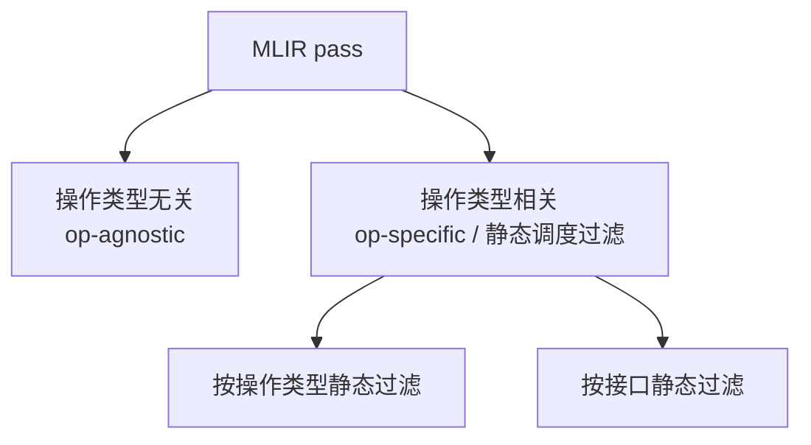
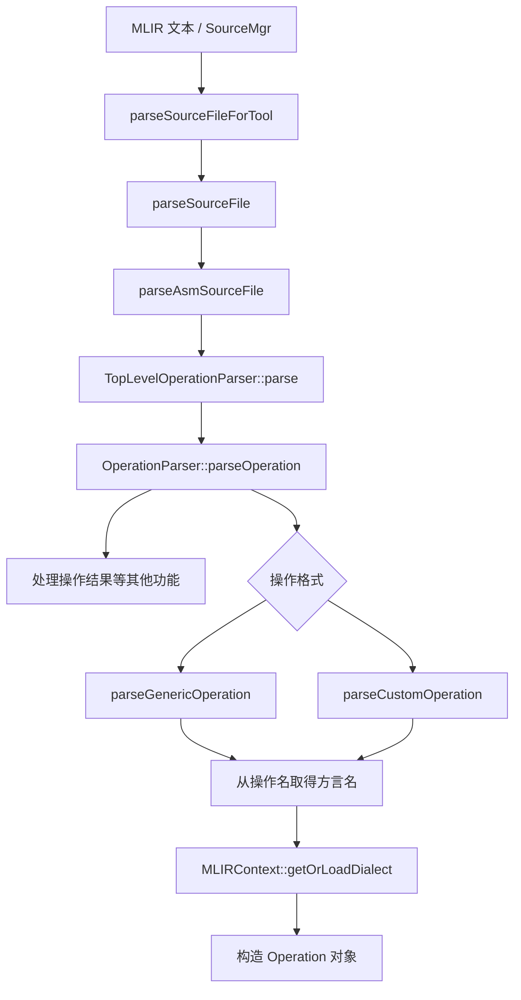
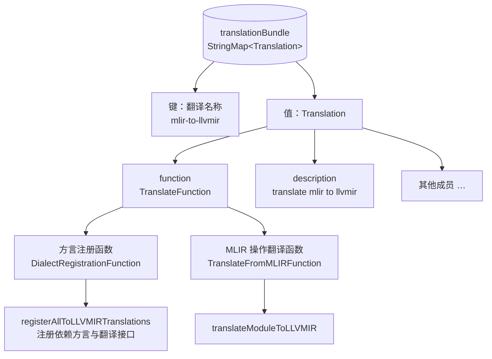
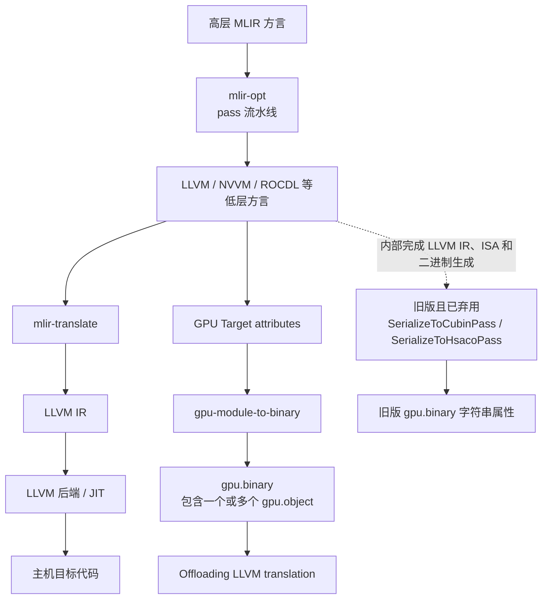

# 第 2 章 MLIR 基本概念与工具

> 本章已依据工作区中的 `mlir-ch2.pdf` 全部 37 页（原书第 15～51 页）逐页目视复核并补齐正文、代码、例子及图意；修正 OCR 与有依据的技术错误，历史接口保留并另注版本差异。已作本地源码静态对照，未执行全部示例编译测试。详见[完整性复核记录](mlir-transcription-review.md)。
>
> 本章涉及的 MLIR 源码和 API 以本仓库提交 `3b5b5c1ec`（2024-06-15）为校对基准。MLIR 接口演进较快，使用其他版本时应同时核对对应提交中的声明、测试和工具入口。

## 目录

- [2.1 MLIR 的基本概念和特点](#21-mlir-的基本概念和特点)
  - [2.1.1 MLIR 中的操作与方言](#211-mlir-中的操作与方言)
  - [2.1.2 MLIR 中的常用方言](#212-mlir-中的常用方言)
  - [2.1.3 MLIR 的高层结构](#213-mlir-的高层结构)
- [2.2 MLIR 中的 pass 及其管理机制](#22-mlir-中的-pass-及其管理机制)
  - [2.2.1 MLIR pass 的分类](#221-mlir-pass-的分类)
  - [2.2.2 MLIR pass 的管理机制](#222-mlir-pass-的管理机制)
- [2.3 mlir-opt 工作流程](#23-mlir-opt-工作流程)
  - [2.3.1 mlir-opt 的基本用法](#231-mlir-opt-的基本用法)
  - [2.3.2 mlir-opt 的内部调用流程](#232-mlir-opt-的内部调用流程)
  - [2.3.3 mlir-opt 主函数功能](#233-mlir-opt-主函数功能)
- [2.4 mlir-translate 工作流程](#24-mlir-translate-工作流程)
  - [2.4.1 方言操作到 LLVM IR 的翻译过程](#241-方言操作到-llvm-ir-的翻译过程)
  - [2.4.2 操作翻译接口及其执行流程](#242-操作翻译接口及其执行流程)
- [2.5 LLVM IR 到硬件指令的序列化](#25-llvm-ir-到硬件指令的序列化)
  - [2.5.1 序列化成员函数功能](#251-序列化成员函数功能)
  - [2.5.2 指令序列化过程](#252-指令序列化过程)

为了捕获高级语义，不同的高级编程语言纷纷定义了各自的 IR；在深度学习领域，各框架也为了表达张量计算而设计了独立的高阶 IR。无论是通用编程语言还是深度学习框架，它们都在高层抽象上构建了独有的数据结构与计算模型，用以描述复杂的语义和计算过程。然而，这些高阶 IR 最终都需要统一递降到更贴近硬件的低阶 IR（如 LLVM IR）。问题在于，各语言和框架在高阶 IR 层面进行了大量重复的优化工作，导致明显的重复建设和资源浪费。

2019 年底，谷歌在 LLVM 项目中开源了 MLIR 框架。作为术语，MLIR 具有两层含义。

首先，MLIR 是一种多级编译器中间表示，采用与传统三地址 SSA 表示相似的结构，可表达不同抽象层次的代码，范围从领域专用高阶结构（如 TensorFlow 图）到机器级代码，以及介于两者之间的任何结构（如循环嵌套）。MLIR 既可用于特定领域编译，也可支持通用编译任务，其表示能力足以覆盖几乎所有的顺序计算，以及任意控制流或数据访问。为了支持高级数据流图，并为高性能数据并行系统生成目标相关代码，MLIR 引入了多面体循环优化的概念。MLIR 吸收了从高阶到低阶的各类中间表示设计经验，专注于构建一个可扩展、可复用的统一编译中间层，并将已有的中间表示设计技术应用于新的领域，如深度学习。

本章 2.1 节介绍 MLIR 的设计理念与结构特点，包括方言与操作的核心概念，以及模块化、高可扩展性的体系设计特点。同时还介绍几种常见 MLIR 方言（如 Linalg、Vector、NVGPU 和 Affine）在计算表示、硬件映射与优化中的作用及特点。

其次，MLIR 也是一个编译器工具包。其设计目标是为开发者提供便捷的 IR 生成与优化支持，同时提供各种方言形式的功能集合，以及完善的编译器转换 pass 开发基础工具。本章 2.2 节系统分析 MLIR 中的 pass 机制及其管理方式，帮助开发者掌握 pass 的运行原理与注册管理方法。在工具层面，2.3 与 2.4 节详细介绍 `mlir-opt` 和 `mlir-translate` 的工作流程与使用方式，包括 `mlir-opt` 在 pass 执行中的作用，以及 `mlir-translate` 如何将 MLIR 转换为 LLVM IR，涵盖 `ModuleTranslation` 类与元数据处理等关键环节。

在 MLIR 上下文中，转换（transform）通常指对 IR 的变换，例如同一方言内不同 Linalg 操作的融合。而转化（conversion）在本书中通常指跨方言的变换，如从 NVGPU 方言到 NVVM 方言的映射。MLIR 与外部表示之间的转换称为翻译（translation），例如 LLVM 方言翻译为 LLVM IR。此外，递降（lowering）指的是 IR 抽象级别降低的转化过程。在不致引起歧义的前提下，本书对上述“转换”“转化”等术语不做严格区分。

> 校订注：原书用同方言／跨方言来介绍 transform 与 conversion，便于初步理解，但这不是两者的严格边界。Dialect Conversion 基础设施根据合法性目标和类型转换规则系统地改写 IR，并不要求必须跨方言。此处保留原书的 Linalg 融合和 NVGPU→NVVM 两个具体例子，避免在修正术语时删掉例子。

## 2.1 MLIR 的基本概念和特点

作为完全可扩展的编译器基础设施，MLIR 具有高度模块化和开放的架构，其操作集、属性集和类型系统都是开放、可扩展的，并随着不同应用场景持续演进。这使得 MLIR 不仅适用于 AI 编译器的构建，还广泛适用于高性能计算、图形处理、量子计算等多个领域。

MLIR 的设计思想支持将高阶 IR 逐步递降到特定目标形式，并涵盖从图算法到低级代码生成的整个范围。除了处理循环嵌套和数据布局的高级转换这类典型的中级优化外，MLIR 还可执行针对后端 IR 的低级调度和映射决策，例如将 IR 映射到专用向量指令、自动向量化和软件流水线等。

可以说，MLIR 提供的多级抽象表示能力不但在表示能力方面提供了新的解决思路，而且以统一的设计框架提供多级抽象，以统一的标准 IR 和内在一致的概念表示各种形式的计算，以及来自不同框架的数据流图，为不同问题域的计算表示提供可共享、可重用的基础设施；并可在不同层次插入优化、转换和分析，经由各种高级优化与并行化方法递降得到高性能目标代码。

### 2.1.1 MLIR 中的操作与方言

程序行为由操作描述。MLIR 操作集通常用于描述程序的动态语义，其表示范围包括从硬件指令到函数，再到 AI 模型的构建块，涉及计算的各个方面。操作（operation，简写为 op）是 MLIR 的基本实体和最小代码单元，是抽象和计算的核心单元。开发者可将其视为硬件指令或其他高度抽象操作的泛化表示。

操作使用值并定义新值。每个操作使用一组类型化的操作数，并定义一组类型化的结果。定值和使用的值代表 SSA 形式的不可变数据单元。例如，在表达式 `%3 = addi %0, %1` 中，加法操作使用 `%0` 和 `%1`，定义 `%3`。某个操作的输出结果与另一个操作的输入操作数之间的连接可描述为 SSA 形式的数据流。

包含若干操作的线性序列可组织成基本块（block），若干基本块又可组织成区域（region），如循环体或函数体。

操作的属性（attribute）包含操作在编译时已知的信息，每个操作可通过属性参数描述其重要特征。与可能需要执行时才能确定的操作数值不同，属性值是编译时已知的信息。属性对象不可变，但编译变换可以为操作替换属性，因而不能将其理解为整个编译过程中都不得改变。MLIR 中的值都有类型，类型包含编译时已知的信息；操作数也可能是编译时可知的常量，并非所有操作数都只能在运行时确定。

MLIR 的操作完全可扩展，并具有应用相关的语义，可用于表示 LLVM 中的所有核心 IR 结构，如指令、函数、模块等。为了支持可扩展性，MLIR 仅将属性、类型、操作和区域等有限概念作为基本内建概念，其他概念由这些基本概念衍生。例如，模块（module）和函数（function）被定义为具有特定语义、符号名称（symbol name）属性，并以区域为主体的操作。从 `for` 循环这类高级结构到低级硬件指令，都可以用操作定义。

模块化和重用性是 MLIR 的核心设计思想。MLIR 可将不同组件以独立库的形式分别实现，开发者可以根据需要链接这些库。这与 LLVM 的设计理念高度一致，同时进一步强调灵活性与工程可扩展性。虽然 MLIR 目前仍部分依赖 LLVM 的支持库，但在架构上与 LLVM IR 相互独立，并通过保持优化及转换逻辑与核心 IR 抽象的分离，实现高度解耦的构建系统。构建系统可以独立选择、编译和链接特定方言的实现代码。

MLIR 通过“方言”这一概念支持模块化、可扩展设计，以及中间表示的多样化。方言是 IR 抽象的逻辑组合，可在唯一命名空间下，为不同应用领域中逻辑相关的抽象（操作、属性和类型）提供组合机制。MLIR 方言可以笼统地视为 IR 逻辑层次。通过一系列可组合方言实现多阶段编译，是 MLIR 区别于其他编译框架的重要特性；它使开发者可以在面向不同异构硬件的编译栈上复用公共方法和部件。

MLIR 包含一系列特定领域方言。它们描述给定应用支持的合法操作集，并根据各自工作的上下文与其他方言交互。不同方言在代码生成过程中扮演不同角色。为了有效使用 MLIR，开发者有时需要根据需求定义新的方言，为后续分析和转换提供途径。因此，MLIR 除了提供若干内置方言来表示通用功能，还提供开放的基础设施，允许开发者在不同粒度和抽象级别定义新方言、自定义类型、操作和属性。

### 2.1.2 MLIR 中的常用方言

MLIR 方言提供多个抽象级别，有助于完成在单一抽象级别很难执行的转换和优化。例如，Torch、TOSA、MHLO 等上层方言多与 AI 领域相关，通常用于表示高层 AI 框架的图和算子集合。配合导入及转换流程，它们捕获算子语义，将其转换为统一表示，处理不同框架间的差异，简化模型导入 MLIR 环境和代码生成任务。在统一表示基础上，可以进行算子融合、内存布局优化、并行化等。这些优化有助于生成高效低层代码，并在不同硬件平台上高效运行。方言定义本身与具体导入器、转换 pass 应加以区分。

Affine、SCF（Structured Control Flow）、Linalg、Tensor、Vector 等中间层方言负责张量、缓冲区相关操作及其他转换流程，通常支持多样化的上层输入。例如，TOSA、MHLO 等都可以经相应转换作为 Linalg 的上层输入方言。

在中间层方言中，Affine 使用多面体编译技术，主要表达和优化带约束的循环及内存访问模式，提供循环拆分、循环融合、循环交换等能力。SCF 表示不受仿射分类规则约束的结构化控制流，包括循环和条件。例如，`scf.for` 接受 index 或支持的整数类型 SSA 值作为下界、上界和步长，不像 `affine.for` 那样直接用仿射映射表示边界；这些值仍可由 `affine.apply` 等操作计算得到。因此，原书“不支持仿射映射”不能理解为 SCF 无法使用仿射计算结果。这类结构化控制流有助于高层分析、优化，并简化代码生成。

Linalg 用于表达和优化线性代数相关的张量及缓冲区计算，如矩阵乘法、卷积等。通过分块（tiling），可将大规模问题分解为小规模子问题：一方面改善数据局部性和缓存命中率，另一方面便于将计算映射到硬件资源，以达到在目标硬件上高效执行的优化目标。

张量表示抽象的值类型数据序列。Tensor 方言专注于张量操作的抽象，提供处理多维数组的操作，使开发者可以在高层次上操作张量，为后续优化、转换提供基础。使用张量及 Tensor 操作有助于提高算法开发效率。MemRef 则表示较低级别的缓冲区访问，可用于构建与物理内存之间的桥梁。Vector 提供向量化操作抽象，支持数据并行优化，如向量化和 SIMD（单指令多数据）化。综上，原书将 Affine、SCF、Math、Linalg 概括为主要表示计算结构和控制流，将 Tensor、MemRef、Vector 概括为主要表示数据负载。这只是入门分类，并非严格分界，Vector 等方言也包含计算操作。

底层的 NVVM、ROCDL 等平台方言和 LLVM 方言，通过与传统编译器或领域专用编译器后端兼容的中间表示，实现 MLIR 与外部后端对接。针对特定硬件的 NVGPU、AMDGPU 等方言，抽象特定硬件特性，可视为 MLIR 中间表示导出到外部编译器后端前的过渡阶段。

MLIR 完成优化和转换后，在以 LLVM 为后端的流程中通常输出 LLVM IR，再调用不同处理器后端完成代码生成；MLIR 也可以面向 SPIR-V 等其他目标。LLVM 方言为大量 LLVM IR 指令、类型和模块级概念提供紧密对应的 MLIR 表示。考虑到后续由 LLVM 继续处理，作为叶方言（leaf dialect）的 LLVM 方言可以简化 MLIR 与 LLVM IR 之间的翻译；这种对应并非在所有情况下都是简单的一一映射。

MLIR 将域内的映射问题和其他问题限制在各自领域的方言内处理，使数据结构之间的转换尽可能简单，也提高了获得正确转换结果的概率。

### 2.1.3 MLIR 的高层结构

在 MLIR 中，基本块是一系列操作组成的列表。在 SSACFG 区域中，块内操作按顺序执行，块末尾的终止操作负责实现块间控制流；在 Graph 区域中，操作顺序则不一定具有执行语义。由基本块构成的控制流图（CFG）被组织成区域，控制可以从区域中的一个块流向后续块。MLIR 支持递归结构：区域可以附加到操作上，由该操作定义控制如何流入和流出区域；区域包含一系列块，每个块包含一系列操作，而这些操作又可能包含其他区域，从而允许任意层级的嵌套。

图 2-1 按从外向内的套框展示以下层次，原图的模块、函数节点均保留：

```text
模块（Module）
└── 函数（Function）
    └── 区域（Region）
        └── 基本块（Block）
            └── 操作（Operation）
                └── 区域（Region）
                    └── …
```

图 2-1　MLIR 的高层嵌套结构。这里是示意图：模块和函数本身都是操作，模块与函数之间还通过模块的区域、基本块实现包含关系，原图没有展开这两个中间层；不能把“Module → Function”误读成另一种独立于 operation/region/block 的存储关系。

以下示例说明 MLIR 的关键概念，包括操作、操作数和结果、属性、区域及基本块：

```mlir
%value_definition = "dialect.operation"(%value_use) ({
^block(%block_argument: !dialect.argument_type):
  "dialect.other_operation"() : () -> ()
  "dialect.terminator"() : () -> ()
}) {attribute_name = #dialect.attr_kind<"value">}
  : (!dialect.operand_type) -> !dialect.result_type
```

操作是 MLIR 的基本单位，由唯一字符串（如 `tf.Conv2d`、`x86.repmovsb`）标识。它可以接收多个操作数、返回多个结果，支持属性字典、后继（successor），以及零个或多个嵌套区域。上述 `dialect.operation` 属于 `dialect` 方言，接收操作数 `%value_use`，返回一个类型为 `!dialect.result_type` 的结果。该操作包含命名属性 `attribute_name`，使用 `#dialect.attr_kind<"value">` 语法表示。

操作的表达范围非常广：既可以表示函数定义（如 `func.func`）、函数调用（如 `func.call`）、缓冲区分配（如 `memref.alloc`）等高层抽象，也可以表示目标无关的算术操作（如 `arith.addi`）和目标相关的硬件操作（如 `nvvm.mma.sync`）。MLIR 中的 pass 是实现操作转换和优化的核心机制。借助 pass 及其管理框架，MLIR 能够模块化、渐进式地变换和优化多层次操作，并支持开发者灵活插入和定制新的转换逻辑。

上述 `dialect.operation` 通过 `({...})` 引入一个区域，并在区域列表之后使用 `{...}` 表示操作的属性字典。区域是有序的基本块列表，区域内语义由包含它的操作定义。区域必须包含在操作中，且没有名称或地址，也没有类型或属性。

函数体可看作区域的一个例子。函数体中，位于基本块末尾的终止操作（block terminator）必须跳转到其他块，或从函数返回；返回参数的类型必须与函数签名的结果类型匹配，函数参数也必须与区域参数的类型和数量匹配。

区域中不同基本块之间的引用或跳转必须局限在其所属区域内，即某基本块的终止操作不能跳转到另一个区域的基本块。值的可见性取决于它能否被后续操作引用，因此区域的跳转限制也意味着：定义在某区域中的值只能由该区域内部的操作访问，值的作用域自然被限制在区域内。

与此同时，MLIR 默认允许区域内的操作引用外层区域中已存在的值，只要这些值本来就是封闭操作（enclosing operation）的合法操作数。若希望彻底隔离内层区域、阻止其引用外部值，可为封闭操作添加 `OpTrait::IsolatedFromAbove` 特征（trait）。

基本块是 MLIR 中组织操作的基本单元。在 SSACFG 区域中，控制只能从块首进入，并由块末尾的终止操作离开；终止操作可以没有后继，也可以有一个或多个后继，因此不能把基本块笼统描述成“只有一个出口”。块通常必须以终止操作结束，但封闭操作具有 `NoTerminator` 特征的单块区域可以省略终止操作，顶层 `ModuleOp` 就是一个例子。区域中的第一个基本块称为入口块（entry block）。入口块的块参数（block argument）也是区域参数，其绑定值由包含该区域的操作语义决定；其他基本块的块参数则由控制流终止操作（如分支操作）决定。

在以下函数 `@simple` 中，入口块 `^bb0` 的参数 `%a` 和 `%cond` 由 `func.func` 操作定义和绑定。`^bb0` 支配区域中的其他基本块，因此 `%a` 和 `%cond` 的作用域覆盖整个区域。块 `^bb3` 的参数 `%c` 来自前驱块 `^bb1` 和 `^bb2` 的 `cf.br`；`^bb3` 又将 `%c` 和 `%a` 一起传递给 `^bb4`，其中 `%a` 并非 `^bb3` 的参数，而是直接引用入口块中的定义。

```mlir
func.func @simple(%a: i64, %cond: i1) -> i64 {
  cf.cond_br %cond, ^bb1, ^bb2

^bb1:
  cf.br ^bb3(%a : i64)

^bb2:
  %b = arith.addi %a, %a : i64
  cf.br ^bb3(%b : i64)

^bb3(%c: i64):
  cf.br ^bb4(%c, %a : i64, i64)

^bb4(%d: i64, %e: i64):
  %0 = arith.addi %d, %e : i64
  return %0 : i64
}
```

原书将入口写成 `func.func @simple(i64, i1) -> i64 { ^bb0(%a: i64, %cond: i1): … }`。这里使用 Func 自定义语法把入口参数写入函数签名，保留原来的两个参数、五个块及所有跳转；正文中的 `^bb0` 对应此隐式入口块。

MLIR 使用这种基本块结构和参数传递方式，替代传统 SSA 中借助复杂显式 PHI 节点合并多个前驱基本块变量值的机制，使 IR 表达更简洁。

回到前一个通用语法示例，基本块 `^block` 中嵌套的 `dialect.other_operation` 也可以按其定义拥有一个或多个区域，从而实现递归层次结构。其中，操作是语义和结构的基础单位，也是 IR 层级结构的根节点；操作定义自身语义，同时可以承载区域。区域是结构性作用域，本质上是一个有序基本块列表，用于封装控制流结构并限定值的可见性；基本块则是基本控制流单元，包含按顺序排列的操作，而这些操作还可继续嵌套区域。

MLIR 的另一种重要结构关系是值在操作之间的传递与引用。值或者是从控制流前驱传入的块参数，或者是某个操作的输出结果；值的使用者是其他操作，它们通过操作数引用该值。

图 2-2 分为右侧 IR 结构和左侧使用链两部分。右侧的完整框内标签如下：

```text
基本块
├── 块参数
│   ├── 值 0
│   ├── 值 1
│   └── …
├── 操作 0
│   ├── 操作结果：值 0、值 1、…
│   └── 操作数：操作数 0、操作数 1、…
├── 操作 1
│   ├── 操作结果：值 0、值 1、…
│   └── 操作数：操作数 0、操作数 1、…
└── …
```

灰色直角框表示值的定义（块参数或操作结果），白色直角框表示引用这些值的操作数。虚线箭头从操作数指向被引用的定义，展示两类关系：操作引用块参数，以及后一个操作引用前一个操作的结果。图内每个“值 0”“值 1”都只在其所属参数／结果组内编号，并不表示这些同号值是同一个 SSA 值。

左侧将“块参数值 0”的使用链放大，保留了以下具体标签：

```text
块参数值 0
  first use ──→ 操作 0 的操作数 0（OpOperand）
                ├── value ──→ 块参数值 0
                ├── back
                └── nextUse ──→ 操作 1 的操作数 1（OpOperand）
                                ├── value ──→ 块参数值 0
                                ├── back
                                └── nextUse
```

原图左侧两条 `value` 连线均指向“块参数值 0”，`first use` 指向第一次使用，`nextUse` 将使用节点串接起来；第二个使用节点的 `back` 与前一个节点的 `nextUse` 字段相连。准确的指针含义见下文校订，它不是普通的“前一个操作数”指针。左右两部分用虚线联系，用于展示操作数节点在 IR 结构和使用链中的两个视角。

图 2-2　MLIR 中值的使用与定值。

图中值的定义可以来自块参数或操作结果；操作数是对已定义值的引用，虚线表示操作数使用值的方向。基本块的每个块参数都是一个值。块中的每个操作或者引用块参数，或者引用前驱操作结果作为操作数；每个操作可以返回多个值，并被其他操作使用，形成清晰的 use-def 链，便于分析和优化 pass 追踪值的来源与使用位置。

每个值记录其第一次使用（first use，即 `OpOperand`），并可从该使用出发，通过 `OpOperand` 的 `nextUse` 指针向后遍历 use-list。`back` 并不是指向前一个 `OpOperand` 的普通前驱指针，而是指向 use-list 中“前一条链接”的指针，用于在不知道前驱节点的情况下以常数时间删除当前使用。因此，这一结构更准确地说是带反向链接地址的侵入式单向链，而不是可双向遍历的普通双向链表。

## 2.2 MLIR 中的 pass 及其管理机制

在 MLIR 中，pass 是编译架构的关键组成部分，可用于遍历 IR，并对其进行转换、优化和分析。MLIR 中的所有 pass 都派生自 `OperationPass` 类。各优化和转换 pass 通常以某个操作为根节点（这个操作可能是函数、模块或其他嵌套结构），并在 pass 管理器管理下以类似 LLVM pass 的方式运行。

这些 pass 可以绑定或不绑定具体的 MLIR 操作，并能够自适应地工作在不同场景中。在某个 pass 执行期间，IR 可以暂时处于不一致或不合法状态，但 pass 最终必须修复这些不一致，确保执行完成后输出的 IR 合法。因此，pass 构成 IR 一致性和合法性的边界。

### 2.2.1 MLIR pass 的分类

MLIR 中的 pass 可分为操作类型无关（op-agnostic）pass 和操作类型相关（op-specific）pass。

- **操作类型无关 pass**不依赖特定操作类型，实现时不对所处理的操作类型作任何假设。其处理类型取决于所在 pass 管理器管理的操作类型。典型例子包括规范化（canonicalization）pass、公共子表达式消除（CSE）pass 等通用 pass。
- **操作类型相关 pass**在操作类型无关 pass 上增加一层过滤，将执行范围限制在特定操作类型，因此也称静态调度过滤（static schedule filtering）pass。按过滤方式还可细分为按操作类型静态过滤（static filtering by op type）和按接口静态过滤（static filtering by interface）。

**图 2-3：MLIR pass 分类示意图**



为操作类型相关 pass 添加静态过滤约束，最直接的方法是重载 `canScheduleOn()`，限制 pass 只能被调度到某类操作或实现某类接口的操作上。所有 pass 的基类 `OperationPass` 通过重载该接口实现按操作类型的静态过滤：

```cpp
template <typename OpT = void>
class OperationPass : public Pass {
  bool canScheduleOn(RegisteredOperationName opName) const final {
    return opName.getStringRef() == getOpName();
  }
};

template <>
class OperationPass<void> : public Pass {
  bool canScheduleOn(RegisteredOperationName opName) const override {
    return true;
  }
};
```

`OperationPass` 是模板类，模板参数 `OpT` 表示 pass 绑定的操作类型。如果 `OpT` 为具体操作类型（如 `func::FuncOp`），只有当前操作类型名称与 pass 绑定类型名称相同，`canScheduleOn()` 才返回 `true`。`OperationPass<void>` 则有单独的模板特化，其 `canScheduleOn()` 默认返回 `true`，表示操作类型无关 pass。

`InterfacePass` 定义另一类操作 pass，通过重载 `canScheduleOn()` 实现按接口静态过滤，使其只能运行在实现特定接口的操作类型上：

```cpp
template <typename InterfaceT>
class InterfacePass : public OperationPass<> {
  bool canScheduleOn(RegisteredOperationName opName) const final {
    return opName.hasInterface<InterfaceT>();
  }
};
```

如果 `canScheduleOn()` 返回 `true`，pass 即可被调度到该类操作上执行。为了简化开发，MLIR 还提供语法糖：若开发者只关心特定操作类型（如 `func::FuncOp`）或接口（如 `FunctionOpInterface`），无需手动实现 `canScheduleOn()`，只需在定义 pass 类时，将相应类型作为 `PassWrapper` 中 `OperationPass<OpT>` 或 `InterfacePass<OpT>` 的模板参数。

例如，旧版 `SerializeToCubinPass` 使用 LLVM NVPTX 后端生成 PTX，再通过 CUDA Driver API 的链接接口生成 Cubin，并将二进制结果添加为模块属性：

```cpp
class SerializeToCubinPass
    : public PassWrapper<SerializeToCubinPass,
                         gpu::SerializeToBlobPass> {
  // ...
};

class SerializeToBlobPass
    : public OperationPass<gpu::GPUModuleOp> {
  // ...
};
```

该 pass 通过基类将调度范围限制在 `gpu.module` 操作上。`PassWrapper` 使用 CRTP（Curiously Recurring Template Pattern）提供 `getName()`、`clonePass()` 等接口，以支持 pass 识别和克隆，并继承基类的功能逻辑。

由于 `canScheduleOn()` 已在基类实现，使用上述继承方式的 pass 无须再次实现该接口，静态过滤约束即可生效。操作 pass 加入管理器后，框架调用 `canScheduleOn()` 完成调度条件检查。

当带有静态过滤规则的 pass 被加入操作类型无关（op-agnostic）的 pass 管理器时，该过滤规则会约束整个管理器，使其中其他 pass 也只在满足全部过滤条件的操作上运行。若加入的是已经锚定到具体操作类型的 op-specific pass 管理器，则框架只检查该管理器的锚点是否满足 pass 的过滤条件，并不会再次改变管理器的操作类型。

### 2.2.2 MLIR pass 的管理机制

MLIR 的 pass 管理器是一套完整的 pass 管理工具。开发者可以使用它为 MLIR 中间表示的转换和优化构建复杂的 pass 流水线（pipeline），并管理各 pass 的执行顺序和依赖关系。

pass 流水线是比单个 pass 粒度更大的过程工具，由多个 pass 组合而成。每个 pass 专注于特定优化或转换任务，多个 pass 组合后可实现更复杂、全面的代码优化和生成；依次执行这些 pass，可逐步完成整个程序的优化或转换。6.2 节将介绍 pass 流水线在 IREE 框架中的用法。

MLIR 中的 pass 管理器分为 `PassManager` 和 `OpPassManager` 两类，且 `OpPassManager` 是 `PassManager` 的基类。

- `PassManager` 是顶层入口，也是主要的 pass 管理器和流水线建立者，负责整个流水线的整体调度和配置。一般情况下，顶层操作是模块操作（`ModuleOp`），但这只是常见配置，不是 `PassManager` 只能处理模块的限制；可以指定其他满足调度要求的顶层操作类型。
- `OpPassManager` 负责在特定嵌套层级调度 pass。顶层 `PassManager` 也可以作为 `OpPassManager` 使用。

原书示例中，`module` 是由 `loadMLIR()` 解析得到的顶层 MLIR 模块，其中可能包含 `func.func` 或其他操作。`pm` 从 `module.get()->getName()` 指定的模块操作（如 `builtin.module`）开始调度 `Inliner` pass，该 pass 通过 `addPass()` 加入管理器。调用 `nest()` 可显式嵌套新的流水线，取得 `OpPassManager` 实例 `optPM`，用于在更深层的函数操作级别调度 pass。`OpPassManager` 必须作为顶层 `PassManager` 的组成部分运行，或通过 `Pass::runPipeline()` 在另一个 pass 内动态执行，并不是自行调用顶层 `run()` 的独立执行入口。

下面保留原书的 `func::FuncOp` 示例结构。`loadMLIR`、`error` 和形状推断 pass 的具体定义由示例环境提供；本地 Toy 教程使用不同的具体类型，随后单独列出差异，不替换原书的结构示例：

```cpp
mlir::OwningOpRef<mlir::ModuleOp> module;
llvm::SourceMgr sourceMgr;
// …
if (!loadMLIR(sourceMgr, context, module))
  return error;
mlir::PassManager pm(module.get()->getName());
pm.addPass(mlir::createInlinerPass());
mlir::OpPassManager &optPM = pm.nest<mlir::func::FuncOp>();
optPM.addPass(mlir::createShapeInferencePass());  // 原书示例接口，非通用现成 API。
// …
if (mlir::failed(pm.run(*module)))
  return error;
```

> 校订：本地 `mlir/examples/toy/Ch4/toyc.cpp` 的 `loadMLIR()` 返回整数错误码，0 表示成功，不能沿用上面假设布尔成功值的判断；其形状推断 pass 定义在 `mlir::toy`，调度到 `toy::FuncOp`。原书混用了通用 Func 结构与 Toy 示例接口。若要对照本地 Toy 实现，相关片段应为：

```cpp
mlir::OwningOpRef<mlir::ModuleOp> module;
llvm::SourceMgr sourceMgr;

if (int error = loadMLIR(sourceMgr, context, module))
  return error;

mlir::PassManager pm(module.get()->getName());
pm.addPass(mlir::createInlinerPass());

mlir::OpPassManager &optPM = pm.nest<mlir::toy::FuncOp>();
optPM.addPass(mlir::toy::createShapeInferencePass());

if (mlir::failed(pm.run(*module)))
  return 4;
```

图 2-4 原图中的结构和所有 pass 如下，保留了原来的 `func::FuncOp` 标签，以及示例代码省略部分中的 `Canonicalizer pass`：

```text
IR 结构                              pass 管理结构
ModuleOp                             PassManager
├── func::FuncOp                      ├── Inliner pass
├── func::FuncOp                      ├── OpPassManager（函数级）
└── …                                │   ├── ShapeInference pass
                                     │   └── Canonicalizer pass
                                     └── …
```

图 2-4　pass 管理器包含的流水线与 IR 结构对应关系。原图的虚线将整个模块对应到顶层管理器，将两个函数分别对应到函数级流水线；不是每个函数都必须手动创建一个独立管理器。本地 Toy 例应将函数标签对应改为 `toy::FuncOp`。

函数和模块都以操作表示，而操作可以任意层级嵌套。相应地，编译器基础设施也围绕这种嵌套结构构建，pass 管理器能够处理任意层级的任意操作。

对于示例流水线，`PassManager::run()` 先执行加入在前的模块级 `Inliner`，再进入嵌套的函数级流水线。在串行执行时，对第一个函数执行其中全部函数级 pass，再处理第二个函数，依此类推；在允许多线程时，不同函数的嵌套流水线可并行执行，各函数内部仍遵循所配置的 pass 顺序。

> 校订：这不表示“所有模块级 pass 总在所有函数级 pass 之前”。调度由流水线排列顺序决定，嵌套流水线之后仍可以安排模块级 pass。原书将这个示例的次序概括为通用调度规则，范围过宽。

某些情况下，pass 管理器需要根据配置或当前操作条件决定是否执行、或执行哪些 pass。此时开发者不能预先在 `PassManager` 中静态安排全部流水线，而要在运行时通过 `OpPassManager` 在某个 pass 内部动态执行另一条流水线，并调用 `runPipeline()` 调度与当前条件匹配的 pass。

例如，IREE 框架中的 `LLVMGPULowerExecutableTargetPass` 可根据不同代码生成流水线类型调用相应配置函数（如 `addGPUMatmulTensorCoreMmaSyncPassPipeline()`），再由配置函数把 Linalg 分块、Linalg 到 Vector 递降、Vector 到 NVGPU 递降等 pass 添加到 `OpPassManager` 实例 `pipeline` 中，完成从高层领域方言到底层 NVVM 方言的递降。

```cpp
void LLVMGPULowerExecutableTargetPass::runOnOperation() {
  OpPassManager pipeline(
      IREE::HAL::ExecutableVariantOp::getOperationName());

  switch (translationInfo.value().getDispatchLoweringPassPipeline()) {
  case IREE::Codegen::DispatchLoweringPassPipeline::
      LLVMGPUMatmulTensorCoreMmaSync:
    addGPUMatmulTensorCoreMmaSyncPassPipeline(pipeline, /* ... */);
    break;
  }

  if (failed(runPipeline(pipeline, funcOp)))
    return signalPassFailure();
}
```

这里 `pipeline` 是承载动态流水线的容器。外围 `switch` 根据 `translationInfo` 指定的类型选择并配置 GPU 递降 pass 组合，`runPipeline()` 再在当前 pass 内执行配置好的流水线；并非 `runPipeline()` 自己解释 `translationInfo`。这个 pass 的详细介绍见第 6 章。摘录中的 `funcOp` 必须实际指向与 `ExecutableVariantOp` 锚点相符的操作，不能仅按变量名将它当成普通 `func.func`。

## 2.3 mlir-opt 工作流程

MLIR 生态中包含若干用于操作、转换、优化或运行 MLIR 程序的工具：

- `mlir-opt`：测试、运行和组合各种 MLIR pass；
- `mlir-translate`：在 MLIR 中间表示和其他中间格式或目标格式之间转换；
- `mlir-reduce`：最小化 `.mlir` 文件，以复现某个错误或行为；
- `mlir-tblgen`：生成 MLIR 方言、操作、类型等相关代码；
- `mlir-cpu-runner`：即时编译并执行 MLIR 模块。

其中，`mlir-opt` 和 `mlir-translate` 分别处于 MLIR 优化流程和格式转换流程的关键位置。

**图 2-5：`mlir-opt` 和 `mlir-translate` 在 MLIR 编译流程中的位置**


MLIR 是基于分析与优化 pass 的通用编译框架，`mlir-opt` 是其中用于执行 pass 流水线的标准调试与测试工具。它将输入的 MLIR 源码或字节码解析为内存中的模块结构，再根据用户指定的流水线依次调度分析和转换过程。当流水线包含递降操作时，`mlir-opt` 可把高层表示逐步转换为 LLVM 方言及其他底层方言的 MLIR 表示，为二进制代码生成做好准备。

### 2.3.1 mlir-opt 的基本用法

下面通过简单示例 `mytest.mlir` 演示如何使用 `mlir-opt` 进行方言转换，并借助 `mlir-cpu-runner` 执行生成的代码：

```mlir
func.func @test_constant() -> i32 {
  %0 = arith.constant 10 : i32
  return %0 : i32
}
```

代码定义函数 `@test_constant`，不接收参数，返回 `i32`。`arith.constant` 由 Arith 方言提供，用于生成简单整数或浮点常量。SSA 值 `%0` 绑定整数常量 `10`，类型为 `i32`；函数以 Func 方言的 `return` 操作终止，并返回 `%0`。

由于代码包含 Arith 和 Func 两种方言，可用下面的命令将它们转换为 LLVM 方言操作：

```bash
mlir-opt mytest.mlir \
  --pass-pipeline='builtin.module(convert-arith-to-llvm,convert-func-to-llvm)'
```

`--pass-pipeline` 使用逗号分隔的 pass 名称列表组成流水线。上述两个 pass 为 `convert-arith-to-llvm`、`convert-func-to-llvm`，所在流水线锚定（anchored）于顶层 `builtin.module`。锚点指定这一级流水线运行的操作类型；框架在该模块上顺序运行这两个 pass，pass 自身可遍历内部函数和操作。这里没有显式嵌套函数级流水线，不能将其解释为管理器自动向内搜索每一个能匹配该 pass 的操作后逐一调度。pass 自身的静态调度限制与文本流水线指定的锚点应加以区分。

转换结果如下：

```mlir
module attributes {llvm.data_layout = ""} {
  llvm.func @test_constant() -> i32 {
    %0 = llvm.mlir.constant(10 : i32) : i32
    llvm.return %0 : i32
  }
}
```

其中，`llvm.func` 由 `func.func` 转换得到，`llvm.mlir.constant` 由 `arith.constant` 转换得到，`llvm.return` 由 `func.return` 转换得到。这些 `llvm.*` 操作属于 MLIR 中的 LLVM 方言。将其他方言转换为 LLVM 方言是产生 LLVM IR 的前置阶段；LLVM 方言仍属于 MLIR，并不是真正的 LLVM IR。

沿本例单向编译链，需要使用 MLIR 机制的修改、转换应在翻译前完成；翻译所得 LLVM IR 本身不能直接交给 MLIR pass 处理。递降是逐步进行的，某个方言到 LLVM 的 pass 通常以该方言为主要改写对象。例如，本例 `convert-arith-to-llvm` 转换 Arith 操作，而函数结构留给 `convert-func-to-llvm`。但“其他方言完全不受影响”不是通用保证：类型转换、物化或相关模式可能影响边界处的 IR。LLVM 方言操作仍不能直接作为机器代码执行，需要继续翻译为 LLVM IR。

完成 LLVM 方言转换后，可使用 `mlir-cpu-runner` 对 LLVM 方言代码进行 JIT 编译和执行：

```bash
mlir-opt mytest.mlir \
  --pass-pipeline='builtin.module(convert-arith-to-llvm,convert-func-to-llvm)' \
  | mlir-cpu-runner -e test_constant --entry-point-result=i32
```

输出为 `10`，即函数返回值。这里必须用 `-e test_constant` 指定主函数名称；默认入口是 `main`，若不指定会出现 `entry point not found` 错误。

### 2.3.2 mlir-opt 的内部调用流程

`mlir-opt` 的 `main()` 负责初始化整个 MLIR 优化框架，包括各种 pass、方言和翻译接口的初始化及注册，然后调用 `mlir::MlirOptMain()` 执行核心处理流程：

```cpp
int main(int argc, char **argv) {
  registerAllPasses();

#if MLIR_DEPRECATED_GPU_SERIALIZATION_ENABLE == 1
  registerGpuSerializeToCubinPass();
  registerGpuSerializeToHsacoPass();
#endif

  DialectRegistry registry;
  registerAllDialects(registry);
  registerAllExtensions(registry);
  registerAllGPUToLLVMIRTranslations(registry);

  return mlir::asMainReturnCode(
      mlir::MlirOptMain(argc, argv,
                        "MLIR modular optimizer driver\n", registry));
}
```

忽略测试相关功能，该函数可分为三个部分。

#### 1. 注册 MLIR pass

`registerAllPasses()` 将当前 MLIR 工具已经链接并在该函数中列出的标准优化、转换 pass 注册到全局 pass 注册表，使 `mlir-opt` 或其他命令行工具能够识别和使用它们，这也是 `--pass-pipeline` 可以组合这些 pass 的前提。项目自定义 pass 不会自动被该函数发现，仍需由项目代码显式调用自己的注册函数。

```cpp
inline void registerAllPasses() {
  registerTransformsPasses();
  registerConversionPasses();
  // ...
  registerNVGPUPasses();
  // ...
}
```

上游 MLIR 提供的常用 pass 通常由 `registerAllPasses()` 汇总注册；自定义工具也可以绕过该汇总函数，单独调用 `registerPass()`、TableGen 生成的注册函数或项目自己的统一注册入口。无论采用哪种方式，未加入全局 pass 注册表的 pass 都不能通过命令行名称加入流水线。全局 pass 注册表定义在 `mlir/lib/Pass/PassRegistry.cpp`：

```cpp
static llvm::ManagedStatic<llvm::StringMap<PassInfo>> passRegistry;
```

描述 pass 的 `PassInfo` 继承自 `PassRegistryEntry`。`PassRegistryEntry` 不仅可以描述 pass，也可以描述 pass 流水线，是注册系统的重要基础数据结构。它封装每个 pass 或流水线的注册信息，包括命令行参数 `arg`、描述文本 `description`、注册函数对象 `builder`、命令行选项处理器 `optHandler`，以及 `addToPipeline()`、`getPassArgument()` 等接口。

`registerTransformsPasses()` 注册 `mlir/lib/Transforms/` 下的 CSE、Canonicalizer、ControlFlowSink 等 pass；`registerConversionPasses()` 注册 `mlir/lib/Conversion/` 下的 ConvertAMDGPUToROCDL、ConvertNVGPUToNVVM 等 pass：

```cpp
inline void registerConversionPasses() {
  registerConvertAMDGPUToROCDL();
  // ...
  registerConvertNVGPUToNVVM();
  // ...
}
```

每个具体 pass 都以类似方式注册。以 ConvertNVGPUToNVVM 为例，其注册函数 `registerConvertNVGPUToNVVM()` 通过登记的构造回调使用 pass 生成函数 `mlir::createConvertNVGPUToNVVMPass()`。各方言的优化与转换 pass 必须完成注册，才能在 `mlir-opt` 中按命令行名称使用。该 pass 的定义与实现方法详见 4.4.1 节。

如果开发者在自建编译器或其他编译框架中调用 MLIR pass，一般无须把 pass 注册到全局表，而是直接用代码构建流水线并调用 pass 生成函数。全局 pass 注册表主要服务于 `mlir-opt` 一类命令行工具。

各方言的 pass 也在此注册。例如，`registerAllPasses()` 调用 NVGPU 注册函数 `registerNVGPUPasses()`，其实现在构建时由 TableGen 自动生成的 `Passes.h.inc` 中。原书给出的构建路径为 `<llvm_root>/build/tools/mlir/include/mlir/Dialect/NVGPU/Passes.h.inc`，用于集中生成 NVGPU 的 pass 注册函数；具体 build 目录随构建配置变化。相关代码如下：

```cpp
inline void registerNVGPUPasses() {
  registerOptimizeSharedMemory();
}

inline void registerOptimizeSharedMemory() {
  ::mlir::registerPass([]() -> std::unique_ptr<::mlir::Pass> {
    return mlir::nvgpu::createOptimizeSharedMemoryPass();
  });
}
```

`registerOptimizeSharedMemory()` 调用 `registerPass()`，把 lambda 作为 OptimizeSharedMemory pass 的构造函数（类型为 `PassAllocatorFunction`），连同命令行参数、描述文本一起封装成 `PassInfo`，再把该对象作为表项插入全局 pass 注册表。因此，表项实际是 `PassInfo` 对象。

实例化 `PassInfo` 时，还会调用 `buildDefaultRegistryFn()` 构建 pass 注册表函数对象 `builder`（类型为 `PassRegistryFunction`），后续用于把 pass 添加到管理器。

pass 构造函数负责生成 `Pass` 实例，其类型别名为：

```cpp
using PassAllocatorFunction =
    std::function<std::unique_ptr<Pass>()>;
```

`registerPass()` 生成 `PassInfo` 后，通过记录已注册 pass 类型标识（`TypeID`）的全局静态变量 `passRegistryTypeIDs`，验证 pass 注册名称对应的类型是否一致。若此前已有同名但类型不同的 pass，注册时会报错，以保证注册系统一致、安全。`TypeID` 是 MLIR 为特定 C++ 类型提供的唯一标识，使该类型可以支持 `llvm::dyn_cast`、运行时类型判断、比较、哈希与存储等功能。

OptimizeSharedMemory pass 在 `.td` 文件中的定义如下：

```tablegen
def OptimizeSharedMemory
    : Pass<"nvgpu-optimize-shared-memory"> {
  let summary = "Optimizes accesses to shared memory memrefs in order to "
                "reduce bank conflicts.";
  let constructor =
      "mlir::nvgpu::createOptimizeSharedMemoryPass()";
  let dependentDialects = [
    "memref::MemRefDialect",
    "vector::VectorDialect"
  ];
}
```

该定义说明 pass 的注册名称为 `nvgpu-optimize-shared-memory`，作用是优化共享内存访问模式以减少 bank conflict；同时声明对 MemRef 和 Vector 方言的依赖，以确保运行时正确加载。`constructor` 指定 pass 生成函数。该函数返回 `OptimizeSharedMemoryPass` 实例。当前实现会查找共享内存中的 `memref.alloc`，收集受支持的读写操作，并使用基于异或（XOR）的索引置换调整倒数两个维度上的访问方式，以减少共享内存 bank conflict；它并不负责一般意义上的线程布局分析或自动向量化。

```cpp
std::unique_ptr<Pass>
mlir::nvgpu::createOptimizeSharedMemoryPass() {
  return std::make_unique<OptimizeSharedMemoryPass>();
}
```

图 2-6 左侧是注册调用路径，右侧是注册信息类及全局表。下面保留原图的所有节点和字段，并区分生成函数声明与实现：

```text
mlir-opt main()
└── registerAllPasses()
    └── registerXXXPass()       Passes.h.inc 中生成的注册函数
        └── createXXXPass()    由 Passes.td 的 constructor 指定的工厂
            └── 生成 XXX pass 实例
                └── registerPass() 建立并登记对应 PassInfo

PassRegistryEntry
├── addToPipeline()
├── getPassArgument()
├── arg
├── description
├── builder
└── optHandler
    ▲
    ├── PassInfo
    │   └── lookup()
    └── PassPipelineInfo
        └── lookup()

pass 注册表（passRegistry）
├── 表项：arg | description | pass 构造函数
└── …
```

图 2-6　MLIR pass 的注册过程。图中从 `PassInfo`、`PassPipelineInfo` 指向基类的空心三角箭头表示继承；虚线联系注册信息和表项。严格来说，`passRegistry` 存储 pass 的 `PassInfo`，命名流水线的 `PassPipelineInfo` 使用独立的流水线注册表，并非都放入同一个 `passRegistry`。图中的“pass 构造函数”是延迟构造 pass 的回调；注册期间也会调用它取得用于注册的名称、描述和类型信息。

构建 MLIR 项目时，TableGen 根据 `mlir/include/mlir/Transforms/`、`mlir/include/mlir/Conversion/` 及各方言 include 目录中的 `Passes.td` 生成 `Passes.h.inc`。其中包含若干 `register*Pass()`。`registerAllPasses()` 调用这些注册函数；注册时会实例化一次 pass 以取得名称、描述和 `TypeID`，并把用于后续创建 pass 的构造函数封装到 `PassInfo` 中。由此，`mlir-opt` 等工具可以识别、调度 pass，并灵活构建流水线。

`main()` 除调用 `registerAllPasses()` 外，在上述条件编译分支中还单独调用 `registerGpuSerializeToCubinPass()` 和 `registerGpuSerializeToHsacoPass()` 注册两个 GPU 二进制序列化 pass。它们将以 MLIR 表示的 GPU 内核函数序列化为 CUDA Cubin 或 AMD Hsaco 格式，以便在对应 GPU 后端执行。LLVM IR 到硬件指令序列化过程详见 2.5 节。

#### 2. 注册 MLIR 方言及方言扩展

随后，`main()` 创建方言注册表 `registry`，调用 `registerAllDialects()` 和 `registerAllExtensions()` 注册当前上游 MLIR 工具汇总的方言及其扩展，为 pass 实现和方言间转换提供支持。项目自定义方言和扩展仍需由自定义工具显式加入该注册表。

`DialectRegistry` 是方言注册表容器，维护 `registry` 和 `extensions` 两个成员，分别记录方言到构造函数的映射关系，以及方言扩展函数。两个容器彼此独立，但 `MLIRContext`、pass 管理器等模块通过 `registry` 生成方言实例时，会从 `extensions` 获得并应用相应扩展。

`registry` 是映射表：键为方言名称（也是命名空间，如 `linalg`、`nvvm`），值为二元组，包含方言 `TypeID` 和方言构造函数对象 `DialectAllocatorFunction`：

```cpp
using MapTy = std::map<
    std::string,
    std::pair<TypeID, DialectAllocatorFunction>>;
MapTy registry;
```

`TypeID` 唯一标识方言类型，保证注册名称与类型一致并防止重复注册。方言构造函数接收 `MLIRContext *` 并返回方言指针：

```cpp
using DialectAllocatorFunction =
    std::function<Dialect *(MLIRContext *)>;
```

`DialectRegistry::insert()`、`insertDynamic()` 中定义方言构造 lambda，其主要功能是调用 `MLIRContext::getOrLoadDialect()` 或 `getOrLoadDynamicDialect()` 生成指定方言实例。MLIR 上下文或 pass 管理器在初始化时把由方言名称、类型标识和构造函数构成的表项插入 `registry`；后续可以通过 `getDialectAllocator()`、`getDialectNames()` 等查询。

这种映射把“可用方言列表”和“上下文中已加载的方言”解耦。MLIR 解析器遇到某方言操作时，可以按需调用 `MLIRContext::getOrLoadDialect()` 生成或取得已加载的实例。但并非只有此时才能加载：工具初始化、pass 的依赖方言配置或其他调用者也可以提前显式加载方言。

`extensions` 是一组 `DialectExtensionBase` 指针。`DialectExtensionBase` 是在已有方言之上扩展功能的基类。方言扩展允许开发者以可组合方式增加分析和转换功能。其成员 `dialectNames` 记录扩展依赖的方言，虚函数 `apply()` 用来为属性、方言、操作和类型附加功能，并按需加载其他方言。

`MLIRContext::getOrLoadDialect()` 在生成方言实例时，通过 `DialectRegistry::applyExtensions()` 获取 `DialectExtensionBase` 派生实例并应用扩展函数。

`DialectExtension` 是 `DialectExtensionBase` 的派生模板类，为指定依赖方言的扩展提供类型化封装。`TransformDialectExtension` 使用它作为基类，其作用将在下文介绍。原书称它“仅用作 Transform 方言扩展的基类”，范围过窄：本地 `DialectRegistry::addExtension()` 为回调生成的扩展类型同样继承 `DialectExtension`，其他自定义扩展也可以使用它。下文将进一步说明方言扩展函数的应用方法。

`registerAllDialects()` 将当前上游 MLIR 构建所汇总的方言及相关外部模型接口注册到方言注册表：

```cpp
inline void registerAllDialects(DialectRegistry &registry) {
  registry.insert<acc::OpenACCDialect,
                  affine::AffineDialect,
                  arith::ArithDialect,
                  /* ... */>();

  affine::registerValueBoundsOpInterfaceExternalModels(registry);
  arith::registerBufferDeallocationOpInterfaceExternalModels(registry);
  linalg::registerTilingInterfaceExternalModels(registry);
}
```

首先，`DialectRegistry::insert()` 完成方言注册，使 `mlir-opt` 能够识别和处理相应操作。其他模块也可调用 `DialectRegistry::appendTo()`，再由它调用 `insert()` 完成注册。其次，各方言的 `register*InterfaceExternalModels()` 注册相关外部模型（external model）接口。外部模型允许在不同构建单元中实现操作接口。

MLIR 通过不同方言表达不同抽象层次和语义，这也意味着转换与分析 pass 需要理解复杂的操作语义。为避免在 pass 中为每个操作编写专用逻辑，MLIR 使用接口机制为操作提供额外编译语义（如类型推导规则），让 pass 可以通用地处理支持该接口的操作。接口机制是构建可组合、模块化 pass 的重要组成部分，也提高了代码复用性、可维护性和框架可扩展性。

例如，不同方言操作的分块过程可由 `TilingInterface` 抽象，各方言通过实现接口复用通用分块算法。`ExternalModel` 是支持外部实现接口的模板基础设施，并非所有接口方法都有现成默认实现。在第 6 章设备级、工作组级分块中起重要作用的 `LinalgOpTilingInterface`，通过继承 `TilingInterface::ExternalModel` 实现，无需修改 Linalg 方言和操作定义，便可为操作附加分块语义。它提供 `getLoopIteratorTypes()`、`getIterationDomain()` 等成员，分别协助分块算法获取循环迭代器类型和操作迭代域：

```cpp
template <typename LinalgOpTy>
struct LinalgOpTilingInterface
    : public TilingInterface::ExternalModel<
          LinalgOpTilingInterface<LinalgOpTy>, LinalgOpTy> {
  SmallVector<utils::IteratorType>
  getLoopIteratorTypes(Operation *op) const {
    // ...
  }

  SmallVector<Range>
  getIterationDomain(Operation *op, OpBuilder &b) const {
    // ...
  }
};
```

`linalg::registerTilingInterfaceExternalModels()` 调用 `DialectRegistry::addExtension()`，把 lambda 作为与 Linalg 方言绑定的扩展函数注册到方言表。扩展函数调用 `attachInterface()`，把外部模型接口注册到给定上下文，并绑定到 `linalg.generic` 等操作：

```cpp
void mlir::linalg::registerTilingInterfaceExternalModels(
    DialectRegistry &registry) {
  registry.addExtension(+[](
      MLIRContext *ctx, linalg::LinalgDialect *dialect) {
    registerOne<linalg::GenericOp>(ctx);
  });
}

template <typename OpType>
static void registerOne(MLIRContext *ctx) {
  OpType::template attachInterface<
      LinalgOpTilingInterface<OpType>>(*ctx);
}
```

调用函数对象重载形式的 `addExtension()`：

```cpp
registry.addExtension(+[](
    MLIRContext *ctx, linalg::LinalgDialect *dialect) {
  // ...
});
```

等价于显式给出方言类型：

```cpp
registry.addExtension<linalg::LinalgDialect>(
    [](MLIRContext *ctx, linalg::LinalgDialect *dialect) {
      // ...
    });
```

`addExtension()` 把 lambda 包装为函数对象，作为 Linalg 相关扩展函数保存在局部 `Extension` 结构的 `extensionFn` 中；`Extension` 继承 `DialectExtension`，并最终以 `DialectExtensionBase` 指针形式保存在 `extensions` 容器。

当 `mlir-opt` 解析 IR 并发现 Linalg 操作时，它由操作名称得到方言名称，调用 `MLIRContext::getOrLoadDialect()` 生成或加载方言；同时，经由 `DialectRegistry::applyExtensions()` 调用扩展的 `apply()`，把 Linalg 外部模型接口绑定到操作，使这些操作具备分块所需的 `getLoopIteratorTypes()`、`getIterationDomain()` 等功能。

图 2-7 总结了方言注册与扩展的结构及执行流程。原图实线箭头表示函数调用，虚线箭头表示依赖的数据结构，空心三角箭头表示继承。所有类、字段和方法如下：

```text
DialectExtensionBase
├── getRequiredDialects()
└── dialectNames
    ▲
DialectExtension
    ▲
Extension
├── apply()
└── extensionFn ──→ attachInterface()

DialectRegistry
├── applyExtensions()
├── appendTo()
├── insert()
├── registry
├── addExtensions()（相关 addExtension 重载见正文）
└── extensions

MLIRContext
├── getLoadedDialect()
└── getOrLoadDialect() ──→ 生成方言实例

方言注册表
├── 方言名称 | TypeID | 方言构造函数
└── …
```

原图各部分的联系为：`appendTo()` 在复制注册信息时调用 `insert()`，`insert()` 填充 `registry` 的方言名称、类型标识和构造回调；上下文通过该回调取得或创建方言实例。扩展对象存入 `extensions`，`applyExtensions()` 查询扩展所需方言（`getRequiredDialects()`／`dialectNames`），并通过上下文检查方言是否已经加载。满足条件后调用 `Extension::apply()`，再执行 `extensionFn`，本例回调最终调用 `attachInterface()`。这保留了原图注册、查询、构造、扩展绑定之间的关系。

图 2-7　方言注册和扩展机制的结构及执行流程。

MLIR 通过方言注册表、延迟加载和扩展机制，将接口实现与操作定义解耦，在加载或生成方言实例时触发功能绑定，从而实现灵活的模块化扩展。这里延迟发生的是方言实例的加载，而不是把方言加入 `DialectRegistry` 的注册动作。

`main()` 在 `registerAllDialects()` 后还调用 `registerAllExtensions()`，把 Arith、MemRef、NVVM 等方言操作到 LLVM 操作的转换接口，以及 Transform 方言扩展注册到方言表。`mlir-opt` 为方便调试和测试可一次注册全部方言、转换接口和扩展；自定义编译器则应按需注册。

```cpp
inline void registerAllExtensions(DialectRegistry &registry) {
  // Register all conversions-to-LLVM extensions.
  registerConvertNVVMToLLVMInterface(registry);
  // ...

  // Register all transform dialect extensions.
  linalg::registerTransformDialectExtension(registry);
  // ...
}
```

MLIR 提供用于组织到 LLVM 转换模式的方言接口 `ConvertToLLVMPatternInterface`。采用这一通用转换机制的方言提供接口实现，并通过注册表绑定；这不是所有专用转换 pass 的强制实现方式。例如，NVVM 的注册函数为方言添加 `NVVMToLLVMDialectInterface`。该接口继承 `ConvertToLLVMPatternInterface`，提供 `loadDependentDialects()` 和 `populateConvertToLLVMConversionPatterns()`，分别加载依赖方言和添加转换模式。

```cpp
void mlir::registerConvertNVVMToLLVMInterface(
    DialectRegistry &registry) {
  registry.addExtension(+[](
      MLIRContext *ctx, NVVM::NVVMDialect *dialect) {
    dialect->addInterfaces<NVVMToLLVMDialectInterface>();
  });
}
```

与外部模型接口类似，上述 lambda 包装为函数对象，保存在局部 `Extension` 的 `extensionFn` 中，而扩展对象保存在 `DialectRegistry::extensions`。加载 NVVM 方言时应用该扩展，为其添加转换接口。与前述外部模型机制一样，接口的实际绑定可延迟到方言实例加载或生成时进行。

> 校订：这里不表示所有 NVVM 操作都会被改写为 LLVM 方言操作。本地 `NVVMToLLVM.cpp` 登记 `PtxLowering`，对实现 `BasicPtxBuilderInterface` 且没有 intrinsic 的适用操作，通过 PTX 构造器生成内联汇编表示；有 intrinsic 的操作不由这个模式处理，仍可通过 LLVM IR 翻译接口导出。LLVM 方言转换与 LLVM IR 翻译是不同阶段。

`registerAllExtensions()` 还调用 `register*TransformDialectExtension()` 和 `register*Extension()`，分别注册 Transform 方言扩展，以及 Transform 方言的 PDL（Pattern Description Language）、调试等功能扩展。

Transform 方言提供细粒度变换 IR 对象（操作或值）的基础机制。被转换的输入 IR 称为负载 IR（payload IR），指导转换过程的 IR 称为转换 IR（transform IR）。开发者可以扩展 Transform 方言；框架提供继承自 `DialectExtension` 的 `TransformDialectExtension` 作为扩展基类。希望在 Transform 方言加载时注入自定义操作的扩展，可以定义其派生类。例如，Linalg 的注册函数将 `LinalgTransformDialectExtension` 加入工具的方言注册表：

```cpp
void mlir::linalg::registerTransformDialectExtension(
    DialectRegistry &registry) {
  registry.addExtensions<LinalgTransformDialectExtension>();
}
```

`LinalgTransformDialectExtension` 在 `init()` 中注册附加 Transform 操作，并将 Affine、Arith、Linalg 等声明为相关方言。扩展应用时，将这些操作注入 Transform 方言。原书称操作“使用 PDL 类型作为操作数和结果”，应视为其所述早期接口背景；本地版本采用 Transform 的句柄及参数类型，不能要求所有 Transform 扩展操作都使用 PDL 类型。

方言扩展可用于构建转换 IR 和变换负载 IR 时生成新的操作。如果只用于构建转换 IR，可切换到 `BuildOnly` 模式，避免加载仅在变换负载 IR 时才需要的 generated dialects；用于理解和构建转换 IR 的依赖方言仍需加载：

```cpp
registry.addExtensions<
    mlir::transform::BuildOnly<LinalgTransformDialectExtension>>();
```

原书写作单数 `addExtension<BuildOnly<…>>()`；本地 `DialectRegistry` 的无参数扩展类型注册入口是复数 `addExtensions<…>()`，已据声明修正。关于 Transform 方言及用法，可进一步参考本地 `mlir/docs/Dialects/Transform.md` 和 Transform 教程。

`registerAllExtensions()` 不会调用完整的翻译接口注册函数 `registerAllToLLVMIRTranslations()`；一般的 MLIR 到 LLVM IR 文本翻译由 `mlir-translate` 负责。不过，当前仓库的 `mlir-opt` 还会在 `main()` 中额外调用 `registerAllGPUToLLVMIRTranslations(registry)`，为 `gpu-module-to-binary` 等 GPU 流程注册所需的那一部分 LLVM IR 翻译接口。因此不能笼统地说 `mlir-opt` 完全不涉及翻译接口注册。

### 2.3.3 mlir-opt 主函数功能

完成 pass 和方言注册后，`mlir-opt` 调用 `MlirOptMain()`，运行和测试作用于 MLIR 代码的优化与转换 pass。

`mlir-opt` 具有大量功能和选项。`MlirOptMain()` 注册并解析命令行选项、打开输入输出文件后，调用 `splitAndProcessBuffer()` 处理 `llvm::MemoryBuffer` 类型的输入内容。

启用 `--split-input-file` 后，单个 MLIR 测试源文件可以包含多个以 `// -----` 标记分割的代码片段。`splitAndProcessBuffer()` 将文件按标记分割为多个内存缓冲区 `rawSourceBuffers`，每个缓冲区对应一个代码片段，再由回调句柄 `processChunkBuffer` 所包装的 `processBuffer()` 分别处理；处理后的输出片段之间也会插入分割标记。未启用该选项时，整个输入缓冲区只作为一个片段处理。

`llvm::SourceMgr` 用于源文件管理和诊断。`processBuffer()` 将内存缓冲区交给 `SourceMgr`，后者拥有缓冲区所有权，并管理 include 栈和诊断信息，后续解析从中读取源文件。随后，`processBuffer()` 使用初始化后的方言注册表创建 `MLIRContext`；上下文构造函数将工具提供的注册信息加入自身注册表。设置诊断验证模式、调试配置等必要参数后，对每个缓冲区调用 `performActions()`，根据命令行配置解析、执行 pass 并打印结果。除了多线程配置、复现 IR 支持等功能外，最重要的两步是：

1. 调用 `parseSourceFileForTool()` 解析 MLIR 源文件；
2. 调用 `PassManager::run()` 在解析结果上执行 pass 流水线。

图 2-8 展示从工具入口到解析、执行 pass 的主要调用路径，末尾两个节点是 `performActions()` 中先后执行的两个步骤，而不是前者调用后者：

```text
MlirOptMain()
└── splitAndProcessBuffer()
    └── processBuffer()
        └── performActions()
            ├── parseSourceFileForTool()
            └── PassManager::run()
```

图 2-8　`MlirOptMain()` 中的主要函数调用路径。

#### 1. 解析 MLIR 源文件

`performActions()` 调用 `parseSourceFileForTool()`，解析 `SourceMgr` 提供的源文件缓冲区。如果参数 `insertImplicitModule` 为 `true`，就自动插入顶层 `builtin.module` 操作。解析结果是 `Operation` 智能指针封装：

```cpp
OwningOpRef<Operation *> op = parseSourceFileForTool(
    sourceMgr, parseConfig,
    !config.shouldUseExplicitModule());
```

`parseSourceFileForTool()` 内部调用 `parseSourceFile()`；后者调用 `parseAsmSourceFile()` 解析 IR 操作。`parseAsmSourceFile()` 获取源文件缓冲区后，调用 `TopLevelOperationParser::parse()` 解析顶层操作，并把结果追加到一个基本块。若基本块非空，新操作被插入终止操作之前。

`TopLevelOperationParser::parse()` 使用 `OperationParser`，不断处理词法分析器返回的 token，并根据类型（属性别名、类型别名、文件级元数据目录等）分别处理。若当前 token 不是特殊符号，就调用 `OperationParser::parseOperation()` 按 MLIR 语法解析操作表达式并构造操作对象；遇到 EOF 时，调用 `OperationParser::finalize()` 完成尾部处理和校验，再将操作移动到输出参数 `topLevelBlock` 指向的基本块。

MLIR 语言参考规定，操作可以使用完整的通用格式（generic operation format），也可使用更简洁的自定义格式（custom operation format）。通用格式显式展示操作数、属性、类型等信息，详细但相对冗长；自定义格式允许开发者省略可推导的语法信息，使表示更精简、易读，便于调试。原书称操作“默认使用通用格式打印和解析”，并不普遍成立：定义了自定义打印格式的注册操作通常使用该格式，仍可显式请求通用格式。

以 `func.call` 为例：

```mlir
// 自定义格式
%res = func.call @callee(%arg0, %arg1) : (i32, f32) -> f64

// 通用格式
%res = "func.call"(%arg0, %arg1) {callee = @callee}
       : (i32, f32) -> f64
```

开发者可以在 `.td` 文件中通过 `assemblyFormat` 指定自定义格式；也可把 `hasCustomAssemblyFormat` 设为 1，并用 C++ 实现 `print()` 和 `parse()`。

`OperationParser::parseOperation()` 根据操作格式选择 `parseGenericOperation()` 或 `parseCustomOperation()`，识别操作名称、参数、结果、类型签名和属性，并检查语法、结果数量等是否符合规则。操作在内存中的规范名称包含方言命名空间；通用格式会把完整名称写在字符串中，自定义格式则可能通过别名或默认方言省略表面上的命名空间。解析器解析出规范操作名称后，从中取得方言名称，并调用 `MLIRContext::getOrLoadDialect()` 生成或加载方言实例。

**图 2-9：MLIR 源文件解析流程**



#### 2. 执行优化和转换 pass

解析完成后，`performActions()` 创建 `PassManager`，并通过 `MlirOptMainConfig::setupPassPipeline()` 解析 `--pass-pipeline` 指定的流水线。随后，`PassRegistryEntry::addToPipeline()` 把组成流水线的 pass 加入 `PassManager`。

`PassRegistryEntry::addToPipeline()` 调用 pass 注册时提供的 `builder`。`builder` 实际指向 `buildDefaultRegistryFn()` 中定义的 lambda：它用 pass 构造函数创建实例并解析 pass 参数，检查是否需要自动生成嵌套管理器，最后调用 `OpPassManager::addPass()` 将 pass 加入管理器。

图 2-10 将命令行流水线解析、注册表查询和 pass 构造联系起来，原图的全部字段如下：

```text
mlir-opt main()
└── performActions()
    └── setupPassPipeline()
        └── … 按 --pass-pipeline 名称查询注册信息
            └── PassRegistryEntry::addToPipeline()
                └── builder
                    ├── 使用 pass 构造函数创建 Pass 类实例
                    └── addPass() → PassManager

PassRegistryEntry
├── addToPipeline()
├── getPassArgument()
├── arg
├── description
├── builder
└── optHandler

pass 注册表（passRegistry）
├── arg | description | pass 构造函数
└── …

PassManager
└── Pass 类实例
```

图 2-10　`mlir-opt` 构建 pass 实例和流水线过程。`addToPipeline()` 调用 `builder`，`builder` 使用登记的构造回调，并将构造出的实例交给管理器；注册信息对象与实际执行的 pass 实例不是同一对象。

流水线构建完成后，pass 管理器通过 `run()` 对输入 MLIR 的所有相关操作执行流水线，并将优化后的代码写入输出文件。

## 2.4 mlir-translate 工作流程

`mlir-translate` 用于在 MLIR 与外部表示之间进行翻译。其中 `-mlir-to-llvmir` 通常接收以 LLVM 方言为主体的低层 MLIR，但也可以包含已经注册 `LLVMTranslationDialectInterface` 的 NVVM、ROCDL、OpenMP 等方言操作，并生成 LLVM IR。LLVM IR 经 LLVM 后端编译或 JIT 编译、链接后，即可在硬件上执行。

`mlir-translate` 的工具入口位于 `mlir-translate.cpp`。它支持由注册项决定的导入和导出方向，例如 LLVM IR 与 MLIR 之间的双向翻译、SPIR-V 与 MLIR 之间的双向翻译，以及从 MLIR 导出 C++。其 `main()` 比 `mlir-opt` 更简单：主要任务是注册翻译函数，再根据命令行选项选择并执行一个翻译。

```cpp
int main(int argc, char **argv) {
  registerAllTranslations();
  registerTestTranslations();
  return failed(mlirTranslateMain(
      argc, argv, "MLIR Translation Testing Tool"));
}
```

`registerAllTranslations()` 注册所有可用翻译函数。翻译函数是将 MLIR 翻译成其他格式的功能模块；`mlirTranslateMain()` 根据命令行参数选择翻译函数并执行相应过程。

```cpp
inline void registerAllTranslations() {
  static bool initOnce = []() {
    registerFromLLVMIRTranslation();
    registerFromSPIRVTranslation();
    registerToCppTranslation();
    registerToLLVMIRTranslation();
    registerToSPIRVTranslation();
    return true;
  }();
  (void)initOnce;
}
```

该注册过程在 `mlir-translate` 的整个运行期间只执行一次，确保汇总在该工具中的翻译函数在使用前完成注册。本节关注 `registerToLLVMIRTranslation()`，它注册 MLIR 到 LLVM IR 的翻译入口，并通过回调加入当前上游集合中可翻译为 LLVM IR 的方言及其翻译接口：

```cpp
void registerToLLVMIRTranslation() {
  TranslateFromMLIRRegistration registration(
      "mlir-to-llvmir",
      "translate mlir to llvmir",
      [](Operation *op, raw_ostream &output) {
        llvm::LLVMContext llvmContext;
        auto llvmModule =
            translateModuleToLLVMIR(op, llvmContext);
        if (!llvmModule)
          return failure();

        llvmModule->print(output, nullptr);
        return success();
      },
      [](DialectRegistry &registry) {
        registry.insert<DLTIDialect, func::FuncDialect>();
        registerAllToLLVMIRTranslations(registry);
      });
}
```

构造 `TranslateFromMLIRRegistration` 可把“MLIR 到 LLVM IR”的翻译函数注册到 MLIR 翻译系统，同时注册翻译所依赖的方言及接口。构造函数接收四个参数：

1. 翻译名称，如 `mlir-to-llvmir`；
2. 功能描述，如 `Translate MLIR to LLVM IR`；
3. MLIR 操作翻译函数；
4. 方言注册函数。

后两个参数以 lambda 传入，类型分别为 `TranslateFromMLIRFunction`、`DialectRegistrationFunction`，用于定义 MLIR 操作到 LLVM IR 的翻译入口，以及注册翻译过程中需要的方言和翻译扩展。

`TranslateFromMLIRRegistration` 构造函数调用 `registerTranslation()`，把操作翻译函数和方言注册函数组合成 `Translation` 类的 `function` 成员（类型为 `TranslateFunction`）。执行时，该函数先调用方言注册函数，把 DLTI、Func 等依赖方言和翻译扩展加入方言表；再从源文件解析 MLIR 操作，最后调用操作翻译函数生成 LLVM IR 模块。`registerTranslation()` 将 `Translation` 实例加入全局翻译注册表。

全局翻译注册表是静态对象 `translationBundle`，类型为 `llvm::StringMap<Translation>`。映射键为翻译名称（如 `mlir-to-llvmir`），值为 `Translation` 实例。运行时根据名称查表并执行相应翻译函数。

**图 2-11：全局翻译注册表的结构和组成**



操作翻译函数调用的 `translateModuleToLLVMIR()` 是 MLIR 到 LLVM IR 的核心入口，输出 `llvm::Module`。方言注册函数则调用 `registerAllToLLVMIRTranslations()`：

```cpp
static inline void registerAllToLLVMIRTranslations(
    DialectRegistry &registry) {
  registerArmNeonDialectTranslation(registry);
  // ...
  registerNVVMDialectTranslation(registry);
}
```

该函数调用各方言的 `register*DialectTranslation()`，注册从方言操作到 LLVM IR 的翻译接口。如果输入操作所属方言已经加载、但没有注册所需的 LLVM IR 翻译接口，`mlir-translate` 会报出类似下面的错误：

```text
cannot be converted to LLVM IR: missing
`LLVMTranslationDialectInterface` registration for dialect for op: xxx
```

如果连方言本身都没有注册，自定义格式解析阶段才可能出现 `Dialect '...' not found for custom op 'xxx'`。这两类错误分别发生在解析和 LLVM IR 翻译阶段，不应混为一谈。

MLIR 提供翻译接口抽象基类 `LLVMTranslationDialectInterface`。所有支持翻译为 LLVM IR 的方言都应实现它，并通过方言注册表与方言绑定。例如，`registerNVVMDialectTranslation()` 为 NVVM 注册 `NVVMDialectLLVMIRTranslationInterface`，该接口继承上述基类，并提供 `convertOperation()`、`amendOperation()`：前者把指定操作翻译成 LLVM IR，后者处理附加在操作上的方言属性。NVVM 的实现会生成 `nvvm.annotations` 等 NVIDIA 元数据；作为对比，`AMDGPU_KERNEL` 调用约定和 `amdgpu-flat-work-group-size` 属性属于 ROCDL 翻译接口的处理内容，而不是 NVVM 的例子。

```cpp
void mlir::registerNVVMDialectTranslation(
    DialectRegistry &registry) {
  registry.insert<NVVM::NVVMDialect>();
  registry.addExtension(+[](
      MLIRContext *ctx, NVVM::NVVMDialect *dialect) {
    dialect->addInterfaces<
        NVVMDialectLLVMIRTranslationInterface>();
  });
}
```

该函数把 lambda 作为与 NVVM 绑定的扩展函数保存在 `mlir-translate` 的方言注册表中。加载 NVVM 方言时调用扩展，为方言添加翻译接口，使 NVVM 操作具备翻译为 LLVM IR 的能力。

### 2.4.1 方言操作到 LLVM IR 的翻译过程

`translateModuleToLLVMIR()` 将满足 LLVM 方言模块要求的 MLIR 操作翻译为 `llvm::Module`。这里“满足 LLVM 方言模块要求”是指操作具有 `SymbolTable` 和 `IsolatedFromAbove` 特征。

`SymbolTable` 表明操作定义了符号表。具备该特征的操作称为符号表操作，内部可以包含定义符号的其他操作（如函数、全局变量），并确保符号名在表内唯一。这是 LLVM 方言模块的基本要求。有关符号和符号表的详细介绍，原书引用官方文档 “Symbols and Symbol Tables”，本地对应 `mlir/docs/SymbolsAndSymbolTables.md`。

`IsolatedFromAbove` 表明操作的区域与上方代码隔离：区域不能捕获或引用其范围之外定义的 SSA 值，所有值引用都必须在区域内部解析。如果没有该特征，操作可能影响或修改外部操作的 use-list；多线程编译时会引发数据竞争，迫使核心数据结构使用代价高昂的锁。

以下 `foo.region_op` 不满足 `IsolatedFromAbove`，因为内部 `%result` 引用了区域之外定义的值：

```mlir
%result = arith.constant 10 : i32
foo.region_op {
  foo.yield %result : i32
}
```

因此，`IsolatedFromAbove` 限制区域对外部 SSA 值的捕获，为把模块作为相对独立的翻译单元提供结构条件。但它并不禁止符号引用、外部函数声明，也不独自证明模块没有链接依赖；原书“自包含、可独立翻译”应在此结构意义下理解。

#### 1. ModuleTranslation 类

`ModuleTranslation` 是模块翻译的实现类，负责将 MLIR 函数、基本块和操作翻译为 LLVM IR 对应对象，并维护翻译中建立的映射关系。

主要接口包括：

- `convertFunctions()`：将 MLIR 函数翻译为 LLVM IR 函数；
- `convertBlock()`：将 MLIR 基本块翻译为 LLVM IR 基本块；
- `convertOperation()`：将 MLIR 操作翻译为 LLVM IR 指令或对象；
- `mapFunction()`、`lookupFunction()`：维护 MLIR 函数到 LLVM IR 函数的映射；
- `mapValue()`、`lookupValue()`：维护 MLIR 值到 LLVM IR 值的映射；
- `mapBlock()`、`lookupBlock()`：维护 MLIR 基本块到 LLVM IR 基本块的映射；
- `convertType()`：将 LLVM 方言类型翻译为 LLVM 类型。

内部类 `StackFrame` 在进入 MLIR 操作区域时保存状态，并在操作翻译期间提供查询。因此，`ModuleTranslation` 通过映射管理、翻译执行和辅助功能支持整个 MLIR 到 LLVM IR 的翻译过程。

#### 2. `translateModuleToLLVMIR()` 的功能与流程

`ModuleTranslation` 将 `translateModuleToLLVMIR()` 声明为友元函数，因此该函数可访问其私有成员。被翻译操作所属方言应实现 `LLVMTranslationDialectInterface` 派生接口，并通过 `register*DialectTranslation()` 注册。

```cpp
std::unique_ptr<llvm::Module>
mlir::translateModuleToLLVMIR(Operation *module,
                              llvm::LLVMContext &llvmContext,
                              StringRef name) {
  if (!satisfiesLLVMModule(module))
    return nullptr;

  std::unique_ptr<llvm::Module> llvmModule =
      prepareLLVMModule(module, llvmContext, name);
  if (!llvmModule)
    return nullptr;

  LLVM::ensureDistinctSuccessors(module);
  LLVM::legalizeDIExpressionsRecursively(module);

  ModuleTranslation translator(module, std::move(llvmModule));
  llvm::IRBuilder<> llvmBuilder(llvmContext);

  if (failed(translator.convertOperation(*module, llvmBuilder)))
    return nullptr;
  if (failed(translator.convertComdats()))
    return nullptr;
  if (failed(translator.convertFunctionSignatures()))
    return nullptr;
  if (failed(translator.convertGlobals()))
    return nullptr;
  if (failed(translator.createTBAAMetadata()))
    return nullptr;

  for (Operation &op : getModuleBody(module).getOperations()) {
    if (!isa<LLVM::LLVMFuncOp, LLVM::GlobalOp,
             LLVM::GlobalCtorsOp, LLVM::GlobalDtorsOp,
             LLVM::ComdatOp>(&op) &&
        !op.hasTrait<OpTrait::IsTerminator>() &&
        failed(translator.convertOperation(op, llvmBuilder)))
      return nullptr;
  }

  if (failed(translator.convertFunctions()))
    return nullptr;

  if (llvm::verifyModule(*translator.llvmModule, &llvm::errs()))
    return nullptr;

return std::move(translator.llvmModule);
}
```

> 版本校订：上面按本地 `ModuleTranslation.cpp` 保留了原书的整体调用顺序，并补上本地预处理调用。原书排除列表中的 `LLVM::MetadataOp` 在本地对应代码已不再使用，这里列出本地 `LLVM::ComdatOp`。原书验证条件原句为 `if (!disableVerification && llvm::verifyModule(*translator.llvmModule, &llvm::errs())) return nullptr;`；本地此处直接执行验证。两项原书信息在此保留，不能据它们在本地版本中不同就判为作者编写错误。

函数首先调用 `satisfiesLLVMModule()`，检查 MLIR 操作是否具有 `SymbolTable` 和 `IsolatedFromAbove` 特征；随后调用 `prepareLLVMModule()` 构造 LLVM IR 模块对象，并检查构造是否成功。LLVM IR 模块是所有 LLVM IR 对象的顶层容器，包含全局变量、函数、模块依赖库、符号表、目标数据布局和目标三元组等。`prepareLLVMModule()` 可通过 `setDataLayout()`、`setTargetTriple()` 等接口设置目标信息。正式翻译前，`ensureDistinctSuccessors()` 确保携带参数的分支不会以同一块作为重复后继，`legalizeDIExpressionsRecursively()` 则规范化调试表达式。

随后函数创建 `ModuleTranslation` 对象 `translator`，并依次调用翻译和元数据创建接口。例如，`convertFunctionSignatures()` 遍历模块中所有 LLVM 方言函数操作（`LLVMFuncOp`），翻译函数签名，并处理链接属性（`private`、`internal` 等）、运行时抢占限定符、调用约定、函数属性和返回值属性。

MLIR 模块可使用 `llvm.mlir.global` 定义全局变量。`convertGlobals()` 遍历所有 LLVM 方言全局操作（`GlobalOp`），根据数据类型、链接属性、地址空间属性等生成 LLVM 全局变量。

返回前，函数调用 `llvm::verifyModule()` 检查 LLVM IR 模块的基本正确性，并在模块损坏时输出错误。在 2.5 节所述 LLVM IR 到硬件指令的序列化过程中，也需要调用该函数完成 LLVM IR 翻译。

### 2.4.2 操作翻译接口及其执行流程

`LLVMTranslationDialectInterface` 的重要接口之一是 `convertOperation()`。不同方言可以按自身语义实现转换规则，使不同操作用相似方式完成 LLVM IR 翻译，同时保持方言定义与转换实现分离。

各方言的 `convertOperation()` 实现不同，但主要功能都是通过 IR 构建器（IR builder）翻译该方言中所有受支持操作。对于采用 LLVM IR conversion TableGen 后端生成翻译代码的操作，具体翻译规则可以写在操作定义的 `llvmBuilder` 字段中；其他方言或复杂操作也可以直接在 C++ 的翻译接口中实现。不能把 `llvmBuilder` 视为所有 MLIR 操作翻译到 LLVM IR 的统一必经字段。

NVVM 方言翻译接口的实现如下：

```cpp
LogicalResult convertOperation(
    Operation *op,
    llvm::IRBuilderBase &builder,
    LLVM::ModuleTranslation &moduleTranslation) const final {
  Operation &opInst = *op;
#include "mlir/Dialect/LLVMIR/NVVMConversions.inc"
  return failure();
}
```

参数 `op` 是要转换的 NVVM 操作，`moduleTranslation` 用于跟踪转换过程中的模块级信息。

`translateModuleToLLVMIR()` 调用 `ModuleTranslation::convertOperation()`，后者根据操作所属方言选择相应翻译接口：

```cpp
LogicalResult ModuleTranslation::convertOperation(
    Operation &op, llvm::IRBuilderBase &builder) {
  const LLVMTranslationDialectInterface *opIface =
      iface.getInterfaceFor(&op);

  if (!opIface)
    return op.emitError("... ") << op.getName();

  if (failed(opIface->convertOperation(&op, builder, *this)))
    return failure();
  // ……原书在此省略后续处理。
}
```

方言翻译接口集合 `iface` 是 `ModuleTranslation` 的成员，类型为 `LLVMTranslationInterface`。`getInterfaceFor()` 返回操作所属方言实现的 `LLVMTranslationDialectInterface` 指针。对 NVVM 操作来说，`opIface` 指向 `NVVMDialectLLVMIRTranslationInterface`，因此最后实际执行的是该类的 `convertOperation()`。

**图 2-12：`translateModuleToLLVMIR()` 调用流程**

```text
translateModuleToLLVMIR
├── satisfiesLLVMModule
├── prepareLLVMModule
├── ModuleTranslation::convertOperation（模块体中的操作）
├── ……
├── ModuleTranslation::convertFunctions
│   └── ModuleTranslation::convertOneFunction
│       └── ModuleTranslation::convertBlockImpl
│           └── ModuleTranslation::convertOperation
│               └── NVVMDialectLLVMIRTranslationInterface::convertOperation
└── verifyModule
```

图中表示调用层级，不表示每个节点都直接调用下一个节点。上面的代码是原书节选，不是完整函数：本地实现成功转换操作后还要处理方言属性等，不能直接把接口调用结果作为整个函数的返回值，否则会跳过后续处理。

NVVM 接口的 `convertOperation()` 包含构建时生成的 `NVVMConversions.inc`。该文件由一系列条件分支组成，每个分支检查一个特定操作类型。例如，处理 `nvvm.ldmatrix` 时，先取得操作数，根据布局和数量调用 `getLdMatrixIntrinsicId()` 得到 intrinsic ID，再调用 `createIntrinsicCall()` 创建 intrinsic 函数调用，并把操作结果映射到调用返回值。

原书给出的生成文件位置为 `<llvm_root>/build/tools/mlir/include/mlir/Dialect/LLVMIR/NVVMConversions.inc`。若构建目录不是 `build`，应相应替换该路径。

```cpp
if (auto op = dyn_cast<::mlir::NVVM::LdMatrixOp>(opInst)) {
  auto operands =
      moduleTranslation.lookupValues(opInst.getOperands());
  auto intId =
      getLdMatrixIntrinsicId(op.getLayout(), op.getNum());
  moduleTranslation.mapValue(op.getRes()) =
      createIntrinsicCall(builder, intId, operands,
                          {operands[0]->getType()});
  return success();
}
```

这些分支来自 `.td` 操作定义中的 `llvmBuilder` 字符串。例如 `NVVMOps.td` 中的 `nvvm.ldmatrix` 定义包含：

```tablegen
def NVVM_LdMatrixOp
    : NVVM_Op<"ldmatrix">,
      Results<(outs AnyType:$res)>,
      Arguments<(ins LLVM_AnyPointer:$ptr,
                     I32Attr:$num,
                     MMALayoutAttr:$layout)> {
  string llvmBuilder = [{
    auto operands =
        moduleTranslation.lookupValues(opInst.getOperands());
    auto intId = getLdMatrixIntrinsicId($layout, $num);
    $res = createIntrinsicCall(builder, intId, operands,
                               {operands[0]->getType()});
  }];
}
```

TableGen 处理 `llvmBuilder` 后，把代码放入 `NVVMConversions.inc` 中对应 `LdMatrixOp` 的条件分支。`lookupValues()` 查询给定 MLIR 值对应的 LLVM IR 值；`getLdMatrixIntrinsicId()` 根据矩阵布局和加载矩阵的数量返回 intrinsic ID。例如布局为行优先、`num` 为 1 时，返回 `nvvm_ldmatrix_sync_aligned_m8n8_x1_b16`。这里的 `num` 不是该操作的 SSA 操作数个数。

```cpp
static llvm::Intrinsic::ID getLdMatrixIntrinsicId(
    NVVM::MMALayout layout, int32_t num) {
  if (layout == NVVM::MMALayout::row) {
    switch (num) {
    case 1:
      return llvm::Intrinsic::nvvm_ldmatrix_sync_aligned_m8n8_x1_b16;
    case 2:
      return llvm::Intrinsic::nvvm_ldmatrix_sync_aligned_m8n8_x2_b16;
    }
  }
  // ...
}
```

`llvmBuilder` 中使用的参数名称必须与操作 `Arguments` 字段声明一致，否则 TableGen 生成 LLVM IR conversion 代码时会出现 `error: expected keyword, argument, or result, but got xxx`。

执行下面的命令：

```bash
mlir-translate -mlir-to-llvmir \
  mlir/test/Target/LLVMIR/nvvmir.mlir
```

原书测试路径为 `mlir/test/Target/LLVMIR/nvvmldmatrix.mlir`；上面使用本地现存的 NVVM 翻译测试文件。原书输入指针类型为 `!llvm.ptr<i32, 3>`，下面按本地不透明指针语法写为 `!llvm.ptr<3>`。

可把测试用例中的 NVVM 操作：

```mlir
%11 = nvvm.ldmatrix %arg0 {num = 1 : i32,
                          layout = #nvvm.mma_layout<row>}
     : (!llvm.ptr<3>) -> i32
```

翻译为 LLVM IR 调用：

```llvm
%2 = call i32
  @llvm.nvvm.ldmatrix.sync.aligned.m8n8.x1.b16.p3(
      ptr addrspace(3) %0)
```

## 2.5 LLVM IR 到硬件指令的序列化

LLVM IR 需经过特定硬件平台的编译和链接，才能生成可运行的二进制文件；GPU 内核的 LLVM IR 本身还不能直接在 GPU 上执行。原书以 NVIDIA 和 AMD GPU 为例，介绍 `SerializeToCubinPass` 与 `SerializeToHsacoPass` 如何生成 Cubin 和 Hsaco 目标文件。

> 版本说明：本地仓库仍保留这两个旧 pass，但已标记为 deprecated，只有在构建时启用 `MLIR_DEPRECATED_GPU_SERIALIZATION_ENABLE` 才会由 `mlir-opt` 注册。本地的新流程是在 `gpu.module` 上附加 GPU 目标属性（如 `#nvvm.target`、`#rocdl.target`），运行 `gpu-module-to-binary`，生成可含多个 `gpu.object` 的 `gpu.binary` 操作。这里保留原书的旧流程作为正文，不用新接口替换原书讲解。

Cubin（CUDA binary）是 ELF 格式文件，由 CUDA 可执行代码部分及符号、重定位、调试信息等部分组成。默认情况下，CUDA 编译器驱动 `nvcc` 可将 Cubin 嵌入主机可执行文件。Hsaco（HSA code object）也是 ELF 格式的 GPU 代码对象，其中包含 AMDGPU 机器代码、符号和运行时所需的元数据等信息。

Hsaco 中的 `.text` 节保存编译后的机器代码；原书将它描述为包含“调试代码”不准确，调试信息通常位于独立的调试节中。Hsaco 也并非仅供 OpenCL 使用。

旧版实现包含 `SerializeToBlobPass`、`SerializeToCubinPass` 和 `SerializeToHsacoPass`。`SerializeToBlobPass` 是通过 LLVM 框架把 GPU 模块递降为目标 ISA、再序列化为二进制数据块的 pass 基类；派生 pass 将生成的 blob 以字符串属性形式附加到 GPU 模块。开发者也可派生自该基类，实现自定义目标文件格式。

### 2.5.1 序列化成员函数功能

`SerializeToBlobPass` 中的 `optimizeLlvm()`、`translateToLLVMIR()`、`translateToISA()` 和 `serializeISA()` 在序列化过程中起关键作用：

- `translateToLLVMIR()`：把 MLIR GPU 模块翻译为 LLVM IR，并保留或添加目标架构相关元数据；
- `optimizeLlvm()`：对 LLVM IR 模块执行目标无关和目标相关优化，提高后续代码生成质量；
- `translateToISA()`：借助 LLVM 后端把优化后的 LLVM IR 编译为目标硬件指令集的指令序列；
- `serializeISA()`：把硬件指令序列化为硬件可执行的二进制数据块。

`runOnOperation()` 是整个序列化过程的入口。它依次完成 LLVM IR 翻译、目标机创建、ISA 生成和二进制序列化，最后把结果附加到 MLIR GPU 模块：

```cpp
void gpu::SerializeToBlobPass::runOnOperation() {
  llvm::LLVMContext llvmContext;

  std::unique_ptr<llvm::Module> llvmModule =
      translateToLLVMIR(llvmContext);
  if (!llvmModule)
    return signalPassFailure();

  std::unique_ptr<llvm::TargetMachine> targetMachine =
      createTargetMachine();
  if (!targetMachine)
    return signalPassFailure();

  std::optional<std::string> maybeTargetISA =
      translateToISA(*llvmModule, *targetMachine);
  if (!maybeTargetISA)
    return signalPassFailure();

  std::string targetISA = std::move(*maybeTargetISA);

  std::unique_ptr<std::vector<char>> blob =
      serializeISA(targetISA);
  if (!blob)
    return signalPassFailure();

  auto attr = StringAttr::get(
      &getContext(), StringRef(blob->data(), blob->size()));
  getOperation()->setAttr(gpuBinaryAnnotation, attr);
}
```

`SerializeToCubinPass` 和 `SerializeToHsacoPass` 通过覆盖相应成员函数，生成 Cubin 或 Hsaco。开发者可按目标硬件和编程模型选择 pass，或定制其他派生类。虚函数机制保证 `runOnOperation()` 优先调用派生序列化 pass 的实现。

### 2.5.2 指令序列化过程

序列化是翻译过程的延续。`runOnOperation()` 首先通过 `SerializeToBlobPass::translateToLLVMIR()` 调用 `translateModuleToLLVMIR()`，将 `getOperation()` 返回的当前 MLIR 操作翻译为 LLVM IR。例如，`gpu.module` 最终可被翻译为 LLVM IR 模块。

翻译成功后，结果保存在 `llvm::Module` 中。随后 `createTargetMachine()` 创建与目标硬件相关的 `llvm::TargetMachine`，再以 LLVM 模块和目标机为参数调用 `translateToISA()` 生成硬件指令。

`SerializeToCubinPass` 和 `SerializeToHsacoPass` 都没有单独实现 `translateToISA()`，因此两者使用基类的实现：

```cpp
std::optional<std::string>
gpu::SerializeToBlobPass::translateToISA(
    llvm::Module &llvmModule,
    llvm::TargetMachine &targetMachine) {
  llvmModule.setDataLayout(targetMachine.createDataLayout());

  if (failed(optimizeLlvm(llvmModule, targetMachine)))
    return std::nullopt;

  std::string targetISA;
  llvm::raw_string_ostream stream(targetISA);
  {
    llvm::buffer_ostream pstream(stream);
    llvm::legacy::PassManager codegenPasses;

    if (targetMachine.addPassesToEmitFile(
            codegenPasses, pstream, nullptr,
            llvm::CodeGenFileType::AssemblyFile))
      return std::nullopt;

    codegenPasses.run(llvmModule);
  }

  return stream.str();
}
```

函数先调用 `optimizeLlvm()` 优化 LLVM IR。虽然头文件中的旧注释仍称基类默认实现不做处理，但当前仓库的实际实现已经在 `SerializeToBlobPass` 中根据 `optLevel` 设置代码生成优化级别，并通过 `makeOptimizingTransformer()` 执行 LLVM 优化流水线。`SerializeToCubinPass` 和 `SerializeToHsacoPass` 都没有覆盖该成员，因此共同使用下面的基类实现：

原书所讲的旧版关系是：基类默认不做优化；不需要 LLVM IR 优化的派生 pass 可以不实现该成员（以 Cubin pass 为例），而 Hsaco pass 自己实现优化。原书代码如下，属于历史版本摘录，不与下面的本地实现混为一谈：

```cpp
LogicalResult SerializeToHsacoPass::optimizeLlvm(
    llvm::Module &llvmModule, llvm::TargetMachine &targetMachine) {
  int optLevel = this->optLevel.getValue();
  targetMachine.setOptLevel(
      static_cast<llvm::CodeGenOpt::Level>(optLevel));
  auto transformer =
      makeOptimizingTransformer(optLevel, /*sizeLevel=*/0, &targetMachine);
  auto error = transformer(&llvmModule);
  // ……原书省略错误处理。
  return success();
}
```

本地对应实现为：

```cpp
LogicalResult gpu::SerializeToBlobPass::optimizeLlvm(
    llvm::Module &llvmModule,
    llvm::TargetMachine &targetMachine) {
  int optLevel = this->optLevel.getValue();
  if (optLevel < 0 || optLevel > 3)
    return getOperation().emitError()
           << "invalid optimization level " << optLevel;

  targetMachine.setOptLevel(
      static_cast<llvm::CodeGenOptLevel>(optLevel));

  auto transformer = makeOptimizingTransformer(
      optLevel, /*sizeLevel=*/0, &targetMachine);
  auto error = transformer(&llvmModule);
  if (error) {
    InFlightDiagnostic mlirError = getOperation()->emitError();
    llvm::handleAllErrors(
        std::move(error),
        [&mlirError](const llvm::ErrorInfoBase &ei) {
          mlirError << "could not optimize LLVM IR: "
                    << ei.message();
        });
    return mlirError;
  }
  return success();
}
```

`makeOptimizingTransformer()` 由 MLIR 执行引擎创建模块转换 lambda。该 lambda 根据 `optLevel` 和 `sizeLevel` 对应的 `OptimizationLevel`，使用 LLVM `PassBuilder` 注册 `LoopAnalysisManager`、`FunctionAnalysisManager`、`CGSCCAnalysisManager` 和 `ModuleAnalysisManager`，再按优化级别向 `ModulePassManager` 添加流水线，最后调用 `run()` 优化 LLVM IR 模块。

模块优化后，`translateToISA()` 创建 `raw_string_ostream` 对象 `stream`，用于把硬件指令写入 `targetISA`；`buffer_ostream` 对象 `pstream` 把数据缓冲后写入该流；旧版 LLVM pass 管理器 `codegenPasses` 管理从 LLVM IR 到硬件指令的过程。

`translateToISA()` 以 `codegenPasses`、`pstream` 和文件类型 `llvm::CodeGenFileType::AssemblyFile` 调用 `TargetMachine::addPassesToEmitFile()`，把硬件指令输出相关 pass 加入管理器，再通过 `codegenPasses.run(llvmModule)` 触发 LLVM 后端代码生成流程并输出汇编。

原书使用的旧枚举名为 `llvm::CGFT_AssemblyFile`。关于 `addPassesToEmitFile()` 的详细介绍，原书交叉引用《AI 编译器开发指南》1.3.3 节“llc 工作流程”。

生成的硬件指令保存在 `targetISA` 中。随后 `runOnOperation()` 调用 `serializeISA()`，把指令序列化为目标格式的二进制数据块，存入 `std::vector<char>`；最后把该数据块作为模块属性附加到 MLIR 操作，使后续流程可以访问目标代码。

以下示例展示旧版序列化 pass 的结果：内核函数 `kernel_add` 被编译为二进制数据块，并作为名为 `gpu.binary` 的字符串属性附加到 `gpu.module`：

```mlir
gpu.module @kernels attributes {
  gpu.binary = "\7FELF\02\01\01B\01\00\00\00\00\00\00\00\02\00\FB\00\01\00\00\00@\17\01\00\00\00..."
} {
  llvm.func @kernel_add(/* ... */)
      attributes {gpu.kernel, rocdl.kernel} {
    // ...
  }
}
```

后续调用 `kernel_add` 时，旧版 GPU 到 LLVM 转换中的运行时调用模式（runtime call pattern）从该属性中取出编译后的二进制数据块，并通过对应平台的运行时 API 加载和执行内核。原书举出的启动接口为 CUDA Driver API 的 `cuLaunchKernel`，它适用于 CUDA 内核；上面带 `rocdl.kernel` 的 AMD 示例应使用 AMD 对应运行时接口。扫描页中的 `ixdl.kernel` 按本地 AMD 方言名称校为 `rocdl.kernel`。现代流程则围绕 `gpu.binary` 操作、offloading attribute 和相应的 LLVM 翻译接口工作。

**本章流程总览**


