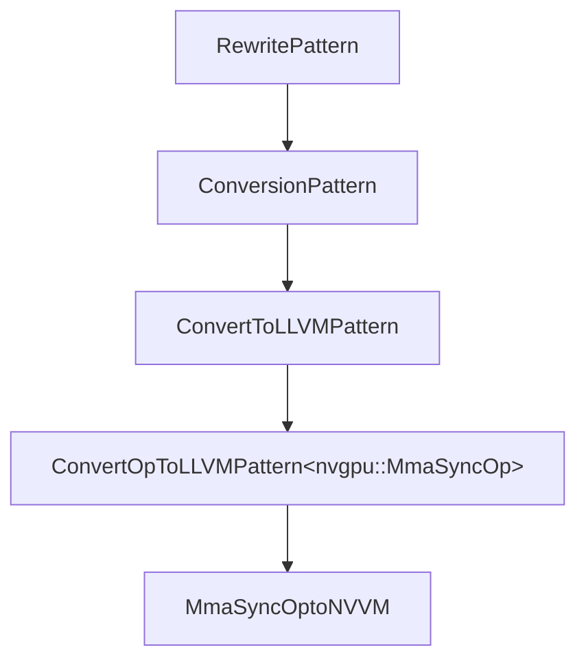
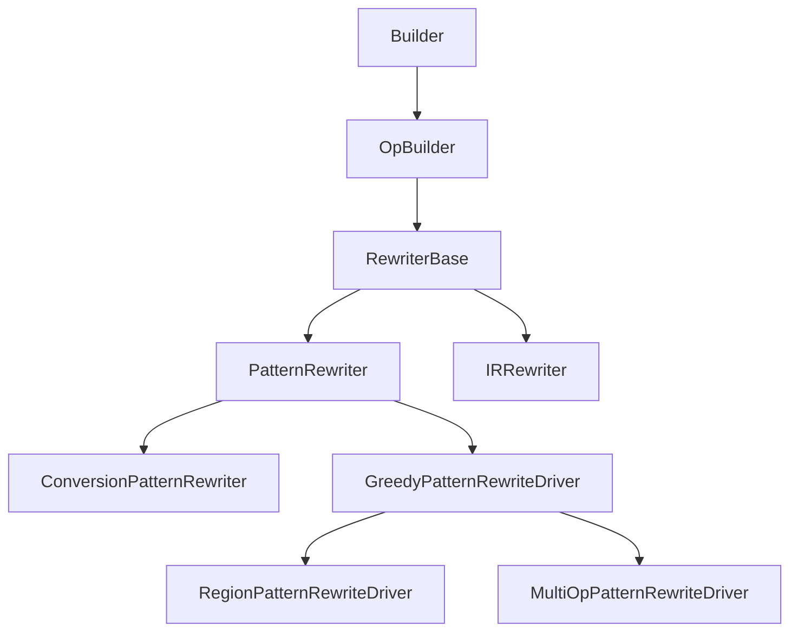
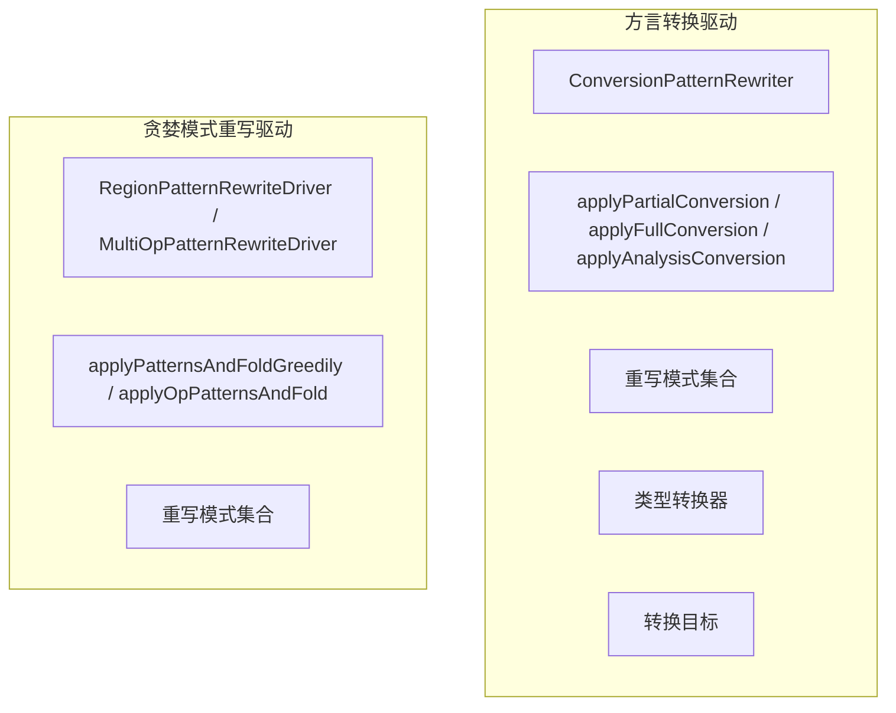
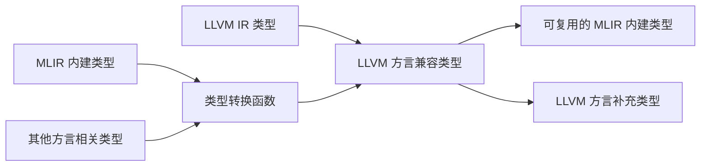
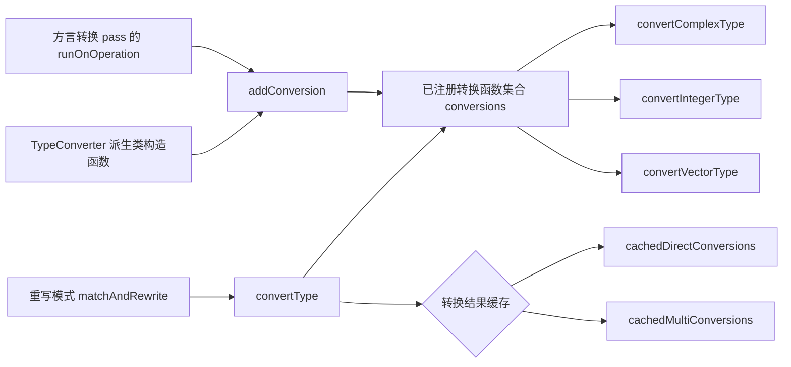
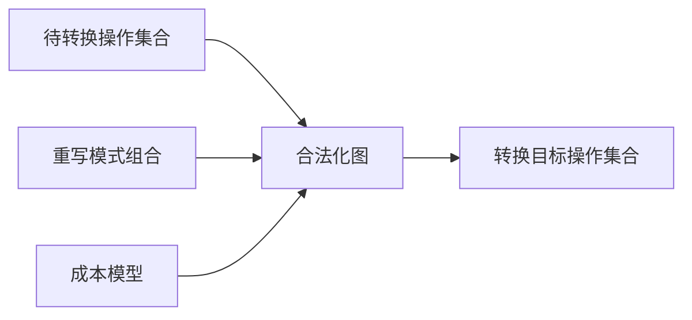
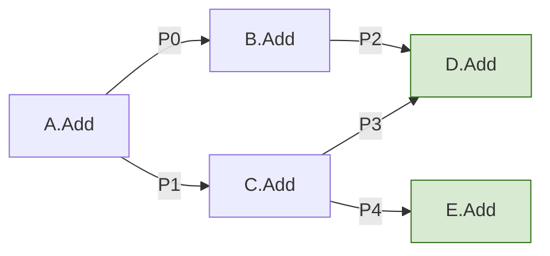

# 第 3 章　MLIR 中的重写模式与转换机制

> 校订说明：本章已按原书第 53～83 页（PDF 第 1～31 页）逐页目视复核，保留原书的讲解、例子、代码和图表说明；OCR 和可确认的错误已修正，源码版本差异另加校订注。已作本地源码静态对照，未执行全部示例编译测试。详见 [完整性复核记录](mlir-transcription-review.md)。

<!-- 原书第 53 页；PDF 第 1 页 -->

在现代编译器基础设施中，灵活高效的中间表示重写机制，是构建可扩展优化与转换流程的关键。MLIR 作为一种高度模块化的中间表示框架，其核心优势之一，在于对重写模式（rewrite pattern）、操作转换与类型转换（type conversion）等机制的完备支持。本章将围绕这一主题，系统介绍 MLIR 中的重写模式体系、类型转换机制、操作转换机制，以及相关的转换目标（conversion target）设定与成本模型评估。

本章 3.1 节介绍重写模式的基本概念及其在 MLIR 中的实现方式，包括模式重写器（pattern rewriter）的使用、模式驱动（pattern driver）的组成要素和工作流程等，并讨论方言转换与贪婪模式重写两种模式驱动在实际编译过程中的适用场景。3.2 节深入探讨 MLIR 中的类型转换机制，涵盖类型转换函数的实现与类型转换执行过程。3.3 节和 3.4 节分析转换目标的设置方式及其与转换方式（conversion mode）的协作，并引入模式收益与成本模型，用于评估操作转换过程的优化价值。

通过本章的学习，读者将掌握 MLIR 中从重写模式到转换基础构件的原理与实际应用方式，为后续构建自定义转换与优化流程奠定基础。

## 3.1　MLIR 中的重写模式与模式驱动

MLIR 编译过程使用窥孔式的重写模式，将面向开发者的高级语言或 DSL 程序，从较高级别的领域相关方言逐步转换为较低级别的平台相关方言，以此实现编译和优化程序的目的。这个过程可能涉及 Affine 方言的索引操作、SCF 方言的结构化控制流、Arith 方言的算术操作等多种方言和操作，以及循环和值级别的转换等一系列 MLIR 转换。

MLIR 的开发实践已经证明，在具有足够表达能力的基础设施协助下，IR 重写功能可以简化领域相关编译器可重用组件的开发过程。在这个过程中，开发者可以利用 MLIR 中的各种方言和转换，实现不同层次的优化和代码生成。

在 MLIR 中，IR 重写通常通过应用一系列重写模式实现。重写模式是一种基于模式匹配的 MLIR 操作重写和转换机制。这些模式定义了如何将某种使用高阶表示的 IR，逐步转换为更优化或更具体的低阶表示形式。重写模式作为优化和转换 pass 的组成部分，可帮助开发者实现各种优化和重构。除了 MLIR 已有的重写模式，开发者还可以实现自定义模式，并通过这些模式识别和转换 IR 中的特定结构或操作。

重写模式的核心功能，是对根操作（root operation）执行模式匹配和 IR 重写。为此，重写模式提供了 `match()`、`rewrite()` 和 `matchAndRewrite()` 等接口。在实际开发过程中，开发者既可以分别实现 `match()` 和 `rewrite()`，也可以将二者合并实现为 `matchAndRewrite()`，完成与给定根操作的匹配并执行 IR 重写。

根操作是某种重写模式主要针对的操作类型，而该重写模式是用于转换或优化根操作的规则集合。例如，某个重写模式可将两个操作数相同的 `Add` 操作替换为操作数乘 2 的 `Mul` 操作，则该重写模式可表示为：

```text
Add(a, a) -> Mul(a, 2)
```

其中，`Add` 即为该模式的根操作。`match()`、`rewrite()` 和 `matchAndRewrite()` 的详细用法将在下一小节中介绍。

> 语义校订：模式可以限定根操作的类型，但一次匹配的 root operation 是传入的具体操作实例。`Add(a, a) -> Mul(a, 2)` 是原书的抽象示例，实际实现须同时保证类型、溢出标志、浮点语义等允许该等价变换；“类型相同且合法”本身不是完整的正确性证明。重写也不只用于降低抽象层次，同层规范化是另一种常见用途。

为了将重写模式集合（rewrite pattern set）应用于 IR 重写，MLIR 针对不同应用场景提供了不同的模式驱动。模式驱动是驱动 IR 重写过程的要素集合。模式驱动以重写模式集合为参数，构造负责管理和应用模式集合的 `PatternApplicator` 实例；以源操作上下文为参数构造模式重写器实例，即 `PatternRewriter` 实例；并调用 `PatternApplicator` 接口应用重写模式，完成 IR 重写。

本节将以模式驱动中重写模式与模式重写器的关联关系为线索，详细阐述 IR 重写过程各部分相关模块的功能和应用。图 3-1 显示了在 MLIR 编译过程中，模式驱动组成要素之间的关联关系。考虑到论述的前后连贯，本节主要使用 GPU 相关方言代码为例，说明 MLIR 中的模式驱动与重写模式的用法。本章后续各节将进一步细化模式驱动组成要素的功能描述和代码实现，以期在概念层面厘清其设计思想，并在实践层面掌握其实现方法。

```mermaid
flowchart LR
  PS[重写模式集合] --> PA[PatternApplicator 实例]
  RP[重写模式] --> PA
  OP[待重写操作] --> D[模式驱动]
  PA --> D
  PR[PatternRewriter 实例] --> D
  D -->|applicator.matchAndRewrite(op, rewriter)| RP
  RP -->|matchAndRewrite| OUT[重写后的 IR]
```

**图 3-1　模式驱动组成要素的关联关系**

原图的包含关系为：重写模式集合含“重写模式 0、……、重写模式 n”；每个重写模式含 `matchAndRewrite()`，其参数中有 `rewriter`。右侧“模式驱动”框内分别含 `PatternApplicator` 实例、`PatternRewriter` 实例和调用语句 `applicator.matchAndRewrite(op, rewriter);`，其中 `PatternApplicator` 实例内部关联整个重写模式集合。调用语句的虚线指向左侧模式的 `rewriter`，表示驱动把重写器传给具体模式；不是由每个模式另外构造一套重写器。

### 3.1.1　重写模式与模式重写器

一般而言，IR 的设计目标是在不同抽象级别上表示程序代码。在设计过程中，不同 IR 抽象级别需要在表示能力和转换灵活性两方面做权衡取舍。MLIR 表示的涵盖范围从 TensorFlow 算子到 LLVM IR 指令，跨越非常广泛的问题范围，但 MLIR 可以通过统一的模式匹配和重写基础设施解决不同领域的表示问题。

MLIR 的模式匹配和重写基础设施是一个 DAG 到 DAG 的转换框架。MLIR 的模式是 IR 转换的最小粒度。以 `ConvertNVGPUToNVVM` pass 包含的重写模式 `MmaSyncOptoNVVM` 为例，其功能是将 `nvgpu.mma.sync` 操作转换为 `nvvm.mma.sync` 操作，代码实现如下：

> 范围说明：这里沿用原书的 DAG 到 DAG 视角描述局部表达式重写，并不表示 MLIR 整体 IR 只能是 DAG，或者重写模式不能处理带 region、控制流和循环的操作。

```cpp
struct MmaSyncOptoNVVM
    : public ConvertOpToLLVMPattern<nvgpu::MmaSyncOp> {
  using ConvertOpToLLVMPattern<
      nvgpu::MmaSyncOp>::ConvertOpToLLVMPattern;

  LogicalResult
  matchAndRewrite(nvgpu::MmaSyncOp op, OpAdaptor adaptor,
                  ConversionPatternRewriter &rewriter) const override {
    // 省略 PTX 类型推断、操作数拆装等代码。
    rewriter.replaceOp(op, convertIntrinsicResult(/* ... */));
    return success();
  }
};
```

`MmaSyncOptoNVVM` 结构继承自 `ConvertOpToLLVMPattern<nvgpu::MmaSyncOp>` 模板类，该模式专门用于将 `nvgpu.mma.sync` 操作转换为 NVVM 方言兼容形式。其中的 `matchAndRewrite()` 是重写模式的核心函数，覆盖了基类中的同名方法。`MmaSyncOptoNVVM::matchAndRewrite()` 的功能将在 4.4.3 节中详细说明。

`MmaSyncOptoNVVM` 模式的类继承关系如图 3-2 所示。下文将说明重写模式相关类的继承层次结构及各类的功能定位。



**图 3-2　`MmaSyncOptoNVVM` 模式类继承关系**

#### 1. 基于 `RewritePattern` 规格的重写模式

从上述继承关系可以看到，`RewritePattern` 类是 MLIR 中所有实现 DAG 到 DAG 转换的重写模式的通用基类。该类被广泛应用于 MLIR 的规范化和转换过程，其作用是在图中查找、匹配由一系列操作构成的特定 DAG，并将其替换为另一个 DAG。这种通过继承 `RewritePattern` 类实现的重写模式，称为基于 `RewritePattern` 规格（RewritePattern specification）的重写模式。

`RewritePattern` 类的核心定义如下：

```cpp
class RewritePattern : public Pattern {
public:
  virtual void rewrite(Operation *op,
                       PatternRewriter &rewriter) const;
  virtual LogicalResult match(Operation *op) const;

  virtual LogicalResult
  matchAndRewrite(Operation *op,
                  PatternRewriter &rewriter) const {
    if (succeeded(match(op))) {
      rewrite(op, rewriter);
      return success();
    }
    return failure();
  }
};
```

`RewritePattern` 提供了匹配和重写操作的基本架构，其中最重要的三个方法是 `match()`、`rewrite()` 和 `matchAndRewrite()`。根据匹配和重写过程是否分开实现，`RewritePattern` 定义的重写模式有两种用法：

1. 将重写模式分为匹配和重写两步，通过成员函数 `match()` 和 `rewrite()` 分别实现对应功能；
2. 将匹配和重写合并为一步，通过 `matchAndRewrite()` 在匹配调用中同时执行重写。

`match()` 会尝试匹配以参数 `op` 指定操作为根操作的 IR。如果模式匹配成功，函数返回成功，否则返回失败。但 `match()` 的实现不应修改原 IR。`rewrite()` 使用该匹配模式的输出结果，对以第一个参数 `op` 指定操作为根操作的 IR 执行重写，并且只能使用第二个参数 `rewriter` 指定的重写器完成 IR 重写。

包括前述 `MmaSyncOptoNVVM` 在内的大部分重写模式，都采用第二种用法并实现 `matchAndRewrite()`。该函数会尝试匹配以第一个参数 `op` 指定操作为根操作的 IR，并在匹配成功后执行重写。

一般的 `RewritePattern` 实例适用于大多数重写任务。例如，前述 `Add(a, a) -> Mul(a, 2)` 模式中，`Add` 和 `Mul` 的操作数类型相同且合法，此时可以将模式定义为 `RewritePattern`。但当转换过程中涉及操作数类型变化时，`RewritePattern` 的功能可能无法满足需求，此时需要使用它的其他派生类。

`RewritePattern` 的派生类之一是 `ConversionPattern`。`ConversionPattern` 作为各种转换模式的基类，用于处理在转换过程中涉及类型转换和与特定构造交互的情况。这里的特定构造包括特定 IR 结构，以及转换过程中的特定状态和约束。

基于 `ConversionPattern` 派生的转换模式，不只是完成简单的重写功能，还要处理转换过程中涉及的类型变化，并且可能需要使用转换过程中更新或重新映射的操作数。`ConversionPattern` 通过在 `matchAndRewrite()` 或 `rewrite()` 中提供转换后的操作数列表解决上述问题。为了支持类型转换，`ConversionPattern` 增加了成员函数 `getTypeConverter()` 和成员变量 `typeConverter`。

例如，上述 `MmaSyncOptoNVVM` 模式处理的原始 `nvgpu.mma.sync` 操作的各矩阵操作数类型为 MLIR 向量（如 `nvgpu.mma.sync` 操作的矩阵结果 D 的类型为 `vector<2x2xf16>`）。转换时，输入的多维向量先映射为 LLVM 数组，再解包为 `nvvm.mma.sync` 所需的寄存器操作数列表；转换后的 `nvvm.mma.sync` 操作的矩阵结果 D 的类型为 `LLVMStructType`。为了确保转换后的 `nvvm.mma.sync` 操作可以替换原始 `nvgpu.mma.sync` 操作，`MmaSyncOptoNVVM::matchAndRewrite()` 函数从获取 `nvgpu.mma.sync` 操作数类型开始，经过 PTX 类型推断、解包操作数向量、返回值类型推断等一系列处理，最终将 `nvgpu.mma.sync` 操作转换为 `nvvm.mma.sync` 操作。

> 校订注：原书将 NVVM 操作的各矩阵操作数统称为“LLVM 数组或结构类型”。这里按其在转换中的实际位置补正：数组是解包前的分片表示，NVVM MMA 的输入是解包后的值列表，输出 D 才是结构类型；原书的例子及转换步骤均保留。

由于 `ConversionPattern` 是 `RewritePattern` 的派生类，因此 `ConversionPattern` 实例可视为支持类型转换的重写模式。在不致混淆的前提下，本书将“重写模式”和“转换模式”两个术语混用。

为了与 MLIR 类型和转换基础设施相互配合，`ConversionPattern` 类型的转换模式通常使用 `ConversionPatternRewriter` 类型的重写器。`ConversionPatternRewriter` 是 `PatternRewriter` 的派生类，提供类型和操作转换接口。在 MLIR 的模式重写体系中，模式重写功能需要通过 `PatternRewriter` 及其派生的各种重写器完成。这些重写器有不同的功能和用途，可在执行模式匹配和重写操作过程中与重写模式配合使用。

重写器类的继承关系如图 3-3 所示。



**图 3-3　重写器类继承关系**

> 校订注：扫描原图把 Clang 的 `RecursiveASTVisitor` 画成了 `Builder` 的基类，这是明显错误。它与 MLIR 的重写器继承链无关，图 3-3 已按本仓库源码修正。当前版本中的 `ConversionPatternRewriter` 还实现了 `RewriterBase::Listener`，并被声明为 `final`。

<!-- 原书第 57 页；PDF 第 5 页 -->

从上述重写器类继承关系中可以看到，重写器的基类链始于 `Builder`。`RecursiveASTVisitor` 不属于这条继承链。尽管 MLIR 重写器不直接使用 `RecursiveASTVisitor` 类，但基于 Clang 构建的前端工具和扩展可以使用 `RecursiveASTVisitor` 类的子类来遍历和访问 AST，以提取和处理源代码信息，然后生成 MLIR 操作。从这个角度看，MLIR 作为 IR 框架，可用于构建面向 LLVM 的前端工具链。

重写器类继承关系中的 `OpBuilder` 类可用于协助构造各种操作、操作数和属性。`OpBuilder` 类中的 `Listener` 结构可为构造操作行为提供监听回调。该类提供的 `create()` 系列方法可创建不同种类操作。在 MLIR 的各种重写模式实现中，可以看到该类及其接口的诸多应用。

`OpBuilder` 类的子类 `RewriterBase` 类负责协调执行对 IR 的重写，开发者可通过该类提供的接口跟踪 IR 修改及新操作创建过程。基于该类不仅可以派生模式重写器类 `PatternRewriter`，也可以派生非模式重写器类 `IRRewriter`（本节不对 `IRRewriter` 展开讨论），二者可共用 `RewriterBase` 提供的接口。

`ConversionPatternRewriter` 在 `PatternRewriter` 的基础上，针对 `ConversionPattern` 及其派生类的需要，扩展了类型转换、值重映射等接口。在确认转换可以成功应用后，重写模式的 `matchAndRewrite()` 可以调用 `ConversionPatternRewriter` 的接口完成 IR 重写，例如 `MmaSyncOptoNVVM::matchAndRewrite()` 中调用的 `replaceOp()`。这种类型的模式只能与转换执行接口 `applyPartialConversion()`、`applyFullConversion()`、`applyAnalysisConversion()` 一起使用。这些接口将在 3.3.2 节中详细说明。

由于 NVVM IR 是在标准 LLVM IR 基础上增加了针对 NVIDIA GPU 的特定规则、约定和 intrinsic 定义，因此 `MmaSyncOptoNVVM` 将 NVGPU 方言操作转换为 NVVM 兼容形式的过程，类似于转换为 LLVM 方言的过程。MLIR 为转换目标是 LLVM 方言的模式提供了公共基类 `ConvertToLLVMPattern`。该类继承自 `ConversionPattern`，支持 MLIR 类型向 LLVM IR 兼容类型的转换，所以其类型转换器为 `LLVMTypeConverter`。

采用 `ConvertToLLVMPattern` 的转换模式生成的最终操作，必须属于在转换目标中标记为合法的 LLVM、NVVM 等方言，重写过程才能成功。

这里指最终需满足转换目标的合法性要求，不是说 `ConvertToLLVMPattern` 基类在 C++ 层面禁止创建其他方言的中间操作；中间操作还可进一步合法化。部分转换对原有未知操作的处理另见 3.3.2 节。

`ConvertToLLVMPattern` 是通用基类，不限定模式匹配的操作类型。在图 3-2 描述的 `MmaSyncOptoNVVM` 模式类继承关系中，作为执行转换目标为 LLVM 或 NVVM 方言操作的操作转换工具类，`ConvertOpToLLVMPattern` 类继承自 `ConvertToLLVMPattern` 类，专门处理由模板参数 `SourceOp` 指定的某一种源操作类型。如前所述，`MmaSyncOptoNVVM` 结构体继承自 `ConvertOpToLLVMPattern<nvgpu::MmaSyncOp>` 模板类，该模板类是 `ConvertToLLVMPattern` 的派生类，其中模板参数 `SourceOp` 为 `nvgpu::MmaSyncOp`。因此，`MmaSyncOptoNVVM` 模式专门处理 `nvgpu.mma.sync` 操作，并将其转换为 NVVM 方言的等效表示。

#### 2. 基于 TableGen 语言描述的重写模式

除了基于 `RewritePattern` 规格的重写模式，还有一种更简单的、用 TableGen 语言描述的重写模式定义方式。这种模式与 LLVM 中常见的指令选择匹配模式类似，由一对源模式和结果模式组成。例如，为了将 `gpu.barrier` 转换为 `nvvm.barrier0`，`GPUToNVVM.td` 中定义了以下重写模式：

```tablegen
def : Pat<(GPU_BarrierOp), (NVVM_Barrier0Op)>;
```

`gpu.barrier` 和 `nvvm.barrier0` 都是同步操作，本身不涉及数据类型转换。该定义只是一种结构重写，由模式关键字 `Pat` 指定将源模式匹配到目标模式；源模式中的参数可被捕获并在目标模式中使用。

包含重写模式的 `GPUToNVVM.td` 文件需要在编译期间使用 `mlir-tblgen -gen-rewriters` 处理。因此，需要在 CMake 文件中做如下设置，调用 `mlir-tblgen` 生成包含模式 C++ 实现的 `GPUToNVVM.cpp.inc`：

```cmake
set(LLVM_TARGET_DEFINITIONS GPUToNVVM.td)
mlir_tablegen(GPUToNVVM.cpp.inc -gen-rewriters)
add_public_tablegen_target(MLIRGPUToNVVMIncGen)
```

其中，`LLVM_TARGET_DEFINITIONS` 指定 `.td` 文件路径，`mlir_tablegen` 生成包含重写模式的 `.inc` 文件，`add_public_tablegen_target` 生成可供编译目标依赖的 TableGen 目标。

生成 `GPUToNVVM.cpp.inc` 文件后，应在填充重写模式集合的 C++ 文件中包含该 `.inc` 文件，并调用 `mlir-tblgen` 生成的 `populateWithGenerated()` 函数，将 `.td` 文件中的重写模式添加到重写模式集合中。例如，`LowerGpuOpsToNVVMOps.cpp` 文件中有：

```cpp
#include "GPUToNVVM.cpp.inc"

void mlir::populateGpuToNVVMConversionPatterns(
    LLVMTypeConverter &converter, RewritePatternSet &patterns) {
  populateWithGenerated(patterns);
  patterns.add<GPUPrintfOpToVPrintfLowering>(converter);
  patterns.add<GPUIndexIntrinsicOpLowering<gpu::ThreadIdOp> /* ... */>(
      converter);
}
```

### 3.1.2　方言转换驱动与贪婪模式重写驱动

为了根据转换目标和应用场景更灵活地控制 IR 重写过程，MLIR 提供三种模式驱动（pattern driver）：方言转换驱动（Dialect Conversion Driver）、贪婪模式重写驱动（Greedy Pattern Rewrite Driver）和遍历模式重写驱动（Walk Pattern Rewrite Driver）。由于遍历模式重写驱动在 MLIR 项目中应用较少，本节不对其展开论述。

MLIR 采用方言转换驱动处理涉及类型转换和操作转换的复杂场景，因此三种模式驱动中较常用的是方言转换驱动。作为标准 pass 机制的一部分，方言转换驱动可帮助开发者完成方言间复杂的类型和操作转换，并确保转换过程中 IR 的一致性。

方言转换驱动的组成要素包括：类型转换器、重写模式集合、转换目标、模式重写器、转换执行接口 `apply*Conversion()`，以及填充重写模式集合的 `populate*ConversionPatterns()` 等函数。

方言转换驱动明确区分操作转换与类型转换。`TypeConverter` 用于提供类型转换的必要信息并定义类型转换规则。方言转换驱动使用“合法性”概念在方言之间和方言内部执行操作转换，并通过一组重写模式将非法操作转换为转换目标支持的合法操作。

转换目标是对转换过程中哪些方言或操作可以被视为合法或非法的形式化定义。`ConversionTarget` 描述转换目标的合法性，并提供 `addLegalOp()`、`addLegalDialect()` 等接口，用于设置操作和方言的合法状态。重写过程生成的最终操作必须在转换目标中被标记为合法，重写过程才能成功。

`RewritePatternSet` 类提供具体的操作重写模式集合，并为构建模式列表提供 `add()` 等接口。

`populate*ConversionPatterns()` 函数中的“*”表示一种方言到另一种方言的特定转换，该类函数的目的是为特定的转换任务指定重写模式集合。例如，`populateNVGPUToNVVMConversionPatterns()` 函数用于填充可将 NVGPU 方言操作转换为 NVVM 方言操作的重写模式集合，并以当前 `TypeConverter` 实例 `converter` 作为函数参数，初始化 `ConversionPattern` 类中的 `TypeConverter` 实例成员变量 `typeConverter`。重写模式在重写 IR 过程中如需执行类型转换，可通过 `typeConverter` 调用相关接口。

`apply*Conversion()` 将上述要素结合起来，根据指定的重写模式集合和转换目标，对当前操作及其嵌套操作执行转换。上述要素的组合是 MLIR 方言和操作转换过程的典型情况，但也可以根据实际情况增减，例如某个转换是否需要将 MLIR 内建类型转换为 LLVM 方言类型。

下面以 `ConvertNVGPUToNVVM` pass 为例，说明方言转换驱动各要素在具体转换 pass 中的作用与协同方式。其 `runOnOperation()` 核心代码如下：

```cpp
struct ConvertNVGPUToNVVMPass
    : public impl::ConvertNVGPUToNVVMPassBase<
          ConvertNVGPUToNVVMPass> {
  void runOnOperation() override {
    RewritePatternSet patterns(&getContext());
    LLVMTypeConverter converter(&getContext());

    converter.addConversion(
        [&](nvgpu::DeviceAsyncTokenType type) -> Type {
          return converter.convertType(
              IntegerType::get(type.getContext(), 32));
        });

    populateNVGPUToNVVMConversionPatterns(converter, patterns);

    LLVMConversionTarget target(getContext());
    target.addLegalDialect<mlir::LLVM::LLVMDialect>();
    target.addLegalDialect<mlir::arith::ArithDialect>();
    target.addLegalDialect<mlir::memref::MemRefDialect>();
    target.addLegalDialect<mlir::NVVM::NVVMDialect>();

    if (failed(applyPartialConversion(getOperation(), target,
                                      std::move(patterns))))
      signalPassFailure();
  }
};
```

> 版本注：上面保留原书列出的代码片段范围。当前仓库的完整实现还包含内存空间、其他 NVGPU 专用类型和 SCF 结构转换注册；这些是相对于原书片段的版本扩展，不应据此改写原书的讲解范围。

上述代码完整体现了 MLIR 方言转换框架的核心流程：类型转换器负责处理类型映射，重写模式描述操作替换逻辑，转换目标定义合法性条件，转换执行接口负责调度并执行重写模式。

MLIR 的官方文档“Dialect Conversion”中明确规定，方言转换驱动中的重写模式必须使用 `ConversionPatternRewriter` 模式重写器实例进行 IR 重写。前文已经介绍 `ConversionPatternRewriter` 类。该类是 `OpBuilder` 类的派生类，因此继承了 `OpBuilder` 类中的接口，包括在后续第 4 章中将提到的用于构造 NVGPU 和 NVVM 方言操作的 `OpBuilder::create()` 接口，以及其他有用的属性和类型构造方法。

此外，`ConversionPatternRewriter` 类还继承了 `RewriterBase` 类的接口，如 `eraseOp()` 接口（其功能是将 IR 中没有结果或结果已无使用者的操作删除）、`replaceOp()` 接口（其功能是用一组转换得到的值替换 IR 中的某个操作结果，并删除该操作）等，以及若干 `notify*()` 回调方法。重写器通过这些通知及监听机制跟踪 IR 修改状态。例如，回调方法 `notifyMatchFailure()` 通知重写器，IR 由于匹配失败而未能重写；该回调方法可在诊断信息中附加失败原因并展示给开发者。

> 校订注：这里保留原书对接口功能的逐项说明。当前 `ConversionPatternRewriter` 为 `final`，不能再由用户派生子类，因而原书“重写器子类可以选择实现回调”的概括不应理解为可以继承此具体类；具体通知应遵循当前重写器和监听器接口。

MLIR 的重写框架分为模式定义和模式应用两部分。模式定义在上节中已经详细介绍。在模式应用过程中，`PatternApplicator` 类有重要作用，它负责管理方言转换 pass 中的所有已注册重写模式，并根据成本模型分析结果，对每个操作尝试匹配最优模式。一旦找到可用的模式，最终的模式应用通过以 `PatternApplicator::matchAndRewrite()` 接口为桥梁，连接到具体重写模式的 `matchAndRewrite()` 接口，对操作执行转换逻辑。

`PatternApplicator::matchAndRewrite()` 接口的实现细节将在 3.3.3 节中详细介绍。

贪婪模式重写驱动以工作列表驱动（worklist-driven）的方式，将最大收益模式反复应用于 MLIR 操作，局部选择收益最高的模式，直到达到最大迭代次数或迭代过程收敛。

按照模式应用对象，贪婪模式重写驱动又可分为基于区域的驱动和基于操作的驱动，二者分别调用 `applyPatternsAndFoldGreedily()` 和 `applyOpPatternsAndFold()` 作为执行接口。

基于区域的驱动将模式集合中的所有重写模式反复应用于 `applyPatternsAndFoldGreedily()` 函数参数 `regions` 指定的区域，或函数参数 `op` 指定的容器操作中的所有操作。初始工作列表中包含该区域或容器操作内的所有操作。`applyPatternsAndFoldGreedily()` 函数在应用重写模式之前，基于区域的驱动还会执行折叠（folding）优化。

操作经过重写或折叠后可能产生新的优化机会。为了使最终 IR 达到充分优化的形式，贪婪模式重写驱动会对工作列表中的操作反复应用模式，直到结果区域中再也没有操作能被重写，即收敛到不动点，或者达到最大迭代次数。

最大迭代次数由 `applyPatternsAndFoldGreedily()` 函数的 `GreedyRewriteConfig` 类型实例参数提供。`GreedyRewriteConfig` 类可控制 `applyPatternsAndFoldGreedily()` 函数的工作方式，其中的成员变量不仅可指定最大迭代次数，还可指定遍历和填充初始工作列表的模式是自顶而下还是自底向上，以及重写过程中被修改和新创建的操作是否被添加回工作列表等。

贪婪模式重写驱动中使用的模式重写器类是 `GreedyPatternRewriteDriver` 类或其派生类实例。`applyPatternsAndFoldGreedily()` 函数通过 `RegionPatternRewriteDriver` 实例调用 `RegionPatternRewriteDriver::simplify()` 接口，对工作队列中的操作反复执行重写模式。`RegionPatternRewriteDriver` 类是 `GreedyPatternRewriteDriver` 类的派生类。

如果某 pass 的 `runOnOperation()` 函数调用 `applyPatternsAndFoldGreedily()` 函数，则表明该 pass 使用基于区域的驱动，如 `ConvertVectorToGPU` pass 等。

`GreedyPatternRewriteDriver` 类的另一个派生类是 `MultiOpPatternRewriteDriver` 类。基于操作的驱动将最大收益值的重写模式应用于 `applyOpPatternsAndFold()` 函数参数 `ops` 指定的操作列表。`applyOpPatternsAndFold()` 函数通过 `MultiOpPatternRewriteDriver` 重写器实例调用 `MultiOpPatternRewriteDriver::simplify()` 接口，对工作队列中的操作执行重写模式。

如果某 pass 的 `runOnOperation()` 函数调用 `applyOpPatternsAndFold()` 函数，则表明该 pass 使用基于操作的驱动，如 `SimplifyAffineStructures` pass 等。

贪婪模式重写驱动只对操作执行模式匹配和优化或重写，不涉及方言转换协议中的类型转换，因此不需要类型转换器。它也不做带目标约束的操作合法化，其中的操作没有合法或非法之分，因此不需要转换目标。所以，贪婪模式重写驱动的组成要素只包含重写模式集合、模式重写器和转换执行接口。

这里的“不涉及类型转换”限定于不提供方言转换驱动那套自动类型重映射和物化协议，不是禁止普通模式创建不同类型的中间值或自行协调类型变化。同样，“充分优化”只指在给定模式和配置下达到不动点，不保证全局最优；达到迭代上限也不等于已经收敛。

优化和转换 pass 一般情况下只依赖一种模式驱动。但在某些比较复杂的场景下，优化和转换 pass 可将两种模式驱动结合使用。例如，`LowerGpuOpsToNVVMOps` pass 中先调用 `applyPatternsAndFoldGreedily()` 接口，用局部重写规则将 GPU 方言操作（如 `gpu.all_reduce`、`gpu.global_id` 等操作）递降为更底层的等价组合形式。然后再设定转换目标，执行类型转换，并调用 `applyPartialConversion()` 接口做严格的目标方言转换合法性检查。两种模式驱动的结合既保证对 IR 做充分优化，又保证 IR 转换的合法性。

图 3-4 总结了两类模式驱动各自包含的组成要素。左侧的方言转换驱动依赖 `ConversionPatternRewriter` 模式重写器类，结合类型转换器和转换目标，在保证合法性的前提下，通过调用 `applyPartialConversion()`、`applyFullConversion()` 等接口完成操作转换；右侧的贪婪模式重写驱动依赖 `GreedyPatternRewriteDriver` 类派生的 `RegionPatternRewriteDriver`、`MultiOpPatternRewriteDriver` 模式重写器类，通过 `applyPatternsAndFoldGreedily()` 等接口反复应用重写模式完成操作转换。



**图 3-4　模式驱动组成要素**

原图按行对齐比较两种驱动：第一行为“模式重写器”，第二行为“执行转换接口”，第三行“重写模式集合”横跨左右两列，最后两行“类型转换器”和“转换目标”仅在方言转换驱动一列出现。

前文已经说明重写模式的定义和应用、重写器的工作方式，以及方言转换驱动与贪婪模式重写驱动的差异和接口关系。接下来将对方言转换驱动依赖的类型转换和转换目标展开论述。

## 3.2　MLIR 中的类型转换

MLIR 方言转换包含类型转换和操作转换。如果转换仅涉及操作本身而不涉及类型转换，那么每个操作的转换可以通过基于 TableGen 描述的重写模式完成。由 3.1.1 节中 `gpu.barrier` 到 `nvvm.barrier0` 的示例可以看到，在不涉及类型转换时，模式定义非常简单，只需将模式应用到 IR 就可以完成操作转换。

使 MLIR 方言转换变得复杂的是其中的类型转换。大多数操作不仅依赖于类型，还需要保证转换过程中类型正确。以 `nvgpu.mma.sync` 到 `nvvm.mma.sync` 的转换为例，`nvgpu.mma.sync` 属于高级 GPU 编程抽象，其矩阵操作数使用 MLIR 向量类型 `VectorType`；`nvvm.mma.sync` 则面向更底层的 PTX 表达，其操作数需要使用 LLVM 方言兼容类型。因此，要实现这两个操作之间的转换，不仅应定义重写模式，还应将 MLIR 内建类型转换为 LLVM 方言类型。

MLIR 的类型系统包括内建类型和方言相关类型，其中也包括 LLVM 方言类型。LLVM 方言通常尽可能使用 MLIR 内建类型，同时定义了一组补充类型，用于表示 LLVM IR 中不能直接由 MLIR 内建类型表达的数据类型。LLVM 方言补充类型的一般写法以 `!llvm` 开始，后接类型种类标识符和可选类型参数。例如，含四个 `i32` 字段的结构类型为：

```mlir
!llvm.struct<(i32, i32, i32, i32)>
```

每种 LLVM IR 类型只对应一种 MLIR 表示，要么使用 MLIR 内建类型，要么使用 LLVM 方言补充类型。例如，LLVM 方言不需要重新定义 `llvm.i32`，因为 MLIR 已经有内建 `i32`；但它需要定义 `!llvm.struct<(T, ...)>`，因为 MLIR 内建类型中没有对应的通用结构类型。

LLVM 方言兼容类型的 TableGen 定义如下：

```tablegen
def LLVM_Type : DialectType<
    LLVM_Dialect,
    CPred<"::mlir::LLVM::isCompatibleOuterType($_self)">,
    "LLVM dialect-compatible type">;
```

其中，`DialectType` 用于标记 `LLVM_Type` 属于 LLVM 方言，`isCompatibleOuterType()` 用于判定某个类型是否符合 LLVM 方言类型规范。符合规范的类型包括整数、浮点、指针、数组、结构和向量等；而 `IndexType`、`MemRefType`、`TensorType` 等内建类型面向更高层抽象，用于描述索引、内存布局和张量操作等结构。

> 精度校订：`isCompatibleOuterType()` 只检查外层类型，不递归验证所有内部元素；需要递归检查时应使用 `isCompatibleType()` 等相应接口。此处整数要求 signless，即不附带有符号／无符号解释，不能译成“无符号整数”。整数类型本身也是 MLIR 内建类型，因此“内建类型”与“LLVM 兼容类型”不是互斥分类。

由 `isCompatibleOuterType()` 的实现可知，LLVM 方言兼容类型可分为三部分：第一部分是 MLIR 内建类型的一个子集，包括 `bf16`、`f16`、`f32`、`f64` 等浮点类型；第二部分是 LLVM 方言补充类型，包括数组、函数、标签、元数据、指针、结构、token、void 和若干目标扩展类型；第三部分是受约束的 MLIR 内建类型，即 signless 整数和 LLVM 方言兼容的一维向量类型。

图 3-5 完整列举了原书这一版本中 LLVM 方言类型所包含的类型。

| 类型类别 | 原图列出的类型（逐项保留） |
| --- | --- |
| MLIR 内建类型子集 | `BFloat16Type`<br/>`Float16Type`<br/>`Float32Type`<br/>`Float64Type`<br/>`Float80Type`<br/>`Float128Type`<br/>`Float8E4M3FNType`<br/>`Float8E5M2Type` |
| LLVM 方言补充类型 | `LLVMArrayType`<br/>`LLVMFunctionType`<br/>`LLVMLabelType`<br/>`LLVMMetadataType`<br/>`LLVMPPCFP128Type`<br/>`LLVMPointerType`<br/>`LLVMStructType`<br/>`LLVMTokenType`<br/>`LLVMFixedVectorType`<br/>`LLVMScalableVectorType`<br/>`LLVMTargetExtType`<br/>`LLVMVoidType`<br/>`LLVMX86MMXType` |
| 受约束的内建类型 | signless `IntegerType`<br/>一维 `VectorType` |

**图 3-5　LLVM 方言类型组成部分**

不同方言类型之间，或者方言类型与 MLIR 内建类型之间存在结构性差异。MLIR 类型转换的作用，就是桥接这些差异。类型转换器（type converter）作为方言转换驱动的组成要素之一，专门负责将源方言中的类型映射为目标方言所接受的合法类型。

### 3.2.1　类型转换函数

在 MLIR 的类型转换框架中，`TypeConverter` 及其派生类负责管理和执行类型转换逻辑。为了实现类型转换，`TypeConverter` 对外提供的常用接口是 `addConversion()` 和 `convertType()`。

`addConversion()` 主要由各种类型转换器的构造函数，或方言优化与转换 pass 的 `runOnOperation()` 调用。它把类型转换函数注册到 `TypeConverter` 实例的已注册转换函数集合中。类型转换函数定义了将给定源类型转换为一个或多个结果类型的规则，所以源类型与结果类型可以是一对一或一对多关系。`convertType()` 则调用已注册的类型转换函数，完成实际类型转换。

前述 `ConvertNVGPUToNVVMPass::runOnOperation()` 定义了 `LLVMTypeConverter` 实例 `converter`。`LLVMTypeConverter` 是 `TypeConverter` 的派生类，用于将各种 MLIR 内建类型转换为 LLVM 方言兼容类型。`TypeConverter` 的其他派生类还有 `BufferizeTypeConverter`、`SPIRVTypeConverter` 等，它们各有自己的应用场景和转换对象。本小节以 `LLVMTypeConverter` 为例介绍常用接口。

`addConversion()` 会进一步调用 `registerConversion()` 完成类型转换函数注册。当前代码的核心实现如下：

```cpp
template <typename FnT, typename T = typename llvm::function_traits<
                              std::decay_t<FnT>>::template arg_t<0>>
void addConversion(FnT &&callback) {
  registerConversion(wrapCallback<T>(std::forward<FnT>(callback)));
}

void registerConversion(ConversionCallbackFn callback) {
  conversions.emplace_back(std::move(callback));
  cachedDirectConversions.clear();
  cachedMultiConversions.clear();
}
```

其中，`conversions` 是 `TypeConverter` 的成员变量，保存类型为 `ConversionCallbackFn` 的已注册类型转换函数集合。`registerConversion()` 将参数指定的回调添加到 `conversions`，同时清空 `cachedDirectConversions` 和 `cachedMultiConversions` 两个转换结果缓存。新增的转换函数可能改变先前类型的转换结果，因此必须使旧缓存失效；随后对常用的一对一和一对多转换结果进行缓存，可以避免重复计算并加速类型转换。

除在 pass 的 `runOnOperation()` 中注册类型转换函数外，`TypeConverter` 派生类的构造函数也可以调用 `addConversion()`。例如，`LLVMTypeConverter` 的构造函数会注册复数、浮点、函数、索引、整数、memref、向量等内建类型的转换函数：

```cpp
LLVMTypeConverter::LLVMTypeConverter(
    MLIRContext *ctx, const LowerToLLVMOptions &options,
    const DataLayoutAnalysis *analysis)
    : llvmDialect(ctx->getOrLoadDialect<LLVM::LLVMDialect>()),
      options(options), dataLayoutAnalysis(analysis) {
  addConversion([&](ComplexType type) { return convertComplexType(type); });
  addConversion([&](FloatType type) { return convertFloatType(type); });
  addConversion([&](FunctionType type) { return convertFunctionType(type); });
  addConversion([&](IndexType type) { return convertIndexType(type); });
  addConversion([&](IntegerType type) { return convertIntegerType(type); });
  addConversion([&](MemRefType type) { return convertMemRefType(type); });
  addConversion([&](VectorType type) -> std::optional<Type> {
    FailureOr<Type> llvmType = convertVectorType(type);
    if (failed(llvmType))
      return std::nullopt;
    return llvmType;
  });
  // 省略其他转换函数。
}
```

本小节以向量类型转换函数 `convertVectorType()` 为例，说明 `LLVMTypeConverter` 中类型转换函数的实现方法。

`convertVectorType()` 将 MLIR 内建多维向量类型转换为与 LLVM IR 兼容的类型。在第 4 章描述的 NVGPU 到 NVVM 操作转换过程中，涉及的 MLIR 内建向量到 LLVM 方言类型转换，都可以调用该函数实现。

在 NVGPU 操作到 NVVM 操作的转换过程中，需要将 MLIR 数据类型重新格式化为 LLVM 后端能够处理的形式。LLVM IR 的向量本身是一维的，而 MLIR 中的向量可以是多维的。如果 MLIR 向量只有一维，可将其转换为相同大小的一维 LLVM 兼容向量；如果是多维向量，则转换为由数组包裹最内层一维向量的形式。例如：

```text
vector<4x8x16xf32>
  -> !llvm.array<4 x array<8 x vector<16xf32>>>
```

该数组中的每个最内层元素是一个一维向量。`memref` 等其他 MLIR 数据类型也涉及类似的结构转换。



**图 3-6　MLIR 类型系统与类型转换函数的作用**

原图左侧“MLIR 类型系统”分三支连到“MLIR 内置类型”“LLVM 方言补充类型”“其他方言相关类型”；内置类型经“类型转换函数”连到补充类型，上两项外有题为“LLVM IR 类型”的虚线框。该框应理解为 LLVM IR 在 MLIR 中的兼容表示范围，而非把所有 MLIR 内建类型都归入 LLVM IR；可兼容的内建类型还可以原样保留，不一定变成补充类型。上图按这一含义修正连线。

`convertVectorType()` 的代码实现如下：

```cpp
FailureOr<Type>
LLVMTypeConverter::convertVectorType(VectorType type) const {
  auto elementType = convertType(type.getElementType());
  if (!elementType)
    return {};
  if (type.getShape().empty())
    return VectorType::get({1}, elementType);

  Type vectorType = VectorType::get(type.getShape().back(), elementType,
                                    type.getScalableDims().back());
  assert(LLVM::isCompatibleVectorType(vectorType) &&
         "expected vector type compatible with the LLVM dialect");

  // 只有最后一维可以是 scalable。
  if (llvm::is_contained(type.getScalableDims().drop_back(), true))
    return failure();

  auto shape = type.getShape();
  for (int i = shape.size() - 2; i >= 0; --i)
    vectorType = LLVM::LLVMArrayType::get(vectorType, shape[i]);
  return vectorType;
}
```

该函数首先取得源向量的元素类型，并调用 `TypeConverter::convertType()`，尝试把元素类型转换为 LLVM 兼容类型。`convertType()` 的功能和实现将在下一小节介绍。如果元素类型不能转换，则直接返回失败。

如果元素类型可以转换，函数根据源向量形状做不同处理。若源类型是零维向量 `vector<T>`，则转换为 `vector<1xT>`，因为 LLVM 期望向量至少有一维；若源类型是一维向量 `vector<nxT>`，返回的仍是一维向量；若源类型维数大于 1，则创建 `LLVMArrayType`，把 `vector<n0xn1x...xnkxT>` 转换为由多层数组包裹 `vector<nkxT>` 的结构。当前实现还要求只有最内层向量维度可以是 scalable；外层 scalable 维度无法表示为 LLVM 数组，因而转换失败。

其他类型转换函数的实现可参见 `mlir/lib/Conversion/LLVMCommon/TypeConverter.cpp`。

### 3.2.2　类型转换过程

由 `LLVMTypeConverter` 的构造函数可知，虽然前述 `ConvertNVGPUToNVVMPass::runOnOperation()` 只显式调用了一次 `addConversion()`，此时 `LLVMTypeConverter` 实例中已经注册了多个由构造函数加入的转换函数。各方言的优化和转换 pass，或者重写模式，可以通过 `TypeConverter::convertType()` 调用这些已注册函数完成类型转换。

例如，`ConvertNVGPUToNVVMPass::runOnOperation()` 注册了一个源类型为 `nvgpu::DeviceAsyncTokenType`、返回类型为 `Type` 的 lambda：

```cpp
converter.addConversion(
    [&](nvgpu::DeviceAsyncTokenType type) -> Type {
      return converter.convertType(
          IntegerType::get(type.getContext(), 32));
    });
```

该 lambda 再次调用 `convertType()`，从已注册转换函数集合 `conversions` 中由最近注册的函数开始逐个尝试，对源类型执行转换。这里递归转换的中间类型是 `i32`，最终会使用 `LLVMTypeConverter` 构造函数注册的整数类型转换函数。

`convertType()` 在 MLIR 优化、转换 pass 和重写模式中有广泛应用。除了前文的 `convertVectorType()` 调用该接口，第 4 章介绍 `nvgpu.ldmatrix` 和 `nvgpu.mma.sync` 的转换时，也需要调用它构造操作结果类型。例如，`MmaSyncOptoNVVM::matchAndRewrite()` 通过如下调用取得 D 分片的转换后类型：

这两处具体内容见 4.4.2 和 4.4.3 节；原书此处写为 4.3.2 和 4.3.3 节，交叉引用有误。

```cpp
Type desiredRetTy =
    typeConverter->convertType(op->getResultTypes()[0]);
```

`TypeConverter::convertType()` 的主体实现可概括如下：

```cpp
LogicalResult
TypeConverter::convertType(Type t, SmallVectorImpl<Type> &results) const {
  auto existingIt = cachedDirectConversions.find(t);
  if (existingIt != cachedDirectConversions.end()) {
    if (existingIt->second)
      results.push_back(existingIt->second);
    return success(existingIt->second != nullptr);
  }

  auto multiIt = cachedMultiConversions.find(t);
  if (multiIt != cachedMultiConversions.end()) {
    results.append(multiIt->second.begin(), multiIt->second.end());
    return success();
  }

  size_t currentCount = results.size();
  for (const ConversionCallbackFn &converter : llvm::reverse(conversions)) {
    if (std::optional<LogicalResult> result = converter(t, results)) {
      if (failed(*result)) {
        cachedDirectConversions.try_emplace(t, nullptr);
        return failure();
      }
      auto newTypes = ArrayRef<Type>(results).drop_front(currentCount);
      if (newTypes.size() == 1)
        cachedDirectConversions.try_emplace(t, newTypes.front());
      else
        cachedMultiConversions.try_emplace(
            t, llvm::to_vector<2>(newTypes));
      return success();
    }
  }
  return failure();
}
```

> 校订注：当前源码在启用多线程时还使用读写锁保护上述缓存。这里保留原书讲解所需的控制流，省略锁相关代码。

该函数首先查询 `cachedDirectConversions` 和 `cachedMultiConversions`，判断源类型 `t` 是否已经完成转换。若已转换，则直接从缓存取得结果。对于尚未转换的类型，`convertType()` 从 `conversions` 中取出最近注册的转换函数实例，对源类型执行转换，并将转换结果保存到单结果或多结果缓存中。



**图 3-7　类型转换过程**

原图的 `TypeConverter` 类框内含 `addConversion()`、`convertType()`、已注册转换函数集合 `conversions`（`callback 0`、`callback 1`、……）以及取出的 `converter(callback)`。左上“类型转换函数”框列出 `convertComplexType()`、`convertIntegerType()`、`convertVectorType()` 和省略项；左下“类型转换结果缓存集合”框列出两类缓存，并以双向箭头连接 `convertType()`，分别表示读取和填充。原图构造函数标签简写为 `TypeConverter` 构造函数；本节具体的内建类型注册发生在 `LLVMTypeConverter` 等派生类构造函数中。

回调是逆注册顺序尝试的，但不是把所有回调依次作用于前一个回调的输出：返回 `std::nullopt` 才继续寻找，明确成功或失败均终止此次查找。类型转换也允许零结果；零结果和多结果使用多结果缓存。

各方言优化和转换 pass 的 `runOnOperation()` 可以直接或通过 `populate*ConversionPatterns()` 调用 `addConversion()`，把 MLIR 已有类型转换函数或开发者自定义函数注册到 `conversions`。

当重写模式在 `matchAndRewrite()` 中调用 `convertType()` 时，从 `conversions` 取得的回调会针对源类型执行相应转换，并把结果缓存在 `cachedDirectConversions` 或 `cachedMultiConversions` 中。如果该源类型之前已经转换过，则直接访问缓存并把结果返回给重写模式。

## 3.3　转换目标与转换方式

转换目标用于指定转换过程中合法或不合法的方言与操作，从而确定整个重写和转换的应用范围。转换目标由 `ConversionTarget` 及其派生类建模和配置，其中面向 LLVM 递降时常使用 `LLVMConversionTarget`。各方言转换 pass 可以在 `runOnOperation()` 中定义包含操作转换目标的实例。`ConvertNVGPUToNVVM` pass 通过 `addLegalDialect()` 将 LLVM、NVVM 等方言指定为合法目标方言。

### 3.3.1　`ConversionTarget` 的合法性动作接口

操作和方言可以通过 `ConversionTarget` 的三类合法性动作（legality action）标记是否合法。

第一，指定合法接口 `addLegalDialect()` 和 `addLegalOp()` 可将给定方言或操作指定为合法。方言或操作合法，意味着给定方言的所有操作，或者给定操作的属性、操作数和类型等任意组合，均被目标完全支持，可以保留在转换后的 IR 中。

这里的“合法”是转换目标的判定，不会豁免操作自身的 verifier、类型约束或语义约束，也不会使本来无效的 IR 变有效。操作级配置可以覆盖所属方言的配置。

第二，指定非法接口 `addIllegalDialect()` 和 `addIllegalOp()` 可将给定方言或操作指定为非法方言和操作。被转换目标标记为非法的方言操作都必须完成转换，整个转换过程才能被认为成功。`addIllegalOp()` 接口还允许在合法方言中有选择地将特定操作标记为非法。例如，在 `LowerGpuOpsToNVVMOps` pass 的 `configureGpuToNVVMConversionLegality()` 函数中，调用 `addLegalDialect()` 接口将 LLVM 方言指定为合法方言，调用 `addIllegalOp()` 接口将 `llvm.intr.cos`、`llvm.intr.exp` 等一众操作指定为非法操作。

> 版本注：原书简写为 `llvm.cos`、`llvm.exp`；本仓库 `LLVM::CosOp`、`LLVM::ExpOp` 对应的操作名带有 `intr` 层级。这里保留原书的具体举例并修正操作拼写。

第三，动态合法接口 `addDynamicallyLegalDialect()` 和 `addDynamicallyLegalOp()` 可将给定方言或操作指定为动态合法，即只有给定方言或操作的某些实例合法。这种方式可以表达更细的约束，例如规定 `arith.addi` 只有在对 32 位整数执行运算时才合法。

### 3.3.2　转换方式与合法性的关系

为了适配不同的应用场景，MLIR 在执行操作转换时提供部分转换（partial conversion）、完全转换（full conversion）和分析转换（analysis conversion）三种方式，对应的执行接口分别是 `applyPartialConversion()`、`applyFullConversion()` 和 `applyAnalysisConversion()`。不同转换方式对 IR 中操作合法性的要求不同。前述 `ConvertNVGPUToNVVMPass::runOnOperation()` 调用的是 `applyPartialConversion()`。

#### 1. 部分转换方式

`applyPartialConversion()` 对给定操作及其嵌套操作执行部分转换。在部分转换中，如果某方言或操作被明确标记为非法，则该方言的所有操作或该操作的所有实例都必须通过重写模式完成转换并被完全消除，整个转换才算成功。如果某方言或操作没有被明确标记为非法，即使这些操作未被转换，也可以保留在输出 IR 中。

如果部分转换失败，会报告如下错误，其中 `x` 是操作名称：

```text
failed to legalize operation 'x' that was explicitly marked illegal
```

以 `nvgpu-to-nvvm.mlir` 中的异步复制为例，输入 IR 包含如下操作：

```mlir
func.func @async_cp(
    %src: memref<128x128xf32>,
    %dst: memref<3x16x128xf32, 3>, %i: index) {
  %0 = nvgpu.device_async_copy %src[%i, %i], %dst[%i, %i, %i], 4 :
      memref<128x128xf32> to memref<3x16x128xf32, 3>
  %1 = nvgpu.device_async_create_group %0
  nvgpu.device_async_wait %1 {numGroups = 1 : i32}
  return
}
```

`nvgpu.device_async_create_group` 的转换由 `NVGPUAsyncCreateGroupLowering` 模式完成。部分转换的结果，根据 NVGPU 操作是否明确指定为非法，可分为两种情况。

第一种情况，转换目标没有把 NVGPU 方言明确指定为非法，并假设模式集合中缺少 `NVGPUAsyncCreateGroupLowering`。此时 `mlir-opt` 仍可以完成部分转换且不报错：有对应模式的 `nvgpu.device_async_copy` 和 `nvgpu.device_async_wait` 分别转换为 NVVM 操作，而没有模式的 `nvgpu.device_async_create_group` 仍保留在输出 IR 中。其结果可概括为：

```mlir
nvvm.cp.async.shared.global %11, %18, 16, cache = ca
%21 = nvgpu.device_async_create_group %20
nvvm.cp.async.wait.group 1
```

> 代码说明：这段输出与原书一样只摘出三个相关操作；`%11`、`%18` 和 `%20` 在未展示的输出前缀中定义。原书输入函数省略了形参，此处按对应测试补全形参，并保留三维目标 memref 的三个索引。

由上述示例输出可以看到，输入 IR 中的 `nvgpu.device_async_copy` 操作和 `nvgpu.device_async_wait` 操作都完成了转换，分别转换为 NVVM 方言的 `nvvm.cp.async.shared.global` 和 `nvvm.cp.async.wait.group` 操作，因为重写模式集合中包含这两个操作的重写模式。但因为未将 `NVGPUAsyncCreateGroupLowering` 模式添加到模式集合中，因此 `nvgpu.device_async_create_group` 操作不会被转换，仍保留在输出 IR 中。

在第二种情况下，如果 `runOnOperation()` 函数调用 `target.addIllegalDialect<nvgpu::NVGPUDialect>()`，明确将 NVGPU 方言的操作指定为非法，且 `populateNVGPUToNVVMConversionPatterns()` 函数未将 `NVGPUAsyncCreateGroupLowering` 模式添加到模式集合中，则 `mlir-opt` 不能完成转换，并报告如下错误：

```text
failed to legalize operation 'nvgpu.device_async_create_group' that was explicitly marked illegal
```

综上所述，部分转换会尽可能地将目标操作合法化，但也允许在转换结果中保留未明确标记为非法的操作（即上述第一种情况）。这样做可以在输入 IR 中存在未知方言和操作（没有明确标记为合法或非法的操作和方言为未知方言和操作）的情况下，仍能继续进行其他部分输入 IR 的递降过程。但如果某方言操作被明确指定为非法操作，而部分转换因缺少对应重写模式未能对其完成转换，则转换结果将出现错误提示（即上述第二种情况）。当然，如果某方言操作被明确指定为非法操作，且重写模式集合中存在对应该操作的重写模式并成功应用，则部分转换过程成功，输出 IR 中不存在未转换的该方言操作。

表 3-1 总结了部分转换过程在不同非法操作标记和重写模式条件下的执行结果和输出情况。

**表 3-1　部分转换在不同条件下的执行结果**

| 标记非法操作 | 添加对应重写模式 | 输出 IR 中保留原操作 |
| --- | --- | --- |
| 否 | 否 | 是 |
| 是 | 否 | 转换失败，无输出 IR |
| 是 | 是 | 否 |

表中第三行还要求模式能够匹配并成功合法化其结果；仅仅注册模式并不保证转换成功。第一行的“否”指未被判为非法的原有未知操作；动态合法回调明确返回 false 的实例也需要合法化。递归合法的容器内部还可被排除在遍历范围外，见下节。

开发者可以指定 `applyPartialConversion()` 函数声明中的最后一个参数 `unconvertedOps` 作为未转换操作集合，用于保存部分转换在第一种情况下的未转换操作。所以，`unconvertedOps` 中保存的是转换中发现的不能合法化的操作。需要注意，如果遇到明确非法且无法合法化的操作，转换可能提前返回，因此该集合不一定包含所有潜在未转换操作。

> 校订注：原书在这里还称“分析转换的未转换操作也保存在其中”。按 `applyAnalysisConversion()` 的声明和实现，分析转换使用的参数是 `convertedOps`，保存的是成功合法化的既有操作；不能将两个集合混为一谈。

#### 2. 完全转换方式

`applyFullConversion()` 对所有给定操作及其嵌套操作执行完全转换。与部分转换允许未知操作和合法操作共存不同，对于完全转换的目标，所有输入操作都必须正确合法化，转换才能成功。如果任何操作转换失败，或者操作的区域中存在无法访问的基本块，完全转换都会返回失败。这样可以确保完全转换后的 IR 中只存在目标已知的合法操作，因此它是一种更严格的转换方式。

不过，在调试某些转换时，完全转换给出的信息可能较少；部分转换允许观察逐步递降的结果以及最终尚未解决的类型或操作冲突，所以实际开发中也经常使用部分转换定位问题。

#### 3. 分析转换方式

`applyAnalysisConversion()` 对给定操作及其嵌套操作执行分析转换。分析转换只关心哪些操作可以被合法化。因此，即使有操作不能合法化，分析过程也不会仅因此失败；同时，分析成功并不意味着对操作实际提交重写。

`applyAnalysisConversion()` 的用途，是判断把给定重写模式应用于待转换操作时，哪些既有操作能够成功转换为目标方言。其合法化方式与部分转换和完全转换相同，但所有试探性修改最终都会被丢弃，可合法化的原操作会记录在 `convertedOps` 中。

原书同时说明：在其采用的 LLVM 18 MLIR 代码中，`applyAnalysisConversion()` 仅在测试代码里使用。这是对该版本调用位置的描述，不是接口只能用于测试的限制。

为了调试方言转换过程，可以使用命令行选项 `-debug-only=dialect-conversion` 启用调试日志，其中包含模式匹配、类型转换和合法性检查等信息。例如：

```bash
mlir-opt nvgpu-to-nvvm.mlir \
  -convert-nvgpu-to-nvvm \
  -debug-only=dialect-conversion
```

原书给出的 `nvgpu.mma.sync` 重写日志如下（地址仅是该次运行的示例值）：

```text
Legalizing operation: 'nvgpu.mma.sync' (0x5612d79c5590) {
  %0 = "nvgpu.mma.sync"(%arg0, %arg1, %arg2)
      {mmaShape = [16, 8, 16]} :
      (vector<4x2xf16>, vector<2x2xf16>, vector<2x2xf16>)
      -> vector<2x2xf16>
  * Fold {
  } -> FAILURE: unable to fold
  * Pattern: 'nvgpu.mma.sync -> ()' {
    ** Insert: 'llvm.extractvalue' (0x5612d7a38140)
    ...
    ** Insert: 'nvvm.mma.sync' (0x5612d7a41ac0)
    ** Replace: 'nvgpu.mma.sync' (0x5612d79c5590)
    Legalizing operation: 'nvvm.mma.sync' (0x5612d7a41ac0) {
    } -> SUCCESS: operation marked legal by the target
  } -> SUCCESS: pattern applied successfully
} -> SUCCESS
```

上述日志描述了 `nvgpu.mma.sync` 的合法化过程。框架先尝试折叠该操作，折叠失败后应用 `MmaSyncOptoNVVM`，插入必要的 LLVM/NVVM 操作并替换源操作。新生成的 `nvvm.mma.sync` 被转换目标判定为合法，因此输出 `pattern applied successfully`。

### 3.3.3　操作合法化过程

结合上述转换日志，本节以 `MmaSyncOptoNVVM` 为例，说明重写模式的 `matchAndRewrite()` 如何参与操作合法化，以及这一过程涉及的接口实现。

部分转换、完全转换和分析转换的公开接口，除了传入的转换方式分别为 `Partial`、`Full` 和 `Analysis` 外，最终均调用 `OperationConverter::convertOperations()`：

```cpp
LogicalResult mlir::applyPartialConversion(/* ... */) {
  OperationConverter opConverter(
      target, patterns, OpConversionMode::Partial, unconvertedOps);
  return opConverter.convertOperations(ops);
}

LogicalResult mlir::applyFullConversion(/* ... */) {
  OperationConverter opConverter(
      target, patterns, OpConversionMode::Full);
  return opConverter.convertOperations(ops);
}

LogicalResult mlir::applyAnalysisConversion(/* ... */) {
  OperationConverter opConverter(
      target, patterns, OpConversionMode::Analysis, &convertedOps);
  return opConverter.convertOperations(ops, notifyCallback);
}
```

`OperationConverter` 定义如何根据不同转换方式，通过一组模式将非法操作转换为合法操作。其构造函数参数 `target`、`patterns` 和 `mode` 分别表示转换目标、重写模式集合和转换方式。`convertOperations()` 通过参数 `ops` 取得待转换操作，并对操作调用内部 `convert()`。

`convertOperations()` 首先以前序遍历收集待转换操作。若某个操作被目标标记为递归合法，则跳过它的嵌套区域。随后创建 `ConversionPatternRewriter`，并依次转换收集到的操作。其核心过程如下：

```cpp
LogicalResult OperationConverter::convertOperations(
    ArrayRef<Operation *> ops,
    function_ref<void(Diagnostic &)> notifyCallback) {
  if (ops.empty())
    return success();
  const ConversionTarget &target = opLegalizer.getTarget();
  SmallVector<Operation *> toConvert;
  for (auto *op : ops) {
    op->walk<WalkOrder::PreOrder, ForwardDominanceIterator<>>(
        [&](Operation *op) {
          toConvert.push_back(op);
          auto legalityInfo = target.isLegal(op);
          if (legalityInfo && legalityInfo->isRecursivelyLegal)
            return WalkResult::skip();
          return WalkResult::advance();
        });
  }

  ConversionPatternRewriter rewriter(ops.front()->getContext());
  ConversionPatternRewriterImpl &rewriterImpl = rewriter.getImpl();
  rewriterImpl.notifyCallback = notifyCallback;

  for (auto *op : toConvert)
    if (failed(convert(rewriter, op)))
      return rewriterImpl.discardRewrites(), failure();

  // 此处为原书摘录未展示的转换收尾过程，见下方校订注。
  // …
  return success();
}
```

> 校订注：已补回原书中的函数签名、`target` 获取、`rewriterImpl` 和诊断回调设置，并修正上一版漏写的 `ForwardDominanceIterator<>` 模板参数括号。空输入判断据源码补入。此代码仍是讲解用摘录，不能删掉注释处就当作完整实现：当前源码在返回成功前还调用 `finalize(rewriter)`；分析转换丢弃试探性修改，其他模式应用修改并清理失效的跟踪项。

`convertOperations()` 函数定义的操作向量 `toConvert` 可用于保存符合条件的待转换操作集合。该函数随后遍历传入的操作列表 `ops`，将在遍历过程中遇到的每个操作加入 `toConvert` 向量中。

例如，对于测试用例 `nvgpu-to-nvvm.mlir` 中的如下函数 `m16n8k16_fp16()`，以外层模块作为转换根时，`toConvert` 中保存的符合条件的待转换操作有 4 个：`builtin.module`、`func.func`、`nvgpu.mma.sync` 和 `func.return`。

```mlir
func.func @m16n8k16_fp16(
    %arg0: vector<4x2xf16>, %arg1: vector<2x2xf16>,
    %arg2: vector<2x2xf16>) -> vector<2x2xf16> {
  %d = nvgpu.mma.sync (%arg0, %arg1, %arg2)
      {mmaShape = [16, 8, 16]} :
      (vector<4x2xf16>, vector<2x2xf16>, vector<2x2xf16>)
      -> vector<2x2xf16>
  return %d : vector<2x2xf16>
}
```

如果 `convertOperations()` 函数通过 `target.isLegal(op)` 判断某个操作是转换目标中指定的合法操作，并且是递归合法的（`legalityInfo->isRecursivelyLegal`），则跳过该操作的嵌套内容，不再向内遍历。这个操作本身此前已经加入 `toConvert`。

接下来，`convertOperations()` 函数以重写器实例 `rewriter` 为参数，对这些待转换操作集合中的每个操作调用 `convert()` 函数。

`convert()` 的行为随转换方式而变化，核心逻辑如下：

```cpp
LogicalResult OperationConverter::convert(
    ConversionPatternRewriter &rewriter, Operation *op) {
  if (failed(opLegalizer.legalize(op, rewriter))) {
    if (mode == OpConversionMode::Full)
      return op->emitError()
             << "failed to legalize operation '" << op->getName() << "'";

    if (mode == OpConversionMode::Partial) {
      if (opLegalizer.isIllegal(op))
        return op->emitError()
               << "failed to legalize operation '" << op->getName()
               << "' that was explicitly marked illegal";
      if (trackedOps)
        trackedOps->insert(op);
    }
  } else if (mode == OpConversionMode::Analysis) {
    trackedOps->insert(op);
  }
  return success();
}
```

`OperationConverter` 的成员 `opLegalizer` 是 `OperationLegalizer` 实例。它在构造时根据转换目标和模式集合构建操作合法化图，并利用成本模型计算模式优先级。后续转换便可按优先级执行模式，将非法操作递归替换为最终合法的操作。

上述代码首先调用 `OperationLegalizer` 类的合法化接口 `legalize()`，尝试将给定操作转换为合法形式。如果合法化失败，则根据不同转换方式处理失败情况。

由上述代码可以看到，在完全转换方式下，期望所有操作都能被转换。因此，在这种转换方式下，转换过程中如有任何操作转换失败，都将输出错误信息并返回。但在部分转换方式下，只要操作未被显式标记为非法，就允许这类操作转换失败，并可通过未转换操作集合记录相关操作。在分析转换方式下，只关注成功合法化的操作。因此，即使某些操作合法化失败，分析转换过程也不会仅因此报错，而仅将成功合法化的操作加入 `trackedOps` 中，以供后续分析。

> 校订注：`else if (mode == OpConversionMode::Analysis)` 必须与最外层的“合法化失败”判断配对。上一版转写将该分支错误地放进失败分支内，导致代码表达成记录失败操作；现已按源码修正括号层级。

#### 1. 合法化图

单个操作的合法化主要涉及三个因素：待转换操作、转换目标操作，以及二者之间的重写模式。当然，操作数和结果类型也应满足目标要求，这是操作合法化的必要条件。

输入 IR 通常包含若干操作，这些操作可能需要经过一系列模式才能合法化为目标操作。因此，输入 IR 的合法化过程可以抽象为有向图，即合法化图（legalization graph）。图中的节点表示操作，边表示由重写模式定义的操作间合法化路径。合法化图定义了在给定模式集合和转换目标下，从待转换操作集合到目标操作集合的路径和约束，并与类型转换框架及转换目标协同完成合法化。原书将这一过程概括为保证类型和语义有效，须加以限定：框架检查声明的转换合法性，操作本身还须符合 verifier，重写前后的语义等价则依赖模式实现，不由合法化图自动证明。

图 3-8 展示在合法化图辅助下，基于图搜索与成本排序的操作合法化基本流程：从待转换操作集合出发，将待转换操作映射到合法化图，结合重写模式组合和成本模型选择候选路径，最终转换为目标后端支持的合法操作。这里的“最优”是启发式排序意义上的优先候选，并非对生成程序性能的全局最优保证；语义等价性仍须由每个重写模式的实现保证，框架不会自动证明任意 C++ 重写正确。



**图 3-8　操作合法化基本流程**

原图中央用两棵有交叉连线的树状图表示多条转换路径，顶端两个节点为实心红点，中间为空心节点，底部三个节点带中心标记；节点没有给出操作名称。上方“待转换操作集合”向下进入图，左侧“重写模式组合”“成本模型”分别指向图，底部箭头指向“转换目标操作集合”。它是结构示意；具名操作和模式的完整例子在图 3-9。

`OperationLegalizer` 构造函数基于给定模式集合，为转换目标构建乐观合法化图。如果模式 `A -> B` 可以将 A 操作转换为 B 操作，图中就存在从 A 到 B 的边；A 是 B 的父操作，B 是该模式的生成操作。构图后，可以针对每个操作检查图中是否存在有效合法化路径。模式生成的操作不一定是目标中直接指定的合法操作，图可以捕捉经过多步传递完成合法化的路径。只有当路径中所有叶操作最终都是合法操作，该路径才有效。

这里所说的“乐观”，是指图在静态分析时假定被标记为合法的操作实例可以作为合法叶节点。但由 `addDynamicallyLegalOp()` 指定的操作只有某些具体实例合法，这种情况无法只根据操作名称完全体现在图中。因此，可能出现图认为某个模式存在合法化路径，而实际对具体操作应用后失败的情况。此时必须撤销应用模式过程中执行的修改。

图 3-9 给出一个合法化图示例：



**图 3-9　合法化图示例**

图中的五个节点分别表示 A、B、C、D、E 方言的 `Add` 操作。`A.Add` 是待转换操作，`D.Add` 和 `E.Add` 是转换目标指定的合法操作。P0～P4 分别表示模式 `A.Add -> B.Add`、`A.Add -> C.Add`、`B.Add -> D.Add`、`C.Add -> D.Add` 和 `C.Add -> E.Add`。

模式驱动通过调用 `populate*ConversionPatterns()` 接口将这些重写模式添加到重写模式集合中。例如，`populateAToBConversionPatterns()` 接口可添加重写模式 P0，`populateAToCConversionPatterns()` 接口可添加重写模式 P1 等。

虽然 `D.Add` 和 `E.Add` 必须是目标定义的合法操作，`B.Add` 和 `C.Add` 这些中间操作可以不是直接合法的。只要存在模式可以把中间操作继续转换为合法叶操作，构图过程就认为它们具有合法化路径。这样，原本非法的待转换操作便可通过中间的多步传递找到通向目标操作的路径。

`D.Add` 既可由 `B.Add` 经 P2 得到，也可由 `C.Add` 经 P3 得到。不同合法化路径的成本可能不同，因此 `OperationLegalizer::legalize()` 选择路径时，需要使用合法化深度（legalization depth）、模式收益（pattern benefit）等指标。模式收益和成本模型将在 3.4 节分析。

#### 2. 操作合法化的实现

操作合法化主要由 `OperationLegalizer::legalize()` 实现：

```cpp
LogicalResult OperationLegalizer::legalize(
    Operation *op, ConversionPatternRewriter &rewriter) {
  if (auto legalityInfo = target.isLegal(op))
    return success();
  if (rewriter.getImpl().isOpIgnored(op))
    return success();
  if (succeeded(legalizeWithFold(op, rewriter)))
    return success();
  if (succeeded(legalizeWithPattern(op, rewriter)))
    return success();
  return failure();
}
```

`legalize()` 检查给定操作是否已被目标标记为合法、是否可以忽略，然后先调用 `legalizeWithFold()` 尝试通过折叠完成合法化。如果折叠失败，则调用 `legalizeWithPattern()`，尝试匹配和应用已注册模式，将操作转换为目标支持的合法操作。

前述 `nvgpu.mma.sync` 日志中的 `Fold -> FAILURE` 表示折叠失败；随后框架成功匹配对应模式，把 `nvgpu.mma.sync` 转换为 `nvvm.mma.sync`。日志中的 `operation marked legal by the target` 表明新操作已经由转换目标判定为合法。

`legalizeWithPattern()` 主要通过 `PatternApplicator::matchAndRewrite()` 完成模式匹配和应用。在调用之前，它定义 `canApply`、`onFailure` 和 `onSuccess` 回调，用于判断是否可以应用某模式，以及在模式失败或成功后执行额外处理：

```cpp
LogicalResult OperationLegalizer::legalizeWithPattern(
    Operation *op, ConversionPatternRewriter &rewriter) {
  auto &rewriterImpl = rewriter.getImpl();
  auto canApply = [&](const Pattern &pattern) {
    return canApplyPattern(op, pattern, rewriter);
  };

  RewriterState curState = rewriterImpl.getCurrentState();
  auto onFailure = [&](const Pattern &pattern) {
    rewriterImpl.resetState(curState);
    appliedPatterns.erase(&pattern);
  };
  auto onSuccess = [&](const Pattern &pattern) {
    auto result =
        legalizePatternResult(op, pattern, rewriter, curState);
    appliedPatterns.erase(&pattern);
    return result;
  };
  return applicator.matchAndRewrite(
      op, rewriter, canApply, onFailure, onSuccess);
}
```

重写模式在 IR 上的应用由 `PatternApplicator::matchAndRewrite()` 完成。`PatternApplicator` 负责管理模式集合并基于成本模型执行模式，因此以 `RewritePatternSet` 作为构造输入。成本模型利用模式驱动提供的信息，为模式计算动态收益。

> API 校订：更准确地说，构造函数接收的是 `const FrozenRewritePatternSet &`，通常由先前填充的 `RewritePatternSet` 冻结得到；不能据原书的概括把可变集合当成它的成员类型。

`PatternApplicator` 维护两种 C++ 重写模式列表。第一种是与特定操作匹配的普通模式。这类模式有明确的根操作名称，`MmaSyncOptoNVVM` 就属于普通模式。普通模式容器是以操作名称为键的映射，每个键对应一个或多个模式：

```text
操作名称 0 -> [重写模式 (0,0), ..., 重写模式 (0,m)]
操作名称 1 -> [重写模式 (1,0), ..., 重写模式 (1,m)]
...
操作名称 n -> [重写模式 (n,0), ..., 重写模式 (n,m)]
```

**图 3-10　普通模式列表结构**

这就是 `PatternApplicator` 的 `patterns` 成员所用的 `DenseMap` 结构；每个操作名称对应的模式列表长度可以不同，图中的统一末列 `m` 仅是示意。通配模式的 `anyOpPatterns` 则使用 `SmallVector`。

第二种列表保存可以匹配任意操作类型的通配模式。如果模式要匹配任意操作类型，必须通过 `MatchAnyOpTypeTag` 明确表达意图。例如：

```cpp
LinalgRewritePattern(MLIRContext *context)
    : RewritePattern(MatchAnyOpTypeTag(), /*benefit=*/1, context) {}
```

通配模式保存在 `anyOpPatterns` 向量中。一般情况下，转换模式多为普通模式，例如 `ConvertNVGPUToNVVM` 中的模式都有明确根操作。

`PatternApplicator::matchAndRewrite()` 为当前操作选择最佳模式时，使用多队列最高优先级策略。候选可以来自普通模式列表、通配模式列表和 PDL 模式列表。接口先从与当前操作名匹配的普通模式中取得首个候选，再检查通配模式和 PDL 模式是否有更高收益，并据此更新最佳候选。

得到候选后，接口先调用 `canApply` 判断是否允许应用；若允许，再调用该模式的 `matchAndRewrite()`。模式成功时调用 `onSuccess` 递归检查新操作的合法性、清理模式记录并打印 `pattern applied successfully`；模式失败时调用 `onFailure` 回退 IR 状态并移除记录，然后继续尝试其他候选。

`onSuccess` 还可能发现模式生成的操作无法合法化，并返回失败，此时仍须执行失败回调和回滚。日志中的 `Pattern: ...` 表示开始尝试该模式，不单独证明匹配成功；最终成功状态才确认本次尝试已通过检查。本节不展开 PDL 模式列表。

从方言转换 pass 到具体模式的函数调用关系如图 3-11 所示：


**图 3-11　重写模式 `matchAndRewrite()` 的函数调用栈**

## 3.4　模式收益与成本模型

除操作匹配和重写功能外，重写模式的另一个重要组成部分是模式收益。每个模式都有关联收益，即匹配该模式的预期收益。收益由 `Pattern` 中的 `PatternBenefit` 成员表示。`PatternBenefit` 内部封装一个整数：0 表示几乎没有收益，数值越大表示优先级越高；`65535` 被保留为 `impossibleToMatch()`，表示该模式不可匹配。`RewritePattern` 继承这一成员。原书所说“默认收益为 1”适用于 `OpRewritePattern` 等常用包装类的构造参数；并非 `PatternBenefit` 本身默认构造为 1，其默认构造值是不可匹配哨兵。

在模式匹配过程中，当某个操作可以匹配多个模式时，收益为合法化决策提供模式选择依据。构造模式时指定的收益称为静态模式收益，开发者可以根据目标架构或模式特性进行设置。`OperationLegalizer` 构造时还会根据合法化图和成本模型计算动态收益。

开发者可以为某些模式指定大于默认值 1 的收益，保证在候选条件相同的情况下优先尝试。例如，在 GPU 线程束级分发中，为了优先处理 `vector.transfer_write`，可以让 `WarpOpTransferWrite` 的静态收益为 2，高于保持默认收益 1 的 `WarpOpTransferRead`。

原书通过 `patterns.add()` 设置该收益，给出的目的为减少中间数据依赖和缓存开销。需要区分优化意图与框架保证：收益值只控制模式尝试优先级，不自动衡量或保证上述开销下降。`PatternBenefit` 内部的整数成员名为 `representation`，模式保存收益的成员名为 `benefit`。

除模式收益外，成本模型也是指导合法化过程的关键环节。`PatternApplicator::applyDefaultCostModel()` 提供的默认模型只使用静态收益，但开发者可以根据需要设计自定义模型，综合考虑计算、缓冲和访存等开销。默认实现如下：

```cpp
void applyDefaultCostModel() {
  applyCostModel([](const Pattern &pattern) {
    return pattern.getBenefit();
  });
}
```

这里使用收益作为成本模型的评估结果，并不意味着“收益越高，成本越高”。收益本质上是衡量模式优先级的指标，而成本模型应理解为模式优先级评估函数。它既用于对模式排序，也可以通过返回 `PatternBenefit::impossibleToMatch()` 过滤不可匹配模式。

### 3.4.1　构建合法化图

计算动态模式收益的前提，是构建合法化图。`OperationLegalizer` 构造函数调用 `buildLegalizationGraph()`，根据转换 pass 使用的模式集合构建乐观合法化图。如果某个模式的所有生成操作都已合法，或存在继续合法化的路径，则认为该模式有效。经过模式有效性分析，每个模式根据它是与具体根操作匹配的普通模式，还是与任意操作匹配的通配模式，分别归入 `legalizerPatterns` 或 `anyOpLegalizerPatterns`。

初始时，模式集合中的普通模式都被视为尚未证明有效。构图过程根据模式的根操作和生成操作，通过模式间依赖关系推导模式有效性，并用有效模式填充列表，为后续转换提供合法化路线图。因此，填充 `legalizerPatterns` 时既要考虑直接合法化路径，即模式直接生成目标合法操作，也要考虑间接路径，即至少经过两个模式才能到达合法操作。

以图 3-9 为例，所有模式都是普通模式，所以 `anyOpLegalizerPatterns` 为空。初始时 P0～P4 均未证明有效。P2、P3、P4 的生成操作 `D.Add`、`E.Add` 是目标直接指定的合法操作，因此它们先被判定为有效，并形成：

```text
C.Add -> [P4, P3]
B.Add -> [P2]
```

P0 和 P1 的生成操作 `B.Add`、`C.Add` 不是目标直接指定的合法操作，不能在第一步直接证明。但当列表中已经包含以 `B.Add` 和 `C.Add` 为根的有效合法化模式时，这两个中间操作就被证明存在到合法叶节点的路径，于是 P0、P1 也成为有效模式。最终列表还包含：

```text
A.Add -> [P1, P0]
```

所以原书例子最终的三个键值对完整写为 `{C.Add: [P4, P3], B.Add: [P2], A.Add: [P1, P0]}`。这些是构图例中的列表内容，不应把 `DenseMap` 的键遍历顺序当成稳定排序。

由此可见，虽然某些模式对应的根操作和生成操作最初都不合法，只要有效性分析发现图中存在完整合法化路径，沿途模式仍可用于把非法操作最终转换为合法操作。

### 3.4.2　模式集合排序

构建合法化图后，`OperationLegalizer` 构造函数调用 `computeLegalizationGraphBenefit()`，计算图中操作与模式的合法化深度以及模式动态收益，并据此对模式集合排序。

合法化深度分为模式合法化深度和操作合法化深度。模式合法化深度，是该模式所有生成操作的最大合法化深度加 1：

```text
模式合法化深度 = max(1, max(生成操作合法化深度 + 1))
```

合法化深度越小，模式距离合法操作越近，能够更直接地转换到目标操作。

操作合法化深度，是从该操作出发，最终转换为合法操作所需经过的最少模式数。如果操作本身就是目标定义的合法操作，则深度为 0。如果某操作有多条合法化路径，它的深度就是所有有效模式合法化深度的最小值：

```text
操作合法化深度 = min(该根操作所有有效模式的合法化深度)
```

操作深度的计算依赖模式深度，而模式深度又依赖生成操作的深度，两者相互嵌套。实现从有效模式列表出发，递归计算从待转换操作到合法操作所需的最小模式数。

如果一个根操作匹配多个模式，应先把合法化深度较小的模式排在前面，确保合法化过程优先选择距离目标更近的路径。只有在合法化深度相同的情况下，才比较静态模式收益，优先选择静态收益较高的模式。


**图 3-12　重写模式排序规则**

原图使用一行“操作名称 0 → 重写模式 (0,0)、……、重写模式 (0,m)”展示排序对象，下方两条反向箭头分别标注“不同深度内，按深度升序排序”“相同深度内，按静态模式收益降序排序”。含义是前者优先级高于后者，而不是对同一列表相互抵消地排序。本地使用稳定排序，两项均相同时保留已有相对顺序。

对于 `C.Add -> [P4, P3]`，P4 的生成操作 `E.Add` 和 P3 的生成操作 `D.Add` 都是直接合法操作，其操作深度为 0，所以 P4 和 P3 的模式深度均为 1。二者深度相同，优先级取决于各自静态收益；`C.Add` 的操作深度则为 1。

对于 `B.Add -> [P2]`，P2 的生成操作 `D.Add` 是直接合法操作，所以 P2 的模式深度为 1，`B.Add` 的操作深度也为 1。

对于 `A.Add -> [P1, P0]`，P1 生成的 `C.Add` 和 P0 生成的 `B.Add` 的操作深度均为 1，所以 P1 和 P0 的模式深度均为 2；二者的优先级同样由静态收益决定。`A.Add` 的操作深度为 2。

`computeLegalizationGraphBenefit()` 计算每个操作的合法化深度并对 `legalizerPatterns` 中的模式排序后，再将成本模型应用于转换 pass 使用的模式集合。虽然 `populate*ConversionPatterns()` 按调用顺序把模式加入集合，`PatternApplicator` 在实际应用前仍会根据成本模型算出的动态收益重新排序。

### 3.4.3　成本模型的实现

`OperationLegalizer` 计算合法化图中模式动态收益时，调用 `PatternApplicator::applyCostModel()`，利用成本模型为所有重写模式分配动态收益。成本模型是函数引用类型 `CostModel`，输入是 `Pattern` 表示的重写模式，输出是 `PatternBenefit` 表示的动态收益：

```cpp
using CostModel = function_ref<PatternBenefit(const Pattern &)>;
```

`PatternApplicator::applyCostModel()` 可以接收开发者或框架提供的具体实现。例如，`OperationLegalizer` 使用如下形式的 lambda 计算动态收益：

```cpp
applicator.applyCostModel([&](const Pattern &pattern) {
  ArrayRef<const Pattern *> orderedPatternList = /* ... */;
  auto it = llvm::find(orderedPatternList, &pattern);
  if (it == orderedPatternList.end())
    return PatternBenefit::impossibleToMatch();
  return PatternBenefit(
      std::distance(it, orderedPatternList.end()));
});
```

其中，`orderedPatternList` 是某个根操作的全部有效匹配模式，已经按照合法化深度和静态收益排序。某模式的动态收益是其在列表中位置的逆序距离。即使列表中所有模式的静态收益相同，列表越靠前的模式越接近合法目标，因而会得到更高的动态收益。没有出现在有效列表中的模式返回 `impossibleToMatch()`，不会参与匹配。

具体而言，长度为 n 的列表从前到后得到 n、n−1、……、1 的动态收益。较靠前的模式也可能与后面的模式深度相同，不能一概说它严格更接近合法目标；但此成本模型仍按位置给予较高优先级。通配模式使用自身的有效列表。这里的“动态”是按本次驱动的模式集合与目标计算，不是运行生成程序采样性能，也不是对每个操作实例重新测量成本。

`OperationLegalizer` 在构造阶段就利用成本模型确定模式优先级。后续 IR 转换过程再根据这个优先级依次尝试重写模式，完成操作转换。
