# 第 4 章　MLIR 中的 GPU 代码生成

> 已完成本章全部 73 页（原书第 84～156 页）的逐页目视复核。正文以保留原书论述、示例、代码、表格和图意为主，只修正 OCR 和有依据的错误；与本仓库提交 `3b5b5c1ec` 的版本差异另作说明，不据此删改原书主体。根据用户要求，复杂实例图以文字、表格及流程图保留布局和对应关系。已做本地源码静态核对，未执行全部示例编译或 GPU 运行测试。详见[完整性复核记录](mlir-transcription-review.md)。

GPU 是目前主流的深度学习与高性能计算并行加速硬件平台。MLIR 中存在多个 GPU 相关方言和转换 pass，可用于将高层 GPU 编程语义映射到底层 GPU 运行时和中间表示。本章围绕 MLIR 中 GPU 相关方言及其转换过程展开，系统介绍从 Vector 方言到 NVGPU 方言，再到 NVVM 方言的完整流程。

本章分为四节。4.1 节概要介绍 GPU 相关方言的递降思路与设计理念，着重厘清不同层次方言之间的衔接关系。4.2 节介绍 Vector 方言和 NVGPU 方言的基本概念与特点。4.3 节和 4.4 节分别介绍 `ConvertVectorToGPU` pass 和 `ConvertNVGPUToNVVM` pass 的作用与功能，详细说明 Vector 方言到 NVGPU 方言，以及 NVGPU 方言到 NVVM 方言的转换过程，并通过示例代码说明转换过程中发生的变化和优化。通过比较这两个 pass，开发者应注意它们所处抽象层次和优化侧重点的差异。

## 4.1　GPU 相关方言递降过程概述

在 MLIR 中，GPU 代码生成需要多种分层方言衔接协作。图 4-1 展示 MLIR 中与 GPU 相关的主要方言及其转换关系。Vector 方言用于捕捉通用的张量与向量计算抽象，通过数据传输、算子运算和向量化优化等机制，在高层计算表达与底层硬件指令之间建立桥梁。GPU 方言是 MLIR 的核心方言之一，用于表示与厂商无关的 GPU 操作和计算。

NVGPU/NVVM 方言和 AMDGPU/ROCDL 方言则针对特定厂商 GPU 设计，其中的操作用于表示特定 GPU 指令和硬件相关功能。例如，NVVM 方言提供可以映射到 LLVM NVPTX 后端的操作。LLVM 方言是多种编译路径共用的低级方言：支持 LLVM 方言的 MLIR 模块可以转换为 LLVM IR，再由 LLVM 后端生成 GPU 能够执行的机器指令。这些方言之间的转换构成 GPU 代码生成过程的一部分，可对来自深度学习框架的 GPU 操作逐级递降和优化。

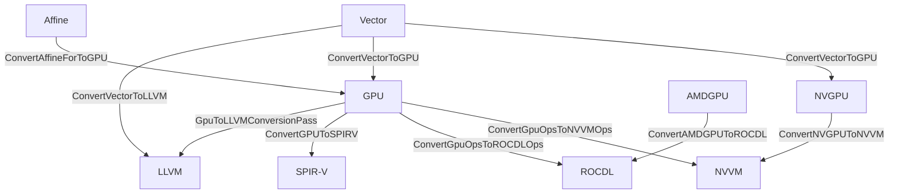

**图 4-1　MLIR GPU 相关方言与转换 pass**

原图用彩色圆角框表示方言、白色直角框表示转换 pass；这里用节点和带 pass 名称的箭头表示同一关系。原图把 `ConvertVectorToLLVM` 的输出连到 GPU，已校为 LLVM；NVVM/ROCDL 到 LLVM IR 的翻译不等于先把全部操作转换为 LLVM 方言，因此不添加这种无名递降边。`ConvertVectorToGPU` 的 GPU 与 NVGPU 两条输出路径都保留，按 `use-nvgpu` 选项选择。

图 4-1 没有列出与主机端操作（如 `gpu.launch_func`）相关的全部方言和 pass，例如把主机模块代码和 launch 操作转换到 LLVM 方言的主机端递降；本章也不展开 SPIR-V 路径。

原书在此明确举出了将主机模块代码及 `gpu.launch_func` 操作转换为 LLVM 方言的 LowerHostCodeToLLVM pass，并以 ConvertGPUToSPIRV pass 作为未展开介绍的 SPIR-V 转换示例。本节对递降过程进行整体概述，重点强调各方言在抽象层级上的定位与作用。通过建立对整体流程的清晰认识，开发者能够更好地把握后续各节中所述具体转换与优化的技术细节。

MLIR 代码生成的主要过程，是把递降流水线中的一系列转换和优化 pass 应用于 MLIR 表示。本章以 NVIDIA GPU 路径为例：Vector 方言经 `ConvertVectorToGPU` 递降到 NVGPU 方言，再经 `ConvertNVGPUToNVVM` 递降到 NVVM 方言；最后可以由 `mlir-translate` 调用 `translateModuleToLLVMIR()` 转换为 LLVM IR，或者将 GPU 模块序列化为目标二进制。

> 版本注：原书以旧式 `SerializeToCubinPass`/`gpu-to-cubin` 为二进制出口示例，第 2 章已经介绍该过程。本地仍保留这套已弃用的实现，另有给 `gpu.module` 附加 `#nvvm.target` 后运行 `gpu-module-to-binary` 的新路径。正文保留原书流程；新接口只另注说明，不能替换或删除原书内容。

图 4-2 给出 Vector 方言经过 NVGPU 方言递降到 LLVM IR 或 GPU 二进制的代码生成路径。对于自研 GPU 的开发者，除入口处的 Vector 方言和出口处的 LLVM IR 外，中间的目标方言、转换 pass 和后端接口通常都需要按硬件需求定制。

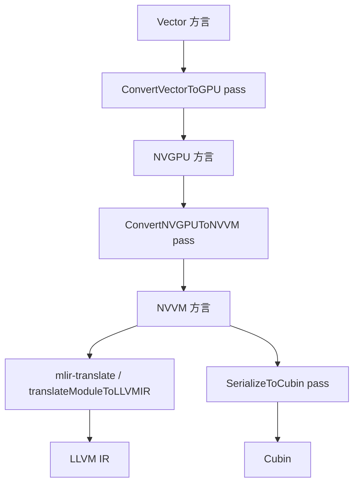

**图 4-2　MLIR GPU 代码生成过程**

原图各大框内的具体内容如下，均属于上面相应阶段，而非独立的额外 pass：

| 所属阶段 | 原图内部列表 |
| --- | --- |
| `ConvertVectorToGPU` pass：重写模式 | `PrepareContractToGPUMMA`、`CombineTransferReadOpTranspose` |
| NVGPU 方言：操作定义 | `MmaSyncOp`、`LdMatrixOp`、`DeviceAsyncCopyOp`、…… |
| NVGPU 方言：操作验证函数 | `DeviceAsyncCopyOp::verify()`、`MmaSyncOp::verify()`、`MmaSparseSyncOp::verify()`、`LdMatrixOp::verify()` |
| `ConvertNVGPUToNVVM` pass：RewritePattern | `MmaSyncOptoNVVM`、`MmaLdMatrixOpToNVVM`、`NVGPUAsyncCopyLowering`、…… |
| NVVM 方言：操作定义 | `ReduxOp`、`Barrier0Op`、`ShflOp`、`VoteBallotOp`、`MmaOp`、`CpAsyncOp`、`LdMatrixOp`、…… |
| NVVM 方言：属性定义 | `MMAShapeAttr` |
| NVVM 方言：操作验证函数 | `CpAsyncOp::verify()`、`MmaOp::verify()`、`ShflOp::verify()`、`LdMatrixOp::verify()`、…… |

原图 NVGPU 的 `MmaSyncOp` 等所在小框误标为“属性定义”，这里校为“操作定义”。NVVM 下方分为 `mlir-translate / translateModuleToLLVMIR()` 到 LLVM IR，以及 `SerializeToCubin` pass 到 Cubin 两条分支；后者内部也会先翻译 LLVM IR，并非跳过该中间阶段。

图 4-2 所示过程以 Vector 方言为起点，可以分为以下几步。

1. Vector 方言支持 SIMD 和数据并行操作，开发者用它描述适合在 GPU 等硬件加速器上映射为向量指令的计算。`ConvertVectorToGPU` 的主要功能，是将 Vector 方言中的高层向量操作递降为具有明确硬件语义的 NVGPU 操作。例如，将从共享内存读取数据的 `vector.transfer_read` 递降为 `nvgpu.ldmatrix`，或者将计算向量缩并的 `vector.contract` 递降为 `nvgpu.mma.sync`。
2. NVGPU 方言是对 NVIDIA GPU 硬件细节的抽象，充当高阶、目标无关的 Vector/GPU 方言与低阶、目标相关的 NVVM 方言之间的桥梁。MLIR 为操作提供 verifier，每个 NVGPU 操作除了定义以外，还可以实现验证逻辑来保证语义正确。例如，异步复制操作会检查内存步长、元素类型、复制字节数和共享内存地址空间等约束。
3. `ConvertNVGPUToNVVM` 将 NVGPU 操作递降为更接近 NVIDIA GPU 硬件的 NVVM 操作。这一阶段的模式，如 `MmaSyncOptoNVVM`、`MmaLdMatrixOpToNVVM` 和 `NVGPUAsyncCopyLowering`，负责完成操作数类型转换、地址计算、操作重写和结果重组。
4. NVVM 方言定义 NVIDIA GPU intrinsic 操作和相关属性，例如矩阵乘形状、布局和 PTX 数据类型。这些定义与 LLVM 的 `IntrinsicsNVVM.td` intrinsic 定义相衔接。
5. 如 2.5 节所述，`SerializeToCubin` 是把 GPU 内核函数转换为 Cubin 二进制文件的 pass。原书通过 `mlir-opt` 命令行参数 `-gpu-to-cubin` 启动，将低层方言 GPU 模块先翻译为 LLVM IR、编译为 GPU 架构的汇编，再完成 Cubin 生成。`mlir-translate` 则是转换 MLIR 格式的实用工具，通过 `translateModuleToLLVMIR()` 可以输出 LLVM IR。这两个出口的职责不同。本地旧序列化 pass 需启用相应弃用兼容构建选项；新流程见上面的版本注。

> 校订注：扫描稿称异步复制 verifier 检查“源操作数地址空间是否为共享内存”。本仓库中 `DeviceAsyncCopyOp::verify()` 实际要求的是**目标 memref** 位于 shared/workgroup 地址空间；源通常是全局内存。正文已按源码修正。

原书还以测试用例说明 `verify()` 的调用：执行测试时检查验证产生的诊断是否符合预期。需纠正的是，IR verifier 并非只在测试中执行；`-verify-diagnostics` 对照的是 `expected-error` 等诊断标注，而普通 `CHECK` 行由 FileCheck 检查工具输出，二者不是同一机制。验证器检查它实现的约束，也不自动证明完整算法语义正确。

## 4.2　Vector 方言和 NVGPU 方言的基本概念与特点

在 MLIR 的 GPU 编译流水线上，Vector 方言与 NVGPU 方言分别承担高层计算抽象和 GPU 专用语义表达的角色。类型是区分操作抽象层次的重要特征之一。Vector 方言使用通用向量类型 `vector<...>` 抽象表示张量与向量操作，在保持硬件无关性的同时强调并行计算能力；NVGPU 方言则引入 `DeviceAsyncTokenType`、`MBarrierGroupType` 等专用类型，直接关联 NVIDIA GPU 的异步复制、张量核指令和线程块协作。

NVGPU 方言的类型与操作不仅承载底层硬件特性，也把 GPU 执行模型暴露给 MLIR 中间表示。Vector 到 NVGPU 的转换通过重写和类型处理，把抽象向量或张量描述转换为具备 NVGPU 语义的表示，从而实现从通用计算抽象到硬件执行模型的初步映射。

这里不是把普通向量类型转换为异步 token 或 barrier 类型：本章的矩阵路径仍以每线程的内建 `vector` 表示分片，硬件语义主要由 NVGPU 操作及其属性表达；token、barrier 是其他特定操作使用的类型。

本节简要介绍 Vector 方言和 NVGPU 方言的基本概念与特点。MLIR 使用这些方言描述、优化向量化计算，以及针对 GPU 的存储和计算操作。

### 4.2.1　Vector 方言简介

MLIR 官方文档把向量操作分为 LLVM 向量、硬件向量（Hardware Vector，HWV）和虚拟向量（Virtual Vector，VV）三个层次。LLVM 向量操作指 LLVM IR 中的向量指令，例如 `llvm.extractelement`、`llvm.insertelement` 和 `llvm.shufflevector`。硬件向量操作通常以针对不同硬件平台的方言操作实现，例如 NVVM 方言的 `nvvm.mma.sync`；这种形式可以隔离不同硬件特性，并与硬件指令或 intrinsic 对应。虚拟向量操作是一组抽象级别更高、与具体硬件无关的操作，Vector 方言操作就是典型的虚拟向量操作。

在递降到 Vector 方言以前，Linalg 等上层方言抽象程度较高，与低层硬件指令在执行粒度和数据表示上存在显著差距。为了在保持高层算子表达灵活性的同时，逐步递降到能够映射具体硬件的低层操作，Vector 方言被设计为高层张量操作和底层硬件指令之间的过渡层。其核心思想是捕捉通用张量与向量计算抽象，并提供多个抽象级别，以实现高维张量操作到目标硬件支持的低维向量操作的渐进递降。

Vector 方言中一系列编译期已知维度的 n 维向量类型和操作，构成不依赖特定硬件的向量化编程模型。该模型把传统硬件上的一维向量指令扩展到任意维度，可以直接表达更高维计算。这些操作能够逐步递降为低维操作，经 LLVM 方言和 LLVM IR 翻译后，再由 LLVM 后端生成硬件指令；也可以映射为低层张量操作。原书把“LLVM 后端进一步递降为 LLVM IR 向量指令”写反了，LLVM IR 是后端的输入而非最终输出。这里主要讲固定长度向量，Vector 类型还支持 scalable 维度。

Vector 方言的多个抽象级别中，既包含与目标硬件无关的通用操作，例如 4.3.3 节和 4.3.5 节介绍的 `vector.transfer_read`、`vector.transfer_write`，也包含带有矩阵缩并语义、可被目标转换识别的操作，例如 4.3.4 节的 `vector.contract`。这种设计使高层抽象到硬件指令的转换更灵活，在每个递降阶段都能提供优化机会。

> 校订注：扫描稿直接把 `vector.contract` 称为“与特定硬件相关的操作”并不准确。该操作本身仍是目标无关的向量缩并表示；只有满足形状、类型和布局约束时，目标相关转换才会把它映射为 MMA。

### 4.2.2　NVGPU 方言及其转换和优化

NVGPU 方言是对 NVIDIA GPU 某些硬件细节的抽象。通过 NVGPU 方言，开发者可以在较高层次上描述 GPU 计算。相比 GPU 方言对 SIMT 平台通用特性的抽象，NVGPU 方言与硬件平台关系更紧密，充当 GPU/Vector 等高阶目标无关方言与 NVVM 低阶目标相关方言之间的桥梁。

如果高阶 IR 从 GPU 或 Vector 方言直接递降到 NVVM，那么硬件相关信息只能到 NVVM 层才公开；而高阶方言与 NVVM 之间存在较大抽象间隔，不便于开发者根据硬件细节进行较高级别的变换。NVGPU 方言允许使用 MLIR 高阶表示表达与 NVVM intrinsic 相对应的功能，而 NVVM intrinsic 通常可以进一步映射为硬件指令。因此，NVGPU 方言成为 MLIR 高层抽象与低层 LLVM/NVPTX 支持之间的桥梁。

#### 1. NVGPU 方言的初始化函数

每类方言都必须实现初始化函数，用于添加属性、操作、类型、接口以及构造方言时需要执行的其他初始化工作。NVGPU 方言的初始化函数如下：

```cpp
void nvgpu::NVGPUDialect::initialize() {
  addTypes<
#define GET_TYPEDEF_LIST
#include "mlir/Dialect/NVGPU/IR/NVGPUTypes.cpp.inc"
      >();
  addAttributes<
#define GET_ATTRDEF_LIST
#include "mlir/Dialect/NVGPU/IR/NVGPUAttrDefs.cpp.inc"
      >();
  addOperations<
#define GET_OP_LIST
#include "mlir/Dialect/NVGPU/IR/NVGPU.cpp.inc"
      >();
}
```

> 版本说明：原书代码仅列 `addTypes()` 和 `addOperations()`，上面增加了本地实现中的 `addAttributes()`。扫描页原函数名就是小写 `initialize()`；早期 OCR 的大写识别不属于作者错误。

模板函数 `addTypes()` 向方言添加类型类，`addAttributes()` 添加属性类，`addOperations()` 添加操作。`DeviceAsyncTokenType`、`MBarrierGroupType` 等类型和 `MmaSyncOp`、`DeviceAsyncCopyOp`、`LdMatrixOp` 等操作在 NVGPU 的 TableGen 文件中定义，并分别由 TableGen 生成相应声明与实现。

相比 Vector 方言的通用性，NVGPU 类型更强调硬件相关性与语义约束。例如，GPU 异步操作返回的 `DeviceAsyncTokenType` 用于表达异步依赖关系，`MBarrierGroupType` 用于表示共享内存中的 memory barrier 对象。NVGPU 操作则与 GPU 指令语义紧密结合，用于精确建模 GPU 执行和内存模型。

类型注册后，可以通过 `get()` 在 MLIR 上下文中构造或获取唯一类型实例。例如，构造 `nvgpu.device_async_copy` 时，可用如下形式取得 token 类型：

```cpp
rewriter.create<nvgpu::DeviceAsyncCopyOp>(
    loc, nvgpu::DeviceAsyncTokenType::get(op->getContext()), /* ... */);
```

NVGPU 方言的 `initialize()` 在 `NVGPUDialect` 构造时调用。构造函数先通过 `Dialect` 基类完成命名空间和类型 ID 注册，再初始化类型、属性和操作。实例化前需要把 NVGPU 方言加入 `DialectRegistry`；如第 2 章所述，`registerAllDialects()` 可以统一注册所有方言：

原书给出了 `NVGPUDialect.cpp.inc` 中的构造函数，补全如下：

```cpp
NVGPUDialect::NVGPUDialect(::mlir::MLIRContext *context)
    : ::mlir::Dialect(getDialectNamespace(), context,
                      ::mlir::TypeID::get<NVGPUDialect>()) {
  initialize();
}
```

`registerAllDialects()` 中的 NVGPU 注册片段为：

```cpp
inline void registerAllDialects(DialectRegistry &registry) {
  registry.insert<acc::OpenACCDialect, /* ... */
                  nvgpu::NVGPUDialect /* ... */>();
}
```

`registerAllDialects()` 的详细分析见 2.3.2 节。这是 `mlir-opt` 采用的注册方式；自定义工具也可只注册所需方言，或者显式调用上下文的 `getOrLoadDialect<>()`，不要求所有工具都调用 `registerAllDialects()`。这里的省略号是原书摘录，不是可直接编译的完整类型列表。

#### 2. NVGPU 方言的张量核操作

NVGPU 方言的核心功能之一是支持张量核计算。为了对张量核进行编程，LLVM NVPTX 后端通过 intrinsic 提供硬件功能，MLIR 则用 NVGPU/NVVM 操作逐层表达这些能力。

NVGPU 方言支持 `ldmatrix`、矩阵乘累加和异步复制等关键功能，对应操作包括 `nvgpu.ldmatrix`、`nvgpu.mma.sync` 和 `nvgpu.device_async_copy`。

`nvgpu.ldmatrix` 用于从共享内存加载线程束矩阵数据。与 GPU 方言较抽象的 subgroup matrix load 相比，`nvgpu.ldmatrix` 更明确地定义矩阵如何映射到线程束 lane，使开发者可以更细致地控制矩阵数据在线程束中的分布。其加载结果以向量形式提供给后继操作，后继操作可以像访问常规向量一样使用结果。

`nvgpu.mma.sync` 直接表达使用 GPU 张量核执行的矩阵乘累加，处理小型矩阵乘法时可以显著提升性能。它和 `nvgpu.ldmatrix` 都是线程束级操作，但操作数的向量类型表示的是**每个线程**持有的数据，而 `mmaShape` 表示整个线程束协作完成的矩阵形状。例如，每个线程的 A 分片类型可以是 `vector<4x2xf16>`，即持有 8 个 f16 值；整个线程束共同参与形如 `m16n8k16` 的矩阵乘累加。

原书这个例子中，32 个线程合计持有 `32×8=256` 个 f16 元素，可组成 A 的 `16×16` 矩阵分片。`nvgpu.ldmatrix` 对比的 GPU 操作类名为 `SubgroupMmaLoadMatrixOp`。分片映射是在线程束内部各 lane 之间的分布，不能误读成在多个线程束之间划分矩阵。

`nvgpu.device_async_copy` 用于异步复制数据，可以在执行张量核运算的同时把数据从全局内存加载到共享内存而不阻塞计算，从而隐藏部分内存访问延迟并提高数据传输效率。

与传统同步复制相比，异步复制提供了计算与数据搬运重叠的机会；使用目标数据前仍必须执行相应等待和同步，不能因“异步”而提前读取未完成的结果。

通过这些操作，NVGPU 方言不仅支持张量核计算，还使开发者能够精细控制矩阵运算的数据加载、计算和同步过程，充分利用 GPU 硬件能力。

## 4.3　Vector 方言到 NVGPU 方言的转换

Vector 方言支持高阶向量类型及其操作，其中维度大于 1 的高阶向量是一种结构化类型，携带对转换有用的语义信息。作为代码生成的重要环节，Vector 方言在较高抽象层次上构建向量级原语，并把向量操作定义与针对 memref、循环等结构的分析和转换分开，有助于简化计算任务和表达复杂模式。

在递降到 GPU 的过程中，MLIR 基于 PatternRewrite 基础设施应用一系列重写模式，将 Vector 操作逐步映射为 GPU 硬件可执行的表示。`ConvertVectorToGPU` 是承担这一任务的核心 pass。它通过匹配和替换，把 `vector.transfer_read`、`vector.contract` 等通用向量操作转换为 `nvgpu.ldmatrix`、`nvgpu.mma.sync` 等 NVGPU 专用操作，实现从通用向量抽象到 GPU 硬件语义的映射。

### 4.3.1　`ConvertVectorToGPU` pass 的定义与实现

`ConvertVectorToGPU` 的作用，是将 MLIR 中的 Vector 操作转换为 NVGPU 或 GPU 方言操作。其 TableGen 定义如下：

```tablegen
def ConvertVectorToGPU : Pass<"convert-vector-to-gpu"> {
  let summary = "Lower the operations from the vector dialect into the GPU "
                "dialect";
  let constructor = "mlir::createConvertVectorToGPUPass()";
  let dependentDialects = [
    "memref::MemRefDialect", "gpu::GPUDialect", "affine::AffineDialect",
    "vector::VectorDialect", "nvgpu::NVGPUDialect"
  ];
  let options = [
    Option<"useNvGpu", "use-nvgpu", "bool", /*default=*/"false",
      "convert to NvGPU ops instead of GPU dialect ops">
  ];
}
```

`convert-vector-to-gpu` 是该 pass 的命令行参数。若 `use-nvgpu=true`，Vector 操作将转换为 NVIDIA GPU 相关的 NVGPU 操作；否则转换到 GPU 方言的 subgroup MMA 操作。本节关注 Vector 到 NVGPU 的递降。命令行形式例如：

```bash
mlir-opt input.mlir \
  -split-input-file \
  -pass-pipeline='builtin.module(func.func(convert-vector-to-gpu{use-nvgpu=true}))'
```

`dependentDialects` 是 pass 可能创建实体的方言列表。方言包含操作、类型和属性等实体；pass 在创建这些实体前必须保证方言已加载，而且在启动多线程 pass 流水线前也必须完成加载。方言不会自动保证自身已被加载，因此创建方言实体的 pass 必须通过 `dependentDialects` 明确声明相关方言。`ConvertVectorToGPU` 涉及 MemRef、GPU、Affine、Vector 和 NVGPU 方言，它们都列在该字段中。

`constructor` 指定 pass 构造函数，用于生成默认实例，一般由 C++ 实现类定义。这里的构造函数是 `mlir::createConvertVectorToGPUPass()`。它在转换 pass 注册过程中被纳入全局 pass 注册表，其调用关系如图 4-3 所示。

原书的注册代码片段为：

```cpp
inline void registerConversionPasses() {
  // ……
  registerConvertVectorToGPU();
  // ……
}
```

该函数的详细介绍见 2.3.2 节。

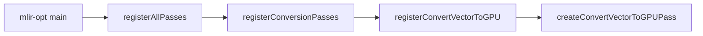

**图 4-3　`createConvertVectorToGPUPass()` 函数调用栈**

TableGen 处理上述定义后生成 `ConvertVectorToGPUBase`。它最终继承 `OperationPass`。如第 2 章所述，MLIR pass 面向操作运行，具体 pass 通过 `runOnOperation()` 对 `getOperation()` 返回的当前操作执行功能。

原书还指出 `InterfacePass` 也继承 `OperationPass`，并列出 pass 所需的 `runOnOperation()`、`getName()`、`clonePass()` 三个方法。后两者通常已由 `PassWrapper` 或生成的基类提供，不要求每个手写派生类重新实现。`runOnOperation()` 以当前操作为作用域，可以处理允许访问的嵌套 IR，并非只能改动当前操作自身。

`ConvertVectorToGPUPass` 的实现如下：

```cpp
namespace mlir {
#define GEN_PASS_DEF_CONVERTVECTORTOGPU
#include "mlir/Conversion/Passes.h.inc"
} // namespace mlir

struct ConvertVectorToGPUPass
    : public impl::ConvertVectorToGPUBase<ConvertVectorToGPUPass> {
  explicit ConvertVectorToGPUPass(bool useNvGpu_) {
    useNvGpu.setValue(useNvGpu_);
  }

  void runOnOperation() override {
    RewritePatternSet patterns(&getContext());
    populatePrepareVectorToMMAPatterns(patterns, useNvGpu.getValue());
    if (failed(applyPatternsAndFoldGreedily(
            getOperation(), std::move(patterns))))
      return signalPassFailure();

    IRRewriter rewriter(&getContext());
    if (useNvGpu) {
      if (failed(convertVectorToNVVMCompatibleMMASync(
              rewriter, getOperation())))
        return signalPassFailure();
      return;
    }
    (void)convertVectorToMMAOps(rewriter, getOperation());
  }
};
```

通过继承生成的 pass 基类并实现 `runOnOperation()`，该 pass 完成 Vector 到 GPU/NVGPU 的转换。由 3.1.2 节对模式驱动的分析可知，准备阶段调用 `applyPatternsAndFoldGreedily()`，因此使用基于区域的贪婪模式重写驱动。

在文件开头定义 `GEN_PASS_DEF_CONVERTVECTORTOGPU` 并包含 `Passes.h.inc`，用于引入 `ConvertVectorToGPUBase` 的生成定义。原书本段调用 MMA 转换函数时只传 `getOperation()`，后面给出的函数签名却还有 `RewriterBase &`；上面按本地实现补入 `IRRewriter` 参数。另外，原书 NVGPU 分支成功后仍会落到 `convertVectorToMMAOps()`，与紧接着的二选一说明不一致；这里按本地实现加上 `return`，使两条目标路径互斥。

向集合添加准备模式的功能由 `populatePrepareVectorToMMAPatterns()` 完成：

```cpp
void mlir::populatePrepareVectorToMMAPatterns(
    RewritePatternSet &patterns, bool useNvGpu) {
  if (!useNvGpu) {
    patterns.add<PrepareContractToGPUMMA,
                 CombineTransferReadOpTranspose>(patterns.getContext());
    return;
  }
  vector::populateVectorContractCanonicalizeMatmulToMMT(patterns);
  patterns.add<CombineTransferReadOpTranspose>(patterns.getContext());
}
```

当目标是 GPU 方言 subgroup MMA 时，集合包含 `PrepareContractToGPUMMA` 和 `CombineTransferReadOpTranspose`；当目标是 NVGPU 时，则加入把 matmul 规范化为 MMT 形式的 Vector 模式和 transfer-read/transpose 合并模式。这些准备重写使后继的 MMA 转换能够识别规范形式。

`populatePrepareVectorToMMAPatterns()` 通过 `RewritePatternSet::add()` 填充集合。原书以 `PrepareContractToGPUMMA` 为例说明将 `vector.contract` 规范为 `(m,k) × (k,n) + (m,n)` 的矩阵乘累加形式（原书最后一项前误用乘号）。NVGPU 分支中具体加入的规范化模式为 `CanonicalizeContractMatmulToMMT`，采用右操作数以 `(n,k)` 存储的 MMT 形式，并配合 `CombineTransferReadOpTranspose`；不能把 GPU 分支的模式误列为 NVGPU 分支实际执行的模式。

MLIR 各种转换 pass 的实现结构大体类似：用 TableGen 描述 pass 配置，用统一 pass 架构调度，再由 C++ 数据结构和函数实现具体转换规则。这种模块化设计使开发者实现自定义 pass 时，可以把注意力集中在特定转换规则上。

### 4.3.2　Vector 操作到 NVGPU 操作的转换框架

`ConvertVectorToGPUPass::runOnOperation()` 根据 `use-nvgpu` 做不同处理。选项为 true 时调用 `convertVectorToNVVMCompatibleMMASync()`，把 Vector 操作转换为与 NVVM `mma.sync` 递降路径兼容的 NVGPU 操作；为 false 时调用 `convertVectorToMMAOps()`，转换为 GPU 方言操作。本节关注前者。

`convertVectorToNVVMCompatibleMMASync()` 的实现如下：

```cpp
LogicalResult mlir::convertVectorToNVVMCompatibleMMASync(
    RewriterBase &rewriter, Operation *rootOp) {
  SetVector<Operation *> ops =
      getOpToConvert(rootOp, /*useNvGpu=*/true);
  llvm::DenseMap<Value, Value> valueMapping;

  for (Operation *op : ops) {
    if (llvm::TypeSwitch<Operation *, LogicalResult>(op)
            .Case([&](vector::TransferReadOp transferReadOp) {
              return convertTransferReadToLoads(
                  rewriter, transferReadOp, valueMapping);
            })
            .Case([&](vector::TransferWriteOp transferWriteOp) {
              return convertTransferWriteToStores(
                  rewriter, transferWriteOp, valueMapping);
            })
            .Case([&](vector::ExtractStridedSliceOp sliceOp) {
              return convertExtractStridedSlice(
                  rewriter, sliceOp, valueMapping);
            })
            .Case([&](vector::ContractionOp contractionOp) {
              return convertContractOpToMmaSync(
                  rewriter, contractionOp, valueMapping);
            })
            .Case([&](scf::ForOp forOp) {
              return convertForOp(rewriter, forOp, valueMapping);
            })
            .Case([&](scf::YieldOp yieldOp) {
              return convertYieldOp(rewriter, yieldOp, valueMapping);
            })
            .Case([&](arith::ConstantOp constOp) {
              return convertConstantOpMmaSync(
                  rewriter, constOp, valueMapping);
            })
            .Default([&](Operation *unhandled) {
              return unhandled->emitError()
                     << "unhandled vector to mma type: " << *unhandled;
            })
            .failed())
      return op->emitOpError()
             << "failed to convert op during vector-to-nvgpu conversion";
  }
  return success();
}
```

该函数先调用 `getOpToConvert()` 取得符合条件的待转换操作集合 `ops`。后续只针对集合中的特定类型执行转换，其他没有进入这段 MMA slice 的 Vector 操作保持不变。

函数遍历 `ops`，并对 `vector.transfer_read`、`vector.transfer_write`、`vector.contract` 等操作调用对应子函数，把它们转换为与 NVVM MMA 递降路径兼容的 NVGPU 或辅助 Vector 操作。例如，`convertTransferReadToLoads()` 完成 transfer read 到 `nvgpu.ldmatrix` 或逐元素加载的转换，`convertContractOpToMmaSync()` 完成 `vector.contract` 到 `nvgpu.mma.sync` 的转换。

操作转换结果缓存在 `DenseMap<Value, Value>` 类型的 `valueMapping` 中。该容器保存原 Vector SSA 值和新 NVGPU/Vector SSA 值之间的映射，使后续转换可以引用前面已经生成的结果。例如，`convertContractOpToMmaSync()` 转换 `vector.contract` 时，需要使用 A 操作数的转换结果；如果此前 transfer read 已把 `%A` 转换为 `%3` 并写入 `valueMapping`，这里只需查表取得 `%3` 作为 `nvgpu.mma.sync` 的操作数。

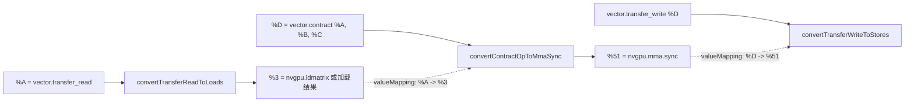

**图 4-4　操作转换结果缓存**

原图的具体 SSA 标签为：左上 `%A = vector.transfer_read %arg0...` 经 `convertTransferReadToLoads` 得到 `%3 = nvgpu.ldmatrix %arg0...`；右上 `%D = vector.contract... %A, %B, %C...` 经 `convertContractOpToMmaSync` 得到 `%51 = nvgpu.mma.sync %3, %38, %49...`。中央 `valueMapping` 表的两列为“vector 操作结果”“nvgpu 操作结果”，两行是 `%A → %3`、`%D → %51`。底部 `vector.transfer_write %D, %arg2...` 经 `convertTransferWriteToStores` 产生 `%54 = vector.extract %51...`，再用于存储；原图只画到 extract，并不表示 extract 本身完成了写内存。

`valueMapping` 可以保存 `vector.transfer_read` 结果与新加载结果的映射，以及 `vector.contract` 结果与 `nvgpu.mma.sync` 结果的映射，但不需要保存 `vector.transfer_write` 自身的结果映射，因为 transfer write 不返回 SSA 结果，也没有后继操作需要引用它。不过在转换 transfer write 时，函数会从 `valueMapping` 取得 `%D` 对应的 MMA 结果，作为后续 `vector.extract` 和 store 的输入。

后续小节将详细介绍矩阵乘相关 Vector 操作到 NVGPU 操作的转换。为便于理解，本章使用仓库测试中的 `m16n8k32_int8_row_row_row` 用例辅助分析。当前文件路径为：

```text
mlir/test/Conversion/VectorToGPU/vector-to-mma-ops-mma-sync.mlir
```

> 校订注：扫描稿使用的旧文件名是 `vector-to-nvgpu.mlir`；当前仓库已合并到上述测试文件。

测试用例的主体如下：

```mlir
#map0 = affine_map<(d0, d1) -> (d1, d0)>
#map1 = affine_map<(d0, d1, d2) -> (d0, d2)>
#map2 = affine_map<(d0, d1, d2) -> (d1, d2)>
#map3 = affine_map<(d0, d1, d2) -> (d0, d1)>

func.func @m16n8k32_int8_row_row_row(
    %arg0: memref<128x128xi8, #gpu.address_space<workgroup>>,
    %arg1: memref<128x128xi8, #gpu.address_space<workgroup>>,
    %arg2: memref<128x128xi32>) {
  %c0 = arith.constant 0 : index
  %c39 = arith.constant 39 : index
  %c40 = arith.constant 40 : index
  %c49 = arith.constant 49 : index
  %cst = arith.constant 0 : i8
  %cst0 = arith.constant 0 : i32

  %A = vector.transfer_read %arg0[%c0, %c0], %cst
      {in_bounds = [true, true]} :
      memref<128x128xi8, #gpu.address_space<workgroup>>,
      vector<16x32xi8>
  %B = vector.transfer_read %arg1[%c39, %c40], %cst
      {in_bounds = [true, true], permutation_map = #map0} :
      memref<128x128xi8, #gpu.address_space<workgroup>>,
      vector<8x32xi8>
  %C = vector.transfer_read %arg2[%c49, %c40], %cst0
      {in_bounds = [true, true]} :
      memref<128x128xi32>, vector<16x8xi32>
  %D = vector.contract {
      indexing_maps = [#map1, #map2, #map3],
      iterator_types = ["parallel", "parallel", "reduction"],
      kind = #vector.kind<add>}
      %A, %B, %C :
      vector<16x32xi8>, vector<8x32xi8> into vector<16x8xi32>
  vector.transfer_write %D, %arg2[%c49, %c40]
      {in_bounds = [true, true]} :
      vector<16x8xi32>, memref<128x128xi32>
  return
}
```

该用例测试向量缩并 `vector.contract` 和张量读写 `vector.transfer_read`、`vector.transfer_write`。矩阵操作数分别是 `%A`、`%B`、`%C` 和 `%D`：A 的形状是 16×32、元素类型为 i8；B 经转置后参与计算的形状为 32×8、元素类型为 i8；C 和 D 的形状为 16×8、元素类型为 i32。

原书用省略号省去部分常量和 `in_bounds` 属性，上面已补入所需定义及四处边界属性。对本例给定的形状和常量起点，这些声明成立；本地 MMA 路径的前置筛选会拒绝无法保证边界的 transfer，因此不能简单删掉它们再期待得到相同转换结果。

```text
              B：32 × 8，i8
                   │
                   ▼
 A：16 × 32，i8 × B：32 × 8，i8 + C：16 × 8，i32
                   │
                   ▼
              D：16 × 8，i32
```

**图 4-5　测试用例的矩阵操作数布局**

原图按矩阵乘法的位置摆放三个矩形：A 在左下，为高 16、宽 32 的 i8 矩阵；B 在右上，为高 32、宽 8 的 i8 矩阵；C/D 在右下，为高 16、宽 8 的 i32 矩阵。A 的右上角用虚线框出高 8、宽 16 的子块，B 下半部标高 16，C/D 在中间画水平分割线；A、B 的单元素标“8 位”，C/D 标“32 位”。这些标记用于后续线程束分片分析，不是额外矩阵输入。

需要区分存储类型与数学矩阵：IR 中 `%B` 实际为 `vector<8x32xi8>`，按 `(n,k)` 索引；公式中的右乘矩阵是其转置，形状为 `32×8`。不能把 `%B` 的 SSA 类型改成 `vector<32x8xi8>` 而不同时修改索引映射。

用例开头的四个仿射映射 `map0`～`map3` 描述线性变换和索引重映射关系。`map0` 是读取 B 的 `vector.transfer_read` 的 permutation map，把二维索引 `(d0,d1)` 映射为 `(d1,d0)`，表示转置。`map1`～`map3` 是 `vector.contract` 的 indexing maps，分别描述 A、B、C/D 与 `(m,n,k)` 迭代维度之间的关系。后续各小节将结合这些映射分析具体转换。

张量 A 由 `vector.transfer_read` 从 `%arg0` 的位置 `(0,0)` 读取；张量 B 从 `%arg1` 的位置 `(39,40)` 读取，并使用 `map0` 转置；张量 C 从 `%arg2` 的位置 `(49,40)` 读取。`vector.contract` 对 A、B、C 做矩阵乘累加，使用 `map1`、`map2`、`map3` 描述索引关系和迭代方式，结果存入 D。最后，`vector.transfer_write` 把 D 写回 `%arg2`，起始坐标为 `(49,40)`。

### 4.3.3　`vector.transfer_read` 操作的转换过程

`vector.transfer_read` 的作用，是把第一个操作数 `%source` 指向的 memref 或 tensor 数据分片读取到向量中。其语法可概括为：

```mlir
%result = vector.transfer_read %source[%indices], %padding
    {permutation_map = #permutation,
     in_bounds = [/* ... */]} : memref<...>, vector<...>
```

其中，`%result` 保存读取结果；`%source` 是源 memref 或 tensor；`%indices` 指定读取起始位置；`permutation_map` 对传输维度进行重排，可以表达转置和广播；`in_bounds` 指明相应向量维度是否保证不会越界。源和结果的元素类型必须一致，源 rank 与结果向量 rank 则可以通过 permutation map 建立关系。

#### 1. `vector.transfer_read` 的用法和功能

以下示例说明 `vector.transfer_read` 的语义。假设 `%expr1`～`%expr4` 已在程序其他位置定义：

```mlir
%vec = vector.transfer_read
    %A[%expr1, %expr2, %expr3, %expr4], %pad
    {permutation_map = affine_map<
        (d0, d1, d2, d3) -> (d2, 0, d0)>} :
    memref<?x?x?x?xf32>, vector<3x4x5xf32>
```

该操作把 `%A` 中的数据分片读到 `%vec`。`%A` 是动态形状的四维 memref，结果是 `vector<3x4x5xf32>`。源与结果的维度数和各维大小不同，读取过程通过 `permutation_map` 把源维度映射到结果维度。

映射 `(d0,d1,d2,d3) -> (d2,0,d0)` 表示：结果第 0 维来自源 `d2`，结果第 1 维是常量 0 对应的广播维，结果第 2 维来自源 `d0`。因此其等效访问关系是：

```text
vec[i, j, k] = A[expr1 + k, expr2, expr3 + i, expr4]
```

可以把操作语义展开为如下伪代码：

```text
for i = 0 .. 3
  for j = 0 .. 4
    for k = 0 .. 5
      a = A[expr1 + k, expr2, expr3 + i, expr4]
      updated[i, j, k] = a
vec = updated
```

原书还给出使用临时零维 memref 保存向量、逐元素插入的展开代码。旧稿只留下上述伪代码，现补回这一实现层次。下面统一循环和 load/store 语法，并先初始化临时向量，避免读取未初始化内存；为突出原书的映射推导，假定下面所有源索引均在边界内，`%pad` 是已定义的 f32 padding 值：

```mlir
%tmp = memref.alloc() : memref<vector<3x4x5xf32>>
%init = vector.broadcast %pad : f32 to vector<3x4x5xf32>
memref.store %init, %tmp[] : memref<vector<3x4x5xf32>>
affine.for %i = 0 to 3 {
  affine.for %j = 0 to 4 {
    affine.for %k = 0 to 5 {
      %src0 = arith.addi %expr1, %k : index
      %src2 = arith.addi %expr3, %i : index
      %a = memref.load %A[%src0, %expr2, %src2, %expr4]
          : memref<?x?x?x?xf32>
      %slice = memref.load %tmp[] : memref<vector<3x4x5xf32>>
      %updated = vector.insert %a, %slice[%i, %j, %k]
          : f32 into vector<3x4x5xf32>
      memref.store %updated, %tmp[] : memref<vector<3x4x5xf32>>
    }
  }
}
%vec = memref.load %tmp[] : memref<vector<3x4x5xf32>>
memref.dealloc %tmp : memref<vector<3x4x5xf32>>
```

这里每层循环的上界由结果向量相应维度的大小决定；每次根据起始索引和交错映射从 `%A` 加载一个 `%a`，读出当前 `%slice`，将该元素插入指定位置得到 `%updated`，再写回临时容器，最后读取完整 `%vec`。对可能越界的输入，实际 transfer read 会使用 padding（并可受 mask 控制），上述无条件 load 展开还必须增加边界判断，不能宣称对所有动态形状输入无条件等价。

嵌套循环的范围都是半开区间。源 `%A` 的 `d0` 由 `k` 遍历，`d2` 由 `i` 遍历，`d1` 和 `d3` 不变，所以从源中实际读取的是 `d2 × d0` 上大小为 3×5 的二维分片。读取的数据在结果中把源 `d0` 放到结果第 2 维，把源 `d2` 放到结果第 0 维，并沿结果第 1 维广播 4 次，最终得到 3×4×5 的向量。

按原书的逐层执行分析，最内层 `%k` 从 0 递增到 4，沿源 `d0` 读取 5 个 f32 元素，对应图中向下箭头；它们沿临时向量 `%updated` 的 `d2` 写入，对应图中的斜向上箭头。中间层 `%j` 不参与源地址计算，同一组 5 个数沿结果 `d1` 复制 4 份，形成 `4×5` 的水平数据分片。最外层 `%i` 从 0 递增到 2，沿源 `d2` 选取下一组数据，重复读取和广播过程，最终把源的 `3×5` 二维分片扩展为 `3×4×5` 的结果。原书用映射“不满秩”解释广播，更直接的判据是结果映射中的常量 0：该结果维度没有对应的源变化维度。

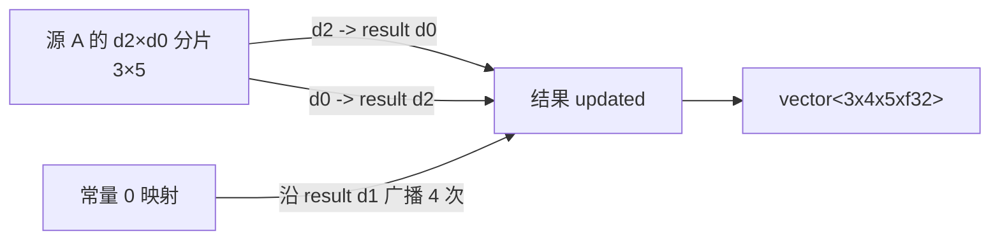

**图 4-6　`vector.transfer_read` 操作执行过程**

原图上半部是 `%A` 的四维布局：沿 `d3` 画出多个三维盒子并以省略号连接，`d3` 位置为 `%expr4`；所选盒子的 `d1` 固定为 `%expr2`，`d0` 访问 `%expr1+%k` 的连续 5 个位置，`d2` 访问 `%expr3+%i` 的连续 3 个位置，各源维总大小都标 `?`。圆点和 `%a` 箭头表示从这片 `5×3` 数据中逐元素读取。下半部 `%updated` 的三轴标为 `d0/%i/3`、`d1/%j/4`、`d2/%k/5`，圆点表示沿 `d1` 广播复制后的数据；虚线指向其中一片，标“%updated 中的数据分片”。中间箭头标 `vector.transfer_read`，连接源 `%A` 与结果 `%updated`。

如果传输过程没有转置或广播，`permutation_map` 是恒等映射，例如 `(d0,d1) -> (d0,d1)`，此时通常可以省略该属性。`in_bounds` 只是静态声明相应向量维的访问保证不越界；它不是运行时检查。对于不能保证在边界内的维度，操作需要依靠 padding 或 mask 定义越界 lane 的结果。

`ConvertVectorToGPU` 可以把满足条件的 `vector.transfer_read` 转换为 `nvgpu.ldmatrix`。后者是递降到 PTX `ldmatrix` 之前的中间表示，因此首先需要了解 PTX 指令约束。其概念语法为：

```text
ldmatrix.sync.aligned.shape.num{.trans}{.ss}.type r, [p];
```

`ldmatrix` 从地址 `p` 指向的共享内存加载一个或多个矩阵到寄存器 `r`，用作 `mma.sync` 的操作数。`shape` 当前是 `m8n8`；`type` 是 `b16`，所以指令按 16 位元素、8×8 行列的单位寻址，每行宽度为 128 位。

为了支持更大的 M/K 维，数量限定符 `num` 可以是 `x1`、`x2` 或 `x4`，分别表示一次加载 1、2 或 4 个 8×8×16 位矩阵。目的操作数是由 1、2 或 4 个 32 位寄存器构成的寄存器组。每个寄存器保存相应矩阵的一段数据，线程束中的不同线程共同提供数据和行地址。

| `num` | 提供行地址的线程 | 每线程返回寄存器数 |
| --- | --- | --- |
| `x1` | T0～T7 | 1 |
| `x2` | T0～T15 | 2 |
| `x4` | T0～T31 | 4 |

`sync` 表示线程束中的线程等待其他参与线程执行相同指令后再继续，`aligned` 要求线程束中的线程执行一致的 `ldmatrix` 指令。`8×8×b16` 描述的是硬件指令的寻址和打包单位，并不意味着上层数据只能是 f16。例如，i8 元素可以按 `vector<4xi8>` 打包进一个 32 位寄存器；但 `.trans` 转置形式只支持 16 位粒度，所以测试中的 i8 B 不能直接用 `ldmatrix.trans`。

例如数量限定符为 `.x4` 时，目的寄存器组写作 `{r0, r1, r2, r3}`，每个都是当前线程的 32 位寄存器；各线程共同持有全部矩阵数据，而不是同一线程直接得到完整四个矩阵。原书关于 `ldmatrix` 更详细的说明交叉引用《AI 编译器开发指南》5.3 节。这里的 `m8n8/b16` 范围指本书及本地实现所讨论的指令形式，不作为所有后续 PTX 版本的能力上限。

#### 2. `vector.transfer_read` 转换的前置条件

`vector.transfer_read` 到 `nvgpu.ldmatrix` 的转换由 `convertTransferReadToLoads()` 完成：

```cpp
static LogicalResult convertTransferReadToLoads(
    RewriterBase &rewriter, vector::TransferReadOp op,
    llvm::DenseMap<Value, Value> &valueMapping) {
  FailureOr<nvgpu::WarpMatrixInfo> warpMatrixInfo =
      nvgpu::getWarpMatrixInfo(op);
  if (failed(warpMatrixInfo))
    return failure();

  bool isLdMatrixCompatible =
      isSharedMemory(cast<MemRefType>(op.getSource().getType())) &&
      nvgpu::inferTileWidthInBits(*warpMatrixInfo) == 128;

  VectorType vecTy = op.getVectorType();
  int64_t bitWidth =
      vecTy.getElementType().getIntOrFloatBitWidth();
  if (!op.getPermutationMap().isMinorIdentity() &&
      (bitWidth != 16 || vecTy.getDimSize(1) < 8 ||
       vecTy.getDimSize(0) * bitWidth < 128))
    isLdMatrixCompatible = false;

  if (!isLdMatrixCompatible)
    return createNonLdMatrixLoads(rewriter, op, valueMapping);
  return creatLdMatrixCompatibleLoads(rewriter, op, valueMapping);
}
```

> 校订注：源码辅助函数名确实拼写为 `creatLdMatrixCompatibleLoads`，正文保留这一实际标识符。

转换前需要检查三个主要条件：

1. transfer read 的源 memref 是否位于共享内存，因为 `ldmatrix` 从 shared memory 加载；
2. 根据线程束级矩阵操作数类型推断的 8×8 分片单行宽度是否为 128 位；
3. permutation map 是否为 minor identity；如果不是，即存在转置，还要满足 16 位元素、至少 8 行以及转置方向宽度不少于 128 位等附加条件。

若满足条件，调用 `creatLdMatrixCompatibleLoads()` 生成 `nvgpu.ldmatrix`；否则调用 `createNonLdMatrixLoads()` 生成 `vector.load` 或 `memref.load` 及相应的 `vector.insert`。

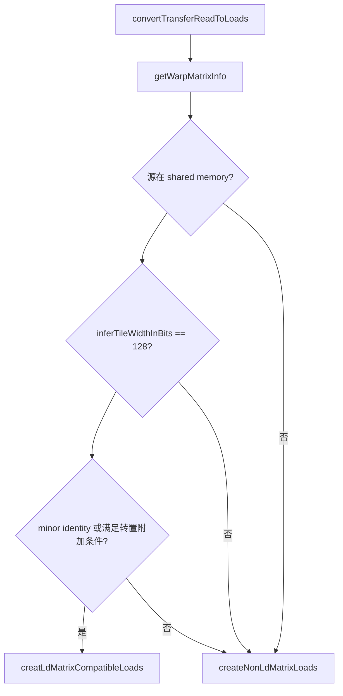

**图 4-7　`convertTransferReadToLoads()` 函数调用流程**

为了完成这些判断和后续构造，函数先根据 Vector 操作的属性建立若干数据结构。

##### （1）设置 `WarpMatrixInfo`

`getWarpMatrixInfo()` 根据 `vector.transfer_read`、`vector.contract` 或 `vector.transfer_write` 设置 `WarpMatrixInfo`。该结构包含 `vectorType` 和 `operandRole`，分别描述线程束级矩阵操作数类型和矩阵角色 A/B/C。这些信息用于后续计算线程级寄存器分片。

如果操作是 `vector.transfer_read` 或 `vector.contract`，`vectorType` 描述操作结果。例如，读取 C 的 transfer read 结果类型是 `vector<16x8xi32>`。如果操作是 `vector.transfer_write`，该字段描述要写出的源向量，即 D 的 `vector<16x8xi32>`。

原书为这两种情形分别列出的操作如下，虽然在整体测试中已经出现，这里仍保留以便直接比较：

```mlir
%C = vector.transfer_read %arg2[%c49, %c40], %cst0
    {in_bounds = [true, true]} :
    memref<128x128xi32>, vector<16x8xi32>

vector.transfer_write %D, %arg2[%c49, %c40]
    {in_bounds = [true, true]} :
    vector<16x8xi32>, memref<128x128xi32>
```

`getWarpMatrixInfo()` 再通过 `getUserContract()` 查找相关 `vector.contract`，根据当前值在 contraction 中是左输入还是右输入，把 `operandRole` 设置为 `MatMulOperandRole::A` 或 `MatMulOperandRole::B`。不是左、右乘数的 C/D 使用默认角色 `MatMulOperandRole::C`。

##### （2）检查共享内存类型

`isSharedMemory()` 根据源 memref 的 memory space 是否为 `#gpu.address_space<workgroup>` 判断共享内存。测试中，读取 A 和 B 的 `%arg0`、`%arg1` 都是：

```mlir
memref<128x128xi8, #gpu.address_space<workgroup>>
```

因此判定为共享内存；读取 C 的 `%arg2` 没有 workgroup 地址空间属性，不满足该条件。

##### （3）计算分片单行宽度

`inferTileWidthInBits()` 根据 `WarpMatrixInfo` 的矩阵角色和元素位宽，计算加载不同矩阵操作数时使用的逻辑分片单行宽度：

```cpp
int64_t nvgpu::inferTileWidthInBits(const WarpMatrixInfo &type) {
  bool isAcc = isAccumulatorOrResult(type.operandRole);
  Type elType = type.vectorType.getElementType();
  if (isAcc && elType.getIntOrFloatBitWidth() == 32)
    return 256;
  if (elType.getIntOrFloatBitWidth() == 64)
    return isAcc ? 512 : 256;
  return 128;
}
```

A 的类型是 `vector<16x32xi8>`，角色是 A，函数返回 128，所以可以用 8×128 位分片加载。整个 A 需要四个这样的分片，对应 `ldmatrix.x4`。每个线程得到四个 32 位寄存器，每个寄存器可以容纳四个 i8 元素；32 个线程合计覆盖 `16×32` 个 i8。

```text
A：16×32×i8
  = 4 个 8×128 位分片
  = 32 个线程 × 4 个 32 位寄存器
  = 每线程 vector<4x4xi8>
```

**图 4-8　加载 A 的线程束数据布局**

原图左侧从高 16、宽 32 的 A 中标出高 8、宽 16 个 i8 元素的子块：它占整个 A 的 1/4，按硬件 b16 粒度称为“8×8 分片”。右侧将该子块放大为 8 行、每行 4 个 32 位寄存器槽，共 128 位；各槽归属如下：

| 子块行 | 第 0 个 32 位槽 | 第 1 个槽 | 第 2 个槽 | 第 3 个槽 |
| ---: | --- | --- | --- | --- |
| 0 | T0 | T1 | T2 | T3 |
| 1 | T4 | T5 | T6 | T7 |
| 2 | T8 | T9 | T10 | T11 |
| 3 | T12 | T13 | T14 | T15 |
| 4 | T16 | T17 | T18 | T19 |
| 5 | T20 | T21 | T22 | T23 |
| 6 | T24 | T25 | T26 | T27 |
| 7 | T28 | T29 | T30 | T31 |

T0 得到第一行前 32 位，T1 得到随后 32 位，依此类推；T0～T3 合计持有第一行 16 字节。每个槽含 4 个 i8 元素。四个这样的子块覆盖 A，每个线程最终取得四个寄存器。此表描述加载结果分配，不是行地址由哪个线程提供，两者应区分。

C 的类型是 `vector<16x8xi32>`，角色为累加器 C。函数返回 256 位，超过 `ldmatrix` 所需的 128 位行宽，因此 C 不能走 `ldmatrix` 路径。

##### （4）检查次要恒等映射

次要恒等映射（minor identity map）保留输入的最后若干连续维度，并按原顺序作为结果；更前面的输入维度被删除。`AffineMap::isMinorIdentity()` 的实现如下：

```cpp
bool AffineMap::isMinorIdentity() const {
  return getNumDims() >= getNumResults() &&
         *this == getMinorIdentityMap(
                      getNumDims(), getNumResults(), getContext());
}

AffineMap AffineMap::getMinorIdentityMap(
    unsigned dims, unsigned results, MLIRContext *context) {
  auto id = AffineMap::getMultiDimIdentityMap(dims, context);
  return AffineMap::get(
      dims, 0, id.getResults().take_back(results), context);
}
```

函数先检查输入维度数不少于结果数，再构造相同输入 rank 的多维恒等映射，并仅保留最后 `results` 个结果与当前映射比较。因此 `(d0,d1,d2) -> (d1,d2)` 是 minor identity，而 `(d0,d1,d2) -> (d0,d2)` 不是。后者虽删除了 `d1` 并保持剩余维度相对次序，但保留的不是输入维度的连续后缀。

原书使用整体测试中的 `map1: (d0,d1,d2) -> (d0,d2)` 逐步解释该判断。它的 `getNumDims()` 为 3、`getNumResults()` 为 2，所以满足 `3≥2` 这一必要条件。接着 `getMinorIdentityMap()` 先用 `getMultiDimIdentityMap(3, context)` 构造 `id: (d0,d1,d2) -> (d0,d1,d2)`，再调用如下重载：

```cpp
static AffineMap get(unsigned dimCount, unsigned symbolCount,
                     ArrayRef<AffineExpr> results, MLIRContext *context);
```

四个参数依次是维度数量、符号参数数量、表示输出结果的 `AffineExpr` 数组以及 MLIR 上下文。这里传入原维度数 3、符号数 0 和 `id.getResults().take_back(2)`，删除最前面的 `dims-results=1` 个结果，创建 `(d0,d1,d2) -> (d1,d2)`。它与原映射 `(d0,d1,d2) -> (d0,d2)` 不相等，因此 `isMinorIdentity()` 返回 false。

原书第 105 页开头曾把 `(d0,d1,d2) -> (d0,d2)` 称为次要恒等映射，但同页末尾又正确得出它不是；这里统一为后者。还要注意，`map1` 在完整测试中是 contraction 的 indexing map，本段只是用它演示 `AffineMap` API；transfer read 实际检查自己的 permutation map。

如果 permutation map 不是 minor identity，说明存在维度重排。此时使用 `ldmatrix` 还要求元素位宽为 16、转置后操作数至少有 8 行，且转置方向的单行宽度至少为 128 位。

对测试中的三个 transfer read：A 位于共享内存、行宽为 128 位且无转置，可以转换为 `nvgpu.ldmatrix`；B 的 permutation map 表示转置，但元素为 i8，硬件转置路径要求 16 位粒度，所以不能转换；C 的源不在共享内存且逻辑行宽为 256 位，也不能转换。

B 还不满足 `vecTy.getDimSize(0) * bitWidth >= 128`：本例为 `8×8=64` 位。因而不是只把转置标志去掉就能沿用相同读取语义。这些是本路径已经选中矩阵相关二维 transfer 之后的进一步筛选，不是任意 Vector 操作的充分转换条件。

#### 3. `vector.transfer_read` 到 `nvgpu.ldmatrix` 的转换

满足上述条件后，`creatLdMatrixCompatibleLoads()` 把 transfer read 转换为 `nvgpu.ldmatrix`。函数先构造描述矩阵操作数和线程分片的 `WarpMatrixInfo`、`FragmentElementInfo`、`LdMatrixParams`，据此生成结果类型和 lane ID 到矩阵地址偏移的仿射映射；取得索引和其他参数后，再通过重写器创建新操作。

```cpp
static LogicalResult creatLdMatrixCompatibleLoads(
    RewriterBase &rewriter, vector::TransferReadOp op,
    llvm::DenseMap<Value, Value> &valueMapping) {
  FailureOr<nvgpu::WarpMatrixInfo> warpMatrixInfo =
      nvgpu::getWarpMatrixInfo(op);
  FailureOr<nvgpu::FragmentElementInfo> regInfo =
      nvgpu::getMmaSyncRegisterType(*warpMatrixInfo);
  FailureOr<bool> transpose = isTransposed(op);
  FailureOr<nvgpu::LdMatrixParams> params =
      nvgpu::getLdMatrixParams(*warpMatrixInfo, *transpose);
  FailureOr<AffineMap> offsets =
      nvgpu::getLaneIdToLdMatrixMatrixCoord(
          rewriter, op.getLoc(), *params);

  VectorType vectorType = getMmaSyncVectorOperandType(*regInfo);
  Value laneId = rewriter.create<gpu::LaneIdOp>(op.getLoc());
  SmallVector<Value, 4> indices;
  getXferIndices(rewriter, op, *offsets, {laneId}, indices);

  nvgpu::LdMatrixOp newOp = rewriter.create<nvgpu::LdMatrixOp>(
      op.getLoc(), vectorType, op.getSource(), indices,
      *transpose, params->numTiles);
  valueMapping[op.getResult()] = newOp.getResult();
  return success();
}
```

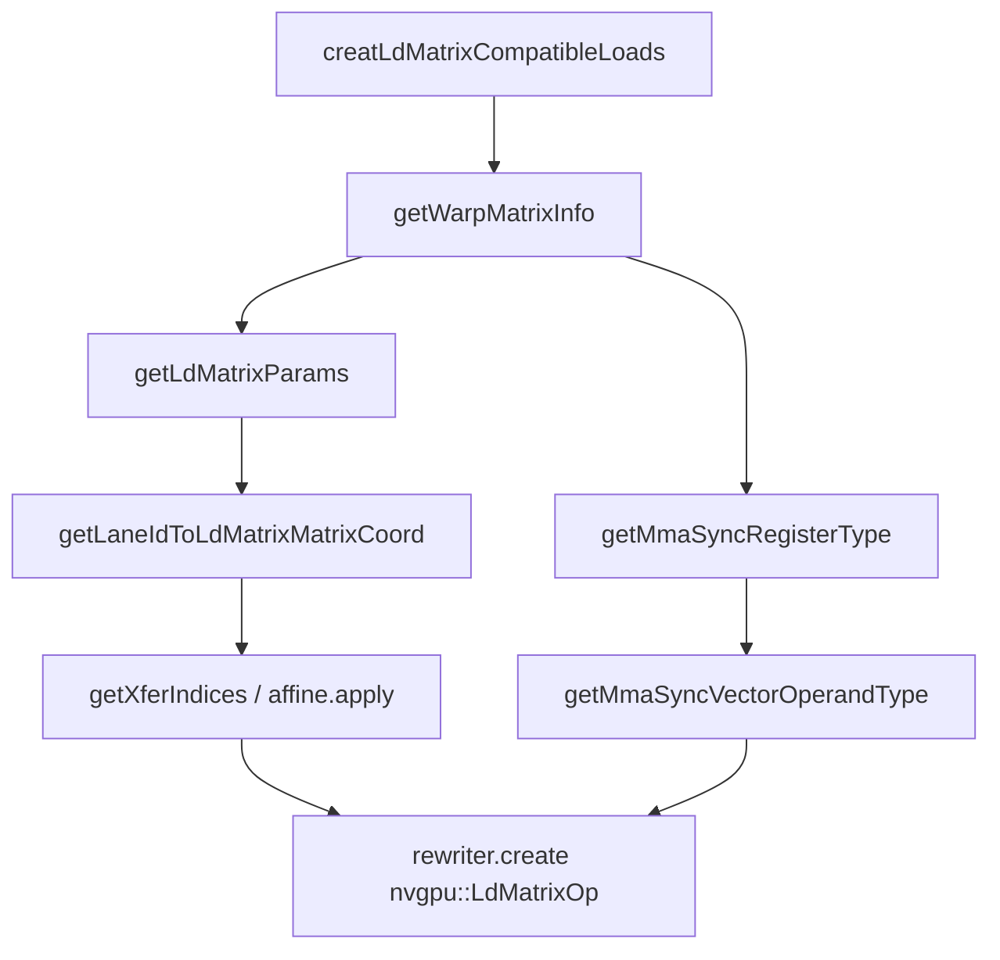

**图 4-9　`creatLdMatrixCompatibleLoads()` 函数调用流程**

原图从该函数主干依次列出 `getWarpMatrixInfo()`（线程束矩阵类型和角色）、`getMmaSyncRegisterType()`（寄存器层级的 `FragmentElementInfo`）、`getLdMatrixParams()`（加载参数）、`getLaneIdToLdMatrixMatrixCoord()`（lane 到二维行地址偏移映射）、`getMmaSyncVectorOperandType()`（线程分片结果类型）、`getXferIndices()`（产生 `affine.apply`）、`rewriter.create<nvgpu::LdMatrixOp>()`（创建加载操作）。其中 `getLaneIdToLdMatrixMatrixCoord()` 下另有 `makeMap()` 子节点，表示其构造仿射映射的局部辅助函数；不是 `getWarpMatrixInfo()` 直接调用其后所有函数。后文按该顺序分析。

##### （1）设置与生成操作相关的数据结构

`getMmaSyncRegisterType()` 根据 `WarpMatrixInfo` 返回 `FragmentElementInfo`，描述单线程矩阵分片的寄存器信息：

在此之前，主函数再次调用 `getWarpMatrixInfo()` 获取操作的线程束级信息，其功能已经在前置条件部分介绍。`FragmentElementInfo` 的四个字段分别表示单个目标寄存器所装数据的 LLVM 兼容类型、每寄存器元素数量、每寄存器位宽，以及单线程为一个矩阵操作数分片持有的寄存器数量；这些信息将在 `getMmaSyncVectorOperandType()` 中用于构造结果类型。

```cpp
struct FragmentElementInfo {
  Type registerLLVMType;
  int64_t elementsPerRegister;
  int64_t registerWidthBits;
  int64_t numRegistersPerFragment;
};
```

对于 A 的 `vector<16x32xi8>`，元素为 8 位整数。一个 32 位寄存器保存四个 i8，因此结构字段为：

```cpp
if (elType.isInteger(8)) {
  return FragmentElementInfo{
      LLVM::getFixedVectorType(IntegerType::get(ctx, 8), 4),
      4, 32, inferNumRegistersPerMatrixFragment(type)};
}
```

| 字段 | A 对应值 |
| --- | --- |
| `registerLLVMType` | `vector<4xi8>` |
| `elementsPerRegister` | 4 |
| `registerWidthBits` | 32 |
| `numRegistersPerFragment` | 4 |

每线程寄存器数量由下式计算：

```cpp
static int64_t inferNumRegistersPerMatrixFragment(
    const WarpMatrixInfo &type) {
  int64_t lineSize = inferTileWidthInBits(type);
  auto shape = type.vectorType.getShape();
  return (shape[0] / kNumRowsPerTile) *
         (shape[1] *
          type.vectorType.getElementType().getIntOrFloatBitWidth()) /
         lineSize;
}
```

对 A，`lineSize=128`、`shape=[16,32]`、`kNumRowsPerTile=8`，所以寄存器数是 `(16/8) × (32×8/128) = 4`。其数值也对应 `ldmatrix.x4` 的 tile 数量。每个线程持有四个 32 位寄存器，每个寄存器含四个 i8。

```text
WarpMatrixInfo:
  vectorType = vector<16x32xi8>
  operandRole = A

FragmentElementInfo:
  registerLLVMType = vector<4xi8>
  registerWidthBits = 32
  elementsPerRegister = 4
  numRegistersPerFragment = 4
```

**图 4-10　A 布局、8×8 分片与相关数据结构的对应关系**

图左为 16 行、32 列、每元素 8 位的 A，横纵各分成两块，每块为 8×16 个 i8，即硬件的 8×8 个 b16。图中把四块分别展开为 r0～r3 的寄存器分布：每块每行 128 位，分为四个 32 位单元；第一行属于 T0、T1、T2、T3，第二行属于 T4～T7，依次至第八行 T28～T31。每个线程从每块取得一个寄存器，所以 T0 的四个着色单元合为右下方的四行四列 i8 分片。右上框是线程束层级的 `WarpMatrixInfo`，右下框是单线程寄存器层级的 `FragmentElementInfo`。这里的寄存器归属与提供行地址的线程不是同一个概念；后者见图 4-11。

随后 `getLdMatrixParams()` 把 `WarpMatrixInfo` 和转置信息组织为 `LdMatrixParams`。该结构包含 `fragmentType`、`isAccum`、`numTiles`、`contiguousDimType` 和 `targetLayout` 等字段，用于后继地址映射和 NVVM 递降。

原书把它称为前两个结构体的“结合”，是指信息用途上的结合，并非 C++ 中内嵌这两个对象。该函数按向量类型和操作数角色设置 `fragmentType`、`targetLayout`、`numTiles`，并按是否转置设置 `contiguousDimType`。对于这里支持的二维投影，若交错映射为 `(d0, d1, …, dn, …, dm, …) -> (dm, dn)` 且 `m > n`，则交换了两个所选维度的顺序，按转置处理。

```cpp
FailureOr<nvgpu::LdMatrixParams>
nvgpu::getLdMatrixParams(const WarpMatrixInfo &type, bool transpose) {
  LdMatrixParams params;
  Type elType = type.vectorType.getElementType();
  params.fragmentType = type.vectorType;
  if (type.operandRole == MatMulOperandRole::A ||
      type.operandRole == MatMulOperandRole::C)
    params.targetLayout = NVVM::MMALayout::row;
  else
    params.targetLayout = NVVM::MMALayout::col;

  ArrayRef<int64_t> shape = type.vectorType.getShape();
  params.contiguousDimType =
      transpose ? vector::IteratorType::parallel
                : vector::IteratorType::reduction;
  if (params.contiguousDimType == vector::IteratorType::reduction)
    params.numTiles =
        (shape[0] / kNumRowsPerTile) *
        ((shape[1] * elType.getIntOrFloatBitWidth()) / 128);
  else
    params.numTiles =
        (shape[1] / kNumRowsPerTile) *
        ((shape[0] * elType.getIntOrFloatBitWidth()) / 128);
  if (params.numTiles == 0)
    return failure();
  return params;
}
```

`fragmentType` 等于线程束级向量类型。A/C 默认采用行布局，B 默认采用列布局。`contiguousDimType` 表示内存连续维对应的迭代器类型；未转置时连续维通常是 reduction 维，转置时是 parallel 维。矩阵乘中归约发生在 A、B 的 K 维；对未转置的 A，K 维连续存储，所以连续维是 reduction，M 维则是并行的跨步维。

连续维是相邻元素地址步长为一个元素的维度，跨步维则按布局规定的跨度前进。矩阵乘的 M、N 迭代可以独立产生各个结果，K 迭代对同一结果累加，分别对应 parallel 与 reduction。原书将“存在循环携带依赖”概括为归约，范围过宽：一般递推也有循环携带依赖，却未必是可按归约规则处理的运算。

`numTiles` 表示加载操作数所需的 8×128 位硬件 tile 数。若连续维是 reduction，按原形状计算；若是 parallel，则按转置后的方向计算。结果为 0 表明操作数不足一个完整 tile，不能生成 `nvgpu.ldmatrix`。

##### （2）构造线程 ID 到矩阵地址偏移的映射

使用 `ldmatrix` 加载矩阵时，8×8 分片每一行的元素在共享内存中连续存储，不同行的起始地址不同。指令需要各线程提供相应行的共享内存地址。`x1`、`x2`、`x4` 分别由 T0～T7、T0～T15、T0～T31 提供行地址。因此，需要建立 lane ID 到分片行地址二维偏移的映射。

矩阵具有连续维和跨步维，每个行地址可表示为这两个维度上的坐标。`getLaneIdToLdMatrixMatrixCoord()` 根据 `LdMatrixParams` 构造 `AffineMap`，把一维 lane ID 映射为二维坐标：

```cpp
FailureOr<AffineMap> nvgpu::getLaneIdToLdMatrixMatrixCoord(
    OpBuilder &builder, Location loc, const LdMatrixParams &params) {
  const int bitsPerElement = static_cast<int>(
      params.fragmentType.getElementType().getIntOrFloatBitWidth());
  const int kElementsPer128b = 128 / bitsPerElement;
  ArrayRef<int64_t> operandShape = params.fragmentType.getShape();
  AffineExpr d0 = getAffineDimExpr(0, builder.getContext());
  auto makeMap = [&](ArrayRef<AffineExpr> dimExprs) -> AffineMap {
    return AffineMap::get(1, 0, dimExprs, builder.getContext());
  };

  int idx = params.contiguousDimType ==
                    vector::IteratorType::reduction
                ? 0
                : 1;
  AffineExpr strided = d0 % operandShape[idx];
  AffineExpr contiguous =
      d0.floorDiv(operandShape[idx]) * kElementsPer128b;

  if (params.contiguousDimType == vector::IteratorType::reduction)
    return makeMap({strided, contiguous});
  if (params.contiguousDimType == vector::IteratorType::parallel)
    return makeMap({contiguous, strided});
  return failure();
}
```

`bitsPerElement` 是矩阵元素位宽，`kElementsPer128b` 是每条 128 位分片行包含的元素数，`operandShape` 是矩阵形状。对 `vector<16x32xi8>` 的 A，这三个值分别是 8、16 和 `[16,32]`。

`makeMap()` 使用前文介绍的 `AffineMap::get()`，建立一维输入、零个符号、二维输出的映射；输出表达式由 `dimExprs` 提供，分别是连续维和跨步维坐标，并按是否转置排列。`contiguous`、`strided` 都是 `AffineExpr` 对象。该类型支持加、减、合法的乘法、`floorDiv`、`ceilDiv` 和取模等仿射表达式组合；`getAffineDimExpr()`、`getAffineSymbolExpr()` 分别构造维度与符号表达式。

```cpp
AffineExpr getAffineDimExpr(unsigned position, MLIRContext *context);
```

其中 `position` 是维度序号，`context` 是上下文。传入 0 得到 `d0`，传入 1 得到 `d1`；本例的 `d0` 随后绑定 lane ID。

`getAffineDimExpr(0, context)` 创建维度表达式 `d0`，后续绑定 lane ID。若未转置，跨步维是形状第 0 维；若转置，跨步维是第 1 维。跨步维表达式 `d0 mod operandShape[idx]` 使线程 ID 落在跨步维范围内；连续维表达式 `floorDiv(d0, operandShape[idx]) × kElementsPer128b` 先确定线程组，再得到该组应跳过的连续元素数。同组线程依次指向不同的行，不同组则跳过一个 128 位行段，从而覆盖不同的连续维区域。

对 A，映射为：

```text
(lane) -> (lane mod 16, (lane floordiv 16) * 16)
```

因此 lane 0～15 对应连续偏移 0 的 16 行，lane 16～31 对应连续偏移 16 的另外 16 行。代表性坐标如下：

| lane | `(strided, contiguous)` |
| ---: | ---: |
| 0 | `(0,0)` |
| 1 | `(1,0)` |
| 15 | `(15,0)` |
| 16 | `(0,16)` |
| 17 | `(1,16)` |
| 31 | `(15,16)` |

**图 4-11　线程 ID 到 `(strided, contiguous)` 坐标的映射**

原图四个分片按左上 1、左下 2、右上 3、右下 4 编号。分片 1 的八行分别由 T0～T7 提供 `(0,0)`～`(7,0)`；分片 2 由 T8～T15 提供 `(8,0)`～`(15,0)`；分片 3 由 T16～T23 提供 `(0,16)`～`(7,16)`；分片 4 由 T24～T31 提供 `(8,16)`～`(15,16)`。每块展开后的寄存器归属仍是第一行 T0～T3、第二行 T4～T7、直到第八行 T28～T31，每行合计 128 位。左侧箭头表示行地址提供者，格内线程标签表示加载结果持有者。

这些坐标是各 lane 提供给线程束级 `ldmatrix` 的行起始地址，而不是单个线程最终获得的全部元素。硬件执行协同加载后，再按指令规定把返回寄存器分发给各 lane。

根据 `FragmentElementInfo`，`getMmaSyncVectorOperandType()` 得到每个线程持有的向量操作数类型：

```cpp
static VectorType getMmaSyncVectorOperandType(
    const nvgpu::FragmentElementInfo &regInfo) {
  SmallVector<int64_t> shape{
      regInfo.numRegistersPerFragment,
      regInfo.elementsPerRegister};
  Type elType = regInfo.registerLLVMType;
  if (auto vecType = dyn_cast<VectorType>(elType))
    elType = vecType.getElementType();
  return VectorType::get(shape, elType);
}
```

对 A，四个寄存器、每个四个 i8，得到 `vector<4x4xi8>`。这就是新 `nvgpu.ldmatrix` 的结果类型。

```text
单线程：r0, r1, r2, r3
每个寄存器：vector<4xi8>
组合结果：vector<4x4xi8>
```

**图 4-12　线程持有的数据分片**

图右分别画出四个 tile 中的寄存器 r0、r1、r2、r3，每个 tile 展示前两行 T0～T3 和 T4～T7，其余行用省略号表示；每行宽 128 位，每格 32 位。四个 T0 单元着色，并各用虚线连到图左 `vector<4x4xi8>` 的一行。左图每格 8 位，四列组成一个寄存器，四行构成 T0 的完整操作数。其他线程同理：当操作数超过一个硬件 tile 时，单线程所持目的寄存器也超过一个；本例恰为四个，每个含 `32/8=4` 个元素。

##### （3）应用线程 ID 到矩阵地址偏移的映射

`creatLdMatrixCompatibleLoads()` 调用 `getXferIndices()`，把上述一维 lane 到二维偏移的映射与 transfer read 原始起始索引结合，并生成 `affine.apply` 操作。结果保存在 `indices` 中：

```cpp
template <typename TransferOpType>
static void getXferIndices(
    RewriterBase &rewriter, TransferOpType xferOp,
    AffineMap offsetMap, ArrayRef<Value> dimValues,
    SmallVector<Value, 4> &indices) {
  indices.append(xferOp.getIndices().begin(),
                 xferOp.getIndices().end());
  Location loc = xferOp.getLoc();
  unsigned offsetsIdx = 0;
  for (AffineExpr expr : xferOp.getPermutationMap().getResults()) {
    if (auto dim = dyn_cast<AffineDimExpr>(expr)) {
      Value prevIdx = indices[dim.getPosition()];
      SmallVector<OpFoldResult, 3> dims(
          dimValues.begin(), dimValues.end());
      dims.push_back(prevIdx);
      AffineExpr d0 =
          rewriter.getAffineDimExpr(offsetMap.getNumDims());
      indices[dim.getPosition()] =
          affine::makeComposedAffineApply(
              rewriter, loc,
              d0 + offsetMap.getResult(offsetsIdx++), dims);
      continue;
    }
  }
}
```

函数先复制原 transfer 的位置索引。例如 A 的初值是 `[%c0,%c0]`。随后遍历 permutation map 结果，把参与传输的源维度索引替换为“原起点 + lane 偏移”。`affine::makeComposedAffineApply()` 会组合已有仿射表达式并规范化维度和符号，因此打印结果可能把 lane 输入表示为符号：

参数 `offsetMap` 的实参就是前面生成的 `offsets`，`dimValues` 在此装入 `gpu.lane_id` 的结果 `laneId`；后面的非 `ldmatrix` 加载还会传入逻辑值 ID。循环遍历 transfer 的交错映射结果；A 的恒等映射有 `d0`、`d1` 两个结果，分别取出对应源维度的原索引 `prevIdx`。将其追加到 `dims` 后，新的维度表达式代表原索引，再与当前偏移相加。注意循环实际遍历的是 permutation map 的结果，并非无条件遍历 `offsetMap`；本例二者的结果数相同。

```mlir
#map0 = affine_map<()[s0] -> (s0 mod 16)>
#map1 = affine_map<()[s0] -> ((s0 floordiv 16) * 16)>
%0 = gpu.lane_id
%1 = affine.apply #map0()[%0]
%2 = affine.apply #map1()[%0]
```

`affine.apply` 把仿射映射应用于 index 类型 SSA 值，并生成一个 index 结果。每个操作的 map 只有一个结果，因此二维坐标由两个 `affine.apply` 共同产生。`%1` 是跨步维索引，`%2` 是连续维索引。

每个操作提供的维度、符号操作数数量必须分别等于映射声明的维度、符号数量；上述两个 map 都是零维度、一个符号。`composeAffineMapAndOperands()` 在组合和规范化过程中可将符合要求的维度操作数提升为符号，所以这里原来的 `d0` 打印成 `s0`，绑定 `%0`。原起点为零，经折叠后无需额外输入。原书所说映射“必须是一维”，准确含义是只有一个**结果**，不是只能有一个输入。`indices[0]` 和 `indices[1]` 分别保存以下操作的结果：

```mlir
%1 = affine.apply affine_map<()[s0] -> (s0 mod 16)>()[%0]
%2 = affine.apply affine_map<()[s0] -> ((s0 floordiv 16) * 16)>()[%0]
```

##### （4）生成 `nvgpu.ldmatrix`

获得结果类型、源 memref、位置索引、转置标志和 tile 数后，重写器通过 `OpBuilder::create<nvgpu::LdMatrixOp>()` 创建操作。`OpBuilder::create()` 形成 `OperationState`，调用 `LdMatrixOp::build()` 添加操作数、属性和结果类型，再在当前插入点建立操作。默认 builder 由 ODS 根据操作定义的 `arguments` 和 `results` 生成。

`NVGPU.td` 中声明的 `srcMemref`、`indices`、`transpose`、`numTiles` 等参数，分别来自原 transfer read 或上述辅助函数。`RewriterBase` 继承自 `OpBuilder`，因而重写器的 `create<OpTy>()` 使用基类的操作创建接口。原书摘录如下（省略部分仍以省略号表示）：

```cpp
template <typename OpTy, typename... Args>
OpTy create(Location location, Args &&...args) {
  OperationState state(/* ... */,
      getCheckRegisteredInfo<OpTy>(location.getContext()));
  OpTy::build(*this, state, std::forward<Args>(args)...);
  auto *op = create(state);
  auto result = dyn_cast<OpTy>(op);
  return result;
}
```

`OpBuilder` 是创建操作及组织其操作数、属性等信息的工具类。模板参数 `OpTy` 决定操作种类；此处指定 `nvgpu::LdMatrixOp`，于是 `OpTy::build()` 对应 `LdMatrixOp::build()`，即操作的构建器方法。上面的摘录不是可直接编译的完整函数，`OperationState` 的省略参数包括位置信息。

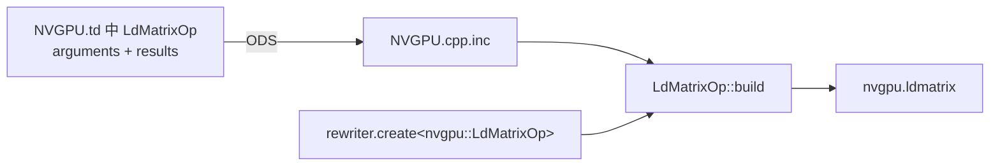

**图 4-13　`nvgpu.ldmatrix` 定义字段与默认 builder 的关系**

原图右侧外框是 `ConvertVectorToGPU` pass，内部调用顺序为 `runOnOperation()` → `OpBuilder::create<OpTy>()` → `LdMatrixOp::build()`；下方另列生成文件 `NVGPU.cpp.inc` 中的 `void LdMatrixOp::build(...)`。左侧 `NVGPU.td` 的 `arguments & results` 通过标为 ODS 的虚线指向生成函数，表示操作定义字段与默认构建器参数的对应关系。

最终为 A 生成的主要操作如下：

```mlir
#map0 = affine_map<()[s0] -> (s0 mod 16)>
#map1 = affine_map<()[s0] -> ((s0 floordiv 16) * 16)>
%0 = gpu.lane_id
%1 = affine.apply #map0()[%0]
%2 = affine.apply #map1()[%0]
%3 = nvgpu.ldmatrix %arg0[%1, %2]
    {numTiles = 4 : i32, transpose = false} :
    memref<128x128xi8, #gpu.address_space<workgroup>>
    -> vector<4x4xi8>
```

该操作使用 `%1`、`%2` 作为位置索引，从 `%arg0` 加载四个 8×8×16 位硬件 tile；每个线程得到 `vector<4x4xi8>` 分片。原 `%A` 到新 `%3` 的对应关系记录在 `valueMapping` 中。

> 校正：原书此处的 `#map1` 末尾多出 `+ 1`，与此前 `[%c0,%c0]` 起点及地址推导不一致，以上去掉该项；如果原始读取起点确为 1，则应在原 transfer 中明确给出，不能只在转换结果里改变地址。

#### 4. `vector.transfer_read` 到非 `nvgpu.ldmatrix` 操作的转换

当 transfer read 不满足 `ldmatrix` 前置条件时，可以转换为 `vector.load + vector.insert` 的向量化加载，或者 `memref.load + vector.insert` 的逐元素加载。该过程由 `createNonLdMatrixLoads()` 实现，测试中的 B 和 C 都属于这种情况。本小节以 C 为例说明未转置矩阵的向量化加载。

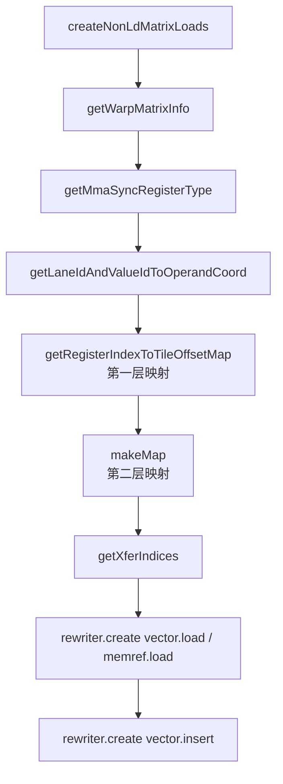

**图 4-14　`createNonLdMatrixLoads()` 函数调用流程**

原图还在 `getMmaSyncRegisterType()` 与双层映射之间列出 `getLdMatrixParams()`，并在最终创建操作之前留有一个无文字的方框。这里保留这一图面信息，但不把空框臆补为另一已确认的调用；以下以实际实现解释。双层映射的两个子节点为 `getRegisterIndexToTileOffsetMap()`（第一层）和 `makeMap()`（第二层），末端是 `rewriter.create<LoadOp>()`、`rewriter.create<InsertOp>()`。这些辅助调用都从主函数展开，并不是图中相邻节点必然互相调用。

C 的源 `%arg2` 不在共享内存，因此不能使用 `ldmatrix`。转换由线程束中的所有线程协同完成。C 的类型是 `vector<16x8xi32>`；每个线程持有两个 64 位寄存器，每个寄存器包含两个 i32。对应结构信息为：

这里沿用源码结构和原书的“64 位寄存器”说法，指 `vector<2xi32>` 这一逻辑寄存器分组，不意味着 NVIDIA 硬件只有一个 64 位通用寄存器承载它。`createNonLdMatrixLoads()` 的多数准备步骤与前面的加载函数相似，例如 `getWarpMatrixInfo()`，原书在此不再重复展开。

| 结构字段 | C 对应值 |
| --- | --- |
| `WarpMatrixInfo::vectorType` | `vector<16x8xi32>` |
| `WarpMatrixInfo::operandRole` | C |
| `registerLLVMType` | `vector<2xi32>` |
| `registerWidthBits` | 64 |
| `elementsPerRegister` | 2 |
| `numRegistersPerFragment` | 2 |
| 每线程结果类型 | `vector<2x2xi32>` |

**图 4-15　加载 C 的线程束数据布局及相关数据结构**

图左 C 为 16×8 个 i32，每行 32 字节，分为上下两个 8×256 位 tile。两个展开的 tile 分别标 r0、r1，每行四个 64 位单元，按 T0～T3、T4～T7、……、T28～T31 排列。T0 在两块中的单元着色，分别连接右下的两行两列分片；右上框给出 `vectorType=16x8xi32`、`operandRole=C`，右下框四字段的值即上表。与 A 的每行 128 位分片不同，这里每行是 256 位。

为了加载 C，每个线程要执行两组 `vector.load + vector.insert`，每组读取 `vector<2xi32>`，合并成 `vector<2x2xi32>`。循环次数由 `numRegistersPerFragment=2` 决定。

该每线程向量类型同样由 `getMmaSyncVectorOperandType()` 得到，用于创建结果 `result`。`createNonLdMatrixLoads()` 以 `vectorType` 的第 0 维，即 `regInfo.numRegistersPerFragment`，作为生成这些加载、插入组合的循环次数；内层向量类型就是 `registerLLVMType`。

如果 permutation map 是 minor identity，即矩阵未转置，可以用向量化 `vector.load`；如果不是 minor identity，即需要转置，则按元素使用 `memref.load`。为了进行未转置矩阵的向量化加载，首先需要得到每个线程负责的数据元素在矩阵中的位置。

`getLaneIdAndValueIdToOperandCoord()` 构造 `(laneId, logicalValueId)` 到二维矩阵偏移的映射。logical value 表示一个线程负责加载的数据元素，logical value ID 是该元素在同一线程所持数据中的编号。对 C，每线程持有四个 i32，因此 logical value ID 为 0、1、2、3：编号 0/1 属于第一个 64 位寄存器，2/3 属于第二个寄存器。

```text
线程 T0 持有的 C 分片：
  register 0 -> logicalValueId 0, 1
  register 1 -> logicalValueId 2, 3
```

**图 4-16　数据元素的逻辑值 ID**

图中延续 C 的上下两个 tile 和所有 T0～T31 单元，将上部 T0 的两个 32 位元素标为 0、1，下部 T0 的两个元素标为 2、3，再用虚线连到右侧 `[[0,1],[2,3]]` 小表。这里 ID 是**同一线程内部的数据元素编号**，不是线程号，也不是整个矩阵的线性编号；沿用 logical value ID 一词是为了与代码变量命名一致。

该函数构造双层映射。第一层由 `getRegisterIndexToTileOffsetMap()` 把 logical value ID 映射到数据所属 tile 在矩阵中的起点 `(tileRow,tileCol)`；第二层再结合 lane ID，把它映射为数据元素在矩阵中的精确偏移 `(offsetX,offsetY)`。

```mermaid
flowchart TB
  V[logicalValueId] --> F[getRegisterIndexToTileOffsetMap]
  F --> T[(tileRow, tileCol)<br/>分片级偏移]
  L[(laneId, logicalValueId)] --> S[第二层 makeMap]
  T --> S
  S --> O[(offsetX, offsetY)<br/>元素级偏移]
```

**图 4-17　双层映射结构**

图顶输入为 `(laneId, logicalValueId)`，其中逻辑值 ID 先进入第一层，输出上下两块的 `(0,0)`、`(8,0)`；lane ID 则直接沿另一条箭头送入第二层。第二层把两部分结合，图右以 T0 的 `(0,0)`、T4 的 `(1,0)` 为例表示元素级位置。`offsetX`、`offsetY` 是原书为说明方便采用的名称，源码中并没有同名变量；`tileRow`、`tileCol` 则确是源码表达式，并成为最终偏移表达式的一部分。前者定位到元素，后者只定位到 tile。

##### （1）`logicalValueId -> (tileRow, tileCol)` 映射

第一层映射先由 logical value ID 计算寄存器编号，再计算该寄存器对应 tile 的行列编号。公式为：

```text
registerIdx = logicalValueId floordiv elementsPerRegister

tileRow =
  (registerIdx mod num8x128bTiles[0]) * 8

tileCol =
  (registerIdx floordiv num8x128bTiles[0]) * elementsPerLine
```

**图 4-18　`tileRow` 和 `tileCol` 计算公式**

`getTileShape()` 计算加载给定操作数所需的 `8×[128|256|512]` 位逻辑 tile 数，结果保存在 `num8x128bTiles`。C 的形状为 `16×8xi32`，需要两个 `8×256` 位 tile，按 2×1 排列，所以 tile 行数为 2、列数为 1。若 C 是 `16×16xi32`，则需要四个 tile，按 2×2 排列。

因此不能从变量名 `num8x128bTiles` 推断所有 tile 都是 8×128 位。`getTileShape()` 的计算思路与前文 `inferNumRegistersPerMatrixFragment()` 相近。对当前 C，数组的两项为 2、1；扩展为 16×16xi32 后，两项均为 2。

图 4-18 中，`logicalValueId / elementsPerRegister` 上方括号标“寄存器 ID”，即 `registerIdx`。每逻辑寄存器装两个 i32，故 `elementsPerRegister=64/32=2`。对寄存器 ID 取模 tile 行数，得到“分片行 ID”，再乘每块的 8 行得到 `tileRow`；对寄存器 ID 整除 tile 行数，得到“分片列 ID”，再乘单个 tile 的每行元素数量 `elementsPerLine` 得到 `tileCol`。这里除法均是非负索引的整数除法，结果是矩阵元素坐标而不是字节地址。

对当前 C，`elementsPerRegister=2`、`elementsPerLine=8`，第一层映射化为：

```text
(d0, d1) -> (
  ((d1 floordiv 2) mod 2) * 8,
  ((d1 floordiv 2) floordiv 2) * 8)
```

其中 `d0` 预留给 lane ID，但第一层尚未使用；`d1` 绑定 logical value ID。编号 0/1 映射到上部 tile `(0,0)`，编号 2/3 映射到下部 tile `(8,0)`。如果矩阵是 `16×16xi32`，编号还会映射到 `(0,8)`、`(8,8)` 两个右侧 tile。

| C 形状 | tile 排列 | tile 起点 |
| --- | --- | --- |
| `16×8xi32` | 2×1 | `(0,0)`、`(8,0)` |
| `16×16xi32` | 2×2 | `(0,0)`、`(8,0)`、`(0,8)`、`(8,8)` |

**图 4-19　逻辑值 ID 到 tile 二维偏移的映射**

图中每个灰色小格为一个 32 位元素。左图上部的逻辑值 0、1 对应寄存器 ID 0、分片行 ID 0，下部的 2、3 对应寄存器 ID 1、分片行 ID 1，两者分片列 ID 都是 0。右图左上、左下沿用这两组编号；右上逻辑值 4、5 对应寄存器 ID 2、分片行 ID 0、分片列 ID 1，右下逻辑值 6、7 对应寄存器 ID 3、分片行 ID 1、分片列 ID 1。对应起点依次为 `(0,0)`、`(8,0)`、`(0,8)`、`(8,8)`，两列之间相隔 `elementsPerLine=8` 个元素。

第一层映射只能确定元素属于哪个 tile，定位精度到 tile 为止。

##### （2）`(laneId, logicalValueId) -> (offsetX, offsetY)` 映射

第二层在 `tileRow`、`tileCol` 上叠加线程在 tile 内的坐标。当前实现中每个逻辑 tile 行由四个线程覆盖：

```text
offsetX = tileRow + laneId floordiv kThreadsPerRow

offsetY = tileCol
        + (laneId mod kThreadsPerRow) * elementsPerRegister
        + (logicalValueId mod elementsPerRegister)
```

其中 `kThreadsPerRow=4`。第一项得到线程所在行，第二项得到线程负责的连续列段，最后一项在逐元素加载时表示寄存器内部元素偏移。

把第一层表达式完整代入后，原书给出的通用公式为：

```text
offsetX = ((logicalValueId / elementsPerRegister) % num8x128bTiles[0]) * 8
        + laneId / kThreadsPerRow
offsetY = ((logicalValueId / elementsPerRegister) / num8x128bTiles[0])
          * elementsPerLine
        + (laneId % kThreadsPerRow) * elementsPerRegister
        + logicalValueId % elementsPerRegister
```

其中行内线程偏移与 tile 起点相加，才能从分片内位置得到矩阵内位置。对 C，`elementsPerLine=8`、`elementsPerRegister=2`；向量化加载每次传入一组元素的首个逻辑值 ID 0 或 2，故最后一项为零，而逐元素加载时该项区分寄存器内的元素。

把 C 的 `tileRow`、`tileCol` 公式代入，可得：

```text
(d0, d1) -> (
  ((d1 floordiv 2) mod 2) * 8 + d0 floordiv 4,
  ((d1 floordiv 2) floordiv 2) * 8
    + (d0 mod 4) * 2 + d1 mod 2)
```

`d0` 绑定 lane ID，`d1` 绑定 logical value ID。对 `16×8xi32`，上部 tile 的 T0、T1、T4、T31 首元素坐标分别是 `(0,0)`、`(0,2)`、`(1,0)`、`(7,6)`；下部 tile 则在行坐标上增加 8：

| lane | 上部 tile 首元素 | 下部 tile 首元素 |
| ---: | ---: | ---: |
| T0 | `(0,0)` | `(8,0)` |
| T1 | `(0,2)` | `(8,2)` |
| T4 | `(1,0)` | `(9,0)` |
| T31 | `(7,6)` | `(15,6)` |

**图 4-20　线程加载数据的二维偏移**

原图的完整上部布局可按下表读取；下部保持同一线程排列，将每格行坐标加 8，列坐标不变。每格覆盖连续两个 i32，宽 64 位；每行四格，总宽 256 位。

| 行 | 第 0 组 | 第 1 组 | 第 2 组 | 第 3 组 |
| --- | --- | --- | --- | --- |
| 0 | T0 `(0,0)` | T1 `(0,2)` | T2 `(0,4)` | T3 `(0,6)` |
| 1 | T4 `(1,0)` | T5 `(1,2)` | T6 `(1,4)` | T7 `(1,6)` |
| 2 | T8 `(2,0)` | T9 `(2,2)` | T10 `(2,4)` | T11 `(2,6)` |
| 3 | T12 `(3,0)` | T13 `(3,2)` | T14 `(3,4)` | T15 `(3,6)` |
| 4 | T16 `(4,0)` | T17 `(4,2)` | T18 `(4,4)` | T19 `(4,6)` |
| 5 | T20 `(5,0)` | T21 `(5,2)` | T22 `(5,4)` | T23 `(5,6)` |
| 6 | T24 `(6,0)` | T25 `(6,2)` | T26 `(6,4)` | T27 `(6,6)` |
| 7 | T28 `(7,0)` | T29 `(7,2)` | T30 `(7,4)` | T31 `(7,6)` |

例如下部 T0 为 `(8,0)`，T4 为 `(9,0)`，T31 为 `(15,6)`。原图把两块展开布局标为“上部线程束”“下部线程束”，容易误解：这是**同一线程束**对两个 tile 的数据分配，不是两个不同线程束。

每次向量化 load 从首元素连续读取两个 i32。32 个线程 × 2 次 load × 每次 2 个元素，正好覆盖 C 的 `16×8=128` 个元素。

##### （3）生成 `vector.load + vector.insert` 操作组合

得到 `(offsetX,offsetY)` 映射后，`getXferIndices()` 把这些偏移叠加到 transfer read 的原始起始位置 `(49,40)` 上，并通过 `makeComposedAffineApply()` 规范化仿射表达式，生成 `vector.load` 的位置索引。

这里的映射对象在函数中称为 `coords`，生成的位置索引保存为 `newIndices`。矩阵 C 是更大的源 `%arg2 : memref<128x128xi32>` 中的一块，因此不能仅使用 C 内部偏移而遗漏原始起点。循环两次调用 `getXferIndices()`，每次为一个 `vector<2xi32>` 生成地址，共装入每线程 `2×2xi32` 的数据。原书这里再次称“从共享内存加载”，与本节开头和测试类型不一致；本例 `%arg2` 并非 workgroup 地址空间，应理解为从源 memref 加载。

对 C，每个线程执行两次向量加载。生成的主要操作序列如下：

```mlir
#map12 = affine_map<()[s0] -> (s0 floordiv 4 + 49)>
#map13 = affine_map<()[s0] ->
    (s0 * 2 - (s0 floordiv 4) * 8 + 40)>
#map14 = affine_map<()[s0] -> (s0 floordiv 4 + 57)>

%40 = gpu.lane_id
%41 = vector.splat %c0_i32 : vector<2x2xi32>
%42 = affine.apply #map12()[%40]
%43 = affine.apply #map13()[%40]
%44 = vector.load %arg2[%42, %43] :
    memref<128x128xi32>, vector<2xi32>
%45 = vector.insert %44, %41 [0] :
    vector<2xi32> into vector<2x2xi32>
%46 = affine.apply #map14()[%40]
%47 = affine.apply #map13()[%40]
%48 = vector.load %arg2[%46, %47] :
    memref<128x128xi32>, vector<2xi32>
%49 = vector.insert %48, %45 [1] :
    vector<2xi32> into vector<2x2xi32>
```

前两个 `affine.apply` 生成上部 tile 的索引 `%42`、`%43`，后两个生成下部 tile 的索引 `%46`、`%47`。两个 `vector.load` 分别读取 `vector<2xi32>`，再由 `vector.insert` 插入外层位置 0 和 1，组成每线程持有的 `vector<2x2xi32>` 分片 `%49`。该值随后成为 `nvgpu.mma.sync` 的 C 操作数。

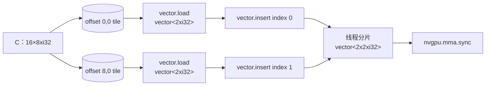

**图 4-21　`vector.load + vector.insert` 加载 C**

图左在 C 的 `(0,0)`、`(8,0)` tile 起点处突出 T0 所需的两个 i32，源位置分别标 `(%42,%43)`、`(%46,%47)`；两条 `vector.load` 箭头产生 `%44 : 2xi32`、`%48 : 2xi32`。两个 `vector.insert` 将它们放入 `%49 : 2x2xi32` 的上下两行，右侧箭头把 `%49` 交给 `nvgpu.mma.sync`。第一次插入的中间结果 `%45` 也是第二次插入的目的向量，因而两次插入是依次累积，不是两个独立结果自动合并。

转置的 B 使用相同的双层坐标映射思想，但由于 i8 转置不能使用 `ldmatrix.trans`，转换按元素生成多组 `memref.load`，并用 `vector.insert` 组合成每线程 `vector<2x4xi8>` 分片。图 4-22 表示这一过程。

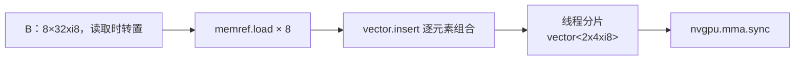

**图 4-22　`memref.load + vector.insert` 加载 B**

图左 B 为 8×32 个 i8；八条 `memref.load` 箭头分别产生标量 `%9`、`%13`、`%17`、`%21`、`%25`、`%29`、`%33`、`%37`，各宽 8 位。右侧通过八次 `vector.insert` 组成两行四列的 `%38 : vector<2x4xi8>`，再交给 `nvgpu.mma.sync`。原图标题误写 `vector.load + vector.insert`，与图内 `memref.load` 及前文逐元素加载说明不符，标题已校正。原书因篇幅没有继续展开转置加载源码，可结合未转置加载的双层映射理解。

### 4.3.4　`vector.contract` 操作的转换过程

`vector.contract` 沿缩并维度（contracting dimension）对两个输入向量执行缩并，计算中间结果后与累加器操作数结合，并返回结果向量。缩并是两个向量按元素相乘、再把结果累加的过程，广泛用于矩阵和向量运算。其语法可概括为：

```mlir
%result = vector.contract {
    indexing_maps = [#lhs_map, #rhs_map, #acc_map],
    iterator_types = [/* parallel 或 reduction */],
    kind = #vector.kind<add>}
    %lhs, %rhs, %acc : vector<...>, vector<...> into vector<...>
```

`%lhs`、`%rhs`、`%acc` 分别是左输入、右输入和累加器。`indexing_maps` 为每个操作数指定一个索引映射，用来描述统一循环迭代空间中的点如何映射到相应操作数的数据索引。`iterator_types` 为各循环维度指定 `parallel` 或 `reduction` 类型，列表长度等于统一迭代空间的维数。可选属性 `kind` 指定乘积中间结果与累加器的组合操作，可以是加、乘、最小值、最大值等，默认是加法。

显式写出迭代器类型可以表达仅靠低层索引属性难以恢复的信息，这些信息会被后续分析和转换使用。`indexing_maps`、`iterator_types` 并非 `vector.contract` 独有，`linalg.generic` 等结构化操作也使用类似设计。

先看一个一维缩并示例：

```mlir
%acc = arith.constant 0.0 : f32
%ones = arith.constant dense<1.0> : vector<8xf32>
%result = vector.contract {
    indexing_maps = [
      affine_map<(i) -> (i)>,
      affine_map<(i) -> (i)>,
      affine_map<(i) -> ()>],
    iterator_types = ["reduction"]}
    %v, %ones, %acc : vector<8xf32>, vector<8xf32> into f32
```

其等效循环为：

```text
for i = 0 .. 8
  acc += v[i] * ones[i]
```

三个仿射映射依次对应 `%v`、`%ones` 和标量 `%acc`。映射定义域表示统一迭代空间，值域表示相应操作数的数据索引。输入向量是一维，因此其值域各有一个表达式 `i`；累加器是标量，值域为空 `()`。如果把 `%v` 的访问改为 `v[i+2]`，对应映射也要改为 `(i) -> (i+2)`。

> 校正：最后一句只能作为一般仿射访问关系的说明，不能直接作为合法 `vector.contract` 改写。仓库 `mlir/lib/Dialect/Vector/IR/VectorOps.cpp` 的 `ContractionOp::verify()` 要求索引映射为 projected permutation，`i+2` 不满足；若需偏移，应先提取相应子向量并处理边界。原书示例中的输入 SSA 名为 `%0`，这里的 `%v` 表示同一外部输入。

以 `affine_map<(i,j,k) -> (i,k)>` 为例，箭头左边的维度声明对应完整循环迭代点，右边的表达式把该点映射到某个操作数的数据空间。严格说 `(i,j,k)` 和 `(i,k)` 是输入变量与输出表达式列表，而定义域、值域是其对应的点集。计算访问每个张量维度都需要一个索引，因此映射结果数应等于所对应操作数的秩；标量则没有索引。迭代器列表逐项对应循环层级，显式表明归约或并行；有依赖不一定就是归约，这里是因为计算确实将乘积累积到同一个结果。

该操作只有一个循环维度，`iterator_types` 只有 `reduction`。不同迭代的乘积都累加到同一个标量 `%acc`，所以循环之间存在归约依赖。

由于 `%ones` 的所有元素都是 1，这一 contraction 的数值结果和加法规约相同：

```mlir
%result = vector.reduction <add>, %v : vector<8xf32> into f32
```

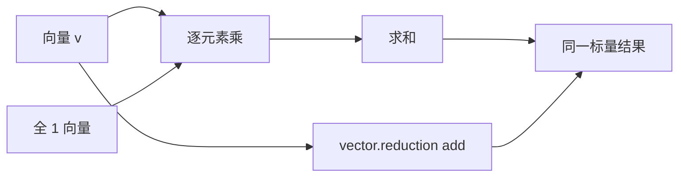

**图 4-23　缩并操作与归约操作的等效关系**

原图左侧八格向量的八条箭头汇入加法节点，输出标量；右侧全 1 的八格“向量 1”各经一个乘法节点与“向量 2”的对应元素相乘，再把八个乘积汇入加法节点输出标量。这说明加法规约是缩并的特例。等价还要求本例的零初始累加器和加法组合；不能把“某个输入全为 1”单独作为任意 contraction 与 reduction 等价的充分条件。浮点情况下还应遵循实际归约顺序和允许的重结合规则。

两者的表示能力并不相同：`vector.contract` 显式携带两个输入、累加器、索引映射和迭代器类型，可以表达矩阵乘、批量矩阵乘及更一般的缩并；`vector.reduction` 只对单个向量按 combining kind 做归约。

#### 1. 维度类型分类

与 reduction 和 parallel 迭代器对应，缩并相关分析把维度分为缩并维度、批量维度（batch dimension）和自由维度（free dimension）。

- 缩并维度对应 reduction 迭代器，存在于左、右输入中，但不出现在累加器和结果中；它是计算乘积之和的维度。左、右输入的缩并维必须对齐且大小相等。例如 `A[M,K] × B[K,N] -> D[M,N]` 中 K 是缩并维。`ContractionOp::getContractingDimMap()` 可以取得相应维度映射。
- 批量维度对应 parallel 迭代器，同时出现在左输入、右输入和输出中。左右输入沿该维协同迭代，这应反映在索引映射中。`ContractionOp::getBatchDimMap()` 可以取得批量维映射。
- 自由维度也对应 parallel 迭代器。它由左或右输入的一侧访问并保留在结果中，但不同时由左右输入访问；左右两侧的自由维彼此独立，不做协同迭代。

以下二维矩阵缩并通过一个 K 维完成：

```mlir
#contraction_accesses = [
  affine_map<(i, j, k) -> (i, k)>,
  affine_map<(i, j, k) -> (k, j)>,
  affine_map<(i, j, k) -> (i, j)>
]
#contraction_trait = {
  indexing_maps = #contraction_accesses,
  iterator_types = ["parallel", "parallel", "reduction"]
}
%3 = vector.contract #contraction_trait %0, %1, %2
    : vector<4x3xf32>, vector<3x7xf32> into vector<4x7xf32>
```

等效循环为：

```text
for i = 0 .. 4
  for j = 0 .. 7
    for k = 0 .. 3
      result[i,j] += lhs[i,k] * rhs[k,j]
```

三个映射的定义域都是统一迭代点 `(i,j,k)`，值域分别是 lhs 的 `(i,k)`、rhs 的 `(k,j)` 和 acc/result 的 `(i,j)`。定义域包含操作表示的所有循环迭代器；值域表达式数量必须与相应操作数的 rank 相等。三个映射依次对应 `%0`、`%1`、`%2`，所以第一项表示 `%0[i,k]`，第二项表示 `%1[k,j]`，第三项表示累加器 `%2[i,j]`。这是一例普通矩阵乘，与前面为 MMA 准备的转置 B 布局不要混淆。

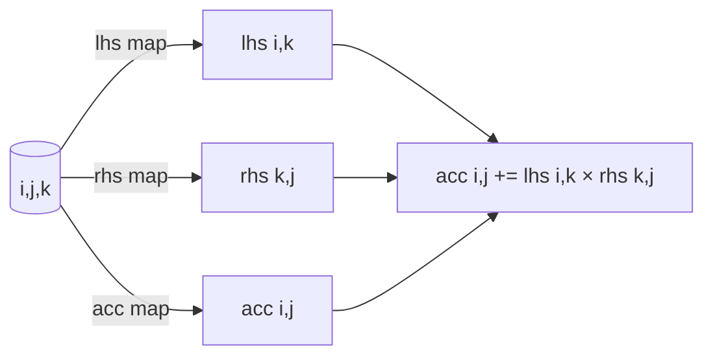

**图 4-24　计算表达式与仿射映射的对应关系**

原图上方为 `%2[i,j] += %0[i,k] * %1[k,j]`，分别框出三个访问及索引。虚线箭头将三项连接到下方对应的 `(i,j,k)->(i,j)`、`(i,j,k)->(i,k)`、`(i,j,k)->(k,j)`，特别标出访问索引与映射结果表达式的一一对应关系。

`iterator_types` 与定义域维度一一对应：i、j 是 parallel，k 是 reduction。因此 k 是缩并维；它出现在 lhs、rhs 中而不出现在结果中。i 只由 lhs 和结果访问，j 只由 rhs 和结果访问，所以 i、j 是两侧自由维；本例没有同时出现在 lhs、rhs、结果中的非缩并维，因此没有批量维。

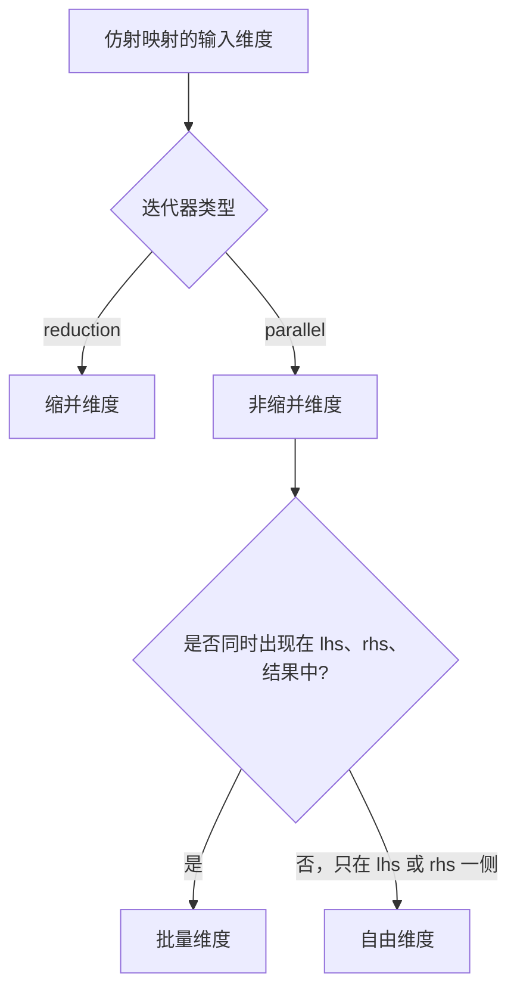

**图 4-25　维度类型分类过程**

分析时可以先根据 reduction 迭代器确定缩并维，其余都是 parallel 对应的非缩并维；再从非缩并维中找出同时存在于左右输入和输出中的批量维，最后把只属于一侧并保留到结果的维度归类为自由维。

从另一个角度看，索引映射和迭代器类型共同指定哪些维度被归约、哪些被保留。标记为 reduction 的缩并维不会出现在输出中；标记为 parallel 的批量维和自由维保留在输出中。维度分类有助于编译器针对不同维度选择循环优化和并行策略，例如在批量维分发计算、在自由维并行化、在缩并维选择并行归约算法。

#### 2. `nvgpu.mma.sync` 的自定义构造器方法

`convertVectorToNVVMCompatibleMMASync()` 发现 `vector.contract` 后，调用 `convertContractOpToMmaSync()` 将其转换为 `nvgpu.mma.sync`。NVGPU 的 ODS 定义如下：

```tablegen
def NVGPU_MmaSyncOp : NVGPU_MmaSyncOp<"mma.sync"> {
  let arguments = (ins AnyVector:$matrixA,
                       AnyVector:$matrixB,
                       AnyVector:$matrixC,
                       I64ArrayAttr:$mmaShape,
                       OptionalAttr<UnitAttr>:$tf32Enabled);
  let results = (outs AnyVector:$res);
  let builders = [
    OpBuilder<(ins "Value":$matrixA, "Value":$matrixB,
                   "Value":$matrixC, "ArrayAttr":$mmaShape)>,
    OpBuilder<(ins "Value":$matrixA, "Value":$matrixB,
                   "Value":$matrixC,
                   "ArrayRef<int64_t>":$mmaShape,
                   CArg<"bool", "false">:$tf32Enabled)>
  ];
}
```

与前述 `nvgpu.ldmatrix` 不同，这里显式指定了 `builders`。默认 builder 通常足以构造操作；需要增减参数或执行额外预处理时，可以通过 `builders` 添加自定义重载。每个 `OpBuilder` 的 `ins` 后列出 C++ 参数类型和名称，也可以嵌入短小的构造代码；较长实现通常放在 C++ 文件中。

第一个自定义 builder 接受 `ArrayAttr`，其实现如下：

```cpp
void MmaSyncOp::build(OpBuilder &builder, OperationState &state,
                      Value matrixA, Value matrixB, Value matrixC,
                      ArrayAttr mmaShape) {
  build(builder, state, matrixC.getType(),
        matrixA, matrixB, matrixC, mmaShape, UnitAttr());
}
```

该重载除 `builder`、`state` 外的参数与 `builders` 中第一个条目对应，而不是简单与 `arguments`、`results` 全部字段一一对应。例如它没有显式 `tf32Enabled` 参数，并自动以 `matrixC.getType()` 作为结果类型，再调用通用 builder。另一个重载接受 `ArrayRef<int64_t>` 和布尔 `tf32Enabled`，内部构造 i64 数组属性和可选 `UnitAttr`。

开发者可继续添加适合不同使用场景的 `OpBuilder` 条目；`ins` 后各参数用逗号分隔，类型写为字符串，名字前带 `$`。此处自定义实现主体只转调默认 builder，也可加入额外处理，或完全自行填充状态而不调用默认 builder；后文 4.4.3 节 `nvvm.mma.sync` 的 `MmaOp::build()` 就是后一种情况。

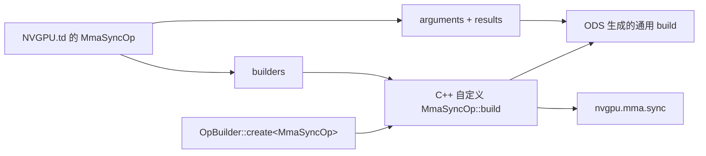

**图 4-26　`nvgpu.mma.sync` 定义字段与构造器的关系**

原图与图 4-13 对照：左侧 `NVGPU.td` 除 `arguments & results` 外增加 `builders`；右侧 `ConvertVectorToGPU` 框内仍是 `runOnOperation()` → `OpBuilder::create<OpTy>()` → `MmaSyncOp::build()`。下方分别列出 `NVGPU.cpp.inc` 中生成的默认 `build()` 和 `NVGPUDialect.cpp` 中实现的自定义 `build()`；两条 ODS 虚线表示字段与构建器签名的对应。自定义实现正文由开发者编写，不能把这条虚线理解为 ODS 自动生成了整个 C++ 实现。

#### 3. `vector.contract` 到 `nvgpu.mma.sync` 的转换

前述各种 transfer read 的转换结果已经保存在 `valueMapping`。`convertContractOpToMmaSync()` 构造 `nvgpu.mma.sync` 时，只需以 `vector.contract` 的 lhs、rhs、acc 为键，取出相应线程分片作为新操作输入。取得 MMA 形状后，通过 `OpBuilder::create()` 创建操作：

```cpp
static LogicalResult convertContractOpToMmaSync(
    RewriterBase &rewriter, vector::ContractionOp op,
    llvm::DenseMap<Value, Value> &valueMapping) {
  auto itA = valueMapping.find(op.getLhs());
  auto itB = valueMapping.find(op.getRhs());
  auto itC = valueMapping.find(op.getAcc());
  if (itA == valueMapping.end() ||
      itB == valueMapping.end() ||
      itC == valueMapping.end())
    return rewriter.notifyMatchFailure(op, "no mapping");

  Value opA = itA->second;
  Value opB = itB->second;
  Value opC = itC->second;
  int64_t m =
      cast<VectorType>(op.getLhs().getType()).getShape()[0];
  int64_t n =
      cast<VectorType>(op.getRhs().getType()).getShape()[0];
  int64_t k =
      cast<VectorType>(op.getLhs().getType()).getShape()[1];

  Value matmul = rewriter.create<nvgpu::MmaSyncOp>(
      op.getLoc(), opA, opB, opC,
      rewriter.getI64ArrayAttr({m, n, k}));
  valueMapping[op.getResult()] = matmul;
  return success();
}
```

测试用例最终生成的核心操作为：

```mlir
%51 = nvgpu.mma.sync (%3, %38, %49)
    {mmaShape = [16, 8, 32]} :
    (vector<4x4xi8>, vector<2x4xi8>, vector<2x2xi32>)
    -> vector<2x2xi32>
```

`%3` 是 A 的 `nvgpu.ldmatrix` 结果；`%38` 是由 `memref.load + vector.insert` 生成的 B 分片；`%49` 是由 `vector.load + vector.insert` 生成的 C 分片。MMA 的 m、n、k 分别从原 lhs、rhs 形状得到：A 是 `16×32`，B 的外层表示是 `8×32`，所以 `mmaShape=[16,8,32]`。

新结果写入 `valueMapping[op.getResult()]`，即保存 `%D -> %51`。后继 transfer write 可以用原 `%D` 为键取得线程级 MMA 结果。如果 A/B/C 的任一值没有对应映射，函数通过 `notifyMatchFailure(op,"no mapping")` 返回失败。这说明转换必须覆盖闭合的矩阵数据流，而不能只转换孤立 contraction。

### 4.3.5　`vector.transfer_write` 操作的转换过程

`vector.contract` 得到 D 后，需要通过 `vector.transfer_write` 将它写入内存。`ConvertVectorToGPU` 检测到 transfer write 后调用 `convertTransferWriteToStores()`，把它转换为 `vector.extract + vector.store`，完成结果向全局内存的写入。

`vector.transfer_write` 把源向量写入目标 memref 或 tensor 的数据分片，数据分片的基本元素类型与源向量相同。其语法为：

```mlir
vector.transfer_write %source, %dest[%indices]
    {permutation_map = #permutation,
     in_bounds = [/* ... */]} : vector<...>, memref<...>
```

参数和属性的含义与 `vector.transfer_read` 类似，但 transfer write 不支持广播维。其具体递降方式取决于硬件；本节介绍当前 NVGPU MMA 路径生成 `vector.extract + vector.store` 的方法，自定义 GPU 后端也可以把它映射为专用 intrinsic。

测试用例中的操作是：

```mlir
vector.transfer_write %D, %arg2[%c49, %c40]
    {in_bounds = [true, true]} :
    vector<16x8xi32>, memref<128x128xi32>
```

它把 `vector<16x8xi32>` 的 D 写入 `%arg2`，起点为 `(49,40)`。

`convertTransferWriteToStores()` 的核心实现如下：

```cpp
static LogicalResult convertTransferWriteToStores(
    RewriterBase &rewriter, vector::TransferWriteOp op,
    llvm::DenseMap<Value, Value> &valueMapping) {
  auto it = valueMapping.find(op.getVector());
  if (it == valueMapping.end())
    return rewriter.notifyMatchFailure(op, "no mapping");
  Value matrix = it->second;

  FailureOr<nvgpu::WarpMatrixInfo> warpMatrixInfo =
      nvgpu::getWarpMatrixInfo(op);
  FailureOr<nvgpu::FragmentElementInfo> regInfo =
      nvgpu::getMmaSyncRegisterType(*warpMatrixInfo);
  VectorType vectorType = getMmaSyncVectorOperandType(*regInfo);

  ImplicitLocOpBuilder b(op.getLoc(), rewriter);
  Value laneId = b.create<gpu::LaneIdOp>();
  for (unsigned i = 0; i < vectorType.getShape()[0]; ++i) {
    Value logicalValueId = b.create<arith::ConstantOp>(
        b.getIndexType(),
        b.getIndexAttr(i * regInfo->elementsPerRegister));
    FailureOr<AffineMap> coords =
        nvgpu::getLaneIdAndValueIdToOperandCoord(
            op.getLoc(), b, *warpMatrixInfo);
    Value el = b.create<vector::ExtractOp>(
        matrix, ArrayRef<int64_t>{i});
    SmallVector<Value, 4> newIndices;
    getXferIndices<vector::TransferWriteOp>(
        b, op, *coords, {laneId, logicalValueId}, newIndices);
    b.create<vector::StoreOp>(el, op.getSource(), newIndices);
  }
  op->erase();
  return success();
}
```

4.3.4 节中，`convertContractOpToMmaSync()` 已把 `%D` 对应的新结果保存在 `valueMapping`。这里以原 `%D` 为键取得 `%51`，作为 `vector.extract` 的输入。随后调用的 `getWarpMatrixInfo()`、`getMmaSyncRegisterType()` 和 `getMmaSyncVectorOperandType()` 与读取过程相同。

其主要流程也与 `createNonLdMatrixLoads()` 相似：`getLaneIdAndValueIdToOperandCoord()` 构造 `(laneId,logicalValueId)` 到 D 中 `(offsetX,offsetY)` 的双层映射；`getXferIndices()` 再叠加 transfer write 的起始索引，得到 `vector.store` 在 `%arg2` 中的位置。区别是数据方向相反：读取时是 `vector.load + vector.insert`，写回时是 `vector.extract + vector.store`。

D 的形状是 `16×8xi32`，同样分为上下两个 8×256 位 tile。第一层和第二层映射分别是：

```text
(d0,d1) -> (
  ((d1 floordiv 2) mod 2) * 8,
  ((d1 floordiv 2) floordiv 2) * 8)

(d0,d1) -> (
  ((d1 floordiv 2) mod 2) * 8 + d0 floordiv 4,
  ((d1 floordiv 2) floordiv 2) * 8
    + (d0 mod 4) * 2 + d1 mod 2)
```

每个线程把 `vector<2x2xi32>` 分两次写入，每次提取并保存一个 `vector<2xi32>`。主要操作序列如下：

```mlir
#map12 = affine_map<()[s0] -> (s0 floordiv 4 + 49)>
#map13 = affine_map<()[s0] ->
    (s0 * 2 - (s0 floordiv 4) * 8 + 40)>
#map14 = affine_map<()[s0] -> (s0 floordiv 4 + 57)>

%53 = gpu.lane_id
%54 = vector.extract %51[0] : vector<2x2xi32>
%55 = affine.apply #map12()[%53]
%56 = affine.apply #map13()[%53]
vector.store %54, %arg2[%55, %56] :
    memref<128x128xi32>, vector<2xi32>

%57 = vector.extract %51[1] : vector<2x2xi32>
%58 = affine.apply #map14()[%53]
%59 = affine.apply #map13()[%53]
vector.store %57, %arg2[%58, %59] :
    memref<128x128xi32>, vector<2xi32>
```

`%55,%56` 和 `%58,%59` 分别是上下两个 tile 的写入索引。两个 `vector.extract` 从 `%51` 的外层位置 0 和 1 取得 `vector<2xi32>`，再写入 `%arg2` 的对应位置。

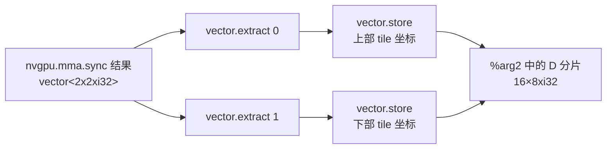

**图 4-27　`vector.extract + vector.store` 写入数据的过程**

图右 `nvgpu.mma.sync` 产生 `%51 : 2x2xi32`，两条提取箭头得到 `%54 : 2xi32`、`%57 : 2xi32`。再用两条 `vector.store` 箭头写入左侧大框 `%arg2 : 128x128xi32` 内的 D 子块（16×8xi32），分别对应上部 `(0,0)` 和下部 `(8,0)` tile；加上原起点后的实际索引是 `(%55,%56)` 和 `(%58,%59)`。每个着色小格 32 位，两格组成一次写入。该过程使用的 `#map12`、`#map13`、`#map14` 与加载 C 完全相同。

对比图 4-27 和图 4-21 可以看到，D 的写回过程与 C 的加载过程互为逆向：一个把全局矩阵分片聚合为线程寄存器分片，另一个把线程寄存器分片散布回全局矩阵。本例写入 memref 的 `vector.transfer_write` 不返回 SSA 结果，所以不需要在 `valueMapping` 中增加映射；新 store 全部创建后，可以删除原 transfer write。原书此段把 transfer read 的“加载”和 transfer write 的“写入”写反，已按操作语义校正；“不返回结果”也仅适用于 memref 形式，tensor 形式会返回更新后的 tensor。

以上介绍了 `vector.transfer_read`、`vector.contract`、`vector.transfer_write` 三类主要操作的转换。`ConvertVectorToGPU` 还处理常量、循环、yield、切片以及其他 Vector/GPU MMA 操作，篇幅所限不再逐一分析。

## 4.4 NVGPU 方言到 NVVM 方言的转换

MLIR 中从 NVGPU 方言到 NVVM 方言的转换，目的是将高级 GPU 操作桥接到更接近 GPU 机器指令的 NVVM IR。这种转换可以更直接、高效地将操作映射到硬件上，从而促进优化，并利用特定的 NVIDIA GPU 硬件功能和指令。这是生成 GPU 可执行优化代码的重要步骤。

MLIR 中的 NVVM 方言专门用于表示 NVIDIA GPU 指令，并与 LLVM IR 紧密结合。但是，NVVM 方言在通用 LLVM 方言之外，还包含适用于 NVIDIA GPU 的其他细节和扩展。换言之，虽然 MLIR 中的 NVVM 和 LLVM 方言都代表低级中间表示，但 NVVM 方言包含标准 LLVM 方言中不存在的 NVIDIA GPU 特定优化和功能，而 LLVM 方言更加通用，可以应用于 NVIDIA GPU 之外更广泛的架构。

### 4.4.1 `ConvertNVGPUToNVVM` pass 的定义与实现

`ConvertNVGPUToNVVM` pass 的作用是将 MLIR 中的 NVGPU 方言操作转换为 NVVM 方言操作。`ConvertNVGPUToNVVM` pass 定义如下：

```tablegen
def ConvertNVGPUToNVVMPass : Pass<"convert-nvgpu-to-nvvm"> {
  let summary = "Convert NVGPU dialect to NVVM dialect";
  let description = [{
    This pass converts supported NVGPU ops to NVVM dialect intrinsics.
  }];

  let dependentDialects = [
    "NVVM::NVVMDialect",
  ];
}
```

其中，`ConvertNVGPUToNVVM` pass 的模板参数为 `convert-nvgpu-to-nvvm`，因此 `mlir-opt` 工具驱动执行该 pass 时的命令行参数为 `--convert-nvgpu-to-nvvm`。例如，用 `mlir-opt` 编译 NVGPU 方言到 NVVM 方言转换的测试用例，可执行如下命令：

```bash
mlir-opt --convert-nvgpu-to-nvvm --split-input-file xxx.mlir
```

`ConvertNVGPUToNVVM` pass 的转换目标是 NVVM 方言，因此此处指定的相关方言 `dependentDialects` 字段包含 `NVVM::NVVMDialect`。

`ConvertNVGPUToNVVM` pass 的构造函数为 `mlir::createConvertNVGPUToNVVMPass()`，构造函数在注册 MLIR pass 时被调用，其函数调用流程与 `ConvertVectorToGPU` pass 的构造函数类似。与 `.td` 文件中 `ConvertNVGPUToNVVM` 定义对应的 `ConvertNVGPUToNVVMPass` 结构定义代码见 3.1.2 节。3.1.2 节以 `ConvertNVGPUToNVVM` pass 为例，介绍了方言转换驱动的组成要素及其功能。

`ConvertNVGPUToNVVM` pass 的 `runOnOperation()` 函数是实现 NVGPU 方言到 NVVM 方言操作转换的入口。其中定义的 `RewritePatternSet` 实例 `patterns` 重写模式集合中，包含 `MmaSyncOptoNVVM`、`MmaLdMatrixOpToNVVM` 等在 NVGPU 方言操作递降过程中用到的各种模式。`populateNVGPUToNVVMConversionPatterns()` 函数实现了向重写模式集合中添加模式的功能。其中的核心模式包括：

```cpp
void mlir::populateNVGPUToNVVMConversionPatterns(
    LLVMTypeConverter &converter, RewritePatternSet &patterns) {
  patterns.add<
    MmaSyncOptoNVVM,
    MmaLdMatrixOpToNVVM,
    NVGPUAsyncCopyLowering,
    NVGPUAsyncCreateGroupLowering,
    NVGPUAsyncWaitLowering>(converter);
  // 原书省略了其他模式。
}
```

> **校订说明：** 上述列表保留原书用于讲解的核心模式。当前仓库中的实际列表已扩展，还包含 mbarrier、TMA、warpgroup MMA 和稀疏 MMA 等转换模式。

`ConvertVectorToGPU` pass 的 `runOnOperation()` 主要进行操作重写，而 `ConvertNVGPUToNVVM` pass 还涉及将 MLIR 类型转换为 LLVM 类型。因此，`runOnOperation()` 函数中还定义了 `LLVMTypeConverter` 实例 `converter`，其作用是在转换过程中将当前操作使用的 MLIR 类型转换为 LLVM 类型，以便继续生成 LLVM IR。有关类型转换的详细论述见 3.2 节。

为了充分理解 `ConvertNVGPUToNVVM` pass 的功能，本节使用 `nvgpu.ldmatrix` 和 `nvgpu.mma.sync` 的测试用例辅助分析 pass 的执行过程，并结合其中的操作实例，分析各操作的转换代码实现。

原书给出的两个文件名为 `nvgpuldmatrix-to-nvvmldmatrix.mlir` 和 `nvgpumma-to-nvvmmma.mlir`。

> **校订说明：** 原书使用的两个测试文件名在当前仓库中已不存在；相关测试现集中在 `mlir/test/Conversion/NVGPUToNVVM/nvgpu-to-nvvm.mlir` 中。下文仍保留原书选取的两个操作实例。

将 NVGPU 操作转换为 NVVM 操作的过程，涉及数据在不同内存类型（例如从共享内存到寄存器）和不同表示层级（例如从 MLIR 到 LLVM IR 或 NVVM IR）之间的转换，特别是 MLIR 内建数据类型到 LLVM 方言数据类型的结构化和重组。MLIR 内建数据类型与 LLVM 方言数据类型的关系和转换方法请见 3.2.1 节。

这里“从共享内存到寄存器”指生成的加载指令在运行时的数据流；编译器执行 pass 本身是在改写 IR 和类型，不是在编译时实际搬运 GPU 数据。NVVM 方言 IR 也仍是 MLIR，随后才翻译为 LLVM IR。

为了完成不同方言间的操作转换和类型转换，`matchAndRewrite()` 函数的功能可分为四部分：操作生成前的输入操作数计算与类型转换、生成操作、生成操作后的结果操作数计算与类型转换、操作替换。图 4-28 是 NVGPU 操作到 NVVM 操作的转换过程示意图。

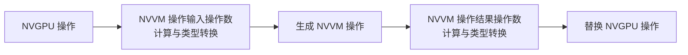

**图 4-28　NVGPU 操作到 NVVM 操作的转换过程**

以下介绍的 `nvgpu.ldmatrix` 操作和 `nvgpu.mma.sync` 操作的转换过程，都遵循图 4-28 所示的类型处理流程。

### 4.4.2 `nvgpu.ldmatrix` 操作的转换过程

测试用例中的 `nvgpu.ldmatrix` 操作与 4.3.3 节中最后生成的 `nvgpu.ldmatrix` 操作相同，只是操作数 `%arg0` 的二维索引都简化为常数 0 和 10，即操作从 `%arg0` 的第 0 行、第 10 列元素开始加载数据，每个线程持有的数据片段大小为 $4\times4\times8$ 位。测试用例代码如下：

```mlir
func.func @ldmatrix_x4(
    %arg0: memref<128x128xi8, 3>) -> vector<4x4xi8> {
  %c0 = arith.constant 0 : index
  %c10 = arith.constant 10 : index
  %a = nvgpu.ldmatrix %arg0[%c0, %c10]
      {transpose = false, numTiles = 4 : i32} :
      memref<128x128xi8, 3> -> vector<4x4xi8>
  return %a : vector<4x4xi8>
}
```

`nvgpu.ldmatrix` 操作到 `nvvm.ldmatrix` 操作的转换由重写模式 `MmaLdMatrixOpToNVVM` 完成。针对上述测试用例，`MmaLdMatrixOpToNVVM::matchAndRewrite()` 函数的代码实现如下：

> 运行边界：以上是编译转换测试，不是完整可运行内核。原书的列索引 10 为了演示地址计算而保留；对于本例 b16 的 8×8 tile，每行地址须按 16 字节自然对齐，若 i8 缓冲区基址已按 16 字节对齐，偏移 10 字节就不满足要求。此外，实际矩阵加载需要正确的逐 lane 行地址，不能用所有 lane 的常量相同索引替代前面推导的映射。参见 [NVIDIA PTX ISA 的 ldmatrix 说明](https://docs.nvidia.com/cuda/archive/11.1.1/parallel-thread-execution/index.html#warp-level-matrix-instructions-ldmatrix)。

```cpp
LogicalResult
matchAndRewrite(nvgpu::LdMatrixOp op, OpAdaptor adaptor,
                ConversionPatternRewriter &rewriter) const override {
  MLIRContext *ctx = getContext();
  ImplicitLocOpBuilder b(op.getLoc(), rewriter);

  auto vectorResultType =
      dyn_cast<VectorType>(op->getResultTypes()[0]);
  if (!vectorResultType)
    return failure();

  Type innerVectorType = LLVM::getFixedVectorType(
      vectorResultType.getElementType(),
      vectorResultType.getDimSize(1));
  int64_t num32BitRegs = vectorResultType.getDimSize(0);

  Type ldMatrixResultType;
  if (num32BitRegs > 1) {
    ldMatrixResultType = LLVM::LLVMStructType::getLiteral(
        ctx, SmallVector<Type>(num32BitRegs,
                               rewriter.getI32Type()));
  } else {
    ldMatrixResultType = rewriter.getI32Type();
  }

  auto srcMemrefType =
      cast<MemRefType>(op.getSrcMemref().getType());
  Value srcPtr = getStridedElementPtr(
      b.getLoc(), srcMemrefType, adaptor.getSrcMemref(),
      adaptor.getIndices(), rewriter);

  Value ldMatrixResult = b.create<NVVM::LdMatrixOp>(
      ldMatrixResultType, srcPtr,
      /*num=*/op.getNumTiles(),
      /*layout=*/op.getTranspose() ? NVVM::MMALayout::col
                                   : NVVM::MMALayout::row);

  Type finalResultType =
      typeConverter->convertType(vectorResultType);
  Value result = b.create<LLVM::UndefOp>(finalResultType);
  for (int64_t i = 0, e = vectorResultType.getDimSize(0);
       i < e; ++i) {
    Value i32Register = num32BitRegs > 1
        ? b.create<LLVM::ExtractValueOp>(ldMatrixResult, i)
        : ldMatrixResult;
    Value casted =
        b.create<LLVM::BitcastOp>(innerVectorType, i32Register);
    result =
        b.create<LLVM::InsertValueOp>(result, casted, i);
  }

  rewriter.replaceOp(op, result);
  return success();
}
```

根据图 4-28 对 NVGPU 操作到 NVVM 操作转换过程的总结，以下内容分为 `nvvm.ldmatrix` 输入操作数计算与类型转换、生成 `nvvm.ldmatrix` 操作，以及 `nvvm.ldmatrix` 结果操作数计算与类型转换三个小节，分析 `MmaLdMatrixOpToNVVM::matchAndRewrite()` 函数的功能。

#### 1. `nvvm.ldmatrix` 输入操作数计算与类型转换

`MmaLdMatrixOpToNVVM::matchAndRewrite()` 函数的第一部分功能，是为生成 `nvvm.ldmatrix` 操作准备必要的输入操作数。`nvvm.ldmatrix` 操作定义见 2.4.2 节，该节以此操作为例，介绍了 `llvmBuilder` 字段在 LLVM IR 翻译过程中的作用。

由 `nvvm.ldmatrix` 操作定义可知，生成该操作前需要提供操作结果 `res`、地址指针 `ptr`、矩阵数量 `num` 和布局 `layout` 四项内容。矩阵数量和布局的获取较为简单，只需分别调用 `op.getNumTiles()` 和 `op.getTranspose()` 接口，从 `nvgpu.ldmatrix` 操作的对应属性 `numTiles` 和 `transpose` 中获得即可。操作结果和地址指针的获取较为复杂，涉及 MLIR 数据类型到 LLVM 数据类型的转换，以符合 NVVM 方言对操作的要求。

对比 `nvvm.ldmatrix` 和 `nvgpu.ldmatrix` 的操作定义可以看到，`nvvm.ldmatrix` 的结果类型约束为 `AnyType`，而 `nvgpu.ldmatrix` 的结果类型约束为 `AnyVector`；`nvvm.ldmatrix` 的源地址指针操作数 `ptr` 的类型约束为 `LLVM_AnyPointer`，而 `nvgpu.ldmatrix` 的源操作数 `srcMemref` 的类型约束为 `AnyMemRef`。二者的 arguments 和 results 操作数类型约束明显不同。因此，`matchAndRewrite()` 函数的主要实现逻辑是完成 `nvgpu.ldmatrix` 操作数类型到 `nvvm.ldmatrix` 操作数类型的转换，并在此基础上构造 `nvvm.ldmatrix` 的操作结果和地址指针操作数。

##### （1）结果操作数的计算和类型转换

在获取当前 MLIR 上下文和操作位置信息后，`matchAndRewrite()` 函数通过 `nvgpu.ldmatrix` 操作实例 `op` 调用 `getResultTypes()` 接口。该接口返回在前述 `vector.transfer_read` 操作到 `nvgpu.ldmatrix` 操作的转换过程中，由 `getMmaSyncVectorOperandType()` 函数生成的结果类型范围。为了获得 `nvgpu.ldmatrix` 的结果类型 `vectorResultType`，取结果类型范围的第 0 个元素：

```cpp
auto vectorResultType =
    dyn_cast<VectorType>(op->getResultTypes()[0]);
```

`vectorResultType` 通常应该是向量类型。如果不是，则说明存在操作定义或模式匹配错误。由测试用例代码可知，本例中的 `vectorResultType` 为 `vector<4x4xi8>`。

然后，从 `vectorResultType` 中获取元素类型和第 1 维大小，并以这两个参数调用 `getFixedVectorType()` 函数，获得内部向量类型 `innerVectorType`。本例中的操作结果元素类型为 `i8`，第 1 维大小为 4，由此得到 `innerVectorType` 为 `vector<4xi8>`。由前述图 4-10 可知，`innerVectorType` 表示 32 位寄存器保存的数据类型。

再由 `vectorResultType` 的第 0 维大小，可以得到保存操作结果需要的 32 位寄存器数量 `num32BitRegs`。本例中 `num32BitRegs` 的值为 4。

根据 `num32BitRegs` 的值，通过调用 `LLVMStructType::getLiteral()` 或 `Builder::getI32Type()`，可以创建合适的 `nvvm.ldmatrix` 操作结果类型 `ldMatrixResultType`。如果 `num32BitRegs` 等于 1，则使用一个 `i32` 类型表示操作结果；如果 `num32BitRegs` 大于 1，则将操作结果封装为 `LLVMStructType` 对象，其中每个字段对应一个 32 位寄存器。本例的 `num32BitRegs` 为 4，因此：

```mlir
!llvm.struct<(i32, i32, i32, i32)>
```

由前述图 4-10 可知，这实际上是执行 `nvvm.ldmatrix` 的每个线程所持有数据片段对应的数据结构。

`ldMatrixResultType` 可能是 `LLVMStructType`，也可能是 `i32`，这取决于 `num32BitRegs` 的值。因此，出于灵活性考虑，`nvvm.ldmatrix` 操作定义中指定结果 `res` 的类型约束为 `AnyType`。但在使用 `OpBuilder` 创建操作时，仍需要明确指定返回值类型，以便 `OpBuilder` 正确生成操作。

`AnyType` 只是 ODS 此字段的宽泛约束，不代表硬件指令或后续翻译接受任意结果类型；仍须满足具体操作的验证和 intrinsic 签名要求。此处是在创建操作前准备**结果类型**，不是要求先提供尚未产生的结果 SSA 值。

MLIR 中定义的 `LLVMStructType` 类对应 LLVM 中的 `StructType` 类。`LLVMStructType` 可表示内存中任意类型元素的集合，分为命名结构（named structs）和字面量结构（literal structs）两种。

在 LLVM 或 MLIR 上下文中，命名结构由其名称唯一表示，如 `foo` 或 `%12`。在调用 `LLVMStructType::getIdentified()` 接口创建命名结构时，可以不提供元素类型列表。字面量结构则由其包含的类型列表唯一表示，如 `(i32, i32)`。调用 `LLVMStructType::getLiteral()` 接口创建字面量结构时，必须提供元素类型列表作为其主体，且字面量结构的类型在构造后不能改变。

原书另举 `[2 x {i32, i32}]`，这是包含两个结构体的数组，不是结构体自身的语法。MLIR 对应写法是 `!llvm.array<2 x struct<(i32, i32)>>`。结构类型描述聚合布局，但一个结构类型 SSA 值不意味着实际分配了一块内存；本例用于表示多个寄存器结果。字面量结构的标识还区分是否 packed，不能只看字段类型列表。

当 `num32BitRegs` 不为 1 时，`ldMatrixResultType` 被指定为 `LLVMStructType`，因为此时的矩阵加载操作会加载多个 32 位寄存器，`nvvm.ldmatrix` 的结果数据类型必须是一个结构类型，以便将多个输出封装到单个 LLVM 方言结构数据中。后续 `llvm.extractvalue` 操作需要从该结构中提取特定值，因此在 LLVM 方言上下文中，`LLVMStructType` 更符合 LLVM 方言操作的要求。

##### （2）计算源地址指针操作数

`nvvm.ldmatrix` 操作的源地址指针 `ptr` 是 LLVM 指针类型 `LLVM_AnyPointer`，指向操作读取的数据在共享内存中的源地址，对应 `ldmatrix` PTX 指令中的地址操作数 `p`。

为了获得 `nvgpu.ldmatrix` 的源操作数类型，`matchAndRewrite()` 调用 `getSrcMemref()` 接口，并将其转换为 `MemRefType`。本例中 `%arg0` 的类型为 `memref<128x128xi8, 3>`，所以 `srcMemrefType` 也是该类型。其中地址空间 3 表示共享内存。

为了计算指向 `%arg0` 中某个位置的源地址指针，`matchAndRewrite()` 调用 `getStridedElementPtr()` 接口，生成 `llvm.mul`、`llvm.add` 和 `llvm.getelementptr` 等 LLVM 方言操作，并根据 `nvgpu.ldmatrix` 操作位置索引 `indices` 给定的索引，以及 `srcMemrefType` 给定的跨步和偏移量，计算源地址指针 `srcPtr`。生成的 LLVM 方言操作序列如下：

```mlir
%0 = builtin.unrealized_conversion_cast %arg0 :
    memref<128x128xi8, 3> to
    !llvm.struct<(!llvm.ptr<3>, !llvm.ptr<3>, i64,
                  !llvm.array<2 x i64>, !llvm.array<2 x i64>)>
%c0 = arith.constant 0 : index
%1 = builtin.unrealized_conversion_cast %c0 : index to i64
%c10 = arith.constant 10 : index
%2 = builtin.unrealized_conversion_cast %c10 : index to i64
%3 = llvm.extractvalue %0[1] :
    !llvm.struct<(!llvm.ptr<3>, !llvm.ptr<3>, i64,
                  !llvm.array<2 x i64>, !llvm.array<2 x i64>)>
%4 = llvm.mlir.constant(128 : index) : i64
%5 = llvm.mul %1, %4 : i64
%6 = llvm.add %5, %2 : i64
%7 = llvm.getelementptr %3[%6] :
    (!llvm.ptr<3>, i64) -> !llvm.ptr<3>, i8
```

其中，`%0` 是 `%arg0` 的 memref 描述符（`MemRefDescriptor`），由类型为 `memref<128x128xi8, 3>` 的 `%arg0` 经过规范化和转换后得到。该描述符是一个具有 5 个字段的 LLVM 结构，依次为：指向数据缓冲区的指针、指向数据有效载荷的对齐指针、表示缓冲区起始位置与通过 memref 访问的第一个元素之间距离的偏移量、记录 memref 各维度大小的数组，以及记录 memref 各维度跨步的数组。此处仅直接用到第二个字段，即指向数据有效载荷的指针。

更精确地说，第三个字段是相对于 **aligned pointer** 的元素偏移，不是相对于 allocated pointer 的字节距离；尺寸、跨步数组长度均等于 memref 的秩。这里的静态连续布局偏移为 0、跨步为 `[128,1]`，所以其余描述信息可由类型得知。`builtin.unrealized_conversion_cast` 表示转换过程中暂存的类型桥接，不是运行时重新分配描述符。原书写作 `builtin.some_conversion_cast`、`index4` 的地方已改为实际操作名和 `index`。

上述序列中的常量索引 `%c0`、`%c10` 分别为常量 0 和 10，`%1`、`%2` 分别是由它们转换得到的 `i64` 类型值。

如果开发者试图访问寄存器中的结构，则需要使用 LLVM IR 指令 `extractvalue` 或 `insertvalue` 进行寄存器读写。上述序列中的 `llvm.extractvalue` 操作会递降为 `extractvalue` 指令，从聚合值中提取结构成员或数组元素，其常量索引指定要提取的值。例如：

```llvm
%result = extractvalue {i32, float} %agg, 0
```

聚合值 `%agg` 在索引 0 处的值为 `i32`，因此返回值 `%result` 也为 `i32`。

上述 `llvm.extractvalue` 由 `getStridedElementPtr()` 中的 `MemRefDescriptor` 接口生成，目的是从 memref 描述符 `%0` 中提取对齐后的指针 `%3`。指针 `%3` 为 memref 描述符中的第二个指针字段 `!llvm.ptr<3>`，指向共享内存中的基址，即图 4-29 中的 `base`。

原书进一步列出 `bufferPtr()` → `alignedPtr()` 的接口调用关系。这里“寄存器读写”描述的是 SSA 聚合值的提取、插入，不是直接指定物理寄存器；`extractvalue` 的常量索引选择结构成员，`insertvalue` 则返回插入后新的聚合 SSA 值。

根据 `nvgpu.ldmatrix` 的二维索引参数，`llvm.mul` 和 `llvm.add` 可以计算指定的指针索引，即指针偏移量。`llvm.mul` 将 `%1`（常数 0）与 `%4` 代表的跨步值 128（即 `%arg0` 的行元素数）相乘，得到 `%5 = %c0 × 128`。然后，`llvm.add` 将 `%2` 与 `%5` 相加，得到指针索引 `%6`。该计算可总结为图 4-29。

```text
                         index = %c0 × 128 + %c10
base ---------------------------------------------------->
       (%c0, %c10)

%arg0: 128 列 × 128 行
       行跨步 = 128
```

**图 4-29　`nvvm.ldmatrix` 操作的源地址指针索引计算方法**

原图把 `%arg0` 画为 128×128 的方形：左上角标 `base`，目标点为 `(%c0,%c10)`；先跨过 `%c0` 个完整行（共 `%c0×128` 个元素），再前进 `%c10` 个元素，合计 `index=%c0×128+%c10`。灰色部分示意此前经过的线性元素范围，不是额外内存对象；原图横向标签 `%c1` 应为 `%c10`。

图 4-29 中的坐标 `(%c0, %c10)` 是 `nvgpu.ldmatrix` 操作数 `%arg0` 的二维索引，`index` 为指针索引 `%6`。计算指针索引后，`getStridedElementPtr()` 调用 `rewriter.create<LLVM::GEPOp>()` 生成 `llvm.getelementptr` 操作。该操作对应 LLVM IR 指令 `getelementptr`，可进行指针计算，并通过指针定位数组、结构或其他数据结构中的元素。

如果开发者试图访问内存中的结构，则需要使用 `getelementptr` 获取指向字段的指针，然后使用加载或存储指令进行内存访问。`getelementptr` 只进行地址计算，并不实际访问内存。上述序列中，`llvm.getelementptr` 的基址指针 `%3` 指向共享内存，并使用 `i64` 类型的 `%6` 作为偏移量。`getStridedElementPtr()` 返回的 `srcPtr`（即 `%7`）是将 `%3` 偏移 `%6 × sizeof(i8)` 字节后的新指针。

#### 2. 生成 `nvvm.ldmatrix` 操作

在获得 `nvvm.ldmatrix` 操作所需的 `ldMatrixResultType` 和 `srcPtr` 后，可由 `nvgpu.ldmatrix` 操作实例 `op` 调用 `getNumTiles()` 和 `getTranspose()`，获得 `nvvm.ldmatrix` 的 `num` 和 `layout`。然后调用 `b.create<NVVM::LdMatrixOp>()`，在当前插入点生成 `NVVM::LdMatrixOp` 类型的操作。

`b.create<NVVM::LdMatrixOp>()` 的模板参数是 `NVVM::LdMatrixOp`，因此 `OpBuilder::create()` 实际调用 ODS 生成的构建器方法 `LdMatrixOp::build()`。原书列出的属性对象版本构建器如下：

```cpp
void LdMatrixOp::build(
    ::mlir::OpBuilder &odsBuilder,
    ::mlir::OperationState &odsState,
    ::mlir::Type res,
    ::mlir::Value ptr,
    ::mlir::IntegerAttr num,
    ::mlir::NVVM::MMALayoutAttr layout) {
  odsState.addOperands(ptr);
  odsState.addAttribute(getNumAttrName(odsState.name), num);
  odsState.addAttribute(getLayoutAttrName(odsState.name), layout);
  odsState.addTypes(res);
}
```

除前两个参数外，其余参数在含义上与 `b.create<NVVM::LdMatrixOp>()` 的参数对应。但原书称它们的 C++ 类型直接匹配并不准确：前面传入的是整数 `num` 和枚举 `MMALayout`，而这里接受 `IntegerAttr` 和 `MMALayoutAttr`；实际使用相应的值类型重载来构造属性。其他重载原书未列出。上述是书中版本的属性存储写法，本地生成代码也可能以 properties 保存固有属性。

图 4-30 总结了在 `.td` 文件中定义 `nvvm.ldmatrix` 时，`Arguments`、`Results` 字段和 `llvmBuilder` 字段在生成和实现 `LdMatrixOp::build()`，以及实现方言翻译接口类时的作用。

```mermaid
flowchart TB
  TD[`nvvm.ldmatrix` 操作定义<br/>NVVMOps.td]
  AR[Arguments & Results]
  LB[llvmBuilder]
  CR[`ConvertNVGPUToNVVM` pass<br/>matchAndRewrite]
  OB[`OpBuilder::create&lt;OpTy&gt;()`]
  BUILD[`LdMatrixOp::build()`<br/>NVVMOps.cpp.inc]
  INC[NVVMConversions.inc]
  MT[`ModuleTranslation<br/>convertOperation()`]
  IF[方言翻译接口类]

  TD --> AR --> BUILD
  CR --> OB --> BUILD
  TD --> LB --> INC --> IF
  MT --> IF
```

**图 4-30　`nvvm.ldmatrix` 操作定义中各属性和字段的作用**

原图左下还列出 `NVVMConversions.inc` 中的 `auto operands=...; auto intId=...; $res=createIntrinsicCall(...);`，表示翻译最终构造 intrinsic 调用；该代码经方言翻译接口的 `convertOperation()` 被 `ModuleTranslation::convertOperation()` 使用。右侧生成文件名为 `NVVMOps.cpp.inc`。两侧分别是“生成 MLIR 操作”和“将该操作翻译为 LLVM IR”，不应把两个 builder 视为同一阶段。

图 4-30 右侧描述了调用 `LdMatrixOp::build()` 构造 `nvvm.ldmatrix` 操作的流程，以及操作定义中 `Arguments`、`Results` 字段对生成构建器的作用。本例中最终生成的 `nvvm.ldmatrix` 如下：

```mlir
%8 = nvvm.ldmatrix %7
    {layout = #nvvm.mma_layout<row>, num = 4 : i32} :
    (!llvm.ptr<3>) -> !llvm.struct<(i32, i32, i32, i32)>
```

与前述图 4-13 中的 `nvgpu.ldmatrix` 操作定义相比，`nvvm.ldmatrix` 的定义中增加了 `llvmBuilder` 字段，用于构建 LLVM IR。相应地，图 4-30 左侧描述了 `ModuleTranslation::convertOperation()` 的调用过程。从 `llvmBuilder` 字段指向 `NVVMConversions.inc` 的关系表示，TableGen 在生成 `NVVMConversions.inc` 时，会将操作定义中的 `llvmBuilder` 内容复制到处理 `nvvm.ldmatrix` 的对应代码片段。这部分内容已在 2.4.2 节介绍。

#### 3. `nvvm.ldmatrix` 结果操作数计算与类型转换

生成 `nvvm.ldmatrix` 后，还需要得到符合原 `nvgpu.ldmatrix` 结果表示的操作数，才能调用 `rewriter.replaceOp()` 完成替换。本例中 `nvvm.ldmatrix` 的结果类型 `ldMatrixResultType` 为 `!llvm.struct<(i32, i32, i32, i32)>`，结果保存在 `%8` 中。与该操作对应的 `ldmatrix` PTX 指令可表示为：

```ptx
.reg .b64 addr;
.reg .b32 d<4>;
ldmatrix.sync.aligned.m8n8.x4.b16 {d0, d1, d2, d3}, [addr];
```

其中，PTX 指令的内存地址操作数 `addr` 对应 `nvvm.ldmatrix` 的源地址指针 `ptr`，寄存器组 `d` 对应结果 `res`，其大小为 $4\times i32$。

为了确保新生成的 `nvvm.ldmatrix` 结果操作数类型与原 `nvgpu.ldmatrix` 的结果表示一致，`matchAndRewrite()` 通过一系列 `llvm.mlir.undef`、`llvm.extractvalue`、`llvm.bitcast` 和 `llvm.insertvalue` 操作，从 `nvvm.ldmatrix` 的结果中提取元素，并将它们插入 LLVM 数组中。

为了得到返回的 LLVM 数组类型，`matchAndRewrite()` 以 `nvgpu.ldmatrix` 的结果类型 `vectorResultType`（`vector<4x4xi8>`）为参数，调用 `typeConverter->convertType()`，获得 n 维向量转换为 LLVM 数组后的类型：

```mlir
!llvm.array<4 x vector<4xi8>>
```

然后，函数调用 `b.create<LLVM::UndefOp>()`，产生一个该 LLVM 数组类型的未定义值 `result`，用于表示内容尚未指定的操作数。

为了提取 `nvvm.ldmatrix` 结果中的各元素，并将其转换为与原有 `nvgpu.ldmatrix` 结果相对应的类型，`matchAndRewrite()` 根据 `vectorResultType` 的第 0 维大小，多次生成 `llvm.extractvalue`、`llvm.bitcast` 和 `llvm.insertvalue`。本例的第 0 维大小为 4，因此相关操作序列可表示为：

原书在此再次摘出循环，便于与下面生成的操作逐项对照：

```cpp
for (int64_t i = 0, e = vectorResultType.getDimSize(0); i < e; ++i) {
  Value i32Register = num32BitRegs > 1
      ? b.create<LLVM::ExtractValueOp>(ldMatrixResult, i)
      : ldMatrixResult;
  Value casted = b.create<LLVM::BitcastOp>(innerVectorType, i32Register);
  result = b.create<LLVM::InsertValueOp>(result, casted, i);
}
```

```mlir
%9 = llvm.mlir.undef : !llvm.array<4 x vector<4xi8>>

%10 = llvm.extractvalue %8[0] :
    !llvm.struct<(i32, i32, i32, i32)>
%11 = llvm.bitcast %10 : i32 to vector<4xi8>
%12 = llvm.insertvalue %11, %9[0] :
    !llvm.array<4 x vector<4xi8>>

%13 = llvm.extractvalue %8[1] :
    !llvm.struct<(i32, i32, i32, i32)>
%14 = llvm.bitcast %13 : i32 to vector<4xi8>
%15 = llvm.insertvalue %14, %12[1] :
    !llvm.array<4 x vector<4xi8>>

%16 = llvm.extractvalue %8[2] :
    !llvm.struct<(i32, i32, i32, i32)>
%17 = llvm.bitcast %16 : i32 to vector<4xi8>
%18 = llvm.insertvalue %17, %15[2] :
    !llvm.array<4 x vector<4xi8>>

%19 = llvm.extractvalue %8[3] :
    !llvm.struct<(i32, i32, i32, i32)>
%20 = llvm.bitcast %19 : i32 to vector<4xi8>
%21 = llvm.insertvalue %20, %18[3] :
    !llvm.array<4 x vector<4xi8>>
```

**图 4-31　操作结果提取相关 LLVM 操作序列**

第一个 `llvm.mlir.undef` 操作的返回结果 `%9` 对应前述未定义值 `result`。随后的 LLVM 操作将从 `nvvm.ldmatrix` 结果中提取的值插入 `result` 的数组元素中。整个序列分为 4 组，每组包含一个 `llvm.extractvalue`、一个 `llvm.bitcast` 和一个 `llvm.insertvalue`。

4 个 `llvm.extractvalue` 分别从 `!llvm.struct<(i32, i32, i32, i32)>` 类型的 `%8` 中提取 4 个 `i32` 值，保存在 `%10`、`%13`、`%16` 和 `%19` 中。因为返回的 LLVM 数组的每个元素类型为 `vector<4xi8>`，所以 4 个 `llvm.bitcast` 分别将提取出的 `i32` 转换为 `vector<4xi8>`。完成类型转换后的值分别保存在 `%11`、`%14`、`%17` 和 `%20` 中。最后，4 个 `llvm.insertvalue` 将这些值逐个插入 `!llvm.array<4 x vector<4xi8>>` 中，得到 `%12`、`%15`、`%18` 和 `%21`。

`%21` 的类型为 `!llvm.array<4 x vector<4xi8>>`，它代表的返回数组在测试函数返回边界处与 MLIR 向量类型 `vector<4x4xi8>` 对应，与原函数返回类型一致。图 4-32 总结了结果操作数的类型转换过程。

```mermaid
flowchart LR
  S[`!llvm.struct&lt;(i32, i32, i32, i32)&gt;`<br/>`nvvm.ldmatrix` 结果]
  I[`4 × i32`]
  V[`4 × vector&lt;4xi8&gt;`]
  A[`!llvm.array&lt;4 x vector&lt;4xi8&gt;&gt;`<br/>对应 `nvgpu.ldmatrix` 结果]
  S -->|4 × llvm.extractvalue| I
  I -->|4 × llvm.bitcast| V
  V -->|4 × llvm.insertvalue| A
```

**图 4-32　`nvvm.ldmatrix` 操作结果操作数类型转换过程**

原图左右均画成四行四列，每小格 8 位。左侧每行按一个 i32 理解，四行组成 `!llvm.struct<(i32,i32,i32,i32)>`；右侧每行按 `vector<4xi8>` 理解，四行组成 LLVM 数组。中间列出 4 次提取、4 次位转换、4 次插入。数据位没有变，改变的是聚合表示，`bitcast` 不是将一个 i32 数值分别数值转换为四个 i8。

最后，`matchAndRewrite()` 调用 `rewriter.replaceOp(op, result)`，将原 `nvgpu.ldmatrix` 操作结果替换为新生成的、已经重组的 LLVM 数组结果 `%21`，而不是直接替换为 `nvvm.ldmatrix` 的结构结果 `%8`。

根据上述代码分析，图 4-33 总结了 `nvgpu.ldmatrix` 到 `nvvm.ldmatrix` 转换过程中操作数类型的变化。

```mermaid
flowchart TB
  NM[`nvgpu.ldmatrix`]
  IN0[`memref&lt;128x128xi8, 3&gt;`]
  OUT0[`vector&lt;4x4xi8&gt;`]
  DESC[`!llvm.struct&lt;(ptr&lt;3&gt;, ptr&lt;3&gt;, i64,<br/>array&lt;2xi64&gt;, array&lt;2xi64&gt;)&gt;`]
  PTR[`!llvm.ptr&lt;3&gt;`]
  VRT[`vectorResultType`<br/>`vector&lt;4x4xi8&gt;`]
  LRT[`ldMatrixResultType`<br/>`!llvm.struct&lt;(i32, i32, i32, i32)&gt;`]
  FRT[`finalResultType`<br/>`!llvm.array&lt;4 x vector&lt;4xi8&gt;&gt;`]
  NV[`nvvm.ldmatrix`]
  OUT1[`vector&lt;4x4xi8&gt;`]

  NM --> IN0 -->|remap| DESC
  DESC -->|llvm.mul / llvm.add / llvm.getelementptr| PTR
  NM --> OUT0 --> VRT
  VRT -->|LLVMStructType::getLiteral| LRT
  VRT -->|convertType| FRT
  PTR --> NV
  LRT --> NV
  NV -->|4 × extractvalue<br/>4 × bitcast<br/>4 × insertvalue| FRT
  FRT --> OUT1
```

**图 4-33　`nvvm.ldmatrix` 操作数类型转换过程**

原图用灰色箭头表示输入及 intrinsic 结果类型准备，用白色箭头表示结果表示转换。左侧源 memref 经 `remap` 成为描述符，再产生 `srcPtr`；右侧 `vectorResultType` 分为 `getLiteral()` 生成 `ldMatrixResultType` 和 `convertType()` 生成 `finalResultType` 两支。`nvvm.ldmatrix` 产生的值标 `ldMatrixResult`，经提取、位转换、插入后形成数组结果。原图最后直接标回 `vector<4x4xi8>`，应理解为与原类型对应：若周围函数仍使用原向量类型，转换框架可能通过 materialization（例如 unrealized conversion cast）桥接；上面的三类 LLVM 操作自身不会生成多维 Vector 值。

图 4-33 中，从 memref 描述符到 `srcPtr` 的一系列处理构成 `nvvm.ldmatrix` 的输入操作数类型转换过程，其终点是生成 `nvvm.ldmatrix`。在调用 `b.create<NVVM::LdMatrixOp>()` 时，将使用由该过程转换得到的结果类型和源地址指针。该过程包含 MLIR 内建类型到 LLVM 方言类型的转换，以满足后续生成 LLVM IR 的要求。

从 `nvvm.ldmatrix` 到最终向量表示的一系列处理构成操作结果类型转换过程，其终点是生成与 MLIR 向量类型 `vector<4x4xi8>` 对应的低层表示。该过程既包含 MLIR 内建类型到 LLVM 方言类型的转换，也包含为适配 MLIR 上下文中原操作结果而进行的结果重组。

### 4.4.3 `nvgpu.mma.sync` 操作的转换过程

本节使用一个 `nvgpu.mma.sync` 的 f16 测试用例，辅助分析 `MmaSyncOptoNVVM` 重写模式的重写过程。测试用例中有如下形式的 `nvgpu.mma.sync` 操作：

```mlir
func.func @mma_fp16(
    %arg0: vector<4x2xf16>,
    %arg1: vector<2x2xf16>,
    %arg2: vector<2x2xf16>) -> vector<2x2xf16> {
  %d = nvgpu.mma.sync (%arg0, %arg1, %arg2)
      {mmaShape = [16, 8, 16]} :
      (vector<4x2xf16>, vector<2x2xf16>, vector<2x2xf16>)
      -> vector<2x2xf16>
  return %d : vector<2x2xf16>
}
```

`nvgpu.mma.sync` 的输入操作数大小和结果操作数大小，表示每个线程持有的数据分片大小，是线程束级矩阵乘累加操作数形状的一部分。本例中 `nvgpu.mma.sync` 的 A、B、C 分片大小分别为 `4x2xf16`、`2x2xf16`、`2x2xf16`。32 个线程共同持有的数据大小分别是 $32\times4\times2\times f16$、$32\times2\times2\times f16$和 $32\times2\times2\times f16$，经按 MMA 分片布局排列后，正好对应 A、B、C 矩阵的大小 `16x16xf16`、`16x8xf16`、`16x8xf16`。

`nvgpu.mma.sync` 到 `nvvm.mma.sync` 的转换由重写模式 `MmaSyncOptoNVVM` 完成，同样遵循图 4-28 所示的操作数类型转换、操作生成和操作替换流程。针对上述测试用例，`matchAndRewrite()` 的工作过程如下。

#### 1. `nvvm.mma.sync` 输入操作数的计算和类型转换

`MmaSyncOptoNVVM::matchAndRewrite()` 函数的第一部分功能，是为生成 `nvvm.mma.sync` 操作准备必要的输入操作数。为此，首先应获得 `nvgpu.mma.sync` 的 A、B、C 分片向量类型：

```cpp
VectorType aType = op.getMatrixA().getType();
VectorType bType = op.getMatrixB().getType();
VectorType cType = op.getMatrixC().getType();
```

上述 `getMatrix*()` 接口由 TableGen 根据方言 `.td` 文件生成，其中 `*` 表示 A、B 或 C。`getMatrix*()` 返回对应的矩阵分片，`op.getMatrix*().getType()` 则返回分片的向量类型。对于本例，`aType` 为 `vector<4x2xf16>`，`bType` 和 `cType` 均为 `vector<2x2xf16>`。

> **校订说明：** 当前仓库这段源码将 `bType` 写成了 `op.getMatrixA().getType()`，按变量语义应为上文的 `op.getMatrixB().getType()`。A、B 的元素类型受操作 trait/verifier 约束为一致，且该变量在此仅用于推断 PTX 元素类型，因此通常不改变当前行为，但这仍是一处明显的源码笔误。

接下来，`matchAndRewrite()` 通过 `getMmaShapeAsArray()` 获得矩阵乘的形状：

```cpp
std::array<int64_t, 3> gemmShape = op.getMmaShapeAsArray();
```

测试用例中的 `nvgpu.mma.sync` 通过属性 `mmaShape` 指定矩阵乘计算形状为 `[16, 8, 16]`，因此 `gemmShape` 的值为 `{16, 8, 16}`，表示 $m=16$、$n=8$、$k=16$。后续将根据该形状选择 `nvgpu.mma.sync` 递降到的 NVVM intrinsic。

根据 `aType`、`bType`、`cType`，`matchAndRewrite()` 接着调用 `getNvvmMmaType()` 获得矩阵 A、B 的元素数据类型，并调用 `inferOperandMMAType()`，根据矩阵操作数是否为累加器，推断矩阵 C 的单个元素数据类型：

```cpp
FailureOr<NVVM::MMATypes> ptxTypeA = getNvvmMmaType(aType);
FailureOr<NVVM::MMATypes> ptxTypeB = getNvvmMmaType(bType);
std::optional<NVVM::MMATypes> ptxTypeC =
    NVVM::MmaOp::inferOperandMMAType(
        cType.getElementType(), /*isAccumulator=*/true);
```

`getNvvmMmaType()` 的主要类型映射如下：

| MLIR 元素类型 | `NVVM::MMATypes` |
| --- | --- |
| `i8` | `s8` |
| `i4` | `s4` |
| `f16` | `f16` |
| `f32` | `tf32` |
| `f64` | `f64` |

因为本例中 `aType`、`bType` 和 `cType` 的向量元素类型均为 `f16`，所以由 `getNvvmMmaType()` 和 `inferOperandMMAType()` 得到的 `ptxTypeA`、`ptxTypeB` 和 `ptxTypeC` 均为 `NVVM::MMATypes::f16`。对于 f32 乘数，当前转换路径需要显式允许 TF32；对于整数 MMA，当前实现默认选择 `satfinite` 溢出行为。

如 3.2.1 节所述，MLIR 中的向量可以是多维的，但为了靠近硬件寄存器表示，LLVM IR 仅支持一维向量。因此，MLIR 中的 n 维向量应转换为 LLVM 方言中以一维向量为元素的 $(n-1)$ 维数组类型。`nvgpu.mma.sync` 的 A、B、C 分片都是二维向量，而 `nvvm.mma.sync` 期望矩阵片段操作数以元素列表形式给出。因此，`matchAndRewrite()` 调用 `unpackOperandVector()`，将二维向量操作数拆解并转换为 `nvvm.mma.sync` 期望的类型：

```cpp
SmallVector<Value> matA =
    unpackOperandVector(b, adaptor.getMatrixA(), *ptxTypeA);
SmallVector<Value> matB =
    unpackOperandVector(b, adaptor.getMatrixB(), *ptxTypeB);
SmallVector<Value> matC =
    unpackOperandVector(b, adaptor.getMatrixC(), *ptxTypeC);
```

为了访问寄存器中的结构，`unpackOperandVector()` 根据操作数分片的元素数量，调用多次 `rewriter.create<LLVM::ExtractValueOp>()`，生成 `llvm.extractvalue`。本例中，A 分片类型由 `vector<4x2xf16>` 转换为 `!llvm.array<4 x vector<2xf16>>`，因此 `unpackOperandVector()` 生成 4 个 `llvm.extractvalue`，常量索引依次为 0～3，每个操作从 A 分片中取出一个 `vector<2xf16>` 数据元素。最终函数返回 4 个 `vector<2xf16>` 值。

相应地，对 B、C 分片调用 `unpackOperandVector()` 各返回 2 个 `vector<2xf16>` 值。三次调用生成的 LLVM 操作序列如下：

```mlir
%3 = llvm.extractvalue %0[0] :
    !llvm.array<4 x vector<2xf16>>
%4 = llvm.extractvalue %0[1] :
    !llvm.array<4 x vector<2xf16>>
%5 = llvm.extractvalue %0[2] :
    !llvm.array<4 x vector<2xf16>>
%6 = llvm.extractvalue %0[3] :
    !llvm.array<4 x vector<2xf16>>

%7 = llvm.extractvalue %1[0] :
    !llvm.array<2 x vector<2xf16>>
%8 = llvm.extractvalue %1[1] :
    !llvm.array<2 x vector<2xf16>>

%9 = llvm.extractvalue %2[0] :
    !llvm.array<2 x vector<2xf16>>
%10 = llvm.extractvalue %2[1] :
    !llvm.array<2 x vector<2xf16>>
```

其中，`%0` 是 `!llvm.array<4 x vector<2xf16>>` 类型的 A 分片，`%1` 和 `%2` 分别是 `!llvm.array<2 x vector<2xf16>>` 类型的 B、C 分片。`%3`～`%6` 是 4 个 32 位（$2\times f16$）值，构成 `nvvm.mma.sync` 的 A 分片，在输出 IR 中表示为 `A[%3, %4, %5, %6]`；`%7`、`%8` 构成 B 分片，表示为 `B[%7, %8]`；同理，C 分片表示为 `C[%9, %10]`。

上述过程完成了 `nvvm.mma.sync` 的 A、B、C 分片的二维向量转换，但构造该操作还需要 D 分片类型。D 分片类型可通过 `typeConverter` 调用 `convertType()` 获得：

```cpp
Type desiredRetTy =
    typeConverter->convertType(op->getResultTypes()[0]);
```

D 分片的重映射由 `LLVMTypeConverter` 中注册的向量类型转换函数完成。该函数将 MLIR 的 n 维向量转换为 LLVM 方言数组。例如，A 分片从 `vector<4x2xf16>` 映射为 `!llvm.array<4 x vector<2xf16>>`，B 分片从 `vector<2x2xf16>` 映射为 `!llvm.array<2 x vector<2xf16>>`。

这里先将原操作结果的**类型**转换为所需的低层类型，所以 `desiredRetTy` 为：

```mlir
!llvm.array<2 x vector<2xf16>>
```

此处调用 `typeConverter->convertType()` 可以复用类型转换器的缓存结果。类型转换缓存的详细介绍见 3.2.1 节。原书称 D 分片在 `matchAndRewrite()` 执行前“实际上已经”完成值重映射，混淆了类型转换与结果值替换：adaptor 提供重映射后的**输入**，原操作的 D 结果仍须由本模式创建新值并替换；即便类型转换命中缓存，也不等于结果 SSA 值已经替换。

以上过程完成了 `nvvm.mma.sync` 所需的参数构造。`matchAndRewrite()` 接下来调用 `inferIntrinsicResultType()`，完成 `nvvm.mma.sync` 操作结果类型的构造：

```cpp
Type intrinsicResTy = inferIntrinsicResultType(
    typeConverter->convertType(op->getResultTypes()[0]));
```

`inferIntrinsicResultType()` 通过 `LLVMStructType` 提供的接口，将 `nvgpu.mma.sync` 的返回值（D 分片）由 LLVM 数组类型转换为 LLVM 结构类型，以满足 `nvvm.mma.sync` 操作结果参数的 `LLVM_AnyStruct` 类型约束。

`inferIntrinsicResultType()` 使用字面量结构。本例中 D 分片的 LLVM 数组类型为 `!llvm.array<2 x vector<2xf16>>`，其元素数量为 2，因此 `LLVMStructType::getLiteral()` 生成的 `intrinsicResTy` 为：

原书摘录匹配本例的分支如下，其他类型处理仍省略：

```cpp
static Type inferIntrinsicResultType(Type vectorResultType) {
  // ... 初始化 ctx、f16x2Ty，处理其他情况。
  auto a = cast<LLVM::LLVMArrayType>(vectorResultType);
  // ...
  if (a.getElementType() == f16x2Ty) {
    return LLVM::LLVMStructType::getLiteral(
        ctx, SmallVector<Type>(a.getNumElements(), f16x2Ty));
  }
  // ...
}
```

`a.getNumElements()` 返回外层数组元素数，本例为 2，故结构体主体包含两个 `f16x2Ty`：

```mlir
!llvm.struct<(vector<2xf16>, vector<2xf16>)>
```

该类型满足 `nvvm.mma.sync` 定义中对操作结果 `res` 的 `LLVM_AnyStruct` 类型约束。

#### 2. 生成 `nvvm.mma.sync` 操作

`MmaSyncOptoNVVM::matchAndRewrite()` 的第二部分调用 `rewriter.create<NVVM::MmaOp>()`，在当前插入点生成 `NVVM::MmaOp` 类型的操作：

```cpp
Value intrinsicResult = rewriter.create<NVVM::MmaOp>(
    op.getLoc(), intrinsicResTy, matA, matB, matC,
    gemmShape, std::nullopt, overflow,
    std::array<NVVM::MMATypes, 2>{*ptxTypeA, *ptxTypeB},
    std::array<NVVM::MMALayout, 2>{NVVM::MMALayout::row,
                                   NVVM::MMALayout::col});

rewriter.replaceOp(
    op, convertIntrinsicResult(op.getLoc(), intrinsicResTy,
                               desiredRetTy, intrinsicResult,
                               rewriter));
```

其中，`rewriter` 是 `ConversionPatternRewriter` 实例，可使用 `OpBuilder` 提供的操作创建接口 `create()`。根据模板参数 `NVVM::MmaOp`，`rewriter.create<NVVM::MmaOp>()` 实际调用 `nvvm.mma.sync` 操作的构建器 `MmaOp::build()`。

原书先展示 ODS 生成的默认构建器签名，用来和后面的自定义版本对照（省略的属性参数不能在实际 C++ 中直接写成省略号）：

```cpp
void MmaOp::build(::mlir::OpBuilder &odsBuilder,
                  ::mlir::OperationState &odsState,
                  ::mlir::Type res,
                  ::mlir::NVVM::MMAShapeAttr shape,
                  /*optional*/ ::mlir::NVVM::MMAB1OpAttr b1Op,
                  /* ... 其他属性参数 ... */
                  ::mlir::ValueRange operandA,
                  ::mlir::ValueRange operandB,
                  ::mlir::ValueRange operandC) {
  // ...
}
```

当前调用使用后文自定义重载，而非这个属性对象参数签名。

`NVVM::MmaOp` 操作的 ODS 定义要点如下：

```tablegen
def NVVM_MmaOp : NVVM_Op<"mma.sync", [AttrSizedOperandSegments]> {
  let results = (outs LLVM_AnyStruct:$res);
  let arguments = (ins
    NVVM_MMAShapeAttr:$shape,
    OptionalAttr<MMAB1OpAttr>:$b1Op,
    // 其他属性略
    Variadic<LLVM_Type>:$operandA,
    Variadic<LLVM_Type>:$operandB,
    Variadic<LLVM_Type>:$operandC
  );

  let builders = [
    OpBuilder<(ins
      "Type":$resultType,
      "ValueRange":$operandA,
      "ValueRange":$operandB,
      "ValueRange":$operandC,
      "ArrayRef<int64_t>":$shape,
      "std::optional<MMAB1Op>":$b1Op,
      "std::optional<MMAIntOverflow>":$intOverflow,
      "std::optional<std::array<MMATypes, 2>>":$multiplicandPtxTypes,
      "std::optional<std::array<MMALayout, 2>>":$multiplicandLayouts
    )>
  ];

  string llvmBuilder = [{ /* ... */ }];
}
```

在 ODS 自动生成的默认 `MmaOp::build()` 中，除前两个输入参数 `odsBuilder` 和 `odsState` 外，其余参数与 `nvvm.mma.sync` 定义中的 results 和 arguments 字段一一对应。

与 `nvvm.ldmatrix` 相比，`nvvm.mma.sync` 的操作定义增加了 builders 字段，可以根据该字段实现自定义构建器 `MmaOp::build()`。其中与操作数分段相关的关键代码如下：

```cpp
void MmaOp::build(OpBuilder &builder, OperationState &result,
                  Type resultType, ValueRange operandA,
                  ValueRange operandB, ValueRange operandC,
                  ArrayRef<int64_t> shape,
                  std::optional<MMAB1Op> b1Op,
                  std::optional<MMAIntOverflow> intOverflow,
                  std::optional<std::array<MMATypes, 2>>
                      multiplicandPtxTypes,
                  std::optional<std::array<MMALayout, 2>>
                      multiplicandLayouts) {
  result.addAttribute(
      "shape",
      builder.getAttr<MMAShapeAttr>(shape[0], shape[1], shape[2]));
  result.addOperands(operandA);
  result.addOperands(operandB);
  result.addOperands(operandC);

  if (multiplicandPtxTypes) {
    MLIRContext *ctx = builder.getContext();
    result.addAttribute("multiplicandAPtxType",
        MMATypesAttr::get(ctx, (*multiplicandPtxTypes)[0]));
    result.addAttribute("multiplicandBPtxType",
        MMATypesAttr::get(ctx, (*multiplicandPtxTypes)[1]));
  }
  // ... 设置 layoutA、layoutB 和可选溢出属性；原书省略这些分支。

  result.addTypes(resultType);
  result.addAttribute(
      MmaOp::getOperandSegmentSizeAttr(),
      builder.getDenseI32ArrayAttr({
          static_cast<int32_t>(operandA.size()),
          static_cast<int32_t>(operandB.size()),
          static_cast<int32_t>(operandC.size())}));
}
```

上述自定义 `MmaOp::build()` 的参数中，除前两个输入参数 `builder` 和 `result` 外，其余参数与 builders 字段的 `OpBuilder` 对象列表一一对应，参数值均来自 `rewriter.create()` 调用。`OpBuilder` 提供的 `getAttr()` 和 `get*Attr()` 系列方法可根据给定参数获取或构造特定属性。例如，`builder.getAttr<MMAShapeAttr>()` 根据 `shape` 构造 `MMAShapeAttr` 属性实例。

`AttrSizedOperandSegments` trait 需要 `operandSegmentSizes` 属性来区分 A、B、C 三个可变长操作数分段。自定义构建器因此要将 `operandA.size()`、`operandB.size()` 和 `operandC.size()` 写入一个稠密 `i32` 数组属性。

图 4-34 总结了在 `.td` 文件中定义 `nvvm.mma.sync` 时，results、arguments、builders 和 `llvmBuilder` 字段在生成和实现 `MmaOp::build()`，以及实现方言翻译接口类时的作用。

```mermaid
flowchart TB
  TD[`nvvm.mma.sync` 操作定义<br/>NVVMOps.td]
  AR[arguments & results]
  BS[builders]
  LB[llvmBuilder]
  CR[`ConvertNVGPUToNVVM` pass<br/>matchAndRewrite]
  OB[`OpBuilder::create&lt;OpTy&gt;()`]
  DB[默认 `MmaOp::build()`<br/>NVVMOps.cpp.inc]
  CB[自定义 `MmaOp::build()`<br/>NVVMDialect.cpp]
  INC[NVVMConversions.inc]
  IF[方言翻译接口类]
  MT[`ModuleTranslation<br/>convertOperation()`]

  TD --> AR --> DB
  TD --> BS --> CB
  CR --> OB
  OB --> DB
  OB --> CB
  TD --> LB --> INC --> IF
  MT --> IF
```

**图 4-34　`nvvm.mma.sync` 操作定义中各属性和字段的作用**

与图 4-30 相比，图中间增加 `builders`，右下增加 `NVVMDialect.cpp` 中的自定义 `MmaOp::build()`；默认版本仍位于 `NVVMOps.cpp.inc`。左侧保留 `ModuleTranslation::convertOperation()` → 方言翻译接口 `convertOperation()` → `NVVMConversions.inc`，其下方代码框包括 `auto operands=...`、`auto intId=...`、`$res=createIntrinsicCall(...)`。三组字段分别负责默认构建器、自定义构建器签名及 LLVM IR 翻译。

无论采用哪种构建器，都至少要有一个 `build()` 重载与 `rewriter.create<...>()` 的参数列表匹配，否则编译包含该调用的 C++ 工具（如 `mlir-opt`）时会出现原书所示错误：

```text
error: no matching function for call to 'mlir::yyyDialect::XXXOp::build(...)'
```

其中 `yyyDialect` 和 `XXXOp` 分别代指方言与操作名称。这是 C++ 构建器签名错误，不是运行转换 pass 后才报告的 MLIR 验证错误。

图 4-34 与图 4-30 的结构相似。与 `nvvm.ldmatrix` 相比，`nvvm.mma.sync` 增加了 builders 字段，以及对应该字段的自定义构建器 `MmaOp::build()`。重写模式的 `matchAndRewrite()` 调用 `rewriter.create<>()`，最终会调用与参数列表匹配的 `build()`。因此，无论是实现自定义构建器，还是使用 ODS 自动生成的构建器，至少应有一个构建器与 `rewriter.create<...>()` 给定的参数列表匹配，否则在编译 `mlir-opt` 时会产生“no matching function for call to `...::build(...)`”一类错误。

`MmaSyncOptoNVVM::matchAndRewrite()` 生成的 `nvvm.mma.sync`（即 `intrinsicResult`）如下：

```mlir
%11 = nvvm.mma.sync
    A[%3, %4, %5, %6]
    B[%7, %8]
    C[%9, %10]
    {layoutA = #nvvm.mma_layout<row>,
     layoutB = #nvvm.mma_layout<col>,
     shape = #nvvm.shape<m = 16, n = 8, k = 16>} :
    (vector<2xf16>, vector<2xf16>, vector<2xf16>)
    -> !llvm.struct<(vector<2xf16>, vector<2xf16>)>
```

这里的 A、B、C 分段分别包含 4、2、2 个寄存器值。在可由操作数和形状推断 PTX 类型的情况下，打印器可以省略部分乘数 PTX 类型属性；这不改变构建器中对它们的推断和设置。

#### 3. `nvvm.mma.sync` 操作结果类型转换

上述 `nvvm.mma.sync` 的结果保存在 `%11` 中，类型为 `!llvm.struct<(vector<2xf16>, vector<2xf16>)>`。与该操作对应的 MMA PTX 指令如下：

```ptx
.reg .f16x2 Ra<4>, Rb<2>, Rc<2>, Rd<2>;
mma.sync.aligned.m16n8k16.row.col.f16.f16.f16.f16
    {Rd0, Rd1},
    {Ra0, Ra1, Ra2, Ra3},
    {Rb0, Rb1},
    {Rc0, Rc1};
```

其中，PTX 寄存器组 `Ra` 对应 `nvvm.mma.sync` 的 A 分段 `A[%3, %4, %5, %6]`，大小为 $4\times2\times f16$。依此类推，`Rb`、`Rc` 和 `Rd` 分别对应 B、C 和 D 分段。

`matchAndRewrite()` 调用 `rewriter.replaceOp()`，将测试用例中原有的 `nvgpu.mma.sync` 结果替换为新生成的 `nvvm.mma.sync` 结果。为确保二者的类型表示一致，`matchAndRewrite()` 调用 `convertIntrinsicResult()`，通过生成一系列 `llvm.extractvalue` 和 `llvm.insertvalue`，从 `nvvm.mma.sync` 结果中提取元素，并将它们插入 LLVM 数组中，然后返回该 LLVM 数组。

`convertIntrinsicResult()` 首先调用 `rewriter.create<LLVM::ExtractValueOp>()`，从 `nvvm.mma.sync` 结果中提取结构成员。本例的操作结果类型为 `!llvm.struct<(vector<2xf16>, vector<2xf16>)>`，因此生成两个 `llvm.extractvalue`，提取两个 `vector<2xf16>` 值。

为了将提取出的值转换为 LLVM 数组，`convertIntrinsicResult()` 接下来生成一个 `!llvm.array<2 x vector<2xf16>>` 类型的未定义值 `result`，然后通过两个 `llvm.insertvalue` 将前面提取的值插入该数组。生成的 LLVM 操作序列如下：

```mlir
%12 = llvm.extractvalue %11[0] :
    !llvm.struct<(vector<2xf16>, vector<2xf16>)>
%13 = llvm.extractvalue %11[1] :
    !llvm.struct<(vector<2xf16>, vector<2xf16>)>
%14 = llvm.mlir.undef :
    !llvm.array<2 x vector<2xf16>>
%15 = llvm.insertvalue %12, %14[0] :
    !llvm.array<2 x vector<2xf16>>
%16 = llvm.insertvalue %13, %15[1] :
    !llvm.array<2 x vector<2xf16>>
```

`%16` 的类型为 `!llvm.array<2 x vector<2xf16>>`，它在函数边界与 MLIR 向量类型 `vector<2x2xf16>` 对应，与测试函数的返回值类型一致。

根据上述代码分析，图 4-35 总结了从 `nvgpu.mma.sync` 到 `nvvm.mma.sync` 的转换过程中，操作数类型的变化。

```mermaid
flowchart TB
  N[`nvgpu.mma.sync`]
  A0[A 分片<br/>`vector&lt;4x2xf16&gt;`]
  B0[B 分片<br/>`vector&lt;2x2xf16&gt;`]
  C0[C 分片<br/>`vector&lt;2x2xf16&gt;`]
  D0[D 分片<br/>`vector&lt;2x2xf16&gt;`]
  A1[`!llvm.array&lt;4 x vector&lt;2xf16&gt;&gt;`]
  B1[`!llvm.array&lt;2 x vector&lt;2xf16&gt;&gt;`]
  C1[`!llvm.array&lt;2 x vector&lt;2xf16&gt;&gt;`]
  D1[`desiredRetTy`<br/>`!llvm.array&lt;2 x vector&lt;2xf16&gt;&gt;`]
  MA[`matA`<br/>4 × `vector&lt;2xf16&gt;`]
  MB[`matB`<br/>2 × `vector&lt;2xf16&gt;`]
  MC[`matC`<br/>2 × `vector&lt;2xf16&gt;`]
  IR[`intrinsicResTy`<br/>`!llvm.struct&lt;(vector&lt;2xf16&gt;,<br/>vector&lt;2xf16&gt;)&gt;`]
  V[`nvvm.mma.sync`]
  R[`intrinsicResult`]
  D2[`vector&lt;2x2xf16&gt;`]

  N --> A0 -->|remapValues| A1 -->|4 × extractvalue| MA
  N --> B0 -->|remapValues| B1 -->|2 × extractvalue| MB
  N --> C0 -->|remapValues| C1 -->|2 × extractvalue| MC
  N --> D0 -->|convertType| D1 -->|inferIntrinsicResultType| IR
  MA --> V
  MB --> V
  MC --> V
  IR --> V --> R
  R -->|2 × extractvalue<br/>2 × insertvalue| D1 --> D2
```

**图 4-35　MMA 操作数类型转换过程**

原图顶层并列 A、B、C、D 四种分片类型；第二层写 `ConversionPatternRewriterImpl::remapValues()`，再向四个 LLVM 数组类型分支展开。A/B/C 的分支经 4/2/2 次 `llvm.extractvalue` 得到 `matA`、`matB`、`matC`；D 的类型经 `convertType()`、`inferIntrinsicResultType()` 得到 `desiredRetTy` 和 `intrinsicResTy`。中部方框内是 `nvvm.mma.sync` 的四组参数信息，下方为 `intrinsicResult`、两次提取和两次插入，最后的向量类型框用长箭头连回原 D 类型。上图修正了原图将 D 结果也直接纳入输入 `remapValues()` 的画法；末端实际产生的是 LLVM 数组，原向量接口若仍保留，需由转换框架另作类型桥接，不是 `insertvalue` 自动转回向量。

`MmaSyncOptoNVVM::matchAndRewrite()` 从获取 `nvgpu.mma.sync` 操作数类型开始，经过 PTX 类型推断、解包操作数向量、返回值类型推断等一系列处理，最终将 `nvgpu.mma.sync` 转换为 `nvvm.mma.sync`。

> **校订说明：** 原书本节最后一句将转换结果重复写成了 `nvgpu.mma.sync`，结合模式代码和前文，正确的目标操作是 `nvvm.mma.sync`。

上述内容仅介绍了 `nvgpu.ldmatrix` 和 `nvgpu.mma.sync` 两种操作的转换过程。除此之外，`ConvertNVGPUToNVVMPass` 中还实现了 NVGPU 方言其他操作向 NVVM 方言操作的转换，如 `nvgpu.device_async_copy` 到 `nvvm.cp.async.shared.global` 的转换等。篇幅所限，此处不再展开分析。
