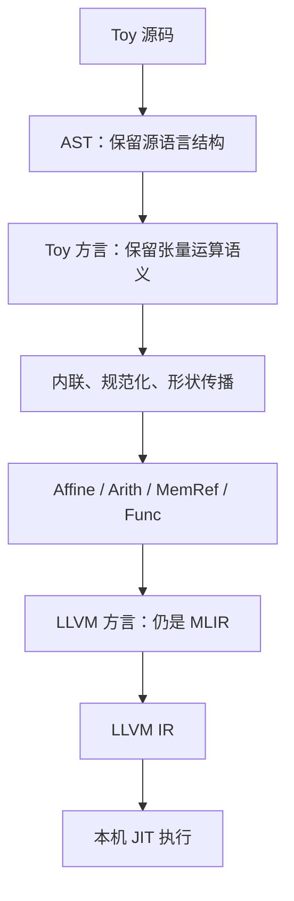

# 第 0 章：开课准备——先建立全局地图

本章是扩充教材的前置内容。它不要求你先写一个编译器，而是先弄清楚文件在哪里、每一步处理什么，以及怎样观察正确性。

## 1. 为什么需要不止一种中间表示

考虑 `transpose(transpose(a))`。在保留张量语义的表示里，两次转置相互抵消，容易写成一条重写规则。若一开始就展开成缓冲区、嵌套循环和指针运算，这个关系会埋进许多 load/store 中，分析难度显著增加。

另一方面，处理器不认识“转置一个 tensor”。要执行程序，迟早要决定索引、存储、分支和调用方式。所以问题不是选择高层或低层中的一个，而是在适当阶段使用适当表示。



MLIR 是可扩展的 IR 基础设施；LLVM 方言是其中一种方言；LLVM IR 是 LLVM 后端自己的表示。不要将三者视为同一个名字的不同写法。Toy 只是演示这套设计的一种小语言，不是 MLIR 的标准输入语言。

## 2. 七份 toyc 是七个教学阶段

本地目录不是七个互相动态加载的插件，而是七个逐步完善的编译器示例。各章有自己的 AST、Parser、Dialect 和驱动副本。运行 `toyc-ch2` 不会自动取得第 7 章的新类型支持。

| 章 | 输入到输出 | 新增加的能力 |
|---|---|---|
| 1 | Toy→AST | 词法和语法分析 |
| 2 | AST→Toy MLIR | 方言、操作、ODS、验证和文本格式 |
| 3 | Toy MLIR→简化的 Toy MLIR | C++ pattern 和声明式重写 |
| 4 | 跨函数 Toy→可推断 shape 的 Toy | 接口、内联、函数内形状推断 |
| 5 | Toy→Affine 等混合 IR | 显式缓冲区与循环，暂留打印 |
| 6 | 混合 IR→LLVM→执行 | 完整转换、翻译接口、JIT |
| 7 | 含结构体的 Toy→旧后端 | 参数化类型、字段访问、常量折叠 |

这里“shape 推断”是教学用受限实现：它常通过传播输入的有秩类型完成工作，不是任意动态维度的求解器。源语言泛型也主要通过内联处理，不是一个缓存每种调用签名的专门化系统。

## 3. 在开始前，分清三个时刻

| 时刻 | 正在运行什么 | 此时处理的数据 |
|---|---|---|
| 构建编译器 | CMake/Ninja、C++ 编译器、mlir-tblgen | toyc 的 C++ 与 TableGen 定义 |
| 编译 Toy 程序 | toyc-chN | 用户的 Toy 源码、AST、MLIR/LLVM IR |
| 执行 Toy 程序 | JIT 生成的本机函数 | 张量元素、内存、打印调用 |

例如 TableGen 的 `-gen-rewriters` 在第一个时刻生成 C++；生成的 pattern 在第二个时刻匹配和改写 IR；lowering 创建的循环在第三个时刻遍历数据。C++ 中用递归函数生成 store，不代表最终 Toy 程序里一定有递归。

许多“这段代码什么时候执行”的困惑，都可以通过把它放入这三行中的一行来解决。

## 4. 本地版本与目录地图

本教材锁定：

```text
/opt/llvm-project
  分支：release/18.x
  提交：3b5b5c1ec4a3095ab096dd780e84d7ab81f3d7ff

mlir/docs/Tutorials/Toy/Ch-N.md       官方英文原文
mlir/examples/toy/ChN/               各章实现
mlir/test/Examples/Toy/ChN/          各章输入和 FileCheck 预期
```

以第 6 章为例（列出与教材直接相关的源码；省略各层 CMakeLists.txt）：

```text
Ch6/
├─ toyc.cpp                     命令行与 pass 流水线、导出/JIT
├─ include/toy/
│  ├─ AST.h / Lexer.h / Parser.h
│  ├─ Dialect.h / Ops.td        方言与操作定义
│  ├─ MLIRGen.h                AST 到 MLIR 的生成器入口
│  ├─ ShapeInferenceInterface.h  形状推断接口的 C++ 入口
│  ├─ ShapeInferenceInterface.td  形状推断接口的 TableGen 定义
│  └─ Passes.h                 pass 工厂声明
├─ parser/AST.cpp              AST 打印
└─ mlir/
   ├─ MLIRGen.cpp              AST 到 Toy IR
   ├─ Dialect.cpp              操作实现、接口与验证
   ├─ ToyCombine.cpp / .td     重写规则
   ├─ ShapeInferencePass.cpp   形状传播
   ├─ LowerToAffineLoops.cpp   Tensor 到循环/缓冲区
   └─ LowerToLLVM.cpp          完整 LLVM lowering
```

`.inc` 文件多由 TableGen 生成，通常位于**构建目录**的对应子目录；源码检出中找不到 `Ops.cpp.inc` 并不意味着仓库漏了文件。不要手工创建空的 inc 来绕过报错，也不要把第 7 章生成的文件拷给第 2 章。

## 5. 优先复用已有构建

2026-09-13 实测确认 `/opt/llvm-project/build/bin/toyc-ch1` 到 `toyc-ch7` 全部可用，版本为 LLVM 18.1.8。现有 CMake 缓存为 `LLVM_ENABLE_PROJECTS=clang;mlir;clang-tools-extra`、`LLVM_BUILD_EXAMPLES=ON`、`LLVM_INCLUDE_EXAMPLES=ON`、`LLVM_TARGETS_TO_BUILD=BPF;Native`、`CMAKE_BUILD_TYPE=Debug`、`LLVM_ENABLE_ASSERTIONS=ON`。第 6、7 章 JIT 已执行成功，直接使用这个构建即可。此前“现有 build 未启用 MLIR”的记录已过时。

```bash
export TOY_BUILD=/opt/llvm-project/build
for chapter in 1 2 3 4 5 6 7; do
  test -x "$TOY_BUILD/bin/toyc-ch$chapter" || break
done
"$TOY_BUILD/bin/toyc-ch7" --version
```

后续各章先检查已有工具，不会自动调用构建。只有缺少二进制、修改过相关源码或发现版本不匹配时，才需要考虑补建相应目标。

### 5.1 仅在没有可用构建时，配置独立目录

下面保留从零准备环境的方法；本次验证没有执行这些配置或构建命令。先确认系统已有可用的 C++ 工具链、CMake、Ninja 和 Python 3；可以读出工具版本：

```bash
cmake --version
ninja --version
clang++ --version
python3 --version
```

本地 LLVM 的具体依赖要求应查看 [llvm/CMakeLists.txt](/opt/llvm-project/llvm/CMakeLists.txt)，不要仅以网络上另一版本的最低要求判断。这里不要求额外检出新的 llvm-project，也不要求更新当前 release/18.x 源码。

若确实需要独立构建，可在本知识库的任意目录中执行下面的命令；`git rev-parse --show-toplevel` 用于定位仓库根目录。构建产物放在仓库根目录的 `build-llvm18/`，已由 `.gitignore` 排除。已有可用 `/opt/llvm-project/build` 时跳过此块，避免重新设置 TOY_BUILD 或开始耗时构建。

```bash
export TOY_BUILD="$(git rev-parse --show-toplevel)/build-llvm18"

cmake -G Ninja -S /opt/llvm-project/llvm -B "$TOY_BUILD" \
  -DLLVM_ENABLE_PROJECTS=mlir \
  -DLLVM_BUILD_EXAMPLES=ON \
  -DLLVM_TARGETS_TO_BUILD=Native \
  -DCMAKE_BUILD_TYPE=Release \
  -DLLVM_ENABLE_ASSERTIONS=ON

cmake --build "$TOY_BUILD" --target Toy mlir-opt mlir-tblgen FileCheck --parallel 2
```

配置前确认这个新目录没有用于其他配置；若已有不同用途，换一个新的目录名。并行度 2 是便于控制内存的起点，不是必须值；LLVM 链接可能消耗较多内存和磁盘，按机器资源调整，不必为了本教材构建所有目标后端。

这些选项各有职责：

- `LLVM_ENABLE_PROJECTS=mlir`：把 MLIR 加入 LLVM 联合构建。
- `LLVM_BUILD_EXAMPLES=ON`：构建示例代码。
- `LLVM_TARGETS_TO_BUILD=Native`：包含宿主目标，支持本机代码生成。
- `Release`：采用优化构建，减少教学工具运行开销。
- `LLVM_ENABLE_ASSERTIONS=ON`：保留开发检查，有利于发现违反内部假设的用法。

Toy 聚合目标来自 [examples/toy/CMakeLists.txt](/opt/llvm-project/mlir/examples/toy/CMakeLists.txt)，依赖各章 toyc。也可以将构建目标缩小为 `toyc-ch1 toyc-ch2`，先学前两章。

本地 [mlir/CMakeLists.txt](/opt/llvm-project/mlir/CMakeLists.txt:100) 根据原生目标是否在构建列表中设置 `MLIR_ENABLE_EXECUTION_ENGINE`；第 6、7 章 CMake 在引擎不可用时直接返回。因此这里通过 Native 目标启用 JIT 路径，不把另一个版本的 CMake 开关用法生搬过来。

## 6. 先做最小验证，再运行后续章节

确认工具存在后，先检查入口，再运行一个最简单的官方文件：

```bash
"$TOY_BUILD/bin/toyc-ch1" --help
"$TOY_BUILD/bin/toyc-ch1" /opt/llvm-project/mlir/test/Examples/Toy/Ch1/ast.toy -emit=ast
"$TOY_BUILD/bin/toyc-ch2" /opt/llvm-project/mlir/test/Examples/Toy/Ch2/codegen.toy -emit=mlir
```

每打开一个新终端，都需要重新设置 `TOY_BUILD`，或由你自己的 shell 配置保存它。其他章节统一使用这个变量，不能省略后假定 `/bin/toyc-chN` 存在。

驱动依据 `.mlir` 扩展名或 `-x=mlir` 选择 MLIR 输入。若通过 stdin 输入 MLIR，应显式设置输入类型。默认的 mlir-opt 没有注册教学 Toy 方言，不能把“mlir-opt 认识 MLIR”理解成它认识所有自定义操作；处理本教程 Toy IR 优先使用对应 toyc。

AST、MLIR 和 LLVM IR 的 dump 在本地驱动中写 stderr，JIT 程序的 printf 输出写 stdout。例如：

```bash
"$TOY_BUILD/bin/toyc-ch2" /opt/llvm-project/mlir/test/Examples/Toy/Ch2/codegen.toy -emit=mlir 2> generated.mlir
"$TOY_BUILD/bin/toyc-ch2" generated.mlir -emit=mlir 2> reparsed.mlir
diff -u generated.mlir reparsed.mlir
```

这些命令会写当前目录中的实验文件；已有同名文件时重定向会覆盖，实践时请选自己的实验目录。每一步先确认命令成功，避免把诊断文字当成 IR 再次输入。

## 7. 怎样读官方测试，不把 CHECK 当作程序

官方测试文件通常同时包含真实输入和注释中的测试规则。`RUN:` 告诉测试框架如何运行工具，`%s` 代表当前测试文件；`CHECK:` 告诉 FileCheck 在输出中寻找什么。它们不是 Toy 语言关键字。

例如可手工复现结构体优化检查；以下是构建后可执行的命令：

```bash
set -o pipefail
"$TOY_BUILD/bin/toyc-ch7" /opt/llvm-project/mlir/test/Examples/Toy/Ch7/struct-opt.mlir -emit=mlir -opt 2>&1 \
  | "$TOY_BUILD/bin/FileCheck" /opt/llvm-project/mlir/test/Examples/Toy/Ch7/struct-opt.mlir
```

`2>&1` 让 FileCheck 读到 stderr 中的 IR。`pipefail` 使流水线不会只报告最后一条命令的状态。成功时 FileCheck 通常静默退出；失败时应读第一处匹配差异，而不是直接修改 CHECK 让测试迁就错误输出。

CHECK 常用正则捕获 SSA 名字，是为了避免依赖不稳定的编号。它验证关键结构，并不等于针对任意输入的语义证明。教材中的新示意例子也不因为使用相同语法就自动成为已执行的测试。

## 8. 排错时先定位层次

| 症状 | 首先检查 |
|---|---|
| 找不到 toyc 二进制 | TOY_BUILD 是否设置、目标是否构建、是否启用 examples |
| 第 6/7 章目标不存在 | Native 后端和 execution engine 条件 |
| include 的 inc 文件缺失 | TableGen 依赖、构建 include 路径、是否混用了章节 |
| 解析 Toy 失败 | Lexer/Parser 支持的语法，源码位置与错误 token |
| 未知 toy 操作 | 是否使用了对应章节的 toyc，是否正确选择 MLIR 输入 |
| shape inference 失败 | 操作是否实现接口，输入类型是否能按依赖顺序变为有秩 |
| Affine conversion 失败 | 是否仍有不支持的 Toy 操作或非静态 shape |
| JIT 失败 | LLVM lowering、翻译、宿主目标、外部符号与入口签名 |

需要观察 pass 的前后变化时，可加入 `-mlir-disable-threading -mlir-print-ir-after-all`。调试输出与最终 IR 都写 stderr，此时文件是“诊断日志”，不是可直接重新解析的单份模块。

## 9. 术语预备与自测

SSA 指每个 SSA 值只定义一次；这不意味着整个程序不能循环或不能修改内存。Operation 是统一的 IR 单元，既可表达计算，也可表达函数等结构。Region/Block 组织嵌套与控制流。Pass 操作一层 IR；Pattern 描述局部匹配与改写；Dialect 给某领域的操作、类型和属性提供语义。

先回答三个问题，再读第 1 章：

1. 两次转置应该优先在哪层消掉？——保留 Toy 张量语义时最直接。
2. 生成重写规则的 TableGen 与执行重写的 toyc 是同一时刻吗？——不是，前者构建编译器，后者编译用户程序。
3. 生成 LLVM 方言 IR 就算运行了吗？——还没有，需要翻译和后端执行流程。

读不懂某个 C++ 模板时，先确认它属于“描述 IR”“生成 IR”还是“变换 IR”。有了这个定位，再读模板参数和接口，通常比从语法细节逐词猜用途更有效。

<a id="code-lab"></a>

## 10. 建立一套可反复使用的实验工作流

后面每章的“关键代码与实验”都只选当前阶段的入口和转换点。第一次实验前先按 §5 确认已有工具，再从本知识库的任意目录中，在同一个终端设置：

```bash
export TOY_ROOT="$(git rev-parse --show-toplevel)/mlir/toy"
export TOY_BUILD=/opt/llvm-project/build
export TOY_LAB="$(mktemp -d /tmp/mlir-toy-lab.XXXXXX)"
printf '教材目录：%s\n构建目录：%s\n实验输出：%s\n' "$TOY_ROOT" "$TOY_BUILD" "$TOY_LAB"
```

TOY_ROOT 指向教材与独立实验输入所在的 `mlir/toy/`。如果实际使用其他构建目录，应修改 TOY_BUILD 的值。TOY_LAB 是新建的独立临时目录，用来保存各阶段 IR，不会覆盖教材或 LLVM 的测试输入。关闭终端后变量不会自动保留；需要长期保存结果时，由你将这个目录复制到合适位置。后续命令都假设这三个变量已设置。

### 10.1 每次先检查当前要观察的工具

```bash
test -x "$TOY_BUILD/bin/toyc-ch1"
test -x "$TOY_BUILD/bin/FileCheck"
"$TOY_BUILD/bin/toyc-ch1" --help
```

检查失败时先确认 TOY_BUILD 是否指向正确目录，再决定是否按 §5.1 补建缺少的目标。学习第 N 章时，将命令换成对应的 toyc-chN；FileCheck 是验证预期文本的辅助程序，不参与生成 Toy IR。

### 10.2 读源码时先找函数，再看局部实现

例如研究第 2 章的变量声明：

```bash
rg -n 'mlirGen\(VarDeclExprAST|create<ReshapeOp>|declare\(' \
  /opt/llvm-project/mlir/examples/toy/Ch2/mlir/MLIRGen.cpp
sed -n '379,405p' /opt/llvm-project/mlir/examples/toy/Ch2/mlir/MLIRGen.cpp
```

第一条用于定位入口、关键操作创建和符号登记；第二条只展开本版本的相关实现。按“调用者 → 当前方法 → 创建的操作”阅读，比从文件首行顺着 include 一直读下去更容易把握执行顺序。源码变化后，先重新搜索，不要盲用旧行号。

### 10.3 把一次实验分成输入、阶段和判据

例如查看 AST，三个部分分别是 ast.toy、-emit=ast、输出中函数/表达式的嵌套关系：

```bash
if "$TOY_BUILD/bin/toyc-ch1" \
  /opt/llvm-project/mlir/test/Examples/Toy/Ch1/ast.toy \
  -emit=ast 2> "$TOY_LAB/ch1-ast.txt"; then
  sed -n '1,45p' "$TOY_LAB/ch1-ast.txt"
else
  sed -n '1,80p' "$TOY_LAB/ch1-ast.txt"
fi
```

成功和失败都读取同一个 stderr 文件，但解读不同：成功时是 AST，失败时可能只是诊断。若用管道连接 FileCheck，先设置 `set -o pipefail`；若用 diff 比较 IR，退出码 1 表示不同，不等于工具崩溃。

2026-09-13 已复用现有构建逐章运行实验、两个新增输入与 Toy JIT；结果见 [运行验证报告](RUNTIME-VALIDATION.md)。报告区分正常成功、预期失败及仅作讲解的片段，没有重新构建 LLVM。
